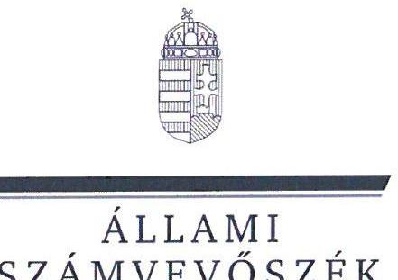
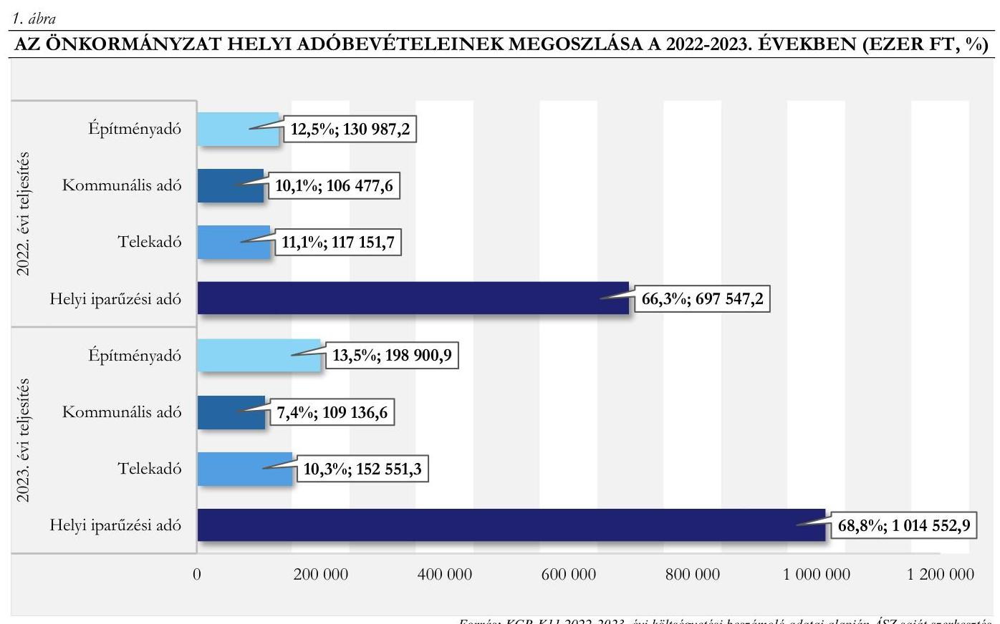
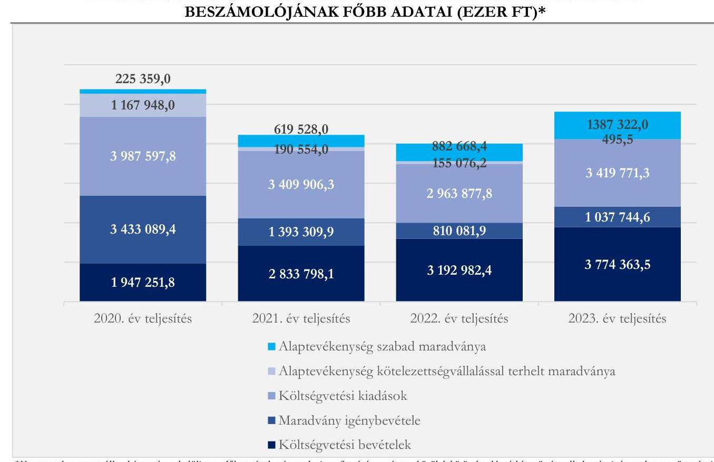
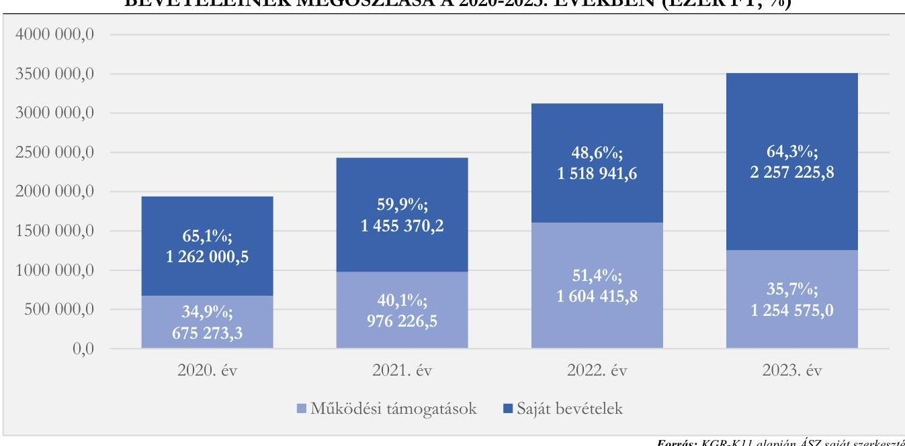

# JELENTÉS 

## Az önkormányzatok helyi adóztatási tevékenységének ellenőrzése - Ingatlanadóztatás

Budakalász Város Önkormányzata

2025.

---

ÁLLAMI
SZÁMVEVÔSZÉK

# JELENTÉS 

## Az önkormányzatok helyi adóztatási tevékenységének ellenőrzése - Ingatlanadóztatás

Budakalász Város Önkormányzata

2025.

---

# ELLENŐRZÉSI IGAZGATÓSÁG: 

## ÁLLAMHÁZTARTÁS HELYI SZINTJÉT ELLENŐRZŐ IGAZGATÓSÁG

## ELLENŐRZÉSI IGAZGATÓ:

DR. BAFFIA GERGELY GÁBOR ellenőrzési igazgató

## ELLENŐRZÉSVEZETŐ:

Jelentéseink az interneten a www.asz.hu címen olvashatók.

KANYÓ LŐRÁNT ISTVÁN ellenőrzésvezető

IKTATÓSZÁM: EL-4040-025/2025
TÉMASORSZÁM: 54
ELLENŐRZÉS-AZONOSÍTÓ SZÁM: V1084

---

# TARTALOMJEGYZÉK 

AZ ELLENŐRZÉS ALAPADATAI ..... 5
AZ ELLENŐRZÉS TERÜLETE ÉS AZ ELLENŐRZÖTT SZERVEZET ..... 7
ÖSSZEFOGLALÁS ..... 9
AZ ELLENŐRZÉS FÓKUSZKÉRDÉSEI ..... 11
MEGÁLLAPÍTÁSOK ..... 12
JAVASLATOK ..... 29
MELLÉKLETEK ..... 31
I. sz. melléklet: Értelmező szótár ..... 31
II. sz. melléklet: Az ellenőrzött szervezetek jegyzéke ..... 32
III. sz. melléklet: Ellenőrzési kritériumok ..... 33
IV. sz. melléklet: A helyi ingatlanadótárgyak és adóalanyok a 2023. és a 2024. évben ..... 36
FÜGGELÉK: ÉSZREVÉTELEK ..... 37
RÖVIDÍTÉSEK JEGYZÉKE ..... 38

---

.

---

# AZ ELLENŐRZÉS ALAPADATAI 

## AZ ELLENŐRZÉS CÉLJA

Az ellenőrzés célja az volt, hogy értékelje Budakalász város helyi ingatlanadóztatásának és adóhatósága feladatellátásának szabályszerűségét, célszerűségét és eredményességét. További cél volt, hogy az ellenőrzés megállapításai és következtetései segítsék az önkormányzati képviselő-testületeket a jogszabályokkal és a helyi sajátosságokkal összhangban álló helyi adópolitika kialakításában és az azt végrehajtó adóigazgatási szervezet megszervezésében. Az ellenőrzés célja volt továbbá annak megállapítása is, hogy az Önkormányzat ${ }^{1}$ által bevezetett, ingatlanokat terhelő helyi adókra vonatkozó rendeleti szabályok összhangban vannak-e a helyi adópolitikai célokkal, tartalmuk tükrözi-e a település helyi sajátosságait és az adóhatósági feladatellátás biztosítja-e az önkormányzati bevételek feltárását és beszedését.

Ennek keretében az ÁSZ ${ }^{2}$ értékelte, hogy az Önkormányzat által bevezetett, ingatlanokat terhelő helyi adókról szóló adórendelet ${ }^{3}$, valamint az adóhatóság ${ }^{4}$ döntései, adóztatási gyakorlata a vonatkozó jogszabályokkal összhangban állnak-e.

## AZ ELLENŐRZÉS TÍPUSA

Kombinált ellenőrzés.

## AZ ELLENŐRZŐTT IDŐSZAK

Az 1. fókuszkérdésnél a 2023. év, valamint a 2024. évnek az ellenőrzés megkezdését megelőző napjáig (2024. április 11.) tartó időszaka.

A 2. és 3. fókuszkérdésnél a 2023. év, valamint a 2024. évnek az ellenőrzés megkezdését megelőző napjáig (2024. április 11.) tartó időszaka, a 2020-2022. évek adatainak bázisadatként való felhasználásával.

## AZ ELLENŐRZÉS TÁRGYA

Az Önkormányzat képviselő-testület ${ }^{5}$-ének ingatlanokat terhelő helyi adókkal, azaz az építményadóval, a telekadóval és a magánszemély kommunális adójával kapcsolatos rendeletalkotási tevékenységének és az adóhatóság tevékenységének az ellátása.

Az ellenőrzés kiterjedt minden olyan körülményre és adatra, amely az ÁSZ jogszabályban meghatározott feladatainak teljesítéséhez, valamint az ellenőrzési program végrehajtása folyamán felmerült újabb összefüggések feltárásához szükséges.

## AZ ELLENŐRZÉS JOGALAPJA

Az ellenőrzés jogszabályi alapját az ÁSZ tv. ${ }^{6}$ 5. § (8) bekezdésének előírásai képezik.

---

# AZ ELLENŐRZÉS MÓDSZERE 

Az ellenőrzést az ellenőrzési program szempontjai, az ellenőrzött időszakban hatályos jogszabályok, az ellenőrzés általános szakmai szabályai és az ellenőrzésre irányadó ÁSZ módszertanok alapján végezte az ÁSZ.

Az ellenőrzési kérdések megválaszolásához szükséges bizonyítékok megszerzése az ellenőrzött szervezetek által rendelkezésre bocsátott dokumentumokra, adatokra és az ASP ${ }^{\top}$ Adó és az Iratkezelő szakrendszerek, illetve a KGR-K11 ${ }^{8}$ számviteli adatgyűjtő rendszer adataira alapozva megfigyelés, szemle (szemrevételezés), kérdésfeltevés (információkérés), mintavételezés, valamint elemző eljárás útján történt. Emellett az ellenőrzési bizonyítékként felhasználható adatforrások közé tartozott minden egyéb - az ellenőrzés folyamán feltárt, az ellenőrzés szempontjából információt tartalmazó - releváns dokumentum (ideértve különösen a helyszíni ellenőrzésről készült jegyzőkönyvet) is.

Az ellenőrzés lefolytatásához az ellenőrzött szervezet a tanúsítványok kitöltésével, valamint az ÁSZ által kért dokumentumok, adatok, információk megküldésével és az ellenőrzés során szolgáltatott adatokat.

Az ÁSZ az adómegállapítás, a fizetési kedvezmények engedélyezése és a hátralékok beszedésének szabályszerűségét mintavételi eljárással ellenőrizte. Ennek során az adóhatósági adómegállapítási feladatellátás ellenőrzése keretében 21 mintatétel (közte 39 adómegállapító határozat és két adófizetési kötelezettség törlését elrendelő határozat), a fizetési kedvezmények engedélyezése tárgykörben négy mintatétel (négy határozat) értékelése történt meg, továbbá két mintatételben (közte két határozat) az ÁSZ a hátralékkezelés teljes dokumentációját is ellenőrizte. A mintatételek kiválasztása véletlenszerűen történt az adóhatóság nyilvántartásában lévő adótárgyak és ügyek közül tíz - adómegállapításra vonatkozó - mintatétel kivételével, amelyek esetében a kiválasztás címadatok alapján történt annak érdekében, hogy feltárható legyen, volt-e olyan adótárgy, amelyet nem adóztatott az adóhatóság. Az ellenőrzött mintatételekre vonatkozó megállapítások nem vetíthetők ki a teljes sokaságra, a megállapításokat az ÁSZ az adott ellenőrzött mintatételek vonatkozásában tette meg.

Az ÁSZ a helyi adópolitikai elképzelések és a települési sajátosságok feltárásával értékelte, hogy az adórendelet e szempontoknak mennyiben felelt meg. Az ÁSZ a helyi adópolitikai célokkal akkor tekintette összhangban állónak az adórendeletet, ha az hatását tekintve támogatta az adópolitikai célok teljesülését.

Az ÁSZ az adóhatósági feladatellátás szabályszerűségéből, a meglévő kapacitásokból, valamint az ezer forint adóbevételre jutó adóhatósági költségek alakulásából következtetett arra, hogy az adóhatóság rendelkezett-e azzal a potenciállal, amellyel eredményesen tudta a helyi adópolitikát végrehajtani.

Az ÁSZ - az adórendelet szabályainak érvényre juttatása körében - az eredményesség véleményezésekor a III. számú melléklet 2. pontjában foglalt szempontokat tekintette mérvadónak.

---

# AZ ELLENŐRZÉS TERÜLETE ÉS AZ ELLENŐRZÖTT SZERVEZET 

Budakalász Pest vármegyében, a Szentendrei járásban található, a Duna jobb partján terül el. A budapesti agglomeráció északnyugati szektorának településeként közvetlenül határos Budapesttel. A település városi rangját 2009 nyarán nyerte el. Lakosainak száma - a $\mathrm{BM}^{9}$ adatai szerint - 2020. év elején 11601 fő, 2024. év elején 12238 fő volt. A lakások száma a 2020. évi 4342 darabról a 2023. évre 4 564-re emelkedett. A mai lakosságszám kialakulását befolyásolta főként a fővárosból kitelepülők száma.

A város kisvárosi jellegű, családi házas település. Budakalászon az ipari tevékenység

Budakalász Polgármesteri Hivatal

Fonrás: https://www.budakalasz.hu/wp-content/themes/budakalasz/lib/imthumb/imthumb.php?src=https://www.budakalasz.hu/w p-content/uploads/2022/07/Narosha3al00s.jpg\&w=350\&h=200\&a=c\&ct=1
érdemben nem volt jellemző, viszont az utóbbi másfél évtizedben számos hipermarket, nagyáruház és kereskedelmi egység települt le a kedvező logisztikai feltételek és a főváros közelsége miatt. A TeIR ${ }^{10}$ adatai alapján Budakalászon 2023. december 31-én 2600 gazdasági szervezet működött, melyek 55,5\%-a 1-9 főt foglalkoztató vállalkozás volt. A szolgáltató vállalkozások aránya $75,0 \%$-ot tett ki, a számuk a 2023. év végére (2020. december 31-ei állapothoz viszonyítva) 9,6\%-kal nőtt (1 951 darab lett). Az egy före jutó személyi jövedelemadó-alap összege a 2022. évben a TeIR adatai szerint 3119,5 ezer Ft volt, mely meghaladta mind az országos átlagot (2 268,8 ezer Ft), mind a vármegyei átlagot (2 617,7 ezer Ft), valamint a fővárosi átlagot (3 026,7 ezer Ft) is.

Az Önkormányzatnak - a Hivatal ${ }^{11}$ mellett - öt költségvetési szerve volt, amelyek óvodai nevelést, szociális, kulturális és bölcsődei feladatokat láttak el. Emellett az Önkormányzat kizárólagos tulajdonában álló KALÁZ Kft. ${ }^{12}$ közfeladata volt az Önkormányzat saját tulajdonú és bérelt ingatlanainak bérbeadása, üzemeltetése.

Az Alaptörvény ${ }^{13}$ értelmében a helyi önkormányzat a helyi közügyek intézése körében törvény keretei között dönt a helyi adók fajtájáról és mértékéről. Az Mötv. ${ }^{14}$ rögzíti, hogy a helyi adóval kapcsolatos feladatok ellátása a helyi önkormányzatok feladata.

Az Önkormányzat képviselő-testülete a Htv. ${ }^{15}$ 1. $\S$ (1) bekezdésében foglalt felhatalmazással élve az Önkormányzat illetékességi területén az adórendelettel mindhárom, ingatlanokat terhelő helyi adót bevezette. Az adórendeletnek az ellenőrzött időszakban hatályos szövege 2023. január 1-jétől élt.

A magánszemély kommunális adójának adómértéke az ellenőrzött időszakban adótárgyanként évi 24,0 ezer Ft, a 2023. évi törvényi adómaximum 70,9\%-a, a 2024. évi törvényi adómaximum 61,9\%-a volt, mely alól tartós fogyatékosság, csatornázással kapcsolatos beruházások, illetve az építményadóban fennálló adóalanyiság esetén biztosított mentességet az adórendelet.

---

Az építményadó mértéke 1,5 ezer $\mathbf{F t} / \mathbf{m}^{2}$, a telekadó mértéke beépítettség, illetve beépíthetőség szerint differenciált volt ${ }^{1}$.

Az adóhatóság által beszedett, ingatlanok adóztatásából származó bevételek, a helyi adóbevételeken belül fontos szerepet játszottak a települési feladatok finanszírozásában. A 2023. évben 460 588,8 ezer Ft bevétel származott az ingatlanadókból, ami az államháztartáson belülről kapott felhalmozási célú támogatásokkal és szolidaritási hozzájárulással csökkentett költségvetési bevételek $\mathbf{1 3 , 7 \% - a ́ t ,}$ a - befizetett szolidaritási hozzájárulással csökkentett - települési helyi adóbevételek $\mathbf{3 5 , 0 \% - a ́ t}$ tette ki. Az Önkormányzat helyi adóbevételei 2022. és 2023. évi összetételére vonatkozó adatokat az 1. ábra, a helyi ingatlanadók 2023. és 2024. évre vonatkozó jellemző naturális adatait pedig a $I V$. számú melléklet mutatja be.

Forrás: KGR-K11 2022-2023. évi költségvetési beszámoló adatai alapján ÁSZ saját szerkesztés

[^0]
[^0]:    ${ }^{1}$ A beépített telek esetén évi $260,0 \mathrm{Ft} / \mathrm{m}^{2}$, beépítetlen, de beépíthető telek esetén évi $325,0 \mathrm{Ft} / \mathrm{m}^{2}$, nem beépíthető telkek esetében évi $130,0 \mathrm{Ft} / \mathrm{m}^{2}$ volt az adó mértéke.

---

# ÖSSZEFOGLALÁS 

Az ÁSZ tv. értelmében az ÁSZ feladatkörébe tartozik az önkormányzatok adóztatási tevékenységének ellenőrzése. A helyi adók az önkormányzatok saját, el nem vonható bevételét képezik, így az önkormányzatok gazdasági önállósága szempontjából különös fontossággal bír, hogy a helyi adórendeleti szabályok összhangban álljanak a magasabb szintű jogszabályokkal, továbbá az önkormányzati adóhatósági tevékenység jogszerú, eredményes és hatékony legyen. Erre figyelemmel volt tárgya az ÁSZ ellenőrzésének az Önkormányzat adórendelet-alkotási tevékenysége és az adóhatósági feladatellátás is.

Az adórendelet több ponton nem volt összhangban a magasabb szintű jogszabályokkal. Az adóhatóság adóalany- és adótárgyfeltárásra irányuló feladatellátása nem volt eredményes, az adómegállapító határozatok nem minden esetben feleltek meg a jogszabályi előirásoknak. A fizetési kedvezményekre irányuló eljárásban hozott határozatok szabályszerűek voltak. Az adóhatóság adóbehajtási tevékenysége eredményes volt, ugyanakkor nem minősült szabályszerűnek.

Az adóztatási kiadások magasak voltak az adóbevételhez képest, de nem haladták meg az adóztatási kiadások referencia-érték maximumát. Az adóhatóság ingatlanadóztatással összefüggő feladatellátási mutatói összességében kedvezőtlenebbek voltak az ÁSZ által ellenőrzött nyolc város ${ }^{2}$ feladatellátási mutatóinak átlagos értékeinél.

Az Önkormányzat jegyzője a jelentéstervezetre tett észrevételében arról adott tájékoztatást, hogy intézkedéseket tett az ellenőrzés által feltárt hiányosságok megszüntetése érdekében, ezáltal az ÁSZ megállapításai egy része hasznosult.

## Adórendelet, adórendelet-alkotás

Az adórendelet nem volt összhangban a jogszabályi előírásokkal, mert szabályai egyrészt nem zárták ki, hogy a magánszemély adóalanyok egyes adótárgyai után egyidejűleg keletkezzék adófizetési kötelezettség magánszemély kommunális adójában és telekadóban is. Másrészt az adórendelet mentességet biztosított az építmény-, illetve telekadó alól az Önkormányzat 100\%-os tulajdonában álló gazdasági társaság, továbbá egészségügyi tevékenységet ellátó nonprofit formában múködő szervezetek egyes adótárgyaira. Emellett az adórendelet több nem egyértelmú, ezáltal vitatható rendelkezést tartalmazott.

Az ingatlanokat terhelő helyi adókra vonatkozó rendeleti szabályozás megalkotása során az Önkormányzat mérlegelte a helyi sajátosságokat, az Önkormányzat gazdasági követelményeit, valamint az adóalanyok teherviselő képességét.

## Az adóhatóság adóigazgatási feladatellátásának jogszerüsége, eredményessége

Az adóhatóság adótárgy-, és adóalany feltárási feladatellátása (ezáltal az adómegállapítási feladatellátása) célszerú volt, de nem volt eredményes, továbbá az adómegállapítási eljárásban hozott hatósági döntések esetében nem mindegyik határozat volt szabályszerú. Az adóhatóság adóztatási gyakorlata a magánszemélyek adótárgyai tekintetében eltért a rendeleti szabályoktól, ami arra vezethető vissza, hogy a rendeleti szabály nem tükrözte a jogalkotói szándékot.

[^0]
[^0]:    ${ }^{2}$ Az ÁSZ által jelen ellenőrzés alapjául szolgáló ellenőrzési program alapján ellenőrzött városok: Ajka, Balatonföldvár, Budakalász, Emőd, Paks, Ráckeve, Szigethalom és Tata.

---

Az adómegállapító határozatok indokolása nem felelt meg a jogszabályi előírásoknak, mert nem tartalmazta egyértelműen az adó összegének számszaki levezetését és jogalapját, ezáltal nehezítette az adóhatósági döntések értelmezését, e körülmények azonban a határozatokba foglalt fizetési kötelezettség jogszerüségét nem érintették.

Az adómegállapító határozatok kiadmányozása megfelelt, a kézbesítése azonban két kivétellel felelt meg a jogszabályoknak.

Az adóhatóság adatszolgáltatási- és közzétételi kötelezettségének eleget tett.
A fizetési kedvezményekre irányuló eljárásban hozott határozatok szabályszerűek voltak.
Az adóhatóság adóbehajtási (adóbeszedési) tevékenysége eredményes volt, de az ellenőrzött mintatételek tekintetében nem volt szabályszerű.

Adóellenőrzést az adóhatóság az ellenőrzött időszakban nem folytatott.
A₹ adórendelet adópolitikai célokkal való összhangja, az adórendelet hatása
Az Önkormányzat - a magyarországi városok ${ }^{3}$ 2023. évi konszolidált költségvetési beszámolóinak összegző adataival történő összehasonlítása alapján - erőteljesebben támaszkodott az ingatlanadó-bevételekre, a többi városi rangú településhez képest. Míg ugyanis a városok esetén országosan ezen bevételek konszolidált - államháztartáson belüli felhalmozási célú támogatások nélküli és a befizetett szolidaritási hozzájárulással csökkentett - költségvetési bevételeken belüli átlagos aránya $5,8 \%$, addig az Önkormányzat esetében ez 13,7\% volt a 2023. évben. A konszolidált költségvetési bevételeken belül a konszolidált saját bevételek aránya a 2020-2023. időszakban 48,6-65,1\% közötti érték volt (amennyiben nem vesszük figyelembe az államháztartáson belülről érkezett felhalmozási célú támogatási forrásokat). Az Önkormányzat gazdálkodási mozgásterét növelte a 2023. évtől összességében 29,9\%-os ingatlanadóbevétel-emelkedéssel járó adóváltoztatás.

Az Önkormányzat adórendeleti szabályai szövegezési hiba miatt nem voltak összhangban az adópolitikai célokkal. Az adórendelet módosítása a lakosság terheit nem növelve biztosított többletbevételt az Önkormányzat részére, s járult hozzá annak pénzügyi stabilitásához. Emellett a magánszemély kommunális adójában alkalmazott, az adómaximum 70\%-át meghaladó adómérték nem ösztönözött a betelepülésre, segített megőrizni Budakalász nyugodt kisvárosi hangulatát.

Ezzel együtt az adószint-emelkedéssel járó, 2023. január 1-jétől hatályos változtatások az adóalanyok többségének adóteherbíró-képességével összhangban voltak.

# Az adóhatósági kiadások 

Az adóhatóság a 2023. évben - szolidaritási hozzájárulással csökkentve - 1317 209,6 ezer Ft helyi adóbevételt realizált és számolt el költségvetési beszámolójában. Minden 1000 Ft beszedett helyi adóbevételre - az ÁSZ számítása szerint - 31,1 Ft adóztatási kiadás esett. Az ellenőrzött nyolc város átlaga 15,3 Ft, az adóztatási kiadás tapasztalati referencia-érték maximuma kivetéses adóztatás esetén $50,0 \mathrm{Ft}$ volt. Az Önkormányzat egy adótisztviselőjére a 2023. évben 351 224,2 ezer Ft helyi adóbevétel, 1 366,4 adótárgy és 1229,3 adóalany jutott. Ezek az értékek összességében kedvezőtlenebbek (kevesebb adóbevétel, adóalany és adótárgy jutott egy adótisztviselőre), mint az ÁSZ által ellenőrzött nyolc város átlaga (544 502,3 ezer Ft/adótisztviselő, illetve 1751,1 adótárgy/adótisztviselő, 1 461,7 adóalany/adótisztviselő).

[^0]
[^0]:    ${ }^{3}$ Az ÁSZ a városok alatt a 322 nem megyei jogú várost érti.

---

# AZ ELLENŐRZÉS FÓKUSZKÉRDÉSEI 

1.- Az önkormányzat ingatlanokat terhelő helyi adókra vonatkozó rendeleti szabályozása megfelelt-e a magasabb szintü jogszabályoknak?
2.- Az önkormányzati adóhatóság megfelelően és eredményesen látta-e el az ingatlanok adóztatásával kapcsolatos adóhatósági tevékenységeit?
3.- A településen megvalósuló helyi adóztatás támogatta-e a helyi adópolitikai célok teljesülését?

---

# MEGÁLLAPÍTÁSOK 

## 1. Az önkormányzat ingatlanokat terhelő helyi adókra vonatkozó rendeleti szabályozása megfelelte a magasabb szintű jogszabályoknak?

Összegző megállapítás

Az adórendelet több ponton nem volt összhangban a magasabb szintű jogszabályokkal, az egyértelmú értelmezhetőség követelménye nem teljesült valamennyi rendeleti elöírás esetén.
1.1. számú megállapítás

Az adórendelet két ponton nem volt összhangban a Htv. előírásaival, több rendelkezése sértette az egyértelmú értelmezhetőség Jat. ${ }^{16}$-ban megfogalmazott követelményét.

Az adórendelet - a Htv. 7. § a) pontjában ${ }^{4}$ foglalt előírás ellenére - nem tartalmazott olyan rendelkezést, mely kizárta, hogy a magánszemély adóalany telke után magánszemély kommunális adójában, illetve telekadóban is adóköteles legyen.
A Htv. 7. § e) pontjában előírtak ellenére - amely az uniós jogból fakadó állami támogatási elvekre és normákra figyelemmel rögzíti, hogy az önkormányzat az építményadóban és a telekadóban a vállalkozó számára adómentességet, adókedvezményt nem biztosíthat - az adórendelet 10. §-a mentességet biztosított az építményadó alól, 14. §-a mentességet biztosított a telekadó alól az Önkormányzat 100\%-os tulajdonában lévő gazdasági társaság, továbbá az egészségügyi tevékenységet ellátó nonprofit formában múködő szervezet részére azon a saját tulajdonában vagy használatában lévő ingatlan után, melyen székhelyet vagy telephelyet létesít, és szakmai tevékenységet folytat.
Az adórendelet az alábbi okokból fakadóan sértette - a Jat. 2. § (1) bekezdéséből következő - egyértelmű értelmezhetőség követelményét:
a) az adórendelet 4. § (4) bekezdése a)-b) és d) pontjai, mert azok alanyi oldalról rögzítették a mentességi tényállásokat (a mentesített adóalany valamennyi adótárgya mentes az adófizetési kötelezettség alól), azonban a jogalkotói szándék kizárólag a tárgyi mentesség biztosítása volt;

[^0]
[^0]:    ${ }^{4}$ A Htv. hivatkozott rendelkezése szerint egy adott adótárgy (épület, épületrész, telek) után csak egyféle ingatlant terhelő adóban keletkezhet fizetési kötelezettség (adótöbbszörözés tilalma). Ha az Önkormányzat múködteti a telekadót és a magánszemély kommunális adóját, akkor vagy mentességi szabállyal, vagy direkt rendelkezéssel kell biztosítania, hogy ne álljon elő többszörös adófizetés.

---

b) az adórendelet 4. $\int$ (4) bekezdése, mert több mentességi tényállást is nevesített (a)-e) pontok), azonban nem adott egyértelmű iránymutatást atekintetben, hogy azok együttesen igénybe vehetőek-e, s egymáshoz hogyan viszonyulnak ${ }^{5}$;
c) az adórendelet 4. $\int$ (4) bekezdés c) pontja, mert nem volt állapítható, hogy a bekezdésben foglalt további négy mentességi tényállás melyikére vonatkozó rendelkezést tartalmazott;
d) az adórendelet 4. $\int$ (4) bekezdés d) pontja, mert a jogalkotói ${ }^{6}$ szándék ellenére - azáltal, hogy mentességet biztosított a magánszemély kommunális adója alól annak, aki magánszemélyként az építményadó alanya - valamennyi építményt mentesített a magánszemély kommunális adója adónemben az adófizetési kötelezettség alól ${ }^{7}$, így a rendelet alapján magánszemély kommunális adóját csak a telkek, valamint a nem magánszemély tulajdonában álló lakásokon fennálló bérleti jog után kellett volna fizetnie a magánszemély adóalanyoknak;
e) az adórendelet 8. $\int$ (1) bekezdése, mert értelemzavaró szóismétlést tartalmazott, mikor rögzíti, hogy az építményadó alapja az építmény négyzetméterben számított adóköteles alapterülete hasznos alapterülete;
f) az adórendelet 8. $\int$ (2) bekezdése, mert az építményadóban általános és általánostól eltérő adómértéket is megállapított, holott ezek értéke azonos.
Az Önkormányzat az Ász tv. 29. § (2) bekezdésében foglaltak szerint tett észrevételében azt a tájékoztatást adta, hogy az adórendelet 4. § (4) bekezdését módosította, így 2025. január 1-jétől annak a fenti megállításokban említett a) pontjának szövege változott, b)-d) pontjai pedig hatálytalanok.
1.2. számú megállapítás

Az Önkormányzat az adórendelet megalkotása során mérlegelte, hogy a rendeleti szabályoknak tükröznie kell a helyi sajátosságokat, az Önkormányzat gazdálkodási követelményét, és - az adóalanyok széles körét érintően - az adóalanyok teherviselő képességét.

A Htv. 7. § g) pontjában rögzített adómegállapítási korlátokból az következik, hogy a rendelet hatályossága idején is érvényre kell jutnia az e pontban szabályozott rendeletalkotási elveknek, azaz annak, hogy települési önkormányzat az adóalap fajtáját, az adó mértékét, a rendeleti adómentességet és adókedvezményt úgy állapíthatja meg, hogy azok összességükben egyaránt megfeleljenek

[^0]
[^0]:    ${ }^{5}$ Az Adórendelet 4. § (4) bekezdése a) és b) pontja arra az esetre vonatkozott, ha az adóalany csatornatársulat tagja vagy megállapodás alapján hozzájárult a szennyvízcsatorna-hálózat kiépítéséhez. A bekezdés d) pontja azt a magánszemélyt mentesítette, aki az építményadó alanya, az e) pont pedig a tartósan súlyos fogyatékossággal élő személyt. Ehhez képest a bekezdés c) pontja azt mondta ki, hogy „ez a mentesség a társulati tagdij vagy a megfizetett hozzájárulás és a beköttés szúmlával igazodt költségei öszzgejéj terjedhet, ha a tulajdonban lérő ingatlan nem beépíthető." Nem világos tehát, hogy a c) pontban foglalt korlátozás melyik mentességi tényállásra vonatkozott.
    ${ }^{6}$ A jogalkotói szándék az Önkormányzat nyilatkozata alapján az volt, hogy magánszemélyt csak magánszemély kommunális adója, vállalkozót pedig építményadó és telekadó fizetési kötelezettség terheljen, ez támasztja alá azt is, hogy a Htv. 7. § g) pontjában foglaltak vizsgálatakor az Önkormányzat a magánszemélyek teherviselő képességét a kommunális adó viszonylatában vizsgálta, illetve a Gazdasági program lehetőségként említette, hogy a lakosonként azonos összegű kommunális adót építményadó váltsa fel.
    ${ }^{7}$ A Htv. 24. §-a és 12. §-a értelmében a magánszemély kommunális adója tárgyi hatálya teljes egészében lefedte az építményadó tárgyi hatálya alá tartozó azon adótárgyakat, melyek esetén magánszemély az adó alanya.

---

a) a helyi sajátosságoknak,
b) az önkormányzat gazdálkodási követelményeinek és
c) az adóalanyok széles körét érintően az adóalanyok teherviselő képességének.
Az adórendelet 2024. évben hatályos adómértékeket beiktató módosításához ${ }^{17}$ készült Előterjesztés ${ }^{18}$ szerint az előterjesztő ismertette a Htv. rendeletalkotásra vonatkozó elveit, továbbá az Előterjesztés az adómérték emelését a költségvetési szükségletekkel indokolta, a mértékemelés arányát pedig az adóalanyok teherviselő képességéhez igazította.

## A belvi sajátosságok figyelembevétele

Az Önkormányzat a helyi adók mértékrendszerét, a kedvezményi- mentességi szabályait - a Htv. 7. § g) pontjával összhangban - a helyi sajátosságokra figyelemmel alakította ki, az adórendelet 2023. január 1-jétől hatályos módosítása során ezen helyi sajátosságokra tekintettel kialakított adómértékeket változtatta.

## Az önkormányzat gazdálkodási követelményeinek szempontja

Az Önkormányzat nyilatkozata szerint adópolitikai célkitűzése, hogy - a lakosság terheit nem növelve - optimalizálják az Önkormányzat saját bevételeit.

Az adórendelet 2023. január 1-jei hatállyal való módosítása az Önkormányzat nyilatkozata szerint, az inflációból és az energiaárak növekedéséből adódóan megemelkedett önkormányzati kiadásokra tekintettel történt, melynek keretében - a magánszemély adóalanyok terheit változatlanul hagyva - az építmény- és telekadó mértékeinek megemeléséről határozott a Képviselő-testület.
Az Önkormányzat és intézményeinek főbb gazdálkodási adataiból (2. ábra) az figyelhető meg, hogy a konszolidált költségvetési bevételek és az előző évi előirányzat-maradvány igénybevétele együttesen a 2020-2023. években rendre meghaladta a konszolidált költségvetési kiadások összegét. Ezen időszak minden évében a tárgyévben keletkezett, kötelezettségvállalással nem terhelt (,szabad") maradvány aránya a költségvetési kiadásokhoz mérten a 2020-2023. években folyamatosan emelkedett, a 2020. évben még 5,7\%, míg a 2023. év végén 40,6\% volt ${ }^{8}$. Az Önkormányzat az önként vállalt feladatok bevételét meghaladó kiadásokat (187 577,5 ezer Ft-ot) a 2023. évben keletkezett - szolidaritási hozzájárulással csökkentett - 1317 209,6 ezer Ft helyi adóbevétellel fedezni tudta.
Az Önkormányzat gazdálkodási helyzete összességében nem tette szükségszerüvé az adórendelet módosítását.

[^0]
[^0]:    ${ }^{8}$ A 2023. évi 40,6\%-os maradvány arány alakulásához hozzájárult, hogy a helyi iparűzési adóbevétel előző évhez képest 45,4\%-kal növekedett, és 1014 552,9 ezer Ft összegben teljesült.

---

# Az adóalanyok teherviseló képességének figyelembevétele 

A Képviselő-testületnek - az adórendelet módosítását tárgyaló képviselő-testületi ülés jegyzőkönyvében ${ }^{19}$ rögzítettek alapján - nem volt célja a magánszemélyek adóterheinek növelése, így az adórendelet módosítása a magánszemély kommunális adójának emelését nem tartalmazta. Az építményadó 2023. évtől hatályos $50,0 \%$-os (a Lupa-szigeten $36,4 \%$-os), valamint a telekadó mértékének 2023. évtől hatályos $30,0 \%$-os emelése csak részben volt indokolható a 2020. január 1-je óta változatlan adómértékek 12,3\%-os értékvesztése valorizációjával.
Az építmény- és telekadó mértékeinek 2023. január 1-jei hatállyal történt emelése főképp az Önkormányzat gazdálkodási kockázataira ${ }^{9}$ tekintettel történt, ugyanakkor az adórendelet módosítása során az Önkormányzat - az Előterjesztésben foglaltak szerint - az építmény- és telekadó mértékeinek megemelése kapcsán figyelembe vette az adóalanyok többségének teherviselő képességét.

[^0]
[^0]:    ${ }^{9}$ Az Előterjesztés szerint az építmény- és telekadó mértékeinek emelését egyrészt a koronavírus-világjárvány nemzetgazdaságot érintő hatásának enyhítése érdekében szükséges helyi adó intézkedésről szóló 535/2020. (XII. 1.) Korm. rendelet által elrendelt adóbevezetési- és adóemelési moratórium, valamint a gépjárműadó központi költségvetésbe történt átcsoportosítása, a reklámhordozó utáni építményadó hatályon kívül helyezése és a helyi iparűzési adó mértékének mikro-, kis- és középvállalkozások esetében $2,0 \%$-ról $1,0 \%$-ra történt csökkentése kapcsán elszenvedett bevételkicsés, másrészt a 2022. évi infláció, illetve a földgáz- és villamosenergia 2022. júliusától piaci áron történő beszerzése következtében növekvő kiadások indokolták.

---

# 2. Az önkormányzati adóhatóság megfelelően és eredményesen látta-e el az ingatlanok adóztatásával kapcsolatos adóhatósági tevékenységeit? 

Összegző megállapítás

Az adóhatóság adómegállapítási feladatellátása nem volt eredményes, és az adóhatósági döntések nem minden esetben voltak szabályszerűek. Az adóhatóság adatszolgáltatási- és közzétételi kötelezettségét teljesítette. Az adótartozások beszedése érdekében megtett intézkedések eredményesek voltak, ugyanakkor nem bizonyultak szabályszerűnek.
2.1. számú megállapítás

Az adóhatóság adótárgy-, és adóalany feltárási feladatellátása célszerű volt, de nem volt eredményes. Az adófizetési kötelezettség megállapítása nem minden esetben volt szabályszerű. Az adóhatóság adatszolgáltatásiés közzétételi kötelezettségének eleget tett.

Adótárgy-, és adóalanyfeltárás
Az adóhatóság a 2023. és a 2024. évben is élt az Art. ${ }^{20}$ 83. $\int(2)$ bekezdésében foglaltak alapján az ingatlanügyi hatóság megkeresésének lehetőségével. Ezen, a települési ingatlanokról és tulajdonosaikról, valamint az ingatlanokon fennálló vagyoni értékủ jog jogosítottairól szóló adatokat az adóhatóság összevetette a saját nyilvántartásával.
Az Önkormányzat a helyi építési szabályzat módosításához ortofotók készítését rendelte meg, mely légifelvételek az adótárgyak felderítésének hatékonyságát segítette.

Az ÁSZ jó gyakorlatként azonosította, hogy az adóhatóság használta a társhatóságnál rendelkezésre álló adatokat, a helyi építési szabályzat módosításához rendelt ortofotókat az adóztatás, az adótárgyak felderítése során.
Az ÁSZ véleménye szerint az ingatlanadókban célravezető az adóhatóság adónyilvántartási adatainak társhatósági hiteles adatokkal való összevetése és ezek alapján szükség szerint adatbejelentésre, hiánypótlásra felhívás, majd az információk alapján a tényállás rögzítése és az adómegállapítási eljárás mielőbbi befejezése. Részint azért, mert az adótárgy jellege miatt erre lehetőség van (tipikusan évente nem változnak a kivetési adatok), részint azért, mert így az adóhatóság időben, korábban jut az adóbevételhez, részint pedig azért, mert négyöt év távlatában - utólagos adómegállapítás keretében sokszor nehezen lehet bizonyítani, hogy az adóév első napján mi volt az adómegállapítás kapcsán releváns tényállás.
Az ÁSZ egy (9. mintatétel) jogszerütlenül nem adóztatott ingatlant tárt fel, az adóhatóság az adóztatás érdekében 2024. augusztus 3-án bocsátott ki adatbejelentésre vonatkozó felhívást.
Mindezek alapján összességében az adótárgy-, és adóalanyfeltárási adóhatósági feladatellátás figyelemmel arra, hogy a más hatóságtól kapott hiteles információt azok megszerzése céljának megfelelően

---

használta fel - célszerú volt, ugyanakkor - mert az ÁSZ tárt fel nem adóztatott ingatlant - nem volt eredményes ${ }^{10}$.

# Adómegállapítás (kivetés) 

Az ÁSZ az adóhatósági adómegállapítási feladatellátás ellenőrzése keretében 21 mintatétel ellenőrzését végezte el, melyek közül az adóhatóság egy esetben látta el szabályszerűen az ingatlanokat terhelő helyi adókkal kapcsolatos egyes adóhatósági feladatait.
13 mintatétel esetében (5-12., 16-17., 20-21. és 25 . mintatételek) annak ellenére, hogy az adórendelet 4. $\S$ (4) bekezdés d) pontja szerint az adóalany a magánszemély kommunális adója fizetési kötelezettség alól mentesült, ha magánszemélyként az építményadó alanya, az adóhatóság magánszemély kommunális adóját állapított meg építményadó helyett.
10 mintatétel esetében (7-9., 11-13., 15., 20-21. és 25 . mintatételek) az adóhatóság nem hívta fel az adóalanyokat az adókötelezettség első évében az elmaradt adatbejelentési kötelezettség teljesítésére, így az Önkormányzat később juthatott az adóbevételhez, ezért az eljárása az ÁSZ álláspontja szerint nem volt célszerú.
Hat mintatétel esetében (5-6., 11-13. és 23. mintatételek) az adóhatóság hiánypótlásra való felszólításában szerepeltetett határidő nem felelt meg a Htv. 12. $\$ (1) bekezdése, valamint a 14. $\$ (2) bekezdése, valamint az Art. 2. mellékletet II. Fejezet A) rész 4. pontjának, mert arról tájékoztatta az adózót, hogy az adatbejelentés (2018. előtt adóbevallás) határideje az adózó tulajdonjogának megszerzésétől számított 15 . napon lejárt ${ }^{11}$.
Egy mintatétel esetében (18. mintatétel) az adóhatóság ugyan küldött az adózó részére egy informális (e-mail) megkeresést és egy levelet, melyekben az adatbejelentési kötelezettség fennállásáról tájékoztatta telekadó adatbejelentés benyújtása céljából, azonban - az Art. 141. § (6) bekezdésében és a 141. § (2) bekezdésében előírtak ellenére - az adatbejelentés adózó általi benyújtásának kikényszerítése, illetve az adó megállapítása érdekében további eljárásjogi lépéseket nem tett.
A 25. mintatétel esetében több adótárgy vonatkozásában az adóhatóság - megsértve az Ltv. ${ }^{21}$ 9. $\S$ (1) bekezdés e) pontját ${ }^{12}$ - nem gondoskodott az adómegállapító határozatok megőrzéséről.

Egy mintatétel esetében (19. mintatétel) az adóhatóság a Htv. 18. §-ában foglaltak ellenére nem az ingatlan tulajdonosa volt az adókivetési határozatban az adóalany, az adó megfizetésére olyan jogi személy volt kötelezett, aki nem volt tulajdonosa az ingatlannak.

[^0]
[^0]:    ${ }^{10}$ Az ÁSZ az eredményesség megítélésére a III. Ellenőrzési kritériumok mellékletben fogalmazza meg, mely feltételek teljesülése esetén tekinti eredményesnek az adómegállapítási feladatellátást.
    ${ }^{11}$ Art. 2. melléklet II. Fejezet A) rész 4. pontja értelmében a 15 napos határidőt nem a tulajdonjog megszerzésétől, hanem az adókötelezettségben bekövetkezett változástól kell számítani. Az adókötelezettség pedig a Htv. 12. § (1) bekezdése, valamint a 14. § (2) bekezdése értelmében a tulajdonjogszerzést követő év első napján változik.
    ${ }^{12}$ A közfeladatot ellátó szerv Ltv. 9. § (1) bekezdés e) pontjából fakadó kötelessége, hogy az elintézett ügyek iratait - az irattári terv szerinti rendszerezés és válogatás pontosságának ellenőrzése mellett - irattárában elhelyezze, az irattári anyagot szakszerúen és biztonságosan megőrizze, valamint használatra bocsátásáról gondoskodjon.

---

Négy mintatétel esetében (9., 16., 17. és 20. mintatételek) az adótárgynak több tulajdonosa volt, ugyanakkor az adóhatóság által - az adóalanyok megállapodása alapján - hozott adómegállapító határozat rendelkező része kizárólag az adó fizetésére kötelezett által fizetendő adó összegét tartalmazta.
Egy mintatétel esetében (14. mintatétel) az adómegállapító határozat az Air. 73. § (1) bekezdés c) pontjában foglaltak ellenére nem tartalmazta a megállapított tényállás alapjául elfogadott bizonyítékokra, az adózó által felajánlott és mellőzött
Ha az adótárgynak több tulajdonosa van, akkor ők tulajdoni illetőségük arányában adóalanyok. Ekkor mindegyikük egyetértése esetén köthetnek arról megállapodást, hogy az adóalanyisággal kapcsolatos jogokat és kötelezettséget az adóhatóság előtt közülük egy adóalany kapcsolattartóként gyakorolja. Az ÁSZ jó gyakorlatnak azt tekinti, ha az adómegállapító határozat nemcsak a fizetési kötelezettséget és a fizetésre kötelezettet (a kapcsolattartót), hanem az egyes adóalanyokat terhelő adót és annak jogalapját, kiszámítását is tartalmazza, annak érdekében, hogy az egyes adóalanyok számára egyértelmű legyen az őket terhelő adó összege.
bizonyítékokra, a mérlegelés és a döntés indokaira is kiterjedő indokolást, így azt sem, hogy az adóhatóság miért nem az adózó adatbejelentésében szereplő építményadó alapot vette figyelembe az adókötelezettség megállapításakor. Az építményadót, telekadót megállapító határozatok indokolása - az Air. 73. § (1) bekezdés c) pontjában foglaltak ellenére a többi mintatétel esetében sem tartalmazta - tényállási elemként az adótárgy utáni adó és az adóalany(ok)ra jutó adó összegének egyértelmú számszaki levezetését, jogalapját. Mindazonáltal a határozatokban foglalt fizetési kötelezettség jogszerüségét az indokolás kapcsán megállapított hibák, hiányosságok nem érintették, a világos, követhető magyarázat ugyanakkor érthetővé teszi az adózó számára, hogy milyen jogalapon és miért az adómegállapító határozat szerinti összeget kell fizetnie. Ezen túlmenően az adóhatóságnak és az Önkormányzatnak is előnyös, ha az adózó fizetési hajlandósága javulhat azáltal, hogy számára is világos és érthető az adómegállapító határozat.
Az adómegállapító határozatok kiadmányozása valamennyi adómegállapító határozat esetében megfelelt az Air. előirásainak.

---

Az adómegállapító határozatok adózókkal való közlése - a 17. és 24. mintatételeket kivéve valamennyi rendelkezésre álló adómegállapító határozat esetében ${ }^{13}$ megfelel az Eüsztv ${ }^{22}$, elöírásainak ${ }^{14}$. A 17. és 24. mintatételek esetében a Hivatal az Ltv. 9. $\$ (1) bekezdés e) pontjában előírtak ellenére a határozat közlését igazoló dokumentumok megőrzéséről nem gondoskodott. Négy mintatétel esetében (7-10. mintatételek) az adóhatóság nem élt az Eüsztv. 15. § (2) bekezdésben foglalt lehetőséggel, azaz nem elektronikusan, hanem postai kézbesítés útján történt meg az adómegállapításról szóló határozatok kézbesítése.
Adóellenőrzést az adóhatóság az ellenőrzött időszakban nem végzett.

Az ÁSZ megítélése szerint - a kötelező elektronikus kapcsolattartás esetein túl - a jogszabály által lehetővé tett elektronikus kézbesítés gyakorlati alkalmazása kiadáscsökkentő, valamint ügyintézési hatékonyságot növelő tényező lehet, tekintettel arra, hogy az alkalmazható esetekben gyorsabb kapcsolattartásra nyílik lehetőség és egyben elkerülhető a nagyobb költséggel járó papíralapú, postai kézbesítés. Ez az adózó számára is időmegtakarítással jár, nincs szükség a papíralapú irat, adott esetben sorbanállással járó átvételére.

# A megállapított adó csökkentése: fizetési kedvezmények, adókötelezettség változás, elévülés miatti törlés 

Az ÁSZ az adóhatóság fizetési kedvezményre vonatkozó kérelem elbírálására vonatkozó eljárását négy mintatétel (1-4. mintatételek) ellenőrzésével végezte el, amelyek jogszerúek voltak.
A fennálló adókövetelés nagyságát csökkentő intézkedések számszaki összefoglalását az 1. táblázat mutatja be.

## 1. táblázat

## A 2023-2024. ÉVEKBEN TÖRTÉNT ADÓKÖVETELÉS TÖRLÉSEK FŐBB ADATAI (DARAB ÉS EZER FT)

| MÉDNEVEZÉS | 2023. |  | 2024.* |  |
| :--: | :--: | :--: | :--: | :--: |
|  | Esetszám | Összeg | Esetszám | Összeg |
| Méltányosságból törőlt adókövetelés | 1 | 24,0 | 0 | 0 |
| Adókötelezettség változás okán törőlt adókövetelés | 203 | 52 120,0 | 102 | 4888,9 |
| Elévülés miatt törőlt adókövetelés | 59 | 686,7 | 103 | 1113,6 |

*2024. április 11-ei állapot szerint.
Forrás: Az Önkormányzat és a Hivatal tanúsítványokon megadott adatai alapján ÁSZ saját szerkezésre

Adatszolgáltatási, közzééteteli kötelezettség
Az adóhatóság a Kincstár ${ }^{23}$ számára a helyi adórendeletről és adózási információkról szóló adatszolgáltatási kötelezettségének a Htv. 42/B. § (1) bekezdésben foglalt határidőben ${ }^{15}$ eleget tett. Az adórendelet az Önkormányzat honlapján elérhető volt, az adóhatóság a Htv.-ben foglaltak szerinti közzétételi kötelezettségét rendben teljesítette.

[^0]
[^0]:    ${ }^{13}$ A 25. mintatétel esetén az Ltv. előírásai ellenére meg nem őrzött adóhatározatok esetén nem volt mód a kiadmányozás és a közlés szabályszerűségének ellenőrzésére.
    ${ }^{14}$ Az Eüsztv. 2024. szeptember 1-je óta hatálytalan, a jogterület szabályozását a digitális államról és a digitális szolgáltatások nyújtásának egyes szabályairól szóló 2023. évi CIII. törvény tartalmazza.
    ${ }^{15}$ Az adórendelet, valamint annak módosítása hatálybalépését megelőző hónap ötödik napjáig kell adatot szolgáltatni a Kincstár számára.

---

2.2. számú megállapítás

Az adóbehajtási (adóbeszedési) tevékenység eredményes volt, ugyanakkor a végrehajtási eljárások lezárása nem volt szabályszerű.

Az adóhatóság adóbeszedési feladatellátása eredményesnek minősült, mert:

- az adóhatóság az adófizetés első esedékessége előtt felhívta az adózók figyelmét az adókötelezettség teljesítésére;
- az adóhatóság által nyilvántartott 2023. évi hátraléknak (32 179,3 ezer Ft) a 2023. évi ingatlanadóbevételhez viszonyított aránya ( $7,0 \%$ ) alacsonyabb volt, mint a városi önkormányzatok ingatlanadó-bevétel-arányos hátraléka ( $16,8 \%$ );
- a 2023. december 31-ei hátralékok összege 6,9\%-kal alacsonyabb volt, mint a 2022. december 31-én fennálló hátralékok összege;
- a 2023. évi ingatlant terhelő adókból származó bevételek előirányzata teljesült.

Az ÁSZ az adóhatóság adóvégrehajtási feladatellátása ellenőrzése keretében két mintatétel ellenőrzését végezte el.
Egy ellenőrzött mintatétel (2. mintatétel) esetében az adóhatóság a végrehajtási eljárást az Avt ${ }^{24}$. 18. § (1) bekezdés a) pontjában előírtak ellenére nem végzéssel szüntette meg.
A 2. táblázat tartalmazza az adóhátralékokra vonatkozó főbb adatokat a bekért 2022-2024. április 11-ig időszakra vonatkozóan.
2. táblázat

| AZ ADÓHÁTRALÉKOK FŐBB ADATAI (DARAB ÉS EZER FT) |  |  |  |  |  |
| :--: | :--: | :--: | :--: | :--: | :--: |
| MEGNEVEZÉS | NAPTÁRI   NAP | ÉPITMÉNYADÓ | TELEKADÓ | MAGÁNSZEMÉLY   KOMMUNÁLIS   ADÓJA | ÖSSZESÉN |
| Hátralékos adózók száma | 2022.12.31. | 12 | 11 | 891 | 914 |
|  | 2023.12.31. | 7 | 5 | 984 | 996 |
|  | 2024.03.31. | 17 | 14 | 1122 | 1153 |
| Adóhátralék összege | 2022.12.31. | 4252,1 | 8213,4 | 22117,0 | 34582,5 |
|  | 2023.12.31. | 3279,3 | 1677,2 | 27222,8 | 32 179,3 |
|  | 2024.03.31. | 10716,0 | 3513,5 | 27466,0 | 41695,5 |

---

# 3. A településen megvalósuló helyi adóztatás támogatta-e a helyi adópolitikai célok teljesülését? 

| Összegző megállapítás | Az Önkormányzat ingatlanokat terhelő helyi adókra vonatkozó adórendeleti szabályozás nem megfelelően támogatta a helyi adópolitikai célok megvalósulását. Az adóhatósági feladatellátás kiadásai az elért adóbevételhez mérten magasak voltak, a feladatellátás mutatói összességében az ÁSZ által ellenőrzött városok mutatói átlagos értékeinél kedvezőtlenebbek voltak. |
| :--: | :--: |
| 3.1. számú megállapítás | Az ingatlanokat terhelő helyi adókra vonatkozó önkormányzati rendeleti szabályozás nem megfelelően támogatta a helyi adópolitikai célok megvalósulását. |

A település Gazdasági programja ${ }^{25}$ szerint elsődleges szempont a város fejlesztésében, hogy Budakalász megőrizhesse pénzügyi stabilitását, valamint nyugodt kisvárosi hangulatát.
A helyszíni ellenőrzési jegyzőkönyvben foglaltak szerint az adóztatás alakításánál abból indultak ki, hogy a magánszemélyeket magánszemély kommunális adója fizetési kötelezettség terheli. Ezért a kommunális adómérték megállapításánál figyelembe vették, hogy a település szociális problémákkal nem küzd, a lakók jellemzően jó életszínvonalon éltek, így az évi 24,0 ezer forint magánszemély kommunális adójának megfizetése nem okozott problémát az adóalanyok túlnyomó többségének körében. Az országos átlaghoz képest magas adótétel ugyanakkor nem ösztönzött a betelepülésre, vagyis a magánszemély kommunális adójában alkalmazott adómérték a település adópolitikai céljaival összhangban van. Ugyanakkor az adórendelet szövege alapján a magánszemélyeknek is építményadófizetési kötelezettsége keletkezett.
A helyszíni ellenőrzési jegyzőkönyvben rögzítettek szerint az adópolitika alakításánál fontos szempont volt az ellenőrzött időszakban, hogy a lakosság terheit nem növelve jussanak bevételtöbblethez. Ennek jegyében emelték 2023. január 1-jétől építmény- és telekadó fizetési kötelezettséget, mely a jogalkotói szándék szerint csak a vállalkozókat terhelné.
Az Önkormányzat által az ÁSZ helyszíni ellenőrzés során megfogalmazott adópolitikai célokat és az alkalmazott eszközrendszert a 3. táblázat tartalmazza:

---

# 3. táblázat 

AZ ÖNKORMÁNYZAT ADÓPOLITIKAI CÉLJAI ÉS ALKALMAZOTT ESZKÖZRENDSZERE

## ADÓPOLITIKAI CÉL

Pénzügyi stabilitás biztosítása;
A lakosságszám ne haladja meg azt a létszámot, melyet a település infrastruktúrája ki tud szolgálni

Lakosság terheit ne növeljék

## ADÓPOLITIKAI ESZKÖZ

Az adómaximumot megközelítő mértékű magánszemély kommunális adója múködik a településen

Az adórendelet legutóbbi módosítása során csak az építmény, és telekadó mértékét emelték
A fennálló adótartozások hatékonyabb beszedésével és adótárgy- adóalanyfeltárás útján is növelik a bevételt

Forrás: Az adórendelet és az Önkormányzat nyilatkozata alapján ÁSZ saját szerkesztés

A lakosság terheinek növelése nélküli bevételnövekedés elérésének másik eszköze az adóhatóság hatékonyságának növelése volt. Az adócsoport személyi állományának feltöltése és az anyagi érdekeltségi rendszer révén gyakrabban és nagyobb hatékonysággal végeztek helyszíni szemléket, adótárgy-feltárást.
Az adórendelet 4. $\$ (4) bekezdés d) pontja - azáltal, hogy mentességet biztosított a magánszemély
Az ÁSZ jó gyakorlatnak tekinti, ha az Önkormányzat nem csak a tételes adószabályok módosítását tekinti az adóbevétel-növekedés eléréséhez alkalmas eszközeinek, hanem magasabb bevételszükséglet esetén az adóhatóság hatékonyságának növelésének lehetőségeit is vizsgálja.
kommunális adója alól annak, aki magánszemélyként az építményadó alanya - építmények esetén kiüresítette a magánszemély kommunális adója adónemet. A rendeleti szabályozás szerint magánszemély kommunális adóját csak a telkek után kellett fizetnie a magánszemély tulajdonosoknak, valamint lakásbérleti jog után a nem magánszemély tulajdonában álló lakásokon fennálló bérleti jog esetén. Mindezek folytán a szabályozás nem differenciált magánszemély és vállalkozó között, az Önkormányzat által megfogalmazott adópolitikai célokat nem segítette elő.
Az ÁSZ véleménye szerint a rendeleti szabályozás nem, a megalkotása mögött álló jogalkotói szándék támogatta a helyi adópolitikai célok megvalósulását ${ }^{16}$.

[^0]
[^0]:    ${ }^{16}$ Az adóhatóság az adórendelet szabályait a jogalkotói szándéknak megfelelően alkalmazta, a magánszemélyek terhére kommunális adót és nem építményadót állapított meg.

---

3.2. számú megállapítás

A helyi adószabályozás eredményeképpen befolyó vagyoni típusú adóbevételek meghatározó forrást biztosítottak az Önkormányzat költségvetési kiadásaihoz. Az adórendelet 2023. január 1-jétől hatályos módosítása a nem magánszemély adóalanyok többségének adóteherviselő képességét nem érintette hátrányosan. A magánszemély adóalanyok által fizetett kommunális adó összege a magánszemélyek teherviselő képességével összhangban volt.

# Az adórendelet(módositás) hatása az önkormányzat gazdálkodására 

A költségvetési bevételeken belül a saját bevételek aránya a 2022. évig csökkenő tendenciát mutatott, azonban a 2023. évre ( $64,3 \%$ ) megközelítette a 2020. évi arányát ( $65,1 \%$ ), és 15,7 százalékponttal volt magasabb az előző évhez képest, mely a helyi adóbevételek és egyéb saját bevételek emelkedésének volt köszönhető.
A saját bevételeken belül a 2023. évi - szolidaritási hozzájárulással csökkentett - helyi adókból származó bevétel $40,2 \%$-kal haladta meg a 2022. évi helyi adóbevételt. Ezen belül az ingatlant terhelő adókból származó bevétel - az építmény- és telekadó mértékének 2023. január 1-jétől hatályos megemelése következtében - 29,9\%-kal, a helyi iparűzési adó bevétel $45,4 \%$-kal emelkedett a 2022. évhez képest. Ezzel együtt az ingatlanadó-bevétel költségvetési bevételeken belüli részesedése csökkenő tendenciát mutatott, a 2020. évi 16,9\%-ról, a 2022. évre 11,1\%-ra, a 2023. évre 12,2\%-ra csökkent ${ }^{17}$, az ingatlanadók Önkormányzat gazdálkodásában való jelentősége - az építmény- és telekadó-mérték növelése ellenére - csökkent.
A 2020-2023. évekre vonatkozó konszolidált bevételek jogcímenkénti nagyságát és változását éves bontásban a 4. táblázat, az Önkormányzat és intézményei múködési támogatásainak és saját bevételeinek 2022-2023. évi megoszlását pedig a 3. ábra mutatja be.

[^0]
[^0]:    ${ }^{17}$ A helyi iparűzési adó költségvetési bevételeken belüli aránya a 2020. évi 25,9\%-ról 2022-re 21,8\%-ra csökkent, a 2023. évre 26,9\%-ra emelkedett.

---

# 4. táblázat

## AZ ÖNKORMÁNYZAT ÉS INTÉZMÉNYEI 2020-2023. ÉVEK VONATKOZÓ KONSZOLIDÁLT KÖLTSÉGVETÉSI BEVÉTELEI (EZER FT, %)

|  Ssz. | JÓGÚM | 2020. | 2021. | 2022. | 2023.  |
| --- | --- | --- | --- | --- | --- |
|  1. | Működési célú támogatások államháztartáson belülről | 675 273,3 | 976 226,5 | 1 604 415,8 | 1 254 575,0  |
|  2. | Felhalmozási célú támogatások államháztartáson belülről | 9 978,0 | 402 201,4 | 69 625,0 | 262 562,7  |
|  3. | Közhatalmi bevételek | 850 957,7 | 1 075 937,2 | 1 071 863,8 | 1 495 905,1  |
|  3.1. | ebből: ingatlanadókból származó bevétel²⁰ | 329 679,9 | 358 188,0 | 354 616,5 | 460 588,8  |
|  3.2. | ebből: helyi iparázési adóbevétel | 503 705,9 | 703 664,6 | 697 547,2 | 1 014 552,9  |
|  4. | Egyéb saját bevételek* | 411 042,8 | 379 433,0 | 447 077,8 | 761 320,7  |
|  5. | Saját bevételek²⁷ (3+4) | 1 262 000,5 | 1 455 370,2 | 1 518 941,6 | 2 257 225,8  |
|  6. | Költségvetési bevételek (1+2+5) | 1 947 251,8 | 2 833 798,1 | 3 192 982,4 | 3 774 363,5  |
|  7. | Saját bevételek aránya a költségvetési bevételeken belül az államháztartáson belülről kapott felhalmozási célú támogatások nélkül (5/(6-2)) (%) | 65,1% | 59,9% | 48,6% | 64,3%  |

- Egyéb saját bevétel: működési bevételek, felhalmozási bevételek, működési célú átvett pénzeszközök, felhalmozási célú átvett pénzeszközök

Forrás: KGR-K11 és zárszámaďási rendelet; a alapján ÁSZ saját szerkesztés

# 5. ábra

## AZ ÖNKORMÁNYZAT ÉS INTÉZMÉNYEI MŰKÖDÉSI TÁMOGATÁSAINAK ÉS SAJÁT BEVÉTELEINEK MEGOSZLÁSA A 2020-2023. ÉVEKBEN (EZER FT, %)

|  Ssz. | Jógúm | 2020. | 2021. | 2022. | 2023.  |
| --- | --- | --- | --- | --- | --- |
|  1. | Működési célú támogatások (5/6-2) (%) | 65,1% | 59,9% | 1 455 370,2 | 2 257 225,8  |
|  2. | Felhalmozási célú támogatások (5/6-2) (%) | 65,1% | 59,9% | 1 455 370,2 | 35,7%  |
|  3. | Közhatalmi bevételek (1+2+5) | 1 262 000,5 | 1 455 370,2 | 1 518 941,6 | 2 257 225,8  |
|  3.1. | ebből: ingatlanadókból származó bevétel²⁰ | 329 679,9 | 358 188,0 | 354 616,5 | 460 588,8  |
|  3.2. | ebből: helyi iparázési adóbevétel | 503 705,9 | 703 664,6 | 697 547,2 | 1 014 552,9  |
|  4. | Egyéb saját bevételek* | 411 042,8 | 379 433,0 | 447 077,8 | 761 320,7  |
|  5. | Saját bevételek²⁷ (3+4) | 1 262 000,5 | 1 455 370,2 | 1 518 941,6 | 2 257 225,8  |
|  6. | Költségvetési bevételek (1+2+5) | 1 947 251,8 | 2 833 798,1 | 3 192 982,4 | 3 774 363,5  |
|  7. | Saját bevételek aránya a költségvetési bevételeken belül az államháztartáson belülről kapott felhalmozási célú támogatások nélkül (5/(6-2)) (%) | 65,1% | 59,9% | 48,6% | 64,3%  |

- Egyéb saját bevétel: működési bevételek, felhalmozási bevételek, működési célú átvett pénzeszközök, felhalmozási célú átvett pénzeszközök

Forrás: KGR-K11 alapján ÁSZ saját szerkesztés

Országos összevetésben vizsgálva az ingatlanadó-bevételek aránya a konszolidált – az államháztartáson belülről származó felhalmozási célú támogatások nélküli és befizetett szolidaritási hozzájárulással csökkentett – költségvetési bevételeken belül a településtípusra vonatkozó országos, 2023. évi átlag szerint 5,8% volt, addig az Önkormányzat esetében ez az arány több mint duplája, 13,7%. A városokra vonatkozó, egy állandó lakosra jutó 18,0 ezer Ft-os ingatlanadó-bevételhez képest az Önkormányzat egy állandó lakosára 37,6 ezer Ft ingatlanadó-bevétel jutott.

---

Míg a városok között 2023. évben országosan a - befizetett szolidaritási hozzájárulással csökkentett konszolidált saját bevételek államháztartáson belülről származó, felhalmozási célú támogatások nélküli konszolidált - befizetett szolidaritási hozzájárulással csökkentett - költségvetési bevételek 52,4\%-át tették ki, az Önkormányzat esetében 10,2\%-ponttal magasabb, $62,6 \%$ volt a részesedés, azaz a központi költségvetéstől való függőség a további városokhoz képest gyengébb volt.

# Az adóalanyok teberviselő képességével való összevetés 

Az ingatlanadókban fennálló hátralék összege a 2022. december 31-ei 34 582,5 ezer Ft-ról a 2023. év végére 6,9\%-kal - 2 403,1 ezer Ft-tal - 32 179,3 ezer Ft-ra (a 2023. évi ingatlanadóbevétel 7,0\%ára) csökkent, mellyel ellentétben a hátralékos adózók száma 914 főről 9,0\%-kal 996 főre emelkedett. Ebből a nem magánszemély adózókat sújtó építmény- és telekadó hátralék összege 2022. év utolsó napján összesen 12 465,5 ezer Ft-ot tett ki, mely a 2023. év végére közel harmadára, 4 965,6 ezer Ft-ra csökkent, ami a 2023. évi építmény- és telekadóbevétel 1,4\%-át tette ki (a 2022. év végi hátralék 2022. évi bevételhez viszonyított aránya $5,0 \%$ volt).
Az adóalanyok a 2022-2024. években összesen 47 alkalommal nyújtottak be fizetési kedvezmény iránti kérelmet, ami az ellenőrzött által közölt adózók éves átlagos számának (5 077) 0,9\%-a volt. A fizetési kedvezmény iránti kérelmek hat kivétellel magánszemély kommunális adójához kapcsolódtak, melynek adómértékét a 2023. évtől hatályos rendeletmódosítás nem érintette. A méltányosságból törölt adó összege a 2022-2023. években mindösszesen 36,0 ezer Ft volt, mely szintén csak magánszemély kommunális adójának elengedéséhez kapcsolódott.
Figyelembe véve, hogy az egy főre jutó személyi jövedelemadó-alap a 2022. évben 3 119,5 ezer Ft volt, melynek nettó összege 2074,5 ezer forint, továbbá a településen a 2022. évben 4532 darab lakás volt található, egy lakásra átlagosan 2,7 lakos jutott. Ennek megfelelően az egy lakásra jutó éves nettó jövedelem 5 591,3 ezer forint volt. Egy adótárgy esetén az egy háztartásra jutó 24,0 ezer forint adó e jövedelem 0,4\%-át tette ki.
Az ingatlanadókon belül a magánszemély kommunális adójában emelkedett ugyan az adóhátralék, azonban az építmény- és telekadóban csökkent, s az a bevételhez képest mindhárom adónem tekintetében továbbra is alacsony arányú maradt. A nem magánszemély adózók fizetési kedvezménnyel alig éltek, és a magánszemélyek fizetési könnyítési kérelmei sem képeztek magas arányt, a magánszemély kommunális adója, egyébként 2016. óta változatlan tételes összege jövedelemhez viszonyított aránya is alacsony volt. E körülményekre figyelemmel az ÁSZ megállapította, hogy az adórendelet 2023-tól hatályos módosítása nem érintette hátrányosan az adóalanyok túlnyomó többsége körében az adóalanyok teherbíró képességét.

---

3.3. számú megállapítás

Az adóztatás személyi- és tárgyi feltételei biztosítottak voltak. Az adóztatási kiadások összege az elért adóbevételhez mérten magasabb volt, mint az ÁSZ által ellenőrzött nyolc város átlagos értéke, de nem haladta meg a referencia-érték maximumát. Az adóhatósági feladatellátás mutatói az ÁSZ által ellenőrzött nyolc város mutatói átlagos értékeinél kedvezőtlenebbek voltak.

# Személyi és tárgyi, informatikai feltételek 

Az adóigazgatási feladatellátás személyi feltételei az ellenőrzött időszakban biztosítottak voltak. Az Önkormányzat adóigazgatási feladatait a Pénzügyi és Adóiroda látta el négy fő köztisztviselői létszámmal, melyből egy fő csoportvezetői feladatokat is ellátott. Az adóigazgatási feladatokat ellátó köztisztviselők 4-16 év szakmai tapasztalattal bírtak; három fő felsőfokú, egy fő középfokú végzettséggel rendelkezett. Az adóhatósági ügyekben további szakmai irányítást, valamint a kiadmányozási jogot a Pénzügyi és Adóiroda osztályvezetője gyakorolta.
Az Önkormányzat - élve a Htv. által biztosított lehetőséggel - rendelkezett az önkormányzati adóhatóság anyagi érdekeltségéről szóló rendelettel ${ }^{28}$, mely tartalmazta az adóérdekeltségi alap létrehozásával és felhasználásával kapcsolatos részletszabályokat. A 2023. évben - a féléves teljesítmények alapján - az adóigazgatási feladatokat ellátó ügyintézők és a csoportvezető részére történt kifizetés az adóérdekeltségi alap terhére.
A Hivatalnál az adóügyi feladatok ellátásához szükséges tárgyi, informatikai feltételek biztosítottak voltak (például az adóhatóság számára a TAKARNET Földhivatali Információs Rendszer alapján az ingatlan-nyilvántartási adatok elérhetősége biztosított volt).

## Az adóztatás kiadásai

A Hivatal az Áht. ${ }^{29}$ és a 15/2019. (XII. 7.) PM rendelet ${ }^{30}$ előírása alapján az éves költségvetési beszámolóiban az adóigazgatási tevékenységgel összefüggő kiadásokat és a kapcsolódó átlagos statisztikai létszámadatokat kimutatta.
Az adóztatás 2023. évi költségeivel kapcsolatos adatokat az 5. táblázat tartalmazza.
Az adóztatás kiadásai (költségei) egyfelől az adóhatóság költségeiben, másfelől az adózó költségeiben öltenek testet. Önadózás esetén az adóztatási költségek nagyobb része az adózónál merül fel, mert az adót az adóalany számítja ki, vallja be és fizeti meg. Kivetéses adóztatás esetén ellenben az adózó költsége az adó megfizetésének költségét jelenti (például a gépjármúadó vagy a hatósági nyilvántartás alapján megállapított helyi adók esetén) vagy - az adófizetési költség mellett - legfeljebb csak az adómegállapításhoz szükséges adatszolgáltatás költsége merül fel. Ha az összes bevétel több, mint $10 \%$-át teszi ki a kivetéses adózás, hatósági adómegállapítás, azaz az ingatlanadóztatás alapján befolyó bevétel, akkor az adóztatási kiadás referencia-érték maximuma 50 Ft 1000 Ft adóbevételre vetítve (a szinte kizárólag önadózásos adókat beszedő adóhatóságoknál ez az érték 10 és 20 Ft közötti).

---

| 5. táblázat |  |  |  |
| :--: | :--: | :--: | :--: |
| AZ ADÓZTATÁS 2023. ÉVI KÖLTSÉGEINEK KIMUTATÁSA (EZER FT) |  |  |  |
| MEGNEVEZES | ÖNKORMÁNYZAT ES HIVATAL ADATAI | NYOLC ELLENÖRZÖTT VÁROS ÉS HIVATAL ADATAI (ÖSSZESEN, ÁTLAG) |  |
| Összes tényleges személyi juttatás és munkaadói közterhek adatszolgáltatás és KGR-K11 alapján | 45895,7 | 318466,8 |  |
| Tényleges létszám adatszolgáltatás és KGR-K11 alapján (fő) | 4,2 | 38,136 |  |
| Helyi adóbevétel KGR-K11, zárójelben az ellenőrzött által közölt adat* alapján | $\begin{gathered} 1317209,6 \\ (1491304,9) \end{gathered}$ | $\begin{gathered} 20765138,1 \\ (20965835,0) \end{gathered}$ |  |
| Egy adóigazgatásban dolgozóra jutó tényleges személyi juttatás és munkaadói közteher | 10927,5 | 8350,8 |  |
| 1000 Ft helyi adóbevételre jutó tényleges személyi juttatás és munkaadói közteher (Ft) | $\begin{gathered} 31,1 \\ (30,8) \end{gathered}$ | $\begin{gathered} 15,3 \\ (15,2) \end{gathered}$ |  |
| Egy adóigazgatásban dolgozóra jutó helyi adóbevétel | $\begin{gathered} 351224,2 \\ (355072,6) \end{gathered}$ | $\begin{gathered} 544502,3 \\ (549764,9) \end{gathered}$ |  |
| Egy adóigazgatásban dolgozóra jutó ingatlanadótárgyak száma (db) | 1366,4 | 1751,1 |  |
| Egy adóigazgatásban dolgozóra jutó ingatlanadóalanyok száma (fő, db) | 1229,3 | 1461,7 |  |

*Az ellenőrzöttiek) adatszolgáltatástuk) során a beszedett helyi adóbevételbe számításba vetttek) a KGR-K11 helyi adóbevételein túl az adóigazgatási feladatellátás keretében kezelt bevételeket (talajterhelési díj, bírság, pótlék, egyéb bevételek, téves befizetések, azonosítatlan tételek) is. Ezért zárójelben szerepelnek az ellenőrzöttiek) által megadott, illetve az azokból számított értékek.

Forrás: KGR-K11 és a Hivatal adatszolgáltatása alapján ÁSZ saját szerkesztés
Az adóhatóság adatszolgáltatása (és költségvetési beszámolója) alapján a 2023. évben egy adótisztviselőre 10927,5 ezer Ft tényleges személyi juttatás és munkaadókat terhelő közteher jutott, mely a legmagasabb értéknek bizonyult az ÁSZ által ellenőrzött nyolc ellenőrzött város között. Ugyanez az érték az állami adóhatóság esetén a 2022. évben 9700,0 ezer Ft volt.
A 2023. évben 1000 Ft helyi adóbevételt 31,1 Ft adóztatási kiadással (személyi juttatások és annak közterhei) értek el. Ez az érték az ÁSZ által ellenőrzött nyolc város önkormányzatának az átlagos adóztatási kiadásához ( $15,3 \mathrm{Ft}$ ) képest magasabb volt, de az adóztatási kiadások referenciamaximumát nem érte el.
A 2023. évben az egy adóigazgatási dolgozóra eső 351224,2 ezer Ft helyi adóbevétel a nyolc ellenőrzött város 544502,3 ezer Ft-os ${ }^{18}$ átlagának $64,5 \%$-át érte el (összehasonlításként az önadózásos nagy adónemeket beszedő állami adóhatóság esetén egy tisztviselőre 901300,0 ezer Ft adó jut).
Az adótisztviselők munkafeladatának (leterheltségének) ellenőrzése során megállapítható volt, hogy az Önkormányzat egy adótisztviselőjére 1366,4 ingatlanadó-tárgy és 1229,3 ingatlanadó-alany jutott, mely

[^0]
[^0]:    ${ }^{18}$ A teljesség érdekében meg kell jegyezni, hogy az egyik, ÁSZ által ellenőrzött városban, Pakson, egy adóigazgatási dolgozóra 1813 927,6 ezer Ft KGR-K11 szerinti helyi adóbevétel (az ellenőrzött adatszolgáltatása alapján: 1832 492,1 ezer Ft beszedett helyi adóbevétel) jut.

---

alatta maradt a nyolc ellenőrzött város számított átlagának (egy adóigazgatásban dolgozóra jutó ingatlanadó-tárgyak átlaga: 1 751,1; egy adóigazgatásban dolgozóra jutó ingatlanadó-alanyok átlaga: 1 461,7). Összességében az állapítható meg, hogy az adóhatóság 1000 Ft adóbevételre jutó kiadása magasabb volt, mint az ÁSZ által ellenőrzött nyolc város átlagos adata, de nem haladta meg az adóztatási kiadások referencia-érték maximumát. Az adóhatósági feladatellátás mutatói pedig összességében elmaradtak az ÁSZ által ellenőrzött nyolc város feladatellátási mutatóinak átlagos értékeitől.
3.4. számú megállapítás Az Önkormányzat jogszabályban előírt adóhatósági eszközökön kívüli eszközökkel is támogatta a településen az adózók önkéntes jogkövetését.

Az adóalanyokat az Önkormányzat honlapján rendszeresen tájékoztatták a helyi adókat érintő változásokról, a helyi adó fizetési határidőkről.

---

# JAVASLATOK 

Az ÁSZ tv. 33. § (1) bekezdésében foglaltak értelmében az ellenőrzött szervezet vezetője köteles a jelentésben foglalt megállapításokhoz kapcsolódó intézkedési tervet összeállítani és azt a jelentés kézhezvételétől számított 30 napon belül az ÁSZ részére megküldeni. Amennyiben az ellenőrzött szervezet vezetője nem küldi meg határidőben az intézkedési tervet, vagy továbbra sem elfogadható intézkedési tervet küld, az Állami Számvevőszék elnöke az ÁSZ tv. 33. § (3) bekezdése a) és b) pontjaiban foglaltakat érvényesítheti.

## A POLGÁRMESTERNEK

1. Intézkedjen a jelentés nyilvánosságra hozatalát követő 15 napon belül annak az Önkormányzat képviselő-testülete elé terjesztéséről. A jelentést a napirend tárgyalásáról szóló jegyzőkönyvvel együtt tájékoztatásul küldje meg a Pest Vármegyei Kormányhivatal részére is.

## A JEGYZÖNEK

1. Vizsgálja felül az adórendelet 4. § (4) bekezdését a tekintetben, hogy az összhangban áll-e a Htv. 7. § a) pontjával.
2. Vizsgálja felül az adórendelet 10. és 14. §-ait a tekintetben, hogy azok összhangban állnak-e a Htv. 7. § e) pontjával.
3. Vizsgálja felül az adórendelet 8. § (1)-(2) bekezdéseit a tekintetben, hogy azok megfelelnek-e a Jat. 2. § (1) bekezdésében foglaltaknak.
4. Alakítsa ki úgy az ingatlanadó-megállapítási gyakorlatát, és alkosson arra belső szabályokat, hogy
a) a jövőben az ingatlanokat terhelő helyi adókötelezettség tárgyában kiadott adómegállapító határozatok indokolási része - az Air. 73. § (1) bekezdés c) pontjának hatályosulása érdekében - tartalmazza a tényálláson belül az adótárgy utáni adó és az adóalany(ok)ra jutó adó kiszámításának a folyamatát;
b) az Art. 221. § (1) bekezdésében foglaltaknak való megfelelés érdekében a jövőben gondoskodjon az Art. 2. melléklet II.A) rész 4. pontja szerinti adatbejelentési kötelezettséget elmulasztó adózók adókötelezettség jogszerü teljesitésére történő felhívásáról, a felhívásban szerepeltetendő határidő Htv.-ben foglaltakkal összhangban történő meghatározásáról.

---

5. Alakítson ki kontrollt arra nézve, hogy az Ltv. 9. § (1) bekezdés e) pontjában foglaltaknak megfelelően az adóhatósági adómegállapítás iratai, így az adómegállapító határozatok adózókkal való közlésének dokumentumai legalább a kapcsolódó határozatok joghatálya időszakában rendelkezésre álljanak.
6. Alakítsa ki úgy az adóbehajtási, adóvégrehajtási adóhatósági feladatellátás gyakorlatát, hogy az Avt. 18. § (1) bekezdésében előirtak megfelelően a végrehajtási eljárást végzéssel szüntesse meg.

---

# MELLÉKLETEK 

## I. SZ. MELLÉKLET: ÉRTELMEZŐ SZÓTÁR

adóhatóság
adóhatósági ellenőrzés
adótartozás
adóbehajtási tevékenység
adózó, adóalany
adótárgy
fizetési kedvezmény

ASP rendszer
ingatlanokat terhelő helyi adók
a vállalkozó üzleti célt szolgáló ingatlana
adóztatási kiadás
adóztatási kiadás referencia-érték maximuma
ortofotó

Az önkormányzat jegyzője. (Forrás: Air. 22. § b) pont)
Az adóhatóság az adótörvényekben és más jogszabályokban előírt kötelezettségek teljesítésének vagy megsértésének megállapítása, a kötelezettségek teljesítésének előmozdítása érdekében ellenőrzést folytat. (Forrás: Air. 86. §)
Az esedékességkor meg nem fizetett adó. (Forrás: Art. 7. §6. pont)
Az adótartozás beszedésére irányuló adóhatósági tevékenység, így különösen a fizetési felhívás kibocsátása és a végrehajtási cselekmények.
Az a személy, akinek vagy amelynek adókötelezettségét a Htv. és önkormányzati rendelet előírja. (Forrás: Air. 11. § (1) bekezdés, Htv. 12. §, 18. §, 24. §)
Az az ingatlan vagy lakásbérleti jog, amelynek adókötelezettségét a Htv. és önkormányzati adórendelet előírja. (Forrás: Htv. 11. §, 17. §, 24. §)
A fizetési halasztás, részletfizetés, valamint az adómérséklés. (Forrás: Art. 198.-201. §)

Az önkormányzati feladatellátást támogató, számítástechnikai hálózaton keresztül távoli alkalmazásszolgáltatást (Application Service Provider) nyújtó elektronikus információs rendszer. (Forrás: az önkormányzati ASP rendszerről szóló 257/2016. (VIII. 31.) Korm. rendelet 1. §6. pont)
Építményadó, telekadó, magánszemély kommunális adója. (Forrás: Htv. II. fejezet, III. fejezet 1.1. pont)
Üzleti célra szolgál a vállalkozó vagy vállalkozás minden olyan ingatlana, amely kapcsán akár a tulajdonjoga, akár az ingatlan-nyilvántartásba bejegyzett vagyoni értékủ joga alapján adóalanynak tekintendő, figyelemmel arra, hogy egy vállalkozás esetében bármilyen, ingatlanhoz kapcsolódó jog megszerzésének és fenntartásának oka és célja nem lehet más, mint üzleti jellegű. (Forrás: dr. HeizerKiss Zsófia-Kanyó Lóránd: a helyi adók jogmagyarázata 2014 Saldo)
Az adóigazgatási feladatellátással kapcsolatos kiadások közül a személyi juttatások és közterheik (az egyéb, dologi kiadások elhatárolása módszertanilag megfelelő módon nem volt lehetséges, ezért csak a kiadások mintegy $80 \%$-át kitevő személyi juttatásokat vette az ÁSZ figyelembe adóztatási kiadásként).
Szakértői tapasztalaton alapuló becsült érték, amely megmutatja, hogy 1000 Ft közteher beszedésével mekkora kiadása merült fel a beszedő szervnek. A nemzetközi (OECD) tapasztalatok szerint ez az érték 10-20 Ft (1-2\%) között mozgott 2011-ben, a NAV esetén 10,8 Ft, a dologi kiadásokkal együtt $13,5 \mathrm{Ft}$ 2022-ben. Ezek a számadatok olyan adóhatóságokra vonatkoznak, amelyek önadózásos adónemeket szednek be (a NAV által beszedett adók 97\%-a önadózással teljesítendő), amelyek esetén a hatósági kiadások kisebbek. Szakértői összevetés alapján az 50 Ft (5\%) alatti érték fogadható el. (Forrás: https://www.oecd-ilibrary.org/governance/government-at-a-glance-2011/efficiency-of-tax-administrations_gov_glance-2011-64-en és KGR-K11 és szakértői becslés)
A digitális állami alaptérkép térképezési méretarányban, annak vetületi rendszerébe (Egységes Országos Vetületi rendszer: EOV) transzformált légifénykép, amely a térképpel együtt megjeleníthető és így összevethetővé válik. (Forrás: Földhivatali Portál - A földügyi szakigazgatás hivatalos honlapja, https://www.foldhivatal.hu/content/view/65/99/\#o)

---

II. SZ. MELLÉKLET: AZ ELLENŐRZÖTT SZERVEZETEK JEGYZÉKE

# AZ ELLENŐRZÖTT SZERVEZET MEGNEVEZÉSE 

Budakalász Város Önkormányzata
Budakalászi Polgármesteri Hivatal

---

## FOKUSZTERÜLET/FOKUSZKÉRDÉS

1. Az önkormányzat ingatlanokat terhelő helyi adókra vonatkozó rendeleti szabályozása megfelel-e a magasabb szintü jogszabályoknak?
2. Az önkormányzati adóhatóság megfelelően és eredményesen látta-e el az ingatlanok adóztatásával kapcsolatos adóhatósági tevékenységeit?

## ELLENÖRZÉSI KRITÉRIUMOK

Magyarország Alaptörvénye 32. cikk (1) bekezdés a), h) pontjai, 32. cikk (3) bekezdés

Hatásköri tv. 138. § (3) bekezdés a)-f) pontok
Stabilitási tv. ${ }^{31}$ 31-32. §
Jat. 2. $\$ (1) bekezdés
Mötv. 47. § (1)-(2) bekezdés, 50. §, 51. § (1)-(2) bekezdés, 52. $\$$ (1) bekezdés

Htv. 1. § (1) bekezdés, 2. §-7. §, 9. § (1) bekezdés, 11. §26/A. §, 42/B. §, 42/I. §, 43. §, 52. § 3-20. pontjai, 4350. pontjai, 60. pont

Pénzügyminisztérium tájékoztató az egyes tételes helyi adómérték valorizációjáról

Art., Air., Avt.
Itv. ${ }^{32}$ 102. § (1) bekezdés e) pont
61/2009. (XII. 14.) IRM rendelet a jogszabályszerkesztésről.
Htv. 1. § (1) bekezdés, 2. §-7. §, 9. § (1) bekezdés, 11. §26/A. §, 42/B. §, 42/I. §, 43. §, 52. § 3-20. pontjai, 4350. pontjai, 60. pont

Art. 49. §, 58. § (1) bekezdés, 59. §, 83. § (2) bekezdés, 141. § (2), (6)-(7) bekezdések, 221. § (1) bekezdés
2. számú melléklet II. A/4. pont, 3. számú melléklet II.A.4. pont

Air. 22. § b) pont, 72. § (1) bekezdés, 73. §-74. §, 76-78. §, 79. § (2) bekezdés, 81. § (6) bekezdés, 82. § (4), (6) bekezdések, 124. § (1)-(2) bekezdések, 125. §, 134. § (1) bekezdés, 135. § (3) bekezdés,

Avt. 18. §, 30. §
465/2017. (XII. 28.) Korm. rendelet ${ }^{33} 84 . \S$
Eüsztv. 14. §, 15. § (1)-(2) bekezdések
451/2016. (XII.19.) Korm. rendelet ${ }^{34} 54 . \S$
Ltv. 9. § (1) bekezdés e) pont
335/2005. (XII.29.) Korm. rendelet 52. § (1)(2) bekezdések, 53. § (1) bekezdés, (3) bekezdés a) pont

Az önkormányzati hivatal Szervezeti és Müködési Szabályzata

A kiadmányozás rendjéről szóló szabályzat
ingatlanokat terhelő helyi adókról szóló települési szabályokat tartalmazó önkormányzati rendelet(ek)
Az adómegállapítási feladatellátás esetén az ÁSZ álláspontja szerint akkor eredményes a feladatellátás, ha:

---

- az adóhatóság megkérte az Art. 83.§-a (2) bekezdése alapján az ingatlanügyi hatóságtól a településen található ingatlanokról és azok tulajdonosairól szóló adatszolgáltatást és ezen adatokat összevetette az adónyilvántartásban szereplő adótárgyakkal és adóalanyokkal;
- az ÁSZ ellenőrzés nem tár fel olyan adótárgyat, amely után az adóhatóság nem állapított meg adót, noha kellett volna;
Az adóbeszedési feladatellátás esetén akkor eredményes a feladatellátás, ha:
- 2023-ban és 2024-ben az adófizetés első esedékessége előtt az adóhatóság az adózókat felhívta a fizetési kötelezettségük teljesítésére;
- a 2023. évi adóbevételhez viszonyított, 2023. december 31-én fennálló hátralék (határidőben meg nem fizetett adó) aránya nem haladta meg a településtípusra jellemző arányszámot $30 \%$-nál nagyobb mértékben,
- ha a 2022. december 31-ei hátralék összegéhez képest a 2023. december 31-ei hátralék összege legfeljebb $10 \%$-kal emelkedett, és az adóhatóság legalább a hátralék-növekedéssel érintett adózóknál emelte a beszedési cselekmények (fizetési felhívás, végrehajtási cselekmény) számát;
- az ingatlanokat terhelő adónemekből származó 2023. évi tényleges, adónemenkénti adóbevétel a 2023. évi bevétel eredeti előirányzatának legalább $90 \%$-ában teljesült.

# 3. A településen megvalósuló helyi adóztatás támogatta-e a helyi adópolitikai célok teljesülését? 

Gazdasági Program
Htv. 1. § (1) bekezdés, 2. §-7. §, 9. § (1) bekezdés
Htv., Art., Air., Avt. helyi adóhatóság feladatellátására vonatkozó rendelkezései
Áht.
15/2019. (XII.7.) PM rendelet
A rendeleti szabályoknak az önkormányzat gazdálkodására gyakorolt hatása kapcsán az ÁSZ az alábbiakat veszi figyelembe:

- a helyi ingatlanadókból eredő bevételek saját bevételeken belüli arányának alakulása, összehasonlítása az azonos településtípusba tartozó települések ugyanezen arányszámával;
- pozitív/negatív a gyakorolt hatás, ha az arányszám növekszik/csökken a korábbi időszakhoz képest
- pozitív/negatív a gyakorolt hatás, ha a települési arányszám magasabb/alacsonyabb, mint a településtípusra jellemző arányszám;
A rendeleti szabályoknak az adóalanyok adófizetésére gyakorolt hatását az alábbiak alapján ítéli meg az ÁSZ:

---

Az adóalanyok adófizetési képességét a rendelet hátrányosan érintette, ha a korábbi rendeleti szabályok hatálya alatti időszakhoz képest (azonos hosszúságú időszakokat figyelembe véve)

- az ingatlanokat terhelő helyi adóhátralék összege 5\%-nál magasabb mértékben emelkedett vagy;
- az ingatlanokat terhelő helyi adókra vonatkozó fizetési könnyítésekre benyújtott kérelmek száma 5\%-nál nagyobb mértékben emelkedett vagy;
- az ingatlanokat terhelő helyi adókra vonatkozó fizetési könnyítések alapjául szolgáló adó összege 5\%-nál nagyobb mértékben emelkedett vagy;
- a fizetési felhívások száma 5\%-nál nagyobb mértékben emelkedett.
Az arányszámokat annak figyelembevétel is értékeli az ÁSZ, hogy a települési ingatlanállományon belül mekkora arányt képvisel az:
- adótárgyak száma;
- adófizetési kötelezettség alá eső adótárgyak száma,
és ezen arányszámok változása hogyan alakult a korábbi rendeleti szabályok hatálya alatti időszakhoz képest.

---

IV. SZ. MELLÉKLET: A HELYI INGATLANADÓTÁRGYAK ÉS ADÓALANYOK A 2023. ÉS A 2024. ÉVBEN

| MEGNEVEZÉS | ÉV | ÉPÍTMÉNYADÓ | TELEKADÓ | MAGÁNSZEMÉZT   KOMMUNALIS   ADOJA | ÖSSZESEN |
| :--: | :--: | :--: | :--: | :--: | :--: |
| Adótárgyak száma   január 1-jén (db) | 2023. | 128 | 121 | 5366 | 5615 |
|  | 2024. | 127 | 142 | 5470 | 5739 |
| Adóalanyok száma   január 1-jén (db) | 2023. | 85 | 70 | 4933 | 5088 |
|  | 2024. | 90 | 74 | 4999 | 5163 |

---

# FÜGGELÉK: ÉSZREVÉTELEK 

A jelentéstervezetet a Számvevőszék 15 napos észrevételezésre megküldte az ellenőrzött szervezet vezetőjének az ÁSZ tv. 29. §* (1) bekezdése elöírásának megfelelően.

A jegyző a jelentéstervezet megállapításaira érdemi észrevételt tett.
Az elfogadott észrevétel alapján a Számvevőszék módosította a jelentést.
Az ÁSZ tv. 29. § (3) bekezdésével összhangban az ÁSZ a Függelékben feltünteti a megállapításokkal kapcsolatban tett, el nem fogadott észrevételeket, illetve az el nem fogadott észrevételek indokolását.

A jegyző észrevételében a jelentéstervezetben foglalt, jegyzőnek címzett 1., 3. és 5. számú javaslatok kapcsán arról tájékoztatott, hogy az adórendelet javaslatokban hivatkozott rendelkezéseit felülvizsgálta és módosította.

A jegyző által az 1. számú javaslatra tett észrevétel
A rendeletünket felülvizsgáltuk, mely módosításra került 2025. január 1. batállyal.

## ÁSZ álláspont az 1. számú javaslatra tett észrevételre

A jegyző az 1. számú javaslat kapcsán tett észrevételében arról tájékoztatta az ÁSZ-t, hogy felülvizsgálták és módosították az adórendeletet 2025. január 1-jei hatállyal. Ezen észrevételt az ÁSZ azért nem fogadta el, és tartja továbbra is fent a javaslatát, mert bár az Önkormányzat módosította adórendeletét, de az észrevételben említett intézkedés még továbbra sem elégséges, tekintve, hogy az adórendelet 1. számú javaslatban hivatkozott rendelkezéseit illetően továbbra is fennállnak szabályozási ellentmondások.
Erre tekintettel a jelentéstervezet módosítása az 1. számú javaslat tekintetében nem indokolt.

[^0]
[^0]:    * 29. § (1) Az Állami Számvevőszék az ellenőrzési megállapításait megküldi az ellenőrzött szervezet vezetőjének vagy az általa megbízott személynek, és annak, akinek személyes felelősségét állapította meg.
    (2) Az ellenőrzött szervezet vezetője és a felelősként megjelölt személy az ellenőrzés megállapításaira tizenöt napon belül írásban észrevételt tehet.
    (3) Az Állami Számvevőszék az észrevételre a beérkezésétől számított harminc napon belül írásban válaszol. A figyelembe nem vett észrevételeket köteles a jelentésben feltüntetni, és megindokolni, hogy azokat miért nem fogadta el.

---

# RÖVIDÍTÉSEK JEGYZÉKE 

${ }^{1}$ Önkormányzat ${ }^{2}$ ÁSZ ${ }^{3}$ adórendelet ${ }^{4}$ adóhatóság ${ }^{5}$ Képviselő-testület ${ }^{6}$ ÁSZ tv. ${ }^{7}$ ASP ${ }^{8}$ KGR-K11 ${ }^{9}$ BM ${ }^{10} \mathrm{TeIR}$ ${ }^{11}$ Hivatal ${ }^{12}$ KALÁZ Kft. ${ }^{13}$ Alaptörvény ${ }^{14}$ Mötv. ${ }^{15}$ Htv. ${ }^{16}$ Jat. ${ }^{17}$ Hatályos adómértéket beiktató rendelet ${ }^{18}$ Előterjesztés ${ }^{19}$ adórendelet módosítását tárgyaló képviselő-testületi ülés jegyzőkönyve ${ }^{20}$ Art. ${ }^{21}$ Ltv. ${ }^{22}$ Eüsztv. ${ }^{23}$ Kincstár ${ }^{24}$ Avt. ${ }^{25}$ Gazdasági program ${ }^{26}$ ingatlanadókból származó bevétel ${ }^{27}$ saját bevétel ${ }^{28}$ az önkormányzati adóhatóság anyagi érdekeltségéről szóló rendelet ${ }^{29}$ Áht.

Budakalász Város Önkormányzata
Állami Számvevőszék
Budakalász Város Önkormányzat Képviselő-testületének 24/2015. (XI. 27.) önkormányzati rendelete a helyi adókról
Budakalászi Polgármesteri Hivatal jegyzője, mint önkormányzati adóhatóság
Budakalász Város Önkormányzata Képviselő-testülete
2011. évi LXVI. törvény az Állami Számvevőszékről

Az önkormányzati feladatellátást támogató, számítástechnikai hálózaton keresztül távoli alkalmazásszolgáltatást nyújtó elektronikus információs rendszer (Application Service Provider)
A Kincstár egyik alapfeladataként működtetett államháztartás információs rendszer eleme, számviteli adatgyűjtő rendszer, amely az államháztartás egészének aktuális vagyoni és pénzügyi helyzetéről gyűjt adatokat a pénzügyi kormányzat számára.
Belügyminisztérium
Országos Területfejlesztési és Területrendezési Információs Rendszer
Budakalászi Polgármesteri Hivatal
KALÁZ Ipari Kereskedelmi Szolgáltató Korlátolt Felelősségű Társaság
Magyarország Alaptörvénye (2011. április 25.)
2011. évi CLXXXIX. törvény Magyarország helyi önkormányzatairól
1990. évi C. törvény a helyi adókról
2010. évi CXXX. törvény a jogalkotásról

Budakalász Város Önkormányzat Képviselő-testületének 29/2022. (XII. 1.) önkormányzati rendelete a helyi adókról szóló 24/2015. (XI. 27.) sz. önkormányzati rendelet módosításáról
Javaslat a helyi adókról szóló önkormányzati rendelet módosítására tárgyú, 160/2022. (XI. 30.) számú, 2022. november 18-án készített, Budakalász Város Önkormányzat Képviselő-testülete által 2022. november 30-án tárgyalt előterjesztés
Budakalász Város Önkormányzata Képviselő-testületének 2022. november 30-án megtartott ülésének jegyzőkönyve
2017. évi CL. törvény az adózás rendjéről
1995. évi LXVI. törvény a köziratokról, a közlevéltárakról és a magánlevéltári anyag védelméről
2015. évi CCXXII. törvény az elektronikus ügyintézés és a bizalmi szolgáltatások általános szabályairól
Magyar Államkincstár
2017. évi CLIII. törvény az adóhatóság által foganatosítandó végrehajtási eljárásokról

Budakalász Város Önkormányzat Polgármesterének 19/2020. (IV. 23.) számú normatív határozata az Önkormányzat 2020-2024. évi gazdasági programjáról
az államháztartás számviteléről szóló 4/2013. (I. 11.) Korm. rendelet szerinti fogalom: vagyoni típusú adók bevétele, mely magába foglalja a telekadó-, az építményadó- és a magánszemély kommunális adójának bevételét.
az Mötv. 106. (1) bekezdése szerint
Budakalász Város Önkormányzata Képviselő-testületének 13/2022. (V. 26.)
önkormányzati rendelete az önkormányzat adóhatósági anyagi érdekeltségéről (hatályos: 2022. június 1-jétől)
2011. évi CXCV. törvény az államháztartásról

---

${ }^{30}$ 15/2019. (XII. 7.) PM rendelet
${ }^{31}$ Stabilitási tv.
${ }^{32}$ Itv.
${ }^{33}$ 465/2017. (XII. 28.) Korm. rendelet
${ }^{34} 451 / 2016$. (XII. 19.) Korm. rendelet
15/2019. (XII. 7.) PM rendelet a kormányzati funkciók és államháztartási szakágazatok osztályozási rendjéről
2011. évi CXCIV. törvény Magyarország gazdasági stabilitásáról
1990. évi XCIII. törvény az illetékekről
465/2017. (XII. 28.) Korm. rendelet az adóigazgatási eljárás részletszabályairól
451/2016. (XII. 19.) Korm. rendelet az elektronikus ügyintézés részletszabályairól

---

1052 Budapest, Apáczai Csere János u. 10. | 1364 Budapest 4., Pf. 54
www.asz.hu | szamvevoszek@asz.hu
telefon: +36 14849100