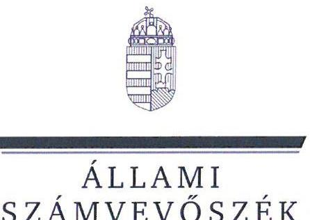
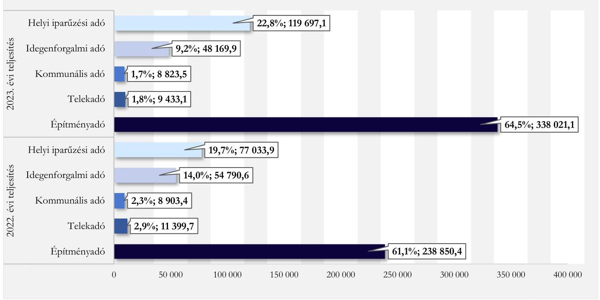
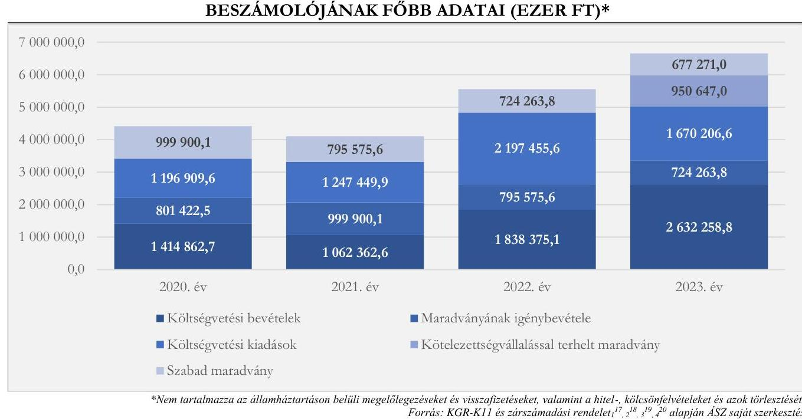
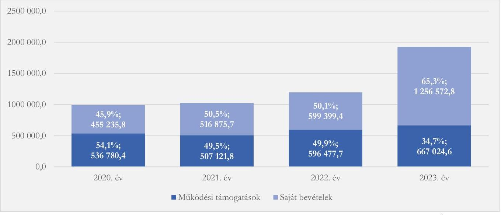

# JELENTÉS 

## Az önkormányzatok helyi adóztatási tevékenységének ellenőrzése - Ingatlanadóztatás

Balatonföldvár Város Önkormányzata

2025.

---

ÁLLAMI
SZÁMVEVŐSZÉK

# JELENTÉS 

## Az önkormányzatok helyi adóztatási tevékenységének ellenőrzése - Ingatlanadóztatás

Balatonföldvár Város Önkormányzata

2025.

---

# ELLENŐRZÉSI IGAZGATÓSÁG: 

## ÁLLAMHÁZTARTÁS HELYI SZINTJÉT ELLENŐRZŐ IGAZGATÓSÁG

## ELLENŐRZÉSI IGAZGATÓ:

DR. BAFFIA GERGELY GÁBOR ellenőrzési igazgató

## ELLENŐRZÉSVEZETŐ:

Jelentéseink az interneten a www.asz.hu címen olvashatók.

KANYÓ LŐRÁNT ISTVÁN ellenőrzésvezető

IKTATÓSZÁM: EL-4040-026/2025
TÉMASORSZÁM: 54
ELLENŐRZÉS-AZONOSÍTÓ SZÁM: V1084

---

# TARTALOMJEGYZÉK 

AZ ELLENŐRZÉS ALAPADATAI ..... 5
AZ ELLENŐRZÉS TERÜLETE ÉS AZ ELLENŐRZÖTT SZERVEZET ..... 7
ÖSSZEFOGLALÁS ..... 9
AZ ELLENŐRZÉS FÓKUSZKÉRDÉSEI ..... 11
MEGÁLLAPÍTÁSOK ..... 12
JAVASLATOK ..... 31
MELLÉKLETEK ..... 34
I. sz. melléklet: Értelmező szótár ..... 34
II. sz. melléklet: Az ellenőrzött szervezetek jegyzéke ..... 35
III. sz. melléklet: Ellenőrzési kritériumok ..... 36
IV. sz. melléklet: Balatonföldvár ingatlanadó mértékei a 2022. és a 2023. évben ..... 39
V. sz. melléklet: A helyi ingatlanadótárgyak és adóalanyok a 2023. és a 2024. évben ..... 40
FÜGGELÉK: ÉSZREVÉTELEK ..... 41
RÖVIDÍTÉSEK JEGYZÉKE ..... 42

---

.

---

# AZ ELLENŐRZÉS ALAPADATAI 

## AZ ELLENŐRZÉS CÉLJA

Az ellenőrzés célja az volt, hogy értékelje Balatonföldvár város helyi ingatlanadóztatásának és adóhatósága feladatellátásának szabályszerűségét, célszerűségét és eredményességét. További cél volt, hogy az ellenőrzés megállapításai és következtetései segítsék az önkormányzati képviselő-testületeket a jogszabályokkal és a helyi sajátosságokkal összhangban álló helyi adópolitika kialakításában és az azt végrehajtó adóigazgatási szervezet megszervezésében. Az ellenőrzés célja volt továbbá annak megállapítása is, hogy az Önkormányzat által bevezetett, ingatlanokat terhelő helyi adókra vonatkozó rendeleti szabályok összhangban vannak-e a helyi adópolitikai célokkal, tartalmuk tükrözi-e a település helyi sajátosságait és az adóhatósági feladatellátás biztosítja-e az önkormányzati bevételek feltárását és beszedését.

Ennek keretében az ÁSZ értékelte, hogy az Önkormányzat által bevezetett, ingatlanokat terhelő helyi adókról szóló adórendelet, valamint az adóhatóság döntései, adóztatási gyakorlata a vonatkozó jogszabályokkal összhangban álltak-e.

## AZ ELLENŐRZÉS TÍPUSA

Kombinált ellenőrzés.

## AZ ELLENŐRZÖTT IDŐSZAK

Az 1. fókuszkérdésnél a 2023. év, valamint a 2024. évnek az ellenőrzés megkezdését megelőző napjáig (2024. április 18.) tartó időszaka.

A 2. és 3. fókuszkérdésnél a 2023. év, valamint a 2024. évnek az ellenőrzés megkezdését megelőző napjáig (2024. április 18.) tartó időszaka, a 2020-2022. évek adatainak bázisadatként való felhasználásával.

## AZ ELLENŐRZÉS TÁRGYA

Az Önkormányzat képviselő-testületének ingatlanokat terhelő helyi adókkal, azaz az építményadóval, a telekadóval és a magánszemély kommunális adójával kapcsolatos rendeletalkotási tevékenységének és az adóhatóság tevékenységének az ellátása.

Az ellenőrzés kiterjedt minden olyan körülményre és adatra, amely az ÁSZ jogszabályban meghatározott feladatainak teljesítéséhez, valamint az ellenőrzési program végrehajtása folyamán felmerült újabb összefüggések feltárásához szükséges.

## AZ ELLENŐRZÉS JOGALAPJA

Az ellenőrzés jogszabályi alapját az ÁSZ tv. 5. § (8) bekezdésének előírásai képezik.

---

# AZ ELLENŐRZÉS MÓDSZERE 

Az ellenőrzést az ellenőrzési program szempontjai, az ellenőrzött időszakban hatályos jogszabályok, az ellenőrzés általános szakmai szabályai és az ellenőrzésre irányadó ÁSZ módszertanok alapján végezte az ÁSZ.

Az ellenőrzési kérdések megválaszolásához szükséges bizonyítékok megszerzése az ellenőrzött szervezetek által rendelkezésre bocsátott dokumentumokra, adatokra és az ASP Adó és az Iratkezelő szakrendszerek, illetve a KGR-K11 számviteli adatgyűjtő rendszer adataira alapozva megfigyelés, szemle (szemrevételezés), kérdésfeltevés (információkérés), mintavételezés, valamint elemző eljárás útján történt. Emellett az ellenőrzési bizonyítékként felhasználható adatforrások közé tartozott minden egyéb - az ellenőrzés folyamán feltárt, az ellenőrzés szempontjából információt tartalmazó - releváns dokumentum (ideértve különösen a helyszíni ellenőrzésről készült jegyzőkönyvet) is.

Az ellenőrzés lefolytatásához az ellenőrzött szervezet a tanúsítványok kitöltésével, valamint az ÁSZ által kért dokumentumok, adatok, információk megküldésével és az ellenőrzés során szolgáltatott adatokat.

Az ÁSZ az adómegállapítás, a fizetési kedvezmények engedélyezése, az adóellenőrzés és a hátralékok beszedésének szabályszerűségét mintavételi eljárással ellenőrizte. Ennek során az adóhatósági adómegállapítási feladatellátás ellenőrzése keretében 20 mintatétel (közte 49 határozat), a fizetési kedvezmények engedélyezése tárgykörben három mintatétel (egy adómérséklés-, valamint két részletfizetés iránti kérelem elbírálásának), továbbá az adóhatóság által lefolytatott adóellenőrzés tárgykörében egy mintatétel értékelése történt meg. Négy mintatételben az ÁSZ a hátralékkezelés teljes dokumentációját is ellenőrizte. A mintatételek kiválasztása véletlenszerűen történt az adóhatóság nyilvántartásában lévő adótárgyak és ügyek közül tíz - adómegállapításra vonatkozó - mintatétel kivételével, amelyek esetében a kiválasztás címadatok alapján történt annak érdekében, hogy feltárható legyen, volt-e olyan adótárgy, amelyet nem adóztatott az adóhatóság. Az ellenőrzött mintatételekre vonatkozó megállapítások nem vetíthetők ki a teljes sokaságra, a megállapításokat az ÁSZ az adott ellenőrzött mintatételek vonatkozásában tette meg.

Az ÁSZ a helyi adópolitikai elképzelések és a települési sajátosságok feltárásával értékelte, hogy az adórendelet e szempontoknak mennyiben felelt meg. Az ÁSZ a helyi adópolitikai célokkal akkor tekintette összhangban állónak az adórendeletet, ha az hatását tekintve támogatta az adópolitikai célok teljesülését.

Az ÁSZ az adóhatósági feladatellátás szabályszerűségéből, a meglévő kapacitásokból, valamint az ezer forint adóbevételre jutó adóhatósági költségek alakulásából következtetett arra, hogy az adóhatóság rendelkezett-e azzal a potenciállal, amellyel eredményesen tudta a helyi adópolitikát végrehajtani.

Az ÁSZ - az adórendelet szabályainak érvényre juttatása körében - az eredményesség véleményezésekor a III. számú melléklet 2. pontjában foglalt szempontokat tekintette mérvadónak.

---

# AZ ELLENŐRZÉS TERÜLETE ÉS AZ ELLENŐRZÖTT SZERVEZET 

Balatonföldvár a Dél-dunántúli Régióban, Somogy vármegyében, a Balaton déli partján, a Balaton Kiemelt Térségben terül el. Balatonföldvár állandó lakossága a BM adatai alapján 2020. január 1-jén 2344 fő, 2024. január 1-jén 2319 fő volt, mellyel még Somogy vármegye aprófalvas településhálózatában sem számít nagy lélekszámú településnek, ugyanakkor elhelyezkedéséből adódóan a Balaton fontos települése. Városi rangját az 1992. évben nyerte el a település.

Balatonföldvári Hajózástörténeti Látogatóközpont - Kilátó
Forrás: Önkormányzat

A város gazdaságát - üdülőhelyi múltjából adódóan - a turizmus, az ahhoz kapcsolódó szálláshely-szolgáltatás, vendéglátás és kiskereskedelem határozza meg.

Az Önkormányzat az ellenőrzött időszakban önálló fenntartóként költségvetési szervként működő intézményt nem tartott fenn, a településen közös önkormányzati hivatal működött. Az Önkormányzat tagja volt továbbá a Balatonföldvári Többcélú Kistérségi Társulásnak, így az annak fenntartásában működő Balatonföldvári Mesevár Óvoda és Tengerszem Bölcsőde, valamint a Balatonszárszói székhellyel működő Szociális és Gyermekjóléti Szolgálat által óvodai és bölcsődei nevelés, valamint szociális és gyermekjóléti szolgáltatások is biztosítottak voltak a településen. Az Önkormányzat - további 22 önkormányzattal egyetemben - tagja volt a Balatonlellei Pénzügyi Végrehajtási Társulásnak.

A városüzemeltetési feladatokat az Önkormányzat gazdasági társasága, a Balatonföldvári Kulturális Szolgáltató és Fenntartó Közhasznú Nonprofit Kft. útján látta el.

Az Alaptörvény értelmében a helyi önkormányzat a helyi közügyek intézése körében törvény keretei között dönt a helyi adók fajtájáról és mértékéről. Az Mötv. rögzíti, hogy a helyi adóval kapcsolatos feladatok ellátása a helyi önkormányzatok feladata.

Az Önkormányzat képviselő-testülete a Htv.-ben foglalt felhatalmazással élve az Önkormányzat illetékességi területén az adórendelettel mindhárom, ingatlanokat terhelő helyi adót bevezette.

Az Önkormányzat az építményadó esetében három övezetet alakított ki, melyekhez a Balatonparttól távolodva egyre alacsonyabb adómértéket rendelt. Emellett a képviselő-testület további kedvezményeket és mentességeket is meghatározott az építményadóban.

Az adópolitika szempontjából legmeghatározóbb adóelőnyt azonban mégis az jelentette, hogy mentes az építményadó alól a magánszemély tulajdonában álló azon lakás, melyben az adóalany az adóév nagyobb részében életvitelszerűen lakik. Ezen lakások után magánszemély kommunális adója fizetendő. A magánszemély kommunális adójának mértéke - 2019. január 1-jétől - 10 000,0 Ft/év.

[^0]
[^0]:    Például a mezőgazdasági művelés alatt álló külterületi ingatlanon lévő építmény adóját 50%-kal, a kiegészítő helyiségek, a lakáshoz, üdülőhöz tartozó, jellegénél és kialakításánál fogva csak tárolásra alkalmas padlás, pince - a gépjárműtároló kivételével - adóját 400,0 Ft/m²-rel csökkentett mértékben határozta meg a képviselő-testület.

---

A képviselő-testület az építmény- és magánszemély kommunális adója mellett a telekadót is bevezette, azonban az - az adórendelet által biztosított mentességekre tekintettel - az adótárgyak szűk körét érinti. A telekadó mértéke a 800 m²-t meg nem haladó területrészre 60,0 Ft/m², a 800 m² feletti területrész után 20,0 Ft/m².

A 2023. január 1-jén hatályba lépett adórendelet-módosítás szerint - a telekadó- és magánszemély kommunális adója adómértékeinek változatlanul hagyása mellett - változtak (emelkedtek) az építményadómértékek. Az I. övezetben elhelyezkedő adótárgyak adómértékét a Htv. által biztosított maximumra, 2190,0 Ft/m²-re emelte a képviselő-testület, míg a további két övezet adómértékét ehhez viszonyított csökkentett mértékben határozta meg. Az Önkormányzat által bevezetett ingatlanokat terhelő helyi adókban alkalmazott mértékrendszert és a mértékváltozást részletesen a IV. számú melléklet mutatja be.

Balatonföldvár gazdasági adottságaiból, valamint az ingatlanokat terhelő adókra megalkotott rendeleti szabályokból is következik, hogy az Önkormányzat helyi adóbevételein belül elsősorban az üdülőépületek után fizetendő építményadóból származó bevétel a meghatározó. Az Önkormányzatnak a 2023. évben 356 277,7 ezer Ft bevétele származott a három ingatlanadóból, ami a konszolidált - az államháztartáson belülről származó felhalmozási célú támogatásokkal és a szolidaritási hozzájárulással csökkentett - költségvetési bevételek 18,6%-át, a települési helyi adóbevételek 68,6%-át tette ki. A helyi adók közül az építményadóból származó 338 021,1 ezer Ft bevétel a helyi adóbevételek 64,5%-át, az ingatlant terhelő adókból származó bevételek 94,9%-át jelentette.

Az Önkormányzat helyi adóbevételei 2022. és 2023. évi összetételére vonatkozó adatokat az 1. ábra, a helyi ingatlanadók 2023. és 2024. évre vonatkozó jellemző naturális adatait pedig az V. számú melléklet mutatja be.
1. ábra

AZ ÖNKORMÁNYZAT HELYI ADÓBEVÉTELEINEK MEGOSZLÁSA A 2022-2023. ÉVEKBEN (EZER FT, %)

Forrás: KGR-K11 2022-2023. évi költségvetési beszámoló adatai alapján ÁSZ saját szerkesztés

[^0]
[^0]:    Az adórendelet értelmében mentes a telekadó alól a beépített telek, az építési tilalom alatt álló telek, illetve védő, biztonsági területnek minősülő terület is.

---

# ÖSSZEFOGLALÁS 

Az ÁSZ tv. értelmében az ÁSZ feladatkörébe tartozik az önkormányzatok adóztatási tevékenységének ellenőrzése. A helyi adók az önkormányzatok saját, el nem vonható bevételét képezik, így az önkormányzatok gazdasági önállósága szempontjából különös fontossággal bír, hogy a helyi adórendeleti szabályok összhangban álljanak a magasabb szintű jogszabályokkal, továbbá az önkormányzati adóhatósági tevékenység jogszerű, eredményes és hatékony legyen. Erre figyelemmel volt tárgya az ÁSZ ellenőrzésének az Önkormányzat adórendelet-alkotási tevékenysége és az adóhatósági feladatellátás is.

Az adórendelet több ponton nem volt összhangban a magasabb szintű jogszabályokkal, ugyanakkor alkalmas volt az Önkormányzat adópolitikai céljainak elérésére. Az adómegállapítási feladatellátás eredményes volt, de az adóhatósági döntések nem minden esetben voltak szabályszerűek, indokolásuk pedig nem volt megfelelő.

Az adóbehajtási tevékenység nem volt eredményes, illetve célszerű, az adóvégrehajtási feladatellátás - a Társulásban történt feladatellátásra tekintettel - nem volt szabályszerű.

Az 1000 Ft adóbevételre jutó adóztatási kiadások magasabbak voltak, mint az ÁSZ által ellenőrzött nyolc város átlagos értéke, de nem haladták meg az adóztatási kiadások referencia-érték maximumát. Az adóhatóság feladatellátási mutatói az
 ÁSZ által ellenőrzött nyolc város átlagos mutatóinál kedvezőbbek voltak.

## Adórendelet, adórendelet-alkotás

Az adórendelet nem volt összhangban a jogszabályi előírásokkal, mert leszűkítette a magánszemély kommunális adójában az adóalanyok körét, egyes telekadó-kedvezmények esetén nem zárta ki azt, hogy azokat vállalkozók is igénybe vehessék, továbbá a Htv.-vel ellentétes módon rendelkezett az építményadó-mentesség megadásának, valamint a magánszemély kommunális adója keletkezésének és megszűnésének szabályairól. Emellett az adórendelet két, nem egyértelmű, ezáltal vitatható rendelkezést tartalmazott.

Az ingatlanokat terhelő helyi adókra vonatkozó rendeleti szabályozás megalkotása során az Önkormányzat figyelembe vette, hogy a rendeleti szabályoknak tükrözniük kell a helyi sajátosságokat, az önkormányzat gazdálkodási követelményét, továbbá az adóalanyok széles körét érintően az adóalanyok teherviselő képességét.

Az adóhatóság adóigazgatási feladatellátásának jogszerűsége, eredményessége
Az adóhatóság adótárgy- és adóalany feltárási feladatellátása (ezáltal az adómegállapítási feladatellátása) eredményes és egyben célszerű volt, de az adómegállapítási eljárásban hozott hatósági döntések nem minden esetben voltak szabályszerűek, az adóhatóság több esetben nem kellő gondossággal járt el a tényállások tisztázása érdekében.

Az építmény- és telekadót megállapító határozatok indokolásai nem tartalmazták egyértelműen az adó kiszámítását, jogalapját, mely nehezítette az adóhatósági döntések értelmezését, e körülmények azonban a határozatokba foglalt fizetési kötelezettség jogszerűségét nem érintették. Az adómegállapító határozatok kiadmányozása több esetben nem volt szabályszerű, egy esetben az adómegállapító határozat közlése nem volt jogszerű. Emellett az adóhatóság nem minden esetben élt a jogszabály által biztosított elektronikus kézbesítés lehetőségével.

Az adótartozások beszedése érdekében tett intézkedések nem voltak sem eredményesek, sem célszerűek. Az adóhatóság az adótartozások végrehajtása kapcsán nem jogszerűen járt el, tekintve, hogy a végrehajtási

---

feladatok ellátásával a Htv., az Air. és az Avt. ${ }^{15}$ alapján adóhatóságnak, valamint az Avt. alapján végrehajtás foganatosítására megkereshető szervnek nem minősülő, hatáskörrel nem rendelkező önkormányzati társulást bízott meg.

Az ÁSZ jó gyakorlatnak tekintené, ha - a jogszabály erre vonatkozó felhatalmazása esetén - a kisebb települések közösen, akár társulási formában láthatnának el specifikus szakmai ismeretet igénylő, kisebb település esetén nem gyakran előforduló adóhatósági funkciókat, így például az adóellenőrzési, vagy mint az Önkormányzat esetén - az adóvégrehajtási feladatellátást.

Az adóhatóság által lefolytatott adóellenőrzés nem volt szabályszerű.
Az adórendelet adópolitikai célokkal való összhangja, az adórendelet hatása
Míg a városok ${ }^{3}$ esetén országosan az ingatlanadóból származó bevételek a konszolidált, az államháztartáson belülről származó felhalmozási célú támogatások nélküli - és csökkentve a befizetett szolidaritási hozzájárulással ${ }^{4}$ - költségvetési bevételeken belüli átlagos aránya 5,8%, addig az Önkormányzat esetében ez az arány 18,6% volt a 2023. évben. A konszolidált - államháztartáson belülről származó felhalmozási célú támogatások nélküli - költségvetési bevételeken belül a konszolidált saját bevételek aránya a 2020-2022. időszakban 45,9-50,5% közötti érték volt, mely a 2023. évre 65,3%-ra nőtt.

Az adórendelet 2023. évi módosítása nem érintette hátrányosan az adóalanyok többségének adóteherviselő-képességét.

Az Önkormányzat adórendeleti szabályai összhangban voltak az adópolitikai célokkal (a helyi adók biztos bevételi forrást jelentsenek, az adózók számára kiszámítható legyen az adókörnyezet, és a helyi lakosság számára elviselhető, méltányos terhet jelentsen).

# Az adóhatósági kiadások 

1000 Ft beszedett helyi adóbevételre - az ÁSZ számítása szerint - 21,4 Ft adóztatási kiadás esett. Az ellenőrzött nyolc város ${ }^{5}$ átlaga 15,3 Ft, az adóztatási kiadás tapasztalati referencia-érték maximuma kivetéses adóztatás esetén 50,0 Ft volt.

Az Önkormányzat egy adótisztviselőjére a 2023. évben 262 072,3 ezer Ft költségvetési bevételként elszámolt helyi adóbevétel jutott, mely a nyolc ellenőrzött város 544502,3 ezer Ft-os átlagának felét sem érte el. Az egy adóigazgatásban dolgozóra jutó 2 456,5 ingatlanadó-tárggyal és 2008,5 ingatlanadó-alannyal az adóhatóságnál voltak a legmagasabbak az adóhatósági feladatellátás ezen mutatói az ellenőrzött nyolc város tekintetében, ugyanakkor az Önkormányzat esetében a végrehajtási tevékenységet a Hivatal helyett önkormányzati társulás útján látták el.

[^0]
[^0]:    ${ }^{3}$ Az ÁSZ a városok alatt a 322 nem megyei jogú várost érti.
    ${ }^{4}$ Az Önkormányzatnak a vizsgált időszakban, a 2020-2023. évek során a 2023. évben keletkezett szolidaritási hozzájárulás fizetési kötelezettsége 4755,7 ezer Ft összegben.
    ${ }^{5}$ Az ÁSZ által jelen ellenőrzés alapjául szolgáló ellenőrzési program alapján ellenőrzött városok: Ajka, Balatonföldvár, Budakalász, Emőd, Paks, Ráckeve, Szigethalom és Tata.

---

# AZ ELLENŐRZÉS FÓKUSZKÉRDÉSEI 

1.- Az önkormányzat ingatlanokat terhelő helyi adókra vonatkozó rendeleti szabályozása megfelelt-e a magasabb szintű jogszabályoknak?
2.- Az önkormányzati adóhatóság megfelelően és eredményesen látta-e el az ingatlanok adóztatásával kapcsolatos adóhatósági tevékenységeit?
3.- A településen megvalósuló helyi adóztatás támogatta-e a helyi adópolitikai célok teljesülését?

---

# MEGÁLLAPÍTÁSOK 

## 1. Az önkormányzat ingatlanokat terhelő helyi adókra vonatkozó rendeleti szabályozása megfelelte a magasabb szintű jogszabályoknak?

## Összegző megállapítás

Az adórendelet több ponton nem felelt meg a magasabb szintű jogszabályoknak.
1.1. számú megállapítás

Az adórendelet több ponton ellentétes volt a Htv. rendelkezéseivel, szövegezése több ponton sértette az egyértelmű értelmezhetőség Jt. ${ }^{16}$ ban megfogalmazott követelményét.

A Htv. 2. §-ának az adómegállapításra vonatkozó rendelkezésével ${ }^{6}$ és 24. §-ának a magánszemély kommunális adójának adótárgyait rögzítő rendelkezésével szemben az adórendelet 19. § (1) bekezdése leszűkítette a magánszemély kommunális adójában az adóalanyok körét, mert nem mindegyik, a Htv. szerinti adóalanyra állapított meg adókötelezettséget (így sem a telek tulajdonosára, sem a telken vagy az építményen fennálló vagyoni értékű jog jogosítottjára).
A Htv. 7. § e) pontjában előírtak ellenére - amely az uniós jogból fakadó állami támogatási elvekre és normákra figyelemmel rögzíti, hogy az önkormányzat az építményadóban és a telekadóban a vállalkozó számára adómentességet, adókedvezményt nem biztosíthat - az adórendelet:
a) 15. § (1) bekezdése anélkül mentesítette a telekadó alól a beépített telket, az építési tilalom alatt álló telket és az épülethez, épületnek nem minősülő építményhez, nyomvonal jellegű létesítményekhez tartozó védő (biztonsági) területet, hogy a mentességre jogosultak köréből a vállalkozó adóalanyokat kizárta volna;

Az uniós állami támogatási szabályok értelmében a vállalkozóknak nyújtott helyi adómentesség, helyi adókedvezmény állami támogatásnak minősül. A jogszerűtlenül nyújtott támogatást a kedvezményezettnek vissza kell fizetnie, vagy a támogatást nyújtónak kell biztosítania az uniós joggal való összhangot.
b) 15. § (2) bekezdése anélkül biztosított 50%-os adókedvezményt a helyi építési szabályzat szerinti minősítésük vagy fekvésük miatt nem beépíthető telkek esetében, hogy a kedvezményre jogosultak köréből a vállalkozó adóalanyokat kizárta volna.
Az adórendelet 6. § (8) bekezdése - ellentétben a Htv. 43. § (3) bekezdésében foglaltakkal - rendelkezett arról, hogy az adórendeletben szabályozott építményadó-mentesség megadásáról az adóhatóság dönt ${ }^{7}$.

[^0]
[^0]:    ${ }^{6}$ Az Alaptörvény 32. cikk (1) bekezdés h) pontja szerint: a törvény keretei között szabályozhat a helyi rendelet, így nem írhatja felül az adó tárgyát. A Htv. 2. §-a erre reagálva rögzíti, hogy az önkormányzat adómegállapítási joga csak a törvényben rögzített adóalanyokra és adótárgyakra terjed ki.
    ${ }^{7}$ A Htv. hivatkozott rendelkezése értelmében az önkormányzat csak az Art.-ban nem szabályozott eljárási kérdésekben alkothat rendeletet. Az Art. 141. § (2) bekezdése és 48. § (1) bekezdése értelmében az ingatlanokat terhelő helyi adókat kivetéssel, határozattal kell az adóhatóságnak megállapítania, azaz az Art. rögzíti azt, hogy az adóhatóságnak döntenie kell az adóról, adómentességről.

---

Az adórendelet 20. §-a a Htv. 25. §-ától eltérő szöveggel és tartalommal fogalmazta meg a magánszemély kommunális adója keletkezésének és megszűnésének a szabályait.
Az adórendelet alábbi rendelkezései sértették - a Jt. 2. § (1) bekezdéséből következő - egyértelmű értelmezhetőség követelményét:
a) az adórendelet 6. §-a azzal, hogy szövegezéséből nem volt egyértelmű, miszerint a 6. § (1) bekezdés b) és c) pontja szerinti életvitelszerű ottlakáshoz kötődő építményadó-mentesség igénybevételére jogosító nyilatkozat - jogvesztő - benyújtási határnapjának az adómentesség első adóévének január 31-ik napja, vagy az életvitelszerű tartózkodás kezdetét követő adóév január 31-e tekintendő-e ${ }^{8}$;
b) míg az adórendelet 19. § (1) bekezdése a Htv.-ben előírtakhoz képest leszűkítette az építmény magánszemély tulajdonosára, valamint a nem magánszemély tulajdonában álló lakás bérlőjére a magánszemély kommunális adója adóalanyainak körét, addig az adórendelet 19. § (2) bekezdése a magánszemély kommunális adója alanyaként utalt az építményen fennálló vagyoni értékű jog jogosítottjára.
1.2. számú megállapítás

Az Önkormányzat az ingatlanokat terhelő helyi adókra vonatkozó rendeleti szabályozás megalkotása során figyelembe vette a települési sajátosságokat, az Önkormányzat gazdálkodási követelményeit és az adóalanyok széles körét tekintve az adóalanyok teherviselő képességét.

A Htv. 7. § g) pontjában rögzített adómegállapítási korlátokból az következik, hogy a rendelet hatályossága idején is érvényre kell jutnia az e pontban szabályozott rendeletalkotási elveknek, azaz annak, hogy települési önkormányzat az adóalap fajtáját, az adó mértékét, a rendeleti adómentességet és adókedvezményt úgy állapíthatja meg, hogy azok összességükben egyaránt megfeleljenek
a) a helyi sajátosságoknak,
b) az önkormányzat gazdálkodási követelményeinek és
c) az adóalanyok széles körét érintően az adóalanyok teherviselő képességének.

Az ÁSZ véleménye szerint legalább az adózást érintő magasabb szintű jogszabályi változások esetén indokolt felülvizsgálni a rendeletet. Ettől függetlenül a település mérete, adottsága a helyi adókra vonatkozó rendelet összetettsége, az önkormányzat gazdálkodási körülményeinek változása, az adózók teherbíró képességének változása befolyásolja a felülvizsgálat gyakoriságát.

# A helyi sajátosságok figyelembevétele 

Az Önkormányzat legfőbb sajátossága, hogy közvetlenül a Balaton partján fekszik, így az ingatlanokat terhelő adók potenciális adótárgyainak jelentős részét képezik az üdülőépületek. Az üdülőtelepülési lét determinálja azt is, hogy nincs jelentős ipar, illetve vállalkozói jelenlét, a gazdasági tevékenység leginkább csak a szálláshely-szolgáltatásra, illetve a szolgáltatószektor szereplőinek a jelenlétére korlátozódik. Ebből következően az ingatlanadóztatás sem a gazdálkodó szektor elsődleges terhelésére irányult.

[^0]
[^0]:    ${ }^{8}$ Az adórendelet 6. § (5) bekezdése szerint a (4) bekezdés szerinti nyilatkozat benyújtására az életvitelszerű tartózkodás kezdetét követő adóév január 31. napjáig van lehetőség. Ez azért okoz problémát, mert január 1-jei lakóhelylétesítés esetén a mentességre való jogosultság a második adóévtől érvényesíthető.

---

Az építményadó mértékét az Önkormányzat - igazodva a települési sajátosságokhoz, az ingatlanok értékviszonyaihoz - a Balaton partján magasabb, attól távolodva alacsonyabb összegben határozta meg. Ezt a struktúrát követve - az adótárgy fekvése szerint differenciált - három adómértéksáv létezett a településen, rendre 1400, 1800 és 2190 Ft/m²/év adómértékkel.
Az adórendeleti szabályozás struktúrája évek óta változatlan ${ }^{9}$, a polgármester nyilatkozata szerint az eredeti szabályozási struktúrát a települési sajátosságok figyelembevételével alakították ki.
A helyi adórendelet szabályrendszere célja szerint igazodott az Önkormányzat jellegzetességeihez, így az Önkormányzat a település ingatlanadóztatás szempontjából meghatározó sajátos körülményeit a hatályos adórendelet szabályozási struktúrájának kialakításakor figyelembe vette és mérlegelte.

# Az önkormányzat gazdálkodási követelményeinek szempontja 

Az Önkormányzat nyilatkozata szerint a helyi ingatlanadók települési működtetésének az elsődleges célja a bevételszerzés volt. Az adóbevételből főképp az infrastrukturális fejlesztéseket kívánták finanszírozni, elsősorban az utak, járdák aszfaltozását, javítását, karbantartását.
A polgármester tájékoztatása szerint a
 helyi lakosok üdülőtulajdonosokhoz képest alacsonyabb adóval való terhelésének az oka nemcsak a méltányos teherviselés biztosítása volt, hanem egyéb érvek is szóltak emellett az adóstruktúra mellett ${ }^{10}$.
A 2022. évben a helyi adókból összesen 390 978,0 ezer Ft bevétele származott az Önkormányzatnak, amely a konszolidált - az államháztartáson belülről érkezett felhalmozási célú támogatások nélkül számított - költségvetési bevételnek (1 195 877,1 ezer Ft) 32,7%-át tette ki. A 2023. évben a helyi adókból származó éves - 4755,7 ezer Ft szolidaritási hozzájárulással csökkentett - 519 389,0 ezer Ft bevétel ugyanezen aránya $\mathbf{27,0\%}$-a volt. Az ingatlanadó-bevétel a 2022. évi 259 153,5 ezer Ft-ról a 2023. évre 37,5%-kal, 356 277,7 ezer Ft-ra nőtt (1. ábra).

Az Önkormányzat és intézményeinek főbb gazdálkodási adataiból (2. ábra) az figyelhető meg, hogy 2020-2023. között az egyes években jelentős maradvány képződött. Az Önkormányzatnak a következő években esedékes kötelezettségállománya a 2023. év végén - a maradvány összegétől elmaradó - 450 543,6 ezer Ft volt, melyből a hosszú lejáratú hitel 365 956,5 ezer Ft-ot tett ki.
Az Önkormányzat gazdálkodási helyzete összességében nem tette szükségessé az adórendelet módosítását.

[^0]
[^0]:    ${ }^{9}$ Az adórendelet 2023. január 1-jei hatállyal történt módosítása a helyi adók struktúráját nem, csak az alkalmazott adómértékeket érintette.
    ${ }^{10}$ A polgármester közlése szerint nem eredményezne ugyanis az Önkormányzat gazdálkodásában jelentős változást az sem, ha a helyben lakók adószintjét duplájára emelték. Ennek eredményeként a jelenleg a kommunális adóból realizált mintegy 8,5 millió forintos önkormányzati bevétel is csak duplájára, kb. 17 millió forintra nőne, ami az Önkormányzat kb. egy milliárd forintos költségvetésében elenyésző arányt tenne ki.

---

# Az adóalanyok teherbíró képességének figyelembevétele 

Az adórendelet célja szerint arra irányult, hogy az egyéb adóalanyokhoz képest a helyben (az Önkormányzat illetékességi területén) életvitelszerű lakóhellyel rendelkező adóalanyokat a lakóhelyükként szolgáló ingatlanok után alacsonyabb helyi adófizetési kötelezettség terhelje.
E megfontolás mögött - az Önkormányzat tájékoztatása alapján - az áll, hogy az üdülőtulajdonosok esetében valószínűsíthető volt, hogy üdülőjük második vagy többedik ingatlanuk, így vélelmezhető volt az is, hogy ők nagyobb szerepet tudnak vállalni a helyi közterhekből, csakúgy, mint a vállalkozó ingatlantulajdonosok. Ezt az Önkormányzat azzal akarta elérni, hogy az életvitelszerűen helyben lakó adóalanyi kört egy tételes, a hatályos szabályok szerint évi 10 000 Ft/év összegű adóval, magánszemély kommunális adójával terhelte, míg az egyéb ingatlanadó-alanyok adófizetési kötelezettsége az építményadóban állt elő - az adótárgy ingatlan Balatonparthoz képesti távolságtól függő - differenciált adómértékkel.
Ez a differenciált, összegszerűségében 2023. január 1-jétől hatályos adómérték-struktúra nemcsak a helyben lakó magánszemélyek teherviselőképességét vette figyelembe, hanem a helyi - nem elsősorban az idegenforgalomból élő - vállalkozások teherviselő képességét is. Ezek a vállalkozások ugyanis - a polgármester helyszíni ellenőrzésen előadott nyilatkozata szerint - jellemzően a Balatontól távolabb eső településrészen tevékenykednek, így rájuk alacsonyabb építményadó-mérték vonatkozik.
A fentiek mellett az Önkormányzat telekadót is működtetett a településen, melynek szabályai szerint mentességet élvezett a telekadó alól az építési tilalom alatt álló telek, illetve védő, biztonsági területnek minősülő terület is. Ezen szabályokkal szintén a méltányos teherviselés elvét kívánta érvényre juttatni az Önkormányzat.
Az ÁSZ az adórendelet, valamint az Önkormányzat nyilatkozata alapján megállapította, hogy az Önkormányzat a Htv. előírásainak megfelelően figyelembe vette a helyi ingatlanadó-szabályozás kialakításánál az adóalanyok teherviselőképességét.

---

# 2. Az önkormányzati adóhatóság megfelelően és eredményesen látta-e el az ingatlanok adóztatásával kapcsolatos adóhatósági tevékenységeit? 

Összegző megállapítás

Az adóhatóság adómegállapítási feladatellátása eredményes volt, de az adóhatósági döntések nem minden esetben voltak szabályszerűek. Az adóhatóság az adótartozások végrehajtása során nem járt el szabályszerűen, emellett az adótartozások beszedése érdekében megtett intézkedések nem voltak sem eredményesek, sem célszerűek.
2.1. számú megállapítás

Az adóhatóság adótárgy- és adóalany feltárási feladatellátása eredményes és célszerű volt. Az adófizetési kötelezettségről ugyanakkor nem mindegyik adóhatósági döntés esetében rendelkezett szabályszerűen. Az adóhatóság - az Air. ${ }^{21}$ előírásai ellenére - több esetben nem kellő gondossággal járt el a tényállás tisztázása érdekében. Az adómegállapító határozatok kiadmányozása nem minden esetben volt szabályszerű. Az adóhatóság által az ellenőrzött időszakban lefolytatott adóellenőrzés nem minősült szabályszerűnek.

## Adótárgy- és adóalanyfeltárás

Az adóhatóság a 2023. és a 2024. évben is élt az Art. ${ }^{22}$ 83. § (2) bekezdésében foglaltak alapján az ingatlanügyi hatóság megkeresésének lehetőségével. Ezen, a települési ingatlanokról és tulajdonosaikról, valamint az ingatlanokon fennálló vagyoni értékű jog jogosítottaiól szóló adatokat összevetette saját nyilvántartásával. Emellett az adóhatóság az építésügyi hatóság által az Art. 86. §-a szerint szolgáltatandó adatokat is felhasználta az adatbejelentést elmulasztó adóalanyok

Az ÁSZ jó gyakorlatnak tartja, ha egy adóhatóság használja az ingatlanügyi hatóságnál rendelkezésre álló adatokat az adóztatás során. Az ÁSZ véleménye szerint az ingatlanadókban célravezető az adóhatóság adónyilvántartási adatainak társhatósági hiteles adatokkal való összevetése és ezek alapján szükség szerint adatbejelentésre, hiánypótlásra felhívás, majd az információk alapján a tényállás rögzítése és az adómegállapítási eljárás mielőbbi befejezése. Részint azért, mert az adótárgy jellege miatt erre lehetőség van (tipikusan évente nem változnak a kivetési adatok), részint azért, mert így az adóhatóság időben korábban jut az adóbevételhez, részint pedig azért, mert négy-öt év távlatában - utólagos adómegállapítás keretében - sokszor nehezen lehet bizonyítani, hogy az adóév első napján mi volt az adómegállapítás kapcsán releváns tényállás.
beazonosítására, azonban az adótárgyak feltárása érdekében térinformatikai eszközt nem használt. Mindemellett az adóhatóság az adótárgyak, adóalanyok felkutatására irányuló egyéb tevékenységként a

---

2023. évben a közterületről való szemrevételezéssel felmérte a település két utcájában található ingatlanokat, s a tapasztaltakat helyszíni jegyzőkönyv elnevezésű iratba foglalta ${ }^{11}$.
Az ÁSZ nem tárt fel olyan ingatlant, amelyet az adóhatóságnak adóztatnia kellett volna.
Mindezek alapján összességében az adótárgy- és adóalanyfeltárási adóhatósági feladatellátás eredményes és - figyelemmel arra, hogy az ingatlanügyi hatóságtól kapott hiteles információt azok megszerzése céljának megfelelően használta fel - célszerű volt.

# Adómegállapítás (kivetetés) 

Az adóhatóság két mintatétel (16. és 25. mintatételek) kivételével a Htv.-nek és az adórendeletnek megfelelően számította ki a fizetendő adó összegét.
A 16. és 25. mintatételek esetében az adóhatóság az Air. 58. § (1) bekezdésében foglaltak ellenére a tényállás tisztázása érdekében nem járt el kellő gondossággal, mert az osztatlan közös tulajdonban álló ingatlanok esetében nem, vagy csak részben élt az Art. 48. § (1) bekezdésében, illetve az Air. 35. § (1) bekezdés b) pontjában is foglalt más hatóság megkeresésével vagy az Air. 64. §

Az ÁSZ álláspontja szerint az adóhatóságtól elvárható, hogy a tényállás tisztázása érdekében a szükséges intézkedéseket megtegye, az építésügyi hatóságtól a használatbavételi engedélyt, az annak esetleges módosításai kapcsán rendelkezésre álló információkat megkérje, legcélszerűbben pedig az épület valamennyi épületrésze - ideértve a közös használatú épületrészeket is - vonatkozásában lefolytatott helyszíni szemle keretében győződjön meg a valós adóalapról.
(1) bekezdése szerinti helyszíni szemle lefolytatásával az adótárgyak pontos hasznos alapterületeinek felmérése, s így a valós adóalap meghatározása érdekében. Ebből eredően az egyes adóalanyok részére kivetett adó megállapításának helyessége nem volt minden kétséget kizáróan bizonyított.
Két mintatétel esetében (10. és 12. mintatételek) az adóhatóságnak nem álltak rendelkezésre az adórendelet 6. § (1) bekezdés b)-c) pontjai szerinti építményadó mentesség ${ }^{12}$ alátámasztásához az adórendelet 6. § (4) bekezdése által előírt dokumentumok ${ }^{13}$. Az adóhatóság az alátámasztó dokumentumok hiányában - az Air. 58. § (1) bekezdésében foglaltak ellenére a tényállás tisztázása nélkül - biztosított mentességet az építményadó alól.

[^0]
[^0]:    ${ }^{11}$ Az adóhatóság az ÁSZ helyszíni ellenőrzéséről készült jegyzőkönyvben foglalt nyilatkozata alapján - az adóhatóság szűkös kapacitására tekintettel - a felmérést követő további intézkedések még folyamatban vannak.
    ${ }^{12}$ Az adórendelet 6. § (1) bekezdés b)-c) pontja alapján mentes az építményadó alól a magánszemély tulajdonában lévő lakás, melyben az adó alanya az adóév nagyobb részében folyamatosan életvitelszerűen lakik; továbbá az ezen lakáshoz, lakóházhoz tartozó egy darab személygépkocsi tároló, legfeljebb $20 \mathrm{~m}^{2}$-ig, amennyiben azt rendeltetésszerűen használják.
    ${ }^{13}$ Az adórendelet 6. § (4) bekezdése értelmében a 6. § (1) bekezdés b)-c) pontjaiban meghatározott mentesség érvényesítéséhez a magánszemély adóalany köteles alátámasztó dokumentumokkal igazolni, hogy életvitelszerűen abban az ingatlanban lakik, amelyre vonatkozóan a mentességet igénybe kívánja venni. Az adórendelet 6. § (7) bekezdése a kapcsolódó bizonyítási eljárás kapcsán a közüzemi számlákat, közműszolgáltatói igazolásokat, számlákat (részszámla, elszámoló számla) nevesíti.

---

A 11. mintatétel esetében nem álltak rendelkezésre az adórendelet 18. § (1) bekezdés a) alpontja szerinti, az életvitelszerű lakáshasználatot alátámasztó, az adórendelet 6. § (4) bekezdése szerinti dokumentumok, ezért a magánszemély kommunális adója kivetésének helyessége sem igazolt.
A 16. és 18. mintatételek esetén - a Htv. 12. § (2) bekezdésében foglaltak ellenére - nem állt rendelkezésre valamennyi adóalany által aláírt megállapodás arról, hogy közülük egy adóalany teljesíti többek között az adófizetési kötelezettséget. Az adóhatóság - megsértve az Art. 221. § (1) bekezdés a) pontját - nem szólította fel az adatbejelentést nem teljesítő adóalanyokat adatbejelentés megtételére, és az Art. 48. § (1) bekezdése és 141. § (2) bekezdése szerinti adóhatározatot nem hozta meg valamennyi, a Htv. 12. § (1) bekezdése szerinti adóalany számára.
Hat mintatétel esetében (6., 8., 16., 18., 22. és 23. mintatételek) az adótárgynak több tulajdonosa volt, ugyanakkor az adóhatóság által - a tulajdonosok közti megállapodás alapján - hozott adómegállapító határozat rendelkező része kizárólag az adó fizetésére kötelezett által fizetendő adó összegét tartalmazta.
A Hivatal a 16. és 22. mintatételek kapcsán nem gondoskodott valamennyi adatbejelentés, valamint

Ha az adótárgynak több tulajdonosa van, akkor ők tulajdoni illetőségük arányában adóalanyok. Ekkor, mindegyikük egyetértése esetén köthetnek arról megállapodást, hogy az adóalanyisággal kapcsolatos jogokat és kötelezettséget az adóhatóság előtt közülük egy adóalany kapcsolattartóként gyakorolja. Az ÁSZ jó gyakorlatnak azt tekinti, ha az adómegállapító határozat nemcsak a fizetési kötelezettséget és a fizetésre kötelezettet (a kapcsolattartót), hanem az egyes adóalanyokat terhelő adót és annak jogalapját, kiszámítását is tartalmazza, annak érdekében, hogy az egyes adóalanyok számára egyértelmű legyen az őket terhelő adó összege.
a 22. mintatétel kapcsán az adóalany részére hozott építményadót megállapító határozat kiadmányozott (aláírt, hiteles) példányának megőrzéséről, amivel megsértette az Ltv. ${ }^{23}$ 9. § (1) bekezdés e) pontjában előírtakat ${ }^{14}$. Szintén az Ltv. 9. § (1) bekezdés e) pontjának sérelmével járt, hogy az adóhatóság nem gondoskodott tértivevények megőrzéséről a 20-21. mintatételek esetében, így nem volt megállapítható az sem, hogy az adómegállapító határozatok közlése szabályszerűen megtörtént-e.
Az adóhatóság kilenc mintatétel esetében (7-9. és 12-15. mintatételek, 16. mintatétel esetében hozott 2024. évi, valamint a 24. mintatétel tekintetében az egyik
 adóalany részére hozott adómegállapító határozat) az ügyintézési határidőt az adómegállapító határozatok indokolási részében az adatbejelentés adóhatósághoz való érkezése napjától számította. Az adómegállapító eljárás ugyanakkor nem kérelemre, hanem hivatalból indított eljárás, ezért az adóhatóság gyakorlata ellentétes volt az Air. 50. § (1) bekezdésével ${ }^{15}$.

A 10., 17-19., 22. és 25. mintatételek adómegállapító határozatainak indokolásai, valamint a 12. mintatétel esetében az építményadót megállapító határozat indokolása, továbbá a 16. mintatétel esetében

[^0]
[^0]:    ${ }^{14}$ A közfeladatot ellátó szerv Ltv. 9. § (1) bekezdés e) pontjából fakadó kötelessége, hogy az elintézett ügyek iratait - az irattári terv szerinti rendszerezés és válogatás pontosságának ellenőrzése mellett - irattárában elhelyezze, az irattári anyagot szakszerűen és biztonságosan megőrizze, valamint használatra bocsátásáról gondoskodjon.
    ${ }^{15}$ Az Air. e rendelkezése szerint hivatalból való eljárás esetén az első eljárási cselekmény megkezdése napjától - azaz a konkrét esetekben (mivel egyéb eljárási cselekmény nem történt) a határozat kiadmányozása napjától - kell számítani az ügyintézési határidőt.

---

rendelkezésre álló 11 határozatból kilenc adómegállapító határozat indokolása - az Air. 73. § (1) bekezdés c) pontjában foglaltak ellenére - tényállási elemként nem tartalmazta az adótárgy utáni adó és az adóalany(ok)ra jutó adó összegének egyértelmű számszaki levezetését, jogalapját.
A 13-15. és 24. mintatételek esetében a telekadót megállapító határozatok indokolásai - az Air. 73. § (1) bekezdés c) pontjában foglaltak ellenére - nem rögzítették egyértelműen azt, hogy a fizetésre kötelezett tulajdonosként vagy vagyoni értékű jog jogosítottjaként alanya-e az adónak.
A 6., 8-9., 11-12., 16., 18., 21. és 23-25. mintatételek esetében a magánszemély adózók részére hozott adómegállapító határozatok indokolásai az Eüsztv. ${ }^{24}$ kifejezetten a gazdálkodó szervezetek elektronikus ügyintézési kötelezettségére vonatkozó rendelkezését is tartalmazta.
A határozatok indokolása kapcsán észlelt hiányosságok a határozatokban foglalt fizetési kötelezettség jogszerűségét azonban nem érintették. A világos, követhető magyarázat ugyanakkor érthetővé teheti az adózó számára, hogy milyen jogalapon és miért az adómegállapító határozat szerinti összeget kell fizetnie. Ezen túlmenően az adóhatóságnak és az Önkormányzatnak is előnyös lehet, ha az adózó fizetési hajlandósága javulhat azáltal, hogy számára is világos és érthető az adómegállapító határozat.
A 6-7., 9., 11., 12. és 15. mintatételek esetében, valamint a 16. mintatétel kapcsán egy esetben a kiadmányozott adómegállapító határozatok tartalmazták ugyan a jegyző ${ }^{25}$ mint hatáskör gyakorlójának nevét és hivatali beosztását, ugyanakkor a határozatokat a hatáskör gyakorlója helyett más kiadmányozta, és az Air. 73. § (1) bekezdés d) pontjában foglaltak ellenére a határozatokon nem szerepelt a kiadmányozó neve, illetve hivatali beosztása.
A 8., 10., 13., 17-19. és 24-25. mintatételek kapcsán rendelkezésre álló adómegállapító határozatoknak, valamint a 16. mintatétel kapcsán rendelkezésre álló 11 darab adómegállapító határozat közül kilenc darab határozatnak, továbbá a 22. mintatétel esetében két adóalany megállapodása alapján hozott adómegállapító határozatnak a 335/2005. (XII. 29.) Korm. rendelet ${ }^{26}$ 52. § (1) bekezdésében foglaltak ellenére csak - a Hivatal ügyrendjének ${ }^{27}$ V. fejezetét képező kiadmányozási rend alapján kiadmányozási joggal nem rendelkező - adóügyi ügyintézők által elektronikusan hitelesített iratpéldányai álltak rendelkezésre ${ }^{16}$. A Hivatal iratkezelési szabályzatának ${ }^{28}$ III.111. pontjában foglaltak ellenére ${ }^{17}$ azonban az adóhatósági ügyintézők elektronikus kiadmány elektronikus aláírására való jogosultságát alátámasztó dokumentummal nem rendelkeztek.

[^0]
[^0]:    ${ }^{16}$ A jegyző nyilatkozata szerint a hivatkozott adómegállapító határozatokat az ügykezelés során az adóügyi ügyintézők látták el elektronikus aláírással a jegyző vagy aljegyző által papír alapon kiadmányozott határozat alapján.
    ${ }^{17}$ A Hivatal iratkezelési szabályzatának III.111. pontja alapján „hiteles elektronikus kiadmánynak csak az az elektronikus irat minősül, amelyet az arra jogosult személy fokozott biztonságú elektronikus aláírással vagy minősített elektronikus aláírással látott el”.

---

Egy mintatétel esetében (7. mintatétel) az adómegállapító határozat gazdálkodó szervezet adózóval történt közlése nem szabályosan, nem elektronikus úton történt, ellentétben az Eüsztv. 1. § 17. pontjának b) alpontjában és 17a. pontjában, 2. § (1) bekezdésében, 3. § (1) bekezdésében, valamint 9. § (1) bekezdés a) pont aa) alpontjában foglaltakkal.
A 6., 11., 14-15. és 23. mintatételek esetében, továbbá a 12., 17. és 25. mintatételek kapcsán egy-egy esetben, illetve a 16. mintatétel kapcsán két esetben az adóhatóság nem élt az Eüsztv. 15. §-ban foglalt, magánszemélyek

Az ÁSZ megítélése szerint az Eüsztv., majd 2024. szeptember 1-je óta a digitális államról és a digitális szolgáltatások nyújtásának egyes szabályairól szóló 2023. évi CIII. törvény elektronikus ügyintézés által lehetővé tett elektronikus kézbesítés gyakorlati alkalmazása kiadáscsökkentő, valamint ügyintézési hatékonyságot növelő tényező lehet, tekintettel arra, hogy az alkalmazható esetekben gyorsabb kapcsolattartásra nyílik lehetőség és egyben elkerülhető a nagyobb költséggel járó papíralapú, postai kézbesítés. Ez az adózó számára is időmegtakarítással jár, nincs szükség a papíralapú irat, adott esetben sorban állással járó átvételére.
részére történő elektronikus úton való kézbesítés lehetőségével ${ }^{18}$, ami nem volt célszerű.

# Adóellenőrzés 

Az adóhatóság az ellenőrzött időszakban egy adóellenőrzést végzett (29. mintatétel). Az adóhatóság az adóellenőrzést nem szabályszerűen folytatta le, mert a megbízólevelet az Air. 96. § (1) bekezdésében, valamint a 465/2017. (XII. 28.) Korm. rendelet ${ }^{29}$ 74. § (1)-(3) bekezdéseiben foglaltak ellenére az adóellenőrzési feladatokat ellátó részére nem állította ki, az ellenőrzést lezáró, Air. 115. § (1) bekezdése szerint jegyzőkönyvben - az Art. 144. § (1) bekezdésében és a 465/2017. (XII. 28.) Korm. rendelet 83. §-ában foglaltak ellenére - adókülönbözetet nem állapított meg, az Air. 117. § (1) bekezdése szerinti határozatot nem bocsátott az ÁSZ rendelkezésére.

## A megállapított adó csökkentése: fizetési kedvezmények, adókötelezettség változás, elévülés miatti törlés

A 4. és 5. mintatételek esetében hozott, részletfizetést engedélyező határozatok az Air. 73. § (1) bekezdés c) pontjában foglaltak ellenére nem tartalmazták az adóhatóság Art. 198. §-a szerinti mérlegelése és az az alapján hozott döntése indokolását, továbbá az Art. 200. §-ában foglaltak ellenére nem tartalmaztak rendelkezést a pótlékfizetési kötelezettségről vagy annak méltányosságból történt elengedéséről. Az 5. mintatétel esetében az adóhatóság az Air. 47. § (2) bekezdésében foglaltak ellenére elmulasztotta felhívni a kérelmezőt a kérelem elbírálásához szükséges adatok hiánypótlására.
E két mintatételhez tartozó határozatok kiadmányozása nem volt szabályszerű. A 4. mintatétel esetében a határozatot a hatáskör gyakorlója (jegyző) helyett más kiadmányozta, és az Air. 73. § (1) bekezdés d) pontjában foglaltak ellenére a határozaton nem tüntették fel a kiadmányozó nevét, illetve hivatali beosztását. Az 5. mintatétel esetében pedig a határozatot a kiadmányozóként feltüntetett aljegyző helyett - a 335/2005. (XII. 29.) Korm. rendelet 52. § (1) bekezdésében foglaltak ellenére - a Hivatal ügyrendje alapján kiadmányozási joggal, valamint a jegyző nyilatkozata alapján a Hivatal iratkezelési

[^0]
[^0]:    ${ }^{18}$ Az Eüsztv. 2024. szeptember 1-je óta hatálytalan, a jogterület szabályozását a digitális államról és a digitális szolgáltatások nyújtásának egyes szabályairól szóló 2023. évi CIII. törvény tartalmazza.

---

szabályzatának III.111. pontjában foglalt jogosultsággal nem rendelkező adóügyi ügyintéző látta el elektronikus hitelesítéssel.
Az ellenőrzött időszakban megtett, adókövetelést csökkentő intézkedések számszaki összefoglalását az 1. táblázat mutatja be.

# 1. táblázat 

A 2023-2024. ÉVEKBEN TÖRTÉNT ADÓKÖVETELÉS TÖRLÉSEK FŐBB ADATAI (DARAB ÉS EZER FT)

| MEGNEVEZÉS | 2023. |  | 2024. ${ }^{9}$ |  |
| :--: | :--: | :--: | :--: | :--: |
|  | ESETSZÁM | ÖSSZEG | ESETSZÁM | ÖSSZEG |
| Méltányosságból törölt adókövetelés | 5 | 140,9 | 5 | 232,3 |
| Adókötelezettség változás ${ }^{10}$ okán törölt adókövetelés | 396 | 51718,4 | 136 | 15786,4 |
| Elévülés miatt törölt adókövetelés | 63 | 1068,6 | 55 | 704,7 |

*2024. április 18-ai állapot szerint.
Fonrás: Az Önkormányzat és a Hivatal tanúsítványokon megadott adatai alapján ÁSZ saját szerkesztés
A 3. mintatétel esetében az építményadó mérséklése tárgyában hozott határozat az Air. 73. § (1) bekezdés c) pontjában foglaltak ellenére nem tartalmazta az adóhatóság Art. 201. § (1) bekezdése szerinti mérlegelésére és az az alapján hozott döntésre kiterjedő indokolást. Emellett a határozat kiadmányozása sem volt szabályszerű, tekintve, hogy az - az Air. 73. § (1) bekezdés d) pontjában foglaltak ellenére - nem tartalmazta a jegyző, mint hatáskör gyakorlója helyett a kiadmányozás kapcsán eljáró nevét, illetve hivatali beosztását.

## Adatszolgáltatási, közzétételi kötelezettség

Az adóhatóság a Htv.-ben foglalt adatszolgáltatási- és közzétételi kötelezettségének a jogszabályi előírásoknak megfelelően eleget tett.
2.2. számú megállapítás

Az adóbehajtási (adóbeszedési) tevékenység sem eredményes, sem célszerű nem volt, az adóvégrehajtási feladatellátás - a Társulásban történt feladatellátásra tekintettel - nem volt jogszerű.

Az ingatlant terhelő adóban fennálló tartozás behajtásához kapcsolódóan a 2023. évben 26 esetben, a 2024. évben az ellenőrzés megkezdéséről való értesítés átvételének napjáig pedig 17 esetben indult végrehajtási eljárás. A 2023. évben 13 esetben inkasszóra, két esetben jövedelem-letiltásra, kilenc esetben ingóvégrehajtásra és további két esetben jelzálogjog-bejegyzésre került sor. A 2024. évben öt esetben jövedelem-letiltás, 11 esetben ingóvégrehajtás, továbbá egy esetben jelzálogjog-bejegyzés foganatosítása történt meg. A végrehajtások eredményeképpen a 2023. évben 4301,5 ezer Ft (a 2022. december 31-én fennálló adótartozás 21,8 %-a), a 2024. évben az ellenőrzés megkezdéséről való értesítés átvételének napjáig 1298,9 ezer Ft adótartozást sikerült beszedni.

[^0]
[^0]:    ${ }^{19}$ Adózó az ingatlant értékesítette/elhunyt, kedvezmény/mentesség igénybevétele vagy megszűnése, korábbi adatbejelentés módosítása (önellenőrzés), hasznos alapterület módosulása, építmény átminősítése, adótárgy megsemmisülése.

---

Az adóhatóság az adófizetés első esedékessége előtt felhívta az adózók figyelmét az adókötelezettség teljesítésére, továbbá az adóhatóság által nyilvántartott 2023. évi hátraléknak (25 483,0 ezer Ft) a 2023. évi ingatlanadó-bevételhez viszonyított aránya (7,2 %) alacsonyabb volt, mint a városi önkormányzatok ingatlanadó-bevétel-arányos hátraléka (16,8 %). Az adóbehajtási feladatellátás azonban mégsem volt eredményes, mert:

- a 2022. december 31-én fennálló hátralékok összege (19 707,0 ezer Ft) 2023. december 31-ére 10 %-ot meghaladó (29,3 %-os) mértékben, 25 483,0 ezer Ft-ra emelkedett, valamint
- az ingatlanokat terhelő adóból származó 2023. évi tényleges adóbevétel a 2023. évi költségvetésben tervezett eredeti előirányzat 90 %-ánál alacsonyabb mértékben (85,8 %) teljesült.
Az adótartozások végrehajtásával kapcsolatos feladatokat - a Htv. 9. § (1) bekezdése, az Air. 22. § b) pontja és az Avt. 2. §-a ellenére - az adóhatóságnak, valamint - az Avt. 36-38. §-aiban és 117. §-ában foglaltak ellenére ${ }^{20}$ - a végrehajtás foganatosítására megkereshető szervnek nem minősülő, hatáskörrel nem rendelkező Társulás látta el.
Az ÁSZ az adóhatóság adóbehajtási (adóbeszedési) tevékenysége ellenőrzése keretében négy mintatétel (1-2. és 26-27. mintatételek), az adóvégrehajtási feladatellátása ellenőrzése keretében két mintatétel (26-27. mintatételek) ellenőrzését végezte el.

Az adóhatóság a 27. mintatétel esetében az adótartozás esedékességétől
 számított 28. napon, azonban a 26. mintatétel esetében 204 nap, a 2. mintatétel esetében 393 nap, míg az 1. mintatétel esetében 765 nap elteltével intézkedett fizetési felhívások megküldéséről.
Az 1-2. és 27. mintatételek kapcsán a Hivatal az Ltv. 9. § (1) bekezdés e) pontjában előírtak ellenére nem gondoskodott a fizetési felhívások kiadmányozott (aláírt, hiteles) példányainak megőrzéséről.
A 26. és 27. mintatételek esetében az első, az adótartozás behajtására irányuló (végrehajtási) cselekmény foganatosítása 355, illetve 697 nappal az esedékességet követően történt. Az adóbehajtási tevékenység elhúzódása eredményeképp az Önkormányzat később jut az adóbevételhez, ami kamat-elmaradással vagy kamatkiadással jár, ezért az adóbehajtás a két mintatétel esetén nem volt célszerű.
A 26. mintatétel esetében az adózó a tartozását teljes egészében rendezte, ugyanakkor az adóhatóság az Avt. 18. § (1) bekezdés a) pontjában foglaltak ellenére nem gondoskodott a végrehajtási eljárás végzéssel történő megszüntetéséről.

[^0]
[^0]:    ${ }^{20}$ Az Avt. részletesen meghatározza az adótartozás behajtására (végrehajtására) jogosultak körét, a helyi adók önkormányzati társulás által történő végrehajtásának lehetőségét azonban nem tartalmazza. Az Avt.-ben foglaltak alapján a helyi adótartozás behajtására adóvégrehajtási cselekményt - főszabály szerint - a hatáskörrel és illetékességgel rendelkező adóhatóság (jelen esetben a jegyző, aki a végrehajtandó helyi adótartozást megállapította) foganatosít. Emellett az Avt. lehetőséget biztosít arra, hogy az adóhatóság a végrehajtást

    - önálló bírósági végrehajtó (Avt. 36. §-a),
    - a helyszíni eljárási cselekmény foganatosítására illetékes (jellemzően az adós lakóhelye/székhelye szerinti) adóhatóság (Avt. 38. §-a),
    - az állami adóhatóság (Avt. 117. §-a), vagy
    - külföldi végrehajtási cselekmény szükségessége esetén az ezen tartozás behajtására közbeszerzési eljárás eredményeként jogot nyert szervezet (Avt. 37. §-a)
    útján foganatosítsa.

---

Az adóhátralék összegében, valamint a hátralékos adózók számában bekövetkezett változást a 2. táblázat mutatja.
2. táblázat

| AZ ADÓHÁTRALÉKOK FŐBB ADATAI (DARAB ÉS EZER FT) |  |  |  |  |  |
| :--: | :--: | :--: | :--: | :--: | :--: |
| MEGNEVEZÉS | NAPTÁRI   NAP | ÉPÍTMÉNYADÓ | TELEKADÓ | MAGANSZEMÉLY KOMMUNÁLIS ADÓJA | ÖSSZESÉNS |
| Hátralékos adózók száma | 2022.12.31. | 399,0 | 48,0 | 127,0 | 574,0 |
|  | 2023.12.31. | 508,0 | 61,0 | 154,0 | 723,0 |
|  | 2024.08.08. | 272,0 | 33,0 | 74,0 | 379,0 |
| Adóhátralék összege | 2022.12.31. | 16693,2 | 2085,9 | 927,9 | 19707,0 |
|  | 2023.12.31. | 21630,5 | 2987,4 | 865,1 | 25483,0 |
|  | 2024.08.08 | 30030,4 | 3443,9 | 747,0 | 34221,3 |

Forrás: Az Önkormányzat és a Hivatal tanúsítványokon és nyilatkozatában megadott adatai alapján ÁSZ saját szerkesztés
Annak ellenére, hogy a hátralékos adózók száma a 2022. év eleji 815 főről 2023. év végére 723 főre csökkent, a 2022. január 1-jei 23 747,3 ezer Ft adóhátralék a 2022. év végi 19 707,0 ezer Ft-on át (574 hátralékos adózó) 2023. december 31-re 7,3%-kal - 1735,7 ezer Ft-tal - 25 483,0 ezer Ft-ra emelkedett (az építményadó esetében jelentősebb, 10,3% volt a növekedés). A kintlévőség a 2022. évben a költségvetési bevételként elszámolt ingatlanadó bevétel 7,6%-át, a 2023. évben 7,2%-át tette ki.

---

# 3. A településen megvalósuló helyi adóztatás támogatta-e a helyi adópolitikai célok teljesülését? 

Összegző megállapítás Az Önkormányzat ingatlanokat terhelő helyi adókra vonatkozó adórendeleti szabályozása támogatta a helyi adópolitikai célok megvalósulását.
3.1. számú megállapítás

A helyi adópolitikai célok elérésének megfelelő eszközéül szolgáltak az Önkormányzat ingatlanokat terhelő helyi adókra vonatkozó adórendeleti szabályai.

Balatonföldvár Város adópolitikai koncepcióját a „Balatonföldvár Város Önkormányzatának Gazdasági Programja 2020-2024" című dokumentum tartalmazza. Az itt leírtak szerint az önkormányzat kiemelten kezeli a helyi adópolitikát, az Önkormányzat az adózási rend, adótételek és azok mértékének megállapítása során az igazságosságot, a ciklusonkénti állandóságot, valamint az önkormányzati bevételi stabilitást tekinti alapvető céljának.
Az Önkormányzat által az ÁSZ helyszíni ellenőrzés során megfogalmazott adópolitikai célokat és az alkalmazott eszközrendszert a 3. táblázat tartalmazza:
3. táblázat

AZ ÖNKORMÁNYZAT ADÓPOLITIKAI CÉLJAI ÉS ALKALMAZOTT ESZKÖZRENDSZERE

| ADÓPOLITIKAI CÉL | ADÓPOLITIKAI ESZKÖZ |
| :-- | :-- |
| Biztos bevételi forrás legyen | Mindhárom ingatlant terhelő helyi adó bevezetése. |
| Az adózók számára kiszámítható legyen az   adókörnyezet | Ciklusonként csak egyszer módosítanak az   adómértéken. |
| Elviselhető, méltányos teher a lakosság számára | Az életvitelszerűen helyben lakó adóalanyok a lakások   után tételes összegű magánszemély kommunális adóját   fizetnek, a többi adóalany az adótárgy fekvésétől függő,   ennél jóval magasabb összegű, differenciált adómértékű   építményadót fizet. |
|  | Az építményadó mértékében a differenciálás célja szerint   az adótárgy ingatlan értékére figyelemmel van   (legmagasabb az adómérték a Balaton-parton). |

---

Az ÁSZ véleménye szerint az adórendeleti eszköztár az elérni kívánt adópolitikai célokkal összhangban volt.

Az ÁSZ jó gyakorlatnak tartja a kiszámítható adókörnyezet biztosítását az adóalanyok számára, amelynek egyik eszköze a szabálymódosítások gyakoriságának a csökkentése. Ehhez azonban nélkülözhetetlen, hogy mind a módosítás előkészítésekor, mind a szabályozás hatályosulása alatt legalább évente hatástanulmány, illetve elemzés készüljön a szabályozás joghatása, illetve a releváns adóztatási körülmények (adózók teherviselőképessége, helyi sajátosságok, önkormányzati gazdálkodási igények és követelmények) tekintetében.
3.2. számú megállapítás

Az Önkormányzat gazdálkodásában az ingatlanadó-bevétel jelentősége tovább növekedett az építményadó mértékének 2023. évi emelése következtében. Az adórendelet módosítása nem érintette hátrányosan az adóalanyok többségének teherviselő képességét.

# Az adórendelet(módosítás) hatása az önkormányzat gazdálkodására 

A saját bevételek - államháztartáson belülről kapott felhalmozási célú támogatási források nélkül számított - költségvetési bevételeken belüli aránya 45,9%-ról 65,3%-ra növekedett a 2020. évről a 2023. évre, miáltal az Önkormányzat központi költségvetésből kapott támogatásoktól való függősége összességében csökkent.
Az Önkormányzat helyi adóbevételeit tekintve legmeghatározóbb az építményadóból származó bevétel, mely a 2020-2022. években közel azonos összegben (218 261,8 ezer Ft, 219 370,8 ezer Ft és 238 850,4 ezer Ft) folyt be, a 2023. évre azonban a megelőző évhez képest az adómérték 2023. január 1-jei hatállyal történt megemelésének köszönhetően 41,5%-kal, 99 170,7 ezer Ft-tal emelkedett. A magánszemély kommunális adója bevétele, valamint a telekadó-bevétel - tekintve, hogy az adómérték nem módosult - az egyes években közel azonos összegben teljesült.
Az ingatlanokat terhelő adókból származó bevétel a 2022. évi 259 153,5 ezer Ft-ról a 2023. évre összességében 37,5%-kal, 356 277,7 ezer Ft-ra emelkedett. Az ingatlanadókból származó bevételek aránya ugyanakkor a konszolidált saját bevételeken belül a 2020-2023. években csökkenő tendenciát mutatott. A szolidaritási hozzájárulással és a felhalmozási bevételekkel ${ }^{21}$ is csökkentett konszolidált saját bevételekhez viszonyítottan az ingatlanadókból származó bevételek aránya a 2020. évi 54,5%-ról a 2023. évre 44,5%-ra mérséklődött.
A 2020-2023. évekre vonatkozó konszolidált bevételek jogcímenkénti nagyságát éves bontásban a 4. táblázat, az Önkormányzat és intézményei működési támogatásainak és saját bevételeinek a 2020-2023. évi megoszlását pedig a 3. ábra mutatja be.

[^0]
[^0]:    ${ }^{21}$ Az Önkormányzat a 2023. évben ingatlanok értékesítéséből jelentős, 450 449,9 ezer Ft egyszeri tételnek tekinthető bevételt realizált, továbbá az iparűzési adóbevételre tekintettel szolidaritási hozzájárulást is fizetett. Ezen torzító hatások kiszűrése érdekében az ÁSZ a szolidaritási hozzájárulással és a felhalmozási bevételekkel csökkentett saját bevételekhez viszonyította az ingatlanadóbevételeket.

---

### 4. táblázat

### AZ ÖNKORMÁNYZAT ÉS INTÉZMÉNYEI 2020-2023. ÉVEKRE VONATKOZÓ KONSZOLIDÁLT KÖLTSÉGVETÉSI BEVÉTELEI (EZER FT)

|  Ssz. | Jogcím | 2020. | 2021. | 2022. | 2023.  |
| --- | --- | --- | --- | --- | --- |
|  1. | Működési célú támogatások állambáztartáson belülről | 536 780,4 | 507 121,8 | 596 477,7 | 667 024,6  |
|  2. | Felhalmozási célú támogatások állambáztartáson belülről | 422 846,6 | 38 365,1 | 642 498,0 | 708 661,4  |
|  3. | Közhatalmi bevételek | 330 062,3 | 348 203,9 | 395 071,3 | 530 146,5  |
|  3.1. | Ingatlanadókból származó bevétel^{30} | 237 804,4 | 238 976,4 | 259 153,5 | 356 277,7  |
|  3.1.1. | Építményadó | 218 261,8 | 219 370,8 | 238 850,4 | 338 021,1  |
|  3.1.2. | Telekadó | 10 945,3 | 10 707,6 | 11 399,7 | 9 433,1  |
|  3.1.3. | Magánszemély kommunális adója | 8 597,3 | 8 898,1 | 8 903,4 | 8 823,5  |
|  3.2 | Idegenforgalmi adó | 228,2 | 46 092,6 | 54 790,6 | 48 169,9  |
|  3.3. | Helyi iparűzési adó | 88 554,3 | 60 263,3 | 77 033,9 | 119 697,1  |
|  3.3.1. | Tájékoztató adat: befizetett szolidaritási bevéglárulás | 0,0 | 0,0 | 0,0 | 4 755,7  |
|  4. | Egyéb saját bevételek* | 125 173,5 | 168 671,8 | 204 328,1 | 726 426,3  |
|  4.1. | Ebből: felhalmozási bevételek | 18 688,9 | 46 637,1 | 24 650,9 | 450 449,9  |
|  5. | Saját bevételek^{31} (3+4) | 455 235,8 | 516 875,7 | 599 399,4 | 1 256 572,8  |
|  5.1. | Saját bevételek felhalmozási bevételek nélkül (5-4.1.) | 436 546,9 | 470 238,5 | 574 748,5 | 806 122,9  |
|  6. | Költségvetési bevételek (1+2+5) | 1 414 862,7 | 1 062 362,6 | 1 838 375,1 | 2 632 258,8  |
|  7.1 | Saját bevételek aránya a költségvetési bevételeken belül (5/6, %) | 32,2 | 48,7 | 32,6 | 47,7  |
|  7.2 | Saját bevételek aránya a költségvetési bevételeken belül állambáztartáson belülről kapott felhalmozási célú támogatások nélkül (5.1/(6-2), %) | 45,9 | 50,5 | 50,1 | 65,3  |

- Működési bevételek, felhalmozási bevételek, működési célú átvett pénzeszközök, felhalmozási célú átvett pénzeszközök Forrás: KGB-K11 és zárszámadási rendelet; a alapján ÁSZ saját szerkeztés

### 3. ábra

### AZ ÖNKORMÁNYZAT ÉS INTÉZMÉNYEI MŰKÖDÉSI TÁMOGATÁSAINAK ÉS SAJÁT BEVÉTELEINEK MEGOSZLÁSA A 2020-2023. ÉVEKBEN (EZER FT, %)

Forrás: KGB-K11 és zárszámadási rendelet; a alapján ÁSZ saját szerkesztés

---

Országos összevetésben vizsgálva az ingatlanadó-bevételek aránya a konszolidált - az államháztartáson belülről származó felhalmozási célú támogatások nélküli és befizetett szolidaritási hozzájárulással csökkentett - költségvetési bevételeken belül a településtípusra vonatkozó országos, 2023. évi átlag szerint 5,8%, addig az Önkormányzat esetében ez az arány 18,6% volt. A városokra vonatkozó, egy állandó lakosra jutó 18,0 ezer Ft-os ingatlanadó-bevételhez képest az Önkormányzat egy állandó lakosára annak több mint 8,5-szerese,
 153,6 ezer Ft ingatlanadó-bevétel jutott), a helyi adóbevétel esetében pedig az országos 107,6 ezer Ft-nak is több mint kétszerese, 224,0 ezer Ft. Az Önkormányzat gazdálkodási helyzetét az ingatlanadó-bevételek (és a helyi adóbevételek) sokkal inkább meghatározták, mint más városok esetén.
Míg a 2023. évben országosan a konszolidált - befizetett szolidaritási hozzájárulással csökkentett - saját bevételek a konszolidált - államháztartáson belülről származó, felhalmozási célú támogatások nélküli, és a befizetett szolidaritási hozzájárulással csökkentett - költségvetési bevételek 52,4%-át tették ki, az Önkormányzat esetében 12,8%-ponttal magasabb, 65,2% volt a részesedés, azaz a központi költségvetéstől való függőség a városokhoz képest gyengébb volt.

# Az adóalanyok teherviselő képességével való összevetés 

Az építményadó mértékének 2023. január 1-jei hatállyal történt megemelése, valamint az adótárgyak számának növekménye és az adóalanyok számának csökkenése (2022. január 1-jéről 2023. év végére az adótárgyak száma 2,6%-kal nőtt, az adóalanyok száma 3,6%-kal csökkent) következtében az egy adóalanyra jutó ingatlant terhelő adók éves összege a 2022. évi 65,6 ezer Ft-ról a 2023. évre 40,7%-kal, 92,3 ezer Ft-ra emelkedett, mely elsősorban az egy adóalanyra jutó építményadó 41,6%-os emelkedésének köszönhető. Azon adóalanyok esetében, akik nem életvitelszerű lakhatásra, üdülési vagy vállalkozási jelleggel használják ingatlanjaikat, az egy adóalanyra jutó építményadó összege a 2022. évben 83,9 ezer Ft, a 2023. évben azonban már 41,6%-kal magasabb, 118,8 ezer Ft volt.

Az ingatlanadókban fennálló hátralék összege a 2022. december 31-ei 19 707,0 ezer Ft-ról a 2023. év végére 29,3%-kal - 5776,0 ezer Ft-tal -, 25 483,0 ezer Ft-ra emelkedett, s a fizetési felhívások száma is nőtt, 47,3%-kal. A hátralékos adózók száma a 2022. év végi 574 főről 2023. év végére 723 főre emelkedett. Az adóalanyok a 2022-2024. években összesen 33 alkalommal nyújtottak be fizetési kedvezmény iránti kérelmet, ami az ellenőrzött által közölt adózók éves átlagos számának (4 067,0) 0,8%-a volt. A méltányosságból törölt adó összege a 2022-2023. években 453,5 ezer Ft, amely az ingatlanadóbevétel 0,1%-a volt. Az egy háztartásra jutó magánszemély kommunális adója (10,0 ezer Ft) - melyet az állandó jelleggel Balatonföldváron lakó magánszemélyek fizetnek - éves nettó személyi jövedelemadó-köteles jövedelem 0,4%-át tette ki $^{22}$.
Amellett, hogy az egy adóalanyra jutó éves építményadó jelentősen nőtt, a fizetési nehézséggel szembesülők száma és aránya alacsony maradt, az állandó lakosok terhelése pedig nem nőtt, alacsony arányú volt az éves jövedelemhez képest. Ezért az adórendelet módosítás kapcsán kialakult adószint az adóalanyok többségének teherviselő képességét nem haladta meg.

[^0]
[^0]:    $^{22}$ Az egy főre jutó nettó személyi jövedelemadó-alap a 2022. évben 1 496,8 ezer forint volt, egy lakásra átlagosan 1,7 lakos jutott (2022. év végén 2334 fő átlagos lakos/a településen található lakásállomány 1399 darab), az egy lakásra jutó éves nettó jövedelem 2 249,1 ezer Ft volt.

---

3.3. számú megállapítás

Az adóhatóság kiadása a bevételhez mérten magasabb volt, mint az ÁSZ által ellenőrzött nyolc város átlagos értéke, de nem haladta meg a referencia-érték maximumát. Az adóhatóság feladatmutatóinak értékei összességében kedvezőbbek voltak, mint a nyolc ellenőrzött város ugyanezen feladatmutatói átlagos értéke.

# Személyi és tárgyi feltételek. 

Az Önkormányzat adóigazgatási feladatait - a Hivatal Hatósági osztályának keretein belül - két fő adóügyi ügyintéző látta el. A hatósági osztályvezetői munkakör a 2021. év óta betöltetlen.
A Hivatalnál az adóügyi feladatok ellátásához szükséges tárgyi, informatikai feltételek biztosítottak voltak.
Az Önkormányzat nem rendelkezett az adóigazgatási feladatokat ellátó dolgozók részére kidolgozott ösztönzőrendszert tartalmazó belső szabályzattal, valamint adóérdekeltségi alap létrehozását és felhasználását tartalmazó kihirdetett önkormányzati rendelettel, ezáltal a helyi adóztatási célok elérésével kapcsolatosan a dolgozók részére nem történtek kifizetések.

Az adóztatás kiadásai
A Hivatal az Ábt. $^{32}$ és a 15/2019. (XII. 7.) PM rendelet $^{33}$ előírása alapján az éves költségvetési beszámolóiban az adóigazgatási tevékenységgel összefüggő kiadásokat és a kapcsolódó átlagos statisztikai létszámadatokat kimutatta.
Az adóztatás 2023. évi költségeivel kapcsolatos adatokat az 5. táblázat tartalmazza.
Az adóztatás kiadásai (költségei) egyfelől az adóhatóság költségeiben, másfelől az adózó költségeiben öltenek testet. Önadózás esetén az adóztatási költségek nagyobb része az adózónál merül fel, mert az adót az adóalany számítja ki, vallja be és fizeti meg. Kivetéses adóztatás esetén ellenben az adózó költsége az adó megfizetésének költségét jelenti (például a gépjárműadó vagy a hatósági nyilvántartás alapján megállapított helyi adók esetén) vagy - az adófizetési költség mellett - legfeljebb csak az adómegállapításhoz szükséges adatszolgáltatás költsége merül fel. Ha az összes bevétel több, mint 10%-át teszi ki a kivetéses adózás, hatósági adómegállapítás, azaz az ingatlanadóztatás alapján befolyó bevétel, akkor az adóztatási kiadás referencia-érték maximuma 50 Ft 1000 Ft adóbevételre vetítve (a szinte kizárólag önadózásos adókat beszedő adóhatóságoknál ez az érték 10 és 20 Ft közötti).

---

5. táblázat

|  | AZ ADÓZTATÁS 2023. ÉVI FŐBB ADATAINAK KIMUTATÁSA (EZER FT, FŐ, DB) |  |
| :--: | :--: | :--: |
| MEGNEVEZÉS | ÖNKORMÁNYZAT   ÉS HIVATAL   ADATAI | NYOLC ELLENŐRZÖTT   VÁROS ÉS HIVATAL ADATAI   (ÖSSZESEN, ÁTLAG) |
| Összes tényleges személyi juttatás és munkaadói   közterhek adatszolgáltatás és KGR-K11 alapján | 11210,3 | 318466,8 |
| Tényleges létszám adatszolgáltatás és KGR-K11   alapján (fő) | 2 | 38,1 |
| Helyi adóbevétel KGR-K11, zárójelben az   ellenőrzött által közölt adat* alapján | $\begin{gathered} 524144,7 \\ (530146,5) \end{gathered}$ | $\begin{gathered} 20765138,1 \\ (20965835,0) \end{gathered}$ |
| Egy adóigazgatásban dolgozóra jutó tényleges   személyi juttatás és munkaadói közteher | 5605,2 | 8350,8 |
| 1000 Ft helyi adóbevételre jutó tényleges személyi   juttatás és munkaadói közteher (Ft) | $\begin{gathered} 21,4 \\ (21,1) \end{gathered}$ | $\begin{gathered} 15,3 \\ (15,2) \end{gathered}$ |
| Egy adóigazgatásban dolgozóra jutó helyi   adóbevétel | $\begin{gathered} 262072,3 \\ (265073,3) \end{gathered}$ | $\begin{gathered} 544502,3 \\ (549764,9) \end{gathered}$ |
| Egy adóigazgatásban dolgozóra jutó ingatlanadó-   tárgyak száma (db) | 2456,5 | 1751,1 |
| Egy adóigazgatásban dolgozóra jutó ingatlanadó-   alanyok száma (fő, db) | 2008,5 | 1461,7 |

* Az ellenőrzött(ek) adatszolgáltatás(ek) során a beszedett helyi adóbevételbe számításba vett(ek) a KGR-K11 helyi adóbevételein túl az adóigazgatási feladatellátás keretében kezelt bevételeket (talajterhelési dij, bírság, pótdíj, egyéb bevételek, téves befizetések, azonosítatlan tételek) is. Ezért zárójelben szerepelnek az ellenőrzött(ek) által megadott, illetve az azokból számított értékek. Forrás: KGR-K11 és a Hivatal adatszolgáltatása alapján ÁSZ saját szerkesztés

Az adóhatóság adatszolgáltatása (és költségvetési beszámolója) alapján a 2023. évben egy adótisztviselőre 5605,2 ezer Ft tényleges személyi juttatás és munkaadókat terhelő közteher jutott, mely valamivel több mint kétharmada (67,1%-a) volt a nyolc ellenőrzött város számított 8350,8 ezer Ft-os átlagának, s ezzel a második legalacsonyabb értéket képviselte az ellenőrzött városok között. Ugyanez az érték az állami adóhatóság esetén a 2022. évben 9700,0 ezer Ft volt.
A 2023. évben 1000 Ft költségvetési bevételként elszámolt helyi adóbevételt 21,4 Ft adóztatási kiadással (személyi juttatások és annak közterhei) értek el. Ez az érték ugyan meghaladta az ÁSZ által ellenőrzött nyolc város önkormányzatának az átlagos adóztatási kiadásait (15,3 Ft), de elmaradt az adóztatási kiadás referencia-érték maximumától (50 Ft 1000 Ft adóbevételre).
A 2023. évben az egy adóigazgatási dolgozóra eső 262072,3 ezer Ft helyi adóbevétel a nyolc ellenőrzött város 544502,3 ezer Ft-os $^{23}$ átlagának a felét sem érte el, az ellenőrzött városok esetében a negyedik legalacsonyabb volt (összehasonlításként az önadózásos nagy adónemeket beszedő állami adóhatóság esetén egy tisztviselőre 901300,0 ezer Ft adó jut).
Az adótisztviselők munkafeladatának (leterheltségének) ellenőrzése során megállapítható volt, hogy az egy adóigazgatásban dolgozóra jutó 2456,5 ingatlanadó-tárgy és 2008,5 ingatlanadó-alany is

[^0]
[^0]:    $^{23}$ A teljesség érdekében meg kell jegyezni, hogy az egyik, ÁSZ által ellenőrzött városban, egy adóigazgatási dolgozóra 1813 927,6 ezer Ft KGR-K11 szerinti helyi adóbevétel (az ellenőrzött adatszolgáltatása alapján: 1832 492,1 ezer Ft beszedett helyi adóbevétel) jut.

---

meghaladta a nyolc ellenőrzött város számított átlagát (1 751,1 darab adótárgy, 1 461,7 fő adóalany fajlagos, átlagos értéket), és egyben a legmagasabb értékeknek bizonyultak az ÁSZ által vizsgált városok közül $^{24}$.
Összességében több összevetésben is vizsgálva, az adóhatóság 1000 Ft adóbevételre jutó kiadásai magasabbak voltak, mint az ÁSZ által ellenőrzött nyolc város átlagos adata, de nem haladták meg az adóztatási kiadások referencia-érték maximumát. Az adóhatóság feladatmutatóinak (különösen az egy adótisztviselőre jutó adótárgyak, adóalanyok száma) értékei jobbak, mint a nyolc ellenőrzött város ugyanezen feladatmutatói átlagos értéke.
3.4. számú megállapítás Az adóhatóság alkalmazott az adózók önkéntes jogkövetését elősegítő, nem jogszabályi alapokon nyugvó eszközt.

Az adóhatóság az Önkormányzat honlapján felhívta az adózók figyelmét a 2023. évi adófizetési kötelezettségek határidőire.

[^0]
[^0]:    $^{24}$ A számadat értékelésekor azt is szükséges figyelembe venni, hogy az Önkormányzat esetében a végrehajtási tevékenységet a Hivatal helyett a Társulás látta el.

---

# JAVASLATOK 

Az ÁSZ tv. 33. § (1) bekezdésében foglaltak értelmében az ellenőrzött szervezet vezetője köteles a jelentésben foglalt megállapításokhoz kapcsolódó intézkedési tervet összeállítani és azt a jelentés kézhezvételétől számított 30 napon belül az ÁSZ részére megküldeni. Amennyiben az ellenőrzött szervezet vezetője nem küldi meg határidőben az intézkedési tervet, vagy továbbra sem elfogadható intézkedési tervet küld, az Állami Számvevőszék elnöke az ÁSZ tv. 33. § (3) bekezdése a) és b) pontjaiban foglaltakat érvényesítheti.

## A POLGÁRMESTERNEK

1. Intézkedjen a jelentés nyilvánosságra hozatalát követő 15 napon belül annak az Önkormányzat képviselő-testülete elé terjesztéséről. A jelentést a napirend tárgyalásáról szóló jegyzőkönyvvel együtt tájékoztatásul küldje meg a Somogy Vármegyei Kormányhivatal részére is.

## A JEGYZŐNEK

1. Vizsgálja felül az adórendelet 19. § (1) bekezdését a tekintetben, hogy az összhangban áll-e a Htv. 2. és 24. §-aival.
2. Vizsgálja felül az adórendelet 15. § (1)-(2) bekezdéseit a tekintetben, hogy azok összhangban állnak-e a Htv. 7. § e) pontjával.
3. Vizsgálja felül az adórendelet 6. §-ának rendelkezéseit a tekintetben, hogy azok megfelelnek-e a Jat. 2. § (1) bekezdésében foglaltaknak.
4. Vizsgálja felül az adórendelet 6. § (8) bekezdését a tekintetben, hogy az megfelel-e a Htv. 43. § (3) bekezdésében foglaltaknak.
5. Vizsgálja felül az adórendelet 19. § (1)-(2) bekezdéseit a tekintetben, hogy azok megfelelnek-e a Jat. 2. § (1) bekezdésében foglaltaknak.
6. Vizsgálja felül az adórendelet 20. §-át a tekintetben, hogy az megfelel-e a Htv. 25. §-ában foglaltaknak.

---

7. |Alakítsa ki úgy az ingatlanadó-megállapítási gyakorlatát, és alkosson arra belső szabályokat, hogy
a) a jövőben az ingatlanokat terhelő helyi adó megállapítása során - az Air. 58. § (1) bekezdésében foglaltakkal összhangban - gondoskodjon a tényállás tisztázásáról;
b) a jövőben gondoskodjon az adórendelet 6. § (1)
 bekezdés b-c) pontjai szerinti építményadó-mentesség megállapításához az adórendelet 6. § (4) bekezdése által előírt dokumentumok rendelkezésre állásáról;
c) adatbejelentési kötelezettség elmulasztása, hiányos vagy hibás teljesítése esetén - az Art. 221. § (1) bekezdésében foglaltaknak megfelelően - hívja fel az adózót az adókötelezettség jogszerű teljesítésére;
d) az adókötelezettséget - a Htv. 12. § (1) bekezdése, az Art. 48. § (1) bekezdése és az Art. 141. § (2) bekezdése szerint - valamennyi adóalany számára határozat rögzítsen;
e) több adóalany esetén - figyelemmel a Htv. 12. § (2) bekezdésére - csak a valamennyi adóalany által írásban megkötött megállapodást fogadja el;
f) a jövőben az ingatlanokat terhelő helyi adókötelezettség tárgyában kiadott adómegállapító határozatok indokolási része - az Air. 73. § (1) bekezdés c) pontjának hatályosulása érdekében - tartalmazza a tényálláson belül az adótárgy utáni adó és az adóalany(ok)ra jutó adó kiszámításának a folyamatát; továbbá az Air. 50. § (1) bekezdésének megfelelően, helyesen tartalmazza az ügyintézési határidő számítását;
g) a 335/2005. (XII. 29.) Korm. rendelet 52. § (1) bekezdésében foglaltaknak való megfelelés érdekében gondoskodjon arról, hogy az adómegállapító-, valamint a fizetési kedvezmények engedélyezése tárgyában hozott határozatok kiadmányozása a kiadmányozás rendjéről szóló szabályzatban, valamint az iratkezelési szabályzatban foglaltaknak megfelelően történjen, az Air. 73. § (1) bekezdés d) pontjában foglaltaknak megfelelően az adómegállapító- és fizetési kedvezményt engedélyező határozatok tartalmazzák a hatáskör gyakorlójának nevét, hivatali beosztását mellett a döntés kiadmányozójának a nevét, hivatali beosztását, ha az nem azonos a hatáskör gyakorlójával;
h) a jövőben gondoskodjon arról, hogy az ingatlanokat terhelő helyi adót megállapító határozatok adózókkal való közlése a digitális államról és a digitális szolgáltatások nyújtásának egyes szabályairól szóló 2023. évi CIII. törvény 19. § (1) bekezdés a) pont aa) alpontjában, valamint 24. § (1) bekezdésében foglaltaknak megfelelően valósuljon meg.
8. |Alakítson ki kontrollt arra nézve, hogy az Ltv. 9. § (1) bekezdés e) pontjában foglaltaknak megfelelően az adóhatósági adómegállapítás iratai, így az adatbejelentések, adómegállapító határozatok, azok adózókkal való közlésének dokumentumai, továbbá az adóbehajtás kapcsán keletkezett iratok, így a fizetési felszólítások legalább a kapcsolódó határozatok joghatálya időszakában (a határozatban rögzített adófizetési kötelezettség végrehajthatóságának véghatáridejéig) rendelkezésre álljanak.
9. |Alakítsa ki úgy a fizetési kedvezmények iránti kérelmek elbírálásának gyakorlatát, hogy
a) a fizetési kedvezmények engedélyezése során hozott határozatok indokolásai - az Air. 73. § (1) bekezdés c) pontjának hatályosulása érdekében - tartalmazzák a mérlegelés és a döntés indokaira kiterjedő indokolást;
b) a fizetési könnyítések engedélyezése során hozott határozatok - az Art. 200. §-ában foglaltakkal összhangban - tartalmazzanak rendelkezést a pótlékfizetési kötelezettségről vagy annak méltányosságból történt elengedéséről.

---

10. Alakítsa ki úgy az adóellenőrzések gyakorlatát, hogy az adóhatóság által a jövőben lefolytatandó adóellenőrzések során gondoskodjon
a) az Air. 96. § (1) bekezdésében, valamint a 465/2017. (XII. 28.) Korm. rendelet 74. § (1)-(3) bekezdéseiben foglaltak szerinti megbízólevél kiállításáról;
b) az ellenőrzést lezáró jegyzőkönyvben az Art. 144. § (1) bekezdése és 465/2017. (XII. 28.) Korm. rendelet 83. §-a szerint adókülönbözet megállapításáról;
c) az Air. 117. § (1) bekezdés szerinti határozat meghozataláról.
11. Alakítsa ki úgy az adóbehajtási, adóvégrehajtási adóhatósági feladatellátás gyakorlatát, hogy
a) az adóvégrehajtásokat - a Htv. 9. § (1) bekezdésével, az Air. 22. § b) pontjával, az Avt. 2. §-ával, az Avt. 36-38. §-aival, 117. §-ával összhangban - kizárólag az Avt. által feljogosított szerv végezze;
b) az Avt. 18. § (1) bekezdésében előírtaknak megfelelően a végrehajtási eljárást végzéssel szüntesse meg.

---

# MELLÉKLETEK 

## I. SZ. MELLÉKLET: ÉRTELMEZŐ SZÓTÁR

adóhatóság
adóhatósági ellenőrzés
adótartozás
adóbehajtási tevékenység
adózó, adóalany
adótárgy
fizetési kedvezmény

ASP rendszer
ingatlanokat terhelő helyi adók
a vállalkozó üzleti célt szolgáló ingatlana
adóztatási kiadás
adóztatási kiadás referencia-érték maximuma

Az önkormányzat jegyzője. (Forrás: Air. 22. § b) pont)
Az adóhatóság az adótörvényekben és más jogszabályokban előírt kötelezettségek teljesítésének vagy megsértésének megállapítása, a kötelezettségek teljesítésének előmozdítása érdekében ellenőrzést folytat. (Forrás: Air. 86. §)
Az esedékességkor meg nem fizetett adó. (Forrás: Art. 7. § 6. pont)
Az adótartozás beszedésére irányuló adóhatósági tevékenység, így különösen a fizetési felhívás kibocsátása és a végrehajtási cselekmények.

Az a személy, akinek vagy amelynek adókötelezettségét a Htv. és önkormányzati rendelet előírja. (Forrás: Air. 11. § (1) bekezdés, Htv. 12. §, 18. §, 24. §)

Az az ingatlan vagy lakásbérleti jog, amelynek adókötelezettségét a Htv. és önkormányzati adórendelet előírja. (Forrás: Htv. 11. §, 17. §, 24. §)
A fizetési halasztás, részletfizetés, valamint az adómérséklés. (Forrás: Art. 198.-201. §)

Az önkormányzati feladatellátást támogató, számítástechnikai hálózaton keresztül távoli alkalmazásszolgáltatást (Application Service Provider) nyújtó elektronikus információs rendszer. (Forrás: az önkormányzati ASP rendszerről szóló 257/2016. (VIII. 31.) Korm. rendelet 1. § 6. pont)
Építményadó, telekadó, magánszemély kommunális adója. (Forrás: Htv. II. fejezet, III. fejezet 1.1. pont)
Üzleti célra szolgál a vállalkozó vagy vállalkozás minden olyan ingatlana, amely kapcsán akár a tulajdonjoga, akár az ingatlan-nyilvántartásba bejegyzett vagyoni értékű joga alapján adóalanynak tekintendő, figyelemmel arra, hogy egy vállalkozás esetében bármilyen, ingatlanhoz kapcsolódó jog megszerzésének és fenntartásának oka és célja nem lehet más, mint üzleti jellegű. (Forrás: dr. Heizer-Kiss Zsófia-Kanyó Lóránd: a helyi adók jogmagyarázata 2014 Saldo).
Az adóigazgatási feladatellátással kapcsolatos kiadások közül a személyi juttatások és közterheik (az egyéb, dologi kiadások elhatárolása módszertanilag megfelelő módon nem volt lehetséges, ezért csak a kiadások mintegy 80%-át kitevő személyi juttatásokat vette az ÁSZ figyelembe adóztatási kiadásként).
Szakértői tapasztalaton alapuló becsült érték, amely megmutatja, hogy 1000 Ft közteher beszedésével mekkora kiadása merült fel a beszedő szervnek. A nemzetközi (OECD) tapasztalatok szerint ez az érték 10-20 Ft (1-2%) között mozgott 2011-ben, a NAV esetén 10,8 Ft, a dologi kiadásokkal együtt 13,5 Ft 2022-ben. Ezek a számadatok olyan adóhatóságokra vonatkoznak, amelyek önadózásos adónemeket szednek be (a NAV által beszedett adók 97%-a önadózással teljesítendő), amelyek esetén a hatósági kiadások kisebbek. Szakértői összevetés alapján 50 Ft (5%) alatti érték fogadható el. (Forrás: https://www.oecd-ilibrary.org/governance/government-at-a-glance-2011/efficiency-of-tax-administrations_gov_glance-2011-64-en és KGR-K11 és szakértői becslés).

---

# II. SZ. MELLÉKLET: AZ ELLENŐRZÖTT SZERVEZETEK JEGYZÉKE 

## AZ ELLENŐRZÖTT SZERVEZET MEGNEVEZÉSE

Balatonföldvár Város Önkormányzata
Balatonföldvári Közös Önkormányzati Hivatal

---

# FOKUSZKÉRDÉS 

1. Az önkormányzat ingatlanokat terhelő helyi adókra vonatkozó rendeleti szabályozása megfelel-e a magasabb szintű jogszabályoknak?

## ELLENŐRZÉSI KRITÉRIUMOK

Magyarország Alaptörvénye 32. cikk (1) bekezdés a), h) pontjai, 32. cikk (3) bekezdés

Hatásköri tv. 138. § (3) bekezdés a)-f) pontok
Stabilitási tv. ³⁴ 31-32. §
Jat. 2. § (1) bekezdés
Mötv. 47. § (1)-(2) bekezdések, 50. §, 51. § (1)(2) bekezdések, 52. § (1) bekezdés

Htv. 1. § (1) bekezdés, 2.-7. §, 9. § (1) bekezdés, 1126/A. §, 42/B. §, 42/I. §, 43. §, 52. § 3-20. pontjai, 4350. pontjai, 60. pont

Pénzügyminisztérium tájékoztató az egyes tételes helyi adómérték valorizációjáról

Art., Air., Avt.
Itv. ³⁵ 102. § (1) bekezdés e) pont
61/2009. (XII. 14.) IRM rendelet a jogszabályszerkesztésről.
2. Az önkormányzati adóhatóság megfelelően és eredményesen látta-e el az ingatlanok adóztatásával kapcsolatos adóhatósági tevékenységeit?

Htv. 1. § (1) bekezdés, 2-7. §, 9. § (1) bekezdés, 1126/A. §, 42/B. §, 42/I. §, 43. §, 52. § 3-20. pontjai, 4350. pontjai, 60. pont

Art. 49. §, 58. § (1) bekezdés, 59. §, 83. § (2) bekezdés, 86. §, 141. § (2), (6)-(7) bekezdések, 144. § (1) bekezdés, 200. §, 221. § (1) bekezdés
2. számú melléklet II. A/4. pont, 3. sz. mell. II.A.4. pont

Air. 22. § b) pont, 50. § (1) bekezdés, 58. §, 72. § (1) bekezdés, 73-74. §, 76-78. §, 79. § (2) bekezdés, 81. § (6) bekezdés, 82. § (4), (6) bekezdések, 96. § (1) bekezdés, 117. § (1) bekezdés, 124. § (1)-(2) bekezdések, 125. §, 134. § (1) bekezdés, 135. § (3) bekezdés

Avt. 2. §, 18. §, 30. §, 36-38. §, 117. §
465/2017. (XII. 28.) Korm. rendelet 74. § (1)(3) bekezdések, 83-84. §-ai

Eüsztv. 9. § (1) bekezdés a) pont aa) alpont, 14. §, 15. § (1)(2) bekezdések
451/2016. (XII.19.) Korm. rendelet ³⁶ 54. §
Ltv. 9. § (1) bekezdés e) pontja
335/2005. (XII.29.) Korm. rendelet 52. § (1)(2) bekezdések, 53. § (1) bekezdés, (3) bekezdés a) pont Az önkormányzati hivatal Szervezeti és Működési Szabályzata

---

A kiadmányozás rendjéről szóló szabályzat
Hivatal iratkezelési szabályzata
ingatlanokat terhelő helyi adókról szóló települési szabályokat tartalmazó önkormányzati rendelet(ek)
Az adómegállapítási feladatellátás esetén az ÁSZ álláspontja szerint akkor eredményes a feladatellátás, ha:

- az adóhatóság megkérte az Art. 83. §-a (2) bekezdése alapján az ingatlanügyi hatóságtól a településen található ingatlanokról és azok tulajdonosairól szóló adatszolgáltatást és ezen adatokat összevetette az adónyilvántartásban szereplő adótárgyakkal és adóalanyokkal;
- az ÁSZ ellenőrzés nem tár fel olyan adótárgyat, amely után az adóhatóság nem állapított meg adót, noha kellett volna.
Az adóbeszedési feladatellátás esetén akkor eredményes a feladatellátás, ha:
- 2023-ban és 2024-ben az adófizetés első esedékessége előtt az adóhatóság az adózókat felhívta a fizetési kötelezettségük teljesítésére;
- a 2023. évi adóbevételhez viszonyított, 2023. december 31-én fennálló hátralék (határidőben meg nem fizetett adó) aránya nem haladta meg a településtípusra jellemző arányszámot 30%-nál nagyobb mértékben;
- ha a 2022. december 31-ei hátralék összegéhez képest a 2023. december 31-ei hátralék összege legfeljebb 10%-kal emelkedett, és az adóhatóság legalább a hátralék-növekedéssel érintett adózóknál emelte a beszedési cselekmények (fizetési felhívás, végrehajtási cselekmény) számát;
- az ingatlanokat terhelő adónemekből származó 2023. évi tényleges, adónemenkénti adóbevétel a 2023. évi bevétel eredeti előirányzatának legalább 90%-ában teljesült.

---

## 3. A településen megvalósuló helyi adóztatás támogatta-e a helyi adópolitikai célok teljesülését?

Balatonföldvár Város Önkormányzatának Gazdasági Programja 2020-2024
Htv. 1. § (1) bekezdés, 2-7. §, 9. § (1) bekezdés
Htv., Art., Air., Avt. helyi adóhatóság feladatellátására vonatkozó rendelkezései
Áht.
Áhsz. ³⁷
15/2019. (XII.7.) PM rendelet
A rendeleti szabályoknak az önkormányzat gazdálkodására gyakorolt hatása kapcsán az ÁSZ az alábbiakat veszi figyelembe:

- a helyi ingatlanadókból eredő bevételek saját bevételeken belüli arányának alakulása, összehasonlítása az azonos településtípusba tartozó települések ugyanezen arányszámával;
- pozitív/negatív a gyakorolt hatás, ha az arányszám növekszik/csökken a korábbi időszakhoz képest;
- pozitív/negatív a gyakorolt hatás, ha a települési arányszám magasabb/alacsonyabb, mint a településtípusra jellemző arányszám.
A rendeleti szabályoknak az adóalanyok adófizetésére gyakorolt hatását az alábbiak alapján ítéli meg az ÁSZ:
Az adóalanyok adófizetési képességét a rendelet hátrányosan érintette, ha a korábbi rendeleti szabályok hatálya alatti időszakhoz képest (azonos hosszúságú időszakokat figyelembe véve)
- az ingatlanokat terhelő helyi adóhátralék összege 5%-nál magasabb mértékben emelkedett vagy;
- az ingatlanokat terhelő helyi adókra vonatkozó fizetési könnyítésekre benyújtott kérelmek száma 5%-nál nagyobb mértékben emelkedett vagy;
- az ingatlanokat terhelő helyi adókra vonatkozó fizetési könnyítések alapjául szolgáló adó összege 5%-nál nagyobb mértékben emelkedett vagy;
- a fizetési felhívások száma 5%-nál nagyobb mértékben emelkedett.
Az arányszámokat annak figyelembevételével is értékeli az ÁSZ, hogy a települési ingatlanállományon belül mekkora arányt képvisel az:
- adótárgyak száma;
- adófizetési
 kötelezettség alá eső adótárgyak száma, és ezen arányszámok változása hogyan alakult a korábbi rendeleti szabályok hatálya alatti időszakhoz képest.

---

| MEGNEVEZÉS | ADÓMÉRTÉK   2022. ÉVBEN | ADÓMÉRTÉK   2023. ÉVBEN |
| :--: | :--: | :--: |
| Építményadó adómérték ( $\mathrm{Ft} / \mathrm{m}^{2} / \mathrm{év}$ ) |  |  |
| - I. övezetben (a vasúti pályatesttől északra fekvő terület) | 1600,0 | 2190,0 |
| - II. övezetben (az I. övezet határától délre a 7-es főközlekedési útig) | 1250,0 | 1800,0 |
| - III. övezetben (a II. övezet határától déli irányba az I-II. övezetekhez nem tartozó terület, beleértve a külterületeket is) | 1000,0 | 1400,0 |
| Telekadó adómérték ( $\mathrm{Ft} / \mathrm{m}^{2} / \mathrm{év}$ ) |  |  |
| - a telek $800 \mathrm{~m}^{2}$-t meg nem haladó területrésze után | 60,0 | 60,0 |
| - a telek $800 \mathrm{~m}^{2}$ feletti területrésze után | 20,0 | 20,0 |
| Magánszemély kommunális adója adómérték (Ft/adótárgy/év) |  |  |
| - általános adómérték | 10000,0 | 10000,0 |

---

V. SZ. MELLÉKLET: A HELYI INGATLANADÓTÁRGYAK ÉS ADÓALANYOK A 2023. ÉS A 2024. ÉVBEN

| MEGNEVEZÉS | ÉV | ÉPÍTMÉNYADÓ | TELEKADÓ | MAGÁNSZEMÉLY   KOMMUNALIS   ADOJA | ÖSSZESEN |
| :-- | :--: | :--: | :--: | :--: | :--: |
| Adótárgyak száma   január 1-jén (db) | 2023. | 3731,0 | 244,0 | 946,0 | 4921,0 |
|  | 2024. | 3736,0 | 243,0 | 934,0 | 4913,0 |
| Adóalanyok száma   január 1-jén (db) | 2023. | 2946,0 | 145,0 | 927,0 | 4018,0 |
|  | 2024. | 2943,0 | 159,0 | 915,0 | 4017,0 |

Forrás: Az Önkormányzat adatszolgáltatása alapján ÁSZ saját szerkesztés

---

# FÜGGELÉK: ÉSZREVÉTELEK 

A jelentéstervezetet a Számvevőszék 15 napos észrevételezésre megküldte az ellenőrzött szervezet vezetőjének az ÁSZ tv. 29. § (1) bekezdése előírásának megfelelően.

Az ellenőrzött szervezetek a jelentéstervezet megállapításaira érdemi észrevételt nem tettek.

[^0]
[^0]:    * 29. § (1) Az Állami Számvevőszék az ellenőrzési megállapításait megküldi az ellenőrzött szervezet vezetőjének vagy az általa megbízott személynek, és annak, akinek személyes felelősségét állapította meg.
    (2) Az ellenőrzött szervezet vezetője és a felelősként megjelölt személy az ellenőrzés megállapításaira tizenöt napon belül írásban észrevételt tehet.
    (3) Az Állami Számvevőszék az észrevételre a beérkezésétől számított harminc napon belül írásban válaszol. A figyelembe nem vett észrevételeket köteles a jelentésben feltüntetni, és megindokolni, hogy azokat miért nem fogadta el.

---

# RÖVIDÍTÉSEK JEGYZÉKE 

${ }^{1}$ Önkormányzat ${ }^{2}$ ÁSZ ${ }^{3}$ adórendelet ${ }^{4}$ adóhatóság ${ }^{5}$ ÁSZ tv. ${ }^{6}$ ASP ${ }^{7}$ KGR-K11 ${ }^{8}$ BM ${ }^{9}$ Hivatal ${ }^{10}$ Alaptörvény ${ }^{11}$ Mötv. ${ }^{12}$ képviselő-testület ${ }^{13}$ Htv. ${ }^{14}$ Társulás ${ }^{15}$ Avt. ${ }^{16}$ Jat. ${ }^{17}$ zárszámadási rendelet ${ }_{1}$ ${ }^{18}$ zárszámadási rendelet ${ }_{2}$ ${ }^{19}$ zárszámadási rendelet ${ }_{3}$ ${ }^{20}$ zárszámadási rendelet ${ }_{4}$ ${ }^{21}$ Air. ${ }^{22}$ Art. ${ }^{23}$ Ltv. ${ }^{24}$ Eüsztv. ${ }^{25}$ jegyző ${ }^{26}$ 335/2005. (XII. 29.) Korm. rendelet ${ }^{27}$ Hivatal ügyrendje ${ }^{28}$ Hivatal iratkezelési szabályzata ${ }^{29}$ 465/2017. (XII. 28.) Korm. rendelet ${ }^{30}$ ingatlanadókból származó bevétel

Balatonföldvár Város Önkormányzata
Állami Számvevőszék
Balatonföldvár Város Önkormányzata Képviselő-testületének 27/2022. (XI. 25.) önkormányzati rendelete a helyi adókról (hatályos 2023. január 1-jétől)
Balatonföldvári Közös Önkormányzati Hivatal jegyzője, mint önkormányzati adóhatóság
2011. évi LXVI. törvény az Állami Számvevőszékről

Az önkormányzati feladatellátást támogató, számítástechnikai hálózaton keresztül távoli alkalmazásszolgáltatást nyújtó elektronikus információs rendszer (Application Service Provider)
A Kincstár egyik alapfeladataként működtetett államháztartás információs rendszer eleme, számviteli adatgyűjtő rendszer, amely az államháztartás egészének aktuális vagyoni és pénzügyi helyzetéről gyűjt adatokat a pénzügyi kormányzat számára.
Belügyminisztérium
Balatonföldvári Közös Önkormányzati Hivatal
Magyarország Alaptörvénye (2011. április 25.)
2011. évi CLXXXIX. törvény Magyarország helyi önkormányzatairól

Balatonföldvár Város Önkormányzata Képviselő-testülete
1990. évi C. törvény a helyi adókról

Balatonlellei Pénzügyi Végrehajtási Társulás (korábbi nevén Balatonföldvár és Környéke Pénzügyi Végrehajtási Társulás)
2017. évi CLIII. törvény az adóhatóság által foganatosítandó végrehajtási eljárásokról 2010. évi CXXX. törvény a jogalkotásról

Balatonföldvár Város Önkormányzat Képviselő-testületének 5/2021. (V. 28.) önkormányzati rendelete az önkormányzat 2020. évi zárszámadásáról
Balatonföldvár Város Önkormányzata Képviselő-testületének 8/2022. (V. 27.) önkormányzati rendelete az önkormányzat 2021. évi zárszámadásáról
Balatonföldvár Város Önkormányzata Képviselő-testületének 12/2023. (V. 26.) önkormányzati rendelete az önkormányzat 2022. évi zárszámadásáról
Balatonföldvár Város Önkormányzata Képviselő-testületének 6/2024. (V. 30.) önkormányzati rendelete az önkormányzat 2023. évi zárszámadásáról
2017. évi CLL törvény az adóigazgatási rendtartásról
2017. évi CL. törvény az adózás rendjéről
1995. évi LXVI. törvény a köziratokról, a közlevéltárakról és a magánlevéltári anyag védelméről
2015. évi CCXXII. törvény az elektronikus ügyintézés és a bizalmi szolgáltatások általános szabályairól
Balatonföldvár Város Önkormányzatának jegyzője
335/2005. (XII. 29.) Korm. rendelet a közfeladatot ellátó szervek iratkezelésének általános követelményeiről
Balatonföldvári Közös Önkormányzati Hivatal ügyrendje (hatályos: 2013. április 1-jétől)
A Balatonföldvári Közös Önkormányzati Hivatal iratkezelési szabályzatáról szóló 3/2018. (V. 30.) jegyzői utasítás (hatályos: 2018. január 1-jétől)
465/2017. (XII. 28.) Korm. rendelet az adóigazgatási eljárás részletszabályairól az Áhsz. szerinti fogalom: vagyoni típusú adók bevétele, mely magába foglalja a telekadó-, az építményadó- és a magánszemély kommunális adójának bevételét.

---

${ }^{31}$ saját bevétel
${ }^{32}$ Áht.
${ }^{33}$ 15/2019. (XII. 7.) PM rendelet
${ }^{34}$ Stabilitási tv.
${ }^{35}$ Itv.
${ }^{36}$ 451/2016. (XII. 19.) Korm. rendelet
${ }^{37}$ Áhsz.
az Mötv. 106. § (1) bekezdése szerint
2011. évi CXCV. törvény az államháztartásról

15/2019. (XII. 7.) PM rendelet a kormányzati funkciók és államháztartási szakágazatok osztályozási rendjéről
2011. évi CXCIV. törvény Magyarország gazdasági stabilitásáról
1990. évi XCIII. törvény az illetékekről

451/2016. (XII. 19.) Korm. rendelet az elektronikus ügyintézés részletszabályairól
4/2013. (I. 11.) Korm. rendelet az államháztartás számviteléről

---

1052 Budapest, Apáczai Csere János u. 10. | 1364 Budapest 4., Pf. 54
www.asz.hu | szamvevoszek@asz.hu
telefon: +36 14849100
