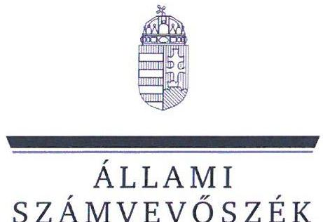
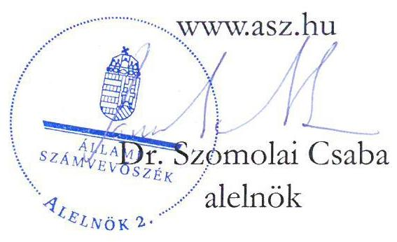
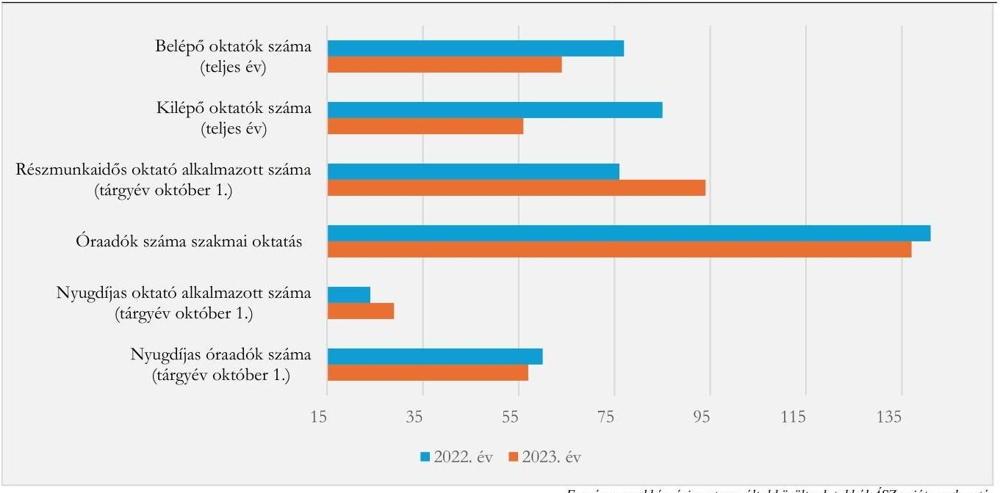
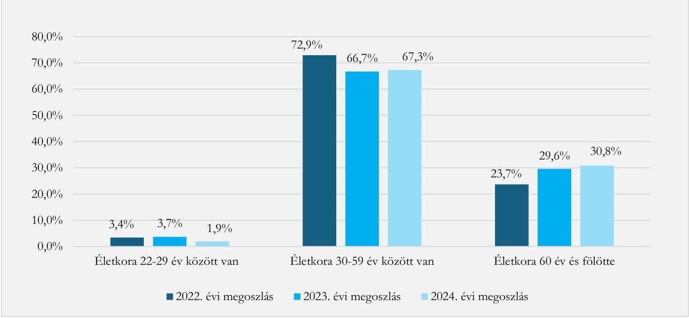
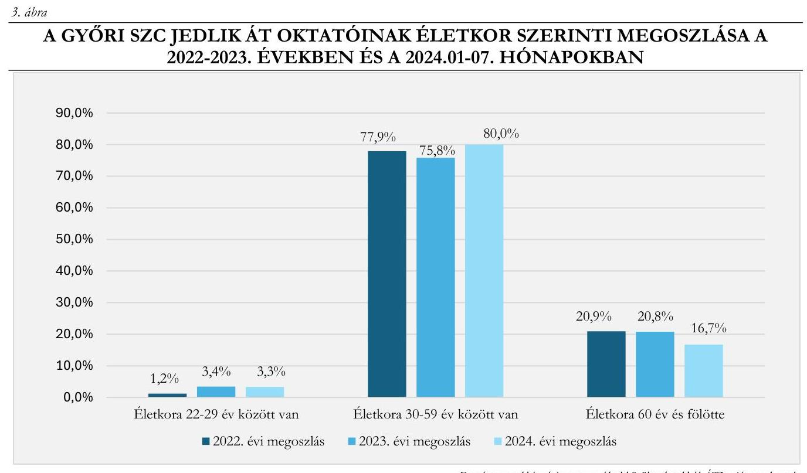

# JELENTÉS 

A szakképzési centrum intézményénél a feladatellátáshoz szükséges személyi feltételek rendelkezésre állásának célzott ellenőrzése

A Győri Szakképzési Centrum és két intézmény ellenőrzése
2025.

---

ÁLLAMI
SZÁMVEVŐSZÉK

# JELENTÉS 

## A szakképzési centrum intézményénél a feladatellátáshoz szükséges személyi feltételek rendelkezésre állásának célzott ellenőrzése

A Győri Szakképzési Centrum és két intézmény ellenőrzése
2025.

25022

---

# ELLENŐRZÉSI IGAZGATÓSÁG: 

## ELLENŐRZÉSI IGAZGATÓSÁG I.

## ELLENŐRZÉSI IGAZGATÓ:

SINKÁNÉ DR. CSENDES ÁGNES ellenőrzési igazgató

## ELLENŐRZÉSVEZETŐ:

NAGY MARIANNA ellenőrzésvezető

Jelentéseink az interneten a www.asz.hu címen olvashatók.

IKTATÓSZÁM: EL-4214-001/2025
TÉMASORSZÁM: -
ELLENŐRZÉS-AZONOSÍTÓ SZÁM: V1097

---

# TARTALOMJEGYZÉK 

AZ ELLENŐRZÉS ALAPADATAI ..... 5
AZ ELLENŐRZÖTT SZERVEZETEK ..... 7
ÖSSZEFOGLALÁS ..... 8
AZ ELLENŐRZÉS FÓKUSZTERÜLETE ..... 10
MEGÁLLAPÍTÁSOK ..... 11
MELLÉKLETEK ..... 17
I. sz. melléklet: Értelmező szótár ..... 17
II. sz. melléklet: Az ellenőrzött szervezetek jegyzéke ..... 18
III. sz. melléklet: Ellenőrzési kritériumok ..... 19
FÜGGELÉK: ÉSZREVÉTELEK ..... 20
RÖVIDÍTÉSEK JEGYZÉKE ..... 21

---

.

---

# AZ ELLENŐRZÉS ALAPADATAI 

## AZ ELLENŐRZÉS CÉLJA

Az ellenőrzés célja annak értékelése volt, hogy a szakképzési centrum intézményénél a feladatellátáshoz szükséges személyi feltételek biztosítottak voltak-e.

## AZ ELLENŐRZÉS TÍPUSA

Kombinált ellenőrzés.

## AZ ELLENŐRZÖTT IDŐSZAK

A 2022-2023. évek és a 2024. január 01. napjától 2024. augusztus 31. napjáig tartó időszak.

## AZ ELLENŐRZÉS TÁRGYA

A szakképzési centrumnál foglalkoztatottak összetételének elemzése, a szakképzési centrum által a szakképző intézmény vonatkozásában a szakképzési feladatellátáshoz szükséges személyi feltételek biztosítása volt az ellenőrzés tárgya. Az ellenőrzés kiterjedt a szakképzési centrumnál foglalkoztatottak életkorára, szakképzettségére, szakképesítésére, valamint a foglalkoztatás formájára is.

Az ellenőrzés kiterjedt minden olyan körülményre és adatra, amely az ÁSZ ${ }^{1}$ jogszabályban meghatározott feladatainak teljesítéséhez, valamint a program végrehajtása folyamán felmerült újabb összefüggések feltárásához szükséges volt.

## AZ ELLENŐRZÉS JOGALAPJA

Az ellenőrzés jogszabályi alapját az ÁSZ tv. ${ }^{2} 1 . \int(3)$ bekezdés és az 5. $\int(2)$-(3) bekezdés előírásai képezték.

## AZ ELLENŐRZÉS MÓDSZERE

Az ellenőrzés végrehajtása a nemzetközi standardokat irányadónak tekintve az ellenőrzési program szempontjai, az ellenőrzött időszakban hatályos jogszabályok, az ellenőrzés szakmai szabályok és módszertanok figyelembevételével történt.

Az ellenőrzési kérdések megválaszolásához szükséges bizonyítékok megszerzése az ellenőrzött szervezetek által rendelkezésre bocsátott dokumentumokra és adatokra alapozva, továbbá megfigyelés, szemle (szemrevételezés), kérdésfeltevés (információkérés), valamint elemző eljárás útján történt. Az ellenőrzési bizonyítékként felhasználható adatforrások közé tartoztak egyrészt az ellenőrzéshez kért dokumentumok,

---

adatforrások, másrészt adatforrás volt minden - az ellenőrzés folyamán - feltárt, az ellenőrzés szempontjából információt tartalmazó dokumentum.

Az ellenőrzött szervezetek az ellenőrzés lefolytatásához tanúsítványt töltöttek ki, valamint az ÁSZ által kért dokumentumok, adatok, információk megküldésével és az ellenőrzés során szolgáltattak adatokat.

Az ÁSZ a szakképzési centrumnál foglalkoztatottak összetételét több szempont alapján (például a foglalkoztatás formája, a fluktuáció, valamint a pályakezdő, a nyugdíjas és az állandó helyettesítésre alkalmazottak, az óraadók esetében a nyugdíjas és az állandó helyettesítésre alkalmazottak), a szakképző intézmény vonatkozásában a foglalkoztatás formáját, a nyugdíjas oktatók arányát elemezte.

A szakképzési centrum tekintetében az Szkr. alapján ellenőrzésre került, hogy rendelkezett-e saját alkalmazotti létszámmal. Az Szkr. 58. § (2) bekezdés megfogalmazása: állandó saját alkalmazotti létszámmal akkor rendelkezik a szakképző intézmény, ha az alkalmazotti létszám legalább negyven százaléka általános teljes napi munkaidőre létrejött határozatlan idejű munkaviszonyban áll, amelyből legalább hetvenöt százaléka az Szkt. 40. § (1) bekezdés c) vagy d) pontja szerinti munkakörben van foglalkoztatva. Az Szkr. 56. § (2) bekezdés alapján a szakképzési centrum részeként múködő szakképző intézmény esetében az állandó saját alkalmazotti létszámra vonatkozó feltételnek a szakképzési centrum tekintetében kell fennállnia.

A szakképzési centrumhoz tartozó szakképző intézménynél a foglalkoztatottak éves átlagos létszáma a munkavállalók folyamatosan vezetett létszámnyilvántartásán alapult, az éves átlagszámítás a havi átlagos létszámadatok összegének 12 -vel elosztása alapján történt.

Az ÁSZ a szakképző intézménynél a szakmai oktatáson belül az ágazati alapoktatáshoz és a szakirányú oktatáshoz szükséges személyi feltételek rendelkezésre állását a szakmai oktatáshoz szükséges végzettség, szakképesítés, valamint a továbbképzési kötelezettség teljesítése alapján ellenőrizte és értékelte.

A szakképző intézménynél az ellenőrzési szempontok alapján a szakképzési feladatok jövőbeni ellátásában kockázatot hordoz, ha az ellenőrzött időszakban a nyugdíjas oktatók aránya meghaladta a $10 \%$-ot, valamint az ágazati alapoktatáshoz és/vagy a szakirányú oktatáshoz szükséges végzettség, szakképesítés az oktatók több mint 5\%-ánál nem volt biztosított. Amennyiben az ellenőrzés a személyi feltételek rendelkezésre állása területén a megfelelően szakképzett oktatók hiányában feladatellátási kockázatot azonosított, akkor értékelésre kerültek a személyi feltételek rendelkezésre állása érdekében megtett intézkedések is.

---

# AZ ELLENŐRZÖTT SZERVEZETEK 

## Győri SzAKKÉPZési CENTRUM

A Győri SZC ${ }^{3}$ az Szkt. ${ }^{4}$ 26. $\int$ (1) bekezdés és az Szkr. ${ }^{5}$ 77. $\int$ (1) bekezdés alapján a szakképzésért felelős miniszter által alapított, szakképzési feladatot ellátó költségvetési szerv. Az állami szakképző intézmény a szakképzési centrum részeként múködik. Alapításának időpontja 2015.07.01., irányító szerve, fenntartója az alapítástól 2018.05.21-ig a Nemzetgazdasági Minisztérium, 2018.05.22-től 2022.06.30-ig az Innovációs és Technológiai Minisztérium volt, majd 2022.07.01-től a Kulturális és Innovációs Minisztérium (KIM ${ }^{6}$ ), középirányító szerve a Nemzeti Szakképzési és Felnőttképzési Hivatal. A Győri SZC fő tevékenysége technikumi szakmai oktatás, szakképző iskolai szakmai oktatás, szakiskolai és szakgimnáziumi nevelés-oktatás, valamint az állami intézményfenntartó központtól átvett gimnázium és általános iskola intézményegységekben gimnáziumi és általános iskolai nevelés-oktatás alapfeladat.

A Győri SZC átlagos állományi létszáma 2022. évben 1328 fő, 2023. évben 1325 fő, 2024.01.012024.08.31. közötti időszakban 1334 fő volt. A szakképzési centrum részeként az ellenőrzött időszakban 20 szakképző intézmény, valamint egy akkreditált vizsgaközpont múködött. Az Szkt. 26. § (3) bekezdés alapján a szakképzési centrumot a főigazgató és a kancellár önállóan vezeti és képviseli. A főigazgató felel a szakképzési centrum részeként múködő szakképző intézmények szakképzési alapfeladatainak ellátásáért. A kancellár felel a szakképzési centrum törvényes és szakszerű működéséért. A Győri SZC kancellárjának és főigazgatójának személye az ellenőrzött időszakban nem változott.

## Győri SZC Hunyadi Mátyás Technikum

A Győri SZC Hunyadi MT ${ }^{7}$ a Győri Szakképzési Centrum részeként múködik 2015.07.01-je óta. A Győri SZC Hunyadi MT ellenőrzött időszakban hatályos alapító okiratának 6.1.4. pontja alapján a technikumi szakmai oktatás mellett szakképző iskolai szakmai oktatást is ellátott. A Győri SZC Hunyadi MT-ben oktatott szakmák a specializált gép- és járműgyártás, a gépészet, a közlekedés és szállítmányozás, az építőipar, a kereskedelem és a szépészet ágazatba sorolhatók. A 2023/2024. tanévben a szakmai oktatás keretében résztvevő tanulók száma 555 fő volt.

## Győri SZC JedliK Ányos GÉpiPari És INFORMATiKai TECHNiKUM És KOLLÉGIUM

A Győri SZC Jedlik ÁT ${ }^{8}$ a Győri Szakképzési Centrum részeként múködik 2015.07.01-je óta. A Győri SZC Jedlik ÁT ellenőrzött időszakban hatályos alapító okiratának 6.1.5. pontja alapján az intézmény technikumi szakmai oktatás mellett szakképző iskolai szakmai oktatást is ellátott. A Győri SZC Jedlik ÁT-ben oktatott szakmák a gépészet és az informatika, továbbá a távközlés ágazatba sorolhatók. A 2023/2024. tanévben a szakmai oktatás keretében résztvevő tanulók száma 883 fő volt.

---

# ÖSSZEFOGLALÁS 

A szakképzési rendszer irányítása és múködési mechanizmusa az elmúlt években jelentősen átalakult. A fejlesztés irányait, a stratégiai célokat átfogó, jövőorientált hosszú- és közép távú célokat a Szakképzés 4.0 Stratégia ${ }^{9}$-ban fektették le, mely kiemelt célként jelölte meg a tudásalapú gyakorlati tanulás hatékonyságának növelését. A szakképzési rendszer fejlesztése állandó tárgya a közérdeklődésnek. A szakképzési rendszer fejlesztésére negatívan hat, ha a szakképzési centrum nem rendelkezik a feladatellátáshoz szükséges személyi feltételekkel, mert nincs elegendő szakképzett oktató az egyes tantárgyakra, vagy több a kilépő oktató (pályaelhagyó, nyugdíjba vonuló), mint a belépő. Ha a feladatellátás személyi feltételei nem biztosítottak, akkor az a feladatellátási kockázaton túl azt eredményezheti, hogy a tanulók nem megfelelő tudás birtokában lépnek ki a munkaerőpiacra.

A szakképző intézmény akkor rendelkezik a feladatai ellátásához szükséges feltételekkel, ha többek között állandó saját alkalmazotti létszámmal rendelkezik, mely feltételnek jogszabályi előírás alapján a szakképzési centrum részeként múködő intézmény esetében a szakképzési centrum tekintetében kell fennállnia.

A Győri SZC-nél az általános teljes napi munkaidőre létrejött határozatlan idejű jogviszonyban foglalkoztatottak aránya a jogszabályi előírásban rögzítetteknek megfelelő volt. Az oktatók és pedagógusok arányára vonatkozó jogszabályi előírást az ÁSZ ellenőrzéssel érintett szakképzési centrumok eltérően értelmezték. A Győri SZC a KIM jogértelmezése szerint számított állandó saját alkalmazotti létszámmal rendelkezett.

A szakképzési centrum részeként múködő szakképző intézmény esetében a szakképzési centrum tekintetében írja elő az Szkr. az állandó saját alkalmazotti létszám, mint a szakképző intézmény feladatainak ellátásához szükséges egyik feltétel teljesítésének követelményét.
Az ÁSZ ellenőrzés szakmai véleménye szerint indokolt az Szkr.-ben az állandó saját alkalmazotti létszámra vonatkozó előírás egyértelműsítése. Az ÁSZ célszerűnek tartja, ha a középirányító szerv egyértelmű, egységes iránymutatást ad a szakképzési centrumoknak az állandó saját alkalmazotti létszám számítására, amely a szakképzési centrumok eltérő értelmezésének elkerülését, és a tudatos létszámgazdálkodást támogatná.

A Győri SZC vonatkozásában megfigyelhető tendencia volt, hogy a 2022. évben 1328 fő, a 2023. évben 1325 fő átlagos alkalmazotti létszámon belül a főállású, határozatlan idejű jogviszonyban foglalkoztatottak állománya alig változott (2022-ben 838 fő, 2023-ban 839 fő volt). A részmunkaidős jogviszonyban foglalkoztatottak létszáma (2022-ben 76 főről, 2023-ban 94 főre) emelkedett, az óraadóként foglalkoztatottak létszáma stagnált (2022-ben és 2023-ban 140 fő körül volt), továbbá a nyugdíjasként történő foglalkoztatás növekedett a szakmai oktatási területen.

A Győri SZC-nél - a szakmai oktatási területen - a 2022. évben mutatkozó nagyobb mértékủ fluktuáció a 2023. évre csökkenő tendenciát mutatott (2022. évben az 1328 fő 6,4\%-a, 85 fő volt a kilépő oktatók száma; illetve $5,8 \%$-a, 77 fő a belépő oktatók száma; a 2023. évben az 1325 fő 4,2\%-a, 56 fő volt a kilépő oktatók száma; illetve $4,8 \%$-a, 64 fő a belépő oktatók száma). A 2023. évben a belépő oktatók száma meghaladta a kilépő oktatók számát.

---

A Győri SZC az ellenőrzött időszakban egyre nagyobb arányban foglalkoztatott nyugdíjasokat jellemzően óraadóként - a feladatok ellátása érdekében. A nyugdíjas foglalkoztatással szemben ugyanakkor nagyon alacsony volt a belépő, pályakezdő oktatók aránya.

Az ellenőrzött időszakban a Győri SZC Hunyadi MT-nél a nyugdíjas oktatók száma nem volt jelentős, azonban a szakmai oktatás oktatóinak a 2023. évben 28,0\%-a, 2024.01.01-2024.07.31. között 36,4\%-a volt 60 év feletti életkorban, amely kockázatot jelent a szakképzési feladatok jövőbeni ellátásának biztosítása tekintetében. A Győri SZC Jedlik ÁT-nél a 2023. évben a szakmai oktatás oktatóinak 23,3\%-a volt 60 év feletti életkorban. Az oktatók 12,1\%-a volt nyugdíjas oktató a 2023. évben (döntő részben - nyugdíjas oktatók 63,6\%a - szakmai oktatásban résztvevő), amely kockázatot jelent a szakképzési feladatok jövőbeni ellátása tekintetében, hiszen a szakmai oktatók nyugdíj előtti képzési kötelezettségének korlátozott volta miatt előfordulhat, hogy nem a legaktuálisabb tudás megosztása történik meg. A kockázat a nyugdíjas oktatók számának túlsúlyba kerülésével fokozottan jelentkezhet. A Győri SZC az átmeneti létszámproblémákat (például felmondás) belső átcsoportosítással, önként vállalt túlóra elrendelésével, nyugdíjas oktatók bevonásával, valamint óraadókkal próbálta megoldani.

A Győri SZC ellenőrzött szakképző intézményei az ellenőrzött időszakban a szakképzési feladatok ellátásához szükséges személyi feltételekkel az Szkr. előírásának megfelelően rendelkeztek.

---

# AZ ELLENŐRZÉS FÓKUSZTERÜLETE 

A szakképző intézménynél a szakképzési feladatellátáshoz szükséges személyi feltételek rendelkezésre állása

---

# 1. Győri Szakképzési Centrum 

Összegző megállapítás

A Győri SZC az ellenőrzött időszakban az Szkr. KIM általi jogértelmezése szerint számított állandó saját alkalmazotti létszámmal rendelkezett. A Győri SZC az ellenőrzött időszakban egyre nagyobb arányban foglalkoztatott nyugdíjasokat - jellemzően óraadóként - a feladatok ellátása érdekében. A nyugdíjas foglalkoztatással szemben ugyanakkor nagyon alacsony volt a belépő, pályakezdő oktatók aránya.

A Győri SZC átlagos alkalmazotti létszáma a 2022. évben 1328 fő, a 2023. évben 1325 fő, a 2024.01.012024.08.31. közötti időszakban 1334 fő volt. Az általános teljes napi munkaidőre létrejött határozatlan idejű munkaviszonyban állók száma a 2022. évben 1244 fő, a 2023. évben 1255 fő, a 2024.01.01-2024.08.31. közötti időszakban 1264 fő volt. A Győri SZC-nél az Szkt. 40. § (1) bekezdés c) és d) pontja szerinti oktató és pedagógus összesen a 2022. évben 871 fő, a 2023. évben 890 fő volt.
A Győri SZC-nél az általános teljes napi munkaidőre létrejött határozatlan idejű jogviszonyban foglalkoztatottak aránya a jogszabályi előírásban rögzítetteknek megfelelő volt. Az oktatók és pedagógusok arányára vonatkozó jogszabályi előírást az ÁSZ ellenőrzéssel érintett szakképzési centrumok eltérően értelmezték.
Az Szkr. 58. § (2) bekezdés szerint: „Állandó saját alkalmazotti létszámmal akkor rendelkezik a szakképzö intézmény, ha az alkalmazotti létszám legalább negyven százaléka általános teljes napi munkaidőre létrejött határozatlan idejü munkaviszonyban vagy egybázi szolgálati jogviszonyban áll, amelyböl legalább betvenöt százaléka az Szkt. 40. § (1) bekezdés c) vagy d) pontja szerinti munkakörben van foglalkoztatva". Az Szkr. 56. § (2) bekezdés alapján a szakképzési centrum részeként működő szakképző intézmény esetében az állandó saját alkalmazotti létszámra vonatkozó feltételnek a szakképzési centrum tekintetében kell fennállnia.
A Győri SZC részére az Szkr. 58. § (2) bekezdéssel kapcsolatosan a KIM jogértelmezést adott, amely szerint: „A szakképzö intézmény elöirt alkalmazotti körét a szakképzésröl szóló 2019. évi LXXX. törvény (a továbbiakban: Szkt.) 40. § (1) bekezdése sorolja fel (igazgató, igazgatóhelyettes, oktató, többcélú szakképzö intézményben köznevelési alapfeladat-ellátásra a pedagógusok új életpályájáról szóló törvény szerinti pedagógus, a további, közvetlenül nem a szakmai alapfeladat-ellátással összefüggő feladat ellátására létesített munkakörben foglalkoztatott).
A szakképzésről szóló törvény végrebajtásáról szóló 12/2020. Korm. rendelet (II. 7.) (a továbbiakban Szkr.) 56. § (1) bekezdés c) pontjában foglalt fenti feltétel az Szkr. 58. § (2) bekezdésében kerül kifejtésre, azaz állandó saját alkalmazotti létszámmal akkor rendelkezik a szakképzö intézmény, ha: 1.) az alkalmazotti létszám legalább $40 \%$-a általános teljes napi munkaidőre létrejött határozatlan idejü munkaviszonyban áll, 2.) amelyböl legalább $75 \%$-a oktató vagy pedagógus munkakörben van foglalkoztatva.
A szakképzési centrum (a továbbiakban: SZC) részeként müködő szakképzö intézmény esetében az Szkr. 56. § (2) bekezdése kimondja, hogy a feladatellátáshoz szükséges jogszabályi feltételeknek - köztük az állandó saját alkalmazotti létszámra vonatkozóan elöirtaknak - az SZC tekintetében kell fennállnia.

---

Azax az alkalmazotti létszám esetében az SZC rézseként müködő valamennyi intézmény alkalmazottjain túl figyelembe kell venni az SZC köxponti szervezetében foglalkoztatott vezetö és nem vezetö állású munkavállalókat is (Szekt. 26. §).
Álláspontunk szerint az SZC valamennyi alkalmazottja létszámának $40 \%$-át alapul véve, e létszám háromnegyedénél, azaz az összlétszám $30 \%$-ánál nem lehet kevesebb az SZC-ben teljes állású, batározatlan idejü munkaviszonyban álló oktató és pedagógus munkakörben foglalkoztatottak száma."
A Győri SZC az Szkr. 58. $\mathbb{S}$ (2) bekezdésének KIM általi jogértelmezése szerint számított állandó saját alkalmazotti létszámmal rendelkezett.
A Győri SZC-nél - a szakmai oktatási területen - a belépő oktatók száma a 2022. évben 77 fő, a 2023. évben 64 fő volt. A kilépő oktatók száma a 2022. évben 85 fő, a 2023. évben 56 fő volt. A 2022-2023. évi összes belépő és kilépő oktatók számát tekintve, a kilépő oktatók száma megegyezett a belépő oktatók számával (1. ábra).
A Győri SZC-nél - a szakmai oktatási területen - a teljes munkaidős alkalmazott oktatók létszáma a 2022. évi 796 főről a 2023. évre kisebb mértékben ( $2,8 \%$ ) 774 főre csökkent, ugyanakkor a részmunkaidős oktató alkalmazottak száma a 2022. évi 76 főről a 2023. évre 23,7\%-kal, 94 főre emelkedett. A Győri SZC-nél a nyugdíjasként alkalmazott oktatók száma a szakképzési centrum főállású oktatói tekintetében a 2022. évi 24 főről 2023. évre 29 főre emelkedett. Óraadóként a 2022. évben 141 fő, a 2023. évben 137 fő volt foglalkoztatva, amelyből a 2022. évben 60 fő, a 2023. évben 57 fő volt nyugdíjas.
A Győri SZC vonatkozásában megfigyelhető tendencia a 2022. évben 1328 fő, a 2023. évben 1325 fő átlagos alkalmazotti létszámon belül, hogy a főállású, határozatlan idejű jogviszonyban foglalkoztatottak állománya alig változott (2022-ben 838 fő, 2023-ban 839 fő volt). A részmunkaidős jogviszonyban foglalkoztatottak létszáma (2022-ben 76 főről, 2023-ban 94 főre) emelkedett, az óraadóként foglalkoztatottak létszáma stagnált (2022-ben és 2023-ban 140 fő körül), továbbá a nyugdíjasként történő foglalkoztatás emelkedett.
A nyugdíjas foglalkoztatással szemben ugyanakkor nagyon alacsony volt a belépő, pályakezdő oktatók aránya (2022-ben és 2023-ben az átlagos állományi létszám 0,3\%-a).

# 1. ábra 

A GYŐRI SZC OKTATÓI ÁLLOMÁNYÁBAN TÖRTÉNT LEGJELLEMZŐBB VÁLTOZÁSOK A 2022. ÉS 2023. ÉVEKBEN (FŐ)

---

# 2. Győri SZC Hunyadi Mátyás Technikum 

## Összegző megállapítás

A Győri SZC Hunyadi MT-nél a szakképzési feladatellátáshoz a személyi feltételek rendelkezésre álltak. Kockázatot jelent a szakképzési feladatok jövőbeni ellátása tekintetében, hogy a szakmai oktatás oktatóinak a 2023. évben $28,0 \%$-a, a 2024.01.01-2024.07.31. közötti időszakban $36,4 \%$-a 60 év feletti életkorú volt.

A Győri SZC Hunyadi MT-nél a foglalkoztatottak éves átlagos létszáma a 2022. évben 59 fő, a 2023. évben 54 fő, a 2024.01.01-2024.07.31. közötti időszakban 52 fő volt. A foglalkoztatottak éves átlagos létszáma $11,9 \%$-kal csökkent a 2022. évről a 2024.01.01-2024.07.31. közötti időszakra, a tanulók létszáma ugyanezen időszakban $12,5 \%$-kal csökkent. Az oktatói feladatot ellátó alkalmazottak aránya a 2023. évben $88,9 \%$, az óraadók aránya $11,1 \%$ volt.
A Győri SZC Hunyadi MT-nél oktatói feladatot ellátó alkalmazottak éves átlagos létszáma a 2022. évben 53 fő, a 2023. évben 48 fő, a 2024.01.01-2024.07.31. közötti időszakban 46 fő volt. Az oktatói feladatot ellátó alkalmazottak - a 2022. évben három fő kivételével - határozatlan idejű munkaviszonyban álltak. A teljes munkaidős munkaviszonyban alkalmazott oktatók száma a 2022. évi 47 főről a 2024.01.012024.07.31. közötti időszakra $21,3 \%$-kal csökkent 37 főre, az alkalmazottakon belüli aránya $88,7 \%$-ról $80,4 \%$-ra változott. A Győri SZC Hunyadi MT-nél az ellenőrzött időszakban alkalmazottként nem került sor nyugdíjas foglalkoztatására.
Óraadóként megbízási szerződéssel foglalkoztatottak éves átlagos létszáma 2022-ben hat fő, 2023-ban hat fő, 2024.01.01-2024.07.31. közötti időszakban hat fő volt. Az óraadók esetében volt nyugdíjas oktató (2022. évben három fő, a 2023. évben kettő fő, 2024.01.01-2024.07.31. közötti időszakban 2 fő), akik közismereti tárgyat oktattak. A nyugdíjasként foglalkoztatott óraadók aránya a teljes foglalkoztatotti létszámon belül egyik időszakban sem haladta meg a 6\%-ot.
2. ábra

A GYŐRI SZC HUNYADI MT OKTATÓINAK ÉLETKOR SZERINTI MEGOSZLÁSA A 2022-2023. ÉVEKBEN ÉS A 2024.01-07. HÓNAPOKBAN

---

A Győri SZC Hunyadi MT-nél 22 évesnél fiatalabb, diplomával még nem rendelkező oktató az ellenőrzött időszakban nem volt. A 29 évnél fiatalabb korcsoportba a 2022. évben kettő fő, a 2023. évben kettő fő, a 2024.01.01-2024.07.31. közötti időszakban egy fő tartozott.

A Győri SZC Hunyadi MT-nél a foglalkoztatottak az ellenőrzött időszakban jellemzően a 30-59 éves korosztályba tartoztak, arányuk azonban a 2022. évről a 2024. évre csökkent, mely a 60 év feletti korosztályhoz tartozó oktatók számának növekedésével járt. A 30-59 éves korosztály aránya a 2022. évben 72,9\% (59 főből 43 fő), amely a 2023. évben 66,7\%-ra (54 főből 36 fő) csökkent, a 2024.01.01-2024.07.31. között 67,3\%-ra (52 főből 35 fő) változott. A 60 év felettiek aránya ezzel párhuzamosan a 2022. évi 23,7\%ról a 2023. évre 29,6\%-ra, majd a 2024.01.01-2024.07.31. közötti időszakra 30,8\%-ra emelkedett (2. ábra). A szakmai oktatás oktatóinak a 2022. évben 28,0\%-a, a 2023. évben 28,0\%-a, a 2024.01.012024.07.31. között 36,4\%-a volt 60 év feletti életkorban. A létszámadatok alapján az oktatók egyre nagyobb aránya került közel a nyugdíjazáshoz, a 22-29 év közötti oktatók száma ugyanakkor 2 fő volt a 2022. és a 2023. években, 1 fő volt a 2024.01.01-2024.07.31. közötti időszakban.

A Győri SZC az ellenőrzött időszakban oktatói munkakörökre álláspályázatokat írt ki, amely nem vezetett eredményre (nem volt megfelelő végzettségű pályázó, illetve volt olyan pályázó, aki nem a Győri SZC Hunyadi MT-nél helyezkedett el végül). A Győri SZC az átmeneti létszámproblémákat (például felmondás) belső átcsoportosítással, önként vállalt túlóra elrendelésével, nyugdíjas oktatók bevonásával, valamint óraadókkal próbálta megoldani.
A Győri SZC Hunyadi MT-nél foglalkoztatott valamennyi oktató rendelkezett az Szkr. 134. § (2)(3) bekezdésben előírt végzettséggel, képzettséggel.

A Győri SZC Hunyadi MT-nél továbbképzési kötelezettséget teljesítő oktatók száma a 2022. évben 14 fő, a 2024.01.01-2024.07.31. közötti időszakban öt fő volt. Az öregségi nyugdíjkorhatár előtti öt évnél rövidebb idő miatt a 2022. évben 10 fő, és 2024.01.01-től 2024.07.31-ig öt fő mentesült a továbbképzési kötelezettség alól.
Az átmeneti szabályokat tartalmazó Szkt. 127. § (5) bekezdés alapján az alkalmazott továbbképzési kötelezettsége 2021. július 1-jével kezdődött. Az oktatók továbbképzési kötelezettségüknek 2025. június 30-ig tehetnek eleget. A Hunyadi MT-nél az alkalmazott oktatók $50 \%$-a az ellenőrzött időszakban nem vett még részt továbbképzésen, azonban ezen kötelezettség teljesítésének határideje esetükben is 2025. június 30-a. Az oktatók életkorának eltolódását a 60 éves és a feletti korosztály felé az is jelzi, hogy az alkalmazottak egyre nagyobb hányada mentesül a továbbképzési kötelezettség alól az Szkr. 142. $\$ (3) bekezdés miatt, vagyis életkora az öregségi nyugdíjkorhatár előtti öt évbe esik.

---

# 3. Győri SZC Jedlik Ányos Technikum 

## Összegző megállapítás

A Győri SZC Jedlik ÁT-nél a szakképzési feladatellátáshoz a személyi feltételek rendelkezésre álltak. Kockázatot jelent a szakképzési feladatok jövőbeni ellátása tekintetében, hogy a 2023. évben a nyugdíjas oktatók aránya meghaladta a 10,0\%ot, és a szakmai oktatás oktatóinak 23,3\%-a volt 60 év feletti életkorban.

A Győri SZC Jedlik ÁT-nél a foglalkoztatottak éves átlagos létszáma a 2022. évben 86 fő, a 2023. évben 91 fő, a 2024.01.01-2024.07.31. közötti időszakban 90 fő volt. Az oktatói feladatot ellátó alkalmazottak aránya a 2023. évben $90,1 \%$, az óraadók aránya $9,9 \%$ volt.
A Győri SZC Jedlik ÁT-nél oktatói feladatot ellátó alkalmazottak éves átlagos létszáma a 2022. évben 80 fő, a 2023. évben 82 fő, a 2024.01.01-2024.07.31. közötti időszakban 83 fő volt. Az alkalmazottak jelentős többsége, átlagosan $90 \%$-a teljes munkaidőben és - a 2023. évben egy fő kivételével - határozatlan idejű jogviszonyban volt foglalkoztatva az ellenőrzött időszaban.
A Győri SZC Jedlik ÁT-nél a nyugdíjas foglalkoztatottak átlagos létszáma a 2022. évben hat fő, a 2023. évben 11 fő, a 2024.01.01-2024.07.31. közötti időszakban hét fő volt, arányuk a teljes foglalkoztatotti létszámhoz viszonyítva a 2022. évben 7,0\%, a 2023. évben 10,0\%-ot meghaladó (12,1\%) volt. A 2023. évben a nyugdíjas oktatók 63,6\%-a szakmai oktatásban vett részt, amely kockázatot jelent a szakképzési feladatok jövőben ellátása tekintetében.
Óraadóként megbízási szerződéssel foglalkoztatottak átlagos létszáma a 2022. évben hat fő, a 2023. évben kilenc fő, a 2024.01.01-2024.07.31. közötti időszakban hét fő volt, akik közül a 2022. évben három fő, a 2023. évben hat fő, a 2024.01.01-2024.07.31. közötti időszakban négy fő volt nyugdíjas. Az óraadóként foglalkoztatott létszámon belül a 2023. évben és a 2024.01.01-2024.07.31. közötti időszakban $60 \%$ körül volt a nyugdíjasok aránya.
A Győri SZC Jedlik ÁT-nél 22 évnél fiatalabb, diplomával még nem rendelkező oktató az ellenőrzött időszakban nem volt. A 29 évnél fiatalabb korcsoportba a 2022. évben egy fő, a 2023. évben három fő, a 2024.01.01-2024.07.31. közötti időszakban három fő oktató tartozott. A 30-59 éves korosztályba tartozók száma a 2022. évi 67 főről, a 2024.01.01-2024.07.31. közötti időszakra 72 főre változott, arányuk az átlagos alkalmazotti létszámhoz viszonyítva a 2022. évi $77,9 \%$-ról a 2024.01.01-2024.07.31. időszakra 80,0\%-ra változott. A 60 év feletti oktatók aránya a 2022. évi 20,9\%-ról a 2024.01.01-2024.07.31. közötti időszakra 16,7\%-ra csökkent, számuk a 2022. évben 18 fő, a 2024.01.01-2024.07.31. közötti időszakban 15 fő volt (3. ábra).

A 2023. évben a szakmai oktatás oktatóinak 23,3\%-a volt 60 év feletti életkorban.

---

*Forrás: a szakképzési centrum által közölt adatokból ÁSZ saját szerkesztés*

A Győri SZC az ellenőrzött időszakban oktatói munkakörökre álláspályázatokat írt ki, amely nem vezetett eredményre (nem volt megfelelő végzettségű pályázó, illetve volt olyan pályázó, aki nem a Győri SZC Jedlik ÁT-nél helyezkedett el végül). A Győri SZC az átmeneti létszámproblémákat (például felmondás) belső átcsoportosítással, önként vállalt túlóra elrendelésével, nyugdíjas oktatók bevonásával, valamint óraadókkal próbálta megoldani.

# **A Győri SZC Jedlik ÁT-nél foglalkoztatott valamennyi oktató rendelkezett az Szkr. 134. § (2)-(3) bekezdésében előírt végzettséggel, képzettséggel.**

A Győri SZC Jedlik ÁT-nél a továbbképzési kötelezettséget teljesítő oktatók száma a 2022. évben 31 fő, a 2023. évben 17 fő, a 2024.01.01. - 2024.07.31. közötti időszakban 10 fő volt. Az öregségi nyugdíjkorhatár előtti öt évnél rövidebb idő miatt, vagy mert az oktató nyugdíjasként került foglalkoztatásra, a 2022. évben 19 fő, a 2023. évben 18 fő, a 2024.01.01.-2024.07.31. közötti időszakban 16 fő mentesült a továbbképzési kötelezettség alól.

Az átmeneti szabályokat tartalmazó Szkt. 127. § (5) bekezdés alapján az alkalmazott továbbképzési kötelezettsége 2021. július 1-jével kezdődik. Az oktatók továbbképzési kötelezettségüknek 2025. június 30-ig tehetnek eleget. A rendelkezésre álló adatok alapján megállapítható, hogy az intézmény vonatkozásában alkalmazottak közel 50 %-a az ellenőrzött időszakban nem vett még részt továbbképzésen, azonban ezen kötelezettség teljesítésének határideje esetükben is 2025. június 30. **A 2022. évről a 2023. évre a szakmai oktatásban résztvevők életkorának eltolódását a 60 éves és a feletti korosztály felé az is jelzi, hogy az alkalmazottak egyre nagyobb hányada mentesül a továbbképzési kötelezettség alól az Szkr. 142. § (3) bekezdés miatt, vagyis életkora az öregségi nyugdíjkorhatár előtti öt évbe esik.**

---

# MELLÉKLETEK 

## I. SZ. MELLÉKLET: ÉRTELMEZŐ SZÓTÁR

átlagos állományi létszám
oktató
óraadó
szakképzési centrum
szakképző intézmény
szakmai oktatás

Az átlagos állományi létszám a munkavállalók folyamatosan vezetett létszámnyilvántartása alapján számított mutató. Az éves átlagos állományi létszám a már kiszámított havi átlagos létszám-adatok egyszerű számtani átlaga, vagyis éves átlagszámítás esetén 12 -vel kell elosztani a havi átlagos létszámadatok összegét. $\left(\mathrm{KSH}^{10}\right)$
Szakképző intézményben a szakképzési alapfeladat-ellátást végző személy. (Szkt. 47. § (1) bekezdés)
Megbízási szerződés keretében legfeljebb heti tizennégy óra vagy foglalkozás megtartására alkalmazott pedagógus, oktató. (Nkt. ${ }^{11}$ 4. § 21.)
A szakképzési centrumok olyan a szakképzésért felelős miniszter által alapított önálló költségvetési szervek, amelyeknek részeként működnek a szakképzési alapfeladatot ellátó, jogi személyiséggel bíró szakképző intézmények vagy az Nkt. szerinti köznevelési intézmények (például kollégium). (Szkt. 26. §-ához tartozó Nagykommentár)
A szakképzési centrum részeként működő szakképző intézmény a szakképzési centrum jogi személyiséggel rendelkező szervezeti egysége, amely kizárólag a Kormány rendeletében meghatározott jogok és kötelezettségek alanya lehet. (Szkt. 17. §)
A szakképző intézményben a képzési és kimeneti követelmények alapján történő ágazati alapoktatás és szakirányú oktatás. (Szkt. 19. § (1) bekezdés)

---

II. SZ. MELLÉKLET: AZ ELLENŐRZÖTT SZERVEZETEK JEGYZÉKE

|  ELLENŐRZÖTT SZERVEZET NEVE | SZEREPE  |
| --- | --- |
|  1. Győri Szakképzési Centrum | Szakképzési feladatot ellátó költségvetési szerv  |
|  2. Győri SZC Hunyadi Mátyás Technikum | Szakképző intézmény (tagintézmény)  |
|  3. Győri SZC Jedlik Ányos Gépipari és Informatikai | Szakképző intézmény (tagintézmény)  |
|  Technikum és Kollégium |   |

---

# III. SZ. MELLÉKLET: ELLENŐRZÉSI KRITÉRIUMOK 

## FOKUSZTERÜLET

1. A szakképző intézménynél a szakképzési feladatellátáshoz szükséges személyi feltételek rendelkezésre állása

## ELLENŐRZÉSI KRITÉRIUMOK

Szkt. 40. § (1) bekezdés c), d) pontjai, 50. § (1) bekezdés, 127. $\S$ (5) bekezdés

Szkr. 56. § (1) bekezdés c) pont, 56. § (2) bekezdés, 58. § (2) bekezdés, 124. § (2) bekezdés 10. pont, 134. § (2)-(3) bekezdései, 142. §

---

# FÜGGELÉK: ÉSZREVÉTELEK 

A jelentéstervezetet a Számvevőszék 15 napos észrevételezésre megküldte az ellenőrzött szervezet vezetőjének az ÁSZ tv. 29. §* (1) bekezdése előírásának megfelelően.
A jelentéstervezet megállapításaira a Győri SZC vezetője észrevételt tett, amelyet az ÁSZ elfogadott, a számvevőszéki jelentés véglegesitése során figyelembe vett.

[^0]
[^0]:    * 29. § (1) Az Állami Számvevőszék az ellenőrzési megállapításait megküldi az ellenőrzött szervezet vezetőjének vagy az általa megbízott személynek, és annak, akinek személyes felelősségét állapította meg.
    (2) Az ellenőrzött szervezet vezetője és a felelősként megjelölt személy az ellenőrzés megállapításaira tizenöt napon belül írásban észrevételt tehet.
    (3) Az Állami Számvevőszék az észrevételre a beérkezésétől számított harminc napon belül írásban válaszol. A figyelembe nem vett észrevételeket köteles a jelentésben feltüntetni, és megindokolni, hogy azokat miért nem fogadta el.

---

# RÖVIDÍTÉSEK JEGYZÉKE 

${ }^{1}$ ÁSZ
${ }^{2}$ ÁSZ tv.
${ }^{3}$ Győri SZC
${ }^{4}$ Szkt.
${ }^{5}$ Szkr.
${ }^{6}$ KIM
${ }^{7}$ Győri SZC Hunyadi MT
${ }^{8}$ Győri SZC Jedlik ÁT
${ }^{9}$ Szakképzés 4.0 Stratégia
${ }^{10}$ KSH
${ }^{11} \mathrm{Nkt}$.

Állami Számvevőszék
2011. évi LXVI. törvény az Állami Számvevőszékről

Győri Szakképzési Centrum
2019. évi LXXX. törvény a szakképzésről
12/2020. (II.7.) Korm.rendelet a szakképzésről szóló törvény végrehajtásáról
Kulturális és Innovációs Minisztérium
Győri SZC Hunyadi Mátyás Technikum
Győri SZC Jedlik Ányos Gépipari és Informatikai Technikum és Kollégium
A „Szakképzés 4.0 - A szakképzés és felnőttképzés megújításának középtávú szakmapolitikai stratégiája, a szakképzési rendszer válasza a negyedik ipari forradalom kihívásaira" című stratégia elfogadásáról és a végrehajtása érdekében szükséges intézkedésekről szóló 1168/2019. (III.28.) Korm. határozattal elfogadott, 1499/2023. (XI.16.) Korm. határozattal módosított stratégia
Központi Statisztikai Hivatal
2011. évi CXC. törvény a nemzeti köznevelésről

---

1052 Budapest, Apáczai Csere János u. 10. | 1364 Budapest 4., Pf. 54
www.asz.hu | szamvevoszek@asz.hu
telefon: +36 14849100