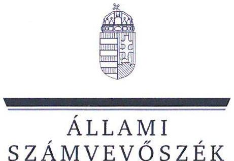
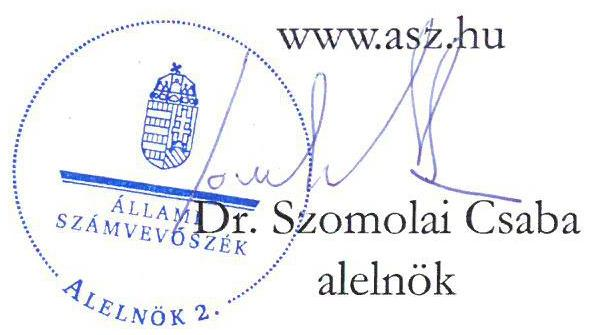
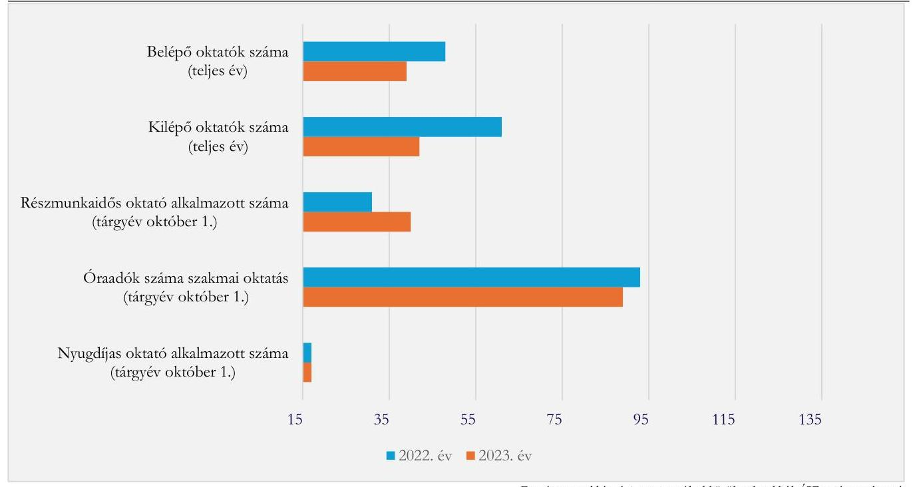
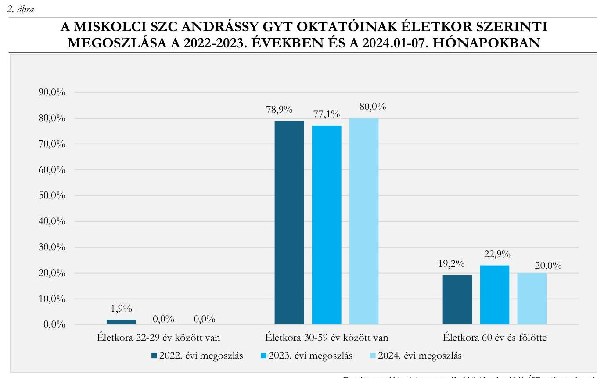
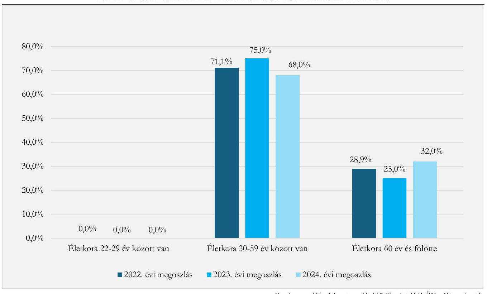

# JELENTÉS 

A szakképzési centrum intézményénél a feladatellátáshoz szükséges személyi feltételek rendelkezésre állásának célzott ellenőrzése

A Miskolci Szakképzési Centrum és két intézmény ellenőrzése
2025.

---

ÁLLAMI
SZÁMVEVŐSZÉK

# JELENTÉS 

## A szakképzési centrum intézményénél a feladatellátáshoz szükséges személyi feltételek rendelkezésre állásának célzott ellenőrzése

A Miskolci Szakképzési Centrum és két intézmény ellenőrzése
2025.

25023

---

# ELLENŐRZÉSI IGAZGATÓSÁG: 

## ELLENŐRZÉSI IGAZGATÓSÁG I.

## ELLENŐRZÉSI IGAZGATÓ:

SINKÁNÉ DR. CSENDES ÁGNES ellenőrzési igazgató

## ELLENŐRZÉSVEZETŐ:

NAGY MARIANNA ellenőrzésvezető

Jelentéseink az interneten a www.asz.hu címen olvashatók.

IKTATÓSZÁM: EL-4214-002/2025
TÉMASORSZÁM: -
ELLENŐRZÉS-AZONOSÍTÓ SZÁM: V1097

---

# TARTALOMJEGYZÉK 

AZ ELLENŐRZÉS ALAPADATAI ..... 5
AZ ELLENŐRZÖTT SZERVEZETEK ..... 7
ÖSSZEFOGLALÁS ..... 8
AZ ELLENŐRZÉS FÓKUSZTERÜLETE ..... 9
MEGÁLLAPÍTÁSOK ..... 10
MELLÉKLETEK ..... 15
I. sz. melléklet: Értelmező szótár ..... 15
II. sz. melléklet: Az ellenőrzött szervezetek jegyzéke ..... 16
III. sz. melléklet: Ellenőrzési kritériumok ..... 17
FÜGGELÉK: ÉSZREVÉTELEK ..... 18
RÖVIDÍTÉSEK JEGYZÉKE ..... 19

---

.

---

# AZ ELLENŐRZÉS ALAPADATAI 

## AZ ELLENŐRZÉS CÉLJA

Az ellenőrzés célja annak értékelése volt, hogy a szakképzési centrum intézményénél a feladatellátáshoz szükséges személyi feltételek biztosítottak voltak-e.

## AZ ELLENŐRZÉS TÍPUSA

Kombinált ellenőrzés.

## AZ ELLENŐRZÖTT IDŐSZAK

A 2022-2023. évek és a 2024. január 01. napjától 2024. augusztus 31. napjáig tartó időszak.

## AZ ELLENŐRZÉS TÁRGYA

A szakképzési centrumnál foglalkoztatottak összetételének elemzése, a szakképzési centrum által a szakképző intézmény vonatkozásában a szakképzési feladatellátáshoz szükséges személyi feltételek biztosítása volt az ellenőrzés tárgya. Az ellenőrzés kiterjedt a szakképzési centrumnál foglalkoztatottak életkorára, szakképzettségére, szakképesítésére, valamint a foglalkoztatás formájára is.

Az ellenőrzés kiterjedt minden olyan körülményre és adatra, amely az ÁSZ ${ }^{1}$ jogszabályban meghatározott feladatainak teljesítéséhez, valamint a program végrehajtása folyamán felmerült újabb összefüggések feltárásához szükséges volt.

## AZ ELLENŐRZÉS JOGALAPJA

Az ellenőrzés jogszabályi alapját az ÁSZ tv. ${ }^{2} 1 . \int(3)$ bekezdés és az 5. $\int(2)$-(3) bekezdés előírásai képezték.

## AZ ELLENŐRZÉS MÓDSZERE

Az ellenőrzés végrehajtása a nemzetközi standardokat irányadónak tekintve az ellenőrzési program szempontjai, az ellenőrzött időszakban hatályos jogszabályok, az ellenőrzés szakmai szabályok és módszertanok figyelembevételével történt.

Az ellenőrzési kérdések megválaszolásához szükséges bizonyítékok megszerzése az ellenőrzött szervezetek által rendelkezésre bocsátott dokumentumokra és adatokra alapozva, továbbá megfigyelés, szemle (szemrevételezés), kérdésfeltevés (információkérés), valamint elemző eljárás útján történt. Az ellenőrzési bizonyítékként felhasználható adatforrások közé tartoztak egyrészt az ellenőrzéshez kért dokumentumok,

---

adatforrások, másrészt adatforrás volt minden - az ellenőrzés folyamán - feltárt, az ellenőrzés szempontjából információt tartalmazó dokumentum.

Az ellenőrzött szervezetek az ellenőrzés lefolytatásához tanúsítványt töltöttek ki, valamint az ÁSZ által kért dokumentumok, adatok, információk megküldésével és az ellenőrzés során szolgáltattak adatokat.

Az ÁSZ a szakképzési centrumnál foglalkoztatottak összetételét több szempont alapján (például a foglalkoztatás formája, a fluktuáció, valamint a pályakezdő, a nyugdíjas és az állandó helyettesítésre alkalmazottak, az óraadók esetében a nyugdíjas és az állandó helyettesítésre alkalmazottak), a szakképző intézmény vonatkozásában a foglalkoztatás formáját, a nyugdíjas oktatók arányát elemezte.

A szakképzési centrum tekintetében az Szkr. alapján ellenőrzésre került, hogy rendelkezett-e saját alkalmazotti létszámmal. Az Szkr. 58. § (2) bekezdés megfogalmazása: állandó saját alkalmazotti létszámmal akkor rendelkezik a szakképző intézmény, ha az alkalmazotti létszám legalább negyven százaléka általános teljes napi munkaidőre létrejött határozatlan idejű munkaviszonyban áll, amelyből legalább hetvenöt százaléka az Szkt. 40. § (1) bekezdés c) vagy d) pontja szerinti munkakörben van foglalkoztatva. Az Szkr. 56. § (2) bekezdés alapján a szakképzési centrum részeként működő szakképző intézmény esetében az állandó saját alkalmazotti létszámra vonatkozó feltételnek a szakképzési centrum tekintetében kell fennállnia.

A szakképzési centrumhoz tartozó szakképző intézménynél a foglalkoztatottak éves átlagos létszáma a munkavállalók folyamatosan vezetett létszámnyilvántartásán alapult, az éves átlagszámítás a havi átlagos létszámadatok összegének 12 -vel elosztása alapján történt.

Az ÁSZ a szakképző intézménynél a szakmai oktatáson belül az ágazati alapoktatáshoz és a szakirányú oktatáshoz szükséges személyi feltételek rendelkezésre állását a szakmai oktatáshoz szükséges végzettség, szakképesítés, valamint a továbbképzési kötelezettség teljesítése alapján ellenőrizte és értékelte.

A szakképző intézménynél az ellenőrzési szempontok alapján a szakképzési feladatok jövőbeni ellátásában kockázatot hordoz, ha az ellenőrzött időszakban a nyugdíjas oktatók aránya meghaladta a $10 \%$-ot, valamint az ágazati alapoktatáshoz és/vagy a szakirányú oktatáshoz szükséges végzettség, szakképesítés, az oktatók több mint 5\%-ánál nem volt biztosított. Amennyiben az ellenőrzés a személyi feltételek rendelkezésre állása területén a megfelelően szakképzett oktatók hiányában feladatellátási kockázatot azonosított, akkor értékelésre kerültek a személyi feltételek rendelkezésre állása érdekében megtett intézkedések is.

---

# AZ ELLENŐRZÖTT SZERVEZETEK 

## MISKOLCI SZAKKÉPZÉSI CENTRUM

A Miskolci SZC ${ }^{3}$ az Szkt. ${ }^{4}$ 26. $\int$ (1) bekezdés és az Szkr. ${ }^{5}$ 77. $\int$ (1) bekezdés alapján a szakképzésért felelős miniszter által alapított, szakképzési feladatot ellátó költségvetési szerv. Az állami szakképző intézmény a szakképzési centrum részeként működik. Alapításának időpontja 2015.07.01., irányító szerve, fenntartója az alapítástól 2018.05.21-ig a Nemzetgazdasági Minisztérium, majd 2018.05.22-től 2022.06.30-ig az Innovációs és Technológiai Minisztérium, 2022.07.01-től a Kulturális és Innovációs Minisztérium (KIM ${ }^{6}$ ), középirányító szerve a Nemzeti Szakképzési és Felnőttképzési Hivatal. A költségvetési szerv főtevékenysége a szakmai középfokú oktatás.

A Miskolci SZC átlagos állományi létszáma a 2022. évben 768 fő, a 2023. évben 758 fő, a 2024.01.012024.08.31. közötti időszakban 761 fő volt. A szakképzési centrum részeként az ellenőrzött időszakban 10 szakképző intézmény, valamint egy független vizsgaközpont működött. Az Szkt. 26. § (3) bekezdés alapján a szakképzési centrumot a főigazgató és a kancellár önállóan vezeti és képviseli. A főigazgató felel a szakképzési centrum részeként működő szakképző intézmények szakképzési alapfeladatainak ellátásáért. A kancellár felel a szakképzési centrum törvényes és szakszerű működéséért. A Miskolci SZC kancellárjának és főigazgatójának személye az ellenőrzött időszakban nem változott.

## MISKOLCI SZC ANDRÁSSY GYULA GÉPIPARI TECHNIKUM

A Miskolci SZC Andrássy GYT ${ }^{7}$ a Miskolci SZC részeként működik 2015.07.01-je óta. A Miskolci SZC Andrássy GYT ellenőrzött időszakban hatályos alapító okiratának 6.1.1. pontja alapján az intézmény technikumi szakmai oktatás mellett szakképző iskolai szakmai oktatás feladatot is ellátott. A Miskolci SZC Andrássy GYTben oktatott szakmák a gépészet és a specializált gép- és járműgyártás ágazatba sorolhatók. A 2023/2024. tanévben a szakmai oktatás keretében résztvevő tanulók száma 480 fő volt.

## MISKOLCI SZC BLÁTHY OTTÓ VILLAMOSIPARI TECHNIKUM

A Miskolci SZC Bláthy OT ${ }^{8}$ a Miskolci SZC részeként működik 2015.07.01-je óta. A Miskolci SZC Bláthy OT ellenőrzött időszakban hatályos alapító okiratának 6.1.4. pontja alapján az intézmény technikumi szakmai oktatás mellett szakképző iskolai szakmai oktatás feladatot is ellátott. A Miskolci SZC Bláthy OT-ben oktatott szakmák az elektronika és elektrotechnika ágazatba sorolhatók. A 2023/2024. tanévben a szakmai oktatás keretében résztvevő tanulók száma 613 fő volt.

---

# ÖSSZEFOGLALÁS 

A szakképzési rendszer irányítása és múködési mechanizmusa az elmúlt években jelentősen átalakult. A fejlesztés irányait, a stratégiai célokat átfogó, jövőorientált hosszú és közép távú célokat a Szakképzés 4.0 Stratégia ${ }^{9}$-ban fektették le, mely kiemelt célként jelölte meg a tudásalapú gyakorlati tanulás hatékonyságának növelését. A szakképzési rendszer fejlesztése állandó tárgya a közérdeklődésnek. A szakképzési rendszer fejlesztésére negatívan hat, ha a szakképzési centrum nem rendelkezik a feladatellátáshoz szükséges személyi feltételekkel, mert nincs elegendő szakképzett oktató az egyes tantárgyakra, vagy több a kilépő oktató (pályaelhagyó, nyugdíjba vonuló), mint a belépő. Ha a feladatellátás személyi feltételei nem biztosítottak, akkor az a feladatellátási kockázaton túl azt eredményezheti, hogy a tanulók nem megfelelő tudás birtokában lépnek ki a munkaerőpiacra.

A szakképző intézmény akkor rendelkezik a feladatai ellátásához szükséges feltételekkel, ha többek között állandó saját alkalmazotti létszámmal rendelkezik, mely feltételnek jogszabályi előírás alapján a szakképzési centrum részeként múködő intézmény esetében a szakképzési centrum tekintetében kell fennállnia.

A Miskolci SZC-nél az általános teljes napi munkaidőre létrejött határozatlan idejű jogviszonyban foglalkoztatottak aránya a jogszabályi előírásban rögzítetteknek megfelelő volt. Az oktatók és pedagógusok arányára vonatkozó jogszabályi előírást az ÁSZ ellenőrzéssel érintett szakképzési centrumok eltérően értelmezték. A Miskolci SZC a KIM jogértelmezése szerint számított állandó saját alkalmazotti létszámmal rendelkezett.

A szakképzési centrum részeként múködő szakképző intézmény esetében a szakképzési centrum tekintetében írja elő az Szkr. az állandó saját alkalmazotti létszám, mint a szakképző intézmény feladatainak ellátásához szükséges egyik feltétel teljesítésének követelményét.
Az ÁSZ ellenőrzés szakmai véleménye szerint indokolt az Szkr.-ben az állandó saját alkalmazotti létszámra vonatkozó előírás egyértelműsítése. Az ÁSZ célszerúnek tartja, ha a középirányító szerv egyértelmú, egységes iránymutatást ad a szakképzési centrumoknak az állandó saját alkalmazotti létszám számítására, amely a szakképzési centrumok eltérő értelmezésének elkerülését, és a tudatos létszámgazdálkodást támogatná.

A Miskolci SZC-nél - a szakmai oktatási területen - a 2022. és a 2023. évben a kilépő oktatók száma (61 fő, illetve 42 fő) meghaladta a belépő oktatók számát ( 48 fő, illetve 39 fő). Ez negatívan hatott a személyi feltételek biztosítására.

A Miskolci SZC-nél a szakmai oktatási területen a 2022. és a 2023. évben 17-17 fő volt a - jellemzően alkalmazotti státuszban lévő - nyugdíjas oktatók száma. A nyugdíjas foglalkoztatással szemben ugyanakkor egy fő belépő, pályakezdő oktató volt. A Miskolci SZC Andrássy GYT-nél a 2022. és a 2023. évben volt egy-egy fő nyugdíjas óraadó oktató. A 2023. évben a szakmai oktatás oktatóinak 32,0\%-a volt 60 év feletti életkorban. A Miskolci SZC Bláthy OT-nél a 2023. évben a szakmai oktatás oktatóinak 13,0\%-a volt nyugdíjas oktató, és a szakmai oktatás oktatóinak $21,7 \%$-a volt 60 év feletti életkorban.

Az ellenőrzött időszakban a Miskolci SZC Andrássy GYT-nél és a Miskolci SZC Bláthy OT-nél az oktatók rendelkeztek az ágazati alapoktatáshoz, szakirányú oktatáshoz szükséges, Szkr.-ben előírt végzettséggel és szakképesítéssel, szakképzettséggel, továbbá az oktatók jelentős hányada vett részt továbbképzésen.

A Miskolci SZC ellenőrzött szakképző intézményei az ellenőrzött időszakban a szakképzési feladatok ellátásához szükséges személyi feltételekkel az Szkr. előírásának megfelelően rendelkeztek.

---

# AZ ELLENŐRZÉS FÓKUSZTERÜLETE 

1.- A szakképző intézménynél a szakképzési feladatellátáshoz szükséges személyi feltételek rendelkezésre állása

---

# 1. Miskolci Szakképzési Centrum 

## Összegző megállapítás

A Miskolci SZC az ellenőrzött időszakban az Szkr. KIM általi jogértelmezése szerint számított állandó saját alkalmazotti létszámmal rendelkezett.

A Miskolci SZC átlagos állományi létszáma a 2022. évben 768 fő, a 2023. évben 758 fő, a 2024.01.012024.08.31. közötti időszakban 761 fő volt. A Miskolci SZC az Szkr. 58. § (2) bekezdés szerinti létszám számításakor a 2022. október 1-jei és a 2023. október 1-jei létszámot vette figyelembe. A Miskolci SZC alkalmazotti létszáma 2022. október 1-jén 801 fő, 2023. október 1-jén 811 fő volt. Az általános teljes napi munkaidőre alkalmazott határozatlan idejű munkaviszonyban állók száma 2022. október 1-jén 717 fő, 2023. október 1-jén 714 fő volt. A Miskolci SZC-nél az Szkt. 40. § (1) bekezdés c) és d) pontja szerinti oktató és pedagógus - a Miskolci SZC számítása szerint - 2022. október 1-jén összesen 497 fő, 2023. október 1 -jén 490 fő volt.
A Miskolci SZC-nél az általános teljes napi munkaidőre létrejött határozatlan idejű jogviszonyban foglalkoztatottak aránya a jogszabályi előírásban rögzítetteknek megfelelő volt. Az oktatók és pedagógusok arányára vonatkozó jogszabályi előírást az ÁSZ ellenőrzéssel érintett szakképzési centrumok eltérően értelmezték.
Az Szkr. 58. § (2) bekezdés szerint: „Állandó saját alkalmazotti létszámmal akkor rendelkezik a szakképzö intézmény, ha az alkalmazotti létszám legalább negyven százaléka általános teljes napi munkaidőre létrejött határozatlan idejü munkaviszonyban vagy egybázi szolgálati jogviszonyban áll, amelyböl legalább betvenöt százaléka az Szkt. 40. § (1) bekezdés c) vagy d) pontja szerinti munkakörben van foglalkoztatva". Az Szkr. 56. § (2) bekezdés alapján a szakképzési centrum részeként működő szakképző intézmény esetében az állandó saját alkalmazotti létszámra vonatkozó feltételnek a szakképzési centrum tekintetében kell fennállnia.
A KIM által kiadott, az Szkr. 58. § (2) bekezdéssel kapcsolatos jogértelmezés szerint: „A szakképzö intézmény elöirt alkalmazotti körét a szakképzésröl szóló 2019. évi LXXX. törvény (a továbbiakban: Szkt.) 40. § (1) bekezdése sorolja fel (igazgató, igazgatóhelyettes, oktató, többcélú szakképzö intézményben köznevelési alapfeladat-ellátásra a pedagógusok új életpályájáról szóló törvény szerinti pedagógus, a további, közvetlenül nem a szakmai alapfeladat-ellátással összefüggő feladat ellátására létesített munkakörben foglalkoztatott).
A szakképzésről szóló törvény végrehajtásáról szóló 12/2020. Korm. rendelet (II. 7.) (a továbbiakban Szkr.) 56. § (1) bekezdés c) pontjában foglalt fenti feltétel az Szkr. 58. § (2) bekezdésében kerül kifejtésre, azaz állandó saját alkalmazotti létszámmal akkor rendelkezik a szakképzö intézmény, ha: 1.) az alkalmazotti létszám legalább $40 \%$-a általános teljes napi munkaidőre létrejött határozatlan idejű munkaviszonyban áll, 2.) amelyböl legalább $75 \%$-a oktató vagy pedagógus munkakörben van foglalkoztatva.
A szakképzési centrum (a továbbiakban: SZC) részeként müködő szakképzö intézmény esetében az Szkr. 56. § (2) bekezdése kimondja, hogy a feladatellátáshoz szükséges jogszabályi feltételeknek - köztük az állandó saját alkalmazotti létszámra vonatkozóan elöirtaknak - az SZC tekintetében kell fennállnia.
Azzaz az alkalmazotti létszám esetében az SZC részeként müködő valamennyi intézmény alkalmazottjain túl figyelembe kell venni az SZC központi szervezetében foglalkoztatott vezetö és nem vezetö állású munkavállalókat is (Szkt. 26. §).

---

Álláspontunk szerint az SZC valamennyi alkalmazottja létszámának 40 \%-át alapul véve, e létszám háromnegyedénél, azaz az összlétszám 30 \%-ánál nem lehet kevesebb az SZC-ben teljes állású, batározatlan idejü munkaviszonyban álló oktató és pedagógus munkakörben foglalkoztatottak száma."
A Miskolci SZC az Szkr. 58. § (2) bekezdésének KIM általi jogértelmezése szerint számított állandó saját alkalmazotti létszámmal rendelkezett.
A Miskolci SZC-nél - a szakmai oktatási területen - a belépő oktatók száma a 2022. évben 48 fő, a 2023. évben 39 fő volt. A kilépő oktatók száma a 2022. évben 61 fő, a 2023. évben 42 fő volt. A 20222023. évi összes belépő és kilépő oktatók számát tekintve, a kilépő oktatók száma meghaladta a belépő oktatók számát (1. ábra).
A Miskolci SZC az ellenőrzött időszakban döntően teljes munkaidőben alkalmazta az oktatókat. A részmunkaidős oktatók számában a 2022. évről (31 fő) a 2023. évre 29,0\%-os növekedés következett be, így létszámuk 40 főre emelkedett. A nyugdíjasként alkalmazott oktatók száma a 2022. és a 2023. évben egyaránt 17-17 fő volt a szakmai oktatási területen.

A Miskolci SZC-nél a 2022. évben 93 fő, a 2023. évben 89 fő óraadó volt, amelyből a 2022. évben 8 fő, a 2023. évben 5 fő volt nyugdíjas.
1. ábra

# A MISKOLCI SZC OKTATÓI ÁLLOMÁNYÁBAN TÖRTÉNT LEGJELLEMZŐBB VÁLTOZÁSOK A 2022. ÉS 2023. ÉVEKBEN (FŐ) 

---

# 2. Miskolci SZC Andrássy Gyula Gépipari Technikum 

Összegző megállapítás A Miskolci SZC Andrássy GYT-nél a szakképzési feladatellátáshoz a személyi feltételek rendelkezésre álltak. A 2022. évet követően nem volt nyugdíjas oktató, és valamennyi oktató rendelkezett az Szkr.-ben előírt végzettséggel. Kockázatot jelent a szakképzési feladatok jövőbeni ellátása tekintetében, hogy a szakmai oktatás oktatóinak a 2023. évben 32,0\%-a, a 2024.01.01-2024.07.31. közötti időszakban $30,4 \%$-a 60 év feletti életkorú volt.

A Miskolci SZC Andrássy GYT-nél az oktatók éves átlagos létszáma a 2022. évben 52 fő, a 2023. évben 48 fő, a 2024.01.01-2024.07.31. közötti időszakban 45 fő volt. Az oktatói feladatot ellátó alkalmazottak aránya a 2023. évben $97,9 \%$, az óraadók aránya $2,1 \%$ volt.
A Miskolci SZC Andrássy GYT-nél oktatói feladatot ellátó alkalmazottak éves átlagos létszáma a 2022. évben 50 fő, a 2023. évben 47 fő, a 2024.01.01-2024.07.31. közötti időszakban 45 fő volt, és az oktatók $96,0 \%$-a teljes munkaidőben volt foglalkoztatva. A 2022. évet követően valamennyi oktatói feladatot ellátó alkalmazott határozatlan idejű munkaviszonyban állt. Az oktatói feladatot ellátó alkalmazottak száma a 2022. évről a 2024. évre 10,0\%-kal csökkent. A Miskolci SZC Andrássy GYT-nél az ellenőrzött időszakban alkalmazottként nem került sor nyugdíjas foglalkoztatására.
Óraadóként megbízási szerződéssel foglalkoztatottak átlagos létszáma 2022-ben kettő fő, 2023-ban egy fő volt, a 2024. évben nem volt óraadó oktató. A 2022. és a 2023. évben egy-egy fő nyugdíjas óraadó oktató volt.
A Miskolci SZC Andrássy GYT-nél 22 évnél fiatalabb, diplomával még nem rendelkező oktató az ellenőrzött időszakban nem volt. A 29 évnél fiatalabb korcsoportba a 2022. évben egy fő tartozott, a 2023. évben nem volt ilyen korcsoportba tartozó oktató. A 30-59 éves korosztályba tartozók száma a 2022. évben 41 főről a 2024.01.01-2024.07.31. közötti időszakra 36 főre változott, arányuk az ellenőrzött időszakban $80 \%$ körül volt. A 60 év feletti oktatók aránya a 2022. és a 2023. években, valamint 2024.01.012024.07.31. között $20 \%$ körül volt (2. ábra).

A szakmai oktatás oktatóinak a 2022. évben 30,8\%-a, a 2023. évben 32,0\%-a, a 2024.01.012024.07.31. közötti időszakban $30,4 \%$-a volt 60 év feletti életkorban.

A Miskolci SZC Andrássy GYT vonatkozásában létszámprobléma nem volt, álláspályázat kiírására nem került sor. A Miskolci SZC Andrássy GYT-nél az ellátatlan óráknál az oktatás az intézmény saját szakmatanárai által önként vállalt többletfeladattal és óraadók alkalmazásával történt.

---

A Miskolci SZC Andrássy GYT-nél foglalkoztatott valamennyi oktató rendelkezett az Szkr. 134. § (2)-(3) bekezdésében előírt végzettséggel, képzettséggel.
Az oktatók jelentős hányada vett részt folyamatosan továbbképzésen.

# 3. Miskolci SZC Bláthy Ottó Villamosipari Technikum 

Összegző megállapítás A Miskolci SZC Bláthy OT-nél a szakképzési feladatellátáshoz a személyi feltételek rendelkezésre álltak. Valamennyi oktató rendelkezett az Szkr.-ben előírt végzettséggel. Kockázatot jelent a szakképzési feladatok jövőben ellátása tekintetében, hogy a szakmai oktatás oktatóinak a 2023. évben 21,7\%-a, a 2024.01.01-2024.07.31. közötti időszakban $33,3 \%$-a 60 év feletti életkorú volt, és a szakmai oktatás tekintetében a nyugdíjas oktatók aránya a 2023. évre $13,0 \%$ lett.

A Miskolci SZC Bláthy OT-nél az oktatók átlagos létszáma a 2022. évben 45 fő, a 2023. évben 48 fő, a 2024.01.01-2024.07.31. közötti időszakban 50 fő volt. Az oktatói feladatot ellátó alkalmazottak aránya a 2023. évben $93,8 \%$, az óraadók aránya $6,2 \%$ volt.

A Miskolci SZC Bláthy OT-nél oktatói feladatot ellátó alkalmazottak éves átlagos létszáma a 2022. évben 43 fő, a 2023. évben 45 fő, a 2024.01.01-2024.07.31. közötti időszakban 46 fő volt, mely munkavállalók $97,0 \%$ körüli aránya teljes munkaidőben és határozatlan munkaviszonyban állt.

---

Óraadóként megbízási szerződéssel foglalkoztatottak átlagos létszáma 2022-ben kettő fő, a 2023. évben három fő, a 2024.01.01-2024.07.31. közötti időszakban négy fő volt.
A Miskolci SZC Bláthy OT-nél a 2022. évben három fő, a 2023. évben négy fő, a 2024.01.01-2024.07.31. közötti időszakban négy fő nyugdíjas foglalkoztatott volt. A 2023. évben a szakmai oktatás tekintetében a nyugdíjas oktatók aránya $13,0 \%$ volt.
A Miskolci SZC Bláthy OT-nél 22 évnél fiatalabb, diplomával még nem rendelkező oktató, és 29 évnél fiatalabb korcsoportba tartozó oktató az ellenőrzött időszakban nem volt. A 30-59 éves korosztályba tartozók száma a 2022. évben 32 főről a 2024.01.01-2024.07.31. közötti időszakra 34 főre változott, arányuk $70 \%$ körül volt. A 60 év feletti korosztályba tartozó oktatók aránya a 2022. évi 28,9\%-ról a 2024.01.01-2024.07.31. közötti időszakra már elérte a 32,0\%-os mértéket (3. ábra).

A szakmai oktatás oktatóinak a 2022. évben 27,3\%-a, a 2023. évben 21,7\%-a, a 2024.01.01-2024.07.31. közötti időszakban 33,3\%-a volt 60 év feletti életkorban.

A Miskolci SZC Bláthy OT vonatkozásában a 2022. és a 2023. évben villamos szakmai tantárgyakat oktatóra, továbbá a 2023. évben informatika oktatóra írtak ki álláspályázatot. A villamosmérnök végzettségű szakmai oktatóra a 2022. és a 2023. évben kiírt egy-egy álláspályázat során nem érkeztek pályázatok, ezért a szakmatanárok önként vállaltak többletfeladatot.
3. ábra

# A MISKOLCI SZC BLÁTHY OT OKTATÓINAK ÉLETKOR SZERINTI MEGOSZLÁSA A 2022-2023. ÉVEKBEN ÉS A 2024.01-07. HÓNAPOKBAN 

A Miskolci SZC Bláthy OT-nél foglalkoztatott valamennyi oktató rendelkezett az Szkr. 134. § (2)(3) bekezdésében előírt végzettséggel, képzettséggel.
Az oktatók jelentős hányada vett részt folyamatosan továbbképzésen.

---

# MELLÉKLETEK 

## I. SZ. MELLÉKLET: ÉRTELMEZŐ SZÓTÁR

átlagos állományi létszám
oktató
óraadó
szakképzési centrum
szakképző intézmény
szakmai oktatás

Az átlagos állományi létszám a munkavállalók folyamatosan vezetett létszámnyilvántartása alapján számított mutató. Az éves átlagos állományi létszám a már kiszámított havi átlagos létszám-adatok egyszerű számtani átlaga, vagyis éves átlagszámítás esetén 12 -vel kell elosztani a havi átlagos létszámadatok összegét. $\left(\mathrm{KSH}^{10}\right)$
Szakképző intézményben a szakképzési alapfeladat-ellátást végző személy. (Szkt. 47. § (1) bekezdés)
Megbízási szerződés keretében legfeljebb heti tizennégy óra vagy foglalkozás megtartására alkalmazott pedagógus, oktató. ( $\mathrm{Nkt}^{11}$. 4. § 21.)
A szakképzési centrumok olyan a szakképzésért felelős miniszter által alapított önálló költségvetési szervek, amelyeknek részeként működnek a szakképzési alapfeladatot ellátó, jogi személyiséggel bíró szakképző intézmények vagy az Nkt. szerinti köznevelési intézmények (például kollégium). (Szkt. 26. §-ához tartozó Nagykommentár)
A szakképzési centrum részeként működő szakképző intézmény a szakképzési centrum jogi személyiséggel rendelkező szervezeti egysége, amely kizárólag a Kormány rendeletében meghatározott jogok és kötelezettségek alanya lehet. (Szkt. 17. §)
A szakképző intézményben a képzési és kimeneti követelmények alapján történő ágazati alapoktatás és szakirányú oktatás. (Szkt. 19. § (1) bekezdés)

---

II. SZ. MELLÉKLET: AZ ELLENŐRZÖTT SZERVEZETEK JEGYZÉKE

|  ELLENŐRZÖTT SZERVEZET NEVE | SZEREPE  |
| --- | --- |
|  1. Miskolci Szakképzési Centrum | Szakképzési feladatot ellátó költségvetési szerv  |
|  2. Miskolci SZC Andrássy Gyula Gépipari Technikum | Szakképző intézmény (tagintézmény)  |
|  3. Miskolci SZC Bláthy Ottó Villamosipari Technikum | Szakképző intézmény (tagintézmény)  |

---

# III. SZ. MELLÉKLET: ELLENŐRZÉSI KRITÉRIUMOK 

## FOKUSZTERÜLET

1. A szakképző intézménynél a szakképzési feladatellátáshoz szükséges személyi feltételek rendelkezésre állása

## ELLENŐRZÉSI KRITÉRIUMOK

Szkt. 40. § (1) bekezdés c), d) pontjai, 50. § (1) bekezdés, 127. $\S(5)$ bekezdés

Szkr. 56. § (1) bekezdés c) pont, 56. § (2) bekezdés, 58. § (2) bekezdés, 124. § (2) bekezdés 10. pont, 134. § (2)-(3) bekezdései, 142. §

---

# FÜGGELÉK: ÉSZREVÉTELEK 

A jelentéstervezetet a Számvevőszék 15 napos észrevételezésre megküldte az ellenőrzött szervezet vezetőjének az ÁSZ tv. 29. §* (1) bekezdése előírásának megfelelően.
A Miskolci SZC vezetői a jelentéstervezet megállapításaira észrevételt nem tettek.

[^0]
[^0]:    * 29. § (1) Az Állami Számvevőszék az ellenőrzési megállapításait megküldi az ellenőrzött szervezet vezetőjének vagy az általa megbízott személynek, és annak, akinek személyes felelősségét állapította meg.
    (2) Az ellenőrzött szervezet vezetője és a felelősként megjelölt személy az ellenőrzés megállapításaira tizenöt napon belül írásban észrevételt tehet.
    (3) Az Állami Számvevőszék az észrevételre a beérkezésétől számított harminc napon belül írásban válaszol. A figyelembe nem vett észrevételeket köteles a jelentésben feltüntetni, és megindokolni, hogy azokat miért nem fogadta el.

---

# RÖVIDÍTÉSEK JEGYZÉKE 

${ }^{1}$ ÁSZ
${ }^{2}$ ÁSZ tv.
${ }^{3}$ Miskolci SZC
${ }^{4}$ Szkt.
${ }^{5}$ Szkr.
${ }^{6}$ KIM
${ }^{7}$ Miskolci SZC Andrássy GYT
${ }^{8}$ Miskolci SZC Bláthy OT
${ }^{9}$ Szakképzés 4.0 Stratégia
${ }^{10}$ KSH
${ }^{11} \mathrm{Nkt}$.

Állami Számvevőszék
2011. évi LXVI. törvény az Állami Számvevőszékről
Miskolci Szakképzési Centrum
2019. évi LXXX. törvény a szakképzésről
12/2020. (II. 7.) Korm. rendelet a szakképzésről szóló törvény végrehajtásáról
Kulturális és Innovációs Minisztérium
Miskolci SZC Andrássy Gyula Gépipari Technikum
Miskolci SZC Bláthy Ottó Villamosipari Technikum
A „Szakképzés 4.0 - A szakképzés és felnőttképzés megújításának középtávú szakmapolitikai stratégiája, a szakképzési rendszer válasza a negyedik ipari forradalom kihívásaira" című stratégia elfogadásáról és a végrehajtása érdekében szükséges intézkedésekről szóló 1168/2019. (III.28.) Korm.határozattal elfogadott, 1499/2023. (XI.16.) Korm.határozattal módosított stratégia
Központi Statisztikai Hivatal
2011. évi CXC. törvény a nemzeti köznevelésről

---

1052 Budapest, Apáczai Csere János u. 10. | 1364 Budapest 4., Pf. 54
www.asz.hu | szamvevoszek@asz.hu
telefon: +36 14849100