# JELENTÉS 

## A Nemzeti Vízstratégia végrehajtása

Mezőgazdasági vízszükséglet, fenntartható vízhasználat

2025.

---

# ÁLLAMI <br> SZÁMVEVŐSZÉK 

## JELENTÉS

## A Nemzeti Vízstratégia végrehajtása

Mezőgazdasági vízszükséglet, fenntartható vízhasználat

2025.

---

# ELLENŐRZÉSI IGAZGATÓSÁG: 

## TELJESÍTMÉNYELLENŐRZÉSI IGAZGATÓSÁG

## ELLENŐRZÉSI IGAZGATÓ:

DR. JAKAB KORNÉL igazgató

## ELLENŐRZÉSVEZETŐ:

## SZAPPANOS JÚLIA ellenőrzésvezető

Jelentéseink az interneten a www.asz.hu címen olvashatók.

IKTATÓSZÁM: EL-4013-003/2025
TÉMASORSZÁM: 10
ELLENŐRZÉS-AZONOSÍTÓ SZÁM: V1104

---

# TARTALOMJEGYZÉK 

AZ ELLENŐRZÉS ALAPADATAI ..... 5
AZ ELLENŐRZÉS HATÓKÖRE ÉS TERÜLETE ..... 7
ÖSSZEFOGLALÁS ..... 9
AZ ELLENŐRZÉS FÓKUSZTERÜLETEI/FÓKUSZKÉRDÉSEI ..... 12
MEGÁLLAPÍTÁSOK ..... 13
JAVASLATOK ..... 62
MELLÉKLETEK ..... 64
I. sz. melléklet: Értelmező szótár ..... 64
II. sz. melléklet: Az ellenőrzött szervezetek jegyzéke ..... 67
III. sz. melléklet: Ellenőrzési kritériumok ..... 68
FÜGGELÉK: ÉSZREVÉTELEK ..... 70
RÖVIDÍTÉSEK JEGYZÉKE ..... 73

---

.

---

# AZ ELLENŐRZÉS ALAPADATAI 

## AZ ELLENŐRZÉS CÉLJA

Az ellenőrzés célja volt a klímaváltozás következtében fokozódó mezőgazdasági vízhasználat, valamint az öntözésfejlesztés során a stratégiai, integrált szemlélet, a fenntarthatósági szempontok érvényesülésének értékelése. Célja volt továbbá annak eredményességi szempontok szerinti értékelése, hogy a vízgazdálkodás rendszerének, az öntözés, öntözésfejlesztés támogatáspolitikai rendszerének működése és a rendelkezésre álló források felhasználása során érvényesültek-e a fenntartható mezőgazdasági vízhasználat követelményei, a támogatások stratégiai célokkal való összhangja. Az ellenőrzés célja volt annak bemutatása is, hogy a mezőgazdasági vízgazdálkodás működtetése, fejlesztése során érvényesült-e az érintett szereplők együttműködése, tevékenységének összehangolása, az információátadás és a tudásmegosztás.

## AZ ELLENŐRZÉS TÍPUSA

Teljesítmény-ellenőrzés

## AZ ELLENŐRZŐTT IDŐSZAK

2019. január 1-jétől 2023. december 31-ig tartó időszak, kitekintéssel a jelentéstervezet 2024. novemberi összeállításáig tartó folyamatokra.

## AZ ELLENŐRZÉS TÁRGYA

Az ellenőrzés tárgyát képezték a mezőgazdasági vízhasználat kereteit meghatározó országos-, ágazati stratégiák, programok, az öntözési rendszerek működését és fejlesztését szolgáló - pénzügyi, jogi, szervezeti - keretrendszer, az öntözés fejlesztését meghatározó hazai és európai uniós támogatások célrendszere, a fenntartható mezőgazdasági vízgazdálkodás feltételrendszerének elemei, kapcsolódó információáramlás és tudásátadás, a hazai mezőgazdasági vízhasználat jellemzői.

Az ellenőrzés kiterjedt minden olyan körülményre és adatra, amely az ÁSZ jogszabályban meghatározott feladatainak teljesítéséhez, valamint a program végrehajtása folyamán felmerült újabb összefüggések feltárásához szükséges volt.

## AZ ELLENŐRZÉS JOGALAPJA

Az ellenőrzés jogszabályi alapját az ÁSZ tv ${ }^{1}$. 1. § (3) bekezdés, az 5. § (2)-(3) bekezdés előírásai képezték.

---

# AZ ELLENŐRZÉS MÓDSZERE 

Az ellenőrzést a nemzetközi standardokat irányadónak tekintve az ellenőrzési program szempontjai, az ellenőrzött időszakban hatályos jogszabályok, az ellenőrzés szakmai szabályok és módszertanok figyelembevételével végezte az ÁSZ.

Az ellenőrzési kérdések megválaszolásához szükséges bizonyítékok megszerzése az ellenőrzött szervezetek és az ellenőrzést támogató szervezetek által rendelkezésre bocsátott dokumentumokra, adatokra alapozva megfigyelés, összehasonlítás, szemle (szemrevételezés), kérdésfeltevés (információkérés), interjú, valamint elemző eljárás útján történt. Az ellenőrzési bizonyítékként felhasználható adatforrások közé tartoztak egyrészt az ellenőrzéshez kért dokumentumok, adatforrások, másrészt adatforrás volt minden - az ellenőrzés folyamán - feltárt, az ellenőrzés szempontjából információkat tartalmazó dokumentum.

Az ellenőrzés lefolytatásához az ellenőrzött szervezetek és az ellenőrzést támogató szervezetek tanúsítványok kitöltésével és az ÁSZ által kért dokumentumok, adatok, információk rendelkezésre bocsátásával szolgáltattak adatokat.

---

# AZ ELLENŐRZÉS HATÓKÖRE ÉS TERÜLETE 

„Miért oly lassú a haladás az öntözések terén? A pénzhiányt, mint okot cáfolva, a valódi ok abban fekszik és abban keresendő, hogy a hazai gazdálkodás még nem emelkedett az intenzivitásnak azon fokára, mellyel az öntözés okoszervezése jár." Kvassay Jenő (Köztelek, 12. évf. 102. sz. 1902. december)

A globális klímaváltozásnak komoly hatása van a mezőgazdaságra, a terméshozamok csökkenése, a növények vízigényének növekedése, a szélsőséges időjárás számos nehézséggel szembesíti az ágazatot. A termelés biztonsága és a klímaváltozáshoz való jobb alkalmazkodás érdekében szükséges a vízkészletekkel való tudatosabb gazdálkodás, a felszíni és felszín alatti víztestek jó állapotának megőrzése, a hatékony öntözési technológiák elterjesztése, a vízvisszatartás ösztönzése.
1. ábra

## A FENNTARTHATÓ ÖNTÖZÉSES GAZDÁLKODÁST MEGHATÁROZÓ KERETEK

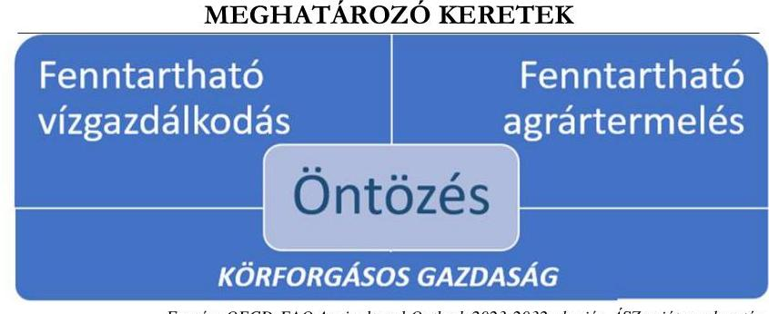

A mezőgazdasági vízhasználat, az öntözés a környezettel összhangban lévő fenntartható körforgásos gazdálkodási rendszer egyik eleme (1. ábra). A hosszú távon fenntartható öntözéses gazdálkodás a vízgazdálkodás és az agrártermelés közötti egyensúly megteremtését és megtartását igényli. Hiába éri el az agrártermelés szempontjából az öntözött területek nagysága, a felhasznált vízmennyiség a kívánatos szintet, az öntözés teremtette virágzó agrártermelés a fenntartható vízgazdálkodás egyensúlyának megbomlásával járhat, ahogyan ezt a spanyol zöldségtermelés példája mutatja. Európa zöldségeskertjének projektjéhez épített Tagus-Segura 300 km -es csatorna- és tározórendszer 650 millió $\mathrm{m}^{2}$ vizet vezet át a hegyi Tajo folyóból Murciáig az érintett területen gazdálkodóknak. A jelentős vízkivétel és az egyre szárazabb éghajlat következtében a Tajo mellett élők már nem jutottak megfelelő minőségű ivóvízhez. Több év után kormányzati döntés született a Tajo ökológiailag indokolt vízszintjének rögzítéséről, öntözővizet csak e szint felett lehet kivenni a folyóból.

Az előbbi példa rámutat arra, hogy a felszíni vizek használata során alapvető kérdés, hogy a vízigények biztosíthatók-e a rendelkezésre álló szabad felszíni vízkészletekből úgy, hogy azok hidrológiai állapota a vízelvonás következtében ne sérüljön.

A mezőgazdasági célú vízhasználat a jogszabályban meghatározottak alapján: felszíni vízből a mezőgazdasági vagy erdőgazdasági művelés alatt álló területek öntözését vagy halastavak vízellátását biztosító, vízjogi üzemeltetési engedély alapján történő vízhasználat, vagy bejelentés alapján történő rendkívüli öntözési célú vízhasználat. Az öntözés, a talaj nedvességtartalmának mesterséges úton történő szabályozása, pótlása. Az öntözéses gazdálkodás olyan intenzív agrártermelés, amely tervezett növénykultúra és tervezett agrotechnika mellett szükséges módon, vízhasználattal biztosítja a növények időjárási körülményekhez képest optimális növekedését, a termelés biztonságát.

---

Napjainkban a mezőgazdaság az egyik legnagyobb vízigényű gazdasági ágazat, amely vízszükségletét leginkább a halgazdálkodás és az öntözési igények táplálják. A hazai öntözés jellemzőit 95\%-ban meghatározzák a felszínen elérhető vízfolyások, a csatornahálózat közelsége, elérhetősége, a vízkivételi lehetőségek kapacitása. A vízügyi igazgatóságok által a területen, csatornákban mozgatott éves vízmennyiség 1200-1400 millió $\mathrm{m}^{3}$ volt 2019-2023. évek átlagát tekintve, míg a közüzemi szolgáltatott vízmennyiség és a mezőgazdasági vízhasználat hasonló nagyságrendet ért el (a közüzemi 470 millió $\mathrm{m}^{3}$, a mezőgazdasági vízhasználat 510 millió $\mathrm{m}^{3}$ ). A mezőgazdasági vízhasználatnak mintegy 70\%-át tette ki a halastavak vízigénye, az öntözésre a vízmennyiség 30\%-át, 154 millió $\mathrm{m}^{3}$-t fordítottak.

Magyarországon az öntözött területek mezőgazdasági területen belüli aránya 2019 és 2023 közötti évek átlagában 2,25\% volt, azonban az öntözött területeket tekintve az országon belül regionális különbségek jelentkeztek. Az öntözés alapvetően az alföldi régiókra jellemző, itt található az öntözött földek 81\%-a.

2023 végén az országban mintegy 1850 db mezőgazdasági vízszolgáltatási szerződés volt hatályban. A szolgáltatott öntözővíz jellemzően kormányzott főműveken, csatornákon keresztül jutott el a termőföldekig.
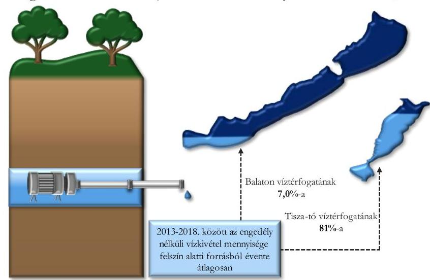

Forrás: VGT3 3-31. táblázata alapján ÁSZ saját szerkesztés

Az ellenőrzés során ellenőrzött szervezet volt az Agrárminisztérium, a Belügyminisztérium*, az Országos Vízügyi Főigazgatóság és a Magyar Agrár- és Élettudományi Egyetem (II. melléklet). A felszín alatti vizeket érintően a VGT3²-ban megtörtént az engedély nélküli vízkivétel mennyiségének becslése és hatásának felmérése, azonban a felszín alatti vizeknél az engedélytől eltérő, a felszíni vizeknél az engedély nélküli és az engedélytől eltérő vízkivétel mennyiségének becslésére nem került sor. 2013-2018. között évente átlagosan 133,6 millió $\mathrm{m}^{3}$ vízmennyiséget jelentett az engedély nélküli vízkivétel felszín alatti forrásból, ami szemléletesen a Balaton víztérfogatának 7,0\%-a; a Tisza-tó 81\%-a volt (2. ábra).

[^0]
[^0]:    * A Belügyminisztérium vízgazdálkodással, vízügyi igazgatási szervek irányításával és vízvédelemmel kapcsolatos feladatait 2024. augusztus 1-től az Energiaügyi Minisztérium vette át.

---

# ÖSSZEFOGLALÁS 

Az Állami Számvevőszék elkötelezett a természeti értékek megőrzése, a fenntartható gazdaság támogatása mellett. Ennek keretében az elmúlt években több ellenőrzésével, elemzésével vizsgálta a fenntartható vízgazdálkodás Nemzeti Vízstratégiában foglalt céljainak megvalósítását, ezen belül korábban értékelte az ivóvízgazdálkodást, a szennyvízkezelést. Jelen ellenőrzés a Nemzeti Vízstratégia végrehajtásának egy másik részterületét, a mezőgazdasági vízgazdálkodás komplex rendszerét értékeli, azon belül vizsgálja a stratégiai keretrendszer, az ágazati irányítás jellemzőit, az öntözésfejlesztésre rendelkezésre álló állami és uniós források felhasználását, valamint a mezőgazdasági vízhasználat fenntarthatóságát és a vízvisszatartás hazai helyzetét.

A mezőgazdasági vízgazdálkodás, az öntözés kettős ágazati meghatározottságú: egyfelől a vízgazdálkodás lehetőségei, másfelől a mezőgazdaság jellemzői határozzák meg működésének, fejlődésének kereteit. Az ellenőrzött időszak alatt a mezőgazdasági vízgazdálkodás stratégiai és operatív szakmai irányítása megosztott volt a vízügyi és agrár tárca között. Az együttműködés és koordináció a mezőgazdasági vízgazdálkodás fejlesztési céljainak elérése érdekében nem volt maradéktalanul biztosított a közép- és alsóbb irányítási szintek között a szakmailag elkülönült vízügyi és agrár területeknél. A jogszabályi környezet gyakran változott, szerteágazó és nehezen átlátható volt, az időszak alatt számos, az öntözést ösztönző jogszabálymódosítás történt. Az öntözéshez kapcsolódó közfeladatok pontos meghatározása hiányzott a szabályozásból. Ebből következően problémát jelentett a mezőgazdasági vízszolgáltatás állami és nem állami finanszírozási feladatainak megkülönböztetése az öntözési infrastruktúra és a harmadlagos művek működtetése során a közfeladat, valamint a szakmai feladat- és felelősség megosztásában.

Az ellenőrzött időszakban az öntözéses gazdálkodás stratégiai fejlesztési céljainak elérését nem támogatta Országgyűlés vagy Kormány által elfogadott és közzétett ágazati stratégia, hosszútávú fejlesztési terv, ugyanakkor az ágazat koncepcionális célkitűzéseit, feladatait kormányhatározatok és további, vízgazdálkodáshoz kapcsolódó stratégiai dokumentumok rögzítették.

Az ellenőrzött időszak alatt az árpolitikát érintő koordináció a vízügyi és agrárszakmai irányítás között a közös kormányzati előterjesztések készítése során volt biztosított. Az alkalmazott árpolitika támogatta az öntözött területek bővülését. A kedvezményes, majd a 2022. évi aszályos időszakot követően az állam által átvállalt vízdíj nem tudta biztosítani a mezőgazdasági vízszolgáltatás költségmegtérülését, ez folyamatos finanszírozási terhet jelent, ami kockázatot jelent a hosszú távú fenntarthatóságra. Az árpolitika nem alkalmazta a környezetvédelmi, fenntarthatósági célok elérése érdekében a vízkészletjárulékot. Évről-évre egyre nagyobb mértékben volt szükség a vízszolgáltatási költségek kormányzati kompenzációjára.

Az alkalmazott vízdíjak rendszere csak korlátozottan volt alkalmas a szolgáltatási költségek megjelenítésére, nem fejezte ki a tényleges működési- és fenntartási költségeket, a költségekben elismert infláció mértéke korlátozott volt, a díjak nem tartalmazták a vízszolgáltatás, a vízkészletgazdálkodás társadalmi fenntarthatóságának költségeit.

Az alkalmazott árpolitika gazdasági, környezeti hatását, fenntarthatóságát a felelősök nem értékelték. A hatékony- és költségtakarékos közpénzfelhasználás érdekében szükséges a mezőgazdasági vízszolgáltatás, mint közfeladat pontos meghatározása, a finanszírozás során a közérdekű feladatok lehatárolása.

Az ágazat működtetésére, fejlesztésére rendelkezésre álló költségvetési források mértéke és összetétele nem volt előre tervezhető az ellenőrzött időszak alatt. A vízügyi igazgatóságok működésének biztosításán felül az öntözésfejlesztésre 2030-ig tervezett kiemelt költségvetési keret csak két évig állt

---

rendelkezésre, így a hosszabb távú feladatok megvalósítására irányuló ágazatfejlesztési célok megvalósítása nem volt biztosított.

Az öntözéses gazdálkodás terjesztésére tett intézkedéseket a vízkészletgazdálkodás fenntarthatósági szempontjaival összhangban kell végrehajtani. Az öntözésfejlesztések jelentette vízkereslet kiszolgálásához az állami vízügyi infrastruktúra fejlesztéseivel teremtették meg a vízkínálatot. Az ellenőrzött időszakban az állami infrastruktúra fejlesztéseit a vízkereslethez igazodva tervezték meg és nem a vízkeresletet ösztönözték a vízkészletgazdálkodási szempontból fenntartható területeken, ezért az nem biztosította a hosszú távú fenntarthatóság szempontjainak érvényesülését. Az állami vízügyi infrastruktúra tervezett fejlesztései az ellenőrzött időszakban forráshiány miatt nem valósultak meg, a mezőgazdaságban működő gazdálkodók által végrehajtott fejlesztései következtében az öntözött területek gyorsabb ütemben nőttek, mint az állami
 infrastruktúra fejlesztéseivel érintett öntözhető területek.

2019 és 2023 között az öntözésfejlesztés következtében az öntözött területek nagysága 27,5%-kal, a felhasznált vízmennyiség 35,9%-kal nőtt. Az alföldi régiókban az öntözött területek aránya megközelítette az uniós arányokat. Az ellenőrzés – öntözésre vonatkozó, 2022-ig gyűjtött, országos adatokon alapuló – kalkulációi szerint az öntözés hozzáadott értéktöbbletének nagysága közel háromszorosára emelkedett 2019-2022. évek időszakában. Az öntözött területek arányának növelése hozzájárult az agrárium versenyképességének emelkedéséhez, azonban a rendelkezésre álló vízkészlet hatékony felhasználásával, vízmegtartó intézkedésekkel az agrárium versenyképessége fokozható. Az ellenőrzést megelőző időszakban kiépült talajcsövezési rendszerek, meliorációs létesítmények rendszere állapotértékelésének elvégzését követő használatba állítása a vízvisszatartást segítheti, a termésbiztonságot növelheti.

A gazdálkodók öntözésfejlesztései uniós forrásokból valósultak meg, azonban a pályázati kiírások csak kisebb részben vették figyelembe a fenntartható vízkészletgazdálkodás szempontjait. Az öntözésfejlesztésre megítélt támogatások összege 2024. július végén 188,6 Mrd Ft-ot tett ki, amelyből a kifizetések összege 60,4 Mrd Ft volt. A forrásokból 1634 támogatott projekt megvalósítása volt folyamatban, ebből 1186 projekt 170,8 Mrd Ft összegben a mezőgazdasági vízgazdálkodási ágazat fejlesztését, 316 projekt 7,7 Mrd Ft összegben a kertészetek korszerűsítését, öntözésfejlesztését, 132 projekt 10,1 Mrd Ft összegben az öntözési közösségek együttműködését támogatta. A források a gazdaságok öntözésfejlesztését, a hatékony vízfelhasználást szolgálták, ezen belül a területrendezéshez, építéshez volt köthető az elszámolt fejlesztési kiadások 41%-a, öntözési berendezésekre, vízgépészetre fordították a kifizetések 22%-át. Az uniós források felhasználása összhangban volt az előzetesen felmért igényekkel. A források felhasználása során azonban nem vették figyelembe az öntözővíz legjobb hasznosulását. A fokozódó vízigény fenntarthatósági korlátait mutatta az is, hogy megfelelő minőségű víztest hiányában utasították el a projektek tizedét.

A MATE³ és a 2021. február 1. előtti jogelőd Szent István Egyetem a mezőgazdasági vízkészletgazdálkodást érintő képzéseivel, illetve öntözéshez, öntözésfejlesztéshez kapcsolódó kutatásaival hozzájárult a mezőgazdasági vízkészletgazdálkodásra vonatkozó tudás fejlesztéséhez, megosztásához. Az országos öntözési képzési központ (Szarvas) működésére irányuló kormányzati szándék elakadását okozta, hogy az időszak alatt többször változott a feladatért felelős minisztériumi szakterület, illetve átalakult a szarvasi intézmény működését meghatározó szakmai keretrendszer is. A központ kihasználtságáról adatok nem álltak rendelkezésre.

A mezőgazdasági vízhasználathoz kapcsolódó vízjogi engedélyezési eljárások biztosították a vízkészletek védelmét, a fenntartható vízhasználat, vízgazdálkodás szempontjainak, uniós normáinak érvényesülését. Az öntözéssel összefüggő vízjogi engedélyezési eljárás átláthatóságát, az indokolttól eltérő bonyolultságát és

---

gördülékenységét befolyásoló szabályzó elemeket az ágazat irányítói azonosították, az ellenőrzött időszak alatt egyszerűsítették a vízjogi engedélyezési eljárást, az eljárási költségeket csökkentették.

Az ellenőrzött időszakra vonatkozóan az engedély nélküli mezőgazdasági vízhasználatról nem állt rendelkezésre becsült adat, azonban a korábbi felmérések szerint az elsődlegesen felszín alatti vízkészletet használó illegális mezőgazdasági kutak száma a százezret is elérheti. Az illegális vízkivételekre vonatkozó információgyűjtés, az ellenőrzés, a becslés hiánya a vízkészletgazdálkodás tervezhetőségét és megvalósítását akadályozta.

---

# AZ ELLENŐRZÉS <br> FÓKUSZTERÜLETEI/FÓKUSZKÉRDÉSEI 

1.     - A mezőgazdasági vízgazdálkodás stratégiai keretrendszere, irányítása
2.     - Az öntözés támogatására és öntözésfejlesztésre rendelkezésre álló források felhasználása, az öntözhető/öntözött területek változása
3.     - Az öntözésfejlesztésre, vízvisszatartásra irányuló intézkedések, a fenntartható mezőgazdasági vízhasználat

---

# MEGÁLLAPÍTÁSOK 

## 1. A mezőgazdasági vízgazdálkodás stratégiai keretrendszere, irányítása

Összegző megállapítás

A mezőgazdasági vízgazdálkodás stratégiai fejlesztési céljainak elérését stratégiai dokumentum nem támogatta. A fenntartható mezőgazdasági vízhasználat ösztönzését célzó stratégiai fejlesztési feladatokat kormányhatározatokba foglalták. Az ágazat működését nehezítette, hogy az operatív, szakmai irányítás megosztott volt a vízügyi és agrár tárca között, a kijelölt vízügyi-engedélyezési- és agrárszakmai középirányítószervek az ellenőrzött időszak alatt megszüntek, átalakultak.

Az ellenőrzött időszakban a mezőgazdasági vízgazdálkodás fejlesztési céljainak elérését nem támogatta jóváhagyott ágazati stratégiai dokumentum, hosszútávú fejlesztési terv, ugyanakkor az ágazat stratégiai feladatait kormányhatározatokban rögzítették.
A mezőgazdasági vízgazdálkodás fejlesztésével kapcsolatos feladatellátást meghatározó, azt közvetlenül támogató önálló stratégiai dokumentum az ellenőrzött időszakban nem volt érvényben. A főbb mezőgazdasági vízgazdálkodási fejlesztési célok és cselekvési irányok ezzel együtt megjelentek a Kormány által elfogadott, a fenntartható vízgazdálkodáshoz, klímaváltozáshoz vagy az uniós agrárpolitikához, Vidékfejlesztési Programokhoz kapcsolódó hazai stratégiai dokumentumokban. Ezek közül a legfontosabbak az alábbiak voltak:

- A 2017-ben elfogadott Nemzeti Vízstratégia, Kvassay Jenő Terv (NVS)⁴ a magyar vízgazdálkodás 2030-ig terjedő keretstratégiája és 2020-ig terjedő középtávú intézkedési terve, vízügyi szakpolitikai stratégia. Ebben a vízgazdálkodás hosszú távú céljai között megtalálható az integrált vízgazdálkodáshoz szükséges intézményi és tervezési rendszer létrehozása, kiemelten a területi vízkészletgazdálkodás. A vízgazdálkodás gazdaság-szabályozási rendszerének megújítása kérdéskörében a stratégia 7.6. pontja meghatározta, hogy az öntözés finanszírozási rendszerét újra kell gondolni az Európai Unió (EU)⁵ által előírt ex-ante (költségmegtérülés, víztakarékosságra ösztönzés) feltételek teljesítése céljából. Megtérülési számításokra van szükség annak érdekében, hogy csak a gazdaságos esetekben és lehetőleg víztakarékosan öntözzünk.
- 2018-ban a 23/2018. (X. 31.) OGY határozattal⁶ elfogadott, 2018-2030 közötti időszakra vonatkozó, 2050-ig tartó időszakra is kitekintést nyújtó második Nemzeti Éghajlatváltozási Stratégia, a kiemelt ágazati cselekvési irányok és feladatok között említi, hogy a mezőgazdasági termelés alapvető feltétele a víz- és csapadékvisszatartás, a kistáji vízkörforgásban a talajba szivárogtatás elősegítése. Kimondja továbbá, hogy a termőtalaj hazánk legnagyobb víztározója, megőrzése és hasznosítása, valamint a hiányzó víz pótlása kulcsfontosságú, illetve kimondja, hogy sürgető feladat a vízkészletekhez igazodó vízhasználatok ösztönzése, a gyors vízelvezetési kényszerek megszüntetése. Rögzíti, hogy ki kell alakítani a vízvisszatartásra ösztönző szervezeti,

---

érdekeltségi és árképzési rendszert. A stratégiában meghatározott feladatok végrehajtását szolgálta továbbá az I. Éghajlatváltozási Cselekvési Terv.

- 2021-ben a Kormány az 1620/2021. (IX. 3.) Korm. határozatával⁷ elfogadta a Nemzeti Tiszta Fejlődési Stratégia 2020-2050 dokumentumot, abban a klímaváltozásra adandó lehetséges válaszlépésként említi a vízgazdálkodás esetében a vízhiánnyal és víztöbblettel kapcsolatos problémák komplex kezelését. Kijelenti, hogy elengedhetetlen a természetes csapadék helyben tartása, továbbá a rendszeresen vízjárta területeken a területhasználatok felülvizsgálata, illetve a területhasználat integrált tervezése. Az alkalmazkodás fontos eszköze a természetes csapadék talajban történő tározása, a víztakarékos öntözési eljárások elterjesztése.
- 2022 tavaszán a Kormány az 1242/2022. (IV. 28.) Korm. határozatával elfogadta Magyarország 2021. évi Vízgyűjtő-gazdálkodási Tervének második felülvizsgálatát (VGT3), amelyben Vízgazdálkodási alprogram, 9.3.5. pontja megemlítette, hogy a Nemzeti Vízstratégiával összhangban elkészült egy Öntözésfejlesztési Stratégia is, amely javaslatot a Kormány nem hagyott jóvá. A Kormány által el nem fogadott tervezet az öntözött területek jelentős növelését irányozta elő, az öntözött területek közel 400 ezer hektárral történő növelésével.
- 2022 novemberében az Európai Bizottság elfogadta Magyarország 2023-2027 közötti időszakra szóló KAP Stratégiai Tervét (KAP ST)⁸, amely kiemeli, hogy Magyarországon a csapadékmennyiség csökkenése várható az elkövetkező évtizedekben, ezért a hatékony vízfelhasználás jelentősége felértékelődik. Megállapítja, hogy az agrár vállalkozások termelési hatékonyságának növelése az öntözött területek arányának növelése mellett a már kiépített öntözési infrastruktúra korszerűsítésével nagymértékben javítható. A KAP ST-ben több, a mezőgazdasági vízgazdálkodás fejlesztési céljaival összhangban lévő, pályázati felhívás szerepel: a legnagyobb keret az öntözésfejlesztési és vízfelhasználás hatékonyságát javító mezőgazdasági üzemen belüli komplex beruházások támogatása lesz, (65,8 Mrd Ft). A vízvédelmi célú nem termelő beruházások és fenntartásának támogatására 3,8 Mrd Ft áll rendelkezésre, a vízfelhasználás hatékonyságát javító mezőgazdasági öntözési közösségek támogatására 2,0 Mrd Ft keretet biztosítottak.
1.1. ábra

A STRATÉGIAI DOKUMENTUMOKBAN A MEZŐGAZDASÁGI VÍZGAZDÁLKODÁSHOZ KAPCSOLÓDÓ FŐBB FEJLESZTÉSI CÉLOK
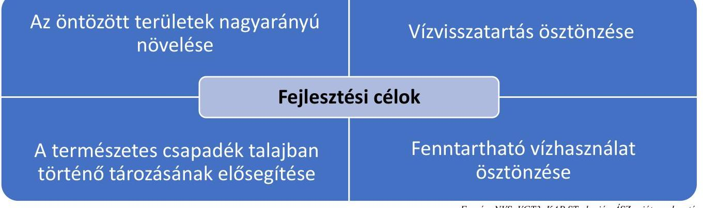

KORMÁNYHATÁROZATOKBAN MEGHATÁROZOTT CÉLOK
Az állami vízkínálat lehetőségeinek bővítése és az ahhoz igazodó termelői vízkereslet megszervezése érdekében a Kormány az ellenőrzött időszakban (illetve azt megelőzően, de kihatással az ellenőrzött

---

időszakra) kormányhatározatban rögzítette a stratégiai öntözésfejlesztési feladatokat a felelős tárcák számára. A fenntartható mezőgazdasági vízgazdálkodás, az öntözésfejlesztés stratégiai tervezési feladatainak, a szükséges feltételek és szervezeti keretek kialakításának feladatait az 1. táblázatban felsorolt kormányhatározatok tartalmazták.

| KORMÁNY- <br> HATÁROZAT <br> SZÁMA | STRATÉGIAI FEJLESZTÉSI FELADATOKAT TARTALMAZÓ KORMÁNYHATÁROZATOK |  |  |  |
| :--: | :--: | :--: | :--: | :--: |
|  | STRATÉGIAI TERVEZÉS | STRATÉGIAI CÉLTERÜLETEK |  | FENNTARTHATÓSÁG ESÉLYEGYENLŐSÉG |
| $\begin{gathered} 1744/2017. \\ (X. 17.) \\ Korm.Hat \end{gathered}$ | hatékony öntözéses gazdálkodás kialakításának műszaki-infrastrukturális-, pénzügyi-, humán- <br> feltételrendszerének felmérése, <br> szakmai stratégia az öntözésfejlesztés infrastrukturális <br> vízkészlet-gazdálkodási lehetőségeiről <br> Öntözésfejlesztési Stratégia készítése <br> (tervezéshez források) | ```     termelői     közösségek működtetésének feltételrendszer kidolgozása (szabályozás, pénzigény)``` |  | öntözési víztározás, víz visszatartás, belvíz területen hagyás lehetőség vizsgálata <br> víz komplex hasznosítása, környezetvédelem, vízes élőhelyekre javaslat |
| $\begin{gathered} 1426/2018. \\ (IX. 10.) \\ Korm.Hat.¹⁰ \end{gathered}$ |  | öntözési ügynökség koncepció kidolgozása közcélú vízilétesítmények katasztere | javaslat az öntözésfejlesztés megvalósításának sorrendjére, finanszírozásra 2020-2030 között legfeljebb 17Mrd Ft/év fejlesztési forrás |  |
|  |  | gátló infrastruktúra-, eszköz- és humán forráshiányok feltárása, javaslat megszüntetésére |  |  |
|  |  | hosszú távú öntözési vízjogi engedély javaslat |  |  |
| $\begin{gathered} 1800/2018. \\ (XII. 21.) \\ Korm.Hat.¹¹ \end{gathered}$ |  | AM: Öntözési Ügynökség létrehozása | BM: 2019-2024 gátló hiányok felszámolásához 35 Mrd Ft forrás | vízgazdálkodási fejlesztések megkezdése |
|  |  | AM: helyi érdekeltségű közcélú vízi létesítmények felmérése | BM: nem állami csatornaszakaszok felmérése | önkéntes közösségek működését segítő szabályozás, adminisztratív egyszerűsítés |
|  |  | aszálykár-elhárítási rendszer MKR-be beépítése |  | öntözési közösségek megalakulásának elősegítése 2014-2020 VP forrásokból |
|  |  | öntözési célú vízjogi engedélyezési eljárások gyorsítása |  | nem állami tulajdonú csatornaszakaszok vízügyi üzemeltetésbe kerülési lehetőségei öntözőberendezések hazai gyártásának, fejlesztése |

Forrás: Fent hivatkozott kormányhatározatok alapján ÁSZ saját szerkesztés

---

A kormányhatározatokban foglalt feladatok, és a feladatok végrehajtásához rendelt források időrendben a következők voltak:

2017 végén az 1744/2017. (X. 17.) Korm. határozat előírta az öntözésfejlesztés stratégiai tervezését megalapozó helyzetfelmérést. Meghatározta a műszaki-, infrastrukturális pénzügyi-, humán erőforrások helyzetének számbavételét, továbbá az öntözéshez kapcsolódó termelői közösségek működésének-, szabályozási-, pénzügyi jellemzőinek és a fenntartható vízgazdálkodás-, vízvisszatartás helyzetének felmérését. Előírta 2017 végére az öntözési kataszter készítését, továbbá 2018. április végére a belügyminiszternek, a Nemzeti Agrárgazdasági Kamara (NAK)¹³, bevonásával a földművelésügyi miniszternek a Miniszterelnökséget vezető miniszterrel és a nemzetgazdasági miniszterrel együttműködve, hogy készítse elő az Öntözésfejlesztési Stratégiát és terjessze a Kormány elé jóváhagyásra. Az Öntözésfejlesztési Stratégia 2018-ban elkészült, a Kormány az öntözési célt szolgáló fejlesztési javaslatokkal egyetértett, azonban a stratégiai dokumentum jóváhagyása nem történt meg.

- 2018 szeptemberében az 1426/2018. (IX. 10.) Korm. határozat további feladatokat határozott meg az öntözésfejlesztés érdekében. Előírta az öntözésfejlesztés szervezeti (öntözési ügynökség koncepció) és szabályozási feltételeinek kidolgozását,
 valamint a szükséges beruházások sorrendjének meghatározását, illetve ezek 2030-ig történő finanszírozására határozott meg 17 Mrd Ft/éves maximális pénzügyi keretet. A vízügyi ágazatnak továbbá fel kellett mérnie az öntözési rendszerek eredményes működtetését gátló infrastrukturális, eszköz- és humánerőforrás-hiányt, javaslatot kellett tenniük annak megszüntetésére.
- Az 1800/2018. (XII.21.) Korm. határozatban a Kormány támogatva az állami vízkínálat bővítését, felhívta a belügyminisztert az öntözési célra felhasználható vízgazdálkodási rendszerek fejlesztésének az $\mathrm{AM}^{14}$ és a NAK által támogatott sorrendben történő megkezdésére. A vízügyi ágazat a működtetést gátló infrastrukturális, eszköz- és humánerőforrás-hiány felmérését követően a hiányok elhárítására évente meghatározott összegben a 2019-2024. évek alatt összesen 34,8 Mrd Ft-ot kapott. A Kormány az öntözésfejlesztéshez szükséges termelői vízkereslet integrálása érdekében egyetértett az öntözési ügynökség létrehozásával, felhívta az agrárminisztert, hogy 2019. január végére dolgozza ki és terjessze a Kormány elé annak működésére vonatkozó jogszabályokat. Öntözésigazgatási szervként a Nemzeti Földügyi Központban (NFK) ${ }^{15} 2019$ júliusában létrehozták az Öntözésfejlesztési Főosztályt, ami 2024. május végén beolvadásos különválással megszűnt, általános jogutódja az AM lett.
- Az 1664/2019. (XI. 25.) Korm. határozatban az öntözési célú vízjogi engedélyezési eljárások gyorsításáról, egyszerűsítéséről és a vízszolgáltatási díj mérséklésének lehetséges módjairól, valamint az állami vízilétesítmények közé ékelődő idegen tulajdonú csatornaszakaszok vízügyi működtetésbe vétele költségvetési terheinek felmérésére írt elő a Kormány javaslatkészítési feladatot.


# KORMÁNYZATI ELŐTERJESZTÉSEKBEN MEGHATÁROZOTT CÉLOK 

Az ellenőrzött időszakban a stratégiai tervezés kereteit a kormányzati előterjesztések, jelentések biztosították. A vízügyi- és agrár szakterületek egyeztetései során alakították ki a megfogalmazott fejlesztési javaslatok összhangját, az ágazat stratégiai fejlesztési céljait. Ezek közül a legfontosabb kormányzati előterjesztések a következők voltak:

- 2020. júniusában az AM és a BM közösen helyzetjelentést készített a 2020 és 2030 közötti öntözésfejlesztési beruházások prioritási sorrendjére (104 beruházás), összesen 98 Mrd Ft

---

értékben javasolt fejlesztéseket, az éves bontás és a beruházások regionális megoszlása az 1.2. ábrán látható. Az öntözési célt szolgáló fejlesztések megvalósítási sorrendje többször, az aktuális igényeknek megfelelően módosult. A tervezett beruházások az alföldi területeket érintették volna leginkább, az Észak-alföldi régió (ÉAF) vízügyi infrastruktúráját korszerűsítették volna, összesen 68,7 Mrd Ft összegben. A Dél-alföldi régió fejlesztéseire 23,2 Mrd Ft-ot, a Nyugat-dunántúli beruházásokra 8,4 Mrd Ft-ot terveztek. Az öntözésfejlesztések, főművi fejlesztések hatásterületén keresztül összesen 376 ezer hektár vízellátásának rekonstrukcióját, öntözhetőségének javulását tették volna lehetővé. Az 1.3. ábra mutatja vármegyék szerint a fejlesztések tervezett hatását az öntözésbe vonható területekre.
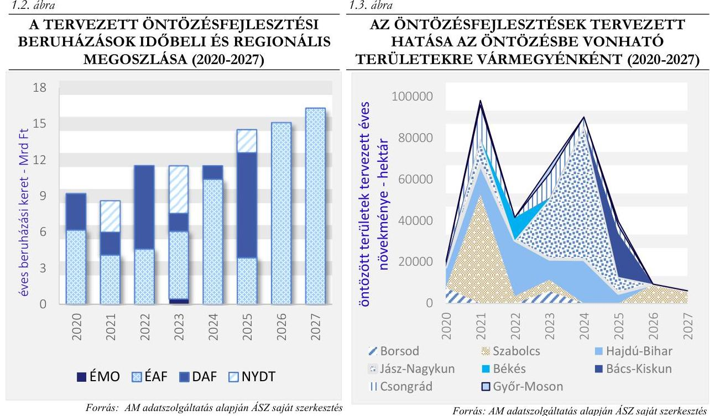

Az 1426/2018. (IX. 10.) Korm. határozatban fejlesztésekre tervezett költségvetési források végül csak két évig, 2020-ban és 2021-ben álltak az ágazat rendelkezésére, amelyből 14 beruházás valósult meg.

- 2021. novemberben készült AM-BM előterjesztés javasolta, hogy a mezőgazdasági termelők a piaci versenyképességük megőrzése érdekében az öntözővízhez kiszámíthatóbban és időszakosan térítésmentesen jussanak hozzá egységes mértékű díj bevezetése mellett $\left(1,5 \mathrm{Ft} / \mathrm{m}^{3}\right)$.
- A 2022-ben az AM és a BM a NAK és a MAGOSZ ${ }^{16}$ bevonásával kidolgozott egy átfogó, vízgazdálkodási és öntözésfejlesztési koncepciót, amelynek célja volt a hazai öntözés hatékonyságának növelése érdekében a két szaktárca feladatainak összehangolása.
- A 2023-ban készült jelentésben beszámoltak az öntözés fejlesztés célterületein elért eredményekről:
I. Infrastrukturális beavatkozások felülvizsgálata a hatékony és fenntartható vízszolgáltatás érdekében.
II. Mezőgazdasági vízszolgáltatás üzemeltetési költségeinek csökkentése gazdálkodók bevonásával, együttműködési megállapodás tervezet kidolgozása.
III. A vízügyi igazgatóságok által üzemeltetett öntözési célra használható vízfolyásokba beékelődő idegen tulajdonú, illetve Magyar Állam tulajdonában, de nem vízügyi igazgatóságok vagyonkezelésében lévő ingatlanok jogi rendezésének megbontása költségvetési forrás biztosításával, illetve forrásbiztosítás nélküli típusokra.

---

IV. Ideiglenes tározók végleges tározókká alakítása.

# AGRÁRSZAKPOLITIKAI KUTATÁSOK, ELEMZÉSEK 

Az ellenőrzött időszakban a mezőgazdasági vízgazdálkodás fejlesztésének helyzetelemzéseit tudományos kutatások, szakpolitikai elemzések is megalapozták. Az agrárszakmai terület célzott kutatásait az Agrárközgazdasági Intézet NKft (AKI) végezte.
Az AKI ${ }^{17}$ a mezőgazdasági vízgazdálkodáshoz kapcsolódóan 2022-ig évente ún. Öntözésjelentést készített, valamint a fejlesztésekhez kapcsolódóan több kutatást végzett az AM megrendelésére az öntözéses gazdálkodás hatékonyságának növelése, a klímaváltozás hatásainak mérséklése és a vízvisszatartás ösztönzése területén.

- 2018-ban az AKI a NAK bevonásával a gazdák körében öntözési vízigényfelmérést végzett. Az adatok alapján ezt követően elkészült az AM, az $\mathrm{OVF}^{18}$ és a NAK megbízásából az AKI által bemutatott „Öntözési Kataszter az öntözésre alkalmas és az öntözésre feltételesen alkalmas területek alapján" című dokumentum, amelyben szerepelt a megtérülő jövőbeni öntözési beruházások, az öntözőfürtök rangsora. Az általuk érintett területi lehatároláshoz az AKI dinamikus megtérülési - nettó jelenérték (NPV) - számítást végzett és így határozta meg az öntözésre alkalmas területeket.
- 2021-ben az AKI Záró Értékelési Jelentést készített a Vidékfejlesztési Program 2014-2020. évi vízgazdálkodást érintő beavatkozásainak eredményességéről, hatékonyságáról.
- 2021-ben külön-külön elemezte, vizsgálta az egyes művelési ágak, zöldségtermesztő és gyümölcstermesztő körzetek öntözési tapasztalatait, jellemzőit, referencia hozamok távérzékelésen alapuló becslésének módszereit.
- 2024 márciusában az AKI az OVF, a MATE és a NAK falugazdász-hálózata részvételével felmérést készített a vízvisszatartási hajlandóságról. A válaszokból kiderült, hogy a gazdálkodók nyitottak a vízvisszatartásra, amennyiben ehhez köthetően megfelelő mértékű kompenzációt kapnak.
A mezőgazdasági vízgazdálkodás fejlesztésének támogatása céljából készült tanulmányok, kutatások, környezeti hatásvizsgálatok alkalmasak voltak a kapcsolódó szakterületi tervdokumentumokban, illetve stratégiai dokumentum tervezetekben foglaltak megalapozására.


## SZABÁLYOZÁSI KERETEK FONTOSABB VÁLTOZÁSAI

Az időszak alatt számos, az öntözést ösztönző jogszabálymódosítás történt. A mezőgazdasági vízgazdálkodás jogszabályi környezete gyakran változott, szerteágazó és nehezen átlátható volt.
Az időszak alatt alapvető szabályozási probléma volt, hogy az ágazat irányításáért felelős stratégiai, szakmai irányítók nem rögzítették pontosan az öntözéshez kapcsolódó közfeladatok ellátásának határait, az ehhez kapcsolódó vízügyi és agrár szakmai feladatokat, azok állami finanszírozási kereteit.
Az ellenőrzött időszakban a mezőgazdasági vízgazdálkodásra vonatkozó lényegesebb jogszabályi előírásokat elsősorban a vízgazdálkodásról szóló 1995. évi LVII. törvény (Vgtv.) ${ }^{19}$ és 2020-tól az az öntözéses gazdálkodásról szóló 2019. évi CXIII. törvény, (Ögtv.) ${ }^{20}$, valamint számos kapcsolódó vízgazdálkodást érintő, részletszabályokat tartalmazó kormányrendelet, kormányhatározat jelentette.
A mezőgazdasági vízhasználatot ösztönözték a jogszabályok. A Vgtv. módosításai az időszak alatt biztosították a vízkészletjárulék és a mezőgazdasági vízszolgáltatási díj csökkentését, a fizetés alóli mentességet, szabályozták a vízjogi engedélyezési eljárás elektronikus lebonyolításának folyamatát, az

---

adatszolgáltatási kötelezettség eltörlését $500 \mathrm{~m}^{3} /$ év öntözési vízfogyasztás alatt. Az Ögtv. szabályai többször módosultak. Jelentősebb módosítás volt 2023. júliustól, hogy az öntözési közösségek fogalma változott, valamint 2023. decembertől szűkült a tervezett öntözésfejlesztési beruházások területén a más célú hasznosítás lehetősége.
Az Ögtv. 1.§ 1. pontja tartalmazza a harmadlagos művek fogalmát, amely szerint harmadlagos mű a vízügyi igazgatási szervek által kezelt és üzemeltetett vízilétesítmény, valamint a mezőgazdasági öntözési igények tényleges felmerülésének helye között elhelyezkedő üzemi szintű mezőgazdasági vízellátást biztosító, öntözési célú vagy kettős működésű vízilétesítmény és az öntözési körzet többletvizeit elvezető vízilétesítmény. 2019. július 1-től 2024. május 31-ig az NFK Öntözésfejlesztési Főosztály járt el öntözési igazgatási szervként, majd annak feladatait az agrárminiszter vette át. Az öntözési igazgatási szerv feladatait a 158/2019. (VI. 28.) Korm. rendelet határozta meg, amely szerint az öntözési igazgatási szerv feladata a harmadlagos művek üzemeltetése, fejlesztése, öntözővíz-szolgáltatásának koordinálása. Az előbbiek szerint a harmadlagos művek üzemeltetése mind a vízügyi igazgatási szerveknek, mind az öntözési igazgatási szerveknek feladata volt.
A mezőgazdasági vízgazdálkodásért felelős szervezetrendszer feladat- és hatáskörei az ellenőrzött időszakban meghatározottak és átláthatók voltak. Az irányítási feladatokat ellátó szervezetek közötti kapcsolattartás biztosított volt, azonban a szakmai irányítási felelősség megosztottsága következtében az egységes, integrált szemléletű stratégiai döntéshozatal, operatív irányítás nem volt maradéktalanul biztosított.
Az ágazat stratégiai és operatív irányításának feladatai a felelős minisztériumok között megosztottak voltak. A mezőgazdasági vízgazdálkodás fejlesztési céljainak elérése érdekében az együttműködés és koordináció nem volt maradéktalanul biztosított a szakmailag elkülönült vízügyi és agrár területek közép-, és alsóbb irányítási szintjei között.
A mezőgazdasági vízgazdálkodással kapcsolatos operatív irányítási feladatokat a BM és az AM megosztottan, a középirányítói feladatokat az OVF, a BM Országos Katasztrófavédelmi Főigazgatóság, (BM OKF) és az NFK Öntözésfejlesztési Főosztály látta el. A vízgazdálkodásért, a vízügyi igazgatási szervek irányításáért, és a vízvédelemért, azaz a vízgazdálkodás „kínálati oldalához" kapcsolódó irányítói feladatokért a BM felelt. Az előbbi irányítási felelősség 2022. májustól kiegészült az ÉKM ${ }^{21}$ miniszter felelősségével, amely központi költségvetésből megvalósuló vízilétesítmények műszaki tervezését és megvalósítását végzi. A mezőgazdasági vízhasznosítással kapcsolatos kormányzati feladatokért, azaz a „víz keresleti oldalához" kapcsolódó irányítói feladatokért az AM felelt.
A kormánytagok mezőgazdasági vízgazdálkodáshoz kapcsolódó felelősségének változását az ellenőrzött időszak kezdetétől 2024. augusztusáig a 2. táblázat mutatja be.

---

# 2. táblázat

A MEZŐGAZDASÁGI VÍZGAZDÁLKODÁS EGYES SZAKTERÜLETEIÉRT FELELŐS KORMÁNYTAGOK (2019. JANUÁR - 2024. AUGUSZTUS)

|  A KORMÁNYTAGOK FELELŐSSÉGE | 2019. JANUÁR | 2021. JANUÁR | 2024. AUGUSZTUS  |
| --- | --- | --- | --- |
|   | 2020. DECEMBER | 2024. JULIUS |   |
|  Felelős a vízgazdálkodásért, a vízügyi igazgatási szervek irányításáért, és a vízvédelemért | belügyminiszter | - | -  |
|  Felelős a vízgazdálkodásért a vízügyi igazgatási szervek irányításáért, és a vízvédelemért | - | belügyminiszter | energiaügyi
miniszter  |
|  Felelős a mezőgazdasági öntözési célú, felszín alatti vízkivételt biztosító vízilétesítmény engedélyezéséért | - | agrárminiszter | agrárminiszter  |
|  Felelős az agrárpolitikáért (ennek keretében ellátja a mezőgazdasági vízhasznosítással kapcsolatos kormányzati feladatokat). |  | agrárminiszter |   |

Forrás: a Kormány tagjainak feladat- és hatásköréről szóló 94/2018. (V. 22.) Korm. rendelet és 182/2022. (V. 24.) Korm. rendelet, ÁSZ saját szerkesztés

Az ágazati operatív irányítási feladatok az időszak alatt módosultak: 2020. végéig a belügyminiszter volt a kormány felelős tagja a vízgazdálkodásért, a vízügyi igazgatási szervek irányításáért, és a vízvédelemért. 2021-től a vízjogi engedélyezési feladatok egy része a mezőgazdasági öntözési célú, felszín alatti vízkivételt biztosító vízilétesítmény engedélyezésének felelőssége átkerült a belügyminisztertől az agrárminiszterhez. 2024. augusztustól a vízgazdálkodás, a vízügyi igazgatási szervek irányítása, és a vízvédelem feladatai átkerültek a belügyminisztertől az energiaügyi miniszterhez, (kivéve a mezőgazdasági öntözési célú, felszín alatti vízkivételt biztosító vízilétesítmény engedélyezését). A stratégiai és operatív irányítási feladatokat ellátó szervezetek közötti kapcsolattartás szabályai meghatározottak voltak a szervezetek belső szabályzataiban, azonban az együttműködés és koordináció a mezőgazdasági vízgazdálkodás fejlesztési céljainak elérése érdekében ezekben a belső szabályokban nem volt meghatározott. Az együttműködési, koordinációs hiányosságok kezelésének igénye megjelent a kormányzati előterjesztésekben oly módon, hogy önálló szervezet létrehozását vetették fel a tárcák közötti feladatok összehangolásának, a koordináció ellenőrzésének, az oktatás fejlesztése megtervezésének feladataival. Különösen az AM-en belül okozott problémát a mezőgazdasági vízszolgáltatási feladatok koordinációja, az időszak alatt négy államtitkárság, azon belül négy főosztály/osztály volt felelős a BM-mel való egyeztetésért, a feladatok összehangolásáért:

- 2019-től az agrárgazdaságért felelős helyettes államtitkár irányítása alatt az Agrármodernizációs Főosztály,
- 2020-tól földügyekért felelős helyettes államtitkárságon a Mezőgazdasági Vízgazdálkodási Osztály,
- 2021. március 20-tól a közigazgatási államtitkárságon a
 Földvagyon-gazdálkodási és Öntözésfejlesztési Főosztály, majd
- 2023. júliustól a parlamenti államtitkárságon belül az Öntözésfejlesztési Osztály.

Az ellenőrzött időszakban az ágazat működését, feladatellátását nehezítette, hogy a vízügyi engedélyezési és agrárszakmai középirányító szervezetek megszűntek (OKF, NFK) vagy átalakultak (AM vízügyi koordináció), működési feladataik más szervezetekhez kerültek.

---

Az ellenőrzött időszakban a mezőgazdasági vízgazdálkodással kapcsolatos középirányítói feladatokat az OVF, a BM OKF és az NFK Öntözésfejlesztési Főosztálya látták el.

- Az Országos Vízügyi Főigazgatóság, (OVF), az ellenőrzött időszakban a belügyminiszter irányítása alá tartozó központi középirányító szerv volt, amely irányította, koordinálta és ellenőrizte a területi vízügyi igazgatóságok szakmai tevékenységét.
- BM Országos Katasztrófavédelmi Főigazgatóság, (BM OKF) ${ }^{22}$ a megyei katasztrófavédelmi igazgatóságokkal együtt a vízvédelmi igazgatási feladatai körében összegyűjtötte, ellenőrizte, értékelte és rendelkezésre bocsátotta az OKIR működtetéséhez szükséges adatokat, a vízminőségvédelmi, kárelhárítási feladatokat koordinálta, együttműködött az OVF-vel a vízvédelmi igazgatási feladatok ellátásában.
2024. októberig a vízvédelmi igazgatási feladatok ellátása az OVF-hez és a területi vízügyi igazgatóságokhoz, a hatósági jogkör gyakorlása a BM OKF-hez és a vármegyei, fővárosi katasztrófavédelmi igazgatóságokhoz tartozott. A 2024 októbertől életbe lépett hatósági jogkörökkel kapcsolatos változások alapján a vízvédelmi igazgatási feladatok ellátásához kapcsolódó területi vízvédelmi hatósági jogköröket a fővárosi és a vármegyei kormányhivatalok gyakorolják.
- A Kormány a 1426/2018. (IX. 10.) Korm. határozatával döntött az Öntözési Ügynökség felállításáról, ennek feladatait az NFK szervezetén belül, 2019 júliustól az NFK Öntözésfejlesztési Főosztály látta el. Öntözési Ügynökség feladatai voltak többek között, az aszálykárok megelőzése és csökkentése érdekében az öntözéses gazdálkodás terjesztésében történő közreműködés; a termelői vízigények elemzése, erre javaslatok kidolgozása; az öntözési közösségek szakmai támogatása; nemzeti öntözési mintaprojektek üzemeltetése; a harmadlagos művek üzemeltetése, fejlesztése, öntözéses gazdálkodás alapadatait tartalmazó informatikai rendszer üzemeltetése. 2024. májustól az NFK megszűnt, feladatai az agrárpolitikáért felelős miniszterhez kerültek.
A területi vízügyi igazgatóságok, vízszolgáltatók a felsőbb szintű stratégiai öntözésfejlesztési koncepciókra, célokra korlátozottan láttak rá, nem rendelkeztek azokról releváns információkkal, így ennek hiányában tevékenységük a hosszú távú elképzelésekhez nem tudott igazodni. Az irányítási felelősség megosztottságából adódó koordinációs nehézségek a fejlesztési célok elérését megnehezítették.


# A MEZŐGAZDASÁGI VÍZGAZDÁLKODÁSHOZ KAPCSOLÓDÓ KÖZFELADATOK MEGHATÁROZÁSA 

Az öntözési infrastruktúra és a harmadlagos művek működtetése, fejlesztése terén nem volt teljeskörűen átlátható szakmai feladat- és felelősségmegosztás.
2019. októberben az AM és BM közös előterjesztése javasolta, hogy a harmadlagos művek kerüljenek az NFK vagyonkezelésébe. Az előterjesztés elfogadása esetén az NFK-nál keletkező új feladatok elvégzéséhez a javaslat szerint egy komplex, térinformatikai, földügyi, környezeti és vízjogi engedélyadatokat is tartalmazó informatikai irányítási rendszer kialakítása lett volna szükséges.
2022. júliusban az NFK javasolta Öntözési Régióközpontok kialakítását, amelyek az infrastrukturális beruházások koordinálása mellett a vízkeresletnek megfelelően tervezték volna a területi vízkínálatot és szolgáltatták volna az öntözővizet. Gazdálkodó - régió - állam hármas vízkészletjárulék, vízszolgáltatási díj, rendszerhasználati díj elszámolásban gondolkodtak. A harmadlagos művek működtetésére, rekonstrukciójára és az öntözésfejlesztési regionális központokra évi $\sim 50$ Mrd Ft többletforrás igényt becsült az előterjesztés 2030-ig.

---

2022. novemberben készült BM, AM közös előterjesztés szerint „Az öntözhető területek növelése kizárólag állami szerepvállalás mellett történhet", ezért a Kormány kiemelt állami feladatként deklarálta az öntözéses gazdálkodás elterjesztését, észszerű fejlesztését, a vízkészletek védelmét és hasznosítását.
2023 júliusában a BM és az AM közös terve javasolta a gazdák felkérését és a hajlandóság felmérését a harmadlagos művek, csatornák karbantartására, működtetésére az alábbi területeken: a csatornák melletti parti sávok, fenntartó utak karbantartása, területek rendezése, fakitermelés, cserjeirtás; a száraz medrek növényzetének eltávolítása, iszaptalanítás; vizes medrekben akadályt képző növényzet eltávolítása; a kotrási munkálatok utáni hulladék rendezése.
Az előbbi dokumentumokban a mezőgazdasági vízszolgáltatás, csatornák, harmadlagos művek működtetésének eltérő elképzelései rámutatnak arra, hogy a mezőgazdasági vízszolgáltatáshoz kapcsolódó közfeladat jellegének meghatározása a hazai szabályozásban nem volt egyértelműen azonosítható. Az ágazat irányításáért felelős stratégiai, szakmai irányítók nem rögzítették pontosan az öntözéshez kapcsolódó közfeladatok ellátásának határait, ehhez kapcsolódva a vízügyi és az agrár szakmai feladatokat, azok állami finanszírozási kereteit.

# 2. Az öntözés támogatására és öntözésfejlesztésre rendelkezésre álló források felhasználása, az öntözhető/öntözött területek változása 

Összegző megállapítás Az ellenőrzött időszak alatt alkalmazott ár- és támogatáspolitika, a költségvetési és uniós források felhasználása eredményes volt, hozzájárult az öntözhető és öntözött területek bővüléséhez, az öntözővíz-használat emelkedéséhez. Az intenzívebb vízhasználat növekedés azt mutatta, hogy az alkalmazott árpolitika nem biztosította a mezőgazdasági vízszolgáltatás költségmegtérülését, hosszú távú fenntarthatóságát.

Az ellenőrzés az öntözés támogatására, öntözésfejlesztésre rendelkezésre álló források felhasználását, a mezőgazdasági vízhasználatot előmozdító intézkedéseket, azok eredményességét befolyásoló tényezőket három részre bontva értékelte: az alkalmazott árpolitikán, a költségvetési támogatásokon keresztül és az uniós fejlesztési források felhasználásának elemzésével. Mindezek előtt a fejezet a rendelkezésre álló statisztikai adatok alapján bemutatja a hazai öntözés legfontosabb sajátosságait.
Az ellenőrzött időszakban a legfontosabb öntözést jellemző adatok, az öntözhető- és az öntözött területek alakulását, valamint a felhasznált vízmennyiség változását mutatja a 2.1 ábra. Az öntözött területeket tekintve az országon belül jelentős regionális különbségek vannak, az öntözés alapvetően az alföldi régiókra jellemző, itt található az öntözött földek 81%-a (2.2. ábra).

---

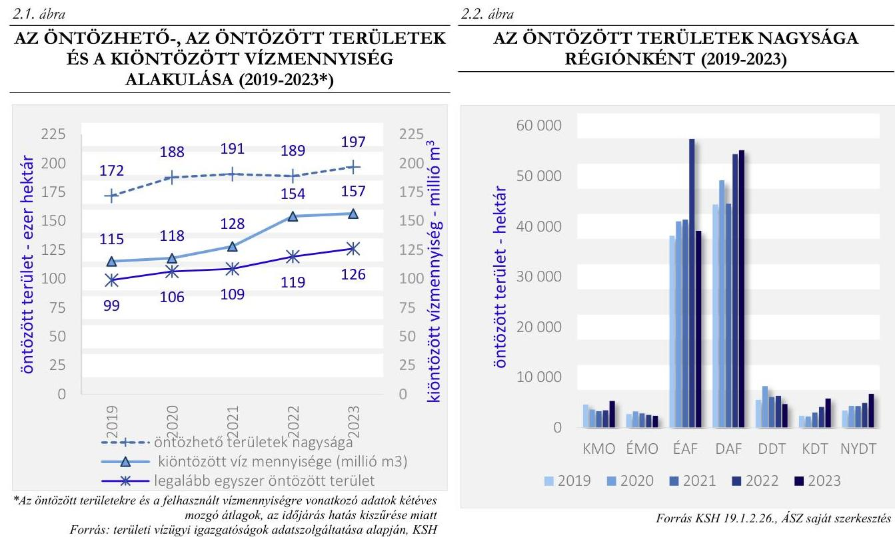
2019. és 2023. év között a vízjogi engedéllyel rendelkező öntözhető területek nagysága fokozatosan, 172 ezer hektárról, 197 ezer hektárra, 14,5%-kal, nőtt. Az öntözött területek bővülése némileg nagyobb mértékű, 27,5%-os volt, 99 ezer hektárról 126 ezer hektárra nőttek az öntözött földek 2023-ra. Az öntözött területek növekedése fokozatosan növekvő vízhasználat mellett valósult meg. A kiöntözött éves vízmennyiség 115 millió $\mathrm{m}^{3}$-ről, 157 millió $\mathrm{m}^{3}$-re, 35,9%-kal, emelkedett ${ }^{2}$. Ez a változás részben felelt meg annak az NVS-ben meghatározott célnak, amely kitűzte, hogy az öntözött területek bővülése csökkenő, egyre hatékonyabb vízhasználat mellett valósuljon meg.
Az ágazat teljesítményének, statisztikai jellemzőinek értékelésekor szükséges megjegyezni, hogy az ágazat irányításáért felelős szakmai területek az irányításhoz, döntéseik megalapozásához szükséges adatokat külön-külön mérték, gyűjtötték. Így az öntözött területek nagysága és a felhasznált vízmennyiség alakulása a méréstől függő különbségeket, de nem különböző tendenciákat mutatott. A KSH mellett az OVF is gyűjtötte a területi vízügyi igazgatóságoktól a mezőgazdasági vízszolgáltatásra vonatkozó adatokat, amely adatoktól eltért az AKI Agrárstatisztikai Információs Rendszerében (ASIR) ${ }^{23}$ a termelőktől gyűjtött öntözésre vonatkozó statisztikai adat. Az adatkülönbségeket a vízügyi-műszaki (főművi/saját vízkitermelés) területen a mezőgazdasági művelési ágak szerinti megkülönböztetések (öntözés, halastavak, rizstermelés) okozták.

[^0]
[^0]:    ${ }^{2}$ Az ellenőrzéshez a területi vízügyi igazgatóságok által tanúsítványon szolgáltatott adatoktól az OVF mezőgazdasági vízszolgáltatást jellemző adatai némileg eltértek, amely eltérést a szerződött vízszolgáltatók, valamint a saját és főműves vízhasználat eltérő számbavétele okozhatott. Az OVF kimutatásai alapján a 2019. és 2023. év között a vízjogi engedéllyel rendelkező öntözhető területek nagysága 190 ezer hektárról, 212 ezer hektárra, 12%-kal, nőtt, az öntözött területek 108 ezer hektárról 124 ezer hektárra nőttek, a kiöntözött éves vízmennyiség 124 millió $\mathrm{m}^{3}$-ről, 165 millió $\mathrm{m}^{3}$-re, 33%-kal, emelkedett.

---

# ÖNTÖZÖTT TERÜLETEK REGIONÁLIS KÜLÖNBSÉGEI 

## Magyarországon belül az öntözött területek aránya területi különbséget mutatott, az alföldi régiókban az öntözött területek aránya megközelítette az uniós átlag szintjét.

Az uniós mezőgazdasági vízgazdálkodásra vonatkozó adatok szerint az öntözött területek aránya 2005 és 2016 között 9,4%-ról, 5,9%-ra csökkent a növekvő technológia költségek következtében. Regionális összehasonlításban az öntözött földek kiemelkedő, 15-32%-os aránya Európa „zöldséges-, gyümölcsös kertjeit" jellemzi a spanyol és olasz régiókban az intenzív kertészeti kultúrák jelenlétében. Az intenzív mezőgazdasági termelést jellemzi az intenzív öntözés.
Az Európai Unióban a megművelt mezőgazdasági területek nagysága és az öntözött területek nagysága közötti kapcsolatot mutatja a 2.3. ábra. Magyarország viszonylatában a bemutatott adatok szerint a megművelt földterület nagysága a két alföldi régióban 1,1 millió hektár közelében, az öntözött területek nagysága pedig 50 ezer hektár közelében volt. Az ábra azt mutatja, hogy az uniós regionális adatok szerint az 1,0-1,5 millió megművelt hektárral rendelkező régiókhoz viszonyítva az Alföldön öntözött területek nagysága a legnagyobbak között volt. A kategóriába tartozó 19 régióból csak hat régióban ${ }^{3}$ volt nagyobb az öntözött területek nagysága, mint az alföldi régiókban.
Magyarországon a megművelt területekhez képest az öntözött területek aránya 1,8%-ról, 2,3%-ra emelkedett az ellenőrzött időszak alatt, átlagosan 2,25% volt. A mezőgazdasági gazdálkodás eltérő regionális művelési jellemzői miatt az összes megművelt területhez viszonyított öntözési arány az uniós szinthez képest lemaradást mutatott. Az öntözésben való országos lemaradást jelző adatok egységként kezelik a hazai extenzív és intenzív mezőgazdasági termelést. Az intenzív mezőgazdasági művelést folytató alföldi régiókban az öntözött területek regionális aránya az uniós átlaghoz közeli volt (2.3. ábra), az Északalföldi régióban 4,2%, a Dél-alföldi régióban 4,5%. Az öntözés fejlesztése következtében az alföldi régiók öntözött területeinek aránya hasonló mértékben bővült, jelentős volt még a Közép-dunántúli és a nyugat-dunántúli régiók öntözésfejlesztéseinkek hatása. Az öntözött területek regionális arányának változását a 2.4. ábra mutatja.

[^0]
[^0]:    ${ }^{3}$ Olaszországban négy régióban Emilia-Romagna (288 ezer ha); Puglia (224 ezer ha); Sicilia (173 ezer ha); Sardegna (91 ezer ha), ezen kívül Catalunya (246 ezer ha) és a francia Aquitaine (241 ezer ha).

---

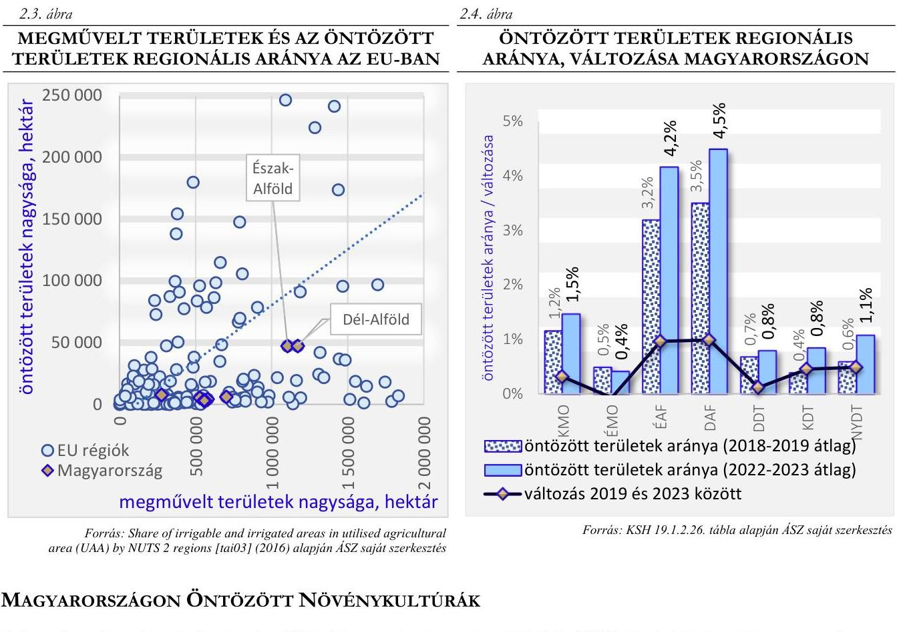

# MAGYARORSZÁGON ÖNTÖZÖTT NÖVÉNYKULTÚRÁK 

A hazai agrárstatisztikai adatok, ASIR kimutatások szerint 2019 és 2022. évek között Magyarországon az öntözött földek harmadán, 34%-án szántóföldi növényeket ${ }^{4}$ termeltek, a takarmánynövények aránya 9% volt. Az öntözött földek közel negyedén vetőmagokat ${ }^{5}$, többségében hibrid kukoricát, másik 27%-án zöldségféléket ${ }^{6}$ (abból 16%-on csemegekukoricát) és az öntözött földek 6%-án gyümölcsöket ${ }^{7}$ termesztettek. Az öntözött területek megoszlását főbb terménycsoportok szerint a 2.5.ábra mutatja.
Az éghajlatváltozási tényezőkkel összhangban 2019-től valamennyi művelési ágban fokozatosan emelkedett az agrártermelés vízigénye. Az ASIR statisztika szerint a legtöbb vizet a vetőmag- és a zöldségtermesztés igényelte. A zöldségtermesztés egységnyi vízfelhasználása 2019. év és 2022. év között $900 \mathrm{~m}^{3} /$ hektárról közel a duplájára, $1700 \mathrm{~m}^{3} /$ hektárra emelkedett. Emelkedett a szántóföldi csoportba tartozó növények vízigénye is, azonban csak kisebb mértékben, $885 \mathrm{~m}^{3} /$ hektárról $1330 \mathrm{~m}^{3} /$ hektárra. A gyümölcsösök és ültetvények vízigénye az öntözési módnak (mikroöntözés) köszönhetően eredendően

[^0]
[^0]:    ${ }^{4}$ A szántóföldi növények agrárstatisztikai csoportba tartozik az ASIR kimutatások szerint: a kukorica (KAL21), napraforgó (IND23-24), burgonya (BUR01), szója (IND01), dohány (DBU01, DVI01)
    ${ }^{5}$ A szántóföldi növények vetőmagjai agrárstatisztikai csoportba tartozik az ASIR kimutatások szerint a hibridkukorica (KAL25), csemegekukorica (KAL23), repcemag (IND03, IND04), napraforgómag (IND23, IND24), szójabab (IND01), egyéb zöldségfélék nem felsorolt vetőmagjai).
    ${ }^{6}$ A zöldségfélék agrárstatisztikai csoportjába tartozik az ASIR kimutatások szerint a csemegekukorica (KAL 23), zöldborsó (PIL04, PIL07), zöldbab (PIL13), paradicsom (VEG33), paprika (VEG43), fejeskáposzta (VEG04), uborka (VEG34).
    ${ }^{7}$ A gyümölcsök csoportjába tartozik

 az ASIR kimutatások szerint az alma (ULT01, HAG01), körte (ULT15, HAG15), szilva (ULT06, HAG06), kajszibarack (ULT04, HAG04), őszibarack (ULT03, HAG03), meggy (ULT16, HAG16), cseresznye (ULT17, HAG17), málna (FRU08), ribizli (FRU05), szeder (FRU11, FRU12).

---

kisebb, a bázis időszakban $500 \mathrm{~m}^{3} /$ hektár volt, amely 2022-re 70%-kal, átlagosan $881 \mathrm{~m}^{3} /$ hektárra emelkedett.
A 2.6. ábra az egy hektárra jutó öntözővíz mennyiségének változását mutatja 2015 és 2022 között a főbb terménycsoportokat tekintve. A fokozatosan növekvő, de az időjárási feltételek szerint is ingadozó vízhasználat a vetőmagtermelésnél és a zöldségfélék termelésénél nőtt jellemzően.
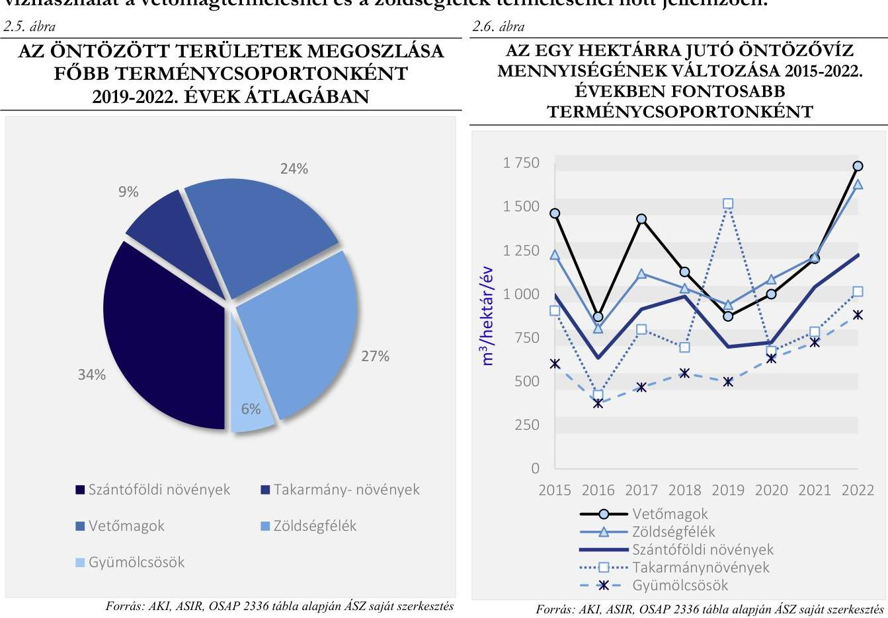

# Magyarországon a megművelt területeknek mintegy 2,25%-át öntözték a 2019-2022 időszak átlagában. A megöntözött területek megművelt területekhez viszonyított aránya vármegyénként jelentős különbséget mutatott (2.7. ábra). A vizsgált időszakban Jász-Nagykun-Szolnok vármegyében volt legnagyobb az öntözött földek nagysága, 15370 hektár, ott a vetőmagok termelése (37%) mellett az öntözött szántóföldi növénycsoport (28%), és a zöldségtermesztés nagysága (22%) is jelentős volt. Békés vármegyében az ellenőrzött időszak második felében megvalósult öntözésfejlesztési beruházásokkal 2730 hektárral bővült az öntözött területek nagysága (mezőhegyesi öntözésfejlesztés). A vármegyén belül az öntözött területek 43%-án hibrid kukoricatermelés folyt, emellett 27%-án öntözött zöldségféléket, azon belül csemegekukoricát (14%), valamint zöldborsót (5%), paradicsomot (3%) termesztettek. Hajdú-Bihar vármegyében az öntözött növények között a zöldségtermesztésnek volt kiemelkedő részaránya (50%), aminek a kétharmadát a csemegekukorica termesztése tette ki, illetve jelentős volt még a zöldborsótermesztés aránya is, valamint az öntözött meggyes- és almáskertek területe. Csongrád-Csanád vármegyében a szántóföldi növénytermesztés tette ki az öntözött földek mintegy harmadát (34%-ot). Bács-Kiskun vármegyében az öntözött földek több, mint felét (55%-ot) a zöldségfélék termesztése tette ki, ennek a csemegekukorica közel a felét jelentette, a zöldborsó hatodát, a paprika a tizedét, a paradicsom területe 4% volt. Szabolcs-Szatmár-Bereg vármegyében az öntözött terményszerkezet némileg eltért a többi alföldi megyétől, az öntözött földek legnagyobb részét, 37%-ot az öntözött gyümölcsöskertek tették

---

ki, annak 65%-a almáskert, 16% meggyeskert, 7%-a körte, 6%-a szilva, 3%-a cseresznyés kert volt, valamint a megyében az öntözött szántóföldi növények 29%-a dohány volt.
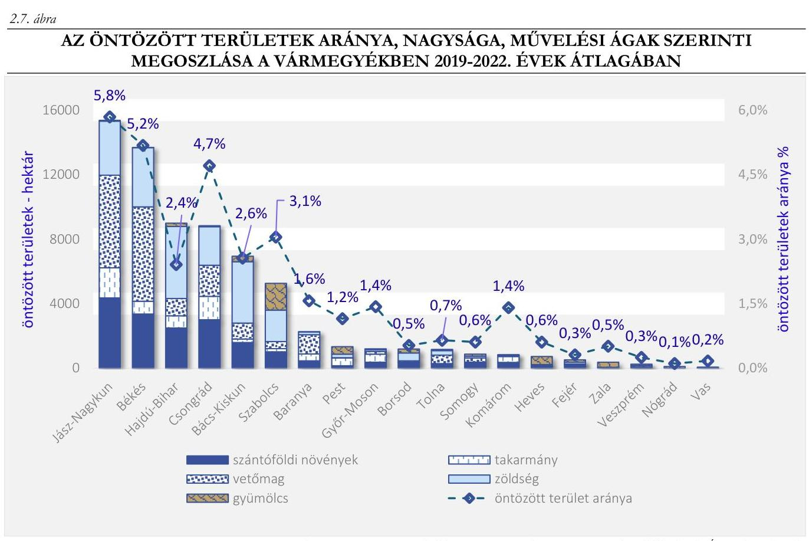

Forrás: AKI, ASIR, OSAP 2336 tábla, KSH 19.1.2.26 és 19.1.2.1. statisztikai táblák alapján ÁSZ saját szerkesztés

# AZ ÖNTÖZÉSFEJLESZTÉS EREDMÉNYESSÉGE 

Az öntözés támogatására, öntözésfejlesztésre rendelkezésre álló források felhasználását, a mezőgazdasági vízhasználatot előmozdító intézkedéseket, azok eredményességét három területen értékelte az ellenőrzés: az alkalmazott árpolitikán, a költségvetési támogatáspolitika érvényesülésén és az uniós fejlesztési források felhasználásán keresztül.

## ALKALMAZOTT ÁRPOLITIKA

Az ellenőrzött időszak alatt alkalmazott árpolitika támogatta az öntözött területek bővülését. A kedvezményes, majd az állam által átvállalt vízdíj szolgáltatói oldalon nem biztosította a vízszolgáltatások költségeinek megtérülését. Az árpolitika nem alkalmazta a környezetvédelmi, fenntarthatósági célok elérése érdekében a vízkészletjárulékot.
Az ellenőrzés egyik fókusza az öntözés-szolgáltatás operatív működtetése és az árpolitika, támogatáspolitika vizsgálata volt. Az EU-ban a vízgazdálkodás általános kereteit a 2000/60/EK irányelve Víz Keretirányelv (VKI)${ }^{24}$ határozza meg, amely kiemeli a teljes költségmegtérülést és a szennyező fizet elvet, valamint a megfelelő ösztönzők alkalmazását a víz hatékony felhasználása érdekében. A VKI (9. cikk) többek között előírja, hogy (1) az árpolitikának biztosítania kell a vízkészletek hatékony felhasználását, (2) a vízszolgáltatások költségeinek megtérülését. 2014-ben az EU Bizottság megállapította, hogy Magyarországon az ingyenes öntözővíz sérti a fenti normákat, ezért a 2017-es uniós

---

források felhasználásának ex-ante feltétele volt a mezőgazdasági vízdíjaknál az ingyenes ár megszüntetése. A Kormány fokozatosan vezette be 2017 és 2021 között a vízszolgáltatás EU-normáknak megfelelő díjtételeit, ezt követően a szabályok állandóak voltak.
A mezőgazdasági vízszolgáltatást igénybe vevők, a vízszolgáltatásért kétféle díjat fizetnek: a mezőgazdasági vízszolgáltatási díjat és a vízkészletjárulékot.
A mezőgazdasági vízszolgáltatási díj kéttényezős (Vgtv. 15/F. § (3) bekezdése szerint), a rendelkezésre állást biztosító alapdíjból és a felhasznált vízmennyiséggel arányos változó díjból áll. A mezőgazdasági vízszolgáltatási díj elsődleges funkciója, hogy fedezetet nyújtson a mezőgazdasági vízszolgáltatás fenntartásához, működtetéséhez.
A mezőgazdasági vízszolgáltatás díjképzési rendjéről szóló 115/2014. (IV. 3.) Korm.rendelet${ }^{25}$ szerint a mezőgazdasági vízhasználó a vízszolgáltatás alapdíját 2017-től évről-évre 10%-kal nagyobb mértékben, 2021-től 50%-os arányban fizeti meg. A mezőgazdasági vízhasználók a változó vízdíjat 2017-2018 évek során 50%-ban, majd 2019-től 100%-ban megfizették. Az alapdíj fennmaradó részét a szolgáltatók számára a központi költségvetés finanszírozta. Az állandó díjstruktúrát változás érintette 2023-tól, a 2023. évre vonatkozó mezőgazdasági vízszolgáltatás díját a vízhasználóktól az állam átvállalta. A mezőgazdasági vízhasználók jogszabályban meghatározott díj- és járulékterheit, a vízhasználók által megfizetendő díjrészeket a 3. táblázat mutatja.

| 3. táblázat |  |  |  |  |  |  |  |  |
| :--: | :--: | :--: | :--: | :--: | :--: | :--: | :--: | :--: |
| A MEZŐGAZDASÁGI VÍZHASZNÁLÓK JOGSZABÁLYBAN MEGHATÁROZOTT DÍJ- ÉS JÁRULÉKTERHEI - MEGFIZETENDŐ DÍJRÉSZEK |  |  |  |  |  |  |  |  |
|  |  | 2018 | 2019 | 2020 | 2021 | 2022 | 2023 | 2024 |
| Mezőgazdasági vízszolgáltatási díj | alapdíj változó díj | 20% | 30% | 40% | 50% | 50% | vízszolgáltatási díj állami átvállalása |  |
|  |  | változó díj | 50% | 100% | 100% | 100% |  |  |
| Vízkészletjárulék |  |  | $4000 \mathrm{~m}^{3} /$ hektár/éves vízfogyasztást meghaladó vízmennyiség után fizetendő |  |  |  |  |  |

Tábla magyarázata: 2018-ban alapdíj 20%-a, azt jelenti, hogy a szolgáltatási szerződésben rögzített alapdíj 20%-át kellett megfizetnie a vízhasználónak, 2023-ban az alapdíj 50%-át, a változó vízdíjak 100%-át kellett volna a vízhasználóknak megfizetniük.

Forrás: Vgtv. 15/F. § és 115/2014. (IV. 3.) Korm. rendelet alapján ÁSZ saját szerkesztés
A vízkészletjárulék a fenntartható vízkészlet-gazdálkodási feladatok (monitoring, vízrajz, igazgatási, hatósági és egyéb vízkészlet-gazdálkodási) finanszírozására, a vízhasználók tudatosítására, a víztakarékosság ösztönzésére szolgál. Az öntözéses gazdálkodás esetében meghatározott járulék mértéke alól mentesíti a vízhasználókat 2018-tól a szabályozás $4000 \mathrm{~m}^{3} /$ hektár/év vízhasználat alatt, ami ténylegesen kevés esetben jelentett fizetési kötelezettséget. (Egy hektárra jutó vízhasználat országos átlaga $1448 \mathrm{~m}^{3} /$ hektár/év volt). A szélsőséges esetek kivételével szinte valamennyi gazdálkodó mentesült a vízkészletjárulék megfizetése alól. A hazai árpolitika az ellenőrzött időszak alatt nem alkalmazta szabályozási eszközként a vízkészletek hatékony felhasználása, a fenntarthatóság, társadalmi tudatosság előmozdítása érdekében a vízkészletjárulékot.
2024 augusztusától megindult a vízkészletjárulék reformja, mely alapvetően az alapdíj emelésén és a szorzótényezők átgondolásával igyekszik gazdasági ösztönző eszközként a vizek védelmét szolgálni. A változás egyik fontos eleme a méretlenségi szorzó emelése, azaz azon vízhasználók esetében, akik nem mérik a vízelhasználást. Ezen lépések a jövőben támogathatják a fenntartható és integrált vízkészletgazdálkodást a vízkészletek felhasználásának (vízhasználatok) pontos nyomon követésével.

---

Az állami ár- és támogatáspolitika lehetőségeinek megtartása érdekében a hazai szabályozás a Vgtv. módosításával 2016 októberétől lehetővé tette indokolt hidrometeorológiai helyzet esetén a vízgazdálkodásért felelős miniszternek a tartósan vízhiányos időszak elrendelését, egyben a vízkészletjárulék megfizetése alóli felmentést. 2023. februárról a kedvezmények köre tovább bővült, az állam átvállalta a vízhasználóktól a mezőgazdasági vízszolgáltatási díj megfizetésének kötelezettségét. A vízgazdálkodásért felelős miniszter 2024-ben kihirdette az öntözési időszakra vonatkozóan a tartósan vízhiányos időszakot, így a vízhasználóknak nem kellett vízkészlet-járulékot fizetniük, illetve a mezőgazdasági vízszolgáltatás díjképzési rendjéről szóló 61/2024. (III. 21.) Korm. rendelet alapján vízszolgáltatási díjat sem kellett fizetniük a felhasznált öntözővíz után.
A területi vízügyi igazgatóságok az éves vízszolgáltatási díjat az öntözési időszak előtt, a jogszabályban meghatározott rend és határidő szerint, előzetes árkalkuláció alapján határozták meg, az igazgatóságok által kalkulált díjat az OVF ellenőrizte, engedélyezte. Az igazgatóságoknak ezeket a vízdíjakat kellett alkalmazniuk az adott évre megkötött szolgáltatási szerződéseik során.
A vízdíj függött a vízszolgáltatás műszaki módjától (gravitációs vagy szivattyús a vízkitermelés), az adott vízügyi infrastruktúra műszaki állapotától, az öntözőfürthöz kapcsolódó vízhasználók számától. Az ellenőrzés alapján a 2023. évben legjellemzőbb alap- és változó díjakat a gravitációs és szivattyús kitermelés adataival összehasonlítva mutatja be a 2.8. ábra. Az ábráról látható a gravitációs és a szivattyús rendszerek vízszolgáltatási díjainak jelentős különbsége, a gravitációs díjak esetén a fenntartási költségek megfizetését jelentő alapdíjak mellett a fogyasztással arányos vízdíj $0 \mathrm{Ft} / \mathrm{m}^{3}$-hez közelített. A szivattyús vízdíjak fogyasztással arányos változó vízdíjrészénél a vízkitermelés, vízátvezetés szivattyúkkal történő biztosításának energiaigénye indokolta a magasabb vízdíjakat.
Az alapdíjat a vízkivételi rendszer fenntartására fordították, az országos átlaguk $12,2 \mathrm{Ft} / \mathrm{m}^{3}$ volt 2023-ban. A változó vízdíjak fedezték a vízkivétel, vízfogyasztás mennyiségével arányosan növekvő költségeket. A változó vízdíjak országos átlaga $5,7 \mathrm{Ft} / \mathrm{m}^{3}$ volt, ebből a gravitációs díjak mediánja $0,0 \mathrm{Ft} / \mathrm{m}^{3}$ volt. Ebből következően a vízszolgáltatási szerződésekben meghatározott gravitációs vízszolgáltatás során az igénybe vett öntözővízért, függetlenül az állami kedvezményektől, az ország többségében nem kellett fizetni, a változó öntözővíz vízdíja $0,0 \mathrm{Ft} / \mathrm{m}^{3}$ volt. (Csak rendszer fenntartási alapdíjat fizettek az ilyen szolgáltatást igénybe vevő gazdálkodók). A szivattyús vízszolgáltatás változó vízdíjainak középértéke $10,7 \mathrm{Ft} / \mathrm{m}^{3}$ volt.

---

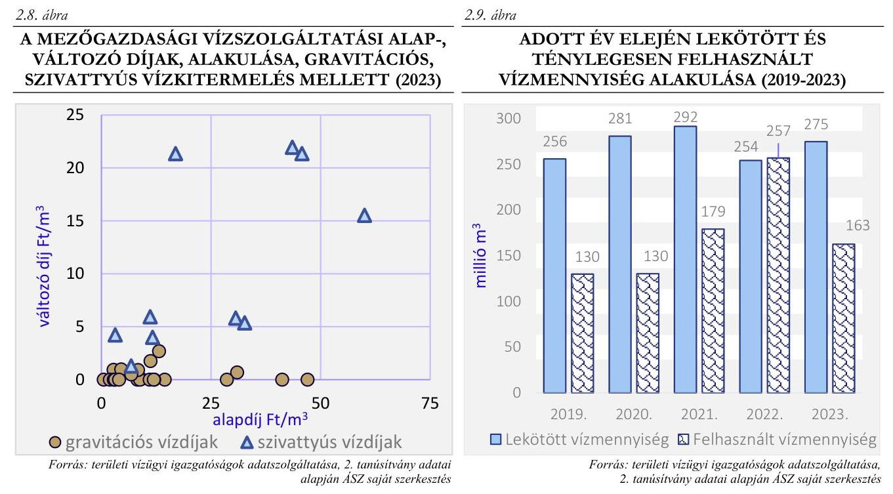

A jogszabályban meghatározott 50%-os alapdíj és 100%-os változódíj megfizetése mellett, egy hektár öntözésének költsége az országos átlagos $1448 \mathrm{~m}^{3} /$ hektár mennyiségű éves vízfelhasználást tekintve gravitációs öntözés esetén 6,2 ezer Ft/hektár volt, szivattyús vízkivétel esetén 38,4 ezer Ft/hektár volt 2023-ban.

# A MEZŐGAZDASÁGI VÍZDÍJAK ÉS AZOK KALKULÁCIÓJÁNAK ANOMÁLIÁI 

Az ellenőrzött időszak alatt alkalmazott vízszolgáltatási díjak nem jelenítették meg a vízszolgáltatások üzemeltetési ráfordításait, teljes költségeit. A vízdíjakban elismert költséginfláció mértéke korlátozott volt, a díjak nem tartalmazták a vízszolgáltatás fenntarthatóságának költségeit. Évről-évre szükség volt a vízszolgáltatási bevételek kormányzati kiegészítésére.

A mezőgazdasági vízdíjak kalkulációja során problémát jelentett a költségek felosztása, a költségviselők azonosítása, mert nem volt egyértelműen meghatározva a mezőgazdasági vízszolgáltatás, mint közszolgáltatás használatának fogalma, tartalma. A vonatkozó szabályozás szerint (Vgtv. 15/F. § (1) bekezdés): „aki mezőgazdasági vízszolgáltatást vesz igénybe, a szolgáltató részére mezőgazdasági vízszolgáltatási díjat fizet." Nem egyértelműen definiált, hogy a szolgáltatást igénybe vevőnek tekinthető-e az adott évben öntözők, illetve a vízjogi engedéllyel rendelkezők is. Az ellenőrzött időszak alatt a fenntartási költségeket csak az adott évben vizet használók fizették.
A szabályozás alapján az érvényes vízjogi üzemeltetési engedéllyel és szolgáltatási szerződéssel rendelkező vízhasználó vízszolgáltatási díjkedvezményre (az alapdíj 50%-ára) csak akkor jogosult, ha éves vízigényét tárgyév február 10-ig bejelentette, a felhasznált vízmennyiség a vízjogi üzemeltetési engedélyben lekötött vízmennyiséget nem haladja meg, és a megrendelt vízmennyiséget a mezőgazdasági vízszolgáltatási idényben az engedélyezett területen használta fel. Az
 árkalkuláció során további problémát jelentett a vízfelhasználás lekötött és felhasznált adatainak számottevő különbsége, mely átlagosan 33,1%-os volt 2019-2023 között.

---

A lekötött (tervezett) és ténylegesen felhasznált vízmennyiség - 2.9. ábrán bemutatott - számottevő különbsége nem tette lehetővé az éves előzetes költségfelosztási alap alkalmazását, mivel annak alapján a díjkalkuláció megalapozottsága nem volt biztosított. Az előre leadott vízhasználati igény alapján lekötött vízmennyiség a vízügyi igazgatóságok költségeiben jelentkező felkészülést feltételez az adott vízidényre, továbbá a lekötött vízmennyiség adatok biztosítottak információt a tervezett vízhasználatról a területi vízgazdálkodási szempontok érvényesítéséhez, a vízkészletek megőrzéséhez, a felszíni vizek védelméhez, a vizek túlhasználatának megakadályozásához. Mindezek veszélyeztethetik a díjkalkuláció megalapozottságát, a változó költségek felosztását és a vízügyi igazgatóságok költségeinek tervezését.
Szabályozási hiányosságot jelentett, hogy a díjban érvényesített költségek köre nem volt teljeskörű, az uniós irányelvek (a VKI 9. cikk) és a 115/2014 (IV. 3.) Korm. rendelet 5. § (1) a) bekezdése ellenére a fenntarthatóság, a környezetterhelés társadalmi költségei nem jelentek meg a díjkalkulációban.
A vízszolgáltatási díjakban elismert költségek emelkedése elmaradt a vízügyi igazgatóságok pénzügyi kimutatásaiban elszámolt tényleges költségektől. Ez magyarázza, hogy a mezőgazdasági vízszolgáltatási árak alapján kalkulált állami díjkompenzáció és az árbevétel együttes összege az időszak átlagában mintegy $\mathbf{30\%-kal}$ elmaradt a pénzügyi kimutatásokban szereplő szolgáltatási működési és fenntartási költségektől. A mezőgazdasági vízszolgáltatás működtetésének pénzügyi kereteit, azon belül 2019-2023 között a vízszolgáltatások elszámolt működési, fenntartási költségeit mutatja a 2.10. ábra.
A mezőgazdasági vízszolgáltatás elszámolt működési és fenntartási költségei a területi vízügyi igazgatóságok éves pénzügyi beszámolói alapján 2019 és 2023 között közel háromszorosára, 3,1 Mrd Ftról 8,8 Mrd Ft-ra nőttek. A növekmény kisebb részét (23%-ot) a megemelkedett vízhasználat, másik részét a több, mint duplájára emelkedett működési (+120%) és fenntartási költségek (+144%) okozták, ez összefüggött a megemelkedett energiaárakkal. A vízhasználók által fizetett, szolgáltatási díjakból származó bevételek nagysága 2019 és 2022 között fokozatosan emelkedett, a költségfedezeti arány 24%-ról 39%-ra nőtt. 2023-ban a vízdíjakat az állam átvállalta a vízhasználóktól, állami díjkompenzációval finanszírozta a kiesett szolgáltatási díjbevételeket a vízszolgáltatók számára.

---

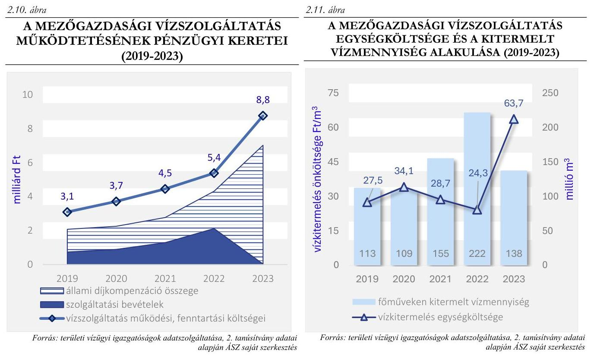

A 2.11. ábra mutatja a mezőgazdasági vízszolgáltatás öntözésre szolgáltatott vízmennyiségének és egységköltségének éves alakulását. Látható, hogy a 2019-2022 évek között az egy $\mathrm{m}^{3}$-re jutó egységköltség $24,3 \mathrm{Ft} / \mathrm{m}^{3}$ és $34,1 \mathrm{Ft} / \mathrm{m}^{3}$ között alakult. 2023-ra az egy $\mathrm{m}^{3}$ kitermelt vízre jutó egységköltség $63,7 \mathrm{Ft} / \mathrm{m}^{3}$-re emelkedett, amelynek magyarázata a vízhasználat egyre intenzívebb energiaigénye és az energiaárak számottevő emelkedése volt.
A VKI-ben foglaltaknak része a vízszolgáltatások költségmegtérülésének elvárása. A VKI 9. cikk (1) bekezdés szerint elvárás, hogy ,,a vízzel kapcsolatos árpolitika biztosítson megfelelő késztetést a vízhasználók számára, hogy a vízkészleteket hatékonyan használják, és ezáltal az árpolitika járuljon hozzá ezen irányelv célkitűzéseihez''. A mezőgazdasági vízhasználat alkalmazott árpolitikája, az alkalmazott vízdíjak nem voltak arányosak a tényleges költségekkel, a vízhasználók nem járultak hozzá elvárt mértékben a vízszolgáltatások költségeinek megtérüléséhez. A vízügyi igazgatóságok többletköltségei évről évre növekedtek, amelyet a központi költségvetés egészített ki.
Az ellenőrzött időszak alatt az árpolitikát érintő koordináció a vízügyi és agrárszakmai irányítás között a közös kormányzati előterjesztések készítése során volt biztosított. Ugyanakkor a hatékony és költségtakarékos közpénzfelhasználás érdekében szükséges lenne a mezőgazdasági vízszolgáltatás, mint közfeladat egyértelmű és pontos meghatározása, a finanszírozása során az állami és nem állami feladatok megkülönböztetése.

2019-től az árpolitikai előterjesztések rendszeres jelleggel fókuszáltak a gazdálkodók terheinek csökkentésére, az öntözési vízdíjak mérséklésére, eltörlésére. Az ellenőrzött időszak alatt hat árpolitikai előterjesztés készült:
2019. októberben készült AM előterjesztésben javasolták a vízszolgáltatási díj számításának módosítását, egyrészt az alapdíj megfizetésének kiterjesztését az összes vízjogi üzemeltetési engedélyben meghatározott vízhasználatra, másrészt az országosan egységes díj bevezetését.

---

- 2019 novemberében az öntözésfejlesztéshez szükséges intézkedésekről szóló 1664/2019. (XI. 25.) kormányhatározat 2. pontja előírta a vízszolgáltatási díj mérséklésének vizsgálatát.
2020. júniusban a BM javaslatában felvetette az alapdíjfizetés kiterjesztését vízjogi engedélyesekre is; továbbá, azt, hogy a szakmai irányító, az AM feladata a kedvezményezettek, támogatandó célcsoportok meghatározása, termelői csoport, térség, növénykultúra tekintetében. Javasolta azt is, hogy fontos lenne a szolgáltatás kapcsán a közérdek (pl. ökológiai vízpótlás, térségi rendszerek) és magánérdek alapú feladatok elválasztása, az előbbieket költségvetésből, az utóbbiakat pl. magánforrásokból, díjakból. A vízdíjak lehetséges csökkentéséről szóló részt az AM és a BM közös álláspontként terjesztette be a Kormány elé.
2021. októberben AM, BM előterjesztés készült a térítésmentes vízszolgáltatás biztosításáról a tartósan vízhiányos időszakban, a díjrendszer egyszerűsítéséről, országosan egységes ($1,5 \mathrm{Ft} / \mathrm{m}^{3}$) vízdíj bevezetéséről.
2022. novemberben AM, BM közös előterjesztés készült a tartósan vízhiányos időszak során a vízkészletjárulék mellett további szolgáltatási vízdíjkedvezményekről.
2023. áprilisban közös AM, BM dokumentum előterjesztette a Kormány részére szóló javaslatait, egyrészt a mezőgazdasági vízszolgáltatási díj teljes kormányzati átvállalását, a tartósan vízhiányos időszak kihirdetéséhez kapcsolva, másrészt a tartósan vízhiányos időszakon kívül országosan egységes, egyszerűsített, $0,55 \mathrm{Ft} / \mathrm{m}^{3}$ vízdíj bevezetését.
Az ellenőrzött időszakban a hazai öntözéshez kapcsolódó ár- és támogatáspolitika koordinációja a felelős minisztériumok közös kormányzati előterjesztésein keresztül valósult meg. A gyorsan változó körülmények miatt szükséges kormányzati döntéshozatalt azonban lassította, hogy egyes esetekben az előterjesztéseket féléves-éves késedelemmel tárgyalták. Az elhúzódó öntözéspolitikai, árpolitikai döntések nem biztosították a rugalmas ár- és támogatáspolitika alkalmazását. Ezt támasztja alá a 2022. évi aszályos időszakkal összefüggő feladatok végrehajtása is, amikor az ágazat irányítói (Kormány, felelős minisztériumok) a szükséges helyzetben nem tudták vízdíj-kedvezményekkel támogatni a gazdálkodókat, a szabályozásban a vízdíj állami átvállalásának kormányzati lehetőségét csak több mint félévvel a krízis után, 2023. februártól teremtették meg.
Az ágazat működtetésére, fejlesztésére rendelkezésre álló költségvetési források nagysága az ellenőrzött időszak alatt nem volt előre tervezhető. A vízügyi igazgatóságok működésének biztosításán felül az öntözésfejlesztésre 2030-ig tervezett kiemelt költségvetési keret csak két évig állt rendelkezésre, így az ágazatfejlesztési célok megvalósítása nem volt biztosított.
Az öntözésre, öntözésfejlesztésre rendelkezésre álló költségvetési forrásoknak két jól elkülöníthető része volt. Az egyik rész a mezőgazdasági vízszolgáltatást biztosító vízügyi igazgatóságok működésének költségvetési finanszírozása, a másik rész a kiemelt ágazati célokhoz rendelt költségvetési források kerete. A területi vízügyi igazgatóságok intézményi működésének finanszírozását a központi költségvetés biztosította. A vízügyi igazgatóságok költségvetési finanszírozási kereteit, a területi vízgazdálkodás költségvetési ráfordításainak alakulását mutatja be 2019. és 2024. évek között a 2.12. ábra. A vízügyi igazgatóságok működtetésére, beruházásokra, fejlesztésekre, árvízvédelemre fordított éves kiadások nagysága összesen az elmúlt években 107 Mrd Ft és 156 Mrd Ft között voltak. Az ellenőrzöttek adatszolgáltatása alapján a vízügyi igazgatóságok költségvetéséből a mezőgazdasági vízszolgáltatásra elszámolt, pénzügyileg elkülönített kiadásainak alakulását mutatja a 2.13. ábra. A mezőgazdasági

---

vízszolgáltatás elszámolt éves működési és fenntartási költségeinek összesített értéke 3,1 Mrd Ft-ról 8,8 Mrd Ft-ra emelkedett.
2.12. ábra
A TERÜLETI VÍZGAZDÁLKODÁS KÖLTSÉGVETÉSI RÁFORDÍTÁSAINAK ALAKULÁSA (2019-2024)
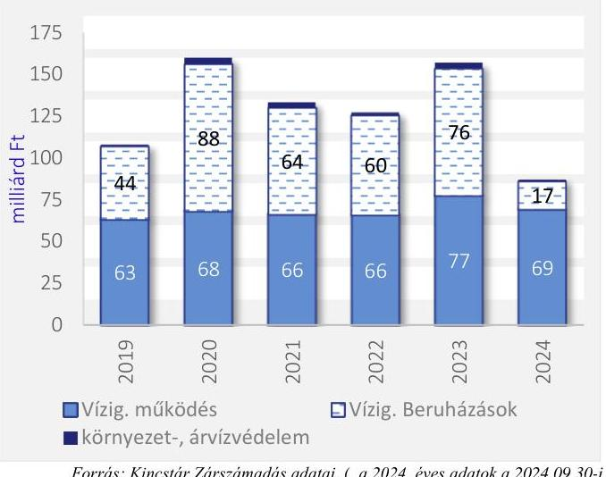

Forrás: Kincstár Zárszámadás adatai, t. a 2024. éves adatok a 2024.09.30-i elszámolások alapján, ÁSZ saját szerkesztés
2.13. ábra

A VÍZÜGYI IGAZGATÓSÁGOK MEZŐGAZDASÁGI VÍZSZOLGÁLTATÁSRA FORDÍTOTT KIADÁSAI (2019-2023)
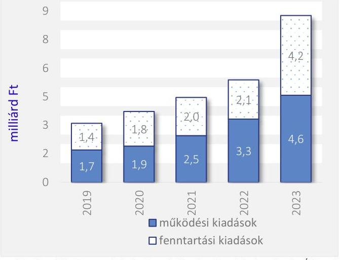

Forrás: vízügyi igazgatóságok adatszolgáltatása, 2. tanúsítvány alapján ÁSZ saját szerkesztés

# AZ ÖNTÖZÉSFEJLESZTÉS KIEMELT KÖLTSÉGVETÉSI FORRÁSAI 

Az öntözésfejlesztéshez szükséges beruházások priorizálása 2030-ig megtörtént, azonban a tervek megvalósításához szükséges költségvetési források 2022-től nem álltak rendelkezésre, így a kitűzött célok megvalósítása nem volt biztosított.
Az AM 2018-ban elkészítette a „Mezőgazdasági vízgazdálkodás fejlesztési szakpolitikai program (2018-2024)" című dokumentumát, amelyben célként határozták meg 2024-ig az öntözést akadályozó tényezők gazdálkodó számára is érezhető csökkentését és az öntözött területek 100 ezer hektárral történő növelését. Feltételként rögzítették, hogy olyan helyeken valósuljanak meg az öntözésfejlesztések, ahol kis ráfordítással kielégíthető az öntözővíz ellátottság, legyen öntözési igény a gazdálkodói oldalról, illetve legyen alkalmas infrastruktúra, ami azt ki tudja szolgálni. A területek kijelöléséhez az „Öntözési kataszter" nyújtott alapot, amelynek elkészítését az 1744/2017. (X. 17.) Korm. határozat 1. pontja írta elő.
A Kormány a területi vízgazdálkodás és az öntözés fejlesztéséhez szükséges forrásokat, több - korábban az irányítási-stratégiai kérdéskörnél már tárgyalt - kormányhatározatban biztosította. Ezek pénzügyi kereteket is rögzítettek: az 1426/2018. (IX. 10.) Korm. határozat a 2020-2030 évek alatt az öntözésfejlesztési célokra évente maximum 17 Mrd Ft-ot irányozott elő. Az 1800/2018. (XII. 21.) Korm. határozat a vízügy működését gátló infrastrukturális, eszköz, humánerőforrás-hiány kezeléséhez a 2019-2024. évek között összesen 34,8 Mrd Ft-ot biztosított.

Az 1426/2018. (IX. 10.) Korm. határozatban rögzített feladat szerint az állami művek elhelyezkedését és a termelői öntözési igényeket figyelembe véve az AM és a BM összeállította az állami művek öntözési célú fejlesztéseinek prioritási listáját.
Az állami művek öntözési célú fejlesztéseinek kialakításakor a gazdálkodói öntözési szándék figyelembevétele biztosította a mezőgazdaságban a vízkínálat és a vízkereslet találkozását. A fejlesztéseket oda szándékozták irányítani, ahol öntözés miatti vízkereslet is volt. A tervezett pénzügyi kerethez, 98 Mrd Ft-hoz, készült el egy 104 beruházást tartalmazó fejlesztési prioritás lista. A 2019-ben megalakult öntözési

---

közösségek egy részének többlet-vízigénye miatt a fejlesztések prioritási listája módosult. Az öntözésfejlesztésre tervezett kiemelt támogatások azonban csak 2019-2021 között álltak rendelkezésre. 2022-től a tervezett fejlesztési keret nem volt biztosított.
A rendelkezésre álló forrásokból megvalósult feladatok 2020-2021 során: A befejezett főművi fejlesztések és infrastrukturális hiányok felszámolása következtében a ténylegesen szolgáltatott vízmennyiség 44,2 millió $\mathrm{m}^{3}$-rel, a ténylegesen öntözött terület pedig 18 ezer hektárral növekedett. A megvalósult fejlesztések közül kiemelhető 1.) a Mórahalmi homokhátság vízpótlása III. ütem, I. szakasz; 2) Szarvasi-Holt-ág rugalmas vízpótlási lehetőségeinek kiépítése I. ütem, 3) Tiszakécskei öntözőcsatornák ismételt üzembe helyezése, 4) Taktaközi öntözőrendszer rekonstrukciója, 5) Keleti-főcsatorna és övcsatornáinak I. böge műtárgy rekonstrukciós munkái, 6) kettős működésű csatornák a TIVIZIG${ }^{26}$ területén I. ütem, ez alatt több kisebb fejlesztés is megvalósult, így a tervezett 104 öntözésfejlesztési beruházásból 15 megvalósult. A fejlesztések következtében kiépült 4 km nyomóvezeték, 43 km csatornaszakaszon történt meder-rendezés és 47 db műtárgy felújítása történt meg. Az infrastrukturális rekonstrukció következtében 2177 km csatornaszakasz kotrása, 314 db műtárgy, 33 szivattyútelep megújítása történt.
A 2.14. ábrán a 2024-ig megvalósítani tervezett öntözésfejlesztések időarányos teljesülése látható. 2024-ig 80 db fejlesztést terveztek végrehajtani, 52,5 M Ft-ból, amelyekkel 321384 hektár terület vált volna öntözésbe vonhatóvá. A tervezett fejlesztésekből 15 db valósult meg 19,8 M Ft-ból, amely 37802 hektár öntözésbe vonható területet érintett. Arányaiban legkisebb bővülést az öntözésbe vont területek mutatták, ami rámutat arra, hogy kezdetben a vízügyi infrastruktúra rekonstrukciója, a víz földekre eljuttatása volt a prioritás, kevésbé az öntözött területek növelése.
2.14. ábra

# A 2024-IG TERVEZETT ÉS MEGVALÓSÍTOTT ÖNTÖZÉSFEJLESZTÉSEK 

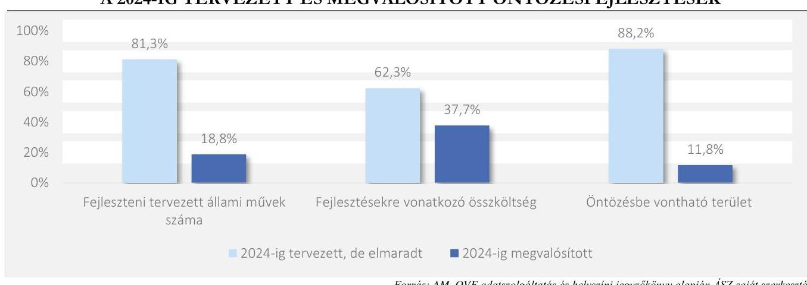

Forrás: AM, OVF adatszolgáltatás és helyszíni jegyzőkönyv alapján ÁSZ saját szerkesztés

## AZ EURÓPAI UNIÓS TÁMOGATÁSOK FELHASZNÁLÁSÁNAK EREDMÉNYEI

A pályázati rendszer kereteit alapvetően meghatározták a fenntartható és hatékony vízkészletgazdálkodást előíró uniós normák. Az uniós források felhasználása igazodott az öntözésfejlesztés előzetesen felmért területi igényeihez, az aszályhelyzethez, ugyanakkor nem vette figyelembe az öntözővíz
 legjobb hasznosulását. Az intenzív agrártermelésre allokált pályázati keret 2023-ban a felére csökkent.
Az ágazat irányítói az uniós vidékfejlesztési források felhasználását, a mezőgazdasági vízgazdálkodási ágazat fejlődését alapvetően az agrárteljesítmény fokozásában, a fenntarthatóságot biztosító hatékony vízfelhasználás mellett látták biztosítottnak. Az ellenőrzött időszakban a $\mathrm{KAP}^{27}$ Vidékfejlesztési források

---

két formában segítették a hazai fenntartható vízgazdálkodást, egyrészt a területalapú támogatásokkal, a talajok, ökoszisztémák vízmegtartó képességének növelését ösztönző támogatásokkal, másrészt az agrárgazdálkodók, azok közösségei számára biztosított fenntartható mezőgazdasági vízgazdálkodás fejlődését segítő forrásokkal.

# AZ AGRO-ÖKÖLÓGIAI PROGRAMOK, TERÜLETALAPÚ TÁMOGATÁSOK 

A KAP Vidékfejlesztési Programok támogatásai része az agrár-környezetgazdálkodási támogatások folyamatosan bővülő rendszere. 2015 és 2021 között a megművelt hazai földterület közel 12\%-án, 661 ezer hektáron 13 ezer gazdálkodó folytatott ökológiai gazdálkodást. A 2021-től indult új Agroökológiai Program (AÖP) hároméves önkéntes kötelezettségvállaláson alapult, melynek új, „zöld" elemei a vízmegtartás ösztönző előírások rendszere, a szántók, állandó kultúrák sorközének talajtakarása, a forgatás nélküli talajművelés, a mikroöntözés. A hazai AÖP programokat a Kormány is kiemelten fontosnak tartotta, az uniós források mellé az állam maximális, $80 \%$-os társfinanszírozást biztosított. A 2023-tól indult új Közös Agrárpolitika Stratégiai Terve (KAP ST) újabb támogatásokat vezetett be a vízmegtartó gazdálkodást ösztönző földhasználat érdekében a vízmegőrző agrotechnikák alkalmazása, és a termelésből kivont, ökológiailag hasznos területek támogathatóvá tételével.

## FENNTARTHATÓ MEZŐGAZDASÁGI VÍZGAZDÁLKODÁS TÁMOGATÁSAI

Az Európai Uniós Vidékfejlesztési Program forrásai a mezőgazdasági üzemek összteljesítményének a javítását, többek közt a gazdálkodók, azok közösségei öntözésfejlesztési beruházásainak közvetlen támogatását tűzték ki célul. A 2014-2020 közötti uniós költségvetési időszakban, annak koronavírus-járvány miatt 2025-ig meghosszabbított ideje alatt három uniós pályázati forrás állt rendelkezésre a mezőgazdasági vízgazdálkodás fejlesztésére. A legjelentősebb volt 99,6 Mrd Ft pályázati kerettel a mezőgazdasági vízgazdálkodási ágazat fejlesztésére biztosított forrás (VP2-4.1.4), másik terület 10,2 Mrd Ft-tal a kertészetek öntözésfejlesztésére rendelkezésre álló forrás (VP2-4.1.3.2.), harmadik 6,3 Mrd Ft-tal az öntözési közösségek együttműködésének támogatására biztosított keret (VP2-16.5.2.).
A mezőgazdasági vízgazdálkodási ágazat fejlesztésére szánt uniós források, a meghirdetett, szerződött, kifizetett projektek összegének 2024. július végén fennálló helyzetét mutatja a 2.15. ábra. Az öntözésfejlesztésre megítélt támogatások összesen 188,6 Mrd Ft-ot tettek ki 2024. július végén, ebből a kifizetések összege meghaladta a 60,4 Mrd Ft-ot, 32,0\%-ot. A forrásokból összesen 1634 támogatott projekt megvalósult, illetve megvalósítása volt folyamatban. Az összes projektből 1186 projekt, 170,8 Mrd Ft értékben a mezőgazdasági vízgazdálkodási ágazat fejlesztését, 316 projekt, 7,7 Mrd Ft értékben a kertészetek korszerűsítését, öntözésfejlesztését, 132 projekt 10,1 Mrd Ft értékben az öntözési közösségek együttműködését támogatta.
Alapvetően a mezőgazdasági vízgazdálkodás fejlesztésére rendelkezésre álló források határozzák meg az uniós fejlesztéseket, a kertészetek fejlesztésére és az öntözési közösségek támogatására rendelkezésre álló források mindössze a keret 14,2\%-át tették ki. A mezőgazdasági vízgazdálkodás fejlesztésére rendelkezésre álló keretből 2024. július végén 30,5\%, mintegy 52,0 Mrd Ft kifizetés történt, a kertészetek fejlesztésére rendelkezésre álló forrásokból 92,0\%, 7,1 Mrd Ft kifizetése történt meg. Az öntözési közösségek támogatásának kifizetése az előbbiektől jelentősen lemaradva 12,3\%-on állt, 1,2 Mrd Ft kifizetéssel. 2022-ben a mezőgazdasági vízgazdálkodás fejlesztésére plusz 50,0 Mrd Ft-ot, 2024-ben az öntözési közösségek támogatására további 3,9 Mrd Ft-ot biztosított az Irányító Hatóság.

---

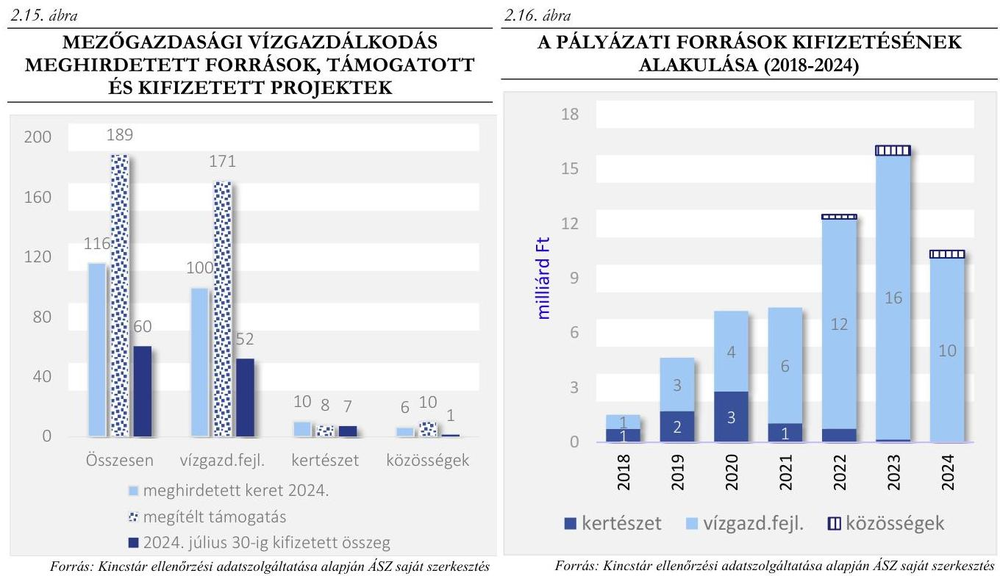

Az öntözésfejlesztést támogató uniós források éves kifizetéseinek alakulását mutatja a 2.16. ábra. A mezőgazdasági vízgazdálkodás fejlesztéséhez köthető kifizetések 2022-től felgyorsultak, az öntözési közösségek kifizetései 2022-től kezdődtek meg.

# A PÁLYÁZATI RENDSZER MŰKÖDÉSÉNEK SIKERESSÉGE 

A mezőgazdasági vízgazdálkodás fejlesztését támogató uniós pályázati felhívások részletes szabályokat tartalmaztak a projektekkel kapcsolatos elvárások tekintetében a projekt keretében támogatható, megvalósítható tevékenységekre vonatkozóan (a nem támogatható tevékenységeket is részletezve). A projekt felhívások előírásokat tartalmaztak a műszaki-szakmai tartalomra, a területi korlátokra, a támogatást igénylőkre, kiválasztási kritériumokra.
A projektek (mezőgazdasági vízgazdálkodás fejlesztése, kertészetek korszerűsítése) műszaki-szakmai tartalma előírta:

- a tervezési, adat- és információszolgáltatási követelményeket, mely szerint 50 M Ft alatt egyszerűsített üzleti tervet, felette részletes tervet kellett benyújtani;
- új beruházások esetén a szükséges vízjogi létesítési és működési engedélyeket;
- projekt megvalósítása során a technológiai fejlesztéssel kapcsolatos elvárásokat, és a három ajánlat beszerzését;
- a vízhasználat-, energiahatékonyság javításával kapcsolatos elvárásokat;

A vízgazdálkodásra és vízvédelemre vonatkozó hatályos jogszabályi előírásokon túl, az 1305/2013/EU rendelet ${ }^{28}$ további feltételeket tartalmazott: (1) tározóból öntözés esetén a vízfogyasztás mérését, (2) rekonstrukciónál a vízmegtakarítást, (3) öntözéshez a vízjogi engedély csak „jó” minőségű víztestből volt lehetséges, (4) energiahatékonyságot érintő beruházásnál legalább 10\%-os hatékonyságjavulást írt elő.
A pályázatok értékelése, a támogatási szerződések megkötése az uniós szabályok és az előzetesen megállapított pályázati feltételek szerint történt. A forrásfelhasználás időközbeni

---

előrehaladását az Irányító Hatóság értékelte, a pályázati sikeresség érdekében beavatkozott, módosította a pályázati feltételeket.
A rendelkezésre álló adatok alapján megállapítható, hogy a mezőgazdasági vízgazdálkodás fejlődését előmozdító pályázatoknak (a vízgazdálkodás fejlesztése, a kertészetek korszerűsítése és az öntözési közösségek támogatása) összességében közel kétharmada sikeres volt.
A 2016-tól 2024. július végéig a mezőgazdasági vízgazdálkodás fejlesztésére pályázati célterületek szerint kifizetett támogatások felhasználási célok szerinti megoszlását mutatja a 2.17. ábra.
2.17. ábra

A KIFIZETETT UNIÓS ÖNTÖZÉSFEJLESZTÉSI TÁMOGATÁSOK FELHASZNÁLÁSI CÉL SZERINTI MEGOSZLÁSA
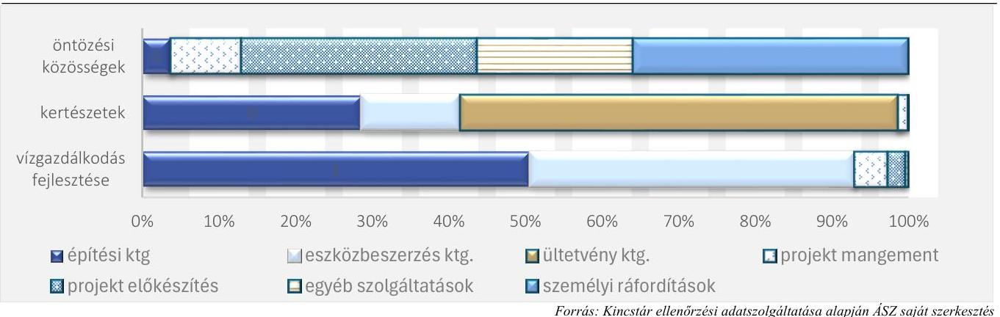

A támogatások felhasználási cél szerinti megoszlása alapján látható, hogy a mezőgazdasági vízgazdálkodás támogatására rendelkezésre álló uniós pályázati források nem azonos fejlesztési célokat szolgáltak. A vízgazdálkodás fejlesztési forrásait az építési és eszközbeszerzési célokra fordították. A kertészetek öntözésfejlesztési forrásai építési célra, eszközbeszerzésre, ültetvénykialakításra, csemete-, dugványbeszerzésre irányultak. Az öntözési közösségek a forrásokból a projektmenedzsment, projektelőkészítés, projekttervezés költségeit, valamint a személyi ráfordításokat, szakértők alkalmazását finanszírozták.
A Kincstárral elszámolt kifizetések összesített adatai alapján megállapítható, hogy a legjelentősebb támogatásrészt (41\%-ot) a kifizetéseknél az építéshez kapcsolódó költségek tették ki. Ezt követték az öntözéshez közvetlenül kapcsolódó eszközbeszerzések költségei, 22\%-os aránnyal. Ez utóbbin belül számolták el a pályázók a beszerzett öntözőberendezéseket, vízgépészeti eszközöket. A projektmenedzsment költségek, a tervezés, engedélyek beszerzése, a lebonyolítás, személyi szakértői díjak a támogatások összértékének 18\%-át tették ki.
A pályázati folyamatot vizsgálva (2016-2024. július közötti időszak) a mezőgazdasági vízgazdálkodás fejlesztése pályázatoknál a pályázatok benyújtásától a támogatási szerződés megkötéséig átlagosan 23 hónap telt el. Az ellenőrzött adatok szerint a támogatói szerződés megkötésétől a megvalósításig, kifizetésig, a projekt pénzügyi lezárásáig átlagosan 26 hónap telt el, azaz a felhívásban elvárt két évet valamivel meghaladta a megvalósítás. 2024. július végén 77 olyan projekt volt, ahol kifizetés már történt, de még nem zárult le a projekt, számos esetben határidő-módosítási kérelmek mellett folyik a megvalósítás. A forrásfelhasználás időközi eredményeinek értékelését tartalmazzák a Monitoring Bizottság éves jelentései. A pályázati feltételrendszer a pályázatok elnyerését olyan jogosultságokhoz, igazolásokhoz, engedélyekhez kötötte, amelyek összhangban voltak az uniós fenntarthatósági normákkal, a Víz Keretirányelvben meghatározott célokkal, a fenntartható vízkészletgazdálkodással, a vízkészletek, víztestek mennyiségi, minőségi megőrzésével, a hatékony vízhasználattal.

---

Az öntözésfejlesztésre kiírt uniós pályázatokra érkezett támogatási kérelmek 24\%-át, 640 pályázatot elutasítottak. Az összes pályázónak 14\%-a visszalépett. A pályázati feltételek teljesíthetőségének különbségeit mutatja a 2.18. ábra. Látható, hogy a legmagasabb sikeresség, támogatási arány, 83\% az öntözési közösségek támogatása esetében volt. Ezt követte a vízgazdálkodási ágazat fejlesztési pályázatainak kétharmados, 68\%-os sikeressége. A kertészetek, ültetvények öntözésfejlesztési támogatási kérelmeit mindössze 43\%-ban támogatták, itt volt a legtöbb (17\%) pályázat visszavonás és a legtöbb elutasított támogatási kérelem (35\%).

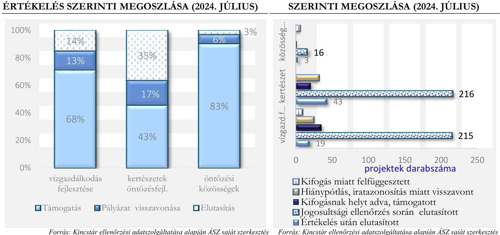

A pályázatok elutasításának indokok szerinti vizsgálata magyarázatot adhat a pályázati nehézségekre, sikertelenségekre. Az elutasított 640 db kérelem feldolgozott adatait mutatja a 2.19. ábra. A mezőgazdasági vízgazdálkodásra, a vízgazdálkodás fejlesztésére, a kertészetek fejlesztésére beérkezett pályázatok többsége nem az értékelés, pontozás során elutasított kérelem volt, hanem a legtöbb elutasítás (70\%) indokaként a jogosultság hiányát jelölték meg.
A pályázóknak az előírt dokumentumokkal igazolniuk kellett támogatásra való jogosultságukat. Ezek közül a legtöbb problémát az agrár-gazdálkodásból származó 50\%-os bevételi arány igazolása okozta az adatok szerint. A kertészetek fejlesztése pályázatnál nehézséget jelentett a számos előírt engedély: a telepítési terv, telepítési engedély, a szaporítóanyag forgalmazóval kötött szerződés, ökológiai alkalmasságot igazoló dokumentumok beszerzésének előírása.
Fenntartható vízkészletgazdálkodással összefüggő problémát mutat, hogy az elutasított kérelmek mintegy 10\%-ánál az elérhető víztestek mennyiségi- vagy minőségi hiánya volt az elutasítás indoka az alábbiak szerint: „Az érintett víztest vonatkozásában az öntözött területek nettó növekedését eredményező projektek kizárólag abban az esetben támogathatók, ha az érintett víztest a vízjogi engedély jogerőre emelkedésekor hatályos vízgyűjtő-gazdálkodási tervben nem kapott jónál rosszabb minősítést vízmennyiséggel kapcsolatos okok miatt.” A jogerős vízjogi létesítési engedélyek adminisztratív ellenőrzése során megállapítást nyert, hogy a tervezett öntözőtelephez köthető a víztest vízmennyiségi minősítése „gyenge” minősítést kapott a hatályos vízgyűjtő-gazdálkodási tervben (VGT-3). A fentiek értelmében a jogosultsági feltételnek a kérelem nem felel meg, mely a támogatási kérelem elutasítását vonja maga után.

---

A kifogásolt, vitatott határozatok felülvizsgálata után a kérelmek 9\%-át a kifogásnak helyt adva, felülvizsgálat után az Irányító Hatóság támogatta. Hasonlóan 9\% volt azoknak a pályázatoknak az aránya, amelyek az előírt határidőre vagy később sem pótolták a szükséges, pályázati felhívásban előírt dokumentumokat, iratokat.

# MEZŐGAZDASÁGI VÍZGAZDÁLKODÁS FEJLESZTÉSE 

A Mezőgazdasági vízgazdálkodás fejlesztése (VP2-4.1.4.) rendelkezésre álló legnagyobb pályázati forrás megpályázható összege az Irányító Hatóság döntése következtében 2016 óta többször változott, 2022-ben megduplázódott, 50 Mrd Ft-ról 100 Mrd Ft-ra emelkedett. Az időszak alatt módosítás történt az egy pályázóra vonatkozó feltételekben is. A pályázati időszak elején, 2016-tól megkülönböztették a pályázat során a magánszemélyeket és a közösségeket. A magánszemélyeknek megpályázható maximális támogatás nagysága 500 M Ft /projekt volt, a közösségnél 1000 M Ft/projekt. 2021-től eltörölték a magánszemélyek és közösségek közötti támogatáskülönbséget, minden pályázó maximum 2000 M Ft támogatást igényelhetett projektenként.
A mezőgazdasági vízgazdálkodás fejlesztése felhívásaira évente 100-110 db támogatási igény érkezett. A 2016-2020 évek között az egy projektre jutó átlagos támogatás nagysága 30-64 M Ft között volt, majd a 2021. évtől a megemelt maximális támogatási összeg következtében 88-133 M Ft-ra nőtt.

A művelési ágak szerint a megöntözött területek változása azt mutatja, hogy a mezőgazdasági vízgazdálkodás fejlesztésére rendelkezésre álló uniós források alapvetően az öntözött szántóföldek területének növekedését szolgálták. (2.20. ábra). Az agro-statisztikai, (ASIR) kategóriák szerinti szántóföldi növények (kukorica, napraforgó, burgonya, cukorrépa, szója, dohány) mellett az öntözött zöldségfélék, vetőmagok területe is emelkedett némileg.
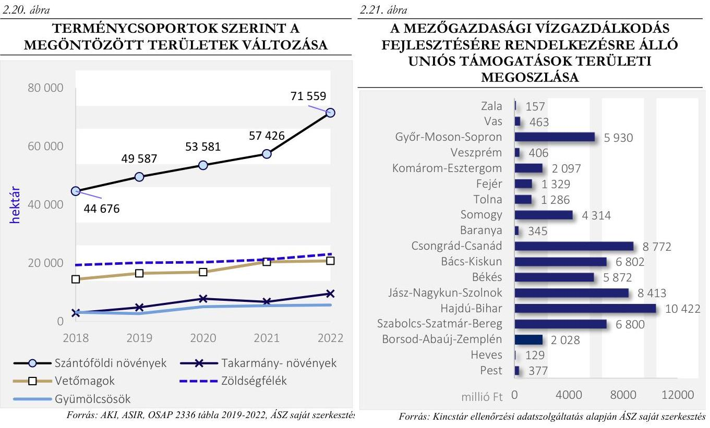

---

A mezőgazdasági vízgazdálkodás fejlesztésére rendelkezésre álló uniós támogatások területi, vármegyei eloszlását mutatja a 2.21. ábra. Legjelentősebb támogatási forrásokhoz az adatok szerint Hajdú-Bihar vármegye, Csongrád-Csanád- és Jász-Nagykun-Szolnok vármegye jutott.

# A FORRÁSALLOKÁCIÓ MEGFELELŐSÉGE AZ ELŐZETESEN FELMÉRT IGÉNYEKNEK 

A mezőgazdasági vízgazdálkodás fejlesztésére rendelkezésre álló források allokációja megfelelt az előzetesen felmért gazdálkodói igényeknek, kompenzálta a természeti hátrányokat, évek óta aszályos területekre juttatott forrásokat.
Az uniós pályázatok, azon belül a mezőgazdasági vízgazdálkodás fejlesztésére rendelkezésre álló források allokációjának megfelelőségét stratégiai célkitűzések hiányában két kritérium alapján értékeltük. Az egyik kritérium az volt, hogy a gazdálkodók körében 2018-ban végzett öntözési
 igényfelmérésnek megfelelt-e az uniós forrásokból támogatott projektek vármegyei eloszlása, azaz oda kerültek-e a támogatási források, ahol a gazdálkodók részéről leginkább felmerült az igény. Ezt követően az aszállyal sújtott területek 2019. és 2023. évek közötti vármegyei átlagos adataihoz viszonyítottuk a támogatások eloszlását, annak érdekében, hogy megállapítsuk, az aszállyal legerősebben érintett területekre kerültek-e az uniós források.
A 2018-as öntözési igény és a mezőgazdasági vízgazdálkodás fejlesztése forrásainak allokációja vármegyei szinten meghatározó statisztikai kapcsolatot mutatott (korrelációs együttható $\mathrm{r}=0,752$, ld. 2.22. ábra). A mezőgazdasági vízgazdálkodás fejlesztésére rendelkezésre álló uniós források területi elosztása megfelelt a gazdák igényeinek, az uniós források oda kerültek, ahol leginkább szükség volt rá.
Az ábrán látható, hogy 2018-ban a Hajdúságban, Hajdú-Bihar vármegyében volt a legnagyobb igény az öntözésre. A megművelt 429 ezer hektárból, a megyei szinten összesített gazdálkodói igény mintegy 145 ezer hektárnyi terület öntözésbe vonását igényelte.
2.22. ábra

A GAZDÁLKODÓI ÖNTÖZÉSI IGÉNYEK ÉS AZ ASZÁLYOS TERÜLETEK NAGYSÁGÁNAK KAPCSOLATA AZ UNIÓS VÍZGAZDÁLKODÁS-FEJLESZTÉSI TÁMOGATÁSOKKAL
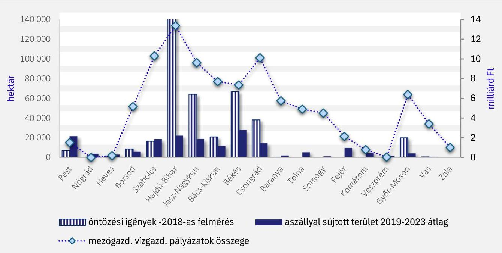

Forrás: AKI 2018-as öntözési igényfelmérés, VP-4.1.4. támogatott projektek adatai ellenőrzési adatszolgáltatás alapján ÁSZ saját szerkesztés

---

Az ábra jobb tengelye (vonalon szereplő adatok) mutatja a mezőgazdasági vízgazdálkodás fejlesztési forrásaiból támogatott projektek vármegyénként összesített értékét. A 2018-ban megfogalmazott gazdálkodói igényekkel összhangban az uniós forrásokból a Hajdú-Bihar vármegyei telephelyen gazdálkodók támogatásainak összértéke volt a legnagyobb az országban. 2016-tól 2024. július végéig összesen 13,4 Mrd Ft összértékű projekt támogatását ítélték meg. A második legnagyobb (10,1 Mrd Ft) uniós támogatást a Csongrád-Csanád vármegyei gazdálkodók projektjei nyerték el annak ellenére, hogy Csongrád-Csanád vármegye csak negyedik volt az öntözésfejlesztési igények sorában. Békés vármegyei gazdák, Hajdú-Bihar vármegye után a második legnagyobb területen, 66 ezer hektár öntözésfejlesztést tervezték, ennek ellenére a számukra biztosított uniós támogatások nagysága 7,4 Mrd Ft volt, hatodik legnagyobb az országos rangsorban.
Az uniós források elosztásának célratartottságát az aszályos területek 2019. és 2023. évek közötti vármegyei átlagával összevetve hasonlóan szoros statisztikai kapcsolatot találtunk. Békés és Pest vármegyében a megművelt területek között az aszályos területek nagysága nagyobb volt arányaiban, mint az uniós pályázaton elnyert támogatási összeg, azonban az alföldi megyék aszályos területei és a kapott uniós támogatások nagysága forrásainak allokációja vármegyei szinten meghatározó statisztikai kapcsolatot mutatott (a korrelációs együttható $\mathrm{r}=0,792$ ). Az uniós vízgazdálkodás-fejlesztési támogatások hozzájárultak a hazai aszályos területek vízellátásának fejlesztéséhez.

# KERTÉSZETEK KORSZERŰSÍTÉSE, ÖNTÖZÉSFEJLESZTÉSE 

A kertészetek öntözésfejlesztésére rendelkezésre álló források következtében 2466 hektárral, $77,6 \%$-kal nőtt az öntözött ültetvények, kiemelten az almáskertek és meggyeskertek területe.
A kertészetek öntözésfejlesztésének felhasználása, kifizetése 2018-ban elkezdődött, a támogatott projektek többsége 2022-ig elszámolt a támogatás felhasználásáról. 2022 végén 316 támogatási szerződéssel érintett kertészeti projektből 307 rendelkezett kifizetéssel és 273 projekt volt pénzügyileg lezárva. A Kertészetek korszerűsítése, öntözésfejlesztése (VP2-4.1.3.2) pályázati forrásait 2023-ban 19,3 Mrd Ft-ról 10,2 Mrd Ft-ra csökkentették. Az Irányító Hatóság döntését az agrárstatisztikai adatok nem támasztották alá, hiszen egységnyi öntözővíz hasznosulása a gyümölcsösökben, ültetvényeken volt a legjobb.

---

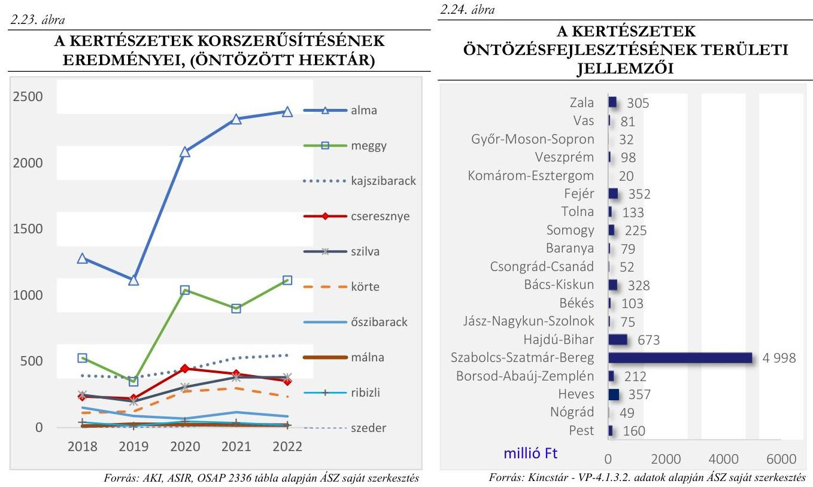

A kertészetek korszerűsítésének, öntözésfejlesztésének uniós pályázati adatait elemezve megállapítható, hogy a pályázati támogatások következtében a hazai öntözött almás- és meggyeskertek területe számottevően, 77,6%-kal, mintegy 2466 hektárral emelkedett. Ebből az öntözött almáskertek területe $86,5 \%$-kal, 1110 hektárral, a meggyeskertek területe $111,5 \%$-kal, 588 hektárral nőtt, (2.23. ábra) A támogatási források területi eloszlása területi különbségeket mutatott (2.24. ábra), a források 69,0%-a az Észak-alföldi régióba, azon belül az összes forrás $60,0 \%$-a Szabolcs-Szatmár-Bereg vármegyébe került, 8,1% jutott Hajdú-Bihar vármegyébe. Az Észak-magyarországi régióba jutott a támogatások 7,4%-a, a Dél-alföldi régióba az 5,8%-a.

# AZ ÖNTÖZÉSI KÖZÖSSÉGEK EGYÜTTMŰKÖDÉSÉNEK TÁMOGATÁSA 

Az Öntözési közösségek együttműködésének támogatásához (VP2-16.5.2) biztosított uniós megpályázható forrásokat csak 2021-től hirdették meg. A közösségek működéstámogatására rendelkezésre álló keret kezdetben 2,0 Mrd Ft volt, amely az ellenőrzött időszak végére 10,1 Mrd Ft-ra emelkedett. Egy-egy öntözési közösség támogatására maximum 68,0 M Ft volt fordítható.
A Felhívás szerint a program forrását az EMVA Vidékfejlesztési Program és Magyarország költségvetése társfinanszírozásban biztosította. A 2024. július végi adatok szerint a 167 beérkezett pályázattal igényelt támogatás összege 12,4 Mrd Ft volt. 132 támogatott projektre 10,1 Mrd Ft-ot ítéltek meg, kifizetés 27 projekt részére 1,2 Mrd Ft összegben történt.
A Kormány a mezőgazdasági termelők együttműködésével, az öntözési közösségek létrehozásával tervezte megvalósítani az öntözéses gazdálkodás hatékonyabb megszervezését. Az Ögtv. az öntözéses gazdálkodásról szól, céljai között szerepel az öntözéses gazdálkodás elterjesztése is, azonban az öntözéses gazdálkodás pontos fogalmát az Ögtv. nem tartalmazza.
Az Ögtv. 2023. júliustól hatályos módosítása alapján az öntözési közösségek nagyobb szerepet kaptak a fenntartható vízgazdálkodás területén. Az öntözési közösségek együttműködésének támogatása

---

hozzájárult a fenntartható öntözésfejlesztési célok megvalósulásához. Ugyanakkor a közösségek elismerésének nem volt feltétele, hogy a földterületeik a többlethozam szempontjából öntözésre javasolt területen helyezkedjenek el, ami annak a kockázatát hordozza, hogy nem a magas minőségű ${ }^{8}$ projekteket választják ki támogatásra.
Az öntözési közösségek együttműködésének támogatása során az uniós pályázatok értékelése nem terjedt ki a magas hozzáadott értéket előállító kultúrákra és a kisebb vízigényű növények alkalmazásának elvárására. A felhívásban rögzítették, hogy a kollektív módon végrehajtott projektek $20 \%$-kal magasabb támogatási intenzitásra jogosultak. A támogathatósághoz elegendő volt az elérhető pontszám $40 \%$-a, így a magas minőségű projektek kiválasztása nem volt biztosított.
A pályázati adatok elemzése azt mutatja, hogy az öntözési közösségek működésének támogatására megítélt források Baranya vármegyében voltak a legnagyobbak, 27 sikeres közösség pályázott, összesen 2 461,5 M Ft forrást ítéltek meg számukra (2.25.ábra). Jelentős volt még az Észak-alföldi régióból pályázó öntözési közösségek támogatásának nagysága is, Jász-Nagykun-Szolnok vármegyében 18 közösség 1 474,2 M Ft támogatást, Hajdú-Bihar megyében 14 közösség 1 086,0 M Ft forrást és Szabolcs-Szatmár-Bereg megyében 5 öntözési közösség összesen 424,8 M Ft támogatási forrást nyert el.
2.25. ábra

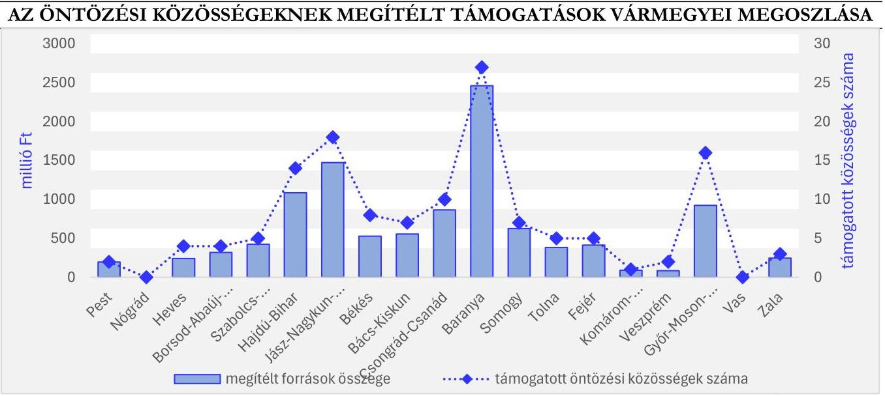

Forrás: Kincstár ellenőrzési adatszolgáltatás, VP-4.1.3.2. pályázati adatok alapján ÁSZ saját szerkesztés
Az öntözési közösségek együttműködéshez kapcsolódó pályázati felhívás a projekttervezés, engedélyezés, szakértők vagy a közösség által megbízott szervezők költségeit biztosította. A Közösségek, valamint annak tagjai beruházási projektet is indíthattak a mezőgazdasági vízgazdálkodási ágazat fejlesztése felhívás keretében. 2024. július végéig az öntözési közösségek által elnyert beruházási támogatások összege 9,0 Mrd Ft volt.

[^0]
[^0]:    ${ }^{8}$ A VP2-4.1.4-16 számú pályázati felhívás alapján magas minőségű projekt: a rendelkezésre álló vízkészlet hatékony felhasználását, gazdaságosabb megtérülését támogató, az öntözni kívánó gazdák együttműködését támogató projekt, amely egyszerre megfelel a 2014-2020 programozási időszakban az egyes európai uniós alapokból származó támogatások felhasználásának rendjéről szóló 272/2014. (XI. 5.) Korm. rendelet szerint a költséghatékonysági, teljesítmény és fenntarthatósági (környezet és klímaváltozáshoz való alkalmazkodás) szempontoknak.

---

# 3. Az öntözésfejlesztésre, vízvisszatartásra irányuló intézkedések, a fenntartható mezőgazdasági vízhasználat 

Összegző megállapítás Az ellenőrzött időszak alatt a fenntartható mezőgazdasági vízhasználatot, a vízkészletek védelmét biztosították a vízjogi engedélyezési eljárások. Az öntözésfejlesztésre, vízvisszatartásra irányuló intézkedések során nem minden esetben vették figyelembe a fenntartható mezőgazdasági vízhasználati szempontokat.

A globális klímaváltozás komoly hatást fejt ki a mezőgazdasági termelésre, számos új nehézséggel szembesítve a mezőgazdasági termelőket, gazdákat. A mezőgazdasági termelés biztonsága és a klímaváltozáshoz való alkalmazkodás érdekében szükséges a vízkészleteinkkel való fenntartható gazdálkodás, a vízvisszatartás, takarékos öntözési technológiák elterjesztése, a klímaváltozásnak ellenálló agrotechnikai módszerek és fenntartható területhasználat biztosítása, a felszíni és felszín alatti víztestek jó állapotának megőrzése.
A fenntarthatóság vizsgálatának egyik területe a fenntartható vízgazdálkodás és a mezőgazdasági vízhasználat, vízkészletek védelmének összhangja volt. Azon belül az ellenőrzés először a vízkészletek védelmét szolgáló, vízjogi engedélyezések gyakorlatát, az időszak alatt bekövetkezett változásait tekintette át. Azt követően a fenntartható vízgazdálkodás a vízkészletek védelmét akadályozó illegális vízkivételeket, a kútmoratórium hatását, a kutakra vonatkozó szabályozást, a hatósági ellenőrzés változását vizsgálta. Végül a fenntartható vízkészletgazdálkodás kapcsán egyre nagyobb figyelmet kapó vízvisszatartás meliorációs technikák hazai gyakorlatát, az eddig elért eredményeit, helyzetét tekintette át.
A fenntarthatóság vizsgálatának egy másik területe volt az öntözésfejlesztést, mezőgazdasági vízgazdálkodást előmozdító vízügyi infrastruktúra fejlesztések és beruházások prioritásai meghatározása során, valamint az uniós forrásfelhasználás, gazdálkodói beruházások, támogatási kérelmek értékelése során a fenntarthatósági szempontok érvényesülése.
Az ellenőrzés értékelte a fenntartható agrárgazdálkodás és az öntözésfejlesztés összhangját, az öntözéses gazdálkodás támogatási rendszerének fenntarthatóságát, az öntözés hozzájárulását a termésbiztonsághoz, értéktermelési folyamatokhoz, valamint a mezőgazdasági vízgazdálkodáshoz kapcsolódó szakismeretek, oktatás, tudásgazdaság helyzetét értékelte.

FENNTARTHATÓ VÍZKÉSZLETGAZDÁLKODÁS, AZ ÖNTÖZÉS VÍZJOGI ENGEDÉLYEZÉSI GYAKORLATA
A vízjogi engedélyezési eljárások biztosították a vízkészletek védelmét, a fenntartható vízhasználat, vízgazdálkodás szempontjainak, uniós normáinak érvényesülését. Azonban a bonyolult és széttagolt engedélyezési folyamatok hátráltatták az integrált vízgazdálkodási szempontok érvényesülését, nem biztosították a gazdálkodók esélyegyenlőségét.
2021-ben a Magyarország második felülvizsgált Vízgyűjtő-gazdálkodási Terve (VGT3) megállapította, hogy: „bazánkban az öntözés a leginkább fejlődő, a vízkészletek számára mennyiségi terhelést jelentő vízhasználat." A felszíni vizek használata során alapvető kérdés, hogy a vízigények biztosíthatók-e a rendelkezésre álló szabad felszíni vízkészletekből, úgy, hogy azok hidrológiai állapota a vízelvonás következtében ne sérüljön.

---

A fenntartható vízgazdálkodás, vízhasználat közös uniós irányelveit, a vízpolitika terén a közösségi fellépés minden uniós tagállamra érvényes kereteit 2000-től a Víz Keretirányelv (2000/60/EK irányelve) tartalmazza. Magyarországon az OVF és a területi vízügyi igazgatóságok a Víz Keretirányelv (VKI) vízgazdálkodási, vízvédelmi irányelveit követve meghatározták a természeti erőforrások megóvása, az öntözésfejlesztési beruházások elősegítése érdekében az Alföldre és a Kis-Alföldre vonatkozó Vízkészlet-gazdálkodási Térségi Terveiket. A tervek a fenntartható, integrált vízkészletgazdálkodási gyakorlat kialakításához, a vagyonkezelői döntések megalapozásához voltak szükségesek. A modellezés során olyan öntözési kontingenseket határoztak meg, amelyek szem előtt tartották a fenntartható vízgazdálkodás szempontjait, nem sértették a Víz Keretirányelv előírásait, biztosították a felszíni és felszín alatti víztestek jó minőségének megőrzését.
A vízkészletek védelmét, fenntartható használatát a gyakorlatban az öntözéssel kapcsolatos vízjogi hatósági engedélyezési eljárások biztosították, amely kereteit a 72/1996. (V.22.) Korm. rendelet szabályozta. Öntözni csak vagyonkezelői hozzájárulás után vízjogi létesítési- és üzemeltetési engedéllyel volt lehetséges. Az összetett, szakismereteket igénylő engedélyezési folyamat a környezetvédelem, fenntartható vízhasználat kereteit hivatott biztosítani. A létesítési és üzemeltetési engedélyeket megelőzheti az elvi vízjogi engedély iránti kérelem, ami a tervezett vízimunkákat, a műszaki megoldásokat tisztázza.
Az öntözési vízkivételhez rendelkezésre álló szabad vízkapacitás felmérése érdekében az érintett területi vízügyi igazgatóság vagyonkezelői hozzájárulását, a használni kívánt víztest állapotának meghatározását a jogszabályi előírás szerint mellékelni kell a vízjogi engedély kérelmekhez. Szabad vízkapacitás esetén a továbbiakban szükséges az öntözéshez a létesítési- és üzemeltetési vízjogi engedélyek megszerzése. A vízjogi engedélyt 2024. szeptember végéig a területileg illetékes fővárosi/megyei katasztrófavédelmi igazgatóság adta ki, 2024. októbertől ez a területileg illetékes kormányhivatalok feladata. A pozitív engedélyezési folyamat lezárása után a vízhasználó a mezőgazdasági vízszolgáltatóval vízszolgáltatási szerződést köt, ami a vízszolgáltatás feltétele.
A vízjogi engedélyezési eljárás általánosságban a fenntartható vízhasználatot biztosítja, azonban az engedélyezési eljárás szervezetek közötti megosztottsága, széttagoltsága gátolta az integrált vízgazdálkodási és a környezetvédelmi szempontok érvényesülését. Az eljárások bonyolultsága
 miatt nem volt biztosított az agrárgazdálkodók erőforrásokhoz való egyenlő hozzáférésének esélye. Az engedélyezés felhasználók számára nehezen átlátható folyamatai az eljárásban jártas szakemberek igénybevételét tették szükségessé, ami hátrányt okozhatott a szakembereket alkalmazni nem tudó gazdálkodóknak.

# VÍZJOGI ENGEDÉLYEZÉSI ELJÁRÁS EGYSZERŰSÍTÉSE 

Az öntözéssel kapcsolatos vízjogi engedélyezési eljárással kapcsolatos problémákat az ágazat operatív irányítói azonosították, az ellenőrzött időszak alatt egyszerűsítették a vízjogi engedélyezési eljárást, az eljárási költségeket csökkentették.
Az AKI 2018-as felmérése szerint az engedély nélkül létesülő és üzemelő illegális mezőgazdasági kutak nagy száma a korábbi vízjogi engedélyezési eljárás bonyolultságára, az ahhoz szükséges műszaki és jogi dokumentumok, valamint az igazgatási és szolgáltatási díjak magas összegére volt visszavezethető. Az előbbi terhek miatt a termelők jelentős része nem folytatta le az engedélyezési eljárást. Egy másik, 2019-es AM kutatás szerint a hazai gazdálkodók 18,6%-át az eljárási folyamatok és az adminisztratív terhek tartották vissza az öntözésfejlesztési beruházásoktól. Többek között ezért javasolta az AM 2019 októberében az engedélyezési eljárások egyszerűbbé, gyorsabbá és olcsóbbá tételét.

---

# Az öntözési engedélyezés egyszerűsítésének elemei: 

- 2018-tól egyszerűsödött a 72/1996. (V. 22.) Korm. rendeletben ${ }^{29}$ a vízjogi üzemeltetési engedély módosítására vagy fennmaradási engedély megszerzésére vonatkozó előírása. Lehetővé tették a tulajdonos hozzájárulásának a kérelmező nyilatkozatával történő kiváltását.
- 2019-től az öntözés vízjogi üzemeltetési engedély érvényességi időtartama öt évről 20 évre nőtt, bevezették a rendkívüli öntözési célú vízhasználatot, mely a tartósan vízhiányos időszakban, a vízhasználó bejelentése alapján, vízjogi engedély nélkül, közvetlenül felszíni vízből, ideiglenes szivattyúállással, legfeljebb 120 mm / hektár ( $1200 \mathrm{~m}^{3} /$ hektár) vízmennyiség 100 hektár nagyságot meg nem haladó területre öntözési célból, legfeljebb megszakítás nélkül egy hónap időtartamig lehetséges.
- 2019-től az igazgatási és szolgáltatási díjak csökkentek (a Vgtv. 31.§ (2) bekezdése alapján), mentes volt az illeték- és díjfizetés alól az öntözési berendezések, öntözőtelepek, a felszín alatti vízkivételű vízilétesítmények engedélyezési eljárása vízjogi engedélyezési eljárás esetében.
- 2020-tól a talajvízkút engedélyese kérheti a vízügyi hatóságtól az engedély hatályának egyszerűsített eljárásban történő módosítását.
- 2020-tól működik a VIZEK, elektronikus vízjogi engedélyezési rendszer, amely kötelezővé tette az összes szükséges dokumentum egyidejű benyújtását a kérelem indításához, ezzel biztosítva a hiánypótlások és az elutasított kérelmek számának csökkentését. Lehetővé tette a vízkészletjárulék (VKJ) kiszámítását, bevallását és befizetését, valamint tájékozódást a szabad vízkészletekről, a tervezett beruházások költségeiről.
- 2020-tól hatályba lépett az Öntözési törvény (Ögtv.), abban szerepelt az öntözési közösségek működési kereteinek meghatározása, a Közösségek számára megkönnyített vízjogi engedélyezési eljárások szabálya. Ezek alapján a Közösségek kérhették az öntözési igazgatási szervtől a környezeti körzeti terv elkészítését, mely kiválthatta a környezetvédelmi, természetvédelmi és talajvédelmi engedélyezési vagy szakhatósági eljárásokat, illetve a Közösség biztosíthatta a tagjai számára meghatalmazással az öntözési engedélyek közös megszerzését. Az öntözésfejlesztések végrehajtásának megkönnyítését szolgálta az öntözési szolgalmi jog részletes szabályozása is.


## A MEZŐGAZDASÁGI VÍZKÉSZLETEK, ILLEGÁLIS VÍZKIVÉTELEK

Az illegális vízkivételek becslésének hiánya a vízkészletgazdálkodás tervezhetőségét és megvalósítását akadályozta.
A fenntartható vízgazdálkodás egyik alapja a vízhasználatok mérése, az erre vonatkozó adatok elemzése. A szabályozás 2021-től meghatározta a vízmérő/kútvízmérő alkalmazását. A Vgtv. 15/E. § rendelkezett a vízkivételre vonatkozó nyilatkozattételi, adatszolgáltatási kötelezettségről, a hatósági ellenőrzésről és a szankcionálásról. A nyilatkozattételi és adatszolgáltatási kötelezettség a tényleges vízigénybevételre, valamint a fizetési kötelezettség alapadataira és kiszámítására terjedt ki.
Az ágazati fejlesztési tervekben szerepel az öntözött területek távérzékelési módszerekkel történő feltárása, valamint a nyilvántartások korszerűsítése és a különböző forrásokból származó (pl. földmegfigyelési, terepi ellenőrzési) információk összekapcsolása. Ezáltal meghatározhatóvá válnak azon területek, melyeken feltehetőleg illegális vízkivételből történik öntözés, hiszen természetes csapadéktevékenységből nem adódna a növény magas fejlettségi foka.

---

A vízhasználók által szolgáltatott adatok alapján lehet következtetni, modellezni az illegális vízhasználatok mértékét, jellemzőit. Ezért a VGT3 alapján, szakértők bevonásával 2021-ben módszertan készült az „Engedély nélküli felszín alatti vízkivételek becsléséről’. Az illegális vízhasználat más elemeire, az engedélytől eltérő és engedély nélküli felszíni, valamint az engedélytől eltérő felszín alatti illegális vízkivétel becslésére ellenben módszertan nem készült. Így nem került sor az öntözés során leginkább használt felszíni vizek engedély nélküli, engedélytől eltérő használatának becslésére. 2023 végéig az engedély nélküli és az engedélytől eltérő felszíni és felszín alatti vízkivétel folyamatos becslése, monitorozása nem valósult meg, ennek hiánya akadályozta, akadályozza a területi vízkészletgazdálkodás tervezhetőségét, a mezőgazdasági vízszolgáltatáshoz rendelkezésre álló vízkészletek nagyságának becslését.
A mezőgazdasági célú vízhasználatra vonatkozó adatok, csak a felszín alatti vizekre 2013-2018. között álltak rendelkezésre. A becslések szerint a mezőgazdasági öntözési célú kutakból jelentősebb volt az illegális vízkivétel, mint a házi vízigényeket kiszolgáló kutakból. A szakértői becslés szerint a mezőgazdasági célú, felszín alatti víztestekből származó vízkivételek aránya 19,0%-a engedély nélkül történt. Az alábbi 3.1 ábra a felszín alatti vizekből származó mezőgazdasági vízhasználatot, a halastavak és a rizstermesztés vízhasználatát is figyelembe véve mutatja az engedély nélküli vízkivételt.
3.1. ábra

FELSZÍN ALATTI VÍZBŐL TÖRTÉNT VÍZKIVÉTELEK BECSÜLT NAGYSÁGA (2013-2018. ÉVI ÁTLAG)
millió $\mathrm{m}^{3} / \mathrm{év}$

- Engedély nélküli vízkivételek (becsült adat)
- Engedélyes vízkivételek
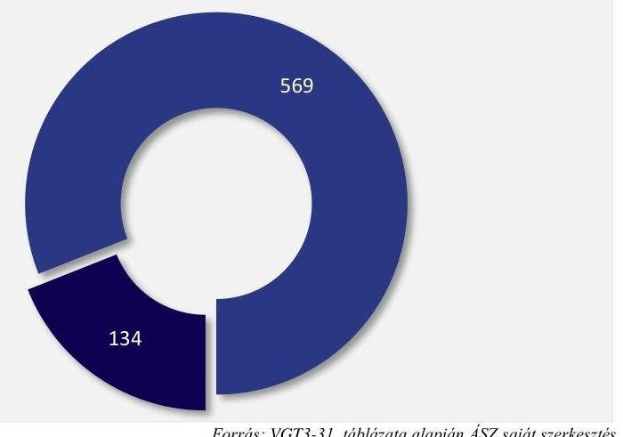

Forrás: VGT3-31. táblázata alapján ÁSZ saját szerkesztés
A 2013-2018. időszak átlaga szerint az ivóvizet felszín alatti vízkészletből meghatározóan ( $93,5 \%$-ban) három típusú víztest biztosította: $67,4 \%$-át porózus, $14,9 \%$-át karszt és $11,1 \%$-át sekély porózus víztest. A három víztestből kettő - a porózus és a sekély porózus víztest - volt érintett engedély nélküli vízkivétellel. A 2008-2013. időszakról a 2013-2018. időszakra a felszín alatti vízből történt vízkivétel 45,0 millió $\mathrm{m}^{3} /$ év mennyiséggel, $6,0 \%$-kal csökkent; az öntözési és mezőgazdasági egyéb célú vízkivétel 3,7 millió $\mathrm{m}^{3} /$ év mennyiséggel, $8,7 \%$-kal csökkent, ezzel szemben - becsült adatok alapján - az engedély nélküli vízkivétel 35,9 millió $\mathrm{m}^{3} /$ év mennyiséggel, $36,8 \%$-kal nőtt. A felszín alatti közvetlen vízkivételen belül az engedély nélküli vízkivétel aránya is emelkedett; a 2008-2013. időszak 13,1%-os arányáról a 2013-2018. közötti időszakra 19,0%-ra.

---

# MEZŐGAZDASÁGI KUTAK LEGALIZÁLÁSA 

A kutak bírságmentes legalizálásának határidejét többször módosították, azonban ezek nem vezettek eredményre.
Mezőgazdasági öntözési célú kút olyan felszín alatti vízkivételt biztosító vízilétesítmény, amely kizárólag mezőgazdasági művelés alatt álló terület mezőgazdasági vízszolgáltatását biztosítja.
A háztartási és mezőgazdasági kutak legalizálása évtizedes vízgazdálkodási, vízkészletgazdálkodási probléma. A Vgtv. szabályok többszöri módosításával történt a kutak legalizálásának, bejelentésének szabályozása. A szabályozás célja volt a jogkövető magatartás ösztönzése, illetve az engedély nélküli, használatban lévő kutak bírságmentes bejelentése vagy az engedélytől eltérő felszín alatti vízkivételt biztosító vízilétesítmények legalizálásának kísérlete.
A 2021 előtt létesített öntözési célú kutaknál nem volt akadály, ha a nyilvántartásban nem szereplő kútfúró létesítette a kutat, vagy ha a kútfúrással kapcsolatos dokumentumok az üzemeltetőnél nem álltak rendelkezésre. Az ellenőrzés idején hatályos engedélyezési szabályok alapján a bejelentéssel érintett kutaknál az új kút esetében volt szükséges a kútfúró nevének és nyilvántartásba vételi számának rögzítésére.
Az ágazatirányításért felelős irányítószerv többször megpróbálta a kúttulajdonosokat, működtetőket rávezetni a kutak bejelentésére, az engedély nélkül működő kutak legalizálására. A kútmoratórium az engedély nélküli kutak bírságmentesen történő legalizálását jelentette. A szabályozásban a Vgtv. 29. § (7) bekezdése alapján a kutak fennmaradási engedélyének bírságmentes bejelentésére nyitva álló határidőt háromszor módosították. A kutak bejelentésének első határideje 2018 vége volt, majd a legalizálás határidejét meghosszabbították 2020 végéig, végül a kutak fennmaradásának bírságmentes bejelentését 2023 végéig meghosszabbították.
A Vgtv.-ben foglalt, 2023. december 31-ig érvényes legalizálási lehetőségek az üzemeltetők jogkövetésre irányuló mérsékelt hajlandósága miatt nem vezettek eredményre. Így a szabályozás nem tudott hozzájárulni a kutak számának és hollétének, valamint a felszín alatti vízhasználatok mennyiségének ismertté válásához; és ezek által a hatósági felügyelethez, valamint a fenntartható vízgazdálkodáshoz. Az NFK a 2021. április és 2024. május közötti időszakban, a Vgtv. 28/A. § (1a) bekezdése szerinti, előzetes-, és a 2021. és 2023. között hatályos, 45/N. § (1)-(2) bekezdése szerinti, utólagos bejelentés alapján 62 határozatot, vízjogi fennmaradási engedélyt érintően 69 határozatot adott ki. Ezzel szemben becslések szerint az illegális mezőgazdasági kutak száma a százezret is elérheti.
A gazdálkodók helyzetét könnyítette meg a VGT2-ben rögzített feladatok között meghatározott kutakra vonatkozó típustervek elkészítése, hozzáférhetővé tétele. A hasonló célból és kialakítással készülő kutaknál a típustervek alapján történő egyszerűsített vízjogi engedélyezési eljárás lehetőségének biztosítása keretében a típustervek a BM és az OVF közreműködésével elkészültek és a közzétételük megtörtént.
További kedvező folyamat volt, hogy egyes uniós pályázati felhívás rögzítette, hogy a vízjogi engedélyt a támogatási kérelemmel egyidejűleg (az első, illetve a záró kifizetési kérelemhez mellékelten) az új öntözési beruházás megvalósulásakor, de legkésőbb a Felhívás keretében végrehajtott projekt fizikai befejezésétől számított 5 év leteltét követően be kell nyújtani.
2024-től a fenntartható vízkészletgazdálkodás újabb elemmel bővült, a vízkészletvédelmi országtérképben meghatározott kockázattól függően a vízjogi engedélyezési eljárásban eltérés volt.

---

2023. júniustól a területi vízkészletgazdálkodás szempontjainak fokozott érvényesítése, a fenntartható vízkészletgazdálkodás érdekében új szabályozási elem jelent meg. A Vgtv. módosítása előírta a vízkészletvédelmi országtérkép elkészítésének, közzétételének és felülvizsgálatának kötelezettségét. A vízkészletvédelmi országtérkép meghatározza a vízkészletvédelmi szempontból kockázatos területeket és a kockázatmentes területeket. Az OVF honlapján közzétette a vízkészletvédelmi országtérképet, amelyen be lehet azonosítani, hogy milyen területeken nem kell vízjogi engedélyt kérni a Vgtv.-ben meghatározott típusú kutakra. Ezt követően a kutak vízjogi engedélyét a területi vízkészlet jellemzői alapján kell beszerezni.
A jogszabálymódosítás a 2023 végéig létesített, vízjogi engedéllyel nem rendelkező be nem jelentett, ötven méter talpmélységet meg nem haladó és az első vízáró réteget el nem érő mezőgazdasági célú kutakat legalizálta, azok jogszerűnek minősülnek, nem kell bejelenteni, működésükhöz vízjogi engedélyt kérni. A Vgtv. 2024-től hatályos 45/N. § (1) bekezdése mezőgazdasági kút létesítése során nem tartalmaz felmentést a vízjogi engedély és bejelentés alól. A létesítéshez kapcsolódó vízjogi engedélyezési eljárás 2023. évtől a terület vízkészletvédelmi országtérképen kapott kockázati minősítésétől függött. A jogszabálymódosítás hatálybalépésétől kezdődően a kockázatos területen lévő kutak működéséhez vízjogi engedélyt kell kérni, a kockázatmentes területen elhelyezkedő kutak bejelentéskötelesek, digitális vízmérővel felszerelendők.

# KÚTHASZNÁLAT HATÓSÁGI ELLENŐRZÉSE, BÍRSÁG 

A szabályoknak megfelelő kúthasználat rendszerszerű ellenőrzését jogszabály nem írta elő, valamint hiányoztak a helyszíni ellenőrzéshez szükséges személyi feltételek és részben a tárgyi feltételek is.
A felszín alatti vizek mennyiségének és minőségének védelme, a vizek jó állapotára vonatkozó célkitűzések elérését biztosító követelmények teljesülése céljából 2021. január 1-től a Vgtv. rögzítette az üzemeltető kötelezettségeit, a hatósági ellenőrzés lehetőségét és az ellenőrzés lehetséges jogkövetkezményeit.
Az NVS-ben foglalt célok közül a hatósági ellenőrzések fokozása területén 2023 végéig nem történt előrehaladás. Az NVS-hez hasonlóan a VGT3 a 2023. évet követő időszakra irányozta elő az illegális vízhasználat magas felderítési arányának biztosítását, valamint a megfelelő szankcionálási rendszer kialakítását és ezzel 2024-től kezdődően az illegális vízhasználatok minimalizálását. A kellő számú helyszíni ellenőrzés végzéséhez, a hatékony területi jelenléthez szükséges személyi feltételek nem,
 a tárgyi feltételek az ellenőrzött időszak során részben álltak rendelkezésre. A mezőgazdasági kutak a vízgazdálkodási hatósági jogkör gyakorlásáról szóló 72/1996. (V. 22.) Korm. rendelet 21. § (4) bekezdés d) pontja és 1. melléklete alapján a IV. felügyeleti kategóriába tartoztak, a 21. § (6) bekezdés alapján a IV. kategóriába tartozó létesítményeknél esetenként (szúrópróbaszerűen, illetve megkeresés vagy bejelentés alapján) végzi a vízügyi hatóság az ellenőrzést.
A VGT2-ben foglalt szabályozás alapján a hatóság 2016-tól alapvetően a szabálytalanul kutat fúró vállalkozót (a kivitelezőt) szankcionálta, bírságolta meg. A bírság maximális mértékének emelésére utoljára 2012-ben került sor, amely szerint a bírság összege az engedély nélkül létrehozott építmény értékének 80,0%-áig terjedhet az engedély nélküli vízhasználat esetén a bírság felső határa egy millió Ft-ra, természetes személy esetén 300 ezer Ft-ra nőtt. 2021. január 15-től a jogszabály rögzítette a vízgazdálkodási bírság megfizetésének kötelezettségét is, ha a vízilétesítmény megépítése vagy átalakítása bejelentés nélkül, vagy jóváhagyástól eltérően történt.

---

# VÍZTÁROZÓK - VÍZVISSZATARTÁS 

A hazai és uniós források felhasználásával az ellenőrzött időszak alatt 4,1 millió $\mathrm{m}^{3}$-rel, 3%-kal nőtt a hazai víztározási kapacitás.
A klímaváltozáshoz való alkalmazkodás lehetséges válaszait megfogalmazó Nemzeti Tiszta Fejlődési Stratégia 2020-2050 az éghajlatváltozásra adandó lehetséges válaszlépésként említi a vízgazdálkodás esetében a vízhiánnyal és víztöbblettel kapcsolatos problémák komplex kezelését. Elengedhetetlennek tartja a természetes csapadék helyben, talajban tartását, a vízjárta területeken a területhasználatok felülvizsgálatát, integrált tervezését. Az alkalmazkodás fontos eszközének tekinti a természetes csapadék talajban történő tározását, a víztakarékos öntözési eljárások elterjesztését, a vízvisszatartást.
Az 1744/2017. (X. 17.) Korm. határozat feladatul határozta meg a BM számára az öntözési célú víztározási lehetőségek vizsgálatát, a belvízi- és kettős működésű rendszerek üzemeltetésének a felülvizsgálatát, a belvizek területen hagyását, a víz visszatartását, tározását szolgáló lehetséges területek meghatározását. Egy 2020-ban készült kormányzati előterjesztés alapján Magyarországon 447 db víztározásra alkalmas elemről van nyilvántartás. Ezek között találhatóak vízkárelhárítási célú tározók, árvíz-csúcs-csökkentő célú tározók is, amelyek főként elhelyezkedésük miatt nem alkalmasak mezőgazdasági célú használatra, és vannak kifejezetten vízvisszatartási célú tározók is, amelyek az öntözőcsatornák vízpótlását és öntözési célt szolgálnak.
A KEHOP-1.3.0-15 - „Fenntartható vízgazdálkodás infrastrukturális feltételeinek javítása" forrásai és a hazai költségvetési források felhasználása összesen 4,1 millió $\mathrm{m}^{3}$-rel, 3%-kal növelte az ország víztározási kapacitásait, ezzel csökkenthetővé tették a víz hiányából vagy többletéből származó kedvezőtlen hidrológiai hatásokat. A vízvisszatartást elősegítő fejlesztési javaslatból az ellenőrzés végrehajtásáig 8 db vízvisszatartási célt szolgáló fejlesztés valósult meg. Ezek rendre: Záportározó Vas, Zala, Baranya vármegyékben (Kőszegdoroszló, Rábagyarmat, Rönök, Murarátka, Zalatárnok, Magyarszék), valamint a Séd-Nádor-Gaja vízrendszer rehabilitációjának I. üteme, a Váli-völgy vízrendezése. Fejlesztés valósult meg Szombathely és környező települések árvizi védelmét szolgáló Dozmati-víztározó, valamint a Mátételkeitározó, Bácsborsódi-tározó Harangodi tározó megépítése, funkcióbővítése során.

## VÍZMEGTARTÁS A MELIORÁLT TERÜLETEKEN

Az OVF Vízügyi Tudományos Tanács Meliorációs Munkacsoportjával együttműködve 2017-ben készített tanulmánya, a „Javaslat az 1970-1990 között végrehajtott melioráció/ drénezés hasznosítására" megállapította, hogy a talajcsövezési rendszerek az eltelt időszak alatt műszakilag jelentősen amortizálódtak, de a korábbi meliorációs létesítmények rendszerét újjá lehet alakítani, és azzal a jelenlegi és a várható gazdálkodási körülményekhez igazítva fokozni lehet a termésbiztonságot. A tanulmány javasolta a meliorált területek felmérését, mely jelentős költségvonzattal jár.
A meliorációval, talajcsövezés agrárszakmai lehetőségeivel a MATE Öntözési és Vízgazdálkodási Kutatóközpontja, illetve annak jogelődje, a szarvasi Öntözési és Vízgazdálkodási Kutatóintézet is foglalkozott. Több éves, 2016-ban kezdődött kutatómunkán alapult a hazai talajcsövezés szükségességéről készült tanulmány. A Kutatóintézet feltérképezte a hazai talajcsövezett területeket, amelynek eredményeként 2022-re létrejött az Országos Meliorációs Kataszter. A kutatások alapján a talajcsövezett területek kiterjedése 169 ezer hektár volt és a meliorációval érintett teljes terület 574 ezer hektárt tett ki. A kataszter tartalmazta a meliorált és talajcsövezett területek tulajdonságait is.

---

A MATE ÖVKI megállapította, hogy az öntözésfejlesztés lehetséges célterületeinek kijelölésekor a jelenleg is működő, vagy gazdaságosan működésbe hozható drénhálózatokkal rendelkező mezőgazdasági területeknek mindenképpen elsőbbséget kell élvezniük.
Az ellenőrzött időszakban a korábban kiépített meliorációs célt szolgáló talajcsövezéses rendszerek hasznosíthatóságának országos felmérését az OVF és a MATE elvégezte, költségigényét megmérte, kidolgozta az állapotfelmérés módszertanát, és egyúttal megállapította, hogy azok az öntözésfejlesztések szolgálatába állíthatók. A meliorációs kataszter azonban nem tartalmazta a meliorációs rendszerek tényleges terepi felméréseit, állapotértékeléseit, amelyekkel a működés hatékonysága is leírható lenne, ez az információ további vizsgálatok elvégzését követően állhat rendelkezésre.

# FENNTARTHATÓSÁG ÉRVÉNYESÜLÉSE A VÍZÜGYI INFRASTRUKTÚRA FEJLESZTÉSEINÉL 

Az öntözési célú állami művek fejlesztései prioritás listájának összeállításakor az öntözhetőség hosszú távú fenntarthatósági szempontjait, az öntözést jelentősen befolyásoló természeti környezeti tényezőket nem vették figyelembe.
A fenntartható mezőgazdasági vízgazdálkodás és az öntözésfejlesztés összhangjának egy másik szempontja annak értékelése, hogy a vízügyi infrastruktúra- és öntözésfejlesztések beruházási prioritásainak meghatározása során a fenntarthatósági szempontok hogyan érvényesültek.
Az AM a BM-mel, OVF-fel és a területi vízügyi igazgatóságokkal együttműködve azok beruházási javaslatai és az AKI szakmai elemzésére támaszkodva 2018-ban összeállította a Szakpolitikai Programját. Ebben javaslatot tett az állami művek öntözési célú fejlesztésének prioritás listájára, az állami művek elhelyezkedését és a termelői öntözési igényeket figyelembe véve az 1426/2018. (IX. 10.) Korm. határozat 1. pont előírásának megfelelve. Részletezte a dokumentumban, hogy az egyes projektekkel melyik vármegyében található terület érintett, mekkora terület vonható be az öntözésbe, és milyen beruházás igénye van az adott projektnek. A dokumentumban célként határozták meg 2024-ig az öntözést akadályozó tényezők gazdálkodók számára is érezhető csökkentését és az öntözött területek 100 ezer hektárral való növelését.
A feladatok között meghatározták, hogy olyan helyeken valósuljanak meg az öntözésfejlesztések, ahol kis ráfordítással kielégíthető az öntözővíz ellátottság. A területek kijelöléséhez, a korábban elkészített „Öntözési kataszter" nyújtott alapot, amelyet az AKI a 1744/2017. (X. 17.) Korm. határozat 1. pontja alapján az AM, az OVF és a NAK megbízásából készített, meghatározva az öntözésre alkalmas és az öntözésre feltételesen alkalmas területeket. Az öntözhető területek között megkülönböztették a területeket aszerint, hogy az

- öntözésre berendezett és a jövőben is öntözni szándékozott/nem szándékozott terület,
- öntözésre nem berendezett, de a jövőben öntözni szándékozott/nem szándékozott terület, (hektár). Az öntözhető területek lehatárolásához az AKI nettó jelenérték (NPV) számítást végzett, amely során a maximális vízigényeket, a beruházási költségeket és a hozameredményeket vette figyelembe, rangsorolva a gazdaságosan öntözhető területeket. Az öntözhető területek meghatározása során az AKI kalkulációja költségmegtérülési oldalról közelítette meg az öntözési beruházásokat, öntözési vízhasználatot. Az öntözési beruházás megtérülésének kalkulációja során az adott időszakot jellemző termény és vízhasználatot alapul véve kalkulálták, azaz figyelembe vették a felmérés időpontjában rendelkezésre álló adatok alapján az adott területen megtermelt növényfajok vízigényeit, annak

---

költségvonzatával számoltak, és az adott területen megtermelt növények hosszú távon várható hozamnövekedését ezek alapján kalkulálták.
A költségmegtérülés számítása nem vette figyelembe a hosszú távú fenntartható vízkészletgazdálkodásra vonatkozó szempontokat, az infrastruktúra üzemeltetésének hosszú távon emelkedő költségeit. A számítási módszerbe nem épültek be fenntarthatósági szempontok, a környezeti és társadalmi hatások szempontjai, amelyek befolyásolnák a jövőbeni költségek és hasznok pozitív vagy negatív irányba történő értékelését.

# VÍZKERESLET - NEM CÉLIRÁNYOS TÁMOGATÁSI RENDSZER 

A fenntarthatósági szempontok érvényesülését a hazai vízügyi infrastruktúra, mezőgazdasági vízgazdálkodás fejlesztésére rendelkezésre álló uniós források elosztása és a kérelmek értékelése, bírálata során is megvizsgáltuk. Az öntözésfejlesztést támogató uniós forrásoknak két nagy csoportja volt. Az egyik a vízügyi infrastruktúra fejlesztését támogató KEHOP források ${ }^{9}$, a másik a gazdálkodók öntözésfejlesztési beruházásait támogató Vidékfejlesztési Program forrása ${ }^{10}$ voltak.

## KEHOP-1.3.0-15 - Fenntartható vízgazdálkodás infrastrukturális feltételeinek javítása

A vízügyi igazgatási szervek vízkészletekkel történő fenntartható gazdálkodása feltételeinek megvalósítása érdekében írta ki a Kormány a KEHOP-1.3.0-15 pályázatot. A felhívás 4.4. pontja tartalmazta az értékelési kritériumokat. Összesen a 33 értékelési kritériumból öt értékelési kritérium vonatkozott a fenntartható vízgazdálkodásra, ami az értékelési kritériumok 15%-a volt. A felhívás azonban feltételként tartalmazta, hogy „nem támogathatók azok a projektjavaslatok, amelyek esetében „Nem felelt meg" minősítést kaptak a fenntartható vízgazdálkodási szempontok. Ezzel a fenntartható vízgazdálkodási szempontok érvényesülése minden KEHOP Fenntartható vízgazdálkodás infrastrukturális feltételeinek javítása projekt esetében biztosított volt.

## VP2-4.1.4- - A mezőgazdasági vízgazdálkodási ágazat fejlesztése

A mezőgazdasági vízgazdálkodási ágazat fejlesztése című pályázati felhívás alapján hat (I-VI) tevékenységre lehetett pályázni, melyeknek az értékelési kritériumai több ponton eltértek egymástól. Az egyes támogatott tevékenységek értékelési szempontjainak a megoszlását a 3.2. ábra tartalmazza.

[^0]
[^0]:    ${ }^{9}$ KEHOP-1.3.
    ${ }^{10}$ VP2-4.1.4 Mezőgazdasági vízgazdálkodás fejlesztése, VP2-4.1.3.2- Kertészetek korszerűsítése öntözésfejlesztés, VP2-16.5.2 Öntözési közösségek együttműködésének támogatása

---

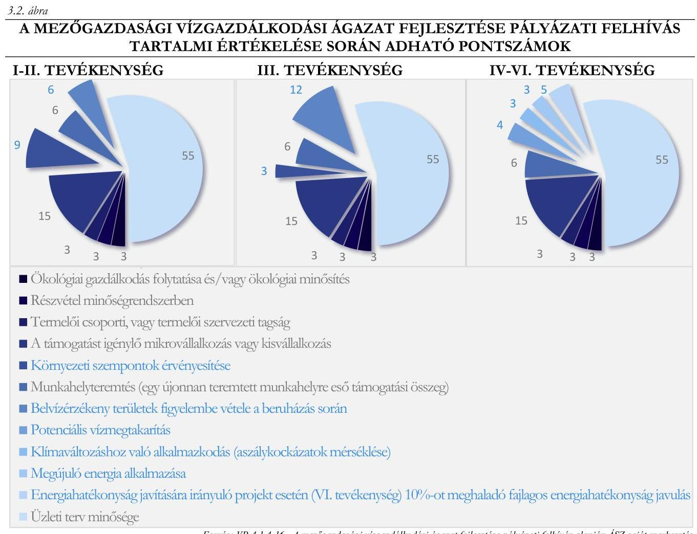

A vízvisszatartást, természetes szűrőmezők kialakítását támogató pályázatok esetében (I-II. tevékenységek) , a mezőgazdasági területekhez kapcsolódó meliorált utak kialakítását támogató III. tevékenység esetében, valamint az új és idősebb öntözőberendezések beszerzésére, azok vízhasználatának- és energiahatékonyságának javítására vonatkozó pályázatok (IV-VI. tevékenységek) esetében egyaránt elmondható, hogy az értékelési kritériumokra a 100 pontból a pontszámítás alapján 15 pontot (15%) lehetett fenntarthatósági kritériumokra kapni.
A pályázati felhívás üzleti tervre vonatkozó kitöltési útmutatója is tartalmazott fenntarthatóságra vonatkozó elemeket. Az üzleti tervben be kellett mutatni, hogy a projekt megvalósítása során a kedvezményezett hogyan biztosítja a fenntartható vízkészlet-gazdálkodást és mit tesz annak érdekében, hogy a fejlesztése hosszútávon fenntartható, jól működő maradjon. Az üzleti tervre maximálisan 55 pont volt adható, azaz a pontszám 55%-a, amelyből a fenntarthatóságra vonatkozó részek 50 M Ft teljes projektösszeget meg nem haladó támogatási kérelem esetében 25 pontot, 50 M Ft feletti támogatási kérelem esetében 15 pontot jelenthettek.
A mezőgazdasági vízgazdálkodási ágazat fejlesztése című pályázatban maximálisan 40 pont (50 M Ft alatti projekt) vagy 30 pont (50 M Ft feletti projekt) volt adható fenntarthatósági szempontokra a maximális 100 pontból.
A sikeres pályázathoz a maximálisan adható 100 pontból 40 pontra volt szükség, ami azt jelenti, hogy a fenntarthatósági szempontoknak való megfelelés nélkül is sikeresen lehetett pályázni a vízgazdálkodáshoz tartozó támogatott tevékenységekre.

---

A mezőgazdasági vízgazdálkodási ágazat fejlesztése uniós források felhasználása támogatási rendszerének kialakítása során beépítettek fenntarthatósági-, energia- és víztakarékossági szempontokat az értékelési rendszerbe, azonban azok nem képeztek olyan súlyt az értékelés során, hogy a fenntarthatósági szempontok érvényesülése minden esetben biztosított legyen.

# VP-2-4.1.3.2 - Kertészet korszerűsítése, öntözésfejlesztése 

A kertészeti ágazat versenyképességének fokozására, valamint innovatív és környezetbarát kertészeti technológiák és termesztési módok elterjesztésének támogatására 2017-2023. között pályázni lehetett ültetvény telepítésére és korszerűsítésére, illetve ehhez tartozóan víztározók létesítésére, öntözővízszolgáltató művek létrehozására, víztakarékos öntözési infrastruktúra és kapcsolódó műtárgyak kiépítésére vagy energiatakarékos öntözési technológiák beszerzésére. Az egyes támogatott tevékenységek értékelése során maximum 100 pont volt elérhető, ezek értékelési szempontjainak a megoszlását a 3.3. ábra tartalmazza.
3.3. ábra

KERTÉSZETEK KORSZERŰSÍTÉSE PÁLYÁZATI FELHÍVÁS TARTALMI ÉRTÉKELÉSE SORÁN ADHATÓ PONTSZÁMOK
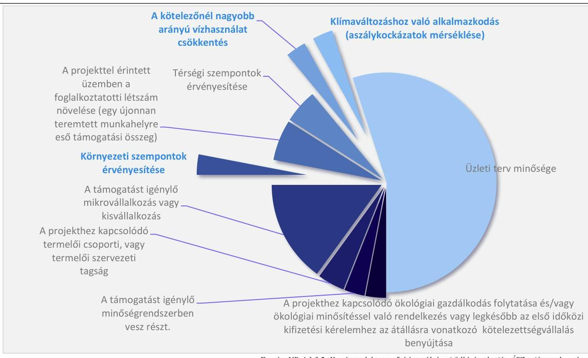

Forrás: VP-4.1.3.2. Kertészetek korszerűsítése pályázati felhívás alapján ÁSZ saját szerkesztés
A 3.3. számú ábrában felsorolt tartalmi értékelési szempontok közül több fenntarthatósági elemet
 tartalmazott, amelyek értékelési pontszáma az alábbi volt: a projekt során a környezeti szempontok érvényesítése (3 pont), vízhasználat csökkentés (legalább 10%-os vízfogyasztáscsökkenés a rekonstrukcióval (1 pont), vagy, 20%-ot meghaladó megtakarítás (3 pont), az aszálykárok mérséklése (3 pont)).
A Kertészet korszerűsítése, öntözésfejlesztése pályázati felhívás 17. számú melléklete, a mezőgazdasági vízgazdálkodás fejlesztéséhez hasonlóan tartalmazta az üzleti terv kitöltési útmutatóját, amelynek a II. fejezete a fenntarthatóságra vonatkozott, azonban az itt felsorolt kötelező tartalmi elemek csak a pályázó

---

vállalkozás gazdasági működésének fenntarthatóságára vonatkozott, nem pedig környezeti fenntarthatósági elemekre.
A támogatás elnyeréséhez minimum 40 pont volt szükséges, ebből a környezeti fenntarthatóságra maximálisan 9 pont volt adható a fentiek szerint. Ez azt jelentette, hogy a fenntarthatósági szempontokra kapható bírálat pontok nélkül is sikeresen lehetett pályázni kertészet korszerűsítésére.
Jóllehet az uniós támogatások értékelési rendszere a fenntartható vízgazdálkodás szempontjai mellett más elemeket is tartalmazott, a fenntartható vízkészletgazdálkodási szempontok érvényesülése az öntözésfejlesztések során a korábban bemutatott vízjogi engedélyezési rendszer működésével biztosított volt. A vízjogi engedélyezési rendszer, a fenntartható vízgazdálkodás uniós normáinak megfelelően, az öntözési vízhasználatot csak megfelelő minőségű, jótól nem rosszabb víztest esetében tette lehetővé, ezzel biztosítva a közös természeti kincs, a vízvagyon minőségének megőrzését.

# VP-16.5.2 Öntözési közösségek együttműködésének támogatása 

Az öntözési közösségek együttműködésének támogatása során az öntözési közösségek tagjainak partnerségi megállapodást kellett kötniük, amelyben meghatározták fejlesztési céljaikat. Ehhez járult hozzá támogatással a Kormány, a résztvevők pedig vállalták, hogy a támogatáson felüli projektrészt önerőből finanszírozzák.
A sikeres pályázathoz a maximális 100 pontból 40 pont kellett. A mezőgazdasági vízgazdálkodás, öntözésfejlesztést támogató pályázatokkal szemben az öntözési közösségek együttműködésének támogatását csak fenntarthatósági szempontok megvalósítása mellett lehetett elnyerni.
3.4. ábra

AZ ÖNTÖZÉSI KÖZÖSSÉGEK EGYÜTTMŰKÖDÉSÉNEK PÁLYÁZATI TARTALMI ÉRTÉKELÉSI SZEMPONTJAI
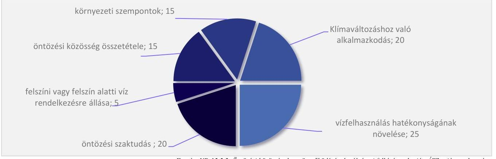

Forrás: VP-15.5.2. Öntözési közösségek együttműködésének pályázati felhívása alapján ÁSZ saját szerkesztés
Ezek értékelési szempontjait a 3.4. ábra tartalmazza. Sikeres pályázathoz szükséges volt a fenntarthatóság társadalmi elvárásainak teljesítésére. A működés során a vízügyi szaktudás biztosítása szakértő vagy szakember alkalmazásával 20 pontot jelentett a bírálat során. A felszíni vagy felszín alatti víz rendelkezésre állása maximálisan 5 pontot jelentett. A közösség összetételére, a minél nagyobb, fenntartható egyesülésre 15 pont volt maximálisan adható, ebből 10 pontot jelentett a tagok száma, 5 pont a fiatal gazdák jelenléte. A fenntartható környezeti szempontok érvényesítésére, a megújuló energia, technológia, vizek újrahasznosítására 15 pontot lehetett szerezni. A klímaváltozáshoz való alkalmazkodás, az aszályos területeken való működés további 20 pontot jelentett az értékelés során. A hatékony vízfelhasználás fokozása, hatékony agrotechnikai módszerek bevezetése maximálisan 25 pontot jelentett.

---

# A FENNTARTHATÓ AGRÁRGAZDÁLKODÁS 

Az öntözés hatására bekövetkező termelési értéknövekmény vizsgálata a hazai agrárgazdálkodás termelési szerkezetének, versenyképességének a kérdéséhez vezetett. Az értékelés kiinduló pontja volt, hogy a rendelkezésre álló erőforrásokat a legnagyobb társadalmi hasznot jelentő, az egységnyi erőforrásból a legnagyobb hozzáadott értéket előállító művelési ág, termény öntözésére célszerű felhasználni. Mivel az öntözés, öntözésfejlesztés eredményessége nem független a társadalmi célrendszertől, az agrártermelés szerkezete, az öntözött növénykultúrák jellemzői, azok többletértéktermelő képessége mellett fontos az ezek mellett meghatározott társadalmi igények elérése, az élelmiszerbiztonság, mezőgazdaság önellátása, a gazdák igényeinek teljesítése is.
Az öntözéses-statisztikai adatok azt mutatják, hogy az öntözés hozzáadottérték-termelő képessége az intenzív agrárgazdálkodás, a gyümölcs- és zöldségtermelés, valamint a zöldtakarmánytermelés mellett a legnagyobb hazánkban és az EU-ban egyaránt. Azonban a hazai öntözött földek termelési szerkezetének változása nem mutat az intenzív agrárgazdálkodás irányába. Előzőek mellett azt is fontos leszögezni, hogy a mai klimatikus viszonyok mellett az öntözéses gazdálkodás már nem kizárólag a többletjövedelem, hanem inkább a termésbiztonság elérésének az eszköze.
A fenntartható agrárgazdálkodás és az öntözésfejlesztés kapcsolatának vizsgálata összetettebb közgazdasági elemzést tesz szükségessé. A rendelkezésre álló dokumentumok alapján megállapítható, hogy az öntözéses gazdálkodás, öntözésfejlesztés állami támogatásának társadalmi-gazdasági hatáselemzésére nem került sor. A kormányzati előterjesztések, kutatások nem vizsgálták az öntözéstámogatás rendszerének fenntarthatóságát, az öntözés hozzájárulását a termésbiztonsághoz, az értéktermelési folyamatokhoz.
A feldolgozott hazai és uniós agrárstatisztikai adatok azt mutatják, hogy az öntözéssel elérhető többletérték nagysága nem független az agrártermelés intenzitásától, a termelt növény típusától. Az adatok alapján az Európai Unióban az öntözés az intenzív mezőgazdasági termeléssel jár együtt.
Az öntözésfejlesztésre fordított források felhasználásának értékeléséhez szükséges az öntözés társadalmi-gazdasági jellemzőit, hasznosságát, az öntözéssel megtermelhető többletértéket számba venni. Az egységnyi területen öntözéssel elérhető többletértéket két tényező, az öntözés következtében realizálható többlethozam és a felvásárlási ár határozza meg. A közgazdasági értékkalkulációk a gazdák által szolgáltatott agrárstatisztikák és a KSH kapcsolódó statisztikai adatainak felhasználásával készültek ${ }^{11}$.

[^0]
[^0]:    ${ }^{11}$ Az öntözés közgazdasági hatásának, értéktöbbletének számbavételéhez az ellenőrzés felhasználta az AKI által az ellenőrzés részére szolgáltatott adatokat, ASIR OSAP 2336 Öntözés művelési áganként tábláit, 2019-2022. évekre vonatkozóan. A táblázatok a gazdálkodók adatszolgáltatása alapján tartalmazták művelési áganként, főbb terményenként az öntözött és az összesen művelt területekre vonatkozó átlagos termésátlagokat. Az előbbi adatokból meghatározható a nem öntözött területek termésátlaga. Az öntözött és nem öntözött területekre termésátlag különbsége alapján számolható az öntözés hatására keletkező termelési értéknövekmény.
    Öntözött területek többlethozama = (Öntözött területek termésátlaga - nem öntözött területek termésátlaga) * felvásárlási átlagár
    (A termények felvásárlási átlagárait a KSH 1.1.1.13. Gabonafélék felvásárlási átlagára; 1.1.1.16 Ipari növények felvásárlási átlagára; 1.1.1.18. Zöldségfélék felvásárlási átlagára; KSH 1.1.1.20. Gyümölcsök felvásárlási átlagárai adattábláit alapján határoztuk meg).

---

Az ASIR öntözés-statisztikai adatok alapján 2019-2022. évre kalkulálható az ágazat öntözés hatására keletkezett bruttó hozzáadott értéknövekményének nagysága. Az évről évre kalkulált országos összesen hozzáadottérték növekmény adatokat terménycsoportonként mutatja a 3.5. ábra. Az ábráról látható, hogy öntözés következtében keletkezett többlet hozzáadottérték több, mint háromszorosára, 8,2 Mrd Ft-ról 29,5 Mrd Ft-ra emelkedett 2019 és 2022 között. A bemutatott többletérték növekedés az öntözés hatására keletkezett terménymennyiségen túl az aszályos időszakban jelentősen megemelkedett felvásárlási árakkal is magyarázható.
A gazdák által, az ASIR rendszerben szolgáltatott termelés-statisztikai adatokból meghatározható terménycsoportok szerint az egységnyi területen, öntözés hatására keletkezett többletérték átlagos éves nagysága is (3.6. ábra). Az ábráról látható, hogy az elemzett időszakban a művelési ágak közül az öntözés hatására realizált legnagyobb többlet hozzáadott érték az öntözött gyümölcsösökben és a takarmánynövényeknél keletkezett.
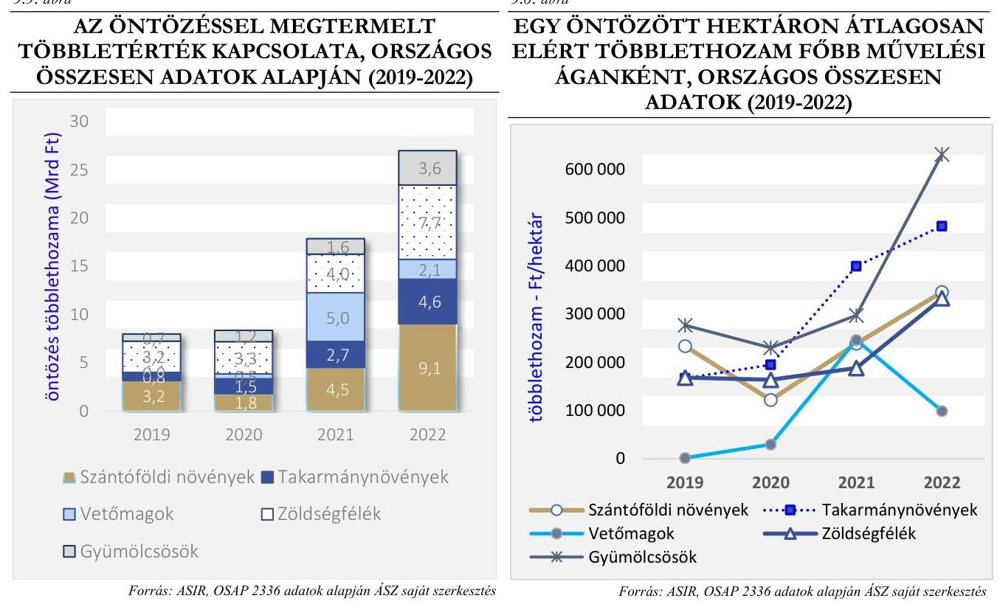

# Az öntözéssel előállított mezőgazdasági többletérték nagysága az időszak alatt háromszorosára nőtt. 

Az uniós statisztikai adatok a hazai eredménnyel azonos irányt mutatnak, amelyek szerint a művelési ágak közül az öntözött gyümölcsösök, ültetvények többletértéktermelő képessége a legjelentősebb. Öntözéssel egy hektáron a legnagyobb többletértéket intenzív agrárgazdálkodással lehet elérni a hazai adatok szerint is. Hazai sajátosság azonban az öntözött takarmánynövények számottevő többletértéket, hozzáadott értéket mutató jellemzői (483 ezer Ft/hektár 2022-ben).
Az intenzív öntözéses gazdálkodással elérhető többletértéknek jelentős beruházási, valamint tudás- és munkaerőigénye van, ennek hiánya meghatározza a hazai mezőgazdasági termelésszerkezetet. Kutatások igazolják, hogy a mezőgazdaság versenyképességének fokozása, a közös természeti erőforrások gazdaságos felhasználása, fenntarthatósága érdekében szükséges a klímaváltozáshoz alkalmazkodó termelési szerkezet meghatározása, támogatása.

---

# A FENNTARTHATÓSÁG TÁRSADALMI KERETEI 

Az öntözéses gazdálkodás hosszú távú társadalmi-gazdasági fenntarthatóságának kérdése szorosan összekapcsolódik az agrártársadalom gazdasági, szociális, kulturális helyzetével, a birtokszerkezettel, a gazdálkodók életkorával, szakismereteivel, tudásával, nyitottságával az új ismeretek megszerzésére.
A 2020. évi agrárcenzus alapján a mezőgazdaságban foglalkoztatottak 35%-a 65 évnél idősebb, illetve további 46,3%-a 45 év fölötti, és mindössze 18,7% volt 45 év alatti.
Az öntözött földek birtokszerkezetét tekintve megállapítható, hogy az öntözött földek birtokkoncentrációja még nagyobb, mint a megművelt földeké. Jellemzően 100 hektár feletti birtokok által megművelt földek teszik ki az összes mezőgazdasági művelés 65,0%-át, az összes öntözött területnek pedig ennél nagyobb részét, 77,4%-át. Ezen adatok alapján, valamint a jelentés első fókuszterületénél részletezett megállapításokból következően a hazai árpolitika 2023. évtől az állam által átvállalt ingyenes vízdíjjal leginkább a 100 hektár fölötti nagybirtokokat támogatta.

## OKTATÁS, TUDÁSÁTVETEL

A mezőgazdasági és vízügyi területi képzések a mezőgazdaságban foglalkoztatottak számához mérten elegendőnek mondhatóak, ha azonban a mezőgazdaságban foglalkoztatottak korfáját is figyelembe vesszük, a munkaerő indokolt ütemben történő pótlását nem biztosították.
A hosszú távon fenntartható öntözéses gazdálkodás intenzív agrártermelés mellett valósítható meg. Az intenzív agrárművelés magas szintű biológiai- és agrotechnikai ismereteket, a tervezett gazdálkodás magas szintű agrárszakmai ismereteket követel meg. Az ellenőrzés megvizsgálta a hazai öntözéses gazdálkodás elterjedését segítő és gátló tudáselemeket.
Országos kitekintés: A mezőgazdasági vízgazdálkodáshoz tartozóan a vízügyi és a mezőgazdasági szakképzéseken és felsőfokú képzéseken is releváns tudást, szakismereteket oktattak. A 2022. évet vizsgálva a 4. számú táblázatban láthatóak a felsőfokú és középfokú képzésekben résztvevő tanulók létszámai. Az agrár szakterületen nagyságrendekkel nagyobb létszámban vesznek részt a tanulók, mint vízügyi képzésekben, illetve az oktatási intézmények tekintetében elmondható, hogy több agrár képzési hely van az országban, mint vízügyi ismereteket adó.
4. táblázat

AGRÁR ÉS VÍZGAZDÁLKODÁS TERÜLETÉN TANULÓK SZÁMA A KÖZÉP SZINTŰ ÉS A FELNÖTT SZINTŰ KÉPZÉSBEN (2022)

| KÉPZÉSI <br> TERÜLET | FELSÓOKTATÁSBAN <br> TANULÓ HALLGATÓK <br> SZÁMA | INTÉZMÉNYEK <br> SZÁMA | KÖZÉPFOKÚ <br> KÉPZÉSBEN RÉSZT <br> VEVŐ TANULÓK <br> SZÁMA | INTÉZMÉNYEK <br> SZÁMA |
| :-- | :--: | :--: | :--: | :--: |
| Agrár | 2417 | 7 | 6107 | 65 |
| Vízgazdálkodás | 213 | 6 | 450 | 19 |

A KSH „Magyarország számokban 2022" című kiadványa alapján 2022-ben a mezőgazdaságban 201 ezer fő dolgozott, amelyhez viszonyítva az agrár és a vízügyi képzésekből együttesen 9,2 ezer tanuló került ki. Mindezek alapján megállapítható, hogy a szakismeretek korszerűsítéséhez, a generációváltáshoz 22 évre lenne szükség. Ez rámutat az oktatáson kívüli ismeretátadás kiemelt fontosságára.

---

A MATE Magyarországon a legnagyobb agrárközpontú képzési intézmény, amely a mezőgazdaság irányítását és működtetését segítette különböző agrárképzésekkel. A MATE és a 2021. február 1. előtti jogelőd Szent István Egyetem a mezőgazdasági vízgazdálkodást érintő szakokon 2019-2023. között 3386 hallgató számára tartott képzéseket, illetve további 2158 hallgató számára oktatott mezőgazdasági vízgazdálkodást érintő tantárgyakat, hozzásegítve ezzel az agrárszektort és a vízügyi ágazatot a mezőgazdasági vízgazdálkodásra (ideértve a korszerű, fenntartható öntözést, vízvisszatartást) vonatkozó tudásának bővítéséhez.

# SZARVASI BEMUTATÓ GAZDASÁG ÉS KÉPZÉSI CENTRUM 

Az eredeti kormányzati szándék, az országos öntözési képzési központ megvalósításának elakadását okozta, hogy az ellenőrzött időszak alatt többször változott a feladatért felelős minisztériumi szakterület, illetve átalakult a szarvasi intézmény működését meghatározó szakmai keretrendszer is.
A Kormány fontosnak tartotta egy a gazdálkodók korszerű szakismereteit biztosító országos öntözési képzési központ létrehozását. A képzési központ helyszíneként a több évtizedes kutatási tapasztalatokkal rendelkező Szarvasi Öntözési és Vízgazdálkodási Kutatóközpontot (ÖVKI) ${ }^{30}$ jelölte ki. Az 1800/2018. (XII. 21.) Kormányhatározat 12. pontja felhivta az agrárminisztert, hogy vizsgálja meg a Szent István Egyetem, (MATE jogelődje) és a Nemzeti Agrárkutatási és Innovációs Központ (NAIK) ${ }^{31}$ együttműködésében öntözésfejlesztési
 bemutató gazdaság és képzési központ kialakításának lehetőségét Szarvas városában, és nyújtson be ennek eredménye alapján javaslatot a Kormány elé.
A támogatás eredeti koncepciója az volt, hogy a szarvasi telephelyen működő NAIK Öntözési és Vízgazdálkodási Kutatóközpontjának több évtizedes oktatási és kutatási ismereteit és a kiépült, már meglévő infrastruktúráját kiegészítve, komplementer jelleggel épüljön ki egy országos ismeretterjesztést, öntözési szakismereteket szolgáló bemutató gazdaság és egy képzési központ. Ennek alapján a szarvasi bemutató központ kialakítására az AM, mint támogató a NAIK-kal, mint kedvezményezettel 2020-ban - két támogatói okiratban - támogatási szerződést kötött, összesen 300 M Ft összegben. Majd 2021-ben akkor már a MATE részére további 200 M Ft támogatást biztosított a minisztérium. A szarvasi bemutató és képzési központ megvalósítására 3 támogatásból összesen 500 M Ft kifizetése történt.
A kormányzati célok megvalósulásában kockázatot jelent az ÖVKI szakmai feladatainak, szervezeti kereteinek változása. A kormányzati célok meghatározásakor az ÖVKI a NAIK () intézménye volt, ennek 2021 január végi megszűnése után a Szent István Egyetem (SZIE) ${ }^{32}$ jogutód szervezetként vette át az intézmény tevékenységének, feladatainak koordinálását, felsőoktatásba integrálását. A SZIE Agrár- és Gazdaságtudományi Kara Szarvason működött. A SZIE átalakulásával 2021 júniusától a támogatásokat, és az ÖVKI működését a MATE felügyelte.
A 2020. január 13-i keltezésű első támogatói okirattal az AM 150 M Ft előleget bocsátott a NAIK rendelkezésére, a szarvasi képzési központ felmerülő költségeire. A támogatói okirat költségtervét 2020. november 28-án módosították. A támogatás terhére ténylegesen elszámolt költségek az informatikai eszközöknél 20,5%-kal meghaladták a módosított okiratban szereplő összeget.
A 2020. szeptember 15-i keltezésű második támogatói okirattal az AM további 150 M Ft előleget bocsátott a NAIK rendelkezésére a szarvasi képzési központ kialakítására. A támogatás felhasználásáról a NAIK az előírt beszámolót elkészítette.

---

A 2021. június 28-i keltezésű harmadik támogatói okirattal az AM 200 M Ft támogatást nyújtott, ezúttal már a MATE részére a szarvasi bemutató központ kialakításához. A támogatói okiratot egyszer, 2021. december 10-én módosították, amelyben a beszámoló benyújtásának a határidejét 2022. szeptember végével határozták meg. A támogatás terhére ténylegesen elszámolt 200 M Ft támogatási összegből $102,0 \mathrm{MFt}(51,1 \%)$ felhasználása a támogatási szerződésben megadott 2022. szeptember végi határidőn túli volt.
A szarvasi képzési központ kialakítására felhasznált források megoszlását mutatja a 3.7. ábra, amelyről látható, hogy a támogatások felét ingatlanok létesítésére, negyedét tárgyi eszközök, öntözőrendszerek, és azok tartozékainak beszerzésére, míg informatikai eszközök beszerzésére 12%-ot fordítottak.
3.7. ábra

SZARVASI KÉPZÉSI KÖZPONT KIALAKÍTÁSÁNAK FELHASZNÁLÁSA 2020-2023
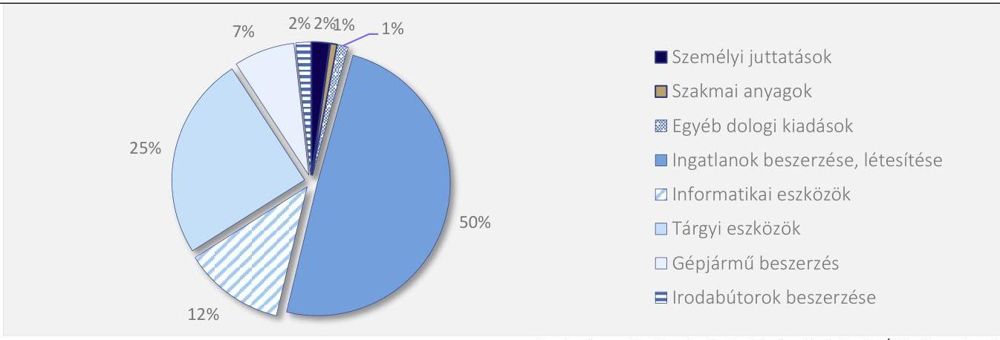

Forrás: támogatói okiratok, pénzügyi elszámolásai alapján ÁSZ saját szerkesztés
Az országos öntözési képzési központ koncepció megvalósítása során a minisztériumon belül többször változott a szakmai felelős terület. Az országos képzési központ koncepciót 2019-ben az Agrármodernizációs Főosztály dolgozta ki. Az első két támogatást 2020-ban az AM kötötte a NAIK ÖVKI-vel, a harmadik támogatást 2021-ben a MATE-val.
Az ÁSZ ellenőrzése a bemutató gazdaság és képzési központ kialakítására és működésére beszerzett egyes eszközöket és ingatlan kialakításokat szemrevételezés keretében fellelte. (A támogatás 44,7%-nyi értékét képező eszközök szemrevételezése történt meg). A MATE a központ látogatottságára, kihasználtságára vonatkozó adatokkal nem rendelkezett. A kihasználtságra vonatkozó adatok hiányában a támogatás felhasználásának és a központ kialakításának az eredményessége nem volt mérhető és értékelhető.
A képzési és bemutató központ megvalósítására javaslatot tevő, és a megvalósításhoz forrást biztosító AM a működésre vonatkozóan adatokkal nem rendelkezett. Az AM a kormányzati célkitűzés megvalósítására, a képzési központ tevékenységére, feladatellátására, működésére vonatkozóan adatszolgáltatási kötelezettséget nem írt elő, a projekt sikerességére vonatkozó információval nem rendelkezett. A működésre vonatkozó információk hiányában nem volt megállapítható, hogy a képzési központ megvalósítása a kitűzött célok elérését milyen mértékben szolgálta.

---

# JAVASLATOK 

Az ÁSZ tv. 33. § (1) bekezdésében foglaltak értelmében az ellenőrzött szervezet vezetője köteles a jelentésben foglalt megállapításokhoz kapcsolódó intézkedési tervet összeállítani és azt a jelentés kézhezvételétől számított 30 napon belül az ÁSZ részére megküldeni. Amennyiben az ellenőrzött szervezet vezetője nem küldi meg határidőben az intézkedési tervet, vagy továbbra sem elfogadható intézkedési tervet küld, az Állami Számvevőszék elnöke az ÁSZ tv. 33. § (3) bekezdése a) és b) pontjaiban foglaltakat érvényesítheti.

## AZ AGRÁRMINISZTER RÉSZÉRE

1. Készítsen koncepciót arra vonatkozóan, hogy a szarvasi bemutató és képzési központ működtetése hogyan állítható hatékonyan a mezőgazdasági és a vízügyi szakképzés, illetve a mezőgazdasági termelők ismereteinek bővítése szolgálatába.
2. Az öntözéses gazdálkodás közgazdasági hatásainak folyamatos értékelése érdekében fontolja meg az ezt megalapozó, öntözéses gazdálkodásra vonatkozó adatgyűjtés visszaállítását.

## AZ ENERGIAÜGYI MINISZTER RÉSZÉRE

1. Az agrárminiszter bevonásával folyamatosan gyűjtse és kövesse nyomon az illegális vízkivételekről becsült adatokat. Az illegális vízkivételek visszaszorítása érdekében térképezze fel a beavatkozás lehetséges eszközeit és tegye meg a szükséges intézkedéseket.
2. Az agrárminiszter bevonásával, az agrárium versenyképességének és a termelésbiztonság növelésének érdekében az öntözésfejlesztések agrártámogatásán felül ösztönözze azonos mértékben a vízvisszatartáshoz, a vízmegtartáshoz tartozó tevékenységeket, a hatékony vízfelhasználási technológiák elterjedését, mivel az öntözött területek arányának emelése mellett a rendelkezésre álló vízkészlet hatékony felhasználása is elengedhetetlen.
3. Az agrárminiszterrel együttműködve folytassa a meliorált területek felmérését, az állapotértékeléseket, illetve végezze el a rendszerek működésének hatékonysági szempontú értékelését. A jövőbeni öntözésfejlesztéssel érintett területeken, a fejlesztéseket megelőzően mérje fel a vízvisszatartást támogató melioráció lehetőségeit.

---

4. Az agrárminiszter bevonásával határozza meg a mezőgazdasági vízszolgáltatáshoz kapcsolódó közfeladatok jellegét, (a mezőgazdasági vízügyi infrastruktúra fenntartási költségének igazságos elosztását), az öntözéshez kapcsolódó állami feladatok körét, ennek keretében a harmadlagos művek üzemeltetésének felelőseit.
5. Gondoskodjon az állami vízügyi infrastruktúra állapotának folyamatos monitorozásáról és naprakész nyilvántartásáról, továbbá szükség szerinti karbantartásáról és fejlesztéséről a hosszú távú vízkészletgazdálkodási fenntarthatósági szempontok figyelembevételével.

# A MAGYAR AGRÁR- ÉS ÉLETTUDOMÁNYI EGYETEM REKTORA RÉSZÉRE 

1. Alakítson ki és kövesse nyomon a szarvasi képzési és bemutatóközpont működése eredményességének és teljesítményének értékelésére szolgáló mennyiségi és/vagy minőségi mutatókat, kritériumokat.

---

# MELLÉKLETEK 

## I. SZ. MELLÉKLET: ÉRTELMEZŐ SZÓTÁR

egynyári öntözés
egyszerűsített öntözési vízhasználat
öntözéses előhaszonbérleti jog
eredményesség elve
fenntartható fejlődés
harmadlagos mű
illegális vízkivétel
környezeti körzeti terv

Egy öntözési idényben, közvetlenül felszíni vízből, ideiglenes szivattyúállással, maximum 120 mm / hektár ( $1200 \mathrm{~m}^{3} /$ hektár) öntözővíz kijuttatása, legfeljebb 100 hektár nagyságú területre.
(Forrás: 147/2010. (IV. 29.) Korm.r. ${ }^{33}$ 2019. december 31-ig hatályos 2. § 10a. pont.)
100 hektár alatti öntözendő terület esetében olyan öntözési célú vízhasználat, amely során a vízkivétel és a vízellátás ideiglenes szivattyúállással - telepített vízelosztó-hálózat nélkül - felszíni vízből biztosított a rendelkezésre állásig. (Forrás: 147/2010. (IV. 29.) Korm.r. 2. § 10a. pont.)
Első hellyel megegyező ranghelyen illeti meg előhaszonbérleti jog a szántó, szőlő, gyümölcsös, kert művelési ágban nyilvántartott föld haszonbérbe adása esetén a föld területe legalább fele részének öntözhetőségét biztosító és a földdel alkotórész kapcsolatba kerülő öntözésfejlesztési beruházást végrehajtó földművest vagy mezőgazdasági termelőszervezetet, ha a haszonbérleti szerződés időtartamának legalább fele részében a végrehajtott öntözésfejlesztési beruházás a számvitelről szóló törvény rendelkezései szerint még értékkel bír.
(Forrás: Földforgalmi tv. ${ }^{34}$ 46. § (3) bekezdés e) pont.)
Az eredményesség elve a kitűzött célok és a szándékolt eredmények (hatások) elérését jelenti. A feladatellátás eredményességét mutatja a tényleges és a tervezett eredmények (hatások) összevetése.
(Forrás: ÁSZ: A teljesítmény-ellenőrzés alapelvei. 2015.)
Társadalmi-gazdasági viszonyok és tevékenységek rendszere, amely a természeti értékeket megőrzi a jelen és a jövő nemzedékek számára, a természeti erőforrásokat takarékosan és célszerűen használja, ökológiai szempontból hosszú távon biztosítja az életminőség javítását és a sokféleség megőrzését.
(Forrás: Kvt. ${ }^{35}$ 4. § 29. pont.)
A vízügyi igazgatási szervek által kezelt és üzemeltett vízilétesítmény, valamint a mezőgazdasági öntözési igények tényleges felmerülésének helye között elhelyezkedő üzemi szintű mezőgazdasági vízellátást biztosító, öntözési célú vagy kettős működésű vízilétesítmény és az öntözési körzet többletvizeit elvezető vízilétesítmény.
(Forrás: Ögtv. 1. § 1. pont.)
Az illegális vízkivételek két csoportba oszthatók: nem engedélyezett kutak, engedélyezett kutak, ahol a bevallott kisebb a tényleges használatnál.
(Forrás: VGT3.)
Az öntözési beruházásra vonatkozó környezetvédelmi, természetvédelmi és talajvédelmi előírásokat tartalmazó, az illetékes hatóság jóváhagyó határozatával hatályba lépő, a kiadásától számított 20 évig hatályos terv. Az érvényes környezeti körzeti terv a benne meghatározott környezetvédelmi, természetvédelmi és talajvédelmi előírások tekintetében hatósági engedélynek vagy szakhatósági állásfoglalásnak minősül. Az érvényes környezeti körzeti tervnek megfelelő öntözéses beruházást a környezeti körzeti tervben meghatározott feltételek szerint nem kell lefolytatni.
(Forrás: Ögtv. 10. § (2) bekezdés.)

---

mezőgazdasági célú vízhasználat
mezőgazdasági öntözési célú kút
mezőgazdasági vízhasználó
mezőgazdasági vízszolgáltatás
mezőgazdasági vízszolgáltatási díj
öntözés
öntözésfejlesztési terv

Felszíni vízből a mezőgazdasági vagy erdőgazdasági művelés alatt álló területek öntözését vagy halastavak vízellátását biztosító, vízjogi üzemeltetési engedély alapján történő vízhasználat, vagy bejelentés alapján történő rendkívüli öntözési célú vízhasználat.
(Forrás: 115/2014. (IV. 3.) Korm. r. 1. § 1. pont.)
Olyan felszín alatti vízkivételt biztosító vízilétesítmény, amely kizárólag mezőgazdasági művelés alatt álló terület mezőgazdasági vízszolgáltatását biztosítja.
(Forrás: Vgtv. 1. számú melléklet 35. pont.)
A mezőgazdasági vízszolgáltató rendszerre csatlakozott, mezőgazdasági vagy erdőgazdasági művelés alatt álló területek öntözésére vagy halastó vízellátását biztosító vízhasználatra kiadott vízjogi üzemeltetési engedéllyel rendelkező, valamint a rendkívüli öntözésre bejelentés alapján jogosult természetes vagy jogi személy, vagy jogi személyiség nélküli szervezet.
(Forrás: 115/2014. Korm. r. 1. § 2. pont.)
A mező- és erdőgazdasági művelés alatt álló területek öntözését, a halastavak és egyéb mezőgazdasági vízhasználat vízellátását szolgáló, továbbá a mezőgazdasági vízszolgáltatási rendszerhez kapcsolódó, egyéb célú vízigények kielégítésére irányuló tevékenység.
(Forrás: Vgtv. 1. számú melléklet 41. pont.)
A mezőgazdasági vízszolgáltatás igénybevétele után a szolgáltató részére fizetendő, a rendelkezésre állást biztosító alapdíjból és a felhasznált vízmennyiséggel arányos díjból álló kéttényezős, a vízszolgáltatási idényre időarányosan megállapított díj, melynek célja a mezőgazdasági vízszolgáltatás folyamatos és hatékony működtetéséhez, hosszú távú fenntartásához szükséges fedezet biztosítása.
(Forrás: Vgtv. 15/F. § (1), (3) és (4) bekezdés.)
A természetes csapadék mesterséges pótlása érdekében, a vízügyi hatóság által engedélyezett mező- vagy erdőgazdasági művelés alatt álló területen történő vagy a jogszabály alapján öntözhető gyepterület fenntartását biztosító vízhasználat. (Forrás: 147/2010. (IV. 29.) Korm.r. 2. § 24. pont.)
Az öntözési igazgatási szerv által az öntözésfejlesztési területre készített terv, mely a kijelölt hatóság jóváhagyásával válik érvényessé. Tartalmazza az öntözésfejlesztési területen az öntözéssel összefüggő természeti feltételeket, a domborzati, vízrajzi, vízföldtani és talajtani adottságokat, amelyek figyelembevételével az öntözésfejlesztési tervet jóváhagyó határozatban meghatározásra kerül, hogy a kijelölt területen milyen természetvédelmi, környezetvédelmi, talajvédelmi feltételekkel lehetséges az öntözéses gazdálkodás folytatása. Az érvényes öntözésfejlesztési tervnek megfelelő öntözéses beruházáshoz és az öntözésfejlesztési tervet jóváhagyó határozatban meghatározott feltételek szerint történő öntözéses gazdálkodás végzéséhez nem kell lefolytatni a környezetvédelmi, természetvédelmi, talajvédelmi engedélyezési vagy szakhatósági eljárást. Az érvényes öntözésfejlesztési terv az abban meghatározott természetvédelmi, környezetvédelmi, talajvédelmi előírások tekintetében hatósági engedélynek vagy szakhatósági állásfoglalásnak minősül. Az öntözésfejlesztési terv határozatlan időre szól.
(Forrás: Ögtv. 6. § (1)-(4) bekezdés.)

---

öntözési körzet
öntözött terület
rendkívüli öntözési célú vízhasználat
stratégiai tervdokumentum
versenyképesség
vízgazdálkodás
vízilétesítmény
vízkészletjárulék (VKJ)
2020. január 1-től 2021. december 31-ig: Az öntözési közösség működésére szolgáló terület, amely az öntözési közösség tagjai
 által öntözni kívánt földterületeket, valamint a közösség tagjai használatában nem álló közbeékelődött területeket foglalja magába, amelyeket az öntözési közösség elismeréséről szóló döntés tartalmaz.
2022. január 1-től 2023. június 30-ig: Az öntözési közösség elismeréséről szóló döntésben meghatározott, az öntözési közösség működésére szolgáló és az öntözési közösség tagjai által öntözni kívánt külterületi földrészleteket magába foglaló terület.
2023. július 1-től: A fenntartható vízgazdálkodási közösség elismeréséről szóló döntésben meghatározott, a fenntartható vízgazdálkodási közösség működésére szolgáló és a fenntartható vízgazdálkodási közösség tagjai által öntözni kívánt külterületi földrészleteket magába foglaló terület.
(Forrás: Öntv. 1. § 5. pont.)
Az év folyamán legalább egyszer öntözött terület.
(Forrás: https://www.ksh.hu/docs/hun/agrar/html/fogalomtar.html)
A tartósan vízhiányos időszakban, közvetlenül felszíni vízből, ideiglenes szivattyúállással, legfeljebb $120 \mathrm{~mm} /$ hektár ( $1200 \mathrm{~m}^{3} /$ hektár) vízmennyiség 100 hektár nagyságot meg nem haladó területre öntözési célból, legfeljebb megszakítás nélkül egy hónap időtartamig történő kijuttatása. (Forrás: 72/1996. (V. 22.) Korm. r. 5. § (14) bekezdés.)
Az országelőrejelzés, a nemzeti középtávú stratégia, a miniszteri program, az intézményi munkaterv, továbbá a hosszú távú koncepció, a fehér könyv, a szakpolitikai stratégia, a szakpolitikai program, az intézményi stratégia és a zöld könyv.
(Forrás: 38/2012. (III. 12.) Korm. r. ${ }^{36}$ 7. § 2. pont.)
A gazdaság hosszú távú teljesítményét meghatározó tényezők összességének színvonala, amelyek kiterjednek többek között a termelékenységre, az emberi erőforrás mennyiségére és minőségére, a technológiai haladásra, a szabályozói környezetre, a vállalkozói attitűdre, a finanszírozási lehetőségekre, valamint a társadalmi és környezeti fenntarthatóságra. (Forrás:https://www.mnb.hu/kiadvanyok/jelentesek/versenykepessegijelentes.)
A vizek hasznosítása, hasznosítási lehetőségeinek megőrzése, a vizek kártételei elleni védelem és védekezés (vízkárelhárítás).
(Forrás: Vgtv. 1. számú melléklet 22. pont.)
Az a mű (víziközmű), műtárgy, berendezés, felszerelés vagy szerkezet, amelynek rendeltetése, hogy a vizek lefolyási, áramlási viszonyait, mennyiségét vagy minőségét, medrének vagy partjának állapotát, a vizek kártételeinek elhárítása, a vizek hasznosítása - ideértve a víziközművekkel végzett közüzemi tevékenységgel nyújtott szolgáltatást -, minőségének és mennyiségének megfigyelése, illetve ásványi és földtani kutatások végzése céljából vagy ásványi nyersanyag kitermelése céljából befolyásolja:
(Forrás: Vgtv. 1. számú melléklet 26. pont.)
A vízhasználó által a vízjogi létesítési, üzemeltetési engedélyben lekötött vagy engedély nélkül felhasznált vízmennyiség után fizetendő járulék. (Forrás: Vgtv. 15/A. $\S$ (1) bekezdés.)
A vízkészletjárulék mértékét a 43/1999. (XII. 26) KHVM rendelet alapján kell meghatározni.

---

# II. SZ. MELLÉKLET: AZ ELLENŐRZÖTT SZERVEZETEK JEGYZÉKE 

| ADOSZÁM | ELLENŐRZÖTT SZERVEZET MEGNEVEZÉSE |
| :--: | :--: |
| 15305679-2-41 | Agrárminisztérium |
| 15311605-2-41 | Belügyminisztérium |
| 15796019-2-41 | Országos Vízügyi Főigazgatóság |
| 19294784-2-44 | Magyar Agrár- és Élettudományi Egyetem |
|  | ELLENŐRZÉST TÁMOGATÓ SZERVEZET MEGNEVEZÉSE |
| 28953409-2-43 | AKI Agrárközgazdasági Intézet Nonprofit Korlátolt Felelősségű Társaság |
| 15329970-2-41 | Magyar Államkincstár |
| 18399257-2-43 | Magyar Agrár-, Élelmiszergazdasági és Vidékfejlesztési Kamara |
| 15308373-2-08 | Észak-dunántúli Vízügyi Igazgatóság |
| 15308380-2-42 | Közép-Duna-völgyi Vízügyi Igazgatóság |
| 15308397-2-03 | Alsó-Duna-völgyi Vízügyi Igazgatóság |
| 15308407-2-07 | Közép-dunántúli Vízügyi Igazgatóság |
| 15308414-2-02 | Dél-dunántúli Vízügyi Igazgatóság |
| 15308421-2-18 | Nyugat-dunántúli Vízügyi Igazgatóság |
| 15308438-2-15 | Felső-Tisza-vidéki Vízügyi Igazgatóság |
| 15308445-2-05 | Észak-magyarországi Vízügyi Igazgatóság |
| 15308452-2-09 | Tiszántúli Vízügyi Igazgatóság |
| 15308469-2-16 | Közép-Tisza-vidéki Vízügyi Igazgatóság |
| 15308476-2-06 | Alsó-Tisza-vidéki Vízügyi Igazgatóság |
| 15308483-2-04 | Körös-vidéki Vízügyi Igazgatóság |

---

# FOKUSZTERÜLET/FOKUSZKÉRDÉS ÉS ELLENŐRZÉSI KRITÉRIUMOK 

1. A mezőgazdasági vízgazdálkodás stratégiai keretrendszere, irányítása
2. Az öntözés támogatására és öntözésfejlesztésre rendelkezésre álló források felhasználása, az öntözhető/öntözött területek változása

A mezőgazdasági vízgazdálkodás fejlesztését érintő stratégiai célokat megalapozták, a hazai stratégiák, koncepciók és hosszú távú tervek az ágazat fejlesztési céljaival összhangban készültek, a hazai stratégiák, koncepciók és hosszú távú tervek dokumentumai között nincs ellentmondás; közöttük biztosított a tartalmi, logikai, egymásra épülési vagy egymást kiegészítő jellegű összhang; összhangban készültek el a nemzetközi és az uniós célrendszerekkel.
A mezőgazdasági vízgazdálkodás fejlesztését érintő hazai stratégiák, koncepciók és hosszú távú tervek a hasznosítható vízkészletek hosszú távú védelmére alapozott fenntartható vízhasználat alapelveit rögzítik, továbbá ösztönzik a fenntartható mezőgazdasági vízhasználatot.
A stratégiai tervdokumentumok, a meghatározott feladatok nyomon követése, értékelése, felülvizsgálata megtörtént, a feltárt hiányosságokra intézkedési terv készült.
Az ellenőrzött időszakban a mezőgazdasági vízgazdálkodást érintő jogi környezet stabil volt.
Az irányítási feladatok a szervezetrendszer szereplőihez egyértelműen hozzárendeltek, és az irányítási feladatok megszervezése támogatja az egységes, integrált szemléletű stratégiai döntéshozatalt.
A szabályozási rendszer (jogszabályi és belső) biztosítja a feladatok ellátásához szükséges kapcsolattartást és együttműködést.
A vízkészletjárulék-, mezőgazdasági vízszolgáltatási díjkedvezmények-, alkalmazott árpolitika terén az ágazatközi koordináció működött.
A vízkészletjárulék és mezőgazdasági vízdíjak, változtatásának, változásának okai, indokai alátámasztottak voltak.

Az öntözési infrastruktúra működéstervezése, működtetése során az egyes irányító szervek feladatai szabályozottak voltak, a felelősségek meghatározottak, átláthatóak voltak.

A harmadlagos művek üzemeltetésének, fejlesztésének éves költségvetési forrásigénye meghatározható volt, a költségvetési források felhasználása, szabályozott, átlátható, koordinált volt, a kapcsolódó beruházások megvalósultak.

A rendelkezésre álló rövid távú költségvetési fejlesztési források felhasználásának tervezése megtörtént; az az érintett szereplők számára átlátható volt.

A vidékfejlesztési forrásoknál (kiválasztott pályázatok esetében) a pályázatok bírálata, lebonyolítása (az előzetes dokumentum-ellenőrzés, hiánypótlás, értékelés, támogatási szerződések megkötése) időben tervezett módon megvalósult, az előzetesen meghirdetett keretek, szabályok szerint történt, támogatta az eredményes és célszerű forrásfelhasználást.

A források felhasználásáért felelős IH, Monitoring bizottság értékelte a források felhasználásának előrehaladását, azonosította a kitűzött céloktól

---

## 3. Az öntözésfejlesztésre, vízvisszatartásra irányuló intézkedések, a fenntartható mezőgazdasági vízhasználat

való eltérés okait, pályázati kritériumok miatti nehézségeket, szakmai szervezetek visszajelzéseit.
$\mathrm{IH}, \mathrm{AM}$, szakmai szervezetek, kamarák által kezdeményezett beavatkozások történtek a pályázati források eredményesebb felhasználása érdekében a legjelentősebb igényű és hozamnövekményű vármegyékben (Hajdú-Bihar, Szabolcs, Bács-Kiskun)

A felhívások szakmai tartalma illeszkedett a stratégiai célokhoz.
A projektek kiválasztása során biztosított volt a költséghatékonyság, fenntarthatóság, teljesítmény szempontok érvényesülése.
Az öntözési infrastruktúra fejlesztések a gazdaságosan öntözhető területeken valósultak meg, tekintettel a fenntartható vízkészletgazdálkodás szempontjaira.

Az öntözésfejlesztések során figyelembe vették a környezetvédelem, az energia- és a víztakarékosság szempontjait.

A harmadlagos művek rekonstrukciója, fejlesztése a fenntartható vízkészletgazdálkodás szempontjainak figyelembevételével történt.

Vízvisszatartásra alkalmas területeket meghatározták, meliorációs tervek készültek.

Az agrár-környezetgazdálkodási programban részt vevő területek aránya a teljes mezőgazdasági területen belül növekedett.

Az agrárium versenyképességét elősegítő kutatási-fejlesztési és innovációs programok megvalósultak.

Oktatások, továbbképzések szervezése történt a fenntartható mezőgazdasági vízkészletgazdálkodás előmozdítása céljából.

A fenntartható mezőgazdasági vízhasználat és öntözésfejlesztés témakörében tudományos kutatásokat végeztek.

Az öntözési hazai és nemzetközi kutatási és innovációs projektek megvalósultak, agrár mintaprojektek valósultak meg, az eredményeiket nyomon követték, közreadták.

---

# FÜGGELÉK: ÉSZREVÉTELEK 

A jelentéstervezetet a Számvevőszék 15 napos észrevételezésre megküldte az ellenőrzött szervezet vezetőjének az ÁSZ tv. 29. § (1) bekezdése előírásának megfelelően.

Az Agrárminisztérium, az Energiaügyi Minisztérium, az Országos Vízügyi Főigazgatóság, valamint a Magyar Agrár- és Élettudományi Egyetem vezetője a jelentéstervezet megállapításaira észrevételt tett. A Magyar Agrár- és Élettudományi Egyetem vezetőjének észrevétele a jelentéstervezetben foglalt megállapításokat nem vitatta, ennek megfelelően a megállapítások és a javaslatok módosítása nem volt indokolt. Az Energiaügyi Minisztérium vezetőjének észrevételeit az ÁSZ elfogadta, a számvevőszéki jelentés véglegesítése során figyelembe vette. Az Agrárminisztérium vezetőjének észrevételeit négy kivétellel, valamint az Országos Vízügyi Főigazgatóság észrevételeit kettő kivétellel az ÁSZ elfogadta és figyelembe vette a számvevőszéki jelentés véglegesítése során. Az ÁSZ tv. 29. § (3) bekezdésével összhangban az ÁSZ a Függelékben feltünteti a megállapításokkal kapcsolatban tett, el nem fogadott észrevételeket, illetve az el nem fogadott észrevételek indoklását.

## Az Agrárminisztérium el nem fogadott észrevételei

## 1. Észrevétel:

Megállapítás: „Az együttműködés és koordináció a mezőgazdasági vízgazdálkodás fejlesztési céljainak elérése érdekében nem volt maradéktalanul biztosított a közép- és alsóbb irányítási szintek között a szakmailag elkülönült vízügyi és agrár területeknél."
Észrevétel: A szakmai irányítás és koordináció megoszlott, azonban az együttműködés biztosított volt.
El nem fogadás indoka: A jelentéstervezet 9. oldal 2. bekezdésére vonatkozó észrevétel alapján a számvevőszéki jelentéstervezet módosítása nem indokolt. Az együttműködést és koordinációt érintő megállapítás a fejlesztési célokra vonatkozik, az ellenőrzési bizonyítékok alapján azok tekintetében volt a koordináció hiányos. Ezzel összhangban a jelentéstervezet 19. oldal 2. bekezdésére vonatkozó észrevétel esetében is fenntartjuk a számvevőszéki jelentéstervezet érintett megállapítását.

## 2. Észrevétel:

Megállapítás: „Fejlesztési célok: Az öntözött területek nagy arányú növelése."
Észrevétel: Fejlesztési cél az öntözhető területek növelése.

[^0]
[^0]:    * 29. § (1) Az Állami Számvevőszék az ellenőrzési megállapításait megküldi az ellenőrzött szervezet vezetőjének vagy az általa megbízott személynek, és annak, akinek személyes felelősségét állapította meg.
    (2) Az ellenőrzött szervezet vezetője és a felelősként megjelölt személy az ellenőrzés megállapításaira tizenöt napon belül írásban észrevételt tehet.
    (3) Az Állami Számvevőszék az észrevételre a beérkezésétől számított harminc napon belül írásban válaszol. A figyelembe nem vett észrevételeket köteles a jelentésben feltüntetni, és megindokolni, hogy azokat miért nem fogadta el.

---

El nem fogadás indoka: A jelentéstervezet 14. oldal 1.1. ábrára vonatkozó észrevétel alapján a számvevőszéki jelentéstervezet módosítása nem indokolt. A fejlesztési célok között szerepelt az öntözött területek nagyarányú növelése, ezt alátámasztja Magyarország KAP stratégiai terve, amely többek között - rögzíti a 78. oldalon a 2.1.4. Szükséglet: Vízhiány kezelése fejezetben, hogy „A magyarországi vállalkozások termelési hatékonyságának növelése az öntözött területek arányának növelésével, illetve a már kiépített öntözési infrastruktúra korszerűsítésével nagymértékben javítható", továbbá a 289-290. oldalakon szerepel, hogy „Emellett szorgalmazzuk az öntözési közösségek alakulását, ami megkönnyítheti az öntözéses beruházások megvalósítását, és a régebben öntözött területek újra öntözhetővé válnak. Ahogy a táblázatban is látható, az öntözés elterjedtségében, lefedettségében Magyarország jelentősen elmarad az uniós átlagtól." Ez az adat Magyarország esetében 2,4\%, az Európai Unió esetében 8\%. Magyarország KAP stratégiai terve a 299. oldalon rögzíti, hogy: „Egyértelmű célja tehát a magyar hatóságoknak az, hogy a vízjogi engedélyezés szempontrendszerén keresztül a fenntartható vízgazdálkodást elterjessze. Ennek következtében az öntözött területek növekedése nem eredményezi a vízhasználat (kiöntözött vízmennyiség) szükségszerű vagy egyenes arányú növekedését. Az öntözéses gazdálkodás esetén azokat a műszaki megoldásokat kell előtérbe helyezni, amelyek figyelembe veszik a felszíni és felszín alatti vízkészletek szűkösségét, és ennek megfelelően maximális víztakarékossággal járnak".

# 3. Észrevétel: 

Megállapítás: „Az öntözési célú állami művek fejlesztései prioritás listájának összeállításakor az öntözhetőség hosszú távú fenntarthatósági szempontjait, az öntözést jelentősen befolyásoló természeti környezeti tényezőket nem vették figyelembe."
Észrevétel: Utalva a 18. oldal 4. bekezdése kapcsán tett észrevételre, az FgF'140-2'2023. iktatószámú támogatói okirat alapján, az AM megbízásából, az Öntözés-igénybevétel fejlesztése fejezeti kezelésű előirányzat terhére „Öntözési célú vízkivétel környezeti hatásainak vizsgálata, értékelési módszertan kidolgozása és mintaterületeken történő elemzése" címmel országos felmérés készült. Az öntözésfejlesztési beruházások priorizálási sorrendjének kialakításában a felmérés eredményeit figyelembe vette az AM.
El nem fogadás indoka: A jelentéstervezet 49. oldal 2. bekezdésére vonatkozó észrevétel alapján a számvevőszéki jelentéstervezet módosítása nem indokolt. Az öntözési célú állami művek fejlesztései prioritás listájának összeállításakor az öntözhetőség hosszú távú fenntarthatósági szempontjainak, az öntözést jelentősen befolyásoló természeti környezeti tényezőknek a figyelembevételére irányuló észrevétel alapján felülvizsgáltuk a jelentéstervezetet. A felülvizsgálat alapján az ellenőrzési bizonyítékok azt támasztották
 alá, hogy az öntözési célú állami művek fejlesztéseinek a prioritási sorrendje az öntözési beruházások jövőbeni megtérülése, illetve az állami művek hatóterületén gazdálkodók öntözési szándéka alapján készült.

## 4. Észrevétel:

Megállapítás: „A: Öntözéses gazdálkodás közgazdasági hatásainak folyamatos értékelése érdekében fontolja meg az ezt megalapozó, öntözéses gazdálkodásra vonatkozó adatgyűjtés visszaállítását."
Észrevétel: Tekintve, hogy a vízgazdálkodásért alapvetően az energiaügyi miniszter felel, az öntözéses gazdálkodás pedig a vízgazdálkodás egy része, ezért az adatgyűjtés koncepciójának kidolgozása az energiaügyi miniszter irányítása alatt történhet.

---

El nem fogadás indoka: Az agrárminiszter részére megfogalmazott 2. javaslatra vonatkozó észrevételben foglaltak alapján a számvevőszéki jelentéstervezet módosítása nem indokolt. Az öntözéses gazdálkodásra vonatkozó adatgyűjtés korábbi időszakokban (2022-ig) egy agrárstatisztikai adatgyűjtés része volt, amely alapján az öntözött területek terményhozamra gyakorolt hatását lehetett megmérni, az adatszolgáltatás adatainak összesítése után összehasonlíthatóvá váltak a szántóföldi növényekre, zöldségekre, gyümölcsökre és a takarmánynövényekre vonatkozóan elkülönítve és évekre bontva az öntözött és a nem öntözött területek hozamai. Az összehasonlítás alkalmas lehetett továbbá annak megállapítására, hogy az öntözött területek nagyobb terméshozamot produkáltak-e. Az adatgyűjtés elsősorban az agrár területen hasznosult, ezért annak visszaállítása a korábbi gyakorlatnak megfelelően az agrár területen megfontolandó.

# Az Országos Vízügyi Főigazgatóság el nem fogadott észrevételei 

## Észrevételek:

„2. A7 agrárium versenyképességének és a termelésbiztonság növelésének érdekében az öntözésfejlesztések támogatásán felül ösztönözze azonos mértékben a vízvisszatartáshoz, a vízmegtartáshoz tartozó tevékenységeket, a hatékony vízfelhasználási technológiák elterjedését, mivel az öntözött területek arányának emelése mellett a rendelkezésre álló vízmennyiség hatékony felhasználása is elengedhetetlen.
3. Folytassa a meliorált területek felmérését, az állapotértékeléseket, illetve végezze el a rendszerek működésének hatékonysági szempontú értékelését. A jövőbeni öntözésfejlesztéssel érintett területeken, a fejlesztéseket megelőzően mérje fel a vízvisszatartást támogató melioráció lehetőségeit."
Javaslat: A Kormány tagjainak feladat- és hatásköréről szóló 182/2022. (V. 24.) Korm. rendelet alapján az agrárminiszter feladat- és hatáskörébe tartoznak többek között az alábbi feladatok:
„55. § (2) d) gondoskodik a mezőgazdaságot ért rendkívüli és tömeges elemi károk kezeléséről, ellátja a mezőgazdasági vízgazdálkodással kapcsolatos kormányzati feladatokat,
Az ellenőrzés során jeleztük, hogy a vízgazdálkodási ágazat az előkészítő munkákat elvégezte, a Vízügyi Tudományos Tanács tanulmánytervet készített. A 09207-0014/2016 OVF iktatószámú levelet csatoltuk, melyben javasoltuk az Agrárminisztérium megkeresését, mivel a meliorált területek felmérése elsősorban agrárgazdasági jelentőségű.
Javaslat: Ezek alapján a jelentésben javasoljuk a fent idézett javaslatokat az agrárminiszter részére delegálni.
„2. Az agrárium versenyképességének és a termelésbiztonság növelésének érdekében az öntözésfejlesztések támogatásán felül ösztönözze azonos mértékben a vízvisszatartáshoz, a vízmegtartáshoz tartozó tevékenységeket, a hatékony vízfelhasználási technológiák elterjedését, mivel az öntözött területek arányának emelése mellett a rendelkezésre álló vízmennyiség hatékony felhasználása is elengedhetetlen."
Javaslat: A fenti Kormányrendeletre hivatkozva javasoljuk „a hatékony vízfelhasználási technológiák elterjedését" részt az agrárminiszter felé delegálni.
El nem fogadás indoka: Az energiaügyi miniszter részére megfogalmazott 2. és 3. javaslatra vonatkozóan az Energiaügyi Minisztérium észrevételt tett. Tekintettel arra, hogy az érintett javaslatokat az Állami Számvevőszék az energiaügyi miniszter részére fogalmazta meg, ezért a javaslatok módosítása során az Energiaügyi Minisztérium által tett észrevételt vettük figyelembe.

---

# RÖVIDÍTÉSEK JEGYZÉKE 

${ }^{1}$ ÁSZ tv.<br>${ }^{2}$ VGT3<br>${ }^{3}$ MATE<br>${ }^{4}$ NVS<br>${ }^{5} \mathrm{EU}$<br>${ }^{6}$ 23/2018. (X. 31.) OGY határozat<br>${ }^{7}$ 1620/2021. (IX. 3.) Korm. határozat<br>${ }^{8}$ KAP ST<br>${ }^{9}$ 1744/2017. (X. 17.) Korm. határozat<br>${ }^{10}$ 1426/2018. (IX. 10.) Korm. határozat<br>${ }^{11}$ 1800/2018. (XII.21.) Korm. határozat<br>${ }^{12}$ 1664/2019. (XI. 25.) Korm.határozat<br>${ }^{13}$ NAK<br>${ }^{14} \mathrm{AM}$<br>${ }^{15} \mathrm{NFK}$<br>${ }^{16}$ MAGOSZ<br>${ }^{17}$ AKI<br>${ }^{18}$ OVF<br>${ }^{19}$ Vgtv.<br>${ }^{20}$ Ögtv.<br>${ }^{21}$ ÉKM<br>${ }^{22}$ BM OKF<br>${ }^{23}$ ASIR<br>${ }^{24} \mathrm{VKI}$<br>${ }^{25}$ 115/2014. (IV. 3.) Korm. rendelet<br>${ }^{26}$ TIVIZIG<br>${ }^{27}$ KAP<br>${ }^{28}$ 1305/2013/EU rendelet

[^0]2011. évi LXVI. törvény az Állami Számvevőszékről (hatályos 2011. július 1-től) Magyarország vízgyűjtő-gazdálkodási tervének második felülvizsgálata, VGT3, amit a 1242/2022. (IV. 28.) Korm. határozat hagyott jóvá, (hatályos: 2022. április 28-tól) Magyar Agrár- és Élettudományi Egyetem
Nemzeti Vízstratégia, Kvassay Jenő Terv, melyet a kormány a 1110/2017. (III. 7.) Korm. határozattal fogadott el
Európai Unió
23/2018. (X. 31.) OGY határozat a 2018-2030 közötti időszakra vonatkozó, 2050-ig tartó időszakra kitekintést nyújtó második Nemzeti Éghajlatváltozási Stratégiáról 1620/2021. (IX. 3.) Korm. határozat a Nemzeti Tiszta Fejlődési Stratégia elfogadásáról, (hatályos 2021. szeptember 3-tól)
Közös Agrárpolitika Stratégiai Terve 2023-2027, az Európai Mezőgazdasági Garanciaalap (EMGA) és az Európai Mezőgazdasági Vidékfejlesztési Alap (EMVA) által finanszírozott támogatások felhasználására vonatkozó, 2021. december 2-i 2021/2115/EU európai parlamenti és tanácsi rendelet szerinti célok megvalósításáról (hatályos 2022. október 20-tól)
1744/2017. (X. 17.) Korm. határozat az Öntözésfejlesztési Stratégia megalkotásáról (hatályos: 2017. október 17-től)
1426/2018. (IX. 10.) Korm. határozat a hazai vízgazdálkodás öntözési célt szolgáló fejlesztési javaslatairól (hatályos 2018. szeptember 10-től)
1800/2018. (XII. 21.) Korm. határozat a hazai vízgazdálkodás öntözési célt szolgáló fejlesztési javaslatairól szóló 1426/2018. (IX. 10.) Korm. határozat végrehajtásával összefüggő intézkedésekről (hatályos 2018. december 21-től)
1664/2019. (XI. 25.) Korm. határozat az öntözésfejlesztéshez szükséges intézkedésekről, (hatályos 2019. november 25-től)
Magyar Agrár-, Élelmiszergazdasági és Vidékfejlesztési Kamara
Agrárminisztérium
Nemzeti Földügyi Központ
Magyar Gazdakörök és Gazdaszövetkezetek Szövetsége
AKI Agrárközgazdasági Intézet Nonprofit Kft.
Országos Vízügyi Főigazgatóság
1995. évi LVII. törvény a vízgazdálkodásról (hatályos: 1996. január 1-től)
2019. évi CXIII. törvény az öntözéses gazdálkodásról (hatályos 2020. január 1-től)
Építési és Közlekedési Minisztérium
Belügyminisztérium Országos Katasztrófavédelmi Főigazgatóság
Agrárstatisztikai Információs Rendszer
Az Európai Parlament és a Tanács 2000/60/EK Irányelve (2000. október 23.) a vízpolitika terén a közösségi fellépés kereteinek meghatározásáról
115/2014. (IV. 3.) Korm. rendelet a mezőgazdasági vízszolgáltatás díjképzési rendjéről
Tiszántúli Vízügyi Igazgatóság
Közös Agrárpolitika
Az Európai Parlament és a Tanács (2013. december 17-i) 1305/2013/EU rendelete az Európai Mezőgazdasági Vidékfejlesztési Alapból (EMVA) nyújtandó vidékfejlesztési támogatásról és az 1698/2005/EK tanácsi rendelet hatályon kívül helyezéséről
72/1996. (V. 22.) Korm. rendelet a vízgazdálkodási hatósági jogkör gyakorlásáról Öntözési és Vízgazdálkodási Kutatóközpont (ÖVKI)


[^0]:    ${ }^{1}$ ÁSZ tv.

---

${ }^{31}$ NAIK
${ }^{32}$ SZIE
${ }^{33}$ 147/2010. (IV. 29.) Korm. rendelet
${ }^{34}$ Földforgalmi tv.
${ }^{35} \mathrm{Kvt}$.
${ }^{36}$ 38/2012. (III. 12.) Korm. rendelet

Nemzeti Agrárkutatási és Innovációs Központ
Szent István Egyetem
147/2010. (IV. 29.) Korm. rendelet a vizek hasznosítását, védelmét és kártételeinek elhárítását szolgáló tevékenységekre és létesítményekre vonatkozó általános szabályokról (hatályos 2010. május 14-től)
2013. évi CXXII. törvény a mező- és erdőgazdasági földek forgalmáról (hatályos 2013. december 15-től)
1995. évi LIII. törvény a környezet védelmének általános szabályairól

38/2012. (III. 12.) Korm. rendelet a kormányzati stratégia irányításáról (hatályos 2012. március 31-től)

---


1052 Budapest, Apáczai Csere János u. 10. | 1364 Budapest 4., Pf. 54
www.asz.hu | szamvevoszek@asz.hu
telefon: +36 1 4849100
