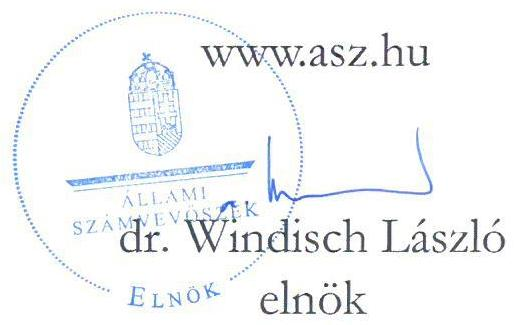
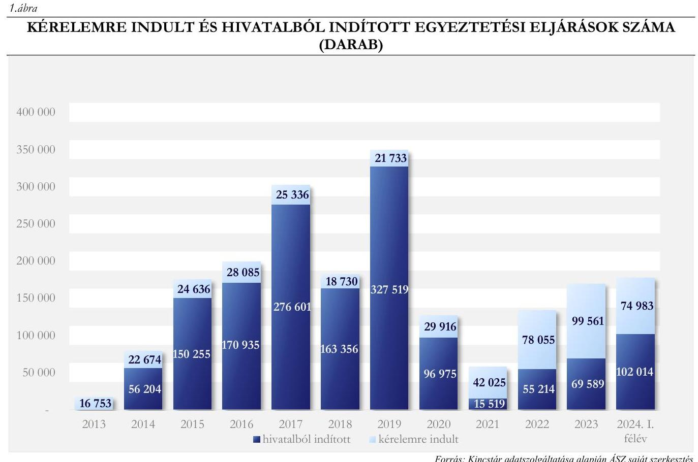
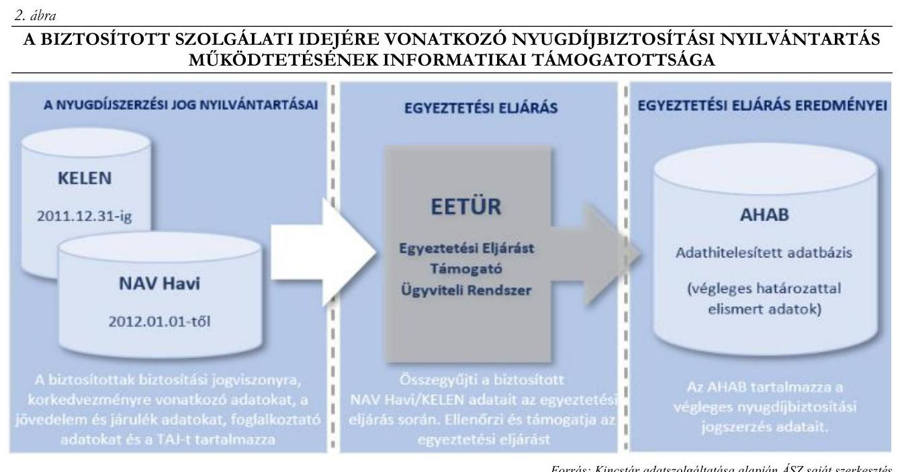
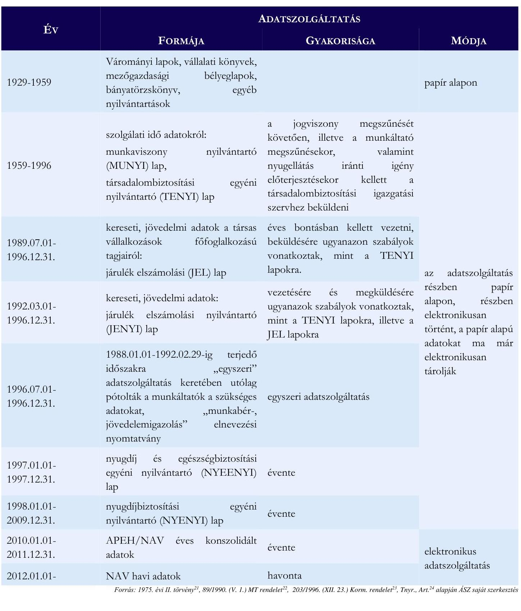

ÁLLAMI
SZÁMVEVŐSZÉK

# JELENTÉS 

## A nyugdíjbiztosítás alapját jelentő szolgálati idő nyilvántartásának célzott ellenőrzése

2025.

---

ÁLLAMI
SZÁMVEVŐSZÉK

# JELENTÉS 

## A nyugdíjbiztosítás alapját jelentő szolgálati idő nyilvántartásának célzott ellenőrzése

2025. 

25025

---

# ELLENŐRZÉSI IGAZGATÓSÁG: 

## ÁLLAMHÁZTARTÁS KÖZPONTI SZINTJÉT ELLENŐRZŐ IGAZGATÓSÁG

ELLENŐRZÉSI IGAZGATÓ:
SINKÁNÉ DR. CSENDES ÁGNES igazgató

ELLENŐRZÉSVEZETŐ:
DORMÁN ISTVÁN ZOLTÁN ellenőrzésvezető

IKTATÓSZÁM: EL-4041-003/2025
TÉMASORSZÁM: -
ELLENŐRZÉS-AZONOSÍTÓ SZÁM: V1046

---

# TARTALOMJEGYZÉK 

AZ ELLENŐRZÉS ALAPADATAI ..... 5
MEGÁLLAPÍTÁSOK ÉS KÖVETKEZTETÉSEK ..... 7
JAVASLATOK ..... 15
MELLÉKLETEK ..... 16
I. sz. melléklet: Értelmező szótár ..... 16
II. sz. melléklet: Ellenőrzési kritériumok ..... 18
III. sz. melléklet: Nyugdíjbiztosítási nyilvántartáshoz kapcsolódó adatszolgáltatások ..... 19
FÜGGELÉK: ÉSZREVÉTELEK ..... 20
RÖVIDÍTÉSEK JEGYZÉKE ..... 24

---

.

---

# AZ ELLENŐRZÉS ALAPADATAI 

## AZ ELLENŐRZÉS CÉLJA

Az ellenőrzés célja annak értékelése volt, hogy a célzottan kiválasztott biztosítottak biztosítási kötelezettséggel járó jogviszonyaira vonatkozóan a nyugdíjbiztosítási nyilvántartás teljeskörűen tartalmazta-e a nyugdíjbiztosítás alapját jelentő szolgálati időt.

## AZ ELLENŐRZÖTT IDŐSZAK

A nyugdíjbiztosítási nyilvántartás adatainak kiválasztott biztosítottanként a szolgálati idő kezdetétől az ellenőrzés lezárásának időpontjáig tartó időszaka (2024. július 12.).

## AZ ELLENŐRZÉS TÁRGYA

Az ellenőrzés tárgyát képezte a kiválasztott biztosítottak tekintetében a Magyar Államkincstárnál a nyugdíjbiztosítási nyilvántartás adatainak teljeskörűsége a szolgálati idő vonatkozásában. Az ellenőrzés kiterjedt arra, hogy a szolgálati idő vonatkozásában a nyilvántartási adatok tartalmaztak-e adatinkonzisztenciát és amennyiben igen, azok milyen okokra voltak visszavezethetők, továbbá arra, hogy a szolgálati idő vonatkozásában az adatkonzisztenciával kapcsolatos problémákat feltárták-e, annak okait vizsgálták-e, elemezték-e, illetve tettek-e intézkedéseket azok javítása érdekében.

Az ellenőrzés kiterjedt minden olyan körülményre és adatra, amely az ÁSZ ${ }^{1}$ jogszabályban meghatározott feladatainak teljesítéséhez, valamint a program végrehajtása folyamán felmerült újabb összefüggések feltárásához szükséges volt.

A szolgálati időhöz kapcsolódó kereseti és jövedelmi adatok nem tartoztak az ellenőrzés hatókörébe.

## AZ ELLENŐRZÉS JOGALAPJA

Az ellenőrzés jogszabályi alapját az ÁSZ tv. ${ }^{2} 1 . \int(3)$ bekezdés és $5 . \int(2)$ bekezdés előírása képezte.

## AZ ELLENŐRZÉS MÓDSZERE

Az ellenőrzést törvényességi, célszerűségi szempontok, valamint a nemzetközi standardokat irányadónak tekintve az ellenőrzési program szempontjai, az ellenőrzött időszakban hatályos jogszabályok, az ellenőrzés szakmai szabályok és módszertanok figyelembevételével végezte az ÁSZ.

Az ellenőrzési kérdések megválaszolásához szükséges bizonyítékok megszerzése az ellenőrzött szervezet és az ellenőrzést támogató szervezet által rendelkezésre bocsátott dokumentumokra és adatokra alapozva, továbbá megfigyelés, szemle (szemrevételezés), mintavételezés, kérdésfeltevés (információkérés), valamint elemző eljárás útján történt.

---

A nyugdíjbiztosítási nyilvántartás szolgálati idő adatai teljeskörűségének ellenőrzése mintavételezéssel kiválasztott biztosítottak szolgálati idejére vonatkozó adatok ellenőrzésén keresztül került végrehajtásra. Az ellenőrzésre első körben kiválasztott egy fő biztosítottnak a Foglalkoztatónál ${ }^{3}$ megszerzett szolgálati ideje a nyugdíjbiztosítási nyilvántartásban a 2007. évben megszakadt, ezért a 2007. évre vonatkozóan az ÁSZ összevetette a Foglalkoztatónál a 2007. évben foglalkoztatottak listáját a Foglalkoztató 2007. évre vonatkozó NYENYI ${ }^{4}$ adatszolgáltatásában szereplő adatokkal. Az adatbázisok összevetése alapján további 22 biztosított kiválasztására került sor. A megállapítások a kiválasztott biztosítottakra kerültek megfogalmazásra.

Az ellenőrzési bizonyítékként felhasználható adatforrások közé tartoztak egyrészt az ellenőrzéshez kért dokumentumok, adatbázisok, másrészt adatforrás volt még minden - az ellenőrzés folyamán - feltárt, az ellenőrzés szempontjából releváns információt tartalmazó dokumentum.

Az ellenőrzés lefolytatásához az ellenőrzött szervezet az ÁSZ által kért dokumentumok, adatok, információk megküldésével az ellenőrzés során szolgáltatott adatokat. Az ÁSZ ellenőrzése az ellenőrzést támogató szervezetként megkereste a Foglalkoztatót, aki 2007. évben a Foglalkoztatónál foglalkoztatottak listáját és a foglalkoztatottakról 2007. évre teljesített NYENYI adatszolgáltatását bocsátotta az ÁSZ rendelkezésére, amelyek a biztosítottak kiválasztását biztosította.

# AZ ELLENŐRZÖTT SZERVEZET 

A Magyar Államkincstár, mint a nyugdíjbiztosítási nyilvántartás adatkezelője.
Ellenőrzést támogató szervezet az ellenőrzésre kiválasztott biztosítottak hiányzó szolgálati időszakkal érintett Foglalkoztatója, valamint a Nemzeti Adó- és Vámhivatal, mint adatszolgáltató.

---

# MEGÁLLAPÍTÁSOK ÉS KÖVETKEZTETÉSEK 

Az ÁSZ általános hatáskörrel végzi a közpénzekkel való felelős gazdálkodás ellenőrzését. A nemzeti adatvagyon körébe tartozó nyugdíjbiztosítási nyilvántartás a biztosítottat megillető nyugdíjbiztosítási ellátások megállapításának alapvető feltétele. A nyugdíjbiztosítási nyilvántartás közhiteles hatósági nyilvántartásnak minősül. A közhiteles nyugdíjbiztosítási nyilvántartásban tárolt adatok teljeskörűsége társadalmi elvárás, az ÁSZ terven felüli ellenőrzés keretében ellenőrizte a nyugdíjbiztosítás alapját jelentő szolgálati idő nyilvántartását.

## ÖSSZEGZŐ MEGÁLLAPÍTÁS

A Kincstár ${ }^{5}$ nyugdíjbiztosítási nyilvántartása a kiválasztott biztosítottak tekintetében adatinkonzisztenciát tartalmazott, mivel az ellenőrzött 23 biztosított közül 12 biztosítottnál nem teljeskörűen tartalmazta a nyugdíjbiztosítás alapját jelentő szolgálati időt, annak ellenére, hogy az folyamatos volt. A nyugdíjbiztosítási nyilvántartásban összesen 16 alkalommal szakadt meg 12 biztosított esetében a szolgálati idő folytonossága: 2002., 2005., 2006., 2007. és 2011. években. A szolgálati idő vonatkozásában a Kincstár adatinkonzisztenciával kapcsolatos problémákat nem vizsgálta és nem tárta fel, a nyugdíjbiztosítási nyilvántartásban a szolgálati idő nyilvántartásának hiányosságait nem elemezte, az adathiánnyal érintett időszakokat rendszerszinten nem tárta fel. E feladatok ellátása azonban célszerú lett volna, mivel alapvető fontosságúak a szolgálati idő nyilvántartás teljeskörüségének és megbízhatóságának biztosítása érdekében. A nyugdíjbiztosítási szolgálati idő nyilvántartás esetében a Kincstár a Bkr. ${ }^{6}$-ben előírt kontrollokat nem működtette. Ezáltal az adatinkonzisztenciával kapcsolatos problémák fennmaradtak és csak az idő- és költségigényes egyeztetési eljárás keretében kerültek, illetve kerülhettek volna javításra a biztosított közreműködésével.

Az öregségi nyugdíj, hozzátartozói nyugellátás megállapításához megszerzett szolgálati idő nyugdíjbiztosítási nyilvántartásba vétele érdekében célszerú lett volna a foglalkoztatók vonatkozásában az egyeztetési eljárások során feltárt hiányosságokat, pótlólag a nyilvántartásba vett szolgálati idő adatokat és az adott foglalkoztató adatszolgáltatása alapján korábban nyilvántartásba vett adatokat ellenőrizni és elemezni, ezzel hozzájárulhatott volna a Kincstár a nyilvántartásból hiányzó, azonban valós szolgálati idő nyugdíjbiztosítási nyilvántartásba vételéhez, valamint az adatinkonzisztenciák minél hamarabb történő megoldásához. A nemzeti adatvagyon körébe tartozó nyugdíjbiztosítási nyilvántartás a társadalom széles rétegét érinti, pontossága meghatározó a biztosítottak nyugellátásának megállapítása szempontjából. Társadalmi szempontból jogos elvárás, hogy a Kincstár biztosítsa a nyugdíjbiztosítási nyilvántartás teljeskörüségét és megbízhatóságát, ennek érdekében megfelelő intézkedéseket tegyen. Mindez meghatározó fontosságú a közhiteles nyilvántartásba vetett társadalmi bizalom fenntartása szempontjából.

## NYUGDÍJBIZTOSÍTÁSI NYILVÁNTARTÁS ADATAI

A Nyugdíjbiztosítási Alapból történő öregségi nyugdíj, hozzátartozói nyugellátás igénybevételének feltétele, hogy a biztosítottak az ellátás megállapításához elegendő szolgálati idővel rendelkezzenek. A nyugellátásra jogosító szolgálati idő lehet biztosítási kötelezettséggel járó jogviszony alapján járulékfizetéssel szerzett szolgálati idő, a megállapodás alapján teljesített járulékfizetés időtartama, nyugdíjjárulék-köteles pénzellátásban való részesülés időtartama, valamint olyan biztosítással nem járó jogviszony vagy időszak,

---

amelynek tartamát a Tny. ${ }^{7}$, $\mathrm{Tbj}_{1}{ }^{8}, \mathrm{Tbj}_{2}{ }^{9}$ szolgálati időnek minősíti (kötelező sorkatonai szolgálat, szakmunkástanuló idő és a nappali képzésben folytatott felsőfokú tanulmányok 1998 előtti évei).

A $\mathrm{Tbj}_{2}$-ben rögzített alapelv szerint a kötelező társadalombiztosítás rendszerében a biztosított az egyéni felelősség elvének megfelelően, a $\mathrm{Tbj}_{2}$-ben meghatározott járulékfizetési kötelezettség alapján szerezhet jogot saját maga és törvényben meghatározott hozzátartozója javára nyugdíjbiztosítási ellátásra. A biztosítás az annak alapjául szolgáló jogviszonnyal egyidejűleg, a törvény erejénél fogva jön létre. Ennek érvényesítése érdekében a foglalkoztatót bejelentési, nyilvántartási, járulék-megállapítási és levonási, járulékfizetési, valamint bevallási kötelezettség terheli.

A nyugdíjbiztosítási nyilvántartás a biztosított biztosítási kötelezettséggel járó jogviszonyaira és kereseteire, jövedelmeire vonatkozó, nyilvántartásba bejelentett adatokat tartalmazza, amelynek alapját a foglalkoztatók által a biztosítottakról teljesített adatszolgáltatások biztosítják. A foglalkoztatói adatszolgáltatási kötelezettség módja, formája, gyakorisága és adattartalma több alkalommal változott az elmúlt években (III. sz. melléklet). Az 1998-tól használatos NYENYI adatszolgáltatást - amely 2007-től elektronikusan is benyújtható volt - a foglalkoztatók közvetlenül a nyugdíjbiztosítási nyilvántartás adatkezelőjének, az ONYF ${ }^{10}$-nek teljesítették 2010. április 30-ig. A nyugdíjbiztosítási nyilvántartás adatkezelője 2017. október 31-ig az ONYF volt, ezt követően az adatkezelő a Kincstár, mint az ONYF jogutódja.

A foglalkoztatók havi járulékbevallásaiból 2011-től a NAV ${ }^{11}$ teljesíti az adatszolgáltatási kötelezettségét a nyugdíjbiztosítási nyilvántartás adatkezelője felé. A NAV 2010. és 2011. évre vonatkozóan a foglalkoztatók által bevallott havi adatokból konszolidált éves adatokat adta át, 2012-től kezdve az adatszolgáltatás havonta történik a nyugdíjbiztosítási nyilvántartás adatkezelője felé.

A nyugdíjbiztosítási nyilvántartásban szereplő adatok pontosságának és az ellátások, illetve a szolgálati idő megállapításának elősegítése érdekében 2013. január 1-jétől, a Tny. 96/B-D. §-k beiktatásával bevezetésre került az egyeztetési eljárás intézménye. Az egyeztetési eljárás során a nyugdíjbiztosítási igazgatási szerv ${ }^{12}$ a biztosított közreműködésével tisztázza a nyugdíj jogszerzéshez elismerhető szolgálati időt. Az egyeztetési eljárás keretében a biztosított nyilatkozhat azokról az általa ismert szolgálati idő adatokról, amelyeket a nyilvántartás nem tartalmaz, vagy amelyek nem egyeznek meg a nyilvántartott adatokkal.

Az egyeztetési eljárás vagy hivatalból a nyugdíjbiztosítási igazgatási szerv értesítése alapján vagy a biztosított kérelmére indul. A biztosított az egyeztetési eljárás lefolytatását naptári évenként egyszer kezdeményezheti. A 2013. és 2024. I. féléve között a kérelemre indult és hivatalból indított egyeztetési eljárások számát a 1. ábra mutatja.

---

*Forrás: Kincstár adatszolgáltatása alapján ÁSZ saját szerkesztés*

A nyugdíjbiztosítási nyilvántartás adatainak egyeztetését a nyugdíjbiztosítási igazgatási szerv az 1954. december 31-ét követően született biztosítottakkal kezdeményezte. A nyugdíjbiztosítási igazgatási szervnek az 1955-1959 között született biztosítottak esetében 2014. december 31-ig kellett hivatalból megindítania az egyeztetési eljárást, majd az 1960-ban vagy azt követően született biztosítottak esetében 2015. január 1-jétől ötéves korcsoportonként kellett lefolytatnia az egyeztetési eljárást. Az ötéves korcsoport kiértesítésére két év állt rendelkezésre. A Tny. 96/C. § (1) bek.-ben előírt tervezett ütemezés 2015. január 1-jével módosult, mivel az 1960-ban vagy azt követően született biztosítottak esetében az egyeztetés kezdő időpontja 2017. január 1-jére tolódott. 2018. december 23-től az egyeztetési eljárás megindítására két év helyett három év állt rendelkezésre. Az egyeztetési eljárás lezárásakor a nyugdíjbiztosítási igazgatási szerv az elismert és nyugdíjbiztosítási nyilvántartásban nem szereplő adatokat nyilvántartásba veszi.

A hivatalból induló egyeztetési eljárások ütemezése 2020. január 1-jétől jelentősen megváltozott. A nyugdíjbiztosítási igazgatási szerv a nyugdíjkorhatár betöltését megelőzően három évvel köteles hivatalból megküldeni az értesítést a biztosítottnak az egyeztetésről. A hivatalból indult egyeztetési eljárások ütemezésének összehasonlítását - a jogszabályi előírások módosításával összefüggésben - az 1. táblázat mutatja.

---

1. táblázat

# A HIVATALBÓL INDULÓ EGYEZTETÉSI ELJÁRÁSOK ÜTEMEZÉSE A TNY. ALAPJÁN 

| 2013. JANUAR I-JEN HATALYOS JOGSZABALY SZERINT |  | 2020. JANUAR I-JETÓL HATALYOS JOGSZABALY SZERINT |  |
| :--: | :--: | :--: | :--: |
| ÖTÉVES   KORCSOPORT | HIVATALBÓL INDULÓ EGYEZTETÉSI ELJÁRÁS MEGINDÍTÁSÁNAK UTOLSÓ NAPJA | ÖREGSÉGI   NYUGDÍJKORHATÁRT HÁROM ÉV MÚLVA BETÓLTŐ KOROSZTÁLY SZÜLETÉSI IDEJE | HIVATALBÓL INDULÓ EGYEZTETÉSI ELJÁRÁS MEGINDÍTÁSÁNAK UTOLSÓ NAPJA |
| 1955-1959 | 2014. december 31. | 1958 | 2020. december 31. |
| 1960-1964 | 2016. december 31. | 1959 | 2021. december 31. |
| 1965-1969 | 2018. december 31. | 1960 | 2022. december 31. |
| 1970-1974 | 2020. december 31. | 1961 | 2023. december 31. |
| 1975-1979 | 2022. december 31. | 1962 | 2024. december 31. |
| 1980-1984 | 2024. december 31. | 1963 | 2025. december 31. |
| Az érintett korosztályban születetteknek egyeztetésre kérelem alapján is van lehetőségük. |  |  |  |

A nyugdíjbiztosítási nyilvántartás felügyeletét és működtetését a Nyugdíjbiztosítási Alap kezeléséért is felelős szerv, a Kincstár látja el, amelynek jogszabályi hátterét a Tny., valamint a végrehajtására kiadott Tnyr. ${ }^{13}$ biztosítja. A Kincstár felelős a nyugdíjbiztosítási adatok nyilvántartási rendszerének kialakításért és a múködési keretek biztosításáért.

A Kincstár a nyugdíjbiztosítási nyilvántartás részeként a 2012. év előtt megszerzett szolgálati idő adatokat a KELEN ${ }^{14}$ szakrendszerben, 2012. január 1-je után megszerzetteket a NAV Havi Adatbázis szakrendszerben, az egyeztetési eljárásában elismert szolgálati idő adatokat az $\mathrm{AHAB}^{15}$ szakrendszerben tárolta. A KELEN és NAV havi rendszerekből az ellátás megállapításához szükséges adatokat az ellátásnak megfelelően strukturált elektronikus dossziék segítségével kérdezték le. Az egyeztetési eljárások informatikai támogatását az EETÜR ${ }^{16}$ szakrendszer támogatta, amely számos beépített, automatizált folyamatlépést kezelt, egyes folyamatok részben automatikusan - ügyintézői beavatkozás nélkül - valósultak meg.

---

A biztosított szolgálati idejére vonatkozó nyugdíjbiztosítási nyilvántartás működtetésének informatikai támogatottságát a 2. ábra mutatja.

Forrás: Kincstár adatszolgáltatása alapján ÁSZ saját szerkesztés

# NYUGDÍJBIZTOSÍTÁSI NYILVÁNTARTÁS SZOLGÁLATI IDŐ ADATAI TELJESKÖRÜSÉGÉNEK ELLENŐRZÉSE 

A nyugdíjbiztosítási nyilvántartásban szereplő szolgálati idő adatok teljeskörűségét az ÁSZ a Foglalkoztató tekintetében — az ellenőrzés által alkalmazott módszer alapján — a 2007. évre, 23 biztosított esetében ellenőrizte. A nyugdíjbiztosítási nyilvántartás 13 biztosított esetében a Foglalkoztató 2007. évre vonatkozó NYENYI adatszolgáltatásával összhangban tartalmazta a szolgálati idő adatokat. A nyugdíjbiztosítási nyilvántartásban 10 biztosított esetében nem szerepelt a 2007. évre vonatkozóan szolgálati idő, a biztosítottak a Foglalkoztató 2007. évre vonatkozó NYENYI adatszolgáltatásban nem szerepeltek.

A Foglalkoztatónál szerzett szolgálati idő folytonosságának megszakadása az ellenőrzött 23 biztosított esetében nem csak 2007-ben fordult elő, összesen 12 biztosítottnak 16 alkalommal szakadt meg a szolgálati idő folytonossága az ellenőrzött időszakban. A 2. táblázat mutatja, hogy a szolgálati idő folytonossága melyik évben és hány biztosított esetében szakadt meg, valamint az egyeztetési eljárás hatását a nyugdíjbiztosítási nyilvántartásban szereplő szolgálati idő nyilvántartására.

---

# A FOGLALKOZTATÓNÁL SZERZETT SZOLGÁLATI IDŐ MEGSZAKADÁSA ÉS AZ EGYEZTETÉSI ELJÁRÁSOK EREDMÉNYE 

| SZOLGÁLATI IDÓ MEGSZAKÍTÁSSAL ÉRINTETT NAPOK SZÁMA AZ ADOTT EYBEN |  |  |  |  | EGYEZTETÉSI ELJÁRÁS STÁTUSZA |
| :--: | :--: | :--: | :--: | :--: | :--: |
|  | 2002 | 2005 | 2006 | 2007 | 2011 |
| 1. biztosított | - | 365 | - | 365 | - |
| 2. biztosított | - | - | - | 365 | - |
| 3. biztosított | - | - | - | 365 | - |
| 4. biztosított | - | - | - | 365 | - |
| 5. biztosított | - | - | - | 365 | - |
| 6. biztosított | - | - | - | - | 365 |
| 7. biztosított | 365 | - | - | - | - |
| 8. biztosított | - | - | - | 3 | - |
| 9. biztosított | - | 365 | 365 | 365 | - |
| 10. biztosított | - | 365 | - | 365 | - |
| 11. biztosított | - | - | - | 365 | - |
| 12. biztosított | - | - | - | 365 | - |

A hiányzó szolgálati idő miatt a biztosított kérelmére 2023ban egyeztetési eljárást indult, az eljárás az ellenőrzés lezárásakor folyamatban volt.
Hivatalból nem indult egyeztetési eljárás, mert nem volt időszerű, kérelmet nem adott be.
Hivatalból nem indult egyeztetési eljárás, mert nem volt időszerű, kérelmet nem adott be.
Hivatalból nem indult egyeztetési eljárás, mert nem volt időszerű, kérelmet nem adott be.
Hivatalból nem indult egyeztetési eljárás, mert nem volt időszerű, kérelmet nem adott be.
Hivatalból nem indult egyeztetési eljárás, mert nem volt időszerű, kérelmet nem adott be.
A kérelemre indult egyeztetési eljárás során a szolgálati idő nyilvántartásba vétele megtörtént.
A kérelemre indult egyeztetési eljárás során a szolgálati idő nyilvántartásba vétele megtörtént.
Hivatalból nem indult egyeztetési eljárás, mert nem volt időszerű, kérelmet nem adott be.
A hivatalból indított egyeztetési eljárás során a szolgálati idő nyilvántartásba vétele megtörtént.
A hivatalból indított egyeztetési eljárás során a szolgálati idő nyilvántartásba vétele megtörtént.
A hivatalból indított egyeztetési eljárás során a szolgálati idő nyilvántartásba vétele megtörtént.
A hivatalból indított egyeztetési eljárás során a szolgálati idő nyilvántartásba vétele megtörtént.
Forrás: Az ellenőrzött szervezet adatszolgáltatása alapján ÁSZ saját szerkesztés

---

Azon biztosítottak esetében, akiknél egyeztetési eljárás került lefolytatásra a nyugdíjbiztosítási nyilvántartásban a szolgálati idő adatinkonzisztencia megszűnt. Az egyeztetési eljárás jelentőségét mutatja a 6 biztosított esetében nyilvántartásba vett összesen 3285 szolgálati nap.

Két biztosított esetében a szolgálati idő kiesést (2002., 2011. évek) nem a biztosítottak jelezték az egyeztetési eljárás során. A 2002. év tekintetében az egyeztetési eljárás során a nyugdíjbiztosítási igazgatási szerv hivatalból kereste meg a biztosított Foglalkoztatóját (a biztosított Foglalkoztatója a 30 napot meghaladó szolgálati idő kiesést megelőzően és azt követően is ugyanaz a szervezet volt).

A 2011. év, mint kieső szolgálati idő tisztázását a nyugdíjbiztosítási igazgatási szerv azért kezdeményezte, mert a nyugdíjbiztosítási nyilvántartás a biztosított esetében hibás adatszolgáltatást jelzett. A hibás adatszolgáltatást az eredményezte, hogy a nyugdíjbiztosítási nyilvántartás adatkezelője, az ONYF a NAV 2011. évi éves adatszolgáltatását nem tudta megfelelően nyilvántartásba venni. A hibás adatszolgáltatáshoz kapcsolódóan a nyugdíjbiztosítási igazgatási szerv megkereste a NAV-ot, mint adatszolgáltatót, hogy a biztosított és a Foglalkoztató vonatkozásában adatszolgáltatást teljesítsen. Az egyeztetési eljárás eredményeként a szolgálati idő nyilvántartásba vétele megtörtént.

Öt biztosított esetében történt hivatalból és három biztosított esetében kérelemre indult egyeztetési eljárás, amely során a nyugdíjbiztosítási igazgatási szerv a biztosítottak által jelzett sorkatonai szolgálatra, szakmunkástanuló időre és 1998. előtti nappali képzésen folytatott felsőfokú tanulmányokra vonatkozó szolgálati időt nyilvántartásba vette. Az egyeztetési eljárások során a biztosítottak által jelzett más foglalkoztatóhoz kapcsolódó munkaviszonyban töltött szolgálati idő bejegyzésére is sor került.

Az ellenőrzés során az ÁSZ a 23 ellenőrzött biztosított közül 12 biztosított esetében tárt fel nyugdíjbiztosítási

Az egyeztetési eljárás során a biztosítottak részéről jelzett hiányzó és a nyugdíjbiztosítási igazgatási szerv által elismert, nyilvántartásba vett szolgálati idő adatokat a Kincstár nem elemezte, a szolgálati idővel kapcsolatos adathványokat rendszerszinten nem tárta fel, az adategyeztetések eredményeiről rendszerszinten következtetéseket nem vont le. A kiválasztott öt biztosított esetében összesen 2190 szolgálati nap nyilvántartásba vételére a biztosítottanként lefolytatandó egyeztetési eljárásban kerülhet sor, amennyiben a biztosítottak a szolgálati idő adatok hiányáról nyilatkoznak. A hiányzó szolgálati idő adatok biztosítottanként történő nyilvántartásba vétele idő- és költségigényesebb, mint az adathvány rendszerszintű kezelése, továbbá a munkaerő felhasználás szempontjából sem hatékony. A Kincstárnak célszerű lenne vizsgálnia, hogy az egyeztetési eljárásban jelzett adathványok mely foglalkoztatókat érintik, valamint ezek alapján a foglalkoztatókkal egyeztetni a nyugdíjbiztosítási nyilvántartásban szereplő adathványokat és azokat pótlólagos adatszolgáltatás keretében nyilvántartásba venni.

A sorkatonai szolgálatról és a 1998 előtti nappali képzésben folytatott felsőfokú tanulmányok éveiről adatszolgáltatási kötelezettséget a jogszabályok nem írtak elő a MH KIKNYP ${ }^{17}$-nek és a felsőoktatási intézményeknek. E szolgálati idő adatokat a nyugdíjbiztosítási nyilvántartás csak abban az esetben tartalmazza, ha a biztosított az egyeztetési eljárás során jelzi az ezekkel kapcsolatos hiányzó szolgálati időt. A szolgálati idő nyilvántartásba vételének elmaradása a nyugdíj megállapításához szükséges tényleges szolgálati idő hiányának kockázatát hordozza. Az e kockázat kezelése érdekében végrehajtott egyeztetési eljárások költség- és időigényesek.
nyilvántartásban szereplő szolgálati időt érintően adatinkonzisztenciát. A nyugdíjbiztosítási nyilvántartás azokat a szolgálati időket tartalmazta, amelyekről a Foglalkoztató az adatszolgáltatási kötelezettségét teljesítette.

---

Amennyiben a biztosítottról a Foglalkoztató nem teljesítette az adatszolgáltatást, akkor a nyugdíjbiztosítási nyilvántartásba a hiányzó szolgálati idő csak a biztosított közremúködésével lefolytatott egyeztetési eljárás keretében került nyilvántartásba vételre, annak ellenére, hogy a Foglalkoztatóhoz köthetően több biztosított esetében is tártak fel adatinkonzisztenciát. A sorkatonai szolgálat és az 1998 előtti nappali képzésben folytatott felsőfokú tanulmányok évei, mint szolgálati idő a biztosított jelzése alapján került a nyugdíjbiztosítási nyilvántartásba vételre.

A Kincstár feladata - a 310/2017. (X. 31.) Korm. rendelet ${ }^{18}$ szerint - a nyugellátás megállapításához, folyósításához szükséges adatok begyűjtéséről, feldolgozásáról és kezeléséről, valamint a beérkezett adatok ellenőrzéséről gondoskodni, működtetni és fejleszteni a nyugdíjbiztosításnak a felügyeleti, szakmai ellenőrzési, belső ellenőrzési és központi nyilvántartási rendszerét, valamint a nyugdíjbiztosítási nyilvántartás informatikai rendszerét. A Kincstár - a Bkr. szerint - köteles a belső kontrollrendszer keretében a nyugdíjbiztosítási szolgálati idő nyilvántartás kontrolltevékenységet kialakítani és működtetni.

A Kincstár nem végzett a nyugdíjbiztosítási szolgálati idő nyilvántartását támogató informatikai rendszerek vonatkozásában adatinkonzisztencia vizsgálatára irányuló ellenőrzéseket, elemzéseket és a Bkr. 3. § c) pontja és 8 . § előírásai ellenére nem alakított ki és nem működtetett kontrolltevékenységeket. A nyugdíjbiztosítási nyilvántartási rendszerből statisztikai elemzési célból nem gyűjthetőek le a foglalkoztatók adatszolgáltatásával, és az egyeztetési eljárásokkal kapcsolatos adatok. A nyugdíjbiztosítási nyilvántartási adatok minőségének, megfelelőségének elemzéséhez, az ezzel összefüggő problémák feltárásához a megoldások kialakítása érdekében a Kincstár nyugdíjbiztosítási nyilvántartás kontrolltevékenységet nem végzett.

A kontrolltevékenység és az ellenőrzések, elemzések elvégzésének hiánya kockázatot hordoz a nyugdíjbiztosítási nyilvántartás megbízhatósága szempontjából. Az egyes foglalkoztatók vonatkozásában az egyeztetési eljárások során nyilvántartásba vett szolgálati idő adatok, és az adott foglalkoztató adatszolgáltatása alapján nyilvántartásba vett adatok kiértékelése hozzájárulhatna ahhoz, hogy a nyugdíjbiztosítási nyilvántartás teljeskörű adatokat tartalmazzon és az adatok a nyugdíjbiztosítási nyilvántartásba minél hamarabb bekerüljenek. Ezen eszközökkel a Kincstár időben feltárhatná az adathiánnyal érintett foglalkoztatók esetében a nyugdíjbiztosítási nyilvántartásban nyilvántartott szolgálati idő hiányosságait, valamint erősíthetné az állampolgárok bizalmát ezen állami feladatot érintően.

---

# JAVASLATOK 

Az ÁSZ tv. 33. § (1) bekezdésében foglaltak értelmében az ellenőrzött szervezet vezetője köteles a jelentésben foglalt megállapításokhoz kapcsolódó intézkedési tervet összeállítani és azt a jelentés kézhezvételétől számított 30 napon belül az ÁSZ részére megküldeni. Amennyiben az ellenőrzött szervezet vezetője nem küldi meg határidőben az intézkedési tervet, vagy továbbra sem elfogadható intézkedési tervet küld, az Állami Számvevőszék elnöke az ÁSZ tv. 33. § (3) bekezdése a) és b) pontjaiban foglaltakat érvényesítheti.

## MAGYAR ÁLLAMKINCSTÁr ELNÖKÉNEK

1. Intézkedjen a nyugdíjbiztositási nyilvántartásban nyilvántartott adatok vonatkozásában a kontrolltevékenységek müködtetése érdekében. Vizsgálja meg annak lehetőségét, hogy a foglalkoztatók vonatkozásában az egyeztetési eljárások során nyilvántartásba vett szolgálati idő adatok és az adott foglalkoztató adatszolgáltatása alapján nyilvántartásba vett adatok ellenőrzése és elemzése hogyan járulhatna hozzá a hiányzó szolgálati idő nyugdíjbiztosítási nyilvántartásba vételéhez. Szükség esetén kezdeményezze a foglalkoztató hatósági ellenőrzését a fővárosi és megyei kormányhivataloknál, mint nyugdíjbiztositási igazgatási szerveknél.
2. Vizsgálja meg és tegyen intézkedést a nyugdíjbiztosítási nyilvántartás szolgálati idő adatok teljeskörüségének érvényesítésére és az egyeztetési eljárások elősegitésének érdekében a katonai szolgálat és az 1998. előtti nappali képzésben folytatott felsőfokú tanulmányok idejéhez tartozó szolgálati idő nyugdíjbiztositási nyilvántartásba vételére.
3. Az ellenőrzési tapasztalatok alapján vizsgálja meg a nyugdíjbiztosítási nyilvántartásban szereplő szolgálati idő adatok adatminőségét a szolgálati idő adatok teljeskörüségének és megbízhatóságának biztositása érdekében.

---

# MELLÉKLETEK 

I. SZ. MELLÉKLET: ÉRTELMEZŐ SZÓTÁR
adatinkonzisztencia
adatinkonzisztencia
egyeztetési eljárás
hozzátartozói nyugellátás
közhiteles hatósági nyilvántartás
nemzeti adatvagyon

Az adatinkonzisztencia fogalma a szolgálati idő vonatkozásában azt jelöli, hogy a szolgálati idő adatok, információk nincsenek összhangban egymással és a vonatkozó szabályokkal a nyugdíjbiztosítási nyilvántartási rendszer keretein belül. Az adatinkonzisztencia azt mutatja, hogy a szolgálati idő adatok ellentmondásokat vagy összeegyeztethetetlenségeket tartalmaznak, a nyugdíjbiztosítási nyilvántartási rendszerben lévő információk nem helytállóak, megbízhatóak és nem egyeznek meg az elvártakkal. (ÁSZ)
Az adatkonzisztencia fogalma azt jelöli, hogy az adatok, információk összhangban vannak egymással a vonatkozó szabályokkal egy adott adathalmaz, adatbázis vagy rendszer keretein belül. Az adatkonzisztencia azt mutatja, hogy az adatok nem tartalmaznak ellentmondásokat vagy összeegyeztethetetlenségeket, a rendszerben vagy adathalmazban lévő információk helyesek, megbízhatóak és megegyeznek az elvártakkal. (ÁSZ)
A nyugdíjbiztosítási igazgatási szerv a biztosított, volt biztosított biztosítási kötelezettséggel járó jogviszonyaira és kereseteire, jövedelmeire vonatkozó, nyilvántartásba bejelentett adatokat a biztosítottal, volt biztosítottal hatósági eljárás keretében egyezteti. (Tny. 96/B. $\$ 1$ ) bek.)
Olyan keresettől, jövedelemtől függő rendszeres pénzellátás, amely meghatározott szolgálati idő megszerzése esetén a biztosított hozzátartozójának jár. (Tny. 4. $\$ 1$ ) bek. a) pont)
A társadalombiztosítási nyugdíjrendszer keretében járó hozzátartozói nyugellátások az özvegyi nyugdíj, az árvaellátás, a szülői nyugdíj, a baleseti hozzátartozói nyugellátások, az özvegyi járadék. (Tny. 6. § (2) bek.)
A hatóság a jogszabályban meghatározott adatokról hatósági nyilvántartást vezet, ha
a) a nyilvántartásba történő bejegyzés, annak módosítása és a nyilvántartásból való törlés az ügyfél jogait és kötelezettségeit keletkezteti, módosítja vagy szünteti meg, vagy
b) a nyilvántartás vezetésének célja a benne foglalt adatok közhitelű igazolására, bizonyítására szolgál
(közhiteles hatósági nyilvántartás).
Ha törvény eltérően nem rendelkezik, a hatósági nyilvántartás közhitelessége alapján az ellenkező bizonyításáig vélelmezni kell annak jóhiszeműségét, aki a hatósági nyilvántartásban szereplő adatokban bízva szerez jogot. Az ellenkező bizonyításáig a hatósági nyilvántartásba bejegyzett adatról vélelmezni kell, hogy az fennáll, és a hatósági nyilvántartásból törölt adatról vélelmezni kell, hogy nem áll fenn. (Ákr. 19 97. § (1)-(2) bek.)
A közfeladatot ellátó szervek által kezelt közadatok, dokumentumok és kulturális közadatok, továbbá egyéb a kezelésükben lévő személyes és védett adatok összessége, függetlenül azok megjelenési formájától. (2023. évi CL törvény a nemzeti adatvagyon hasznosításának rendszeréről és az egyes szolgáltatásokról 2. $\S 24$. pont)

---

nyugdíjbiztosítási nyilvántartás
öregségi nyugdíj
szolgálati idő

A társadalombiztosítási nyilvántartások tartalmazzák a befizetések nyilvántartását, beszedését és az ellátások megállapításához szükséges $\mathrm{Tbj}_{-1,2}$ törvény szerinti adatokat. A nyugdíjbiztosítási nyilvántartás vonatkozásában az adatkezelő a központi nyugdíjbiztosítási szerv. (Tbj. 55. § (1) bek., (2) bek. a) pont)
A nyugdíjbiztosítási nyilvántartás tartalmazza a foglalkoztatók és a biztosítottak törvényben előírt kötelezettségei teljesítésével szolgáltatott mindazon adatot, amelyből biztosítottanként megállapítható a társadalombiztosítási járulékalapot képező jövedelem, a biztosított után megfizetett, a tőle levont társadalombiztosítási járulék összege, a biztosítási jogviszony időtartama, valamint a biztosítottat megillető ellátások megállapításához szükséges adat. A nyilvántartások az előbbiekben meghatározott adatok tekintetében közhiteles hatósági nyilvántartásoknak minősül. (Tbj. 55. § (1)-(2) bek.)
Az öregségi nyugdíj, meghatározott életkor elérése és meghatározott szolgálati idő megszerzése esetén járó nyugellátás. (Tny. 4. § (1) bek. b) pont)
Az az időszak, amely alatt a biztosított nyugdíjjárulék fizetésére kötelezett volt, illetve megállapodás alapján nyugdíjjárulékot fizetett. A nyugdíjjárulék-fizetési kötelezettség nélküli szolgálati időnek minősülő időszakokat a Tny. külön meghatározza. (Tny. 4. § (1) bek. h) pont, IV. fejezet)

---

# II. SZ. MELLÉKLET: ELLENŐRZÉSI KRITÉRIUMOK 

## ELLENÖRZÉSI KRITÉRIUMOK

Tbj.1. 40. §, 41. § (1) bek., Tbj. 2 55. § (1) bek., (2) bek. a) pont, 59. § (1) bek.
Tny. 96. § (1) és (2) bek.
Tnyr. 12. §, 55/A. §-59/B. §
Bkr. 3. § e) pont, 10. §
Ket. ${ }^{20} 82 . \S$
Ákr. 97. §

---

# III. SZ. MELLÉKLET: NYUGDÍJBIZTOSÍTÁSI NYILVÁNTARTÁSHOZ KAPCSOLÓDÓ ADATSZOLGÁLTATÁSOK 

---

# FÜGGELÉK: ÉSZREVÉTELEK 

A jelentéstervezetet a Számvevőszék 15 napos észrevételezésre megküldte az ellenőrzött szervezet vezetőjének az ÁSZ tv. 29. §* (1) bekezdése előírásának megfelelően.

A jelentervezet megállapításaira az ellenőrzött szervezet vezetője észrevételt tett. Az ÁSZ tv. 29. § (3) bekezdésével összhangban az Állami Számvevőszék a Függelékben feltünteti a megállapításokkal kapcsolatban tett, el nem fogadott észrevételeket, és megindokolja, hogy azokat miért nem fogadta el.
I. Észrevétel: „A jelentéstervezet „A nyugdíjbiztositási nyilvántartás adatai" cím alatt pontosan összefoglalja a nyugdíjbiztosítási nyilvántartások rendszerét, mely alapvetően két, fizikailag elkülönülő, de logikailag összefüggő nyilvántartásból épül fel. [...] Míg tehát az adatszolgáltatások nyilvántartása a foglalkoztató által közölt adatokat tartalmazza, addig a jogszerzési nyilvántartás hatósági eljárásban elismert szolgálati idő adatokat tartalmazza. [...] A jelentéstervezet 1. sz. mellékletében található „Értelmező szótár" ezt a distinkciót (ti. adatszolgáltatások nyilvántartása, illetve jogszerzési nyilvántartás) nem követi, kizárólag a biztositási jogviszonyok adatait tartalmazó nyugdíjbiztositási nyilvántartás fogalmát írja le. Kiemelten fontosnak tartom az értelmező szótár kiegészitését a jogszerzési nyilvántartás fogalmával és a továbbiakban a jelentéstervezetben a két fogalom következetes alkalmazását. "
Az észrevétellel érintett megállapítás: „nyugdíjbiztositási nyilvántartás: A társadalombiztositási nyilvántartások tartalmazzák a befizetések nyilvántartását, beszedését és az ellátások megállapításához szükséges Thj.1,2 törvény szerinti adatokat. A nyugdíjbiztositási nyilvántartás vonatkozásában az adatkezelő a központi nyugdíjbiztositási szerv. (Thj. 2 55. § (1) bek., (2) bek. a) pont)
A nyugdíjbiztositási nyilvántartás tartalmazza a foglalkoztatók és a biztositottak törvényben elöirt kötelezettségei teljesitésével szolgáltatott mindazon adatot, amelyből biztositottanként megállapítható a társadalombiztositási járulékalapot képező jövedelem, a biztositott után megfizetett, a tőle levont társadalombiztositási járulék összege, a biztositási jogviszony időtartama, valamint a biztositottat megillető ellátások megállapításához szükséges adat. A nyilvántartások az előbbiekben meghatározott adatok tekintetében közhiteles hatósági nyilvántartásoknak minősül. (Thj. 2 59. § (1)-(2) bek.)" (16. oldal utolsó fogalom)
El nem fogadás indoka: A Tbj. 59. § (1) bekezdése értelmében a nyugdíjbiztositási nyilvántartás tartalmazza a foglalkoztatók és a biztositottak törvényben elöirt kötelezettségei teljesitésével szolgáltatott mindazon adatot, amelyből biztositottanként megállapítható a biztositási jogviszony időtartama. A nyugdíjbiztositási nyilvántartásnak egészében kell biztositani a biztositási jogviszony időtartamának

[^0]
[^0]:    * 29. § (1) Az Állami Számvevőszék az ellenőrzési megállapításait megküldi az ellenőrzött szervezet vezetőjének vagy az általa megbízott személynek, és annak, akinek személyes felelősségét állapította meg.
    (2) Az ellenőrzött szervezet vezetője és a felelősként megjelölt személy az ellenőrzés megállapításaira tizenöt napon belül írásban észrevételt tehet.
    (3) Az Állami Számvevőszék az észrevételre a beérkezésétől számított harminc napon belül írásban válaszol. A figyelembe nem vett észrevételeket köteles a jelentésben feltüntetni, és megindokolni, hogy azokat miért nem fogadta el.

---

teljeskörüségét függetlenül attól, hogy az ,,alapvetően két, fizikailag elkülönülő" nyilvántartásból épül fel. Az észrevételben leírtak ezt nem cáfolják, a fentiekre tekintettel a jelentéstervezet módosítása nem indokolt.
II. Észrevétel: „A jelentéstervezet a közhitelesség, a közhiteles hatósági nyilvántartás tekintetében kizárólag a Tbj. és az Ákr. 2024. december 31-én hatályos rendelkezéseit veszi alapul. Nincs tekintettel arra, hogy [...] a közhitelességről és a közhiteles nyilvántartások egységes vezetéséről szóló törvényjavaslat [...] 2024. december 20. napján a 2024. évi LXXXII. törvényben került kihirdetésre. Ezzel egyidejüleg a törvény felhatalmazása alapján kihirdetésre került a közhitelesség biztositásért felelős szerv feladatairól és eljárásáról szóló 407/2024. (XII. 20.) Korm. rendelet és a közhitelességről és közhiteles nyilvántartások egységes vezetésével kapcsolatos feladatokról szóló 1415/2024. (XII. 20.) Korm. határozat. [...] A nyugdijbiztositási nyilvántartás esetében is csak a folyamatban lévő felülvizsgálatot követően kerülhet sor - indokolt esetben - a nyilvántartás közhiteles hatósági nyilvántartásként történő auditálásának kezdeményezésére. Ezen felülvizsgálat keretében kerül majd sor a Nemzetgazdasági Minisztériummal (a továbbiakban: NGM), illetve jogelődje a Pénzügyminisztériummal már egyeztetett nyugdíjnyilvántartási szabályok felülvizsgálatára is, így a nyugdíjbiztositási nyilvántartás fogalmának pontositására, egyértelmüsitésére."

Az észrevétellel érintett megállapitás: „A nyugdijbiztositási nyilvántartás közhiteles hatósági nyilvántartásnak minősül. A közhiteles nyugdijbiztositási nyilvántartásban tárolt adatok teljeskörüsége társadalmi elvárás." (7. oldal 1 bekezdés)

El nem fogadás indoka: A jelentéstervezetben szereplő megállapitások az ellenőrzött időszakban hatályos jogszabályok alapján kerültek megfogalmazásra. A nyugdijbiztositási nyilvántartás a jelentéstervezetben hivatkozott Tbj. 59. § (1)-(2) bekezdések és Ákr. 97. § (1)-(2) bekezdések alapján közhiteles hatósági nyilvántartásnak minősülnek mindaddig, míg az észrevételben megjelölt - a közhitelességről és a közhiteles nyilvántartások egységes vezetéséről szóló 2024. évi LXXXII. törvény, a közhitelesség biztositásáért felelős szerv feladatairól és eljárásáról szóló 407/20024. (XII. 20.) Korm. rendelet és a közhitelességről és a közhiteles nyilvántartások egységes vezetésével kapcsolatos feladatokról szóló 1415/2004. (XII. 20.) Korm. határozat - jogszabályi rendelkezések szerinti felülvizsgálat és ,,indokolt esetben" auditálás eljárás eredményeként a „nyugdíjnyilvántartási szabályok" nem kerülnek módosításra. A 2024. évi LXXXII törvény 18. § (2) bekezdés alapján a törvény rendelkezéseit a 2025. december 31-én nyilvántartott közhiteles adatokra és az azokat vezető közhiteles nyilvántartásokra 2027. január 1-jétől kell alkalmazni azzal, hogy a közhitelesség biztositásáért felelős szerv a tanúsitványát 2027. január 1-jei hatállyal kiadta. Az ellenőrzött időszakot követő jogszabályi változások a jelentéstervezetben szereplő, ellenőrzött időszakra vonatkozó megállapításokat nem érintik. A fentiekre tekintettel a jelentéstervezet módosítása nem indokolt.
III. Észrevétel: „A belső kontrollrendszer az adott költségvetési szerv tevékenységére irányul, azonban a Kincstár számára átadott adatok tartalmi ellenőrzése nem a Kincstár (illetve jogelődje, az ONYF) belső folyamata, mert erre önálló hatósági jogkörrel a területi nyugdijbiztositási szervek rendelkeznek az adategyeztetési eljárás keretében."

Az észrevétellel érintett megállapitás: „A Kincstár nem végzett a nyugdijbiztositási szolgálati idő nyilvántartását támogató informatikai rendszerek vonatkozásában adatinkonzisztencia vizsgálatára irányuló ellenőrzéseket, elemzéseket és a Bkr. 3. § c) pontja és 8. § elöírásai ellenére nem alakított ki és nem müködtetett kontrolltevékenységeket. A nyugdijbiztositási nyilvántartási rendszerből statisztikai elemzési célból nem gyüjthetőek le a foglalkoztatók adatszolgáltatásával, és az egyeztetési eljárásokkal kapcsolatos adatok. A nyugdijbiztositási nyilvántartási adatok minőségének, megfelelőségének

---

elemzéséhez, az ezzel összefüggő problémák feltárásához a megoldások kialakítása érdekében a Kincstár nyugdíjbiztosítási nyilvántartás kontrolltevékenységet nem végzett." (14. oldal 3. bekezdés)

El nem fogadás indoka: A Tbj. 2 55. § (2) bekezdés a) pont és a társadalombiztosítási nyugellátásról szóló 1997. évi LXXXI. törvény végrehajtásáról szóló 168/1997. (X. 6.) Korm. rendelet 1. § (1) bekezdés d) pont és (3) bekezdés értelmében a nyugdíjbiztosítási nyilvántartás adatkezelője a Kincstár, ezért a nyugdíjbiztosítási szolgálati idő nyilvántartását támogató informatikai rendszerek vonatkozásában adatinkonzisztencia vizsgálatára irányuló ellenőrzések, elemzések a Kincstár hatáskörébe tartoznak. A Bkr. 3. § c) pontjában és 8. §-ban foglaltaknak megfelelően a Magyar Államkincstár köteles a szervezeten belül a nyugdíjbiztosítási nyilvántartás adatminőségére vonatkozó kontrolltevékenységet kialakítani és müködtetni. A területi nyugdíjbiztosítási szervek a biztosított közremüködésével tisztázzák a nyugdíj jogszerzéshez elismerhető szolgálati időt. Mindezek alapján a jelentéstervezet módosítása nem indokolt.
IV. Észrevétel: „Ilyen szük körű és egyoldalú mintavétel alapján nem lehet megalapozottan következtetni a számtalan különböző típusú biztosítási jogviszonyban álló, illetve jogviszonyban nem álló aktív korú lakosságot érintő adatszolgáltatások elmulasztójára."

Az észrevétellel érintett megállapítás: „A Kincstár nyugdíjbiztosítási nyilvántartása a kiválasztott biztosítottak tekintetében adatinkonzisztenciát tartalmazott, mivel az ellenőrzött 23 biztosított közül 12 biztosítottnál nem teljeskörűen tartalmazta a nyugdíjbiztosítás alapját jelentő szolgálati időt, annak ellenére, hogy az folyamatos volt." (7. oldal 2. bekezdés)

El nem fogadás indoka: Az ÁSZ tv. 23. § (1) bekezdése értelmében az ÁSZ az általa végzett ellenőrzések szakmai szabályait, módszereit maga alakítja ki. A nyugdíjbiztosítási nyilvántartás szolgálati idő adatai teljeskörüségének ellenőrzése mintavételezéssel kiválasztott 23 biztosított szolgálati idejére vonatkozó adatok ellenőrzésén keresztül került végrehajtásra. A jelentéstervezetben szereplő megállapítás kizárólag a 23 kiválasztott biztosítottra vonatkozik. Mindezek alapján a jelentéstervezet módosítása nem indokolt.
V. Észrevétel: „A tervezetben megfogalmazott javaslatok céljával alapvetően egyet tudok érteni, azonban az előírt intézkedések nincsenek tekintettel a hatályos jogszabályi környezetre, a Kincstár hatáskörének határaira, a kérdésben hatáskörrel rendelkező további szervekre. [...] Mivel a javaslatok túlmutatnak a Kincstár elnökének feladat- és hatáskörén, továbbá alapjaiban érintik a nyugdíjbiztosítási igazgatás intézményrendszerét, az intézmények közötti munkamegosztást, azok elfogadása az érintett tárcák (NGM, KTM, HM, IM, KIM, MKI), végső soron a Kormány hatáskörébe tartozik. [...] Bízva javaslataim szíves megfontolásában kérem [...] a javaslatokat érintően az érintett tárcák részére is intézkedést kezdeményezni, ennek érdekében a jelentéstervezetet részükre megküldeni."

Az észrevétellel érintett javaslatok: „1. Intézkedjen a nyugdíjbiztosítási nyilvántartásban nyilvántartott adatok vonatkozásában a kontrolltevékenységek müködtetése érdekében. Vizsgálja meg annak lehetőségét, hogy' a foglalkoztatók vonatkozásában az egyeztetési eljárások során nyilvántartásba vett szolgálati idő adatok és az adott foglalkoztató adatszolgáltatása alapján nyilvántartásba vett adatok ellenőrzése és elemzése hogyan járulhatna hozzá a hiányzó szolgálati idő nyugdíjbiztosítási nyilvántartásba vételéhez. Szükség esetén kezdeményezze a foglalkoztató hatósági ellenőrzését a fővárosi és megyei kormányhivataloknál, mint nyugdíj biztosítási igazgatási szerveknél.
2. Vizsgálja meg és tegyen intézkedést a nyugdíjbiztosítási nyilvántartás szolgálati idő adatok teljeskörüségének érvényesítésére és az egyeztetési eljárások elősegítésének érdekében a katonai szolgálat

---

és az 1998. előtti nappali képzésben folytatott felsőfokú tanulmányok idejéhez tartozó szolgálati idő nyugdíjbiztosítási nyilvántartásba vételére.
3. Az ellenőrzési tapasztalatok alapján vizsgálja meg a nyugdíjbiztosítási nyilvántartásban szereplő szolgálati idő adatok adatminőségét a szolgálati idő adatok teljeskörüségének és megbízhatóságának biztosítása érdekében." (18. oldal 1.-3. Javaslat)

Elfogadás: Az észrevétel a jelentéstervezetet nem érinti. A javaslat tartalmát nem vitatja. Az ÁSZ tv. 33. § (1) bekezdésében foglaltak értelmében a Magyar Államkincstár a jelentésben foglalt javaslatok alapján hatáskörébe tartozó intézkedéseket szükséges megtennie. Javasoljuk, hogy a számvevőszéki jelentés az érintett tárcák - NGM, KTM, HM, IM, KIM, MKI - részére a Magyar Államkincstár által kerüljön megküldésre.

---

# RÖVIDÍTÉSEK JEGYZÉKE 

${ }^{1}$ ÁSZ
${ }^{2}$ ÁSZ tv.
${ }^{3}$ Foglalkoztató
${ }^{4}$ NYENYI
${ }^{5}$ Kincstár
${ }^{6}$ Bkr.
${ }^{7}$ Tny.
${ }^{8} \mathrm{Tbj} .{ }_{1}$
${ }^{9} \mathrm{Tbj} .{ }_{2}$
${ }^{10}$ ONYF
${ }^{11}$ NAV
${ }^{12}$ nyugdíjbiztosítási igazgatási szerv
${ }^{13}$ Tnyr.
${ }^{14}$ KELEN
${ }^{15}$ AHAB
${ }^{16}$ EETÜR
${ }^{17}$ MH KIKNYP
${ }^{18}$ 310/2017. (X. 31.) Korm. rendelet
${ }^{19}$ Ákr.
${ }^{20}$ Ket.
${ }^{21}$ 1975. évi II. törvény
${ }^{22}$ 89/1990. (V. 1.) MT rendelet
${ }^{23}$ 203/1996. (XII. 23.) Korm. rendelet
${ }^{24}$ Art.

Állami Számvevőszék
2011. évi LXVI. törvény az Állami Számvevőszékről

Adó- és Pénzügyi Ellenőrzési Hivatal (jogutódja 2011. január 1-jétől a Nemzeti Adóés Vámhivatal)
nyugdíjbiztosítási egyéni nyilvántartó lap
Magyar Államkincstár
370/2011. (XII. 31.) Korm. rendelet a költségvetési szervek belső kontrollrendszeréről és belső ellenőrzéséről
1997. évi LXXXI. törvény a társadalombiztosítási nyugellátásról
1997. évi LXXX. törvény a társadalombiztosítás ellátásaira és a magánnyugdíjra jogosultakról, valamint e szolgáltatások fedezetéről (hatályos 2019. június 30-ig)
2019. évi CXXII. törvény a társadalombiztosítás ellátásaira jogosultakról, valamint ezen ellátások fedezetéről (hatályos 2020. július 1-jétől)
Országos Nyugdíjbiztosítási Főigazgatóság (jogutódja 2017. november 1-jétől a Magyar Államkincstár)
Nemzeti Adó- és Vámhivatal
fővárosi és vármegyei kormányhivatalok a Pest Vármegyei Kormányhivatal kivételével
168/1997. (X. 6.) Korm. rendelet a társadalombiztosítási nyugellátásról szóló 1997 évi LXXXI. törvény végrehajtásáról
Központi Elektronikus Nyugdíjnyilvántartás
Adathitelesített adatbázis
Egyeztetési Eljárást Támogató Ügyviteli Rendszer
Magyar Honvédség Katonai Igazgatási és Központi Nyilvántartó Parancsnokság
310/2017. (X. 31.) Korm. rendelet a Magyar Államkincstárról
2016. évi CL. törvény az általános közigazgatási rendtartásról
2004. évi CXL. törvény a közigazgatási hatósági eljárás és szolgáltatás általános szabályairól (hatályos 2017. december 31-ig)
1975. évi II. törvény a társadalombiztosításról (hatályos 1975. július 1-jétől 1997. december 31-ig)
89/1990. (V. 1.) MT rendelet a társadalombiztosításról szóló 1975. évi II. törvény végrehajtásáról (hatályos 1990. május 1-jétől 1997. december 31-ig)
203/1996. (XII. 23.) Korm. rendelet a társadalombiztosításról szóló 1975. évi II. törvény végrehajtásáról rendelkező 89/1990. (V. 1.) MT rendelet módosításáról (hatályos 1997. január 1-jétől 1998. december 30-ig)
2003. évi XCII. törvény az adózás rendjéről (hatályos 2004. január 1-jétől 2017.december 31-ig), valamint 2017. évi CL. törvény az adózás rendjéről (hatályos 2018.január 1-jétől)

---

1052 Budapest, Apáczai Csere János u. 10. | 1364 Budapest 4., Pf. 54
www.asz.hu | szamvevoszek@asz.hu
telefon: +36 14849100