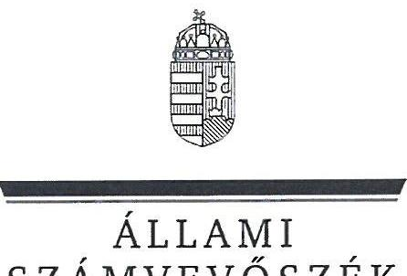
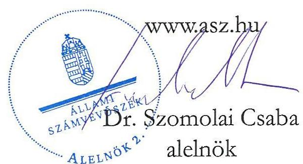
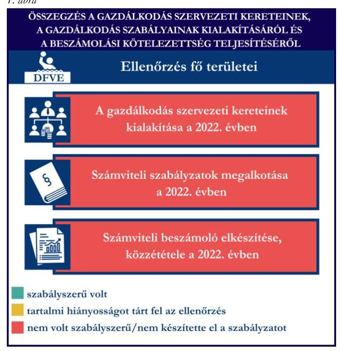
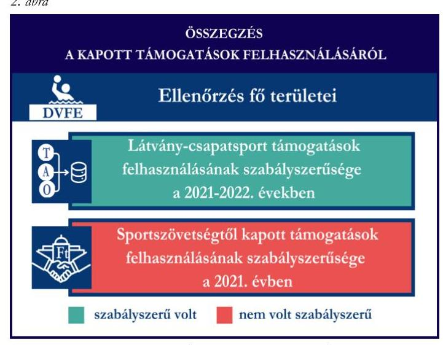
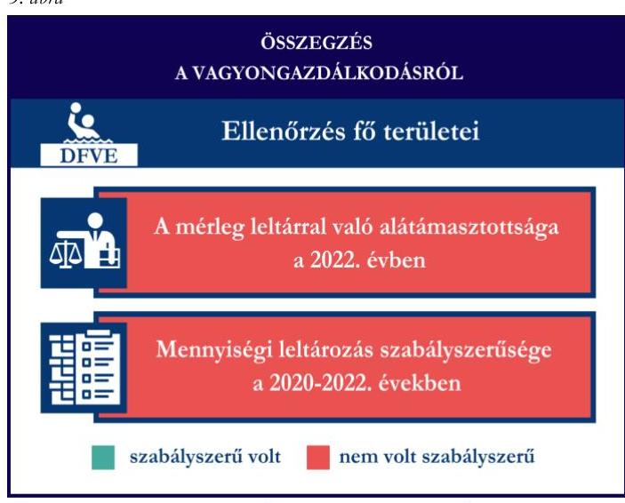

# JELENTÉS 

Támogatásban részesülő sportszövetségek, sportegyesületek és sportvállalkozások gazdálkodásának ellenőrzése

Dunaújvárosi Főiskola Vízilabda Egyesület

2025.

---

ÁLLAMI
SZÁMVEVŐSZÉK

# JELENTÉS 

## Támogatásban részesülő sportszövetségek, sportegyesületek és sportvállalkozások gazdálkodásának ellenőrzése

Dunaújvárosi Főiskola Vízilabda Egyesület

2025. 

25026

---

# ELLENŐRZÉSI IGAZGATÓSÁG: 

## ELLENŐRZÉSI IGAZGATÓSÁG V.

## ELLENŐRZÉSI IGAZGATÓ:

KLINGA LÁSZLÓ igazgató

## ELLENŐRZÉSVEZETŐ:

## KAKAS SÁNDOR ellenőrzésvezető

Jelentéseink az interneten a www.asz.hu címen olvashatók.

IKTATÓSZÁM: EL-4031-070/2025
TÉMASORSZÁM: 30
ELLENŐRZÉS-AZONOSÍTÓ SZÁM: V1078

---

# TARTALOMJEGYZÉK 

AZ ELLENŐRZÉS ALAPADATAI ..... 5
AZ ELLENŐRZÖTT SZERVEZET ..... 7
ÖSSZEFOGLALÁS ..... 8
AZ ELLENŐRZÉS FÓKUSZTERÜLETEI ..... 10
MEGÁLLAPÍTÁSOK ..... 11
JAVASLATOK ..... 18
MELLÉKLETEK ..... 20
I. sz. melléklet: Fogalomtár ..... 20
II. sz. melléklet: Az ellenőrzött szervezetek jegyzéke ..... 22
III. sz. melléklet: Fő ellenőrzési kritériumok fő ellenőrzési fókuszterületek szerint. ..... 23
FÜGGELÉK: ÉSZREVÉTELEK ..... 25
RÖVIDÍTÉSEK JEGYZÉKE ..... 26

---

.

---

# AZ ELLENŐRZÉS ALAPADATAI 

## AZ ELLENŐRZÉS CÉLJA

Az ellenőrzés célja az államháztartásból nyújtott támogatással, vagy az államháztartásból meghatározott célra ingyenesen juttatott vagyon felhasználásával érintett sportszövetségek, sportegyesületek és sportvállalkozások gazdálkodása szabályozottságának, gazdálkodási tevékenységének, ezen belül a beszámolási kötelezettség teljesítésének, a támogatások elkülönített nyilvántartásának, valamint a támogatások felhasználásának ellenőrzése.

## AZ ELLENŐRZÉS TÍPUSA

Kombinált ellenőrzés.

## AZ ELLENŐRZÖTT IDŐSZAK

Az 1. fókuszterület vonatkozásában a 2022. év.
A 2. fókuszterület vonatkozásában a 2021-2022. évek.
A 3. fókuszterület vonatkozásában a 2022. év, a mennyiségi felvétellel történő leltározás dokumentumai tekintetében a 2020-2022. évek.

## AZ ELLENŐRZÉS TÁRGYA

Az ellenőrzés tárgyát képezte a támogatásban részesülő sportegyesület gazdálkodása szabályozottságának, gazdálkodási tevékenységén belül a beszámolási kötelezettség teljesítésének, a vagyonnyilvántartásának, a támogatások elkülönített nyilvántartásának, valamint az államháztartási forrásból származó közvetlen vagy közvetett támogatások és a meghatározott célra ingyenesen juttatott vagyon felhasználásának vizsgálata. Az ellenőrzés a támogatások vonatkozásában kiterjedt továbbá a támogató felé történő beszámolási és elszámolási kötelezettségek teljesítésére, a jogszabályi és belső előírások betartására.

Az ellenőrzés kiterjedt minden olyan körülményre és adatra, amely az ÁSZ¹ jogszabályban meghatározott feladatainak teljesítéséhez, valamint az ellenőrzési program végrehajtása során felmerülő újabb összefüggések feltárásához szükséges volt.

## AZ ELLENŐRZÉS JOGALAPJA

Az ellenőrzés jogszabályi alapját az ÁSZ tv.² 1. § (3) bekezdése és az 5. § (3) bekezdése előírásai képezték.

---

# AZ ELLENŐRZÉS MÓDSZERE 

Az ellenőrzést a nemzetközi standardokat irányadónak tekintve az ellenőrzési program szempontjai, az ellenőrzött időszakban hatályos jogszabályok, az ellenőrzés általános szakmai szabályai, az ellenőrzésre irányadó ÁSZ módszertanok figyelembevételével végezte az ÁSZ.

Az ellenőrzési kérdések megválaszolásához szükséges bizonyítékok megszerzése az ellenőrzött szervezet által rendelkezésre bocsátott dokumentumokra, adatokra alapozva kérdésfeltevés (információkérés), interjú, mintavételezés útján történt.

Az ellenőrzési bizonyítékként felhasználható adatforrások közé tartoztak egyrészt az ellenőrzés során az ellenőrzött szervezettől bekért dokumentumok, másrészt adatforrás volt minden további, az ellenőrzés folyamán feltárt, az ellenőrzés szempontjából információt tartalmazó egyéb adatforrás.

A támogatásokkal, azok felhasználásával kapcsolatos kötelezettségek vizsgálatára mintavételi eljárások kerültek alkalmazásra. Támogatás-típusok szerint nagyságrend alapján egy darab támogatás képezte a vizsgálat tárgyát. Ezen támogatások felhasználásának szabályszerűsége támogatásonként kockázatértékelés alapján kiválasztott tételekkel került ellenőrzésre. A kiválasztott támogatási szerződésekhez kapcsolódó elszámolásokból 30 db tétel került ellenőrzésre, ahol az elszámolás nem érte el a 30 db -ot, ott tételes ellenőrzésre került sor. Ezen felül a vagyongazdálkodás szabályszerűségének ellenőrzéséhez is kockázatalapú mintavétel kapcsolódott. A támogatások felhasználása és a vagyongazdálkodás területén a tételek ellenőrzése kiterjedt a könyvvezetési kötelezettség vizsgálatára is. A tárgyi eszközök tekintetében 30 db került kiválasztásra a 2022. évben állományban lévő eszközök közül azok nyilvántartásának, elszámolásának szabályszerűsége ellenőrzése céljából. A kiválasztott tételek ellenőrzésének eredménye nem került kivetítésre a teljes sokaságra, a megállapítások az adott ellenőrzött tételek vonatkozásában kerültek megjelenítésre.

---

# AZ ELLENŐRZÖTT SZERVEZET 

A Dunaújvárosi Főiskola Vízilabda Egyesületét Alapszabálya³ szerint 1989-ben alapították, a civil szervezetek közhiteles bírósági nyilvántartásába bejegyzett adatok szerint Dunaújvárosi Vízművek Sportegyesület néven, Dunaújvárosi Főiskola Vízilabda Egyesület elnevezéssel 2001. november 24. napjától működik. A DFVE⁴ Alapszabálya szerinti célja többek között a rendszeres sportolás, testedzés biztosítása; működési területén az oktatási intézmények tanulóinak és a lakosság testnevelési és sporttevékenységének segítése; versenyszakosztályok működtetése; színvonalas sportversenyek szervezése és rendezése; kiemelkedő teljesítményű sportolók nemzetközi sportrendezvényeken történő szerepeltetése.

A DFVE legfőbb döntéshozó szerve a Közgyűlés, ügyvezető szerve az öt természetes személy tagból álló Elnökség, törvényes képviseletét az elnök és az egyesületi igazgató látja el, képviseleti joguk gyakorlásának terjedelme általános, módja önálló. Az elnök személyében 2024. július 1-jén változás következett be.

A DFVE az ellenőrzött időszakban jogszabályi előírás alapján könyvvizsgálatra nem, felügyelőbizottság létrehozására kötelezett volt.

A 2022. évben a DFVE vállalkozási tevékenységet is végzett.
A DFVE által az ellenőrzött időszakban igénybe vett támogatásokat az 1. táblázat mutatja be. 1. táblázat

A DFVE ÁLTAL IGÉNYBE VETT TÁMOGATÁSOK (ADATOK M FT-BAN)

|  | 2021. év | 2022. év |
| :-- | :--: | :--: |
| Központi költségvetési támogatás | - | - |
| Látvány-csapatsport támogatás | 76,1 | 191,0 |
| Helyi önkormányzati támogatás | - | - |
| Magyar Vízilabda Szövetségtől kapott támogatás | 18,4 | - |

---

# ÖSSZEFOGLALÁS 

Magyarország Alaptörvényének XX. cikke kimondja, hogy mindenkinek joga van a testi és lelki egészséghez, melynek érvényesülését Magyarország többek között a sportolás és a rendszeres testedzés támogatásával segíti elő. Az Országgyűlés a Sport tv.⁵-ben kinyilvánította, hogy a nemzet közössége a test művelését, a sportot, a nemzet alapértékének, kívánatos célnak tekinti. A sport a közjó része. Erősíti a közösség tagjainak egymáshoz tartozását, miként az egyén testi és lelki egészségét.

A sportegyesületek, sportszövetségek, sportvállalkozások működésükre és szakmai tevékenységük ellátására költségvetési támogatásban, önkormányzati támogatásban, ingyenes vagyonjuttatásban, valamint látvány-csapatsport támogatásban részesülhetnek, amelyekre fokozott figyelem irányul.

A társadalom részéről jogosan felmerülő elvárás, hogy a közpénzeket kezelő, azzal gazdálkodó szervezetek működéséről, tevékenységéről átfogó képet kapjon, a közpénzek rendeltetésszerű és átlátható módon történő felhasználásának értékelésére időről-időre sor kerüljön az ellenőrzések keretében.

A DFVE a könyvviteli szolgáltatás személyi feltételeinek megteremtéséről a jogszabályi előírásoknak megfelelően gondoskodott. A DFVE a jogszabályban foglaltak ellenére a felügyelőbizottságot a 2022. évre vonatkozóan nem hozta létre, mert a Közgyűlés nem választotta meg a felügyelőbizottság tagjait. A jogszabályi előírásokkal ellentétben a DFVE nem alakította ki a számviteli politikáját, a pénzkezelési szabályzat kivételével nem készítette el számviteli szabályzatait, továbbá nem rendelkezett számlarenddel.

A 2022. évben a könyvvezetési kötelezettség teljesítése nem felelt meg a jogszabályi előírásoknak. A DFVE a számviteli beszámoló- és közhasznúsági melléklet készítési- és közzétételi kötelezettségét nem szabályszerűen teljesítette.

A gazdálkodás szervezeti keretei kialakításának, a
számviteli szabályzatok megalkotásának, valamint a
számviteli beszámoló elkészítésének és közzétételének értékelését az 1. ábra mutatja be.

---

A DFVE a látvány-csapatsport támogatást és a kiegészítő sportfejlesztési támogatást, a 2021-2022. években az ellenőrzött tételek esetében a támogatási célnak megfelelően, szabályszerűen használta fel. Az MVLSZ⁶ által nyújtott támogatás vonatkozásában az ellenőrzés - mivel a támogatás egy része a DFVE Alapszabályába ütköző módon módosított munkaszerződés alapján kifizetett bérre került elszámolásra - szabálytalanságot tárt fel. A szabálytalanság okán a DFVE nem elszámolható bérköltséget számolt el a támogatás terhére, ezáltal a támogatás egy részét nem a támogatási célnak megfelelően használta fel.

A DFVE számviteli nyilvántartásában a kapott támogatásokat és azok felhasználását a jogszabályi előírás ellenére elkülönítetten nem tartotta nyilván.

A kapott támogatások felhasználásának értékelését a 2. ábra mutatja be.
A DFVE vagyongazdálkodása a 2022. évben nem volt szabályszerű, mert a jogszabályi előírás ellenére a 2022. évi egyszerűsített éves beszámolójának mérlegtételeit leltárral nem támasztotta alá, továbbá a 2022. évre vonatkozóan a mennyiségi felvétellel történő leltározást nem végezte el.

Az ellenőrzött tételek esetében a tárgyi eszközök üzembe helyezése és értékesedésük elszámolása tekintetében az ellenőrzés hiányosságot tárt fel.

A DFVE a 2022. évi számviteli nyilvántartásában olyan tárgyi eszközt mutatott ki, amely a valóságban nem volt fellelhető, így a Számv. tv.⁷ 15. § (2) (3) bekezdésében rögzített valódiság elve sérült.

A vagyongazdálkodás értékelését a 3. ábra mutatja be.

1. ábra

A mérleg leltárral való alátámasztottsága a 2022. évben

Mennyiségi leltározás szabályszerűsége a 2020-2022. években
szabályszerű volt ☐ nem volt szabályszerű

Forrás: ÁSZ megállapítások alapján ÁSZ saját szerkesztés

---

# AZ ELLENŐRZÉS FÓKUSZTERÜLETEI 

1.     - A gazdálkodási szabályok kialakítása, a könyvvezetési- és beszámolási kötelezettség teljesítése
2.     - A kapott támogatások felhasználása
3.     - Az ellenőrzött szervezet vagyongazdálkodása

---

# 1. A gazdálkodási szabályok kialakítása, a könyvvezetési- és beszámolási kötelezettség teljesítése 

Összegző megállapítás A 2022. évben a DFVE-nél a gazdálkodás szervezeti kereteinek, a gazdálkodás szabályainak kialakítása nem felelt meg a jogszabályi előírásoknak. A könyvvezetési-, a beszámolási- és a közzétételi kötelezettség teljesítése teljeskörűen nem felelt meg a jogszabályi előírásoknak.

A 2022. évben a DFVE a Számv. tv.-ben és a Civilszr.⁸-ben foglalt jogszabályi előírások betartásával gondoskodott a könyvviteli szolgáltatás személyi feltételeinek megteremtéséről, a könyvviteli szolgáltatás körébe tartozó feladatok ellátásával olyan számviteli szolgáltatást nyújtó társaságot bízott meg, amelynek a feladat irányításával, vezetésével, a beszámoló elkészítésével megbízott tagja megfelelt a jogszabályi követelményeknek.
A DFVE a Ptk.⁹ előírása alapján az első felügyelőbizottság tagjait az Alapszabályának V. fejezet 4. pontjában kijelölte, a felügyelőbizottsági tagok tagsági jogviszonya 5 éves határozott időtartamban került meghatározásra. A felügyelőbizottság tagjainak száma megfelelt a Ptk. előírásainak, azonban a határozott időtartam lejártát követően, 2022. évre vonatkozóan a Ptk. 3:26. § (4) bekezdésében foglaltak ellenére a Közgyűlés nem választotta meg a felügyelőbizottság tagjait, így felügyelőbizottság nem került létrehozásra.
A DFVE ellenőrzött időszakban hivatalban lévő elnöke az ellenőrzés során azt nyilatkozta, hogy a 2022. évben a DFVE-nél felügyelőbizottság nem működött.

A DFVE a 2022. évben a Számv. tv. 14. § (2) (3) bekezdésében előírtak ellenére nem rendelkezett számviteli politikával, továbbá a Számv. tv. 14. § (5) bekezdés a) és b) pontjaiban foglaltak ellenére nem készítette el az eszközök és a források leltárkészítési és leltározási szabályzatát, valamint az eszközök és a források értékelési szabályzatát. A DFVE a 2022. évben a Számv. tv.-ben előírt pénzkezelési szabályzat¹⁰ elkészítette, amely az ellenőrzött tartalmi kritériumoknak megfelelt. A DFVE a Számv. tv. 161. § (1) bekezdésében előírtak ellenére számlarendet nem készített.
A DFVE a Számv. tv. előírásainak megfelelően a 2022. évben kettős könyvvitelt vezetett. A DFVE a Civilszr. 9. § (8)-(9) bekezdései előírásai ellenére nem rendelkezett a vállalkozási tevékenység bevételeinek, ráfordításainak elkülönített nyilvántartásával. A 2022. évi egyszerűsített éves beszámoló eredménykimutatásában a Civilszr. 12. § (4) bekezdés előírása ellenére az alaptevékenységgel, valamint a vállalkozási tevékenységgel összefüggő tételeket elkülönítetten nem mutatta ki.
A DFVE a Civilszr. rendelkezéseinek megfelelően a 2022. évi egyszerűsített éves beszámolójában a bevételeit az értékesítés nettó árbevétele, egyéb bevétel és pénzügyi műveletek bevétele bontásban mutatta ki, továbbá az egyéb bevételeken belül a tagdíjakat és a kapott támogatások összegét részletezte, azonban a Számv. tv. 4. § (1) bekezdésében foglaltak ellenére a 2022. évi egyszerűsített éves beszámolóját könyvvezetéssel teljeskörűen nem támasztotta alá. A DFVE

 a Számv. tv. 16. § (3) bekezdésében foglaltak

---

ellenére a 2022. évi egyszerűsített éves beszámolójában és az azt alátámasztó könyvvezetés során egyes gazdasági eseményeket, ügyleteket nem a tényleges gazdasági tartalmuknak megfelelően mutatta be, mivel könyvviteli nyilvántartásában a tagdíjbevételek között táboroztatások díjai, oktatás díja is szerepelt, amelyek tényleges gazdasági tartalmukat tekintve nem minősülnek tagdíjbevételnek, továbbá a rendelkezésre bocsátott 2022. évi számlakeret alapján, a könyvviteli nyilvántartásban a tagdíjakat a 92 Belföldi Ért. Nettó Árbevétele főkönyvi számon belül a 922 Tagdíj számlán tartotta nyilván. Az egyéb bevételeken belül a kapott támogatások összegénél kizárólag a 9238 Egyéb támogatás MVLSZ főkönyvi számon szereplő összeget tüntette fel, annak ellenére, hogy a 9 Értékesítés árbevétele és bevételek főkönyvi számon is nyilvántartott kapott támogatásokat (MVLSZ és egyéb támogatás).
A DFVE megsértette a Civil tv. ${ }^{11} 30 . \S$ (1) bekezdésében előírtakat, mert a letétbe helyezett és az OBH honlapján „egyszerűsített éves beszámoló" elnevezéssel közzétett adatokat a Közgyűlés nem fogadta el. A DFVE ellenőrzött időszakban hivatalban lévő elnökének nyilatkozata alapján a 2022. évi számviteli beszámolót jóváhagyó döntéssel (közgyűlési határozat) az Alapszabály V. fejezet 1. pont, A közgyűlés hatásköre című részének e.) pontjában foglaltak ellenére nem rendelkeztek.
A DFVE a 2022. évre vonatkozóan a Civil tv. alapján az $\mathrm{OBH}^{12}$ honlapján „egyszerűsített éves beszámoló" elnevezéssel közzétett adatokat, amely azonban a Civil tv. 29. § (2) bekezdés c) pontjában, a Civilszr. 7. § (6) bekezdésében és 22. $\S$ (1) bekezdésében foglaltak ellenére nem tartalmazott kiegészítő mellékletet. A DFVE közzétett közhasznúsági melléklete a Civil vhr. ${ }^{13}$ 12. § (1) bekezdésében előírtak ellenére a Civil vhr. mellékletében szereplő 1-3. (A szervezet azonosító adatai; Tárgyévben végzett alapcél szerinti és közhasznú tevékenységek bemutatása; Közhasznú tevékenységek bemutatása (tevékenységenként)) és 5. pontokat (Célszerinti juttatások; Vezető tisztségviselőnek nyújtott juttatások) nem tartalmazta. A DFVE a 2022. évre vonatkozóan a Civil tv. alapján saját honlapján az ellenőrzés időszaka alatt - az OBH honlapján közzétett adatokkal egyezően - hiányosan tett közzé „egyszerűsített éves beszámoló" elnevezéssel adatokat.

# 2. A kapott támogatások felhasználása 

Összegző megállapítás

A DFVE a 2021. és a 2022. években a kapott látványcsapatsport támogatást, illetve a kiegészítő sportfejlesztési támogatást az ellenőrzött tételek vonatkozásában szabályszerűen használta fel, az MVLSZ által nyújtott támogatás vonatkozásában az ellenőrzés - mivel a támogatás egy része a DFVE Alapszabályába ütköző módon módosított munkaszerződés alapján kifizetett bérre került elszámolásra - szabálytalanságot tárt fel. A támogatások felhasználását nem tartotta elkülönítetten nyilván.

A DFVE a látvány-csapatsport támogatás esetében a 2021-2022. években a 107/2011. (VI. 30.) Korm. rendelet ${ }^{14} 11 . \S$ (2) bekezdésében foglaltak ellenére a támogatás felhasználásáról negyedévente az előrehaladási jelentéseket nem nyújtotta be az MVLSZ felé.
A DFVE-nek a számára nyújtott látvány-csapatsport támogatás (be/SFPMOD02/08032/2021/MVLSZ) és kiegészítő sportfejlesztési támogatás vonatkozásában a 107/2011. (VI. 30.) Korm. rendelet szerinti (záró)elszámolás benyújtási kötelezettsége az ellenőrzött időszakban nem volt. A DFVE a 107/2011.

---

(VI. 30.) Korm. rendeletnek megfelelő, könyvvizsgáló által ellenőrzött számviteli bizonylatokkal 2024. május 8-án számolt el a támogató felé. A könyvvizsgáló a 107/2011. (VI. 30.) Korm. rendeletben előírt felelősségbiztosítással rendelkezett.
A DFVE az ellenőrzött időszak könyvvezetése során a Civil tv. 20. § (4) bekezdésében előírt elkülönített számviteli nyilvántartást nem vezetett, ezáltal a DFVE nem tett eleget a 107/2011. (VI. 30.) Korm. rendelet
9. $\S$ (9) bekezdésében foglalt előírásnak, amely alapján a támogatás felhasználását elkülönítetten és naprakészen kell nyilvántartani.
A DFVE esetében a látvány-csapatsport támogatás ellenőrzött tételeinek (30 db) vonatkozásában az ÁSZ az alábbiakat állapította meg:

- a tételek számviteli elszámolását a Számv. tv.-ben és a 107/2011. (VI. 30.) Korm. rendeletben előírtak szerint - egy tétel kivételével - bizonylatokkal alátámasztották. A kivételt képező tétel (nevezés (utánpótlás) - 858000 Ft) esetén a bizonylat a Számv. tv. 167. § (1) bekezdés a)-e) pontjaiban előírt általános alaki és tartalmi kellékeket nem tartalmazta.
- a 107/2011. (VI. 30.) Korm. rendeletben foglaltaknak megfelelően a látvány-csapatsport támogatás tételek tartalma (gazdasági esemény) és összege alapján a támogatást a támogatási igazolásban meghatározottak szerinti jogcímre, az abban meghatározott mértékben használták fel;
- a 107/2011. (VI. 30.) Korm. rendeletben foglaltaknak megfelelően a látvány-csapatsport támogatás tételek számviteli bizonylatai alapján a gazdasági események a támogatási időszak (meghosszabbított támogatási időszak) végéig szerződés szerint teljesültek;
- a 107/2011. (VI. 30.) Korm. rendeletben foglaltaknak megfelelően a tételek számviteli bizonylatai alapján a gazdasági események pénzügyi rendezése - három tétel kivételével - az elszámolás benyújtására nyitva álló határidőig - figyelemmel az elszámolási határidő hosszabbítására - a támogatási jogcímnek megfelelő pénzforgalmi számláról teljesült. A kivételt képező tételek (szállás, étkezés (utánpótlás) - 5483761 Ft; szállás, étkezés (utánpótlás) - 2853893 Ft; szállás, étkezés (utánpótlás) - 557336 Ft) esetén a pénzügyi rendezés a csatolt bankkivonat alapján, a 107/2011. (VI. 30.) Korm. rendelet 9. § (8) bekezdésében foglaltakkal ellentétben, nem a támogatási jogcímnek megfelelő pénzforgalmi számláról történt, hanem devizaszámláról (FIZETÉSI SZÁMLA KTGV - EUR), mivel a számlák EUR-ban kerültek kiállításra.
- a látvány-csapatsport támogatás tételek számviteli bizonylatait a 107/2011. (VI. 30.) Korm. rendeletben foglaltaknak megfelelően - egy tétel kivételével - ellátták záradékkal. A kivételt képező tétel (szállás, étkezés (utánpótlás) - 2300000 Ft) esetén a 107/2011. (VI. 30.) Korm. rendelet 11. § (5) bekezdésében foglaltak ellenére a számlán nem az ellenőrzött sportfejlesztési programot jóváhagyó határozat száma szerinti záradék szerepelt.
- a számviteli bizonylatokon záradékolt összegek a 107/2011. (VI. 30.) Korm. rendeletben foglaltaknak megfelelően - egy tétel kivételével - megegyeztek a számlaösszesítőben feltüntetett értékekkel.
A kivételt képező tétel (szállás, étkezés (utánpótlás) - 2300000 Ft) esetén az eltérés a nem megfelelő záradék okán feltárt szabálytalanságból adódott. A számla összege, amely egyben a záradékolt összeg, megegyezett a számlaösszesítőben feltüntetett értékkel.
- a tételek számviteli bizonylatának az adott sportfejlesztési program terhére záradékolt összegei a 107/2011. (VI. 30.) Korm. rendeletben foglaltaknak megfelelően - két tétel kivételével - a Számv.

---

tv.-ben előírtak szerint a tartalmuknak megfelelő főkönyvi számra kerültek elszámolásra. Az egyik kivételt képező tétel esetén az eltérés az előző pontban - a záradék esetén - feltárt szabálytalanságból adódott. A másik kivételt képező tétel (szállás, étkezés (utánpótlás) 475800 Ft) esetén a Számv. tv. 16. § (3) bekezdésében előírtak ellenére, a számla teljes összege az 5295 sportszolgáltatás igénybevétel főkönyvi számra került elszámolásra, miközben az 522 főkönyvi számot érintő bérleti díj is szerepelt a számlán, 52800 Ft összegben.
A DFVE ÁSZ részére tett nyilatkozata szerint az országos sportági szakszövetségtől/sportszövetségtől saját felhasználású költségvetési támogatást nem kapott, 2021-2022. évben nem használt fel, azonban a 2022. évi főkönyvi kivonatában foglaltak alapján az MVLSZ-től támogatásban részesült. A DFVE a 2022. évben a MVLSZ-en keresztül számára juttatott támogatás bevételét 2022. évi egyszerűsített éves beszámolójában egyéb bevételként szerepeltette, könyvviteli nyilvántartásában azonban az egyéb bevételek helyett a 92 BELFÖLDI ÉRT. NETTÓ ÁRBEVÉTELE főkönyvi számon belül a 9238 Egyéb támogatás MVLSZ főkönyvi számon tartotta nyilván, megsértve ezzel a Számv. tv. 4. § (1) bekezdésében és 16. $\S$ (3) bekezdésében foglaltakat.
A kapott támogatásokról nem vezetett a Civil tv. 20. § (4) bekezdésében előírt elkülönített számviteli nyilvántartást, amelynek alapján támogatásonként megállapítható és ellenőrizhető lett volna a kapott támogatás felhasználása. A támogatás felhasználásáról az MVLSZ felé benyújtott beszámolót és annak részeként az összesített elszámolási táblázatot az MVLSZ-el 2021. november 10-én kötött, MVLSZ02/2021. számú támogatási szerződésben előírt formában és tartalommal elkészítette.
A DFVE esetében az MVLSZ-en keresztül számára juttatott támogatás ellenőrzött tételeinek (30 db) vonatkozásában az ÁSZ az alábbiakat állapította meg:

- a tételek számviteli elszámolását - négy tétel kivételével - a Számv. tv.-ben előírtak szerint bizonylatokkal alátámasztották. A kivételt képező négy tétel (Bér - 150415 Ft; Bér - 750011 Ft; Bér - 750011 Ft; Bér - 750011 Ft) a DFVE ellenőrzött időszakban hivatalban lévő (2011. december 6. - 2024. június 30.) elnöke részére történt bérkifizetés volt. A DFVE ellenőrzött időszakban hivatalban lévő elnöke 2016. november 2-tól, szakvezető munkakörben munkaviszonyban állt a DFVE-vel. A 2016. november 2-án megkötött munkaszerződés 2020. július 1-én és 2021. július 1-én a munkavállaló személyi alapbére vonatkozásában (2020. július 1-től havi bruttó 212000 Ft, 2021. július 1-től havi bruttó 918800 Ft) módosításra került. A saját munkaszerződés módosításait munkáltatóként és munkavállalóként is az ellenőrzött időszakban hivatalban lévő elnök írta alá.

---

A DFVE ellenőrzött időszakban hivatalban lévő elnöke által saját maga vonatkozásában megkötött munkaszerződés módosítások a DFVE Alapszabályának V. fejezet 1. pont, A közgyűlés hatásköre című részének g.) pontjában foglaltak ellenére - amely szerint a Közgyűlés kizárólagos hatáskörébe tartozik olyan szerződés megkötésének jóváhagyása, amelyet az egyesület saját tagjával, vezető tisztségviselőjével, a felügyelőbizottság tagjával, vagy ezek hozzátartozójával köt - a Közgyűlés által nem kerültek jóváhagyásra.
Tekintettel arra, hogy a megkötött munkaszerződés módosításokat a Közgyűlés nem hagyta jóvá, a szerződések hatálya a Ptk. 6:119. §-a alapján nem állt be. Az MVLSZ-02/2021. számú szerződés 5.1.2. pontjában foglaltak alapján - miszerint a támogatás többek között a kedvezményezettel munkaviszonyban vagy munkavégzésre irányuló egyéb jogviszonyban álló szakemberek bérére, illetve megbizási dijára, valamint e kifizetések közterheire fordítható - a DFVE Alapszabályába ütköző módon módosított munkaszerződés okán a támogatást céltól eltérően használta fel.
Figyelemmel az előzőekben leírtakra, továbbá az Mt. ${ }^{15}$ 42. § (1) bekezdésében és 45. § (1) bekezdésében, továbbá az 58. §-ban foglaltakra, az érvényesnek és hatályosnak nem minősülő munkaszerződés módosításokban rögzített munkavállalói személyi alapbér, az MVLSZ által nyújtott támogatás keretében összesen elszámolt 3757735 Ft bér a támogatás terhére nem elszámolható.

- a tételek gazdasági eseményének teljesítési időpontja a támogatási szerződésben meghatározott támogatott tevékenység időtartamán belül történt;
- a tételek tartalma megfelelt az előírt támogatott tevékenység megvalósításához kapcsolódó költségtervben meghatározott költségnek.
Egy tétel (Bér - 40222 Ft) vonatkozásában a kifizetés alapja a DFVE által 2021. február 1-én megkötött megbízási szerződés volt, amelyben a DFVE megbízást adott a DFVE történelmét, eredményeit összefoglaló kézirat elkészítésére. A megbízás időtartama 2021. február 1. - 2021. július 31. volt, a megbízási díjat havi 46500 Ft-ban állapították meg. A szerződés tartalmazta továbbá, hogy a megbízási díj minden ledolgozott hónapot követő hónap 10-ig kerül kifizetésre teljesítés igazolás alapján. A tétel vonatkozásában megállapításra került, hogy bár a költségtervnek megfelelt, azonban a megbízási szerződésben foglaltakkal ellentétben teljesítés igazolás nem állt rendelkezésre, továbbá a DFVE a megbízási szerződésben előírt kötelezettség teljesítésének eredményét, a DFVE történelmét, eredményeit összefoglaló kéziratot nem bocsátotta az ÁSZ rendelkezésre. A DFVE
 elnökének 2024. október 22-én tett nyilatkozata szerint nem volt tudomása a szerződés tárgyát képező iratról, az elnöki feladatok átvételekor erre utaló dokumentumot nem kapott. Nyilatkozta továbbá, hogy a DFVE gazdasági és működési átvilágítása folyamatban van. A fentiek alapján a tétel esetén a DFVE a jogszerű és célnak megfelelő felhasználást nem igazolta, az MVLSZ-en keresztül a DFVE számára juttatott támogatás keretében elszámolt összesen 80444 Ft megbízási díj kifizetése jogtalan volt, a támogatás terhére nem elszámolható.
- a támogatási szerződésben meghatározott felhasználási határidőig megtörtént a tételek pénzügyi rendezése;
- a számviteli bizonylatokat - két tétel kivételével - a 474/2016. (XII. 27.) Korm. rendelet ${ }^{15}$ előírásának megfelelően záradékkal ellátták. A kivételt képező tételek esetén a bizonylatokon a

---

474/2016. (XII. 27.) Korm. rendelet 24. § (2) bekezdésében foglaltak ellenére záradék nem szerepelt.

- a hivatkozott támogatási szerződés terhére a számviteli bizonylatokon záradékolt összeg - a nem záradékolt két tétel esetén a számla összege - a 474/2016. (XII. 27.) Korm. rendeletben foglaltaknak megfelelően megegyezett a számlaösszesítőben feltüntetett értékkel;
- a tételek számviteli bizonylatának a hivatkozott támogatási szerződés terhére záradékolt összegei a Számv. tv.-ben előírtak szerint a tartalmuknak megfelelő főkönyvi számra kerültek elszámolásra.

# 3. Az ellenőrzött szervezet vagyongazdálkodása 

## Összegző megállapítás A 2022. évben a DFVE vagyongazdálkodása nem volt szabályszerű.

A DFVE a közzétett 2022. évi egyszerűsített éves beszámolója mérlegtételeinek alátámasztásához a Számv. tv. 69. § (1) bekezdésében előírtak ellenére nem állított össze leltárat, amely tételesen és ellenőrizhető módon tartalmazta volna a DFVE mérleg fordulónapján meglévő eszközeit és forrásait mennyiségben és értékben.
A DFVE a Számv. tv. 69. § (2) bekezdésében előírtak ellenére a főkönyvi könyvelés és az analitikus nyilvántartások adatai közötti egyeztetést a 2022. év mérlegfordulónapjára vonatkozóan a mérlegtételek esetében dokumentáltan nem végezte el.
A DFVE a tárgyi eszközökről a számviteli alapelveknek megfelelő folyamatos mennyiségi nyilvántartást az ellenőrzött időszakban nem vezetett, a Számv. tv. 69. § (4) bekezdésében foglaltak ellenére a 2022. évre vonatkozóan mennyiségi felvétellel történő leltározást nem végzett.
A DFVE esetében a tárgyi eszköz tételek (30 db) ellenőrzése során az ÁSZ az alábbiakat állapította meg:

- a tételek bekerülési értékét alátámasztó számviteli bizonylatok a Számv. tv.-nek megfelelően rendelkezésre álltak;
- a tárgyi eszközök számviteli besorolása megfelelt a Számv. tv. előírásainak;
- az ellenőrzött 30 tételből 12 tétel esetében az üzembe helyezés tényét és időpontját a Számv. tv. 52. $\S$ (2) bekezdésében foglaltak ellenére hitelt érdemlő módon nem dokumentálták;
- az értékcsökkenés elszámolása, azon eszközök esetén, amelyeknél az üzembe helyezés tényét és időpontját megfelelően dokumentálták a Számv. tv.-nek megfelelően történt. Az értékcsökkenés elszámolása 12 tétel esetében az üzembe helyezés hitelt érdemlő módon történő dokumentálásának elmaradása okán nem volt ellenőrizhető.
- tizennyolc tétel esetén - ahol a tárgyi eszköz beszerzése támogatásból valósult meg - a tétel bekerülési értékét meghatározó számviteli bizonylatokat a 107/2011. (VI. 30.) Korm. rendeletben foglaltaknak megfelelően ellátták záradékkal, amelyből megállapítható volt, hogy a számviteli bizonylaton szereplő összegből mennyit számoltak el a szerződésszámmal hivatkozott támogatási szerződés terhére.
A DFVE-nél az ÁSZ ellenőrzés során a tárgyi eszközök vonatkozásában sor került tizennégy tétel helyszíni szemle keretében történő szemrevételezésére, amely alapján az eszközök - egy tétel kivételével - fizikailag fellelhetőek voltak.

---

A kivételt képező, nem fellelhető eszköz (Eredményjelző rendszer - 279327 Ft, számla szerinti bekerülési érték 2016. évben 5086350 Ft) esetén a helyszíni ellenőrzés során egy EPSON objektív került bemutatásra. A DFVE elnökének 2024. szeptember 24-én tett nyilatkozata szerint az Eredményjelző rendszer 2021. évben szétszerelésre került, a bemutatott EPSON objektív az eszköz része volt.

A DFVE az ÁSZ által végzett helyszíni szemle során egy látvány-csapatsport támogatásból 2016. évben 5086350 Ft-ért beszerzett tárgyi eszközt (eredményjelző) nem tudott az ellenőrzés számára bemutatni, mert az ellenőrzött szervezet képviselőjének nyilatkozata szerint szétszerelésre került, ezáltal megléte, valódisága nem volt bizonyított.
A DFVE az eredményjelző rendszert a 2022. évi könyvvitelében - az eszköz fizikai hiánya okán - tévesen mutatta ki, a Számv. tv. 15. § (3) bekezdésében rögzített valódiság elve sérült.

---

# JAVASLATOK 

Az ÁSZ tv. 33. § (1) bekezdésében foglaltak értelmében az ellenőrzött szervezet vezetője köteles a jelentésben foglalt megállapításokhoz kapcsolódó intézkedési tervet összeállítani és azt a jelentés kézhezvételétől számított 30 napon belül az ÁSZ részére megküldeni. Amennyiben az ellenőrzött szervezet vezetője nem küldi meg határidőben az intézkedési tervet, vagy továbbra sem elfogadható intézkedési tervet küld, az Állami Számvevőszék elnöke az ÁSZ tv. 33. § (3) bekezdése a) és b) pontjaiban foglaltakat érvényesítheti.

## A Dunaújvárosi Főiskola Vízilabda Egyesület elnökének

1. Intézkedjen a Ptk. 3:26. § (4) bekezdésében foglaltaknak megfelelően a felügyelőbizottsági tagok Közgyűlés általi megválasztásáról.
2. Gondoskodjon a Számv. tv. 14. § (3) bekezdésében foglaltaknak megfelelően a számviteli politika elkészítéséről.
3. Gondoskodjon a Számv. tv. 14. § (5) bekezdés a) pontjában foglaltaknak megfelelően az eszközök és a források leltárkészítési és leltározási szabályzatának elkészítéséről.
4. Gondoskodjon a Számv. tv. 14. § (5) bekezdés b) pontjában foglaltaknak megfelelően az eszközök és a források értékelési szabályzatának elkészítéséről.
5. Gondoskodjon a Számv. tv. 161. § (1) bekezdésében előírt számlarend elkészítéséről.
6. Gondoskodjon a Számv. tv. 16. § (3) bekezdésében foglaltak megfelelően, a beszámolóban és az azt alátámasztó könyvvezetés során az egyes gazdasági események, ügyletek tényleges gazdasági tartalmuknak megfelelő bemutatásáról.
7. Gondoskodjon a Számv. tv. 4. § (1) bekezdésében foglaltaknak megfelelően könyvvezetéssel alátámasztott, a Civil tv. 29. § (2) bekezdés c) pontjaiban előírt tartalmú beszámoló elkészítéséről.
8. Gondoskodjon a Civil vhr. 12. § (1) bekezdésében foglaltaknak megfelelően a Civil vhr. melléklete szerinti közhasznúsági melléklet elkészítéséről.

---

9. Gondoskodjon a beszámoló és a közhasznúsági melléklet Civil tv. 30. § (1) és (4) bekezdésében előírtaknak megfelelő közzétételéről.
10. Gondoskodjon arról, hogy a kapott támogatások felhasználását a Civil tv. 20. § (4) bekezdésében és a 107/2011. (VI. 30.) Korm. rendelet 9. § (9) bekezdésében foglalt előírásoknak megfelelően elkülönítetten tartsa nyilván.
11. Gondoskodjon arról, hogy a kapott látvány-csapatsport támogatások esetén a 107/2011. (VI. 30.) Korm. rendelet 11. § (2) bekezdésében foglaltak megfelelően a támogatás felhasználásáról negyedévente az előrehaladási jelentéseket nyújtsa be az MVLSZ felé.
12. Gondoskodjon arról, hogy az Alapszabály V. fejezet 1. pont A közgyűlés hatásköre címü részének g.) pontjában foglaltaknak megfelelően azok a szerződések, amelyek jóváhagyása a Közgyűlés kizárólagos hatáskörébe tartoznak, a Közgyűlés által jóváhagyásra kerüljenek.
13. Gondoskodjon a beszámoló mérlegtételeinek leltárral történő alátámasztásáról a Számv. tv. 69. § (1) bekezdése előírásainak megfelelően.
14. Gondoskodjon a Számv. tv. 69. § (4) bekezdésében foglaltaknak megfelelően mennyiségi felvétellel történő leltározás elvégzéséről.

---

# MELLÉKLETEK 

I. SZ. MELLÉKLET: FOGALOMTÁR

Civil szervezet

Egyesület

Kiegészítő sportfejlesztési támogatás

Költségvetési támogatás

Közhasznú szervezet

Közhasznú tevékenység

Látvány-csapatsport támogatás

Látvány-csapatsportban működő amatőr sportszervezet

Látvány-csapatsportban működő hivatásos sportszervezet

A civil társaság; a Magyarországon nyilvántartásba vett egyesület - a párt, a szakszervezet és a kölcsönös biztosító egyesület kivételével és - a közalapítvány és a pártalapítvány kivételével - az alapítvány. (Forrás: Civil tv. 2. § 6. pont a)-c) alpontjai)
Az egyesület a tagok közös, tartós, alapszabályban meghatározott céljának folyamatos megvalósítására létesített, nyilvántartott tagsággal rendelkező jogi személy. (Forrás: Ptk. 3:63. § (1) bekezdés)
A Számv. tv. szempontjából egyéb szervezet. (Számv. tv. 3. § (1) bekezdés 4. pont a) alpontja)

A látvány-csapatsportok támogatása esetében rendelkező nyilatkozatban felajánlott összeg 12,5 százaléka kiegészítő sportfejlesztési támogatásnak minősül. (Forrás: Tao tv. ${ }^{16}$ 24/A. § (9) bekezdés)
A társadalombiztosítás pénzügyi alapjai kivételével az államháztartás központi alrendszeréből ellenérték nélkül, pénzben nyújtott támogatások. (Forrás: Áht ${ }^{17}$. 1. $\S$ 14. pont)

Közhasznú szervezetté minősíthető a Magyarországon nyilvántartásba vett közhasznú tevékenységet végző szervezet, amely a társadalom és az egyén közös szükségleteinek kielégítéséhez megfelelő erőforrásokkal rendelkezik, továbbá amelynek megfelelő társadalmi támogatottsága kimutatható, és amely:
a) civil szervezet (ide nem értve a civil társaságot), vagy
b) olyan egyéb szervezet, amelyre vonatkozóan a közhasznú jogállás megszerzését törvény lehetővé teszi. (Forrás: Civil tv. 32. § (1) bekezdés)
Minden olyan tevékenység, amely a létesítő okiratban megjelölt közfeladat teljesítését közvetlenül vagy közvetve szolgálja, ezzel hozzájárulva a társadalom és az egyén közös szükségleteinek kielégítéséhez. (Forrás: Civil tv. 2. § 20. pont)
Az adóévben visszafizetési kötelezettség nélkül nyújtott támogatás, juttatás, véglegesen átadott pénzeszköz és térítés nélkül átadott eszköz könyv szerinti értéke, az adóévben térítés nélkül nyújtott szolgáltatás bekerülési értéke a Tao tv.-ben meghatározott jogcímeken. (Forrás: Tao tv. 4. § 44. pont)
Minden olyan, a sportról szóló törvényben meghatározott szabályok szerint a látvány-csapatsportban működő sportegyesület vagy sportvállalkozás, amelyik nem minősül a látvány-csapatsportban működő hivatásos sportszervezetnek. (Forrás: Tao tv. 4. § 42. pont)
A látvány-csapatsportágak országos sportági szakszövetsége által kiírt versenyrendszer legmagasabb felnőtt bajnoki osztályában - a veterán korosztályokra kiírt versenyrendszer kivételével - részt vevő (indulási jogot elnyert) sportszervezet, vagy alsóbb bajnoki osztályaiban részt vevő (indulási jogot elnyert) sportszervezet abban az esetben, ha az ilyen sportszervezet hivatásos sportolót alkalmaz. Több látvány-csapatsportban több jogi személy szervezeti egységgel (szakosztállyal) működő sportszervezet esetén csak az a jogi személy szervezeti egység (szakosztály), amely a fent részletezett versenyrendszerek bajnoki osztályaiban részt vesz. (Forrás: Tao tv. 4. § 43. pont)

---

Országos sportági szakszövetség

Sportági szövetség

Sportegyesület

Sportegyesületeknek, sportszövetségeknek nyújtott költségvetési támogatás
Sportszövetség

Sporttevékenység

Sportvállalkozás

Olyan sportszövetség, amely sportágában kizárólagos jelleggel az e törvényben, valamint más jogszabályokban meghatározott feladatokat lát el és e törvényben megállapított különleges jogosítványokat gyakorol. Olyan sportágban hozható létre, amelyet vagy a Nemzetközi Olimpiai Bizottság elismert, vagy amely sportág nemzetközi szövetségét felvették a Nemzetközi Sportszövetségek Szövetségébe (GAISF). (Forrás: Sport tv. 20. § (1), (4) bekezdés)
A Civil tv. és a Ptk. előírásai alapján - a Sport tv.-ben meghatározott eltérésekkel - működő szövetség, amelynek tagjai kizárólag sportszervezetek lehetnek. Sportági szövetség országos jelleggel is működhet. Egy sportágban csak egy országos sportági szövetség működhet. Törvényi feltételek teljesülése esetén szakszövetségi feladatokat is elláthat. (Forrás: Sport tv. 28. §)
A Civil tv. és a Ptk. szabályai szerint működő olyan egyesület, amelynek alaptevékenysége a sporttevékenység szervezése, valamint a sporttevékenység feltételeinek megteremtése. A sportegyesületek a Sport tv. 15. § (1) bekezdésében meghatározott sportszervezetek körébe tartoznak. A sportegyesületeken kívül sportszervezet még a sportvállalkozás, a sportiskola, valamint az utánpótlás-nevelés fejlesztését végző alapítvány. (Forrás: Sport tv. 16. § (1) bekezdés)
Az állami sport célú támogatások felhasználásáról és elosztásáról szóló 474/2016. (XII. 27.) Kormány rendelet és a 27/2013. (III. 29.) EMMI rendelet ${ }^{18}$ 1. §-ában meghatározott fejezeti kezelésű előirányzatokból nyújtott támogatás.
Meghatározott sporttevékenységek körében a sportversenyek szervezésére, a tagok érdekvédelmére és a részükre való szolgáltatásokra, valamint a nemzetközi kapcsolatok lebonyolítására létrehozott, jogi személyiséggel és önkormányzattal rendelkező, a Civil tv. és a Ptk. alapján - az e törvényben foglalt eltérésekkel különös formában működő egyesületek. A Sport tv. 19. § (3)
 bekezdése szerint a sportszövetségeknek az alábbi típusai léteznek: országos sportági szakszövetségek, sportági szövetségek, szabadidősport szövetségek, fogyatékosok sportszövetségei, diák- és egyetemi-főiskolai sport sportszövetségei, nemzetközi sportszövetségek. (Forrás: Sport tv. 19. § (1), (3) bekezdés)

Meghatározott szabályok szerint, a szabadidő eltöltéseként kötetlenül vagy szervezett formában, illetve versenyszerűen végzett testedzés vagy szellemi sportágban kifejtett tevékenység, amely a fizikai erőnlét és a szellemi teljesítőképesség megtartását, fejlesztését szolgálja. (Forrás: Sport tv. 1. § (2) bekezdés)

Az a gazdasági társaság, amelynek a cégnyilvántartásról, a cégnyilvánosságról és a bírósági cégeljárásról szóló törvény alapján a cégjegyzékbe bejegyzett tevékenysége sporttevékenység, továbbá a gazdasági társaság célja sporttevékenység szervezése, valamint a sporttevékenység feltételeinek megteremtése egy vagy több sportágban. Korlátolt felelősségű társasági, illetve részvénytársasági formában alapítható, a fogyatékosok sportja, illetve a szabadidősport területén közhasznú társaságként is működhet. (Forrás: Sport tv. 18. §)

---

II. SZ. MELLÉKLET: AZ ELLENŐRZÖTT SZERVEZETEK JEGYZÉKE

| ELLENŐRZÖTT SZERVEZET NEVE | ELLENŐRZÖTT SZERVEZET SZÉKHELYE |
| :-- | :-- |
| Dunaújvárosi Főiskola Vízilabda Egyesület | 2400 Dunaújváros, Építők útja 9. |

---

# III. SZ. MELLÉKLET: FŐ ELLENŐRZÉSI KRITÉRIUMOK FŐ ELLENŐRZÉSI FÓKUSZTERÜLETEK 

SZERINT

## FŐ ELLENŐRZÉSI FÓKUSZTERÜLETEK

1. A gazdálkodási szabályok kialakítása, a könyvvezetési és beszámolási kötelezettség teljesítése

## FŐ ELLENŐRZÉSI KRITÉRIUMOK

Civil tv. 2. § 7., 11. pont, 20. § (3) bekezdés c) pont, (4) bekezdés, 28. § (1)-(3) bekezdés, 29. § (1) bekezdés, (2) bekezdés c) pont, (3), (6), (7) bekezdés, 30. § (1)-(4) bekezdés, 40. § (1), (2) bekezdés, 41. § (1) bekezdés
Civilszr. 7. § (1) bekezdés, (4) bekezdés b), c) pont, (6) bekezdés, 8. § (2), (3) bekezdés, 9. § (4), (5), (8) bekezdés, 12. § (4), (5) bekezdés, 15. § (1) bekezdés a), b) pont, (2) bekezdés, 16. § (1), (3) bekezdés, 22. § (1) bekezdés, 24. § (2) bekezdés, 3.-4. sz. melléklet
Civil vhr. 12. § és melléklet
Cnytv. ${ }^{19}$ 39. § (1), (4) bekezdés, 40. § (2) bekezdés
Ptk. 3:26. § (1) bekezdés, 3:27. § (1) bekezdés, 3:82. § (1)-(2) bekezdés
Számv. tv. 4. §, 6. § (2) bekezdés, 12. §, 14. § (3), (5) bekezdés a), b), d) pont, (8) bekezdés, (11)-(12) bekezdés, 69. § (1), (3) bekezdés, 90. § (3) bekezdés c) pont, 96. § (4) bekezdés, 150. § (2) bekezdés, 153. § (1) bekezdés, 154. § (1) bekezdés, 161. § (1) bekezdés, (2) bekezdés a)-d) pont, (3)-(4) bekezdés, 161/A. § (1)(2) bekezdés, 165. § (2) bekezdés
Tao tv. 22/C. §
107/2011. (VI.30.) Korm. rendelet 9. § (9) bekezdés
2. A kapott támogatások felhasználása

Áht. 52. § (1) bekezdés, 53. §
Ávr. ${ }^{20} 76 . \S$ (1) bekezdés c) pont, 93. § (1)-(3), (5) bekezdés
Civil tv. 20. § (1) bekezdés c) pont, (2) bekezdés a) pont, (3) bekezdés a), c) pont, (4) bekezdés, 29. § (4), (5) bekezdés
Civilszr. 13. § (3) bekezdés, 24. § (1)-(2) bekezdés
Kbt. ${ }^{21}$ 5. § (2) bekezdés, 15. §
Számv. tv. 16. § (3) bekezdés, 25-26. §, 44. § (2) bekezdés, 45. § (1)-(2) bekezdés, 77. § (3) bekezdés b) pont, 78-81. §, 159. §, 161/A. § (2) bekezdés, 162. § (1) bekezdés, 165. § (1)-(2) bekezdés, 166. § (1) bekezdés, 167. § (1) bekezdés a), d), e), h) pont
Tao. tv. 22/C. §, 24/A. § (9) bekezdés
107/2011. (VI.30.) Korm. rendelet 2. § (3b) bekezdés, 4. § (11) bekezdés, 5. § (1) bekezdés, 6. § (1) bekezdés e) pont, 9. § (8)(10) bekezdés, 10. § (2), (2a), (2b), (4) bekezdés, 10. § (5a) bekezdés, 11. § (1), (1a), (1d), (1e), (2), (4), (4a), (5), (6) bekezdés, 13. § (1), (2a) bekezdés, 14. § (1), (4), (4b), (4c), (6c) bekezdés

275/2022. (VII.29.) Korm. rendelet ${ }^{22}$ 1. § (3)
444/2022. (XI.7) Korm. rendelet ${ }^{23} 2 . \S$
474/2016. (XII. 27.) Korm. rendelet 24. § (2) bekezdés, 26. § (3) bekezdés

---

3. Az ellenőrzött szervezet vagyongazdálkodása

Ptk. 3:63. § (4) bekezdés
Számv. tv. 15. § (3) bekezdés, 26. §, 46. § (3) bekezdés, 47-53. §, 57. §, 69. § (1)-(6) bekezdés, 165-166. §, 169. § (2) bekezdés

Tao tv. 22/C (6) bekezdés a), d), e) pont, (11) bekezdés
Ávr. 93. § (5) bekezdés
107/2011. (VI.30.) Korm. rendelet 11. § (5) bekezdés
474/2016. (XII. 27.) Korm. rendelet 17. § (1) bekezdés 11a. a) pont, 11b. pont, 17. § (2a) bekezdés, 24. § (2) bekezdés

---

# FÜGGELÉK: ÉSZREVÉTELEK 

A jelentéstervezetet a Számvevőszék 15 napos észrevételezésre megküldte az ellenőrzött szervezet vezetőjének az ÁSZ tv. 29. § (1) bekezdése előírásának megfelelően.
A Dunaújvárosi Főiskola Vízilabda Egyesület elnöke a jelentéstervezetre nem tett észrevételt.

[^0]
[^0]:    * 29. § (1) Az Állami Számvevőszék az ellenőrzési megállapításait megküldi az ellenőrzött szervezet vezetőjének vagy az általa megbízott személynek, és annak, akinek személyes felelősségét állapította meg.
    (2) Az ellenőrzött szervezet vezetője és a felelősként megjelölt személy az ellenőrzés megállapításaira tizenöt napon belül írásban észrevételt tehet.
    (3) Az Állami Számvevőszék az észrevételre a beérkezésétől számított harminc napon belül írásban válaszol. A figyelembe nem vett észrevételeket köteles a jelentésben feltüntetni, és megindokolni, hogy azokat miért nem fogadta el.

---

# RÖVIDÍTÉSEK JEGYZÉKE 

${ }^{1}$ ÁSZ ${ }^{2}$ ÁSZ tv. ${ }^{3}$ Alapszabály ${ }^{4}$ DFVE ${ }^{5}$ Sport tv. ${ }^{6}$ MVLSZ ${ }^{7}$ Számv. tv. ${ }^{8}$ Civilszr. ${ }^{9}$ Ptk. ${ }^{10}$ pénzkezelési szabályzat ${ }^{11}$ Civil tv. ${ }^{12} \mathrm{OBH}$ ${ }^{13}$ Civil vhr. ${ }^{14}$ 107/2011. (VI.30.) Korm. rendelet ${ }^{15}$ 474/2016. (XII. 27.) Korm. rendelet ${ }^{16}$ Tao tv. ${ }^{17}$ Áht. ${ }^{18}$ 27/2013. (III. 29.) EMMI rendelet ${ }^{19}$ Cnytv. ${ }^{20}$ Ávr. ${ }^{21}$ Kbt. ${ }^{22}$ 275/2022. (VII.29.) Korm. rendelet

[^0]
## Állami Számvevőszék

2011. évi LXVI. törvény az Állami Számvevőszékről

Dunaújvárosi Főiskola Vízilabda Egyesület alapszabálya módosításokkal egységes szerkezetben (2016. február 9.)
Dunaújvárosi Főiskola Vízilabda Egyesület
2004. évi I. törvény a sportról

Magyar Vízilabda Szövetség
2000. évi C. törvény a számvitelről

479/2016. (XII.28.) Korm. rendelet a számviteli törvény szerinti egyes egyéb szervezetek beszámoló készítési és könyvvezetési kötelezettségének sajátosságairól
2013. évi V. törvény a Polgári Törvénykönyvről

Dunaújvárosi Főiskola Vízilabda Egyesület Pénzkezelési szabályzata (hatályos: 2018. január 1-től)
2011. évi CLXXV. törvény - az egyesülési jogról, a közhasznú jogállásról, valamint a civil szervezetek működéséről és támogatásáról
Országos Bírósági Hivatal
350/2011. (XII. 30.) Korm. rendelet a civil szervezetek gazdálkodása, az adománygyűjtés és a közhasznúság egyes kérdéseiről
107/2011. (VI. 30.) Korm. rendelet a látvány-csapatsport támogatását biztosító támogatási igazolás kiállításáról, felhasználásáról, a támogatás elszámolásának és ellenőrzésének, valamint visszafizetésének szabályairól
474/2016. (XII. 27.) Korm. rendelet az állami sport célú támogatások felhasználásáról és elosztásáról
1996. évi LXXXI. törvény - a társasági adóról és az osztalékadóról
2011. évi CXCV. törvény az államháztartásról

27/2013. (III. 29.) EMMI rendelet az állami sport célú támogatások felhasználásáról és elosztásáról
2011. évi CLXXXI. törvény a civil szervezetek bírósági nyilvántartásáról és az ezzel összefüggő eljárási szabályokról
368/2011. (XII. 31.) Korm. rendelet az államháztartásról szóló törvény végrehajtásáról
2015. évi CXLIII. törvény a közbeszerzésekről
275/2022. (VII.29.) Korm. rendelet a látvány-csapatsport támogatását biztosító támogatási igazoláskiállításáról, felhasználásáról, a támogatás elszámolásának és ellenőrzésének, valamint visszafizetésének szabályairól szóló 107/2011. (VI. 30.) Korm. rendelet veszélyhelyzet ideje alatt történő eltérő alkalmazásáról
444/2022. (XI.7.) Korm. rendelet a veszélyhelyzet idején a látvány-csapatsport támogatását biztosító támogatási igazolás kiállításáról, felhasználásáról, a támogatás elszámolásának és ellenőrzésének, valamint visszafizetésének szabályairól szóló 107/2011. (VI. 30.) Korm. rendelet szabályainak eltérő alkalmazásáról

[^0]:    ${ }^{23} 444 / 2022$. (XI.7.) Korm. rendelet

---

1052 Budapest, Apáczai Csere János u. 10. | 1364 Budapest 4., Pf. 54
www.asz.hu | szamvevoszek@asz.hu
telefon: +36 14849100
