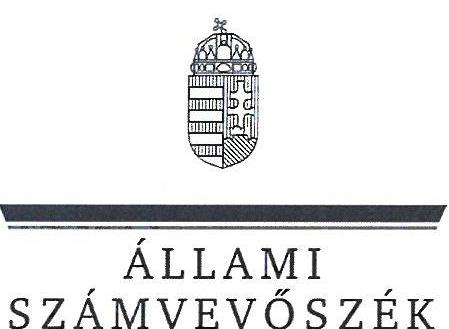
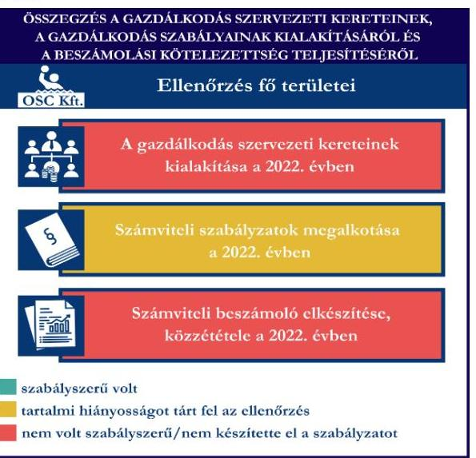
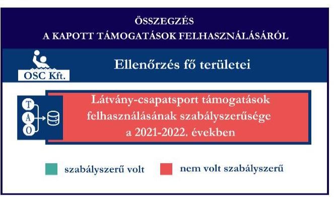
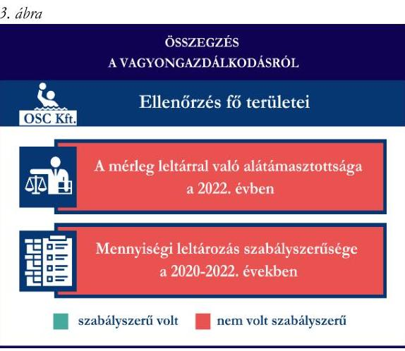

# JELENTÉS 

Támogatásban részesülő sportszövetségek, sportegyesületek és sportvállalkozások gazdálkodásának ellenőrzése

OSC Vízilabda Sport Korlátolt Felelősségű Társaság

2025.

---

ÁLLAMI
SZÁMVEVŐSZÉK

# JELENTÉS 

## Támogatásban részesülő sportszövetségek, sportegyesületek és sportvállalkozások gazdálkodásának ellenőrzése

OSC Vízilabda Sport Korlátolt Felelősségű Társaság

2025.

---

# ELLENŐRZÉSI IGAZGATÓSÁG: 

## ELLENŐRZÉSI IGAZGATÓSÁG V.

## ELLENŐRZÉSI IGAZGATÓ:

## KLINGA LÁSZLÓ igazgató

## ELLENŐRZÉSVEZETŐ:

## KAKAS SÁNDOR ellenőrzésvezető

Jelentéseink az interneten a www.asz.hu címen olvashatók.

IKTATÓSZÁM: EL-4031-074/2025
TÉMASORSZÁM: 30
ELLENŐRZÉS-AZONOSÍTÓ SZÁM: V1078

---

# TARTALOMJEGYZÉK 

AZ ELLENŐRZÉS ALAPADATAI ..... 5
AZ ELLENŐRZÖTT SZERVEZET ..... 7
ÖSSZEFOGLALÁS ..... 8
AZ ELLENŐRZÉS FÓKUSZTERÜLETEI ..... 10
MEGÁLLAPÍTÁSOK ..... 11
JAVASLATOK ..... 17
MELLÉKLETEK ..... 19
I. sz. melléklet: Fogalomtár ..... 19
II. sz. melléklet: Az ellenőrzött szervezetek jegyzéke ..... 21
III. sz. melléklet: Fő ellenőrzési kritériumok fő ellenőrzési fókuszterületek szerint. ..... 22
FÜGGELÉK: ÉSZREVÉTELEK ..... 23
RÖVIDÍTÉSEK JEGYZÉKE ..... 46

---

.

---

# AZ ELLENŐRZÉS ALAPADATAI 

## AZ ELLENŐRZÉS CÉLJA

Az ellenőrzés célja az államháztartásból nyújtott támogatással, vagy az államháztartásból meghatározott célra ingyenesen juttatott vagyon felhasználásával érintett sportszövetségek, sportegyesületek és sportvállalkozások gazdálkodása szabályozottságának, gazdálkodási tevékenységének, ezen belül a beszámolási kötelezettség teljesítésének, a támogatások elkülönített nyilvántartásának, valamint a támogatások felhasználásának ellenőrzése.

## AZ ELLENŐRZÉS TÍPUSA

Kombinált ellenőrzés.

## AZ ELLENŐRZÖTT IDŐSZAK

Az 1. fókuszterület vonatkozásában a 2022. év.
A 2. fókuszterület vonatkozásában a 2021-2022. évek.
A 3. fókuszterület vonatkozásában a 2022. év, a mennyiségi felvétellel történő leltározás dokumentumai tekintetében a 2020-2022. évek.

## AZ ELLENŐRZÉS TÁRGYA

Az ellenőrzés tárgyát képezte a támogatásban részesülő sportvállalkozás gazdálkodása szabályozottságának, gazdálkodási tevékenységén belül a beszámolási kötelezettség teljesítésének, a vagyonnyilvántartásának, a támogatások elkülönített nyilvántartásának, valamint az államháztartási forrásból származó közvetlen vagy közvetett támogatások és a meghatározott célra ingyenesen juttatott vagyon felhasználásának vizsgálata. Az ellenőrzés a támogatások vonatkozásában kiterjedt továbbá a támogató felé történő beszámolási és elszámolási kötelezettségek teljesítésére, a jogszabályi és belső előírások betartására.

Az ellenőrzés kiterjedt minden olyan körülményre és adatra, amely az ÁSZ¹ jogszabályban meghatározott feladatainak teljesítéséhez, valamint az ellenőrzési program végrehajtása során felmerülő újabb összefüggések feltárásához szükséges volt.

## AZ ELLENŐRZÉS JOGALAPJA

Az ellenőrzés jogszabályi alapját az ÁSZ tv.² 1. § (3) bekezdése, az 5. § (3) bekezdése előírásai képezték.

---

# AZ ELLENŐRZÉS MÓDSZERE 

Az ellenőrzést a nemzetközi standardokat irányadónak tekintve az ellenőrzési program szempontjai, az ellenőrzött időszakban hatályos jogszabályok, az ellenőrzés általános szakmai szabályai, az ellenőrzésre irányadó ÁSZ módszertanok figyelembevételével végezte az ÁSZ.

Az ellenőrzési kérdések megválaszolásához szükséges bizonyítékok megszerzése az ellenőrzött szervezet által rendelkezésre bocsátott dokumentumokra, adatokra alapozva kérdésfeltevés (információkérés), interjú, mintavételezés útján történt.

Az ellenőrzési bizonyítékként felhasználható adatforrások közé tartoztak egyrészt az ellenőrzés során az ellenőrzött szervezettől bekért dokumentumok, másrészt adatforrás volt minden további, az ellenőrzés folyamán feltárt, az ellenőrzés szempontjából információt tartalmazó egyéb adatforrás. Ezenfelül a tárgyi eszközök használatára, fizikai fellelhetőségére irányulóan az érintett vagyontárgyak helyszíni szemle keretében történő szemrevételezésére is sor került.

A támogatásokkal, azok felhasználásával kapcsolatos kötelezettségek vizsgálatára mintavételi eljárások kerültek alkalmazásra. Támogatás-típusok szerint nagyságrend alapján egy darab támogatás képezte a vizsgálat tárgyát. Ezen támogatások felhasználásának szabályszerűsége támogatásonként kockázatértékelés alapján kiválasztott tételekkel került ellenőrzésre. A kiválasztott támogatási szerződésekhez kapcsolódó elszámolásokból 30 db tétel került ellenőrzésre, ahol az elszámolás nem érte el a 30 db-ot, ott tételes ellenőrzésre került sor. Ezen felül a vagyongazdálkodás szabályszerűségének ellenőrzéséhez is kockázatalapú mintavétel kapcsolódott. A támogatások felhasználása és a vagyongazdálkodás területén a tételek ellenőrzése kiterjedt a könyvvezetési kötelezettség vizsgálatára is. A tárgyi eszközök tekintetében 30 db került kiválasztásra a 2022. évben állományban lévő eszközök közül azok nyilvántartásának, elszámolásának szabályszerűsége ellenőrzése céljából. A kiválasztott tételek ellenőrzésének eredménye nem került kivetítésre a teljes sokaságra, a megállapítások az adott ellenőrzött tételek vonatkozásában kerültek megjelenítésre.

---

# AZ ELLENŐRZÖTT SZERVEZET

Az OSC Vízilabda Sport Korlátolt Felelősségű Társaság 2014. július 12-én alakult. Az OSC Vízilabda Sport Kft.³ egyszemélyes gazdasági társaság, egyedüli tagja magánszemély. Az OSC Vízilabda Sport Kft. Alapító okiratban⁴ meghatározott fő tevékenysége „sport, szabadidős képzés", további tevékenységei között „sportegyesületi tevékenység, testedzési szolgáltatás, egyéb sporttevékenység" szerepel.

Az Alapító okirat szerint az egyedüli tag egyben a társaság ügyeinek intézésére és képviseletére jogosult ügyvezető volt.

Az OSC Vízilabda Sport Kft. az ellenőrzött időszakban a jogszabályi előírások alapján felügyelőbizottság létrehozására és könyvvizsgálatra nem volt kötelezett, azonban saját döntésével a beszámoló könyvvizsgálatát előírta. Az OSC Vízilabda Sport Kft., mint sportvállalkozás az ellenőrzött időszakban vállalkozási tevékenységet végzett.

Az OSC Vízilabda Sport Kft.-nek az ellenőrzött időszakban más társaságban tulajdoni részesedése nem volt.

Az OSC Vízilabda Sport Kft. által az ellenőrzött időszakban igénybe vett támogatásokat az 1. táblázat mutatja be.

1. táblázat

|  AZ OSC VÍZILABDA SPORT KFT. ÁLTAL IGÉNYBE VETT TÁMOGATÁSOK (ADATOK M FT-BAN) |  |   |
| --- | --- | --- |
|   | 2021. év | 2022. év  |
|  Központi költségvetési támogatás | - | -  |
|  Látvány-csapatsport támogatás | 53,6 | 141,1  |
|  Helyi önkormányzati támogatás | - | -  |
|  Magyar Vízilabda Szövetségtől kapott támogatás | - | -  |

---

# ÖSSZEFOGLALÁS 

Magyarország Alaptörvényének XX. cikke kimondja, hogy mindenkinek joga van a testi és lelki egészséghez, melynek érvényesülését Magyarország többek között a sportolás és a rendszeres testedzés támogatásával segíti elő. Az Országgyűlés a Sport tv.⁵-ben kinyilvánította, hogy a nemzet közössége a test művelését, a sportot, a nemzet alapértékének, kívánatos célnak tekinti. A sport a közjó része. Erősíti a közösség tagjainak egymáshoz tartozását, miként az egyén testi és lelki egészségét.

A sportegyesületek, sportszövetségek, sportvállalkozások működésükre és szakmai tevékenységük ellátására költségvetési támogatásban, önkormányzati támogatásban, ingyenes vagyonjuttatásban, valamint látvány-csapatsport támogatásban részesülhetnek, amelyekre fokozott figyelem irányul.

A társadalom részéről jogosan felmerülő elvárás, hogy a közpénzeket kezelő, azzal gazdálkodó szervezetek működéséről, tevékenységéről átfogó képet kapjon, a közpénzek rendeltetésszerű és átlátható módon történő felhasználásának értékelésére időről-időre sor kerüljön az ellenőrzések keretében.

Az OSC Vízilabda Sport Kft. a könyvviteli szolgáltatás 1. ábra személyi feltételeinek megteremtéséről a jogszabályi előírásoknak megfelelően gondoskodott, azonban belső szabályzatában előírtak ellenére a beszámoló felülvizsgálatára könyvvizsgálót nem bízott meg. Az OSC Vízilabda Sport Kft. rendelkezett számviteli szabályzatokkal, azonban a számviteli politika a jogszabályi előírások ellenére nem az OSC Vízilabda Sport Kft. gazdálkodására vonatkozó szabályokat rögzítette, továbbá a pénzkezelési szabályzat és a számlarend tekintetében az ellenőrzés hiányosságokat tárt fel. A leltározási és leltárkészítési-, valamint az eszközök és források értékelési szabályzata az ellenőrzött jogszabályi kritériumoknak megfeleltek.

A könyvvezetés formája a 2022. évben megfelelt a

jogszabályi előírásoknak, azonban a 2022. évi könyvvezetés során a támogatásból kapott bevétel könyvviteli elszámolása vonatkozásában az ellenőrzés szabálytalan könyveléseket tárt fel, melyeknek a 2022. évi beszámolóban kimutatott eredményre, valamint a saját tőkére gyakorolt hibahatása jelentős volt. Az OSC Vízilabda Sport Kft. közzétett 2022. évi egyszerűsített éves beszámolója nem mutatott megbízható és valós összképet a szervezet vagyonáról, annak összetételéről, pénzügyi helyzetéről, a valódiság elve sérült.

Az OSC Vízilabda Sport Kft. nem a jogszabályoknak megfelelően teljesítette az éves beszámoló készítési és közzétételi kötelezettségét. A 2022. évi beszámolót könyvvizsgálattal nem támasztotta alá.

A gazdálkodás szervezeti keretei kialakításának, a számviteli szabályzatok megalkotásának, valamint az éves beszámoló elkészítésének és közzétételének értékelését az 1. ábra mutatja be.

---

Forrás: ÁSZ megállapítások alapján ÁSZ saját szerkesztés
Alapjain ÁSZ saját szerkesztés

Az OSC Vízilabda Sport Kft. a 2022. évben a látvány-csapatsport támogatást az ellenőrzött tételek tekintetében nem a támogatási célnak megfelelően, nem szabályszerűen használta fel. A tárgyi eszköz beruházás, felújítás jogcímen kapott látvány-csapatsport támogatás terhére a 2022. évben nem szabályszerű kifizetést teljesített, mellyel a támogatási céltól eltérő felhasználás valósult meg.

Számviteli nyilvántartásában a támogatások felhasználását a jogszabályi előírások ellenére elkülönítetten nem tartotta nyilván, a felhasznált látvány-csapatsport támogatás egy részét költségként könyvvezetésében nem számolta el.

A kapott támogatások felhasználásának értékelését a 2. ábra mutatja be.
Az OSC Vízilabda Sport Kft. vagyongazdálkodása a 2022. évben nem volt szabályszerű, mert a 2022. évi egyszerűsített éves beszámolójának mérlegtételeit leltárral nem támasztotta alá. A 2020-2022. évekre vonatkozóan a tárgyi eszközök esetében a mennyiségi felvétellel történő leltározást egyik évben sem végezte el.

Az ellenőrzött tételek esetében a tárgyi eszközök üzembe helyezése nem volt szabályszerű, továbbá az értékcsökkenés elszámolása tekintetében az ellenőrzés hiányosságot tárt fel a 2022. évben.

A vagyongazdálkodás értékelését a 3. ábra mutatja be.

Forrás: ÁSZ megállapítások alapján ÁSZ saját szerkesztés

Az ellenőrzés során feltárt súlyos szabálytalanságok, törvénysértések és bűncselekmények gyanúja miatt - bizonylati rend megsértése, könyvvezetési, beszámoló készítési kötelezettség megszegése, és ezzel a megbízható és valós képet lényegesen befolyásoló hiba előidézése, valamint a látványcsapatsport támogatásnak a jóváhagyott céltól eltérő felhasználása, és ezzel a költségvetésnek vagyoni hátrány okozása - az ÁSZ törvényi kötelezettségének eleget téve az illetékes hatósághoz fordul.

---

# AZ ELLENŐRZÉS FÓKUSZTERÜLETEI 

1.     - A gazdálkodási szabályok kialakítása, a könyvvezetési- és beszámolási kötelezettség teljesítése
2.     - A kapott támogatások felhasználása
3.     - Az ellenőrzött szervezet vagyongazdálkodása

---

# 1. A gazdálkodási szabályok kialakítása, a könyvvezetési- és beszámolási kötelezettség teljesítése 

Összegző megállapítás A 2022. évben az OSC Vízilabda Sport Kft-nél a gazdálkodás szervezeti kereteinek kialakítása, a gazdálkodás szabályainak kialakítása - a leltározási és az értékelési szabályzat kivételével - nem felelt meg a jogszabályi előírásoknak. A könyvvezetési-, a beszámolási-, és a közzétételi kötelezettség teljesítése nem felelt meg a jogszabályi előírásoknak.

Az OSC Vízilabda Sport Kft. a 2022. évben a Számv. tv.⁶ előírásainak betartásával gondoskodott a könyvviteli szolgáltatás személyi feltételeinek megteremtéséről, a könyvviteli szolgáltatás körébe tartozó feladatok ellátásával 2022. január 1-től olyan társaságot bízott meg, amelynek a feladat irányításával, vezetésével, a beszámoló elkészítésével megbízott tagja megfelelt a jogszabályi követelményeknek.
Az OSC Vízilabda Sport Kft. saját döntése szerint a számviteli politika⁷ 4.1. pontjában előírta a beszámoló könyvvizsgáló által történő felülvizsgálatát, azonban a 2022. évi egyszerűsített éves beszámoló felülvizsgálatára, az abban foglaltak valódiságának és jogszerűségének ellenőrzésére könyvvizsgálót nem bízott meg, így a 2022. évi egyszerűsített éves beszámoló a Számv. tv 155. § (2) bekezdésében előírtak ellenére könyvvizsgálattal nem volt alátámasztva.
Az OSC Vízilabda Sport Kft. a 2022. évben rendelkezett a Számv. tv. alapján számviteli politikával, illetve annak keretében elkészítette az értékelési szabályzatot⁸, a leltározási szabályzatot⁹ és a pénzkezelési szabályzatot¹⁰. A számviteli politika a Számv. tv. 14. § (4) bekezdésében előírtak ellenére nem az OSC Vízilabda Sport Kft.-re, mint gazdálkodóra jellemző szabályokat tartalmazta, mert több ponton - köztük a 2. Az üzleti év, a mérleg fordulónapja, a 4. Könyvvizsgálat, letétbehelyezés és közzététel, 5. A könyvvezetés módja pontokban - nem gazdasági társaságra jellemző szabályokat, hanem civil szervezetekre vonatkozó számviteli nyilvántartási és elszámolási rendelkezéseket rögzített. A pénzkezelési szabályzatban a Számv. tv. 14. § (8)
 bekezdése ellenére nem rögzítették a készpénzállomány ellenőrzésekor követendő eljárást és a pénztár ellenőrzés gyakoriságát, továbbá a napi készpénz záróállomány maximális mértékét - „A bázipénztár működési szabályzata" cím alatt - korlátlan mennyiségben határozták meg, ami nem felel meg az Art. ${ }^{11}$ 114. § (2) bekezdésében foglaltaknak, mivel a készpénzben teljesíthető fizetések céljára szolgáló pénzeszközök kivételével pénzeszközeit pénzforgalmi számlán kell tartania. Az értékelési szabályzat és a leltározási szabályzat az ellenőrzött tartalmi kritériumoknak megfeleltek.
Az OSC Vízilabda Sport Kft. a Számv. tv. szerint a számlarendet ${ }^{12}$ és annak mellékleteként a bizonylati rendet ${ }^{13}$ elkészítette. A számlarend a Számv. tv. 161. § (2) bekezdés a)-c) pontjában foglaltak ellenére nem tartalmazta minden alkalmazásra kijelölt számla megnevezését, a számla tartalmát, a számlák értéke növekedésének, csökkenésének jogcímeit, a számlát érintő gazdasági eseményeket, a számlák más számlákkal való kapcsolatát, a főkönyvi számla és az analitikus nyilvántartások kapcsolatát.

---

Az OSC Vízilabda Sport Kft. a Számv. tv. előírásainak megfelelően a 2022. évben kettős könyvvitelt vezetett. Az OSC Vízilabda Sport Kft. könyvvezetési rendszerét a Számv. tv. 161/A. § (2) bekezdésben foglaltakkal ellentétben nem részletezte tovább oly módon, hogy az alapján a támogatások felhasználására vonatkozóan a 107/2011. (VI.30.) Korm. rendelet ${ }^{14}$ 9. § (9) bekezdése által előírt adatok ellenőrizhető módon rendelkezésre álljanak.

Az OSC Vízilabda Sport Kft. a 2022. évi beszámolóját alátámasztó főkönyvi könyvelésében olyan látvány-csapatsport támogatáshoz kapcsolódó aktív időbeli elhatárolás könyvelési tételeket számolt el, amelyek az egyéb bevételek elszámolásához kapcsolódóan a Számv. tv. 32. § (1) bekezdése és a 77. § (2) bekezdés d) pontja értelmében az OSC Vízilabda Sport Kft. mérlegében pénzügyi teljesülés és támogatási elszámolás hiányában nem szerepelhetnének. Az OSC Vízilabda Sport Kft. az ellenőrzés során a támogatások aktív időbeli elhatárolásának nyilvántartására szolgáló „399. A követelés-jellegű aktív időbe. (támogatások)" megnevezésű főkönyvi számla tartalmát, egyenlegét, az egyes könyvelési sorokat dokumentumokkal nem támasztotta alá, így nem tudta igazolni, hogy a 2020., 2021. és 2022. években könyvelt aktív időbeli elhatárolások a látvány-csapatsport támogatások még be nem folyt, de az MVLSZ által határozattal jóváhagyott összegeinek elhatárolását tartalmazza. A „399. A követelésjellegű aktív időbe. (támogatások)" főkönyvi számla 2022. január 1-ei nyitó értéke 121,95 M Ft, a 2022. december 31-ei egyenlege 61,74 M Ft, mely állomány könyvelési bizonylattal nem volt alátámasztott.
Az előzőekből következően az OSC Vízilabda Sport Kft. a Számv. tv. 15. § (3) bekezdésével ellentétben olyan gazdasági eseményeket rögzített könyvviteli rendszerében és a beszámolójában, amelyek a valóságban nem voltak megtalálhatóak, bizonyíthatóak, amivel megsértették a valódiság számviteli alapelvét.
Az OSC Vízilabda Sport Kft. a 2022. évi egyszerűsített éves beszámolójában az ellenőrzés részére megküldött főkönyvi kartonok és banki bizonylatok alapján az egyéb bevételek (96. Egyéb bevételek) között számolt el 75,92 M Ft támogatásból származó bevételt, mellyel szemben 2022. évben ténylegesen a támogatás felhasználás miatt csak 8,94 M Ft költsége keletkezett. Az OSC Vízilabda Sport Kft. a Számv. tv. 44. § (2) bekezdésében előírtak ellenére passzív időbeli elhatárolásként a költségek (a ráfordítások) ellentételezésére - visszafizetési kötelezettség nélkül - kapott, pénzügyileg rendezett, egyéb bevételként elszámolt támogatás összegéből az üzleti évben költséggel, ráfordítással nem ellentételezett 66,98 M Ft összeget nem mutatta ki.
A feltárt hibahatások összege meghaladta az OSC Vízilabda Sport Kft. 2022. évi mérlegfőösszegének (36,42 M Ft) 2%-át, így a 2022. évi egyszerűsített éves beszámoló a Számv. tv. 3. § (3) bekezdés 3. pontjában meghatározott jelentős összegű hibát tartalmazott.

Az OSC Vízilabda Sport Kft. a 2022. évben a látvány-csapatsport támogatás terhére olyan kifizetéseket teljesített, („Nyéki uszoda folyamatos teljesítésű számla" jogcímen kiállított 252000 Ft és 168000 Ft összegű számlák) amelyek esetében a pénzügyileg rendezett összegek a Számv. tv. 15. § (2) bekezdésében előírtak ellenére költségként egyáltalán nem kerültek elszámolásra, annak ellenére, hogy a gazdálkodónak könyvelnie kell mindazon gazdasági eseményeket, amelyeknek az eszközökre és a forrásokra, illetve a

---

tárgyévi eredményre hatása van, és a mérleg fordulónapja előtt bekövetkeztek, továbbá a mérleg elkészítését megelőzően ismertté váltak.
Az OSC Vízilabda Sport Kft.-nél a támogatások elhatárolása vonatkozásában feltárt szabálytalanságoknak a társaság vagyonára, a 2021-2022. évi mérlegében szereplő eredményére és saját tőkére gyakorolt hatását a jelentés 3. pontja tartalmazza.
Az OSC Vízilabda Sport Kft. a 2022. évre formailag a Számv. tv. előírásai szerinti egyszerűsített éves beszámolót készített, melyet a Ptk. ${ }^{15}$-ban foglaltaknak megfelelően az egyedüli tag az 1/2023. számú (2022. június 9-én kelt) alapítói határozatával jóváhagyott.
Az OSC Vízilabda Sport Kft. a 2022. évi egyszerűsített éves beszámolóját a Számv. tv. 153. § (1) bekezdésében előírt határidőn túl - 2023. június 26-án - helyezte letétbe és tette közzé, továbbá a saját honlapján a számviteli politika 4.3. pontjában és a Számv. tv. 154. § (9) bekezdésében előírtak ellenére nem tette közzé. A 2022. évi egyszerűsített éves beszámoló könyvvizsgálatának hiányában a Számv. tv. 153. § (1) bekezdésében foglaltak ellenére a könyvvizsgálói jelentés letétbehelyezésére sem került sor.

# 2. A kapott támogatások felhasználása 

Összegző megállapítás

Az OSC Vízilabda Sport Kft. a 2022. évben a kapott látványcsapatsport támogatást a jóváhagyott céltól eltérően, nem szabályszerűen használta fel. A látvány-csapatsport támogatás, illetve a kiegészítő sportfejlesztési támogatás felhasználását a jogszabályi előírás ellenére nem tartotta elkülönítetten nyilván.

Az OSC Vízilabda Sport Kft. a számára az SFP/08123/2021/MVLSZ számú sportfejlesztési program alapján nyújtott látvány-csapatsport támogatás és az SFP-04123/2019/MVLSZ számú sportfejlesztési program alapján nyújtott kiegészítő sportfejlesztési támogatás címen kapott bevételeket a 2021. évben a Számv. tv. 72. § (1) bekezdése és 77. § (2) bekezdés d) pontja ellenére nem az egyéb bevételek között, hanem az értékesítés nettó árbevétele között tartotta nyilván. A 2022. évben a beérkező támogatásokat a Számv. tv. előírásai szerint az egyéb bevételek között számolta el.
Az OSC Vízilabda Sport Kft. a 2021. évben a 107/2011. (VI. 30.) Korm. rendelet 9. § (8) bekezdésében foglaltak ellenére a támogatásokat nem kezelte támogatási jogcímenként önálló pénzforgalmi számlán. A 2022. évben a beérkező támogatásokat a 107/2011. (VI. 30.) Korm. rendelet szerint már önálló pénzforgalmi számlán kezelték.
Az OSC Vízilabda Sport Kft. a 107/2011. (VI. 30.) Korm. rendelet 9. § (9) bekezdés előírása ellenére a látvány-csapatsport támogatás és kiegészítő sportfejlesztési támogatás felhasználását az ellenőrzött időszakban nem tartotta elkülönítetten és naprakészen, ellenőrizhető módon nyilván.
Az OSC Vízilabda Sport Kft. a látvány-csapatsport támogatások esetében a 2021-2022. évben eleget tett a 107/2011. (VI. 30.) Korm. rendeletben foglaltaknak, a támogatás felhasználásáról negyedévente az előrehaladási jelentéseket benyújtotta az MVLSZ ${ }^{16}$ felé.
Az OSC Vízilabda Sport Kft. 2022. augusztus 13-án benyújtott hosszabbítási kérelme alapján az SFP/08123/2021/MVLSZ számú sportfejlesztési program az ellenőrzött időszakon belül a támogatás összegének növelésére vonatkozóan egy alkalommal meghosszabbításra került. A módosítást az MVLSZ

---

2022. november 9-én a ki/JHINTMOD01-08123/2021/MVLSZ iktatószámú határozatával hagyta jóvá. Az MVLSZ 2022. szeptember 21-i határozatában a határidőt 2023. június 30-ig hosszabbította meg, mely már nem érinti az ellenőrzött időszakot.

Az OSC Vízilabda Sport Kft. az SFP/08123/2021/MVLSZ számú sportfejlesztési program alapján „tárgyi eszköz beruházás, felújítás" jogcímen igényelt látvány-csapatsport támogatást, melyet az MVLSZ 2021. november 26-án hagyott jóvá. A teljesítési határidő az OSC Vízilabda Sport Kft. első hosszabbítási kérelme alapján 2023. június 30-ára, második hosszabbítási kérelme alapján pedig 2024. június 30-ára módosult. Az OSC Vízilabda Sport Kft.-t a hosszabbítási kérelem kapcsán a MVLSZ a fel nem használt támogatások rendelkezésre állását igazoló bankszámlakivonatok be nem nyújtása miatt hiánypótlásra hívta fel. Az OSC Vízilabda Sport Kft. a sportfejlesztési program terhére megvalósítandó Nyéki Imre Uszoda területén sátor kivitelezése céljából 2022. augusztus 1-jén - az ügyvezető férje és annak családja tulajdonában álló - vállalkozással bruttó 159,0 M Ft összegű vállalkozási szerződést kötött, melyben a vállalkozás részére teljesítési határidő nem került kikötésre. (Az MVLSZ felé az SFP/08123/2021/MVLSZ sportfejlesztési program jóváhagyási eljárása során a sátorfedéssel kapcsolatosan becsatolt 3 db árajánlat között a vállalkozástól, mint ajánlattevőtől származó ajánlat nem szerepelt.) Az OSC Vízilabda Sport Kft. a vállalkozási szerződés alapján a sátor kivitelezése céljára előleg jogcímen bruttó 95,4 M Ft összegű kifizetést teljesített a vállalkozó részére. Az ügyvezető ellenőrzés során tett nyilatkozata szerint az előlegként kifizetett 95,4 M Ft elegendő a vállalkozási szerződésben vállalt feladatok elvégzéséhez, a kifizetett összeg a végszámla összege lesz.
A rendelkezésre álló dokumentumok alapján az ellenőrzés időszakáig a vállalkozási szerződés alapján tényleges teljesítés, vagy az előlegként kifizetett összeg visszautalására nem került sor. Az OSC Vízilabda Sport Kft. az előzőekből következően a támogatásból úgy utalt ki 2022. évben beruházási előlegként pénzösszeget, hogy azt csak 2025. évben tervezte megvalósítani. Előzőek alapján a 95,4 M Ft összegű előleg kifizetésével a látvány-csapatsport támogatásnak a jóváhagyott céltól eltérő felhasználása, és ezzel a költségvetésnek vagyoni hátrány okozása merült fel, emiatt az ÁSZ törvényi kötelezettségének eleget téve az illetékes hatósághoz fordul.

Mivel a támogatási időszak még nem zárult le, ezért az OSC Vízilabda Sport Kft. a számára SFP/08123/2021/MVLSZ számú sportfejlesztési program alapján nyújtott látvány-csapatsport támogatásról a támogató felé az ellenőrzött időszakban még nem nyújtotta be a 107/2011. (VI.30.) Korm. rendelet szerinti (záró)elszámolást. Az SFP-04123/2019/MVLSZ számú sportfejlesztési program alapján nyújtott kiegészítő sportfejlesztési támogatásról a 107/2011. (VI.30.) Korm. rendeletnek megfelelően beszámoló és számlaösszesítő benyújtásával elszámolt.
Az OSC Vízilabda Sport Kft. esetében a látvány-csapatsport támogatás és kiegészítő sportfejlesztési támogatás ellenőrzött tételeinek ( $14+8 \mathrm{db}$ ) vonatkozásában az alábbiakat állapította meg az ÁSZ:

- a tételek számviteli elszámolását a Számv. tv.-ben és a 107/2011. (VI. 30.) Korm. rendeletben előírtak szerint bizonylatokkal alátámasztották;
- a tételekhez kapcsolódó számviteli bizonylatokat - nyolc kivételével - a 107/2011. (VI. 30.) Korm. rendelet előírása szerint ellátták záradékkal. A kivétel nyolc kiegészítő sportfejlesztési támogatás

---

(bérfeladás) tétel esetében a számviteli bizonylat záradékot tartalmazott, azonban a 107/2011. (VI. 30.) Korm. rendelet 11. § (1), (5) bekezdéseinek előírása ellenére nem tüntették fel, hogy a számviteli bizonylaton szereplő összegből mennyit számoltak el az SFP-04123/2019/MVLSZ számú sportfejlesztési program terhére;

- a tételek számviteli bizonylatának az adott sportfejlesztési program terhére záradékolt összegei két tétel kivételével - a Számv. tv-ben előírtak szerint a tartalmuknak megfelelő főkönyvi számra kerültek elszámolásra. A két kivétel tétel („Nyéki uszoda folyamatos teljesítésű számla" jogcímen kiállított 252000 Ft és 168000 Ft összegű számla) esetében a tételek pénzügyileg rendezésre kerültek, azonban a Számv. tv. 15. § (2) bekezdésében előírtak ellenére költségként nem kerültek elszámolásra.

# 3. Az ellenőrzött szervezet vagyongazdálkodása 

## Összegző megállapítás A 2022. évben az OSC Vízilabda Sport Kft. vagyongazdálkodása nem volt szabályszerű.

Az OSC Vízilabda Sport Kft. a 2022. évi egyszerűsített éves
 beszámoló mérlegét a Számv. tv. 69. § (1) bekezdésében foglaltak ellenére leltárral nem támasztotta alá.
Az OSC Vízilabda Sport Kft. a Számv. tv. 69. § (3) bekezdésében, továbbá a leltározási szabályzat 4. pontjában foglaltak ellenére - ami a tárgyi eszközök vonatkozásában a mennyiségi leltár készítését évente írta elő - a mennyiségi felvétellel történő leltározást a 2020-2022. évekre vonatkozóan egyik évben sem végezte el.

A számvevőszéki jelentés 1. pontjában részletezésre kerültek az OSC Vízilabda Sport Kft. 2022. évi könyvvezetésében és egyszerűsített éves beszámolójában a bevételek, támogatások időbeli elhatárolása kapcsán azonosított szabálytalanságok.
Az OSC Vízilabda Sport Kft. 2022. évi beszámolójában nem mutatta ki passzív időbeli elhatárolásként a támogatás összegéből az üzleti évben költséggel, ráfordítással nem ellentételezett összeget, továbbá a valótlan, szabálytalan könyvelési tételek az OSC Vízilabda Sport Kft. mérlegében szereplő saját tőkét módosították, így az OSC Vízilabda Sport Kft. 2022. évi beszámolójában bizonylatokkal, könyvvezetéssel nem alátámasztható adatok szerepeltek. A megbízható és valós képet lényegesen befolyásoló hiba 2021-ben 125,4 M Ft, 2022-ben 122,7 M Ft volt. A feltárt hibák a saját tőke vonatkozásában 2022. évben meghaladták a mérlegfőösszeg 2%-át, ezzel a jelentős összeget, továbbá 2022. évben a mérlegfőösszeg és a nettó árbevétel 20%-át, így a megbízható és valós képet lényegesen befolyásoló hibának minősülnek. A fiktív eredmény kimutatásával az OSC Vízilabda Sport Kft. megsértette a Számv. tv. 4. § (2) bekezdését, mert a beszámolónak megbízható és valós összképet kell adnia a gazdálkodó vagyonáról, annak összetételéről (eszközeiről és forrásairól), pénzügyi helyzetéről és tevékenysége eredményéről.
Az OSC Vízilabda Sport Kft. a nem szabályszerű könyvelések eredményeként 2022. évi beszámolójában nem valós eredményt mutatott ki.
A bizonylati rend megsértése, a könyvvezetési, beszámoló készítési kötelezettség megszegése, és ezzel a megbízható és valós képet lényegesen befolyásoló hiba előidézése miatt az ÁSZ törvényi kötelezettségének eleget téve az illetékes hatósághoz fordul.

---

Az OSC Vízilabda Sport Kft. könyvelésében a korábbi években a támogatások elszámolása során az aktív időbeli elhatárolások és passzív időbeli elhatárolások, elmaradt könyvelések vonatkozásában feltárt szabálytalanságok 2022. évi eredményre gyakorolt hatását a 4. ábra mutatja be:

|  | MEGNEVEZÉS | 2020.12.31 (EFt) | 2021.12.31 (EFt) | 2022.12.31 (EFt) |
| :--: | :--: | :--: | :--: | :--: |
| I. | Jegyzett tőke | 3000 | 3000 | 3000 |
| III. | Tőketartalék | - | 35350 | 35350 |
| IV. | Eredménytartalék | $-45882$ | $-51761$ | $-33453$ |
| V. | Lekötött tartalék | 50350 | - | - |
| VI. | Mérleg szerinti eredmény | $-5879$ | 18308 | $-52898$ |
| Saját tőke az OSC Vízilabda Sport Kft. mérlegében |  | 1589 | 4897 | $-48001$ |
| Eredmény | korrekció az el nem könyvelt költségek miatt | - | - | $-420$ |
| Eredménytartalék korrekció a megelőző év szabálytalan könyvelése miatt |  | - | $-71800$ | $-120466$ |
| Bevételként ki nem mutatott pénzügyileg rendezett támogatás 2022-évben |  | - | - | 65213 |
| Aktív időbeli elhatárolásként könyvelt, de pénzügyileg nem rendezett TAO támogatás |  | $-73389$ | $-53563$ | - |
| Passzív időbeli elhatárolásként el nem könyvelt, költségekkel/ráfordításokkal nem ellentételezett látvány-csapatsport támogatás |  | - | - | $-66978$ |
| Szabálytalan könyvelések eredményhatásával korrigált saját tőke |  | $-71800$ | $-120466$ | $-170653$ |

Forrás: Az ellenőrzött szervezet ellenőrzési dokumentumai alapján ÁSZ saját szerkesztés

Az OSC Vízilabda Sport Kft. esetében a tárgyi eszköz ellenőrzött tételek (7 db) vonatkozásában az alábbiakat állapította meg az ÁSZ:

- a tételek bekerülési értékét alátámasztó számviteli bizonylatok - egy tétel kivételével - a Számv. tv.-nek megfelelően rendelkezésre álltak. A kivétel (716748 Ft értékű „czękvény”) tétel bekerülési értékét a Számv. tv. 47. § (1) bekezdése és a 165. § (1) bekezdése előírása ellenére bizonylattal nem támasztották alá;
- a tárgyi eszközök számviteli besorolása megfelelt a Számv. tv. előírásainak;
- a tárgyi eszközök üzembe helyezését a Számv. tv. 52. § (2) bekezdésében foglaltak ellenére hitelt érdemlően nem dokumentálták;
- az értékcsökkenés elszámolása - az üzembe helyezés hitelt érdemlő dokumentálása elmaradása miatt - a Számv. tv. 52. § (2) bekezdésében előírtak ellenére nem volt ellenőrizhető.

---

# JAVASLATOK 

Az ÁSZ tv. 33. § (1) bekezdésében foglaltak értelmében az ellenőrzött szervezet vezetője köteles a jelentésben foglalt megállapításokhoz kapcsolódó intézkedési tervet összeállítani és azt a jelentés kézhezvételétől számított 30 napon belül az ÁSZ részére megküldeni. Amennyiben az ellenőrzött szervezet vezetője nem küldi meg határidőben az intézkedési tervet, vagy továbbra sem elfogadható intézkedési tervet küld, az Állami Számvevőszék elnöke az ÁSZ tv. 33. § (3) bekezdése a) és b) pontjaiban foglaltakat érvényesítheti.

## Az OSC Vízilabda Sport Korlátolt Felelősségű Társaság Ügyvezetőjének

1. Gondoskodjon a jövőben a beszámoló könyvvizsgálattal való alátámasztásáról a számviteli politika 4.1 pontja szerint a Számv. tv. 152. § (2) bekezdésének megfelelően.
2. Gondoskodjon a számviteli politika elkészítéséről a Számv. tv. 14. § (4) bekezdésében előírtak figyelembevételével.
3. Gondoskodjon a pénzkezelési szabályzat módosításáról a Számv. tv. 14. § (8) bekezdésében és az Art. 114. § (2) bekezdésében előírtak figyelembevételével.
4. Gondoskodjon arról, hogy a számlarend megfeleljen a Számv. tv. 161. § (2) bekezdés a)-c) pontjában előírtaknak.
5. Gondoskodjon a könyvvezetési rendszere kialakításáról a Számv. tv. 161/A. § (2) bekezdésben foglaltak szerint, annak érdekében, hogy az alapján a támogatások felhasználására vonatkozóan a 107/2011. (VI.30.) Korm. rendelet 9. § (9) bekezdésében előírt adatok ellenőrizhető módon rendelkezésre álljanak.
6. Gondoskodjon az egyszerűsített éves beszámoló Számv. tv. 153. § (1) bekezdésében és 154. § (9) bekezdésében előírtak szerinti közzétételéről.
7. Gondoskodjon arról, hogy kapott látvány-csapatsport támogatások és kiegészítő sportfejlesztési támogatások felhasználását a 107/2011. (VI. 30.) Korm. rendelet 9. § (9) bekezdésében foglalt előírásoknak megfelelően elkülönítetten tartsa nyilván.

---

8. Gondoskodjon a kiegészítő sportfejlesztési támogatások elszámolása során az elszámolt bizonylatok 107/2011. (VI. 30.) Korm. rendelet 11. § (1), (5) bekezdéseiben előírtak szerinti záradékolásáról.
9. Gondoskodjon a látvány-csapatsport támogatások elszámolása során az elszámolt bizonylatok költségként történő elszámolásáról a Számv. tv. 15. § (2) bekezdésében előírtak figyelembevételével.
10. Gondoskodjon a beszámoló mérlegtételeinek leltárral történő alátámasztásáról a Számv. tv. 69. § (1) bekezdése előírásainak megfelelően.
11. Gondoskodjon a Számv. tv. 69. § (3) bekezdésében foglaltaknak megfelelően a mennyiségi felvétellel történő leltározás elvégzéséről.
12. Gondoskodjon a tárgyi eszközök bekerülési értékének bizonylattal történő alátámasztásáról, a Számv.tv. 47. § (1) és 165. § (1) bekezdésében foglaltakra figyelemmel.
13. Gondoskodjon arról, hogy a tárgyi eszközök üzembe helyezésére a Számv. tv. 52. § (2) bekezdésében foglaltak szerint hitelt érdemlő módon dokumentáltan kerüljön sor.
14. Gondoskodjon a tárgyi eszközök esetében a Számv. tv. 52. § (1) bekezdéseiben foglaltaknak megfelelő értékcsökkenés elszámolásáról.

---

# MELLÉKLETEK 

## I. SZ. MELLÉKLET: FOGALOMTÁR

Civil szervezet

Egyesület

Kiegészítő sportfejlesztési támogatás

Költségvetési támogatás

Közhasznú szervezet

Közhasznú tevékenység

Látvány-csapatsport támogatás

Látvány-csapatsportban működő amatőr sportszervezet

Látvány-csapatsportban működő hivatásos sportszervezet

A civil társaság; a Magyarországon nyilvántartásba vett egyesület - a párt, a szakszervezet és a kölcsönös biztosító egyesület kivételével és - a közalapítvány és a pártalapítvány kivételével - az alapítvány. (Forrás: Civil tv. $^{17}$ 2. § 6. pont a)-c) alpontjai)

Az egyesület a tagok közös, tartós, alapszabályban meghatározott céljának folyamatos megvalósítására létesített, nyilvántartott tagsággal rendelkező jogi személy. (Forrás: Ptk. 3:63. § (1) bekezdés)
A Számv. tv. szempontjából egyéb szervezet. (Számv. tv. 3. § (1) bekezdés 4. pont a) alpontja)

A látvány-csapatsportok támogatása esetében rendelkező nyilatkozatban felajánlott összeg 12,5 százaléka kiegészítő sportfejlesztési támogatásnak minősül. (Forrás: Tao tv. $^{18}$ 24/A. § (9) bekezdés)
A társadalombiztosítás pénzügyi alapjai kivételével az államháztartás központi alrendszeréből ellenérték nélkül, pénzben nyújtott támogatások. (Forrás: Áht. $^{19}$ 1. § 14. pont)
Közhasznú szervezetté minősíthető a Magyarországon nyilvántartásba vett közhasznú tevékenységet végző szervezet, amely a társadalom és az egyén közös szükségleteinek kielégítéséhez megfelelő erőforrásokkal rendelkezik, továbbá amelynek megfelelő társadalmi támogatottsága kimutatható, és amely:
a) civil szervezet (ide nem értve a civil társaságot), vagy
b) olyan egyéb szervezet, amelyre vonatkozóan a közhasznú jogállás megszerzését törvény lehetővé teszi. (Forrás: Civil tv. 32. § (1) bekezdés)
Minden olyan tevékenység, amely a létesítő okiratban megjelölt közfeladat teljesítését közvetlenül vagy közvetve szolgálja, ezzel hozzájárulva a társadalom és az egyén közös szükségleteinek kielégítéséhez. (Forrás: Civil tv. 2. § 20. pont)
Az adóévben visszafizetési kötelezettség nélkül nyújtott támogatás, juttatás, véglegesen átadott pénzeszköz és térítés nélkül átadott eszköz könyv szerinti értéke, az adóévben térítés nélkül nyújtott szolgáltatás bekerülési értéke a Tao tv.-ben meghatározott jogcímeken. (Forrás: Tao tv. 4. § 44. pont)
Minden olyan, a sportról szóló törvényben meghatározott szabályok szerint a látvány-csapatsportban működő sportegyesület vagy sportvállalkozás, amelyik nem minősül a látvány-csapatsportban működő hivatásos sportszervezetnek. (Forrás: Tao tv. 4. § 42. pont)
A látvány-csapatsportágak országos sportági szakszövetsége által kiírt versenyrendszer legmagasabb felnőtt bajnoki osztályában - a veterán korosztályokra kiírt versenyrendszer kivételével - részt vevő (indulási jogot elnyert) sportszervezet, vagy alsóbb bajnoki osztályaiban részt vevő (indulási jogot elnyert) sportszervezet abban az esetben, ha az ilyen sportszervezet hivatásos sportolót alkalmaz. Több látvány-csapatsportban több jogi személy szervezeti egységgel (szakosztállyal) működő sportszervezet esetén csak az a jogi személy szervezeti egység (szakosztály), amely a fent részletezett versenyrendszerek bajnoki osztályaiban részt vesz. (Forrás: Tao tv. 4. § 43. pont)

---

Országos sportági szakszövetség

Sportági szövetség

Sportegyesület

Sportegyesületeknek, sportszövetségeknek nyújtott költségvetési támogatás
Sportszövetség

Sporttevékenység

Sportvállalkozás

Olyan sportszövetség, amely sportágában kizárólagos jelleggel az e törvényben, valamint más jogszabályokban meghatározott feladatokat lát el és e törvényben megállapított különleges jogosítványokat gyakorol. Olyan sportágban hozható létre, amelyet vagy a Nemzetközi Olimpiai Bizottság elismert, vagy amely sportág nemzetközi szövetségét felvették a Nemzetközi Sportszövetségek Szövetségébe (GAISF). (Forrás: Sport tv. 20. § (1), (4) bekezdés)
A Civil tv. és a Ptk. előírásai alapján - a Sport tv.-ben meghatározott eltérésekkel - működő szövetség, amelynek tagjai kizárólag sportszervezetek lehetnek. Sportági szövetség országos jelleggel is működhet. Egy sportágban csak egy országos sportági szövetség működhet. Törvényi feltételek teljesülése esetén szakszövetségi feladatokat is elláthat. (Forrás: Sport tv. 28. §)
A Civil tv. és a Ptk. szabályai szerint működő olyan egyesület, amelynek alaptevékenysége a sporttevékenység szervezése, valamint a sporttevékenység feltételeinek megteremtése. A sportegyesületek a Sport tv. 15. § (1) bekezdésében meghatározott sportszervezetek körébe tartoznak. A sportegyesületeken kívül sportszervezet még a sportvállalkozás, a sportiskola, valamint az utánpótlásnevelés fejlesztését végző alapítvány. (Forrás: Sport tv. 16. § (1) bekezdés)
Az állami sport célú támogatások felhasználásáról és elosztásáról szóló 474/2016. (XII. 27.) Korm. rendelet $^{20}$ és a 27/2013. (III. 29.) EMMI rendelet $^{21}$ 1. §-ában meghatározott fejezeti kezelésű előirányzatokból nyújtott támogatás.
Meghatározott sporttevékenységek körében a sportversenyek szervezésére, a tagok

 érdekvédelmére és a részükre való szolgáltatásokra, valamint a nemzetközi kapcsolatok lebonyolítására létrehozott, jogi személyiséggel és önkormányzattal rendelkező, a Civil tv. és a Ptk. alapján - az e törvényben foglalt eltérésekkel különös formában működő egyesületek. A Sport tv. 19. § (3) bekezdése szerint a sportszövetségeknek az alábbi típusai léteznek: országos sportági szakszövetségek, sportági szövetségek, szabadidősport szövetségek, fogyatékosok sportszövetségei, diák- és egyetemi-főiskolai sport sportszövetségei, nemzetközi sportszövetségek. (Forrás: Sport tv. 19. § (1), (3) bekezdés)
Meghatározott szabályok szerint, a szabadidő eltöltéseként kötetlenül vagy szervezett formában, illetve versenyszerűen végzett testedzés vagy szellemi sportágban kifejtett tevékenység, amely a fizikai erőnlét és a szellemi teljesítőképesség megtartását, fejlesztését szolgálja. (Forrás: Sport tv. 1. § (2) bekezdés)

Az a gazdasági társaság, amelynek a cégnyilvántartásról, a cégnyilvánosságról és a bírósági cégeljárásról szóló törvény alapján a cégjegyzékbe bejegyzett tevékenysége sporttevékenység, továbbá a gazdasági társaság célja sporttevékenység szervezése, valamint a sporttevékenység feltételeinek megteremtése egy vagy több sportágban. Korlátolt felelősségű társasági, illetve részvénytársasági formában alapítható, a fogyatékosok sportja, illetve a szabadidősport területén közhasznú társaságként is működhet. (Forrás: Sport tv. 18. §)

---

# II. SZ. MELLÉKLET: AZ ELLENŐRZÖTT SZERVEZETEK JEGYZÉKE 

## ELLENŐRZÖTT SZERVEZET NEVE

OSC Vízilabda Sport Korlátolt Felelősségű Társaság

## ELLENŐRZÖTT SZERVEZET SZÉKHELYE

1036 Budapest, Lajos utca 93-99. H. ép. 507.

---

# III. SZ. MELLÉKLET: FŐ ELLENŐRZÉSI KRITÉRIUMOK FŐ ELLENŐRZÉSI FÓKUSZTERÜLETEK SZERINT 

## FŐ ELLENŐRZÉSI FÓKUSZTERÜLETEK

1. A gazdálkodási szabályok kialakítása, a könyvvezetési és beszámolási kötelezettség teljesítése
2. A kapott támogatások felhasználása
3. Az ellenőrzött szervezet vagyongazdálkodása

## FŐ ELLENŐRZÉSI KRITÉRIUMOK

Ptk. 3:26. § (1) bekezdés, 3:27. § (1) bekezdés, 3:82. § (1)-(2) bekezdés
Számv. tv. 4. §, 6. § (2) bekezdés, 12. §, 14. § (3), (5) bekezdés a), b), d) pont, (8) bekezdés, (11)-(12) bekezdés, 69. § (1), (3) bekezdés, 90. § (3) bekezdés c) pont, 96. § (4) bekezdés, 150. § (2) bekezdés, 153. § (1) bekezdés, 154. § (1) bekezdés, 161. § (1) bekezdés, (2) bekezdés a)-d) pont, (3)-(4) bekezdés, 161/A. § (1)(2) bekezdés, 165. § (2) bekezdés

Tao tv. 22/C. §
107/2011. (VI.30.) Korm. rendelet 9. § (9) bekezdés
Art. 114. § (2) bekezdés
Számv. tv. 16. § (3) bekezdés, 25-26. §, 44. § (2) bekezdés, 45. § (1)-(2) bekezdés, 77. § (3) bekezdés b) pont, 78-81. §, 159. §, 161/A. § (2) bekezdés, 162. § (1) bekezdés, 165. § (1)-(2) bekezdés, 166. § (1) bekezdés, 167. § (1) bekezdés a), d), e), h) pont

Tao. tv. 22/C. §, 24/A. § (9) bekezdés
107/2011. (VI.30.) Korm. rendelet 2. § (3b) bekezdés, 4. § (11) bekezdés, 5. § (1) bekezdés, 6. § (1) bekezdés e) pont, 9. § (8)-(10) bekezdés, 10. § (2), (2a), (2b), (4) bekezdés, 10. § (5a) bekezdés, 11. § (1), (1a), (1d), (1e), (2), (4), (4a), (5), (6) bekezdés, 13. § (1), (2a) bekezdés, 14. § (1), (4), (4b), (4c), (6c) bekezdés
275/2022. (VII.29.) Korm. rendelet $^{22}$ 1. § (3)
444/2022. (XI.7) Korm. rendelet $^{23}$ 2. §
474/2016. (XII. 27.) Korm. rendelet 26. § (3) bekezdés
Ptk. 3:63. § (4) bekezdés
Számv. tv. 15. § (3) bekezdés, 26. §, 46. § (3) bekezdés, 47-53. §, 57. §, 69. § (1)-(6) bekezdés, 165-166. §, 169. § (2) bekezdés

Tao tv. 22/C (6) bekezdés a), d), e) pont, (11) bekezdés
107/2011. (VI.30.) Korm. rendelet 11. § (5) bekezdés
474/2016. (XII. 27.) Korm. rendelet 17. § (1) bekezdés 11a. a) pont, 11b. pont, 17. § (2a) bekezdés, 24. § (2) bekezdés

---

# FÜGGELÉK: ÉSZREVÉTELEK 

A jelentéstervezetet a Számvevőszék 15 napos észrevételezésre megküldte az ellenőrzött szervezet vezetőjének az ÁSZ tv. 29. § (1) bekezdése előírásának megfelelően.

Az OSC Vízilabda Sport Korlátolt Felelősségű Társaság ügyvezetője a jelentéstervezetre észrevételt tett. A függelék tartalmazza az el nem fogadott észrevételek elutasításának indoklását.

Az OSC Vízilabda Sport Korlátolt Felelősségű Társaság ügyvezetőjének észrevételei:

1. „Az OSC Vízilabda Sport Kft. tevékenységének bemutatásához kapcsolódóan a Jelentésben foglaltakon túl rögzítést érdemel, hogy a sportszervezet által biztosított keretek között 28 vizilabda csapat működik, a sportszervezet jelenleg 741 fő igazolt vizilabdázóval rendelkezik. Az OSC Vízilabda Sport Kft. számos területen együttműködik az OSC Vízilabda Sport Egyesülettel. A jelen beadvány 1. számú mellékleteként csatolásra kerül azon táblázat, melyben felsorolásra kerülnek az OSC 2016-2025. közötti időszakban megvalósult bajnoki- és kupa részvételei, valamint az ezen bajnokságokon és kupákon elért dobogós helyezések (összesen 9 db. bajnoki-, illetve kupagyőzelem, 14 db. ezüstérem, 11 db. bronzérem). Mindezek alapján rögzíthető, hogy az OSC Vízilabda Sport Kft. és az OSC Vízilabda Sport Egyesület a magyar vizilabdasport meghatározó résztvevői, melyekben nem csak a múltban folyt eredményes munka, hanem a mai napig folyamatosan szállítják a sportszakmai sikereket. Nem kétséges, hogy a napi működés során a jelentős mennyiségű feladat mellett előfordulnak figyelmetlenségek, adminisztratív hibák, azonban az OSC Vízilabda Sport Kft. működési keretei megfelelően kialakítottak, a befolyó támogatások felhasználása szabályszerű, a társaság vezetése pedig elkötelezett az eredményes működés további fenntartása mellett."

## Az észrevétellel érintett megállapítás:

Az OSC Vízilabda Sport Korlátolt Felelősségű Társaság 2014. július 12-én alakult. Az OSC Vízilabda Sport Kft. egyszemélyes gazdasági társaság, egyedüli tagja magánszemély. Az OSC Vízilabda Sport Kft. Alapító okiratban meghatározott fő tevékenysége „sport, szabadidős képzés”, további tevékenységei között „sportegyesületi tevékenység, testedzési szolgáltatás, egyéb sporttevékenység” szerepel. Az Alapító okirat szerint az egyedüli tag egyben a társaság ügyeinek intézésére és képviseletére jogosult ügyvezető volt.

[^0]
[^0]:    * 29. § (1) Az Állami Számvevőszék az ellenőrzési megállapításait megküldi az ellenőrzött szervezet vezetőjének vagy az általa megbízott személynek, és annak, akinek személyes felelősségét állapította meg.
    (2) Az ellenőrzött szervezet vezetője és a felelősként megjelölt személy az ellenőrzés megállapításaira tizenöt napon belül írásban észrevételt tehet.
    (3) Az Állami Számvevőszék az észrevételre a beérkezésétől számított harminc napon belül írásban válaszol. A figyelembe nem vett észrevételeket köteles a jelentésben feltüntetni, és megindokolni, hogy azokat miért nem fogadta el.

---

Az OSC Vízilabda Sport Kft. az ellenőrzött időszakban a jogszabályi előírások alapján felügyelőbizottság létrehozására és könyvvizsgálatra nem volt kötelezett, azonban saját döntésével a beszámoló könyvvizsgálatát előírta. Az OSC Vízilabda Sport Kft., mint sportvállalkozás az ellenőrzött időszakban vállalkozási tevékenységet végzett. Az OSC Vízilabda Sport Kft.-nek az ellenőrzött időszakban más társaságban tulajdoni részesedése nem volt.

# El nem fogadás indoklása: 

Az ügyvezető észrevételében a jelentéstervezet "Az ellenőrzött szervezet" fejezetéhez kapcsolódóan az OSC Vízilabda Sport Kft. sportszakmai tevékenységének bemutatásáról adott tájékoztatást. Tekintettel egyrészt az ellenőrzés jogalapjára - az Állami Számvevőszékről szóló 2011. évi LXVI. törvény (továbbiakban ÁSZ tv.) 1. § (3) bekezdése és az 5. § (3) bekezdése -, miszerint az Állami Számvevőszék a közpénzekkel és az állami és önkormányzati vagyonnal való felelős gazdálkodást, az államháztartásból származó források felhasználását ellenőrzi, következésképpen szakmai ellenőrzést nem folytat; másrészt arra, hogy "Az ellenőrzött szervezet" címü fejezet ellenőrzési megállapítást nem tartalmaz.
A fentiekben részletezettek alapján a jelentéstervezet módosítása nem indokolt.
2. „1.2. Az OSC Vízilabda Sport Kft. a Jelentés 7. oldalán található 1. táblázat adattartalmával kapcsolatban észrevételezi, hogy a táblázat mind a 2021. évben, mind a 2022. évben igénybe vett látvány-csapatsport támogatás összegét tévesen tartalmazza. Az OSC Vízilabda Sport Kft. a 2021. évben a táblázatban szereplő 53,6 millió Ft helyett 119.006.813,- Ft, míg a 2022. évben a táblázatban szereplő 141,1 millió Ft helyett 22.310.000,- Ft összegben vett igénybe látványcsapatsport támogatást, ráadásul az utóbbi összeg csak 2025. évben kerül feltöltésre. Az OSC Vízilabda Sport Kft. fenti állítása igazolására a jelen beadvány 2. és 3. számú mellékleteként csatolja a Magyar Vizilabda Szövetség (a továbbiakban: MVLSZ) által kiadott, az igénybe vett látvány-csapatsport támogatás jóváhagyásáról szóló határozatokat. Az OSC Vízilabda Sport Kft. fontosnak tartja jelezni, hogy a Jelentésben szereplő számos megállapítás, illetve számítás a fentiekben említett téves adatokon alapul, így a kiinduló adatok helytelensége mindezen megállapítások, illetve számítások megalapozottságát is megdönti."

## Az észrevétellel érintett megállapítás:

Az OSC Vízilabda Sport Kft. által az ellenőrzött időszakban igénybe vett támogatásokat az 1. táblázat mutatja be

## 1. táblázat

AZ OSC VÍZILABDA SPORT KFT. ÁLTAL IGÉNYBE VETT TÁMOGATÁSOK (ADATOK M FT-BAN)

|  | 2021. ÉV | 2022. ÉV |
| :-- | :--: | :--: |
| Központi költségvetési támogatás | - | - |
| Látvány-csapatsport támogatás | 53,6 | 141,1 |
| Helyi önkormányzati támogatás | - | - |
| Magyar Vizilabda Szövetségtől kapott támogatás | - | - |

---

# El nem fogadás indoklása: 

Az ügyvezető észrevételében jelezte, hogy a jelentéstervezet "Az ellenőrzött szervezet" címü fejezet 1. számú táblázata a 2021. és 2022. évben igénybe vett látvány- csapatsport támogatás összegét tekintve téves adatot tartalmaz, továbbá észrevételében jelzi, hogy „...a Jelentésben szereplő számos megállapítás, illetve számítás a fentiekben említett téves adatokon alapul, így a kiinduló adatok helytelensége mindezen megállapítások, illetve számítások megalapozottságát is megdönti. "Észrevételének alátámasztására a 2. számú mellékletben a Magyar Vízilabda Szövetség ki/JH01-08123/2021/MVLSZ. számú határozatát és a 3. számú mellékletben a Magyar Vízilabda Szövetség ki/JH01-10123/2022/MVLSZ. számú határozatát mellékelte.
A jelentés az OSC Vízilabda Sport Kft. által a 2021. és a 2022. évben igénybevett támogatás összegét tartalmazza, míg az ügyvezető által az észrevételéhez megküldött ki/JH0108123/2021/MVLSZ. számú határozat 122687436 Ft összegű támogatás jóváhagyásáról szól. A jelentéstervezet 1. számú táblázatában szereplő számadatok az OSC Vízilabda Sport Korlátolt Felelősségű Társaság 2021. és 2022. évi egyszerűsített éves beszámolójának, továbbá főkönyvi kimutatásainak és a főkönyvi kivonatok adatai alapján kerültek feltüntetésre. Az OSC Vízilabda Sport Kft. által kitöltött és az ellenőrzés során megküldött 2. A. számú tanúsítvány és a könyvviteli nyilvántartások alapján a látvány-csapatsport támogatáson kívül költségvetési támogatásban nem részesült. Továbbá az ügyvezető által az észrevételéhez szintén megküldött ki/JH0110123/2022/MVLSZ. számú 23000000 Ft összegű támogatás jóváhagyásáról szóló határozat kelte 2024. április 17., mely határozat nem tartozik az ellenőrzött időszakba, így az észrevételéhez megküldött határozat tartalma nem releváns. Előzőek alapján a megküldött határozatok az ellenőrzött szervezet bemutatásánál tájékoztató adatként feltüntetett, igénybevett támogatások összegét nem támasztják alá.
A fentiekben részletezettek alapján a jelentéstervezet módosítása nem indokolt.
3. „Észrevételek az „Összefoglalás” címü fejezetben foglaltakkal kapcsolatban
2.1. Az OSC Vízilabda Sport Kft. vitatja a Jelentés 8. oldalán az „Összefoglalás” címü fejezetben szereplő alábbi megállapításokat:
2.1.1. Az OSC Vízilabda Sport Kft. vitatja, hogy a „számviteli politika a jogszabályi előírások ellenére nem az OSC Vízilabda Sport Kft. gazdálkodására vonatkozó szabályokat rögzítette, továbbá a pénzkezelési szabályzat és a számlarend tekintetében az ellenőrzés hiányosságokat tárt fel.”
2.1.2. Az OSC Vízilabda Sport Kft. vitatja, hogy a „2022. évi könyvvezetés során a
 támogatásból kapott bevétel könyvviteli elszámolása vonatkozásában az ellenőrzés szabálytalan könyveléseket tárt fel, melyeknek a 2022. évi beszámolóban kimutatott eredményre, valamint a saját tőkére gyakorolt hibahatása jelentős volt."
2.1.3. Az OSC Vízilabda Sport Kft. vitatja, hogy a „2022. évi egyszerűsített éves beszámolója nem mutatott megbízható és valós összképet a szervezet vagyonáról, annak összetételéről, pénzügyi helyzetéről, a valódiság elve sérült."
2.1.4. Az OSC Vízilabda Sport Kft. vitatja, hogy „nem a jogszabályoknak megfelelően teljesítette az éves beszámoló készítési és közzétételi kötelezettségét."

---

2.1.5. Az OSC Vízilabda Sport Kft. vitatja, hogy a „2022. évben a látvány-csapatsport támogatást az ellenőrzött tételek tekintetében nem a támogatási célnak megfelelően, nem szabályszerűen használta fel. A tárgyi eszköz beruházás, felújítás jogcímen kapott látvány-csapatsport támogatás terhére a 2022. évben nem szabályszerű kifizetést teljesített, mellyel a támogatási céltól eltérő felhasználás valósult meg."
2.1.6. Az OSC Vízilabda Sport Kft. vitatja, hogy „vagyongazdálkodása a 2022. évben nem volt szabályszerű."
2.1.7. Az OSC Vízilabda Sport Kft. vitatja, hogy az ellenőrzés során súlyos szabálytalanságok, törvénysértések és büncselekmények gyanúja merült fel, melyek a bizonylati rend megsértéséhez, a könyvvezetési, beszámoló készítési kötelezettség megszegéséhez, valamint a látvány-csapatsport támogatásnak a jóváhagyott céltól eltérő felhasználásához kapcsolódnak. Az OSC Vízilabda Sport Kft. szintén vitatja, hogy a társaság tevékenységéhez köthető bármely cselekmény folytán a költségvetésnél vagyoni hátrány következett be.
2.2. Az OSC Vízilabda Sport Kft. a fentiekben hivatkozott megállapítások vitatásának indokait a jelen beadványban részletesen kifejti."

# Az észrevétellel érintett megállapítás: 

- „Az OSC Vízilabda Sport Kft. rendelkezett számviteli szabályzatokkal, azonban a számviteli politika a jogszabályi előírások ellenére nem az OSC Vízilabda Sport Kft. gazdálkodására vonatkozó szabályokat rögzítette, továbbá a pénzkezelési szabályzat és a számlarend tekintetében az ellenőrzés hiányosságokat tárt fel."
- „A könyvvezetés formája a 2022. évben megfelelt a jogszabályi előírásoknak, azonban a 2022. évi könyvvezetés során a támogatásból kapott bevétel könyvviteli elszámolása vonatkozásában az ellenőrzés szabálytalan könyveléseket tárt fel, melyeknek a 2022. évi beszámolóban kimutatott eredményre, valamint a saját tőkére gyakorolt hibahatása jelentős volt."
- „Az OSC Vízilabda Sport Kft. közzétett 2022. évi egyszerűsített éves beszámolója nem mutatott megbízható és valós összképet a szervezet vagyonáról, annak összetételéről, pénzügyi helyzetéről, a valódiság elve sérült."
- „Az OSC Vízilabda Sport Kft. nem a jogszabályoknak megfelelően teljesítette az éves beszámoló készítési és közzétételi kötelezettségét."
- „Az OSC Vízilabda Sport Kft. a 2022. évben a látvány-csapatsport támogatást az ellenőrzött tételek tekintetében nem a támogatási célnak megfelelően, nem szabályszerűen használta fel. A tárgyi eszköz beruházás, felújítás jogcímen kapott látvány-csapatsport támogatás terhére a 2022. évben nem szabályszerű kifizetést teljesített, mellyel a támogatási céltól eltérő felhasználás valósult meg."
- „Az OSC Vízilabda Sport Kft. vagyongazdálkodása a 2022. évben nem volt szabályszerű, mert a 2022. évi egyszerűsített éves beszámolójának mérlegtételeit leltárral nem támasztotta alá."
- „Az ellenőrzés során feltárt súlyos szabálytalanságok, törvénysértések és büncselekmények gyanúja miatt - bizonylati rend megsértése, könyvvezetési, beszámoló készítési kötelezettség megszegése, és ezzel a megbízható és valós képet lényegesen befolyásoló hiba előidézése, valamint a látványcsapatsport támogatásnak a jóváhagyott céltól eltérő felhasználása, és ezzel a

---

költségvetésnek vagyoni hátrány okozása - az ÁSZ törvényi kötelezettségének eleget téve az illetékes hatósághoz fordul."

# El nem fogadás indoklása: 

Az ügyvezetőnek a jelentéstervezet „Összefoglalás" címü fejezethez kapcsolódó 2.1.1.-2.1.7. pontokban tett észrevételei elutasításának indokát a Függelék 5-22. pontjaiban leírtak tartalmazzák.
4. „Az OSC Vízilabda Sport Kft. a „Megállapítások" fejezet „1. A gazdálkodási szabályok kialakítása, a könyvvezetési- és beszámolási kötelezettség teljesítése" címében foglaltakkal kapcsolatban vitatja, hogy a „2022. évben az OSC Vízilabda Sport Kft-nél a gazdálkodás szervezeti kereteinek kialakítása, a gazdálkodás szabályainak kialakítása - a leltározási és az értékelési szabályzat kivételével - nem felelt meg a jogszabályi előírásoknak. A könyvvezetési-, a beszámolási-, és a közzétételi kötelezettség teljesítése nem felelt meg a jogszabályi előírásoknak."

## Az észrevétellel érintett megállapítás:

A 2022. évben az OSC Vízilabda Sport Kft-nél a gazdálkodás szervezeti kereteinek kialakítása, a gazdálkodás szabályainak kialakítása - a leltározási és az értékelési szabályzat kivételével - nem felelt meg a jogszabályi előírásoknak. A könyvvezetési-, a beszámolási-, és a közzétételi kötelezettség teljesítése nem felelt meg a jogszabályi előírásoknak.

## El nem fogadás indoklása:

Az ügyvezető észrevételében a jelentéstervezet „Megállapítások" fejezet „1. A gazdálkodási szabályok kialakítása, a könyvvezetési- és beszámolási kötelezettség teljesítése" pontjában az Összegző megállapítással kapcsolatban tett 3.1. számú észrevétele elutasításának indokát a jelen Függelék 5-13. pontjaiban leírtak tartalmazzák.
5. „3.2. A fentiekben írtakhoz kapcsolódóan az OSC Vízilabda Sport Kft. előadja, hogy a számviteli politika 4.1. pontjában ugyan valóban szerepel a beszámoló könyvvizsgáló által történő felülvizsgálata, azonban ennek rögzítésére minden bizonnyal adminisztratív hibából került sor. Az OSC Vízilabda Sport Kft. egyszemélyes gazdasági társaság, melyet jogszabályi előírás nem kötelez a beszámoló könyvvizsgáló általi felülvizsgálatára. A társaság egyszemélyi tulajdonosa (aki egyben a társaság ügyvezetője is) önállóan jogosult arra, hogy a jogszabályi előírások keretei között meghatározza a társaság működési rendjét, beleértve a beszámoló könyvvizsgálatát is. Az egyszemélyi tulajdonos soha nem hozott olyan döntést, melyben a beszámoló könyvvizsgáló általi felülvizsgálata került volna előírásra, így nem született olyan társasági aktus, mely alapján a beszámoló könyvvizsgálatának kötelezettsége fennállna. Márpedig - jogszabályi kötelezettség hiányában - a könyvvizsgálati kötelezettség nem a számviteli politikából, hanem az egyszemélyi tulajdonos ezirányú döntéséből származik, így ilyen kötelezettséget előíró tulajdonosi határozat nélkül a könyvvizsgálat hiánya nem kérhető számon a társaságon."

---

# Az észrevétellel érintett megállapítás: 

Az OSC Vízilabda Sport Kft. saját döntése szerint a számviteli politika 4.1. pontjában előírta a beszámoló könyvvizsgáló által történő felülvizsgálatát, azonban a 2022. évi egyszerűsített éves beszámoló felülvizsgálatára, az abban foglaltak valódiságának és jogszerűségének ellenőrzésére könyvvizsgálót nem bízott meg, így a 2022. évi egyszerűsített éves beszámoló a Számv. tv 155. § (2) bekezdésében előírtak ellenére könyvvizsgálattal nem volt alátámasztva.

## El nem fogadás indoklása:

Az ügyvezető észrevételében a jelentéstervezetben tett megállapítás - „Az OSC Vízilabda Sport Kft. saját döntése szerint a számviteli politika 4.1. pontjában előírta a beszámoló könyvvizsgáló által történő felülvizsgálatát, azonban a 2022. évi egyszerűsített éves beszámoló felülvizsgálatára, az abban foglaltak valódiságának és jogszerűségének ellenőrzésére könyvvizsgálót nem bízott meg, így a 2022. évi egyszerűsített éves beszámoló a Számv. tv. 155. § (2) bekezdésében előírtak ellenére könyvvizsgálattal nem volt alátámasztva." - helytállóságát megerősíti, észrevételében leírja: "a számviteli politika 4.1. pontjában ugyan valóban szerepel a beszámoló könyvvizsgáló által történő felülvizsgálata, azonban ennek rögzítésére minden bizonnyal adminisztratív hibából került sor."
A Számv. tv. 16. § (1) bekezdés előírása szerint „Kötelező a könyvvizsgálat annál az egyéb szervezetnél, amelynél az éves (éves szintre átszámított) bevétel az üzleti évet megelőző két üzleti év átlagában meghaladja a 300 millió forintot. Minden olyan esetben, amikor a könyvvizsgálat e rendelet vagy más jogszabály előírásai szerint nem kötelező, az egyéb szervezet dönthet arról, hogy a beszámoló felülvizsgálatával könyvvizsgálót bíz meg."
A fentiekben részletezettek alapján a jelentéstervezet módosítása nem indokolt.
6. „A 3.2. pontban előadottakhoz kapcsolódóan kiemelést érdemel, hogy a 2022. évi egyszerűsített éves beszámolóban foglaltak valódisága és jogszerűsége egyébként sem a könyvvizsgálat elvégzésétől függ, így a könyvvizsgálat hiánya nem teszi a beszámoló tartalmát sem valótlanná, sem más módon jogellenessé."

## Az észrevétellel érintett megállapítás:

Az észrevétel a jelentéstervezet megállapításait nem érintette.

## El nem fogadás indoklása:

Az ügyvezető észrevételében kiemeli, hogy "a 2022. évi egyszerűsített éves beszámolóban foglaltak valódisága és jogszerűsége egyébként sem a könyvvizsgálat elvégzésétől függ, így a könyvvizsgálat hiánya nem teszi a beszámoló tartalmát sem valótlanná, sem más módon jogellenessé." A jelentéstervezet nem tartalmaz erre vonatkozó megállapítást. A 2022. évi egyszerűsített éves beszámoló könyvvizsgálattal való alátámasztásának hiányára vonatkozóan a 3.2. észrevételére adott válasz a Függelék 5. pontjában már rögzítésre került.
A fentiekben részletezettek alapján a jelentéstervezet módosítása nem indokolt.

---

7. „A 3.2. pontban írtak vonatkozásában szintén megjegyzendő, hogy az OSC Vízilabda Sport Kft. a látvány-csapatsport támogatásokhoz kapcsolódó könyvvizsgálati kötelezettségét minden esetben teljesítette, ilyen jellegű mulasztás a társasággal szemben soha nem merült fel."

# Az észrevétellel érintett megállapítás: 

Az észrevétel a jelentéstervezet megállapításait nem érintette.

## El nem fogadás indoklása:

Az ügyvezető észrevételében megjegyzi, hogy ,,az OSC Vízilabda Sport Kft. a látvány-csapatsport támogatásokhoz kapcsolódó könyvvizsgálati kötelezettségét minden esetben teljesítette, ilyen jellegű mulasztás a társasággal szemben soha nem merült fel."
Az ÁSZ jelentéstervezete az OSC Vízilabda Sport Kft. vonatkozásában az ellenőrzött időszak tekintetében a látvány-csapatsport támogatásokhoz kapcsolódó könyvvizsgálati kötelezettség teljesítése kapcsán megállapítást nem tartalmaz, így az észrevétel nem releváns.
A fentiekben részletezettek alapján a jelentéstervezet módosítása nem indokolt.
8. „3.5. Az OSC Vízilabda Sport Kft. a Jelentésben foglaltakkal egyezően nyilatkozik abban a tekintetben, hogy a „számviteli politika ... több ponton ... nem gazdasági társaságra jellemző szabályokat, hanem civil szervezetekre vonatkozó számviteli nyilvántartási és elszámolási rendelkezéseket rögzített." Ezen megállapítással kapcsolatban az OSC Vízilabda Sport Kft. észrevételezi, hogy - amint az a 3.2. pontban is kifejtésre került - a számviteli politika valóban több elírást, adminisztratív hibát tartalmazott. A hibás részek közé tartozott a beszámoló könyvvizsgáló általi felülvizsgálatára vonatkozó részen túl a civil szervezetekre irányadó szabályok szövegbe foglalása is. Ugyanakkor ezek a hibás szövegrészek nem jelentik, hogy a számviteli politika nem az OSC Vízilabda Sport Kft. gazdálkodására vonatkozó szabályokat rögzítette."

## Az észrevétellel érintett megállapítás:

A számviteli politika a Számv. tv. 14. § (4) bekezdésében előírtak ellenére nem az OSC Vízilabda Sport Kft.-re, mint gazdálkodóra jellemző szabályokat tartalmazta, mert több ponton - köztük a 2. Az üzleti év, a mérleg fordulónapja, a 4. Könyvvizsgálat, letétbehelyezés és közzététel, 5. A könyvvezetés módja pontokban - nem gazdasági társaságra jellemző szabályokat, hanem civil szervezetekre vonatkozó számviteli nyilvántartási és elszámolási rendelkezéseket rögzített.

## El nem fogadás indoklása:

Az ügyvezető az észrevétel 3.5. pontjában a számvevőszéki jelentéstervezetben tett megállapítás „A számviteli politika a Számv. tv. 14. § (4) bekezdésében előírtak ellenére nem az OSC Vízilabda Sport Kft.-re, mint gazdálkodóra jellemző szabályokat tartalmazta, mert több ponton - köztük a 2. Az üzleti év, a mérleg fordulónapja, a 4. Könyvvizsgálat, letétbehelyezés és közzététel, 5. A könyvvezetés módja pontokban - nem gazdasági társaságra jellemző szabályokat, hanem civil szervezetekre vonatkozó számviteli nyilvántartási és elszámolási rendelkezéseket rögzített." helytállóságát megerősíti, mert az ügyvezető a 3.5. számú észrevételben leírja, hogy ,,az OSC

---

Vízilabda Sport Kft. a Jelentésben foglaltakkal egyezően nyilatkozik abban a tekintetében, hogy a „számviteli politika ... több ponton ... nem gazdasági társaságra jellemző szabályokat, hanem civil szervezetekre vonatkozó számviteli nyilvántartási és elszámolási rendelkezéseket rögzített."
A Számv. tv. 14. § (4) bekezdése előírja, hogy „A számviteli politika keretében írásban rögzíteni kell - többek között - azokat a gazdálkodóra jellemző szabályokat,

 előírásokat, módszereket, amelyekkel meghatározza, hogy mit tekint a számviteli elszámolás, az értékelés szempontjából lényegesnek, jelentősnek, nem lényegesnek, nem jelentősnek, kivételes nagyságú vagy előfordulású bevételnek, költségnek, ráfordításnak, továbbá meghatározza azt, hogy a törvényben biztosított választási, minősítési lehetőségek közül melyeket, milyen feltételek fennállása esetén alkalmaz, az alkalmazott gyakorlatot milyen okok miatt kell megváltoztatni."
A fentiekben részletezettek alapján a jelentéstervezet módosítása nem indokolt.
9. „Az OSC Vizilabda Sport Kft. vitatja, hogy „2022. évi beszámolóját alátámasztó főkönyvi könyvelésében olyan látvány-csapatsport támogatáshoz kapcsolódó aktív időbeli elhatárolás könyvelési tételeket számolt el, amelyek az egyéb bevételek elszámolásához kapcsolódóan a Számv. tv. 32. § (1) bekezdése és a 77. § (2) bekezdés d) pontja értelmében az OSC Vizilabda Sport Kft. mérlegében pénzügyi teljesülés és támogatási elszámolás hiányában nem szerepelhetnének." Ezen vitatás indoka, hogy az OSC Vizilabda Sport Kft. az aktív időbeli elhatárolást és a bevételt a csatolt látvány-csapatsport támogatást jóváhagyó határozat alapján számolta el."

# Az észrevétellel érintett megállapítás: 

Az OSC Vizilabda Sport Kft. a 2022. évi beszámolóját alátámasztó főkönyvi könyvelésében olyan látvány-csapatsport támogatáshoz kapcsolódó aktív időbeli elhatárolás könyvelési tételeket számolt el, amelyek az egyéb bevételek elszámolásához kapcsolódóan a Számv. tv. 32. § (1) bekezdése és a 77. § (2) bekezdés d) pontja értelmében az OSC Vizilabda Sport Kft. mérlegében pénzügyi teljesülés és támogatási elszámolás hiányában nem szerepelhetnének. Az OSC Vizilabda Sport Kft. az ellenőrzés során a támogatások aktív időbeli elhatárolásának nyilvántartására szolgáló „399. A követelés-jellegű aktív időbe. (támogatások)" megnevezésű főkönyvi számla tartalmát, egyenlegét, az egyes könyvelési sorokat dokumentumokkal nem támasztotta alá, így nem tudta igazolni, hogy a 2020., 2021. és 2022. években könyvelt aktív időbeli elhatárolások a látványcsapatsport támogatások még be nem folyt, de az MVLSZ által határozattal jóváhagyott összegeinek elhatárolását tartalmazza. A „399. A követelés-jellegű aktív időbe. (támogatások)" főkönyvi számla 2022. január 1-ei nyitó értéke 121,95 M Ft, a 2022. december 31-ei egyenlege 61,74 M Ft, mely állomány könyvelési bizonylattal nem volt alátámasztott.

## El nem fogadás indoklása:

Az ügyvezető az észrevételben a számvevőszéki jelentéstervezetben tett megállapítást - „Az OSC Vizilabda Sport Kft. a 2022. évi beszámolóját alátámasztó főkönyvi könyvelésében olyan látványcsapatsport támogatáshoz kapcsolódó aktív időbeli elhatárolás könyvelési tételeket számolt el, amelyek az egyéb bevételek elszámolásához kapcsolódóan a Számv. tv. 32. § (1) bekezdése és a 77. § (2) bekezdés d) pontja értelmében az OSC Vizilabda Sport Kft. mérlegében pénzügyi teljesülés és támogatási elszámolás hiányában nem szerepelhetnének." - vitatja, azonban az észrevételhez

---

csatolt „2. számú melléklet - MVLSZ jóváhagyó határozat - OSC KFT. 2021.11.25..pdf" fájl a Magyar Vízilabda Szövetség ki/JH01-08123/2021/MVLSZ. számú határozatáról és a „3. számú melléklet - MVLSZ jóváhagyó határozat - OSC KFT. 2024.04.17..pdf" fájl a ki/JH0110123/2022/MVLSZ. számú határozatáról dokumentumok az észrevételét nem támasztják alá.
Az ÁSZ az ellenőrzés során az EL-4033-091/2024. iktatószámú adatbekérő levelének 24. pontjában a következő dokumentumok megküldését kérte: „A Számv.tv. 69. §-ban előírtaknak megfelelő alátámasztó leltár dokumentumai a 2022. évi számviteli beszámoló mérlegsoraira vonatkozóan (főkönyvi könyvelés és az analitikus nyilvántartások egyeztetésének dokumentumai, egyéb dokumentumok: pl. leltárösszesítők, jegyzőkönyvek, leltár kiértékelések, leltár eltérések dokumentumai, leltár eltérés esetén a felelősség megállapításának dokumentuma, főkönyvi nyilvántartás adatai módosításának dokumentumai, egyenleg közlők stb.)" Az OSC Vízilabda Sport Kft. az adatbekérő levélben kért 2022. évi számviteli beszámoló mérlegadatait alátámasztó dokumentumokat - így köztük a 2022. évi egyszerűsített éves beszámoló C. Aktív időbeli elhatárolások soron kimutatott 61738 E Ft összeg alátámasztására dokumentumot, a „399. A követelés-jellegű aktív időb" megnevezésű főkönyvi számlán nyilvántartott 61738952 Ft összeg alátámasztására szolgáló dokumentumokat az ellenőrzés részére nem küldött. Az ügyvezető által az ellenőrzés részére hiánypótlás keretén belül bocsátott „mérleg főkv.egyezt20240423.pdf" és „mérleg főkv. egyz 720240423_0001.pdf" megnevezésű (aláírást, keltezést nem tartalmazó kézzel írott) fájl a 399. főkönyvi számla vonatkozásában adatot nem tartalmazott.
A 2024. május 9-én tartott helyszíni ellenőrzés során az ÁSZ a Számv.tv. 69. §-ában előírtak szerinti, a 2022. évi mérleg alátámasztását igazoló dokumentumok ismételt bemutatását, továbbá a „399. A követelés-jellegű aktív időb (támogatások)" főkönyvi számlán 2022. évi nyitótételként kimutatott 126951664 Ft összeg vonatkozásában a 2022. évi nyitó összeg alátámasztásának dokumentumait kérte, annak tisztázására, hogy milyen dokumentum/dokumentumok alapján került könyvelésre a főkönyvi számlán kimutatott összeg elhatárolásra az egyéb bevétellel szemben. Továbbá kérte a főkönyvi számlával szemben elszámolt támogatás felhasználás (költségek/ráfordítások) könyvelésének dokumentumai bemutatását. A 2024. május 9-ei helyszíni ellenőrzés során az ügyvezető nyilatkozott, hogy leltározással összefüggésben további dokumentumok nem állnak rendelkezésre.
A 2024. június 5-ei helyszíni ellenőrzés során az ÁSZ kérte a „399. A követelés-jellegű aktív időb)" főkönyvi számla tartalmára vonatkozóan annak dokumentumokkal történő alátámasztását, hogy a 2020-2021-2022 években a főkönyvi számlára könyvelt aktív időbeli elhatárolás tételek a látványcsapatsport (TAO) támogatások vonatkozásában milyen dátummal kerültek 100%-ban feloldásra. Az OSC Vízilabda Sport Kft. a „399. A követelésjellegű aktív időb" megnevezésű főkönyvi számlán nyilvántartott egyenleg alátámasztására az egyes könyvelési sorokat alátámasztó dokumentumokat és a könyvelés indoklását nem küldte meg az ÁSZ részére, helyette „9.pont. 399fkv20240610_0001.pdf" és „9.pont. 399fkv20240610.pdf" fájlban nyilatkozatot továbbítottak az ÁSZ részére (mindkét dokumentum ugyanazon nyilatkozatot tartalmazza) a következő tartalommal: „399.fkszámon 2020 évben elhatárolt támogatás összege. 74.388.700.- Ft Becsey Péterrel egyeztetve közölte velem, hogy ennek az összegnek a feloldása 2024. évben teljesül. Budapest, 2024.06.10. aláírás".
A fentiekben részletezettek alapján a jelentéstervezet módosítása nem indokolt.

---

10. „Az OSC Vizilabda Sport Kft. szintén vitatja, hogy „az ellenőrzés során a támogatások aktív időbeli elhatárolásának nyilvántartására szolgáló „399. A követelés-jellegű aktív időbe, (támogatások)" megnevezésű főkönyvi számla tartalmát, egyenlegét, az egyes könyvelési sorokat dokumentumokkal nem támasztotta alá, így nem tudta igazolni, hogy a 2020., 2021. és 2022. években könyvelt aktív időbeli elhatárolások a látványcsapatsport támogatások még be nem folyt, de az MVLSZ által határozattal jóváhagyott összegeinek elhatárolását tartalmazza. A „399. A követelés-jellegű aktív időbe, (támogatások)" főkönyvi számla 2022. január 1-ei nyitó értéke 121,95 M Ft, a 2022. december 31-ei egyenlege 61,74 M Ft, mely állomány könyvelési bizonylattal nem volt alátámasztott. "Ezen vitatás indoka, hogy - amint az 1.2. pontban már rögzítésre került a Jelentés 7. oldalán szereplő támogatási összegek tévesek, így a téves alapadatokból kiinduló további megállapítások és számítások szintén helytelenek."

# Az észrevétellel érintett megállapítás: 

Az OSC Vizilabda Sport Kft. az ellenőrzés során a támogatások aktív időbeli elhatárolásának nyilvántartására szolgáló „399. A követelés-jellegű aktív időbe. (támogatások)" megnevezésű főkönyvi számla tartalmát, egyenlegét, az egyes könyvelési sorokat dokumentumokkal nem támasztotta alá, így nem tudta igazolni, hogy a 2020., 2021. és 2022. években könyvelt aktív időbeli elhatárolások a látványcsapatsport támogatások még be nem folyt, de az MVLSZ által határozattal jóváhagyott összegeinek elhatárolását tartalmazza. A „399. A követelés-jellegű aktív időbe. (támogatások)" főkönyvi számla 2022. január 1-ei nyitó értéke 121,95 M Ft, a 2022. december 31-ei egyenlege 61,74 M Ft, mely állomány könyvelési bizonylattal nem volt alátámasztott.

## El nem fogadás indoklása:

Az ügyvezető az észrevételben a számvevőszéki jelentéstervezetben tett megállapítást - „Az ellenőrzés során a támogatások aktív időbeli elhatárolásának nyilvántartására szolgáló „399. A követelés-jellegű aktív időbe, (támogatások)" megnevezésű főkönyvi számla tartalmát, egyenlegét, az egyes könyvelési sorokat dokumentumokkal nem támasztotta alá, így nem tudta igazolni, hogy a 2020., 2021. és 2022. években könyvelt aktív időbeli elhatárolások a látványcsapatsport támogatások még be nem folyt, de az MVLSZ által határozattal jóváhagyott összegeinek elhatárolását tartalmazza. A „399. A követelés-jellegű aktív időbe, (támogatások)" főkönyvi számla 2022. január 1-ei nyitó értéke 121,95 M Ft, a 2022. december 31-ei egyenlege 61,74 M Ft, mely állomány könyvelési bizonylattal nem volt alátámasztott."- vitatja, azonban a hivatkozásában az észrevételéhez csatolt „2. számú melléklet - MVLSZ jóváhagyó határozat - OSC KFT. 2021.11.25..pdf" fájl a Magyar Vízilabda Szövetség ki/JH01-08123/2021/MVLSZ. számú határozatáról és a „3. számú melléklet - MVLSZ jóváhagyó határozat - OSC KFT. 2024.04.17..pdf" fájl a ki/JH01-10123/2022/MVLSZ. számú határozatáról dokumentumok az észrevételt nem támasztják alá.
Az ügyvezető 1.2. számú észrevételére - a jelentéstervezet Ellenőrzött szervezet bemutatása fejezet 1. számú táblázatban feltüntetett igénybevett támogatás összegére vonatkozó észrevételére - a Függelék 2. pontja tartalmaz választ.
A 2024. június 5-ei helyszíni ellenőrzés során az ÁSZ kérte a „399. A követelés-jellegű aktív időb)" főkönyvi számla tartalmára vonatkozóan annak alátámasztását, hogy a 2020-2021-2022 években

---

a főkönyvi számlára könyvelt aktív időbeli elhatárolás tételek a látvány-csapatsport (TAO) támogatások vonatkozásában milyen dátummal kerültek 100%-ban feloldásra. Az OSC Vizilabda Sport Kft. a „399. A követelésjellegű aktív időb" megnevezésű főkönyvi számlán nyilvántartott egyenleg alátámasztására az egyes könyvelési sorokat alátámasztó dokumentumokat és a könyvelés indoklását nem küldte meg az ÁSZ részére, helyette „9.pont. 399fkv20240610_0001.pdf" és „9.pont. 399fkv20240610.pdf" fájlban nyilatkozatot továbbítottak az ÁSZ részére (mindkét dokumentum ugyanazon nyilatkozatot tartalmazza) a következő tartalommal: „399.fkszámon 2020 évben elhatárolt támogatás összege. 74.388.700.- Ft Becsey Péterrel egyeztetve közölte velem, hogy ennek az összegnek a feloldása 2024. évben teljesül. Budapest, 2024.06.10. aláírás". Előzőek alapján a „399. A követelés-jellegű aktív időbe, (támogatások)" főkönyvi számla vonatkozásában alátámasztó könyvelési és leltár dokumentumok hiányában nem lehetett megállapítani, hogy az elhatárolások milyen számviteli bizonylat alapján kerültek rögzítésre, a főkönyvi számla egyenlege nem volt alátámasztott.
A fentiekben részletezettek alapján a jelentéstervezet módosítása nem indokolt.
11. „Az OSC Vizilabda Sport Kft. vitatja a Jelentés azon megállapítását is, mely szerint „az OSC Vizilabda Sport Kft. a Számv. tv. 15. § (3) bekezdésével ellentétben olyan gazdasági eseményeket rögzített könyvviteli rendszerében és a beszámolójában, amelyek a valóságban nem voltak megtalálhatóak, bizonyíthatóak, amivel megsértették a valódiság számviteli alapelvét." Az OSC Vizilabda Sport Kft. a fenti megállapítással kapcsolatban előadja, hogy a könyvviteli rendszerében és beszámolójában rögzített gazdasági események minden esetben valósak és bizonyíthatók voltak, így a társaság nem sértette meg a valódiság számviteli alapelvét."

# Az észrevétellel érintett megállapítás: 

Az előzőekből következően az OSC Vizilabda Sport Kft. a Számv. tv. 15. § (3) bekezdésével ellentétben olyan gazdasági eseményeket rögzített könyvviteli rendszerében és a beszámolójában, amelyek a valóságban nem voltak megtalálhatóak, bizonyíthatóak, amivel megsértették a valódiság számviteli alapelvét.

## El nem fogadás indoklása:

Az ügyvezető észrevételében a számvevőszéki jelentéstervezetben tett megállapítást - „Az előzőekből következően az OSC Vizilabda Sport Kft. a Számv. tv. 15. § (3) bekezdésével ellentétben olyan gazdasági eseményeket rögzített könyvviteli rendszerében és a beszámolójában, amelyek a valóságban nem voltak megtalálhatóak, bizonyíthatóak, amivel megsértették a valódiság számviteli alapelvét."- vitatja.
A Számv.tv. 15. § (3) bekezdése szerint „(3) A könyvvitelben rögzített és a beszámolóban szereplő tételeknek a valóságban is megtalálhatóknak, bizonyíthatóknak, kívülállók által is megállapíthatóknak kell lenniük. Értékelésük meg kell, hogy feleljen az e törvényben előírt értékelési
 elveknek és az azokhoz kapcsolódó értékelési eljárásoknak (a valódiság elve)."
Az ÁSZ ellenőrzés megállapította, hogy az OSC Vízilabda Sport Kft. a „399. A követelés-jellegű aktív időbe. (támogatások)" megnevezésű főkönyvi számla tartalmát, egyenlegét, az egyes könyvelési sorokat dokumentumokkal nem támasztotta alá, így nem tudta igazolni, hogy a 2020.,

---

2021. és 2022. években könyvelt aktív időbeli elhatárolások a látványcsapatsport támogatások még be nem folyt, de az MVLSZ által határozattal jóváhagyott összegeinek elhatárolását, továbbá a főkönyvi számla 2022. december 31-ei egyenlegét nem támasztotta alá.
A fentiekben részletezettek alapján a jelentéstervezet módosítása nem indokolt.
2022. „Az OSC Vízilabda Sport Kft. vitatja, hogy a 2022. évi egyszerűsített éves beszámolójában a hibahatások összege meghaladta az OSC Vízilabda Sport Kft. 2022. évi mérlegfőösszegének (36,42 M Ft) 2%-át, így a 2022. évi egyszerűsített éves beszámoló a Számv. tv. 3. § (3) bekezdés 3. pontjában meghatározott jelentős összegű hibát tartalmazott. A vitatás indoka ebben az esetben is, hogy a Jelentésben szereplő támogatási összegek tévesek, így a téves alapadatokból kiinduló további megállapítások és számítások szintén helytelenek."

# Az észrevétellel érintett megállapítás: 

Az OSC Vízilabda Sport Kft. a 2022. évi beszámolóját alátámasztó főkönyvi könyvelésében olyan látvány-csapatsport támogatáshoz kapcsolódó aktív időbeli elhatárolás könyvelési tételeket számolt el, amelyek az egyéb bevételek elszámolásához kapcsolódóan a Számv. tv. 32. § (1) bekezdése és a 77. § (2) bekezdés d) pontja értelmében az OSC Vízilabda Sport Kft. mérlegében pénzügyi teljesülés és támogatási elszámolás hiányában nem szerepelhetnének. Az OSC Vízilabda Sport Kft. az ellenőrzés során a támogatások aktív időbeli elhatárolásának nyilvántartására szolgáló „399. A követelés-jellegű aktív időbe. (támogatások)" megnevezésű főkönyvi számla tartalmát, egyenlegét, az egyes könyvelési sorokat dokumentumokkal nem támasztotta alá, így nem tudta igazolni, hogy a 2020., 2021. és 2022. években könyvelt aktív időbeli elhatárolások a látványcsapatsport támogatások még be nem folyt, de az MVLSZ által határozattal jóváhagyott összegeinek elhatárolását tartalmazza. A „399. A követelés-jellegű aktív időbe. (támogatások)" főkönyvi számla 2022. január 1-ei nyitó értéke 121,95 M Ft, a 2022. december 31-ei egyenlege 61,74 M Ft, mely állomány könyvelési bizonylattal nem volt alátámasztott.
Az előzőekből következően az OSC Vízilabda Sport Kft. a Számv. tv. 15. § (3) bekezdésével ellentétben olyan gazdasági eseményeket rögzített könyvviteli rendszerében és a beszámolójában, amelyek a valóságban nem voltak megtalálhatóak, bizonyíthatóak, amivel megsértették a valódiság számviteli alapelvét.
Az OSC Vízilabda Sport Kft. a 2022. évi egyszerűsített éves beszámolójában az ellenőrzés részére megküldött főkönyvi kartonok és banki bizonylatok alapján az egyéb bevételek (96. Egyéb bevételek) között számolt el 75,92 M Ft támogatásból származó bevételt, mellyel szemben 2022. évben ténylegesen a támogatás felhasználás miatt csak 8,94 M Ft költsége keletkezett. Az OSC Vízilabda Sport Kft. a Számv. tv. 44. § (2) bekezdésében előírtak ellenére passzív időbeli elhatárolásként a költségek (a ráfordítások) ellentételezésére - visszafizetési kötelezettség nélkül - kapott, pénzügyileg rendezett, egyéb bevételként elszámolt támogatás összegéből az üzleti évben költséggel, ráfordítással nem ellentételezett 66,98 M Ft összeget nem mutatta ki.
A feltárt hibahatások összege meghaladta az OSC Vízilabda Sport Kft. 2022. évi mérlegfőösszegének (36,42 M Ft) 2%-át, így a 2022. évi egyszerűsített éves beszámoló a Számv. tv. 3. § (3) bekezdés 3. pontjában meghatározott jelentős összegű hibát tartalmazott.

---

# El nem fogadás indoklása: 

Az ügyvezető az észrevételben a számvevőszéki jelentéstervezetben tett megállapítást - „A feltárt hibahatások összege meghaladta az OSC Vízilabda Sport Kft. 2022. évi mérlegfőösszegének (36,42 M Ft) 2%-át, így a 2022. évi egyszerűsített éves beszámoló a Számv. tv. 3. § (3) bekezdés 3. pontjában meghatározott jelentős összegű hibát tartalmazott." - vitatja, azonban a hivatkozásában az észrevételéhez csatolt „2. számú melléklet - MVLSZ jóváhagyó határozat - OSC KFT. 2021.11.25..pdf" fájl a Magyar Vizilabda Szövetség ki/JH01-08123/2021/MVLSZ. számú határozatáról és a „3. számú melléklet - MVLSZ jóváhagyó határozat - OSC KFT. 2024.04.17..pdf" fájl a ki/JH01-10123/2022/MVLSZ. számú határozatáról dokumentumok az észrevételt nem támasztják alá.
Az ügyvezető 1.2. számú észrevételében - a jelentéstervezet Ellenőrzött szervezet bemutatása fejezet 1. számú táblázatban feltüntetett - igénybevett támogatás összegére vonatkozó észrevételére a Függelék 2. pontja tartalmaz választ.
A Számv.tv. 3. § (3) bekezdésének 3. pontjában előírtak szerint „jelentős összegű hiba: ha a hiba feltárásának évében, a különböző ellenőrzések során, egy adott üzleti évet érintően (évenként külön-külön) feltárt hibák és hibahatások - eredményt, saját tőkét növelő-csökkentő - (előjeltől független) abszolút értékének együttes összege meghaladja a számviteli politikában meghatározott értékhatárt. Minden esetben jelentős összegű a hiba, ha a hiba feltárásának évében az ellenőrzések során - ugyanazon évet érintően - megállapított hibák, hibahatások eredményt, saját tőkét növelő-csökkentő, (előjeltől független) abszolút értékének együttes összege meghaladja az ellenőrzött üzleti év mérlegfőösszegének 2 százalékát, illetve ha a mérlegfőösszeg 2 százaléka nem haladja meg az 1 millió forintot, akkor az 1 millió forintot."
Az ÁSZ ellenőrzése megállapította, hogy „Az OSC Vízilabda Sport Kft. az ellenőrzés során a támogatások aktív időbeli elhatárolásának nyilvántartására szolgáló „399. A követelés-jellegű aktív időbe. (támogatások)" megnevezésű főkönyvi számla tartalmát, egyenlegét, az egyes könyvelési sorokat dokumentumokkal nem támasztotta alá, így nem tudta igazolni, hogy a 2020., 2021. és 2022. években könyvelt aktív időbeli elhatárolások a látvány-csapatsport támogatások még be nem folyt, de az MVLSZ által határozattal jóváhagyott összegeinek elhatárolását tartalmazza. A „399. A követelés-jellegű aktív időbe. (támogatások)" főkönyvi számla 2022. január 1-ei nyitó értéke 121,95 M Ft, a 2022. december 31-ei egyenlege 61,74 M Ft, mely állomány könyvelési bizonylattal nem volt alátámasztott."
Továbbá az ÁSZ az ellenőrzés során megállapította, hogy „Az OSC Vízilabda Sport Kft. a 2022. évi egyszerűsített éves beszámolójában az ellenőrzés részére megküldött főkönyvi kartonok és banki bizonylatok alapján az egyéb bevételek (96. Egyéb bevételek) között számolt el 75,92 M Ft támogatásból származó bevételt, mellyel szemben 2022. évben ténylegesen a támogatás felhasználás miatt csak 8,94 M Ft költsége keletkezett. Az OSC Vízilabda Sport Kft. a Számv. tv. 44. § (2) bekezdésében előírtak ellenére passzív időbeli elhatárolásként a költségek (a ráfordítások) ellentételezésére - visszafizetési kötelezettség nélkül - kapott, pénzügyileg rendezett, egyéb bevételként elszámolt támogatás összegéből az üzleti évben költséggel, ráfordítással nem ellentételezett 66,98 M Ft összeget nem mutatta ki."
Fentiek alapján a hibahatások összege meghaladta az OSC Vízilabda Sport Kft. 2022. évi mérlegfőösszegének (36,42 M Ft) 2%-át.

---

A fentiekben részletezettek alapján a jelentéstervezet módosítása nem indokolt.
13. ,,3.10. Az OSC Vízilabda Sport Kft. a 2022. évben a látvány-csapatsport támogatás terhére a „Nyéki uszoda folyamatos teljesítésű számla" jogcímen kiállított 252.000,- Ft és 168.000,- Ft összegű számlák vonatkozásában előadja, hogy ezen számlák a Nyéki Imre Uszoda medence bérletéhez, azaz a társaság sporttevékenységéhez kapcsolódnak. A számlák minden bizonnyal adminisztratív hiba folytán nem kerültek költségként elszámolásra."

# Az észrevétellel érintett megállapítás: 

Az OSC Vízilabda Sport Kft. a 2022. évben a látvány-csapatsport támogatás terhére olyan kifizetéseket teljesített, (,,Nyéki uszoda folyamatos teljesítésű számla" jogcímen kiállított 252000 Ft és 168000 Ft összegű számlák) amelyek esetében a pénzügyileg rendezett összegek a Számv. tv. 15. § (2) bekezdésében előírtak ellenére költségként egyáltalán nem kerültek elszámolásra, annak ellenére, hogy a gazdálkodónak könyvelnie kell mindazon gazdasági eseményeket, amelyeknek az eszközökre és a forrásokra, illetve a tárgyévi eredményre hatása van, és a mérleg fordulónapja előtt bekövetkeztek, továbbá a mérleg elkészítését megelőzően ismertté váltak.

## El nem fogadás indoklása:

Az ügyvezető az észrevételben a számvevőszéki jelentéstervezetben tett megállapítást - „Az OSC Vízilabda Sport Kft. a 2022. évben a látvány-csapatsport támogatás terhére olyan kifizetéseket teljesített, (,,Nyéki uszoda folyamatos teljesítésű számla" jogcímen kiállított 252000 Ft és 168000 Ft összegű számlák) amelyek esetében a pénzügyileg rendezett összegek a Számv. tv. 15. § (2) bekezdésében előírtak ellenére költségként egyáltalán nem kerültek elszámolásra, annak ellenére, hogy a gazdálkodónak könyvelnie kell mindazon gazdasági eseményeket, amelyeknek az eszközökre és a forrásokra, illetve a tárgyévi eredményre hatása van, és a mérleg fordulónapja előtt bekövetkeztek, továbbá a mérleg elkészítését megelőzően ismertté váltak." - helytállóságát megerősíti.
A fentiekben részletezettek alapján a jelentéstervezet módosítása nem indokolt.
14. ,,3.11. Az OSC Vízilabda Sport Kft. a „Megállapítások" fejezet „2. A kapott támogatások felhasználása" címében foglaltakkal kapcsolatban vitatja, hogy ,,2022. évben a kapott látványcsapatsport támogatást a jóváhagyott céltól eltérően, nem szabályszerűen használta fel. "."

## Az észrevétellel érintett megállapítás:

Az OSC Vízilabda Sport Kft. a 2022. évben a kapott látványcsapatsport támogatást a jóváhagyott céltól eltérően, nem szabályszerűen használta fel. A látvány-csapatsport támogatás, illetve a kiegészítő sportfejlesztési támogatás felhasználását a jogszabályi előírás ellenére nem tartotta elkülönítetten nyilván.

---

# El nem fogadás indoklása: 

A jelentéstervezet „Megállapítások" fejezet „2. A kapott támogatások felhasználása" címében foglaltakkal kapcsolatban az ügyvezető 3.11. pontban tett észrevétele elutasításának indokát a Függelék 15-19. pontjai tartalmazzák.
A fentiekben részletezettek alapján a jelentéstervezet módosítása nem indokolt.
15. „Az OSC Vízilabda Sport Kft. a számára az SFP/08123/2021/MVLSZ számú sportfejlesztési program alapján nyújtott látvány-csapatsport támogatás és az SFP-04123/2019/MVLSZ számú sportfejlesztési program alapján nyújtott kiegészítő sportfejlesztési támogatás címen kapott bevételeket a 2021. évben valóban nem az egyéb bevételek között, hanem az értékesítés nettó árbevétele között tartotta nyilván. A társaság utóbb észlelte a könyvelési hibát és a 2022. évben a beérkező támogatásokat a Számv. tv. előírásainak megfelelően immár az egyéb bevételek között számolta el. Az OSC Vízilabda Sport Kft. fenti nyilvántartási hibája a társaság könyvelőjének szakmai tévedéséből eredt és utóbb korrigálásra került. Ezen eljárás is alátámasztja, hogy a társaság tevékenysége nem irányult a könyvelési nyilvántartás szabálytalan vezetésére vagy bármely visszaélésszerű magatartás tanúsítására. A támogatásokkal kapcsolatos jogkövető eljárást igazolja az is, hogy az OSC Vízilabda Sport Kft. a látvány-csapatsport támogatások esetében a 2021-2022. évben eleget tett a 107/2011. (VI. 30.) Korm. rendeletben foglaltaknak, a támogatás felhasználásáról negyedévente az előrehaladási jelentéseket benyújtotta az MVLSZ felé."

## Az észrevétellel érintett megállapítás:

Az OSC Vízilabda Sport Kft. a számára az SFP/08123/2021/MVLSZ számú sportfejlesztési program alapján nyújtott látvány-csapatsport támogatás és az SFP-04123/2019/MVLSZ számú sportfejlesztési program alapján nyújtott kiegészítő sportfejlesztési támogatás címen kapott bevételeket a 2021. évben a Számv. tv. 72. § (1) bekezdése és 77. § (2) bekezdés d) pontja ellenére nem az egyéb bevételek között, hanem az értékesítés nettó árbevétele között tartotta nyilván.

## El nem fogadás indoklása:

Az ügyvezető az észrevételben a számvevőszéki jelentéstervezetben tett megállapítást - „Az OSC Vízilabda Sport Kft. a számára az SFP/08123/2021/MVLSZ számú sportfejlesztési program alapján nyújtott látvány-csapatsport támogatás és az SFP-04123/2019/MVLSZ számú sportfejlesztési program alapján nyújtott kiegészítő sportfejlesztési támogatás címen kapott bevételeket a 2021. évben a Számv. tv. 72. § (1)
 bekezdése és 77. § (2) bekezdés d) pontja ellenére nem az egyéb bevételek között, hanem az értékesítés nettó árbevétele között tartotta nyilván." - helytállóságát megerősíti.
A fentiekben részletezettek alapján a jelentéstervezet módosítása nem indokolt.
16. „Az OSC Vízilabda Sport Kft. az SFP/08123/2021/MVLSZ számú sportfejlesztési program alapján végzett, „tárgyi eszköz beruházás, felújítás" jogcímen igényelt látvány-csapatsport támogatással kapcsolatban előadja, hogy az eredeti tervek szerint a Nyéki Imre Uszoda területén ún. buborék sátor (PVC ponyva tetőfedéssel és PVC ponyva oldalfallal) került volna megvalósításra, majd utóbb felmerült, hogy az egyre magasabb üzemeltetési költségek miatt a hosszabb távú gazdaságosság érdekében kedvezőbb lenne merev falú sátor (PVC ponyva tetőfedés és szendvicspanel oldalfalak) megvalósítása. Az MVLSZ a sportszakmai program részeként 2021. november 26-án még az ún. buborék sátor megvalósítását hagyta jóvá, mely döntést követően az OSC Vízilabda Sport Kft. a program módosítását és a megvalósítási határidő meghosszabbítását kérelmezte. Az MVLSZ jóváhagyta a hosszabbítási kérelmeket, azonban a merev falú sátor, mint módosult programelem jóváhagyásáról a mai napig sem határozott. A fentiekre figyelemmel - az MVLSZ-nek a végleges műszaki tartalom jóváhagyásával kapcsolatos döntése hiányában - a sátor megvalósítása mindmáig nem kezdődhetett meg. Az ellenőrzött szervezet a fentiek alátámasztására a jelen beadvány 4. számú mellékleteként csatolja a sátor megvalósításához kapcsolódó levelet és Budapest Főváros Kormányhivatala Építésügyi és Örökségvédelmi Főosztály szakmai nyilatkozatát, valamint 5. számú mellékletként szintén csatolja a társaság 2024. június 7. napján kelt részletes leírását, mely az ÁSZ részére korábban már beküldésre került."

# Az észrevétellel érintett megállapítás: 

Az OSC Vízilabda Sport Kft. az SFP/08123/2021/MVLSZ számú sportfejlesztési program alapján „tárgyi eszköz beruházás, felújítás" jogcímen igényelt látvány-csapatsport támogatást, melyet az MVLSZ 2021. november 26-án hagyott jóvá. A teljesítési határidő az OSC Vízilabda Sport Kft. első hosszabbítási kérelme alapján 2023. június 30-ára, második hosszabbítási kérelme alapján pedig 2024. június 30-ára módosult. Az OSC Vízilabda Sport Kft.-t a hosszabbítási kérelem kapcsán a MVLSZ a fel nem használt támogatások rendelkezésre állását igazoló bankszámlakivonatok be nem nyújtása miatt hiánypótlásra hívta fel. Az OSC Vízilabda Sport Kft. a sportfejlesztési program terhére megvalósítandó Nyéki Imre Uszoda területén sátor kivitelezése céljából 2022. augusztus 1-jén - az ügyvezető férje és annak családja tulajdonában álló - vállalkozással bruttó 159,0 M Ft összegű vállalkozási szerződést kötött, melyben a vállalkozás részére teljesítési határidő nem került kikötésre. (Az MVLSZ felé az SFP/08123/2021/MVLSZ sportfejlesztési program jóváhagyási eljárása során a sátorfedéssel kapcsolatosan becsatolt 3 db árajánlat között a vállalkozástól, mint ajánlattevőtől származó ajánlat nem szerepelt.) Az OSC Vízilabda Sport Kft. a vállalkozási szerződés alapján a sátor kivitelezése céljára előleg jogcímen bruttó 95,4 M Ft összegű kifizetést teljesített a vállalkozó részére. Az ügyvezető ellenőrzés során tett nyilatkozata szerint az előlegként kifizetett 95,4 M Ft elegendő a vállalkozási szerződésben vállalt feladatok elvégzéséhez, a kifizetett összeg a végszámla összege lesz.
A rendelkezésre álló dokumentumok alapján az ellenőrzés időszakáig a vállalkozási szerződés alapján tényleges teljesítés, vagy az előlegként kifizetett összeg visszautalására nem került sor. Az OSC Vízilabda Sport Kft. az előzőekből következően a támogatásból úgy utalt ki 2022. évben beruházási előlegként pénzösszeget, hogy azt csak 2025. évben tervezte megvalósítani. Előzőek alapján a 95,4 M Ft összegű előleg kifizetésével a látvány-csapatsport támogatásnak a jóváhagyott céltól eltérő felhasználása, és ezzel a költségvetésnek vagyoni hátrány okozása merült fel, emiatt az ÁSZ törvényi kötelezettségének eleget téve az illetékes hatósághoz fordul.

---

# El nem fogadás indoklása: 

Az ügyvezető észrevételében adott tájékoztatását az ÁSZ tudomásul vette. Az ügyvezető észrevételéhez csatolt „4. számú melléklet - levél és szakmai nyilatkozat Újbuda Sport Nonprofit Kft..pdf", és „5. számú melléklet - nyilatkozat 2024.06.07..pdf" megnevezésű fájlokat az ÁSZ áttekintette és megállapította, hogy az észrevételhez mellékletként megküldött fájlok tartalma megegyezik az ellenőrzés során már megküldött dokumentumokkal, így a tájékoztatáshoz újabb dokumentumot nem csatolt.
A fentiekben részletezettek alapján a jelentéstervezet módosítása nem indokolt.
17. „Az OSC Vízilabda Sport Kft. nem vitatja, hogy a sátor kivitelezése céljából 2022. augusztus 1-jén vállalkozási szerződést kötött, mely alapján előleg jogcímen bruttó 95,4 M Ft összegű kifizetést teljesített a vállalkozó részére. Tekintettel arra, hogy a végleges műszaki tartalom a mai napig sem került jóváhagyásra, a vállalkozó a teljesítést nem tudta megkezdeni. Ugyanakkor a Jelentés 14. oldalán a valós helyzettel ellentétesen szerepel, hogy a társaság ,, a támogatásból úgy utalt ki 2022. évben beruházási előlegként pénzösszeget, hogy azt csak 2025. évben tervezte megvalósítani. Előzőek alapján a 95,4 M Ft összegű előleg kifizetésével a látvány-csapatsport támogatásnak a jóváhagyott céltól eltérő felhasználása, és ezzel a költségvetésnek vagyoni hátrány okozása merült fel. " Az OSC Vízilabda Sport Kft. az előzőekben idézett megállapítással kapcsolatban előadja, hogy a sportszervezet a sátor beruházást eredetileg már jóval 2025. előtt meg kívánta valósítani, azonban a megvalósításnak számos műszaki, gazdasági, sportszakmai és adminisztratív előfeltétele van. 2022. évben még senki (sem az OSC Vízilabda Sport Kft., sem az MVLSZ, sem a vállalkozó) nem tudta, hogy a sátor beruházás tényleges megvalósítása mikor fog megindulni, ugyanakkor az előzetes tapasztalatok alapján arra lehetett számítani, hogy a program módosítása és annak MVLSZ általi jóváhagyása akár néhány hónapon belül megtörténik. 2022-ben tehát még senki sem tudta, hogy a beruházás megvalósítása 2024. éven is túl fog nyúlni. Mindezek mellett az OSC Vízilabda Sport Kft. számára lényeges volt, hogy rendelkezzen olyan vállalkozóval, mely szerződésben kikötött vállalkozói díj mellett meg tudja kezdeni a kivitelezést. A már meglévő vállalkozási szerződés az OSC Vízilabda Sport Kft. számára azzal az előnnyel jár, hogy a 2022. óta bekövetkezett igen jelentős építőipari költség emelkedés a társaságot nem fogja érinteni, valamint a jóváhagyást követően haladéktalanul meg tud kezdődni a kivitelezési munka. Mindezek alapján rögzíthető, hogy az OSC Vízilabda Sport Kft. a vállalkozási szerződés megkötésével és az előleg átutalásával a látvány-csapatsport támogatást nem a jóváhagyott céltól eltérően, hanem éppen a jóváhagyott cél érdekében használta fel és ezen eljárás folytán a költségvetést semmilyen vagyoni hátrány nem érte."

## Az észrevétellel érintett megállapítás:

Az OSC Vízilabda Sport Kft. az SFP/08123/2021/MVLSZ számú sportfejlesztési program alapján „tárgyi eszköz beruházás, felújítás" jogcímen igényelt látvány-csapatsport támogatást, melyet az MVLSZ 2021. november 26-án hagyott jóvá. A teljesítési határidő az OSC Vízilabda Sport Kft. első hosszabbítási kérelme alapján 2023. június 30-ára, második hosszabbítási kérelme alapján pedig 2024. június 30-ára módosult. Az OSC Vízilabda Sport Kft.-t a hosszabbítási kérelem kapcsán a MVLSZ a fel nem használt támogatások rendelkezésre állását igazoló bankszámlakivonatok be nem nyújtása miatt hiánypótlásra hívta fel. Az OSC Vízilabda Sport Kft. a sportfejlesztési program terhére megvalósítandó Nyéki Imre Uszoda területén sátor kivitelezése céljából 2022. augusztus 1-jén - az ügyvezető férje és annak családja tulajdonában álló - vállalkozással bruttó 159,0 M Ft összegű vállalkozási szerződést kötött, melyben a vállalkozás részére teljesítési határidő nem került kikötésre. (Az MVLSZ felé az SFP/08123/2021/MVLSZ sportfejlesztési program jóváhagyási eljárása során a sátorfedéssel kapcsolatosan becsatolt 3 db árajánlat között a vállalkozástól, mint ajánlattevőtől származó ajánlat nem szerepelt.) Az OSC Vízilabda Sport Kft. a vállalkozási szerződés alapján a sátor kivitelezése céljára előleg jogcímen bruttó 95,4 M Ft összegű kifizetést teljesített a vállalkozó részére. Az ügyvezető ellenőrzés során tett nyilatkozata szerint az előlegként kifizetett 95,4 M Ft elegendő a vállalkozási szerződésben vállalt feladatok elvégzéséhez, a kifizetett összeg a végszámla összege lesz. A rendelkezésre álló dokumentumok alapján az ellenőrzés időszakáig a vállalkozási szerződés alapján tényleges teljesítés, vagy az előlegként kifizetett összeg visszautalására nem került sor. Az OSC Vízilabda Sport Kft. az előzőekből következően a támogatásból úgy utalt ki 2022. évben beruházási előlegként pénzösszeget, hogy azt csak 2025. évben tervezte megvalósítani. Előzőek alapján a 95,4 M Ft összegű előleg kifizetésével a látvány-csapatsport támogatásnak a jóváhagyott céltól eltérő felhasználása, és ezzel a költségvetésnek vagyoni hátrány okozása merült fel, emiatt az ÁSZ törvényi kötelezettségének eleget téve az illetékes hatósághoz fordul.

# El nem fogadás indoklása: 

Az ügyvezető észrevételében a számvevőszéki jelentéstervezetben tett megállapítás - „Az OSC Vízilabda Sport Kft. az előzőekből következően a támogatásból úgy utalt ki 2022. évben beruházási előlegként pénzösszeget, hogy azt csak 2025. évben tervezte megvalósítani. Előzőek alapján a 95,4 M Ft összegű előleg kifizetésével a látvány-csapatsport támogatásnak a jóváhagyott céltól eltérő felhasználása, és ezzel a költségvetésnek vagyoni hátrány okozása merült fel. " - vonatkozásában a megállapítás helyénvalóságát vitatja, azonban észrevételéhez további adatot, dokumentumot nem küldött.
Az ÁSZ az OSC Vízilabda Sport Kft. által az ellenőrzés rendelkezésére bocsátott dokumentumokat ismételten áttekintette, azok alapján a megállapítás helytálló.
A fentiekben részletezettek alapján a jelentéstervezet módosítása nem indokolt.
18. „Az OSC Vízilabda Sport Kft. hangsúlyozni kívánja, hogy az ellenőrzéssel érintett 2021 - 2022. időszak óta is folyamatosan valósít meg sportszakmai programokat a látvány-csapatsport támogatás igénybevételével. Mivel a támogatási időszak még nem zárult le, ezért az SFP/08123/2021/MVLSZ számú sportfejlesztési program vonatkozásában még nem nyújtotta be a 107/2011. (VI.30.) Korm. rendelet szerinti (záró)elszámolást, ugyanakkor az SFP04123/2019/MVLSZ számú sportfejlesztési program alapján nyújtott kiegészítő sportfejlesztési támogatásról a 107/2011. (VI.30.) Korm. rendeletnek megfelelően beszámoló és számlaösszesítő benyújtásával elszámolt. Rögzíthető tehát, hogy a sportszervezet a látvány-csapatsport támogatás felhasználása körében szabályszerűen jár el, jogszabályi kötelezettségeinek maradéktalanul eleget tesz. A társaság ezen törekvését alátámasztja, hogy az ellenőrzés során feltárt könyvelési hibák korrigálása érdekében új könyvelő került megbízásra, akinek megbizási szerződése a jelen beadvány 6. számú mellékletét képezi."

# Az észrevétellel érintett megállapítás: 

Az észrevétel a jelentéstervezet megállapításait nem érintette.

## El nem fogadás indoklása:

Az ügyvezető észrevételében adott tájékoztatását, mely szerint az OSC Vízilabda Kft. „az ellenőrzéssel érintett 2021 - 2022. időszak óta is folyamatosan valósít meg sportszakmai programokat a látvány-csapatsport támogatás igénybevételével" az ÁSZ tudomásul vette. Továbbá az észrevételében leírtak - „az ellenőrzés során feltárt könyvelési hibák korrigálása vált szükségessé" - megerősíti a jelentéstervezetben leírtakat. Az ügyvezető azon tájékoztatását, hogy a feltárt könyvelési hibák korrigálása érdekében új könyvelő megbízására került sor - mely kapcsán az észrevételéhez 6. számú mellékletben megbízási szerződést csatolt - az ÁSZ szintén tudomásul vette.
A fentiekben részletezettek alapján a jelentéstervezet módosítása nem indokolt.
19. „Az OSC Vízilabda Sport Kft. a Jelentés 14. oldalán szereplő, a látvány-csapatsport támogatás és kiegészítő sportfejlesztési támogatás ellenőrzött tételeire (14+8 db) vonatkozó megállapításokkal kapcsolatban észrevételezi, hogy azok összességükben kisebb súlyú, adminisztratív jellegű hibákból erednek, melyek a támogatás volumenét figyelembe véve az elszámolásra minimális hatással vannak. A főkönyvi számra el nem számolt két tételre (,,Nyéki uszoda folyamatos teljesítésű számla" jogcímen kiállított 252.000,- Ft
 és 168.000,- Ft összegű számla) vonatkozóan a társaság a jelen beadvány 3.10. pontjában már megtette észrevételét."

## Az észrevétellel érintett megállapítás:

Az OSC Vízilabda Sport Kft. esetében a látvány-csapatsport támogatás és kiegészítő sportfejlesztési támogatás ellenőrzött tételeinek (14+8 db) vonatkozásában az alábbiakat állapította meg az ÁSZ:
$\cdot$ a tételekhez kapcsolódó számviteli bizonylatokat - nyolc kivételével - a 107/2011. (VI. 30.) Korm. rendelet előírása szerint ellátták záradékkal. A kivétel nyolc kiegészítő sportfejlesztési támogatás (bérfeladás) tétel esetében a számviteli bizonylat záradékot tartalmazott, azonban a 107/2011. (VI. 30.) Korm. rendelet 11. § (1), (5) bekezdéseinek előírása ellenére nem tüntették fel, hogy a számviteli bizonylaton szereplő összegből mennyit számoltak el az SFP-04123/2019/MVLSZ számú sportfejlesztési program terhére;

- a tételek számviteli bizonylatának az adott sportfejlesztési program terhére záradékolt összegei két tétel kivételével - a Számv. tv-ben előírtak szerint a tartalmuknak megfelelő főkönyvi számra kerültek elszámolásra. A két kivétel tétel (,,Nyéki uszoda folyamatos teljesítésű számla" jogcímen kiállított 252000 Ft és 168000 Ft összegű számla) esetében a tételek pénzügyileg rendezésre kerültek, azonban a Számv. tv. 15. § (2) bekezdésében előírtak ellenére költségként nem kerültek elszámolásra.

---

# El nem fogadás indoklása: 

Az ügyvezető az észrevételben a számvevőszéki jelentésben tett megállapítás - „Az OSC Vízilabda Sport Kft. esetében a látvány-csapatsport támogatás és kiegészítő sportfejlesztési támogatás ellenőrzött tételeinek (14+8 db) vonatkozásában az alábbiakat állapította meg az ÁSZ:

- a tételekhez kapcsolódó számviteli bizonylatokat - nyolc kivételével - a 107/2011. (VI. 30.) Korm. rendelet előírása szerint ellátták záradékkal. A kivétel nyolc kiegészítő sportfejlesztési támogatás (bérfeladás) tétel esetében a számviteli bizonylat záradékot tartalmazott, azonban a 107/2011. (VI. 30.) Korm. rendelet 11. § (1), (5) bekezdéseinek előírása ellenére nem tüntették fel, hogy a számviteli bizonylaton szereplő összegből mennyit számoltak el az SFP-04123/2019/MVLSZ számú sportfejlesztési program terhére;
- a tételek számviteli bizonylatának az adott sportfejlesztési program terhére záradékolt összegei - két tétel kivételével - a Számv. tv-ben előírtak szerint a tartalmuknak megfelelő főkönyvi számra kerültek elszámolásra. A két kivétel tétel (,,Nyéki uszoda folyamatos teljesítésű számla" jogcímen kiállított 252000 Ft és 168000 Ft összegű számla) esetében a tételek pénzügyileg rendezésre kerültek, azonban a Számv. tv. 15. § (2) bekezdésében előírtak ellenére költségként nem kerültek elszámolásra." helytállóságát megerősíti.
A fentiekben részletezettek alapján a jelentéstervezet módosítása nem indokolt.

20. „Az OSC Vízilabda Sport Kft. a „Megállapítások" fejezet „3. Az ellenőrzött szervezet vagyongazdálkodása" címében foglaltakkal kapcsolatban vitatja, hogy „2022. évben ... vagyongazdálkodása nem volt szabályszerű."

## Az észrevétellel érintett megállapítás:

A 2022. évben az OSC Vízilabda Sport Kft. vagyongazdálkodása nem volt szabályszerű.
El nem fogadás indoklása:
Az ügyvezető a számvevőszéki jelentéstervezet „Megállapítások" fejezet „3. Az ellenőrzött szervezet vagyongazdálkodása" című fejezethez kapcsolódóan tett észrevétele elutasításának indokát a Függelék 21. és 22. pontjaiban leírtak tartalmazzák.
A fentiekben részletezettek alapján a jelentéstervezet módosítása nem indokolt.
21. „Az OSC Vízilabda Sport Kft. észrevételezi, hogy az azonosított szabálytalanságok olyan kisebb súlyú, téves könyvelői jogértelmezésből, illetve adminisztratív hibából eredő pontatlanságok, melyek szinte bármelyik gazdálkodó szervezet működése során előfordulnak, ugyanakkor nem teszik valótlanná sem a könyvelési nyilvántartás, sem a beszámoló tartalmát. Az OSC Vízilabda Sport Kft. vitatja, hogy „beszámolójában bizonylatokkal, könyvvezetéssel nem alátámasztható adatok szerepeltek." Az OSC Vízilabda Sport Kft. azt is vitatja, hogy a „megbízható és valós képet lényegesen befolyásoló hiba 2021-ben 125,4 M Ft, 2022-ben 122,7 M Ft volt" és a „feltárt hibák a saját tőke vonatkozásában 2022. évben meghaladták a mérlegfőösszeg 2%-át, ezzel a jelentős összeget, továbbá 2022. évben a mérlegfőösszeg és a nettó árbevétel 20%-át így a megbízható és valós képet lényegesen befolyásoló hibának minősülnek." Ez utóbbi megállapítások vonatkozásában a vitatás elsődleges indoka, hogy - amint az 1.2. pontban már rögzítésre került - a

---

Jelentés 7. oldalán feltüntetett támogatási összegek tévesek, így a téves alapadatokból kiinduló további megállapítások és számítások szintén helytelenek. A vitatást emellett az is indokolja, hogy az aktív időbeli elhatárolások a rendelkezésre álló látvány-csapatsport támogatást jóváhagyó határozatok alapján lettek könyvelve."

# Az észrevétellel érintett megállapítás: 

A számvevőszéki jelentés 1. pontjában részletezésre kerültek az OSC Vízilabda Sport Kft. 2022. évi könyvvezetésében és egyszerűsített éves beszámolójában a bevételek, támogatások időbeli elhatárolása kapcsán azonosított szabálytalanságok.
Az OSC Vízilabda Sport Kft. 2022. évi beszámolójában nem mutatta ki passzív időbeli elhatárolásként a támogatás összegéből az üzleti évben költséggel, ráfordítással nem ellentételezett összeget, továbbá a valótlan, szabálytalan könyvelési tételek az OSC Vízilabda Sport Kft. mérlegében szereplő saját tőkét módosították, így az OSC Vízilabda Sport Kft. 2022. évi beszámolójában bizonylatokkal, könyvvezetéssel nem alátámasztható adatok szerepeltek.
A megbízható és valós képet lényegesen befolyásoló hiba 2021-ben 125,4 M Ft, 2022-ben 122,7 M Ft volt. A feltárt hibák a saját tőke vonatkozásában 2022. évben meghaladták a mérlegfőösszeg 2%-át, ezzel a jelentős összeget, továbbá 2022. évben a mérlegfőösszeg és a nettó árbevétel 20%-át, így a megbízható és valós képet lényegesen befolyásoló hibának minősülnek. A fiktív eredmény kimutatásával az OSC Vízilabda Sport Kft. megsértette a Számv. tv. 4. § (2) bekezdését, mert a beszámolónak megbízható és valós összképet kell adnia a gazdálkodó vagyonáról, annak összetételéről (eszközeiről és forrásairól), pénzügyi helyzetéről és tevékenysége eredményéről.
Az OSC Vízilabda Sport Kft. a nem szabályszerű könyvelések eredményeként 2022. évi beszámolójában nem valós eredményt mutatott ki.

## El nem fogadás indoklása:

Az ügyvezető a számvevőszéki jelentéstervezetben tett megállapítást - „A feltárt hibahatások összege meghaladta az OSC Vízilabda Sport Kft. 2022. évi mérlegfőösszegének (36,42 M Ft) 2%-át, így a 2022. évi egyszerűsített éves beszámoló a Számv. tv. 3. § (3) bekezdés 3. pontjában meghatározott jelentős összegű hibát tartalmazott." - vitatja, azonban a hivatkozásában az észrevételéhez csatolt „2. számú melléklet - MVLSZ jóváhagyó határozat - OSC KFT. 2021.11.25..pdf" fájl a Magyar Vizilabda Szövetség ki/JH01-08123/2021/MVLSZ. számú határozatáról és a „3. számú melléklet - MVLSZ jóváhagyó határozat - OSC KFT. 2024.04.17..pdf" fájl a ki/JH01-10123/2022/MVLSZ. számú határozatáról dokumentumok az észrevételt nem támasztják alá.
Az ügyvezető 1.2. számú - a jelentéstervezet "Az ellenőrzött szervezet" fejezet 1. számú táblázatban feltüntetett igénybevett támogatás összegére vonatkozó - észrevételére a Függelék 2. pontja tartalmaz választ.
A fentiekben részletezettek alapján a jelentéstervezet módosítása nem indokolt.
22. „A fentiekben írtakra figyelemmel az OSC Vízilabda Sport Kft. szintén vitatja, hogy a „fiktív eredmény kimutatásával az OSC Vízilabda Sport Kft. megsértette a Számv. tv. 4. § (2) bekezdését,

---

mert a beszámolónak megbízható és valós összképet kell adnia a gazdálkodó vagyonáról, annak összetételéről (eszközeiről és forrásairól), pénzügyi helyzetéről és tevékenysége eredményéről. Az OSC Vízilabda Sport Kft. a nem szabályszerű könyvelések eredményeként 2022. évi beszámolójában nem valós eredményt mutatott ki." Az OSC Vízilabda Sport Kft. nem fogadja el azon megállapítást sem, mely szerint a megvalósult cselekmények a bizonylati rend megsértését, a könyvvezetési, beszámoló készítési kötelezettség megszegését és ezzel a megbízható és valós képet lényegesen befolyásoló hiba előidézését eredményezték."

# Az észrevétellel érintett megállapítás: 

A számvevőszéki jelentés 1. pontjában részletezésre kerültek az OSC Vízilabda Sport Kft. 2022. évi könyvvezetésében és egyszerűsített éves beszámolójában a bevételek, támogatások időbeli elhatárolása kapcsán azonosított szabálytalanságok.
Az OSC Vízilabda Sport Kft. 2022. évi beszámolójában nem mutatta ki passzív időbeli elhatárolásként a támogatás összegéből az üzleti évben költséggel, ráfordítással nem ellentételezett összeget, továbbá a valótlan, szabálytalan könyvelési tételek az OSC Vízilabda Sport Kft. mérlegében szereplő saját tőkét módosították, így az OSC Vízilabda Sport Kft. 2022. évi beszámolójában bizonylatokkal, könyvvezetéssel nem alátámasztható adatok szerepeltek.
A megbízható és valós képet lényegesen befolyásoló hiba 2021-ben 125,4 M Ft, 2022-ben 122,7 M Ft volt. A feltárt hibák a saját tőke vonatkozásában 2022. évben meghaladták a mérlegfőösszeg 2%-át, ezzel a jelentős összeget, továbbá 2022. évben a mérlegfőösszeg és a nettó árbevétel 20%-át, így a megbízható és valós képet lényegesen befolyásoló hibának minősülnek. A fiktív eredmény kimutatásával az OSC Vízilabda Sport Kft. megsértette a Számv. tv. 4. § (2) bekezdését, mert a beszámolónak megbízható és valós összképet kell adnia a gazdálkodó vagyonáról, annak összetételéről (eszközeiről és forrásairól), pénzügyi helyzetéről és tevékenysége eredményéről.
Az OSC Vízilabda Sport Kft. a nem szabályszerű könyvelések eredményeként 2022. évi beszámolójában nem valós eredményt mutatott ki.

## El nem fogadás indoklása:

Az ügyvezető a számvevőszéki jelentéstervezetben tett megállapítást - „A megbízható és valós képet lényegesen befolyásoló hiba 2021-ben 125,4 M Ft, 2022-ben 122,7 M Ft volt. A feltárt hibák a saját tőke vonatkozásában 2022. évben meghaladták a mérlegfőösszeg 2%-át, ezzel a jelentős összeget, továbbá 2022. évben a mérlegfőösszeg és a nettó árbevétel 20%-át, így a megbízható és valós képet lényegesen befolyásoló hibának minősülnek. A fiktív eredmény kimutatásával az OSC Vízilabda Sport Kft. megsértette a Számv. tv. 4. § (2) bekezdését, mert a beszámolónak megbízható és valós összképet kell adnia a gazdálkodó vagyonáról, annak összetételéről (eszközeiről és forrásairól), pénzügyi helyzetéről és tevékenysége eredményéről." - vitatja, vonatkozásában észrevételéhez további adatot, dokumentumot nem bocsátott az ellenőrzés részére. Az ÁSZ ismételten áttekintette az ellenőrzés rendelkezésére bocsátott dokumentumokat, mely alapján a jelentéstervezetben rögzített megállapítások módosítása nem indokolt.
A számvevőszéki jelentéstervezet 1. pontjában részletezésre kerültek az OSC Vízilabda Sport Kft. 2022. évi könyvvezetésében és egyszerűsített éves beszámolójában a bevételek, támogatások időbeli elhatárolása kapcsán azonosított szabálytalanságok, melyek hatása az OSC Vízilabda Sport Kft.

---

saját tőkére gyakorolt hatása 2022. évben a mérlegfőösszeg és a nettó árbevétel 20%-át, így a megbízható és valós képet lényegesen befolyásoló hibának minősülnek.
A fentiekben részletezettek alapján a jelentéstervezet módosítása nem indokolt.
23. „Az OSC Vizilabda Sport Kft. a Jelentésben rögzített megállapításokkal kapcsolatban fontosnak tartja jelezni, hogy azok túlnyomó többsége a kiinduló adatok pontatlansága, illetve a tévesen vagy hiányosan rögzített tényállás következtében részben vagy teljes egészében megalapozatlan. Az OSC Vízilabda Sport Kft. az ellenőrzéssel érintett időszak óta is eredményesen működik, sportfejlesztési programjait szabályszerűen megvalósítja, a támogatási összegekkel elszámol. Kiemelést érdemel, hogy az ÁSZ megállapításaival szemben a sportszervezet szakmai stábja tevékenységét kifogástalanul végzi, sem a versenyeken való részvétellel, sem a sportszakmai programokban szereplő beszerzések és beruházások megvalósításával kapcsolatban nem merülnek fel szabálytalanságok."

# El nem fogadás indoklása: 

Az ügyvezető észrevételének elutasításának indokát a Függelék 1-22. pontjai tartalmazzák.
A fentiekben részletezettek alapján a jelentéstervezet módosítása nem indokolt.

---

# RÖVIDÍTÉSEK JEGYZÉKE 

${ }^{1}$ ÁSZ
${ }^{2}$ ÁSZ tv.
${ }^{3}$ OSC Vízilabda Sport Kft.
${ }^{4}$ Alapító okirat
${ }^{5}$ Sport tv.
${ }^{6}$ Számv. tv.
${ }^{7}$ számviteli politika
${ }^{8}$ értékelési szabályzat
${ }^{9}$ leltározási szabályzat
${ }^{10}$ pénzkezelési szabályzat
${ }^{11}$ Art.
${ }^{12}$ számlarend
${ }^{13}$ bizonylati rend
${ }^{14}$ 107/2011. (VI.30.) Korm. rendelet
${
 }^{15}$ Ptk.
${ }^{16}$ MVLSZ
${ }^{17}$ Civil tv.
${ }^{18}$ Tao tv.
${ }^{19}$ Áht.
${ }^{20}$ 474/2016. (XII. 27.) Korm. rendelet
${ }^{21}$ 27/2013. EMMI rendelet
${ }^{22}$ 275/2022. (VII.29.) Korm. rendelet
${ }^{23}$ 444/2022. (XI.7.) Korm. rendelet

Állami Számvevőszék
2011. évi LXVI. törvény az Állami Számvevőszékről

OSC Vízilabda Sport Korlátolt Felelősségű Társaság
OSC Vízilabda Sport Korlátolt Felelősségű Társaság Alapító okirata (kelt 2014. július 12-én)
2004. évi I. törvény a sportról
2000. évi C. törvény a számvitelről

OSC Vízilabda Sport Korlátolt Felelősségű Társaság Számviteli politika (hatályos 2021. január 1-től)
OSC Vízilabda Sport Korlátolt Felelősségű Társaság Értékelési szabályzat (hatályos 2021. január 1-től)
OSC Vízilabda Sport Korlátolt Felelősségű Társaság Leltározási szabályzat (hatályos 2021. január 1-től)
OSC Vízilabda Sport Korlátolt Felelősségű Társaság Pénzkezelési szabályzat (hatályos 2021. január 1-től)
2017. évi CL. törvény az adózás rendjéről

OSC Vízilabda Sport Korlátolt Felelősségű Társaság Számlarend (hatályos 2021. január 1-től)
OSC Vízilabda Sport Korlátolt Felelősségű Társaság Bizonylati rend (hatályos 2021. január 1-től)
107/2011. (VI. 30.) Korm. rendelet a látvány-csapatsport támogatását biztosító támogatási igazolás kiállításáról, felhasználásáról, a támogatás elszámolásának és ellenőrzésének, valamint visszafizetésének szabályairól
2013. évi V. törvény a Polgári törvénykönyvről

Magyar Vízilabda Szövetség
2011. évi CLXXV. törvény az egyesülési jogról, a közhasznú jogállásról, valamint a civil szervezetek működéséről és támogatásáról
1996. évi LXXXI. törvény a társasági adóról és az osztalékadóról
2011. évi CXCV. törvény az államháztartásról
474/2016. (XII. 27.) Korm. rendelet az állami sport célú támogatások felhasználásáról és elosztásáról
27/2013. (III. 29.) EMMI rendelet az állami sport célú támogatások felhasználásáról és elosztásáról
275/2022. (VII.29.) Korm. rendelet a látvány-csapatsport támogatását biztosító támogatási igazolás kiállításáról, felhasználásáról, a támogatás elszámolásának és ellenőrzésének, valamint visszafizetésének szabályairól szóló 107/2011. (VI. 30.) Korm. rendelet veszélyhelyzet ideje alatt történő eltérő alkalmazásáról
444/2022. (XI.7.) Korm. rendelet a veszélyhelyzet idején a látvány-csapatsport támogatását biztosító támogatási igazolás kiállításáról, felhasználásáról, a támogatás elszámolásának és ellenőrzésének, valamint visszafizetésének szabályairól szóló 107/2011. (VI. 30.) Korm. rendelet szabályainak eltérő alkalmazásáról

---

1052 Budapest, Apáczai Csere János u. 10. | 1364 Budapest 4., Pf. 54
www.asz.hu | szamvevoszek@asz.hu
telefon: +36 14849100
