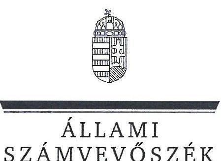
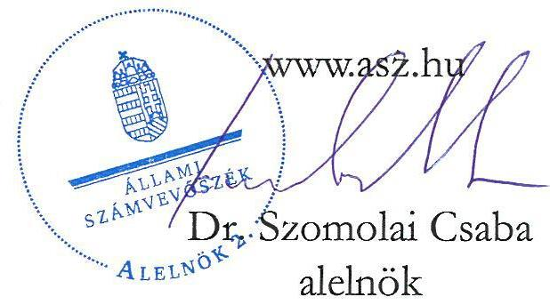
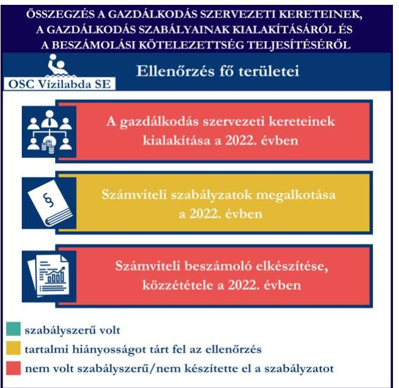
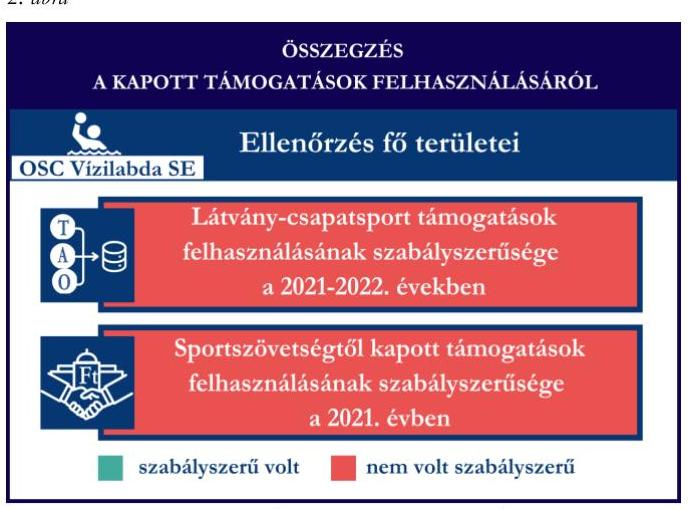

# JELENTÉS 

Támogatásban részesülő sportszövetségek, sportegyesületek és sportvállalkozások gazdálkodásának ellenőrzése

OSC Vízilabda Sport Egyesület

2025.

---

ÁLLAMI
SZÁMVEVŐSZÉK

# JELENTÉS 

## Támogatásban részesülő sportszövetségek, sportegyesületek és sportvállalkozások gazdálkodásának ellenőrzése

OSC Vízilabda Sport Egyesület

2025.

25028

---

# ELLENŐRZÉSI IGAZGATÓSÁG:   ELLENŐRZÉSI IGAZGATÓSÁG V. 

ELLENŐRZÉSI IGAZGATÓ:
KLINGA LÁSZLÓ igazgató
ELLENŐRZÉSVEZETŐ:
KAKAS SÁNDOR ellenőrzésvezető

Jelentéseink az interneten a www.asz.hu címen olvashatók.

IKTATÓSZÁM: EL-4031-073/2025
TÉMASORSZÁM: 30
ELLENŐRZÉS-AZONOSÍTÓ SZÁM: V1078

---

# TARTALOMJEGYZÉK 

AZ ELLENŐRZÉS ALAPADATAI ..... 5
AZ ELLENŐRZÖTT SZERVEZET ..... 7
ÖSSZEFOGLALÁS ..... 8
AZ ELLENŐRZÉS FÓKUSZTERÜLETEI ..... 10
MEGÁLLAPÍTÁSOK ..... 11
JAVASLATOK ..... 25
MELLÉKLETEK ..... 27
I. sz. melléklet: Fogalomtár ..... 27
II. sz. melléklet: Az ellenőrzött szervezetek jegyzéke ..... 29
III. sz. melléklet: Fő ellenőrzési kritériumok fő ellenőrzési fókuszterületek szerint. ..... 30
FÜGGELÉK: ÉSZREVÉTELEK ..... 32
RÖVIDÍTÉSEK JEGYZÉKE ..... 83

---

.

---

# AZ ELLENŐRZÉS ALAPADATAI 

## AZ ELLENŐRZÉS CÉLJA

Az ellenőrzés célja az államháztartásból nyújtott támogatással, vagy az államháztartásból meghatározott célra ingyenesen juttatott vagyon felhasználásával érintett sportszövetségek, sportegyesületek és sportvállalkozások gazdálkodása szabályozottságának, gazdálkodási tevékenységének, ezen belül a beszámolási kötelezettség teljesítésének, a támogatások elkülönített nyilvántartásának, valamint a támogatások felhasználásának ellenőrzése.

## AZ ELLENŐRZÉS TÍPUSA

Kombinált ellenőrzés.

## AZ ELLENŐRZÖTT IDŐSZAK

Az 1. fókuszterület vonatkozásában a 2022. év.
A 2. fókuszterület vonatkozásában a 2021-2022. évek.
A 3. fókuszterület vonatkozásában a 2022. év, a mennyiségi felvétellel történő leltározás dokumentumai tekintetében a 2020-2022. évek.

## AZ ELLENŐRZÉS TÁRGYA

Az ellenőrzés tárgyát képezte a támogatásban részesülő sportegyesület gazdálkodása szabályozottságának, gazdálkodási tevékenységén belül a beszámolási kötelezettség teljesítésének, a vagyonnyilvántartásának, a támogatások elkülönített nyilvántartásának, valamint az államháztartási forrásból származó közvetlen vagy közvetett támogatások és a meghatározott célra ingyenesen juttatott vagyon felhasználásának vizsgálata. Az ellenőrzés a támogatások vonatkozásában kiterjedt továbbá a támogató felé történő beszámolási és elszámolási kötelezettségek teljesítésére, a jogszabályi és belső előírások betartására.

Az ellenőrzés kiterjedt minden olyan körülményre és adatra, amely az ÁSZ¹ jogszabályban meghatározott feladatainak teljesítéséhez, valamint az ellenőrzési program végrehajtása során felmerülő újabb összefüggések feltárásához szükséges volt.

## AZ ELLENŐRZÉS JOGALAPJA

Az ellenőrzés jogszabályi alapját az ÁSZ tv.² 1. § (3) bekezdése és az 5. § (3) bekezdése előírásai képezték.

---

# AZ ELLENŐRZÉS MÓDSZERE 

Az ellenőrzést a nemzetközi standardokat irányadónak tekintve az ellenőrzési program szempontjai, az ellenőrzött időszakban hatályos jogszabályok, az ellenőrzés általános szakmai szabályai, az ellenőrzésre irányadó ÁSZ módszertanok figyelembevételével végezte az ÁSZ.

Az ellenőrzési kérdések megválaszolásához szükséges bizonyítékok megszerzése az ellenőrzött szervezet által rendelkezésre bocsátott dokumentumokra, adatokra alapozva kérdésfeltevés (információkérés), interjú, mintavételezés útján történt.

Az ellenőrzési bizonyítékként felhasználható adatforrások közé tartoztak egyrészt az ellenőrzés során az ellenőrzött szervezettől bekért dokumentumok, másrészt adatforrás volt minden további, az ellenőrzés folyamán feltárt, az ellenőrzés szempontjából információt tartalmazó egyéb adatforrás.

A támogatásokkal, azok felhasználásával, kapcsolatos kötelezettségek vizsgálatára mintavételi eljárások kerültek alkalmazásra. Támogatás-típusok szerint nagyságrend alapján egy darab támogatás képezte a vizsgálat tárgyát. Ezen támogatások felhasználásának szabályszerűsége támogatásonként kockázatértékelés alapján kiválasztott tételekkel került ellenőrzésre. A kiválasztott támogatási szerződésekhez kapcsolódó elszámolásokból 30 db tétel került ellenőrzésre, ahol az elszámolás nem érte el a 30 db -ot, ott tételes ellenőrzésre került sor. Ezen felül a vagyongazdálkodás szabályszerűségének ellenőrzéséhez is kockázatalapú mintavétel kapcsolódott. A támogatások felhasználása és a vagyongazdálkodás területén a tételek ellenőrzése kiterjedt a könyvvezetési kötelezettség vizsgálatára is. A tárgyi eszközök tekintetében 30 db került kiválasztásra a 2022. évben állományban lévő eszközök közül azok nyilvántartásának, elszámolásának szabályszerűsége ellenőrzése céljából. A kiválasztott tételek ellenőrzésének eredménye nem került kivetítésre a teljes sokaságra, a megállapítások az adott ellenőrzött tételek vonatkozásában kerültek megjelenítésre.

---

# AZ ELLENŐRZÖTT SZERVEZET

Az OSC Vízilabda Sport Egyesületet Alapszabálya³ szerint 2006-ban alapították, a civil szervezetek közhiteles bírósági nyilvántartása alapján OSC Női Vízilabda Sport Egyesület néven jött létre, OSC Vízilabda Sport Egyesület elnevezéssel 2013. május 29. napjától működik. Alapszabálya szerinti célja többek között a magyarországi úszó- és vízilabda sport utánpótlásának képzése és nevelése, a vízilabda- és az úszó sport nemzetközi kapcsolatainak fejlesztése.

Az OSC Vízilabda SE⁴-nél az ellenőrzött időszakban kizárólag vízilabda szakosztály működött. Az OSC Vízilabda SE legfőbb döntéshozó szerve a Közgyűlés, ügyvezető szerve az öt tagból álló (egy fő elnök, három fő elnökhelyettes és egy fő ügyvezető elnök) Elnökség, legfőbb tisztségviselője az elnök. A törvényes képviseletet az elnök és az ügyvezető elnök látja el, akiknek képviseleti joga gyakorlásának terjedelme általános, módja önálló. Az elnökhelyettesek az elnököt távollétében teljes jogkörben helyettesítik. Az elnök és az ügyvezető elnök személyében 2017. február 17-től változás nem történt.

Az OSC Vízilabda SE az ellenőrzött időszakban jogszabályi előírás alapján könyvvizsgálatra és felügyelőbizottság létrehozására is kötelezett volt. A 2022. évben az OSC Vízilabda SE végzett vállalkozási tevékenységet.

Az OSC Vízilabda SE által az ellenőrzött időszakban igénybe vett támogatásokat az 1. táblázat mutatja be.

|   | 2021. ÉV | 2022. ÉV  |
| --- | --- | --- |
|  Központi költségvetési támogatás | - | -  |
|  Látvány-csapatsport támogatás | 340,9 | 363,7  |
|  Helyi önkormányzati támogatás | - | -  |
|  Magyar Vízilabda Szövetségtől kapott támogatás | 18,4 | -  |

---

# ÖSSZEFOGLALÁS 

Magyarország Alaptörvényének XX. cikke kimondja, hogy mindenkinek joga van a testi és lelki egészséghez, melynek érvényesülését Magyarország többek között a sportolás és a rendszeres testedzés támogatásával segíti elő. Az Országgyűlés a Sport tv.⁵-ben kinyilvánította, hogy a nemzet közössége a test művelését, a sportot, a nemzet alapértékének, kívánatos célnak tekinti. A sport a közjó része. Erősíti a közösség tagjainak egymáshoz tartozását, miként az egyén testi és lelki egészségét.

A sportegyesületek, sportszövetségek, sportvállalkozások működésükre és szakmai tevékenységük ellátására költségvetési támogatásban, önkormányzati támogatásban, ingyenes vagyonjuttatásban, valamint látvány-csapatsport támogatásban részesülhetnek, amelyekre fokozott figyelem irányul.

A társadalom részéről jogosan felmerülő elvárás, hogy a közpénzeket kezelő, azzal gazdálkodó szervezetek működéséről, tevékenységéről átfogó képet kapjon, a közpénzek rendeltetésszerű és átlátható módon történő felhasználásának értékelésére időről-időre sor kerüljön az ellenőrzések keretében.

Az OSC Vízilabda SE a könyvviteli szolgáltatás személyi feltételeinek megteremtéséről a jogszabályi előírásoknak megfelelően gondoskodott. Az OSC Vízilabda SE felügyelőbizottság létrehozásáról Alapszabályában rendelkezett, azonban a jogszabályban foglaltak ellenére a felügyelőbizottságot a 2022. évre vonatkozóan a Közgyűlés nem választotta meg, így nem került létrehozásra. A jogszabályi előírások alapján az OSC Vízilabda SE kialakította a számviteli politikáját, valamint elkészítette számviteli szabályzatait, továbbá rendelkezett számlarenddel. A pénzkezelési szabályzat tekintetében tartalmi hiányosságot tárt fel az ellenőrzés.

A 2022. évben a könyvvezetési kötelezettség

teljesítése nem felelt meg a jogszabályi előírásoknak. Az OSC Vízilabda SE a számviteli beszámoló- és közhasznúsági melléklet készítési- és közzétételi kötelezettségét nem szabályszerűen teljesítette.

Az OSC Vízilabda SE 2022. évi könyvvitelében rögzített és az egyszerűsített éves beszámolójában szereplő tételek a valóságban nem minden esetben voltak megtalálhatók, bizonyíthatók, mivel az OSC Vízilabda SE könyvvitelében egyes tételeket bizonylat nélkül rögzített, egyes gazdasági eseményeket nem a tényleges gazdasági tartalmuknak megfelelően mutatott be, továbbá a vagyongazdálkodása során jogszabálysértések kerültek feltárásra, ezáltal sérült a Számv. tv.ben rögzített valódiság elve.

A gazdálkodás szervezeti keretei kialakításának, a számviteli szabályzatok megalkotásának, valamint a számviteli beszámoló elkészítésének és közzétételének értékelését az 1. ábra mutatja be.

---

Az OSC Vízilabda SE a látvány-csapatsport támogatást és a kiegészítő sportfejlesztési támogatást a 2021-2022. években nem a támogatási célnak megfelelően és nem szabályszerűen használta fel.

A látvány-csapatsport támogatás utánpótlásnevelési feladatok ellátása jogcímén, valamint a kiegészítő támogatás jogcímen fel nem használt támogatás igazolására hamisított bankszámlakivonatot használt fel.

Számviteli nyilvántartásában a kapott támogatásokat - mind a látvány-csapatsport támogatást és a kiegészítő sportfejlesztési támogatást, mind pedig az MVLSZ⁶-en keresztül számára juttatott sportcélú támogatást - és azok felhasználását a jogszabályi előírás ellenére elkülönítetten nem tartotta nyilván.

A kapott támogatások felhasználásának értékelését a 2. ábra mutatja be.
Az OSC Vízilabda SE vagyongazdálkodása a 2022. évben nem volt szabályszerű, mert a 2022. évi egyszerűsített éves beszámolójának mérlegtételeit leltárral nem támasztotta alá, továbbá a 2022. évre vonatkozóan a mennyiségi felvétellel történő leltározást nem végezte el.

Az ellenőrzött tételek esetében a tárgyi eszközök üzembe helyezése, értékesedésének elszámolása, a támogatásból beszerzett tételek esetén a záradékolás és a fenntartási kötelezettség tekintetében az ellenőrzés hiányosságot tárt fel.

Az OSC Vízilabda SE elnöke, ügyvezető
elnöke az egyesületi vagyon kezelésével, a vagyon
felhasználásával kapcsolatos feladatait az ellenőrzött időszak alatt nem az egyesületi célok megvalósítása érdekében látta el.

A vagyongazdálkodás értékelését a 3. ábra mutatja be.

Az ÁSZ az ellenőrzés során súlyos jogszabálysértéseket tárt fel, felmerült a gyanú a látványcsapatsport támogatásnak a jóváhagyott céltól eltérő felhasználása, és ezzel a költségvetésnek vagyoni hátrány okozása, a hosszabbítási kérelem során a fel nem használt látvány-csapatsport támogatások rendelkezésre állását igazoló hamisított bankszámlakivonat felhasználása, továbbá az OSC Vízilabda SE elnökére és ügyvezető elnökére rábízott egyesületi készpénz és bankszámlapénz jogtalan eltulajdonítása tekintetében, amelyek okán az ÁSZ törvényi kötelezettségének eleget téve költségvetési csalás, adminisztratív költségvetési csalás és sikkasztás gyanújával az illetékes hatósághoz fordul.

---

# AZ ELLENŐRZÉS FÓKUSZTERÜLETEI 

1.     - A gazdálkodási szabályok kialakítása, a könyvvezetési- és beszámolási kötelezettség teljesítése
2.     - A kapott támogatások felhasználása
3.     - Az ellenőrzött szervezet vagyongazdálkodása

---

# 1. A gazdálkodási szabályok kialakítása, a könyvvezetési- és beszámolási kötelezettség teljesítése 

Összegző megállapítás A 2022. évben az OSC Vízilabda SE-nél a gazdálkodás szervezeti kereteinek kialakítása nem felelt meg, a gazdálkodás szabályainak kialakítása - a pénzkezelési szabályzat kivételével - megfelelt a jogszabályi előírásoknak. A könyvvezetési-, a beszámolási-, és a közzétételi kötelezettség teljesítése nem felelt meg a jogszabályi előírásoknak.

A 2022. évben az OSC Vízilabda SE a Számv. tv.⁷ és a Civilszr.⁸-ben foglalt jogszabályi előírások betartásával gondoskodott a könyvviteli szolgáltatás személyi feltételeinek megteremtéséről, a könyvviteli szolgáltatás körébe tartozó feladatok ellátásával olyan számviteli szolgáltatást nyújtó társaságot bízott meg, amelynek a feladat irányításával, vezetésével, a beszámoló elkészítésével megbízott tagja megfelelt a jogszabályi követelményeknek.
Az OSC Vízilabda SE Közgyűlése a Ptk.⁹ előírása alapján, Alapszabályának 74. pontjában rögzítettek szerint megválasztotta a felügyelőbizottság tagjait. A felügyelőbizottság tagjainak száma megfelelt a Ptk. előírásainak, azonban a felügyelőbizottsági tagok 2017. június 13-án kelt, tisztségelfogadó nyilatkozata szerint a tisztséget 4 évre fogadták el, amely így 2021. június 13-án lejárt. A határozott időtartam lejártát követően, 2022. évre vonatkozóan a Ptk. 3:26. § (4) bekezdésében foglaltak ellenére a Közgyűlés, figyelemmel a 2020. évi LVIII. tv.¹⁰ 109. § (1) bekezdésében foglaltakra, a veszélyhelyzet megszűnését követő 90. napon (2022. augusztus 29.) túl sem választotta meg a felügyelőbizottság tagjait, így felügyelőbizottság nem került létrehozásra.
Az OSC Vízilabda SE a 2022. évben rendelkezett a Számv. tv.-ben előírt számviteli politikával¹¹, illetve annak keretében elkészítette az értékelési szabályzatot¹², a leltározási szabályzatot¹³ és a pénzkezelési szabályzatot.

 ${ }^{14}$. A szabályzatok - a pénzkezelési szabályzat kivételével - az ellenőrzött tartalmi kritériumoknak megfeleltek. Az OSC Vízilabda SE a pénzkezelési szabályzatában a Számv. tv. 14. § (8) bekezdésében foglaltak ellenére nem rendelkezett a készpénzállomány ellenőrzésekor követendő eljárásról és az ellenőrzés gyakoriságáról. A napi készpénz záró állomány maximális mértékét korlátlan mennyiségben határozta meg, ami nem felel meg a Számv. tv. 14. § (8) bekezdés előírásának, továbbá az Art. ${ }^{15}$ 114. § (2) bekezdésében foglaltaknak sem, mivel a készpénzben teljesíthető fizetések céljára szolgáló pénzeszközök kivételével pénzeszközeit pénzforgalmi számlán kell tartania. Az OSC Vízilabda SE a Számv. tv. szerint a számlarendet ${ }^{16}$ elkészítette. A számlarend mellékletét képező számlatükör - a 2015. évi CI. törvény Számv. tv. módosításaira vonatkozó rendelkezései ellenére, amely 2015. július 4-től hatályon kívül helyezte a Számv. tv. rendkívüli bevételekre és ráfordításokra vonatkozó előírásait - tartalmazta a 88 Rendkívüli ráfordítások és 98 Rendkívüli bevételek főkönyvi számlacsoportokat és azok alábontásait.

---

Az OSC Vízilabda SE a Civilszr. előírásai szerint a 2022. évben kettős könyvvitelt vezetett. Az OSC Vízilabda SE a Civilszr. 9. § (8)-(9) bekezdései előírásai ellenére nem rendelkezett a vállalkozási tevékenység bevételeinek, ráfordításainak elkülönített nyilvántartásával.
Az OSC Vízilabda SE a Civilszr. rendelkezései alapján a 2022. évi egyszerűsített éves beszámolójában a bevételeit az értékesítés nettó árbevétele, egyéb bevétel bontásban mutatta ki, továbbá az egyéb bevételeken belül a tagdíjakat és a kapott támogatások összegét részletezte, azonban a Számv. tv. 4. § (1) bekezdésében foglaltak ellenére a 2022. évi egyszerűsített éves beszámolóját könyvvezetéssel teljeskörűen nem támasztotta alá. Az OSC Vízilabda SE a 2022. évben a Számv. tv 165. § (1)-(2) bekezdéseiben előírtak ellenére a számviteli nyilvántartásaiba bizonylat nélkül jegyzett be adatokat, mivel a bankszámlákról felvett készpénz házipénztárba történő befizetését bizonylattal nem támasztotta alá. A könyvelő nyilatkozata szerint, ha bankszámláról vesznek fel készpénzt, akkor a pénztárba bevételezik, ennek a bankszámlakivonat a bizonylata, tehát az OSC Vízilabda SE bevételi pénztárbizonylatot a Számv. tv. 165. § (1)-(2) bekezdés előírása ellenére nem használt. A pénzkezelési szabályzat rögzítette „A pénztári nyilvántartás alapbizonylatai bevételezés esetén" részében, hogy bizonylatnak minősül „a banki készpénzfelvételt igazoló átvételi elismervény". A pénzkezelési szabályzat a Számv. tv. 166. § (1) bekezdés rendelkezésével ellentétes előírást tartalmazott - mivel a bankszámlakivonat a bankszámláról felvett pénzösszeg pénztárba történő befizetését nem támasztja alá -, továbbá nem felelt meg a 167. § (1) bekezdés e) pontban előírtaknak, mivel nem tartalmazta a (megtörtént) gazdasági művelet tartalmának leírását vagy megjelölését, kizárólag a bankszámláról történő pénzfelvételt igazolta, nem a pénz pénztárba történő befizetését.
Az OSC Vízilabda SE a Számv. tv. 16. § (3) bekezdésében foglaltak ellenére a könyvvezetés során egyes gazdasági eseményeket, ügyleteket nem a tényleges gazdasági tartalmuknak megfelelően mutatta be, mivel könyvviteli nyilvántartásában a tagdíjakat és a látvány-csapatsport támogatásokat az egyéb bevételek helyett árbevételként ( 92 Belföldi értékesítés árbevétele, azon belül 924 Tagdíjbevételek és 925 Támogatások) tartotta nyilván. A támogatások nyilvántartása belső szabályzatában foglaltakkal is ellentétes, mivel a visszafizetési kötelezettség nélkül kapott támogatások nyilvántartására a számlarendjében a 967-es főkönyvi számot határozta meg. A 2022. évi egyszerűsített éves beszámolójának

Az OSC Vízilabda SE pénzkezelésre vonatkozó, 2022. évben alkalmazott szabályozása és gyakorlata ellentétes az Art. 114. § (2) bekezdésében foglaltakkal, amely szerint a pénzforgalmi számlanyitásra kötelezett adózó - törvény vagy kormányrendelet eltérő rendelkezése hiányában - a készpénzben teljesíthető fizetések céljára szolgáló pénzeszközök kivételével köteles pénzeszközeit pénzforgalmi számlán tartani, pénzforgalmát pénzforgalmi számlán lebonyolítani.
Az OSC Vízilabda SE a pénztárban tartható készpénz mennyiségét nem a tevékenységét jellemző körülmények alapján szabta meg, a bankszámláról felvett pénzösszeg pénztárba történő befizetését bevételi pénztárbizonylattal nem támasztotta alá, amely alapján felmerült a gyanú, hogy a házipénztárba a bankszámlákról felvett készpénz nem került befizetésre, minek következtében a házipénztárban a 3811 főkönyvi számon nyilvántartott összegek nem valósak, ami sérti a Számv. tv. 15. § (3) bekezdésében foglalt valódiság elvét, amely szerint a könyvvitelben rögzített és a beszámolóban szereplő tételeknek a valóságban is megtalálhatóknak, bizonyíthatóknak, kívülállók által is megállapíthatóknak kell lenniük.

---

eredménykimutatásában tagdíjként szerepeltett összeget ( $30,3 \mathrm{M} \mathrm{Ft}$ ) a 2022. évi főkönyvi kivonatban a 924 Tagdíjbevételek főkönyvi számon szereplő összeg ( $29,8 \mathrm{M} \mathrm{Ft}$ ) nem támasztotta alá.
Az OSC Vízilabda SE megsértette a Civil tv. ${ }^{17}$ 30. § (1) bekezdésében előírtakat, mert a letétbe helyezett és az $\mathrm{OBH}^{18}$ honlapján „egyszerűsített éves beszámoló" elnevezéssel közzétett adatokat a Közgyűlés nem fogadta el.
A felügyelőbizottság a 2023. május 23. napján készült jegyzőkönyv szerint megvizsgálta a beszámolót, és hozzájárult annak Közgyűlés általi elfogadásához, azonban a jelentés jelen fókuszterületének korábbi bekezdésében részletezettek szerint a felügyelőbizottság 2022. évben valójában nem működött, mivel a tagok mandátuma 2021. június 13. napján lejárt, így a 2022. és 2023. évben hozott döntéseik nem voltak hatályosak.
A Közgyűlés a 2022. évi egyszerűsített éves beszámolót 2023. május 25. napján a 3/2023. (05.25.) számú határozatával elfogadta, azonban a határozat valótlan tartalmú, mivel az OBH honlapján „egyszerűsített éves beszámoló" elnevezéssel közzétett adatok szerint a kiegészítő melléklet és a könyvvizsgálói jelentés is 2023. november 10-én készült, ezáltal az egyszerűsített éves beszámoló kiegészítő melléklete és a könyvvizsgáló véleménye nem állt rendelkezésre a beszámoló Közgyűlés általi jóváhagyásakor.

A fentiek alapján az ÁSZ megállapította, hogy az OSC Vízilabda SE az ÁSZ részére az ellenőrzés során valótlan tartalmú okiratokat szolgáltatott annak érdekében, hogy a 2022. évi egyszerűsített éves beszámolójának felügyelőbizottság általi megvizsgálását, Közgyűlés általi elfogadását igazolja. Az okiratokban foglalt nyilatkozatok a cselekmények valóságát nem bizonyítják.

Az OSC Vízilabda SE a Civilszr. 16.§ (3) bekezdésében foglaltakat megszegve a könyvvizsgálót a 2022. évi egyszerűsített éves beszámoló felülvizsgálatára, az abban foglaltak valódiságának és jogszerűségének ellenőrzésére - a 2023. szeptember 30. napján kelt megbízási szerződésben foglaltak szerint - az előző üzleti évi beszámoló elfogadását követően bízta meg.
Az OSC Vízilabda SE a 2022. évre vonatkozóan az OBH honlapján „egyszerűsített éves beszámoló" elnevezéssel közzétett adatokat, azonban a Civil tv. 30. § (1) bekezdésben előírt határidőn túl, 2023. november 14-én. Az OSC Vízilabda SE határidőn túl közzétett közhasznúsági melléklete a Civil tv. 29. § (7) bekezdésében előírtak ellenére a Civil vhr. ${ }^{19}$ mellékletében szereplő 5-6. pontokat (Célszerinti juttatások; Vezető tisztségviselőnek nyújtott juttatások) nem tartalmazta. Az OSC Vízilabda SE a Civil tv. 30. § (4) bekezdésében előírtak ellenére saját honlapján a 2022. évi egyszerűsített éves beszámolóját, valamint közhasznúsági mellékletét nem tette közzé.

---

# 2. A kapott támogatások felhasználása 

Összegző megállapítás

Az OSC Vízilabda SE a 2021. és a 2022. években a látványcsapatsport támogatást és a kiegészítő sportfejlesztési támogatást nem szabályszerűen használta fel. A látványcsapatsport támogatás „Utánpótlás-nevelési feladatok ellátása" jogcímén, valamint a „Kiegészítő támogatás" jogcímen fel nem használt támogatás MVLSZ felé történő igazolására hamisított bankszámlakivonatot használt fel. A kapott támogatásokat, azok felhasználását nem tartotta elkülönítetten nyilván.

Az OSC Vízilabda SE az SFP-08094/2021/MVLSZ számú látvány-csapatsport támogatás esetén a támogatási igazolás kiállítására vonatkozó kérelemben, illetve azzal egyidejűleg a 107/2011. (VI. 30.) Korm. rendelet ${ }^{20}$ 6. § (1) bekezdés e) pontjában foglaltak ellenére nem igazolta, hogy a 107/2011. (VI. 30.) Korm. rendelet 4. § (11) bekezdése szerint honlapján közzétette-e az MVLSZ által jóváhagyott sportfejlesztési programját, valamint annak költségtervét, illetve a támogató által jóváhagyott támogatás jogcímenkénti összegét. Az OSC Vízilabda SE a 2021/2022. évadra vonatkozóan jóváhagyott sportfejlesztési programot, annak költségtervét, a támogatás összegét az ÁSZ ellenőrzés időszakában tette közzé a honlapján.
Az OSC Vízilabda SE a látvány-csapatsport támogatások esetében a 2021-2022. években eleget tett a 107/2011. (VI. 30.) Korm. rendeletben foglaltaknak, a támogatás felhasználásáról negyedévente az előrehaladási jelentéseket benyújtotta az MVLSZ felé.
Az OSC Vízilabda SE-nek sem a számára nyújtott látvány-csapatsport támogatás (SFP08094/2021/MVLSZ), sem pedig a kiegészítő sportfejlesztési támogatás (SFP-06094/2020/MVLSZ) vonatkozásában a 107/2011. (VI. 30.) Korm. rendelet szerinti (záró)elszámolás benyújtási kötelezettsége az ellenőrzött időszakban nem volt. Az OSC Vízilabda SE 2022. augusztus 9. napján, mindkét támogatás vonatkozásában összesített elszámolási táblázattal benyújtotta a 2022. június 30. napjáig tartó időszakra vonatkozó részelszámolását a támogató felé. Az OSC Vízilabda SE a 107/2011. (VI. 30.) Korm. rendelet 11. § (6) bekezdésében foglaltak szerint a benyújtott elszámolási tekintetében igazolta az elszámolásokban feltüntetett számviteli bizonylatok könyvvizsgáló által történt ellenőrzését.
A könyvvizsgáló a 107/2011. (VI. 30.) Korm. rendeletben előírt felelősségbiztosítással rendelkezett.

---

Az OSC Vízilabda SE 2022. augusztus 13-án a ki/JH01-08094/2021/MVLSZ számú határozattal jóváhagyott sportfejlesztési programjának meghosszabbítását kérelmezte az MVLSZ-nél, mivel a támogatás az adott évadban nem került teljes összegben felhasználásra. Kérelméhez a 107/2011. (VI. 30.) Korm. rendelet 14. § (1) bekezdésében foglaltak ellenére nem csatolta a „Koronavirussal összefüggésben felmerülő költések" hosszabbítandó összegek és a „Kiegészítő támogatás" hosszabbítandó összegek rendelkezésre állását igazoló bankszámlakivonatokat, továbbá az „Utánpótlás-nevelési feladatok ellátása" jogcím esetén a megküldött bankszámlakivonat szerinti rendelkezésre álló összeg nem érte el a hosszabbítási kérelemben meghosszabbítani kérelmezett, még elszámolandó összegeket. Az OSC Vízilabda SE az MVLSZ, mint támogató felé többszöri hiánypótlásra történő felhívást követően sem tudta igazolni bankszámlakivonatok csatolásával a fel nem használt támogatás rendelkezésre állását, majd az „Utánpótlás nevelési feladatok ellátása" jogcímen rendelkezésre álló fedezet igazolása céljából benyújtotta a 055/2022. számú bankszámlakivonatot. 2022. október 7-én az OSC Vízilabda SE elnöke az MVLSZ felé a következő nyilatkozatot tette: „Az egyesület által alkalmazott utalási gyakorlat szerint az utánpótlásnevelés alszámláról teljes összegben kifizetett összegek önereje tömbösítve szokott a kiegészítő számlára átvezetésre kerülni. Az elszámolás lezárásakor ez az összeg adminisztrációs hiba miatt nem került összevezetésre. Kérem, hogy az utánpótlásnevelés alszámlán lévő többlet összegét a kiegészítő számlán hiányzó összeggel tekintsék kiegyenlítettnek."
Az OSC Vízilabda SE által az ÁSZ rendelkezésére bocsátott 055/2022. számú bankszámlakivonat egyenlege és a könyvelési adatok eltérést mutattak, ezért az ÁSZ ellenőrzést támogató szervezetként megkereste a számlavezető bankot. Az OSC Vízilabda SE által az ÁSZ részére megküldött - az MVLSZ részére benyújtott hosszabbítási kérelem mellékletét képező - 055/2022. számú bankszámlakivonat olyan jóváírt összeget tartalmazott ( 47000000 Ft ), amelyet a számlavezető bank által megküldött 055/2022. számú bankszámlakivonat nem, ami a jóváhagyott céltól eltérő felhasználás gyanúját veti fel, amellyel a költségvetésnek vagyoni hátránya keletkezett.
Az OSC Vízilabda SE ki/JH01-08094/2021/MVLSZ számú sportfejlesztési program meghosszabbításának kérelméhez a fel nem használt összegek bankszámlán történő rendelkezésre állásának igazolásához valótlan tartalmú dokumentumokat (nyilatkozat, hamisított bankszámlakivonatok) nyújtott be az MVLSZ, mint támogató felé. A hamisított bankszámlakivonattal az „Utánpótlás nevelési feladatok ellátása" jogcímen 142,9 M Ft támogatás rendelkezésre állását igazolta, azonban a bankszámlakivonatokon szereplő pénzösszegek az OSC Vízilabda SE
 bankszámláján valójában nem álltak rendelkezésre.
A hosszabbítási kérelem során a fel nem használt látvány-csapatsport támogatások rendelkezésre állását igazoló hamisított bankszámlakivonat felhasználása okán az ÁSZ a törvényi kötelezettségének eleget téve az illetékes hatósághoz fordul.

Az OSC Vízilabda SE a 107/2011. (VI. 30.) Korm. rendelet 9. § (8) bekezdésében foglaltak figyelmen kívül hagyásával a látvány-csapatsport támogatásokat nem kezelte és tartotta jogcímenként a rendelkezésre álló pénzforgalmi számlán. Az OSC Vízilabda SE a kiegészítő sportfejlesztési támogatást illetően a 107/2011. (VI. 30.) Korm. rendelet 9. § (8) bekezdésében foglaltak szerint önálló bankszámlával

---

rendelkezett, azonban a kapott támogatást nem kizárólag az arra a támogatásra szolgáló bankszámlán kezelte.
Az OSC Vízilabda SE az ellenőrzött időszak könyvvezetése során az alapcél szerinti tevékenysége költségei, ráfordításai ellentételezésére kapott támogatásokról nem vezetett a Civil tv. 20. § (4) bekezdésében előírt elkülönített számviteli nyilvántartást, amelynek alapján támogatásonként megállapítható és ellenőrizhető lett volna a kapott támogatás felhasználása, ezáltal nem tett eleget a 107/2011. (VI. 30.) Korm. rendelet 9. § (9) bekezdésében előírtaknak, mivel a látvány-csapatsport támogatás, illetve a kiegészítő sportfejlesztési támogatás felhasználását nem tartotta elkülönítetten nyilván.
Az OSC Vízilabda SE esetében a látvány-csapatsport támogatás és kiegészítő sportfejlesztési támogatás ellenőrzött tételeinek ( $30 \mathrm{db}-5 \mathrm{db}$ ) vonatkozásában az ÁSZ az alábbiakat állapította meg:

- a tételek számviteli bizonylatai alapján a gazdasági események pénzügyi rendezése - hét látványcsapatsport támogatás és öt kiegészítő sportfejlesztési támogatás tétel kivételével - az elszámolás benyújtására nyitva álló határidőig, a támogatási jogcímnek megfelelő pénzforgalmi számláról teljesült. A kivételt képező tételek esetén (admin.tevékenység - 2981091 Ft ; Bérköltség, B.P. 467767 Ft ; Bérköltség, D.Zs. - 529363 Ft, Bérköltség, K.L.K. - 529363 Ft; Bérköltség, B.E. 246193 Ft ; Bérköltség, H.Á. - 358890 Ft ; Bérköltség, Dr. Sz.A. - 269168 Ft ) a pénzügyi rendezés a 107/2011. (VI. 30.) Korm. rendelet 9. § (8) bekezdésben foglaltak ellenére nem az adott támogatási jogcím önálló pénzforgalmi számlájáról történt. A kiegészítő sportfejlesztési támogatás tételek esetén a gazdasági események pénzügyi rendezése a 107/2011. (VI. 30.) Korm. rendelet 9. $\int(8)$ bekezdésében foglaltak ellenére az „utánpótlás nevelési feladatok" számláról történt, nem a támogatási jogcímnek megfelelő, elkülönített kiegészítő támogatás kifizetések bonyolítására szolgáló bankszámláról.
- a tételek számviteli bizonylatait - három látvány-csapatsport támogatás tétel kivételével - ellátták záradékkal. A kivételt képező tételek (sp. felszerelés - 11950000 Ft ; admin.tevékenység 2981091 Ft ; Bérköltség, Sz.B. - 403751 Ft ) esetén a 107/2011. (VI. 30.) Korm. rendelet 11. § (5) bekezdésének előírásai ellenére a bizonylat záradékot nem tartalmazott.
- a számviteli bizonylatokon záradékolt összegek - három látvány-csapatsport támogatás tétel kivételével - megegyeztek a számlaösszesítőben feltüntetett értékekkel. A kivételt képező tételek esetén, B.P. bérköltség vonatkozásában a bizonylaton (fizetési bizonylat, bérlista) záradékolt összeg 2021. július havi bruttó 100000 Ft , a számlaösszesítőben feltüntetett összeg 2021. július hónapra bruttó 950000 Ft , amelyből 467767 Ft került személyi jellegű ráfordítás jogcímen elszámolásra; B.E. (B. Jné) bérköltség vonatkozásában a bizonylaton (fizetési bizonylat, bérlista) záradékolt összeg 2022. február havi bruttó 100000 Ft , a számlaösszesítőben feltüntetett összeg 2022. február hónapra bruttó 500000 Ft , amelyből 246193 Ft került személyi jellegű ráfordítás jogcímen elszámolásra; K.Z. bérköltség vonatkozásában a bizonylaton (fizetési bizonylat, bérlista) záradékolt összeg 2022. június havi bruttó 5612600 Ft , a számlaösszesítőben feltüntetett összeg 2022. június hónapra bruttó 490000 Ft , amelyből 241269 Ft került személyi jellegű ráfordítás jogcímen elszámolásra.
Az OSC Vízilabda SE teljeskörűen nem tett eleget a 107/2011. (VI. 30.) Korm. rendelet 11. § (1) bekezdésében előírtaknak, mivel három tétel esetén a sportfejlesztési támogatás összegének felhasználásáról történő elszámolást nem a záradékolt számviteli bizonylattal alátámasztott módon nyújtotta be.

---

- a tételek számviteli bizonylatának az adott sportfejlesztési program terhére záradékolt összegei a Számv. tv.-ben előírtak szerint a tartalmuknak megfelelő főkönyvi számra kerültek elszámolásra.
A tételek ellenőrzése során a rendelkezésre bocsátott dokumentumok alapján a fent leírtakon túl az ÁSZ az alábbi szabálytalanságokat állapította meg:

1. A sportpolitikáért felelős miniszter által meghatározott minőségbiztosítási rendszernek (a továbbiakban: Benchmark-rendszer) való megfelelést érintő megállapítások:

- Az OSC Vízilabda SE a 107/2011. (VI. 30.) Korm. rendelet 2. § (3a) bekezdésében foglaltakkal ellentétben az MVLSZ 2021/2022. évi Benchmark előírása ${ }^{21}$ szerint az MVLSZ által meghatározott maximum összeget meghaladóan végeztetett diagnosztikai vizsgálatot, amelyet elszámolt a látvány-csapatsport támogatás terhére. Az OSC Vízilabda SE 2021. szeptember 10-én megbízási szerződést kötött 50 fő utánpótlás korú gyerek szűrésére és diagnosztikai vizsgálatára. A szerződés alapján kiállított DR-2022-1609 számlában kizárólag a „beteg ellátás 8622" szerepel 12500000 Ft értékben került kiszámlázásra, amely alapján az egy főre átszámított ellátás értéke $250000 \mathrm{Ft} /$ fő. Az MVLSZ 2021/2022. évi Benchmark előírása szerint az MVLSZ által meghatározott maximum összeg diagnosztikai vizsgálat vonatkozásában $200000 \mathrm{Ft} /$ fő. A számla végösszege 12500000 Ft , amely 2500000 Ft -tal meghaladja a MVLSZ által meghatározott maximum összeg alapján számított összeget ( 10000000 Ft ). A 2022. augusztus 8 -án az MVLSZhez benyújtott pénzügyi elszámolásban a DR-2022-1609 számú számla teljes összegben (12500000 Ft ) utánpótlás-nevelés jogcímen elszámolásra került.

- Az OSC Vízilabda SE a 107/2011. (VI. 30.) Korm. rendelet 2. § (3a) bekezdésében foglaltakkal ellentétben az MVLSZ 2021/2022. évi Benchmark előírása szerint az MVLSZ által meghatározott maximum összeget meghaladóan szerzett be sportruházatot, amelyet elszámolt a látványcsapatsport támogatás terhére. A 2022-SZ-01434. számú sportruházat, sporteszköz beszerzéséről szóló számla, egyéb tételek mellett 478 db csapatos pamut short beszerzését tartalmazza $20000 \mathrm{Ft} / \mathrm{db}$ egységáron. Az MVLSZ 2021/2022. évi Benchmark előírása szerint az MVLSZ által meghatározott maximum összeg sportruházat kategóriában rövidnadrág $4000 \mathrm{Ft} / \mathrm{db}$. A számla végösszege 11950000 Ft , amelyből a 478 db csapatos pamut short értéke 9560000 Ft , amely 7648000 Ft-tal meghaladja a MVLSZ által meghatározott maximum összeg alapján számított összeget ( 1912000 Ft ). A 2022. augusztus 8 -án az MVLSZ-hez benyújtott pénzügyi elszámolásban a 2022-SZ-01434. számú számla teljes összegben ( 11950000 Ft ) utánpótlásnevelés jogcímen elszámolásra került.

2. Támogatások céltól eltérő felhasználását érintő megállapítások:

Az OSC Vízilabda SE a 107/2011. (VI. 30.) Korm. rendelet 9. § (10) bekezdés előírásai ellenére a támogatást több esetben nem a támogatási célok megvalósítására használta fel, mivel az Utánpótlásnevelés feladatainak ellátása jogcímen kapott támogatás kezelésére szolgáló bankszámláról 2021. évben 12 alkalommal összesen 184 M Ft-ot, 2022. évben 15 alkalommal összesen 85,3 M Ft-ot utalt át a főszámlájára, amelyet jelentős részben még az utalás napján kölcsönként átutaltak az OSC Vízilabda SE elnökének tulajdonában álló OSC Vízilabda Sport Kft. részére.

- Az OSC Vízilabda SE a könyvviteli nyilvántartások alapján 2021. évben 117,4 M Ft, 2022. évben 45,8 M Ft, összesen 163,2 M Ft kölcsönt nyújtott az OSC Vízilabda SE elnökének tulajdonában lévő és általa vezetett OSC Vízilabda Sport Kft. részére. Az OSC Vízilabda SE 2020. január 1-én kötött kölcsönszerződést az OSC Vízilabda Sport Kft.-vel, amely szerint az OSC Vízilabda SE

---

2020. január 1-től kölcsön jogcímen maximum évente 200 M Ft összegű kölcsönt nyújt az OSC Vízilabda Sport Kft részére. A kölcsönszerződést az OSC Vízilabda SE, mint hitelező részéről az OSC Vízilabda SE ügyvezető elnöke (aki egyben az OSC Vízilabda SE elnökének közeli hozzátartozója), az OSC Vízilabda Sport Kft., mint adós részéről annak ügyvezetője, egyben az OSC Vízilabda SE elnöke írta alá.
Az OSC Vízilabda SE 2021. és 2022. évi egyszerűsített éves beszámolójának vállalkozási tevékenységre vonatkozó adatai és a könyvelő helyszíni ellenőrzésen tett nyilatkozata szerint a vállalkozási tevékenység eredménye egyik évben sem nyújtott fedezetet az OSC Vízilabda Sport Kft. részére nyújtott kölcsönökhöz. Ezt támasztja alá az OSC Vízilabda SE elnökének helyszíni ellenőrzés során tett nyilatkozata is, amely szerint „ami forrás volt abból adtak: kölcsönt, pl: szponzori támogatásból, egyéb támogatásból."

- Az OSC Vízilabda SE, hogy igazolni tudja a 107/2011. (VI. 30.) Korm. rendelet 14. § (1) bekezdése szerint, a be/SFP-08094/2021/MVLSZ számú látvány-csapatsport támogatás és a be/SFP-06094/2020/MVLSZ kiegészítő sportfejlesztési támogatás fel nem használt összegét - amely az OSC Vízilabda SE bankszámláján nem állt rendelkezésre - kölcsönt kapott az OSC Vízilabda SE ügyvezető elnökétől.
Az OSC Vízilabda SE ügyvezető elnöke 2022. augusztus 12. napján 75000000 Ft kölcsönt nyújtott az OSC Vízilabda SE részére. A kölcsönszerződés és a kölcsön nyújtását alátámasztó 008/2022. számú bankszámlakivonat szerint a kölcsön összegének az OSC Vízilabda SE főszámlájára történő megérkezését követően 99150000 Ft átutalásra került az utánpótlás támogatás kezelésére fenntartott bankszámlára.
Az OSC Vízilabda SE 2022. augusztus 13-án nyújtotta be az MVLSZ részére a 2020/2021. évi be/SFP-06094/2020/MVLSZ és a 2021/2022. évi be/SFP-08094/2021/MVLSZ támogatások tekintetében a hosszabbítási kérelmeket a fel nem használt támogatás vonatkozásában. Az OSC Vízilabda SE a hosszabbítási kérelméhez nem csatolta a meghosszabbítandó összegek rendelkezésre állását igazoló bankszámlakivonatokat, ezért az MVLSZ 2022. augusztus 19-én, majd 2022. szeptember 26-án hiánypótlásra hívta fel az OSC Vízilabda SE-t.
Az előzőek alapján a hitel megérkezését megelőzően a látvány-csapatsport támogatás fel nem használt összege az OSC Vízilabda SE bankszámláján nem állt rendelkezésre.

Az OSC Vízilabda SE az engedélyezett sportfejlesztési célok megvalósításához kapott látvány-csapatsport támogatásokat nem kizárólag a sportfejlesztési programot jóváhagyó határozatokban meghatározott célra használta fel megszegve a 107/2011. (VI.30) Korm. rendelet 9. $\int$ (10) bekezdés előírásait, amely szerint a támogatott szervezet a támogatást kizárólag a jóváhagyást végző szervezet (MVLSZ) által kiállított támogatási igazolásban meghatározottak szerinti jogcímre, az abban meghatározott mértékben használhatja fel.
A látvány-csapatsport támogatásnak a jóváhagyott céltól eltérő felhasználása, és ezzel a költségvetésnek vagyoni hátrány okozása okán az ÁSZ a törvényi kötelezettségének eleget téve az illetékes hatósághoz fordul.

Az OSC Vízilabda SE a 2022. évben a MVLSZ-en keresztül számára juttatott támogatás bevételét 2022. évi egyszerűsített számviteli beszámolójában egyéb bevételként szerepeltette, könyvviteli

---

nyilvántartásában "Belföldi értékesítés árbevétel"-ként tartotta nyilván, megszegve ezzel a Számv. tv. 4. § (1) bekezdésében és 16. $\S$ (3) bekezdésében foglaltakat. A támogatás felhasználásáról az MVLSZ felé benyújtott beszámolót és annak részeként az összesített elszámolási táblázatot az MVLSZ-szel 2021. november 4-én kötött, MVLSZ-11/2021. számú támogatási szerződésben előírt formában és tartalommal elkészítette.
Az OSC Vízilabda SE esetében az MVLSZ-en keresztül számára juttatott támogatás ellenőrzött tételeinek (10 db) vonatkozásában az alábbiak kerültek megállapításra:

- a tételek számviteli elszámolását a Számv. tv.-ben előírtak szerint bizonylatokkal alátámasztották;
- a tétel gazdasági eseményének teljesítési időpontja a támogatási szerződésben meghatározott támogatott tevékenység időtartamán belül történt;
- a támogatási szerződésben meghatározott felhasználási határidőig - két ugyanazon számlához kapcsolódó ellenőrzött tétel kivételével - megtörtént a tétel pénzügyi rendezése. A kivételt képező tételek esetén az előlegszámla (EB000004/2021. - 2323800
 Ft) és a végszámla (VB00088/21. 7200 Ft) szerinti összegek pénzügyi rendezésének igazolására rendelkezésre bocsátott 003/2021. számú bankszámlakivonaton nem az előleg, illetve a végszámlán szereplő összeg szerepelt. Az előleg és végszámla összesen 2331000 Ft, ezzel szemben átutalásra került 1995000 Ft. A záradék szerint "Elszámolva 1692008 Ft az MVLSZ-11/2021 MVLSZ támogatás terhére." Az OSC Vízilabda SE a két tétel esetén a Támogatási szerződés 5.3 pontjában meghatározott támogatott tevékenység időtartamán belül a pénzügyi rendezést nem igazolta;
- a számviteli bizonylatokat - három tétel kivételével - záradékkal ellátták. A kivételt képező tételek esetén a bizonylatokon a 474/2016. (XII. 27.) Korm. rendelet 22. § (2) bekezdésében foglaltak ellenére záradék nem szerepelt;
- a támogatási szerződés terhére a számviteli bizonylaton záradékolt összeg megegyezett a számlaösszesítőben feltüntetett értékkel;
- a tételek számviteli bizonylatának a támogatási szerződés terhére záradékolt összege a Számv. tv.-ben előírtak szerint tartalmának megfelelő főkönyvi számra került elszámolásra.

# 3. Az ellenőrzött szervezet vagyongazdálkodása 

## Összegző megállapítás A 2022. évben az OSC Vízilabda SE vagyongazdálkodása nem volt szabályszerű.

Az OSC Vízilabda SE a Számv. tv. 69. § (1) bekezdésében előírtak ellenére a 2022. évi egyszerűsített éves beszámolója mérlegtételeit nem támasztotta alá leltárral, a mérlegben kimutatott eszközök és források mennyisége és értéke nem volt alátámasztott, valódisága nem volt bizonyított. Az OSC Vízilabda SE a Számv. tv. 69. § (2) bekezdésében előírtak ellenére a főkönyvi könyvelés és az analitikus nyilvántartások adatai közötti egyeztetést a 2022. év mérlegfordulónapjára vonatkozóan a mérlegtételek esetében nem végezte el.
Az OSC Vízilabda SE a tárgyi eszközökről a számviteli alapelveknek megfelelő folyamatos mennyiségi nyilvántartást nem vezetett, a Számv. tv. 69. § (4) bekezdésében foglaltak ellenére a 2022. évben mennyiségi felvétellel történő leltározást nem végzett.

---

Az OSC Vízilabda SE esetében az ellenőrzött tárgyi eszköz tételek (30 db) vonatkozásában az ÁSZ az alábbiakat állapította meg:

- a tételek bekerülési értékét alátámasztó számviteli bizonylatok a Számv. tv.-nek megfelelően rendelkezésre álltak;
- a tárgyi eszközök számviteli besorolása megfelelt a Számv. tv. előírásainak;
- az ellenőrzött 30 tételből 21 tétel esetében - amelyből 15 tétel kisértékű tárgyi eszköz volt - az üzembe helyezés tényét és időpontját a Számv. tv. 52. § (2) bekezdésében előírtak ellenére hitelt érdemlő módon nem dokumentálták;
- az értékcsökkenés elszámolása 30 tételből öt tétel esetében megfelelt a Számv. tv. előírásainak. Az értékcsökkenés elszámolása 21 tétel esetében az üzembe helyezés hitelt érdemlő módon történő dokumentálásának elmaradása okán nem volt ellenőrizhető, három tétel esetén az eszközök beszerzési idejére (2014-2015. évek) és a meghatározott értékcsökkenés leírási kulcsra (20%) való tekintettel értékcsökkenés elszámolására már nem volt kötelezett;
Egy tétel (LED POP UP - LED fal 10 db) esetén az ÁSZ eltérést állapított meg. A tárgyi eszköz nyilvántartó lapja szerint a beszerzés és az üzembe helyezés is 2016. június 10-én történt, a beszerzési ár 49974500 Ft volt, az értékcsökkenési leírási kulcs 14,5%, a maradványérték 5000000 Ft. Az üzembehelyezést követően az értékcsökkenést a Számv. tv. 52. § (1) bekezdésében foglaltak ellenére nem a maradványértékkel csökkentett bekerülési érték alapján számolták el. Továbbá a tárgyi eszköz nyilvántartó lapon szereplő bejegyzés szerint a 10 db LED POP UP-ból 2020. december 22-én 5 db-ot értékesítettek. Az OSC-2020-2. számú számla mennyiség és megnevezés rovata szerint 1 db LED kijelző került értékesítésre 44450000 Ft-ért. A helyszíni ellenőrzés során az OSC Vízilabda SE elnöke azt nyilatkozta, hogy valamennyi (10 db) LED POP UP értékesítésre került. Az egyedi tárgyi eszköz nyilvántartó lap adatai szerint - a nyilatkozat ellenére - az értékcsökkenési leírást 5 db LED POP UP-ra vonatkozóan 2021. és 2022. években is, évenként 33260651 Ft értékben elszámolták.
A tétel a 2022. évi egyszerűsített éves beszámoló tárgyi eszközök mérlegsoron belül nem a Számv. tv. 57. § (1) bekezdés előírásainak megfelelő értéken került kimutatásra, mivel értékesítésre került, ennek ellenére 3388422 Ft nettó értéken szerepelt a tárgyi eszköz nyilvántartásban.
Az OSC Vízilabda SE a 2022. évi könyvvitelében a Számv. tv. 15. § (3) bekezdésében rögzített valódiság elve sérült, mert a 2022. évi tárgyi eszköz nyilvántartásában, ezáltal a könyvvitelében és a mérlegben olyan tárgyi eszközt szerepeltetett, amelyet a 2020. évben értékesített.
- a 27 támogatásból beszerzett tárgyi eszköz esetén a 107/2011. (VI. 30.) Korm. rendeletnek megfelelően, a tételek bekerülési értékét alátámasztó számviteli bizonylatokat ellátták záradékkal, amelyből megállapítható volt, hogy a számviteli bizonylaton szereplő összegből mennyit számoltak el a hivatkozott támogatás terhére.
- a 27 támogatásból beszerzett tárgyi eszköz közül 16 tétel esetén - amelyek 2022. december 31-én már nem voltak állományban - az állományból történő kivezetés nem a Számv. tv. 165-166. §-a előírásai szerint történt. Az OSC Vízilabda SE 15 tétel esetén a szabályszerű állományba vételt elmulasztotta, további egy tételt (LED POP UP - 21598828 Ft) 2020. december 22-én értékesített, ennek ellenére az állományból nem vezette ki. Az OSC Vízilabda SE a tárgyi eszköz

---

2022. december 22. napján történt értékesítésével megsértette továbbá a Tao tv. 22/C. § (11) bekezdésében foglalt fenntartási kötelezettségét is, tekintettel arra, hogy a beszerzéskor 100 ezer forint bekerülési értéket meghaladó, nyilvántartásba vett tárgyi eszköz a jogszabály szerinti kötelező fenntartási időszak vége, vagy a könyv szerinti érték leírása közül a később bekövetkező időpontig nem idegeníthető el. A Tao. tv.-ben rögzített előírástól az MVLSZ részéről előzetes írásbeli hozzájárulást nem mutatott be.
Az OSC Vízilabda SE-nél az ellenőrzés során a tárgyi eszközök vonatkozásában sor került a mintavételezésre kiválasztott - dokumentumok alapján 2022. december 31-én állományban lévő - tételek helyszíni ellenőrzés keretében történő szemrevételezésére, amely során az ÁSZ az alábbi hiányosságokat tárta fel:

- egy tárgyi eszköz (LED POP UP) helyszíni ellenőrzésen nem volt fellelhető, mivel az OSC Vízilabda SE elnökének nyilatkozata szerint az eszköz értékesítésre került. Az eszköz vonatkozásában az értékcsökkenés tekintetében az ÁSZ az ellenőrzés során hibát tárt fel.
- egy tárgyi eszköz (FORD Tourneo Custom - PHS-458) a helyszíni ellenőrzés során nem volt fellelhető, mert a gépjármű az OSC-2023-8 számú számla alapján, erősen törött állapotban, 2023. június 29-én 4400000 Ft-ért értékesítésre került. Az eszköz tárgyi eszköz nyilvántartó lapja szerint a beszerzés 2021. június 30-án történt, a beszerzési ár 12999999 Ft volt, az értékcsökkenési leírási kulcs 20%, a maradványérték 3000000 Ft. Az egyedi tárgyi eszköz nyilvántartó lap adatai szerint értékcsökkenési leírást a 2022. évben 2000000 Ft értékben számoltak el, terven felüli értékcsökkenés elszámolására a Számv. tv. 53. § (1)-(2) bekezdéseiben foglaltak ellenére nem került sor, annak ellenére, hogy a gépjárművet - gépjármű kárbejelentő szerint - 2022. november 17-én baleset érte, amelyről a helyszíni ellenőrzés során az OSC Vízilabda SE elnöke azt nyilatkozta, hogy a gépjármű totálkáros lett. Az OSC Vízilabda SE elnökének 2024. július 7-én kelt nyilatkozata szerint „...PHS-458 fogalmi rendszámú Ford Turneo Custom gépjármű balesete után a gazdaságtalan javítási költség miatt nem került javításra. A törött gépjárművet az egyesület értékesítette."
A gépjármű 2023. június 29-én történt értékesítésével az OSC Vízilabda SE megszegte a Tao tv. 22/C. § (11) bekezdésében foglaltakat, tekintettel arra, hogy a beszerzéskor 100 ezer forint bekerülési értéket meghaladó, nyilvántartásba vett tárgyi eszköz a jogszabály szerinti kötelező fenntartási időszak vége, vagy a könyv szerinti érték leírása közül a később bekövetkező időpontig nem idegeníthető el. A Tao. tv.-ben rögzített előírástól való eltérésre az MVLSZ részéről előzetes írásbeli hozzájárulást nem mutatott be.
- egy tárgyi eszköz (Ford Transit - OSC-333) a helyszíni ellenőrzés során nem volt fellelhető. Az OSC Vízilabda SE elnökének nyilatkozata szerint a gépjárművet értékesítették. A helyszíni ellenőrzést követően megküldött adásvételi szerződés szerint a tárgyi eszközt 2023. december 19-én értékesítették, a vételár 12000000 Ft + ÁFA volt. Az OSC Vízilabda SE az értékesítésről kiállított számlát a jelentéstervezet észrevételezése során bocsátotta az ÁSZ rendelkezésére.
- az OSC Vízilabda SE egy tételt - amely összesen 20 db POLAR V800 márkájú Pulzusmérő órát jelentett (az eszközök beszerzési ideje 2016. június 30.) - az ÁSZ részére nem tudott bemutatni. A szemrevételezés alkalmával 9 db még bolti csomagolásban található pulzusmérő óra került bemutatásra. A helyszíni ellenőrzés során bemutatott órák típusa POLÁR M430. Az OSC Vízilabda SE elnökének nyilatkozata szerint 11 db eszközt átadás-átvételi dokumentumok nélkül átadtak használatra.

---

Az OSC Vízilabda SE a 2022. évi könyvvitelében a Számv. tv. 15. § (3) bekezdésében rögzített valódiság elve sérült, mert a 2022. évi tárgyi eszköz nyilvántartásában, ezáltal a könyvvitelében és a mérlegben olyan tárgyi eszközt szerepeltetett, amely a valóságban nem volt fellelhető, megléte nem volt bizonyítható, - dokumentumok hiányában kívülállók által nem volt megállapítható.
A fentiek alapján, mivel az OSC Vízilabda SE a tételt bemutatni nem tudta, illetve a nyilvántartásban rögzítettől eltérő típusú tárgyi eszközt mutatott be, az OSC Vízilabda SE a támogatást jóváhagyott céltól eltérően használta fel, megszegve a 107/2011 (VI.30) Korm. rendelet 9. § (10) bekezdés előírásait.
A Ptk. 3:80. § d) pontja alapján az egyesület ügyvezetésének feladata az egyesületi vagyon kezelése, a vagyon felhasználására és befektetésére vonatkozó, a közgyűlés hatáskörébe nem tartozó döntések meghozatala és végrehajtása. Az OSC Vízilabda SE elnökének, ügyvezető elnökének az egyesületi vagyon kezelésével kapcsolatban az ÁSZ az alábbi szabálytalanságokat, törvénysértéseket tárta fel.

# 1. Gépjárművek használatba adásával kapcsolatos megállapítások: 

Az OSC Vízilabda SE tulajdonában 2021. és 2022. években összesen 9 db - 4 db 9 személyes, 1 db 17 személyes, 3 db 18 személyes és 1 db 20 személyes - látvány-csapatsport támogatásból beszerzett busz volt.
A helyszíni ellenőrzés során az OSC Vízilabda SE elnöke az ÁSZ részére azt a tájékoztatást adta, hogy a buszok egy másik helyszínen tekinthetők meg, mert egy gazdasági társasággal kötött megállapodás alapján az OSC Vízilabda SE azokat üzemeltetésre átadta.
Az OSC Vízilabda SE elnöke az OSC Vízilabda SE vagyonát képező, támogatásból beszerzett buszok üzemeltetését - 2016. április 15-én kötött - Együttműködési Szerződés alapján átadta egy gazdasági társaságnak.
A jóváhagyott sportfejlesztési programokban foglaltak szerint a gépjárművek látvány-csapatsport támogatásból történő beszerzését a játékosok mérkőzésekre, edzőtáborokba történő szállítása céljából hagyta jóvá az MVLSZ. A helyszíni ellenőrzés során az OSC Vízilabda SE elnöke azt nyilatkozta, hogy „A .... Kft.-vel kötött megállapodás alapján a .... Kft. üzemelteti a három (OSC-666, OSC-222 és az RZK-276) gépjárművet, amellyel szállítják a gyermek, felnőtt csapatokat, amikor nem az OSCVSE feladatait látják el, a megállapodás szerint a buszokat a saját céljaikra használhatják."
Az Együttműködési Szerződés
 tárgya: autóbusz üzemeltetés, a költségviselésről a szerződők úgy állapodtak meg, hogy a használati jog tényleges gyakorlásával, a felek együttműködésével és költségviselésével kapcsolatban, mindennemű kötelezettség a gazdasági társaságot terheli.

- Az Együttműködési Szerződés 3. pontjában foglaltakkal ellentétben 2021. évben összesen 3801276 Ft, 2022. évben összesen 1688000 Ft kiadást (autópályamatrica, kötelező gépjármű-felelősségbiztosítás, gépjárműadó, szervizszámlá) - az OSC Vízilabda SE számviteli nyilvántartása és a bankszámla-kivonatok adatai szerint - az OSC Vízilabda SE fedezte.
- Az OSC Vízilabda SE 2021. évben összesen 3501399 Ft, 2022. évben összesen 5039327 Ft üzemanyagköltséget számolt el. Az OSC Vízilabda SE tulajdonában az ellenőrzött időszakban az említett 9 db gépjárművön kívül két személygépkocsi (Mercedes Benz - RAE-057 forgalmi rendszámú és Land Rover PFR-762 forgalmi rendszámú) volt. Figyelembevéve a Jármű Szolgáltatási Platform adatai alapján a személygépkocsik futásteljesítményét, a NAV által közzétett hengerűrtartalom alapján meghatározott üzemanyag-fogyasztást, továbbá a NAV által közzétett üzemanyagárakat, a két személygépkocsi üzemanyagköltsége hozzávetőlegesen 2021. évben 1279000 Ft (748 000 Ft +531 000 Ft), 2022. évben 1385000 Ft (768 000 Ft +617 000 Ft) volt. Az OSC Vízilabda SE által az ellenőrzött időszakban elszámolt üzemanyagköltség jelentősen meghaladja a két személygépkocsi számított üzemanyagköltségének az összegét, ami arra utal, hogy az üzemeltetésre átadott gépjárművek üzemanyagköltségét is az OSC Vízilabda SE fedezte.

- Az OSC Vízilabda SE által átadott gépjárművek üzemeltetését végző gazdasági társaság tulajdonosa és ügyvezetője az ellenőrzött időszakban egyben az OSC Vízilabda SE főfoglalkozású munkavállalója is volt. Az OSC Vízilabda SE személyi jellegű kifizetések jogcímen a gépkocsivezető munkakörben foglalkoztatott munkavállaló esetében 450000 Ft/hó munkabér és járulékai után igényelt támogatást a be/SFP-06094/2020/MVLSZ határozattal jóváhagyott 2020/2021. évi, valamint 490000 Ft/hó munkabér és járulékai után igényelt támogatást a be/SFP-08094/2021/MVLSZ határozattal jóváhagyott 2021/2022. évi SFP-ben foglaltak megvalósításához.

Az OSC Vízilabda SE elnöke és ügyvezető elnöke a Ptk. 3:80. § d) pontja szerinti, az egyesületi vagyon kezelésével, a vagyon felhasználásával kapcsolatos feladatait az ellenőrzött időszak alatt nem az egyesületi célok megvalósítása érdekében látta el, mivel a támogatásból beszerzett gépjárművek üzemeltetésére kötött szerződésben nem kötötte ki a használó gazdasági társaság részére, hogy köteles az OSC Vízilabda SE játékosait az OSC Vízilabda SE igénye szerint szállítani, tehát nem jelölte meg az Együttműködési Szerződésben azt a célt, amelyre a támogatást buszok beszerzésére igényelte. Az Együttműködési Szerződés 3. pontjában foglaltakkal ellentétben a gépjárművek fenntartási és üzemeltetési költségeit nem a gépjárműveket ingyenesen használó gazdasági társaság fedezte, hanem azokat (kötelező biztosítás, gépjárműadó, szervizelési és üzemanyagköltségek) és egy gépjárművezető bérét és járulékait a teljes ellenőrzött időszak alatt az OSC Vízilabda SE fizette. Az OSC Vízilabda SE által megkötött Együttműködési Szerződés sem a támogatás főcélkitűzését, az utánpótlás-nevelési feladatok ellátását, sem egyéb egyesületi célokat nem szolgált.

Az OSC Vízilabda SE a tulajdonában lévő látvány-csapatsport támogatásból beszerzett gépjárművek esetében a támogatást a 107/2011 (VI.30) Korm. rendelet 9. § (10) bekezdés előírásai ellenére, nem kizárólag az MVLSZ által jóváhagyott támogatási célnak megfelelően használta fel. A látvány-csapatsport támogatásnak a jóváhagyott céltól eltérő felhasználása, és ezzel a költségvetésnek vagyoni hátrány okozása okán az ÁSZ a törvényi kötelezettségének eleget téve az illetékes hatósághoz fordul.
2. Az OSC Vízilabda SE bankszámlakezelésével kapcsolatos megállapítások:

Az ÁSZ az ellenőrzés során megállapította, hogy 2022. december 31. napjára vonatkozóan a főkönyvi könyvelés és az analitikus nyilvántartások adatai közötti egyeztetés nem történt meg. A 2024. június 5-én történt helyszíni ellenőrzés során a könyvelő nyilatkozta, hogy 2023. évre és azóta sem készült készpénz-leltár, továbbá a 2024. évi pénztárnyilvántartást nem tudták bemutatni. Az ellenőrzött időszakban az OSC Vízilabda SE bankszámlái felett az OSC Vízilabda SE elnöke és ügyvezető elnöke rendelkezett jogosultsággal. A házipénztár vonatkozásában az OSC Vízilabda SE elnöke a 2024. június 5-én történt helyszíni ellenőrzésen a következőket nyilatkozta: „az OSC VSE pénzét egy széfben tárolják, de hogy ez most mennyi, ezt nem tudom, őszintén én a szakmai dolgokkal foglalkozom, hogy mennyi készpénz van vagy nincs, nem tudom. Ez egy bázis-széf, ahol van ez a pénz. A széf a .... szám alatt található. Nincs hozzáférésem, nem tudom kinyitni, mert kulcsos. ... (ügyvezető elnöke) kezeli." A helyszíni ellenőrzés során az OSC Vízilabda SE könyvelője arról adott tájékoztatást, hogy „a főkönyvi adatállomány szerint a pénztárszámla egyenlege a mai napon $207 \mathrm{M} \mathrm{Ft}$". 2024. június 10-én megismételt helyszíni ellenőrzés keretében tartott pénztárrováncs alkalmával az OSC Vízilabda SE pénztárában - az OSC Vízilabda SE elnökének nyilatkozatában jelzett cím alatt fellelhető széfben - 28440500 Ft, 1284 EUR és 628 USD készpénz volt. A 207 M Ft készpénzállomány helyett a helyszínen a házipénztárban mindösszesen 29 M Ft volt fellelhető.

- A jelentés 1. fókuszterületénél részletezettek szerint felmerült a gyanú, hogy a bankból és a bankautomatákból felvett készpénzt az elnök és az ügyvezető elnök nem fizette be az OSC Vízilabda SE pénztárába. A könyvelési adatok szerint az OSC Vízilabda SE forintpénztára a 2021. év végén 159661756 Ft, a 2022. év végén pedig 205388010 Ft készpénzegyenleget mutatott.
- A pénztárnyilvántartás szerint a 2021. évben 88851055 Ft a bankszámláról történt készpénzfelvétellel szemben, 39397501 Ft összegű kiadás, a 2022. évben, a 75200000 Ft készpénzfelvétellel szemben, pedig 29473746 Ft összegű kiadás (ügymint bérkifizetések, útiköltségek, készpénzes számlák) került kifizetésre készpénzben a pénztárból.
- Az OSC Vízilabda SE bankszámlájáról több esetben történt olyan bankkártyás vásárlás, amely esetében a beszerzés jellege alapján egyértelmű, hogy a költések nem az egyesületi célok megvalósítását szolgálták (külföldi nyaralások szállásköltsége, külföldi utak üzemanyagköltsége, designer termékek vásárlása külföldön és Magyarországon). A 2021. évben ezen költések összege 15279195 Ft, 2022. évben 6648920 Ft volt. A céltól eltérő felhasználást igazolja továbbá, hogy a számviteli nyilvántartásban szereplő tételek (2021. évben 25 tétel, 2022. évben 9 tétel) a Számv. tv. 15. § (1) bekezdésében foglaltak szerint - megsértve a teljesség elvét - költségként nem került elszámolásra, annak ellenére, hogy azokat az OSC Vízilabda SE számlájáról egyenlítették ki.
- A külföldi bankautomatákból felvett valuta vonatkozásában (a 2021. évi külföldi valutafelvételek összege 1919122 Ft volt) - az előzőekben leírtakhoz hasonlóan - felmerült a gyanú, hogy nem került befizetésre az OSC Vízilabda SE valutapénztárába.
- Az OSC Vízilabda SE 2021. évben négy db olyan informatikai eszközt is beszerzett, amelyek vételárának (összesen 1444935 Ft) pénzügyi kiegyenlítése az OSC Vízilabda SE főszámlájáról történt, azonban az OSC Vízilabda SE tárgyi eszköznyilvántartásában nem szerepeltek, ennek következtében nem egyesületi célokat szolgáltak.

Az OSC Vízilabda SE elnöke és ügyvezető elnöke a Ptk. 3:80. § d) pontja szerinti, az egyesületi vagyon kezelésével, a vagyon felhasználásával kapcsolatos feladatait az ellenőrzött időszak alatt a Ptk. 3:63. § (4) bekezdés előírása ellenére nem az egyesületi célok megvalósítása érdekében látta el, az OSC Vízilabda SE vagyonával sajátjaként rendelkezett, mivel a bankszámláról felvett készpénz a gyanú alapján maradéktalanul nem került befizetésre az OSC Vízilabda SE pénztárába, azt a kifizetések jellegéből adódóan valószínűsíthetően saját céljaikra használták fel, továbbá olyan bankkártyával történt vásárlásokat hajtottak végre, amelyek nem az egyesületi célok megvalósítását szolgálták.
Az OSC Vízilabda SE elnökére és ügyvezető elnökére rábízott egyesületi készpénz és bankszámlapénz jogtalan eltulajdonítása gyanújának okán az ÁSZ a törvényi kötelezettségének eleget téve az illetékes hatósághoz fordul.

# JAVASLATOK

Az ÁSZ tv. 33. § (1) bekezdésében foglaltak értelmében az ellenőrzött szervezet vezetője köteles a jelentésben foglalt megállapításokhoz kapcsolódó intézkedési tervet összeállítani és azt a jelentés kézhezvételétől számított 30 napon belül az ÁSZ részére megküldeni. Amennyiben az ellenőrzött szervezet vezetője nem küldi meg határidőben az intézkedési tervet, vagy továbbra sem elfogadható intézkedési tervet küld, az Állami Számvevőszék elnöke az ÁSZ tv. 33. § (3) bekezdése a) és b) pontjaiban foglaltakat érvényesítheti.

## AZ OSC VÍZILABDA SPORT EGYESÜLET ELNÖKÉNEK

1. Intézkedjen a Ptk. 3:26. § (4) bekezdésében foglaltaknak megfelelően a felügyelőbizottsági tagok közgyűlés általi megválasztásáról.
2. Gondoskodjon a pénzkezelési szabályzat Számv. tv. 14. § (8) bekezdésben előírtaknak megfelelő tartalommal való elkészítéséről.
3. Gondoskodjon a Számv. tv. 16. § (3) bekezdésében foglaltaknak megfelelően, a beszámolóban és az azt alátámasztó könyvvezetés során az egyes gazdasági események, ügyletek tényleges gazdasági tartalmuknak megfelelő bemutatásáról.
4. Gondoskodjon a Számv. tv. 165. § (2) bekezdés előírásainak megfelelően, hogy a számviteli (könyvviteli) nyilvántartásokba csak szabályszerűen kiállított bizonylat alapján kerüljenek adatok bejegyzésre.
5. Gondoskodjon a Számv. tv. 4. § (1) bekezdésében foglaltaknak megfelelően könyvvezetéssel alátámasztott, a Civil tv. 30. § (1) bekezdés szerinti beszámoló elkészítéséről.
6. Gondoskodjon a Civil tv. 29. § (2) bekezdés c) pontjában, a Civilszr. 7. § (6) bekezdésében és 22. § (1) bekezdésében foglaltaknak megfelelően az egyszerűsített éves beszámolója részeként a kiegészítő melléklet elkészítéséről.
7. Gondoskodjon a beszámolóval egyidejűleg a Civil tv. 29. § (7) bekezdésében előírtaknak megfelelően, a Civil vhr. melléklete szerinti tartalmú közhasznúsági melléklet elkészítéséről.
8. Gondoskodjon a jövőben a Civilszr. 16.§ (3) bekezdésében foglaltaknak megfelelően az üzleti évről készített számviteli beszámoló felülvizsgálatára, az abban foglaltak valódiságának és jogszerűségének ellenőrzésére a jogszabályban meghatározott feltételnek megfelelő könyvvizsgáló, előző üzleti évi beszámoló elfogadásakor történő megválasztásáról.

9. Gondoskodjon a beszámoló és a közhasznúsági melléklet Civil tv. 30. § (1) és (4) bekezdésében előírtaknak megfelelő közzétételéről.
10. Gondoskodjon a 107/2011. (VI. 30.) Korm. rendelet 9. § (8) bekezdésében előírtaknak megfelelően, arról, hogy valamennyi gazdasági esemény pénzügyi rendezése az adott támogatási jogcím önálló pénzforgalmi számlájáról történjen.
11. Gondoskodjon a 107/2011. (VI. 30.) Korm. rendelet 11. § (5) bekezdésében foglaltaknak megfelelően arról, hogy valamennyi számviteli bizonylat záradékolásra kerüljön.
12. Gondoskodjon arról, hogy a kapott támogatások felhasználását a Civil tv. 20. § (4) bekezdésében és a 107/2011. (VI. 30.) Korm. rendelet 9. § (9) bekezdésében foglalt előírásoknak megfelelően elkülönítetten tartsa nyilván.
13. Gondoskodjon arról, hogy az MVLSZ-en keresztül számára juttatott sportcélú támogatás felhasználását igazoló valamennyi bizonylat a 474/2016. (XII. 27.) Korm. rendelet 24. § (2) bekezdés előírásainak, továbbá a támogatói okiratban foglaltaknak megfelelően záradékolásra kerüljön.
14. Gondoskodjon a beszámoló mérlegtételeinek leltárral történő alátámasztásáról a Számv. tv. 69. § (1)(2) bekezdés előírásainak megfelelően.
15. Gondoskodjon a Számv. tv. 69. § (4) bekezdésében foglaltaknak megfelelően mennyiségi felvétellel történő leltározás teljeskörű elvégzéséről.
16. Gondoskodjon a Számv. tv. 52. § (2) bekezdésében foglaltaknak megfelelően valamennyi tárgyi eszköz üzembe helyezésének hitelt érdemlő módon történő dokumentálásáról.
17. Gondoskodjon valamennyi tárgyi eszköz esetében a Számv. tv. 52. § (1) bekezdéseiben foglaltaknak megfelelő értékcsökkenés elszámolásáról.
18. Gondoskodjon valamennyi támogatásból beszerzett tárgyi eszköz esetében a Tao tv. 22/C.
 § (11) bekezdésében foglalt fenntartási kötelezettség teljesítéséről.
19. Gondoskodjon arról, hogy a Ptk. 3:80. § d) pontja szerinti egyesületi vagyon kezelése, a vagyon felhasználása a Ptk. 3:63. § (4) bekezdés előírásainak megfelelően az egyesületi céloknak megfelelően történjen.

---

# MELLÉKLETEK 

## I. SZ. MELLÉKLET: FOGALOMTÁR

Benchmark-rendszer

Civil szervezet

Egyesület

Kiegészítő sportfejlesztési támogatás

Költségvetési támogatás

Közhasznú szervezet

Közhasznú tevékenység

Látvány-csapatsport támogatás

Látvány-csapatsportban működő amatőr sportszervezet

Látvány-csapatsportban működő hivatásos sportszervezet

A sportpolitikáért felelős miniszter által az egyes jogcímeken nyújtható támogatási tételekkel kapcsolatban meghatározott minőségbiztosítási rendszer. A benchmark-rendszert és követelményeit a szakszövetség ügyintézőképviselő szerve által, a sportág stratégiai fejlesztési koncepciója alapján, a tárgyévet megelőző év december 15. napjáig tett javaslat figyelembevételével a sportpolitikáért felelős miniszter a tárgyév január 15. napjáig határozza meg, és azt a szakszövetség a honlapján nyilvánosságra hozza. (Forrás: 107/2011. (VI.30.) Korm. rendelet 2. § (3a) bekezdés)

A civil társaság; a Magyarországon nyilvántartásba vett egyesület - a párt, a szakszervezet és a kölcsönös biztosító egyesület kivételével és - a közalapítvány és a pártalapítvány kivételével - az alapítvány.(Forrás: Civil tv. 2. § 6. pont a)-c) alpontjai)

Az egyesület a tagok közös, tartós, alapszabályban meghatározott céljának folyamatos megvalósítására létesített, nyilvántartott tagsággal rendelkező jogi személy. (Forrás: Ptk. 3:63. § (1) bekezdés)
A Számv. tv. szempontjából egyéb szervezet. (Számv. tv. 3. § (1) bekezdés 4. pont a) alpontja)

A látvány-csapatsportok támogatása esetében rendelkező nyilatkozatban felajánlott összeg 12,5 százaléka kiegészítő sportfejlesztési támogatásnak minősül. (Forrás: Tao tv. 24/A. § (9) bekezdés)
A társadalombiztosítás pénzügyi alapjai kivételével az államháztartás központi alrendszeréből ellenérték nélkül, pénzben nyújtott támogatások. (Forrás: Áht. ${ }^{24}$ 1. § 14. pont)

Közhasznú szervezetté minősíthető a Magyarországon nyilvántartásba vett közhasznú tevékenységet végző szervezet, amely a társadalom és az egyén közös szükségleteinek kielégítéséhez megfelelő erőforrásokkal rendelkezik, továbbá amelynek megfelelő társadalmi támogatottsága kimutatható, és amely:
a) civil szervezet (ide nem értve a civil társaságot), vagy
b) olyan egyéb szervezet, amelyre vonatkozóan a közhasznú jogállás megszerzését törvény lehetővé teszi. (Forrás: Civil tv. 32. § (1) bekezdés)

Minden olyan tevékenység, amely a létesítő okiratban megjelölt közfeladat teljesítését közvetlenül vagy közvetve szolgálja, ezzel hozzájárulva a társadalom és az egyén közös szükségleteinek kielégítéséhez. (Forrás: Civil tv. 2. § 20. pont)
Az adóévben visszafizetési kötelezettség nélkül nyújtott támogatás, juttatás, véglegesen átadott pénzeszköz és térítés nélkül átadott eszköz könyv szerinti értéke, az adóévben térítés nélkül nyújtott szolgáltatás bekerülési értéke a Tao tv.-ben meghatározott jogcímeken. (Forrás: Tao tv. 4. § 44. pont)
Minden olyan, a sportról szóló törvényben meghatározott szabályok szerint a látvány-csapatsportban működő sportegyesület vagy sportvállalkozás, amelyik nem minősül a látvány-csapatsportban működő hivatásos sportszervezetnek. (Forrás: Tao tv. 4. § 42. pont)
Minden olyan, a sportról szóló törvényben meghatározott szabályok szerint a látvány-csapatsportban működő sportegyesület vagy sportvállalkozás, amelyik nem minősül a látvány-csapatsportban működő hivatásos sportszervezetnek. (Forrás: Tao tv. 4. § 42. pont)
A látvány-csapatsportágak országos sportági szakszövetsége által kiírt versenyrendszer legmagasabb felnőtt bajnoki osztályában - a veterán korosztályokra kiírt versenyrendszer kivételével - részt vevő (indulási jogot elnyert) sportszervezet, vagy alsóbb bajnoki osztályaiban részt vevő (indulási jogot elnyert) sportszervezet abban az esetben, ha az ilyen sportszervezet hivatásos sportolót alkalmaz. Több látvány-csapatsportban több jogi személy szervezeti egységgel (szakosztállyal) működő sportszervezet esetén csak az a jogi személy szervezeti egység (szakosztály), amely a fent részletezett versenyrendszerek bajnoki osztályaiban részt vesz. (Forrás: Tao tv. 4. § 43. pont)

Olyan sportszövetség, amely sportágában kizárólagos jelleggel az e törvényben, valamint más jogszabályokban meghatározott feladatokat lát el és e törvényben megállapított különleges jogosítványokat gyakorol. Olyan sportágban hozható létre, amelyet vagy a Nemzetközi Olimpiai Bizottság elismert, vagy amely sportág nemzetközi szövetségét felvették a Nemzetközi Sportszövetségek Szövetségébe (GAISF). (Forrás: Sport tv. 20. § (1), (4) bekezdés)
A Civil tv. és a Ptk. előírásai alapján - a Sport tv.-ben meghatározott eltérésekkel - működő szövetség, amelynek tagjai kizárólag sportszervezetek lehetnek. Sportági szövetség országos jelleggel is működhet. Egy sportágban csak egy országos sportági szövetség működhet. Törvényi feltételek teljesülése esetén szakszövetségi feladatokat is elláthat.(Forrás: Sport tv. 28. §)
A Civil tv. és a Ptk. szabályai szerint működő olyan egyesület, amelynek alaptevékenysége a sporttevékenység szervezése, valamint a sporttevékenység feltételeinek megteremtése. A sportegyesületek a Sport tv. 15. § (1) bekezdésében meghatározott sportszervezetek körébe tartoznak. A sportegyesületeken kívül sportszervezet még a sportvállalkozás, a sportiskola, valamint az utánpótlás-nevelés fejlesztését végző alapítvány. (Forrás: Sport tv. 16. § (1) bekezdés)
Az állami sport célú támogatások felhasználásáról és elosztásáról szóló 474/2016. (XII. 27.) Korm. rendelet és a 27/2013. (III. 29.) EMMI rendelet ${ }^{25}$ 1. $\S$-ában meghatározott fejezeti kezelésű előirányzatokból nyújtott támogatás.
Meghatározott sporttevékenységek körében a sportversenyek szervezésére, a tagok érdekvédelmére és a részükre való szolgáltatásokra, valamint a nemzetközi kapcsolatok lebonyolítására létrehozott, jogi személyiséggel és önkormányzattal rendelkező, a Civil tv. és a Ptk. alapján - az e törvényben foglalt eltérésekkel - különös formában működő egyesületek. A Sport tv. 19. § (3) bekezdése szerint a sportszövetségeknek az alábbi típusai léteznek: országos sportági szakszövetségek, sportági szövetségek, szabadidősport szövetségek, fogyatékosok sportszövetségei, diák- és egyetemi-főiskolai sport sportszövetségei, nemzetközi sportszövetségek. (Forrás: Sport tv. 19. § (1), (3) bekezdés)
Meghatározott szabályok szerint, a szabadidő eltöltéseként kötetlenül vagy szervezett formában, illetve versenyszerűen végzett testedzés vagy szellemi sportágban kifejtett tevékenység, amely a fizikai erőnlét és a szellemi teljesítőképesség megtartását, fejlesztését szolgálja. (Forrás: Sport tv. 1. § (2) bekezdés)

Az a gazdasági társaság, amelynek a cégnyilvántartásról, a cégnyilvánosságról és a bírósági cégeljárásról szóló törvény alapján a cégjegyzékbe bejegyzett tevékenysége sporttevékenység, továbbá a gazdasági társaság célja sporttevékenység szervezése, valamint a sporttevékenység feltételeinek megteremtése egy vagy több sportágban. Korlátolt felelősségű társasági, illetve részvénytársasági formában alapítható, a fogyatékosok sportja, illetve a szabadidősport területén közhasznú társaságként is működhet. (Forrás: Sport tv. 18. §)

---

II. SZ. MELLÉKLET: AZ ELLENŐRZÖTT SZERVEZETEK JEGYZÉKE

|  ELLENŐRZÖTT SZERVEZET NEVE | ELLENŐRZÖTT SZERVEZET SZÉKHELYE  |
| --- | --- |
|  OSC Vízilabda Sport Egyesület | 1113 Budapest, Villányi út 76. alagsor/1.  |

---

# III. SZ. MELLÉKLET: FŐ ELLENŐRZÉSI KRITÉRIUMOK FŐ ELLENŐRZÉSI FÓKUSZTERŰLETEK SZERINT 

## FŐ ELLENŐRZÉSI FÓKUSZTERŰLETEK

1. A gazdálkodási szabályok kialakítása, a könyvvezetési és beszámolási kötelezettség teljesítése

## FŐ ELLENŐRZÉSI KRITÉRIUMOK

Civil tv. 2. § 7., 11. pont, 20. § (3) bekezdés c) pont, (4) bekezdés, 28. § (1)-(3) bekezdés, 29. § (1) bekezdés, (2) bekezdés c) pont, (3), (6), (7) bekezdés, 30. § (1)-(4) bekezdés, 40. § (1), (2) bekezdés, 41. § (1) bekezdés
Civilszr. 7. § (1) bekezdés, (4) bekezdés b), c) pont, (6) bekezdés, 8. § (2), (3) bekezdés, 9. § (4), (5), (8)-(9) bekezdés, 12. § (4), (5) bekezdés, 15. § (1) bekezdés a), b) pont, (2) bekezdés, 16. § (1), (3) bekezdés, 22. § (1) bekezdés, 24. § (2) bekezdés, 3.-4. sz. melléklet
Civil vhr. 12. § és melléklet
Cnytv. ${ }^{26}$ 39. § (1), (4) bekezdés, 40. § (2) bekezdés
Ptk. 3:26. § (1), (4) bekezdés, 3:27. § (1) bekezdés, 3:82. § (1)-(2) bekezdés
Számv. tv. 4. §, 6. § (2) bekezdés, 12. §, 14. § (3), (5) bekezdés a), b), d) pont, (8) bekezdés, (11)-(12) bekezdés, 15. § (3) bekezdés, 16. § (3) bekezdés, 69. § (1), (3) bekezdés, 90. § (3) bekezdés c) pont, 96. § (4) bekezdés, 150. § (2) bekezdés, 153. § (1) bekezdés, 154. § (1) bekezdés, 159. §, 161. § (1) bekezdés, (2) bekezdés a)-d) pont, (3)-(4) bekezdés, 161/A. § (1)-(2) bekezdés, 165. § (1)(2) bekezdés, 166. § (bekezdés), 167. § (1) bekezdés e) pont
Art. 114. § (2) bekezdés
Tao tv. 22/C. §
107/2011. (VI.30.) Korm. rendelet 9. § (9) bekezdés
2. A kapott támogatások felhasználása

Áht. 52. § (1) bekezdés, 53. §
Ávr. ${ }^{27}$ 76. § (1) bekezdés c) pont, 93. § (1)-(3), (5) bekezdés
Btk. 396. § (1) bekezdés c) pont, (7) bekezdés
Civil tv. 20. § (1) bekezdés c) pont, (2) bekezdés a) pont, (3) bekezdés a), c) pont, (4) bekezdés, 29. § (4), (5) bekezdés
Civilszr. 13. § (3) bekezdés, 24. § (1)-(2) bekezdés
Kbt. ${ }^{28}$ 5. § (2) bekezdés, 15. §
Számv. tv. 4.§ (1) bekezdés, 16. § (3) bekezdés, 25-26. §, 44. § (2) bekezdés, 45. § (1)-(2) bekezdés, 77. § (3) bekezdés b) pont, 78-81. §, 159. §, 161/A. § (2) bekezdés, 162. § (1) bekezdés, 165. § (1)-(2) bekezdés, 166. § (1) bekezdés, 167. § (1) bekezdés a), d), e), h) pont
Tao tv. 22/C. §, 24/A. § (9) bekezdés
107/2011. (VI.30.) Korm. rendelet 2. § (3a)-(3b) bekezdés, 4. § (11) bekezdés, 5. § (1) bekezdés, 6. § (1) bekezdés e) pont, 9. § (8)-(10) bekezdés, 10. § (2), (2a), (2b), (4) bekezdés, 10. § (5a) bekezdés, 11. § (1), (1a), (1d), (1e), (2), (4), (4a), (5), (6) bekezdés, 13. § (1), (2a) bekezdés, 14. § (1), (4), (4b), (4c), (6c) bekezdés 275/2022. (VII.29.) Korm. rendelet ${ }^{29} 1 . \S$ (3)

---

3. Az ellenőrzött szervezet vagyongazdálkodása

444/2022. (XI.7) Korm. rendelet ${ }^{30} 2 . \S$
474/2016. (XII. 27.) Korm. rendelet 24. § (2) bekezdés, 26. § (3) bekezdés
Btk. 372. § (1) bekezdés, 396. § (1) bekezdés c) pont
Ptk. 3:63. § (4) bekezdés, 3:80. § d) pont
Számv. tv. 15. § (1), (3) bekezdés, 16. § (1) bekezdés, 26. §, 46. § (3) bekezdés, 47-53. §, 57. §, 69. § (1)-(6) bekezdés, 165-166. §, 169. $\S$ (2) bekezdés

Tao tv. 22/C (6) bekezdés a), d), e) pont, (11) bekezdés
Ávr. 93. § (5) bekezdés
107/2011. (VI.30.) Korm. rendelet 9. § (10) bekezdés, 11. § (5) bekezdés
474/2016. (XII. 27.) Korm. rendelet 17. § (1) bekezdés 11a. a) pont, 11b. pont, 17. § (2a) bekezdés, 24. § (2) bekezdés

---

# FÜGGELÉK: ÉSZREVÉTELEK 

A jelentéstervezetet a Számvevőszék 15 napos észrevételezésre megküldte az ellenőrzött szervezet vezetőjének az ÁSZ tv. 29. § (1) bekezdése előírásának megfelelően.

Az OSC Vízilabda Sport Egyesület elnöke a jelentéstervezetre észrevételt tett. A függelék tartalmazza az el nem fogadott észrevételek elutasításának indokolását.

## Az OSC Vízilabda Sport Egyesület elnökének észrevételei:

1. „Az OSC VSE tevékenységének bemutatásához kapcsolódóan a Jelentésben foglaltakon túl rögzítést érdemel, hogy a sportszervezet által biztosított keretek között jelenleg 741 fő igazolt, utánpótlás korú vizilabdázó végez sporttevékenységet és a sportszervezet az MVLSZ által kiírt versenyek csaknem mindegyikén képviselteti magát. Az OSC VSE a jelen beadvány 1. számú mellékleteként csatolja azon táblázatot, melyben felsorolásra kerülnek az OSC 2016-2025. közötti időszakban megvalósult bajnoki- és kupa részvételei, valamint az ezen bajnokságokon és kupákon elért dobogós helyezések (összesen 9 db. bajnoki-, illetve kupagyőzelem, 14 db. ezüstérem, 11 db. bronzérem). Mindezek alapján rögzíthető, hogy az OSC VSE a magyar vizilabdasport egyik meghatározó résztvevője, melyben nem csak a múltban folyt eredményes munka,
 hanem a mai napig folyamatosan szállítja a sportszakmai sikereket. Nem kétséges, hogy a napi működés során a jelentős mennyiségű feladat mellett előfordulnak figyelmetlenségek, adminisztratív hibák, azonban a sportszervezet működési keretei megfelelően kialakítottak, a befolyó támogatások felhasználása szabályszerű, a személyi állomány pedig elkötelezett az eredményes működés további fenntartása mellett."

## Az észrevétellel érintett megállapítás:

Az ellenőrzött szervezet
Az OSC Vizilabda Sport Egyesületet Alapszabálya szerint 2006-ban alapították, a civil szervezetek közhiteles bírósági nyilvántartása alapján OSC Női Vizilabda Sport Egyesület néven jött létre, OSC Vizilabda Sport Egyesület elnevezéssel 2013. május 29. napjától működik. Alapszabálya szerinti célja többek között a magyarországi úszó- és vizilabda sport utánpótlásának képzése és nevelése, a vizilabda- és az úszó sport nemzetközi kapcsolatainak fejlesztése.
Az OSC Vizilabda SE-nél az ellenőrzött időszakban kizárólag vizilabda szakosztály működött.

[^0]
[^0]:    * 29. § (1) Az Állami Számvevőszék az ellenőrzési megállapításait megküldi az ellenőrzött szervezet vezetőjének vagy az általa megbízott személynek, és annak, akinek személyes felelősségét állapította meg.
    (2) Az ellenőrzött szervezet vezetője és a felelősként megjelölt személy az ellenőrzés megállapításaira tizenöt napon belül írásban észrevételt tehet.
    (3) Az Állami Számvevőszék az észrevételre a beérkezésétől számított harminc napon belül írásban válaszol. A figyelembe nem vett észrevételeket köteles a jelentésben feltüntetni, és megindokolni, hogy azokat miért nem fogadta el.

---

Az OSC Vizilabda SE legfőbb döntéshozó szerve a Közgyűlés, ügyvezető szerve az öt tagból álló (egy fő elnök, három fő elnökhelyettes és egy fő ügyvezető elnök) Elnökség, legfőbb tisztségviselője az elnök. A törvényes képviseletet az elnök és az ügyvezető elnök látja el, akiknek képviseleti joga gyakorlásának terjedelme általános, módja önálló. Az elnökhelyettesek az elnököt távollétében teljes jogkörben helyettesítik. Az elnök és az ügyvezető elnök személyében 2017. február 17-től változás nem történt.
Az OSC Vizilabda SE az ellenőrzött időszakban jogszabályi előírás alapján könyvvizsgálatra és felügyelőbizottság létrehozására is kötelezett volt. A 2022. évben az OSC Vizilabda SE végzett vállalkozási tevékenységet.
Az OSC Vizilabda SE által az ellenőrzött időszakban igénybe vett támogatásokat az 1. táblázat mutatja be.

# El nem fogadás indokolása: 

Az elnök az észrevételben, továbbá az észrevétel 1. számú mellékletében a jelentéstervezet "Az ellenőrzött szervezet" című fejezetben foglaltakkal kapcsolatban tájékoztatást adott az OSC Vizilabda SE sportszakmai tevékenységéről, sikereiről.
Tekintettel egyrészt az ellenőrzés jogalapjára - ÁSZ tv. 1. § (3) bekezdése és az 5. § (3) bekezdése -, miszerint az ÁSZ a közpénzekkel és az állami és önkormányzati vagyonnal való felelős gazdálkodást, az államháztartásból származó források felhasználását ellenőrzi, következésképpen szakmai ellenőrzést nem folytat; másrészt az ÁSZ tv. 29. § (2) bekezdésében foglaltakra, miszerint az ellenőrzött szervezet vezetője és a felelősként megjelölt személy az ellenőrzés megállapításaira tizenöt napon belül írásban észrevételt tehet és a jelentéstervezet "Az ellenőrzött szervezet" című fejezete ellenőrzési megállapítást nem tartalmaz.
A fentiekben részletezettek alapján a jelentéstervezet módosítása nem indokolt.
2. „Az OSC VSE a Jelentés 7. oldalán található 1. táblázat adattartalmával kapcsolatban észrevételezi, hogy a táblázat mind a 2021. évben, mind a 2022. évben igénybe vett látványcsapatsport támogatás összegét tévesen tartalmazza. Az OSC VSE a 2021. évben a táblázatban szereplő 340,9 millió Ft helyett 250.131.129,- Ft, míg a 2022. évben a táblázatban szereplő 363,7 millió Ft helyett 246.400.002,- Ft összegben vett igénybe látvány-csapatsport támogatást. Az OSC VSE fenti állítása igazolására a jelen beadvány 2. és 3. számú mellékleteként csatolja a Magyar Vizilabda Szövetség (a továbbiakban: MVLSZ) által kiadott, az igénybe vett látvány-csapatsport támogatás jóváhagyásáról szóló határozatokat."

## Az észrevétellel érintett megállapítás:

Az OSC Vizilabda SE által az ellenőrzött időszakban igénybe vett támogatásokat az 1. táblázat mutatja be.

---

1. táblázat

# AZ OSC VÍZILABDA SE ÁLTAL IGÉNYBE VETT TÁMOGATÁSOK (ADATOK M FT-BAN) 

|  | 2021. év | 2022. év |
| :--: | :--: | :--: |
| Központi költségvetési támogatás | - | - |
| Látvány-csapatsport támogatás | 340,9 | 363,7 |
| Helyi önkormányzati támogatás | - | - |
| Magyar Vízilabda Szövetségtől kapott támogatás | 18,4 | - |

Forrás: Az ellenőrzött szervezet ellenőrzési dokumentumai alapján ÁSZ saját szerkesztés

## El nem fogadás indokolása:

Az elnök észrevételében, továbbá annak alátámasztására az észrevétel 2-3. számú mellékletében a jelentéstervezet "Az ellenőrzött szervezet" című fejezet 1. táblázatban foglaltakkal kapcsolatban jelezte, hogy a táblázat mind a 2021. évben, mind a 2022. évben igénybe vett látvány- csapatsport támogatás összegét tévesen tartalmazza, továbbá tájékoztatást adott az OSC Vízilabda SE részére 2021. és 2022. évben jóváhagyott sportfejlesztési támogatás összegéről.

A jelentéstervezet 1. táblázatában szereplő számadatok az OSC Vízilabda SE 2021. és 2022. évi egyszerűsített éves beszámolójának adatai (Az egyszerűsített éves beszámoló eredménykimutatása 2. - A. Központi költségvetési támogatás - 2021. év 340920 E Ft, 2022. év 363677 E Ft), továbbá a 2021. és 2022. évi főkönyvi kivonatok adatai (2021. év - 925 Támogatások - 340919504 Ft, 2022. év - 925 Támogatások - 363677750 Ft) alapján kerültek feltüntetésre. Az OSC Vizilabda SE által kitöltött 2. A. sz. tanúsítvány és a könyvviteli nyilvántartások alapján a látvány-csapatsport támogatáson kívül költségvetési támogatásban nem részesült.
Az észrevétel 2. melléklete a ki/JH01-08094/2021/MVLSZ számú határozat a 2021/2022-es évi támogatási időszakra vonatkozó sportfejlesztési program jóváhagyásáról, a 3. melléklete a ki/JH01-10094/2022/MVLSZ számú határozat a 2022/2023-as évi támogatási időszakra vonatkozó sportfejlesztési program jóváhagyásáról. A mellékelt határozatokban szereplő, és az észrevételben jelzett összegek a támogatási időszakokra vonatkozó összegek, amely nem egyezik meg az üzleti évben igénybe vett támogatás összegével.
A fentiekben részletezettek alapján a jelentéstervezet módosítása nem indokolt.
3. „Az OSC VSE vitatja a Jelentés 8. oldalán az „Összefoglalás" című fejezetben szereplő alábbi megállapításokat:
Az OSC VSE vitatja, hogy ,,2022. évben a könyvvezetési kötelezettség teljesítése nem felelt meg a jogszabályi előírásoknak. Az OSC Vizilabda SE a számviteli beszámoló- és közhasznúsági melléklet készítési- és közzétételi kötelezettségét nem szabályszerűen teljesítette."

## Az észrevétellel érintett megállapítás:

A 2022. évben a könyvvezetési kötelezettség teljesítése nem felelt meg a jogszabályi előírásoknak.

---

Az OSC Vizilabda SE a számviteli beszámoló- és közhasznúsági melléklet készítési- és közzétételi kötelezettségét nem szabályszerűen teljesítette.

# El nem fogadás indokolása: 

Az elnök észrevételében jelezte, hogy vitatja a jelentéstervezet "ÖSSZEFOGLALÁS" című fejezetében szereplő megállapítást, miszerint „2022. évben a könyvvezetési kötelezettség teljesítése nem felelt meg a jogszabályi előírásoknak. Az OSC Vizilabda SE a számviteli beszámoló- és közhasznúsági melléklet készítési- és közzétételi kötelezettségét nem szabályszerűen teljesítette.", azonban észrevételéhez az ellenőrzés során rendelkezésre bocsátott dokumentumokon túl egyéb dokumentumot, adatot nem küldött.
Az ÁSZ az OSC Vizilabda SE által az ellenőrzés rendelkezésére bocsátott dokumentumokat ismételten áttekintette, azok alapján a megállapítás helytálló.
A részletes indokolás a Függelék 11-18. pontjaiban szereplő észrevételek indokolásánál található. A fentiekben részletezettek alapján a jelentéstervezet módosítása nem indokolt.
4. „Az OSC VSE vitatja a Jelentés 8. oldalán az „Összefoglalás" című fejezetben szereplő alábbi megállapításokat:
Az OSC VSE vitatja, hogy „2022. évi könyvvitelében rögzített és az egyszerűsített éves beszámolójában szereplő tételek a valóságban nem minden esetben voltak megtalálhatók, bizonyíthatók, mivel az OSC Vizilabda SE könyvvitelében egyes tételeket bizonylat nélkül rögzített, egyes gazdasági eseményeket nem a tényleges gazdasági tartalmuknak megfelelően mutatott be, továbbá a vagyongazdálkodása során jogszabálysértések kerültek feltárásra, ezáltal sérült a Számv. tv-ben rögzített valódiság elve. "."

## Az észrevétellel érintett megállapítás:

Az OSC Vizilabda SE 2022. évi könyvvitelében rögzített és az egyszerűsített éves beszámolójában szereplő tételek a valóságban nem minden esetben voltak megtalálhatók, bizonyíthatók, mivel az OSC Vizilabda SE könyvvitelében egyes tételeket bizonylat nélkül rögzített, egyes gazdasági eseményeket nem a tényleges gazdasági tartalmuknak megfelelően mutatott be, továbbá a vagyongazdálkodása során jogszabálysértések kerültek feltárásra, ezáltal sérült a Számv. tv.-ben rögzített valódiság elve.

## El nem fogadás indokolása:

Az elnök észrevételében jelezte, hogy vitatja a jelentéstervezet "ÖSSZEFOGLALÁS" című fejezetében szereplő megállapítást, miszerint „2022. évi könyvvitelében rögzített és az egyszerűsített éves beszámolójában szereplő tételek a valóságban nem minden esetben voltak megtalálhatók, bizonyíthatók, mivel az OSC Vizilabda SE könyvvitelében egyes tételeket bizonylat nélkül rögzített, egyes gazdasági eseményeket nem a tényleges gazdasági tartalmuknak megfelelően mutatott be, továbbá a vagyongazdálkodása során jogszabálysértések kerültek feltárásra, ezáltal sérült a Számv. tv-ben rögzített valódiság elve.", azonban észrevételéhez az

---

ellenőrzés során rendelkezésre bocsátott dokumentumokon túl egyéb dokumentumot, adatot nem küldött.
Az ÁSZ az OSC Vizilabda SE által az ellenőrzés rendelkezésére bocsátott dokumentumokat ismételten áttekintette, azok alapján a megállapítás helytálló. A részletes indokolás a Függelék 15. pontjában szereplő észrevétel indokolásánál található.
A fentiekben részletezettek alapján a jelentéstervezet módosítása nem indokolt.
5. „Az OSC VSE vitatja a Jelentés 8. oldalán az „Összefoglalás" című fejezetben szereplő alábbi megállapításokat:
Az OSC VSE vitatja, hogy ,,a látvány-csapatsport támogatást és a kiegészítő sportfejlesztési támogatást a 2021-2022. években nem a támogatási célnak megfelelően és nem szabályszerűen használta fel. "."

# Az észrevétellel érintett megállapítás: 

Az OSC Vizilabda SE a látvány-csapatsport támogatást és a kiegészítő sportfejlesztési támogatást a 2021-2022. években nem a támogatási célnak megfelelően és nem szabályszerűen használta fel.

## El nem fogadás indokolása:

Az elnök észrevételében jelezte, hogy vitatja a jelentéstervezet "ÖSSZEFOGLALÁS" című fejezetében szereplő megállapítást, miszerint „,a látvány-csapatsport támogatást és a kiegészítő sportfejlesztési támogatást a 2021-2022. években nem a támogatási célnak megfelelően és nem szabályszerűen használta fel. ", azonban észrevételéhez az ellenőrzés során rendelkezésre bocsátott dokumentumokon túl egyéb dokumentumot, adatot nem küldött.
Az ÁSZ az OSC Vizilabda SE által az ellenőrzés rendelkezésére bocsátott dokumentumokat ismételten áttekintette, azok alapján a megállapítás helytálló.
A részletes indokolás a Függelék 20-26. pontjaiban szereplő észrevételek indokolásánál található. A fentiekben részletezettek alapján a jelentéstervezet módosítása nem indokolt.
6. „Az OSC VSE vitatja a Jelentés 8. oldalán az „Összefoglalás" című fejezetben szereplő alábbi megállapításokat:
Az OSC VSE vitatja, hogy a „látvány-csapatsport támogatás utánpótlásnevelési feladatok ellátása jogcímén, valamint a kiegészítő támogatás jogcímen fel nem használt támogatás igazolására hamisított bankszámlakivonatot használt fel. "."

## Az észrevétellel érintett megállapítás:

A látvány-csapatsport támogatás utánpótlás-nevelési feladatok ellátása jogcímén, valamint a kiegészítő támogatás jogcímen fel nem használt támogatás igazolására hamisított bankszámlakivonatot használt fel.

---

# El nem fogadás indokolása: 

Az elnök észrevételében jelezte, hogy vitatja a jelentéstervezet "ÖSSZEFOGLALÁS" című fejezetében szereplő megállapítást, miszerint „látvány-csapatsport támogatás utánpótlásnevelési feladatok ellátása jogcímén, valamint a kiegészítő támogatás jogcímen fel nem használt támogatás igazolására hamisított bankszámlakivonatot használt fel.", azonban észrevételéhez az ellenőrzés során rendelkezésre bocsátott dokumentumokon túl egyéb dokumentumot, adatot nem küldött.
Az ÁSZ az OSC Vizilabda SE által az ellenőrzés rendelkezésére bocsátott dokumentumokat ismételten áttekintette, azok alapján a megállapítás helytálló.
A részletes indokolás a Függelék 21. pontjában szereplő észrevétel indokolásánál található.
A fentiekben részletezettek alapján a jelentéstervezet módosítása nem indokolt.
7. „Az OSC VSE vitatja a Jelentés
 8. oldalán az „Összefoglalás” címü fejezetben szereplő alábbi megállapításokat:
Az OSC VSE vitatja, hogy „elnöke, ügyvezető elnöke az egyesületi vagyon kezelésével, a vagyon felhasználásával kapcsolatos feladatait az ellenőrzött időszak alatt nem az egyesületi célok megvalósítása érdekében látta el. ”.

## Az észrevétellel érintett megállapítás:

Az OSC Vízilabda SE elnöke, ügyvezető elnöke az egyesületi vagyon kezelésével, a vagyon felhasználásával kapcsolatos feladatait az ellenőrzött időszak alatt nem az egyesületi célok megvalósítása érdekében látta el.

## El nem fogadás indoklása:

Az elnök észrevételében jelezte, hogy vitatja a jelentéstervezet „ÖSSZEFOGLALÁS” címü fejezetében szereplő megállapítást, miszerint „elnöke, ügyvezető elnöke az egyesületi vagyon kezelésével, a vagyon felhasználásával kapcsolatos feladatait az ellenőrzött időszak alatt nem az egyesületi célok megvalósítása érdekében látta el.”, azonban észrevételéhez az ellenőrzés során rendelkezésre bocsátott dokumentumokon túl egyéb dokumentumot, adatot nem küldött.
Az ÁSZ az OSC Vízilabda SE által az ellenőrzés rendelkezésére bocsátott dokumentumokat ismételten áttekintette, azok alapján a megállapítás helytálló.
A részletes indokolás a Függelék 28-45. pontjaiban szereplő észrevételek indokolásánál található. A fentiekben részletezettek alapján a jelentéstervezet módosítása nem indokolt.
8. „Az OSC VSE vitatja a Jelentés 8. oldalán az „Összefoglalás” címü fejezetben szereplő alábbi megállapításokat:
Az OSC VSE a Jelentésben jogszabálysértésként megjelölt cselekmények, illetve mulasztások jogszabálysértő jellegét ugyancsak vitatja, beleértve azt is, hogy gazdálkodása során a látványcsapatsport támogatás jóváhagyott céltól eltérő felhasználása valósult meg. Az OSC VSE különösen vitatja, hogy a sportszervezet által igénybe vett támogatások felhasználása során a

---

költségvetést vagyoni hátrány érte, illetve az ellenőrzött szervezet azt is vitatja, hogy bármely esetben hamisított bankszámlakivonat került felhasználásra. Az OSC VSE vitatása kiterjed az egyesület elnökére és ügyvezető elnökére rábízott készpénz és bankszámlapénz jogtalan eltulajdonítása tekintetében tett megállapításokra is.”

# Az észrevétellel érintett megállapítás: 

Az ÁSZ az ellenőrzés során súlyos jogszabálysértéseket tárt fel, felmerült a gyanú a látványcsapatsport támogatásnak a jóváhagyott céltól eltérő felhasználása, és ezzel a költségvetésnek vagyoni hátrány okozása, a hosszabbítási kérelem során a fel nem használt látvány-csapatsport támogatások rendelkezésre állását igazoló hamisított bankszámlakivonat felhasználása, továbbá az OSC Vízilabda SE elnökére és ügyvezető elnökére rábízott egyesületi készpénz és bankszámlapénz jogtalan eltulajdonítása tekintetében, amelyek okán az ÁSZ törvényi kötelezettségének eleget téve költségvetési csalás, adminisztratív költségvetési csalás és sikkasztás gyanújával az illetékes hatósághoz fordul.

## El nem fogadás indokolása:

Az elnök észrevételében jelezte, hogy vitatja a jelentéstervezet „ÖSSZEFOGLALÁS” címü fejezetében szereplő megállapításokkal kapcsolatban jelezte, hogy „A Jelentésben jogszabálysértésként megjelölt cselekmények, illetve mulasztások jogszabálysértő jellegét ugyancsak vitatja, beleértve azt is, hogy gazdálkodása során a látvány-csapatsport támogatás jóváhagyott céltól eltérő felhasználása valósult meg. Az OSC VSE különösen vitatja, hogy a sportszervezet által igénybe vett támogatások felhasználása során a költségvetést vagyoni hátrány érte, illetve az ellenőrzött szervezet azt is vitatja, hogy bármely esetben hamisított bankszámlakivonat került felhasználásra. Az OSC VSE vitatása kiterjed az egyesület elnökére és ügyvezető elnökére rábízott készpénz és bankszámlapénz jogtalan eltulajdonítása tekintetében tett megállapításokra is.”, azonban észrevételéhez az ellenőrzés során rendelkezésre bocsátott dokumentumokon túl egyéb dokumentumot, adatot nem küldött.
Az ÁSZ az OSC Vízilabda SE által az ellenőrzés rendelkezésére bocsátott dokumentumokat ismételten áttekintette, azok alapján a megállapítás helytálló.
A részletes indokolás a Függelék 20-26. és 28-45. pontjaiban szereplő észrevételek indokolásánál található.
A fentiekben részletezettek alapján a jelentéstervezet módosítása nem indokolt.
9. „Az OSC VSE a „Megállapítások” fejezet „1. A gazdálkodási szabályok kialakítása, a könyvvezetési- és beszámolási kötelezettség teljesítése” címében foglaltakkal kapcsolatban vitatja, hogy a „2022. évben az OSC Vízilabda SE-nél a gazdálkodás szervezeti kereteinek kialakítása nem felelt meg, a gazdálkodás szabályainak kialakítása - a pénzkezelési szabályzat kivételével - megfelelt a jogszabályi előírásoknak. A könyvvezetési-, a beszámolási-, és a közzétételi kötelezettség teljesítése nem felelt meg a jogszabályi előírásoknak. ”.

---

# Az észrevétellel érintett megállapítás: 

A 2022. évben az OSC Vízilabda SE-nél a gazdálkodás szervezeti kereteinek kialakítása nem felelt meg, a gazdálkodás szabályainak kialakítása - a pénzkezelési szabályzat kivételével - megfelelt a jogszabályi előírásoknak. A könyvvezetési-, a beszámolási-, és a közzétételi kötelezettség teljesítése nem felelt meg a jogszabályi előírásoknak.

## El nem fogadás indokolása:

Az elnök észrevételében jelezte, hogy vitatja a jelentéstervezet „Megállapítások” fejezet „1. A gazdálkodási szabályok kialakítása, a könyvvezetési- és beszámolási kötelezettség teljesítése” címében foglaltakat, miszerint a „2022. évben az OSC Vízilabda SE-nél a gazdálkodás szervezeti kereteinek kialakítása nem felelt meg, a gazdálkodás szabályainak kialakítása - a pénzkezelési szabályzat kivételével - megfelelt a jogszabályi előírásoknak. A könyvvezetési-, a beszámolási-, és a közzétételi kötelezettség teljesítése nem felelt meg a jogszabályi előírásoknak.”, azonban észrevételéhez az ellenőrzés során rendelkezésre bocsátott dokumentumokon túl egyéb dokumentumot, adatot nem küldött.
Az ÁSZ az OSC Vízilabda SE által az ellenőrzés rendelkezésre bocsátott dokumentumokat ismételten áttekintette, azok alapján a megállapítás helytálló.
A részletes indokolás a Függelék 11-18. pontjaiban szereplő észrevételek indokolásánál található. A fentiekben részletezettek alapján a jelentéstervezet módosítása nem indokolt.
10. „Az OSC VSE a Jelentés 11. oldalán található, a felügyelőbizottsággal kapcsolatos megállapítására reagálva észrevételezi, hogy az egyesületnél a felügyelőbizottsági tagok megbízatása 2021. június 13-án lejárt ugyan, azonban a személy- és vagyonegyesítő szervezetek működésére vonatkozó eltérő rendelkezések újbóli bevezetéséről szóló 502/2020. (XI. 16.). Kormányrendelet 6. § (4) bekezdésében foglaltakra tekintettel a felügyelőbizottsági tagok megbízatása mégsem szünt meg. A hivatkozott jogszabályi rendelkezés alapján, amennyiben a jogi személy testületi tagjainak megbízatása a COVID-19 veszélyhelyzet ideje alatt jár le, úgy a megbízatás a veszélyhelyzet megszünését követő 90. napig fennmarad és a testületi tagok eddig az időpontig kötelesek feladataikat ellátni. Rögzíthető tehát, hogy az OSC VSE-nél a felügyelőbizottsági tagok megbízatásának lejártára a COVID-19 járvány miatti korlátozások fennállásának idején került sor, így az OSC VSE vezetése nem tudott intézkedni a közgyűlés összehívása és a felügyelőbizottság újraválasztása iránt (a közgyűlés személyes megtartását jogszabály tiltotta, a közgyűlésnek a tagok távollétében való megtartására pedig az alapszabály nem adott lehetőséget, így objektív akadálya volt a felügyelőbizottság újraválasztásának). 2021. május 18. napján került elfogadásra a koronavírus- világjárvány elleni védekezésről szóló 2021. évi I. törvény módosításáról szóló 2021. évi XL. törvény, mely alapján a koronavírus-világjárvány elleni védekezésről szóló törvény hatálya meghosszabbítására került. Ezen jogszabály, illetve a 2021. május 22-én hatályba lépett 271/2021. (V. 21.) Korm. rendelet alapján újból alkalmazandóvá váltak a személy- és vagyonegyesítő szervezetek működésére vonatkozó eltérő rendelkezések újbóli bevezetéséről szóló 502/2020. (XI.16.). Kormányrendelet fentiekben hivatkozott szabályai, melyekből eredően a felügyelőbizottság újraválasztás nélkül is tovább tudott működni. A Jelentés

---

tehát megalapozatlanul rója az ellenőrzött szervezet terhére, hogy 2021. júniusában nem került sor felügyelőbizottság megválasztására.”

# Az észrevétellel érintett megállapítás: 

Az OSC Vízilabda SE Közgyűlése a Ptk. előírása alapján, Alapszabályának 74. pontjában rögzítettek szerint megválasztotta a felügyelőbizottság tagjait. A felügyelőbizottság tagjainak száma megfelelt a Ptk. előírásainak, azonban a felügyelőbizottsági tagok 2017. június 13-án kelt, tisztségelfogadó nyilatkozata szerint a tisztséget 4 évre fogadták el, amely így 2021. június 13-án lejárt. A határozott időtartam lejártát követően, 2022. évre vonatkozóan a Ptk. 3:26. § (4) bekezdésében foglaltak ellenére a Közgyűlés nem választotta meg a felügyelőbizottság tagjait, így felügyelőbizottság nem került létrehozásra.

## El nem fogadás indokolása:

Az elnök észrevételében jelezte, hogy az egyesületnél a felügyelőbizottsági tagok megbízatása 2021. június 13-án lejárt ugyan, azonban a személy- és vagyonegyesítő szervezetek működésére vonatkozó eltérő rendelkezések újbóli bevezetéséről szóló 502/2020. (XI. 16.). Kormányrendelet 6. § (4) bekezdésében foglaltakra tekintettel a felügyelőbizottsági tagok megbízatása mégsem szünt meg. A hivatkozott jogszabályi rendelkezés alapján, amennyiben a jogi személy testületi tagjainak megbízatása a COVID-19 veszélyhelyzet ideje alatt jár le, úgy a megbízatás a veszélyhelyzet megszünését követő 90. napig fennmarad és a testületi tagok eddig az időpontig kötelesek feladataikat ellátni. Rögzíthető tehát, hogy az OSC VSE-nél a felügyelőbizottsági tagok megbízatásának lejártára a COVID-19 járvány miatti korlátozások fennállásának idején került sor, így az OSC VSE vezetése nem tudott intézkedni a közgyűlés összehívása és a felügyelőbizottság újraválasztása iránt (a közgyűlés személyes megtartását jogszabály tiltotta, a közgyűlésnek a tagok távollétében való megtartására pedig az alapszabály nem adott lehetőséget, így objektív akadálya volt a felügyelőbizottság újraválasztásának). 2021. május 18. napján került elfogadásra a koronavírus- világjárvány elleni védekezésről szóló 2021. évi I. törvény módosításáról szóló 2021. évi XL. törvény, mely alapján a koronavírus-világjárvány elleni védekezésről szóló törvény hatálya meghosszabbítására került. Ezen jogszabály, illetve a 2021. május 22-én hatályba lépett 271/2021. (V. 21.) Korm. rendelet alapján újból alkalmazandóvá váltak a személy- és vagyonegyesítő szervezetek működésére vonatkozó eltérő rendelkezések újbóli bevezetéséről szóló 502/2020. (XI.16.). Kormányrendelet fentiekben hivatkozott szabályai, melyekből eredően a felügyelőbizottság újraválasztás nélkül is tovább tudott működni. A jelentéstervezet tehát megalapozatlanul rója az ellenőrzött szervezet terhére, hogy 2021. júniusában nem került sor felügyelőbizottság megválasztására.
A jelentéstervezet 1. pontja nem tartalmaz arra vonatkozóan megállapítást, hogy 2021. júniusában nem került sor felügyelőbizottság megválasztására.
A veszélyhelyzet megszünésével összefüggő átmeneti szabályokról és a járványügyi készültségről szóló 2020. évi LVIII. törvény 109. § (1) bekezdésében foglaltak alapján, ha a jogi személy felügyelőbizottsága megbízatása a veszélyhelyzet ideje alatt szűnt meg - kivéve a Ptk. 3:25. § (1) bekezdés c), e), f) vagy g) pontja szerinti megszünési okot, és a felügyeleti jogkörében eljáró hatóság vagy bíróság határozatával történő megszünés esetét, - a megbízatás a jogi személynek a

---

veszélyhelyzetben alkalmazandó jogszabályi rendezések alkalmazásával hozott határozata hiányában a 108. § szerinti döntéshozó szervi ülés határozatában foglalt időpontig, de legfeljebb a veszélyhelyzet megszünését követő 90. napig fennmarad.
A koronavírus-világjárvány tekintetében a veszélyhelyzet 2022. június 1-jével megszűnt.
Tekintettel arra, hogy az OSC Vízilabda SE a felügyelőbizottság tagjait 2022. június 1-jét követő 90 napon (2022. augusztus 29.) túl sem választotta meg, továbbá arra, hogy az elnök az észrevételéhez az ellenőrzés során rendelkezésre bocsátott dokumentumokon túl egyéb dokumentumot, adatot nem küldött, a jelentéstervezetben rögzített megállapítás helytálló, miszerint a 2022. évre vonatkozóan a Ptk. 3:26. § (4) bekezdésében foglaltak ellenére a Közgyűlés nem választotta meg a felügyelőbizottság tagjait, így felügyelőbizottság nem került létrehozásra.
A fentiekben részletezettek alapján az ÁSZ a jelentéstervezet szövegét pontosítja.
11. „Az OSC VSE a Jelentés 12. oldalán található, készpénz kezelésre vonatkozó megállapításokkal kapcsolatban előadja, hogy - amint azt a könyvelő nyilatkozata is megerősítette - ha bankszámláról került sor készpénz felvételre, akkor a felvett készpénz a pénztárba került bevételezésre a bankszámlakivonat, mint bizonylat alapján. Ebből adódóan a pénzmozgás nyomon követéséhez bevételi pénztárbizonylat nem volt szükséges. A pénzkezelési szabályzat rögzítette „A pénztári nyilvántartás alapbizonylatai bevételezés esetén” részében, hogy bizonylatnak minősül „a banki készpénzfelvételt igazoló átvételi elismervény”. Az OSC VSE vitatja, hogy a pénzkezelési szabályzat fenti rendelkezése ellentétes a Számv. tv. 166. § (1) bekezdésével, figyelemmel
 arra, hogy a bankszámlakivonat alapján a bankszámláról felvett pénzösszeg a házipénztárba befizetettnek volt tekintendő. Emellett a pénzkezelési szabályzat hivatkozott rendelkezése nem sérti a Számv. tv. 167. § (1) bekezdés e) pontjában előírtakat sem, mivel a bankszámlakivonat és a pénztár nyilvántartás alapján egyértelműen azonosítható a gazdasági művelet tartalma. "

# Az észrevétellel érintett megállapítás: 

Az OSC Vízilabda SE a 2022. évben a Számv. tv 165. § (1)-(2) bekezdéseiben előírtak ellenére a számviteli nyilvántartásaiba bizonylat nélkül jegyzett be adatokat, mivel a bankszámlákról felvett készpénz házipénztárba történő befizetését bizonylattal nem támasztotta alá. A könyvelő nyilatkozata szerint, ha bankszámláról vesznek fel készpénzt, akkor a pénztárba bevételezik, ennek a bankszámlakivonat a bizonylata, tehát az OSC Vízilabda SE bevételi pénztárbizonylatot a Számv. tv. 165. § (1)-(2) bekezdés előírása ellenére nem használt. A pénzkezelési szabályzat rögzítette „A pénztári nyilvántartás alapbizonylatai bevételezés esetén" részében, hogy bizonylatnak minősül „a banki készpénzfelvételt igazoló átvételi elismervény". A pénzkezelési szabályzat a Számv. tv. 166. § (1) bekezdés rendelkezésével ellentétes előírást tartalmazott - mivel a bankszámlakivonat a bankszámláról felvett pénzösszeg pénztárba történő befizetését nem támasztja alá -, továbbá nem felelt meg a 167. § (1) bekezdés e) pontban előírtaknak, mivel nem tartalmazta a (megtörtént) gazdasági művelet tartalmának leírását vagy megjelölését, kizárólag a bankszámláról történő pénzfelvételt igazolta, nem a pénz pénztárba történő befizetését.

---

# El nem fogadás indokolása: 

Az elnök észrevételében tájékoztatást adott arról, hogy - amint azt a könyvelő nyilatkozata is megerősítette - ha bankszámláról került sor készpénz felvételre, akkor a felvett készpénz a pénztárba került bevételezésre a bankszámlakivonat, mint bizonylat alapján. Ebből adódóan a pénzmozgás nyomon követéséhez bevételi pénztárbizonylat nem volt szükséges. A pénzkezelési szabályzat rögzítette „A pénztári nyilvántartás alapbizonylatai bevételezés esetén" részében, hogy bizonylatnak minősül ,,a banki készpénzfelvételt igazoló átvételi elismervény". Az OSC VSE vitatja, hogy a pénzkezelési szabályzat fenti rendelkezése ellentétes a Számv. tv. 166. § (1) bekezdésével, figyelemmel arra, hogy a bankszámlakivonat alapján a bankszámláról felvett pénzösszeg a házipénztárba befizetettnek volt tekintendő. Emellett a pénzkezelési szabályzat hivatkozott rendelkezése nem sérti a Számv. tv. 167. § (1) bekezdés e) pontjában előírtakat sem, mivel a bankszámlakivonat és a pénztár nyilvántartás alapján egyértelműen azonosítható a gazdasági művelet tartalma.
A Számv. tv. 166. § (1) bekezdésében foglaltak alapján számviteli bizonylat minden olyan a gazdálkodó által kiállított, készített, illetve a gazdálkodóval üzleti vagy egyéb kapcsolatban álló természetes személy vagy más gazdálkodó által kiállított, készített okmány (számla, szerződés, megállapodás, kimutatás, hitelintézeti bizonylat, bankkivonat, jogszabályi rendelkezés, egyéb ilyennek minősíthető irat) - függetlenül annak nyomdai vagy egyéb előállítási módjától -, amely a gazdasági esemény számviteli elszámolását (nyilvántartását) támasztja alá. A Számv. tv. 165. § (3) bekezdés a) pontjában foglaltak alapján a pénzeszközöket érintő gazdasági műveletek, események bizonylatainak adatait késedelem nélkül, készpénzforgalom esetén a pénzmozgással egyidejűleg a könyvekben rögzíteni kell. Figyelemmel arra, hogy a bankszámlakivonatok a bankszámla forgalmat tartalmazzák, amelyeket a hitelintézeti értesítés megérkezésekor kell a könyvekben rögzíteni, nem szolgálhatnak a készpénzforgalom nyomonkövetésére. Ezt támasztják alá a 2022. évi könyvviteli nyilvántartásban a 3811 főkönyvi számon rögzített adatok is, például a 3811 főkönyvi számon 2022. augusztus 31-én 1560000 Ft került könyvelésre, azonban a könyvelésben hivatkozott 1170500829901405 számú bankszámláról 2022. augusztus 31-én mindösszesen 300000 Ft került készpénzben felvételre.
Továbbá a bankszámlakivonatok nem felelnek meg a Számv. tv. 167. § (1) bekezdés e) pontjában előírtaknak, mivel egy esetleges tranzakciót tekintve a bankszámlakivonat "MEGNEVEZÉS" oszlopa alatt csupán az szerepel, hogy "KÉSZPÉNZFELVÉT ATM-BŐL", amely kizárólag a bankszámláról történő pénzfelvételt igazolta, nem a pénz pénztárba történő befizetését, azaz a (megtörtént) gazdasági művelet tartalmának leírását vagy megjelölését. Továbbá a 2022. évi főkönyvi könyvelésben a 3811 főkönyvi számon több tétel esetén a "Bizonylatszám" megjelölésénél csupán az szerepel például, hogy "7 SZ KIV.; 8.SZ.KIV (405 V.SZLARÓL)", bizonylatszámok nincsenek rögzítve, amelyek alapján még a bizonylat sem azonosítható, amelyből kifolyólag a bankszámlakivonat és a pénztár közötti kapcsolat sem.
Az elnök az észrevételéhez az ellenőrzés során rendelkezésre bocsátott dokumentumokon túl egyéb dokumentumot, adatot nem küldött.
A fentiekben részletezettek alapján a jelentéstervezet módosítása nem indokolt.

---

12. „A fentiekben foglaltakra figyelemmel pontatlan a Jelentés azon megállapítása, mely szerint az OSC VSE ,,a Számv. tv. 4. § (1) bekezdésében foglaltak ellenére a 2022. évi egyszerűsített éves beszámolóját könyvvezetéssel teljeskörűen nem támasztotta alá. "."

# Az észrevétellel érintett megállapítás: 

Az OSC Vízilabda SE a Civilszr. rendelkezései alapján a 2022. évi egyszerűsített éves beszámolójában a bevételeit az értékesítés nettó árbevétele, egyéb bevétel bontásban mutatta ki, továbbá az egyéb bevételeken belül a tagdijakat és a kapott támogatások összegét részletezte, azonban a Számv. tv. 4. § (1) bekezdésében foglaltak ellenére a 2022. évi egyszerűsített éves beszámolóját könyvvezetéssel teljeskörűen nem támasztotta alá.

## El nem fogadás indokolása:

Az elnök észrevételében előadta, hogy "pontatlan a Jelentés azon megállapítása, mely szerint az OSC VSE ,,a Számv. tv. 4. § (1) bekezdésében foglaltak ellenére a 2022. évi egyszerűsített éves beszámolóját könyvvezetéssel teljeskörűen nem támasztotta alá."
Az ÁSZ a megállapítását, amely szerint az OSC Vízilabda SE ,,a Számv. tv. 4. § (1) bekezdésében foglaltak ellenére a 2022. évi egyszerűsített éves beszámolóját könyvvezetéssel teljeskörűen nem támasztotta alá." nem kizárólag a 2022. évben a számviteli nyilvántartásaiba bizonylat nélkül bejegyzett adatokra vonatkozó megállapítás alapján tette, hanem arra vonatkozóan is, hogy "Az OSC Vízilabda SE a Számv. tv. 16. § (3) bekezdésében foglaltak ellenére a könyvvezetés során egyes gazdasági eseményeket, ügyleteket nem a tényleges gazdasági tartalmuknak megfelelően mutatta be, mivel könyvviteli nyilvántartásában a tagdijakat és a látvány-csapatsport támogatásokat az egyéb bevételek helyett árbevételként (92 Belföldi értékesítés árbevétele, azon belül 924 Tagdijbevételek és 925 Támogatások) tartotta nyilván. A támogatások nyilvántartása belső szabályzatában foglaltakkal is ellentétes, mivel a visszafizetési kötelezettség nélkül kapott támogatások nyilvántartására a számlarendjében a 967-es főkönyvi számot határozta meg. A 2022. évi egyszerűsített éves beszámolójának eredménykimutatásában tagdijként szerepeltetett összeget (30,3 M Ft) a 2022. évi főkönyvi kivonatban a 924 Tagdijbevételek főkönyvi számon szereplő összeg (29,8 M Ft) nem támasztotta alá."
Az elnök az észrevételéhez az ellenőrzés során rendelkezésre bocsátott dokumentumokon túl egyéb dokumentumot, adatot nem küldött.
A fentiekben részletezettek alapján a jelentéstervezet módosítása nem indokolt.
13. „Az OSC VSE a Jelentés 12. oldalán az Art. 114. § (2) bekezdésében foglaltak sérelmére való hivatkozással kapcsolatban előadja, hogy a pénzeszközeit jelentős részben pénzforgalmi számlán tartotta, illetve pénzforgalmát nagyobb részben pénzforgalmi számlán bonyolította. Az OSC Vízilabda SE a pénztárban tartott készpénz mennyiségét a tevékenységét jellemző körülmények alapján szabta meg, a bankszámláról felvett pénzösszegek pénztárba történő befizetése megtörtént. A fentiekre tekintettel az OSC VSE vitatja az ÁSZ azon gyanújának megalapozottságát, hogy ,,a házipénztárba a bankszámlákról felvett készpénz nem került befizetésre, minek következtében a házipénztárban a 3811 főkönyvi számon nyilvántartott összegek nem valósak". Az OSC VSE

---

kiemeli, hogy a könyvvitelben rögzített és a beszámolóban szereplő tételek 2022. évben a valóságban is megtalálhatók, bizonyíthatók, kívülállók által is megállapíthatók voltak."

# Az észrevétellel érintett megállapítás: 

Az OSC Vízilabda SE pénzkezelésre vonatkozó, 2022. évben alkalmazott szabályozása és gyakorlata ellentétes az Art. 114. § (2) bekezdésében foglaltakkal, amely szerint a pénzforgalmi számlanyitásra kötelezett adózó - törvény vagy kormányrendelet eltérő rendelkezése hiányában a készpénzben teljesíthető fizetések céljára szolgáló pénzeszközök kivételével köteles pénzeszközeit pénzforgalmi számlán tartani, pénzforgalmát pénzforgalmi számlán lebonyolítani.
Az OSC Vízilabda SE a pénztárban tartható készpénz mennyiségét nem a tevékenységét jellemző körülmények alapján szabta meg, a bankszámláról felvett pénzösszeg pénztárba történő befizetését bevételi pénztárbizonylattal nem támasztotta alá, amely alapján felmerült a gyanú, hogy a házipénztárba a bankszámlákról felvett készpénz nem került befizetésre, minek következtében a házipénztárban a 3811 főkönyvi számon nyilvántartott összegek nem valósak, ami sérti a
Számv. tv. 15. § (3) bekezdésében foglalt valódiság elvét, amely szerint a könyvvitelben rögzített és a beszámolóban szereplő tételeknek a valóságban is megtalálhatóknak, bizonyíthatóknak, kívülállók által is megállapíthatóknak kell lenniük.

## El nem fogadás indokolása:

Az elnök észrevételében az Art. 114. § (2) bekezdésében foglaltak sérelmére való hivatkozással kapcsolatban előadta, hogy a pénzeszközeit jelentős részben pénzforgalmi számlán tartotta, illetve pénzforgalmát nagyobb részben pénzforgalmi számlán bonyolította. Az OSC Vízilabda SE a pénztárban tartott készpénz mennyiségét a tevékenységét jellemző körülmények alapján szabta meg, a bankszámláról felvett pénzösszegek pénztárba történő befizetése megtörtént. A fentiekre tekintettel az OSC VSE vitatta az ÁSZ azon gyanújának megalapozottságát, hogy ,,a házipénztárba a bankszámlákról felvett készpénz nem került befizetésre, minek következtében a házipénztárban a 3811 főkönyvi számon nyilvántartott összegek nem valósak". Az elnök észrevételében kiemelte, hogy a könyvvitelben rögzített és a beszámolóban szereplő tételek 2022. évben a valóságban is megtalálhatók, bizonyíthatók, kívülállók által is megállapíthatók voltak.
Az OSC Vízilabda SE 2022. évi főkönyvi kivonata alapján a 381 Pénztár főkönyvi számla egyenlege 205.388.010 Ft, a 384 Elszámolási betétszámla egyenlege 20.092.801 Ft volt, amely alapján megállapítható, hogy a pénztárban tartott készpénz mennyisége jóval meghaladta a pénzforgalmi számlán tartott pénzeszköz mennyiségét. Az OSC Vízilabda SE az ellenőrzés során olyan körülményről (pl.: beruházás) adatot, dokumentumot nem szolgáltatott az ÁSZ részére, amely indokolta volna a készpénzállomány pénztárban lévő korlátlan mennyiségét.
A bankszámláról felvett pénzösszegek esetén rendelkezésre bocsátott bankszámlakivonatok a bankszámla forgalmat tartalmazzák, amelyeket a hitelintézeti értesítés megérkezésekor kell a könyvekben rögzíteni, nem szolgálhatnak a készpénzforgalom nyomonkövetésére. Részletes indokolás a Függelék 11. pontjánál található.
Továbbá az OSC Vízilabda SE 2022. évi főkönyvi kivonata alapján a 381 Pénztár főkönyvi számla szerint 75200000 Ft készpénz bevétellel szemben 29473746 Ft értékű készpénzes kiadás, (úgymint bérkifizetések, útiköltségek, készpénzes számlák) került kifizetésre a pénztárból, amelyek

---

alapján a 2022. évben 45726254 Ft (75200000 Ft - 29473746 Ft) összegű jogosulatlan, azaz nem cél szerinti felhasználás vélelmezhető az OSC Vízilabda SE-nél.
Az elnök az észrevételéhez az ellenőrzés során rendelkezésre bocsátott dokumentumokon túl egyéb dokumentumot, adatot nem küldött.
A fentiekben részletezettek alapján a jelentéstervezet módosítása nem indokolt.
14. „Az előzőekben írtakkal kapcsolatban az OSC VSE rögzíteni kívánja, hogy az ellenőrzés a 2021. és 2022. éveket érintette, ugyanakkor az ÁSZ 2024. évben a házipénztár könyvelő által telefonon megjelölt, a könyvelési nyilvántartásban vissza nem ellenőrzött összegét kérte számon az egyesületen. Ehhez kapcsolódóan az OSC VSE előadja, hogy a 2022. december 31-i állapothoz képest a házipénztár összege jelentősen lecsökkent, így az ellenőrzés számára bemutatott, házipénztárban szereplő összegek megfeleltek a házipénztár aktuális egyenlegének."

# Az észrevétellel érintett megállapítás: 

Az ÁSZ az ellenőrzés során megállapította, hogy 2022. december 31. napjára vonatkozóan a főkönyvi könyvelés és az analitikus nyilvántartások adatai közötti
 egyeztetés nem történt meg. A 2024. június 5-én történt helyszíni ellenőrzés során a könyvelő nyilatkozta, hogy 2023. évre és azóta sem készült készpénz leltár, továbbá a 2024. évi pénztárnyilvántartást nem tudták bemutatni. Az ellenőrzött időszakban az OSC Vizilabda SE bankszámlái felett az OSC Vizilabda SE elnöke és ügyvezető elnöke rendelkezett jogosultsággal. A házipénztár vonatkozásában az OSC Vizilabda SE elnöke a 2024. június 5-én történt helyszíni ellenőrzésen a következőket nyilatkozta: „az OSCVSE pénzét egy széfben tárolják, de hogy ez most mennyi ezt nem tudom, őszintén én a szakmai dolgokkal foglalkozom, hogy mennyi készpénz van vagy nincs, nem tudom. Ez egy házi széf, ahol van ez a pénz. A széf a .... szám alatt található. Nincs hozzáférésem, nem tudom kinyitni, mert kulcsos. ... (ügyvezető elnöke) kezeli." A helyszíni ellenőrzés során az OSC Vizilabda SE könyvelője arról adott tájékoztatást, hogy ,,a főkönyvi adatállomány szerint a pénztárszámla egyenlege a mai napon 207 M Ft". 2024. június 10-én megismételt helyszíni ellenőrzés keretében tartott pénztárrovancs alkalmával az OSC Vizilabda SE pénztárában - az OSC Vizilabda SE elnökének nyilatkozatában jelzett cím alatt fellelhető széfben - 28440500 Ft, 1284 EUR és 628 USD készpénz volt. A 207 M Ft készpénzállomány helyett a helyszínen a házipénztárban mindösszesen 29 M Ft volt fellelhető.

## El nem fogadás indokolása:

Az elnök észrevételében jelezte, hogy ahogy az ellenőrzés a 2021. és 2022. éveket érintette, ugyanakkor az ÁSZ 2024. évben a házipénztár könyvelő által telefonon megjelölt, a könyvelési nyilvántartásban vissza nem ellenőrzött összegét kérte számon az egyesületen. Ehhez kapcsolódóan az OSC VSE előadta, hogy a 2022. december 31-i állapothoz képest a házipénztár összege jelentősen lecsökkent, így az ellenőrzés számára bemutatott, házipénztárban szereplő összegek megfeleltek a házipénztár aktuális egyenlegének.

Az ellenőrzés hatóköre az ellenőrzési célok teljesítését biztosító ellenőrzési eljárásokat, módszereket, az ellenőrzés fókuszát, terjedelmét és határait jelöli ki, a lényegesség és a kockázatok

---

figyelembevétele mellett. Az ÁSZ Ellenőrzési alapelvei és módszertana az ellenőrzés lefolytatása során lehetővé teszi a rugalmas reagálást az ellenőrzési feladattal összefüggő körülményekben, feltételekben időközben bekövetkezett változásokra, előre nem látható eseményekre és körülményekre. A bizonyítékok megbízhatóságának és bizonyító erejének megítélése az adott ellenőrzésre jellemző, egyedi körülményektől függ. Tárgyhoz tartozó bizonyíték minden olyan információ, adat, dokumentum, amely az ellenőrzés céljaival kapcsolatos kérdésekre vonatkoznak.
A 2024. június 5. napján lefolytatott helyszíni ellenőrzésen rögzítésre került, hogy „A pénztárbizonylatokat a programban vezetik, a mai napra nincsen könyvelési anyaga, a tavalyi évről sem állnak rendelkezésre teljeskörűen a bizonylatok, kiadási pénztárbizonylatokat vár. A 2023. évi könyvelés nem teljeskörű. 2023. évre és azóta sem készült készpénz leltár. A 2024. évi pénztárnyilvántartást nem tudták bemutatni. A könyvelő telefonon előadta továbbá, hogy ahol készpénzt adnak át, arról van, ha bankszámláról vesznek fel a pénztárba bevételezik, ennek a bankszámlakivonat a bizonylata. Kiadási pénztárbizonylatokat vár, a 2023-as év még nincs lezárva." A rendelkezésre álló dokumentumok és az elhangzottak okán az ÁSZ részéről jelenlévők tájékoztatást kértek a pénztár aznapi egyenlegéről, amelyre a könyvelő azt a tájékoztatást adta, hogy "a főkönyvi adatállomány szerint a pénztárszámla egyenlege a mai napon 207 M Ft". Az OSC Vizilabda SE és egy gazdasági társaság között 2020. január 6-án létrejött könyvelési szerződés 1.1. pontjában rögzítettek alapján a Könyvelő Iroda ellátja a könyvvezetési feladatokat a reá irányadó szabályok szerint, továbbá a 3. pontban meghatározottak szerint feldolgozza az átadott számviteli bizonylatokat, továbbá a szerződés 3. pontjában rögzítettek alapján az OSC Vizilabda SE szavatolja a bizonylatok, adatok, információk valódiságát.
Figyelemmel a 2022. évi könyvelési adatok és a 2023. és 2024. évre kapott információk alapján olyan egyedi körülmény merült fel, amely indokolta a 2024. június 10. napon történt pénztárrovancs elvégzését.
Az elnök az észrevételéhez az ellenőrzés során rendelkezésre bocsátott dokumentumokon túl egyéb dokumentumot, adatot nem küldött.
A fentiekben részletezettek alapján a jelentéstervezet módosítása nem indokolt.
15. „Az OSC VSE ugyancsak vitatja a Jelentés 12. oldalán szereplő azon megállapítást, mely szerint a „Számv. tv. 16. § (3) bekezdésében foglaltak ellenére a könyvvezetés során egyes gazdasági eseményeket, ügyleteket nem a tényleges gazdasági tartalmuknak megfelelően mutatott be, mivel könyvviteli nyilvántartásában a tagdijakat és a látvány-csapatsport támogatásokat az egyéb bevételek helyett árbevételként (92 Belföldi értékesítés árbevétele, azon belül 924 Tagdijbevételek és 925 Támogatások) tartotta nyilván. A támogatások nyilvántartása belső szabályzatában foglaltakkal is ellentétes, mivel a visszafizetési kötelezettség nélkül kapott támogatások nyilvántartására a számlarendjében a 967-es főkönyvi számot határozta meg. A 2022. évi egyszerűsített éves beszámolójának eredménykimutatásában tagdíjként szerepeltett összeget (30,3 M Ft) a 2022. évi főkönyvi kivonatban a 924 Tagdijbevételek főkönyvi számon szereplő összeg (29,8 M Ft) nem támasztotta alá". A vitatás indoka, hogy a beszámoló valódiságát nem befolyásolja, hogy a 9-es számlaosztályon belül téves számlaszámra került könyvelésre."

---

# Az észrevétellel érintett megállapítás: 

Az OSC Vízilabda SE a Számv. tv. 16. § (3) bekezdésében foglaltak ellenére a könyvvezetés során egyes gazdasági eseményeket, ügyleteket nem a tényleges gazdasági tartalmuknak megfelelően mutatott be, mivel könyvviteli nyilvántartásában a tagdijakat és a látvány-csapatsport támogatásokat az egyéb bevételek helyett árbevételként (92 Belföldi értékesítés árbevétele, azon belül 924 Tagdijbevételek és 925 Támogatások) tartotta nyilván. A támogatások nyilvántartása belső szabályzatában foglaltakkal is ellentétes, mivel a visszafizetési kötelezettség nélkül kapott támogatások nyilvántartására a számlarendjében a 967-es főkönyvi számot határozta meg. A 2022. évi egyszerűsített éves beszámolójának eredménykimutatásában tagdíjként szerepeltett összeget (30,3 M Ft) a 2022. évi főkönyvi kivonatban a 924 Tagdijbevételek főkönyvi számon szereplő összeg (29,8 M Ft) nem támasztotta alá.

## El nem fogadás indokolása:

Az elnök észrevételében vitatta a Jelentés 12. oldalán szereplő azon megállapítást, mely szerint a „Számv. tv. 16. § (3) bekezdésében foglaltak ellenére a könyvvezetés során egyes gazdasági eseményeket, ügyleteket nem a tényleges gazdasági tartalmuknak megfelelően mutatott be, mivel könyvviteli nyilvántartásában a tagdijakat és a látvány-csapatsport támogatásokat az egyéb bevételek helyett árbevételként (92 Belföldi értékesítés árbevétele, azon belül 924 Tagdijbevételek és 925 Támogatások) tartotta nyilván. A támogatások nyilvántartása belső szabályzatában foglaltakkal is ellentétes, mivel a visszafizetési kötelezettség nélkül kapott támogatások nyilvántartására a számlarendjében a 967-es főkönyvi számot határozta meg. A 2022. évi egyszerűsített éves beszámolójának eredménykimutatásában tagdíjként szerepeltett összeget (30,3 M Ft) a 2022. évi főkönyvi kivonatban a 924 Tagdijbevételek főkönyvi számon szereplő összeg (29,8 M Ft) nem támasztotta alá". A vitatás indoka, hogy a beszámoló valódiságát nem befolyásolja, hogy a 9-es számlaosztályon belül téves számlaszámra került könyvelésre.
A Számv. tv. 14. § (1) bekezdésében foglaltak szerint a beszámoló elkészítésekor és a könyvvezetés során a 15-16. §-ban meghatározott alapelveket kell érvényesíteni. A Számv. tv. 16. § (3) bekezdés rendelkezése rögzíti a tartalom elsődlegessége a formával szemben elvet, mely szerint a beszámolóban és az azt alátámasztó könyvvezetés során a gazdasági eseményeket, ügyleteket a tényleges gazdasági tartalmuknak megfelelően - e törvény alapelveihez, vonatkozó előírásihoz igazodóan - kell bemutatni, illetve annak megfelelően kell elszámolni. A jelentéstervezet vitatott megállapítása a Számv. tv. 16. § (3) bekezdésben foglalt számviteli alapelv megsértése okán került megfogalmazásra, nem a Számv. tv. 15. § (3) bekezdésben foglalt valódiság elve alapján.
Az elnök az észrevételéhez az ellenőrzés során rendelkezésre bocsátott dokumentumokon túl egyéb dokumentumot, adatot nem küldött.
A fentiekben részletezettek alapján a jelentéstervezet módosítása nem indokolt.
16. „Az OSC VSE vitatja továbbá a Jelentés 12. oldalán szereplő azon megállapítást is, mely szerint „megsértette a Civil tv. 16. § 30. § (1) bekezdésében előírtakat, mert a letétbe helyezett és az OBH honlapján egyszerűsített éves beszámoló elnevezéssel közzétett adatokat a Közgyűlés nem fogadta el." Az OSC VSE ezzel kapcsolatban előadja, hogy a felügyelőbizottság 2023. május 23. napján

---

megvizsgálta a beszámolót és hozzájárult annak közgyűlés általi elfogadásához, majd ezt követően a közgyűlés a 2022. évi egyszerűsített éves beszámolót 2023. május 25. napján elfogadta. A közgyűlési határozat a beszámoló elfogadását rögzíti, mely ténylegesen 2023. május 25. napján meg is történt. Az a körülmény, hogy az elfogadás időpontjában a könyvvizsgálói jelentés még nem állt rendelkezésre, nem változtat azon a tényen, hogy a közgyűlés a beszámolót elfogadta, a könyvvizsgáló pedig a beszámolót záradékkal látta el, így az ellenőrzött szervezet a 2022. évre vonatkozóan elfogadott és könyvvizsgálói záradékkal ellátott beszámolóval rendelkezik."

# Az észrevétellel érintett megállapítás: 

Az OSC Vízilabda SE megsértette a Civil tv. 30. § (1) bekezdésében előírtakat, mert a letétbe helyezett és az OBH honlapján ,,egyszerűsített éves beszámoló" elnevezéssel közzétett adatokat a Közgyűlés nem fogadta el.

## El nem fogadás indokolása:

Az elnök észrevételében "vitatja továbbá a Jelentés 12. oldalán szereplő azon megállapítást is, mely szerint megsértette az egyesülési jogról, a közhasznú jogállásról, valamint a Civil tv. 16. § 30. § (1) bekezdésében előírtakat, mert a letétbe helyezett és az OBH honlapján egyszerűsített éves beszámoló elnevezéssel közzétett adatokat a Közgyűlés nem fogadta el. Az OSC VSE ezzel kapcsolatban előadja, hogy a felügyelőbizottság 2023. május 23. napján megvizsgálta a beszámolót és hozzájárult annak közgyűlés általi elfogadásához, majd ezt követően a közgyűlés a 2022. évi egyszerűsített éves beszámolót 2023. május 25. napján elfogadta. A közgyűlési határozat a beszámoló elfogadását rögzíti, mely ténylegesen 2023. május 25. napján meg is történt. Az a körülmény, hogy az elfogadás időpontjában a könyvvizsgálói jelentés még nem állt rendelkezésre, nem változtat azon a tényen, hogy a közgyűlés a beszámolót elfogadta, a könyvvizsgáló pedig a beszámolót záradékkal látta el, így az ellenőrzött szervezet a 2022. évre vonatkozóan elfogadott és könyvvizsgálói záradékkal ellátott beszámolóval rendelkezik."
A jelentéstervezet 13. oldalán részletezésre került, hogy "A Közgyűlés a 2022. évi egyszerűsített éves beszámolót 2023. május 25. napján a 3/2023. (05.25.) számú határozatával elfogadta, azonban a határozat valótlan tartalmú, mivel az OBH honlapján ,,egyszerűsített éves beszámoló" elnevezéssel közzétett adatok szerint a kiegészítő melléklet és a könyvvizsgálói jelentés is 2023. november 10-én készült, ezáltal az egyszerűsített éves beszámoló kiegészítő melléklete és a könyvvizsgáló véleménye nem állt rendelkezésre a beszámoló Közgyűlés általi jóváhagyásakor."
Figyelemmel a Számv. tv. 96. § (1) bekezdésében foglaltakra, miszerint az egyszerűsített éves beszámoló a (2)-(5) bekezdés szerinti mérlegből, eredménykimutatásból és kiegészítő mellékletből áll, továbbá arra, hogy az OBH honlapján ,,egyszerűsített éves beszámoló" elnevezéssel közzétett adatok szerint a kiegészítő melléklet 2023. november 10-én készült, ezen túlmenően, hogy az abban foglaltak szerint a beszámoló készítés időpontja 2023. november 10, az OSC Vízilabda SE egyszerűsített éves beszámolója nem állt rendelkezésre a beszámoló Közgyűlés általi jóváhagyásakor.
Az elnök az észrevételéhez az ellenőrzés során
 rendelkezésre bocsátott dokumentumokon túl egyéb dokumentumot, adatot nem küldött.
A fentiekben részletezettek alapján a jelentéstervezet módosítása nem indokolt.

---

17. „A fentiekben kifejtettek alapján az OSC VSE vitatja az ÁSZ azon megállapítását, hogy „az ellenőrzés során valótlan tartalmú okiratokat szolgáltatott annak érdekében, hogy a 2022. évi egyszerűsített éves beszámolójának felügyelőbizottság általi megvizsgálását, Közgyűlés általi elfogadását igazolja. Az okiratokban foglalt nyilatkozatok a cselekmények valóságát nem bizonyítják. "."

# Az észrevétellel érintett megállapítás: 

A fentiek alapján az ÁSZ megállapította, hogy az OSC Vizilabda SE az ÁSZ részére az ellenőrzés során valótlan tartalmú okiratokat szolgáltatott annak érdekében, hogy a 2022. évi egyszerűsített éves beszámolójának felügyelőbizottság általi megvizsgálását, Közgyűlés általi elfogadását igazolja. Az okiratokban foglalt nyilatkozatok a cselekmények valóságát nem bizonyítják.

## El nem fogadás indokolása:

Az elnök észrevételében vitatta az ÁSZ azon megállapítását, hogy ,,az ellenőrzés során valótlan tartalmú okiratokat szolgáltatott annak érdekében, hogy a 2022. évi egyszerűsített éves beszámolójának felügyelőbizottság általi megvizsgálását, Közgyűlés általi elfogadását igazolja. Az okiratokban foglalt nyilatkozatok a cselekmények valóságát nem bizonyítják."
Figyelemmel arra, hogy az OBH honlapján „egyszerűsített éves beszámoló" elnevezéssel 2023. november 14-én közzétett adatok szerint a kiegészítő melléklet 2023. november 10-én készült, ezen túlmenően, hogy az abban foglaltak szerint a beszámoló készítés időpontja 2023. november 10., az OSC Vizilabda SE egyszerűsített éves beszámolója, a beszámoló Közgyűlés általi jóváhagyásakor 2023. május 25. napján nem állt rendelkezésre, ebből kifolyólag a Közgyűlés 2022. évi egyszerűsített éves beszámoló elfogadását tartalmazó, 2023. május 25. napján kelt 3/2023. (05.25.) számú határozata valótlan tartalmú.
Az elnök az észrevételéhez az ellenőrzés során rendelkezésre bocsátott dokumentumokon túl egyéb dokumentumot, adatot nem küldött.
A fentiekben részletezettek alapján a jelentéstervezet módosítása nem indokolt.
18. „Az ÁSZ szintén szabálytalanságként jelezte, hogy az OSC VSE „határidőn túl közzétett közhasznúsági melléklete a Civil tv. 29. § (7) bekezdésében előírtak ellenére a Civil vhr. 18. mellékletében szereplő 5-6. pontokat (Célszerinti juttatások; Vezető tisztségviselőnek nyújtott juttatások) nem tartalmazta. Az OSC Vizilabda SE a Civil tv. 30. § (4) bekezdésében előírtak ellenére saját honlapján a 2022. évi ... közhasznúsági mellékletét nem tette közzé." Ezen megállapítással kapcsolatban kiemelést érdemel, hogy az OSC VSE nem közhasznú szervezet, így közhasznúsági mellékletet nem semmilyen tartalommal nem készíthet, illetve nem tehet közzé."

## Az észrevétellel érintett megállapítás:

Az OSC Vizilabda SE a 2022. évre vonatkozóan az OBH honlapján „egyszerűsített éves beszámoló" elnevezéssel közzétett adatokat, azonban a Civil tv. 30. § (1) bekezdésben előírt határidőn túl, 2023. november 14-én. Az OSC Vizilabda SE határidőn túl közzétett közhasznúsági

---

melléklete a Civil tv. 29. § (7) bekezdésében előírtak ellenére a Civil vhr. mellékletében szereplő 5-6. pontokat (Célszerinti juttatások; Vezető tisztségviselőnek nyújtott juttatások) nem tartalmazta. Az OSC Vizilabda SE a Civil tv. 30. § (4) bekezdésében előírtak ellenére saját honlapján a 2022. évi egyszerűsített éves beszámolóját, valamint közhasznúsági mellékletét nem tette közzé.

# El nem fogadás indokolása: 

Az elnök észrevételében az ÁSZ alábbi megállapításával kapcsolatban jelezte, hogy "kiemelést érdemel, hogy az OSC VSE nem közhasznú szervezet, így közhasznúsági mellékletet nem semmilyen tartalommal nem készíthet, illetve nem tehet közzé.", továbbá „,határidőn túl közzétett közhasznúsági melléklete a Civil tv. 29. § (7) bekezdésében előírtak ellenére a Civil vhr. 18. mellékletében szereplő 5-6. pontokat (Célszerinti juttatások; Vezető tisztségviselőnek nyújtott juttatások) nem tartalmazta. Az OSC Vizilabda SE a Civil tv. 30. § (4) bekezdésében előírtak ellenére saját honlapján a 2022. évi ... közhasznúsági mellékletét nem tette közzé."
Az OSC Vizilabda SE Magyarországon nyilvántartásba vett egyesület, így a Civil tv. 2. § 6. pont b) alpontjában foglaltak alapján civil szervezetnek minősül. A Civil tv. 29. § (3) bekezdése értelmében a civil szervezet köteles a beszámolójával egyidejűleg közhasznúsági mellékletet is készíteni. A Civil tv. 29. § (7) bekezdése szerint a közhasznúsági melléklet tartalmazza a közhasznú cél szerinti juttatások kimutatását, a vezető tisztségviselőknek nyújtott juttatások összegét és a juttatásban részesülő vezető tisztségek felsorolását. A Civil tv. 30. § (4) bekezdésében előírtak szerint, ha a civil szervezet saját honlappal rendelkezik, a közzétételi kötelezettség kiterjed a beszámoló, valamint közhasznúsági melléklet saját honlapon történő elhelyezésére is.
A fentiekben részletezettek alapján a jelentéstervezet módosítása nem indokolt.
19. „Az OSC VSE a „Megállapítások" fejezet „2. A kapott támogatások felhasználása" címében foglaltakkal kapcsolatban vitatja, hogy „2021. és a 2022. években a látvány-csapatsport támogatást és a kiegészítő sportfejlesztési támogatást nem szabályszerűen használta fel", továbbá szintén vitatja, hogy a „fel nem használt támogatás MVLSZ felé történő igazolására hamisított bankszámlakivonatot használt fel."

## Az észrevétellel érintett megállapítás:

Az OSC Vizilabda SE a 2021. és a 2022. években a látvány-csapatsport támogatást és a kiegészítő sportfejlesztési támogatást nem szabályszerűen használta fel. A látvány-csapatsport támogatás „Utánpótlás-nevelési feladatok ellátása" jogcímén, valamint a „Kiegészítő támogatás" jogcímen fel nem használt támogatás MVLSZ felé történő igazolására hamisított bankszámlakivonatot használt fel.

## El nem fogadás indokolása:

Az elnök észrevételében a jelentéstervezet „Megállapítások" fejezet „2. A kapott támogatások felhasználása" címében foglaltakkal kapcsolatban vitatta, hogy „2021. és a 2022. években a látvány-csapatsport támogatást és a kiegészítő sportfejlesztési támogatást nem szabályszerűen használta fel", továbbá szintén vitatta, hogy a „fel nem használt támogatás MVLSZ felé történő

---

igazolására hamisított bankszámlakivonatot használt fel. ", azonban észrevételéhez az ellenőrzés során rendelkezésre bocsátott dokumentumokon túl egyéb dokumentumot, adatot nem küldött.
Az ÁSZ az OSC Vízilabda SE által az ellenőrzés rendelkezésére bocsátott dokumentumokat ismételten áttekintette, azok alapján a megállapítás helytálló.
A részletes indokolás a Függelék 20-26. pontjaiban szereplő észrevételek indokolásánál található. A fentiekben részletezettek alapján a jelentéstervezet módosítása nem indokolt.
20. „Az OSC VSE előadja, hogy a 2021. és 2022. években igénybe vett látvány-csapatsport támogatáshoz kapcsolódó jóváhagyott sportfejlesztési programokat, azok költségterveit és a támogatás összegét honlapján közzétette, valamint a támogatás felhasználásáról negyedévente az előrehaladási jelentéseket benyújtotta az MVLSZ felé."

# Az észrevétellel érintett megállapítás: 

Az OSC Vízilabda SE a 2021/2022. évadra vonatkozóan jóváhagyott sportfejlesztési programot, annak költségtervét, a támogatás összegét az ÁSZ ellenőrzés időszakában tette közzé a honlapján. Az OSC Vízilabda SE a látvány-csapatsport támogatások esetében a 2021-2022. években eleget tett a 107/2011. (VI. 30.) Korm. rendeletben foglaltaknak, a támogatás felhasználásáról negyedévente az előrehaladási jelentéseket benyújtotta az MVLSZ felé.

## El nem fogadás indokolása:

Az elnök észrevételében jelezte, hogy a 2021. és 2022. években igénybe vett látvány-csapatsport támogatáshoz kapcsolódó jóváhagyott sportfejlesztési programokat, azok költségterveit és a támogatás összegét honlapján közzétette, valamint a támogatás felhasználásáról negyedévente az előrehaladási jelentéseket benyújtotta az MVLSZ felé.
Tekintettel arra, hogy az ÁSZ a jelentéstervezet 14. oldalán rögzítette, hogy "Az OSC Vízilabda SE a 2021/2022. évadra vonatkozóan jóváhagyott sportfejlesztési programot, annak költségtervét, a támogatás összegét az ÁSZ ellenőrzés időszakában tette közzé a honlapján.", amelyet az OSC Vízilabda SE honlapjáról 2024. május 15-én készült fotó igazol, mivel azon a 2021/2022. évadra vonatkozóan jóváhagyott sportfejlesztési program, annak költségterve, a támogatás összege még nem látható.
Az OSC Vízilabda SE a látvány-csapatsport támogatások esetében a 2021-2022. években eleget tett a 107/2011. (VI. 30.) Korm. rendeletben foglaltaknak, a támogatás felhasználásáról negyedévente az előrehaladási jelentéseket benyújtotta az MVLSZ felé."
A fentiekben részletezettek alapján a jelentéstervezet módosítása nem indokolt.
21. „Az OSC VSE a számára nyújtott látvány-csapatsport támogatás (SFP-08094/2021/MVLSZ) és a kiegészítő sportfejlesztési támogatás (SFP-06094/2020/MVLSZ) vonatkozásában 2022. augusztus 9. napján összesített elszámolási táblázattal benyújtotta a 2022. június 30. napjáig tartó időszakra vonatkozó részelszámolását az MVLSZ felé, továbbá a benyújtott elszámolásai

---

tekintetében igazolta az elszámolásokban feltüntetett számviteli bizonylatok könyvvizsgáló által történt ellenőrzését. Amint azt a fentiek is alátámasztják, az OSC VSE a támogatások felhasználása és elszámolása során a jogszabályi előírások betartásával járt el, beleértve a ki/JH0108094/2021/MVLSZ számú határozattal jóváhagyott sportfejlesztési programja meghosszabbításának kérelmezését is. Erre figyelemmel az ellenőrzött szervezet vitatja, hogy eljárása a „céltól eltérő felhasználás gyanúját veti fel, amellyel a költségvetésnek vagyoni hátránya keletkezett", illetve azt is vitatja, hogy „ki/JH01-08094/2021/MVLSZ számú sportfejlesztési program meghosszabbításának kérelméhez a fel nem használt összegek bankszámlán történő rendelkezésre állásának igazolásához valótlan tartalmú dokumentumokat (nyilatkozat, hamisított bankszámlakivonatok) nyújtott be az MVLSZ, mint támogató felé." Az OSC VSE vitatásának megalapozottságát jelentős mértékben alátámasztja, hogy a meghosszabbított program a 2022. óta eltelt időben megvalósításra került és az elszámolás MVLSZ-hez való benyújtása is megtörtént."

# Az észrevétellel érintett megállapítás: 

Az OSC Vízilabda SE által az ÁSZ rendelkezésére bocsátott 055/2022. számú bankszámlakivonat egyenlege és a könyvelési adatok eltérést mutattak, ezért az ÁSZ ellenőrzést támogató szervezetként megkereste a számlavezető bankot. Az OSC Vizilabda SE által az ÁSZ részére megküldött - az MVLSZ részére benyújtott hosszabbítási kérelem mellékletét képező - 055/2022. számú bankszámlakivonat olyan jóváírt összeget tartalmazott (47 000 000 Ft), amelyet a számlavezető bank által megküldött 055/2022. számú bankszámlakivonat nem, ami a jóváhagyott céltól eltérő felhasználás gyanúját veti fel, amellyel a költségvetésnek vagyoni hátránya keletkezett.
Az OSC Vizilabda SE ki/JH01-08094/2021/MVLSZ számú sportfejlesztési program meghosszabbításának kérelméhez a fel nem használt összegek bankszámlán történő rendelkezésre állásának igazolásához valótlan tartalmú dokumentumokat (nyilatkozat, hamisított bankszámlakivonatok) nyújtott be az MVLSZ, mint támogató felé. A hamisított bankszámlakivonattal az „Utánpótlás nevelési feladatok ellátása" jogcímen 142,9 M Ft támogatás rendelkezésre állását igazolta, azonban a bankszámlakivonatokon szereplő pénzösszegek az OSC Vízilabda SE bankszámláján valójában nem álltak rendelkezésre.

## El nem fogadás indokolása:

Az elnök észrevételében vitatta, hogy az OSC Vízilabda SE "eljárása a „céltól eltérő felhasználás gyanúját veti fel, amellyel a költségvetésnek vagyoni hátránya keletkezett", illetve azt is vitatta, hogy „ki/JH01-08094/2021/MVLSZ számú sportfejlesztési program meghosszabbításának kérelméhez a fel nem használt összegek bankszámlán történő rendelkezésre állásának igazolásához valótlan tartalmú dokumentumokat (nyilatkozat, hamisított bankszámlakivonatok) nyújtott be az MVLSZ, mint támogató felé." Az OSC VSE vitatásának megalapozottságát jelentős mértékben alátámasztja, hogy a meghosszabbított program a 2022. óta eltelt időben megvalósításra került és az elszámolás MVLSZ-hez való benyújtása is megtörtént."
Az OSC Vízilabda SE 2022. augusztus 13-án a ki/JH01-08094/2021/MVLSZ számú határozattal jóváhagyott sportfejlesztési programjának meghosszabbítását kérelmezte az MVLSZ-nél, mivel a támogatás az adott évadban nem került teljes összegben felhasználásra. Az OSC Vízilabda SE a hosszabbítási kérelméhez nem csatolta a meghosszabbítandó összegek rendelkezésre állását

---

igazoló bankszámlakivonatokat, ezért az MVLSZ 2022. augusztus 19-én, majd 2022. szeptember 26-án hiánypótlásra hívta fel az OSC Vízilabda SE-t. Ezt követően az „Utánpótlás nevelési feladatok ellátása" jogcímen rendelkezésre álló fedezet igazolása céljából OSC Vízilabda SE benyújtotta a 055/2022. számú bankszámlakivonatot. Az ÁSZ az ellenőrzés során a 055/2022. számú bankszámlakivonatot - mint a hosszabbítási kérelem mellékletét képező dokumentumot - megkapta az OSC Vízilabda SE-től és külön bekérte a számlavezető banktól is. Az OSC Vízilabda SE által küldött - az MVLSZ részére
 benyújtott hosszabbítási kérelem mellékletét képező 055/2022. számú bankszámlakivonat első sora 47000000 Ft jóváírást tartalmazott, amelyet a számlavezető bank által megküldött 055/2022. számú bankszámlakivonat nem, ami a jóváhagyott céltól eltérő felhasználás gyanúját veti fel, amellyel a költségvetésnek vagyoni hátránya keletkezett. Az elnök az észrevételéhez az ellenőrzés során rendelkezésre bocsátott dokumentumokon túl egyéb dokumentumot, adatot nem küldött.
A fentiekben részletezettek alapján a jelentéstervezet módosítása nem indokolt.
22. „A látvány-csapatsport támogatás és a kiegészítő sportfejlesztési támogatás ellenőrzött tételeinek (30 db - 5 db.) vonatkozásában az OSC VSE előadja, hogy a Jelentés 16-18. oldalain szereplő megállapítások összességükben kisebb súlyú, adminisztratív jellegű hibákból erednek, melyek a támogatás volumenét figyelembe véve az elszámolásra minimális hatással vannak."

# Az észrevétellel érintett megállapítás: 

Az OSC Vízilabda SE esetében a látvány-csapatsport támogatás és kiegészítő sportfejlesztési támogatás ellenőrzött tételeinek (30 db - 5 db) vonatkozásában az ÁSZ az alábbiakat állapította meg:

- a tételek számviteli bizonylatai alapján a gazdasági események pénzügyi rendezése - hét látvány-csapatsport támogatás és öt kiegészítő sportfejlesztési támogatás tétel kivételével - az elszámolás benyújtására nyitva álló határidőig, a támogatási jogcímnek megfelelő pénzforgalmi számláról teljesült. A kivételt képező tételek esetén (admin.tevékenység - 2981091 Ft; Bérköltség, B.P. - 467767 Ft; Bérköltség, D.Zs. - 529363 Ft, Bérköltség, K.L.K. - 529363 Ft; Bérköltség, B.E. - 246193 Ft; Bérköltség, H.Á. - 358890 Ft; Bérköltség, Dr. Sz.A. - 269168 Ft) a pénzügyi rendezés a 107/2011. (VI. 30.) Korm. rendelet 9. § (8) bekezdésben foglaltak ellenére nem az adott támogatási jogcím önálló pénzforgalmi számlájáról történt. A kiegészítő sportfejlesztési támogatás tételek esetén a gazdasági események pénzügyi rendezése a 107/2011. (VI. 30.) Korm. rendelet 9. § (8) bekezdésében foglaltak ellenére az „utánpótlás nevelési feladatok" számláról történt, nem a támogatási jogcímnek megfelelő, elkülönített kiegészítő támogatás kifizetések bonyolítására szolgáló bankszámláról.
- a tételek számviteli bizonylatait - három látvány-csapatsport támogatás tétel kivételével - ellátták záradékkal. A kivételt képező tételek (sp. felszerelés - 11950000 Ft; admin.tevékenység 2981091 Ft; Bérköltség, Sz.B. - 403751 Ft) esetén a 107/2011. (VI. 30.) Korm. rendelet 11. § (5) bekezdésének előírásai ellenére a bizonylat záradékot nem tartalmazott.
- a számviteli bizonylatokon záradékolt összegek - három látvány-csapatsport támogatás tétel kivételével - megegyeztek a számlaösszesítőben feltüntetett értékekkel. A kivételt képező tételek esetén, B.P. bérköltség vonatkozásában a bizonylaton (fizetési bizonylat, bérlista) záradékolt

---

összeg 2021. július havi bruttó 100000 Ft, a számlaösszesítőben feltüntetett összeg 2021. július hónapra bruttó 950000 Ft, amelyből 467767 Ft került személyi jellegű ráfordítás jogcímen elszámolásra; B.E. (B. Jné) bérköltség vonatkozásában a bizonylaton (fizetési bizonylat, bérlista) záradékolt összeg 2022. február havi bruttó 100000 Ft, a számlaösszesítőben feltüntetett összeg 2022. február hónapra bruttó 500000 Ft, amelyből 246193 Ft került személyi jellegű ráfordítás jogcímen elszámolásra; K.Z. bérköltség vonatkozásában a bizonylaton (fizetési bizonylat, bérlista) záradékolt összeg 2022. június havi bruttó 5612600 Ft, a számlaösszesítőben feltüntetett összeg 2022. június hónapra bruttó 490000 Ft, amelyből 241269 Ft került személyi jellegű ráfordítás jogcímen elszámolásra.
Az OSC Vízilabda SE teljeskörűen nem tett eleget a 107/2011. (VI. 30.) Korm. rendelet 11. § (1) bekezdésében előírtaknak, mivel három tétel esetén a sportfejlesztési támogatás összegének felhasználásáról történő elszámolást nem a záradékolt számviteli bizonylattal alátámasztott módon nyújtotta be.

- a tételek számviteli bizonylatának az adott sportfejlesztési program terhére záradékolt összegei a Számv. tv.-ben előírtak szerint a tartalmuknak megfelelő főkönyvi számra kerültek elszámolásra.

# El nem fogadás indokolása: 

Az elnök észrevételében tájékoztatott arról, hogy a Jelentés 16-18. oldalain szereplő megállapítások összességükben kisebb súlyú, adminisztratív jellegű hibákból erednek, melyek a támogatás volumenét figyelembe véve az elszámolásra minimális hatással vannak.
Az elnök észrevételében a jelentéstervezetben szereplő megállapítást nem vitatta, annak helytállóságát megerősítette.
A fentiekben részletezettek alapján a jelentéstervezet módosítása nem indokolt.
23. „A sportpolitikáért felelős miniszter által meghatározott minőségbiztosítási rendszernek (a továbbiakban: benchmark-rendszer) való megfelelés körében az ellenőrzött szervezet vitatja, hogy a „107/2011. (VI. 30.) Korm. rendelet 2. § (3a) bekezdésében foglaltakkal ellentétben az MVLSZ 2021/2022. évi Benchmark előírása szerint az MVLSZ által meghatározott maximum összeget meghaladóan végeztetett diagnosztikai vizsgálatot". Ezzel kapcsolatban az OSC VSE előadja, hogy az általa igénybevett diagnosztikai vizsgálatok ellenértéke 200.000,- Ft/fő volt és ezen felül a sportszervezet 50.000,- Ft/fő összegben vásárolt táplálékkiegészítőket, vitaminokat. Az OSC VSE a jelen beadvány 4. számú mellékleteként csatolja a fentieket igazoló költség részletezőt. A Jelentésben hivatkozott DR-2022-1609 számú számlában - a számla kiállítójának pontatlansága folytán - kizárólag a „beteg ellátás 8622" megjelölés szerepel, azonban a csatolt költség részletező alapján egyértelműen megállapítható, hogy a számla 12.500.000,- Ft végösszegéből 10.000.000,- Ft a diagnosztikai vizsgálatok ellenértéke, míg 2.500.000,- Ft a táplálékkiegészítők, vitaminok vételára. A fentiekben írtak alapján megállapítható, hogy a diagnosztikai vizsgálatok ellenértéke nem haladja meg a benchmarkban rögzített összeget."

---

# Az észrevétellel érintett megállapítás: 

Az OSC Vízilabda SE a 107/2011. (VI. 30.) Korm. rendelet 2. § (3a) bekezdésében foglaltakkal ellentétben az MVLSZ 2021/2022. évi Benchmark előírása szerint az MVLSZ által meghatározott maximum összeget meghaladóan végeztetett diagnosztikai vizsgálatot, amelyet elszámolt a látványcsapatsport támogatás terhére. Az OSC Vízilabda SE 2021. szeptember 10-én megbízási szerződést kötött 50 fő utánpótlás korú gyerek szűrésére és diagnosztikai vizsgálatára. A szerződés alapján kiállított DR-2022-1609 számlában kizárólag a „beteg ellátás 8622" szerepel 12500000 Ft értékben került kiszámlázásra, amely alapján az egy főre átszámított ellátás értéke 250000 Ft/fő. Az MVLSZ 2021/2022. évi Benchmark előírása szerint az MVLSZ által meghatározott maximum összeg diagnosztikai vizsgálat vonatkozásában 200000 Ft/fő. A számla végösszege 12500000 Ft, amely 2500000 Ft-tal meghaladja a MVLSZ által meghatározott maximum összeg alapján számított összeget (10 000 000 Ft). A 2022. augusztus 8-án az MVLSZ-hez benyújtott pénzügyi elszámolásban a DR-2022-1609 számú számla teljes összegben (12500000 Ft) utánpótlás-nevelés jogcímen elszámolásra került.

## El nem fogadás indokolása:

Az elnök észrevételében vitatta, hogy a „107/2011. (VI. 30.) Korm. rendelet 2. § (3a) bekezdésében foglaltakkal ellentétben az MVLSZ 2021/2022. évi Benchmark előírása szerint az MVLSZ által meghatározott maximum összeget meghaladóan végeztetett diagnosztikai vizsgálatot". Ezzel kapcsolatban az OSC VSE előadja, hogy az általa igénybevett diagnosztikai vizsgálatok ellenértéke 200.000,- Ft/fő volt és ezen felül a sportszervezet 50.000,- Ft/fő összegben vásárolt táplálékkiegészítőket, vitaminokat. Az OSC VSE a jelen beadvány 4. számú mellékleteként csatolja a fentieket igazoló költség részletezőt. A Jelentésben hivatkozott DR-2022-1609 számú számlában - a számla kiállítójának pontatlansága folytán - kizárólag a „beteg ellátás 8622" megjelölés szerepel, azonban a csatolt költség részletező alapján egyértelműen megállapítható, hogy a számla 12.500.000,- Ft végösszegéből 10.000.000,- Ft a diagnosztikai vizsgálatok ellenértéke, míg 2.500.000,- Ft a táplálékkiegészítők, vitaminok vételára. A fentiekben írtak alapján megállapítható, hogy a diagnosztikai vizsgálatok ellenértéke nem haladja meg a benchmarkban rögzített összeget." A 107/2011. (VI. 30.) Korm. rendelet 11. § (1) bekezdésében foglaltak szerint a támogatás, a sportfejlesztési program megvalósítását biztosító saját forrás, valamint a támogatási szerződés keretében nyújtott kiegészítő sportfejlesztési támogatás összegének felhasználásáról történő elszámolást - a (2) bekezdésben foglaltakra is figyelemmel és a 14. § (13) bekezdésében foglaltak kivételével - minden évben, a támogatási időszak lezárultát követő 30 napon belül, az (5) bekezdésben foglaltak szerint záradékolt számviteli bizonylatokkal alátámasztott módon, összesített elszámolási táblázattal és a pénzügyileg teljesült kiegészítő sportfejlesztési támogatásról szóló összesítő táblázattal együttesen kell a 2. § (1) bekezdés 1. pontja szerint illetékes ellenőrző szervezethez benyújtani. A 107/2011. (VI. 30.) Korm. rendelet 11. § (4) bekezdésében foglaltak szerint a támogatott szervezet a támogatási időszakban keletkezett támogatásból, támogatási szerződés keretében nyújtott kiegészítő sportfejlesztési támogatásból, valamint a sportfejlesztési program megvalósítását biztosító saját forrás összegéből finanszírozott költségekről, ráfordításokról kiállított számlákkal, illetve más, hitelt érdemlő számviteli bizonylatokkal - a (4a) és a 14. § (13) bekezdésében meghatározott kivétellel - tételesen köteles elszámolni.

---

Az OSC Vízilabda SE a támogatás felhasználásának elszámolásához a DR-2022-1609 számú záradékolt számlát nyújtotta be, amely számla nem áll összhangban a benchmark-rendszer alapján a sportágban meghatározott, és a jogcímen elszámolható tételek becsült piaci értéke alapján a támogatói szándéknyilatkozat szerinti, jóváhagyott sportfejlesztési program szakmai megvalósítását szolgáló támogatási program elemmel. Az észrevételhez csatolt 4. számú melléklet a be/SFPHP01-08094/2021/MVLSZ számú sportfejlesztési program utánpótlás-nevelés ráfordításainak részletezését tartalmazza, nem az elszámolt számla részletezője.
A fentiekben részletezettek alapján a jelentéstervezet módosítása nem indokolt.
24. „Az OSC VSE azt is vitatja, hogy az MVLSZ 2021/2022. évi benchmark előírásban szereplő „maximum összeget meghaladóan szerzett be sportruházatot." Ezzel kapcsolatban az ellenőrzött szervezet előadja, hogy a 2022-SZ-01434 számú számlához kapcsolódó beszerzés csomagban történt és a csomag teljes ellenértéke a benchmark szerinti maximum összeg alatt maradt, melyet a jelen beadvány 4. számú mellékleteként csatolt költség részletező is igazol. Ez esetben is a számla kiállítója követett el hibát azzal, hogy a csomag részét képező rövidnadrágok ellenértékét helytelenül tüntette fel. Az OSC VSE hangsúlyozza, hogy a csomag beszerzés során a benchmark szabályok nem sérültek, mivel mind a rövidnadrágok ára, mind a teljes csomagérték a benchmark keretein belül maradt."

# Az észrevétellel érintett megállapítás: 

Az OSC Vízilabda SE a 107/2011. (VI. 30.) Korm. rendelet 2. § (3a) bekezdésében foglaltakkal ellentétben az MVLSZ 2021/2022. évi Benchmark előírása szerint az MVLSZ által meghatározott maximum összeget meghaladóan szerzett be sportruházatot, amelyet elszámolt a látványcsapatsport támogatás terhére. A 2022-SZ-01434. számú sportruházat, sporteszköz beszerzéséről szóló számla, egyéb tételek mellett 478 db csapatos pamut short beszerzését tartalmazza 20000 Ft/db egységáron. Az MVLSZ 2021/2022. évi Benchmark előírása szerint az MVLSZ által meghatározott maximum összeg sportruházat kategóriában rövidnadrág 4000 Ft/db. A számla végösszege 11950000 Ft, amelyből a 478 db csapatos pamut short értéke 9560000 Ft, amely 7648000 Ft-tal meghaladja a MVLSZ által meghatározott maximum összeg alapján számított összeget (1 912 000 Ft). A 2022. augusztus 8-án az MVLSZ-hez benyújtott pénzügyi elszámolásban a 2022-SZ-01434. számú számla teljes összegben (11 950 000 Ft) utánpótlás-nevelés jogcímen elszámolásra került.

## El nem fogadás indokolása:

Az elnök észrevételében vitatta, hogy az MVLSZ 2021/2022. évi benchmark előírásban szereplő „maximum összeget meghaladóan szerzett be sportruházatot." Ezzel kapcsolatban az ellenőrzött szervezet előadja, hogy a 2022-SZ-01434 számú számlához kapcsolódó beszerzés csomagban történt és a csomag teljes ellenértéke a benchmark szerinti maximum összeg alatt maradt, melyet a jelen beadvány 4. számú mellékleteként csatolt költség részletező is igazol. Ez esetben is a számla kiállítója követett el hibát azzal, hogy a csomag részét képező rövidnadrágok ellenértékét helytelenül tüntette fel. Az OSC VSE hangsúlyozza, hogy a csomag beszerzés során a benchmark

---

szabályok nem sérültek, mivel mind a
 rövidnadrágok ára, mind a teljes csomagérték a benchmark keretein belül maradt.
A 107/2011. (VI. 30.) Korm. rendelet 11. § (1) bekezdésében foglaltak szerint a támogatás, a sportfejlesztési program megvalósítását biztosító saját forrás, valamint a támogatási szerződés keretében nyújtott kiegészítő sportfejlesztési támogatás összegének felhasználásáról történő elszámolást - a (2) bekezdésben foglaltakra is figyelemmel és a 14. § (13) bekezdésében foglaltak kivételével - minden évben, a támogatási időszak lezárultát követő 30 napon belül, az (5) bekezdésben foglaltak szerint záradékolt számviteli bizonylatokkal alátámasztott módon, összesített elszámolási táblázattal és a pénzügyileg teljesült kiegészítő sportfejlesztési támogatásról szóló összesítő táblázattal együttesen kell a 2. § (1) bekezdés 1. pontja szerint illetékes ellenőrző szervezethez benyújtani. A 107/2011. (VI. 30.) Korm. rendelet 11. § (4) bekezdésében foglaltak szerint a támogatott szervezet a támogatási időszakban keletkezett támogatásból, támogatási szerződés keretében nyújtott kiegészítő sportfejlesztési támogatásból, valamint a sportfejlesztési program megvalósítását biztosító saját forrás összegéből finanszírozott költségekről, ráfordításokról kiállított számlákkal, illetve más, hitelt érdemlő számviteli bizonylatokkal - a (4a) és a 14. § (13) bekezdésében meghatározott kivétellel - tételesen köteles elszámolni.
Az OSC Vizilabda SE a támogatás felhasználásának elszámolásához a 2022-SZ-01434. számú záradékolt számlát nyújtotta be, amely számla nem áll összhangban a benchmark-rendszer alapján a sportágban meghatározott, és a jogcímen elszámolható tételek becsült piaci értéke alapján a támogatói szándéknyilatkozat szerinti, jóváhagyott sportfejlesztési program szakmai megvalósítását szolgáló támogatási program elemmel. Az észrevételhez csatolt 4. számú melléklet a be/SFPHP01-08094/2021/MVLSZ számú sportfejlesztési program Utánpótlás-nevelés ráfordításainak részletezését tartalmazza, nem az elszámolt számla részletezője.
A fentiekben részletezettek alapján a jelentéstervezet módosítása nem indokolt.
25. „Az OSC VSE szintén vitatja, hogy a „107/2011. (VI. 30.) Korm. rendelet 9. § (10) bekezdés előírásai ellenére a támogatást több esetben nem a támogatási célok megvalósítására használta fel", azáltal, hogy az Utánpótlásnevelés feladatainak ellátása jogcímen kapott támogatás kezelésére szolgáló bankszámláról 2021. és 2022. években átutalásokat eszközölt a főszámlájára, majd ezen összeg terhére kölcsönt nyújtott az OSC Vizilabda Sport Kft. részére. Az ellenőrzött szervezet észrevételezi, hogy az OSC VSE a kölcsönt visszafizetési kötelezettség terhével nyújtotta, vagyis a kölcsönnyújtással a támogatást nem használta fel, a támogatási cél megvalósítását nem hiúsította meg. A kölcsön visszafizetését követően a támogatás a sportfejlesztési programot jóváhagyó határozatokban megjelölt célra került felhasználásra, így a kölcsönnyújtás folytán a 107/2011. (VI.30) Korm. rendelet 9. § (10) bekezdés előírásai nem sérültek. Ebből következően a kölcsönnyújtás nem eredményezte a látvány-csapatsport támogatás jóváhagyott céltól eltérő felhasználását és ezáltal a költségvetést sem érte vagyoni hátrány."

# Az észrevétellel érintett megállapítás: 

Az OSC Vizilabda SE a 107/2011. (VI. 30.) Korm. rendelet 9. § (10) bekezdés előírásai ellenére a támogatást több esetben nem a támogatási célok megvalósítására használta fel, mivel az Utánpótlás-nevelés feladatainak ellátása jogcímen kapott támogatás kezelésére szolgáló

---

bankszámláról 2021. évben 12 alkalommal összesen 184 M Ft-ot, 2022. évben 15 alkalommal összesen 85,3 M Ft-ot utalt át a főszámlájára, amelyet jelentős részben még az utalás napján kölcsönként átutaltak az OSC Vizilabda SE elnökének tulajdonában álló OSC Vizilabda Sport Kft. részére.

# El nem fogadás indokolása: 

Az elnök észrevételében vitatta, hogy a „107/2011. (VI. 30.) Korm. rendelet 9. § (10) bekezdés előírásai ellenére a támogatást több esetben nem a támogatási célok megvalósítására használta fel", azáltal, hogy az Utánpótlásnevelés feladatainak ellátása jogcímen kapott támogatás kezelésére szolgáló bankszámláról 2021. és 2022. években átutalásokat eszközölt a főszámlájára, majd ezen összeg terhére kölcsönt nyújtott az OSC Vizilabda Sport Kft. részére. Az ellenőrzött szervezet észrevételezi, hogy az OSC VSE a kölcsönt visszafizetési kötelezettség terhével nyújtotta, vagyis a kölcsönnyújtással a támogatást nem használta fel, a támogatási cél megvalósítását nem hiúsította meg. A kölcsön visszafizetését követően a támogatás a sportfejlesztési programot jóváhagyó határozatokban megjelölt célra került felhasználásra, így a kölcsönnyújtás folytán a 107/2011. (VI.30) Korm. rendelet 9. § (10) bekezdés előírásai nem sérültek. Ebből következően a kölcsönnyújtás nem eredményezte a látvány-csapatsport támogatás jóváhagyott céltól eltérő felhasználását és ezáltal a költségvetést sem érte vagyoni hátrány.
Az ÁSZ a jelentéstervezet 17. oldalán rögzítette, hogy "Az OSC Vizilabda SE a könyvviteli nyilvántartások alapján 2021. évben 117,4 M Ft, 2022. évben 45,8 M Ft, összesen 163,2 M Ft kölcsönt nyújtott az OSC Vizilabda SE elnökének tulajdonában lévő és általa vezetett OSC Vizilabda Sport Kft. részére." A jelentéstervezetben rögzített összegek, már a 2021. és 2022. évben megtörtént visszafizetések figyelembevételével kerültek rögzítésre. (A 2021. évi könyvviteli nyilvántartás alapján a 3642 főkönyvi számon nyilvántartott 2021. évben adott kölcsön összege összesen 149,4 M Ft, a törlesztés összesen 32 M Ft volt, a 2022. évi könyvviteli nyilvántartás alapján a 3642 főkönyvi számon nyilvántartott 2022. évben adott kölcsön összege összesen 60,8 M Ft, a törlesztés összesen 15 M Ft volt.)
Az OSC Vizilabda SE-nek az OBH honlapján közzétett beszámolói alapján az OSC Vizilabda SE vállalkozási tevékenységének eredménye nem fedezte az OSC Kft. részére adott kölcsönöket, ugyanis az OSC Vizilabda SE beszámolóinak vállalkozási tevékenységre vonatkozó eredménykimutatásaiból megállapítható, hogy vállalkozási tevékenységből az OSC Vizilabda SE-nek 2021. évben 14,2 M Ft eredménye, 2022. évben 17,9 M Ft eredménye származott.
A 2024. június 5-én készített EL-3837-278/2024 iktatószámú helyszíni ellenőrzési jegyzőkönyv 9. pontjában az OSC Vizilabda SE elnöke azt nyilatkozta, hogy az OSC Vizilabda SE abból adott kölcsönt (szponzori támogatás, egyéb támogatás), amely forrás épp rendelkezésre állt. A helyszíni ellenőrzési jegyzőkönyv 9. pontjában az OSC Vizilabda SE könyvelője azt nyilatkozta, hogy nem tudja milyen forrásból tevődött össze a kölcsönként nyújtott összeg.
Az OSC Vizilabda SE beszámolóinak vállalkozási tevékenységére vonatkozó adatain és az OSC Vizilabda SE elnökének és könyvelőjének nyilatkozatain túl a bankszámlakivonatok is alátámasztják, hogy az OSC Vizilabda SE a kölcsön nyújtásához a látványcsapatsport támogatást is felhasználta.
A fentiekben részletezettek alapján a jelentéstervezet módosítása nem indokolt.

---

26. „Az OSC VSE az MVLSZ-en keresztül számára juttatott támogatás ellenőrzött tételeinek (10 db.) vonatkozásában tett megállapításokkal kapcsolatban észrevételezi, hogy a tételek számviteli elszámolását a Számv. tv. szerinti bizonylatokkal alátámasztotta és a tételek gazdasági eseményeinek teljesítési időpontja a támogatási szerződésben meghatározott támogatott tevékenység időtartamán belül történt. A Jelentés 19. oldalán szereplő megállapítások itt is kisebb súlyú, adminisztratív hibákból erednek, melyek a támogatás volumenét figyelembe véve az elszámolásra semmilyen érdemi hatással nincsenek."

# Az észrevétellel érintett megállapítás: 

Az OSC Vízilabda SE esetében az MVLSZ-en keresztül számára juttatott támogatás ellenőrzött tételeinek ( 10 db ) vonatkozásában az alábbiak kerültek megállapításra:

- a tételek számviteli elszámolását a Számv. tv.-ben előírtak szerint bizonylatokkal alátámasztották;
- a tétel gazdasági eseményének teljesítési időpontja a támogatási szerződésben meghatározott támogatott tevékenység időtartamán belül történt;

## El nem fogadás indokolása:

Az elnök észrevételében az MVLSZ-en keresztül számára juttatott támogatás ellenőrzött tételeinek (10 db.) vonatkozásában tett megállapításokkal kapcsolatban tájékoztatást adott arról, hogy a tételek számviteli elszámolását a Számv. tv. szerinti bizonylatokkal alátámasztotta és a tételek gazdasági eseményeinek teljesítési időpontja a támogatási szerződésben meghatározott támogatott tevékenység időtartamán belül történt. A Jelentés 19. oldalán szereplő megállapítások itt is kisebb súlyú, adminisztratív hibákból erednek, melyek a támogatás volumenét figyelembe véve az elszámolásra semmilyen érdemi hatással nincsenek.
Az Elnök a jelentéstervezet 19. oldalán található, az ellenőrzött tételek vonatkozásában az ÁSZ által tett azon megállapításokat észrevételezi, amelyek szerint az ellenőrzött tételek megfeleltek a jogszabályi előírásoknak.
A fentiekben részletezettek alapján a jelentéstervezet módosítása nem indokolt.
27. „Az OSC VSE a „Megállapítások" fejezet „3. Az ellenőrzött szervezet vagyongazdálkodása" címében foglaltakkal kapcsolatban vitatja, hogy „2022. évben az OSC Vízilabda SE vagyongazdálkodása nem volt szabályszerű. "."

## Az észrevétellel érintett megállapítás:

A 2022. évben az OSC Vízilabda SE vagyongazdálkodása nem volt szabályszerű.

## El nem fogadás indokolása:

Az elnök az észrevételében a „Megállapítások" fejezet „3. Az ellenőrzött szervezet vagyongazdálkodása" címében foglaltakkal kapcsolatban vitatta, hogy „2022. évben az OSC

---

Vizilabda SE vagyongazdálkodása nem volt szabályszerű.", azonban észrevételéhez az ellenőrzés során rendelkezésre bocsátott dokumentumokon túl egyéb dokumentumot, adatot nem küldött.
Az ÁSZ az OSC Vizilabda SE által az ellenőrzés rendelkezésére bocsátott dokumentumokat ismételten áttekintette, azok alapján a megállapítás helytálló.
A részletes indokolás a Függelék 28.-45. pontjaiban szereplő észrevételek indokolásánál található. A fentiekben részletezettek alapján a jelentéstervezet módosítása nem indokolt.
28. „Az OSC VSE az ellenőrzött tárgyi eszköz tételek (30 db.) vonatkozásában tett megállapításokra reagálva előadja, hogy a LED POP UP - LED fal (10 db.) beszerzése és az üzembe helyezése 2016. június 10-én történt, a beszerzési vételár 49.974.500,- Ft volt. A tárgyi eszköz 10 elemből állt, melyek egységet képeztek. A tárgyi eszköz 2020. december 22-én teljes egészében (azaz mind a 10 db.) értékesítésre került, 44.450.000,- Ft vételáron. A fentiekre tekintettel az értékesítést követően az ellenőrzött szervezet könyvelője 5 db. elem vonatkozásában tévesen alkalmazott értékcsökkenési leírást. Az OSC VSE vitatja, hogy a tárgyi eszköz értékesítésével megsértette a Tao tv. 22/C. § (11) bekezdésében foglalt fenntartási kötelezettségét, mivel az értékesítésre sportszakmai okból, a sportszakmai programban meghatározott felhasználási cél meghiúsulása miatt került sor."

# Az észrevétellel érintett megállapítás: 

Egy tétel (LED POP UP - LED fal 10 db ) esetén az ÁSZ eltérést állapított meg. A tárgyi eszköz nyilvántartó lapja szerint a beszerzés és az üzembe helyezés is 2016. június 10-én történt, a beszerzési ár 49974500 Ft volt, az értékcsökkenési leírási kulcs 14,5 %, a maradványérték 5000000 Ft. Az üzembehelyezést követően az értékcsökkenést a Számv. tv. 52. § (1) bekezdésében foglaltak ellenére nem a maradványértékkel csökkentett bekerülési érték alapján számolták el. Továbbá a tárgyi eszköz nyilvántartó lapon szereplő bejegyzés szerint a 10 db LED POP UP-ból 2020. december 22-én 5 db-ot értékesítettek. Az OSC-2020-2. számú számla mennyiség és megnevezés rovata szerint 1 db LED kijelző került értékesítésre 44450000 Ft-ért. A helyszíni ellenőrzés során az OSC Vizilabda SE elnöke azt nyilatkozta, hogy valamennyi (10 db) LED POP UP értékesítésre került. Az egyedi tárgyi eszköz nyilvántartó lap adatai szerint - a nyilatkozat ellenére - az értékcsökkenési leírást 5 db LED POP UP-ra vonatkozóan 2021. és 2022. években is, évenként 33260651 Ft értékben elszámolták.
A tétel a 2022. évi egyszerűsített éves beszámoló tárgyi eszközök mérlegsoron belül nem a Számv. tv. 57. § (1) bekezdés előírásainak megfelelő értéken került kimutatásra, mivel értékesítésre került, ennek ellenére 3388422 Ft nettó értéken szerepelt a tárgyi eszköz nyilvántartásban
Az OSC Vizilabda SE a 2022. évi könyvvitelében a Számv. tv. 15. § (3) bekezdésében rögzített valódiság elve sérült, mert a 2022. évi tárgyi eszköz nyilvántartásában, ezáltal a könyvvitelében és a mérlegben olyan tárgyi eszközt szerepeltetett, amelyet a 2020.
 évben értékesített.

## El nem fogadás indokolása:

Az elnök észrevételében az ellenőrzött tárgyi eszköz tételek (30 db.) vonatkozásában tett megállapításokra reagálva előadta, hogy a LED POP UP - LED fal (10 db) beszerzése és az üzembe helyezése 2016. június 10-én történt, a beszerzési vételár 49.974.500,- Ft volt. A tárgyi

---

eszköz 10 elemből állt, melyek egységet képeztek. A tárgyi eszköz 2020. december 22-én teljes egészében (azaz mind a 10 db) értékesítésre került, 44.450.000,- Ft vételáron. A fentiekre tekintettel az értékesítést követően az ellenőrzött szervezet könyvelője 5 db elem vonatkozásában tévesen alkalmazott értékcsökkenési leírást. Az OSC VSE vitatja, hogy a tárgyi eszköz értékesítésével megsértette a Tao tv. 22/C. § (11) bekezdésében foglalt fenntartási kötelezettségét, mivel az értékesítésre sportszakmai okból, a sportszakmai programban meghatározott felhasználási cél meghiúsulása miatt került sor.
Az elnök észrevételében elismerte, hogy az LED POP UP - LED fal tárgyi eszköz 2020. december 22-én teljes egészében (azaz mind a 10 db) értékesítésre került, így a szervezet könyvelője tévesen alkalmazott értékcsökkenési leírást, ezáltal a megállapítás helytálló, módosítása nem indokolt, vitatta azonban, hogy a tárgyi eszköz értékesítésével megsértette a Tao tv. 22/C. § (11) bekezdésében foglalt fenntartási kötelezettségét.
A Tao tv. 22/C. § (11) bekezdése értelmében azonban a beszerzéskor 100 ezer forintot meghaladó bekerülési értékű nyilvántartásba vett tárgyi eszköz - ide nem értve a 22/C. § (6a) bekezdés szerinti esetet - a jogszabály szerinti kötelező fenntartási időszak vége, vagy a könyv szerinti érték leírása közül a később bekövetkező időpontig nem idegeníthető el, nem terhelhető meg, kivéve annak indoklásával és a jóváhagyást végző szervezet előzetes írásbeli hozzájárulásával.
Figyelemmel arra, hogy a LED POP UP - LED fal (10 db) bekerülési értéke (49 974 500 Ft) meghaladta a 100 ezer forintot, továbbá arra, hogy a könyv szerinti érték leírása nem valósult meg és az értékesítéshez az OSC Vizilabda SE nem rendelkezett a jóváhagyást végző szervezet előzetes írásbeli hozzájárulásával, megsértette a Tao tv. 22/C. § (11) bekezdésében foglalt fenntartási kötelezettségét.
Az elnök az észrevételéhez az ellenőrzés során rendelkezésre bocsátott dokumentumokon túl egyéb dokumentumot, adatot nem küldött.
A fentiekben részletezettek alapján a jelentéstervezet módosítása nem indokolt.
29. „Az OSC VSE a 2022. december 31-én állományban lévő tárgyi eszközök vonatkozásában lefolytatott helyszíni ellenőrzéshez kapcsolódóan észrevételezi, hogy a fentiekben hivatkozott LED POP UP a helyszíni ellenőrzésen azért nem volt fellelhető, mivel korábban értékesítésre került."

# Az észrevétellel érintett megállapítás: 

- egy tárgyi eszköz (LED POP UP) helyszíni ellenőrzésen nem volt fellelhető, mivel az OSC Vizilabda SE elnökének nyilatkozata szerint az eszköz értékesítésre került. Az eszköz vonatkozásában az értékcsökkenés tekintetében az ÁSZ az ellenőrzés során hibát tárt fel.

## El nem fogadás indokolása:

Az elnök észrevételében a 2022. december 31-én állományban lévő tárgyi eszközök vonatkozásában lefolytatott helyszíni ellenőrzéshez kapcsolódóan észrevételezte, hogy a fentiekben hivatkozott LED POP UP a helyszíni ellenőrzésen azért nem volt fellelhető, mivel korábban értékesítésre került.

---

Az ÁSZ a jelentéstervezet 21. oldalán rögzítette, hogy "egy tárgyi eszköz (LED POP UP) helyszíni ellenőrzésen nem volt fellelhető, mivel az OSC Vízilabda SE elnökének nyilatkozata szerint az eszköz értékesítésre került. Az eszköz vonatkozásában az értékcsökkenés tekintetében az ÁSZ az ellenőrzés során hibát tárt fel."
Az elnök észrevételével megerősítette a jelentéstervezet megállapításának helytállóságát, így annak módosítása nem indokolt.
A fentiekben részletezettek alapján a jelentéstervezet módosítása nem indokolt.
30. „A PHS-458 forgalmi rendszámú FORD Tourneo Custom erősen törött állapotban, 2023. június 29-én szintén értékesítésre került, 4.400.000,- Ft vételár ellenében. Az értékesítés indoka, hogy a gépjármű 2022. november 17-én közúti balesetben volt érintett, melynek következtében gazdasági totálkáros lett. Mivel a gépjárművet az OSC VSE törött állapotában nem tudta használni, a javítás pedig gazdaságosan nem volt elvégezhető, a sportszervezet a gépjárművet - a további költségek elkerülése és a gépjármű további állagromlásának megelőzése érdekében - kénytelen volt meglévő állapotában értékesíteni. "

# Az észrevétellel érintett megállapítás: 

- egy tárgyi eszköz (FORD Tourneo Custom - PHS-458) a helyszíni ellenőrzés során nem volt fellelhető, mert a gépjármű az OSC-2023-8 számú számla alapján, erősen törött állapotban, 2023. június 29-én 4 400 000 Ft-ért értékesítésre került. Az eszköz tárgyi eszköz nyilvántartó lapja szerint a beszerzés 2021. június 30-án történt, a beszerzési ár 12 999 999 Ft volt, az értékcsökkenési leírási kulcs 20 %, a maradványérték 3 000 000 Ft. Az egyedi tárgyi eszköz nyilvántartó lap adatai szerint értékcsökkenési leírást a 2022. évben 2 000 000 Ft értékben számoltak el, terven felüli értékcsökkenés elszámolására a Számv. tv. 53. § (1)-(2) bekezdéseiben foglaltak ellenére nem került sor, annak ellenére, hogy a gépjárművet - gépjármű kárbejelentő szerint - 2022. november 17-én baleset érte, amelyről a helyszíni ellenőrzés során az OSC Vízilabda SE elnöke azt nyilatkozta, hogy a gépjármű totálkáros lett. Az OSC Vízilabda SE elnökének 2024. július 7-én kelt nyilatkozata szerint „a PHS-458 forgalmi rendszámú Ford Tourneo Custom gépjármű balesete után a gazdaságtalan javítási költség miatt nem került javításra. A törött gépjárművet az egyesület értékesítette."

## El nem fogadás indokolása:

Az elnök észrevételében tájékoztatást adott arról, hogy a PHS-458 forgalmi rendszámú FORD Tourneo Custom erősen törött állapotban, 2023. június 29-én szintén értékesítésre került, 4.400.000,- Ft vételár ellenében. Az értékesítés indoka, hogy a gépjármű 2022. november 17-én közúti balesetben volt érintett, melynek következtében gazdasági totálkáros lett. Mivel a gépjárművet az OSC VSE törött állapotában nem tudta használni, a javítás pedig gazdaságosan nem volt elvégezhető, a sportszervezet a gépjárművet - a további költségek elkerülése és a gépjármű további állagromlásának megelőzése érdekében - kénytelen volt meglévő állapotában értékesíteni. Az ÁSZ a jelentéstervezet 21. oldalán rögzítette, hogy "egy tárgyi eszköz (FORD Tourneo Custom - PHS-458) a helyszíni ellenőrzés során nem volt fellelhető, mert a gépjármű az OSC-2023-8 számú

---

számla alapján, erősen törött állapotban, 2023. június 29-én 4 400 000 Ft-ért értékesítésre került. Az eszköz tárgyi eszköz nyilvántartó lapja szerint a beszerzés 2021. június 30-án történt, a beszerzési ár 12 999 999 Ft volt, az értékcsökkenési leírási kulcs 20 %, a maradványérték 3 000 000 Ft. Az egyedi tárgyi eszköz nyilvántartó lap adatai szerint értékcsökkenési leírást a 2022. évben 2 000 000 Ft értékben számoltak el, terven felüli értékcsökkenés elszámolására a Számv. tv. 53. § (1)-(2) bekezdéseiben foglaltak ellenére nem került sor, annak ellenére, hogy a gépjárművet - gépjármű kárbejelentő szerint - 2022. november 17-én baleset érte, amelyről a helyszíni ellenőrzés során az OSC Vízilabda SE elnöke azt nyilatkozta, hogy a gépjármű totálkáros lett. Az OSC Vizilabda SE elnökének 2024. július 7-én kelt nyilatkozata szerint „a PHS-458 forgalmi rendszámú Ford Tourneo Custom gépjármű balesete után a gazdaságtalan javítási költség miatt nem került javításra. A törött gépjárművet az egyesület értékesítette." Az elnök észrevételével megerősítette a jelentéstervezet megállapításának helytállóságát.
A fentiekben részletezettek alapján a jelentéstervezet módosítása nem indokolt.
31. „Az OSC VSE az OSC-333 forgalmi rendszámú Ford Transit típusú gépjárművet szintén értékesítette, 2023. december 19-én. Az ellenőrzött szervezet a jelen beadvány 5. számú mellékleteként csatolja az értékesítésről kiállított, 12.000.000,- Ft + ÁFA összegű számlát."

# Az észrevétellel érintett megállapítás: 

- egy tárgyi eszköz (Ford Transit - OSC-333) a helyszíni ellenőrzés során nem volt fellelhető. Az OSC Vizilabda SE elnökének nyilatkozata szerint a gépjárművet értékesítették. A helyszíni ellenőrzést követően megküldött adásvételi szerződés szerint a tárgyi eszközt 2023. december 19-én értékesítették, a vételár 12 000 000 Ft + ÁFA volt. Az értékesítésről az ÁSZ részére az OSC Vizilabda SE által kiállított számlát nem küldték meg.

## El nem fogadás indokolása:

Az elnök észrevételében előadta, hogy az OSC VSE az OSC-333 forgalmi rendszámú Ford Transit típusú gépjárművet szintén értékesítette, 2023. december 19-én. Az ellenőrzött szervezet az észrevétel 5. számú mellékleteként csatolta az értékesítésről kiállított, 12.000.000,- Ft + ÁFA összegű számlát.
Az ÁSZ a jelentéstervezet 21. oldalán rögzítette, hogy "egy tárgyi eszköz (Ford Transit - OSC-333) a helyszíni ellenőrzés során nem volt fellelhető. Az OSC Vizilabda SE elnökének nyilatkozata szerint a gépjárművet értékesítették. A helyszíni ellenőrzést követően megküldött adásvételi szerződés szerint a tárgyi eszközt 2023. december 19-én értékesítették, a vételár 12 000 000 Ft + ÁFA volt. Az értékesítésről az ÁSZ részére az OSC Vizilabda SE által kiállított számlát nem küldték meg."
Az elnök észrevételével megerősítette a jelentéstervezet gépjármű értékesítésére vonatkozó megállapítás helytállóságát, továbbá rendelkezésre bocsátotta a gépjármű értékesítését igazoló számlát.
A fentiekben részletezettek alapján az ÁSZ a jelentéstervezet szövegét pontosítja.

---

32. „Az OSC VSE a 20 db. POLAR V800 márkájú pulzusmérő óra vonatkozásában előadja, hogy ezen eszközök közül 11 db. a beszerzést követően (azaz még 2016. évben) szétosztásra került az egyesület igazolt sportolói között, a további 9 db. eszköz pedig bolti csomagolásban bemutatásra került az ellenőrzés részére a helyszíni ellenőrzés során. A sportolók a pulzusmérő órákat az átadást követően használatba vették, így a beszerzéshez kapcsolódó sportszakmai cél megvalósult, illetve megvalósul."

# Az észrevétellel érintett megállapítás: 

- az OSC Vízilabda SE egy tételt - amely összesen 20 db POLAR V800 márkájú Pulzusmérő órát jelentett (az eszközök beszerzési ideje 2016. június 30.) - az ÁSZ részére nem tudott bemutatni. A szemrevételezés alkalmával 9 db még bolti csomagolásban található pulzusmérő óra került bemutatásra. A helyszíni ellenőrzés során bemutatott órák típusa POLAR M430. Az OSC Vízilabda SE elnökének nyilatkozata szerint 11 db eszközt átadás-átvételi dokumentumok nélkül átadtak használatra.

## El nem fogadás indokolása:

Az elnök észrevételében a 20 db. POLAR V800 márkájú pulzusmérő óra vonatkozásában előadta, hogy ezen eszközök közül 11 db. a beszerzést követően (azaz még 2016. évben) szétosztásra került az egyesület igazolt sportolói között, a további 9 db. eszköz pedig bolti csomagolásban bemutatásra került az ellenőrzés részére a helyszíni ellenőrzés során. A sportolók a pulzusmérő órákat az átadást követően használatba vették, így a beszerzéshez kapcsolódó sportszakmai cél megvalósult, illetve megvalósul.
Az ÁSZ a jelentéstervezet 21. oldalán rögzítette, hogy "az OSC Vízilabda SE egy tételt - amely összesen 20 db POLAR V800 márkájú Pulzusmérő órát jelentett (az eszközök beszerzési ideje 2016. június 30.) - az ÁSZ részére nem tudott bemutatni. A szemrevételezés alkalmával 9 db még bolti csomagolásban található pulzusmérő óra került bemutatásra. A helyszíni ellenőrzés során bemutatott órák típusa POLAR M430. Az OSC Vízilabda SE elnökének nyilatkozata szerint 11 db eszközt átadás-átvételi dokumentumok nélkül átadtak használatra. A fentiek alapján, mivel az OSC Vízilabda SE a tételt bemutatni nem tudta, illetve a nyilvántartásban rögzítettől eltérő típusú tárgyi eszközt mutatott be, az OSC Vízilabda SE a támogatást jóváhagyott céltól eltérően használta fel, megszegve a 107/2011 (VI.30) Korm. rendelet
 9. § (10) bekezdés előírásait." Az elnök észrevételével megerősítette a jelentéstervezet megállapításának helytállóságát, miszerint 11 db eszköz használatra átadásra került, azonban dokumentumot ennek igazolására továbbra sem tudott bemutatni, illetve a helyszíni ellenőrzésen bemutatott 9 db óra típusa és a beszerzett órák típusának eltérését sem cáfolta, így a jelentéstervezet megállapításainak módosítása nem indokolt.
Tekintettel a fentiekre, továbbá arra, hogy az elnök az észrevételéhez az ellenőrzés során rendelkezésre bocsátott dokumentumokon túl egyéb dokumentumot, adatot nem küldött, a jelentéstervezet módosítása nem indokolt.
33. „Az előzőekben írtakra tekintettel az OSC VSE vitatja, hogy „2022. évi könyvvitelében a Számv. tv. 15. § (3) bekezdésében rögzített valódiság elve sérült, mert a 2022. évi tárgyi eszköz

---

nyilvántartásában, ezáltal a könyvvitelében és a mérlegben olyan tárgyi eszközt szerepeltetett, amely a valóságban nem volt fellelhető, megléte nem volt bizonyítható, - dokumentumok hiányában - kívülállók által nem volt megállapítható." Az ellenőrzött szervezet kiemeli, hogy a 2022. évi tárgyi eszköz nyilvántartás elkészítésekor a tárgyi eszközök (a fentiekben már részletesen bemutatott LED fal kivételével) rendelkezésre álltak, meglétük megállapítható volt. A gépjárművek eladása a nyilvántartás felvételét követően, 2023. évben történt, a pulzusmérő órák pedig még jelenleg is rendelkezésre állnak. A fentiek alapján az OSC VSE vitatja, hogy a támogatást a jóváhagyott céltól eltérően használta fel és ezzel megszegte a 107/2011 (VI.30) Korm. rendelet 9. § (10) bekezdés előírásait."

# Az észrevétellel érintett megállapítás: 

Az OSC Vízilabda SE a 2022. évi könyvvitelében a Számv. tv. 15. § (3) bekezdésében rögzített valódiság elve sérült, mert a 2022. évi tárgyi eszköz nyilvántartásában, ezáltal a könyvvitelében és a mérlegben olyan tárgyi eszközt szerepeltetett, amely a valóságban nem volt fellelhető, megléte nem volt bizonyítható, - dokumentumok hiányában - kívülállók által nem volt megállapítható.

## El nem fogadás indokolása:

Az elnök észrevételében vitatta, hogy ,,2022. évi könyvvitelében a Számv. tv. 15. § (3) bekezdésében rögzített valódiság elve sérült, mert a 2022. évi tárgyi eszköz nyilvántartásában, ezáltal a könyvvitelében és a mérlegben olyan tárgyi eszközt szerepeltetett, amely a valóságban nem volt fellelhető, megléte nem volt bizonyítható, - dokumentumok hiányában - kívülállók által nem volt megállapítható." Az ellenőrzött szervezet kiemelte, hogy a 2022. évi tárgyi eszköz nyilvántartás elkészítésekor a tárgyi eszközök (a fentiekben már részletesen bemutatott LED fal kivételével) rendelkezésre álltak, meglétük megállapítható volt. A gépjárművek eladása a nyilvántartás felvételét követően, 2023. évben történt, a pulzusmérő órák pedig még jelenleg is rendelkezésre állnak. A fentiek alapján az OSC VSE vitatta, hogy a támogatást a jóváhagyott céltól eltérően használta fel és ezzel megszegte a 107/2011 (VI.30) Korm. rendelet 9. § (10) bekezdés előírásait.
Az ÁSZ jelentéstervezetének 21. oldaláról idézett megállapítást az OSC Vízilabda SE egy tételének - amely összesen 20 db POLAR V800 márkájú pulzusmérő óra - vonatkozásában tette meg.

Tekintettel arra, hogy az elnök jelen észrevételében, illetve az ide vonatkozó, a Függelék 32. számú észrevételében az idézett megállapítás alapjául szolgáló megállapítások helytállóságát megerősítette, miszerint 11 db eszköz használatra átadásra került, azonban dokumentumot ennek igazolására továbbra sem tudott bemutatni, illetve a helyszíni ellenőrzésen bemutatott 9 db óra típusa és a beszerzett órák típusának eltérését sem cáfolta, így a jelentéstervezet megállapításainak módosítása nem indokolt.
Tekintettel a fentiekre, továbbá arra, hogy az elnök az észrevételéhez az ellenőrzés során rendelkezésre bocsátott dokumentumokon túl egyéb dokumentumot, adatot nem küldött, a jelentéstervezet módosítása nem indokolt.
34. „Az ÁSZ egyesületi vagyon kezeléséhez kötődő szabálytalanságokat tartalmazó megállapításaival (Jelentés 22. oldal) kapcsolatban az ellenőrzött szervezet előadja, hogy a sportszervezet tulajdonában 2021-2022. években nem a Jelentésben megjelölt 9 db. busz volt.

---

A sportszervezet tulajdonában 2021. és 2022. években 3 db 9 személyes, 1 db 17 személyes busz, 3 db 18 személyes és 1 db 20 személyes busz volt. Az OSC VSE a jelen beadvány 6-13. számú mellékleteként csatolja a buszok forgalmi engedélyeit."

# Az észrevétellel érintett megállapítás: 

Az OSC Vízilabda SE tulajdonában 2021. és 2022. években összesen 9 db - 7 db 9 személyes, 1 db 17 személyes és 1 db 20 személyes - látvány-csapatsport támogatásból beszerzett busz volt.

## El nem fogadás indokolása:

Az elnök észrevételében előadta, hogy a sportszervezet tulajdonában 2021-2022. években nem a Jelentésben megjelölt 9 db. busz volt. A sportszervezet tulajdonában 2021. és 2022. években 3 db 9 személyes, 1 db 17 személyes busz, 3 db 18 személyes és 1 db 20 személyes busz volt. Az OSC VSE az észrevétel 6-13. számú mellékleteként csatolja a buszok forgalmi engedélyeit.
Az ÁSZ a jelentéstervezet 22. oldalán rögzítette, hogy "Az OSC Vízilabda SE tulajdonában 2021. és 2022. években összesen 9 db - 7 db 9 személyes, 1 db 17 személyes és 1 db 20 személyes - látvány-csapatsport támogatásból beszerzett busz volt." Az elnök az észrevételében foglaltakkal pontosítást tett a megállapításban megjelölt gépjárművek számára és tulajdonságaira, amelyet a mellékelt forgalmi engedélyekkel igazolt, azonban az elnök észrevételében jelzett gépjárműveken túl az ellenőrzés során rendelkezésre bocsátott dokumentum (forgalmi engedély) szerint az OSC Vízilabda SE tulajdonában volt továbbá a PHS-458 forgalmi rendszámú Ford Tourneo Custom 9 személyes gépjármű is, amelyet a Függelék 30. pontjában szereplő észrevételében foglaltakkal is megerősített. Mindezek alapján tehát a jelentéstervezet azon megállapítása, miszerint az OSC Vízilabda SE tulajdonában 2021. és 2022. években összesen 9 db látvány-csapatsport támogatásból beszerzett busz volt, helytálló. Az ÁSZ a rendelkezésre bocsátott forgalmi engedélyek alapján a jelentéstervezet gépjárművek tulajdonságára vonatkozó részét pontosítja.
35. „A Jelentés pontatlanul tartalmazza azt is, hogy egy gazdasági társasággal kötött megállapodás alapján az OSC VSE a buszokat üzemeltetésre átadta. Valójában az OSC VSE csupán az 1 db 17 személyes busz, a 3 db 18 személyes busz és az 1 db 20 személyes busz üzemeltetését adta át, mert ezen buszok vezetéséhez hivatásos sofőri képzettség szükséges (nem elegendő a B kategóriás vezetői engedély), valamint ezen buszok sportszervezet általi üzemeltetése a 9 személyes buszokhoz képest jóval költségesebb. Az ellenőrzött szervezet a jelen beadvány 14. számú mellékleteként csatolja az említett bérleti és használati megállapodásokat."

## Az észrevétellel érintett megállapítás:

Az OSC Vízilabda SE tulajdonában 2021. és 2022. években összesen 9 db - 7 db 9 személyes, 1 db 17 személyes és 1 db 20 személyes - látvány-csapatsport támogatásból beszerzett busz volt.
A helyszíni ellenőrzés során az OSC Vízilabda SE elnöke az ÁSZ részére azt a tájékoztatást adta, hogy a buszok egy másik helyszínen tekinthetők meg, mert egy gazdasági társasággal kötött megállapodás alapján az OSC Vízilabda SE azokat üzemeltetésre átadta.

---

Az OSC Vízilabda SE elnöke az OSC Vízilabda SE vagyonát képező, támogatásból beszerzett buszok üzemeltetését - 2016. április 15-én kötött - Együttműködési Szerződés alapján átadta egy gazdasági társaságnak.
A jóváhagyott sportfejlesztési programokban foglaltak szerint a gépjárművek látvány-csapatsport támogatásból történő beszerzését a játékosok mérkőzésekre, edzőtáborokba történő szállítása céljából hagyta jóvá az MVLSZ. A helyszíni ellenőrzés során az OSC Vízilabda SE elnöke azt nyilatkozta, hogy ,,A .... Kft.-vel kötött megállapodás alapján a .... Kft. üzemelteti a három (OSC666, OSC-222 és az RZK-276) gépjárművet, amellyel szállítják a gyermek, felnőtt csapatokat, amikor nem az OSCVSE feladatait látják el, a megállapodás szerint a buszokat a saját céljaikra használhatják."

# El nem fogadás indokolása: 

Az elnök észrevételében jelezte, hogy a Jelentés pontatlanul tartalmazza azt is, hogy egy gazdasági társasággal kötött megállapodás alapján az OSC VSE a buszokat üzemeltetésre átadta. Valójában az OSC VSE csupán az 1 db 17 személyes busz, a 3 db 18 személyes busz és az 1 db 20 személyes busz üzemeltetését adta át, mert ezen buszok vezetéséhez hivatásos sofőri képzettség szükséges (nem elegendő a B kategóriás vezetői engedély), valamint ezen buszok sportszervezet általi üzemeltetése a 9 személyes buszokhoz képest jóval költségesebb. Az ellenőrzött szervezet az észrevétel 14. számú mellékleteként csatolja az említett bérleti és használati megállapodásokat.
Az ÁSZ a jelentéstervezet 22. oldalán rögzített megállapításait, miszerint "Az OSC Vízilabda SE tulajdonában 2021. és 2022. években összesen 9 db - 7 db 9 személyes, 1 db 17 személyes és 1 db 20 személyes - látvány-csapatsport támogatásból beszerzett busz volt. A helyszíni ellenőrzés során az OSC Vízilabda SE elnöke az ÁSZ részére azt a tájékoztatást adta, hogy a buszok egy másik helyszínen tekinthetők meg, mert egy gazdasági társasággal kötött megállapodás alapján az OSC Vízilabda SE azokat üzemeltetésre átadta. Az OSC Vízilabda SE elnöke az OSC Vízilabda SE vagyonát képező, támogatásból beszerzett buszok üzemeltetését - 2016. április 15-én kötött Együttműködési Szerződés alapján átadta egy gazdasági társaságnak. A jóváhagyott sportfejlesztési programokban foglaltak szerint a gépjárművek látvány-csapatsport támogatásból történő beszerzését a játékosok mérkőzésekre, edzőtáborokba történő szállítása céljából hagyta jóvá az MVLSZ. A helyszíni ellenőrzés során az OSC Vízilabda SE elnöke azt nyilatkozta, hogy „A .... Kft.-vel kötött megállapodás alapján a ... Kft. üzemelteti a három (OSC-666, OSC-222 és az RZK-276) gépjárművet, amellyel szállítják a gyermek, felnőtt csapatokat, amikor nem az OSCVSE feladatait látják el, a megállapodás szerint a buszokat a saját céljaikra használhatják." Az ÁSZ rendelkezésre bocsátott 2016. április 15-én egy gazdasági társasággal megkötött Együttműködési Szerződés alapján (amelyben a gépjárművek rendszáma nem került feltüntetésre) és a helyszíni ellenőrzésen tett nyilatkozatok alapján tette meg.
Az elnök a 2024. június 5. napján lefolytatott helyszíni ellenőrzésen a jegyzőkönyvben rögzítettek szerint vállalta, hogy a jegyzőkönyvben szereplő pontokhoz kapcsolódó dokumentumokat feltölti az EAR-ba. Az elnök adatszolgáltatási kötelezettségének eleget téve a 2024. július 8-án a bekért adatokra vonatkozóan tett Teljességi és hitelességi nyilatkozatának 1.11.1. pontjában foglaltak szerint az ÁSZ rendelkezésére bocsátotta egy gazdasági társasággal a gépjárművek üzemeltetésére 2016. április 15-én kötött Együttműködési szerződést, továbbá büntetőjogi felelőssége tudatában kijelentette, hogy "az Állami Számvevőszék részére átadott, a jelen nyilatkozatban részletezett

---

dokumentumok, adatok megbízhatóak és a bekért adatokra, dokumentumokra vonatkozóan teljes körű információt tartalmaznak." továbbá nyilatkozott, hogy "az átadott dokumentumok, adatok hitelességéért, valódiságáért, hiánytalanságáért és hatályosságáért teljes felelősséget vállalok." Az elnök észrevételében nem cáfolta a gépjárművek használatra történő átadását, jelen észrevétel 14. számú mellékleteként megküldött Bérleti és használati jogot alapító szerződések szerint öt gépjármű került használatba adásra. A Bérleti és használati jogot alapító szerződések tekintetében azonban megállapításra került, hogy az OSC-222 forgalmi rendszámú Ford Transit típusú (alvázszám: WF0HXXTTGHJM61859) gépjármű esetén a Bérleti és használati jogot alapító szerződés kelte 2017. november 17. Tekintettel arra, hogy a gépjármű esetén az ÁSZ részére az ellenőrzés során megküldött adásvételi szerződés kelte 2018. július 2., a FFUGK0059862018 számú számla alapján a
 teljesítés kelte 2018. október 15., továbbá a könyvviteli nyilvántartásba 2018. október 15-én jegyezték be, a gépjárművet az OSC Vizilabda SE 2017. november 17-én nem adhatta bérbe, mivel még nem volt a tulajdonában. Ennek okán az ÁSZ az észrevétel mellékleteként megküldött bérleti és használati jogot alapító szerződéseket a megállapítások vonatkozásában nem veszi figyelembe.
Tekintettel a helyszíni ellenőrzés jegyzőkönyvében rögzítettekre, továbbá a Teljességi és hitelességi nyilatkozatban foglaltakra és az annak keretében az ÁSZ részére megküldött 2016. április 15-én kötött Együttműködési szerződés tartalmára, mindezeken túlmenően arra, hogy az OSC Vizilabda SE az ÁSZ részére valótlan tartalmú okiratot szolgáltatott egy gépjármű (OSC-222) használatba adásának igazolására, a jelentéstervezet megállapításának módosítása nem indokolt.
A fentiekben részletezettek alapján a jelentéstervezet módosítása nem indokolt.
36. „A buszok a jóváhagyott sportfejlesztési programokban foglaltak szerint, a játékosok mérkőzésekre, edzőtáborokba történő szállítása céljából kerültek felhasználásra. Az OSC VSE által használatra át nem adott 3 db. 9 személyes buszhoz kapcsolódó kiadásokat az OSC VSE viselte, illetve viseli, míg a használatra átadott 1 db. 17 személyes buszhoz, 3 db. 18 személyes buszhoz és 1 db. 20 személyes buszhoz kapcsolódó kiadásokat az üzemeltetést végző gazdasági társaság viselte, illetve viseli."

# Az észrevétellel érintett megállapítás: 

Az Együttműködési Szerződés tárgya autóbusz üzemeltetés, a költségviselésről a szerződők úgy állapodtak meg, hogy a használati jog tényleges gyakorlásával, a felek együttműködésével és költségviselésével kapcsolatban, mindenféle kötelezettség a gazdasági társaságot terheli.

- Az Együttműködési Szerződés 3. pontjában foglaltakkal ellentétben 2021. évben összesen 3 801 276 Ft, 2022. évben összesen 1 688 000 Ft kiadást (autópályamatrica, kötelező gépjármű felelősségbiztosítás, gépjármű adó, szerviz számla) - az OSC Vizilabda SE számviteli nyilvántartása és a bankszámla kivonatok adatai szerint - az OSC Vizilabda SE fedezte.

## El nem fogadás indokolása:

Az elnök észrevételében előadta, hogy a buszok a jóváhagyott sportfejlesztési programokban foglaltak szerint, a játékosok mérkőzésekre, edzőtáborokba történő szállítása céljából kerültek

---

felhasználásra. Az OSC VSE által használatra át nem adott 3 db. 9 személyes buszhoz kapcsolódó kiadásokat az OSC VSE viselte, illetve viseli, míg a használatra átadott 1 db. 17 személyes buszhoz, 3 db. 18 személyes buszhoz és 1 db. 20 személyes buszhoz kapcsolódó kiadásokat az üzemeltetést végző gazdasági társaság viselte, illetve viseli.
Az ellenőrzés során az ÁSZ rendelkezésére bocsátott, az OSC Vízilabda SE és egy gazdasági társaság között 2016. április 15-én létrejött Együttműködési Szerződés, továbbá a helyszíni ellenőrzés során az elnök által tett nyilatkozat alapján, miszerint „A .... Kft.-vel kötött megállapodás alapján a ... Kft. üzemelteti a három (OSC-666, OSC-222 és az RZK-276) gépjárművet, amellyel szállítják a gyermek, felnőtt csapatokat, amikor nem az OSCVSE feladatait látják el, a megállapodás szerint a buszokat a saját céljaikra használhatják."
Az elnök észrevételében tett nyilatkozat nem áll összhangban a helyszíni ellenőrzésen tett nyilatkozattal a használatba adott buszok számát tekintve, továbbá a rendelkezésre bocsátott forgalmi engedélyek alapján az OSC Vízilabda SE tulajdonában nem három, hanem négy db kilenc személyes gépjármű volt.
Az elnök a 2024. június 5. napján lefolytatott helyszíni ellenőrzésen a jegyzőkönyvben rögzítettek szerint vállalta, hogy a jegyzőkönyvben szereplő pontokhoz kapcsolódó dokumentumokat feltölti az EAR-ba. Az elnök adatszolgáltatási kötelezettségének eleget téve a 2024. július 8-án a bekért adatokra vonatkozóan tett Teljességi és hitelességi nyilatkozatának 1.11.1. pontjában foglaltak szerint az ÁSZ rendelkezésére bocsátotta egy gazdasági társasággal a gépjárművek üzemeltetésére 2016. április 15-én kötött Együttműködési szerződést, továbbá büntetőjogi felelőssége tudatában kijelentette, hogy "az Állami Számvevőszék részére átadott, a jelen nyilatkozatban részletezett dokumentumok, adatok megbízhatóak és a bekért adatokra, dokumentumokra vonatkozóan teljes körű információt tartalmaznak." továbbá nyilatkozott, hogy "az átadott dokumentumok, adatok hitelességéért, valódiságáért, hiánytalanságáért és hatályosságáért teljes felelősséget vállalok."
Az elnök észrevételében nem cáfolta a gépjárművek használatra történő átadását, jelen észrevétel 14. számú mellékleteként megküldött Bérleti és használati jogot alapító szerződések szerint öt gépjármű került használatba adásra. A 2016. április 15-én kötött Együttműködési Szerződés szerint a költségviselésről a szerződők úgy állapodtak meg, hogy a használati jog tényleges gyakorlásával, a felek együttműködésével és költségviselésével kapcsolatban, mindenféle kötelezettség a gazdasági társaságot terheli, viszont a Bérleti és használati jogot alapító szerződések 4. pontja azt tartalmazza, hogy a költség viselésével kapcsolatban mindenféle kötelezettség a használati jog jogosultját terheli, kivéve a súlyadót, KGFB-t, ami a használatba adót terheli. A Bérleti és használati jogot alapító szerződések tekintetében azonban megállapításra került, hogy az OSC-222 forgalmi rendszámú Ford Transit típusú (alvázszám: WF0HXXTTGHJM61859) gépjármű esetén a Bérleti és használati jogot alapító szerződés kelte 2017. november 17. Tekintettel arra, hogy a gépjármű esetén az ÁSZ részére az ellenőrzés során megküldött adásvételi szerződés kelte 2018. július 2., a FFUGK0059862018 számú számla alapján a teljesítés kelte 2018. október 15., továbbá a könyvviteli nyilvántartásba 2018. október 15-én jegyezték be, a gépjárművet az OSC Vízilabda SE 2017. november 17-én nem adhatta bérbe, mivel még nem volt a tulajdonában. Ennek okán az ÁSZ az észrevétel mellékleteként megküldött bérleti és használati jogot alapító szerződéseket a megállapítások vonatkozásában nem veszi figyelembe.
Tekintettel a helyszíni ellenőrzés jegyzőkönyvében rögzítettekre, továbbá a Teljességi és hitelességi nyilatkozatban foglaltakra és az annak keretében az ÁSZ részére megküldött 2016. április 15-én

---

kötött Együttműködési szerződés tartalmára, mindezeken túlmenően arra, hogy az OSC Vizilabda SE az ÁSZ részére valótlan tartalmú okiratot szolgáltatott egy gépjármű (OSC-222) használatba adásának igazolására, a jelentéstervezet megállapításának módosítása nem indokolt.
A fentiekben részletezettek alapján a jelentéstervezet módosítása nem indokolt.
37. „Az előzőekben írtakra tekintettel az OSC VSE által fedezett, gépjármű használathoz kötődő kiadások nem csupán a RAE-057 forgalmi rendszámú Mercedes Benz és a PFR-762 forgalmi rendszámú Land Rover üzemeltetéséből erednek, hanem ezen költségek a 3 db. 9 személyes busz üzemeltetési költségeit is magukban foglalják. Ebből következően a Jelentés 22. oldalán található üzemanyag számítás kiindulási alapja és végeredménye egyaránt téves, továbbá a Jelentésben megalapozatlanul szerepel, hogy ,,az üzemeltetésre átadott gépjárművek üzemanyagköltségét is az OSC Vizilabda SE fedezte."

# Az észrevétellel érintett megállapítás: 

- Az OSC Vizilabda SE 2021. évben összesen 3 501 399 Ft, 2022. évben összesen 5 039 327 Ft üzemanyag költséget számolt el. Az OSC Vizilabda SE tulajdonában az ellenőrzött időszakban az említett 9 db gépjárművön kívül két személygépkocsi (Mercedes Benz - RAE-057 forgalmi rendszámú és Land Rover PFR-762 forgalmi rendszámú) volt. Figyelembevéve a Jármű Szolgáltatási Platform adatai alapján a személygépkocsik futásteljesítményét, a NAV által közzétett hengerűrtartalom alapján meghatározott üzemanyag fogyasztást, továbbá a NAV által közzétett üzemanyagárakat, a két személygépkocsi üzemanyag költsége hozzávetőlegesen 2021. évben 1 279 000 Ft (748 000 Ft + 531 000 Ft), 2022. évben 1 385 000 Ft (768 000 Ft + 617 000 Ft) volt. Az OSC Vizilabda SE által az ellenőrzött időszakban elszámolt üzemanyag költség jelentősen meghaladja a két személygépkocsi számított üzemanyag költségének az összegét, ami arra utal, hogy az üzemeltetésre átadott gépjárművek üzemanyagköltségét is az OSC Vizilabda SE fedezte.

## El nem fogadás indokolása:

Az elnök észrevételében előadta, hogy a buszok a jóváhagyott sportfejlesztési programokban foglaltak szerint, a játékosok mérkőzésekre, edzőtáborokba történő szállítása céljából kerültek felhasználásra. Az OSC VSE által használatra át nem adott 3 db. 9 személyes buszhoz kapcsolódó kiadásokat az OSC VSE viselte, illetve viseli, míg a használatra átadott 1 db. 17 személyes buszhoz, 3 db. 18 személyes buszhoz és 1 db. 20 személyes buszhoz kapcsolódó kiadásokat az üzemeltetést végző gazdasági társaság viselte, illetve viseli.
Az elnök észrevételében tett nyilatkozat nem áll összhangban a helyszíni ellenőrzésen tett nyilatkozattal a használatba adott buszok számát tekintve, továbbá a rendelkezésre bocsátott forgalmi engedélyek alapján az OSC Vízilabda SE tulajdonában nem három, hanem négy db kilenc személyes gépjármű volt.
Az elnök a 2024. június 5. napján lefolytatott helyszíni ellenőrzésen a jegyzőkönyvben rögzítettek szerint vállalta, hogy a jegyzőkönyvben szereplő pontokhoz kapcsolódó dokumentumokat feltölti az EAR-ba. Az elnök adatszolgáltatási kötelezettségének eleget téve a 2024. július 8-án a bekért adatokra vonatkozóan tett Teljességi és hitelességi nyilatkozatának 1.11.1. pontjában foglaltak

---

szerint az ÁSZ rendelkezésére bocsátotta egy gazdasági társasággal a gépjárművek üzemeltetésére 2016. április 15-én kötött Együttműködési szerződést, továbbá büntetőjogi felelőssége tudatában kijelentette, hogy "az Állami Számvevőszék részére átadott, a jelen nyilatkozatban részletezett dokumentumok, adatok megbízhatóak és a bekért adatokra, dokumentumokra vonatkozóan teljes körű információt tartalmaznak." továbbá nyilatkozott, hogy "az átadott dokumentumok, adatok hitelességéért, valódiságáért, hiánytalanságáért és hatályosságáért teljes felelősséget vállalok." Az elnök észrevételében nem cáfolta a gépjárművek használatra történő átadását, jelen észrevétel 14. számú mellékleteként megküldött Bérleti és használati jogot alapító szerződések szerint öt gépjármű került használatba adásra. A 2016. április 15-én kötött Együttműködési Szerződés szerint a költségviselésről a szerződők úgy állapodtak meg, hogy a használati jog tényleges gyakorlásával, a felek együttműködésével és költségviselésével kapcsolatban, mindenféle kötelezettség a gazdasági társaságot terheli, viszont a Bérleti és használati jogot alapító szerződések 4. pontja azt tartalmazza, hogy a költség viselésével kapcsolatban mindenféle kötelezettség a használati jog jogosultját terheli, kivéve a súlyadót, KGFB-t, ami a használatba adót terheli. A Bérleti és használati jogot alapító szerződések tekintetében azonban megállapításra került, hogy az OSC-222 forgalmi rendszámú Ford Transit típusú (alvázszám: WF0HXXTTGHJM61859) gépjármű esetén a Bérleti és használati jogot alapító szerződés kelte 2017. november 17. Tekintettel arra, hogy a gépjármű esetén az ÁSZ részére az ellenőrzés során megküldött adásvételi szerződés kelte 2018. július 2., a FFUGK0059862018 számú számla alapján a teljesítés kelte 2018. október 15., továbbá a könyvviteli nyilvántartásba 2018. október 15-én jegyezték be, a gépjárművet az OSC Vízilabda SE 2017. november 17-én nem adhatta bérbe, mivel még nem volt a tulajdonában. Ennek okán az ÁSZ az észrevétel mellékleteként megküldött bérleti és használati jogot alapító szerződéseket a megállapítások vonatkozásában nem veszi figyelembe.
Tekintettel a helyszíni ellenőrzés jegyzőkönyvében rögzítettekre, továbbá a Teljességi és hitelességi nyilatkozatban foglaltakra és az annak keretében az ÁSZ részére megküldött 2016. április 15-én kötött Együttműködési szerződés tartalmára, mindezeken túlmenően arra, hogy az OSC Vizilabda SE az ÁSZ részére valótlan tartalmú okiratot szolgáltatott egy gépjármű (OSC-222) használatba adásának igazolására, a jelentéstervezet megállapításának módosítása nem indokolt.
A fentiekben részletezettek alapján a jelentéstervezet módosítása nem indokolt.
38. „A fentiekben kifejtettekhez tartozik, hogy a versenyidőszakban számos alkalommal előfordul, hogy az OSC VSE különböző csapatai azonos időpontban, különböző helyeken játszanak bajnoki vagy felkészülési mérkőzéseket, vesznek részt vizilabda tornákon. Ennek következménye, hogy az OSC VSE által sofőrként alkalmazott személy egyedül nem tud gondoskodni valamennyi csapat szállításáról, így külső üzemeltető igénybevétele válik szükségessé a szállítási feladatok ellátásához. Az OSC VSE hangsúlyozni kívánja, hogy a sportszervezetnél mind a 2021-2022. időszakban, mind az azóta eltelt években megoldott volt
 a játékosok mérkőzésekre való szállítása és a gépjárművek üzemeltetése, ezen területekhez köthető probléma egyetlen esetben sem merült fel. A busz üzemeltetésbe bevont gazdasági társaság a szállítást mindenkor az OSC VSE igényei szerint végezte, ekként a sportszakmai célok megvalósítása a 17 személyes busz, a 18 személyes buszok és a 20 személyes busz üzemeltetésbe adása miatt semmilyen módon, illetve mértékben nem sérült, miközben az OSC VSE-nek költsége ezen buszok üzemeltetése kapcsán nem merült fel.

---

# Az észrevétellel érintett megállapítás: 

Az OSC Vízilabda SE által átadott gépjárművek üzemeltetését végző gazdasági társaság tulajdonosa és ügyvezetője az ellenőrzött időszakban egyben az OSC Vízilabda SE főállású munkavállalója is volt. Az OSC Vízilabda SE személyi jellegű kifizetések jogcímen a gépkocsi vezető munkakörben foglalkoztatott munkavállaló esetében 450000 Ft/hó munkabér és járulékai után igényelt támogatást a be/SFP-06094/2020/MVLSZ határozattal jóváhagyott 2020/2021. évi, valamint 490000 Ft/hó munkabér és járulékai után igényelt támogatást a be/SFP08094/2021/MVLSZ határozattal jóváhagyott 2021/2022. évi SFP-ben foglaltak megvalósításához.

## El nem fogadás indokolása:

Az elnök észrevételében előadta, hogy a versenyidőszakban számos alkalommal előfordul, hogy az OSC VSE különböző csapatai azonos időpontban, különböző helyeken játszanak bajnoki vagy felkészülési mérkőzéseket, vesznek részt vízilabda tornákon. Ennek következménye, hogy az OSC VSE által sofőrként alkalmazott személy egyedül nem tud gondoskodni valamennyi csapat szállításáról, így külső üzemeltető igénybevétele válik szükségessé a szállítási feladatok ellátásához. Az OSC VSE hangsúlyozni kívánja, hogy a sportszervezetnél mind a 2021-2022. időszakban, mind az azóta eltelt években megoldott volt a játékosok mérkőzésekre való szállítása és a gépjárművek üzemeltetése, ezen területekhez köthető probléma egyetlen esetben sem merült fel. A busz üzemeltetésbe bevont gazdasági társaság a szállítást mindenkor az OSC VSE igényei szerint végezte, ekként a sportszakmai célok megvalósítása a 17 személyes busz, a 18 személyes buszok és a 20 személyes busz üzemeltetésbe adása miatt semmilyen módon, illetve mértékben nem sérült, miközben az OSC VSE-nek költsége ezen buszok üzemeltetése kapcsán nem merült fel.
Tekintettel az ellenőrzés jogalapjára - ÁSZ tv 1. § (3) bekezdése és az 5. § (3) bekezdése -, miszerint az ÁSZ a közpénzekkel és az állami és önkormányzati vagyonnal való felelős gazdálkodást, az államháztartásból származó források felhasználását ellenőrzi, következésképpen szakmai ellenőrzést nem folytat, a sportszakmai célok megvalósítását nem ellenőrzi.
Az OSC Vízilabda SE az ÁSZ rendelkezésére bocsátott dokumentumok alapján az OSC Vízilabda SE a tulajdonában lévő látványcsapatsport támogatásból beszerzett gépjárműveket juttatás nélkül használatba adta, melyet az elnök észrevételében nem cáfolt, ebből kifolyólag a gépjárműveket az MVLSZ által jóváhagyott támogatási céltól eltérően használta fel.
A fentiekben részletezettek alapján a jelentéstervezet módosítása nem indokolt.
39. „A fentiek alapján az OSC VSE vitatja a Jelentés 23. oldalán szereplő azon megállapítást, mely szerint: „az OSC Vízilabda SE elnöke és ügyvezető elnöke a Ptk. 3:80. § d) pontja szerinti, az egyesületi vagyon kezelésével, a vagyon felhasználásával kapcsolatos feladatait az ellenőrzött időszak alatt nem az egyesületi célok megvalósítása érdekében látta el, mivel a támogatásból beszerzett gépjárművek üzemeltetésére kötött szerződésben nem kötötte ki a használó gazdasági társaság részére, hogy köteles az OSC Vízilabda SE játékosait az OSC Vízilabda SE igénye szerint szállítani, tehát nem jelölte meg az Együttműködési Szerződésben azt a célt, amelyre a támogatást buszok beszerzésére igényelte. Az Együttműködési Szerződés 3. pontjában foglaltakkal ellentétben a gépjárművek fenntartási és üzemeltetési költségeit nem a gépjárműveket ingyenesen használó gazdasági társaság fedezte, hanem azokat (kötelező biztosítás, gépjármű adó, szervizelési és

---

üzemanyag költségek) és egy gépjárművezető bérét és járulékait a teljes ellenőrzött időszak alatt az OSC Vízilabda SE fizette. Az OSC Vízilabda SE által megkötött Együttműködési Szerződés sem a támogatás fő célkitűzését, az utánpótlás-nevelési feladatok ellátását, sem egyéb egyesületi célokat nem szolgált."

# Az észrevétellel érintett megállapítás: 

Az OSC Vízilabda SE elnöke és ügyvezető elnöke a Ptk. 3:80. § d) pontja szerinti, az egyesületi vagyon kezelésével, a vagyon felhasználásával kapcsolatos feladatait az ellenőrzött időszak alatt nem az egyesületi célok megvalósítása érdekében látta el, mivel a támogatásból beszerzett gépjárművek üzemeltetésére kötött szerződésben nem kötötte ki a használó gazdasági társaság részére, hogy köteles az OSC Vízilabda SE játékosait az OSC Vízilabda SE igénye szerint szállítani, tehát nem jelölte meg az Együttműködési Szerződésben azt a célt, amelyre a támogatást buszok beszerzésére igényelte. Az Együttműködési Szerződés 3. pontjában foglaltakkal ellentétben a gépjárművek fenntartási és üzemeltetési költségeit nem a gépjárműveket ingyenesen használó gazdasági társaság fedezte, hanem azokat (kötelező biztosítás, gépjármű adó, szervizelési és üzemanyag költségek) és egy gépjárművezető bérét és járulékait a teljes ellenőrzött időszak alatt az OSC Vízilabda SE fizette. Az OSC Vízilabda SE által megkötött Együttműködési Szerződés sem a támogatás fő célkitűzését, az utánpótlás-nevelési feladatok ellátását, sem egyéb egyesületi célokat nem szolgált.

## El nem fogadás indokolása:

Az elnök észrevételében vitatta a Jelentés 23. oldalán szereplő azon megállapítást, mely szerint: ,,az OSC Vízilabda SE elnöke és ügyvezető elnöke a Ptk. 3:80. § d) pontja szerinti, az egyesületi vagyon kezelésével, a vagyon felhasználásával kapcsolatos feladatait az ellenőrzött időszak alatt nem az egyesületi célok megvalósítása érdekében látta el, mivel a támogatásból beszerzett gépjárművek üzemeltetésére kötött szerződésben nem kötötte ki a használó gazdasági társaság részére, hogy köteles az OSC Vízilabda SE játékosait az OSC Vízilabda SE igénye szerint szállítani, tehát nem jelölte meg az Együttműködési Szerződésben azt a célt, amelyre a támogatást buszok beszerzésére igényelte. Az Együttműködési Szerződés 3. pontjában foglaltakkal ellentétben a gépjárművek fenntartási és üzemeltetési költségeit nem a gépjárműveket ingyenesen használó gazdasági társaság fedezte, hanem azokat (kötelező biztosítás, gépjármű adó, szervizelési és üzemanyag költségek) és egy gépjárművezető bérét és járulékait a teljes ellenőrzött időszak alatt az OSC Vízilabda SE fizette. Az OSC Vízilabda SE által megkötött Együttműködési Szerződés sem a támogatás fő célkitűzését, az utánpótlás-nevelési feladatok ellátását, sem egyéb egyesületi célokat nem szolgált."
Az ÁSZ a jelentéstervezet 22. oldalán rögzített megállapításait, miszerint "Az OSC Vízilabda SE tulajdonában 2021. és 2022. években összesen 9 db - 7 db 9 személyes, 1 db 17 személyes és 1 db 20 személyes - látvány-csapatsport támogatásból beszerzett busz volt. A helyszíni ellenőrzés során az OSC Vízilabda SE elnöke az ÁSZ részére azt a tájékoztatást adta, hogy a buszok egy másik helyszínen tekinthetők meg, mert egy gazdasági társasággal kötött megállapodás alapján az OSC Vízilabda SE azokat üzemeltetésre átadta. Az OSC Vízilabda SE elnöke az OSC Vízilabda SE vagyonát képező, támogatásból beszerzett buszok üzemeltetését - 2016. április 15-én kötött -

---

Együttműködési Szerződés alapján átadta egy gazdasági társaságnak. A jóváhagyott sportfejlesztési programokban foglaltak szerint a gépjárművek látvány-csapatsport támogatásból történő beszerzését a játékosok mérkőzésekre, edzőtáborokba történő szállítása céljából hagyta jóvá az MVLSZ. A helyszíni ellenőrzés során az OSC Vízilabda SE elnöke azt nyilatkozta, hogy „,A .... Kft.-vel kötött megállapodás alapján a ... Kft. üzemelteti a három (OSC-666, OSC-222 és az RZK-276) gépjárművet, amellyel szállítják a gyermek, felnőtt csapatokat, amikor nem az OSCVSE feladatait látják el, a megállapodás szerint a buszokat a saját céljaikra használhatják." az ÁSZ rendelkezésére bocsátott 2016. április 15-én egy gazdasági társasággal megkötött Együttműködési Szerződés alapján (amelyben a gépjárművek rendszáma nem került feltüntetésre) és a helyszíni ellenőrzésen tett nyilatkozatok alapján tette meg.
Az elnök a 2024. június 5. napján lefolytatott helyszíni ellenőrzésen a jegyzőkönyvben rögzítettek szerint vállalta, hogy a jegyzőkönyvben szereplő pontokhoz kapcsolódó dokumentumokat feltölti az EAR-ba. Az elnök adatszolgáltatási kötelezettségének eleget téve a 2024. július 8-án a bekért adatokra vonatkozóan tett Teljességi és hitelességi nyilatkozatának 1.11.1. pontjában foglaltak szerint az ÁSZ rendelkezésére bocsátotta egy gazdasági társasággal a gépjárművek üzemeltetésére 2016. április 15-én kötött Együttműködési szerződést, továbbá büntetőjogi felelőssége tudatában kijelentette, hogy "az Állami Számvevőszék részére átadott, a jelen nyilatkozatban részletezett dokumentumok, adatok megbízhatóak és a bekért adatokra, dokumentumokra vonatkozóan teljes körű információt tartalmaznak." továbbá nyilatkozott, hogy "az átadott dokumentumok, adatok hitelességéért, valódiságáért, hiánytalanságáért és hatályosságáért teljes felelősséget vállalok."
Az elnök észrevételében nem cáfolta a gépjárművek használatra történő átadását, jelen észrevétel 14. számú mellékleteként megküldött Bérleti és használati jogot alapító szerződések szerint öt gépjármű került használatba adásra. A Bérleti és használati jogot alapító szerződések tekintetében azonban megállapításra került, hogy az OSC-222 forgalmi rendszámú Ford Transit típusú (alvázszám: WF0HXXTTGHJM61859) gépjármű esetén a Bérleti és használati jogot alapító szerződés kelte 2017. november 17. Tekintettel arra, hogy a gépjármű esetén az ÁSZ részére az ellenőrzés során megküldött adásvételi szerződés kelte 2018. július 2., a FFUGK0059862018 számú számla alapján a teljesítés kelte 2018. október 15., továbbá a könyvviteli nyilvántartásba 2018. október 15-én jegyezték be, a gépjárművet az OSC Vízilabda SE 2017. november 17-én nem adhatta bérbe, mivel még nem volt a tulajdonában. Ennek okán az ÁSZ az észrevétel mellékleteként megküldött bérleti és használati jogot alapító szerződéseket a megállapítások vonatkozásában nem veszi figyelembe.
Tekintettel a helyszíni ellenőrzés jegyzőkönyvében rögzítettekre, továbbá a Teljességi és hitelességi nyilatkozatban foglaltakra és az annak keretében az ÁSZ részére megküldött 2016. április 15-én kötött Együttműködési szerződés tartalmára, mindezeken túlmenően arra, hogy az OSC Vízilabda SE az ÁSZ részére valótlan tartalmú okiratot szolgáltatott egy gépjármű (OSC-222) használatba adásának igazolására, a jelentéstervezet megállapításának módosítása nem indokolt.
A fentiekben részletezettek alapján a jelentéstervezet módosítása nem indokolt.
40. „A fentiek kapcsán az OSC VSE ugyancsak vitatja, hogy „a tulajdonában lévő látványcsapatsport támogatásból beszerzett gépjárművek esetében a támogatást a 107/2011 (VI. 30) Korm. rendelet 9. § (10) bekezdés előírásai ellenére, nem kizárólag az MVLSZ által jóváhagyott támogatási célnak megfelelően használta fel."

---

# Az észrevétellel érintett megállapítás: 

Az OSC Vízilabda SE a tulajdonában lévő látvány-csapatsport támogatásból beszerzett gépjárművek esetében a támogatást a 107/2011 (VI. 30) Korm. rendelet 9. § (10) bekezdés előírásai ellenére, nem kizárólag az MVLSZ által jóváhagyott támogatási célnak megfelelően használta fel.

## El nem fogadás indokolása:

Az elnök észrevételében vitatta, hogy „a tulajdonában lévő látvány-csapatsport támogatásból beszerzett gépjárművek esetében a támogatást a 107/2011 (VI. 30) Korm. rendelet 9. § (10) bekezdés előírásai ellenére, nem kizárólag az MVLSZ által jóváhagyott támogatási célnak megfelelően használta fel."
Az ÁSZ a jelentéstervezet 22. oldalán rögzített megállapításait, miszerint "Az OSC Vízilabda SE tulajdonában 2021. és 2022. években összesen 9 db - 7 db 9 személyes, 1 db 17 személyes és 1 db 20 személyes - látvány-csapatsport támogatásból beszerzett busz volt. A helyszíni ellenőrzés során az OSC Vízilabda SE elnöke az ÁSZ részére azt a tájékoztatást adta, hogy a buszok egy másik helyszínen tekinthetők meg, mert egy gazdasági társasággal kötött megállapodás alapján az
 OSC Vízilabda SE azokat üzemeltetésre átadta. Az OSC Vízilabda SE elnöke az OSC Vízilabda SE vagyonát képező, támogatásból beszerzett buszok üzemeltetését - 2016. április 15-én kötött Együttműködési Szerződés alapján átadta egy gazdasági társaságnak. A jóváhagyott sportfejlesztési programokban foglaltak szerint a gépjárművek látvány-csapatsport támogatásból történő beszerzését a játékosok mérkőzésekre, edzőtáborokba történő szállítása céljából hagyta jóvá az MVLSZ. A helyszíni ellenőrzés során az OSC Vízilabda SE elnöke azt nyilatkozta, hogy „A .... Kft.-vel kötött megállapodás alapján a ... Kft. üzemelteti a három (OSC-666, OSC-222 és az RZK-276) gépjárművet, amellyel szállítják a gyermek, felnőtt csapatokat, amikor nem az OSCVSE feladatait látják el, a megállapodás szerint a buszokat a saját céljaikra használhatják." Az ÁSZ rendelkezésére bocsátott 2016. április 15-én egy gazdasági társasággal megkötött Együttműködési Szerződés alapján (amelyben a gépjárművek rendszáma nem került feltüntetésre) és a helyszíni ellenőrzésen tett nyilatkozatok alapján tette meg.
Az elnök a 2024. június 5. napján lefolytatott helyszíni ellenőrzésen a jegyzőkönyvben rögzítettek szerint vállalta, hogy a jegyzőkönyvben szereplő pontokhoz kapcsolódó dokumentumokat feltölti az EAR-ba. Az elnök adatszolgáltatási kötelezettségének eleget téve a 2024. július 8-án a bekért adatokra vonatkozóan tett Teljességi és hitelességi nyilatkozatának 1.11.1. pontjában foglaltak szerint az ÁSZ rendelkezésére bocsátotta egy gazdasági társasággal a gépjárművek üzemeltetésére 2016. április 15-én kötött Együttműködési szerződést, továbbá büntetőjogi felelőssége tudatában kijelentette, hogy "az Állami Számvevőszék részére átadott, a jelen nyilatkozatban részletezett dokumentumok, adatok megbízhatóak és a bekért adatokra, dokumentumokra vonatkozóan teljes körű információt tartalmaznak." továbbá nyilatkozott, hogy "az átadott dokumentumok, adatok hitelességéért, valódiságáért, hiánytalanságáért és hatályosságáért teljes felelősséget vállalok." Az elnök észrevételében nem cáfolta a gépjárművek használatra történő átadását, jelen észrevétel 14. számú mellékleteként megküldött Bérleti és használati jogot alapító szerződések szerint öt gépjármű került használatba adásra. A Bérleti és használati jogot alapító szerződések tekintetében azonban megállapításra került, hogy az OSC-222 forgalmi rendszámú Ford Transit típusú (alvázszám: WF0HXXTTGHJM61859) gépjármű esetén a Bérleti és használati jogot alapító

---

szerződés kelte 2017. november 17. Tekintettel arra, hogy a gépjármű esetén az ÁSZ részére az ellenőrzés során megküldött adásvételi szerződés kelte 2018. július 2., a FFUGK0059862018 számú számla alapján a teljesítés kelte 2018. október 15., továbbá a könyvviteli nyilvántartásba 2018. október 15-én jegyezték be, a gépjárművet az OSC Vízilabda SE 2017. november 17-én nem adhatta bérbe, mivel még nem volt a tulajdonában. Ennek okán az ÁSZ az észrevétel mellékleteként megküldött bérleti és használati jogot alapító szerződéseket a megállapítások vonatkozásában nem veszi figyelembe.
Tekintettel a helyszíni ellenőrzés jegyzőkönyvében rögzítettekre, továbbá a Teljességi és hitelességi nyilatkozatban foglaltakra és az annak keretében az ÁSZ részére megküldött 2016. április 15-én kötött Együttműködési szerződés tartalmára, mindezeken túlmenően arra, hogy az OSC Vízilabda SE az ÁSZ részére valótlan tartalmú okiratot szolgáltatott egy gépjármű (OSC-222) használatba adásának igazolására, a jelentéstervezet megállapításának módosítása nem indokolt.
A fentiekben részletezettek alapján a jelentéstervezet módosítása nem indokolt.
41. „Az OSC VSE a Jelentés 23 - 24. oldalain szereplő, a bankszámla kezelésével kapcsolatos megállapításokra reagálva észrevételezi, hogy az ellenőrzött szervezet könyvelője az ÁSZ részére telefonon téves tájékoztatást adott azzal, hogy a helyszíni ellenőrzés napjára vonatkozóan a pénztárszámla egyenlegét 207 millió Ft összegben jelölte meg. Az OSC VSE nyilatkozik, hogy a 2024. június 10-én megismételt helyszíni ellenőrzés alkalmával a széfben fellelt összeg megegyezik a házipénztár összegével, így e tekintetben hiány nem áll fenn."

# Az észrevétellel érintett megállapítás: 

Az ÁSZ az ellenőrzés során megállapította, hogy 2022. december 31. napjára vonatkozóan a főkönyvi könyvelés és az analitikus nyilvántartások adatai közötti egyeztetés nem történt meg. A 2024. június 5-én történt helyszíni ellenőrzés során a könyvelő nyilatkozta, hogy 2023. évre és azóta sem készült készpénz leltár, továbbá a 2024. évi pénztárnyilvántartást nem tudták bemutatni. Az ellenőrzött időszakban az OSC Vízilabda SE bankszámlái felett az OSC Vízilabda SE elnöke és ügyvezető elnöke rendelkezett jogosultsággal. A házipénztár vonatkozásában az OSC Vízilabda SE elnöke a 2024. június 5-én történt helyszíni ellenőrzésen a következőket nyilatkozta: „az OSCVSE pénzét egy széfben tárolják, de hogy ez most mennyi ezt nem tudom, őszintén én a szakmai dolgokkal foglalkozom, hogy mennyi készpénz van vagy nincs, nem tudom. Ez egy házi széf, ahol van ez a pénz. A széf a .... szám alatt található. Nincs hozzáférésem, nem tudom kinyitni, mert kulcsos. ... (ügyvezető elnöke) kezeli." A helyszíni ellenőrzés során az OSC Vízilabda SE könyvelője arról adott tájékoztatást, hogy ,, a főkönyvi adatállomány szerint a pénztárszámla egyenlege a mai napon 207 M Ft". 2024. június 10-én megismételt helyszíni ellenőrzés keretében tartott pénztárrovancs alkalmával az OSC Vízilabda SE pénztárában - az OSC Vízilabda SE elnökének nyilatkozatában jelzett cím alatt fellelhető széfben - 28440500 Ft, 1284 EUR és 628 USD készpénz volt. A 207 M Ft készpénzállomány helyett a helyszínen a házipénztárban mindösszesen 29 M Ft volt fellelhető.

---

# El nem fogadás indokolása: 

Az elnök észrevételében a Jelentés 23 - 24. oldalain szereplő, a bankszámla kezelésével kapcsolatos megállapításokra reagálva észrevételezte, hogy az ellenőrzött szervezet könyvelője az ÁSZ részére telefonon téves tájékoztatást adott azzal, hogy a helyszíni ellenőrzés napjára vonatkozóan a pénztárszámla egyenlegét 207 millió Ft összegben jelölte meg. Az OSC VSE nyilatkozik, hogy a 2024. június 10-én megismételt helyszíni ellenőrzés alkalmával a széfben fellelt összeg megegyezik a házipénztár összegével, így e tekintetben hiány nem áll fenn.
Az ÁSZ az ellenőrzés során megállapította, hogy 2022. december 31. napjára vonatkozóan a főkönyvi könyvelés és az analitikus nyilvántartások adatai közötti egyeztetés nem történt meg. A 2024. június 5. napján lefolytatott helyszíni ellenőrzésen rögzítésre került, hogy „A pénztárbizonylatokat a programban vezetik, a mai napra nincsen könyvelési anyaga, a tavalyi évről sem állnak rendelkezésre teljeskörűen a bizonylatok, kiadási pénztárbizonylatokat vár. A 2023. évi könyvelés nem teljeskörű. 2023. évre és azóta sem készült készpénz leltár. A 2024. évi pénztárnyilvántartást nem tudták bemutatni. A könyvelő telefonon előadta továbbá, hogy ahol készpénzt adnak át, arról van, ha bankszámláról vesznek fel a pénztárba bevételezik, ennek a bankszámlakivonat a bizonylata. Kiadási pénztárbizonylatokat vár, a 2023-as év még nincs lezárva." A rendelkezésre álló dokumentumok és az elhangzottak okán az ÁSZ részéről jelenlévők tájékoztatást kértek a pénztár aznapi egyenlegéről, amelyre a könyvelő azt a tájékoztatást adta, hogy a "a főkönyvi adatállomány szerint a pénztárszámla egyenlege a mai napon 207 M Ft". Az OSC Vízilabda SE és egy gazdasági társaság között 2020. január 6-án létrejött könyvelési szerződés 1.1. pontjában rögzítettek alapján a Könyvelő Iroda ellátja a könyvvezetési feladatokat a reá irányadó szabályok szerint, továbbá a 3. pontban meghatározottak szerint feldolgozza az átadott számviteli bizonylatokat, továbbá a szerződés 3. pontjában rögzítettek alapján az OSC Vízilabda SE szavatolja a bizonylatok, adatok, információk valódiságát.
Figyelemmel a 2022. évi könyvelési adatokra és a 2023. és 2024. évre kapott információkra olyan egyedi körülmény merült fel, amely indokolta a 2024. június 10. napon történt pénztárrovancs elvégzését, melynek alkalmával az OSC Vízilabda SE pénztárában - az OSC Vízilabda SE elnökének nyilatkozatában jelzett cím alatt fellelhető széfben - 28440500 Ft, 1284 EUR és 628 USD készpénz volt.
Tekintettel a fentiekre, továbbá arra, hogy az elnök az észrevételéhez az ellenőrzés során rendelkezésre bocsátott dokumentumokon túl egyéb dokumentumot, adatot nem küldött, a jelentéstervezet módosítása nem indokolt.
42. „Az OSC VSE észrevételezi, hogy a bankból és a bankautomatákból felvett készpénz mindenkor a sportszervezet érdekében került felhasználásra és azzal kapcsolatban visszaélésszerű magatartás nem merült fel. Abból, hogy a Jelentés szerint a „könyvelési adatok szerint az OSC Vízilabda SE forint pénztára a 2021. év végén 159.661.756,- Ft, a 2022. év végén pedig 205.388.010,- Ft készpénz egyenleget mutatott", a házipénztár 2024. június 10-i egyenlegére következtetés nem vonható."

---

# Az észrevétellel érintett megállapítás: 

- A jelentés 1. fókuszterületénél részletezettek szerint felmerült a gyanú, hogy a bankból és a bankautomatákból felvett készpénzt az elnök és az ügyvezető elnök nem fizette be az OSC Vízilabda SE pénztárába. A könyvelési adatok szerint az OSC Vízilabda SE forint pénztára a 2021. év végén 159661756 Ft, a 2022. év végén pedig 205388010 Ft készpénz egyenleget mutatott.
A pénztárnyilvántartás szerint a 2021. évben 88851055 Ft a bankszámláról történt készpénzfelvétellel szemben, 39397501 Ft összegű kiadás, a 2022. évben, a 75200000 Ft készpénzfelvétellel szemben, pedig 29473746 Ft összegű kiadás, (ügymint bérkifizetések, útiköltségek, készpénzes számlák) került kifizetésre készpénzben a pénztárból.

## El nem fogadás indokolása:

Az elnök észrevételében tájékoztatást adott arról, hogy a bankból és a bankautomatákból felvett készpénz mindenkor a sportszervezet érdekében került felhasználásra és azzal kapcsolatban visszaélésszerű magatartás nem merült fel. Abból, hogy a Jelentés szerint a „könyvelési adatok szerint az OSC Vízilabda SE forint pénztára a 2021. év végén 159.661.756,- Ft, a 2022. év végén pedig 205.388.010,- Ft készpénz egyenleget mutatott", a házipénztár 2024. június 10-i egyenlegére következtetés nem vonható le.
Az ÁSZ a megállapításait az ellenőrzési bizonyítékok, az ellenőrzés során megismert tények, megszerzett adatok, információk és dokumentumok alapján teszi meg. Az ÁSZ a házipénztár 2024. június 10-i egyenlegére nem a 2021. és 2022. évi forint pénztár egyenlegéből következtetett. A 2024. június 5. napján lefolytatott helyszíni ellenőrzésen a könyvelő ismertette a pénztár aznapi egyenlegét: "a főkönyvi adatállomány szerint a pénztárszámla egyenlege a mai napon 207 M Ft". A 2024. június 10. napon történt pénztárrovancs alapján a valós készpénzállomány az OSC Vízilabda SE pénztárában 28440500 Ft, 1284 EUR és 628 USD készpénz volt.
Tekintettel a fentiekre, továbbá arra, hogy az elnök az észrevételéhez az ellenőrzés során rendelkezésre bocsátott dokumentumokon túl egyéb dokumentumot, adatot nem küldött, a jelentéstervezet módosítása nem indokolt.
43. „Az OSC VSE vitatja, hogy a „bankszámlájáról több esetben történt olyan bankkártyás vásárlás, amely esetében a beszerzés jellege alapján egyértelmű, hogy a költések nem az egyesületi célok megvalósítását szolgálták". Ehhez kapcsolódóan az ellenőrzött szervezet előadja, hogy a Jelentésben megjelölt költségek minden esetben a sportszervezet működéséhez kapcsolódóan merültek fel, így a támogatás vonatkozásában céltól eltérő felhasználás nem valósult meg."

## Az észrevétellel érintett megállapítás:

- Az OSC Vízilabda SE bankszámlájáról több esetben történt olyan bankkártyás vásárlás, amely esetében a beszerzés jellege alapján egyértelmű, hogy a költések nem az egyesületi célok megvalósítását szolgálták (külföldi nyaralások szállásköltsége, külföldi utak üzemanyagköltsége, designer termékek vásárlása külföldön és Magyarországon). A 2021. évben ezen költések összege 15279195 Ft, 2022. évben 6648920 Ft volt. A céltól eltérő felhasználást igazolja továbbá, hogy a számviteli nyilvántartásban szereplő tételek (2021.
 évben 25 tétel, 2022. évben 9 tétel) a

---

Számv. tv. 15. § (1) bekezdésében foglaltak szerint - megsértve a teljesség elvét - költségként nem került elszámolásra, annak ellenére, hogy azokat az OSC Vizilabda SE számlájáról egyenlítették ki.
A külföldi bankautomatákból felvett valuta vonatkozásában (a 2021. évi külföldi valutafelvételek összege 1919122 Ft volt) - az előzőekben leírtakhoz hasonlóan - felmerült a gyanú, hogy nem került befizetésre az OSC Vizilabda SE valutapénztárába.

# El nem fogadás indoklása: 

Az elnök észrevételében vitatta, hogy a „bankszámlájáról több esetben történt olyan bankkártyás vásárlás, amely esetében a beszerzés jellege alapján egyértelmű, hogy a költések nem az egyesületi célok megvalósítását szolgálták". Ehhez kapcsolódóan az ellenőrzött szervezet előadja, hogy a Jelentésben megjelölt költségek minden esetben a sportszervezet működéséhez kapcsolódóan merültek fel, így a támogatás vonatkozásában céltól eltérő felhasználás nem valósult meg.
Az ÁSZ a megállapításait az ellenőrzési bizonyítékok, az ellenőrzés során megismert tények, megszerzett adatok, információk és dokumentumok alapján teszi meg. A vitatott megállapítást az ÁSZ az OSC Vizilabda SE könyvviteli nyilvántartása és a rendelkezésre bocsátott bankszámlakivonatok alapján tette meg. Az elnök észrevételében dokumentummal nem támasztotta alá, hogy a jelentéstervezetben megjelölt költségek minden esetben a sportszervezet működéséhez kapcsolódóan merültek fel, így a megállapítás módosítása nem indokolt.
Tekintettel a fentiekre, továbbá arra, hogy az elnök az észrevételéhez az ellenőrzés során rendelkezésre bocsátott dokumentumokon túl egyéb dokumentumot, adatot nem küldött, a jelentéstervezet módosítása nem indokolt.
44. „Az OSC VSE észrevételezi, hogy a Jelentés 24. oldalán nem került megjelölésre az a 2021. évben beszerzett 4 db. informatikai eszköz, melyek vételárának (összesen 1444935 Ft) pénzügyi kiegyenlítése az OSC VSE főszámlájáról történt, azonban a tárgyi eszköz nyilvántartásában nem szerepeltek. Az OSC VSE vállalja, hogy az eszközök ÁSZ általi pontos megjelölése esetén nyilatkozik azon beszerzéséről és nyilvántartásáról."

## Az észrevétellel érintett megállapítás:

Az OSC Vizilabda SE 2021. évben négy db olyan informatikai eszközt is beszerzett, amelyek vételárának (összesen 1444935 Ft) pénzügyi kiegyenlítése az OSC Vizilabda SE főszámlájáról történt, azonban az OSC Vizilabda SE tárgyi eszköz nyilvántartásában nem szerepeltek, ennek következtében nem egyesületi célokat szolgáltak.

---

# El nem fogadás indokolása: 

Az elnök észrevételében jelezte, hogy "a Jelentés 24. oldalán nem került megjelölésre az a 2021. évben beszerzett 4 db. informatikai eszköz, melyek vételárának (összesen 1444935 Ft) pénzügyi kiegyenlítése az OSC VSE főszámlájáról történt, azonban a tárgyi eszköz nyilvántartásában nem szerepeltek. Az OSC VSE vállalja, hogy az eszközök ÁSZ általi pontos megjelölése esetén nyilatkozik azon beszerzéséről és nyilvántartásáról."
Az ÁSZ a megállapításait az ellenőrzési bizonyítékok, az ellenőrzés során megismert tények, megszerzett adatok, információk és dokumentumok alapján teszi meg. Az eszközök pontos megjelölése nem változtat azon a tényen, hogy az OSC Vizilabda SE 2021. évben négy db olyan informatikai eszközt is beszerzett, amelyek vételárának (összesen 1444935 Ft) pénzügyi kiegyenlítése az OSC Vizilabda SE főszámlájáról történt, azonban az OSC Vizilabda SE tárgyi eszköz nyilvántartásában nem szerepeltek, ezáltal a megállapítás módosítása nem indokolt.
Tekintettel a fentiekre, továbbá arra, hogy az elnök az észrevételéhez az ellenőrzés során rendelkezésre bocsátott dokumentumokon túl egyéb dokumentumot, adatot nem küldött, a jelentéstervezet módosítása nem indokolt.
45. „Az OSC VSE vitatja a Jelentés 24. oldalán szereplő azon megállapítást, mely szerint „elnöke és ügyvezető elnöke a Ptk. 3:80. § d) pontja szerinti, az egyesületi vagyon kezelésével, a vagyon felhasználásával kapcsolatos feladatait az ellenőrzött időszak alatt a Ptk. 3:63. § (4) bekezdés előírása ellenére nem az egyesületi célok megvalósítása érdekében látta el, az OSC Vizilabda SE vagyonával sajátjaként rendelkezett". Az OSC VSE szintén vitatja a bankszámláról felvett készpénz bármely részének saját célra való felhasználását, továbbá azt is, hogy olyan bankkártyával történt vásárlások történtek, amelyek nem az egyesületi célok megvalósítását szolgálták, ekként bármely összeg vonatkozásában jogtalan eltulajdonítás gyanúja merülne fel. Az OSC VSE előadja, hogy működése körében mindenkor törekszik a szabályszerű eljárásra, a jogszabályi kötelezettségek maradéktalan betartására. A társaság ezen törekvését alátámasztja, hogy az ellenőrzés során feltárt könyvelési hibák korrigálása érdekében új könyvelő került megbízásra, akinek megbízási szerződése a jelen beadvány 19. számú mellékletét képezi."

## Az észrevétellel érintett megállapítás:

Az OSC Vizilabda SE elnöke és ügyvezető elnöke a Ptk. 3:80. § d) pontja szerinti, az egyesületi vagyon kezelésével, a vagyon felhasználásával kapcsolatos feladatait az ellenőrzött időszak alatt a Ptk. 3:63. § (4) bekezdés előírása ellenére nem az egyesületi célok megvalósítása érdekében látta el, az OSC Vizilabda SE vagyonával sajátjaként rendelkezett, mivel a bankszámláról felvett készpénz a gyanú alapján maradéktalanul nem került befizetésre az OSC Vizilabda SE pénztárába, azt a kifizetések jellegéből adódóan valószínűsíthetően saját céljaikra használták fel, továbbá olyan bankkártyával történt vásárlásokat hajtottak végre, amelyek nem az egyesületi célok megvalósítását szolgálták.

---

# El nem fogadás indokolása: 

Az elnök észrevételében vitatta a Jelentés 24. oldalán szereplő azon megállapítást, mely szerint „elnöke és ügyvezető elnöke a Ptk. 3:80. § d) pontja szerinti, az egyesületi vagyon kezelésével, a vagyon felhasználásával kapcsolatos feladatait az ellenőrzött időszak alatt a Ptk. 3:63. § (4) bekezdés előírása ellenére nem az egyesületi célok megvalósítása érdekében látta el, az OSC Vizilabda SE vagyonával sajátjaként rendelkezett". Az OSC VSE szintén vitatta a bankszámláról felvett készpénz bármely részének saját célra való felhasználását, továbbá azt is, hogy olyan bankkártyával történt vásárlások történtek, amelyek nem az egyesületi célok megvalósítását szolgálták, ekként bármely összeg vonatkozásában jogtalan eltulajdonítás gyanúja merülne fel. Az OSC VSE előadta, hogy működése körében mindenkor törekszik a szabályszerű eljárásra, a jogszabályi kötelezettségek maradéktalan betartására. A társaság ezen törekvését alátámasztja, hogy az ellenőrzés során feltárt könyvelési hibák korrigálása érdekében új könyvelő került megbízásra, akinek megbízási szerződése az észrevétel 19. számú mellékletét képezi.
Az ÁSZ a megállapításait az ellenőrzési bizonyítékok, az ellenőrzés során megismert tények, megszerzett adatok, információk és dokumentumok alapján teszi meg. A vitatott, idézett megállapítást az ÁSZ az OSC Vizilabda SE vagyongazdálkodása területén az OSC Vizilabda SE bankszámla kezelésével kapcsolatosan feltárt szabálytalanságok alapján tette meg, amelynek bizonyítására szolgáltak az OSC Vizilabda SE könyvviteli nyilvántartásai is, melyek tekintetében meglévő hibákat az elnök is megerősítette jelen észrevételében. Az ÁSZ a bankszámláról felvett készpénz vonatkozásában tett megállapítását a Függelék 11. pontjánál részletesen indokolta.
Tekintettel a fentiekre, továbbá arra, hogy az elnök az észrevételéhez az ellenőrzés során rendelkezésre bocsátott dokumentumokon túl egyéb dokumentumot, adatot nem küldött, a jelentéstervezet módosítása nem indokolt.
46. „Az OSC VSE a Jelentésben rögzített megállapításokkal kapcsolatban fontosnak tartja jelezni, hogy azok túlnyomó többsége a kiinduló adatok pontatlansága, illetve a tévesen vagy hiányosan rögzített tényállás következtében részben vagy teljes egészében megalapozatlan. Az OSC VSE az ellenőrzéssel érintett időszak óta is eredményesen működik, sportfejlesztési programjait szabályszerűen megvalósítja, a támogatási összegekkel elszámol. Kiemelést érdemel, hogy az ÁSZ megállapításaival szemben az egyesület szakmai stábja tevékenységét kifogástalanul végzi, sem a versenyeken való részvétellel, sem a játékosok

---

szállításával, sem a sportszakmai programokban szereplő beszerzések és beruházások megvalósításával kapcsolatban nem merülnek fel szabálytalanságok."

## El nem fogadás indokolása:

Az elnök az észrevételében előadta, hogy a Jelentésben rögzített megállapításokkal kapcsolatban fontosnak tartja jelezni, hogy azok túlnyomó többsége a kiinduló adatok pontatlansága, illetve a tévesen vagy hiányosan rögzített tényállás következtében részben vagy teljes egészében megalapozatlan. Az OSC VSE az ellenőrzéssel érintett időszak óta is eredményesen működik, sportfejlesztési programjait szabályszerűen megvalósítja, a támogatási összegekkel elszámol. Kiemelést érdemel, hogy az ÁSZ megállapításaival szemben az egyesület szakmai stábja tevékenységét kifogástalanul végzi, sem a versenyeken való részvétellel, sem a játékosok szállításával, sem a sportszakmai programokban szereplő beszerzések és beruházások megvalósításával kapcsolatban nem merülnek fel szabálytalanságok.
Az ÁSZ a megállapításait az ellenőrzési bizonyítékok, az ellenőrzés során megismert tények, megszerzett adatok, információk és dokumentumok alapján teszi meg. Tekintettel az ellenőrzés jogalapjára - ÁSZ tv 1. § (3) bekezdése és az 5. § (3) bekezdése -, miszerint az ÁSZ a közpénzekkel és az állami és önkormányzati vagyonnal való felelős gazdálkodást, az államháztartásból származó források felhasználását ellenőrzi, az ÁSZ szakmai ellenőrzést nem folytat.
A fentiekben részletezettek alapján a jelentéstervezet módosítása nem indokolt.

---

# RÖVIDÍTÉSEK JEGYZÉKE 

${ }^{1}$ ÁSZ ${ }^{2}$ ÁSZ tv. ${ }^{3}$ Alapszabály ${ }^{4}$ OSC Vízilabda SE ${ }^{5}$ Sport tv. ${ }^{6}$ MVLSZ ${ }^{7}$ Számv. tv. ${ }^{8}$ Civilszr. ${ }^{9}$ Ptk. ${ }^{10}$ 2020. évi LVIII. tv. ${ }^{11}$ számviteli politika ${ }^{12}$ értékelési szabályzat ${ }^{13}$ leltározási szabályzat ${ }^{14}$ pénzkezelési szabályzat ${ }^{15}$ Art. ${ }^{16}$ számlarend ${ }^{17}$ Civil tv. ${ }^{18} \mathrm{OBH}$ ${ }^{19}$ Civil vhr. ${ }^{20}$ 107/2011. (VI.30.) Korm. rendelet ${ }^{21}$ MVLSZ 2021/2022. évi Benchmark ${ }^{22}$ 474/2016. (XII. 27.) Korm. rendelet ${ }^{23}$ Tao tv. ${ }^{24}$ Áht. ${ }^{25}$ 27/2013. EMMI rendelet ${ }^{26}$ Cnytv. ${ }^{27}$ Ávr. ${ }^{28} \mathrm{Kbt}$. ${ }^{29}$ 275/2022. (VII.29.) Korm. rendelet

[^0]Állami Számvevőszék
2011. évi LXVI. törvény az Állami Számvevőszékről
OSC Vízilabda Sport Egyesületet alapszabálya (hatályos: 2017. február 17-től)
OSC Vízilabda Sport Egyesület
2004. évi I. törvény a sportról

Magyar Vízilabda Szövetség
2000. évi C. törvény a számvitelről
479/2016. (XII.28.) Korm. rendelet a számviteli törvény szerinti egyes egyéb szervezetek beszámoló készítési és könyvvezetési kötelezettségének sajátosságairól
2013. évi V. törvény a Polgári Törvénykönyvről
2020. évi LVIII. törvény a veszélyhelyzet megszűnésével összefüggő átmeneti szabályokról és a járványügyi készültségről
OSC Vízilabda Sport Egyesület Számviteli Politika (hatályos: 2021. január 1-től)
OSC Vízilabda Sport Egyesület Értékelési Szabályzat (hatályos: 2021. január 1-től)
OSC Vízilabda Sport Egyesület Leltározási Szabályzat (hatályos: 2021. január 1-től)
OSC Vízilabda Sport Egyesület Pénzkezelési Szabályzat (hatályos: 2021. január 1-től)
2017. évi CL. törvény az adózás rendjéről

OSC Vízilabda Sport Egyesület Számlarendje (hatályos: 2021. január 1-től)
2011. évi CLXXV. törvény az egyesülési jogról, a közhasznú jogállásról, valamint a civil szervezetek működéséről és támogatásáról
Országos Bírósági Hivatal
350/2011. (XII. 30.) Korm. rendelet a civil szervezetek gazdálkodása, az adománygyűjtés és a közhasznúság egyes kérdéseiről
107/2011. (VI. 30.) Korm. rendelet a látvány-csapatsport támogatását biztosító támogatási igazolás kiállításáról, felhasználásáról, a támogatás elszámolásának és ellenőrzésének, valamint visszafizetésének szabályairól
https://adatbank.waterpolo.hu/Docs/tao/2021/jovahagyasi_iranyelvek/1_sz_ melleklet_mvlsz_benchmark.pdf
474/2016. (XII. 27.) Korm. rendelet az állami sport célú támogatások felhasználásáról és elosztásáról
1996. évi LXXXI. törvény a társasági adóról és az osztalékadóról
2011. évi CXCV. törvény az államháztartásról
27/2013. (III. 29.) EMMI rendelet az állami sport célú támogatások felhasználásáról és elosztásáról
2011. évi CLXXXI. törvény a civil szervezetek bírósági nyilvántartásáról és az ezzel összefüggő eljárási szabályokról
368/2011. (XII. 31.) Korm. rendelet az államháztartásról szóló törvény végrehajtásáról
2015. évi CXLIII. törvény a közbeszerzésekről
275/2022. (VII.29.) Korm. rendelet a látvány-csapatsport támogatását biztosító támogatási igazoláskiállításáról, felhasználásáról, a támogatás elszámolásának és ellenőrzésének, valamint visszafizetésének szabályairól szóló 107/2011. (VI. 30.) Korm. rendelet veszélyhelyzet ideje alatt történő eltérő alkalmazásáról
444/2022. (XI.7.) Korm. rendelet a veszélyhelyzet idején a látvány-csapatsport támogatását biztosító támogatási igazolás kiállításáról, felhasználásáról, a támogatás elszámolásának és
 ellenőrzésének, valamint visszafizetésének szabályairól szóló 107/2011. (VI. 30.) Korm. rendelet szabályainak eltérő alkalmazásáról

[^0]:    ${ }^{3}$ ÁSZ
    ${ }^{2}$ ÁSZ tv.
    ${ }^{3}$ Alapszabály
    ${ }^{4}$ OSC Vízilabda SE
    ${ }^{5}$ Sport tv.
    ${ }^{6}$ MVLSZ
    ${ }^{7}$ Számv. tv.
    ${ }^{8}$ Civilszr.

---

1052 Budapest, Apáczai Csere János u. 10. | 1364 Budapest IV., Pf. 54
www.asz.hu | szamvevoszek@asz.hu
telefon: +36 1 4849100
