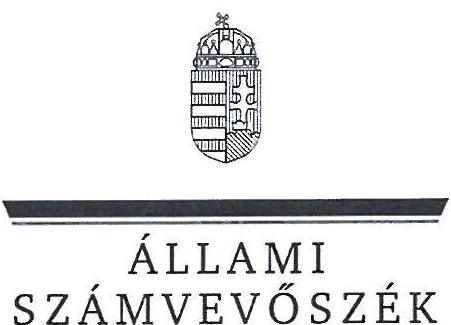
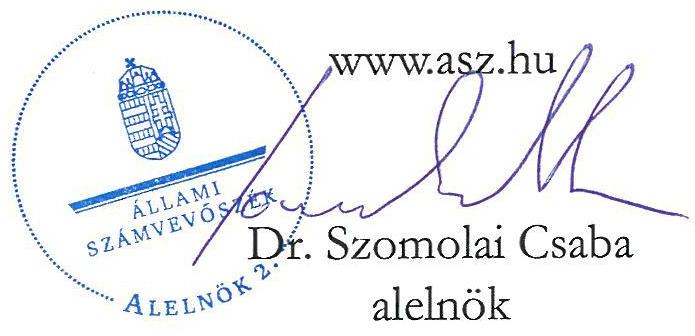
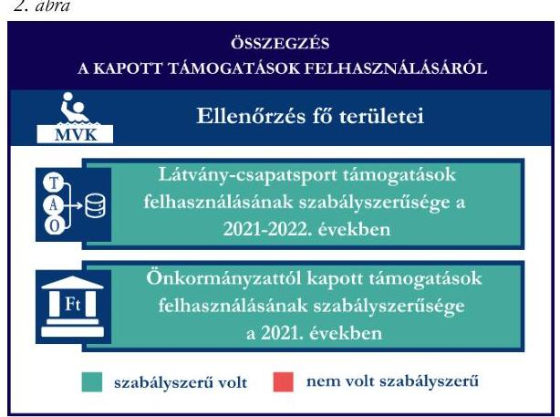
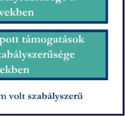
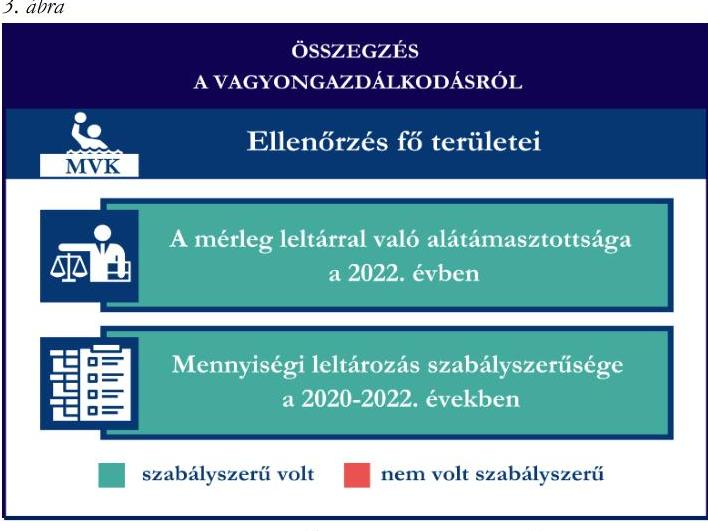

# JELENTÉS 

Támogatásban részesülő sportszövetségek, sportegyesületek és sportvállalkozások gazdálkodásának ellenőrzése

Mórahalmi Vízisport Klub

2025.

---

Állami
Számvevőszék

# JELENTÉS 

## Támogatásban részesülő sportszövetségek, sportegyesületek és sportvállalkozások gazdálkodásának ellenőrzése

Mórahalmi Vízisport Klub

2025.

25029

---

# ELLENŐRZÉSI IGAZGATÓSÁG: 

## ELLENŐRZÉSI IGAZGATÓSÁG V.

## ELLENŐRZÉSI IGAZGATÓ:

## KLINGA LÁSZLÓ igazgató

## ELLENŐRZÉSVEZETŐ:

## KAKAS SÁNDOR ellenőrzésvezető

Jelentéseink az interneten a www.asz.hu címen olvashatók.

IKTATÓSZÁM: EL-4031-072/2025
TÉMASORSZÁM: 30
ELLENŐRZÉS-AZONOSÍTÓ SZÁM: V1078

---

# TARTALOMJEGYZÉK 

AZ ELLENŐRZÉS ALAPADATAI ..... 5
AZ ELLENŐRZÖTT SZERVEZET ..... 7
ÖSSZEFOGLALÁS ..... 8
AZ ELLENŐRZÉS FÓKUSZTERÜLETEI ..... 10
MEGÁLLAPÍTÁSOK ..... 11
JAVASLATOK ..... 15
MELLÉKLETEK ..... 16
I. sz. melléklet: Fogalomtár ..... 16
II. sz. melléklet: Az ellenőrzött szervezetek jegyzéke ..... 18
III. sz. melléklet: Fő ellenőrzési kritériumok fő ellenőrzési fókuszterületek szerint. ..... 19
FÜGGELÉK: ÉSZREVÉTELEK ..... 21
RÖVIDÍTÉSEK JEGYZÉKE ..... 22

---

.

---

# AZ ELLENŐRZÉS ALAPADATAI 

## AZ ELLENŐRZÉS CÉLJA

Az ellenőrzés célja az államháztartásból nyújtott támogatással, vagy az államháztartásból meghatározott célra ingyenesen juttatott vagyon felhasználásával érintett sportszövetségek, sportegyesületek és sportvállalkozások gazdálkodása szabályozottságának, gazdálkodási tevékenységének, ezen belül a beszámolási kötelezettség teljesítésének, a támogatások elkülönített nyilvántartásának, valamint a támogatások felhasználásának ellenőrzése.

## AZ ELLENŐRZÉS TÍPUSA

Kombinált ellenőrzés.

## AZ ELLENŐRZÖTT IDŐSZAK

Az 1. fókuszterület vonatkozásában a 2022. év.
A 2. fókuszterület vonatkozásában a 2021-2022. évek.
A 3. fókuszterület vonatkozásában a 2022. év, a mennyiségi felvétellel történő leltározás dokumentumai tekintetében a 2020-2022. évek.

## AZ ELLENŐRZÉS TÁRGYA

Az ellenőrzés tárgyát képezte a támogatásban részesülő sportegyesület gazdálkodása szabályozottságának, gazdálkodási tevékenységén belül a beszámolási kötelezettség teljesítésének, a vagyonnyilvántartásának, a támogatások elkülönített nyilvántartásának, valamint az államháztartási forrásból származó közvetlen vagy közvetett támogatások és a meghatározott célra ingyenesen juttatott vagyon felhasználásának vizsgálata. Az ellenőrzés a támogatások vonatkozásában kiterjedt továbbá a támogató felé történő beszámolási és elszámolási kötelezettségek teljesítésére, a jogszabályi és belső előírások betartására.

Az ellenőrzés kiterjedt minden olyan körülményre és adatra, amely az ÁSZ¹ jogszabályban meghatározott feladatainak teljesítéséhez, valamint az ellenőrzési program végrehajtása során felmerülő újabb összefüggések feltárásához szükséges volt.

## AZ ELLENŐRZÉS JOGALAPJA

Az ellenőrzés jogszabályi alapját az ÁSZ tv.² 1. § (3) bekezdése, az 5. § (3) bekezdése előírásai képezték.

---

# AZ ELLENŐRZÉS MÓDSZERE 

Az ellenőrzést a nemzetközi standardokat irányadónak tekintve az ellenőrzési program szempontjai, az ellenőrzött időszakban hatályos jogszabályok, az ellenőrzés általános szakmai szabályai, az ellenőrzésre irányadó ÁSZ módszertanok figyelembevételével végezte az ÁSZ.

Az ellenőrzési kérdések megválaszolásához szükséges bizonyítékok megszerzése az ellenőrzött szervezet által rendelkezésre bocsátott dokumentumokra, adatokra alapozva kérdésfeltevés (információkérés), interjú, mintavételezés útján történt.

Az ellenőrzési bizonyítékként felhasználható adatforrások közé tartoztak egyrészt az ellenőrzés során az ellenőrzött szervezettől bekért dokumentumok, másrészt adatforrás volt minden további, az ellenőrzés folyamán feltárt, az ellenőrzés szempontjából információt tartalmazó egyéb adatforrás.

A támogatásokkal, azok felhasználásával kapcsolatos kötelezettségek vizsgálatára mintavételi eljárások kerültek alkalmazásra. Támogatás-típusok szerint nagyságrend alapján egy darab támogatás képezte a vizsgálat tárgyát. Ezen támogatások felhasználásának szabályszerűsége támogatásonként kockázatértékelés alapján kiválasztott tételekkel került ellenőrzésre. A kiválasztott támogatási szerződésekhez kapcsolódó elszámolásokból 30 db tétel került ellenőrzésre, ahol az elszámolás nem érte el a 30 db-ot, ott tételes ellenőrzésre került sor. Ezen felül a vagyongazdálkodás szabályszerűségének ellenőrzéséhez is kockázatalapú mintavétel kapcsolódott. A támogatások felhasználása és a vagyongazdálkodás területén a tételek ellenőrzése kiterjedt a könyvvezetési kötelezettség vizsgálatára is. A tárgyi eszközök tekintetében 30 db került kiválasztásra a 2022. évben állományban lévő eszközök közül azok nyilvántartásának, elszámolásának szabályszerűsége ellenőrzése céljából. A kiválasztott tételek ellenőrzésének eredménye nem került kivetítésre a teljes sokaságra, a megállapítások az adott ellenőrzött tételek vonatkozásában kerültek megjelenítésre.

---

# AZ ELLENŐRZÖTT SZERVEZET

A Mórahalmi Vízisport Klub 1998. december 10-én jött létre Szegedi Vízilabda és Tömegsport Klub néven. Az MVK³ névváltozására 2023. április 5-ei hatállyal került sor. Az MVK Alapszabályában₁₂⁴ rögzített célja *„a rendszeres sportolás, testedzés biztosítása, a sportolási igény keltése, az egészséges életmódra történő nevelés, a vízisportok, így különösen az úszás egészségmegőrző és rehabilitációs szerepének népszerűsítése, a sportág utánpótlásának megteremtése érdekében az úszásoktatás népszerűsítése, a fiatal tehetségek felkutatása, tehetségük kibontakoztatása.”* Az MVK az ellenőrzött időszakban csak vízilabda szakosztályt működtetett.

Az Alapszabály₁₂ szerint az MVK legfőbb szerve a Közgyűlés⁵. Az MVK tevékenységét a két közgyűlés közötti időszakban a Közgyűlés által választott három főből álló Elnökség irányítja, melynek tagjai az elnök, az elnökhelyettes és az ügyvezető elnök. Az elnök irányítja és szervezi az egyesület tevékenységét, képviseleti joga gyakorlásának terjedelme általános, módja önálló.

Az MVK Alapszabályának₁₂ rendelkezése alapján gazdasági-vállalkozási tevékenységet csak közhasznú vagy az alapszabályban meghatározott egyéb céljainak megvalósítása érdekében, a közhasznú célok megvalósítását nem veszélyeztetve végezhet. Az ellenőrzött időszakban az MVK vállalkozási tevékenységet nem végzett.

Az MVK az ellenőrzött időszakban a jogszabályi előírások szerint könyvvizsgálatra, felügyelőbizottság létrehozására nem volt kötelezett.

Az ellenőrzött időszakban az MVK a Szegedi Vízilabda és Tömegsport Klub Mórahalom Felnőtt Férfi Szakosztály jogi személyiséggel rendelkező szervezeti egységgel rendelkezett.

Az MVK által az ellenőrzött időszakban igénybe vett támogatásokat az 1. táblázat mutatja be. 1. táblázat

|  AZ MVK ÁLTAL IGÉNYBE VETT TÁMOGATÁSOK (ADATOK M FT-BAN) |  |   |
| --- | --- | --- |
|   | 2021. ÉV | 2022. ÉV  |
|  Központi költségvetési támogatás | - | -  |
|  Látvány-csapatsport támogatás | 41,2 |   |
|  Helyi önkormányzati támogatás | 3,8 | -  |
|  Magyar Vízilabda Szövetségtől kapott támogatás | - | -  |

*Forrás: Az ellenőrzött szervezet ellenőrzési dokumentumai alapján ÁSZ saját szerkesztés*

---

# ÖSSZEFOGLALÁS 

Magyarország Alaptörvényének XX. cikke kimondja, hogy mindenkinek joga van a testi és lelki egészséghez, melynek érvényesülését Magyarország többek között a sportolás és a rendszeres testedzés támogatásával segíti elő. Az Országgyűlés a Sport tv.⁶-ben kinyilvánította, hogy a nemzet közössége a test művelését, a sportot, a nemzet alapértékének, kívánatos célnak tekinti. A sport a közjó része. Erősíti a közösség tagjainak egymáshoz tartozását, miként az egyén testi és lelki egészségét.

A sportegyesületek, sportszövetségek, sportvállalkozások működésükre és szakmai tevékenységük ellátására költségvetési támogatásban, önkormányzati támogatásban, ingyenes vagyonjuttatásban, valamint látvány-csapatsport támogatásban részesülhetnek, amelyekre fokozott figyelem irányul.

A társadalom részéről jogosan felmerülő elvárás, hogy a közpénzeket kezelő, azzal gazdálkodó szervezetek működéséről, tevékenységéről átfogó képet kapjon, a közpénzek rendeltetésszerű és átlátható módon történő felhasználásának értékelésére időről-időre sor kerüljön az ellenőrzések keretében.

Az MVK a könyvviteli szolgáltatás személyi feltételeinek megteremtéséről a jogszabályi előírásoknak megfelelően gondoskodott. A jogszabályi előírásoknak megfelelően kialakította a számviteli politikáját, valamint annak keretében elkészítette számviteli szabályzatait, továbbá rendelkezett számlarenddel. A szabályzatok az ellenőrzött kritériumoknak megfeleltek. Az MVK könyvvezetésének formája a 2022. évben megfelelt a jogszabályi előírásoknak. A számviteli beszámoló- és közhasznúsági melléklet készítési kötelezettség teljesítése vonatkozásában az ellenőrzés hiányosságot tárt fel az eredménykimutatás és a közhasznúsági melléklet tartalmában, továbbá a közzétételi kötelezettség teljesítése nem felelt meg a jogszabályi előírásoknak.

A gazdálkodás szervezeti keretei kialakításának, a számviteli szabályzatok megalkotásának, valamint a számviteli beszámoló elkészítésének és közzétételének értékelését az 1. ábra mutatja be.

A KAPOTT TÁMOGATÁSOK FELHASZNÁLÁSÁBÓL
Ellenőrzés fő területei

Az MVK a látvány-csapatsport támogatást a 2021-2022. években, az önkormányzati támogatást a 2021. évben az ellenőrzött tételek esetében a támogatási célnak megfelelően, szabályszerűen használta fel. Számviteli nyilvántartásában a látvány-csapatsport támogatás felhasználását a jogszabályi előírás szerint elkülönítetten tartotta nyilván, az önkormányzati támogatás felhasználásának elkülönített nyilvántartása tekintetében az ellenőrzés hiányosságot tárt fel.

A kapott támogatások felhasználásának értékelését a 2. ábra mutatja be.

---

Az MVK vagyongazdálkodása a 2022. évben összességében szabályszerű volt. A 2022. évi egyszerűsített éves beszámolójának mérlegtételeit leltárral alátámasztotta, továbbá a 2022. évre vonatkozóan a tárgyi eszközök esetében a mennyiségi felvétellel történő leltározást elvégezte. Az ellenőrzött tételek esetében a tárgyi eszközök bekerülési értékének meghatározása, valamint az értékcsökkenés elszámolása a 2022. évben nem volt szabályszerű.

A vagyongazdálkodás értékelését a 3. ábra mutatja be.

Forrás: ÁSZ megállapítások alapján ÁSZ saját szerkesztés

---

# AZ ELLENŐRZÉS FÓKUSZTERÜLETEI 

1.     - A gazdálkodási szabályok kialakítása, a könyvvezetési- és beszámolási kötelezettség teljesítése
2.     - A kapott támogatások felhasználása
3.     - Az ellenőrzött szervezet vagyongazdálkodása

---

# 1. A gazdálkodási szabályok kialakítása, a könyvvezetési- és beszámolási kötelezettség teljesítése 

Összegző megállapítás

Az MVK a 2022. évre vonatkozóan a jogszabályokban előírt szervezeti keretek kialakításával, a gazdálkodást biztosító belső szabályozó eszközök és számviteli szabályzatok megalkotásával megteremtette a szabályszerű gazdálkodásának feltételeit. A jogszabályoknak megfelelően teljesítette könyvvezetési kötelezettségét, a számviteli beszámoló elkészítésénél az ellenőrzés hiányosságot tárt fel. A közzétételi kötelezettségét nem szabályszerűen teljesítette.

A 2022. évben az MVK a Számv. tv.⁷-ben és a Civilszr.⁸-ben foglalt előírásoknak megfelelően a könyvviteli szolgáltatás körébe tartozó feladatok vezetésével, a beszámoló elkészítésével kapcsolatos feladatok ellátására a jogszabályi előírásoknak megfelelő társaságot bízott meg, melynek alkalmazottja a jogszabályi előírásoknak megfelelő képesítéssel rendelkezett.
Az MVK a 2022. évben rendelkezett a Számv. tv. előírása szerinti számviteli politikával⁹ és annak részeként elkészített leltározási szabályzattal¹⁰, értékelési szabályzattal¹¹, továbbá pénzkezelési szabályzattal¹². Az MVK a Számv. tv. szerint elkészítette a számlarendet¹³, és az abban foglaltakat alátámasztó bizonylati rendet¹⁴. A szabályzatok az ellenőrzött kritériumoknak megfeleltek.
Az MVK a 2022. évben a Számv. tv. és a Civilszr. előírásainak megfelelően kettős könyvvitelt vezetett. Az MVK a Civil tv.¹⁵-ben előírtak szerint az alapcél szerinti tevékenysége költségei, ráfordításai ellentételezésére kapott támogatásokról olyan elkülönített számviteli nyilvántartást vezetett, amelynek alapján támogatásonként megállapítható és ellenőrizhető volt a kapott támogatás felhasználása. Az MVK könyvvezetését a Számv. tv. és a Civilszr. előírásainak megfelelően úgy alakította ki, hogy a 2022. évben az egyszerűsített éves beszámolóban a bevételeit az értékesítés nettó árbevétele, egyéb bevétel és pénzügyi műveletek bevétele bontásban mutatta ki, valamint a Civilszr. szerint a tagdíjbevételeket elkülönítetten tartotta nyilván, azonban a Civilszr. 24. § (2) bekezdésében foglaltak ellenére a 2022. évi egyszerűsített éves beszámoló eredménykimutatásában a 3. Egyéb bevételek soron belül a kapott támogatások összegét nem részletezte.
Az MVK a Számv. tv., a Civil tv., valamint a Civilszr. előírásainak megfelelően elkészítette a 2022. évre vonatkozó egyszerűsített éves beszámolóját és azzal egyidejűleg elkészítette a közhasznúsági mellékletet. A közhasznúsági melléklete a Civil tv. 29. § (7) bekezdésében előírtak ellenére a Civil vhr.¹⁶ mellékletének 5. pontját (Célszerinti juttatások) nem tartalmazta. A 2022. évre vonatkozó egyszerűsített éves beszámolót a Ptk.¹⁷ és a Civil tv. előírásai szerint a Közgyűlés jóváhagyta. Az MVK a 2022. évi egyszerűsített éves beszámoló közzétételénél a Civil tv. 30. § (1) bekezdésében előírtakat nem tartotta be, mert az egyszerűsített éves beszámolót a jogszabályban előírt határidőn túl, 2023. július 28-án helyezte letétbe és tette közzé. Az egyszerűsített éves beszámolót saját honlapján az MVK az előírások szerint közzétette.

---

# 2. A kapott támogatások felhasználása 

Összegző
 megállapítás

Az MVK a 2021. és a 2022. években a kapott támogatásokat az ellenőrzött tételek esetében szabályszerűen használta fel, azonban az önkormányzati támogatás felhasználásának elkülönített nyilvántartása nem volt teljeskörű.

Az MVK a 2021-2022. évben a be/SFP-08109/2021/MVLSZ. számú sportfejlesztési program alapján kapott látvány-csapatsport támogatás igénylésével, módosításával kapcsolatos feladatait a jogszabályi előírásoknak megfelelően teljesítette. A látvány-csapatsport támogatások felhasználásáról a 2021-2022. években a 107/2011. (VI. 30.) Korm. rendelet ${ }^{18}$ 11. $\S$ (2) bekezdésében előírtak ellenére a negyedéves előrehaladási jelentéseket az MVLSZ ${ }^{19}$ felé nem nyújtotta be.
Az MVK a 2021-2022. években a számára nyújtott látvány-csapatsport támogatást a Számv. tv. és a Civilszr. előírásainak megfelelően az egyéb bevételek között mutatta ki.
Az MVK a látvány-csapatsport támogatás felhasználásáról a 107/2011. (VI. 30.) Korm. rendeletnek megfelelően határidőben, záradékolt számviteli bizonylatokkal alátámasztott módon, összesített elszámolási táblázat és szöveges beszámoló benyújtásával elszámolt az MVLSZ felé. Az elszámolás számviteli bizonylatait a 107/2011. (VI. 30.) Korm. rendeletben előírt felelősségbiztosítással rendelkező könyvvizsgáló vizsgálta felül.
Az MVK az ellenőrzött időszakban könyvvezetése során az alapcél szerinti tevékenysége költségei, ráfordításai ellentételezésére kapott támogatásokról a Civil tv.-ben előírtak szerint elkülönített számviteli nyilvántartást vezetett, amelynek alapján támogatásonként megállapítható és ellenőrizhető volt a kapott látvány-csapatsport támogatás felhasználása.
Az MVK esetében a látvány-csapatsport támogatás ellenőrzött tételeinek (27 db) vonatkozásában az alábbiakat állapította meg az ÁSZ:

- a tételek számviteli elszámolását a Számv. tv.-ben és a 107/2011. (VI. 30.) Korm. rendeletben előírtak szerint bizonylatokkal alátámasztották;
- a tételek tartalma (gazdasági esemény) és összege alapján a támogatást a támogatási igazolásban meghatározottak szerinti jogcímre, és az abban meghatározott támogatástartalom figyelembevételével használták fel;
- a tételekhez kapcsolódó gazdasági események a támogatási időszak (meghosszabbított támogatási időszak) végéig szerződés szerint teljesültek;
- a tételek pénzügyi rendezése - három kivétellel - az elszámolás benyújtására nyitva álló időben, a támogatási jogcímnek megfelelő pénzforgalmi számláról történt. A három kivétel tétel (átigazolási díj és két tagdíj) esetében a 107/2011. (VI. 30.) Korm. rendelet 9. § (8) bekezdésének előírásával ellentétben nem a támogatási jogcímnek megfelelően megnyitott pénzforgalmi számláról történt a pénzügyi rendezés.
- a tételek számviteli bizonylatait a 107/2011. (VI. 30.) Korm. rendeletben foglaltaknak megfelelően ellátták záradékkal;
- a számviteli bizonylatokon záradékolt összegek - nyolc tétel kivételével - megegyeztek a számlaösszesítőben szereplő értékkel. A kivételek közül hat tétel esetében (hat bérköltség, tételenként 100 000 Ft összegben) a számviteli bizonylaton feltüntetett záradékolt összeg nem egyezett meg az elszámolási összesítőbe került összeggel, ez a gyakorlat nem felelt meg a 107/2011. (VI. 30.) Korm. rendelet 11. $\int$ (1) és (5) bekezdéseiben előírtaknak. További két tétel („vízilabda eredményjelző telepítése” 8 123 900 Ft összegű és „lövőfal” 899 000 Ft összegű) esetében a számviteli bizonylaton feltüntetett záradék szövegében a be/SFP-08109/2021/MVLSZ sportfejlesztési program terhére ténylegesen elszámolni kívánt összeget a 107/2011. (VI. 30.) Korm. rendelet 11. $\int$ (1) bekezdésében előírtakkal szemben nem jelölték meg annak ellenére, hogy az alátámasztó bizonylat nem teljes összegben került elszámolásra;

- a tételek számviteli bizonylatain a felhasznált összegek a Számv. tv.-ben előírtak szerinti, tartalmuknak megfelelő főkönyvi számra kerültek elszámolásra.
Az MVK a 2021-ben az MH/4290/2021 számú támogatási megállapodás szerint a számára juttatott önkormányzati támogatás bevételeit a Számv. tv. előírásai szerint egyéb bevételei között elkülönítve tartotta nyilván.
Az MVK a támogatás felhasználásáról az Áht. ${ }^{20}$-ban és az MH/4290/2021 számú támogatási megállapodás 8.1. pontjában előírtak szerint a támogató felé elszámolt.
Az MVK esetében az önkormányzati támogatás ellenőrzött tételeinek (9 db) vonatkozásában az alábbiakat állapította meg az ÁSZ:
- a tételek számviteli elszámolását a Számv. tv.-ben előírtak szerint bizonylatokkal alátámasztották;
- az Ávr. ${ }^{21}$-ben foglaltaknak megfelelően a tétel gazdasági eseményének teljesítése a támogatási megállapodásban meghatározott támogatott tevékenység időtartamán belül történt;
- az Ávr.-ben előírtak szerint a támogatási megállapodásban meghatározott felhasználási határidőig megtörtént a tétel pénzügyi rendezése;
- a tételek számviteli bizonylatát - egy kivételével - az Ávr. és a támogatási megállapodás előírása szerint záradékkal látták el, a bizonylaton záradékolt összegek megegyeztek az elszámolási összesítőben szereplő értékkel. A kivétel tétel („versenyeztetés díja” 19 432 Ft összegű) az Ávr. 93. § (5) bekezdésének, valamint a Támogatási megállapodás 8.8 pontjának ellenére záradékot egyáltalán nem tartalmazott.
- a Civil tv. 20. § (4) bekezdésében és a támogatási megállapodás 8. pontjában előírtak ellenére a tételek elkülönített nyilvántartása négy esetben (négy „meghiúszási díj” tételenként 117 259 Ft összegű) nem valósult meg, mert a számviteli bizonylaton záradékolt összeg a támogatás felhasználásának elkülönített számviteli nyilvántartásában szereplő összeggel nem egyezett meg;
- a tételek számviteli bizonylatának a támogatás terhére záradékolt összege a Számv. tv.-ben előírtak szerinti, tartalmának megfelelő főkönyvi számra került elszámolásra.

---

# 3. Az ellenőrzött szervezet vagyongazdálkodása 

## Összegző megállapítás

A 2022. évben az MVK vagyongazdálkodása összességében szabályszerű volt, azonban a tárgyi eszköz ellenőrzött tételek bekerülési értéke és az értékcsökkenés elszámolása vonatkozásában az ellenőrzés hiányosságot tárt fel.

Az MVK a Számv. tv. előírásainak megfelelően a 2022. évi egyszerűsített éves beszámolójának mérlegtételeit szabályszerű leltárral alátámasztotta. A Számv. tv. szerint a 2022. évre vonatkozóan a tárgyi eszközök esetében a mennyiségi felvétellel történő leltározást elvégezte.
Az MVK esetében a tárgyi eszköz ellenőrzött tételek (8 db) vonatkozásában az alábbiakat állapította meg az ÁSZ:

- a tételek bekerülési értékét számviteli bizonylatokkal - három tétel kivételével - alátámasztották. A kivételt képező Móradombi Uszoda beruházáshoz kapcsolódó három tétel esetében a Számv. tv. 47. § (1) és az 51. § (1) bekezdés a) pontjában foglaltak, továbbá a Számv. tv. 165. § (2) bekezdése ellenére a bekerülési értéket a számviteli bizonylatok nem teljes összegben támasztották alá, mert kettő tétel „Móradombi uszoda (0406/279) I.” és „Móradombi uszoda (0406/279) III.” esetében a bekerülési érték összesen 1 259 768 551 Ft volt, a bekerülési értéket alátámasztó számviteli bizonylatok összege pedig 1 249 046 924 Ft, az eltérés 10 721 627 Ft, továbbá a „Épületek, épületrészek, tulajdoni bányadok. -Móradombi uszoda-nem támogatott” tétel esetében a bekerülési értékből számviteli bizonylattal nem igazolt rész 316 855 Ft volt;
- a tárgyi eszközök számviteli besorolása megfelelt a Számv. tv. előírásainak;
- a tárgyi eszközök üzembehelyezését a Számv. tv. előírása szerint hitelt érdemlő módon dokumentálták, azonban 2 db tétel („Vízilabda kapu - 2 db” és „Lövőfal 2 db”) esetében a tárgyi eszközök aktiválása során egy eszközként aktiváltak egyszerre megvásárolt több eszközt, ezzel az egyedi értékelés elve sérült, mellyel megsértették a Számv. tv. 46. § (3) bekezdése előírását;
- az értékcsökkenés elszámolása - három tétel kivételével - a Számv. tv.-nek megfelelően történt. Három tétel esetében a Számv. tv. 52. § (2) bekezdésében előírtak ellenére az eszközöket nem a bekerülési érték összegével egyező összeggel aktiválták, ennek okán az eszközök tárgyévi értékcsökkenésének elszámolása a Számv. tv. 52. § (1) bekezdésében foglaltakkal nem volt összhangban;
- a látvány-csapatsport támogatásból megvalósult tárgyi eszköz beszerzés esetén a tétel bekerülési értékét meghatározó számviteli bizonylatokat - két tétel kivételével - ellátták záradékkal, amelyből kiderül, hogy a számviteli bizonylaton szereplő összegből mennyit számoltak el a hivatkozott támogatás terhére. A kivétel két tétel - „Móradombi uszoda (0406/279) I.” és „Móradombi uszoda (0406/279) IV.” esetében a 107/2011. (VI. 30.) Korm. rendelet 11. § (5) bekezdésében előírtak ellenére a tétel bekerülési értékét meghatározó számviteli bizonylatok nem mindegyikét látták el záradékkal, ezért nem derült ki, hogy a számviteli bizonylaton szereplő összegből mennyit számoltak el a szerződésszámmal hivatkozott támogatási szerződés terhére.

---

# JAVASLATOK 

Az ÁSZ tv. 33. § (1) bekezdésében foglaltak értelmében az ellenőrzött szervezet vezetője köteles a jelentésben foglalt megállapításokhoz kapcsolódó intézkedési tervet összeállítani és azt a jelentés kézhezvételétől számított 30 napon belül az ÁSZ részére megküldeni. Amennyiben az ellenőrzött szervezet vezetője nem küldi meg határidőben az intézkedési tervet, vagy továbbra sem elfogadható intézkedési tervet küld, az Állami Számvevőszék elnöke az ÁSZ tv. 33. § (3) bekezdés a) és b) pontjaiban foglaltakat érvényesítheti.

## A MÓRAHALMI VÍZISPORT KLUB ELNÖKE RÉSZÉRE

1. Gondoskodjon az egyszerűsített éves beszámoló eredménykimutatásában a kapott támogatások részletezéséről a Civilszr. 24. § (2) bekezdésében foglaltaknak megfelelően.
2. Gondoskodjon arról, hogy a közhasznúsági melléklet a Civil vhr. 12. § és melléklete szerint tartalmazza a cél szerinti juttatások kimutatását.
3. Gondoskodjon az egyszerűsített éves beszámoló jogszabályban előírt határidőben történő közzétételéről a Civil tv. 30. § (1) bekezdésében előírtak szerint.
4. Gondoskodjon, hogy a látvány-csapatsport támogatás terhére elszámolt számviteli bizonylatok záradékolása során minden esetben betartsák a 107/2011. (VI. 30.) Korm. rendelet 11. § (1) és (5) bekezdéseiben előírtakat.
5. Gondoskodjon arról, hogy a látvány-csapatsport támogatás felhasználása során a pénzügyi rendezésre a támogatási jogcímnek megfelelő pénzforgalmi számláról kerüljön sor a 107/2011. (VI. 30.) Korm. rendelet 9. § (8) bekezdésében előírtak szerint.
6. Gondoskodjon az önkormányzati támogatások felhasználása során a számviteli bizonylatok záradékolásáról az Ávr. 93. § (5) bekezdésének, valamint a támogatási megállapodásban foglaltak szerint.
7. Gondoskodjon arról, hogy a kapott önkormányzati támogatások felhasználását a Civil tv. 20. § (4) bekezdésében és a támogatási megállapodásban előírtak szerint elkülönítetten tartsa nyilván.
8. Gondoskodjon a tárgyi eszközök bekerülési értékének bizonylattal történő alátámasztásáról, a Számv. tv. 47. § (1), a Számv. tv. 165. § (2) bekezdésben foglaltakra figyelemmel, a Számv. tv. 51. § (1) bekezdés előírásainak megfelelően.
9. Gondoskodjon a tárgyi eszközök esetében a Számv. tv. 52. § (1)-(2) bekezdéseiben foglaltaknak megfelelő értékcsökkenés elszámolásáról.

---

# MELLÉKLETEK 

I. SZ. MELLÉKLET: FOGALOMTÁR

Civil szervezet

Egyesület

Kiegészítő sportfejlesztési támogatás

Költségvetési támogatás

Közhasznú szervezet

Közhasznú tevékenység

Látvány-csapatsport támogatás

Látvány-csapatsportban működő amatőr sportszervezet

Látvány-csapatsportban működő hivatásos sportszervezet

A civil társaság; a Magyarországon nyilvántartásba vett egyesület - a párt, a szakszervezet és a kölcsönös biztosító egyesület kivételével és - a közalapítvány és a pártalapítvány kivételével - az alapítvány. (Forrás: Civil tv. 2. § 6. pont a)-c) alpontjai)
Az egyesület a tagok közös, tartós, alapszabályban meghatározott céljának folyamatos megvalósítására létesített, nyilvántartott tagsággal rendelkező jogi személy. (Forrás: Ptk. 3:63. § (1) bekezdés)
A Számv. tv. szempontjából egyéb szervezet. (Számv. tv. 3. § (1) bekezdés 4. pont a) alpontja)

A látvány-csapatsportok támogatása esetében rendelkező nyilatkozatban felajánlott összeg 12,5 százaléka kiegészítő sportfejlesztési támogatásnak minősül. (Forrás: Tao tv. ${ }^{22}$ 24/A. § (9) bekezdés)
A társadalombiztosítás pénzügyi alapjai kivételével az államháztartás központi alrendszeréből ellenérték nélkül, pénzben nyújtott támogatások. (Forrás: Áht. 1. § 14. pont)
Közhasznú szervezetté minősíthető a Magyarországon nyilvántartásba vett közhasznú tevékenységet végző szervezet, amely a társadalom és az egyén közös szükségleteinek kielégítéséhez megfelelő erőforrásokkal rendelkezik, továbbá amelynek megfelelő társadalmi támogatottsága kimutatható, és amely:
a) civil szervezet (ide nem értve a civil társaságot), vagy
b) olyan egyéb szervezet, amelyre vonatkozóan a közhasznú jogállás megszerzését törvény lehetővé teszi. (Forrás: Civil tv. 32. § (1) bekezdés)

Minden olyan tevékenység, amely a létesítő okiratban megjelölt közfeladat teljesítését közvetlenül vagy közvetve
 szolgálja, ezzel hozzájárulva a társadalom és az egyén közös szükségleteinek kielégítéséhez. (Forrás: Civil tv. 2. § 20. pont)
Az adóévben visszafizetési kötelezettség nélkül nyújtott támogatás, juttatás, véglegesen átadott pénzeszköz és térítés nélkül átadott eszköz könyv szerinti értéke, az adóévben térítés nélkül nyújtott szolgáltatás bekerülési értéke a Tao tv.-ben meghatározott jogcímeken. (Forrás: Tao tv. 4. § 44. pont)
Minden olyan, a sportról szóló törvényben meghatározott szabályok szerint a látvány-csapatsportban működő sportegyesület vagy sportvállalkozás, amelyik nem minősül a látvány-csapatsportban működő hivatásos sportszervezetnek. (Forrás: Tao tv. 4. § 42. pont)
A látvány-csapatsportágak országos sportági szakszövetsége által kiírt versenyrendszer legmagasabb felnőtt bajnoki osztályában - a veterán korosztályokra kiírt versenyrendszer kivételével - részt vevő (indulási jogot elnyert) sportszervezet, vagy alsóbb bajnoki osztályaiban részt vevő (indulási jogot elnyert) sportszervezet abban az esetben, ha az ilyen sportszervezet hivatásos sportolót alkalmaz. Több látvány-csapatsportban több jogi személy szervezeti egységgel (szakosztállyal) működő sportszervezet esetén csak az a jogi személy szervezeti egység (szakosztály), amely a fent részletezett versenyrendszerek bajnoki osztályaiban részt vesz. (Forrás: Tao tv. 4. § 43. pont)

---

Országos sportági szakszövetség

Sportági szövetség

Sportegyesület

Sportszövetség

Sporttevékenység

Sportvállalkozás

Olyan sportszövetség, amely sportágában kizárólagos jelleggel az e törvényben, valamint más jogszabályokban meghatározott feladatokat lát el és e törvényben megállapított különleges jogosítványokat gyakorol. Olyan sportágban hozható létre, amelyet vagy a Nemzetközi Olimpiai Bizottság elismert, vagy amely sportág nemzetközi szövetségét felvették a Nemzetközi Sportszövetségek Szövetségébe (GAISF). (Forrás: Sport tv. 20. § (1), (4) bekezdés)

A Civil tv. és a Ptk. előírásai alapján - a Sport tv.-ben meghatározott eltérésekkel - működő szövetség, amelynek tagjai kizárólag sportszervezetek lehetnek. Sportági szövetség országos jelleggel is működhet. Egy sportágban csak egy országos sportági szövetség működhet. Törvényi feltételek teljesülése esetén szakszövetségi feladatokat is elláthat. (Forrás: Sport tv. 28. §)
A Civil tv. és a Ptk. szabályai szerint működő olyan egyesület, amelynek alaptevékenysége a sporttevékenység szervezése, valamint a sporttevékenység feltételeinek megteremtése. A sportegyesületek a Sport tv. 15. § (1) bekezdésében meghatározott sportszervezetek körébe tartoznak. A sportegyesületeken kívül sportszervezet még a sportvállalkozás, a sportiskola, valamint az utánpótlás-nevelés fejlesztését végző alapítvány. (Forrás: Sport tv. 16. § (1) bekezdés)

Meghatározott sporttevékenységek körében a sportversenyek szervezésére, a tagok érdekvédelmére és a részükre való szolgáltatásokra, valamint a nemzetközi kapcsolatok lebonyolítására létrehozott, jogi személyiséggel és önkormányzattal rendelkező, a Civil tv. és a Ptk. alapján - az e törvényben foglalt eltérésekkel - különös formában működő egyesületek. A Sport tv. 19. § (3) bekezdése szerint a sportszövetségeknek az alábbi típusai léteznek: országos sportági szakszövetségek, sportági szövetségek, szabadidősport szövetségek, fogyatékosok sportszövetségei, diák- és egyetemi-főiskolai sport sportszövetségei, nemzetközi sportszövetségek. (Forrás: Sport tv. 19. § (1), (3) bekezdés)

Meghatározott szabályok szerint, a szabadidő eltöltéseként kötetlenül vagy szervezett formában, illetve versenyszerűen végzett testedzés vagy szellemi sportágban kifejtett tevékenység, amely a fizikai erőnlét és a szellemi teljesítőképesség megtartását, fejlesztését szolgálja. (Forrás: Sport tv. 1. § (2) bekezdés)

Az a gazdasági társaság, amelynek a cégnyilvántartásról, a cégnyilvánosságról és a bírósági cégeljárásról szóló törvény alapján a cégjegyzékbe bejegyzett tevékenysége sporttevékenység, továbbá a gazdasági társaság célja sporttevékenység szervezése, valamint a sporttevékenység feltételeinek megteremtése egy vagy több sportágban. Korlátolt felelősségű társasági, illetve részvénytársasági formában alapítható, a fogyatékosok sportja, illetve a szabadidősport területén közhasznú társaságként is működhet. (Forrás: Sport tv. 18. §)

---

II. SZ. MELLÉKLET: AZ ELLENŐRZÖTT SZERVEZETEK JEGYZÉKE

|  ELLENŐRZÖTT SZERVEZET NEVE | ELLENŐRZÖTT SZERVEZET SZÉKHELYE  |
| --- | --- |
|  Mórahalmi Vízisport Klub | 6782 Mórahalom, István Király út 1.  |

---

# III. SZ. MELLÉKLET: FŐ ELLENŐRZÉSI KRITÉRIUMOK FŐ ELLENŐRZÉSI FÓKUSZTERÜLETEK 

SZERINT

## FŐ ELLENŐRZÉSI FÓKUSZTERÜLETEK

1. A gazdálkodási szabályok kialakítása, a könyvvezetési és beszámolási kötelezettség teljesítése

## FŐ ELLENŐRZÉSI KRITÉRIUMOK

Civil tv. 2. § 7., 11. pont, 20. § (3) bekezdés c) pont, (4) bekezdés, 28. § (1)-(3) bekezdés, 29. § (1) bekezdés, (2) bekezdés c) pont, (3), (6), (7) bekezdés, 30. § (1)-(4) bekezdés, 40. § (1), (2) bekezdés, 41. § (1) bekezdés

Civilszr. 7. § (1) bekezdés, (4) bekezdés b), c) pont, (6) bekezdés, 8. § (2), (3) bekezdés, 9. § (4), (5), (8) bekezdés, 12. § (4), (5) bekezdés, 15. § (1) bekezdés a), b) pont, (2) bekezdés, 16. § (1), (3) bekezdés, 22. § (1) bekezdés, 24. § (2) bekezdés, 3.-4. sz. melléklet

Civil vhr. 12. § és melléklet
Cnytv. $^{23}$ 39. § (1), (4) bekezdés, 40. § (2) bekezdés
Ptk. 3:26. § (1) bekezdés, 3:27. § (1) bekezdés, 3:82. § (1)-(2) bekezdés

Számv. tv. 4. §, 6. § (2) bekezdés, 12. §, 14. § (3), (5) bekezdés a), b), d) pont, (8) bekezdés, (11)-(12) bekezdés, 69. § (1), (3) bekezdés, 90. § (3) bekezdés c) pont, 96. § (4) bekezdés, 150. § (2) bekezdés, 153. § (1) bekezdés, 154. § (1) bekezdés, 161. § (1) bekezdés, (2) bekezdés a)-d) pont, (3)-(4) bekezdés, 161/A. § (1)(2) bekezdés, 165. § (2) bekezdés

Tao tv. 22/C. §
107/2011. (VI.30.) Korm. rendelet 9. § (9) bekezdés
Áht. 52. § (1) bekezdés, 53. §
Ávr. 76. § (1) bekezdés, 93. § (1)-(3), (5) bekezdés
Civil tv. 20. § (1) bekezdés c) pont, (2) bekezdés a) pont, (3) bekezdés a), c) pont, (4) bekezdés, 29. § (4), (5) bekezdés
Civilszr. 13. § (3) bekezdés, 24. § (1)-(2) bekezdés
Kbt. $^{24}$ 5. § (2) bekezdés, 15. §
Számv. tv. 16. § (3) bekezdés, 25-26. §, 44. § (2) bekezdés, 45. § (1)-(2) bekezdés, 77. § (3) bekezdés b) pont, 78-81. §, 159. §, 161/A. § (2) bekezdés, 162. § (1) bekezdés, 165. § (1)-(2) bekezdés, 166. § (1) bekezdés, 167. § (1) bekezdés a), d), e), h) pont

Tao. tv. 22/C. §, 24/A. § (9) bekezdés
107/2011. (VI.30.) Korm. rendelet 2. § (3b) bekezdés, 4. § (11) bekezdés, 5. § (1) bekezdés, 6. § (1) bekezdés e) pont, 9. § (8)-(10) bekezdés, 10. § (2), (2a), (2b), (4) bekezdés, (5a) bekezdés, 11. § (1), (1a), (1d), (1e), (2), (4), (4a), (5), (6) bekezdés, 13. § (1), (2a) bekezdés, 14. § (1), (4), (4b), (4c), (6c) bekezdés
275/2022. (VII.29.) Korm. rendelet $^{25}$ 1. § (3)
444/2022. (XI.7) Korm. rendelet $^{26}$ 2. §
474/2016. (XII. 27.) Korm. rendelet $^{27}$ 26. § (3) bekezdés

---

3. Az ellenőrzött szervezet vagyongazdálkodása

Ptk. 3:63. § (4) bekezdés
Számv. tv. 15. § (3) bekezdés, 26. §, 46. § (3) bekezdés, 47-53. §, 57. §, 69. § (1)-(6) bekezdés, 165-166. §, 169. § (2) bekezdés

Tao tv. 22/C (6) bekezdés a), d), e) pont, (11) bekezdés
Ávr. 93. § (5) bekezdés
107/2011. (VI.30.) Korm. rendelet 11. § (5) bekezdés
474/2016. (XII. 27.) Korm. rendelet 17. § (1) bekezdés 11a. a) pont, 11b. pont, 17. § (2a) bekezdés, 24. § (2) bekezdés

---

# FÜGGELÉK: ÉSZREVÉTELEK 

A jelentéstervezetet a Számvevőszék 15 napos észrevételezésre megküldte az ellenőrzött szervezet vezetőjének az ÁSZ tv. 29. § (1) bekezdése előírásának megfelelően.

A Mórahalmi Vízisport Klub elnöke a jelentéstervezet megállapításaira nem tett észrevételt.

[^0]
[^0]:    * 29. § (1) Az Állami Számvevőszék az ellenőrzési megállapításait megküldi az ellenőrzött szervezet vezetőjének vagy az általa megbízott személynek, és annak, akinek személyes felelősségét állapította meg.
    (2) Az ellenőrzött szervezet vezetője és a felelősként megjelölt személy az ellenőrzés megállapításaira tizenöt napon belül írásban észrevételt tehet.
    (3) Az Állami Számvevőszék az észrevételre a beérkezésétől számított harminc napon belül írásban válaszol. A figyelembe nem vett észrevételeket köteles a jelentésben feltüntetni, és megindokolni, hogy azokat miért nem fogadta el.

---

# RÖVIDÍTÉSEK JEGYZÉKE 

$^{1}$ ÁSZ
$^{2}$ ÁSZ tv.
$^{3}$ MVK
$^{4}$ Alapszabály $_{1,2}$
$^{5}$ Közgyűlés
$^{6}$ Sport tv.
$^{7}$ Számv. tv.
$^{8}$ Civilszr.
$^{9}$ számviteli politika
$^{10}$ leltározási szabályzat
$^{11}$ értékelési szabályzat
$^{12}$ pénzkezelési szabályzat
$^{13}$ számlarend
$^{14}$ bizonylati rend
$^{15}$ Civil tv.
$^{16}$ Civil vhr.
$^{17}$ Ptk.
$^{18}$ 107/2011. (VI.30.) Korm. rendelet
$^{19}$ MVLSZ
$^{20}$ Áht.
$^{21}$ Ávr.
$^{22}$ Tao tv.
$^{23}$ Cnytv.
$^{24}$ Kbt.
$^{25}$ 275/2022. (VII.29.) Korm. rendelet
$^{26}$ 444/2022. (XI.7.) Korm. rendelet
$^{27}$ 474/2016. (XII. 27.) Korm. rendelet

Állami Számvevőszék
2011. évi LXVI. törvény az Állami Számvevőszékről

Mórahalmi Vízisport Klub
Mórahalmi Vízisport Klub Alapszabály1 (hatályos 2020. július 24-től), Mórahalmi Vízisport Klub Alapszabály $_{2}$ (hatályos 2022. október 28-től)
Mórahalmi Vízisport Klub Közgyűlése
2004. évi I. törvény a sportról
2000. évi C. törvény a számvitelről
479/2016. (XII.28.) Korm. rendelet a számviteli törvény szerinti egyes egyéb szervezetek beszámoló készítési és könyvvezetési kötelezettségének sajátosságairól
Mórahalmi Vízisport Klub Számviteli politika (hatályos 2021. január 1-től)
Mórahalmi Vízisport Klub Eszközök és források leltárkészítési és leltározási szabályzata (hatályos 2021. január 1-től)
Mórahalmi Vízisport Klub Eszközök és források értékelési szabályzata (hatályos 2021. január 1-től)
Mórahalmi Vízisport Klub Pénzkezelési szabályzat (hatályos 2021. január 1-től)
Mórahalmi Vízisport Klub Számlarend (hatályos 2021. január 1-től)
Mórahalmi Vízisport Klub Bizonylati rend (hatályos 2021. január 1-től)
2011. évi CLXXV. törvény az egyesülési jogról, a közhasznú jogállásról, valamint a civil szervezetek működéséről és támogatásáról
350/2011. (XII. 30.) Korm. rendelet a civil szervezetek gazdálkodása, az adománygyűjtés és a közhasznúság egyes kérdéseiről
2013. évi V. törvény a Polgári Törvénykönyvről
107/2011. (VI. 30.) Korm. rendelet a látvány-csapatsport támogatását biztosító támogatási igazolás kiállításáról, felhasználásáról, a támogatás elszámolásának és ellenőrzésének, valamint visszafizetésének szabályairól
Magyar Vízilabda Szövetség
2011. évi CXCV. törvény az államháztartásról
368/2011. (XII. 31.) Korm. rendelet az államháztartásról szóló törvény végrehajtásáról
1996. évi LXXXI. törvény a társasági adóról és az osztalékadóról
2011. évi CLXXXI. törvény a civil szervezetek bírósági nyilvántartásáról és az ezzel összefüggő eljárási szabályokról
2015. évi CXLIII. törvény a közbeszerzésekről
275/2022. (VII.29.) Korm. rendelet a látvány-csapatsport támogatását biztosító támogatási igazoláskiállításáról, felhasználásáról, a támogatás elszámolásának és ellenőrzésének, valamint visszafizetésének szabályairól szóló 107/2011. (VI. 30.) Korm. rendelet veszélyhelyzet ideje alatt történő eltérő alkalmazásáról
444/2022. (XI.7.) Korm. rendelet a veszélyhelyzet idején a látvány-csapatsport támogatását biztosító támogatási igazolás kiállításáról, felhasználásáról, a támogatás elszámolásának és ellenőrzésének, valamint visszafizetésének szabályairól szóló 107/2011. (VI. 30.) Korm. rendelet szabályainak eltérő alkalmazásáról
474/2016. (XII. 27.) Korm. rendelet az állami sport célú támogatások felhasználásáról és elosztásáról

---

1052 Budapest, Apáczai Csere János u. 10. | 1364 Budapest 4., Pf. 54
www.asz.hu | szamvevoszek@asz.hu
telefon: +36 14849100

