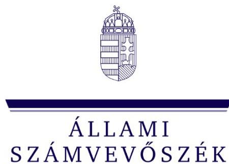
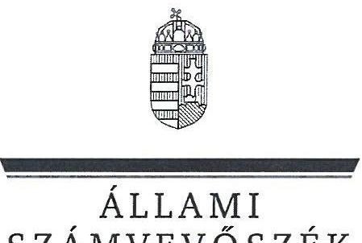
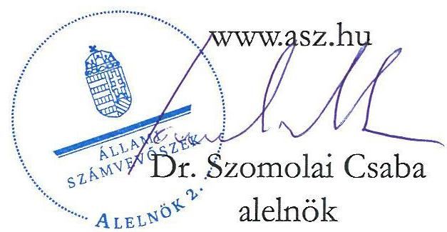
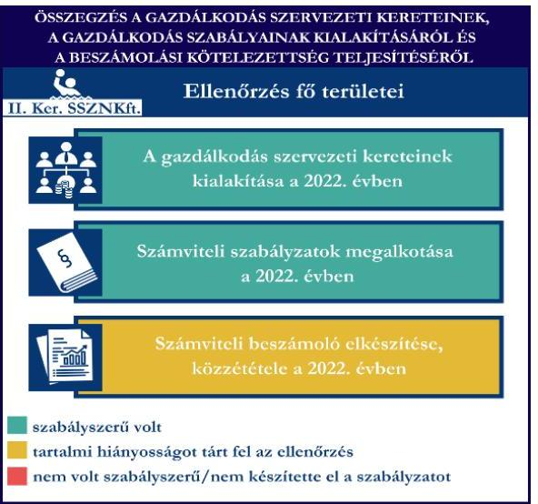
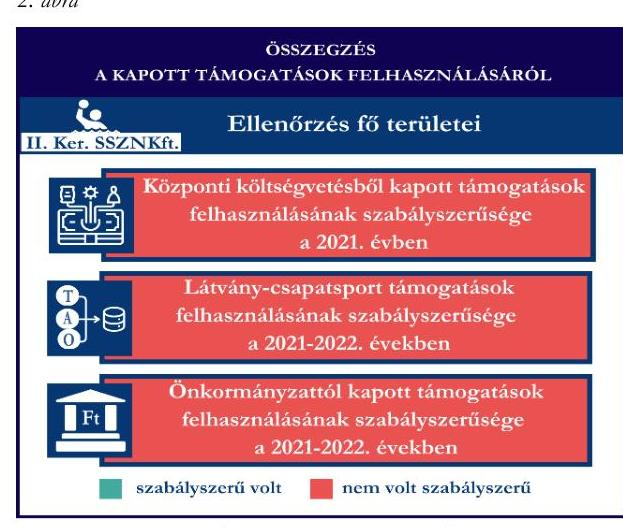
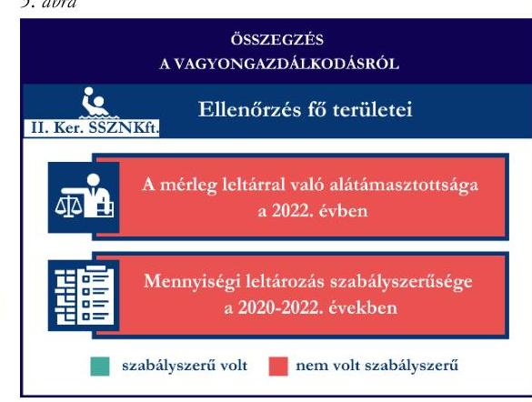

# JELENTÉS 

## Támogatásban részesülő sportszövetségek, sportegyesületek és sportvállalkozások gazdálkodásának ellenőrzése

II. Kerületi Sport és Szabadidősport

Nonprofit Korlátolt Felelősségű Társaság
2025.

---

ÁLLAMI
SZÁMVEVŐSZÉK

# JELENTÉS 

## Támogatásban részesülő sportszövetségek, sportegyesületek és sportvállalkozások gazdálkodásának ellenőrzése

II. Kerületi Sport és Szabadidősport Nonprofit Korlátolt Felelősségű Társaság

2025. 

25030

---

# ELLENŐRZÉSI IGAZGATÓSÁG: 

## ELLENŐRZÉSI IGAZGATÓSÁG V.

## ELLENŐRZÉSI IGAZGATÓ:

KLINGA LÁSZLÓ igazgató

## ELLENŐRZÉSVEZETŐ:

KAKAS SÁNDOR ellenőrzésvezető

Jelentéseink az interneten a www.asz.hu címen olvashatók.

IKTATÓSZÁM: EL-4031-071/2025
TÉMASORSZÁM: 30
ELLENŐRZÉS-AZONOSÍTÓ SZÁM: V1078

---

# TARTALOMJEGYZÉK 

■ AZ ELLENŐRZÉS ALAPADATAI ..... 5
■ AZ ELLENŐRZÖTT SZERVEZET ..... 7
■ ÖSSZEFOGLALÁS ..... 8
■ AZ ELLENŐRZÉS FÓKUSZTERÜLETEI ..... 10
■ MEGÁLLAPÍTÁSOK ..... 11
JAVASLATOK ..... 18
■ MELLÉKLETEK ..... 20
I. sz. melléklet: Fogalomtár ..... 20
II. sz. melléklet: Az ellenőrzött szervezetek jegyzéke ..... 22
III. sz. melléklet: Fő ellenőrzési kritériumok fő ellenőrzési fókuszterületek szerint. ..... 23
■ FÜGGELÉK: ÉSZREVÉTELEK ..... 24
■ RÖVIDÍTÉSEK JEGYZÉKE ..... 25

---

.

---

# AZ ELLENŐRZÉS ALAPADATAI 

## AZ ELLENŐRZÉS CÉLJA

Az ellenőrzés célja az államháztartásból nyújtott támogatással, vagy az államháztartásból meghatározott célra ingyenesen juttatott vagyon felhasználásával érintett sportszövetségek, sportegyesületek és sportvállalkozások gazdálkodása szabályozottságának, gazdálkodási tevékenységének, ezen belül a beszámolási kötelezettség teljesítésének, a támogatások elkülönített nyilvántartásának, valamint a támogatások felhasználásának ellenőrzése.

## AZ ELLENŐRZÉS TÍPUSA

Kombinált ellenőrzés.

## AZ ELLENŐRZÖTT IDŐSZAK

Az 1. fókuszterület vonatkozásában a 2022. év.
A 2. fókuszterület vonatkozásában a 2021-2022. évek.
A 3. fókuszterület vonatkozásában a 2022. év, a mennyiségi felvétellel történő leltározás dokumentumai tekintetében a 2020-2022. évek.

## AZ ELLENŐRZÉS TÁRGYA

Az ellenőrzés tárgyát képezte a támogatásban részesülő sportvállalkozás gazdálkodása szabályozottságának, gazdálkodási tevékenységén belül a beszámolási kötelezettség teljesítésének, a vagyonnyilvántartásának, a támogatások elkülönített nyilvántartásának, valamint az államháztartási forrásból származó közvetlen vagy közvetett támogatások és a meghatározott célra ingyenesen juttatott vagyon felhasználásának vizsgálata. Az ellenőrzés a támogatások vonatkozásában kiterjedt továbbá a támogató felé történő beszámolási és elszámolási kötelezettségek teljesítésére, a jogszabályi és belső előírások betartására.

Az ellenőrzés kiterjedt minden olyan körülményre és adatra, amely az ÁSZ¹ jogszabályban meghatározott feladatainak teljesítéséhez, valamint az ellenőrzési program végrehajtása során felmerülő újabb összefüggések feltárásához szükséges volt.

## AZ ELLENŐRZÉS JOGALAPJA

Az ellenőrzés jogszabályi alapját az ÁSZ tv.² 1. § (3) bekezdése, az 5. § (3) bekezdése előírásai képezték.

---

# AZ ELLENŐRZÉS MÓDSZERE 

Az ellenőrzést a nemzetközi standardokat irányadónak tekintve az ellenőrzési program szempontjai, az ellenőrzött időszakban hatályos jogszabályok, az ellenőrzés általános szakmai szabályai, az ellenőrzésre irányadó ÁSZ módszertanok figyelembevételével végezte az ÁSZ.

Az ellenőrzési kérdések megválaszolásához szükséges bizonyítékok megszerzése az ellenőrzött szervezet által rendelkezésre bocsátott dokumentumokra, adatokra alapozva kérdésfeltevés (információkérés), interjú, mintavételezés útján történt.

Az ellenőrzési bizonyítékként felhasználható adatforrások közé tartoztak egyrészt az ellenőrzés során az ellenőrzött szervezettől bekért dokumentumok, másrészt adatforrás volt minden további, az ellenőrzés folyamán feltárt, az ellenőrzés szempontjából információt tartalmazó egyéb adatforrás. Ezenfelül a beszerzett tárgyi eszközök használatára, fizikai fellelhetőségére irányulóan az érintett vagyontárgyak helyszíni szemle keretében történő szemrevételezésére is sor került.

A támogatásokkal, azok felhasználásával kapcsolatos kötelezettségek vizsgálatára mintavételi eljárások kerültek alkalmazásra. Támogatás-típusok szerint nagyságrend alapján egy darab támogatás képezte a vizsgálat tárgyát. Ezen támogatások felhasználásának szabályszerűsége támogatásonként kockázatértékelés alapján kiválasztott tételekkel került ellenőrzésre. A kiválasztott támogatási szerződésekhez kapcsolódó elszámolásokból 30 db tétel került ellenőrzésre, ahol az elszámolás nem érte el a 30 db-ot, ott tételes ellenőrzésre került sor. Ezen felül a vagyongazdálkodás szabályszerűségének ellenőrzéséhez is kockázatalapú mintavétel kapcsolódott. A támogatások felhasználása és a vagyongazdálkodás területén a tételek ellenőrzése kiterjedt a könyvvezetési kötelezettség vizsgálatára is. A tárgyi eszközök tekintetében 30 db került kiválasztásra a 2022. évben állományban lévő eszközök közül azok nyilvántartásának, elszámolásának szabályszerűsége ellenőrzése céljából. A kiválasztott tételek ellenőrzésének eredménye nem került kivetítésre a teljes sokaságra, a megállapítások az adott ellenőrzött tételek vonatkozásában kerültek megjelenítésre.

---

# AZ ELLENŐRZÖTT SZERVEZET

A II. Kerületi Sport és Szabadidősport Nonprofit Korlátolt Felelősségű Társaság 2015. február 1-én alakult. A II. Ker. SSZNKft.³ egyszemélyes társaság egyedüli tagja az Alapító okirat⁴ szerint a Budapest Főváros II. Kerületi Önkormányzat volt. Alapító okiratban meghatározott alaptevékenysége az ifjúság sportjához, a diák- és szabadidősporthoz kapcsolódó feladatok, illetve a sportreferensi feladatok voltak. Az Alapító okirat szerint a társaság 3,0 M Ft alaptőkével jött létre, a törzstőkét az Alapító⁵ 2018-2019. években pénzbeli vagyoni hozzájárulással 2558,0 M Ft-ra emelte fel.

A II. Ker. SSZNKft. ügyvezetését 2021. január 25-ig az ügyvezető₁⁶, 2021. január 26. és 2021. augusztus 31. között az ügyvezető₁ és egy fő ügyvezető-helyettes*, majd 2021. szeptember 1-től az ügyvezető₂⁷ látta el. A II. Ker. SSZNKft. ügyeinek intézésére és képviseletére jogosult ügyvezetők és ügyvezető-helyettes képviseleti joga önálló volt.

A II. Ker. SSZNKft. az ellenőrzött időszakban a jogszabályi előírások alapján könyvvizsgálatra kötelezett volt. Felügyelőbizottság létrehozására jogszabályi kötelezettsége nem volt, azonban az Alapító okirat előírta a felügyelőbizottság létrehozását. A II. Ker. SSZNKft., mint sportvállalkozás az ellenőrzött időszakban vállalkozási tevékenységet végzett.

A II. Ker. SSZNKft.-nek az ellenőrzött időszakban más társaságban tulajdoni részesedése nem volt. A II. Ker. SSZNKft. által az ellenőrzött időszakban igénybe vett támogatásokat az 1. táblázat mutatja be. 1. táblázat

A II. KER. SSZNKFT. ÁLTAL IGÉNYBE VETT TÁMOGATÁSOK (ADATOK M FT-BAN)

|   | 2021. EV | 2022. EV  |
| --- | --- | --- |
|  Központi költségvetési támogatás | 231,8 | -  |
|  Látvány-csapatsport támogatás | 131,2 | 79,0  |
|  Helyi önkormányzati támogatás | 446,5 | 499,3  |
|  Magyar Vízilabda Szövetségtől kapott támogatás | - | -  |

[^0] [^0]: * A 2021. január 26-tól hatályos Alapító okirat rendelkezett az ügyvezető-helyettesi tisztség létrehozásáról és az új ügyvezető-helyettes kinevezéséről, továbbá arról, hogy a társaság, mint munkáltató esetében a munkáltatói jogkört 2021. január 26-tól már az ügyvezető-helyettes gyakorolja. Az ügyvezető-helyettes kinevezése 2021. szeptember 9-től ügyvezetőre módosult.

---

# ÖSSZEFOGLALÁS 

Magyarország Alaptörvényének XX. cikke kimondja, hogy mindenkinek joga van a testi és lelki egészséghez, melynek érvényesülését Magyarország többek között a sportolás és a rendszeres testedzés támogatásával segíti elő. Az Országgyűlés a Sport tv.⁸-ben kinyilvánította, hogy a nemzet közössége a test művelését, a sportot, a nemzet alapértékének, kívánatos célnak tekinti. A sport a közjó része. Erősíti a közösség tagjainak egymáshoz tartozását, miként az egyén testi és lelki egészségét.

A sportegyesületek, sportszövetségek, sportvállalkozások működésükre és szakmai tevékenységük ellátására költségvetési támogatásban, önkormányzati támogatásban, ingyenes vagyonjuttatásban, valamint látvány-csapatsport támogatásban részesülhetnek, amelyekre fokozott figyelem irányul.

A társadalom részéről jogosan felmerülő elvárás, hogy a közpénzeket kezelő, azzal gazdálkodó szervezetek működéséről, tevékenységéről átfogó képet kapjon, a közpénzek rendeltetésszerű és átlátható módon történő felhasználásának értékelésére időről-időre sor kerüljön az ellenőrzések keretében.

A II. Ker. SSZNKft. a könyvviteli szolgáltatás személyi feltételeinek megteremtéséről, valamint saját döntése alapján felügyelőbizottság létrehozásáról és működéséről a jogszabályi előírásnak megfelelően gondoskodott. A jogszabályi előírásoknak megfelelve rendelkezett a 2022. évre vonatkozó éves beszámoló könyvvizsgáló általi felülvizsgálatáról, a 2022. évi éves beszámolót könyvvizsgáló felülvizsgálta. A jogszabályi előírások szerint a II. Ker. SSZNKft. kialakította a számviteli politikáját, valamint elkészítette számviteli szabályzatait, továbbá rendelkezett számlarenddel és bizonylati renddel. A szabályzatok az ellenőrzött jogszabályi kritériumoknak megfeleltek.

A könyvvezetés formája a 2022. évben megfelelt a jogszabályi előírásoknak. A II. Ker. SSZNKft. a

Forrás: ÁSZ megállapítások alapján ÁSZ saját szerkesztés
jogszabályoknak megfelelően teljesítette a számviteli beszámoló készítési-, letétbe helyezési- és közzétételi kötelezettségét, azonban kiegészítő mellékletében a kapott támogatásokat a Számv. tv.⁹ szerinti megbontásban nem mutatta be.

A gazdálkodás szervezeti keretei kialakításának, a számviteli szabályzatok megalkotásának, valamint a számviteli beszámoló elkészítésének és közzétételének értékelését az 1. ábra mutatja be.

---

A II. Ker. SSZNKft.-nél a 2021. évben a központi költségvetésből kapott támogatás, valamint a 2021. és a 2022. évben a látvány-csapatsport támogatás felhasználása tekintetében az ellenőrzés szabálytalanságot tárt fel, mivel egyes tételek esetében a támogatást az Alapító okirat rendelkezéseivel ellentétesen megkötött és módosított munkaszerződések alapján kifizetett munkabérre számolták el. A II. Ker. SSZNKft. 2021. és 2022. években kapott önkormányzati támogatásokkal a jogszabályi előírások ellenére nem számolt el, a támogatások támogatási cél szerinti felhasználását nem igazolta. Számviteli nyilvántartásában a támogatások felhasználását a jogszabályi előírásnak megfelelően elkülönítetten tartotta nyilván.
A kapott támogatások felhasználásának értékelését a 2. ábra mutatja be.

A II. Ker. SSZNKft. vagyongazdálkodása a 2022. évben nem volt szabályszerű, mert a 2022. évi éves beszámolójának mérlegtételeit teljeskörűen nem támasztotta alá leltárral. A 2021. évre vonatkozóan a tárgyi eszközök esetében a mennyiségi felvétellel történő leltározást elvégezte, azonban a leltárban értékkel mutatott ki nem fellelhető, beazonosítatlan tárgyi eszköz tételeket. A 2021. évben támogatásból beszerzett tárgyi eszközök esetében az ellenőrzés a támogatási céltól eltérő felhasználást állapított meg.

A vagyongazdálkodás értékelését a 3. ábra mutatja be.

Forrás: ÁSZ megállapítások alapján ÁSZ saját szerkesztés

---

# AZ ELLENŐRZÉS FÓKUSZTERÜLETEI 

1.     - A gazdálkodási szabályok kialakítása, a könyvvezetési- és beszámolási kötelezettség teljesítése
2.     - A kapott támogatások felhasználása
3.     - Az ellenőrzött szervezet vagyongazdálkodása

---

# 1. A gazdálkodási szabályok kialakítása, a könyvvezetési- és beszámolási kötelezettség teljesítése 

Összegző megállapítás A 2022. évben a II. Ker. SSZNKft-nél a gazdálkodás szervezeti kereteinek, a gazdálkodás szabályainak kialakítása megfelelt a jogszabályi előírásoknak. A II. Ker. SSZNKft. jogszabályoknak megfelelően teljesítette könyvvezetési-, számviteli beszámoló- és közhasznúsági melléklet készítési, valamint letétbe helyezési- és közzétételi kötelezettségét, azonban kiegészítő mellékletében a kapott támogatások bemutatásánál a Számv. tv. előírásait nem tartotta be.

A II. Ker. SSZNKft. a 2022. évben a Számv. tv. előírásainak betartásával gondoskodott a könyvviteli szolgáltatás személyi feltételeinek megteremtéséről, mivel a könyvviteli szolgáltatás körébe tartozó feladatok ellátásával olyan számviteli szolgáltatást nyújtó társaságot bízott meg, amelynek a feladat irányításával, vezetésével, a beszámoló elkészítésével megbízott tagja megfelelt a jogszabályi követelményeknek.
A II. Ker. SSZNKft. a Számv. tv. előírása szerint rendelkezett a 2022. évre vonatkozó éves beszámolója könyvvizsgálóval történő felülvizsgálatáról, a 2022. évi éves beszámolót könyvvizsgáló felülvizsgálta. II. Ker. SSZNKft.-nél az ellenőrzött időszakban az Alapító okirat és az ügyrend¹⁰ előírásai szerint öt tagú felügyelőbizottság működött.
A II. Ker. SSZNKft. a 2022. évben rendelkezett a Számv. tv.-ben előírt számviteli politikával¹¹, továbbá annak keretében elkészítette az értékelési szabályzatot¹², a leltározási szabályzatot¹³ és a pénzkezelési szabályzatot¹⁴. A II. Ker. SSZNKft. a Számv. tv. szerint a számlarendet¹⁵ és annak mellékleteként a bizonylati rendet¹⁶ elkészítette. A szabályzatok az ellenőrzött tartalmi kritériumoknak megfeleltek.
A II. Ker. SSZNKft. a Számv. tv. előírásainak megfelelően a 2022. évben kettős könyvvitelt vezetett. A II. Ker. SSZNKft. könyvviteli nyilvántartásait a Számv. tv. rendelkezéseinek megfelelve úgy alakította ki, hogy a 2022. évi éves beszámolójában az egyéb bevételek belül a visszafizetési

 kötelezettség nélkül kapott támogatások összegéből az üzleti évben költséggel, ráfordítással ellentételezett összeget ki tudta mutatni. Könyvvezetési rendszerét a Számv. tv.-ben foglaltaknak megfelelően úgy részletezte tovább, hogy az alapján a 107/2011. (VI.30.) Korm. rendelet ${ }^{17}$ által előírt adatok ellenőrizhető módon rendelkezésre álltak.
A II. Ker. SSZNKft. a 2022. évre a Számv. tv. szerinti éves beszámolót készített, mely mérleget, eredménykimutatást, kiegészítő mellékletet és üzleti jelentést tartalmazott. A 2022. évre vonatkozó éves beszámolót a Számv. tv. előírásainak megfelelően a könyvvizsgáló felülvizsgálta, az Alapító a Ptk. ${ }^{18}$-ban foglaltaknak megfelelően a felügyelőbizottság írásos jelentése alapján a 232/2023. (V.30) képviselőtestületi határozattal jóváhagyta.

---

A II. Ker. SSZNKft. a 2022. évi éves beszámoló kiegészítő mellékletében a kapott támogatásokat a Számv. tv. 93. § (3) bekezdésében előírtak ellenére a kapott összeg, annak felhasználása (jogcímenként és évenként), a rendelkezésre álló összeg megbontásban nem mutatta be.
A II. Ker. SSZNKft. a 2022. évi éves beszámolóját a Számv. tv.-nek megfelelően a jogszabályban előírt határidőben letétbe helyezte és közzétette.

# 2. A kapott támogatások felhasználása 

Összegző megállapítás

A II. Ker. SSZNKft-nél a 2021. évben kapott költségvetési támogatás, valamint a kapott látvány-csapatsport támogatás felhasználása az ellenőrzött tételek egy részénél nem volt szabályszerű, mert a támogatást érvényesnek és hatályosnak nem minősülő szerződések alapján számolták el. A II. Ker. SSZNKft. a 2021. és 2022. évben kapott önkormányzati támogatás felhasználásáról a támogató felé a jogszabályi előírás ellenére nem számolt el, a támogatások cél szerinti felhasználását nem igazolta.

A II. Ker. SSZNKft. a központi költségvetésből (GINOP-5.3.10-VEKOP-17 támogatási program keretében Covid 19 jogcímen) $76,8 \mathrm{M}$ Ft összegben kapott támogatást a Számv. tv. előírásai szerint bevételei között egyéb bevételként, elkülönítetten mutatta ki.
A II. Ker. SSZNKft. az ágazati bértámogatást a rendelkezésre álló határidőben használta fel, arról a támogatást megállapító határozatban előírtaknak megfelelően havonta elszámoló lap és annak mellékleteként fizetési jegyzék, jelenléti ív, pénzügyi teljesítést alátámasztó dokumentumok benyújtásával a támogató ${ }^{19}$ felé elszámolt. A támogató a BP/071/001329-20/2021 számú határozatában a támogatásból 74,4 M Ft elfogadása mellett 2,4 M Ft visszafizetési kötelezettséget írt elő, melyet a II. Ker. SSZNKft. 2021. november 9-én teljesített.

A II. Ker. SSZNKft. a támogatás felhasználása kapcsán a 765/2021. (XII.23.) Korm. rendelet ${ }^{20}$ szerinti adatszolgáltatási kötelezettségét teljesítette.
A II. Ker. SSZNKft. esetében a központi költségvetésből kapott támogatás ellenőrzött tételeinek (30 db) vonatkozásában az alábbiakat állapította meg az ÁSZ:

- a tételek számviteli elszámolását - egy tétel kivételével - a Számv. tv.-ben előírtak szerint bizonylatokkal alátámasztották;
- a támogatást megállapító határozatban meghatározott felhasználási határidőig megtörtént a tételek pénzügyi rendezése;
- a tételek számviteli bizonylatain a gazdasági események a Számv. tv.-ben előírtak szerinti megfelelő főkönyvi számra kerültek elszámolásra.

---

A II. Ker. SSZNKft. a „GINOP-5.3.10-VEKOP-17 támogatási program keretében Covid 19" ágazati bértámogatás terhére egy tétel esetében az ügyvezető, közeli hozzátartozója bére után vett igénybe és számolt el támogatást. Az érintett tétel a munkavállalóval a 2020. június 30-án kelt „Munkaszerződés" alapján kifizetett 711400 Ft összegű 2021. február havi bér után a bérköltségéből 251100 Ft összegű támogatás elszámolására vonatkozott.
Az Alapító okirat 11.2. - a Taggyúlésre vonatkozó - pontja előírja: „Az Alapító kizárólagos hatáskörébe tartoznak mindazok a kérdések, amelyeket a törvény a taggyúlés kizárólagos hatáskörébe utal, így az olyan szerződés megkötésének jóváhagyása, amelyet a társaság saját tagjával, ügyvezetőjével, felügyelőbizottsági tagjával, választott társasági könyvvizsgálójával vagy azok közeli hozzátartozójával köt."
A 2020. június 30-án megkötött „Munkaszerződés" a Ptk. 3:188. § (2) bekezdésének és az Alapító okirat 11.2. - a Taggyúlésre vonatkozó - pontjában foglaltak ellenére az Alapító által nem került jóváhagyásra, amit az Alapító 2024. november 7-én kelt ÁSZ részére tett nyilatkozatával is megerősített. Ennek következtében érvényes és hatályos szerződés nem jött létre.
A „GINOP-5.3.10-VEKOP-17 támogatási program keretében Covid 19" ágazati bértámogatás került megállapításra, a támogatást megállapító határozat szerint a foglalkoztatást és a bérfizetés tényét és ezzel a támogatási összegre való jogosultságot a munkáltató az elszámoláskor igazolja, amely alátámasztásához szükséges dokumentumokat benyújtja az állami foglalkoztatási szerv illetékes szervezeti egységéhez. A támogatást meghatározó 485/2020. (XI. 10.) Korm. rendelet ${ }^{21}$ 14. § (2) bekezdésben foglaltak alapján a munkaadó részére a munkaviszonyban foglalkoztatott személy bruttó munkabére ötven százalékának megfelelő összegű, munkaerőpiaci program szerinti támogatás nyújtható.
Figyelemmel az előzőekben leírtakra, továbbá az Mt. ${ }^{22}$ 42. § (1) bekezdésében és 45. § (1) bekezdésében foglaltakra, az érvényesnek és hatályosnak nem minősülő munkaszerződésben rögzített személyi alapbér, a „GINOP-5.3.10-VEKOP-17 támogatási program keretében Covid 19" ágazati bértámogatás terhére összesen elszámolt 1728900 Ft bér a támogatás terhére nem volt elszámolható.

A II. Ker. SSZNKft. a látvány-csapatsport és kiegészítő sportfejlesztési támogatások címén érkező bevételeit a Számv. tv. előírásainak megfelelően az egyéb bevételei között elkülönítve tartotta nyilván. A támogatás felhasználásáról a 107/2011. (VI.30.) Korm. rendeletben előírtak szerinti elkülönített nyilvántartást vezetett.
A II. Ker. SSZNKft. a látvány-csapatsport támogatások esetében a 2021-2022. években eleget tett a 107/2011. (VI. 30.) Korm. rendeletben foglaltaknak, a támogatás felhasználásáról negyedévente az előrehaladási jelentéseket benyújtotta az MVLSZ ${ }^{21}$ felé. Az SFP/04050/2021/MVLSZ számú sportfejlesztési program az ellenőrzött időszakon belül egy alkalommal meghosszabbításra került, a hosszabbítási kérelemhez a 107/2011. (VI.30.) Korm. rendeletnek megfelelően a fel nem használt támogatás összegéről szóló igazolást benyújtották.
A II. Ker. SSZNKft. a számára nyújtott látvány-csapatsport támogatásról a 107/2011. (VI.30.) Korm. rendeletnek megfelelően határidőben benyújtotta az elszámolást az MVLSZ felé. A támogatási időszak végdátumát követően a támogatás felhasználását a jogszabályban foglaltak szerint számviteli

---

bizonylatokkal alátámasztott módon, összesített elszámolási táblázattal és szöveges szakmai beszámolóval igazolta.
A II. Ker. SSZNKft. a 107/2011. (VI.30.) Korm. rendeletnek megfelelően könyvvizsgáló által ellenőrzött számviteli bizonylatokkal számolt el az MVLSZ felé. A könyvvizsgáló a 107/2011. (VI.30.) Korm. rendeletben előírt összegű felelősségbiztosítással rendelkezett.
A II. Ker. SSZNKft. esetében a látvány-csapatsport támogatás (30 db) és kiegészítő sportfejlesztési támogatás (4 db) ellenőrzött tételeinek vonatkozásában az alábbiakat állapította meg az ÁSZ:

- a tételek számviteli elszámolását - két tétel kivételével - a Számv. tv.-ben és a 107/2011. (VI.30.) Korm. rendeletben előírtak szerint bizonylatokkal alátámasztották;

A II. Ker. SSZNKft. az SFP/04050/2021/MVLSZ számú sportfejlesztési program terhére két tétel esetében az ügyvezető, közeli hozzátartozójának bére után vett igénybe és számolt el támogatást. Az érintett két tétel a munkavállalóval a 2019. június 19-én kelt „Határozott időre szóló munkaszerződés" alapján kifizetett 711400 Ft összegű bérköltsége után 55000 Ft és 200000 Ft összegű támogatás elszámolására vonatkozott.
A II. Ker. SSZNKft. Alapító okiratának 11.2. - a Taggyűlésre vonatkozó - pontja előírja: „Az Alapító kizárólagos hatáskörébe tartoznak mindazok a kérdések, amelyeket a törvény a taggyűlés kizárólagos hatáskörébe utal, így az olyan szerződés megkötésének jóváhagyása, amelyet a társaság saját tagjával, ügyvezetőjével, felügyelőbizottsági tagjával, választott társasági könyvvizsgálójával vagy azok közeli hozzátartozójával köt."
A 2019. június 19-én megkötött „Határozott időre szóló munkaszerződés" az Alapító okirat 11.2. - a Taggyűlésre vonatkozó - pontjában foglaltak ellenére az Alapító által nem került jóváhagyásra - amit az Alapító 2024. november 7-én kelt ÁSZ részére tett nyilatkozatával is megerősített - ezáltal a II. Ker. SSZNKft. megsértette a Ptk. 3:188. § (2) bekezdésének előírását, melynek következtében a szerződés hatálya a Ptk. 6:119. §-a alapján érvényes és hatályos szerződés nem jött létre.
A 2021/2022-es támogatási időszakra vonatkozóan a látvány-csapatsport támogatások felhasználásához vízilabda sportszervezetek részére készült Elszámolási útmutatóban foglaltak alapján személyi jellegű ráfordítások esetén az elszámoláshoz mellékelni szükséges a munka vagy megbízási szerződést.
Figyelemmel az előzőekben leírtakra, továbbá az Mt. 42. § (1) bekezdésében és 45. § (1) bekezdésében foglaltakra, az érvényesnek és hatályosnak nem minősülő munkaszerződésben rögzített személyi alapbér, az SFP/04050/2021/MVLSZ számú sportfejlesztési program keretében összesen elszámolt 292004 Ft bér a támogatás terhére nem volt elszámolható.

- a 107/2011. (VI.30.) Korm. rendeletben foglaltaknak megfelelően a tételek tartalma (gazdasági esemény) és összege alapján a támogatási igazolásban meghatározottak szerinti jogcímre, az abban meghatározott mértékben használták fel;
- a tételek számviteli bizonylatai alapján a gazdasági események az ellenőrzött időszakot értintő támogatási időszakban teljesültek, a pénzügyi rendezés az elszámolás benyújtására nyitva álló határidőig teljesült;
- a tételek számviteli bizonylatait a 107/2011. (VI.30.) Korm. rendelet előírása szerint ellátták záradékkal,

---

- a számviteli bizonylatokon elszámolt/záradékolt összegek megegyeztek a számlaösszesítőben feltüntetett értékekkel;
- a tételek a 107/2011. (VI.30.) Korm. rendelet előírásának megfelelően a támogatás felhasználására vonatkozó elkülönített nyilvántartásban szerepeltek;
- a tételek számviteli bizonylatának az adott sportfejlesztési program terhére záradékolt összegei a Számv. tv.-ben előírtak szerint a tartalmuknak megfelelő főkönyvi számra kerültek elszámolásra.
A II. Ker. SSZNKft. az ellenőrzött időszakban feladatellátási szerződés ${ }^{22}$ keretében pénzeszköz-átadási megállapodás alapján működési célú önkormányzati támogatást kapott az Alapítótól. A támogatás összege 2021. évre vonatkozóan a 2/2022. (II. 25.) önkormányzati rendelet ${ }^{23}$ 11. § (6) bekezdése alapján 403,2 M Ft, 2022. évre vonatkozóan a 9/2021. (II. 23.) önkormányzati rendelet ${ }^{24}$ 11. § (6) bekezdése alapján 471,6 M Ft volt, mely támogatásokat a II. Ker. SSZNKft. a Számv. tv. előírásai szerint bevételei között egyéb bevételként, elkülönítetten mutatta ki.
A II. Ker. SSZNKft. a kapott önkormányzati támogatással a 4/2014. (II. 21.) önkormányzati rendelet ${ }^{25}$ 8. § (1) bekezdésében előírtak ellenére az Alapító felé nem számolt el.

A 4/2014. (II. 21.) önkormányzati rendelet hatálya kiterjed a pályázati rendszeren kívüli, egyedi döntés alapján nyújtott államháztartáson kívülre történő pénzeszköz átadásra, azaz támogatási szerződés alapján a II. Ker. SSZNKft. részére nyújtott működési költség támogatásra, valamint a II. Ker. SSZNKft.-re, mint államháztartás körébe nem tartozó jogi személyre. A 4/2014. (II. 21.) önkormányzati rendelet 8. § (1) bekezdése alapján a támogatás felhasználásáról szóló elszámolás szakmai és pénzügyi beszámoló követelményeit a támogatási szerződés rögzíti, továbbá előírja az elszámoláshoz a 4. számú melléklet szerinti összesítő lap és nyilatkozat becsatolását.
A II. Ker. SSZNKft. vonatkozásában a 4/2014. (II. 21.) önkormányzati rendelet 8. § (1) bekezdésében előírt és a támogató felé benyújtott és elfogadott elszámolás - szakmai és pénzügyi beszámoló, tételes elszámolási összesítő - hiányában a 2021. évre vonatkozóan kapott 403,2 M Ft, valamint a 2022. évre vonatkozóan kapott 471,6 M Ft önkormányzati támogatás esetében a szabályszerű és a cél szerinti felhasználás nem volt dokumentummal igazolt.

# 3. Az ellenőrzött szervezet vagyongazdálkodása 

## Összegző megállapítás

A 2022. évben az II. Ker. SSZNKft. vagyongazdálkodása nem volt szabályszerű.

A II. Ker. SSZNKft. a 2022. évi éves beszámoló mérlegét a Számv. tv. 69. § (1) bekezdésének előírása ellenére leltárral teljeskörűen nem támasztotta alá.
A II. Ker. SSZNKft. a készletekről és a tárgyi eszközökről a belső
 előírásai alapján az ellenőrzött időszakban folyamatos mennyiségi nyilvántartást vezetett. A tárgyi eszközök vonatkozásában a 2021. évi mennyiségi leltárfelvétel nem felelt meg a Számv. tv. 69. § (3) bekezdésében előírtaknak, mert a mennyiségi leltár egyes - még nettó értékkel rendelkező - eszközök értékelésénél „nem fellelhető" (pl. Vízilabda Utánpótlás Nevelés - Nyéki Imre Uszoda": Pályaelválasztó kötélzet (50 m), nettó érték 2795386 Ft, „Uszoda Általános

---

Költséghely leltár": BB42 TITMOON időmérő szerkezet, nettó érték 3030050 Ft, megjegyzés „Nyéki leltárában is szerepel, nem fellelhető, könyvvizsgáló jelentés szerint Hublot BigBang karóra"); „működőképesség nem megállapítható" (pl. „Eszközleltár Nyéki Imre Uszoda 80": LED kivetítő (perimeter, bajtogatható), bekerülési összeg 208838800 Ft,); „elejt" (pl. „Általános Becsey Péter": HP Notebook, nettó érték 131854 Ft) bejegyzéseket tartalmazott, amelyek arra utalnak, hogy a kimutatott nettó érték nem felelt meg a valóságnak.
A 2022. évre mennyiségi leltár a tárgyi eszközök vonatkozásában a leltározási szabályzat 5.1.1. pontjában előírtak ellenére nem készült, a leltározási szabályzat szerint a „lealapozott tárgyi eszközök esetében két év, a nem lealapozott tárgyi eszközök esetében egy évben" határozták meg a mennyiségi felvétellel történő leltározás gyakoriságát.
A II. Ker. SSZNKft. által a 2022. évre vonatkozó, az ellenőrzés részére átadott tárgyi eszköz analitikus nyilvántartás a 2021. évi mennyiségi leltár során a beazonosíthatatlan, nem fellelhető tételeket is értékkel tartalmazta, így a beszámoló elkészítéséhez, a mérleg tételeinek alátámasztásához a Számv. tv. 69. § (1) bekezdésében foglaltak ellenére a 2022. évre a tárgyi eszközök vonatkozásában nem készített olyan leltárt, amely tételesen, ellenőrizhető módon tartalmazta volna a mérleg fordulónapján meglévő eszközeit, ezzel a Számv. tv. 15. § (3) bekezdése szerinti valódiság elve sérült.
A II. Ker. SSZNKft. esetében a tárgyi eszköz ellenőrzött tételek ( 30 db ) vonatkozásában az alábbiakat állapította meg az ÁSZ:

- a tételek bekerülési értékét meghatározó számviteli bizonylatok - nyolc tétel kivételével - a Számv. tv.-nek megfelelően rendelkezésre álltak. A „takarítóeszköz tároló szekrény" 755904 Ft, „büféelőkészítő berendezés-friulinox" 1545336 Ft, „büfévitrin Gastroline Cube 0,9" 1674368 Ft, „büfévitrin Gastroline Cube 0,9" 1674368 Ft, a „légtartásos sátor kültéri medence fölé" 32950150 Ft , „3 db led kivetítő Perimeter, led fal, led rollup" 204393800 Ft ,„átöltözőberendezés" 4108450 Ft, „Dolphin wave 300 XL víz alatti porszívó" 4464559 Ft összegű tételek bekerülési értékét bizonylat a Számv. tv. 47. § (1) bekezdésében és a Számv. tv. 165. §. (1) bekezdésében foglaltak ellenére nem támasztotta alá;
- a tárgyi eszközök üzembe helyezésének tényét és időpontját - nyolc tétel kivételével - a Számv. tv.-nek megfelelően hitelt érdemlően dokumentálták. A nyolc kivétel tétel esetében üzembehelyezési dokumentum rendelkezésre állt, azonban a Számv. tv. 52. § (2) bekezdésében leírtak nem érvényesültek, mert a bekerülési értéket megalapozó számla, bizonylat hiányában az üzembe helyezési dokumentumon feltüntetett adatok nem voltak ellenőrizhetőek;
- az értékcsökkenés elszámolása - nyolc tétel kivételével - a Számv. tv.-nek megfelelően történt. A nyolc kivétel tárgyi eszköz esetében - a bekerülési értéket alátámasztó számviteli bizonylat hiányában - az elszámolt értékcsökkenés a Számv. tv. 52. § (2) bekezdésében előírtak ellenére nem volt megalapozott;
- a támogatás igénybevételével beszerzett eszközök esetében - egy kivételével - az eszköz bekerülési értékét meghatározó számviteli bizonylatokat a támogatás összegét tartalmazó záradékkal ellátták. A kivételt képező („Felnőtt kapu X-kapu 03N-TT" 950000 Ft összegű) tétel nem felelt meg a 107/2011. (VI.30.) Korm. rendelet 11. § (5) bekezdésében előírtaknak, mert a látvány-csapatsport támogatásból beszerzett eszköz számviteli bizonylatát nem látták el záradékkal, így azon nem szerepelt, hogy a számlák végösszegéből mekkora összeget számoltak el a támogatás terhére;
- a tárgyi eszközök számviteli besorolása megfelelt a Számv. tv. előírásainak.

---

- az ellenőrzés során a II. Ker. SSZNKft. 2022. évi tárgyi eszköz nyilvántartásából kiválasztott tárgyi eszközök vonatkozásában sor került a tételek helyszíni szemléjére, az eszközök a helyszínen fellelhetőek voltak.

A II. Ker. SSZNKft.-nél a 2022. évben állományban lévő „Ford Transit Custom Busz" (beszerzési ára 18960000 Ft ) és „Ford Transit Minibusz" (beszerzési ára 21969730 Ft ) gépjárművek beszerzése a be/SFP-03050/2018/MVLSZ ügyiratszámú határozatban jóváhagyott látvány-csapatsport támogatásból valósult meg. A gépjárműveket ténylegesen 2021. február 16-án és 2021. február 18-án szerezték be, az átvételre 2021. augusztus 10-én került sor.

A gépjárművek üzembentartói jogát üzembentartói jog átruházásáról szóló szerződéssel - már azok átvételét megelőzően - 2021. június 25-én átruházták az OSC Vízilabda Sport Egyesület (amely szervezet ügyvezető elnöke egyben a II. Ker. SSZNKft.-nél ügyvezető; volt) részére. Az üzembentartói szerződést 2021. november 9-én felmondták, így a gépjárművek üzembentartója 2021. november 9-től a II. Ker. SSZNKft. lett.
A II. Ker. SSZNKft. a be/SFP-03050/2018/MVLSZ sportfejlesztési program keretében beszerzett eszközöket a fentiek miatt a támogatási céltól eltérően használta fel, mert az MVLSZ a támogatási összeg felhasználását az ellenőrzött szervezet tárgyi eszköz beruházása, felújítása vonatkozásában hagyta jóvá, így annak célja a tárgyi eszközök II. Ker. SSZNKft. általi hasznosítása volt.

---

# JAVASLATOK 

Az ÁSZ tv. 33. § (1) bekezdésében foglaltak értelmében az ellenőrzött szervezet vezetője köteles a jelentésben foglalt megállapításokhoz kapcsolódó intézkedési tervet összeállítani és azt a jelentés kézhezvételétől számított 30 napon belül az ÁSZ részére megküldeni. Amennyiben az ellenőrzött szervezet vezetője nem küldi meg határidőben az intézkedési tervet, vagy továbbra sem elfogadható intézkedési tervet küld, az Állami Számvevőszék elnöke az ÁSZ tv. 33. § (3) bekezdése a) és b) pontjaiban foglaltakat érvényesítheti.

## A II. KERÜLETI SPORT ÉS SZABADIDŐSPORT NONPROFIT KORLÁTOLT FELELŐSSÉGŰ TÁRSASÁG ÜGYVEZETŐJÉNEK

1. Gondoskodjon arról, hogy a kapott támogatások a Számv. tv. 93. § (3) bekezdésében előírtaknak megfelelően a kiegészítő mellékletben a kapott összeg, annak felhasználása (jogcímenként és évenként), a rendelkezésre álló összeg bontásban kerüljenek bemutatásra.
2. Gondoskodjon a kapott önkormányzati támogatások elszámolásáról a 4/2014. (II. 21.) önkormányzati rendelet 8. § (1) bekezdésében előírtaknak megfelelően.
3. Gondoskodjon arról, hogy a Ptk. 3:188. § (2) bekezdésében foglaltaknak megfelelően azok a szerződések, amelyek jóváhagyása az Alapító kizárólagos hatáskörébe tartozik, az Alapító által jóváhagyásra kerüljenek, vagy jóváhagyás hiányában azok alapján teljesítés ne történjen.
4. Gondoskodjon a Számv. tv. 69. § (1)-(3) bekezdésében és a leltározási szabályzatban foglaltaknak megfelelően mennyiségi felvétellel történő leltározás elvégzéséről.
5. Gondoskodjon a tárgyi eszközök esetében a bekerülési érték Számv. tv. 47. § (1) bekezdésében és a Számv. tv. 165. § (1) bekezdésében előírtak szerinti meghatározásáról.
6. Gondoskodjon a tárgyi eszközök esetében az üzembe helyezés tényének és időpontjának hitelt érdemlő dokumentálásáról a Számv. tv. 52.§ (2) bekezdésében előírtak szerint.
7. Gondoskodjon arról, hogy a tárgyi eszközök esetében az értékcsökkenés elszámolása a Számv. tv. 52. § (2) bekezdése figyelembevételével történjen.

---

8. Gondoskodjon arról, hogy a látvány-csapatsport támogatással beszerzett tárgyi eszközök esetében az elszámolást megalapozó bizonylat a 107/2011. (VI.30.) Korm. rendelet 11. § (5) bekezdésben előírtak szerint záradékolásra kerüljön.
9. Gondoskodjon a látvány-csapatsport támogatással beszerzett tárgyi eszközök esetében a Tao tv. 22/C. § (11) bekezdésében foglaltak betartásáról.

---

# MELLÉKLETEK 

## I. SZ. MELLÉKLET: FOGALOMTÁR

Civil szervezet

Egyesület

Kiegészítő sportfejlesztési támogatás

Költségvetési támogatás

Közhasznú szervezet

Közhasznú tevékenység

Látvány-csapatsport támogatás

Látvány-csapatsportban működő amatőr sportszervezet

Látvány-csapatsportban működő hivatásos sportszervezet

A civil társaság; a Magyarországon nyilvántartásba vett egyesület - a párt, a szakszervezet és a kölcsönös biztosító egyesület kivételével és - a közalapítvány és a pártalapítvány kivételével - az alapítvány. (Forrás: Civil tv. 26 2. § 6. pont a)-c) alpontjai)

Az egyesület a tagok közös, tartós, alapszabályban meghatározott céljának folyamatos megvalósítására létesített, nyilvántartott tagsággal rendelkező jogi személy. (Forrás: Ptk. 3:63. § (1) bekezdés)
A látvány-csapatsportok támogatása esetében rendelkező nyilatkozatban felajánlott összeg 12,5 százaléka kiegészítő sportfejlesztési támogatásnak minősül. (Forrás: Tao tv. 24/A. § (9) bekezdés)
A társadalombiztosítás pénzügyi alapjai kivételével az államháztartás központi alrendszeréből ellenérték nélkül, pénzben nyújtott támogatások. (Forrás: Áht. 1. § 14. pont)
Közhasznú szervezetté minősíthető a Magyarországon nyilvántartásba vett közhasznú tevékenységet végző szervezet, amely a társadalom és az egyén közös szükségleteinek kielégítéséhez megfelelő erőforrásokkal rendelkezik, továbbá amelynek megfelelő társadalmi támogatottsága kimutatható, és amely:
a) civil szervezet (ide nem értve a civil társaságot), vagy
b) olyan egyéb szervezet, amelyre vonatkozóan a közhasznú jogállás megszerzését törvény lehetővé teszi. (Forrás: Civil tv. 32. § (1) bekezdés)
Minden olyan tevékenység, amely a létesítő okiratban megjelölt közfeladat teljesítését közvetlenül vagy közvetve szolgálja, ezzel hozzájárulva a társadalom és az egyén közös szükségleteinek kielégítéséhez. (Forrás: Civil tv. 2. § 20. pont)
Az adóévben visszafizetési kötelezettség nélkül nyújtott támogatás, juttatás, véglegesen átadott pénzeszköz és térítés nélkül átadott eszköz könyv szerinti értéke, az adóévben térítés nélkül nyújtott szolgáltatás bekerülési értéke a Tao tv.-ben meghatározott jogcímeken. (Forrás: Tao tv. 4. § 44. pont)
Minden olyan, a sportról szóló törvényben meghatározott szabályok szerint a látvány-csapatsportban működő sportegyesület vagy sportvállalkozás, amelyik nem minősül a látvány-csapatsportban működő hivatásos sportszervezetnek. (Forrás: Tao tv. 4. § 42. pont)
A látvány-csapatsportágak országos sportági szakszövetsége által kiírt versenyrendszer legmagasabb felnőtt bajnoki osztályában - a veterán korosztályokra kiírt versenyrendszer kivételével - részt vevő (indulási jogot elnyert) sportszervezet, vagy alsóbb bajnoki osztályaiban részt vevő (indulási jogot elnyert) sportszervezet abban az esetben, ha az ilyen sportszervezet hivatásos sportolót alkalmaz. Több látvány-csapatsportban több jogi személy szervezeti egységgel (szakosztállyal) működő sportszervezet esetén csak az a jogi személy szervezeti egység (szakosztály), amely a fent részletezett versenyrendszerek bajnoki osztályaiban részt vesz. (Forrás: Tao tv. 4. § 43. pont)

---

Országos sportági szakszövetség

Sportági szövetség

Sportegyesület

Sportegyesületeknek, sportszövetségeknek nyújtott költségvetési támogatás
Sportszövetség

Sporttevékenység

Sportvállalkozás

Olyan sportszövetség, amely sportágában kizárólagos jelleggel az e törvényben, valamint más jogszabályokban meghatározott feladatokat lát el és e törvényben megállapított különleges jogosítványokat gyakorol. Olyan sportágban hozható létre, amelyet vagy a Nemzetközi Olimpiai Bizottság elismert, vagy amely sportág nemzetközi szövetségét felvették a Nemzetközi Sportszövetségek Szövetségébe (GAISF). (Forrás: Sport tv. 20. § (1), (4) bekezdés)
A Civil tv. és a Ptk. előírásai alapján - a Sport tv.-ben meghatározott eltérésekkel - működő szövetség, amelynek tagjai kizárólag sportszervezetek lehetnek. Sportági szövetség országos jelleggel is működhet. Egy sportágban csak egy országos sportági szövetség működhet. Törvényi feltételek teljesülése esetén szakszövetségi feladatokat is elláthat. (Forrás: Sport tv. 28. §)
A Civil tv. és a Ptk. szabályai szerint működő olyan egyesület, amelynek alaptevékenysége a sporttevékenység szervezése, valamint a sporttevékenység feltételeinek megteremtése. A sportegyesületek a Sport tv. 15. § (1) bekezdésében meghatározott sportszervezetek körébe tartoznak. A sportegyesületeken kívül sportszervezet még a sportvállalkozás, a sportiskola, valamint az utánpótlás-nevelés fejlesztését végző alapítvány. (Forrás: Sport tv. 16. § (1) bekezdés)

Az állami sport célú támogatások felhasználásáról és elosztásáról szóló 474/2016. (XII. 27.) Korm. rendelet ${ }^{27}$ és a 27/2013. (III. 29.) EMMI rendelet ${ }^{28}$ 1. §-ában meghatározott fejezeti kezelésű előirányzatokból nyújtott támogatás.
Meghatározott sporttevékenységek körében a sportversenyek szervezésére, a tagok érdekvédelmére és a részükre való szolgáltatásokra, valamint a
 nemzetközi kapcsolatok lebonyolítására létrehozott, jogi személyiséggel és önkormányzattal rendelkező, a Civil tv. és a Ptk. alapján - az e törvényben foglalt eltérésekkel - különös formában működő egyesületek. A Sport tv. 19. § (3) bekezdése szerint a sportszövetségeknek az alábbi típusai léteznek: országos sportági szakszövetségek, sportági szövetségek, szabadidősport szövetségek, fogyatékosok sportszövetségei, diák- és egyetemi-főiskolai sport sportszövetségei, nemzetközi sportszövetségek. (Forrás: Sport tv. 19. § (1), (3) bekezdés)

Meghatározott szabályok szerint, a szabadidő eltöltéseként kötetlenül vagy szervezett formában, illetve versenyszerűen végzett testedzés vagy szellemi sportágban kifejtett tevékenység, amely a fizikai erőnlét és a szellemi teljesítőképesség megtartását, fejlesztését szolgálja. (Forrás: Sport tv. 1. § (2) bekezdés)

Az a gazdasági társaság, amelynek a cégnyilvántartásról, a cégnyilvánosságról és a bírósági cégeljárásról szóló törvény alapján a cégjegyzékbe bejegyzett tevékenysége sporttevékenység, továbbá a gazdasági társaság célja sporttevékenység szervezése, valamint a sporttevékenység feltételeinek megteremtése egy vagy több sportágban. Korlátolt felelősségű társasági, illetve részvénytársasági formában alapítható, a fogyatékosok sportja, illetve a szabadidősport területén közhasznú társaságként is működhet. (Forrás: Sport tv. 18. §)

---

II. SZ. MELLÉKLET: AZ ELLENŐRZÖTT SZERVEZETEK JEGYZÉKE

| ELLENŐRZÖTT SZERVEZET NEVE | ELLENŐRZÖTT SZERVEZET SZÉKHELYE |
| :-- | :-- |
| II. Kerületi Sport és Szabadidősport Nonprofit Korlátolt |  |
| Felelősségű Társaság | 1024 Budapest, Mechwart liget 1. |

---

# III. SZ. MELLÉKLET: FŐ ELLENŐRZÉSI KRITÉRIUMOK FŐ ELLENŐRZÉSI FÓKUSZTERÜLETEK 

SZERINT

## FŐ ELLENŐRZÉSI FÓKUSZTERÜLETEK

1. A gazdálkodási szabályok kialakítása, a bizonylvvezetési és beszámolási kötelezettség teljesítése

## FŐ ELLENŐRZÉSI KRITÉRIUMOK

Ptk. 3:26. § (1) bekezdés, 3:27. § (1) bekezdés, 3:82. § (1)-(2) bekezdés
Számv. tv. 4. §, 6. § (2) bekezdés, 12. §, 14. § (3), (5) bekezdés a), b), d) pont, (8) bekezdés, (11)-(12) bekezdés, 69. § (1), (3) bekezdés, 90. § (3) bekezdés c) pont, 96. § (4) bekezdés, 150. § (2) bekezdés, 153. § (1) bekezdés, 154. § (1) bekezdés, 161. § (1) bekezdés, (2) bekezdés a)-d) pont, (3)-(4) bekezdés, 161/A. § (1)(2) bekezdés, 165. § (2) bekezdés

Tao tv. 22/C. §
107/2011. (VI.30.) Korm. rendelet 9. § (9) bekezdés
2. A kapott támogatások felhasználása

Számv. tv. 16. § (3) bekezdés, 25-26. §, 44. § (2) bekezdés, 45. § (1)-(2) bekezdés, 77. § (3) bekezdés b) pont, 78-81. §, 159. §, 161/A. § (2) bekezdés, 162. § (1) bekezdés, 165. § (1)-(2) bekezdés, 166. § (1) bekezdés, 167. § (1) bekezdés a), d), e), h) pont

Tao. tv. 22/C. §, 24/A. § (9) bekezdés
107/2011. (VI.30.) Korm. rendelet 2. § (3b) bekezdés, 4. § (11) bekezdés, 5. § (1) bekezdés, 6. § (1) bekezdés e) pont, 9. § (8)(10) bekezdés, 10. § (2), (2a), (2b), (4) bekezdés, 10. § (5a) bekezdés, 11. § (1), (1a), (1d), (1e), (2), (4), (4a), (5), (6) bekezdés, 13. § (1), (2a) bekezdés, 14. § (1), (4), (4b), (4c), (6c) bekezdés

275/2022. (VII.29.) Korm. rendelet $^{29}$ 1. § (3)
444/2022. (XI.7) Korm. rendelet $^{30}$ 2. §
474/2016. (XII. 27.) Korm. rendelet 26. § (3) bekezdés
Áht. 52. § (1) bekezdés, 53. §
Ávr. 76. § (1) bekezdés, 93. § (1)-(3), (5) bekezdés
2/2022. (II. 25.) önkormányzati rendelet 11. § (6) bekezdés
9/2021. (II. 23.) önkormányzati rendelet 11. § (6) bekezdés
4/2014. (II. 21.) önkormányzati rendelet 8. § (1) bekezdés
3. Az ellenőrzött szervezet vagyongazdálkodása

Ptk. 3:63. § (4) bekezdés
Számv. tv. 15. § (3) bekezdés, 26. §, 46. § (3) bekezdés, 47-53. §, 57. §, 69. § (1)-(6) bekezdés, 165-166. §, 169. § (2) bekezdés

Tao tv. 22/C (6) bekezdés a), d), e) pont, (11) bekezdés
107/2011. (VI.30.) Korm. rendelet 11. § (5) bekezdés
474/2016. (XII. 27.) Korm. rendelet 17. § (1) bekezdés 11a. a) pont, 11b. pont, 17. § (2a) bekezdés, 24. § (2) bekezdés

---

# FÜGGELÉK: ÉSZREVÉTELEK 

A jelentéstervezetet a Számvevőszék 15 napos észrevételezésre megküldte az ellenőrzött szervezet vezetőjének az ÁSZ tv. 29. § (1) bekezdése előírásának megfelelően.

A II. Kerületi Sport és Szabadidősport Nonprofit Korlátolt Felelősségű Társaság ügyvezetője a jelentéstervezetre nem tett észrevételt.

[^0]
[^0]:    $\dagger$ 29. § (1) Az Állami Számvevőszék az ellenőrzési megállapításait megküldi az ellenőrzött szervezet vezetőjének vagy az általa megbízott személynek, és annak, akinek személyes felelősségét állapította meg.
    (2) Az ellenőrzött szervezet vezetője és a felelősként megjelölt személy az ellenőrzés megállapításaira tizenöt napon belül írásban észrevételt tehet.
    (3) Az Állami Számvevőszék az észrevételre a beérkezésétől számított harminc napon belül írásban válaszol. A figyelembe nem vett észrevételeket köteles a jelentésben feltüntetni, és megindokolni, hogy azokat miért nem fogadta el.

---

# RÖVIDÍTÉSEK JEGYZÉKE 

$^{1}$ ÁSZ
$^{2}$ ÁSZ tv.
$^{3}$ II. Ker. SSZNKft.
$^{4}$ Alapító okirat
$^{5}$ Alapító
$^{6}$ ügyvezető $_{1}$
$^{7}$ ügyvezető $_{2}$
$^{8}$ Sport tv.
$^{9}$ Számv. tv.
$^{10}$ ügyrend
$^{11}$ számviteli politika
$^{12}$ értékelési szabályzat
$^{13}$ leltározási szabályzat
$^{14}$ pénzkezelési szabályzat
$^{15}$ számlarend
$^{16}$ bizonylati rend
$^{17}$ 107/2011. (VI.30.) Korm. rendelet
$^{18}$ Ptk.
$^{19}$ támogató
$^{20}$ 765/2021. (XII.23.) Korm. rendelet
$^{21}$ MVLSZ
$^{22}$ feladatellátási szerződés
$^{23}$ 2/2022. (II. 25.) önkormányzati rendelet
$^{24}$ 9/2021. (II. 23.) önkormányzati rendelet
$^{25}$ 4/2014. (II. 21.) önkormányzati rendelet
$^{26}$ Civil tv.
$^{27}$ 474/2016. (XII. 27.) Korm. rendelet
$^{28}$ 27/2013. EMMI (III. 29.) rendelet

Állami Számvevőszék
2011. évi LXVI. törvény az Állami Számvevőszékről
II. Kerületi Sport és Szabadidősport Nonprofit Korlátolt Felelősségű Társaság
II. Kerületi Sport és Szabadidősport Nonprofit Korlátolt Felelősségű Társaság Alapító okirata kelt 2021. január 26-án
Budapest Főváros II. Kerület Önkormányzata
II. kerületi Sport és Szabadidősport NKft. ügyvezetője 2015. február 1-től 2021. augusztus 31-ig
II. kerületi Sport és Szabadidősport NKft. ügyvezetője 2021. szeptember 1-től

2004. évi I. törvény a sportról
2000. évi C. törvény a számvitelről
II. kerületi Sport és Szabadidősport NKft. felügyelőbizottságának ügyrendje (hatályos 2020. június 18-tól)
II. kerületi Sport és Szabadidősport NKft. Számviteli politika (hatályos 2019. október 1-től)
II. kerületi Sport és Szabadidősport NKft. Értékelési szabályzat (hatályos 2019. október 1-től)
II. kerületi Sport és Szabadidősport NKft. Leltározási szabályzat (hatályos 2019. október 1-től)
II. kerületi Sport és Szabadidősport NKft. Pénzkezelési szabályzat (hatályos 2019. október 1-től)
II. kerületi Sport és Szabadidősport NKft. Számlarend (hatályos 2019. október 1-től)
II. kerületi Sport és Szabadidősport NKft. Bizonylati rend (hatályos 2019. október 1-től)
107/2011. (VI.30.) Korm. rendelet a látvány-esapatsport támogatását biztosító támogatási igazolás kiállításáról, felhasználásáról, a támogatás elszámolásának és ellenőrzésének, valamint visszafizetésének szabályairól
2013. évi V. törvény a Polgári törvénykönyvről

Budapest Főváros Kormányhivatala
765/2021. (XII.23.) Korm. rendelet a nemzeti sportinformációs rendszerről
Magyar Vízilabda Szövetség
2019. május 19-én kelt OK-6005/2019. számú Feladatellátási szerződés
Budapest Főváros II. Kerületi Önkormányzat Képviselő-testületének 2/2022. (II. 25.) önkormányzati rendelete az Önkormányzat 2022. évi költségvetéséről

Budapest Főváros II. Kerületi Önkormányzat Képviselő-testületének 9/2021. (II. 23.) önkormányzati rendelete az Önkormányzat 2021. évi költségvetéséről

Budapest Főváros II. Kerületi Önkormányzatának az Önkormányzat által államháztartáson kívüli forrás átvételéről és az államháztartáson kívülre nyújtott támogatásokról szóló 4/2014. (II. 21.) önkormányzati rendelete
2011. évi CLXXV. törvény az egyesülési jogról, a közhasznú jogállásról, valamint a civil szervezetek működéséről és támogatásáról
474/2016. (XII. 27.) Korm. rendelet az állami sport célú támogatások felhasználásáról és elosztásáról
27/2013. (III. 29.) EMMI rendelet az állami sport célú támogatások felhasználásáról és elosztásáról

---

$^{29}$ 275/2022. (VII.29.) Korm. rendelet

$^{30}$ 444/2022. (XI.7.) Korm. rendelet

275/2022. (VII.29.) Korm. rendelet a látvány-csapatsport támogatását biztosító támogatási igazolás kiállításáról, felhasználásáról, a támogatás elszámolásának és ellenőrzésének, valamint visszafizetésének szabályairól szóló 107/2011. (VI.30.) Korm. rendelet veszélyhelyzet ideje alatt történő eltérő alkalmazásáról
444/2022. (XI.7.) Korm. rendelet a veszélyhelyzet idején a látvány-csapatsport támogatását biztosító támogatási igazolás kiállításáról, felhasználásáról, a támogatás elszámolásának és ellenőrzésének, valamint visszafizetésének szabályairól szóló 107/2011. (VI.30.) Korm. rendelet szabályainak eltérő alkalmazásáról

---

1052 Budapest, Apáczai Csere János u. 10. | 1364 Budapest 4., Pf. 54
www.asz.hu | szamvevoszek@asz.hu
telefon: +36 14849100

