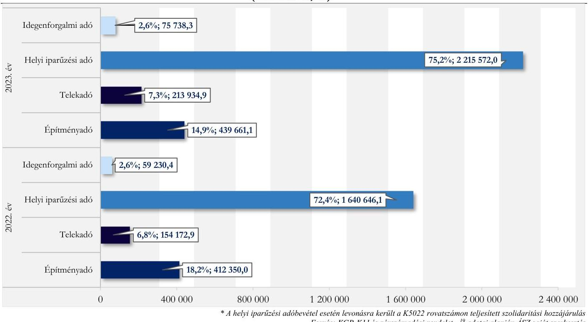
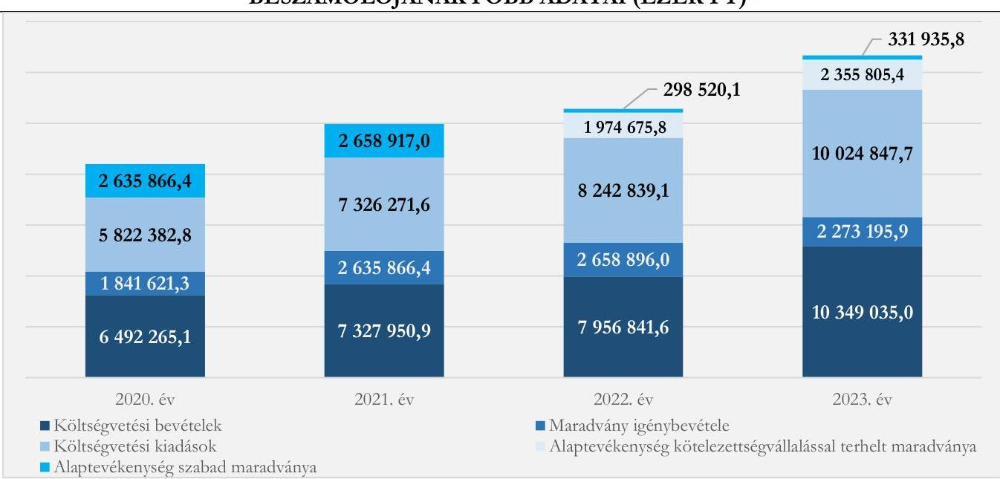
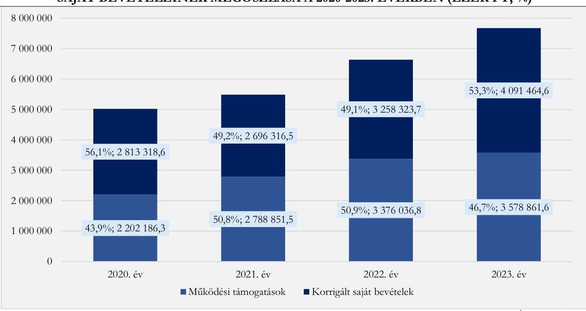
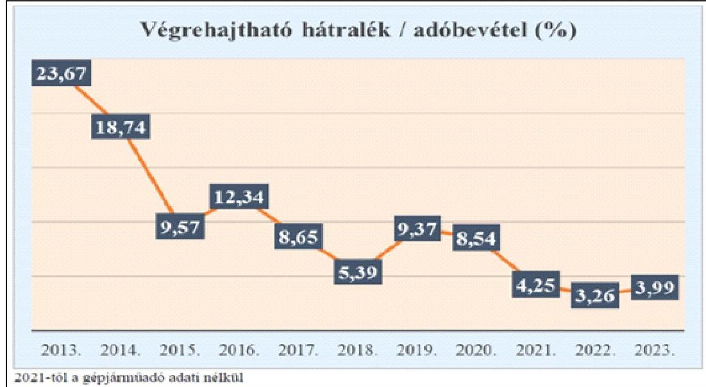

# JELENTÉS 

## Az önkormányzatok helyi adóztatási tevékenységének ellenőrzése - Ingatlanadóztatás

Tata Város Önkormányzata

2025.

---

# JELENTÉS 

## Az önkormányzatok helyi adóztatási tevékenységének ellenőrzése - Ingatlanadóztatás

Tata Város Önkormányzata

2025.

---

# ELLENŐRZÉSI IGAZGATÓSÁG: 

## ELLENŐRZÉSI IGAZGATÓSÁG II.

## ELLENŐRZÉSI IGAZGATÓ:

DR. BAFFIA GERGELY GÁBOR ellenőrzési igazgató

## ELLENŐRZÉSVEZETŐ:

## KANYÓ LÓRÁNT ISTVÁN ellenőrzésvezető

Jelentéseink az interneten a www.axz.hu címen olvashatók.

IKTATÓSZÁM: EL-4040-027/2025
TÉMASORSZÁM: 54
ELLENŐRZÉS-AZONOSÍTÓ SZÁM: V1084

---

# TARTALOMJEGYZÉK 

AZ ELLENŐRZÉS ALAPADATAI ..... 5
AZ ELLENŐRZÉS TERÜLETE ÉS AZ ELLENŐRZÖTT SZERVEZET ..... 7
ÖSSZEFOGLALÁS ..... 9
AZ ELLENŐRZÉS FÓKUSZKÉRDÉSEI ..... 11
MEGÁLLAPÍTÁSOK ..... 12
JAVASLATOK ..... 27
MELLÉKLETEK ..... 28
I. sz. melléklet: Fogalomtár ..... 28
II. sz. melléklet: Az ellenőrzött szervezetek jegyzéke ..... 29
III. sz. melléklet: Ellenőrzési kritériumok ..... 30
IV. sz. melléklet: A helyi ingatlanadótárgyak és adóalanyok száma a 2023. és a 2024. évben ..... 33
V. sz. melléklet: Az építmény- és telekadó mértékei az ellenőrzött időszakban ..... 34
FÜGGELÉK: ÉSZREVÉTELEK ..... 35
RÖVIDÍTÉSEK JEGYZÉKE ..... 45

---

.

---

# AZ ELLENŐRZÉS ALAPADATAI 

## AZ ELLENŐRZÉS CÉLJA

Az ellenőrzés célja az volt, hogy értékelje Tata város helyi ingatlanadóztatásának és adóhatósága feladatellátásának szabályszerűségét, célszerűségét és eredményességét. További cél volt, hogy az ellenőrzés megállapításai és következtetései segítsék az önkormányzati képviselő-testületeket a jogszabályokkal és a helyi sajátosságokkal összhangban álló helyi adópolitika kialakításában és az azt végrehajtó adóigazgatási szervezet megszervezésében. Az ellenőrzés célja volt továbbá annak megállapítása is, hogy az Önkormányzat által bevezetett, ingatlanokat terhelő helyi adókra vonatkozó rendeleti szabályok összhangban vannak-e a helyi adópolitikai célokkal, tartalmuk tükrözi-e a település helyi sajátosságait és az adóhatósági feladatellátás biztosítja-e az önkormányzati bevételek feltárását és beszedését.

Ennek keretében az ÁSZ értékelte, hogy az Önkormányzat által bevezetett, ingatlanokat terhelő helyi adókról szóló adórendeletek, valamint az adóhatóság döntései, adóztatási gyakorlata a vonatkozó jogszabályokkal összhangban állnak-e.

## AZ ELLENŐRZÉS TÍPUSA

Kombinált ellenőrzés.

## AZ ELLENŐRZŐTT IDŐSZAK

Az 1. fókuszkérdésnél a 2023. év, valamint a 2024. évnek az ellenőrzés megkezdését megelőző napjáig (2024. április 10.) tartó időszaka.

A 2. és 3. fókuszkérdésnél a 2023. év, valamint a 2024. évnek az ellenőrzés megkezdését megelőző napjáig (2024. április 10.) tartó időszaka, a 2020-2022. évek adatainak bázisadatként való felhasználásával.

## AZ ELLENŐRZÉS TÁRGYA

Az Önkormányzat képviselő-testületének ingatlanokat terhelő helyi adóval, azaz az építményadóval és a telekadóval kapcsolatos rendeletalkotási tevékenységének és az adóhatóság tevékenységének az ellátása.

Az ellenőrzés kiterjedt minden olyan körülményre és adatra, amely az ÁSZ jogszabályban meghatározott feladatainak teljesítéséhez, valamint az ellenőrzési program végrehajtása folyamán felmerült újabb összefüggések feltárásához szükséges.

## AZ ELLENŐRZÉS JOGALAPJA

Az ellenőrzés jogszabályi alapját az ÁSZ tv. 5. § (8) bekezdésének előírásai képezik.

---

# AZ ELLENŐRZÉS MÓDSZERE 

Az ÁSZ az ellenőrzést az ellenőrzési program szempontjai, az ellenőrzött időszakban hatályos jogszabályok, az ellenőrzés általános szakmai szabályai és az ellenőrzésre irányadó ÁSZ módszertanok alapján végezte.

Az ellenőrzési kérdések megválaszolásához szükséges bizonyítékok megszerzése az ellenőrzött szervezetek által rendelkezésre bocsátott dokumentumokra, adatokra és az ASP Adó és az Iratkezelő szakrendszerek, illetve a KGR-K11 számviteli adatgyűjtő rendszer adataira alapozva megfigyelés, szemle (szemrevételezés), kérdésfeltevés (információkérés), mintavételezés, valamint elemző eljárás útján történt. Emellett az ellenőrzési bizonyítékként felhasználható adatforrások közé tartozott minden egyéb - az ellenőrzés folyamán feltárt, az ellenőrzés szempontjából információt tartalmazó - releváns dokumentum (ideértve különösen a helyszíni ellenőrzésről készült jegyzőkönyvet) is.

Az ellenőrzés lefolytatásához az ellenőrzött szervezet a tanúsítványok kitöltésével, valamint az ÁSZ által kért dokumentumok, adatok, információ megküldésével és az ellenőrzés során szolgáltatott adatokat.

Az ÁSZ az adómegállapítás, az adótörlés, a fizetési kedvezmények engedélyezése, az adótárgy- és adóalanyfeltáráson alapuló adómegállapítás és a hátralékok beszedése szabályszerűségét mintavételi eljárással ellenőrizte. Ennek során az adóhatósági adómegállapítási feladatellátás ellenőrzése keretében 18 mintatétel (825. számú mintatételek, közte 23 határozat és hat végzés), négy adótörlésre vonatkozó mintatétel (2629. számú mintatételek, közte három határozat), a fizetési kedvezmények engedélyezése tárgykörben két mintatétel (6-7. számú mintatételek, két határozat) és négy, az adótárgy- és adóalanyfeltáráson alapuló adómegállapításokra vonatkozó mintatétel (30-33. számú mintatételek, három végzés és nyolc határozat) értékelése történt meg. Öt mintatételben (1-5. számú mintatételek, 10 határozat) az ÁSZ a hátralékkezelés teljes dokumentációját is ellenőrizte.

A mintatételek kiválasztása véletlenszerűen történt az adóhatóság nyilvántartásában lévő adótárgyak és ügyek közül tíz - adómegállapításra vonatkozó - mintatétel kivételével, amelyek esetében a kiválasztás címadatok alapján történt annak érdekében, hogy feltárható legyen, volt-e olyan adótárgy, amelyet nem adóztatott az adóhatóság.

Az ellenőrzött mintatételekre vonatkozó megállapítások nem vetíthetők ki a teljes sokaságra, a megállapításokat az ÁSZ az adott ellenőrzött mintatételek vonatkozásában tette meg.

Az ÁSZ a helyi adópolitikai elképzelések és a települési sajátosságok feltárásával értékelte, hogy az adórendelet e szempontoknak mennyiben felelt meg. Az ÁSZ a helyi adópolitikai célokkal akkor tekintette összhangban állónak az adórendeletet, ha az hatását tekintve támogatta az adópolitikai célok teljesülését.

Az ÁSZ az adóhatósági feladatellátás szabályszerűségéből, a meglévő kapacitásokból, valamint az ezer forint adóbevételre jutó adóhatósági költségek alakulásából következtetett arra, hogy az adóhatóság rendelkezett-e azzal a potenciállal, amellyel eredményesen tudta a helyi adópolitikát végrehajtani.

Az ÁSZ - az adórendelet szabályainak érvényre juttatása körében - az eredményesség véleményezésekor a III. számú melléklet 2. pontjában foglalt szempontokat tekintette mérvadónak.

---

# AZ ELLENŐRZÉS TERÜLETE ÉS AZ ELLENŐRZÖTT SZERVEZET 

Tata város Komárom-Esztergom vármegyében, a Kisalföld keleti peremvidékét alkotó Győr-Tatai Teraszvidék területén helyezkedik el. A Tatai Járás központja, Tatabánya és Esztergom után a vármegye harmadik legnagyobb települése. Tata állandó lakossága - a BM adatai alapján - 2020. év elején 23465 fő, 2024. év elején pedig 23549 fő volt.

A város megközelíthetősége kiváló, amely egyfelől lehetővé tette számos vállalkozás letelepedését, továbbá hozzájárult - a település földrajzi adottságai mellett (Öreg-tó, Cseke-tó és Derítő-tó mellett számos gazdag vizű patak és ér is található a területen) -, hogy Tata kiemelt turisztikai célponttá váljon. A TeIR adatai alapján 2023. december 31-én a településen 5592 regisztrált gazdasági szervezet rendelkezett székhellyel, amely túlnyomórészt (3687 regisztrált gazdasági szervezet) a szolgáltató volt.

Tata Város Polgármesteri Hivatala
Fonrás: Tata város honlapja (https://arhiv.tata.hu/sites)

Az Önkormányzat - a Hivatalon kívül - nyolc költségvetési szervvel és négy, 100%-os önkormányzati tulajdonban lévő gazdálkodó szervezettel rendelkezett, továbbá három közalapítványt alapított és tagja volt két társulásnak.

Az Alaptörvény értelmében a helyi önkormányzat a helyi közügyek intézése körében törvény keretei között döntött a helyi adók fajtájáról és mértékéről. Az Mötv. rögzíti, hogy a helyi adóval kapcsolatos feladatok ellátása a helyi önkormányzatok feladata.

Az Önkormányzat a Htv. alapján az ingatlanokat terhelő helyi adók közül az illetékességi területén külön-külön adórendelettel az építményadót és a telekadót vezette be. Az Önkormányzat az építményadó-rendeletet egy - az adótárgyak típusa szerint - differenciált mértékrendszerrel alkotta meg. A telekadóban ehhez képest egy egységes, valamennyi adótárgyra vonatkozó adómértéket vezetett be, a magánszemély adóalanyok telkére pedig többfajta adómentességi tényállást alkotott. Az ellenőrzött időszakban az Önkormányzat egyik adónemben sem végzett adómérték-emelést, a mértékrendszert részletesen az V. számú melléklet mutatja be.

[^0]
[^0]:    ${ }^{1}$ Csillagsziget Bölcsőde, Intézmények Gazdasági Hivatala, Kuny Domokos Múzeum, Tatai Egészségügyi Alapellátó Intézmény, Tatai Bartók Béla Óvoda, Tatai Geszti Óvoda, Tatai Kertvárosi Óvoda, Tatai Kincseskert Óvoda.
    ${ }^{2}$ Tatai Öreg-tó Kft., Tatai Rend-ház Nonprofit Kft., Tatai Városgazda Nonprofit Kft., Tatai Városkapu Közhasznú Zrt.
    ${ }^{3}$ Tata Város „Szociális Háló" Közalapítvány, Tatai Mecénás Közalapítvány, Tatai Televízió Közalapítvány.
    ${ }^{4}$ Tatai Kistérségi Többcélú Társulás, Közép-Duna Vidéke Hulladékgazdálkodási Önkormányzati Társulás.

---

Az adó megállapításával, nyilvántartásával, beszedésével összefüggő adóhatósági feladatokat - a Hatásköri tv. és az Air. rendelkezései alapján - elsőfokú hatósági jogkörben Tata jegyzője látta el a Hivatal vezetőjeként. A Hivatal illetékességi területe Tata mellett Dunaalmás, Dunaszentmiklós és Neszmély községek közigazgatási területére is kiterjedt. Az önkormányzati adóhatósági feladatellátást egy adóigazgatási szervezetvezető és hét fő adóügyi ügyintéző látta el.

Annak ellenére, hogy adómérték növelés az adónemekben nem történt, az adóhatóság által beszedett, végleges bevételként elszámolt ingatlanokat terhelő adókból származó helyi adóbevétel folyamatosan emelkedett 2020. év és 2023. év között. A 2023. évben 439 661,1 ezer Ft bevétel származott építményadóból, míg 213 934,9 ezer Ft telekadóból. A 2023. évben az ingatlanadó-bevételek az Önkormányzat korrigált konszolidált költségvetési bevételének 8,5%-át, a befizetett szolidaritási hozzájárulással csökkentett helyi adóbevételének pedig a 22,2%-át tette ki.

Az Önkormányzat helyi adóbevételeinek 2022. és 2023. évi összetételére vonatkozó adatokat az 1. ábra, a helyi ingatlanadók 2023. és 2024. évre vonatkozó naturális adatait pedig a IV. számú melléklet mutatja be. 1. ábra

AZ ÖNKORMÁNYZAT HELYI ADÓBEVÉTELEINEK MEGOSZLÁSA A 2022-2023. ÉVEKBEN (EZER FT, \%)*

---

# ÖSSZEFOGLALÁS 

Az ÁSZ tv. értelmében az ÁSZ feladatkörébe tartozik az önkormányzatok adóztatási tevékenységének ellenőrzése. A helyi adók az önkormányzatok saját, el nem vonható bevételét képezik, így az önkormányzatok gazdasági önállósága szempontjából különös fontossággal bír, hogy a helyi adórendeleti szabályok összhangban álljanak a magasabb szintű jogszabályokkal, továbbá az adóhatósági tevékenység jogszerű, eredményes és hatékony legyen. Erre figyelemmel volt tárgya az ÁSZ ellenőrzésének az Önkormányzat adórendelet-alkotási tevékenysége és az adóhatósági feladatellátás is.

A telekadó-rendelet egy ponton nem volt összhangban a magasabb szintű jogszabállyal, azonban megfelelt az Önkormányzat jogalkotói szándékának. Az adórendeleti szabályozás támogatta az Önkormányzat adópolitikai céljainak elérését. Az adómegállapítási feladatellátás eredményes volt, de az adóhatósági döntések nem minden esetben voltak szabályszerűek. Az adómegállapító határozatok kiadmányozása, kézbesítése jogszerű volt, azonban a kézbesítés nem minden esetben volt célszerű. Az adóhatóság adótárgy- és adóalanyfeltáráson alapuló adómegállapításai hozzájárultak az Önkormányzat bevételeinek teljesüléséhez, valamint szabályszerűek voltak. Az adóbehajtási tevékenység szabályszerű volt, de nem volt eredményes és nem minden esetben volt célszerű. Az adóhatóság adatszolgáltatási kötelezettségének határidőben, közzétételi kötelezettségének megfelelően eleget tett. Az adóztatási kiadások nem voltak túlzottak az adóbevételhez képest. Az adóhatóság ingatlanadóztatással összefüggő feladatellátási mutatói nagyságrendileg azonosak voltak az ÁSZ által ellenőrzött nyolc város feladatellátási mutatóinak átlagos értékeivel.

## Adórendelet, adórendelet-alkotás

A telekadó-rendelet egy ponton nem volt összhangban a törvényi előírással, mert mentességet biztosított az önkormányzati teleknek abban az esetben is, ha a telek után vállalkozó volt az adóalany.

Az ingatlanokat terhelő helyi adókra vonatkozó rendeleti szabályozás megalkotása során az Önkormányzat mérlegelte és figyelembe vette azt, hogy a rendeleti szabályoknak tükrözniük kell a helyi sajátosságokat, az Önkormányzat gazdasági követelményeit, továbbá az adóalanyok széles körét érintően az adóalanyok teherviselő képességét.

Az adóhatóság adóigazgatási feladatellátásának jogszerűsége, eredményessége
Az adóhatóság adótárgy-, és adóalany feltárási feladatellátása (ezáltal az adómegállapítási feladatellátása) eredményes és egyben célszerű volt. Az adómegállapító határozatok nem mindegyike
 volt ugyanakkor szabályszerű.

A hatósági döntések kiadmányozása, kézbesítése szabályszerű volt, azonban az adóhatóság a döntések kézbesítésekor nem minden esetben élt az elektronikus kézbesítés jogszabályi lehetőségével, ezen esetekben a kézbesítés nem volt célszerű. Az adóhatóság adatszolgáltatási kötelezettségének határidőben, közzétételi kötelezettségének pedig megfelelően eleget tett.

Az adóhatóság által lefolytatott, adótárgyfeltárást követő adómegállapító eljárások - melyek szabályszerűek voltak - növelték az Önkormányzat bevételeit.

[^0]
[^0]:    ${ }^{5}$ Az ÁSZ által jelen ellenőrzés alapjául szolgáló ellenőrzési program alapján ellenőrzött városok: Ajka, Balatonföldvár, Budakalász, Emőd, Paks, Ráckeve, Szigethalom és Tata.

---

Az adótartozások beszedése érdekében megtett intézkedések szabályszerűek voltak, de nem voltak eredményesek és nem minden esetben voltak célszerűek.

A adórendelet adópolitikai célokkal való összhangja, az ingatlanokra vonatkozó adórendeletek hatása
Az Önkormányzat adórendeleti szabályai összhangban voltak az adópolitikai célokkal (az adó biztos bevételi forrást jelentsen; elviselhető terhet jelentsen az adóalanyok számára, a közfeladat-ellátást érdemben segítse) és az adóalanyok többségének adóteherviselő képességét nem érintették hátrányosan.

A korrigált konszolidált költségvetési bevételeken belül a korrigált konszolidált saját bevételek ${ }^{21}$ aránya 2023. évben 53,3\% volt, amely kissé magasabb a városokra ${ }^{6}$ átlagosan jellemző 52,4\%-os aránytól. Míg a városok esetén országosan az ingatlanadókból származó bevételek korrigált konszolidált költségvetési bevételeken belüli átlagos aránya 5,8\%, addig az Önkormányzat esetében ez 8,5\% volt a 2023. évben, azaz az Önkormányzat gazdálkodását az ingatlanadókból származó bevételek²² erőteljesebben befolyásolták.

# Az adóhatósági kiadások 

Az adóhatóság a 2023. évben 3432 040,3 ezer Ft helyi adóbevételt mutatott ki költségvetési beszámolójában. Minden 1000 Ft beszedett helyi adóbevételre - az ÁSZ számítása szerint - 25,8 Ft adóztatási kiadás esett. Az ÁSZ által ellenőrzött nyolc város átlaga 15,3 Ft, az adóztatási kiadás tapasztalati referencia-érték maximuma kivetéses adóztatás esetén: 50 Ft volt.

Az Önkormányzat egy adótisztviselőjére a 2023. évben 403 769,4 ezer Ft helyi adóbevétel, 1719,9 adótárgy és 1167,3 adóalany jutott, a feladatellátási mutatók tehát az ÁSZ által ellenőrzött nyolc város átlagához közelítenek (544 502,3 ezer Ft/adótisztviselő, illetve 1751,1 adótárgy, 1461,7 adóalany/adótisztviselő).

Az ÁSZ telekadó-rendelet felülvizsgálatára tett javaslata már az ellenőrzés során hasznosult, mert az Önkormányzat felülvizsgálta a telekadó-rendeletét. A jegyző az ÁSZ ellenőrzés észrevételezési szakaszában küldött levelében továbbá tájékoztatást adott arról, hogy az adóhatóság által adómegállapításra alkalmazott sablont a megállapításokban feltárt hibák kijavítása érdekében kiegészítette. A javaslatok végrehajtását az ÁSZ utóellenőrzés keretében ellenőrizheti.

[^0]
[^0]:    ${ }^{6}$ Az ÁSZ a városok alatt a 322 nem megyei jogú várost érti.

---

# AZ ELLENŐRZÉS FÓKUSZKÉRDÉSEI 

1.- Az önkormányzat ingatlanokat terhelő helyi adókra vonatkozó rendeleti szabályozása megfelel-e a magasabb szintű jogszabályoknak?
2.- Az önkormányzati adóhatóság megfelelően és eredményesen látta-e el az ingatlanok adóztatásával kapcsolatos adóhatósági tevékenységeit?
3.- A településen megvalósuló helyi adóztatás támogatta-e a helyi adópolitikai célok teljesülését?

---

# MEGÁLLAPÍTÁSOK 

## 1. Az önkormányzat ingatlanokat terhelő helyi adókra vonatkozó rendeleti szabályozása megfelelte a magasabb szintű jogszabályoknak?

Összegző megállapítás

1.1 számú megállapítás

A telekadó-rendelet egy ponton ellentétes volt a magasabb szintű jogszabállyal. Az adórendeletek szabályozási céljuk szerint tükrözték a települési sajátosságokat.
A telekadó-rendelet egy ponton nem volt összhangban a Htv. előírásaival. Az adórendeletek kielégítették a normavilágosság és egyértelműség kodifikációs követelményét.

A Htv. 7. § e) pontjában előírtak ellenére - amely az uniós jogból fakadó állami támogatási elvekre és normákra figyelemmel rögzíti, hogy az önkormányzat az építményadóban és a telekadóban a vállalkozó számára adómentességet, adókedvezményt nem biztosíthat - a telekadó-
rendelet 3. § (1) bekezdés a) pontja mentességet biztosított annak a vállalkozónak, akinek vagyoni értékű joga (és ekképp adóalanyisága) áll fenn olyan telken, amely az Önkormányzat tulajdonában áll.
Az adórendeletek kielégítették a normavilágosság és egyértelműség kodifikációs követelményét.
1.2 számú megállapítás

Az Önkormányzat figyelembe vette a települési sajátosságokat, az Önkormányzat gazdálkodási helyzetét, továbbá az adóalanyok széles körét érintően az adóalanyok teherviselő képességét.

A Htv. 7. § g) pontjában rögzített adómegállapítási korlátokból az következik, hogy a rendelet hatályossága idején is érvényre kell jutnia az e pontban szabályozott rendeletalkotási elveknek, azaz annak, hogy települési önkormányzat az adóalap fajtáját, az adó mértékét, a rendeleti adómentességet és adókedvezményt úgy állapíthatja meg, hogy azok összességükben egyaránt megfeleljenek
a) a helyi sajátosságoknak,
b) az önkormányzat gazdálkodási követelményeinek és
c) az adóalanyok széles körét érintően az adóalanyok teherviselő képességének.

## A helyi sajátosságok, figyelembevétele

Az adózás szempontjából releváns helyi sajátosság, hogy a település kedvelt turistacélpont. Az Önkormányzat - nyilatkozata alapján - erre figyelemmel az építményadó-szabályozás kialakítása során

---

különbséget tett az üdülő- és a lakóingatlan adótárgyak között, továbbá eltérő mértékszabályt határozott meg az üzlet, raktár, iroda, műhely és egyéb vállalkozási célú építmények, valamint a szálláshelyek vonatkozásában. A telekadó-szabályozás pedig mentességet biztosított - többek között - a magánszemélyek lakóingatlanainak elhelyezésére szolgáló telkek, illetve négy évnyi időtartamra azon telkek esetében is, amelyeket lakóházzal építettek be.
Az Önkormányzat a helyi sajátosságokat - a Htv.-ben foglaltaknak megfelelően - az adórendeletek elkészítésekor figyelembe vette és mérlegelte.

# Az önkormányzat gazdálkodási követelményeinek szempontja 

A 2023. évben a helyi adókból származó befizetett - szolidaritási hozzájárulással csökkentett 2944 906,3 ezer Ft bevétel az Önkormányzat korrigált konszolidált költségvetési bevételének (7 670 326,3 ezer Ft) 38,4\%-át tette ki, mely magasabb a városokra vonatkozó 34,4\%-os értékhez képest. A 2023. évben ingatlanadókból származó bevétel a - szolidaritási hozzájárulással csökkentett - helyi adóbevétel 22,2\%-át tette ki, mely szintén magasabb a városokra vonatkozó 16,7\%-os értékhez viszonyítva.

Az Önkormányzat és intézményeinek főbb gazdálkodási adataiból (2. ábra) az figyelhető meg, hogy a 2020-2023. években jelentős maradvány képződött. A konszolidált maradvány a 2023. évben 2687 741,2 ezer Ft volt, amely 2355 805,4 ezer Ft kötelezettségvállalással terhelt maradványból és 331 935,8 ezer Ft szabad maradványból adódott össze. Az Önkormányzat a kötelező feladatok mellett önként vállalt feladatokat is ellátott (többek között: pályázatokat írt ki, ünnepek méltó megünneplésére fordított, civil szervezeteket támogatott). A 2023. évi beszámolóban az Önkormányzat 524 891,1 ezer Ft értékben mutatott ki költségvetési évet követően esedékes kötelezettségek között hosszú lejáratú hiteleket.

Az Önkormányzat gazdálkodási helyzete összességében nem tette szükségessé az adórendelet módosítását, erre figyelemmel az Önkormányzat az adószabályokat a 2020-2023. években érdemben nem változtatta meg.
2. ábra

AZ ÖNKORMÁNYZAT ÉS INTÉZMÉNYEI 2020-2023. ÉVI KONSZOLIDÁLT BESZÁMOLÓJÁNAK FŐBB ADATAI (EZER FT)*

*Nem tartalmazza a hosszú lejáratú-, a likviditási célú hitel- és kölcsönfelvételeket és azok törlesztését, az állambáztatáson belüli megelőlegezéseket és a visszafizetését. Forrás: KGR-K11 és zárszámadási rendelet1-4 alapján ÁSZ saját szerkesztés

---

# Az adóalanyok teherviselő képességének figyelembevétele 

Az építményadó-rendelet szerint az egyéb adóalanyokhoz képest a helyben lakóhellyel rendelkező adóalanyokat a lakóhelyükként szolgáló ingatlanok után alacsonyabb adófizetési kötelezettség terhelte. E megfontolás mögött - a helyszíni ellenőrzés során elmondottak alapján - az állt, hogy az üdülőtulajdonosok esetében valószínűsíthető volt, hogy üdülőjük második vagy többedik ingatlanuk, így vélelmezhető volt az is, hogy ők nagyobb szerepet tudnak vállalni a helyi közterhek viseléséből. Az Önkormányzat építményadó mértékrendszere emellett az egyéb adótárgyak esetében (kifejezetten az üzleti célú ingatlanok), azok hasznosítási módja szerint differenciált adómértéket vezetett be, amely szintén a teherviselő képességnek megfelelő adóztatást célozta.
Az Önkormányzat részéről az adóalanyok teherviselő képessége figyelembevételének szándékát tükrözték azok a telekadó-rendeleti szabályozások is, amely egyrészt telekadó-fizetési kötelezettséget irányoztak elő a vállalkozói adóalanyi kör számára ${ }^{8}$, másrészt pedig, hogy a telekadó-rendeletben meghatározott okokból a tulajdonosok számára kevésbé használható, ezért vélhetően kisebb vagyoni értéket képviselő telkek esetében adómentességet állapított meg. ${ }^{9}$

Mindezekre tekintettel - a Htv. előírásainak megfelelően - az Önkormányzat mérlegelte és figyelembe vette az adóalanyok teherviselő képességét a rendeletalkotás során.

[^0]
[^0]:    ${ }^{7}$ Ezt az Önkormányzat azzal kívánta elérni, hogy az életvitelszerűen helyben lakó adóalanyi kört 150 Ft/m²/év, míg a nem életvitelszerűen lakott lakások esetében 350 Ft/m²-re emelkedett az éves adómérték.
    ${ }^{8}$ A Htv. szerinti adómaximumhoz (456,1 Ft/m²) képest csekély (110,0 Ft/m²) mértékkel.
    ${ }^{9}$ Mentes a telekadó alól - többek között - a honvédelmi létesítmények védő-biztonsági övezetében lévő telek, a Duna-Ipoly Nemzeti Park területén található kiemelt jelentőségű természetmegőrzési- és különleges madárvédelmi terület 50%-a, a művelési ágát tekintve kivett árokként vagy zártkerti művelés alól kivett területként nyilvántartott telek.

---

# 2. Az önkormányzati adóhatóság megfelelően és eredményesen látta-e el az ingatlanok adóztatásával kapcsolatos adóhatósági tevékenységeit? 

Összegző megállapítás

Az adóhatóság adómegállapítási feladatellátása eredményes volt, de az adóhatósági döntések nem minden esetben voltak szabályszerűek. Az adóhatóság adóbehajtási intézkedései szabályszerűek voltak, de nem minden esetben voltak célszerűek, az adóbehajtási tevékenység nem volt eredményes.
2.1. számú megállapítás

Az adóhatóság adómegállapítási feladatellátása eredményes és célszerű volt. Az adóhatósági döntések nem minden esetben voltak szabályszerűek az adómegállapítás során, azonban az adóhatóság adótárgy- és adóalanyfeltárás keretében hozott adómegállapító határozatai megfeleltek az Art. előírásainak.

## Adótárgy-, és adóalanyfeltárás

Az adóhatóság a 2023. és a 2024. évben is élt az Art. ${ }^{23}$ 83. § (2) bekezdésében foglaltak alapján az ingatlanügyi hatóság ${ }^{24}$ megkeresésének lehetőségével. A kapott adatokat egy saját fejlesztésű strukturált adatbázisú programmal tette használhatóvá, amely ezáltal keresések és szűrések elvégzésére, továbbá az adatok saját nyilvántartással történő összevetésére is alkalmassá vált. Az adóhatóság az adóalanyok és az adótárgyak feltárása érdekében használt

Az ingatlanügyi hatóság által az Art. 83. § (2) bekezdése alapján az adóhatóság rendelkezésére bocsátott adatok a szolgáltatott formában csak manuálisan vethetők össze az adónyilvántartás adataival. Az ÁSZ megítélése szerint az államháztartás helyi szintjén az lenne a leggazdaságosabb, ha az adóhatóságok feldolgozható formában jutnának ezen adatokhoz. Ennek hiányában azonban jó gyakorlatnak tartja, hogy - amennyiben a település adottságai, illetve az adótárgyak száma indokolják - az adóhatóság szoftveres segítséget vesz igénybe az adatok informatikai úton történő ütköztetése érdekében.
térinformatikai eszközt, valamint használta az építésügyi hatóság által, az Art. 86. §-a szerint szolgáltatandó adatokat. Az ÁSZ nem tárt fel olyan ingatlant, amelyet az adóhatóságnak adóztatnia kellett volna.

Mindezek alapján az adótárgy-, és adóalanyfeltárási adóhatósági feladatellátás eredményes és figyelemmel arra, hogy a más hatóságtól kapott hiteles információt azok megszerzési céljának megfelelően használta fel - célszerű volt.

---

# Adómegállapítás (kivetés) 

Az adóhatóság valamennyi mintatétel (ellenőrzött adómegállapító határozat) esetén a fizetendő adó összegét - a Htv.-nek és az adórendeleteknek megfelelően - számította ki.
Három mintatétel (8., 24. és 30. mintatételek) esetében az adótárgynak több tulajdonosa volt, ugyanakkor az adóhatóság által hozott adómegállapító határozat rendelkező része kizárólag az adó fizetésére kötelezett által fizetendő adó összegét tartalmazta. Az ÁSZ ellenőrzés alatt az adóhatóság az adómegállapító határozat-sablon

Ha az adótárgynak több tulajdonosa van, akkor ők tulajdoni illetőségük arányában adóalanyok. Ekkor, mindegyikük egyetértése esetén köthetnek arról megállapodást, hogy az adóalanyisággal kapcsolatos jogokat
 és kötelezettséget az adóhatóság előtt közülük egy adóalany kapcsolattartóként gyakorolja. Az ÁSZ jó gyakorlatnak azt tekinti, ha az adómegállapító határozat nemcsak a fizetési kötelezettséget és a fizetésre kötelezettet (a kapcsolattartót), hanem az egyes adóalanyokat terhelő adót és annak jogalapját, kiszámítását is tartalmazza, annak érdekében, hogy az egyes adóalanyok számára egyértelmű legyen az őket terhelő adó összege.
vonatkozó szövegrészeinek módosításával intézkedett annak érdekében, hogy az adómegállapító határozat tartalmazza az összes adóalanyt tételesen terhelő adót és annak jogalapját, kiszámítását.
A 8. és 24. mintatételek esetében az adóhatóság az adóalany részére kiadott adómegállapító határozatok alapján - szemben az Art. 141. § (2) bekezdésével és a 48. § (1) bekezdésével, valamint a 3. számú melléklet II/A. cím 4. pontjával - olyan évre is írt elő és szedett be adót, amelyre a határozatban foglalt fizetési kötelezettség nem vonatkozott.
A 12. mintatétel esetében a 2024. március 27. napján kelt adómegállapító határozatban az adóhatóság az adót kizárólag a 2024. évre vetette ki, ami nem volt célszerű, mert a 2025. évre és azt követő évekre a fizetendő adóról újra határozatot kell hozni abban az esetben is, ha az adóösszeg és az adóalany személye nem változik. Az adóhatóság arról adott tájékoztatást, hogy az ÁSZ

Az ÁSZ nem tartja megfelelő gyakorlatnak, ha az adóhatóság az adót kizárólag egy adóév vonatkozásában állapítja meg határozatában, tekintettel arra, hogy ezzel a későbbi adóévekre vonatkozó adófizetési kötelezettséget nem írja elő, ami többletköltséget jelent az adóhatóság számára, mert így évenként kell adómegállapító határozatot kiadni. Az ÁSZ azt tartja célszerűnek, ha az adómegállapító határozat rendelkező része azt is megfogalmazza, hogy az adóalany határozatban foglalt adófizetési kötelezettsége mindaddig fennáll, amíg annak tárgyában az adóhatóság újbóli döntést nem hoz.
ellenőrzés alatt az általa alkalmazott adómegállapító határozat-sablon vonatkozó szövegrészét kiegészítette annak érdekében, hogy adómegállapító határozat ne kizárólag a tárgyévre írjon elő adófizetési kötelezettséget.

---

A 19., 20., 22., 23. és 25. mintatételek esetében a Hivatal az Ltv. 25. § (1) bekezdése e) pontjában előírtak ellenére a határozatok és az azok közlését igazoló dokumentumok megőrzéséről nem gondoskodott, ezért az ÁSZ-nak nem volt módja ellenőrizni az adómegállapító eljárást, valamint a határozatoknak az Art. 48. § (1) és 141. § (2) bekezdésének, továbbá az

Helyi ingatlanadóztatás esetén az adófizetési kötelezettség az adóhatóság által kiadott adómegállapító határozaton nyugszik. Ha az adómegállapító határozat nem csak a kiadásának évére, hanem későbbi adóévekre is rögzít fizetési kötelezettséget, akkor e dokumentumot (és az azt megalapozó bevallást) az adófizetési kötelezettség fennállásáig meg kell őrizni, csak a fizetési kötelezettség megszűnését követően selejtezhető.

Art. 73. § (1) bekezdése és a 76. § (1) bekezdése szerinti megfelelőséget.
Az adóhatóság az adómegállapító határozatok mindegyikének indokolási részében az ügyintézési határidőt az adatbejelentés adóhatósághoz való érkezése napjától számította. Az adómegállapító eljárás ugyanakkor nem kérelemre, hanem hivatalból indított eljárás. Ezért az adóhatóság gyakorlata ellentétes az Art. 50. § (1) bekezdésével, amely hivatalból való eljárás esetén az első eljárási cselekmény megkezdése napjától - azaz a konkrét esetekben (mivel egyéb eljárási cselekmény nem történt) a határozat kiadmányozása napjától - rendeli számítani az ügyintézési határidőt. Az ÁSZ ellenőrzés alatt az adóhatóság arról adott tájékoztatást, hogy az általa alkalmazott adómegállapító határozat-sablon vonatkozó szövegrészének kiegészítésével intézkedett annak érdekében, hogy az ügyintézési határidő megfelelő számítása és adómegállapító határozatban történő rögzítése megtörténjen.
Az adómegállapító határozatok indokolása - az Art. 73. § (1) bekezdés c) pontjában foglaltak ellenére tényállási elemként egyik esetben sem tartalmazta az adótárgy utáni adó és az adóalany(ok)ra jutó adó összegének egyértelmű számszaki levezetését, megfelelő jogszabályi alapját. Mindazonáltal az adómegállapító határozatban foglalt fizetési kötelezettség szabályszerűségét e hiányosságok nem érintették, a világos, követhető magyarázat ugyanakkor érthetővé teszi az adózó számára, hogy milyen jogalapon és miért az adómegállapító határozat szerinti összeget kell fizetnie. Ezen túlmenően az adóhatóságnak és az Önkormányzatnak is előnyös, ha az adózó fizetési hajlandósága javulhat azáltal, hogy számára is világos és érthető az adómegállapító határozat. Az ÁSZ ellenőrzés alatt az adóhatóság tájékoztatást adott arról, hogy intézkedett a hiányosság megszüntetése iránt azzal, hogy az általa alkalmazott adómegállapító határozat-sablont kiegészítette.
Az adómegállapító határozatok kiadmányozása és adózókkal való közlése - megfelelve az Art. előírásainak - szabályszerű volt, azonban az adóhatóság a 14. és a 30. mintatétel esetében nem élt az

[^0]
[^0]:    ${ }^{10}$ A közfeladatot ellátó szerv Ltv. 9. § (1) bekezdés e) pontjából fakadó kötelessége, hogy az elintézett ügyek iratait - az irattári terv szerinti rendszerezés és válogatás pontosságának ellenőrzése mellett - irattárában elhelyezze, az irattári anyagot szakszerűen és biztonságosan megőrizze, valamint használatra bocsátásáról gondoskodjon.
    ${ }^{11}$ Az építményadó, valamint a telekadót az adóhatóságnak az Art. szerint kivetéssel, azaz határozattal kell megállapítania.

---

Eüsztv. 15. §-ban foglalt elektronikus úton való kézbesítés lehetőségével, a kézbesítés ezért nem volt célszerű.

Az ÁSZ megítélése szerint a jogszabály által lehetővé tett elektronikus kézbesítés gyakorlati alkalmazása kiadáscsökkentő, valamint ügyintézési hatékonyságot növelő tényező lehet, tekintettel arra, hogy az alkalmazható esetekben gyorsabb kapcsolattartásra nyílik lehetőség és egyben elkerülhető a nagyobb költséggel járó papíralapú, postai kézbesítés. Ez az adózó számára is időmegtakarítással jár, nincs szükség a papíralapú irat, adott esetben sorban állással járó átvételére.

Adótárgy és adóalanyfeltárás eredményeként hozott határozatok
Az ellenőrzött időszakban adótárgy- és adóalany feltárást követő adómegállapító eljárások összefoglaló adatait az 1. táblázat mutatja be.

1. táblázat

# AZ ADÓTÁRGY- ÉS ADÓALANY FELTÁRÁSÁRA IRÁNYULÓ ELJÁRÁSOK FŐBB ADATAI A 2023. ÉS A 2024. ÉVBEN (DARAB ÉS EZER FT) 

| ÉV | ADÓHATÓSÁGI   HATÁROZATOK   DARÁBEZÁMA | ADÓZÓ TERHÉRE   MEGÁLLAPÍTOTT   ADÓKÜLÖNBÖZET | ADÓZÓ JAVÁRA   MEGÁLLAPÍTOTT   ADÓKÜLÖNBÖZET | ADÓBÍRSÁG   ÖSSZEGE |
| :--: | :--: | :--: | :--: | :--: |
| 2023. | 926 | 139155,8 | 14880,4 | 1050,0 |
| 2024.* | 511 | 35704,2 | 19493,1 | 750,0 |

*2024. április 18. napján kelt Tanúsítvány adatai alapján. Forrás: Az Önkormányzat és a Hivatal tanúsítványokon megadott adatai alapján ÁSZ saját szerkesztés

A 30-33. mintatételekben az adóhatóság az Art. 141. § (4) és (7) bekezdése alapján, adótárgy- és adóalanyfeltárás eredményeként állapította meg az adót és szabályszerűen járt el.

A megállapított adó csökkentése: fizetési kedvezmények, adókötelezettség változás, elévülés miatti törlés
A fennálló adókövetelést csökkentő intézkedések ellenőrzése hat mintatétel (két fizetési kedvezmény és négy adótörlés) alapján történt, amelyek - az Art. előírásainak megfelelve - jogszerűek voltak. Az ellenőrzött időszakban megtett intézkedések számszaki összefoglalását a 2. táblázat mutatja be.

[^0]
[^0]:    ${ }^{12}$ Az Eüsztv. 2024. szeptember 1-je óta hatálytalan, a jogterület szabályozását a digitális államról és a digitális szolgáltatások nyújtásának egyes szabályairól szóló 2023. évi CIII. törvény tartalmazza.
    ${ }^{13}$ Az ellenőrzött a 30-33. mintatételek szerinti eljárást adóellenőrzésnek tekintette. Az adóellenőrzés szabályait az Art. 90. §-a, az egyszerűsített adóellenőrzés szabályait a 465/2017. (XII. 28.) Korm. rendelet 84. §-a fogalmazza meg.
    ${ }^{14}$ Egy kényszertörlés miatti, egy adókötelezettség változás miatti, valamint két méltányossági okból történő adótörlés.

---

# A 2023-2024. ÉVEKBEN TÖRTÉNT ADÓKÖVETELÉS TÖRLÉSEK FŐBB ADATAI (DARAB ÉS EZER FT) 

| MEGNEVEZÉS | 2023. |  | 2024.a |  |
| :--: | :--: | :--: | :--: | :--: |
|  | ESETSZÁM | ÖSSZEG | ESETSZÁM | ÖSSZEG |
| Méltányosságból törölt adókövetelés | 16 | 196,2 | 6 | 171,0 |
| Adókötelezettség változás okán törölt adókövetelés | 1209 | 89 876,8 | 697 | 22 799,6 |
| Elévülés miatt törölt adókövetelés | 139 | 4915,9 | 2 | 9,3 |
| Egyéb16 | 1 | 5483,2 | 0 | 0 |

*2024. április 18. napján kelt Tanúsítvány adatai alapján.
Forrás: Az Önkormányzat és a Hivatal tanúsítványokon megadott adatai alapján ÁSZ saját szerkesztés

Adatszolgáltatási, közzétételi kötelezettség
Az adóhatóság a Kincstár számára a helyi adórendeletről és adózási információkról szóló adatszolgáltatási kötelezettségének a telekadó-rendelet módosítása esetén Htv.-ben foglalt határidőben17, 2022. december 5-én eleget tett. Az Önkormányzat honlapján az építményadó- és a telekadó-rendeletek hatályos változata elérhető volt, ezzel az adóhatóság teljesítette a Htv.-ben rögzített közzétételi kötelezettségét is.
2.2. számú megállapítás Az adóbehajtási (adóbeszedési) tevékenység szabályszerű volt, de nem volt eredményes, illetve két esetben nem volt célszerű.

Az ingatlant terhelő adóban fennálló tartozás behajtása érdekében az adóhatóság az Avt.-ben foglaltak alapján a 2023. évben 32 esetben, a 2024. július 16-ig 210 esetben indított végrehajtási eljárást. Az adóhatóság a végrehajtások eredményeképpen a 2023. évben 3383,8 ezer Ft adótartozást, a 2022. december 31-én fennálló adótartozás 1,8%-át szedte be, míg 2024. július 16-ig 29 962,4 ezer Ft-ot a 2023. december 31-ei adótartozás-állomány 16,0%-át.
Az adóhatóság az adófizetés első esedékessége előtt felhívta az adózók figyelmét az adókötelezettség teljesítésére. A 2023. évi hátralékok összege 10%-nál kisebb mértékben növekedett (1,5%-kal) az előző év végi hátralék-adatokhoz képest, továbbá a 2023. évi eredeti adóbevételi előirányzat is teljesült. Az adóbehajtási feladatellátás azonban mégsem volt eredményes, mert az adóhatóság által nyilvántartott 2023. év utolsó napján fennálló hátraléknak (187 144,6 ezer Ft) a 2023. évi ingatlanadó-bevételhez viszonyított aránya (28,6%) több, mint másfélszerese volt a városok 16,8%-os adóbevétel-arányos hátralék értékének.
Az adóhatóság a legkorábbi tartozás esedékességének napjától számítva a 2. mintatétel esetében 1683 nappal később foganatosította (2023. október 27. napján) az első, az adótartozás behajtására irányuló (végrehajtási) cselekményt (hatósági átutalási megbízás), emellett az ÁSZ által ellenőrzött öt mintatétel közül egy esetében (4. mintatétel) - ahol a legkorábbi tartozás esedékességének napjától 436 nappal később foganatosította az adóhatóság az első, az adótartozás behajtására irányuló végrehajtási

[^0]
[^0]:    ${ }^{15}$ Ide tartozik például az adóalany személyének változása, az adótárgyban bekövetkező változás miatti, korábban előírt adó törlése.
    ${ }^{16}$ Alkotmányjogi panasz alapján történt meg az adótörlés.
    ${ }^{17}$ Az adórendelet, valamint annak módosítása hatálybalépését megelőző hónap ötödik napjáig kell adatot szolgáltatni a Kincstár számára.

---

cselekményt - a végrehajtás az ÁSZ ellenőrzés idején még folyamatban volt. Az adóbehajtási tevékenység elhúzódásának eredményeképpen az Önkormányzat később jut az adóbevételhez, ami kamatelmaradással vagy kamatkiadással jár, ezért az adóbehajtás a két mintatétel esetében nem volt célszerű. A 3. táblázat az adóhátralékokra vonatkozó főbb adatokat mutatja be a 2022-2024. március 31-ig terjedő időszakban.
3. táblázat

| AZ ADÓHÁTRALÉKOK FŐBB ADATAI (DARAB ÉS EZER FT)

 |  |  |  |  |
| :--: | :--: | :--: | :--: | :--: |
| MEGNEVEZÉS | NAPTÁRI   NAP | ÉPÍTMÉNYADÓ | TELEKADÓ | ÖSSZESEN |
| Hátralékos adózók száma | 2022.12.31. | 1321 | 25 | 1346 |
|  | 2023.12.31. | 1126 | 27 | 1153 |
|  | 2024.03.31. | 1384 | 58 | 1442 |
| Adóhátralék összege | 2022.12.31. | 35185,3 | 149219,1 | 184 404,4 |
|  | 2023.12.31. | 35035,0 | 152 109,6 | 187 144,6 |
|  | 2024.03.31. | 40051,4 | 173785,0 | 213 836,4 |

A 2022. január 1-jei 176 562,4 ezer Ft-os adóhátralék összege a 2022. év végére 7842 ezer Ft-tal, 4,4%-kal, a 2023. év végére további 0,015%-kal - 2740,2 ezer Ft-tal - emelkedett (a telekadó esetében jelentősebb volt a növekedés: a 2023. december 31-én 27 hátralékos esetében 2,9 ezer Ft-tal, 1,9%-kal több, mint az előző év utolsó napján). A 2023. évi ingatlan-adóbevételhez képest a kintlévőség jelentős (28,6%) volt.
Összességében tehát az adóbeszedési (adóbehajtási) feladatellátás nem volt eredményes és a végrehajtás késedelmes megkezdése és elhúzódása miatt nem minden esetben volt célszerű.

# 3. A településen megvalósuló helyi adóztatás támogatta-e a helyi adópolitikai célok teljesülését? 

Összegző megállapítás Az Önkormányzat ingatlanokat terhelő helyi adókra vonatkozó adórendeleti szabályozása támogatta a helyi adópolitikai célok megvalósulását. Az Önkormányzat gazdálkodásában az ingatlanadókból származó bevétel szerepe nőtt. Az adóteher összhangban volt az adóalanyok teherviselő képességével. Az adóhatósági feladatellátás kiadása az elért adóbevételhez mérten nem volt túlzottan magas. Az adóhatóság feladatellátási mutatói az ÁSZ által ellenőrzött nyolc város átlagos mutatóitól érdemben nem tértek el.
3.1 számú megállapítás

Az ingatlanokat terhelő helyi adókra vonatkozó önkormányzati rendeleti szabályozás támogatta a helyi adópolitikai célok megvalósulását.

Az Önkormányzat rendszeresen megjelentette a Magyary-tervet, amely az Önkormányzat politikai stratégiájának, közte adópolitikai céljai sarkköveit határozta meg. Emellett a képviselő-testület elfogadta a

---

2019-2024. évek gazdasági program${ }^{29}$-ját, amelyben írásba foglalt adópolitikai célokat is megfogalmaztak. A gazdasági program 14. oldalán egyben rögzítette, hogy a képviselő-testület „a vállalkozások gazdasági erejének, a lakosság teherviselő képességének, a jövedelmi viszonyok alakulásának figyelembevételével állapítja meg a helyi adók mértékeit, valamint a helyi adókra vonatkozó adómentességeket és kedvezményeket."
A megfogalmazott adópolitikai célokat és az alkalmazott eszközrendszert a 4. táblázat tartalmazza. 4. táblázat

# AZ ÖNKORMÁNYZAT ADÓPOLITIKAI CÉLJAI ÉS ALKALMAZOTT ESZKÖZRENDSZERE 

| ADÓPOLITIKAI CÉL | ADÓPOLITIKAI ESZKÖZ | EEMETSÉGES ADÓPOLITIKAI ESZKÖZ |
| :--: | :--: | :--: |
| Forrást biztosítson az önkormányzati feladatellátáshoz | Építményadó, telekadó bevezetése. | Hatásvizsgálat alapján annak felmérése, hogy az egyes adótárgytípusok szerint differenciált építményadó-mértékrendszer és a lineáris telekadó-mérték együttesen tükrözi-e az adóalanyok teherviselőképességét és a feladatellátáshoz szükséges bevételt eredményez-e ${ }^{18}$. |
| Elviselhető (méltányos) teher legyen | Az életvitelszerűen helyben lakó adóalanyok a lakások alacsonyabb építményadó-terhet viselnek, mint a többi, lakások után építményadót fizető adóalany.   A lakásokhoz képest magasabb adómérték alkalmazása a többi építmény-adótárgyra. |  |
| A közfeladat-ellátást érdemben segítse | Rendszeres adóellenőrzés az adóeltitkolás feltárása érdekében. | A bevétel adott közfeladatellátáshoz, fejlesztéshez rendelése (pl.: szilárd burkolatú utak kialakítása) és ennek kommunikálása az önkéntes adófizetés ösztönzése érdekében. |

Forrás: az Önkormányzat helyszíni ellenőrzés során tett nyilatkozata alapján ÁSZ saját szerkesztés

## Az adórendeleti eszköztár az elérni kívánt adópolitikai célokkal összhangban volt.

3.2 számú megállapítás

Az Önkormányzat támaszkodott az ingatlanadókból származó bevételekre, azonban nem ez volt elsődleges bevételi forrása. Az Önkormányzat saját bevételei nőttek, azonban a támogatásokról való függősége növekedett.

## Az adórendeletek hatása az Önkormányzat gazdálkodására

Az Önkormányzat konszolidált saját bevételek összege a 2022. évhez képest jelentős, 28,7%-os (1 021 322,2 ezer Ft-os) növekedést mutatott a 2023. évben. Az Önkormányzatnál maradó konszolidált (korrigált) saját bevételek tényleges 2023. évi növekedése a 2022. évihez képest alacsonyabb, 25,6%-os ( 833140,9 ezer Ft-ot kitevő) volt, ennek oka, hogy a helyi iparűzési adó (763 107,2 ezer Ft-os, 39,3%-os) növekedéséhez képest jelentősebb mértékben, 188 181,3 ezer Ft-tal 62,9%-kal növekedett a szolidaritási hozzájárulás fizetési kötelezettség, amit a 2022. évi 87 073,1 ezer Ft-os, 15,4%-os ingatlanadó-bevétel növekménye nem tudott kompenzálni.

[^0]
[^0]:    ${ }^{18}$ Amíg az építményadó differenciált mértékrendszere bizonyos adótárgyak esetén figyelembe veszi az adótárgy nagyságát, a nagyobb alapterületű adótárgyak esetén magasabb az adómérték, addig a telekadóban ez az elv nem jut érvényre.

---

Összességében a korrigált konszolidált költségvetési bevételeken belül a korrigált konszolidált saját bevételek aránya a 2020-2023. közötti időszakban érdemben nem változott, a 2020-2022. években - a működési támogatások saját bevételekhez képest nagyobb arányú növekedése miatt - némileg (56,1%-ról 49,1%-ra) csökkenő, 2023. évre valamelyest (53,3%-os) növekvő értéket mutatott.
Az Önkormányzat központi költségvetéstől való függősége ugyan a 2020-2023. években érdemben nem változott (a 2023. évben kismértékben csökkent) az ingatlanadókból származó bevételek ebben az időszakban növekedtek annak ellenére is, hogy az adóösszegre hatást gyakorló önkormányzati adórendeleti döntés 2020. óta nem volt (szintén dinamikusan emelkedett az iparűzési adóbevétel ${ }^{19}$ ). Az építményadóból származó bevétel a 2023. évben elérte a 439 661,1 ezer Ft-ot, amely a 2020. évhez képest 22,2%-kal, a 2022. évhez képest pedig 6,6%-kal magasabb bevételt jelentett. A telekadóból származó bevétel a 2023. évre 2022. évihez képest 38,8%-kal, 154 172,9 ezer Ft-ról 213 934,9 ezer Ft-ra nőtt.
A 2020-2023. években és különösen a 2023. évben az ingatlanadókból származó bevétel-növekedéshez az adóhatóság által végzett adótárgy- és adóalany-feltárás járult hozzá (az adóhatóság 2023. január 1. és október 31. között visszamenőlegesen, összesen 126 288,3 ezer Ft összegben írt elő építmény-és telekadót).
A konszolidált bevételek jogcímenkénti összegét éves bontásban az 5. táblázat, az Önkormányzat és intézményei saját bevételeinek és államháztartáson belülről kapott működési támogatásainak a 2020-2023. évi megoszlását pedig a 3. ábra mutatja be.
Országos összevetésben vizsgálva, míg az ingatlanadó-bevételek aránya a korrigált konszolidált költségvetési bevételeken belül a városokra vonatkozó országos, 2023. évi átlag szerint 5,8% volt, addig az Önkormányzat esetében ez az arány 8,5% volt, azaz az Önkormányzat az átlagosnál nagyobb mértékben támaszkodott az ingatlanadó-bevételekre.
Az ÁSZ által ellenőrzött nyolc várossal összevetve az Önkormányzat esetében az ingatlandó-bevétel korrigált konszolidált költségvetési bevételeken belüli aránya a 2022. évi összesített 13,0%-tól 4,5%-ponttal, a 2023. évi összesített 15,0%-tól már 6,5%-ponttal maradt el a számított átlagtól. Ugyan az Önkormányzat ingatlanadókból származó bevétele 15,4%-kal növekedett a 2023. évre az előző évhez képest, mégis elmaradt az ÁSZ által ellenőrzött nyolc város 36,1%-os együttes növekedésétől, főként arra tekintettel, hogy az Önkormányzat esetében az adómérték nem változott.

[^0]
[^0]:    ${ }^{19}$ Emellett a helyi iparűzési adóból származó bevétel is emelkedett az ellenőrzött időszakban. A 2023. évre az előző évhez képest 39,3%-kal - 763 107,2 ezer Ft-tal - 2702 705,9 ezer Ft-ra nőtt (ezzel együtt a befizetett szolidaritási hozzájárulás összege az előző évhez képest 62,9%-kal - 188 181,3 ezer Ft-tal - 487 133,9 ezer Ft-ra emelkedett).

---

5. táblázat

# **AZ ÖNKORMÁNYZAT ÉS INTÉZMÉNYEI 2020-2023. ÉVEKRE VONATKOZÓ KONSZOLIDÁLT KÖLTSÉGVETÉSI BEVÉTELEI (EZER FT, %)**

|  Ssz. | JOGCÍM | 2020. | 2021. | 2022. | 2023.  |
| --- | --- | --- | --- | --- | --- |
|  1. | Működési célú támogatások állambáztartáson belülről | 2 202 186,3 | 2 788 851,5 | 3 376 036,8 | 3 578 861,6  |
|  2. | Felhalmozási célú támogatások állambáztartáson belülről | 1 476 760,2 | 1 542 741,3 | 1 023 528,5 | 2 191 574,9  |
|  2.1. | ebből: EU-s programokra és bazai társfinanszírozása | 336 560,2 | 1 537 391,3 | 1 009 128,4 | 2 147 817,1  |
|  3. | Közhatalmi bevételek | 2 102 424,5 | 2 248 499,4 | 2 596 519,2 | 3 488 469,2  |
|  3.1. | ebből: ingatlanadókból származó bevétel | 499 801,7 | 537 033,3 | 566 522,9 | 653 596,0  |
|  3.2. | ebből: helyi iparűzési adóbevétel | 1 572 537,2 | 1 666 911,1 | 1 939 598,7 | 2 702 705,9  |
|  3.2.1. | Tájékoztató adat: befizetett szolidaritási hozzájárulás | 0 | 300 041,6 | 298 952,6 | 487 133,9  |
|  3.3. | ebből: idegenforgalmi adóbevétel | 14 752,5 | 31 742,5 | 59 230,4 | 75 738,3  |
|  3.4. | ebből: egyéb közhatalmi bevételek* | 15 333,1 | 12 812,5 | 31 167,2 | 56 429,0  |
|  4. | Egyéb saját bevételek** | 710 894,1 | 747 858,7 | 960 757,1 | 1 090 129,3  |
|  5. | Saját bevételek^{30} (3+4) | 2 813 318,6 | 2 996 358,1 | 3 557 276,3 | 4 578 598,5  |
|  6. | Költségvetési bevételek (1+2+5) | 6 492 265,1 | 7 327 950,9 | 7 956 841,6 | 10 349 035,0  |
|  7.1. | Saját bevételek aránya a költségvetési bevételeken belül (5/6) (%) | 43,3 | 40,9 | 44,7 | 44,2  |
|  7.2. | Korrigált saját bevételek aránya a korrigált költségvetési bevételeken belül (5-3.2.1)/(6-2-3.2.1) (%) | 56,1 | 49,2 | 49,1 | 53,3  |

*A 2020. évi adat tartalmazza a korábbi évek megszűnt adónemeiből – átbízódó – 4849,6 ezer Ft befolyt bevételt. **Működési bevételek, felhalmozási bevételek, működési célú átvett pénzeszközök, felhalmozású célú átvett pénzeszközök. Forrás: KGB-K11 és zárszámadási rendelet; a alapján ÁSZ saját szerkesztés*

*Forrás: KGB-K11 és zárszámadási rendelet; alapján ÁSZ saját szerkesztés*

---

# Az adóalanyok teherviselő képességével való összevetés 

Az adóhatósághoz a 2022-2024. években összesen 115 alkalommal nyújtottak be fizetési kedvezmény iránti kérelmet.
Az ingatlanadókban fennálló hátralék összege a 2022. január 1-jei 176 562,4 ezer Ft-ról 2023. utolsó napjára, két év alatt 6,0%-kal, azaz 10 582,2 ezer Ft-tal 187 144,6 ezer Ft-ra (a telekadóban volt jelentősebb a növekedés tekintettel annak adóalanyára és -tárgyára), ezt követően 2024. március 31-ei napra 14,3%-kal 213 836,4 ezer Ft-ra növekedett. Az ingatlanadókban fennálló adóhátralék költségvetési bevételként elszámolt ingatlanadókból származó bevételhez viszonyított aránya a 2022-ben 32,6% volt, ami a 2023. évre 28,6%-ra csökkent. A 2024. március 31-ei állapot szerinti 213 836,4 ezer Ft adóhátralék a KGR-K11 szerinti ingatlanadó-bevétel eredeti előirányzatának 36,2%-a volt, módosított előirányzatának 31,9%-a volt.
A hátralékos adózók száma (2022. december 31.: 1346 fő, 2023. december 31.: 1153 fő) 14,3%-kal csökkent
 a 2023. év végére, 2024. március 31-ére azonban növekedett 1442 főre.
Tekintve, hogy az adótételek és így az egy magánszemélyre jutó adóteher nem változott, az egy lakosra jutó belföldi nettó jövedelem pedig a 2020. évi 1406,3 ezer Ft-ról a 2022. évre 1909,0 ezer Ft-ra (+35,7%-kal) emelkedett, az ÁSZ arra a következtetésre jutott, hogy az adóalanyok többségének teherviselő képességével az adórendeleti szabályok összhangban voltak.
3.3. számú megállapítás

Az adóztatási kiadások nem voltak túlzottan magasak az adóbevételhez képest, az adóztatási feladatellátás mutatói az ÁSZ által ellenőrzött nyolc város átlagos mutatóitól érdemben nem tértek el.

## Személyi és tárgyi feltételek

Az Önkormányzat adóigazgatási feladatait az Adó és Pénzügyi Iroda vezetője (munkájának 50,0%-át tette ki az adózással kapcsolatos feladatok ellátása), továbbá hét fő adóigazgatásban dolgozó tisztviselő és egy fő ügyviteli feladatokat ellátó dolgozó látta el.
A Hivatalnál az adóügyi feladatok ellátásához szükséges tárgyi, informatikai feltételek biztosítottak voltak.
Az Önkormányzat rendelkezett adóérdekeltségi alap létrehozását és felhasználását tartalmazó kihirdetett önkormányzati rendelettel ${ }^{31}$. Az adóérdekeltségi alap terhére a 2022. és a 2023. év vonatkozásában félévenkénti rendszerességgel - az arra vonatkozó döntést követően - kifizetés történt az adóigazgatásban dolgozók részére.

Az ÁSZ jó gyakorlatnak tartja az olyan önkormányzati rendelet alkotását, amely növeli az adóigazgatási feladatokat ellátó tisztviselők beszedési, végrehajtási, adóellenőrzési tevékenység-végzésben való érdekeltségét, különösen maximum határokhoz kötve és ösztönözve az egyéni teljesítményt. Az ilyen rendelet a különféle hatósági intézkedések nyomán befolyó bevétel egy részére fogalmazhat meg - külön döntés esetén - forrást a többlet-munkát végző adótisztviselők premizálására. A befolyó bevételi többlet javítja az önkormányzat pénzügyi helyzetét, az intézkedések elősegítik az adófizetési hajlandóság növelését. A rendelet nyilvánossága átláthatóvá teszi a juttatás feltételeit nemcsak a juttatásban részesülők, hanem a képviselőtestület és az adóalanyok számára egyaránt.

---

# Az adóztatás kiadásai 

A kormányzati funkció (011220 Adó-, vám- és jövedéki igazgatás) szerint az Áht. ${ }^{32}$ és a 15/2019. (XII. 7.) PM rendelet ${ }^{33}$ előírása alapján a Hivatal az éves költségvetési beszámolóiban az adóigazgatási tevékenységgel összefüggő kiadásokat és a kapcsolódó átlagos statisztikai létszámadatokat kimutatta ${ }^{30}$. Az adóztatás 2023. évi költségeivel kapcsolatos adatokat a 6. táblázat tartalmazza.

Az adóztatás kiadásai (költségei) egyfelől az adóhatóság költségeiben, másfelől az adózó költségeiben öltenek testet. Önadózás esetén az adóztatási költségek nagyobb része az adózónál merül fel, mert az adót az adóalany számítja ki, vallja be és fizeti meg. Kivetéses adóztatás esetén ellenben az adózó költsége az adó megfizetésének költségét jelenti (például a gépjárműadó vagy a hatósági nyilvántartás alapján megállapított helyi adók esetén) vagy - az adófizetési költség mellett - legfeljebb csak az adómegállapításhoz szükséges adatszolgáltatás költsége merül fel. Ha az összes bevétel több, mint 10%-át teszi ki a kivetéses adózás, hatósági adómegállapítás, azaz az ingatlanadóztatás alapján befolyó bevétel, akkor az adóztatási kiadás referencia-érték maximuma 50 Ft 1000 Ft adóbevételre vetítve (a szinte kizárólag önadózásos adókat beszedő adóhatóságoknál ez az érték 10 és 20 Ft közötti).
6. táblázat

AZ ADÓZTATÁS 2023. ÉVI KÖLTSÉGEINEK KIMUTATÁSA (EZER FT, FŐ, DB, %)

| MEGNEVEZÉS | ÖNKORMÁNYZAT ÉS HIVATAL ADATAI | NIVOLC ELLENŐRZÖTT VÁROS ÉS HIVATAL ADATAI (ÖSSZESEN, ÁTLAG) |
| :--: | :--: | :--: |
| Összes tényleges személyi juttatás és munkaadói közterhek adatszolgáltatás alapján | 88597,3 | 318466,8 |
| Tényleges létszám adatszolgáltatás alapján (fő) | 8,5 | 38,1 |
| Helyi adóbevétel* KGR-K11 alapján, zárójelben az ellenőrzött(ek) által közölt adatok** alapján | $\begin{gathered} 3432040,3 \\ (3466219,5) \end{gathered}$ | $\begin{gathered} 20765138,1 \\ (20965835,0) \end{gathered}$ |
| Egy adóigazgatásban dolgozóra jutó tényleges személyi juttatás és munkaadói közteher | 10423,2 | 8350,8 |
| 1000 Ft helyi adóbevételre jutó tényleges személyi juttatás és munkaadói közteher (Ft) | $\begin{gathered} 25,8 \\ (25,6) \end{gathered}$ | $\begin{gathered} 15,3 \\ (15,2) \end{gathered}$ |
| Egy adóigazgatásban dolgozóra jutó helyi adóbevétel | $\begin{gathered} 403769,4 \\ (407790,5) \end{gathered}$ | $\begin{gathered} 544502,3 \\ (549764,9) \end{gathered}$ |
| Egy adóigazgatásban dolgozóra jutó ingatlanadó-tárgyak száma (db) | 1719,9 | 1751,1 |
| Egy adóigazgatásban dolgozóra jutó ingatlanadó-alanyok száma (fő, db) | 1167,3 | 1461,7 |

** Az ellenőrzött(ek) az adatszolgáltatás(ek) során a beszedett helyi adóbevételbe számításba vett(ek) a KGR-K11 helyi adóbevételein túl az adóigazgatási feladatellátások keretében kezelt bevételeket (talajterhelési díj, bírság, pótlék, egyéb bevételek, téves befizetések, azonosítatlan tételek) is. Ezért zárójelben szerepeltetjük az ellenőrzött(ek) által megadott, illetve az azokból számított értékek. Forrás: KGR-K11 és a Hivatal adatszolgáltatása alapján ÁSZ saját szerkesztés

Az adóhatóság adatszolgáltatása alapján a 2023. évben egy adótisztviselőre 10 423,2 ezer Ft tényleges személyi juttatás és munkaadókat terhelő közteher jutott. Amennyiben ezt az adatot az ÁSZ által

[^0]
[^0]:    ${ }^{20}$ A Hivatal a mindenkori éves költségvetési beszámoló 5/A űrlap 011220 kormányzati funkción csak az ellenőrzött Önkormányzat kiadásait és az átlagos statisztikai létszámot mutatta ki, a Hivatalhoz tartozó további három önkormányzat adatait nem.

---

ellenőrzött nyolc város azonos adatával vetjük össze, akkor az magasabb volt a 8350,8 ezer Ft-os átlagos értékhez képest (ugyanez az adat az állami adóhatóság esetén a 2022. évben 9700,0 ezer Ft volt).
A 2023. évben 1000 Ft helyi adóbevételt 25,8 Ft adóztatási kiadással (személyi juttatások és annak közterhei) értek el. Ez az érték az ÁSZ által ellenőrzött nyolc város önkormányzatának az átlagos adóztatási kiadásához (15,3 Ft) képest magasabb, az adóztatási kiadás referencia-érték maximumához (50 Ft 1000 Ft adóbevételre) képest alacsonyabb volt.
A 2023. évben az egy adóigazgatási dolgozóra eső 403769,4 ezer Ft helyi adóbevétel a nyolc ellenőrzött város 544502,3 ezer Ft-os ${ }^{21}$ átlagához képest alacsonyabb, annak közel 75%-a volt (összehasonlításként az önadózásos nagy adónemeket beszedő állami adóhatóság esetén egy tisztviselőre 901 300,0 ezer Ft adó jutott).
Az Önkormányzat egy adótisztviselőjére 1719,9 ingatlanadó-tárgy és 1167,3 ingatlanadó-alany jutott, amely az ÁSZ által ellenőrzött nyolc város egy tisztviselőjére jutó átlagos ingatlanadó-tárgy adata esetében közel egyező, míg az egy adótisztviselőre jutó átlagos ingatlanadó-alany esetében kissé alacsonyabb érték (1461,7) volt.
Az adóhatóság kiadása magasabb volt, mint az ÁSZ által ellenőrzött nyolc város átlagos értéke, de nem haladta meg a referencia-értéket. Az adóhatóság feladatellátási mutatói az ÁSZ által ellenőrzött nyolc város átlagától nem tértek el érdemben.
3.4. számú megállapítás

Az adóhatóság többféle, a jogszabályban előírtakon felüli eszközzel is támogatta és ösztönözte az adóalanyok önkéntes jogkövetését.

Az adóhatóság a helyi lapban, az Önkormányzat honlapján általános tájékoztatást, illetve külön jegyzői adóztatási tájékoztatást is alkalmaztak a jogkövető magatartás elősegítése érdekében. Az adóalanyok számára minden évben a helyi televízióban is elhangzott jegyzői tájékoztatás az adóztatási feladatokról.

[^0]
[^0]:    ${ }^{21}$ A teljesség érdekében meg kell jegyezni, hogy az egyik, ÁSZ által ellenőrzött városban, Pakson, egy adóigazgatási dolgozóra 1813 927,6 ezer Ft KGR-K11 szerinti helyi adóbevétel (az ellenőrzött adatszolgáltatása alapján: (1 832 492,1 ezer Ft beszedett helyi adóbevétel) jutott.

---

# JAVASLATOK 

Az ÁSZ tv. 33. § (1) bekezdésében foglaltak értelmében az ellenőrzött szervezet vezetője köteles a jelentésben foglalt megállapításokhoz kapcsolódó intézkedési tervet összeállítani és azt a jelentés kézhezvételétől számított 30 napon belül az ÁSZ részére megküldeni. Amennyiben az ellenőrzött szervezet vezetője nem küldi meg határidőben az intézkedési tervet, vagy továbbra sem elfogadható intézkedési tervet küld, az Állami Számvevőszék elnöke az ÁSZ tv. 33. § (3) bekezdése a) és b) pontjaiban foglaltakat érvényesítheti.

## A POLGÁRMESTERNEK

1. Intézkedjen a jelentés nyilvánosságra hozatalát követő 15 napon belül annak az Önkormányzat képviselő-testülete elé terjesztéséről. A jelentést a napirend tárgyalásáról szóló jegyzőkönyvvel együtt tájékoztatásul küldje meg a Komárom-Esztergom Vármegyei Kormányhivatal részére is.

## A JEGYZÖNEK

1. Alakítsa ki úgy az ingatlanadó-megállapítási gyakorlatát, és alkosson arra belső szabályokat, hogy
a) az ingatlanokat terhelő helyi adókötelezettség tárgyában kiadott adómegállapító határozatok indokolási része - az Air. 73. § (1) bekezdés c) pontjának hatályosulása érdekében - tartalmazza a tényálláson belül az adótárgy utáni adó és az adóalany(ok)ra jutó adó kiszámításának a folyamatát, továbbá, az az Air. 50. § (1) bekezdésének megfelelően, helyesen tartalmazza az ügyintézési határidő számítását;
b) az adókötelezettséget - az Art. 48. § (1) bekezdése, a 141. § (2) bekezdése szerint - valamennyi adóalany számára rögzítsen a határozat, melyet - az alapjául szolgáló adatbejelentéssel együtt - legalább a határozatban rögzített adófizetési kötelezettség végrehajthatóságának véghatáridejéig, az Ltv. 9 § (1) e) pontjában foglalt rendelkezésre is figyelemmel őrizzen meg az adóhatóság.

---

# MELLÉKLETEK 

## I. SZ. MELLÉKLET: FOGALOMTÁR

adóhatóság
adóhatósági ellenőrzés
adótartozás
adóbehajtási tevékenység
adózó, adóalany
adótárgy
fizetési kedvezmény
ASP rendszer
ingatlanokat terhelő helyi adók
a vállalkozó üzleti célt szolgáló ingatlana
szolidaritási hozzájárulás
adóztatási kiadás
adóztatási kiadás referencia-érték maximuma
célszerűség

Az önkormányzat jegyzője (Forrás: Air. 22. § b) pont)
Az adóhatóság az adótörvényekben és más jogszabályokban előírt kötelezettségek teljesítésének vagy megsértésének megállapítása, a kötelezettségek teljesítésének előmozdítása érdekében ellenőrzést folytat. (Forrás: Air. 86. §)
Az esedékességkor meg nem fizetett adó (Forrás: Art. 7. § 6. pont)
Az adótartozás beszedésére irányuló adóhatósági tevékenység, így különösen a fizetési felhívás kibocsátása és a végrehajtási cselekmények.
Az a személy, akinek vagy amelynek adókötelezettségét a Htv. és önkormányzati rendelet előírja. (Forrás: Air. 11. § (1) bekezdés, Htv. 12. §, 18. §, 24. §)
Az az ingatlan vagy lakásbérleti jog, amelynek adókötelezettségét a Htv. és önkormányzati adórendelet előírja (Forrás: Htv. 11. §, 17. §, 24. §)
A fizetési halasztás, részletfizetés, valamint az adómérséklés. (Forrás: Art. 198.-201. §)
Az önkormányzati feladatellátást támogató, számítástechnikai hálózaton keresztül távoli alkalmazásszolgáltatást (Application Service Provider) nyújtó elektronikus információs rendszer. (Forrás: az önkormányzati ASP rendszerről szóló 257/2016. (VIII. 31.) Korm. rendelet 1. § 6. pont)

Építményadó, telekadó (Forrás: Htv. II. fejezet, III. fejezet 1.1. pont)
Üzleti célra szolgál a vállalkozó vagy vállalkozás minden olyan ingatlana, amely kapcsán akár a tulajdonjoga, akár az ingatlan-nyilvántartásba bejegyzett vagyoni értékű joga alapján adóalanynak tekintendő, figyelemmel arra, hogy egy vállalkozás esetében bármilyen, ingatlanhoz kapcsolódó jog megszerzésének és fenntartásának oka és célja nem lehet más, mint üzleti jellegű (Forrás: dr. Heizer-Kiss Zsófia-Kanyó Lóránd: a helyi adók jogmagyarázata 2014 Saldo).
A mindenkori költségvetési törvényben meghatározott, központi költség számára teljesítendő, az egy lakosra jutó iparűzési adóerő összegétől függő fizetési kötelezettség.
Az adóigazgatási feladatellátással kapcsolatos kiadások közül a személyi juttatások és közterheik (az egyéb, dologi kiadások elhatárolása módszertanilag megfelelő módon nem volt lehetséges, ezért csak a kiadások mintegy 80%-át kitevő személyi juttatásokat vette az ÁSZ figyelembe adóztatási kiadásként).
Szakértői tapasztalaton alapuló becsült érték, amely megmutatja, hogy 1000 Ft közteher beszedésével mekkora kiadása merült fel a beszedő szervnek. A nemzetközi (OECD) tapasztalatok szerint ez az érték 10-20 Ft (1-2%) között mozgott 2011-ben, a NAV esetén 10,8 Ft, a dologi kiadásokkal együtt 13,5 Ft 2022-ben. Ezek a számadatok olyan adóhatóságokra vonatkoznak, amelyek önadózásos
 adónemeket szednek be (a NAV által beszedett adók 97%-a önadózással teljesítendő), amelyek esetén a hatósági kiadások kisebbek. Szakértői összevetés alapján az 50 Ft (5%) alatti érték fogadható el (Forrás: https://www.oecd-ilibrary.org/governance/government-at-a-glance-2011/efficiency-of-tax-administrations_gov_glance-2011-64-en és KGR-K11 és szakértői becslés).
Arra vonatkozó követelmény, hogy a bevételeket a közfeladat megvalósítása érdekében, a kiadásokat a közfeladatok megfelelő ellátásához szükséges mértékben, a költségvetési célrendszer érdekében, a meghatározott célra (közfeladat ellátására), továbbá észszerűen, racionálisan használták fel. (Alaptörvény, ÁSZ) (Forrás: https://www.asz.hu/files/Ellenorzesi-alapelvek_modszertan.pdf)

---

II. SZ. MELLÉKLET: AZ ELLENŐRZÖTT SZERVEZETEK JEGYZÉKE

# AZ ELLENŐRZÖTT SZERVEZET MEGNEVEZÉSE 

Tata Város Önkormányzata
Tatai Közös Önkormányzati Hivatal

---

## FOKUSZKÉRDÉS

1. Az önkormányzat ingatlanokat terhelő helyi adókra vonatkozó rendeleti szabályozása megfelelt-e a magasabb szintű jogszabályoknak?

## ELLENŐRZÉSI KRITÉRIUMOK

Alaptörvény 32. cikk (1) bekezdés a), h) pontjai, 32. cikk (3) bekezdés,
Hatásköri tv. 138. § (3) bekezdés a)-f) pontok,
Stabilitási tv. ${ }^{34}$ 31-32. §,
Jat. 2. § (1) bekezdés,
Mötv. 47. § (1)-(2) bekezdések, 50. §, 51. § (1)-(2) bekezdések, 52. § (1) bekezdés,
Htv. 1. § (1) bekezdés, 2. §- 7. §, 9. § (1) bekezdés, 11. §-26/A. §, 42/B. §, 42/I. §, 43. §, 51/P. §, 52. § 3-20. pontjai, 43-50. pontjai, 60. pont,

Pénzügyminisztérium tájékoztató az egyes tételes helyi adómérték valorizációjáról,
Art., Air., Avt.,
Itv. ${ }^{35}$ 102. § (1) bekezdés e) pont,
61/2009. (XII. 14.) IRM rendelet ${ }^{36}$.
2. Az önkormányzati adóhatóság megfelelően és eredményesen látta-e el az ingatlanok adóztatásával kapcsolatos adóhatósági tevékenységeit?

Htv. 1. § (1) bekezdés, 2. §- 7. §, 9. § (1) bekezdés, 11. §-26/A. §, 42/B. §, 42/I. §, 43. §, 52. § 3-20. pontjai, 43-50. pontjai, 60. pont, Art. 48. §, 49. §, 58. § (1) bekezdés, 59. §, 83. § (2) bekezdés, 86. §, 90. §, 141. § (2), (6)-(7) bekezdések, 201. § (1) bekezdés, 207. §, 215. §, 219. §, 221. § (1) bekezdés b)-c) pontjai és (2)-(3) bekezdések, 2. számú melléklet II/A 4. pont, 3.számú melléklet II/A.4. pont,
Air. 22. § b) pontja, 50. (1) bekezdés, 64-65. §, 73. § (4) c) pont, 72. §-74. §, 76.-78. §, 79. § (2) bekezdés, 81. § (6) bekezdés, 82. § (4) bekezdés, (6) bekezdés, 94. §, 124. § (1)-(2) bekezdések, 125. §, 134. § (1) bekezdés, 135. § (3) bekezdés,

Avt. 18. §, 19. § (1) bekezdés, 29. §, 30. §,
465/2017. (XII. 28.) Korm. rendelet ${ }^{37}$ 73. §, 84. §,
Ltv. 9. § (1) e) pont,
Eüsztv. 14. §, 15. § (1)-(2) bekezdések,
451/2016. (XII.19.) Korm. rendelet ${ }^{38}$ 54. §,
465/2017. (XII. 28.) Korm. rendelet 84. §
335/2005. (XII.29.) Korm. rendelet ${ }^{39}$ 13. § (1) bekezdés, 52. § (1)(2) bekezdések, 53. § (1) bekezdés, (3) bekezdés a) pont,
A hivatali $\mathrm{SzMSz}_{1-2}{ }^{40}$,
A kiadmányozás rendjéről szóló szabályzat,
Az ingatlanokat terhelő helyi adókról szóló települési szabályokat tartalmazó önkormányzati rendelet(ek),
Az adómegállapítási feladatellátás esetén az ÁSZ álláspontja szerint akkor eredményes a feladatellátás, ha:

---

- az adóhatóság megkérte az Art. 83. § (2) bekezdése alapján az ingatlanügyi hatóságtól a településen található ingatlanokról és azok tulajdonosairól szóló adatszolgáltatást és ezen adatokat összevetette az adónyilvántartásban szereplő adótárgyakkal és adóalanyokkal;
- az ÁSZ ellenőrzés nem tárt fel olyan adótárgyat, amely után az adóhatóság nem állapított meg adót, noha kellett volna;
Az adóbeszedési feladatellátás esetén akkor eredményes a feladatellátás, ha:
- 2023-ban és 2024-ben az adófizetés első esedékessége előtt az adóhatóság az adózókat felhívta a fizetési kötelezettségük teljesítésére;
- a 2023. évi adóbevételhez viszonyított, 2023. december 31-én fennálló hátralék (határidőben meg nem fizetett adó) aránya nem haladta meg a településtípusra jellemző arányszámot 30%-nál nagyobb mértékben,
- ha a 2022. december 31-ei hátralék összegéhez képest a 2023. december 31-ei hátralék összege legfeljebb 10%-kal emelkedett, és az adóhatóság legalább a hátralék-növekedéssel érintett adózóknál emelte a beszedési cselekmények (fizetési felhívás, végrehajtási cselekmény) számát;
- az ingatlanokat terhelő adónemekből származó 2023. évi tényleges, adónemenkénti adóbevétel a 2023. évi bevétel eredeti előirányzatának legalább 90%-ában teljesült.
3. A településen megvalósuló helyi adóztatás támogatta-e a helyi adópolitikai célok teljesülését?

Gazdasági program,
Htv. 1. § (1) bekezdés, 2. §- 7. §, 9. § (1) bekezdés,
Htv., Art., Air., Avt. helyi adóhatóság feladatellátására vonatkozó rendelkezései,
Áht. 6. § (1) bekezdés,
Áhsz. ${ }^{41} 8 . \S$ (1) bekezdés,
15/2019. (XII.7.) PM rendelet 3. § (1) bekezdés,
A hivatali SzMSz ${ }_{1-2}$,
A rendeleti szabályoknak az önkormányzat gazdálkodására gyakorolt hatása kapcsán az ÁSZ az alábbiakat veszi figyelembe:

- a helyi ingatlanadókból eredő bevételek saját bevételeken belüli arányának alakulása, összehasonlítása az azonos településtípusba tartozó települések ugyanezen arányszámával;
- pozitív/negatív a gyakorolt hatás, ha az arányszám növekszik/csökken a korábbi időszakhoz képest

---

- pozitív/negatív a gyakorolt hatás, ha a települési arányszám magasabb/alacsonyabb, mint a településtípusra jellemző arányszám;
A rendeleti szabályoknak az adóalanyok adófizetésére gyakorolt hatását az alábbiak alapján ítéli meg az ÁSZ:
Az adóalanyok adófizetési képességét a rendelet hátrányosan érintette, ha a korábbi rendeleti szabályok hatálya alatti időszakhoz képest (azonos hosszúságú időszakokat figyelembe véve)
- az ingatlanokat terhelő helyi adóhátralék összege 5%-nál magasabb mértékben emelkedett vagy;
- az ingatlanokat terhelő helyi adókra vonatkozó fizetési könnyítésekre benyújtott kérelmek száma 5%-nál nagyobb mértékben emelkedett vagy;
- az ingatlanokat terhelő helyi adókra vonatkozó fizetési könnyítések alapjául szolgáló adó összege 5%-nál nagyobb mértékben emelkedett vagy;
- a fizetési felhívások száma 5%-nál nagyobb mértékben emelkedett.
Az arányszámokat annak figyelembevételével is értékeli az ÁSZ, hogy a települési ingatlanállományon belül mekkora arányt képvisel az:
- adótárgyak száma;
- adófizetési kötelezettség alá eső adótárgyak száma,
és ezen arányszámok változása hogyan alakult a korábbi rendeleti szabályok hatálya alatti időszakhoz képest.

---

# IV. SZ. MELLÉKLET: A HELYI INGATLANADÓTÁRGYAK ÉS ADÓALANYOK SZÁMA A 2023. ÉS A 2024. ÉVBEN

|  MEGNEVEZÉS | ÉV | ÉPITMÉNYADÓ | TELEKADÓ | ÖSSZESEN  |
| --- | --- | --- | --- | --- |
|  Adótárgyak száma január 1-jén (db) | 2023. | 13855 | 624 | 14479  |
|   | 2024. | 13909 | 710 | 14619  |
|  Adóalanyok száma január 1-jén (db) | 2023. | 9462 | 224 | 9686  |
|   | 2024. | 9655 | 267 | 9922  |

Forrás: Az Önkormányzat és a Hivatal tanúsítványokon megadott adatai alapján ÁSZ saját szerkesztés

---

# V. SZ. MELLÉKLET: AZ ÉPÍTMÉNY- ÉS TELEKADÓ MÉRTÉKEI AZ ELLENŐRZÖTT IDŐSZAKBAN 

MEGNEVEZÉS
ÁDÓMÉRTÉK
Építményadó adómértékek $\left(\mathrm{Ft} / \mathrm{m}^{2}\right)$

- Lakás ..... 350
- lakás, ha a magánszemély tulajdonában, haszonélvezetében lévő lakást saját maga vagy egyenesági rokona életvitelszerűen használja ..... 150
- Nem lakás céljára szolgáló épület, épületrész
- üdülő ..... 650
- üdülő, ha a magánszemély tulajdonában, haszonélvezetében lévő üdülőt saját maga vagy egyenesági rokona életvitelszerűen használja ..... 350
- garázs ..... 200
- üzlet, raktár, iroda, egyéb (más építményadó-rendeleti kategória hatálya alá nem tartozó) építmény ..... 1500
- de az első $100 \mathrm{~m}^{2}$-ig, vagy ha a központi városrész területén kívül helyezkedik el ..... 600
- zártkerti gazdasági épület ..... 150
- műhely ..... 1500
- de az első $150 \mathrm{~m}^{2}$-ig, vagy ha iparterületen, ipari parkban helyezkedik el ..... 600
- kereskedelmi szálláshely ..... 450
Telekadó adómérték ( $\mathrm{Ft} / \mathrm{m}^{2}$ ) ..... 110

---

# FÜGGELÉK: ÉSZREVÉTELEK 

A jelentéstervezetet a Számvevőszék 15 napos észrevételezésre megküldte az ellenőrzött szervezet vezetőjének az ÁSZ tv. 29. § (1) bekezdése előírásának megfelelően.

Az elfogadott észrevételek alapján a Számvevőszék módosította a jelentést.
A függelék tartalmazza az ellenőrzött észrevételeit, illetve az el nem fogadott észrevételek elutasításának indoklását.

## 1. Tata Város jegyzőjének 1. számú észrevétele

„15. oldal - 1. Három mintatétel (8., 24. és 30.)
Az ÁSZ a 2024. május 23. napján tartott helyszíni ellenőrzéskor jelezte, hogy a megállapodással beküldött építményadó adatbejelentést követően a tulajdonostársakat is tüntessük fel a határozatban. Az észrevételüket figyelembe véve a következő szövegrésszel bővítettük a határozatunkat.
"A rendelkezésre álló adatok alapján megállapítottam, hogy az építmény az adózó és ...... közös tulajdona. Az építmény tulajdonosai az adóhatósághoz benyújtott írásban megkötött megállapodásban az építményre vonatkozó adóalanyisággal kapcsolatos jogokkal és kötelezettségekkel az .....adózót ruházták fel."
Az ÁSZ a jelentéstervezetben kitért, hogy a megállapító határozatok ilyen esetben tartalmazzák az egyes adóalanyokat terhelő adót és annak jogalapját, kiszámítását is. A korábbi szövegrészt az alábbiak szerint módosítottuk:
"A rendelkezésemre álló adatok alapján megállapítottam, hogy az építmény az adózó és ........ közös tulajdona. Az építmény tulajdonosai az adóhatósághoz benyújtott írásban megkötött megállapodásban az építményre vonatkozó adóalanyisággal kapcsolatos jogokkal és kötelezettségekkel (ideértve ...../ kód szerepel, pl.: 1/2/ tulajdoni hányad, társtulajdonos ..... Ft összegű adó megfizetését is) az adózót ruházták fel.""

## ÁSZ álláspont az 1. számú észrevételre

Jegyző úr levelében nem észrevételt tett, hanem az ellenőrzött időszakon túli, a helyszíni ellenőrzés befejezését követően megtett és tervezett intézkedésről adott tájékoztatást, amelynek tényével a jelentéstervezet „Összefoglalás" részének, valamint a vonatkozó megállapításnak kiegészítése indokolt. A megtett és tervezett intézkedéseket az ÁSZ tudomásul vette, azonban azokat majd az intézkedési tervben is rögzíteni szükséges. Ezen intézkedések végrehajtását az ÁSZ utóellenőrzés keretében ellenőrizheti.

[^0]
[^0]:    * 29. § (1) Az Állami Számvevőszék az ellenőrzési megállapításait megküldi az ellenőrzött szervezet vezetőjének vagy az általa megbízott személynek, és annak, akinek személyes felelősségét állapította meg.
    (2) Az ellenőrzött szervezet vezetője és a felelősként megjelölt személy az ellenőrzés megállapításaira tizenöt napon belül írásban észrevételt tehet.
    (3) Az Állami Számvevőszék az észrevételre a beérkezésétől számított harminc napon belül írásban válaszol. A figyelembe nem vett észrevételeket köteles a jelentésben feltüntetni, és megindokolni, hogy azokat miért nem fogadta el.

---

# 2. Tata Város jegyzőjének 2. számú észrevétele 

„A 12. mintatétel
A „Tárgyévre előíró határozat" iratsablonból hiányzott (a többi iratsablonban benne volt) az alábbi szövegrész: „Az adótárgy utáni .... Ft adókötelezettségét az adózó .... évtől kezdődően évente két egyenlő részletben, március 15-ig és szeptember 15-ig köteles megfizetni mindaddig, amíg a kivetést érintő változásról az adóhatóság új határozatot nem hoz."
A jelentést követően azonnal javítottuk az iratsablont. A 2025. évben építményadó mértékváltozás miatt minden adóalany adótárgyanként határozatot kap az építményadó fizetési kötelezettségéről a javított iratsablonnal, melyben már szerepel a fent említett szövegrész."

## ÁSZ álláspont a 2. számú észrevételre

Jegyző úr levelében nem észrevételt tett, hanem az ellenőrzött időszakon túli, a helyszíni ellenőrzés befejezését követően megtett és tervezett intézkedésről adott tájékoztatást, amelynek tényével a jelentéstervezet „Összefoglalás" részének, valamint a vonatkozó megállapításnak kiegészítése indokolt. A megtett és tervezett intézkedéseket az ÁSZ tudomásul vette, azonban azokat majd az intézkedési tervben is rögzíteni szükséges. Ezen intézkedések végrehajtását az ÁSZ utóellenőrzés keretében ellenőrizheti.

## 3. Tata Város jegyzőjének 3. számú észrevétele

„16. oldal - 1. A 19.,20.,22.,23., és 25. mintatételek
A megküldött jelentéstervezetben jelezték, hogy a határozatokat és az azok
 közlését igazoló dokumentumok megőrzéséről a hatóság nem gondoskodott. Az önkormányzati hivatalok egységes irattári tervének kiadásáról szóló 78/2012.(XII.28.) BM rendelet egységes irattári terv melléklete szerint: „Az irattári terv az egységes iratkezelés érdekében az irattári anyagot tételekre (tárgyi csoportokra, indokolt esetben iratfajtákra) tagolva, az önkormányzat szervezetéhez, feladat- és hatásköréhez igazodó rendszerezésben sorolja fel, s meghatározza a kiselejtezhető irattári tételekbe tartozó iratok ügyviteli célú megőrzésének időtartamát, továbbá a nem selejtezhető iratok levéltárba adásának határidejét. Az irattári terv általános és különös részre oszlik. Az ügy típusát, ágazati hovatartozását, az irat selejtezhetőség szerinti csoportosítását és a levéltári átadás időpontját az irattári tervben rögzített irattári tételszám mutatja, amely egyúttal meghatározza az irat irattári helyét is. Az irattári tételszám és kód összetevői:

1) irattári tételszám: az iratnak az irattári tervben meghatározott tárgyi csoportba és iratfajtába sorolását, selejtezhetőség szerinti - szükség szerint önkormányzatonkénti - csoportosítását az önkormányzati hivatal szervezetéhez és a feladatkörökhöz igazodó rendszerezésben meghatározó négyjegyű kód; első karaktere az ágazati betűjel, amelyet a tétel ágazaton belüli háromjegyű sorszáma követ;
2) megőrzési idő: szám, amely meghatározza a kiselejtezendő irattári tételekbe tartozó iratok ügyviteli célú megőrzésének időtartamát években, vagy „NS" jel, amely meghatározza a nem selejtezendő tételeket;
3) Lt.: a levéltári átadás határideje években, a tényleges átadás időpontjáról az önkormányzati hivatal és az illetékes levéltár esetenként állapodik meg. A „HN" jel az ügyviteli érdekből határidő nélkül az önkormányzat irattárában maradó iratok jelzésére szolgál. A „lejárat után" kiegészítéssel ellátott tételeknél a selejtezés, illetve a levéltári átadás ideje a tételbe tartozó ügyiratok érvényességének lejártakor kezdődik.
KÜLÖNÖS RÉSZ (ÁGAZATI IRÁNYÍTÁS, SZAKIGAZGATÁS)
A) PÉNZÜGYEK
A.1. Adóigazgatási ügyek Irattári tételszám Tétel megnevezése Megőrzési idő (év) Lt.

---

A101 Adó- és értékbizonyítványok 8

- A102 Adóbevételi terv és teljesítés 10
- A103 Adóellenőrzés, adategyeztetés, adókedvezményi-mentességi ügyek, adókivetés elleni jogorvoslatok, adóbevallás és adókivetés, adóhátralék, túlfizetés, téves befizetés 10
- A104 Adóösszesítő, valamint a számítógépes éves feldolgozás adattartalmáról év végén készített lista 5
- A105 Adózók egyéni törzsadatai (nyilvántartás) NS HN A106 Adók módjára behajtandó köztartozások iratai 10
- A107 Vagyoni igazolások, adóigazolások 5
- A108 Adótartozások behajtása, végrehajtása 10
- A109 Mezőőri járulék kivetése, befizetés 10 - „
az építményadó az A103 ügykörbe tartozik, melynek a megőrzési ideje 10. év. Az iktatós kollégák ennek megfelelően intézkedtek."

# ÁSZ álláspont a 3. számú észrevételre 

Az adókötelezettséget az adómegállapító határozat keletkezteti, amelynek alapjául - általános esetben - a bevallás, adatbejelentés szolgál. Egy esetleges végrehajtási eljárás során a felsorolt dokumentumok képezik a végrehajtható okiratot. Tekintettel arra, hogy az ingatlanokhoz kapcsolódó adók esetében - amennyiben a vonatkozó helyi adórendeletben változás nem történik - az illetékes adóhatóság nem bocsát ki évenként adómegállapító határozatot, ezáltal az adókötelezettség folyamatosan fennáll egy korábban kiadott, azonban még hatályos adómegállapító határozat alapján. Amennyiben az adóhatóság nem biztosítja ezen irat - és az azt alátámasztó dokumentáció (bevallás, adatbejelentés; kézbesítést igazoló dokumentum) - megőrzését, egyrészt nem tudja garantálni az adómegállapítás jogszerűségének és megfelelőségének ellenőrizhetőségét, továbbá egy esetleges végrehajtási eljárás során nem rendelkezik végrehajtható okirattal sem.

## A fentiek alapján a jelentéstervezet módosítása nem indokolt.

## 4. Tata Város jegyzőjének 4. számú észrevétele

„2. Hivatalból indított eljárások
A jelentéstervezet felhívta az önkormányzat figyelmét, hogy a hivatalból indított eljárásoknál - mint első végrehajtási cselekmény - a határozat kiadmányozása napjától kell számítani az ügyintézési határidőt. A határozatban feltüntetett ügyintézési határidőre vonatkozó mondat az alábbiak szerint módosul: „Az ügyintézési határidő a határozat keltezésétől számított harminc nap. "."

## ÁSZ álláspont a 4. számú észrevételre

Jegyző úr levelében nem észrevételt tett, hanem az ellenőrzött időszakon túli, a helyszíni ellenőrzés befejezését követően megtett és tervezett intézkedésről adott tájékoztatást, amelynek tényével a jelentéstervezet „Összefoglalás" részének, valamint a vonatkozó megállapításnak kiegészítése indokolt. A megtett és tervezett intézkedéseket az ÁSZ tudomásul vette, azonban azokat majd az intézkedési tervben is rögzíteni szükséges. Ezen intézkedések végrehajtását az ÁSZ utóellenőrzés keretében ellenőrizheti.

## 5. Tata Város jegyzőjének 5. számú észrevétele

„3. Egyértelmű számszaki levezetés

---

A tatai adóhatóság 2019. január 1-jétől használja kötelező jelleggel az ASP adószakrendszert. A felkészítőn elhangzott, hogy az országosan egységes rendszer fogja biztosítani a jogszerűséget, a szakszerűséget, a törvényességet, a jogszabályok naprakész betartását. Ezért kell az ASP-ben lévő iratsablonokat használni.
Ennek ellenére az Adóigazgatási rendtartásról szóló 2017. évi CLI. törvény (a továbbiakban: Air.) 73. § (1) bekezdés c) pontja alapján a határozatunkban a továbbiakban feltüntetjük az ingatlan m²-ét. Ezzel kibővítjük az ASP központi iratsablonjait, mely eddig csak az adó mértékét és a fizetendő adót tartalmazta. Ezzel az adóalanyok számára érthetőbbé válik az adómegállapító határozat."

# ÁSZ álláspont az 5. számú észrevételre 

Jegyző úr levelében nem észrevételt tett, hanem az ellenőrzött időszakon túli, a helyszíni ellenőrzés befejezését követően megtett és tervezett intézkedésről adott tájékoztatást, amelynek tényével a jelentéstervezet „Összefoglalás" részének, valamint a vonatkozó megállapításnak kiegészítése indokolt. A megtett és tervezett intézkedéseket az ÁSZ tudomásul vette, azonban azokat majd az intézkedési tervben is rögzíteni szükséges. Ezen intézkedések végrehajtását az ÁSZ utóellenőrzés keretében ellenőrizheti.

## 6. Tata Város jegyzőjének 6. számú észrevétele

„4. A 14. és a 30. mintatétel

Az elektronikus ügyintézés és bizalmi szolgáltatások általános szabályairól szóló 2015. évi CCXXII. törvény (a továbbiakban: Eüsztv.) 9. § (1) bekezdés a) és b) pontja elektronikus ügyintézésre köteles az ügyfélként eljáró gazdálkodó szervezet (1. § 23. pont), valamint az ügyfél jogi képviselője.
Az Air. 36. § (6) bekezdése alapján az adóhatóság akkor is elektronikusan tart kapcsolatot az egyéni vállalkozóval, valamint az Eüsztv. szerinti jogi képviselővel, ha az nem egyéni vállalkozói tevékenységével összefüggésben, illetve nem jogi képviselői minőségében jár el.
Az Air. 36. § [A kapcsolattartás általános szabályai] (2) bekezdése alapján a törvény eltérő rendelkezése hiányában a kapcsolattartás formáját az adóhatóság tájékoztatása alapján az adózó választja meg. Az adózó a választott kapcsolattartási módról más - az adóhatóságnál rendelkezésre álló - módra áttérhet.
Az adózók az e-papíron küldött adóbejelentésükben nem rendelkeztek az elektronikus formában történő kapcsolattartásról, így jogszabályok alapján magánszemély esetén papír alapon küldtük meg a határozatot.
Azon magánszemély esetében, aki nem rendelkezik „elektronikus rendelkezési nyilatkozattal", a kapcsolattartás papír alapú, mivel a hivatalos elérhetősége vagy a kézbesítési címe az ügyfél állandó lakóhelye, levelezési címe vagy tartózkodási helye."

## ÁSZ álláspont a 6. számú észrevételre

A 14. mintatételben a magánszemély adózó e-papíron küldte meg a telekadóra vonatkozó mentességi igazolását. Az e-papír felületen nincs lehetősége a magánszemélynek, hogy külön jelölje az elektronikus kapcsolattartásra vonatkozó rendelkezését, azonban a mintatételhez az ellenőrzés során átadott dokumentációban (14.4375108.pdf, annak 1. pdf oldalán) látható az e-papíron történő bejelentés, amelyben a magánszemély adózó rögzítette, hogy az egyszerűsített bejelentését is elektronikusan tette meg (hivatkozik az újbóli E-naplóból történő igazolás letöltésére). A 30. mintatétel esetében az adatbejelentésben a magánszemély adózó engedélyezte az elektronikus kapcsolattartást, amely a mintatételhez átadott dokumentációból (3_30.pdf, annak 20. pdf oldalán) látható.
Erre tekintettel a jelentéstervezet módosítása nem indokolt.

---

# 7. Tata Város jegyzőjének 7. számú észrevételének 1. része 

„18. oldal - 2.2 számú megállapítás
„Az adóbehajtó (adóbeszedési) tevékenység szabályszerű volt, de nem volt eredményes, illetve két esetben nem volt célszerű."
A végrehajtási eljárást megelőzően az önkormányzati adóhatóság szinte mindig fizetési felszólítást küld, kiemelten abban az esetben, amikor a fennálló tartozás nem haladta meg a 30 napot. Ennek oka, hogy az ügyfelek jóhiszemű magatartását feltételezve a város számára fontos az ügyfélbarát szemléletmód, a kapcsolattartás.
„Az adóhatóság a végrehajtások eredményeképpen a 2023. évben 3 383,8 E Ft adótartozást, a 2022. december 31-én fennálló adótartozás 1,8%-át szedte be, míg 2024. évben 29 962,4 ezer Ft-ot, a 2023. december 31-ei adótartozás-állomány 16,0%-át."
A 2023. évi adat megegyezik a nyilvántartásunkkal. A 2024. évre vonatkozó ellenőrzésük záró időpontja 2024. április 18-a volt, addig végrehajtásunk nem volt, a 29 962,4 E Ft beszedett adótartozás 2024. július 16-ai adat. A két év adata egyébként sem összehasonlítható (2023. december 31. és 2024. július 16.)."

## ÁSZ álláspont a 7. számú észrevétel 1. részére

A végrehajtási eljárás, valamint az azzal járó adóhatósági tevékenység értékelése az ellenőrzés keretében az adóhatóság által átadott adatokból, az ellenőrzési programban szereplő módszertan alapján történt mind a 20 ellenőrzött település vonatkozásában. A 2024. évi adatokat az ÁSZ tört időszakra tudta figyelembe venni, így Jegyző úr észrevétele alapján az ÁSZ ellenőrzés által tett megállapítás időszaki adatait pontosítjuk, azonban ez érdemben nem módosítja a megállapítást: „Az adóhatóság a végrehajtások eredményeképpen a 2023. évben 3383,8 ezer Ft adótartozást, a 2022. december 31-én fennálló adótartozás 1,8%-át szedte be, míg 2024. július 16-ig 29 962,4 ezer Ft-ot, a 2023. december 31-ei adótartozás-állomány 16,0%-át."

## 8. Tata Város jegyzőjének 7. számú észrevételének 2. része

„... az adóhatóság által nyilvántartott 2023. év utolsó napján fennálló hátraléknak (187 144,6 ezer Ft) a 2023. évi ingatlanadóbevételhez viszonyított aránya (28,6%) több, mint másfélszerese volt a városok 16,8%-os adóbevétel-arányos hátralék értékének."
Az építmény- és telekadóra vonatkozóan a hátralékos adózók száma átlagosan meghaladja az 1 000-1 200 főt. Ebből 1 adós egy felszámolási eljárás alatt álló cég, amelynek az építmény- és telekadó hátraléka 123 391 E Ft, ami a követelésállomány 65,93%-át teszi ki. A behajthatatlan követelések egyébként is torzítják a statisztikát (pl. felszámolás, végrehajtás alatti cégek tartozásai).
Ebből következően a nagy számban lévő adósok viszont egyenként és összesen is (63 753 E Ft, és ebben is van még behajthatatlan) kis összegekkel tartoznak. Ebből következően az adózók hátralékainak egyedi folyamatos vizsgálata nem célszerű, mert a végrehajtási eljárással kapcsolatban általánosságban elmondható, hogy az a cselekmény indokolt, ami gyorsan és hatékonyan, költségkímélően téríti meg az önkormányzat követelését, valamint az arányosság elvének figyelembevételével az adóst a legkisebb mértékben korlátozza. Ráadásul kapacitás (létszám) hiányában nem is lehetséges.
A fentiekre tekintettel jóval több munkaórát fordítunk az ellenőrzésre, ami 2024-ben közel 400 000 E Ft többletbevételt eredményezett az önkormányzatnak, így a munkánk nem kamatelmaradást okozott, hanem jelentős többlet késedelmi pótlék bevételt is eredményezett, illetve az önkormányzat kamatkiadását is nagyobb mértékben csökkentettük, mintha a végrehajtásra még nagyobb hangsúlyt fektettünk volna. A két leggyakrabban alkalmazott behajtási cselekmény a hatósági átutalási megbízás, valamint a munkabér / nyugdíj letiltása. Az önkormányzat a tartozás mértékét figyelembe véve a következőképpen jár el:

---

- a 30 000 forintot meghaladó tartozással rendelkező magánszemély adós esetében munkabér-/nyugdíjletiltás;
- a 100 000 forintot meghaladó tartozással rendelkező adós esetében hatósági átutalási megbízás (inkasszó).

Az eredményességgel kapcsolatban néhány számadatot adnánk meg. Az adatok az összes adónemre vonatkoznak. A kiadott inkasszók összege 2023-ban 58 130 243 Ft volt, amiből 37 685 609 Ft folyt be, tehát az eredményesség 64,83% lett.
A 2023. évi felhívások száma
 507 db, az összege 196467337 Ft, amiből 139483880 Ft folyt be; ez 71,00%-os eredményességet mutatott.
A magánszemélyek adóhátralékának behajtása érdekében 268 db OEP lekérdezést indítottunk, amely alapján 70 db letiltást tudtunk kezdeményezni. Az összeg 4565689 Ft-ot tett ki, melyből 3507235 Ft folyt be, ami 76,82%-os eredményességet jelentett.

# ÁSZ álláspont a 7. számú észrevétel 2. részére 

Jegyző úr észrevételében kitért az építmény- és telekadóra vonatkozó hátralék összetételére, annak részletezésére és indoklására. Ez a magyarázat nem cáfolja az ÁSZ jelentéstervezetben foglalt megállapításának a megalapozottságát. Az ÁSZ az ellenőrzött városokkal való összevetést a települések tanúsítványokon átadott adatai alapján végezte el egységes módszertan alapján. Az észrevételben említett felszámolási eljárással érintett adózóra az adóhatóság dokumentumot sem az ÁSZ ellenőrzés során, sem a jelentéstervezet észrevételezési szakaszában nem szolgáltatott, az arra hivatkozással megadott adatok az Önkormányzat beszámolóiból, illetve adatszolgáltatásaiból nem ellenőrizhetőek.

## A fentiek alapján a jelentéstervezet megállapításának módosítása nem indokolt.

## 9. Tata Város jegyzőjének 8. számú észrevétele

„21. oldal - Ingatlanadóból származó bevétel
Az ÁSZ által ellenőrzött nyolc településsel történt összehasonlítás esetében arról nem szerepel adat, hogy a vizsgált időszakban hány településen emeltek adómértéket, mert Tata nem."

## ÁSZ álláspont a 8. számú észrevételre

Az ÁSZ által ellenőrzött települések esetében, az azokra vonatkozó ÁSZ jelentésben szerepel, hogy az ellenőrzött időszakban az adott település miként járt el az ingatlanra vonatkozó helyi adók tekintetében. Ezen jelentések egyike sem tartalmazza a többi település ellenőrzési eredményeinek, egyéb tényadatainak felsorolását, részletes ismertetését, tekintettel arra, hogy tárgyában nem arra vonatkozik. Ebből adódóan Tata Város Önkormányzata helyi adóztatási tevékenységének ellenőrzéséről szóló ÁSZ jelentéstervezet is kizárólag a településre vonatkozóan tesz megállapítást, tartalmaz tényadatokat, így azt rögzíti: (jelentéstervezet 21. oldal utolsó bekezdésének utolsó mondata), hogy „(...) az Önkormányzat esetében az adómérték nem változott".

## A fentiek alapján a jelentéstervezet megállapításának módosítása nem indokolt.

## 10. Tata Város jegyzőjének 9. számú észrevétele

„23. oldal - Az adóalanyok teherviselő képességével való összevetés
„Az ingatlanadóban fennálló hátralék összege a 2022. január 1-jei 176 562,4 ezer Ft-ról 2023. utolsó napjára 6,0%-kal..., ezt követően 2024. március 31-ei napra 14,3%-kal 213 836,4 ezer Ft-ra növekedett."
A december 31-ei hátralékot nem szabad összehasonlítani a március 31-ei adatokkal, mert az adófizetési határidők minden évben március 15-e, illetve szeptember 15-e. Mivel szinte minden adóalany ekkor fizet, a

---

könyvelés ebben az időszakban nem lehet naprakész, így a behajtást sem lehet megkezdeni, tehát a hátralék az I. és a III. negyedév végén a legnagyobb. Az adóbevételhez hasonlítani a december 31-ei, illetve az előirányzathoz a március 31-ei hátralékot sem célszerű, mert év végén már a teljes bevételhez lehet viszonyítani a hátralékot, míg március 31-én csak az óvatosság elvén megtervezett előirányzathoz. A hátralékos adózók számának növekedése decemberről márciusra szintén az adóbefizetési idővel (március 15-e) függ össze.
Évek óta figyeljük az adóbevételhez viszonyított végrehajtható hátralék alakulását, amit az alábbi táblázat mutat be. A 2023. évi adóhátralék növekedésének az volt az oka, hogy az építmény- és telekadóra vonatkozó, a nem

adózók felkutatására irányuló, több, mint tíz éve elkezdett ellenőrzés intenzitását 2022-től növeltük meg, így a kivetett és - sok esetben 5 évre visszamenőleg - előírt adó megnövelte a hátralékot. Ugyanakkor a többletadóbevétel 2023-ban megközelítette a 300000 ezer Ft-ot.

# ÁSZ álláspontja a 9. számú észrevételre 

Az ÁSZ jelentéstervezet az ellenőrzött által, az ellenőrzés során szolgáltatott adatok tényszerű leírását tartalmazza. Erre tekintettel nem tartalmaz megállapítást. A tárgyév március 31. napján fennálló hátralék összegében - tekintettel arra, hogy még nem végrehajtható - nem szerepel a tárgyév szeptemberében esedékes adórészlet, illetve nem szerepelhet a tárgyév március 15-ig már megfizetett adó sem. Ezért és arra figyelemmel, hogy bármely napon fennálló hátralék összevethető más napon fennálló hátralékkal nincs módszertani hiba a tényleíró jelentésrészben.

## Erre tekintettel a jelentéstervezet megállapításának módosítása nem indokolt.

## 11. Tata Város jegyzőjének 10. számú észrevétele

„25. oldal - Az adóztatás kiadásai
„Az adóhatóság adatszolgáltatása alapján a 2023. évben egy adótisztségviselőre 10 423,2 ezer Ft tényleges személyi juttatás és munkaadókat terhelő közteher jut. Amennyiben ezt az adatot az ÁSZ által ellenőrzött nyolc város azonos adatával vetjük össze, akkor az magasabb volt, a 8350,8 ezer Ft-os átlaghoz képest (ugyanez az adat az állami adóhatóság esetében a 2022. évben 9700,0 ezer Ft volt).
Felmerül a kérdés, hogy minden önkormányzat az adott részletező kódra könyveli-e az adótisztségviselők összes személyi juttatását és járulékát.

---

Az állami adóhatósággal való összehasonlítás torz, mert az önkormányzatok esetében a 2023. évi adatot adták meg, míg a NAV esetében a 2022. évit. Feltételezhető, hogy a NAV-nál 2022-ről 2023-ra volt béremelés.
Az is kérdés, hogy a NAV-val történt összehasonlításban mi az adatbázis; csak az adójutalékkal rendelkező dolgozókra vonatkozó adatot adták meg, vagy a teljes foglalkoztatotti kör benne van."

# ÁSZ álláspont a 10. számú észrevételre 

Az adóztatás kiadásaira vonatkozó észrevétele alapján tájékoztatom Jegyző urat, hogy a nyolc ellenőrzött Önkormányzat esetében a tanúsítványokon megadott adatok szerepelnek (valóban volt olyan város, amelyik a 011220 COFOG-ra nem könyvelt, ez a hiányosság azonban megállapításként szerepel az ÁSZ vonatkozó jelentéseiben). Az állami adóhatóságra vonatkozó adatok esetében az állami adóhatóságnál felmerülő személyi jellegű kifizetések és járulékok értéket ugyanazon szempont szerint vette az ÁSZ figyelembe, mint az önkormányzati adóhatóságok esetén, azzal a különbséggel, ahogyan azt a jelentéstervezet - a módszertani tisztánlátás érdekében - nevesíti (25. oldal 1. bekezdés utolsó zárójeles mondata), tehát azok a 2022. évre vonatkoznak.
Így mind a többi önkormányzat, mind pedig az állami adóhatóság adatai - viszonyítási pontként használhatóak, illetve általuk nagyságrendileg jól kimutatható, hogy Tata Város adóztatási kiadási adatai mennyiben térnek el a benchmark adatoktól.

## Erre tekintettel a jelentéstervezet megállapításának módosítása nem indokolt.

## 12. Tata Város jegyzőjének 11. számú észrevétele

„Jegyzőnek tett javaslatok - 1. A telekadó-rendelet felülvizsgálata
Tata Város Önkormányzata Képviselő-testületének az egyes helyi adókról szóló önkormányzati rendeletek módosításáról szóló 14/2024.(IX.25.) önkormányzati rendelete hatályon kívül helyezte a Tata Város Önkormányzata Képviselő-testületének a telekadóról szóló 14/2014. (VI.2.) önkormányzati rendelete 3. § (1) bekezdés a) pontját."

## ÁSZ álláspont a 11. számú észrevételre

Jegyző úr észrevétele, valamint a Nemzeti Jogszabálytárban elérhető módosított telekadó-rendelet alapján az ÁSZ ellenőrzés által tett megállapítás az ellenőrzés folyamatában hasznosult, az Önkormányzat a feltárt szabálytalanságot megszüntette, amelynek tényével a jelentéstervezet „Összefoglalás" részének kiegészítése indokolt a Jegyzőnek szánt 1. javaslati pont egyidejű törlésével.
A módosítás nem érinti a részletes megállapítást, így annak módosítása nem indokolt.

## 13. Tata Város jegyzőjének 12. számú észrevétele

„Jegyzőnek tett javaslatok - 2. a)
Az Air. 73. § (1) bekezdés c) pontjának megfelelően az iratsablonokat, amelyek a tényálláson belül az adótárgy utáni adó és az adóalany(ok)ra jutó adó kiszámításának a folyamatát tartalmazzák, javítottuk a határozatunkban. A továbbiakban feltüntetjük az ingatlan m²-ét, az adó mértékét és a fizetendő adót, mely alapján az adóalany számára érthető lesz az adómegállapító határozat.
Az Air. 50. § (1) bekezdésének megfelelően a hivatalból indított eljárásoknál a jelentéstervezet javaslata szerint az ügyintézési határidőt, ami az első végrehajtási cselekmény, a határozat kiadmányozása napjától számítjuk. A

---

határozatban feltüntetett ügyintézési határidőre vonatkozó mondat az alábbiak szerint módosul: „Az ügyintézési határidő a határozat keltezésétől számított harminc nap"."

# ÁSZ álláspont a 12. számú észrevételre 

Jegyző úr levelében nem észrevételt tett, hanem az ellenőrzött időszakon túli, a helyszíni ellenőrzés befejezését követően megtett és tervezett intézkedésről adott tájékoztatást, amelynek tényével a jelentéstervezet „Összefoglalás" részének, valamint a vonatkozó megállapításnak kiegészítése indokolt. A megtett és tervezett intézkedéseket az ÁSZ tudomásul vette, azonban azokat majd az intézkedési tervben is rögzíteni szükséges. Ezen intézkedések végrehajtását az ÁSZ utóellenőrzés keretében ellenőrizheti.

## 14. Tata Város jegyzőjének 13. számú észrevétele

„Jegyzőnek tett javaslatok - 2. b)
(16. oldal - 1. A 19.,20.,22.,23., és 25. mintatételek

A megküldött jelentéstervezetben jelezték, hogy a határozatokat és az azok közlését igazoló dokumentumok megőrzéséről a hatóság nem gondoskodott. Az önkormányzati hivatalok egységes irattári tervének kiadásáról szóló 78/2012.(XII.28.) BM rendelet egységes irattári terv melléklete szerint: „Az irattári terv az egységes iratkezelés érdekében az irattári anyagot tételekre (tárgyi csoportokra, indokolt esetben iratfajtákra) tagolva, az önkormányzat szervezetéhez, feladat- és hatásköréhez igazodó rendszerezésben sorolja fel, s meghatározza a kiselejtezhető irattári tételekbe tartozó iratok ügyviteli célú megőrzésének időtartamát, továbbá a nem selejtezhető iratok levéltárba adásának határidejét. Az irattári terv általános és különös részre oszlik. Az ügy típusát, ágazati hovatartozását, az irat selejtezhetőség szerinti csoportosítását és a levéltári átadás időpontját az irattári tervben rögzített irattári tételszám mutatja, amely egyúttal meghatározza az irat irattári helyét is. Az irattári tételszám és kód összetevői:

1) irattári tételszám: az iratnak az irattári tervben meghatározott tárgyi csoportba és iratfajtába sorolását, selejtezhetőség szerinti - szükség szerint önkormányzatonkénti - csoportosítását az önkormányzati hivatal szervezetéhez és a feladatkörökhöz igazodó rendszerezésben meghatározó négyjegyű kód; első karaktere az ágazati betűjel, amelyet a tétel ágazaton belüli háromjegyű sorszáma követ;
2) megőrzési idő: szám, amely meghatározza a kiselejtezendő irattári tételekbe tartozó iratok ügyviteli célú megőrzésének időtartamát években, vagy „NS" jel, amely meghatározza a nem selejtezendő tételeket;
3) Lt.: a levéltári átadás határideje években, a tényleges átadás időpontjáról az önkormányzati hivatal és az illetékes levéltár esetenként állapodik meg. A „HN" jel az ügyviteli érdekből határidő nélkül az önkormányzat irattárában maradó iratok jelzésére szolgál. A „lejárat után" kiegészítéssel ellátott tételeknél a selejtezés, illetve a levéltári átadás ideje a tételbe tartozó ügyiratok érvényességének lejártakor kezdődik.
KÜLÖNÖS RÉSZ (ÁGAZATI IRÁNYÍTÁS, SZAKIGAZGATÁS)
A) PÉNZÜGYEK
A.1. Adóigazgatási ügyek Irattári tételszám Tétel megnevezése Megőrzési idő (év) Lt.
A101 Adó- és értékbizonyítványok 8

- A102 Adóbevételi terv és teljesítés 10
- A103 Adóellenőrzés, adategyeztetés, adókedvezményi-mentességi ügyek, adókivetés elleni jogorvoslatok, adóbevallás és adókivetés, adóhátralék, túlfizetés, téves befizetés 10
- A104 Adóösszesítő, valamint a számítógépes éves feldolgozás adattartalmáról év végén készített lista 5

---

- A105 Adózók egyéni törzsadatai (nyilvántartás) NS HN A106 Adók módjára behajtandó köztartozások iratai 10
- A107 Vagyoni igazolások, adóigazolások 5
- A108 Adótartozások behajtása, végrehajtása 10
- A109 Mezőőri járulék kivetése, befizetés 10 - „
az építményadó az A103 ügykörbe tartozik, melynek a megőrzési ideje 10 év. Az iktatós kollégák ennek megfelelően intézkedtek.)"

# ÁSZ álláspont a 13. számú észrevételre 

Az adókötelezettséget az adómegállapító határozat keletkezteti, amelynek alapjául - általános esetben - a bevallás, adatbejelentés szolgál. Egy esetleges végrehajtási eljárás során a felsorolt dokumentumok képezik a végrehajtható okiratot. Tekintettel arra, hogy az ingatlanokhoz kapcsolódó adók esetében - amennyiben a vonatkozó helyi adórendeletben változás nem történik - az illetékes adóhatóság nem bocsát ki évenként adómegállapító határozatot, ezáltal az adókötelezettség folyamatosan fennáll egy korábban kiadott, azonban még
 hatályos adómegállapító határozat alapján. Amennyiben az adóhatóság nem biztosítja ezen irat – és az azt alátámasztó dokumentáció (bevallás, adatbejelentés; kézbesítést igazoló dokumentum) – megőrzését, egyrészt nem tudja garantálni az adómegállapítás jogszerűségének és megfelelőségének ellenőrizhetőségét, továbbá egy esetleges végrehajtási eljárás során nem rendelkezik végrehajtható okirattal sem.

## A fentiek alapján a jelentéstervezet módosítása nem indokolt.

---

# RÖVIDÍTÉSEK JEGYZÉKE 

${ }^{1}$ Önkormányzat ${ }^{2}$ ÁSZ ${ }^{3}$ adóhatóság ${ }^{4}$ ÁSZ tv. ${ }^{5}$ ASP ${ }^{6}$ KGR-K11 ${ }^{7}$ BM ${ }^{8}$ TeIR ${ }^{9}$ Hivatal ${ }^{10}$ Alaptörvény ${ }^{11}$ Mötv. ${ }^{12}$ Htv. ${ }^{13}$ ingatlanokat terhelő helyi adók ${ }^{14}$ építményadó-rendelet ${ }^{15}$ Hatásköri tv. ${ }^{16}$ Air. ${ }^{17}$ jegyző ${ }^{18}$ korrigált költségvetési bevétel

[^0]
## Tata Város Önkormányzata

Állami Számvevőszék
Tatai Közös Önkormányzati Hivatal jegyzője, mint önkormányzati adóhatóság
2011. évi LXVI. törvény az Állami Számvevőszékről

Az önkormányzati feladatellátást támogató, számítástechnikai hálózaton keresztül távoli alkalmazásszolgáltatást nyújtó elektronikus információs rendszer (Application Service Provider)
A Kincstár egyik alapfeladataként működtetett államháztartás információs rendszer eleme, számviteli adatgyűjtő rendszer, amely az államháztartás egészének aktuális vagyoni és pénzügyi helyzetéről gyűjt adatokat a pénzügyi kormányzat számára
Belügyminisztérium
Országos Területfejlesztési és Területrendezési Információs Rendszer
Tatai Közös Önkormányzati Hivatal
Magyarország Alaptörvénye (2011. április 25.)
2011. évi CLXXXIX. törvény Magyarország helyi önkormányzatairól
1990. évi C. törvény a helyi adókról

Építményadó, telekadó és magánszemély kommunális adója
Tata Város Önkormányzat Képviselő-testületének 10/2015. (V.5.) önkormányzati rendelete az építményadóról (hatályos: 2020. október 2-ától)
1991. évi XX. törvény a helyi önkormányzatok és szerveik, a köztársasági megbízottak, valamint egyes centrális alárendeltségű szervek feladat- és hatásköreiről 2017. évi CLI. törvény az adóigazgatási rendtartásról

Tatai Közös Önkormányzati Hivatal jegyzője
Az éves költségvetési beszámolóban a K0522 rovatszámon kimutatott szolidaritási hozzájárulás teljesítésének összege a költségvetési bevételekből levonásra került. Továbbá nem tartalmazza az éves költségvetési beszámolóban a B2 rovatszámon kimutatott felhalmozási célú támogatások államháztartáson belülről teljesítésének összegét.
1.: Tata Város Önkormányzat Képviselő-testülete 13/2021. (V.31.) önkormányzati rendelete Tata Város Önkormányzata 2020. évi költségvetésének végrehajtásáról
2.: Tata Város Önkormányzat Képviselő-testületének 5/2022. (V.25.) önkormányzati rendelete Tata Város Önkormányzata 2021. évi költségvetésének végrehajtásáról
3.: Tata Város Önkormányzat Képviselő-testületének 12/2023. (V.31.) önkormányzati rendelete Tata Város Önkormányzata 2022. évi költségvetésének végrehajtásáról
4.: Tata Város Önkormányzat Képviselő-testületének 9/2024. (V.29.) önkormányzati rendelete Tata Város Önkormányzata 2023. évi költségvetésének végrehajtásáról
Tata Város Önkormányzat Képviselő-testületének 14/2014. (VI.2.) önkormányzati rendelete a telekadóról (hatályos: 2022. január 1-jétől)
Az éves költségvetési beszámolóban a K0522 rovatszámon kimutatott szolidaritási hozzájárulás teljesítésének összegével csökkentett saját bevétel.
Az Áhsz. szerinti fogalom: vagyoni típusú adók bevétele, mely magába foglalja a telekadó-, az építményadó- és a magánszemély kommunális adójának bevételét.
2017. évi CL. törvény az adózás rendjéről

Komárom-Esztergom Vármegyei Kormányhivatal Földhivatali Főosztály
1995. évi LXVI. törvény a köziratokról, a közlevéltárakról és a magánlevéltári anyag védelméről

[^0]:    ${ }^{1}$ Önkormányzat
    ${ }^{2}$ ÁSZ
    ${ }^{3}$ adóhatóság
    ${ }^{4}$ ÁSZ tv.
    ${ }^{5}$ ASP
    ${ }^{6}$ KGR-K11
    ${ }^{7}$ BM
    ${ }^{8}$ TeIR
    ${ }^{9}$ Hivatal
    ${ }^{10}$ Alaptörvény
    ${ }^{11}$ Mötv.
    ${ }^{12}$ Htv.
    ${ }^{13}$ ingatlanokat terhelő helyi adók
    ${ }^{14}$ építményadó-rendelet
    ${ }^{15}$ Hatásköri tv.
    ${ }^{16}$ Air.
    ${ }^{17}$ jegyző
    ${ }^{18}$ korrigált költségvetési bevétel
    ${ }^{19}$ zárszámadási rendelet ${ }_{1-4}$

---

${ }^{26}$ Eüsztv.
${ }^{27}$ Kincstár
${ }^{28}$ Avt.
${ }^{29}$ gazdasági program
${ }^{30}$ saját bevétel
${ }^{31}$ adóérdekeltségi alap rendelet
${ }^{32}$ Áht.
${ }^{33}$ 15/2019. (XII. 7.) PM rendelet
${ }^{34}$ Stabilitási tv.
${ }^{35}$ Itv.
${ }^{36}$ 61/2009. (XII. 14.) IRM rendelet
${ }^{37}$ 465/2017. (XII. 28.) Korm. rendelet
${ }^{38}$ 451/2016 (XII. 19.) Korm. rendelet
${ }^{39}$ 335/2005. (XII. 29.) Korm. rendelet
${ }^{40}$ hivatali SzMSz1-2
${ }^{41}$ Áhsz.
2015. évi CCXXII. törvény az elektronikus ügyintézés és a bizalmi szolgáltatások általános szabályairól
Magyar Államkincstár.
2017. évi CLIII. törvény az adóhatóság által foganatosítandó végrehajtási eljárásokról

Tata Város Polgármesterének 1/2020. (III. 25.) határozata a ciklusra szóló gazdasági program elfogadásáról
Az Mötv. 106. (1) bekezdése szerint
Tata Város Önkormányzat Képviselő-testületének 1/2007. (02.01.) számú rendelete az adóügyi feladatokat ellátó dolgozók anyagi érdekeltségi rendszeréről (hatályos: 2007. február 1-jétől)
2011. évi CXCV. törvény az államháztartásról

15/2019. (XII. 7.) PM rendelet a kormányzati funkciók és államháztartási szakágazatok osztályozási rendjéről
2011. évi CXCIV. törvény Magyarország gazdasági stabilitásáról
1990. évi XCIII. törvény az illetékekről

61/2009. (XII. 14.) IRM rendelet a jogszabályszerkesztésről
465/2017. (XII. 28.) Korm. rendelet az adóigazgatási eljárás részletszabályairól
451/2016. (XII. 19.) Korm. rendelet az elektronikus ügyintézés részletszabályairól
335/2005. (XII. 29.) Korm. rendelet a közfeladatot ellátó szervek iratkezelésének általános követelményeiről
1.: Tata Város Önkormányzat Képviselő-testületének 384/2022. (XII. 22.) számú határozatával elfogadott Tatai Közös Önkormányzati Hivatal Szervezeti és Működési Szabályzata (hatályos: 2023. január 1-jétől 2023. december 31-éig)
2.: Tata Város Önkormányzat Képviselő-testületének 80/2024. (II. 28.) számú határozatával elfogadott Tatai Közös Önkormányzati Hivatal Szervezeti és Működési Szabályzata (hatályos: 2024. március 1-jétől)
4/2013. (I. 11.) Korm. rendelet az államháztartás számviteléről

---

1052 Budapest, Apáczai Csere János u. 10. | 1364 Budapest 4., Pf. 54
www.asz.hu | szamvevoszek@asz.hu
telefon: +36 14849100

