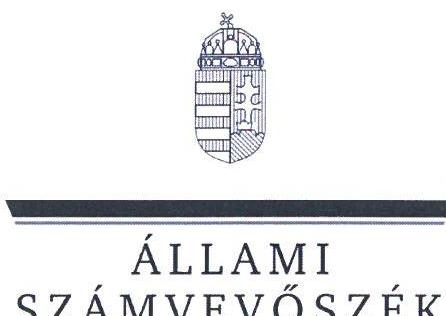
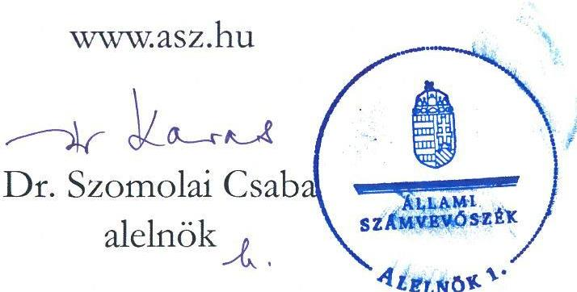
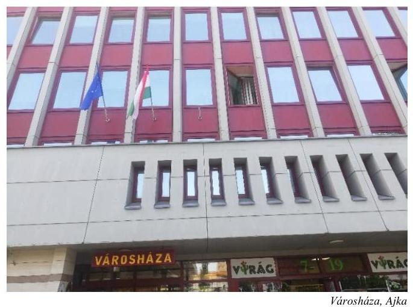
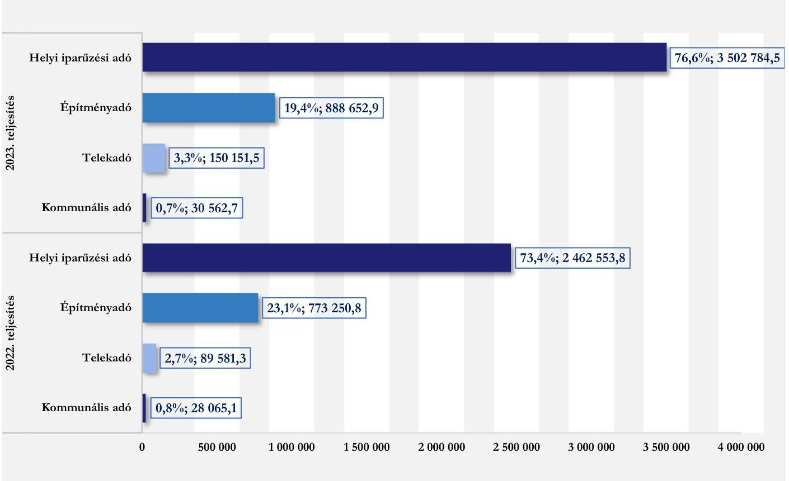
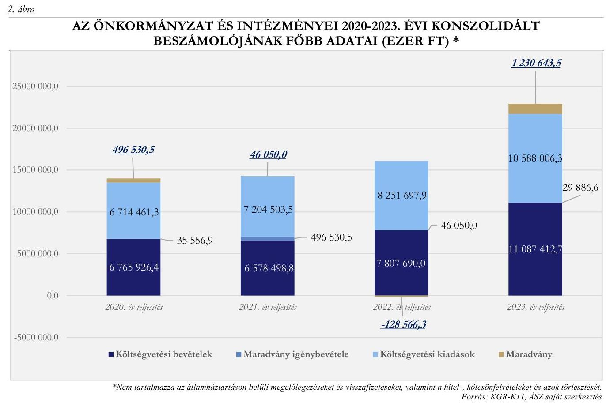
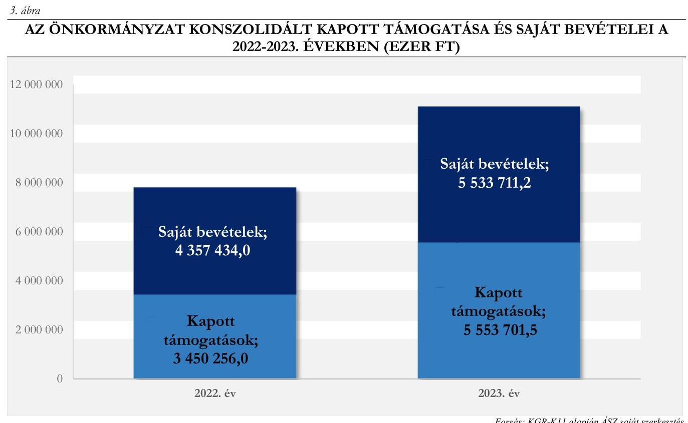
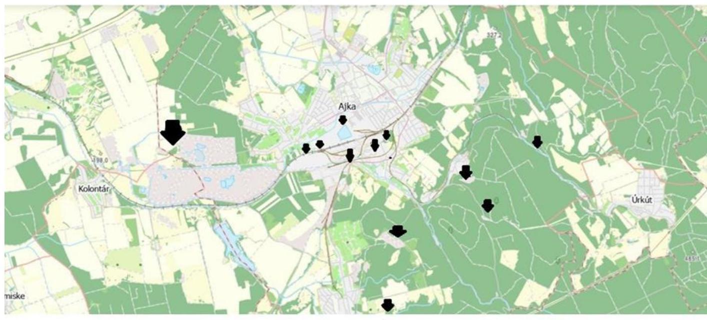

# JELENTÉS 

## Az önkormányzatok helyi adóztatási tevékenységének ellenőrzése - Ingatlanadóztatás

Ajka Város Önkormányzata

2025.

---

ÁLLAMI
SZÁMVEVŐSZÉK

# JELENTÉS 

## Az önkormányzatok helyi adóztatási tevékenységének ellenőrzése - Ingatlanadóztatás

Ajka Város Önkormányzata

2025.

25032

---

# ELLENŐRZÉSI IGAZGATÓSÁG: 

## ELLENŐRZÉSI IGAZGATÓSÁG II.

## ELLENŐRZÉSI IGAZGATÓ:

DR. BAFFIA GERGELY GÁBOR igazgató

## ELLENŐRZÉSVEZETŐ:

## KANYÓ LÓRÁNT ISTVÁN ellenőrzésvezető

Jelentéseink az interneten a www.asz.hu címen olvashatók.

IKTATÓSZÁM: EL-4068-218/2025
TÉMASORSZÁM: 54
ELLENŐRZÉS-AZONOSÍTÓ SZÁM: V1084

---

# TARTALOMJEGYZÉK 

AZ ELLENŐRZÉS ALAPADATAI ..... 5
AZ ELLENŐRZÉS TERÜLETE ÉS AZ ELLENŐRZÖTT SZERVEZET ..... 7
ÖSSZEFOGLALÁS ..... 9
AZ ELLENŐRZÉS FÓKUSZKÉRDÉSEI ..... 11
MEGÁLLAPÍTÁSOK ..... 12
JAVASLATOK ..... 28
MELLÉKLETEK ..... 30
I. sz. melléklet: Fogalomtár ..... 30
II. sz. melléklet: Az ellenőrzött szervezetek jegyzéke ..... 31
III. sz. melléklet: Ellenőrzési kritériumok ..... 32
IV. sz. melléklet: A helyi ingatlanadó-szabályok a 2023. és a 2024. évben ..... 35
V. sz. melléklet: Törvénysértő adórendeleti szabályok bemutatása ..... 37
VI. sz. melléklet: A telekadó-rendelet 1. mellékletének 1.2 pontjában felsorolt, egyedi mérlegelés alapján kedvezményezett ingatlanok ..... 41
VII. sz. melléklet: A helyi ingatlanadótárgyak és adóalanyok száma a 2023. és a 2024. évben ..... 44
FÜGGELÉK: ÉSZREVÉTELEK ..... 45
RÖVIDÍTÉSEK JEGYZÉKE ..... 46

---

.

---

# AZ ELLENŐRZÉS ALAPADATAI 

## AZ ELLENŐRZÉS CÉLJA

Az ellenőrzés célja az volt, hogy értékelje Ajka város helyi ingatlanadóztatásának és adóhatósága feladatellátásának szabályszerűségét, eredményességét. További cél volt, hogy az ellenőrzés megállapításai és következtetései segítsék az önkormányzati képviselő-testületet a jogszabályokkal és a helyi sajátosságokkal összhangban álló helyi adópolitika kialakításában és az azt végrehajtó adóigazgatási szervezet megszervezésében. Az ellenőrzés célja volt továbbá annak megállapítása is, hogy az Önkormányzat által bevezetett, ingatlanokat terhelő helyi adókra vonatkozó rendeleti szabályok összhangban vannak-e a helyi adópolitikai célokkal, tartalmuk tükrözi-e a település helyi sajátosságait és az adóhatósági feladatellátás biztosítja-e az önkormányzati bevételek feltárását és beszedését.

Ennek keretében az ÁSZ értékelte, hogy az Önkormányzat által bevezetett, ingatlanokat terhelő helyi adókról szóló adórendeletek, valamint az adóhatóság döntései, adóztatási gyakorlata a vonatkozó jogszabályokkal összhangban állnak-e.

## AZ ELLENŐRZÉS TÍPUSA

Kombinált ellenőrzés.

## AZ ELLENŐRZÖTT IDŐSZAK

Az 1. fókuszkérdésnél a 2023. év, valamint a 2024. évnek az ellenőrzés megkezdését megelőző napjáig (2024. április 11.) tartó időszaka.

A 2. és 3. fókuszkérdésnél a 2023. év, valamint a 2024. évnek az ellenőrzés megkezdését megelőző napjáig (2024. április 11.) tartó időszaka, a 2020-2022. évek adatainak bázisadatként való felhasználásával.

## AZ ELLENŐRZÉS TÁRGYA

Az Önkormányzat képviselő-testületének ingatlanokat terhelő helyi adóval, az építményadóval, telekadóval és a magánszemély kommunális adójával kapcsolatos rendeletalkotási tevékenységének és az adóhatóság tevékenységének az ellátása.

Az ellenőrzés kiterjedt minden olyan körülményre és adatra, amely az ÁSZ jogszabályban meghatározott feladatainak teljesítéséhez, valamint az ellenőrzési program végrehajtása folyamán felmerült újabb összefüggések feltárásához szükséges.

## AZ ELLENŐRZÉS JOGALAPJA

Az ellenőrzés jogszabályi alapját az ÁSZ tv. 5. § (8) bekezdésének előírásai képezték.

---

# AZ ELLENŐRZÉS MÓDSZERE 

Az ÁSZ az ellenőrzést az ellenőrzési program szempontjai, az ellenőrzött időszakban hatályos jogszabályok, az ellenőrzés általános szakmai szabályai és az ellenőrzésre irányadó ÁSZ módszertanok alapján végezte.

Az ellenőrzési kérdések megválaszolásához szükséges bizonyítékok megszerzése az ellenőrzött szervezetek által rendelkezésre bocsátott dokumentumokra, adatokra és az ASP Adó és az Iratkezelő szakrendszerek, illetve a KGR-K11 számviteli adatgyűjtő rendszer adataira alapozva megfigyelés, kérdésfeltevés (információkérés), mintavételezés, valamint elemző eljárás útján történt. Emellett az ellenőrzési bizonyítékként felhasználható adatforrások közé tartozott minden egyéb - az ellenőrzés folyamán feltárt, az ellenőrzés szempontjából információt tartalmazó - releváns dokumentum (ideértve különösen a helyszíni ellenőrzésről készült jegyzőkönyvet) is.

Az ellenőrzés lefolytatásához az ellenőrzött szervezet a tanúsítványok kitöltésével, valamint az ÁSZ által kért dokumentumok, adatok, információ megküldésével és az ellenőrzés során szolgáltatott adatokat.

Az ÁSZ az adómegállapítás, a fizetési kedvezmények engedélyezése és a hátralékok beszedése szabályszerűségét mintavételi eljárással ellenőrizte. Ennek keretében 25 mintatételben - melyből öt mintatétel a hátralékkezeléshez, kettő a fizetési kedvezmények engedélyezéséhez és 18 az adómegállapításhoz kapcsolódott - 64 határozat (57 határozat az adómegállapítással, kettő a fizetési kedvezményre vonatkozó kérelmek elbírálásával, öt az adóbehajtással függött össze) szabályszerűségét, valamint a hátralékkezelés teljes dokumentációját ellenőrizte. A mintatételek kiválasztása véletlenszerűen történt az adóhatóság nyilvántartásában lévő adótárgyak és ügyek közül tíz - adómegállapításra vonatkozó - mintatétel kivételével, amelyek esetében a kiválasztás címadatok alapján történt annak érdekében, hogy feltárható legyen, volt-e olyan adótárgy, amelyet nem adóztatott az adóhatóság. Az ellenőrzött mintatételekre vonatkozó megállapítások nem vetíthetők ki a teljes sokaságra, a megállapításokat az ÁSZ az adott ellenőrzött mintatételek vonatkozásában tette meg.

Az ÁSZ a helyi adópolitikai elképzelések és a települési sajátosságok feltárásával értékelte, hogy az adórendeletek e szempontoknak mennyiben feleltek meg. Az ÁSZ a helyi adópolitikai célokkal akkor tekintette összhangban állónak az adórendeleteket, ha azok hatásukat tekintve támogatták az adópolitikai célok teljesülését.

Az ÁSZ az adóhatósági feladatellátás szabályszerűségéből, a meglévő kapacitásokból, valamint az ezer forint adóbevételre jutó adóhatósági költségek alakulásából következtetett arra, hogy az adóhatóság rendelkezett-e azzal a potenciállal, amellyel eredményesen tudta a helyi adópolitikát végrehajtani.

Az ÁSZ - az adórendeletek szabályainak érvényre juttatása körében - az eredményesség véleményezésekor a III. számú melléklet 2. pontjában foglalt szempontokat tekintette mérvadónak.

---

# AZ ELLENŐRZÉS TERÜLETE ÉS AZ ELLENŐRZÖTT SZERVEZET 

Ajka város Veszprém vármegyében, az Ajkai járásban, a Dunántúli-középhegységben, Veszprémtől 30 km-re, a Balatontól 40 km-re fekszik. A város hagyományosan az ipari tevékenységnek ad otthont, jelenleg az energiaipar képviseli legnagyobb súlyt a város iparán belül. A TeIR 2022. december 31-ei adatai alapján a településen 3675 regisztrált gazdasági szervezet volt, Ajka állandó lakossága - a BM adatai alapján - 2020. január 1-jén 28123 fő, 2024. január 1-jén 26917 fő volt.

Az Önkormányzat nyolc költségvetési szervvel rendelkezett és 14 kizárólagos saját tulajdonban lévő,

Városbázat. Ajka
Fonrás: ASZ saját fotó
valamint további négy nonprofit gazdasági társaságban bírt részesedéssel.

Az Alaptörvény értelmében a helyi önkormányzat a helyi közügyek intézése körében törvény keretei között döntött a helyi adók fajtájáról és mértékéről. Az Mötv. rögzíti, hogy a helyi adóval kapcsolatos feladatok ellátása a helyi önkormányzatok feladata.

Az Önkormányzat a Htv. alapján illetékességi területén külön-külön adórendelettel építményadót, telekadót és magánszemély kommunális adóját vezetett be. Mind a rendeleti mértékek, mind a mentességi tényállások rendszere meglehetősen összetett volt mindhárom adónem esetében. Az építményadórendelet kettő, a telekadórendelet öt különböző mértékszabályt tartalmazott. Emellett minden adónem esetében tartalmazott a szabályozás mentességi tényállásokat is: építményadóban három, telekadóban kettő, magánszemély kommunális adója esetén tizenegy ilyen szabály azonosítható. A szabályrendszer főbb elemeit a IV. melléklet mutatja be részletesen.

Az adó megállapításával, nyilvántartásával, beszedésével összefüggő adóhatósági feladatokat - a Hatásköri tv. és az Air. rendelkezései alapján - elsőfokú hatósági jogkörben Ajka város jegyzője látta el, mint a Közös Hivatal vezetője. A Közös Hivatal feladatai közé tartozott az Önkormányzaton kívül a közös hivatalhoz tartozó másik települési önkormányzat (Öcs Község Önkormányzata) adóztatása is. A hivatali SzMSz alapján az Adóügyi Iroda engedélyezett létszáma nyolc fő volt az irodavezetővel együtt, de az ellenőrzött időszakban hét fő végzett adóztatási feladatokat.

A 2022. évben az ingatlanadókból összesen 890 897,2 ezer Ft bevétele származott az Önkormányzatnak, amely a konszolidált - az államháztartáson belülről származó felhalmozási célú támogatások nélküli költségvetési bevétel (6 900 789,7 ezer Ft) 12,9%-át tette ki. A 2023. évben az ingatlanadókból származó éves 1 069 367,1 ezer Ft az Önkormányzat konszolidált - az államháztartáson belülről származó felhalmozási

[^0]
[^0]:    ${ }^{1}$ Költségvetési szervei: Ajkai Közös Önkormányzati Hivatal, Regenbogen Német Nemzetiségi Óvoda és Művelődési Ház, Városi Intézmények Működtető Szervezete, Szociális Szolgáltató és Gondozási Központ, Nagy László Városi Művelődési Központ és Könyvtár, Városi Bölcsőde, Ajka Városi Óvoda, Ajkai Család- és Gyermekjóléti Központ.

---

célú támogatások nélküli - költségvetési bevételének (8 488 782,6 ezer Ft) 12,6%-át jelentette. A 2023. évi ingatlanokat terhelő adókból a helyi adóbevétel (4 572 151,6 ezer Ft) 23,4%-a származott. Az Önkormányzat helyi adóbevételeinek 2022. és 2023. évi összetételére vonatkozó adatokat az 1. ábra, a helyi ingatlanadók 2023. és 2024. évre vonatkozó jellemző naturális adatait pedig a VII. számú melléklet mutatja be.

# AZ ÖNKORMÁNYZAT HELYI ADÓBEVÉTELEINEK MEGOSZLÁSA A 2022-2023. ÉVEKBEN ( $\%$, EZER FT) 

Forrás: KGR-K11 alapján ÁSZ saját szerkesztés

---

# ÖSSZEFOGLALÁS 

Az ÁSZ tv. értelmében az ÁSZ feladatkörébe tartozik az önkormányzatok adóztatási tevékenységének ellenőrzése. A helyi adók az önkormányzatok saját, el nem vonható bevételét képezik, így az önkormányzatok gazdasági önállósága szempontjából különös fontossággal bír, hogy a helyi adórendeleti szabályok összhangban álljanak a magasabb szintű jogszabályokkal, továbbá az adóhatósági tevékenység jogszerű, eredményes és hatékony legyen. Erre figyelemmel volt tárgya az ÁSZ ellenőrzésének az Önkormányzat adórendelet-alkotási tevékenysége és az adóhatósági feladatellátás is.

Az adórendeletek nem voltak összhangban a magasabb szintű jogszabályokkal, s egyes pontjaik nem feleltek meg az Önkormányzat jogalkotói szándékának. A rendeleti szabályozás nem támogatta teljes mértékben az Önkormányzat adópolitikai céljainak elérését. Az adómegállapítási feladatellátás nem volt eredményes, az adóhatósági döntések több esetben nem voltak szabályszerűek. Az adóbehajtási tevékenység nem volt eredményes. Az adóhatóság adatszolgáltatási kötelezettségének határidőn túl, míg közzétételi kötelezettségének nem megfelelően tett eleget. Az adóztatási kiadások alacsonyak voltak az adóbevételhez képest, az adóhatóság ingatlanadóztatással összefüggő feladatellátási mutatói összességében kedvezőbbek voltak az ÁSZ által ellenőrzött nyolc város feladatellátási mutatóinak átlagos értékeinél.

## Adórendelet, adórendelet-alkotás

Az építményadó- és a kommunálisadó-rendelet nem volt összhangban a törvénnyel, mert a szabályai nem zárták ki valamennyi adótárgy esetén azt, hogy mindkét adónemben fizetési kötelezettség álljon fenn, emellett vállalkozóknak biztosítottak adómentességet és a törvény szerinti adótárgyak körét is leszűkítették. A telekadó-rendelet egyik szabálya olyan telkekre biztosított kedvezményes adómértéket, melyek jellemzően egyazon cégcsoporthoz tartozó adóalanyok tulajdonában álltak. Emellett az adórendeletek több, nem egyértelmű, ezáltal vitatható, illetve a jogalkotói szándékot nem tükröző rendelkezést is tartalmaztak.

Az építményadóra és telekadóra vonatkozó rendeleti szabályozás megalkotása során az Önkormányzat mérlegelte a helyi sajátosságokat, az Önkormányzat gazdálkodási követelményeit, valamint az adóalanyok teherviselő képességét, míg a magánszemély kommunális adója esetén kizárólag az adóalanyok teherviselő képességét vette figyelembe.

## Az adóhatóság adóigazgatási feladatellátásának jogszerűsége, eredményessége

Az adómegállapítási eljárásban hozott hatósági döntések többsége nem volt szabályszerű. Az adómegállapító határozatok kiadmányozása, kézbesítése jogszerű volt. Az adóhatóság adatszolgáltatási kötelezettségének határidőn túl, míg közzétételi kötelezettségének nem teljeskörűen tett eleget. Az adótartozások beszedése érdekében megtett intézkedések nem voltak eredményesek.

Adóellenőrzést az adóhatóság az ellenőrzött időszakban nem folytatott.

[^0]
[^0]:    ${ }^{2}$ Az ÁSZ által jelen ellenőrzés alapjául szolgáló ellenőrzési program alapján ellenőrzött városok: Ajka, Balatonföldvár, Budakalász, Emőd, Paks, Ráckeve, Szigethalom és Tata.

---

# Az adórendelet adópolitikai célokkal való összhangja, az adórendelet hatása 

Míg a városok esetén országosan az ingatlanadókból származó bevételek a konszolidált, az államháztartáson
 belülről származó felhalmozási célú támogatások nélküli - a befizetett szolidaritási hozzájárulással csökkentett - költségvetési bevételeken belüli aránya 5,8%, addig az Önkormányzat esetében ez 13,5% volt a 2023. évben. A konszolidált (az államháztartáson belülről származó felhalmozási célú támogatások nélküli) költségvetési bevételeken belül a saját bevételek aránya a 2020-2023. időszakban $\mathbf{63,0 \%}$ feletti érték volt, vagyis az önkormányzat a városokhoz képest kisebb mértékben támaszkodott az államháztartáson belülről érkező támogatásokra.

Az ellenőrzött időszakban az adóalanyok adóteherviselő-képességét nem érintette hátrányosan az ingatlanokat terhelő valamely adó.

Az Önkormányzat adórendeleti szabályai csak részben támogatták a helyi adópolitikai célok megvalósulását (az adó megfelelő bevételi forrást jelentsen, megújuló energia elterjedését és az elhagyott ipari területek hasznosítását elősegítse, a spekulációs célú ingatlanvásárlásokat ne ösztönözze, a helyi lakosságot kevésbé terhelje).

## Az adóhatósági kiadások

Az adóhatóság a 2023. évben éves 4591 891,4 ezer Ft helyi adóbevételt számolt el. Minden 1000 Ft beszedett helyi adóbevételre - az ÁSZ számítása szerint - 12,1 Ft adóztatási kiadás esett. Az ellenőrzött városok átlaga $15,3 \mathrm{Ft}$, az adóztatási kiadás tapasztalati referencia-érték maximuma kivetéses adóztatás esetén 50 Ft volt.

Az Önkormányzat egy adótisztviselőjére a 2023. évben 653 164,5 ezer Ft helyi adóbevétel, 1852,7 adótárgy és 1678,4 adóalany jutott. Ezek az értékek összességében kedvezőbbek voltak (több adóalany, adótárgy jutott egy adótisztviselőre), mint az ÁSZ által ellenőrzött nyolc város átlaga (544 502,3 ezer Ft/adótisztviselő, illetve 1751,1 adótárgy, 1461,7 adóalany/adótisztviselő).

[^0]
[^0]:    ${ }^{3}$ Az ÁSZ jelen ellenőrzésben városok alatt a 322 nem megyei jogú várost érti.

---

# AZ ELLENŐRZÉS FÓKUSZKÉRDÉSEI 

1.- Az önkormányzat ingatlanokat terhelő helyi adókra vonatkozó rendeleti szabályozása megfelel-e a magasabb szintű jogszabályoknak?
2.- Az önkormányzati adóhatóság megfelelően és eredményesen látta-e el az ingatlanok adóztatásával kapcsolatos adóhatósági tevékenységeit?
3.- A településen megvalósuló helyi adóztatás támogatta-e a helyi adópolitikai célok teljesülését?

---

# MEGÁLLAPÍTÁSOK 

## 1. Az önkormányzat ingatlanokat terhelő helyi adókra vonatkozó rendeleti szabályozása megfelelte a magasabb szintű jogszabályoknak?

Összegző megállapítás Az adórendeletek több ponton nem voltak összhangban a magasabb szintű szabályokkal.
1.1 számú megállapítás

Az adórendeletek több rendelkezése nem volt összhangban a Htv. előírásaival, valamint csak részben feleltek meg az Önkormányzat jogalkotói szándékának, szövegezésük több ponton sértette az egyértelmű értelmezhetőség Jár. ${ }^{18}$-ban megfogalmazott követelményét.

Az építményadó-rendelet ${ }^{19}$ és a kommunálisadó-rendelet ${ }^{20}$ összevetése alapján - a Htv. 7. § a) pontjában ${ }^{4}$ foglaltak ellenére - ha lakáson fennálló vagyoni értékű jog okán a magánszemély az építményadónak és a magánszemély kommunális adójának is alanya, mindkét adónemben fizetési kötelezettsége keletkezhetett.
A Htv. 7. § e) pontjában előírtak ellenére - amely az uniós jogból fakadó állami támogatási elvekre és normákra figyelemmel rögzíti, hogy az önkormányzat az építményadóban és a telekadóban a vállalkozó számára adómentességet, adókedvezményt nem biztosíthat - az építményadó-rendelet

Az uniós állami támogatási szabályok értelmében a vállalkozóknak nyújtott helyi adómentesség, helyi adókedvezmény állami támogatásnak minősül. A jogszerűtlenül nyújtott támogatást a kedvezményezettnek vissza kell fizetnie, vagy a támogatást nyújtónak kell biztosítania az uniós joggal való összhangot.

1. §(1)-(3) bekezdése, valamint a telekadó-rendelet ${ }^{21} 1. §$ és 2. §-a szerinti adómentességi szabály hatálya a vállalkozó adóalanyokra is kiterjedt. A magasabb szintű jogszabályba ütköző rendeleti szabályok részletes ismertetését és a jogsérelem bemutatását az V. melléklet tartalmazza.
Azáltal, hogy kedvezményes adómértéket nem objektív szempontok alapján határozta meg az Önkormányzat, szintén a Htv. 7. § e) pontjába ütközik, hogy a telekadó-rendelet 5. § (2) bekezdése a rendelet 1. mellékletének 1.2 pontjában felsorolt, egyedi mérlegelés alapján kiválasztott, a város területén elszórtan elhelyezkedő - jellemzően egy cégcsoporthoz tartozó - ingatlanok esetén 5 Ft/m² adómértéket rendelt alkalmazni, mely a belterületen a 2024. évben irányadó 450 Ft/m² adómérték
[^0]
[^0]:    ${ }^{4}$ A Htv. hivatkozott rendelkezése szerint egy adott adótárgy (épület, épületrész, telek) után csak egyféle ingatlant terhelő adóban keletkezhet fizetési kötelezettség (adótöbbszörözés tilalma). Ha az önkormányzat működteti az építményadót és a magánszemély kommunális adóját, akkor vagy mentességi szabállyal, vagy direkt rendelkezéssel kell biztosítania, hogy ne álljon elő többszörös adófizetés.

---

1,1%-a, a külterületen irányadó 180 Ft/m² adómérték 2,8%-a (az érintett ingatlanok bemutatását a VI. melléklet tartalmazza).
A kommunálisadó-rendelet 2. §-a nem felelt meg a Htv. 2. §-ában foglalt követelménynek ${ }^{5}$, mert hatását tekintve leszűkítette a Htv.-ben meghatározott adótárgyak körét azzal, hogy nem fogalmazott meg adómértéket valamennyi adóköteles adótárgyra ${ }^{6}$, ami sértette a Jár. 2. § (1) bekezdése szerinti egyértelmű értelmezhetőség követelményét is.
Az adórendeletek az alábbi okokból fakadóan sértették - a Jár. 2. § (1) bekezdéséből következő - egyértelmű értelmezhetőség követelményét (a rendeleti szabályok

A normavilágosság sérelme nem csak a jogalkalmazók önkéntes jogkövetését veszélyezteti, hanem egy bírósági felülvizsgálat esetén ha a Kúria erre tekintettel a rendelet (visszamenőleges) hatályon kívül helyezéséről dönt - bevételi kockázatot is jelent a települések számára.
ismertetését és a jogsérelem mibenlétét az V. melléklet tartalmazza):
a) a telekadó-rendelet 2. §-a, 5. § (4) bekezdés b) pontja, az építményadó-rendelet 1. § (1) és (2) bekezdése, a kommunálisadó-rendelet 1. § (1) bekezdés a) pontja a Htv.-ben nem használt, a szavak köznyelvi jelentése alapján egyértelműen nem beazonosítható fogalmakat használt anélkül, hogy a hivatkozott adórendeletek definiálták volna a kifejezéseket;
b) a telekadó-rendelet 1. §-ához, az építményadó-rendelet 1. § (2) bekezdéséhez, valamint a kommunálisadó-rendelet 1. § (1) bekezdés d), g) és h) pontjaihoz nyelvtani értelmezéssel egyértelmű normatartalom kapcsolható, ez azonban nem tükrözi az Önkormányzat nyilatkozata szerinti jogalkotói szándékot, s az ez utóbbit kiszolgáló adóhatósági gyakorlatot;
c) a telekadó-rendelet 5. § (1) bekezdése,

1. mellékletének 1.1. pontja, 2.1. és 2.2. pontja szerinti övezetek esetében a megadott övezethatárok alapján nehezen vagy nem beazonosítható az övezet területe;
d) a kommunálisadó-rendelet 1. § (6) bekezdése esetén nem egyértelmű, hogy ,,a mentesség balmozottan nem vehető igénybe" tilalmat adóalanyonként vagy adótárgyanként kell-e figyelembe venni;

Amennyiben a rendelet helyrajzi számokhoz kapcsolódóan rögzít a településen belül övezeteket, akkor elengedhetetlen az ezen ingatlanokhoz kötődő telekalakítási eljárások nyomon követése és - amennyiben a helyrajzi számok változnak - a valós helyrajzi számok átvezetése a rendeleten.
e) a telekadó-rendelet és az építményadó-rendelet nem tartalmaz adóalapszabályt, így arra csak az adómérték mértékegységéből lehet következtetni;
f) a telekadó-rendelet 6. §-a, az építményadó-rendelet 4. § (1) bekezdése, a kommunálisadó-rendelet 3. § (1) bekezdése - a Htv. 42/I. § (1) bekezdésében foglaltak ellenére - nem a Pénzügyminisztérium honlapján közzétett iratmintákra, hanem a már hatálytalan 35/2008. (XII.31.) PM rendelet ${ }^{22}$ szerinti nyomtatványokra hivatkozik.

[^0]
[^0]:    ${ }^{5}$ A Htv. 2. §-a értelmében az önkormányzat adómegállapítási joga csak a Htv.-ben foglalt adóalanyokra és adótárgyakra terjedhet ki. Az Alaptörvény 32. cikk (1) bekezdés h) pont értelmében is csak törvényi keretek között illeti meg a helyi önkormányzatot a helyi adó fajtájának és mértékének megállapítására vonatkozó jog. Az önkormányzatnak, ha az adót bevezeti, természetesen van jogosultsága differenciált adómérték, adómentesség, adókedvezmény rendeletbe iktatására is.
    ${ }^{6}$ A magánszemély kommunális adójának tárgya a Htv. 24. §-a alapján az építményadó és a telekadó tárgyaival (az építménnyel, a telekkel) és a nem magánszemély tulajdonában álló lakás bérleti jogával egyezik meg.

---

1.2 számú megállapítás

Az Önkormányzat az építményadó és a telekadó szabályozásának alakítása során mérlegelte a helyi sajátosságokat és az Önkormányzat gazdálkodási követelményét, illetve az adóalanyok teherviselő képességét. A magánszemély kommunális adója hatályos szabályainak megalkotásakor kizárólag a természetes személyek teherviselő képességére volt figyelemmel az Önkormányzat.

A Htv. 7. § g) pontjában rögzített adómegállapítási korlátokból az következik, hogy a rendelet hatályossága idején is érvényre kell jutnia az e pontban szabályozott rendeletalkotási elveknek, azaz annak, hogy települési önkormányzat az adóalap fajtáját, az adó mértékét, a rendeleti adómentességet és adókedvezményt úgy állapíthatja meg, hogy azok összességükben egyaránt megfeleljenek
a) a helyi sajátosságoknak,
b) az önkormányzat gazdálkodási követelményeinek és
c) az adóalanyok széles körét érintően az adóalanyok teherviselő képességének.

# A helyi sajátosságok figyelembevétele 

Az Önkormányzat a mértékrendszer elemeit és a kedvezményi-, mentességi szabályokat a helyi sajátosságokra figyelemmel alakította ki.

## Az Önkormányzat gazdálkodási követelményeinek szempontja

A 2023. évben a helyi adókból - az előző évi bevételhez (3 353 451,1 ezer Ft) képest 36,3%-kal több 4572 151,7 ezer Ft bevétel származott. Ezzel együtt a helyi adók konszolidált költségvetési bevételben képviselt aránya (41,2%) a 2023. évben az előző évi 43,0%-hoz képest csökkent, mert a helyi adóknál nagyobb arányban emelkedett a konszolidált költségvetési bevétel az előző évhez képest.
Az Önkormányzat és intézményeinek főbb gazdálkodási adatai alapján az ÁSZ megállapította, hogy az összes maradvány 2020-2022. között folyamatosan csökkent, sőt a 2022. évben negatív tartományba fordult át. Ennek oka az volt, hogy a 2021. és a 2022. évben a költségvetési kiadások jelentősen meghaladták a költségvetési bevételek összegét, és a 2022. évi különbségre az előző évi maradvány sem nyújtott fedezetet. A 2023. évben az Önkormányzat már költségvetési többlettel zárta az évet.
2023. január 1-jétől az építményadó mértéke 16,7%-kal, 1800 Ft/m²-ről 2100 Ft/m²-re, a belterületi telket terhelő telekadó mértéke 30,0%-kal, 300 Ft/m²-ről 390 Ft/m²-re emelkedett, míg a külterületi telket terhelő 180 Ft/m²-es adómérték változatlan maradt. Az adómérték emelése kapcsán az Önkormányzat az energiaárak növekedését és a beszállítók áremelését nevezte a költségvetését negatívan befolyásoló körülménynek.
2024. január 1-jétől az építményadó mértéke 9,5%-kal, 2100 Ft/m²-ről 2300 Ft/m²-re, a belterületi telket terhelő telekadó mértéke 15,3%-kal, 390 Ft/m²-ről 450 Ft/m²-re emelkedett. Az Önkormányzat az infláció következtében megnövekedett költségszintet jelölte meg a módosításra okot adó körülményként. A 2023. évi és a 2024. évtől hatályba léptetett adóváltozások során az Önkormányzat mérlegelte a gazdálkodási helyzetét.

---

# Az adóalanyok teherviselő képességének figyelembevétele 

A teherviselőképességet illetően az Önkormányzat - a 2023. évtől hatályos adóváltozásokról döntő képviselő-testületi ülés* jegyzőkönyve alapján - abból a feltevésből indult ki, hogy az építményadó és telekadó mértékeinek 17,6-30,0%-os növekedése nem befolyásolja döntően a vállalkozások teherviselőképességét. A képviselő-testületnek nem volt célja a természetes személyek adóterheinek növelése, ${ }^{8}$ ezért nem változott a magánszemély kommunális adója. Mindezek alapján az Önkormányzat a Htv.-ben foglaltaknak megfelelően mérlegelte az adórendeletnek az adóalanyokra gyakorolt hatását.

[^0]
[^0]:    * Nem tartalmazza az államháztartáson belüli megelőlegezéseket és visszafizetéseket, valamint a hitel-, kölcsönfelvételeket és azok törlesztését. Forrás: KGR-K11, ÁSZ saját szerkesztés

---

# 2. Az önkormányzati adóhatóság megfelelően és eredményesen látta-e el az ingatlanok adóztatásával kapcsolatos adóhatósági tevékenységeit? 

Összegző megállapítás
Az adóhatóság adómegállapítási
 feladatellátása nem volt eredményes, az adóhatósági döntések nem minden esetben voltak szabályszerűek. Az adóhatóság adatszolgáltatási kötelezettségének határidőn túl, míg közzétételi kötelezettségének csak részben tett eleget. Az adótartozások beszedése érdekében megtett intézkedések nem voltak eredményesek, de – egy kivételével – szabályszerűek voltak.
2.1. számú megállapítás

Az önkormányzati adóhatóság adótárgy- és adóalanyfeltárási tevékenysége nem volt eredményes, az adóigazgatási eljárás során nem minden esetben járt el szabályszerűen. Az adóhatóság adatszolgáltatási kötelezettségének a jogszabályi határidőn túl tett csak eleget.

Adótárgy- és adóalanyfeltárás
Az adóhatóság a 2023. és a 2024. évben is élt az Art. 23 83. § (2) bekezdésében foglaltak alapján az ingatlanügyi hatóság megkeresésének lehetőségével, továbbá az adózók adatbejelentési kötelezettsége elmulasztásának felderítése érdekében használta az építésügyi hatóság által az Art. 86. §-a szerint szolgáltatandó adatokat, és a Google maps, a Takarnet rendszereket, valamint a Közmű térképet.
Az adóhatóság az ingatlanügyi hatóság által az Art. 83. § (2) bekezdésében foglaltak

Az ÁSZ – különösen a városok esetén – azt tekinti jó gyakorlatnak, ha az adóhatóság intenzíven használja a társhatóságnál rendelkezésre álló adatokat az adóztatás során. Az ÁSZ véleménye szerint az ingatlanadókban célravezető az adóhatóság adónyilvántartási adatainak társhatósági hiteles adatokkal való összevetése és ezek alapján szükség szerint adatbejelentésre, hiánypótlásra felhívás, majd az információk alapján a tényállás rögzítése és az adómegállapítási eljárás mielőbbi befejezése. Részint azért, mert az adótárgy jellege miatt erre lehetőség van (tipikusan évente nem változnak a kivetési adatok), részint azért, mert így az adóhatóság időben korábban jut az adóbevételhez, részint pedig azért, mert négy-öt év távlatában – utólagos adómegállapítás keretében sokszor utólagosan nehezen lehet bizonyítani, hogy az adóév első napján mi volt az adómegállapítás kapcsán releváns tényállás.
Alapján szolgáltatott adatokat nem vetette össze az adónyilvántartásában szereplő adatokkal.
Az ÁSZ több olyan ingatlant tárt fel, amelyet az adóhatóság – a Htv. 11. § (1) bekezdése és 17. § a), valamint az építményadó-rendelet és a telekadó-rendelet rendelkezései ellenére – nem adóztatott, adóztatásuk az ÁSZ ellenőrzés eredményeként kezdődött meg 2024-ben.
Egy mintatétel (21. mintatétel) esetében az adóhatóság az adatbejelentést elmulasztó adóalany személyét beazonosította ugyan, de az Art. 221. § (1) bekezdés a) pontjában foglalt előírás ellenére nem hívta fel az adózót a mulasztás jogkövetkezményeire történő figyelmeztetés mellett – tizenöt napos határidő tűzésével – az adókötelezettség jogszerű teljesítésére.

---

Összességében az adótárgy- és adóalanyfeltárási adóhatósági feladatellátás nem volt eredményes.

# Adómegállapítás (kivetés) 

Az ÁSZ az adóhatósági adómegállapítási feladatellátás ellenőrzése keretében 18 mintatétel keretében 57 határozat ellenőrzését végezte el.
Az adóhatóság két vizsgált mintatétel esetében (10. mintatétel 13/495-1/2023. és 19. mintatétel 13/725/2023., 13/334-1/2024. számú határozatok) megsértve a Htv. 19. § a) pontját, figyelmen kívül hagyta, hogy a telek 9 területéből adómentes az épület, épületrész hasznos alapterületével egyező nagyságú telekrész.
A 23. mintatétel (13/542-1/2023., 13/1765-1/2024. számú határozatok) esetén az adóhatóságnál nem állt rendelkezésre adózó által benyújtott adatbejelentés, így nem volt ellenőrizhető, hogy a kiadott adómegállapító határozat tartalma az abban foglaltak alapján, illetve a tényállás adóhatóság általi tisztázását követően, vagy ezektől eltérő módon állt elő. Ezzel az adóhatóság megsértette az Ltv. 24 9. § (1) bekezdés e) pontját 10.
Három mintatétel (a 9., 17. és a 23. mintatételek) esetén az adótárgynak több tulajdonosa volt, azonban az adómegállapító határozat rendelkező része kizárólag az adó fizetésére kötelezett által fizetendő adó összegét tartalmazta.
A 24. mintatétel (13/1520-1/2023., 13/9501/2024. határozatai) esetén az adóhatóság – a Htv. 12. § (1) bekezdésében és az Art. 141. § (4) bekezdésében előírtak ellenére – csak egy tulajdonos számára írta elő az adótárgy utáni, két tulajdonost terhelő adót, noha az adózó az adatbejelentést a tulajdoni hányada arányára vonatkozóan nyújtotta be, és a Htv. 12. § (2) bekezdés szerinti megállapodás nem állt rendelkezésre 11.

Ha az adótárgynak több tulajdonosa van, akkor ők tulajdoni illetőségük arányában adóalanyok. Ekkor, mindegyikük egyetértése esetén köthetnek arról megállapodást, hogy az adóalanyisággal kapcsolatos jogokat és kötelezettséget az adóhatóság előtt közülük egy adóalany kapcsolattartóként gyakorolja. Az ÁSZ jó gyakorlatnak azt tekinti, ha az adómegállapító határozat nemcsak a fizetési kötelezettséget és a fizetésre kötelezettet (a kapcsolattartót), hanem az egyes adóalanyokat terhelő adót és annak jogalapját, kiszámítását is tartalmazza, annak érdekében, hogy az egyes adóalanyok számára egyértelmű legyen az őket terhelő adó összege.
A 9. mintatétel (13/11964-2/2023. határozat) esetén a megállapodásban a magánszemély kommunális adójával kapcsolatos kötelezettségek teljesítését vállaló adóalany bejelentette és egyidejűleg a kommunálisadó-rendelet szerinti módon igazolta, hogy a vele egy háztartásban élő kiskorú okán rendeleti

[^0]
[^0]:    9 A Htv. 52. § 16. pontja értelmében a Htv. alkalmazásában telek az épülettel, épületrésszel be nem épített földterület (tehát az épülettel, épületrésszel fedett telekterület nem tárgya a telekadónak). Ezen felül a Htv. 19. § a) pontja telekadómentességet fogalmaz meg az épület, épületrész hasznos alapterületével egyező nagyságban.
    10 Az Ltv. hivatkozott rendelkezése értelmében az elintézett ügy irattári anyagának szakszerű és biztonságos megőrzéséről, valamint használatra bocsátásáról gondoskodni kell.
    11 A Htv. 12. § (2) bekezdése értelmében valamennyi tulajdonos által írásban megkötött és az adóhatósághoz benyújtott megállapodás szükséges. A konkrét esetben nem írta alá valamennyi tulajdonos a megállapodást.

---

kedvezményre jogosult. E bejelentéssel együtt arról nem nyilatkozott, hogy az ingatlan másik tulajdonosa esetén a kedvezményi feltételek fennállnak-e. Mindezek ellenére az adómegállapító határozat meghozatala során – megsértve az Art. 58. § és Art. 141. § (6) bekezdés szerinti tényállástisztázási kötelezettséget – az önkormányzati adóhatóság nem vizsgálta, hogy a Htv. 12. § (1) bekezdése és 24. §-a, illetve a kommunálisadó-rendelet 1/A. §-a és 3. § (4) bekezdésének megfelelően az adótárgy utáni teljes adóösszegre (azaz mindkét adóalanynak) biztosítható-e a rendeleti kedvezmény.
A 16. mintatétel esetén az Art. 141. § (2) bekezdésében foglaltakat megsértve az adóhatóság nem hozott határozatot arról, hogy az adózó a Htv. 19. § b) pontja szerinti adómentességre jogosult.
A 19. mintatétel (13/7-12/2023. határozat) esetében az adóhatóság a felettes hatóság által el nem bírált jogsértő határozatának hibáját saját hatáskörben észlelve – az Art. 120. § (1) bekezdésében foglaltak ellenére – a határozat visszavonása vagy módosítása helyett egy új határozatot adott ki, így az adótárgyra két határozat is állapított meg adót.
A 18. és 20. mintatétel esetében az adóhatóság az Ltv. 9. § (1) bekezdés e) pontja ellenére adómegállapító dokumentációval nem rendelkezett. Ebből adódóan az ÁSZ ellenőrzésnek nem volt módja megállapítani, hogy az adóhatóság az Art. 48. § (1) és 141. § (2) bekezdés alapján folytatta le adómegállapító eljárást, illetve

Az ingatlant terhelő helyi adók esetén az adófizetési kötelezettség az adóhatóság által kiadott adómegállapító határozaton nyugszik. Ha az adómegállapító határozat nem csak a kiadásának évére, hanem későbbi adóévekre is rögzít fizetési kötelezettséget, akkor e dokumentumot (és az azt megalapozó adatbejelentést) az adófizetési kötelezettség fennállásáig meg kell őrizni, csak a fizetési kötelezettség megszűnését követően selejtezhető.
hozott-e adómegállapító határozatot, és annak közlése szabályszerűen megtörtént-e. Az 8. és 9. mintatétel (13/11223-2/2023. és 13/119642/2023. számú határozatai) esetén az adómegállapító határozat indokolási részében az adóhatóság az ügyintézési határidőt az adatbejelentés adóhatósághoz való érkezése napjától számította. Az adómegállapító eljárás ugyanakkor nem kérelemre, hanem hivatalból indított eljárás. Ezért az adóhatóság gyakorlata ellentétes volt az Art. 50. § (1) bekezdésével, amely hivatalból való eljárás esetén az első eljárási cselekmény megkezdése napjától – azaz a konkrét esetekben (mivel egyéb eljárási cselekmény nem történt) a határozat kiadmányozása napjától – rendeli számítani az ügyintézési határidőt.
A rendelkezésre álló adómegállapító határozatok kiadmányozása és közlése megfelelt az Art. és az Eüsztv. 25 előírásainak 12.
Adóellenőrzést az adóhatóság az ellenőrzött időszakban nem végzett.

[^0]
[^0]:    12 Az Eüsztv. 2024. szeptember 1-je óta hatálytalan, a jogterület szabályozását a digitális államról és a digitális szolgáltatások nyújtásának egyes szabályairól szóló 2023. évi CIII. törvény tartalmazza.

---

A vizsgált mintatételektől függetlenül az adóhatóság nyilatkozata szerint munkaszervezési okokra és az ügyintézési határidő általuk alkalmazott számítási módjára tekintettel a tulajdonos vagy vagyoni értékű jog jogosítottjának megváltozása esetén a változás bejelentést követő 30 napon belül kiadták a következő naptári év első napjától adóalannyá váló személy részére a következő naptári évre vonatkozó adómegállapító határozatot.

Az adóévi adókötelezettség az adóév január 1. napján fennálló körülményekhez, tulajdoni viszonyokhoz, adórendeleti szabályokhoz kapcsolódik, ezért az adóév január 1. napját megelőzően megalapozott határozat a Htv. 12. § és 14. § (2) értelmében értelemszerűen nem adható ki. Az ÁSZ nem tartja megfelelő gyakorlatnak az adó határozatban való közlését az adóalany adókötelezettsége keletkezését megelőző időszakban.

A megállapított adó csökkentése: fizetési kedvezmények, adókötelezettség változás, elévülés miatti törlés
A fennálló adókövetelést csökkentő vizsgált intézkedések jogszerűek voltak, azok számszaki összefoglalását az 1. táblázat mutatja be.

# 1. táblázat 

A 2023-2024. ÉVEKBEN TÖRTÉNT ADÓKÖVETELÉS TÖRLÉSEK FŐBB ADATAI (DARAB ÉS EZER FT)

| MÉGNEVEZÉS | 2023. |  | 2024.* |  |
| :--: | :--: | :--: | :--: | :--: |
|  | Esetszám | Összeg | Esetszám | Összeg |
| Méltányosságból törőlt adókövetelés | - | - | - | - |
| Adókötelezettség változás okán törőlt adókövetelés | 470 | 53321,2 | 566 | 96017,3 |
| Elévülés miatt törőlt adókövetelés | 77 | 1652 988,1 | 21 | 66,8 |
| Téves adómegállapítás miatt törőlt adó | - | - | 7 | 1719,7 |

*2024. július 31-ei állapot szerint.
Forrás: Az Önkormányzat és a Közön Hivatal által tanúsítványokon megadott adatok alapján ÁSZ saját szerkesztés

Adatszolgáltatási, közzétételi kötelezettség
Az adóhatóság, a Htv. 42/B. § (1) bekezdésében foglalt előírás ellenére a 2024. január 1-jétől hatályos építményadó-rendelet és telekadóadó-rendelet szerinti adómértékekről, kedvezményekről és mentességekről a törvényben rögzített határidőhöz képest 93 nap késedelemmel szolgáltatott adatot a Kincstár ® számára. Az Önkormányzat honlapján a Htv. 42/B. § (3) bekezdésében foglaltak ellenére nem volt megtalálható a hatályos adórendeletek szövege, ezáltal az adóhatóság közzétételi kötelezettségének nem teljeskörűen tett eleget.
2.2. számú megállapítás

Az adóbehajtási (adóbeszedési) tevékenység nem volt eredményes és egy esetben nem volt szabályszerű.

Az ingatlant terhelő adóban fennálló tartozás behajtásához kapcsolódóan az adóhatóság a 2023. évben 90 esetben, a 2024. évben az ellenőrzés megkezdéséről való értesítés átvételének napjáig (2024. április 11.) pedig még nem indított az Avt. 27-ben foglaltak alapján végrehajtási eljárást. Az adóhatóság a 2023. évben 1690 esetben, a 2024. évben 111 esetben kereste meg az Avt. 117. §-a alapján az állami adóhatóságot tartozás végrehajtás céljából, melyből a 2023. évben 748,9 ezer Ft, a 2024. évben
 2286,4 ezer Ft folyt be. Az adóhatóság a végrehajtások eredményeképpen a 2023. évben 5528,8 ezer Ft adótartozást (a 2022. december 31-én fennálló adótartozás 0,3%-át), a 2024. évben július 31-ig 6277,0 ezer Ft adótartozást (a 2023. december 31-én fennálló adótartozás 1,0%-át) szedett be.

---

Az adóhatóság az adófizetés első esedékessége előtt felhívta az adózók figyelmét az adókötelezettség teljesítésére, továbbá a 2023. december 31-i hátralék összege az előző év azonos napjához képest csökkent. Ennek ellenére az adóbehajtási feladatellátás nem volt eredményes, mert:

- a település Kincstár által szolgáltatott adatok szerinti 2023. évi hátralék-aránya (49,9%) magasabb volt, mint az azonos településtípusba tartozó önkormányzatok hátralék-aránya (16,8%);
- az ingatlanokat terhelő adók közül a 2023. évben az építményadó-bevétel nem érte el a 2023. évi költségvetésben tervezett eredeti előirányzat 90,0%-át.
Egy mintatétel (13. mintatétel 03/2290-201/2016. kivetési határozat) esetében a benyújtott hatósági átutalási megbízás sikertelen volt, mert az adózó bankszámlaszáma nem létezett. Az önkormányzati adóhatóság az Avt. 33. § (1) bekezdésében foglaltak ellenére a hiányzó (bankszámla) adat beszerzése érdekében nem intézkedett.
A 2. táblázat szerint a 2022. év és a 2023. év utolsó napjára a hátralékok összege növekedett a 2022. január 1-ei adatokhoz képest, míg a hátralékos adózók száma csökkent, majd 2024. július 31-ig emelkedés volt megfigyelhető mind a hátralékösszeg, mind pedig a hátralékosok száma tekintetében.
2. táblázat

| AZ ADÓHÁTRALÉKOK FŐBB ADATAI (DARAB ÉS EZER FT) |  |  |  |  |  |
| :--: | :--: | :--: | :--: | :--: | :--: |
| MEGNEVEZÉS | NAPTÁRI   NAP | ÉPÍTMÉNYADÓ | TELEKADÓ | MAGÁNSZEMÉLY   KOMMUNÁLIS   ADÓJA | ÖSSZESEN |
| Hátralékos adózók száma (db) | 2022.12.31. | 26 | 4 | 187 | 217 |
|  | 2023.12.31. | 22 | 4 | 191 | 217 |
|  | 2024.07.31. | 27 | 6 | 233 | 266 |
| Adóhátralék összege (ezer Ft) | 2022.12.31. | 434 163,2 | 1 667 858,1 | 1727,2 | 2 103 748,5 |
|  | 2023.12.31. | 585 167,4 | 21 001,5 | 1736,6 | 607 905,5 |
|  | 2024.07.31. | 586 399,7 | 21 037,9 | 1967,3 | 609 404,9 |

Az adóhatóság 2022. január 1-jén 274 hátralékos adózót és 2 060 605,2 ezer Ft hátralékösszeget tartott nyilván. Az adóhátralék összege 2022. év végi 2 103 748,5 ezer Ft-ról a 2023. év végére 71,1%-kal 1 495 842,9 ezer Ft-tal - 607 905,5 ezer Ft-ra csökkent, míg a hátralékos adózók száma változatlan (217 adózó) maradt. Ez azonban nem a hátralékkezelés eredményességére, hanem az elévült adótartozások, közte egy jogutód nélkül megszűnt adózó nagy összegű (1 641 756,5 ezer Ft) telekadó tartozása törlésére vezethető vissza. Az adóhátralékból származó kintlévőség a 2023. év utolsó napján a költségvetési bevételként 2023. évben elszámolt ingatlanadó-bevétel 57,0%-át tette ki. Az adóalanyoknak küldött fizetési felhívások száma a 2022. évihez képest csökkent a 2023. évben.

---

# 3. A településen megvalósuló helyi adóztatás támogatta-e a helyi adópolitikai célok teljesülését? 

Összegző megállapítás Az Önkormányzat ingatlanokat terhelő helyi adókra vonatkozó adórendeleti szabályozása nem minden elemében támogatta a helyi adópolitikai célok megvalósulását. Az ingatlanokat terhelő adók érdemben támogatták az önkormányzat gazdálkodását, az adóteher összhangban volt az adózók teherviselő képességével. Az adóhatósági feladatellátás kiadása az elért adóbevételhez mérten alacsony volt, a feladatellátás mutatói összességében az ÁSZ által ellenőrzött városok mutatóinak értékeinél kedvezőbbek voltak.
3.1 számú megállapítás

A településen megvalósuló helyi adóztatás egyes elemei nem támogatták az adópolitikai célokat.

Az Önkormányzat által ismertetett adópolitikai célok, az azokat segítő és ellenük ható adórendeleti eszközök az alábbi fő pontok köré rendezhetőek.
3. táblázat:

AZ ÖNKORMÁNYZAT ADÓPOLITIKAI CÉLJAI ÉS ALKALMAZOTT ESZKÖZRENDSZERE

| ADÓPOLITIKAI CÉL | TÁMOGATO ESZKÖZ | ELLENE HATÓ ESZKÖZ | LEHETSÉGES ADÓPOLITIKAI ESZKÖZ |
| :--: | :--: | :--: | :--: |
| Megakadályozni a belterületi telkek befektetési célú, termelőberuházást nem generáló felhalmozását | Magasabb a belterületen található telek esetén a telekadó mértéke.   Telekadómentes legalább 100 m² építménnyel beépített telek. | Az ipari parkokban alkalmazandó rendkívül alacsony telekadó-adómérték a befektetési célú vásárlást is ösztönzi, így nem csak a tényleges ipari tevékenység céljából történő ingatlanvásárlásnak kedvez.   Az építményadó nem differenciált, így az épülethez kötött tevékenységek esetén nem ösztönöz az adórendszer az ipari parkban történő letelepedésre. | Az építményadó differenciálása övezeti besorolás alapján. |
| Az ipari tevékenységet az ipari parkok területére terelni | 1 és 5 Ft/m² telekadó mérték a volt ipari park és az azzal szomszédos területek esetén. |  |  |

---

| AdOPOLITIKAI CÉL | TÁMOGATÓ ESZKÖZ | ELLENE HATÓ ESZKÖZ | LEHETSÉGES   ADÓPOLITIKAI ESZKÖZ |
| :--: | :--: | :--: | :--: |
|  |  | Egyedi, célzott alacsony telekadómérték egyes nagyadózóknak. |  |
| Forrás biztosítása az önkormányzat kötelező és önként vállalt feladatainak finanszírozásához | Mindhárom adónem | A magánszemély kommunális adójában 10 éve változatlan, alacsony adómérték. | Átlátható, egyszerű adószabályozás mellett aktívabb adóhatósági végrehajtás. |
|  |  | Mindhárom adónemben kiterjedt kedvezményi és mentességi rendszer. |  |
| Megújuló energia térnyerésének támogatása | 5 Ft/m² adómérték azon a telken, melyen megújuló energiával kapcsolatos beruházás létesül | Bármely 100 m²-t meghaladó épület létesítése esetén korlátlan ideig jár a mentesség a telekadó alól.   A volt ipari park területével szomszédos területeken a hasznosítás céljától függetlenül 1 Ft/m² az adó mértéke. | A kedvező adómérték csak abban az évben legyen igénybe vehető, melyben a beruházás múködik. |
| Felhagyott ipari területek ismételt használatbavételének támogatása | 5 Ft/m² adómérték a rekultivációs tevékenységhez kapcsolódóan | A kedvező mérték a rekultivációra nyitva álló időszak végéig igénybe vehető, így nem ösztönöz a rekultiváció gyors befejezésére.   A volt ipari park területével szomszédos területeken a hasznosítás céljától függetlenül 1 Ft/m² az adó mértéke. | Differenciált adómérték a bel- és külterületi, vagy célzottan felhagyott ipari területeken fekvő építmények esetén.   A rekultiváció befejezését követően járjon a kedvező adómérték. |

Forrás: Az Önkormányzat helyszini ellemörzés során tett nyilatkozata alapján ÁSZ saját szerkesztés
Az ingatlant terhelő adók szabályai csak részben voltak alkalmasak a kitűzött adópolitikai célok támogatására, mert egyes szabályok támogató hatását - a fentiek szerint - egy másik adóintézkedés hatása kioltja. Az összetett ingatlanadó-szabályrendszer helyes végrehajtása, az adókötelezettségekkel kapcsolatos - akár több évre elhúzódó - adóhatósági feladatok nyilvántartása és elvégzése jelentős adóhatósági kapacitásokat köt le.

---

3.2 számú megállapítás

Az Önkormányzat ingatlanadó bevételei a városokhoz viszonyítva jelentősebb mértékben támogatták az Önkormányzat feladatellátását. Az Önkormányzat saját bevétele, valamint azok költségvetési bevételeken belüli aránya a 2023. évben nőtt az előző évhez képest, ezért az Önkormányzat támogatásoktól való függősége a 2023. évre csökkent. Az adóteher az adóalanyok többségének adóteherbíró-képességével összhangban volt.

# Az adórendelet(módosítás) hatása az önkormányzat gazdálkodására 

Az ingatlanadókból származó bevételek 2020-2022. években csökkenő tendenciát mutattak, a 2022. éviről a 2023. évire azonban mintegy 20%-os növekedés volt megfigyelhető, de a 2023. évi 1 069 367,1 ezer Ft még mindig 6,4%-kal elmaradt a 2020. évi szinttől. Az időszakon belül a 2022. évi ingatlanadókból származó bevétel (890 897,2 ezer Ft) 2023. évre történő 178 469,9 ezer Ft-os jelentősebb mértékű növekedésének oka a 2023. január 1-jétől hatályba lépett adómértéknövekedés volt[^13].
A költségvetési bevételeken belül a saját bevételek aránya - a folyamatosan emelkedő, a 2023. évben jelentős összegű felhalmozási célú támogatásoknak a költségvetési bevételekből való kiszűrésével - a 2020-2023. évek mindegyikében 63,0% feletti érték volt, vagyis az önkormányzat kevésbé támaszkodott az államháztartáson belülről érkező támogatásokra.
A 2020-2023. évekre vonatkozó bevételek jogcímenkénti nagyságát és változását éves bontásban a 4. táblázat, az Önkormányzat bevételeinek és a kapott támogatásoknak a 2022-2023. évi megoszlását pedig a 3. ábra mutatja be.
4. táblázat

AZ ÖNKORMÁNYZAT KONSZOLIDÁLT BEVÉTELEINEK ALAKULÁSA A 2020-2023. ÉVEKBEN (EZER FT)

| Ssz. | JOGCIM |  | 2020. | 2021. | 2022. | 2023. |
| :--: | :--: | :--: | :--: | :--: | :--: | :--: |
| 1. | Müködési célú államháztartáson belülről |  | 1 511 513,6 | 2 005 140,3 | 2 543 355,7 | 2 955 071,4 |
| 2. | Felhalmozási célú államháztartáson belülről |  | 502 070,0 | 581 232,7 | 906 900,3 | 2 598 630,1 |
| 3. | Közhatalmi bevételek |  | 3 116 404,5 | 2 840 285,7 | 3 372 386,7 | 4 591 891,4 |
| 3.1 | ebből: ingatlanadók bevétele |  | 1 142 674,5 | 924 466,3 | 890 897,2 | 1 069 367,1 |
| 3.2 | ebből: helyi iparűzési adó bevétele |  | 1 968 809,6 | 1 902 410,0 | 2 462 553,8 | 3 502 784,5 |
| 3.3 | ebből: egyéb közhatalmi bevételek |  | 4251,0 | 13 409,4 | 18 935,6 | 19 739,7 |
| 4. | Egyéb saját bevétel* |  | 1 635 938,3 | 1 151 840,0 | 985 047,3 | 941 819,9 |
| 5. | Saját bevételek (3+4) |  | 4 752 342,8 | 3 992 125,7 | 4 357 434,0 | 5 533 711,3 |
| 6. | Költségvetési bevételek (1+2+5)   Saját bevételek aránya a költségvetési bevételeken belül az államháztartáson belülről kapott felhalmozási célú támogatások nélkül (5/(6-2)) (\%) |  | 6 765 926,4 | 6 578 498,7 | 7 807 690,0 | 11 087 412,7 |
|  |  |  | 75,9% | 66,6% | 63,1% | 65,2% |

[^0][^1]
[^0]:    *Müködési bevételek, felhalmozási bevételek, müködési célú átvett pénzeszközök, felhalmozási célú átvett pénzeszközök. Forrás: KGR-K11, ÁSZ saját szerkesztés

[^1]:    [^13] A 2022. december 31-ig hatályos 1800 Ft/m² építményadó-mérték 2100 Ft/m²-re, a 300 Ft/m² telekadó-mérték 390 Ft/m² összegre emelkedett 2023-ra.

---

Az ingatlanadó-bevételek aránya a konszolidált - az államháztartáson belülről származó felhalmozási célú támogatások nélküli és befizetett szolidaritási hozzájárulással csökkentett - saját bevételeken belül a településtípusra (városok) vonatkozó országos, 2023. évi 11,0%-os értékéhez képest az Önkormányzat esetében 21,7% volt. A konszolidált - államháztartáson belülről érkezett felhalmozási célú támogatások nélkül számított, befizetett szolidaritási hozzájárulással csökkentett - költségvetési bevételeken belüli részesedése pedig a városokra jellemző 5,8%-nál 7,7 százalékponttal nagyobb, 13,5% volt a 2023. évben. A városokra vonatkozó, egy állandó lakosra jutó, országos 18,0 ezer Ft-os ingatlanadóbevételhez képest az Önkormányzat egy állandó lakosára 39,7 ezer Ft jutott.
Az Önkormányzat önként vállalt feladatokat (pl: anyagi támogatást nyújtott az ajkai egyházak működéséhez, támogatta a városban működő nemzetiségi
 önkormányzatokat, ifjúsági és gyermektábort működtetett, uszodát és strandot tartott fenn) is ellátott, miközben az Önkormányzatnak az ellenőrzött időszak minden évében szolidaritási hozzájárulást is kellett teljesítenie.
Az Önkormányzat gazdálkodásában a helyi adók, köztük az ingatlanadók nagyobb költségvetési mozgásteret biztosítottak a városok átlagos támogatás-kitettségéhez képest, lehetővé tették az önként vállalt feladatok ellátását is az ellenőrzött időszakban.

# Az adóalanyok teherviselő képességével való összevetés 

Az adózók a 2022. évtől a 2024. évi ÁSZ ellenőrzés kezdetéig tartó időpontjáig az építmény- és telekadóra vonatkozóan összesen 12 fizetési kedvezmény iránti kérelmet nyújtottak be, ami az adózók éves átlagos számának (11 786 fő) $\mathbf{0 , 1 \% -a}$ volt. A 2022. év végéről a 2023. év végére a hátralékos adózók száma nem változott.
Az ingatlanadókban fennálló hátralék összege - a 2. táblázat adatai szerint - 2023. utolsó napjára, egy év alatt 71,1%-kal, 607 905,6 ezer Ft-ra csökkent, 2024. július 31-ig a 2023. év végéhez képest

---

kismértékben, 0,2%-kal, 1499,3 ezer Ft-tal emelkedett. Az emelkedés oka, hogy az önkormányzati adóhatóság az adótartozások behajtására jellemzően az év második felében tett intézkedéseket. Az ingatlanadókban fennálló hátralék az Önkormányzat költségvetési beszámolója szerinti teljesített összes ingatlanadóbevételnek a 2022. évben a 236,1%-át, a 2023. évben a 56,8%-át tette ki, köszönhetően a növekvő adóbevételeknek és a hátralékok (főképp elévült tételek törlése miatti) csökkenésének.
Az ÁSZ a fenti adatok alapján arra a következtetésre jutott, hogy a 2023. évben bekövetkező adórendelet-változás nem befolyásolta kedvezőtlenül az adóalanyok teherviselő képességét.
3.3. számú megállapítás

Az ÁSZ az adóhatóság feladatellátását akadályozó körülményt nem tárt fel, a helyi adóhatóság feladatellátásának személyi és tárgyi feltételei biztosítottak voltak, a feladatellátás színvonala elősegítette a helyi rendeleti szabályozás érvényesülését. Az adóztatási kiadások az adóbevételhez képest alacsonyak voltak, a feladatmutatók összességében kedvezőbbek voltak, mint az ÁSZ által ellenőrzött nyolc város átlagos értékei.

# Személyi és tárgyi, informatikai feltételek 

Az Önkormányzat adóigazgatási feladatait a Közös Hivatalban önálló szervezeti egység (Adóügyi iroda) keretében az irodavezetőn kívül hat fő adóügyi ügyintéző látta el, akik valamennyien felsőfokú végzettséggel, többségük több mint 20 éves, adóigazgatási területen szerzett szakmai tapasztalattal rendelkezett az adóhatósági feladatellátás személyi feltétele biztosított volt.
A Közös Hivatalnál az adóügyi feladatok ellátásához szükséges tárgyi, informatikai feltételek biztosítottak voltak (például az Önkormányzat TAKARNET jogosultsága alapján az ingatlannyilvántartási adatok elérhetősége biztosított volt).

## Az adóztatás kiadásai

A helyi adóztatáshoz kapcsolódó kiadási adatok és átlagos statisztikai létszámadatok az Áht. ${ }^{28}$ és a 15/2019. (XII. 7.) PM rendelet ${ }^{29}$ előírásának megfelelően a Közös Hivatal éves költségvetési beszámolóiban elkülönítetten kimutatásra kerültek a 011220 kormányzati funkción. Az adóztatás 2023. évi költségeivel kapcsolatos adatokat az 5. táblázat tartalmazza.

Az adóztatás kiadásai (költségei) egyfelől az adóhatóság költségeiben, másfelől az adózó költségeiben öltenek testet. Önadózás esetén az adóztatási költségek nagyobb része az adózónál merül fel, mert az adót az adóalany számítja ki, vallja be, fizeti meg. Kivetéses adóztatás esetén ellenben az adózó költsége az adó megfizetésének költségét jelenti (például a gépjárműadó vagy a hatósági nyilvántartás alapján megállapított helyi adók esetén) vagy - az adófizetési költség mellett - legfeljebb csak az adómegállapításhoz szükséges adatszolgáltatás költsége merül fel. Ha az összes bevétel több, mint $10 \%$-át teszi ki a kivetéses adózás, hatósági adómegállapítás, azaz az ingatlanadóztatás alapján befolyó bevétel, akkor az adóztatási kiadás referencia-érték maximuma 50 Ft 1000 Ft adóbevételre vetítve (a szinte kizárólag önadózásos adókat beszedő adóhatóságoknál ez az érték 10 és 20 Ft közötti).

---

# AZ ADÓZTATÁS 2023. ÉVI KÖLTSÉGEINEK KIMUTATÁSA (EZER FT, FŐ, EZER FT/FŐ, FT, DB) 

| MEGNEVEZÉS | ÖNKORMÁNYZAT ÉS   KÖZÖS HIVATAL   ADATAI | NYOLC ELLENŐRZÖTT   VÁROSI   ÖNKORMÁNYZAT ÉS   (KÖZÖS) HIVATAL   ADATAI (ÖSSZESEN,   ÁTLAG) |
| :--: | :--: | :--: |
| Összes személyi juttatás és munkaadói közteher adatszolgáltatás alapján (ezer Ft) | 55140,5 | 318466,8 |
| Tényleges létszám adatszolgáltatás alapján (fő) | 7,0 | 38,1 |
| Helyi adóbevétel KGR-K11* alapján (ezer Ft) | $\begin{gathered} 4572151,7 \\ (4591891,4) \end{gathered}$ | $\begin{gathered} 20765138,1 \\ (20965835,0) \end{gathered}$ |
| Egy adóigazgatásban dolgozóra jutó tényleges személyi juttatás és munkaadói közteher (ezer Ft) | 7877,2 | 8350,8 |
| 1000 Ft helyi adóbevételre jutó tényleges személyi juttatás és munkaadói közteher (Ft) | $\begin{gathered} 12,1 \\ (12,0) \end{gathered}$ | $\begin{gathered} 15,3 \\ (15,2) \end{gathered}$ |
| Egy adóigazgatásban dolgozóra jutó helyi adóbevétel (ezer Ft) | $\begin{gathered} 653164,5 \\ (655984,5) \end{gathered}$ | $\begin{gathered} 544502,3 \\ (549764,9) \end{gathered}$ |
| Egy adóigazgatásban dolgozóra jutó ingatlanadó-tárgyak száma (db) | 1852,7 | 1751,1 |
| Egy adóigazgatásban dolgozóra jutó ingatlanadó-alanyok száma (fő, db) | 1678,4 | 1461,7 |

* Az ellenőrzött adatszolgáltatása során a beszedett helyi adóbevételbe számításba vette a KGR-K11 helyi adóbevételein túl az adóigazgatási feladatellátás-keretében kezelt bevételeket (talajterhelési díj, bírság, pótlék, egyéb bevételek, téves befizetések, azonosítatlan tételek) is. Ezért zárójeliben szerepelnek az ellenőrzött által megadott értékek. Forrás: KGR-K11 és a Közös Hivatal adatszolgáltatása alapján ÁSZ saját szerkesztés

Az adóhatóság adatszolgáltatása alapján a 2023. évben egy adótisztviselőre 7877,2 ezer Ft tényleges személyi juttatás és munkaadókat terhelő közteher jutott. Amennyiben ezt az adatot az ÁSZ által ellenőrzött nyolc város azonos adatával vetjük össze, akkor az a 8350,8 ezer Ft-os átlagos érték közelében alakult. (Ugyanez az érték az állami adóhatóság esetén 2022-ben 9700 ezer Ft volt.)
A 2023. évben 1000 Ft beszedett helyi adóbevételt 12,1 Ft adóztatási kiadással (személyi juttatások és annak közterhei) értek el. Ez az érték az ÁSZ által ellenőrzött nyolc város önkormányzatának az átlagos, fajlagos adóztatási kiadásához ( $15,3 \mathrm{Ft}$ ) képest is alacsonyabb volt, s jóval alatta maradt a referenciaérték-maximumának ( 50 Ft adóztatási kiadás 1000 Ft adóbevételre), lényegileg az állami adóhatóság ÁSZ által számított fajlagos adóztatási kiadásaival ( $10,8 \mathrm{Ft} 1000 \mathrm{Ft}$ adóbevételre) egyező érték. Az Önkormányzatnál egy adóigazgatásban dolgozóra a 2023. évben 653 164,5 ezer Ft helyi adóbevétel, az ÁSZ által ellenőrzött nyolc város fajlagos átlagos értékének 120,0%-a esett (összehasonlításként az önadózásos nagy adónemeket beszedő állami adóhatóság esetén egy tisztviselőre 901300 ezer Ft adó jutott).
Az Önkormányzat egy adótisztviselője 1852,7 adótárgy és 1678,4 adóalany jelentette adóztatási feladatot látott el átlagosan (a többi helyi adó mellett), ami az ÁSZ által ellenőrzött nyolc város átlagadatához képest kedvezőbb (rendre: $5,8 \%$-kal, illetve $14,8 \%$-kal magasabb) érték.
Összességében az állapítható meg, hogy több összevetésben is vizsgálva, az adóhatóság kiadásai jóval alacsonyabbak, mutatószámai kedvezőbbek voltak, mint az ÁSZ által ellenőrzött nyolc város átlagos adata.

---

3.4. számú megállapítás

Az önkormányzat többféle, nem hatósági eszközzel is támogatta a településen az adózók önkéntes jogkövetését.

Az Önkormányzat nyilatkozata szerint nagy hangsúlyt fektettek az adózókkal történő személyes kapcsolatra. A közösségi médiában és a település honlapján is elérhető önkormányzati magazinon keresztül adtak tájékoztatást az adózással kapcsolatos fontosabb tudnivalókról.

---

# JAVASLATOK 

Az ÁSZ tv. 33. § (1) bekezdésében foglaltak értelmében az ellenőrzött szervezet vezetője köteles a jelentésben foglalt megállapításokhoz kapcsolódó intézkedési tervet összeállítani és azt a jelentés kézhezvételétől számított 30 napon belül az ÁSZ részére megküldeni. Amennyiben az ellenőrzött szervezet vezetője nem küldi meg határidőben az intézkedési tervet, vagy továbbra sem elfogadható intézkedési tervet küld, az Állami Számvevőszék elnöke az ÁSZ tv. 33. § (3) bekezdése a) és b) pontjaiban foglaltakat érvényesítheti.

## A POLGÁRMESTERNEK

1. Intézkedjen a jelentés nyilvánosságra hozatalát követő 15 napon belül annak az Önkormányzat képviselő-testülete elé terjesztéséről. A jelentést a napirend tárgyalásáról szóló jegyzőkönyvvel együtt tájékoztatásul küldje meg a Veszprém Vármegyei Kormányhivatal részére is.

## A JEGYZŐNEK

1. Vizsgálja felül az építményadó-rendeletet és a kommunálisadó-rendeletet a tekintetben, hogy azok összhangban állnak-e a Htv. 7. § a) pontjával.
2. Vizsgálja felül az építményadó-rendelet 1. § (1) - (3) bekezdését, valamint a telekadó-rendelet 1. §-át és 2. §-át, valamint 5. § (2) bekezdését és mellékletének 1.2 pontját a tekintetben, hogy azok összhangban állnak-e a Htv. 7. § e) pontjával.
3. Vizsgálja felül kommunálisadó-rendelet 2.§-át a tekintetben, hogy az összhangban áll-e a Htv. 2. §-ával és 24. §-ával.
4. Vizsgálja felül az építményadó-rendelet 4. § (1) bekezdését, a telekadó-rendelet 6. §-át, valamint a kommunálisadó-rendelet 3. § (1) bekezdését a tekintetben, hogy azok összhangban állnak-e a Htv. 42/I. § (1) bekezdésével.
5. Vizsgálja felül
a) a telekadó-rendelet 1. §-át, 2. §-át, 5. § (1) bekezdését és (4) bekezdés b) pontját, 6. §-át, valamint 1. mellékletének 1.1. 2.1, és 2.2 pontját,
b) az építményadó-rendelet 1. § (1) és (2) bekezdését, 4. § (1) bekezdését,
c) a kommunálisadó-rendelet 1. § (1) bekezdés a) d), g) és h) pontját, 2. §-át, 3. § (1) és (6) bekezdését a tekintetben, hogy azok megfelelnek-e a Jat. 2. § (1) bekezdésében foglaltaknak.

---

6. Alakítsa ki úgy az ingatlanadó-megállapítási gyakorlatát és alkosson arra belső szabályokat, hogy
a) a Htv. 12. § (1) bekezdésének eleget téve közös tulajdonban lévő ingatlan esetén tulajdoni hányadonként állapítsa meg és közölje a fizetendő adó összegét az adóalanyokkal (kivéve, ha valamennyi tulajdonos által írásban megkötött és az adóhatósághoz benyújtott megállapodásban csak az egyik tulajdonostársat ruháznak fel az adóalanyisággal kapcsolatos jogok és kötelezettség gyakorlásával);
b) a Htv. 19. § a) pontjának eleget téve az adó kiszámítása során a telek területéből az épület, épületrész hasznos alapterületével egyező nagyságú telekrész mentesüljön az adófizetési kötelezettség alól;
c) az Art. 141. § (2) bekezdésben foglaltaknak eleget téve a rendeleti vagy törvényi mentesség hatálya alá eső adótárgyak esetén is bocsásson ki határozatot;
d) az adóhatóság az adatbejelentési kötelezettséget nem teljesítő adóalany személyének beazonosítását követően az Art. 221. § (1) bekezdés a) pontjában foglaltak szerint - a mulasztás jogkövetkezményeire történő figyelmeztetés mellett - tizenöt napos határidő tűzésével hívja fel az adózót az adókötelezettség jogszerű teljesítésére;
e) a jövőben az ingatlanokat terhelő helyi adókötelezettség tárgyában kiadott adómegállapító határozatok indokolási része az Air. 50. § (1) bekezdésének megfelelően, helyesen tartalmazza az ügyintézési határidő számítását;
f) adókötelezettséget - az Art. 48. § (1) bekezdése és az Art. 141. § (2) bekezdése szerint - valamennyi adóalany számára határozat rögzítsen, melyet legalább a határozatban rögzített adófizetési kötelezettség végrehajthatóságának véghatáridejéig, az Ltv. 9. § (1) bekezdés e) pontjában foglalt rendelkezésre is figyelemmel őrizzen meg az adóhatóság;
g) amennyiben az adóhatóság a jövőben a felettes hatóság által el nem bírált jogsértő határozatának hibáját saját hatáskörben észleli, azt az Air 120. §-ában foglaltaknak megfelelően a határozat visszavonásával vagy módosításával orvosolja;
h) az Önkormányzat honlapján, megfelelve a Htv. 42/B. § (3) bekezdésének, a hatályos adórendelet elérhetősége biztosított legyen, ha a jogszabály eltérő időállapotú, azaz - elévülési időn belül -
 a múltra vonatkozó szabályokat is meg kívánja jeleníteni, akkor kiemelt figyelmet fordítson az időállapotról szóló tájékoztatásnak.

---

# MELLÉKLETEK 

## I. SZ. MELLÉKLET: FOGALOMTÁR

adóhatóság
adóhatósági ellenőrzés
adótartozás
adóbehajtási tevékenység
adózó, adóalany
adótárgy
fizetési kedvezmény
ASP rendszer
ingatlanokat terhelő helyi adók
a vállalkozó üzleti célt szolgáló ingatlana
szolidaritási hozzájárulás
adóztatási kiadás
adóztatási kiadás referenciaérték maximuma

Az önkormányzat jegyzője (Forrás: Air. 22. § b) pont)
Az adóhatóság az adótörvényekben és más jogszabályokban előírt kötelezettségek teljesítésének vagy megsértésének megállapítása, a kötelezettségek teljesítésének előmozdítása érdekében ellenőrzést folytat. (Forrás: Air. 86. §)
Az esedékességkor meg nem fizetett adó (Forrás: Art. 7. § 6. pont)
Az adótartozás beszedésére irányuló adóhatósági tevékenység, így különösen a fizetési felhívás kibocsátása és a végrehajtási cselekmények.
Az a személy, akinek vagy amelynek adókötelezettségét a Htv. és önkormányzati rendelet előírja. (Forrás: Air. 11. § (1) bekezdés, Htv. 12. §, 18. §, 24. §)
Az az ingatlan vagy lakásbérleti jog, amelynek adókötelezettségét a Htv. és önkormányzati adórendelet előírja (Forrás: Htv. 11.§, 17. §, 24. §)
A fizetési halasztás, részletfizetés, valamint az adómérséklés. (Forrás: Art. 198.-201. §)
Az önkormányzati feladatellátást támogató, számítástechnikai hálózaton keresztül távoli alkalmazásszolgáltatást (Application Service Provider) nyújtó elektronikus információs rendszer. (Forrás: az önkormányzati ASP rendszerről szóló 257/2016. (VIII. 31.) Korm. rendelet 1. § 6. pont)
Építményadó, telekadó, magánszemély kommunális adója (Forrás: Htv. II. fejezet, III. fejezet 1.1. pont)

Üzleti célra szolgál a vállalkozó vagy vállalkozás minden olyan ingatlana, amely kapcsán akár a tulajdonjoga, akár az ingatlan-nyilvántartásba bejegyzett vagyoni értékű joga alapján adóalanynak tekintendő, figyelemmel arra, hogy egy vállalkozás esetében bármilyen, ingatlanhoz kapcsolódó jog megszerzésének és fenntartásának oka és célja nem lehet más, mint üzleti jellegű (Forrás: dr. Heizer-Kiss Zsófia-Kanyó Lóránt: a helyi adók jogmagyarázata 2014 Saldo).
A mindenkori költségvetési törvényben meghatározott, központi költség számára teljesítendő, az egy lakosra jutó iparűzési adóerő összegétől függő fizetési kötelezettség.
Az adóigazgatási feladatellátással kapcsolatos kiadások közül a személyi juttatások és közterheik (az egyéb, dologi kiadások elhatárolása módszertanilag megfelelő módon nem volt lehetséges, ezért csak a kiadások mintegy 80%-át kitevő személyi juttatásokat vette az ÁSZ figyelembe adóztatási kiadásként).
Szakértői tapasztalaton alapuló becsült érték, amely megmutatja, hogy 1000 Ft közteher beszedésével mekkora kiadása merült fel a beszedő szervnek. A nemzetközi (OECD) tapasztalatok szerint ez az érték 10-20 Ft (1-2%) között mozgott 2011-ben, a NAV esetén 10,8 Ft, a dologi kiadásokkal együtt 13,5 Ft 2022-ben. Ezek a számadatok olyan adóhatóságokra vonatkoznak, amelyek önadózásos adónemeket szednek be (a NAV által beszedett adók 97%-a önadózással teljesítendő), amelyek esetén a hatósági kiadások kisebbek. Szakértői összevetés alapján az 50 Ft (5%) alatti érték fogadható el (Forrás: https://www.oecd-ilibrary.org/governance/government-at-a-glance-2011/efficiency-of-tax-administrations_gov_glance-2011-64-en és KGR-K11 és szakértői becslés).

---

II. SZ. MELLÉKLET: AZ ELLENŐRZÖTT SZERVEZETEK JEGYZÉKE

# AZ ELLENŐRZÖTT SZERVEZET MEGNEVEZÉSE 

Ajka Város Önkormányzata
Ajkai Közös Önkormányzati Hivatal

---

# III. SZ. MELLÉKLET: ELLENŐRZÉSI KRITÉRIUMOK 

## FOKUSZKÉRDÉS

1. Az önkormányzat ingatlanokat terhelő helyi adókra vonatkozó rendeleti szabályozása megfelelte a magasabb szintű jogszabályoknak?

## ELLENŐRZÉSI KRITÉRIUMOK

Alaptörvény 32. cikk (1) bekezdés a), h) pontjai, 32. cikk (3) bekezdés, Hatásköri tv. 138. § (3) bekezdés a)-f) pontok, Stabilitási tv. ${ }^{30}$ 31-32. §,
Jat. 2. § (1) bekezdés,
Mötv. 47. § (1)-(2), 50. §, 51. § (1)-(2) bekezdés, 52. § (1) bekezdés;
Htv. 1. § (1), 2. §-7. §, 9. § (1) bekezdés, 11.§-26/A. §, 42/B. §, 42/I. §, 43. §, 51/P. §, 52. § 3-20. pontjai, 43-50. pontjai, 60. pont,
Pénzügyminisztérium tájékoztató az egyes tételes helyi adómérték valorizációjáról,
Art., Air., Avt.,
Itv. ${ }^{31}$ 102. § (1) bekezdés e) pont,
61/2009. (XII. 14.) IRM rendelet ${ }^{32}$.
2. Az önkormányzati adóhatóság megfelelően és eredményesen látta-e el az ingatlanok adóztatásával kapcsolatos adóhatósági tevékenységeit?

Htv. 1. § (1) bekezdés, 2. §- 7. §, 9. § (1) bekezdés, 11.§-26/A. §, 42/B. §, 42/I. §, 43.§, 52. § 3-20. pontjai, 43-50. pontjai, 60. pont, Art. 48. § (49. §), 58. § (1) bekezdés, 59. §, 83. § (2) bekezdés, 141. § (2) bekezdés, (4) (6)-(7) bekezdések, 201. § (1) bekezdés, 207.§, 215. §, 219. §, 221. § (1) bekezdés a), b) és c) pontja, 2. számú melléklet II. A/4. pont, 3. számú melléklet II. A.4. pont,
Air. 22. § b) pontja, 50. §, 64-65. §, 72. §-74.§, 76.-78. §, 79. § (2) bekezdés, 81. § (6) bekezdés, 82. § (4) bekezdés, (6) bekezdés, 94. §, 124. § (1)-(2) bekezdések, 120. §, 125. §, 134. § (1) bekezdés, 135. § (3) bekezdés,

Avt. 18. §, 19. § (1) bekezdés, 29. §, 30. §, 33. §,
Ltv. 9. § (1) bekezdés,
465/2017. (XII. 28.) Korm. rendelet ${ }^{33}$ 73. §, 84. §,
Eüsztv. 14. §, 15. § (1)-(2) bekezdések,
451/2016. (XII.19.) Korm. rendelet ${ }^{34}$ 54. §,
335/2005. (XII.29.) Korm. rendelet ${ }^{35}$ 13. § (1) bekezdés, 52. § (1)-(2) bekezdések, 53. § (1) bekezdés, (3) bekezdés a) pont,
A hivatali SzMSz,
A kiadmányozás rendjéről szóló szabályzat.
ingatlanokat terhelő helyi adókról szóló települési szabályokat tartalmazó önkormányzati rendelet(ek),
Az adómegállapítási feladatellátás esetén az ÁSZ álláspontja szerint akkor eredményes a feladatellátás, ha:

- az adóhatóság megkérte az Art. 83.§ (2) bekezdése alapján az ingatlanügyi hatóságtól a településen található ingatlanokról és azok tulajdonosairól szóló adatszolgáltatást és ezen adatokat összevetette az adónyilvántartásban szereplő adótárgyakkal és adóalanyokkal;

---

- az ÁSZ ellenőrzés nem tár fel olyan adótárgyat, amely után az adóhatóság nem állapított meg adót, noha kellett volna.
Az adóbeszedési feladatellátás esetén akkor eredményes a feladatellátás, ha:
- a 2023. évben és a 2024. évben az adófizetés első esedékessége előtt az adóhatóság az adózókat felhívta a fizetési kötelezettségük teljesítésére;
- a 2023. évi adóbevételhez viszonyított, 2023. december 31-én fennálló hátralék (határidőben meg nem fizetett adó) aránya nem haladta meg a településtípusra jellemző arányszámot 30%-nál nagyobb mértékben;
- ha a 2022. december 31-ei hátralék összegéhez képest a 2023. december 31-ei hátralék összege legfeljebb 10%-kal emelkedett, és az adóhatóság legalább a hátralék-növekedéssel érintett adózóknál emelte a beszedési cselekmények (fizetési felhívás, végrehajtási cselekmény) számát;
- az ingatlanokat terhelő adónemekből származó 2023. évi tényleges, adónemenkénti adóbevétel a 2023. évi bevétel eredeti előirányzatának legalább 90%-ában teljesült.
3. A településen megvalósuló helyi adóztatás támogatta-e a helyi adópolitikai célok teljesülését?

Htv. 1. § (1) bekezdés, 2. §- 7. §, 9. § (1) bekezdés,
Htv., Art., Air., Avt. helyi adóhatóság feladatellátására vonatkozó rendelkezései,
Áht. 6. § (1) bekezdés,
Áhsz. ${ }^{36}$ 8. § (1) bekezdés,
15/2019. (XII.7.) PM rendelet,
A hivatali SzMSz.
A rendeleti szabályoknak az önkormányzat gazdálkodására gyakorolt hatása kapcsán az ÁSZ az alábbiakat veszi figyelembe:

- a helyi ingatlanadókból eredő bevételek saját bevételeken belüli arányának alakulása, összehasonlítása az azonos településtípusba tartozó települések ugyanezen arányszámával;
- pozitív/negatív a gyakorolt hatás, ha az arányszám növekszik/csökken a korábbi időszakhoz képest;
- pozitív/negatív a gyakorolt hatás, ha a települési arányszám magasabb/alacsonyabb, mint a településtípusra jellemző arányszám.
A rendeleti szabályoknak az adóalanyok adófizetésére gyakorolt hatását az alábbiak alapján ítéli meg az ÁSZ:
Az adóalanyok adófizetési képességét a rendelet hátrányosan érintette, ha a korábbi rendeleti szabályok hatálya alatti időszakhoz képest (azonos hosszúságú időszakokat figyelembe véve)

---

- az ingatlanokat terhelő helyi adóhátralék összege 5%-nál magasabb mértékben emelkedett vagy;
- az ingatlanokat terhelő helyi adókra vonatkozó fizetési könnyítésekre benyújtott kérelmek száma 5%-nál nagyobb mértékben emelkedett vagy;
- az ingatlanokat terhelő helyi adókra vonatkozó fizetési könnyítések alapjául szolgáló adó összege 5%-nál nagyobb mértékben emelkedett vagy;
- a fizetési felhívások száma 5%-nál nagyobb mértékben emelkedett.
Az arányszámokat annak figyelembevételével is értékeli az ÁSZ, hogy a települési ingatlanállományon belül mekkora arányt képvisel az:
- adótárgyak száma;
- adófizetési kötelezettség alá eső adótárgyak száma
és ezen arányszámok változása hogyan alakult a korábbi rendeleti szabályok hatálya alatti időszakhoz képest.

---

|  | TÉLEKADÓ | ÉPÍTMÉNYADÓ | MAGÁNSZEMÉLY KOMMUNÁLIS ADÓJA |
| :--: | :--: | :--: | :--: |
| Általános adómértékkülterület 2023. | $180 \mathrm{Ft} / \mathrm{m}^{2}$ | $2100 \mathrm{Ft} / \mathrm{m}^{2}$ | $6000 \mathrm{Ft} /$ év |
| Általános adómértékbelterület 2023. | $390 \mathrm{Ft} / \mathrm{m}^{2}$ |  |  |
| Általános adómértékkülterület 2024. | $180 \mathrm{Ft} / \mathrm{m}^{2}$ | $2300 \mathrm{Ft} / \mathrm{m}^{2}$ |  |
| Általános adómértékbelterület 2024. | $450 \mathrm{Ft} / \mathrm{m}^{2}$ |  |  |
| Speciális adómérték | $250 \mathrm{Ft} / \mathrm{m}^{2}$ | $5 \mathrm{Ft} / \mathrm{m}^{2}$ |  |
| 2023. és 2024. években | $5 \mathrm{Ft} / \mathrm{m}^{2}$ |  |  |
|  | $1 \mathrm{Ft} / \mathrm{m}^{2}$ |  |  |
| Mentességi tényállások száma | 2 | 3 | 11 |
| Mentességi tényállások | 1.   az a földterület, amelyre legalább $100 \mathrm{~m}^{2}$ alapterületű építményt építettek | 1.   magánszemély   tulajdonában álló lakás vagy lakáscélú ingatlan, melyet életvitelszerűen kizárólag lakhatás céljára használnak | 1.   nyugdíjas vagy egyéb nyugdíjszerű ellátásban részesül |
|  | 2.   a lakás, lakóház építése célját szolgáló, vagy állandó lakhatásra alkalmas építmény elhelyezésének célját szolgáló földterület | 2.   nem vállalkozási célú garázs, összesen $50 \mathrm{~m}^{2}$ hasznos alapterületig, amelyet a magánszemély tulajdonosa gépjármű tárolására használ   3.   a telekadó-köteles ingatlanon létesített építmény, melynek hasznos alapterülete a $100 \mathrm{~m}^{2}$-t nem éri el | 2.   önkormányzattól rendszeres gyermekvédelmi kedvezményben, vagy aktív korúak ellátásában részesül   3.   új lakást vásárol, lakóházat épít, vagy emelet-ráépítéssel, tetőtérbeépítéssel újabb önálló lakást létesít, és ott lakóhellyel rendelkezik, a használatbavételi engedély kiadását követő 10 évben   4.   aki szennyvíz-csatorna közműfejlesztési hozzájárulást fizet, és a csatornarendszerre rákapcsol   5.   a panel-felújítási programban részt vállal, a felújítás befejezését követően minden 100.000 Ft önrész után két évre, de maximum 10 évre |

---

| Telleradó | ÉPÍTMÉNYADÓ | MAGÁNSZEMÉLY KOMMUNÁLIS ADÓJA |
| :--: | :--: | :--: |
|  |  | 6.   önerős közút, járda építésében részt   vállalt, az építés befejezését   követően |
|  |  | 7.   aki lakása, lakóháza homlokzatát   felújítja és ennek értéke a 100.000   Ft-ot eléri, illetve meghaladja és ezt   számlákkal vagy saját munkavégzés   esetén műszaki árkalkulációval   igazolja, az a befejezés évét   követően minden 100.000 Ft után   két évre, de maximum 10 évre |
|  |  | 8.   regisztrált munkanélküli   9.   a háztartásában legalább kettő 0-18   éves korú gyermek él, és a gyermek   önálló jövedelemmel nem   rendelkezik |
|  |  | 10.   maga vagy házastársa, illetve   gondozásában levő gyermek a   fogyatékosok jogairól szóló törvény   szerint fogyatékos |
|  |  | 11.   akinek a lakása után építményadó-   fizetési kötelezettség áll fenn. |
| Adókedvezmény |  | 50%-os adókedvezményben

   részesül, ha a háztartásában   legalább egy 0–18 éves korú   gyermek él, és a gyermek önálló   jövedelemmel nem rendelkezik |

---

# V. SZ. MELLÉKLET: TÖRVÉNYSÉRTŐ ADÓRENDELETI SZABÁLYOK BEMUTATÁSA 

| RENDELETI   SZABÁLY | SZÖVEG | MEGSÉRTETT   TÖRVÉNYI   SZABÁLY | TÖRVÉNYSÉRTÉS |
| :--: | :--: | :--: | :--: |
| építményadó-   rendelet és a   kommunálisadó   -rendelet |  | Htv. 7. § a) | Ha vállalkozó vagy más szervezet tulajdonában álló lakáson fennálló vagyoni értékű jog okán a magánszemély az építményadó és a magánszemély kommunális adójának alanya, mind építményadó, mind magánszemély kommunális adója fizetési kötelezettség keletkezhet. |
| építményadó-   rendelet 1. §   (1) bekezdés | mentes az építményadó alól az a magánszemély tulajdonában álló lakás vagy lakáscélú ingatlan, melyet életvitelszerűen kizárólag lakhatás céljára használnak, |  | Vállalkozó adóalany is élvezhet mentességet, ha ő a vagyoni értékű jog jogosítottja a megjelölt ingatlanban. |
| építményadó-   rendelet 1. §   (2) bekezdés | mentes az építményadó alól a nem vállalkozási célú garázs, összesen 50 m² hasznos alapterületig, ha azt a magánszemély tulajdonosa gépjármű tárolására használja |  |  |
| építményadó-   rendelet 1. §   (3) bekezdés | mentes az építményadó alól a telekadó köteles ingatlanon létesített építmény, melynek hasznos alapterülete a 100 m²-t nem éri el | Htv. 7. § e) | Az adóalany személyétől független a mentesség, így azt vállalkozók is igénybe vehetik. |
|  | mentes a telekadó alól az a földterület, melyre a rendelet hatálybalépését megelőzően, vagy annak hatálybalépését követően legalább 100 m², vagy azt meghaladó hasznos alapterületű épületet, épületrészt (együttesen építményt) építettek; |  | A felsorolt, egyedi mérlegelés alapján, nem objektív kritériumok szerint kiválasztott ingatlanok jellemzően egy cégcsoporthoz tartoznak. Az adómérték a belterületen 2024. évben irányadó 450 Ft/m² adómérték 1,1%-a, a külterületen irányadó 180 Ft/m² adómérték 2,8%-a. Ezekre tekintettel az alacsony adómérték adóelőnynek számít. |
| telekadó-   rendelet 2. § | mentes a telekadó alól a lakás, lakóház építése célját szolgáló, vagy állandó lakhatásra alkalmas építmény elhelyezésének célját szolgáló földterület |  | Nem határoz meg adómértéket a telekre, a nem lakás céljára szolgáló épületre, épületrészre. Így bár ezen ingatlantípusok a Htv. 2. §-a értelmében a rendelet tárgyi hatálya tartoznak, adóztatásuk kizárt. |
| telekadó-   rendelet 5. §   (2) bekezdés | 5 Ft/m² adómérték alá esik a telekadó rendelet 1. mellékletének 1.2 pontjában felsorolt ingatlan, | Htv. 7. § e) | A hivatkozott miniszteri rendelet azonban már hatálytalan, így a hivatkozás megtévesztő. Ugyanakkor az önkormányzat honlapján fellelhetőek az adatbejelentéshez szükséges nyomtatványok. |
| kommunálisadó   -rendelet 2. § | adó mértéke lakásonként, illetve lakásbérleti jogonként 6.000 Ft/év, | Htv. 42/L §   (1) bekezdés |  |
| telekadó-   rendelet 6. § |  |  | A hivatkozott miniszteri rendelet azonban már hatálytalan, így a hivatkozás megtévesztő. Ugyanakkor az önkormányzat honlapján fellelhetőek az adatbejelentéshez szükséges nyomtatványok. |
| rendelet 4. §   (1) bekezdés   kommunálisadó   -rendelet 3. §   (1) bekezdés | az adóalany bejelentési, adatszolgáltatási, bevallási kötelezettségének a 35/2008. (XII.31.) PM rendelet szerinti nyomtatványon tehet eleget |  |  |

---

| RENDELETI   SZABALY | SzÖVEG | MEGSÉRTETT   TÖRVÉNYI   SZABALY | TÖRVÉNYSÉRTÉS |
| :--: | :--: | :--: | :--: |
| építményadó-   rendelet 1. §   (1) bekezdés | lakás vagy lakáscélú ingatlan mentes |  | A lakás fogalmát a Htv. definiálja - az ettől feltételezhetően eltérő normatartalommal bíró lakáscélú ingatlan vonatkozásában azonban a rendelet fogalom-meghatározást nem rögzít.   A rendelet szövege nem rögzíti, hogy mi minősül nem vállalkozási célú garázsnak.   Az önkormányzat akkor tekinti vállalkozási célúnak a garázst, ha abban bolt, műhely vagy más hasonló célú használat történik. A normaszövegben szereplő kritérium (magánszemély tulajdonos gépjármű tárolására használja) tehát az adóhatóság gyakorlatában nem a szándékolt mentességi feltétel. Így, ha a magánszemély adóalany üresen tartja a garázst, illetve nem gépjármű, hanem lomok vagy más eszközök tárolására használja, a jogalkotói szándék szerint szintén megfelelne a mentességi kritériumnak, miközben a rendelet szövege szerint nem illetné meg mentesség az adótárgyat. |
| építményadó-   rendelet 1. §   (2) bekezdés | mentes a telekadó alól a lakás, lakóház építése célját szolgáló, vagy állandó lakhatásra alkalmas építmény elhelyezésének célját szolgáló földterület   Az Ajka, Alkotmány utca 2989/15. helyrajzi számú ingatlan, a 2989/18. helyrajzi számú ingatlan, a Torna-patak és a Csingeri úti híd által határolt területen a telekadó éves mértéke 250.-Ft/m². | Jat. 2. §   (1) bekezdés | Nem rögzíti, hogy mi tekinthető állandó lakhatásnak, illetve arra alkalmas építménynek az alkalmazásában.   A normaszövegben megjelölt négy földrajzi tényező nem metsz ki egy zárt alakzatot a város szövetéből.   Nem egyértelmű, hogy mit tekint a jogalkotó megújuló energiával kapcsolatos beruházásnak14.   Nem rögzíti a kedvező mérték igénybevételére vonatkozó lehetőség utolsó napját, utolsó adóév végét.15   Nem rögzíti a rendeleti szabály a mentességre való jogosultság záró időpontját, illetve az építő személyéhez sem köti a mentesség igénybevételének lehetőségét. Így ez azt jelenti, hogy minden telek mentes, amire valaha valaki 100 m² hasznos alapterületet meghaladó épületet épített, függetlenül attól, hogy ez az épület az adóévben áll-e. |

[^0]
[^0]:    14 Az adóhatóság nyilatkozata szerint megújuló energiának minősül a biomassza előállítása, miközben a rendelet az egyedi mérlegelés alapján szintén 5 Ft/m² adómérték alá sorolt telkek között biomassza előállításhoz használt ingatlanok is szerepelnek, ami arra enged következtetni, hogy a jogalkotó megítélése szerint szükséges az egyedi kedvezményezés, azaz ilyen ingatlan mégsem minősül a jogalkotó szerint megújuló energiával kapcsolatos beruházásnak.
    15 Nem egyértelmű, hogy:

    - kizárólag a beruházás létesítésének időszakára, vagy
    - a beruházással elindított megújulóenergia-termelés időszakára, esetleg
    - a jogszabályi rendelkezés megváltozásáig
    rendeli alkalmazni a kedvező szabályt a rendelet.

---

| RENDELETI   SZABÁLY | SZÖVEG | MEGSÉRTETT   TÖRVÉNYI   SZABÁLY | TÖRVÉNYSÉRTÉS |
| :--: | :--: | :--: | :--: |
| telekadó-   rendelet   1. melléklet   1.1 pont | Az övezet az 5754. helyrajzi számú (továbbiakban: hrsz.) ingatlan (továbbiakban: ing.) a 0265/2. hrsz. ing. telek sarokpontjától az 5712/3. hrsz. ing. északnyugati sarokpontja, az 5745. hrsz. ing. észak-keleti sarokpontja, az 5747. hrsz. ing. keleti telekhatára, a 02. hrsz. ing. északnyugati telekhatára, az 5749/2. hrsz.ing. délkeleti sarokpontja a 1302. hrsz. ing.-ig, az 1302 hrsz-ú ingatlan északnyugati határa. Az 5791/11. hrsz. ing. délkeleti telekhatára, az 5718. hrsz. út dél-nyugati telekhatára, az 5756 hrsz-ú út nyugati telekhatára, az 5755 hrsz-ú Szélesvíz-patak északi telekhatára a 0269/9 hrsz-ú ing. délnyugati sarokpontja, az 5705. hrsz. ing. délnyugati sarokpontja., az 5727. hrsz. ing. déli sarokpontja, az 5753. ing. nyugati telekhatára a 0269/30. hrsz. ing.-ig, az 5754. hrsz. ing. nyugati sarokpontjáig határolt terület. |  | Az övezethatárként említett ingatlanok közül az 5745, az 5747 és az 5756 hrsz-ú ingatlan nem található meg az ingatlan-nyilvántartásban. |

Az övezet keleti határa a 885/87. hrsz. út, a 885/92. hrsz. ing.-ig, a 885/92. hrsz-ú ing. délnyugati határa, és a 885/92. hrsz-ú ing. nyugati sarokpontjától a 889. hrsz-ú útig, a 889 hrsz-ú út északnyugati sarokpontja, az 1254/12 hrsz-ú ing. északnyugati sarokpontja az 1253 hrsz-ú útig, az 1246/3 hrsz-ú ing. észak-, és délkeleti telekhatára, az 1247/2 hrsz-ú ing. délnyugati határa és a 889 hrsz-ú út által határolt terület.

A 0278. hrsz. ingatlan nem található az ingatlannyilvántartásban.
Nem tisztázott, hogy a 5712/3. hrsz. ingatlan melyik sarokpontjára utal a szabály, különös tekintettel arra, hogy az ingatlan egyik sarokpontja sincs rajta a devecseri közigazgatási határon. Nem egyértelmű a síkból kijelölt területrész: a meg nem jelölt sarokpontot a devecseri közigazgatási határ mely pontjaival kell összekötni?
Elírás a patak nevében (helyesen: Csigere-patak).
Nem rögzíti a rendelet, hogy mi az, ami a 885/92. hrsz-ú ing. nyugati sarokpontjától a 889. hrsz-ú útig futva övezethatárt képez (pl. a nyugati sarokponttól az útra bocsátott merőleges, vagy más dőlésszögű egyenes).

1254/12 hrsz-ú, 1247/2 hrsz-ú és 1253 hrsz-ú ingatlan nem található az ingatlannyilvántartásban.

Nem érthető, hogy 1254/12. hrsz-ú ingatlan északnyugati sarokpontja hogyan terjedhet egy útig.

Nincs adóalapszabály. A mértékből indirekt módon megállapítható ugyan az adóalap, de ez az egyértelmű rendelkezés hiánya sérti a normavilágosság elvét.

---

| RENDELETI   SZABALY | SzÖVEG | MEGSÉRTETT   TÖRVÉNYSÉRTÉS |
| :--: | :--: | :--: |
| kommunálisadó -rendelet 1. § (1) bekezdés   a) pont | Mentes a magánszemélyek kommunális adója alól az adóalany, aki előző év december 31-ig nyugdíjas vagy egyéb nyugdíjszerű ellátásban részesül. | Nem egyértelmű, hogy:   - mit tekint nyugdíjszerű ellátásnak a rendelet,   - miképp kell eljárni, ha év közben megszűnik az ellátásra való jogosultság16. |
| kommunálisadó -rendelet 1. § (1) bekezdés   d) pont | Mentes az adó alól, aki Ajka város közigazgatási területén új lakást vásárol, lakóházat épít, vagy emelet-ráépítéssel, tetőtér-beépítéssel újabb önálló lakást létesít, és ott lakóhellyel rendelkezik, a használatbavételi engedély kiadását követő 10 évben. | A rendelkezés szövegezése kifejezetten az új lakást vásárló, létesítő személyre utal, azaz személyes mentességet fogalmaz meg, melynek értelmezése az, hogy az arra jogosult valamennyi adótárgy utáni kommunális adófizetés kötelezettsége alól mentesül. Ugyanakkor az Önkormányzat nyilatkozata szerint a jogalkotói cél az volt, hogy az új lakást vásárló, létesítő, abban lakóhelyet létesítő személy kizárólag az e lakás utáni adókötelezettsége alól mentesüljön. |
| kommunálisadó -rendelet 1. § (1) bekezdés   g) pont | Mentes, aki a panel-felújítási programban részt vállal, a felújítás befejezését követően minden 100.000 Ft önrész után két évre, de maximum 10 évre. | A rendelkezés szövegezése kifejezetten a panelfelújítási programban részt vevő személyre utal, azaz személyes mentességet fogalmaz meg, amelynek értelmezése az, hogy az arra jogosult valamennyi adótárgy utáni adó alól mentesül. Ugyanakkor az Önkormányzat nyilatkozata szerint a jogalkotói cél az volt, hogy panelfelújítási programban részt vevő személy kizárólag az e lakás utáni adókötelezettsége alól mentesüljön. |
|  | Adómentes, aki lakása, lakóháza homlokzatát felújítja és

 ennek értéke a 100.000 Ft-ot eléri, illetve meghaladja és ezt számlákkal vagy saját munkavégzés esetén műszaki árkalkulációval igazolja, az a befejezés évét követően minden 100.000 Ft után két évre, de maximum 10 évre. | A rendelkezés szövegezése kifejezetten a homlokzatfelújítást végző személyre utal, azaz személyes mentességet fogalmaz meg, melynek értelmezése az, hogy az arra jogosult valamennyi adótárgy utáni adó alól mentesül. Ugyanakkor az Önkormányzat nyilatkozata szerint a jogalkotói cél az volt, hogy homlokzatot felújító személy kizárólag az e lakás utáni adókötelezettsége alól mentesüljön. |
| kommunálisadó-rendelet 1. § (6) bekezdés | A mentesség halmozottan nem vehető igénybe. | Nem egyértelmű, hogy tilalmat adóalanyonként vagy adótárgyanként kell-e figyelembe venni. |

[^0]
[^0]:    ${ }^{16}$ Több, hagyományosan nyugdíjszerű juttatásnak tekintett ellátás esetén, mint például az özvegyi nyugdíj, árvaellátás, életszerű, hogy év közben megszűnik a folyósítás, ha annak feltételei már nem állnak fenn.

---

# VI. SZ. MELLÉKLET: A TELEKADÓ-RENDELET 1. MELLÉKLETÉNEK 1.2 PONTJÁBAN FELSOROLT, EGYEDI MÉRLEGELÉS ALAPJÁN KEDVEZMÉNYEZETT INGATLANOK

|  HRSZ. | TULAJDONOS | TIPUS | MEGJEGYZÉS | TULAJDONJOG   BEJEGYZÉS   IDŐPONTJA | MÍOTA   NEVESÍTI AZ   ADÓ-   RENDELET   MELLÉKLETE | KEDVEZMÉNYEZETT   CÉGCSOPORT   RENDELET SZERINTI   ADÓALANYISÁGÁNAK   KEZDETE  |
| --- | --- | --- | --- | --- | --- | --- |
|  604. | Bakonyi Erőmű   Zrt. | Kivett beépítetlen terület | 231/2022. (X.28.) Kt. határozat szerint $500 \mathrm{Ft} / \mathrm{nm}$ áron eladta az önkormányzat | 2022.12.13. | 2022.07.23. | 2023.01.01.  |
|  605. |  |  |  |  |  |   |
|  607. |  |  |  |  |  |   |
|  608. |  |  |  |  |  |   |
|  609. |  |  |  |  |  |   |
|  637/2. | Ajka Város Önkormányzata | Kivett ipartélep | Előző tulajdonos: Mal Zrt. 2003.04.08-2023.10.25. | 2023.10.25. |  |   |
|  1516. | Bakonyi Erőmű   Zrt. | Kivett beépítetlen terület | 228/2022. (X.28.) Kt. határozat szerint $2500 \mathrm{Ft} / \mathrm{nm}$ áron eladta a Bakonyi Erőmű Zrt. részre | 2022.12.21. |  | 2023.01.01.  |
|  1963/69. | Bakonyi Erőmű   Zrt. | Kivett beépítetlen terület | 142/2022. (VI.21.) KT határozat 6. napirendi pontja rendelkezett a kedvezményezett cégcsoport és kapcsolt vállalkozásai részére történő értékesítésről | 2022.09.30. |  |   |
|  1963/70. | Bakonyi Erőmű   Zrt. | Kivett beépítetlen terület |  | 2022.09.30. |  |   |
|  1974/4. | Pannon-Biomassza   Energetikai és   Általános   Kereskedelmi Kft. | Kivett beépítetlen terület | 142/2022. (VI.21.) KT határozat 6. napirendi pontja rendelkezett a kedvezményezett cégcsoport részére történő értékesítésről | 2023.01.20. |  | 2024.01.01.  |
|  1974/7. |  |  |  |  |  |   |
|  1974/15. |  |  |  |  |  |   |
|  1974/10. |  |  |  |  |  |   |
|  1974/11. |  |  |  |  |  |   |
|  1974/12. | Pannon-Biomassza   Energetikai és   Általános   Kereskedelmi Kft. |  | Pályázati kiírás az értékesítésre, melyről 2022. november 22-én döntött az önkormányzat.   A 142/2022. (VI.21.) KT határozat 6. napirendi pontja rendelkezett a kedvezményezett cégcsoport részére történő értékesítésről. | 2023.01.20. |  |   |
|  1974/8. | Pannon-Biomassza   Energetikai és   Általános   Kereskedelmi Kft. | Kivett beépítetlen terület | Pályázati kiírás az értékesítésre, melyről 2022. november 22-én döntött az önkormányzat. | 2023.01.31. |  |   |

---

| HRSZ. | TULAJDONOS | TIPUS | MEGJEGYZÉS | TULAJDONJOG   BEJEGYZÉS   IDŐPONTJA | MÍOTA   NEVESÍTI AZ   ADÓ-   RENDELET   MELLÉKLETE | KEDVEZMÉNYEZETT   CÉGCSOPORT   RENDELET SZERINTI   ADÓALANYISÁGÁNAK   KEZDETE |
| :--: | :--: | :--: | :--: | :--: | :--: | :--: |
| 79/2. | Pannon-Biomassza   Energetikai és   Általános   Kereskedelmi Kft. | Kivett beépítetlen   terület | 231/2022. (X.28.) Kt. határozat   alapján 4600 Ft/m2 áron értékesítette   az önkormányzat a Bakonyi Zrt.-nek. | 2023.01.31. |  |  |
| 2085/2. | Silkem Hungary   Kft. | Kivett beépítetlen   terület | Előző tulajdonos: MAL Zrt. | 2023.10.25. |  |  |
| 01285/5. | Bakonyi Erőmű   Zrt. | meddőhányó | A 142/2022. (VI.21.) KT határozat   6. napirendi pontja rendelkezett a   kedvezményezett cégescsoport részére   történő értékesítésről.   Hidrogeológiai védőövezet "B"   védőzóna | 2022. 12.21. |  | 2023.01.01. |
| $\begin{aligned} & 01341 / 2 . \\ & 01341 / 5 . \end{aligned}$ | Az ingatlan-nyilvántartásban nem található |  |  |  |  |  |
| 077/2. | Bakonyi Erőmű   Zrt. | Bányatelek:   erdő, út, legelő | 2016.12.23-2041.12.25-ig bejegyzett   földhasználati jog jogosítottjaként az   adó alanya:   GREEKWOLF LIMITED   MAGYARORSZÁGI   FIÓKTELEPE, mely, a 2022. évben   megszűnt | 1993.09.03. | 2024.01.01. | 2023.01.01. |
| 01020. | Bakonyi Erőmű   Zrt. | kivett bányatelep,   erdő   Hidrogeológiai   védőövezet "B"   védőzóna |  | 2005.06.07.   (Eredeti   határozat: 1993.0   9.03.) |  |  |
| 0155/2. | Bakonyi Erőmű   Zrt. | kivett múzeum,   homokbánya, erdő   Hidrogeológiai   védőövezet "B"   védőzóna |  | 1993.09.03. |  |  |
| 0244. | Bakonyi Erőmű   Zrt. | legelő, árok,   szántó, úterdő,   zagytározó |  | 1992.03.27. |  |  |
| 0153/6. | Bakonyi Erőmű   Zrt. | meddőhányó, erdő |  | 2010.10.15.   (Eredeti   határozat:   1993.09.03.) |  |  |

---

A telekadó-rendelet 1.2 mellékletben az Önkormányzat egyedi döntése szerinti ingatlanok találhatóak, melyek a város közigazgatási területén belül elszórtan helyezkednek el az alábbiak szerint:

A telekadó-rendelet 1.2 mellékletben található ingatlanok városon belüli elhelyezkedése; Forrás: ÁSZ saját szerkesztés az ingatlannyilvántartás, az e-közmű és a Google adatai alapján.

---

# - VII. SZ. MELLÉKLET: A HELYI INGATLANADÓTÁRGYAK ÉS ADÓALANYOK SZÁMA A 2023. ÉS A 2024. ÉVBEN 

| MEGNEVEZÉS | ÉV | ÉPÜLMÉNYADÓ | TELEKADÓ | MAGANSZEMÉLY   KOMMUNÁLIS ADÓJA | ÖSSZESEN |
| :-- | :--: | :--: | :--: | :--: | :--: |
| Adótárgyak száma   január 1-jén (db) | 2023. | 1065 | 126 | 11787 | 12978 |
| Adóalanyok száma   január 1-jén (db) | 2024. | 1048 | 120 | 11801 | 12969 |
|  | 2023. | 660 | 60 | 11066 | 11786 |
|  | 2024. | 640 | 55 | 11054 | 11749 |

Forrás: Az Önkormányzat és a Közös Hivatal tanúsítványokon megadott adatai alapján ÁSZ saját szerkesztés

---

# FÜGGELÉK: ÉSZREVÉTELEK 

A jelentéstervezetet a Számvevőszék 15 napos észrevételezésre megküldte az ellenőrzött szervezet vezetőjének az ÁSZ tv. 29. § (1) bekezdése előírásának megfelelően.
Az ellenőrzött szervezetek vezetői a jelentéstervezet megállapításaira nem tettek észrevételt.

[^0]
[^0]:    * 29. § (1) Az Állami Számvevőszék az ellenőrzési megállapításait megküldi az ellenőrzött szervezet vezetőjének vagy az általa megbízott személynek, és annak, akinek személyes felelősségét állapította meg.
    (2) Az ellenőrzött szervezet vezetője és a felelősként megjelölt személy az ellenőrzés megállapításaira tizenöt napon belül írásban észrevételt tehet.
    (3) Az Állami Számvevőszék az észrevételre a beérkezésétől számított harminc napon belül írásban válaszol. A figyelembe nem vett észrevételeket köteles a jelentésben feltüntetni, és megindokolni, hogy azokat miért nem fogadta el.

---

# RÖVIDÍTÉSEK JEGYZÉKE 

${ }^{1}$ Önkormányzat
${ }^{2}$ ÁSZ
${ }^{3}$ adórendeletek
${ }^{4}$ adóhatóság
${ }^{5}$ ÁSZ tv.
${ }^{6}$ ASP
${ }^{7}$ KGR-K11
${ }^{8}$ TeIR
${ }^{9}$ BM
${ }^{10}$ Alaptörvény
${ }^{11}$ Mótv.
${ }^{12}$ Htv.
${ }^{13}$ Hatásköri tv.
${ }^{14}$ Air.
${ }^{15}$ jegyző
${ }^{16}$ Közös Hivatal
${ }^{17}$ hivatali SzMSz
${ }^{18}$ Jat.
${ }^{19}$ építményadó-rendelet
${ }^{20}$ kommunálisadó-rendelet
${ }^{21}$ telekadó-rendelet
${ }^{22}$ 35/2008. (XII.31.) PM rendelet
${ }^{23}$ Art.
${ }^{24}$ Ltv.
${ }^{25}$ Eüsztv.
${ }^{26}$ Kincstár
${ }^{27}$ Avt.
${ }^{28}$ Áht.

Ajka Város Önkormányzata
Állami Számvevőszék
építményadó-rendelet, telekadó-rendelet, kommunálisadó-rendelet együttesen
Ajkai Közös Önkormányzati Hivatal címzetes főjegyzője mint önkormányzati adóhatóság
2011. évi LXVI. törvény az Állami Számvevőszékről

Az önkormányzati feladatellátást támogató, számítástechnikai hálózaton keresztül távoli alkalmazásszolgáltatást nyújtó elektronikus információs rendszer (Application Service Provider)
A Kincstár egyik alapfeladataként működtetett államháztartás információs rendszer eleme, számviteli adatgyűjtő rendszer, amely az államháztartás egészének aktuális vagyoni és pénzügyi helyzetéről gyűjt adatokat a pénzügyi kormányzat számára.
Országos Területfejlesztési és Területrendezési Információs Rendszer
Belügyminisztérium
Magyarország Alaptörvénye (2011. április 25.)
2011. évi CLXXXIX. törvény Magyarország helyi önkormányzatairól
1990. évi C. törvény a helyi adókról
1991. évi XX. törvény a helyi önkormányzatok és szerveik, a köztársasági megbízottak, valamint egyes centrális alárendeltségű szervek feladat- és hatásköreiről
2017. évi CLL törvény az adóigazgatási rendtartásról

Ajkai Közös Önkormányzati Hivatal címzetes főjegyzője
Ajkai Közös Önkormányzati Hivatal
Ajkai Közös Önkormányzati Hivatal 2023. december 18-án kelt 1/143-1/2023. iktatószámú Szervezeti és Működési Szabályzata, mely az ellenőrzött nyilatkozata szerint a jegyző helyettesítését rögzítő szabály kivételével megegyezik a 2023. január 1-jén alkalmazandó SZMSZ tartalmával
2010. évi CXXX. törvény a jogalkotásról

Ajka város Önkormányzat Képviselő-testületének 18/2018. (XI.22.) önkormányzati rendelete az építményadóról és egyes helyi adórendeletek módosításáról
Ajka város Önkormányzat Képviselő-testületének 28/2014. (XI.12.) önkormányzati rendelete a magánszemélyek kommunális adójáról
Ajka város Önkormányzat Képviselő-testületének 25/2015. (XI.30.) önkormányzati rendelete a telekadóról
35/2008. (XII.31.) PM rendelet az önkormányzati adóhatóságok által rendszeresíthető bevallási, bejelentési nyomtatványok tartalmáról (hatályos 2009. január 1-jétől 2020. december 31-éig)
2017. évi CL. törvény az adózás rendjéről
1995. évi LXVI. törvény a köziratokról, a közlevéltárakról és a magánlevéltári anyag védelméről
2015. évi CCXXII. törvény az elektronikus ügyintézés és a bizalmi szolgáltatások általános szabályairól
Magyar Államkincstár
2017. évi CLIII. törvény az adóhatóság által foganatosítandó végrehajtási eljárásokról
2011. évi CXCV. törvény az államháztartásról

---

${ }^{29}$ 15/2019. (XII. 7.) PM rendelet
${ }^{30}$ Stabilitási tv.
${ }^{31}$ Itv.
${ }^{32}$ 61/2009. (XII. 14.) IRM rendelet
${ }^{33}$ 465/ 2017. (XII. 28.) Korm. rendelet
${ }^{34}$ 451/2016 (XII. 19.) Korm. rendelet
${ }^{35}$ 335/2005. (XII.29.) Korm. rendelet
${ }^{36}$ Áhsz.

15/2019. (XII. 7.) PM rendelet a kormányzati funkciók és államháztartási szakágazatok osztályozási rendjéről
2011. évi CXCIV. törvény Magyarország gazdasági stabilitásáról
1990. évi XCIII. törvény az illetékekről
61/2009. (XII. 14.) IRM rendelet a jogszabályszerkesztésről
465/2017. (XII. 28.) Korm. rendelet az adóigazgatási eljárás részletszabályairól
451/2016. (XII. 19.) Korm. rendelet az elektronikus ügyintézés részletszabályairól
335/2005. (XII. 29.) Korm. rendelet a közfeladatot ellátó szervek iratkezelésének általános követelményeiről
4/2013. (I. 11.) Korm. rendelet az államháztartás számviteléről

---

1052 Budapest, Apáczai Csere János u. 10. | 1364 Budapest IV.,
 Pf. 54
www.asz.hu | szamvevoszek@asz.hu
telefon: +36 1 484 9100
