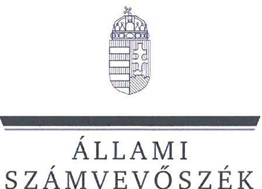

# JELENTÉS 

Az államháztartás központi alrendszerébe tartozó költségvetési szerv által teljesített dologi és felhalmozási célú kiadás szabályszerűségének rapid ellenőrzése
2025.

---

ÁLLAMI
SZÁMVEVŐSZÉK

# JELENTÉS 

Az államháztartás központi alrendszerébe tartozó költségvetési szerv által teljesített dologi és felhalmozási célú kiadás szabályszerűségének rapid ellenőrzése
2025.

---

# ELLENŐRZÉSI IGAZGATÓSÁG: 

## ÁLLAMHÁZTARTÁS KÖZPONTI SZINTJÉT ELLENŐRZŐ IGAZGATÓSÁG

ELLENŐRZÉSI IGAZGATÓ:
SINKÁNÉ DR. CSENDES ÁGNES igazgató

ELLENŐRZÉSVEZETŐ:
PETŐ KRISZTINA ellenőrzésvezető

## IKTATÓSZÁM: EL-3949-106/2025

TÉMASORSZÁM: -
ELLENŐRZÉS-AZONOSÍTÓ SZÁM: V102917

---

# TARTALOMJEGYZÉK 

AZ ELLENŐRZÉS ALAPADATAI ..... 5
MEGÁLLAPÍTÁSOK ÉS KÖVETKEZTETÉSEK ..... 13
JAVASLATOK ..... 17
MELLÉKLETEK ..... 19
I. sz. melléklet: Értelmező szótár ..... 19
II. sz. melléklet: Ellenőrzési kritériumok ..... 20
FÜGGELÉK: ÉSZREVÉTELEK ..... 21
RÖVIDÍTÉSEK JEGYZÉKE ..... 25

---

.

---

# AZ ELLENŐRZÉS ALAPADATAI 

## AZ ELLENŐRZÉS CÉLJA

Az államháztartás központi alrendszerébe tartozó költségvetési szerv által teljesített dologi és felhalmozási célú kiadások egy-egy kiválasztott tételének szabályszerűségi szempontból történő értékelése.

## AZ ELLENŐRZÖTT IDŐSZAK

| SZ. | ELLENŐRZÖTT SZERVEZETEK | DOLOGI   KIADÁSOK   ESETÉREN | FELHALMOZÁSI   CÉLÚ KIADÁSOK   ESETÉREN |
| :--: | :--: | :--: | :--: |
| 1. | Budapesti Jahn Ferenc Dél-pesti Kórház és Rendelőintézet | 2024. július 31. | 2024. április 26. |
| 2. | Ceglédi Toldy Ferenc Kórház és Rendelőintézet | 2024. augusztus 21. | 2024. április 25. |
| 3. | Észak-Pesti Centrumkórház-Honvédkórház | 2024. szeptember 11. | 2024. szeptember 5. |
| 4. | Győr-Moson-Sopron Vármegyei Petz Aladár Egyetemi Oktató   Kórház | 2024. szeptember 4. | 2024. július 22. |
| 5. | Hatvani Albert Schweitzer Kórház-Rendelőintézet | 2024. augusztus 15. | 2024. április 9. |
| 6. | Karcagi Kátai Gábor Kórház | 2024. szeptember 12. | 2024. június 27. |
| 7. | Kistarcsai Flór Ferenc Kórház | 2024. augusztus 9. | 2024. június 28. |
| 8. | Országos Korányi Pulmonológiai Intézet | 2024. szeptember 10. | 2024. április 17. |
| 9. | Soproni Erzsébet Oktató Kórház és Rehabilitációs Intézet | 2024. augusztus 3. | 2024. március 6. |
| 10. | Váci Jávorszky Ödön Kórház | 2024. augusztus 7. | 2024. április 26. |

## AZ ELLENŐRZÉS TÁRGYA

Az államháztartás központi alrendszerébe tartozó költségvetési szerv által teljesített, ellenőrzésre kiválasztott dologi és felhalmozási célú kiadás szabályszerű teljesítése, ezen belül a gazdálkodási jogkörök szabályszerű gyakorlása. Az ellenőrzés kiterjedt minden olyan körülményre és adatra, amely az ÁSZ ${ }^{1}$ jogszabályban meghatározott feladatainak teljesítéséhez, valamint a program végrehajtása folyamán felmerült újabb összefüggések feltárásához szükséges volt.

---

Az ellenőrzés során az ÁSZ

- a Budapesti Jahn Ferenc Dél-pesti Kórház és Rendelőintézet esetében a dologi kiadások körébe tartozó Karbantartási, kisjavítási szolgáltatások; a Ceglédi Toldy Ferenc Kórház és Rendelőintézet, a Hatvani Albert Schweitzer Kórház-Rendelőintézet, a Karcagi Kátai Gábor Kórház, a Kistarcsai Flór Ferenc Kórház, a Váci Jávorszky Ödön Kórház esetében a dologi kiadások körébe tartozó Szakmai tevékenységet segítő szolgáltatások; az Észak-Pesti Centrumkórház-Honvédkórház, a Soproni Erzsébet Oktató Kórház és Rehabilitációs Intézet esetében a dologi kiadások körébe tartozó Szakmai anyagok beszerzése; a Győr-Moson-Sopron Vármegyei Petz Aladár Egyetemi Oktató Kórház esetében a dologi kiadások körébe tartozó Egyéb szolgáltatások; az Országos Korányi Pulmonológiai Intézet esetében a dologi kiadások körébe tartozó Árubeszerzés;
- a Budapesti Jahn Ferenc Dél-pesti Kórház és Rendelőintézet esetében a felhalmozási célú kiadások körébe tartozó Ingatlanok felújítása; a Ceglédi Toldy Ferenc Kórház és Rendelőintézet esetében a felhalmozási célú kiadások körébe tartozó Ingatlanok beszerzése, létesítése; az Észak-Pesti Centrumkórház-Honvédkórház, a Győr-Moson-Sopron Vármegyei Petz Aladár Egyetemi Oktató Kórház, a Hatvani Albert Schweitzer Kórház-Rendelőintézet, a Kistarcsai Flór Ferenc Kórház, az Országos Korányi Pulmonológiai Intézet, a Váci Jávorszky Ödön Kórház esetében a felhalmozási célú kiadások körébe tartozó Egyéb tárgyi eszközök beszerzése, létesítése; a Karcagi Kátai Gábor Kórház, a Soproni Erzsébet Oktató Kórház és Rehabilitációs Intézet esetében a felhalmozási célú kiadások körébe tartozó Egyéb tárgyi eszközök felújítása
rovatokon elszámolt kiadások egy-egy kiválasztott mintatételének megfelelőségét értékelte.

# AZ ELLENŐRZÉS JOGALAPJA 

Az ellenőrzés jogszabályi alapját az ÁSZ tv. ${ }^{2} 1. § (3)$ bekezdés és az 5. § (6) bekezdés előírásai képezték.

## AZ ELLENŐRZÉS MÓDSZERE

Az ellenőrzést az ÁSZ az ellenőrzött időszakban hatályos jogszabályok, az ellenőrzés szakmai szabályai alapján, „Az államháztartás központi alrendszerébe tartozó költségvetési szerv által teljesített dologi kiadás szabályszerűségének rapid ellenőrzése" és „Az államháztartás központi alrendszerébe tartozó költségvetési szerv által teljesített felhalmozási célú kiadás szabályszerűségének rapid ellenőrzése" című ellenőrzési programok (a továbbiakban: ellenőrzési programok) kérdéseire adott válaszok kiértékelésével, az ellenőrzési programokban megjelölt adatforrások figyelembevételével folytatta le. A mintatételek ellenőrzési program szerinti értékelése során további szabálytalanságokat tárt fel az ÁSZ, ezért a szabálytalansághoz tartozó kritériumokkal bővült az ellenőrzés.

Az ellenőrzési kérdések megválaszolásához szükséges bizonyítékok megszerzése az ellenőrzött szervezetek által rendelkezésre bocsátott dokumentumokra és adatokra alapozva, továbbá megfigyelés, szemle (szemrevételezés), kérdésfelvetés (információkérés), valamint elemző eljárás útján történt. Az ellenőrzési bizonyítékként felhasználható adatforrások közé tartoztak egyrészt az ellenőrzéshez kért dokumentumok, adatforrások, másrészt adatforrás volt még minden - az ellenőrzés folyamán - feltárt, az ellenőrzés szempontjából információkat tartalmazó dokumentum.

---

Az ÁSZ az ellenőrzés során a kiválasztott mintatételek ellenőrzési programokban meghatározott szempontok szerinti szabályszerűségét értékelte, így a kötelezettségvállalás és a teljesítésigazolás gazdálkodási jogkörök tekintetében a jogkörgyakorlás szabályszerűségét, a pénzügyi ellenjegyzés és az utalványozás gazdálkodási jogkörök tekintetében ezek megtörténtét és az ellenőrzési kritériumoknak való megfelelőségét.

# Az ELLENŐRZÖTT SZERVEZET 

Az ellenőrzés a Budapesti Jahn Ferenc Dél-pesti Kórház és Rendelőintézet, a Ceglédi Toldy Ferenc Kórház és Rendelőintézet, az Észak-Pesti Centrumkórház-Honvédkórház, a Győr-Moson-Sopron Vármegyei Petz Aladár Egyetemi Oktató Kórház, a Hatvani Albert Schweitzer Kórház-Rendelőintézet, a Karcagi Kátai Gábor Kórház, a Kistarcsai Flór Ferenc Kórház, az Országos Korányi Pulmonológiai Intézet, a Soproni Erzsébet Oktató Kórház és Rehabilitációs Intézet, a Váci Jávorszky Ödön Kórház szervezetekre, mint az államháztartás központi alrendszerébe tartozó költségvetési szervekre terjedt ki.

## Budapesti Jahn Ferenc Dél-pesti Kórház és Rendelőintézet

A Dél-pesti Kórház ${ }^{3}$ alaptevékenysége a járó- és fekvőbetegek diagnosztikus és terápiás szakorvosi ellátása, rehabilitációja és követéses gondozása, ennek keretében fekvőbetegek aktív és krónikus ellátása, rehabilitációja, járóbetegek gyógyító és rehabilitációs szakellátása és egynapos ellátása az egyén gyógykezelése, életveszély elhárítása, a megbetegedés következtében kialakult állapot javítása vagy a további állapotromlás megelőzése céljából. Alaptevékenységébe tartozik egészségüggyel kapcsolatos kutatások végzése, egészségfejlesztő programok végzése, egészségügyi szakmai képzések végzése.

## Budapesti Jahn Ferenc Dél-pesti Kórház és Rendelőintézet főbb adatainak bemutatása

Alapításának éve:
Irányító szerve:
Középirányító szerve:
Gazdasági szervezettel való rendelkezés:

Illetékessége, működési területe:
Általános képviseletét ellátó vezetője:
Vezetői kinevezés kezdete:
2023. évben teljesített bevételek összege:
2023. évben teljesített kiadások összege:

1980.
Belügyminisztérium
Országos Kórházi Főigazgatóság
gazdasági szervezettel nem rendelkezik, a gazdálkodási feladatokat a Dél-pesti
Centrumkórház Országos Hematológiai és Infektológiai Intézet, mint irányító vármegyei intézmény látja el
a 2006. évi CXXXII. törvény ${ }^{4}$ alapján vezetett közhiteles kapacitásnyilvántartásban szereplő ellátási terület
főigazgató
2021.03.01.
$25293,8 \mathrm{MFt}$
$25093,6 \mathrm{M Ft}$

## Ceglédi Toldy Ferenc Kórház és Rendelőintézet

A Ceglédi Kórház ${ }^{5}$ alaptevékenysége a járó- és fekvőbetegek diagnosztikus és terápiás szakorvosi ellátása, rehabilitációja és követéses gondozása, ennek keretében fekvőbetegek krónikus ellátása, rehabilitációja, járóbetegek gyógyító és rehabilitációs szakellátása az egyén gyógykezelése, életveszély elhárítása, a megbetegedés következtében kialakult állapot javítása vagy a további állapotromlás megelőzése céljából. Alaptevékenységébe tartozik a gyógyszer és gyógyászati termék kiskereskedelme, orvostudományi kutatások végzése, szakmai gyakorlati oktatás és felsőfokú szakképzés végzése.

---

# Ceglédi Toldy Ferenc Kórház és Rendelőintézet főbb adatainak bemutatása 

| Alapításának éve: | 2013. |
| :-- | :-- |
| Irányító szerve: | Belügyminisztérium |
| Középirányító szerve: | Országos Kórházi Főigazgatóság |
| Gazdasági szervezettel való rendelkezés: | a gazdasági szervezettel nem rendelkezik, a gazdálkodási feladatokat a Dél-pesti |
|  | Centrumkórház Országos Hematológiai és Infektológiai Intézet, mint |
| Illetékessége, működési területe: | irányító vármegyei intézmény látja el |
| Általános képviseletét ellátó vezetője: | a 2006. évi CXXXII. törvény alapján vezetett közhiteles kapacitás- |
| Vezetői kinevezés kezdete: | nyilvántartásban szereplő ellátási terület |
| 2023. évben teljesített bevételek összege: | főigazgató |
| 2023. évben teljesített kiadások összege: | 2021.01.01. |
|  | 14 255,5 M Ft |
|  | 14 223,6 M Ft |

## Észak-Pesti Centrumkórház-Honvédkórház

A Honvédkórház ${ }^{6}$ alaptevékenysége a járó- és fekvőbetegek diagnosztikus és terápiás szakorvosi ellátása, rehabilitációja és követéses gondozása, ennek keretében fekvőbetegek aktív és krónikus ellátása, rehabilitációja, járóbetegek gyógyító és rehabilitációs szakellátása és egynapos ellátása az egyén gyógykezelése, életveszély elhárítása, a megbetegedés következtében kialakult állapot javítása vagy a további állapotromlás megelőzése céljából. Alaptevékenységébe tartozik a gyógyszer és gyógyászati termék kiskereskedelme, az orvostudományi kutatások végzése, egészségügyi szakmai képzések és továbbképzések végzése, továbbá a védőnői ellátás keretében az egészségmegőrzés, tanácsadás, gondozás, betegségmegelőzés-szűrés, felvilágosítás, egészségnevelés. Feladata továbbá a vonatkozó jogszabályok szerinti igényjogosultak és jogosultak egészségügyi ellátása.

## Észak-Pesti Centrumkórház-Honvédkórház főbb adatainak bemutatása

| Alapításának éve: | 2023. |
| :-- | :-- |
| Irányító szerve: | Belügyminisztérium |
| Középirányító szerve: | Országos Kórházi Főigazgatóság |
| Gazdasági szervezettel való rendelkezés: | gazdasági szervezettel rendelkezik |
| Illetékessége, működési területe: | a 2006. évi CXXXII. törvény alapján vezetett közhiteles kapacitás- |
|  | nyilvántartásban szereplő ellátási terület |
| Általános képviseletét ellátó vezetője: | főigazgató |
| Vezetői kinevezés kezdete: | 2023.01.01. |
| 2023. évben teljesített bevételek összege: | 56 930,5 M Ft |
| 2023. évben teljesített kiadások összege: | 53 845,1 M Ft |

---

# Győr-Moson-Sopron Vármegyei Petz Aladár Egyetemi Oktató Kórház 

A Győri Kórház ${ }^{7}$ alaptevékenysége a járó- és fekvőbetegek diagnosztikus és terápiás szakorvosi ellátása, rehabilitációja és követéses gondozása, ennek keretében fekvőbetegek aktív és krónikus ellátása, rehabilitációja, járóbetegek gyógyító és rehabilitációs szakellátása, valamint egynapos ellátása, egynapos sebészeti ellátás (egynapos beavatkozás), az egyén gyógykezelése, életveszély elhárítása, a megbetegedés következtében kialakult állapot javítása vagy a további állapotromlás megelőzése céljából. Alaptevékenységébe tartozik a gyógyszer és gyógyászati termék kiskereskedelme, egészségüggyel kapcsolatos kutatások végzése, továbbá a védőnői ellátás keretében az egészségmegőrzés, tanácsadás, gondozás, betegségmegelőzés-szűrés, felvilágosítás, egészségnevelés.

## Győr-Moson-Sopron Vármegyei Petz Aladár Egyetemi Oktató Kórház főbb adatainak bemutatása

Alapításának éve:
Irányító szerve:
Középirányító szerve:
Gazdasági szervezettel való rendelkezés:
Illetékessége, működési területe:
Általános képviseletét ellátó vezetője:
Vezetői kinevezés kezdete:
2023. évben teljesített bevételek összege:
2023. évben teljesített kiadások összege:

1979.
Belügyminisztérium
Országos Kórházi Főigazgatóság
gazdasági szervezettel rendelkezik
a 2006. évi CXXXII. törvény alapján vezetett közhiteles kapacitásnyilvántartásban szereplő ellátási terület
főigazgató
2021.01.01.
$44536,4 \mathrm{M Ft}$
$43974,3 \mathrm{M Ft}$

## Hatvani Albert Schweitzer Kórház-Rendelőintézet

A Hatvani Kórház ${ }^{8}$ alaptevékenysége a járó- és fekvőbeteg szakellátás, amely magában foglalja különösen az egyén egészségének megőrzése, a megbetegedések megelőzése, korai felismerése, megállapítása, gyógykezelése, életveszély elhárítása, a megbetegedés következtében kialakult állapot javítása vagy a további állapotromlás megelőzése céljából a beteg vizsgálatára és kezelésére, gondozására, ápolására, egészségügyi rehabilitációjára, a fájdalom és a szenvedés csökkentésére, továbbá a fentiek érdekében a beteg vizsgálati anyagainak feldolgozására irányuló egészségügyi tevékenységeket, halottvizsgálattal és a halottakkal kapcsolatos orvosi eljárásokkal összefüggő tevékenységeket, emberen végzett orvostudományi kutatásokat. Alaptevékenységébe tartozik továbbá a gyógyszer és gyógyászati

 termékek kiskereskedelme.

## HATVANI ALBERT SCHWEITZER KÓRHÁZ-RENDEINTÉZET FŐBB ADATAINAK BEMUTATÁSA

Alapításának éve:
Irányító szerve:
Középirányító szerve:
Gazdasági szervezettel való rendelkezés:
Illetékessége, működési területe:
Általános képviseletét ellátó vezetője:
Vezetői kinevezés kezdete:
2023. évben teljesített bevételek összege:
2023. évben teljesített kiadások összege:

2013.
Belügyminisztérium
Országos Kórházi Főigazgatóság
gazdasági szervezettel nem rendelkezik, a gazdálkodási feladatokat Heves Vármegyei Markhot Ferenc Oktatókórház és Rendelőintézet, mint irányító vármegyei intézmény látja el a 2006. évi CXXXII. törvény alapján vezetett közhiteles kapacitásnyilvántartásban szereplő ellátási terület
főigazgató
2025.01.15.
$10009,9 \mathrm{M} \mathrm{Ft}$
$9993,2 \mathrm{M} \mathrm{Ft}$

---

# KARCAGI KÁTAI GÁBOR KÓRHÁZ 

A Karcagi Kórház ${ }^{9}$ alaptevékenysége a járó- és fekvőbetegek diagnosztikus és terápiás szakorvosi ellátása, rehabilitációja és követéses gondozása, ennek keretében fekvőbetegek aktív és krónikus ellátása, rehabilitációja, járóbetegek gyógyító és rehabilitációs szakellátása és egynapos ellátása, az egyén gyógykezelése, életveszély elhárítása, a megbetegedés következtében kialakult állapot javítása vagy a további állapotromlás megelőzése céljából. Alaptevékenységébe tartozik továbbá a gyógyszer és egyéb gyógyászati termék kiskereskedelme, a gyógyászati segédeszközök és felszerelések kereskedelme.

## KARCAGI KÁTAI GÁBOR KÓRHÁZ FŐBB ADATAINAK BEMUTATÁSA

Alapításának éve:
Irányító szerve:
Középirányító szerve:
Gazdasági szervezettel való rendelkezés:

Illetékessége, működési területe:
Általános képviseletét ellátó vezetője:
Vezetői kinevezés kezdete:
2023. évben teljesített bevételek összege:
2023. évben teljesített kiadások összege:

1980.
Belügyminisztérium
Országos Kórházi Főigazgatóság
gazdasági szervezettel nem rendelkezik, a gazdálkodási feladatokat Jász-Nagykun-Szolnok Vármegyei Hetényi Géza Kórház-Rendelőintézet, mint irányító vármegyei intézmény látja el
a 2006. évi CXXXII. törvény alapján vezetett közhiteles kapacitásnyilvántartásban szereplő ellátási terület
főigazgató
2021.01.01.
$7745,8 \mathrm{M} \mathrm{Ft}$
$7727,7 \mathrm{M} \mathrm{Ft}$

## KISTARCSAI FLÓR FERENC KÓRHÁZ

A Kistarcsai Kórház ${ }^{10}$ alaptevékenysége a járó- és fekvőbetegek diagnosztikus és terápiás szakorvosi ellátása, rehabilitációja és követéses gondozása, ennek keretében fekvőbetegek aktív és krónikus ellátása, rehabilitációja, járóbetegek gyógyító és rehabilitációs szakellátása és egynapos ellátása az egyén gyógykezelése, életveszély elhárítása, a megbetegedés következtében kialakult állapot javítása vagy a további állapotromlás megelőzése céljából. Alaptevékenységébe tartozik továbbá az orvostudományi kutatások végzése, egészségügyi szakmai képzések és továbbképzések végzése.

## KISTARCSAI FLÓR FERENC KÓRHÁZ FŐBB ADATAINAK BEMUTATÁSA

Alapításának éve:
Irányító szerve:
Középirányító szerve:
Gazdasági szervezettel való rendelkezés:
Illetékessége, működési területe:
Általános képviseletét ellátó vezetője:
Vezetői kinevezés kezdete:
2023. évben teljesített bevételek összege:
2023. évben teljesített kiadások összege:

1980.
Belügyminisztérium
Országos Kórházi Főigazgatóság
gazdasági szervezettel rendelkezik
a 2006. évi CXXXII. törvény alapján vezetett közhiteles kapacitásnyilvántartásban szereplő ellátási terület
főigazgató
2021.01.01.
$15703,8 \mathrm{M} \mathrm{Ft}$
$15677,5 \mathrm{M} \mathrm{Ft}$

---

# Országos Korányi Pulmonológiai Intézet 

Az OKPI ${ }^{11}$ alaptevékenysége a légzőszervi fekvő- és járóbetegek ellátása, prevenciós, diagnosztikus, terápiás, rehabilitációs és gondozási tevékenység. Módszertani központként szakmai ajánlásaival támogatja a tüdőgondozók munkáját, prevenciós, diagnosztikai és terápiás tevékenységét. Alaptevékenysége továbbá a légzőszervi betegségek területén szakmai, módszertani, kutatási, továbbképzési, adatgyűjtési és elemzési tevékenység folytatása. Közreműködik az egészségügyi szakképzésben és továbbképzésben, részt vesz az orvostanhallgatók és szakorvosjelöltek gyakorlati képzésében, orvos, gyógytornász és szakdolgozói továbbképzésben. Alaptevékenysége továbbá a gyógyszer és gyógyászati termékek kiskereskedelme.

## Országos Korányi Pulmonológiai Intézet főbb adatainak bemutatása

| Alapításának éve: | 1983. |
| :--: | :--: |
| Irányító szerve: | Belügyminisztérium |
| Középirányító szerve: | Országos Kórházi Főigazgatóság |
| Gazdasági szervezettel való rendelkezés: | gazdasági szervezettel rendelkezik |
| Illetékessége, működési területe: | a 2006. évi CXXXII. törvény alapján vezetett közhiteles kapacitásnyilvántartásban szereplő ellátási terület |
| Általános képviseletét ellátó vezetője: | főigazgató |
| Vezetői kinevezés kezdete: | 2021.01.01. |
| 2023. évben teljesített bevételek összege: | $19829,5 \mathrm{M} \mathrm{Ft}$ |
| 2023. évben teljesített kiadások összege: | $19482,5 \mathrm{M} \mathrm{Ft}$ |

## Soproni Erzsébet Oktató Kórház és Rehabilitációs Intézet

A Soproni Kórház ${ }^{12}$ alaptevékenysége a járó- és fekvőbetegek diagnosztikus és terápiás szakorvosi ellátása, rehabilitációja és követéses gondozása, ennek keretében fekvőbetegek aktív és krónikus ellátása, rehabilitációja, járóbetegek gyógyító és rehabilitációs szakellátása és egynapos ellátása az egyén gyógykezelése, életveszély elhárítása, a megbetegedés következtében kialakult állapot javítása vagy a további állapotromlás megelőzése céljából. Alaptevékenységébe tartozik továbbá a gyógyszer és gyógyászati termék kiskereskedelme, egészségüggyel kapcsolatos kutatások végzése, felsőfokú oktatás és felsőfokú végzettségi szintet nem biztosító képzés végzése.

## Soproni Erzsébet Oktató Kórház és Rehabilitációs Intézet főbb adatainak bemutatása

| Alapításának éve: | 1997. |
| :-- | :-- |
| Irányító szerve: | Belügyminisztérium |
| Középirányító szerve: | Országos Kórházi Főigazgatóság |
| Gazdasági szervezettel való rendelkezés: | gazdasági szervezettel rendelkezik |
| Illetékessége, működési területe: | a 2006. évi CXXXII. törvény alapján vezetett közhiteles kapacitásnyilvántartásban szereplő ellátási terület |
| Általános képviseletét ellátó vezetője: | főigazgató |
| Vezetői kinevezés kezdete: | 2021.01.01. |
| 2023. évben teljesített bevételek összege: | $17194,6 \mathrm{M} \mathrm{Ft}$ |
| 2023. évben teljesített kiadások összege: | $17148,7 \mathrm{M} \mathrm{Ft}$ |

---

# VÁCI JÁVORSZKY ÖDÖN KÓRHÁZ 

A Váci Kórház ${ }^{13}$ alaptevékenysége a járó-és fekvőbetegek diagnosztikus és terápiás szakorvosi ellátása, rehabilitációja, követéses gondozása, ennek keretében fekvőbetegek aktív és krónikus ellátása, rehabilitációja, járóbetegek gyógyító és rehabilitációs szakellátása és egynapos ellátása az egyén gyógykezelése, életveszély elhárítása a megbetegedés következtében kialakult állapot javítása vagy a további állapotromlás megelőzése céljából. Alaptevékenységébe tartozik továbbá a gyógyszer és gyógyászati termék kiskereskedelme, az orvostudományi kutatások végzése, egészségügyi szakmai képzések és továbbképzések végzése.

## VÁCI JÁVORSZKY ÖDÖN KÓRHÁZ FŐBB ADATAINAK BEMUTATÁSA

Alapításának éve:
1980.
Irányító szerve:
Belügyminisztérium
Középirányító szerve:
Országos Kórházi Főigazgatóság
Gazdasági szervezettel való rendelkezés:
gazdasági szervezettel rendelkezik
Illetékessége, működési területe:
a 2006. évi CXXXII. törvény alapján vezetett közhiteles kapacitásnyilvántartásban szereplő ellátási terület
Általános képviseletét ellátó vezetője:
főigazgató
Vezetői kinevezés kezdete:
2021.01.01.
2023. évben teljesített bevételek összege:
$12722,3 \mathrm{M} \mathrm{Ft}$
2023. évben teljesített kiadások összege:
$12712,7 \mathrm{M} \mathrm{Ft}$

---

# MEGÁLLAPÍTÁSOK ÉS KÖVETKEZTETÉSEK 

Az ellenőrzött 10 dologi kiadás teljesítése nyolc esetben az ellenőrzés keretében vizsgált jogszabályi előírásoknak megfelelt. Egy dologi kiadásnál a kötelezettségvállalás és a teljesítésigazolás szabálytalan volt és a pénzügyi ellenjegyzés nem volt megfelelő. További egy dologi kiadásnál a pénzügyi ellenjegyzés nem volt megfelelő. Kettő dologi kiadás esetében nem folytattak le közbeszerzési eljárást. Kettő dologi kiadás esetében nem rendelkeztek a kötelezettségvállalás jóváhagyásáról szóló miniszteri döntéssel.

A Ceglédi Kórháznál, a Dél-pesti Kórháznál, a Győri Kórháznál, a Hatvani Kórháznál, a Karcagi Kórháznál, az OKPI-nél, a Soproni Kórháznál, a Váci Kórháznál az ellenőrzött mintatételek esetében a kötelezettségvállalás és a teljesítésigazolás, valamint a kiadás elszámolása az Áht. ${ }^{14}$, az Ávr. ${ }^{15}$ és az Áhsz. ${ }^{16}$ előírásai szerint szabályszerűen történt, a pénzügyi ellenjegyzés és az utalványozás megfelelő volt:

- Kötelezettséget az Áht.-ben és az Ávr.-ben foglaltakkal összhangban az arra jogosultsággal rendelkező személy vállalt.
- A kötelezettségvállalásra az Áht.-ben foglaltak szerint, a pénzügyi ellenjegyzés után került sor.
- A teljesítésigazoló az Ávr.-ben előírt írásbeli kijelöléssel rendelkezett.
- A teljesítésigazolás során az Ávr.-ben foglaltak szerint ellenőrizhető okmányok alapján ellenőrizték és igazolták a kiadás teljesítésének jogosságát, összegszerűségét, valamint az ellenszolgáltatás teljesítését.
- A teljesítésigazoló a teljesítést az Ávr.-ben foglaltakkal összhangban, az igazolás dátumának és a teljesítés tényére történő utalás megjelölésével, aláírásával igazolta.
- Az utalványozásra az Áht.-ben, valamint az Ávr.-ben foglaltakkal összhangban, a teljesítésigazolást és az érvényesítést követően került sor.
- A kiadás számviteli elszámolása a megfelelő rovaton történt az Áhsz.-ben előírtakkal összhangban.

A Honvédkórháznál az ellenőrzött mintatétel esetében az utalványozás megfelelő volt, a kiadás elszámolása az Áht., az Ávr. és az Áhsz. előírásai szerint szabályszerűen történt. A kötelezettségvállalás és a teljesítésigazolás nem volt szabályszerű, a pénzügyi ellenjegyzés nem volt megfelelő:

- Kötelezettséget az Áht.-ben és az Ávr.-ben foglaltakkal összhangban az arra jogosultsággal rendelkező személy vállalt.
- A kötelezettségvállalás dokumentuma (megrendelés) alapján a kötelezettségvállalásra az Áht. 37. § (1) bekezdésben foglaltak ellenére nem a 2024. június 7-ei pénzügyi ellenjegyzés után került sor, hanem a pénzügyi ellenjegyzéshez képest 3 nappal korábban, 2024. június 4-én.
- A teljesítésigazoló az Ávr.-ben előírt írásbeli kijelöléssel rendelkezett.
- A teljesítésigazolás során az Ávr.-ben foglaltak szerint ellenőrizhető okmányok alapján ellenőrizték és igazolták a kiadás teljesítésének jogosságát, összegszerűségét, valamint az ellenszolgáltatás teljesítését.

---

- A teljesítésigazoló az Ávr. 57. § (3) bekezdésében foglaltak ellenére nem tüntette fel az igazolás dátumát, így nem volt igazolt, hogy az utalványozásra az Áht. 38. § (1) bekezdésében foglaltakkal összhangban a teljesítés igazolását követően került sor.
- Az utalványozásra az Áht.-ben, valamint az Ávr.-ben foglaltakkal összhangban, az érvényesítést követően került sor.
- A kiadás számviteli elszámolása a megfelelő rovaton történt az Áhsz.-ben előírtakkal összhangban.

A Kistarcsai Kórház az ellenőrzött mintatétel esetében a kötelezettségvállalás, a teljesítésigazolás és a kiadás elszámolása az Áht., az Ávr. és az Áhsz. előírásai szerint szabályszerűen történt, az utalványozás megfelelő volt, azonban a pénzügyi ellenjegyzés nem volt megfelelő:

- Kötelezettséget az Áht.-ben és az Ávr.-ben foglaltakkal összhangban az arra jogosultsággal rendelkező személy vállalt.
- A kötelezettségvállalás dokumentuma (közreműködői szerződés) az Ávr. 55. § (1) bekezdésében foglaltak ellenére nem tartalmazta a pénzügyi ellenjegyzés dátumát. A dátum hiányában nem lehetett megítélni, hogy a kötelezettségvállalásra az Áht. 37. § (1) bekezdésében foglalt előírás szerint a pénzügyi ellenjegyzés után került-e sor.
- A teljesítésigazoló az Ávr.-ben előírt írásbeli kijelöléssel rendelkezett.
- A teljesítésigazolás során az Ávr.-ben foglaltak szerint ellenőrizhető okmányok alapján ellenőrizték és igazolták a kiadás teljesítésének jogosságát, összegszerűségét, valamint az ellenszolgáltatás teljesítését.
- A teljesítésigazoló a teljesítést az Ávr.-ben foglaltakkal összhangban, az igazolás dátumának és a teljesítés tényére történő utalás megjelölésével, aláírásával igazolta.
- Az utalványozásra az Áht.-ben, valamint az Ávr.-ben foglaltakkal összhangban, a teljesítésigazolást és az érvényesítést követően került sor.
- A kiadás számviteli elszámolása a megfelelő rovaton történt az Áhsz.-ben előírtakkal összhangban.

# Az ellenőrzés során feltárt szabálytalanság: 

- A Győri Kórház 2019. augusztus 15. napján 1 év határozott időtartamra vállalkozási szerződést kötött mosodai szolgáltatásra, amelyet többször módosított. A vállalkozási szerződés első számú módosítását 2020. augusztus 14-én közbeszerzési eljárás lefolytatása nélkül kötötte meg, ami az ÁSZ értékelése szerint felveti a Kbt. ${ }^{17} 4. \S$ (1) bekezdésében foglaltak megsértésének lehetőségét. Az első számú szerződésmódosítás (keret)összeget nem tartalmazott, annak megkötésekor hatályos Kbt. 17. § (3) bekezdés b) pontja alapján a szolgáltatás becsült értéke négy évnél hosszabb időre kötendő szerződés esetén, amely nem tartalmazza a teljes díjat a havi ellenszolgáltatás negyvennyolcszorosa. Az ÁSZ az előzőekben leírtak alapján figyelemmel a Kbt. 152. § (2) bekezdés b) pontjában szabályozott 5 éves jogvesztő határidőre tekintettel a szolgáltatás becsült értékét az első számú módosítástól, 2020. szeptember 4-től a szerződésre teljesített kifizetések alapján határozta meg. A Közbeszerzési Hatóság honlapján közzétett, 2020. január 1-jétől irányadó közbeszerzési értékhatárok alapján a szerződésben foglalt szolgáltatások értéke a Győri Kórház által megküldött kifizetések ellenőrzés általi összesítése alapján nettó 726360061 Ft elérte és meghaladta az uniós, nettó 238920000 Ft értékhatárt.
A Győri Kórház az ÁSZ tv. 29. § (2) bekezdés szerinti, a jelentéstervezet megállapításaira tett észrevételében arról tájékoztatta az ÁSZ-t, hogy mindent megtesznek annak érdekében, hogy

---

közbeszerzési eljárás eredményeként mosatási szolgáltatásra vonatkozó szerződés jöjjön létre, ezzel az ÁSZ ellenőrzése hasznosult.

- A Honvédkórház 2024. január 17. napjától a folyamatos és zavartalan betegellátás biztosítása érdekében szállítási szerződést kötött laboratóriumi diagnosztikai vegyszer árubeszerzésre közbeszerzési eljárás lefolytatása nélkül, ami az ÁSZ értékelése szerint felveti
 a Kbt. 21. § (1) bekezdésére tekintettel a Kbt. 4. § (1) bekezdésében foglaltak megsértésének lehetőségét. A szerződéskötéskor hatályos Kbt. 17. § (1) bekezdés b) pontja alapján az árubeszerzés becsült értéke, ha a szerződés megszűnésének időpontja az eljárás megindításakor pontosan nem határozható meg, a havi ellenszolgáltatás negyvennyolcszorosa. A szerződés (keret)összeget nem tartalmazott. Az ÁSZ ezért a szerződés becsült értékét a szerződés alapján teljesített, a Honvédkórház által megküldött nettó kifizetések alapján határozta meg. A szerződésben foglalt árubeszerzés értéke, nettó 1287750752 Ft meghaladta a Közbeszerzési Hatóság honlapján közzétett, 2024. január 1-jétől irányadó uniós közbeszerzési értékhatárt (nettó 84609850 Ft).
A Honvédkórház az ÁSZ tv. 29. § (2) bekezdés szerinti, a jelentéstervezet megállapításaira tett észrevételében arról tájékoztatta az ÁSZ-t, hogy saját hatáskörben közbeszerzési eljárás megindításán dolgozik, ezzel az ÁSZ ellenőrzése hasznosult.
- A Honvédkórház és a Karcagi Kórház az Ávr. 52/A. § (5) bekezdés a) pontjában és a (11) bekezdésben előírtak ellenére - a határozatlan időtartamú kötelezettségvállalásra vonatkozóan - nem rendelkeztek a kötelezettségvállalás jóváhagyásáról szóló, az egészségügyi szolgáltatás irányításáért felelős szervet irányító miniszter döntésével.
A Honvédkórház az ÁSZ tv. 29. § (2) bekezdés szerinti, a jelentéstervezet megállapításaira tett észrevételében arról tájékoztatta az ÁSZ-t, hogy a jelentéstervezetben feltárt szabálytalanságok okainak feltárására soron kívüli belső ellenőrzés elrendeléséről intézkedett, ezzel az ÁSZ megállapításai hasznosultak.

Az ellenőrzött 10 felhalmozási célú kiadás teljesítése nyolc esetben az ellenőrzés keretében vizsgált jogszabályi előírásoknak megfelelt. Egy felhalmozási célú kiadás esetében a kötelezettségvállalás nem volt szabályszerű és a pénzügyi ellenjegyzés nem volt megfelelő. Egy felhalmozási célú kiadás tekintetében nem rendelkeztek a kötelezettségvállaláshoz kapcsolódóan az irányítói jogkört gyakorló egészségügyi intézmény előzetes jóváhagyásával.

A Ceglédi Kórháznál, a Dél-pesti Kórháznál, a Honvédkórháznál, a Győri Kórháznál, a Karcagi Kórháznál, a Kistarcsai Kórháznál, az OKPI-nél, a Soproni Kórháznál, a Váci Kórháznál az ellenőrzött mintatételek esetében a kötelezettségvállalás és a teljesítésigazolás, valamint a kiadás elszámolása az Áht., az Ávr. és az Áhsz. előírásai szerint szabályszerűen történt, a pénzügyi ellenjegyzés és az utalványozás megfelelő volt:

- Kötelezettséget az Áht.-ben és az Ávr.-ben foglaltakkal összhangban az arra jogosultsággal rendelkező személy vállalt.
- A kötelezettségvállalásra az Áht.-ben foglaltak szerint, a pénzügyi ellenjegyzés után került sor.
- A teljesítésigazoló az Ávr.-ben előírt írásbeli kijelöléssel rendelkezett.
- A teljesítésigazolás során az Ávr.-ben foglaltak szerint ellenőrizhető okmányok alapján ellenőrizték és igazolták a kiadás teljesítésének jogosságát, összegszerűségét, valamint az ellenszolgáltatás teljesítését.

---

- A teljesítésigazoló a teljesítést az Ávr.-ben foglaltakkal összhangban, az igazolás dátumának és a teljesítés tényére történő utalás megjelölésével, aláírásával igazolta.
- Az utalványozásra az Áht.-ben, valamint az Ávr.-ben foglaltakkal összhangban, a teljesítésigazolást és az érvényesítést követően került sor.
- A kiadás számviteli elszámolása a megfelelő rovaton történt az Áhsz.-ben előírtakkal összhangban.

A Hatvani Kórháznál az ellenőrzött mintatétel esetében a teljesítésigazolás és a kiadás elszámolása az Áht., az Ávr. és az Áhsz. előírásai szerint szabályszerűen történt, az utalványozás megfelelő volt. A kötelezettségvállalás nem volt szabályszerű, a pénzügyi ellenjegyzés nem volt megfelelő:

- Kötelezettséget az Áht.-ben és az Ávr.-ben foglaltakkal összhangban az arra jogosultsággal rendelkező személy vállalt.
- A kötelezettségvállalás dokumentuma (átadás-átvételi jegyzőkönyvben rögzített többletköltség) az Ávr. 50. § (1) bekezdés d) pontjában foglaltak ellenére nem tartalmazta a pénzügyi ellenjegyzés tényét és a pénzügyi ellenjegyző keltezéssel ellátott aláírását, ezáltal nettó 265000 Ft értékű kötelezettségvállalásra - az Áht. 37. § (1) bekezdésben foglaltak ellenére - pénzügyi ellenjegyzés nélkül került sor.
- A teljesítésigazoló az Ávr.-ben előírt írásbeli kijelöléssel rendelkezett.
- A teljesítésigazolás során az Ávr.-ben foglaltak szerint ellenőrizhető okmányok alapján ellenőrizték és igazolták a kiadás teljesítésének jogosságát, összegszerűségét, valamint az ellenszolgáltatás teljesítését.
- A teljesítésigazoló a teljesítést az Ávr.-ben foglaltakkal összhangban, az igazolás dátumának és a teljesítés tényére történő utalás megjelölésével, aláírásával igazolta.
- Az utalványozásra az Áht.-ben, valamint az Ávr.-ben foglaltakkal összhangban, a teljesítésigazolást és az érvényesítést követően került sor.
- A kiadás számviteli elszámolása a megfelelő rovaton történt az Áhsz.-ben előírtakkal összhangban.

# Az ellenőrzés során feltárt szabálytalanság: 

- A Dél-pesti Kórház a kötelezettségvállaláshoz kapcsolódóan az Ávr. 52/A. § (7) bekezdésben előírtak ellenére nem rendelkezett az irányítói jogkört gyakorló egészségügyi intézmény előzetes jóváhagyását igazoló dokumentummal.

---

# JAVASLATOK 

Az ÁSZ tv. 33. § (1) bekezdésében foglaltak értelmében az ellenőrzött szervezet vezetője köteles a jelentésben foglalt megállapításokhoz kapcsolódó intézkedési tervet összeállítani és azt a jelentés kézhezvételétől számított 30 napon belül az ÁSZ részére megküldeni. Amennyiben az ellenőrzött szervezet vezetője nem küldi meg határidőben az intézkedési tervet, vagy továbbra sem elfogadható intézkedési tervet küld, az Állami Számvevőszék elnöke az ÁSZ tv. 33. § (3) bekezdés a) és b) pontjaiban foglaltakat érvényesítheti.

## BUDAPESTI JAHN FERENC DÉL-PESTI KÓRHÁZ ÉS RENDELŐINTÉZET FŐIGAZGATÓJÁNAK

1. A Bkr. ¹⁸ 3. § c) pontjában foglaltak alapján tegyen intézkedéseket azon kontrolltevékenységek kiépítésére és/vagy megfelelő működtetésére, amelyek megelőzik a jelentésben leírt szabálytalanság ismételt előfordulását.

## ÉSZAK-PESTI CENTRUMKÓRHÁZ-HONVÉDKÓRHÁZ FŐIGAZGATÓJÁNAK

1. Kezdeményezzen a Bkr. 31. § (6) bekezdése alapján soron kívüli belső ellenőrzést a jelen ellenőrzés során feltárt szabálytalanságok kialakulása okainak feltárása, továbbá a közbeszerzés elmulasztásával kapcsolatos kockázati tényezők feltárása, illetve a szabálytalanságok megszüntetése érdekében.
2. A Bkr. 3. § c) pontjában foglaltak alapján, valamint az 1. számú javaslat szerinti belső ellenőrzés megállapításait és javaslatait is figyelembe véve tegyen intézkedéseket azon kontrolltevékenységek kiépítésére és/vagy megfelelő működtetésére, amelyek megelőzik a jelentésben leírt szabálytalanságok ismételt előfordulását.

## GYŐR-MOSON-SOPRON VÁRMEGYEI PETZ ALADÁR EGYETEMI OKTATÓ KÓRHÁZ FŐIGAZGATÓJÁNAK

1. Kezdeményezzen a Bkr. 31. § (6) bekezdése alapján soron kívüli belső ellenőrzést a jelen ellenőrzés során feltárt szabálytalanság kialakulása okainak feltárása, továbbá a közbeszerzés elmulasztásával kapcsolatos kockázati tényezők feltárása, illetve a szabálytalanság megszüntetése érdekében.
2. A Bkr. 3. § c) pontjában foglaltak alapján, valamint az 1. számú javaslat szerinti belső ellenőrzés megállapításait és javaslatait is figyelembe véve tegyen intézkedéseket azon kontrolltevékenységek kiépítésére és/vagy megfelelő működtetésére, amelyek megelőzik a jelentésben leírt szabálytalanság ismételt előfordulását.

---

# HATVANI ALBERT SCHWEITZER KÓRHÁZ-RENDELŐINTÉZET FŐIGAZGATÓJÁNAK 

1. A Bkr. 3. § c) pontban foglaltak alapján tegyen intézkedéseket azon kontrolltevékenységek kiépítésére és/vagy megfelelő működtetésére, amelyek megelőzik a jelentésben leírt szabálytalanság ismételt előfordulását.

## KARCAGI KÁTAI GÁBOR KÓRHÁZ FŐIGAZGATÓJÁNAK

1. A Bkr. 3. § c) pontban foglaltak alapján tegyen intézkedéseket azon kontrolltevékenységek kiépítésére és/vagy megfelelő működtetésére, amelyek megelőzik a jelentésben leírt szabálytalanság ismételt előfordulását.

## KISTARCSAI FLÓR FERENC KÓRHÁZ FŐIGAZGATÓJÁNAK

1. A Bkr. 3. § c) pontban foglaltak alapján tegyen intézkedéseket azon kontrolltevékenységek kiépítésére és/vagy megfelelő működtetésére, amelyek megelőzik a jelentésben leírt szabálytalanság ismételt előfordulását.

---

# MELLÉKLETEK 

## I. SZ. MELLÉKLET: ÉRTELMEZŐ SZÓTÁR

kötelezettségvállalás
pénzügyi ellenjegyzés
teljesítésigazolás
utalványozás

A költségvetési szerv által a kiadási előirányzatok és - ha jogszabály lehetővé teszi - a kijelölt lebonyolító szerv számára a Kormány rendeletében meghatározottak szerinti rendelkezésre bocsátott összeg terhére fizetési kötelezettség vállalásáról szóló - így különösen a foglalkoztatásra irányuló jogviszony létesítésére, szerződés megkötésére, költségvetési támogatás biztosítására irányuló - szabályszerűen megtett jognyilatkozat.
Forrás: Áht. 1. § 15. pont
Kötelezettséget vállalni a Kormány rendeletében foglalt kivételekkel csak pénzügyi ellenjegyzés után, a pénzügyi teljesítés esedékességét megelőzően, írásban lehet. A pénzügyi ellenjegyzőnek a Kormány rendeletében foglalt kivételekkel meg kell győződnie arról, hogy a tervezett kifizetési időpontokban a pénzügyi fedezet biztosított, a kötelezettségvállalás nem sérti a gazdálkodásra vonatkozó szabályokat. A pénzügyi ellenjegyzést a kötelezettségvállalás dokumentumán a pénzügyi ellenjegyzés dátumának és a pénzügyi ellenjegyzés tényére történő utalás megjelölésével, az arra jogosult személy aláírásával kell igazolni.
Forrás: Áht. 37. § (1) bekezdés, Ávr. 55. § (1) bekezdés
A teljesítés igazolása során ellenőrizhető okmányok alapján ellenőrizni és igazolni kell a kiadások teljesítésének jogosságát, összegszerűségét, ellenszolgáltatást is magában foglaló kötelezettségvállalás esetében - ha a kifizetés vagy annak egy része az ellenszolgáltatás teljesítését követően esedékes - annak teljesítését. A teljesítést az igazolás dátumának és a teljesítés tényére történő utalás megjelölésével, az arra jogosult személy aláírásával kell igazolni.
Forrás: Ávr. 57. § (1) és (3) bekezdések
A bevételi előirányzatok javára bevételt elszámolni és a kiadási előirányzatok terhére kifizetést elrendelni - a Kormány rendeletében meghatározott kivételekkel - utalványozás alapján lehet. A kiadási előirányzatok terhére történő utalványozásra - a Kormány rendeletében meghatározott kivételekkel - a teljesítés igazolását, és az annak alapján végrehajtott érvényesítést követően kerülhet sor. Forrás: Áht. 38. § (1) bekezdés

---

# II. SZ. MELLÉKLET: ELLENŐRZÉSI KRITÉRIUMOK 

## ELLENŐRZÉSI KRITÉRIUMOK

Az államháztartás központi alrendszerébe tartozó költségvetési szerv által teljesített dologi kiadás szabályszerűségének rapid ellenőrzése

Kötelezettségvállalás

Pénzügyi ellenjegyzés
Teljesítésigazolás

Utalványozás

Kiadások elszámolása

Közbeszerzési eljárás lefolytatása

Kötelezettségvállalás előzetes jóváhagyása

Áht. 36. § (7), 37. §(1) bekezdések
Ávr. 50. § (1) bekezdés d) pont, 52. §(1),(9), 53. §(1), 60. § (3) bekezdések
belső szabályzat
Áht. 37. § (1) bekezdések, Ávr. 55. § (1),(4) bekezdések
Áht. 38. § (1),(2) bekezdések
Ávr. 57. § (1),(3)-(5), 60. §(3) bekezdések
Áht. 38. § (1) bekezdés
Ávr. 59. § (1b),(2) bekezdések, (3) bekezdés g) pont, (4) bekezdés

Áhsz. 40. §(1) bekezdés, 15. melléklet I. pont
Kbt. 4. §(1) bekezdés, 17. §(1) bekezdés b) pont, 17. § (3) bekezdés b) pont, 21. § (1) bekezdés, 152. § (2) bekezdés b) pont

Ávr. 52/A. § (5) bekezdés a) pont, (7) bekezdés, (11) bekezdés

Az államháztartás központi alrendszerébe tartozó költségvetési szerv által teljesített felhalmozási célú kiadás szabályszerűségének rapid ellenőrzése

Kötelezettségvállalás

Pénzügyi ellenjegyzés
Teljesítésigazolás

Utalványozás

Kiadások elszámolása
Kötelezettségvállalás előzetes jóváhagyása

Áht. 36. § (7), 37. §(1) bekezdések
Ávr. 50. §(1) bekezdés d) pont, 52. §(1), (9), 53. §(1), 60. § (3) bekezdések
belső szabályzat
Áht. 37. §(1) bekezdések, Ávr. 55. §(1), (4) bekezdések
Áht. 38. §(1), (2) bekezdések
Ávr. 57. §(1), (3)-(5), 60. §(3) bekezdések
Áht. 38. §(1) bekezdés
Ávr. 59. §(1b), (2) bekezdések, (3) bekezdés g) pont, (4) bekezdés

Áhsz. 40. §(1) bekezdés, 15. melléklet I. pont
Ávr. 52/A. §(7) bekezdés, (11) bekezdés

---

# FÜGGELÉK: ÉSZREVÉTELEK 

A jelentéstervezetet a Számvevőszék 15 napos észrevételezésre megküldte az ellenőrzött szervezet vezetőjének az ÁSZ tv. 29. § (1) bekezdése előírásának megfelelően.

A Ceglédi Toldy Ferenc Kórház és Rendelőintézet, a Hatvani Albert Schweitzer Kórház-Rendelőintézet, a Karcagi Kátai Gábor Kórház, a Kistarcsai Flór Ferenc Kórház, az Országos Korányi Pulmonológiai Intézet, a Soproni Erzsébet Oktató Kórház és Rehabilitációs Intézet, a Váci Jávorszky Ödön Kórház főigazgatói a jelentéstervezet megállapításaira nem tettek észrevételt.
A jelentéstervezet megállapításaira a Budapesti Jahn Ferenc Dél-pesti Kórház és Rendelőintézet, az Észak-Pesti Centrumkórház-Honvédkórház és a Győr-Moson-Sopron Vármegyei Petz Aladár Egyetemi Oktató Kórház főigazgatói tettek észrevételt. A Budapesti Jahn Ferenc Dél-pesti Kórház elfogadott észrevétele alapján az Állami Számvevőszék módosította a jelentést. Az ÁSZ tv. 29. § (3) bekezdésével összhangban az Állami Számvevőszék a Függelékben feltünteti a megállapításokkal kapcsolatban tett, el nem fogadott észrevételeket, és megindokolja, hogy azokat miért nem fogadta el.
Az Észak-Pesti Centrumkórház-Honvédkórház főigazgatójának észrevétele: „2023. január 1-ei időponttól 2023. június 30-ai időpontig
 az ÉPC-HK jogelődje, a Magyar Honvédség Egészségügyi Központ (a továbbiakban: MH EK), mint egészségügyi szolgáltató, fenntartója a Honvédelmi Minisztérium ideiglenesen, a 653/2021. (XI. 30.) Korm. rendelet 9. §-a alapján, kényszerüzemeltetés keretében biztosította az ÉPC-HK részére - többek között - a laborreagenseket is. Az ÉPC-HK a jogelőd MH EK-tól hatályos szerződést nem vett át, és a MH EK a kényszerüzemeltetési időszak alatt nem is indított el a tárgyban új közbeszerzési eljárást az ÉPC-HK részére. A kényszerüzemeltetés alatt, valamint egy ideig az azt követő időszakban az ÉPC-HK nem rendelkezett azokkal a szervezeti adottságokkal, humánerőforrással, amelyek alkalmasak lettek volna lebonyolítani Európai Uniós eljárásrendben egy eredményes közbeszerzési eljárást (pl. összesen 1 fő közbeszerző, de Állami Közbeszerzési Szaktanácsadó (ÁKSZ) végzettségű munkavállaló vagy Felelős Akkreditált Közbeszerzési Szaktanácsadó (FAKSZ) szerződött partner teljes hiánya). Az ÉPC-HK-nak gyakorlatilag a teljes back-office területét önállóan fel kellett építenie, ki kellett alakítania úgy, hogy közben egy centrumkórház elvárásainak megfelelő működést biztosítson. Közbeszerzési referens munkakör pályázata folyamatosan ki volt írva az ÉPC-HK honlapján. Az ÉPC-HK a közbeszerzési eljárás lefolytatásáig megkötött szerződését az Ávr. 52/A. (8) alapján, illetve a szerződéshez füződő kiemelkedően fontos közérdekre alapozva az alapító okiratában is rögzített betegellátás stabil fenntartása érdekében kötötte „laborreagensek beszerzése" tárgyban. Az ÉPC-HK az indításra váró közbeszerzési eljárások előkészítését a költségvetési felügyelő által engedélyezett létszámmal

[^0]
[^0]:    * 29. § (1) Az Állami Számvevőszék az ellenőrzési megállapításait megküldi az ellenőrzött szervezet vezetőjének vagy az általa megbízott személynek, és annak, akinek személyes felelősségét állapította meg.
    (2) Az ellenőrzött szervezet vezetője és a felelősként megjelölt személy az ellenőrzés megállapításaira tizenöt napon belül írásban észrevételt tehet.
    (3) Az Állami Számvevőszék az észrevételre a beérkezésétől számított harminc napon belül írásban válaszol. A figyelembe nem vett észrevételeket köteles a jelentésben feltüntetni, és megindokolni, hogy azokat miért nem fogadta el.

---

megkezdte, azonban a közbeszerzési tervben felsorolt eljárásokat teljes körűen nem sikerült Intézményünknek minden körben eredményesen lefolytatnia.

2024 áprilisában az ÉPC-HK esetében 48 db eljárás volt előkészítési fázisban, azonban még mindig FAKSZ hiányában, mivel folyamatos hirdetésünk ellenére sem sikerült felvenni megfelelő végzettségű szakembert, FAKSZ szerződött partnerhez pedig 2024. áprilisa követően kaptunk engedélyt. Jelenleg 21 db közbeszerzési eljárás van folyamatban, előkészítés alatt. Az ÉPC-HK a 2024-es évben számos olyan fejlesztést eszközölt, melyekkel alkalmassá vált akár az ellenőrzésbe bevont eljárás lebonyolítására is. Ilyen intézkedés többek között a Beszerzési és Közbeszerzési Osztály létszámának a bővítése, illetve FAKSZ alkalmazása megbízási szerződés alapján, 2025. január 1-ei időponttól pedig Felelős Akkreditált Közbeszerzési Szaktanácsadó (FAKSZ) munkavállalóval is rendelkezünk.

Az ÉPC-HK „laborreagensek beszerzése" tárgyban egy 46 részből álló közbeszerzési eljárás megindításán dolgozik, melynek eredményeképpen, várhatóan 2025. I. félévében fog tudni szerződéseket kötni. Az eljárás megindítása saját hatáskörben (nem keretmegállapodásból) történő lebonyolításához szükséges KEF engedélyt jelen levél mellékleteként csatoljuk. Jelen levél intézményünk ÉPCHKGIG/223-2/2024. iktatószámú feljegyzésével együtt értendő, melyet szintén csatolunk. Az elkészített műszaki leírásokat, valamint egyéb közbeszerzési dokumentációkat követően Intézményünk Előzetes Piaci Konzultációt (EPK) indított az Elektronikus Közbeszerzési Rendszerben EKR000184162025 számon, melynek felhívását jelen levelünkhöz csatoljuk."

Az észrevétellel érintett megállapítás: „A Honvédkórház 2024. január 17. napjától a folyamatos és zavartalan betegellátás biztosítása érdekében szállítási szerződést kötött laboratóriumi diagnosztikai vegyszer árubeszerzésre közbeszerzési eljárás lefolytatása nélkül, ami az ÁSZ értékelése szerint felveti a Kbt. 21. § (1) bekezdésére tekintettel a Kbt. 4. § (1) bekezdésében foglaltak megsértésének lehetőségét. A szerződéskötéskor hatályos Kbt. 17. § (1) bekezdés b) pontja alapján az árubeszerzés becsült értéke, ha a szerződés megszünésének időpontja az eljárás megindításakor pontosan nem határozható meg, a havi ellenszolgáltatás negyvennyolcszorosa. A szerződés (keret)összeget nem tartalmazott. Az ÁSZ ezért a szerződés becsült értékét a szerződés alapján teljesített, a Honvédkórház által megküldött nettó kifizetések alapján határozta meg. A szerződésben foglalt árubeszerzés értéke, nettó 1287750752 Ft meghaladta a Közbeszerzési Hatóság honlapján közzétett, 2024. január 1-jétől irányadó uniós közbeszerzési értékhatárt (nettó 84609850 Ft)."

El nem fogadás indoka: Az észrevétel nem vitatta a közbeszerzési eljárás lefolytatása szükségességének a tényét. Az észrevételben ismertetett jelentős szervezeti átalakítás, valamint a közbeszerzési eljárás lebonyolításához szükséges humánerőforrás hiánya nem menti fel az intézményt a közbeszerzési eljárás lefolytatásának kötelezettsége alól. A rendelkezésünkre álló ellenőrzési bizonyítékok és információk alapján a közbeszerzésekről szóló 2015. évi CXLIII. törvény 4. § (1) bekezdésében foglalt, a közbeszerzési eljárás lefolytatására vonatkozó kötelezettség elmulasztására vonatkozó közbeszerzési szabálytalanság továbbra is megállapítható.

Az Észak-Pesti Centrumkórház-Honvédkórház főigazgatójának észrevétele: „A tisztelt Állami Számvevőszék által megküldött, tárgyban jelzett jelentéstervezet megállapításaira vonatkozóan szeretnénk megjegyezni, hogy Intézményünkben minden esetben az ÁHT szabályozásainak megfelelően kialakított, és hatályos Kötelezettségvállalás, Pénzügyi ellenjegyzés, Teljesítésigazolás, Érvényesítés, Utalványozás Szabályzatában (E10114 Jóváhagyva 2023.07.17.) leírtak szerint teljesíti a feladatait, ennek megfelelően a kötelezettségvállalásra a pénzügyi ellenjegyzést követően került sor. A vizsgálatba bevont dokumentumokon is ennek megfelelően történt, viszont ennek dátuma hiányos volt egy megrendelőn. Megjegyezni kívánjuk, hogy a pénzügyi ellenjegyzés dátuma

---

2024. június 7-e volt, a jelentésben szereplő 2024. július 7-vel szemben. Mindemellett tájékoztatni kívánjuk, hogy az ÉPCK-HK-nak - a jogutódlást követően - 2023. decemberétől van lehetősége a Computrend EcoSTAT gazdasági rendszerét használni, ezen rendszer moduljainak átvétele fokozatosan megtörtént, és a Központi Pénzügyi Engedélyező Rendszer (KPER) alkalmazása 2024. október 1-től egy biztosított intézményünk számára is, mely egy olyan általánosan használható és paraméterezhető engedélyező rendszer, ami a pénzügyi bizonylatok engedélyezésének folyamata és mindezek adminisztrációja digitálisan kezelhető fokozott biztonságú hiteles elektronikus aláirással. Tárgyban jelzett jelentéstervezetre vonatkozóan ÉPC-HK/46-1/2025. számon soron kívüli belső ellenőrzés került elrendelésre, melyet jelen levélhez csatolunk."

Az észrevétellel érintett megállapítás: „A kötelezettségvállalás dokumentuma (megrendelés) alapján a kötelezettségvállalásra az Áht. 37. § (1) bekezdésben foglaltak ellenére nem a 2024. július 7-ei pénzügyi ellenjegyzés után került sor, hanem a pénzügyi ellenjegyzéshez képest 3 nappal korábban, 2024. július 4-én."

El nem fogadás indoka: Az észrevételt - amely szerint a kötelezettségvállalás dokumentumán a kötelezettségvállalás időpontja hiányos volt - nem tudjuk elfogadni, tekintettel arra, hogy a kötelezettségvállaló aláírása felett szerepel a 2024. 06. 04-ei dátum. Megjegyezzük, hogy a felhalmozási célú kiadás tekintetében vizsgált mintatételhez kapcsolódó megrendelőn is a kötelezettségvállaló neve felett szerepel a kötelezettségvállalás időpontja, ahol azonban a pénzügyi ellenjegyzés megelőzte a kötelezettségvállalás időpontját. Mind a dologi kiadás, mind a felhalmozási célú kiadás tekintetében vizsgált gazdálkodási jogkörgyakorlás az alkalmazott gyakorlatot tükrözi. Előzőekre tekintettel továbbra is megalapozott az Állami Számvevőszék megállapítása, hogy a kötelezettségvállalásra az államháztartásról szóló 2011. évi CXCV. törvény 37. § (1) bekezdésben foglaltak ellenére nem a 2024. június 7-ei pénzügyi ellenjegyzés után került sor, hanem a pénzügyi ellenjegyzéshez képest 3 nappal korábban, 2024. június 4-én.
Az észrevételben szereplő, a pénzügyi ellenjegyzés dátumára (és ezzel összefüggésben a kötelezettségvállalás aláírásának dátumára) vonatkozó pontosító észrevételét elfogadjuk, valóban július helyett júniusban történtek a gazdálkodási jogkörgyakorlások.
A Győr-Moson-Sopron Vármegyei Petz Aladár Egyetemi Oktató Kórház főigazgatójának észrevétele: „A mosodai szolgáltatás kapcsán nem vitatjuk, hogy a szerződések megkötésére közbeszerzési eljárás lefolytatása nélkül került sor, azonban kérjük szíveskedjenek a jelentéstervezet megállapításai között rögzíteni, hogy a közbeszerzési eljárás lefolytatására a Kórháznak nem volt jogosultsága, mivel arra csak a Büntetés-végrehajtás Országos Parancsnoksága, mint Központi ellátó szerv jogosult.
A büntetés-végrehajtási szervezet részéről a központi államigazgatási szervek és a rendvédelmi szervek irányában fennálló egyes ellátási kötelezettségekről, a termékek és szolgáltatások átadás-átvételének és azok ellentételezésének rendjéről szóló 44/2011. (III. 23.) Korm. rendelet és a büntetés-végrehajtási szervezet részéről a büntetésvégrehajtásért felelős miniszter vezetése, irányítása vagy felügyelete alá tartozó szervek irányában fennálló ellátási kötelezettségről, a fogvatartottak kötelező foglalkoztatása keretében előállított termékekről és szolgáltatásokról, azok átadás-átvételéről és az ellentételezés rendjéről szóló 9/2011. (III. 23.) BM rendelet előírásainak megfelelően a Kórház a Büntetés-végrehajtás Országos Parancsnoksága és a Referencia Mosodák Szolgáltató Zrt. között 2022. július 28-án létrejött keretmegállapodást követően haladéktalanul igénybejelentést nyújtott be a BVOP felé, melyben jelezte csatlakozási szándékát a központi beszerzéshez (ezt megelőzően nem volt lehetőség a csatlakozásra). Több fordulóban történt egyeztetés után 2024. március 5-én sikerült Ellátási megállapodást kötni a BVOP-val, mint központi ellátó szervvel 12 hónap mosási szolgáltatásra vonatkozó közbeszerzési eljárás lefolytatására (az ellátási megállapodást az ellenőrzés során benyújtott dokumentumok közé csatoltuk). Az egyedi szerződések megkötésének előkészítése azonban

---

még folyamatban van, több levélváltás is történt az ügyben a BVOP képviselőivel. A BVOP-tól kapott legutolsó, 2024. október 31-én kelt válasz szerint jelenleg „A Műszaki leírás egyeztetése zajlik, amint elkészül a végleges műszaki leírás valamint az indító dokumentumok küldeni fogjuk Önöknek a teljes anyagot jóváhagyásra" (az erről szóló e-mailt az ellenőrzés során benyújtott dokumentumok közé csatoltuk). Azóta több alkalommal is érdeklődtünk, de nem történt előrelépés az ügyben. Fentiek alapján megállapítható, hogy a Kórház minden tőle telhetőt megtett annak érdekében, hogy közbeszerzési eljárás eredményeként létrejöjjön egy mosatási szolgáltatásra vonatkozó szerződés, azonban ez rajta kívül álló okok miatt nem történt meg. Kérem ezért, hogy a jelentéstervezetben szíveskedjenek rögzíteni, hogy az eljárás lefolytatására a Kórháznak nem volt jogosultsága, illetve kérném, hogy a javaslatokat a jelentéstervezetből törölni szíveskedjenek, mivel nem a Kórház mulasztása vezetett a kialakult helyzethez."

Az észrevétellel érintett megállapítás: „A Győri Kórház 2019. augusztus 15. napján 1 év határozott időtartamra vállalkozási szerződést kötött mosodai szolgáltatásra, amelyet többször módosított. A vállalkozási szerződés első számú módosítását 2020. augusztus 14-én közbeszerzési eljárás lefolytatása nélkül kötötte meg, ami az ÁSZ értékelése szerint felveti a Kbt. 4. § (1) bekezdésében foglaltak megsértésének lehetőségét. Az első számú szerződésmódosítás (keret)összeget nem tartalmazott, annak megkötésekor hatályos Kbt. 17. § (3) bekezdés b) pontja alapján a szolgáltatás becsült értéke négy évnél hosszabb időre kötendő szerződés esetén, amely nem tartalmazza a teljes díjat a havi ellenszolgáltatás negyvennyolcszorosa. Az ÁSZ az előzőekben leírtak alapján figyelemmel a Kbt. 152. § (2) bekezdés b) pontjában szabályozott 5 éves jogvesztő határidőre tekintettel a szolgáltatás becsült értékét az első számú módosítástól, 2020. szeptember 4-től a szerződésre teljesített kifizetések alapján határozta meg. A Közbeszerzési Hatóság honlapján közzétett, 2020. január 1-jétől irányadó közbeszerzési értékhatárok alapján a szerződésben foglalt szolgáltatások értéke a Győri Kórház által megküldött kifizetések ellenőrzés általi összesítése alapján nettó 726360061 Ft elérte és meghaladta az uniós, nettó 238920000 Ft értékhatárt."

El nem fogadás indoka: Az észrevétel nem vitatta, hogy a szerződések megkötésére közbeszerzési eljárás lefolytatása nélkül került sor. Az észrevételben jelezték, hogy a közbeszerzési eljárás lefolytatására a kórháznak nem volt jogosultsága, mivel arra csak a Büntetés-végrehajtás Országos Parancsnoksága, mint Központi Ellátó Szerv jogosult.

A kórház a büntetés-végrehajtási szervezet részéről a büntetés-végrehajtásért felelős miniszter vezetése,
 irányítása vagy felügyelete alá tartozó szervek irányában fennálló ellátási kötelezettségről, a fogvatartottak kötelező foglalkoztatása keretében előállított termékekről és szolgáltatásokról, azok átadás-átvételéről és az ellentételezés rendjéről szóló 9/2011. (III. 23.) BM rendelet 1. számú mellékletében feltüntetett szolgáltatási körre 2018. november 26-án kezdeményezte a Központi Ellátó Szervnél a mosodai szolgáltatásra irányuló közbeszerzési eljárás lefolyatását, valamint a szolgáltatás tekintetében igénybejelentést nyújtott be a Központi Ellátó Szerv felé, amelyben jelezte csatlakozási szándékát a központi beszerzés alapján megkötött keretmegállapodáshoz a büntetés-végrehajtási szervezet részéről a központi államigazgatási szervek és a rendvédelmi szervek irányában fennálló egyes ellátási kötelezettségekről, a termékek és szolgáltatások átadás-átvételének és azok ellentételezésének rendjéről szóló 44/2011. (III. 23.) Korm. rendelet 6. § (3) bekezdésében előírtak szerint.

Mindezek azonban nem mentik fel a kórházat a közbeszerzési eljárás lefolytatásának kötelezettsége alól. A rendelkezésünkre álló ellenőrzési bizonyítékok és információk alapján a közbeszerzésekről szóló 2015. évi CXLIII. törvény 4. § (1) bekezdésében foglalt, a közbeszerzési eljárás lefolytatására vonatkozó kötelezettség elmulasztására vonatkozó közbeszerzési szabálytalanság továbbra is megállapítható.

---

# RÖVIDÍTÉSEK JEGYZÉKE 

${ }^{1}$ ÁSZ
${ }^{2}$ ÁSZ tv.
${ }^{3}$ Dél-pesti Kórház
${ }^{4}$ 2006. évi CXXXII. tv.
${ }^{5}$ Ceglédi Kórház
${ }^{6}$ Honvédkórház
${ }^{7}$ Győri Kórház
${ }^{8}$ Hatvani Kórház
${ }^{9}$ Karcagi Kórház
${ }^{10}$ Kistarcsai Kórház
${ }^{11}$ OKPI
${ }^{12}$ Soproni Kórház
${ }^{13}$ Váci Kórház
${ }^{14}$ Áht.
${ }^{15}$ Ávr.
${ }^{16}$ Áhsz.
${ }^{17}$ Kbt.
${ }^{18}$ Bkr.

Állami Számvevőszék
2011. évi LXVI. törvény az Állami Számvevőszékről

Budapesti Jahn Ferenc Dél-pesti Kórház és Rendelőintézet
2006. évi CXXXII. törvény az egészségügyi ellátórendszer fejlesztéséről

Ceglédi Toldy Ferenc Kórház és Rendelőintézet
Észak-Pesti Centrumkórház-Honvédkórház
Győr-Moson-Sopron Vármegyei Petz Aladár Egyetemi Oktató Kórház
Hatvani Albert Schweitzer Kórház-Rendelőintézet
Karcagi Kátai Gábor Kórház
Kistarcsai Flór Ferenc Kórház
Országos Korányi Pulmonológiai Intézet
Soproni Erzsébet Oktató Kórház és Rehabilitációs Intézet
Váci Jávorszky Ödön Kórház
2011. évi CXCV. törvény az államháztartásról

368/2011. (XII. 31.) Korm. rendelet az államháztartásról szóló törvény végrehajtásáról
4/2013. (I. 11.) Korm. rendelet az államháztartás számviteléről
2015. évi CXLIII. törvény a közbeszerzésekről

370/2011. (XII. 31.) Korm. rendelet a költségvetési szervek belső kontrollrendszeréről és belső ellenőrzéséről

---

1052 Budapest, Apáczai Csere János u. 10. | 1364 Budapest 4., Pf. 54
www.asz.hu | szamvevoszek@asz.hu
telefon: +36 14849100
