# JELENTÉS 

Egyházi fenntartású kórházak közfeladat ellátással kapcsolatos támogatásai felhasználásának ellenőrzése és az államháztartásból nem hitéleti célra nyújtott támogatások vonatkozásában a pénzügyi és ellátási tevékenységének, adósságállomány alakulásának elemzése

Szent Damján Görögkatolikus Kórház

2025.

---

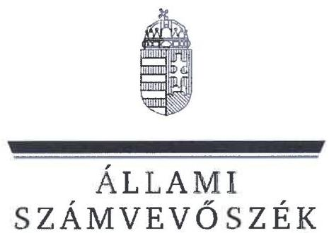

ÁLLAMI
SZÁMVEVÔSZÉK

# JELENTÉS 

Egyházi fenntartású kórházak közfeladat ellátással kapcsolatos támogatásai felhasználásának ellenőrzése és az államháztartásból nem hitéleti célra nyújtott támogatások vonatkozásában a pénzügyi és ellátási tevékenységének, adósságállomány alakulásának elemzése

Szent Damján Görögkatolikus Kórház

2025.

25034
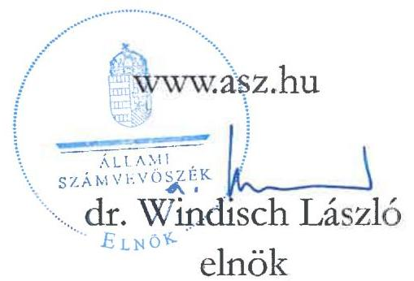

---

# ELLENŐRZÉSI IGAZGATÓSÁG: 

## ELLENŐRZÉSI IGAZGATÓSÁG V.

## ELLENŐRZÉSI IGAZGATÓ:

KLINGA LÁSZLÓ ellenőrzési igazgató

## ELLENŐRZÉSVEZETŐ:

VARGA EDIT ellenőrzési igazgatóhelyettes, ellenőrzésvezető

Jelentéseink az interneten a www.asz.hu címen olvashatók.

IKTATÓSZÁM: EL-4090-002/2025.
TÉMASORSZÁM: 24.
ELLENŐRZÉS-AZONOSÍTÓ SZÁM: V1108

---

# TARTALOMJEGYZÉK 

AZ ELLENŐRZÉS ALAPADATAI ..... 5
AZ ELLENŐRZÉS HATÓKÖRE ÉS TERÜLETE ..... 7
ÖSSZEFOGLALÁS ..... 9
AZ ELLENŐRZÉS FÓKUSZTERÜLETEI ..... 11
MEGÁLLAPÍTÁSOK ..... 12
JAVASLATOK ..... 17
ELEMZÉS A SZENT DAMJÁN GÖRÖGKATOLIKUS KÓRHÁZ PÉNZÜGYI ÉS ELLÁTÁSI TEVÉKENYSÉGÉNEK, ADÓSSÁGÁLLOMÁNYÁNAK ALAKULÁSÁRÓL AZ ÁLLAM-HÁZTARTÁSBÓL NEM HITÉLETI CÉLRA NYÚJTOTT TÁMOGATÁSOK VONATKOZÁSÁBAN ..... 18
ELEMZÉS ..... 23
MELLÉKLETEK ..... 49
I. sz. melléklet: Értelmező szótár ..... 49
II. sz. melléklet: Az ellenőrzött szervezetek jegyzéke ..... 54
III. sz. melléklet: Ellenőrzési kritériumok ..... 55
IV. sz. melléklet: a Kórház főbb működési jellemzői az összes elemzett kórházhoz viszonyítottan ..... 56
FÜGGELÉK: ÉSZREVÉTELEK ..... 59
RÖVIDÍTÉSEK JEGYZÉKE ..... 60

---

.

---

# AZ ELLENŐRZÉS ALAPADATAI 

## AZ ELLENŐRZÉS CÉLJA

Az ellenőrzés célja a Magyarországon egyházi fenntartásban működő aktív fekvőbeteg-szakellátást is végző kórházak esetében annak értékelése volt, hogy az államháztartásból nem hitéleti célra nyújtott támogatások vonatkozásában a támogatás felhasználásának szabályozási környezetét szabályszerűen alakították-e ki. Értékeltük továbbá a könyvvezetési és beszámoló készítési és közzétételi kötelezettség teljesítésének szabályszerűségét, belső szabályzatoknak való megfelelését, továbbá az államháztartásból kapott, nem hitéleti célú támogatások felhasználásának és elszámolásának szabályszerűségét, a felhasználás támogatás céljának való megfelelését.

Ellenőrzési cél volt továbbá annak megállapítása, hogy az egyház (mint a közfeladatot ellátó intézmény fenntartója) a jogszabályi előírásoknak és belső szabályzatainak megfelelően gondoskodott-e a kórházzal kapcsolatos fenntartói kötelezettségei teljesítéséről.

## AZ ELLENŐRZÉS TÍPUSA

Törvényességi ellenőrzés

## AZ ELLENŐRZŐTT IDŐSZAK

A 2023. év

## AZ ELLENŐRZÉS TÁRGYA

Az ellenőrzés tárgyát képezte - az államháztartásból nem hitételi célra nyújtott támogatások vonatkozásban - a Magyarországon egyházi fenntartásban működő aktív fekvőbeteg-szakellátást is végző kórházak tekintetében a 2023. évre vonatkozóan a számviteli szabályozási keretek kialakításának, a könyvvezetési és beszámoló készítési és közzétételi kötelezettség teljesítésének szabályszerűsége és belső szabályzatoknak való megfelelése. Az ellenőrzés kiterjedt a kórházak esetében az államháztartásból nem hitéleti célra nyújtott támogatás tekintetében a támogatás-felhasználás célhoz kötöttségének ellenőrzésére is.

Az egyház, mint fenntartó tekintetében az ellenőrzés tárgyát képezte a kórházzal kapcsolatos fenntartói tevékenység szabályszerűségének értékelésére figyelemmel a kórházat megillető államháztartási forrásból nem hitéleti célra nyújtott támogatások kezelése/átadása.

Az ellenőrzés kiterjedt minden olyan körülményre és adatra, amely az ÁSZ jogszabályban meghatározott feladatainak teljesítéséhez, valamint a program végrehajtása folyamán felmerült újabb összefüggések feltárásához szükséges volt.

---

# Az ellenőrzés jogsalapja 

Az ellenőrzés jogszabályi alapját az ÁSZ tv. ${ }^{1} 1 . \int$ (3) bekezdés, az 5. $\$ (11) bekezdés c) pont, (13) bekezdés és az Ehtv. ${ }^{2}$ 19/D. $\int$ (2) bekezdés előírásai képezték.

## AZ ELLENŐRZÉS MÓDSZERE

Az ellenőrzést a nemzetközi standardokat irányadónak tekintve az ellenőrzési program szempontjai, az ellenőrzött időszakban hatályos jogszabályok, az ÁSZ ${ }^{3}$ ellenőrzés-szakmai szabályok és irányadó módszertanok figyelembevételével végezte az ÁSZ.

Az ellenőrzési kérdések megválaszolásához szükséges bizonyítékok megszerzése az ellenőrzött szervezetek által rendelkezésre bocsátott dokumentumokra és adatokra alapozva megfigyelés, helyszíni szemle (szemrevételezés), kérdésfeltevés (információkérés), illetve mintavételezés útján történt. Kockázati alapon kiválasztott mintatételeken keresztül történt a kórházak esetében az államháztartásból nem hitéleti célra nyújtott támogatások felhasználása, számviteli elszámolása szabályszerűségének ellenőrzése, az egyházi fenntartóknál pedig a fenntartón keresztül folyósított - kórházat megillető - támogatások kezelése (intézmény részére történő átadás, elszámolás) szabályszerűségének ellenőrzése. A mintatételek kiértékelése nem került a sokaságra kivetítésre, az ellenőrzött támogatásokra vonatkozó összegző és részletes következtetések az adott területhez kapcsolódó értékelésben kerültek megjelenítésre.

Az ellenőrzés lefolytatásához az ellenőrzött szervezetek a tanúsítványok kitöltésével, valamint az ellenőrzött és az ellenőrzést támogató szervezetek az ÁSZ által kért dokumentumok, adatok, információk megküldésével szolgáltattak adatokat.

Az ellenőrzési bizonyítékként felhasználható adatforrások közé tartoztak egyrészt az ellenőrzéshez kért dokumentumok, adatforrások, másrészt adatforrás volt még minden - az ellenőrzés folyamán - az ellenőrzés szempontjából információkat tartalmazó dokumentum.

---

# AZ ELLENŐRZÉS HATÓKÖRE ÉS TERÜLETE 

Az ÁSZ tv. 5. § (11) bekezdés c) pontja értelmében az ÁSZ törvényességi szempontok szerint ellenőrzi a vallási egyesületek, az egyházi jogi személyek vagy azok nevelési-oktatási, felsőoktatási, egészségügyi, karitatív, szociális, család-, gyermek- és ifjúságvédelmi, kulturális vagy sporttevékenység végzésére létrehozott, a jogi személyiséggel rendelkező vallási közösség belső szabálya szerint jogi személyiséggel nem rendelkező intézménye részére az államháztartásból nem hitéleti célra nyújtott támogatás felhasználását.

Az ellenőrzés kiterjedt arra, hogy az egyházi fenntartó a jogszabályi előírásoknak és belső szabályzatainak megfelelően gondoskodott-e a nem hitéleti célra nyújtott támogatások felhasználása során az általa fenntartott aktív fekvőbeteg-szakellátást is végző kórházzal kapcsolatos fenntartói kötelezettségei teljesítéséről, ami magában foglalta az intézmény könyvvezetési és beszámolókészítési kötelezettsége megállapításának-, a szervezet jogi személyiségének megfelelő besorolásának-, a kórház részére a fenntartón keresztül folyósított, államháztartásból nem hitéleti célra nyújtott támogatások könyvvezetési rendszerében történő elszámolásának-, átadásának ellenőrzését.

A kórház múködési keretei kialakításának szabályszerűségére vonatkozó ellenőrzés az államháztartásból nem hitéleti célra nyújtott támogatások felhasználásának belső szabályozási környezete kialakításának szabályszerűségére terjedt ki. Az ellenőrzés és értékelés a beszámolót alátámasztó számviteli nyilvántartási rendszer kialakításának és múködésének szabályozottságára; az elkülönített kimutatások szabályozottságára továbbá a beszámoló közzététele módjának meghatározására vonatkozott.

A beszámolási és közzétételi kötelezettség teljesítésének szabályszerűsége keretében értékelésre került, hogy a kórház a jogszabályi előírásoknak és belső szabályzataiban meghatározottaknak megfelelően eleget tette beszámolási kötelezettségének, gondoskodott-e a beszámoló közzétételéről, amennyiben számviteli politikájában meghatározta a közzététel módját. Ellenőrzésre került, hogy az államháztartási forrásból származó, nem hitéleti célú támogatást felhasználó kórház számviteli beszámolójának mérlegtételeit a Számv. tv. ${ }^{4}$ előírása szerinti leltárral alátámasztotta-e, továbbá, hogy gondoskodott-e a közfeladatellátással kapcsolatos közérdekű vagy közérdekből nyilvános adatok közzétételéről.

A könyvvezetési kötelezettség teljesítésének ellenőrzése keretében értékelésre került, hogy a kórház be-tartotta-e a jogszabályi és vonatkozó belső szabályozások előírásait, továbbá a bizonylatolásra vonatkozó előírások, a kiadási tételek besorolását. Az ellenőrzés kiterjedt arra, hogy a kórház a könyvvezetési rendszerében biztosította-e az alaptevékenységből és vállalkozási tevékenységből származó bevételeinek, költségeinek és ráfordításainak elkülönített kimutatását, hogy a kapott támogatásokat bevételként elszámolta-e, az államháztartából nem hitéleti célra folyósított támogatások felhasználása a támogatási célnak megfelelő és szabályszerű volt-e.

A 2023. évben Magyarországon múködő kilenc egyházi fenntartású fekvőbeteg-szakellátást végző intézményből a V1108 ellenőrzés-azonosító számú ellenőrzés keretében öt aktív fekvőbeteg-szakellátást is végző intézmény került ellenőrzésre. Közülük jelen ÁSZ jelentés a Szent Damján Görögkatolikus Kórház, és fenntartójaként a Magyarországi Sajátjogú Metropolitai Egyház, mint ellenőrzött szervezetek ellenőrzéséről készült.

---

# SZENT DAMJÁN GÖRÖGKATOLIKUS KÖRHÁZ 

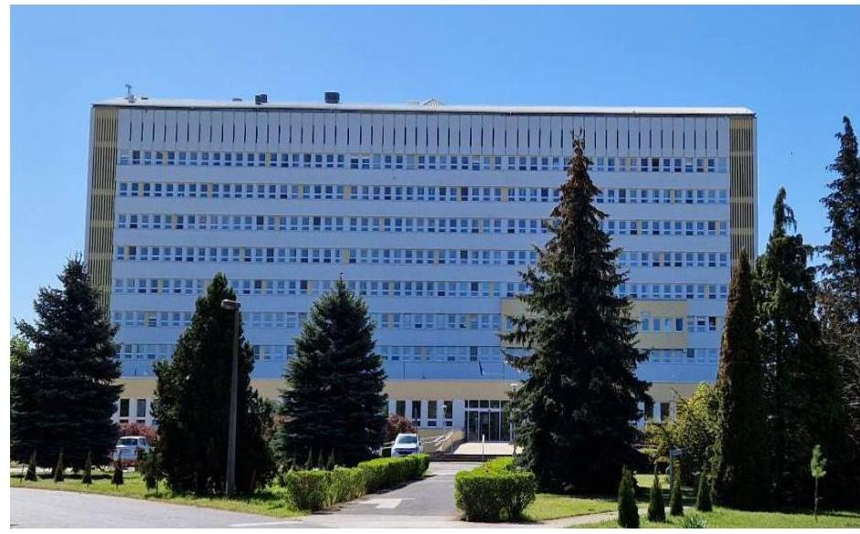

Az 1975. november 4-én átadott Kórház ${ }^{5}$ Kisvárdai Városi Kórház néven kezdte meg múködését. A 1216/2021. (IV.29.) Korm. határozat ${ }^{6}$ alapján a Szent Damján Görögkatolikus Kórházat a Magyarországi Sajátjogú Metropolitai Egyház (MSME ${ }^{7}$ ) alapította 2021. június 4. napján. A Kórház a fenntartóváltást megelőzően Felső-Szabolcsi Kórház néven múködött, ami 2021. július 10. napján - mint költségvetési szerv - megszűnt.

A Kórház a hatályos Alapító okiratában ${ }^{8}$ meghatározottak szerint az Ehtv. 10. §-a szerinti egyházi jogi személy, továbbá az Eütv. ${ }^{9} 3 . \S$ ga) pontja szerinti egészségügyi intézmény volt az ellenőrzött időszakban. Közfeladata „a területi ellátási kötelezettséggel müködő egészségügyi intézményre vonatkozó jogszabályokban elöirt feladatok ellátása, igy különösen az ellátási területén a járó- és fekvöbetegek diagnosztikus és teräpiás szakorvosi ellátása, rehabilitációja és követéses gondozása, valamint a fekvöbetegek aktív és krónikus ellátása, rehabilitációja, járóbetegek gyógyító és rehabilitációs szakellátása, az egyén gyógykezelése, életveszély elbárítása, a megbetegedések következtében kialakult állapot javitása vagy a további állapotromlás megakadályozása, megelőzése" volt. A Kórház feladatkörébe tartozott többek között orvos- és nővérszálló, valamint hozzátartozói szállás fenntartása és üzemeltetése, valamint a feladatellátásához szükséges tárgyi és személyi feltételek biztosítása is. Az MSME, mint fenntartó és a Kórház célja minőségi egészségügyi szolgáltatás biztosítása az ellátási terület lakói számára, a kórházhoz forduló betegek meggyógyítása, egészségük megőrzése, egészségromlásuk megelőzése.

A Kórház az MSME által jóváhagyott költségvetés keretén belül önállóan gazdálkodott. A Kórház 2023. évben végzett vállalkozási tevékenységet (vegyesbolti áruértékesítés, vendégétkeztetés, helyiség- és ingatlan bérbeadás, energiaszolgáltatás, mosodai és sterilizálási szolgáltatás) amely az összes bevételén belül elenyésző nagyságrendet képviselt. A Kórház 2023. évi eredménykimutatása szerint bevételeinek föösszege 11,5 Mrd Ft, ráfordításainak összege pedig 10,9 Mrd Ft volt. A feladatellátás gazdasági és pénzügyi feltételeinek javulását jelezte, hogy a Kórház tevékenységének eredményét a 2022. évhez viszonyítva a 2023. évben megkétszerezte. A 2021. július 1-étől egyházi fenntartásban múködő Kórház pénzügyi, likviditási helyzete stabil volt. A Kórház a 2023. évben egészségügyi feladataihoz 9,2 Mrd Ft NEAK ${ }^{10}$ finanszírozásban részesült, a pályázat, vagy egyedi döntés alapján elnyert négy támogatás együttes összege 1,3 Mrd Ft, a projekttámogatások összege 0,6 Mrd Ft volt.

## MAGYARORSZÁGI SAJÁTJOGÚ METROPOLITAI EGYHÁZ

2015. március 20-ától a Hajdúdorogi főegyházmegye a Miskolci egyházmegyével és a Nyíregyházi egyházmegyével együtt alkotja az MSME-t. Az MSME az Ehtv. szerinti bevett egyház, a Magyar Katolikus Egyház belső egyházi jogi személye. Az MSME az általa alapított, önálló jogi személyiséggel rendelkező Kórházat (belső egyházi jogi személy) egyházi fenntartóként működteti.

---

# ÖSSZEFOGLALÁS 

Magyarország Alaptörvényének ${ }^{11}$ XX. cikke szerint mindenkinek joga van a testi és lelki egészséghez, melynek érvényesülését Magyarország többek között az egészségügyi ellátás megszervezésével segíti elő. Az Ehtv. előírása szerint „a jogi személyiséggel rendelkező vallási közösség részt vállalhat a társadalom értékteremtő szolgálatában, ennek érdekében önmaga vagy e célra létrehozott intézménye útján olyan közcélú tevékenységet is elláthat, amelyet törvény nem tart fenn kizárólagosan az állam vagy annak intézménye számára". A közcélú tevékenység ellátásához az állam az Ehtv. 19. § (1)-(2) bekezdése szerint költségvetési támogatást nyújt. 1. ábra
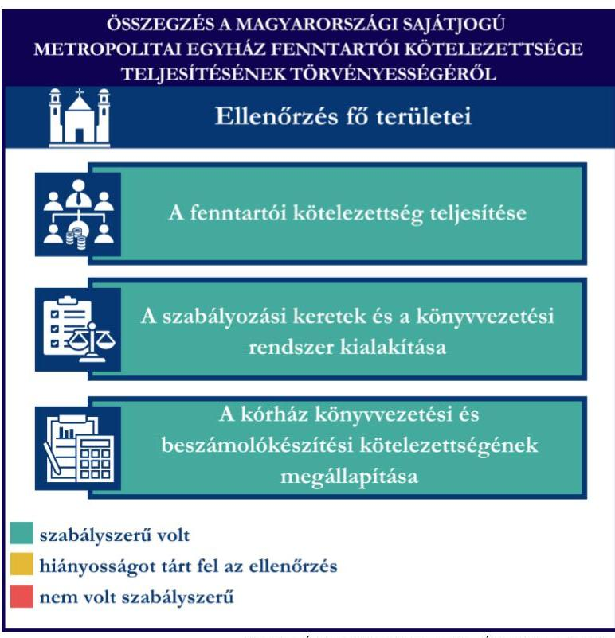

A fenntartói kötelezettség teljesítése

A szabályozási keretek és a könyvvezetési rendszer kialakítása

A kórház könyvvezetési és beszámolókészítési kötelezettségének megállapítása
szabályszerü volt
hiányosságot tárt fel az ellenőrzés
nem volt szabályszerü
Fonrás: ASZ megállapítások alapján ASZ saját szerkesztés

Az MSME, mint fenntartó a Kórház könyvvezetési és beszámolókészítési kötelezettségét a jogszabályi előírásnak megfelelően meghatározta.

Az MSME szabályozási kereteinek és könyvvezetési rendszerének kialakítása - az államháztartásból nem hitéleti célra nyújtott támogatások tekintetében - szabályszerű volt. Az MSME jogszabályban előírt, a szabályszerű gazdálkodás feltételeit meghatározó belső szabályzatokkal rendelkezett.

A támogatások számviteli nyilvántartásával és elszámolásával kapcsolatos belső előírásokat önálló szabályzatban határozta meg.

Az MSME vállalkozási tevékenységet nem végző egyházi jogi személyként a számviteli politikában a jogszabályi előírásoknak megfelelően meghatározta a beszámoló formáját és tartalmát, továbbá az egyszerűsített éves beszámoló alátámasztása érdekében kettős könyvvitel vezetéséről rendelkezett.

Az ellenőrzés a Kórház számviteli szabályozási környezete kialakítása tekintetében hiányosságokat tárt fel. A Kórház a jogszabályban előírt, a gazdálkodás kereteit meghatározó belső szabályzatokkal rendelkezett, azonban tartalmuk nem felelt meg teljeskörűen a jogszabályi előírásoknak. A jogszabályi előírás ellenére a számlarend nem tartalmazta valamennyi alkalmazásra kijelölt számla számjelét és elnevezését, továbbá a beszámolókészítésre vonatkozó belső szabályozás nem vette figyelembe teljeskörűen az egyházi jogi személyek beszámolókészítési és könyvvezetési kötelezettségére vonatkozó sajátos jogszabályi előírásokat, mivel nem rendelte el az eredménykimutatásban az alap- és vállalkozási tevékenység adózott eredményének elkülönített kimutatását, valamint az egyéb bevételeken belül a támogatások részletező bemutatását.

---

2. álme
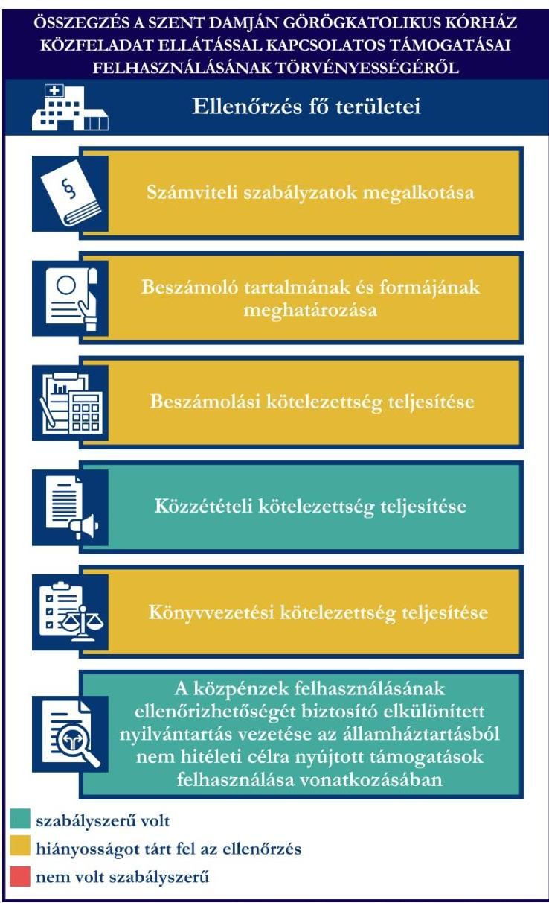

A Kórház a számviteli politikájában a Számv. tv. szerinti éves beszámoló készítését, annak alátámasztására kettős könyvvitel vezetését írta elő, a 2023. évi éves beszámolóját ennek megfelelően készítette el. A 2023. évi éves beszámoló tartalmában azonban nem felelt meg teljeskörűen az egyházi jogi személyek beszámolási kötelezettségét meghatározó jogszabályi előírásoknak, mivel az eredménykimutatás nem tartalmazta az alaptevékenység és vállalkozási tevékenység adózott eredményének elkülönített kimutatását, továbbá az egyéb bevételeken belül a támogatások jogszabályi előírás szerinti bemutatását.

A Kórház közzétételi kötelezettségének a jogszabályi és belső szabályozási előírásának megfelelően eleget tett. 2023. évi éves beszámolóját a számviteli politikában rögzített szabályozásnak megfelelően honlapján közzétette. A jogszabályi előírásoknak megfelelően gondoskodott az egészségügyi közfeladatellátással összefüggő közérdekủ és közérdekből nyilvános adatok közzétételéről.

A Kórház könyvvezetési kötelezettségének teljesítése nem felelt meg teljeskörűen a jogszabályi előírásoknak, az alaptevékenység és vállalkozási tevékenység bevételei, költségei és ráfordításai elkülönítéseinek elmaradása miatt

A Kórház a 2023. évben a támogatások felhasználásáról a közpénzek felhasználásának ellenőrizhetőségét biztosító elkülönített nyilvántartást vezetett. Az államháztartásból nem hitéleti célra nyújtott támogatások felhasználása az ellenőrzött mintatételek esetében a támogatói okiratban és a mellékletét képező költségtervben meghatározott célnak és jogcímeknek megfelelő és szabályszerű volt a Kórháznál.

---

# AZ ELLENŐRZÉS FÓKUSZTERÜLETEI 

1. Az egyház fenntartói kötelezettsége teljesítésének szabályszerűsége
2. A kórház müködési keretei kialakításának szabályszerűsége az államháztartásból nem hitéleti célra nyújtott támogatások vonatkozásában
3. A kórház beszámolási és közzétételi kötelezettsége teljesítésének szabályszerűsége az államháztartásból nem hitéleti célra nyújtott támogatások vonatkozásában
4. A kórház könyvvezetési kötelezettsége teljesítésének, az államháztartásból nem hitéleti célra nyújtott támogatások felhasználásának és elszámolásának szabályszerűsége

---

# 1. Az egyház fenntartói kötelezettsége teljesítésének szabályszerűsége 

Összegző megállapítás Az MSME Kórházzal kapcsolatos fenntartói kötelezettségeinek teljesítése megfelelt a jogszabályi előírásoknak. Az MSME szabályozási kereteinek és könyvvezetési rendszerének kialakítása, az államháztartásból nem hitéleti célra nyújtott támogatások vonatkozásában megfelelt a jogszabályi előírásoknak.

Az MSME Kórházzal, mint egészségügyi intézménnyel kapcsolatos fenntartói kötelezettsége teljesítésére vonatkozó megállapítások:
Az MSME, mint a Kórház alapítója és fenntartója, gondoskodott az intézmény Alapító okiratának elfogadásáról. A 2023. évben hatályos Alapító okirat szerint a fenntartó a Kórházat - az Ehtv. 10. §-a szerinti egyházi jogi személynek sorolta be, ezáltal eleget tett a Számv. tv előírásának, a besorolással megállapította könyvvezetési és beszámolókészítési kötelezettségét.
Az MSME a Kórháznál, mint egészségügyi közfeladatot ellátó intézménynél - a 2023. évben és a 2023. évre vonatkozóan - költségvetési ellenőrzést nem végzett. Az MSME Hierarchák Tanácsa a Kórház 2022. és 2023. évi beszámolójának elfogadásáról döntött.
A Kórház az 507/2023. Korm. rend. ${ }^{12}$ előírásai szerinti adósságcsökkentési célú múködési támogatásban nem részesült a 2023. évben, ezért a fenntartónak döntési kötelezettsége nem volt.
Az MSME számviteli kereteinek, belső szabályainak, könyvvezetési rendszerének kialakítására vonatkozó megállapítások:
Az MSME 2023. évben rendelkezett a Számv. tv. által előírt számviteli politikával ${ }^{13}$ és annak keretében elkészítendő szabályzatokkal ${ }^{14}$, továbbá a „Támogatások számviteli nyilvántartásának, elszámolásának szabályai" nevú metropolitai utasítással.
Az MSME számviteli politikájában a továbbutalási célú támogatásokkal kapcsolatos, a jogszabályi előírás alapján kötelező időbeli elhatárolási kötelezettségen túl rögzítette azon eseteket, amelyekben a fenntartónál sor kerül az időbeli elhatárolás alkalmazására, és a 296/2013. Korm. rend. ${ }^{15}$ előírásának megfelelően a szabályozásban az időbeli elhatárolások alkalmazásának módszerét is rögzítette.
Az MSME a 2023. évben - nyilatkozata szerint - vállalkozási tevékenységet nem végzett. Könyvvezetését a kettős könyvvitel rendszerében végezte, a naptári évről a 296/2013. Korm. rend. előírásának megfelelően egyszerűsített éves beszámolót készített, melynek formáját és tartalmát a számviteli politika 1. számú mellékletében határozta meg. A beszámoló közzététele az egyházi jogi személyek számára nem kötelező, az MSME a számviteli politikájában nem rendelkezett a beszámoló közzétételéről.
Az MSME a 2023. évben, valamit az azt megelőző években a Kórházat megillető, továbbutalási célú támogatásban nem részesült, így ennek nyilvántartásával, elszámolásával kapcsolatos kötelezettségek teljesítésének ellenőrzésére nem került sor.

---

# 2. A kórház múködési keretei kialakításának szabályszerűsége az államháztartásból nem hitéleti célra nyújtott támogatások vonatkozásában 

Összegző megállapítás

A Kórház az előírt szabályzatokkal rendelkezett, viszont a számlarend nem felelt meg teljeskörűen a jogszabályi előírásoknak. A könyvvezetés módja a Kórház tevékenységeinek megfelelően kettős könyvvitelként került meghatározásra. A beszámolókészítésre vonatkozó szabályozás során nem vette teljeskörűen figyelembe az egyházi jogi személyek eredménykimutatásának tartalmára vonatkozó jogszabályi előírást. A Kórház a jogszabályi előírásokbak megfelelően rendelkezett az egyészségügyi tevékenységét meghatározó, ellenőrzött alapdokumentumokkal.

A Kórház számviteli kereteinek, belső szabályainak és könyvvezetési rendszerének kialakítására vonatkozó megállapítások:
A Kórház a 2023. évben rendelkezett a Számv. tv. által előírt számviteli politikával ${ }^{16}$, valamint annak keretében elkészítendő szabályzatokkal ${ }^{17}$. A Kórház számviteli politikája a 296/2013. Korm. rend. előírásának megfelelően rendelkezett az időbeli elhatárolások alkalmazásáról, rögzítette annak választott módszerét.
A számlarendben előírták az alaptevékenységgel és a vállalkozási tevékenységgel kapcsolatos költségek, ráfordítások, továbbá a kapott adomány (közcélú adomány) és annak felhasználása könyvvezetési rendszerben történő elkülönített bemutatását, azonban ennek módját nem határozták meg, ezáltal nem alkották meg a 296/2013. Korm. rend. 4. §-ban előírt alaptevékenységgel és a vállalkozási tevékenységgel kapcsolatos bevételek és költségek, ráfordítások elkülönítésre vonatkozó szabályokat. A Kórház 2023. évi főkönyvi kivonata alapján az ellenőrzött időszakban végzett vállalkozási tevékenységet, továbbá történt ajándékozás, térítés nélküli eszközátvétel.
A Kórház a 2023. évben hatályos számlarendje ${ }^{18}$ nem felelt meg teljeskörűen a Számv. tv. 161. § (2) bekezdés a) pontjában előírt tartalmi követelményeknek, mivel nem tartalmazta minden alkalmazásra kijelölt számla számjelét és elnevezését (1623 Bef. vás. Idegen tulajdonon végzett felújítás, 3661 Rövid lejáratú lekötött pénzeszközök).
Az általános költségek felosztásának szabályait a Kórház a 296/2013. Korm. rend. előírásának megfelelően önköltségszámítási szabályzatban határozta meg. Az alaptevékenységhez és vállalkozási tevékenységhez közvetlenül nem kapcsolódó költségek felosztásának módjáról belső szabályzatban nem rendelkezett, a szabályozás hiányában nem biztosította e költségek és ráfordítások 296/2013. Korm. rend. 7. § (5) bekezdésében előírt felosztását.
A 296/2013. Korm. rend. alapján a beszámoló letétbe helyezése az egyházi jogi személyek számára nem kötelező, de számviteli politikájukban dönthetnek annak közzétételéről. A Kórház ennek megfelelően a beszámolója saját honlapon történő közzétételéről rendelkezett.
A Kórház a 296/2013. Korm. rend. előírása alapján egyszerűsített éves beszámoló készítésére lett volna kötelezett, azonban a számviteli politikájában a Számv. tv. 19. §-a szerinti éves beszámoló készítéséről

---

rendelkezett. A naptári évről készítendő beszámoló tartalmának és formájának meghatározása során nem vette figyelembe a 296/2013. Korm. rend. 9. § (1) bekezdés a) pontja előírását, az eredménykimutatás készítésére vonatkozó belső szabályok meghatározása során nem rendelte el az alaptevékenységből és vállalkozási tevékenységből származó adózott eredmény elkülönített bemutatását. A 296/2013. Korm. rend. 1. mellékletében meghatározottak ellenére nem írta elő az eredménykimutatásban az egyéb bevételeken belül a támogatások részletező kimutatását.
A Kórház egészségügyi tevékenységét meghatározó, ellenőrzött alapdokumentumaira vonatkozó megállapítások:
A Kórház 2023. évben alkalmazandó SZMSZ-ét ${ }^{19}$ a főigazgató adta ki, amely az Eütv. előírásának megfelelően az egyházi fenntartó 2022. október 10-i jóváhagyásával lépett hatályba. Az Ehtv. előírásának megfelelően a 2023. évben hatályos SZMSZ tartalmazta a Kórház szervezeti felépítését és az intézmény képviseletének szabályait.

# 3. A kórház beszámolási és közzétételi kötelezettsége teljesítésének szabályszerűsége az államháztartásból nem hitéleti célra nyújtott támogatások vonatkozásában 

Összegző megállapítás

A Kórház a 2023. évi beszámolási kötelezettségének eleget tett, azonban az eredménykimutatása nem felelt meg teljeskörűen a jogszabályi előírásoknak. A főkönyvi kivonat az éves beszámoló mérlegének és eredménykimutatásának adatait alátámasztotta. A beszámoló mérlegét alátámasztó, a jogszabályban előírt leltárral rendelkezett. A Kórház a közzétételi kötelezettségének a jogszabályi előírásoknak és belső szabályozásának megfelelően eleget tett.

## A Kórház beszámolási kötelezettsége teljesítésére vonatkozó megállapítások:

A Kórház 2023. évre vonatkozóan rendelkezett a fenntartó által is elfogadott számviteli beszámolóval, amely megfelelt a számviteli politikájában meghatározott belső szabályozásának, a beszámoló a Számv. tv. 1. számú melléklete szerinti „A" változatú mérlegből, a 2. számú melléklet szerinti „összköltség eljárással" készített eredménykimutatásból és kiegészítő mellékletből állt.
A beszámoló azonban nem felelt meg teljeskörűen a 296/2013. Korm. rend. előírásainak. A Kórház a főkönyvi kivonat adatai szerint a 2023. évben alaptevékenysége mellett végzett vállalkozási tevékenységet is. A Kórház a beszámoló eredménykimutatásában a 296/2013. Korm. rend. 9. § (1) bekezdés a) pont előírása ellenére az alap- és vállalkozási tevékenységből származó adózott eredményt elkülönítetten nem mutatta ki, továbbá az eredménykimutatásban a 296/2013. Korm. rend. 1. melléklet 2. rész 3. a)-e) pontjában meghatározottak ellenére az egyéb bevételek összegén belül nem mutatta ki az egyházi, központi költségvetési, helyi önkormányzati és egyéb támogatásokat, és azokból a továbbutalási célú támogatások összegét.
A Kórház a 296/2013. Korm. rend. előírásának megfelelően az éves beszámoló mérlegében és eredménykimutatásában az előző évi és tárgyévi adatokat elkülönítetten mutatta ki, a Számv. tv. előírását betartva a beszámoló nyitó (előző év) adatai megegyeztek az előző évi beszámoló záró adatával. A Kórház a

---

Számv. tv. és a 296/2013. Korm. rendelet könyvvezetés módjára vonatkozó előírásainak megfelelően a beszámoló adatainak alátámasztására könyveit a kettős könyvvitel rendszerében vezette.
A Számv. tv. előírásának megfelelően az éves beszámoló mérlegének és eredménykimutatásának adatait a főkönyvi kivonat alátámasztotta, továbbá a Kórház az éves beszámoló mérlegét a Számv. tv. előírása alapján leltárral alátámasztotta.
A Kórház a 2006. évi CXXXII. tv. ${ }^{20}$, a hatályos Alapító okirata és SZMSZ-e, valamint a számviteli politikájában meghatározottak alapján kötelezett volt könyvvizsgálatra. A 2023. évi éves beszámolóját könyvvizsgáló felülvizsgálta és hitelesítő záradékkal látta el.

# A Kórház közzétételi kötelezettsége teljesítésére vonatkozó megállapítások: 

A Kórház a 296/2013. Korm. rend. értelmében a számviteli politikájában rendelkezett a beszámoló saját honlapján történő közzétételéről, a 2023. évi beszámolóját belső szabályozásának megfelelően honlapján közzétette. A Kórház az Ehtv., valamint az Info tv. ${ }^{21}$ alapján, az Info tv. 1. melléklete előírásainak és belső szabályzatának megfelelően, saját honlapján történő megjelenéssel biztosította az egészségügyi közfeladatellátással összefüggő, az általános közzétételi listában szereplő (releváns) szervezeti és személyi, tevékenységre és működésre vonatkozó, valamint gazdálkodási adatok közzétételét.

## 4. A kórház könyvvezetési kötelezettsége teljesítésének, az államháztartásból nem hitéleti célra nyújtott támogatások felhasználásának és elszámolásának szabályszerűsége

## Összegző megállapítás

A Kórház könyvvezetési kötelezettségének teljesítése nem felelt meg teljeskörűen a jogszabályi előírásoknak, az alaptevékenység és vállalkozási tevékenység bevételei, költségei és ráfordításai elkülönítéseinek elmaradása miatt. Könyvvezetési rendszerében a közpénzek felhasználásának ellenőrizhetőségét biztosító elkülönített nyilvántartást vezetett. Az ellenőrzött tételek esetében az államháztartásból nem hitéleti célra nyújtott támogatások felhasználása szabályszerű volt.

## A Kórház könyvvezetési kötelezettsége teljesítésére vonatkozó megállapítások:

A Kórház könyvvezetési rendszerében a bevételek számviteli elszámolása során a 296/2013. Korm. rend. előírásait betartva a támogatásokat, a térítés nélkül átvett eszközök, ajándékok értékét bevételként számolta el.
A mintatételek dokumentumai szerint az általános költségek tevékenységek közötti felosztásáról az intézmény a jogszabályi előírásnak és belső szabályozásának megfelelően gondoskodott.
A Kórház könyvviteli nyilvántartási rendszerében az alap- és vállalkozási tevékenység bevételeit és költségeit/ráfordításait a 296/2013. Korm. rend. 4. §-ában előírtak ellenére nem különítette el megfelelően, a 79. számlaosztályokban alkalmazott szakmák/osztályok/szolgáltatások, ellátások szerinti főkönyvi számla alábontások a bevételek, költségek és ráfordítások tekintetében az alap- és vállalkozási tevékenységek szerinti egyértelmű elkülönítését nem biztosították.

---

A Kórház a projekttámogatások esetében a bevétel és felhasználás elkülönített kimutatását könyvvezetési rendszerében a projektekhez kapcsolódó bevételi és kiadási főkönyvi alszámlák használatával biztosította, a további támogatások és azok felhasználása elkülönített kimutatására a mintatételek dokumentumai alapján gyűjtőkódokat alkalmazott.
A Kórház államháztartásból nem hitéleti célra nyújtott támogatásai felhasználásának mintatételes ellenőrzésére vonatkozó megállapítások:
Az egészségügyi szakellátási tevékenységhez kapcsolódó, Egészségbiztosítási Alaphól folyósi-
tott finanszirozás:
A Kórház esetében a 2023. évben folyósított támogatás összege 9182847 E Ft volt, a Kórház az egészségügyi szakellátási tevékenységéhez kapcsolódó finanszírozás felhasználása során a bizonylati alátámasztottságra és a bizonylatok alaki és tartalmi követelményeire vonatkozó - a Számv. tv.-ben meghatározott - előírásokat betartotta. Az ellenőrzött kiadási tételek könyvviteli elszámolása során a Számv. tv. besorolásra vonatkozó előírásainak megfelelően járt el.

# Pályázat vagy egyedi döntés alapján folyósított támogatások: 

A Kórház a 2023. évben pályázat/egyedi döntés alapján négy $\mathrm{BM}^{22}$ által folyósított támogatásban részesült., melyből egy támogatást részben, három támogatást pedig teljes összegben felhasznált. A támogatások villamosenergia és földgáz szolgáltatás vásárlásra, működési költségek, járulékfizetés és dologi kiadások finanszírozására, 2022. december 31-ig lejárt tartozásállomány utólagos kiegyenlítésére szolgáltak. A Kórház esetében a 2023. évi felhasználással érintett támogatások mindegyike ellenőrzésre került.
A Kórház a pályázat/egyedi döntés alapján folyósított támogatások felhasználása során a Számv. tv. bizonylatolásra, a bizonylatok alaki és tartalmi követelményeire, továbbá - a költségek, ráfordítások könyvviteli nyilvántartásba vétele során - a besorolására vonatkozó előírásait betartotta. A könyvelés módjára és az érintett könyvviteli számlákra történő hivatkozást, valamint a könyvviteli nyilvántartásokban történt rögzítés időpontjának igazolását a Számv. tv.-ben foglaltaknak megfelelően elektronikus nyilvántartással teljesítette. Az ellenőrzött támogatások esetében a mintatételek szerinti kiadások megfeleltek a támogatói okiratokban, illetve a mellékletüket képező költségtervekben szereplő támogatott tevékenységnek, felhasználási jogcímeknek és megvalósítási időtamtamnak. A Kórház a támogatói okiratok bizonylatok záradékolására vonatkozó előírását a BM/12954-2/2023. és a BM/9039-3/2023. támogatások esetében egy-egy mintatétel kivételével betartotta.

---

# JAVASLATOK 

Az ÁSZ tv. 33. § (1) bekezdésében foglaltak értelmében az ellenőrzött szervezet vezetője köteles a jelentésben foglalt megállapításokhoz kapcsolódó intézkedési tervet összeállítani és azt a jelentés kézhezvételétől számított 30 napon belül az ÁSZ részére megküldeni. Amennyiben az ellenőrzött szervezet vezetője nem küldi meg határidőben az intézkedési tervet, vagy továbbra sem elfogadható intézkedési tervet küld, az Állami Számvevőszék elnöke az ÁSZ tv. 33. § (3) bekezdése a) és b) pontjaiban foglaltakat érvényesítheti.

## SZENT DAMJÁN GÖRÖGKATOLIKUS KÓRHÁZ FŐIGAZGATÓJA

1. Gondoskodjon a Számlarend Számv. tv. 161. § (2) bekezdés a) pontjában meghatározott tartalmi követelményeknek megfelelő kialakításáról, különös tekintettel az alkalmazásra kijelölt valamennyi számla számjelének és elnevezésének meghatározására.
2. Gondoskodjon a 296/2013. Korm. rend. 7. § (5) bekezdése elöirásának betartása érdekében az alaptevékenységhez és vállalkozási tevékenységhez közvetlenül nem kapcsolódó költségek felosztási módjának, valamint az alaptevékenységgel és a vállalkozási tevékenységgel kapcsolatos költségek/ráfordítások, továbbá a kapott adomány (közcélú adomány) és annak felhasználása könyvvezetési rendszerben történő elkülönített bemutatásával kapcsolatos eljárásrend/módszer belső szabályzatban történő meghatározásáról.
3. A beszámoló formájának és tartalmának belső szabályzatokban történő meghatározása, valamint a beszámolási kötelezettség teljesítése, a beszámoló összeállítása során - amennyiben a 296/2013. Korm. rendeletben elöirtnál szigorúbb, a Számv. tv. szerinti éves beszámoló készitéséről rendelkezik - vegye figyelembe a 296/2013. Korm. rendelet 5. § (3) bekezdése és 1. számú melléklete elöírásait. A beszámoló eredménykimutatása tartalmi elemeinek meghatározása és az eredménykimutatás öszszeállítása során 296/2013. Korm. rend. 9. § (1) bekezdése elöírásának megfelelően gondoskodjon az alaptevékenységből és vállalkozási tevékenységből származó adózott eredmény elkülönített, továbbá az egyéb bevételek 296/2013. Korm. rend. 1. melléklete szerinti részletező bemutatásáról.
4. A 296/2013. Korm. rend. 4. §-a elöírása alapján könyvvezetési rendszerében gondoskodjon az alap- és vállalkozási tevékenység bevételeinek, költségeinek és ráfordításainak jogszabályi elöírásnak megfelelő, elkülönített bemutatásáról

---

# ELEMZÉS A SZENT DAMJÁN GÖRÖGKATOLIKUS KÓRHÁZ PÉNZÜGYI ÉS ELLÁTÁSI TEVÉKENYSÉGÉNEK, ADÓSSÁGÁLLOMÁNYÁNAK ALAKULÁSÁRÓL AZ ÁLLAMHÁZTARTÁSBÓL NEM HITÉLETI CÉLRA NYÚJTOTT TÁMOGATÁSOK VONATKOZÁSÁBAN 

## VEZETÓI ÖSSZEFOGLALÓ

Az államháztartásból nem hitéleti célra nyújtott támogatás-felhasználás törvényességének ellenőrzésével egyidőben az ÁSZ elemzést is készített öt ${ }^{1}$ aktív fekvőbeteg-szakellátást is végző egyházi fenntartású kórház vonatkozásában, amely a pénzügyi és ellátási tevékenységére vonatkozó adatok alakulására és az adósságállomány változásának összefüggéseire, továbbá a kórházi adósságállomány összetételére és alakulására fókuszált. Ennek keretében került sor a Szent Damján Görögkatolikus Kórház tevékenységének elemzésére is, ahol az egyházi fenntartásban való rövid idejű működés nem tette lehetővé több éves idősoros adatok elemzését, viszont a szakmailag megalapozott esetekben az elemzéssel érintett más kórházak adatai képeztek benchmark alapot, továbbá egyes esetekben országos adatokkal egészült ki az elemzés. Az ellenőrzött időszak vonatkozásában a Kórház múködésére vonatkozó adatokat, mutatószámokat - az összes elemzett kórházhoz viszonyítottan - a IV. számú melléklet tartalmazza.

## A kórház bemutatása

A Felső-Szabolcsi Kórházat 1975. november 4-én adták át 332 ágyas kapacitással, majd 2021. július 1-én a görögkatolikus egyház fenntartása alá került, ${ }^{2}$ azóta Szent Damján Görögkatolikus Kórház néven múködik az intézmény. A fenntartóváltástól kezdve a Kórház 584 db ággyal üzemelt, amelyből 363 db ágy volt aktív besorolású, míg 221 db ágy krónikus besorolású. A Kórház aktív fekvőbeteg szakellátását széles ellátási portfólió jellemezte. ${ }^{3}$ A krónikus ágyakon belül 121 db ágyon folyt krónikus ellátás-, míg 100 db ágyon rehabilitációs ellátás.

A Kórházon belül 2023-ban összesen 17 kórházi osztály működött, amelyből 8-8 db osztály volt I. és II. progresszivitási szintű és egy III. progresszivitási szintű. A többi elemzett kórházhoz viszonyítva lényegesen több szervezeti egységet múködtetett a kórház, hiszen az átlag 9,8 szervezeti egység volt. A 3-4 körüli átlagot jócskán meghaladó - magasabb költségigényű - I. és II progresszivitási szinten múködtetett osztályok gazdálkodási kockázatot is jelenthetnek, ennek ellenére a kórház pénzügyi stabilitása biztosított volt.

A Kórház az intézmény üzemeltetésével kapcsolatos tevékenységek ellátását saját foglalkoztatottak alkalmazásával biztosította, kizárólag a speciális szaktudást igénylő karbantartási feladatokra kötöttek vállalkozási szerződést. Magánegészségügyi ellátást a Kórházban a vizsgált időszakban nem végeztek.

[^0]
[^0]:    ${ }^{1}$ Magyarországi Református Egyház Bethesda Gyermekkórháza; Betegápoló Irgalmas Rend Budai Irgalmasrendi Kórház; Budapesti Szent Ferenc Kórház; Magyarországi Zsidó Hitközösségek Szövetsége Szeretetkórháza; Szent Damján Görögkatolikus Kórház
    ${ }^{2}$ 1216/2021. (IV. 29.) Korm. határozat a Felső-Szabolcsi Kórház fenntartóváltásáról
    ${ }^{3}$ Belgyógyászat; Sebészet; Szülészet-nőgyógyászat; Csecsemő- és gyermekgyógyászat; Fül-orr-gégegyógyászat; Szemészet; Neurológia; Ortopédia-traumatológia; Aneszteziológiai és intenzív betegellátás; Sürgősségi betegellátás

---

# Összefoglalás - a pénzügyi helyzet jellemzői 

Az elemzett időszakban a Kórház pénzügyi stabilitása biztosított volt, kedvező likviditási helyzetben múködött. A jövedelmezőség és a pénzügyi mutatók kedvező alakulásában jelentős szerepet játszott az ingatlanok értékének MSME részére történő átadása.
A lejárt kötelezettségállomány átlagosan nem érte el az éves kiadási főösszeg 1,0\%-át sem, amely mérsékelten dinamikus pozíciónak írható le, a dinamikus növekedés a Kórház egyházi fenntartásba való bekerülésével mérséklődött.
A bevételek emelkedési mértéke alatt marad a kiadások főösszegének növekedési mértéke.

## 3. ábra

A lejárt kötelezettségállomány átlagosan nem érte el az éves kiadási főösszeg $1,0 \%$-át sem (öt kórház átlaga: 18,9-54,2\%)

A múködési és tőkebefektetési folyamatok több tőkelekötéssel jártak, mint amekkora összegű "pénz" termelésre volt képes a Kórház, viszont a pénzeszközök értéke hatodára csökkent 2023-ra

A bevételek 11,4 \%-os emelkedésével szemben a kiadások föösszege csak $8,6 \%$-kal nőtt

NEAK finanszírozás nominális növekedése ( 0,4 Mrd Ft) ellenére egyik évben nem fedezte a Kórház tevékenységével kapcsolatban felmerült kiadásokat

Az adózott eredmény több mint duplájára nőtt

Likviditási helyzetet javította a rövid lejáratú lekötött pénzeszköz ( 1 Mrd Ft )

Gyógyszerek és szakmai anyagok
beszerzésére fordított összegek 21,0-
$29,0 \%$-kal növekedtek

A közvetlen pénzmozgással járó folyamatok eredményeként a Kórház képes volt "pénz" termelésre (Bruttó CF)

Forrás: ASZ megállapítások alapján ASZ saját szerkesztés

---

# Összefoglalás - a Kórház föbb működési jellemzői 

Az orvosok aránya az összlétszámhoz viszonyítva a 2023. évre 2,5 százalékponttal emelkedett, a szakdolgozók aránya viszont ugyanezen mértékkel csökkent

A járóbeteg szakellátás teljesítménye esetén 2021-ben és 2023ban jelen volt a TÉK feletti teljesítés, aminek mértéke viszont az öt kórház átlaga alatt volt

Az aktív ágyak 2023. évi kihasználtsága ( $75,6 \%$ ) az öt kórház és az országos átlagot $(57,6 \%)$ is meghaladta

Az aktív fekvőbeteg szakellátás esetén mindhárom vizsgálati évben nagymértékủ volt a kihasználhatatlan kapacitás (2760,0; 6717,0; 1062,2 súlyszám), ami az öt kórházi átlag felett volt

Az aktív fekvőbeteg szakellátás esetén a Kórház 2021-2022. közötti időszakban nem jelentett TÉK feletti súlyszámot. 2023-ban is csak minimális mértékben $(56,0)$

Az egynapos ellátási teljesítmény 2023-ban $208,8 \%$-kal haladta meg az 5 kórházi átlagot

A laboratóriumi ellátás esetén a többi kórházhoz viszonyítottan $24,2 \% ; 88,6 \%$; $132,3 \%$-kal volt több a TÉK felett elszámolt pont

Az alkalmazottak $0,3 \%$-os fluktuációja 2023-ra alatta maradt az öt kórház átlagának $(0,9 \%)$

A krónikus ágyak kihasználtsága nőtt ugyan de nem érte el az országos átlagot, a 2021. évi $31,6 \%$ os kihasználtság 2023. évre $66,7 \%$-ra nőtt, de az országos $71,4 \%$-os átlagot nem érte el

Az 1 súlyszámra jutó gyógyszerkiadás mértéke $88,5 ; 80,6 ; 81,5 \%$-kal volt kevesebb az 5 kórház átlagához viszonyítva. Az 1 esetszámra (aktív és krónikus) jutó gyógyszerkiadás mértéke szintén az átlag alatt maradt: 86,2; $66,3 ; 76,4 \%$-kal

Forrás: ÁSZ megállapítások alapján ÁSZ saját szerkesztés

A működést jellemző mutatók alapján megállapítható, hogy összességében a Kórház több területen képes volt a vizsgált időszakban javulást elérni, azonban a kapacitások kihasználásának optimalizációjára nagyobb figyelmet kell fordítani.
A Kórház teljesítményét, gazdálkodását nagymértékben meghatározza a kapacitások kihasználása. A vizsgált ellátás-típusokban a volumen korlátot a Tervezett Éves Keret (TÉK') biztosítja, optimális esetben a teljesítmény eléri, vagy megközelíti azt. Amennyiben a teljesítmény jócskán a TÉK alatt van az elmaradt teljesítményt (bevételkiesést) jelent, ha a teljesítmény TÉK felett van, az degresszált finanszírozást vonz.

---

> A Kórház aktív fekvőbeteg-szakellátási teljesítménye vonatkozásában a vizsgált időszakban nagymértékű kihasználatlan kapacitással múködött, továbbá 2023-ban TÉK feletti teljesítés is előfordult. Járóbeteg szakellátás teljesítménye esetén szintén a teljes vizsgált időszakban volt kihasználatlan TÉK, továbbá két évben TÉK feletti teljesítés is megjelent. A laboratóriumi ellátás esetén az öt kórházhoz viszonyítottan lényegesen magasabb volt a TÉK felett elszámolt pontja a Kórháznak. A TÉK felett jelentett teljesítmény és a kihasználatlan TÉK éven belüli együttes jelenléte tervezési hibára, a szezonalitás nem megfelelő felmérésére, a szakmánkénti kapacitásfelosztás anomáliájára utalhat.
$>$ Az aktív ágyak kihasználtsága az országos és az öt kórház átlagánál is magasabb volt, a krónikus ágyak kihasználtsága nőtt ugyan, de nem érte el az országos átlagot.
$>$ Az összlétszámhoz viszonyítva az orvosok aránya folyamatosan emelkedett, viszont a szakdolgozók aránya csökkent. Az alkalmazottak fluktuációja viszont az öt kórház átlaga alatt volt.
$>$ A kórház gyógyszerkiadása kisebb mértékű volt az öt kórház átlagához viszonyítva, ami szigorú kontroll alatt tartott gyógyszer gazdálkodásra utal.
$>$ A Kórház - költséghatékony - egynapos ellátási teljesítménye az öt kórház átlaga felett volt.

# AZ ELEMZÉS CÉLJA 

Az elemzés célja volt az egyházi fenntartásban működő aktív fekvőbeteg-szakellátást is végző kórház pénzügyi és ellátási tevékenységére vonatkozó adatok alakulásának, a kórházi adósságállomány változásával való összefüggéseinek-, továbbá az adósságállomány összetételének és alakulásának bemutatása az államháztartásból nem hitéleti célra nyújtott támogatások vonatkozásában.

Az ÁSZ célja volt, hogy elemzéssel hozzájáruljon ahhoz, hogy a társadalom képet kapjon az egyházi fenntartású kórház adósságállományának alakulásáról és összetételéről, valamint mutatókon keresztül a fekvő-beteg-szakellátás területén végzett egészségügyi ellátási, pénzügyi tevékenységéről. Mindez elősegíti, támogatja az ellenőrzött szervezet múködésének javulását, a közpénzfelhasználás átláthatóságát.

## AZ ELEMZÉS ADATFORRÁSAI MÓDSZERE ÉS TERÜLETE

Az elemzés végrehajtása az elemzési programban meghatározott szempontok, fókuszterületek, illetve az elemzett időszakban hatályos jogszabályok mentén történt.

Az elemzési kérdések megválaszolásához szükséges bizonyítékként felhasználható adatforrások közé tartoztak a V1108 ellenőrzés-azonosító számú ellenőrzési program alapján végrehajtott törvényességi ellenőr-zés-, valamint tárgyi elemzés vonatkozásában - az ellenőrzöttek és a közfeladatot ellátó szervek (finanszírozó szervezetek) által - az ÁSZ rendelkezésére bocsátott adatok, dokumentumok, adatforrások, valamint az elemzés folyamán feltárt, az elemzés szempontjából információkat tartalmazó dokumentumok. Az elemzési kérdések megválaszolásához szükséges bizonyítékok megszerzése ezen adatokra és dokumentumokra alapozva megfigyelés, helyszíni szemle (szemrevételezés), kérdésfeltevés (információkérés), elemző eljárás útján történt. Az

---

egyes fókuszterületek kidolgozásánál alkalmazott módszerek eltértek egymástól, ezért azok külön, fókuszterületenként kerültek rögzítésre.

Az elemzett időszak: a fenntartóváltás miatt az elemzéshez bekért adatok a 2021-2023. évekre vonatkoztak. Tekintettel arra, hogy a 2021. év tört év, így annak értékelése több esetben torzítaná az elemzést emiatt az elemzés időszaka a legtöbb terület esetében a 2022.01.01. - 2023.12.31. közötti időszak volt, azzal, hogy a kórházi adósságállomány adatainak bemutatása kiterjedt 2024. I. félévére is.

# Az elemzés az alábbi fókuszterületekre, kérdéskörökre épül: 

1. fókuszterület: Bevételi, kiadási struktúra elemzése
1.1. kérdéskör: Eredménykimutatás adatainak alakulása, a bevételi és kiadási struktúraváltozás elemzése
1.2. kérdéskör: Generált Cash flow és a beszámolóban jelzett pénzeszköz változás összehasonlítása
2. fókuszterület: Pénzügyi helyzet és a kötelezettségállomány elemzése
2.1. kérdéskör: Pénzügyi helyzet, mérlegadatok elemzése
2.2. kérdéskör: A kórházi lejárt kötelezettségállomány változásának bemutatása
3. fókuszterület: A kórház múködésének bemutatása
3.1. kérdéskör: Pénzügyi mutatók elemzése
3.2. kérdéskör: Input/humán erőforrás mutatók elemzése
3.3. kérdéskör: Output/működési-, teljesítmény-, kapacitáskihasználtság mutatók elemzése
3.4. kérdéskör: Menedzsmenthatás vizsgálata
3.5. kérdéskör: Várólista, előjegyzési idők alakulása, elemzése

Az elemzés a Kórház pénzügyi és ellátási tevékenységére vonatkozó adatok alakulására és az adósságállomány változásának összefüggéseire fókuszál. Ennek keretében mutatja be, hogy a könyvviteli nyilvántartási rendszerben biztosított-e a bevételek, költségek és ráfordítások olyan kimutatása, mely alapja lehet a bevételek, költségek és ráfordítások elemzésének, értékelésének, továbbá az államháztartásból nem hitéleti célra kapott támogatások struktúráját, valamint az ehhez kapcsolódó költségszerkezetet, az éves beszámolók adatait és azok alakulását. Az elemzés az államháztartásból nem hitéleti célra nyújtott támogatások felhasználásához kapcsolódóan bemutatja a kórházi adósságállomány összetételét és alakulását évenkénti összehasonlításban, továbbá az adósságállomány éveken belüli változását is.

---

# ELEMZÉS 

## 1. Bevételi, kiadási struktúra elemzése

### 1.1. Eredménykimutatás adatainak alakulása, a bevételi és kiadási struktúra változás elemzése

A bevételek, kiadások és ráfordítások alakulásának és összetételének elemzése a Kórház beszámolóinak eredménykimutatásai, az azokat alátámasztó főkönyvi kivonatok és a kapcsolódó adatszolgáltatásokban szereplő adatok alapján került elvégzésre. A főkönyvi kivonatok adatai a kórház eredménykimutatásait alátámasztották. Az összehasonlíthatóság alapját az Egészségbiztosítási Alapból származó finanszírozásként a NEAK adatszolgáltatás szerinti, a kórház számára adott években kiutalt finanszírozás összege képezte. ${ }^{4}$

Az értékeléshez bázisul a 2022. év főkönyvi adatai szolgáltak, a 2023. évi bevételek, kiadások és ráfordítások alakulása a kórház esetében a 2022. évi, 100,0\%-nak tekintett adatokhoz viszonyítva kerültek \%-os formában bemutatásra az 1.táblázatban.

[^0]
[^0]:    ${ }^{4}$ A kórház 2021. július 1-től múködik egyházi fenntartásban, a 2021. év adatai nem kerültek elemzésre.

---

| MEGNEVEZÉS | KORHÁZ ADATAL (E Ft) |  | ADATOKA 2022. |
| :--: | :--: | :--: | :--: |
|  | 2022. 66 | 2023. 66 | 66 * 66- |
| Összes bevétel | 10342730 | 11520810 | $111,4 \%$ |
| Ebből: |  |  |  |
| 1. Értékesítés nettó árbevétele (9.) | 135854 | 175023 | $128,8 \%$ |
| 2. Aktivált saját teljesítmények értéke (5.) | 115 | 185 | $160,9 \%$ |
| 3. Egyéb bevételek | 10175165 | 11279858 | $110,9 \%$ |
| 3.a. Gyógyító, megelőző ellátások NEAK finanszirozása (OEP támogatás) (9.) | 8767425 | 9182847 | $104,7 \%$ |
| 3.b. Központi költségvetési támogatás NEAK finanszirozási nélkül (9.) | 1098155 | 1885280 | $171,7 \%$ |
| 3.c. Egyházi (fenntartó) támogatás (9.) |  |  |  |
| 3.d. Egyéb bevétel (9.) | 309585 | 211731 | $68,4 \%$ |
| 4. Pénzügyi műveletek bevétele (9.) | 31596 | 65744 | 208,1\% |
| Összes kiadás | 10074711 | 10942659 | 108,6\% |
| 1. Anyagi jellegű ráfordítások | 2069959 | 2439698 | $117,9 \%$ |
| Ebből: |  |  |  |
| a. Gyógyszer költségek (gyógyszerek, vérkészitmények, radioaktiv anyagok...) | 258994 | 315061 | $121,6 \%$ |
| b. Szakmai anyagköltségek (szakmai egyszer használatos és egyéb anyagok, kötszerek, szakmai alkatrészek, orvosi gázok...) (5.) | 233969 | 302818 | $129,4 \%$ |
| c. Üzemeltetési anyagok (áram, gáz, víz...) (5.) | 448119 | 465746 | $103,9 \%$ |
| d. Textiliák, védőruhák, felszerelések (5.) | 101095 | 46467 | $46,0 \%$ |
| e. Közüzemi szolgáltatások (víz és csatorna, távfütés, hő, áram, gáz, telefon...) | 420771 | 660786 | $157,0 \%$ |
| f. Vásárolt egészségügyi szolgáltatások (külső labor, CT, szerződés alapján végzett egészségügyi szolgáltatások, sterilizálás, egyéb vizsgálati díjak...) (5.) | 281941 | 277981 | $98,6 \%$ |
| g. Vásárolt üzemeltetési szolgáltatások (épület karbantartás, egyéb gépek, berendezések, jármüvek karbantartása...) (5.) | 119676 | 144300 | $120,6 \%$ |
| h. Anyagjellegü ráforditások (ELÁBÉ, EKSZBÉ...) (8.) | 41472 | 61889 | $149,2 \%$ |
| 2. Személyi jellegű ráfordítások | 7190514 | 8151428 | $113,4 \%$ |
| Ebből: |  |  |  |
| a. Rendszeres személyi juttatások...) (5.) | 5868521 | 6740923 | $114,9 \%$ |
| b. Munkáltatót terhelő bérjárulékok (SZOCHO, munkáltatót terhelő SZJA, rehabilitációs hozzájárulás...) (5.) | 808263 | 892559 | $110,4 \%$ |
| 3. Értékcsökkenési leírások (5.) | 623725 | 99008 | $15,9 \%$ |
| 4. Egyéb ráfordítások (8.) | 189551 | 247097 | $130,4 \%$ |
| 5. Pénzügyi műveletek ráfordítása (8.) | 962 | 5428 | $564,1 \%$ |
| Adózás előtti eredmény (Összes bevétel-Összes kiadás) | 268019 | 578151 | 215,7\% |
| Adófizetési kötelezettség | 0 | 0 |  |
| Adózott eredmény (Adózás előtti eredmény - Adófizetési kötelezettség) | 268019 | 578151 | 215,7\% |
| Pénzügyi műveletek eredménye (Pénzügyi műveletek bevétele -Pénzügyi műveletek ráfordítása) | 30634 | 60316 | $196,9 \%$ |
| Üzemi (üzleti) tevékenység eredménye (Összes bevétel-Pénzügyi műveletek bevétele) - (Összes kiadás-Pénzügyi műveletek ráfordítás) - Eredmény a pénzügyi műveletek eredménye nélkül | 237385 | 517835 | 218,1\% |

A táblázat adatai alapján megállapítható, hogy a kórház esetében mind a bevételek mind pedig a kiadások föösszege növekedett 2022. évről 2023. évre. A bevételek 11,4 \%-os emelkedésével szemben a kiadások föösszege csak 8,6\%-kal nőtt ${ }^{5}$ a bázisidőszakhoz viszonyítva. A költségek és ráfordítások bevételeknél alacsonyabb ütemű növekedésében jelentős szerepet játszott, hogy az egészségügyi tevékenység ellátását biztosító ingatlanokat a Kórház 2023. évben átadta az MSME részére, ez által 2023. évben az értékcsökkenési leírás 99008 E Ft volt a 2022. évi 623725 E Ft-tal szemben. Az értékcsökkenési leírás $84,1 \%$-os csökkenése a Kórház eredményét, pénzügyi mutatóinak alakulását - a Kórház gazdálkodásától függetlenül - pozitívan

[^0]
[^0]:    ${ }^{5}$ Az infláció mértéke 2023. januárban 25,7\%, júliusban 17,6\%, decemberben 5,5\% volt. A fogyasztói árak az előző évhez képest 2023. évben átlagosan 17,6\%-kal nőttek.

---

befolyásolta. A Kórház a 2022. évben - egészségügyi közfeladatát ellátva - a bevételi főösszegének 2,6 \%-át realizálta „nyereségként". A tevékenység stabilitását mutatja, hogy az elért eredmény 2023. évben már a bevételi főösszeg 5,0 \%-át tette ki.

A Kórház adózott eredményének alakulását és összetételét az 5. ábra mutatja be. A tevékenységi körébe tartozó feladatok ellátása során 2022. évben 237385 E Ft, és 2023. évben pedig 517835 E Ft üzemi (üzleti) eredménye keletkezett, melyet mindkét időszakban növelt az összegében ugyan nem túl magas, de a Kórház likviditási helyzetét kedvezően befolyásoló pénzügyi műveletek eredménye, mely 2022. évben 30634 E Ft, 2023. évben pedig 60316 E Ft volt.
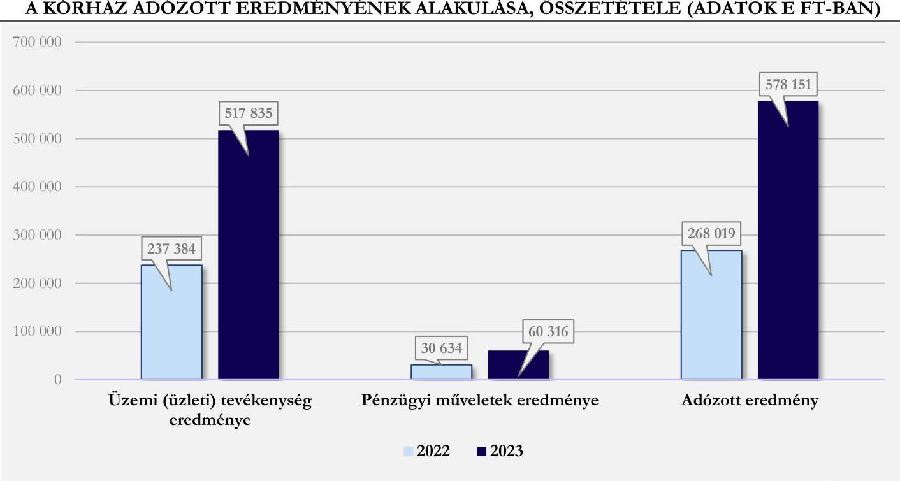

# Bevételi struktúra 

Az 1. számú, Eredménykimutatás elnevezésű táblázat adatai alapján a vizsgált időszakban a Kórház bevételi struktúrájában jelentős változás nem történt. A bevételi forrásokon belül 2022. és 2023. évben az egyéb bevételek bírtak meghatározó jelentőséggel. E jogcím rendkívül magas bevételi arányának oka, hogy a Kórház tevékenységéhez kapcsolódó NEAK támogatás összegén kívül valamennyi támogatás, adomány öszszege is e jogcím keretében került elszámolásra.

A bevételek összetétele alapján a Kórház által - vállalkozási tevékenységéhez kapcsolódóan - ellenérték fejében végzett tevékenységek/szolgáltatások bevételei (értékesítés nettó árbevétele) elenyésző nagyságrendet képviseltek. Az aktivált saját teljesítmények értéke mind a két évben szintén elhanyagolható arányt és összeget képviselt. A pénzügyi műveletek bevételei a 2022. évben a bevételek $0,3 \%$-át, 2023. évben pedig a $0,6 \%$-át tették ki. A Kórház folyamatos múködését, az egészségügyi közfeladatok ellátását az elemzéssel érintett időszakban az egyéb bevételek biztosították, melyek 2022. évben a bevételi főösszeg 98,4 \%-át, 2023. évben pedig a $97,9 \%$-át tették ki.

A Kórház múködését megalapozó egyéb bevételek jogcímcsoport többféle bevételi forrás elszámolására szolgált, ilyen a gyógyító, megelőző ellátások NEAK finanszírozása, a központi költségvetési támogatások öszszege, egyéb támogatások és adományok, a tárgyi eszközök értékesítésének bevételei, a biztosításokból

---

származó bevételek (kártérítések). Az egyéb bevételek meghatározó részét a gyógyító, megelőző ellátások NEAK finanszírozása (1. táblázat - 3.a. pont) képezte, mely 2022. évben az összes bevétel 84,8 \%-át, 2023. évben pedig a 79,7 \%-át tette ki. E finanszírozási bevétel aránya összes bevételen belül ugyan 5,0 százalékponttal csökkent, összege ennek ellenére 415422 E Ft-tal növekedett 2022-ről 2023. évre. Az arányokban történt változás oka, hogy az összes bevétel $11,4 \%$-os, 1178080 E Ft-os növekedésén belül a különböző bevételi jogcímek bevételei eltérő arányban növekedtek. Az egyéb bevételek kisebb jelentőségü, de kiemelt eleme a központi költségvetési támogatások NEAK finanszírozás nélküli összege, mely 2022. évben az összes bevétel $10,6 \%$-át, 2023. évben pedig a $16,4 \%$-át tette (1. táblázat - 3.b. pont.). A Kórház pályázati és/vagy egyedi döntés alapján - egyházi fenntartású egészségügyi intézményként - a közfeladat ellátását segítő, jelentős központi költségvetési támogatásban részesült az elemzéssel érintett időszakban. A 2022. évi 1098155 E Ft-tal szemben 2023. évben 1885280 E Ft volt központi költségvetési támogatások összege. E források a NEAK finanszírozást kiegészítve szolgálták az egészségügyi közfeladatellátást, a müködési kiadások finanszírozásában játszott - likviditást segítő - szerepük mellett fejlesztési lehetőséget is biztosítottak a Kórház számára. Egyedi döntés alapján a Kórház az energiaválság miatt megnövekedett áram és gáz többletkiadások finanszírozásához jelentős központi költségvetési támogatásban részesült, mely 2022. évben 142392 E FT, 2023. évben pedig 1005731 E Ft volt, ami hozzájárult a Kórház fizetőképességének fenntartásához. A Kórház 2022. és 2023. években egyházi (fenntartói) támogatásban nem részesült (2. táblázat - 3.c. pont). Az egyéb bevételek jogcímcsoporton belül az 1. táblázat - 3.d. pontja szerinti egyéb bevételek képviselték az összes bevételhez viszonyítva a legkisebb arányt, értékük az 1,2 százalékos csökkenéssel 2023. évben 211731 E Ft volt. Az összeg nagyságát alapvetően a kapott adományok, a biztosításból eredő kártérítések és a tárgyi eszközök értékesítésének bevétele határozta meg. A bevételi források 2022. évről 2023. évre történő változását a 6. ábra mutatja be. 6. ábra

A BEVÉTELI FORRÁSOK VÁLTOZÁSA (ADATOK E FT-BAN)
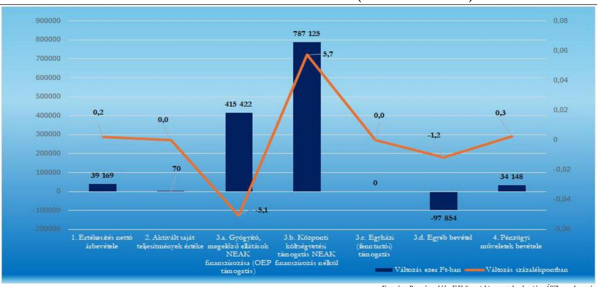

A bevételek elemzéséhez tartozó fajlagos mutató az egy ellátott esetszámra (aktív és krónikus egyben) jutó összes bevétel alakulása. Ez 2021-ben 641,2 E Ft volt, ami 2022-re 782,6 E Ft-ra nőtt, majd 2023-ra 636,1 E Ft-ra csökkent. E fajlagos mutató értéke mindhárom évben lényegesen alacsonyabb az öt elemzett kórház fajlagos értékeihez viszonyítottan. 2021-ben 29,5\%-kal, 2022-ben 24,5\%-kal, 2023-ban 34,2\%-kal maradt el azoktól.

---

# NEAK finanszírozás összetételének elemzése 

A Kórház bevételeinek nagyrészét meghatározó NEAK finanszírozás összetételét, finanszírozási jogcímek szerinti alakulását a 2. táblázat tartalmazza.
2. táblázat

## NEAK FINANSZÍROZÁS ÖSSZETÉTELE, FINANSZÍROZÁSI JOGCÍMEK SZERINTI ALAKULÁSA

| MEGNEVEZÉS | 2022. EV | MEGOSZLÁS   2022. EV | 2023. EV | MEGOSZLÁS   2023. EV |
| :-- | --: | :--: | :--: | :--: |
| Aktív fekvőbeteg-szakellátás | 3243191 | $37,0 \%$ | 3109499 | $33,9 \%$ |
| Krónikus fekvőbeteg-szakellátás | 717811 | $8,2 \%$ | 594041 | $6,5 \%$ |
| Laboratóriumi ellátás | 170279 | $1,9 \%$ | 172082 | $1,9 \%$ |
| Járóbeteg szakellátás | 889658 | $10,1 \%$ | 834729 | $9,1 \%$ |
| CT/MRI | 559293 | $6,4 \%$ | 515376 | $5,6 \%$ |
| Halottszállítás | 386 | $0,0 \%$ | 244 | $0,0 \%$ |
| Fogászat | 12584 | $0,1 \%$ | 21336 | $0,2 \%$ |
| Várólista csökkentési program | 9133 | $0,1 \%$ | 2359 | $0,0 \%$ |
| Célelóirányzatok | 3165088 | $36,1 \%$ | 3933181 | $42,8 \%$ |
| NEAK finanszírozás összesen | $\mathbf{8 7 6 7 4 2 5}$ | $\mathbf{1 0 0 , 0 \%}$ | $\mathbf{9 1 8 2 8 4 7}$ | $\mathbf{1 0 0 , 0 \%}$ |

Forrás: NEAK adatbázis alapján ÁSZ szerkesztés (adatok E Ft-ban)
Az adatok alapján látható, hogy a NEAK finanszírozás összegszerű növekedése mellett a Kórház finanszírozási szerkezetében kis mértékủ átrendeződés volt tapasztalható a 2022. évhez viszonyítva 2023. évben. A szakellátásokhoz kapcsolódó finanszírozások tették ki mind a két évben a folyósított összeg meghatározó részét, de arányuk összességében a 2022. évi 63,9\%-ról 57,2 \%-ra csökkent 2023. évben, míg a céleclóirányzatok (egészségügyi dolgozók 2018-2024 évi béremelésének fedezet, a fix összegű bérkiegészítés, a pénzellátást helyettesítő jövedelemkiegészítés, működési támogatás) keretében folyósított támogatás aránya 2022. évről 2023. évre növekedett $(+6,7 \%)$.

A Kórház által ellátott egészségügyi közfeladatok alapján NEAK finanszírozáson belül az aktív fekvőbe-teg-szakellátás finanszírozása volt meghatározó jelentőségű, továbbá magas arányt képviselt az egészségügyi bérrendezéshez kapcsolódó költségek fedezetét is tartalmazó céleclóirányzatok összege is.

A 2022-2023. években a finanszírozási szerkezet alakulását a bérekhez kapcsolódó támogatások egyre növekvő szerepe mellett a finanszírozás módja, és annak változása is befolyásolta. A COVID 19 járvány miatti egészségügyi veszélyhelyzetre tekintettel az intézmények pénzügyi stabilitásának biztosítása érdekében a teljesítményfinanszírozás helyett átlagfinanszírozás ${ }^{6}$ került bevezetésre többek között a járó- és fekvőbetegszakállátás ellátásaira, a fogászatra és a betegszállításra is. Az átlagfinanszírozás a 2023. január havi teljesítmények elszámolásáig volt érvényben, a 2023. február havi teljesítmények elszámolásától (2023. április havi kifizetés) kezdődően megszűnt, visszaállt a jogszabályi előírásoknak megfelelő teljesítmény alapján történő finanszírozás. Előzőek alapján a Kórház 2022. évben átlagfinanszírozásban részesült, míg 2023. évben az a január-március havi átlagfinanszírozást követően 2023. áprilistól visszaállt a teljesítményfinanszírozás. A Kórház teljesítménymutatói a járvány elmúltával elkezdtek javulni. A finanszírozás tekintetében a betegforgalmi adatok kedvező alakulását azonban negatívan befolyásolta, hogy a teljesítményfinanszírozás alapját jelentő súlyszámok/szorzók/pontértékek karbantartása/felülvizsgálata nem történt meg, így az ellátások alulfinanszírozottak maradtak. Mindezek hiányában a központi költségvetés a megnövekedett szakmai és müködtetési kiadások ellensúlyozása,

[^0]
[^0]:    ${ }^{6}$ Az átlagfinanszírozás a megelőző időszak teljesítménye alapján került meghatározásra

---

a közfeladatellátás biztosítása érdekében célhoz kötött költségvetési támogatások (energia beszerzés támogatása, adósságcsökkentési célú múködési támogatások) folyósításával támogatta a kórházak pénzügyi helyzetének stabilizálását, fizetőképességének fenntartását.

A NEAK finanszírozás és a Kórház kiadásai adatainak összehasonlítása alapján megállapítható, hogy a gyógyító, megelőző ellátások NEAK finanszírozása 2022. illetve 2023. évben nem fedezte a Kórház tevékenységével kapcsolatban felmerült kiadásokat. A 2022. évben elszámolt összes kiadás 87,0\%-át fedezte a NEAK finanszírozás, míg a 2023. évben már csak a 83,9\%-át. A kiadások és a NEAK finanszírozás alakulását a 2022. és 2023. évben az 3. táblázat foglalja össze.
3. táblázat

# A KIADÁSOK ÉS A NEAK FINANSZÍROZÁS ALAKULÁSA (E FT) 

| MEGNÉVEZÉS | 2022. EV | 2023. EV |
| :--: | :--: | :--: |
| NEAK finanszírozás összesen | 8767425 | 9182847 |
| 1. Anyagjellegú ráfordítások | 2069959 | 2439698 |
| 2. Személyi jellegű ráfordítások | 7190514 | 8151428 |
| 3. Értékcsökkenési leírások (5.) | 623725 | 99008 |
| 4. Egyéb ráfordítások (8.) | 189551 | 247097 |
| 5. Pénzügyi műveletek ráfordítása (8.) | 962 | 5428 |
| Kiadás összesen | 10074711 | 10942659 |
| Összes kiadás finanszírozottsági aránya | $87,0 \%$ | $83,9 \%$ |
| Anyag jellegú és személyi jellegú ráfordítások finanszírozottsági aránya | $91,9 \%$ | $96,8 \%$ |

Forrás: Beszámolók, Fökönyvi kivonatok, NEAK adatbázis alapján ÁSZ szerkesztés
Az adatok szemléletesen mutatják az egészségügyi ellátás finanszírozási problémáját, látható, hogy az elemzéssel érintett 2022. és 2023. években a NEAK finanszírozás összege növekedett ugyan, de nem nyújtott fedezetet a Kórház kiadásainak meghatározó részét kitevő anyag és személyi jellegú ráfordítások együttes összegére sem. A pénzügyi helyzet könnyítése érdekében a központi költségvetés a veszélyhelyzet és az energiaválság miatt jelentős mértékben megnövekedett energiaköltségek kompenzálására a NEAK finanszírozáson felül - az egyéb bevételeknél már ismertetettek szerint - egyedi döntés alapján támogatást nyújtott a kórház számára 2022. és 2023. évben.

## Kiadási struktúra elemzése

Az 1. számú, Eredménykimutatás elnevezésű táblázat adatai alapján jól látható, hogy a Kórház kiadásainak összetételében az értékcsökkenési leírás kivételével jelentős változás nem történt, a kiemelt jogcímeken elszámolt kiadások - az összes kiadáson belüli részarányának - növekedése nem érte el a 4 százalékpontot. A Kórház kiadási struktúrájában meghatározó arányt ( $71,4 \%$, illetve $74,5 \%$ ) képviseltek 2022. és 2023. években is a személyi jellegú ráfordítások. Az anyagi jellegú ráfordítások az összeg kiadás 20,5 \%-át tették ki 2022ben, 2023. évre arányuk a kiadásokon belül 22,3 \%-ra nőtt. Az egyéb ráfordítások és a pénzügyi műveletek ráfordításai arányukat tekintve szinte elhanyagolható nagységrendet képviseltek a Kórház kiadási szerkezetében. Az értékcsökkenési leírás összes kiadáson belüli aránya a 2022. évi 6,2 \%-ról 2023. évre 0,9 \%-ra módosult. A jelentős kiadáscsökkenés oka, hogy a Kórház könyveiből 2023. évben jelentős értékben kerültek ingatlanok kivezetésre, mivel átadásra kerültek az MSME részére. Az elszámolandó értékcsökkenési leírás összege ennek következményeként 2023. évben jelentős mértékben csökkent, mely - mint azt az bevételek elemzése során már jeleztük - a Kórház gazdálkodásától függetlenül pozitívan befolyásolta az eredmény és pénzügyi mutatók alakulását. Az összes kiadáson belül az egyéb ráfordítások aránya a 2022. évi 1,9\%-kal szemben 2023. évben is mindössze 2,3 \% volt. A pénzügyi műveletek ráfordításai a Kórház összes kiadásán beül elhanyagolható nagyságrendet képviseltek 2022. és 2023. évben. A jogcímcsoporton belül

---

kiadásként a Kórház a devizakészletek forintra váltásának árfolyamveszteségét számolta el. Az anyagjellegú ráfordítások a 2022. évi 20,5 \%-os, és a 2023. évi 22,3 \%-os arányukkal a kórház második legnagyobb kiadási jogcíme.soportját tették ki az elemzéssel érintett időszakban. Az e jogcíme.soporton belüli meghatározó jelentőségű kiadások alakulását a 7. ábra mutatja be.
7. ábra

AZ ANYAGJELLEGŰ RÁFORDÍTÁSOK ALAKULÁSA (ADATOK E FT-BAN)
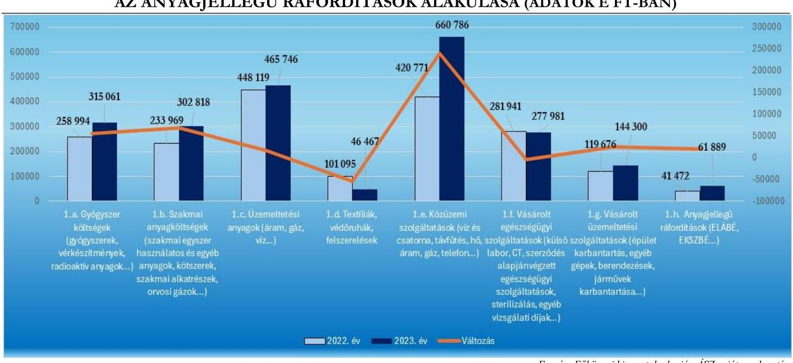

Forrás: Fökönyei kivonatok alapján ÂSZ saját szerkesztés
Az adatok szemléletesen mutatják, hogy 2022-ről a 2023. évre a Kórház anyag jelleg ráfordításain belül a meghatározó jelentőségű kiadások szinte mindegyike - a textíliák, védőruhák beszerzésére és a vásárolt egészségügyi szolgáltatásokra fordított összegek kivételével - tekintetében költségnövekedés következett be. Az egészségügyi tevékenységhez kapcsolódó gyógyszerek és szakmai anyagok beszerzésére fordított összegek 21,0-29,0\%-os növekedésében az infláció mellett szerepet játszott a gyógyító, megelőző ellátások szakmai igényeinek változása, új eljárások, gyógyszerek, kezelések alkalmazása is. A 7. ábra adatai alapján megállapítható, hogy az anyagjellegű ráfordításokon belül a legmagasabb költséget jelentő közüzemi szolgáltatások esetében következett be a legmagasabb költségnövekedés. A közüzemi díjak a 2022. évről 2023. évre 240015 E Ft-tal nőttek. A kiemelkedően magas, $57,0 \%$-os költségnövekedésben szerepet játszott a magas inflációs környezet (2023. év januárban 25,7\%, júliusban 17,6\%, decemberben 5,5\%) mellett az orosz-ukrán háború kirobbanása miatt kialakult - világ méretű - energiaválság is.

A Kórház kiadási szerkezetében a legmagasabb arányt a személyi jellegú ráfordítások képviselték az összes kiadáson belüli 2022. évi 71,4 \%-os, és a 2023. évi 74,5 \%-os arányukkal. Figyelembe véve, hogy a munkáltató által fizetendő személyi juttatásokat terhelő adók és járulékok összege az elemzéssel érintett időszakban nem változott, a 960914 E Ft-os növekedést alapvetően a rendszeres személyi juttatások emelkedése miatti költségnövekedés okozta.

Az adatok alapján rendszeres személyi juttatásokon belül az alapilletmények és illetménykiegészítések, valamint a pótlékok közel azonos mértékben növekedtek, az illetménynövekedés következményeként emelkedtek a dolgozókat megillető pótlékok is. A személyi jellegű egyéb kifizetéseken belül az elemzés a jogszabályból eredő jutalmak, megbízási díjak, study, kutatási és egyéb megbízási díjak alakulásának értékelésre terjedt ki. Az egészségügyi szolgálati jogviszonyról szóló 2020. évi C. törvény hatályba lépését követően az egészségügyi szolgálati jogviszonyban álló személyek egészségügyi szolgálati jogviszonyuk alapján - a jubileumi jutalom helyett

---

- a jogszabályban meghatározottak szerint szolgálati elismerésre váltak jogosulttá. A Kórház szolgálati elismerés címen 2022. évben 128279 E Ft, 2023. évben pedig 145082 E Ft összegű juttatást fizetett ki. Megbízás díj címen 2023. évben 1800 E Ft összegű kiadás került elszámolásra. Study, kutatási és egyéb megbízási díj kifizetés a Kórház esetében 2022-2023. években nem történt.

# 1.2. Generált Cash flow és a beszámolóban jelzett pénzeszköz változás összehasonlítása 

A CF $^{23}$ a készpénzáramlást mutatja be; az eszközök, kötelezettségek és eredmények készpénz állományt érintő változásait foglalja magába; nem azonos az intézmény által végzett tevékenység során keletkező eredménnyel/profittal. A CF kimutatás az intézmény forrásairól és készpénzfelhasználásáról ad képet a beszámolónak megfelelő naptári évre vonatkozóan. Az adatok segítségével következtetések vonhatók le az intézmény pénzügyi helyzetéről, több év adatának elemzésével, összehasonlításával lehetővé válik a pénzügyi helyzet alakulásának értékelése.

A CF elemzés célja a pénzügyi helyzet értékelése, valamint az egymást követő időszak adatainak összehasonlításával annak elemzése, hogy a kórházak a tevékenységüket meghatározó belső és külső körülmények változása milyen hatást gyakorolt a pénzügyi helyzetük alakulására.
A CF mutatók elemzésének célja, annak értékelése, hogy a kórház:

- alacsony, esetleg negatív üzleti eredmény (veszteség) ellenére képes volt-e tevékenysége során „pénz" cash termelésre (Bruttó CF);
- működési folyamatai tőkét kötöttek le (-), vagy tőkét szabadítottak fel (+), milyen volt a működés tőkeszükséglete (Működési CF);
- a működés tőkeszükségletét is figyelembe véve tevékenysége során mekkora „pénz" cash előállítására volt képes (Nettó Müködési CF);
- az adott üzleti évben mekkora összegben pótolta befektetett eszközeit (Tőkebefektetés - CAPEX ${ }^{24}$ );
- az adott üzleti évben - a működés tőkeszükségletét és figyelembe véve - előállított „pénzből" a tőkebefektetést levonása után mekkora szabadon felhasználható cash maradt (Szabad CF - Free CF);
- az adott üzleti évben mekkora összegű, hosszú távon az intézmény rendelkezésére álló külső forrásban részesült (Finanszírozási CF).
Az egyházi jogi személyek által fenntartott kórházak sajátos könyvvezetési és beszámolókészítési kötelezettségét ${ }^{7}$ figyelembe véve a CF elemzés alapját - a zárás előtti főkönyvi kivonatok, az éves beszámolók (mérlegek és eredménykimutatások) és a kiegészítő információk felhasználásával - az ÁSZ által összeállított adattáblák adatai képezték. Az adattáblák sorainak adatai indokolt esetben - a halmozódások kiszűrése érdekében - tartalmazzák a Számv. tv. előírásai alapján figyelembe vehető, ismertté vált, azonnal pénzeszköz-változással nem járó korrekciós tételeket.

[^0]
[^0]:    ${ }^{7}$ Az egyházi jogi személyek a 296/2013. Korm. rend. 5. § (1) bekezdésének előírása alapján egyszerűsített éves beszámoló készítésére kötelezett szervezetek, melyek a jogszabály 5. § (5) bekezdése szerint a beszámoló részeként kiegészítő mellékletet nem készítenek. A könyvvezetési és beszámolókészítési sajátosságokat figyelembe véve a generált CF számításához szükséges kiegészítő információk az adatbekérések, illetve a helyszíni ellenőrzés keretében kerültek bekérésre

---

# Cash flow mutatók 

## 4. táblázat

GENERÁLT CASH FLOW ADATAI (ADATOK E FT-BAN)

| MÉGNEVEZÉS | 2022. év | 2023. év |
| :--: | :--: | :--: |
| 1. Üzemi eredmény | 237385 | 517835 |
| 2. Elszámolt amortizáció | 623725 | 99008 |
| 3. Elszámolt értékvesztés és visszaírás | 0 | 0 |
| 4. Céltartalék képzés és felhasználás különbözete | 0 | 0 |
| I. Bruttó CF (non cash tételekkel korrigált üzemi eredmény) (1.+2. +/-3. +/-4.) | 861110 | 616843 |
| 5. Befektetett eszközök értékesítésének eredménye | $-273$ | $-875$ |
| 6. Készletek változása | $-47240$ | 36833 |
| 7. Vevőkövetelés változása | 4989 | $-9882$ |
| 8. Forgóeszközök (készlet, vevőkövetelés és pénzeszköz nélkül) változása | $-898964$ | $-287765$ |
| 9.1. Bevételek aktív időbeli elhatárolása | $-4001$ | 2009 |
| 9.2. Költségek, ráfordítások aktív időbeli elhatárolása | $-8681$ | 9260 |
| 9.3. Halasztott ráfordítások | 0 | 0 |
| 10. Szállítói kötelezettség változása | 86891 | $-211242$ |
| 11. Egyéb rövid lejáratú kötelezettség változása | 10652 | 95898 |
| 12.1. Bevételek passzív időbeli elhatárolása | $-175906$ | 0 |
| 12.2. Költségek, ráfordítások passzív időbeli elhatárolása | 92042 | $-91737$ |
| 12.3. Halasztott bevételek | 0 | 0 |
| 13.Pénzügyi műveletek bevételei | $-31596$ | $-65744$ |
| 14.Pénzügyi műveletek ráfordításai | 962 | 5428 |
| 15. Fizetett, fizetendő adó (nyereség után) | 0 | 0 |
| II. Múködési CF (a múködés tőkeszükséglete) | $-971125$ | $-517817$ |
| III. Nettó múködési CF (bruttó CF + múködési CF) | $-110015$ | 99026 |
| IV. CAPEX (tőkebefektetés) | 442661 | 238484 |
| V. Free CF (nettó múködési CF - CAPEX) | $-552676$ | $-139458$ |
| 16. Fizetett, fizetendő osztalék, részesedés | 0 | 0 |
| 17. Részvénykibocsátás, tőkebevonás, illetve részvénybevonás, tőkekivonás | 0 | 0 |
| 18. Kötvény, hitelviszonyt megtestesítő értékpapír változása | 0 | 0 |
| 19. Beruházási hitel és hosszúlejáratú kölcsönök változása | 0 | 5354 |
| 20. Hosszú lejáratra nyújtott kölcsönök és elhelyezett bankbetétek változása | 0 | 0 |
| 21. Véglegesen kapott pénzeszköz | 0 | 0 |
| VI. Finanszírozási CF | 0 | 5354 |
| Számított pénzeszköz változás | $-552676$ | $-134104$ |

A 2022. és 2023. évben az üzemi eredmény (2022. 237385 E Ft; 2023. 517835 E Ft) és a bruttó cash flow (2022. 861110 E Ft; 2023. 616843 E Ft) egyaránt pozitív értéket mutatott, az intézmény tevékenysége során képes volt „pénz" termelésre az azonnali pénzkiadással nem járó ráfordítások (elszámolt amortizáció) CF módosító hatása nélkül is. A müködési cash flow a 2022. évben -971 125 E Ft, 2023. évben pedig - 517817 E Ft volt, az adatok jól szemléltetik, hogy a tevékenység múködési folyamatainak biztosítása mind a két évben tőkét kötött le, a működési kiadások finanszírozásához, bár csökkenő mértékủ, de még így is jelentős összegű tőkefelhasználás (eszköz, eredmény) vált szükségessé. Az intézmény a működés tőkeszükségletét is figyelembe véve 2022. évben „pénz" termelésre a működését meghatározó tevékenységekkel nem volt képes, a

---

működés tőkeszükséglelete meghaladta a bruttó cash flow értékét, a 2023. évi adatok alapján e negatív tényező megváltozott, ugyan nem túl magas összegű, de 99026 E Ft nettó múködési cash flow előállítására volt képes, a múködés fedezete a pénzeszköz-változás alapján a 2023. évben biztosított volt. Az intézmény a 2022. évi 442661 E Ft-tal szemben befektetett eszközei pótlására 238484 E Ft-ot használt fel, az összeg ugyan nem éri el a 2022. évi értéket, de a 2023. évben elszámolt 99008 E Ft értékcsökkenést meghaladta. A tókebefektetés (CAPEX) mutató értéke alapján arra lehet következtetni, hogy az intézmény hangsúlyt fektet befektetett eszközeinek pótlásra (figyelembe véve azon tényt is, hogy a 2023. évi beszámoló kiegészítő melléklete szerint az intézmény könyveiből jelentős értékben vezettek ki ingatlanokat). A Kórház a 2022. évben a tevékenységéhez szükséges gépek, berendezések, felszerelések beszerzésén (267 202 E Ft) kívül az akkor még a könyveiben szereplő ingatlanok fejlesztésére, felújítására (175 459 E Ft) is költött az adatok alapján, 2023. évben a 238484 E Ft felhasználásával gépek, berendezések, felszerelések, bútorok és járművek beszerzésére került sor. A finanszirozási cash flow értéke a 2022. évben 0 E Ft, 2023-ben pedig 5354 E Ft volt. A beszámoló kiegészítő mellékletének adatai szerint az intézmény 18 havi részletfizetéssel vásárolt meg egy egészségügyi berendezést, ez által gazdálkodásába 5354 E Ft összegű forrást vont be. A CF kimutatás adatai szerint az intézmény számított pénzeszköz változása 2022. és 2023. években egyaránt negatív előjelű volt. Működési, fejlesztési és finanszírozási tevékenységeinek teljes spektrumát figyelembe véve az azonnali pénzeszköz-változással járó bevételei nem érték el az ennek megfelelő kiadások/ráfordítások összegét, azonban kedvező a tendencia, hogy a pénzeszközcsökkenés mértéke a 2022. évi -552 676 E Ft-ról 2023. évre -134 104 E Ft-ra csökkent.

A CF mutatók értékének változása alapján arra lehet következtetni, hogy a 2022. évről a 2023. évre az intézmény folyamatos múködéséhez szükséges pénzügyi feltételek javultak, a kis mértékben javuló külső gazdasági körülmények között. Az üzemi eredmény megduplázódott, ennek azonnali pénzeszköz-változást eredményező tételekkel módosított összege (bruttó cash flow) azonban a 2022. évi érték 71,6\%-ára csökkent. A múködéshez kapcsolódó pénzmozgást eredményező tételek összege alapján a múködés tőkeszükséglete 46,7\%-kal csökkent, ezzel párhuzamosan a nettó müködési cash flow jelentős mértékben javult, múködési tevékenységei alapján 2023. évben az intézmény már képes volt „cash" pozitív pénzeszköz-változás (növekedés) elérésére 99026 E Ft értékben. A CAPEX (tőkebefektetési) mutató az intézmény adatai alapján a 2022. évi értékhez viszonyítva 46,1\%-kal csökkent, azonban ennek ellenére a 2023. évben elszámolt értékcsökkenés öszszegét meghaladta, mely az intézmény elkötelezettségét mutathatja a múködését biztosító befektetett eszközök pótlása, fejlesztése tekintetében. A CF kimutatás adatai alátámasztják, hogy az intézmény 2022. és 2023. években tevékenysége során szabadon felhasználható pénzeszközt nem termelt, azonban kedvező adatként értékelhető, hogy a pénzeszköz-változás (csökkenés) mértéke a 2022. évi -552 676 E Ft-ról 2023-ban -134 104 E Ft-ra csökkent. Figyelembe véve, hogy az intézmény tevékenységeiben 2022. évről 2023. évre meghatározó jelentőségű változás nem történt, a CF mutatók többségének kedvező változása következhetett a külső körülmények (pl. gazdasági környezet, kormányzati döntések...) előző időszaknál kedvezőbb alakulásából (javulásából), de a fenntartó és az intézményvezetés gazdálkodást érintő döntései is hozzájárulhattak. Utóbbi megállapítást támasztja alá, hogy az intézmény 2023. évben hosszú távú (18 hónap) részletfizetéssel vásárolt az egészségügyi alapfeladatához szükséges berendezést, a részletfizetéssel csökkentve a fejlesztés 2023. évi pénzügyi hatását.

# Mérleg mutatók 

A kórház mérlegadatai alapján a számított szolvencia ráta értéke a 2022. évi 0,864-ről (86,4 \%) 2023. évben 0,581-re ( $58,1 \%$ ) csökkent. A mutató a forrásokon belül a saját tőke arányát hivatott bemutatni. A mutató értékének csökkenését a beszámolóhoz készített kiegészítő mellékletben jelzett - ingatlanérték kivezetéssel párhuzamosan elszámolt - tőketartalék csökkenés eredményezte. A mutató értékének jelentős csökkenése ellenére megállapítható, hogy az intézmény esetében a forrásokon belül saját tőke meghatározó jelentőségü,

---

eladósodottsága alacsony. Fontos felhívni a figyelmet azonban arra, hogy ha az ingatlankivezetésből adódó sajáttőke csökkenésen túl a forrásokon belül a saját tőke csökkenése trendszerűvé válik, az negatívan hathat a pénzügyi stabilitásra. A nettó múködő tőke összege a 2022. évi 1316812 E Ft-ról a 2023. évre 331595 E Ft-ra csökkent. A csökkenés ellenére a mutató pozitív értéke alapján az intézmény finanszírozási szerkezete megfelelő volt, a mobil és gyorsan mobilizálható eszközök (követelések, pénzeszközök) biztosították a múködés (rövid lejáratú kötelezettségek) finanszírozását. A fentieken leírtakat támasztja alá a szervezet likviditási helyzetét legjobban jellemző likviditási ráta és likviditási gyorsráta értéke is (likviditási ráta: 2022. év 2,42 2023. év 2,97; likviditási gyorsráta: 2022. év 2,17 2023. év 2,72). Bár a mutatók értékei meghaladták az ideálisnak tekinthető 1,5 körüli értéket, a kórház tevékenységi körét is figyelembe véve a mutatók értékei a gazdálkodásának biztonságát mutatták, tekintve, hogy a kórház egyház által fenntartott, egészségügyi közfeladatot ellátó intézmény, melynek elsődleges célja az egészségügyi közfeladatok minél magasabb színvonalú ellátása, nem pedig a minél magasabb profit elérése. Likviditási ráta és gyors ráta alakulását a 8. ábra mutatja be.
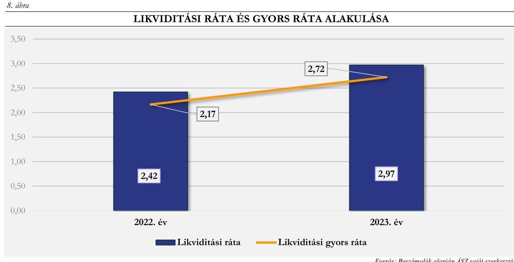

# Jövedelmezőség 

Az eszközarányos jövedelmezőség (ROA) mutatójának értéke a 2022. évi 3,4 \%-ról 2023. évben $8,6 \%$-ra emelkedett. A saját tőke arányos jövedelmezőség mutatója (ROE) szintén kedvezően alakult, értéke a 2022. évi $4,0 \%$-ról $(0,04)$ 2023. évben $11,6 \%$ ra $(0,116)$ emelkedett. ${ }^{8}$ A mutatók értékének kedvező alakulását az ingatlanok MSME részére történt 2023. évi átadása okozta, mivel átadásuk következményeként jelentés mértékben csökkent az eszközök és a saját tőkén belül a tőketartalék mérleg szerinti értéke. Figyelembe véve az ingatlanátadás hatását, továbbá azt, hogy a kórház eszközigénye magas, valamint a tevékenységi célja nem a profit termelés, a kórház ROA és ROE mutatóinak alakulása megfelelőnek értékelhető. A kórház a rendelkezésre álló eszközeit megfelelően hasznosította.

[^0]
[^0]:    ${ }^{8}$ Iparágtól függően a ROA 8-10\% a ROE pedig 10-15\% között jelent jó teljesítményt.

---

# 2. Pénzügyi helyzet és a kötelezettségállomány elemzése 

### 2.1. Pénzügyi helyzet, mérlegadatok elemzése

S. táblázat

A KÓRHÁZ 2022. ÉS 2023. ÉVI MÉRLEGADATAINAK ALAKULÁSA (ADATOK E FT-BAN)

| MÉGNEVEZÉS | 2021. év | 2022. év | 2023. év | ADATOK A   2022. EV \% ABAN |
| :--: | :--: | :--: | :--: | :--: |
| A. Befektetett eszközök | 5559880 | 5513545 | 2803126 | $50,8 \%$ |
| I. Immateriálisjavak | 10036 | 4372 | 899 | 20,6\% |
| II. Tárgyi eszközök | 5549844 | 5509173 | 2802227 | $50,9 \%$ |
| III. Befektetett pénzügyi eszközök | 0 | 0 | 0 | 0 |
| B. Forgóeszközök | 2065728 | 2381459 | 2578194 | 108,3\% |
| I. Készletek | 203432 | 250672 | 213838 | 85,3\% |
| II. Követelések | 1160137 | 2054490 | 2351909 | 114,5\% |
| III. Értékpapírok | 0 | 0 | 0 | 0 |
| IV. Pénzeszközök | 702159 | 76297 | 12447 | $16,3 \%$ |
| C. Aktív időbeli elhatárolások | 755 | 13436 | 1171 | 8,7\% |
| Eszközök összesen | 7626363 | 7908440 | 5382491 | $68,1 \%$ |
| D. Saját tőke | 6562338 | 6830357 | 3129366 | $45,8 \%$ |
| I. Jegyzett tőke | 6816713 | 1 | 1 | 100,0\% |
| II. Jegyzett, de még be nem fizetett tőke (-) | 0 | $-1$ | $-1$ | 100,0\% |
| III. Tóketartalék | 0 | 6816713 | 2537571 | $37,2 \%$ |
| IV. Eredménytartalék | 0 | $-254375$ | 13644 | $-5,4 \%$ |
| V. Lekötött tartalék | 0 | 0 | 0 | 0 |
| VI. Értékelési tartalék | 0 | 0 | 0 | 0 |
| VII. Adózott eredmény | $-254375$ | 268019 | 578151 | 215,7\% |
| 1. Alaptevékenység eredménye | - | - | - | - |
| 2. Vállalkozási tevékenység eredménye | - | - | - | - |
| E. Céltartalékok | 0 | 0 | 0 | 0 |
| F. Kötelezettségek | 886029 | 983951 | 873732 | 88,8\% |
| I. Hátrasorolt kötelezettségek | 0 | 0 | 0 | 0 |
| II. Hosszú lejáratú kötelezettségek | 0 | 0 | 5354 | - |
| III. Rövid lejáratú kötelezettségek | 886029 | 983951 | 868378 | 88,3\% |
| G. Passzív időbeli elhatárolások | 177996 | 94132 | 1379393 | 1465,4\% |
| Források összesen | 7626363 | 7908440 | 5382491 | 68,1\% |

A Kórház mérlegfőösszege a 2022. évi 7908440 E Ft-ról 2023. évben 5382491 E Ft-ra csökkent. A 31,9 \%-os vagyoncsökkenés oka a kiadások összetételének elemzésénél már leírt eszközérték (ingatlanok) tulajdonos részére történt átadás miatti - kivezetés volt.

A változást követően, 2023. évben a mérleg eszközoldalán szinte azonos súlyt képviseltek a befektetett eszközök (52,1\%) és a forgóeszközök (47,9 \%). A forgóeszközök 2578194 E Ft-os összegén belül meghatározó jelentőségű volt a követelések 2351909 E Ft-os értéke, melynek 52,6 \%-át a költségvetési kiutalási igények, (NEAK finanszírozás), 46,1\%-át pedig a rövid lejáratra lekötött pénzeszközökből származó követelések tették ki. A Kórház pénzeszközeinek mérleg szerinti értéke 2023. év végén 12447 E Ft volt, de az intézmény pénzügyi stabilitását, kedvező likviditási helyzetét szavatolta a követelések között szereplő 1085000 E Ft rövid lejáratra lekötött pénzeszköz. A mérleg eszköz oldalán az aktív időbeli elhatárolások összege jelentős mértékben lecsökkent, a 2022. évi 13436 E Ft-tal szemben 2023. évben összegük csak

---

1171 E Ft volt. Az összegben 2022. év végén költségeket és ráfordításokat (laboratóriumi körvizsgálatok díja, vagyonbiztosítás, postai fiókbérlet, 9436 E Ft ), valamint bevételként a rövid lejáratra lekötött pénzeszköz 2022. évre esedékes kamatát ( 4000 E Ft ) mutatták ki. A 2023. évi összeg költségek és ráfordítások aktív időbeli elhatárolásaként előfizetési díjakat ( 176 E Ft ), valamit bevételek aktív időbeli elhatárolásaként a rövid lejáratra lekötött pénzeszköz 2023. évre esedékes kamatát ( 996 E Ft ) tartalmazta.

Az eszközök értékének tulajdonos részére történt átadása miatt a mérleg forrásoldalán a saját tőke és azon belül a tőketartalék összege is jelentős mértékben csökkent. A kötelezettségek összege a 2022. évi 983951 E Ft-ról 2023. december 31-ére 873732 E Ft-ra csökkent, melyből a rövid lejáratú kötelezettségek 868378 E Ft-ot tettek ki. A Kórháznak 2022. évben hátrasorolt és hosszú lejáratú kötelezettsége nem volt, 2023. évben hátrasorolt kötelezettséggel szintén nem rendelkezett, a hosszú lejáratú kötelezettségek összege pedig 5354 E Ft volt. A rövid lejáratú kötelezettségek kimutatását a 6. táblázat tartalmazza.
6. táblázat

# A RÖVID LEJÁRATÚ KÖTELEZETTSÉGEK KIMUTATÁSA (ADATOK E FT-BAN) 

| MÉGNEVEZÉS | 2022. (v) |  | 2023. (v) |  |
| :--: | :--: | :--: | :--: | :--: |
|  | Összesen | Erbol lejÁrt   kötelezettség | Összesen | Erbol lejÁrt   kötelezettség |
| Kötelezettségek áruszállitásból, szolgáltatásból | 369575 |  | 158104 |  |
| Egyéb rövid lejáratú kötelezettségek | 614376 |  | 710274 |  |
| Rövid lejáratú kötelezettségek összesen | 983951 | 3790 | 868378 | 9204 |
| Lejárt kötelezettségek aránya a rövid lejáratú kötelezettségeken belül összesen |  | $0,4 \%$ |  | $1,1 \%$ |

A táblázat adatai alapján megállapítható, hogy amíg a Kórház rövid lejáratú kötelezettségeinek összege 2022. évről 2023. évre 115573 E Ft-tal (11,7 \%) csökkent, a rövid lejáratú kötelezettségeken belül a lejárt határidejű tartozások összege 3790 E Ft-ról 9204 E Ft-ra emelkedett. A mérleg forrás oldalán a passzív időbeli elhatárolások összege megemelkedett, a 2022. évi 94132 E Ft-tal szemben 2023. évben összegük 1379393 E Ft volt. A 2022. évi összeg költségek és ráfordítások passzív időbeli elhatárolását tartalmazta (szakmai anyagok, közüzemi díjak, egyészségügyi szakmai szolgáltatások, vállalkozói díjak, könyvvizsgálati díj, közbeszerzési díj, 94132 E Ft ). A 2023. évi összeg költségek és ráfordítások passzív időbeli elhatárolásaként közüzemi díjakat, egyészségügyi szakmai szolgáltatások és vállalkozói díjak értékét, a könyvvizsgálat díját tartalmazta 128500 E Ft), valamit halasztott bevételként a térítés nélkül átvett eszközök (patológia felújítás, energetikai korszerűsítés) piaci értékét tartalmazta 1250893 E Ft értékben. A passzív időbeli elhatárolások fejlesztési célra visszafizetési kötelezettség nélkül kapott támogatást 2022. és 2023. éveben nem tartalmaztak. A rövid lejáratú kötelezettségek csökkenő összege - az azokon belüli lejárt határidejű tartozásállomány 0,7 százalékpontos növekedése ellenére - pénzügyi nehézségek, likviditási zavarok nélkül finanszírozható volt, a kórház követeléseinek összege jelentős mértékben meghaladta a rövid lejáratú kötelezettségeket.

### 2.2. A kórházi lejárt kötelezettségállomány változásának bemutatása

Az ÁSZ által egyidőben elemzett öt egyházi fenntartású kórházak adósságállomány összetételének, változásának és alakulásának bemutatása során a kórházi lejárt kötelezettségállomány ${ }^{9}$ havi adatai kerültek felhasználásra. Az elemzett öt kórház adósságpozicionálása két dimenzió mentén történt:

- a lejárt kötelezettségállomány havi szintű relatív változásának átlaga, valamint
- az átlagos lejárt kötelezettségállomány átlagos havi kiadási főösszeghez (költségek és ráfordítások együttes összegének havi átlaga) viszonyított aránya.

[^0]
[^0]:    ${ }^{9}$ NEAK adatközlés

---

Az elemzés adósságállománynak a lejárt kötelezettségállományt tekinti. A Kórház esetében az elemzett időszak tört éves adatokat is tartalmazott (2021. július - 2024. június), a tört időszakok a teljes évek adataival való arányosítással váltak összemérhetővé. A relatív változások matematikai jellegű torzító és annak magyarázó tényezői külön bemutatásra kerültek.

Az első dimenzió meghatározásakor az öt kórház esetén kiszámításra került a lejárt kötelezettségállomány havi változása, majd a havi változások átlaga. Korrigáltuk az átlagot a kiugró havi változások kiszűrésével, majd az öt kórházra kiszámított korrigált átlagnak vettük az átlagát (dimenziós átlag). Ez alapján meghatározhatóvá vált, hogy az egyes kórházak az első dimenziós átlag alatt vagy felett pozicionálódnak.

A második dimenzió meghatározásakor minden évre vonatkozóan kiszámítottuk az éves kiadási főöszszegből az átlagos havi kiadási főösszegeket (ezzel biztosítva az összemérhetőséget), tört év esetén arányosítást alkalmaztunk. Az átlagos havi lejárt kötelezettségállomány adatokat az átlagos havi kiadási főösszegekhez viszonyítottuk, ezáltal meghatározhatóvá váltak az éves második dimenziós értékek minden évre. Az öt kórház második dimenziós értékeit 2019-től 2023-ig évenként átlagoltuk, megkapva a második dimenziós átlagokat. Ez alapján meghatározhatóvá vált, hogy az egyes kórházak a második dimenziós átlag alatt vagy felett pozicionálódnak.

Az első, valamint a második dimenziós átlag alatti és feletti lehetséges kombinációból 2x2-es mátrixot készítettünk négy lehetséges kategóriát létrehozva (kiegyensúlyozott; mérsékelten dinamikus; agresszív dinamikus; statikus). Az egyes kórházak a számított dimenziós értékek alapján a 4 kategória valamelyikébe besorolhatóvá váltak. A kórházak adósságpozicionálását a 9. ábra mutatja be. A kategóriák által jellemzett adósságkezelési együttmozgás (volatilitás és viszonyított mérték) mellett az adósság trend változását (dinamikáját) is figyelembe kell venni, mely a dimenziós átlagok változását (pl. évről évre való százalékpontos növekedését) jelenti.
9. ábra

A LEHETSÉGES KATEGÓRIÁK A DIMENZIÓK EGYÜTTES ÉRTÉKELÉSÉVEL (ADÓSSÁGKEZELÉSI EGYÜTTMOZGÁS)

# 2. DIMENZIÓ 

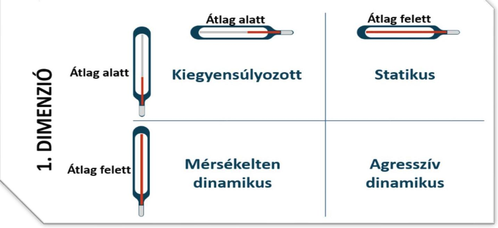

Fonrás: ÁsZ saját szerkesztés

---

# Első dimenzió 

A Kórház havi szintű lejárt kötelezettségállományának átlagos változása 2021. július és 2024. június közötti időszakban $226,0 \%$ volt. A lejárt kötelezettségállomány havi relatív változása $-100,0 \%$ (teljes adósság konszolidáció) és 4933,0\% közötti értékeket vett fel, mely kiemelkedően volatilisnek tekinthető. A kiemelkedő volatilitást a kiugróan magas relatív változások (pl. 4933,0\% és 1429,0\%) okozták, amelyek mögött jelentős nominális kötelezettségállományi változás nem állt, így ezen két kiugró érték kiszűrése volt indokolt. Ennek eredményeként a havi átlagos változás $\mathbf{5 2 , 0 \%}$ volt, mely más egyházi fenntartású kórházzal összehasonlítva továbbra is magas értéknek számított.

A Kórház esetén a bázis (2021. 07. havi) lejárt kötelezettségállomány 4694 E Ft volt, mely a 2021. év végéig az év végi kiegyenlítésnek köszönhetően 77 E Ft-ra ( $98,4 \%$-kal) csökkent. A 2021. évi tört éven belül arányát tekintve októberben ( $334,0 \%$-kal), míg nominálisan novemberben ( 7093 E Ft-tal) nőtt a legnagyobb mértékben a lejárt kötelezettségállomány az előző hónaphoz képest.

A 2022. évben az alacsonyabb összegű ( 412 E Ft ) bázis az év első felében emelkedett ( 2179 E Ft-ra), majd az augusztusi hónapban a nyilvántartási adatok alapján 0 E Ft-ra csökkent. Az augusztust követő 30 napban a lejárt kötelezettségállomány 0 E Ft-ról 27251 E Ft-ra nőtt (100\%), mely a teljes elemzett időszakon belül a legnagyobb nominális növekedést jelentette. A hirtelen jelentkező lejárt kötelezettség 86,0\%-a konszolidálásra került az év végéig.

A 2023. év az előző évi konszolidációnak köszönhetően ismételten alacsonyabb bázissal indult, azonban a bázis (januári 2268 E Ft) lejárt kötelezettségállomány az előző évhez képest több, mint 5,5-szörösére nőtt. A lejárt kötelezettség a 2022. évhez hasonlóan, de nagyobb mértékben a 2023. év első félévének végére újfent (májusról júniusra 598,0\%-kal, 9416 E Ft-tal) emelkedett, melynek csökkentésére augusztusban került sor ( 992 E Ft-ra). Augusztusról szeptemberre kiugróan magas arányú ( $1429,0 \%$-os) növekedés következett be, mely a 2022. év szeptemberi emelkedéssel összevetve nominálisan alacsonyabb volt. Ez az alacsonyabb állományi adathoz magasabb előző havi állomány társult ( 992 E FT), mint a 2022 augusztusában ( 0 E Ft ). Ezért az augusztusi értékek miatt fennálló matematikai torzító tényezők kiszűrése volt indokolt. Az év végéhez közeledve a novemberi hónapban az addig felhalmozott lejárt kötelezettségállomány 70,0\%-a kiegyenlítésre került.

A 2024. évben a rendelkezésre álló féléves adatok alapján az előző években tapasztalt adósságfelhalmozási és kezelési mintázat rajzolódik ki. Az első dimenziót tekintve összességében a kórház esetében is jellemző a fél éves ciklusokban változó lejárt kötelezettségállomány.

## Második dimenzió

A második dimenzió elemzéséhez az éves lejárt kötelezettségállomány havi átlaga került kiszámításra. A 2021. és a 2024. évi tört (fél éves) adatok esetén az első dimenzióban feltárt ciklikus változást, illetve hasonlóságot feltételezve becsült átlagos havi adatok kerültek kiszámításra, melyek külön értékelendők.

Az átlagos lejárt kötelezettségállomány a 2022. évben havi szinten 4000 E Ft, a 2023. évben 7924 E Ft volt, mely más egyházi fenntartású kórházzal összehasonlítva jelentősen alacsonyabb. A tört évek adatai és ciklikus mintázat alapján becsült átlagos lejárt kötelezettségállomány a 2021. évben havi szinten 6638 E Ft, mely a nyár végi, szeptemberi jelentősebb állománynövekedési jellemzőt (mérséklő hatást) is figyelembe véve megfelel az éves szintű átlagoknak, csakúgy, mint a 2024. évi tört időszak esetén a becsült átlagos kötelezettség állomány, mely esetén a várható szeptemberi állománynövekedési jellemző növelő hatásként vehető figyelembe.

A Kórház éves kiadási főösszege mértékét tekintve a 2022. évről a 2023. évre kis mértékben 10074711 E Ft-ról 10942659 E Ft-ra (8,6\%-kal) nőtt. A 2021. évi kiadási főösszeg (4 770887 E Ft) kevesebb mint a fele a 2022. és a 2023. évi főösszegnek.

---

A Kórház második dimenzióban való elhelyezéséhez a kiszámított átlagos lejárt kötelezettségállományt viszonyítottuk az átlagos havi kiadási főösszeghez, mely a 2022. évben 0,5\%, a 2023. évben 0,9\% volt. Ez azt jelenti, hogy a 2022. és 2023. évben az átlagosan a lejárt kötelezettségállomány nem érte el az éves kiadási főösszeg 1,0\%-át sem, ami az egyházi fenntartású korházak tekintetében alacsony arány, pozitív jelenség. A kiválasztott további négy egyházi fenntartású kórházak második dimenzióbeli aránya átlagosan a 2022. évben 23,5\%, a 2023. évben 67,6\% volt, így a kiválasztott összesen öt kórház közül a kiadási föösszeghez képest jelentősen alacsonyabb átlagos lejárt kötelezettség jellemezte a Kórházat.

# Adósság-pozicionálás 

A Kórházat a két adósságdimenzió együttes értékelése alapján a legmagasabb havi átlagos változás (volatilitás) mellett a legalacsonyabb átlagos havi kiadási főösszeghez viszonyított lejárt kötelezettségállomány jellemezte, mely mérsékelten dinamikus pozíciónak írható le. A pozíció intenzív dinamikáját az adósság magas átlagos havi volatilitása adta, amelyet az átlagos havi kiadási főösszeghez viszonyított alacsony aránya mérsékelt. A kezdeti stabilitás a 2022. augusztus hónapig jellemző alacsonyabb adósságvolatilitásnak volt köszönhető a közel változatlan átlagos havi kiadási főösszeg mellett. Azonban a kiegyensúlyozott pozíciót jellemző stabilitási jegyek az adósságállomány trendszerű nominális növekedésével halványulni kezdtek, a nagyobb mértékű adósságállomány változások gyakoribbá váltak. A Kórház első dimenziós értéke a torzító tényezők kiszűrését követően is a $21 \%$-os átlagos dimenziós érték felett, míg a második dimenziós érték a 2022. és 2023. évben is jelentősen a dimenziós átlag alatt volt. A Kórház esetén az adósságkezelési együttmozgás eltért a többi vizsgált kórházétól a 2022. és 2023. évben. A második dimenziós átlagok trendszerű, dinamikus növekedése tapasztalható, ahol a dinamikus növekedés a Kórház egyházi fenntartásba való bekerülésével a 2022. évben mérséklődni látszott.

## 3. A kórház múködésének bemutatása ${ }^{10}$

### 3.1. Pénzügyi mutatók elemzése

A kórház pénzügyi helyzetének részletes bemutatására az elemzés megelőző pontjai kitérnek. Itt csak két fontos - pénzügyi működést jellemző - mutatószám kerül bemutatásra a 7. táblázatban.
7. táblázat

PÉNZÜGYI MÚKÖDÉS MUTATÓSZÁMAI

| MUTATÓSZÁM NEVE | KÓRHÁZ   ADATA | AZ ELEMZETT   KÓRHÁZÁK   ÁTLAG ADATA | ÁTLAGTÓL   VALÓ ELTÜRÜS |
| :-- | :--: | :--: | :--: |
| 2022 |  |  |  |
| NEAK bevétel aránya az összes bevételben (\%) | $84,7 \%$ | $62,2 \%$ | $36,1 \%$ |
| Lejárt havi átlagos kötelezettségállomány aránya az átlagos havi kiadási   főösszeghez (\%) | $0,5 \%$ | $18,9 \%$ | $-97,4 \%$ |
| 2023 |  |  |  |
| NEAK bevétel aránya az összes bevételben (\%) | $79,7 \%$ | $64,8 \%$ | $23,0 \%$ |
| Lejárt havi átlagos kötelezettségállomány aránya az átlagos havi kiadási   főösszeghez (\%) | $0,9 \%$ | $54,2 \%$ | $-98,4 \%$ |

Forrás: NEAK adatszolgáltatás alapján ÁSZ saját szerkesztés

[^0]
[^0]:    ${ }^{10}$ A kórház múködésének bemutatásához használt adatokat a tört 2021. év vonatkozásában arányosítással képeztük összehasonlításra alkalmas éves adatokká. Azon mutatószám esetén, ahol a jellegéből adódóan nem volt lehetőség az arányosításra, ott csak 2022-23. évekre vonatkozik az elemzés.

---

A Kórház bevételi struktúrájában a NEAK bevétel lényegesen magasabb arányt képvisel mindkét elemzett évben, mint az elemzett kórházak átlag aránya, ebből adódóan a pénzügyi stabilitásra ezen bevételi forrás van a legnagyobb hatással. Megjegyzendő, hogy ez a bevételi struktúra inkább jellemzi az állami fenntartású kórházakat, amelyben a kórház 2021 júniusáig múködött.

Fontos mutató a lejárt havi átlagos kötelezettségállomány aránya az átlagos havi kiadási főösszeghez viszonyított aránya. A kórház esetén pénzügyi stabilitásra utal, hogy ennek aránya messze az elemzett kórházak átlag adata alatt van, hiszen ez 2023-ban is csak $0,9 \%$ volt.
10. ábra

A NEAK BEVÉTEL ÉS A LEJÁRT KÖTELEZETTSÉGÁLLOMÁNY ÁTLAGÁNAK ARÁNYAI

# Szent Damján Görögkatolikus Kórház 

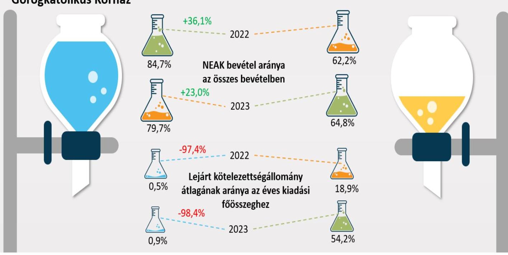

Formás: NEAK adatszolgáltatás és a Kórház beszámolói alapján ÁSZ saját szerkesztés

---

# 3.2. Input/humán erőforrás mutatók elemzése 

A humán erőforrás helyzet elemzéséhez a NEAK adatai kerültek felhasználásra ${ }^{11}$, amelyek 2021 márciusától ${ }^{12}$ álltak rendelkezésre, ami meghatározta az elemzett időszakot. A főbb adatokat a 8. táblázat tartalmazza.
8. táblázat

| A HUMÁN ERŐFORRÁSHELYZET FŐBB MUTATÓSZÁMAI |  |  |  |
| :--: | :--: | :--: | :--: |
| MUTATÓSZÁM NEVE | KÓRHÁZ   ADATA | AZ ELEMZETT KÓR-   HÁZAKÁTLAG   ADATA | ÁTLAGTÓL VALÓ   ELTÉRÉS |
| 2021 |  |  |  |
| Foglalkoztatott orvosok aránya az összlétszámból (havi átlag) (\%) | $11,2 \%$ | $21,5 \%$ | $-47,7 \%$ |
| Foglalkoztatott szakdolgozók aránya az összlétszámból (havi átlag) (\%) | $88,8 \%$ | 78,5\% | $13,1 \%$ |
| Alkalmazottak fluktuációja intézményi szinten (havi átlag) (\%) | $-0,2 \%$ | $0,6 \%$ | $-133,3 \%$ |
| ezen belül orvosok (havi átlag) (\%) | $1,1 \%$ | $1,6 \%$ | $-32,9 \%$ |
| ezen belül szakdolgozók (havi átlag) (\%) | $-0,4 \%$ | $0,4 \%$ | $-211,1 \%$ |
| 1 orvosra jutó szakdolgozó (havi átlag) (fő) | 7,9 | 4,6 | 70,7\% |
| 1 szakdolgozóra jutó teljesített ápolási nap (havi átlag) | 18,2 | 24,7 | $-26,4 \%$ |
| 1 orvosra jutó ágyak száma (havi átlag) | 8,7 | 7,0 | $23,9 \%$ |
| 1 szakdolgozóra jutó ágyak száma (havi átlag) | 1,2 | 1,5 | $-17,8 \%$ |
| 2022 |  |  |  |
| Foglalkoztatott orvosok aránya az összlétszámból (havi átlag) (\%) | $12,7 \%$ | $23,4 \%$ | $-45,6 \%$ |
| Foglalkoztatott szakdolgozók aránya az összlétszámból (havi átlag) (\%) | $87,3 \%$ | 76,6\% | $14,0 \%$ |
| Alkalmazottak fluktuációja intézményi szinten (havi átlag) (\%) | $0,24 \%$ | $0,19 \%$ | $27,7 \%$ |
| ezen belül orvosok (havi átlag) (\%) | $0,8 \%$ | $0,5 \%$ | $46,6 \%$ |
| ezen belül szakdolgozók (havi átlag) (\%) | $0,2 \%$ | $0,1 \%$ | $20,0 \%$ |
| 1 orvosra jutó szakdolgozó (havi átlag) (fő) | 6,9 | 4,0 | 73,8\% |
| 1 szakdolgozóra jutó teljesített ápolási nap (havi átlag) | 14,9 | 23,3 | $-36,0 \%$ |
| 1 orvosra jutó ágyak száma (havi átlag) | 8,1 | 5,7 | 40,9\% |
| 1 szakdolgozóra jutó ágyak száma (havi átlag) | 1,2 | 1,4 | $-13,4 \%$ |
| 2023 |  |  |  |
| Foglalkoztatott orvosok aránya az összlétszámból (havi átlag) (\%) | $13,7 \%$ | $24,0 \%$ | $-42,7 \%$ |
| Foglalkoztatott szakdolgozók aránya az összlétszámból (havi átlag) (\%) | $86,3 \%$ | 76,0\% | $13,5 \%$ |
| Alkalmazottak fluktuációja intézményi szinten (havi átlag) (\%) | $0,3 \%$ | $0,9 \%$ | $-71,6 \%$ |
| ezen belül orvosok (havi átlag) (\%) | $1,0 \%$ | $1,0 \%$ | $-0,7 \%$ |
| ezen belül szakdolgozók (havi átlag) (\%) | $0,3 \%$ | $1,0 \%$ | $-66,3 \%$ |
| 1 orvosra jutó szakdolgozó (havi átlag) (fő) | 6,3 | 3,7 | 68,6\% |
| 1 szakdolgozóra jutó teljesített ápolási nap (havi átlag) | 22,4 | 29,1 | $-23,2 \%$ |
| 1 orvosra jutó ágyak száma (havi átlag) | 7,2 | 5,0 | 44,7\% |
| 1 szakdolgozóra jutó ágyak száma (havi átlag) | 1,1 | 1,3 | $-13,7 \%$ |

Az orvosok aránya az összlétszámhoz viszonyítva folyamatosan emelkedett, a 2021. évről a 2023. évre 2,5 százalékponttal. A szakdolgozók aránya viszont ugyanilyen mértékben csökkent, amit tükröz az 1 orvosra jutó szakdolgozói létszám csökkenése is: 2021. évi 7,9 főről 2023-ra 6,3 főre csökkent. Ezek az arányok - még

[^0]
[^0]:    ${ }^{11}$ Az elemzést megelőzően humán erőforrásra vonatkozó adatkérést küldtünk az elemzett kórházak részére. A beérkezett adatok feldolgozásánál megállapítomuk, hogy azok összehasonlításra alkalmatlanok, az eltérő adatstruktúra miatt, továbbá eltérnek a NEAK által szolgáltatott adatoktól. Ennek okán kerültek a NEAK adatok felhasználásra a humán erőforrás helyzetének elemzéséhez.
    ${ }^{12}$ Az egészségügyi szolgálati jogviszonyról szóló 2020. évi C. törvény értelmében 2021. március 01-től történik adatgyűjtés az egészségügyi szolgálati jogviszonyban foglalkoztatott orvosok, szakdolgozók számát illetően. A gazdasági, műszaki területen foglalkoztatott dolgozók létszámára vonatkozóan 2023. július 1-től rendelkeznek adatokkal (erre az elemzés nem tér ki).

---

a szakdolgozói létszám csökkenését is figyelembe véve - a többi elemzett kórházhoz képest kiemelkedően jónak mondhatóak. Az alkalmazottak fluktuációja intézményi szinten a 2022. évben valamelyest kedvezőtlenebb volt a többi kórházhoz viszonyítva, viszont azt megelőzően és a 2023. évben is lényegesen alatta maradt az átlagnak, ami stabil munkaerő-megtartó helyzetre utal.

Az 1 orvosra jutó ágyak száma 2021-ben 8,7; 2022-ben 8,1; 2023-ban 7,2 volt, míg az 1 szakdolgozóra jutó ágyak száma 1,2 körül alakult. Megállapítható, hogy az 1 orvosra jutó átlagos ágyszám a vizsgált évek alatt mindvégig jóval az átlag felett volt, viszont a tendencia minimálisan javult, hiszen az 2023-ra 1,5 ággyal csökkent. Szakdolgozói szinten viszont kedvezőbb az egy főre jutó ágyak száma az átlagnál, attól 2021-ben 17,8; 2022-ben 13,4; 2023-ban 13,7\%-kal volt kevesebb.

Az 1 szakdolgozóra jutó teljesített ápolási napok vonatkozásában megállapítható a szakdolgozók leterheltsége a 2023. évre növekvő tendenciát mutat ugyan, de lényegesen alatta marad az átlagnak, attól 2021-ben 26,4; 2022-ben 36,0; 2023-ban 23,2 \%-kal volt kevesebb.

Fontos megjegyezni, hogy az elemzés nem tért ki sem az orvosok, sem a szakdolgozók vonatkozásában a képzettségi szint szerinti megoszlásra, ami tovább árnyalná a humán erőforrás helyzet megítélését.

# 3.3. Output/működési-, teljesítmény-, kapacitáskihasználtság mutatók elemzése 

9. táblázat

## A FŐBB MŰKÖDÉSI-, TELJESÍTMÉNY-, KAPACITÁSKIHASZNÁLTSÁG ADATOK

| MUTATÓSZÁM NEVE | KORHAZ ADATA | AZ ELENZETT KOR HAZÁK ÁTLAG ADATA | ÁTLAGTÓI   YAKÓ KETEMES |
| :--: | :--: | :--: | :--: |
| 2021 |  |  |  |
| Éves ágykihasználtsági mutató aktív (\%) | $47,5 \%$ | $56,4 \%$ | $-15,8 \%$ |
| Éves ágykihasználtsági mutató krónikus (\%) | $31,6 \%$ | $49,9 \%$ | $-36,6 \%$ |
| Egy aktív ágyra jutó elszámolt súlyszám | 14,6 | 30,5 | $-52,3 \%$ |
| Case-mix index | 0,7 | 1,0 | $-27,1 \%$ |
| Egy súlyszámra jutó gyógyszerkiadás (Ft) | 24386,0 | 212802,2 | $-88,5 \%$ |
| Egy esetszámra jutó gyógyszerkiadás - (aktív és krónikus) (Ft) | 17446,8 | 126752,3 | $-86,2 \%$ |
| Teljesített súlyszám (fekvő) | 4495,4 | 4232,4 | $6,2 \%$ |
| TÉK felett elszámolt súlyszám (degresszált súlyszám) (fekvő) | - | 4,4 | $-100,0 \%$ |
| Kihasználatlan TÉK súlyszám (fekvő) | 2760,0 | 1986,8 | $38,9 \%$ |
| Teljesített pont (járó) | 250165 804,0 | 123521 458,0 | $102,5 \%$ |
| TÉK feletti elszámolt pont (degresszált pont) (járó) | 574872,0 | 9566 249,8 | $-94,0 \%$ |
| Kihasználatlan TÉK pont (járó) | 489174 336,0 | 380169 604,0 | $28,7 \%$ |
| Teljesített pont (labor) | 85872 088,0 | 58953 874,0 | $45,7 \%$ |
| TÉK felett teljesített, lebegő ponton elszámolt pont (labor) | 48429 436,0 | 38986 296,4 | $24,2 \%$ |
| Kihasználatlan TÉK pont (labor) | - | 0,0 | $0,0 \%$ |
| Egynapos súlyszám | - | 12,2 | $-100,0 \%$ |
| Standardizált naphányados | 0,9 | 1,0 | $-11,8 \%$ |
| 2022 |  |  |  |
| Éves ágykihasználtsági mutató aktív (\%) | $58,2 \%$ | $54,9 \%$ | $5,9 \%$ |
| Éves ágykihasználtsági mutató krónikus (\%) | $29,7 \%$ | $45,6 \%$ | $-34,8 \%$ |
| Egy aktív ágyra jutó elszámolt súlyszám | 27,3 | 33,9 | $-19,6 \%$ |
| Case-mix index | 0,9 | 1,0 | $-6,2 \%$ |
| Egy súlyszámra jutó gyógyszerkiadás (Ft) | 25340,0 | 130781,7 | $-80,6 \%$ |
| Egy esetszámra jutó gyógyszerkiadás - (aktív és krónikus) (Ft) | 18077,3 | 53697,1 | $-66,3 \%$ |
| Teljesített súlyszám (fekvő) | 8335,7 | 5351,3 | $55,8 \%$ |
| TÉK felett elszámolt súlyszám (degresszált súlyszám) (fekvő) | - | 4,4 | $-100,0 \%$ |
| Kihasználatlan TÉK súlyszám (fekvő) | 6717,0 | 2491,6 | $169,6 \%$ |
| Teljesített pont (járó) | 508244 589,0 | 192261 988,4 | $164,4 \%$ |
| TÉK feletti elszámolt pont (degresszált pont) (járó) | - | 18842 002,6 | $-100,0 \%$ |
| Kihasználatlan TÉK pont (járó) | 244397 297,0 | 284324 272,6 | $-14,0 \%$ |
| Teljesített pont (labor) | 181170 464,0 | 83787 329,2 | $116,2 \%$ |
| TÉK felett teljesített, lebegő ponton elszámolt pont (labor) | 106206 856,0 | 56309751,0 | $88,6 \%$ |
| Kihasználatlan TÉK pont (labor) | - | 0,0 | $0,0 \%$ |
| Egynapos súlyszám | 30,0 | 12,2 | $145,9 \%$ |
| Standardizált naphányados | 0,9 | 1,0 | $-10,0 \%$ |

---

| 2023 |  |  |  |
| :-- | --: | --: | --: |
| Éves ágykihasználtsági mutató aktív (\%) | $75,6 \%$ | $61,9 \%$ | $22,1 \%$ |
| Éves ágykihasználtsági mutató krónikus (\%) | $66,7 \%$ | $54,2 \%$ | $23,0 \%$ |
| Egy aktív ágyra jutó elszámolt súlyszám | 37,1 | 33,7 | $9,9 \%$ |
| Case-mix index | 0,8 | 1,1 | $-20,9 \%$ |
| Egy súlyszámra jutó gyógyszerkiadás (Ft) | 28040,0 | 151655,2 | $-81,5 \%$ |
| Egy esetszámra jutó gyógyszerkiadás - (aktív és krónikus) (Ft) | 16521,5 | 69990,1 | $-76,4 \%$ |
| Teljesített súlyszám (fekvő) | 11489,0 | 6665,8 | $72,4 \%$ |
| TÉK felett elszámolt súlyszám (degresszált súlyszám) (fekvő) | 56,0 | 24,2 | $131,4 \%$ |
| Kihasználatlan TÉK súlyszám (fekvő) | 1062,0 | 753,6 | $40,9 \%$ |
| Teljesített pont (járó) | 624218732,0 | 228596480,0 | $173,1 \%$ |
| TÉK feletti elszámolt pont (degresszált pont) (járó) | 6065408,0 | 7164085,4 | $-15,3 \%$ |
| Kihasználatlan TÉK pont (járó) | 15663597,0 | 100051940,0 | $-84,3 \%$ |
| Teljesített pont (labor) | 210569584,0 | 85735806,6 | $145,6 \%$ |
| TÉK felett teljesített, lebegő ponton elszámolt pont (labor) | 135264683,0 | 58219064,4 | $132,3 \%$ |
| Kihasználatlan TÉK pont (labor) |  | 0,0 | $0,0 \%$ |
| Egynapos súlyszám | 42,0 | 13,6 | $208,8 \%$ |
| Standardizált naphányados | 0,9 | 0,9 | $2,1 \%$ |

A Kórház a 584 db ággyal üzemelt a fenntartóváltástól kezdve, amelynek számában változás nem történt a vizsgált időszakban. Az összes ágyból 363 db volt aktív besorolású, míg 221 db krónikus besorolású. Az aktív ágyak kihasználtsága 2021. évben 47,5\%, 2022. évben 58,2\%, míg a 2023. évben 75,6\% volt. Az aneszteziológiai és intenzív betegellátás kivételével valamennyi szakma esetén nőtt az ágyak kihasználtsága, ami 28,1 százalékpontos növekedést eredményezett a 2023. évre. Fontos megjegyezni, hogy a Kórház aktív ágykihasználtsági adata 2023-ra az országos átlaghoz ${ }^{13}$ viszonyítva is lényegesen jobb volt, hiszen az aktív ellátás tekintetében az országos átlag 57,6\% volt. A Kórház aktív ágyainak kihasználtsági adatait a 11. ábra tartalmazza, az országos átlaghoz, valamint a többi elemzett kórház adataihoz viszonyítottan.
11. ábra

A KÓRHÁZ AKTÍV ÁGYAINAK KIHASZNÁLTSÁGI ADATAI
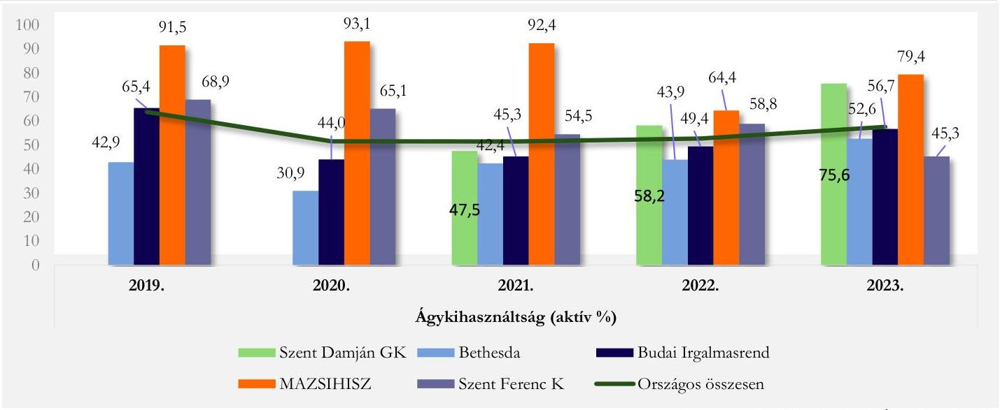

[^0]
[^0]:    ${ }^{13}$ https://www.neak.gov.hu/felso_menu/szakmai_oldalak/publikus_forgalmi_adatok/gyogyito_megelozo_forgalmi_adat/fekvobeteg_szakellatas_stat/korhazi_agyszam

---

A krónikus ágyak ${ }^{14}$ kihasználtsága tekintetében szintén nagymértékű növekedés detektálható. Ezen ágyakon a betegforgalom megnövekedése eredményeként a 2021. évi 31,6\%-os kihasználtság 2023. évre $\mathbf{6 6 , 7 \% - r a}$ nőtt, ami 35,1 százalékpontos növekedésnek felel meg, viszont ez a növekedés sem volt elégséges ahhoz, hogy az országos $71,4 \%$-os átlagot elérje. A krónikus ágykihasználtsági adatokat a 12. ábra tartalmazza az országos átlag-, illetve a többi elemzett kórház adatainak relevanciájában.
12. ábra

A KÓRHÁZ KRÓNIKUS ÁGYAINAK KIHASZNÁLTSÁGI ADATAI
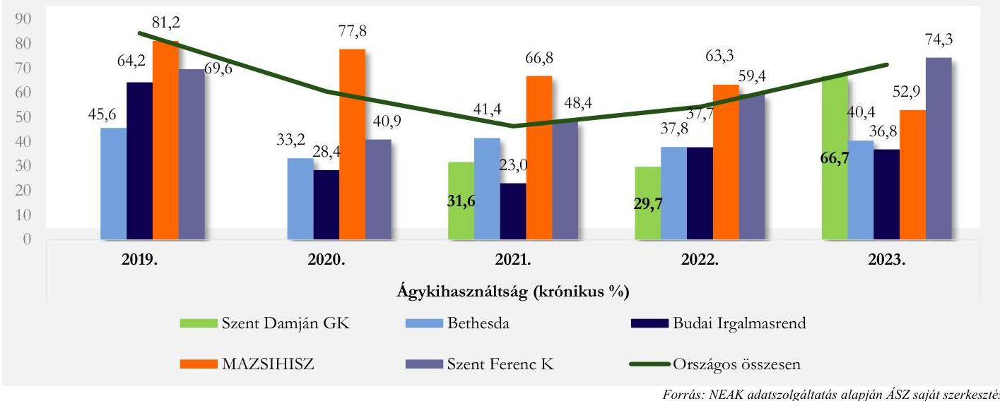

Az ágykihasználtsági adatok többi elemzett kórház adataihoz való viszonyítása alapján megállapítható, hogy míg az aktív ágyak kihasználtsága 2021-ben 15,8\%-kal elmaradt az átlagtól, addig 2022-ben 5,9 \%-kal, 2023-ban már 22,1 \%-kal volt jobb. A krónikus ágyak tekintetében viszont 2021-ben 36,6\%-kal, 2022-ben $34,8 \%$-kal maradt el az átlagtól, ami 2023-ra a megnövekedett betegforgalom miatt átfordult és $23,0 \%$-kal lett több mint az öt kórházi átlag.

Az aktív fekvőbeteg szakellátás elszámolt teljesítményét vizsgálva megállapíthatjuk, hogy a Kórház 2021-2022. közötti időszakban nem jelentett TÉK ${ }^{25}$ feletti súlyszámot. 2023-ban viszont minimális, de az 5 kórház átlagát meghaladó (56,0) súlyszám után kapott finanszírozást. TÉK felett jelentett súlyszám után a kórház degresszált finanszírozási összeget kap. A Kórház bevételére mindenképp negatív hatással volt az a tény, hogy mindhárom vizsgálati évben nagymértékủ volt a kihasználhatatlan kapacitása (2021: 2760,0 súlyszám; 2022: 6717,0 súlyszám; 2023: 1062,0 súlyszám), ami szintén az 5 kórházi átlag felett volt. Fontos azonban megjegyezni, hogy 2021-hez viszonyítva 2023-ra a kihasználatlan súlyszám aránya lényegesen lecsökkent a teljesített súlyszámhoz viszonyítva, de ezzel együtt is fokozott figyelem szükséges a kapacitások tervezésénél, elosztásánál.

A case-mix index adott időszak alatt ellátott finanszírozási esetek összetételét költségigényesség szempontjából jellemző mutató, amely az elszámolt súlyszám és az elszámolt finanszírozási esetszám hányadosa. Így a Kórházra vizsgálva mutatja az ellátott kórházi ápolási esetek átlagos költségigényesség szerinti súlyosságát. Általában az átlagos kórházi eset súlyszáma 1,0. Ennek megfelelően az ennél magasabb case-mix index az átlagot meghaladó, a kisebb pedig az átlagnál alacsonyabb normatív költségigényű esetek ellátását jelzi. A Kórház esetében a case-mix index 0,7 és 0,9 között mozgott, az 1,0, illetve 1,1 átlaghoz képesti alulmaradás kisebb költségigényű betegség típusok ellátására utal. Ezzel szoros korrelációt mutat az 1 súlyszámra jutó

[^0]
[^0]:    ${ }^{14}$ Krónikus ágyak megoszlása: krónikus ellátás - 121 db ágy; rehabilitációs ellátás - 100 db ágy

---

gyógyszerkiadás elemzése is. Ennek mértéke ugyanis 2021-ben 88,5; 2022-ben 80,6; 2023-ban 81,5\%-kal volt kevesebb az öt kórház átlagához viszonyítva. Ha a gyógyszerkiadást esetszámra vetítjük (aktív és krónikus együtt), akkor szintén azt állapíthatjuk meg, hogy annak mértéke szintén az átlag alatt maradt: 2021-ben 86,2; 2022-ben 66,3; 2023-ban 76,4\%-kal volt kevesebb, mindez a kórház nagyon szigorú kontroll alatt tartott gyógyszer gazdálkodására utal.

A standardizált naphányados $\left(\mathbf{S N H}^{26}\right)$ az átlagos ápolási idő viszonyát mutatja a normatív naphoz. Amennyiben az SNH értéke kisebb, mint 1, akkor a vizsgált intézmény átlagos ápolási ideje rövidebb, mint az adott $\mathrm{HBCS}^{27}$-khez tartozó normatív ápolási idő. A Kórház esetében az SNH értéke valamennyi évben 0,9 volt, tehát az intézmény átlagos ápolási ideje rövidebb volt, mint az adott HBCS-khez tartozó normatív ápolási idő, ami szintén költségcsökkentő tényezőként értelmezhető.

A Kórház járóbeteg szakellátás teljesítménye vonatkozásában megállapítható, hogy 2022. évben nem, de 2021-ben és 2023-ban jelen volt TÉK feletti teljesítmény, ami után degresszált finanszírozási összeget fizetett ki a NEAK. Megjegyzendő, hogy a teljesített ponthoz viszonyítottan is magas arányú TÉK feletti teljesítmény még így is az öt kórház átlaga alatt van. A fekvőbeteg szakellátáshoz hasonlóan a járóbeteg szakellátásban is jellemző a nagy arányú kihasználatlan TÉK, és szintén látható a folyamat, miszerint a teljesített ponthoz mért kihasználatlan pont mértéke csökkenő tendenciát mutat 2023-ra. A TÉK felett jelentett teljesítmény és a kihasználatlan TÉK éven belüli együttes jelenléte tervezési hibára, a szezonalitás nem megfelelő felmérésére, a szakmánkénti kapacitásfelosztás anomáliájára utalhat.

A laboratóriumi ellátás finanszírozására jellemző, hogy a leginkább „tülteljesített" kassza, ezt igazolja vissza, hogy a Kórház esetében nem jelent meg (és a másik 4 kórháznál sem) kihasználatlan kapacitás, viszont TÉK feletti teljesítmény annál inkább. A Kórház a TÉK feletti labor-teljesítménye után degresszált, úgynevezett lebegőponton elszámolt forintértéket kapott, ami a volumenre tekintettel kifejezett negatív hatással bírt a gazdálkodására. A többi kórház átlagához viszonyítottan 2021-ben 24,2; 2022-ben 88,6; 2023-ban 132,3\%-kal volt több a TÉK felett elszámolt pontja a Kórháznak. 2023. évben a Kórház 100,0\%-on finanszírozott pontjának mintegy $64,0 \%$-át jelentette le pluszban TÉK feletti teljesítményként. Fontos megjegyezni, hogy az elemzés nem tért ki a TÉK felett leadott teljesítmény összetételének vizsgálattára, ami tovább árnyalhatná a helyzet megítélését. A 13. ábra a Kórház elszámolt pontjainak alakulását illusztrálja, a TÉK feletti elszámolt pontokkal kiegészítve, a többi elemzett kórház adataival való összehasonlításban.
13. ábra

A KÓRHÁZ ELSZÁMOLT LABOR PONTJAINAK ALAKULÁSA
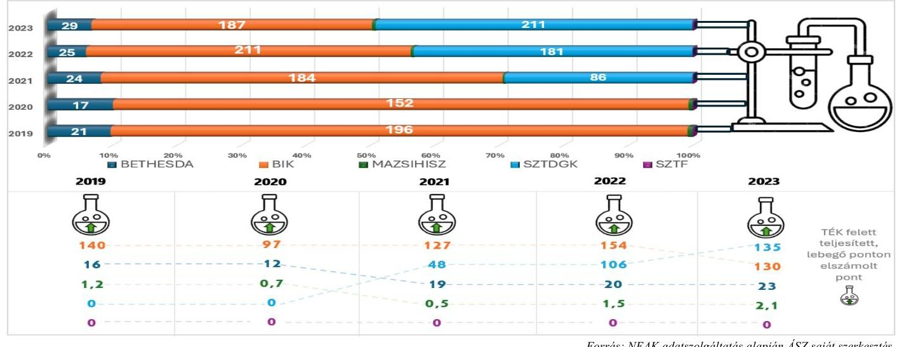

---

Míg a Kórház a 2021. évben nem jelentett egynapos ellátási teljesítményt, addig 2022-ben 30,0; 2023ban 42,0 egynapos súlyszámot számolt el a NEAK e költséghatékony ellátási formára, ami 145,9\%-kal, illetve 208,8\%-kal haladta meg az öt kórházi átlagot.

A kapacitások kihasználásának vizsgálatakor meg kell említenünk az épületek kihasználtságára, állapotára vonatkozó adatokat is ${ }^{15}$. A vizsgált időszakban három kategóriába sorolt műtőt üzemeltettek: a kórház 4 db központi műtővel rendelkezett, melynek kihasználtsága a 2022. évben 35,4\%, a 2023. évben 43,1\% volt. Az 1 db szülészeti műtő kihasználtsága a 2022. évben 9,4\%, 2023. évben 16,5\% volt. Az 1 db ambuláns műtő kihasználtsága a 2022. évben 19,7\%, a 2023. évben 22,1\% volt. A 2023. évre minden műtőfajtánál nőtt a kapacitáskihasználtság.

Az intézmény épületeinek átlagos kora 44 év volt, a felújítások utolsó éve 2023. A Kórház az infrastruktúrájának korszerűsítésére nagy figyelmet fordít az épület-beruházások és felújításai által. ${ }^{16}$

# 3.4. Menedzsment hatásvizsgálata 

Az elemzett időszak számos globális és magyarországi kihívást hozott, mely külső és belső tényezőként nagyban befolyásolták a betegek ellátásnak minőségét és az intézmény fenntarthatóságát.

A 2021. év második felében a legjelentősebb feladatot az akkor még javában tartó COVID-19 világjárvány okozta nyomás hatékony kezelése jelentette. A járvány okozta leterheltség, késleltetett vagy elmaradó műtétek a várólisták növekedését eredményezték, amire a menedzsmentnek hatékonyan és rugalmasan kellett reagálnia. A 2021. éves beszámoló kiegészítő melléklete alapján a kórház vezetése a COVID-19 járványkezelés miatt megnövekedett feladataink ellátását belső munkaerő-átcsoportosításokkal oldotta meg. A pandémia kihívásai mellett a menedzsment szem előtt tartotta az intézmény fejlesztését is, amit eszközbeszerzésekkel ( 38 db számítástechnikai eszköz), illetve beruházásokkal és felújításokkal valósított meg. Ezen felül a kórház vezetése elkötelezett volt a környezetvédelem iránt is, és napelemparkot is üzemeltetett a vizsgált időszakon belül.

A 2022. évben továbbra is jelenlévő COVID-19 mellett egy új külső tényező jelent meg: kirobbant az orosz-ukrán háború, mely nagymértékű gazdasági kihívást jelentett az energiapiacok instabilitása és a növekvő inflációs környezet miatt. A Kórház az ukrajnai háború menekültjeinek és áldozatainak megsegítésére 18 735,150 E Ft támogatási összeget fordított a 2022. évi beszámoló kiegészítő melléklete szerint. A kihívások ellenére a kórház vezetése továbbra is kiemelt figyelmet fordított az intézmény modernizálására. Több nagyobb volumenű eszközbeszerzést hajtott végre, mely magában foglalja 45 db számítástechnikai eszköz, orvosi gépek, műszerek és orvosi berendezések beszerzését, ugyanakkor a már futó projektek mellett új fejlesztésbe is kezdett a kórház a EFOP-2.2.19-17-2017-00024 keretein belül járóbeteg szakellátó szolgáltatások fejlesztése, fizikoterápiás eszközök beszerzése kezdődött meg. Emberi erőforrás oldalról a COVID-19 járvány gyengülését

[^0]
[^0]:    ${ }^{15}$ Adatközlő a Kórház.
    ${ }^{16}$ Beruházás:
    - Betegfogadó épület (Forrás: Az EMMI IV/9412-1/2021/EKF számú támogatói okiratban odaítélt 62,7 M Ft támogatásból betegfogadó épület létesítésére 20,4 M Ft-ot fordítottak, melyet saját forrásaal is kiegészítettek.)
    Felújítás:
    - Tüdőgondozó székhelyen történő kialakítása, 182,1 M Ft; (Forrás: EFOP-2.2.18-17-2017-00064 projekt ( $130,8 \mathrm{M} \mathrm{Ft}+$ saját forrás felhasználása)
    - Sürgősségi Betegellátó Osztály bővítése, felújítás értéke 134,8 M Ft; (Forrás: HUSKROUA/1901/8.2/0070 projekt)
    - Központi Laboratórium felújítása, felújítás értéke 140,9 M Ft; (Forrás: ROHU457 projekt)
    - Járóbeteg szakrendelők felújítása, felújítás értéke 134,8 M Ft; (Forrás: EFOP-2.2.18-17-2017-00064 projekt + saját forrás felhasználása)

---

követően a megnövekedett létszámú betegek ellátáshoz szükséges szakdolgozói üres álláshelyek betöltésre kerültek, továbbá megkezdődött az orvosok bérrendezése is, így a bérköltség közel duplájára emelkedett.

A 2023. évben a magas inflációs környezet mellett az elhúzódó orosz-ukrán háború jelentette a külső tényezők által okozott problémákat. Az orvos szakmában az utánpótlás biztosítása országszerte nehézségeket okozott, ezért kiemelkedő eredmény volt, hogy a 2023. évben egy fő szakorvos és hat fő rezidens került felvételre, továbbá az államilag támogatott rezidens képzés által elnyert létszám is maradéktalanul feltöltésre került (nyolc fő). Az intézmény fejlesztése továbbra is kiemelt szerepet kapott a meglévő fejlesztési és beruházási projektek, illetve eszközbeszerzések jóvoltából. A tárgyévben 277 db eszköz került beszerzésre.

A fentiek mellett fontos megjegyezni, hogy a menedzsment növelte a teljesítményfinanszírozásból származó bevételeit, ami hozzájárult a Kórház pénzügyi stabilitásához.

# 3.5. Várólista, előjegyzési idők alakulása, elemzése ${ }^{17}$ 

A NEAK nyilvántartása szerint a Kórház 4 fajta várólistát vezetett:

- Szürkehályog műtétei
- Mandula, orrmandula műtét
- Orrmelléküregek, proc. mastoideus műtétei
- Nőgyógyászati műtétek nem malignus folyamatokban

A négy műtéti típusra vonatkozó adatokat a 14. ábra foglalja össze.
14. ábra

A KÓRHÁZ VÁRÓLISTÁINAK ADATAI
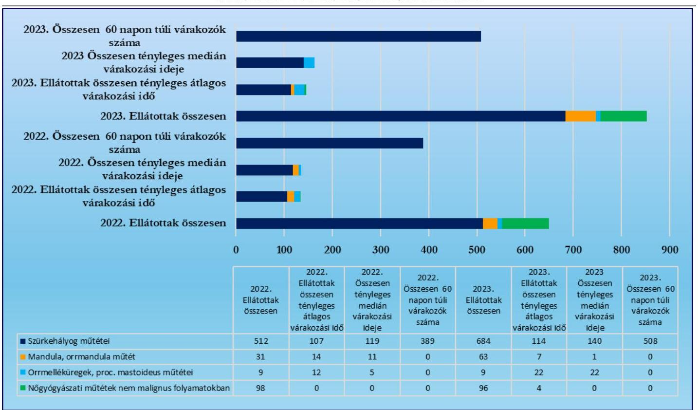

Forrás: NEAK adatzoógáltatás alapján ÁSZ saját szerkesztés

[^0]
[^0]:    ${ }^{17}$ Az elemzett időszak a 2022-2023. évek.

---

A vizsgált két évben, a szürkehályog műtétek tették ki az összes elvégzett műtét nagy részét, 2022-ben 78,8\%-át, 2023-ban 80,3\%-át. A 2023. évre az elvégzett szürkehályog műtétek száma 172 -vel nőtt. A tényleges átlagos várakozási idő ${ }^{18} 7 \%$-kal nőtt 107 -ről 114 napra, ami kedvezőtlen folyamat nem csak a növekedés miatt, hanem amiatt is, mert az az országos átlag felett volt (2023-ban 45 nap). A tényleges medián várakozási idő $18 \%$-kal emelkedett 119 -ről 140 napra, ami szintén jócskán az országos átlag felett van. A 60 napon túli várakozók száma pedig 119-cel gyarapodott.

A következő három műtét esetében 60 napon túli várakozó egyik vizsgált évben sem volt. Az elvégzett mandula, orrmandula műtétek száma 32 -vel nőtt, a tényleges átlagos várakozási idő az előző év felére csökkent, a tényleges medián várakozási idő $92 \%$-kal csupán 1 napra csökkent. Az elvégzett orrmelléküreg, proc. mastoideus műtétek száma nem változott, viszont annak átlagos tényleges várakozási ideje 10 nappal nőtt, a tényleges medián várakozási idő pedig több mint négyszeresére nőtt. Az elvégzett nőgyógyászati műtétek nem malignus folyamatokban száma 2 -vel csökkent, a tényleges átlagos várakozási idő 0 -ról 4 napra nőtt.

A Kórház adatait a tényleges átlagos várakozási idő, valamint a tényleges medián várakozási idő vonatkozásában a 10. táblázat tartalmazza az országos adatokkal kiegészítve.
10. táblázat

# A KÓRHÁZ VÁRÓLISTA ADATAI ORSZÁGOS ADATOK VISZONYLATÁBAN 

| ÉV | VÁrólista NEVE | ELIÁTOTTÁK ÖSSZESEN |  | ELIÁTOTTÁK ÖSSZESEN TÉNYLEGES ÁTLÁGOS VÁRAKOZÁSI IDŐ |  | ÖSSZESEN TÉNYLEGES MÉDIÁN VÁRAKOZÁSI IDŐ |  |
| :--: | :--: | :--: | :--: | :--: | :--: | :--: | :--: |
|  |  | KÓRHÁZ |  | KÓRHÁZ | ÖRSZÁGOS   ÁTLÁG | KÓRHÁZ | ÖRSZÁGOS ÁTLÁG |
| 2022 | Szürkehályog műtétei | 512 |  | 107 | 61 | 119 | 46 |
|  | Mandula, orrmandula műtét | 31 |  | 14 | 24 | 11 | 13 |
|  | Orrmelléküregek, proc. mastoideus műtétei | 9 |  | 12 | 21 | 5 | 9 |
|  | Nőgyógyászati műtétek nem malignus folyamatokban | 98 |  | 0 | 9 | 0 | 2 |
| 2023 | Szürkehályog műtétei | 684 |  | 114 | 45 | 140 | 31 |
|  | Mandula, orrmandula műtét | 63 |  | 7 | 29 | 1 | 15 |
|  | Orrmelléküregek, proc. mastoideus műtétei | 9 |  | 22 | 15 | 22 | 7 |
|  | Nőgyógyászati műtétek nem malignus folyamatokban | 96 |  | 4 | 7 | 0 | 1 |

A 2022. évben 650-, 2023. évben 852 beteget, azaz összesen 1502 beteget látott el a Kórház. A teljes ellátott betegállományból saját, Szabolcs-Szatmár-Bereg vármegyéhez a betegek 94,54\%-a tartozott, Borsod-Abaúj-Zemplén 4,46\%-ot, Heves 0,13\%-ot, Zala 0,07\%-ot, Budapest $0,4 \%$-ot és külföld $0,4 \%$-ot tett ki.

A NEAK a várólistán regisztráltak esetében vizsgálja a sorrendiségi hibák ${ }^{19}$ előfordulását. A sorrendiségi hiba aránya a várakozók esetén a 2023. évre jelentősen javult a szürkehályog műtétei vonatkozásában, mivel az $11,7 \%$-ra csökkent, míg a mandula, orrmandula műtétek esetében sorrendiségi hiba nélkül teljesített a kórház.

[^0]
[^0]:    ${ }^{18}$ Azt mutatja meg, hogy az elmúlt időszakban átlagosan egy adott beavatkozás tekintetében ténylegesen mennyit kellett várni.
    ${ }^{19}$ Az esetek nagyrészében adminisztratív hiba.

---

A Kórház a várólistához kapcsolódó NEAK szankciók számával kapcsolatban szintén javulást ért el a 2023. évre. 2022. évben 200 hibát vétettek, ami 7920 E Ft büntetést jelentett. A 2023. évben 59 hibát vétettek, ami 2336 E Ft büntetést vont maga után. ${ }^{20}$

A kórház részt vett várólista többletprogramban is a szürkehályog műtétekre vonatkozóan, amely eredménye, hogy a Kórház 2022. évben a 75 vállalt többletműtétből 58 -at teljesített, így a kiközőlt 15 568,143 E Ft-ból 11 488,480 E Ft-ot számolt el. A 2023. évben a 44 vállalt többletmútétből 7-et teljesített ${ }^{21}$, így a kiközőlt 7 694,831 E Ft-ból 1 228,497 E Ft-ot számolt el.

[^0]
[^0]:    ${ }^{20} 1 \mathrm{db}$ hibapont szankcionálási mértéke $39,6 \mathrm{E}$ Ft volt.
    ${ }^{21}$ A Kórház nyilatkozata alapján az alacsony teljesített esetszám oka az volt, hogy a programban való részvételről a Kórház nem kapott tájékoztatást a NEAK-tól. A keretről tárgyév végén a NEAK által üzemeltetett Várólista felületéről szerzett tudomást a Kórház, aminek következtében már csak 7 esetet tudtak ellátni.

---

# MELLÉKLETEK 

## I. SZ. MELLÉKLET: ÉRTELMEZŐ SZÓTÁR

Aktív fekvőbeteg szakellátás

Ágykihasználási százalék

Ápolás átlagos tartama

Beszámoló

Bruttó CF (non cash tételekkel korrigált üzemi eredmény)

CAPEX (tőkebefektetés)

Az az ellátás, amelynek célja az egészségi állapot mielőbbi helyreállítása. Az aktív ellátás időtartama, illetve befejezése többnyire tervezhető, és az esetek többségében rövid időtartamú.
(Forrás: https://www.neak.gov.hu/felso_menu/szakmai_oldalak/gyogyito_megelozo_ellatas/szakellatas/fekvobeteg_szakellatas)
Teljesített ápolási napok száma osztva a teljesíthető ápolási napok számával és szorozva 100 -zal.
(Forrás: https://www.neak.gov.hu/felso_menu/szakmai_oldalak/publikus_forgalmi_adatok/gyogyito_megelozo_forgalmi_adat/fekvobeteg_szakellatas_stat/korhazi_agyszam)
A tárgyévben távozott betegek teljes ápolási idejére számított ápolási napjainak száma osztva az osztályokról a tárgyévben elbocsátott betegek számával. A teljes ápolási idő a tárgyévben távozott betegek összes ápolási napját tartalmazza, így a tárgyévben távozott, de az előző évben (években) felvett beteg esetén az ápolás előző évre (évekre) eső részét is. Az ápolás átlagos tartama nem egyezik meg a teljesített ápolási napok számának és az elbocsátott betegek számának hányadosával.
(Forrás: https://www.neak.gov.hu/felso_menu/szakmai_oldalak/publikus_forgalmi_adatok/gyogyito_megelozo_forgalmi_adat/fekvobeteg_szakellatas_stat/korhazi_agyszam)
A gazdálkodó működéséről, vagyoni, pénzügyi és jövedelmi helyzetéről az üzleti év könyveinek zárását követően, a Számv. tv-ben meghatározott könyvvezetéssel alátámasztott beszámolót köteles - magyar nyelven - készíteni. A beszámolónak megbízható és valós összképet kell adnia a gazdálkodó vagyonáról, annak összetételéről (eszközeiről és forrásairól), pénzügyi helyzetéről és tevékenysége eredményéről.
Az egyéb szervezet beszámolási kötelezettségének, beszámolót alátámasztó könyvvezetési kötelezettségének sajátosságait a vonatkozó külön jogszabály és a Számv. tv. alapján kormányrendelet szabályozza. A gazdálkodó, illetve a természetes személy által alapított egészségügyi, szociális, kulturális és oktatási intézmény könyvvezetési, beszámolókészítési kötelezettségét - a Számv. tv. és a vonatkozó külön jogszabály rendelkezései alapulvételével - a létrehozó szervezet állapítja meg azzal, hogy a létrehozott szervezetet - jogi személyiségének megfelelően - a Számv. tv. 3. § (1) bekezdése 2-4. pontjai szerinti szervezetek közé kell besorolnia
(Forrás: Számv. tv. 4 § (1)-(2) bek., 6. § (2)-(3) bek.)
A Bruttó Cash Flow értékét a befektetett tőke és a várható gazdasági profit jelenértékének összege adja. Várható gazdasági profit jelenértéke lehet: pozitív, negatív, nulla. Egy gazdálkodó csak annyival ér többet a befektetett tőkénél, amennyivel a befektetett tőke jövedelmezősége meghaladja a tőkeköltséget. Azt mutatja meg, hogy mekkora összegű a gazdálkodó üzemi eredménye azok a számviteli elszámolások nélkül, melyek az adott gazdálkodási évben nem jártak sem pénzkiadással sem annak az előírásával.
(Forrás: http://ecopedia.hu/brutto-cash-flow)
Azt mutatja meg, hogy a gazdálkodó az adott évben mekkora összegben pótolta a befektetett eszközeit.
A tőkebefektetés nem minősül sem hitelnek, sem pedig támogatásnak. A tőkebefektetés során az idegen tőkét a szervezet alaptőkéjének emelésével hajtják végre.
(Forrás: http://ecopedia.hu/tokebefektetes)

---

Case-mix Index (CMI)

Egyház

Egyházi jogi személy

Egynapos ellátási esetek száma

Eszközarányos jövedelmezőség (ROA)

Fekvőbeteg szakellátás

Fenntartó

Finanszírozási CF

Adott időszak alatt ellátott finanszírozási esetek összetételét költségigényesség szempontjából jellemző mutató, amely az elszámolt súlyszám és az elszámolt finanszírozási esetszám hányadosa. Az adott kórházra (osztályra, korcsoportra, területre) vizsgálva mutatja az ellátott kórházi ápolási esetek átlagos költségigényesség szerinti súlyosságát (az előfordult homogén betegségesoportok súlyszámának az esetszámmal súlyozott átlaga). Általában az átlagos kórházi eset súlyszáma 1,000. Ennek megfelelően az ennél magasabb case-mix index az átlagot meghaladó, a kisebb pedig az átlagnál alacsonyabb normatív költségigényű esetek ellátását jelzi.
(Forrás: a 43/1999. (III. 3.) Korm. rendelet ${ }^{28}$ 2.§ 1) pont)
A vallási közösség az egyház megjelölést elnevezésében és a tevékenységére való utalás során önmeghatározása céljából - a saját hitelvei szerinti tartalommal - használhatja. (Forrás: Ehtv. 7/B §)
Egyházi jogi személy a bevett egyház, a bejegyzett egyház és a nyilvántartásba vett egyház, továbbá azok belső egyházi jogi személye.
(Forrás: Ehtv. 10. §)
Azon betegek száma, akiknek az ápolási ideje a 24 órát nem érte el, és a 9/1993 NM rendelet 9 . számú mellékletében meghatározott egynapos beavatkozások valamelyikében részesültek.
(Forrás: https://www.neak.gov.hu/felso_menu/szakmai_oldalak/publikus_for-galmi_adatok/gyogyito_megelozo_forgalmi_adat/fekvobeteg_szakellatas_stat/kor-hazi_agyszam)
Azt mutatja meg, hogy 1 Ft átlagos eszköz értékre mekkora adózott eredmény jut. Eszközarányos eredmény = Adózott eredmény / Összes eszköz
(Forrás: https://ofi.oh.gov.hu)
Klinikán, kórházban, szakápolási intézményben, valamint fekvőbeteg-ellátást nyújtó országos intézetben végzett minden ellátási esemény, amelynek során a biztosítottat az intézménybe felvették, és ott legalább 24 órán keresztül - nappali kórházi ellátás esetén legalább 6 órán keresztül - tartózkodik.
(Forrás: https://www.neak.gov.hu/felso_menu/szakmai_oldalak/gyogyito_megele-ozo_ellatas/szakellatas/fekvobeteg_szakellatas)
Fenntartó:

- költségvetési szerv egészségügyi szolgáltató esetén az alapító okiratban irányító szervként megjelölt állami szerv, helyi önkormányzat vagy önkormányzati társulás,
- egyházi jogi személy vagy vallási egyesület által fenntartott egészségügyi szolgáltató esetében az egészségügyi szolgáltató alapító okiratában fenntartóként megjelölt ilyen jogalany,
- alapítványi, közalapítványi egészségügyi szolgáltató esetén az alapítvány, közalapítvány,
- a nemzeti felsőoktatásról szóló 2011. évi CCIV. törvény 97. § (1) bekezdés a) és b) pontja szerinti esetben az egészségügyi felsőoktatási intézmény,
- más szervezet esetén a tulajdonosi jogokat gyakorló szervezet.
(Forrás: Eütv. 3. § w) pont)
A finanszírozási tevékenységgel kapcsolatos, de eredményt nem módosító (hiteltörlesztés hitelfelvétel, tőkeemelés, osztalékfizetés) pénz be- és kiáramlást mutatja. Megmutatja, hogy mekkora összegű, hosszútávon a gazdálkodó rendelkezésére álló külső forrás érkezett az adott évben a gazdálkodóhoz.
(Forrás: https://www.nive.hu/Downloads/Szakkepzesi dokumentumok/Beme-neti kompetenciak meresi ertekelesi eszkozrendszerenek kialakita sa/15 1969 014 101030.pdf)

---

Free CF (nettó múködési CF

- CAPEX)

Hierarchák Tanácsa

Kórház

Kórházi ágyak száma

Költségvetési támogatás

Közfeladat

Lebegő pont

Múködési CF
(a múködés tőkeszükséglete)

Nem vallási tevékenység

A szabad cashflow azt mutatja meg, hogy mennyi szabad készpénze marad a szervezetnek a befektetések fejlesztése után. Azaz megmutatja, hogy az adott évben előállított cash-ből a tőkebefektetés után mekkora további szabadon felhasználható cash áll rendelkezése.
(Forrás: https://elemzeskozpont.hu)
A keleti egyházakban az ország összes részegyházának főpásztorait magába foglaló állandó testület. (Forrás: Magyar Katolikus Lexikon)
A fekvőbeteg-szakellátás körében több szakmai fócsoportba tartozó szakmában aktív és krónikus, illetve aktív vagy krónikus betegellátást nyújtó, diagnosztikai háttérrel múködő egészségügyi szolgáltató esetén az adott intézmény a kórház elnevezésre jogosult.
(Forrás: 60/2003. (X. 20.) ESzCsM rend. ${ }^{29}$. 5. § (1) bek. c) pont cb) alpont)
A NEAK szerződés-nyilvántartási állományában szereplő, ÁNTSZ múködési engedéllyel rendelkező ágyak száma, tárgyév december 31-én. A kórházi ágyak száma az egészségügyi ellátás kapacitásáról nyújt információt, mégpedig azon betegek maximális létszámáról, akik a kórházakban ellátásban részesülhetnek.
(Forrás: https://www.neak.gov.hu/felso_menu/szakmai_oldalak/publikus_for-galmi_adatok/gyogyito_megelozo_forgalmi_adat/fekvobeteg_szakellatas_stat/kor-hazi_agyszam)
A társadalombiztosítás pénzügyi alapjai kivételével az államháztartás központi alrendszeréből ellenérték nélkül, pénzben nyújtott támogatások.
(Forrás: Áht. ${ }^{30}$ 1. § 14. pont)
A jogszabályban meghatározott állami vagy önkormányzati feladat. A közfeladat ellátásban államháztartáson kívüli szervezet jogszabályban meghatározott rendben közremúködhet.
(Forrás: Áht. 3/A. § (1) - (2) bekezdés)
A laboratóriumi ellátás vonatkozásában a labor finanszírozás szabályának értelmében a teljesítmények teljesítményvolumen korlát feletti része lebegő pont-forint értékkel kerül elszámolásra.
(Forrás: https://www.parlament.hu/irom41/17188/adatok/fejezetek/72.pdf)
A gazdálkodó azon pénztermelése, mely közvetlenül a főtevékenységhez köthető (eredmény, értékcsökkenés, forgóeszköz beszerzés).
A múködési cashflow alatt találjuk meg, hogy a szervezet mennyi pénzt képes termelni a szervezeti tevékenysége során. Ez az operating cashflow, tehát a szervezethez befolyt összes pénzt jelenti, de ide köthető a múködéssel kapcsolatos költségek is. A legnagyobb tétel a múködési cashflow alatt az árbevétel, de az amortizáció, értékcsökkenés is itt követhető nyomon. Megmutatja, hogy az adott évben a múködés folyamata tőkét kötött le vagy szabadított fel.
(Forrás: https://www.nive.hu/Downloads/Szakkepzesi dokumentumok/Beme-neti kompetenciak meresi ertekelesi eszkozrendszerenek kialakítása/15 1969 014 101030.pdf
https://elemzeskozpont.hu)
Önmagában nem tekinthető vallási tevékenységnek a politikai és érdekérvényesítő, a pszichikai vagy parapszichikai, a gyógyászati, a gazdasági-vállalkozási, a nevelési, az oktatási, a felsőoktatási, az egészségügyi, a karitatív, a család-, gyermek- és ifjúságvédelmi, a kulturális, a sport-, az állat-, környezet- és természetvédelmi, a hitéleti tevékenységhez szükségesen túlmenő adatkezelési, valamint a szociális tevékenység.
(Forrás: Ehtv. 7/A § (3) bek.)

---

Nettó múködési CF (bruttó $\mathrm{CF}+$ múködési CF$)$

Nettó múködő tőke

Osztályokról elbocsátott betegek száma

Progresszív ellátás - Progreszszivitási szintek

Saját tőke arányos jövedelmezőség mutatója (ROE)

Standardizált naphányados (SNH)

A nettó cash-flow segítségével eldönthető, hogy egy szervezet mennyivel növelte vagy csökkentette likviditását, vagyis likvid eszközeit. Számítása történhet direkt vagy indirekt módon. A direkt mód szerinti meghatározáskor a be- és kiáramló vagy a nyitó és záró pénzeszközök különbségéből számítható. Indirekt módon történő számításánál a pénz összetevőnkénti forrásnövekményét csökkentjük a területenkénti felhasználás összegével.
Azt mutatja meg, hogy az adott évben a gazdálkodó a múködés tőkeszükségletét is figyelembe véve mekkora összegủ cash előállítására volt képes.
(Forrás: http://ecopedia.hu/netto-cash-flow)
A múködő tőke a szervezet rövid távú pénzügyi helyzetét méri. Jelzi, hogy a társaság képes-e forgóeszközeivel teljesíteni az aktuális követelményeket, hogy a rövid források mennyire képesek a múködés finanszírozására.
A múködő tőke nagyon hasonló a likviditási mutatóhoz. A likviditási mutató a forgóeszközök és a rövid lejáratú céltartalékok aránya. A múködő tőke viszont a forgóeszközök és a rövid lejáratú szolgáltatások közötti különbség.
A magas múködő tőke azt jelzi, hogy a szervezet pénzügyileg stabil növekedési potenciállal rendelkezik.
Múködő tőke = forgóeszközök - rövidlejáratú kötelezettségek
(Forrás: https://afakalkulator.com/econ?p=mukodotoke)
Kórházból eltávozott, továbbá ugyanazon gyógyintézet más osztályára áthelyezett és a meghalt betegek száma összesen.
(Forrás: https://www.neak.gov.hu/felso_menu/szakmai_oldalak/publikus_for-galmi_adatok/gyogyito_megelozo_forgalmi_adat/fekvobeteg_szakellatas_stat/kor-hazi_agyszam)
Az egészségügyi ellátások rendszere az eltérő egészségi állapotú egyének differenciált ellátását szolgáló, a munkamegosztás és a fokozatosság elvén alapuló intézményrendszerre épül, amelyben az egyén egészségi állapotának összes jellemzője együttesen határozza meg a szükséges ellátási szintet.
Az eltérő egészségi állapotú betegek differenciált ellátását a fokozatosság elvén egymásra épülő, a szakmai tevékenységeknek a szakmai tapasztalat és a technikai feltételek alapján csoportosított progresszivitási szinteken múködő ellátórendszer biztosítja. A fekvőbeteg-szakellátás - az ellátáshoz szükséges eltérő személyi és tárgyi feltételek alapján szakmánként meghatározott progresszivitási szinteken (I.; II,; III.) történik.
(Forrás: az egészségügyi szolgáltatások nyújtásához szükséges szakmai minimumfeltételekről szóló 60/2003. (X. 20.) ESzCsM rendelet 9. § (1) és (4) bekezdései és az Eütv. 75. $\$ 3$ bekezdés).

Azt mutatja meg, hogy 1 Ft átlagos tőkebefektetés mekkora adózott eredményt generál.
Sajáttőke-arányos jövedelem (ROE) = Adózott eredmény / Saját tőke
(Forrás: https://ofi.oh.gov.hu)
Egy intézmény, vagy osztály átlagos ápolási idejét lehet viszonyítani az adott HBCS normatív ápolási idejéhez. E két érték hányadosa adja meg a standardizált naphányadost. Amennyiben az SNH értéke kisebb, mint 1, akkor a vizsgált intézmény átlagos ápolási ideje rövidebb, mint az adott HBCS-hez tartozó normatív ápolási idő, ebben az esetben a kórház nem ápolja túl a betegeit.
(Forrás: https://www.etk.pte.hu/protected/OktatasiAnyagok/!Palyazati/EubenHasznalatosKodrendszerek_20151117_.pdf)

---

Szolvencia ráta

Támogatás

Teljesítménydíj

Tervezett éves keret (TÉK)

Volatilitás

A szolvencia méri a szervezet képességét a fizetési kötelezettségek teljesítésére. Megmutatja, hogy a forrásokon belül mekkora a saját tőke aránya, az adósság milyen része van saját eszközökkel fedezve.
Szolvencia $=$ Mérlegfőösszeg, azaz az összes eszköz / Összes kötelezettség
(Forrás: https://rankia.hu/vallalati-penzugyi-mutatok-eladosodottság-szolvencia-eslikviditas/)
Az államháztartás központi vagy önkormányzati alrendszeréből, bármilyen formában, ellenérték nélkül nyújtott juttatás.
(Forrás: Áht. 1. § 19. pont)
Az alapdíj és a teljesítmény szorzata, amely a NEAK-nak leadott teljesítményjelentéseken alapul.
(Forrás: a 43/1999. (III. 3.) Korm. rendelet 2.§ h) pont)
Önálló elszámolási tételként elszámolható, jogszabályban meghatározott szolgáltatási egységek teljesítményértékeinek mennyisége, amelyre a szakellátást nyújtó egészségügyi szolgáltató a jelen rendeletben foglalt szabályok szerint jogosult
(Forrás: az egészségügyi szolgáltatások Egészségbiztosítási Alapból történő finanszírozásának részletes szabályairól szóló 43/1999. (III. 3.) Korm. rendelet 2.§ t) pont)
Egy adat változékonysága. A kórházi lejárt kötelezettségállomány változásának bemutatásához használt kifejezés (azt vizsgálva, hogy egy bizonyos idő alatt mennyit változott az adósságállomány).
(Forrás: https://www.neak.gov.hu/pfile/file?path=/letoltheto/altfin_dok/alt-fin_virt_dok2/hirek_mappa/ONKOLOGIAI_ELLATASOK_FINANSZIRO-ZASA_1_\&inline=true)

---

# II. SZ. MELLÉKLET: AZ ELLENŐRZÖTT SZERVEZETEK JEGYZÉKE 

## ELLENŐRZÖTT SZERVEZET NEVE

Szent Damján Görögkatolikus Kórház
Magyarországi Sajátjogú Metropolitai Egyház

## ELLENŐRZÖTT SZERVEZET SZÉKHELYE

4600 Kisvárda, Árpád út 26.
4025 Debrecen, Petőfi tér 8.

## ELLENŐRZÉST TÁMOGATÓ SZERVEZETEK

Nemzeti Egészségbiztosítási Alapkezelő
Belügyminisztérium
Miniszterelnökség

---

# TÖKÜSZTERÜLET 

1. Az egyház fenntartói kötelezettsége teljesítésének szabályszerűsége

## ELLENŐRZÉSI KRITÉRIUMOK

Számv. tv. 6. § (3) bek., 14. § (3). (5) és (11)-(12) bek., 161. $\S$ (1) és (4) bek., Eütv. 155. $\$ (1) bek g) pont, Áht. 53. §
296/2013. Korm. rend. 5. § (4) bek., 7. § (2)-
(4) és (6) bek., 11. §,
507/2023. Korm. rend. 2. § (2) bek.,

Számv. tv. 8. § (2)-(3) bek., 14. § (3), (5)-(7) és (11)(12) bek., 159. §, 161. § (1)-(2) és (4) bek., 162. §(II1)(2) bek.,
Eütv. 155. § (1) bek a)-b) és d)-g) pont, 155. § (1a) bek. a) pont, Ehtv. 7/A. $\S$ (1) bek., 11/A. $\S$ a) pont, 296/2013. Korm. rend. 3. § (1)-(5) bek., 4. §, 5. §, 7. § (5)(6) bek., 9. § (1) bek. a) pont, 11. §, 1. és 2. melléklet Belső szabályzatok
3. A kórház beszámolási és közzétételi kötelezettsége teljesítésének szabályszerűsége az államháztartásból nem hitéleti célra nyújtott támogatások vonatkozásában

Számv. tv. 8. § (2)-(3) bek., 15. § (6) bek., 17. § (1) bek., 69. § (1) bek., 155. § (2) bek., 159. §, 162. § (1)-(2) bek., Ehtv. 19. § (3) bek.,
Info tv. 33. § (3) bek., 37. § (1) bek., 1. melléklet, 296/2013. Korm. rend. 3. § (1)-(5) bek., 5. § (1)-(4) bek., 6. § (1) bek. a)-b) pont, 9. § (1) bek. a)-b) pont, 9. § (4) bek., 10. § (2) bek., 11. §, 1.és 2. melléklet Belső szabályzatok
4. A kórház könyvvezetési kötelezettsége teljesítésének, az államháztartásból nem hitéleti célra nyújtott támogatások felhasználásának és elszámolásának szabályszerűsége

Számv. tv. 22-28. §, 69. § (1) bek., 78-81. §, 101. §, 110114. §, 160. § (2) bek. a)-b) pont, 160. § (3a)-(3b) bek., 161/A. § (2) bek., 162. § (1)-(2) bek., 166. § (1) bek., 167. § (1) bek. a), d), h)-i) pont, 167. § (7) bek., Ehtv. 11/A. § a) pont, Ptk ${ }^{41}$ 3:29. § és 3:30. §, 3:77-3:79. §, 3:397. §, 296/2013. Korm. rend. 4. §, 5. § (4) bek., 7. § (1) és (5) bek., 507/2023. Korm. rend. 1. § (1) bek., 2. § (1), (3) és (5) bek., 3. § (1) bek., 1. melléklet Belső szabályzatok
Támogatói okirat/Támogatási szerződés

---

# IV. SZ. MELLÉKLET: A KÓRHÁZ FŐBB MŰKÖDÉSI JELLEMZŐI AZ ÖSSZES ELEMZETT KÓRHÁZHOZ VISZONYÍTOTTAN 

2021. év

| ADAT/MU-   TATÓSZÁM   TÍPUSA | MUTATÓSZÁM/ADAT NEVE | KÓRHÁZ   ADATA | AZ ELEM-   ZETT KÓRHÁ-   ZAKÁTEAG   ADATA | ÁTLAGTÓI   VALÓ EL-   TÉRÉS |
| :--: | :--: | :--: | :--: | :--: |
| Pénzügyi | NEAK bevétel aránya az összes bevételben (\%) | $83,3 \%$ | $65,7 \%$ | $26,9 \%$ |
|  | Lejárt havi átlagos kötelezettségállomány aránya az átlagos havi kiadási főösszeghez (\%) | $0,0 \%$ | $18,8 \%$ | $-100,0 \%$ |
|  | Egy esetszámra (aktív és krónikus) jutó összes bevétel (E Ft) | 641,2 | 909,6 | $-29,5 \%$ |
| INPUT/ Ezóforrás | Foglalkoztatott orvosok aránya az összlétszámból (havi átlag) (\%) | $11,2 \%$ | $21,5 \%$ | $-47,7 \%$ |
|  | Foglalkoztatott szakdolgozók aránya az összlétszámból (havi átlag)   (\%) | $88,8 \%$ | $78,5 \%$ | $13,1 \%$ |
|  | Alkalmazottak fluktuációja intézményi szinten (havi átlag) (\%) | $-0,2 \%$ | $0,6 \%$ | $-133,3 \%$ |
|  | 1 orvosra jutó szakdolgozó (havi átlag) (fő) | 7,9 | 4,6 | $70,7 \%$ |
|  | 1 szakdolgozóra jutó teljesített ápolási nap (havi átlag) | 18,2 | 24,7 | $-26,4 \%$ |
|  | 1 orvosra jutó ágyak száma (havi átlag) | 8,7 | 7,0 | $23,9 \%$ |
|  | 1 szakdolgozóra jutó ágyak száma (havi átlag) | 1,2 | 1,5 | $-17,8 \%$ |
| Szakmai profil | Összes szervezeti egység (db)   - ebből a kórházi osztályok progresszivitási szint szerinti   besorolása: | 17,0 | 9,8 | $73,5 \%$ |
|  | I. progresszivitási szintű osztályok (db) | 8,0 | 2,8 | $185,7 \%$ |
|  | II. progresszivitási szintű osztályok (db) | 8,0 | 4,0 | $100,0 \%$ |
|  | III. progresszivitási szintű osztályok (db) | 1,0 | 3,0 | $-66,7 \%$ |
|  | Éves ágykihasználtsági mutató aktív (\%) | $47,5 \%$ | $56,4 \%$ | $-15,8 \%$ |
|  | Éves ágykihasználtsági mutató krónikus (\%) | $31,6 \%$ | $42,2 \%$ | $-25,2 \%$ |
|  | Egy aktív ágyra jutó elszámolt súlyszám | 14,6 | 30,5 | $-52,3 \%$ |
|  | Case-mix index | 0,7 | 1,0 | $-27,1 \%$ |
|  | Egy súlyszámra jutó gyógyszerkiadás (Ft) | 24386,0 | 212802,2 | $-88,5 \%$ |
|  | Egy esetszámra jutó gyógyszerkiadás - (aktív és krónikus) (Ft) | 17446,8 | 126752,3 | $-86,2 \%$ |
|  | Teljesített súlyszám (fekvő) | 4495,4 | 4232,4 | $6,2 \%$ |
|  | TÉK felett elszámolt súlyszám (degresszált súlyszám) (fekvő) | - | 4,4 | $-100,0 \%$ |
|  | Kihasználatlan TÉK súlyszám (fekvő) | 2760,0 | 1986,8 | $38,9 \%$ |
|  | Teljesített pont (járó) | 250165 | 123521 | $102,5 \%$ |
|  | TÉK feletti elszámolt pont (degresszált pont) (járó) | 574872,0 | 9566249,8 | $-94,0 \%$ |
| OUTPUT/ Málódési és teljesítmény | Kihasználatlan TÉK pont (járó) | 489174 | 380169 | $28,7 \%$ |
|  |  | 336,0 | 604,0 |  |
|  | Teljesített pont (labor) | 85872088,0 | 58953 | $45,7 \%$ |
|  | TÉK felett teljesített, lebegő ponton elszámolt pont (labor) | 48429436,0 | 38986 | $24,2 \%$ |
|  |  |  | 296,4 |  |
|  | Kihasználatlan TÉK pont (labor) | - | 0,0 | $0,0 \%$ |
|  | Egynapos súlyszám | - | 12,4 | $-100,0 \%$ |
|  | Standardizált naphányados | 0,9 | 1,0 | $-11,8 \%$ |

---

# 2022. év 

| ADAT/MU-   TATÓSZÁM   TIPUSA | MUTATÓSZÁM/ADAT NEVE | KÓRHÁZ   ADATA | AZ ELEM-   ZETT KÓR-   HÁZAK ÁT-   LAG ADATA | ÁTTAGTÓF   VÁLÓ ÉLTI-   NÉS |
| :--: | :--: | :--: | :--: | :--: |
| Pénzügyi | NEAK bevétel aránya az összes bevételben (\%) | $84,7 \%$ | $62,2 \%$ | $36,1 \%$ |
|  | Lejárt havi átlagos kötelezettségállomány aránya az átlagos havi kiadási főösszeghez (\%) | $0,5 \%$ | $18,9 \%$ | $-97,4 \%$ |
|  | Egy esetszámra (aktív és krónikus) jutó összes bevétel (E Ft) | 782,6 | 1036,9 | $-24,5 \%$ |
|  | Foglalkoztatott orvosok aránya az összlétszámból (havi átlag) (\%) | $12,7 \%$ | $23,4 \%$ | $-45,6 \%$ |
|  | Foglalkoztatott szakdolgozók aránya az összlétszámból (havi átlag) (\%) | $87,3 \%$ | $76,6 \%$ | $14,0 \%$ |
|  | Alkalmazottak fluktuációja intézményi szinten (havi átlag) (\%) | $0,2 \%$ | $0,2 \%$ | $27,7 \%$ |
|  | 1 orvosra jutó szakdolgozó (havi átlag) (fő) | 6,9 | 4,0 | $73,8 \%$ |
|  | 1 szakdolgozóra jutó teljesített ápolási nap (havi átlag) | 14,9 | 23,3 | $-36,0 \%$ |
|  | 1 orvosra jutó ágyak száma (havi átlag) | 8,1 | 5,7 | $40,9 \%$ |
|  | 1 szakdolgozóra jutó ágyak száma (havi átlag) | 1,2 | 1,4 | $-13,4 \%$ |
| Szakmai profil | Összes szervezeti egység (db) |  |  |  |
|  | - ebből a kórházi osztályok progresszivitási szint szerinti besorolása | 17 | 10,0 | $70,0 \%$ |
|  | I. progresszivitási szintű osztályok (db) | 8 | 2,8 | $185,7 \%$ |
|  | II. progresszivitási szintű osztályok (db) | 8 | 4,2 | $90,5 \%$ |
|  | III. progresszivitási szintű osztályok (db) | 1 | 3 | $-66,7 \%$ |
|  | Éves ágykihasználtsági mutató aktív (\%) | $58,2 \%$ | $54,9 \%$ | $5,9 \%$ |
|  | Éves ágykihasználtsági mutató krónikus (\%) | $29,7 \%$ | $45,6 \%$ | $-34,8 \%$ |
|  | Egy aktív ágyra jutó elszámolt súlyszám | 27,3 | 33,9 | $-19,6 \%$ |
|  | Case-mix Index | 0,9 | 1 | $-6,2 \%$ |
|  | Egy súlyszámra jutó gyógyszerkiadás (Ft) | 25340 | 130782 | $-80,6 \%$ |
|  | Egy esetszámra jutó gyógyszerkiadás - (aktív és krónikus) (Ft) | 18077 | 53697 | $-66,3 \%$ |
|  | Teljesített súlyszám (fekvő) | 8336 | 5351 | $55,8 \%$ |
|  | TÉK felett elszámolt súlyszám (degresszált súlyszám) (fekvő) | - | 4,4 | $-100,0 \%$ |
|  | Kihasználatlan TÉK súlyszám (fekvő) | 6717 | 2491,6 | $169,6 \%$ |
|  | Teljesített pont (járó) | 508244589 | 192261988 | $164,4 \%$ |
|  | TÉK feletti elszámolt pont (degresszált pont) (járó) | - | 18842003 | $-100,0 \%$ |
|  | Kihasználatlan TÉK pont (járó) | 244397297 | 284324273 | $-14,0 \%$ |
|  | Teljesített pont (labor) | 181170464 | 83787329 | $116,2 \%$ |
|  | TÉK felett teljesített, lebegő ponton elszámolt pont (labor) | 106206856 | 56309751 | $88,6 \%$ |
|  | Kihasználatlan TÉK pont (labor) | - | 0 | $0,0 \%$ |
|  | Egynapos súlyszám | 30 | 12,2 | $145,9 \%$ |
|  | Standardizált naphányados | 0,9 | 1 | $-10,0 \%$ |

---

# 2023. év 

| ADAT/MUTATÓSZÁM TÍPUSA | MUTATÓSZÁM/ADAT NEVE | KÖRHÁZ   ADATA | AZ-PIJESZ-   ZETT KOR-   HÁZAK ÁT-   LAG ADATA | ÁTLAGTÓL   VALÓ ELTÉ-   RÉS |
| :--: | :--: | :--: | :--: | :--: |
| 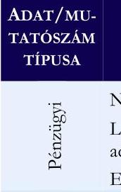 | NEAK bevétel aránya az összes bevételben (\%) | $79,7 \%$ | $64,8 \%$ | $23,0 \%$ |
|  | Lejárt havi átlagos kötelezettségállomány aránya az átlagos havi kiadási főösszeghez (\%) | $0,9 \%$ | $54,2 \%$ | $-98,4 \%$ |
|  | Egy esetszámra (aktív és krónikus) jutó összes bevétel (E Ft) | 636,1 | 967,2 | $-34,2 \%$ |
|  | Foglalkoztatott orvosok aránya az összlétszámból (havi átlag)   (\%) | $13,7 \%$ | $24,0 \%$ | $-42,7 \%$ |
|  | Foglalkoztatott szakdolgozók aránya az összlétszámból (havi átlag) (\%) | $86,3 \%$ | $76,0 \%$ | $13,5 \%$ |
|  | Alkalmazottak fluktuációja intézményi szinten (havi átlag) (\%) | $0,3 \%$ | $0,9 \%$ | $-71,6 \%$ |
|  | 1 orvosra jutó szakdolgozó (havi átlag) (fő) | 6,3 | 3,7 | $68,6 \%$ |
|  | 1 szakdolgozóra jutó teljesített ápolási nap (havi átlag) | 22,4 | 29,1 | $-23,2 \%$ |
|  | 1 orvosra jutó ágyak száma (havi átlag) | 7,2 | 4,9 | $44,7 \%$ |
|  | 1 szakdolgozóra jutó ágyak száma (havi átlag) | 1,1 | 1,3 | $-13,7 \%$ |
| Szakmai profi | Összes szervezeti egység (db)   - ebből a kórházi osztályok progresszivitási szint szerinti besorolása: | 17 | 9,8 | $73,5 \%$ |
|  | I. progresszivitási szintű osztályok (db) | 8 | 2,8 | $187,7 \%$ |
|  | II. progresszivitási szintű osztályok (db) | 8 | 4,0 | $100,0 \%$ |
|  | III. progresszivitási szintű osztályok (db) | 1 | 3,0 | $-66,7 \%$ |
|  | Éves ágykihasználtsági mutató aktív (\%) | $75,6 \%$ | $61,9 \%$ | $22,1 \%$ |
|  | Éves ágykihasználtsági mutató krónikus (\%) | $66,7 \%$ | $54,2 \%$ | $23,0 \%$ |
|  | Egy aktív ágyra jutó elszámolt súlyszám | 37,1 | 33,7 | $9,9 \%$ |
|  | Case-mix index | 0,8 | 1,06 | $-20,9 \%$ |
|  | Egy súlyszámra jutó gyógyszerkiadás ( Ft ) | 28040 | 151655 | $-81,5 \%$ |
|  | Egy esetszámra jutó gyógyszerkiadás - (aktív és krónikus) (Ft) | 16522 | 69990 | $-76,4 \%$ |
|  | Teljesített súlyszám (fekvő) | 11489 | 6666 | $72,4 \%$ |
|  | TÉK felett elszámolt súlyszám (degresszált súlyszám) (fekvő) | 56 | 24 | $131,4 \%$ |
|  | Kihasználatlan TÉK súlyszám (fekvő) | 1062 | 754 | $40,9 \%$ |
|  | Teljesített pont (járó) | 624218732 | 228596480 | $173,1 \%$ |
|  | TÉK feletti elszámolt pont (degresszált pont) (járó) | 6065408 | 7164085 | $-15,3 \%$ |
|  | Kihasználatlan TÉK pont (járó) | 15663597 | 100051940 | $-84,3 \%$ |
|  | Teljesített pont (labor) | 210569584 | 85735807 | $145,6 \%$ |
|  | TÉK felett teljesített, lebegő ponton elszámolt pont (labor) | 135264683 | 58219064 | $132,3 \%$ |
|  | Kihasználatlan TÉK pont (labor) | - | 0 | $0,0 \%$ |
|  | Egynapos súlyszám | 42 | 32 | $33,3 \%$ |
|  | Standardizált naphányados | 0,9 | 0,9 | $2,1 \%$ |

---

# FÜGGELÉK: ÉSZREVÉTELEK 

A jelentéstervezetet a Számvevőszék 15 napos észrevételezésre megküldte az ellenőrzött szervezetek vezetőinek az ÁSZ tv. 29. §* (1) bekezdése előírásának megfelelően.

A Magyarországi Sajátjogú Metropolitai Egyház vezetője a jelentéstervezetre nem tett észrevételt, a Szent Damján Görögkatolikus Kórház föigazgatója megküldte az észrevételeit.
A 7 db észrevétel közül 6 db elfogadott észrevétel alapján a Számvevőszék módosította a jelentést.

A függelék tartalmazza az el nem fogadott észrevételek elutasításának indoklását.

## A Szent Damján Görögkatolikus Kórház Föigazgatójának el nem fogadott észrevétele:

4. Észrevétel: "26. oldal: a második bekezdésben szereplő mondat helyesen a következő: A pénzügyi műveletek bevételei a 2022. évben a bevételek 0,003 \%-át, 2023. évben pedig a 0,006 \%-át tették ki."
Főigazgató Úr az észrevételében a jelentéstervezet 26. oldalán megfogalmazott megállapítások helytállóságát vitatta. Az észrevétel kapcsán a jelentéstervezetben módosításra került a tévesen feltüntetett évszám, a "2002. évben" kijavításra került a "2022. évben" szövegrészre, azonban az észrevételben közölt adatok ( $0,003 \%$ és $0,006 \%$ ) alapján a pénzügyi múveletek bevételei helyesen — az eredeti jelentéstervezetben szerepeltetett adatok szerint — a bevételek föösszegének 0,003 és 0,006 ezred részét, százalékos arányban $0,3 \%$-át, illetve $0,6 \%$-át tették ki.

## Az észrevétel el nem fogadásának indoklása:

A jelentéstervezetben, azon belül az elemzésben az adatok, mutatószámok egységesen, nem az arányosítás alapján, hanem \%-os formában kerültek kimutatásra, ezáltal a jelentéstervezet módosítása nem vált indokolttá.

[^0]
[^0]:    * 29. § (1) Az Állami Számvevőszék az ellenőrzési megállapításait megküldi az ellenőrzött szervezet vezetőjének vagy az általa megbízott személynek, és annak, akinek személyes felelősségét állapította meg.
    (2) Az ellenőrzött szervezet vezetője és a felelősként megjelölt személy az ellenőrzés megállapításaira tizenöt napon belül írásban észrevételt tehet.
    (3) Az Állami Számvevőszék az észrevételre a beérkezésétől számított harminc napon belül írásban válaszol. A figyelembe nem vett észrevételeket köteles a jelentésben feltüntetni, és megindokolni, hogy azokat miért nem fogadta el.

---

# RÖVIDÍTÉSEK JEGYZÉKE 

${ }^{1}$ ÁSZ tv.
${ }^{2}$ Ehtv.
${ }^{3}$ ÁSZ
${ }^{4}$ Számv. tv.
${ }^{5}$ Kórház
${ }^{6}$ 1216/2021. (IV.29.) Korm. határozat
${ }^{7}$ MSME
${ }^{8}$ Alapító okirat
${ }^{9}$ Eütv.
${ }^{10}$ NEAK
${ }^{11}$ Alaptörvény
${ }^{12}$ 507/2023. Korm. rend.
${ }^{13}$ MSME számviteli politika
${ }^{14}$ MSME szabályzatok
${ }^{15}$ 296/2013. Korm. rend.
${ }^{16}$ Kórház számviteli politika
${ }^{17}$ Kórház szabályzatok
${ }^{18}$ Kórház számlarend
${ }^{19}$ SZMSZ
${ }^{20}$ 2006. évi CXXXII. tv.
${ }^{21}$ Info tv.
${ }^{22}$ BM
${ }^{23} \mathrm{CF}$
${ }^{24}$ CAPEX
${ }^{25}$ TÉK
${ }^{26}$ SNH
${ }^{27}$ HBCS
2011. évi LXVI. törvény az Állami Számvevőszékről
2011. évi CCVI. törvény a lelkiismereti és vallásszabadságról, valamint az egyházak, vallási felekezetek és vallási közösségek jogállásáról (Hatályos: 2012. 01. 01 -étől)

Állami Számvevőszék
2000. évi C. törvény a számvitelről (Hatályos:2001. 01. 01-étől)

Szent Damján Görögkatolikus Kórház
1216/2021. (IV.29.) Korm. határozat - a Felső-Szabolcsi Kórház fenntartóváltásáról
Magyarországi Sajátjogú Metropolitai Egyház
Szent Damján Görögkatolikus Kórház Alapító okirata (2021. 07. 01.-étől)
1997. évi CLIV. törvény az egészségügyről (Hatályos: 1998. 07. 01-étől)

Nemzeti Egyészségbiztosítási Alapkezelő
Magyarország Alaptörvénye (2011. április 25.)
507/2023. (XI. 17.) Korm. rendelet az egészségügyi fekvőbeteg-szakellátást nyújtó közfinanszírozott szolgáltatók gazdálkodását segítő intézkedésekről
Magyarországi Sajátjogú Metropolitai Egyház Számviteli politika (Hatályos: 2020. 01. 01-étől)

MSME leltározási szabályzat (Hatályos: 2020. 01. 01-étől), MSME eszközeinek és forrásainak értékelési szabályzata (Hatályos: 2020. 01. 01-étől), Pénzkezelési szabályzat (Hatályos: 2016. 01. 01-étől)
296/2013. (VII. 29.) Korm. rendelet az egyházi jogi személyek beszámolókészítési és könyvvezetési kötelezettségének sajátosságairól (Hatályos: 2014. 01. 01-étől)

Szent Damján Görögkatolikus Kórház számviteli politika (Hatályos: 2021. 07. 01-étől)

A Szent Damján Görögkatolikus Kórház Leltározási és leltárkészítési szabályzata (Hatályos: 2021. 10. 15-étől), Eszközeinek és forrásainak értékelési szabályzata (Hatályos: 2022. 01. 17-étől), Pénzkezelési szabályzata (Hatályos: 2023. 01. 20-ától), Önköltségszámítási szabályzata (Hatályos: 2021. 12. 15-étől)

Szent Damján Görögkatolikus Kórház számlarendje (Hatályos: 2021. 07. 01étől)
Szent Damján Görögkatolikus Kórház Szereveti és Működési Szabályzata (Hatályos: 2022. 10. 10-étől)
2006. évi CXXXII. törvény az egészségügyi ellátórendszer fejlesztéséről (Hatályos: 2007. 01. 01-étől)
2011. évi CXII. törvény az információs önrendelkezési jogról és az információszabadságról (Hatályos:2011. 07. 27-étől)
Belügyminisztérium
Cash flow
Capital expenditure (tőkebefektetés)
Tervezett éves keret
Standardizált naphányados
Homogén Betegség Csoport

---

28 43/1999. (III. 3.) Korm. rend.
29 60/2003. (X. 20.) ESzCsM rend.
${ }^{30}$ Áht.
${ }^{31}$ Ptk.

43/1999. (III. 3.) Korm. rendelet az egészségügyi szolgáltatások Egészségbiztosítási Alapból történő finanszírozásának részletes szabályairól (Hatályos: 1999. 03. 08-ától)
60/2003. (X. 20.) ESzCsM rendelet az egészségügyi szolgáltatások nyújtásához szükséges szakmai minimumfeltételekről (Hatályos: 2003. 11. 04-étől)
2011. évi CXCV. törvény az államháztartásról (Hatályos: 2011. 12. 31-étől)
2013. évi V. törvény a Polgári Törvénykönyvről (Hatályos: 2014. 03. 15-étől)

---

1052 Budapest, Apáczai Csere János u. 10. | 1364 Budapest 4., Pf. 54
www.asz.hu | szamvevoszek@asz.hu
telefon: +36 14849100