# JELENTÉS 

## A Pallas Athéné Domus Meriti Alapítvány gazdálkodásának ellenőrzése

2025.

---

# JELENTÉS 

## A Pallas Athéné Domus Meriti Alapítvány gazdálkodásának ellenőrzése

2025.

---

# ELLENŐRZÉSI IGAZGATÓSÁG: 

## ELLENŐRZÉSI IGAZGATÓSÁG V.

ELLENŐRZÉSI IGAZGATÓ:
KLINGA LÁSZLÓ igazgató

ELLENŐRZÉSVEZETŐ:
HOFMEISTER LÁSZLÓ ellenőrzésvezető

Jelentéseink az interneten a www.asz.hu címen olvashatók.

IKTATÓSZÁM: EL-4178-001/2025
TÉMASORSZÁM: 35
ELLENŐRZÉS-AZONOSÍTÓ SZÁM: V0994

---

# TARTALOMJEGYZÉK 

AZ ELLENŐRZÉS ALAPADATAI ..... 5
AZ ELLENŐRZÉS HATÓKÖRE ÉS AZ ELLENŐRZÖTT SZERVEZETEK ..... 9
ÖSSZEFOGLALÁS ..... 16
AZ ELLENŐRZÉS FÓKUSZKÉRDÉSEI ..... 20
MEGÁLLAPÍTÁSOK ..... 21
JAVASLATOK ..... 63
MELLÉKLETEK ..... 68
I. sz. melléklet: Értelmező szótár ..... 68
II. sz. melléklet: Az ellenőrzött szervezetek jegyzéke ..... 70
III. sz. melléklet: Ellenőrzési kritériumok ..... 71
IV. sz. melléklet: Benchmarking módszertana ..... 73
V. sz. melléklet: A Buda Palota könyv szerinti értékének változása 2018. január 1. és 2019. május 31. között ..... 75
VI. sz. melléklet: A BOKK beruházáshoz kapcsolódóan az azonos tulajdonosi körhöz tartozó gazdasági társaságokhoz tartozó vállalkozások részesedése a beruházási célú kiadások értékéből ..... 76
VII. sz. melléklet: Az ÁSZ elnökének 2024. július 5-i figyelemfelhívó levele az Alapítvány részére ..... 77
VIII. sz. melléklet: A Kuratórium elnökének a 2024.07.05-i figyelemfelhívó levélre adott válasza. ..... 81
IX. sz. melléklet: Az ÁSZ elnökének 2025. január 14-i figyelemfelhívó levele az Alapítvány részére ..... 85
X. sz. melléklet: A Kuratórium elnökének a 2025.01.14-i figyelemfelhívó levélre adott viszontválasza ..... 87
XI. sz. melléklet: Az ÁSZ elnökének 2024. március 21-i levele az MNB elnöke felé ..... 89
XII. sz. melléklet: Az MNB elnökének 2024. december 19-én kelt tájékoztató levele ..... 91
XIII. sz. melléklet: Az ÁSZ elnökének 2025. január 14-i értesítése az MNB elnöke felé ..... 93
XIV. sz. melléklet: Az FB elnök 2025. január 18-i tájékoztatása az MNB elnöke felé ..... 96
XV. sz. melléklet: Az MNB elnökének 2025. január 24-i viszontválasza az ÁSZ elnökének 2025. január 14-i értesítésére ..... 110

---

XVI. sz. melléklet: ÁSZ megkeresés a Pénzügyminisztérium felé az Alapítvány és az OPTIMA Befektetési Zrt. 2021 és 2022. évi könyvvizsgálata kapcsán. ..... 112
XVII. sz. melléklet: A Pénzügyminisztérium tájékoztatása rendkívüli minőség-ellenőrzés lefolytatásáról az Alapítványnál ..... 117
XVIII. sz. melléklet: ÁSZ értesítés az OPTIMA Befektetési Zrt. kapcsán a Pénzügyminisztérium felé ..... 118
FÜGGELÉK: ÉSZREVÉTELEK ..... 121
RÖVIDÍTÉSEK JEGYZÉKE ..... 369

---

# AZ ELLENŐRZÉS ALAPADATAI 

## AZ ELLENŐRZÉS CÉLJA

Az ellenőrzés célja annak megállapítása volt, hogy az $\mathrm{MNB}^{1}$ által alapított Alapítvány ${ }^{2}$ részére juttatott vagyon, megőrzése, használata, hasznosítása és nyilvántartása a jogszabályi előírásoknak megfelelően történt-e, biztosította-e az Alapítvány gazdálkodása átláthatóságát, megfelelően alakította-e ki gazdálkodása szabályozási kereteit, valamint működtette-e a belső kontrollokat. További cél annak értékelése volt, hogy az Alapítvány által kiírt pályázatok végrehajtása során az odaítélt támogatások folyósítása, nyilvántartása szabályszerűen, átlátható módon valósult-e meg.

## AZ ELLENŐRZÉS TÍPUSA

Törvényességi ellenőrzés

## AZ ELLENŐRZÖTT IDŐSZAK

Az 1-3. fókuszterület vonatkozásában 2021-2023. évek, a 2023. évi beszámolók és az NJE Alapítvány ${ }^{3}$ által lejegyezett OPTIMA 2031 és OPTIMA 2031B kötvények ellenőrzése kapcsán 2024. június 30-ig,
az Optimum-Alfa Ingatlanbefektetési Kft., az Optimum-Delta Ingatlanbefektetési Kft., a Kasselik-Ház Ingatlanfejlesztő Zrt. és a V168 FM Kft. esetében a 2021.01.01-2023.10.31., a GTC Infopark H Építési Terület Kft. (ellenőrzött időszakban: Infopark H Építési Terület Kft. néven) esetében 2023.11.23-2023.12.31. közötti időszak,
a 4. fókuszterület vonatkozásában az MNB-Ingatlan Kft. (ellenőrzött időszakban: Optimum-Penta Ingatlanbefektetési Kft. néven) esetében: 2018.01.01-2019.05.30.; az Optimum-Gamma Ingatlanbefektetési Kft. esetében: 2017.01.01-2020.05.10., az Optimum-Omega Ingatlanbefektetési Kft. esetében: 2018.01.01-2022.02.27. időszak, valamint az Alapítvány ingatlanbeszerzései tekintetében 2014-2020. évek.

## AZ ELLENŐRZÉS TÁRGYA

Az ellenőrzés kiterjedt

- az Alapítványnál és az OPTIMA Befektetési Zrt. ${ }^{4}$-nél a szervezeti keretek kialakítására, a legfőbb döntéshozó, ügyvezető szerv tevékenységére, a gazdálkodási keretek szabályozására,
- az Alapítvány, az OPTIMA Befektetési Zrt., és az OPTIMA Befektetési Zrt. közvetlen vagy közvetett részesedésében álló gazdasági társaság ${ }_{1-11}{ }^{5}$ kiemelt eszközcsoportokkal ${ }^{6}$ kapcsolatos mérlegtételeinek év végi értékelésére,
- az Alapítvány, az OPTIMA Befektetési Zrt., és az OPTIMA Befektetési Zrt. közvetlen vagy közvetett részesedésében álló gazdasági társaság ${ }_{1-11}$ éves beszámolási kötelezettsége teljesítésének ellenőrzésére,

---

- az Alapítvány, az OPTIMA Befektetési Zrt., és az OPTIMA Befektetési Zrt. közvetlen vagy közvetett részesedésében álló gazdasági társaság ${ }_{1-10}{ }^{5}$ befektetési tevékenysége vonatkozó előírásoknak való megfelelőségére,
- az Alapítvány, az OPTIMA Befektetési Zrt., és az OPTIMA Befektetési Zrt. közvetlen vagy közvetett részesedésében álló gazdasági társaság ${ }_{1-10}$ kiemelt eszközcsoportokkal kapcsolatos vagyonváltozást eredményező tételei elszámolása szabályszerűségére,
- az Alapítvány által kiírt hazai támogatási és pályázati programok során a nyújtott támogatások odaítélésére, folyósítására, elszámolására és nyilvántartására vonatkozó jogszabályi és belső előírások szerinti működésre, - az Alapítvány közvetett befolyása alatti, az OPTIMA Befektetési Zrt. közvetlen vagy közvetett részesedésében állt gazdasági társaság ${ }_{12-14}$ ingatlangazdálkodási, az ingatlanokhoz kapcsolódó beruházási, illetve felújítási tevékenységének szabályszerűségére.

Az ellenőrzés kiterjed minden olyan körülményre és adatra, amely az ÁSZ ${ }^{\top}$ jogszabályban meghatározott feladatainak teljesítéséhez, valamint a program végrehajtása folyamán felmerült újabb összefüggések feltárásához szükséges volt.

# AZ ELLENŐRZÉS JOGALAPJA 

Az ellenőrzés jogszabályi alapját az ÁSZ tv. ${ }^{8} 1 . \int(3)$ bekezdése, valamint az MNB tv. ${ }^{9} 162 . \int(5)$ bekezdése előírásai képezték.

## AZ ELLENŐRZÉS MÓDSZERE

Az ellenőrzést a nemzetközi standardokat irányadónak tekintve az ellenőrzési program szempontjai, az ellenőrzött időszakban hatályos jogszabályok, az ellenőrzés szakmai szabályok és módszertanok figyelembevételével végezte az ÁSZ.

Az ellenőrzési kérdések megválaszolásához szükséges bizonyítékok megszerzése az ellenőrzött szervezet(ek) által rendelkezésre bocsátott dokumentumokra és adatokra alapozva, továbbá megfigyelés, szemle (szemrevételezés), kérdésfeltevés (információkérés), valamint elemző eljárás útján történt.

Az ellenőrzési bizonyítékként felhasználható adatforrások közé tartoztak egyrészt az ellenőrzéshez kért dokumentumok, adatforrások, másrészt adatforrás volt még minden - az ellenőrzés folyamán - feltárt, az ellenőrzés szempontjából információkat tartalmazó dokumentum.

Az ellenőrzés lefolytatásához az ellenőrzött szervezet(ek) a tanúsítvány(ok) kitöltésével, valamint az ÁSZ által kért dokumentumok, adatok, információk megküldésével és az ellenőrzés során szolgáltatott adatokkal segítették az ÁSZ munkáját.

Az ÁSZ egyes ellenőrzési megállapítások alátámasztása, kiegészítése és az összefüggő tények vizsgálata céljából az ellenőrzötteken kívül más, ellenőrzést támogató szervezetektől is kért adatot, dokumentációt, tájékoztatást.

Az ellenőrzési kérdések megválaszolásához szükséges ellenőrzési bizonyítékok megszerzése az ellenőrzött és az ellenőrzést támogató szervezetek által rendelkezésre bocsátott dokumentumokra és adatokra alapozva megfigyelés, szemle (szemrevételezés), kérdésfeltevés (információkérés), elemző eljárás, valamint a

---

mintatételek dokumentumainak ellenőrzése útján történt. Az ÁSZ egyes ellenőrzési szakkérdések kapcsán külső szakértőt kért fel véleményalkotásra.

Mintavételi eljárással a 2., 3. és a 4. fókuszterületeket ellenőrizte az ÁSZ. A 2. fókuszterületen az egyes részterületek ellenőrzése részterületenként mintavételes, 30 db -ot meg nem haladó tételszám esetében tételes ellenőrzéssel történt. A 3. fókuszterületen 2021. évre véletlenszerű, 2022. és 2023. évekre kockázatalapú mintavétel alapján kiválasztott tételek ellenőrzésére került sor. A mintavételezési eljárással ellenőrzött részterületeken a statisztikai mintavételezési eljárással ellenőrzött részterületeken a mintatételek kiértékelésének eredménye kivetítésre került a teljes sokaságra. A 2. fókuszterületen a 30 db elemszámot el nem érő részterületeken nem statisztikai mintavételi módszert alkalmazott az ÁSZ, az értékelés kivetítés nélkül az egyes mintatételek tételes ellenőrzése alapján történt, a tények feltárása és azok összegzése során a megállapítások az ellenőrzött mintatételekre vonatkozóan kerültek megfogalmazásra.

A 4. fókuszterületen a beruházási, fejlesztési célú ráfordításokkal összefüggő beszerzések és elszámolások szabályszerűségének ellenőrzése az érték alapján szűkített lényeges sokaságból ${ }^{10}$ kockázatalapú mintavételi eljárással kiválasztott tételek alapján történt. A 4. fókuszterület ellenőrzéséhez vett minta értékelésekor nem statisztikai mintavételi módszert alkalmazott az ÁSZ, az értékelés kivetítés nélkül az egyes mintatételek tételes ellenőrzése alapján történt, a tények feltárása és azok összegzése során a megállapítások az ellenőrzött mintatételekre vonatkozóan kerültek megfogalmazásra.

Az ellenőrzés során a kiemelt eszközcsoportokkal kapcsolatos mérlegtételek száma az OPTIMA Befektetési Zrt. esetében 2023. évben meghaladta a 30 db -ot, melyet statisztikai mintavételezési eljárással ellenőrizte az ÁSZ, a mintatételek kiértékelésének eredménye kivetítésre került a teljes sokaságra. A további ellenőrzött szervezet kapcsán a kiemelt eszközcsoportokkal kapcsolatos tételszám 2021-2023. években, valamint az OPTIMA Befektetési Zrt. esetében 2021-2022. évben a 30 db -ot nem haladta meg, így azok tételesen kerültek értékelésre. A Sky72 Ingatlan Kft., a V168 FM Kft., a Kasselik-Ház Ingatlanfejlesztő Zrt., társaságok esetében az ellenőrzési program szerinti kiemelt mérlegsorok 2021-2022. években nem tartalmaztak adatot, így mintavételre és minta értékelésére nem került sor. Az Optimum-Alfa Ingatlanbefektetési Kft., az Optimum-Delta Ingatlanbefektetési Kft., a Kasselik-Ház Ingatlanfejlesztő Zrt. és a V168 FM Kft. 2023.10.31. napjával beolvadtak a FERIDA Kft.-be, esetükben a 2023. évi kiemelt mérlegtételek ellenőrzése a befogadó társaságnál történt.

Az Alapítvány számviteli nyilvántartásaiban az anyag- és személyi jellegű költségek, ráfordítások elszámolásait a 2021-2023. évekre a rendelkezésre bocsátott adatbázisokból vett 30-30 db mintatétel ellenőrzésével statisztikai mintavételezési eljárással ellenőrizte az ÁSZ, a mintatételek kiértékelésének eredménye kivetítésre került a teljes sokaságra.

Az Alapítvány vagyonnövekedést, vagy vagyoncsökkenést eredményező befektetési döntéseivel érintett, az ingatlanok és a kapcsolódó vagyoni értékű jogok, a befektetett pénzügyi eszközök és az értékpapírok tételei elszámolásának ellenőrzése 2021-2023. évekre a rendelkezésre bocsátott adatbázisok alapján 10, 13 és 3 db tétel tételes ellenőrzésével történt. A részterület értékelésére nem statisztikai mintavételi módszert alkalmazott az ÁSZ, az értékelés kivetítés nélkül az egyes mintatételek tételes ellenőrzése alapján történt, a tények feltárása és azok összegzése során a megállapítások az ellenőrzött mintatételekre vonatkozóan kerültek megfogalmazásra.

Az OPTIMA Befektetési Zrt. vagyonnövekedést, vagy vagyoncsökkenést eredményező befektetési döntéseivel érintett, az ingatlanok és a kapcsolódó vagyoni értékű jogok, a befektetett pénzügyi eszközök és az értékpapírok tételei elszámolásának ellenőrzése 2021-2023. évekre a rendelkezésre bocsátott adatbázisokból

---

vett 30-30 db mintatétel ellenőrzésével, statisztikai mintavételezési eljárással ellenőrizte az ÁSZ, a mintatételek kiértékelésének eredménye kivetítésre került a teljes sokaságra.

Az OPTIMA Befektetési Zrt. és az Alapkezelők ${ }^{11}$ vagyonnövekedést, vagy vagyoncsökkenést eredményező befektetési döntéseivel érintett lekötött bankbetétei kapcsán az ÁSZ tételes ellenőrzést végezett.

Az Alapítvány által nyújtott támogatások, az arról történő beszámolás és közzététel ellenőrzése 2021. évre a rendelkezésre bocsátott adatbázisból vett 30 db mintatétel ellenőrzésével, statisztikai mintavételezési eljárással ellenőrizte az ÁSZ, a mintatételek kiértékelésének eredménye kivetítésre került a teljes sokaságra., 2022-2023. évre a részterület kockázatértékelés alapján kiválasztott 30 db tétellel került ellenőrzésre, az értékelés kivetítés nélkül az egyes mintatételek tételes ellenőrzése alapján történt, a tények feltárása és azok összegzése során a megállapítások az ellenőrzött mintatételekre vonatkozóan kerültek megfogalmazásra.

---

# AZ ELLENŐRZÉS HATÓKÖRE ÉS AZ ELLENŐRZÖTT SZERVEZETEK

Az ellenőrzött szervezetek az MNB által alapított Pallas Athéné Domus Meriti Alapítvány; az Alapítvány kizárólagos tulajdonában álló OPTIMA Befektetési Zrt.; és az OPTIMA Befektetési Zrt. közvetlen vagy közvetett részesedésében álló gazdasági társaság; 1-14, közöttük az Alapkezelők, mint az általuk kezelt befektetési alapok törvényes képviselői voltak.

Az ellenőrzés hatóköre kiterjedt azokra a gazdasági társaságokra 12-14 is, melyek az ellenőrzött időszakban az OPTIMA Befektetési Zrt. részesedésében, az ellenőrzés időpontjában az MNB közvetlen vagy közvetett tulajdonában álltak. Az ellenőrzött szervezetek felsorolását a II. számú melléklet tartalmazza.

Az Alapító, a törvényen alapuló lehetőségével élve hozta létre

 2014-ben a Pallas Athéné Alapítványokat, a rendelt vagyon nagyságát a célok hosszú távú megvalósításához igazította, azzal a megkötéssel, hogy az alapítói vagyon (266,4 Mrd Ft) Alapító Okiratban1-3 meghatározott részének (105 Mrd Ft és 80 Mrd Ft euróban rendelkezésre álló összeg) csak a hozama használható fel alapítványi célokra. Kezdetben hat, egymástól és az alapítótól független alapítvány létezett, amelyek időközben összeolvadtak. A megszűnő alapítványok feladatait a jogutód Alapítvány vette át, 2019. december 5-én bejegyezésre került a jogelőd alapítványok megszűnése és a jogutód létrejötte.

A Pallas Athéné Alapítványok 2015-ben annak érdekében hozták létre az OPTIMA Befektetési Zrt. jogelődjét, a Pallas Athéné Domus Optima Zrt.-t, hogy kezelje vagyonukat, támogatást nyújtson a könyvelési, számviteli, jogi és kommunikációs tevékenységükben, befektetési döntéseik előkészítésében és az alapítványok tulajdonában álló épületek üzemeltetésében, fejlesztésében. Az OPTIMA Befektetési Zrt. vállalt feladata, *"hogy az alapítványi vagyont olyan biztonságos megoldással fektesse be, amellyel magas hozamot ér el".*

Az Alapítvány – a közzétett, ÁSZ vizsgálat alapján nem valós számokat tartalmazó beszámoló szerint – és az OPTIMA Befektetési Zrt. eszközeinek és forrásainak kiemelt tételeit az 1. táblázat tartalmazza:

|  AZ ALAPÍTVÁNY ÉS AZ OPTIMA BEFEKTETÉSI ZRT. KIEMELT MÉRLEGSORAI |  |  |  |  |  |   |
| --- | --- | --- | --- | --- | --- | --- |
|  2021., 2022. és 2023. évi beszámoló adatai alapján (M Ft) |  |  |  |  |  |   |
|   |  |  |  |  | OPTIMA Befektetési Zrt. |   |
|   | 2021. | 2022. | 2023. | 2021. | 2022. | 2023.  |
|  Tárgyi eszközök | 2 940 | 499 | 485 | 29 | 39 | 35  |
|  Befektetett pénzügyi eszközök | 277 372 | 279 870 | 282 404 | 307 972 | 316 507 | 370 753  |
|  Követelések | 2 322 | 2 767 | 285 | 5 236 | 28 933 | 627  |
|  Értékpapírok | 0 | 0 | 0 | 81 931 | 65 997 | 44 497  |
|  Pénzeszközök | 468 | 28 | 10 | 4 318 | 552 | 28  |
|  Kötelezettségek | 113 | 88 | 122 | 393 714 | 409 733 | 414 980  |
|  Eszközök/Források összesen | 283 363 | 283 447 | 283 554 | 399 723 | 413 329 | 421 377  |

*forrás: Az Alapítvány és az OPTIMA Befektetési Zrt. 2021., 2022. és 2023. évi beszámoló adatai alapján ÁSZ saját szerkesztés

---

Az OPTIMA Befektetési Zrt. a 2023. év végén hat gazdasági társaságban rendelkezett 100%-os üzletrésszel, továbbá egyik érdekeltsége, az Optimum Úri 72 Ingatlanbefektetési Kft. az ellenőrzött időszak alatt 100%-os részesedést szerzett a Sky72 Ingatlan Kft.-ben. A FERIDA Zrt. 2022. május 30-án került az OPTIMA Befektetési Zrt. tulajdonába, az Alapítvánnyal történt adásvétel útján. Az ellenőrzött időszakban az Optimum-Alfa Ingatlanbefektetési Kft., az Optimum-Delta Ingatlanbefektetési Kft., a Kasselik-Ház Ingatlanfejlesztő Zrt. és a V168 FM Kft. 2023. október 31-én beolvadt a FERIDA Zrt. társaságba. Az Infopark H Építési Iroda Kft. 2023. november 23-án került az OPTIMA Befektetési Zrt. tulajdonába adásvétel útján, majd 2024. május 2-án értékesítette az üzletrészt. Az MNB-Ingatlan Kft. tulajdonában álló Optimum-Gamma Ingatlanbefektetési Kft. esetében 2023. augusztus 1-jén végelszámolási eljárás indult meg.

Az Optimum Úri 72 Ingatlanbefektetési Kft. 2024. október 31. napjával átalakulás útján megszűnt, a V Development Kft.-vel együtt beolvadt a FERIDA Zrt.-be.

Az Alapkezelők összesen tíz befektetési alap törvényes képviseletét látták el, közöttük két magántőkealapot, három ingatlan- és öt értékpapír alapot kezeltek. Az ellenőrzés hatóköre nem terjedt ki a befektetési alapok portfólió-kezelési, befektetési tevékenységére.

Az Alapítvány - a közzétett, ÁSZ vizsgálat alapján nem valós számokat tartalmazó beszámoló szerint 2021., 2022. és 2023. évi mérlegfőösszegének 91,24%-át (255,8 Mrd Ft-ot), 99,31%-át (278,5 Mrd Ft-ot) és 98,44%-át (279,1 Mrd Ft-ot) a tartós befektetési céllal vásárolt értékpapírok tették ki, amely teljes összegben az OPTIMA Befektetési Zrt. által kibocsátott OPTIMA 2040/A jelű kötvényt tartalmazta. Az OPTIMA Befektetési Zrt. további két eltérő sorozatszámú (OPTIMA 2031 és OPTIMA 2031/B jelű) kötvényt is kibocsátott 127,5 Mrd Ft értékben, melyek tulajdonosa az NJE Alapítvány. Az OPTIMA Befektetési Zrt. a kötvények fedezeteként rendelkezésére álló összeget a közvetlen részesedésében álló Alapkezelőkön keresztül befektetési jegyekbe fektette be.

Az Alapítvány és az OPTIMA Befektetési Zrt. közvetlen vagy közvetett tulajdonában álló gazdasági társaságok által alkotott cégcsoportot, az Alapkezelők kezelésébe tartozó tíz befektetési alap struktúráját, továbbá az alapok részesedésében álló ismert hazai és külföldi érdekeltségeket, valamint a közöttük történt főbb pénzmozgásokat az 1. ábra szemlélteti:

---

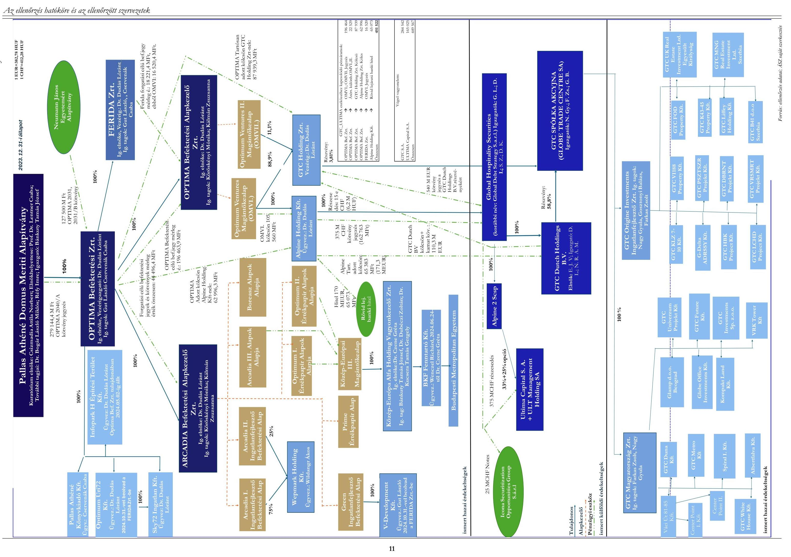

# 1. számú útez AZ ALAPÍTVÁNY ÉRDEKELTSÉGÉBE TARTOZÓ CÉGEK ÉS BEFEKTETÉSI ALAPOK STRUKTÚRÁJA

## 1.1.1.0+10,75 10.15

### 1.1.1.0+10,75 10.15

### 1.1.1.0+10,75 10.15

### 1.1.1.0+10,75 10.15

### 1.1.1.0+10,75 10.15

### 1.1.1.0+10,75 10.15

### 1.1.1.0+10,75 10.15

### 1.1.1.0+10,75 10.15

### 1.1.1.0+10,75 10.15

### 1.1.1.0+10,75 10.15

### 1.1.1.0+10,75 10.15

### 1.1.1.0+10,75 10.15

### 1.1.1.0+10,75 10.15

### 1.1.1.0+10,75 10.15

### 1.1.1.0+10,75 10.15

### 1.1.1.0+10,75 10.15

### 1.1.1.0+10,75 10.15

### 1.1.1.0+10,75 10.15

### 1.1.1.0+10,75 10.15

### 1.1.1.0+10,75 10.15

### 1.1.1.0+10,75 10.15

### 1.1.1.0+10,75 10.15

### 1.1.1.0+10,75 10.15

### 1.1.1.0+10,75 10.15

### 1.1.1.0+10,75 10.15

### 1.1.1.0+10,75 10.15

### 1.1.1.0+10,75 10.15

### 1.1.1.0+10,75 10.15

### 1.1.1.0+10,75 10.15

### 1.1.1.0+10,75 10.15

### 1.1.1.0+10,75 10.15

### 1.1.1.0+10,75 10.15

### 1

---

Az 1. ábra az egyes gazdasági társaságok vezető tisztségviselőinek (ügyvezetők, igazgatósági tagok és elnökök) nevét is bemutatja, ez alapján látható, hogy az OPTIMA Befektetési Zrt. igazgatósági pozícióit betöltő magánszemélyek további 12, az érdekeltségi körbe tartozó más társaságnál is vezető tisztségviselők voltak. 2024. december 3-tól az Optima Befektetési Zrt., az Alpine Holding Kft., a FERIDA Zrt., GTC Holding Zrt. és a Sky72 Ingatlan Kft. vezérigazgatója Stofa György. Az Alapítvány Kuratóriuma 2025. január 10-i határozata értelmében szintén Stofa Györgyöt választotta meg az Alapítvány igazgatójának.

Az Optimum Ventures és Optimum Ventures II. Magántőkealapok befektetési jegyeinek birtokosa a 2023. december 31-i állapot szerint 91,82 és 100%-ban az OPTIMA Befektetési Zrt. volt. Az Optimum Ventures Magántőkealapban a további 8,18% befektetési jegy a FERIDA Zrt. birtokában volt. Az OPTIMA Befektetési Zrt. a 2023. évi mérlegében 196,5 Mrd Ft tartós hitelviszonyt megtestesítő értékpapírt mutatott ki, aminek az állománya teljes mértékben az Optimum Ventures és Optimum Ventures II. Magántőkealap befektetési jegyeinek könyv szerinti értékéből adódott.

# GTC Holding Zrt. 

2020. június 4-én alapították, tulajdonosai az OPTIMUM Ventures és OPTIMUM Ventures II. Magántőkealapok, fő tevékenysége vagyonkezelés. 2023. év végén a részesedései között szerepelt a GTC S.A. ${ }^{15} 3,81 \%$-os részvénycsomagja.

## GTC Dutch Holdings B.V. 16

Holland társaság, székhelye Amszterdamban található, 2023. év végén a GTC S.A. részvényeinek 58,8%-át birtokolta. Az Alapítvány 2022. szeptember 5-én a cégcsoport részesedések közötti átcsoportosításáról döntött, melynek eredményeképpen a GTC Dutch Holdings B.V. 100%-os tulajdoni hányada a GTC Holding Zrt.-től kötvénykibocsátás ellentételezésével a GDS ${ }^{17}$ (jelenleg $\mathrm{GHS}^{18}$ ) társaság részére eladásra került.

## Alpine Holding Kft.

2021. augusztus 18-án alapították, tulajdonosa 100%-ban az Optima Ventures Magántőkealap, fő tevékenységi köre vagyonkezelés. Az Alpine Holding Kft. kizárólagos érdekeltségébe tartozik a GHS társaság.

## Alpine 2 SCSp

Luxemburgi jog szerint bejegyzett „különleges betéti társaság" (Société en commandite spéciale), mely az Ultima Capital S.A. részvényeket közvetlenül birtokolja.

## Global Hospitality Securities S.a.r.l.

Tulajdonosa 100%-ban az Alpine Holding Kft., kezelője a luxemburgi székhelyű befektetési alapkezelő, az Engelwood Asset Management. Tevékenysége felett az OPTIMA Befektetési Zrt. teljes tulajdonosi kontrollt gyakorol, melyet a menedzsmentjébe delegált tagokon keresztül érvényesít. 2022 szeptemberében a cégcsoporton belüli GTC S.A. részesedés átcsoportosítás ügylet során a GTC Dutch Holdings B.V. részesedésének 100%-át megszerezte, ezáltal 2023. év végén a GTC S.A. részvényeinek 58,8%-át közvetetten birtokolta. A részvényesek 2023. október 12-én tartott rendkívüli közgyűlését követően a társaság elnevezését Global Debt Strategy S.a r.l.-ről Global Hospitality Securities S.a. r.l.-re változtatta.

## Globe Trade Centre S.A.

Az 1994-ben alapított lengyelországi központú ingatlanbefektetési profilú részvénytársaság részvényeit a varsói és a johannesburgi tőzsdén jegyzik, főként irodai és kiskereskedelmi ingatlanokat tart és fejleszt

---

Lengyelországban és a kelet-közép-európai régió fővárosaiban. 2023. év végén a társaság 3,81%-nyi részvényét közvetlenül birtokolta az OPTIMUM Ventures és OPTIMUM Ventures II. Magántőkealapok tulajdonában lévő GTC Holding Zrt., valamint közvetetten az Optimum Ventures Magántőkealap tulajdonában lévő Alpine Holding Kft. az érdekeltségi körébe tartozó GHS-en keresztül, a GTC Dutch Holdings B.V. révén 58,8% részvénycsomaggal. A társaságban 2023. év végén az Alapítvány által birtokolt összes közvetett érdekeltség 62,61% részvény volt.

# Ultima Capital S.A. 

Az Ultima Capital S.A. a svájci BXSWISS tőzsdén jegyzett ingatlancég, amely prémium befektetésekre specializálódott és a svájci székhelyű ULT Management Holding S.A. társasággal együtt alkotja az ingatlanbefektetéssel, fejlesztéssel és üzemeltetéssel foglalkozó Ultima csoportot. Az Alapítvány 2021. augusztus 24-i jóváhagyó határozata birtokában az OPTIMA Befektetési Zrt. a közvetett tulajdonában álló Alpine Holding Kft.-n keresztül átváltoztatható kötvényjegyzésre vállalt kötelezettséget, annak érdekében, hogy 2025. december 31-ig megszerezze az Ultima Capital S.A. 59%-os, valamint az ULT Management Holding S.A. 21%-os részvénycsomagját. 2023-ban az Ultima csoporton belüli átszervezés eredményeként az ULT Management Holding S.A. ingatlan üzletága átcsoportosításra került az Ultima Capital S.A. társaságba. 2023. év végén az Alpine Holding Kft. közvetett érdekeltségébe tartozott az Ultima Capital S.A. 33%-os, valamint egy 25%-os - megállapodás alapján megfizetett, lehívható - részvénycsomagja. A már megfizetett részvénycsomagokon felül az Alpine Holding Kft. további 42,1% Ultima Capital S.A. részvényre kötött kisebbségi tulajdonosokkal vételi és eladási szándékot rögzítő megállapodásokat.

A kétéves, 2024-2025-ben végrehajtandó Reorganizációs terv ${ }^{19}$ része a befektetési portfólió bizonyos elemeinek, közöttük az Ultima csomagnak ${ }^{20}$ az értékesítése. Az értékesítés célja az NJE Alapítvány által jegyzett, OPTIMA 2031/B jelű, 100 Mrd Ft összegű kötvény visszaváltásából eredő kötelezettség teljesítéséhez fedezet biztosítása, valamint a 170 M EUR tőke értékű banki hitel teljes törlesztése.

## Neumann János Egyetemért Alapítvány

A Magyar Állam által 2020. évben létrehozott felsőoktatási közfeladatot ellátó közérdekű vagyonkezelő alapítvány, amely jogszabályi előírás alapján a kecskeméti székhelyű Neumann János Egyetem fenntartója, gyakorolja az Egyetem ${ }^{21}$ alapítói, tulajdonosi, fenntartói jogait, biztosítja az Egyetem működési feltételeit, intézményfejlesztési céljai megvalósítását. Az NJE Alapítvány Kuratóriumi elnöke egyszemélyben a Pallas Athéné Domus Meriti Alapítvány Kuratóriumi elnöke 2020-tól. Az NJE Alapítvány a részére rendelt alapítói vagyonból az OPTIMA Befektetési Zrt. által kibocsátott, tartós hitelviszonyt megtestesítő értékpapírba, az OPTIMA 2031, valamint OPTIMA 2031/B jelű vállalati kötvényekbe fektetett be 2021. évben összesen 127,5 Mrd Ft összegben.

## GTC Magyarország Ingatlanfejlesztő
 Zrt.

A GTC Magyarország Ingatlanfejlesztő Zrt. 1998. szeptember 11-én jött létre, egyedüli részvényese a GTC S.A. lengyel tőzsdei cég. A GTC Magyarország Ingatlanfejlesztő Zrt. 2023. évi kiegészítő melléklete szerint 15 leányvállalatban rendelkezett részesedéssel, melyből kettőben csak közvetett részesedése volt, továbbá 2023. év során 1 leányvállalat kikerült a részesedések közül, mivel az végelszámolással megszűnt.

---

# GTC Origine Investments Ingatlanfejlesztő Zrt. 

A GTC Origine Investments Ingatlanfejlesztő Zrt. létrejöttét 2021. május 5-én jegyezte be a Cégbíróság. A társaság részvényeinek 100%-át szintén a GTC S.A. birtokolja. A GTC Origine Investments Ingatlanfejlesztő Zrt. 2023. évi kiegészítő melléklete szerint 14 társaságban rendelkezett 100%-os részesedéssel.

Az OPTIMA Befektetési Zrt. 2023. évi mérlegében a forgatási célú hitelviszonyt megtestesítő értékpapírok között 41,2 Mrd Ft értékben mutatta ki az Optimum I. Értékpapír Alapok Alapja, a Prime Értékpapír Alap, az Arcadia III. Alapok Alapja, a Boreasz Alapok Alapja és a Prémium Zártkörű, Zártvégű Befektetési Alap befektetési jegyeit.

Az ARCADIA Befektetési Alapkezelő Zrt. által kezelt öt értékpapír alap (Arcadia III. Alapok Alapja, Boreasz Alapok Alapja, Optimum I. és II. Értékpapír Alapok Alapja, Prime Értékpapír Alap) 2023. év végén további hat olyan befektetési alapban rendelkezett befektetési jegyekkel, melyek befektetési alapkezelője nem volt az OPTIMA Befektetési Zrt. érdekeltségi körébe köthető.

Az OPTIMA Befektetési Zrt. által közvetetten birtokolt zártkörű, zárt végű Green Ingatlanfejlesztő Befektetési Alap és az Arcadia I. és II. Ingatlanfejlesztő Befektetési Alapok portfóliójába tartozott a V Development Kft., a Wepmark Holding Kft. és a Budapesti Metropolitan Egyetem tulajdonlásával kapcsolatos befektetések.

## V Development Kft.

2019. november 12-én jött létre, fő tevékenysége ingatlan bérbeadása, üzemeltetése, tulajdonosa 2020. február 1-től a Green Ingatlanfejlesztő Befektetési Alap. A Green Ingatlanfejlesztő Befektetési Alap befektetési jegyeit 2023. december 31-én 100%-ban az OPTIMA Befektetési Zrt. érdekeltségébe tartozó Optimum II. Értékpapír Alapok Alapja birtokolta. A társaság 2024. október 31-i nappal beolvadt a FERIDA Zrt.-be.

## Wepmark Holding Kft.

2013. június 4-én jött létre, fő tevékenysége ingatlan bérbeadása, üzemeltetése, tulajdonosai az Arcadia I. és II. Ingatlanfejlesztő Befektetési Alapok. 2023. december 31-én az Arcadia I. és II. Ingatlanfejlesztő Befektetési Alapok befektetési jegyeit OPTIMA Befektetési Zrt. érdekeltségébe tartozó alapok (Optimum I. Értékpapír Alapok Alapja, Boreasz Alapok Alapja) birtokolták. Az Alapítvány 2022. márciusban fogadta el az NJE Alapítvánnyal együttműködésben, a Wepmark Holding Kft. közreműködésével megvalósítandó kecskeméti Campus II. projektfejlesztési koncepciót. A projekt mint befejezetlen beruházás értéke a Wepmark Holding Kft. 2023. évi beszámolójában 16,0 Mrd Ft volt.

## Budapesti Metropolitan Egyetem

Jogállása szerint államilag elismert felsőoktatási intézmény, amely vállalkozási formában végzi tevékenységét. A METU ${ }^{22}$ alapítói, fenntartói jogait a BKF Fenntartó Kft. gyakorolja. A QUARTZ Befektetési Alapkezelő egy általa kezelt magántőkealapon keresztül közvetetten birtokolja a BKF Fenntartó Kft-t. Az OPTIMA Befektetési Zrt. 2021. óta birtokolta ezen magántőkealap befektetési jegyeit 100%-ban, ezáltal a METU közvetett tulajdonosa. Az Alapítvány a 2021-2023. években összesen 2058 M Ft támogatásban részesítette a METU-t.

---

Az ellenőrzött időszakban az OPTIMA Befektetési Zrt. részesedésében, az ellenőrzés időpontjában az MNB közvetlen vagy közvetett tulajdonában álló gazdasági társaságok

# MNB-Ingatlan Kft. 

Az MNB-Ingatlan Kft. ${ }^{23}$ 2016. május 18-án jött létre, alapítója az OPTIMA Befektetési Zrt. jogelődje, a Pallas Athéné Domus Optima Zrt., 2019. május 31-től egyszemélyes tulajdonosa az MNB volt. Az MNB-Ingatlan Kft. ingatlanvagyonnal való gazdálkodásának szabályszerűségét a Buda Palota ingatlanberuházáshoz kapcsolódóan ellenőrizte az ÁSZ.

## Optimum-Gamma Ingatlanbefektetési Kft. „v.a."24

2016. november 21-én alapította az OPTIMA Befektetési Zrt., majd 2020. május 11-én a társaságban üzletrész adásvétel útján 100%-os tulajdont szerzett az MNB-Ingatlan Kft. Az ellenőrzött időszakban jelentős beruházási tevékenységet fejtett ki a 2017. június 27-én tulajdonába került Balatonakarattya, Koppány sor 41. szám alatti ingatlannal összefüggésben. Az Optimum-Gamma Kft. által végzett balatonakarattyai képzési, szabadidő- és sportközpont ingatlanberuházás (BOKK) ${ }^{25}$ a próbaüzemmel 2023. február 28-án befejeződött, ezt követően az ingatlant 2023. április 12-én értékesítették az anyavállalat, az MNB-Ingatlan Kft. részére. A közhiteles Cégnyilvántartás adatai alapján 2023. augusztus 1-jén megkezdődött az Optimum-Gamma Ingatlanbefektetési Kft. végelszámolása, mely 2025. januárjában is folyamatban volt. Az ingatlanvagyonnal való gazdálkodásának szabályszerűségét a BOKK beruházás kapcsán ellenőrizte az ÁSZ.

## Optimum-Omega Ingatlanbefektetési Kft.

2016. május 18-án jött létre, alapítója az OPTIMA Befektetési Zrt. jogelődje, a Pallas Athéné Domus Optima Zrt. volt, üzletrészét 2022. február 28-án szerezte meg az MNB-Ingatlan Kft. A Burg Hotel ${ }^{26}$ 2021. február 9-én került az Optimum-Omega Ingatlanbefektetési Kft. tulajdonába, melyhez kapcsolódó ingatlanberuházás jelentette a társaság fő tevékenységét az ellenőrzött időszakban. Az ingatlanvagyonnal való gazdálkodásának szabályszerűségét a Burg Hotel ingatlanberuházáshoz kapcsolódóan ellenőrizte az ÁSZ.

## Felelősség korlátozó jognyilatkozat

Az ellenőrzés hatóköre nem terjedhetett ki azokra a befektetésekre, részesedésekre, ahol az Alapok, Magántőkealapok befektetőként jelentek meg. Nem terjedt ki továbbá az ellenőrzés jogszabályban előírt adókötelezettségek teljesítésének vizsgálatára. Az ellenőrzés szintén nem terjedhetett ki a Magántőkealapok közvetett tulajdonában álló külföldi ingatlanbefektetési profilú társaságokra, mert az ÁSZ-nak ehhez sem felhatalmazása, sem eszköze nem áll rendelkezésére. Az ellenőrzött terület vizsgálata az ellenőrzés módszertanában lefektetett elvek és kritériumok alapján történt, ami nem jelenti az érintett szervezetek gazdálkodásának teljes körű ellenőrzését.

---

# ÖSSZEFOGLALÁS 

Az MNB mint Alapító 2014-ben 266,4 Mrd Ft vagyonjuttatással létrehozta a Pallas Athéné Alapítványokat, azzal a céllal, hogy támogassák és fejlesszék az oktatást, művelődést és a tudományt, támogassák és segítsék elő a közgazdasági, pénzügyi szakemberképzést és kutatásokat, ösztönözzék a tudásteremtést, a gazdaságban alkalmazható kutatás-fejlesztést. Kezdetben hat alapítvány létezett, amelyek időközben összeolvadtak, az így megszűnő alapítványok feladatait 2019-ben a jogutód Pallas Athéné Domus Meriti Alapítvány (Alapítvány) vette át 259,6 Mrd Ft pénzbeli és 6,8 Mrd Ft ingatlan összértékű alapítói vagyonjuttatással.

Az Alapítvány Alapító Okirata alapján az alapítványi vagyon felhasználása és az azzal való rendelkezés joga a Kuratóriumot illeti meg, a Kuratórium gondoskodik a célnak megfelelő működésről, biztosítja az alapítványi vagyon gondos kezelését. Az Alapítvány befektetési szabályzataiban rögzített konzervatív befektetési politikája szerint befektetési tevékenységének legfőbb célja az alapítványi vagyonból biztonságos, alacsony kockázatú befektetések megvalósítása, rendszeres jövedelem generálása céljait megvalósító tevékenységének hosszú távú fenntartása érdekében. A vagyon kezelésére, a befektetési döntések előkészítésének támogatására 2015-ben a Pallas Athéné Alapítványok létrehozták az OPTIMA Befektetési Zrt.-t. Azáltal, hogy az Alapítvány a rendelkezésére bocsátott vagyon meghatározó részét a 2020. évben a kizárólagos érdekeltségébe tartozó OPTIMA Befektetési Zrt. 20 éves lejáratú kötvényébe fektette be, a vagyon kezelését, azzal együtt befektetési politikája célrendszerének megvalósítását is a gazdasági társaságra bízta.

Az OPTIMA Befektetési Zrt. befektetései finanszírozására az Alapítvány által lejegyzett kötvényen (279,1 Mrd Ft) túl további forrásokat - a Neumann János Egyetemért Alapítvány (NJE Alapítvány) által lejegyzett kötvényeket (127,5 Mrd Ft) és banki hitelt (170 M EUR) - is bevont. A forrásbevonások eredményeként az OPTIMA Befektetési Zrt. közel 500 Mrd Ft - jelentős részben (407 Mrd Ft) közpénzből származó - vagyonnal való gazdálkodásáért volt felelős. A befektetéseket az OPTIMA Befektetési Zrt. egy lényegében átláthatatlan, a valós vagyon értékelését szinte ellehetetlenítő, közvetlen vagy közvetett tulajdonában álló gazdasági társaságok és magántőkealapok által alkotott cég- és befektetési struktúrán (OPTIMA csoport) keresztül hajtotta végre. Az OPTIMA csoport - az alapítói célokkal ellentétesen - magántőkealapok közbeiktatásával több országon és vállalkozói szinten átívelő, rendkívül bonyolult céghálózatot épített fel, melyek kialakítására az ÁSZ nem azonosított racionális gazdasági indokokat.

Az OPTIMA csoport által megvalósított befektetési tevékenység vonatkozásában az Alapítvány tényleges felelősséggel rendelkező kurátorai nem gondoskodtak megfelelő kontrollrendszer kialakításáról, így a befektetések valós értékének meghatározása, az értékváltozásokkal kapcsolatos döntési mechanizmusok nem voltak azonosíthatóak. Az Alapítvány a teljes cégstruktúra vonatkozásában nem épített ki megfelelő kontrollrendszert, nem határozott meg beszámolási szabályokat a vagyon tényleges befektetését végző gazdasági társaságok befektetési tevékenységére vonatkozóan, az általa kialakított jelentési rendszer nem adott tájékoztatást a közvetett befektetések teljesítményéről. Az Alapító mind a kuratóriumi határozatokról, mind az Alapítvány felügyelőbizottsága által meghozott döntésekről csak formális, hiányos jelentéseket kapott, melyek nem tették lehetővé a kontrollok érdemi gyakorlását. Az Alapító az Alapító Okiratban előírtaknak megfelelő, minden lényegi kérdésről történő tájékoztatása nem teljeskörűen valósult meg. (pl. több száz milliárd Ft-ot érintő döntésről szóló kuratóriumi határozat szövege az összeg feltüntetése nélkül került megküldésre az Alapító felé.)

---

Az alapítói kontrollt az MNB igazgatósága az ÁSZ felhívását követően kezdte el érdemben gyakorolni, amikor 2024. tavaszán felkérte az Alapítvány felügyelőbizottságát soron kívüli vizsgálatok lefolytatására, az Alapító tájékoztatására. Az elkészíttetett jelentés nyomán 2024. decemberben maga az MNB elnöke jelezte, hogy „A kapott tájékoztatás éles ellentétben áll a PADME Alapítvány Kuratóriuma és Felügyelőbizottsága által az Alapító Okirat szerint az elmúlt években teljesített éves alapítói tájékoztatásokban foglaltakkal", amiből látszik, hogy az addig gyakorolt kontrollfunkciók nem működtek. Az Alapítvány igazgatója szerint a kuratóriumi tagok, a befektetési ügyletek döntéshozói elé az OPTIMA Befektetési Zrt. által készített határozati javaslatok tényleges alapítványi kontroll nélkül kerültek: „A befektetési döntésekhez kapcsolódóan felmerült szakértői, tanácsadói, valamint döntéselőkészítő elemzéseket és háttéranyagokat is az Optima Befektetési Zrt. rendelte meg, elemezte ki, azokból a Kuratórium annyit ismertetett meg amennyi az előterjesztésekben szerepelt", ,,az Alapítvány munkaszervezetében nincs és nem is volt meg az a szervezeti erőforrás, amivel ezen előterjesztéseket befektetési, megtérülési, pénzügyi szempontból érdemben ellenőrizhette volna". Az ÁSZ véleménye szerint azonban a Kuratórium felelőssége, hogy a döntése elegendő és megfelelő minőségű, megbízható és valós információkon alapuljon, ennek érdekében elvárható a döntést alátámasztó tények és adatok, vagy azok hiányának értékelése. Különösen igaz ez az Alapítvány esetében, hiszen több száz milliárd Ft közpénzből származó vagyon kezeléséről hozták meg határozataikat.

Az alapítványok által rábízott vagyon befektetéseként - a rögzített konzervatív befektetési politikával és a közpénzektől elvárt gondos kezeléssel ellentétesen - az OPTIMA Befektetési Zrt. külföldi ingatlan befektetési társaságokban szerzett közvetett részesedést. 2023. év végén az OPTIMA csoport birtokolta a GTC S.A. lengyelországi ingatlanbefektetési társaság 62,61%-os, valamint a svájci Ultima Capital S.A. társaság 33%-os és egy 25%-os - megállapodás alapján megfizetett, lehívható - részvénycsomagját, összesen 450 Mrd Ft könyv szerinti értéken. A külföldi befektetések alapítói juttatást meghaladó összegét az OPTIMA csoport hitelből finanszírozta, ezzel lényegesen tovább növelte azok kockázatát.

A GTC S.A. részvényeinek megszerzésére vonatkozó döntésüket a kuratóriumi tagok néhány óra alatt hozták meg, egy kirívó szakmai hiányosságokat tartalmazó, a kockázatok és a várható hozam kapcsán megalapozatlan előkészítő anyag alapján. Az anyagban egyazon tény, a COVID-19 járvány hatásait hol előnyként, hol a befektetés kockázataként jelenítették meg. A GTC S.A. részvénycsomagjának megvásárlására vonatkozó döntést 2020. április 3-án hozták, amikor már látszódott a 2020-ban kezdődő negatív trend a GTC S.A.
 tőzsdei részvényárfolyamánál (34%-kal csökkent három hónap alatt). A jelentős felárral történő vásárlás időzítésének is megkérdőjelezhető a racionalitása. A döntéselőkészítő határozati javaslatban a befektetés nagy előnyeként jelezték annak befektetés összegére vetített, szerintük várható 11%-os hozamát, a számítás alátámasztása nélkül. Az ÁSZ kérésére bemutatott hozamszámítás azonban az ellenőrzés megállapítása alapján közgazdaságilag észszerűtlen volt, emiatt a döntéselőkészítő anyag - így a meghozott döntés - nem volt kellően megalapozott. A hozamvárakozást és a GTC S.A. részvényekért fizetett 31%-os felárat a későbbi, tényleges osztalék kifizetések sem igazolták vissza, hiszen a GTC S.A. által a részvények után az OPTIMA csoporton belüli befektetők részére ténylegesen kifizetett osztalék a bekerülési értékhez viszonyítva (a 2021-2024. években átlagosan 2,0%) jelentősen a döntéskori várakozás alatt maradt. Az ÁSZ-nak a befektetési döntés megalapozatlanságára vonatkozó megállapítását támasztja alá a Fitch Ratings 2023. szeptemberi értékelése, amellyel a GTC S.A.-t leminősítette. A minősítés alapján a társaság részvénye nem befektetési, hanem spekulatív kategóriába került. A legutóbbi, 2024. novemberi Fitch Ratings a GTC S.A. jövőbeli minősítésének kilátásait a rövid távú likviditási kockázatok és a nagyértékű adósságállomány miatt stabilról negatívra változtatta.

A GTC S.A. részvény vásárláskori tőzsdei átlagárfolyamához (6,86 PLN) képest az OPTIMA csoport 31%-kal, közel 60 Mrd Ft-tal magasabb összeget - indokolatlan felárat - fizetett az eladónak, amely

---

átlagosan 9 PLN részvényenkénti bekerülési árfolyamot jelentett. A felárral kifejezett - és a vételárban megfizetett - üzleti várakozás megalapozatlan volt, annak gazdasági indokoltságát nem tudta sem ÁSZ, sem a GTC S.A. részvénycsomag megvásárlásáról szóló előterjesztés sem azonosítani. A GTC S.A. részvény tőzsdei árfolyama a vásárlást követően drasztikusan csökkent, a bekerülési értékhez viszonyítva több mint 50%-kal, a 2024. év végére tartósan 4 PLN alá esett. A megvásárolt részvénycsomag 2024. év végi tőzsdei árfolyam alapján számított értéke 162 Mrd Ft-tal csökkent. Az OPTIMA csoport a GTC S.A. részvény tőzsdei árfolyamcsökkenésének nem csupán tehetetlen elszenvedője, hiszen 62,61%-os tulajdonosként érdemi befolyást gyakorol a társaság működésére.

Az OPTIMA csoport másik jelentős külföldi befektetése, az Ultima Capital S.A. társaság tőzsdei részvényárfolyama szintén csökkenő trendben változott, 2024. december 30-án 88 CHF volt, ami a részvényenkénti 110,12 CHF bekerülési árhoz képest 20%-os csökkenést jelentett. A befektetés közgazdasági racionalitása már a társaság tevékenységi profilja alapján is megkérdőjelezhető, hiszen a koncentrált ingatlanpiaci befektetések erőteljes kockázatot hordoznak a diverzifikáció hiánya miatt. Az Ultima csomag kapcsán az Optima csoport további kisebbségi részvényesekkel vételi kötelezettséget rögzítő megállapodásokat kötött, melyekből eredően a 2024. és a 2025. évben merült fel fizetendő kötelezettsége mintegy 250 M CHF összegben.

A 2024. év végi likviditási helyzetet értékelő belső ellenőrzési jelentés szerint, elsősorban az Ultima Capital S.A. kapcsán 2025. június 30-ig további olyan jelentős kiadások merülnek majd fel, melynek eredményeképpen 80,5 Mrd Ft likviditási hiány prognosztizálható. Szintén a likviditási helyzet súlyosságát jelzi az Alapítvány felügyelőbizottságának 2025. január 18-án kelt, az MNB elnökének címzett levele, melyben a felügyelőbizottság elnökének értékelése szerint „az Alapítvány cél szerinti működése és fizetőképessége közvetlen veszélyben van". A fentiek alapján fennáll a súlyos kockázata, hogy a részben hitellel is egyébként finanszírozott befektetésekhez kapcsolódó további kötelezettségvállalások fedezete nem biztosított.

Az ÁSZ megítélése szerint az Alapítvány beszámolóiban az OPTIMA Befektetési Zrt. által kibocsátott kötvény könyv szerinti értéke nem tükrözte a befektetés tényleges piaci értékét. Az Alapítvány a kötvényt bekerülési értéken tartotta nyilván, azonban a 2024. évben akár 150 Mrd Ft értékvesztés elszámolása lett volna indokolt. A befektetési struktúra átfogó értékelésének elmaradása, valamint a hibás beszámoló formátumból adódó tartalmi hiányok miatt sérült a megbízható és valós összkép bemutatása az Alapítvány beszámolóiban, amit az ÁSZ jelzett a Pénzügyminisztérium Könyvvizsgálói közfelügyelete felé. A 2021-2023. üzleti évek kapcsán a Pénzügyminisztérium a rendkívüli minőségellenőrzést lefolytatta, annak eredményeként az Alapítvány könyvvizsgálóját a kibocsátott jelentései visszavonására kötelezte. 2025 januárjában, az ÁSZ vizsgálat zárásakor az Alapítvány a 2021. évi, a 2022. évi és a 2023. évi könyvvizsgáló által auditált beszámolóval nem rendelkezett.

Az Alapítvány a kötelező értékelésnél nem vette figyelembe a közvetett befektetések mögöttes részvényportfólió tőzsdei árfolyamának csökkenését, a befektetés hozamtermelő képességét, a kibocsátó OPTIMA Befektetési Zrt. piaci megítélését és a lejáratkor várható törlesztési képességét. Az OPTIMA Befektetési Zrt. által kibocsátott kötvénynek a kibocsátó által utólag megállapított kamata a 2021-2023. közötti időszakban 0,12-0,96% volt, ami a mértékadó kockázatmentesként elfogadott kamatok töredékét jelentette, ezen tény a kötvény kapcsán már önmagában jelentős értékvesztési összeg elszámolást alapozott volna meg.

Az OPTIMA Befektetési Zrt. befektetései megvalósításához az Alapítvány vagyonán kívül forrásként felhasználta az NJE Alapítvány által 127,5 Mrd Ft értékben lejegyzett kötvények ellenértékét is. A kötvényekhez rövid távú, 8 banki, illetve 90 naptári napon belül lejáró visszafizetési opciót biztosító

---

megállapodások és az Alapítvány által kiállított kötelezettségvállaló nyilatkozatok kapcsolódtak, azonban az OPTIMA Befektetési Zrt. nem biztosította a kötvény visszaváltási feltételeit. A kötelezettségvállaló nyilatkozatokkal az OPTIMA csoport azt a látszatot keltette az NJE Alapítvány felé, hogy a kötvényei ténylegesen likvid befektetések, azonban 2024. januárban, amikor az NJE Alapítvány a kötvények eladási jogát érvényesíteni kívánta, azt az OPTIMA Befektetési Zrt. nem tudta teljesíteni. Az OPTIMA Befektetési Zrt. és az NJE Alapítvány között 2025 januárjában is folyamatban voltak azok a tárgyalások, melyek a kötvény vételára kiegyenlítésének módjára és ütemezésére vonatkoznak, azonban a teljes összeg szerződés szerinti kiegyenlítésére nem mutatkozik esély.

Az Optima Befektetési Zrt. a likviditási problémák, a további, határidőben nem teljesített szerződéses kötelezettségei kapcsán, az MNB elnök által az ÁSZ elnökének megküldött értékelésben hangsúlyozta, hogy a „bevételi és forrás lehetőségek, valamint a kötelezettségállomány ismeretében az látszódik, hogy külső segítség nélkül a PADME/Optima csoport jelenlegi helyzetének megnyugtató rendezésére jelenleg nem látunk lehetőséget".

Az ÁSZ az ellenőrzés során a feltárt tények alapján több bűncselekmény gyanúját állapította meg, ezért az ÁSZ tv. 30. § (1) bekezdése alapján az ügyészségen feljelentést tett.

---

# AZ ELLENŐRZÉS FÓKUSZKÉRDÉSEI 

1. Az Alapítvány és az OPTIMA Befektetési Zrt. szervezeti, gazdálkodási kereteinek kialakítása, a kuratórium és a társaság legfőbb szerve tevékenysége biztosította a vagyon kezelését, megőrzését?
2. Az Alapító által az Alapítvány részére juttatott vagyon felhasználása, hasznosítása, az Alapítvány és az OPTIMA Befektetési Zrt. gazdálkodása szabályszerűen és átláthatóan valósult-e meg; az Alapítvány, az OPTIMA Befektetési Zrt., valamint a gazdasági társaság $_{1-11}$ szabályszerűen tett eleget éves beszámolási kötelezettségének?
3. Az Alapítvány által kiírt hazai támogatási és pályázati programok végrehajtása átlátható módon valósult-e meg, a nyújtott támogatások célja az alapítványi célokkal összhangban volt-e?
4. Az Alapítvány, valamint a közvetett részesedésében állt gazdasági társaság $_{12-14}$ ingatlangazdálkodási, ingatlanberuházási, illetve -felújítási tevékenysége szabályszerű volt-e?

---

# 1. Az Alapítvány és az OPTIMA Befektetési Zrt. szervezeti, gazdálkodási kereteinek kialakítása, a kuratórium és a társaság legfőbb szerve tevékenysége biztosította a vagyon kezelését, megőrzését? 

Összegző megállapítás

A szervezeti, gazdálkodási keretek kialakítása az Alapítványnál és az OPTIMA Befektetési Zrt.-nél formálisan megfelelt a jogszabályi előírásoknak, azonban a létrehozott összetett cégstruktúra nem támogatta a vagyon megőrzését, nem biztosította az átláthatóságot, továbbá az Alapítvány által kialakított belső kontrollrendszer csak részben felelt meg a vonatkozó előírásoknak.

Az Alapítvány a kuratóriumi ülés tartása nélkül, elektronikus úton hozott egyes határozatai mindössze formálisak voltak. Továbbá felmerül a Kuratórium felelőssége abban, hogy a GTC S.A. részesedés vásárlása kapcsán nem elegendő minőségű és mennyiségű információ birtokában hoztak döntést.
1.1. számú megállapítás

Az Alapítvány és az OPTIMA Befektetési Zrt. esetében a szervezeti, gazdálkodási keretek kialakítása formálisan a jogszabályi előírásoknak megfelelően történt, azonban azok nem biztosítottak elégséges keretet a kontrollokhoz. Továbbá az indokolatlanul létrehozott bonyolult cégstruktúra nem biztosította az átláthatóságot, a vagyon megőrzését.

## ALAPÍTVÁNY

## Szervezeti, gazdálkodási keretek

Az Alapítvány által folytatott befektetési tevékenység túlmutat az alapító által meghatározott tartós célokon, azonban Alapító Okiratban $_{1-3}$ és SZMSZ-ben $_{1-4}$ meghatározott szervezeti, működési és gazdálkodási részletszabályok nem biztosíthattak elégséges keretet az Alapítvány által létrehozott cégstruktúrán, a közvetlen és közvetett érdekeltségébe tartozó gazdasági társaságokon keresztül megvalósított befektetési tevékenység kontrolljához. A közpénzből származó vagyonnal szemben elvárás az átlátható, hatékony és ellenőrizhető gazdálkodás, ami az Alapítvány esetében nem érvényesült, hiszen mind az általa létrehozott cégstruktúra, mind az abban alkalmazott befektetési rendszer indokolatlanul bonyolult volt. A kialakított cégstruktúra a vagyonmozgások és az események áttekinthetőségét számottevően nehezítette, ellehetetlenítette. Különösen igaz ez a közbeiktatott magántőkealapok miatt, amelyek lényegében átláthatatlanná tették a struktúrát, hiszen ezek tulajdonosi szerkezete nem ismert a nyilvánosság számára.

---

Az Alapító Okirat $_{1-3}$ a Ptk. $^{27}$ rendelkezéseivel összhangban határozta meg a harmadik személyek és a hatóságok előtti törvényes képviseletre, az SZMSZ $_{1-4}$ $^{28}$ pedig az Alapítvány szervezetére, működésére vonatkozó részletszabályokat. Az Alapítványnál az ellenőrzött időszakban felügyelőbizottság működött, mely a Ptk. rendelkezéseinek megfelelően a tevékenységéről évente beszámolót készített az Alapító $^{29}$ részére; rendelkezett ügyrenddel; tagjai az Alapító Okirat $_{1-3}$-ban megnevezésre kerültek.
A Számv. tv. $^{30}$ rendelkezései alapján az Alapítvány könyvvizsgálatra volt kötelezett, amely kötelezettségének az ellenőrzött időszakban eleget tett, a 2021-2023. évi beszámolókhoz a kapcsolódó könyvvizsgálati jelentések elkészültek. A 2021-2023. üzleti évek kapcsán - a 2.1. megállapításban részletezettek szerint - a Pénzügyminisztérium az Alapítvány könyvvizsgálóját a kibocsátott jelentései visszavonására kötelezte.
Az Alapítvány a Számv. tv. rendelkezéseinek megfelelően az ellenőrzött időszakban rendelkezett számviteli szabályzatokkal. A Számviteli Politikában $_{1-4}$ $^{31}$ az Alapítvány sajátosságaihoz igazodóan, valamint a hatályos jogszabályi előírásoknak megfelelően rögzítették a könyvvezetés módját, az évközi és év végi zárlatok időpontját és feladatait, azokat a szabályokat, előírásokat, módszereket, amelyekkel meghatározták, hogy mit tekintenek a számviteli elszámolás, az értékelés szempontjából lényegesnek, jelentős összegnek, kivételes nagyságú vagy előfordulású bevételnek, költségnek, ráfordításnak. A Számviteli Politika $_{1-4}$ előírásai alapján jelentős összegűnek minősül a piaci érték és a könyv szerinti érték közötti különbség, amennyiben a befektetett pénzügyi eszköz piaci értéke 20%-kal eltér annak könyv szerinti értékétől és az eltérés meghaladja az 500 E Ft-ot. A Számv. tv. előírásai ugyan nem tiltják, azonban ez meglehetősen magas jelentőségi küszöbnek minősül, figyelemmel arra, hogy az Alapítvány mérlegfőösszegének - a közzétett, ÁSZ vizsgálat alapján nem valós számokat tartalmazó beszámoló szerint - közel teljes egésze egyetlen eszközben összpontosul (2021., 2022. és 2023. évi mérlegfőösszeg 91,24%-a (255,8 Mrd Ft), 99,31%-a (278,5 Mrd Ft) és 98,44%-a (279,1 Mrd Ft) OPTIMA 2040/A jelű kötvény). A Számv. tv. 3. § (3) bekezdés 3. pontjában rögzítettek szerint jelentős összegűnek minősül egy hiba, ha annak összege meghaladja az ellenőrzött üzleti év mérlegfőösszegének 2 százalékát. Az OPTIMA 2040/A kötvénye minden ellenőrzött évben 90%-ot meghaladó részét tette ki az Alapítvány eszközeinek, így a
 kötvény értékelése kapcsán előállhat olyan hiba, ami az Alapítvány belső előírásai szerinti szokatlanul magas határérték meghatározása miatt nem minősül jelentős összegűnek, azonban a Számv. tv. alapján meghatározott jelentős összegű hibahatárt többszörösen meghaladja.
A Számv. tv. rendelkezéseinek megfelelően az Alapítvány Leltározási szabályzatában ${ }_{1-3}{ }^{32}$ meghatározták a mennyiségi felvétellel történő leltározás gyakoriságát, az Alapítvány Értékelési szabályzatában ${ }_{1-3}{ }^{33}$ az eszköz- és forráscsoportok választott értékelési eljárásait. A pénzforgalom, pénzkezelés szabályairól a Számv. tv. előírásainak megfelelő tartalommal elkészített Alapítvány Pénzkezelési szabályzatban ${ }_{1-3}{ }^{34}$ rendelkeztek.
Az Alapítvány 2021-2023. évekre egyszerűsített éves beszámolót készített, ami 2021. évben megfelelt a Civilszr. ${ }^{35}$ előírásainak, így a Számv. tv. rendelkezései értelmében 2021. évben az önköltségszámítási szabályzat készítésének kötelezettsége alól mentesült. 2022-2023. években az elkészített egyszerűsített éves beszámoló formátuma nem felelt meg a Számv. tv. 9. § (2) bekezdése, a Civil tv. 28. § (3) bekezdése és a Civilszr. 7. § (3) és 8. § (3) bekezdése szerinti előírásoknak, a megelőző 2020-2022. években a mérlegfőösszeg meghaladta az 1200 M Ft-ot, az éves (összes) bevétel pedig a 2400 M Ft-ot, ami alapján az Alapítvány éves beszámoló készítésére volt kötelezett. Mivel beszámoló formátumából eredően nem mentesült az önköltségszámítási szabályzat készítése alól, és a költségnemek szerinti költségek együttes összegei is meghaladták a törvény szerinti határértéket, a saját előállítású termékek, a végzett szolgáltatások önköltségét az önköltségszámítás rendjére vonatkozó belső szabályzat szerinti utókalkuláció módszerével kell megállapítania. Az Alapítvány önálló önköltségszámítási szabályzattal nem rendelkezett, de a Számviteli politikában ${ }_{3,4}$, a 2023. évi éves beszámoló kiegészítő mellékletben és az Értékelési szabályzatban ${ }_{2,3}$ rögzítették a saját termelésű készletek nyilvántartásba vételét. Ugyanakkor a Számviteli politika ${ }_{2,3}$ szövegezése önmagában is ellentétes rendelkezéseket tartalmazott a saját termelésű készletek nyilvántartásáról, illetve a Számviteli politika ${ }_{3,4}$ és az Értékelési szabályzat ${ }_{2,3}$ előírásai ellentmondásban voltak a kiegészítő mellékletben (és a Számv. tv.-ben) szereplő előírás szerinti utókalkuláció alkalmazásával.

Az Alapítvány az ellenőrzött időszakban rendelkezett a Számv. tv.-ben meghatározott tartalmú Alapítvány Számlarend${ }_{1-3}$-del ${ }^{36}$, kialakította a Bizonylati és iratkezelési szabályzatot ${ }_{1-4}{ }^{37}$, és kijelölte az analitikus nyilvántartások és a főkönyvi könyvelés közötti ellenőrzési pontokat.

# A befektetési tevékenységre vonatkozó belső előírások 

Az Alapítvány Alapító Okirat ${ }_{1-3}$-a a Ptk. előírásainak megfelelően meghatározta az alapítványi vagyon kezelésének és felhasználásának részletszabályait, ennek keretében rendelkezéseket tartalmazott az Alapítvány vagyonának az alapítványi célok megvalósítására irányuló hasznosítására, a támogatások odaítélésére vonatkozóan, megállapította a Kuratórium ${ }^{38}$ kizárólagos rendelkezési jogosultságát az alapítványi vagyon felhasználását illetően.
A Befektetési szabályzatban ${ }_{1-3}$ meghatározták a befektetési célokat és filozófiát, a lehetséges befektetési típusokat, a Kuratórium és az Igazgató ${ }^{39}$ döntési hatásköreit és felelősségeit, valamint a Kuratórium és a felügyelőbizottság részére teljesítendő jelentési rendszert. A szabályzat szerint a befektetési politika célrendszerének elemei a „1. jövedelem generálása, 2. biztonság, 3. likviditás, 4. hosszú távú befektetések kiemelt szerepe, 5. alacsony tranzakciós költségekre törekvés, 6. a befektetések devizaárfolyam kockázat minimalizálása."
Az SZMSZ ${ }_{1-4}$-ben a Ptk. előírásainak megfelelően megállapították az Alapítvány szervezetére és működésére vonatkozó részletszabályokat, ennek keretében meghatározták a Kuratórium és az Igazgató feladatait, rögzítették azon jogügyletek körét, amelyekben kizárólag a Kuratórium jogosult dönteni, szabályozták a felügyelőbizottság és a belső ellenőr ellenőrzési feladatait, a bankszámla feletti rendelkezés, a kötelezettségvállalás, a pénzügyi tranzakciók és az utalványozás eljárásrendjét.
Az Alapítvány a befektetési tevékenységének alapvető szabályait a Befektetési szabályzatban ${ }_{1-3}$ és az SZMSZ ${ }_{1-4}$-ben, az Alapító okirat ${ }_{1-3}$-ban meghatározott rendelkezésekkel összhangban határozta meg.

## Költségvetési terv, alaptevékenység-vállalkozási tevékenység, saját tőke előírások

Az Alapítvány a Civil tv. ${ }^{40}$ rendelkezéseit betartva a 2021-2023. évekre elkészítette a Kuratórium által elfogadott költségvetési tervét, melyekben az Ecvhr. ${ }^{41}$ előírásainak megfelelően a tervezett kiadások és bevételek egyensúlyban voltak. Az Alapítvány a Civil tv.-vel összhangban szabályozta az eredménykimutatásra vonatkozóan az alaptevékenységgel, valamint a vállalkozási tevékenységgel összefüggő tételek elkülönült kimutatását a Számviteli Politikában ${ }_{1-4}$. Az elkészített eredménykimutatásokban a Civilszr. előírásainak és belső szabályozásnak megfelelően, egymástól elkülönítve mutatta ki az alaptevékenységgel, valamint a vállalkozási tevékenységgel összefüggő tételeket.
Az Alapító Okirat ${ }_{1-3}$ rögzítette, hogy az Alapítvány saját tőkéjének összege nem lehet kevesebb, mint 185000 M Ft, fenti előírást az Alapítvány - a közzétett, ÁSZ vizsgálat alapján nem valós számokat tartalmazó beszámoló szerint - betartotta, a 2021., 2022. és 2023. években 283223 M, 283328 M és 283418 M Ft volt a saját tőke összege. Az Alapítvány az Alapító Okirat ${ }_{1-3}$ szerinti megőrzendő összeg befektetése során a Befektetési Szabályzatban ${ }_{1-3}$ meghatározott formákat alkalmazta, a jelentési rendszer előírásai szerint elkészített, az Alapítvány közvetlen befektetéseit tartalmazó beszámolók portfólió kimutatásában felsorolt eszköztípusok megfeleltek a szabályozás alapján alkalmazható befektetési formáknak, az Alapítvány bankbetétben, kötvényben, osztalékkövetelésben, tagi kölcsönben, részesedésben tartotta eszközeit.

# OPTIMA BEFEKTETÉSI ZRT. 

Az OPTIMA Befektetési Zrt. Alapszabályában ${ }_{1-6}{ }^{42}$ megnevezésre került az állandó könyvvizsgáló, aki az ellenőrzött időszak beszámolóira a Számv. tv. alapján kötelező könyvvizsgálati jelentéseket elkészítette. Az egyedüli részvényes Alapítvány az OPTIMA Befektetési Zrt. 2021. és 2023. évi beszámolójának elfogadásáról a Ptk. rendelkezéseinek megfelelően a könyvvizsgálói vélemény ismeretében kuratóriumi határozattal döntött. Az OPTIMA Befektetési Zrt. igazgatósága a Ptk. rendelkezéseinek megfelelő, az ügyvezetésről, a társaság vagyoni helyzetéről és üzletpolitikájáról az alapító felé történő beszámolásnak a könyvvizsgálói jelentés és az adott évre vonatkozó üzleti jelentés egyedüli részvényes részére történő megküldésével tett eleget.
A Számv. tv. előírásainak megfelelően az OPTIMA Befektetési Zrt. az ellenőrzött időszakban rendelkezett hatályos OPTIMA Számviteli politikával ${ }_{1-2}{ }^{43}$, amelyben a társaság sajátosságaihoz igazodóan, valamint a hatályos jogszabályi előírásoknak megfelelően rögzítették a könyvvezetés módját, az évközi és év végi zárlatok időpontját, az évközi és év végi zárlatok feladatait, azokat a szabályokat, előírásokat, módszereket, amelyekkel meghatározták, hogy mit tekintenek a számviteli elszámolás, az értékelés szempontjából lényegesnek, jelentős összegnek, kivételes nagyságú vagy előfordulású bevételnek, költségnek, ráfordításnak.
A Számv. tv. rendelkezéseknek megfelelően az OPTIMA Leltározási szabályzatban ${ }^{44}$ meghatározták a mennyiségi felvétellel történő leltározás gyakoriságát, az OPTIMA Értékelési szabályzatában ${ }_{1-2}{ }^{45}$ az eszköz- és forráscsoportok választott értékelési eljárásait, továbbá rögzítette a szabályzat, hogy az OPTIMA Befektetési Zrt. nem alkalmazza a valós értéken történő értékelést. A pénzforgalom és a pénzkezelés szabályairól a Számv. tv. előírásainak megfelelő tartalommal elkészített OPTIMA Pénzkezelési szabályzatban ${ }_{1-2}{ }^{46}$ rendelkeztek.
Az OPTIMA Befektetési Zrt. az ellenőrzött időszakban a Számv. tv. előírásainak megfelelően rendelkezett Önköltségszámítási szabályzattal ${ }^{47}$, a Számv. tv.-ben meghatározott tartalmú OPTIMA Számlarenddel ${ }^{48}$, kialakította az abban foglaltakat alátámasztó OPTIMA Bizonylati rendet ${ }_{1-2}{ }^{49}$, és kijelölte az analitikus nyilvántartások és a főkönyvi könyvelés közötti ellenőrzési pontokat.

## Az Alapítvány közvetlen és közvetett érdekeltségébe tartozó gazdasági társaságok

Az Alapítvány 2021-ben közvetlenül kettő, 2022-2023. években egy társaságban, közvetetten - az OPTIMA Befektetési Zrt.-n keresztül - 2021-2022-ben 11, 2023. november 23-tól 7 társaságban rendelkezett 100%-os részesedéssel.
Az Alapítvány közvetlen tulajdonában álló társaságok közül 2021-2023. üzleti évekre az OPTIMA Befektetési Zrt. ért el nyereséget és fizetett osztalékot az Alapítvány részére, azonban a 2021. évi osztalékfizetéshez az adózott eredményen felül eredménytartalékot is felhasználtak. 2022. és 2023. években a teljes adózott eredményt kifizették osztalékként. 2021-ben az Alapítvány, majd 2022. és 2023. években az OPTIMA Befektetési Zrt. közvetlen tulajdonaként a FERIDA Zrt. mindhárom évben negatív adózott eredményt realizált. Az Alapítvány közvetett tulajdonú gazdasági társaságai közül 2021-ben csak 1, 2022-2023-ban csak 2 társaság járult hozzá osztalék fizetés révén az OPTIMA Befektetési Zrt. - és így közvetetten az Alapítvány vagyonának gyarapításához.
Az ellenőrzött időszakban az OPTIMA Befektetési Zrt. közvetlen és közvetett tulajdonú gazdasági társaságai közül 8 társaságnak legalább egyik évben negatív volt az adózás előtti eredménye, ami jelzi az általuk végzett tevékenység kockázatosságát.
A gazdasági társaságok adózott eredményét, osztalékfizetésüket a 2. táblázat mutatja be.
2. táblázat

# AZ ALAPÍTVÁNY KÖZVETLEN ÉS KÖZVETETT TULAJDONÁBAN ÁLLÓ GAZDASÁGI TÁRSASÁGOK EREDMÉNYE, OSZTALÉKFIZETÉS 2021-2023. ÉVEK 

| GAZDASÁGI TÁRSASÁG | TULAJDONOS | Adózott   EREDMENY (M/Ft) |  |  | OSZTALÉK (M/Ft) |  |  |
| :--: | :--: | :--: | :--: | :--: | :--: | :--: | :--: |
|  |  | 2021. | 2022. | 2023. | 2021. | 2022. | 2023. |
| OPTIMA Befektetési Zrt. | Alapítvány (100\%) | 116 | 385 | 4253 | 3200 | 385 | 500 |
| Pallas Athéné Könyvkiadó Kft. | OPTIMA Befektetési Zrt. (100\%) | 17,8 | 2,1 | 2,0 | - | - | - |
| Kasselik Ház Zrt. | 2023.10.31-ig OPTIMA Befektetési Zrt. (100\%), majd beolvadt a FERIDA Zrt.-be | 99,6 | 221,8 | NR | - | - | NR |
| Optimum-Alfa Kft. | 2023.10.31-ig OPTIMA Befektetési Zrt. (100\%), majd beolvadt a FERIDA Zrt.-be | $-55,6$ | $-57,1$ | NR | - | - | NR |
| Optimum-Delta Kft. | 2023.10.31-ig OPTIMA Befektetési Zrt. (100\%), majd beolvadt a FERIDA Zrt.-be | $-61,5$ | $-352,4$ | NR | - | - | NR |
| ARCADIA Befektetési Alapkezelő Zrt. | OPTIMA Befektetési Zrt. (100\%) | $-86,0$ | 102,7 | 104,8 | - | 120,0 | 120,0 |
| OPTIMA Befektetési Alapkezelő Zrt. | OPTIMA Befektetési Zrt. (100\%) | 205,5 | 202,4 | 84,9 | 200,0 | 200,0 | 160,0 |
| FERIDA Zrt. | 2022.05.30-ig Alapítvány, majd OPTIMA   Befektetési Zrt. (100\%) | $-655,4$ | $-275,8$ | $-1524$ | - | - | - |
| Optimum-Úri72 Kft. | OPTIMA Befektetési Zrt. (100\%) | 14,5 | $-30,3$ | $-31,6$ | - | - | - |
| Sky72 Ingatlan Kft. (2022.03.22-én alapítva) | Optimum-Úri72 Kft. (100\%) | NR | $-0,6$ | $-1,0$ | NR | - | - |
| V168 FM Kft. | 2023.10.31-ig OPTIMA Befektetési Zrt. (100\%), majd beolvadt a FERIDA Zrt.-be | $-5,8$ | 2,7 | NR | - | - | NR |
| Optimum-Omega Kft. | 2022.03.15-ig az OPTIMA Befektetési Zrt.; majd MNB Ingatlan Kft. (100\%) | $-114,3$ | NR | NR | - | NR | NR |
| Infopark H Építési Terület Kft. | 2023.11.23-tól 2024.05.02-ig az OPTIMA   Befektetési Zrt. (100\%) | NR | NR | 11,6 | NR | NR | - |
| Összesen: |  | $-525,2$ | 200,5 | 170,7 | 200 | 705 | 780 |

Forrás: a gazdasági társaságok 2021., 2022. és 2023. évi beszámoló adatai; ÁSZ szerkesztés

---

1.2. számú megállapítás

A Kuratórium egyes döntéseit nem
 kellően alátámasztott, pénzügyi, megtérülési, kockázati szempontból nem megalapozott döntéselőkészítő anyagok birtokában hozta meg. A Kuratórium feladatainak végrehajtása során egyes határozatai esetében nem szabályszerűen járt el, ugyanis a döntésre a tagoknak a jogszabályban előírt határidőnél lényegesen rövidebb határidőt állapított meg, ami nem tette lehetővé a megalapozott döntéshozatalt és a felelős vagyongazdálkodás követelményének érvényesítését.

Az alapítványi vagyon befektetése kapcsán megvalósuló, külföldi ingatlantársaságokban szerzett közvetett részesedések jóváhagyását célzó, ülés tartása nélküli döntéshozatali eljárásokban a jogszabályban előírtnál lényegesen rövidebb időt biztosítottak a kuratóriumi tagoknak döntésük meghozatalához. Az említett döntéseket előterjesztő dokumentumok részletezettsége, előkészítése alapján sem hozhattak a döntéshozók megalapozott döntést. Ugyanakkor a kuratórium tagjainak felelőssége, hogy megfelelő mennyiségű, minőségű és megalapozottságú, valós információk alapján hozzák meg döntésüket a felelős gazdálkodás követelményeinek betartása érdekében.

# Kuratóriumi ülések 

A Kuratórium a Ptk. rendelkezéseinek megfelelően évente legalább egyszer ülést tartott, amelyet az elnök hívott össze. A határozathozatalok jellemzően elektronikus úton történtek, rendes (jelenléti) ülés tartása nélkül. 2021. évben jelenléti ülés megtartására nem került sor, a Kuratórium a határozatait ülés tartása nélküli elektronikus úton hozta. A Kuratórium a 2022. illetve a 2023. évben személyes jelenléttel kettő, illetve négy alkalommal ülésezett, az ülések összehívása a Ptk. és az Alapító okirat $^{2,3}$ rendelkezéseinek megfelelően történt.
A Ptk. előírásainak megfelelően az OPTIMA Befektetési Zrt., és 2022. május 30-ig a FERIDA Zrt. esetében a legfőbb szerv hatáskörét - egyszemélyes társaság lévén - az Alapítvány mint egyedüli tag gyakorolta, a legfőbb szerv hatáskörébe tartozó kérdésekben a Kuratórium a 2021-2023. években írásban határozott. Az Alapító okirat $^{1-3}$ előírta a felügyelőbizottság számára, hogy az Alapítványt érintő tapasztalatairól szükség szerint, de évente legalább egyszer számoljon be az Alapítónak. A felügyelőbizottság ezen kötelezettségének a vizsgált évek tekintetében eleget tett, ugyanakkor az ÁSZ jelzések előtt a felügyelőbizottság nem tett lépéseket a gazdasági anomáliák ellenére.
Az Alapítvány az ellenőrzött időszakban az ülés tartása nélküli egyes döntéshozatalok során nem biztosította a kuratóriumi tagok számára a szavazatuk megküldésére a határozattervezet kézhezvételétől számított, a Ptk. 3:20. § (1) bekezdésében előírt legalább 8 napos határidőt, az eljárási szabályok betartása az ügyvezetés részéről nem valósult meg.

## Az Alapítvány Kuratóriuma részére tett ÁSZ jelzések

Az ellenőrzés folyamán, 2024. július 5-i keltezéssel az ÁSZ elnöke figyelemfelhívó levéllel fordult az Alapítvány Kuratóriumának Elnöke felé, melyben a számvevőszéki ellenőrzés addigi eredményeit összegezte és kérte a Kuratórium intézkedését a feltárt szabálytalanságok, hiányosságok, ellentmondások, kockázatok megszüntetésére. Az Alapítvány a jelzett anomáliákat annak ellenére nem ismerte el, hogy a Kuratórium 2024. április 25-én Reorganizációs tervet fogadott el, mivel az OPTIMA Befektetési Zrt. tájékoztatása szerint a várható kötelezettségeinek nem fog tudni eleget tenni. Az Alapítvány a figyelemfelhívó levélre adott válaszában kifejtette, hogy az ÁSZ megállapításaival nem ért egyet és a feltárt szabálytalanságok, hiányosságok megszüntetésére irányuló, érdemi intézkedés megtételéről nem számolt

---

be. A 2024. július 5-i figyelemfelhívó levelet és az Alapítvány arra adott válaszát a VII. és VIII. számú melléklet tartalmazza.
2025. január 14-én az ÁSZ elnöke ismételten figyelemfelhívó levéllel fordult az Alapítvány Kuratóriumának Elnöke felé, melyben a számvevőszéki ellenőrzés további eredményeit összegezve az OPTIMA Befektetési Zrt. tulajdonosaként felkérte az Alapítványt, hogy hozzon intézkedéseket a kialakult fizetésképtelenséggel fenyegető állapot jogszabályi előírások szerinti rendezése érdekében. A 2025. január 14-i figyelemfelhívó levelet a IX. számú melléklet tartalmazza. Az Alapítvány erre adott válaszát a X. számú melléklet tartalmazza.

# ÁSZ jelzés az Alapító felé 

Az ellenőrzés során az ÁSZ elnöke 2024. március 21-én kelt levelében jelzéssel élt az MNB elnöke felé, miszerint az ellenőrzés megállapította, hogy nem teljeskörűen valósult meg az Alapító tájékoztatása, az elkészült felügyelőbizottsági beszámolók és a kuratóriumi tájékoztatók alkalmasága kérdéses, mivel több, a gazdálkodást lényegesen érintő döntés esetében a kuratóriumi határozatok szövege összegeket és egyéb részleteket nem tartalmazott. Az ÁSZ elnöke tájékoztatást kért a megtett intézkedésekről, azonban ilyen irányú válasz nem érkezett az MNB elnökétől. Az ÁSZ elnökének fent hivatkozott levelét a XI. számú melléklet tartalmazza.
Az ÁSZ elnöke a számvevőszéki ellenőrzés eredményeit összegezve a 2025. január 14-én írt értesítésében az Alapítvány gazdasági helyzete kapcsán további kockázatokra hívta fel az MNB elnökének figyelmét, az értesítést a XIII. számú melléklet tartalmazza. Az MNB elnök erre adott viszontválaszában (a XV. számú melléklet) elismerte a kockázatokat és felkérte az Alapítvány Kuratóriumát az ÁSZ által feltárt hiányosságok kezelésére.

## Alapítói intézkedések

Az ÁSZ jelzését követően, 2024. májusban az MNB elnöke vizsgálatokat rendelt el, melyek eredményéről 2024. decemberben tájékoztatta az ÁSZ elnökét. A tájékoztatás szerint az Alapítvány által elfogadott Reorganizációs terv és a 2024. évi költségvetés éles ellentétben áll az elmúlt években teljesített éves alapítói tájékoztatásokban foglaltakkal, ezért az MNB igazgatósága több alkalommal kért információkat az Alapítvány Kuratóriumától, illetve döntött soron kívüli felügyelőbizottsági vizsgálatok elrendeléséről. Az Alapító által elrendelt rendkívüli vizsgálat eredményeit összefoglaló belső ellenőrzési jelentés bár más fókuszú megközelítésben, mégis az ÁSZ vizsgálatával nagyrészt összhangban azonosította a cégcsoport befektetési gyakorlatában rejlő kockázatokat és mutatott rá az ebből fakadó likviditási nehézségekre. Az MNB elnöke az ÁSZ elnökét a vizsgálati eredményekről levélben tájékoztatta, melyben egyúttal azt is jelezte, hogy ismételten felkérte az Alapítvány felügyelőbizottságát, hogy kötelezettségeinek gyakorlása körében tegyen meg minden szükséges lépést az Alapítvány vagyonának védelme érdekében. Az MNB elnökének fent hivatkozott 2024. december 19-én kelt levelét a XII. számú melléklet tartalmazza. Az Alapítvány felügyelőbizottságának álláspontjáról az elnök a 2025. január 18-án kelt levelében (XIV. számú melléklet) tájékoztatta az MNB elnökét. Az MNB elnöke 2025 januárjában új kuratóriumi tagokat és elnököt bízott meg.

## A GTC S.A. részvénycsomag vásárlása tárgyában hozott kuratóriumi döntés körülményei

A Kuratórium a GTC S.A. részvénycsomag vásárlásáról 2020. április 3-án hozott döntést, aminek a következő években is jelentkező rendkívüli gazdasági hatásai miatt az alábbiakban mutatjuk be a körülményeit. A határozathozatal elektronikus és internet alapú kommunikációs eszköz igénybevételével

---

történt, ülésen kívül, a „A Globe Trade Centre S.A. 61,49 - 66,0\%-os részvénycsomagjának megvétele" tárgyú előterjesztés kapcsán a kuratóriumi tagok számára a szavazatok visszaküldésére az elnök mindössze 4,5 órás határidőt biztosított. Az üzlet nagyságrendjéhez, kockázatához mérten a dokumentumok áttanulmányozására, a döntés meghozatalára biztosított idő meglehetősen szerénynek mondható, ami felveti a döntés megalapozottságának kérdését, illetve annak kockázatát, hogy egy formális döntés miatt a felelős vagyongazdálkodás követelménye sérülhetett.
Az elektronikus döntéshozatalt kezdeményező emailben a Kuratórium Elnöke a tagok részére megküldte az előterjesztést, és annak több mellékletét, közöttük a kiegészítő jogi és pénzügyi átvilágítások főbb megállapításait tartalmazó dokumentumot. Az előterjesztés indoklás részében az ügylet előnyeit kidomborították, míg a feltárt lehetséges kockázatokat nagyvonalúan „mérsékeltnek" és „kezelhetőnek" minősítették, de azokat részletesen nem fejtették ki. A befektetés egyik nagy előnyeként mutatták be a GTC S.A. várható átlagos hozamát, ami az előterjesztés szerint az addigi általuk kezelt portfólió 4,5\% körüli éves átlagos hozamát jelentősen meghaladó, 11\% mértékű lehet, azt azonban nem részletezték, hogy a várható hozam mi alapján került meghatározásra. A hozamszámítás kalkulációját megvizsgálva megállapítottuk, hogy az alkalmazott számítás nem tartalmazta, hogy az milyen feltételezések, várható jövőbeli folyamatok mellett volt érvényes, közgazdasági szempontból nem volt ésszerű. A hozamvárakozás alaptalanságát az a tény is mutatja, hogy a ténylegesen kifizetett, befektetett tőkére vetített átlagos osztalékmérték a vásárlást követően (2021-2024. években 2,0\%) jelentősen a döntéskori hozamvárakozás alatt maradt.
Az OPTIMA Befektetési Alapkezelő Zrt. a rendelkezésére bocsátott eladó oldali átvilágítási jelentéseken túl „saját tanácsadóival" végeztetett ugyan kiegészítő jogi és pénzügyi átvilágítási jelentéseket, de azok készítésére és a szerződéses keretrendszer kidolgozására az üzleti lehetőséget közvetítő Dentons Réczicza Ügyvédi Irodát, valamint a vele közös vállalkozásként tevékenykedő Impact Advisory Zrt.-t bízta meg. Az OPTIMA Befektetési Alapkezelő Zrt. nem kért be ajánlatokat más, külső tanácsadóktól, bár a befektetés értéke, az üzlet kockázata indokolta volna egy külső tanácsadó általi átfogó átvilágítás elkészítését, amellyel az elemzés objektivitását, megbízhatóságát erősíthették volna. A döntéshozatal időpontja a COVID-19 járvány kezdeti szakaszába, a lezárások első időszakába esett, ami a jövőre vonatkozó terveket, a becsléseket nehezítette. Az előterjesztés mellékleteiben a 2019. év végi adatok bemutatása történt meg, az indoklásban ugyan kitértek arra, hogy a COVID-19 veszélyhelyzet hatása teljes mértékben nem felmérhető, azonban a pénzügyi, vagyoni, likviditási kockázatokat alulbecsülték, a járvány miatti bevételcsökkenés kockázatát bár említették, azt kezelhetőnek ítélték. Az előterjesztésben szereplő járványra vonatkozó hatás elemzésének mélysége, tekintettel az akkori bizonytalan környezetre, nem állt összhangban egy ekkora nagyságrendű befektetési döntés meghozatalával. A GTC részvénycsomag megvásárlása túlzott kockázatot jelentett 2020-ban. A részvények megszerzése ráadásul jóval a beszerzéskori tőzsdei árfolyam felett történt, a vételár 31\%-nyi, közel 60 Mrd Ft prémium összeget tartalmazott.
A Kuratórium tagjai a GTC S.A. részesedés vásárlásáról hozott döntésüket nem az eladótól független tanácsadói jelentés alapján hozták meg, a rendelkezésére álló információk teljességét, megalapozottságát nem ellenőrizték, ezzel megsértették azt a felelősségi körükbe tartozó kritériumot, miszerint a kuratóriumi tag döntésének (külső megbízott által végzett döntéselőkészítés esetén is) elegendő mennyiségű, megbízható és valós információn kell alapulnia. A GTC S.A. üzletrészét tulajdonló GTC Dutch Holdings B.V. társaság 100\%-os üzletrészének megvásárlásáról meghozott 1/20220. (04.03.) számú határozatban az ügylet értéke nem szerepelt.

---

A Befektetési szabályzat $^{1-3}$ szerint az Alapítvány igazgatója a befektetési tevékenységről a kuratórium irányába történő beszámolás során köteles javaslatot tenni az átlag alatti, és rossz minőségű befektetések javítására, vagy megszüntetésére, illetve köteles indokolni a befektetés megtartását, amennyiben arra a jövőben is szükség van. Így tehát a gazdaságilag nem indokolt befektetések észlelése az igazgató számára is előírás volt, melynek nem tett eleget az ÁSZ jelzések előtt.

# A GTC S.A. részvények az Alapítvány érdekeltségébe tartozó cégek és alapok nyilvántartásaiban 

A döntés időpontjában a GTC S.A. 61,49\%-os részvénycsomagját a GTC Dutch Holdings B.V. társaság birtokolta, így a vásárlás első lépéseként az OPTIMUM Ventures Magántőkealap kockázati tőkebefektetése, a GTC Holding Zrt. a GTC Dutch Holdings B.V. társasági részesedésének megszerzése útján lett a részvények közvetett tulajdonosa. A további 4,51\%-os részvénycsomagot a GTC Holding Zrt. közvetlenül vásárolta. A GTC Holding Zrt. 2020. október 27-ig az OPTIMUM Ventures Magántőkealap kizárólagos, majd ezt követően az OPTIMUM Ventures II. Magántőkealappal közös tulajdonában állt.
Az OPTIMUM Ventures Magántőkealap nyilvántartásba vétele mindössze két héttel a vásárlásról szóló döntés előtt, 2020. március 16-án történt, ami a magántőkealapra vonatkozó szabályok ismeretében felveti, hogy létrejöttének célja a befektetés közérdeklődés elől történő elrejtése lehetett.
A 2021. december 28-án végrehajtott tőkeemelés után a GTC S.A. részvények százalékos megoszlását az Alapítvány érdekeltségébe tartozó cégek és alapok 2021. december 31-i nyilvántartásaiban az alábbi, 2. ábra mutatja
 be.

---

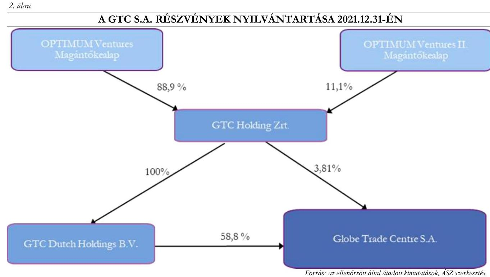

A 2022. szeptember 5-i cégcsoporton belüli részesedés átcsoportosítással a GTC Dutch Holdings B.V. 100%-os tulajdoni hányada - azzal együtt a GTC S.A. 58,8%-os részvénycsomagja - a GTC Holding Zrt.-től az Alpine Holding Kft. kizárólagos tulajdonában álló GDS (jelenleg GHS) társaság érdekeltségébe került. A GTC részvények százalékos megoszlását az Alapítvány érdekeltségébe tartozó cégek és alapok 2022. december 31-i nyilvántartásaiban az alábbi, 3. ábra mutatja be.
3. ábra

A GTC S.A. RÉSZVÉNYEK NYILVÁNTARTÁSA 2022.12.31. ÉS 2023.12.31-ÉN
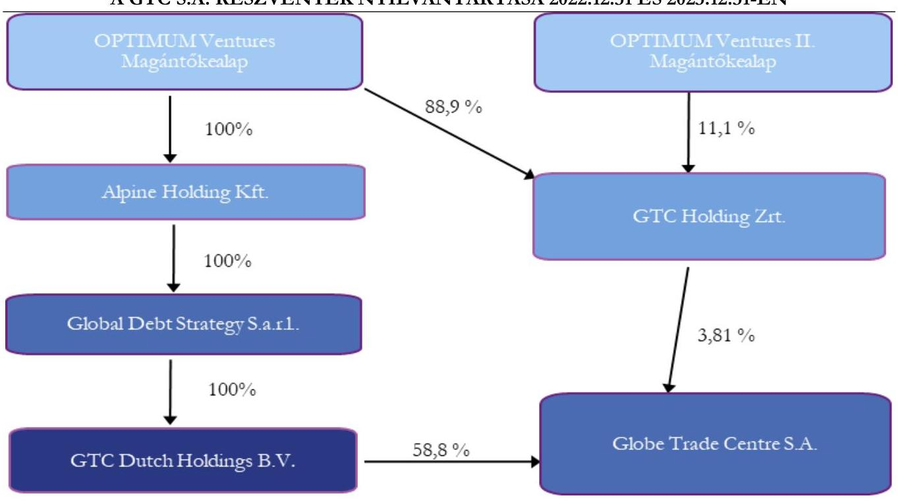

Forrás: az ellenőrzött által átadott kimutatások, ÁSZ szerkesztés

---

A 2. és 3. számú ábrákkal bemutatott nyilvántartási rendszer módosításának indoka lehetett akár az, hogy a GTC S.A. 58,8%-os részvénycsomagját birtokló GTC Dutch Holdings B.V. társasági részesedése a GTC Holding Zrt. Magyarországon nyilvános adatbázisokban elérhető beszámolói helyett a GDS társaság mint külföldi entitás - nyilvánosság számára nehezebben elérhető - beszámolóiban kerüljön kimutatásra.
1.3. számú megállapítás

Kormányzati szektorba sorolt egyéb szervezetként a Bkr. ${ }^{50}$ rendelkezései ellenére az Alapítvány nem szabályozta az integrált kockázatkezelés és a szervezeti integritást sértő események kezelésének eljárásrendjét.

# ALAPÍTVÁNY 

## Belső kontrollrendszer, adatszolgáltatás

Az Áht. ${ }^{51}$ szerint a kormányzati szektorba sorolt egyéb szervezetek megnevezését az államháztartásért felelős miniszter a Hivatalos Értesítőben és a Kormány honlapján közzéteszi. Az Alapítvány, az OPTIMA Befektetési Zrt. és a gazdasági társaság ${ }_{3-10}$ a PM közlemény ${ }^{52}{ }_{1-3}$ I. részében A) Központi kormányzat alszektorba besorolt szervezetek között kerültek feltüntetésre, eszerint 2021. június 18-tól a központi kormányzati alszektorba besorolt egyéb szervezetek voltak, belső kontrollrendszerük kialakítása során vonatkoztak rájuk a Bkr. 1-10. §-ai, adósságot keletkeztető ügyleteikre a Gst. ${ }^{53}$, adatszolgáltatásuk kapcsán az Áht. és Ávr. ${ }^{54}$ rendelkezései. A PM közlemény ${ }_{3}$ alapján a gazdasági társaság ${ }_{1-2}$ szintén a központi kormányzati alszektorba besorolt egyéb szervezet volt az ellenőrzött időszak egy részében, 2023. június 23-tól kezdődően.

Az Alapítvány vezetője a Bkr. előírásainak megfelelően gondoskodott a világos szervezeti struktúra, az információs és kommunikációs, valamint a célok megvalósításának nyomon követését biztosító rendszer kialakításáról, biztosította a folyamatok és a humán-erőforrás kezelés átláthatóságát, meghatározta a felelősségi, hatásköri viszonyokat és feladatokat, az etikai elvárásokat, kiadta az ellenőrzési nyomvonalat. Az Alapítvány vezetője a Bkr. előírását betartva olyan információs és kommunikációs rendszert alakított ki, amely biztosította, hogy a megfelelő információk a megfelelő időben eljussanak az illetékes szervezethez, szervezeti egységhez, illetve személyhez, valamint kialakította a szervezet tevékenységének, a célok megvalósításának nyomon követését biztosító rendszerét.
Az Alapítvány által kialakított kontrollkörnyezet azonban csak részben felelt meg a vonatkozó jogszabályoknak, ugyanis, a Bkr. 6. § (4) bekezdés előírása ellenére az Alapítvány vezetője nem szabályozta a szervezeti integritást sértő események kezelésének eljárásrendjét és az integrált kockázatkezelés eljárásrendjét, valamint a belső előírások a Bkr. 6. § (1) bekezdés e) pontjában rögzített kritériumok ellenére a szervezeti célok és értékek irányába való elkötelezettség fejlesztését biztosító intézkedéseket nem tartalmaztak.
Az Alapítvány az integritást sértő események kezelésének eljárásrendje meglétének igazolására hivatkozott az Alapító Okirat ${ }_{1-3}$ és az Adatkezelési Szabályzat ${ }_{1-3}{ }^{55}$ meghatározott pontjaira, azonban az ott rögzített szabályok a kuratóriumi összeférhetetlenségre és az adatvédelmi incidensek kezelésére vonatkoztak, amivel a Bkr. 6. § (4a) bekezdés a) - h) pontjaiban meghatározott, szükséges tartalomnak nem tettek eleget, a jogszabályban előírt tartalmú szabályozás meglétét más dokumentum sem igazolta.
Az Alapítvány által az integrált kockázatkezelés eljárásrendje meglétének igazolására hivatkozott Alapító Okiratban ${ }_{1-3}$ a kuratóriumi összeférhetetlenséget, a kuratórium tagjairól való döntést, visszahívásukat szabályozta, amivel az Alapítvány a Bkr. 7. § (1)-(5) bekezdése szerinti integrált kockázatkezelési rendszer működtetését nem igazolta, a jogszabályban előírt működtetést más dokumentum sem támasztotta alá.

---

# 2. Az Alapító által az Alapítvány részére juttatott vagyon felhasználása, hasznosítása, az Alapítvány és az OPTIMA Befektetési Zrt. gazdálkodása szabályszerűen és átláthatóan valósult-e meg; az Alapítvány, az OPTIMA Befektetési Zrt., valamint a gazdasági társaság1-11 szabályszerűen tett eleget éves beszámolási kötelezettségének? 

Összegző megállapítás

Az Alapítvány a befektetés típusának kiválasztása során több ügyletnél figyelmen kívül hagyta a Befektetési Szabályzat ${ }_{1-3}$ előírásait, egyes esetekben a gazdasági észszerűség hiánya jellemezte a döntéseket. A közvetetten befektetett vagyonelemek nem adekvát befektetési formái az alapítványi vagyonnak, azok tekintetében az átláthatóság jellemzően nem érvényesült. Az Alapítvány 2022. és 2023. évi beszámolója a Számv. tv. rendelkezései ellenére nem biztosította a megbízható és valós összkép bemutatását, mert az OPTIMA 2040/A kötvénye után nem számolt el értékvesztést. A Pénzügyminisztérium az Alapítvány könyvvizsgálóját a feltárt hiányosságok miatt a 2021-2023. üzleti évek kapcsán kibocsátott jelentései visszavonására kötelezte.
Az OPTIMA Befektetési Zrt. által megvalósított befektetések típusa többnyire sértette az Alapítvány Befektetési Szabályzatában ${ }_{1-3}$ meghatározott „biztonság-, alacsony kockázat” és „likviditás” célrendszert. Megalapozatlan befektetési döntések eredményeként fizetésképtelenséggel fenyegető helyzet alakult ki 2024-től az OPTIMA Befektetési Zrt.-nél.
Az OPTIMA Befektetési Zrt., az Alapkezelők és a gazdasági társaság7,8 éves beszámolási kötelezettségét a kiegészítő melléklet egyes, Számv. tv. szerinti tartalmi elemeinek hiányával teljesítette. Az Alapkezelők beszámolási kötelezettségüket a Magántőkealapok ${ }^{56}$ vonatkozásában a kiegészítő melléklet hiányosságaival, az Alapok ${ }^{57}$ kapcsán azzal az eltéréssel teljesítették, hogy több Alap esetében a főkönyvi kivonat vagy a leltár nem támasztotta alá a beszámolóban bemutatott adatokat.

---

2.1. számú megállapítás

Az Alapítvány az OPTIMA 2040/A kötvény piaci értékének meghatározása során eltért a vonatkozó szabályoktól, a feltárt kockázatok alapján a kötvény könyv szerinti értéke 2022. és 2023. évben nem tükrözte a piaci értékét, a Számv. tv. előírásai ellenére a kötvény után nem számolták el a jelentős összegű értékvesztést.

# Alapítvány kötvénye 

Az Alapítvány a tartós, jelentős tulajdoni részesedésű vállalkozásának kötvénye, az OPTIMA 2040/A jelű, 20 éves futamidejű kötvény piaci értékének meghatározása során nem teljeskörűen alkalmazta a vonatkozó Számv. tv. rendelkezéseit, lényeges, a vonatkozó jogszabályban és belső szabályzatában is meghatározott szempontokat figyelmen kívül hagyott. Az Alapítvány a kötvényt a mérlegben a számlavezető bank audit riportjával alátámasztott összegben, névértéken mutatta ki, amit a leltárban 'Nettó piaci ár/Könyv szerinti érték'-ként jelölt meg. A kötvény bruttó árfolyamának használatával számított árát bruttó piaci árnak minősítette, aminek értékét a Számv. tv. 54. § (5) bekezdés a) pontja előírásának megfelelően a felhalmozott kamatokkal csökkentette, azonban a kötvény piaci értékének meghatározásakor további, a Számv. tv. 54. § (5) bekezdés b) pontjában és ezzel összhangban az Értékelési szabályzatban is meghatározott szempontokat - az értékpapír kibocsátójának piaci megítélését, a piaci megítélés tendenciáját, azt, hogy a kibocsátó a lejáratkor, a beváltáskor a névértéket (és a felhalmozott kamatot) várhatóan megfizeti-e, illetve milyen arányban fizeti majd meg - nem vett figyelembe. Különösen aggályos a kötvény értékelése, minősítése során a fenti szempontok figyelembevételének elmaradása annak ismeretében, hogy az Alapítvány a 2023. december 28-án kelt megállapodás alapján, éppen a kötvény éves kamatfizetési kötelezettségének ellenértékeként biztosított beszámításra kerülő kölcsönt a kötvény kibocsátója részére, jegyzett le általa kibocsátott további kötvényt.
Az Alapítvány részéről maga a kötvénybefektetési döntés közgazdasági racionalitása is megkérdőjelezhető, mert olyan befektetést választott, amelynek a hozama lényegesen alacsonyabb a kockázatmentes kamatlábnál, azonban kockázata nagyobb. A pénzpiaci gyakorlatban nem alkalmazott, speciális, a befektető általi utólagos kamatmeghatározás nem nyújtott biztonságot, tervezhetetlenné tette a cash flowkat.
Az Alapítvány az általa figyelembe vett szempontok mentén elvégzett értékelést követően a kötvény kapcsán értékvesztést nem számolt el, illetve a kiegészítő mellékletben sem mutatta be a bizonyítékokat annak a feltételezésnek az igazolására, hogy a kötvény könyv szerinti értéke meg fog térülni.
Az alábbiakban bemutatunk néhány módszert és szempontot, amelyek mentén az Alapítvány célszerűen elvégezhette volna a kötvény értékelését, minősítését, meghatározhatta volna annak piaci értékét.
A kötvény piaci értékének kamatokkal történő megközelítése, valamint a körülmények elemzése során az ÁSZ olyan negatív tendenciákat azonosított, melyek alapján a feltárt kockázatok figyelembevételével a kötvény 2022-2023. évi könyv szerinti értéke (bekerüléskori érték) nem tükrözte a befektetés mérlegkészítéskori tényleges piaci értékét, az értékkülönbözet minősítése után értékvesztés elszámolása lett volna indokolt.
2021. évben a kötvény 2020. évi bekerülése miatt a negatív tendenciák kapcsán a Számv. tv. szerinti tartóssági feltétel még nem teljesült, erre hivatkozással az értékvesztés elszámolását 2021. évben jogszerűen mellőzhette az Alapítvány.

---

# A kötvény értékelése a hozamokon keresztül 

Az OPTIMA 2040/A kötvény egy rendkívül sajátos pénzügyi instrumentum, kamatozását a kibocsátó utólag, lényegében önkényesen, nem beazonosítható elvek alapján állapította meg, jegyzése és forgalmazása zárt körben történt, másodlagos piaca nincsen, ezáltal a piaci értékének meghatározása csak alternatív úton történhet. A kötvény piaci értéke a belőle származó cash-flowk diszkontált jelenértéke azzal, hogy a diszkontfaktor a piaci kamatlábat és a kibocsátó kockázatát is tükrözi. Jelen esetben a diszkontfaktor alsó becslése a kockázatmentes kamatláb lehet, amit leginkább az állampapírok hozamával közelíthetünk meg. A jegyzett állampapírokhoz kapcsolódó legkisebb hozamokat megvizsgálva (az alsó becslés érdekében a futamidőktől eltekintve) azt találtuk, hogy a minimális hozam a 2021-2023. években 0,96-7,44% között volt, ami a kötvény a 2021-2023. közötti időszakra megállapított 0,12-0,96% hozamaihoz képest többszörös értékeket jelentett. A számított piaci értékre már a minimális kamatlábbal elvégzett diszkontálással is a bekerülési értéknél kisebb értéket kapunk, azonban így még nem vettük figyelembe az OPTIMA Befektetési Zrt.-t jellemző kockázati felárat, ami az alkalmazandó diszkontláb növelésével a kalkulált piaci értéket tovább csökkenti. Amennyiben az OPTIMA Befektetési Zrt. az Alapítvány részére a hátralévő futamidő során továbbra is az ellenőrzött időszakhoz hasonló mértékű, a piaci kamatlábtól lényegesen elmaradó hozamot állapítana meg és fizetne ki, az az Alapítvány részéről akár 100 Mrd Ft értékvesztés elszámolását indokolná. 2024-ben a kedvezőtlen folyamatok tovább folytatódtak, ennek következtében a kötvény könyv szerinti és tényleges piaci értéke közötti veszteségjellegű különbség akár 150 Mrd Ft is lehetett.
A fenti megközelítésben az állampapírokhoz tartozó hozamokat - mint a legkevésbé kockázatos befektetési kamatlábat vizsgáltuk - azonban az OPTIMA Befektetési Zrt. mint kötvénykibocsátó gazdasági társaság kockázatai túlmutatnak az állampapír befektetések kapcsán vállalt kockázatokon, a magasabb - két külföldi befektetése és az NJE Alapítvány kötvényére vállalt visszafizetési kötelezettsége kapcsán kialakuló - kockázati felár a piaci érték meghatározása során a számított piaci értéket tovább csökkenti.

## Az OPTIMA Befektetési Zrt.-t jellemző kockázati felár

Az OPTIMA Befektetési Zrt.-t jellemző kockázatokat vizsgálva azt találtuk, hogy azt leginkább három kulcstényező - a kötvény mögötti két közvetett befektetése és egy általa kibocsátott kötvény, ami egyúttal a befektetések egyik forrása - befolyásolta. Az alábbiakban bemutatjuk ezeknek a tényezőknek, a 284,5 Mrd Ft összegű GTC S.A. és 165,0 Mrd Ft összegű Ultima Capital S.A. külföldi társasági részesedésének, valamint egy kötvényből származó 127,5 Mrd Ft összegű kötelezettségének a hátterét.

## Részesedés a GTC S.A. társaságban

Az Alapítvány 2023. év
 végén a magántőkealapokon - több vállalkozói szinten és több országon, indokolatlanul bonyolult céghálózaton - keresztül közvetetten birtokolja a varsói és johannesburgi tőzsdén jegyzett, lengyelországi központú ingatlanbefektetési profilú GTC S.A. részvényeinek 62,61%-át. Az Alapítvány közvetett befektetései közötti gazdálkodók által birtokolt GTC S.A. ingatlantársasági részesedés bekerülési értéke részvényenként 9,0 PLN, összesen 722 M EUR volt. A részvények megszerzése jóval a beszerzéskori tőzsdei átlagárfolyam, 6,86 PLN felett történt, a vételár 31%-nyi prémium összeget tartalmazott. A GTC S.A. részvény tőzsdei árfolyama az Alapítvány 2021., 2022. és 2023. évi mérlegkészítési időpontjaira a beszerzéskori (átlag) tőzsdei árfolyam 93,0, 89,8 és 80,8%-ára csökkent, így a tőzsdei árfolyamból számított, a prémiummal növelt hipotetikus ár lényegesen kevesebb lett volna, mint az eredeti bekerülési érték volt. A GTC S.A. részvény tőzsdei árfolyama

---

2024. december 30-án 3,89 PLN volt, ami a darabonként bekerülési árhoz képest közel 55%-os csökkenést jelent, a részesedés tőzsdei árfolyam alapján számított értéke 394,5 M EUR-ral (162 Mrd Ft-tal) csökkent. A részvény forgalma szerény, nem tekinthető likvidnek. A GTC S.A. tőzsdei árfolyamának változását a 4. ábra szemlélteti.
4. ábra

A GTC S.A. RÉSZVÉNY TŐZSDEI ÁRFOLYAMA 2020. JANUÁR-2024. DECEMBER KÖZÖTT
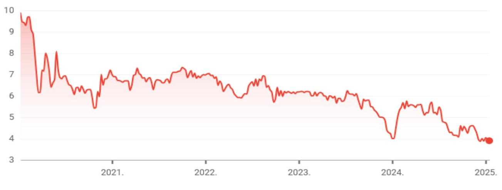

Forrás: https://www.google.com/finance/quote/GTC:WSE
A Fitch Ratings, a GTC S.A. hivatalos minősítője több mutató (ingatlanok átlagos bérbeadási kihasználtsága, a külső adósságállomány lejárati szerkezete, hitelfedezeti mutató, súlyozott átlagos bérbeadási idő) értékelése alapján a GTC S.A.-t az ellenőrzött időszakban leminősítette, a részére 2021. június 8-án adott „BBB-„ minősítést 2023. szeptember 7-én „BB+”-ra módosította. A BB+ hitelminősítés alapján már a nem befektetési, hanem spekulatív kategóriába tartozik a GTC S.A. társaság részvénye, így a kockázat magasabbnak tekinthető, mint a befektetési szintű minősítéseknél. Az ilyen besorolású adós esetében a hitelvisszafizetés nem garantált, különösen, ha kedvezőtlen gazdasági vagy piaci feltételek lépnek fel. A legutóbbi, 2024. november 25-i során a Fitch Ratings a GTC S.A. jövőbeli minősítésének kilátásait stabilról negatívra változtatta a rövid távú likviditási kockázatok és a nagyértékű adósságállomány miatt (2026-ban 760 M EUR összegű kötelezettség refinanszírozandó). A GTC S.A. minősítéseinek történetét az 5. ábra mutatja be.

---

5. ábra

# A GTC S.A. MINŐSÍTÉSI ESEMÉNYEI 2021. JÚNIUS-2024. NOVEMBER KÖZÖTTI IDŐSZAKBAN FITCH RATINGS 

## LONG TERM ISSUER DEFAULT RATING

DATE: 25-Nov-2024 23-May-2024 14-Dec-2023 07-Sep-2023 08-Jun-2023 07-Sep-2022 13-Sep-2021 08-Jun-2021
RATING: BB+@ BB+@ BB+@ BB+@ BBB-@ BBB-@ BBB-@ BBB-@
ACTION: Affirmed Affirmed Affirmed Downgrade Affirmed Affirmed Review- No Action New Rating

Forrás: Globe Trade Centre S.A. Credit Ratings
2020. decemberében az Optima Befektetési Zrt. bizonyos GTC S.A. eszköz adásvételi tranzakciók utáni jutalék kifizetésre kötött megállapodásokat a B.H. Ventures Kft-vel és a PRIME Kft-vel, melyek alapján 2020. és 2021. években mindösszesen 3,0 Mrd Ft összegben teljesített kifizetéseket. A partnercégek értékesítési árbevétele szinte kizárólag, illetve jelentős részben ebből az ügyletből eredt. A partnercégek ügyvezetői a GTC S.A.-nál, illetve annak leányvállalatánál is vezető tisztségeket töltöttek be. A tranzakciókkal érintett összegekhez képest csekély terjedelemben, felszínes tartalommal aláírt megállapítások kapcsolódtak.

## Részesedés az Ultima Capital S.A. társaságban

2023. év végén az Alapítvány a közvetett befektetései révén birtokolta az Ultima Capital S.A. 33%-os részvénycsomagját, ezen felül megállapodás alapján megfizetett egy 25%-os lehívható részvénycsomagot, valamint további 42,1% részvényre kisebbségi tulajdonosokkal kötött vételi és eladási szándékot rögzítő megállapodásokat. A részvénnyé változtatható kötvény vásárlásáról hozott kuratóriumi döntés időpontjában a részvény árfolyama 116,2 CHF, az Ultima csomag kalkulált átlagos beszerzési ára részvényenként 110,12 CHF volt. Az Ultima Capital S.A. részvényárfolyama az ellenőrzött időszakban nagy volatilitással, de csökkenő trendben változott, az Alapítvány 2023. évi mérlegkészítési időpontjára 90 CHF-re, a döntéskori árfolyam 77,45%-ára, illetve a bekerülési érték 81,9%-ára csökkent. A részvény tőzsdei árfolyama 2024. december 30-án 88 CHF volt, ami a darabonként bekerülési árhoz képest 20%-os csökkenést jelent. Az Ultima Capital S.A. tőzsdei árfolyamának változását a 6. ábra szemlélteti.

---

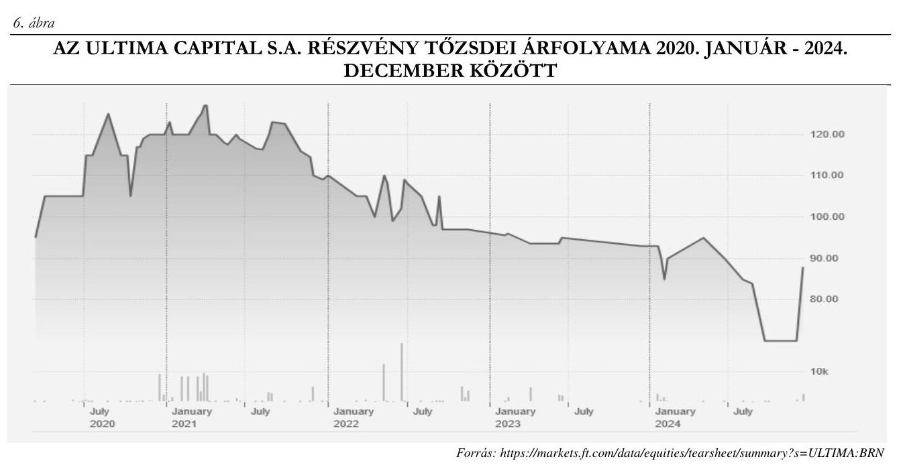

Az Ultima Capital S.A. befektetés kapcsán a mértékadó, pénzügyi elemzéshez használt adatbázisokban nem volt fellelhető érdemi adat, kizárólag a társaság konszolidált pénzügyi kimutatása, illetve a tőzsdei árfolyamok álltak rendelkezésre. A részvény árfolyamának és forgalmának alakulását áttekintve megállapítottuk, hogy az árfolyam nagy kilengésekkel, hektikusan, ugyanakkor csökkenő trendben változott, a részvény forgalma csekély volt, ezáltal a befektetés nem tekinthető likvidnek. A befektetés közgazdasági racionalitása megkérdőjelezhető, főként annak a ténynek a figyelembevételével, hogy a GTC S.A. is ingatlanpiaci profilú társaság, így a koncentrált ingatlanpiaci befektetések további kockázatot hordoznak a diverzifikáció hiánya miatt. Az Ultima Capital S.A. a honlapján elérhető 2024. első félévi jelentése alapján a tárgyidőszakban jelentős (24 492 E CHF) összegű veszteséget realizált, szemben a megelőző év hasonló időszakában elért 15262 E CHF nyereséggel, mely egyebek mellett a bevételek közel 27%-os csökkenésének, ugyanakkor a személyi kiadások majd nyolcszoros mértékű emelkedésének volt köszönhető. Az Ultima csomag részeként az Optima csoport 2023. decemberben további kisebbségi részvényesekkel vételi és eladási szándékot rögzítő megállapodásokat kötött (42,1% részvényre), melyekből eredően azok megkötésekor, majd a továbbiakban 2024. és a 2025. évben merül fel fizetendő kötelezettsége.

# Az NJE Alapítvány által lejegyzett kötvények, likviditás 

Az OPTIMA Befektetési Zrt. hosszú lejáratú kötelezettsége az NJE Alapítvány által 2021. évben három részletben, 5 Mrd Ft, 22,5 Mrd Ft, valamint 100 Mrd Ft, azaz összesen 127,5 Mrd Ft értékben lejegyzett Optima2031 és 2031/B kötvény. A kötvény lejegyzését vélhetően elősegítette az a személyi összefonódások vizsgálata körében feltárt tény, miszerint az NJE Alapítvány Kuratóriumi elnöke egyszemélyben a Pallas Athéné Domus Meriti Alapítvány Kuratóriumi elnöke volt 2020-tól. A kibocsátás célja a kötvény információs összeállítások alapján a kibocsátó befektetési tevékenységének hosszú távú finanszírozása, ingatlanok vásárlása volt.
A kötvényből befolyt összegekből a fenti külföldi ingatlanbefektetési társaságokban részesedések szerzése valósult meg. Felek a kötvények kapcsán az 'Eladási jog alapításáról' szóló szerződéseket is aláírtak, ezek

---

5,0 és 22,5 Mrd Ft-ra vonatkozóan 2022. február 18-tól és július 9-től, további 100 Mrd Ft-hoz kapcsolódóan 2022. október 11. napjától nyitották meg az NJE Alapítvány eladási jogát, ezzel egyidejűleg az OPTIMA Befektetési Zrt. visszavásárlási kötelezettségét. Az OPTIMA Befektetési Zrt. a kötvény vételárát 27,5 Mrd Ft-ra vonatkozóan az esetleges eladási nyilatkozat kézhezvételétől számított 8 banki napon, 100 Mrd Ft kapcsán 90 naptári napon belül köteles megfizetni. A kötvény célrendszere által megvalósított befektetések időtávja nem volt összhangban a Felek között az 'Eladási jog alapításáról' megkötött szerződésekben a visszaváltásokra meghatározott határidőkkel.

# Fizetésképtelenséggel fenyegető helyzet - OPTIMA Befektetési Zrt. 

Tekintettel arra, hogy 2024. januárban az NJE Alapítvány Kuratóriumának döntése alapján a birtokában lévő kötvények eladási jogát érvényesíteni kívánta, azonban az OPTIMA Befektetési Zrt. azt mint kötelezett nem tudta teljesíteni, azóta fizetésképtelenséggel fenyegető helyzet alakult ki. A helyzet kialakulását támasztja alá a 2024. február 26-án kelt, az OPTIMA csoport rövid és középtávon vállalt kötelezettségei tárgyú előterjesztése, mely szerint „A jelenlegi helyzet kizárólag azonnali külső forrás bevonásával oldható meg, az OPTIMA csoport vagyona azonban nem likvid, alapvetően kizárólag Ultima Capital SA (a továbbiakban Ultima) és GTC SA (a továbbiakban GTC) részvényekből áll, amelyek a tőzsdén csak nagy veszteséggel és kis volumenű részvénycsomagokban értékesíthetők. Külső forrás csak befektető bevonása mellett valósítható meg reálisan, a rendelkezésre álló idő alatt viszont ennek jelenleg kicsi a valószínűsége. Továbbá az OPTIMA Befektetési Zrt. elnök-vezérigazgatójának, az alapító MNB, az Alapítvány Kuratóriuma és felügyelőbizottsága részére megküldött 2024. március 09-i tájékoztatása szerint az OPTIMA Befektetési Zrt. „egy március 11. napján esedékes (29 498 198,16 EUR) és március 15. napján esedékes (3,3 millió EUR) szerződés alapján fennálló fizetési kötelezettség teljesítésére nem rendelkezik kellő forrással, ezért folyamatos tárgyalásokat folytatnak a fizetési kötelezettség átütemezéséről és csökkentéséről a másik fél képviselőivel, valamint a finanszírozó bankokkal”.
Az OPTIMA Befektetési Zrt. és az NJE Alapítvány között jelenleg is folyamatban vannak azok a tárgyalások, melyek a kötvény vételára kiegyenlítésének módjára és ütemezésére vonatkoznak. Az 'Eladási jog alapításáról' megkötött szerződésben vállalt pénzbeli vételár megfizetési móddal ellentétben a tárgyalások alapján a kötelezettség egy részét vagyoni elem átadásával tervezik kiegyenlíteni.
A likviditási helyzetet értékelő belső ellenőrzési vizsgálat 80,5 Mrd Ft likviditási hiányt prognosztizált 2025. június végére, azonban nem számolt az NJE Alapítvány kötvényének visszafizetéséből eredő kötelezettségekkel, ami - a teljes összeg pénzbeli kiegyenlítése esetén - akár további 127,5 Mrd Ft-ot jelenthetett.

A fizetésképtelenséggel fenyegető helyzetet az OPTIMA Befektetési Zrt. úgy próbálja megoldani, hogy külön egyeztetéseket folytat az NJE Alapítvánnyal, egyedi egyezségekkel, fizetési haladékok és határidő módosítások elérésével igyekszik ellene hatni.

## A Reorganizációs terv

Az Alapítvány Kuratóriuma 2024. április 25-i határozatával elfogadta a kétéves, 2024-es és a 2025-ös évre kiterjedő Reorganizációs tervet, melynek célja a megváltozott környezetben a bevételek és a kiadások egyensúlyának helyreállítása. A Kuratórium jóváhagyta az értékesítésre javasolt tételeket, közöttük a Reorganizációs terv legfőbb elemeként az Ultima csomag 2024. évi értékesítését és további befektetett pénzügyi eszközök eladását.

---

A Reorganizációs terv alapján az Optima Befektetési Zrt. az Ultima Capital S.A. részesedésének minimum könyv szerinti értéken történő értékesítéséből kívánta finanszírozni az NJE Alapítvány kötvényének visszafizetését. A Státuszjelentés szerint az Ultima csomag értékesítésére irányuló erőfeszítések nem vezettek eredményre, így a Reorganizációs tervben foglaltak ellenére az NJE Alapítvány kötvényei visszaváltásával kapcsolatos 127,5 Mrd Ft fizetendő kötelezettség 2024. november 15-én továbbra is fennállt, illetve a visszaváltás során beszámított vagyonelemek meghatározása ismét módosult. A Státuszjelentés időpontjában szintén fennállt még - az eredeti esedékesség szerint 2024. október 09-én, majd az átütemezés után 2024. novemberben esedékes - az NJE Alapítvány kötvényéhez kapcsolódó 2,5 Mrd Ft összegű kamatfizetési kötelezettség. Jól tükrözi a Reorganizációs terv elfogadását követő likviditási helyzetet, hogy a Státuszjelentésben az Optima Befektetési Zrt. is hangsúlyozta, hogy a „bevételi és forrás lebetőzései, valamint a kötelezettségállomány ismeretében az látszódik, hogy külső segítség nélkül a P.ADME/Optima csoport jelenlegi helyzetének megnyugtató rendezésére jelenleg nem látunk lehetőséget”, valamint 400 Mrd Ft pótlólagos tőkejuttatást látnak szükségesnek. Szintén a likviditási helyzet súlyosságát jelzi az Alapítvány felügyelőbizottságának 2025. január 18-án kelt, az alapító MNB elnökének címzett levele, melyben az Alapítvány felügyelőbizottsága elnökének értékelése szerint „az Alapítvány cél szerinti működése és fizetőképessége közvetlen veszélyben van”.
A kötvény visszaváltása, a likviditási problémák az Alapítvány mint egyedüli részvényes, és mint az OPTIMA Befektetési Zrt. fizetőképességét biztosító kötelezettségvállaló számára is kockázatot hordoznak a vagyontömeg megőrzése kapcsán.

# Látszólagosan likvid kötvények 

Az NJE Alapítvány az általa vásárolt Optima2031 és 2031/B kötvények kapcsán rendelkezett az Alapítvány és a GTC Holding Zrt. kötelezettségvállaló nyilatkozataival. A fizetőképesség biztosítását vállaló nyilatkozatok a visszafizetési garanciaként szolgálhattak volna, azonban a GTC Holding Zrt. nyilatkozata szerinti biztosítékokat, a GTC S.A. részvényeit más ügyletben
 óvadékként is felhasználták.
A 22,5 és az 5 Mrd Ft értékű Optima2031 kötvény információs összeállítás szerint a kötvényekből eredő fizetési kötelezettségeket a GTC S.A. társaságnak a GTC Holding Zrt. tulajdonában lévő 43144943 és 9484466 db részvénye biztosította. A GTC Holding Zrt. az OPTIMUM Ventures és OPTIMUM Ventures II. Magántőkealap tulajdonában állt, a Magántőkealapok kezelője az OPTIMA Befektetési Alapkezelő Zrt., a kötvényt kibocsátó OPTIMA Befektetési Zrt. 100%-os részesedésű társasága volt. A GTC Holding Zrt. kötelezettségvállaló nyilatkozatban vállalta, hogy a részvényeket az NJE Alapítvány előzetes írásbeli hozzájárulása nélkül nem idegeníti el. A vállalt kötelezettség ellenére 2022. szeptember 5-én a cégcsoporton belüli részesedések közötti átcsoportosítás eredményeként a GTC Holding Zrt. birtokában kevesebb részvény maradt, mint a kötelezettségvállaló nyilatkozatok szerinti vállalás. A hitelt folyósító bank és az Alpine Holding Kft. között létrejött 170 M EUR összegű hitelkeret szerződés kapcsán a 2023. december 15-én kelt közjegyzői okiratban foglaltak szerint a GTC Holding Zrt. és GTC Dutch Holdings B.V. társaságok teljes GTC S.A. részvényállományán zálogjogot és óvadékot alapítottak. A hitelkeret szerződést egy korábbi, 2022. február 18. napján kelt hitelkeret szerződés kiváltására kötötték, a korábbi szerződéshez szintén kapcsolódott a GTC S.A. részvényeket terhelő zálogszerződés.
Az Alapítvány mint az OPTIMA Befektetési Zrt. egyedüli részvényese az összesen 127,5 Mrd Ft értékben lejegyzett Optima2031 és 2031/B kötvények kapcsán tett kötelezettségvállaló nyilatkozatot az NJE

---

Alapítvány felé, amelyben vállalta, hogy szükség esetén az OPTIMA Befektetési Zrt. fizetőképességét biztosítja.
Az eladási jogot biztosító megállapodás, valamint az Alapítvány és a GTC Holding Zrt. általi kötelezettségvállaló nyilatkozat azt a látszatot keltette az NJE Alapítvány felé, hogy ténylegesen likvid befektetésnek minősül a kötvények jegyzése.
A kötvények révén finanszírozott befektetésekhez kapcsolódó bemutatott kockázatok, valamint ezek tendenciái megkérdőjelezik a kötvény teljes összegben történő várható megtérülését.

# Könyvvizsgálati vélemények visszavonása 

Az ellenőrzés során felmerült, hogy az Alapítvány részére kiadott könyvvizsgálati vélemény ellenére sérülhetett a megbízható és valós összkép bemutatása, hiszen az éves könyvvizsgálatok alatt a fentiekben bemutatott komplex, országhatárokon átívelő számos kockázati típust magában foglaló struktúrát nem vették figyelembe, nem vizsgálták. Az ÁSZ az eset kapcsán a könyvvizsgáló felelősségének tisztázására jelzéssel fordult az illetékes Pénzügyminisztérium Számviteli és Közfelügyeleti Főosztálya felé.
Az ÁSZ megkeresése (XVI. számú melléklet) alapján a Pénzügyminisztérium Számviteli és Közfelügyeleti Főosztálya 2024. június 19-20. között rendkívüli minőségellenőrzést folytatott le az Alapítvány könyvvizsgálójánál, aminek eredményeként a könyvvizsgálót az Alapítvány 2021. évi egyszerűsített éves beszámolójával összefüggésben 2022. május 24. napján, és a 2022. évi egyszerűsített éves beszámolójával összefüggésben 2023. május 30. napján kibocsátott könyvvizsgálói jelentések visszavonására kötelezte. A Pénzügyminisztérium tájékoztatását a rendkívüli minőségellenőrzés lefolytatásáról a XVII. számú melléklet tartalmazza. Mivel a tájékoztatás nem tért ki az OPTIMA Befektetési Zrt. könyvvizsgálati jelentése kapcsán tett intézkedésekre, az ÁSZ 2025. február 18-án értesítéssel fordult Pénzügyminisztérium felé. Az értesítést a XVIII. számú melléklet tartalmazza.
A Pénzügyminisztérium az Alapítvány 2023. évi egyszerűsített beszámolója kapcsán további rendkívüli minőségellenőrzési eljárást folytatott le, melynek eredményeként a könyvvizsgáló a 2024. május 30. napján kibocsátott könyvvizsgálói jelentését is visszavonta.
A Pénzügyminisztérium Számviteli és Közfelügyeleti Főosztálya megállapította, hogy a könyvvizsgáló által végrehajtott könyvvizsgálati eljárások önmagukban nem elegendőek ahhoz, hogy az Alapítvány által kimutatott befektetett pénzügyi eszközök értékéről, illetve annak megalapozottságáról meggyőződjön. A könyvvizsgálati dokumentációban nem találhatóak meg olyan könyvvizsgálati eljárások, amelyek szükségesek ahhoz, hogy a kötvény értékelésére megalapozott következtetést lehessen levonni. Az Alapítvány 2022. évre egyszerűsített éves beszámolót készített, amely kapcsán a könyvvizsgáló nem végzett elegendő és megfelelő eljárást és nem gyűjtött elegendő és megfelelő bizonyosságot az egyszerűsített éves beszámoló típus alkalmazhatóságával összefüggésben. 2023. évben ugyancsak egyszerűsített éves beszámoló készült, azonban abból a formai nem megfelelés miatt számos lényeges számszaki és szöveges közzététel és annak szöveges értékelése hiányzott, különösképpen a kötvénnyel kapcsolatos közzétételek bemutatása.

## Alternatív befektetések

Az Alapítvány a saját és a tulajdonában lévő gazdasági társaságok vagyonelemeit közleményekben mutatta be, melyek szerinti vagyon értéke - a valós piaci érték bemutatása nélkül, a devizás eszközök értékelési tartalékával korrigáltan - 2019. év végén 282,5 Mrd Ft volt, 2024. I. félév végére 300,5 Mrd Ft-ra nőtt. A

---

megvalósított befektetések közgazdasági racionalitása azonban megkérdőjelezhető, az ingatlanpiaci koncentráció tovább növelte azok kockázatait. A vagyon értékelvű és rendeltetésszerű felhasználását alapul véve felvetődik a kérdés, hogyan alakult volna az összvagyon, amennyiben az Alapítvány más befektetési formába helyezi vagyonát és gazdasági társaságok nélkül működött volna. A megvalósított befektetések alternatívájaként két befektetési formát alapul véve számítást végeztünk arra vonatkozóan, hogy hogyan alakult volna az Alapítvány vagyonnövekedése, amennyiben vagyonát a vizsgált időszakban egyéb pénzpiaci alapba, vagy egy - az Alapítvány által megvalósított ingatlanbefektetésekhez hasonló kockázatú - közvetett ingatlanalapba fektette volna. Az egyéb, alacsony kockázatú pénzpiaci alapokba történő befektetés esetén 36,3 Mrd Ft-tal lett volna magasabb a vagyonnövekmény, mint a valóságban elért, a közvetett ingatlanalap befektetési forma választása 54,9 Mrd Ft-tal több növekedést eredményezett volna, a ténylegesen vállalt kockázatokhoz képest mindkét esetben lényegesen kisebb mértékű kockázatvállalással. Az alternatív befektetések bemutatása során alkalmazott módszertant a IV. számú melléklet tartalmazza.

# Elmaradt haszon 

A bemutatott befektetések elszalasztott hozamára alternatíva költségként, elmaradt haszonként szükséges tekinteni, az Alapítvány az ÁSZ számításai szerint 36,3-54,9 Mrd Ft vagyonnövekedést nem tudott realizálni, sőt a külföldi ingatlantársasági befektetéseinek az ellenőrzött időszakban értékelt kockázatai miatt akár 100 Mrd Ft-nyi értékvesztést kellett volna elszámolnia. Az elmaradt haszon és az értékvesztés révén a vagyon értékében 2023., illetve 2024. év végére akár 150-200 Mrd Ft különbség is adódhatott volna, amennyiben az Alapítvány a közpénzből származó vagyon hasznosítását más, kevésbé kockázatos, mindamellett magasabb hozamú eszközök útján valósította volna meg.

## Alapítvány anyag- és személyi jellegű költségek, ráfordítások elszámolása

Az utalványozást az Alapítvány igazgatója végezte, aki arra az Alapító Okiratban ${ }_{1-3}$, az SZMSZ-ben ${ }_{1-4}$, a Beszerzési szabályzatban ${ }_{1-2}{ }^{58}$, az Alapítvány Pénzkezelési Szabályzatban ${ }_{1-3}$ rögzítettek és a Kuratórium felhatalmazása alapján volt jogosult. A bizonylatok a Számv. tv. előírásának megfelelően a gazdasági esemény számviteli elszámolását alátámasztották, tartalmazták a szükséges alaki és tartalmi kellékeket. Az anyag- és személyi jellegű költségek, ráfordítások elszámolása a Számv. tv. előírásaival összhangban a megfelelő költségnemekre történt. Az Alapítvány számviteli nyilvántartásaiban az anyag- és személyi jellegű költségek, ráfordítások elszámolása szabályszerű volt.
Az Alapítvány a költségei, ráfordításai nyilvántartására alkalmazott főkönyvi számokat a Számlatükörben ${ }_{1-2}{ }^{59}$ a Civil tv. és a Civilszr. rendelkezéseinek megfelelően alapcél-vállalkozási tevékenység szerint elkülönítetten, olyan alábontásban részletezte, hogy abból az alaptevékenységgel, illetve a vállalkozási tevékenységgel kapcsolatos ráfordítások rendelkezésre álltak.

## A vagyon nyilvántartása, belső szabályozások, leltározás

## Az értékhelyesbítés szabályozása

Az OPTIMA Befektetési Zrt. értékelési szabályzata az értékhelyesbítés elszámolhatóságára vonatkozó rendelkezést a tárgyi eszközök közötti ingatlanok és kapcsolódó vagyoni értékű jogok kapcsán tartalmazott, azonban a OPTIMA Számviteli politika ${ }_{1,2}$ az értékhelyesbítésre vonatkozó szabályokat közöttük azt, hogy a társaság választása szerint nem él a befektetett eszközök piaci értéken történő értékelés lehetőségével - önmagával és az értékelési szabályzattal ellentmondásosan rögzítette. Az

---

OPTIMA Számviteli politikában ${ }_{1-2}$ rögzített szabályozás szerint: „A tárgyi eszközök értékhelyesbítésként az eszközök - könyv szerinti értékét meghaladó piaci értéke és könyv szerinti értéke közötti különbözet mutatható ki. Csak az ingatlanok, műszaki berendezések, egyéb berendezések, tenyészállatok eszközeire számolható el", ugyanezen bekezdés azonban azt is tartalmazta, hogy a „társaság választása szerint nem él a befektetett eszközök piaci értéken történő értékelés lehetőségével".
Az Alapítvány, és a gazdasági társaság ${ }_{1-2,8-11}$ számviteli politikája tartalmazott rendelkezést a befektetett pénzügyi eszközök között a részesedések kapcsán kimutatható értékhelyesbítésre, azonban az értékelési szabályzat előírásai alapján a tulajdoni részesedést jelentő befektetéseknél csak a korábban elszámolt értékvesztés visszaírása lehetséges, maximum az eredeti bekerülési értékig, az értékelési szabályzat a részesedések kapcsán az értékhelyesbítés lehetőségét nem tartalmazta.

# A valós értékelés szabályozása 

Az OPTIMA Befektetési Zrt. és a gazdasági társaság a Számv. tv. rendelkezésének megfelelően számviteli politikájában kitért a valós értékelés szabályozására, rögzítette azon döntését, miszerint él a pénzügyi instrumentumok meghatározott körének valós értéken történő értékelési lehetőségével, azonban ettől eltérően az értékelési szabályzata azt tartalmazta, hogy a társaság eszközei esetén nem alkalmazza a valós értéken történő értékelést.
A gazdasági társaság a 2021-2023. években a pénzügyi instrumentumok körében élt a valós értéken történő értékelés lehetőségével, ezen döntését a 2023. november 7-től hatályos FER Számviteli politika; ${ }^{60}$ és a FER Értékelési szabályzat; ${ }^{61}$ az alkalmazott gyakorlatának megfelelően tartalmazta. A 2021. január 1-től hatályos Számviteli politikát és Értékelési szabályzatot a gazdasági társaság két-két, egymástól tartalmilag eltérő változatban készítette el. Az egyidejűleg hatályos belső szabályzatok a valós értékelés szabályozása kapcsán ellentmondásokat tartalmaztak. Az ellenőrzés részére 2023. évben átadott FER Számviteli politika; ${ }^{62}$ 1.5.3. és a FER Értékelési szabályzat; ${ }^{63}$ 3. pontjai tartalmazták a FERIDA Zrt. azon döntését, hogy a Számv. tv. szerinti valós értéken történő értékelést nem alkalmazza, azonban a főkönyvi könyvelési adatok és a beszámolók kiegészítő mellékletei szerint a tényleges gyakorlata ettől eltért, a forgatási célú befektetési jegyek kapcsán értékelési különbözetet számolt el, azokat valós értéken értékelte. Az ellenőrzés részére a 2024. évben átadott FER Számviteli politika ${ }_{1}$ és FER Értékelési szabályzat ${ }_{1}$ ugyanazon számozással ellátott pontjai rögzítették azt a választását, hogy a FERIDA Zrt. él a pénzügyi instrumentumok meghatározott körének valós értéken történő értékelési lehetőségével.

## A leltározás szabályozása, leltár

Az Alapítvány, az OPTIMA Befektetési Zrt. és a gazdasági társaság ${ }_{1-11}$ a leltározást a Számv. tv. és a leltározási szabályzatok előírásának megfelelően valamennyi mérlegtétel kapcsán elvégezték. A belső szabályzatban rögzítetteknek megfelelően elvégezték a mennyiségi leltározást, arról leltárfelvételi ívet készítettek, a leltározás eredményét jegyzőkönyvben értékelték ki, melyet a kijelölt felelős személyek írtak alá. A mennyiségi leltárívek, az analitikus nyilvántartások és a főkönyvi nyilvántartások egyeztetését a Számv. tv. rendelkezéseinek megfelelően dokumentáltan elvégezték, a leltárakat minden eszköz és forrás vonatkozásában kiértékelték. A 2021-2023. évi ellenőrzött mérlegtételek értéke a leltárban egyezett a főkönyvi számlák egyenlegével, az analitikus nyilvántartással, a leltár kiértékelt tételeivel, a nyilvántartások adatai között biztosított volt az egyezőség.

---

# Az OPTIMA Befektetési Zrt. és gazdasági társaság1,2,7-11 

Az ellenőrzött mérlegtételek bekerülési értékének meghatározása az OPTIMA Befektetési Zrt. és a gazdasági társaság ${ }_{10}$ esetében jelentősnek nem minősülő nyilvántartási hibával, a további gazdasági társaság ${ }_{1,2,7-9,11}$ esetében szabályszerűen megtörtént. A mintatételek kapcsán ellenőrzött mérlegtételek leltározása és év végi értékelése, minősítése az OPTIMA Befektetési Zrt. és a gazdasági társaság ${ }_{1,2,7-11}$ esetében a szabályszerű leltárak kiértékelésével a Számv. tv. előírásainak megfelelően megtörtént.
2023. évben az OPTIMA Befektetési Zrt. könyveiben egy mintatétel besorolása
 nem felelt meg a Számv. tv. 27. § (3) bekezdése és a Számviteli politika előírásainak. Az OPTIMA Befektetési Zrt. az Optimum Úri Kft. részére szerződés alapján nyújtott tagi kölcsönt, amit a forgóeszközök között tartottak nyilván, azonban a fennálló tartozás futamideje az 1 évet meghaladta, emiatt a tételt a Befektetett pénzügyi eszközök között kellett volna szerepeltetni. A mérleg eszközoldalán az eszközcsoportok közötti besorolási hiba nem minősült jelentős összegűnek.
2.2. számú megállapítás

Az Alapítvány a befektetési döntések meghozatala, a befektetés típusának kiválasztása során több esetben figyelmen kívül hagyta a Befektetési Szabályzata ${ }_{1-3}$ előírásait. Az OPTIMA Befektetési Zrt. befektetési döntéseinek nem történt meg a gazdaságossági, hatékonysági és eredményességi szempontok szerinti megalapozása. Az Alapítvány által kialakított kontrollok nem nyújtottak megfelelő tájékoztatást a közvetett befektetések teljesítményéről a beszámoltatási rendszer nem volt hatékony. A határozathozatal és szerződéskötés során több esetben a Ptk. összeférhetetlenségre vonatkozó elveivel ütköző gyakorlatot valósítottak meg. A befektetési tevékenység során, a befektetési jegyek forgalmazásával veszélyeztették a vagyonfelhasználási szabályok betartását, valamint sértették a „biryonság-alacsony kockázat" és „likviditás" célrendszert.

Az Alapítvány vagyongazdálkodási stratégiájának elemeként meghatározta ugyan a „Jövedelem generálása", „Biztonság" és „Likviditás" alapelveket, azonban az ellenőrzött tételek kapcsán ezeket többnyire nem tartotta be, mind az Alapítvány, mind az OPTIMA Befektetési Zrt. döntései kapcsán megvalósult befektetések sértették az előírt célrendszert. Az alapok befektetési jegyeinek forgalmazásával és azzal, hogy a vállalt kötelezettségeket nem tudta teljesíteni, az OPTIMA Befektetési Zrt. nem biztosította az Alapítvány vagyonának megőrzését.

## Az alapítványi vagyon tényleges befektetését végző gazdasági társaságok befektetési tevékenységének szabályozása

Az Alapítvány mérlegfőösszegének közel 100\%-át kitevő OPTIMA Befektetési Zrt. által kibocsátott OPTIMA 2040/A jelű kötvény fedezetét az OPTIMA Befektetési Zrt. közvetlen vagy közvetett befektetései képezték. A kötvény évente változó kamatozású volt, a kibocsátó a kamatperiódus utolsó napján határozta meg az előző időszakra vonatkozó kamatot, ami 2021. évre évi 0,17 %, 2022. évre évi 0,12 %, 2023. évre 0,96 % volt. A kötvényből származó hozam az ellenőrzött időszakban az Alapítvány egyik fő bevételi forrása volt, azonban a ténylegesen fizetett kamat mértékének egyoldalú, előre meghatározott keretrendszer nélküli, utólagos meghatározása nem tette számára lehetővé, hogy a kötvénybefektetésből származó hozam összegével tervezzen. 2023. évben az OPTIMA Befektetési Zrt. az Alapítvánnyal kötött megállapodás szerinti kölcsönből és további OPTIMA 2040/A

---

kötvénykibocsátásból finanszírozta a kötvény 2022.12.28.-2023.12.27. közötti kamatperiódusára megállapított 0,96%-os kamatfizetési kötelezettségét. Ebből adódóan az alapítói vagyon 98,44%-át kitevő kötvény befektetés vonatkozásában a kötvénykamat nem jelentett tényleges bevételt az Alapítvány számára.

# Az Alapítvány mint egyedüli részvényes hatáskörébe tartozó döntések 

Az OPTIMA Befektetési Zrt. Alapszabálya ${ }_{1-6}$ rendelkezett az egyedüli részvényes kizárólagos döntési hatáskörébe tartozó kérdésekről, közöttük megjelölt öt olyan konkrét jogügylet típust, melyekhez az Alapítvány jóváhagyása volt szükséges, amennyiben az ügylet értéke meghaladta az OPTIMA Befektetési Zrt. alaptőkéjének 25%-át, azaz 300 M Ft-ot. A megjelölt jogügyletek: más társaságokban részesedés szerzése; vagyoni értékű jog vagy más társaságban lévő részesedés elidegenítése; a társaság tulajdonában lévő ingatlan elidegenítése vagy lízingbe adása; a társaság által megszerezni kívánt ingatlanra vonatkozó kötelezettségvállalás; hitel felvétele, valamint az ilyen összegű kezességvállalás. A 2021-2023. években történt részesedés szerzési, elidegenítési, kötvény kibocsátási, hitel felvételi ügyletek kapcsán az Alapítvány Kuratóriuma a fenti előírások szerint szükséges határozatokat meghozta. Ugyanakkor az OPTIMA Befektetési Zrt. Alapszabálya ${ }_{1-6}$ nem tartalmazott rendelkezéseket az Alapítvány jóváhagyási jogkörét illetően olyan rendszeresen, a befektetési döntések túlnyomó többségét kitevő, a döntési határösszeget meghaladó értékű ügyletek kapcsán, mint a befektetési jegyekkel, vállalati kötvényekkel kapcsolatos tranzakciók, valamint a kölcsön nyújtása.

## Beszámoltatási rendszer

Az Alapítvány pénzügyi-, jövedelmi és a vagyoni helyzetéről, a közvetlen befektetési portfóliójának összetételéről és teljesítményéről és a befektetési irányelveknek való megfeleléséről szóló beszámolókat a Befektetési szabályzatban ${ }_{1-3}$ előírt jelentési rendszer keretében elkészítették. A szabályzat nem tartalmazott előírást az alapítványi vagyont ténylegesen befektető OPTIMA Befektetési Zrt. és a közvetlen, vagy közvetett tulajdonában lévő gazdasági társaságok mögöttes portfóliójának, az Alapítvány által közvetetten birtokolt részesedéseknek és az azokban szereplő vagyonelemeknek a bemutatására, minősítésére.
Az Alapítvány nem szabályozta az alapítványi vagyon tényleges befektetését végző, közvetlen vagy közvetett tulajdonában lévő gazdasági társaságok befektetési tevékenységéről történő beszámoltatását. Az Alapítvány által kialakított jelentési rendszer, a beszámoltatás rendje nem volt alkalmas arra, hogy a közvetett befektetései mögöttes portfólióinak teljesítményéről, a Befektetési szabályzat ${ }_{1-3}$-ban meghatározott befektetési irányelveknek való megfelelésről tájékozódjon.

## Az Alapítvány vagyonnövekedést, vagy vagyoncsökkenést eredményező befektetési döntéseivel érintett tételei

Az ellenőrzött időszakban az Alapítvány a befektetési döntéseihez a döntéselőkészítési dokumentumait a Bkr. rendelkezéseinek megfelelően elkészítette, a döntéseket a kuratóriumi határozattal felhatalmazott személy hozta meg. Az Alapítványnál a döntéselőkészítési és döntési tevékenységet a belső szabályzatokban a jogszabályokkal összhangban szabályozták, az elvégzett döntéselőkészítési és döntési tevékenység a vonatkozó jogszabályok és belső szabályzatok előírásainak megfelelt.

## Jövedelem generálása

Az Alapítvány Befektetési Szabályzatában ${ }_{1-3}$ meghatározott befektetési tevékenysége célrendszerének egyik eleme a „Jövedelem generálása". 2021. évben a vizsgált tíz befektetési

---

döntés közül két tétel, az Optimum Omega 2031 kötvény jegyzése és értékesítése nem felelt meg a fent említett célnak, mert a kötvényre a 2021-2022. évi periódusra nem hirdettek kamatot, az eladási ár megegyezett a névértékkel, az ügylet hozamot nem termelt. 2023. évben az ellenőrzött 3 db mintatétel közül két tétel, az OPTIMA Befektetési Zrt. részére nyújtott kölcsön és az OPTIMA 2040/A kötvény jegyzése mint befektetés nem felelt meg az Alapítvány Befektetési szabályzat ${ }_{3}$ II. pontjában foglalt, a "Befektetésekkel elérni kivánt céloknak", mivel nem segítették elő az Alapítvány pénzügyi függetlenségét, stabilitását, nem termeltek plusz hozamot, hiszen egy másik befektetésből eredő hozamkövetelését finanszíroztak. Nem biztosították továbbá a szabályzat V. pontjában felsorolt alapelvek közül a jövedelem generálása elvet sem, hiszen veszélyeztetheti az Alapítvány működésének folyamatosságát az, ha az egyik legjelentősebb bevétele realizálása helyett kölcsönt nyújt, illetve újabb kötvényt vásárol. A 2023. évi harmadik mintatétel munkáltatói kölcsön nyújtásáról szólt, mely vagyonváltozással járt, de nem minősült befektetésnek, hiszen a kölcsönvevő nem fizetett kamatot. Fentiek alapján a 2023. évi három befektetési döntés egyike sem feleltethető meg az Alapítvány befektetési stratégiájának, az abban megfogalmazott Jövedelem generálása alapelvnek.

# Biztonság és Likviditás 

Befektetési Szabályzatában ${ }_{2-3}$ meghatározott célrendszer további elemei a „Biztonság", és a „Likviditás" amiket a 2022. évi 13 db ellenőrzött befektetési döntés közül négy - az ARCADIA I. és II. Ingatlanfejlesztő Befektetési Alap forgalmazásáról szóló - ügylet során az Alapítvány figyelmen kívül hagyott, ugyanis az érintett Alapok kezelési szabályzatai szerint a befektetési jegyek visszaváltási lehetősége korlátos, valamint a potenciális befektető összegszerűen akár 20%-ot elérő veszteség elviselésére képes és magas a kockázattűrése.
Az ellenőrzött időszakban az Alapítványnál a vagyonváltozások bizonylatai a Számv. tv. előírásainak megfelelően az ügylet számviteli elszámolást alátámasztották, a bekerülési értékek meghatározása, valamint a vagyoncsökkenéssel érintett tételek nyilvántartásokból történő kivezetése megfelelt a Számv. tv. vonatkozó előírásainak.

## Korlát a befektetési jegyekre

Az Alapítvány Befektetési Szabályzata ${ }_{1-3}$ a megőrzendő vagyon lehetséges befektetési formái között nevesítette a befektetési jegyeket, azonban azok mennyiségére korlátot határozott meg. Az előírás alapján az egyes befektetési alapokba azok nettó eszközértékének maximum 5 százaléka erejéig lehet fektetni és a limit megsértése esetén maximum 30 nap alatt kell az 5 százalékos küszöbérték alá kerülni. Az Alapítvány Befektetési Szabályzatában ${ }_{1-3}$ előírt limitet az OPTIMA csoport több esetben megsértette, olyan alapokba fektetett, melyek befektetési jegyeinek többségi birtokosa volt.

## Az OPTIMA Befektetési Zrt. vagyonnövekedést, vagy vagyoncsökkenést eredményező befektetési döntéseivel érintett tételei

Az OPTIMA Befektetési Zrt. befektetési tevékenysége az ellenőrzött időszakban összességében szabályszerű volt, a vagyonnövekedést, vagy vagyoncsökkenést eredményező befektetési döntései kapcsán elkészítette a döntések dokumentumait, az előterjesztést a határozathozatalhoz, a határozati javaslatot, valamint a jegyzőkönyvet az igazgatósági ülésről, mely tartalmazta a meghozott határozatot. Amennyiben a befektetési ügylet kapcsán az OPTIMA Befektetési Zrt. Alapszabálya ${ }_{1-6}$ alapján szükséges volt az Alapítvány mint egyedüli részvényes jóváhagyása, azt a Kuratórium határozattal dokumentáltan meghozta.

---

Az OPTIMA Befektetési Zrt. befektetési döntései csak részben feleltek meg a Bkr. 8. $\int$ (2) bekezdése b) pontja előírásainak, mert a kapcsolódó határozati javaslatok tartalmaztak ugyan célszerűségi indokokat, de gazdaságossági, hatékonysági és eredményességi szempontból nem történt meg azok megalapozása.
A befektetési döntéseket az igazgatósági ülésen az OPTIMA Befektetési Zrt. Alapszabálya ${ }_{1-6}$-ban kijelölt igazgatósági tagok és az elnök hozták meg, testületként. A döntések értelmében, azok végrehajtása során a megkötött megállapodások, szerződések aláírói az OPTIMA Befektetési Zrt. Alapszabálya ${ }_{1-6}$-ban rögzítetteknek megfelelően az igazgatóság elnöke önállóan, illetve az igazgatóság bármely kettő tagja együttesen voltak.
Az OPTIMA Befektetési Zrt. mint az alapítványi vagyon kezelője a befektetésekről szóló döntései meghozatala, a befektetések típusának kiválasztása során nem teremtette meg az összhangot az alapítványi vagyon megőrzésére vonatkozó előírásokkal, valamint az Alapítvány befektetési politikájának célrendszerével, a befektetési alapelvekkel. Az OPTIMA Befektetési Zrt. befektetési tevékenységének megvalósítása során, a befektetési jegyek forgalmazásával megkerülte az Alapítvány Alapító Okirat ${ }_{1-3}$-ában rögzített vagyonfelhasználási szabályokat, az Alapítvány Befektetési Szabályzatában ${ }_{1-3}$ megfogalmazott „biztonság-alacsony kockázat"és „likviditás" célrendszert.
Az Alapítvány Alapító Okirat ${ }_{1-3}$-ában rögzített vagyonmegőrzési követelmény, valamint a Befektetési Szabályzatában ${ }_{1-3}$ megfogalmazott biztonság-alacsony kockázat cél ellenére az érintett ingatlan- és értékpapír alapok kezelési szabályzatai szerint a potenciális befektető nem várja el a tőke-vagy hozamgaranciát, illetve védelmet, továbbá képes elviselni a befektetett összeg akár 20%-os (egyes alapoknál 50%-os) végleges elvesztését is, kockázattűrése magas, akár hosszabb időtávon is képes viselni a befektetési jegyek értékének akár jelentős mértékű csökkenését. A magántőkealapok kezelési szabályzatai szerint „a magántőke befektetések az átlagot jóval megbaladó kockázattal rendelkező befektetési formák közé tartoznak".
A befektetés lejárat előtti lezárására, a befektetési jegyek visszaváltására mind az ingatlan- és értékpapír alapok, mind a magántőkealapok kezelési szabályzatai korlátozott (eseti) lehetőséget biztosítottak, ezzel az Alapítvány Befektetési Szabályzatában ${ }_{1-3}$ megfogalmazott „likviditás" kritériumot nem teljesítették.
Az ellenőrzött tételek bizonylatai (összevont értékpapírszámla és ügyfélszámla számlakivonat és számla, bankszámlakivonat, visszaigazolás befektetési jegyek vételének/visszaváltásának teljesítéséről, értesítés jegyzés eredményéről) a Számv. tv. előírásainak megfelelően a gazdasági esemény számviteli elszámolását alátámasztották. A mintatételekkel érintett eszközcsoportok tartalmát az OPTIMA Számviteli Politikája és Számlarendje a Számv. tv. előírásaival összhangban szabályozta, a tételeket a vonatkozó jogszabálynak és belső szabályzatnak megfelelő főkönyvi számlán könyvelték és tartották nyilván.
A forgóeszközök között kimutatott hitelviszonyt megtestesítő értékpapírok értékesítéskor egy kivétellel a Számv. tv. vonatkozó rendelkezéseinek megfelelően az eladási ár és a könyv szerinti érték közötti nyereségjellegű különbözetet a pénzügyi műveletek egyéb bevételei között mutatták ki, az elszámolt összegeket analitikával támasztották alá. Az ARCADIA II. Ingatlanfejlesztő Befektetési Alap befektetési jegyeinek visszaváltása során 2022. március 21-én realizált 3,4 M Ft értékű
 nyereségjellegű különbözetet a főkönyvi kartonok alapján a Számv. tv. 84. § (7) bekezdése b) pontja előírása ellenére nem a pénzügyi műveletek bevételei között mutatták ki, hanem veszteségként könyvelték le. A feltárt hiba a Számv. tv. és az OPTIMA Számviteli politikájában foglaltak alapján nem minősült jelentős összegűnek, tekintettel arra, hogy

---

eredményt, saját tőkét növelő értékének összege nem haladta meg az ellenőrzött üzleti év mérlegfőösszegének a $2 \%$-át.

Az OPTIMA Befektetési Zrt. vagyonnövekedést, vagy vagyoncsökkenést eredményező befektetési döntései kapcsán ellenőrzött mintatételek közül több esetben előfordult, hogy az igazgatóság egyik tagja/elnöke - egyszemélyben a határozat alapján a partnerrel megkötött szerződés aláírója - a határozathozatal során a szavazásban részt vett.

Az Alapítvány érdekeltségébe tartozó társaságok és befektetési alapok struktúráját bemutató 1. számú ábrán a jogi személyek vezető tisztségviselőit is feltüntettük. Az OPTIMA Befektetési Zrt. igazgatósági pozícióit betöltő magánszemélyek 2023. december 31-i állapot szerint további 12, az érdekeltségi körbe tartozó más társaságnál is vezető tisztségviselőként jártak el, a befektetésekről szóló döntéseket, illetve azok végrehajtása nyomán keletkezett megállapodásokat a partner részéről aláíró személyek megegyeztek.
Az Alapítvány követett érdekeltségébe tartozó GTC S.A. magyarországi leányvállalatai által bonyolított ingatlanok, illetve projektrégek adás-vétele kapcsán - ingatlan nyilvántartási, banki, valamint beszámolói adatok alapján - több olyan ügyletet azonosítottunk, ahol eladóként vagy vevőként szűk körből ugyanazok a QUARTZ Befektetési Alapkezelő Zrt. által kezelt befektetési alapok, vagy azokhoz kötődő társaságok jelentek meg.
Az Alapítvány egy budapesti Úri utcai műemléki épületet szintén a QUARTZ Befektetési Alapkezelő Zrt. által kezelt befektetési alapok tulajdonában álló vállalattól bérli. (2023-ban havonta átlagosan 43 M Ft-ért üzemeltetéssel együtt).
A GTC S.A. bazai projektrégei által befogadott számlák - NAV adatok - alapján azt is megállapítottuk, hogy a társaságok a tervezési, építészeti, kivitelezési munkákat több Mrd Ft összegben (a projektrégek által befogadott számlák bruttó értéke 2022-ben 6,5 Mrd Ft, 2023-ban 16,6 Mrd Ft, 2024. első félévében 8,7 Mrd Ft volt) ugyanazzal a partnerrel, a Raw Development Kft.-vel végezték, hasonlóan az Optimum-Gamma Ingatlanbefektetési Kft.-hez, melynél piaci versenyt korlátozó gyakorlat gyanúját tárta fel az ellenőrzés.

A személyi összefonódások következménye következtében megállapítható továbbá, hogy az OPTIMA Befektetési Zrt. vezető tisztségviselői egyéb a társasági struktúrákban betöltött pozícióik következtében a teljes befektetési láncolatra kiterjedő valamennyi befektetési döntéssel tisztában voltak.
E személyektől a betöltött pozíciójuk folytán elvárható volt az egyes befektetési döntések és azok következményeinek, várható gazdasági hatásainak felmérése és helyes megítélése.
Ezek alapján a döntéshozatalban résztvevő személyektől az ÁSZ álláspontja szerint elvárható lett volna, hogy:

- felismerjék az alkalmazott társasági és befektetési struktúra összetettségének és bonyolultságának indokolatlanságát;
- tudatában legyenek az alkalmazott társasági és befektetési struktúra okozta átláthatósági hiánnyal;
- felismerjék, hogy az eszközölt befektetések az Alapítvány befektetésekre vonatkozó szabályainak nem felelnek meg,
- helyesen mérjék fel az eszközölt befektetések nagyságát, kockázatát és azok alapján megalapozott és gazdaságilag előnyös döntéseket hozzanak.

---

# Az OPTIMA Befektetési Zrt. és az Alapkezelők lekötött bankbetétekkel kapcsolatos befektetési tételeinek elszámolása 

Az OPTIMA Befektetési Zrt., valamint az ARCADIA Befektetési Alapkezelő Zrt. és az OPTIMA Alapkezelő Zrt. pénzeszközök között nyilvántartott, lekötött (kamatozó) bankbetétekkel kapcsolatos befektetési tételeinek elszámolása szabályszerű volt. A tranzakciók automatizmusokként működtek, jellemzően egy-egy hétre kerültek lekötésre az összegek. A lekötésre vonatkozó megbízások és a lekötést, illetőleg a visszavezetést igazoló bankszámlakivonatok rendelkezésre álltak, a könyvviteli rendszerben a tételek besorolása megfelelő volt. Az Alapítvány Befektetési szabályzata lehetséges befektetési típusként rögzítette a lekötött betétet, ami megfelelt a befektetési tevékenység során alkalmazandó biztonság, alacsony kockázat, likviditás, jövedelem generálás alapelveknek, a befektetés típusa összhangban állt az Alapítvány befektetési politikájának célrendszerével, a befektetési alapelvekkel.
2.3. számú megállapítás

Az Alapkezelők kezelésében álló Alapok és Magántőkealapok befektetési tevékenységének szabályai nem álltak összhangban az Alapítvány Befektetési szabályzatában ${ }_{1.3}$ meghatározott befektetési alapelvekkel, nem azok figyelembevételével végezték tevékenységüket, ezzel az Alapítvány cél szerinti tevékenységének megvalósítását nem támogatták.

A közpénzből származó vagyonnal szemben elvárás az átlátható és ellenőrizhető gazdálkodás, ami az Alapítvány esetében nem érvényesült az általa létrehozott bonyolult cégstruktúra, és az abban jelentős szerephez jutó magántőkealapok kapcsán. A transzparencia elvét különösen sérti a magántőkealapok befektetési láncolatban történő közbeiktatása, melyek lényegében átláthatatlanná teszik a struktúrát, hiszen ezeknek a tulajdonosi szerkezete nem ismert a nyilvánosság számára.

## Az Alapkezelők befektetési tevékenységének szabályozottsága

Az Alapkezelők az általuk kezelt Alapokra elkészítették a vonatkozó jogszabályoknak megfelelő tartalmú számviteli politikát, számlakeretet és számlarendet, a Kbftv. ${ }^{64}$ előírásai szerinti elkülönített nyilvántartás az Alapok által alkalmazott elektronikus portfóliónyilvántartó rendszer alkalmazásával valósult meg.
Az ellenőrzött időszakban az Alapkezelők a Kbftv. vonatkozó előírásainak megfelelően - szintén a Kbftv.-ben meghatározott nagyságrendben - szavatolótőkéjüket likvid eszközökbe vagy azonnal készpénzre váltható eszközökbe fektették. Az Alapkezelők működési szabályzataiban meghatározott belső előírások a Kbftv. előírásainak megfelelően biztosították az egyedi eszközökre vonatkozó befektetési döntések meghozatalának és végrehajtásának elkülönítését az egyes ügyletek elszámolásától és adminisztrálásától, az elkülönítést a szervezeten belül a munkamegosztás és az irányítási, felelősségi jogkörök szintjén is megvalósították. Az alkalmazott adminisztrációs és számviteli eljárások és rendszerek a Kbftv.-ben rögzített előírásoknak megfelelően biztosították a lebonyolított ügyletek eredetének, az azokban részt vevő feleknek, az ügylet jellegének, időpontjának és helyének az utólagos visszakereshetőségét és ellenőrzését.

## Az Alapok befektetési tevékenységének szabályozottsága

Az Alapkezelők által kezelt Alapok tartottak portfóliójukban likvid eszköznek számító pénzeszközt állampapírban, míg a Magántőkealapok nem, bár a Kezelési szabályzatok ennek elméleti lehetőségét tartalmazták. Az Alapítvány Befektetési szabályzata szerint állampapír kizárólag másodlagos piacon vásárolható meg, azonban az Alapok és a Magántőkealapok Kezelési szabályzatai erre vonatkozó

---

kitételt nem tartalmaztak, egyes alapok kezelési szabályzata rögzítette az elsődleges forgalmazású rendszerben szereplő állampapírok értékelési elveit, ami az Alapítvány Befektetési szabályzata előírásaival ellentmondást jelentett.
Az Alapítvány Befektetési szabályzatában ${ }_{1-3}$ meghatározott befektetési alapelvek szerint az Alapítvány a célok elérését a befektetéseken elért hozam felhasználásával egy, a vagyontömeg megőrzését biztosító, konzervatív befektetési politika folytatása mellett kívánja megvalósítani. Ezzel szemben a Magántőkealapok és több Alap (Boreasz Alapok Alapja, Optimum I. és II. Értékpapír Alapok Alapja, Prime Értékpapír Alap) esetében a Kezelési szabályzatokban meghatározott elsődleges eszközkategória típusa (magántőkealap), vagy a portfólió összetétele (magántőkealapba való befektetés aránya) miatt az átlagot jóval meghaladó kockázattal rendelkező befektetési formák közé tartoztak.
2.4. számú megállapítás

Az Alapítvány a 2022. és a 2023. évről a Civilszr. előírásai ellenére nem éves, hanem egyszerűsített éves beszámolót készített, a beszámoló formája nem felelt meg a vonatkozó jogszabályi előírásoknak. Az OPTIMA Befektetési Zrt., az Alapkezelők és a gazdasági társaság ${ }_{2,6}$ éves beszámolási kötelezettségét a kiegészítő melléklet egyes, Számv. tv. szerinti tartalmi elemeinek hiányával teljesítette. Az Alapkezelők beszámolási kötelezettségüket a Magántőkealapok vonatkozásában a kiegészítő melléklet hiányosságaival, az Alapok kapcsán azzal az eltéréssel teljesítették, hogy egyes Alapok esetében a leltár vagy a főkönyvi kivonat nem támasztotta alá a beszámolóban bemutatott adatokat.

A számviteli rendszerek beszámolási rendszerek, megfelelő értékelési eljárások hiánya megakadályozta a befektetési struktúra számos gazdálkodójának megbízható és valós számviteli beszámolóinak elkészítését, közzétételét. A kamatkörnyezetben történt jelentős változások ellenére a könyvvizsgáló nem vizsgálta a piaci kamatok hatását a kötvény piaci értékével összefüggésben, továbbá nem tudott elegendő és megfelelő bizonyosságot szerezni arra vonatkozóan, hogy a kötvénnyel összefüggésben szükséges-e értékvesztést elszámolni vagy sem. Az Alapítvány a 2022-2023. üzleti év kapcsán a számára előírt éves beszámoló helyett egyszerűsített éves beszámolót készített, a hibás beszámolási formátum alkalmazásából eredő kiegészítő melléklet tartalmi hiányai miatt a megbízható és valós összkép bemutatása a kiadott könyvvizsgálati vélemény ellenére sérült.

# Alapítvány 

Az Alapítvány a 2021. üzleti évről a Számviteli tv., a Civil tv. és Civilszr. előírásainak megfelelően elkészítette a vagyoni, pénzügyi és jövedelmi helyzetéről szóló, könyvvezetéssel alátámasztott egyszerűsített éves beszámolóját, amely a jogszabályi előírásoknak megfelelő részeket, elemeket tartalmazta.
Az Alapítvány 2022. és 2023. évekről a Civilszr. 8. § (3) bekezdése a) és b) pontjaiban előírt határértékek túllépése ellenére egyszerűsített éves beszámolót készített. Az összes éves bevétel és a mérlegfőösszeg nagysága alapján az Alapítvány által készített beszámoló formája nem felelt meg a Számv. tv 9. § (2) bekezdése, a Civil. tv. 28. § (3) bekezdése és a Civilszr. 7. § (3) és 8. § (3) bekezdése szerinti előírásoknak, melyet a könyvvizsgáló nem kifogásolt. Az Alapítvány a 2022. és 2023. üzleti évre vonatkozóan december 31. fordulónapra elkészítette egyszerűsített éves beszámolóját, azonban a jogszabály szerinti, a beszámoló típusát meghatározó mutatóértékek közül a 2020-2022.

---

években - a közzétett, ÁSZ vizsgálat alapján nem valós számokat tartalmazó beszámoló szerint - a mérlegfőösszege (283 226,4 M Ft, 283 363,4 M Ft és 283 447,0 M Ft) meghaladta az 1200 M Ft -ot, az éves (összes) bevétele (4 748,5 M Ft, 3 700,2 M Ft és 3 984,2 M Ft) pedig a 2400 M Ft -ot, így a jogszabályi előírások értelmében éves beszámoló készítésére volt kötelezett. Az Alapítvány 2022. és 2023. évi beszámolója a Civil. tv. előírásainak megfelelően tartalmazott mérleget, eredménykimutatást, kiegészítő mellékletet, az Alapítvány a beszámolóval egyidejűleg az Ecvhr. előírásának megfelelően, a jogszabály mellékleteként meghatározott formátumban elkészítette a közhasznúsági mellékletet is.
A 2022. és 2023. évi mérleg és eredménykimutatás a Civilszr 3. és 4. melléklete szerint készült, ami az egyszerűsített beszámolóhoz kapcsolódó formátum, a beszámoló típusának téves meghatározásából adódóan a beszámoló részei nem feleltek meg az éves beszámolóra vonatkozó, a Számv. tv. 20. § (1) bekezdésében előírt kritériumnak. A beszámolók elfogadása, letétbe helyezése, valamint közzététele a jogszabályi előírásoknak megfelelően történt.

# OPTIMA Befektetési Zrt. és a gazdasági társaság2-9,11 

## A beszámoló formátuma, közzététel

Az OPTIMA Befektetési Zrt. és a gazdasági társaság2-9,11 az ellenőrzött időszakra vonatkozó beszámolóikat a Számv. tv. és a számviteli politika előírásainak megfelelő formában készítették el. A Számv. tv. rendelkezéseinek megfelelően az egyszerűsített éves beszámolók mérleget, eredménykimutatást és kiegészítő mellékletet, az éves beszámolók a fentieken túl üzleti jelentést és cash-flow kimutatást is tartalmaztak. A gazdasági társaságok - a gazdasági társaság ${ }_{8}$ 2021. évi beszámolója kivételével - éves beszámolóikat a Számv. tv. előírtaknak megfelelően és határidőben közzétették, az IM Céginformációs Szolgálatnál ${ }^{65}$ letétbe helyezték. A gazdasági társaság ${ }_{8}$ 2021. évi egyszerűsített éves beszámolóját 2022. augusztus 2-án helyezte letétbe, ezzel a Számv. tv. 153. § (1) bekezdésében előírt - az adott üzleti év mérlegfordulónapját követő ötödik hónap utolsó napja - határidőt nem tartotta be.
Az Alapkezelők a 327/2009. Korm. rendelet ${ }^{66}$ és a Számv. tv. előírásainak megfelelően mérlegből, eredménykimutatásból, kiegészítő mellékletből és üzleti jelentésből álló, független könyvvizsgálói jelentéssel alátámasztott 2021-2023. évi éves beszámolójuk elkészítésével határidőben tettek eleget beszámolási kötelezettségüknek. Az éves beszámolók és azok részei, mellékletei formailag megfeleltek a Számv.
 tv.-ben rögzített szerkezetfelépítési és továbbtagolási előírásoknak. A beszámolók elfogadásáról a jóváhagyásra jogosult testület, a társaság legfőbb szerve döntött, a beszámoló elfogadásával egyidőben az adózott eredmény felhasználására vonatkozóan is döntést hoztak.

## A kiegészítő melléklet tartalma, gazdasági társaság ${ }^{8}$

Az Optimum Úri 72. Ingatlanbefektetési Kft. 2023. évi éves beszámolójának kiegészítő melléklete tartalmában csak részben felelt meg a Számv. tv. 90. § (2) bekezdése előírásainak, és az alkalmazott beszámolási kötelezettségnek, ugyanis a követelések kapcsolt vállalkozással szemben mérlegsor tartalmát nem részletezte aszerint, hogy abból külön-külön mennyi az anya- illetve a leányvállalattal szembeni követelés.

## OPTIMA Befektetési Zrt., gazdasági társaság ${ }_{8}$

Az OPTIMA Befektetési Zrt. a 2021-2023. évek vonatkozásában, és a gazdasági társaság ${ }_{8}$ a 2021. és 2022. évek kapcsán a beszámolók kiegészítő mellékleteiben a Számv. tv. rendelkezéseinek megfelelően rögzítették, hogy a valós értékelést a pénzügyi instrumentumok mely csoportjára (befektetési jegyekre)

---

alkalmazták, azokat kereskedelmi célú instrumentumként minősítették, valamint megjelenítették azok piaci értékét és értékelési különbözetét egyösszegben.
A FERIDA Zrt. 2023. évi beszámolója kiegészítő mellékletében a pénzügyi instrumentumok csoportba sorolása kapcsán nem a Számv. tv. 59/A. § 4. bekezdés a)-d) pontjában meghatározott megnevezéseket használta, valamint nem mutatta be a Számv. tv. 90. § 9. bekezdés b), c), d) és g) pontja szerinti, a számított piaci érték meghatározásánál figyelembe vett tényezőket; a valós értékelés értékelési különbözetének nagyságát, tárgyévi változását, valamint azt, hogy az eredményben, illetve a saját tőkében mekkora összeg került elszámolásra; a pénzügyi instrumentumok csoportjait és valós értékét; és a valós értékelés értékelési tartalékának tárgyévi változása információkat.
Az OPTIMA Befektetési Zrt. a kiegészítő melléklet tartalmára vonatkozóan csak részben teljesítette a törvényi előírásokat, mivel abban nem mutatta be:

- a Számv. tv. 89. § (4) bekezdés a) pontban foglalt a vezető tisztségviselők, az igazgatóság, a felügyelő bizottság tagjainak tevékenységükért az üzleti év után járó járandóság összegét, csoportonként összevontan,
- a Számv. tv. 90. § 3. bekezdés a) pontban foglalt, a mérlegben kimutatott kötelezettségekből azoknak a kötelezettségeknek a teljes összegét, amelyeknek a hátralévő futamideje több, mint öt év,
- a Számv. tv. 90. § 3. bekezdés c) pontban foglaltak szerint azon mérlegen kívüli tételek és mérlegben nem szereplő megállapodások jellegét, üzleti célját és pénzügyi kihatásait, amelyek bemutatásáról e törvény külön nem rendelkezik, ha e tételekből és megállapodásokból származó kockázatok vagy előnyök lényegesek, és bemutatásuk szükséges a vállalkozó pénzügyi helyzetének megítéléséhez.
Az OPTIMA Befektetési Zrt. hosszú lejáratú kötelezettségként 2021. évben 383944 E Ft, 2022. és 2023. évben 406644 E Ft tartozást mutatott ki kötvénykibocsátásból, melyek között az általa 2020. és 2021. évben 20 és 10 éves futamidőre kibocsátott OPTIMA 2040/A, valamint az OPTIMA 2031 és 2031/B jelű kötvényeket tartotta nyilván.
Az OPTIMA Befektetési Zrt. által 2021. évben kibocsátott és NJE Alapítvány által lejegyzett, összesen 127,5 Mrd Ft értékű, 10 éves futamidejű OPTIMA 2031 és OPTIMA 2031/B jelű kötvényekre Felek a kötvényjegyzéssel egyidőben Eladási jog alapításáról szóló szerződéseket kötöttek., amelyek 8, illetve 90 napon belüli visszafizetési opciót biztosítottak az NJE Alapítvány részére. A kötvények lejárat előtti visszafizetési kötelezettsége az OPTIMA Befektetési Zrt. számára likviditási, vagyonmegőrzési kockázatot jelentett.

# OPTIMA Befektetési Zrt. cash flow-kimutatás tartalma 

Az OPTIMA Befektetési Zrt. 2021. és 2023. évi éves beszámolója kiegészítő mellékletének cash flow-kimutatása a Számv. tv. 88. § 6. bekezdésének és 7. számú mellékletének előírásai ellenére nem megfelelően tartalmazta a hitel és kölcsön felvétele adatokat, továbbá a 2023. évi kimutatás a hitel és kölcsön törlesztése, visszafizetése adatokat sem.
A Számv. tv. 88. § (6) bekezdése és 7. számú melléklete előírásai alapján a cash flow-kimutatás „Hitel és kölcsön felvétele" sorában az adott időszakban igénybe vett kölcsönből befolyt pénzösszeget, a „Hitel és kölcsön törlesztése, visszafizetése" sorában az igénybe vett hitel, kölcsön adott időszakban törlesztett összegét kell kimutatni. Az OPTIMA Befektetési Zrt. Hitel cash flow-kimutatása hitel és kölcsön felvétele

---

sorának összege 2021. és 2023. években, a hitel és kölcsön törlesztése, visszafizetése sorának összege 2023. évben eltért a főkönyvi kartonban rögzített adatoktól. A cash flow kimutatásban rögzített és a ténylegesen befolyt, illetve visszafizetett pénzösszegek közötti eltérések nem minősültek jelentős összegűnek, ugyanis nem haladták meg az érintett üzleti év mérlegfőösszegének a 2 százalékát.

# OPTIMA Befektetési Alapkezelő Zrt. és ARCADIA Befektetési Alapkezelő Zrt. 

Az Alapkezelők ellenőrzött évekre vonatkozó beszámolóinak kiegészítő mellékletei nem feleltek meg a Számv. tv. 89. § (4) bekezdés a) pontjának, mert nem mutatták be a vezető tisztségviselők, az igazgatóság tagjainak tevékenységükért az üzleti év után járó járandóság összegét, csoportonként összevontan; a Számv. tv. 91. § a) pontjában foglaltaknak, mert nem adták meg a tárgyévben foglalkoztatott munkavállalók bérköltségét és személyi jellegű egyéb kifizetéseit állománycsoportonként, valamint a bérjárulékokat jogcímenként megbontva.
Az Alapkezelők által készített kiegészítő mellékletek csak részben feleltek meg a 327/2009. Korm. rendelet 17. § (c) bekezdésében foglaltaknak, ugyanis a kezelt alapok megnevezését és nyilvántartási számát tartalmazták, azonban az alapok típusát és az alapok vagyonának nettó eszközértékét nem rögzítették.

## Alapkezelők által az Alapok kapcsán teljesített beszámolási kötelezettség

Az ellenőrzött időszakban az Alapkezelők a kezelésükben álló Alapok kapcsán a 215/2000. Korm. rendelet ${ }^{67}$ előírásainak megfelelő formátumú mérlegből, eredménykimutatásból, valamint kiegészítő mellékletből álló éves beszámolót, egyidejűleg üzleti jelentést is készítettek. A Számv. tv. szabályozásának megfelelően a mérleg tételeket alátámasztó leltárt összeállították, az esetleges átértékeléseket elvégezték, a leltár kiértékelést elkészítették.

## Arcadia I. és az Arcadia II. Ingatlanfejlesztő Befektetési Alapok

Az Arcadia I. és az Arcadia II. Ingatlanfejlesztő Befektetési Alapok 2021. évi mérlegeiben kimutatott értékpapírok értékelési különbözetének összegét a beszámolók kiegészítő mellékleteiben a 215/2000. Korm. rendelet 10. § (b) bekezdése előírása ellenére értékpapír-sorozatonként nem részletezték. A portfoliójelentés alapján az értékpapírok állományát három alap befektetési jegyei képezték, azonban a kiegészítő mellékletben azoknak csak a 2021. évi összesített piaci értékét mutatták be, a mérlegben feltüntetett összes értékelési különbözetet alaponkénti bontásban nem részletezték.
Arcadia I. Ingatlanfejlesztő Befektetési Alap által 2023. december 31-i fordulónapra készített leltárak, leltárkiértékelések nem támasztották alá a Számv. tv. 69. § (1) bekezdésben előírtaknak megfelelően a mérleg egyes tételeit, a beszámoló „hosszú lejáratú kötelezettségek", a „külföldi pénzértékre szóló kötelezettségek értékelési különbözete", és a „passzív időbeli elhatárolások" mérlegsorainak összege eltért a leltárban, leltárkiértékelésben.
Az Arcadia II. Ingatlanfejlesztő Befektetési Alap 2021. évi főkönyvi kivonata a Számv. tv. 164. § (2) bekezdése előírása ellenére nem támasztotta alá a mérleg „Külföldi pénzértékre szóló kötelezettségek értékelési különbözete" sorának adatát. A leltár alapján az EUR-ban fennálló hosszú lejáratú hitelhez értékelési különbözet kapcsolódott, amit a mérlegben a 215/2000. Korm. rendelet alapján külön soron lett volna szükséges kimutatni, azonban az értékelési különbözet a mérlegben a Hosszú lejáratú kötelezettségek között összevontan szerepelt. Az Arcadia II. Ingatlanfejlesztő Befektetési Alap 2023. évi főkönyvi kivonatának adatai a Számv. tv. 164. § (2) bekezdése előírása ellenére nem támasztották alá a mérleg

---

„tárgyévi eredmény", „hosszú lejáratú kötelezettségek", „külföldi pénzértékre szóló kötelezettségek értékelési különbözete" és a passzív időbeli elhatárolások sorainak adatát.
Az Arcadia I. és az Arcadia II. Ingatlanfejlesztő Befektetési Alapok 2023. évi beszámolójukban a 215/2000. Korm. rendelet 7. § (1) bekezdés előírása ellenére a befektetett pénzügyi eszközeik körébe tartozó Wepmark Holding Kft. üzletrészét nem piaci értéken mutatták be. A céltársaság 2023. december 31-i piaci érték (cégérték) meghatározását tartalmazó dokumentumban a Wepmark Holding Kft. üzletrész értéke eltért a leltárban és beszámolóban szereplő értéktől, ennek kapcsán az értékelési különbözet sem volt helyes. A bemutatott eltérések nem minősültek jelentős összegűnek.

# GREEN Ingatlanfejlesztő Befektetési Alap 

Az OPTIMA Befektetési Alapkezelő Zrt. 2022. június 10. napjától kezelte a GREEN Ingatlanfejlesztő Befektetési Alapot, melynek 2022. évi főkönyvi kivonata a Számv. tv. 164. § (2) bekezdése előírásai ellenére nem támasztotta alá a beszámolójában kimutatott hosszú lejáratú kötelezettség sor összegét. A 2022. évi mérleg Hosszú lejáratú kötelezettségek sorában szereplő összeg a leltárban a '458200' főkönyvi számlára hivatkozva szerepelt. A főkönyvi kivonat a '458200' főkönyvi számlán, a Számlakeret ${ }^{68}$ előírásával összhangban rövid lejáratú kötelezettségként tartalmazta a tételt. Fentiek miatt a 2022. évi beszámoló hosszú lejáratú kötelezettségek sora főkönyvvel nem volt alátámasztott. A vonatkozó kölcsönszerződés kelte 2020. november 19., lejárata 2029. február 26. napja volt, ami alapján a '44 Hosszú lejáratú kötelezettségek' számlacsoportban kellett volna könyvelni.
Az ARCADIA Befektetési Alapkezelő Zrt. 2023. július 21-től kezelte a Green Ingatlanfejlesztő Befektetési Alapot, melynek 2023. évi beszámolójában a 215/2000. Korm. rendelet 7. § (1) bekezdés előírása ellenére a befektetett pénzügyi eszközei körébe tartozó V Development Kft. üzletrészét nem piaci értéken mutatta be. A céltársaság 2023. december 31-i piaci érték (cégérték) meghatározását tartalmazó dokumentumban a V Development Kft. üzletrész értéke eltért a leltárban és beszámolóban szereplő értéktől, ennek kapcsán az értékelési különbözet sem volt helyes. A fent bemutatott eltérések nem minősültek jelentős összegűnek.

## OPTIMUM I. Értékpapír Alapok Alapja, OPTIMUM II. Értékpapír Alapok Alapja

Az OPTIMUM I. és OPTIMUM II. Értékpapír Alapok Alapja 2021-2023. évi főkönyvi kivonatai a Számv. tv. 164. § (2) bekezdése előírása ellenére nem támasztották alá a beszámolók B. Forgóeszközök II. Értékpapírok sorában kimutatott tételeket. A 2021-2023. évi főkönyvi kivonatok alapján az értékpapírokat az 1. számlaosztályban, a számlakeret előírásai szerinti főkönyvi számlákon a Befektetett Eszközök között mutatták ki, azonban a mérlegben az értékpapírok összegét a B. Forgóeszközök II. Értékpapírok sorban tüntették fel. A Számv. tv. 160. § (2) bekezdés c) pontja alapján a forgóeszközöket a 3. számlaosztály tartalmazza, azonban az OPTIMUM I. és OPTIMUM II. Értékpapír Alapok Alapja 2021-2023. évi mérlegében a forgóeszközök körében olyan értékpapírokat mutatott ki, amelyeket az 1. számlaosztályban tartott nyilván.

## Optimum Ventures Magántőkealap és Optimum Ventures II. Magántőkealap

A Magántőkealapok kapcsán az OPTIMA Befektetési Alapkezelő Zrt. a 216/2000. Korm. rendelet ${ }^{69}$ előírásainak megfelelő formátumú mérlegből, eredménykimutatásból, valamint kiegészítő mellékletből álló éves beszámolót, egyidejűleg üzleti jelentést is készített. A Számv. tv. szabályozásának megfelelően a mérleg tételeket alátámasztó leltárt összeállították, a leltár kiértékelést elkészítették.

---

A Magántőkealapok tőkebefektetéseik értékelésére nem alkalmazták a piaci érték megállapításának a számviteli politikában rögzített, független szakértő által készített értékbecslés, értékelés módszerét, a könyv szerinti értéket a bekerülési értékkel azonos összegben állapították meg.

# A Magántőkealapok 2021-2023. évi éves beszámolóinak kiegészítő mellékletei 

- csak részben feleltek meg a 216/2000. Korm. rendelet 8. § d) és o) pontjai előírásainak, mert nem rögzítették a céltársaságoknak nyújtott kölcsönök lejáratát, csak az összegeit, valamint feltüntették ugyan az alapkezelő nevét, azonban annak címét és azt, hogy milyen más kockázati tőkealapot kezel, nem mutatták be.
- nem
 feleltek meg a 216/2000. Korm. rendelet 8. § j) pontja előírásának, mert nem tartalmazták a más alapokkal közös befektetések fajtáit, értékét, mértékét és az ahhoz kapcsolódó hozamfizetési feltételeket. Az ellenőrzött időszakban a Magántőkealapok közös befektetése a GTC Holding Zrt. részesedése volt.
Az Alapok és a Magántőkealapok Számv. tv. rendelkezéseinek megfelelően a könyvvizsgálói feladatok ellátására könyvvizsgálót bíztak meg, aki a Kbtfv. szerint szükséges befektetési vállalkozási minősítéssel rendelkezett, megbízatásának időtartama a Kbtfv.-ben meghatározott maximum 5 üzleti éves korlátot nem lépte túl. Az Alapkezelők az általuk kezelt Alapok és Magántőkealapok kapcsán a Kbtfv.-ben előírt rendszeres tájékoztatási kötelezettségüket - az éves jelentés Felügyelet rendelkezésére bocsátásával - teljesítették.

## Konszolidálás

A Magántőkealapok kockázati tőkebefektetései által közvetetten birtokolt, a GTC S.A. és az Ultima Capital S.A. külföldi társasági befektetéseknek a 2.1. pontban bemutatott értékei kapcsán vizsgálandó a konszolidációs kötelezettség teljesítése az Alapítvány érdekeltségébe tartozó cégek és alapok bármely szintjén.
A Számv. tv. 10. § (1) bekezdése alapján összevont (konszolidált) éves beszámolót és összevont (konszolidált) üzleti jelentést is köteles készíteni az a vállalkozó, amely egy vagy több vállalkozóhoz füződő viszonyában a 3. § (2) bekezdés 1. pontja értelmében anyavállalatnak minősül. Az anyavállalat fogalommeghatározása „a vállalkozó" és „leányvállalat" fogalmakat használja, leányvállalat pedig a Számv. tv. 3. § (2) bekezdés 2. pontja értelmében csak gazdasági társaság lehet. Az Alapítvány, illetve a kockázati tőkealapok a Számv. tv. 3. § (1) bekezdés 4. a) illetve k) pontjában rögzítetten „egyéb szervezet"-nek minősülnek. Fentiek alapján sem az Alapítvány, sem az Alapítvány közvetlen részesedésében álló OPTIMA Befektetési Zrt. az Alapkezelőkkel, az Alapokkal, az Alapok tulajdonában álló kockázati tőkebefektetésekkel, azok közös vezetésű vállalkozásaival konszolidációra nem volt kötelezett.
Az OPTIMA Befektetési Zrt. a közvetlen vagy közvetett tulajdonában álló gazdasági társaságokkal a Számv. tv. 117. § (1) bekezdésében előírt határértékek vizsgálata alapján konszolidációra nem volt kötelezett.
Az OPTIMA Befektetési Zrt. közvetett tulajdonában álló Alpine Holding Kft.-nek (az Optimum Ventures Magántőkealap kockázati tőkebefektetése) azonban a 100%-os tulajdonában álló, GHS társasággal és annak 100%-os tulajdonában álló GTC Dutch Holdings B.V. társaságával mint a GTC S.A. többségi részvényesével konszolidált beszámoló készítése kötelezettsége állt fenn, hiszen a GTC S.A. értékei önmagában meghaladták a konszolidációs értékhatárokat. Az Alpine Holding Kft. az

---

ellenőrzött időszakban nem tett eleget a konszolidált beszámolókészítési kötelezettségének, ezzel nem támogatta a vagyon alakulásáról szóló valós összkép bemutatását.

# 3. Az Alapítvány által kiírt hazai támogatási és pályázati programok végrehajtása átlátható módon valósult-e meg, a nyújtott támogatások célja az alapítványi célokkal összhangban volt-e? 

| Összegző megállapítás | Az Alapítvány által kiírt hazai támogatási és pályázati   programok céljai az alapítványi célokkal összhangban álltak,   azonban az Alapítvány a pályázat befogadását, elbírálását   követően nem tett eleget a jogszabályban előírt adattartamú   közzétételi kötelezettségének, továbbá a benyújtott és   elfogadott pályázati elszámolást nem tette közzé, mellyel a   programok végrehajtásának átláthatósága sérült. |
| :--: | :--: |
| 3.1. számú megállapítás | Az Alapítvány a pályázati programindítás, pályázatkiírás során az alapító   okirata szerinti célokkal összhangban határozta meg a támogatási   célokat. Szabályozta a benyújtott pályázatok ellenőrzésének,   elbírálásának folyamatát, feltételrendszerét, a döntési hatásköröket és   felelősségi köröket, a feladatokat annak megfelelően végezte el. A   támogatási szerződéseket, kifizetéseket és elszámolásokat   szabályszerűen kezelte. |

Az Alapítvány cél szerinti juttatásként 2021. évben 1127 M Ft, 2022. évben 2398 M Ft, 2023. évben 1954 M Ft támogatást fizetett ki. Az Alapítvány által kiírt hazai támogatási és pályázati programok indítása és végrehajtása átlátható módon valósult meg, pályázati adatlapon rögzített célok összhangban voltak az Alapító okirat szerinti támogatási célokkal.
Az Alapítvány a Bkr. előírásainak megfelelően kialakította a döntési hatásköröket és felelősségeket, meghatározta a feladatokat a támogatási/pályázati folyamatban résztvevők között. Az Alapító Okiratban rögzített előírásokkal összhangban szabályozta az SZMSZ-ben és a Pályázati szabályzatban a benyújtott pályázatok elbírálásának folyamatát, feltételrendszerét. Az Alapító okirat és az SZMSZ előírásai értelmében a Kuratórium hatásköre volt a pályázatok kiírásáról, azok feltételeiről, a támogatások felhasználásáról és a nyilvánosságra hozataláról történő döntés.
Az ellenőrzött tételek kapcsán a belső szabályzatok rendelkezéseinek megfelelően a Kuratórium döntött a nyertes pályázóról és a támogatás odaítéléséről az előterjesztés, a határozati javaslat és a kuratóriumi határozatokat tartalmazó jegyzőkönyv alapján, melyben a pályázó együttműködési megállapodását/szerződését jóváhagyták.
A Knyt. szerinti, az összeférhetetlenségre vonatkozó szabályokat betartották, minden mintatétel esetében rendelkezésre állt a pályázó nyilatkozata arra vonatkozóan, hogy nem esett a Knyt. 6. § (1) bekezdésében foglalt, összeférhetetlenségre vonatkozó korlátozás alá.

---

Az Alapítvány részéről az arra jogosult személy által aláírt szerződésekben/megállapodásokban a Pályázati Szabályzat előírásainak megfelelően meghatározásra került a támogatás célja, a támogatott szervezet, a támogatás összege, az elszámolás és szankció feltételei. A támogatások a bankkivonatok alapján a szerződésekben meghatározott összegekben és határidőben kerültek kifizetésre. A támogatás kedvezményezettjei határidőben elszámoltak a támogatás felhasználásával, az elszámolások ellenőrzését az Alapítvány elvégezte.
A mintatételekhez kapcsolódó, az Alapítvány Igazgatója által aláírt teljesítés igazolások, a kuratóriumi elnök által jóváhagyott szakmai vélemények igazolták és alátámasztották a pályázók által benyújtott elszámolások megfelelőségét, melyek alapján a pályázatokat lezárták.
A pályázatok kiírása, illetve a pályázati kiírástól függetlenül nyújtott támogatások elbírálása, a támogatások folyósítása esetében az Alapítvány a Pályázati Szabályzat, valamint a Pályázati Szabályzat elszámolási útmutatója vonatkozó rendelkezései szerint járt el.
3.2. számú megállapítás

Az Alapítvány mint pályázatot befogadó szerv nem az előírásoknak megfelelően tett eleget dokumentálási, adatszolgáltatási és közzétételi kötelezettségeinek.

Az Alapítvány a Knyt. 5. § (1) bekezdése a)-d) pontjaiban előírt adatok körét - a pályázat tárgyát és kiíróját, a pályázat benyújtóját, lehetőség szerint az igényelt összeget és a 8. § szerinti érintettséget - a Knyt. 5. § (1) bekezdésében meghatározott, a Kormány által kijelölt szerv által üzemeltetett honlapon nem tette közzé.
Az Alapítvány a pályázat előrehaladása, dokumentálása kapcsán vezetett nyilvántartást, ugyanakkor a Knyt. végrehajtásáról szóló 67/2008. Korm. rendelet 2. § (4) bekezdése szerinti, www.kozpenzpalyazat.gov.hu honlapon a pályázat befogadásától számított öt munkanapon belüli közzétételi kötelezettségét a Knyt. 5. § (1) bekezdés előírása ellenére elmulasztotta teljesíteni. A 67/2008. Korm. rendelet kimondja, hogy „A pályázatot befogadó szerv és a kiemelt adatszolgáltató az előírt módon és a honlapról letölthető nyomtatványokon tesz eleget adatszolgáltatási és tájékoztatási kötelezettségének." Az Alapítvány Pályázati szabályzata a korábbi időszakban érvényes szabályzattól eltérően tartalmazott előírást a közzétételi kötelezettség teljesítésére a www.kozpenzpalyazat.gov.hu honlapon, ahol 2023. november 9./2023. október 3. dátumtól kezdődően már fellelhetőek voltak egyes, az Alapítvány által közzétett pályázatok/egyedi támogatási kérelmek, azonban a mintákkal érintett támogatásokat a fent jelzett dátumokhoz képest korábbi időpontokban benyújtott pályázatok/kérelmek alapján folyósították.
Az Alapítvány a Knyt. 5. § (2) bekezdése a) és b) pontja előírása ellenére a pályázat elbírálását követően nem tette közzé a döntéshozó nevét és az elnyert támogatás összegét, vagy nem törölte a támogatást el nem nyert pályázat adatait, valamint a Knyt. 5. § (3) bekezdésének rendelkezése ellenére nem tette közzé a benyújtott és elfogadott pályázati elszámolást.
Az Alapítvány honlapján (https://www.pallasalapitvanyok.hu) a közérdekű adatok között szerepeltette a kiírt pályázatok szakmai leírását, azok eredményeit, valamint feltöltésre került a támogatási szerződések 2021., 2022. és 2023. évi összefoglaló táblázata, mely azonban az ellenőrzött időszakra vonatkozó adatokat nem a jogszabály szerinti megbontásban tartalmazta. A Knyt. 5. § (1) bekezdésének a)-c) pontjai szerint a pályázat befogadásától számított öt munkanapon belül közzé kell tenni a pályázat tárgyát és kiíróját; benyújtóját; lehetőség szerint az igényelt összeget, a Knyt. 5. § (2) bekezdésének b) pontja szerint közzé kell tenni az elnyert támogatás összegét. A honlapon közzétett, 2021-2023. évi összefoglaló támogatási

---

táblázatok a Knyt. előírásai ellenére egy összegben mutatták be a „támogatás összköltségét", melyből külön nem derült ki az igényelt, illetve az elnyert támogatás összege.

Az Alapítvány honlapján a közérdekű adatok közötti 2.5. pontban megtalálhatóak voltak az évenkénti támogatási szerződések összegfoglaló táblázatai (az Alapítvány által megkötött támogatási szerződések), a 2.5.3, 2.5.4. és 2.5.5. pontokhoz került feltöltésre a 2022. és 2023. évi táblázat, azonban azok a pályázati elszámolások adatait nem tartalmazták, a benyújtott és elfogadott pályázati elszámolások közzététele nem történt meg.

# 4. Az Alapítvány, valamint a közvetett részesedésében állt gazdasági társaság ingatlangazdálkodási, ingatlanberuházási, illetve -felújítási tevékenysége szabályszerű volt-e? 

Összegző megállapítás

Az MNB Ingatlan Kft. - az ellenőrzött tételek tekintetében az ingatlanberuházási tevékenysége során az alapítói döntésekkel és a belső szabályzataival összhangban járt el a Buda Palota ingatlanberuházás esetében. Az OptimumGamma Ingatlanbefektetési Kft. a BOKK beruházási tevékenysége során az ellenőrzött mintatételek tekintetében biztosította az összhangot az alapítói döntésekkel. Az Optimum-Omega Ingatlanbefektetési Kft. a Burg Hotel ingatlanberuházás során - az ellenőrzött tételek tekintetében - részben járt el szabályszerűen, mivel az Alapító okiratában foglaltakat figyelmen kívül hagyva - két esetben - az alapítói döntést megelőzően kötött szerződést, illetve hozott döntést a beszerzési eljárás lezárására.

Az MNB-Ingatlan Kft. működésének szervezeti kereteire vonatkozó szabályozását az ellenőrzött időszak tekintetében a MING Alapító okirata, szervezetének kialakítására, működésére, gazdálkodására, a kapcsolódó döntési jogkörökre vonatkozóan a MING SZMSZ-e, valamint a MING FB ügyrendje képezte. 2018. szeptember 13-tól a gazdasági társaságnál ügydöntő FB működött, melynek elnöke az MNB főigazgatója volt.
Az MNB-Ingatlan Kft. a Buda Palota ingatlant 2016. december 1-jén 6 447,9 M Ft értékkel vette nyilvántartásba, mely ingatlanhoz kapcsolódóan 2018. január 1-jén összesen 8 534,5 M Ft eszközértéket mutatott ki (6 451,4 M Ft aktívált eszközérték és 2 083,1 M Ft befejezetlen beruházás).
Az ellenőrzött időszakban a befejezetlen beruházások állománya 4 815,5 M Ft-tal, így az ingatlanhoz kapcsolódó eszközérték 13 350,0 M Ft-ra növekedett. (A Buda Palota ingatlanberuházásra fordított összegeket, az ingatlan könyvszerinti értékének változását, az V. számú melléklet tartalmazza.)
Az ellenőrzött mintatételekhez kapcsolódó, a vizsgált időszakban létrejött szerződésekhez, valamint a már hatályban lévő szerződések módosításához kapcsolódó döntések előkészítése, a döntéshozatal során - a MING FB ügyrendje és a MING SZMSZ hatálybalépését követően - az 5 M Ft értékhatárt meghaladó

---

szerződések esetében szerződéskötésre az FB jóváhagyó határozatát követően került sor, figyelemmel az MNB-Ingatlan Kft. hatályos MING Alapító okiratában, a MING FB ügyrendjében és a MING SZMSZben foglaltakra. Az ellenőrzött szerződéseket, valamint szerződésmódosításokat az arra jogosult ügyvezető írta alá, megfelelve az MNB-Ingatlan Kft. hatályos MING Alapító okiratában, az FB ügyrendjében és a MING SZMSZ-ben foglaltaknak. Az ellenőrzött mintatételekhez kapcsolódó gazdasági események könyvviteli elszámolása és annak dokumentálása szabályszerű volt, megfelelt a Számv.
 tv. előírásainak.
Az Optimum-Gamma Ingatlanbefektetési Kft. működésének szervezeti kereteire vonatkozó szabályozását az ellenőrzött időszak tekintetében a Gamma Alapító okirata ${ }_{1,2}{ }^{75}$ jelentette, mely nem tartalmazott az ügyvezető képviseleti jogát korlátozó rendelkezéseket.
Az gazdasági társaság ${ }_{12}$ nem rendelkezett az ellenőrzött időszakban SZMSZ-szel, a beszerzéseire vonatkozó belső szabályozással, erre sem jogszabály, sem a Gamma alapító okirat ${ }_{1,2}$ nem kötelezte.

Az Optimum-Gamma Ingatlanbefektetési Kft. esetében ugyanakkor az ingatlanberuházás körében az alapító által rendelkezésre bocsátott források felhasználása feletti kontrollt erősíthette, a kockázatokat csökkenthette volna a vonatkozó folyamatok és eljárások belső szabályozókban történő rögzítése és annak alkalmazása. Különösen indokolt lett volna az alapvető működést és tevékenységeket meghatározó belső szabályzat megalkotása és kiadása.

A BOKK beruházás helyszínét biztosító balatonakarattyai ingatlant a Pallas Athéné Alapítványok 2017. június 27-én értékesítették a gazdasági társaság ${ }_{12}$ - a döntéselőkészítő előterjesztésben foglaltak alapján az ingatlanfejlesztés megszervezésének és koordinálásának összetettségére és sokrétűségére hivatkozással az OPTIMA Befektetési Zrt. által alapított megfelelő kapacitással rendelkező céltársaság részére könyv szerinti értéken, 1164,9 M Ft eladási áron.
Az Optimum-Gamma Ingatlanbefektetési Kft. a BOKK ingatlan megvásárlására, és a végrehajtott ingatlanberuházásra az ellenőrzött időszakban összesen 13 857,8 M Ft értékben szerződött és összesen 5 479,1 M Ft-ot fordított, melynek részleteit az VI. számú melléklet tartalmazza. (Az ingatlanon végzett beruházás az ellenőrzött időszakban nem fejeződött be.)
A BOKK beruházásra vonatkozó meghatározó döntéseket az Optimum-Gamma Ingatlanbefektetési Kft. tagja az OPTIMA Befektetési Zrt. hozta meg, megfelelve a Gamma Alapító okiratban ${ }_{1,2}$ foglaltaknak:

- az OPTIMA Befektetési Zrt. a 6/2017. (V.29.) számú közgyűlési határozatával döntött az ingatlan Optimum-Gamma Ingatlanbefektetési Kft. általi megvásárlásra vonatkozóan;
- az OPTIMA Befektetési Zrt. az 1/2019. (10.10.) számú közgyűlési határozatával jóváhagyta, hogy az Optimum-Gamma Ingatlanbefektetési Kft. a Raw Development Kft.-vel nettó 12 672,9 M Ft összegben (nettó 2 534,6 M Ft összegű tartalékkerettel) kivitelezési szerződést kössön.
A gazdasági társaság ${ }_{12}$ az ellenőrzött időszakban a BOKK beruházáshoz kapcsolódóan az ingatlanberuházásra kötött szerződések összértékének 93,2%-ára (nettó 12 909,2 M Ft összegben) azonos érdekeltségi körhöz tartozó társaságokkal kötött szerződést, míg a beruházással összefüggésben az ellenőrzött időszakban elszámolt kiadások 84,5%-a (nettó 4628,0 M Ft) került kifizetésre ugyanezen érdekeltségi körbe tartozó társaságok számára.
Az Optimum-Gamma Ingatlanbefektetési Kft. a BOKK beruházás kiviteli terveinek és a kivitelezéshez kapcsolódó műszaki és lebonyolítói feladatok ellátására 2018. november 1-jén kötött megbízási szerződést a Somlai Property Kft.-vel. A Somlai Property Kft. feladatai közé tartozott a kivitelezéssel

---

összefüggésben az ajánlati felhívások elkészítése, az ajánlatok bekérése, kiértékelése, a vállalkozó kiválasztása. A vállalkozó kiválasztására irányuló eljárás eredményeként az Optimum-Gamma Ingatlanbefektetési Kft. több esetben a Raw Development Kft.-vel kötött kivitelezői szerződést, mely az előkészítő eljárásban lebonyolítóként részt vevő Somlai Property Kft.-vel kapcsolt (anya- illetve leányvállalati) viszonyban állt.

- A gazdasági társaság ${ }_{12}$ a Raw Development Kft.-vel kötött az Oktatási és Konferencia Központ kivitelezési munkák elvégzésére irányuló nettó 12672,9 M Ft összegű szerződést 2019. október 11-én. A szerződéskötést megelőző beszerzési eljárást a lebonyolítóként közreműködő Somlai Property Kft. folytatta le, és készítette el az ajánlati összesítőt. A Somlai Property Kft. a Ptk. 8:2. § szerinti többségi befolyással rendelkezett a szerződéskötésre kiválasztott Raw Development Kft.-ben. Az Optimum-Gamma Ingatlanbefektetési Kft. három ajánlat és az ajánlati összesítő alapján választotta ki szerződéskötésre a kivitelezőt.
- A gazdasági társaság ${ }_{12}$ nem bocsátott rendelkezésre a szerződésekhez kapcsolódóan ajánlati felhívást, értékelési szempontokat, további ajánlatokat, ajánlati összesítőt, ajánlatok kiértékelését a Raw Development Kft.-vel 2019. augusztus 12-én kötött, szennyvízátemelő megközelíthetőségének megoldására irányuló nettó 1,9 M Ft összegű, valamint a 2019. szeptember 5-én kötött, közúti ingatlan megerősítésére, illetőleg felújítására (pályaszerkezet cserére) irányuló, nettó 47,5 M Ft összegű vállalkozási szerződések esetében. A gazdasági társaság ${ }_{12}$ végelszámolója által tett nyilatkozat alapján az ajánlattétellel összefüggő dokumentumok az adott időszakban eljáró lebonyolítónál állnak rendelkezésre. A szerződéskötések időpontjában hatályban volt a Somlai Property Kft.-vel 2018. november 1-jén megkötött műszaki lebonyolítói és projektirányítói feladatok ellátására irányuló szerződés. (A 2019. december 31-i társaságiforma-váltással történő átalakulását követően a Somlai Property Kft. jogutódja a Somlai Invest Zrt. lett.)
A gazdasági társaság ${ }_{12}$ az alábbi szerződések megkötését megelőzően csupán egyetlen vállalkozótól kért be a feladatellátásra ajánlatot. Az Optimum-Gamma Ingatlanbefektetési Kft.:
- a SOMLAI DESIGN STUDIO Kft. ${ }^{76}$-vel 2019. január 8-án kötött, oktatási és konferencia központ épületeinek megvalósításához szükséges teljes körű belsőépítészeti koncepció- és kiviteli terveinek elkészítéséhez kapcsolódó belsőépítészeti tanácsadásra, és a kapcsolódó belsőépítészeti tervezői művezetésre irányuló nettó 24,1 M Ft összegű tanácsadási és felhasználási szerződést;
- a kikötő tervezési előmunkálatok és koncepció vázlatterv elkészítésére irányuló nettó 16,6 M Ft összegű tervezési és felhasználási szerződést kötött 2019. február 21-én, a TÉR-TEAM Kft.-vel;
- a Raw Development Kft.-vel 2019. március 25-én kötött, „Oktatási és Konferencia Központ kialakítása" tárgyú építési beruházással kapcsolatos tervek szerinti makett elkészítésére irányuló, nettó 3,0 M Ft összegű, továbbá 2019. augusztus 6-án kötött, mintabútorok mintagyártására és technologizálására irányuló nettó 11,9 M Ft összegű vállalkozási szerződéseket.
Az Optimum-Gamma Ingatlanbefektetési Kft. a SOMLAI DESIGN STUDIO Kft.-vel 2019. január 8-án belsőépítészeti tanácsadásra, tervezői művezetésre nettó 24,1 M Ft összegben, továbbá az ARCHSTUDIO Kft.-vel, valamint a FÖLDES és Társai Építésziroda Kft.-vel 2019. január 8-án belsőépítészeti tervezésre nettó 35,0 M Ft összegben kötött szerződést. Mindkét szerződés teljesítése tekintetében a létrejövő belsőépítészeti koncepciótervet, valamint kiviteli tervre vonatkozó megrendelői elfogadó nyilatkozatot tekintették szerződésszerű teljesítésnek.

---

A tervezői művezetés teljesítéséhez kapcsolódóan az ellenőrzött 2023. október 18-án kelt nyilatkozatának 7. pontja alapján „A tervezői művezetés teljesítése során a tanácsadó több alkalommal járt a helyszínen, figyelemmel kísérte a mintabútorok gyártását, teljesítését a lebonyolító igazolta az egyes számlákhoz tartozó teljesítésigazolásban." A nyilatkozatban teljesítésigazolóként hivatkozott lebonyolító a SOMLAI DESIGN STUDIO Kft.-vel kötött szerződés 3. pontja alapján a Somlai Property Kft. volt. A teljesítésigazolási folyamatban lebonyolítóként közreműködő Somlai Property Kft. és a teljesítésre kötelezett SOMLAI DESIGN STUDIO Kft. tulajdonosai között egyenesági rokoni kapcsolat állt fenn (a Somlai Property Kft. tagjának édesanyja a SOMLAI DESIGN STUDIO Kft. tagjai között volt.) Ezáltal a teljesítésre kötelezett és a teljesítésigazolásra kijelölt vállalkozások nem voltak egymástól független felek.

Az ellenőrzés véleménye alapján a fentiekben rögzített tények és körülmények felvetik annak lehetőségét, hogy az ingatlanberuházás során - a közreműködő vállalkozások előzőekben bemutatott kiválasztása miatt - korlátozottan érvényesült az árat, és egyéb szerződéses feltételeket a beruházó számára kedvező módon befolyásoló piaci verseny. Az OptimumGamma Ingatlanbefektetési Kft. a teljesítésre kötelezett társaságtól nem független vállalkozással ellenőriztette és igazoltatta le a szerződések szerinti feladatok elvégzését.

Az ellenőrzött mintatételekhez kapcsolódó gazdasági események könyvviteli elszámolását közvetlenül alátámasztó bizonylatok (szállítói számlák) az arra jogosult ügyvezető által aláírt teljesítésigazolásokkal összhangban kerültek kiállításra, valamennyi ellenőrzött mintatétel esetében tartalmazták a gazdasági műveletet elrendelő szervezet megjelölését, a gazdasági művelet tartalmának leírását, megfelelve a Számv. tv.-ben foglaltaknak.
Az Optimum-Omega Ingatlanbefektetési Kft. működésének szervezeti kereteire vonatkozó szabályozását az ellenőrzött időszak tekintetében az Omega Alapító okirat ${ }_{1-4}{ }^{77}$ jelentette, mely nem tartalmazott az ügyvezető képviseleti jogát korlátozó rendelkezéseket.
Az Optimum-Omega Ingatlanbefektetési Kft. nem rendelkezett az ellenőrzött időszakban SZMSZ-szel, a beszerzéseire vonatkozó belső szabályozással, erre sem jogszabály, sem az Omega Alapító okirat ${ }_{1-4}$ nem kötelezte.

Az Optimum-Omega Ingatlanbefektetési Kft. esetében ugyanakkor az ingatlanberuházás körében az alapító által rendelkezésre bocsátott források felhasználása feletti kontrollt erősíthette, a kockázatokat csökkenthette volna a vonatkozó folyamatok és eljárások belső szabályozókban történő rögzítése és annak alkalmazása. Különösen indokolt lett volna az alapvető működést és tevékenységeket meghatározó belső szabályzat megalkotása és kiadása.
A Burg Hotel ingatlant az Alapítvány 2020. december 30-án - a 143/2020. (12.30.) számú kuratóriumi határozatában hozott döntéssel összhangban - vásárolta meg az MNV Zrt. ${ }^{78}$-től 1260 M Ft értékben. Az Alapítvány az ingatlant változatlan áron tovább értékesítette az OPTIMA Befektetési Zrt. leányvállalata, az Optimum-Omega Ingatlanbefektetési Kft. részére 2021. február 9-én, mivel a döntéselőkészítő előterjesztésben foglaltak alapján nem rendelkezett a vagyonkezeléshez szükséges szakértelemmel.
Az Optimum-Omega Ingatlanbefektetési Kft. a Burg Hotel ingatlan megvásárlására és a végrehajtott beruházásra az ellenőrzött időszakban összesen nettó 9892,8 M Ft értékben szerződött és összesen nettó 1 542,0 M Ft-ot fordított. Az ingatlanon végzett beruházás az ellenőrzött időszakban nem fejeződött be.

---

A Burg Hotel ingatlanberuházásra vonatkozó alapvető döntéseket az Optimum-Omega Ingatlanbefektetési Kft. tagja az OPTIMA Befektetési Zrt., illetve annak részvényese hozta meg, megfelelve az Alapítvány Alapító Okiratában ${ }_{1}$ foglaltaknak.

- Az Alapítvány kuratóriuma a 7/2021. (02.05.) és a 8/2021. (02.05.) számú határozataiban döntött arról, hogy az Alapítvány vagyonának kezelését ellátó OPTIMA Befektetési Zrt. leányvállalatával az Optimum-Omega Ingatlanbefektetési Kft.-vel az ingatlanra vonatkozó adásvételi szerződést 1260 M Ft vételi áron megkösse.
- Az OPTIMA Befektetési Zrt. az 1/2021. (02.16.) számú alapítói határozatban döntött arról, hogy az Optimum-Omega Ingatlanbefektetési Kft. kezdje meg az előkészületeket a Burg Hotel ingatlan átépítésére vonatkozóan, valamint az 1/2021. (07.19.) számú alapítói határozatban döntött arról, hogy az Optimum-Omega Ingatlanbefektetési Kft. a Burg Hotel ingatlanon elvégzendő tervezési és építési munkálataira kivitelezési vállalkozási szerződést kössön a Raw Development Kft.-vel nettó 8360,0 M Ft értékben.
Az Optimum-Omega Ingatlanbefektetési Kft. az ellenőrzött időszakban a Burg Hotel ingatlanon végrehajtott beruházásra az ellenőrzött időszakban megkötött szerződések összértékének (nettó 8632,8 M Ft) 98,7%-ára (nettó 8524,9 M Ft összegben) azonos érdekeltségi körhöz tartozó társaságokkal kötött szerződést, míg a beruházással összefüggésben az ellenőrzött időszakban elszámolt kiadások 81,7%-a (nettó 230,5 M Ft) került kifizetésre ugyanezen érdekeltségi körbe tartozó társaságok számára. A Raw Development Kft. a szerződéskötést megelőző előkészítő eljárásban lebonyolítóként - az ajánlati felhívás elkészítésében - részt vevő Somlai Invest Zrt.-vel kapcsolt vállalkozási (anya-, leányvállalati) viszonyban állt. Az Optimum-Omega Ingatlanbefektetési Kft. a Burg Hotel ingatlanberuházás kivitelezési munkák tendereztetésének és kivitelezésének műszaki lebonyolítói és projektirányítói feladatainak ellátására 2021. február 24-én kötött megbízási szerződést a Somlai Invest Zrt.-vel. A Raw Development Kft.-vel tervezési és generálkivitelezési munkákra történő szerződéskötést megelőző beszerzési eljárás, és a szerződéskötés időszakában a Somlai Invest Zrt. feladata volt - a műszaki lebonyolítói és projektirányítói szerződés 1. számú mellékletében rögzítettek szerint - a kivitelezői tender kiírása, lebonyolítása, kiértékelése, a megvalósításban résztvevő vállalkozók kiválasztása, a vállalkozói szerződések előkészítése, részletek letárgyalása. Az Optimum-Omega Ingatlanbefektetési Kft. ügyvezetőjének 2023. november 23-ai nyilatkozatában rögzítettek alapján a tervezési és generálkivitelezési munkák elvégzése kapcsán indított beszerzési „eljárást közvetlenül az Optimum-Omega Ingatlanbefektetési Kft. folytatta le és nem a Somlai Invest Zrt. A lebonyolító az ajánlati felhívás összeállításában vett részt.". Ugyanakkor a Somlai Invest Zrt. a 2021. augusztus havi jelentési időszakot tartalmazó lebonyolítói jelentésében a szerződés ${ }_{2}$ kapcsán rögzítette, hogy annak
 „megkötése még nem történt meg, de nyertes Vállalkozó kihirdetve. A szerződés a Vállalkozónál van aláírás alatt." Ez alapján a lebonyolító Somlai Invest Zrt. közreműködésével lefolytatott beszerzési eljárás eredményeként került sor a lebonyolító Somlai Invest Zrt.-vel kapcsolt vállalkozási (anya-, leányvállalati) viszonyban álló Raw Development Kft.-vel a tervezési és generálkivitelezési szerződés megkötésére 2021. szeptember 9-én. A Raw Development Kft.-vel kötött szerződés ${ }_{2}$ nem volt összhangban az ajánlatkéréssel és a nyertesként kihirdetett ajánlattal a jótállási idő tekintetében. Az Optimum-Omega Ingatlanbefektetési Kft. az ajánlatkérésben, valamint a Raw Development Kft. nyertesként kihirdetett ajánlatában 5 év jótállási idő került meghatározásra, ugyanakkor a Raw Development Kft.-vel kötött szerződés ${ }_{2}$ csak 36 hónap jótállási időt tartalmazott.

---

Az ellenőrzés véleménye alapján a fentiekben rögzített tények és körülmények felvetik annak lehetőségét, hogy az Optimum-Omega Ingatlanbefektetési Kft. által a Burg Hotel ingatlanberuházáshoz kapcsolódóan a Raw Development Kft. kiválasztása, és a vele kötött tervezési és generálkivitelezési szerződés során korlátozottan érvényesült az árat és egyéb szerződéses feltételeket a beruházó számára kedvező módon befolyásoló piaci verseny.
Az Optimum-Omega Ingatlanbefektetési Kft. az ingatlanberuházáshoz kapcsolódóan kötött két szerződés esetében a szerződéskötés, továbbá a szerződéskötést megelőző ügyvezetői döntés során figyelmen kívül hagyta a tulajdonosi döntésekben pontjában foglaltakat, mivel szerződéskötésre, és a beszerzési eljárást lezáró ügyvezetői döntésre a tulajdonosi döntést, valamint az ingatlan adásvételt megelőzően került sor. Az Optimum-Omega Ingatlanbefektetési Kft. az ingatlanra vonatkozó adásvételi szerződést 2021. február 9-én kötötte meg az Alapítvány 2021. február 5-i kuratóriumi határozata alapján. Az alapító, Optima Befektetési Zrt. ezt követően, az 1/2021. (02.16.) számú alapítói határozatával döntött arról, hogy az Optimum-Omega Ingatlanbefektetési Kft. kezdje meg az előkészületeket az ingatlan átépítésére vonatkozóan. Ugyanakkor az Optimum-Omega Ingatlanbefektetési Kft.:

- az ingatlanberuházáshoz tartozó engedélyezési eljárások teljes jogi koordinációjára Dr. Kókány Csaba Ügyvédi Irodával már az alapítói döntést megelőzően, 2021. február 1-én szerződést kötött,
- a Raw Development Kft.-vel - tervezői feladatok ellátására - 2021. február 16-án kötött szerződést ${ }_{1}{ }^{79}$, mely szerződéskötést megelőzően végrehajtott beszerzési eljárást lezáró ügyvezetői döntésre 2021. február 13-án, az alapítói döntést megelőzően került sor. A beszerzési eljárást lezáró ügyvezetői döntésben az ügyvezető a beszerzési eljárást eredményesnek értékelte, valamint döntött a nyertes ajánlattevő vállalkozásról (Raw Development Kft.), illetve a nyertes ajánlati árról (nettó 17,4 M Ft).
Az ellenőrzött mintatételekhez kapcsolódó gazdasági események könyvviteli elszámolását közvetlenül alátámasztó bizonylatok (szállítói számlák) a szerződésben megjelölt, arra jogosult személy által aláírt teljesítésigazolásokkal összhangban kerültek kiállításra, tartalmazták a gazdasági műveletet elrendelő szervezet megjelölését, a gazdasági művelet tartalmának leírását, megfelelve a Számv. tv-ben foglaltaknak.

---

# JAVASLATOK 

Az ÁSZ tv. 33. § (1) bekezdésében foglaltak értelmében az ellenőrzött szervezet vezetője köteles a jelentésben foglalt megállapításokhoz kapcsolódó intézkedési tervet összeállítani és azt a jelentés kézhezvételétől számított 30 napon belül az ÁSZ részére megküldeni. Amennyiben az ellenőrzött szervezet vezetője nem küldi meg határidőben az intézkedési tervet, vagy továbbra sem elfogadható intézkedési tervet küld, az Állami Számvevőszék elnöke az ÁSZ tv. 33. § (3) bekezdése a) és b) pontjaiban foglaltakat érvényesítheti.

## PALLAS ATHÉNÉ DOMUS MERITI ALAPÍTVÁNY KURATÓRIUMI ELNÖKE RÉSZÉRE

1. Alakítson ki olyan kontrollrendszert, amely megfelelő ellenőrzési- és értékelési pontokat tartalmaz annak érdekében, hogy teljeskörűen érvényesüljön a tulajdonosi kontroll és kiterjed az alapítványi vagyont ténylegesen befektető valamennyi szervezetre.
2. Gondoskodjon az Alapítványhoz köthető cégstruktúra egyszerűsítéséről az Alapítvány érdekei érvényesülése és az átláthatóság biztosításának érdekében.
3. Vizsgálja felül likviditási helyzetét és intézkedjen olyan likviditási terv kidolgozásáról, amely biztosítja az alapítványi vagyon védelmét.
4. Törekedjen arra, hogy a megvalósított közvetett befektetések és az Alapítvány jelenleg hatályos Befektetési Szabályzatában előírt alapelvek összhangja biztosított legyen.
5. Gondoskodjon arról, hogy az Alapítvány befektetési döntései meghozatalához álljon rendelkezésre olyan pénzügyi, megtérülési, kockázati szempontból is megfelelően alátámasztott döntéselőkészítő anyag, amely a megalapozott döntést elősegíti.
6. A tartós, jelentős tulajdoni részesedésű vállalkozásának kötvénye, az OPTIMA 2040/A jelű, 20 éves futamidejű kötvény piaci értékének meghatározása során gondoskodjon a Számv. tv. 54. § (5) bekezdés b) pontjában és ezzel összhangban az Értékelési szabályzatban is meghatározott szempontok figyelembevételéről, a könyv szerinti és piaci érték különbözetének minősítése után az indokolt értékvesztést számolja el.
7. Javasoljuk, hogy tekintsék át a Számviteli politika és az Értékelési szabályzat részesedések kapcsán kimutatható értékhelyesbítésre vonatkozó előírásait, teremtsék meg azok összhangját.

---

8. Intézkedjen, hogy a Bkr. 6. § (4) bekezdése előírásának megfelelően a szervezeti integritást sértő események kezelésének és az integrált kockázatkezelés eljárásrendje szabályozásra kerüljön.
9. Alakítson ki olyan kontrollkörnyezetet, amelyben a Bkr. 6. § (1) bekezdése e) pontjában meghatározottak szerint biztosított a szervezeti célok és értékek irányában való elkötelezettség fejlesztése.
10. Intézkedjen annak érdekében, hogy a kuratóriumi ülések tartása nélküli döntéshozatalok esetében a tagok számára a szavazatok megküldésére biztosított határidő a vonatkozó, Ptk. 3:20. § (1) bekezdésében meghatározottaknak megfelelően kerüljön megállapításra.
11. Javasoljuk, hogy az önköltségszámítási szabályok, az utókalkuláció módszerének alkalmazására vonatkozó előírások figyelembevételével tekintsék át a belső szabályzatokat, teremtsék meg azok összhangját.
12. A pályázat befogadásától számított öt munkanapon belül gondoskodjon a Knyt. 5. § (1) bekezdésében előírt adatok körének, a pályázat tárgyának és kiírójának, a pályázat benyújtójának, lehetőség szerint az igényelt összegnek és a 8. § szerinti érintettségének a Kormány által kijelölt szerv által üzemeltetett honlapon történő közzétételéről.
13. A pályázat elbírálását követő 15 napon belül gondoskodjon a Knyt. 5. § (2) bekezdése a) és b) pontja előírásainak megfelelően a döntéshozó nevének és az elnyert támogatás összegének közzétételéről, vagy törölje a támogatást el nem nyert pályázat adatait.
14. A pályázat elbírálását követő 15 napon belül gondoskodjon a Knyt. 5. § (3) bekezdése rendelkezésének megfelelően a benyújtott és elfogadott pályázati elszámolás közzétételéről.
15. Gondoskodjon a közvetlen vagy közvetett tulajdonában álló gazdasági társaságok alapítványi vagyon kapcsán végzett befektetési tevékenységéről történő beszámoltatásáról, az Alapítvány belső szabályzatai tartalmazzanak rendelkezéseket a mögöttes befektetők és vagyonelemek visszakövetését biztosító kontrollok kiterjesztésével.
16. Gondoskodjon a Számv. tv. 9. § (2) bekezdése, a Civil. tv. 28. § (3) bekezdése és a Civilszr. 7. § (3) és 8. § (3), Számv. tv. 20. § (1) bekezdése előírásainak megfelelő formájú és tartalmú éves beszámoló elkészítéséről és közzétételéről.

---

# OPTIMA BEFEKTETÉSI ZRT. VEZÉRIGAZGATÓJA RÉSZÉRE 

1. Javasoljuk, hogy tekintsék át a Számviteli politika és az Értékelési szabályzat valós értéken történő értékelés alkalmazására vonatkozó rendelkezéseit, teremtsék meg azok összhangját.
2. Gondoskodjon arról, hogy az OPTIMA Befektetési Zrt. közvetett befektetése, az Alpine Holding Kft. hajtsa végre a konszolidációt a leányvállalatnak minősülő befektetéseivel.
3. Javasoljuk, hogy tekintsék át a Számviteli politika és az Értékelési szabályzat ingatlanok és kapcsolódó vagyoni értékű jogok kapcsán kimutatható értékhelyesbítésre vonatkozó előírásait, teremtsék meg azok összhangját.
4. Gondoskodjon a számviteli beszámoló részét képező kiegészítő mellékletnek a Számv. tv. 89. § (4) bekezdés a), 90. § (3) bekezdés a), 90. § (1) bekezdés c), előírásai szerinti tartalommal való elkészítésről.
5. Gondoskodjon az Optimum Úri Kft. részére szerződés alapján nyújtott tagi kölcsönnek a számviteli nyilvántartásokban a Számv. tv. 27. § (3) bekezdése és a Számviteli politika előírásainak megfelelő besorolásáról.
6. Gondoskodjon az éves beszámoló kiegészítő mellékletében szereplő cash flow-kimutatásnak a Számv. tv. 88. § (6) bekezdése és 7. számú melléklete előírása szerinti elkészítéséről.
7. Javasoljuk, hogy az egyedüli részvényes jóváhagyásához kötött jogügyletek körét terjesszék a befektetési döntések túlnyomó többségét kitevő, a döntési határösszeget meghaladó értékű ügyletekre.

---

# FERIDA ZRT. IGAZGATÓSÁG TAGJAI RÉSZÉRE 

1. Javasoljuk a két-két, egymástól a valós értékelés szabályozása kapcsán tartalmilag eltérő változatban elkészített, egyidejűleg hatályos Számviteli politikák és Értékelési szabályzatok közötti ellentmondások feloldását, az összhang megteremtését.
2. Javasoljuk, hogy tekintsék át a Számviteli politika és az Értékelési szabályzat részesedések kapcsán kimutatható értékhelyesbítésre vonatkozó előírásait, teremtsék meg azok összhangját.
3. Gondoskodjon a számviteli beszámoló részét képező kiegészítő mellékletnek a Számv. tv. 90. § (9) bekezdés b), c), d) és g) előírásai szerinti tartalommal való elkészítésről.

## ARCADIA BEFEKTETÉSI ALAPKEZELŐ ZRT. IGAZGATÓSÁG ELNÖKE RÉSZÉRE

1. Javasoljuk, hogy tekintsék át a Számviteli politika és az Értékelési szabályzat részesedések kapcsán kimutatható értékhelyesbítésre vonatkozó előírásait, teremtsék meg azok összhangját.
2. Gondoskodjon a számviteli beszámolója részét képező kiegészítő mellékletének a Számv. tv. 89. § (4) bekezdés a), 91. § a), 327/2009. Korm. rendelet 17. § (c) előírásai szerinti tartalommal való elkészítésről.
3. Gondoskodjon az általa kezelt Arcadia I. és Arcadia II. Ingatlanfejlesztő Befektetési Alapok, valamint a Green Ingatlanfejlesztő Befektetési Alap számviteli beszámolóiban a nyilvántartott ingatlantársaságoknak a 215/2000. Korm. rendelet 7. § (1) bekezdés előírása szerinti, piaci értéken történő értékeléséről.
4. Gondoskodjon az általa kezelt Arcadia I. és az Arcadia II. Ingatlanfejlesztő Befektetési Alapok számviteli beszámoló részét képező kiegészítő mellékletének a 215/2000. Korm. rendelet 10. § (b) előírása figyelembevételével történő elkészítéséről.
5. Gondoskodjon az általa kezelt Arcadia I. Ingatlanfejlesztő Befektetési Alap vonatkozásában a Számv. tv. 69. § (1) bekezdésben előírtaknak megfelelő leltár és beszámoló elkészítéséről.
6. Gondoskodjon az általa kezelt Arcadia II. Ingatlanfejlesztő Befektetési Alap és Green Ingatlanfejlesztő Befektetési Alap, OPTIMUM I. és OPTIMUM II. Értékpapír Alapok Alapja vonatkozásában a Számv. tv. 164. § (2) bekezdésben előírtaknak megfelelő főkönyvi kivonat készítéséről.

---

# SKY 72 INGATLAN KFT. ÜGYVEZETŐ IGAZGATÓJA RÉSZÉRE 

1. Javasoljuk, hogy tekintse át a Számviteli politika és az Értékelési szabályzat részesedések kapcsán kimutatható értékhelyesbítésre vonatkozó előírásait, teremtse meg azok összhangját.

## PALLAS ATHÉNÉ KÖNYVKIADÓ KFT. ÜGYVEZETŐ IGAZGATÓJA RÉSZÉRE

1. Javasoljuk, hogy tekintse át a Számviteli politika és az Értékelési szabályzat részesedések kapcsán kimutatható értékhelyesbítésre vonatkozó előírásait, teremtse meg azok összhangját.

## OPTIMA BEFEKTETÉSI ALAPKEZELŐ ZRT. IGAZGATÓSÁG ELNÖKE RÉSZÉRE

1. Javasoljuk, hogy tekintse át a Számviteli politika és az Értékelési szabályzat részesedések kapcsán kimutatható értékhelyesbítésre vonatkozó előírásait, teremtse meg azok összhangját.
2. Gondoskodjon a számviteli beszámolója részét képező kiegészítő mellékletének a Számv. tv. 89. § (4) bekezdés a), 91. § a), 327/2009. Korm. rendelet 17. § (c) pontja előírásai szerinti tartalommal való elkészítésről.
3. Gondoskodjon az általa kezelt Optimum Ventures és Optimum Ventures II. Magántőkealapok számviteli beszámolója részét képező kiegészítő mellékletének a 2016/2000 Korm. rendelet 8. § d), i), j) és o) előírásai szerinti tartalommal való elkészítésről.
4. Gondoskodjon arról, hogy az általa kezelt Optimum Ventures és Optimum Ventures II. Magántőkealapok tőkebefektetéseik értékelésére, a piaci érték megállapítására a számviteli politikában rögzített, független szakértő által készített értékbecslés, értékelés módszerét alkalmazzák.

---

# MELLÉKLETEK 

## I. SZ. MELLÉKLET: ÉRTELMEZŐ SZÓTÁR

alapító
alapítvány
befektetési alap
gazdasági-vállalkozási tevékenység
magántőkealap
törvényességi ellenőrzés

Az alapítványt, mint jogi személyt az alapító okiratban meghatározott tartós cél folyamatos megvalósítására létrehozó, az alapítvány részére az alapító okiratban meghatározott, az alapítványi cél megvalósításához szükséges vagyoni hozzájárulást, vagyoni juttatást teljesítő személy(ek)/jogi személy(ek). (Forrás: Ptk. 3:378. §, 3:382. § (1)
 bek.)
Az alapítvány az alapító által az alapító okiratban meghatározott tartós cél folyamatos megvalósítására létrehozott jogi személy. Az alapító az alapító okiratban meghatározza az alapítványnak juttatott vagyont és az alapítvány szervezetét. Alapítvány nem alapítható gazdasági-vállalkozási tevékenység folytatására. Az alapítvány az alapítványi cél megvalósításával közvetlenül összefüggő gazdasági tevékenység végzésére jogosult. Alapítvány nem lehet korlátlan felelősségű tagja más jogalanynak, nem létesíthet alapítványt és nem csatlakozhat alapítványhoz. (Forrás: Ptk. 3:378. §, 3:379. § (1)-(3) bek.)
A Kbtfv-ben meghatározott feltételekkel létrehozott kollektív befektetési forma. A kollektív befektetési forma jelentése: minden olyan kollektív befektetés, amely több befektetőtől gyűjt tőkét abból a célból, hogy meghatározott befektetési politikának megfelelően befektesse a befektetők javára. (Forrás: Kbftv. 4. § 17., 62. bekezdések)
A jövedelem- és vagyonszerzésre irányuló vagy azt eredményező, üzletszerűen végzett gazdasági tevékenység, kivéve
a) az adomány (ajándék) elfogadását,
b) a létesítő okiratban meghatározott cél szerinti tevékenységet (ideértve a közhasznú tevékenységet is),
c) a pénzeszközök betétbe, értékpapírba, társasági részesedésbe történő elhelyezését,
d) az ingatlan megszerzését, használatának átengedését és átruházását. (Forrás: Civil tv. 2. § 11. pont)
Olyan zártvégű ABA (nyilvános, nyílt végű befektetési alapnak nem minősülő kollektív befektetési forma), amelyet vállalatok, vállalatrészek megszerzésének finanszírozása (ideértve az akvizíciót is) céljából hoztak létre, kollektív befektetési értékpapírjait zártkörűen kizárólag szakmai befektetők részére hozzák forgalomba, és amely nem tőkeáttétellel finanszírozott, valamint az eredeti befektetés időpontját követő öt éven belül nem gyakorolhatók visszaváltási jogok. (Forrás: Kbftv. 4. § 70., 1., 8 a) bekezdések.)
A törvényességi ellenőrzés - amennyiben törvény nem rögzíti a Számvevőszéki ellenőrzés hatókörét - annak megállapítását célozza, hogy az ellenőrzött területen vagy az ellenőrzött szervezetnél törvényesen, szabályszerűen, a jogszabályi előírások, valamint a közpénzekkel és közvagyonnal való gazdálkodásra vonatkozó előírások, valamint azokkal összhangban álló belső szabályok előírásainak betartásával működtek-e, gazdálkodtak-e, illetve látták-e el feladataikat. (Forrás: https://www.asz.hu/files/Ellenorzesi-alapelvek_modszertan.pdf, Az Állami Számvevőszék ellenőrzési alapelvei és módszertana/Törvényességi ellenőrzések 6.3. pont)

---

vagyoni hozzájárulás, vagyoni juttatás
törvényes képviselő
átláthatóság
szavatolótőke

A jogi személy alapításakor az alapító által a jogi személy rendelkezésére bocsátott vagyon, ami pénzből és nem pénzbeli vagyoni hozzájárulásból állhat. Alapítvány esetében az alapító által az alapító okiratban vállalt, az alapítványi cél megvalósításához szükséges, az alapítványnak juttatott vagyon. (Forrás: Ptk. 3:9. § (1) bek., Ptk. 3:10. § (1) bek., Ptk. 3:378. §, 3:382. § (1) bek.)
A befektetési alap törvényes képviselője a befektetési alapkezelő, aki a befektetési alap nevében eljár. (Forrás: Kbftv. 65. § (1) bek.)
A törvényeknek és egyéb szabályoknak megfelelő tevékenységellátás, és arról történő nyilvános beszámolás. Az átláthatóság érdekében biztosítani szükséges, hogy a célok elérése érdekében folytatott tevékenységekről, folyamatokról rendszeres vagy időközönkénti beszámolók, megbízható, időszerű, a tevékenység szempontjából fontos információk elérhetőek és megismerhetőek legyenek.
az alapvető tőke és a járulékos tőke összege (Forrás: AZ EURÓPAI PARLAMENT ÉS A TANÁCS 2013. június 26-i 575/2013/EU RENDELETE - a hitelintézetekre vonatkozó prudenciális követelményekről és a 648/2012/EU rendelet módosításáról 4. cikk (1) bekezdés 118. pont)

---

II. SZ. MELLÉKLET: AZ ELLENŐRZÖTT SZERVEZETEK JEGYZÉKE

| SORSZÁM | ELLENŐRZÖTT SZERVEZET MEGNEVEZÉSE | ÁDOSZÁM |
| :--: | :--: | :--: |
| 1. | Pallas Athéné Domus Meriti Alapítvány | 19224169-2-41 |
| 2. | OPTIMA Befektetési-, Ingatlanhasznosító és Szolgáltató Zártkörűen Működő Részvénytársaság | 25294848-2-41 |
| 3. | Optimum-Alfa Ingatlanbefektetési Korlátolt Felelősségű Társaság | 25569665-2-41 |
| 4. | Optimum-Delta Ingatlanbefektetési Korlátolt Felelősségű Társaság | 25569689-2-41 |
| 5. | Kasselik-Ház Ingatlanfejlesztő Zártkörűen Működő Részvénytársaság | 25361443-2-41 |
| 6. | Optimum Úri 72. Ingatlanbefektetési Korlátolt Felelősségű Társaság | 26525802-2-41 |
| 7. | V168 FM Korlátolt Felelősségű Társaság (2022.06.20-ig Optimum-Kappa Ingatlanbefektetési Korlátolt Felelősségű Társaság) | 26553151-2-41 |
| 8. | FERIDA Zártkörűen Működő Részvénytársaság | 25402959-2-41 |
| 9. | Pallas Athéné Könyvkiadó Korlátolt Felelősségű Társaság | 26133454-2-41 |
| 10. | Sky72 Ingatlan Korlátolt Felelősségű Társaság | 27810417-2-41 |
| 11. | ARCADIA Befektetési Alapkezelő Zártkörűen Működő Részvénytársaság | 25933660-2-41 |
| 12. | OPTIMA Befektetési Alapkezelő Zártkörűen Működő Részvénytársaság | 25948499-1-41 |
| 13. | GTC Infopark H Építési Terület Korlátolt Felelősségű Társaság (ellenőrzött időszakban: Infopark H Építési Terület Korlátolt Felelősségű Társaság néven) -2023.11.23-2023.12.31. közötti időszak | 27329568-2-41 |
| 14. | MNB-Ingatlan Korlátolt Felelősségű Társaság (ellenőrzött időszakban: OptimumPenta Ingatlanbefektetési Korlátolt Felelősségű Társaság néven) - 2018.01.01-2019.05.30. közötti időszak | 25569751-2-44 |
| 15. | Optimum-Gamma Ingatlanbefektetési Korlátolt Felelősségű Társaság -2018.01.01-2020.05.10. közötti időszak | 25809026-2-41 |
| 16. | Optimum-Omega Ingatlanbefektetési Korlátolt Felelősségű Társaság -2018.01.01-2022.02.27. közötti időszak | 25569696-2-41 |

---

# I. SZ. MELLÉKLET: ELLENŐRZÉSI KRITÉRIUMOK 

## FOKUSZKÉRDÉS

1. Az Alapítvány és az OPTIMA Befektetési Zrt. szervezeti, gazdálkodási kereteinek kialakítása, a kuratórium és a társaság legfőbb szerve tevékenysége biztosította a vagyon kezelését, megőrzését?
2. Az Alapító által az Alapítvány részére juttatott vagyon felhasználása, hasznosítása, az Alapítvány és az OPTIMA Befektetési Zrt. gazdálkodása szabályszerűen és átláthatóan valósult-e meg; az Alapítvány, az OPTIMA Befektetési Zrt., valamint a gazdasági társaság$_{1-11}$ szabályszerűen tett eleget éves beszámolási kötelezettségének?

## ELLENŐRZÉSI KRITÉRIUMOK

Ptk. 3:4. § (1) bek, 3:17. § (2), (5) bek., 3:18. § (1) bek., 3:20. § (1) bek., 3:26. § (1), (4) bek, 3:29. § (1) bek, 3:119. §, 3:258. §; 3:131. § (2) bek., 3:109. § (4) (1) bek., 3:397. § (1) bek, 3:399. § (2) bek., 3:400. § (1) bek, 3:284. § (1) bek, 3:323. § (4) bek,

Számv. tv. 3. § (3) bek., 14. § (3), (5) c) pont, (7), (8) bek, 69. § (3)-(4) bek, 14. § (5), c) pont, (7), (8), bek, 14. § (8) bek, 14. § (6) bek, 69. § (3), (4) bek., 155. § (2) bek, 161. § (1), (2) bek. a)-d) pontok, (3) bek. , Civilszr. 7. § (3), 8. § (2)-(3) bek, 12. § (4) bek., 16. § (1) bek., Civil tv. 17. §, 27. § 28. § (3) bek., Ecvhr. 3. § (1), (2) bek., Áht. 109. § (8) bek.; PM közlemény$_{1-3}$; Bkr. 6. § (1) bek. a)-e) pont, 6. § (3),(4) bek, 6. § (4a) bek. a)-h) pont, 7. § (1)-(5) bek, 8. § (4) bek. a)-c) pont, 9-10. §, 54/A. §; Gst. 8. § (2) bek., 9. § (1) bek.; Számv. tv. 9. § (2) bek., 42. § (2),(3) bek, 88. § (6) bek., 7. sz. mell.; Ávr. 5. sz. mell 3., 24., 27. pont; 353/2011. (XII.30.) Korm. rendelet

Alapítvány Alapító Okirata$_{1-3}$, SZMSZ$_{1-4}$, Számviteli politika$_{1-4}$, Pénzkezelési szabályzat$_{1-3}$, Leltárkészítési és leltározási szabályzat$_{1-3}$, Értéklési szabályzat$_{1-3}$, Számlarend$_{1-3}$, Pályázati szabályzat$_{1-5}$, Kuratóriumi ügyrendje, FB Ügyrendje, Adatkezelési szabályzat$_{1-3}$, Adatkiadási szabályzata, Bizonylati és iratkezelési szabályzat$_{1-3}$, Közbeszerzési szabályzata, Befektetési szabályzat$_{1-5}$, Beszerzési szabályzat$_{1-2}$, Belső Ellenőrzési Kézikönyve,
OPTIMA Befektetési Zrt. Alapszabály$_{1-6}$, Számviteli politika$_{1-2}$, Leltározási szabályzat, Értékelési szabályzat$_{1-2}$, Pénzkezelési szabályzat$_{1-2}$, Önköltségszámítási szabályzat, Számlarend, Bizonylati rend$_{1-2}$,
Civil tv. 2. § 11. pont, 17. §, 19. §, 27. § (1) bek.; 28. § (2) bek. a)-c) pontja, (3) bek., 30. § (1)-(4) bek., Civilszr. 7. § (3), 8. § (3) bek. a),-b) pont 12. § (4) bek, 22. § (2) bek.;; Ptk. 3:19. § (2), 3:102. § (1) bek., 3:109. § (2)-(4) bek, 3:117. § (1) bek., 3:130. § (1) bek., 3:379. § (3) bek.; Számv. tv. 4. § (1)-(2) bek., 8. § (1), (4) bek., (2) bek. a)-b) pont, 9. § (2) bek. 10. § (1) bek., 14. § (3) bek., 19. § (1) bek., 20. § (1), (6) bek., 22. §, 23. § (1) bek., 24. § (2) bek., 26. § (2) bek., 27. § (1)-(2), (3), (6)-(7) bek., 28. § (1) bek., 30. § (1), (5) bek., 31. §, 46. § (3) bek., 47-51. §, 52. § (1)-(2), (5) bek., 54. § (4), (5) bek. b) pont, (7) bek., 57. § (2), (3) bek., 59/A. § (1) bek., (4) bek. a)-b) pont, (5) bek. a) pont, (6) bek. a) pont, 59/B. § (3) bek. a) pont, 60. § (1)-(4) bek., 65. § (1) bek., 69. § (1)-(2) bek., 77. § (3) bek. k) pont, 78-80. §, 81. § (3) bekezdés c) pont, 83. § (2)-(3) bek., 84. § (1) bek., (7) bek. a)-b) pont, 88. § (6) bek., 89. § (4) bek. a) pont, (5) bek., 90. § (1) bek. c) pont, (2) bek., (3) bek. a) pont, (9) bek. b), c), d), g) pont, 91. § a) pont 96. § (1)-(3). bek., 117. § (1) bek., 153. § (1) bek., 154. § (1) bek., 155. § (2), (7) bek., 160. § (2) bek. c) pont 161/A. (1) bek., 164. § (2) bek,

---

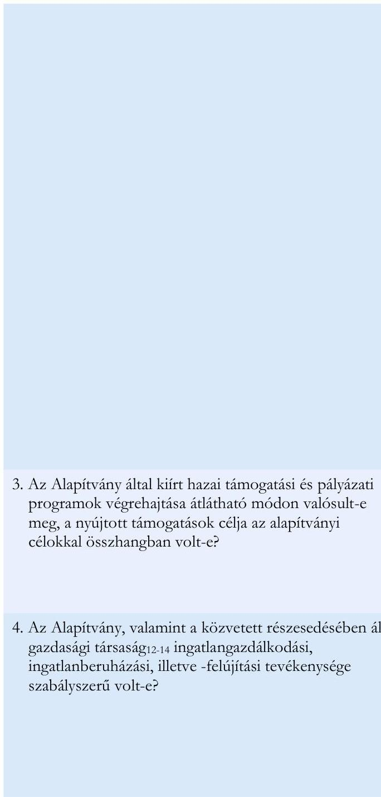
3. Az Alapítvány által kiírt hazai támogatási és pályázati programok végrehajtása átlátható módon valósult-e meg, a nyújtott támogatások célja az alapítványi célokkal összhangban volt-e?
4. Az Alapítvány, valamint a közvetett részesedésében állt gazdasági társaság$_{12-14}$ ingatlangazdálkodási, ingatlanberuházási, illetve -felújítási tevékenysége szabályszerű volt-e?

166. § (1) bek., 167. § (1) bek. a)-i) pont; Bkr. 8. § (2) bek. a)-b) pont; 215/2000. Korm. rend. 3. § (1)-(2) bek., 4. § (1)-(2) bek., 1. sz. mell., 5. § (5) bek. b) pont, (6) bek., 7. § (1)-(3), (14)-(16) bek., 8. § (1) bek., 10. § a)-j) pont, 2-3. sz. mell.; 216/2000. Korm. rendelet 8. § d), i), j), o) Kbftv. 16. § (2)-(4), (7)-(8) bek., 22. § (2) bek. a) pont, (3) bek. a), c) pont, (5) bek. c) pont, 32. § (1) bek., 72. § (1) bek., 3. sz. mell. II. fejezet, 103. § (4) bek., 140. § (1) bek., 193. § (1)(2) bek., 327/2009. Korm. rendelet 14. §, 17. § c) bek.,
Alapítvány Alapító Okirata$_{1-3}$, SZMSZ$_{1-4}$, Számviteli politika$_{1-4}$, Pénzkezelési szabályzat$_{1-3}$, Leltárkészítési és leltározási szabályzat$_{1-3}$, Értékelési szabályzat$_{1-3}$, Számlarend$_{1-3}$, Kuratóriumi ügyrendje, Adatkezelési szabályzat$_{1-3}$, Bizonylati és iratkezelési szabályzat$_{1-3}$, Közbeszerzési szabályzat, Befektetési szabályzat$_{1-3}$, Beszerzési szabályzat$_{1-2}$,
OPTIMA Befektetési Zrt. Alapszabály$_{1-6}$, Számviteli politika$_{1-2}$, Leltározási szabályzat, Értékelési szabályzat$_{1-2}$, Pénzkezelési szabályzat$_{1-2}$, Számlarend, Bizonylati rend$_{1-2}$, Gazdasági társaságok$_{1,2,7,8,9,10,11}$ Számviteli politikája, Értékelési szabályzata, Leltározási szabályzata,
Gazdasági társaság$_{1,10}$ Működési szabályzat$_{1-2}$, Alapokra vonatkozó

 Számviteli politika, Számlarend, Számlakeret
Knyt. 2. § (1) bek. b)-c), 5. § (1) a)-d) pontok, 5. § (2) bek. a)-b) pontok, 5. § (3) bek., 6. § (1) bek., 9. §-11. §, 14. § c) pont, Számv. tv. 78. §-79. § 67/2008. Korm. rendelet 2. § (4), Bkr. 6. § (1) bek. b) pont, 6. § (3), 8. § (2)-(4), Alapító okirat, SZMSZ, Kuratóriumi ügyrend, Pályázati szabályzat, Pályázati és elszámolási útmutató, Pénzkezelési szabályzat
Ptk. 6:58. §, 6:60. §, 6:63. §, 6:157. §, 6:177. §, 6:178. §, Számv. tv. 15. § (3) bek., 16. § (1) bek., 161. § (3) bek., 165. § (1) bek., (4) bek., 166. § (1) bek., 167. § (1) bek. c), d), e) pontok, (3) bek., 165. § (1), (4) bek., 2015. évi CXLIII. törvény a közbeszerzésről 5. § (1) bek. e) pont, 152. § (1) bek. b) pont, 27. (1), 492/2015. (XII. 30.) Korm.rend. 2. §
Gazdasági társaság ${ }_{12-14}$ Számlarend, Alapító okirat, SZMSZ, Alapítói határozatok, Felügyelőbizottság ügyrendje, Felügyelőbizottsági határozatok

---

# IV. SZ. MELLÉKLET: BENCHMARKING MÓDSZERTANA 

Az Alapítvány a jogszabályi előírásoknak megfelelően befektetéseit nem tarthatja állampapírban, emiatt összehasonlításként a vizsgált időszakban aktív, alacsony kockázatú alapok hozamának figyelembevételével került kiszámításra az elvi hozam és az elvi vagyonnövekmény. Az elvi hozam számításához referenciát adó pénzügyi instrumentumok kiválasztásának szempontjai a következők voltak: forint alapú egyéb pénzpiaci, illetve forint alapú közvetett ingatlanalap, a vizsgált időszakban (2019. december 31-2024. június 30. között) folyamatosan elérhető.

Az Alapítvány konszolidált beszámolót nem készített, a saját és a tulajdonában lévő gazdasági társaságok vagyonelemeit közleményekben mutatta be. Számításainkban az Alapítvány vagyonát a vagyonközleményeknek a devizás eszközök értékelési tartalékával korrigált összegében mutatjuk be.
Az Alapítvány évente átlagosan 3,3 Mrd Ft-ot számolt el ráfordításként a működéséhez, ebből a nyújtott támogatások évenként átlagban 1,6 Mrd Ft-ot, a további működési (anyag-, személyi jellegű, egyéb) ráfordítások átlagosan 1,7 Mrd Ft tettek ki, az elvi számítás során az Alapítvány vizsgált időszakra vetített működési költségét 15,0 Mrd Ft összegben vettük figyelembe.

## 1. hipotetikus befektetés - egyéb pénzpiaci alapok

Három egyéb pénzpiaci befektetési alap felelt meg a kiválasztási szempontoknak, melyek hozama* a vizsgált időszakban az alábbi volt:

- OTP Prémium Pénzpiaci Alap A sorozat 25,61%
- VIG Pénzpiaci Alap A sorozat 25,69%
- VIG Pénzpiaci Alap I. sorozat 28,04%

A fenti egyéb pénzpiaci alapok átlaghozamának (26,44%) figyelembevételével számításaink szerint az Alapítvány teljes vagyona után számított elvi hozam a vizsgált időszakban 74,7 Mrd Ft lett volna. Ezen eredmény arra az esetre vonatkozik, amennyiben az Alapítvány vagyonának gyarapítását nem gazdasági társaságokon keresztül, illetve azokban való részesedéssel érte volna el, hanem kizárólag egyéb pénzpiaci alapokba történő befektetéssel. Az elvi számítás eredményeként az Alapítvány vizsgált időszaki működési költségével kalkulálva a befektetéssel elérhető növekmény 59,7 Mrd Ft (74,7 -15,0 Mrd Ft) lett volna.
Az Alapítvány vizsgált időszaki hipotetikus vagyonnövekményét az egyéb pénzpiaci alapok figyelembevételével a 3. táblázat tartalmazza.
3. táblázat

AZ ALAPÍTVÁNY VAGYONÁNAK ALAKULÁSA A VIZSGÁLT IDŐSZAKBAN EGYÉB PÉNZPIACI ALAP

| (Mrd Ft) | 2019.   IV. NEGYEDÉV | 2024.   II. NEGYEDÉV | NÖVEKEDÉS   MÉRTÉKE | DIFFERENCIA   ARÁNYA |
| :-- | :--: | :--: | :--: | :--: |
| Vagyon | 282,5 | 300,5 | $+18,0$ | $+6,4 \%$ |
| Hipotetikus vagyon (adózás előtt) | 282,5 | 342,1 | $+59,7$ | $+21,1 \%$ |
| Hipotetikus vagyon (adózás után) | 282,5 | 336,8 | $+54,3$ | $+19,2 \%$ |
| Különbözet |  | $\mathbf{+ 3 6 , 3}$ |  |  |

Forrás: ÁSZ saját szerkesztés

[^0]
[^0]:    * https://www.bamosz.hu/hozamok-osszehasonlitasa

---

A növekmény után fizetendő társasági adót (59,7 Mrd Ft * 9%) is figyelembe véve összegzésül a vagyon a vizsgált időszakban megközelítőleg 54,3 Mrd Ft-tal, 336,8 Mrd Ft-ra nőtt volna, ami 36,3 Mrd Ft-tal magasabb, mint a valóságban elért növekmény.

# 2. hipotetikus befektetés - közvetett ingatlanalap 

Az Alapítvány befektetési döntéseinek végső céljára tekintettel az összehasonlítás egy közvetett ingatlanalap hozamának figyelembevételével is kiszámításra került, a vizsgált időszakban a kiválasztási szempontoknak megfelelő Alap hozama az alábbi volt:

- OTP Ingatlanvilág Alapok Alapja 36,67%

A fenti közvetett ingatlanalap hozamának figyelembevételével számításaink szerint a vizsgált időszakban az Alapítvány teljes vagyona után számított elvi hozam 103,6 Mrd Ft lett volna, amennyiben az Alapítvány vagyonát kizárólag a közvetett ingatlanalapban történő befektetéssel gyarapítja. Az elvi számítás eredményeként az Alapítvány vizsgált időszaki működési költségével kalkulálva az ingatlanalapba történő befektetéssel elérhető növekmény 88,6 Mrd Ft (103,6-15,0 Mrd Ft) lett volna.
Az Alapítvány vizsgált időszaki hipotetikus vagyonnövekményét a közvetett ingatlanalap figyelembevételével a 4. táblázat tartalmazza.
4. táblázat

## AZ ALAPÍTVÁNY VAGYONÁNAK ALAKULÁSA A VIZSGÁLT IDŐSZAKBAN KÖZVETETT INGATLANALAP

| (Mrd Ft) | 2019. IV.   NEGYEDÉV | 2024. II.   NEGYEDÉV | NÖVEKEDÉS   MÉRTÉKE | DIFFERENCIA   ARÁNYA |
| :-- | :-- | :-- | :-- | :-- |
| Vagyon | 282,5 | 300,5 | $+25,7$ | $+9,3 \%$ |
| Hipotetikus vagyon (adózás előtt) | 282,5 | 363,4 | $+88,6$ | $+32,2 \%$ |
| Hipotetikus vagyon (adózás után) | 282,5 | 355,4 | $+80,6$ | $+29,3 \%$ |
| Különbözet |  | $\mathbf{+ 5 4 , 9}$ |  |  |

A növekmény után fizetendő társasági adót (88,6 Mrd * 9%) is figyelembe véve összegzésül a vagyon a vizsgált időszakban megközelítőleg 80,6 Mrd Ft-tal, 355,4 Mrd Ft-ra nőtt volna, mely 54,9 Mrd Ft-tal magasabb, mint a valóságban elért növekmény.

---

# V. SZ. MELLÉKLET: A BUDA PALOTA KÖNYV SZERINTI ÉRTÉKÉNEK VÁLTOZÁSA 2018. JANUÁR 1. ÉS 2019. MÁJUS 31. KÖZÖTT

|  IDŐSZAK VÉGE | AKTIVÁLT ESZKÖZ
(M Fr) | BEFEJEZETLEN
BERUHÁZÁS TÁRGYÉVI
NÖVEKMÉNYE
(M Fr) | ÖSSZESEN
(M Fr)  |
| --- | --- | --- | --- |
|  2018. január 1. | 6451,4 | 2083,1 | 8534,5  |
|  2018. december 31. |  | 3242,4 | 11776,9  |
|  2019. május 31. |  | 1573,1 | 13350,0  |
|  Összesen: | 6451,4 | 6898,6 | -  |

Forrás: MNB-Ingatlan Kft. tárgyi eszközök és befejezetlen beruházások kimutatása 2018.01.01.-2019.05.31. között alapján ÁSZ saját szerkesztés

---

VI. SZ. MELLÉKLET: A BOKK BERUHÁZÁSHOZ KAPCSOLÓDÓAN AZ AZONOS TULAJDONOSI KÖRHÖZ TARTOZÓ GAZDASÁGI TÁRSASÁGOKHOZ TARTOZÓ VÁLLALKOZÁSOK RÉSZESEDÉSE A BERUHÁZÁSI CÉLÚ KIADÁSOK ÉRTÉKÉBŐL

|  SZERZŐDŐ PARTNER | SZERZŐDÉS TÁRGYA | SZERZŐDÉS KELTE | SZERZŐDÉSES ÖSSZEG(MFT) | RÉSZESEDÉS A SZERZŐDÉSEK ÉRTÉKÉBŐL | AZ ELLENŐRZÖTT   IDŐSZAK   BERUHÁZÁSI CÉLÚ   KIADÁSAI A   BERUHÁZÁSI   ELŐLEGGEL   KISZÁMÍTVA | RÉSZESEDÉS AZ IDŐSZAKBAN ELSZÁMOLT BERUHÁZÁSI CÉLÚ KIADÁSOKBÓL(MFT)  |
| --- | --- | --- | --- | --- | --- | --- |
|  Raw Development Kft. | Projektmenedzsment | 2017.09.01 | 27,9 | $0,2 \%$ |  |   |
|   | Makert készítése | 2019.03.25 | 3,0 | $0,0 \%$ |  |   |
|   | Mintabútorok mintagyártása | 2019.08.06 | 11,9 | $0,1 \%$ |  |   |
|   | Szennyvízátemelő megközelíthetőségének megoldása | 2019.08.12 | 1,9 | $0,0 \%$ | 4501,9 | $82,2 \%$  |
|   | Pályaszerkezet csere | 2019.09.05 | 47,5 | $0,3 \%$ |  |   |
|   | Kivitelezés - BOKK | 2019.10.11 | 12672,9 | $91,4 \%$ |  |   |
|  Somlai Property Kft./Somlai Invest Zrt. | Műszaki lebonyolítói és projektirányítói feladatok | 2018.11.01 | 120,0 | $0,9 \%$ | 102,0 | $1,9 \%$  |
|  SOMLAI
DESIGN
STUDIO Kft. | Belsőépítészeti tanácsadás, tervezői művezetés | 2019.01.08 | 24,1 | $0,2 \%$ | 24,1 | $0,4 \%$  |
|  Azonos érdekeltségi körhöz tartozó gazdasági társaságok összesen |  |  | 12909,2 | 93,2% | 4628,0 | 84,5%  |
|  Azonos érdekeltségi körhöz tartozó gazdasági társaságokon kívüli beszállítók összesen |  |  | 948,6 | 6,8% | 851,1 | 15,5%  |
|  Mindösszesen |  |  | 13857,8 | 100,0% | 5479,1 | 100,0%  |

Forrás: Az ellenőrzők által rendelkezésre bocsátott szerződések alapján ÁSZ saját szerkesztés

---

# VII. SZ. MELLÉKLET: AZ ÁSZ ELNÖKÉNEK 2024. JÚLIUS 5-I FIGYELEMFELHÍVÓ LEVELE AZ ALAPÍTVÁNY RÉSZÉRE 

## Csizmadia Attila Norbert

Kuratóriumi Elnök
Pallas Athéné Domus Meriti Alapítvány

## Budapest

Tárgy: Figyelemfelhívó levél

## Tisztelt Kuratóriumi Elnök Úr!

Az Állami Számvevőszék (továbbiakban: ÁSZ) végzi „Pallas Athéné Domus Meriti Alapítvány gazdálkodásának ellenőrzése" című ellenőrzés keretében a Pallas Athéné Domus Meriti Alapítvány (továbbiakban: Alapítvány) ellenőrzését.

Az ÁSZ kiemelten fontosnak tartja az ellenőrzések során feltárt szabálytalanságok mielőbbi megszüntetését, a pozitív változások elindítását.

Az ellenőrzés során feltárt jogszabálysértő gyakorlat megszüntetése érdekében az Állami Számvevőszékről szóló 2011. évi LXVI. törvény (továbbiakban: ÁSZ tv.) 31. §-ában szabályozott figyelemfelhívó levéllel fordulok Önhöz.

Az ÁSZ a számvevőszéki ellenőrzés eddigi eredményeit összegezve az alábbi szabálytalanságokat, hiányosságokat, ellentmondásokat, kockázatokat tárta fel:

1. Az Alapítvány kizárólagos részesedésében álló OPTIMA Befektetési Zrt. a befektetési tevékenységéhez kapcsolódó döntések dokumentumait elkészítette, a döntéseket az arra felhatalmazott személyek hozták meg, azonban a megvalósított befektetések típusa többnyire sértette az Alapítvány Befektetési Szabályzatában meghatározott alapelveket. A befektetési döntésekkel érintett ingatlan-, értékpapír- és magántőkealapok magas kockázattal és korlátozott lejárat előtti visszaváltási lehetőséggel rendelkező befektetési formák lévén nem biztosították az összhangot az Alapítvány „biztonság-alacsony kockázat" és „likviditás" befektetési alapelveivel. Az érintett alapok befektetési jegyeinek forgalmazásával az OPTIMA Befektetési Zrt. veszélyeztethette Alapítvány Alapító Okiratában rögzített vagyonmegőrzési kötelezettségének teljesítését.

Tekintse át, hogy a megvalósított közvetett befektetések és az Alapítvány jelenleg hatályos Befektetési Szabályzatában előírt alapelvek összhangja biztosított-e. A vagyon megőrzésének biztosítása érdekében hozzon intézkedéseket az alapelvektől eltérő

---

# jellemzőkkel rendelkező befektetésekből eredő esetleges vagyonvesztés kockázatának kezelésére. 

2. Az OPTIMA Befektetési Zrt. által kibocsátott és a Neumann János Egyetemért Alapítvány (NJE Alapítvány) által lejegyzett, összesen 127,5 Mrd Ft értékű, 10 éves futamidejű OPTIMA 2031 és OPTIMA 2031/B jelű kötvényekre a Felek között a kötvény jegyzéssel egyidőben megkötött Eladási jog alapításáról szóló szerződések 8, illetve 90 napon belüli visszafizetési opciót biztosítottak. A visszavételi kötelezettség ellenére az OPTIMA Befektetési Zrt. nem készített a visszafizetést biztosító likviditási tervet, a 2022. évi beszámolója szerinti likvid eszközei nem fedték le a kötvény összegét, a rendelkezésünkre álló információk szerint más típusú pénzügyi fedezet sem áll rendelkezésre, így nem biztosították a visszafizethetőséget. Az NJE Alapítvány Kuratóriumának 2023. szeptember 4-én megtartott ülésén Bánkuty Tamás által jelzettek szerint amennyiben az NJE Alapítvány él a kötvény lejárata előtti eladási jogával, az ,,akkorlatban nagyon
 nehezen érvényesíthető veszteség nélkül", amit a 2024. január 17-i Kuratóriumi üléséhez készített előterjesztés is megerősített, miszerint: ,,a visszaváltás nem kockázatmentes és célszerűen csak valamilyen tervezési folyamatot követően szakaszosan bonyolítható le. Az többször megállapítást nyert a különböző dokumentumokban, hogy egy együtemű azonnali visszaváltás érvényesítése szinte kizárólag negatív következményekkel járna, s amely az Alapítvány vagyonánál jelentős vagyonvesztést okozhatna. (A kötvények által finanszírozott ingatlanügyletek nem teszik lehetővé az ingatlanok időtől és konjunktúrától független előnyös értékesítését, vagy önmagában az értékesítést, az ingatlanok leértékelődése és a garantőr ez általi meggyengülése egyértelműen potenciális veszteséget okozna az Alapítvány számára.)" A kötvény visszaváltása az Alapítványnak, mint egyedüli részvényesnek is kockázatot jelenthet az alapítói vagyon kapcsán a befektetési alapelvek betartásában, a vagyontömeg megőrzését biztosító, konzervatív befektetési politika alkalmazásában.

## Intézkedjen olyan likviditási terv kidolgozásáról, amely biztosítja az NJE Alapítvány felé fennálló kötelezettségek visszafizetését.

3. A közpénzből származó vagyonnal szemben elvárás az áttekinthető, hatékony és ellenőrizhető gazdálkodás, ami az OPTIMA Befektetési Zrt.-n és az érdekeltségébe tartozó befektetési alapokon keresztül befektetett vagyonelemek tekintetében jellemzően nem érvényesült, hiszen mind a létrehozott cégstruktúra, mind az abban működtetett befektetési rendszer többszörösen összetett, rétegzett struktúra volt. A vagyon döntő hányada külföldi vagy belföldi magántőkealapokba, illetve azokon keresztül közvetetten külföldi gazdasági társaságokba (Globe Trade Centre SA, Ultima Capital SA) került befektetésre, így az elvárható átláthatóság nem valósult meg. Az Alapítvány a 2022. és 2023. években éves beszámoló helyett - tévesen - egyszerűsített éves beszámolót készített. A közzétett beszámolók kiegészítő mellékleteiben nem mutatta be az általa jegyzett, az OPTIMA Befektetési Zrt. által kibocsátott kötvény valós értékét, nem igazolta a kötvény bekerülési értéken történt értékelésének megfelelőségét, vagy az értékvesztés elszámolásának mellőzését.

---

Vagyoni helyzetének objektív információk alapján történő bemutatása érdekében tekintse át az összetett befektetési struktúrát és annak figyelembevételével, az OPTIMA Befektetési Zrt. által kibocsátott kötvény mögötti közvetett befektetési elemek értékelésével gondoskodjon arról, hogy befektetései, így a kötvény, annak valós értékén kerüljön kimutatásra, továbbá igazolja a kötvény értékelésének megfelelőségét, indokolja az értékvesztés elszámolásának mellőzését, bizonyítékokkal támasza alá azt a feltételezését, hogy legalább a könyv szerinti érték meg fog térülni.
4. Az Alapítvány belső szabályzatai nem tartalmaztak előírást az OPTIMA 2040/A jelű kötvény fedezetét, az alapítványi vagyont ténylegesen befektető OPTIMA Befektetési Zrt. és a közvetlen, vagy közvetett tulajdonában lévő gazdasági társaságok mögöttes portfóliójának, az Alapítvány által közvetetten birtokolt részesedéseknek és az azokban szereplő vagyonelemeknek a bemutatására, minősítésére, a kialakított beszámoltatási rend, tulajdonosi kontroll nem volt alkalmas arra, hogy tájékoztatást nyújtson a közvetett befektetések teljesítményéről, az Alapítvány által belső szabályzatban meghatározott befektetési irányelveknek való megfelelésről. A tájékoztatás hiánya, valamint a kötvény kibocsátójának önkényesen, nem számonkérhető módon kialakított kamatkonstrukciója - a kibocsátó a kamatperiódus utolsó napján határozta meg az előző időszakra vonatkozó kamatot - nem tette lehetővé az Alapítvány számára a megalapozott pénzügyi tervezést.

Alakítson ki olyan kontrollrendszert, amely megfelelő ellenőrzési- és értékelési pontokat tartalmaz annak érdekében, hogy teljeskörűen érvényesüljön a tulajdonosi kontroll.
5. Az Alapítvány Kuratóriuma határozatait jellemzően ülés tartása nélkül, elektronikus úton hozta, azonban az így meghozott döntések esetében a határozattervezet kézhezvételétől számított, a szavazat megküldésére a Ptk. 3:20. § (1) bekezdésében meghatározott törvény szerint biztosítandó legalább 8 napos határidőt nem tartotta be (több esetben mindössze néhány óra állt rendelkezésre), az eljárási szabályok betartása az ügyvezetés részéről nem valósult meg. Ezáltal felvetődhet a kérdés, hogy a tagok álláspontja és ezáltal a döntés mennyiben lehetett megalapozott, illetve mennyiben csak formális jellegű.
Biztosítsa a törvényben előírt határidő betartását annak érdekében, hogy a tagok megismerhessék a tényeket, kialakíthassák véleményüket, és ezáltal a határozathozatal ne csak formális jellegű legyen.
6. Az alapítványi vagyont, az OPTIMA 2040/A kötvényből származó forrást az OPTIMA Befektetési Zrt. fektette be. Az igazgatósági pozícióit betöltő személyek az érdekeltségi körbe tartozó más társaságnál is vezető tisztségviselőkként járnak el, a társaságok közötti szerződésekben több esetben mindkét oldalon ugyanaz az aláíró. Ezek által felmerülhet annak kockázata, hogy a tulajdonosi érdekek helyett más, személyes érdekek állnak az egyes döntések mögött.

---

Tekintse át a létrehozott cégstruktúrát és a vezető tisztségviselők megbízásait annak érdekében, hogy a döntéshozatalkor és a szerződéskötések során mindig az Alapítvány érdekei érvényesüljenek.

Kérem Kuratóriumi Elnök Urat, hogy az ÁSZ tv. 31. §-a alapján a figyelemfelhívó levélben foglaltakat tíz napon belül elbírálni, a megfelelő intézkedést a fent jelzett 1-6. pontok szerinti megállapítások vonatkozásában meghatározni és erről két napon belül értesíteni szíveskedjék. Az értesítést a hivatali kapun vagy cégkapun keresztül, amennyiben ezzel nem rendelkeznek, postai úton szíveskedjen megtenni. Az intézkedéseknek a jövőre szükséges vonatkoznia, az intézkedésekről szóló tájékoztatást az intézkedésekkel érintett dokumentumok csatolása nélkül szíveskedjen megküldeni.

Budapest, 2024. július 25.
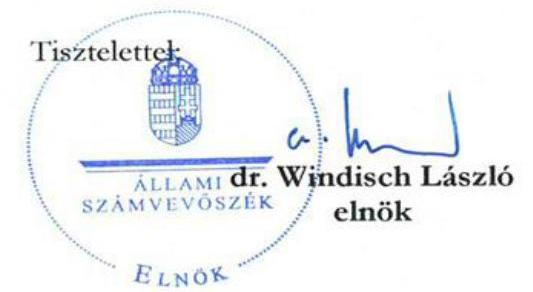

---

# Dr. Windisch László 

## Elnök

Állami Számvevőszék

Budapest
Tárgy: Válasz figyelemfelhívó levélre

## Tisztelt Elnök Úr!

Az Állami Számvevőszék EL-3815-344/2024. iktatószámú, a Pallas Athéné Domus Meriti Alapítvány gazdálkodásának ellenőrzése" című ellenőrzés keretében küldött, 2024.07.05-i keltezésű „figyelemfelhívó levél" tárgyú megkeresésére az alábbi válaszlevelet kívánjuk adni:

## 1. A befektetési szabályzatban leírtakra vonatkozóan

A Pallas Athéné Domus Meriti Alapítvány (a továbbiakban PADME) és jogelődjeinek az Európai Központi Bank 2016-os észrevételei alapján le kellett építeniük az állampapír-portfóliójukat és a felszabaduló szabad forrásokat fokozatosan ingatlanokba fektették be. Az elsődleges cél a magasabb hozam mellett történő befektetés volt, valamint ezt a döntést az alacsony pénzpiaci kamatok is szükségessé tették. A jelentős összegű alapítványi alaptőke bankszámlán történő szabad elhelyezése nagyobb kockázatot hordozott volna magában, amelyeket az elmúlt időszak bankcsődjei, ill. „brókerbotrányai" is visszaigazoltak.

Ez az intézkedés összhangban van a PADME Alapítvány jelenleg is hatályos Befektetési Szabályzat V./4. pontjával, amely szerint az alapítvány céljainak eléréshez szükséges hozamokat részben hosszú távú befektetésekkel lehet elérni.

Ezen kívül a mindenkori működéshez szükséges pénzeszközöket a PADME Alapítvány és leányvállalatai több hazai és nemzetközi hitelintézetnél vezetett bankszámlákon tartják és tartották, így mérsékelve a lehetséges visszaváltási kockázatokat.

A PADME Alapítvány jelenleg is hatályos Befektetési Szabályzat VI. pontja alapján a befektetések ingatlanba és befektetési jegyekbe is történhetnek.

A PADME Alapítvány és jogelődjei, ill. leányvállalataik megalakulása óta mindig rendelkezésre állt a fizetési kötelezettségek rendezéséhez szükséges forrás, az Optima Befektetési Zrt. (a továbbiakban Optima) által végzett havi bontásos cash flow tervezésnek, ill. a heti bankegyenlegek folyamatos monitoringozásának köszönhetően. Mivel befektetett ingatlanok esetén kizárólagosan, ill. a befektetési jegyek/alapok (mivel azok nem csak kizárólag

---

ingatlanokban voltak/vannak) esetén döntő többségében tulajdonos a PADME csoport, ezért az értékesítéseket/visszaváltásokat is tervezetten meg tudta/tudja valósítani.
2. NJEA megkeresése az Optima kötvények visszaváltásával kapcsolatban

Ahogy a Tisztelt ÁSZ felé 2024.04.23-án emailben is jeleztük, az Optima a PADME kuratóriumának jóváhagyásával megkezdte a NJEA kötvényvisszaváltási igényének kielégítésére a vagyonelem értékesítéseket és folyamatosan tárgyalásban van az NJEA-val annak kezeléséről. Ilyen tárgyalási elem például az úgynevezett Campus II. projekt beszámítása a kötvényvisszaváltásba, amellyel az átvilágítás után az egyetem egy számára stratégiailag kiemelt fejlesztés tulajdonosa lesz.

A Neumann János Egyetem és a PADME együttműködése a kötvényjegyzésnél tágabb, hiszen mindkét fél céljaival egyező támogatási programok történtek a tudományos élet támogatására, hallgatói ösztöndíjak biztosítására. Ez a kölcsönösen hasznos együttműködés pedig jóval a modellváltás előtt kezdődött.

A PADME kuratóriumának 61/2024. (04.25.) számú kuratóriumi határozata elfogadta azt a tervet, amellyel biztosítani kívánja a Neumann János Egyetem kötvényvisszaváltásának fedezetét.

Az ÁSZ által hivatkozott kötvények kibocsátása kapcsán egyébként ki kell emelni, hogy a kibocsátás a piaci viszonyoknak megfelelt, megfelelő hozammal és kockázatokkal bírt és a mögöttes vagyonelem (GTC) is bemutatásra került az kötvény információs összeállításában, így joggal feltételezte 2024. január 22-ig a PADME csoport, hogy a visszaváltásra rövidebb időtávon nem fog sor kerülni. 127,5 milliárd forint folyamatos szabad pénzeszközökben tartása nem elvárható a kibocsátótól, ill. - állampapírba történő befektetés korlátozása miatt is - nem is lett volna olyan rövid távú pénzügyi instrumentum, amely ilyen összegben, szinte azonnal és kockázatmentesen visszaváltható lett volna.

# 3. GTC és Ultima befektetések átláthatósága 

Kijelenthető, hogy az ÁSZ által tett a külföldi befektetések „átláthatatlansága” megállapítás nem megalapozott, mivel mind a GTC S.A., mint az Ultima Capital SA tőzsdén jegyzett cég, szigorú felügyelet mellett, nyilvánosan elérhető és negyedévente/félévente publikált pénzügyi eredmények mellett működik.

A tulajdonosi láncban szereplő további holding cégek bevonására (pl. GTC Holding Zrt.; GTC Dutch Holdings B.V., Alpine Holding Kft., Optimum Ventures Alapok) többek között azért is került sor, mert egy jövőbeni lehetséges - akár részbeni - értékesítés/további befektető bevonása sokkal egyszerűbben kivitelezhető és az üzletágankénti elemzés is könnyebben megvalósítható. Ezen kívül pl. a GTC Dutch Holdings B.V. esetén a GTC részvénycsomagja csak ezen cég megvásárlásán keresztül volt megszerezhető és annak rövid időtávon való

---

megszűntetése extra adófizetési kötelezettséget/nyilvános vételi ajánlatot (PTO) vont volna maga után.

Az Optima folyamatosan vizsgálja annak a lehetőségét, hogyan egyszerűsítse a tulajdonosi láncolatot.
Az Optima az ÁSZ 2023. évben megkezdetett vizsgálata óta folyamatosan telefonon és emailen keresztül is hangsúlyozta, hogy a tőzsdei befektetései esetén nem a mindenkori tőzsdei részvényárfolyamok az irányadók, hanem a kibocsátók saját tőke értékei, tekintettel arra is, hogy közkézhányadon igen kis százalékban vannak befektetők. Az Optima elvégezte azon részesedés/kötvényértékeléseket, melyek alapján a külföldi befektetések után értékvesztés nem volt indokolt. A magyar székhelyű entitások esetén megképezte azokat az értékvesztéseket, ahol a számviteli szabályzatok alapján szükséges volt.

# 4. Az Optima 2040/A kötvény 

Az Optima a 2040/A kötvény kibocsátását a PADME Alapítvánnyal együtt valósította meg 2020. decemberében. A kötvény éves fordulónapja 12.28-ára esik. A változó kamatozással a piaci hatásokat kívánta lereagálni az Optima. Ezen kívül az év végi kamatfordulónapnak köszönhetően jól tervezhető volt a kamat mértéke, mely minden évben elegendő eredményt biztosított az Alapítvány üzleti évének pozitív zárásához, mindezt úgy, hogy az Optima is pozitív eredményt tudott realizálni. Ez a működési modell azon alapul, hogy az Alapítvány a költségvetését tudja teljesíteni, az Optima pedig a többleteredményét a tulajdonosi elvárások és utasítások alapján további befektetésekbe tudta invesztálni.

A fordulónapot követően az Optima a következő időszak várható kamatmértékéről is tájékoztatta a PADME-t, mely a következő évi költségvetését ez alapján meg tudta tervezni. Megállapítható, hogy költségvetési tervezési folyamat során az Optima Befektetési Zrt. mindig jelezte az Alapítvány számára a várható bevételt, erre alapozva alakult ki a költségvetés bevételi oldala és ezt követően döntött a Kuratórium a költségvetés elfogadásáról.

Előbbiekre tekintettel az ÁSZ kijelentésével ellentétben megalapozott a pénzügyi tervezés folyamata.

## 5. Kuratórium elektronikus szavazása

A Kuratórium ügyrendje lehetőséget biztosít az elektronikus úton történő szavazásra is. Az évente legalább egyszer történő személyes jelenléttel megtartott ülés megvalósult.

A kuratóriumi tagok számára minden lehetőség biztosított, hogy telefonon, élő szóban/személyesen vagy emailben bármikor, bármilyen
 döntésről információt kérjenek, hozzászólásokkal, javaslatokkal éljenek, ahogy ez több alkalommal meg is történt a múltban. A kuratóriumi tagok számára lehetőségként adott továbbá, hogy egy előterjesztési anyagot

---

kiegészíttessenek, módosítást kérjenek vagy egy szavazási kezdeményezést elutasítsanak és más időpontra halasszanak, vagy egyáltalán ne is szavazzanak.

Az Alapító Okirat rendelkezései szerint minden kuratóriumi tag jogosult kuratóriumi ülést összehívni az általa megjelölt témában. Ezen jogukban a kuratóriumi tagokat soha semmilyen korlátozás nem érte. Ilyen észrevételt egyetlen kuratóriumi tag sem tett.

# 6. A tisztségek betöltése 

A PADME csoport ügyletkötései során a cégjegyzésre a jogszabályi előírások betartásával került sor. Az ügyletek megvalósítására zárt rendszerben kerül sor és a szükséges jogszabályi előírások betartásával, így a szükséges szervezeti megfelelőség, szervezeti egységek, pozíciók, kontroll funkciók érvényesülése mellett történik a PADME csoport működése. A zárt rendszerűség azt jelenti, hogy az ügyletek döntő többsége, különösen a nagyértékű ügyletek esetében a PADME kuratóriumának határozatával indul és annak a határozatnak a végrehajtása a feladata az Optima Befektetési Zrt-nek akár a leányvállalatain keresztül. Ennek leképezésére pedig a leghatékonyabb modell, ha a végrehajtási folyamat végén is az a személy/személyek a felelős(ek) a feladat végrehajtásáért, aki(k) az első lépés megvalósításában is részt vesz(nek).

Továbbá kiemelendő, hogy a PADME csoport folyamatosan keresi a hatékonyabb működés lehetőségeit, melyre tekintettel a létszámállománya a vizsgált időszakban leszűkült. Költséghatékony bérezési struktúra mellett nem kivitelezhető, hogy magasan priorizált - és pl. az alapkezelők esetén szigorú engedélyeztetési eljárásoknak is megfelelő - további ügyvezetők kerüljenek foglalkoztatásra. Egyes leányvállalatok projektcégként funkcionáltak, melyek részben kiüresedtek vagy értékesítésre kerültek. Az Optima egyébként megkezdte ezen projektcégek összeolvasztását/beolvasztását a hatékonyság fenntartása érdekében.

Kelt, Budapest, 2024.07. 24.
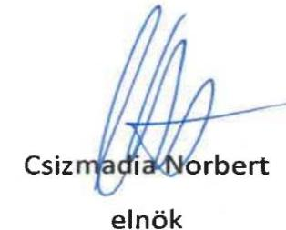

Pallas Athéné Domus Meriti Alapítvány

---

# IX. SZ. MELLÉKLET: AZ ÁSZ ELNÖKÉNEK 2025. JANUÁR 14-I FIGYELEMFELHÍVÓ LEVELE AZ ALAPÍTVÁNY RÉSZÉRE 

## A

ÁLLAMI
SZÁMVEVŐSZÉK

DR. WINDISCH LÁSZLÓ
ELNÖK

Ikt. szám: EL-3815-405/2025.

## Csizmadia Attila Norbert

Kuratóriumi Elnök
Pallas Athéné Domus Meriti Alapítvány

## Budapest

Tárgy: Figyelemfelhívó levél

## Tisztelt Kuratóriumi Elnök Úr!

Az Állami Számvevőszék (továbbiakban: ÁSZ) végzi „Pallas Athéné Domus Meriti Alapítvány gazdálkodásának ellenőrzése" című ellenőrzés keretében a Pallas Athéné Domus Meriti Alapítvány (továbbiakban: Alapítvány) ellenőrzését.

Az ÁSZ kiemelten fontosnak tartja az ellenőrzések során feltárt szabálytalanságok mielőbbi megszüntetését, a pozitív változások elindítását.
Az ellenőrzés során feltárt jogszabálysértő gyakorlat megszüntetése érdekében az Állami Számvevőszékről szóló 2011. évi LXVI. törvény (továbbiakban: ÁSZ tv.) 31. §-ában szabályozott újabb figyelemfelhívó levéllel fordulok Önhöz.
Az ÁSZ EL-3815-344/2024. iktatószámú, 2024. július 05-én kelt figyelemfelhívó levélben foglaltakon túl, a számvevőszéki ellenőrzés további eredményeit összegezve az alábbi szabálytalanságot, kockázatot tárta fel:

1. Törvényi előírás szabályozza a fizetésképtelenséggel fenyegető helyzetben lévő vagy fizetésképtelen gazdálkodó adósságának hitelezőkkel való egyezségkötéssel történő rendezését. 2024. januártól folyamatban vannak a tárgyalások az OPTIMA Befektetési Zrt. mint kötelezett és a Neumann János Egyetemért Alapítvány (NJE Alapítvány) mint jogosult között a 127,5 Mrd Ft értékű vállalati kötvények visszaváltását illetően, azonban azt a kötelezett ezidáig nem tudta teljesíteni.
Az Alapítvány 2024. évi költségvetésének elfogadására, és ezzel egyidőben a bevételek és kiadások egyensúlyának megteremtését célzó reorganizációs terv kidolgozására 2024 áprilisában került sor. Ugyanakkor a fizetésképtelenségi helyzet rendezését a reorganizációs terv sem biztosította. Ezt támasztja alá, hogy a 2024. november 15. napján tartott elektronikus határozathozatal kapcsán a „Tájékoztatás az OPTIMA Befektetési Zrt. részéről a Reorganizációs Terv státuszáról" tárgyú előterjesztésben rögzítették, hogy „külső segítség nélkül a

---

csoport jelenlegi helyzetének megoldására jelenleg nem látunk lehetőséget". Fontos felhívnom figyelmét arra is, hogy a PADME Alapítvány Felügyelőbizottsága felkérésére végzett vizsgálatokról szóló jelentés tartalmazza azt a megállapítást, hogy „Felmerül a kockázata annak, hogy az Optima csoport vagyonlemeinek összértéke nem nyújt kellő fedezetet a PADME kötvényállományának visszavásárlására." Ezt a megállapítást úgy tette meg a vizsgáló, hogy a GTC SA. és Ultima Capital SA. részvénytulajdon értékét még könyvszerinti értéken vette figyelembe, holott azok kapcsán a tőzsdei árfolyam szerint nagyságrendileg akár 150 milliárd forintot is meghaladó, még el nem számolt értékvesztés elszámolása válhat szükségessé.

Az előállt fizetésképtelen helyzetet az OPTIMA Befektetési Zrt. úgy próbálja megoldani, hogy külön egyeztetéseket folytat az NJE Alapítvánnyal, egyedi egyezségekkel, fizetési haladékok és határidő módosítások elérésével igyekszik a default helyzet ellen hatni. Mivel a fizetésképtelenséggel fenyegető helyzetben lévő vagy fizetésképtelen gazdálkodó adósságának hitelezőkkel való egyezségkötéssel történő rendezését törvényi előírás szabályozza, az egyedi megállapodásokkal az OPTIMA Befektetési Zrt. nem biztosítja, hogy a fizetésképtelenségi helyzet rendezése a jogszabályi keretek között, valamennyi hitelező - így például a PADME Alapítvány - érdekeire is figyelemmel történjen. Fentiek miatt fennáll a veszélye annak, hogy a jogszabályi előírások tiltása ellenére akár fedezet elvonás valósulhat meg.

Fentiek alapján felkérem, hogy az Optima Befektetési Zrt. tulajdonosaként a PADME Alapítvány hozzon intézkedéseket annak érdekében, hogy a kialakult fizetésképtelenségi állapot jogszabályi előírások szerinti rendezése - indokolt esetben felszámolás/csődeljárás kezdeményezésével - megtörténhessen.

Kérem Kuratóriumi Elnök Urat, hogy az ÁSZ tv. 31. §-a alapján a figyelemfelhívó levélben foglaltakat haladéktalanul elbírálni, a megfelelő intézkedést meghatározni és erről két napon belül értesíteni szíveskedjék. Az értesítést a hivatali kapun vagy cégkapun keresztül, amennyiben ezzel nem rendelkeznek, postai úton szíveskedjen megtenni. Az intézkedéseknek a jövőre szükséges vonatkoznia, az intézkedésekről szóló tájékoztatást az intézkedésekkel érintett dokumentumok csatolása nélkül szíveskedjen megküldeni.

Budapest, 2025. január 4.
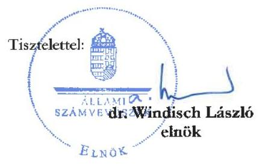

---

# Dr. Windisch László 

elnök
Állami Számvevőszék

## Budapest

Tárgy: Válasz figyelemfelhívó levélre

## Tisztelt dr. Windisch László Úr!

Álláspontunkkal kapcsolatban szeretném tájékoztatni Önt a 2025.01.14-én kelt levélre hivatkozással.
A Pallas Athéné Domus Meriti Alapítvány (továbbiakban: PADME) Kuratóriuma kiemelt figyelemmel követi és folyamatosan egyeztetésben van a részesedési viszonyban levő OPTIMA Befektetési Zrt. (továbbiakban: Optima) az Ön által is említett 2024. évi költségvetése, reorganizációs terve a társaság részesedései és operációja kapcsán. Megerősíthetem Önnek, hogy az Optima nincsen fizetésképtelenségi helyzetben. Az általam megismert kiemelt erőfeszítéseknek köszönhetően az Optima 2024. év végi nagy volumenű fizetési kötelezettségeinek helyt tudott állni és jelenleg is zajlik az Ultima Capital SA. kapcsán a tranzakciósorozat lezárása.

Tájékoztatni szeretném, hogy PADME álláspontja szerint az OPTIMA csoport vagyonelemeinek összértéke fedezetet biztosít a kötelezettségeinek - közöttük a PADME kötvényállomány és a Neumann János Egyetemért Alapítványnál (NJE Alapítvány) levő kötvény sorozatok - megfizetésére egyaránt. Állításom alátámasztásául szolgál, hogy a GTC SA. esetében a neves szakértő tanácsadó cég elvégezte a OPTIMA által birtokolt többségi részvénycsomag - összehasonlító vállalatok modellje alapján készült - értékelését, amelynek eredménye a reorganizációs tervben (2024.04.24-én) szereplő könyv szerinti értékkel szemben 2024.12.27-én 10,3 mrd Ft növekményt mutat. Az Ultima Capital SA. kapcsán a bekerülési könyv szerinti értékhez képest készült szakértő értékbecslése 2024. év végével =6,5 mrd Ft növekményt mutat. Az Ultima esetében szakmai befektető irányítása mentén elindult program üzleti terve 3 éves időhorizonton, a portfólió eszközök nagy arányú, évről évre realizálható felértékelődésével számol, a megkezdett hatékonysági intézkedések és projekt fejlesztési ambíciók összességeként.

Említette levelében a tőzsdei részesedés árfolyamára vonatkozó meglátását, amely szabadpiaci árfolyamok nem minden időpillanatban tükrözik a valós értéket, továbbá lehetnek stratégiai megfontolások az árfolyam alakulásának tendenciái mögött. A GTC SA. hatályban lévő osztalékfizetési politikával nem rendelkezik, mindazonáltal a publikált osztalékfizetési historikus adatok (https://www.gtcgroup.com/en/investors/shareholder-information/dividend) ismeretében kijelenthető, hogy a COVID járvány első két évében alkalmazott óvatossági politikát leszámítva a társaság a részvényeseinek átlagosan 4,23%-ot elérő hozamot (az OPTIMA által kontrollált részvénycsomagra nézve jelentős összeget) eredményező osztalék kifizetéséről döntött (és az osztalékot a részvényeseknek ki is fizette). Mindemellett szíves figyelmébe ajánlom azt a tényt is, hogy a GTC konszolidált saját tőkéje ezen magas osztalékfizetési szint mellett is folyamatosan, látványosan növekszik, amely a hozam mellett növekvő vagyontömeget eredményez a részvényesek számára.

---

# Pallas Athéné Domus Meriti Alapítvány 

A felértékelődési potenciált pedig az a tény mutatja, hogy miután a GTC S.A. nyilvánosan működő, tőzsdei részvénytársaságok értékelésére álláspontunk és a piaci sztenderdek szerint a minden negyedévet érintően közzétett, egy részvényre jutó (nettó eszközérték alapján kalkulált EPRA NTA) érték a leginkább alkalmas mutatószám, mely szerint a GTC kiváló befektetés.

Szeretném megerősíteni, hogy az OPTIMA aktív tárgyalásokat folytat a NJE Alapítvánnyal. Álláspontunk szerint jelenleg nem áll fenn a Csődtv. 27. § (2) bekezdésének valamely esetköre alá sorolható helyzet és ezáltal sem fizetésképtelenségről, sem a Csődtv. 33/A. § (3) bekezdése szerint ezzel fenyegető helyzetről nem beszélhetünk. Tájékoztatásomban kifejtettem, hogy nem áll fenn ún. default helyzet az Optima esetében, így ezen körülmények okán szükségtelennek látom az alapító képviselőjeként bármilyen eljárás kezdeményezését. Szemben a levelében tett utalásával, az szolgálja a PADME érdekeit leginkább, ha mindkét fél, az NJEA mint kötvényt jegyző és az OPTIMA mint kötvénykibocsátó számára kölcsönösen elfogadott megállapodás születik hamarosan. Biztosíthatom arról, hogy az OPTIMA törekvései ebbe az irányba mutatnak.

Tájékoztatom az Elnök Urat, hogy a jövőre vonatkozóan is állok szíves rendelkezésére, illetve a tárgybéli ügymenet előrehaladásáról megfelelő tájékoztatást küldök jelen válaszlevelemen túlmenően.

Bízom abban, hogy levelem kellő információkat és alátámasztást nyújt az Ön által feltett kérdésekre vonatkozóan.

Budapest, 2025. január 16.
Maradok tisztelettel

Csizmadia Norbert
Kuratórium elnök sk.

---

# XI. SZ. MELLÉKLET: AZ ÁSZ ELNÖKÉNEK 2024. MÁRCIUS 21-I LEVELE AZ MNB ELNÖKE FELÉ 

## Dr. Matolesy György

Ikt. szám: EL 3815-278/2024.
Elnök

Tárgy: Jelzés a felügyelőbizottsági beszámolók és a kuratóriumi tájékoztatások kapcsán
Magyar Nemzeti Bank
Budapest

## Tisztelt Elnök Úr!

A „Pallas Athéné Domus Meriti Alapítvány gazdálkodásának ellenőrzése" című ellenőrzésünk kapcsán az ellenőrzést támogató EL-3815-242/2024. iktatószámú, a felügyelőbizottsági beszámolókkal és a kuratóriumi tájékoztatásokkal kapcsolatos adatbekérésünkre az Önök által megküldött dokumentumokat köszönettel megkaptuk.

## Felügyelőbizottsági beszámolók

Adatszolgáltatásukhoz csatolt válaszlevelének IV. pontjában arról tájékoztatta az Állami Számvevőszéket, hogy az alapítványok felett az alapítói jogokat - az MNB igazgatósága Ügyrendjének 3. § (1) bekezdés II. pont 20) alpontja szerint - az igazgatóság gyakorolja, az igazgatóság az alapítványok által benyújtott dokumentáció alapján, jelentés formájában tájékozódik, valamint, hogy további adatok, információk bekérésére nem került sor.

A PADME Alapítvány Alapító Okirata VIII.6. pontja - válaszlevele III. pontjában is rögzítetten - alapján „A Felügyelőbizottság köteles az alapítvány működését ... átfogóan ellenőrizni, különösen a kuratóriumi döntések összhangját az alapító okiratban meghatározott alapítványi célokkal." Az Alapító Okirat VIII.10. pontja szerint „A Felügyelőbizottság az Alapítvány működését érintő tapasztalatairól szükség szerint, de évente legalább egy alkalommal beszámol az Alapítónak."

A PADME Alapítvány Felügyelőbizottsága által készített éves beszámolókban tett megállapítások az Alapítvány működését kizárólag a hatályos jogszabályi kritériumok mentén minősítették, nem tettek kitérőt annak értékelésére, hogy az Alapító Okirat VIII. 6. pontja szerint elvégzett ellenőrzések alapján a kuratóriumi döntések összhangban voltak-e az alapító okiratban meghatározott alapítványi célokkal.

---

# Kuratóriumi tájékoztatások 

A PADME Alapítvány Alapító Okirata VIII.3. 18. pontja alapján - válaszlevele II. pontjában is rögzítetten - „A Kuratórium az Alapítvány gazdálkodását érintő minden lényegi kérdésről, valamint a Kuratórium határozatairól köteles az Alapítót tájékoztatni." Válaszlevele mellékleteként megküldött jelentés 1.
 b. pontja alapján az Alapítvány a fenti tájékoztatási kötelezettségének teljeskörűen eleget tett.

Ellenőrzésünk során megállapítottuk, hogy több, a gazdálkodást lényegesen érintő kérdés esetében a kuratóriumi határozatoknak - az Alapító által ismert, válaszlevele 3. számú mellékleteként megküldött - a Határozatok könyve szerinti szövege összegeket és egyéb részleteket nem tartalmazott. Az egyéb dokumentumokból ismert, akár több tíz milliárd Ft-os tranzakciós összegek miatt lényeges kérdéskörök voltak pl. a részesedések adásvételei (szerzés, értékesítés), hitelszerződések kötése, garanciavállalások, azonban a témákban meghozott kuratóriumi határozatok több esetben nem tartalmazták a tranzakció összegét, a hitelek kamatát, költségeit, lejáratát, biztosítékait. Ezáltal az Alapítónak az Alapító Okiratban előírtaknak megfelelő, minden lényegi kérdésről történő tájékoztatása nem teljeskörűen valósult meg.

Fentiek alapján kérdéses, hogy az elkészült felügyelőbizottsági beszámolók és a kuratóriumi tájékoztatások alkalmasak lehettek-e arra, hogy azokkal a PADME Alapítvány teljesítse az Alapító felé az Alapító Okiratban előírtaknak megfelelő tájékoztatási kötelezettségét.

Kérem, hogy amennyiben felvetésünket jogosnak látja, úgy szíveskedjen az Ön által szükségesnek ítélt intézkedéseket megtenni és arról az Állami Számvevőszéket tájékoztatni.

Együttműködését előre is köszönöm.
Budapest, 2024. március 21
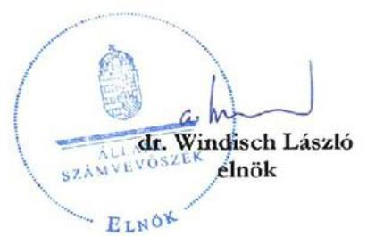

---

# XII. SZ. MELLÉKLET: AZ MNB ELNÖKÉNEK 2024. DECEMBER 19-ÉN KELT TÁJÉKOZTATÓ LEVELE 

## Matolcsy György Elnök

Dr. Windisch László
Elnök
részére

## Állami Számvevőszék

1052 Budapest, Apáczai Cs. J. u. 10.

Tisztelt Elnök Úr!
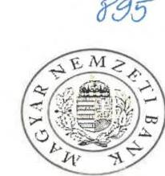

MAGYAR NEMZETI BANK

ÁLLAMI SZÁMVEVŐSZÉK
JE - 11767 fenss 11
Érkezése: 2024 DEC 19
Iktatószám:
Melléklet
Budapest, 2024. december 19
$170860-1211024$

A Magyar Nemzeti Bank (a továbbiakban: MNB) az alapítója a Pallas Athéné Domus Meriti Alapítványnak (székhely: 1014 Budapest, Úri utca 72.; továbbiakban: PADME Alapítvány). A PADME Alapítvány felett az alapítói jogokat az MNB igazgatósága Ügyrendjének 3. § (1) bekezdés II. pont 20) alpontja szerint az igazgatóság gyakorolja.

A PADME Alapítványtól kapott tájékoztatás szerint a PADME Alapítvány Kuratóriuma a 61/2024. (04.25.) számú kuratóriumi határozatával elfogadta a 2024. évi költségvetést, valamint döntött egy reorganizációs terv végrehajtásáról.

A kapott tájékoztatás éles ellentétben áll a PADME Alapítvány Kuratóriuma és Felügyelőbizottsága által az Alapító Okirat szerint az elmúlt években teljesített éves alapítói tájékoztatásokban foglaltakkal, ezért az MNB igazgatósága ennek okán több alkalommal döntött a PADME Alapítvány Kuratóriuma részére történő információt kérő levél megküldéséről, valamint a PADME Alapítvány Felügyelőbizottságának felkéréséről számos témában szükséges - soron kívüli vizsgálatok lefolytatása és alapítói tájékoztatás érdekében.

A PADME Alapítvány időközben tájékoztatást küldött arról is, hogy a PADME Alapítvány könyvvizsgálója, a BDO Magyarország Könyvvizsgáló Korlátolt Felelősségű Társaság (1103 Budapest, Köér utca 2/A C. ép., a továbbiakban: BDO) a 2021. évi és a 2022. évi beszámolók kapcsán kiadott könyvvizsgálói jelentését visszavonta. Ezt követően pedig tájékoztatással élt a 2023. évi beszámoló kapcsán kiadott könyvvizsgálói jelentés visszavonásáról is.

Az MNB által kért vizsgálatok körében a PADME Alapítvány Felügyelőbizottságának elnöke a 2024. november 18-án kelt levelében jelezte, hogy a kértek alapján az ott meghatározott szempontok szerinti vizsgálatokat elrendelte és a vizsgálatok egy részével megbízott ABT Risk Advisory Zrt. a jelentését 2024. október 29-én elkészítette (a továbbiakban: Vizsgálati Jelentés) és a Vizsgálati Jelentést leveléhez csatolta. Csatolta továbbá az ABT Risk Advisory Zrt. jelentése kapcsán a jogelődökre is kiterjedő időszakot átölelő, a PADME Alapítványi befektetési tevékenységekről a PADME Alapítvány igazgatója által készített összefoglalót, valamint a PADME Alapítvány igazgatója 2024. november 8-án kelt levelét, illetve a Reorganizációs Terv státuszáról szóló Kuratóriumi határozati előterjesztést, a PADME Alapítvány és jogelőd alapítványok érdekeltségébe tartozó 12 ingatlan tranzakció vizsgálatáról szóló jelentést, és az Optima Befektetési Zrt. operatív likviditási helyzetéről szóló értékelést (a továbbiakban együtt: Iratcsomag).

Az Iratcsomagban foglaltak és az MNB által eddig ismert információk disszonanciája megállapítható, bár jelenleg a PADME Felügyelőbizottsága által megküldött fenti tájékoztatás nem tartalmazza valamennyi, az MNB igazgatósága által az ellenőrzés tárgyaként megjelölt téma kapcsán az ellenőrzés eredményét, valamint nem tartalmazza a PADME Felügyelőbizottságának a vizsgálat eredményére vonatkozó

---

megállapításait, értékelését, így az MNB igazgatósága ismételten felkérte a PADME Felügyelőbizottságát a legteljesebb ellenőrzés megvalósítására, annak eredménye értékelésére és a megismert információk fényében a szükséges intézkedések megtételére, valamint az MNB soron kívüli tájékoztatására.
Az MNB igazgatósága ezek mellett külön is felkérte a PADME Felügyelőbizottságát, hogy kötelezettségeinek gyakorlása körében tegyen meg minden szükséges lépést a PADME Alapítvány vagyonának védelme érdekében.

A jelenleg rendelkezésre álló Iratcsomagot jelen levelem mellékleteként megküldöm további szíves felhasználásra figyelemmel a Magyar Nemzeti Bankról szóló 2013. évi CXXXIX. törvény 162. § (5) bekezdésében foglalt rendelkezésre, mely szerint az MNB által létrehozott alapítvány gazdálkodását az Állami Számvevőszék ellenőrzi.

Tisztelettel,

Dr. Matolcsy György
Magyar Nemzeti Bank
elnök

# Melléklet: 

1. sz. melléklet: a PADME Felügyelőbizottságának elnöke 2024. november 18-án kelt levele
2. sz. melléklet: ABT Risk Advisory Zrt. Vizsgálati Jelentése
3. sz. melléklet: A PADME Alapítvány igazgatója által készített „Összeállítás az alapítványi portfóliót meghatározó befektetési kuratóriumi döntésekről az Alapító, Magyar Nemzeti Bank, 2024. május 21-én kelt (...) levelében kért vizsgálatokhoz"
4. sz. melléklet: a PADME Alapítvány igazgatója 2024. november 8-án kelt levele
5. sz. melléklet: Tájékoztatás az Optima Befektetési Zrt. részéről a Reorganizációs Terv státuszáról" szóló 2024. november 15-i Kuratóriumi határozati előterjesztés
6. sz. melléklet: MyConcept Kft. jelentése
7. sz. melléklet: A Belső Ellenőrzés értékelése az Optima Befektetési Zrt. operatív likviditási helyzetéről

---

# 3 

## Dr. Matolcsy György

Elnök

## Magyar Nemzeti Bank

1013 Budapest

## Tárgy: Alapító értesítése a PADME gazdasági helyzetéről

## Tisztelt Elnök Úr!

Köszönettel megkaptam a Pallas Athéné Domus Meriti Alapítvány (továbbiakban: Alapítvány) reorganizációs terve kapcsán írt, 170960-42/2024 iktatószámú tájékoztató levelét, valamint a levél 1-7. sz. mellékleteként megküldött Iratcsomagot.
Az ÁSZ a folyamatban lévő, a „Pallas Athéné Domus Meriti Alapítvány gazdálkodásának ellenőrzése" című ellenőrzés keretében értékelte az Iratcsomag tartalmát, a megküldött dokumentumokat.
Az ÁSZ kiemelten fontosnak tartja az ellenőrzések során feltárt szabálytalanságok mielőbbi megszüntetését, az esetleges további jogszabálysértések megelőzését, a pozitív változások elindítását.
Az ellenőrzés eddigi megállapításai, valamint a kapott Iratcsomag dokumentumainak áttekintése után az alábbi hiányosságokra, ellentmondásokra, kockázatokra hívom fel a figyelmet:

1. Levelében jelezte, hogy az Iratcsomagban foglaltak és az MNB által eddig ismert információk „disszonanciáját" állapította meg, valamint, hogy az Alapítványtól a reorganizációs terv kapcsán kapott tájékoztatás éles ellentétben áll az elmúlt évek alapítói tájékoztatásában foglaltakkal. Mindemellett az ÁSZ a folyamatban lévő ellenőrzés során több kockázatos eljárást azonosított, és ezek kapcsán Figyelemfelhívó levelet küldött az Alapítvány Kuratóriumi Elnöke részére a szabálytalanságok, a jogszabálysértő gyakorlatok megszüntetése, a vagyonvesztés kockázatának kezelése érdekében. Sajnálattal tapasztaltuk azonban, hogy a 2024. július 5-én kelt Figyelemfelhívó levelünkről sem az Alapítvány belső ellenőrzésének, sem az Alapítónak nem volt tudomása. Az Iratcsomag 2. számú mellékletének, az Alapítvány Rendkívüli vizsgálat Belső ellenőrzési jelentésének 4.3.2. pontja említi ugyan a folyamatban lévő ÁSZ vizsgálatot, azonban azt tévesen úgy mutatja be, mint aminek még nincs részeredménye. Az információk teljes körű rendelkezésre állása érdekében mellékelten megküldjük a fent jelzett Figyelemfelhívó levelünk másolatát. Javasoljuk, hogy követelje meg az Alapítványtól olyan beszámolási

---

folyamatok kidolgozását, amelyek a teljes PADME csoportot érintő (külső) ellenőrzések kapcsán biztosítják az Alapító teljes körű tájékoztatását.
2. Az Iratcsomag 5. számú mellékleteként megküldött, az Alapítvány 2024. november 15. napján tartott elektronikus határozathozatal kapcsán a „Tájékoztatás az Optima Befektetési Zrt. részéről a Reorganizációs Terv státuszáról" tárgyú előterjesztés megállapítja, hogy „külső segítség nélkül a csoport jelenlegi befektetésének meggyőző rendezésére jelenleg nem látunk lehetőséget". Az Optima Befektetési Zrt. a likviditási helyzet megoldására olyan opciókat mutat be a kuratóriumnak, melyeket javasol az Alapító elé terjeszteni. Az ÁSZ értékelése alapján a javaslatok megalapozatlanok, számításokkal alá nem támasztottak, alkalmatlanok konkrét intézkedések megtételére.

Annak ellenére, hogy az előterjesztés A) - D) pontjaiban bemutatott négy opció különösen nagy értékű közpénzt, illetve közpénzből származó vagyont érint (pl. az A) pont nagyságrendileg 400 milliárd Ft pótlólagos alapítói tőkejuttatásra tesz javaslatot), azok egyike sem megalapozott, megvalósításuk jogi, pénzügyi, gazdasági szempontú indoka, kimenete nem tisztázott. Az opciók kapcsán nem kerültek kidolgozásra a megvalósításukból származó előnyök, hátrányok, kockázatok, az általuk elérhető eredmények, hatások, így a javaslatok az előterjesztésben bemutatott formájukban nem alkalmasak arra, hogy azokat az Alapító elé terjesszék. Az Alapítvány vagyonának védelme érdekében javasoltuk, hogy követelje meg olyan racionális opciók részletes kidolgozását, melyek biztosítják az Alapító vagyon megőrzését.
3. Az Iratcsomag 7. számú mellékleteként megküldött, a Belső Ellenőrzés értékelése az Optima Befektetési Zrt. operatív likviditási helyzetéről 2024. október 31. napjára készített dokumentum úgy prognosztizált 2024. év végére 52 Mrd Ft-os, 2025-re 125,2 Mrd Ft-os likviditási hiányt, hogy a következő évi kiadások között nem tartalmazta a Neumann János Egyetemért Alapítvány (NJE Alapítvány) által lejegyzett OPTIMA 2031 és OPTIMA 2031/B jelű kötvények összesen 127,5 Mrd Ft értékű visszafizetési kötelezettségét. Bár az értékelés 1. számú mellékletének táblázata az egyéb cash igények között tartalmazza az Optima 2031 visszaváltás sort, ahhoz összeget nem rendeltek, a kötvénynek csak a kamatát jelenítik meg a kiadások között. Az Optima Befektetési Zrt. által kibocsátott kötvényekre a Felek Eladási jog alapításáról szóló szerződést is kötöttek, melyek 8, illetve 90 napon belüli visszafizetési opciót biztosítottak. Az NJE Alapítvány 2024. januárban a kötvények eladási jogát érvényesíteni kívánta, azonban az OPTIMA Befektetési Zrt. azt, mint kötelezett nem tudta teljesíteni, azóta fizetésképtelen helyzet áll fenn. A kötvény kapcsán az Optima Befektetési Zrt. a 2024-ben esedékes 3,2 Mrd Ft-os kamatfizetési kötelezettségét sem tudta határidőben teljesíteni, az átütemezésre került.

Fontos felhívnom figyelmét arra is, hogy a PADME Alapítvány Felügyelőbizottsága felkérésére végzett vizsgálatokról szóló jelentés tartalmazza azt a megállapítást, hogy „Felmerül a kockázata annak, hogy az Optima csoport vagyonelemeinek összértéke nem nyújt kellő fedezetet a

---

PADME kötvényállományának visszavásárlására." Ezt a megállapítást úgy tette meg a vizsgáló, és erről a PADME felügyelőbizottság elnöke úgy tájékoztatta Önt 2024. november 18-án kelt levelében, hogy a GTC SA. és Ultima Capital SA. részvénytulajdon értékét még könyvszerinti értéken vette figyelembe, holott azok kapcsán a tőzsdei árfolyam szerint nagyságrendileg akár 150 milliárd forintot is meghaladó, még el nem számolt értékvesztés elszámolása válhat szükségessé.

Az előállt fizetésképtelen helyzetet az OPTIMA Befektetési Zrt. úgy próbálja megoldani, hogy külön egyeztetéseket folytat az NJE Alapítvánnyal, egyedi egyezségekkel, vagyonelemek átadásával, fizetési haladékok és határidő módosítások elérésével igyekszik a fizetésképtelenségi helyzet ellen hatni. Mivel a fizetésképtelenséggel fenyegető helyzetben lévő vagy fizetésképtelen gazdálkodó adósságának hitelezőkkel való egyezségkötéssel történő rendezését törvényi előírás szabályozza, az egyedi megállapodásokkal az OPTIMA Befektetési Zrt. nem biztosítja, hogy a fizetésképtelenségi helyzet rendezése a jogszabályi keretek között történjen. Fentiek miatt fennáll a veszélye annak, hogy a jogszabályi előírások tiltása ellenére fedezet elvonás valósulhat meg. Kérjük, hogy kísérje figyelemmel a kialakult fizetésképtelenségi állapot kezelését, tegye meg a szükséges lépéseket annak jogszabályi előírások szerinti rendezése érdekében.

Mivel a bemutatott reorganizációs terv nem látszik racionálisnak, annak megalapozása teljesen hiányzik, kérem Elnök
 Urat, ennek alapján hogy az MNB igazgatósága alapítói jogkör gyakorlójaként ne hozzon döntést pótlólagos alapítói tőkejuttatásról. Kérem, hogy döntése előtt értékelje a terv fent jelzett hiányosságait, kockázatait és amennyiben a levélben foglalt felvetéseket jogosnak látja, úgy szíveskedjen az Ön által szükségesnek ítélt intézkedéseket megtenni és arról az Állami Számvevőszéket tájékoztatni.

Budapest, 2025. január 4.
Melléklet:
2024. július 5-én kelt, az Alapítvány részére megküldött FF levél másolata
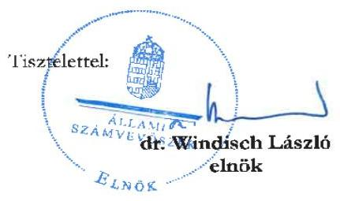

---

# PALLAS ATHÉNÉ DOMUS MERITI ALAPÍTVÁNY FELÜGYELŐBIZOTTSÁGA 

Dr. Matolesy György Elnök úr
részére
Magyar Nemzeti Bank

Budapest, 2025. január 18.

## Tisztelt Elnök Úr!

A Felügyelőbizottság a mai nappal tartott ülésén egyhangúlag hozott 6/2025. (01.18). sz. határozatával akként döntött, hogy a jelen tájékoztatást elkészíti és megküldi a T. Elnök úrnak. A jelen tájékoztatás kiterjed egyrészt a T. Alapítónak megküldött 2024. december 28-i tájékoztató levelet meghaladó Felügyelőbizottság összefoglalójára az Alapítvány tevékenységéről, másrészt összegezi a Felügyelőbizottságnak az Alapítvány működése és gazdálkodása törvényességének és célszerűségének az Alapító Okirat VIII. 1. pontjában meghatározott ellenőrzése érdekében tett intézkedéseit, és az elvégeztetett vizsgálatokban foglaltakat és azokkal kapcsolatos felügyelőbizottsági álláspontot. A határozat arra is kiterjed, hogy a levelet tájékoztatásul megküldi az MNB Felügyelőbizottsága elnökének, valamint az Állami Számvevőszék elnökének is.

## A 2024. december 28-i tájékoztatást meghaladó összefoglaló:

A Pallas Athéné Domus Meriti Alapítvány Felügyelőbizottsága (a továbbiakban Felügyelőbizottság) a Magyar Nemzeti Bank, mint a PADME Alapítvány Alapítója i. a 2024. május 21-én kelt 170960-10/2024. iktatószámú, ii. a 2024. november 18-án kelt 170960-35/2024. iktatószámú leveleiben foglaltakra, valamint iii. az elvégzett vizsgálatok során felmerült tényekre tekintettel saját kezdeményezésre széleskörű vizsgálatokat folytatott több szakértő bevonásával az elmúlt fél évben. A vizsgálatok eredményeiről - az elkészült szakértői anyagok megküldése mellett - és az azokkal kapcsolatos álláspontjáról a Felügyelőbizottság több alkalommal tájékoztatta az Alapítót.
A vizsgálatok legfőbb kiváltó oka, hogy 2024. áprilisában a Kuratórium reorganizációs tervet kellett elfogadjon, mert a PADME Alapítványnak jelentős, a közeljövőben lejáró kötelezettségei álltak fenn, amelyre nem rendelkezett megfelelő pénzügyi forrásokkal.
A PADME jogelőd alapítványok vagyona eleinte állampapírba, majd ingatlanokba került befektetésre, végül az ingatlanok értékesítésével fokozatosan átkerült a vagyon jelentős része az Optima által kibocsátott kötvényekbe, amelyek 2018-2023 között átlagosan 1,13%-os hozamot eredményeztek az Alapítványnál. Az Optima Befektetési Zrt. a PADME által jegyzett kötvények értékéből, az alapítványi vagyonból számos befektetést hajtott végre, amelyek egy részének (Ultima ügylet) végrehajtásához már az alapítványi vagyon sem volt elegendő, így további kötvénykibocsátásra (Neumann János Egyetemért Alapítvány által lejegyzett 127,5 Mrd Ft értékben), valamint egy 170 millió EUR értékű hitel felvételére került sor. A Kuratórium befektetési döntései eredményéként kialakult a portfólió összetételének, kötvényeknek és a hiteleknek a struktúrája, amely struktúra járult hozzá a bevételek és a kiadások egyensúlyának felborulásához, amely 2024. áprilisában Reorganizációs Terv elfogadásához vezetett.

---

A likviditási problémák az Alapítvány ügyvezetése által meghozott befektetési döntésekből eredtek, ugyanis az Optima Befektetési Zrt. által a Kuratórium elé terjesztett, majd a Kuratórium által hozott befektetési döntések nem a tervezettek szerinti hozamot érték el, valamint jelentős további fizetési kötelezettséggel jártak, amelyek finanszírozására az Alapítvány nem rendelkezett elegendő bevétellel. A Felügyelőbizottság kiemeli, hogy a PADME Alapítvány Kuratóriuma a befektetésekről szóló döntéseket nem bocsátotta a Felügyelőbizottság elé véleményezésre, azok kapcsán a Felügyelőbizottságnak semmiféle előzetes ellenőrzési lehetősége nem volt. A Felügyelőbizottság hivatkozik e körben a PADME Alapítvány Alapító Okirat V.9. pontjára, amely értelmében az Alapítvány vagyonának felhasználása és az azzal való rendelkezés joga a Kuratóriumot illeti meg, valamint Alapító Okirat VI.3. fejezet 13. pontja szerint a Kuratórium gondoskodik az Alapítvány céljainak megfelelő működésről, biztosítja az alapítványi vagyon gondos kezelését. Az Alapító Okirat VI.3. fejezet 14. pont d) pontja szerint továbbá kizárólag a Kuratórium jogosult dönteni az alapítványi vagyon kezeléséről, ennek során döntés az Alapítvány céljainak megfelelő vagyoni hozzájárulások és pénzügyi források elfogadásáról, valamint azok felhasználásáról. Az Alapító Okirat nem írja elő a befektetési döntések Felügyelőbizottság általi véleményezését, azonban az Alapító Okirat VI.3. 18. pontja szerint a Kuratórium az Alapítvány gazdálkodását érintő minden lényegi kérdésről, valamint a Kuratórium határozatairól köteles az Alapítót tájékoztatni.
A lefolytatott szakértői vizsgálatok eredményei alapján megállapítható, hogy mind a Felügyelőbizottság felkérésére az Alapítvány ügyvezetésének gazdálkodását vizsgáló ABT Risk Advisory Zrt., mind az ingatlan tranzakciókat vizsgáló MyConcept Kft. kiemelte, hogy az Alapítvány gazdálkodásának megítélése érdekében elengedhetetlen az Optima kötvények értékelése. A könyvvizsgálói jelentések visszavonásának is egyik legfőbb oka, hogy a Pénzügyminisztérium határozata szerint a könyvvizsgáló nem végezte el a megfelelő könyvvizsgálati eljárásokat, amelyek szükségesek lettek volna ahhoz, hogy az Alapítvány által lejegyzett kötvények értékelésére megalapozott következtetést tudjon levonni.
Az ABT Risk Advisory Zrt. célvizsgálati jelentésében - amely a Felügyelőbizottság véleményével megegyezik - kiemelte, hogy felmerül annak a kockázata, hogy az Optima Csoport vagyonelmének összértéke nem nyújt kellő fedezetet a PADME kötvényállományának visszavásárlására, amely értékelést az is nehezíti, hogy a PADME Alapítvány könyvvizsgálója a könyvvizsgálati jelentéseit visszavonta.
A Felügyelőbizottság mindezekre tekintettel 2024. november 14-én (5/2024. (11.14.) sz. határozat) majd ezt követően több határozatában [i. (8/2024. (11.26.). sz. határozat); ii. 8/2024. (12.03.) sz. határozat; iii. 9/2024. (12.18.) sz. határozat; iv. 5/2024. (12.28.)] is felhívta a PADME Alapítvány Kuratóriumát, hogy egy a PADME Alapítványtól és az Optima Befektetési Zrt.-től független, nemzetközi pénzügyi szakértővel vizsgáltassa meg és értékeltesse fel az Optima Befektetési Zrt. kötvényeinek valós, jelenkori értékét. A Felügyelőbizottság számos alkalommal történő felhívása ellenére a PADME Kuratóriuma nem adott tájékoztatást arról, hogy a vizsgálatot elvégezte.
A Felügyelőbizottság aláhúzza, hogy a PADME Alapítvány könyvvizsgálója, a BDO Magyarország Könyvvizsgáló Kft. a PADME Alapítvány alapítása óta végez könyvvizsgálati tevékenységet az Alapítványnál és az Optima Csoportnál, és ezen időszak alatt minden vizsgált esetben megállapítás nélkül zárta az érintett csoporttagok éves beszámolójának vizsgálatát, ez idő alatt a független könyvvizsgálói jelentés mellett megállapításokat, javaslatokat tartalmazó vezetői levele(ke)t nem bocsátott ki a management, illetve a tulajdonosok számára. A PADME Alapítvány és a BDO Magyarország Könyvvizsgáló Kft. közötti szerződés értelmében a könyvvizsgáló az Alapítványnál a Számviteli törvény és a Könyvvizsgálati Standardok alapján köteles elvégezni a könyvvizsgálatot. A Felügyelőbizottság a fentiekre tekintettel a 2024. október 7-i könyvvizsgálói jelentés visszavonásáig alappal volt abban a feltevésben, hogy a

---

PADME beszámolói és a könyvvizsgálati jelentésekben foglaltak valós képet mutatnak az Alapítvány vagyoni helyzetéről, gazdálkodása tekintetében, hiszen a könyvvizsgálati jelentésben foglaltakra tekintettel, az Alapító Okirat VIII. 6. pontjának megfelelően, javasolta elfogadásra a Kuratórium számára a beszámolókat. A Felügyelőbizottság kiemeli, hogy az Alapítvány legutolsó, 2023. évi beszámolójának elfogadása során, a Felügyelőbizottság 2024. május 21-én tartott ülésén a Felügyelőbizottság kifejezetten jelezte a BDO Magyarország Könyvvizsgáló Kft. jelenlévő képviselőjénél, hogy a könyvvizsgálói jelentése tartalmaz-e arra vonatkozóan vizsgálati adatot, hogy a fordulónapi PADME alapítói vagyon értéke milyen valós értéket képvisel. A BDO Magyarország Könyvvizsgáló Kft. képviselője válaszként elmondta, hogy ilyen értékelést nem tartalmaz a könyvvizsgálói jelentés, de a magyar nemzeti könyvvizsgálói standardok alapján megvizsgáltak az Optima Zrt.-től kapott adatokat és azok alapján nem merült fel, hogy értékvesztés elszámolása szükséges lenne. Erre tekintettel, a Felügyelőbizottság a 3/2024. (05.21.) számú felügyelőbizottsági határozatában a beszámolót a kapott szóbeli kiegészítéssel javasolta elfogadásra a Kuratórium részére. Megállapítható tehát, hogy a Felügyelőbizottság a szóban tett kiegészítésre is tekintettel, azon tájékoztatás ismeretében javasolta elfogadásra a beszámolót, hogy a könyvvizsgáló álláspontja szerint értékvesztés elszámolására okot adó körülmény nem merült fel.
2024. október 7-én a 2021-2022-es évre vonatkozó a PADME Alapítvány könyvvizsgálója által készített könyvvizsgálati jelentések, majd 2024. november 27-én a 2023-as évre vonatkozó jelentés is visszavonásra került a Pénzügyminisztérium vizsgálata során feltárt szabálytalanságok okán. A Pénzügyminisztérium határozatai alapján az került megállapításra, hogy az Alapítvány könyvvizsgálója, a BDO Magyarország Könyvvizsgáló Kft. által végrehajtott könyvvizsgálati eljárások önmagukban nem voltak elegendőek ahhoz, hogy az Alapítvány által kimutatott könyv szerinti értékű befektetett pénzügyi eszközök értékéről, illetve annak megalapozottságáról meggyőződjön, továbbá számos, a Pénzügyminisztérium Közfelügyelet által szükségesnek ítélt könyvvizsgálati eljárás hiányát állapították meg.
A Felügyelőbizottság már az első könyvvizsgálati jelentés visszavonását követően haladéktalanul intézkedett és 2024. október 15-én tartott felügyelőbizottsági ülésén hozott határozatában (3/2024. (10.15.) és 4/2024. (10.15.) sz. határozatok) felhívta a Kuratóriumot, hogy (i.) végezze el mind az érintett évek, mind a PADME Alapítvány alapítása óta készült könyvvizsgálati jelentések felülvizsgálatát és hogy pótolja azokat a jogszerű működés érdekében, valamint (ii.) nyilatkoztassa a könyvvizsgálót, illetve (iii.) tegye meg a megfelelő jogi lépéseket a könyvvizsgálóval szemben (9/2024. (10.24.) sz. határozat). A Felügyelőbizottság többszöri határozat útján történő intézkedésre való felhívása ellenére [i. (6/2024. (11.14.) és 7/2024. (11.14.) sz. határozatok; ii. valamint 6/2024. (11.26.) és 7/2024. (11.26.) és 9/2024. (11.26.) sz. határozatok; iii. valamint 6/2024. (12.03.), és 7/2024. (12.03.) sz. határozatok; iv. valamint 9/2024. (12.18.) sz. határozat; v. valamint 5/2024. (12.28.) sz. határozat] a Kuratóriumtól nem kapott tájékoztatást arról, hogy a könyvvizsgálati jelentések pótlásra kerültek volna, vagy hogy a visszavonással nem érintett évek megvizsgálásra kerültek volna, illetve, hogy milyen jogi lépéseket tettek a könyvvizsgálóval szemben. A Felügyelőbizottság kiemeli, hogy kifejezetten felhívta (i. 6/2024. (11.26.) és 7/2024. (11.26). sz. határozatok, valamint ii. 6/2024. (12.03) és 7/2024. (12.03). sz. határozatok) a Kuratórium figyelmét arra, hogy a visszavont könyvvizsgálati jelentések miatt jogsértő állapottal fenyegető helyzet merül fel és ezt haladéktalanul hárítsa el, azonban ennek ellenére a mai napig nem történt meg a könyvvizsgálói jelentések pótlása, a helyzet nem került orvoslásra. A Felügyelőbizottság e körben megjegyzi, hogy a könyvvizsgálótól a könyvvizsgálati jelentések visszavonása kapcsán kapott tájékoztatás, valamint a Pénzügyminisztérium határozatai felvetik a gyanúját annak, hogy a könyvvizsgáló a könyvvizsgálati jelentés és az Optima Befektetési Zrt. a beszámoló elkészítése és a könyvvizsgálónak adott adatszolgáltatása során jogszabályt sérthetett. Ennek megállapításához azonban további vizsgálatok szükségesek, így a visszavonással érintett évek tekintetében egy másik könyvvizsgáló által elkészített új jelentések

---

és azokban foglalt megállapítások fényében lehet erről megalapozottan nyilatkozni, azonban a Felügyelőbizottság ezirányú felhívása ellenére a Kuratórium erről a mai napig nem gondoskodott.

A könyvvizsgálati jelentések visszavonását eredményező szabálytalanságok alapján azonban felmerül, hogy a könyvvizsgáló tévedésbe ejthette az Alapítvány ügyvezetését és a Felügyelőbizottságot. Ezen túl felmerülhet az is, hogy a visszavonásra azért is kerülhetett sor, mert a könyvvizsgálat nem megfelelő adatokat kapott az Optima részéről. Ezek valamelyikének megállapításához további vizsgálatok szükségesek, így a visszavonással érintett évek tekintetében egy másik könyvvizsgáló által elkészített új jelentések és azokban foglalt megállapítások után lehet erről megalapozottan nyilatkozni, azonban a Felügyelőbizottság ezirányú felhívás(ai) ellenére a Kuratórium erről a mai napig nem gondoskodott.

A Felügyelőbizottság a 2024. december 28-án kelt levelében részletesen kifejtette álláspontját az Alapító
 által feltett kérdések (Reorganizáció szükségességének fennálltáról; Reorganizáció felmerüléséhez vezető okok; Reorganizációs terv részeként meghatározott lépések megfelelőségéről; PADME Alapítvány 2024-es költségvetése; OPTIMA Befektetési Zrt.-nél realizált bevételek a PADME Alapítványnál történő hasznosulásáról, illetve a költségek levonásának indokoltságáról; ingatlanügyletek értékelése) tekintetében, tájékoztatta a Felügyelőbizottság által a PADME Alapítvány működése és gazdálkodása törvényességének és célszerűségének ellenőrzése körében tett intézkedéseiről, egyúttal az aktuális likviditási jelentésre és Bánkuty Tamás PADME igazgató által kapott tájékoztatásra is tekintettel a Felügyelőbizottság jelezte, hogy a Felügyelőbizottság értelmezése szerint a kapott tájékoztatások és rendelkezésre álló információk felvetik, hogy az Optima Befektetési Zrt. nem rendelkezik likvid pénzügyi forrással, ami azt feltételezi, hogy az Alapítvány cél szerinti működése és fizetőképessége közvetlen veszélyeztetve van. A Felügyelőbizottság jelezte, hogy amennyiben ez így van, akkor az Alapítvány Alapító Okirat szerinti működése bizonytalanná vált. Erre tekintettel a Felügyelőbizottság álláspontja szerint Alapítói intézkedés megtétele vált indokolttá.
A Felügyelőbizottság a mai napig a levelére nem kapott választ. A Felügyelőbizottság 2024. novemberében és decemberében, valamint 2025. januárjában is kereste az Alapítót egyeztetés céljából az Alapítvány működése és helyzete kapcsán, azonban erre a mai napig, a 2024. november elején a Magyar Nemzeti Bank főigazgatójával folytatott egyeztetésen kívül, nem került sor.
A Felügyelőbizottság az elmúlt hónapokban nagy számú határozatot hozott a kialakult helyzet értékelése és a törvényes működés helyreállítása érdekében, amelyekben intézkedésekre hívta fel a Kuratóriumot, mint a PADME Alapítvány döntéshozó, vagyonkezelő, ügyvezető szervét. A Felügyelőbizottság által az alapítvány működése és gazdálkodása törvényességének és célszerűségének ellenőrzése körében tett intézkedései és annak felmérése érdekében meghozott határozatai kapcsán a Kuratórium nem adott érdemi választ a többszöri felhívás ellenére sem, a Felügyelőbizottság tudomása szerint a Felügyelőbizottság által felvetett kérdések, vizsgálatok (a visszavont évekkel érintett könyvvizsgálati jelentések újbóli elkészítése, szakértők megbízása a Felügyelőbizottság által kért vizsgálatok, így különösen az (i.) Optima Befektetési Zrt. cég és kötvényértékelése; (ii.) az elkészült célvizsgálatok keresztellenőrzésére további szakértők megbízása; (iii.) az ingatlan tranzakciók teljeskörű értékeléséhez a PADME és jogelődjeinek az összes ingatlantranzakciójáról szóló dokumentumainak összegyűjtése; (iv.) a PADME alapításáig visszamenőleg valamennyi könyvvizsgálati jelentés felülvizsgálata és egy új könyvvizsgáló általi elkészítése) nem is kerültek a Kuratórium napirendi pontjai közé, a Kuratórium a kitűzött határidőket elmulasztotta. Erre tekintettel a Felügyelőbizottság nem tudta teljeskörűen elvégezni sem az Alapító által kért, sem a vizsgálatok eredményeként saját maga által meghatározott vizsgálatokat, nem kapta meg a Kuratóriumtól a kért

---

tájékoztatásokat. A PADME Kuratóriuma mulasztásban van a Felügyelőbizottság által hozott határozatok szerinti intézkedések megtétele és a Felügyelőbizottság által kért tájékoztatások megadása tekintetében. A Felügyelőbizottság által hozott határozatokra, megkeresésekre a Kuratórium rendszeresen választ sem ad.
A PADME Alapítvány igazgatója, Bánkuty Tamás a 2025. január 7-én tartott felügyelőbizottsági ülésen arról tájékoztatta a Kuratóriumot, hogy az Alapítvány 2025. évi költségvetése továbbra sem készült el, mert a bevételi oldalt nem tudják meghatározni.
A 2025. január 15-én az Optima Befektetési Zrt. likviditási helyzetéről kapott belső ellenőri tájékoztatás értelmében az Alapítvány vagyonát kezelő Optima Befektetési Zrt. jelentős kiadásokkal számol, amelynek értelmében 2025. február végére a várható hiány meghaladja a 13 Mrd Ft-ot, amelynek következtében már 2025. február folyamán fizetésképtelenséggel fenyegető helyzet alakulhat ki. A jelentés hangsúlyozza, hogy 2025. június 30-ig további kifejezetten jelentős kiadások merülnek fel, több mint 65 Mrd Ft értékben, míg ezzel egyidejűleg jelentős bevétel nem várható. A Felügyelőbizottság álláspontja szerint ezért megállapítható, hogy az Alapítvány cél szerinti működése és fizetőképessége közvetlen veszélyeztetve van. A Felügyelőbizottság szerint erre tekintettel felmerül, hogy a PADME Alapítvány alapító okirat szerinti működése veszélyeztetett és bizonytalanná vált.
A PADME Alapítvány igazgatójának, Bánkuty Tamásnak a munkaviszonya a 2025. január 10-i kuratóriumi határozat értelmében közös megegyezéssel megszűnt és a PADME Kuratóriuma megválasztotta Stofa Györgyöt a PADME Alapítvány igazgatójának, aki egyúttal 2024. decemberi megválasztása óta az Optima Befektetési Zrt. ügyvezetője is. A két tisztség párhuzamos betöltése felveti az összeférhetetlenség kérdését. A Felügyelőbizottság egyúttal megjegyzi, hogy a 4/2025/1 (01.18.) sz. határozatában felhívta a PADME új igazgatóját/ Optima Befektetési Zrt. ügyvezetőjét, hogy a jogszabályi előírásoknak megfelelően járjon el és a Felügyelőbizottság kérésére a belső ellenőr által az Optima Befektetési Zrt. likviditási helyzetéről készített beszámoló anyagát és a belső ellenőr munkáját ne kívánja befolyásolni, a belső ellenőr munkáját és általa készített anyagok integritását ne veszélyeztesse az általa felvetett előzetes kontroll révén.
Tekintettel arra, hogy a fentiekben leírtak szerint a Felügyelőbizottság a jogszabályok és az Alapító Okirat által rendelkezésére álló eszközökkel eljárva az ellenőrzési tevékenységét a rajta kívül álló okok miatt nem tudja eredményesen elvégezni. Véleménye szerint az Alapítvány cél szerinti működése és fizetőképessége közvetlen veszélyeztetve van, a PADME Alapítvány alapító okirat szerinti működése bizonytalanná vált, így a Felügyelőbizottság a jelen levelet tájékoztatásul megküldi a Magyar Nemzeti Bank Felügyelőbizottság Elnöke, valamint az államháztartásból származó források felhasználásának ellenőrzésére hivatott Állami Számvevőszék Elnöke részére.

# Összegezés a Felügyelőbizottság intézkedéseiről: 

## Bevezetés

A Felügyelőbizottság elöljáróban megállapítja, hogy a Polgári Törvénykönyvről szóló 2013. évi V. törvény 3:397 § (1) bekezdése, valamint az Alapító Okirat értelmében az Alapítvány döntéshozó, vagyonkezelő, ügyvezető szerve a Kuratórium. Az Alapító Okirat V.9. pontja értelmében az Alapítvány vagyonának felhasználása és az azzal való rendelkezés joga a Kuratóriumot illeti meg, valamint Alapító Okirat VI.3. fejezet 13. pontja szerint a Kuratórium gondoskodik az Alapítvány céljainak megfelelő működésről, biztosítja az alapítványi vagyon gondos kezelését. Az Alapító Okirat VI.3. fejezet 14. pont d) pontja szerint továbbá kizárólag a Kuratórium jogosult dönteni az alapítványi vagyon kezeléséről, ennek során döntés az

---

Alapítvány céljainak megfelelő vagyoni hozzájárulások és pénzügyi források elfogadásáról, valamint azok felhasználásáról.
Minden (befektetési) döntésért a Kuratórium tartozik felelősséggel.
A Felügyelőbizottság kiemeli továbbá, hogy az Alapító Okirat VI.5. fejezet 1. pontja értelmében az Alapítványt harmadik személyek és hatóságok előtt a Kuratórium elnöke és a Kuratórium egy függetlennek tekintendő tagja együttesen képviseli. A Felügyelőbizottság ebből kifolyólag nem tud harmadik személyt, így pl. egy független szakértőt megbízni, ezt csak a Kuratórium teheti meg. Erre tekintettel kérte a Kuratóriumot a Felügyelőbizottság a határozataiban a célvizsgálatok elvégzése céljából felkérni tervezett külső szakértők megbízására.
A Magyar Nemzeti Bank, mint Alapító által a Pallas Athéné alapítványoknak juttatott vagyon az Alkotmánybíróság 8/2016 (IV.6.) AB határozata értelmében közpénz.

# 1. A 2024. áprilisi reorganizációs tervet megelőző helyzet 

A 2024. áprilisi reorganizációs tervet megelőzően a PADME Alapítvány igazgatója, Bánkuty Tamás a 2023.12.14-i PADME igazgatói tájékoztatásában arról írt, hogy „Az Optima Befektetési Zrt. beszámolója alapján, pénzügyi- és jövedelmi helyzet szempontjából megállapítható, hogy az Alapítvány a harmadik negyedévben is eredményesen gazdálkodott és pozitív eredményt ért el az előzetes tényszámok alapján."
„A vagyoni helyzet szempontjából az Alapítvány a harmadik negyedévben is megfelelt az Alapító Okiratának V.1. pontjában szerepelt vagyonmegőrzési- és felhasználási, valamint saját tőkére vonatkozó előírásoknak, sőt vagyonát az elért pozitív eredményen keresztül tovább növelte."

A Felügyelőbizottság a 2023. december 14-én hozott 18/2023. (12.14.) sz. határozatával tudomásul vette a költségvetési tervezés folyamatáról szóló tájékoztatót és a költségvetési tervezés részeként felkérte az Optima Befektetési Zrt.-t, hogy az Alapítvány működéséhez szükséges pénzügyi források tekintetében tegye meg a 2024-es évre vonatkozó előrejelzését. A Felügyelőbizottság egyúttal felkérte az Alapítvány vagyonát kezelő Optima Befektetési Zrt.-t, hogy a továbbiakban is gondoskodjon az Alapítvány működéséhez szükséges források biztosításáról, befektetési portfoliójának alakítását és felülvizsgálatát ezen cél előtérbe helyezésével végezze. A portfolió jövedelemtérmelő képességéről jelentést készítsen és arról aktívan tájékoztassa a Kuratóriumot. A Felügyelőbizottság utasította az Optima Befektetési Zrt.-t, hogy minden jövőbeli tevékenységet ezen céloknak alárendelve végezze, és ha szükségesnek látja akkor a portfolióját ezen elvek alapján vizsgálja felül, annak érdekében, hogy a PADME Alapítvány az Alapító Okiratban meghatározott célokat kiszámítható módon végezhesse a jövőben is.

Dr. Dudás Lóránt vezérigazgató 2024. március 9-i levelében arról tájékoztatta a Kuratóriumot és a Felügyelőbizottságot, hogy az Optima Befektetési Zrt. 2024. március 11. napján 10 óráig köteles teljesíteni 29.498.198,16 EUR összegű szerződés alapján fennálló fizetési kötelezettségét, azonban a társaság nem rendelkezik kellő forrással a fizetési kötelezettség teljesítésére. Felhívta továbbá a figyelmet, hogy az
megkötött 170 millió EUR összegű hitelszerződés alapján az Optima Csoport tagja 2024. március 15. napjáig 3,3 millió euró összeget köteles feltölteni az adósságszolgálati tartalékszámlára, amelynek elmaradása felmondási eseménynek minősül a hitelszerződés alapján, amely kapcsán fizetési kötelezettség átütemezésére törekednek a forráshiányra tekintettel.

---

A Felügyelőbizottság a kapott tájékoztatásra tekintettel haladéktalanul egyeztetést kezdeményezett az Alapítvány ügyvezetésével és az Optima Befektetési Zrt. vezetőjével, hogy részletes tájékoztatás kapjon a kialakult helyzetről, és annak jogi és pénzügyi megoldásáról. Ennek eredményeképpen 2024. március 12-én a Felügyelőbizottság rendkívüli ülést tartott, amelyen részt vett Dr. Dudás Lóránt az Optima Befektetési Zrt., valamint Bánkuty Tamás és Dr. Csizmadia Norbert a PADME Alapítvány részéről. A Felügyelőbizottság tudomásul vette a rövid ismertetést, és felkérte az Alapítvány jelenlévő igazgatóját, Bánkuty Tamást, hogy egyeztetve a Kuratóriummal, adjon pontosabb, és adatokkal alátámasztott tájékoztatást, illetve javaslatot az ismertetett pénzügyi probléma megoldására.
2024. március 13-án a PADME Alapítvány ügyvezetése, az Optimától kapott tájékoztatás alapján úgy tájékoztatta a Felügyelőbizottságot, hogy az „Optima számára fennálló, 2024. március 11-en lejáró kötelezettség teljesítési határideje további 120 nappal meghosszabbításra került, ezzel jelenleg elhárult a vagyonvesztés közvetlen veszélye. [...] Az Optima Befektetési Zrt. haladéktalanul a PADME kuratóriuma elé terjeszt döntésre a kidolgozott értékesítési, befektetési és reorganizációs tervét, melyről tájékoztatja a Felügyelőbizottságot és az Alapítót. A Kuratórium döntése alapján kerül meghatározásra, hogy az értékesíthető elemek közül, konkrétan mely elemek kerüljenek értékesítésre."
A Felügyelőbizottság a kapott információk kapcsán a 2024. március 14-én kelt levelében további tájékoztatást kért a Kuratórium elnökétől az alábbiak szerint:
„1.) A Kuratórium adjon teljeskörű helyzetfelmérést a jelenlegi és várható pénzügyi (problémáról) helyzetről, feltüntetve a fennálló fizetési kötelezettségek mértékét, határidőket, és azok fedezetét biztosító vagyonelemeket.
2.) Tájékoztasson arról, hogy a jelenlegi helyzet befolyásolja-e az elfogadott pénzügyi tervet, figyelemmel a 2023. december 11-i pénzügyi tervben foglalt előterjesztés tartalmára.
3.) Kuratórium intézkedjen a pénzügyi-gazdasági helyzet konszolidációjára, és biztosítsa az Alapítványi vagyon gondos kezelését, megóvását, a vagyonvesztés elkerülését, az Alapító okiratban foglaltak érvényesülését, az Alapítói célokra figyelemmel."
2024. április 2-án Dr. Leniner Csaba a PADME Kuratórium tagja a PADME gazdasági helyzete, javaslatok tárgyú feljegyzésében felvetette, hogy a kialakult likviditási helyzetre tekintettel álláspontja szerint az Alapítványra és az Optima Befektetési Zrt.-re vonatkozó pozitív eredmény nem helytálló. Így véleménye szerint a bemutatott mérlegeknél a mérlegvalódiság számviteli elve is sérül. Mindezekre tekintettel vagyonvesztést vélelmez és egyetértve a Felügyelőbizottság döntésével, szerinte is szükséges tisztázni a vagyoni helyzetet. Független vagyonvizsgáló (könyvvizsgáló) kirendelését indítványozta.
Mindezeket
 követően 2024. április 25-én került sor a PADME reorganizációs tervének elfogadására a Kuratórium 61/2024. sz. határozatával.

# 2. A 2024. áprilisi reorganizációs tervet követő események 

A 2024. május 21-én kelt 170960-10/2024. iktatószámú felkérésére (a továbbiakban 2024. májusi Alapítói levél) 2024. május 28-án az Alapítói levélben meghatározott szempontok szerint a Felügyelőbizottság szakértők általi célvizsgálatokat elrendelte.
A Felügyelőbizottság a PADME igazgatóját, Bánkuty Tamást kérte fel a 2024. májusi Alapítói levél 1. pontjában felsorolt egyes kérdések kapcsán válaszadásra, míg az 1. pontban feltett további kérdések kapcsán az ABT Risk Advisory Zrt. végezte a vizsgálatokat. A 2024. májusi Alapítói levél 2. pontjában felsorolt kérdések kapcsán a MyConcept Kft. végezte a vizsgálatokat.

## I.1.

A 2024. májusi Alapítói levélben foglalt 1. pont kapcsán a Felügyelőbizottság - egyetértve a 2024. november 18-án az Alapítónak átadott ABT Risk Advisory Zrt. vizsgálati jelentésében foglaltakkal, valamint Bánkuty Tamás igazgató által leírtakkal - az alábbiakat állapította meg:

---

a) Reorganizáció szükségességének fennállásáról: a reorganizáció azért vált szükségessé, mert a PADME Alapítványnak, illetve az Optima Befektetési Zrt.-nek jelentős, a közeljövőben lejáró kötelezettségei álltak fenn, amelyre nem rendelkezett megfelelő pénzügyi forrásai.
b) Reorganizáció felmerüléséhez vezető okok: a PADME Alapítvány döntéshozatali eljárásrendje, szervezeti okok, valamint a befektetési döntések vezettek a reorganizáció szükségességéhez. A Felügyelőbizottság - a PADME Alapítvány igazgatója által felvetettekkel egyezően - jelentős kockázatnak és a kialakult helyzet egyik okaként azonosítja azt, hogy az Alapítvány és a jogelődök egyaránt minimális személyi állománnyal működnek/működtek. Lényegében a teljes pénzügyi, befektetési, jogi döntéshozatal előkészítést az Alapítvány vagyonkezelője, az Optima Befektetési Zrt. végezte és végzi ma is az Alapítvány számára, ami felveti, hogy az Alapítvány ügyvezetése mennyire képes érdemi kontrollt gyakorolni a teljes alapítványi vagyont kezelő vállalat felett, különös tekintettel arra is, hogy az Optima Befektetési Zrt. felügyelőbizottságát 2016-ban megszüntették. Megállapítható, hogy ezen struktúra miatt az Alapítvány jelentősen kitett az Optima Befektetési Zrt.-nek. A Felügyelőbizottság megjegyzi, hogy a befektetési döntések körében még folyamatban van egy, a Bánkuty Tamás PADME igazgató részéről elrendelt célvizsgálat (Ultima 2021. évi megvásárlása és a svájci hitelfelvételi döntés, valamint ennek következményeire kiterjedő jogi, célszerűségi- és értékarányossági vizsgálata), amely várhatóan 2025. január végére készül el.
c) Reorganizációs terv részeként meghatározott lépések megfelelőségéről: a PADME Kuratóriuma által meghatározott lépések nem voltak megfelelőek, mert a reorganizációs tervben kijelölt célok és határidők nem teljesültek, így a reorganizációs tervet több alkalommal módosította a Kuratórium az Optima által szolgáltatott adatokra tekintettel. A Felügyelőbizottság megjegyzi, hogy az Ultima üzletrész megvásárlásával kapcsolatos további kötelezettségek nem szerepeltek a reorganizációs terv előterjesztésekben. Ezért a határozathozatalhoz bemutatott vagyoni helyzet nem tükrözhette hűen a valós helyzetet.
d) PADME Alapítvány 2024-es költségvetése: a PADME Alapítvány Kuratóriuma továbbra sem számolt be a 2024-es költségvetéséről, azonban a PADME igazgatójától, Bánkuty Tamástól kapott információk alapján a tényleges költségvetés érdemben és negatív irányban változott a 2024 elején elfogadotthoz képest. A Felügyelőbizottság felhívta a PADME Kuratóriumát, hogy haladéktalanul nyilatkozzon, hogy álláspontja szerint működése és gazdálkodása megfelelt-e a törvényesség és célszerűség követelményeinek, azonban erre mindeddig nem kapott választ.
e) OPTIMA Befektetési Zrt.-nél realizált bevételek a PADME Alapítványnál történő hasznosulásáról, illetve a költségek levonásának indokoltságáról: az OPTIMA Befektetési Zrt., valamint a PADME Alapítvány jelentős működési költséggel dolgozott és dolgozik jelenleg is (ingatlanbérlet és üzemeltetési díjak a teljes szállítói kifizetések közel 50%-át tették ki), ami a Felügyelőbizottság álláspontja szerint felveti, hogy az megfelel-e az Alapítói céloknak, az okszerű gazdálkodásnak. A Felügyelőbizottság felhívta a PADME Kuratóriumát, hogy haladéktalanul nyilatkozzon, hogy álláspontja szerint ez megfelelt-e az alapítványi céloknak és a célszerűségi követelményeknek, azonban erre a mai napig nem kapott választ. Az alapítványok által jegyzett Optima Befektetési Zrt. által kibocsátott kötvényeken 2018-2023 között átlagosan évi 1,13%-os hozam realizálódott, ami a Felügyelőbizottság álláspontja szerint felveti az eredményességi követelménynek való nem megfelelés kockázatát. A Felügyelőbizottság felhívta a PADME Kuratóriumát, hogy haladéktalanul nyilatkozzon, hogy álláspontja szerint ez megfelelt-e az alapítványi céloknak és a célszerűségi követelményeknek, azonban erre a mai napig nem kapott választ.

---

# 1.2. 

A 2024. májusi Alapítói levélben foglalt 2. pont (ingatlanügyletek értékelése) kapcsán a Felügyelőbizottság, egyetértve a 2024. november 18-én az Alapítónak átadott MyConcept Kft. vizsgálati jelentésében foglaltakkal, az alábbiakat állapította meg:
A megvizsgált 12 ingatlan értékesítése kapcsán a szakértői vélemény szerint az ügyletek többsége megfelel az értékarányosság követelményének. A MyConcept Kft. végleges anyagát (a 2024. decemberében elkészült anyaghoz fűzött kiegészítést) 2025. január 7-én kapta kézhez a Felügyelőbizottság, mert a korábban rendelkezésre bocsátott jelentés módosításra került (korábbi hiányzó dokumentumok beszerzésre kerültek, stb.).
A szakértői véleményben foglalt bizonyos tranzakciók kapcsán jelzett kockázatok mellett, további kiemelt kockázatot jelentett a vizsgálat és a Felügyelőbizottság szerint a tranzakciók pénzügyi elszámolása, az elszámolásba bevont kötvény-értékek. A Felügyelőbizottság - a szakértői anyagban foglalt kockázatok azonosításával egyetértve - megállapítja, hogy bizonytalan az a körülmény, hogy az ingatlan adásvételek kapcsán visszatérően az értékpapírral történő vételár-kiegyenlítésre került sor. A Felügyelőbizottság egyetértve a vizsgálat ezen megállapításával, a fentiek alapján az ingatlantranzakciókhoz kapcsolódó pénzügyi elszámolás, valamint kötvénykonstrukció további vizsgálatát tartja szükségesnek a teljes kockázati helyzet feltárásához. Ezen kockázatok értékeléséhez is már korábban szükségesnek tartotta a Felügyelőbizottság lefolytatni egy független, nemzetközi pénzügyi szakértő által az Optima kötvények értékelését, valamint az Optima csoport cégértékelését, amelynek elvégzésére számos alkalommal, így 2024. november 18-án (5/2024. (11.14.) sz. határozat) majd ezt követően több határozatában [i. (8.2024. (11.26.). sz. határozat); ii. 8/2024. (12.03.) sz. határozat; iii. 9/2024. (12.18.) sz. határozat; iv. 5/2024. (12.28.)] felhívta a Kuratóriumot, de ennek elvégzésére a mai napig nem került sor.
A Felügyelőbizottság e körben megjegyzi, hogy felkérte (i. 3/2024. (10.01.) sz. határozat, majd ii. 5/2024. (10.24.) sz. határozat, majd iii. 8/2024. (12.28.) sz. határozat) arra is a Kuratóriumot, hogy készíttessen egy teljeskörű, a 2024. májusi Alapítói levélben kért a PADME Alapítvány és jogelődjei alapításától felmerült valamennyi ingatlanügyletről szóló kimutatást, hogy el tudja végeztetni az ingatlanügyletek értékelését, azonban a Felügyelőbizottság felhívása ellenére a Kuratórium ezirányú határozattal nem tájékoztatta a mai napig a Felügyelőbizottságot.
A Felügyelőbizottság - egyetértve a célvizsgálatok megállapításaival - értékelése szerint a PADME Alapítvány működése, gazdálkodása formálisan jogszerűnek tekinthető.
A célszerűség kapcsán - a BDO Magyarország Könyvvizsgáló Kft. 2021-2022-2023-as évre vonatkozó könyvvizsgálati jelentéseinek utólagos visszavonása következtében elengedhetetlenné vált - az Optima kötvény és Optima csoport cégértékelés után lehet végső megállapítást tenni. A Felügyelőbizottság már több alkalommal felhívta a Kuratóriumot, hogy egy a PADME Alapítványtól és az Optima cégcsoporttól független nemzetközi pénzügyi szakértő megbízásával végeztesse el az Optima kötvények és az Optima cégcsoport cégértékelését. A Felügyelőbizottság kényszerűen állapítja meg, hogy a Kuratórium e körben a Felügyelőbizottságot a többszöri felhívása ellenére a mai napig nem tájékoztatta.

## 3. A könyvvizsgálói jelentések visszavonása

A 2024. november 18-án kelt 170960-35/2024. iktatószámmal ellátott felkérésére (a továbbiakban 2024. novemberi Alapítói levél) a Felügyelőbizottság a Kuratórium útján az ABT Risk Advisory Zrt.-t bízta meg a vizsgálat lefolytatására. Az ABT Risk Advisory Zrt. 2024. december 16-án készítette el a vizsgálati jelentését.
A Felügyelőbizottság a 2024. december 18-án kelt levelében megküldte az Alapítónak az ABT Risk Advisory Zrt. jelentését és ezzel kapcsolatban hozott határozatát, amelyben a Felügyelőbizottság kimondta, hogy a jelentésben foglalt megállapításokkal egyetért, az a

---

Felügyelőbizottság véleményét is tükrözi a Felügyelőbizottságra vonatkozó megjegyzés kivételével. A Felügyelőbizottság álláspontja a következő.

1. Kérdés: A könyvvizsgálói jelentések visszavonása milyen jogkövetkezményekkel járhat a PADME Alapítványra nézve, illetve milyen hatással lehet a PADME Alapítvány működésére és vagyonára?
A Felügyelőbizottság álláspontja szerint az Alapítványnak valamennyi már visszavont év (2021-2022-2023) kapcsán meg kell ismételnie a könyvvizsgálatot, amelynek akkor lehet érdemi hatása, ha az új könyvvizsgálat más eredményre jut. Amennyiben ennek eredményeként negatív eredmény születik, akkor
i. a PADME Alapítványnak önellenőrzést kell végeznie, amelynek eredményeképpen adókötelezettség merülhet fel;
ii. megkérdőjeleződhet az Optima Befektetési Zrt. vagyonkimutatásaiban szereplő adatok megbízhatósága, így felmerülhet annak kockázata, hogy az Optima csoport vagyonelemeinek összértéke nem nyújt kellő fedezetet a PADME kötvényállományának visszavásárlására. Erre vonatkozó megállapítást csak a Felügyelőbizottság által már a Kuratórium irányában korábban kért kötvény és cégértékelés után lehet tenni;
iii. további kockázatként azonosítható, hogy tud-e az Alapítvány új könyvvizsgálót találni, az milyen határidővel tudja elkészíteni a jelentést, illetve, hogy ez mekkora költséggel járna.
A Felügyelőbizottság kiemeli, hogy már az első, 2024. október 7-én kelt könyvvizsgálati jelentés visszavonásáról szóló levél kézhezvételét követően határozatban hívta fel a Kuratóriumot nem csak az akkor érintett 2021-2022-es, hanem a PADME alapítása óta elvégzett valamennyi könyvvizsgálati jelentés kapcsán a könyvvizsgálati jelentések felülvizsgálatára és a jelentések elkészítéséhez szükséges és megfelelő adatok szolgáltatására és így a jelentések pótlására. Erre azonban, a többszöri határozatban foglalt felhívások ellenére, a Felügyelőbizottság tudomása szerint a mai napig nem került sor. Az időközben visszavont 2023-as könyvvizsgálati jelentés kapcsán is a fentieknek megfelelő intézkedésre hívta fel határozatával a Felügyelőbizottság a PADME Kuratóriumát, eddig eredménytelenül.
2. Kérdés: Alapítványi oldalról felmerülhet-e olyan körülmény, amely a BDO könyvvizsgálói jelentéseinek visszavonásához vezetett?
A BDO Magyarország Könyvvizsgáló Kft.-től kapott, a könyvvizsgálati jelentés visszavonásáról szóló levél alapján, illetve az ABT Risk Advisory Zrt. vizsgálata alapján is egyértelműen megállapítható, hogy a Pénzügyminisztérium azt állapította meg, hogy könyvvizsgálói jelentések visszavonására elsősorban a nem megfelelő könyvvizsgálati eljárások alkalmazása miatt került sor.
A Felügyelőbizottság álláspontja szerint ezért elsődlegesen a BDO Magyarország Könyvvizsgáló Kft. nem megfelelő könyvvizsgálói eljárására vezethető vissza a jelentés visszavonása. Felmerülhet továbbá olyan tény, hogy a PADME Alapítvány nem megfelelő éves beszámoló típust választott, illetve amennyiben a hiányolt dokumentumok, elemzések és pénzügyi modellek azért nem kerültek a könyvvizsgálójához átadásra, mert ilyenek nem készültek. A Felügyelőbizottság megjegyzi, hogy az Optima Befektetési Zrt. szerződésben rögzített feladata az Alapítvány pénzügyi, könyviteli és beszámoló készítési feladatainak ellátása. A kérdésre végleges választ az újonnan lefolytatott könyvvizsgálat eredményeinek fényében lehet megadni, amely elvégzésére a Felügyelőbizottság több alkalommal felhívta a Kuratóriumot, azonban a Felügyelőbizottság tudomása szerint ezideig ez nem történt meg.

---

# 3. Kérdés: A BDO könyvvizsgálói jelentéseinek visszavonása vonatkozásában kinek a terhére állapítható meg ezzel kapcsolatos felelősség? 

A Felügyelőbizottság - egyetértve az ABT Risk Advisory Zrt. megállapításával - álláspontja szerint a könyvvizsgálói jelentések visszavonása vonatkozásában a hatályos jogszabályok, a megbízási szerződés és a Pénzügyminisztérium, mint kérelmező felügyeleti szervként eljáró hatóság határozata alapján elsősorban a könyvvizsgáló terhére lehet felelősséget megállapítani, de felmerülhet még az Optima Befektetési Zrt., mint a PADME Alapítvány pénzügyi, könyviteli és beszámoló készítési feladatainak viteléért szerződés alapján felelős vállalkozás, valamint felvetődhet a Kuratórium, mint az Alapítvány döntéshozó, ügyvezető szervének a felelőssége is. A
 kérdésre végleges választ az újonnan lefolytatott könyvvizsgálat eredményeinek fényében lehet megadni, amely elvégzésére a Felügyelőbizottság több alkalommal felhívta a Kuratóriumot, azonban a Felügyelőbizottság tudomása szerint ezideáig ez nem történt meg. A Felügyelőbizottság egyúttal több alkalommal határozatban hívta fel a Kuratóriumot, hogy tegye meg a szükséges lépéseket, így

- nyilatkoztassa a BDO Magyarország Könyvvizsgáló Kft.-t, hogy hogyan kívánja orvosolni a fennálló helyzetet,
- a hiányzó évek jelentéseit hogyan kívánja pótolni, illetve pótolja,
- valamint, hogy a Kuratórium vizsgálja meg a BDO Magyarország Könyvvizsgáló Kft. szerződésben vállalt felelőssége kapcsán az esetleges kártérítési felelősség érvényesítésének lehetőségét - figyelemmel a könyvvizsgáló jogszabályi kártérítési felelősségére.
A Felügyelőbizottság a mai napig teljeskörű és a folyamatban lévő egyeztetések eredményéről tájékoztatást többszöri kérésére ellenére a PADME Kuratóriumától nem kapott.

4. Kérdés: A PADME Alapítvány 2019-es alapításától elfogadott beszámolókkal és könyvvizsgálói jelentésekkel történő összevetés által felmerülhet-e a további évek vonatkozásában a jelenlegihez hasonló helyzet, tekintettel arra, hogy a BDO végzi a PADME Alapítvány könyvvizsgálatát.
A Felügyelőbizottság - egyetértve az ABT Risk Advisory Zrt. megállapításával - álláspontja szerint egyértelműen felmerülhet további évek vonatkozásában a jelenlegi helyzet. A Felügyelőbizottság erre tekintettel, már az első, 2024. október 7-én kelt könyvvizsgálati jelentés kézhezvételét követően határozatban hívta fel a Kuratóriumot nem csak az akkor érintett 2021-2022-es, hanem a PADME alapítása óta elvégzett valamennyi könyvvizsgálati jelentés kapcsán a könyvvizsgálati jelentések felülvizsgálatára, azonban a Felügyelőbizottság tudomása szerint ezideáig ez nem történt meg.

## 4. A PADME Felügyelőbizottságának az Alapítvány működése és gazdálkodása törvényességének és célszerűségének ellenőrzése körében tett intézkedései:

A Felügyelőbizottság elöljáróban megjegyzi, hogy 2024-ben 18 felügyelőbizottsági ülést tartott, amelyek során több, mint 100 db. határozatot hozott az Alapítvány működése és gazdálkodása törvényességének és célszerűségének ellenőrzése körében:

A Felügyelőbizottság hatáskörében eljárva és a jogszabályok által biztosított keretek között az Alapítvány működése és gazdálkodása törvényességének és célszerűségének ellenőrzése körében eddig is intézkedett, így

1. minden évben egy független, elismert, nemzetközi könyvvizsgáló cég készítette el az Alapítvány könyvvizsgálatát;
2. éves belső ellenőrzési terv alapján folyamatos belső ellenőrzést tartott az Alapítványnál.

---

A Felügyelőbizottság a 2023-as évről készült beszámoló kapcsán készített könyvvizsgálói jelentés 2024. május 21-i megtárgyalása során feltett arra a kérdésre, hogy a fordulónapi PADME alapítói vagyon értéke milyen értéket képvisel, a könyvvizsgáló úgy nyilatkozott, hogy ,,ilyen értékelést nem tartalmaz a könyvvizsgálói jelentés, de a magyar nemzeti könyvvizsgálói standardok alapján megvizsgálták az Optima Zrt.-től kapott adatokat és azok alapján nem merült fel, hogy értékvesztés elszámolása szükséges lenne." Erre tekintettel hozott 3/2024. (05.21.) sz. felügyelőbizottsági határozatában a beszámolót a Felügyelőbizottság a kapott szóbeli kiegészítéssel javasolta elfogadásra a Kuratórium részére.
A Felügyelőbizottság a 2024. áprilisi reorganizációs terv Kuratórium általi elfogadását megelőzően, illetve azóta is számos határozatot és intézkedést hozott az Alapítvány működése és gazdálkodása törvényességének és célszerűségének az Alapító Okirat VIII. 1. pontjában meghatározott ellenőrzése érdekében.

1. A 2024. március 9-én Dr. Dudás Lóránt Optima elnök-vezérigazgatótól kapott fizetési kötelezettséggel kapcsolatos tájékoztatást követően a Felügyelőbizottság azonnal intézkedett, rendkívüli felügyelőbizottsági ülést hívott össze (részletes tájékoztatás kérés a pénzügyi - likviditási problémákról) és egyúttal felhívta a Kuratóriumot, hogy intézkedjen a pénzügyi-gazdasági helyzet konszolidációjára, és biztosítsa az alapítványi vagyon gondos kezelését, megóvását, a vagyonvesztés elkerülését, az Alapító okiratban foglaltak érvényesülését, az alapítói célokra figyelemmel. - Alapítót is tájékoztatta a Felügyelőbizottság;
2. A Felügyelőbizottság a 2024. március 9-i Optima Befektetési Zrt.-től érkezett likviditási problémát követően, 2024. március 21-i felügyelőbizottsági ülésén a 4/2024. (03.21). sz. határozatával elrendelte a havi likviditási riport készítését;
3. Felügyelőbizottság haladéktalanul elrendelte a Kuratórium számára a 2024. májusi Alapítói levélben kért vizsgálatok szakértők általi lefolytatását. - Alapítót is tájékoztatta a Felügyelőbizottság;
4. A Felügyelőbizottság rendszeres tájékoztatást kért a Kuratóriumtól a reorganizációs terv előrehaladásáról. - Alapítót is rendszeresen tájékoztatta a Felügyelőbizottság;
5. A Felügyelőbizottság folyamatosan tájékoztatta az Alapítót a határozatairól és az elrendelt intézkedéseiről, az Alapítvány likviditási helyzetéről;
6. A Felügyelőbizottság több határozatában [5/2024. (11.14.). sz. felügyelőbizottsági határozat, 8/2024. (11.26.) sz. felügyelőbizottsági határozat, 9/2024. (12.18). sz. felügyelőbizottsági határozat, 5/2024. (12.28.) sz. felügyelőbizottsági határozat, 4/2025. (01.07.) sz. felügyelőbizottsági határozat] elrendelte az Optima Befektetés Zrt. kötvény és cégértékelését a Kuratórium felé. - Alapítót is tájékoztatta a Felügyelőbizottság ezen határozatairól;
7. A Felügyelőbizottság több határozatában [4/2024. (11.14.) sz. felügyelőbizottsági határozat, a 11/2024 (11.26.) sz. felügyelőbizottsági határozat, a 5/2024. (12.28.) sz. felügyelőbizottsági határozat] felhívta a PADME Kuratóriumát, hogy nyilatkoztassa az Optima Befektetési Zrt.-t a kötvényeinek értékéről és hogy ezt az értéket milyen, az Optima csoporttól független, szakértői véleményre alapítja, valamint, hogy a visszafizetésre milyen garanciát tud adni az Alapítványnak - Alapítót is tájékoztatta a Felügyelőbizottság;
8. Több alkalommal felhívta [5/2024. (11.14.) sz. határozat; 8/2024. (11.26.). sz. határozat; 8/2024. (12.03.) sz. határozat; 9/2024. (12.18). sz. határozat; 5/2024. (12.28.)] a Kuratóriumot a jogszabálysértéssel fenyegető helyzet azonnali elhárítására, a BDO Magyarország Könyvvizsgáló Kft.-vel szembeni szükséges jogi lépések megtételére, új könyvvizsgálat lefolytatására, azonban ezekre a Felügyelőbizottság tudomása szerint még nem került sor, a Kuratórium tájékoztatása szerint folyamatban van a helyzet kezelése. - Alapítót is tájékoztatta a Felügyelőbizottság;
9. A célvizsgálatok során feltárt hiányosságok pótlására a Felügyelőbizottság határidő mellett felhívta a Kuratóriumot.

---

A Felügyelőbizottság egyúttal jelen levelével tájékoztatja az Alapítót, hogy a 2024. november 18-án kelt, majd a 2024. december 28-án kelt felügyelőbizottsági tájékoztatásában jelzett likviditási probléma továbbra sem hárult el. A 2025. január 15-én az Optima Befektetési Zrt. likviditási helyzetéről kapott belső ellenőri tájékoztatás értelmében az Alapítvány vagyonát kezelő Optima Befektetési Zrt. jelentős kiadásokkal számol, amelynek értelmében 2025. február végére a várható hiány meghaladja a 13 Mrd Ft-ot, amelynek következtében már 2025. február folyamán fizetésképtelenséggel fenyegető helyzet alakulhat ki. A jelentés hangsúlyozza, hogy 2025. június 30-ig további kifejezetten jelentős kiadások merülnek fel, több mint 65 Mrd Ft értékben, míg ezzel egyidejűleg jelentős bevétel nem várható. A Felügyelőbizottság álláspontja szerint ezért megállapítható, hogy az Alapítvány cél szerinti működése és fizetőképessége közvetlen veszélyeztetve van.

A Felügyelőbizottság szerint erre tekintettel alaposan feltehető, hogy a PADME Alapítvány Alapító Okirat szerinti működése bizonytalanná vált.
Erre tekintettel a Felügyelőbizottság álláspontja szerint Alapítói intézkedés megtétele vált indokolttá az alapítványi vagyon védelme, megóvása érdekében, mert az eddigi események és mind a kialakult helyzet, mind annak kezelése kapcsán az Alapítvány ügyvezetése és az Optima ügyvezetése által tett lépések, valamint azok elmaradása veszélyeztetik az Alapítvány Alapító okiratában elvárt működését, az Alapítványi vagyon védelmét és a megfogalmazott Alapítói célt.

A fentiek alapján megállapítható, hogy a Felügyelőbizottság az Alapítvány működése és gazdálkodása törvényességének és célszerűségének ellenőrzése körében minden, a jogszabályokban és az Alapító Okiratban meghatározott kötelezettségeinek megfelelően járt el.

A Felügyelőbizottság kihangsúlyozza, hogy az Alapító Okirat V.9. pontja, VI.3. fejezet 13. pontja, és a VI.3. fejezet 14. pont d) pontja értelmében a vagyongazdálkodás kizárólagos kötelezettje az Alapítvány Kuratóriuma.

Összegezve a fentieket, a Felügyelőbizottság álláspontja, hogy az Alapítvány további és jogszerű működése az Optima Befektetési Zrt., mint az Alapítvány működéséhez és az Alapító Okiratban meghatározott célokhoz szükséges pénzügyi források biztosítására és kezelésére megbízott társaság likviditási helyzetéből adódó bizonytalan helyzetére, a Kuratóriumtól elvárt tájékoztatások és intézkedések elmaradására tekintettel veszélyeztetve van. Ezért a Felügyelőbizottságnak az Alapító ezirányú tájékoztatásai és az Alapítótól kért intézkedések megtétele ma még inkább megalapozottak. Ennek tükrében a Felügyelőbizottság kéri az alapítói jogokat gyakorló T. Elnök urat, hogy fontolja meg a Kuratórium bővítését további szakemberekkel, az Optima Befektetési Zrt.-nél felügyelőbizottság ismételt létrehozását, hogy az Alapítvány és az Optima Befektetési Zrt. gazdálkodása eredményesen kontroll alatt tartható legyen. A Felügyelőbizottság megállapítja, hogy az Optima Befektetési Zrt. a befektetési döntésekről előzetesen semmilyen tájékoztatást nem adott a Felügyelőbizottság részére, sőt volt arra példa, hogy a PADME Kuratóriumának határozata nélkül döntött befektetésről (ABT jelentés ID. 3.1.2.).
A Felügyelőbizottság javasolja az Optima Befektetési Zrt. kötvény- és az Optima cégcsoport cégérték valós értékeléséig, valamint a könyvvizsgálati jelentések pótlásáig az alapítványi vagyonra is kiható további befektetések hatékonyabb szakértői döntés-előkészítését.

Felmerült a PADME Alapítvány igazgatói tisztség és az Optima Befektetési Zrt. Igazgatósága elnöki és vezérigazgatói tisztségek (Stofa György) egyidejű betöltéséből felmerülő összeférhetetlenség vizsgálata, illetve szükség szerinti megszüntetése.

---

# A Felügyelőbizottság a jelen levél mellé az alábbi dokumentumokat csatolja:

- az Alapítói megkereséseket tartalmazó levelek és azokra adott felügyelőbizottsági válaszlevelek,
- a hivatkozott (ABT Risk Advisory Zrt., MyConcept Kft. - vizsgálati jelentések; Felügyelőbizottság érintett és hivatkozott határozatai; Bánkuty Tamás igazgatói levelei és tájékoztatásai, valamint a 2024. december 9-én kelt összeállítása; 2024. novemberéről és decemberéről szóló likviditási jelentések; BDO könyvvizsgálati jelentéseinek visszavonásáról szóló tájékoztatók) dokumentumok

Kérem a Tisztelt Elnök Urat a fenti tájékoztatást elfogadni szíveskedjék!
Üdvözlettel:
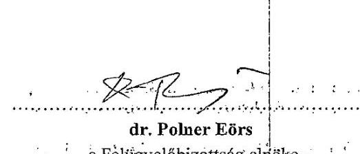

Tájékoztatásul kapják még:

1. Dr. Windisch László az Állami Számvevőszék elnöke
2. Dr. Papcsák Ferenc a Magyar Nemzeti Bank Felügyelőbizottságának elnöke

---

# - XV. SZ. MELLÉKLET: AZ MNB ELNÖKÉNEK 2025. JANUÁR 24-I VISZONTVÁLASZA AZ ÁSZ ELNÖKÉNEK 2025. JANUÁR 14-I ÉRTESÍTÉSÉRE

## MATOLCSY GYÖRGY

ELNÖK

Dr. Windisch László
Elnök
részére

Állami Számvevőszék
1052 Budapest, Apáczai Cs. J. u. 10.

## Tisztelt Elnök Úr!

Köszönettel megkaptam a 2025. január 14-én kelt, EL-3815-404/2025. számú, „Alapító értesítése a PADME gazdasági helyzetéről" tárgyú levelét, melyre hivatkozással az alábbiakról tájékoztatom.
I.

Tájékoztatom Elnök Urat, hogy időközben a PADME Alapítvány Kuratóriumának tagjai tisztségükről lemondtak. A lemondásokra tekintettel új kuratóriumi tagok kerültek megbízásra az MNB részéről.

A PADME Alapítvány új kuratóriumának tagjai részére figyelemfelhívó levél került kiküldésre, melyben többek között - a kuratóriumi tagok arra kerültek felhívásra, hogy alapítványi vagyon jogszerű, célszerű és Alapító Okiratnak megfelelő kezelését biztosítsák, gondoskodjon a PADME Alapítvány céljainak megfelelő működéséről az alapítványi vagyon gondos kezeléséről, valamint tegyenek meg minden szükséges lépést a PADME Alapítvány vagyonának védelme érdekében. Ezen túl maradéktalanul teljesítsék az Alapító megkeresésében foglaltakat.

Külön kiemelésre került az Ön 2025. január 14-én kelt, EL-3815-404/2025. számú, „Alapító értesítése a PADME gazdasági helyzetéről" tárgyú levélben foglaltaknak megfelelő lépések megtételére felhívás, azaz (i) dolgozzanak ki olyan beszámolási folyamatokat, amelyek a teljes PADME csoportot érintő (külső) ellenőrzések kapcsán biztosítják az MNB teljeskörű tájékoztatását; (ii) dolgozzanak ki részletesen olyan racionális opciókat, melyek biztosítják az alapítói vagyon megőrzését, valamint, hogy (iii) tegyenek meg minden szükséges intézkedést annak érdekében, hogy az OPTIMA Befektetési Zrt. esetében fedezetelvonás semmiképpen ne következhessen be, és tegyék meg a szükséges lépéseket a kialakult állapot jogszabályi előírások szerinti rendezése érdekében, és erről pedig mielőbb tájékoztassák az MNB-t.

Tájékoztatom továbbá Elnök Urat, hogy az MNB nem tervez döntést hozni pótlólagos alapítói tőkejuttatásról, de megjegyzem, hogy erre vonatkozóan az Alapítványtól semmilyen javaslatot nem is kapott.
II.

Tájékoztatom Elnök Urat arról is, hogy a PADME Alapítvány Felügyelőbizottságának elnöke (i) 2024. december 18-i, (ii) 2024. december
 28-i és (iii) 2025. január 18-i keltezésű tájékoztató leveleket küldött az Alapító részére, melyek a korábbi részjelentések kiegészítésének tekinthetők, és amelyeket figyelemmel a

---

Magyar Nemzeti Bankról szóló 2013. évi CXXXIX. törvény 162. § (5) bekezdésében foglalt rendelkezésre, jelen levelem mellékleteként megküldök további szíves felhasználásra.

Tisztelettel,
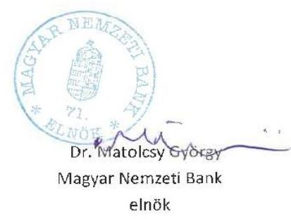

# Melléklet: 

1. sz. melléklet: a PADME Alapítvány új Kuratóriumi Elnökének megküldendő levél
2. sz. melléklet: a PADME Alapítvány új Kuratóriumi Elnökhelyettesének megküldendő levél
3. sz. melléklet: a PADME Alapítvány új -további - Kuratóriumi tagjának megküldendő levél
4. sz. melléklet: a PADME Felügyelőbizottságának elnöke 2024. december 18-án kelt levele és annak mellékletei
5. sz. melléklet: a PADME Felügyelőbizottságának elnöke 2024. december 28-án kelt levele
6. sz. melléklet: a PADME Felügyelőbizottságának elnöke 2025. január 18-án kelt levele

---

# - XVI. SZ. MELLÉKLET: ÁSZ MEGKERESÉS A PÉNZÜGYMINISZTÉRIUM FELÉ AZ ALAPÍTVÁNY ÉS AZ OPTIMA BEFEKTETÉSI ZRT. 2021 ÉS 2022. ÉVI KÖNYVVIZSGÁLATA KAPCSÁN 

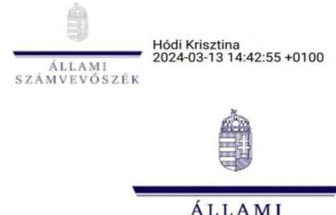

ÁLLAMHÁZTARTÁSON KÍVÜLI SZERVEZETEKET ELLENŐRZŐ IGAZGATÓSÁG

Pénzügyminisztérium
Adóügyekért Felelős Államtitkárság

Besesck Botond
adószabályozásért és számvitelért felelős helyettes államtitkár

## 1051 Budapest

Tárgy: Értesítés

## Tisztelt Helyettes Államtitkár Úr!

Ezúton tájékoztatom, hogy az Állami Számvevőszék (ÁSZ) a Magyar Nemzeti Bankról szóló 2013. évi CXXXIX. törvény 162. § (5) bekezdésében foglaltak szerint a „Pallas Athéné Domus Meriti Alapítvány gazdálkodásának ellenőrzése" című program alapján ellenőrzést folytat.
Az ellenőrzés a Pallas Athéné Domus Meriti Alapítvány (Alapítvány) mellett az általa alapított gazdasági társaságokra, valamint az Alapítvány vagyonával gazdálkodó jogi entitásokra is kiterjed.
Az Alapítvány és az Alapítvány kizárólagos tulajdonában álló OPTIMA Befektetési Zrt. 2021. és 2022. évi beszámolójának könyvvizsgálatát a BDO Magyarország Könyvvizsgáló Kft. (a továbbiakban BDO) végezte, a beszámolókat hitelesítő záradékkal látta el, a könyvvizsgálói jelentés minősítést nem tartalmazott.

Az eddig rendelkezésre álló információk alapján az alábbi megállapításokat, következtetéseket vontuk le:

- a kiadott könyvvizsgálati vélemény ellenére sérülhetett a megbízható és valós összkép bemutatása, mert bár a BDO az elvégzett könyvvizsgálatai által ${ }^{1}$ a teljes cégstruktúrát ismerte, azonban a komplex, országhatárokon átívelő, számos kockázati típust magában foglaló befektetési struktúra átfogó vizsgálatát nem végezte el,
- az Alapítvány 2022. évi beszámolójának formátuma nem felelt meg a vonatkozó jogszabályi előírásoknak, mert az Alapítvány 2022. üzleti évre egyszerüsített éves beszámolót készített, azonban a számviteli törvény szerinti egyes egyéb szervezetek beszámoló készítési és könyvvezetési kötelezettségének sajátosságairól szóló 479/2016. (XII.

[^0]
[^0]:    ${ }^{1}$ OPTIMA csoporton belül, a tárgyhoz kötötten, a BDO által könyvvizsgált entitások: Pallas Athéné Domus Meriti Alapítvány; OPTIMA Befektetési Zrt.; Optima Befektetési Alapkezelő Zrt.; Optima Befektetési Alapkezelő Zrt. által kezelt Befektetési Alapok (Optimum Ventures- és Ventures II. Magistrőlcsápok), Alpine Holding Kft.; GTC Holding Zrt.

---

28.) Korm. rendelet 2022. január 1-jétől hatályos előírásai alapján éves beszámoló készítésére lett volna kötelezett.

Jelen levelünkben a továbbiakban bemutatjuk az Alapítvány által létrehozott komplex, magas kockázatú befektetési struktúrát, illetve tájékoztatjuk Önöket - az ÁSZ által eddig feltárt, a fenti következtetéseinket megalapozó tényekről.

# Az alapítvány által lejegyzett Optima2040/A kötvény paraméterei 

Az Alapítvány egyszerűsített éves beszámolója szerint 2021. évben a mérlegfőösszegének 91,24%-át (255,8 mrd Ft), 2022. évben a 98,3%-át (278,5 mrd Ft) az OPTIMA Befektetési Zrt. által 20 éves futamidővel kibocsátott, lejáratkor egyösszegben törlesztő kötvény tette ki. A 2020. december 28-án kibocsátott OPTIMA2040/A jelű kötvény konstrukciója szerint változó kamatozású, a kamatperiódusra vonatkozó kamatlábat a kibocsátó legfőbb szerve legkésőbb az adott kamatperiódus végéig, visszamenőlegesen határozza meg és erről értesíti az Alapítványt. Az éves kamat megállapításának módszere, képlete nincs meghatározva, szerződésben rögzítve, az eddig megállapított kamatlábak messze a tárgyévi piaci kockázatmentes kamatszintek alattiak.
A 2021. évi kamatperiódusra éves 0,17 %, míg a 2022. évi kamatperiódusra 0,12 % kamatláb lett utólag megállapítva, a kamatfizetések ezek alapján történtek. Az OPTIMA Befektetési Zrt. által utólag, szabadon meghatározott éves kamat, valamint a lejáratkori egyösszegű tőketörlesztés minimalizálta a nemfizetés, a default kockázatának felmerülését.

A Neumann János Egyetemért Alapítvány által lejegyzett Optima2031 és 2013/B kötvények Az OPTIMA Befektetési Zrt. a 2021. és 2022. évi beszámolójában a „Hosszú lejáratú kötelezettségek" között mutatta ki a Neumann János Egyetemért Alapítvány (NJE Alapítvány) által 2021. évben lejegyzett 127,5 mrd Ft összegű kötvényt. A kibocsátás célja a kötvény információs összeállítások alapján a kibocsátó befektetési tevékenységének hosszú távú finanszírozása, nevesítetten ingatlanok vásárlása volt. Felek a kötvények kapcsán az eladási jog alapításáról szóló szerződéseket is aláírtak, ezek 5,0 és 22,5 mrd Ft-ra vonatkozóan 2022. február 18-tól és július 9-től, további 100 mrd Ft-hoz kapcsolódóan 2022. október 11. napjától nyitották meg az NJE Alapítvány eladási jogát, ezzel egyidejűleg az OPTIMA Befektetési Zrt. visszavásárlási kötelezettségét. Az OPTIMA Befektetési Zrt. a kötvény vételárát 27,5 mrd Ft-ra vonatkozóan az esetleges eladási nyilatkozat kézhezvételétől számított 8 banki napon, 100 mrd Ft kapcsán 90 naptári napon belül köteles megfizetni.
A BDO nem tett észrevételt arra vonatkozóan, hogy a kötvény célrendszere által megvalósított befektetések időtávja nem volt összhangban a Felek között az 'Eladási jog alapításáról' megkötött szerződésekben a visszaváltásokra meghatározott határidőkkel (8 banki, illetve 90 naptári nap). Az OPTIMA Befektetési Zrt. által tartott, könyvekben kimutatott likvid eszközök, forgóeszközök volumene alapján fennállhatott az OPTIMA Befektetési Zrt. részéről az opciós jog érvényesítéséből keletkező kötelezettségei határidőben történő nemteljesítésének

---

kockázata. A vázolt kockázat kezelése feltehetően csak jelentős többletköltségek árán valósulhatott volna meg, illetve egy esetleges nemteljesítés akár default állapot létrejöttét is eredményezhette volna.

Fentieken túl a beszámoló kiegészítő mellékletében nem tértek ki annak a fenti, szerződésben rögzített lehetőségnek a bemutatására, hogy a hosszú lejáratú kötelezettségként nyilvántartott kötvénytartozás egy része, az eladási jognak a NJE Alapítvány általi esetleges érvényesítése miatt akár azonnal esedékessé válhat.

Az OPTIMA Befektetési Zrt. a kötvények kibocsátása alapján rendelkezésére álló összeget túlnyomórészt a közvetlen részesedésében álló Alapkezelőkön keresztül két magántőkealap, négy ingatlan- és négy értékpapír alap által kibocsátott befektetési jegyekbe fektette be.

# Többségi tulajdon megszerzése külföldi tőzsdén jegyzett cégekben 

Az Alapítvány a magántőkealapokon keresztül több vállalkozói szinten és több országon keresztül közvetetten birtokolja a varsói és johannesburgi tőzsdén jegyzett, lengyelországi központú ingatlanbefektetési profilú Globe Trade Center S.A. részvényeinek 62,61%-át, továbbá kötvényjegyzésre vállalt kötelezettséget annak érdekében, hogy 2024. december 30-ig megszerezze (a kötvények ellenértéke majdnem egészen kifizetésre került már) a svájci tőzsdén jegyzett, prémium befektetésekre specializálódott Ultima Capital S.A. 59%-os, és ULT Management Holding S.A. 21%-os részvénycsomagját. A bonyolult struktúrában valós eredménytermelő tevékenység a tőzsdei cégekben valósul meg, a GTC befektetéshez kötődő, többi közvetített alapkezelőben, alapban, gazdasági társaságban aktív gazdasági tevékenységet nem azonosítottunk, ezen szervezetek elsődleges célja az Alapítvány eszközeinek közvetítése volt.
Az Alapítvány közvetett befektetései közötti gazdálkodók (PADME csoport) által birtokolt GTC S.A. ingatlantársaságú részesedés bekerülési ára részvényenként 9,0 PLN, összesen 252,9 mrd Ft volt. A részvények megszerzése jóval a beszerzéskori tőzsdei árfolyam felett történt, a vételár 31%-nyi prémium összeget tartalmazott. A GTC S.A. tőzsdei árfolyama az Alapítvány 2021. és 2022. évi mérlegkészítési időpontjaira a beszerzéskori (átlag) tőzsdei árfolyam 93 és 90%-ára csökkent, így a tőzsdei árfolyamból számított, a prémiummal növelt hipotetikus ár lényegesen kevesebb, mint az eredeti bekerülési ár volt. (A tőzsdei árfolyam csökkenése 2023-ban tovább folytatódott.) A tőzsdei árfolyamon túl az ÁSZ megvizsgálta további néhány nyilvános adat alakulását, melyek közül az ingatlanok átlagos bérbeadási kihasználtsága és a külső adósságállomány lejárati szerkezete a FitchRatings, a GTC S.A. hivatalos minősítője által is értékelt mutató. Az ÁSZ a tőzsdei cég konszolidált beszámolóiban közzétett nyilvános adatok és az ellenőrzött szervezetek által megadott további információk alapján számította ki a tulajdonrészre vetített saját tőke és a részesedés könyv szerinti értékének arányát; a tulajdonrészre vetített ingatlan nettó eszközérték és a (tervezett) bekerülési érték arányát, valamint az egy részvényre jutó saját tőke értékeit.

## Következtetésünk

A fenti adatok elemzése során az ÁSZ olyan negatív tendenciákat azonosított, melyek alapján a feltárt kockázatok figyelembevételével a kötvény 2021. és 2022. évi könyv szerinti értéke

---

(bekerülési érték) nem feltétlenül tükrözte a befektetés mérlegkészítéskori tényleges piaci értékét, az értékkülönbözet minősítése után az óvatosság elvének figyelembevételével értékvesztés elszámolása lett volna indokolt.

A fentiek alapján az OPTIMA Befektetési Zrt. által kibocsátott, az Alapítvány által birtokolt vállalati kötvény mögött lévő befektetésekben piaci kockázatok, úgymint devizaárfolyamkockázat, kamatkockázat, illetve hitelkockázat a gazdasági társaságok portfólióiban azonosított, túlnyomó részt ingatlanfejlesztési, ingatlanüzemeltetési, ingatlanbérbeadási tevékenységeken keresztül, valamint országkockázat jelentkezik. Az azonosított pénzügyi kockázatok csökkentése fedezeti műveletekkel (pl. SWAP ügyletek segítségével), a rendelkezésre álló adatok alapján nem történt meg.

Felmerül, hogy a fentiekben bemutatott komplex, országhatárokon átívelő számos kockázati típust magában foglaló struktúrát nem vették figyelembe, nem vizsgálták az éves könyvvizsgálatok alatt.

# Megkeresésünkre a BDO hivatalos válasza 

Az OPTIMA Befektetési Zrt. 2021. és 2022. évi éves beszámolójának könyvvizsgálatára vonatkozó, a BDO felé irányuló megkeresésünkre érkezett válasz értelmében a vizsgált társaság befektetéseinek és nyújtott kölcsöneinek vizsgálatát, illetve azok értékelését a számvitelről szóló 2000. évi C. törvénnyel (továbbiakban Számv. tv.) összhangban elvégezték. Ugyanakkor azt is közölték, hogy közvetett és követően befektetési értékelésére alkalmazott eljárásainak, továbbá a portfóliók kockázatának vizsgálata és a kockázatos portfóliók szegmentálása a Nemzetközi Könyvvizsgálati Standardok szerint elvégzett könyvvizsgálat hatókörén kívül esik, azok üzletpolitikai döntésnek minősülnek, így valós kockázatok könyvvizsgálati oldalról nem megállapítható.

Álláspontunk szerint - mivel a Számv. tv. 16. § (3) bekezdése előírja, hogy a beszámolóban az ügyleteket a tényleges gazdasági tartalmuknak megfelelően kell bemutatni, illetve annak megfelelően kell elszámolni - szükséges lett volna értékelni a PADME csoport tulajdonában lévő, végső vagyont jelentő Globe Trade Center S.A., valamint az Ultima Capital S.A. és ULT Management Holding S.A.-ban realizálódó közvetett befektetéseket a beszámolókészítés időpontjában.

A Magyar Könyvvizsgálói Kamaráról, a könyvvizsgálói tevékenységről, valamint a könyvvizsgálói közfelügyeletről szóló 2007. évi LXXV. törvény (a továbbiakban: Kkt.) 40. § alapján a könyvvizsgáló cég köteles tevékenységét a jogszabályok és a 4. § (5) bekezdésének b) pontja szerinti standardok alapján, körültekintően ellátni. A Kkt. 23. § a) és b) pontjaiban foglaltak alapján a kamarai tag könyvvizsgáló köteles feladatait lelkiismeretesen, a jogszabályoknak megfelelően körültekintően, az adott helyzetben elvárható gondossággal ellátni. Továbbá a könyvvizsgálói bizonyítékok esetleges egyoldalú értékelésével a könyvvizsgáló megszegi a Kkt. 61. § (1) bekezdés b) pontja szerinti objektív véleményformálás valamint a Kkt. 65/B. § (1)-(2) bekezdés szerinti kötelező szakmai szkepticizmus alkalmazására vonatkozó kötelességét. A Kkt. a könyvvizsgálói közfelügyelet kialakításával biztosítja a közérdek megfelelő érvényesülését.

---

# Komplex, magaskockázatú befektetési struktúra, alacsony hozam, jelentős elmaradt haszon 

A kötvényből - szerteágazó, különböző deviza, és pénzügyi instrumentumon keresztül finanszírozott befektetések várható hozama (pl. negatív reálhozam, tőzsdei árfolyam), ezek tendenciái megkérdőjelezhetik a kötvény teljes összegben történő várható megtérülését is. Az Alapítvány a Számv. tv. előírásai
 ellenére nem számolt el értékvesztést, illetve a kiegészítő mellékletben sem mutatta be a bizonyítékokat annak a feltételezésnek az igazolására, hogy a könyv szerinti érték meg fog térülni és ezért az elvégzett értékelésük alapján nem szükséges értékvesztés elszámolása.

Továbbá az Alapítvány által lejegyzett fenti kötvény hozamát (2021. évi kamatperiódusra éves 0,17%, a 2022. évi kamatperiódusra 0,12%) és az adott évekre az OPTIMA Befektetési Zrt. által megállapított osztalék összegét (2021-2022. évek vonatkozásában 3200 m Ft, illetve 385 m Ft, a kötvény könyv szerinti értékéhez viszonyítottan 1,25%, illetve 0,14%) figyelembe véve ezek együttes kamatekvivalens mértéke 2021. évben 1,42%, 2022. évben 0,26%-ot tett ki, ami mélyen alatta volt a tárgyévi kockázatmentes piaci kamatlábnak. Amennyiben az OPTIMA Befektetési Zrt. az Alapítvány részére a futamidő során továbbra is az ellenőrzött időszakhoz hasonló mértékű, a piaci kamatlábtól lényegesen elmaradó hozamot (kötvény kamatot és osztalékot) fizetne ki, az az Alapítvány részéről több tízmilliárd Ft értékvesztés elszámolását indokolná.

A feltárt eset kivizsgálására és a könyvvizsgáló felelősségének tisztázására az ÁSZ feladat- és hatáskörrel nem rendelkezik, így az Állami Számvevőszékről szóló 2011. évi LXVI. törvény 30. § (1) bekezdése alapján kezdeményezem a felelősség tisztázását, érvényesítését.

Kérem szíveskedjen megfontolni a Kkt. 173/B. § (4) bekezdés c) pontja szerinti rendkívüli minőségellenőrzés lefolytatását, amennyiben az abban foglaltak alapján további eljárás lefolytatása indokolt, szíveskedjen az Ön által szükségesnek tartott intézkedéseket megtenni (pl. Kkt. 173/C § (7) bekezdés d) pontja szerint jelentés visszavonása és ismételt könyvvizsgálat elrendelése), valamint azokról az ÁSZ-t értesíteni.

Személyes egyeztetés ügyében kérem, hogy igényüket jelezzék a padme2023@asz.hu címre, vagy a fenti telefonszámon Hofmeister László ellenőrzésvezető részére.

Együttműködését előre is köszönöm.
Budapest, időbélyegző szerint.

Tisztelettel:
az Állami Számvevőszék elnöke nevében:
Klinga László s.k.
igazgató, kiadmányozó
Állami Számvevőszék
Államháztartáson kívüli szervezeteket ellenőrző igazgatóság

---

# PÉNZÜGYMINISZTÉRIUM   SZÁMVITELI ÉS KÖZFELÜGYELETI FŐOSZTÁLY 

Klinga László Úr részére
igazgató
Állami Számvevőszék
Államháztartáson kívüli szervezeteket ellenőrző igazgatóság

Iktatószám: PM/8238/2024.
Úgyintéző: Tolnai Krisztián Ádám
Telefonszám: +36 17959089
Tárgy: Tájékoztatás rendkívüli
minőségellenőrzés lefolytatásáról

Budapest
Apáczai Csere János u. 10.
1052

## Tisztelt Igazgató Úr!

Tájékoztatom, hogy az EL-3815-263/2024. iktatószámú megkeresésének megfelelően a könyvvizsgálói közfelügyeleti feladatokat ellátó hatóság (a továbbiakban: közfelügyeleti hatóság) a Magyar Könyvvizsgálói Kamaráról, a könyvvizsgálói tevékenységről, valamint a könyvvizsgálói közfelügyeletről szóló 2007. évi LXXV. törvény (a továbbiakban: Kkt.) 173/B. § (4) bekezdés c) pontja alapján 2024. június 19. - 20. között rendkívüli minőségellenőrzést folytatott le Gaál Edmond (kamarai tagszáma: 007299) (a továbbiakban: könyvvizsgáló) kamarai tag könyvvizsgálónál.

Az ellenőrzésre kiválasztott megbízások: Pallas Athéné Domus Meriti Alapítvány (azonosítószám: 01-99040802; székhely: 1014 Budapest, Úri utca 72.) (a továbbiakban: Alapítvány) 2021. és 2022. évi egyszerűsített éves beszámolójának könyvvizsgálati megbízásai voltak. A rendkívüli minőségellenőrzési eljárás „nem felelt meg" eredménnyel zárul, mely eredményt tartalmazó PM/4706/9/2024. iktatószámú határozat (a továbbiakban: határozat) 2024. október 4-én a könyvvizsgáló részére megküldésre került.

A határozatban a Kkt. 173/C. § (7) bekezdés d) pontja alapján a könyvvizsgálót az Alapítvány 2021. évi egyszerűsített éves beszámolójával összefüggésben 2022. május 24. napján, és a 2022. évi egyszerűsített éves beszámolójával összefüggésben 2023. május 30. napján kibocsátott könyvvizsgálói jelentések visszavonására köteleztem.

Kérem tájékoztatásom szíves tudomásulvételét.
Budapest, 2024. november 13.
Üdvözlettel:
Mészáros László
főosztályvezető

## Aláíró: Mészáros László (2024.11.13. 11:58:15)

---

# - XVIII. SZ. MELLÉKLET: ÁSZ ÉRTESÍTÉS AZ OPTIMA BEFEKTETÉSI ZRT. KAPCSÁN A PÉNZÜGYMINISZTÉRIUM FELÉ 

## 10

ÁLLAMI
SZÁMVEVŐSZÉK

DR. SZOMOLAI CSABA
ALELNÖK

Pénzügyminisztérium
Adóügyekért Felelős Államtitkárság

Ikt. szám: EL-3815-437/2025.
Ügyintéző: Hofmeister László
Telefonszám: +3614849112

## Besesek Botond

adószabályozásért és számvitelért felelős helyettes államtitkár

## 1051 Budapest

Tárgy: Értesítés OPTIMA Befektetési Zrt. kapcsán

## Tisztelt Helyettes Államtitkár Úr!

Az Állami Számvevőszéknek (ÁSZ) a Magyar Nemzeti Bankról szóló 2013. évi CXXXIX. törvény 162. § (5) bekezdésében foglaltak szerint a „Pallas Athéné Domus Meriti Alapítvány gazdálkodásának ellenőrzése" kapcsán az alábbiakról tájékoztatom.
Az ÁSZ által folytatott ellenőrzés a Pallas Athéné Domus Meriti Alapítvány (Alapítvány) mellett az általa alapított gazdasági társaságokra, így az Alapítvány kizárólagos tulajdonában álló OPTIMA Befektetési Zrt.-re is kiterjed. Az Alapítvány és az OPTIMA Befektetési Zrt. 2021., 2022. és 2023. évi beszámolójának könyvvizsgálatát is a BDO Magyarország Könyvvizsgáló Kft. (a továbbiakban BDO) végezte, a beszámolókat hitelesítő záradékkal látta el, a könyvvizsgálói jelentés minősítést nem tartalmazott.

Az ellenőrzés következtetései alapján EL-3815-263/2024. iktatószámú levelünkben értesítettük megállapításunkról, mely szerint

- a kiadott könyvvizsgálati vélemény ellenére sérülhetett a megbízható és valós összkép bemutatása, mert bár a BDO az elvégzett könyvvizsgálatai által a teljes cégstruktúrát ismerte, azonban a komplex, országhatárokon átívelő, számos kockázati típust magában foglaló befektetési struktúra átfogó vizsgálatát nem végezte el.

[^0]
[^0]:    ${ }^{1}$ OPTIMA csoportos: belül, a tárgyhoz kötötten, a BDO által könyvvizsgált centitások: Pallas Athéné Domus Meriti Alapítvány; OPTIMA Befektetési Zrt.; Optima Befektetési Alapkezelő Zrt.; Optima Befektetési Alapkezelő Zrt. által kezelt Befektetési Alapok (Optimum Ventures- és Ventures II. Megámókszlapok), Alpine Holding Kft., GTC Holding Zrt.

---

Levelünkben bemutattuk az Alapítvány által létrehozott komplex, magas kockázatú befektetési struktúrát, illetve tájékoztattuk Önöket - az ÁSZ által addig feltárt tényekről.

A 2024. november 13-án kelt PM/8238/2024. iktatószámú tájékoztatásuk szerint az ÁSZ megkeresésének megfelelően a könyvvizsgálói közfelügyeleti feladatokat ellátó hatóság az Alapítvány 2021. és 2022. évi egyszerűsített éves beszámolójának könyvvizsgálati megbízásai kapcsán lefolytatott rendkívüli minőségellenőrzés eredményeként Gaál Edmond kamarai tag könyvvizsgálót határozatban kötelezte a kibocsátott jelentései visszavonására. A Közfelügyelet a továbbiakban az Alapítvány 2023. évi egyszerűsített beszámolója kapcsán is lefolytatta a rendkívüli minőségellenőrzést, aminek eredményeként szintén a kiadott jelentése visszavonására kötelezte a könyvvizsgálót.

Tájékoztatásukban nem tértek ki az alapítványi vagyon befektetését ténylegesen megvalósító, az OPTIMA Befektetési Zrt. könyvvizsgálati jelentése kapcsán tett intézkedéseikre. Álláspontunk szerint - mivel a Számv. tv. 16. § (3) bekezdése előírja, hogy a beszámolóban az ügyleteket a tényleges gazdasági tartalmuknak megfelelően kell bemutatni, illetve annak megfelelően kell elszámolni - az OPTIMA Befektetési Zrt. beszámolójában szükséges lett volna értékelni a végső vagyont jelentő Globe Trade Centre S.A., valamint az Ultima Capital S.A.-ban realizálódott közvetett befektetéseket a beszámolókészítés időpontjában.

A Magyar Könyvvizsgálói Kamaráról, a könyvvizsgálói tevékenységről, valamint a könyvvizsgálói közfelügyeletről szóló 2007. évi LXXV. törvény (a továbbiakban: Kkt.) 40. § alapján a könyvvizsgáló cég köteles tevékenységét a jogszabályok és a 4. § (5) bekezdésének b) pontja szerinti standardok alapján, körültekintően ellátni. A Kkt. 23. § a) és b) pontjaiban foglaltak alapján a kamarai tag könyvvizsgáló köteles feladatait lelkiismeretesen, a jogszabályoknak megfelelően körültekintően, az adott helyzetben elvárható gondossággal ellátni. Továbbá a könyvvizsgálói bizonyítékok esetleges egyoldalú értékelésével a könyvvizsgáló megszegi a Kkt. 61. § (1) bekezdés b) pontja szerinti objektív véleményformálás valamint a Kkt. 65/B. § (1)(2) bekezdés szerinti kötelező szakmai szkepticizmus alkalmazására vonatkozó kötelességét. A Kkt. a könyvvizsgálói közfelügyelet kialakításával biztosítja a közérdek megfelelő érvényesülését.
A feltárt eset kivizsgálására és a könyvvizsgáló felelősségének tisztázására az ÁSZ feladat- és hatáskörrel nem rendelkezik, így az Állami Számvevőszékről szóló 2011. évi LXVI. törvény 30. § (1) bekezdése alapján kezdeményezem a felelősség tisztázását, érvényesítését.

Kérem szíveskedjen megfontolni a Kkt. 173/B. § (4) bekezdés c) pontja szerinti rendkívüli minőségellenőrzés lefolytatását, amennyiben az abban foglaltak alapján további eljárás lefolytatása indokolt, szíveskedjen az Ön által szükségesnek tartott intézkedéseket megtenni (pl. Kkt. 173/C § (7) bekezdés d) pontja szerint jelentés visszavonása és ismételt könyvvizsgálat

---

elrendelése), valamint azokról az ÁSZ-t értesíteni.
Személyes egyeztetés ügyében kérem, hogy igényüket jelezzék a padme2023@asz.hu címre, vagy a fenti telefonszámon Hofmeister László ellenőrzésvezető részére.

Együttműködését előre is köszönöm.
Budapest, időbélyegző szerint.
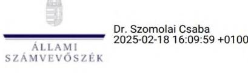

Dr. Szomolai Csaba
alelnök

---

# FÜGGELÉK: ÉSZREVÉTELEK 

A jelentéstervezetet a Számvevőszék 15 napos észrevételezésre megküldte az ellenőrzött szervezet vezetőjének az ÁSZ tv. 29. § (1) bekezdése előírásának megfelelően.

A jelentéstervezet kapcsán az ellenőrzött szervezetek közül a Pallas Athéné Domus Meriti Alapítvány, az OPTIMA Befektetési-, Ingatlanhasznosító és Szolgáltató Zrt., az OPTIMA Befektetési Alapkezelő Zrt., az ARCADIA Befektetési Alapkezelő Zrt. és az Optimum-Omega Ingatlanbefektetési Kft. tett észrevételt.

Az elfogadott észrevételek alapján az Állami Számvevőszék módosította a jelentéstervezetet.

A függelék tartalmazza a Pallas Athéné Domus Meriti Alapítvány, az OPTIMA Befektetési-, Ingatlanhasznosító és Szolgáltató Zrt, az OPTIMA Befektetési Alapkezelő Zrt., az ARCADIA Befektetési Alapkezelő Zrt. és az Optimum-Omega Ingatlanbefektetési Kft. észrevételeit, illetve az el nem fogadott észrevételek elutasításának indoklását.

[^0]
[^0]:    * 29. § (1) Az Állami Számvevőszék az ellenőrzési megállapításait megküldi az ellenőrzött szervezet vezetőjének vagy az általa megbízott személynek, és annak, akinek személyes felelősségét állapította meg.
    (2) Az ellenőrzött szervezet vezetője és a felelősként megjelölt személy az ellenőrzés megállapításaira tizenöt napon belül írásban észrevételt tehet.
    (3) Az Állami Számvevőszék az észrevételre a beérkezésétől számított harminc napon belül írásban válaszol. A figyelembe nem vett észrevételeket köteles a jelentésben feltüntetni, és megindokolni, hogy azokat miért nem fogadta el.

---

# Állami Számvevőszék 

Klinga László
igazgató részére

Tárgy: Észrevételek megküldése az Állami Számvevőszék jelentéstervezete vonatkozásában
Tisztelt Igazgató Úr!
Tisztelettel megkaptuk az Állami Számvevőszékről szóló 2011. évi LXVI. törvény (továbbiakban: „ÁSZ Tv.")
29. § (1) bekezdésében foglaltak alapján észrevételezés céljából a „Pallas Athéné Domus Meriti Alapítvány gazdálkodásának ellenőrzése" című számvevőszéki jelentés tervezetét.

Az ÁSZ Tv. 29. § (2) bekezdése alapján észrevételeinket az ellenőrzéssel érintett szervezetekkel együttesen terjesztjük elő és jelen levél mellékleteként megküldjük észrevételeinket az ellenőrzési megállapítások tekintetében.

Figyelemmel arra a tényre, hogy a jelen észrevételekhez csatolt mellékletek adattartalma olyan nagy méretű fájlokból áll össze, hogy azokat sem az E-papír rendszer, sem az e-mail szerverek nem tudják kezelni, azokat a következő (3 napig érvényes) letöltési linken keresztül adjuk át a tisztelt ÁSZ részére: https://we.ti/tkGmYuaYsl8 A megnyitáshoz szükséges jelszó: PadmE2025

Köszönettel vettük a tisztelt Igazgató úr és munkatársainak segítőkész hozzáállását az ellenőrzési eljárás során és a Pallas Athéné Domus Meriti Alapítvány („Alapítvány") részéről a továbbiakban is állunk bármely kérdés vagy észrevétel tisztázása érdekében a tisztelt Állami Számvevőszék („ÁSZ") munkatársainak szíves rendelkezésére.

Budapest, 2025. március 4.
Tisztelettel:
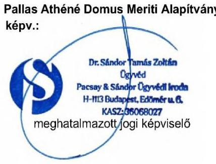

---

Észrevételek és kérelmek „A Pallas Athéné Domus Meriti Alapitvány gazdálkodásának ellenőrzése" című számvevőszéki jelentéstervezet vonatkozásában
szigorúan bizalmas!

---

# TARTALOMJEGYZÉK 

I. Bevezetés és kérelem ..... 4
I. 1 Kérelem záró megbeszélés tartásáról ..... 4
I. 2 Kérelem az eljárás felfüggesztésére ..... 5
I. 3 Kérelem a jelentés nyilvánosságának korlátozásáról ..... 6
II. Összegzés ..... 11
III. Részletes Észrevételek ..... 17
III. 1 Észrevételek az ellenőrzött időszak vonatkozásában ..... 17
III. 2 Az Összefoglalás megállapításaihoz tett észrevételek (jelentéstervezet 16-19. oldal) ..... 19
III. 3 Az 1. számú megállapításokhoz tett észrevételek (jelentéstervezet 20-31. oldal) ..... 44
III. 4 A 2. számú megállapításokhoz tett észrevételek (jelentéstervezet 32-56. oldal) ..... 51
III. 5 A 3. számú megállapításokhoz tett észrevételek (jelentéstervezet 56-58. oldal) ..... 60
IV. MellékleteK ..... 61
V. Definíciók ..... 62

---

# I. BEVEZETÉS ÉS KÉRELEM 

Tisztelt Igazgató Úr!
Az ÁSZ 2025. február 12. napi keltezéssel ellátott EL-3815-423/2025. iktatószámú levelében megküldött EL-3815-434/2025. iktatószámú jelentéstervezetében foglalt megállapításokra az ÁSZ Tv. 29. §
 (2) bekezdésében foglaltakra tekintettel az észrevételeinket az alábbiakban adjuk elő, amelyre tekintettel kérjük a tisztelt ÁSZ-t, hogy
(i) elsődlegesen az EL-3815/2025 hivatkozási szám alatt folyamatban lévő ellenőrzési eljárását felfüggeszteni szíveskedjék, illetve amennyiben arra a tisztelt ÁSZ nem lát lehetőséget
(ii) másodlagosan az EL-3815/2025 hivatkozási szám alatt folyamatban lévő ellenőrzési eljárását és jelentését az ellenőrzés alá vontaknál folyamatban lévő intézkedéseivel és annak várható hatásaival kiegészíteni szíveskedjék, illetve amennyiben a tisztelt ÁSZ erre sem lát lehetőséget,
(iii) harmadlagosan az EL-3815/2025 hivatkozási szám alatt folyamatban lévő ellenőrzési eljárásban a jelentéstervezetet felülvizsgálni és az alább kifejtettek szerint módosítani szíveskedjék.

Az alábbiakban kifejtettekre, valamint a jelentéstervezetben foglalt törvény által védett titokra tekintettel kérjük a tisztelt ÁSZ-t, hogy az EL-3815/2025 hivatkozási szám alatt folyamatban lévő ellenőrzési eljárásban készült jelentés nyilvánosságra hozatalát teljes egészében korlátozza, hogy az ne juthasson illetéktelen személy tudomására, és e védett adatok törvényben meghatározott védelme a hatóság eljárásában is biztosított legyen.

## I. 1 Kérelem záró megbeszélés tartásáról

Tekintettel a jelentésben foglalt gazdasági, üzleti és jogi információk összetettségére, valamint ezen információk jelentőségére tekintettel, illetve arra, hogy a tisztelt ÁSZ vizsgálatának megkezdését követően a jelentéstervezetben foglalt tényállás több tekintetben is jelentősen változott, valamint arra, hogy részben a jelentéstervezetben is javasolt intézkedések megtétele folyamatban van, ezért kérjük a tisztelt ÁSZ-t, hogy a vizsgálati eljárást ne zárja le, és a végleges vizsgálati jelentést ne adja ki. Kérjük továbbá, hogy a vizsgálati jelentés véglegesítését megelőzően (az ÁSZ Tv. 32. § (5) bekezdésére hivatkozással) biztosítson lehetőséget, hogy a feltárt tényeket, az ezeken alapuló megállapításokat, következtetéseket, valamint a folyamatban lévő intézkedéseket a felek záró megbeszélés keretében egyeztessék. Erre irányuló kérésünkre korábbi megbeszélések során a Tisztelt Ellenőrzésvezető Úr is vállalta, hogy lehetőséget biztosít.

A folyamatban lévő intézkedések (pl. pénzügyi, illetve társasági jogi konszolidációs eljárások) álláspontunk szerint érdemben kihatnak a jelentéstervezetben az ellenőrzés alá vont jogi személyek és szervezetek részére megfogalmazott intézkedési javaslatokra és a jelentéstervezetben megtett megállapításokra is.

A folyamatban lévő intézkedések eredményeképpen úgy véljük, hogy a jelentéstervezetben foglalt számos megállapítás a továbbiakban már okafogyott vagy módosítást igényel. Hasonló hatása van a folyamatban lévő intézkedéseknek a jelentéstervezetben foglalt intézkedési javaslatokra is.

---

Ezen folyamatban lévő intézkedések összetettsége és sokrétűsége meghaladja az írásbeli észrevételezés kereteit, így azok mélységükben való bemutatásához mindenképpen szükségesnek ítéljük a személyes megbeszélés megtartását.

# I. 2 Kérelem az eljárás felfüggesztésére 

Az ÁSZ Tv. 31.§-a értelmében: „Az Állami Számvevőszék elnöke az ellenőrzés során feltárt jogszabálysértő gyakorlat, illetve a vagyon rendeltetésellenes vagy pazarló felhasználásának megszüntetése érdekében ha jogszabály súlyosabb jogkövetkezmény alkalmazását nem írja elő - figyelemfelhívó levéllel fordulhat az ellenőrzött szerv vezetőjéhez."

Hasonlóképpen rendelkezik az Ász Tv. 33. § (1) bekezdése is az ellenőrzés alá vontak intézkedési kötelezettségéről. „Az Állami Számvevőszék az ellenőrzési megállapításait tartalmazó jelentését megküldi az ellenőrzött szervezet vezetőjének. Az ellenőrzött szervezet vezetője köteles a jelentésben foglalt megállapításokhoz kapcsolódó intézkedési tervet összeállítani, és azt a jelentés kézhezvételétől számított harminc napon belül az Állami Számvevőszék részére megküldeni."

A jelen eljárás eredményeképpen a jelentéstervezetében a tisztelt ÁSZ számos intézkedési javaslatot megfogalmazott az ellenőrzés alá vontakkal szemben. Ezen folyamatban lévő intézkedések egyike a jelen észrevétel érdemi részében foglalt pénzügyi konszolidáció, valamint a társasági jogi átszervezések.

Az Optima csoport átfogó pénzügyi konszolidáció megkezdéséről döntött, amely elkészítését követően lesz megállapítható az Optima csoport valós pénzügyi helyzete. A pénzügyi konszolidáció összetettsége okán legalább 6 hónapot vesz igénybe. Továbbá a jelentéstervezet különös hangsúlyt fektet az ellenőrzés alá vontak társasági jogi struktúrájára, valamint a döntéshozatali mechanizmusokra, így a tervezett konszolidációs folyamatok és intézkedések érdemi hatást gyakorolnak a jelentéstervezetben foglalt megállapításokra és intézkedési javaslatokra. Álláspontunk szerint ezen folyamatok lezárását megelőzően a tisztelt ÁSZ a jelentésében valós képet nem tud bemutatni, így az ellenőrzési eljárás nem zárható le.

Az ÁSZ Tv. az ellenőrzési eljárás felfüggesztését nem tiltja a konszolidációs folyamatok és intézkedések lezárultáig és megvalósulásáig. Ellenkezőleg, az eljárás felfüggesztése kifejezetten az ÁSZ Tv. 24.§ (1) bekezdésében foglalt, az ellenőrzésekkel szemben támasztott törvényi követelmények megvalósulását szolgálja. E körben különös hangsúllyal hivatkozunk az ÁSZ Tv. 24.§ (1) bekezdés d) és e) pontjaiban foglaltakra, amelyek értelmében: „Az ellenőrzésekkel szemben támasztott követelmények: [.] d) az ellenőrzések eredményeinek, a megállapításoknak alátámasztottnak, a következtetéseknek okszerünek és megalapozottnak kell lenniük, e) az ellenőrzéseket hatékonyan és eredményesen kell elvégezni." A jelen észrevétel érdemi részében meghivatkozott konszolidációs folyamatok lezárásának idejét 6 hónapra becsüljük, amely időszak az ellenőrzés hatékonyságára, alaposságára és teljességére, valamint a tisztelt ÁSZ további törvényi kötelezettségeinek teljesítésére semmilyen negatív hatást nem gyakorol, hanem azok teljesülését kifejezetten elősegíti.

Mindezekre tekintettel kérjük a tisztelt ÁSZ-t, hogy az EL-3815/2025 hivatkozási szám alatt folyamatban lévő ellenőrzési eljárását 6 hónapra felfüggeszteni szíveskedjen.

Vállaljuk, hogy a 6 hónapos felfüggesztési időszak lejártát megelőzően rendszeresen és részletesen tájékoztatjuk a tisztelt ÁSZ-t az általunk megtett intézkedésekről, valamint a konszolidációról és azoknak az ellenőrzés alá vontak működésére gyakorolt hatásáról, kifejezetten kitérve a jelentéstervezetben tett megállapításokkal, valamint az intézkedési javaslatokkal összefüggésben.

---

Meglátásunk szerint a folyamatban lévő intézkedések várható hatásai érdemben befolyásolják a jelentéstervezet megállapításait és intézkedési javaslatait, így indokolt az ellenőrzési eljárás fent hivatkozott felfüggesztése.

A folyamatban lévő intézkedések közül fontos kiemelni, hogy az ellenőrzés alá vont jogi személyek és szervezetek által megkezdett társasági jogi konszolidáció keretében az Optima Befektetési Zrt. („Optima"), illetve annak közvetett vagy közvetlen tulajdonában álló társaságok („Optima Csoport") átstrukturálják a döntéshozatali mechanizmusaikat, amelynek részeként egy centralizált irányítási testületet hoznak létre, megszüntetve a jelentéstervezetben kifogásolt párhuzamos hatásköröket. Álláspontunk szerint a társasági jogi konszolidáció által bekövetkező változás már önmagában közvetlenül orvosolja a jelentéstervezet azon megállapítását, miszerint a döntéshozatali struktúra átláthatatlan és nem hatékony.

Továbbá, a Neumann János Egyetemért Alapítvánnyal („NJEA") együttműködésben kidolgozás alatt lévő és véglegesítési szakaszban járó kötvényvisszaváltási megállapodás - amelynek hatálybalépése 2025. második negyedévében várható - tartalma és célzott eredménye a jelentéstervezetben kiemelt befektetési, gazdálkodási, szabályozási megállapításokra hivatott érdemben reagálni és az esetleges hiányosságokat kezelni, kiemelt tekintettel a kötvény likviditásának és hozamának összefüggéseire.

A fentiekben bemutatott intézkedések eredményei 6 hónapon belül minden bizonnyal mérhetővé válnak és lehetővé teszik, hogy az ÁSZ valós képet kapjon az ellenőrzés alá vontak - jelen észrevétel megtételekor már felülvizsgálat alatt álló - működéséről és intézkedésiről, így a tisztelt ÁSZ jelentése aktualizálttá és megalapozottá válhat az ÁSZ Tv. 24. § (1) bekezdés d) és e) pontjainak megfelelően, amely alapján (i) „az ellenőrzések eredményeinek, a megállapításoknak alátámasztottnak, a következtetéseknek okszerünek és megalapozottnak kell lenniük", továbbá (ii) „az ellenőrzéseket hatékonyan és eredményesen kell elvégezni."

# I. 3 Kérelem a jelentés nyilvánosságának korlátozásáról 

A tisztelt ÁSZ által készített jelentéstervezet számos törvény által védett információt és titkot tartalmaz, amelyek nyilvánosságra hozatalát törvény tiltja. E körben felhívjuk a tisztelt ÁSZ figyelmét arra, hogy ezen törvényi védelem elsődlegesen nem csak az ellenőrzés alá vont jogi személyeket védi, hanem az ellenőrzés alá vont jogi személyek befektetőit is.

Ezen törvényi védelem teljesülése érdekében a jelentés nyilvánosságra hozatalának korlátozását és tilalmát az ÁSZ Tv. is kifejezetten tartalmazza. Az ÁSZ Tv. 32.§ (3) bekezdése alapján ekként: „Az Állami Számvevőszék jelentése nyilvános. Törvény a nyilvánosságot minősített adatok védelme érdekében korlátozhatja. A nyilvánosságra hozott jelentés nem tartalmazhat minősített adatot vagy a törvény által védett egyéb titkot."

Hasonló korlátozást tartalmaz a 2011. évi CXII. törvény az információs önrendelkezési jogról és az információszabadságról („Info Tv.") 27. § (1) bekezdése is, amelynek értelmében: „A közérdekű vagy közérdekből nyilvános adat nem ismerhető meg, ha az a minősített adat védelméről szóló törvény szerinti minősített adat."

A fentieken túl általános jelleggel hivatkozunk még az általános közigazgatási rendtartásról szóló 2016. évi CL törvény 27.§ (2) bekezdésében foglaltakra: „A hatóság gondoskodik arról, hogy a törvény által védett titok és törvény által védett egyéb adat (a továbbiakban együtt: védett adat) ne kerüljön nyilvánosságra, ne juthasson illetéktelen személy tudomására, és e védett adatok törvényben meghatározott védelme a hatóság eljárásában is biztosított legyen."

---

Mindezekre tekintettel fel kívánjuk hívni a tisztelt ÁSZ figyelmét, hogy az ÁSZ tv. 32. § (3) bekezdése alapján a nyilvánosságra hozott jelentés nem tartalmazhat minősített adatot vagy a törvény által védett egyéb titkot. Tekintettel arra, hogy a jelentéstervezetben foglalt információk összessége törvény által védett titoknak minősül, így különösen üzleti titoknak, értékpapírtitoknak, valamint tőzsdei bennfentes információnak, ezért kérjük a tisztelt ÁSZ-t, hogy a végleges jelentés nyilvánosságát teljes mértékben korlátozza az alábbi indokokra tekintettel.

A részünkre megküldött jelentéstervezetben számos az ÁSZ Tv.-ben és az Info Tv.-ben hivatkozott, törvényi felhatalmazással védett titok található. E szerint, törvény által védett titoknak minősül - többek között - az üzleti titok, amelyről az üzleti titok védelméről szóló 2018. évi LIV. törvény („Ütvtv.") rendelkezik.

Az Útvtv. 1.§ (1) bekezdése alapján „üzleti titok a gazdasági tevékenységhez kapcsolódó, titkos - egészben, vagy elemeinek összességeként nem közismert vagy az érintett gazdasági tevékenységet végző személyek számára nem könnyen hozzáférhető -, ennélfogva vagyoni értékkel bíró olyan tény, tájékoztatás, egyéb adat és az azokból készült összeállítás, amelynek a titokban tartása érdekében a titok jogosultja az adott helyzetben általában elvárható magatartást tanúsítja."

Az Útvtv. szabályai alapján jelentéstervezetben foglalt információk közül üzleti titoknak, valamint bennfentes információnak minősül az Optima Csoport gazdasági tevékenységéhez, értékeléséhez, egyes gazdasági ügyleteihez tartozó információk összessége, valamint különösen az Optima Csoportba tartozó tőzsdén jegyzett társaságokra vonatkozó üzleti és gazdasági információk.

Az Útvtv. 6. § (1) bekezdése alapján az üzleti titokhoz füződő jogot megsérti, aki az üzleti titkot jogosulatlanul - a jogosult hozzájárulása nélkül - felfedi. Hangsúlyozni kívánjuk, hogy a jelentéstervezetben foglalt információk összessége üzleti titoknak minősül, illetve az üzleti titok jogosultja nem kizárólag az Optima Csoport, hanem az adott üzleti titok felett jogszerű ellenőrzést gyakorló személy, akinek a jogszerű gazdasági, pénzügyi, üzleti érdekeit az üzleti titokhoz füződő jog megsértése sértené. Minderre tekintettel az Útvtv. rendelkezései alapján a jelentéstervezetben foglalt üzleti titkok tekintetében minden jogosult jóváhagyására szükség lenne ezen információk nyilvánosságra hozatalát megelőzően, azonban még a jóváhagyás megadása esetén is szükséges vizsgálni az információk jellege miatt alkalmazandó egyéb vonatkozó jogszabályokat is.

A jelentéstervezet számos ponton megállapítást tesz az ellenőrzés alá vontak döntési mechanizmusával és döntéselőkészítésével kapcsolatosan. Hasonlóképpen, a jelentéstervezet számos intézkedési javaslatot megfogalmaz az ellenőrzés alá vontak részére az ellenőrzés alá vontak döntési mechanizmusával és döntéselőkészítésével kapcsolatosan. Az Info Tv. irányadó rendelkezései az adatok közérdekű megismerésével szemben nem csak egyes adatok tekintetében tartalmaz védelmet és rendelkezik korlátozásról vagy tilalomról. Az Info Tv. rendszerében a megismerésre vonatkozó igényel szemben védelem illeti meg, meghatározott
 feltételek mellett, a döntéselőkészítési mechanizmust, valamint az annak során keletkezett adatokat és döntéseket is.

Az előző bekezdésben foglaltakra figyelemmel az Info Tv. 27.§ (3) bekezdése értelmében: „A döntés megalapozását szolgáló adat megismerésére irányuló igény - az (5) bekezdésben meghatározott időtartamon belül - a döntés meghozatalát követően akkor utasítható el, ha az adat további jövőbeli döntés megalapozását is szolgálja, vagy az adat megismerése a közfeladatot ellátó szerv törvényes működési rendjét vagy feladat- és hatáskörének illetéktelen külső befolyástól mentes ellátását, így különösen az adatot keletkeztető álláspontjának a döntések előkészítése, illetve egyes bírósági eljárásokban való részvétele során történő szabad kifejtését veszélyeztetné."

---

Az ellenőrzés alá vont személyek az ellenőrzéssel érintett időszakban számos nagyértékű tranzakciót bonyolítottak le. Ezen tranzakciók tekintetében kiemelt volt a piaci érdeklődés, így akár eladói, akár vevői oldalon számos versenytárs jelent meg. A tranzakciók megkötését megelőzően, mint az egyes tranzakciók fő tárgyát képező vételár vagy ajánlati összeg meghatározása kiemelt jelentőséggel bír. Egy adott ajánlat megtétele vagy elfogadása számos szempont mérlegelését igényli. Ezeknek a szempontoknak a köre, valamint azok vizsgálati és elbírálási módjának nyilvánosságra kerülése olyan bennfentes információkhoz és üzleti titkokhoz juttathatja a versenytársakat, amelyek jelentősen korlátozhatják az érintett fél ajánlattételi és/vagy versenyzési képességeit, lehetőségeit.

A döntéselőkészítési mechanizmusok és a döntési pontok jelentéstervezet útján való nyilvánosságra hozatala ekként mind az ellenőrzés alá vontak, mind a befektetőik részére jelentős kárt okoz. A nemzetközi ingatlanpiaci versenyben az ellenőrzés alá vontak mind eladói, mind vevői oldalon lényegesen hátrányosabb pozícióba kerülnek, hiszen ismertté válik a versenytársak részére, hogy mely szempontok bírnak kiemelt jelentőséggel az ellenőrzés alá vontaknak, és azokat az ellenőrzés alá vontak miként értékelik. A hátrányosabb piaci pozíció közvetlen következménye, hogy az ellenőrzés alá vontak tranzakciós lehetőségektől eshetnek el, piaci megítélésük romlik, csak jelentősen hátrányosabb feltételekkel, illetve a vevői oldalon csak lényegesen magasabb, vagy eladói oldalon lényegesen alacsonyabb vételáron tudnak jogügyleteket kötni.

Mindezek alapján, tekintettel arra, hogy a jelentéstervezet számos ponton megállapítást és intézkedési javaslatot tesz az ellenőrzés alá vontak döntési mechanizmusával és döntéselőkészítésével kapcsolatosan, az ellenőrzés alá vontaknak, illetve befektetőiknek jelentős érdeke fűződik ahhoz, hogy a tisztelt ÁSZ a jelentéstervezet nyilvánosságra hozatalát mellőzze.

A kollektív befektetési formákról és kezelőikről, valamint egyes pénzügyi tárgyú törvények módosításáról szóló 2014. évi XVI. törvény („Kbftv.") 197.§ - 199. §-ban foglaltak alapján a befektetési alapkezelő a birtokába jutott üzleti titkot időbeli korlátozás nélkül köteles őrizni. A Kbftv. 197. § (2) bekezdésében foglalt kivétel a titoktartási kötelezettség alól a tisztelt Állami Számvevőszék felé áll fenn, azonban az üzleti titkok nyilvánosságra hozatala a Kbftv. szabályai alapján fennálló titoktartási kötelezettségbe ütközne, mivel az Optima Befektetési Alapkezelő Zrt.-re („Alapkezelő") mint befektetési alapkezelő járt és jár el az Optima Csoportba tartozó befektetések vonatkozásában, így a Kbftv. titoktartásra vonatkozó rendelkezései alkalmazandók az Alapkezelő vonatkozásában.

A befektetési vállalkozásokról és az árutőzsdei szolgáltatókról, valamint az általuk végezhető tevékenységek szabályairól szóló 2007. évi CXXXVIII. törvény 117. § (1) és (7) bekezdései alapján a befektetési vállalkozás és az árutőzsdei szolgáltató, a befektetési vállalkozásban és az árutőzsdei szolgáltatóban tulajdoni részesedéssel rendelkező, illetve vezető állású személy vagy bármely más személy, aki valamilyen módon birtokába jutott az üzleti titoknak, az üzleti titkot időbeli korlátozás nélkül köteles megőrizni. A titoktartási kötelezettség alapján az üzleti titok körébe tartozó tény, információ, megoldás vagy adat a befektetési vállalkozás felhatalmazása nélkül nem adható ki harmadik személynek, és feladatkörön kívül nem használható fel.

Összességében megállapítható, hogy a jelentéstervezet olyan, az Optima Csoport tulajdonában álló lengyel Globe Trade Centre S.A. („GTC") és svájci Ultima Capital S.A („Ultima") tőzsdén jegyzett társaságok értékeléséhez, működéséhez, eredményességéhez, valamint a társaságok csoportjához kapcsolódó gazdasági, üzleti információkat tartalmaz, amelyek nyilvánosságra hozatala a tőzsdén jegyzett társaságok részvényeinek árfolyamára jelentős hatást gyakorolna, ezért ezen információk tőzsdei bennfentes információnak minősülnek az Európai Parlament és a Tanács 596/2014/EU rendeletének 7. cikke alapján.

---

Kérjük továbbá a jelentéstervezet 11. oldalán feltüntetett szereplő magánszemélyek neveinek, mint személyes adatok feltüntetésének törlését a magánélet védelméről szóló 2018. évi LIII. törvényre hivatkozással.

E körben, a fentieken túl, figyelemmel arra, hogy az Optima Csoport tulajdonában álló lengyel GTC és svájci Ultima tőzsdén jegyzett társaságok, illetőleg, hogy az ellenőrzés alá vont jogi személyek között több alapkezelő is található hivatkozunk a tőkepiacról szóló 2001. évi CXX. törvény („Tpt.") titokvédelmi rendelkezéseire is. A Tpt. 369.§ (1) bekezdése értelmében: „Értékpapírtitok minden olyan, az egyes ügyfélről a befektetési alapkezelő, a kockázati tőkealap-kezelő, a tőzsde, központi értéktár, központi szerződő fél rendelkezésére álló adat, amely az ügyfél személyére, adataira, vagyoni helyzetére, üzleti befektetési tevékenységére, gazdálkodására, tulajdonosi, üzleti kapcsolataira, illetve a befektetési alapkezelővel, a kockázati tőkealap-kezelővel, a tőzsdével, a központi értéktárral, a központi szerződő féllel kötött szerződéseire, számlájának egyenlegére és forgalmára vonatkozik." A Tpt. 369.§ (1) bekezdése az értékpapírtitkot ekként törvény által védett titoknak minősíti.

A törvényileg védett titokminősítésre tekintettel a Tpt. 371. § (1) és (2) bekezdései ezért kifejezetten akként rendelkeznek, hogy az értékpapírtitok nyilvánosságra nem hozható:

- „(1) Aki üzleti vagy értékpapír-titok birtokába jut, köteles azt - törvény eltérő rendelkezése hiányában - időbeli korlátozás nélkül megtartani."
- „(2) A titoktartási kötelezettség alapján az üzleti, illetőleg az értékpapírtitok körébe tartozó tény, információ, megoldás vagy adat, az e törvényben meghatározott körön kívül - az ügyfél felhatalmazása nélkül - nem adható ki harmadik személynek és feladatkörön kívül nem használható fel."

A Tpt. értékpapírtitokra vonatkozó rendelkezéseire figyelemmel a jelentéstervezet egyéb okból sem hozható nyilvánosságra. A Tpt. 371.§ (3) bekezdése értelmében ugyanis „Aki üzleti titok vagy értékpapírtitok birtokába jut, azt nem használhatja fel arra, hogy annak révén saját maga vagy más személy részére közvetlen vagy közvetett módon előnyt szerezzen, továbbá, hogy a befektetési alapkezelőnek, a kockázati tőkealap-kezelőnek, a tőzsdének, a központi értéktárnak, a központi szerződő félnek vagy ezek ügyfeleinek hátrányt okozzon." Tekintettel arra, hogy az Optima meghatározó részvényes mindkét tőzsdén jegyzett társaságban (GTC, Ultima), ezért a jelentéstervezetben foglalt információk nyilvánosságra hozatala, figyelemmel a jelentéstervezet jelenlegi állapotára, az egyes megállapítások téves, valótlan vagy félrevezető voltára, ezen információk a lengyel GTC és svájci Ultima részvényeseinek lényeges hátrányt okozhatnak a jelentéstervezetnek az egyes részvényárfolyamokra gyakorolt potenciális negatív hatására figyelemmel. Ezen várható negatív hatások különösen arra tekintettel is károsak a részvényesek számára, hogy az ellenőrzés alá vontak számos intézkedést kezdeményeztek, amely intézkedések végrehajtása jelenleg is folyamatban van, és amely intézkedéseket, valamint azok hatását a jelentéstervezet nem tartalmazza.

Tekintettel arra, hogy az Optima meghatározó részvényes mindkét tőzsdén jegyzett társaságban (GTC, Ultima), ezért a jelentéstervezetben foglalt - üzleti titoknak és bennfentes információnak minősülő - információk nyilvánosságra hozatala jelentős piactorzító hatással bírna mind a svájci, mind pedig a lengyel tőzsdén, továbbá a tőzsdei társaságokhoz kapcsolódó üzleti információk nyilvánosságra hozatala mind az európai uniós (MAR rendelet), a svájci (svájci pénzügyi piaci infrastruktúráról szóló törvény, a svájci polgári törvénykönyv, svájci banki törvény), mind pedig a lengyel jogszabályokat (lengyel pénzügyi eszközökkel való kereskedésről szóló törvény, lengyel kereskedelmi törvény, valamint a lengyel nyilvános társaságokról szóló törvény) súlyosan sértené.

---

Fontos kiemelni, hogy a jelentéstervezet konkrét példákkal mutatja be (i) az Optima Csoport tulajdonában álló GTC lengyel tőzsdei társaság esetében a társaság múltbeli belső vállalati működési gyakorlatát, valamint (ii) az Ultima vonatkozásában egy folyamatban lévő részvényértékesítés és opciós jog (t.i. részvények tulajdonjogának átruházása) érvényesítés előkészítésének döntési mechanizmusait, beleértve ezek módszertanát és stratégiai szempontjait. Többek között ezen adatok a GTC és az Optima Csoport vonatkozásában is az Ütvtv. 1. § (1) bekezdése szerint üzleti titoknak minősülnek, mivel nem közismertek, és az Optima Csoport számára vagyoni értéket képviselnek. Továbbá a jelentéstervezet kitér az Ultima svájci tőzsdei társaság kapcsán a társaság részvényeinek bekerülési értékére, valamint ezek összefüggéseire a jelenlegi árfolyammal és a jövőbeli befektetési stratégiákkal. Ez az Európai Parlament és a Tanács 596/2014/EU rendelete (MAR rendelet) 7. cikke értelmében bennfentes információnak minősül, hiszen bármelyikük nyilvánosságra hozatala a részvényárfolyam jelentős változását idézheti elő. Az árfolyamváltozáson túl, ezen információk nyilvánossága a versenytársak számára előnyt biztosítana, miközben az ellenőrzés alá vontak és befektetőik érdekeit közvetlenül veszélyeztetné.

Tekintettel arra, hogy az Optima Csoport nem egyedüli befektető a jelentéstervezetben is bemutatott társaságokban, ezért a jelentéstervezetben foglalt információk nyilvánosságra hozatala súlyos versenyhátrányt okozna, illetve súlyosan sértené harmadik fél befektetők üzleti titkait, valamint üzleti érdekeit is. Továbbá az Optima Csoport folyamatban lévő tranzakciói vonatkozásában a jelentésben foglalt információk szintén üzleti titoknak minősülnek és azok nyilvánosságra hozatala hátrányos következményekkel járna az Optima Csoport, valamint harmadik fél befektetők számára.

Megjegyezzük továbbá, hogy a jelentéstervezetben foglalt megállapítások Magyar Nemzeti Bankot („MNB") érintő érintettsége miatt a jelentés nyilvánosságra hozatala akár súlyosan befolyásolhatja Magyarország nemzetközi megítélését és kormányközi kapcsolatait is, valamint Magyarország nemzetbiztonsági érdekét sértheti, kiemelt figyelemmel az ország törvényes rendjének védelmébe vetett bizalom megtörése esetén. E körben hivatkozunk az Info Tv. 27.§ (2) bekezdés e) pontjában foglaltakra is. Az Info Tv. 27.§ (2) bekezdés e) pontja alapján a közérdekű és közérdekből nyilvános adatok megismeréséhez való jog központi pénzügyi vagy devizapolitikai érdekből kifejezetten korlátozható.

Minthogy a jelentéstervezet utal az MNB-hez köthető entitások gazdálkodási és befektetési gyakorlatára, amelyek közvetlenül összefüggést látszatát kelthetik a forint árfolyamának stabilitásával és az ország pénzügyi védelmi képességével, a belső döntési mechanizmusokat és kockázatelemzéseket tartalmazó jelentéstervezet nyilvánosságra hozatala (akár teljes terjedelmében megállapításokkal és észrevételekkel, akár részben idézve vagy kivonatolva), növelheti a forint elleni spekulációs támadások kockázatát a devizapiacon, különösen egy olyan geopolitikai és gazdasági környezetben, amelyben Magyarország külső finanszírozási kitettsége jelentős. Továbbá az Optima Csoportot érintő befektetési gyakorlatok nyilvánosságra hozatala, az MNB közvetett befektetési stratégiájára vonatkozó adatok és eljárások kiszivárgását eredményezheti, amely alááshatná az ország gazdasági szuverenitását, így az Info Tv. 27. § (2) bekezdés e) pontja szerinti központi pénzügyi és devizapolitikai érdek sérelmét jelentené, az MNB-be vetett bizalom meggyengülése ezen túlmenően a magyar pénzügyi rendszer stabilitását is veszélyeztetné, amelynek előre nem látható következményei lehetnek a nemzetgazdaságra nézve.

A fentieken túl a jelentéstervezet tartalma és összképe alkalmas az Alapítvány alapítójába, azaz a Magyar Nemzeti Bankba vetett bizalom meggyengítésére, melynek előre beláthatatlan nemzetgazdasági következményei lehetnek.

A fent előadottakra, valamint a jelentéstervezetben foglalt törvény által védett titokra tekintettel kérjük a tisztelt ÁSZ-t, hogy az EL-3815/2025 hivatkozási szám alatt folyamatban lévő ellenőrzési eljárásban készült jelentés nyilvánosságra hozatalát teljes egészében korlátozza, hogy az ne

---

juthasson illetéktelen személy tudomására, és e védett adatok törvényben meghatározott védelme a hatóság eljárásában is biztosított legyen.

# II. ÖSSZEGZÉS 

A tisztelt
 ÁSZ jelentéstervezetére tett főbb észrevételeinket az alábbiakban összegezzük.

1) Ellenőrzött időszak
(i) Elöljáróban felhívjuk a figyelmet, hogy a tisztelt ÁSZ által meghatározott ellenőrzött időszak nincs összhangban a jelentéstervezet tartalmával. A jelentéstervezet megállapítja, hogy a 13. fókuszterületek vonatkozásában az ellenőrzött időszak a 2021-2023. évek és a 2023. beszámolók, ugyanakkor részletesen (és a valósággal ellentétes tényekre alapítva, valamint abból téves következtetésekre jutva) elemzi többek között a GTC 2020. év elején megvalósult megvásárlását, a tranzakcióhoz vezető döntéshozatal körülményeit és annak gazdasági hatásait. Ugyanígy a jelentéstervezet utal több 2024. és 2025. évben történt eseményre és döntésre is.
(ii) Minekután az ellenőrzött időszakon kívül eső megállapítások esetlegesek és nem tükröznek részletes vizsgálatot, hanem csak egyes kedvezőtlen színben feltüntetett körülmények kiragadására korlátozódnak, ezért a jelentéstervezet alkalmatlan arra, hogy teljes és valós képet mutasson gazdasági/vagyoni helyzetéről az ellenőrzött időszak vonatkozásában. Felhívjuk a figyelmet arra, hogy számos az Optima csoportot érintő belső és külső körülmény hatására például az ellenőrzött időszak legvégén, 2023 decemberében került sor az Ultima részvények Optima általi megszerzésére, és a valóságban az eredeti befektetés 2021. augusztusban valósult meg és annak formája egy hosszú lejáratú éves 12%-os kamatot biztosító kötvény volt. A jelentéstervezet ezt a körülményt meg sem említi elemzésében, holott a vizsgált időszak túlnyomó részében a befektetés formája kötvény volt.
2) Döntéselőkészítés megalapozottsága
(i) A tisztelt ÁSZ álláspontja szerint a kuratórium a döntéseit nem elegendő és mennyiségű információ és döntéselőkészítő anyagok birtokában hozta meg. Az Alapítvány kuratóriumának álláspontja ezzel szemben az, hogy általános eljárás volt, hogy a kuratórium formális döntéshozatalait minden esetben többszöri informális telefonos és személyes egyeztetések, telefonkonferenciák előzték meg, amelyek során a kuratórium tagjai egyeztethették felvetéseiket egymással és az Optima vezetőségével. Az Alapítvány kuratóriumának tagjainak szakmai múltja és felkészültsége alapján sem valószínűsíthető a tisztelt ÁSZ által bemutatott formális szerep.
(ii) Az Alapítvány az Optima szervezetét pont annak céljából hozta létre, hogy a befektetési döntések megalapozott előkészítése, a jogszerű és hatékony működés biztosított legyen. Az Alapítvány kuratóriumában a befektetési döntések részletes elemzéséhez nincs kellő humán erőforrás, mindaz az Optima szervezetében koncentrálódik.
3) Befektetések és befektetési struktúra kialakítása

---

(i) A tisztelt ÁSZ a jelentéstervezetben többször viszonyítja az Optima Csoport befektetéseit a magyar állampapírokba történő befektetések kockázati szintjéhez. Fel kívánjuk hívni a figyelmet, hogy az Alapítvány a befektetéseit az alapítását közvetlen követően állampapírban tartotta, azonban az Európai Központi Bank („EKB”) 2015-ös jelentésében megállapította, hogy a „Magyar Nemzeti Banknak is biztosítania kell, hogy azokat a jegybanki forrásokat, amelyeket átruházott az alapítványai hálózatára, ne használják - közvetlenül vagy közvetve - állami finanszírozási célokra.” Az EKB álláspontja szerint az alapítványoknak átadott jegybanki források állampapírba történő befektetése tiltott monetáris finanszírozásnak minősül, ezért többször felszólította az MNB-t, hogy a nemzeti bank által alapított alapítványok tekintetében ezt a gyakorlatot szüntesse meg. Ezt követően született meg az a döntés, hogy ezért az állampapírokban történő befektetés helyett az Alapítvány jövedelemtermelő eszközökbe fektesse vagyonát.
(ii) Az Optima befektetési portfóliójának főbb elemei az ellenőrzött időszakban a lengyel tőzsdén jegyzett GTC, az Alpine kötvények, valamint a Budapesti Metropolitan Egyetem voltak. Ezen diverzifikált portfolió biztosította az Optima és az Alapítvány számára kiszámítható hozamot az Alapítvány céljainak megvalósítása érdekében. A Budapesti Metropolitan Egyetem nem csak az Optima befektetése, hanem egy vezető nemzetközi oktatási intézmény, amely közvetlenül is hozzájárul az alapítványi célok megvalósításához.
(iii) A tisztelt ÁSZ megállapítása szerint az Optima egy lényegében átláthatatlan, a valós vagyon értékelését ellehetetlenítő cégstruktúrát hozott létre. Ezzel szemben az Optima célja éppen egy olyan befektetési struktúra kialakítása volt, amely által átlátható, transzparens és szabályozott környezetet teremt a befektetései végrehajtása és vagyona védelme érdekében. A befektetési struktúra kialakítását alapos szakmai megfontolások indokolták, különös tekintettel a nemzetközi tranzakciók hatékony lebonyolítására, a befektetések optimális kezelésére és a külföldi értékpapír-piaci előírásokra is. A befektetési struktúra jogszerű kialakításában nemzetközi tanácsadók (pl. DLA Piper, EY, BDO, stb.) működtek közre.
(iv) Felhívjuk a figyelmet, hogy a tisztelt ÁSZ Optima Csoport átláthatatlanságát hangsúlyozó álláspontja szembemegy a Magyar Kormány magántőkealapokkal és befektetési alapokkal kapcsolatosan mindenkor képviselt álláspontjával és alapvetően a nemzetközi kritikákat ismétli. Ezzel szemben álláspontunk az, hogy a nemzetközi befektetési gyakorlatban teljesen megszokott és elfogadott a többszintű holding- és alapstruktúrák alkalmazása, amely számos előnnyel jár mind működési, mind befektetési (és számos esetben adózási) szempontból. A befektetési alapok, illetve magántőkealapok működése, gazdálkodása, illetve beszámolási kötelezettsége részletesen szabályozott mind a magyar, mind pedig az európai uniós jogban. Ezen alapok működését az MNB felügyeli, amely többletgaranciát nyújt a vagyon védelme és átláthatósága érdekében.
4) Főbb befektetésekre tett megállapítások

Globe Trade Centre S.A.
(i) Az ÁSZ jelentéstervezetében előadta, hogy a GTC részvénycsomag megvásárlása túlzott kockázatot jelentett 2020-ban, valamint az ÁSZ az üzleti döntés gazdasági indokoltságát nem tudta azonosítani. Mindazonáltal a lengyel tőzsdén jegyzett GTC a közép-kelet-európai régió

---

vezető ingatlanbefektető és -fejlesztő társasága és a piac egyik meghatározó szereplője. A döntés gazdasági indokoltságát támasztotta alá többek között, hogy a GTC bruttó eszközértéke meghaladja a 2,7 milliárd eurót és rendkívül széleskörű ingatlanportfolióval (lakó, iroda, üzletközpont) rendelkezik Lengyelországban, Magyarországon, Szerbiában, Romániában, Horvátországban és Bulgáriában. A GTC portfóliója mind földrajzi, mind pedig ingatlanállománya szempontjából is kellően diverzifikált, ezáltal a jövedelemtermelő képességet hosszútávon tudja biztosítani.
(ii) Az ÁSZ álláspontja szerint az Alapítvány kuratóriuma a GTC befektetésre vonatkozó döntését rövid idő alatt, nem kellően alátámasztott döntéselőkészítő anyagok birtokában hozta meg. Ezzel szemben a valóság az, hogy a GTC többségi, irányítást biztosító részvénycsomagjának Optima általi megvásárlásának előkészítését - a hasonló nemzetközi ügyleteknél szokásos módon - hosszú, több évig tartó előkészítés előzte meg. A döntés során rendelkezésre állt a PwC és a Schönherr, másrészről a Jones Lang LaSalle („JLL”), Andersen Tax, Impact Advisory és a Dentons jelentése is. Az Optima Csoport a JLL nemzetközileg elismert értékbecslő társaságot bízta meg a GTC ingatlanportfóliójának értékelésével, amely a Globe Trade Centre S.A., illetve annak közvetett vagy közvetlen tulajdonában álló társaságok („GTC Csoport”) minden ingatlanját bejárta, külön értékelte, megvizsgálta az egyes ingatlanok jövedelemtermelő képességét és erről átfogó vagyonértékelési jelentést készített a hasonló méretű tranzakcióknál szokásos módon. A tranzakció tekintetében a felek szavatossági biztosítást (ún. warranty insurance) is kötöttek, ezáltal tovább erősítve az Optima Csoport mint vevő érdekeit, így amennyiben az eladó megsértette volna bármely szavatosságvállalását, akkor ezért a biztosító áll helyt az Optima felé. Megjegyezzük, hogy a tisztelt ÁSZ jelentéstervezetében foglaltakkal ellentétben nem a Dentons közvetítette az üzleti lehetőséget az Optima részére, a Dentons (a belső előterjesztés félreérthető megjegyzése ellenére) kizárólag az Optima képviseletében eljáró tanácsadóként vett részt a tranzakcióban.
(iii) A tranzakciót megelőzően az átvilágítás során több ezer dokumentum került részletesen átvizsgálásra és elemzésre, valamint az ügylet előkészítése során számos megalapozó és kockázatelemző elemzés készült. A több ezer oldalas tranzakciós dokumentáció hónapokon keresztül került tárgyalásra és véglegesítésre a felek között. Mindezek alapján az Alapítvány kuratóriuma a tisztelt ÁSZ állításaival szemben megalapozott döntést tudott hozni a tranzakcióról az előkészítés időtartamára, illetve az előkészítő anyagok mennyiségére és minőségére tekintettel.
(iv) Határozottan elutasítjuk a tisztelt ÁSZ azon megállapítását, hogy az Optima Csoport a GTC tranzakciót magántőkealap létrehozása útján kívánta volna eltitkolni a nyilvánosság elől. Az Optima Csoport éppen ellenkezőleg járt el, és a tranzakciót követően haladéktalanul - mind a mai napig nyilvános - sajtóközleményt jelentett meg a honlapján, amelyet a magyar és nemzetközi sajtó is átvett. Továbbá a GTC SA hivatalos honlapján is több „current report” került közzétételre e tárgykörben. A GTC akvizícióval kapcsolatosan már csak azért sem volt és nem is lehetett cél a nyilvánosság elől történő eltitkolása, mivel a tranzakciós eljárás zárása érdekében öt országban nyilvános versenyhivatali eljárás lefolytatására volt szükség, az összes finanszírozó bank jóváhagyását be kellett szerezni, valamint az Optima a lengyel tőzsdén nyilvános ajánlattételi eljárás lefolytatására is köteles volt. A lengyel tőzsdei szabályok szerint a tranzakció megvalósítása szigorú közzétételi kötelezettségekkel járt együtt, amelyet az Optima Csoport minden esetben teljesített.

---

(v) A tisztelt ÁSZ jelentéstervezetében a GTC valós piaci értékét leegyszerűsítve kizárólag a tőzsdei közkézhányad részvényárfolyamhoz köti. Ezen megközelítés azonban téves és szakmailag nem megalapozott, mivel a hasonló tőzsdén jegyzett ingatlancégek valós értékét nem a tőzsdei árfolyam, hanem a társaság nettó eszközértéke, ún. EPRA NAV értéke mutatja. Az EPRA NAV mutatót az Európai Tőzsdén Jegyzett Ingatlan Társaságok Szövetsége kifejezetten az ingatlanbefektetési vállalatok valós nettó eszközértékének meghatározására dolgozta ki. 2020. márciusában a GTC tekintetében megállapított EPRA NAV érték részvényenként meghaladta a 11,3 lengyel zloty-t, amely közel az akkori tőzsdei részvényárfolyamának kétszerese volt.
(vi) Felhívjuk a figyelmet, hogy az Optima tulajdonszerzését követően az új menedzsment stratégiai döntése alapján a GTC 2021 első félévében Fitch Ratings értékelést is szerzett. A Fitch Ratings olyannyira pozitív értékelést állapított meg 2021-ben, hogy a GTC a vállalati hiteleit 2,25%-os zöldkötvény kibocsátása útján refinanszírozni tudta, amely jól tükrözte a piac pozitív értékítéletét is. A nemzetközi minősítők 2022-től az ingatlanfejlesztő cégek jelentős részét leminősítették, azonban a GTC minősítését a Fitch Ratings - a közép-kelet-európai ingatlanpiaci szereplők közül az egyik utolsóként - 2023. szeptemberében változtatta csak meg. Ez azonban nem egyedi döntés volt, hanem követte a teljes ingatlanpiac leértékelését.
(vii) A GTC értékét jól mutatja, hogy az Optima az elmúlt években több alkalommal kapott vételi ajánlatot a GTC részvénycsomag vonatkozásában. Ezen ajánlatok jelentősen meghaladták a tisztelt ÁSZ által - leegyszerűsített módszertant alkalmazva - megállapított vállalati értéket. Megjegyezzük, hogy a GTC kisebbségi befektetői között intézményi befektetők (Allianz, lengyel nyugdíjalap, stb.) is jelen vannak jelentős 10% körüli részvénycsomaggal. Ezen befektetők a részvényeiket többszöri megkeresés ellenére sem kívánták eladni, ami jól szemlélteti az intézményi befektetők GTC-be vetett töretlen bizalmát az iparágat érintő negatív hatások ellenére is.

# Ultima Capital S.A.

(viii) Az Optima Csoport másik jelentős befektetése az ellenőrzött időszakban a svájci tőzsdén jegyzett Ultimához kapcsolódó Alpine kötvények. Azonban a tisztelt ÁSZ nem vette figyelembe a jelentéstervezetében, hogy a vizsgált időszakban az Ultima befektetés 12%-os éves hozamot biztosító kötvény formájában valósult meg, amely 2023 végén került társasági részesedésre átváltoztatásra számos az Optima csoportot érintő belső és külső körülmény és megfontolás hatására. 2024 végétől egy ciprusi tőzsdén jegyzett szakmai nagybefektetővel működik együtt, amellyel az Ultima befektetés növekvő pályára állt. A befektetés értékét támasztja alá, hogy az Optima Csoport eladási joggal rendelkezik az Ultima részvényei felett, amely alapján 2029-től 105 svájci frankos részvényárfolyamon bármikor értékesíteni tudja a befektetését.
(ix) A tisztelt ÁSZ
 a jelentéstervezetében rögzíti, hogy az Ultima befektetés kapcsán 2025. június 30-ig 80,5 Mrd esedékes kötelezettsége áll fenn az Optimának. Ezzel szemben azonban tényként megállapítható, hogy 2025-ben egyáltalán nem merül fel esedékes fizetési kötelezettsége az Optima Csoportnak az Ultima befektetéssel kapcsolatosan. Ezzel szemben az Ultima részesedés a stratégiai befektetővel megkötött szindikátusi szerződés alapján (mintegy 5-10 millió svájci frank minimum osztalék) éves garantált hozamot biztosít az Optima Csoport részére, amely tovább erősíti az Optima Csoport likviditási helyzetét.
5) Az NJEA által lejegyzett 2031-es lejáratú Optima kötvényekre tett megállapítások

---

(i) A tisztelt ÁSZ a jelentéstervezetében kiemelte, hogy az Optima Csoport az NJEA felé azt a látszatot keltette, hogy a befektetései likvidek, és az NJEA által lejegyzett kötvényekre vonatkozó visszaváltási kötelezettséget az Optima nem tudja teljesíteni. Ezzel szemben megállapítható, hogy mindenki számára nyilvánvaló volt, hogy a kötvények 2031-es lejáratúak, és a felek szándéka elsősorban hosszútávú befektetés volt. A 2021-es kötvényjegyzés időszakában a kötvény feltételei (éves 2,5%-os kamat) mind a kibocsátónak, mind pedig a kötvényjegyzőnek előnyösnek számítottak. Az érintett időszakban a növekedési hitelek is alacsonyabb kamatot biztosítottak.
(ii) A tisztelt ÁSZ jelentésében rögzíti, hogy a kötvények teljes összeg szerinti kiegyenlítésére nem mutatkozik esély. A tisztelt ÁSZ megállapításával szemben az Optima folyamatosan törekszik a kötvényvisszaváltás mielőbbi megoldására, valamint a tárgyalások során az Optima mindvégig transzparens módon feltárta a valós helyzetét. A kötvények visszaváltása érdekében az Optima több alkalommal ajánlatot tett az NJEA részére a megállapodás mielőbbi megkötése érdekében. Az Optima és az NJEA között tárgyalói szinten megállapodásra került sor a kötvények rendezése tárgyában, melynek főbb feltételei: (i) mintegy 10 Mrd Ft kamatprémium és kamatkötelezettség, valamint további mintegy 42 m Ft késedelmi kamat megfizetése 2025. május 15. napjáig, (ii) 12 Mrd forint készpénz (és annak 4,5%-os kamatainak) megfizetése 2026. május 15. napjáig, (iii) a GTC mintegy 80 Mrd forint értékű 18,87%-os részesedésének átruházása a megállapodást követően haladéktalanul oly módon, hogy az Optima eladási joggal biztosítja, hogy az NJEA a részvényeit négy év alatt, évente 20 Mrd Ft összegben értékesíteni tudja az Optima részére, (iv) Campus II beruházást az Optima teljeskörűen befejezi és kulcsrakész állapotban átadja a tulajdonjogát az NJEA részére mintegy 35 Mrd Ft értékben.
6) Az Alapítvány által lejegyzett Optima 2040/A jelű Optima kötvényekre tett megállapítások
(i) A tisztelt ÁSZ jelentéstervezetében többször hangsúlyozza, hogy a számviteli szabályok alapján az Alapítvány beszámolóiban az Optima által kibocsátott és az Alapítvány által lejegyzett 2040/A kötvénynek („Optima Kötvény”) könyv szerinti értéke nem tükrözte a befektetés tényleges értékét és értékvesztés elszámolása lett volna indokolt. Mindazonáltal a jelentéstervezetben a tisztelt ÁSZ erre vonatkozó állításait nem támasztja alá sem szakmai, sem pedig számszaki szempontból. A jelentéstervezet csupán egy egyszerűsített értékelési módszertan alkalmazását javasolja, amely teljesen figyelmen kívül hagyja az Optima Csoport robosztus eszközértékét. Erre tekintettel a jelentéstervezet állításai félrevezetőek és megalapozatlanok.
(ii) Az Optima által kibocsátott kötvények értékelése mindenkor a hatályos számviteli szabályokkal összhangban történt, és az Alapítvány álláspontja szerint értékvesztés elszámolása az Optima Kötvény alapján nem indokolt. Megjegyezzük, hogy azonban jelenleg folyamatban van az Optima csoportba tartozó társaságok könyvvizsgálata és számviteli konszolidációja, amely a cégcsoport valós értékének megállapítását jelentősen egyszerűsíteni és segíteni fogja. Álláspontunk szerint az auditált konszolidált mérleg elkészítéséig a jelen vizsgálatot lezárni nem lehet, minekután csak az tud teljesen megbízható és pontos képet adni az Optima vagyoni helyzetéről.

---

# 7) Egyedi szerződésekre tett megállapítások 

A jelentéstervezet utalást tesz a GTC tranzakcióval kapcsolatosan az Optima által a B.H. Ventures Kft.-vel és a Prime Kft.-vel kötött egyes megállapodásokra. Felhívjuk a figyelmet, hogy az elmúlt időszakban az Optima új menedzsmentje ezen szerződéseket az Alapítvány felügyelőbizottságának javaslatára felülvizsgálta, amelyet követően a szerződő felekkel külön-külön megállapodást kötött a szerződéses kapcsolat rendezése érdekében. A megállapodás eredményeképp – bár a felek álláspontja szerint jogsértés nem történt – a korábban megfizetett díjak összege teljes mértékben visszafizetésre kerül az Optima részére. A fentiek miatt ezen megállapítás okafogyottá vált és kérjük a tisztelt ÁSZ-t, hogy a megállapítást törölje jelentéstervezetéből.

## 8) Következtetés

A fent előadottak alapján megállapítható, hogy az ÁSZ által meghatározott ellenőrzött időszak és a jelentéstervezetben foglalt megállapítások nincsenek összhangban. A legtöbb állítás 2023 végét követően megvalósult eseményeken alapul, amelyek valós értékelését a jelentéstervezet meg sem próbálta elvégezni. Minderre tekintettel a jelentéstervezet megállapításainak jelentős része megalapozatlan és a kapcsolódó elemzések felületesek és félrevezetőek.

Amennyiben a tisztelt ÁSZ az Optima Csoport jelenlegi állapotára és értékére kíván következtetéseket megállapítani, akkor a vizsgálati időszakot ki kell terjesztenie a 2020-tól 2025-ig tartó időszakra. Amennyiben a vizsgálati időszak nem kerül kiterjesztésre, abban az esetben az ellenőrzött időszakon túlmenő megállapítások tekintetében a jelentéstervezet fontos dokumentumokat és jelentős tényállításokat nélkülöz, és ezáltal annak tartalma valótlan és félrevezető. Mindezek alapján úgy látjuk, hogy a számvevőszéki ellenőrzést jelen helyzetben lezárni nem lehet, szükséges az ellenőrzött időszak és ezáltal a jelentéstervezet átfogó felülvizsgálata. Mindazonáltal az Alapítvány és az Optima Csoport természetesen nyitott az aktív közreműködésre és készen áll további dokumentáció rendelkezésre bocsátásával segíteni a vizsgálat eredményes lefolytatását és lezárását.

Az Alapítvány igyekszik a lehető legteljesebb körben levonni a tisztelt ÁSZ vizsgálati jelentésében foglalt megállapítások tanulságait. Az Alapítvány álláspontja bár teljes mértékben eltér az ÁSZ által tett megállapításoktól és azokat vitatja, azonban az Alapítvány igazgatója megtette a szükséges intézkedéseket a jelentés tárgyát képező megállapítások átfogó vizsgálata érdekében. Ennek céljából az Alapítvány belső vizsgálat megindítását rendelte el elismert közgazdász és jogász szakemberek bevonásával.

---

# III. RÉSZLETES ÉSZREVÉTELEK 

Részletes észrevételeinket a tisztelt ÁSZ jelentéstervezetének egyes fejezeteiben foglalt megállapítások tekintetében az alábbiakban terjesztjük elő:

## III. 1 Észrevételek az ellenőrzött időszak vonatkozásában

A tisztelt ÁSZ az ellenőrzött időszakot az alábbiakban határozta meg jelentésének tervezetében:
„Az 1-3. fókuszterület vonatkozásában 2021-2023. évek, a 2023. évi beszámolók és az NJE Alapítvány által lejegyezett OPTIMA 2031 és OPTIMA 2031B kötvények ellenőrzése kapcsán 2024. június 30-ig,
az Optimum-Alfa Ingatlanbefektetési Kft., az Optimum-Delta Ingatlanbefektetési Kft., a Kasselik-Ház Ingatlanfejlesztő Zrt. és a V168 FM Kft. esetében a 2021.01.01-2023.10.31., az Infopark H Építési Terület Kft. esetében 2023.11.23-2023.12.31. közötti időszak,
a 4. fókuszterület vonatkozásában az MNB-Ingatlan Kft. (ellenőrzött időszakban: Optimum-Penta Ingatlanbefektetési Kft. néven) esetében: 2018.01.01-2019.05.30.; az Optimum-Gamma Ingatlanbefektetési Kft. esetében: 2017.01.01-2020.05.10., az Optimum-Omega Ingatlanbefektetési Kft. esetében: 2018.01.01-2022.02.27. időszak, valamint az Alapítvány ingatlanbeszerzései tekintetében 2014-2020. évek.”

A tisztelt ÁSZ által meghatározott ellenőrzött időszak az 1-3. fókuszterületek vonatkozásában nincs összhangban a jelentéstervezet tartalmával. A jelentéstervezet megállapítja, hogy az 1-3. fókuszterületek vonatkozásában az ellenőrzött időszak a 2021-2023. évek és a 2023. beszámolók, ugyanakkor részletesen (és a valósággal ellentétes tényekre alapítva, valamint abból téves következtetésekre jutva) elemzi többek között a GTC 2020. év elején megvalósult megvásárlását, a tranzakció döntéshozatal körülményeit és annak gazdasági hatásait. Ugyanígy a jelentéstervezet utal több 2024. és 2025. évben történt eseményre és döntésre is, amelyeket példálózó jelleggel az alábbiakban emelünk ki:
(i) „A legutóbbi, 2024. novemberi Fitch Ratings a GTC S.A. jövőbeli minősítésének kilátásait a rövid távú likviditási kockázatok és a nagyértékű adósságállomány miatt stabilról negatívra változtatta.”
(ii) „A GTC S.A. részvény tőzsdei árfolyama a vásárlást követően drasztikusan csökkent, a bekerülési értékhez viszonyítva több mint 50%-kal, a 2024. év végére tartósan 4 PLN alá esett. A megvásárolt részvénycsomag 2024. év végi tőzsdei árfolyam alapján számított értéke 162 Mrd Ft-tal csökkent.”
(iii) „Az OPTIMA csoport másik jelentős külföldi befektetése, az Ultima Capital S.A. társaság tőzsdei részvényárfolyama szintén csökkenő trendben változott, 2024. december 30-án 88 CHF volt, ami a részvényenkénti 109,91 CHF bekerülési árhoz képest 20%-os csökkenést jelentett.”
(iv) „A 2024. év végi likviditási helyzetet értékelő belső ellenőrzési jelentés szerint, elsősorban az Ultima Capital S.A. kapcsán 2025. június 30-ig további olyan jelentős kiadások merülnek majd fel, melynek eredményeképpen 80,5 Mrd Ft likviditási hiány prognosztizálható. Szintén a likviditási helyzet súlyosságát jelzi az Alapítvány felügyelőbizottságának 2025. január 18-án kelt, az MNB elnökének címzett levele, melyben a felügyelőbizottság elnökének értékelése szerint „az Alapítvány cél szerinti működése és fizetőképessége közvetlen veszélyben van.”

---

(v) „Az Alapítvány a kötvényt bekerülési értéken tartotta nyilván, azonban a 2024. évben akár 150 Mrd Ft értékvesztés elszámolása lett volna indokolt.”
(vi) „Az Alapítvány a jelzett anomáliákat annak ellenére nem ismerte el, hogy a Kuratórium 2024. április 25-én Reorganizációs tervet fogadott el, mivel az OPTIMA Befektetési Zrt. tájékoztatása szerint a várható kötelezettségeinek nem fog tudni eleget tenni.”
(vii) „Az ÁSZ jelzését követően, 2024. májusban az MNB elnöke vizsgálatokat rendelt el, melyek eredményéről 2024. decemberben tájékoztatta az ÁSZ elnökét.”
(viii) „A tájékoztatás szerint az Alapítvány által elfogadott Reorganizációs terv és a 2024. évi költségvetés éles ellentétben áll az elmúlt években teljesített éves alapítói tájékoztatásokban foglaltakkal, ezért az MNB igazgatósága több alkalommal kért információkat az Alapítvány Kuratóriumától, illetve döntött soron kívüli felügyelőbizottsági vizsgálatok elrendeléséről.”
(ix) „2024-ben a kedvezőtlen folyamatok tovább folytatódtak, ennek következtében a kötvény könyv szerinti és tényleges piaci értéke közötti veszteségjellegű különbség akár 150 Mrd Ft is lehetett.”
(x) „A GTC S.A. részvény tőzsdei árfolyama 2024. december 30-án 3,89 PLN volt, ami a darabonként bekerülési árhoz képest közel 55%-os csökkenést jelent, a részesedés tőzsdei árfolyam alapján számított értéke 394,5 M EUR-ral (162 Mrd Ft-tal) csökkent.”
(xi) „2020. decemberében az Optima Befektetési Zrt. bizonyos GTC S.A. eszköz adásvételi tranzakciók utáni jutalék kifizetésre kötött megállapodásokat a B.H. Ventures Kft-vel és a PRIME Kft-vel, melyek alapján 2020. és 2021. években mindösszesen 3,0 Mrd Ft összegben teljesített kifizetéseket.”

Minekután az ellenőrzött időszakon kívül eső megállapítások esetlegesek és nem tükröznek részletes vizsgálatot, hanem csak egyes kedvezőtlen színben feltüntetett körülmények kiragadására korlátozódnak, ezért a jelentéstervezet alkalmatlan arra, hogy teljes és valós képet mutasson az Optima csoport működése, illetve vagyoni viszonyait illetően az ellenőrzött időszak vonatkozásában.

Felhívjuk a figyelmet arra, hogy például az ellenőrzött időszak legvégén, 2023 decemberében került sor az Ultima részvények Optima általi megszerzésére, és a valóságban az eredeti befektetés 2021. augusztusban valósult meg és annak formája egy hosszú lejáratú, éves 12%-os kamatot biztosító kötvény volt. A jelentéstervezet ezt a körülményt meg sem említi elemzésében, holott a vizsgált időszak túlnyomó részében a befektetés formája kötvény volt.

A tisztelt ÁSZ továbbá számos olyan eseményt nem vesz figyelembe a jelentéstervezetében mind a vizsgált időszakban, mind azon kívül, amely jelentősen meghatározza az Optima Csoport gazdálkodását, így ezen információk és események megjelenítése és mérlegelése nélkül valós kép nem mutatható. Az ÁSZ a jelentéstervezetében figyelmen kívül hagyja az ellenőrzött időszakban megvalósult alapítványi támogatásokat és közhasznú tevékenységeket, valamint nem
 veszi figyelembe, hogy az Optima a Magyar Kormány stratégiájával összhangban végezte el a külföldi ún. kifektetéseit. Továbbá a tisztelt ÁSZ értékelése során nem vette figyelembe a GTC befektetéssel kapcsolatos főbb eseményeket sem, amelyeket a jelen dokumentum III.2.7 pontjában részletesen ismertetünk.

---

# III. 2 Az Összefoglalás megállapításaihoz tett észrevételek (jelentéstervezet 16-19. oldal) 

## III.2.1 A jelentéstervezet 16. oldalának 3. bekezdése rögzíti, hogy

„Az OPTIMA Befektetési Zrt. befektetései finanszírozására az Alapítvány által lejegyzett kötvényen (279,1 Mrd Ft) túl további forrásokat - a Neumann János Egyetemért Alapítvány (NJE Alapítvány) által lejegyzett kötvényeket (127,5 Mrd Ft) és banki hitelt (170 M EUR) - is bevont. A forrásbevonások eredményeként az OPTIMA Befektetési Zrt. közel 500 Mrd Ft - jelentős részben (407 Mrd Ft) közpénzből származó vagyonnal való gazdálkodásáért volt felelős."

A tisztelt ÁSZ megállapításával szemben tényként megállapítható, hogy az MNB mint Alapító 2014-ben 266,4 Mrd Ft vagyonjuttatást nyújtott a Pallas Athéné Alapítványok részére, valamint az NJEA 127,5 Mrd Ft összegben jegyzett le Optima által kibocsátott kötvényeket, így mindösszesen 393,9 Mrd Ft közpénzből származó vagyonnal való gazdálkodásért felelős az Optima. A jelentéstervezetben foglalt 407 Mrd Ft és a tényleges 393,9 Mrd Ft közötti különbség abból ered, hogy a 266,4 Mrd Ft összegen felül az Alapítvány további 12,7 Mrd Ft összegű Optima kötvényt jegyzett le, amelynek forrása az Optima Csoport gazdálkodásából eredő eredményből származott, amely ismételten befektetésre került az Optima Csoportba.

## III.2.2 A jelentéstervezet 16. oldalának 3. bekezdése rögzíti, hogy

„A befektetéseket az OPTIMA Befektetési Zrt. egy lényegében átláthatatlan, a valós vagyon értékelését szinte ellehetetlenítő, közvetlen vagy közvetett tulajdonában álló gazdasági társaságok és magántőkealapok által alkotott cég- és befektetési struktúrán (OPTIMA csoport) keresztül hajtotta végre. Az OPTIMA csoport - az alapítói célokkal ellentétesen - magántőkealapok közbeiktatásával több országon és vállalkozói szinten átívelő, rendkívül bonyolult céghálózatot épített fel, melyek kialakítására az ÁSZ nem azonosított racionális gazdasági indokokat."

A tisztelt ÁSZ megállapítása szerint az Optima egy lényegében átláthatatlan, a valós vagyon értékelését ellehetetlenítő cégstruktúrát hozott létre.

Ezzel szemben álláspontunk szerint az Optima csoport struktúrája nem átláthatatlan, nem lehetetleníti el a valós vagyon értékelését, a cégstruktúra létrehozása racionális és megalapozott gazdasági indokokon alapult. Továbbá a cégstruktúra létrehozása nem ellentétes az alapítványi célokkal, sőt éppen azok megvalósítását szolgálja és erősíti.

Felhívjuk a figyelmet, hogy az Optima Csoport cég- és befektetési struktúrájának jogszerű kialakításában elismert nemzetközi tanácsadó cégek és ügyvédi irodák (így például a DLA Piper, Ernst & Young, BDO, stb.) működtek közre.

A nemzetközi befektetési gyakorlatban teljesen megszokott és elfogadott a többszintű holding- és alapstruktúrák alkalmazása, amely számos előnnyel jár mind működési, mind befektetési (és számos esetben adózási) szempontból. Az Optima Csoport esetében a hivatkozott befektetési struktúra kialakítását alapos szakmai megfontolások indokolták, különös tekintettel a nemzetközi tranzakciók hatékony lebonyolítására, a befektetések optimális kezelésére és - a jellemzően külföldi - értékpapír-piaci előírásoknak történő hatékonysági és célszerűségi megfelelés szükségességére.

Az Optima csoport célja 2017-től kezdve éppen egy olyan befektetési struktúra kialakítása volt, amely által átlátható, transzparens és szabályozott környezetet teremt a befektetései végrehajtása, illetve vagyona

---

védelme és gyarapítása céljából a hazai és nemzetközi gyakorlattal összhangban. Az Optima kezdeti befektetési stratégiája az volt, hogy egyedi ingatlanokat vásárol és azokat üzemelteti, és mindezt úgy valósítja meg, hogy egy adott ingatlanbefektetést a transzparencia és az átláthatóság érdekében egy befektetési alapon keresztül hajt végre és tart fenn. Egyes esetekben a befektetés úgy valósult meg, hogy az Optima Csoport nem közvetlenül a vagyonelemeket (ingatlanokat), hanem az azokat tulajdonló projekttársaságokat vásárolta meg. Az Optima Csoport a portfolió kiszélesedését és változását követően is fenntartotta a kezdetben létrehozott struktúrát és azt annak mértékéhez és elvárásaihoz igazította.

A befektetési alapok, illetve magántőkealapok működése, gazdálkodása, illetve beszámolása részletesen szabályozott mind a magyar, mind pedig az európai uniós jogban, működésüket az MNB felügyeli. A magántőkealapok kezelését kizárólag befektetési alapkezelési tevékenység végzésére jogosító engedéllyel rendelkező, befektetési alapkezelő végezheti, amelyek szintén az MNB felügyelete alatt működnek. A magántőkealapoknak és befektetési alapkezelőjüknek törvényben meghatározott szigorú prudenciális többletkövetelményeknek kell megfelelniük egy klasszikus gazdasági társasághoz képest. A magántőkealapokat kezelő alapkezelőnek többek között (i) meg kell felelnie a szavatolótőke követelményeknek, (ii) rendszeres vagyonértékelést és nettó eszközértékszámítást kell végeznie, (iii) részletesen tájékoztatnia kell a befektetőket a befektetési stratégiáról, a portfólió összetételéről, a kockázatkezelési rendszerektől és a likviditási feltételekről, (iv) rendszeres jelentéstételi kötelezettségnek kell eleget tennie a felügyeleti hatóság felé, (v) fokozott kockázatkezelési és likviditáskezelési rendszereket kell alkalmaznia, (vi) letétkezelőt kell megbíznia többek között az alap pénzmozgásainak nyomon követésére, így megállapítható, hogy a Kbftv. szerint létrejött magántőkealapok működése jelentősen átláthatóbb és szabályozottabb, mint a klasszikus gazdasági társaságoké. Az előzetes és folyamatos befektetői tájékoztatás, a rendszeres felügyeleti jelentéstétel, valamint a szigorú kockázat- és likviditáskezelési rendszerek és a letétkezelői ellenőrzés mind hozzájárulnak a befektetők fokozott védelméhez és a piac integritásának megőrzéséhez.

Az Optima Csoport két főbb befektetésére (GTC, Ultima) szigorú tőzsdei közzétételi szabályok irányadók. A GTC mint lengyel tőzsdén jegyzett társaságot közzétételi kötelezettség terheli minden lényeges társasági esemény, tranzakció és hitelfelvétel tekintetében. A GTC évente és negyedévente is nyilvános beszámolót tesz közzé vagyoni helyzetéről és gazdálkodásáról. A GTC negyedévente sajtónyilvános befektetői tájékoztatást tart, amelyen beszámolnak a befektetők és egyéb érdeklődők részére a GTC működése és pénzügyi adatai vonatkozásában. Ezek mind nyilvánosan elérhető információk, amelyeket a GTC a honlapján közzétesz:
(i) https://www.gtcgroup.com/en/investors/results-reports-and-announcements\#results-and-financialreports
(ii) https://www.gtcgroup.com/en/investors/results-reports-and-announcements\#investorpresentations
(iii) https://www.gtcgroup.com/en/investors/results-reports-and-announcements\#other-reports

A GTC befektetéssel kapcsolatosan az Optima az alábbiakat tette közzé:
(i) https://optimabudapest.hu/magyar-tulajdonba-kerult-a-gtc-6149-szazaleka/
(ii) https://optimabudapest.hu/az-optima-ujabb-biztos-befektetessel-noveli-portfoliojat/
(iii) https://optimabudapest.hu/optima-expands-its-investment-portfolio/

---

Az Optima Csoport és az Alapítvány az Ultima befektetéssel kapcsolatosan többek között az alábbi közzétételi nyilatkozatokat tette közzé a svájci tőzsde (BX Swiss) honlapján:
(i) https://www.bxswiss.com/ols/disclosure/ea8991a2-492c-47e3-9aad-24cde2c05cfa
(ii) https://www.bxswiss.com/ols/disclosure/0afe312a-fdb0-427f-b9d5-ae56910b829d
(iii) https://www.bxswiss.com/ols/disclosure/d6b372d1-9ea8-46c9-9d4c-28e6442286e0
(iv) https://www.bxswiss.com/ols/disclosure/022e6e6d-a00c-42d3-9acc-9e6c35f2a07a
(v) https://www.bxswiss.com/ols/disclosure/3de9fcce-6ff3-4e8f-b7eb-fde827656e2e
(vi) https://www.bxswiss.com/ols/disclosure/7edc64eb-3cd3-4ba4-aa56-a613a462ddc9

Az Ultima befektetéssel kapcsolatosan a svájci hatóság oldalán a következő linken elérhető közzétételeket jelentette meg: https://www.takeover.ch/transactions/detail/nr/0893

A befektetési alapokra vonatkozó információk az MNB honlapján is elérhetőek a nyilvánosság számára. A befektetési alapok tekintetében többek között nyilvánosan elérhető az alapot kezelő társaság, az alap fajtája, és a befektetési alap közzétételi helye.

Az Alapkezelő a Kbftv. alapján jött létre, és az általa kezelt magántőkealapok a Kbftv. rendelkezéseinek megfelelően működtek letétkezelői ellenőrzés alatt. A magántőkealapok, valamint a magántőkealapok tulajdonában lévő gazdasági társaságok többek között a rendszeres jelentéstételi, adatszolgáltatási, valamint közzétételi kötelezettségeiknek eleget tettek, így a pénzügyi helyzetük fokozott ellenőrzés alatt volt.

A cégstruktúra racionális gazdasági indokoltságát támasztotta alá továbbá, hogy a létrehozott struktúra jól szabályozott, működése kedvező adózási szempontból (a befektetési alapok vonatkozásában nincs társasági adófizetési kötelezettség), valamint alkalmas a befektetések költséghatékony diverzifikálására.

Kiemelendő, hogy az Optima főbb befektetései - mint a GTC és az Ultima - ellenőrzött és szabályozott piaci, tőzsdén jegyzett vállalatok, amelyek működése teljes mértékben transzparens, rendszeres pénzügyi jelentéstételi kötelezettséggel és szigorú felügyeleti kontrollal (svájci és lengyel tőzsdefelügyelet). A holding struktúra létrehozását olyan gyakorlati szempontok indokolták az említett esetekben, mint:
i. a jövőbeni tranzakciók (részleges értékesítés vagy tőkebevonás) rugalmas végrehajthatósága;
ii. az üzletágak elkülönített elemzésének és értékelésének megkönnyítése; valamint
iii. adózási és szabályozási megfelelés.

A fentiekre tekintettel megalapozatlannak tartjuk a tisztelt ÁSZ azon megállapítását, amely szerint az Optima Csoport az alapítói célokkal ellentétesen végzett volna befektetési tevékenységet, valamint az Optima Csoport átláthatatlan, a valós vagyon értékelését szinte ellehetetlenítő céllal alakított volna ki cég- és befektetési struktúrákat. A 2024.07.05. napján kelt ÁSZ által megküldött figyelemfelhívó levélre írt Alapítvány kuratóriumi válaszokkal összhangban ismételten visszautasítjuk a tisztelt ÁSZ azon megállapítását, hogy a jelenlegi struktúra az átláthatatlanságot szolgálja. Ezzel szemben a nemzetközi tanácsadók bevonásával kialakított cégstruktúra a hatékony nemzetközi vagyonkezelés eszköze, amely megfelel a globális befektetési gyakorlatnak, különös tekintettel a kezelt vagyon méretéhez képest. Az

---

Optima Csoport által létrehozott struktúrát a tisztelt ÁSZ a jelentéstervezetének 11. oldalán egy oldalon bemutatja, amely önmagában is a cégstruktúra átláthatóságát támasztja alá.

Az Optima mindazonáltal folyamatosan vizsgálja a tulajdonosi szerkezet egyszerűsítésének lehetőségeit, azonban ezt csak olyan módon kívánja megvalósítani, amely nem veszélyezteti a befektetések értékét és az alapítványi vagyon gyarapodását. A cégcsoport racionalizálására, illetve egyszerűsítésére vonatkozó eljárások több esetben elkezdődtek vagy le is zárultak Magyarországon, ahogyan azt a tisztelt ÁSZ is több esetben jelezte a jelentéstervezetében. Továbbá 2024 őszén bemutatásra került egy nemzetközi racionalizálási terv is (GTC Dutch BV és a Global Hospitality Securities Sárl összeolvadása), amelyet a kuratórium elfogadott és megvalósítása folyamatban van. Bizonyos lengyel adózási előírások miatt korábban csak jelentős adóteher megfizetése mellett lett volna lehetőség a GTC részvények társaságok közötti mozgatásának. Tekintettel arra, hogy a lengyel szabályok szerint előírt tartási időszak letelt, így a társasági struktúra reorganizációja kedvezőbb feltételekkel végrehajtható.

# III.2.3 A jelentéstervezet 16. oldalának 4. bekezdése rögzíti, hogy 

„Az OPTIMA csoport által megvalósított befektetési tevékenység vonatkozásában az Alapítvány tényleges felelősséggel rendelkező kurátorai nem gondoskodtak megfelelő kontrollrendszer kialakításáról, így a befektetések valós értékének meghatározása, az értékváltozásokkal kapcsolatos döntési mechanizmusok nem voltak azonosíthatóak. Az Alapítvány a teljes cégstruktúra vonatkozásában nem épített ki megfelelő kontrollrendszert, nem határozott meg beszámolási szabályokat a vagyon tényleges befektetését végző gazdasági társaságok befektetési tevékenységére vonatkozóan, az általa kialakított jelentési rendszer nem adott tájékoztatást a közvetett befektetések teljesítményéről."

A tisztelt ÁSZ megállapításával szemben az Alapítvány rendszeres tájékoztatásokat adott a befektetésekről. Az Optima negyedévente nyilvános vagyonközleményt tett közzé a honlapján a vizsgált időszakban, amelyben bemutatásra került az alapítványi összvagyon értéke, illetve annak használata, az Alapítvány általi támogatások összege, valamint egyes esetekben az Alapítvány és az általa alapított gazdasági társaságok vagyoni portfoliójának részletes bemutatása. A nyilvános vagyonközleményeken túl a vizsgált időszakban az Optima negyedévente befektetési beszámolót küldött az Alapítvány igazgatója részére, amely bemutatta az Optima Csoport befektetési tevékenységét és a gazdálkodást érintő lényegesebb információkat.

Az Optima csoportba tartozó egyes társaságok továbbá teljesítették a közzétételi kötelezettségeiket, amelyek nem csak a kuratórium, illetve az alapító, hanem a nyilvánosság számára is elérhető volt. Ahogy korábban is előadtuk, az Optima Csoport főbb befektetései a szigorú tőzsdei szabályoknak kell, hogy eleget tegyenek a gazdálkodása és működése vonatkozásában. Minderre tekintettel nem értelmezhető, hogy a tényleges befektetést végző gazdasági társaságok nem adtak tájékoztatást a befektetések teljesítményeiről. Éppen ellenkezőleg, a vagyon tényleges befektetését végző gazdasági társaságok rendszeres közzétételi és információszolgáltatási kötelezettségeknek tettek eleget.

## III.2.4 A jelentéstervezet 16. oldalának 4. bekezdése rögzíti, hogy

„Az Alapító mind a kuratóriumi határozatokról, mind az Alapítvány felügyelőbizottsága által meghozott döntésekről csak formális, hiányos jelentéseket kapott, melyek nem tették lehetővé a kontrollok érdemi gyakorlását. Az Alapító az Alapító Okiratban előírtaknak megfelelő, minden lényegi kérdésről történő tájékoztatása nem teljeskörűen valósult meg. (pl. több száz milliárd Ft-ot érintő döntésről szóló kuratóriumi határozat
 szövege az összeg feltüntetése nélkül került megküldésre az Alapító felé.)"

---

A tisztelt ÁSZ megállapításával szemben meg kívánjuk jegyezni, hogy az MNB, mint az Alapítvány alapítója az alapítói jogok gyakorlását az Alapítvány alapító okiratában átruházta az Alapítvány kuratóriumára. Az Alapítvány alapítását követően az érdemi kontrollt az alapító közvetlenül nem – kizárólag a kuratórium és a felügyelőbizottság útján – gyakorolja az Alapítvány felett.

Az alapítvány az alapító által meghatározott cél megvalósítására létrehozott jogi személy, amely azonban az alapító személyétől elkülönül. Az alapítói kontroll érdemi fenntartása az irányadó jogszabályokkal is ellentétes lenne, mivel az alapítvány alapítója jellemzően kizárólag a vagyon felhasználásának és kezelésének szabályait állapítja meg, így az alapítványi vagyon tekintetében az alapító dönt az alapítványi vagyon felhasználásának és kezelésének szabályairól. Azonban az alapítvány megalapítását követően a Polgári Törvénykönyvről szóló 2013. évi V. törvény (a „Ptk.”) egyértelműen megfogalmazza, hogy az alapító által az alapítványnak juttatott vagyon véglegesen és visszavonhatatlanul az alapítvány tulajdonába kerül, amelyről csak az alapítvány jogosult rendelkezni.

A tisztelt ÁSZ rögzíti, hogy az Alapítvány alapító felé történő tájékoztatása csak formális volt, amely nem tette lehetővé a kontroll érdemi gyakorlását. Ezzel szemben tényként megállapítható, hogy az Alapítvány kuratóriumának az Alapító felé kizárólag a gazdálkodását érintő lényegi kérdésekről kell tájékoztatást adnia és kizárólag a kuratóriumi határozatokat szükséges megküldenie az Alapító részére az Alapítvány alapító okiratának 18. pontja alapján. A tisztelt ÁSZ hivatkozása általánosítást alkalmaz, amikor példálózó jelleggel kijelenti, hogy „(pl. több száz milliárd Ft-ot érintő döntésről szóló kuratóriumi határozat szövege az összeg feltüntetése nélkül került megküldésre az Alapító felé.)” A tisztelt ÁSZ ezen megállapítás tekintetében nem hoz konkrét példát, és ilyen módon a kijelentésnek hátrányt sugalló hatása van anélkül, hogy tényleges kötelezettségszegésre valójában sor került volna.

# III.2.5 A jelentéstervezet 17. oldalának 1. bekezdése rögzíti, hogy 

„Az alapítói kontrollt az MNB igazgatósága az ÁSZ felhívását követően kezdte el érdemben gyakorolni, amikor 2024. tavaszán felkérte az Alapítvány felügyelőbizottságát soron kívüli vizsgálatok lefolytatására, az Alapító tájékoztatására. Az elkészíttetett jelentés nyomán 2024. decemberben maga az MNB elnöke jelezte, hogy „A kapott tájékoztatás éles ellentétben áll a PADME Alapítvány Kuratóriuma és Felügyelőbizottsága által az Alapító Okirat szerint az elmúlt években teljesített éves alapítói tájékoztatásokban foglaltakkal”, amiből látszik, hogy az addig gyakorolt kontrollfunkciók nem működtek. Az Alapítvány igazgatója szerint a kuratóriumi tagok, a befektetési ügyletek döntéshozói elé az OPTIMA Befektetési Zrt. által készített határozati javaslatok tényleges alapítványi kontroll nélkül kerültek: „A befektetési döntésekhez kapcsolódóan felmerült szakértői, tanácsadói, valamint döntéselőkészítő elemzéseket és háttéranyagokat is az Optima Befektetési Zrt. rendelte meg, elemezte ki, azokból a Kuratórium annyit ismerhetett meg amennyi az előterjesztésekben szerepelt”, „az Alapítvány munkaszervezetében nincs és nem is volt meg az a szervezeti erőforrás, amivel ezen előterjesztéseket befektetési, megtérülési, pénzügyi szempontból érdemben ellenőrizhette volna”.

A tisztelt ÁSZ a fent idézett megállapítást egy 2024. decemberében kelt levél kiragadott tartalmából közvetett módon vonta le. Álláspontunk szerint ebben a kérdésben a szóban forgó testület (MNB IG) és személy (MNB elnöke) álláspontjának megismerése nélkül nem tehet az Alapítvány érdemi nyilatkozatot. Mindazonáltal ismételten jelezzük, hogy a hivatkozott levél kívül esik a tisztelt ÁSZ által megállapított vizsgálati időszakon, ezért a levél tartalmát kizárólag az összes tényállási elem figyelembevétele mellett lehet értékelni és figyelembe venni.

---

A tisztelt ÁSZ megállapításában rögzíti, hogy a kuratóriumi tagok, a befektetési ügyletek döntéshozói elé az Optima által készített határozati javaslatok tényleges alapítványi kontroll nélkül kerültek. Ezzel szemben a valóság az, hogy Alapítvány az Optima szervezetét pont annak céljából hozta létre, hogy a befektetési döntések megalapozott előkészítése, a jogszerű és hatékony működés biztosított legyen. Ahogyan a tisztelt ÁSZ is hivatkozza, az Alapítvány kuratóriumában a befektetési döntések részletes elemzéséhez nincs kellő humánerőforrás, mindaz az Optima szervezetében koncentrálódik. Éppen ezért a befektetési döntések előkészítése és végrehajtása az erre specializálódott, befektetési szakembereket foglalkoztató Optima Csoport feladata volt, amely kifejezetten a befektetési tevékenység ellátására jött létre. Mindazonáltal az Alapítvány kuratórium tagjainak szakmai múltja és felkészültsége alapján sem valószínűsíthető a tisztelt ÁSZ által bemutatott formális szerep.

Amint azt az ÁSZ is említi, az Alapítvány és a befektetési tevékenységet végző társaság (Optima Csoport) működési struktúrája eltér egymástól. A vagyon kezelése és gyarapítása az elhatárolt felelősség és a profiltisztaság elvének megfelelően történt, amelyet az ehhez kapcsolódó erőforrások, munkaszervezet, szabályzatok és működési folyamatok is támogattak. Az Alapítvány és az Optima anyavállalata közötti vagyonjuttatás kötvényjegyzésen keresztül valósult meg, amely hitelviszonyt megtestesítő értékpapír kibocsátását jelentette. Ebben a struktúrában minden jogi személy a saját tevékenységi körének megfelelő feladatokat látja el. Az Optima alapszabályában az Alapítvány mint egyszemélyes részvénytulajdonos számára biztosított jóváhagyási hatáskör elsősorban az információs kontroll rendszer megvalósulását szolgálja, biztosítva ezzel az átláthatóságot és a hatékony működést.

A fenti megállapítással szemben az alapítói kontroll hiányával kapcsolatosan a III.2.4 pontban foglaltakban kifejtettük álláspontunkat.

# III.2.6 A jelentéstervezet 17. oldalának 2. bekezdése rögzíti, hogy 

„Az alapítványok által rábízott vagyon befektetéseként – a rögzített konzervatív befektetési politikával és a közpénzektől elvárt gondos kezeléssel ellentétesen – az OPTIMA Befektetési Zrt. külföldi ingatlan befektetési társaságokban szerzett közvetett részesedést. 2023. év végén az OPTIMA csoport birtokolta a GTC S.A. lengyelországi ingatlanbefektetési társaság 62,61%-os, valamint a svájci Ultima Capital S.A. társaság 33%-os és egy 25%-os – megállapodás alapján megfizetett, lehívható – részvénycsomagját, összesen 450 Mrd Ft könyv szerinti értéken. A külföldi befektetések alapítói juttatást meghaladó összegét az OPTIMA csoport hitelből finanszírozta, ezzel lényegesen tovább növelte azok kockázatát.”

Az Optima befektetési portfóliójának főbb elemei az ellenőrzött időszakban a lengyel tőzsdén jegyzett GTC, a 12%-os hozamot biztosító Alpine kötvények, a Budapesti Metropolitan Egyetem voltak. Ezen diverzifikált portfolió biztosította az Optima és az Alapítvány számára kiszámítható hozamot az Alapítvány céljainak megvalósítása érdekében. A Budapesti Metropolitan Egyetem nem csak az Optima befektetése, hanem egy vezető nemzetközi oktatási intézmény, amely közvetlenül is hozzájárul az alapítványi célok megvalósításához. Továbbá az Optima Csoport közel 16 Mrd forintot a Neumann János Egyetem kecskeméti CAMPUS fejlesztésére fordított. Ezen fejlesztés értékét szintén figyelembe szükséges venni a vagyon értékelése során.

A tisztelt ÁSZ által megfogalmazottakkal ellentétben az Optima Csoport befektetési tevékenysége és külső forrásbevonása teljes mértékben megfelelt és jelenleg is megfelel mind a jogszabályi környezetnek, mind a belső szabályzati rendszernek. A vagyonkezelési és befektetési tevékenységet szabályozó 2021. évi IX. törvény nem tartalmaz olyan korlátozást, amely tiltaná a nemzetközi befektetéseket vagy a külső források bevonását. Az alapítvány befektetési szabályzata pedig kifejezetten lehetővé teszi a diverzifikált portfólió

---

kialakítását és a hatékony vagyonkezelési eszközök alkalmazását, így álláspontunk szerint a piaci finanszírozás bevonása nem növelte lényegesen a vagyonkezeléssel járó kockázatokat.

A portfólió földrajzi diverzifikáltságának elosztását jól szemlélteti a GTC eszközeinek megosztása bruttó eszközérték alapján:
(i) a magyar portfolió mintegy 675 millió euró
(ii) a lengyel portfolió mintegy 837 millió euró
(iii) a német portfolió mintegy 513 millió euró
(iv) a bolgár portfolió mintegy 216 millió euró
(v) a szerb portfolió mintegy 162 millió euró
(vi) a román portfolió mintegy 162 millió euró
(vii) a horvát portfolió mintegy 135 millió euró
értéket képvisel.
Az alapítványi vagyonkezelésben a külső finanszírozási források bevonása és a nemzetközi befektetések végrehajtása bevett gyakorlat, amely hosszú távon hozzájárul a vagyongyarapításhoz és a stabil működéshez. Számos nagy nemzetközi egyetemi alapítvány alkalmazza ezt a stratégiát, amelynek sikerességét jól mutatják olyan példák, mint a Harvard, a Yale és a Stanford egyetemek alapítványai. A Harvard University alapítványa (endowment) rendszeresen él külső finanszírozási lehetőségekkel befektetései optimalizálása érdekében. 2023-ban a Harvard Management Company által kezelt 54,2 milliárd dolláros vagyon jelentős része nemzetközi befektetésekben és ingatlanokban volt elhelyezve. A Stanford University alapítványa (endowment) szintén jelentős nemzetközi ingatlanbefektetésekkel rendelkezik, és aktívan alkalmaz külső finanszírozást befektetési stratégiájában. Az intézményi finanszírozás alkalmazása több előnyt biztosít, többek között lehetőséget teremt nagyobb léptékű befektetésekre, javítja a sajáttőke-arányos megtérülést (ROE), elősegíti a portfólió diverzifikációját, valamint növeli a befektetések méretgazdaságosságát.

# III.2.7 A jelentéstervezet 17. oldalának 3. bekezdése rögzíti, hogy 

„A GTC S.A. részvényeinek megszerzésére vonatkozó döntésüket a kuratóriumi tagok néhány óra alatt hozták meg, egy kirívó szakmai hiányosságokat tartalmazó, a kockázatok és a várható hozam kapcsán megalapozatlan előkészítő anyag alapján. Az anyagban egyazon tény, a COVID-19 járvány hatásait hol előnyként, hol a befektetés kockázataként jelenítették meg. A GTC S.A. részvénycsomagjának megvásárlására vonatkozó döntést 2020. április 3-án hozták, amikor már látszódott a 2020-ban kezdődő negatív trend a GTC S.A. tőzsdei részvényárfolyamánál (34%-kal csökkent három hónap alatt). A jelentős felárral történő vásárlás időzítésének is megkérdőjelezhető a racionalitása. A döntéselőkészítő határozati javaslatban a befektetés nagy előnyeként jelezték annak befektetés összegére vetített, szerintük várható 11%-os hozamát, a számítás alátámasztása nélkül. Az ÁSZ kérésére bemutatott hozamszámítás azonban az ellenőrzés megállapítása alapján közgazdaságilag észszerűtlen volt, emiatt a döntéselőkészítő anyag így a meghozott döntés – nem volt kellően megalapozott. A hozamvárakozást és a GTC S.A. részvényekért fizetett 31%-os felárat a későbbi, tényleges osztalék kifizetések sem igazolták vissza, hiszen a GTC S.A.

---

által a részvények után az OPTIMA csoporton belüli befektetők részére ténylegesen kifizetett osztalék a bekerülési értékhez viszonyítottan (a 2021-2024. években átlagosan 2,0%) jelentősen a döntéskori várakozás alatt maradt. ${ }^{1}$

A tisztelt ÁSZ álláspontja szerint az Alapítvány kuratóriuma a GTC befektetésre vonatkozó döntését rövid idő alatt, nem kellően alátámasztott döntéselőkészítő anyagok birtokában hozta meg. Ezzel szemben a valóság az, hogy a GTC többségi, irányítást biztosító részvénycsomag Optima általi megvásárlásának előkészítését – a hasonló nemzetközi ügyleteknél szokásos módon – hosszú, több évig tartó felkészülés előzte meg.

A döntés során rendelkezésre állt a $\mathrm{PwC}^{1}$ és a Schönherr², másrészről a JLL ${ }^{3}$, Andersen ${ }^{4}$, Impact Advisory ${ }^{5}$ és a Dentons ${ }^{6}$ jelentése is. Az Optima Csoport a JLL nemzetközileg elismert értékbecslő társaságot bízta meg a GTC ingatlanportfóliójának értékelésével, amely a GTC Csoport minden ingatlanját bejárta, külön értékelte, megvizsgálta az egyes ingatlanok jövedelemtermelő képességét és erről átfogó vagyonértékelési jelentést készített a hasonló méretű tranzakcióknál szokásos módon.

A GTC tranzakció tekintetében a felek szavatossági biztosítást (ún. warranty insurance) is kötöttek ezáltal tovább erősítve az Optima Csoport mint vevő érdekeit, így amennyiben az eladó megsértette volna bármely szavatosságvállalását, akkor ezért a biztosító áll helyt az Optima felé.

A GTC Csoport pénzügyi átvilágítását az Impact Advisory végezte, amely társaság partnerei Tüske Balázs és Dömötör Zoltán több mint 30 év nemzetközi tranzakciós tanácsadási tapasztalattal rendelkeznek, és vezető pozíciókat töltöttek be több ún. Big Four társaságnál is, értékelését pedig a JLL végezte,
 amely a világ egyik vezető ilyen irányú tevékenységet végző irodája.

Az Alapítvány kuratóriumának álláspontja a döntéshozatal tekintetében az, hogy általános eljárás volt, miszerint a kuratórium formális döntéshozatalait minden esetben többszöri informális telefonos és személyes egyeztetések, telefonkonferenciák előzték meg, amelyek során a kuratórium tagjai egyeztethették felvetéseiket egymással és az Optima vezetőségével. A befektetés részleteiről és a hosszú hónapokig tartó üzleti és tranzakciós tárgyalások jelentősebb fejleményeiről a kuratóriumot az Optima vezetősége tájékoztatta, illetve többször jelezte a kuratóriumi tagok felé, hogy felmerülő kérdések esetén keressék az Optima menedzsmentjét. A befektetéssel kapcsolatosan felmerülő kérdések tisztázása és a megalapozott döntéshozatal előkészítése érdekében az Optima menedzsmentje az összes kuratórium tag és az Alapítvány igazgatójának meghívásával több Zoom telefonkonferenciát is szervezett, amely során a részletekbe menő tájékoztatáson felül a résztvevők feltehették kérdéseiket a tranzakció vonatkozásában.

Tekintettel arra, hogy a tranzakció részleteiről, az átvilágításokról, illetve a tárgyalások előrehaladásáról a kuratóriumi tagok az előkészítés során mindvégig tájékozódni tudtak, így az előterjesztés kizárólag egy rövidített kivonat volt a döntés formális meghozatala érdekében. Megjegyezzük, hogy az előterjesztés

[^0]
[^0]:    ${ }^{1}$ A PwC Big Four tanácsadó cég, amely elismert adótanácsadási csapattal rendelkezik.
    ${ }^{2}$ A Schönherr egy bécsi központú regionális irodahálózat, amely nagy múltra tekint vissza a külföldi befektetők képviseletében, különösen a vállalatfelvásárlások, zöldmezős beruházások, vállalati összefonódások és a versenyjog egyéb területein, banki és biztosítási ügyekben valamint az ingatlan forgalmazással, kivitelezéssel és fejlesztéssel kapcsolatban, beleértve a nagy léptékű infrastrukturális és energia projekteket is.
    ${ }^{3}$ A JLL egy több mint 240 éve alapított nemzetközileg elismert ingatlanpiaci tanácsadó és értékbecslő társaság, amely a világ 80 országában, 300 irodában mintegy 94.000 szakemberrel áll az ügyfelek rendelkezésére helyi, regionális és nemzetközi ingatlanpiaci kérdésekben.
    ${ }^{4}$ Az Andersen egy budapesti székhelyű adótanácsadó- és ügyvédi iroda, amely adóügyekben egyedülálló tapasztalattal és szakértelemmel rendelkezik.
    ${ }^{5}$ Az Impact Advisory fő tanácsadói Tüske Balázs és Dömötör Zoltán több mint 30 év nemzetközi tranzakciós tanácsadási tapasztalattal rendelkeznek, és vezető pozíciókat töltöttek be több ún. big four társaságnál is.
    ${ }^{6}$ A Dentons, a világ legnagyobb nemzetközi ügyvédi irodája több, mint 20 éves múlttal rendelkezik a hazai piacon.

---

mellékletét képezték az átvilágítási jelentések megállapításainak összegzése, a tranzakcióhoz kapcsolódó költségek bemutatása, a vételár mechanizmus számítás bemutatása, valamint az ingatlan portfolió áttekintése is, azaz rendkívül súlyos csúsztatás az ÁSZ megállapítása.

Megjegyezzük, hogy a tisztelt ÁSZ megállapításával szemben a COVID időszak alatti befektetési döntés a 2020 tavaszi árfolyamesés miatt valójában kedvező beszállási pontot jelentett. A járványhelyzet átmeneti hatásai miatt a piac általánosan alulértékelte az ingatlanszektort, azonban a fundamentumok (minőségi irodaportfólió, stabil bérlői mix, földrajzi diverzifikáció) változatlanul erősek maradtak. Az árfolyamesés nem GTC specifikus probléma volt, hanem az a teljes régiós ingatlanszektort átfogóan érintette. A tisztelt ÁSZ észrevételére reflektálva, a COVID járvány valóban jelenthetett egyszerre kockázatot és lehetőséget is. A kockázat a rövid távú működési nehézségekből adódott, míg a lehetőség éppen abban rejlett, hogy a piaci árazás túlzottan negatívvá vált. Ez nem ellentmondás, hanem a válsághelyzetek természetes közgazdasági velejárója bizonyos gazdasági szektorokban. Minderre tekintettel a Lonestar Alapok egyébként nem adták volna el a GTC portfoliót egyébként a tranzakció során alkalmazott feltételezésekkel.

A tisztelt ÁSZ álláspontja szerint a hozamvárakozást és a GTC részvényekért fizetett 31%-os felárat a későbbi, tényleges osztalék kifizetések sem igazolták vissza. Ezzel szemben a részvények által megtestesített társasági vagyoni értéket nem a közkézhányad tőzsdei árfolyama fejezi ki (főképpen azért, mert minimális likviditás jellemzi a részvényeket), hanem az csak komplex analízissel dönthető el, ahogy jelen anyagban ezt részletesen bemutatjuk. A befektetési döntés során fizetett ár és a megszerzett érték közötti kapcsolat sokrétűbb annál, mint amit a pillanatnyi tőzsdei árfolyam vagy a rövid távú osztalékhozam tükröz. A vállalatfelvásárlások során az értékteremtés számos formában jelentkezhet, amelyek realizálása megfelelő stratégiai menedzsment mellett a kezdeti (a részvényárfolyamnál általában magasabb) vételárat is igazolhatja. A COVID válság pedig éppen olyan időszakot teremtett, amikor a piaci árak jelentősen eltérhettek a fundamentális értékektől, lehetőséget teremtve a hosszú távon tervező befektetőknek.

A GTC részvények alacsony likviditását az alábbi ábrán szemléltetjük:
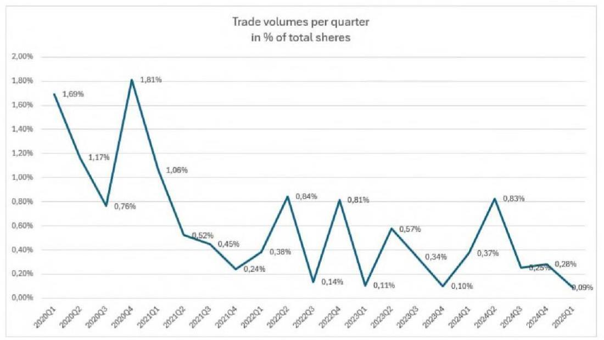

---

A tisztelt ÁSZ által többször említett és megalapozatlannak ítélt felár tekintetében fontos kiemelni, hogy a GTC többségi részvénycsomagját tőzsdei tranzakció keretében nem lehet megvásárolni. Erre tekintettel a felár nem értékelhető kizárólag a közkézhányad részvényárfolyamához viszonyítottan. Továbbá az Optima Csoport a többségi részesedés megszerzésével irányítási jogokat is szerzett a GTC felett, így a megfizetett vételár egyrészt az ún. kontroll prémiumot is tükrözte, valamint a Lonestar nem adta alacsonyabb áron.

A nemzetközi tanácsadók által elkészített értékelések bizonyították, hogy a tranzakció során megfizetett vételár megfelelte a hasonló régiós ingatlanpiaci tranzakciók értékelési szintjének. A megszerzett többségi tulajdon stratégiai értéke (irányítási jogok, portfólió aktív menedzselése, várható szinergiahatások, befolyás mértéke, hosszú távú növekedési potenciál tükrében, ingatlanpiaci infrastruktúra) megalapozottan indokolta a kifizetett vételárat.

A részvényárfolyam 34%-os csökkenése, változása, ingadozása önmagában nem jelenti azt, hogy a vásárlás időzítése helytelen volt. Éppen ellenkezőleg - az értékalapú befektetési stratégia (value investing) egyik alapelve, hogy jelentős áresések idején érdemes vásárolni, amennyiben a fundamentális érték meghaladja a piaci árat.

A tisztelt ÁSZ megállapítja, hogy az ÁSZ kérésére bemutatott hozamszámítás az ellenőrzés megállapítása alapján közgazdaságilag észszerűtlen volt, emiatt a döntéselőkészítő anyag - így a meghozott döntés nem volt kellően megalapozott. A tisztelt ÁSZ megállapítását elutasítjuk és felhívjuk a figyelmet arra, hogy a 11%-os várt hozam nem pusztán az osztalékhozamot, hanem a teljes befektetési megtérülést (osztalék + értéknövekedés) célozta. Fontos hangsúlyozni, hogy az Optima a devizák tekintetében is figyelmet fordított a befektetések allokálására, így a forint kitettségeken kívül euró, zlotyi és frank alapú befektetések útján is jelentős profitot realizált (illetőleg realizálhatóvá tett) a devizaátértékelődés hatására. A devizaárfolyamon realizált profit hozzájárul a vagyon jelentős gyarapodásához, ezért az értékelés során ezt is szükséges figyelembe venni.

Az ÁSZ megállapításával szemben, álláspontunk szerint a 2021-2024 közötti tényleges osztalékhozam nem alkalmas önmagában a befektetési döntés megalapozottságának utólagos megítélésére. Az osztalékfizetés csak egy eleme a teljes befektetési hozamnak, így önmagában nem nyújt teljes képet a befektetés megtérüléséről, mivel a befektetés értéke nem kizárólag az osztalékfizetési képességen alapul. Továbbá, ahogy fent is említettük, a befektetési döntés megalapozottságának mérlegelésénél figyelembe szükséges venni, hogy a COVID utáni helyreállási időszak speciális üzleti környezetet jelentett. Az alacsonyabb osztalékfizetés a COVID utáni konzervatív pénzügyi politika eredménye, ami a hosszú távú értékteremtést szolgálta. A GTC befektetés hosszú távú stratégiai előnyeként ki kell emelni, hogy a GTC befektetés diverzifikációt biztosít mind földrajzilag, mind ingatlanállományában (lakó, iroda, üzletközpont). Továbbá a minőségi irodaportfólió stabil, inflációkövető bérleti díjbevételeket generál, valamint az ESG szempontok szerinti fejlesztések növelik a portfólió hosszú távú értékét.

A fentieken túl a tisztelt ÁSZ teljes mértékben figyelmen kívül hagyta jelentéstervezetében a GTC befektetéssel kapcsolatosan mind az ellenőrzött időszakban, mind azt megelőzően történt jelentős társasági eseményeket. Álláspontunk szerint ezek figyelembevétele elengedhetetlen a befektetés megítélése szempontjából. A GTC fundamentális stratégiai változásokon ment keresztül a PADME Alapítvány által történt 2020. júniusi akvizíciója óta. A GTC fejlesztési intenzitása jelentősen megnövekedett, a portfolió mind eszköztípus, mind földrajzi diverzifikációja szempontjából válságállónak bizonyult. Sem a pandémia, sem a 2022-ben kezdődött orosz-ukrán háború eseményei nem okozott a GTC jövedelmezőségében és értékében jelentős kedvezőtlen hatást. A GTC finanszírozási struktúráját racionalizálta 2021-ben sikeres kötvénykibocsátást hajtott végre mintegy 660 millió euró értékben a magyar

---

Növekedési Kötvényprogram és nemzetközi zöldkötvénykibocsátás keretében. 2021-ben mintegy 210 millió euró értékű akvizíció keretében megvásárolta az Infopark közvetlen szomszédságában található 42 ezer m2 kiadható területtel bíró Ericsson/Siemens székházat, valamint a Váci úti folyosó legkedvezőbb lokációján lévő 16 ezer m2 területű Váci Greens D épületet. 2022-ben sikeresen átadásra került a Dózsa György úti 30 ezer m2 területű Pillár irodaház a nemzetközi Exxon Mobile részére, amely a pandémia után az első legnagyobb irodaátadás volt a Budapesti irodapiacon. Több sikeres külföldi irodaépületátadásra is sor került 2022-ben, úgy mint a szerb 18 ezer m2 GTC X épület, valamint a horvát 10,5 ezer m2 területű Matrix C épület közel 100% bérbeadottsággal. A GTC fejlesztési tevékenységének intenzitása is növekedett a piaci környezet ellenére is. Kiemelendően megkezdődött a horvát Matrix D irodakomplexum további épületének fejlesztése 10,5 ezer m2 kiadható területtel, valamint a Váci úti irodafolyosó Árpád-hídi kereszteződésénél található Center Point 3 irodaház fejlesztése 36 ezer m2 területtel.

A GTC befektetés kiszámíthatóságát és stabilitását is mutatja, hogy több mint 30 éves működése során a GTC a régióban 82 modern irodaházat és kereskedelmi ingatlant fejlesztett, amelyek összterülete meghaladja az 1,4 millió négyzetmétert. A vállalat jelenleg 46 jövedelemtermelő kereskedelmi ingatlan mellett 4 fejlesztési ingatlant is tulajdonol és üzemeltet, amely mindösszesen meghaladja a 755.000 négyzetméter összterületet 87%-os kihasználtsággal.

Összességében a befektetési döntés egy átfogó stratégiai megközelítés része volt, amely figyelembe vette mind a rövid távú piaci lehetőségeket, mind a hosszú távú értékteremtési potenciált. Így a befektetési döntés megalapozottságát nem lehet kizárólag a rövid távú piaci áralakulás vagy az osztalékhozam alapján megítélni. A válsághelyzet speciális körülményei között különösen fontos a hosszabb távú értékteremtési potenciál figyelembevétele, releváns további faktorok elemzése, ami indokolja a kifizetett vételárat, a megszerzett magas minőségű eszközök és értékek vonatkozásában.

# III.2.8 A jelentéstervezet 17. oldalának 3. bekezdése rögzíti, hogy 

„Az ÁSZ-nak a befektetési döntés megalapozatlanságára vonatkozó megállapítását támasztja alá a Fitch Ratings 2023. szeptemberi értékelése, amellyel a GTC S.A.-t leminősítette. A minősítés alapján a társaság részvénye nem befektetési, hanem spekulatív kategóriába került. A legutóbbi, 2024. novemberi Fitch Ratings a GTC S.A. jövőbeli minősítésének kilátásait a rövid távú likvidítási kockázatok és a nagyértékű adósságállomány miatt stabilról negatívra változtatta."

A fentiekkel szemben a valóság az, hogy a GTC tekintetében a Fitch Ratings értékelés megszerzése már az Optima Csoport tulajdonszerzését követően, 2021. első félévében valósult meg, egy tudatos stratégiai döntés keretében, amely a nemzetközi kötvénykibocsátás előkészítését szolgálta. A rating megszerzése tehát nem a korábbi befektetési döntés utólagos értékelése, hanem egy új finanszírozási stratégia szerves része volt.

A Fitch Ratings olyannyira pozitív értékelést állapított meg 2021-ben, hogy a GTC a vállalati hiteleit 2,25%-os zöldkötvény kibocsátása útján refinanszírozni tudta, amely jól tükrözte a piac pozitív értékítéletét is a társaság stabilitását illetően. A zöldkötvények kibocsátása 2020-tól jellemző trend volt az európai ingatlanpiacon, és a GTC Csoport versenyképességének fenntartásához alapvetően szükséges volt a kötvények
 kibocsátása, és ennek érdekében a Fitch Ratings értékelésének megszerzése.

A nemzetközi minősítő cégek (így a Fitch Ratings is) 2022-től kezdődően a nemzetközi ingatlanfejlesztő cégek jelentős részét leminősítette. Ennek oka leginkább az általános makrogazdasági környezet (magas kamatok, geopolitikai feszültségek) változásai, valamint romló gazdasági, ingatlanpiaci és finanszírozási

---

környezet volt, amelyek a teljes ingatlanpiaci szektort érintették Európában. A GTC Csoport legnagyobb versenytársai közül a CPI csoport minősítési kilátásait már 2023 júliusában stabilról negatívra változtatta, valamint ezt követően a minősítést is „BBB-,-ról „BB+"-ra rontotta. A GTC másik legnagyobb versenytársának a Globalworth-nek a minősítési kilátásait a Fitch Ratings szintén stabilról negatívra rontotta 2023. júliusban. A GTC minősítését a Fitch Ratings - a közép-kelet-európai ingatlanpiaci szereplők közül az egyik utolsóként - 2023. szeptemberében változtatta csak meg, amely azonban - mint bemutattuk - nem egyedi döntés volt, hanem követte a teljes ingatlanpiac leértékelését. A negatív kilátásra történő minősítés így elsősorban az általános ingatlanpiaci ciklus jelenlegi helyzetét tükrözi, nem pedig a GTC Csoportot érintő cégspecifikus problémákat.

A hitelminősítői értékelés és a befektetési döntés értéke között nem állítható fel közvetlen ok-okozati összefüggés. A minősítés változása sokkal inkább tükrözi a makrogazdasági környezet általános romlását, a regionális ingatlanpiaci kihívásokat és a kamatkörnyezet változását, mint a társaság fundamentális értékét.

Az értékelés során figyelembe kell venni, hogy a hitelminősítők módszertana elsősorban a rövid- és középtávú kockázatokra fókuszál, míg egy stratégiai befektetés értéke hosszabb időtávon realizálódik. A GTC esetében a megszerzett tulajdonrész értéke nem kizárólag a pillanatnyi hitelminősítésen vagy tőzsdei árfolyamon alapul, hanem olyan hosszú távú értékteremtő tényezőkön, mint a portfólió minősége, a fejlesztési potenciál és a piaci pozíció.

A minősítés "spekulatív" kategóriába sorolása egy technikai besorolás, amely elsősorban a finanszírozók számára releváns kockázati kategorizálást jelent, és nem a befektetés fundamentális értékének megítélését. A GTC esetében a hitelminősítői értékelés változása éppen azt a tudatos finanszírozási stratégiát tükrözi, amelynek keretében a társaság aktívan kezeli forrásszerkezetét és törekszik a nemzetközi tőkepiacok elérésére.

A Fitch Ratings értékelésétől függetlenül a GTC likviditási helyzete stabil, adósságszolgálata rendezett. A GTC Csoport nettó eszközértéke a befektetés óta robosztusan növekszik, valamint egy kiegyensúlyozott és kellően diverzifikált jövedelemtermelő portfolióval rendelkezik, mind földrajzi, mind pedig az ingatlanállományának (iroda, valamint bevásárlóközpont) összetétele vonatkozásában.

A GTC Csoport az ingatlanportfólióját 2024. év végén tovább diverzifikálta, melynek következtében a nyugat-európai bérlakáspiacra tört be, ezzel 19%-kal növelve az ingatlanportfóliója értékét. Ez az „AAA" minősítéssel bíró, fejlett német piacra történő befektetés jelentősen kedvező hatással bír a GTC jövőbeni jövedelmezőségére. Megjegyezzük, hogy ezt a tényt a tisztelt ÁSZ figyelmen kívül hagyta a jelentéstervezetében.

# III.2.9 A jelentéstervezet 17. oldalának 4. bekezdése rögzíti, hogy 

„A GTC S.A. részvény vásárláskori tőzsdei átlagárfolyamához (6,86 PLN) képest az OPTIMA csoport 31%-kal, közel 60 Mrd Ft-tal magasabb összeget - indokolatlan felárat - fizetett az eladónak, amely átlagosan 9 PLN részvényenkénti bekerülési árfolyamot jelentett. A felárral kifejezett - és a vételárban megfizetett üzleti várakozás megalapozatlan volt, annak gazdasági indokoltságát nem tudta sem ÁSZ, sem a GTC S.A. részvénycsomag megvásárlásáról szóló előterjesztés sem azonosítani. A GTC S.A. részvény tőzsdei árfolyama a vásárlást követően drasztikusan csökkent, a bekerülési értékhez viszonyítva több mint 50%-kal, a 2024. év végére tartósan 4 PLN alá esett. A megvásárolt részvénycsomag 2024. év végi tőzsdei árfolyam alapján számított értéke 162 Mrd Ft-tal csökkent. Az OPTIMA csoport a GTC S.A. részvény tőzsdei

---

árfolyamcsökkenésének nem csupán tehetetlen elszenvedője, hiszen 62,61%-os tulajdonosként érdemi befolyást gyakorol a társaság működésére."

A tisztelt ÁSZ jelentéstervezetében a GTC valós piaci értékét leegyszerűsítve kizárólag a tőzsdei közkézhányad részvényárfolyamhoz köti. Ezen megközelítés azonban téves és szakmailag nem megalapozott, mivel a hasonló tőzsdén jegyzett ingatlancégek valós értékét nem a tőzsdei árfolyam, hanem a társaság nettó eszközértéke, ún. EPRA NAV értéke mutatja. Az EPRA NAV mutatót az Európai Tőzsdén Jegyzett Ingatlan Társaságok Szövetsége kifejezetten az ingatlanbefektetési vállalatok valós nettó eszközértéknek meghatározására dolgozta ki. 2020. márciusában a GTC tekintetében megállapított EPRA NAV érték részvényenként meghaladta a 11,3 lengyel zloty-t, amely közel az akkori tőzsdei részvényárfolyamának kétszerese volt.

Az EPRA NAV lényegében a vállalat csoportszinten konszolidált eszközértékének, mint bruttó eszközérték, valamint a csoportszintű harmadik fél felé fennálló kötelezettségeinek (pl. hitelek, kötvénytartozások, egyéb kötelezettségek) különbözetét mutatja, amellyel a cégcsoport cégértéke, azaz tényleges valós értéke mérhető.

A GTC EPRA NAV alakulásában az Alapítvány akvizíciója óta - az adott évenkénti tulajdonosi osztalékkifizetések mellett is - stabil növekedési tendencia mutatható ki, amely tovább erősödik a 2024. decemberben a német bérlakáspiacon végrehajtott terjeszkedésével.

A tisztelt ÁSZ jelentésében bár kiemeli, hogy a GTC - egyébként minimális likviditású közkézhányadának - részvényárfolyama 2024. év végére tartósan 4 PLN alá esett, azonban azt nem említi, hogy 2025 januárjától a részvényárfolyam ismét meghaladta a 4 PLN-t. A tisztelt ÁSZ megállapítása minderre tekintettel pontatlan és félrevezető.

A GTC EPRA NAV értékének alakulását az alábbi táblázatban szemléltetjük:
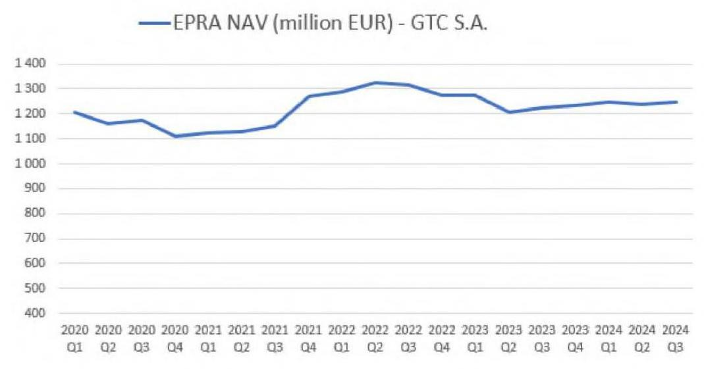

---

Ahogy korábban jeleztük, a GTC részvénycsomag akvizíciójára - illetve hasonló tőzsdei részvénycsomagok - tőzsdei tranzakció keretében nincs lehetőség, így nem értelmezhető és félrevezető az egyedi részvények tőzsdei árfolyamát a teljes társaság feletti irányítást biztosító részvénycsomag tranzakciós vételárához hasonlítani.

Az Optima Csoport a GTC 61,49%-os részesedését a Lone Star Alapoktól ${ }^{7}$ vásárolta meg 2020-ban. Az eladó mint a világ egyik legnagyobb magántőke befektetési társasága a befektetési portfoliójának árazását a mindenkori nemzetközi gyakorlattal összhangban állapítja meg. Erre való tekintettel a feleknek lehetősége sem volt eltérni a hasonló tranzakcióknál szokásos árazástól, kizárólag a nemzetközileg bevett módszertanok alapján történhetett meg az értékelés.

A tisztelt ÁSZ megállapította, hogy az OPTIMA Csoport a GTC részvény tőzsdei árfolyamcsökkenésének nem csupán tehetetlen elszenvedője, hiszen 62,61%-os tulajdonosként érdemi befolyást gyakorol a társaság működésére. Álláspontunk szerint az ÁSZ nem veszi figyelembe a modern vállalatirányítás és befektetési elmélet alapvető összefüggéseit. A többségi tulajdonos feladata nem a részvényárfolyam közvetlen befolyásolása, hanem olyan stratégiai döntések meghozatala és végrehajtása, amelyek hosszú távon növelik a vállalat értékét. Az ÁSZ megállapítása implicit módon azt sugallja, hogy a többségi tulajdonos feladata a részvényárfolyam rövid távú befolyásolása. Ez alapvetően téves megközelítés, mivel a tulajdonosi értékteremtés elsődlegesen a vállalat hosszú távú stratégiai fejlesztésén keresztül valósul meg. A tőzsdei árfolyam rövid távú alakulása számos, a vállalat működésétől független tényező által befolyásolt. Továbbá a részvényesi érték maximalizálása nem azonos a részvényárfolyam napi szintű menedzselésével.

A fentiekre tekintettel a tisztelt ÁSZ megközelítése - manipulatív és szakmaiatlan - nem tükrözi megfelelően a tőkepiaci befektetések és a vállalatirányítás komplex összefüggésrendszerét, különös tekintettel a hosszú távú értékteremtés mechanizmusaira.

Felhívjuk a figyelmet, hogy a tisztelt ÁSZ GTC részvénycsomag értékére vonatkozó megállapításai hamis színben tüntetik fel - tényleges megalapozottság hiányában - a befektetés értékének alakulását. A GTC részvénycsomag bekerülése értéke mintegy 255 Mrd Ft volt 2020 júniusában. Ezzel szemben a részvénycsomag jelenlegi értékét a BDO frissen készült értékelése támasztja alá, mely összehasonlítható vállalatok szorzószámos értékelési módszertana (Comparable Companies Multiple) alapján a részvénycsomag jelenlegi értéke 297.318.390.000.- Ft. A fentieken túl szemléltetés és összehasonlításképp megjegyezzük, hogy a GTC 2024 harmadik negyedévében megállapított EPRA NAV értéke 1,248 Mrd euró volt, amely 400 Ft/ EUR árfolyamon 499,2 Mrd Ft. Az Optima Csoport ennek 62,61%-os tulajdonosa, amely 312,5 Mrd Ft értéket képvisel.

A GTC értékét jól mutatja, hogy az Optima az elmúlt években több alkalommal kapott vételi ajánlatot a GTC részvénycsomag vonatkozásában. Ezen ajánlatok jelentősen meghaladták a tisztelt ÁSZ által leegyszerűsített módszertant alkalmazva - megállapított részvény árfolyam alapon vizsgált vállalati értéket. Megjegyezzük, hogy a GTC kisebbségi befektetői között intézményi befektetők (Allianz, lengyel nyugdíalap, stb.) is jelen vannak jelentős 10% körüli részvénycsomaggal. Ezen befektetőket több

[^0]
[^0]:    ${ }^{7}$ A Lone Star a világ egyik legnagyobb nemzetközi magántőke-befektetési társasága, amely vállalati részvényekre, ingatlanokra, hitelekre és különféle pénzügyi eszközökre specializálódott. Az 1995-ben alapított vállalat 25 magántőkealapot hozott létre, amelyek útján több mint 95 milliárd dollárnyi befektetést kezelnek. A Lone Star befektetői között nyugdíjalapok, állami tőkealapok, egyetemi alapítványok, alapítványok, pénzalapok és nagy vagyonú magánszemélyek is megtalálhatók. A Lone Star globális jelenléttel rendelkezik, észak-amerikai, európai és ázsiai leányvállalatain keresztül.

---

alkalommal megkerestük a részvényeik megvásárlása céljából. A befektetők többszöri megkeresés ellenére sem kívánták eladni részesedésüket, ami jól szemlélteti az intézményi befektetők GTC-be vetett töretlen bizalmát az iparágat érintő negatív hatások ellenére is.

# III.2.10 A jelentéstervezet 18. oldalának 1. bekezdése rögzíti, hogy 

„Az OPTIMA csoport másik jelentős külföldi befektetése, az Ultima Capital S.A. társaság tőzsdei részvényárfolyama szintén csökkenő trendben változott, 2024. december 30-án 88 CHF volt, ami a részvényenkénti 109,91 CHF bekerülési árhoz képest 20%-os csökkenést jelentett. A befektetés közgazdasági racionalitása már a társaság tevékenységi profilja alapján is megkérdőjelezhető, hiszen a koncentrált ingatlanpiaci befektetések erőteljes kockázatot hordoznak a diverzifikáció hiánya miatt. Az Ultima csomag kapcsán az Optima csoport további kisebbségi részvényesekkel vételi kötelezettséget rögzítő megállapodásokat kötött, melyekből eredően a 2024. és a 2025. évben merült fel fizetendő kötelezettsége mintegy 250 M CHF összegben."

Az Optima Csoport másik jelentős befektetése az ellenőrzött időszakban a svájci tőzsdén jegyzett Ultima Capital-hez kapcsolódó Alpine kötvények. Azonban ismételten felhívjuk a figyelmet, hogy a tisztelt ÁSZ nem vette figyelembe a jelentéstervezetében, hogy a vizsgált időszakban az Ultima befektetés 12%-os éves hozamot biztosító kötvény megszerzésének formájában valósult meg.

Tekintettel arra, hogy a prémium és luxus ingatlanok piaci a leginkább fejlődő iparág volt a COVID alatt, ezért a kötvénybefektetést a felek svájci tőzsdei részvényekre változtatták 2023 végén számos az Optima csoportot érintő belső és külső körülmény, illetve megfontolás hatására. Az Optima mintegy 20%-os részesedést értékesített harmadik felek részére 2024 végén. [Ezen túl az Optima a teljes Ultima befektetés kapcsán több vételi ajánlatot is kapott, azonban az Optima a befektetés hozamának maximalizálása érdekében egyelőre nem kívánt exitálni és új stratégia megvalósítását kezdte meg.] 2024 végétől egy ciprusi tőzsdén jegyzett professzionális nagybefektetővel működik együtt, amellyel az Ultima befektetés jelentős növekedési pályára állt. A befektetés eredményességét támasztja alá, hogy az Optima Csoport eladási joggal rendelkezik az Ultima részvényei felett, amely alapján 2029-től 105 svájci frankos részvényárfolyamon bármikor értékesíteni tudja a befektetését. A Yoda PLC („Yoda") társasággal mint stratégiai befektetővel megkötött szindikátusi szerződés számos jogosultságot biztosít az Optima Csoport részére. A szindikátusi szerződés (mintegy 5-10 millió svájci frank minimum osztalék) éves garantált hozamot biztosít az Optima Csoport részére. Az Optima továbbá jogosult igazgatósági tag kijelölésére, valamint vétójoggal bír az Ultima főbb döntései vonatkozásában. A szindikátusi szerződés alapján az Optima exitjogokkal (tag along, drag along)
 is rendelkezik az Ultimában.

A fentieken túl a tisztelt ÁSZ megállapításában szereplő Ultimára vonatkozó értékelés alapvetően félreértelmezi a befektetési döntés közgazdasági racionalitását és a mögötte húzódó stratégiai megfontolásokat.

A diverzifikáció kérdésében fontos kiemelni, hogy az Ultima portfóliója önmagában is többrétegű diverzifikációt valósít meg, valamint portfóliója mind földrajzi elhelyezkedésében, mind pedig ingatlanállományának összetételében eltér a GTC portfóliójától, amely az Optima Csoport befektetését tovább diverzifikálja.

A prémium ingatlanok különböző országokban, eltérő szegmensekben és változatos bérlői összetétellel működnek, amely szempontok jelentős kockázatcsökkentő tényezők. Ezen ingatlanpiaci szegmens ráadásul történelmileg is bizonyította, hogy más makrogazdasági korrelációt mutat, mint a hagyományos

---

ingatlanpiac, így a specializáció ebben az esetben nem gyengeség, hanem tudatos stratégiai döntés eredménye.

A részvényárfolyam 20%-os csökkenésének túlhangsúlyozása figyelmen kívül hagyja a svájci tőzsde, különösen az ún. specialized real estate szegmens korlátozott likviditását, valamint a kamatkörnyezetet. A kisebb forgalmú részvények árazása gyakran jelentősen eltér a fundamentális értéktől, így ez a pillanatnyi piaci értékítélet nem alkalmas a befektetés minőségének megítélésére. Különösen igaz ez olyan esetben, amelyben a mögöttes eszközök értéke stabil és független a tőzsdei árfolyam alakulásától.

Az Ultima portfólióba tartozó ingatlanokat a Kroll Inc., egy nagy múltú és elismert amerikai ingatlanértékbecslő vállalat egyesével felmérte és értékelte az Optima Csoport akvizícióját megelőzően. (A Kroll és egyéb felkért értékbecslők értékbecslési jelentéseit 1a. - 1b. - 1c. szám alatti mellékletekként csatoljuk.)

A további részvényvásárlási megállapodások kapcsán hangsúlyozni kell, hogy ezek nem egyszerűen kötelezettségek, hanem a tulajdonosi értékteremtés eszközei. A nagyobb tulajdoni hányad megszerzése javítja a stratégiai döntéshozatal hatékonyságát és növeli a vállalat értékét. A kisebbségi részesedések konszolidációja pedig olyan szinergiákat tesz lehetővé, amelyek tovább növelik a befektetés értékét.

Összegezve a hatósági megállapítás nem veszi figyelembe a prémium - luxus ingatlanpiac speciális jellemzőit és azt a tényt, hogy az ilyen típusú befektetések értékelése jelentősen eltér a hagyományos ingatlanpiaci megközelítéstől. A befektetés racionalitását a hosszú távú értékteremtési potenciál, a megszerezhető stratégiai előnyök és a prémium szegmens egyedi jellemzői együttesen támasztják alá. A pillanatnyi tőzsdei árfolyam vagy a szektorális koncentráció önmagában nem alkalmas a befektetési döntés minőségének megítélésére.

A hatékony portfóliókezelés szempontjából az Ultima befektetés jelentősége abban áll, hogy olyan egyedi eszközosztályhoz biztosít hozzáférést, amely más módon nem vagy csak korlátozottan érhető el az intézményi befektetők számára. A prémium ingatlanok piacán való jelenlét különösen értékes diverzifikációs előnyt jelent, mivel ez a szegmens historikusan alacsony korrelációt mutat mind a hagyományos ingatlanpiaci befektetésekkel, mind pedig a tőkepiaci instrumentumokkal. Az Optima portfóliójában ez a pozíció nem növeli, hanem csökkenti a rendszerkockázatot, mivel a prémium - luxus ingatlanok értékállósága és kereslete olyan gazdasági ciklusokon átívelő stabilitást mutat, amely más eszközosztályoknál nem figyelhető meg (pl. COVID).
[Felhívjuk a figyelmet, hogy az Optima Csoport T. ÁSZ által állított, de alá nem támasztott bekerülési költsége 109,91 CHF részvényenkénti ár alkalmazásával 355 CHF, amely az alábbi táblázattal alátámasztva 132.260.717.000 HUF összegnek felel meg, amely érték a tisztelt ÁSZ által hivatkozott 88 CHF részvény árfolyam alkalmazása mellett a hivatkozáskori tőzsdei ügyletkötések 2024. december 18-i árfolyamán (437,10 HUF, MNB) a befektetési értéke 132.529.891.428 HUF, amely tekintetében megállapítható, hogy értékcsökkenés nem következett be.]

| Dátum | összeg (CHF) | Árfolyam | Forintban vételár |
| :--: | :--: | :--: | :--: |
| 2021.08.31 | 50000000 | 348,48 | 17424000000 |
| 2021.10.20 | 150000000 | 362,88 | 54432000000 |
| 2022.03.08 | 50000000 | 383,79 | 19189500000 |
| 2022.03.25 | 29900000 | 367,85 | 10998715000 |
| 2022.09.20 | 50100000 | 412,52 | 20667252000 |
| 2023.05.31 | 25000000 | 381,97 | 9549250000 |
|  | 355000000 |  | 132260717000 HUF |

---

# III.2.11 A jelentéstervezet 18. oldalának 2. bekezdése rögzíti, hogy 

„A 2024. év végi likviditási helyzetet értékelő belső ellenőrzési jelentés szerint, elsősorban az Ultima Capital S.A. kapcsán 2025. június 30-ig további olyan jelentős kiadások merülnek majd fel, melynek eredményeképpen 80,5 Mrd Ft likviditási hiány prognosztizálható. Szintén a likviditási helyzet súlyosságát jelzi az Alapítvány felügyelőbizottságának 2025. január 18-án kelt, az MNB elnökének címzett levele, melyben a felügyelőbizottság elnökének értékelése szerint „az Alapítvány cél szerinti működése és fizetőképessége közvetlen veszélyben van". A fentiek alapján fennáll a súlyos kockázata, hogy a részben hitellel is egyébként finanszírozott befektetésekhez kapcsolódó további kötelezettségvállalások fedezete nem biztosított."

A tisztelt ÁSZ a megállapításában iratellenesen rögzíti, hogy az Ultima befektetés kapcsán 2025. június 30-ig 80,5 Mrd esedékes kötelezettsége áll fenn az Optimának. Ezzel szemben azonban tényként megállapítható, hogy 2025-ben egyáltalán nem merül fel esedékes fizetési kötelezettsége az Optima Csoportnak az Ultima befektetéssel kapcsolatosan.

2025 júniusában az Optima Csoport egyetlen jelentősebb esedékes kötelezettsége az által nyújtott 170 millió euró összegű finanszírozással kapcsolatosan fennálló mintegy 3 Mrd Ft összegű kamatfizetési kötelezettség. Ezen fizetési kötelezettség bemutatásra került a tisztelt ÁSZ részére átadott cash flow kimutatásokban is.

Az Ultima kapcsán 2026 januárjában esedékes fizetési kötelezettség nem váratlan teher, hanem egy előre tervezett, stratégiai befektetési program része, mivel az Optima Csoport eredeti célja az Ultima teljes 100%-os részesedésének megvásárlása volt. Megjegyezzük, hogy az Optima Csoport 2025-ben ajánlatot kapott az Ultima részvényekre vonatkozó opciós szerződések átvételére.

A tisztelt ÁSZ megállapításában szereplő likviditási értékelés és következtetések nem tükrözik teljeskörűen az Optima Csoport és az Alapítvány által kidolgozott átfogó pénzügyi tervezési és kockázatkezelési intézkedéseket.

Az Optima menedzsmentje részletes, havi szintű cashflow előrejelzést készített a múltban is és tette ezt a 2025-ös üzleti év vonatkozásában is, amely tartalmazza a működési költségek optimalizálását és a kiemelt vezető feladatok prioritálását. A tervben szereplő költségmegtakarítási intézkedések és a hatékonyságnövelő programok biztosítják az Optima Csoport stabil működését és a vállalt kötelezettségek teljesítésének biztosítását. A likviditástervezés során az Optima különös figyelmet fordított a bevételi források diverzifikált realizálására és a kiadások ütemezésének optimalizálására.

Az Alapítvány külön is elkészítette a 2025. évi gazdálkodási tervét, amely teljes mértékben összhangban van az Alapító Okiratban megfogalmazott cégrendszerrel és a felelős vagyongazdálkodás alapelveivel. A terv részletesen bemutatja az alapítványi célok megvalósításához szükséges források és felhasználások egyensúlyát, valamint azokat a kontrollmechanizmusokat, amelyek biztosítják a prudens gazdálkodást. Az alapítvány tervezési folyamata során kiemelt figyelmet fordított a hosszú távú fenntarthatóságra és a vagyonmegőrzés szempontjaira egy jelentős költséggazdálkodási csökkentési motívum mellett.

A tisztelt ÁSZ által hivatkozott belső ellenőrzési jelentés egyfelől nem a vonatkozó jogszabályi és belső ellenőrzési szabályzatban előírt eljárásrend előírásainak megfelelően készül, másfelől az csak egy pillanatfelvételt tükrözött, amelyet az új Optima felsővezetésnek nem volt alkalma kiegészíteni és objektívvá tenni, így nem veszi figyelembe a már folyamatban lévő és tervezett intézkedések hatásait, továbbá a belső ellenőri jelentés sajnálatos módon tárgyi pontatlanságokat is tartalmaz (pl.: Ultima fizetési kötelezettségek

---

beálltát 2025. év közepében határozza meg, szemben az azok ténylegesen 2026 elején beálló esedékességével).

Emlékeztetőül utalunk arra, hogy a belső ellenőrzés olyan független, objektív bizonyosságot adó eszköz és tanácsadói tevékenység, amely értéket ad a szervezet működéséhez, és javítja annak minőségét; módszeres és szabályozott eljárással értékeli és javítja a kockázatkezelési, a kontroll- és az irányítási folyamatok hatékonyságát, ezáltal segíti a szervezeti célok megvalósítását. Az objektív bizonyosságot az teremti meg, hogy a belső ellenőr objektív értékelést nyújt egy adott folyamatról, rendszerről, eljárásról, és az ellenőrzési program végrehajtása során tett megállapításokat, következtetéseket és javaslatokat ellenőrzési jelentésbe foglalja.

Felhívjuk a figyelmet arra, hogy a vonatkozó jogszabályi előírások között egyértelműen rögzítésre került, hogy bármely belső ellenőri jelentés tervezetet a belső ellenőr egyeztetés céljából megküldi az ellenőrzött szervezeti egység vezetőjének, továbbá azon szervezeti egységek vezetőinek, melyekre vonatkozóan a belső ellenőrzési jelentéstervezet megállapítást vagy javaslatot tartalmaz, melyet követően sor kerül a jelentéstervezet tartalmát érintő egyeztetés lefolytatására, amelynek során az ún. érintettek jogosultak észrevételeiket adresszálni a belső ellenőr felé, amely esetben az észrevételek elfogadásáról vagy elutasításáról a vizsgálatvezető javaslata alapján a belső ellenőrzési vezető dönt, amelyről írásbeli tájékoztatást ad, és megindokolja az el nem fogadott észrevételeket vagy egyeztető megbeszélést összehívását kezdeményezi. Az elfogadott észrevételeket a vizsgálatvezető átvezeti az ellenőrzési jelentéstervezeten. Az érintettek észrevételeit és a vizsgálatvezető válaszát pedig csatolni kell az ellenőrzés dokumentációjához.

Ha az érintett a megállapításokat vitatja, bármelyik fél kezdeményezésére egyeztető megbeszélést kell tartani. Az egyeztető megbeszélésről jegyzőkönyv készül, amely tartalmazza a megbeszélés eredményét. Ha az egyeztetések ellenére véleménykülönbség marad fenn a belső ellenőrzés és az ellenőrzött fél között, úgy az ellenőrzött szervezeti egység vezetőjének különvéleményét a belső ellenőrzés megjeleníti a belső ellenőrzési jelentésben. Az érintettek észrevételeit, illetve a belső ellenőrzési vezető válaszát csatolni kell az ellenőrzés dokumentációjához.

Ezen körülményekre figyelemmel meglátásunk szerint a tárgyi tévedéseket és adatokat tartalmazó jelentésnek az érintettek elé tárása semmi esetre sem szolgálja az objektív bizonyosságot adó eszköz minőségbe vetett hitet és a megalapozott döntéshozatal rendjét.

Az Optima vezetése által kidolgozott menedzsment feladatokat tartalmazó terv olyan konkrét lépéseket tartalmaz, amelyek biztosítják a likviditási helyzet folyamatos egyensúlyát. A hitellel finanszírozott befektetések megtérülése és a portfólió cash-flow termelő képessége megfelelő fedezetet nyújt a vállalt kötelezettségek teljesítésére, amely biztosítja a stabil működést és a vállalt kötelezettségek teljesítését. A 2025. évi tervek és előrejelzések reális feltételezéseken alapulnak, és megfelelő tartalékokat tartalmaznak az esetleges kockázatok kezelésére.

# III.2.12 A jelentéstervezet 18. oldalának 3. bekezdése rögzíti, hogy 

„Az ÁSZ megítélése szerint az Alapítvány beszámolóiban az OPTIMA Befektetési Zrt. által kibocsátott kötvény könyv szerinti értéke nem tükrözte a befektetés tényleges piaci értékét. Az Alapítvány a kötvényt bekerülési értéken tartotta nyilván, azonban a 2024. évben akár 150 Mrd Ft értékvesztés elszámolása lett volna indokolt."

A fenti megállapításhoz kapcsolódóan a jelentéstervezet 18. oldalának 4. bekezdése rögzíti, hogy

---

„Az Alapítvány a kötelező értékelésnél nem vette figyelembe a közvetett befektetések mögöttes részvényportfólió tőzsdei árfolyamának csökkenését, a befektetés hozamtermelő képességét, a kibocsátó OPTIMA Befektetési Zrt. piaci megítélését és a lejáratkor várható törlesztési képességét. Az OPTIMA Befektetési Zrt. által kibocsátott kötvénynek a kibocsátó által utólag megállapított kamata a 2021-2023. közötti időszakban 0,12-0,96% volt, ami a mértékadó kockázatmentesként elfogadott kamatok töredékét jelentette, ezen tény a kötvény kapcsán már önmagában jelentős értékvesztési összeg elszámolást alapozott volna meg."

A fentiekkel szemben rögzíteni szükséges, hogy az Optima Kötvénynek nincs tőzsdén jegyzett ára, árfolyama vagy tőzsdén kívüli piacon kialakult ára. Az Optima Kötvény forgalomba hozatalához készült információs összeállítás külön kiemeli, hogy a kibocsátó az Optima Kötvényen alapuló kötelezettségeinek teljesítéséért teljes vagyonával felel.

Felhívjuk a figyelmet, hogy a tisztelt ÁSZ az Optima vagyonának és megtérülésének értékelése során számos, rendkívül jelentős tényállási elemet figyelmen kívül hagy. Így például az ÁSZ figyelmen
 kívül hagyja, hogy az Optima Csoport a gazdálkodásából származó forrásokból több mint 17 Mrd Ft összegű támogatást fizetett ki az alapítványi célokkal összhangban. A támogatásokkal közel 1800 oktatási, tudományos pályázatot támogatott határon innen és túl, és folyamatosan együttműködött oktatási intézményekkel, tudományos központokkal és szervezetekkel, annak érdekében, hogy éveken átnyúló, kiemelt jelentőségű projektek szakmai működtetésében segítsen. Továbbá az Optima Csoport megvásárolta a Budapesti Metropolitan Egyetemet, amely befektetési jellegén túl szintén az alapítványi célok közvetlen megvalósulását is szolgálja. A Budapesti Metropolitan Egyetem meghatározó és dinamikusan fejlődő szereplője a hazai felsőoktatásnak, és immár a kelet-közép-európai régiónak is. Az egyetem öt kontinensen több mint 200 külföldi intézménnyel tart fenn partneri kapcsolatot. Az egyetem közel 7000 hallgatójából közel 1000 külföldi, akik a világ több mint 100 országából érkeztek.

A fentieken túl az Alapítvány jelentős közhasznú részvételét is teljes mértékben figyelmen kívül hagyja a tisztelt ÁSZ, amely során az Alapítvány jelentős támogatást nyújtott tehetségkutató műhelyek, egyetemek és tudományos közösségek számára. Az Optima csoport a korábban bemutatott főbb befektetésein túl számos olyan befektetést hajtott végre, amely összhangban van az alapítványi célokkal, és fő célja a társadalmi felelősségvállalás, illetve a kutatás-fejlesztés támogatása. Így például az Optima Csoport 3 milliárd Forintot meghaladó összeget fordított a rákkutatási és gyógyítási célok fejlesztésére, támogatására. Ezen túl további több mint 500 millió Ft összeget az Impact Ventures kockázati tőkealapokba, melynek célja a pénzügyi eredmény elérése mellett, mérhető pozitív társadalmi vagy környezeti hatás elérése (pl. „Álommunkahely autizmussal élőknek" projekt).

Az Optima Kötvény értékelése kapcsán fontos kiemelni, hogy a számvitelről szóló 2000. évi C. törvény („Sztv.") alábbiakban részletezett rendelkezései, valamint a nemzetközi könyvvizsgálói, illetve értékpapírértékelési gyakorlat alábbiakban bemutatott rendelkezései alapján az Optima Kötvény értékét eredendően a következő tényezők határozzák meg. A legfőbb szempont, hogy az Optima által a könyvvizsgáló rendelkezésére bocsátott és az Optima vagyoni, pénzügyi helyzetére vonatkozó információk alapján az Optima képes lesz-e az Optima Kötvény futamideje alatt az évente esedékes kamatok, illetve a futamidő végén esedékes tőke megfizetésére, és ha igen, akkor milyen mértékben képes kötelezettségeinek teljesítésére.

Az Sztv. 3. § (8) bekezdés 3. pontja szerint „pénzügyi instrumentum: olyan szerződéses megállapodás, amelynek eredményeként az egyik félnél pénzügyi eszköz, a másik félnél pénzügyi kötelezettség vagy saját tőke (tőkeinstrumentum) keletkezik. Így különösen: a szerződéses megállapodáson alapuló követelés és

---

kötelezettség, a pénzeszköz, az értékpapír (hitelviszonyt megtestesítő értékpapír és tulajdoni részesedést jelentő befektetés), a származékos ügylet". Az Sztv. rendelkezései alapján az Optima Kötvény pénzügyi instrumentumnak minősül. Az Sztv. 59/A.§ (6) bekezdése alapján a pénzügyi instrumentumok valós értékükön csak akkor értékelhetők, ha azok valós értéke megbízható módon meghatározható.

Az Sztv. 47. § (1) bekezdése szerint „Az eszköz bekerülési (beszerzési, előállítási) értéke az eszköz megszerzése, létesítése, üzembe helyezése érdekében az üzembe helyezésig, a raktárba történő beszállításáig felmerült, az eszközhöz egyedileg hozzákapcsolható tételek együttes összege. A bekerülési (beszerzési) érték az engedményekkel csökkentett, felárakkal növelt vételárat, továbbá az eszköz beszerzésével, üzembe helyezésével, raktárba történt beszállításával kapcsolatban felmerült szállítási és rakodási, alapozási, szerelési, üzembe helyezési, közvetítői tevékenység ellenértékét, díjait (ezen tevékenységeknek saját vállalkozásban történt végzése esetén az 51. § szerinti közvetlen önköltség aktivált értékét), a bizományi díjat, a beszerzéshez kapcsolódó adókat és adójellegű tételeket, a vámterheket foglalja magában."

Az Sztv. 50. § (3) bekezdés szerint „A hitelviszonyt megtestesítő, kamatozó értékpapír bekerülési (beszerzési) értéke nem tartalmazhatja a [vételár részét képező, továbbá a kibocsátási okiratban, a csereszerződésben, a vagyonfelosztási javaslatban meghatározott piaci, forgalmi, beszámítási érték részét képező] (felhalmozott) kamat összegét."

Az Sztv fent idézett rendelkezései alapján, mivel jelen esetben az Alapítvány névértéken jegyezte le az Optima Kötvényt, az Optima Kötvény bekerülési értéke a névértékkel egyezik meg.

Az Sztv. 59/A. § (8) bekezdése szerint „A (7) bekezdésben meghatározott pénzügyi instrumentumokat a törlesztésekkel és az értékvesztéssel csökkentett, visszaírással növelt bekerülési (beszerzési) értéken, illetve a szerződés szerinti értéken kell kimutatni, a törvény általános (bekerülési érték szerinti) értékelési előírásainak figyelembevételével." Az Sztv. előírásai alapján többek között a lejáratig tartott / az egyedi jellemzőkkel rendelkező / valós értékét megbízható módon nem megállapítható értékpapírra - a kereskedési célúvá vagy értékesíthetővé történő átsorolásukig - nem alkalmazható a valós értéken történő értékelés, ezen az értékpapírokat a törvény általános (bekerülési érték szerinti) értékelési előírásainak figyelembevételével meghatározott bekerülési értéken kell nyilvántartani. Az Optima álláspontja szerint ezen nyilvántartási szabályok alkalmazandóak az Optima Kötvényre mint pénzügyi instrumentumra is, miszerint a bekerülési értéken történő nyilvántartás az irányadó.

Mindazonáltal megjegyezzük, hogy a valós értékelés körében - tőzsdén jegyzett árfolyam, vagy tőzsdén kívüli piacon kialakult ár hiányában - a pénzügyi instrumentum összetevőinek, vagy hasonló pénzügyi instrumentumoknak a piaci ára alapján meghatározott érték (számított piaci érték), vagy az általános értékelési eljárásokkal meghatározott, a piaci árat elfogadhatóan közelítő érték lenne az irányadó.

Amennyiben tehát az Optima Kötvény tulajdonosa a bekerülési értéket megfelelő tájékozódás alapján, az Optima átvilágítását követően, a működésének, pénzügyi helyzetének ismeretében határozza meg, és a kibocsátó pénzügyi helyzete, nettó eszközállománya (beleértve az eszközök értékének igazolt megőrzése, valamint értéknövekedése), saját tőke helyzete, működési környezete a kibocsátást követően, az Optima Kötvény tulajdonosának éves beszámolója elkészítésének időpontjáig nem romlott (illetve az Optima Kötvény kamatozásának feltételei sem változtak lényegesen), akkor az Optima Kötvény valós értéke sem csökken a bekerülési érték alá. Az Sztv. rendelkezéseivel összhangban megállapítható, hogy az Optima Kötvény bekerülési értéken történő nyilvántartása a mindenkor hatályos számviteli előírásoknak megfelelően történt.

---

# A fenti indokolásra is figyelemmel hangsúlyozzuk, hogy az Optima az Optima Kötvény alapján fennálló éves adósságszolgálatának mindig eleget tett az ellenőrzött időszakban, ezért határozott álláspontunk szerint az Optima Kötvény tekintetében értékvesztés elszámolása nem indokolt. 

A tisztelt ÁSZ megállapításával szemben az Optima Kötvény mögötti részvényportfólió tőzsdei árfolyamának átmeneti csökkenése önmagában nem indokolja az értékvesztés elszámolását, mivel a befektetések hosszú távú stratégiai jellegűek. Az értékelés során figyelembe kell venni a teljes befektetési időhorizontot, a portfólióban rejlő szinergiákat és fejlesztési potenciált is. Az Optima Kötvény kibocsátásakor és az azt követő értékeléseknél a felek ezt a komplex megtérülési és értékmegőrzési struktúrát vették alapul.

A fentiekkel összhangban a vezető hitelminősítő intézetek az adott értékpapír mögött álló kibocsátót vizsgálják az értékpapírok besorolásakor, hiszen az értékpapír a mögötte álló kibocsátó, illetve annak üzleti tevékenysége nélkül pusztán egy digitális adat-halmaz, amely önmagában nem értékelhető. Az S&P Global Ratings által között Út-mutató a hitelminősítés alapjaihoz (Guide to Credit Rating Essentials) című dokumentum ${ }^{8}$ „Minősítéseink az ügynökség véleményét fejezik ki egy kibocsátó, mint például egy vállalat, állami vagy önkormányzat azon képességéről és hajlandóságáról, hogy teljes mértékben és időben eleget tegyenek pénzügyi kötelezettségeinek" (4. oldal).

Akkor, amikor az útmutató úgy fogalmaz, hogy „A minősítési elemzésének részeként az S&P Global Ratings értékeli a rendelkezésre álló jelenlegi és múltbeli információkat, és felméri a várható jövőbeli események lehetséges hatását. Például egy vállalat adósságkibocsátóként való minősítésekor az ügynökség figyelembe veheti az üzleti ciklus várható hullámvölgyeit, amelyek befolyásolhatják a vállalat hitelképességét" (4. és 12. oldal), lényegében maga is az üzleti folyamatok tendenciáit veszi figyelembe, hiszen leginkább ezek azok a körülmények, amelyek leginkább kihatással vannak a kibocsátó vagyoni, pénzügyi helyzetére, ezáltal az értékpapírokban foglalt kötelezettségek teljesítésére vonatkozó képességére.

A fentiekkel összhangban az útmutató szerint „Egy vállalat minősítésekor az elemzőközpontú megközelítést alkalmazó ügynökségek általában egy elemzőt bíznak meg, gyakran egy szakértői csoporttal együtt, hogy vállalja a vezető szerepet a szervezet hitelképességének értékelésében. Az elemzők általában a közzétett jelentésekből, valamint a kibocsátó vezetésével folytatott interjúkból és megbeszélésekből szereznek információkat. Felhasználják ezeket az információkat, és alkalmazzák analitikus megítélésüket a gazdálkodó egység pénzügyi helyzetének, működési teljesítményének, politikáinak és kockázat-kezelési stratégiáinak felmérésére" (7. oldal).

Továbbá „A kibocsátó hitelképességének felmérése érdekében az S&P Global Ratings felméri a kibocsátó képességét és hajlandóságát arra, hogy a kötelezettségek feltételeivel összhangban visszafizesse kötelezettségeit.

Besorolási véleményének kialakításához az S&P Global Ratings a pénzügyi és üzleti jellemzők széles skáláját tekinti át, amelyek befolyásolhatják a kibocsátó általi azonnali visszafizetést.

Az elemzett konkrét kockázati tényezők részben a kibocsátó típusától függenek. Például egy vállalati kibocsátó hitelelemzése jellemzően számos pénzügyi és nem pénzügyi tényezőt vesz figyelembe, beleértve a kulcsfontosságú teljesítménymutatókat, a gazdasági, szabályozási és geopolitikai hatásokat, a vezetési és vállalatirányítási jellemzőket, valamint a versenyhelyzetet. Egy szuverén vagy nemzeti kormány

[^0]
[^0]:    ${ }^{8}$ https://www.spglobal.com/ratings/ division-assets/pdfs/guide to credit rating essentials digital.pdf

---

minősítésekor az elemzés a költségvetési és gazdasági teljesítményre, a monetáris stabilitásra és a kormány intézményeinek hatékonyságára összpontosíthat.

A magas besorolású hitelminősítéseknél az S&P Global Ratings figyelembe veszi az üzleti ciklus várható hullámvölgyeit, beleértve az iparág-specifikus és széles körű gazdasági tényezőket. Az üzleti ciklusok hossza és hatásai azonban nagyon eltérőek lehetnek, így a hitelminőségre gyakorolt hatásukat nehéz pontosan megjósolni. Magasabb kockázatú, ingadozóbb spekulatív besorolások esetén az S&P Global Ratings nagyobb sebezhetőséget állapít meg az üzleti ciklusok csökkenésével szemben" (10. oldal).

Végezetül „Egy egyedi adósságkibocsátás, például egy vállalati kötvény minősítésekor az S&P Global Ratings jellemzően, többek között a kibocsátótól és más forrásokból származó információkat is felhasználja a kibocsátás hitelminőségének és a nemteljesítés valószínűségének értékelésére. A vállalatok vagy önkormányzatok által kibocsátott kötvények esetében a hitelminősítő intézetek jellemzően a kibocsátó hitelképességének értékelésével kezdik, mielőtt egy adott adósságkibocsátás hitelminőségét értékelnék.

Például az adósságproblémák elemzésekor az S&P Global Ratings elemzői többek között a következőket értékelik:

- A hitelviszonyt megtestesítő értékpapír feltételei, és adott esetben jogi szerkezete.
- A kibocsátás relatív elsőbbsége a kibocsátó egyéb adósságkibocsátásaihoz képest, valamint a visszafizetés prioritása nemteljesítés esetén.
- Külső támogatás vagy hitelminősítés megléte, például akkreditívek, garanciák, biztosítás és biztosíték. Ezek a hitelezővédelmi eszközök olyan fedezetet jelenthetnek, amely korlátozza az adott kötvényhez kapcsolódó lehetséges hitelkockázatokat" (10. oldal).

Mint látható, az ügynökség a minősítés során az értékpapírokat nem a mögöttes tartalomtól függetlenül értékeli, hanem figyelembe veszi, hogy az értékpapír pusztán a mögöttes „termék", azaz a hitel pénzügyi instrumentumként történő leképeződése, az értékpapír értéke, minősége önmagában értelmezhetetlen, az csak az értékpapír mögött álló kibocsátó, illetve az értékpapír alapjául szolgáló hitel mögött álló üzleti tevékenység által bír tartalommal. Természetesen valamennyi hitelminősítő ügynökség (Moody's, Fitch Ratings, Scope Ratings stb.) a fenti irányelvek szerint működik.

Álláspontunk szerint az Alapítványnak éves, valamint egyszerűsített éves beszámolójában, illetve könyveiben az Optima Kötvény értékelése során figyelembe kell(ett) vennie az Optima Csoport üzleti tevékenységét, vagyoni pénzügyi helyzetét, illetve ezek tendenciáit is. Továbbá az egyedi értékelés elvéből nem következik az, hogy az Optima Kötvény értékelése (ennek során esetleges értékvesztés elszámolása, illetve értékvesztés visszaírása szükségességének megítélése) során - az egyedi értékelés elvének
 sérelmére hivatkozással - az említett üzleti körülményeket nem lehet figyelembe venni.

Az Optima Kötvény értékelésével kapcsolatos megállapítások kapcsán szükséges hangsúlyozni, hogy az értékelési módszertan komplexebb megközelítést igényel a pusztán tőzsdei árfolyamok és nominális kamatok vizsgálatánál.

Az Optima Kötvény értékének megállapításánál figyelembe kell venni, hogy az Optima Kötvény mögött álló befektetési portfólió hosszú távú stratégiai befektetéseket tartalmaz az Alapítvány által kialakított befektetési szabályzatokkal összhangban, amelyek valós értékének meghatározása komplex értékelésszakmai feladat. A tisztelt ÁSZ által hivatkozott 150 milliárd forintos értékvesztési becslés teljes mértékben megalapozatlan, nem veszi figyelembe a portfólióban rejlő szinergiákat, a hosszú távú értékteremtési potenciált és a diverzifikált devizakosár jelentőségét sem.

---

Az Optima Kötvény értékelésénél figyelembe kell venni, hogy az egy speciális, hosszú távú stratégiai befektetési instrumentum, amely nem hasonlítható össze közvetlenül a hagyományos vállalati kötvényekkel vagy a kockázatmentes állampapírokkal. A befektetés megtérülése nem kizárólag a kamatfizetéseken alapul, hanem szerves részét képezi a mögöttes befektetési portfólió értéknövekedése és az Optima által fizetett osztalék is. A kötvény konstrukciója olyan struktúrát alkalmaz, ahol az alacsonyabb kamatjövedelmet a portfólió értéknövekedése és az abból származó hozam kompenzálja.

Az Optima lejáratkor várható törlesztési képességének megítélésénél nem elegendő a pillanatnyi piaci értékítéletre támaszkodni. A társaság jelentős eszközállománnyal, diverzifikált bevételi forrásokkal és stabil működési modellel rendelkezik. Az Optima Kötvény mögött álló biztosítéki rendszer megfelelő fedezetet nyújt a vállalt kötelezettségek teljesítésére.

A 2021-2023 közötti időszak kamatszintjének értékelésénél figyelembe kell venni, hogy az egy speciális időszak volt a monetáris politikában és a pénzpiacokon. Az alacsonyabb nominális kamatszint nem jelenti automatikusan a befektetés értékvesztését, különösen mivel a konstrukció teljes hozama nem kizárólag a kamatfizetéseken alapul.

Mindezek alapján az értékelési módszertan megfelelően tükrözi a befektetés komplex jellegét és hosszú távú megtérülési struktúráját. Az Alapítvány a prudens vagyongazdálkodás elveit követve folyamatosan monitorozza befektetéseit, és szükség esetén megteszi a megfelelő értékelési korrekciókat, azonban ezeknek minden esetben a befektetés valós természetét és teljes megtérülési potenciálját kell figyelembe venniük.

Az Optima Kötvény futamideje 2040. évben jár le és a kibocsátási okirat idő előtti egyoldalú visszavásárlásra nem ad lehetőséget, így az OPTIMA Befektetési Zrt. kötelezettségére fedezetet nyújtó, Optima Csoportban lévő eszközök értékelésekor nem helytálló a pillanatnyi értékesítésből becsült eladási árat figyelembe venni, hanem a kifejtettek szerint az Optima hosszú távú tervei és az Optima Csoportban lévő eszközök vonatkozásában várható értéknövekmény a figyelembe veendő. A várható értéknövekmény alapulvételekor fontos figyelembe venni az Ultima cégcsoportba többségi tulajdonosként érkező szakmai befektető (Yoda) professzionális, a cégcsoportot megújító tevékenysége nyomán várható jelentős értéknövekményt, amelynek keretében az Ultima részvényenkénti eszközértéke három év alatt várhatóan meghaladja a 120 CHF összeget. Továbbá a három év során az Optima Csoport részvényenként bruttó 1,7 CHF összegű (mintegy 5-10 millió svájci frank minimum osztalék) osztalékra jogosult. A GTC Csoport esetében a nettó eszközérték töretlen növekedési tendenciája és a menedzsment nyugat-európai piacokat célzó céltudatos stratégiája alapozza meg a pozitív várakozásokat. A fentiekben kifejtettekre tekintettel az Alapítvány és az Optima megítélése az, hogy az Optima Kötvény mögötti pénzügyi fedezet biztosított.

# III.2.13 A jelentéstervezet 18. oldalának 3. bekezdése rögzíti, hogy 

„A befektetési struktúra átfogó értékelésének elmaradása, valamint a hibás beszámoló formátumból adódó tartalmi hiányok miatt sérült a megbízható és valós összkép bemutatása az Alapítvány beszámolóiban, amit az ÁSZ jelzett a Pénzügyminisztérium Könyvvizsgálói közfelügyelete felé. A 2021-2023. üzleti évek kapcsán a Pénzügyminisztérium a rendkívüli minőségellenőrzést lefolytatta, annak eredményeként az Alapítvány könyvvizsgálóját a kibocsátott jelentései visszavonására kötelezte. 2025 januárjában, az ÁSZ vizsgálat zárásakor az Alapítvány a 2021. évi, a 2022. évi és a 2023. évi könyvvizsgáló által auditált beszámolóval nem rendelkezett."

---

A tisztelt ÁSZ megállapításában szereplő számviteli és könyvvizsgálati kérdésekkel kapcsolatban szükséges kiemelni, hogy az Alapítvány teljes mértékben elkötelezett a transzparens és prudens beszámolási gyakorlat mellett, és aktívan együttműködik mind a felügyeleti szervekkel, mind a könyvvizsgálóval a felmerült kérdések tisztázása érdekében. Az Alapítvány a könyvvizsgálói minőségellenőrzés megállapításaira reagálva azonnal megkezdte a szükséges intézkedésekkel a megoldás végrehajtását. Ennek keretében folyamatban van a korábbi beszámolók átfogó felülvizsgálata, a számviteli politika aktualizálása és a beszámolási folyamatok megerősítése.

A könyvvizsgálati jelentések visszavonását követően az Optima az új könyvvizsgáló kiválasztását haladéktalanul megkezdte és az erre vonatkozó meghívásos pályázat jelenleg is folyamatban van, amely során a pályázati meghívást az Optima huszonkilenc könyvvizsgáló társaság részére küldte meg. Az új könyvvizsgálói tender és auditor bevonásával párhuzamosan olyan kontrollmechanizmusokat vezetünk be, amelyek biztosítják a jövőbeni beszámolók még magasabb szakmai színvonalát.

A beszámolók tartalma és formátumával kapcsolatos észrevételek alapján az Alapítvány teljeskörűen felülvizsgálta a beszámolási rendszerét. Az új struktúra kialakítása során kiemelt figyelmet fordítunk a megbízható és valós összkép követelményének érvényesítésére, valamint a részletes közzétételi követelmények teljesítésére. A folyamatban lévő audit munka a megalapozott várakozásaink szerint előreláthatóan megnyugtatóan lezárul, és az Alapítvány rendelkezni fog a megfelelően auditált beszámolókkal.

Az átmeneti helyzet kezelése érdekében az Alapítvány megerősítette belső pénzügyi-számviteli kapacitásait, és külső szakértők bevonásával is biztosítja a legmagasabb szakmai színvonalat a beszámolók elkészítése során. Az Alapítvány és az Optima Csoport továbbá jelenleg is dolgozik az Optima Csoport átfogó pénzügyi konszolidációján, amely megvalósítását megelőzően az Optima Csoport valós értéke nehezen meghatározható. Minderre tekintettel a végleges értékelés megelőzően feltétlenül indokolt a konszolidációs folyamat lezárása, amely mintegy 6 hónapot vesz igénybe.

# III.2.14 A jelentéstervezet 18. oldalának 5. bekezdése rögzíti, hogy 

„Az OPTIMA Befektetési Zrt. befektetései megvalósításához az Alapítvány vagyonán kívül forrásként felhasználta az NJE Alapítvány által 127,5 Mrd Ft értékben lejegyzett kötvények ellenértékét is. A kötvényekhez rövid távú, 8 banki, illetve 90 naptári napon belül lejáró visszafizetési opciót biztosító megállapodások és az Alapítvány által kiállított kötelezettségvállaló nyilatkozatok kapcsolódtak, azonban az OPTIMA Befektetési Zrt. nem biztosította a kötvény visszaváltási feltételeit. A kötelezettségvállaló nyilatkozatokkal az OPTIMA csoport azt a látszatot keltette az NJE Alapítvány felé, hogy a kötvényei ténylegesen likvid befektetések, azonban 2024. januárban, amikor az NJE Alapítvány a kötvények eladási jogát érvényesíteni kívánta, azt az OPTIMA Befektetési Zrt. nem tudta teljesíteni. Az OPTIMA Befektetési Zrt. és az NJE Alapítvány között 2025 januárjában is folyamatban voltak azok a tárgyalások, melyek a kötvény vételára kiegyenlítésének módjára és ütemezésére vonatkoznak, azonban a teljes összeg szerződés szerinti kiegyenlítésére nem mutatkozik esély."

A tisztelt ÁSZ a jelentéstervezetében megállapította, hogy az Optima Csoport az NJEA felé azt a látszatot keltette, hogy a befektetései likvidek, és az NJEA által lejegyzett kötvényekre vonatkozó visszaváltási kötelezettségét az Optima nem tudja teljesíteni. Ezzel szemben megállapítható, hogy mindenki számára nyilvánvaló volt, hogy a kötvények 2031-es lejáratúak, és a felek szándéka elsősorban a hosszú távú befektetés volt. A kötvények és a befektetési megállapodások egy átfogó befektetési és finanszírozási stratégia részét képezték. A struktúra kialakításakor az volt a cél, hogy az NJEA számára a rugalmas befektetési lehetőség biztosítva legyen, miközben az Optima a hosszú távú stratégiai befektetéseit is

---

finanszírozni tudja. A visszaváltási opció beépítése a konstrukcióba azt a célt szolgálta, hogy atipikus eszközként az NJEA számára megfelelő rugalmassági biztonságot nyújtson polgári jogi megállapodás alapján, azonban a felek szándéka a hosszútávú befektetésre koncentrált, amit a kötvények információs összeállítása is tükrözött.

A 2021-es kötvényjegyzés időszakában a kötvény feltételei (éves 2,5%-os kamat) a piaci trendeknek megfelelőnek számítottak. Megjegyezzük, hogy az érintett időszakban még az MNB által támogatott növekedési hiteleket is jellemzően alacsonyabb kamatot biztosítottak. A Magyar Nemzeti Bank által indított és támogatott Növekedési Hitelprogram (NHP) során 2021-ben mindösszesen 2700 Mrd Ft került kihelyezésre, 2,5%-os kamatplafonnal és maximum 20 éves lejárattal.

A tisztelt ÁSZ jelentésében rögzíti, hogy kötvények teljes összeg szerinti kiegyenlítésére nem mutatkozik esély. A tisztelt ÁSZ megállapításával szemben az Optima folyamatosan törekszik a kötvényvisszaváltás mielőbbi megoldására, valamint a tárgyalások során az Optima mindvégig transzparens módon feltárta valós helyzetét.

A folyamatban lévő tárgyalások a kezdetektől konstruktív szellemben zajlanak, és a felek közös célja egy olyan megoldás kialakítása, amely mindkét fél érdekeinek megvalósulását egyaránt szolgálja. A Kötvények visszaváltása érdekében az Optima több alkalommal ajánlatot tett az NJEA részére a megállapodás mielőbbi megkötése érdekében.
2025. március 4-én az Optima és az NJEA között tárgyalói szinten megállapodásra került sor a kötvények rendezése tárgyában, melynek főbb feltételei: (i) mintegy 10 Mrd Ft kamatprémium és kamatkötelezettség, valamint további mintegy 42 m Ft késedelmi kamat megfizetése 2025. május 15. napjáig, (ii) 12 Mrd forint készpénz (és annak 4,5%-os kamatainak) megfizetése 2026. május 15. napjáig, (iii) a GTC mintegy 80 Mrd forint értékű 18,87%-os részesedésének átruházása a megállapodást követően haladéktalanul oly módon, hogy az Optima eladási joggal biztosítja, hogy az NJEA a részvényeit négy év alatt, évente 20 Mrd Ft összegben értékesíteni tudja az Optima részére, (iv) Campus II beruházást az Optima teljeskörűen befejezi és kulcsrakész állapotba átadja a tulajdonjogát az NJEA részére mintegy 35 Mrd Ft értékben.

# III.2.15 A jelentéstervezet 19. oldalának 1. bekezdése rögzíti, hogy 

„Az Optima Befektetési Zrt. a likviditási problémák, a további, határidőben nem teljesített szerződéses kötelezettségei kapcsán, az MNB elnök által az ÁSZ elnökének megküldött értékelésben hangsúlyozta, hogy a „bevételi és forrás lehetőségek, valamint a kötelezettségállomány ismeretében az látszódik, hogy külső segítség nélkül a PADME/Optima csoport jelenlegi helyzetének megnyugtató rendezésére jelenleg nem látunk lehetőséget".

A tisztelt ÁSZ megállapításával szemben fel kívánjuk hívni a figyelmet, hogy az ÁSZ egy levél tervezetéből kiragadott mondat alapján von le súlyos következtetéseket, azonban a körülményeket tényszerűen nem vizsgálja. Ennek azért az is van kiemelt jelentősége, mert az Optima Csoport pénzügyi helyzete jelentősen változott az elmúlt időszakban. A reorganizációs terv végrehajtása útján szabad pénzügyi forrásokat szabadított fel, valamint rendezte tartozásait. 2024 végén végrehajtott tranzakciók eredményeképpen az Optima Csoport fennálló kötelezettségei 100 millió svájci frankkal csökkentek. Jelenleg az Optima Csoportnak lejárt tartozása nem áll fenn (NJEA-val a fentiekkel szemben folyamatos és immáron előrehaladottá vált tárgyalások zajlanak a kötvényekre vonatkozó visszaváltási feltételek kapcsán).

A "külső segítség" említése ebben a kontextusban inkább a helyzet komplexitását jelzi, nem pedig azt, hogy a rendezésre ne lenne reális esély. Az OPTIMA továbbra is elkötelezett amellett, hogy minden

---

kötelezettségének eleget tegyen, és ehhez rendelkezésre állnak a szükséges eszközök, vagyoni fedezet és szakmai háttér.

# III. 3 Az 1. számú megállapításokhoz tett észrevételek (jelentéstervezet 20-31. oldal) 

A tisztelt ÁSZ 1. számú fókuszterület vonatkozásában tett összegző megállapítása szerint:

- „A szervezeti, gazdálkodási keretek kialakítása az Alapítványnál és az OPTIMA Befektetési Zrt.-nél formálisan megfelel a jogszabályi előírásoknak, azonban a létrehozott összetett cégstruktúra nem támogatta a vagyon megőrzését, nem biztosította az átláthatóságot, továbbá az
 Alapítvány által kialakított belső kontrollrendszer csak részben felelt meg a vonatkozó előírásoknak."
- „Az Alapítvány a kuratóriumi ülés tartása nélkül, elektronikus úton hozott egyes határozatai mindössze formálisak voltak. Továbbá felmerül a Kuratórium felelőssége abban, hogy a GTC S.A. részesedés vásárlása kapcsán nem elegendő minőségű és mennyiségű információ birtokában hoztak döntést."

A tisztelt ÁSZ a fenti összegző megállapításait a jelentéstervezet 1. fókuszterülete vonatkozásában három alfejezetre bontotta. Ennek megfelelően az egyes, az összegző megállapításokat kifejtő almegállapítások szerint:

- 1.1. számú megállapítás:
„Az Alapítvány és az OPTIMA Befektetési Zrt. esetében a szervezeti, gazdálkodási keretek kialakítása formálisan a jogszabályi előírásoknak megfelelően történt, azonban azok nem biztosítottak elégséges keretet a kontrollokhoz. Továbbá az indokolatlanul létrehozott bonyolult cégstruktúra nem biztosította az átláthatóságot, a vagyon megőrzését."
- 1.2. számú megállapítás:
„A Kuratórium egyes döntéseit nem kellően alátámasztott, pénzügyi, megtérülési, kockázati szempontból nem megalapozott döntéselőkészítő anyagok birtokában hozta meg. A Kuratórium feladatainak végrehajtása során egyes határozatai esetében nem szabályszerűen járt el, ugyanis a döntésre a tagoknak a jogszabályban előírt határidőnél lényegesen rövidebb határidőt állapított meg, ami nem tette lehetővé a megalapozott döntéshozatalt és a felelős vagyongazdálkodás követelményének érvényesítését."
- 1.3. számú megállapítás:
„Kormányzati szektorba sorolt egyéb szervezetként a Bkr. rendelkezései ellenére az Alapítvány nem szabályozta az integrált kockázatkezelés és a szervezeti integritást sértő események kezelésének eljárásrendjét."

A tisztelt ÁSZ fenti megállapításaira az észrevételeinket az egyes almegállapításokra bontva, a tisztelt ÁSZ által a jelentéstervezetben rögzített sorrendben tesszük meg.

## III.3.1 Észrevételek az 1.1. számú megállapításra

A tisztelt ÁSZ több ponton rögzítette, hogy valamennyi ellenőrzés alá vont jogi személy létesítő okirata, belső szabályzatai és egyéb társasági irányítási okiratai megfelelnek a jogszabályi rendelkezéseknek, a

---

jelentéstervezet a cégstruktúrát „bonyolultnak" minősíti. Elöljáróban rögzítjük, hogy a „bonyolultság" nem jogi kategória, az jogszabályi megfelelőségi szempontból nem értékelhető. Felhívjuk a figyelmet azonban arra, hogy az Optima cégstruktúrája közel 500 Mrd Ft vagyonnal való gazdálkodásért felelős, így a cégstruktúrát és annak összetettségét a kezelt vagyon mérete alapján szükséges megítélni.

Általános jelleggel megállapítható, hogy a jelentéstervezet ebben a körben - a magántőkealapok megalapításán túl - semmilyen kézzel fogható vagy tényleges kifogást nem tartalmaz. A jelentéstervezet így semmilyen konkrétumot nem tartalmaz a tekintetben, hogy milyen gazdasági eseményt vagy társaságot nem tudott azonosítani vagy ellenőrizni. Semmilyen jogszabály, közgazdaságtani alaptétel vagy befektetési stratégia nem tiltja az összetett cégstruktúrát, különösen nem a jelentős méretű és számosságú ingatlanokat tartalmazó befektetés esetén. Egy több jogi személyből álló cégstruktúra nem jelent átláthatatlanságot, különösen nem egy olyan esetben, amikor az ellenőrzés alá vont jogi személyek számos ingatlant tulajdonolnak és számos befektetést kezelnek a hozamok maximalizálása céljából.

Mindezek alapján jogi és közgazdaságtani tényként rögzíthető, hogy az alkalmazott cégstruktúra semmilyen jogszabályt vagy gazdasági alapvetést nem sért. A jelentéstervezetben e körben tett megállapítás inkább a tisztelt ÁSZ benyomásának tekinthető, mint megalapozott szakmai álláspontnak. E körben megjegyezzük, hogy a cégstruktúra állítólagos bonyolultsága ellenére a jelentéstervezet pontosan tartalmazza a cégstruktúra tagjait és tulajdoni hányadukat, amely egy A4-es oldalon bemutatásra kerültek.

Felhívjuk a figyelmet továbbá arra, hogy önmagában egy összetett cégstruktúrából semmilyen módon nem következnek gazdálkodási és/vagy befektetési hiányosságok vagy egyéb gazdasági szempontból negatívan értékelhető események.

A nemzetközi befektetési életben az ilyen mértékű befektetés esetében teljes megszokott és nemzetközi sztenderd, hogy a csoportot számos jogi személy alkotja. Ennek egyes indoka a későbbiekben kifejtett kockázatkezelési okok, amely a finanszírozók és a felügyeleti hatóságok által kifejezetten elvártak. Mindezekhez képest nehezen értelmezhető, hogy pont egy ellenőrzési jogkört gyakorló szervezet kifogásolja a több jogi személyből álló tagolt cégjogi struktúrát.

A jelentéstervezetben foglaltakkal szemben nem sérti az átláthatóság elvét, hogy a cégstruktúrának magántőkealap tagjai is vannak. A jelentéstervezetben foglaltakkal szemben a Kbftv. engedélyezési eljárásra, tulajdonosokra és vezető tisztségviselőkre vonatkozó rendelkezései, továbbá a Pmt. előírásai garantálják, hogy a tényleges tulajdonosok személye ismert legyen, az alapkezelést végző vezető tisztségviselők megfelelő képességgel és fedhetetlen előélettel rendelkezzenek és az egyes alapok a működésük során teljes mértékben szabályozottak és átláthatóak legyenek.

Az Optima célja éppen egy olyan befektetési struktúra kialakítása volt, amely által átlátható, transzparens és szabályozott környezetet teremt a befektetései végrehajtása és vagyona védelme érdekében. A befektetési struktúra kialakítását alapos szakmai megfontolások indokolták, különös tekintettel a nemzetközi tranzakciók hatékony lebonyolítására, a befektetések optimális kezelésére és a külföldi értékpapír-piaci előírásokra is. A befektetési struktúra jogszerű kialakításában nemzetközi tanácsadók (pl. DLA Piper, EY, BDO, stb.) is közreműködtek.

Felhívjuk a figyelmet, hogy a tisztelt ÁSZ Optima Csoport átláthatatlanságát hangsúlyozó álláspontja szembe megy a Magyar Kormány magántőkealapokkal és befektetési alapokkal kapcsolatosan mindenkor képviselt álláspontjával. Az ÁSZ megállapításai alapvetően elfogultak és megalapozatlanok és kizárólag a nemzetközi kritikákat ismétlik. Ezzel szemben álláspontunk az, hogy a nemzetközi befektetési gyakorlatban teljesen megszokott és elfogadott a többszintű holding- és alapstruktúrák

---

alkalmazása, amely számos előnnyel jár mind működési, mind befektetési (és számos esetben adózási) szempontból. A befektetési alapok, illetve magántőkealapok működése, gazdálkodása, illetve beszámolási kötelezettsége részletesen szabályozott mind a magyar, mind pedig az európai uniós jogban. Ezen alapok működését a Magyar Nemzeti Bank felügyeli, amely többletgaranciát nyújt a vagyon védelme és átláthatósága érdekében.

Összességében megállapítható, hogy a szabályozott jogi környezetben működő, hatósági felügyelet alatt álló és folyamatos közzétételi kötelezettséggel rendelkező tőkealapok tekintetében fogalmilag kizárt az átláthatatlanság.

A jelentéstervezetben foglaltakkal szemben jogi tényként rögzítjük, hogy a tőkealapok átlátható voltát törvény, a Kbftv. deklarálja. A jelentéstervezet ezzel ellentétes megállapítása ekként prima facie jogszabályba ütköző. A jelen bekezdésben foglaltakat mindenben megerősítve a Kbftv. 21.§ (1) bekezdése elvi éllel deklarálja, hogy „A befektetési alapkezelő minősített befolyással rendelkező tagja csak olyan személy lehet,
a) aki mentes a befektetési alapkezelő óvatos, körültekintő és megbízható (a továbbiakban együtt: prudens) működését veszélyeztető befolyástól,
b) aki jó üzleti hírnévvel rendelkezik,
c) aki büntetlen előéletű,
d) aki nem áll közgazdasági vagy pénzügyi jellegű munkakör vagy tevékenység vonatkozásában foglalkozástól vagy tevékenységtől eltiltás hatálya alatt,
e) aki biztosítani képes a befektetési alapkezelő megbízható, gondos tulajdonosi irányítását és ellenőrzését, valamint
f) akinek üzleti kapcsolatrendszere és tulajdonosi szerkezete átlátható és ezáltal nem zárja ki a befektetési alapkezelő feletti hatékony felügyelet gyakorlását."

Hasonló elvárásokat támaszt a Kbftv. a tőkealap vezető tisztségviselőivel szemben. A Kbftv. 21.§ (2) bekezdése szerint: „A befektetési alapkezelő vezető állású személye, a befektetés-kezelési tevékenységet, a befektetési eszközök és tőzsdei termékek kereskedését irányító személyek, üzleti tevékenységét irányító személye csak az lehet, aki
a) jó üzleti hírnévvel rendelkezik,
b) büntetlen előéletű,
c) nem áll közgazdasági vagy pénzügyi jellegű munkakör vagy tevékenység vonatkozásában foglalkozástól vagy tevékenységtől eltiltás hatálya alatt."

A teljesség kedvéért utalunk arra, hogy a Kbftv. 66. §-a értelmében a „Befektetési alap kezelését - amennyiben e törvény másként nem rendelkezik - kizárólag befektetési alapkezelési tevékenység végzésére jogosító engedéllyel rendelkező, befektetési alapkezelő végezheti." illetőleg a Kbftv. 65. § (1) bekezdése alapján „A befektetési alap jogi személy, amely a Felügyelet által a nyilvántartásba történő bejegyzéssel jön létre, és a nyilvántartásból való törléssel szűnik meg. A befektetési alap törvényes képviselője a befektetési alapkezelő, aki a befektetési alap nevében eljár."

A befektetési alapok átláthatósága körében utalunk még arra, hogy a magyar jogi szabály teljes mértékben az EU jogi szabályozáson alapul, azaz a befektetési alapok átláthatóságát garantáló és deklaráló magyar jogi szabályozás megfelel az EU jogi normáknak is. Az irányadó jogi szabályozás tekintetében hivatkozunk az értékpapír-finanszírozási ügyletek és az újrafelhasználás átláthatóságáról, valamint a 648/2012/EU rendelet módosításáról szóló (EU) 2015/2365 európai parlamenti és tanácsi rendeletre, amelyben már nevében is deklarálja az alapok átláthatóságát.

---

A tekintetben, hogy a vagyon tőkealapok általi kezelése és befektetése nem sért jogszabályt, illetve biztosítja a kellő átláthatóságot, előadjuk, hogy a Magyar Állam (i) maga is rendelkezik tőkealapkezelővel, amely több száz tőkalapot kezel, illetve (ii) számos állami tevékenységet tőkealapok útján lát el (pl. gyorsforgalmi úthálózat kezelése, nemzeti tőkeholding stb.).

Az átláthatósági kifogáson túl, a jelentéstervezet rögzíti, hogy a Számviteli Politika a jogszabályi előírásoknak megfelel, és a „jelentős összegű" eltérés meghatározása tekintetében a Számv. tv. rendelkezéseit nem sérti, de az Alapítvány eszközeire (így különösen az eszközök jelentős részét kitevő OPTIMA 2040/A kötvényre) figyelemmel „előállhat" olyan hiba, hogy a Számviteli Politika rendelkezései miatt az eszközök piaci és könyv szerinti értéke közötti különbség nem jelentős összegű (kevesebb, mint 20%, és nem több, mint 500e Ft.), de a Számv. tv. szerinti jelentős összegű hibahatárt az eltérés mégis (többszörösen) meghaladja. A jelentéstervezet ezen negatív kicsengésű megállapítása a lehetőséggel maga is csak mint eshetőség számol, és jogszabálysértést nem is állapít meg. Mindazonáltal az Alapítvány a tisztelt ÁSZ felhívására tekintettel megkezdte a számviteli politikájának átfogó felülvizsgálatát és elvégzi a szükségesnek ítélt módosításokat.

Hasonlóképpen negatív kicsengésű megállapítás, hogy „Az ellenőrzött időszakban az OPTIMA Befektetési Zrt. közvetlen és közvetett tulajdonú gazdasági társaságai közül 8 társaságnak legalább egyik évben negatív volt az adózás előtti eredménye, ami jelzi az általuk végzett tevékenység kockázatát." A kockázatosság megállapításán túl a jelentéstervezet konkrét jogszabálysértést ezen megállapítás tekintetében sem rögzít.

Az pedig, hogy egy befektetés kockázatot hordoz magában a gazdálkodó és befektetési tevékenység sajátja. Kockázatmentes befektetés, illetve gazdálkodói tevékenység nem létezik. Önmagában a kockázat fennállta vagy lehetősége nem jogszabálysértő és nem jelent rossz gazdálkodást sem.

Egy-egy évben előforduló negatív eredmény szintén nem jelent semmilyen jogszabálysértést, mint ahogy nem utal rossz gazdálkodásra sem (a kis vállalatnak nem nevezhető Amazon mindig veszteséges). Hosszú távú befektetések, mint az ingatlan befektetések és üzemeltetések esetén a gazdálkodás vizsgálata során egy-egy évet kiragadni amúgy is téves vizsgálati metodika volna. Egy-egy év kiragadása helyett a hosszútávú befektetések esetén a folyamatok bírnak relevanciával, illetve a meglévő valós eredmények és adatok alapján, az azokból levont hosszú távú (pl. várható megtérülési) következtetések. E tekintetben a jelentéstervezet ugyanakkor negatív megállapítást nem tartalmaz.

A jelentéstervezet 1.1. számú megállapításaival kapcsolatban összességében rögzíthető, hogy a negatív kicsengésű megállapítások konkrét jogszabálysértéseket nem jelölnek meg, illetőleg e befektetések jellegére, valamint a nemzetközi sztenderdekre figyelemmel az ellenőrzés alá vont jogi személyek tevékenységére figyelemmel nem értelmezhetők.

# III.3.2 Észrevételek az 1.2. számú megállapításra 

A jelentéstervezet 1.2. számú megállapítása értelmében: „A Kuratórium egyes döntéseit nem kellően alátámasztott, pénzügyi, megtérülési, kockázati szempontból nem megalapozott döntéselőkészítő anyagok birtokában hozta meg. A Kuratórium feladatainak végrehajtása során egyes határozatai esetében nem szabályszerűen járt el, ugyanis a döntésre a tagoknak a jogszabályban előírt határidőnél lényegesen rövidebb határidőt állapított meg, ami nem tette lehetővé a megalapozott döntéshozatalt és a felelős vagyongazdálkodás követelményének érvényesítését."

---

A tisztelt ÁSZ álláspontja szerint a kuratórium a döntéseit nem elegendő és mennyiségű információ és döntéselőkészítő anyagok birtokában hozta meg. Az Alapítvány kuratóriumának álláspontja ezzel szemben az, hogy
 általános eljárás volt, hogy a kuratórium formális döntéshozatalait minden esetben többszöri informális telefonos és személyes egyeztetések, telefonkonferenciák előzték meg, amelyek során a kuratórium tagjai egyeztethették felvetéseiket egymással és az Optima vezetőségével. Az Alapítvány kuratóriumának tagjainak szakmai múltja és felkészültsége alapján sem valószínűsíthető a tisztelt ÁSZ által bemutatott formális szerep.

A jelentéstervezet megállapításával szemben - a bírósági gyakorlat által megerősített - tény az, hogy a kuratóriumi ülést megelőzően a döntéshozó szerv tagjainak azokat az információkat kell rendelkezésre bocsátani, amelyek a tárgyalni kívánt témakörökben a kuratóriumi tagok álláspontjának kialakításához, illetve a megalapozott döntés meghozatalához szükségesek. [BDT2023.4657.]

Az Alapítvány az Optima szervezetét pont annak céljából hozta létre, hogy a befektetési döntések megalapozott előkészítése, a jogszerű és hatékony működés biztosított legyen. Az Alapítvány kuratóriumában a befektetési döntések részletes elemzéséhez nincs kellő humán erőforrás, ezért mindaz az Optima szervezetében koncentrálódik.

A jelentéstervezet 1.2. pontjában foglaltak körében megjegyezzük, hogy az elektronikus úton való döntéshozatal lehetőségét a Ptk. tartalmazza. A Ptk. semmilyen kikötést vagy korlátozást nem tartalmaz a tekintetben, hogy az ügyek egy meghatározott csoportjára nézve, vagy egy adott értékhatár fölött az elektronikus hírközlési eszközök útján való döntéshozatal kizárt volna. Ilyen tartalmú korlátozást ágazati jogszabály, így a Kbtv. sem tartalmaz. Megjegyezzük, hogy meghatározott esetekben az írásbeli döntéshozatal még akkor is lehetséges, ha a társaság létesítő okirata amúgy ezt a döntéshozatali lehetőséget nem tartalmazta.

Gazdálkodási szempontból tekintve a tisztelt ÁSZ felvetése szintén nem értelmezhető, hiszen nagy értékű befektetések esetében sztenderd eljárás jogi-, gazdasági és szakmai (itt ingatlanforgalmi) tanácsadó igénybevétele. A piaci gyakorlatban azonban a felek egy feladatra csak egy tanácsadót bíznak meg, rendkívül ritka, hogy több tanácsadó is megbízásra kerüljön ugyanazon feladat elvégzésére. A befektetésről szóló döntéshozatalait megelőzően a céltársaság, illetve a cél ingatlan átvilágítása több hónapot vesz igénybe, miképpen az átvilágítást követően a szerződéses tárgyalások is. A befektetésről szóló tényleges döntéshozatalait megelőzően szintén számos szóbeli egyeztetés zajlik a tanácsadók és a megrendelő, valamint a vevő és az eladó között. Ilyen körülmények között a döntéshozó nem a tényleges döntés meghozatalakor értesül először az ügyletről, illetve annak jogi/gazdasági/ingatlanforgalmi specialitásairól, hanem több hónapon keresztül folyamatosan és részletesen. Mindezekre tekintettel az ingatlanforgalmi befektetések körében a szakmai sztenderdeken kívül esik már egyáltalán annak vizsgálata, hogy az írásbeli határozat meghozatalát megelőzően hány órával került a határozattervezet megküldésre.

Bár ennek időpontja az ellenőrzött időszakba nem tartozik bele, azonban az ÁSZ megállapította, hogy az Alapítvány kuratóriuma a GTC befektetésre vonatkozó döntését rövid idő alatt, nem kellően alátámasztott döntéselőkészítő anyagok birtokában hozta meg. Ezzel szemben a valóság az, hogy a GTC többségi, irányítást biztosító részvénycsomagjának Optima általi megvásárlásának előkészítését - a hasonló nemzetközi ügyleteknél szokásos módon - hosszú, több évig tartó előkészítés előzte meg. A döntés során rendelkezésre állt a PwC és a Schönherr, másrészről a JLL, Andersen Tax, Impact Advisory és a Dentons jelentése is. Az Optima Csoport a JLL nemzetközileg elismert értékbecslő társaságot bízta meg a GTC ingatlanportfóliójának értékelésével, amely a GTC Csoport minden ingatlanját bejárta, külön értékelte, megvizsgálta az egyes ingatlanok jövedelemtermelő képességét és erről átfogó vagyonértékelési jelentést

---

készített a hasonló méretű tranzakcióknál szokásos módon. A tranzakció tekintetében a felek szavatossági biztosítást (ún. warranty insurance) is kötöttek, ezáltal tovább erősítve az Optima Csoport mint vevő érdekeit, így amennyiben az eladó megsértette volna bármely szavatosságvállalását, akkor ezért a biztosító áll helyt az Optima felé.

A tisztelt ÁSZ rögzíti, hogy a GTC befektetés üzleti lehetőségét a Dentons közvetítette az Optima részére. Ezzel szemben a valóság az, hogy nem a Dentons közvetítette az üzleti lehetőséget az Optima részére, a Dentons kizárólag az Optima képviseletében eljáró tanácsadóként vett részt a tranzakcióban. A Dentons értékelést nem végzett a befektetés tekintetében, azt a JLL végezte el az Optima Csoport megbízásából. A vonatkozó megállapítás az Optima által előkészített előterjesztés félreértelmezése, azonban tényszerűleg nem valós, ezért a jelentésből való törlését látjuk indokoltnak.

A tisztelt ÁSZ rögzíti, hogy a Kuratórium tagjai a GTC részesedés vásárlásáról hozott döntésüket nem az eladótól független tanácsadói jelentés alapján hozták meg. Ezzel szemben az Optima saját pénzügyi, jogi, adózási és ingatlanszakértő tanácsadóval (JLL) rendelkezett, amelyek mind az eladótól független jelentést készítettek. Erre tekintettel a tisztelt ÁSZ megállapítása nyilvánvalóan téves.

A tisztelt ÁSZ megállapította, hogy az OPTIMUM Ventures Magántőkealap nyilvántartásba vétele mindössze két héttel a vásárlásról szóló döntés előtt, 2020. március 16-án történt, ami a magántőkealapra vonatkozó szabályok ismeretében felveti, hogy létrejöttének célja a befektetés közérdeklődés elől történő elrejtése lehetett. Ezzel szemben, már a tisztelt ÁSZ ezirányú felvetését is határozottan elutasítjuk. Az Optima Csoport mindvégig éppen ellenkezőleg járt el, és a tranzakciót követően haladéktalanul - mind a mai napig nyilvános - sajtóközleményt ${ }^{9}$ jelentett meg a honlapján, amelyet a magyar és nemzetközi sajtó is átvett (pl.: Világgazdaság, Property Forum, Index.hu, Origo, Magyar Nemzet, Ingatlan.com, Portfolio.hu, Economx, EurobuildCEE, stb.).

A GTC akvizícióval kapcsolatosan már csak azért sem volt és nem is lehetett cél a közérdeklődés elől történő elrejtése, mivel a tranzakciós eljárás zárása érdekében öt országban nyilvános versenyhivatali eljárás lefolytatására volt szükség, az összes finanszírozó bank jóváhagyását be kellett szerezni, valamint az Optima a lengyel tőzsdén nyilvános ajánlattételi eljárás (PTO) lefolytatására is köteles volt. A lengyel tőzsdei szabályok szerint a tranzakció megvalósítása szigorú közzétételi kötelezettségekkel járt együtt, amelyet az Optima Csoportba tartozó társaságok minden esetben határidőben teljesítettek.

A fentiek alapján álláspontunk szerint a befektetés és annak részletei, valamint a GTC gazdálkodására vonatkozó adatok a széleskörű nyilvánosság számára a befektetést követően és azt követően is nyilvánvalóan ismertek. Ezért a tisztelt ÁSZ megállapítása téves és rosszindulatú.

# III.3.3 Észrevételek az 1.3. számú megállapításra 

A jelentéstervezet 1.3. számú megállapítása alapján „Kormányzati szektorba sorolt egyéb szervezetként a Bkr. rendelkezései ellenére az Alapítvány nem szabályozta az integrált kockázatkezelés és a szervezeti integritást sértő események kezelésének eljárásrendjét."

Fel kívánjuk hívni a figyelmet, hogy a tisztelt ÁSZ vizsgálati eljárása során több alkalommal nyilatkoztuk, hogy az Alapítvány, valamint az érdekeltségébe tartozó Optima és annak leányvállalatai nem minősülnek

[^0]
[^0]:    ${ }^{9}$ https://optimabudapest.hu/magyar-tulajdonba-kerult-a-gtc-6149-szazaleka/

---

kormányzati szektorba sorolt egyéb szervezetnek. Erre tekintettel a kormányzati szektorba sorolt egyéb szervezeteket terhelő kötelezettségek az Alapítványt és az Optima Csoportba tartozó társaságokat nem terhelik. Ezzel kapcsolatos álláspontunk az alábbiakban röviden összegezzük.

Az Alaptörvény T) cikkének (1) bekezdése rögzíti, hogy általánosan kötelező magatartási szabályt az Alaptörvény és az Alaptörvényben megjelölt, jogalkotó hatáskörrel rendelkező szerv által megalkotott, a hivatalos lapban kihirdetett jogszabály állapíthat meg. A (2) bekezdés szerint pedig jogszabály a törvény, a kormányrendelet, a miniszterelnöki rendelet, a miniszteri rendelet, az MNB elnökének rendelete, az önálló szabályozó szerv vezetőjének rendelete és az önkormányzati rendelet. A magyar jogalkotó szervek által kiadható jogforrásokat és normatív, azaz általános és kikényszeríthető magatartási szabályokat előíró szabályozó formákat a jogalkotásról szóló törvény tartalmazza. Az Alaptörvényben és a jogalkotásról szóló törvényben a „közlemény", mint szabályozó megjelenési formája nem szerepel, így a vizsgált lista sem jogszabálynak, sem közjogi szervezetszabályozó eszköznek nem tekinthető, tehát általánosan kötelező magatartási szabálynak sem minősül.

Ebből következően, a normatív jelleg hiánya miatt jogi szempontból nem konstitutív, jogállás keletkeztetésére vagy megváltoztatására nem alkalmas a vizsgált közlemény. Azaz attól még, hogy egy szervezet szerepel a közlemény szerinti listában nem változik meg az egyébkénti jogállása, tehát az, hogy az adott szervezet „kormányzati szektorba sorolt egyéb szervezetnek minősül-e és fennállnak-e a már említett két irányú kötelezettségei az nem a listában szereplés tényén dől el, hanem a „kormányzati szektorba tartozó egyéb szervezetnek" a jogszabályi (nem közleményben szereplő!) fogalmának értelmezése és alkalmazása alapján.

A közleményekben megjelent lista jogi szempontból a PM jogi kötőerővel nem bíró álláspontját tartalmazza abban a körben, hogy kik a kormányzati szektorba sorolt egyéb szervezetek. Mivel ebből közvetlenül semmilyen jog és kötelezettség nem származik, így jogorvoslattal sem lehet élni a megjelent közlemény tartalma miatt.

Az irányadó jogszabályok alapján az rendelkezik „kormányzati szektorba sorolt egyéb szervezeti" jogállással és azt terhelik az ebből adódó kötelezettségek, aki a hivatkozott közvetlenül és kötelezően alkalmazandó 479/2009/EK rendelet 1. cikk (2) bekezdése és az ESA 2010 idézett fogalmának megfelel.

A fentiek szerint fogalmi elem, hogy a kormányzati szektorba tartozó gazdasági egységek finanszírozása a többi szektorhoz tartozó egységek által teljesített kötelező hozzájárulással történik, valamint amelyek fő tevékenysége a nemzeti jövedelem és vagyon újraelosztása. Nonprofit intézmények esetén további fogalmi elem a kormányzat irányítása alatt állás is. Ezek a feltételek egyik érintett entitásunk esetében sem teljesülnek. Megállapítható továbbá, hogy az Optima és annak leányvállalatai az ESA 2010 rendelkezései alapján piaci termelőknek minősülnek, így azok emiatt sem rendelkezhetnek a „kormányzati szektorba sorolt egyéb szervezeti" jogállással, annak ugyanis feltétele, hogy az adott gazdasági egység nem piaci termelőnek minősüljön. A fentiek alapján álláspontunk szerint a „kormányzati szektorba sorolt egyéb szervezet" fogalmi ismérvei az Alapítvány és az Optima Csoport esetében nem azonosíthatóak, így azok jogi szempontból nem minősülnek „kormányzati szektorba sorolt egyéb szervezet"-nek, és nem is terhelik őket az ezzel járó kötelezettségek.

A fentiek tekintetében a tisztelt ÁSZ 1.3 számú megállapítását tárgytalannak tekintjük, mivel az Alapítvány és az Optima Csoport tekintetében a 370/2011. (XII. 31.) Korm. rendelet rendelkezései nem irányadóak.

---

# III. 4 A 2. számú megállapításokhoz tett észrevételek (jelentéstervezet 32-56. oldal) 

## III.4.1 A jelentéstervezet 33. oldalán tett 2.1. számú megállapítása rögzíti, hogy

"Az Alapítvány az OPTIMA 2040/A kötvénye piaci értékének meghatározása során eltért a vonatkozó szabályoktól, a feltárt kockázatok alapján a kötvény könyv szerinti értéke 2022. és 2023. évben nem tükrözte a piaci értékét, a Számv. tv. előírásai ellenére a kötvény után nem számolták el a jelentős összegű értékvesztést."

A tisztelt ÁSZ fenti 2.1 számú megállapítását és az ahhoz tett indokolást teljes egészében vitatjuk és ismételten rögzíteni kívánjuk, hogy álláspontunk szerint az Optima 2040/A kötvény értékelése mindenkor az irányadó szabályokkal összhangban történt, illetve a Számv. tv. előírásaira figyelemmel értékvesztés elszámolása nem indokolt.

A fentiekkel kapcsolatos részletes álláspontunkat a III.2.12. pontban tett észrevételeinknél adtuk elő.

## III.4.2 A jelentéstervezet 34. oldalának megállapítása rögzíti, hogy

"Amennyiben az OPTIMA Befektetési Zrt. az Alapítvány részére a hátralévő futamidő során továbbra is az ellenőrzött időszakhoz hasonló mértékű, a piaci kamatlábtól lényegesen elmaradó hozamot állapítana meg és fizetne ki, az az Alapítvány részéről akár 100 Mrd Ft értékvesztés elszámolását indokolná. 2024-ben a kedvezőtlen folyamatok tovább folytatódtak, ennek következtében a kötvény könyv szerinti és tényleges piaci értéke közötti veszteségjellegű különbség akár 150 Mrd Ft is
 lehetett."

A tisztelt ÁSZ fenti állítása tekintetében ismételten rögzítjük, hogy az OPTIMA 2040/A kötvénye tekintetében értékvesztés elszámolása a számviteli szabályokkal összhangban nem indokolt. Továbbá a tisztelt ÁSZ a vélelmezett értékvesztés elszámolásra és annak összegszerűségére vonatkozó állításait semmivel nem indokolta és támasztotta alá, példálózó jelleggel rögzít 100-150 Mrd Ft összegű értékvesztésre vonatkozó összegeket, amelyeknek sem a szakmai, sem pedig a számszaki megalapozottsága sem került bemutatásra.

## III.4.3 A jelentéstervezet 34. oldalának megállapítása rögzíti, hogy

"A fenti megközelítésben az állampapírokhoz tartozó hozamokat - mint a legkevésbé kockázatos befektetési kamatlábat vizsgáltuk - azonban az OPTIMA Befektetési Zrt. mint kötvénykibocsátó gazdasági társaság kockázatai túlmutatnak az állampapír befektetések kapcsán vállalt kockázatokon, a magasabb két külföldi befektetése és az NJE Alapítvány kötvényére vállalt visszafizetési kötelezettsége kapcsán kialakuló kockázati felár a piaci érték meghatározása során a számított piaci értéket tovább csökkenti."

E körben felhívjuk a tisztelt ÁSZ figyelmét, hogy az Alapítvány a befektetéseit az alapítását közvetlen követően állampapírban tartotta, azonban az EKB 2015-ös jelentésében megállapította, hogy a „Magyar Nemzeti Banknak is biztosítania kell, hogy azokat a jegybanki forrásokat, amelyeket átruházott az alapítványai hálózatára, ne használják - közvetlenül vagy közvetve - állami finanszírozási célokra." Az EKB álláspontja szerint az alapítványoknak átadott jegybanki források állampapírba történő befektetése tiltott monetáris finanszírozásnak minősül, ezért többször felszólította az MNB-t, hogy a nemzeti bank által alapított alapítványok tekintetében ezt a gyakorlatot szüntesse meg. Ezt követően született meg az a döntés, hogy ezért az állampapírokban történő befektetés helyett az Alapítvány jövedelemtermelő eszközökbe fektesse vagyonát.

---

A tisztelt ÁSZ megállapította, hogy két külföldi befektetése és az NJEA kötvényére vállalt visszafizetési kötelezettsége kapcsán kialakuló kockázati felár a piaci érték meghatározása során a számított piaci értéket tovább csökkenti. Ezzel szemben az Optima Csoport mindkét jelentős befektetését a nettó eszközértékhez viszonyított részvényárnál kedvezőbb árfolyamon vásárolta, ezért a piaci érték csökkentése ilyen módon nem lehet indokolt. Megjegyezzük, hogy a tisztelt ÁSZ az Optima 2040/A kötvénye vonatkozó számítási módszertanát nem vezeti le részletesen, esetleges és példálózó jellegű megállapításokat tesz, amelyekből valós következtetés nem vonható le.

# III.4.4 A jelentéstervezet 34. oldalának megállapítása rögzíti, hogy 

"Az Alapítvány 2023. év végén a magántőkealapokon - több vállalkozói szinten és több országon, indokolatlanul bonyolult céghálózaton - keresztül közvetetten birtokolja a varsói és johannesburgi tőzsdén jegyzett, lengyelországi központú ingatlanbefektetési profilú GTC S.A. részvényeinek 62,61%-át. Az Alapítvány közvetett befektetései közötti gazdálkodók által birtokolt GTC S.A. ingatlantársaság részesedés bekerülési értéke részvényenként 9,0 PLN, összesen 722 M EUR volt. A részvények megszerzése jóval a beszerzéskori tőzsdei átlagárfolyam, 6,86 PLN felett történt, a vételár 31%-nyi prémium összeget tartalmazott. A GTC S.A. részvény tőzsdei árfolyama az Alapítvány 2021., 2022. és 2023. évi mérlegkészítési időpontjaira a beszerzéskori (átlag) tőzsdei árfolyam 93,0 89,8 és 80,8%-ára csökkent, így a tőzsdei árfolyamból számított, a prémiummal növelt hipotetikus ár lényegesen kevesebb lett volna, mint az eredeti bekerülési érték volt. A GTC S.A. részvény tőzsdei árfolyama 2024. december 30-án 3,89 PLN volt, ami a darabonként bekerülési árhoz képest közel 55%-os csökkenést jelent, a részesedés tőzsdei árfolyam alapján számított értéke 394,5 M EUR-ral (162 Mrd Ft-tal) csökkent. A részvény forgalma szerény, nem tekinthető likvidnek. A GTC S.A. tőzsdei árfolyamának változását a 4. ábra szemlélteti."

A tisztelt ÁSZ a GTC valós piaci értékét leegyszerűsítve kizárólag a tőzsdei közkézhányad részvényárfolyamhoz köti. Ahogy korábban is kifejtettük, ezen megközelítés azonban téves és szakmailag nem megalapozott, mivel a hasonló tőzsdén jegyzett ingatlancégek valós értékét nem a tőzsdei árfolyam, hanem a társaság EPRA NAV értéke mutatja. Az EPRA NAV mutatót az Európai Tőzsdén Jegyzett Ingatlan Társaságok Szövetsége kifejezetten az ingatlanbefektetési vállalatok valós nettó eszközértékének meghatározására dolgozta ki. 2020. márciusában a GTC tekintetében megállapított EPRA NAV érték részvényenként meghaladta a 11,3 lengyel zloty-t, amely közel az akkori tőzsdei részvényárfolyamának kétszerese volt.

A GTC jelenleg nem rendelkezik hatályos osztalékfizetési politikával, azonban a publikált osztalékfizetési adatok alapján megállapítható, hogy a társaság - a COVID-járvány első két évében alkalmazott óvatossági politikáját leszámítva - részvényesei számára átlagosan 4,23%-os hozamot biztosító osztalékot fizetett ki. ${ }^{10}$ Emellett fontos kiemelni, hogy a GTC konszolidált saját tőkéje a magas osztalékfizetés ellenére is folyamatos növekedést mutat, amely nem csupán a hozamot, hanem a részvényesi vagyon gyarapodását is eredményezi.

A befektetés felértékelődési potenciálját jól szemlélteti, hogy a GTC nyilvánosan működő, tőzsdei részvénytársaságként negyedéves jelentéseiben közzéteszi az egy részvényre jutó nettó eszközértéket (EPRA NTA), amely a legalkalmasabb mutató a vállalat tényleges értékének meghatározására. Az EPRA Net Tangible Assets (NTA) az Európai Ingatlanszövetség által ajánlott kulcsfontosságú teljesítménymutató, amely az eszközök és kötelezettségek piaci alapú értékelése révén ad pontos képet a vállalat tulajdonosi értékéről. A számítás során az ingatlanok és egyéb eszközök valós piaci értéke kerül figyelembevételre, míg a kötelezettségek esetében a derivatív instrumentumokat és a halasztott adókötelezettségeket is

[^0]
[^0]:    ${ }^{10}$ https://www.gtcgroup.com/en/investors/shareholder-information/dividend

---

számításba veszik. Ezzel párhuzamosan az immateriális javakat kiszűrik, így a mutató reálisabb képet nyújt a vállalat tényleges értékéről. Az EPRA NTA jelentősége abban rejlik, hogy a hosszú távú üzleti modell szempontjából is pontosan tükrözi a vállalat vagyoni helyzetét, beleértve a mérlegen kívüli tételeket is.

A BDO által igazolt EPRA NTA érték jelenleg 9,37 lengyel zloty részvényenként, ami azt mutatja, hogy a kifizetett osztalékok összegét is figyelembe véve a befektetés nem értékelődött le a bekerülési értékhez képest sem. Továbbá, ha figyelembe vesszük a befektetést jóváhagyó kuratóriumi döntés (2020. április 3.) időpontjában az MNB által közzétett PLN/HUF árfolyamot (79,61 HUF), és ezt összevetjük a jelenlegi, 96 HUF feletti árfolyamszinttel, egyértelműen megállapítható, hogy a befektetés legalább 20%-os vagyoni értéknövekedést eredményezett.

# III.4.5 A jelentéstervezet 35. oldalának megállapítása rögzíti, hogy 

"A Fitch Ratings, a GTC S.A. hivatalos minősítője több mutató (ingatlanok átlagos bérbeadási kihasználtsága, a külső adósságállomány lejárati szerkezete, hitelfedezeti mutató, súlyozott átlagos bérbeadási idő) értékelése alapján a GTC S.A.-t az ellenőrzött időszakban leminősítette, a részére 2021. június 8-án adott „BBB-, minősítést 2023. szeptember 7-én „BB+"-ra módosította. A BB+ hitelminősítés alapján már a nem befektetési, hanem spekulatív kategóriába tartozik a GTC S.A. társaság részvénye, így a kockázat magasabbnak tekinthető, mint a befektetési szintű minősítéseknél. Az ilyen besorolású adós esetében a hitelvisszafizetés nem garantált, különösen, ha kedvezőtlen gazdasági vagy piaci feltételek lépnek fel. A legutóbbi, 2024. november 25-i során a Fitch Ratings a GTC S.A. jövőbeli minősítésének kilátásait stabilról negatívra változtatta a rövid távú likviditási kockázatok és a nagyértékű adósságállomány miatt (2026-ban 760 M EUR összegű kötelezettség refinanszírozandó). A GTC S.A. minősítéseinek történetét az 5. ábra mutatja be."

A tisztelt ÁSZ fenti megállapításaival kapcsolatos észrevételeinket a III.2.8 pont alatt részleteztük, amelyeket ezen észrevétel tekintetében változatlanul fenntartunk.

## III.4.6 A jelentéstervezet 36. oldalának megállapítása rögzíti, hogy

"2020. decemberében az Optima Befektetési Zrt. bizonyos GTC S.A. eszköz adásvételi tranzakciók utáni jutalék kifizetésre kötött megállapodásokat a B.H. Ventures Kft-vel és a PRIME Kft-vel, melyek alapján 2020. és 2021. években mindösszesen 3,0 Mrd Ft összegben teljesített kifizetéseket. A partnercégek értékesítési árbevétele szinte kizárólag, illetve jelentős részben ebből az ügyletből eredt. A partnercégek ügyvezetői a GTC S.A.-nál, illetve annak leányvállalatánál is vezető tisztségeket töltöttek be. A tranzakciókkal érintett összegekhez képest csekély terjedelemben, felszínes tartalommal aláírt megállapítások kapcsolódtak."

A jelentéstervezet utalást tesz a GTC tranzakcióval kapcsolatosan az Optima által a B.H Ventures Kft.-val és a Prime Kft-vel kötött egyes megállapodásokra. Felhívjuk a figyelmet, hogy az elmúlt időszakban az Optima új menedzsmentje ezen szerződéseket az Alapítvány felügyelőbizottságának javaslatára felülvizsgálta, amelyet követően a szerződő felekkel külön-külön megállapodást kötött a szerződéses kapcsolat rendezése érdekében. A megállapodás eredményeképp - bár a felek fenntartják, hogy a megkötött ügyletek jogszerűek voltak és az Optima Csoport érdekeit szolgálták - a korábban megfizetett díjak összege teljes mértékben visszafizetésre kerül az Optima részére. A fentiek miatt ezen megállapítás okafogyottá vált és kérjük a tisztelt ÁSZ-t, hogy a megállapítást törölje jelentéstervezetéből.

---

# III.4.7 A jelentéstervezet 36. oldalának megállapítása rögzíti, hogy 

"A részvénnyé változtatható kötvény vásárlásáról hozott kuratóriumi döntés időpontjában a részvény árfolyama 116,2 CHF, az Ultima csomag beszerzési ára részvényenként 109,91 CHF volt. Az Ultima Capital S.A. részvényárfolyama az ellenőrzött időszakban nagy volatilitással, de csökkenő trendben változott, az Alapítvány 2023. évi mérlegkészítési időpontjára 90 CHF-re, a döntéskori árfolyam 77,45%-ára, illetve a bekerülési érték 81,9%-ára csökkent. A részvény tőzsdei árfolyama 2024. december 30-án 88 CHF volt, ami a darabonként bekerülési árhoz képest 20%-os csökkenést jelent."

A tisztelt ÁSZ fenti megállapításával kapcsolatosan a III.2.1 pontban tett észrevételeinket változatlanul fenntartjuk és annak tartalmát teljes egészében vitatjuk annak szakmai megalapozatlanságára tekintettel.

## III.4.8 A jelentéstervezet 37. oldalának megállapítása rögzíti, hogy

"Az [Ultima] befektetés közgazdasági racionalitása megkérdőjelezhető, főként annak a ténynek a figyelembevételével, hogy a GTC S.A. is ingatlanpiaci profilú társaság, így a koncentrált ingatlanpiaci befektetések további kockázatot hordoznak a diverzifikáció hiánya miatt."

Elöljáróban ismételten megjegyezzük, hogy a tisztelt ÁSZ nem vette figyelembe a jelentéstervezetében, hogy a vizsgált időszakban az Ultima befektetés 12%-os éves hozamot biztosító kötvény formájában valósult meg.

Mindazonáltal felhívjuk a figyelmet, hogy a GTC és az Ultima portfóliója mind földrajzi, mind pedig ingatlanállomány tekintetében is eltér. Éppen ezért az ÁSZ megállapításával ellentétesen a két eltérő profilú ingatlanbefektetés a portfóliót jelentősen diverzifikálja, amely a befektetési kockázatokat csökkenti.

## III.4.9 A jelentéstervezet 39. oldalának megállapítása rögzíti, hogy

"Jól tükrözi a Reorganizációs terv elfogadását követő likviditási helyzetet, hogy a Státuszjelentésben az Optima Befektetési Zrt. is hangsúlyozta, hogy a „bevételi és forráslehetőségek, valamint a kötelezettségállomány ismeretében az látszódik, hogy külső segítség nélkül a PADME/Optima csoport jelenlegi helyzetének megnyugtató rendezésére jelenleg nem látunk lehetőséget", valamint 400 Mrd Ft pótlólagos tőkejuttatást látnak szükségesnek. Szintén a likviditási helyzet súlyosságát jelzi az Alapítvány felügyelőbizottságának 2025. január 18-án kelt, az alapító MNB elnökének címzett levele, melyben az Alapítvány felügyelőbizottsága elnökének értékelése szerint „az Alapítvány cél szerinti működése és fizetőképessége közvetlen veszélyben van"."

Elöljáróban megjegyezzük, hogy a tisztelt ÁSZ fenti tárgykörben tett megállapításai még az NJEA kötvények vonatkozásában megállapított 2024. június 30-ig tartó ellenőrzött időszakon is kívül esnek.

Felhívjuk a figyelmet, hogy a tisztelt ÁSZ jelentése nem ad valós képet az Optima Csoport jelenlegi helyzetéről. A tisztelt ÁSZ számos olyan - az ellenőrzött időszakon kívül eső - megállapítást tesz, amelyek az elmúlt időszakban okafogyottá váltak. Például a 2024-ben elfogadott reorganizációs tervben foglaltakhoz képest az Optima Csoport jelentősen javította pénzügyi helyzetét. Az Optima Csoportnak jelenleg lejárt és esedékes tartozása nincs,
 a fennálló kötelezettségek megfizetésére az Optima Csoport kellő fedezettel rendelkezik.

---

# III.4.10 A jelentéstervezet 40. oldalának megállapítása rögzíti, hogy 

"Az ellenőrzés során felmerült, hogy az Alapítvány részére kiadott könyvvizsgálati vélemény ellenére sérülhetett a megbízható és valós összkép bemutatása, hiszen az éves könyvvizsgálatok alatt a fentiekben bemutatott komplex, országhatárokon átívelő számos kockázati típust magában foglaló struktúrát nem vették figyelembe, nem vizsgálták."

A tisztelt ÁSZ fenti megállapítása tekintetében meg kívánjuk jegyezni, hogy a cégcsoport könyvvizsgálata tekintetében többféle értékelési módszertan is alkalmazható. A BDO a könyvvizsgálat során azon értékelési módszertant követte, hogy megvizsgálta, hogy az Alapítvány tulajdonában álló eszközök értéke fedezik-e a kötelezettségeit. A BDO megállapította, hogy az Optima Csoport eszközértéke megfelelő módon biztosítja az Optima 2040/A kötvény fedezetét.

Tekintettel arra, hogy a kötvénykonstrukció értelmében 2040. év előtt a kötvény nem visszaváltható, nem feltétel az Optima csoport nettó eszköz értéke meghatározásakor azt a kritériumot figyelembe venni, hogy egy esetleges azonnali, vagy akár egy éven belüli eszköz értékesítés során mekkora lenne a befolyó összeg. 2040 előtt az Optima csoportban szereplő eszközök feladata, hogy hozamot termeljen az Alapítvány számára. Természetesen az Optima csoport a befektetések exit-jét oly módon készíti el, hogy a futamidő végén a kötelezettségeit teljesíteni tudja.

## III.4.11 A jelentéstervezet 41. oldalának megállapítása rögzíti, hogy

"Az egyéb, alacsony kockázatú pénzpiaci alapokba történő befektetés esetén 36,3 Mrd Ft-tal lett volna magasabb a vagyonnövekmény, mint a valóságban elért, a közvetett ingatlanalap befektetési forma választása 54,9 Mrd Ft-tal több növekedést eredményezett volna, a ténylegesen vállalt kockázatokhoz képest mindkét esetben lényegesen kisebb mértékű kockázatvállalással [..]"

A fenti megállapítás vonatkozásában felhívjuk a figyelmet, hogy a tisztelt ÁSZ figyelmen kívül hagyja azon tényt, hogy az Optima mindenkori célja, hogy az Alapítvány eszközeinek hozamtermelését maximalizálja annak érdekében, hogy az Alapítvány az általa támogatott oktatási, tudományos és kulturális tevékenységeket ebből a hozamból finanszírozni tudja.

Az Alapítvány a 2014-2024 közötti időszakban több mint 17 milliárd forinttal közel 1800 oktatási, tudományos pályázatot támogatott Magyarországon és külföldön egyaránt. A támogatás összege az alternatív befektetésekkel kapcsolatos módszertanban nem kerül figyelembevételre, amelynek eredménye rendkívül félrevezető és megalapozatlan.

## III.4.12 A jelentéstervezet 41. oldalának 1. és 2. bekezdése rögzíti, hogy

"Az Alapítvány a saját és a tulajdonában lévő gazdasági társaságok vagyonelemeit közleményekben mutatta be, melyek szerinti vagyon értéke - a valós piaci érték bemutatása nélkül, a devizás eszközök értékelési tartalékával korrigáltan - 2019. év végén 282,5 Mrd Ft volt, 2024. I. félév végére 300,5 Mrd Ft-ra nőtt. A megvalósított befektetések közgazdasági racionalitása azonban megkérdőjelezhető, az ingatlanpiaci koncentráció tovább növelte azok kockázatait. A vagyon értékelvű és rendeltetésszerű felhasználását alapul véve felvetődik a kérdés, hogyan alakult volna az összvagyon, amennyiben az Alapítvány más befektetési formába helyezi vagyonát és gazdasági társaságok nélkül működött volna. A megvalósított

---

befektetések alternatívájaként két befektetési formát alapul véve számítást végeztünk arra vonatkozóan, hogy hogyan alakult volna az Alapítvány vagyonnövekedése, amennyiben vagyonát a vizsgált időszakban egyéb pénzpiaci alapba, vagy egy - az Alapítvány által megvalósított ingatlanbefektetésekhez hasonló kockázatú - közvetett ingatlanalapba fektette volna. Az egyéb, alacsony kockázatú pénzpiaci alapokba történő befektetés esetén 36,3 Mrd Ft-tal lett volna magasabb a vagyonnövekmény, mint a valóságban elért, a közvetett ingatlanalap befektetési forma választása 54,9 Mrd Ft-tal több növekedést eredményezett volna, a ténylegesen vállalt kockázatokhoz képest mindkét esetben lényegesen kisebb mértékű kockázatvállalással. Az alternatív befektetések bemutatása során alkalmazott módszertant a IV. számú melléklet tartalmazza."

A fentiekkel szemben megállapítható, hogy az alternatív befektetési számítások és az ezekből levont következtetések módszertani szempontból több ponton is kifogásolhatóak, mivel torz képet adnak a befektetési döntések racionalitásáról. Megjegyezzük továbbá, hogy a tisztelt ÁSZ által is alkalmazott ex post elemzések figyelmen kívül hagyják a döntések meghozatalakor rendelkezésre álló információkat és a piaci körülményeket, így nem alkalmasak a valós teljesítmény megítélésére.

A pénzpiaci alapok és a közvetett ingatlanalapok hozamainak mechanikus összehasonlítása szintén félrevezető, mivel nem veszi figyelembe a befektetések alapvetően eltérő jellegét. A stratégiai tulajdonszerzés és az aktív portfóliómenedzsment olyan értékteremtési lehetőségeket biztosít, amelyek egy passzív befektetési forma esetében nem elérhetőek. Az összehasonlítás során figyelembe kellene venni a tulajdonosi kontrollból származó értéktöbbletet, a szinergiák kiaknázásának lehetőségét, a fejlesztési potenciál értékét, valamint a hosszú távú értéknövekedés perspektíváját.

Továbbá megjegyezzük, hogy az alternatív befektetési formák "alacsonyabb kockázata" is vitatható állítás. A pénzpiaci alapok ki vannak téve a kamatkockázatnak, az ingatlanalapok likviditási kockázata jelentős lehet, a passzív befektetések nem biztosítanak kontrollt az eszközök felett, míg a diverzifikáció hiánya akár növelheti is a rendszerkockázatot.

Összességében megállapítható, hogy az alternatív forgatókönyvek elemzése nem nyújt megfelelő alapot a befektetési döntések objektív értékeléséhez. A hosszú távú, stratégiai befektetések valódi értékét nem lehet csupán rövid távú hozammutatók alapján megítélni, továbbá az utólagos összehasonlítások nem veszik figyelembe a befektetések tényleges természetét és azok értékteremtési potenciálját.

# III.4.13 A jelentéstervezet 41. oldalának 2. bekezdése rögzíti, hogy 

"A bemutatott befektetések elszalasztott hozamára alternatíva költségként, elmaradt haszonként szükséges tekinteni, az Alapítvány az ÁSZ számításai szerint 36,3-54,9 Mrd Ft vagyonnövekedést nem tudott realizálni, sőt a külföldi ingatlantársasági befektetéseinek az ellenőrzött időszakban értékelt kockázatai miatt akár 100 Mrd Ft-nyi értékvesztést kellett volna elszámolnia. Az elmaradt haszon és az értékvesztés révén a vagyon értékében 2023., illetve 2024. év végére akár 150-200 Mrd Ft különbség is adódhatott volna, amennyiben az Alapítvány a közpénzből származó vagyon hasznosítását más, kevésbé kockázatos, mindamellett magasabb hozamú eszközök útján valósította volna meg."

A fentiekkel szemben tényként rögzíthető, hogy az Alapítvány ez idáig több mint 17 Mrd forinttal közel 1.800 oktatási, tudományos pályázatot támogatott Magyarország határain kívül és belül, továbbá folyamatos együttműködést folytatott oktatási intézményekkel, tudományos központokkal és szervezetekkel annak érdekében, hogy kiemelt jelentőségű projektek szakmai működtetésében segítsen. A támogatásként kifizetett, több mint 17 Mrd forint csökkenti az Alapítvány vagyonnövekményét.

---

A tisztelt ÁSZ megállapítása továbbá figyelmen kívül hagyja a befektetések teljes életciklusát, a portfólió minőségi jellemzőit, a hosszú távú értékteremtési potenciált továbbá a befektetésben rejlő stratégiai előnyöket, leegyszerűsíti a kockázat és hozam közötti összefüggéseket, és nem számol a diverzifikáció előnyeivel. Megjegyezzük, hogy az alábbiakban kifejtettek szerint az átmeneti árfolyamváltozások önmagukban nem indokolnak automatikus értékvesztést, a fundamentális érték nem azonos a pillanatnyi piaci árral, és a hosszú távú befektetési horizont egészen más értékelési megközelítést igényel.

Megállapítható továbbá, hogy a tisztelt ÁSZ által hivatkozott és a tisztelt ÁSZ rendelkezésére bocsátott közlemények tudatosan jelentős tartalékkal számoltak a devizás eszközök értékelésének vonatkozásában, amely a közleményekhez kapcsolódó módszertani leírásból, valamint a negyedévente elkészült vagyoni kalkulációkból is kitűnik, amelyeket szintén a tisztelt ÁSZ rendelkezésére bocsátott az Alapítvány.

A rendelkezésre bocsátott módszertani leírás rögzíti, hogy a ténylegesen kalkulált Optima Csoport, csoportszintű vagyonából a külföldi devizákban nyilvántartott elemek az aktuális MNB által meghatározott árfolyamnál alacsonyabb árfolyamon kerültek rögzítésre az Optima Csoport konzervatív megközelítése jegyében. A konzervatív megközelítés annak érdekében alakult ki, hogy a volatilis árfolyamingadozásból eredő esetlegesen felmerülő átmeneti vagyoncsökkenés, valamint a kiugró mértékű vagyonnövekedés ne kerüljön kimutatásra a stabil tervezhetőség érdekében.

Amennyiben a vagyon minden eleme az aktuális MNB által meghatározott árfolyamon kerül kimutatásra, akkor nem merülhet fel az elmaradt haszon, ugyanis 2024. december 31. napján az Optima Csoport vagyonkimutatása árfolyamkorrekció / tartalékképzés nélkül mintegy 317,7 Mrd forint, amely a juttatott 266,4 Mrd forinthoz képest 51 Mrd forint vagyonnövekményt jelent, továbbá az Alapítvány által kifizetett támogatásokat is figyelembe véve közel 68 Mrd forint vagyonnövekményt jelent.

# III.4.14 A jelentéstervezet 41. oldalának 1. bekezdése rögzíti, hogy 

„A közpénzből származó vagyonnal szemben elvárás az átlátható és ellenőrizhető gazdálkodás, ami az Alapítvány esetében nem érvényesült az általa létrehozott bonyolult cégstruktúra, és az abban jelentős szerephez jutó magántőkealapok kapcsán. A transzparencia elvét különösen sérti a magántőkealapok befektetési láncolatban történő közbeiktatása, melyek lényegében átláthatatlanná teszik a struktúrát, hiszen ezeknek a tulajdonosi szerkezete nem ismert a nyilvánosság számára."

A fentiekkel kapcsolatos részletes álláspontunkat az Észrevételek az 1.1. számú megállapításra, továbbá 1.2. pont A jelentéstervezet 16. oldalának 3. bekezdésére tett észrevételeinknél adtuk elő.

## III.4.15 A jelentéstervezet 42. oldalának 1. bekezdése rögzíti, hogy

"Az OPTIMA Befektetési Zrt. értékelési szabályzata az értékhelyesbítés elszámolhatóságára vonatkozó rendelkezést a tárgyi eszközök közötti ingatlanok és kapcsolódó vagyoni értékű jogok kapcsán tartalmazott, azonban a OPTIMA Számviteli politika1,2 az értékhelyesbítésre vonatkozó szabályokat - közöttük azt, hogy a társaság választása szerint nem él a befektetett eszközök piaci értéken történő értékelés lehetőségével - önmagával és az értékelési szabályzattal ellentmondásosan rögzítette. Az OPTIMA Számviteli politikában1-2 rögzített szabályozás szerint: [A tárgyi eszközök értékhelyesbítéseként az eszközök - könyv szerinti értékét meghaladó piaci értéke és könyv szerinti értéke közötti különbözet mutatható ki. Csak az ingatlanok, műszaki berendezések, egyéb berendezések, tenyészállatok eszközeire számolható el], ugyanezen bekezdés azonban azt is tartalmazta, hogy a [társaság választása szerint nem él a befektetett eszközök piaci értéken történő értékelés lehetőségével]."

---

"Az Alapítvány, és a gazdasági társaság1-2,8-11 számviteli politikája tartalmazott rendelkezést a befektetett pénzügyi eszközök között a részesedések kapcsán kimutatható értékhelyesbítésre, azonban az értékelési szabályzat előírásai alapján a tulajdoni részesedést jelentő befektetéseknél csak a korábban elszámolt értékvesztés visszaírása lehetséges, maximum az eredeti bekerülési értékig, az értékelési szabályzat a részesedések kapcsán az értékhelyesbítés lehetőségét nem tartalmazta."

Álláspontunk szerint nincs ellentmondás sem maguk a szabályzatok között, sem a könyvelési gyakorlat és a szabályzatok között. Az értékelési szabályzat és számviteli politika hivatkozott része pusztán általánosságban bemutatja, hogy a Számviteli törvény szerinti definíció értelmében milyen módon lehetne meghatározni egy eszköz piaci értékét és az eszközök mely körére lehet ezt használni. Azonban végig következetesen azt rögzíti az összes vonatkozó szabályzat, hogy a befektetett eszközök körében nem alkalmazzuk a piaci értéken történő értékelést.

Az értékelési szabályzat a következőképpen fogalmaz: „A tárgyi eszközök év végi értékelése, mérlegben való szerepeltetése: a tárgyi eszközöket, illetve a beruházásokat beszerzési, illetve előállítási költségen kell értékelni csökkentve a terv szerinti, terven felüli értékcsökkentési leírással és növelve a visszaírással."

# III.4.16 A jelentéstervezet 43. oldalának 2.2. számú megállapítása bekezdése rögzíti, hogy 

"Az Alapítvány a befektetési döntések meghozatala, a befektetés típusának kiválasztása során több esetben figyelmen kívül hagyta a Befektetési Szabályzata1-3 előírásait. Az OPTIMA Befektetési Zrt. befektetési döntéseinek nem történt meg a gazdaságossági, hatékonysági és eredményességi szempontok szerinti megalapozása. Az Alapítvány által kialakított kontrollok nem nyújtottak megfelelő tájékoztatást a közvetett befektetések teljesítményéről a beszámoltatási rendszer nem volt hatékony. A határozathozatal és szerződéskötés során több esetben a Ptk. összeférhetetlenségre vonatkozó elveivel ütköző gyakorlatot valósítottak meg. A befektetési tevékenység során, a befektetési jegyek forgalmazásával veszélyeztették a vagyonfelhasználási szabályok
 betartását, valamint sértették a [biztonság-alacsony kockázat] és [likviditás] célrendszert."

Felhívjuk a figyelmet, hogy a befektetési jegyek forgalmazására szigorú szabályok vonatkoznak: a mindenkori letétkezelő jóváhagyásával, valamint az MNB felügyelet ellenőrzésével. Sem a 2019-es, sem a 2024-es MNB felügyeleti vizsgálat nem tett lényeges megállapítást a működéssel kapcsolatosan.

## III.4.17 A jelentéstervezet 44. oldalának 1. bekezdése rögzíti, hogy

"Ebből adódóan az alapítói vagyon 98,44%-át kitevő kötvénybefektetés vonatkozásában a kötvénykamat nem jelentett tényleges bevételt az Alapítvány számára."

A fenti megállapítással szemben fontos kiemelni, hogy az Alapítvány működése tervezetten nulla egyenlegű, tehát az Optima csak a tervezett és felmerülő költségekkel megegyező bevételt köteles az Alapítvány részére juttatni. Megállapítható, hogy nem a klasszikus piaci alapú logika érvényesül ennél az értékpapírnál, azonban bármelyik fél számára hátrányos kondícióról nem beszélhetünk.

---

# III.4.18 A jelentéstervezet 47. oldalának 4. bekezdése rögzíti, hogy 

"Az OPTIMA Befektetési Zrt. vagyonnövekedést, vagy vagyoncsökkenést eredményező befektetési döntései kapcsán ellenőrzött mintatételek közül több esetben előfordult, hogy az igazgatóság egyik tagja/elnöke - egyszemélyben a határozat alapján a partnerrel megkötött szerződés aláírója - a határozathozatal során a szavazásban részt vett."

Felhívjuk a figyelmet arra, hogy nem állt fenn és jelenleg sem áll fenn összeférhetetlenség az Optima Csoport befektetési döntései vonatkozásában. Az Optima mindenkor a több holding társaságot magába foglaló cégcsoportok esetében is jellemzően alkalmazott piaci gyakorlatot követte. Így limitált számú vezető tisztségviselő felel a cégcsoport működtetéséért és a döntési mechanizmusok kapcsán a cégcsoport anyavállalatában meghozott döntést egy vagy több szinttel lejjebb található leányvállalatokban ugyanazon tisztségviselők hajtják végre.

## III.4.19 A jelentéstervezet 49. oldalának 3. bekezdése rögzíti, hogy

"Az Alapkezelők által kezelt Alapok tartottak portfólójukban likvid eszköznek számító pénzeszközt állampapírban, míg a Magántőkealapok nem, bár a Kezelési szabályzatok ennek elméleti lehetőségét tartalmazták. Az Alapítvány Befektetési szabályzata szerint állampapír kizárólag másodlagos piacon vásárolható meg, azonban az Alapok és a Magántőkealapok Kezelési szabályzatai erre vonatkozó kitételt nem tartalmaztak, egyes alapok kezelési szabályzata rögzítette az elsődleges forgalmazású rendszerben szereplő állampapírok értékelési elveit, ami az Alapítvány Befektetési szabályzata előírásaival ellentmondást jelentett."

A fenti megállapítás kapcsán fontos kiemelni, hogy a magántőkealapok számlapénzeinek egyenlege jellemzően nem érte el a tíz millió forintot, legtöbbször az ötmilliót sem. Ekkora banki egyenlegek esetében állampapír vásárlással elenyésző összegű kamatot lehet elérni, azonban nagyon könnyedén likviditási zavart és a szállítói számlák kifizetésében nehézséget tud okozni, ha az alap rendelkezésére álló készpénzt állampapírban kötjük le. A többi típusú befektetési alapunk esetében a törvényi kötelezettség megkeletkezése után voltunk „kénytelenek" állampapírt vásárolni a másodlagos piacon (meglehetős nehézségek árán, ugyanis legtöbbször nem volt elérhető készlete a forgalmazóknak), ami meglátásunk szerint érdemben nem segítette az alapok eredményességét, azonban likviditását erősen rontotta. Az azonban tényszerűen kijelenthető, hogy az elsődleges piacról nem történt állampapír vétel, a kezelési szabályzatban maradt szövegezési hibát a következő módosítás során javítjuk.

## III.4.20 A jelentéstervezet 51. oldalának 1. bekezdése rögzíti, hogy

„A FERIDA Zrt. 2023. évi beszámolója kiegészítő mellékletében a pénzügyi instrumentumok csoportba sorolása kapcsán nem a Számv. tv. 59/A. § (4) bekezdés a)-d) pontjában meghatározott megnevezéseket használta, valamint nem mutatta be a Számv. tv. 90. § (9) bekezdés b), c), d) és g) pontja szerinti, a számított piaci érték meghatározásánál figyelembe vett tényezőket; a valós értékelés értékelési különbözetének nagyságát, tárgyévi változását, valamint azt, hogy az eredményben, illetve a saját tökében mekkora összeg került elszámolásra; a pénzügyi instrumentumok csoportjait és valós értékét; és a valós értékelés értékelési tartalékának tárgyévi változása információkat."

A fenti megállapítással szemben fontos kiemelni, hogy bár a FERIDA Zrt. beszámolójában valóban nem a Számv. tv. 59/A. § (4) bekezdés a)-d) pontjában meghatározott elnevezéseket használta, azonban a

---

kiegészítő mellékletben eleget tesz a Számv. tv 90. § (9) bekezdés követelményeinek, ugyanis a kiegészítő mellékletben feltüntetésre kerül(nek):
a. a számított piaci érték meghatározásánál figyelembe vett tényezők, ugyanis a piaci érték meghatározása az Optima által számolt nettó eszközérték jelentés alapján számított egy jegyre jutó érték alapulvételével történik, amint azt a kiegészítő mellékletben rögzítésre került;
b. a valós értékelés értékelési különbözetének nagysága, tárgyévi változása, valamint az, hogy az eredményben, illetve a saját tökében mekkora összeg került elszámolásra, ugyanis a kiegészítő mellékletben található III. fejezet 3. pontja bemutatja, az értékelési különbözet mértékét, valamint, hogy az értékelési különbözet a pénzügyi műveletek bevételei, ráfordításai között kerültek elszámolásra, következésképpen nem a saját tökében, hanem az eredményben kerültek elszámolásra;
c. a pénzügyi instrumentumok csoportjai és valós értéke, ugyanis a kiegészítő melléklet III. fejezet 3. pontja tartalmazza, hogy a FERIDA Zrt. befektetési jegyeket és valós értéken a befektetések mértéke 16,2 milliárd forint; valamint
megjegyezzük, hogy a valós értékelés értékelési tartalékának tárgyévi változása nem releváns a FERIDA Zrt.-re, minekután a saját tőkével szemben nem került elszámolásra értékelési különbözet, így értékelési tartalékot sem képzett a társaság.

# III. 5 A 3. számú megállapításokhoz tett észrevételek (jelentéstervezet 56-58. oldal) 

## III.5.1 A jelentéstervezet 57. oldalán található 3.2. számú megállapítás rögzíti, hogy

"Az Alapítvány mint pályázatot befogadó szerv nem az előírásoknak megfelelően tett eleget dokumentálási, adatszolgáltatási és közzétételi kötelezettségeinek."

A tisztelt ÁSZ ezen megállapításának indokolásaként kiemeli, hogy az Alapítvány a Knyt. 5. § (1) bekezdése szerinti kötelezettségét elmulasztotta teljesíteni, amikor a pályázatokat a honlapon a pályázat befogadásától számított öt munkanapon belül a www.kozpenzpalyazat.gov.hu honlapon nem tette közzé. E körben kiemelendő, hogy - ahogy a tisztelt ÁSZ is megállapítja - „[a]z Alapítvány honlapján (https://www.pallasalapitvanyok.hu) a közérdekű adatok között szerepeltette a kiírt pályázatok szakmai leírását, azok eredményeit, valamint feltöltésre került a támogatási szerződések 2021., 2022. és 2023. évi összefoglaló táblázata", azaz a pályázatok nyilvánosságával kapcsolatos transzparencia célok teljesítéséért az Alapítvány tett lépéseket, és a pályázati adatok megismerhetőek voltak.

Mindazonáltal, a tisztelt ÁSZ megállapításával kapcsolatban hangsúlyozzuk, hogy az Alapítvány 2023-ban felülvizsgálta az addigi gyakorlatot, és az Alapítvány igazgatója elrendelte a közzétételi felületek bővítését. A közzétételi felületek bővítése fokozatosan zajlik és a pályázati adatoknak a www.kozpenzpalyazat.gov.hu honlapra történő feltöltése folyamatban van. Ezt igazolja az a tény, hogy 2025. február 26-án a www.kozpenzpalyazat.gov.hu honlapon az Alapítvány esetében 90 db pályázat, valamint 12 egyedi támogatási kérelem adatai érhetőek el. Az átállás befejezése az Alapítvány rendelkezésére álló humánerőforrások függvényében valósul meg.

---

# IV. MELLÉKLETEK 

1a. számú melléklet: Helvet Advisors ingatlanszakértői értékbecslése
1b. számú melléklet: CAA Cheseaux Audit & Consulting ingatlanszakértői értékbecslése
1c. számú melléklet: Kroll Advisory ingatlanszakértői értékbecslése

---

# V. DEFINICIÓK 

Alapítvány - Pallas Athéné Alapítvány
Alapkezelő - Optima Befektetési Alapkezelő Zrt.
ÁSZ - Állami Számvevőszék
ÁSZ Tv. - Állami Számvevőszékről szóló 2011. évi LXVI. törvény
Bkr. - 370/2011. (XII. 31.) Korm. rendelet
EKB - Európai Központi Bank
GTC - Globe Trade Centre S.A.
GTC Csoport - a Globe Trade Centre S.A., illetve annak közvetett vagy közvetlen tulajdonában álló társaságok

Info Tv. - 2011. évi CXII. törvény az információs önrendelkezési jogról és az információszabadságról
JLL - Jones Lang LaSalle
Kbftv. - kollektív befektetési formákról és kezelőikről, valamint egyes pénzügyi tárgyú törvények módosításáról szóló 2014. évi XVI. törvény

MNB - Magyar Nemzeti Bank
NJEA - Neumann János Egyetemért Alapítvány
Optima - Optima Befektetési Zrt.
Optima Csoport - az Optima Befektetési Zrt, illetve annak közvetett vagy közvetlen tulajdonában álló társaságok

Optima Kötvény - az OPTIMA Befektetési Zrt. által kibocsátott és az Alapítvány által lejegyzett kötvénynek
Ptk. - 2013. évi V. törvény a Polgári Törvénykönyvről
Sztv - számvitelről szóló 2000. évi C. törvény
Tpt. - tőkepiacról szóló 2001. évi CXX. törvény
Ultima - Ultima Capital S.A.
Ütvtv. - üzleti titok védelméről szóló 2018. évi LIV. törvény
Yoda - Yoda PLC

---

# Gion Gábor 

Kuratórium elnöke
Pallas Athéné Domus Meriti Alapítvány

## Budapest

Tárgy: Titokvédelemmel kapcsolatos észrevételre válasz

## Tisztelt Kuratóriumi Elnök Úr!

A „Pallas Athéné Domus Meriti Alapítvány gazdálkodásának ellenőrzése" című ellenőrzéssel kapcsolatos, meghatalmazás alapján a Pacsay \& Sándor Ügyvédi Iroda által készített, 2025. március 4-én kelt észrevétel 1.3. pontjában foglalt a jelentéstervezet nyilvánosságának korlátozására vonatkozó kérelmet köszönettel megkaptam.

Az Állami Számvevőszék (továbbiakban: ÁSZ) az észrevételben rögzített kérelemben előadottakra vonatkozó álláspontjáról az alábbi tájékoztatást adom:

Az ÁSZ jelentés, illetve az abban szereplő adatok nyilvánossága vonatkozásában első lépésként szükséges megvizsgálni a nemzeti vagyonhoz, és a közpénzekhez kapcsolódó, jogszabályokban rögzített átláthatósági kötelezettség tartalmát.

## I. Az átláthatóság

## I.1.) Átláthatósági kötelezettség:

Magyarország Alaptörvénye (2011. április 25.) (a továbbiakban: Alaptörvény) 38. cikk (5) bekezdése alapján az állam tulajdonában álló gazdálkodó szervezetek törvényben meghatározott módon, önállóan és felelősen gazdálkodnak a törvényesség, a célszerűség és az eredményesség követelményei szerint.
Az Alaptörvény 39. cikk (2) bekezdése alapján a közpénzekkel gazdálkodó minden szervezet köteles a nyilvánosság előtt elszámolni a közpénzekre vonatkozó gazdálkodásával. A közpénzeket és a nemzeti vagyont az átláthatóság és a közélet tisztaságának elve szerint kell kezelni. A közpénzekre és a nemzeti vagyonra vonatkozó adatok közérdekű adatok.
A nemzeti vagyonról szóló 2011. évi CXCVI. törvény (a továbbiakban: Nvtv.) 1. § (2) bekezdés c) pontja alapján az államot megillető társasági részesedések a nemzeti vagyonba tartoznak.

---

Az Nvtv. 7. § (1)-(2) bekezdései alapján a nemzeti vagyon alapvető rendeltetése a közfeladat ellátásának biztosítása, amelynek érdekében a nemzeti vagyont átlátható, hatékony és költségtakarékos módon kell működtetni.
A nemzeti vagyon sorsát, gondos kezelését, felhasználását akkor lehet hatékonyan nyomon követni, ha a nemzeti vagyon egyes elemei átláthatóak. A közbizalom megteremtésének elengedhetetlen feltétele, hogy a közvagyon teljes útvonala feltérképezhető legyen. A közpénzügyi kapcsolatot létesítő, állami forrásokkal gazdálkodó magánszervezet (gazdasági társaság, alapítvány) hosszú távon akkor őrizheti meg a piaci és társadalmi bizalmat, ha tisztességéhez nem fér kétség, hiszen a rábízott közjavakkal átláthatóan gazdálkodik.
A Pallas Athéné Domus Meriti Alapítvány (a továbbiakban: PADME vagy ellenőrzött szervezet) a rendelkezésére bocsátott, közpénznek minősülő alapítói vagyon szinte egészét - a PEDME 100%-os tulajdonában lévő - OPTIMA Befektetési-, Ingatlanhasznosító és Szolgáltató Zrt. (a továbbiakban: OPTIMA Befektetési Zrt.) kötvényén keresztül fektette be, amely vagyont ezt követően az Optima Befektetési Zrt. a jelentésben bemutatott társasági és befektetési struktúrán keresztül hasznosította.
Az átláthatósági kötelezettség érvényre jutását szolgálják a közérdekű adatok és a közérdekből nyilvános adatok nyilvánosságára vonatkozó jogszabályi előírások.
Az információs önrendelkezési jogról és az információszabadságról szóló 2011. évi CXII. törvény (a továbbiakban Info tv.) 3. § 5. pontja alapján közérdekű adatnak minősül az állami feladatot, valamint jogszabályban meghatározott egyéb közfeladatot ellátó szerv vagy azt átvevő szerv, szervezet (a továbbiakban együtt: közfeladatot ellátó szerv) kezelésében lévő és tevékenységére vonatkozó vagy közfeladatának ellátásával összefüggésben keletkezett, a személyes adat fogalma alá nem eső, bármilyen módon vagy formában rögzített információ vagy ismeret, függetlenül kezelésének módjától, önálló vagy gyűjteményes jellegétől, így különösen a hatáskörre, illetékességre, szervezeti felépítésre, szakmai tevékenységre, annak eredményességére is kiterjedő értékelésére, a birtokolt adatfajtákra és a működést szabályozó
 jogszabályokra, valamint a gazdálkodásra, a megkötött szerződésekre vonatkozó adat.
Az Info tv. 3. § 6. pontja alapján közérdekből nyilvános adatnak minősül a közérdekű adat fogalma alá nem tartozó minden olyan adat, amelynek nyilvánosságra hozatalát, megismerhetőségét vagy hozzáférhetővé tételét törvény közérdekből elrendeli.
Az Info tv. 26. § (1) bekezdése kimondja, hogy a közfeladatot ellátó szervnek lehetővé kell tennie, hogy a kezelésében lévő közérdekű adatot és közérdekből nyilvános adatot - az e törvényben meghatározott kivételekkel - erre irányuló igény alapján bárki megismerhesse.
Az Info tv. 32. §-a a közérdekű adatokra vonatkozó tájékoztatási kötelezettség keretében előírja, hogy a közfeladatot ellátó szerv a feladatkörébe tartozó ügyekben - így különösen az állami és önkormányzati költségvetésre és annak végrehajtására, az állami és önkormányzati vagyon kezelésére, a közpénzek felhasználására és az erre kötött szerződésekre, a piaci szereplők, a magánszervezetek és -személyek részére különleges vagy kizárólagos jogok biztosítására vonatkozóan - köteles elősegíteni és biztosítani a közvélemény pontos és gyors tájékoztatását.

A közpénzek átlátható felhasználását, e tekintetben a társadalom tájékoztatását biztosítja továbbá az ÁSZ tv. 32. § (3) bekezdése is, amely alapján az ÁSZ - mint legfőbb közpénzügyi ellenőrző szerv - jelentése nyilvános.

---

# I.2.) Átláthatósági kötelezettség alanyai: 

Az átláthatósági kötelezettség fennállása vonatkozásában a Nemzeti Adatvédelmi és Információszabadság Hatóság által következetesen alkalmazott jogértelmezés feladatorientált, valamint vagyonszempontú megközelítést is alkalmaz.
A feladatorientált megközelítése alapján közfeladathoz kapcsolódik az adat, amennyiben az adott alapítvány vagy gazdasági társaság jogszabályban meghatározott közfeladatot lát el.
A Magyar Nemzeti Bankról szóló 2013. évi CXXXIX. törvény (a továbbiakban: MNBtv.) 162. § (2) bekezdése alapján a Magyar Nemzeti Bank (a továbbiakban: MNB) feladataival és elsődleges céljával összhangban, a többségi tulajdonában álló gazdasági társaságot alapíthat vagy alapítványt hozhat létre, ezért az MNB többségi tulajdonában álló gazdasági társaság vagy alapítvány a feladatorientált megközelítés alapján közfeladatot ellátó szervnek minősül.
Az MNBtv. 5. § (4) bekezdése alapján az MNB részvényei az állam tulajdonában vannak.
Az állam tulajdonában álló MNB a rábízott nemzeti vagyonból gazdasági társaságokat alapíthat, alapítványokat hozhat létre.
Az átláthatósági kötelezettség vagyonszempontú megközelítése alapján önmagában az a tény megteremti az átláthatósági kötelezettséget, hogy az adott alapítvány vagy gazdasági társaság a nemzeti vagyon valamely elemét kezeli, birtokolja, hasznosítja, vagy afelett bármilyen egyéb módon rendelkezik.
A nemzeti vagyonból létesített magánjogi szervezetekre (alapítványokra, gazdasági társaságokra) is kiterjed az átláthatósági kötelezettség. Ezen szervezetekkel szemben nem feltétel a közfeladat ellátása, a vagyonszempontú megközelítés alapján a nemzeti vagyonból történő létesítés ténye is megalapozza az átláthatósági kötelezettséget.
A nemzeti vagyonból létesített magánjogi szervezetek esetében az átláthatósági kötelezettséget a nemzeti vagyonba való tartozás közvetlensége vagy közvetettsége nem érinti.
Az Alkotmánybíróság határozata ${ }^{1}$ alapján a közpénzekkel gazdálkodó minden szervezetnek biztosítania kell a hozzáférést az általa kezelt közérdekű adatokhoz.
Az Alkotmánybíróság határozatában ${ }^{2}$ elvi éllel rögzítette, hogy „/a/z Alaptörvény 39. cikk (2) bekezdéséből - különösen annak utolsó mondatából - [...] egyértelműen következik, hogy a közérdekű adatszolgáltatás kötelezettsége nem függvénye annak, hogy közérdekű adatot birtokló szervezet milyen szervezettípusba tartozik, milyen tulajdonban van, milyen tevékenységet folytat, a közérdekű adatszolgáltatásra irányuló kötelezettséget önmagában megteremti az a tény, hogy a szervezet közérdekű adatot birtokol".
Az Alkotmánybíróság másik határozatában ${ }^{3}$ szintén megerősítette a gazdasági társaságok Info tv. szerinti közfeladatot ellátó szervi minőségét, amikor határozatában kimondta: „mindez azt jelenti, hogy a közfeladatot ellátó szerv meghatározó (legalább többségi) befolyása - irányítása - alatt álló gazdasági társaság a közérdekű adatok nyilvánosságáról szóló törvény szerinti közfeladatot ellátó szervezetnek minősül, amely közpénzt kezel, s ezért főszabály szerint - önálló jogi személyisége (elkülönült jogalanyisága) ellenére is - a vonatkozó alaptörvényi és törvényi rendelkezések szerinti adatnyilvánosság biztosítására köteles".

[^0]
[^0]:    ${ }^{1} 21 / 2013$. (VII. 19.) AB határozat
    ${ }^{2} 3026 / 2015$. (II. 9.) AB határozat
    ${ }^{3} 8 / 2016$. (IV. 6.) AB határozat

---

Az Alaptörvény, az Alkotmánybíróság határozatai és a törvényi rendelkezések alapján megállapítható, hogy a vagyonszempontú megközelítés szerint az Info tv. szerinti közfeladatot ellátó szervi minőséget önmagában megteremti az a tény, hogy a jogi személy:
$>$ a közfeladatot ellátó szerv meghatározó (legalább többségi) befolyása alatt áll, vagy
$>$ a közérdekű adat birtoklása, függetlenül a közvetlen vagy közvetett tulajdonban állástól (milyen tulajdonban van).
A Fővárosi Ítélőtábla a Pf.20.329/2018/5. számú ügyben hozott ítéletében is hasonló következtetésre jutott, amikor a nemzeti vagyonba tartozó gazdasági társaság (köztes vállalkozás) tulajdonában álló - közvetett állami tulajdonban lévő - gazdasági társaság kapcsán megállapította, hogy a közérdekű adatok nyilvánosságának biztosítása szempontjából nemzeti vagyonnal gazdálkodó, rendelkező és közfeladatot ellátó szervezetnek minősül, továbbá a Fővárosi Ítélőtábla egyetértett az elsőfokú bíróság érdemi ítéletével is, miszerint a közvetett állami tulajdonban lévő gazdasági társaság által kötött szerződések nyilvánvalóan állami vagyonnal való rendelkezésnek is minősülnek.
A Kúria joggyakorlat-elemző csoportjának összefoglaló véleménye ${ }^{4}$ alapján:
„A jogerős ítélet helytállóan értékelte a Magyar Nemzeti Bank feladatait az MNB törvény alapján, ezekből okszerűen volt megállapítható: az alapítványok feladatai egybevágnak az MNB feladataival, az alapítványok nem vitatható módon közérdekű feladatokat látnak el.
A Kúria szerint a jogerős ítélet helytállóan, jogszabálysértés nélkül jutott arra a következtetésre, hogy az alperesi alapítványok magánjogilag ugyan valóban elkülönülnek az MNB-től, de ez a részükre juttatott közpénz jellegét nem veszti el, a felhasznált vagyont nem vonja ki a részletesen ismertetett, Alaptörvényben rögzített, átláthatósági szabály alól."
A Fővárosi Ítélőtábla 32.Pf.20.487/2016/6-II. számú ügyben hozott ítéletében - a 8/2016 (IV. 6.) AB határozat alapján - rámutatott, hogy az MNB alapítványai, így az alperes Pallas Athéné Domus Concordiae Alapítvány is, a juttatott vagyon forrására tekintettel közpénzből gazdálkodnak, valamint az MNB alapítványainak alapítására az MNBtv. 162.§ (2) bekezdése alapján kizárólag a Magyar Nemzeti Bank feladataival és elsődleges céljával összefüggésben kerülhetett sor, ezért közpénzből közfeladatot látnak el.
A fentiek alapján az MNB alapítványa és gazdasági társaságai tekintetében, továbbá a rendelkezési jogkörükben tartozó közpénz vonatkozásában az átláthatósági kötelezettség a feladatorientált és a vagyonszempontú megközelítés alapján is fennáll.

# II. A kérelem és az ÁSZ álláspontja 

Az ÁSZ álláspontja alapján az észrevételben rögzített kérelemben előadottak - azok tartalma, illetve egyes esetekben az észrevételben rögzített kérelemmel érintett megállapítások, az érintett adatok és a nyilvánosságra hozatal által megsérthető érdek konkretizálásának hiánya folytán - a jelentés nyilvánosságának korlátozását nem alapozzák meg a következők szerint.

[^0]
[^0]:    ${ }^{4}$ A „közérdekű adatok kiadásával kapcsolatos perek" bírósági gyakorlata tárgykörére felállított joggyakorlat-elemző csoport összefoglaló véleménye [109]-[110] bekezdései (https://kuria-birosag.hu/sites/default/files/joggyak/osszefoglalo_velemeny_adatvedelem.pdf)

---

# II.1.) Általános jogalap: 

Az ellenőrzött szervezet a nyilvánosságra hozatal korlátozására vonatkozó kérelme általános jogalapjaként az Állami Számvevőszékről szóló 2011. évi LXVI. törvény (a továbbiakban: ÁSZ tv.) 32. § (3) bekezdését jelölte meg, amely jogszabályhely az alábbiakat mondja ki:
„Az Állami Számvevőszék jelentése nyilvános. Törvény a nyilvánosságot minősített adatok védelme érdekében korlátozhatja. A nyilvánosságra hozott jelentés nem tartalmazhat minősített adatot vagy a törvény által védett egyéb titkot."

A fentiek mellett az ellenőrzött szervezet általános jelleggel hivatkozott még a következő jogszabályhelyekre:

Az Info tv. 27. § (1) bekezdése: „A közérdekű vagy közérdekből nyilvános adat nem ismerhető meg, ha az a minősített adat védelméről szóló törvény szerinti minősített adat."

Az általános közigazgatási rendtartásról szóló 2016. évi CL törvény (a továbbiakban: Ákr.) 27. § (2) bekezdése: „A hatóság gondoskodik arról, hogy a törvény által védett titok és törvény által védett egyéb adat (a továbbiakban együtt: védett adat) ne kerüljön nyilvánosságra, ne juthasson illetéktelen személy tudomására, és e védett adatok törvényben meghatározott védelme a hatóság eljárásában is biztosított legyen."

Az ellenőrzött szervezet által az észrevételben rögzített kérelemben általános jelleggel megjelölt Info tv. 27. § (1) bekezdésének és Ákr. 27. § (2) bekezdésének megsértése érdemben nem vizsgálandó a következők miatt.

Az Info tv. 27. § (1) bekezdése az alábbiakat mondja ki: „A közérdekű vagy közérdekből nyilvános adat nem ismerhető meg, ha az a minősített adat védelméről szóló törvény szerinti minősített adat."

Az ellenőrzött szervezet észrevételében rögzített kérelem azonban a jelentéstervezetben szereplő minősített adatot nem jelölte meg.

Az ÁSZ megjegyzi továbbá, hogy az adott jogszabályhely közérdekű, illetve közérdekből nyilvános adatokra vonatkozik, így e jogszabályi szakaszra történő hivatkozás az sugallja, hogy az ellenőrzött szervezet maga is tisztában van a jelentéstervezetben szereplő adatok közérdekű, illetve közérdekből nyilvános adati minőségével.

Az Ákr. 27. § (2) bekezdése az alábbiakat rögzíti: „A hatóság gondoskodik arról, hogy a törvény által védett titok és törvény által védett egyéb adat (a továbbiakban együtt: védett adat) ne kerüljön nyilvánosságra, ne juthasson illetéktelen személy tudomására, és e védett adatok törvényben meghatározott védelme a hatóság eljárásában is biztosított legyen."

Az Ákr. 9. §-a alapján hatóság az a szerv, szervezet vagy személy, amelyet (akit) törvény, kormányrendelet vagy önkormányzati hatósági ügyben önkormányzati rendelet hatósági hatáskör gyakorlására jogosít fel vagy jogszabály hatósági hatáskör gyakorlására jelöl ki.

Az Állami Számvevőszékről szóló 2011. évi LXVI. törvény (a továbbiakban ÁSZ tv.) preambulumához fűzött indoklás kimondja, hogy a törvény a bírósági, hatósági és hivatal típusú számvevőszéki modellek közül az utóbbi mellett foglal állást. [...]A Számvevőszék tehát nem bíróság és nem is hatóság[...].

---

A fentiek alapján tehát rögzíthető, hogy az ÁSZ hatóságnak nem minősül, így az Ákr. hatóságra vonatkozó előírásai az ÁSZ tekintetében nem alkalmazandóak.

Az ellenőrzött szervezet észrevételében rögzített kérelemében általános jelleggel megjelölt ÁSZ tv. 32. § (3) bekezdése alapján a nyilvánosságra hozott ÁSZ jelentés nem tartalmazhat minősített adatot vagy a törvény által védett egyéb titkot.

Az ellenőrzött szervezet észrevételében rögzített kérelemben nem jelölt meg a jelentésben szereplő minősített adatot.

Az Info tv. 30. § (5) bekezdése az alábbiakat mondja ki: „Ha a közérdekű adat megismerése iránti igény teljesítésének megtagadása tekintetében törvény az adatkezelő mérlegelését teszi lehetővé, a megtagadás alapját szűken kell értelmezni, és a közérdekű adat megismerésére irányuló igény teljesítése kizárólag abban az esetben tagadható meg, ha a megtagadás alapjául szolgáló közérdek nagyobb súlyú a közérdekű adat megismerésére irányuló igény teljesítéséhez fűződő közérdeknél."

Az ÁSZ tv. 29. § (1)-(3) bekezdései szerint az ÁSZ az ellenőrzési megállapításait megküldi az ellenőrzött szervezet vezetőjének vagy az általa megbízott személynek, és annak, akinek személyes felelősségét állapította meg. Az ellenőrzött szervezet vezetője és a felelősként megjelölt személy az ellenőrzés megállapításaira tizenöt napon belül írásban észrevételt tehet.

Az Állami Számvevőszék az észrevételre a beérkezésétől számított harminc napon belül írásban válaszol. A figyelembe nem vett észrevételeket köteles a jelentésben feltüntetni, és megindokolni, hogy azokat miért nem fogadta el.

E jogszabály alapján tehát az ellenőrzött szervezet észrevételezési joga a jelentéstervezet megállapításai vonatkozásában áll fenn, míg az ÁSZ az egyes észrevételek figyelembevételének kérdésében az észrevételek
 és az azokkal érintett megállapítások együttes értékelése alapján dönt.

A fentiekből következik az is, hogy az ÁSZ az egyes megállapítások és észrevételek közötti összeütközést abban az esetben tudja - pl. a megállapítások módosítása, a jelentés nyilvánosságának korlátozása stb. útján - feloldani, amennyiben egyértelműen azonosítani tudja, hogy mely észrevételeket mely konkrét megállapítások tekintetében szükséges értékelni.

A fentiek mellett a Kúria joggyakorlat-elemző csoportjának fent hivatkozott összefoglaló véleménye ${ }^{8}$ alapján üzleti titok fennállására általánosságban nem lehet hivatkozni, fel kell tárni, hogy konkrétan milyen üzleti érdekek sérelméről van szó.

Így az ellenőrzött szervezet által hivatkozott, törvény által védett egyéb titkok esetében azt szükséges megvizsgálni, hogy:

- az ellenőrzött szervezet által az egyéb titkok fennállása vonatkozásában előadottak kellően konkrétak-e? Az érintett adatok, az észrevételben szereplő kérelemmel érintett megállapítás és a jelentés nyilvánosságra hozatala által megsérthető érdek megjelölése kellően konkrét-e?

[^0]
[^0]:    ${ }^{8}$ [62] bekezdése

---

- az ellenőrzött szervezet által az egyéb titkok fennállása vonatkozásában előadottak helytállóak-e?
- az adatok egyes titok körökbe tartozásának lehetősége esetén az egyéb titkok védelméhez, vagy a közpénzek átláthatóságához és az azok jogszerű használatához fűződő jog érvényre juttatásához kapcsolódik-e erősebb társadalmi érdek?
E vizsgálat során - az ellenőrzötti észrevételben rögzített kérelemben szereplő hivatkozások sorrendjét követve - az ÁSZ az alábbi álláspontra jutott.

# II.2.) Az érintett adatok, a megjelölt jogalapok: 

Az ellenőrzött szervezet tehát kérelmét a minősített adatok és a törvény által védett egyéb titkok védelmére alapozta.

Az ellenőrzött szervezet észrevételében rögzített kérelmében nem jelölt meg olyan, a jelentéstervezetben szereplő adatot, amely álláspontja szerint minősített adatnak minősülne.

A törvény által védett egyéb titkok vonatkozásában az ellenőrzött szervezet az alábbi jogszabályhelyekre hivatkozott:

## II.2.a.) Ütvtv.:

Az üzleti titok védelméről szóló 2018. évi LIV. törvény (a továbbiakban: Ütvtv.) 1. § (1) bekezdése: „Üzleti titok a gazdasági tevékenységhez kapcsolódó, titkos - egészben, vagy elemeinek összességeként nem közismert vagy az érintett gazdasági tevékenységet végző személyek számára nem könnyen hozzáférhető -, ennélfogva vagyoni értékkel bíró olyan tény, tájékoztatás, egyéb adat és az azokból készült összeállítás, amelynek a titokban tartása érdekében a titok jogosultja az adott helyzetben általában elvárható magatartást tanúsítja."

Ütvtv. 6. § (1) bekezdése: „Az üzleti titokhoz fűződő jogot megsérti, aki az üzleti titkot jogosulatlanul megszerzi, hasznosítja vagy felfedi."

## Az észrevételben rögzített kérelem konkrétsága:

A jelentéstervezetben szereplő - vélt - üzleti titkokat az ellenőrzött szervezet konkrétan nem jelölte meg, észrevételében rögzített kérelmében mindössze a következőket rögzítette: „Az Ütvtv. szabályai alapján jelentéstervezetben foglalt információk közül üzleti titoknak, valamint bennfentes információnak minősül az Optima Csoport gazdasági tevékenységéhez, értékeléséhez, egyes gazdasági ügyleteihez tartozó információk összessége, valamint különösen az Optima Csoportba tartozó többségi jegyzett társaságokra vonatkozó üzleti és gazdasági információk."

Az ellenőrzött szervezet által e tekintetben alkalmazott megjelölés nem kellően konkrét, mivel nem jelöli meg pontosan sem az észrevételben rögzített kérelemmel érintett adatokat, sem az észrevételben rögzített kérelemmel érintett jelentéstervezetben szereplő megállapítást, sem a nyilvánosságra hozatal esetén sérülő üzleti érdeket.
„A jelentéstervezet konkrét példákkal mutatja be (i) az Optima Csoport tulajdonában álló GTC lengyel többségi társaság esetében a társaság múltbeli belső vállalati működési gyakorlatát, valamint (ii) az Ultima vonatkozásában

---

egy folyamatban lévő részvényértékesítés és opciós jog (t.i. részvények tulajdonjogának átruházása) érvényesítés előkészítésének döntési mechanizmusait, beleértve ezek módszertanát és stratégiai szempontjait. Többek között ezen adatok a GTC és az Optima Csoport vonatkozásában is az Ütvtv. 1. § (1) bekezdése szerint üzleti titoknak minősülnek, mivel nem közismertek, és az Optima Csoport számára vagyoni értéket képviselnek."

E tekinteben a megjelölés konkrétsága szintén hiányzik, mivel az ellenőrzött szervezet nem jelölte meg azt, hogy konkrétan milyen üzleti érdek sérelme valósulna meg a jelentéstervezet nyilvánosságra hozatala esetén, így a titokként való minősítés vizsgálata, illetve társadalmi érdek értékelése nem végezhető el.

# A titokként való minősítés vizsgálata és a társadalmi érdek értékelése: 

Bár az értékelés az észrevételben rögzített kérelem konkrétságának hiányában nem végezhető el, az ÁSZ e tekinteben az alábbiakat rögzíti:
A Kúria joggyakorlat-elemző csoportjának fent hivatkozott összefoglaló véleménye ${ }^{6}$ alapján „a közpénzekkel összefüggő, annak felhasználására vonatkozó adatokat szabály szerint nem lehet üzleti titokként kezelni, és a kiadásuk iránti kérelem teljesítését megtagadni. Kivételt szupán azok az adatok képeznek, amelyek megismerése az üzleti tevékenység végzése szempontjából aránytalan sérelmet okozna, úgy mint a technológiai eljárások, műszaki megoldások, gyártási folyamatok, munkaszervezési és logisztikai módszerek, know-how-ra vonatkozó adatok. Amennyiben azonban ezen adatok kiadása a közérdekből nyilvános adatok megismerésének akadályát képezi, abban az esetben ezek az adatok sem tartoznak az adatnyilvánosság alóli kivételek közé. ${ }^{7}$
Az Info tv. 27. § (3) bekezdése az alábbiakat mondja ki: „Közérdekből nyilvános adatként nem minősül üzleti titoknak a központi és a helyi önkormányzati költségvetés, illetve az európai uniós támogatás felhasználásával, költségvetést érintő juttatással, kedvezménnyel, az állami és önkormányzati vagyon kezelésével, birtoklásával, használatával, hasznosításával, az azzal való rendelkezéssel, annak megterhelésével, az ilyen vagyont érintő bármilyen jog megszerzésével kapcsolatos adat, valamint az az adat, amelynek megismerését vagy nyilvánosságra hozatalát külön törvény közérdekből elrendeli. A nyilvánosságra hozatal azonban nem eredményezheti az olyan adatokhoz - így különösen a védett ismerethez - való hozzáférést, amelyek megismerése az üzleti tevékenység végzése szempontjából aránytalan sérelmet okozna, feltéve hogy ez nem akadályozza meg a közérdekből nyilvános adat megismerésének lehetőségét."
A fentiek alapján tehát - figyelemmel arra is, hogy az ellenőrzött szervezet észrevételében rögzített kérelmében aránytalan sérelemre vonatkozó konkrét információ nem szerepel - az ÁSZ álláspontja szerint a jelentés nyilvánosságra hozatala nem minősül üzleti titok jogtalan felfedésének és nem ütközik az Info tv. 6. § (1) bekezdésébe.

## II.2.b.) Info tv.:

Az ellenőrzött szervezet észrevételében rögzített kérelemben hivatkozott továbbá az Info tv. 27. § (6) bekezdésére: „A döntés megalapozását szolgáló adat megismerésére irányuló igény - az (5) bekezdésben meghatározott időtartamon belül - a döntés meghozatalát követően akkor utasítható el, ha az adat további jövőbeli döntés megalapozását is szolgálja, vagy az adat megismerése a közfeladatot ellátó szerv törvényes működési rendjét vagy feladat- és hatáskörének illetéktelen külső befolyástól mentes ellátását, így különösen az adatot keletkeztető

[^0]
[^0]:    ${ }^{6}$ [63] bekezdése

---

álláspontjának a döntések előkészítése, illetve egyes bírósági eljárásokban való részvétele során történő szabad kifejtését veszélyeztetné."

# Az észrevételben rögzített kérelem konkrétsága: 

Az ellenőrzött szervezet észrevételében rögzített kérelmében nem jelölte meg konkrétan az általa döntés megalapozását szolgáló adatnak minősített adatokat, mindössze annyit rögzített, hogy „a jelentéstervezet számos ponton megállapítást tesz az ellenőrzés alá vontak döntési mechanizmusával és döntéselőkészítésével kapcsolatosan. Hasonlóképpen, a jelentéstervezet számos intézkedési javaslatot megfogalmaz az ellenőrzés alá vontak részére az ellenőrzés alá vontak döntési mechanizmusával és döntéselőkészítésével kapcsolatosan."

Az ellenőrzött szervezet által e tekinteben hivatkozott megjelölés nem kellően konkrét, mivel nem jelöli meg pontosan sem az észrevételben rögzített kérelemmel érintett adatokat, sem az észrevételben rögzített kérelemmel érintett jelentéstervezetben szereplő megállapítást.
Hangsúlyozandó továbbá, hogy a jelentéstervezetben szereplő javaslat nem minősülhet jogszabály által védett titok megsértésének, figyelemmel arra, hogy a javaslat nem információt közöl, hanem az ellenőrzött szervezet által a jövőben követendő magatartásra ad iránymutatást.

## A titokként való minősítés vizsgálata és a társadalmi érdek értékelése:

Bár az értékelés az észrevételben rögzített kérelem konkrétságának hiányában nem végezhető el, az ÁSZ e tekinteben az alábbiakat rögzíti:

Az Info tv. 27. § (6) bekezdése alapján „A döntés megalapozását szolgáló adat megismerésére irányuló igény - az (5) bekezdésben meghatározott időtartamon belül - a döntés meghozatalát követően akkor utasítható el, ha az adat további jövőbeli döntés megalapozását is szolgálja, vagy az adat megismerése a közfeladatot ellátó szerv törvényes működési rendjét vagy feladat- és hatáskörének illetéktelen külső befolyástól mentes ellátását, így különösen az adatot keletkeztető álláspontjának a döntések előkészítése, illetve egyes bírósági eljárásokban való részvétele során történő szabad kifejtését veszélyeztetné."

Az Info tv. adott szakasza csak kivételes esetekben teszi lehetővé az adatok nyilvánosságának korlátozását. Az ÁSZ részére azonban sem az ellenőrzés során, sem az észrevételben rögzített kérelem útján nem kerül átadásra olyan információ, amely alapján valamely konkrét döntés megalapozását szolgáló adat további jövőbeli döntés meghozatalát szolgálja, vagy annak megismerése a közfeladatot ellátó szerv törvényes működési rendjét vagy feladat- és hatáskörének illetéktelen külső befolyástól mentes ellátását veszélyezteti.
Így tehát a jelentéstervezet nyilvánosságra hozatala útján az ÁSZ nem sérti meg az Info tv. 27. § (6) bekezdését.

## II.2.c.) Kbftv.:

Az ellenőrzött szervezet hivatkozott továbbá a kollektív befektetési formákról és kezelőikről, valamint egyes pénzügyi tárgyú törvények módosításáról szóló 2014. évi XVI. törvény (a továbbiakban: Kbftv.) 197.§-199.§-ára, amely jogszabályhelyek a befektetési alapkezelőt - illetve az abban tagi részesedéssel rendelkező, tagi részesedést szerezni kívánó, vezető állású, és

---

alkalmazottként foglalkoztatott személyt vagy bármely más személyt, aki valamilyen módon az üzleti titok birtokába jutott - terhelő, üzleti titok megtartására vonatkozó kötelezettséget rögzítik.

# Az észrevételben rögzített kérelem konkrétsága: 

Az e tekinteben érintett adatokat az ellenőrzött szervezet észrevételében rögzített kérelmében szintén nem konkretizálta, mindössze annyit rögzített, hogy „az üzleti titkok nyilvánosságra hozatala a Kbftv. szabályai alapján fennálló titoktartási kötelezettség ütközne, mivel az Optima Befektetési Alapkezelő Zrt.-re, mint befektetési alapkezelő járt és jár el az Optima Csoportba tartozó befektetések vonatkozásában, így a Kbftv. titoktartásra vonatkozó rendelkezései alkalmazandók az Alapkezelő vonatkozásában."

Az ellenőrzött szervezet által e tekinteben hivatkozott megjelölés nem kellően konkrét, mivel nem jelöli meg pontosan sem az észrevételben rögzített kérelemmel érintett adatokat, sem az észrevételben rögzített kérelemmel érintett jelentéstervezetben szereplő megállapítást, sem azt, hogy pontosan mely üzleti érdekek sérülnének a jelentés nyilvánosságra hozatala esetén.

## A titokként való minősítés vizsgálata és a társadalmi érdek értékelése:

A Kbftv. 4.§ (1) bekezdés 101. pontja az üzleti titok vonatkozásában az Ütvtv. szerinti definícióra utal vissza.

A konkrét üzleti titok megjelölése hiányában az ÁSZ feltételezi, hogy az üzleti titok fogalom alatt az ellenőrzött szervezet az II.2.a.) pontban már értékelt, nem konkrétan megjelölt adatokat érti, így az adott pontban leírtak jelen esetben is irányadók.
A fentiek mellett az ÁSZ felhívja a figyelmet arra, hogy a Kbftv. 197. § (5) bekezdése alapján nem lehet üzleti titokra hivatkozással visszatartani az információt az Info tv-ben meghatározott közérdekű és közérdekből nyilvános adatokra vonatkozó - adatszolgáltatási és tájékoztatási kötelezettség esetén.

A fentiek alapján tehát - figyelemmel arra is, hogy az ellenőrzött szervezet észrevételében rögzített kérelmében aránytalan sérelemre vonatkozó konkrét információ nem szerepel - az ÁSZ álláspontja szerint a jelentés nyilvánosságra hozatala nem minősül üzleti titok jogtalan felfedésének és nem minősül az a Kbftv. 197-199. §-ai megsértésének.

## II.2.d.) Bszt.:

Az ellenőrzött szervezet hivatkozott továbbá a befektetési vállalkozásokról és az árutőzsdei szolgáltatókról, valamint az általuk végezhető tevékenységek szabályairól
 szóló 2007. évi CXXXVIII. törvény (a továbbiakban: Bszt.) 117. § (1) és (7) bekezdéseire, amely szakaszok a befektetési vállalkozást és az árutőzsdei szolgáltatót - illetve a befektetési vállalkozásban és az árutőzsdei szolgáltatóban tulajdoni részesedéssel rendelkező, tulajdoni részesedést szerezni kívánó, vezető állású, és alkalmazottként foglalkoztatott személyt vagy bármely más személyt, aki valamilyen módon az üzleti titok birtokába jutott - terhelő titoktartási kötelezettséget rögzítik, illetve kimondják, hogy a titoktartási kötelezettség alapján az üzleti titok körébe tartozó tény, információ, megoldás vagy adat, az e törvényben meghatározott kivétellel a befektetési vállalkozás felhatalmazása nélkül nem adható ki harmadik személynek, és feladatkörön kívül nem használható fel.

# Az észrevételben rögzített kérelem konkrétsága: 

Az ellenőrzött szervezet észrevételében rögzített kérelem e tekintetben nem kellően konkrét, mivel nem jelöli meg pontosan sem az észrevételben rögzített kérelemmel érintett adatokat, sem az észrevételben rögzített kérelemmel érintett jelentéstervezetben szereplő megállapítást, sem azt, hogy pontosan mely üzleti érdekek sérülnének a jelentés nyilvánosságra hozatala esetén.

## A titokként való minősítés vizsgálata és a társadalmi érdek értékelése:

A Bszt. 4.§ (2) bekezdés 70. pontja az üzleti titok vonatkozásában az Ütvtv. szerinti definícióra utal vissza.
A konkrét üzleti titok megjelölése hiányában az ÁSZ feltételezi, hogy az üzleti titok fogalom alatt az ellenőrzött szervezet az II.2.a.) pontban már értékelt, nem konkrétan megjelölt adatokat érti, így az adott pontban leírtak jelen esetben is irányadók.
A fentiek mellett az ÁSZ felhívja a figyelmet az alábbiakra:
A Bszt. 117. § (7) bekezdése úgy rendelkezik, hogy a titoktartási kötelezettség alapján az üzleti titok körébe tartozó tény, információ, megoldás vagy adat, az e törvényben meghatározott kivétellel a befektetési vállalkozás felhatalmazása nélkül nem adható ki harmadik személynek, és feladatkörön kívül nem használható fel, azonban az ÁSZ a jelentés nyilvánosságra hozatala során jogszabályban meghatározott feladatkörében jár el.
A Bszt. 117. § (5) bekezdése alapján pedig nem lehet üzleti titokra hivatkozással visszatartani az információt az Info tv-ben meghatározott - közérdekű és közérdekből nyilvános adatokra vonatkozó - adatszolgáltatási és tájékoztatási kötelezettség esetén.

A fentiek alapján tehát - figyelemmel arra is, hogy az ellenőrzött szervezet észrevételében rögzített kérelmében aránytalan sérelemre vonatkozó konkrét információ nem szerepel - az ÁSZ álláspontja szerint a jelentés nyilvánosságra hozatala nem minősül üzleti titok jogtalan felfedésének és nem ütközik az a Bszt. 117. § (1) és (7) bekezdéseibe.

## II.2.e.) MAR rendelet:

Az ellenőrzött szervezet észrevételben rögzített kérelme jogalapjaként megjelölte az Európai Parlament és Tanács 596/2014/EU rendeletének (a továbbiakban: MAR rendelet) 7. cikkét, amely szakasz a bennfentes információ fogalmi meghatározását tartalmazza. A fogalommeghatározáson túl a bennfentes információkkal kapcsolatos kötelezettségeket tartalmazó jogszabályi rendelkezést az ellenőrzött szervezet e tekintetben nem jelölt meg.

## Az észrevételben rögzített kérelem konkrétsága:

Az általa bennfentes információnak minősített adatokat az ellenőrzött szervezet konkrétan nem jelölte meg, észrevételében rögzített kérelmében mindössze a következőket rögzítette: „a jelentéstervezet olyan, az Optima Couport tulajdonában álló lengyel Globe Trade Centre S.A. (, GTC ${ }^{\text {® }}$ ) és svájci Ultima Capital S.A („Ultima") tőzsdén jegyzett társaságok értékelésébe, működésébe, eredményességébe, valamint a társaságok csoportjához kapcsolódó gazdasági, üzleti információkat tartalmaz, amelyek nyilvánosságra hozatala a tőzsdén jegyzett társaságok részvényeinek árfolyamára jelentős hatást gyakorol".

Az ellenőrzött szervezet észrevételében rögzített kérelme e tekintetben nem kellően konkrét, mivel nem jelöli meg pontosan sem az észrevételben rögzített kérelemmel érintett adatokat, sem az észrevételben rögzített kérelemmel érintett jelentéstervezetben szereplő megállapítást, sem azt, hogy az adott adatok a MAR rendelet mely pontos szakasza alapján és milyen okból minősülnek bennfentes információnak.
„A jelentéstervezet kitér az Ultima svájci tőzsdei társaság kapcsán a társaság részvényeinek bekerülési értékeire, valamint ezek összefüggéseire a jelenlegi árfolyammal és a jövőbeli befektetési stratégiákkal. Ez az Európai Parlament és a Tanács 596/2014/EU rendelete (MAR rendelet) 7. cikk értelmében bennfentes információnak minősül [...]."

Az ellenőrzött szervezet észrevételében rögzített kérelem e tekintetben nem kellően konkrét, mivel nem jelöli meg pontosan azt, hogy az adott adatok a MAR rendelet mely pontos szakasza alapján és milyen okból minősülnek bennfentes információnak.

# A titokként való minősítés vizsgálata és a társadalmi érdek értékelése: 

Az ellenőrzött szervezet nem jelölt meg a MAR rendelet vonatkozásában egyetlen olyan konkrét jogszabályhelyet sem, amelyet a jelentés nyilvánosságra hozatala megsértene.
A fentiek mellett az ÁSZ felhívja a figyelmet az alábbiakra:
Figyelemmel arra, hogy a jelentés nyilvánosságra hozatala - az ÁSZ jogszabály szerinti feladat-és hatáskörére tekintettel - a MAR rendelet 8. cikke szerinti bennfentes kereskedelemnek nem minősülhet, így e tekintetben csak a MAR rendelet 10. cikke szerinti bennfentes információk jogosulatlan közzétételének megvalósulása vizsgálható.
A MAR rendelet 10. cikk (1) bekezdése azonban kimondja, hogy bennfentes információ jogosulatlan közzétételére akkor kerül sor, ha egy személy bennfentes információval rendelkezik, és azt bármely más személynek átadja, kivéve akkor, ha az információt munkaviszony, valamely foglalkozás vagy meghatározott feladatok szokásos teljesítése keretében adja át.
A jelentés nyilvánosságra hozatala során pedig az ÁSZ a jogszabályban meghatározott feladat- és hatáskörében jár el, így a MAR rendelet 10. § (1) bekezdésének megsértése a jelentés nyilvánosságra hozatala útján nem valósulna meg.

## II.2.f.) Métv.:

Az ellenőrzött szervezet az észrevételben rögzített kérelmében a jelentéstervezet 11. oldalán feltüntetett ábrán szereplő magánszemélyek - vélt - személyes adatainak törlését kérte a magánélet védelméről szóló 2018. évi LIII. törvényre (a továbbiakban: Métv.) hivatkozással.
Az észrevételben rögzített kérelemmel érintett adatok a jelentéstervezet 11. oldalán szereplő ábrán feltüntetett gazdasági társaságok és alapítvány ügyvezetőjének, illetve ügyvezető szerve tagjainak neve.

# Az észrevételben rögzített kérelem konkrétsága: 

Az ellenőrzött szervezet észrevételében rögzített kérelem e tekintetben konkrétan megjelölte az észrevételben rögzített kérelemmel érintett adatokat, azonban nem határozta meg pontosan, hogy a jelentéstervezet adott adatainak nyilvánosságra hozatala az Métv. mely rendelkezését sértené.

## A titokként való minősítés vizsgálata és a társadalmi érdek értékelése:

Az ÁSZ tv. speciális szabályként engedélyezi az ilyen típusú adatok nyilvánosságra hozatalát, illetve hozzáférhetővé tételét.
Az ÁSZ tv. 32. § (4) bekezdése kimondja, hogy a vizsgált magánszemély vagy a jogi személy vezetőjének neve és az ellenőrzés során vizsgált tevékenységgel kapcsolatba hozható személyes adata - különleges adat kivételével - közérdekből nyilvános adat, és a jelentésben nyilvánosságra hozható, vagy egyéb módon hozzáférhetővé tehető.

Az adatok nyilvánosságra hozatala az általános szabályok alapján is levezethető az alábbiak szerint: Az Info tv. 3. § 6. pontja alapján közérdekből nyilvános adatnak minősül a közérdekű adat fogalma alá nem tartozó minden olyan adat, amelynek nyilvánosságra hozatalát, megismerhetőségét vagy hozzáférhetővé tételét törvény közérdekből elrendeli.
Az Info tv. 3. § 5. pontja szerint közérdekű adat az állami vagy helyi önkormányzati feladatot, valamint jogszabályban meghatározott egyéb közfeladatot ellátó szerv vagy azt átvevő szerv, szervezet vagy személy (a továbbiakban együtt: közfeladatot ellátó szerv) kezelésében lévő és tevékenységére vonatkozó vagy közfeladatának ellátásával összefüggésben keletkezett, a személyes adat fogalma alá nem eső, bármilyen módon vagy formában rögzített információ vagy ismeret, függetlenül kezelésének módjától, önálló vagy gyűjteményes jellegétől, így különösen a hatáskörre, illetékességre, szervezeti felépítésre, szakmai tevékenységre, annak eredményességére is kiterjedő értékelésére, a birtokolt adatfajtákra és a működést szabályozó jogszabályokra, valamint a gazdálkodásra, a megkötött szerződésekre vonatkozó adat.
A cégnyilvánosságról, a bírósági cégeljárásról és a végelszámolásról szóló 2006. évi V. törvény (a továbbiakban Ctv.) 10. § (1) bekezdése kimondja, hogy a cégnyilvántartás a cégjegyzékből, valamint a cégjegyzékben szereplő adat igazolására szolgáló mellékletekből, illetve egyéb olyan okiratokból áll, amelyeknek benyújtására a céget - közérdekből, illetve a forgalom biztonsága, valamint a hitelezői érdekek védelme céljából törvény kötelezi (a továbbiakban együtt: cégiratok).
A Ctv. 24. § (1) bekezdés h) pontja alapján cégjegyzék valamennyi cég esetében tartalmazza többek között - a cég vezető tisztségviselője, illetve a cég képviseletére jogosult nevét.
A Ctv. 10. § (2) bekezdése szerint cégjegyzék fennálló, illetve törölt adatai, valamint a cégiratok ideértve az elektronikus úton benyújtott, illetve elektronikus okirattá átalakított cégiratokat is teljeskörűen nyilvánosak.
Az egyesülési jogról, a közhasznú jogállásról, valamint a civil szervezetek működéséről és támogatásáról szóló 2011. évi CLXXV. törvény (a továbbiakban: Civil tv.) 13. § (3) bekezdése úgy rendelkezik, hogy a civil szervezet nyilvántartásban szereplő adatai országosan egységes, elektronikus, bárki számára ingyenesen hozzáférhető közhiteles nyilvántartásban elérhetők.
A civil szervezetek bírósági nyilvántartásáról és az ezzel összefüggő eljárási szabályokról 2011. évi CLXXXI. törvény (a továbbiakban: Cnytv.) 91. § (1) bekezdés f) pontja szerint a nyilvántartás valamennyi szervezet esetében tartalmazza a szervezet képviselőjének nevét.
A Ctv. 15. § (1) bekezdése alapján a civil szervezet nyilvántartásba bejegyzett adatai - ideértve a törölt adatokat is - nyilvánosak.

A fentieket összegezve tehát megállapítható, hogy a cégnyilvántartás és a civil szervezetek nyilvántartásának vezető tisztségviselő nevére vonatkozó adatai közérdekből nyilvános adatnak minősülnek.
Az Info tv. 26. § (2) bekezdése szerint a közérdekből nyilvános személyes adatok a célhoz kötött adatkezelés elvének tiszteletben tartásával terjeszthetők.
Az Ász tv. 1. § (1), (3) és (4) bekezdése szerint az ÁSZ az Országgyűlés legfőbb pénzügyi és gazdasági ellenőrző szerve, amely az Országgyűlésnek alárendelve látja el feladatát. Az ÁSZ általános hatáskörrel végzi a közpénzekkel és az állami és önkormányzati vagyonnal való felelős gazdálkodás ellenőrzését. Az ÁSZ az ellenőrzési tapasztalatain alapuló megállapításaival, javaslataival, tanácsaival segíti az Országgyűlést, annak bizottságait, és az ellenőrzött szervezetek munkáját.

Az ÁSZ tv. 32. § (1) bekezdése szerint az ÁSZ az általa végzett ellenőrzésekről jelentést készít. A jelentés tartalmazza a feltárt tényeket, az ezeken alapuló megállapításokat, következtetéseket.
Az ÁSZ tv. 32. § (3) bekezdése úgy rendelkezik, hogy az ÁSZ jelentése nyilvános.
Az MNB tv. 162. § (5) bekezdése szerint Az MNB által létrehozott alapítvány gazdálkodását az ÁSZ ellenőrzi.
A vezető tisztségviselők nevei releváns információkat hordoznak az ÁSZ ellenőrzés során tett megállapításai vonatkozásában.
Így ezen adatok kezelésének, nyilvánosságra hozatalának és hozzáférhetővé tételének célja az ÁSZ jogszabályban rögzített feladatainak ellátása, a közpénzek törvényes, célszerű és eredményes felhasználásának elősegítése, a nyilvánosság tájékoztatáshoz fűződő jogának érvényre juttatása. A fentiekre tekintettel e közérdekből nyilvános adatok vonatkozásában a célhoz kötött adatkezelés elve érvényesül.
A fentiek alapján az adott adatok jelentésben történő nyilvánosságra hozatala során az Métv. rendelkezései nem kerülnek megsértésre.

A fent kifejtettek mellett a jelentéstervezet 11. oldalán szereplő ábrában külföldi jog alapján létesített és működő jogi személyek vezető tisztségviselőinek nevei is szerepelnek, amelyek esetében a fent bemutatott, általános szabályokat tartalmazó jogszabályi rendelkezések nem alkalmazhatók. A fentiekre tekintettel az adott jogi személyek vezető tisztségviselőinek neveit az ÁSZ az adott ábrából törölte.

# II.2.g.) Tpt.: 

Az ellenőrzött szervezet a fentiek mellett hivatkozott továbbá a tőkepiacról szóló 2001. évi CXX. törvény (a továbbiakban: Tpt.) következő szakaszaira:

Tpt. 369. § (1) bekezdésére, amely rendelkezés az értékpapírtitok definícióját rögzíti.
Tpt. 371. § (1)-(3) bekezdései: „Aki üzleti vagy értékpapír-
 titok birtokába jut, köteles azt - törvény eltérő rendelkezése hiányában - időbeli korlátozás nélkül megtartani.
A titoktartási kötelezettség alapján az üzleti, illetőleg az értékpapírtitok körébe tartozó tény, információ, megoldás vagy adat, az e törvényben meghatározott körön kívül - az ügyfél felhatalmazása nélkül - nem adható ki harmadik személynek és feladatkörön kívül nem használható fel.
Aki üzleti titok vagy értékpapírtitok birtokába jut, azt nem használhatja fel arra, hogy annak révén saját maga vagy más személy részére közvetlen vagy közvetett módon előnyt szerezzen, továbbá, hogy a befektetési

---

alapkezelőnek, a kockázati tőkealap-kezelőnek, a tőzsdének, a központi értéktárnak, a központi szerződő félnek vagy ezek ügyfeleinek hátrányt okozzon."

# Az észrevételben rögzített kérelem konkrétsága: 

Az ellenőrzött szervezet észrevételében rögzített kérelem e tekintetben nem kellően konkrét, mivel nem jelöli meg pontosan sem az észrevételben rögzített kérelemmel érintett adatokat, sem az észrevételben rögzített kérelemmel érintett jelentéstervezetben szereplő megállapítást.

## A titokként való minősítés vizsgálata és a társadalmi érdek értékelése:

A fentiek mellett az ÁSZ felhívja a figyelmet a következőkre:
A Tpt. 371. § (2) bekezdése úgy rendelkezik, hogy a titoktartási kötelezettség alapján az üzleti, illetőleg az értékpapírtitok körébe tartozó tény, információ, megoldás vagy adat, az e törvényben meghatározott körön kívül - az ügyfél felhatalmazása nélkül - nem adható ki harmadik személynek és feladatkörön kívül nem használható fel, azonban az ÁSZ a jelentés nyilvánosságra hozatala során jogszabályban meghatározott feladatkörében jár el.
A Tpt. értékpapír-titok cím alatt található 371. § (4) bekezdése alapján nem lehet üzleti titokra hivatkozással visszatartani az információt az Info tv-ben meghatározott - közérdekű és közérdekből nyilvános adatokra vonatkozó - adatszolgáltatási és tájékoztatási kötelezettség esetén.
A fentiek alapján tehát - figyelemmel arra is, hogy az ellenőrzött szervezet észrevételében rögzített kérelemben sem az érintett adatokat, sem az érintett megállapítást nem jelölte meg, így - az ÁSZ álláspontja szerint a jelentés nyilvánosságra hozatala nem minősül értékpapírtitok, illetve üzleti titok jogtalan felfedésének és nem minősül a Tpt. 371. § (1)-(3) bekezdései megsértésének.

## II.2.h.) Egyéb jogszabályok:

Az ellenőrzött szervezet felsoroló jelleggel szerepelteti észrevételében rögzített kérelmében a következő jogszabályokat: a svájci pénzügyi piaci infrastruktúráról szóló törvény, a svájci polgári törvénykönyv, svájci banki törvény, lengyel pénzügyi eszközökkel való kereskedésről szóló törvény, lengyel kereskedelmi törvény, valamint a lengyel nyilvános társaságokról szóló törvény.

## Az észrevételben rögzített kérelem konkrétsága:

Az ellenőrzött szervezet észrevételében rögzített kérelem e tekintetben nem kellően konkrét, mivel nem jelöli meg pontosan sem az észrevételben rögzített kérelemmel érintett adatokat, sem az észrevételben rögzített kérelemmel érintett jelentéstervezetben szereplő megállapítást, sem az adott jogszabályok megsértett rendelkezéseit.
Az észrevételben rögzített kérelem konkrétságának e magas szintű hiánya mellett az ÁSZ-nak semmilyen további értékelést nem volt lehetősége elvégezni, így az adott jogszabályok jelentés nyilvánosságra hozatala általi megsértése nem volt megállapítható.

---

# II.2.i.) MNB reputációja, társadalmi bizalom 

Az ellenőrzött szervezet e tekintetben az alábbiakra hivatkozott:

## Az észrevételben rögzített kérelem konkrétsága:

„Megjegyezzük továbbá, hogy a jelentéstervezetben foglalt megállapítások Magyar Nemzeti Bankot („MNB") érintő érintettsége miatt a jelentés nyilvánosságra hozatala akár súlyosan befolyásolhatja Magyarország nemzetközi megítélését és kormányközi kapcsolatait is, valamint Magyarország nemzetbiztonsági érdekét sértheti, kiemelt figyelemmel az ország törvényes rendjébe vetett bizalom megtörése esetén."
Az ellenőrzött szervezet észrevételében rögzített kérelem e tekintetben nem kellően konkrét, mivel nem jelöli meg pontosan sem az észrevételben rögzített kérelemmel érintett adatokat, sem az észrevételben rögzített kérelemmel érintett jelentéstervezetben szereplő megállapítást.
„E körben hivatkozunk az Info tv. 27.§ (2) bekezdés e) pontjában foglaltakra is. Az Info tv. 27.§ (2) bekezdés e) pontja alapján a közérdekű és közérdekből nyilvános adatok megismeréséhez való jog központi pénzügyi vagy devizapolitikai érdekből kifejezetten korlátozható.
Minthogy a jelentéstervezet utal az MNB-hez köthető entitások gazdálkodási és befektetési gyakorlatára, amelyek közvetlenül összefüggést látszatát kelthetik a forint árfolyamának stabilitásával és az ország pénzügyi védelmi képességével, a belső döntési mechanizmusokat és kockázatkezeléseket tartalmazó jelentéstervezet nyilvánosságra hozatala (akár teljes terjedelmében megállapításokkal és észrevételekkel, akár részben idézet vagy kivonatolva), növelheti a forint elleni spekulációs támadások kockázatát a devizapiacon, különösen egy olyan geopolitikai és gazdasági környezetben, amelyben Magyarország külső finanszírozási kitettsége jelentős. Továbbá az Optima Csoportot érintő befektetési gyakorlatok nyilvánosságra hozatala, az MNB közvetett befektetési stratégiájára vonatkozó adatok és eljárások kiszivárgását eredményezheti, amely aláásná az ország gazdasági szuverenitását, így az Info tv. 27. § (2) bekezdés e) pontja szerinti központi pénzügyi és devizapolitikai érdek sérelmét jelentené.
Az MNB-be vetett bizalom megrendülése ezen túlmenően a magyar pénzügyi rendszer stabilitását is veszélyeztetné, amelynek előre nem látható következményei lehetnek a nemzetgazdaságra nézve.
A fentieken túl a jelentéstervezet tartalma és összképe alkalmas az Alapítvány alapítójába, azaz a Magyar Nemzeti Bankba vetett bizalom megrendítésére, melynek előre beláthatatlan nemzetgazdasági következményei lehetnek."
Az ellenőrzött szervezet észrevételében rögzített kérelem e tekintetben sem kellően konkrét, mivel ezen esetben sem kerültek pontosan megjelölésre sem az észrevételben rögzített kérelemmel érintett adatok, sem az észrevételben rögzített kérelemmel érintett jelentéstervezetben szereplő megállapítás.

A titokként való minősítés vizsgálata, a társadalmi érdek és egyéb felvetések értékelése:
Az ellenőrzött szervezet elsőként idézett észrevételében rögzített kérelem arra irányul, hogy a jelentéstervezetben szereplő, MNB-t érintő megállapítások:

- hátrányosan érinthetik Magyarország nemzetközi kapcsolatait,
- valamint nemzetbiztonsági érdeket sérthetnek különösen az ország törvényes rendjébe vetett bizalom megtörése esetén.

---

Magyarország nemzetközi kapcsolatai és megítélése:
Az ÁSZ aktív tagja a Legfőbb Ellenőrző Intézmények Nemzetközi Szervezetének (a továbbiakban: INTOSAI) és annak regionális szervezeteként működő Legfőbb Ellenőrző Intézmények Európai Szervezetének (a továbbiakban: EUROSAI).
Az ÁSZ ezen nemzetközi tagságából eredően saját működésére nézve is irányadónak tekinti az INTOSAI által kiadott Szakmai Dokumentumok Intosai Keretrendszerét (a továbbiakban: IFPP), amely keretrendszerben rögzített szabályok megtartása általános, nemzetközi elvárásként is megfogalmazódik Magyarországgal, és annak legfőbb ellenőrző szervével, az ÁSZ-szal szemben. Az INTOSAI Limai nyilatkozat alapján a számvevőszéki ellenőrzés célja az, hogy időben feltárja a gazdálkodásban az elfogadott normáktól való eltéréseket, a törvényesség, a hatékonyság, az eredményesség és a gazdaságosság elveinek megsértését, hogy lehetővé váljék az egyes esetekben javító intézkedések meghozatala, az elszámolásra kötelezettek vállalják a felelősséget, a károk megtérüljenek, illetve, hogy lépéseket tegyenek az ilyen jogsértések elkövetésének megakadályozása, vagy legalábbis megnehezítése érdekében.
Amennyiben az ÁSZ az ellenőrzés során feltárt adatok alapján megfogalmazott, az MNB-t is érintő megállapítások, vagy azok egy része nyilvánosságra hozatalát elmulasztja, azzal nem tesz eleget a fent bemutatott nyilatkozatból eredő elvárásoknak, ami mind Magyarország, mind annak legfőbb ellenőrző szerve nemzetközi megítélését negatív irányba befolyásolná, ezáltal negatív hatással lehetne Magyarország nemzetközi és kormányközi kapcsolataira.

Az ország törvényes rendjébe vetett bizalom megtörése:
Az Alaptörvény 43. cikk (1) bekezdése kimondja, hogy az ÁSZ az Országgyűlés pénzügyi és gazdasági ellenőrző szerve. Az ÁSZ törvényben meghatározott feladatkörében ellenőrzi a központi költségvetés végrehajtását, az államháztartás gazdálkodását, az államháztartásból származó források felhasználását és a nemzeti vagyon kezelését.

Az ÁSZ tv. 1. § (3) és (4) bekezdése szerint az ÁSZ általános hatáskörrel végzi a közpénzekkel és az állami és önkormányzati vagyonnal való felelős gazdálkodás ellenőrzését. Az ÁSZ az ellenőrzési tapasztalatain alapuló megállapításaival, javaslataival, tanácsaival segíti az Országgyűlést, annak bizottságait, és az ellenőrzött szervezetek munkáját.
Az ÁSZ tv. 3. § (2) bekezdése alapján az ÁSZ tevékenységét ellenőrzési terv alapján végzi.
Az észrevételben szereplő kérelemmel érintett ellenőrzés az ÁSZ 2023. évi ellenőrzési tervében szerepel, amely ellenőrzési terv a nyilvánosság számára is elérhető az ÁSZ weboldalán.

Az ÁSZ tv. 32. § (1) bekezdése szerint az ÁSZ az általa végzett ellenőrzésekről jelentést készít. A jelentés tartalmazza a feltárt tényeket, az ezeken alapuló megállapításokat, következtetéseket.
Az ÁSZ tv. 32. § (3) bekezdése úgy rendelkezik, hogy az ÁSZ jelentése nyilvános.
Tekintettel arra, hogy a nyilvánosság az ellenőrzési terv útján információval rendelkezik arról, hogy az ÁSZ az adott tárgykörben ellenőrzést végez, így az ÁSZ tv. előírásaira tekintettel jogos társadalmi elvárás az ÁSZ-szal szemben az adott ellenőrzés során feltárt tényeket, illetve az azokon alapuló megállapításokat és következtetéseket rögzítő jelentés nyilvánosságra hozatala.
Az ÁSZ tv. 1. § (2) bekezdése alapján az ÁSZ ellenőrzési tevékenysége során minden más szervezettől független. Amennyiben az ÁSZ a jelentést, vagy annak valamely részét nem hozná nyilvánosságra, az a társadalom számára azt a látszatot keltené, hogy az ÁSZ objektivitása és függetlensége sérült.
Hangsúlyozandó továbbá, hogy abban az esetben, ha az ÁSZ a jelentést, vagy annak valamely részét nem hozná nyilvánosságra, azonban az adott információk a jövőben mégis nyilvánosságra kerülnének, abban az esetben a társadalmi bizalom nem csak az MNB, hanem a közpénzek őrének minősülő legfőbb ellenőrző szerv vonatkozásában is megrendülne. A több állami szervet érintő

---

bizalomvesztés, illetve a valóság elfedésére irányuló összehangolt cselekvés látszata pedig alkalmas lenne arra, hogy nem csak az érintett szervek, de a teljes állam törvényes működésébe vetett társadalmi bizalmat megtörje.

Az ellenőrzött szervezet másodikként idézett észrevételében rögzített kérelem megalapozásaként az Info tv. 27. § (2) bekezdés e) pontját jelölte meg.
Az adott jogszabályhely a következőket mondja ki: A közérdekű és közérdekből nyilvános adatok megismeréséhez való jogot - az adatfajták meghatározásával - törvény központi pénzügyi vagy devizapolitikai érdekből korlátozhatja.
E tekintetben az ÁSZ megjegyzi, hogy a hivatkozott jogszabályhely közérdekű és közérdekből nyilvános adatok megismeréséhez való jogot korlátozó rendelkezéseket tartalmaz, ami szemben áll az ellenőrzött szervezet észrevételében szereplő kérelem azon részeivel, amelyekben ezen adatokat - az ÁSZ által vitatott módon - meghatározott titok körökbe sorolta.

A fentiek mellett a hivatkozott jogszabályhely kifejezetten úgy rendelkezik, hogy a közérdekű és közérdekből nyilvános adatok megismeréséhez való jog korlátozása - a jogszabályban megjelölt okok fennállása esetén - kizárólag törvényben lehetséges.
Ilyen, az adott adatok nyilvánosságra hozatalát kifejezetten megtiltó törvényi rendelkezést azonban az ellenőrzött szervezet az észrevételében rögzített kérelemben nem jelölt meg.
Így tehát pusztán az Info tv. 27. § (2) bekezdés e) pontja és az ellenőrzött szervezet által előadottak alapján a jelentés nyilvánosságra hozatala nem korlátozható.

A fentieket összegezve az ellenőrzött szervezet észrevételében rögzített kérelem nem tartalmaz olyan konkrét információkat, amelyek alapján a jelentés nyilvánosságra hozatalát az ÁSZ köteles lenne korlátozni.
Kérem soron kívüli visszajelzését a tekintetben, hogy az ÁSZ álláspontjának ismeretében fenntartja-e a kérelemben rögzített titokvédelemmel kapcsolatos észrevételeiket, kérésüket.

Budapest, időbélyegző szerint

Tisztelettel:

Klinga László s.k.
igazgató
Állami Számvevőszék
Államháztartáson Kívüli Szervezeteket
Ellenőrző Igazgatóság

---

# Gion Gábor   Kuratóriumi Elnök 

Ikt. szám: EL-3815-452/2025
Úgyintéző: Hofmeister László
Telefonszám: +36 14849112

Pallas Athéné Domus Meriti Alapítvány

## Budapest

Tárgy: Válaszlevél ellenőrzéssel kapcsolatos észrevételek kezeléséről

## Tisztelt Kuratóriumi Elnök Úr!

„A Pallas Athéné Domus Meriti Alapítvány gazdálkodásának ellenőrzése" című számvevőszéki jelentés tervezetével kapcsolatos, 2025. március 4-i keltezésű, meghatalmazott jogi képviselő útján benyújtott észrevételt köszönettel megkaptam.
Az Állami Számvevőszékről szóló 2011. évi LXVI. törvény (a továbbiakban: ÁSZ törvény) 29. § (2) bekezdése szerint az ellenőrzött szervezet vezetője és a felelősként megjelölt személy

 az ellenőrzés megállapításaira tizenöt napon belül írásban észrevételt tehet. Ugyanezen szakasz (3) bekezdése szerint az Állami Számvevőszék (a továbbiakban: ÁSZ) az észrevételre a beérkezésétől számított harminc napon belül írásban válaszol. A figyelembe nem vett észrevételeket köteles a jelentésben feltüntetni, és megindokolni, hogy azokat miért nem fogadta el.

Észrevételük bevezetés és kérelem részében jelzett észrevételeikre válaszolva jelezzük, hogy a
(i) folyamatban lévő ellenőrzési eljárás felfüggesztésére vonatkozó kérelmüket,
(ii) folyamatban lévő ellenőrzési eljárás és jelentés kiegészítési kérelmüket,
(iii) folyamatban lévő ellenőrzési eljárásban a jelentéstervezet felülvizsgálati és módosítási kérelmüket a későbbiekben kifejtettek okán nem fogadjuk el.

Észrevételük I. 1. pontja szerinti, záró megbeszélés tartására vonatkozó kérelmükre az alábbiakban válaszolunk.

Az ÁSZ törvény 32. § (5) bekezdése alapján az ÁSZ a feltárt tényeket, az ezeken alapuló megállapításokat, következtetéseket záró megbeszélés keretében egyeztetheti az ellenőrzött szervezet vezetőjével vagy az általa megbízott személlyel. Az ÁSZ számára tehát a záró megbeszélés tartása nem kötelezettség, hanem lehetőség.

---

Az ÁSZ az ellenőrzését lefolytatta, a megállapításait és a következtetéseit a jelentéstervezetbe foglalta. Az ÁSZ ellenőrzése során tisztázatlan kérdések nem maradtak fenn, így záró megbeszélés tartása az ÁSZ szerint nem indokolt. Az ÁSZ múltra vonatkozó ellenőrzési megállapításait, következtetéseit a Pallas Athéné Domus Meriti Alapítványnál (a továbbiakban: Alapítvány) a jövőben várható események (folyamatban lévő tárgyalások, esetleges a jövőben várható megállapodás a kötvények visszaváltása kapcsán) nem befolyásolják, nem változtathatják meg. A folyamatban lévő intézkedések kapcsán jelen észrevételekhez nem mellékeltek olyan dokumentumokat, melyek okafogyottá tennék a jelentésben megfogalmazott javaslatainkat.

Észrevételük L2 pontja szerinti, az eljárás felfüggesztésére vonatkozó kérelmükre az alábbiakban válaszolunk.

Kérelmükben jelzett és a következő 6 hónapban esetlegesen lezajló jövőbeli események, így a tervezett pénzügyi konszolidáció, jogi átszervezések, a Neumann János Egyetemért Alapítvány (a továbbiakban: NJEA) kötvényvisszaváltási megállapodás hatálybalépése nem változtathatják meg az ÁSZ-nak a jelentés szerinti, múltra vonatkozó ellenőrzési megállapításait, következtetéseit és az azok alapján tett intézkedési javaslatokat. Az ellenőrzési programban meghatározott ellenőrzési időszak módosítása az ÁSZ álláspontja szerint nem indokolt.

Észrevételük L3 pontja szerinti, a jelentés nyilvánosságának korlátozására vonatkozó kérelmükre adott válaszunkról az EL-3815-451/2025. iktatószámú levélben tájékoztattuk.

# Az ÁSZ a jelentés nyilvánosságának korlátozására vonatkozó kérelmét elutasította. 

Az ÁSZ észrevételekre vonatkozó álláspontjáról az alábbi tájékoztatást adom:

## 1. a.) Észrevételek az ellenőrzött időszak vonatkozásában

Észrevételük II. Összegzés részében 1) Ellenőrzött időszak cím (i) pontjában jelezték, hogy az ÁSZ által meghatározott ellenőrzött időszak az 1-3. fókuszterületek vonatkozásában nincs összhangban a jelentéstervezet tartalmával, ugyanis a jelentéstervezet megállapítja, hogy az 1-3. fókuszterületek vonatkozásában az ellenőrzött időszak a 2021-2023. évek és a 2023. beszámolók, ugyanakkor részletesen (és a valósággal ellentétes tényekre alapítva, valamint abból téves következtetésekre jutva) elemzi többek között a GTC 2020. év elején megvalósult megvásárlását, a tranzakció döntéshozatal körülményeit és annak gazdasági hatásait. Ugyanígy a jelentéstervezet utal több 2024. és 2025. évben történt eseményre és döntésre is, amelyek közül észrevétele III.1. (i)-(xi) pontjaiban példálózó jelleggel kiemelt néhányat. A részletes észrevételek III.4.9 pontjában jelezték továbbá, hogy egyes megállapítások még az NJEA kötvények vonatkozásában megállapított 2024. június 30-ig tartó ellenőrzött időszakon is kívül esnek.

Észrevételük 8) Következtetés pontjában jelezték, hogy az ÁSZ által meghatározott ellenőrzött időszak és a jelentéstervezetben foglalt megállapítások nincsenek összhangban, illetve, hogy a legtöbb állítás 2023. végét követően megvalósult eseményeken alapul, valamint, hogy „a

---

jelentéstervezet megállapításainak jelentős része megalapozatlan és a kapcsolódó elemzések felületesek és félrevezetőek."

Az ellenőrzött időszakkal kapcsolatos (ii) észrevételükben a részletes észrevételek III.2.10 pontjával egyezően felhívták az ÁSZ figyelmét arra, hogy az ellenőrzött időszak legvégén, 2023 decemberében került sor az Ultima részvények OPTIMA általi megszerzésére, és a valóságban az eredeti befektetés 2021. augusztusban valósult meg és annak formája egy hosszú lejáratú, éves 12%-os kamatot biztosító kötvény volt. A jelentéstervezet ezt a körülményt meg sem említi elemzésében, holott a vizsgált időszak túlnyomó részében a befektetés formája kötvény volt.

A részletes észrevételek III.1. Észrevételek az ellenőrzött időszak vonatkozásában cím alatt a fentieket kiegészítették azzal a véleményükkel, miszerint az ÁSZ a jelentéstervezetében figyelmen kívül hagyja az ellenőrzött időszakban megvalósult alapítványi támogatásokat és közhasznú tevékenységeket.

A részletes észrevételek III.2.5 pontjában (egy 2024. decemberi levél kapcsán) annak véleményük szerinti kiragadott tartalma miatt jelzik fenntartásukat.

# 1. b.) ÁSZ válaszok az ellenőrzött időszak vonatkozásában tett észrevételekre 

Észrevételük (i) és a részletes észrevételek III.4.9 pontjára válaszolva rögzítjük, hogy az ÁSZ által az ellenőrzési programban definiált ellenőrzött időszak az 1-3. fókuszterületek vonatkozásában eredetileg 2021. január 1-től 2022. december 31-ig terjedő időszak volt, melyet az ÁSZ kiterjesztett 2023. december 31-ig, valamint a 2023. évi számviteli beszámoló, illetve az OPTIMA2031 és OPTIMA2031/B kötvények további ellenőrzése kapcsán 2024. június 30-ig. A jelentés konkrét megállapításai az ellenőrzött időszakra korlátozódnak, azonban a jelentéstervezet ellenőrzés tárgya címben jelzettek szerint: „Az ellenőrzés kiterjed minden olyan körülményre és adatra, amely az ÁSZ jogszabályban meghatározott feladatainak teljesítéséhez, valamint a program végrehajtása folyamán felmerült újabb összefüggések feltárásához szükséges". A kiemelt, ellenőrzött időszakon kívüli esemény, a GTC S.A. 2020. év elején megvalósult megvásárlása, illetve az arról hozott döntés körülményeinek bemutatása, ahogy a jelentésben is szerepel, annak a következő években (tehát az ellenőrzött időszakban) is jelentkező rendkívüli gazdasági hatásai miatt történt. Hasonlóan az összefüggések megértését, a következmények bemutatását, a naprakész információk biztosítását hivatottak segíteni az ellenőrzött időszakon túli, észrevételük III.1. (i)-(xi) pontjában példálózó jelleggel kiemelt kitekintések, utalások, melyek mindössze tényleírások, következtetések, nem pedig megállapítások.

Fentieken túl észrevételük 8) Következtetés pontjában jelzettekre válaszolva tájékoztatjuk Önöket, hogy az ÁSZ tv. 29. § (2) bekezdése szerint az ellenőrzött szervezet vezetője az ellenőrzés megállapításai vonatkozásában - és nem általánosságban - fogalmazhatja meg észrevételeit. Általános felvetésüket, miszerint: „Minderre tekintettel a jelentéstervezet megállapításainak jelentős része megalapozatlan és a kapcsolódó elemzések felületesek és félrevezetőek." a konkrét kifogásolt megállapítás,

---

illetve a kifogás alapjaként megjelölt jogszabályi rendelkezés és a vonatkozó bizonyíték rendelkezésre bocsátása hiányában az ÁSZ érdemben vizsgálni nem tudta. Ugyanakkor a jelentésben megtett megállapításokat a 2024. év II. félévében, vagy a 2025. év első negyedévében történt események nem módosítják.

Az Ultima befektetés vizsgált időszaki formájához kapcsolódó (ii) pontja és a részletes észrevételek III.2.10 pontja szerinti észrevételükkel ellentétben a jelentés több helyen is említi a kötvényjegyzés tényét, nevezetesen: 13. oldalon az ellenőrzés hatóköre és az ellenőrzött szervezetek: „Ultima Capital S.A. - Az Alapítvány 2021. augusztus 24-i jóváhagyó határozata birtokában az OPTIMA Befektetései Zrt. a közvetett tulajdonában álló Alpine Holding Kft.-n keresztül átváltoztatható kötvényjegyzésre vállalt kötelezettséget, annak érdekében, hogy 2025. december 31-ig megszerezze az Ultima Capital S.A. 59%-os, valamint az ULT Management Holding S.A. 21%-os részvénycsomagját." Ezenkívül a 36. oldalon, a 2.1. megállapítás részletezése körében, a Részesedés az Ultima Capital S.A. társaságban cím alatt: „2023. év végén az Alapítvány a közvetett befektetései révén birtokolta az Ultima Capital S.A. 33%-os részvénycsomagját, ezen felül megállapodás alapján megfizetett egy 25%-os leköthető részvénycsomagot, valamint további 42,1% részvényre kisebbségi tulajdonosokkal kötött vételi és eladási szándékot rögzítő megállapodásokat. A részvénynyé változtatható kötvény vásárlásáról hozott kuratóriumi döntés időpontjában" A kötvény kamatára vonatkozó észrevételük kapcsán megjegyezzük, hogy az ellenőrzésnek nem volt tárgya a különböző befektetések hozamainak elemzése, ezt más pénzügyi instrumentumok vonatkozásában sem tartalmazta.

Részletes észrevételeik III.1. pontjában jelzett, a támogatások figyelmen kívül hagyására vonatkozó jelzésüket vitatjuk, ugyanis a jelentés teljes 3. fókuszkérdése, annak 3.1. és 3.2. számú megállapítása az Alapítvány által nyújtott támogatásokra vonatkozik, többek között a 3.1. számú megállapítás részletezésében a támogatások összege is szerepel: „Az Alapítvány cél szerinti juttatásként 2021. évben 1127 M Ft, 2022. évben 2398 M Ft, 2023. évben 1954 M Ft támogatást fizetett ki."

A részletes észrevételek III.2.5 pontja szerinti idézet az MNB elnökének leveléből és annak mellékleteiből származik, amelyek álláspontunk szerint egyértelműek.

Észrevételével kapcsolatban felhívom szíves figyelmét továbbá arra is, hogy a jelen levelem elején is idézett ÁSZ tv. 29. § (2) bekezdésében foglalt rendelkezések alapján az ellenőrzött időszakra nem, mindössze az ellenőrzés megállapításaira volt lehetősége írásban észrevételt tenni. Az ellenőrzött időszakot az ÁSZ az ellenőrzési programban az ellenőrzései megtervezése során határozza meg. Az ellenőrzési program az ÁSZ ellenőrzés tervezési dokumentuma, amely az ellenőrzés-szakmai szabályok szerint az ellenőrzés célján, tárgyán túl többek között tartalmazza az ellenőrzött időszakot is.

Összességében az ellenőrzött időszak kiterjesztése nem változtatná meg a jelentéstervezet tartalmát és következtetéseit, továbbá nem az ellenőrzés megállapítása, így arra az ellenőrzött szervezetnek nincs is lehetősége észrevételt tenni. Emiatt a jelentés módosítása, az ellenőrzött időszak kiterjesztése az észrevétele alapján nem indokolt.

---

# 2. a.) Észrevételek a döntéselőkészítés megalapozatlansága kapcsán 

Észrevételük II. Összegzés részében a 2) Döntéselőkészítés megalapozottsága cím (i) pontja alatt vitatták az ÁSZ 1. összegző megállapítását, miszerint az Alapítvány a kuratóriumi ülés tartása nélkül, elektronikus úton hozott egyes határozatai mindössze formálisak voltak. Továbbá felmerül a Kuratórium felelőssége abban, hogy a GTC S.A. részesedés vásárlása kapcsán nem elegendő minőségű és mennyiségű információ birtokában hoztak döntést. Tájékoztatták az ÁSZ-t az általános eljárásról, ami szerint a kuratórium formális döntéshozatalait minden esetben többszöri informális telefonos és személyes egyeztetések, telefonkonferenciák előzték meg, amelyek során a kuratórium tagjai egyeztethették felvetéseiket egymással és az OPTIMA Befektetési Zrt. vezetőségével. Az Alapítvány kuratóriumának tagjainak szakmai múltja és felkészültsége alapján sem valószínűsíthető a tisztelt ÁSZ által bemutatott formális szerep.

Ugyancsak e témakörben jelezték a jelentés összefoglalójához kapcsolódó (ii) észrevételüket, mely szerint az Alapítvány az OPTIMA Befektetési Zrt. szervezetét pont annak céljából hozta létre, hogy a befektetési döntések megalapozott előkészítése, a jogszerű és hatékony működés biztosított legyen. Az Alapítvány kuratóriumában a befektetési döntések részletes elemzéséhez nincs kellő humán erőforrás, mindaz az OPTIMA Befektetési Zrt. szervezetében koncentrálódik.

Fenti, (i) és (ii) pontokban jelzett észrevételeiket tartalmilag egyezően mutatták be a részletes észrevételek III.2.5 pontjában (a jelentéstervezet 17. oldalának 1. bekezdése kapcsán) és III.3.2 pontjában (észrevételek az 1.2. számú megállapításra).

Részletes észrevételeik III.2.7 pontjában (a jelentéstervezet 17. oldalának 3. bekezdése kapcsán) az alábbiakat rögzítették:

- [a] az előterjesztés mellékletét képezték az átvilágítási jelentések megállapításainak összegzése, a tranzakcióhoz kapcsolódó költségek bemutatása, a vételár mechanizmus számítás bemutatása,
- [b] ÁSZ megállapításával szemben a COVID időszak alatti befektetési döntés a 2020 tavaszi árfolyamesés miatt valójában kedvező beszállási pontot jelentett, a COVID járvány valóban jelenthetett egyszerre kockázatot és lehetőséget is. A kockázat a rövid távú működési nehézségekből adódott, míg a lehetőség éppen abban rejlett, hogy a piaci árazás túlzottan negatívvá vált. Ez nem ellentmondás, hanem a válsághelyzetek természetes közgazdasági velejárója bizonyos gazdasági szektorokban,
- [c] megalapozatlannak ítélt felár tekintetében kiemelték, hogy a GTC többségi részvénycsomagját tőzsdei tranzakció keretében nem lehet
 megvásárolni, emiatt a felár nem értékelhető kizárólag a közkézhányad részvényárfolyamához viszonyítottan,
- [d] a befektetési döntés során fizetett ár és a megszerzett érték közötti kapcsolat sokrétűbb annál, mint amit a pillanatnyi tőzsdei árfolyam vagy a rövid távú

---

osztalékhozam tükröz. A vállalatfelvásárlások során az értékteremtés számos formában jelentkezhet, amelyek realizálása megfelelő stratégiai menedzsment mellett a kezdeti (a részvényárfolyamnál általában magasabb) vételárat is igazolhatja, valamint, hogy az OPTIMA Csoport irányítási jogokat is szerzett, így a vételár a kontroll prémiumot is tükrözte, valamint a Lonestar nem adta alacsonyabb áron,

- [e] a 11%-os várt hozam nem pusztán az osztalékhozamot, hanem a teljes befektetési megtérülést (osztalék + értéknövekedés) célozta, hangsúlyozták, hogy az Optima a devizák tekintetében is figyelmet fordított a befektetések allokálására, így a devizaátértékelődés hatására is jelentős profitot realizált (illetőleg realizálhatóvá tett), ami hozzájárul a vagyon jelentős gyarapodásához, ezért az értékelés során ezt is szükséges figyelembe venni,
- [f] a 2021-2024. közötti tényleges osztalékhozam nem alkalmas önmagában a befektetési döntés megalapozottságának utólagos megítélésére. Az osztalékfizetés önmagában nem nyújt teljes képet a befektetés megtérüléséről, mivel a befektetés értéke nem kizárólag az osztalékfizetési képességen alapul.

Fentieken túl, az OPTIMA Befektetési Zrt. befektetési döntései kapcsán a részletes észrevételek III.4.18 pontjában arra hívták fel a figyelmet, hogy nem állt (és jelenleg sem áll) fenn összeférhetetlenség.

# 2. b.) ÁSZ válaszok a döntéselőkészítés megalapozatlansága kapcsán tett észrevételekre 

Észrevételük (i) a döntések általános eljárásrendjére vonatkozott, míg a megállapításunk „egyes határozatokra". Az elektronikus úton hozott határozatok esetében eleve azon, az Önök által nem vitatott tény okán merült fel a döntések formalitásának eshetősége, hogy a jogszabályban előírt határidőnél lényegesen rövidebb határidőt határoztak meg. A megszabott rövid határidőt és a további, bemutatott döntési körülményt a GTC S.A. részesedés vásárlás kapcsán tartalmazza részletesen is a jelentés. A formális döntések kapcsán a kuratóriumi tagok szakmai múltját nem vitattuk., Az észrevételük szerinti informális telefonos és személyes egyeztetések, telefonkonferenciák lefolytatását dokumentumok nem támasztják alá, az egyeztetések, megbeszélések, felvetések eredményeit, a kérdések lezárását nem rögzítették, a döntéselőkészítő anyag ezeket nem tükrözte, az esetleges egyéni kérdéseket, javaslatokat, egyéb felvetéseket, azok megoldásait a többi kuratóriumi tag nem ismerhette meg. E tárgykörben hívjuk fel figyelmüket a Polgári Törvénykönyvről szóló 2013. évi V. törvény (a továbbiakban: Ptk.) 3:17. § (3) bekezdésére, mely az alábbiakat mondja ki: „A napirendet a megbízóban olyan részletességgel kell feltüntetni, hogy a szavazásra jogosultak a tárgyalni kívánt témakörökben álláspontjukat kialakíthassák." A napirend részletes ismertetésére vonatkozó szabálytól a veszélyhelyzet során sem lehetett eltérni az 502/2020. (XI.16.) Korm. rend. 4. § (1) bekezdés a) pontja alapján. Az ügylet kapcsán az üzleti lehetőséget közvetítő, az ügylet megvalósításában érdekelt, nem független Dentons Réczicza Ügyvédi Iroda,

---

valamint a vele közös vállalkozásként tevékenykedő Impact Advisory Zrt. által készített elemzés okán vetődött fel azzal kapcsolatban az objektivitás kérdése.

Azon észrevételüket (ii) miszerint az OPTIMA szervezetét az Alapítvány a döntések megalapozott előkészítésének, a jogszerű, és hatékony működés céljából hozta létre, nem vitatjuk, megállapításaink a rendelt célok megvalósításának módjára, eredményére, a megvalósítási folyamatban észlelt eltérésekre vonatkoznak. Az ÁSZ-nak a befektetési döntés megalapozatlanságára vonatkozó megállapítását támasztja alá a Fitch Ratings 2023. szeptemberi értékelése, amellyel a GTC S.A.-t leminősítette. A minősítés alapján a társaság részvénye nem befektetési, hanem spekulatív kategóriába került. A többszáz milliárd Ft közpénzből származó, kiemelkedő nagyságrendű vagyonra tekintettel célszerűen az Alapítványnál indokolt lett volna olyan szakembereket bevonni, akik az OPTIMA Befektetési Zrt.-re bízott feladatok elvégzését, a befektetési döntések előkészítését a Kuratórium munkáját segítve ellenőrzik. A későbbiekben az Alapítvány FB elnöke is elismerte, hogy ez a megvalósítási megoldás nem volt eredményes, olyan döntések születtek, melyek finanszírozási, működési problémákat eredményeztek, veszélyeztették az Alapítvány cél szerinti működését és fizetőképességét.

A részletes észrevételek III.2.5 pontjában és III.3.2 pontjában (észrevételek az 1.2. számú megállapításra) bemutatott észrevételeik kapcsán válaszunk a fenti (i) és (ii) pontokra adottal megegyező.

Részletes észrevételeik III.2.7 pontjában rögzített észrevételekre az alábbi válaszokat adjuk

- [a] A jelentés nem vitatja, hogy az előterjesztés mellékletei megküldésre kerültek a kuratóriumi tagok részére, hiszen a jelentés 28. oldala, az 1.2. megállapítás részletezése a GTC S.A. részvénycsomag vásárlása tárgyában hozott kuratóriumi döntés körülményei pontja tartalmazza ennek a ténynek a leírását: „Az elektronikus döntéshozatalt kezdeményező emailben a Kuratórium Elnöke a tagok részére megküldte az előterjesztést, és annak több mellékletét, köztük a kiegészítő jogi és pénzügyi átvilágítások főbb megállapításait tartalmazó dokumentumot."
- [b] Az a tény, hogy a GTC S.A. ingatlantársasági részesedés bekerülési értéke részvényenként 9,0 PLN volt, napjainkban pedig alig éri el a 4,0 PLN-t nem igazolja vissza a kedvező beszállási pont elméletüket. A több éves előkészítés után a vételárat a 2020. áprilisi döntéselőkészítésben a 2019. december végi nettó eszközérték adatokkal indokolták, ami nem tükrözte a piac időközben (néhány hónap alatt) történt igencsak mélyreható jelentőségű változásait. Megjegyezzük, hogy a COVID kapcsán nem tartalmi, elemzési hiányosságot észrevételeztünk vagy vitattunk, mindössze a döntéselőkészítő anyag ellentmondásainak egyik példájaként mutattuk be a járvány említéseket.
- [c] A jelentésben nem állítottuk, hogy a GTC részvénycsomagot az aktuális részvényárfolyamon kellett volna megvásárolni, nyilván többségi részesedés esetén a vételár tartalmazhat egy indokolt nagyságrendű felárat.

---

- [d] A csoport által alkalmazott 31%-os felár indokoltságát sem a vásárlást követő években kifizetett osztalékok, sem az árfolyam alakulása nem igazolta, az észrevételben jelzett értéknövekedést dokumentumok nem igazolták, észrevételükben jelzett, a felárban tükröződő kontroll prémium indokoltságát nem igazolták. A befektetés döntés során fizetett ár esetében az árfolyam vizsgálatát nem lehet figyelmen kívül hagyni, mert bár a részvény szabadpiaci árfolyama nem minden pillanatban mutatja a befektetés valós értékét, azonban a pillanatokból összeálló hosszú távú tendenciák mindig a piaci értékítéletnek megfelelően tükrözik a változásokat, mutatják, leképezik az értékteremtést, melynek a vásárlás óta eltelt hosszabb idő (4,5 év) alatt - megfelelő stratégiai menedzsment mellett - igazolnia kellett volna a részvényárfolyamnál lényegesen magasabb vételárat. Az, hogy az eladó nem adja alacsonyabb áron, nem lehet racionális értékelési alap egy ilyen volumenű befektetés esetében, a döntés megalapozottságára, az árképzés megfelelőségére semmiképpen sem bizonyíték, mindössze a mindenáron (bármilyen, akár irracionális áron) történő vásárlási szándékot mutatja,
- [e] Az ÁSZ külön kérésére bemutatott hozamszámítási kalkuláció (egy egyszerű excel táblázat) közgazdaságilag észszerűtlen volt, hiszen: a kalkuláció nem tartalmazott feltételezéseket, premisszákat, várható jövőbeli trendeket, amelyek alapján megítélhető lenne, hogy a tervezett pénzügyi adatok megfelelően alátámasztottak-e. Nem szerepelt a dokumentumban, hogy miért a gross margin alapján számolták a hozamot, illetve ennek értelmezése sem. Álláspontunk szerint a hozam gross marginból történő számolása nélkülözi a gazdasági racionalitást, mivel például így az értékesítési és adminisztrációs ráfordításokat nem veszik figyelembe. A gross margin alapján számolt várható hozam nem felel meg az elvárásoknak, közgazdasági (kiemelten pénzügyi és számviteli) szempontból az érintett döntés során nem lehet észszerű ennek alkalmazása, mivel nem tükrözi egy adott gazdálkodó tényleges működését. A várható hozam számításakor úgy jártak el, hogy az adott éves eredményekből (gross margin) egyszerűen számtani átlagot számoltak. Fentieken kívül észrevételükre reagálva jelezzük, hogy a kalkulációban a hozamszámítás alapját mindössze az éves eredmények képezték, az itt jelzett értéknövekedés a kalkulációban nem került megjelenítésre. A befektetések kapcsán hangsúlyozott deviza átértékelődési hatásokat, az azokon realizálhatóvá tett profitot jelen válaszunk 4. b. [i] pontjában részletezettek szerint figyelembe vette a jelentés,
- [f] Jelentésünk észrevételezett részében a ténylegesen kifizetett osztalék mértékét nem a döntés megalapozatlanságának alátámasztására mutattuk be, hanem a hozamvárakozás alaptalanságát mutató tényként. A döntéselőkészítő anyagban a GTC S.A. befektetés egyik legfőbb előnyeként tüntették fel már a következő évtől várt 11%-os hozamot. Az előterjesztés szerinti hozamvárakozás és a ténylegesen elért hozam közötti különbség azonban vitathatatlan tény.

---

Fentieken túl, az OPTIMA befektetési döntései kapcsán a részletes észrevételek III.4.18 pontjában jelzettekre válaszolva jelezzük, hogy a jelentés az OPTIMA befektetési döntései kapcsán a tények leírását tartalmazza, nem fogalmazott meg jogszabálysértő gyakorlatot. Az ÁSZ a megállapításában konkrét jogszabályi kritériumot sértő összeférhetetlenségi szabály megsértését nem rótta fel.

Mindezek alapján a jelentéstervezet módosítása az észrevételek miatt nem indokolt.

# 3. a.) Észrevételek Befektetések és befektetési struktúra kialakítása kapcsán 

Észrevételükben II. Összegzés részében 3) Befektetések és befektetési struktúra kialakítása cím alatt, valamint a részletes észrevételek III.1., III.2.2., III.4.14. pontjaiban felhívják az ÁSZ figyelmét arra, hogy
(i) az Európai Központi Bank álláspontja szerint az alapítványoknak átadott jegybanki források állampapírba történő befektetése tiltott monetáris finanszírozásnak minősül,
(ii) véleményük szerint az Alapítvány számára kiszámítható hozamot biztosított céljainak megvalósítása érdekében az OPTIMA diverzifikált befektetési portfóliója,
(iii) az OPTIMA célja éppen egy átlátható, transzparens és szabályozott befektetési struktúra kialakítása volt, a befektetései végrehajtása és vagyona védelme érdekében,
(iv) a nemzetközi befektetési gyakorlatban teljesen megszokott és elfogadott a többszintű holding- és alapstruktúrák alkalmazása, amely számos előnnyel jár mind működési, mind befektetési szempontból, valamint a befektetési alapok, illetve magántőkealapok működése, gazdálkodása, illetve beszámolási kötelezettsége részletesen szabályozott mind a magyar, mind pedig az európai uniós jogban, működésüket az MNB felügyeli, amely többletgaranciát nyújt a vagyon védelme és átláthatósága érdekében, mindazonáltal a részletes észrevételeik III.2.2. pontjában jelezték, hogy az Optima folyamatosan vizsgálja a tulajdonosi szerkezet egyszerűsítésének lehetőségeit.

Fentieken túl szintén a részletes észrevételeik III.2.2. pontjában jelezték, hogy [a] megalapozatlannak tartják az ÁSZ azon megállapításait, amely szerint az Optima Csoport az alapítói célokkal ellentétesen végzett volna befektetési tevékenységet.

## 3. b.) ÁSZ válaszok a Befektetések és befektetési struktúra kialakítása kapcsán tett észrevételekre

---

Észrevételük (i) pontjában kifogásolt állampapírok említése a jelentés 34. oldal 2.1. számú megállapítás részletezésében és a IV. sz. mellékletben, a Benchmarking Módszertanában történt, azonban ezek egyike sem tartalmazott arra vonatkozó utalást, hogy az alapítványoknak átadott jegybanki forrásokat állampapírban kellene tartani. A jelentés a 2.1. számú megállapítás részletezésében mindössze a kötvényértékelési módszertan bemutatása céljából említi az állampapírokat, ahol azok kamatát az OPTIMA kötvény értékelése kapcsán alsó becslésként használtuk. A IV. sz. mellékletben kifejezetten jeleztük, hogy az Alapítvány állampapírban nem tarthatja befektetéseit, emiatt a hozamokat az egyéb pénzpiaci alapokhoz, illetve ingatlanalaphoz hasonlítottuk.

Észrevételük (ii) pontjára adott válaszunk szerint az alapítványi célokat rögzítő befektetési szabályzat előírásai ellenére a megvalósult végső befektetések nem voltak átláthatóak, igen magas kockázatot hordoztak. Az Alapítvány közvetlen kötvénybefektetése (az OPTIMA kötvény) az utólagos kamatmeghatározás miatt nem biztosított kiszámítható hozamot, sőt, 2023-ban semmilyen hozamot nem fizetett, hiszen a kötvényt kibocsátó OPTIMA Befektetési Zrt. 2023. év végén a kötvény hozamát épp a kötvénytulajdonostól, az Alapítványtól felvett kölcsön beszámításával rendezte. Az OPTIMA Befektetési Zrt. esetében a későbbiekben kialakult fizetésképtelenséggel
 fenyegető helyzet szintén nem összeegyeztethető a deklarált célokkal, sőt azokkal éppen ellentétes. A diverzifikált portfólióra vonatkozó észrevételük kapcsán megjegyezzük, hogy azt a jelentés nem önmagában a GTC S.A., hanem a későbbi Ultima Capital S.A. befektetés megvalósítása kapcsán, az így kialakult koncentrált ingatlanpiaci befektetések (mindkét jelentős befektetés) erőteljes kockázatára tekintettel tárgyalta. Azt, hogy mind a GTC S.A., mind az Ultima Capital S.A. az ingatlanok célja és földrajzi elhelyezkedése alapján rendkívül széleskörű ingatlanportfolióval rendelkezik nem vitattuk, azonban ez a tény mindössze az ingatlanpiaci szegmensen belüli diverzifikációt támasztja alá, a jelentésben tárgyalt iparágon belüli diverzifikáció szempontból irreleváns.

Az OPTIMA Befektetési Zrt. - észrevételük (iii) pontjában leírt - eredeti célját az ÁSZ nem vitatja, ugyanakkor ténylegesen a csoport a befektetéseket a meghatározott cél ellenére egy több országon és vállalkozói szinten átívelő, indokolatlanul bonyolult céghálózaton keresztül, magántőkealapok közbeiktatásával valósította meg, aminek szakmai indokait az ÁSZ nem tudta beazonosítani és ezeket jelen észrevételükben sem fejtették ki.

Az átláthatóság meghatározását a jelentés I. sz. melléklete, az értelmező szótár tartalmazza, miszerint az „A törvényeknek és egyéb szabályoknak megfelelő tevékenységellátás, és arról történő nyilvános beszámolás. Az átláthatóság érdekében biztosítani szükséges, hogy a célok elérése érdekében folytatott tevékenységekről, folyamatokról rendszeres vagy időközönkénti beszámolók, megbízható, időszerű, a tevékenység szempontjából fontos információk elérhetők és megismerhetők legyenek." A meghatározás szerinti nyilvános beszámolás és az elérhető, megismerhető információk nem voltak biztosítottak, a hivatkozott

---

cégstruktúra ábra elkészítéséhez az ÁSZ az ellenőrzés keretében általa bekért adatokat is felhasználta, a bemutatás nem kizárólag nyilvános információk alapján készült.

A cégstruktúra bonyolultságát jelen észrevételük korábbi részében az Önök által jelzettek is alátámasztják, nevezetesen a 6. oldalon tájékoztatják az ÁSZ-t arról, hogy „Az OPTIMA csoport átfogó pénzügyi konszolidáció megkezeléséről döntött, amely elkészítését követően lesz megállapítható az OPTIMA csoport valós pénzügyi helyzete. A pénzügyi konszolidáció összetettsége okán legalább 6 hónapot vesz igénybe."

A magántőkealapok észrevételben jelzett szabályozottságát nem vitattuk. A befektetéseket az OPTIMA Befektetési Zrt. egy lényegében átláthatatlan, a valós vagyon értékelését szinte ellehetetlenítő, közvetlen vagy közvetett tulajdonában álló gazdasági társaságok és magántőkealapok által alkotott cég- és befektetési struktúrán (OPTIMA csoport) keresztül hajtotta végre. Különösen igaz ez a közbeiktatott magántőkealapok miatt, amelyek lényegében átláthatatlanná tették a struktúrát, hiszen ezek tulajdonosi szerkezete nem ismert a nyilvánosság számára. A nyilvánosság számára nem átlátható a magántőkealapok működése sem, hiszen míg a klasszikus gazdasági társaságok alapvető adatai, tulajdonosai, ügyvezetése, a társaság beszámolói, kiegészítő mellékletei, könyvvizsgálói jelentései nyilvánosak, addig ugyanez a zárt körű magántőkealapok alapvető és gazdálkodási adatairól (beszámoló, nettó eszközérték kimutatás, kezelési szabályzat) nem mondható el.

Észrevételük (iv) pontjára válaszolva jelezzük, hogy az ÁSZ álláspontja szerint a hazai közpénzből származó kiemelkedő nagyságrendű átadott vagyon miatt különösen indokolt, hogy annak befektetése átlátható struktúrán keresztül történjen, azonban észrevételük - annak megfogalmazása alapján feltehetőleg - a tisztán piaci viszonyokra vonatkozik, és nem fordít figyelmet a jelentéstervezetben szereplő befektetési és céges struktúrában érintett nemzeti vagyonra, illetve annak nagyságára és az azokhoz kapcsolódó átláthatósági követelményekre. A csoport által - a nemzetközi gyakorlathoz hasonlítottan - alkalmazott többszintű holding struktúra itt említett befektetési, működési szempontú előnyeit az ÁSZ nem tudta azonosítani, ezeket jelen észrevételükben sem fejtették ki, a befektetések sem igazolták vissza. Kiegészítő információjukat a cégcsoport racionalizálása kapcsán nyugtázzuk, egyúttal jelezzük, hogy a cégcsoport racionalizálására, illetve egyszerűsítésére vonatkozó eljárások megkezdése, végrehajtása közvetett beismerése a cégstruktúra bonyolultságának.

Fentieken túl a részletes észrevételeik III.2.2. pontjában jelezettekre válaszolva tájékoztatjuk, hogy az ÁSZ jelentésében az érintett megállapítást [a] a cégstruktúrában alkalmazott - Alapkezelők által kezelt magántőkealapok - Kezelési szabályzata és az Alapítvány befektetési szabályzatának alapelvei mentén megállapított ellentmondásra alapozta. Az Alapkezelő kezelésében álló magántőkealapok az átlagot jóval meghaladó kockázattal rendelkező befektetési formák közé tartoztak, így azok kockázatos befektetései révén az Alapítvány befektetési szabályzatának a vagyontömeg megőrzését biztosító, konzervatív befektetési politikája nem valósult meg.

---

# Mindezek alapján a jelentéstervezet módosítása az észrevételek miatt nem indokolt. 

## 4. a.) Észrevételek a főbb befektetésekre tett megállapítások kapcsán

## Globe Trade Centre S.A.

Észrevételük II. Összegzés részében a 4) Főbb befektetésekre tett megállapítások cím alatt, valamint a részletes észrevételek kapcsolódó III.2.1, III.2.6, III.2.8, III.2.9, III.2.10, III.2.11, III.3.2, III.4.4, III.4.5, III.4.7, III.4.8, III.4.11, III.4.12. és III.4.13. pontjaiban jelezték, hogy
(i) a Globe Trade Centre S.A. befektetés vásárlása kapcsán az üzleti döntés indokoltságát, a jövedelemtermelő képesség hosszú távú biztosítását a GTC bruttó eszközértékének nagysága és portfóliójának kellő diverzifikáltsága miatt értékelik alátámasztottnak,
(ii) a döntéselőkészítés megalapozatlanságával kapcsolatos további észrevételként jelezték a részvénycsomag vásárlását megelőző több évig tartó előkészítést, valamint, hogy az ÁSZ jelentéstervezetében foglaltakkal ellentétben nem a Dentons közvetítette az üzleti lehetőséget az OPTIMA Befektetési Zrt. részére, a Dentons (a belső előterjesztés félreérthető megjegyzése ellenére) kizárólag az OPTIMA Befektetési Zrt. képviseletében eljáró tanácsadóként vett részt a tranzakcióban, valamint
(iii) hogy a tranzakciót megelőzően több hónapon keresztül folyt több ezer dokumentum elemzése, tárgyalása, ami alapján megalapozott döntést tudtak hozni,
(iv) az OPTIMA Befektetési Zrt. és a GTC S.A. honlapján megjelent sajtóközlemények miatt elutasítják a jelentésnek azt a felvetését, miszerint a magántőkealap létrejöttének célja a befektetés közérdeklődés elől történő elrejtése lehetett,
(v) tévesnek és szakmailag nem megalapozottnak tartják, hogy a jelentés a GTC valós piaci értékét leegyszerűsítve kizárólag a tőzsdei közkézhányad részvényárfolyamához köti, mivel észrevételük szerint a tőzsdén jegyzett ingatlancégek valós értékét a társaság nettó eszközértéke mutatja,
(vi) felhívják az ÁSZ figyelmét, hogy a GTC 2021. első félévében pozitív Fitch Ratings értékelést szerzett, a 2023 szeptemberében megváltoztatott minősítés nem egyedi döntés volt, hanem követte a teljes ingatlanpiac leértékelését,
(vii) a GTC értékének bemutatására említik, hogy az elmúlt években több alkalommal kaptak az ÁSZ által megállapított vállalati értéket jelentősen meghaladó vételi ajánlatot a GTC részvénycsomagra,

---

# Ultima Capital S.A. 

(viii) az ellenőrzött időszaki észrevételekhez kapcsolódva ismételten jelezték, hogy az ÁSZ jelentés nem vette figyelembe a vizsgált időszakban az Ultima befektetés formáját, a 12%-os éves hozamot biztosító kötvényt,
(ix) a jelentéstervezetben rögzítettekkel ellentétben megállapítható, hogy 2025-ben egyáltalán nem merül fel esedékes fizetési kötelezettsége az OPTIMA Csoportnak az Ultima befektetéssel kapcsolatosan.

A részletes észrevételekben a fentieken túl jelezték

- [a] a vagyongazdálkodással érintett közpénz eltérő összegére vonatkozó véleményüket, eszerint 393,9 Mrd Ft közpénzből származó vagyonnal való gazdálkodásért felelős az OPTIMA Befektetési Zrt. A jelentéstervezet szerinti összeghez képest a különbség (12,7 Mrd Ft) abból ered, hogy az OPTIMA Csoport gazdálkodásából származó eredményből az Alapítvány további kötvényt jegyzett le,
- [b] a vagyonkezelési és befektetési tevékenységet szabályozó 2021. évi IX. törvényre hivatkozva, hogy az nem tartalmaz olyan korlátozást, amely tiltaná a nemzetközi befektetéseket vagy a külső források bevonását, valamint, hogy az alapítványi vagyonkezelésben a külső finanszírozási források bevonása és a nemzetközi befektetések végrehajtása bevett gyakorlat, amely hosszú távon hozzájárul a vagyongyarapításhoz és a stabil működéshez, számos nagy nemzetközi egyetemi alapítvány alkalmazza ezt a stratégiát és álláspontjuk szerint a piaci finanszírozás bevonása nem növelte lényegesen a vagyonkezeléssel járó kockázatokat,
- [c] a hitelminősítői értékelés és a befektetési döntés értéke között nem állítható fel közvetlen ok-okozati összefüggés. A minősítés változása sokkal inkább tükrözi a makrogazdasági környezet általános romlását, a regionális ingatlanpiaci kihívásokat és a kamatkörnyezet változását, mint a társaság fundamentális értékét, A minősítés „spekulatív" kategóriába sorolása egy technikai besorolás, amely elsősorban a finanszírozók számára releváns kockázati kategorizálást jelent, és nem a befektetés fundamentális értékének megítélését, a Fitch Ratings értékelésétől függetlenül a GTC likviditási helyzete stabil, adósságszolgálata rendezett, a GTC Csoport az ingatlanportfólióját 2024. év végén tovább diverzifikálta, ezt a tényt a tisztelt ÁSZ figyelmen kívül hagyta a jelentéstervezetében,
- [d] bár a jelentés kiemeli, hogy a GTC részvényárfolyama 2024. év végére tartósan 4 PLN alá esett, azt nem említi, hogy 2025 januárjától a részvényárfolyam ismét meghaladta a 4 PLN-t,
- [e] hogy az ÁSZ megállapítása implicit módon azt sugallja, hogy a többségi tulajdonos feladata a részvényárfolyam rövid távú befolyásolása. Ez alapvetően téves

---

megközelítés, mivel a tulajdonosi értékteremtés elsődlegesen a vállalat hosszú távú stratégiai fejlesztésén keresztül valósul meg,

- [f] az Ultima részvényárfolyam 20%-os csökkenésének túlhangsúlyozása figyelmen kívül hagyja a svájci tőzsde, különösen az ún. specialized real estate szegmens korlátozott likviditását, valamint a kamatkörnyezetet, a pillanatnyi piaci értékítélet nem alkalmas a befektetés minőségének megítélésére,
- [g] az Ultima befektetés jelentésben rögzített 109,91 CHF/db bekerülési költségét alátámasztatlannak minősítették,
- [h] a jelentésben hivatkozott részvényárfolyam alkalmazása mellett megállapították, hogy az Ultima befektetés kapcsán értékcsökkenés nem következett be,
- [i] hogy a GTC ügylet kapcsán az OPTIMA Befektetési Zrt. saját pénzügyi, jogi, adózási és ingatlanszakértő tanácsadóval (JLL) rendelkezett, amelyek mind az eladótól független jelentést készítettek,
- [j] az Alapítvány által a 2014-2024. közötti időszakban kifizetett több mint 17 milliárd forint támogatás összege az alternatív befektetésekkel kapcsolatos módszertanban nem kerül figyelembevételre, amelynek eredménye rendkívül félrevezető és megalapozatlan,
- [k] hogy az alternatív forgatókönyvek elemzése nem nyújt megfelelő alapot a befektetési döntések objektív értékeléséhez, a hosszú távú, stratégiai befektetések valódi értékét nem lehet rövid távú hozammutatók alapján megítélni, továbbá az utólagos összehasonlítások nem veszik figyelembe a befektetések tényleges természetét és azok értékteremtési potenciálját,
- [l] hogy a vagyonközlemények jelentős tartalékkal számoltak a devizás eszközök értékelésének vonatkozásában, ugyanis a külföldi devizákban nyilvántartott elemek az aktuális MNB által meghatározott árfolyamnál alacsonyabb árfolyamon kerültek rögzítésre. Amennyiben a vagyon minden eleme az aktuális MNB által meghatározott árfolyamon kerül kimutatásra, akkor nem merülhet fel az elmaradt haszon.

# 4. b.) ÁSZ válaszok a főbb befektetésekre tett megállapítások kapcsán tett észrevételekre 

## Globe Trade Centre S.A.

Észrevételük (i) pontjára válaszolva felhívjuk szíves figyelmüket, hogy a jelentésben nem önmagában az üzleti döntés kapcsán jeleztük a gazdasági indokoltság hiányát, hanem a vételárban kifejezett és megfizetett üzleti várakozást minősítettük megalapozatlannak. Ezenkívül a bruttó eszközérték nagysága bármilyen diverzifikált eszköz portfólió mellett sem ad kellő alapot egy üzleti döntéshez, tekintettel arra, hogy egyáltalán nem nyújt információt a sem a kötelezettségekről, sem a portfólió jövedelemtermelő képességéről. Fentieken túl alapvetően téves az a feltételezés, mely

---

szerint egy vállalkozásban a végzett tevékenység hosszú távú jövedelemtermelő képessége egyenes arányban lenne a társaság bruttó eszközértékével, illetve az eszközök diverzifikáltságával. A portfólió diverzifikációjára vonatkozóan megjegyezzük, hogy azt a jelentés nem önmagában a GTC S.A., hanem a későbbi Ultima Capital S.A. befektetés megvalósítása kapcsán, az így kialakult koncentrált ingatlanpiaci befektetések (mindkét jelentős befektetés) erőteljes kockázatára tekintettel tárgyalta. Az, hogy a GTC S.A. az ingatlanok célja és földrajzi elhelyezkedése alapján rendkívül széleskörű ingatlanportfolióval rendelkezik, mindössze az ingatlanpiaci szegmensen belüli
 diverzifikációt támasztja alá, a jelentésben tárgyalt szempontból irreleváns.

A döntéselőkészítés megalapozatlanságával kapcsolatos (ii) és (iii) észrevételük kapcsán válaszunk a 2). i) észrevételükre adottal megegyező, valamint azt kiegészítve a Dentons kapcsán tett észrevételükre jelezzük, hogy a jelentés vonatkozó megállapítása dokumentumokon alapul. Egyrészt a rendelkezésre álló határozati előterjesztés javaslat részének vezetői összefoglalója az alábbiakat tartalmazta: „Az üzleti lehetőséget a Dentons Réczicza Ügyvédi Iroda közvetítette az OPTIMA felé, aki, felmérve a GTC portfolióját, publikusan elérhető pénzügyi adatait, a befektetési lehetőséget kedvezőnek tekintette, és felkérte az üzletet közvetítő Dentons Réczicza Ügyvédi Irodát és Impact Advisory Zrt.-t (szintén a Dentons csoport tagja) a jogi és pénzügyi átvilágításra." Másrészt ezzel egybehangzó az előterjesztés 2. számú melléklete, mely szerint: „Mivel az üzleti lehetőséget a Dentons Réczicza Ügyvédi Iroda közvetítette, és teremtette meg a kapcsolatot az Eladó és az OPTIMA Zrt. és leányvállalata, az OPTIMA Befektetési Alapkezelő Zrt. között". Bár észrevételükben azt jelezték, hogy nem a Dentons közvetítette az üzleti lehetőséget, nem csatoltak ennek alátámasztására semmilyen dokumentumot, ami miatt a fent hivatkozott dokumentumokkal alátámasztottan továbbra is úgy tekintjük, hogy az üzleti lehetőséget a Dentons közvetítette, a megállapítás szövege nem módosul.

Észrevételük (iv) pontjára válaszolva jelezzük, hogy a GTC tranzakció nyilvánossága kapcsán nem vitattuk az OPTIMA Befektetési Zrt. honlapján megjelent sajtóközleményt, az Alapítványra, mint a rendkívül nagyértékű közpénzt használó szervezetre vonatkozó információk alapján azonban közvetlenül nem derülnek ki a megvalósított tényleges végső befektetések jellemzői. A megállapítás alapja nem a befektetés megvalósításáról szóló hír nyilvánossága, hanem az, hogy míg a gazdasági társaságok beszámolói, kiegészítő mellékletei, könyvvizsgálói jelentései nyilvánosak, addig ugyanez a magántőkealapok gazdálkodásának alapvető adatairól (beszámolóiról, nettó eszközérték kimutatásukról, kezelési szabályzatukról) nem mondható el.

A jelentés az (v) pontban jelzett észrevétellel ellentétben nem a GTC S.A. valós piaci értékét határozta meg, hanem a megvásárolt részvénycsomag tőzsdei árfolyam alapján számított értékét. A jelentés nem tartalmaz olyan kijelentést, mely szerint a befektetés tőzsdei árfolyam alapján számított értékét a részvénycsomag értékével azonosítaná. Fentieken túl megjegyezzük, hogy mivel a GTC S.A. tőzsdén jegyzett cég, így a részvényárfolyam, illetve annak trendszerű csökkenése az értékelés során már csak azért sem hagyható figyelmen kívül, mert az hosszú távon visszatükrözi a piaci értékítéletet. A megközelítést szakmailag a számvitelről szóló 2000. évi C. törvény (a továbbiakban: Számv. tv.) alapozza meg, melynek 54. § (2) bekezdése a) pontja alapján a gazdasági társaságban lévő tulajdoni részesedést jelentő befektetés piaci értékének meghatározásakor figyelembe kell venni „a gazdasági társaság tartós piaci megítélését, a piaci megítélés tendenciáját, a befektetés (felhalmozott) osztalékkal csökkentett tőzsdei, tőzsdén kívüli árfolyamát, annak tartós tendenciáját." A csoport által alkalmazott értékelési elveket áttekintve a nettó eszközérték (EPRA NAV) mutató alkalmazásának kizárólagos figyelembevételét, a tőzsdei árfolyam teljes mellőzését azonosítottuk az értékelésben rejlő kockázatként, így ezt fejtettük ki részletesebben jelentésben. Az EPRA NAV mutató tartalmaz olyan indikátorokat is amelyek nem a piaci tranzakciókon, hanem az ingatlanok átértékelésén alapul, meghatározásának szignifikáns inputja az átértékelés, nem egy piac által visszaigazolt adat, hanem egy szakértői véleménynek minősül (az értékelés módszertana, gyakorisága és pontossága, vagy annak nem megfelelősége jelentősen befolyásolja a mutató által közvetített információt).

Észrevételük (vi) pontja a jelentés megállapítását nem vitató kiegészítés, a jelzett Fitch Ratings értékelést a jelentés is tartalmazza: „2021. június 8-án adott „BBB-„ minősítést."

A jelentés a (vii) pontban jelzett észrevételükkel ellentétben nem a GTC S.A. valós piaci értékét határozta meg, hanem a megvásárolt részvénycsomag tőzsdei árfolyam alapján számított értékét, amit nem lehet figyelmen kívül hagyni, mert bár a részvény szabadpiaci árfolyama nem minden pillanatban mutatja a befektetés valós értékét, azonban a pillanatokból összeálló hosszú távú tendenciák mindig a piaci értékítéletnek megfelelően tükrözik a változásokat, az állandósult árfolyam csökkenés mindenképpen értékelési kockázatot jelent.
Ultima Capital S.A.
Az Ultima befektetés formája és hozama kapcsán tett (viii) észrevételükre válaszunk az ellenőrzött időszakra vonatkozó 1). ii) észrevételükre adottal megegyező.

Az észrevételük (ix) pontjában érintett összefoglalás részlet a jelentésben így szerepel: „elsősorban az Ultima Capital S.A. kapcsán 2025. június 30-ig további olyan jelentés kiadások merülnek fel, melynek eredményeképpen 80,5 Mrd Ft likviditási hiány prognosztizálható". Felhívjuk szíves figyelmüket az „elsősorban" szófordulatra, ami alapján a jelentés észrevételükkel érintett szakasza nem kizárólag az Ultima befektetés kapcsán rögzíti a 2025. június 30-ig esedékes 80,5 Mrd Ft kötelezettséget, továbbá észrevételükre reagálva jelezzük, hogy az ellenőrzés hivatkozott kitekintése dokumentumon (az OPTIMA Befektetési Zrt. 2024. december végi likviditási előrejelzésén) alapul. Tényként megállapíthatónak titulált észrevételük, miszerint „2025-ben egyáltalán nem merül fel esedékes fizetési kötelezettség az Ultima befektetéssel kapcsolatosan" alátámasztására azonban semmilyen dokumentumot nem mutattak be, így az nem kezelhető tényként, ellentétben az ellenőrzés fent idézett, Önök által észrevételezett megállapításával. A továbbiakban bemutatunk néhány, az észrevétellel érintett jelentésrészhez felhasznált, a likviditási előrejelzésen túli, további dokumentumból vett részletet: A Belső Ellenőrzés értékelése az OPTIMA Befektetési Zrt. operatív likviditási helyzetéről, 2024. december 31.: „ezen felül 2025.06.30-ig további jelentés kiadások fognak felmerülni (Ultima kapcsán 63 Mrd Ft)"; Előterjesztés Az Alapítvány Kuratóriumának 2023. október 25. napján tartott elektronikus és internet alapú kommunikációs eszköz igénybevételével történő, ülésen kívüli határozathozatalához, 1. sz napirendi pont Indoklás rész, b) Opciós Szerződések: „Ezen Opciós Szerződések alapján a vevő (azaz az Alpine Holding) a vételi opciót 2023. december 10-től két éven keresztül gyakorolhatja."; Előterjesztés az Alapítványnak mint az OPTIMA Befektetési Zrt. egyedüli részvényesének 2024. november 15. napján tartott elektronikus és internet alapú kommunikációs eszköz igénybevételével történő, ülésen kívüli határozathozatalához, 1. számú napirendi pont Indoklás rész: „Mindösszesen 226,4 millió frank értékben merül fel a következő másfél évben szerződés szerint fizetendő kötelezettség, melyet biztosnak tekinthetünk. Ez mind a 2023. decemberben kisebbségi részvényesekkel megkötött opciós szerződésekből ered. Szeretnénk jelezni, hogy amennyiben 2025. júniusig nem áll rendelkezésre elegendő forrás ahhoz, hogy le tudjuk hívni az opciókat (kb 40%-nyi részvényre), akkor 2025. második félévére emelt áron van lehetőség a megvásárlásra, amely további 4,3 millió frank többletköltség felmerülését jelent." A leírtakat összesítő táblázat is bemutatásra került. Fentiek alapján valóban fennáll az elméleti lehetősége annak, hogy az opciós szerződések alapján nem 2025. júniusig, hanem 2025. decemberben történjen meg azok lehívása, azonban bármelyik esemény ugyanúgy 2025. évi kötelezettség.

A részletes észrevételekben jelzettekre a fentieken túl az alábbiakban válaszolunk:

- [a] az OPTIMA Csoport gazdálkodásából eredő eredményből származott különbözet ténylegesen a közpénz (OPTIMA által elvégzett) befektetéséből ered, így tartalmában a közpénz hozama, ami a megállapításunk megfogalmazása szerinti fogalomnak, mint „közpénzből származó vagyon"-nak megfelel, a megállapítás módosítása nem indokolt,
- [b] az, hogy az alapítványi vagyonkezelésben a külső finanszírozási források bevonása és a nemzetközi befektetések végrehajtása bevett gyakorlat, önmagában nem bizonyítéka annak, hogy a jelentésben konkrét vizsgálat alá vont Optima csoportnál is ezáltal valósulna meg a hosszú távú vagyongyarapítás és a stabil működés. A jelentés összefoglalása az Optima csoport vizsgált befektetései kapcsán egyrészt a két ingatlantársasági részesedés (a jelentés 34-37. oldalain a társaságokra vonatkozóan egyedileg kifejtett) értékelési kockázataira, másrészt a külső forrás nevezetesen bevonásában azonosított kockázatokra mutatott rá. Az ÁSZ véleménye szerint a külső forrásbevonásban rejlő kockázatot jól mutatja a hitelkeret szerződések többszöri átstrukturálása, ugyanis a meglévő hitelkeret szerződést egy korábbi, 2022. február 18. napján kelt hitelkeret szerződés kiváltására kötötték, ezt követően a 170 M EUR hitelt is újra kellett tárgyalni, likviditási nehézségek miatt szükséges volt annak a meghosszabbítása, hiszen az 2024-ben lejárt volna. A hitelkeretben, mint külső forrás bevonásában rejlő alapkockázatot jól tükrözi a hitel, illetve az abból megvalósított befektetések időtávjának eltérése is. Azáltal, hogy a hitel rövid távú forrás (eredetileg 6 hónapra kötötték), míg az abból megvalósított befektetés hosszú távú, alapvető, jelentős kockázatot generáló ellentét feszül közöttük. Megjegyezzük továbbá, hogy indokolatlannak tartjuk e tárgyban a közfeladatot ellátó közérdekű vagyonkezelő alapítványokról szóló 2021. évi IX. törvényre történt hivatkozásukat, egyrészt mert az nem volt a teljes ellenőrzött időszakban hatályos, másrészt mert az nem vonatkozik az Alapítványra,

- [c] a hitelminősítői értékelés nem iparágakat minősít, hanem cégeket, a rájuk vonatkozó egyedi jellemzők, számított mutatók alapján. Az értékelés annyiban tükrözi a makrogazdasági környezet általános romlását, amennyiben az az értékelt cég eredményeiben, tevékenységét jellemző mutatószámaiban leképződik. Észrevételükkel ellentétben a minősítés „spekulatív" kategóriába sorolása nem egy technikai lépés, hanem olyan alapvető információt mutat a befektetők számára, ami a befektetői magatartást alapját képezi. A befektetési és a spekulatív kategória között éles határvonal húzódik, a spekulatív minősítésű instrumentumot már nem ajánlják befektetési célpontként, az ilyen besorolású adós esetében a hitelvisszafizetés nem garantált, különösen, ha kedvezőtlen gazdasági vagy piaci feltételek lépnek fel. Az ÁSZ jelentésében nem tett megállapítást sem a GTC likviditási helyzetére, sem adósságszolgálatára, mindössze tényként mutatta be a Fitch 2024. novemberi értékelését, ami kockázatokat jelzett. A lengyel GTC eszközeit, ingatlanportfólióját nem mutattuk be, nem értékeltük, vagy elemeztük sem annak múltbeli (ellenőrzött időszaki), sem jövőbeli jövedelmezőségére tekintettel, mindössze tényszerűen mutattuk be a tőzsdei részvényárfolyam és a Fitch minősítések alakulását,
- [d] A GTC részvényárfolyama 2025 januárjában a rögzített 21 jegyzési nap közül 6 napon haladta meg a 4 PLN értéket, a többi 15 napon ugyanúgy az alatti volt. A következő hónapban, 2025. februárban egy nap kivételével nem haladta meg az árfolyam a 4 PLN-es szintet. Fentiek alapján nem alátámasztható, hogy a részvényárfolyam a 4 PLN-től érdemben felfelé tért volna el, az összefoglalás ténymegállapításának módosítása nem indokolt,
- [e] a vásárlás óta eltelt 4,5 év (2020-2024.) már nem rövid táv, ezen időszak alatt a tulajdonosi értékteremtésnek a részvényárfolyam által mutatott piaci értékítéletben is mutatkoznia kellett volna. Azzal, hogy az OPTIMA csoport 62,61%-os tulajdonosként érdemi befolyást gyakorol a társaság működésére, éppen nem azt állítottuk, hogy az árfolyam napi szintű menedzselése lenne szükséges,
- [f] a jelentésben az Ultima árfolyamának tények alapján történt a bemutatása, grafikonnal illusztrálva, amely alapján hosszú távon látszik, hogy a trend csökkenő. Az árfolyam vizsgálatát nem lehet figyelmen kívül hagyni, mert bár a részvény szabadpiaci árfolyama nem minden pillanatban mutatja a befektetés valós értékét, azonban a pillanatokból összeálló hosszú távú tendenciák mindig a piaci értékítéletnek megfelelően tükrözik a változásokat,
- [g] a jelentéstervezetben bemutatott részvényenkénti árat az Optima Befektetési Zrt. által küldött Ultima_Capital_SA_részvények_kapcsán_felmerült_és_esetlegesen_felmerülő_költségek 2025.01.17' táblázat adatai alapján pontosítjuk 110,12 CHF-re,

- [h] a jelentés az Ultima befektetés kapcsán nem tartalmaz olyan megállapítást, miszerint értékcsökkenés következett volna be, vagy azt kellett volna elszámolni,
- [i] az észrevételben említett saját pénzügyi, jogi, adózási és ingatlanszakértő tanácsadóval (JLL) készített jelentés nem
 képezte a döntéselőkészítés során a kuratóriumi tagoknak megküldött dokumentumok részét, ezen túlmenően jelen levelükkel sem küldték meg, ennek okán dokumentumokkal alátámasztottan továbbra is úgy tekintjük, hogy a Kuratórium tagjai a GTC S.A. részesedés vásárlásáról hozott döntésüket nem az eladótól független tanácsadói jelentés alapján hozták meg, a megállapítás részletezésének szövege nem módosul,
- [j] észrevételükkel ellentétben a IV. sz. melléklet: Benchmarking módszertana számítások kapcsán az ellenőrzés az Alapítvány által kifizetett támogatásokat figyelembe vette, a jelentés tartalmazta az alábbiakat: „Az Alapítvány évente átlagosan 3,3 Mrd Ft-ot számolt el ráfordításként a működéséhez, ebből a nyújtott támogatások évenként átlagban 1,6 Mrd Ft-ot, a további működési (anyag-, személyi jellegű, egyéb) ráfordítások átlagosan 1,7 Mrd Ft-ot tettek ki, az előbbi számítás során az Alapítvány vizsgált időszakra vetített működési költségét 15,0 Mrd Ft összegben vettük figyelembe."
- [k] észrevételükre válaszolva megjegyezzük, hogy a külföldi részvénybefektetések kockázatát kisebbnek beállítani, mint a IV. sz. mellékletben bemutatott pénzpiaci, illetve közvetett ingatlanalap kockázatát, közgazdaságilag nem helytálló,
- [l] az észrevétellel érintett módszer leírását a 4. sz. melléklet tartalmazza: „Az Alapítvány konszolidált beszámolót nem készített, a saját és a tulajdonában lévő gazdasági társaságok vagyonelemeit közleményekben mutatta be. Számításainkban az Alapítvány vagyonát a vagyonközleményeknek a devizás eszközök értékelési tartalékával korrigált összegében mutatjuk be." A vagyonközleményeknek és a 4. sz. melléklet adatainak összehasonlítása eredményeként látható, hogy a közleményeknek melyik adatát használtuk fel a kimutatás készítésekor, ezek alapján egyértelmű, hogy nem a csökkentett (devizás) értékek alapján készítettük el számításainkat. Példaként: a 2024.06.30-i vagyonközlemény szerinti összes alapítványi vagyon 282,9 Mrd Ft volt, amit azonban éppen a devizákban nyilvántartott elemek korrekt bemutatása érdekében (tévesen!) korrigáltunk a devizás eszközök értékelési tartalékával, így a jelentés 3. sz. táblázatában az időszakra vonatkozóan rögzített vagyon nagysága 300,5 Mrd Ft.
Mindezek alapján a jelentéstervezet módosítása (az Ultima Capital S.A. befektetés részvényenkénti bekerülési ára pontosításának kivételével) az észrevételek miatt nem indokolt.

---

# 5. a.) Észrevételek az NJEA által lejegyzett 2031-es lejáratú OPTIMA kötvényekre tett megállapítások kapcsán 

Észrevételük II. Összegzés részében az 5) az NJEA által lejegyzett 2031-es lejáratú OPTIMA kötvényekre tett megállapítások cím alatt, valamint a részletes észrevételek III.2.14, III.4.3. pontjaiban jelezték, hogy
(i) az ÁSZ jelentéstervezetében kiemelt látszólagos likviditás ellenére nyilvánvaló volt, hogy a kötvények 2031-es lejáratúak, és a felek szándéka elsősorban hosszútávú befektetés volt. A struktúra kialakításakor az volt a cél, hogy az NJEA számára a rugalmas befektetési lehetőség biztosítva legyen, miközben az OPTIMA Befektetési Zrt. a hosszú távú stratégiai befektetéseit is finanszírozni tudja.
(ii) az ÁSZ jelentésben rögzített azon megállapításával szemben, hogy a kötvények teljes összeg szerinti kiegyenlítésére nem mutatkozik esély, az OPTIMA Befektetési Zrt. folyamatosan törekszik a kötvényvisszaváltás mielőbbi megoldására, melynek kapcsán bemutatták a tárgyalói szintű megállapodás főbb feltételeit.

- [a]az ÁSZ megállapításával szemben, miszerint két külföldi befektetése és az NJEA kötvényére vállalt visszafizetési kötelezettsége kapcsán kialakuló kockázati felár a piaci érték meghatározása során a számított piaci értéket tovább csökkenti, az OPTIMA Csoport mindkét jelentős befektetését a nettó eszközértékhez viszonyított részvényárnál kedvezőbb árfolyamon vásárolta.

## 5. b.) ÁSZ válaszok az NJEA által lejegyzett 2031-es lejáratú OPTIMA kötvényekre tett megállapítások kapcsán

A dokumentumokból bizonyítékkal alátámasztott megállapítás tehető, azonban a felek (i) észrevételükben állított mögöttes, papírra nem vetett szándéka vonatkozásában nem került rendelkezésünkre bocsátásra bizonyíték, így ezen állításra – megalapozatlanság következtében – megállapítás nem alapozható. Dokumentumokkal alátámasztott tény, hogy a kötvényekhez rövid távú, 8 banki, illetve 90 naptári napon belül lejáró visszafizetési opciót biztosító megállapodások kapcsolódtak, amit a felek szintén aláírtak. Ezek és az Alapítvány kötelezettségvállaló nyilatkozata likvidnek tüntetik fel a befektetéseket. A dokumentumokból a tényeket tudjuk megállapítani, a felek mögöttes, papírra nem vetett szándékáról ezek alapján nem lehet információnk, az az (i) pontban megfogalmazott észrevételük megállapításunkat nem módosítja.

Észrevételük (ii) pontjára válaszolva az OPTIMA Befektetési Zrt. részéről a megoldásra törekvést nem vitatjuk, sőt azt kifejezetten rögzítettük a jelentés 38. oldalán is: „Az OPTIMA Befektetési Zrt. és az NJE Alapítvány között jelenleg is folyamatban vannak azok a tárgyalások, melyek a kötvény vételára kiegyenlítésének módjára és ütemezésére vonatkoznak. Az 'Eladási jog alapításáról' megkötött szerződésben vállalt pénzbeli vételár megfizetési móddal ellentétben a tárgyalások alapján a kötelezettség egy részét vagyoni elem átadásával tervezik kiegyenlíteni." A jelentésben leírtaknak megfelelően a szerződés szerinti,

---

a teljes kötvény ellenértékének pénzbeli kiegyenlítésére nem látunk esélyt, amit a jelen észrevételben ismertetett megállapodási feltételek is alátámasztanak, hiszen túlnyomórészt nem pénzbeli elemekkel tervezetten mutatják be a kiegyenlítést.

A további [a] észrevételükkel érintett, az OPTIMA Befektetési Zrt.-re jellemző kockázati felárat a jelentésben a befektetések egyik forrása, az OPTIMA Befektetési Zrt. által kibocsátott kötvény (NJE Alapítvány kötvénye) mentén is bemutattuk, a 39. oldalon, a Látszólagosan likvid kötvények pontban.

Jelezzük továbbá, hogy az OPTIMA Csoport által alkalmazott értékelési elveket áttekintve a nettó eszközérték alkalmazásának kizárólagos figyelembevételét, a tőzsdei árfolyam teljes mellőzését azonosítottuk az értékelésben rejlő kockázatként. A feltárt értékelési kockázat miatt a tőzsdei árfolyam hatásait fejtettük ki részletesebben jelentésünkben, ahogyan az érintett részben is az OPTIMA kockázati felárát meghatározó tényezőként.

# Mindezek alapján a jelentéstervezet módosítása az észrevételek miatt nem indokolt. 

## 6. a.) Észrevételek az Alapítvány által lejegyzett OPTIMA 2040/A jelű OPTIMA kötvényekre tett megállapítások kapcsán

Észrevételük II. Összegzés részében a 6) Az Alapítvány által lejegyzett OPTIMA 2040/A jelű OPTIMA kötvényekre tett megállapítások cím alatt, valamint a részletes észrevételek III. 2.12., III. 2.13., III. 2.15., III. 3.1., III. 4., III. 4.2., III. 4.10., III. 4.10., III. 4.17. pontjaiban jelezték, hogy
(i) az ÁSZ sem szakmai, sem pedig számszaki szempontból nem támasztotta alá azt a jelentésben rögzített megállapítását, miszerint az OPTIMA Kötvény könyv szerinti értéke nem tükrözte a befektetés tényleges értékét és értékvesztés elszámolása lett volna indokolt (példálózó jelleggel rögzít 100-150 Mrd Ft összegű értékvesztésre vonatkozó összegeket). Továbbá megjegyzi, hogy a javasolt módszertan figyelmen kívül hagyja az OPTIMA Csoport robosztus eszközértékét, valamint rögzíteni szükséges, hogy az OPTIMA Kötvénynek nincs tőzsdén jegyzett ára, árfolyama vagy tőzsdén kívüli piacon kialakult ára.

A Számv. tv. 59/A. § (8) rendelkezéseivel összhangban megállapítható, hogy az OPTIMA Kötvény bekerülési értéken történő nyilvántartása a mindenkor hatályos számviteli előírásoknak megfelelően történt.

Az ÁSZ megállapításával szemben az OPTIMA Kötvény mögötti részvényportfólió tőzsdei árfolyamának átmeneti csökkenése önmagában nem indokolja az értékvesztés elszámolását, mivel a befektetések hosszú távú stratégiai jellegűek. A minősítés során az értékpapírokat nem a mögöttes tartalomtól függetlenül értékeli, hanem figyelembe veszi, hogy az értékpapír

---

pusztán a mögöttes „termék", azaz a hitel pénzügyi instrumentumként történő leképződése, az értékpapír értéke, minősége önmagában értelmezhetetlen, az csak az értékpapír mögött álló kibocsátó, illetve az értékpapír alapjául szolgáló hitel mögött álló üzleti tevékenység által bír tartalommal.

Hangsúlyozzuk, hogy az OPTIMA az OPTIMA Kötvény alapján fennálló éves adósságszolgálatának mindig eleget tett az ellenőrzött időszakban, ezért határozott álláspontunk szerint az OPTIMA Kötvény tekintetében értékvesztés elszámolása nem indokolt.
(ii) az OPTIMA Befektetési Zrt. által kibocsátott kötvények értékelése mindenkor a hatályos számviteli szabályokkal összhangban történt, és az Alapítvány álláspontja szerint értékvesztés elszámolása nem indokolt, megjegyezzük, hogy azonban jelenleg folyamatban van az OPTIMA csoportba tartozó társaságok könyvvizsgálata és számviteli konszolidációja.

- [a] Az OPTIMA Kötvény értékelésével kapcsolatos megállapítások kapcsán szükséges hangsúlyozni, hogy az értékelési módszertan komplexebb megközelítést igényel a pusztán tőzsdei árfolyamok és nominális kamatok vizsgálatánál,
- [b] az ÁSZ az OPTIMA Befektetési Zrt. vagyonának és megtérülésének értékelése során számos, rendkívül jelentős tényállási elemet figyelmen kívül hagy. Így például, hogy az OPTIMA Csoport a gazdálkodásából származó forrásokból több mint 17 Mrd Ft összegű támogatást fizetett ki az alapítványi célokkal összhangban,
- [c] a befektetés megtérülése nem kizárólag a kamatfizetéseken alapul, hanem szerves részét képezi a mögöttes befektetési portfólió értéknövekedése és az OPTIMA által fizetett osztalék is. A kötvény konstrukciója olyan struktúrát alkalmaz, ahol az alacsonyabb kamatjövedelmet a portfólió értéknövekedése és az abból származó hozam kompenzálja.
- [d] az OPTIMA Kötvény mögött álló biztosítéki rendszer megfelelő fedezetet nyújt a vállalt kötelezettségek teljesítésére,
- [e] a könyvvizsgálati jelentések visszavonását követően az OPTIMA az új könyvvizsgáló kiválasztását haladéktalanul megkezdte és az erre vonatkozó meghívásos pályázat jelenleg is folyamatban van. A beszámolók tartalmával és formátumával kapcsolatos észrevételek alapján az Alapítvány teljeskörűen felülvizsgálta a beszámolási rendszerét,
- [f] az OPTIMA Befektetési Zrt. esetében felmerült likviditási problémák, a további, határidőben nem teljesített szerződéses kötelezettségei kapcsán tett ÁSZ megállapításokkal szemben felhívták a figyelmet arra, hogy az ÁSZ egy levél tervezetéből kiragadott mondat alapján von le súlyos következtetéseket, azonban a körülményeket tényszerűen nem vizsgálja. Ennek azért is van kiemelt jelentősége, mert az OPTIMA Csoport pénzügyi helyzete jelentősen változott az elmúlt időszakban. A „külső segítség" említése ebben a kontextusban inkább a helyzet komplexitását jelzi, nem pedig azt, hogy a rendezésre ne lenne reális esély,

---

- [g] az átláthatósági kifogáson túl, a jelentéstervezet rögzíti, hogy a Számviteli Politika a jogszabályi előírásoknak megfelel, és a „jelentős összegű" eltérés meghatározása tekintetében a Számv. tv. rendelkezéseit nem sérti, de az Alapítvány eszközeire (így különösen az eszközök jelentős részét kitevő OPTIMA 2040/A kötvényre) figyelemmel „előállhat" olyan hiba, hogy a Számviteli Politika rendelkezései miatt az eszközök piaci és könyv szerinti értéke közötti különbség nem jelentős összegű (kevesebb, mint 20%, és nem több, mint 500e Ft.), de a Számv. tv. szerinti jelentős összegű hibahatárt az eltérés mégis (többszörösen) meghaladja. A jelentéstervezet ezen negatív kicsengésű megállapítása a lehetőséggel maga is csak, mint eshetőség számol, és jogszabálysértést nem is állapít meg. Mindazonáltal az Alapítvány a tisztelt ÁSZ felhívására tekintettel megkezdte a számviteli politikájának átfogó felülvizsgálatát és elvégzi a szükségesnek ítélt módosításokat,
- [h] hasonlóképpen negatív kicsengésű megállapítás, hogy „Az ellenőrzött időszakban az OPTIMA Befektetési Zrt. közvetlen és közvetett tulajdonú gazdasági társaságai közül 8 társaságnak legalább egyik évben negatív volt az adózás előtti eredménye, ami jelzi az általuk végzett tevékenység kockázatát." A kockázatosság megállapításán túl a jelentéstervezet konkrét jogszabálysértést ezen megállapítás tekintetében sem rögzít,
- [i] A jelentéstervezet szerint az Alapítvány részére kiadott könyvvizsgálati vélemény ellenére sérülhetett a megbízható és valós összkép bemutatása, hiszen az éves könyvvizsgálatok alatt a fentiekben bemutatott komplex, országhatárokon átívelő számos kockázati típust magában foglaló struktúrát nem vették figyelembe, nem vizsgálták. Ezzel kapcsolatosan észrevételükben megjegyezték, hogy a cégcsoport könyvvizsgálata tekintetében többféle értékelési módszertan is alkalmazható. A BDO a könyvvizsgálat során azon értékelési módszertant követte, hogy megvizsgálta, hogy az Alapítvány tulajdonában álló eszközök értéke fedezik-e a kötelezettségeit. A BDO megállapította, hogy az OPTIMA Csoport eszközértéke megfelelő módon biztosítja
 az OPTIMA 2040/A kötvény fedezetét,
[j] A jelentéstervezetből észrevételükben kiemelt mondat - „Ebből adódóan az alapítói vagyon 98,44%-át kitevő kötvény befektetés vonatkozásában a kötvénykamat nem jelentett tényleges bevételt az Alapítvány számára." - kapcsán kiemelten jelezték, hogy „az Alapítvány működése tervezetten nulla egyenlegű, tehát az Optima csak a tervezett és felmerülő költségekkel megegyező bevételt köteles az Alapítvány részére juttatni," valamint, hogy ennél az értékpapírnál nem a klasszikus piaci alapú logika érvényesült, azonban bármelyik fél számára hátrányos kondícióról nem beszélhetünk.

# 6. b.) ÁSZ válaszok az Alapítvány által lejegyzett OPTIMA 2040/A jelű OPTIMA kötvényekre tett megállapítások kapcsán 

Észrevételük (i) pontja kapcsán felhívjuk szíves figyelmüket a jelentés 33-41. oldalaira, ahol az érintett megállapítást részletesen kifejtjük, a kötvény értékelését, az abban azonosított kockázatokat

---

tárgyaljuk. A jelentés a kötvény általános értékelésének szakmai módszertanát bemutatja, a 34. oldalon, a 2.1. számú megállapítás részletezésében „A kötvény értékelése a bevételeken keresztül" cím alatt, nevezetesen: A kötvény piaci értéke a belőle származó cash-flow diszkontált jelenértéke azzal, hogy a diszkontfaktor a piaci kamatlábat és a kibocsátó kockázatát is tükrözi."

A jelentés további részében az alig 1%-ot közelítő OPTIMA kötvénykamat és az annak többszörösét kitevő, piaci, „kvázi" kockázatmentes kamatláb aránya alapján közelítjük a kötvény értékét. A kötvény számított piaci értékére ható további tényezők, úgymint az OPTIMA kockázati felára kapcsán a jelentés mindössze a kulcstényezők (Részesedés a GTC S.A. társaságban, Részesedés az Ultima Capital S.A. társaságban, Az NJE Alapítvány által lejegyzett kötvények, likviditás) bemutatására, az azokban rejlő kockázatok felvillantására vállalkozott, nem volt célja a gazdálkodók helyetti, utólagos - egzakt értékelés elvégzése. Az OPTIMA csoport által alkalmazott eszközértékelési elveket áttekintve a nettó eszközérték kizárólagos figyelembevételét, a Számv. tv-ben rögzített további szempontok mellőzését azonosítottuk az értékelésben rejlő kockázatként, így ezt fejtettük ki részletesebben jelentésünkben.

Szintén a jelentés 34. oldalán szerepel, hogy a kötvénynek nincs tőzsdén jegyzett ára, árfolyama, vagy tőzsdén kívüli piacon kialakult ára. Éppen emiatt szükséges a közelítő árhoz az értékelést elvégezni, „A kötvény piaci értéke a belőle származó cash-flow diszkontált jelenértéke azzal, hogy a diszkontfaktor a piaci kamatlábat és a kibocsátó kockázatát is tükrözi." 34. oldal 1. bekezdés szerinti értékelés.

A hivatkozott Számv. tv. 59/A. § (8) bekezdése a valós értéken történő értékelés alá vont - a számviteli politikában rögzített döntés szerinti - pénzügyi instrumentumokra vonatkozik. Tekintettel arra, hogy a számviteli politikában történő rögzítéstől függetlenül a Számv. tv. 59/A. § (7) bekezdése e) pontja alapján nem alkalmazható a valós értéken történő értékelés az egyedi jellemzőkkel rendelkező pénzügyi instrumentumra, a hivatkozott pont nem vonatkozik az OPTIMA kötvényre.

A Számv. tv előírásai alapján a beszámolónak a gazdálkodó vagyoni helyzetéről és annak változásáról megbízható és valós képet kell bemutatnia (18. §), a beszámoló készítése során az eszközöket és kötelezettségeket egyedileg kell értékelni (16. § (1) bekezdés), az értékelés során minden olyan értékesedés csökkenést, értékvesztést figyelembe kell venni, amely a mérlegkészítés időpontjáig ismertté vált (46. § (4) bekezdés). A Számv. tv. 54. § (4) bekezdés szerint a hitelviszonyt megtestesítő egy évnél hosszabb lejáratú értékpapírnál értékvesztést kell elszámolni, ha a piaci érték és a könyv szerinti érték között tartós, jelentős összegű különbözet mutatkozik. Tartósnak minősül a különbözet, ha az múltbeli tények vagy jövőbeni várakozások alapján legalább egy évig fennáll (46. § (4) bekezdés).

Az Alapítvány a kötvény piaci értékének meghatározásakor a Számv. tv. 54. § (5) bekezdés b) pontjában és ezzel összhangban az Értékelési szabályzatban is meghatározott szempontokat - az értékpapír kibocsátójának piaci megítélését, a piaci megítélés tendenciáját, azt, hogy a kibocsátó a

---

lejáratkor, a beváltáskor a névértéket (és a felhalmozott kamatot) várhatóan megfizeti-e, illetve milyen arányban fizeti majd meg - nem vett figyelembe. A bekerülés időpontjához képest (2020. június) a GTC részvények árfolyamának csökkenése 2022. év végére már tartósnak minősült.

Az az észrevételük, miszerint az OPTIMA a kötvény alapján fennálló éves adósságszolgálatának mindig eleget tett volna, súlyos csúsztatás, ugyanis dokumentumok, így az Alapítvány és az OPTIMA között 2023. december 28-án kelt megállapodás támasztja alá, hogy az Alapítvány éppen a kötvény 2023. évi kamatfizetési kötelezettségének ellenértékeként biztosított beszámításra kerülő kölcsönt a kötvény kibocsátója, az OPTIMA Befektetési Zrt. részére, illetve jegyzett le általa kibocsátott további kötvényt. (Jelentés 33. oldal 2.1. számú megállapítás részletezése, Alapítvány kötvénye)

A (ii) pont szerinti észrevételükkel ellentétben a jelentés bemutatja a konkrét jogszabály helyet, melyet az Alapítvány megsértett a kötvény értékelése során: „a kötvény piaci értékének meghatározásakor további, a Számv. tv. 54. § (5) bekezdés b) pontjában és ezzel összhangban az Értékelési szabályzatban is meghatározott szempontokat - az értékpapír kibocsátójának piaci megítélését, a piaci megítélés tendenciáját, azt, hogy a kibocsátó a lejáratkor, a beváltáskor a névértéket (és a felhalmozott kamatot) várhatóan megfizeti-e, illetve milyen arányban fizeti majd meg - nem vett figyelembe. Különösen aggályos a kötvény értékelése, minősítése során a fenti szempontok figyelembevételének elmaradása annak ismeretében, hogy az Alapítvány a 2023. december 28-án kelt megállapodás alapján, éppen a kötvény éves kamatfizetései kötelezettségének ellenértékeként biztosított beszámításra kerülő kölcsönt a kötvény kibocsátója részére, jegyzett le általa kibocsátott további kötvényt." Kiegészítő információjukat az OPTIMA csoportba tartozó társaságok folyamatban lévő könyvvizsgálatáról és számviteli konszolidációjáról nyugtázzuk, egyúttal jelezzük, hogy az az ellenőrzött időszakra vonatkozó megállapításainkra nincs hatással, annak módosítása nem indokolt.

A további [a] észrevétellel kapcsolatosan válaszunk, hogy az OPTIMA Kötvény értékelése valóban komplexebb megközelítést igényel, éppen ezért vizsgáltuk és mutattuk be annak kapcsán a kibocsátóra, az OPTIMA Befektetési Zrt.-re jellemző kockázati felárat is, a kötvény mögötti két közvetett befektetést és egy általa kibocsátott kötvényt, ami egyúttal a befektetések egyik forrása mentén, melyeket szintén levezettünk, a 34-40. oldalakon, Az OPTIMA Befektetési Zrt.-t jellemző kockázati felár, a Részesedés a GTC S.A. társaságban, Részesedés az Ultima Capital S.A. társaságban, Látszólagosan likvid kötvények pontokban.

A kibocsátó további kockázatát jelzik a 2024. végéig előállt finanszírozási problémák, melyeket a Fizetésképtelenséggel fenyegető helyzet - OPTIMA Befektetési Zrt. pontban mutattunk be. A bemutatott kockázatok az értékvesztés elszámolásának szükségességét támasztják alá.

Az a tény, hogy az Alapítványnál a kitűzött célokkal összhangban történtek támogatás kifizetések, önmagában még nem bizonyítja, hogy az OPTIMA Csoport minden kötelezettségét a meghatározott alapelvek (biztonság, alacsony kockázat, likviditás) figyelembevételével teljesítette volna. 2023 decemberétől maga az OPTIMA Befektetési Zrt. is több alkalommal jelezte a felmerült

---

likviditási problémákat. A további [b] észrevételükkel ellentétben az ÁSZ nem hagyta figyelmen kívül az ellenőrzött időszakban megvalósult alapítványi támogatásokat, ugyanis a jelentés teljes 3. fókuszkérdése, annak 3.1. és 3.2. számú megállapítása az Alapítvány által nyújtott támogatásokra vonatkozik, többek között a 3.1. számú megállapítás részletezésében szerepel, pl., hogy „Az Alapítvány cél szerinti juttatásként 2021. évben 1127 M Ft, 2022. évben 2398 M Ft, 2023. évben 1954 M Ft támogatást fizetett ki."

A befektetési portfólió értéknövekedését alátámasztó dokumentumokat az ellenőrzés során nem azonosítottunk, illetve [c] észrevételük kapcsán sem küldték meg azokat, így az adott közlésre - azt alátámasztó bizonyíték hiányában - megállapítás nem alapozható. Másrészt, az Alapítvány mérlegében az OPTIMA Befektetési Zrt. kötvényét bekerülési értéken értékelte, de a Számv. tv. 90. § (4) bekezdés b) pontja előírásai ellenére kiegészítő mellékletében bizonyítékokkal nem támasztotta alá, nem indokolta, hogy miért nem számolt el értékvesztést, azonban a befektetés megtérülésére, annak mindenkori értékére vonatkozó érvelésüket, számításaikat ott lett volna szükséges bemutatni.

Felvetésük alapján az Alapítvány által lejegyzett fenti kötvény hozamát (2021. évi kamatperiódusra éves 0,17%, a 2022. évi kamatperiódusra 0,12%, valamint 2023. évi kamatperiódusra éves 0,96%) és az adott évekre az OPTIMA Befektetési Zrt. által megállapított osztalék összegét (2021-2023. évek vonatkozásában 3200 M Ft, 385 M Ft, illetve 500 M Ft, a kötvény könyv szerinti értékéhez viszonyítottan 1,25%, 0,14%, illetve 0,18%) figyelembe véve ezek együttes kamatekvivalens mértéke 2021. évben 1,42%, 2022. évben 0,26%-ot, 2023. évben 1,14%-ot tett ki, ami így is mélyen alatta maradt a tárgyévi kockázatmentes piaci kamatlábnak.

A további [d] pont szerinti észrevételre válaszolva, az OPTIMA Befektetési Zrt.-t jellemző kockázati felár mentén a jelentést éppen az OPTIMA kötvény mögötti biztosítéki rendszer, az OPTIMA vagyonának (a 34-37. oldalakon, Az OPTIMA Befektetési Zrt.-t jellemző kockázati felár, Részesedés a GTC S.A. társaságban, Részesedés az Ultima Capital S.A. társaságban) két legfőbb elemét, azok értékelési kockázatait mutatja be. A kibocsátó további kockázatát jelzik a 2024 végéig előállt finanszírozási problémák, melyeket a Fizetésképtelenséggel fenyegető helyzet - OPTIMA Befektetési Zrt. pontban mutattunk be.

Az [e] észrevétellel érintett kiegészítő információjukat a könyvvizsgálati jelentések visszavonását követő intézkedések leírásáról nyugtázzuk, egyúttal jelezzük, hogy az az ellenőrzött időszakra vonatkozó megállapításainkra nincs hatással.

Az [f] észrevételükben jelzett gondolat nem kiragadott mondat, 2024. évben több előterjesztésben is hangsúlyosak voltak a likviditási problémák, amiket a jelentés továbbiakban leírt tényei is alátámasztanak. Ugyanitt megtalálható egy másik idézet, az Alapítvány felügyelőbizottságának 2025. január 18-án kelt, az alapító MNB elnökének címzett leveléből, melyben az Alapítvány felügyelőbizottsága elnökének értékelése szerint „az Alapítvány cél szerinti működése és fizetőképessége közvetlen veszélyben van".

---

A [g, h] észrevételek mindössze a megállapítások kicsengését nehezményezik, a megállapításban leírt tényeket nem vitatják. A jelentés valóban nem csak a jogszabálysértéseket, hanem a feltárt tények alapján több, az ÁSZ által fontosnak ítélt kockázatot mutat be. Az [g] észrevételükkel érintett szabályozás kapcsán kockázat az Alapítvány belső előírása szerinti szokatlanul magas határérték meghatározása, aminek kapcsán a számviteli politika átfogó felülvizsgálatának megkezdésére vonatkozó tájékoztatásukat nyugtázzuk.

Az [i] észrevételükkel kapcsolatban felhívjuk figyelmüket arra a tényre, miszerint a Pénzügyminisztérium az Alapítvány könyvvizsgálóját a 2021-2023. üzleti évek kapcsán a kibocsátott jelentései visszavonására kötelezte, aminek egyik oka az volt, hogy a könyvvizsgálati dokumentációban nem találhatóak meg olyan könyvvizsgálati eljárások, amelyek szükségesek ahhoz, hogy a kötvény értékelésére megalapozott következtetést lehessen levonni. A könyvvizsgálói jelentések visszavonása éppen az ÁSZ értékelését támasztja alá és nem a BDO felvázolt értékelési módszertanát és megállapítását.

A [j] észrevételük egy a jelentésbeli szövegkörnyezetből kiragadott, egyébként a 2023. évi OPTIMA Befektetési Zrt. által fizetendő kamatfizetési kötelezettség kapcsán tett megállapításra vonatkozott, az adott megállapításban rögzített tényeket nem vitatta, mindössze egy hátrányosságra vonatkozó értékítéletet közölt. 2023-ban a kötvény semmilyen hozamot nem fizetett, hiszen a kötvényt kibocsátó OPTIMA 2023. év végén a kötvény hozamát épp a kötvénytulajdonostól, az Alapítványtól felvett kölcsön beszámításával rendezte. Az OPTIMA Befektetési Zrt. honlapján deklarált pénzügyi célja: „Az OPTIMA Befektetési Zrt. pénzügyi célja, hogy az alapítványok eszközeinek bevételtermelését maximalizálja." Észrevételük jelen pontjában az OPTIMA céljaként a hozamtermelés maximalizálásával merőben ellentétes célt,
 az Alapítvány nulla egyenlegű működését fogalmazták meg, amely minden eddigi állításukkal is szemben áll. Többek között ellentétes a jelen észrevételükben leírtakkal, hiszen észrevételük III.4.11. pontban kijelentették, miszerint az OPTIMA mindenkori célja, hogy az Alapítvány eszközeinek hozamtermelését maximalizálja.
Mindezek alapján a jelentéstervezet módosítása az észrevételek miatt nem indokolt.

# 7. a.) Észrevételek az egyedi szerződésekre tett megállapítások vonatkozásában 

Észrevételük II. Összegzés részében 7) Egyedi szerződésekre tett megállapítások, valamint a részletes észrevételek III.4.6. A jelentéstervezet 36. oldalának tényleírása vonatkozásában jelezték, hogy az OPTIMA Befektetési Zrt. által 2020 decemberében, bizonyos GTC.S.A. eszköz adásvételi tranzakciók utáni jutalék kifizetésre, a B.H. Ventures Kft-vel és a PRIME Kft-vel megkötött megállapodásaikat az OPTIMA Befektetési Zrt. új menedzsmentje az Alapítvány felügyelőbizottsága javaslatára felülvizsgálta. Ezt követően megállapodás született a felek között, melynek eredményeképpen a korábban megfizetett díjak összege teljes mértékben visszafizetésre kerül az OPTIMA részére.

---

# 7. b.) ÁSZ válasz az egyedi szerződésekre tett megállapítások vonatkozásában tett észrevételre 

Észrevételükre válaszolva rögzítjük, hogy az észrevétel a jelentésben rögzített tényeket nem vitatja, az az ellenőrzött időszakra vonatkozó rögzített tényekre az nincs hatással.

Fentiek alapján a jelentéstervezet módosítása az észrevétel miatt nem indokolt.

## [8] a.) Észrevételek a beszámolás és kontrollrendszer témakörben tett megállapítások vonatkozásában

Észrevételükben a részletes észrevételek III. 2.3., a III. 2.4., III. 3.3., III. 4.15., III. 4.16., III. 4.19., III. 4.20., valamint III. 5.1 pontjaiban jelezték, hogy

- [a] az Alapítvány rendszeres tájékoztatásokat adott a befektetésekről, amely az OPTIMA Befektetési Zrt. negyedéves, nyilvános, honlapján közzétett vagyonközleménye, valamint a negyedévente készült befektetési beszámolók által valósult meg,
- [b] nem tartják értelmezhetőnek azt a megállapítást, hogy a gazdasági társaságok nem adtak tájékoztatást a befektetéseik teljesítményeiről, éppen ellenkezőleg azok rendszeres közzétételi és információszolgáltatási kötelezettségeknek tettek eleget,
- [c] az MNB, mint az Alapítvány alapítója az alapítói jogok gyakorlását az alapítói okiratban átruházta az Alapítvány kuratóriumára, így az érdemi kontrollt kizárólag a kuratórium és a felügyelőbizottság útján gyakorolja az Alapítvány felett,
- [d] vitatták, hogy az Alapítvány alapító felé történő tájékoztatása csak formális volt, amely nem tette lehetővé a kontroll érdemi gyakorlását. Jelezték, hogy a megállapítás nem került konkrét példával alátámasztva, az általánosítást alkalmaz és példálózó jellegű. Kiemelik, hogy az Alapítvány kuratóriumának az Alapító felé kizárólag a gazdálkodását érintő lényegi kérdésekről kell tájékoztatást adnia és kizárólag a kuratóriumi határozatokat szükséges megküldenie az Alapító részére,
- [e] az Alapítvány, valamint az érdekeltségébe tartozó OPTIMA és annak leányvállalatai nem minősülnek kormányzati szektorba sorolt egyéb szervezetnek, álláspontjuk szerint az Alaptörvényben és a jogalkotásról szóló törvényben a „közlemény”, mint szabályozó megjelenési formája nem szerepel, így a vizsgált lista sem jogszabálynak, sem közjogi szervezetszabályozó eszköznek nem tekinthető,
- [f] vitatták, hogy ellentmondás lenne a megállapításban jelzett ellenőrzött szervezetek értékelési szabályzata, valamint számviteli politikájában megfogalmazott szabályok, továbbá a könyvelési gyakorlat között, észrevételük szerint az értékelési szabályzat és számviteli politika hivatkozott része pusztán általánosságban mutatja be az értékelési lehetőségeket,

---

- [g] az ÁSZ jelentés azon megállapításával kapcsolatosan, miszerint az Alapítvány, valamint az OPTIMA Befektetési Zrt. a befektetési döntések meghozatala, a befektetés típusának kiválasztása során több esetben figyelmen kívül hagyta az Alapítvány Befektetési Szabályzata előírásait, a befektetési jegyek forgalmazásával veszélyeztette a vagyonfelhasználási szabályok betartását, valamint sértette a „biztonság-alacsony kockázat” és „likviditás” célrendszert, felhívta a figyelme arra, hogy sem a 2019-es, sem a 2024-es MNB felügyeleti vizsgálat nem tett lényeges megállapítást a működéssel kapcsolatosan,
- [h] a befektetési alapok esetében elsődleges piacról nem történt állampapír vétel, a kezelési szabályzatban maradt szövegezési hibát a következő módosítás során javítják,
- [i] vitatták a FERIDA Zrt. 2023. évi beszámoló kiegészítő melléklete vonatkozásában feltárt, Számviteli tv. 90. § (9) bekezdés b), c), d), g) pontjai szerinti hiányosságokat,
- [j] az Alapítvány 2023-ban felülvizsgálta az addigi gyakorlatot, és az Alapítvány igazgatója elrendelte a közzétételi felületek bővítését, mely során fokozatosan zajlik és a pályázati adatoknak a www.kozpenzpalyazat.gov.hu honlapra történő feltöltése.

# [8.] b.) ÁSZ válasz a beszámolás és kontrollrendszer vonatkozásában tett észrevételekre 

Észrevételük [a] pontjára válaszolva, az észrevételükkel érintett összefoglalást a jelentést több részlete, közöttük a 44. oldalon található, a 2.2. számú megállapítás részletezésének Beszámoltatási rendszer pontjában leírtak alapozzák meg, miszerint „A szabályzat nem tartalmazott előírást az alapítványi vagyont ténylegesen befektető OPTIMA Befektetési Zrt. és a közvetlen, vagy közvetett tulajdonában lévő gazdasági társaságok mögöttes portfóliójának, az Alapítvány által közvetve birtokolt részesedéseknek és az azokban szereplő vagyonelemeknek a bemutatására, minősítésére”. A szabályozási hiányosság következtében az Alapítvány részére küldött beszámolók a létrehozott cégstruktúra, a közvetlen és közvetett érdekeltségébe tartozó gazdasági társaságok, alapkezelők és alapok teljesítményéről nem tartalmaztak részletes, minden vagyonelem vonatkozásában értékelést. A jelentést hivatkozott megállapítása továbbá, hogy „a kialakított jelentési rendszer nem adott tájékoztatást a közvetett befektetések teljesítményéről”, amit a jelen tájékoztatásuk korábbi részében Önök által írottak is alátámasztanak, nevezetesen a 6. oldalon tájékoztatják az ÁSZ-t arról, hogy „Az OPTIMA csoport átfogó pénzügyi konszolidáció megkezdéséről döntött, amely elkészítését követően lesz megállapítható az OPTIMA csoport valós pénzügyi helyzete. A pénzügyi konszolidáció összetettsége okán legalább 6 hónapot vesz igénybe.”

Észrevételük [b] pontjával kapcsolatosan úgy értékeljük, hogy a jelentés hivatkozott megállapításának Önök általi értelmezése nem felelt meg az abban leírtaknak, ezért felhívjuk figyelmüket, hogy a megállapítás hangsúlyosan az Alapítvány által kialakított jelentési rendszerre, beszámoltatási rendre vonatkozott, nem a törvény szerinti közzétételre. Fentiektől eltekintve, konkrét észrevételükre válaszolva jelezzük, hogy az abban foglaltakat a jelentésben

---

nem vitattuk, valóban, a gazdasági társaságok beszámolói, kiegészítő mellékletei, könyvvizsgálói jelentései a közzétételek által a nyilvánosság számára elérhetőek, azonban a cégcsoportban megtalálható magántőkealapok kapcsán ez nem mondható el, azok gazdálkodásának alapvető adatai (beszámolói, nettó eszközérték kimutatásuk, kezelési szabályzatuk) nem nyilvánosak.

Az alapítói jogok gyakorlásával kapcsolatosan tett [c] észrevételük vonatkozásában megjegyezzük, hogy az Alapító Okirat rendelkezései alapján az alapító a kuratóriumot bízta meg a cél szerinti működés biztosítására, az alapítványi vagyon gondos kezelésére, azonban a kuratóriumi tagok megbízásáról, visszahívásáról, az elnök és elnökhelyettes kijelöléséről az alapító dönt, ezáltal alapítói kontrollt gyakorol. Az Alapító Okirat rendelkezései alapján a Kuratórium az Alapítvány gazdálkodását érintő minden lényegi kérdésről, valamint a Kuratórium határozatairól köteles az Alapítót tájékoztatni.

Az Alapító az Alapítvány működése és gazdálkodása törvényességének és célszerűségének ellenőrzésére Felügyelőbizottságot hozott létre, amely az Alapítvány működését érintő tapasztalatairól szükség szerint, de évente legalább egy alkalommal beszámol az Alapítónak. A Felügyelőbizottság tagjait és elnökét az Alapító kéri fel, illetve meghatározott esetekben visszahívhatja, ezáltal kontrollt gyakorol.

Az alapítói tájékoztatással kapcsolatosan [d] hangsúlyozzuk, hogy az Alapító Okirat rendelkezései alapján a Kuratórium az Alapítvány gazdálkodását érintő minden lényegi kérdésről, valamint a Kuratórium határozatairól köteles az Alapítót tájékoztatni. Véleményünk szerint a GTC S.A. részvénycsomag megvásárlása, mint egy több száz milliárd Ft-ot elérő ügylet esetében annak értéke lényegi kérdésnek minősül. Azzal, hogy a GTC S.A. üzletrészét tulajdonló GTC Dutch Holdings B.V. társaság 100%-os üzletrészének megvásárlásáról meghozott 1/20220. (04.03.) számú határozatban az ügylet értéke nem szerepelt, a kuratóriumi határozatok Alapító felé megküldése révén nem teljeskörűen valósult meg az Alapítónak az Alapító Okirat szerinti, minden lényegi kérdésről történő tájékoztatása.

Észrevételük alapján a jelentés 1.2. számú megállapításának részletezése kiegészítésre kerül a konkrét példával az alábbiak szerint:
28. oldal 1.2. számú megállapítás részletezése

A GTC S.A. üzletrészét tulajdonló GTC Dutch Holdings B.V. társaság 100%-os üzletrészének megvásárlásáról meghozott 1/20220. (04.03.) számú határozatban az ügylet értéke nem szerepelt.

---

Felhívjuk szíves figyelmüket, hogy a [e] észrevétellel érintett kérdésben az ellenőrzés során (2023. 07. 07. napján) megküldtük Önöknek az ÁSZ állásfoglalásáról szóló tájékoztató levelünket.

Álláspontunk lényege, hogy a kormányzati szektorba sorolt egyéb szervezetek kijelölése törvényi felhatalmazás alapján történik, az államháztartásról szóló 2011. évi CXCV. törvény (a továbbiakban: Áht.) a felhatalmazó rendelkezések között a 109. § (8) bekezdésében rögzíti, hogy a kormányzati szektorba sorolt egyéb szervezetek és a besorolás szempontjából statisztikai módszertani vizsgálat alá vett jogi személyek megnevezését az államháztartásért felelős miniszter a Magyar Közlöny mellékletét képező Hivatalos Értesítőben és a Kormány honlapján közzéteszi, valamint a besorolás tényéről értesíti a kormányrendelet szerint adatszolgáltatásra kötelezett érintett szervezetet és a felette tulajdonosi jogokat gyakorló szervezetet. Ez azt jelenti, hogy az államháztartásért felelős miniszter jogszabályi felhatalmazást kapott arra, hogy a kormányzati szektorba sorolt egyéb szervezeteket nevesítse és az azokról készült közleményét a Hivatalos Értesítőben közzétegye.

A Számviteli politika és az értékelési szabályzat tartalmának [f] észrevételükben jelzett megközelítése a hatályos jogszabályok szerint nem értelmezhető, ugyanis az általánosságban történő bemutatás, az, hogy milyen módon lehetne meghatározni egy eszköz piaci értékét, nem képezi a számviteli politika tartalmi elemeit meghatározó előírások részét. A vonatkozó jogszabály, a Számv. tv. 14. § (3) bekezdése: „A törvényben rögzített alapelvek, értékelési előírások alapján ki kell alakítani és írásba kell foglalni a gazdálkodó adottságainak, körülményeinek leginkább megfelelő - a törvény végrehajtásának módszereit, eszközeit meghatározó - számviteli politikát.”

Észrevételük [g] pontjára válaszolva jelezzük, hogy a befektetési tevékenység, a befektetési jegyek forgalmazása az Alapítvány befektetési szabályzatában meghatározott alapelveknek, úgymint „biztonság-alacsony kockázat” és „likviditás” nem feleltek meg, az ellenőrzés ezen kritériumok mentén fogalmazta meg megállapítását, nem az MNB által végzett, a működéssel kapcsolatos ellenőrzést minősítette.

A [h] észrevétel a megállapítást nem vitatja, a szabályzat szövegezési hibáját elismeri, javítja.

A FERIDA Zrt. 2023. december 31. dátumra vonatkozó egyszerűsített éves beszámolójának 2024. május 8. napján kelt kiegészítő melléklete az [i] észrevételükben hivatkozott pontok kapcsán jelzett információkat nem tartalmazta:
a pontban konkrét oldalszámot, fejezetet nem közöltek, a kiegészítő melléklet nem tér ki az itt leírtakra, b. és c. pontok - a III. fejezet a számviteli politika főbb elemeit ismerteti, nincs 3. pontja, a jelzett értékeket nem tartalmazta.

---

Az [j] észrevétel a megállapítást nem vitatja, kiegészítő információként közli, hogy intézkedések történtek a megállapításban hiányolt közzétételek bővítése érdekében.
A jelentés a 2023. évi közzétételek kapcsán tartalmazta az intézkedés www.kozpenzpalyazat.gov.hu honlapon látható eredményeit, nevezetesen: „2023. november 9./2023. október 3. dátumtól kezdődően már fellelhetők voltak egyes, az Alapítvány által közzétett pályázatok/egyedi támogatási kérelmek, azonban a mintákkal érintett támogatásokat a fent jelzett dátumokhoz képest korábbi időpontokban benyújtott pályázatok/ kérelmek alapján folyósították.”

Mindezek alapján a jelentéstervezet módosítása (a 28. oldal 1.2. számú megállapítás kiegészítésének kivételével) az észrevételek miatt nem indokolt.

Tájékoztatom Kuratóriumi Elnök urat, hogy a számvevőszéki jelentésben a figyelembe nem vett észrevételt szerepeltetjük az elutasítás indokának feltüntetésével.

Budapest, időbélyegző szerint

Tisztelettel:

Klinga László s.k.
igazgató, kiadmányozó
Állami Számvevőszék
Ellenőrzési Igazgatóság V.

---

# Állami Számvevőszék   Klinga László igazgató részére 

Tárgy: Észrevételek megküldése az Állami Számvevőszék jelentéstervezete vonatkozásában
Tisztelt Igazgató Úr!
Tisztelettel megkaptuk az Állami Számvevőszékről szóló 2011. évi LXVI. törvény (továbbiakban: „ÁSZ Tv.”)
29. § (1) bekezdésében
 foglaltak alapján észrevételezés céljából a „Pallas Athéné Domus Meriti Alapítvány gazdálkodásának ellenőrzése" című számvevőszéki jelentés tervezetét.

Az ÁSZ Tv. 29. § (2) bekezdése alapján észrevételeinket az ellenőrzéssel érintett szervezetekkel együttesen terjesztjük elő és jelen levél mellékleteként megküldjük észrevételeinket az ellenőrzési megállapítások tekintetében.

Figyelemmel arra a tényre, hogy a jelen észrevételekhez csatolt mellékletek adattartalma olyan nagy méretű fájlokból áll össze, hogy azokat sem az E-papír rendszer, sem az e-mail szerverek nem tudják kezelni, azokat a következő (3 napig érvényes) letöltési linken keresztül adjuk át a tisztelt ÁSZ részére:
https://we.ti/t-kGmYuaYsI8
A megnyitáshoz szükséges jelszó: PadmE2025
Köszönettel vettük a tisztelt Igazgató úr és munkatársainak segítőkész hozzáállását az ellenőrzési eljárás során és az OPTIMA Befektetési Zrt. („Társaság") részéről a továbbiakban is állunk bármely kérdés vagy észrevétel tisztázása érdekében a tisztelt Állami Számvevőszék („ÁSZ") munkatársainak szíves rendelkezésére.

Budapest, 2025. március 5.
Tisztelettel:
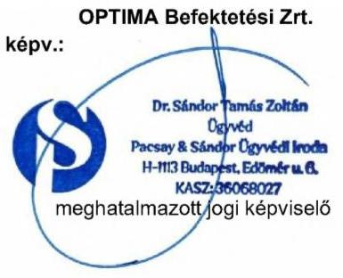

---

Észrevételek és kérelmek „A Pallas Athéné Domus Meriti Alapítvány gazdálkodásának ellenőrzése" című számvevőszéki jelentéstervezet vonatkozásában
szigorúan bizalmas!

---

# TARTALOMJEGYZÉK 

I. Bevezetés és kérelem ..... 4
I. 1 Kérelem záró megbeszélés tartásáról ..... 4
I. 2 Kérelem az eljárás felfüggesztésére ..... 5
I. 3 Kérelem a jelentés nyilvánosságának korlátozásáról ..... 6
II. Összegzés ..... 11
III. Részletes Észrevételek ..... 17
III. 1 Észrevételek az ellenőrzött időszak vonatkozásában ..... 17
III. 2 Az Összefoglalás megállapításaihoz tett észrevételek (jelentéstervezet 16-19. oldal) ..... 19
III. 3 Az 1. számú megállapításokhoz tett észrevételek (jelentéstervezet 20-31. oldal) ..... 43
III. 4 A 2. számú megállapításokhoz tett észrevételek (jelentéstervezet 32-56. oldal) ..... 50
IV. Mellékletek ..... 61
V. Definíciók ..... 62

---

# I. BEVEZETÉS ÉS KÉRELEM 

Tisztelt Igazgató Úr!
Az ÁSZ 2025. február 12. napi keltezéssel ellátott EL-3815-424/2025. iktatószámú levelében megküldött EL-3815-434/2025. iktatószámú jelentéstervezetében foglalt megállapításokra az ÁSZ Tv. 29. § (2) bekezdésében foglaltakra tekintettel az észrevételeinket az alábbiakban adjuk elő, amelyre tekintettel kérjük a tisztelt ÁSZ-t, hogy
(i) elsődlegesen az EL-3815/2025 hivatkozási szám alatt folyamatban lévő ellenőrzési eljárását felfüggeszteni szíveskedjék, illetve amennyiben arra a tisztelt ÁSZ nem lát lehetőséget
(ii) másodlagosan az EL-3815/2025 hivatkozási szám alatt folyamatban lévő ellenőrzési eljárását és jelentését az ellenőrzés alá vontaknál folyamatban lévő intézkedéseivel és annak várható hatásaival kiegészíteni szíveskedjék, illetve amennyiben a tisztelt ÁSZ erre sem lát lehetőséget,
(iii) harmadlagosan az EL-3815/2025 hivatkozási szám alatt folyamatban lévő ellenőrzési eljárásban a jelentéstervezetet felülvizsgálni és az alább kifejtettek szerint módosítani szíveskedjék.

Az alábbiakban kifejtettekre, valamint a jelentéstervezetben foglalt törvény által védett titokra tekintettel kérjük a tisztelt ÁSZ-t, hogy az EL-3815/2025 hivatkozási szám alatt folyamatban lévő ellenőrzési eljárásban készült jelentés nyilvánosságra hozatalát teljes egészében korlátozza, hogy az ne juthasson illetéktelen személy tudomására, és e védett adatok törvényben meghatározott védelme a hatóság eljárásában is biztosított legyen.

## I. 1 Kérelem záró megbeszélés tartásáról

Tekintettel a jelentésben foglalt gazdasági, üzleti és jogi információk összetettségére, valamint ezen információk jelentőségére tekintettel, illetve arra, hogy a tisztelt ÁSZ vizsgálatának megkezdését követően a jelentéstervezetben foglalt tényállás több tekintetben is jelentősen változott, valamint arra, hogy részben a jelentéstervezetben is javasolt intézkedések megtétele folyamatban van, ezért kérjük a tisztelt ÁSZ-t, hogy a vizsgálati eljárást ne zárja le, és a végleges vizsgálati jelentést ne adja ki. Kérjük továbbá, hogy a vizsgálati jelentés véglegesítését megelőzően (az ÁSZ Tv. 32. § (5) bekezdésére hivatkozással) biztosítson lehetőséget, hogy a feltárt tényeket, az ezeken alapuló megállapításokat, következtetéseket, valamint a folyamatban lévő intézkedéseket a felek záró megbeszélés keretében egyeztessék. Erre irányuló kérésünkre korábbi megbeszélések során a Tisztelt Ellenőrzésvezető Úr is vállalta, hogy lehetőséget biztosít.

A folyamatban lévő intézkedések (pl. pénzügyi, illetve társasági jogi konszolidációs eljárások) álláspontunk szerint érdemben kihatnak a jelentéstervezetben az ellenőrzés alá vont jogi személyek és szervezetek részére megfogalmazott intézkedési javaslatokra és a jelentéstervezetben megtett megállapításokra is.

A folyamatban lévő intézkedések eredményeképpen úgy véljük, hogy a jelentéstervezetben foglalt számos megállapítás a továbbiakban már okafogyott vagy módosítást igényel. Hasonló hatása van a folyamatban lévő intézkedéseknek a jelentéstervezetben foglalt intézkedési javaslatokra is.

---

Ezen folyamatban lévő intézkedések összetettsége és sokrétűsége meghaladja az írásbeli észrevételezés kereteit, így azok mélységükben való bemutatásához mindenképpen szükségesnek ítéljük a személyes megbeszélés megtartását.

# I. 2 Kérelem az eljárás felfüggesztésére 

Az ÁSZ Tv. 31.§-a értelmében: „Az Állami Számvevőszék elnöke az ellenőrzés során feltárt jogszabálysértő gyakorlat, illetve a vagyon rendeltetésellenes vagy pazarló felhasználásának megszüntetése érdekében ha jogszabály súlyosabb jogkövetkezmény alkalmazását nem írja elő - figyelemfelhívó levéllel fordulhat az ellenőrzött szerv vezetőjéhez."

Hasonlóképpen rendelkezik az Ász Tv. 33. § (1) bekezdése is az ellenőrzés alá vontak intézkedési kötelezettségéről. „Az Állami Számvevőszék az ellenőrzési megállapításait tartalmazó jelentését megküldi az ellenőrzött szervezet vezetőjének. Az ellenőrzött szervezet vezetője köteles a jelentésben foglalt megállapításokhoz kapcsolódó intézkedési tervet összeállítani, és azt a jelentés kézhezvételétől számított harminc napon belül az Állami Számvevőszék részére megküldeni."

A jelen eljárás eredményeképpen a jelentéstervezetében a tisztelt ÁSZ számos intézkedési javaslatot megfogalmazott az ellenőrzés alá vontakkal szemben. Ezen folyamatban lévő intézkedések egyike a jelen észrevétel érdemi részében foglalt pénzügyi konszolidáció, valamint a társasági jogi átszervezések.

Az Optima csoport átfogó pénzügyi konszolidáció megkezdéséről döntött, amely elkészítését követően lesz megállapítható az Optima csoport valós pénzügyi helyzete. A pénzügyi konszolidáció összetettsége okán legalább 6 hónapot vesz igénybe. Továbbá a jelentéstervezet különös hangsúlyt fektet az ellenőrzés alá vontak társasági jogi struktúrájára, valamint a döntéshozatali mechanizmusokra, így a tervezett konszolidációs folyamatok és intézkedések érdemi hatást gyakorolnak a jelentéstervezetben foglalt megállapításokra és intézkedési javaslatokra. Álláspontunk szerint ezen folyamatok lezárását megelőzően a tisztelt ÁSZ a jelentésében valós képet nem tud bemutatni, így az ellenőrzési eljárás nem zárható le.

Az ÁSZ Tv. az ellenőrzési eljárás felfüggesztését nem tiltja a konszolidációs folyamatok és intézkedések lezárultáig és megvalósulásáig. Ellenkezőleg, az eljárás felfüggesztése kifejezetten az ÁSZ Tv. 24.§ (1) bekezdésében foglalt, az ellenőrzésekkel szemben támasztott törvényi követelmények megvalósulását szolgálja. E körben különös hangsúllyal hivatkozunk az ÁSZ Tv. 24.§ (1) bekezdés d) és e) pontjaiban foglaltakra, amelyek értelmében: „Az ellenőrzésekkel szemben támasztott követelmények: [..] d) az ellenőrzések eredményeinek, a megállapításoknak alátámasztottnak, a következtetéseknek okszerűnek és megalapozottnak kell lenniük, e) az ellenőrzéseket hatékonyan és eredményesen kell elvégezni." A jelen észrevétel érdemi részében meghivatkozott konszolidációs folyamatok lezárásának idejét 6 hónapra becsüljük, amely időszak az ellenőrzés hatékonyságára, alaposságára és teljességére, valamint a tisztelt ÁSZ további törvényi kötelezettségeinek teljesítésére semmilyen negatív hatást nem gyakorol, hanem azok teljesülését kifejezetten elősegíti.

Mindezekre tekintettel kérjük a tisztelt ÁSZ-t, hogy az EL-3815/2025 hivatkozási szám alatt folyamatban lévő ellenőrzési eljárását 6 hónapra felfüggeszteni szíveskedjen.

Vállaljuk, hogy a 6 hónapos felfüggesztési időszak lejártát megelőzően rendszeresen és részletesen tájékoztatjuk a tisztelt ÁSZ-t az általunk megtett intézkedésekről, valamint a konszolidációról és azoknak az ellenőrzés alá vontak működésére gyakorolt hatásáról, kifejezetten kitérve a jelentéstervezetben tett megállapításokkal, valamint az intézkedési javaslatokkal összefüggésben.

---

Meglátásunk szerint a folyamatban lévő intézkedések várható hatásai érdemben befolyásolják a jelentéstervezet megállapításait és intézkedési javaslatait, így indokolt az ellenőrzési eljárás fent hivatkozott felfüggesztése.

A folyamatban lévő intézkedések közül fontos kiemelni, hogy az ellenőrzés alá vont jogi személyek és szervezetek által megkezdett társasági jogi konszolidáció keretében az Optima Befektetési Zrt. („Optima"), illetve annak közvetett vagy közvetlen tulajdonában álló társaságok („Optima Csoport") átstrukturálják a döntéshozatali mechanizmusaikat, amelynek részeként egy centralizált irányítási testületet hoznak létre, megszüntetve a jelentéstervezetben kifogásolt párhuzamos hatásköröket. Álláspontunk szerint a társasági jogi konszolidáció által bekövetkező változás már önmagában közvetlenül orvosolja a jelentéstervezet azon megállapítását, miszerint a döntéshozatali struktúra átláthatatlan és nem hatékony.

Továbbá, a Neumann János Egyetemért Alapítvánnyal („NJEA") együttműködésben kidolgozás alatt lévő és véglegesítési szakaszban járó kötvényvisszaváltási megállapodás - amelynek hatálybalépése 2025. második negyedévében várható - tartalma és célzott eredménye a jelentéstervezetben kiemelt befektetési, gazdálkodási, szabályozási megállapításokra hivatott érdemben reagálni és az esetleges hiányosságokat kezelni, kiemelt tekintettel a kötvény likviditásának és hozamának összefüggéseire.

A fentiekben bemutatott intézkedések eredményei 6 hónapon belül minden bizonnyal mérhetővé válnak és lehetővé teszik, hogy az ÁSZ valós képet kapjon az ellenőrzés alá vontak - jelen észrevétel megtételekor már felülvizsgálat alatt álló - működéséről és intézkedésiről, így a tisztelt ÁSZ jelentése aktualizálttá és megalapozottá válhat az ÁSZ Tv. 24. § (1) bekezdés d) és e) pontjainak megfelelően, amely alapján (i) „az ellenőrzések eredményeinek, a megállapításoknak alátámasztottnak, a következtetéseknek okszerűnek és megalapozottnak kell lenniük", továbbá (ii) „az ellenőrzéseket hatékonyan és eredményesen kell elvégezni."

# I. 3 Kérelem a jelentés nyilvánosságának korlátozásáról 

A tisztelt ÁSZ által készített jelentéstervezet számos törvény által védett információt és titkot tartalmaz, amelyek nyilvánosságra hozatalát törvény tiltja. E körben felhívjuk a tisztelt ÁSZ figyelmét arra, hogy ezen törvényi védelem elsődlegesen nem csak az ellenőrzés alá vont jogi személyeket védi, hanem az ellenőrzés alá vont jogi személyek befektetőit is.

Ezen törvényi védelem teljesülése érdekében a jelentés nyilvánosságra hozatalának korlátozását és tilalmát az ÁSZ Tv. is kifejezetten tartalmazza. Az ÁSZ Tv. 32.§ (3) bekezdése alapján ekként: „Az Állami Számvevőszék jelentése nyilvános. Törvény a nyilvánosságot minősített adatok védelme érdekében korlátozhatja. A nyilvánosságra hozott jelentés nem tartalmazhat minősített adatot vagy a törvény által védett egyéb titkot."

Hasonló korlátozást tartalmaz a 2011. évi CXII. törvény az információs önrendelkezési jogról és az információszabadságról („Info Tv.") 27. § (1) bekezdése is, amelynek értelmében: „A közérdekű vagy közérdekből nyilvános adat nem ismerhető meg, ha az a minősített adat védelméről szóló törvény szerinti minősített adat."

A fentieken túl általános jelleggel hivatkozunk még az általános közigazgatási rendtartásról szóló 2016. évi CL törvény 27.§ (2) bekezdésében foglaltakra: „A hatóság gondoskodik arról, hogy a törvény által védett titok és törvény által védett egyéb adat (a továbbiakban együtt: védett adat) ne kerüljön nyilvánosságra, ne juthasson illetéktelen személy tudomására, és e védett adatok törvényben meghatározott védelme a hatóság eljárásában is biztosított legyen."

---

Mindezekre tekintettel fel kívánjuk hívni a tisztelt ÁSZ figyelmét, hogy az ÁSZ tv. 32. § (3) bekezdése alapján a nyilvánosságra hozott jelentés nem tartalmazhat minősített adatot vagy a törvény által védett egyéb titkot. Tekintettel arra, hogy a jelentéstervezetben foglalt információk összessége törvény által védett titoknak minősül, így különösen üzleti titoknak, értékpapírtitoknak, valamint tőzsdei bennfentes információnak, ezért kérjük a tisztelt ÁSZ-t, hogy a végleges jelentés nyilvánosságát teljes mértékben korlátozza az alábbi indokokra tekintettel.

A részünkre megküldött jelentéstervezetben számos az ÁSZ Tv.-ben és az Info Tv.-ben hivatkozott, törvényi felhatalmazással védett titok található. E szerint, törvény által védett titoknak minősül - többek között - az üzleti titok, amelyről az üzleti titok védelméről szóló 2018. évi LIV. törvény („Ütvtv.") rendelkezik.

Az Útvtv. 1.§ (1) bekezdése alapján „üzleti titok a gazdasági tevékenységhez kapcsolódó, titkos - egészben, vagy elemeinek összességeként nem közismert vagy
 az érintett gazdasági tevékenységet végző személyek számára nem könnyen hozzáférhető -, ennélfogva vagyoni értékkel bíró olyan tény, tájékoztatás, egyéb adat és az azokból készült összeállítás, amelynek a titokban tartása érdekében a titok jogosultja az adott helyzetben általában elvárható magatartást tanúsítja."

Az Útvtv. szabályai alapján jelentéstervezetben foglalt információk közül üzleti titoknak, valamint bennfentes információnak minősül az Optima Csoport gazdasági tevékenységéhez, értékeléséhez, egyes gazdasági ügyleteihez tartozó információk összessége, valamint különösen az Optima Csoportba tartozó tőzsdén jegyzett társaságokra vonatkozó üzleti és gazdasági információk.

Az Útvtv. 6. § (1) bekezdése alapján az üzleti titokhoz fűződő jogot megsérti, aki az üzleti titkot jogosulatlanul - a jogosult hozzájárulása nélkül - felfedi. Hangsúlyozni kívánjuk, hogy a jelentéstervezetben foglalt információk összessége üzleti titoknak minősül, illetve az üzleti titok jogosultja nem kizárólag az Optima Csoport, hanem az adott üzleti titok felett jogszerű ellenőrzést gyakorló személy, akinek a jogszerű gazdasági, pénzügyi, üzleti érdekeit az üzleti titokhoz fűződő jog megsértése sértené. Minderre tekintettel az Útvtv. rendelkezései alapján a jelentéstervezetben foglalt üzleti titkok tekintetében minden jogosult jóváhagyására szükség lenne ezen információk nyilvánosságra hozatalát megelőzően, azonban még a jóváhagyás megadása esetén is szükséges vizsgálni az információk jellege miatt alkalmazandó egyéb vonatkozó jogszabályokat is.

A jelentéstervezet számos ponton megállapítást tesz az ellenőrzés alá vontak döntési mechanizmusával és döntéselőkészítésével kapcsolatosan. Hasonlóképpen, a jelentéstervezet számos intézkedési javaslatot megfogalmaz az ellenőrzés alá vontak részére az ellenőrzés alá vontak döntési mechanizmusával és döntéselőkészítésével kapcsolatosan. Az Info Tv. irányadó rendelkezései az adatok közérdekű megismerésével szemben nem csak egyes adatok tekintetében tartalmaz védelmet és rendelkezik korlátozásról vagy tilalomról. Az Info Tv. rendszerében a megismerésre vonatkozó igényel szemben védelem illeti meg, meghatározott feltételek mellett, a döntéselőkészítési mechanizmust, valamint az annak során keletkezett adatokat és döntéseket is.

Az előző bekezdésben foglaltakra figyelemmel az Info Tv. 27.§ (3) bekezdése értelmében: „A döntés megalapozását szolgáló adat megismerésére irányuló igény - az (5) bekezdésben meghatározott időtartamon belül - a döntés meghozatalát követően akkor utasítható el, ha az adat további jövőbeli döntés megalapozását is szolgálja, vagy az adat megismerése a közfeladatot ellátó szerv törvényes működési rendjét vagy feladat- és hatáskörének illetéktelen külső befolyástól mentes ellátását, így különösen az adatot keletkeztető álláspontjának a döntések előkészítése, illetve egyes bírósági eljárásokban való részvétele során történő szabad kifejtését veszélyeztetné."

---

Az ellenőrzés alá vont személyek az ellenőrzéssel érintett időszakban számos nagyértékű tranzakciót bonyolítottak le. Ezen tranzakciók tekintetében kiemelt volt a piaci érdeklődés, így akár eladói, akár vevői oldalon számos versenytárs jelent meg. A tranzakciók megkötését megelőzően, mint az egyes tranzakciók fő tárgyát képező vételár vagy ajánlati összeg meghatározása kiemelt jelentőséggel bír. Egy adott ajánlat megtétele vagy elfogadása számos szempont mérlegelését igényli. Ezeknek a szempontoknak a köre, valamint azok vizsgálati és elbírálási módjának nyilvánosságra kerülése olyan bennfentes információkhoz és üzleti titkokhoz juttathatja a versenytársakat, amelyek jelentősen korlátozhatják az érintett fél ajánlattételi és/vagy versenyzési képességeit, lehetőségeit.

A döntéselőkészítési mechanizmusok és a döntési pontok jelentéstervezet útján való nyilvánosságra hozatala ekként mind az ellenőrzés alá vontak, mind a befektetőik részére jelentős kárt okoz. A nemzetközi ingatlanpiaci versenyben az ellenőrzés alá vontak mind eladói, mind vevői oldalon lényegesen hátrányosabb pozícióba kerülnek, hiszen ismerté válik a versenytársak részére, hogy mely szempontok bírnak kiemelt jelentőséggel az ellenőrzés alá vontaknak, és azokat az ellenőrzés alá vontak miként értékelik. A hátrányosabb piaci pozíció közvetlen következménye, hogy az ellenőrzés alá vontak tranzakciós lehetőségektől eshetnek el, piaci megítélésük romlik, csak jelentősen hátrányosabb feltételekkel, illetve a vevői oldalon csak lényegesen magasabb, vagy eladói oldalon lényegesen alacsonyabb vételáron tudnak jogügyleteket kötni.

Mindezek alapján, tekintettel arra, hogy a jelentéstervezet számos ponton megállapítást és intézkedési javaslatot tesz az ellenőrzés alá vontak döntési mechanizmusával és döntéselőkészítésével kapcsolatosan, az ellenőrzés alá vontaknak, illetve befektetőiknek jelentős érdeke fűződik ahhoz, hogy a tisztelt ÁSZ a jelentéstervezet nyilvánosságra hozatalát mellőzze.

A kollektív befektetési formákról és kezelőikről, valamint egyes pénzügyi tárgyú törvények módosításáról szóló 2014. évi XVI. törvény („Kbftv.") 197.§ - 199. §-ban foglaltak alapján a befektetési alapkezelő a birtokába jutott üzleti titkot időbeli korlátozás nélkül köteles őrizni. A Kbftv. 197. § (2) bekezdésében foglalt kivétel a titoktartási kötelezettség alól a tisztelt Állami Számvevőszék felé áll fenn, azonban az üzleti titkok nyilvánosságra hozatala a Kbftv. szabályai alapján fennálló titoktartási kötelezettségbe ütközne, mivel az Optima Befektetési Alapkezelő Zrt.-re („Alapkezelő") mint befektetési alapkezelő járt és jár el az Optima Csoportba tartozó befektetések vonatkozásában, így a Kbftv. titoktartásra vonatkozó rendelkezései alkalmazandók az Alapkezelő vonatkozásában.

A befektetési vállalkozásokról és az árutőzsdei szolgáltatókról, valamint az általuk végezhető tevékenységek szabályairól szóló 2007. évi CXXXVIII. törvény 117. § (1) és (7) bekezdései alapján a befektetési vállalkozás és az árutőzsdei szolgáltató, a befektetési vállalkozásban és az árutőzsdei szolgáltatóban tulajdoni részesedéssel rendelkező, illetve vezető állású személy vagy bármely más személy, aki valamilyen módon birtokába jutott az üzleti titoknak, az üzleti titkot időbeli korlátozás nélkül köteles megőrizni. A titoktartási kötelezettség alapján az üzleti titok körébe tartozó tény, információ, megoldás vagy adat a befektetési vállalkozás felhatalmazása nélkül nem adható ki harmadik személynek, és feladatkörön kívül nem használható fel.

Összességében megállapítható, hogy a jelentéstervezet olyan, az Optima Csoport tulajdonában álló lengyel Globe Trade Centre S.A. („GTC") és svájci Ultima Capital S.A („Ultima") tőzsdén jegyzett társaságok értékeléséhez, működéséhez, eredményességéhez, valamint a társaságok csoportjához kapcsolódó gazdasági, üzleti információkat tartalmaz, amelyek nyilvánosságra hozatala a tőzsdén jegyzett társaságok részvényeinek árfolyamára jelentős hatást gyakorolna, ezért ezen információk tőzsdei bennfentes információnak minősülnek az Európai Parlament és a Tanács 596/2014/EU rendeletének 7. cikke alapján.

---

Kérjük továbbá a jelentéstervezet 11. oldalán feltüntetett szereplő magánszemélyek neveinek, mint személyes adatok feltüntetésének törlését a magánélet védelméről szóló 2018. évi LIII. törvényre hivatkozással.

E körben, a fentieken túl, figyelemmel arra, hogy az Optima Csoport tulajdonában álló lengyel GTC és svájci Ultima tőzsdén jegyzett társaságok, illetőleg, hogy az ellenőrzés alá vont jogi személyek között több alapkezelő is található hivatkozunk a tőkepiacról szóló 2001. évi CXX. törvény („Tpt.") titokvédelmi rendelkezéseire is. A Tpt. 369.§ (1) bekezdése értelmében: „Értékpapírtitok minden olyan, az egyes ügyfélről a befektetési alapkezelő, a kockázati tőkealap-kezelő, a tőzsde, központi értéktár, központi szerződő fél rendelkezésére álló adat, amely az ügyfél személyére, adataira, vagyoni helyzetére, üzleti befektetési tevékenységére, gazdálkodására, tulajdonosi, üzleti kapcsolataira, illetve a befektetési alapkezelővel, a kockázati tőkealap-kezelővel, a tőzsdével, a központi értéktárral, a központi szerződő féllel kötött szerződéseire, számlájának egyenlegére és forgalmára vonatkozik." A Tpt. 369.§ (1) bekezdése az értékpapír titkot ekként törvény által védett titoknak minősíti.

A törvényileg védett titokminősítésre tekintettel a Tpt. 371. § (1) és (2) bekezdései ezért kifejezetten akként rendelkeznek, hogy az értékpapírtitok nyilvánosságra nem hozható:

- „(1) Aki üzleti vagy értékpapír-titok birtokába jut, köteles azt - törvény eltérő rendelkezése hiányában - időbeli korlátozás nélkül megtartani."
- „(2) A titoktartási kötelezettség alapján az üzleti, illetőleg az értékpapírtitok körébe tartozó tény, információ, megoldás vagy adat, az e törvényben meghatározott körön kívül - az ügyfél felhatalmazása nélkül - nem adható ki harmadik személynek és feladatkörön kívül nem használható fel."

A Tpt. értékpapír titokra vonatkozó rendelkezéseire figyelemmel a jelentéstervezet egyéb okból sem hozható nyilvánosságra. A Tpt. 371.§ (3) bekezdése értelmében ugyanis „Aki üzleti titok vagy értékpapírtitok birtokába jut, azt nem használhatja fel arra, hogy annak révén saját maga vagy más személy részére közvetlen vagy közvetett módon előnyt szerezzen, továbbá, hogy a befektetési alapkezelőnek, a kockázati tőkealap-kezelőnek, a tőzsdének, a központi értéktárnak, a központi szerződő félnek vagy ezek ügyfeleinek hátrányt okozzon." Tekintettel arra, hogy az Optima meghatározó részvényes mindkét tőzsdén jegyzett társaságban (GTC, Ultima), ezért a jelentéstervezetben foglalt információk nyilvánosságra hozatala, figyelemmel a jelentéstervezet jelenlegi állapotára, az egyes megállapítások téves, valótlan vagy félrevezető voltára, ezen információk a lengyel GTC és svájci Ultima részvényeseinek lényeges hátrányt okozhatnak a jelentéstervezetnek az egyes részvényárfolyamokra gyakorolt potenciális negatív hatására figyelemmel. Ezen várható negatív hatások különösen arra tekintettel is károsak a részvényesek számára, hogy az ellenőrzés alá vontak számos intézkedést kezdeményeztek, amely intézkedések végrehajtása jelenleg is folyamatban van, és amely intézkedéseket, valamint azok hatását a jelentéstervezet nem tartalmazza.

Tekintettel arra, hogy az Optima meghatározó részvényes mindkét tőzsdén jegyzett társaságban (GTC, Ultima), ezért a jelentéstervezetben foglalt - üzleti titoknak és bennfentes információnak minősülő információk nyilvánosságra hozatala jelentős piactorzító hatással bírna mind a svájci, mind pedig a lengyel tőzsdén, továbbá a tőzsdei társaságokhoz kapcsolódó üzleti információk nyilvánosságra hozatala mind az európai uniós (MAR rendelet), a svájci (svájci pénzügyi piaci infrastruktúráról szóló törvény, a svájci polgári törvénykönyv, svájci banki törvény), mind pedig a lengyel jogszabályokat (lengyel pénzügyi eszközökkel való kereskedésről szóló törvény, lengyel kereskedelmi törvény, valamint a lengyel nyilvános társaságokról szóló törvény) súlyosan sértené.

---

Fontos kiemelni, hogy a jelentéstervezet konkrét példákkal mutatja be (i) az Optima Csoport tulajdonában álló GTC lengyel tőzsdei társaság esetében a társaság múltbeli belső vállalati működési gyakorlatát, valamint (ii) az Ultima vonatkozásában egy folyamatban lévő részvényértékesítés és opciós jog (t.i. részvények tulajdonjogának átruházása) érvényesítés előkészítésének döntési mechanizmusait, beleértve ezek módszertanát és stratégiai szempontjait. Többek között ezen adatok a GTC és az Optima Csoport vonatkozásában is az Ütvtv. 1. § (1) bekezdése szerint üzleti titoknak minősülnek, mivel nem közismertek, és az Optima Csoport számára vagyoni értéket képviselnek. Továbbá a jelentéstervezet kitér az Ultima svájci tőzsdei társaság kapcsán a társaság részvényeinek bekerülési értékére, valamint ezek összefüggéseire a jelenlegi árfolyammal és a jövőbeli befektetési stratégiákkal. Ez az Európai Parlament és a Tanács 596/2014/EU rendelete (MAR rendelet) 7. cikke értelmében bennfentes információnak minősül, hiszen azok bármelyikének nyilvánosságra hozatala a részvényárfolyam jelentős változását idézheti elő. Az árfolyamváltozáson túl, ezen információk nyilvánossága a versenytársak számára előnyt biztosítana, miközben az ellenőrzés alá vontak és befektetőik érdekeit közvetlenül veszélyeztetné.

Tekintettel arra, hogy az Optima Csoport nem egyedüli befektető a jelentéstervezetben is bemutatott társaságokban, ezért a jelentéstervezetben foglalt információk nyilvánosságra hozatala súlyos versenyhátrányt okozna, illetve súlyosan sértené harmadik fél befektetők üzleti titkait, valamint üzleti érdekeit is. Továbbá az Optima Csoport folyamatban lévő tranzakciói vonatkozásában a jelentésben foglalt információk szintén üzleti titoknak minősülnek és azok nyilvánosságra hozatala hátrányos következményekkel járna az Optima Csoport, valamint harmadik fél befektetők számára.

Megjegyezzük továbbá, hogy a jelentéstervezetben foglalt megállapítások Magyar Nemzeti Bankot („MNB") érintő érintettsége miatt a jelentés nyilvánosságra hozatala akár súlyosan befolyásolhatja Magyarország nemzetközi megítélését és kormányközi kapcsolatait is, valamint Magyarország nemzetbiztonsági érdekét sértheti, kiemelt figyelemmel az ország törvényes rendjének védelmére.
 vetett bizalom megtörése esetén. E körben hivatkozunk az Info Tv. 27.§ (2) bekezdés e) pontjában foglaltakra is. Az Info Tv. 27.§ (2) bekezdés e) pontja alapján a közérdekű és közérdekből nyilvános adatok megismeréséhez való jog központi pénzügyi vagy devizapolitikai érdekből kifejezetten korlátozható.

Minekután a jelentéstervezet utal az MNB-hez köthető entitások gazdálkodási és befektetési gyakorlatára, amelyek közvetlenül összefüggést látszatát kelthetik a forint árfolyamának stabilitásával és az ország pénzügyi védelmi képességével, a belső döntési mechanizmusokat és kockázatelemzéseket tartalmazó jelentéstervezet nyilvánosságra hozatala (akár teljes terjedelmében megállapításokkal és észrevételekkel, akár részben idézve vagy kivonatolva), növelheti a forint elleni spekulációs támadások kockázatát a devizapiacon, különösen egy olyan geopolitikai és gazdasági környezetben, amelyben Magyarország külső finanszírozási kitettsége jelentős. Továbbá az Optima Csoportot érintő befektetési gyakorlatok nyilvánosságra hozatala, az MNB közvetett befektetési stratégiájára vonatkozó adatok és eljárások kiszivárgását eredményezheti, amely alááshatná az ország gazdasági szuverenitását, így az Info Tv. 27. § (2) bekezdés e) pontja szerinti központi pénzügyi és devizapolitikai érdek sérelmét jelentené, az MNB-be vetett bizalom meggyengülése ezen túlmenően a magyar pénzügyi rendszer stabilitását is veszélyeztetné, amelynek előre nem látható következményei lehetnek a nemzetgazdaságra nézve.

A fentieken túl a jelentéstervezet tartalma és összképe alkalmas az Alapítvány alapítójába, azaz a Magyar Nemzeti Bankba vetett bizalom meggyengítésére, melynek előre beláthatatlan nemzetgazdasági következményei lehetnek.

A fent előadottakra, valamint a jelentéstervezetben foglalt törvény által védett titokra tekintettel kérjük a tisztelt ÁSZ-t, hogy az EL-3815/2025 hivatkozási szám alatt folyamatban lévő ellenőrzési eljárásban készült jelentés nyilvánosságra hozatalát teljes egészében korlátozza, hogy az ne juthasson illetéktelen személy tudomására, és e védett adatok törvényben meghatározott védelme a hatóság eljárásában is biztosított legyen.

# II. ÖSSZEGZÉS 

A tisztelt ÁSZ jelentéstervezetére tett főbb észrevételeinket az alábbiak összegezzük.

1) Ellenőrzött időszak
(i) Elöljáróban felhívjuk a figyelmet, hogy a tisztelt ÁSZ által meghatározott ellenőrzött időszak nincs összhangban a jelentéstervezet tartalmával. A jelentéstervezet megállapítja, hogy az 13. fókuszterületek vonatkozásában az ellenőrzött időszak a 2021-2023. évek és a 2023. beszámolók, ugyanakkor részletesen (és a valósággal ellentétes tényekre alapítva, valamint abból téves következtetésekre jutva) elemzi többek között a GTC 2020. év elején megvalósult megvásárlását, a tranzakcióhoz vezető döntéshozatal körülményeit és annak gazdasági hatásait. Ugyanígy a jelentéstervezet utal több 2024. és 2025. évben történt eseményre és döntésre is.
(ii) Minekután az ellenőrzött időszakon kívül eső megállapítások esetlegesek és nem tükröznek részletes vizsgálatot, hanem csak egyes kedvezőtlen színben feltüntetett körülmények kiragadására korlátozódnak, ezért a jelentéstervezet alkalmatlan arra, hogy teljes és valós képet mutasson gazdasági/vagyoni helyzetéről az ellenőrzött időszak vonatkozásában. Felhívjuk a figyelmet arra, hogy számos az Optima csoportot érintő belső és külső körülmény hatására például az ellenőrzött időszak legvégén, 2023 decemberében került sor az Ultima részvények Optima általi megszerzésére, és a valóságban az eredeti befektetés 2021. augusztusban valósult meg és annak formája egy hosszú lejáratú éves 12%-os kamatot biztosító kötvény volt. A jelentéstervezet ezt a körülményt meg sem említi elemzésében, holott a vizsgált időszak túlnyomó részében a befektetés formája kötvény volt.
2) Döntéselőkészítés megalapozottsága
(i) A tisztelt ÁSZ álláspontja szerint a kuratórium a döntéseit nem elegendő és mennyiségű információ és döntéselőkészítő anyagok birtokában hozta meg. Az Optima mint vagyonkezelő társaság személyes tapasztalatai szerint a valóság ezzel szemben az, hogy általános eljárás volt, hogy a kuratórium formális döntéshozatalait minden esetben többszöri informális telefonos és személyes egyeztetések, telefonkonferenciák előzték meg, amelyek során a kuratórium tagjai egyeztethették felvetéseiket egymással és az Optima vezetőségével. Az Alapítvány kuratóriumának tagjainak szakmai múltja és felkészültsége alapján sem valószínűsíthető a tisztelt ÁSZ által bemutatott formális szerep.
(ii) Az Alapítvány az Optima szervezetét pont annak céljából hozta létre, hogy a befektetési döntések megalapozott előkészítése, a jogszerű és hatékony működés biztosított legyen. Az Alapítvány kuratóriumában a befektetési döntések részletes elemzéséhez nincs kellő humán erőforrás, mindaz az Optima szervezetében koncentrálódik.
3) Befektetések és befektetési struktúra kialakítása

(i) A tisztelt ÁSZ a jelentéstervezetben többször viszonyítja az Optima Csoport befektetéseit a magyar állampapírokba történő befektetések kockázati szintjéhez. Fel kívánjuk hívni a figyelmet, hogy az Alapítvány a befektetéseit az alapítását közvetlen követően állampapírban tartotta, azonban az Európai Központi Bank („EKB") 2015-ös jelentésében megállapította, hogy a „Magyar Nemzeti Banknak is biztosítania kell, hogy azokat a jegybanki forrásokat, amelyeket átruházott az alapítványai hálózatára, ne használják - közvetlenül vagy közvetve - állami finanszírozási célokra." Az EKB álláspontja szerint az alapítványoknak átadott jegybanki források állampapírba történő befektetése tiltott monetáris finanszírozásnak minősül, ezért többször felszólította az MNB-t, hogy a nemzeti bank által alapított alapítványok tekintetében ezt a gyakorlatot szüntesse meg. Ezt követően született meg az a döntés, hogy ezért az állampapírokban történő befektetés helyett az Alapítvány jövedelemtermelő eszközökbe fektesse vagyonát.
(ii) Az Optima befektetési portfóliójának főbb elemei az ellenőrzött időszakban a lengyel tőzsdén jegyzett GTC, az Alpine kötvények, valamint a Budapesti Metropolitan Egyetem voltak. Ezen diverzifikált portfolió biztosította az Optima és az Alapítvány számára kiszámítható hozamot az Alapítvány céljainak megvalósítása érdekében. A Budapesti Metropolitan Egyetem nem csak az Optima befektetése, hanem egy vezető nemzetközi oktatási intézmény, amely közvetlenül is hozzájárul az alapítványi célok megvalósításához.
(iii) A tisztelt ÁSZ megállapítása szerint az Optima egy lényegében átláthatatlan, a valós vagyon értékelését ellehetetlenítő cégstruktúrát hozott létre. Ezzel szemben az Optima célja éppen egy olyan befektetési struktúra kialakítása volt, amely által átlátható, transzparens és szabályozott környezetet teremt a befektetései végrehajtása és vagyona védelme érdekében. A befektetési struktúra kialakítását alapos szakmai megfontolások indokolták, különös tekintettel a nemzetközi tranzakciók hatékony lebonyolítására, a befektetések optimális kezelésére és a külföldi értékpapír-piaci előírásokra is. A befektetési struktúra jogszerű kialakításában nemzetközi tanácsadók (pl. DLA Piper, EY, BDO, stb.) működtek közre.
(iv) Felhívjuk a figyelmet, hogy a tisztelt ÁSZ Optima Csoport átláthatatlanságát hangsúlyozó álláspontja szembemegy a Magyar Kormány magántőkealapokkal és befektetési alapokkal kapcsolatosan mindenkor képviselt álláspontjával és alapvetően a nemzetközi kritikákat ismétli. Ezzel szemben álláspontunk az, hogy a nemzetközi befektetési gyakorlatban teljesen megszokott és elfogadott a többszintű holding- és alapstruktúrák alkalmazása, amely számos előnnyel jár mind működési, mind befektetési (és számos esetben adózási) szempontból. A befektetési alapok, illetve magántőkealapok működése, gazdálkodása, illetve beszámolási kötelezettsége részletesen szabályozott mind a magyar, mind pedig az európai uniós jogban. Ezen alapok működését az MNB felügyeli, amely többletgaranciát nyújt a vagyon védelme és átláthatósága érdekében.
4) Főbb befektetésekre tett megállapítások

Globe Trade Centre S.A.
(i) Az ÁSZ jelentéstervezetében előadta, hogy a GTC részvénycsomag megvásárlása túlzott kockázatot jelentett 2020-ban, valamint az ÁSZ az üzleti döntés gazdasági indokoltságát nem tudta azonosítani. Mindazonáltal a lengyel tőzsdén jegyzett GTC a közép-kelet-európai régió vezető ingatlanbefektető és -fejlesztő társasága és a piac egyik meghatározó szereplője. A döntés gazdasági indokoltságát támasztotta alá többek között, hogy a GTC bruttó eszközértéke meghaladja a 2,7 milliárd eurót és rendkívül széleskörű ingatlanportfolióval (lakó, iroda, üzletközpont) rendelkezik Lengyelországban, Magyarországon, Szerbiában, Romániában, Horvátországban és Bulgáriában. A GTC portfóliója mind földrajzi, mind pedig ingatlanállománya szempontjából is kellően diverzifikált, ezáltal a jövedelemtermelő képességet hosszútávon tudja biztosítani.
(ii) Az ÁSZ álláspontja szerint az Alapítvány kuratóriuma a GTC befektetésre vonatkozó döntését rövid idő alatt, nem kellően alátámasztott döntéselőkészítő anyagok birtokában hozta meg. Ezzel szemben a valóság az, hogy a GTC többségi, irányítást biztosító részvénycsomagjának Optima általi megvásárlásának előkészítését - a hasonló nemzetközi ügyleteknél szokásos módon - hosszú, több évig tartó előkészítés előzte meg. A döntés során rendelkezésre állt a PwC és a Schönherr, másrészről a Jones Lang LaSalle („JLL"), Andersen Tax, Impact Advisory és a Dentons jelentése is. Az Optima Csoport a JLL nemzetközileg elismert értékbecslő társaságot bízta meg a GTC ingatlanportfóliójának értékelésével, amely a Globe Trade Centre S.A., illetve annak közvetett vagy közvetlen tulajdonában álló társaságok („GTC Csoport") minden ingatlanját bejárta, külön értékelte, megvizsgálta az egyes ingatlanok jövedelemtermelő képességét és erről átfogó vagyonértékelési jelentést készített a hasonló méretű tranzakcióknál szokásos módon. A tranzakció tekintetében a felek szavatossági biztosítást (ún. warranty insurance) is kötöttek ezáltal tovább erősítve az Optima Csoport mint vevő érdekeit, így amennyiben az eladó megsértette volna bármely szavatosságvállalását, akkor ezért a biztosító áll helyt az Optima felé. Megjegyezzük, hogy a tisztelt ÁSZ jelentéstervezetében foglaltakkal ellentétben nem a Dentons közvetítette az üzleti lehetőséget az Optima részére, a Dentons (a belső előterjesztés félreérthető megjegyzése ellenére) kizárólag az Optima képviseletében eljáró tanácsadóként vett részt a tranzakcióban.
(iii) A tranzakciót megelőzően az átvilágítás során több ezer dokumentum került részletesen átvizsgálásra és elemzésre, valamint az ügylet előkészítése során számos megalapozó és kockázatelemző elemzés készült. A több ezer oldalas tranzakciós dokumentáció hónapokon keresztül került tárgyalásra és véglegesítésre a felek között. Az Optima előkészítő tevékenységére figyelemmel kijelenthető, hogy mindezek alapján az Alapítvány kuratóriuma a tisztelt ÁSZ állításaival szemben megalapozott döntést tudott hozni a tranzakcióról az előkészítés időtartamára, illetve az előkészítő anyagok mennyiségére és minőségére tekintettel.
(iv) Határozottan elutasítjuk a tisztelt ÁSZ azon megállapítását, hogy az Optima Csoport a GTC tranzakciót magántőkealap létrehozása útján kívánta volna eltitkolni a nyilvánosság elől. Az Optima Csoport éppen ellenkezőleg járt el, és a tranzakciót követően haladéktalanul - mind a mai napig nyilvános - sajtóközleményt jelentett meg a honlapján, amelyet a magyar és nemzetközi sajtó is átvett. Továbbá a GTC SA hivatalos honlapján is több „current report" került közzétételre e tárgykörben. A GTC akvizícióval kapcsolatosan már csak azért sem volt és nem is lehetett cél a nyilvánosság elől történő eltitkolása, mivel a tranzakciós eljárás zárása érdekében öt országban nyilvános versenyhivatali eljárás lefolytatására volt szükség, az összes finanszírozó bank jóváhagyását be kellett szerezni, valamint az Optima a lengyel tőzsdén nyilvános ajánlattételi eljárás lefolytatására is köteles volt. A lengyel tőzsdei szabályok szerint a tranzakció megvalósítása szigorú közzétételi kötelezettségekkel járt együtt, amelyet az Optima Csoport minden esetben teljesített.

(v) A tisztelt ÁSZ jelentéstervezetében a GTC valós piaci értékét leegyszerűsítve kizárólag a tőzsdei közkézhányad részvényárfolyamhoz köti. Ezen megközelítés azonban téves és szakmailag nem megalapozott, mivel a hasonló tőzsdén jegyzett ingatlancégek valós értékét nem a tőzsdei árfolyam, hanem a társaság nettó eszközértéke, ún. EPRA NAV értéke mutatja. Az EPRA NAV mutatót az Európai Tőzsdén Jegyzett Ingatlan Társaságok Szövetsége kifejezetten az ingatlanbefektetési vállalatok valós nettó eszközértékének meghatározására dolgozta ki. 2020. márciusában a GTC tekintetében megállapított EPRA NAV érték részvényenként meghaladta a 11,3 lengyel zloty-t, amely közel az akkori tőzsdei részvényárfolyamának kétszerese volt.
(vi) Felhívjuk a figyelmet, hogy az Optima tulajdonszerzését követően az új menedzsment stratégiai döntése alapján a GTC 2021 első félévében Fitch Ratings értékelést
 is szerzett. A Fitch Ratings olyannyira pozitív értékelést állapított meg 2021-ben, hogy a GTC a vállalati hiteleit 2,25%-os zöldkötvény kibocsátása útján refinanszírozni tudta, amely jól tükrözte a piac pozitív értékítéletét is. A nemzetközi minősítők 2022-től az ingatlanfejlesztő cégek jelentős részét leminősítették, azonban a GTC minősítését a Fitch Ratings - a közép-kelet-európai ingatlanpiaci szereplők közül az egyik utolsóként - 2023. szeptemberében változtatta csak meg. Ez azonban nem egyedi döntés volt, hanem követte a teljes ingatlanpiac leértékelését.
(vii) A GTC értékét jól mutatja, hogy az Optima az elmúlt években több alkalommal kapott vételi ajánlatot a GTC részvénycsomag vonatkozásában. Ezen ajánlatok jelentősen meghaladták a tisztelt ÁSZ által - leegyszerűsített módszertant alkalmazva - megállapított vállalati értéket. Megjegyezzük, hogy a GTC kisebbségi befektetői között intézményi befektetők (Allianz, lengyel nyugdíjalap, stb.) is jelen vannak jelentős 10% körüli részvénycsomaggal. Ezen befektetők a részvényeiket többszöri megkeresés ellenére sem kívánták eladni, ami jól szemlélteti az intézményi befektetők GTC-be vetett töretlen bizalmát az iparágat érintő negatív hatások ellenére is.

# Ultima Capital S.A. 

(viii) Az Optima Csoport másik jelentős befektetése az ellenőrzött időszakban a svájci tőzsdén jegyzett Ultimához kapcsolódó Alpine kötvények. Azonban a tisztelt ÁSZ nem vette figyelembe a jelentéstervezetében, hogy a vizsgált időszakban az Ultima befektetés 12%-os éves hozamot biztosító kötvény formájában valósult meg, amely 2023 végén került társasági részesedésre átváltoztatásra számos az Optima csoportot érintő belső és külső körülmény és megfontolás hatására. 2024 végétől egy ciprusi tőzsdén jegyzett szakmai nagybefektetővel működik együtt, amellyel az Ultima befektetés növekvő pályára állt. A befektetés értékét támasztja alá, hogy az Optima Csoport eladási joggal rendelkezik az Ultima részvényei felett, amely alapján 2029-től 105 svájci frankos részvényárfolyamon bármikor értékesíteni tudja a befektetését.
(ix) A tisztelt ÁSZ a jelentéstervezetében rögzíti, hogy az Ultima befektetés kapcsán 2025. június 30-ig 80,5 Mrd esedékes kötelezettsége áll fenn az Optimának. Ezzel szemben azonban tényként megállapítható, hogy 2025-ben egyáltalán nem merül fel esedékes fizetési kötelezettsége az Optima Csoportnak az Ultima befektetéssel kapcsolatosan. Ezzel szemben az Ultima részesedés a stratégiai befektetővel megkötött szindikátusi szerződés alapján (mintegy 5-10 millió svájci frank minimum osztalék) éves garantált hozamot biztosít az Optima Csoport részére, amely tovább erősíti az Optima Csoport likviditási helyzetét.
5) Az NJEA által lejegyzett 2031-es lejáratú Optima kötvényekre tett megállapítások

---

(i) A tisztelt ÁSZ a jelentéstervezetében kiemelte, hogy az Optima Csoport az NJEA felé azt a látszatot keltette, hogy a befektetései likvidek, és az NJEA által lejegyzett kötvényekre vonatkozó visszaváltási kötelezettséget az Optima nem tudja teljesíteni. Ezzel szemben megállapítható, hogy mindenki számára nyilvánvaló volt, hogy a kötvények 2031-es lejáratúak, és a felek szándéka elsősorban hosszútávú befektetés volt. A 2021-es kötvényjegyzés időszakában a kötvény feltételei (éves 2,5%-os kamat) mind a kibocsátónak, mind pedig a kötvényjegyzőnek előnyösnek számítottak. Az érintett időszakban a növekedési hitelek is alacsonyabb kamatot biztosítottak.
(ii) A tisztelt ÁSZ jelentésében rögzíti, hogy a kötvények teljes összeg szerinti kiegyenlítésére nem mutatkozik esély. A tisztelt ÁSZ megállapításával szemben az Optima folyamatosan törekszik a kötvényvisszaváltás mielőbbi megoldására, valamint a tárgyalások során az Optima mindvégig transzparens módon feltárta a valós helyzetét. A kötvények visszaváltása érdekében az Optima több alkalommal ajánlatot tett az NJEA részére a megállapodás mielőbbi megkötése érdekében. Az Optima és az NJEA között tárgyalói szinten megállapodásra került sor a kötvények rendezése tárgyában, melynek főbb feltételei: (i) mintegy 10 Mrd Ft kamatprémium és kamatkötelezettség, valamint további mintegy 42 M Ft késedelmi kamat megfizetése 2025. május 15. napjáig, (ii) 12 Mrd forint készpénz (és annak 4,5%-os kamatainak) megfizetése 2026. május 15. napjáig, (iii) a GTC mintegy 80 Mrd forint értékű 18,87%-os részesedésének átruházása a megállapodást követően haladéktalanul oly módon, hogy az Optima eladási joggal biztosítja, hogy az NJEA a részvényeit négy év alatt, évente 20 Mrd Ft összegben értékesíteni tudja az Optima részére, (iv) Campus II beruházást az Optima teljeskörűen befejezi és kulcsrakész állapotban átadja a tulajdonjogát az NJEA részére mintegy 35 Mrd Ft értékben.
6) Az Alapítvány által lejegyzett Optima 2040/A jelű Optima kötvényekre tett megállapítások
(i) A tisztelt ÁSZ jelentéstervezetében többször hangsúlyozza, hogy a számviteli szabályok alapján az Alapítvány beszámolóiban az Optima által kibocsátott és az Alapítvány által lejegyzett 2040/A kötvénynek („Optima Kötvény”) könyv szerinti értéke nem tükrözte a befektetés tényleges értékét és értékvesztés elszámolása lett volna indokolt. Mindazonáltal a jelentéstervezetben a tisztelt ÁSZ erre vonatkozó állításait nem támasztja alá sem szakmai, sem pedig számszaki szempontból. A jelentéstervezet csupán egy egyszerűsített értékelési módszertan alkalmazását javasolja, amely teljesen figyelmen kívül hagyja az Optima Csoport robosztus eszközértékét. Erre tekintettel a jelentéstervezet állításai félrevezetőek és megalapozatlanok.
(ii) Az Optima által kibocsátott kötvények értékelése mindenkor a hatályos számviteli szabályokkal összhangban történt, és az Optima álláspontja szerint értékvesztés elszámolása az Optima Kötvény alapján nem indokolt. Megjegyezzük, hogy azonban jelenleg folyamatban van az Optima csoportba tartozó társaságok könyvvizsgálata és számviteli konszolidációja, amely a cégcsoport valós értékének megállapítását jelentősen egyszerűsíteni és segíteni fogja. Álláspontunk szerint az auditált konszolidált mérleg elkészítéséig a jelen vizsgálatot lezárni nem lehet, minekután csak az tud teljesen megbízható és pontos képet adni az Optima vagyoni helyzetéről.

---

# 7) Egyedi szerződésekre tett megállapítások 

A jelentéstervezet utalást tesz a GTC tranzakcióval kapcsolatosan az Optima által a B.H. Ventures Kft.-vel és a Prime Kft.-vel kötött egyes megállapodásokra. Felhívjuk a figyelmet, hogy az elmúlt időszakban az Optima új menedzsmentje ezen szerződéseket az Alapítvány felügyelőbizottságának javaslatára felülvizsgálta, amelyet követően a szerződő felekkel külön-külön megállapodást kötött a szerződéses kapcsolat rendezése érdekében. A megállapodás eredményeképp - bár a felek álláspontja szerint jogsértés nem történt - a korábban megfizetett díjak összege teljes mértékben visszafizetésre kerül az Optima részére. A fentiek miatt ezen megállapítás okafogyottá vált és kérjük a tisztelt ÁSZ-t, hogy a megállapítást törölje jelentéstervezetéből.

## 8) Következtetés

A fent előadottak alapján megállapítható, hogy az ÁSZ által meghatározott ellenőrzött időszak és a jelentéstervezetben foglalt megállapítások nincsenek összhangban. A legtöbb állítás 2023 végét követően megvalósult eseményeken alapul, amelyek valós értékelését a jelentéstervezet meg sem próbálta elvégezni. Minderre tekintettel a jelentéstervezet megállapításainak jelentős része megalapozatlan és a kapcsolódó elemzések felületesek és félrevezetőek.

Amennyiben a tisztelt ÁSZ az Optima Csoport jelenlegi állapotára és értékére kíván következtetéseket megállapítani, akkor a vizsgálati időszakot ki kell terjesztenie a 2020-tól 2025-ig tartó időszakra. Amennyiben a vizsgálati időszak nem kerül kiterjesztésre, abban az esetben az ellenőrzött időszakon túlmenő megállapítások tekintetében a jelentéstervezet fontos dokumentumokat és jelentős tényállításokat nélkülöz, és ezáltal annak tartalma valótlan és félrevezető. Mindezek alapján úgy látjuk, hogy a számvevőszéki ellenőrzést jelen helyzetben lezárni nem lehet, szükséges az ellenőrzött időszak és ezáltal a jelentéstervezet átfogó felülvizsgálata. Mindazonáltal az Optima Csoport természetesen nyitott az aktív közreműködésre és készen áll további dokumentáció rendelkezésre bocsátásával segíteni a vizsgálat eredményes lefolytatását és lezárását.

Az Optima igyekszik a lehető legteljesebb körben levonni a tisztelt ÁSZ vizsgálati jelentésében foglalt megállapítások tanulságait. Bár az Optima és a tájékoztatásunk alapján az Alapítvány álláspontja teljes mértékben eltér az ÁSZ által tett megállapításoktól és azokat mindkét érintett vitatja, az Alapítvány igazgatója megtette a szükséges intézkedéseket a jelentés tárgyát képező megállapítások átfogó vizsgálata érdekében. Ennek céljából az Alapítvány belső vizsgálat megindítását rendelte el elismert közgazdász és jogász szakemberek bevonásával és felkérte az Optima szervezetét a rendelkezésre állásra, közreműködésre.

---

# III. RÉSZLETES ÉSZREVÉTELEK 

Részletes észrevételeinket a tisztelt ÁSZ jelentéstervezetének egyes fejezeteiben foglalt megállapítások tekintetében az alábbiakban terjesztjük elő.

## III. 1 Észrevételek az ellenőrzött időszak vonatkozásában

A tisztelt ÁSZ az ellenőrzött időszakot az alábbiakban határozta meg jelentésének tervezetében:
„Az 1-3. fókuszterület vonatkozásában 2021-2023. évek, a 2023. évi beszámolók és az NJE Alapítvány által lejegyezett OPTIMA 2031 és OPTIMA 2031B kötvények ellenőrzése kapcsán 2024. június 30-ig,
az Optimum-Alfa Ingatlanbefektetési Kft., az Optimum-Delta Ingatlanbefektetési Kft., a Kasselik-Ház Ingatlanfejlesztő Zrt. és a V168 FM Kft. esetében a 2021.01.01-2023.10.31., az Infopark H Építési Terület Kft. esetében 2023.11.23-2023.12.31. közötti időszak,
a 4. fókuszterület vonatkozásában az MNB-Ingatlan Kft. (ellenőrzött időszakban: Optimum-Penta Ingatlanbefektetési Kft. néven) esetében: 2018.01.01-2019.05.30.; az Optimum-Gamma Ingatlanbefektetési Kft. esetében: 2017.01.01-2020.05.10., az Optimum-Omega Ingatlanbefektetési Kft. esetében: 2018.01.01-2022.02.27. időszak, valamint az Alapítvány ingatlanbeszerzései tekintetében 2014-2020. évek.”

A tisztelt ÁSZ által meghatározott ellenőrzött időszak az 1-3. fókuszterületek vonatkozásában nincs összhangban a jelentéstervezet tartalmával. A jelentéstervezet megállapítja, hogy az 1-3. fókuszterületek vonatkozásában az ellenőrzött időszak a 2021-2023. évek és a 2023. beszámolók, ugyanakkor részletesen (és a valósággal ellentétes tényekre alapítva, valamint abból téves következtetésekre jutva) elemzi többek között a GTC 2020. év elején megvalósult megvásárlását, a tranzakció döntéshozatal körülményeit és annak gazdasági hatásait. Ugyanígy a jelentéstervezet utal több 2024. és 2025. évben történt eseményre és döntésre is, amelyeket példálózó jelleggel az alábbiakban emelünk ki:
(i) „A legutóbbi, 2024. novemberi Fitch Ratings a GTC S.A. jövőbeli minősítésének kilátásait a rövid távú likviditási kockázatok és a nagyértékű adósságállomány miatt stabilról negatívra változtatta.”
(ii) „A GTC S.A. részvény tőzsdei árfolyama a vásárlást követően drasztikusan csökkent, a bekerülési értékhez viszonyítva több mint 50%-kal, a 2024. év végére tartósan 4 PLN alá esett. A megvásárolt részvénycsomag 2024. év végi tőzsdei árfolyam alapján számított értéke 162 Mrd Ft-tal csökkent.”
(iii) „Az OPTIMA csoport másik jelentős külföldi befektetése, az Ultima Capital S.A. társaság tőzsdei részvényárfolyama szintén csökkenő trendben változott, 2024. december 30-án 88 CHF volt, ami a részvényenkénti 109,91 CHF bekerülési árhoz képest 20%-os csökkenést jelentett.”
(iv) „A 2024. év végi likviditási helyzetet értékelő belső ellenőrzési jelentés szerint, elsősorban az Ultima Capital S.A. kapcsán 2025. június 30-ig további olyan jelentős kiadások merülnek majd fel, melynek eredményeképpen 80,5 Mrd Ft likviditási hiány prognosztizálható. Szintén a likviditási helyzet súlyosságát jelzi az Alapítvány felügyelőbizottságának 2025. január 18-án kelt, az MNB elnökének címzett levele, melyben a felügyelőbizottság elnökének értékelése szerint „az Alapítvány cél szerinti működése és fizetőképessége közvetlen veszélyben van.”

---

(v) „Az Alapítvány a kötvényt bekerülési értéken tartotta nyilván, azonban a 2024. évben akár 150 Mrd Ft értékvesztés elszámolása lett volna indokolt.”
(vi) „Az Alapítvány a jelzett anomáliákat annak ellenére nem ismerte el, hogy a Kuratórium 2024. április 25-én Reorganizációs tervet fogadott el, mivel az OPTIMA Befektetési Zrt. tájékoztatása szerint a várható kötelezettségeinek nem fog tudni eleget tenni.”
(vii) „Az ÁSZ jelzését követően, 2024. májusban az MNB elnöke vizsgálatokat rendelt el, melyek eredményéről 2024. decemberben tájékoztatta az ÁSZ elnökét.”
(viii) „A tájékoztatás szerint az Alapítvány által elfogadott Reorganizációs terv és a 2024. évi költségvetés éles ellentétben áll az elmúlt években
 teljesített éves alapítói tájékoztatásokban foglaltakkal, ezért az MNB igazgatósága több alkalommal kért információkat az Alapítvány Kuratóriumától, illetve döntött soron kívüli felügyelőbizottsági vizsgálatok elrendeléséről.”
(ix) „2024-ben a kedvezőtlen folyamatok tovább folytatódtak, ennek következtében a kötvény könyv szerinti és tényleges piaci értéke közötti veszteségjellegű különbség akár 150 Mrd Ft is lehetett.”
(x) „A GTC S.A. részvény tőzsdei árfolyama 2024. december 30-án 3,89 PLN volt, ami a darabonként bekerülési árhoz képest közel 55%-os csökkenést jelent, a részesedés tőzsdei árfolyam alapján számított értéke 394,5 M EUR-ral (162 Mrd Ft-tal) csökkent.”
(xi) „2020. decemberében az Optima Befektetési Zrt. bizonyos GTC S.A. eszköz adásvételi tranzakciók utáni jutalék kifizetésre kötött megállapodásokat a B.H. Ventures Kft-vel és a PRIME Kft-vel, melyek alapján 2020. és 2021. években mindösszesen 3,0 Mrd Ft összegben teljesített kifizetéseket.”

Minekután az ellenőrzött időszakon kívül eső megállapítások esetlegesek és nem tükröznek részletes vizsgálatot, hanem csak egyes kedvezőtlen színben feltüntetett körülmények kiragadására korlátozódnak, ezért a jelentéstervezet alkalmatlan arra, hogy teljes és valós képet mutasson az Optima csoport működése, illetve vagyoni viszonyait illetően az ellenőrzött időszak vonatkozásában.

Felhívjuk a figyelmet arra, hogy például az ellenőrzött időszak legvégén, 2023 decemberében került sor az Ultima részvények Optima általi megszerzésére, és a valóságban az eredeti befektetés 2021. augusztusban valósult meg és annak formája egy hosszú lejáratú, éves 12%-os kamatot biztosító kötvény volt. A jelentéstervezet ezt a körülményt meg sem említi elemzésében, holott a vizsgált időszak túlnyomó részében a befektetés formája kötvény volt.

A tisztelt ÁSZ továbbá számos olyan eseményt nem vesz figyelembe a jelentéstervezetében mind a vizsgált időszakban, mind azon kívül, amely jelentősen meghatározza az Optima Csoport gazdálkodását, így ezen információk és események megjelenítése és mérlegelése nélkül valós kép nem mutatható. Az ÁSZ a jelentéstervezetében figyelmen kívül hagyja az ellenőrzött időszakban megvalósult alapítványi támogatásokat és közhasznú tevékenységeket, valamint nem veszi figyelembe, hogy az Optima a Magyar Kormány stratégiájával összhangban végezte el a külföldi ún. befektetéseit. Továbbá a tisztelt ÁSZ értékelése során nem vette figyelembe a GTC befektetéssel kapcsolatos főbb eseményeket sem, amelyeket a jelen dokumentum III.2.7 pontjában részletesen ismertetünk.

---

# III. 2 Az Összefoglalás megállapításaihoz tett észrevételek (jelentéstervezet 16-19. oldal) 

## III.2.1 A jelentéstervezet 16. oldalának 3. bekezdése rögzíti, hogy

„Az OPTIMA Befektetési Zrt. befektetései finanszirozására az Alapítvány által lejegyzett kötvényen (279,1 Mrd Ft) túl további forrásokat - a Neumann János Egyetemért Alapítvány (NJE Alapítvány) által lejegyzett kötvényeket (127,5 Mrd Ft) és banki hitelt (170 M EUR) - is bevont. A forrásbevonások eredményeként az OPTIMA Befektetési Zrt. közel 500 Mrd Ft - jelentős részben (407 Mrd Ft) közpénzből származó vagyonnal való gazdálkodásáért volt felelős.”

A tisztelt ÁSZ megállapításával szemben tényként megállapítható, hogy az MNB mint Alapító 2014-ben 266,4 Mrd Ft vagyonjuttatást nyújtott a Pallas Athéné Alapítványok részére, valamint az NJEA 127,5 Mrd Ft összegben jegyzett le Optima által kibocsátott kötvényeket, így mindösszesen 393,9 Mrd Ft közpénzből származó vagyonnal való gazdálkodásért felelős az Optima. A jelentéstervezetben foglalt 407 Mrd Ft és a tényleges 393,9 Mrd Ft közötti különbség abból ered, hogy a 266,4 Mrd Ft összegen felül az Alapítvány további 12,7 Mrd Ft összegű Optima kötvényt jegyzett le, amelynek forrása az Optima Csoport gazdálkodásából eredő eredményből származott, amely ismételten befektetésre került az Optima Csoportba.

## III.2.2 A jelentéstervezet 16. oldalának 3. bekezdése rögzíti, hogy

„A befektetéseket az OPTIMA Befektetési Zrt. egy lényegében átláthatatlan, a valós vagyon értékelését szinte ellehetetlenítő, közvetlen vagy közvetett tulajdonában álló gazdasági társaságok és magántőkealapok által alkotott cég- és befektetési struktúrán (OPTIMA csoport) keresztül hajtotta végre. Az OPTIMA csoport - az alapítói célokkal ellentétesen - magántőkealapok közbeiktatásával több országon és vállalkozói szinten átívelő, rendkívül bonyolult céghálózatot épített fel, melyek kialakítására az ÁSZ nem azonosított racionális gazdasági indokokat.”

A tisztelt ÁSZ megállapítása szerint az Optima egy lényegében átláthatatlan, a valós vagyon értékelését ellehetetlenítő cégstruktúrát hozott létre.

Ezzel szemben álláspontunk szerint az Optima csoport struktúrája nem átláthatatlan, nem lehetetleníti el a valós vagyon értékelését, a cégstruktúra létrehozása racionális és megalapozott gazdasági indokokon alapult. Továbbá a cégstruktúra létrehozása nem ellentétes az alapítványi célokkal, sőt éppen azok megvalósítását szolgálja és erősíti.

Felhívjuk a figyelmet, hogy az Optima Csoport cég- és befektetési struktúrájának jogszerű kialakításában elismert nemzetközi tanácsadó cégek és ügyvédi irodák (így például a DLA Piper, Ernst & Young, BDO, stb.) működtek közre.

A nemzetközi befektetési gyakorlatban teljesen megszokott és elfogadott a többszintű holding- és alapstruktúrák alkalmazása, amely számos előnnyel jár mind működési, mind befektetési (és számos esetben adózási) szempontból. Az Optima Csoport esetében a hivatkozott befektetési struktúra kialakítását alapos szakmai megfontolások indokolták, különös tekintettel a nemzetközi tranzakciók hatékony lebonyolítására, a befektetések optimális kezelésére és - a jellemzően külföldi - értékpapír-piaci előírásoknak történő hatékonysági és célszerűségi megfelelés szükségességére.

Az Optima csoport célja 2017-től kezdve éppen egy olyan befektetési struktúra kialakítása volt, amely által átlátható, transzparens és szabályozott környezetet teremt a befektetései végrehajtása, illetve vagyona

---

védelme és gyarapítása céljából a hazai és nemzetközi gyakorlattal összhangban. Az Optima kezdeti befektetési stratégiája az volt, hogy egyedi ingatlanokat vásárol és azokat üzemelteti, és mindezt úgy valósítja meg, hogy egy adott ingatlanbefektetést a transzparencia és az átláthatóság érdekében egy befektetési alapon keresztül hajt végre és tart fenn. Egyes esetekben a befektetés úgy valósult meg, hogy az Optima Csoport nem közvetlenül a vagyonelemeket (ingatlanokat), hanem az azokat tulajdonló projekttársaságokat vásárolta meg. Az Optima Csoport a portfolió kiszélesedését és változását követően is fenntartotta a kezdetben létrehozott struktúrát és azt annak mértékéhez és elvárásaihoz igazította.

A befektetési alapok, illetve magántőkealapok működése, gazdálkodása, illetve beszámolása részletesen szabályozott mind a magyar, mind pedig az európai uniós jogban, működésüket az MNB felügyeli. A magántőkealapok kezelését kizárólag befektetési alapkezelési tevékenység végzésére jogosító engedéllyel rendelkező, befektetési alapkezelő végezheti, amelyek szintén az MNB felügyelete alatt működnek. A magántőkealapoknak és befektetési alapkezelőjüknek törvényben meghatározott szigorú prudenciális többletkövetelményeknek kell megfelelniük egy klasszikus gazdasági társasághoz képest. A magántőkealapokat kezelő alapkezelőnek többek között (i) meg kell felelnie a szavatolótőke követelményeknek, (ii) rendszeres vagyonértékelést és nettó eszközértékszámítást kell végeznie, (iii) részletesen tájékoztatnia kell a befektetőket a befektetési stratégiáról, a portfólió összetételéről, a kockázatkezelési rendszerekről és a likviditási feltételekről, (iv) rendszeres jelentéstételi kötelezettségnek kell eleget tennie a felügyeleti hatóság felé, (v) fokozott kockázatkezelési és likviditáskezelési rendszereket kell alkalmaznia, (vi) letétkezelőt kell megbíznia többek között az alap pénzmozgásainak nyomon követésére, így megállapítható, hogy a Kbftv. szerint létrejött magántőkealapok működése jelentősen átláthatóbb és szabályozottabb, mint a klasszikus gazdasági társaságoké. Az előzetes és folyamatos befektetői tájékoztatás, a rendszeres felügyeleti jelentéstétel, valamint a szigorú kockázati- és likviditáskezelési rendszerek és a letétkezelői ellenőrzés mind hozzájárulnak a befektetők fokozott védelméhez és a piac integritásának megőrzéséhez.

Az Optima Csoport két főbb befektetésére (GTC, Ultima) szigorú tőzsdei közzétételi szabályok irányadók. A GTC mint lengyel tőzsdén jegyzett társaságot közzétételi kötelezettség terheli minden lényeges társasági esemény, tranzakció és hitelfelvétel tekintetében. A GTC évente és negyedévente is nyilvános beszámolót tesz közzé vagyoni helyzetéről és gazdálkodásáról. A GTC negyedévente sajtónyilvános befektetői tájékoztatást tart, amelyen beszámolnak a befektetők és egyéb érdeklődők részére a GTC működése és pénzügyi adatai vonatkozásában. Ezek mind nyilvánosan elérhető információk, amelyeket a GTC a honlapján közzétesz:
(i) https://www.gtcgroup.com/en/investors/results-reports-and-announcements\#results-and-financialreports
(ii) https://www.gtcgroup.com/en/investors/results-reports-and-announcements\#investorpresentations
(iii) https://www.gtcgroup.com/en/investors/results-reports-and-announcements\#other-reports

A GTC befektetéssel kapcsolatosan az Optima az alábbiakat tette közzé:
(i) https://optimabudapest.hu/magyar-tulajdonba-kerult-a-gtc-6149-szazaleka/
(ii) https://optimabudapest.hu/az-optima-ujabb-biztos-befektetessel-noveli-portfoliojat/
(iii) https://optimabudapest.hu/optima-expands-its-investment-portfolio/

---

Az Optima Csoport és az Alapítvány az Ultima befektetéssel kapcsolatosan többek között az alábbi közzétételi nyilatkozatokat tette közzé a svájci tőzsde (BX Swiss) honlapján:
(i) https://www.bxswiss.com/ols/disclosure/ea8991a2-492c-47e3-9aad-24cde2c05cfa
(ii) https://www.bxswiss.com/ols/disclosure/0afe312a-fdb0-427f-b9d5-ae56910b829d
(iii) https://www.bxswiss.com/ols/disclosure/d6b372d1-9ea8-46c9-9d4c-28e6442286e0
(iv) https://www.bxswiss.com/ols/disclosure/022e6e6d-a00c-42d3-9acc-9e6c35f2a07a
(v) https://www.bxswiss.com/ols/disclosure/3de9fcce-6ff3-4e8f-b7eb-fde827656e2e
(vi) https://www.bxswiss.com/ols/disclosure/7edc64eb-3cd3-4ba4-aa56-a613a462ddc9

Az Ultima befektetéssel kapcsolatosan a svájci hatóság oldalán a következő linken elérhető közzétételeket jelentette meg: https://www.takeover.ch/transactions/detail/nr/0893

A befektetési alapokra vonatkozó információk az MNB honlapján is elérhetőek a nyilvánosság számára. A befektetési alapok tekintetében többek között nyilvánosan elérhető az alapot kezelő társaság, az alap fajtája, és a befektetési alap közzétételi helye.

Az Alapkezelő a Kbftv. alapján jött létre, és az általa kezelt magántőkealapok a Kbftv. rendelkezéseinek megfelelően működtek letétkezelői ellenőrzés alatt. A magántőkealapok, valamint a magántőkealapok tulajdonában lévő gazdasági társaságok többek között a rendszeres jelentéstételi, adatszolgáltatási, valamint közzétételi kötelezettségeiknek eleget tettek, így a pénzügyi helyzetük fokozott ellenőrzés alatt volt.

A cégstruktúra racionális gazdasági indokoltságát támasztotta alá továbbá, hogy a létrehozott struktúra jól szabályozott, működése kedvező adózási szempontból (a befektetési alapok vonatkozásában nincs társasági adófizetési kötelezettség), valamint alkalmas a befektetések költséghatékony diverzifikálására.

Kiemelendő, hogy az Optima főbb befektetései - mint a GTC és az Ultima - ellenőrzött és szabályozott piaci, tőzsdén jegyzett vállalatok, amelyek működése teljes mértékben transzparens, rendszeres pénzügyi jelentéstételi kötelezettséggel és szigorú felügyeleti kontrollal (svájci és lengyel tőzsdefelügyelet). A holding struktúra létrehozását olyan gyakorlati szempontok indokolták az említett esetekben, mint:
i. a jövőbeni tranzakciók (részleges értékesítés vagy tőkebevonás) rugalmas végrehajthatósága;
ii. az üzletágak elkülönített elemzésének és értékelésének megkönnyítése; valamint
iii. adózási és szabályozási megfelelés.

A fentiekre tekintettel megalapozatlannak tartjuk a tisztelt ÁSZ azon megállapítását, amely szerint az Optima Csoport az alapítói célokkal ellentétesen végzett volna befektetési tevékenységet, valamint az Optima Csoport átláthatatlan, a valós vagyon értékelését szinte ellehetetlenítő céllal alakított volna ki cég- és befektetési struktúrákat. A 2024.07.05. napján kelt ÁSZ által megküldött figyelemfelhívó levélre írt Alapítvány kuratóriumi válaszokkal összhangban az Optima nevében visszautasítjuk a tisztelt ÁSZ azon megállapítását, hogy a jelenlegi struktúra az átláthatatlanságot szolgálja. Ezzel szemben a nemzetközi tanácsadók bevonásával kialakított cégstruktúra a hatékony nemzetközi vagyonkezelés eszköze, amely megfelel a globális befektetési gyakorlatnak, különös tekintettel a kezelt vagyon méretéhez képest. Az

---

Optima Csoport által létrehozott struktúrát a tisztelt ÁSZ a jelentéstervezetének 11. oldalán egy oldalon bemutatja, amely önmagában is a cégstruktúra átláthatóságát támasztja alá.

Az Optima mindazonáltal folyamatosan vizsgálja a tulajdonosi szerkezet egyszerűsítésének lehetőségeit, azonban ezt csak olyan módon kívánja megvalósítani, amely nem veszélyezteti a befektetések értékét és az alapítványi vagyon gyarapodását. A cégcsoport racionalizálására, illetve egyszerűsítésére vonatkozó eljárások több esetben elkezdődtek vagy le is zárultak Magyarországon, ahogyan azt a tisztelt ÁSZ is több esetben jelezte a jelentéstervezetében. Továbbá 2024 őszén bemutatásra került egy nemzetközi racionalizálási terv is (GTC Dutch BV és a Global Hospitality Securities Sárl összeolvadása), amelyet a kuratórium elfogadott és megvalósítása folyamatban van. Bizonyos lengyel adózási előírások miatt korábban csak jelentős adóteher megfizetése mellett lett volna lehetőség a GTC részvények társaságok közötti mozgatásának. Tekintettel arra, hogy a lengyel szabályok szerint előírt tartási időszak letelt, így a társasági struktúra reorganizációja kedvezőbb feltételekkel végrehajtható.

# III.2.3 A jelentéstervezet 16. oldalának 4. bekezdése rögzíti, hogy 
 az Alapítvány tényleges felelősséggel rendelkező kurátorai nem gondoskodtak megfelelő kontrollrendszer kialakításáról, így a befektetések valós értékének meghatározása, az értékváltozásokkal kapcsolatos döntési mechanizmusok nem voltak azonosíthatóak. Az Alapítvány a teljes cégstruktúra vonatkozásában nem épített ki megfelelő kontrollrendszert, nem határozott meg beszámolási szabályokat a vagyon tényleges befektetését végző gazdasági társaságok befektetési tevékenységére vonatkozóan, az általa kialakított jelentési rendszer nem adott tájékoztatást a közvetett befektetések teljesítményéről.

A tisztelt ÁSZ megállapításával szemben az Alapítvány rendszeres tájékoztatásokat adott a befektetésekről. Az Optima negyedévente nyilvános vagyonközleményt tett közzé a honlapján a vizsgált időszakban, amelyben bemutatásra került az alapítványi összvagyon értéke, illetve annak használata, az Alapítvány általi támogatások összege, valamint egyes esetekben az Alapítvány és az általa alapított gazdasági társaságok vagyoni portfoliójának részletes bemutatása. A nyilvános vagyonközleményeken túl a vizsgált időszakban az Optima negyedévente befektetési beszámolót küldött az Alapítvány igazgatója részére, amely bemutatta az Optima Csoport befektetési tevékenységét és a gazdálkodást érintő lényegesebb információkat.

Az Optima csoportba tartozó egyes társaságok továbbá teljesítették a közzétételi kötelezettségeiket, amelyek nem csak a kuratórium, illetve az alapító, hanem a nyilvánosság számára is elérhetőek voltak. Ahogy korábban is előadtuk, az Optima Csoport főbb befektetései a szigorú tőzsdei szabályoknak kell, hogy eleget tegyenek a gazdálkodása és működése vonatkozásában. Minderre tekintettel nem értelmezhető, hogy a tényleges befektetést végző gazdasági társaságok nem adtak tájékoztatást a befektetések teljesítményeiről. Éppen ellenkezőleg, a vagyon tényleges befektetését végző gazdasági társaságok rendszeres közzétételi és információszolgáltatási kötelezettségeknek tettek eleget.

## III.2.4 A jelentéstervezet 16. oldalának 4. bekezdése rögzíti, hogy

„Az Alapító mind a kuratóriumi határozatokról, mind az Alapítvány felügyelőbizottsága által meghozott döntésekről csak formális, hiányos jelentéseket kapott, melyek nem tették lehetővé a kontrollok érdemi gyakorlását. Az Alapító az Alapító Okiratban előírtaknak megfelelő, minden lényegi kérdésről történő tájékoztatása nem teljeskörűen valósult meg. (pl. több száz milliárd Ft-ot érintő döntésről szóló kuratóriumi határozat szövege az összeg feltüntetése nélkül került megküldésre az Alapító felé.)"

---

A tisztelt ÁSZ megállapításával szemben meg kívánjuk jegyezni, hogy az MNB, mint az Alapítvány alapítója az alapítói jogok gyakorlását az Alapítvány alapító okiratában átruházta az Alapítvány kuratóriumára. Az Alapítvány alapítását követően az érdemi kontrollt az alapító közvetlenül nem – kizárólag a kuratórium és a felügyelőbizottság útján – gyakorolja az Alapítvány felett.

Az alapítvány az alapító által meghatározott cél megvalósítására létrehozott jogi személy, amely azonban az alapító személyétől elkülönül. Az alapítói kontroll érdemi fenntartása az irányadó jogszabályokkal is ellentétes lenne, mivel az alapítvány alapítója jellemzően kizárólag a vagyon felhasználásának és kezelésének szabályait állapítja meg, így az alapítványi vagyon tekintetében az alapító dönt az alapítványi vagyon felhasználásának és kezelésének szabályairól. Azonban az alapítvány megalapítását követően a Polgári Törvénykönyvről szóló 2013. évi V. törvény (a „Ptk.") egyértelműen megfogalmazza, hogy az alapító által az alapítványnak juttatott vagyon véglegesen és visszavonhatatlanul az alapítvány tulajdonába kerül, amelyről csak az alapítvány jogosult rendelkezni.

A tisztelt ÁSZ rögzíti, hogy az Alapítvány alapító felé történő tájékoztatása csak formális volt, amely nem tette lehetővé a kontroll érdemi gyakorlását. Ezzel szemben tényként megállapítható, hogy az Alapítvány kuratóriumának az Alapító felé kizárólag a gazdálkodását érintő lényegi kérdésekről kell tájékoztatást adnia és kizárólag a kuratóriumi határozatokat szükséges megküldenie az Alapító részére az Alapítvány alapító okiratának 18. pontja alapján. A tisztelt ÁSZ hivatkozása általánosítást alkalmaz, amikor példálózó jelleggel kijelenti, hogy „(pl. több száz milliárd Ft-ot érintő döntésről szóló kuratóriumi határozat szövege az összeg feltüntetése nélkül került megküldésre az Alapító felé.)" A tisztelt ÁSZ ezen megállapítás tekintetében nem hoz konkrét példát, és ilyen módon a kijelentésnek hátrányt sugalló hatása van anélkül, hogy tényleges kötelezettségszegésre valójában sor került volna.

# III.2.5 A jelentéstervezet 17. oldalának 1. bekezdése rögzíti, hogy 

„Az alapítói kontrollt az MNB igazgatósága az ÁSZ felhívását követően kezdte el érdemben gyakorolni, amikor 2024. tavaszán felkérte az Alapítvány felügyelőbizottságát soron kívüli vizsgálatok lefolytatására, az Alapító tájékoztatására. Az elkészíttetett jelentés nyomán 2024. decemberben maga az MNB elnöke jelezte, hogy „A kapott tájékoztatás éles ellentétben áll a PADME Alapítvány Kuratóriuma és Felügyelőbizottsága által az Alapító Okirat szerint az elmúlt években teljesített éves alapítói tájékoztatásokban foglaltakkal", amiből látszik, hogy az addig gyakorolt kontrollfunkciók nem működtek. Az Alapítvány igazgatója szerint a kuratóriumi tagok, a befektetési ügyletek döntéshozói elé az OPTIMA Befektetési Zrt. által készített határozati javaslatok tényleges alapítványi kontroll nélkül kerültek: „A befektetési döntésekhez kapcsolódóan felmerült szakértői, tanácsadói, valamint döntéselőkészítő elemzéseket és háttéranyagokat is az Optima Befektetési Zrt. rendelte meg, elemezte ki, azokból a Kuratórium annyit ismerhetett meg amennyi az előterjesztésekben szerepelt", „az Alapítvány munkaszervezetében nincs és nem is volt meg az a szervezeti erőforrás, amivel ezen előterjesztéseket befektetési, megtérülési, pénzügyi szempontból érdemben ellenőrizhette volna".

A tisztelt ÁSZ a fent idézett megállapítást egy 2024. decemberében kelt levél kiragadott tartalmából közvetett módon vonta le. Álláspontunk szerint ebben a kérdésben a szóban forgó testület (MNB IG) és személy (MNB elnöke) álláspontjának megismerése nélkül nem tehet az Optima érdemi nyilatkozatot. Mindazonáltal ismételten jelezzük, hogy a hivatkozott levél kívül esik a tisztelt ÁSZ által megállapított vizsgálati időszakon, ezért a levél tartalmát kizárólag az összes tényállási elem figyelembevétele mellett lehet értékelni és figyelembe venni.

---

A tisztelt ÁSZ megállapításában rögzíti, hogy a kuratóriumi tagok, a befektetési ügyletek döntéshozói elé az Optima által készített határozati javaslatok tényleges alapítványi kontroll nélkül kerültek. Ezzel szemben a valóság az, hogy az Alapítvány az Optima szervezetét pont annak céljából hozta létre, hogy a befektetési döntések megalapozott előkészítése, a jogszerű és hatékony működés biztosított legyen. Ahogyan a tisztelt ÁSZ is hivatkozza, az Alapítvány kuratóriumában a befektetési döntések részletes elemzéséhez nincs kellő humánerőforrás, mindaz az Optima szervezetében koncentrálódik. Éppen ezért a befektetési döntések előkészítése és végrehajtása az erre specializálódott, befektetési szakembereket foglalkoztató Optima Csoport feladata volt, amely kifejezetten a befektetési tevékenység ellátására jött létre. Mindazonáltal az Optima úgy gondolja, hogy az Alapítvány kuratórium tagjainak szakmai múltja és felkészültsége alapján sem valószínűsíthető a tisztelt ÁSZ által bemutatott formális szerep.

Amint azt az ÁSZ is említi, az Alapítvány és a befektetési tevékenységet végző társaság (Optima Csoport) működési struktúrája eltér egymástól. A vagyon kezelése és gyarapítása az elhatárolt felelősség és a profiltisztaság elvének megfelelően történt, amelyet az ehhez kapcsolódó erőforrások, munkaszervezet, szabályzatok és működési folyamatok is támogattak. Az Alapítvány és az Optima anyavállalata közötti vagyonjuttatás kötvényjegyzésen keresztül valósult meg, amely hitelviszonyt megtestesítő értékpapír kibocsátását jelentette. Ebben a struktúrában minden jogi személy a saját tevékenységi körének megfelelő feladatokat lát el. Az Optima alapszabályában az Alapítvány mint egyszemélyes részvénytulajdonos számára biztosított jóváhagyási hatáskör elsősorban az információs kontroll rendszer megvalósulását szolgálja, biztosítva ezzel az átláthatóságot és a hatékony működést.

A fenti megállapításával szemben az alapítói kontroll hiányával kapcsolatosan a III.2.4 pontban foglaltakban kifejtettük álláspontunkat.

# III.2.6 A jelentéstervezet 17. oldalának 2. bekezdése rögzíti, hogy 

„Az alapítványok által rábízott vagyon befektetéseként - a rögzített konzervatív befektetési politikával és a közpénzektől elvárt gondos kezeléssel ellentétesen - az OPTIMA Befektetési Zrt. külföldi ingatlan befektetési társaságokban szerzett közvetett részesedést. 2023. év végén az OPTIMA csoport birtokolta a GTC S.A. lengyelországi ingatlanbefektetési társaság 62,61%-os, valamint a svájci Ultima Capital S.A. társaság 33%-os és egy 25%-os - megállapodás alapján megfizetett, lehívható - részvénycsomagját, összesen 450 Mrd Ft könyv szerinti értéken. A külföldi befektetések alapítói juttatást meghaladó összegét az OPTIMA csoport hitelből finanszírozta, ezzel lényegesen tovább növelte azok kockázatát."

Az Optima befektetési portfóliójának főbb elemei az ellenőrzött időszakban a lengyel tőzsdén jegyzett GTC, a 12%-os hozamot biztosító Alpine kötvények, a Budapesti Metropolitan Egyetem voltak. Ezen diverzifikált portfolió biztosította az Optima és az Alapítvány számára kiszámítható hozamot az Alapítvány céljainak megvalósítása érdekében. A Budapesti Metropolitan Egyetem nem csak az Optima befektetése, hanem egy vezető nemzetközi oktatási intézmény, amely közvetlenül is hozzájárul az alapítványi célok megvalósításához. Továbbá az Optima Csoport közel 16 Mrd forintot a Neumann János Egyetem kecskeméti CAMPUS fejlesztésére fordított. Ezen fejlesztés értékét szintén figyelembe szükséges venni a vagyon értékelése során.

A tisztelt ÁSZ által megfogalmazottakkal ellentétben az Optima Csoport befektetési tevékenysége és külső forrásbevonása teljes mértékben megfelelt és jelenleg is megfelel mind a jogszabályi környezetnek, mind a belső szabályzati rendszernek. A vagyonkezelési és befektetési tevékenységet szabályozó 2021. évi IX. törvény nem tartalmaz olyan korlátozást, amely tiltaná a nemzetközi befektetéseket vagy a külső források bevonását. Az alapítvány befektetési szabályzata pedig kifejezetten lehetővé teszi a diverzifikált portfólió

---

kialakítását és a hatékony vagyonkezelési eszközök alkalmazását, így álláspontunk szerint a piaci finanszírozás bevonása nem növelte lényegesen a vagyonkezeléssel járó kockázatokat.

A portfólió földrajzi diverzifikáltságának elosztását jól szemlélteti a GTC eszközeinek megosztása bruttó eszközérték alapján:
(i) a magyar portfolió mintegy 675 millió euró
(ii) a lengyel portfolió mintegy 837 millió euró
(iii) a német portfolió mintegy 513 millió euró
(iv) a bolgár portfolió mintegy 216 millió euró
(v) a szerb portfolió mintegy 162 millió euró
(vi) a román portfolió mintegy 162 millió euró
(vii) a horvát portfolió mintegy 135 millió euró
értéket képvisel.

Az alapítványi vagyonkezelésben a külső finanszírozási források bevonása és a nemzetközi befektetések végrehajtása bevett gyakorlat, amely hosszú távon hozzájárul a vagyongyarapításhoz és a stabil működéshez. Számos nagy nemzetközi egyetemi alapítvány alkalmazza ezt a stratégiát, amelynek sikerességét jól mutatják olyan példák, mint a Harvard, a Yale és a Stanford egyetemek alapítványai. A Harvard University alapítványa (endowment) rendszeresen él külső finanszírozási lehetőségekkel befektetései optimalizálása érdekében. 2023-ban a Harvard Management Company által kezelt 54,2 milliárd dolláros vagyon jelentős része nemzetközi befektetésekben és ingatlanokban volt elhelyezve. A Stanford University alapítványa (endowment) szintén jelentős nemzetközi ingatlanbefektetésekkel rendelkezik, és aktívan alkalmaz külső finanszírozást befektetési stratégiájában. Az intézményi finanszírozás alkalmazása több előnyt biztosít, többek között lehetőséget teremt nagyobb léptékű befektetésekre, javítja a sajátőke-arányos megtérülést (ROE), elősegíti a portfólió diverzifikációját, valamint növeli a befektetések méretgazdaságosságát.

# III.2.7 A jelentéstervezet 17. oldalának 3. bekezdése rögzíti, hogy 

„A GTC S.A. részvényeinek megszerzésére vonatkozó döntésüket a kuratóriumi tagok néhány óra alatt hozták meg, egy kirívó szakmai hiányosságokat tartalmazó, a kockázatok és a várható hozam kapcsán megalapozatlan előkészítő anyag alapján. Az anyagban egyazon tény, a COVID-19 járvány hatásait hol előnyként, hol a befektetés kockázataként jelenítették meg. A GTC S.A. részvénycsomagjának megvásárlására vonatkozó döntést 2020. április 3-án hozták, amikor már látszódott a 2020-ban kezdődő negatív trend a GTC S.A. tőzsdei részvényárfolyamánál (34%-kal csökkent három hónap alatt). A jelentős felárral történő vásárlás időzítésének is megkérdőjelezhető a racionalitása. A döntéselőkészítő határozati javaslatban a befektetés nagy előnyeként jelezték annak befektetés
 összegére vetített, szerintük várható 11%-os hozamát, a számítás alátámasztása nélkül. Az ÁSZ kérésére bemutatott hozamszámítás azonban az ellenőrzés megállapítása alapján közgazdaságilag észszerűtlen volt, emiatt a döntéselőkészítő anyag így a meghozott döntés nem volt kellően megalapozott. A hozamvárakozást és a GTC S.A. részvényekért fizetett 31%-os felárat a későbbi, tényleges osztalék kifizetések sem igazolták vissza, hiszen a GTC S.A.

---

által a részvények után az OPTIMA csoporton belüli befektetők részére ténylegesen kifizetett osztalék a bekerülési értékhez viszonyítottan (a 2021-2024. években átlagosan 2,0%) jelentősen a döntéskori várakozás alatt maradt."

A tisztelt ÁSZ álláspontja szerint az Alapítvány kuratóriuma a GTC befektetésre vonatkozó döntését rövid idő alatt, nem kellően alátámasztott döntéselőkészítő anyagok birtokában hozta meg. Ezzel szemben a valóság az, hogy a GTC többségi, irányítást biztosító részvénycsomag Optima általi megvásárlásának előkészítését - a hasonló nemzetközi ügyleteknél szokásos módon - hosszú, több évig tartó felkészülés előzte meg.

A döntés során rendelkezésre állt a $\mathrm{PwC}^{1}$ és a Schönherr², másrészről a JLL ${ }^{3}$, Andersen ${ }^{4}$, Impact Advisory ${ }^{5}$ és a Dentons ${ }^{6}$ jelentése is. Az Optima Csoport a JLL nemzetközileg elismert értékbecslő társaságot bízta meg a GTC ingatlanportfóliójának értékelésével, amely a GTC Csoport minden ingatlanját bejárta, külön értékelte, megvizsgálta az egyes ingatlanok jövedelemtermelő képességét és erről átfogó vagyonértékelési jelentést készített a hasonló méretű tranzakcióknál szokásos módon.

A GTC tranzakció tekintetében a felek szavatossági biztosítást (ún. warranty insurance) is kötöttek, ezáltal tovább erősítve az Optima Csoport mint vevő érdekeit, így amennyiben az eladó megsértette volna bármely szavatosságvállalását, akkor ezért a biztosító áll helyt az Optima felé.

A GTC Csoport pénzügyi átvilágítását az Impact Advisory végezte, amely társaság partnerei Tüske Balázs és Dömötör Zoltán több mint 30 év nemzetközi tranzakciós tanácsadási tapasztalattal rendelkeznek, és vezető pozíciókat töltöttek be több ún. Big Four társaságnál is, értékelését pedig a JLL végezte, amely a világ egyik vezető ilyen irányú tevékenységet végző irodája.

Az Optima mint előkészítő személyes tapasztalata alapján a döntéshozatal tekintetében az általános eljárás volt, miszerint a kuratórium formális döntéshozatalait minden esetben többszöri informális telefonos és személyes egyeztetések, telefonkonferenciák előzték meg, amelyek során a kuratórium tagjai egyeztethették felvetéseiket egymással és az Optima vezetőségével. A befektetés részleteiről és a hosszú hónapokig tartó üzleti és tranzakciós tárgyalások jelentősebb fejleményeiről a kuratóriumot az Optima vezetősége tájékoztatta, illetve többször jelezte a kuratóriumi tagok felé, hogy felmerülő kérdések esetén keressék az Optima menedzsmentjét. A befektetéssel kapcsolatosan felmerülő kérdések tisztázása és a megalapozott döntéshozatal előkészítése érdekében az Optima menedzsmentje az összes kuratórium tag és az Alapítvány igazgatójának meghívásával több Zoom telefonkonferenciát is szervezett, amely során a részletekbe menő tájékoztatáson felül a résztvevők feltehették kérdéseiket a tranzakció vonatkozásában.

Tekintettel arra, hogy a tranzakció részleteiről, az átvilágításokról, illetve a tárgyalások előrehaladásáról a kuratóriumi tagok az előkészítés során mindvégig tájékozódni tudtak, így az előterjesztés kizárólag egy rövidített kivonat volt a döntés formális meghozatala érdekében. Megjegyezzük, hogy az előterjesztés

[^0]
[^0]:    ${ }^{1}$ A PwC Big Four tanácsadó cég, amely elismert adótanácsadási csapattal rendelkezik.
    ${ }^{2}$ A Schönherr egy bécsi központú regionális irodahálózat, amely nagy múltra tekint vissza a külföldi befektetők képviseletében, különösen a vállalatfelvásárlások, zöldmezős beruházások, vállalati összefonódások és a versenyjog egyéb területein, banki és biztosítási ügyekben valamint az ingatlan forgalmazással, kivitelezéssel és fejlesztéssel kapcsolatban, beleértve a nagy léptékű infrastrukturális és energia projekteket is.
    ${ }^{3}$ A JLL egy több mint 240 éve alapított nemzetközileg elismert ingatlanpiaci tanácsadó és értékbecslő társaság, amely a világ 80 országában, 300 irodában mintegy 94.000 szakemberrel áll az ügyfelek rendelkezésére helyi, regionális és nemzetközi ingatlanpiaci kérdésekben.
    ${ }^{4}$ Az Andersen egy budapesti székhelyű adótanácsadó- és ügyvédi iroda, amely adóügyekben egyedülálló tapasztalattal és szakértelemmel rendelkezik.
    ${ }^{5}$ Az Impact Advisory fő tanácsadói Tüske Balázs és Dömötör Zoltán több mint 30 év nemzetközi tranzakciós tanácsadási tapasztalattal rendelkeznek, és vezető pozíciókat töltöttek be több ún. big four társaságnál is.
    ${ }^{6}$ A Dentons, a világ legnagyobb nemzetközi ügyvédi irodája több, mint 20 éves múlttal rendelkezik a hazai piacon.

---

mellékletét képezték az átvilágítási jelentések megállapításainak összegzése, a tranzakcióhoz kapcsolódó költségek bemutatása, a vételár mechanizmus számítás bemutatása, valamint az ingatlan portfólió áttekintése is, azaz rendkívül súlyos csúsztatás az ÁSZ megállapítása.

Megjegyezzük, hogy a tisztelt ÁSZ megállapításával szemben a COVID időszak alatti befektetési döntés a 2020 tavaszi árfolyamesés miatt valójában kedvező beszállási pontot jelentett. A járványhelyzet átmeneti hatásai miatt a piac általánosan alulértékelte az ingatlanszektort, azonban a fundamentumok (minőségi irodaportfólió, stabil bérlői mix, földrajzi diverzifikáció) változatlanul erősek maradtak. Az árfolyamesés nem GTC specifikus probléma volt, hanem az a teljes régiós ingatlanszektort átfogóan érintette. A tisztelt ÁSZ észrevételére reflektálva, a COVID járvány valóban jelenthetett egyszerre kockázatot és lehetőséget is. A kockázat a rövid távú működési nehézségekből adódott, míg a lehetőség éppen abban rejlett, hogy a piaci árazás túlzottan negatívá vált. Ez nem ellentmondás, hanem a válsághelyzetek természetes közgazdasági velejárója bizonyos gazdasági szektorokban. Minderre tekintettel a Lonestar Alapok egyébként nem adták volna el a GTC portfoliót egyébként a tranzakció során alkalmazott feltételezésekkel.

A tisztelt ÁSZ álláspontja szerint a hozamvárakozást és a GTC részvényekért fizetett 31%-os felárat a későbbi, tényleges osztalék kifizetések sem igazolták vissza. Ezzel szemben a részvények által megtestesített társasági vagyoni értéket nem a közkézhányad tőzsdei árfolyama fejezi ki (főképpen azért, mert minimális likviditás jellemzi a részvényeket), hanem az csak komplex analízissel dönthető el, ahogy jelen anyagban ezt részletesen bemutatjuk. A befektetési döntés során fizetett ár és a megszerzett érték közötti kapcsolat sokrétűbb annál, mint amit a pillanatnyi tőzsdei árfolyam vagy a rövid távú osztalékhozam tükröz. A vállalatfelvásárlások során az értékteremtés számos formában jelentkezhet, amelyek realizálása megfelelő stratégiai menedzsment mellett a kezdeti (a részvényárfolyamnál általában magasabb) vételárat is igazolhatja. A COVID válság pedig éppen olyan időszakot teremtett, amikor a piaci árak jelentősen eltérhettek a fundamentális értékektől, lehetőséget teremtve a hosszú távon tervező befektetőknek.

A GTC részvények alacsony likviditását az alábbi ábrán szemléltetjük:
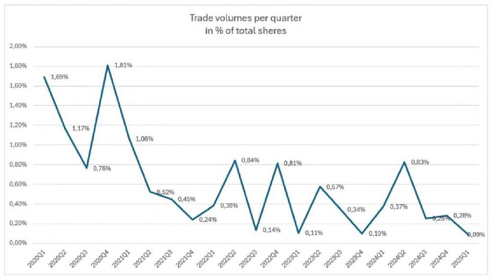

---

A tisztelt ÁSZ által többször említett és megalapozatlannak ítélt felár tekintetében fontos kiemelni, hogy a GTC többségi részvénycsomagját tőzsdei tranzakció keretében nem lehet megvásárolni. Erre tekintettel a felár nem értékelhető kizárólag a közkézhányad részvényárfolyamához viszonyítottan. Továbbá az Optima Csoport a többségi részesedés megszerzésével irányítási jogokat is szerzett a GTC felett, így a megfizetett vételár egyrészt az ún. kontroll prémiumot is tükrözte, valamint a Lonestar nem adta alacsonyabb áron.

A nemzetközi tanácsadók által elkészített értékelések bizonyították, hogy a tranzakció során megfizetett vételár megfelelt a hasonló régiós ingatlanpiaci tranzakciók értékelési szintjének. A megszerzett többségi tulajdon stratégiai értéke (irányítási jogok, portfólió aktív menedzselése, várható szinergiahatások, befolyás mértéke, hosszú távú növekedési potenciál tükrében, ingatlanpiaci infrastruktúra) megalapozottan indokolta a kifizetett vételárat.

A részvényárfolyam 34%-os csökkenése, változása, ingadozása önmagában nem jelenti azt, hogy a vásárlás időzítése helytelen volt. Éppen ellenkezőleg - az értékalapú befektetési stratégia (value investing) egyik alapelve, hogy jelentős áresések idején érdemes vásárolni, amennyiben a fundamentális érték meghaladja a piaci árat.

A tisztelt ÁSZ megállapítja, hogy az ÁSZ kérésére bemutatott hozamszámítás az ellenőrzés megállapítása alapján közgazdaságilag észszerűtlen volt, emiatt a döntéselőkészítő anyag - így a meghozott döntés nem volt kellően megalapozott. A tisztelt ÁSZ megállapítását elutasítjuk és felhívjuk a figyelmet arra, hogy a 11%-os várt hozam nem pusztán az osztalékhozamot, hanem a teljes befektetési megtérülést (osztalék + értéknövekedés) célozta. Fontos hangsúlyozni, hogy az Optima a devizák tekintetében is figyelmet fordított a befektetések allokálására, így a forint kitettségeken kívül euró, zlotyi és frank alapú befektetések útján is jelentős profitot realizált (illetőleg realizálhatóvá tett) a devizaátértékelődés hatására. A devizaárfolyamon realizált profit hozzájárul a vagyon jelentős gyarapodásához, ezért az értékelés során ezt is szükséges figyelembe venni.

Az ÁSZ megállapításával szemben, álláspontunk szerint a 2021-2024 közötti tényleges osztalékhozam nem alkalmas önmagában a befektetési döntés megalapozottságának utólagos megítélésére. Az osztalékfizetés csak egy eleme a teljes befektetési hozamnak, így önmagában nem nyújt teljes képet a befektetés megtérüléséről, mivel a befektetés értéke nem kizárólag az osztalékfizetési képességen alapul. Továbbá, ahogy fent is említettük, a befektetési döntés megalapozottságának mérlegelésénél figyelembe szükséges venni, hogy a COVID utáni helyreállási időszak speciális üzleti környezetet jelentett. Az alacsonyabb osztalékfizetés a COVID utáni konzervatív pénzügyi politika eredménye, ami a hosszú távú értékteremtést szolgálta. A GTC befektetés hosszú távú stratégiai előnyeként ki kell emelni, hogy a GTC befektetés diverzifikációt biztosít mind földrajzilag, mind ingatlanállományában (lakó, iroda, üzletközpont). Továbbá a minőségi irodaportfólió stabil, inflációkövető bérleti díjbevételeket generál, valamint az ESG szempontok szerinti fejlesztések növelik a portfólió hosszú távú értékét.

A fentieken túl a tisztelt ÁSZ teljes mértékben figyelmen kívül hagyta jelentéstervezetében a GTC befektetéssel kapcsolatosan mind az ellenőrzött időszakban, mind azt megelőzően történt jelentős társasági eseményeket. Álláspontunk szerint ezek figyelembevétele elengedhetetlen a befektetés megítélése szempontjából. A GTC fundamentális stratégiai változásokon ment keresztül a PADME Alapítvány által történt 2020. júniusi akvizíciója óta. A GTC fejlesztési intenzitása jelentősen megnövekedett, a portfolió mind eszköztípus, mind földrajzi diverzifikációja szempontjából válságállónak bizonyult. Sem a pandémia, sem a 2022-ben kezdődött orosz-ukrán háború eseményei nem okoztak a GTC jövedelmezőségében és értékében jelentős kedvezőtlen hatást. A GTC finanszírozási struktúráját racionalizálta, 2021-ben sikeres kötvénykibocsátást hajtott végre mintegy 660 millió euró értékben a magyar

---

Növekedési Kötvényprogram és nemzetközi zöldkötvénykibocsátás keretében. 2021-ben mintegy 210 millió euró értékű akvizíció keretében megvásárolta az Infopark közvetlen szomszédságában található 42 ezer m2 kiadható területtel bíró Ericsson/Siemens székházat, valamint a Váci úti folyosó legkedvezőbb lokációján lévő 16 ezer m2 területű Váci Greens D épületet. 2022-ben sikeresen átadásra került a Dózsa György úti 30 ezer m2 területű Pillár irodaház a nemzetközi Exxon Mobile részére, amely a pandémia után az első legnagyobb irodaátadás volt a Budapesti irodapiacon. Több sikeres külföldi irodaépületátadásra is sor került 2022-ben, úgy mint a szerb 18 ezer m2 GTC X épület, valamint a horvát 10,5 ezer m2 területű Matrix C épület közel 100% bérbeadottsággal. A GTC fejlesztési tevékenységének intenzitása is növekedett a piaci környezet ellenére is. Kiemelendően megkezdődött a horvát Matrix D irodakomplexum további épületének fejlesztése 10,5 ezer m2 kiadható területtel, valamint a Váci úti irodafolyosó Árpád-híd kereszteződésénél található Center Point 3 irodaház fejlesztése 36 ezer m2 területtel.

A GTC befektetés kiszámíthatóságát és stabilitását is mutatja, hogy több mint 30 éves működése
 során a GTC a régióban 82 modern irodaházat és kereskedelmi ingatlant fejlesztett, amelyek összterülete meghaladja az 1,4 millió négyzetmétert. A vállalat jelenleg 46 jövedelemtermelő kereskedelmi ingatlan mellett 4 fejlesztési ingatlant is tulajdonol és üzemeltet, amelyek mindösszesen meghaladja a 755.000 négyzetméter összterületet 87%-os kihasználtsággal.

Összességében a befektetési döntés egy átfogó stratégiai megközelítés része volt, amely figyelembe vette mind a rövid távú piaci lehetőségeket, mind a hosszú távú értékteremtési potenciált. Így a befektetési döntés megalapozottságát nem lehet kizárólag a rövid távú piaci áralakulás vagy az osztalékhozam alapján megítélni. A válsághelyzet speciális körülményei között különösen fontos a hosszabb távú értékteremtési potenciál figyelembevétele, releváns további faktorok elemzése, ami indokolja a kifizetett vételárat, a megszerzett magas minőségű eszközök és értékek vonatkozásában.

# III.2.8 A jelentéstervezet 17. oldalának 3. bekezdése rögzíti, hogy 

„Az ÁSZ-nak a befektetési döntés megalapozatlanságára vonatkozó megállapítását támasztja alá a Fitch Ratings 2023. szeptemberi értékelése, amellyel a GTC S.A.-t leminősítette. A minősítés alapján a társaság részvénye nem befektetési, hanem spekulatív kategóriába került. A legutóbbi, 2024. novemberi Fitch Ratings a GTC S.A. jövőbeli minősítésének kilátásait a rövid távú likviditási kockázatok és a nagyértékű adósságállomány miatt stabilról negatívra változtatta."

A fentiekkel szemben a valóság az, hogy a GTC tekintetében a Fitch Ratings értékelés megszerzése már az Optima Csoport tulajdonszerzését követően, 2021. első félévében valósult meg, egy tudatos stratégiai döntés keretében, amely a nemzetközi kötvénykibocsátás előkészítését szolgálta. A rating megszerzése tehát nem a korábbi befektetési döntés utólagos értékelése, hanem egy új finanszírozási stratégia szerves része volt.

A Fitch Ratings olyannyira pozitív értékelést állapított meg 2021-ben, hogy a GTC a vállalati hiteleit 2,25%-os zöldkötvény kibocsátása útján refinanszírozni tudta, amely jól tükrözte a piac pozitív értékítéletét is a társaság stabilitását illetően. A zöldkötvények kibocsátása 2020-tól jellemző trend volt az európai ingatlanpiacon, és a GTC Csoport versenyképességének fenntartásához alapvetően szükséges volt a kötvények kibocsátása, és ennek érdekében a Fitch Ratings értékelésének megszerzése.

A nemzetközi minősítő cégek (így a Fitch Ratings is) 2022-től kezdődően a nemzetközi ingatlanfejlesztő cégek jelentős részét leminősítette. Ennek oka leginkább az általános makrogazdasági környezet (magas kamatok, geopolitikai feszültségek) változásai, valamint romló gazdasági, ingatlanpiaci és finanszírozási

---

környezet volt, amelyek a teljes ingatlanpiaci szektort érintették Európában. A GTC Csoport legnagyobb versenytársai közül a CPI csoport minősítési kilátásait már 2023 júliusában stabilról negatívra változtatta, valamint ezt követően a minősítést is „BBB-„-ról „BB+"-ra rontotta. A GTC másik legnagyobb versenytársának a Globalworth-nek a minősítési kilátásait a Fitch Ratings szintén stabilról negatívra rontotta 2023. júliusban. A GTC minősítését a Fitch Ratings - a közép-kelet-európai ingatlanpiaci szereplők közül az egyik utolsóként - 2023. szeptemberében változtatta csak meg, amely azonban - mint bemutattuk - nem egyedi döntés volt, hanem követte a teljes ingatlanpiac leértékelését. A negatív kilátásra történő minősítés így elsősorban az általános ingatlanpiaci ciklus jelenlegi helyzetét tükrözi, nem pedig a GTC Csoportot érintő cégspecifikus problémákat.

A hitelminősítői értékelés és a befektetési döntés értéke között nem állítható fel közvetlen ok-okozati összefüggés. A minősítés változása sokkal inkább tükrözi a makrogazdasági környezet általános romlását, a regionális ingatlanpiaci kihívásokat és a kamatkörnyezet változását, mint a társaság fundamentális értékét.

Az értékelés során figyelembe kell venni, hogy a hitelminősítők módszertana elsősorban a rövid- és középtávú kockázatokra fókuszál, míg egy stratégiai befektetés értéke hosszabb időtávon realizálódik. A GTC esetében a megszerzett tulajdonrész értéke nem kizárólag a pillanatnyi hitelminősítésen vagy tőzsdei árfolyamon alapul, hanem olyan hosszú távú értékteremtő tényezőkön, mint a portfólió minősége, a fejlesztési potenciál és a piaci pozíció.

A minősítés "spekulatív" kategóriába sorolása egy technikai besorolás, amely elsősorban a finanszírozók számára releváns kockázati kategorizálást jelent, és nem a befektetés fundamentális értékének megítélését. A GTC esetében a hitelminősítői értékelés változása éppen azt a tudatos finanszírozási stratégiát tükrözi, amelynek keretében a társaság aktívan kezeli forrásszerkezetét és törekszik a nemzetközi tőkepiacok elérésére.

A Fitch Ratings értékelésétől függetlenül a GTC likviditási helyzete stabil, adósságszolgálata rendezett. A GTC Csoport nettó eszközértéke a befektetés óta robosztusan növekszik, valamint egy kiegyensúlyozott és kellően diverzifikált jövedelemtermelő portfolióval rendelkezik, mind földrajzi, mind pedig az ingatlanállományának (iroda, valamint bevásárlóközpont) összetétele vonatkozásában.

A GTC Csoport az ingatlanportfólióját 2024. év végén tovább diverzifikálta, melynek következtében a nyugat-európai bérlakáspiacra tört be, ezzel 19%-kal növelve az ingatlanportfóliója értékét. Ez az „AAA" minősítéssel bíró, fejlett német piacra történő befektetés jelentősen kedvező hatással bír a GTC jövőbeni jövedelmezőségére. Megjegyezzük, hogy ezt a tényt a tisztelt ÁSZ figyelmen kívül hagyta a jelentéstervezetében.

# III.2.9 A jelentéstervezet 17. oldalának 4. bekezdése rögzíti, hogy 

„A GTC S.A. részvény vásárláskori tőzsdei átlagárfolyamához (6,86 PLN) képest az OPTIMA csoport 31%-kal, közel 60 Mrd Ft-tal magasabb összeget - indokolatlan felárat - fizetett az eladónak, amely átlagosan 9 PLN részvényenkénti bekerülési árfolyamot jelentett. A felárral kifejezett - és a vételárban megfizetett üzleti várakozás megalapozatlan volt, annak gazdasági indokoltságát nem tudta sem ÁSZ, sem a GTC S.A. részvénycsomag megvásárlásáról szóló előterjesztés sem azonosítani. A GTC S.A. részvény tőzsdei árfolyama a vásárlást követően drasztikusan csökkent, a bekerülési értékhez viszonyítva több mint 50%-kal, a 2024. év végére tartósan 4 PLN alá esett. A megvásárolt részvénycsomag 2024. év végi tőzsdei árfolyam alapján számított értéke 162 Mrd Ft-tal csökkent. Az OPTIMA csoport a GTC S.A. részvény tőzsdei

---

árfolyamcsökkenésének nem csupán tehetetlen elszenvedője, hiszen 62,61%-os tulajdonosként érdemi befolyást gyakorol a társaság működésére."

A tisztelt ÁSZ jelentéstervezetében a GTC valós piaci értékét leegyszerűsítve kizárólag a tőzsdei közkézhányad részvényárfolyamhoz köti. Ezen megközelítés azonban téves és szakmailag nem megalapozott, mivel a hasonló tőzsdén jegyzett ingatlancégek valós értékét nem a tőzsdei árfolyam, hanem a társaság nettó eszközértéke, ún. EPRA NAV értéke mutatja. Az EPRA NAV mutatót az Európai Tőzsdén Jegyzett Ingatlan Társaságok Szövetsége kifejezetten az ingatlanbefektetési vállalatok valós nettó eszközértékének meghatározására dolgozta ki. 2020. márciusában a GTC tekintetében megállapított EPRA NAV érték részvényenként meghaladta a 11,3 lengyel zloty-t, amely közel az akkori tőzsdei részvényárfolyamának kétszerese volt.

Az EPRA NAV lényegében a vállalat csoportszinten konszolidált eszközértékének, mint bruttó eszközérték, valamint a csoportszintű harmadik fél felé fennálló kötelezettségeinek (pl. hitelek, kötvénytartozások, egyéb kötelezettségek) különbözetét mutatja, amellyel a cégcsoport cégértéke, azaz tényleges valós értéke mérhető.

A GTC EPRA NAV alakulásában az Optima akvizíciója óta - az adott évenkénti tulajdonosi osztalékkifizetések mellett is - stabil növekedési tendencia mutatható ki, amely tovább erősödik a 2024. decemberben a német bérlakáspiacon végrehajtott terjeszkedésével.

A tisztelt ÁSZ jelentésében bár kiemeli, hogy a GTC - egyébként minimális likviditású közkézhányadának - részvényárfolyama 2024. év végére tartósan 4 PLN alá esett, azonban azt nem említi, hogy 2025 januárjától a részvényárfolyam ismét meghaladta a 4 PLN-t. A tisztelt ÁSZ megállapítása minderre tekintettel pontatlan és félrevezető.

A GTC EPRA NAV értékének alakulását az alábbi táblázatban szemléltetjük:
—EPRA NAV (million EUR) - GTC S.A.
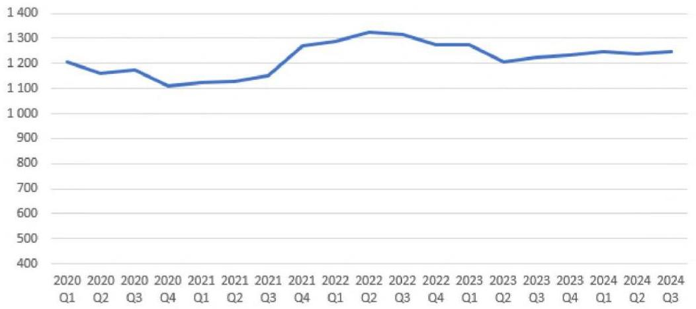

---

Ahogy korábban jeleztük, a GTC részvénycsomag akvizíciójára - illetve hasonló tőzsdei részvénycsomagok - tőzsdei tranzakció keretében nincs lehetőség, így nem értelmezhető és félrevezető az egyedi részvények tőzsdei árfolyamát a teljes társaság feletti irányítást biztosító részvénycsomag tranzakciós vételárához hasonlítani.

Az Optima Csoport a GTC 61,49%-os részesedését a Lone Star Alapoktól7 vásárolta meg 2020-ban. Az eladó mint a világ egyik legnagyobb magántőke befektetési társasága a befektetési portfoliójának árazását a mindenkori nemzetközi gyakorlattal összhangban állapítja meg. Erre való tekintettel a feleknek lehetősége sem volt eltérni a hasonló tranzakcióknál szokásos árazástól, kizárólag a nemzetközileg bevett módszertanok alapján történhetett meg az értékelés.

A tisztelt ÁSZ megállapította, hogy az OPTIMA Csoport a GTC részvény tőzsdei árfolyamcsökkenésének nem csupán tehetetlen elszenvedője, hiszen 62,61%-os tulajdonosként érdemi befolyást gyakorol a társaság működésére. Álláspontunk szerint az ÁSZ nem veszi figyelembe a modern vállalatirányítás és befektetési elmélet alapvető összefüggéseit. A többségi tulajdonos feladata nem a részvényárfolyam közvetlen befolyásolása, hanem olyan stratégiai döntések meghozatala és végrehajtása, amelyek hosszú távon növelik a vállalat értékét. Az ÁSZ megállapítása implicit módon azt sugallja, hogy a többségi tulajdonos feladata a részvényárfolyam rövid távú befolyásolása. Ez alapvetően téves megközelítés, mivel a tulajdonosi értékteremtés elsődlegesen a vállalat hosszú távú stratégiai fejlesztésén keresztül valósul meg. A tőzsdei árfolyam rövid távú alakulása számos, a vállalat működésétől független tényező által befolyásolt. Továbbá a részvényesi érték maximalizálása nem azonos a részvényárfolyam napi szintű menedzselésével.

A fentiekre tekintettel a tisztelt ÁSZ megközelítése - manipulatív és szakmaiatlan - nem tükrözi megfelelően a tőkepiaci befektetések és a vállalatirányítás komplex összefüggésrendszerét, különös tekintettel a hosszú távú értékteremtés mechanizmusaira.

Felhívjuk a figyelmet, hogy a tisztelt ÁSZ GTC részvénycsomag értékére vonatkozó megállapításai hamis színben tüntetik fel - tényleges megalapozottság hiányában - a befektetés értékének alakulását. A GTC részvénycsomag bekerülési értéke mintegy 255 Mrd Ft volt 2020 júniusában. Ezzel szemben a részvénycsomag jelenlegi értékét a BDO frissen készült értékelése támasztja alá, mely összehasonlítható vállalatok szorzószámos értékelési módszertana (Comparable Companies Multiple) alapján a részvénycsomag jelenlegi értéke 297.318.390.000.- Ft. A fentieken túl szemléltetés és összehasonlításképp megjegyezzük, hogy a GTC 2024 harmadik negyedévében megállapított EPRA NAV értéke 1,248 Mrd euró volt, amely 400 Ft/ EUR árfolyamon 499,2 Mrd Ft. Az Optima Csoport ennek 62,61%-os tulajdonosa, amely 312,5 Mrd Ft értéket képvisel.

A GTC értékét jól mutatja, hogy az Optima az elmúlt években több alkalommal kapott vételi ajánlatot a GTC részvénycsomag vonatkozásában. Ezen ajánlatok jelentősen meghaladták a tisztelt ÁSZ által leegyszerűsített módszertant alkalmazva - megállapított részvény árfolyam alapon vizsgált vállalati értéket. Megjegyezzük, hogy a GTC kisebbségi befektetői között intézményi befektetők (Allianz, lengyel nyugdíjalap, stb.) is jelen vannak jelentős 10% körüli részvénycsomaggal. Ezen befektetőket több

[^0]
[^0]:    ${ }^{7}$ A Lone Star a világ egyik legnagyobb nemzetközi magántőke-befektetési társasága, amely vállalati részvényekre, ingatlanokra, hitelekre és különféle pénzügyi eszközökre specializálódott. Az 1995-ben alapított vállalat 25 magántőkealapot hozott létre, amelyek útján több mint 95 milliárd dollárnyi befektetést kezelnek. A Lone Star befektetői között nyugdíjalapok, állami tőkealapok, egyetemi alapítványok, alapítványok, pénzalapok és nagy vagyonú magánszemélyek is megtalálhatók. A Lone Star globális jelenléttel rendelkezik, észak-amerikai, európai és ázsiai leányvállalatain keresztül.

---

alkalommal megkerestük a részvényeik megvásárlása céljából. A befektetők többszöri megkeresés ellenére sem kívánták eladni részesedésüket, ami jól szemlélteti az intézményi befektetők GTC-be vetett töretlen bizalmát az iparágat érintő negatív hatások ellenére is.

# III.2.10 A jelentéstervezet 18. oldalának 1. bekezdése rögzíti, hogy 

„Az OPTIMA csoport másik jelentős külföldi befektetése, az Ultima Capital S.A. társaság tőzsdei részvényárfolyama szintén csökkenő trendben változott, 2024. december 30-án 88 CHF volt, ami a részvényenkénti 109,91 CHF bekerülési árhoz képest 20%-os
 csökkenést jelentett. A befektetés közgazdasági racionalitása már a társaság tevékenységi profilja alapján is megkérdőjelezhető, hiszen a koncentrált ingatlanpiaci befektetések erőteljes kockázatot hordoznak a diverzifikáció hiánya miatt. Az Ultima csomag kapcsán az Optima csoport további kisebbségi részvényesekkel vételi kötelezettséget rögzítő megállapodásokat kötött, melyekből eredően a 2024. és a 2025. évben merült fel fizetendő kötelezettsége mintegy 250 M CHF összegben.

Az Optima Csoport másik jelentős befektetése az ellenőrzött időszakban a svájci tőzsdén jegyzett Ultima Capital-hez kapcsolódó Alpine kötvények. Azonban ismételten felhívjuk a figyelmet, hogy a tisztelt ÁSZ nem vette figyelembe a jelentéstervezetében, hogy a vizsgált időszakban az Ultima befektetés 12%-os éves hozamot biztosító kötvény megszerzésének formájában valósult meg.

Tekintettel arra, hogy a prémium és luxus ingatlanok piaci a leginkább fejlődő iparág volt a COVID alatt, ezért a kötvénybefektetést a felek svájci tőzsdei részvényekre változtatták 2023 végén számos az Optima csoportot érintő belső és külső körülmény, illetve megfontolás hatására. Az Optima mintegy 20%-os részesedést értékesített harmadik felek részére 2024 végén. [Ezen túl az Optima a teljes Ultima befektetés kapcsán több vételi ajánlatot is kapott, azonban az Optima a befektetés hozamának maximalizálása érdekében egyelőre nem kívánt exitálni és új stratégia megvalósítását kezdte meg.] 2024 végétől egy ciprusi tőzsdén jegyzett professzionális nagybefektetővel működik együtt, amellyel az Ultima befektetés jelentős növekedési pályára állt. A befektetés eredményességét támasztja alá, hogy az Optima Csoport eladási joggal rendelkezik az Ultima részvényei felett, amely alapján 2029-től 105 svájci frankos részvényárfolyamon bármikor értékesíteni tudja a befektetését. A Yoda PLC („Yoda") társasággal mint stratégiai befektetővel megkötött szindikátusi szerződés számos jogosultságot biztosít az Optima Csoport részére. A szindikátusi szerződés (mintegy 5-10 millió svájci frank minimum osztalék) éves garantált hozamot biztosít az Optima Csoport részére. Az Optima továbbá jogosult igazgatósági tag kijelölésére, valamint vétojoggal bír az Ultima főbb döntései vonatkozásában. A szindikátusi szerződés alapján az Optima exitjogokkal (tag along, drag along) is rendelkezik az Ultimában.

A fentieken túl a tisztelt ÁSZ megállapításában szereplő Ultimára vonatkozó értékelés alapvetően félreértelmezi a befektetési döntés közgazdasági racionalitását és a mögötte húzódó stratégiai megfontolásokat.

A diverzifikáció kérdésében fontos kiemelni, hogy az Ultima portfóliója önmagában is többrétegü diverzifikációt valósít meg, valamint portfóliója mind földrajzi elhelyezkedésében, mind pedig ingatlanállományának összetételében eltér a GTC portfóliójától, amely az Optima Csoport befektetését tovább diverzifikálja.

A prémium ingatlanok különböző országokban, eltérő szegmensekben és változatos bérlői összetétellel működnek, amely szempontok jelentős kockázatcsökkentő tényezők. Ezen ingatlanpiaci szegmens ráadásul történelmileg is bizonyította, hogy más makrogazdasági korrelációt mutat, mint a hagyományos

---

ingatlanpiac, így a specializáció ebben az esetben nem gyengeség, hanem tudatos stratégiai döntés eredménye.

A részvényárfolyam 20%-os csökkenésének túlhangsúlyozása figyelmen kívül hagyja a svájci tőzsde, különösen az ún. specialized real estate szegmens korlátozott likviditását, valamint a kamatkörnyezetet. A kisebb forgalmú részvények árazása gyakran jelentősen eltér a fundamentális értéktől, így ez a pillanatnyi piaci értékítélet nem alkalmas a befektetés minőségének megítélésére. Különösen igaz ez olyan esetben, amelyben a mögöttes eszközök értéke stabil és független a tőzsdei árfolyam alakulásától.

Az Ultima portfólióba tartozó ingatlanokat a Kroll Inc., egy nagy múltú és elismert amerikai ingatlanértékbecslő vállalat egyesével felmérte és értékelte az Optima Csoport akvizícióját megelőzően. (A Kroll és egyéb felkért értékbecslők értékbecslési jelentéseit 1a. - 1b. - 1c. . szám alatti mellékletekként csatoljuk.)

A további részvényvásárlási megállapodások kapcsán hangsúlyozni kell, hogy ezek nem egyszerűen kötelezettségek, hanem a tulajdonosi értékteremtés eszközei. A nagyobb tulajdoni hányad megszerzése javítja a stratégiai döntéshozatal hatékonyságát és növeli a vállalat értékét. A kisebbségi részesedések konszolidációja pedig olyan szinergiákat tesz lehetővé, amelyek tovább növelik a befektetés értékét.

Összegezve a hatósági megállapítás nem veszi figyelembe a prémium - luxus ingatlanpiac speciális jellemzőit és azt a tényt, hogy az ilyen típusú befektetések értékelése jelentősen eltér a hagyományos ingatlanpiaci megközelítéstől. A befektetés racionalitását a hosszú távú értékteremtési potenciál, a megszerezhető stratégiai előnyök és a prémium szegmens egyedi jellemzői együttesen támasztják alá. A pillanatnyi tőzsdei árfolyam vagy a szektorális koncentráció önmagában nem alkalmas a befektetési döntés minőségének megítélésére.

A hatékony portfóliókezelés szempontjából az Ultima befektetés jelentősége abban áll, hogy olyan egyedi eszközosztályhoz biztosít hozzáférést, amely más módon nem vagy csak korlátozottan érhető el az intézményi befektetők számára. A prémium ingatlanok piacán való jelenlét különösen értékes diverzifikációs előnyt jelent, mivel ez a szegmens historikusan alacsony korrelációt mutat mind a hagyományos ingatlanpiaci befektetésekkel, mind pedig a tőkepiaci instrumentumokkal. Az Optima portfóliójában ez a pozíció nem növeli, hanem csökkenti a rendszerkockázatot, mivel a prémium - luxus ingatlanok értékállósága és kereslete olyan gazdasági ciklusokon átívelő stabilitást mutat, amely más eszközosztályoknál nem figyelhető meg (pl. COVID).
[Felhívjuk a figyelmet, hogy az Optima Csoport T. ÁSZ által állított, de alá nem támasztott bekerülési költsége 109,91 CHF részvényenkénti ár alkalmazásával 355 CHF, amely az alábbi táblázattal alátámasztva 132.260.717.000 HUF összegnek felel meg, amely érték a tisztelt ÁSZ által hivatkozott 88CHF részvény árfolyam alkalmazása mellett a hivatkozáskori tőzsdei ügyletkötések 2024. december 18-i árfolyamán (437,10 HUF, MNB) a befektetési értéke 132.529.891.428 HUF, amely tekintetében megállapítható, hogy értékcsökkenés nem következett be.]

| Dátum | összeg (CHF) | Árfolyam | Forintban vételár |
| :--: | :--: | :--: | :--: |
| 2021.08.31 | 50000000 | 348,48 | 17424000000 |
| 2021.10.20 | 150000000 | 362,88 | 54432000000 |
| 2022.03.08 | 50000000 | 383,79 | 19189500000 |
| 2022.03.25 | 29900000 | 367,85 | 10998715000 |
| 2022.09.20 | 50100000 | 412,52 | 20667252000 |
| 2023.05.31 | 25000000 | 381,97 | 9549250000 |
|  | 355000000 |  | 132260717000 HUF |

---

# III.2.11 A jelentéstervezet 18. oldalának 2. bekezdése rögzíti, hogy 

„A 2024. év végi likviditási helyzetet értékelő belső ellenőrzési jelentés szerint, elsősorban az Ultima Capital S.A. kapcsán 2025. június 30-ig további olyan jelentős kiadások merülnek majd fel, melynek eredményeképpen 80,5 Mrd Ft likviditási hiány prognosztizálható. Szintén a likviditási helyzet súlyosságát jelzi az Alapítvány felügyelőbizottságának 2025. január 18-án kelt, az MNB elnökének címzett levele, melyben a felügyelőbizottság elnökének értékelése szerint „az Alapítvány cél szerinti működése és fizetőképessége közvetlen veszélyben van". A fentiek alapján fennáll a súlyos kockázata, hogy a részben hitellel is egyébként finanszírozott befektetésekhez kapcsolódó további kötelezettségvállalások fedezete nem biztosított."

A tisztelt ÁSZ a megállapításában iratellenesen rögzíti, hogy az Ultima befektetés kapcsán 2025. június 30-ig 80,5 Mrd esedékes kötelezettsége áll fenn az Optimának. Ezzel szemben azonban tényként megállapítható, hogy 2025-ben egyáltalán nem merül fel esedékes fizetési kötelezettsége az Optima Csoportnak az Ultima befektetéssel kapcsolatosan.

2025 júniusában az Optima Csoport egyetlen jelentősebb esedékes kötelezettsége az által nyújtott 170 millió euró összegű finanszírozással kapcsolatosan fennálló mintegy 3 Mrd Ft összegű kamatfizetési kötelezettség. Ezen fizetési kötelezettség bemutatásra került a tisztelt ÁSZ részére átadott cash flow kimutatásokban is.

Az Ultima kapcsán 2026 januárjában esedékes fizetési kötelezettség nem váratlan teher, hanem egy előre tervezett, stratégiai befektetési program része, mivel az Optima Csoport eredeti célja az Ultima teljes 100%-os részesedésének megvásárlása volt. Megjegyezzük, hogy az Optima Csoport 2025-ben ajánlatot kapott az Ultima részvényekre vonatkozó opciós szerződések átvételére.

A tisztelt ÁSZ megállapításában szereplő likviditási értékelés és következtetések nem tükrözik teljeskörűen az Optima Csoport és az Alapítvány által kidolgozott átfogó pénzügyi tervezési és kockázatkezelési intézkedéseket.

Az Optima menedzsmentje részletes, havi szintű cashflow előrejelzést készített a múltban is és tette ezt a 2025-ös üzleti év vonatkozásában is, amely tartalmazza a működési költségek optimalizálását és a kiemelt vezetői feladatok prioritálását. A tervben szereplő költségmegtakarítási intézkedések és a hatékonyságnövelő programok biztosítják az Optima Csoport stabil működését és a vállalt kötelezettségek teljesítésének biztosítását. A likviditástervezés során az Optima különös figyelmet fordított a bevételi források diverzifikált realizálására és a kiadások ütemezésének optimalizálására.

A tájékozódásunk alapján az Alapítvány külön is elkészítette a 2025. évi gazdálkodási tervét, amely teljes mértékben összhangban van az Alapító Okiratban megfogalmazott cégrendszerrel és a felelős vagyongazdálkodás alapelveivel. A terv részletesen bemutatja az alapítványi célok megvalósításához szükséges források és felhasználások egyensúlyát, valamint azokat a kontrolmechanizmusokat, amelyek biztosítják a prudens gazdálkodást. Ismereteink szerint az alapítvány tervezési folyamata során kiemelt figyelmet fordított a hosszú távú fenntarthatóságra és a vagyonmegőrzés szempontjaira egy jelentős költséggazdálkodási csökkentési motívum mellett.

A tisztelt ÁSZ által hivatkozott belső ellenőrzési jelentés egyfelől nem a vonatkozó jogszabályi és belső ellenőrzési szabályzatban előírt eljárásrend előírásainak megfelelően készül, másfelől az csak egy pillanatfelvételt tükröző, amelyet az új Optima felsővezetésnek nem volt alkalma kiegészíteni és objektívá tenni, így nem veszi figyelembe a már folyamatban lévő és tervezett intézkedések hatásait, továbbá a belső

---

ellenőri jelentés sajnálatos módon tárgyi pontatlanságokat is tartalmaz (pl.: Ultima fizetési kötelezettségek beálltát 2025. év közepében határozza meg, szemben az azok ténylegesen 2026 elején beálló esedékességével).

Emlékeztetőül utalunk arra, hogy a belső ellenőrzés olyan független, objektív bizonyosságot adó eszköz és tanácsadói tevékenység, amely értéket ad a szervezet működéséhez, és javítja annak minőségét; módszeres és szabályozott eljárással értékeli és javítja a kockázatkezelési, a kontroll- és az irányítási folyamatok hatékonyságát, ezáltal segíti a szervezeti célok megvalósítását. Az objektív bizonyosságot az teremti meg, hogy a belső ellenőr objektív értékelést nyújt egy adott folyamatról, rendszerről, eljárásról, és az ellenőrzési program végrehajtása során tett megállapításokat, következtetéseket és javaslatokat ellenőrzési jelentésbe foglalja.

Felhívjuk a figyelmet arra, hogy a vonatkozó jogszabályi előírások között egyértelműen rögzítésre került, hogy bármely belső ellenőri jelentés tervezetet a belső ellenőr egyeztetés céljából megküldi az ellenőrzött szervezeti egység vezetőjének, továbbá azon szervezeti egységek vezetőinek, melyekre vonatkozóan a belső ellenőrzési jelentéstervezet megállapítást vagy javaslatot tartalmaz, melyet követően sor kerül a jelentéstervezet tartalmát érintő egyeztetés lefolytatására, amelynek során az ún. érintettek jogosultak észrevételeiket adresszálni a belső ellenőr felé, amely esetben az észrevételek elfogadásáról vagy elutasításáról a vizsgálatvezető javaslata alapján a belső ellenőrzési vezető dönt, amelyről írásbeli tájékoztatást ad, és megindokolja az el nem fogadott észrevételeket vagy egyeztető megbeszélést összehívását kezdeményezi. Az elfogadott észrevételeket a vizsgálatvezető átvezeti az ellenőrzési jelentéstervezeten. Az érintettek észrevételeit és a vizsgálatvezető válaszát pedig csatolni kell az ellenőrzés dokumentációjához.

Ha az érintett a megállapításokat vitatja, bármelyik fél kezdeményezésére egyeztető megbeszélést kell tartani. Az egyeztető megbeszélésről jegyzőkönyv készül, amely tartalmazza a megbeszélés eredményét. Ha az egyeztetések ellenére véleménykülönbség marad fenn a belső ellenőrzés és az ellenőrzött fél között, úgy az ellenőrzött szervezeti egység vezetőjének különvéleményét a belső ellenőrzés megjeleníti a belső ellenőrzési jelentésben. Az érintettek észrevételeit, illetve a belső ellenőrzési vezető válaszát csatolni kell az ellenőrzés dokumentációjához.

Ezen körülményekre
 figyelemmel meglátásunk szerint a tárgyi tévedéseket és adatokat tartalmazó jelentésnek az érintettek elé tárása semmi esetre sem szolgálja az objektív bizonyosságot adó eszköz minőségbe vetett hitet és a megalapozott döntéshozatal rendjét.

Az Optima vezetése által kidolgozott menedzsment feladatokat tartalmazó terv olyan konkrét lépéseket tartalmaz, amelyek biztosítják a likviditási helyzet folyamatos egyensúlyát. A hitellel finanszírozott befektetések megtérülése és a portfólió cash-flow termelő képessége megfelelő fedezetet nyújt a vállalt kötelezettségek teljesítésére, amely biztosítja a stabil működést és a vállalt kötelezettségek teljesítését. A 2025. évi tervek és előrejelzések reális feltételezéseken alapulnak, és megfelelő tartalékokat tartalmaznak az esetleges kockázatok kezelésére.

# III.2.12 A jelentéstervezet 18. oldalának 3. bekezdése rögzíti, hogy 

„Az ÁSZ megítélése szerint az Alapítvány beszámolóiban az OPTIMA Befektetési Zrt. által kibocsátott kötvény könyv szerinti értéke nem tükrözte a befektetés tényleges piaci értékét. Az Alapítvány a kötvényt bekerülési értéken tartotta nyilván, azonban a 2024. évben akár 150 Mrd Ft értékvesztés elszámolása lett volna indokolt."

---

A fenti megállapításhoz kapcsolódóan a jelentéstervezet 18. oldalának 4. bekezdése rögzíti, hogy
„Az Alapítvány a kötelező értékelésnél nem vette figyelembe a közvetett befektetések mögöttes részvényportfólió tőzsdei árfolyamának csökkenését, a befektetés hozamtermelő képességét, a kibocsátó OPTIMA Befektetési Zrt. piaci megítélését és a lejáratkor várható törlesztési képességét. Az OPTIMA Befektetési Zrt. által kibocsátott kötvénynek a kibocsátó által utólag megállapított kamata a 2021-2023. közötti időszakban 0,12-0,96% volt, ami a mértékadó kockázatmentesként elfogadott kamatok töredékét jelentette, ezen tény a kötvény kapcsán már önmagában jelentős értékvesztési összeg elszámolást alapozott volna meg."

A fentiekkel szemben rögzíteni szükséges, hogy az Optima Kötvénynek nincs tőzsdén jegyzett ára, árfolyama vagy tőzsdén kívüli piacon kialakult ára. Az Optima Kötvény forgalomba hozatalához készült információs összeállítás külön kiemeli, hogy a kibocsátó az Optima Kötvényen alapuló kötelezettségeinek teljesítéséért teljes vagyonával felel.

Felhívjuk a figyelmet, hogy a tisztelt ÁSZ az Optima vagyonának és megtérülésének értékelése során számos, rendkívül jelentős tényállási elemet figyelmen kívül hagy. Így például az ÁSZ figyelmen kívül hagyja, hogy az Optima Csoport a gazdálkodásából származó forrásokból több mint 17 Mrd Ft összegű támogatást fizetett ki az alapítványi célokkal összhangban. A támogatásokkal közel 1800 oktatási, tudományos pályázatot támogatott határon innen és túl, és folyamatosan együttműködött oktatási intézményekkel, tudományos központokkal és szervezetekkel, annak érdekében, hogy éveken átnyúló, kiemelt jelentőségű projektek szakmai működtetésében segítsen. Továbbá az Optima Csoport megvásárolta a Budapesti Metropolitan Egyetemet, amely befektetési jellegén túl szintén az alapítványi célok közvetlen megvalósulását is szolgálja. A Budapesti Metropolitan Egyetem meghatározó és dinamikusan fejlődő szereplője a hazai felsőoktatásnak, és immár a kelet-közép-európai régiónak is. Az egyetem öt kontinensen több mint 200 külföldi intézménnyel tart fenn partneri kapcsolatot. Az egyetem közel 7000 hallgatójából közel 1000 külföldi, akik a világ több mint 100 országából érkeztek.

A fentieken túl az Alapítvány jelentős közhasznú részvételét is teljes mértékben figyelmen kívül hagyja a tisztelt ÁSZ, amely során az Alapítvány jelentős támogatást nyújtott tehetségkutató műhelyek, egyetemek és tudományos közösségek számára. Az Optima csoport a korábban bemutatott főbb befektetésein túl számos olyan befektetést hajtott végre, amely összhangban van az alapítványi célokkal, és fő célja a társadalmi felelősségvállalás, illetve a kutatás-fejlesztés támogatása. Így például az Optima Csoport 3 milliárd Forintot meghaladó összeget fordított a rákkutatási és gyógyítási célok fejlesztésére, támogatására. Ezen túl további több mint 500 millió Ft összeget az Impact Ventures kockázati tőkealapokba, melynek célja a pénzügyi eredmény elérése mellett, mérhető pozitív társadalmi vagy környezeti hatás elérése (pl. „Álommunkahely autizmussal élőknek" projekt).

Az Optima Kötvény értékelése kapcsán fontos kiemelni, hogy a számvitelről szóló 2000. évi C. törvény („Sztv.") alábbiakban részletezett rendelkezései, valamint a nemzetközi könyvvizsgálói, illetve értékpapírértékelési gyakorlat alábbiakban bemutatott rendelkezései alapján az Optima Kötvény értékét eredendően a következő tényezők határozzák meg. A legfőbb szempont, hogy az Optima által a könyvvizsgáló rendelkezésére bocsátott és az Optima vagyoni, pénzügyi helyzetére vonatkozó információk alapján az Optima képes lesz-e az Optima Kötvény futamideje alatt az évente esedékes kamatok, illetve a futamidő végén esedékes tőke megfizetésére, és ha igen, akkor milyen mértékben képes kötelezettségeinek teljesítésére.

Az Sztv. 3. § (8) bekezdés 3. pontja szerint „pénzügyi instrumentum: olyan szerződéses megállapodás, amelynek eredményeként az egyik félnél pénzügyi eszköz, a másik félnél pénzügyi kötelezettség vagy saját

---

tőke (tőkeinstrumentum) keletkezik. Így különösen: a szerződéses megállapodáson alapuló követelés és kötelezettség, a pénzeszköz, az értékpapír (hitelviszonyt megtestesítő értékpapír és tulajdoni részesedést jelentő befektetés), a származékos ügylet". Az Sztv. rendelkezései alapján az Optima Kötvény pénzügyi instrumentumnak minősül. Az Sztv. 59/A.§ (6) bekezdése alapján a pénzügyi instrumentumok valós értékükön csak akkor értékelhetők, ha azok valós értéke megbízható módon meghatározható.

Az Sztv. 47. § (1) bekezdése szerint „Az eszköz bekerülési (beszerzési, előállítási) értéke az eszköz megszerzése, létesítése, üzembe helyezése érdekében az üzembe helyezésig, a raktárba történő beszállításáig felmerült, az eszközhöz egyedileg hozzákapcsolható tételek együttes összege. A bekerülési (beszerzési) érték az engedményekkel csökkentett, felárakkal növelt vételárat, továbbá az eszköz beszerzésével, üzembe helyezésével, raktárba történt beszállításával kapcsolatban felmerült szállítási és rakodási, alapozási, szerelési, üzembe helyezési, közvetítői tevékenység ellenértékét, dijait (ezen tevékenységeknek saját vállalkozásban történt végzése esetén az 51. § szerinti közvetlen önköltség aktivált értékét), a bizományi díjat, a beszerzéshez kapcsolódó adókat és adójellegű tételeket, a vámterheket foglalja magában."

Az Sztv. 50. § (3) bekezdés szerint „A hitelviszonyt megtestesítő, kamatozó értékpapír bekerülési (beszerzési) értéke nem tartalmazhatja a [vételár részét képező, továbbá a kibocsátási okiratban, a csereszerződésben, a vagyonfelosztási javaslatban meghatározott piaci, forgalmi, beszámítási érték részét képező] (felhalmozott) kamat összegét."

Az Sztv fent idézett rendelkezései alapján, mivel jelen esetben az Alapítvány névértéken jegyezte le az Optima Kötvényt, az Optima Kötvény bekerülési értéke a névértékkel egyezik meg.

Az Sztv. 59/A. § (8) bekezdése szerint „A (7) bekezdésben meghatározott pénzügyi instrumentumokat a törlesztésekkel és az értékvesztéssel csökkentett, visszaírással növelt bekerülési (beszerzési) értéken, illetve a szerződés szerinti értéken kell kimutatni, a törvény általános (bekerülési érték szerinti) értékelési előírásainak figyelembevételével." Az Sztv. előírásai alapján többek között a lejáratig tartott / az egyedi jellemzőkkel rendelkező / valós értékét megbízható módon nem megállapítható értékpapírra - a kereskedési célúvá vagy értékesíthetővé történő átsorolásukig - nem alkalmazható a valós értéken történő értékelés, ezen az értékpapírokat a törvény általános (bekerülési érték szerinti) értékelési előírásainak figyelembevételével meghatározott bekerülési értéken kell nyilvántartani. Az Optima álláspontja szerint ezen nyilvántartási szabályok alkalmazandóak az Optima Kötvényre mint pénzügyi instrumentumra is, miszerint a bekerülési értéken történő nyilvántartás az irányadó.

Mindazonáltal megjegyezzük, hogy a valós értékelés körében - tőzsdén jegyzett árfolyam, vagy tőzsdén kívüli piacon kialakult ár hiányában - a pénzügyi instrumentum összetevőinek, vagy hasonló pénzügyi instrumentumoknak a piaci ára alapján meghatározott érték (számított piaci érték), vagy az általános értékelési eljárásokkal meghatározott, a piaci árat elfogadhatóan közelítő érték lenne az irányadó.

Amennyiben tehát az Optima Kötvény tulajdonosa a bekerülési értéket megfelelő tájékozódás alapján, az Optima átvilágítását követően, a működésének, pénzügyi helyzetének ismeretében határozza meg, és a kibocsátó pénzügyi helyzete, nettó eszközállománya (beleértve az eszközök értékének igazolt megőrzése, valamint értéknövekedése), saját tőke helyzete, működési környezete a kibocsátást követően, az Optima Kötvény tulajdonosának éves beszámolója elkészítésének időpontjáig nem romlott (illetve az Optima Kötvény kamatozásának feltételei sem változtak lényegesen), akkor az Optima Kötvény valós értéke sem csökken a bekerülési érték alá. Az Sztv. rendelkezéseivel összhangban megállapítható, hogy az Optima Kötvény bekerülési értéken történő nyilvántartása a mindenkor hatályos számviteli előírásoknak megfelelően történt.

---

# A fenti indokolásra is figyelemmel hangsúlyozzuk, hogy az Optima az Optima Kötvény alapján fennálló éves adósságszolgálatának mindig eleget tett az ellenőrzött időszakban, ezért határozott álláspontunk szerint az Optima Kötvény tekintetében értékvesztés elszámolása nem indokolt. 

A tisztelt ÁSZ megállapításával szemben az Optima Kötvény mögötti részvényportfólió tőzsdei árfolyamának átmeneti csökkenése önmagában nem indokolja az értékvesztés elszámolását, mivel a befektetések hosszú távú stratégiai jellegűek. Az értékelés során figyelembe kell venni a teljes befektetési időhorizontot, a portfólióban rejlő szinergiákat és fejlesztési potenciált is. Az Optima Kötvény kibocsátásakor és az azt követő értékeléseknél a felek ezt a komplex megtérülési és értékmegőrzési struktúrát vették alapul.

A fentiekkel összhangban a vezető hitelminősítő intézetek az adott értékpapír mögött álló kibocsátót vizsgálják az értékpapírok besorolásakor, hiszen az értékpapír a mögötte álló kibocsátó, illetve annak üzleti tevékenysége nélkül pusztán egy digitális adat-halmaz, amely önmagában nem értékelhető. Az S&P Global Ratings által közölt Út-mutató a hitelminősítés alapjaihoz (Guide to Credit Rating Essentials) című dokumentum ${ }^{8}$ „Minősítéseink az ügynökség véleményét fejezik ki egy kibocsátó, mint például egy vállalat, állami vagy önkormányzat azon képességéről és hajlandóságáról, hogy teljes mértékben és időben eleget tegyenek pénzügyi kötelezettségeinek" (4. oldal).

Akkor, amikor az útmutató úgy fogalmaz, hogy „A minősítési elemzésének részeként az S&P Global Ratings értékeli a rendelkezésre álló jelenlegi és múltbeli információkat, és felméri a várható jövőbeli események lehetséges hatását. Például egy vállalat adósságkibocsátóként való minősítésekor az ügynökség figyelembe veheti az üzleti ciklus várható hullámvölgyeit, amelyek befolyásolhatják a vállalat hitelképességét" (4. és 12. oldal), lényegében maga is az üzleti folyamatok tendenciáit veszi figyelembe, hiszen leginkább ezek azok a körülmények, amelyek leginkább kihatással vannak a kibocsátó vagyoni, pénzügyi helyzetére, ezáltal az értékpapírokban foglalt kötelezettségek teljesítésére vonatkozó képességére.

A fentiekkel összhangban az útmutató szerint „Egy vállalat minősítésekor az elemzőköz-pontú megközelítést alkalmazó ügynökségek általában egy elemzőt bíznak meg, gyakran egy szakértői csoporttal együtt, hogy vállalja a vezető szerepet a szervezet hitelképességének értékelésében. Az elemzők általában a közzétett jelentésekből, valamint a kibocsátó vezetésével folytatott interjúkból és megbeszélésekből szereznek információkat. Fel-használják ezeket az információkat, és alkalmazzák analitikus megítélésüket a gazdálkodó egység pénzügyi helyzetének, működési teljesítményének, politikáinak és kockázat-kezelési stratégiáinak felmérésére" (7. oldal).

Továbbá „A kibocsátó hitelképességének felmérése érdekében az S&P Global Ratings felméri a kibocsátó képességét és hajlandóságát arra, hogy a kötelezettségek feltételeivel összhang-ban visszafizesse kötelezettségeit.

Besorolási véleményének kialakításához az S&P Global Ratings a pénzügyi és üzleti jellemzők széles skáláját tekinti át, amelyek befolyásolhatják a kibocsátó általi azonnali visszafizetést.

Az elemzett konkrét kockázati tényezők részben a kibocsátó típusától függenek. Például egy vállalati kibocsátó hitelelemzése jellemzően számos pénzügyi és nem pénzügyi tényezőt vesz figyelembe, beleértve a kulcsfontosságú teljesítménymutatókat, a gazdasági, szabályozási és geopolitikai hatásokat, a vezetési

[^0]
[^0]:    ${ }^{8}$ https://www.spglobal.com/ratings/ division-assets/pdfs/guide to credit rating essentials digital.pdf

---

és vállalatirányítási jellemzőket, valamint a versenyhelyzetet. Egy szuverén vagy nemzeti kormány minősítésekor az elemzés a költség-vetési és gazdasági teljesítményre, a monetáris stabilitásra és a kormány intézményeinek hatékonyságára összpontosíthat.

A magas besorolású hitelminősítéseknél az S&P Global Ratings figyelembe veszi az üzleti ciklus várható
 hullámvölgyeit, beleértve az iparág-specifikus és széles körű gazdasági tényezőket. Az üzleti ciklusok hossza és hatásai azonban nagyon eltérőek lehetnek, így a hitel-minőségre gyakorolt hatásukat nehéz pontosan megjósolni. Magasabb kockázatú, ingadozóbb spekulatív besorolások esetén az S&P Global Ratings nagyobb sebezhetőséget állapít meg az üzleti ciklusok csökkenésével szemben" (10. oldal).

Végezetül „Egy egyedi adósságkibocsátás, például egy vállalati kötvény minősítésekor az S&P Global Ratings jellemzően, többek között a kibocsátótól és más forrásokból származó információkat is felhasználja a kibocsátás hitelminőségének és a nemteljesítés valószínűségének értékelésére. A vállalatok vagy önkormányzatok által kibocsátott kötvények esetében a hitelminősítő intézetek jellemzően a kibocsátó hitelképességének értékelésével kezdik, mielőtt egy adott adósságkibocsátás hitelminőségét értékelnék.

Például az adósságproblémák elemzésekor az S&P Global Ratings elemzői többek között a következőket értékelik:

- A hitelviszonyt megtestesítő értékpapír feltételei, és adott esetben jogi szerkezete.
- A kibocsátás relatív elsőbbsége a kibocsátó egyéb adósságkibocsátásaihoz képest, valamint a visszafizetés prioritása nemteljesítés esetén.
- Külső támogatás vagy hitelminősítés megléte, például akkreditívek, garanciák, biztosítás és biztosíték. Ezek a hitelezővédelmi eszközök olyan fedezetet jelenthetnek, amely korlátozza az adott kötvényhez kapcsolódó lehetséges hitelkockázatokat" (10. oldal).

Mint látható, az ügynökség a minősítés során az értékpapírokat nem a mögöttes tartalomtól függetlenül értékeli, hanem figyelembe veszi, hogy az értékpapír pusztán a mögöttes „termék", azaz a hitel pénzügyi instrumentumként történő leképeződése, az értékpapír értéke, minősége önmagában értelmezhetetlen, az csak az értékpapír mögött álló kibocsátó, illetve az értékpapír alapjául szolgáló hitel mögött álló üzleti tevékenység által bír tartalommal. Természetesen valamennyi hitelminősítő ügynökség (Moody's, Fitch Ratings, Scope Ratings stb.) a fenti irányelvek szerint működik.

Álláspontunk szerint az Alapítványnak éves, valamint egyszerűsített éves beszámolójában, illetve könyveiben az Optima Kötvény értékelése során figyelembe kell(ett) vennie az Optima Csoport üzleti tevékenységét, vagyoni pénzügyi helyzetét, illetve ezek tendenciáit is. Továbbá az egyedi értékelés elvéből nem következik az, hogy az Optima Kötvény értékelése (ennek során esetleges értékvesztés elszámolása, illetve értékvesztés visszaírása szükségességének megítélése) során - az egyedi értékelés elvének sérelmére hivatkozással - az említett üzleti körülményeket nem lehet figyelembe venni.

Az Optima Kötvény értékelésével kapcsolatos megállapítások kapcsán szükséges hangsúlyozni, hogy az értékelési módszertan komplexebb megközelítést igényel a pusztán tőzsdei árfolyamok és nominális kamatok vizsgálatánál.

Az Optima Kötvény értékének megállapításánál figyelembe kell venni, hogy az Optima Kötvény mögött álló befektetési portfólió hosszú távú stratégiai befektetéseket tartalmaz az Alapítvány által kialakított befektetési szabályzatokkal összhangban, amelyek valós értékének meghatározása komplex értékelésszakmai feladat. A tisztelt ÁSZ által hivatkozott 150 milliárd forintos értékvesztési becslés teljes mértékben

megalapozatlan, nem veszi figyelembe a portfólióban rejlő szinergiákat, a hosszú távú értékteremtési potenciált és a diverzifikált devizakosár jelentőségét sem.

Az Optima Kötvény értékelésénél figyelembe kell venni, hogy az egy speciális, hosszú távú stratégiai befektetési instrumentum, amely nem hasonlítható össze közvetlenül a hagyományos vállalati kötvényekkel vagy a kockázatmentes állampapírokkal. A befektetés megtérülése nem kizárólag a kamatfizetéseken alapul, hanem szerves részét képezi a mögöttes befektetési portfólió értéknövekedése és az Optima által fizetett osztalék is. A kötvény konstrukciója olyan struktúrát alkalmaz, ahol az alacsonyabb kamatjövedelmet a portfólió értéknövekedése és az abból származó hozam kompenzálja.

Az Optima lejáratkor várható törlesztési képességének megítélésénél nem elegendő a pillanatnyi piaci értékítéletre támaszkodni. A társaság jelentős eszközállománnyal, diverzifikált bevételi forrásokkal és stabil működési modellel rendelkezik. Az Optima Kötvény mögött álló biztosítéki rendszer megfelelő fedezetet nyújt a vállalt kötelezettségek teljesítésére.

A 2021-2023 közötti időszak kamatszintjének értékelésénél figyelembe kell venni, hogy az egy speciális időszak volt a monetáris politikában és a pénzpiacokon. Az alacsonyabb nominális kamatszint nem jelenti automatikusan a befektetés értékvesztését, különösen mivel a konstrukció teljes hozama nem kizárólag a kamatfizetéseken alapul.

Mindezek alapján az értékelési módszertan megfelelően tükrözi a befektetés komplex jellegét és hosszú távú megtérülési struktúráját. A folyamatos beszámoltatások alapján kijelenthetjük, hogy az Alapítvány a prudens vagyongazdálkodás elveit követve folyamatosan monitorozza befektetéseit, és szükség esetén megteszi a megfelelő értékelési korrekciókat, azonban ezeknek minden esetben a befektetés valós természetét és teljes megtérülési potenciálját kell figyelembe venniük.

Az Optima Kötvény futamideje 2040. évben jár le és a kibocsátási okirat idő előtti egyoldalú visszavásárlásra nem ad lehetőséget, így az OPTIMA Befektetési Zrt. kötelezettségére fedezetet nyújtó, Optima Csoportban lévő eszközök értékelésekor nem helytálló a pillanatnyi értékesítésből becsült eladási árat figyelembe venni, hanem a kifejtettek szerint az Optima hosszú távú tervei és az Optima Csoportban lévő eszközök vonatkozásában várható értéknövekmény a figyelembe veendő. A várható értéknövekmény alapulvételekor fontos figyelembe venni az Ultima cégcsoportba többségi tulajdonosként érkező szakmai befektető (Yoda) professzionális, a cégcsoportot megújító tevékenysége nyomán várható jelentős értéknövekményt, amelynek keretében az Ultima részvényenkénti eszközértéke három év alatt várhatóan meghaladja a 120 CHF összeget. Továbbá a három év során az Optima Csoport részvényenként bruttó 1,7 CHF összegű (mintegy 5-10 millió svájci frank minimum osztalék) osztalékra jogosult. A GTC Csoport esetében a nettó eszközérték töretlen növekedési tendenciája és a menedzsment nyugat-európai piacokat célzó céltudatos stratégiája alapozza meg a pozitív várakozásokat. A fentiekben kifejtettekre tekintettel az Optima megítélése az, hogy az Optima Kötvény mögötti pénzügyi fedezet biztosított.

# III.2.13 A jelentéstervezet 18. oldalának 3. bekezdése rögzíti, hogy 

„A befektetési struktúra átfogó értékelésének elmaradása, valamint a hibás beszámoló formátumból adódó tartalmi hiányok miatt sérült a megbízható és valós összkép bemutatása az Alapítvány beszámolóiban, amit az ÁSZ jelzett a Pénzügyminisztérium Könyvvizsgálói közfelügyelete felé. A 2021-2023. üzleti évek kapcsán a Pénzügyminisztérium a rendkívüli minőségellenőrzést lefolytatta, annak eredményeként az Alapítvány könyvvizsgálóját a kibocsátott jelentései visszavonására kötelezte. 2025 januárjában, az ÁSZ vizsgálat

zárásakor az Alapítvány a 2021. évi, a 2022. évi és a 2023. évi könyvvizsgáló által auditált beszámolóval nem rendelkezett."

A könyvvizsgálati jelentések visszavonását követően az Optima az új könyvvizsgáló kiválasztását haladéktalanul megkezdte és az erre vonatkozó meghívásos pályázat jelenleg is folyamatban van, amely során a pályázati meghívást az Optima huszonkilenc könyvvizsgáló társaság részére küldte meg. Az új könyvvizsgálói tender és auditor bevonásával párhuzamosan olyan kontrollmechanizmusokat vezetünk be, amelyek biztosítják a jövőbeni beszámolók még magasabb szakmai színvonalát.

Az Alapítvány és az Optima Csoport továbbá jelenleg is dolgozik az Optima Csoport átfogó pénzügyi konszolidációján, amely megvalósítását megelőzően az Optima Csoport valós értéke nehezen meghatározható. Minderre tekintettel a végleges értékelés megelőzően feltétlenül indokolt a konszolidációs folyamat lezárása, amely mintegy 6 hónapot vesz igénybe.

# III.2.14 A jelentéstervezet 18. oldalának 5. bekezdése rögzíti, hogy 

„Az OPTIMA Befektetési Zrt. befektetései megvalósításához az Alapítvány vagyonán kívül forrásként felhasználta az NJE Alapítvány által 127,5 Mrd Ft értékben lejegyzett kötvények ellenértékét is. A kötvényekhez rövid távú, 8 banki, illetve 90 naptári napon belül lejáró visszafizetési opciót biztosító megállapodások és az Alapítvány által kiállított kötelezettségvállaló nyilatkozatok kapcsolódtak, azonban az OPTIMA Befektetési Zrt. nem biztosította a kötvény visszaváltási feltételeit. A kötelezettségvállaló nyilatkozatokkal az OPTIMA csoport azt a látszatot keltette az NJE Alapítvány felé, hogy a kötvényei ténylegesen likvid befektetések, azonban 2024. januárban, amikor az NJE Alapítvány a kötvények eladási jogát érvényesíteni kívánta, azt az OPTIMA Befektetési Zrt. nem tudta teljesíteni. Az OPTIMA Befektetési Zrt. és az NJE Alapítvány között 2025 januárjában is folyamatban voltak azok a tárgyalások, melyek a kötvény vételára kiegyenlítésének módjára és ütemezésére vonatkoznak, azonban a teljes összeg szerződés szerinti kiegyenlítésére nem mutatkozik esély."

A tisztelt ÁSZ a jelentéstervezetében megállapította, hogy az Optima Csoport az NJEA felé azt a látszatot keltette, hogy a befektetései likvidek, és az NJEA által lejegyzett kötvényekre vonatkozó visszaváltási kötelezettségét az Optima nem tudja teljesíteni. Ezzel szemben megállapítható, hogy mindenki számára nyilvánvaló volt, hogy a kötvények 2031-es lejáratúak, és a felek szándéka elsősorban a hosszú távú befektetés volt. A kötvények és a befektetési megállapodások egy átfogó befektetési és finanszírozási stratégia részét képezték. A struktúra kialakításakor az volt a cél, hogy az NJEA számára a rugalmas befektetési lehetőség biztosítva legyen, miközben az Optima a hosszú távú stratégiai befektetéseit is finanszírozni tudja. A visszaváltási opció beépítése a konstrukcióba azt a célt szolgálta, hogy atipikus eszközként az NJEA számára megfelelő rugalmassági biztonságot nyújtson polgári jogi megállapodás alapján, azonban a felek szándéka a hosszútávú befektetésre koncentrált, amit a kötvények információs összeállítása is tükrözött.

A 2021-es kötvényjegyzés időszakában a kötvény feltételei (éves 2,5%-os kamat) a piaci trendeknek megfelelőnek számítottak. Megjegyezzük, hogy az érintett időszakban még az MNB által támogatott növekedési hiteleket is jellemzően alacsonyabb kamatot biztosítottak. A Magyar Nemzeti Bank által indított és támogatott Növekedési Hitelprogram (NHP) során 2021-ben mindösszesen 2700 Mrd Ft került kihelyezésre, 2,5%-os kamatplafonnal és maximum 20 éves lejárattal.

A tisztelt ÁSZ jelentésében rögzíti, hogy kötvények teljes összeg szerinti kiegyenlítésére nem mutatkozik esély. A tisztelt ÁSZ megállapításával szemben az Optima folyamatosan törekszik a kötvényvisszaváltás mielőbbi megoldására, valamint a tárgyalások során az Optima mindvégig transzparens módon feltárta valós helyzetét.

A folyamatban lévő tárgyalások a kezdetektől konstruktív szellemben zajlanak, és a felek közös célja egy olyan megoldás kialakítása, amely mindkét fél érdekeinek megvalósulását egyaránt szolgálja. A Kötvények visszaváltása érdekében az Optima több alkalommal ajánlatot tett az NJEA részére a megállapodás mielőbbi megkötése érdekében.
2025. március 4-én az Optima és az NJEA között tárgyalói szinten megállapodásra került sor a kötvények rendezése tárgyában, melynek főbb feltételei: (i) mintegy 10 Mrd Ft kamatprémium és kamatkötelezettség, valamint további mintegy 42 m Ft késedelmi kamat megfizetése 2025. május 15. napjáig, (ii) 12 Mrd forint készpénz (és annak 4,5%-os kamatainak) megfizetése 2026. május 15. napjáig, (iii) a GTC mintegy 80 Mrd forint értékű 18,87%-os részesedésének átruházása a megállapodást követően haladéktalanul oly módon, hogy az Optima eladási joggal biztosítja, hogy az NJEA a részvényeit négy év alatt, évente 20 Mrd Ft összegben értékesíteni tudja az Optima részére, (iv) Campus II beruházást az Optima teljeskörűen befejezi és kulcsrakész állapotba átadja a tulajdonjogát az NJEA részére mintegy 35 Mrd Ft értékben.

# III.2.15 A jelentéstervezet 19. oldalának 1. bekezdése rögzíti, hogy 

„Az Optima Befektetési Zrt. a likviditási problémák, a további, határidőben nem teljesített szerződéses kötelezettségei kapcsán, az MNB elnök által az ÁSZ elnökének megküldött értékelésben hangsúlyozta, hogy a „bevételi és forrás lehetőségek, valamint a kötelezettségállomány ismeretében az látszödik, hogy külső segítség nélkül a PADME/Optima csoport jelenlegi helyzetének megnyugtató rendezésére jelenleg nem látunk lehetőséget".

A tisztelt ÁSZ megállapításával szemben fel kívánjuk hívni a figyelmet, hogy az ÁSZ egy levél tervezetéből kiragadott mondat alapján von le súlyos következtetéseket, azonban a körülményeket tényszerűen nem vizsgálja. Ennek azért az is van kiemelt jelentősége, mert az Optima Csoport pénzügyi helyzete jelentősen változott az elmúlt időszakban. A reorganizációs terv
 végrehajtása útján szabad pénzügyi forrásokat szabadított fel, valamint rendezte tartozásait. 2024 végén végrehajtott tranzakciók eredményeképpen az Optima Csoport fennálló kötelezettségei 100 millió svájci frankkal csökkentek. Jelenleg az Optima Csoportnak lejárt tartozása nem áll fenn (NJEA-val a fentiekkel szemben folyamatos és immáron előrehaladottá vált tárgyalások zajlanak a kötvényekre vonatkozó visszaváltási feltételek kapcsán).

A "külső segítség" említése ebben a kontextusban inkább a helyzet komplexitását jelzi, nem pedig azt, hogy a rendezésre ne lenne reális esély. Az OPTIMA továbbra is elkötelezett amellett, hogy minden kötelezettségének eleget tegyen, és ehhez rendelkezésre állnak a szükséges eszközök, vagyoni fedezet és szakmai háttér.

## III. 3 Az 1. számú megállapításokhoz tett észrevételek (jelentéstervezet 20-31. oldal)

A tisztelt ÁSZ 1. számú fókuszterület vonatkozásában tett összegző megállapítása szerint:

- „A szervezeti, gazdálkodási keretek kialakítása az Alapítványnál és az OPTIMA Befektetési Zrt.-nél formálisan megfelelt a jogszabályi előírásoknak, azonban a létrehozott összetett cégstruktúra nem támogatta a vagyon megőrzését, nem biztosította az átláthatóságot, továbbá az Alapítvány által kialakított belső kontrollrendszer csak részben felelt meg a vonatkozó előírásoknak."

---

- „Az Alapítvány a kuratóriumi ülés tartása nélkül, elektronikus úton hozott egyes határozatai mindössze formálisak voltak. Továbbá felmerül a Kuratórium felelőssége abban, hogy a GTC S.A. részesedés vásárlása kapcsán nem elegendő minőségű és mennyiségű információ birtokában hoztak döntést."

A tisztelt ÁSZ a fenti összegző megállapításait a jelentéstervezet 1. fókuszterülete vonatkozásában három alfejezetre bontotta. Ennek megfelelően az egyes, az összegző megállapításokat kifejtő almegállapítások szerint:

- 1.1. számú megállapítás:
„Az Alapítvány és az OPTIMA Befektetési Zrt. esetében a szervezeti, gazdálkodási keretek kialakítása formálisan a jogszabályi előírásoknak megfelelően történt, azonban azok nem biztosítottak elégséges keretet a kontrollokhoz. Továbbá az indokolatlanul létrehozott bonyolult cégstruktúra nem biztosította az átláthatóságot, a vagyon megőrzését."
- 1.2. számú megállapítás:
„A Kuratórium egyes döntéseit nem kellően alátámasztott, pénzügyi, megtérülési, kockázati szempontból nem megalapozott döntéselőkészítő anyagok birtokában hozta meg. A Kuratórium feladatainak végrehajtása során egyes határozatai esetében nem szabályszerűen járt el, ugyanis a döntésre a tagoknak a jogszabályban előírt határidőnél lényegesen rövidebb határidőt állapított meg, ami nem tette lehetővé a megalapozott döntéshozatalt és a felelős vagyongazdálkodás követelményének érvényesítését."
- 1.3. számú megállapítás:
„Kormányzati szektorba sorolt egyéb szervezetként a Bkr. rendelkezései ellenére az Alapítvány nem szabályozta az integrált kockázatkezelés és a szervezeti integritást sértő események kezelésének eljárásrendjét."

A tisztelt ÁSZ fenti megállapításaira az észrevételeinket az egyes almegállapításokra bontva, a tisztelt ÁSZ által a jelentéstervezetben rögzített sorrendben tesszük meg.

# III.3.1 Észrevételek az 1.1. számú megállapításra 

A tisztelt ÁSZ több ponton rögzítette, hogy valamennyi ellenőrzés alá vont jogi személy létesítő okirata, belső szabályzatai és egyéb társasági irányítási okiratai megfelelnek a jogszabályi rendelkezéseknek, a jelentéstervezet a cégstruktúrát „bonyolultnak" minősíti. Elöljáróban rögzítjük, hogy a „bonyolultság" nem jogi kategória, az jogszabályi megfelelőségi szempontból nem értékelhető. Felhívjuk a figyelmet azonban arra, hogy az Optima cégstruktúrája közel 500 Mrd Ft vagyonnal való gazdálkodásért felelős, így a cégstruktúrát és annak összetettségét a kezelt vagyon mérete alapján szükséges megítélni.

Általános jelleggel megállapítható, hogy a jelentéstervezet ebben a körben - a magántőkealapok megalapításán túl - semmilyen kézzel fogható vagy tényleges kifogást nem tartalmaz. A jelentéstervezet így semmilyen konkrétumot nem tartalmaz a tekintetben, hogy milyen gazdasági eseményt vagy társaságot nem tudott azonosítani vagy ellenőrizni. Semmilyen jogszabály, közgazdaságtani alaptétel vagy befektetési stratégia nem tiltja az összetett cégstruktúrát, különösen nem a jelentős méretű és számosságú ingatlanokat tartalmazó befektetés esetén. Egy több jogi személyből álló cégstruktúra nem jelent

---

átláthatatlanságot, különösen nem egy olyan esetben, amikor az ellenőrzés alá vont jogi személyek számos ingatlant tulajdonolnak és számos befektetést kezelnek a hozamok maximalizálása céljából.

Mindezek alapján jogi és közgazdaságtani tényként rögzíthető, hogy az alkalmazott cégstruktúra semmilyen jogszabályt vagy gazdasági alapvetést nem sért. A jelentéstervezetben e körben tett megállapítás inkább a tisztelt ÁSZ benyomásának tekinthető, mint megalapozott szakmai álláspontnak. E körben megjegyezzük, hogy a cégstruktúra állítólagos bonyolultsága ellenére a jelentéstervezet pontosan tartalmazza a cégstruktúra tagjait és tulajdoni hányadukat, amely egy A4-es oldalon bemutatásra kerültek.

Felhívjuk a figyelmet továbbá arra, hogy önmagában egy összetett cégstruktúrából semmilyen módon nem következnek gazdálkodási és/vagy befektetési hiányosságok vagy egyéb gazdasági szempontból negatívan értékelhető események.

A nemzetközi befektetési életben az ilyen mértékű befektetés esetében teljes megszokott és nemzetközi sztenderd, hogy a csoportot számos jogi személy alkotja. Ennek egyes indoka a későbbiekben kifejtett kockázatkezelési okok, amely a finanszírozók és a felügyeleti hatóságok által kifejezetten elvártak. Mindezekhez képest nehezen értelmezhető, hogy pont egy ellenőrzési jogkört gyakorló szervezet kifogásolja a több jogi személyből álló tagolt cégjogi struktúrát.

A jelentéstervezetben foglaltakkal szemben nem sérti az átláthatóság elvét, hogy a cégstruktúrának magántőkealap tagjai is vannak. A jelentéstervezetben foglaltakkal szemben a Kbftv. engedélyezési eljárásra, tulajdonosokra és vezető tisztségviselőkre vonatkozó rendelkezései, továbbá a Pmt. előírásai garantálják, hogy a tényleges tulajdonosok személye ismert legyen, az alapkezelést végző vezető tisztségviselők megfelelő képességgel és fedhetetlen előélettel rendelkezzenek és az egyes alapok a működésük során teljes mértékben szabályozottak és átláthatóak legyenek.

Az Optima célja éppen egy olyan befektetési struktúra kialakítása volt, amely által átlátható, transzparens és szabályozott környezetet teremt a befektetései végrehajtása és vagyona védelme érdekében. A befektetési struktúra kialakítását alapos szakmai megfontolások indokolták, különös tekintettel a nemzetközi tranzakciók hatékony lebonyolítására, a befektetések optimális kezelésére és a külföldi értékpapír-piaci előírásokra is. A befektetési struktúra jogszerű kialakításában nemzetközi tanácsadók (pl. DLA Piper, EY, BDO, stb.) is közreműködtek.

Felhívjuk a figyelmet, hogy a tisztelt ÁSZ Optima Csoport átláthatatlanságát hangsúlyozó álláspontja szembe megy a Magyar Kormány magántőkealapokkal és befektetési alapokkal kapcsolatosan mindenkor képviselt álláspontjával. Az ÁSZ megállapításai alapvetően elfogultak és megalapozatlanok és kizárólag a nemzetközi kritikákat ismétlik. Ezzel szemben álláspontunk az, hogy a nemzetközi befektetési gyakorlatban teljesen megszokott és elfogadott a többszintű holding- és alapstruktúrák alkalmazása, amely számos előnnyel jár mind működési, mind befektetési (és számos esetben adózási) szempontból. A befektetési alapok, illetve magántőkealapok működése, gazdálkodása, illetve beszámolási kötelezettsége részletesen szabályozott mind a magyar, mind pedig az európai uniós jogban. Ezen alapok működését a Magyar Nemzeti Bank felügyeli, amely többletgaranciát nyújt a vagyon védelme és átláthatósága érdekében.

Összességében megállapítható, hogy a szabályozott jogi környezetben működő, hatósági felügyelet alatt álló és folyamatos közzétételi kötelezettséggel rendelkező tőkealapok tekintetében fogalmilag kizárt az átláthatatlanság.

---

A jelentéstervezetben foglaltakkal szemben jogi tényként rögzítjük, hogy a tőkealapok átlátható voltát törvény, a Kbftv. deklarálja. A jelentéstervezet ezzel ellentétes megállapítása ekként prima facie jogszabályba ütköző. A jelen bekezdésben foglaltakat mindenben megerősítve a Kbftv. 21.§ (1) bekezdése elvi éllel deklarálja, hogy „A befektetési alapkezelő minősített befolyással rendelkező tagja csak olyan személy lehet.
a) aki mentes a befektetési alapkezelő óvatos, körültekintő és megbízható (a továbbiakban együtt: prudens) működését veszélyeztető befolyástól,
b) aki jó üzleti hírnévvel rendelkezik,
c) aki büntetlen előéletű,
d) aki nem áll közgazdasági vagy pénzügyi jellegű munkakör vagy tevékenység vonatkozásában foglalkozástól vagy tevékenységtől eltiltás hatálya alatt,
e) aki biztosítani képes a befektetési alapkezelő megbízható, gondos tulajdonosi irányítását és ellenőrzését, valamint
f) akinek üzleti kapcsolatrendszere és tulajdonosi szerkezete átlátható és ezáltal nem zárja ki a befektetési alapkezelő feletti hatékony felügyelet gyakorlását."

Hasonló elvárásokat támaszt a Kbftv. a tőkealap vezető tisztségviselőivel szemben. A Kbftv. 21.§ (2) bekezdése szerint: „A befektetési alapkezelő vezető állású személye, a befektetés-kezelési tevékenységet, a befektetési eszközök és tőzsdei termékek kereskedését irányító személyek, üzleti tevékenységét irányító személye csak az lehet, aki
a) jó üzleti hírnévvel rendelkezik,
b) büntetlen előéletű,
c) nem áll közgazdasági vagy pénzügyi jellegű munkakör vagy tevékenység vonatkozásában foglalkozástól vagy tevékenységtől eltiltás hatálya alatt."

A teljesség kedvéért utalunk arra, hogy a Kbftv. 66. §-a értelmében a „Befektetési alap kezelését - amennyiben e törvény másként nem rendelkezik - kizárólag befektetési alapkezelési tevékenység végzésére jogosító engedéllyel rendelkező, befektetési alapkezelő végezheti." illetőleg a Kbftv. 65. § (1) bekezdése alapján „A befektetési alap jogi személy, amely a Felügyelet által a nyilvántartásba történő bejegyzéssel jön létre, és a nyilvántartásból való törléssel szűnik meg. A befektetési alap törvényes képviselője a befektetési alapkezelő, aki a befektetési alap nevében eljár."

A befektetési alapok átláthatósága körében utalunk még arra, hogy a magyar jogi szabály teljes mértékben az EU jogi szabályozáson alapul, azaz a befektetési alapok átláthatóságát garantáló és deklaráló magyar jogi szabályozás megfelel az EU jogi normáknak is. Az irányadó jogi szabályozás tekintetében hivatkozunk az értékpapír-finanszírozási ügyletek és az újrafelhasználás átláthatóságáról, valamint a 648/2012/EU rendelet módosításáról szóló (EU) 2015/2365 európai parlamenti és tanácsi rendeletre, amelyben már nevében is deklarálja az alapok átláthatóságát.

A tekintetben, hogy a vagyon tőkealapok általi kezelése és befektetése nem sért jogszabályt, illetve biztosítja a kellő átláthatóságot, előadjuk, hogy a Magyar Állam (i) maga is rendelkezik tőkealapkezelővel, amely több száz tőkalapot kezel, illetve (ii) számos állami tevékenységet tőkealapok útján lát el (pl. gyorsforgalmi úthálózat kezelése, nemzeti tőkeholding stb.).

Az átláthatósági kifogáson túl, a jelentéstervezet rögzíti, hogy a Számviteli Politika a jogszabályi előírásoknak megfelel, és a „jelentős összegű" eltérés meghatározása tekintetében a Számv. tv. rendelkezéseit nem sérti, de az Alapítvány eszközeire (így különösen az eszközök jelentős részét kitevő OPTIMA 2040/A kötvényre) figyelemmel „előállhat" olyan hiba, hogy a Számviteli Politika rendelkezései miatt az eszközök piaci és könyv szerinti értéke közötti különbség nem jelentős összegű (kevesebb, mint

---

20%, és nem több, mint 500e Ft.), de a Számv. tv. szerinti jelentős összegű hibahatárt az eltérés mégis (többszörösen) meghaladja. A jelentéstervezet ezen negatív kicsengésű megállapítása a lehetőséggel maga is csak mint eshetőség számol, és jogszabálysértést nem is állapít meg.

Hasonlóképpen negatív kicsengésű megállapítás, hogy „Az ellenőrzött időszakban az OPTIMA Befektetési Zrt. közvetlen és közvetett tulajdonú gazdasági társaságai közül 8 társaságnak legalább egyik évben negatív volt az adózás előtti eredménye, ami jelzi az általuk végzett tevékenység kockázatát." A kockázatosság megállapításán túl a jelentéstervezet konkrét jogszabálysértést ezen megállapítás tekintetében sem rögzít.

Az pedig, hogy egy befektetés kockázatot hordoz magában a gazdálkodó és befektetési tevékenység sajátja. Kockázatmentes befektetés, illetve gazdálkodói tevékenység nem létezik. Önmagában a kockázat fennállta vagy lehetősége nem jogszabálysértő és nem jelent rossz gazdálkodást sem.

Egy-egy évben előforduló negatív eredmény szintén nem jelent semmilyen jogszabálysértést, mint ahogy nem utal rossz gazdálkodásra sem (a kis vállalatnak nem nevezhető Amazon mindig veszteséges). Hosszú távú befektetések, mint az ingatlan befektetések és üzemeltetések esetén a gazdálkodás vizsgálata során egy-egy évet kiragadni amúgy is téves vizsgálati metodika volna. Egy-egy év kiragadása helyett a hosszútávú befektetések esetén a folyamatok bírnak relevanciával, illetve a meglévő valós eredmények és adatok alapján, az azokból levont hosszú távú (pl. várható megtérülési) következtetések. E tekintetben a jelentéstervezet ugyanakkor negatív megállapítást nem tartalmaz.

A jelentéstervezet 1.1.
 számú megállapításaival kapcsolatban összességében rögzíthető, hogy a negatív kicsengésű megállapítások konkrét jogszabálysértéseket nem jelölnek meg, illetőleg e befektetések jellegére, valamint a nemzetközi sztenderdekre figyelemmel az ellenőrzés alá vont jogi személyek tevékenységére figyelemmel nem értelmezhetők.

# III.3.2 Észrevételek az 1.2. számú megállapításra 

A jelentéstervezet 1.2. számú megállapítása értelmében: „A Kuratórium egyes döntéseit nem kellően alátámasztott, pénzügyi, megtérülési, kockázati szempontból nem megalapozott döntéselőkészítő anyagok birtokában hozta meg. A Kuratórium feladatainak végrehajtása során egyes határozatai esetében nem szabályszerűen járt el, ugyanis a döntésre a tagoknak a jogszabályban előírt határidőnél lényegesen rövidebb határidőt állapított meg, ami nem tette lehetővé a megalapozott döntéshozatalt és a felelős vagyongazdálkodás követelményének érvényesítését."

A tisztelt ÁSZ álláspontja szerint a kuratórium a döntéseit nem elegendő és mennyiségű információ és döntéselőkészítő anyagok birtokában hozta meg. Az Optima mint előkészítő tapasztalatai alapján általános eljárás volt, hogy a kuratórium formális döntéshozatalait minden esetben többszöri informális telefonos és személyes egyeztetések, telefonkonferenciák előzték meg, amelyek során a kuratórium tagjai egyeztethették felvetéseiket egymással és az Optima vezetőségével. Az Alapítvány kuratóriumának tagjainak szakmai múltja és felkészültsége alapján sem valószínűsíthető a tisztelt ÁSZ által bemutatott formális szerep.

A jelentéstervezet megállapításával szemben - a bírósági gyakorlat által megerősített - tény az, hogy a kuratóriumi ülést megelőzően a döntéshozó szerv tagjainak azokat az információkat kell rendelkezésre bocsátani, amelyek a tárgyalni kívánt témakörökben a kuratóriumi tagok álláspontjának kialakításához, illetve a megalapozott döntés meghozatalához szükségesek. [BDT2023.4657.]

---

Az Alapítvány az Optima szervezetét pont annak céljából hozta létre, hogy a befektetési döntések megalapozott előkészítése, a jogszerű és hatékony működés biztosított legyen. Az Alapítvány kuratóriumában a befektetési döntések részletes elemzéséhez nincs kellő humán erőforrás, ezért mindaz az Optima szervezetében koncentrálódik.

A jelentéstervezet 1.2. pontjában foglaltak körében megjegyezzük, hogy az elektronikus úton való döntéshozatal lehetőségét a Ptk. tartalmazza. A Ptk. semmilyen kikötést vagy korlátozást nem tartalmaz a tekintetben, hogy az ügyek egy meghatározott csoportjára nézve, vagy egy adott értékhatár fölött az elektronikus hírközlési eszközök útján való döntéshozatal kizárt volna. Ilyen tartalmú korlátozást ágazati jogszabály, így a Kbtv. sem tartalmaz. Megjegyezzük, hogy meghatározott esetekben az írásbeli döntéshozatal még akkor is lehetséges, ha a társaság létesítő okirata amúgy ezt a döntéshozatali lehetőséget nem tartalmazta.

Gazdálkodási szempontból tekintve a tisztelt ÁSZ felvetése szintén nem értelmezhető, hiszen nagy értékű befektetések esetében sztenderd eljárás jogi-, gazdasági és szakmai (itt ingatlanforgalmi) tanácsadó igénybevétele. A piaci gyakorlatban azonban a felek egy feladatra csak egy tanácsadót bíznak meg, rendkívül ritka, hogy több tanácsadó is megbízásra kerüljön ugyanazon feladat elvégzésére. A befektetésről szóló döntéshozatalt megelőzően a céltársaság, illetve a cél ingatlan átvilágítása több hónapot vesz igénybe, miképpen az átvilágítást követően a szerződéses tárgyalások is. A befektetésről szóló tényleges döntéshozatalt megelőzően szintén számos szóbeli egyeztetés zajlik a tanácsadók és a megrendelő, valamint a vevő és az eladó között. Ilyen körülmények között a döntéshozó nem a tényleges döntés meghozatalakor értesül először az ügyletről, illetve annak jogi/gazdasági/ingatlanforgalmi specialitásairól, hanem több hónapon keresztül folyamatosan és részletesen. Mindezekre tekintettel az ingatlanforgalmi befektetések körében a szakmai sztenderdeken kívül esik már egyáltalán annak vizsgálata, hogy az írásbeli határozat meghozatalát megelőzően hány órával került a határozattervezet megküldésre.

Bár ennek időpontja az ellenőrzött időszakba nem tartozik bele, azonban az ÁSZ megállapította, hogy az Alapítvány kuratóriuma a GTC befektetésre vonatkozó döntését rövid idő alatt, nem kellően alátámasztott döntéselőkészítő anyagok birtokában hozta meg. Ezzel szemben a valóság az, hogy a GTC többségi, irányítást biztosító részvénycsomagjának Optima általi megvásárlásának előkészítését - a hasonló nemzetközi ügyleteknél szokásos módon - hosszú, több évig tartó előkészítés előzte meg. A döntés során rendelkezésre állt a PwC és a Schönherr, másrészről a JLL, Andersen Tax, Impact Advisory és a Dentons jelentése is. Az Optima Csoport a JLL nemzetközileg elismert értékbecslő társaságot bízta meg a GTC ingatlanportfólójának értékelésével, amely a GTC Csoport minden ingatlanját bejárta, külön értékelte, megvizsgálta az egyes ingatlanok jövedelemtermelő képességét és erről átfogó vagyonértékelési jelentést készített a hasonló méretű tranzakcióknál szokásos módon. A tranzakció tekintetében a felek szavatossági biztosítást (ún. warranty insurance) is kötöttek, ezáltal tovább erősítve az Optima Csoport mint vevő érdekeit, így amennyiben az eladó megsértette volna bármely szavatosságvállalását, akkor ezért a biztosító áll helyt az Optima felé.

A tisztelt ÁSZ rögzíti, hogy a GTC befektetés üzleti lehetőségét a Dentons közvetítette az Optima részére. Ezzel szemben a valóság az, hogy nem a Dentons közvetítette az üzleti lehetőséget az Optima részére, a Dentons kizárólag az Optima képviseletében eljáró tanácsadóként vett részt a tranzakcióban. A Dentons értékelést nem végzett a befektetés tekintetében, azt a JLL végezte el az Optima Csoport megbízásából. A vonatkozó megállapítás az Optima által előkészített előterjesztés félreértelmezése, azonban tényszerűleg nem valós, ezért a jelentésből való törlését látjuk indokoltnak.

---

A tisztelt ÁSZ rögzíti, hogy a Kuratórium tagjai a GTC részesedés vásárlásáról hozott döntésüket nem az eladótól független tanácsadói jelentés alapján hozták meg. Ezzel szemben az Optima saját pénzügyi, jogi, adózási és ingatlanszakértő tanácsadóval (JLL) rendelkezett, amelyek mind az eladótól független jelentést készítettek. Erre tekintettel a tisztelt ÁSZ megállapítása nyilvánvalóan téves.

A tisztelt ÁSZ megállapította, hogy az OPTIMUM Ventures Magántőkealap nyilvántartásba vétele mindössze két héttel a vásárlásról szóló döntés előtt, 2020. március 16-án történt, ami a magántőkealapra vonatkozó szabályok ismeretében felveti, hogy létrejöttének célja a befektetés közérdeklődés elől történő elrejtése lehetett. Ezzel szemben, már a tisztelt ÁSZ ezirányú felvetését is határozottan elutasítjuk. Az Optima Csoport mindvégig éppen ellenkezőleg járt el, és a tranzakciót követően haladéktalanul - mind a mai napig nyilvános - sajtóközleményt ${ }^{8}$ jelentett meg a honlapján, amelyet a magyar és nemzetközi sajtó is átvett (pl.: Világgazdaság, Property Forum, Index.hu, Origo, Magyar Nemzet, Ingatlan.com, Portfolio.hu, Economx, EurobuildCEE, stb.).

A GTC akvizícióval kapcsolatosan már csak azért sem volt és nem is lehetett cél a közérdeklődés elől történő elrejtése, mivel a tranzakciós eljárás zárása érdekében öt országban nyilvános versenyhivatali eljárás lefolytatására volt szükség, az összes finanszírozó bank jóváhagyását be kellett szerezni, valamint az Optima a lengyel tőzsdén nyilvános ajánlattételi eljárás (PTO) lefolytatására is köteles volt. A lengyel tőzsdei szabályok szerint a tranzakció megvalósítása szigorú közzétételi kötelezettségekkel járt együtt, amelyet az Optima Csoportba tartozó társaságok minden esetben határidőben teljesítettek.

A fentiek alapján álláspontunk szerint a befektetés és annak részletei, valamint a GTC gazdálkodására vonatkozó adatok a széleskörű nyilvánosság számára a befektetést követően és azt követően is nyilvánvalóan ismertek. Ezért a tisztelt ÁSZ megállapítása téves és rosszindulatú.

# III.3.3 Észrevételek az 1.3. számú megállapításra 

A jelentéstervezet 1.3. számú megállapítása alapján „Kormányzati szektorba sorolt egyéb szervezetként a Bkr. rendelkezései ellenére az Alapítvány nem szabályozta az integrált kockázatkezelés és a szervezeti integritást sértő események kezelésének eljárásrendjét."

Fel kívánjuk hívni a figyelmet, hogy a tisztelt ÁSZ vizsgálati eljárása során több alkalommal nyilatkoztuk, hogy sem az Alapítvány, sem az érdekeltségébe tartozó Optima és annak leányvállalatai nem minősülnek kormányzati szektorba sorolt egyéb szervezetnek. Erre tekintettel a kormányzati szektorba sorolt egyéb szervezeteket terhelő kötelezettségek az Alapítványt és az Optima Csoportba tartozó társaságokat nem terhelik. Ezzel kapcsolatos álláspontunk az alábbiakban röviden összegezzük.

Az Alaptörvény T) cikkének (1) bekezdése rögzíti, hogy általánosan kötelező magatartási szabályt az Alaptörvény és az Alaptörvényben megjelölt, jogalkotó hatáskörrel rendelkező szerv által megalkotott, a hivatalos lapban kihirdetett jogszabály állapíthat meg. A (2) bekezdés szerint pedig jogszabály a törvény, a kormányrendelet, a miniszterelnöki rendelet, a miniszteri rendelet, az MNB elnökének rendelete, az önálló szabályozó szerv vezetőjének rendelete és az önkormányzati rendelet. A magyar jogalkotó szervek által kiadható jogforrásokat és normatív, azaz általános és kikényszeríthető magatartási szabályokat előíró szabályozó formákat a jogalkotásról szóló törvény tartalmazza. Az Alaptörvényben és a jogalkotásról szóló törvényben a „közlemény", mint szabályozó megjelenési formája nem szerepel, így a vizsgált lista sem

[^0]
[^0]:    ${ }^{8}$ https://optimabudapest.hu/magyar-tulajdonba-kerult-a-gtc-6149-szazaleka/

---

jogszabálynak, sem közjogi szervezetszabályozó eszköznek nem tekinthető, tehát általánosan kötelező magatartási szabálynak sem minősül.

Ebből következően, a normatív jelleg hiánya miatt jogi szempontból nem konstitutív, jogállás keletkeztetésére vagy megváltoztatására nem alkalmas a vizsgált közlemény. Azaz attól még, hogy egy szervezet szerepel a közlemény szerinti listában nem változik meg az egyébkénti jogállása, tehát az, hogy az adott szervezet „kormányzati szektorba sorolt egyéb szervezetnek minősül-e és fennállnak-e a már említett két irányú kötelezettségei az nem a listában szereplés tényén dől el, hanem a „kormányzati szektorba tartozó egyéb szervezetnek" a jogszabályi (nem közleményben szereplő!) fogalmának értelmezése és alkalmazása alapján.

A közleményekben megjelent lista jogi szempontból a PM jogi kötőerővel nem bíró álláspontját tartalmazza abban a körben, hogy kik a kormányzati szektorba sorolt egyéb szervezetek. Mivel ebből közvetlenül semmilyen jog és kötelezettség nem származik, így jogorvoslattal sem lehet élni a megjelent közlemény tartalma miatt.

Az irányadó jogszabályok alapján az rendelkezik „kormányzati szektorba sorolt egyéb szervezeti" jogállással és azt terhelik az ebből adódó kötelezettségek, aki a hivatkozott közvetlenül és kötelezően alkalmazandó 479/2009/EK rendelet 1. cikk (2) bekezdése és az ESA 2010 idézett fogalmának megfelel.

A fentiek szerint fogalmi elem, hogy a kormányzati szektorba tartozó gazdasági egységek finanszírozása a többi szektorhoz tartozó egységek által teljesített kötelező hozzájárulással történik, valamint amelyek fő tevékenysége a nemzeti jövedelem és vagyon újraelosztása. Nonprofit intézmények esetén további fogalmi elem a kormányzat irányítása alatt állás is. Ezek a feltételek egyik érintett entitásunk esetében sem teljesülnek. Megállapítható továbbá, hogy az Optima és annak leányvállalatai az ESA 2010 rendelkezései alapján piaci termelőknek minősülnek, így azok emiatt sem rendelkezhetnek a „kormányzati szektorba sorolt egyéb szervezeti" jogállással, annak ugyanis feltétele, hogy az adott gazdasági egység nem piaci termelőnek minősüljön. A fentiek alapján álláspontunk szerint a „kormányzati szektorba sorolt egyéb szervezet" fogalmi ismérvei az Alapítvány és az Optima Csoport esetében sem azonosíthatóak, így azok jogi szempontból nem minősülnek „kormányzati szektorba sorolt egyéb szervezet"-nek, és nem is terhelik őket az ezzel járó kötelezettségek.

A fentiek tekintetében a tisztelt ÁSZ 1.3 számú megállapítását tárgytalannak tekintjük, mivel az Alapítvány és az Optima Csoport tekintetében a 370/2011. (XII. 31.) Korm. rendelet rendelkezései nem irányadóak.

# III. 4 A 2. számú megállapításokhoz tett észrevételek (jelentéstervezet 32-56. oldal) 

## III.4.1 A jelentéstervezet 33. oldalán tett 2.1. számú megállapítása rögzíti, hogy

"Az Alapítvány az OPTIMA 2040/A kötvénye piaci értékének meghatározása során eltért a vonatkozó szabályoktól, a feltárt kockázatok alapján a kötvény könyv szerinti értéke 2022. és 2023. évben nem tükrözte a piaci értékét, a Számv. tv. előírásai ellenére a kötvény után nem számolták
 el a jelentős összegű értékvesztést."

A tisztelt ÁSZ fenti 2.1 számú megállapítását és az ahhoz tett indokolást teljes egészében vitatjuk és ismételten rögzíteni kívánjuk, hogy álláspontunk szerint az Optima 2040/A kötvény értékelése mindenkor

---

az irányadó szabályokkal összhangban történt, illetve a Számv. tv. előírásaira figyelemmel értékvesztés elszámolása nem indokolt.

A fentiekkel kapcsolatos részletes álláspontunkat a III.2.12. pontban tett észrevételeinknél adtuk elő.

# III.4.2 A jelentéstervezet 34. oldalának megállapítása rögzíti, hogy 

"Amennyiben az OPTIMA Befektetési Zrt. az Alapítvány részére a hátralévő futamidő során továbbra is az ellenőrzött időszakhoz hasonló mértékű, a piaci kamatlábitól lényegesen elmaradó hozamot állapítana meg és fizetne ki, az az Alapítvány részéről akár 100 Mrd Ft értékvesztés elszámolását indokolná. 2024-ben a kedvezőtlen folyamatok tovább folytatódtak, ennek következtében a kötvény könyv szerinti és tényleges piaci értéke közötti veszteségjellegű különbség akár 150 Mrd Ft is lehetett."

A tisztelt ÁSZ fenti állítása tekintetében ismételten rögzítjük, hogy az OPTIMA 2040/A kötvénye tekintetében értékvesztés elszámolása a számviteli szabályokkal összhangban nem indokolt. Továbbá a tisztelt ÁSZ a vélelmezett értékvesztés elszámolásra és annak összegszerűségére vonatkozó állításait semmivel nem indokolta és támasztotta alá, példálózó jelleggel rögzít 100-150 Mrd Ft összegű értékvesztésre vonatkozó összegeket, amelynek sem a szakmai, sem pedig a számszaki megalapozottsága sem került bemutatásra.

## III.4.3 A jelentéstervezet 34. oldalának megállapítása rögzíti, hogy

"A fenti megközelítésben az állampapírokhoz tartozó hozamokat - mint a legkevésbé kockázatos befektetési kamatlábat vizsgáltuk - azonban az OPTIMA Befektetési Zrt. mint kötvénykibocsátó gazdasági társaság kockázatai túlmutatnak az állampapír befektetések kapcsán vállalt kockázatokon, a magasabb két külföldi befektetése és az NJE Alapítvány kötvényére vállalt visszafizetési kötelezettsége kapcsán kialakuló - kockázati felár a piaci érték meghatározása során a számított piaci értéket tovább csökkenti."

E körben felhívjuk a tisztelt ÁSZ figyelmét, hogy az Alapítvány a befektetéseit az alapítását közvetlen követően állampapírban tartotta, azonban az EKB 2015-ös jelentésében megállapította, hogy a „Magyar Nemzeti Banknak is biztosítania kell, hogy azokat a jegybanki forrásokat, amelyeket átruházott az alapítványai hálózatára, ne használják - közvetlenül vagy közvetve - állami finanszírozási célokra." Az EKB álláspontja szerint az alapítványoknak átadott jegybanki források állampapírba történő befektetése tiltott monetáris finanszírozásnak minősül, ezért többször felszólította az MNB-t, hogy a nemzeti bank által alapított alapítványok tekintetében ezt a gyakorlatot szüntesse meg. Ezt követően született meg az a döntés, hogy ezért az állampapírokban történő befektetés helyett az Alapítvány jövedelemtermelő eszközökbe fektesse vagyonát.

A tisztelt ÁSZ megállapította, hogy két külföldi befektetése és az NJEA kötvényére vállalt visszafizetési kötelezettsége kapcsán kialakuló kockázati felár a piaci érték meghatározása során a számított piaci értéket tovább csökkenti. Ezzel szemben az Optima Csoport mindkét jelentős befektetését a nettó eszközértékhez viszonyított részvényárnál kedvezőbb árfolyamon vásárolta, ezért a piaci érték csökkentése ilyen módon nem lehet indokolt. Megjegyezzük, hogy a tisztelt ÁSZ az Optima 2040/A kötvénye vonatkozó számítási módszertanát nem vezeti le részletesen, esetleges és példálózó jellegű megállapításokat tesz, amelyekből valós következtetés nem vonható le.

## III.4.4 A jelentéstervezet 34. oldalának megállapítása rögzíti, hogy

"Az Alapítvány 2023. év végén a magántőkealapokon - több vállalkozói szinten és több országon, indokolatlanul bonyolult céghálózaton - keresztül közvetetten birtokolja a varsói és johannesburgi tőzsdén

---

jegyzett, lengyelországi központú ingatlanbefektetési profilú GTC S.A. részvényeinek 62,61%-át. Az Alapítvány közvetett befektetései közötti gazdálkodók által birtokolt GTC S.A. ingatlantársasági részesedés bekerülési értéke részvényenként 9,0 PLN, összesen 722 M EUR volt. A részvények megszerzése jóval a beszerzéskori tőzsdei átlagárfolyam, 6,86 PLN felett történt, a vételár 31%-nyi prémium összeget tartalmazott. A GTC S.A. részvény tőzsdei árfolyama az Alapítvány 2021., 2022. és 2023. évi mérlegkészítési időpontjaira a beszerzéskori (átlag) tőzsdei árfolyam 93,0 89,8 és 80,8%-ára csökkent, így a tőzsdei árfolyamból számított, a prémiummal növelt hipotetikus ár lényegesen kevesebb lett volna, mint az eredeti bekerülési érték volt. A GTC S.A. részvény tőzsdei árfolyama 2024. december 30-án 3,89 PLN volt, ami a darabonként bekerülési árhoz képest közel 55%-os csökkenést jelent, a részesedés tőzsdei árfolyam alapján számított értéke 394,5 M EUR-ral (162 Mrd Ft-tal) csökkent. A részvény forgalma szerény, nem tekinthető likvidnek. A GTC S.A. tőzsdei árfolyamának változását a 4. ábra szemlélteti. ${ }^{19}$

A tisztelt ÁSZ a GTC valós piaci értékét leegyszerűsítve kizárólag a tőzsdei közkézhányad részvényárfolyamhoz köti. Ahogy korábban is kifejtettük, ezen megközelítés azonban téves és szakmailag nem megalapozott, mivel a hasonló tőzsdén jegyzett ingatlancégek valós értékét nem a tőzsdei árfolyam, hanem a társaság EPRA NAV értéke mutatja. Az EPRA NAV mutatót az Európai Tőzsdén Jegyzett Ingatlan Társaságok Szövetsége kifejezetten az ingatlanbefektetési vállalatok valós nettó eszközértékének meghatározására dolgozta ki. 2020. márciusában a GTC tekintetében megállapított EPRA NAV érték részvényenként meghaladta a 11,3 lengyel zloty-t, amely közel az akkori tőzsdei részvényárfolyamának kétszerese volt.

A GTC jelenleg nem rendelkezik hatályos osztalékfizetési politikával, azonban a publikált osztalékfizetési adatok alapján megállapítható, hogy a társaság - a COVID-járvány első két évében alkalmazott óvatossági politikáját leszámítva - részvényesei számára átlagosan 4,23%-os hozamot biztosító osztalékot fizetett ki. ${ }^{10}$ Emellett fontos kiemelni, hogy a GTC konszolidált saját tőkéje a magas osztalékfizetés ellenére is folyamatos növekedést mutat, amely nem csupán a hozamot, hanem a részvényesi vagyon gyarapodását is eredményezi.

A befektetés felértékelődési potenciálját jól szemlélteti, hogy a GTC nyilvánosan működő, tőzsdei részvénytársaságként negyedéves jelentéseiben közzéteszi az egy részvényre jutó nettó eszközértéket (EPRA NTA), amely a legalkalmasabb mutató a vállalat tényleges értékének meghatározására. Az EPRA Net Tangible Assets (NTA) az Európai Ingatlanszövetség által ajánlott kulcsfontosságú teljesítménymutató, amely az eszközök és kötelezettségek piaci alapú értékelése révén ad pontos képet a vállalat tulajdonosi értékéről. A számítás során az ingatlanok és egyéb eszközök valós piaci értéke kerül figyelembevételre, míg a kötelezettségek esetében a derivatív instrumentumokat és a halasztott adókötelezettségeket is számításba veszik. Ezzel párhuzamosan az immateriális javakat kiszűrik, így a mutató reálisabb képet nyújt a vállalat tényleges értékéről. Az EPRA NTA jelentősége abban rejlik, hogy a hosszú távú üzleti modell szempontjából is pontosan tükrözi a vállalat vagyoni helyzetét, beleértve a mérlegen kívüli tételeket is.

A BDO által igazolt EPRA NTA érték jelenleg 9,37 lengyel zloty részvényenként, ami azt mutatja, hogy a kifizetett osztalékok összegét is figyelembe véve a befektetés nem értékelődött le a bekerülési értékhez képest sem. Továbbá, ha figyelembe vesszük a befektetést jóváhagyó kuratóriumi döntés (2020. április 3.) időpontjában az MNB által közzétett PLN/HUF árfolyamot (79,61 HUF), és ezt összevetjük a jelenlegi, 96 HUF feletti árfolyamszinttel, egyértelműen megállapítható, hogy a befektetés legalább 20%-os vagyoni értéknövekedést eredményezett.

[^0]
[^0]:    ${ }^{19}$ https://www.gtcgroup.com/en/investors/shareholder-information/dividend

---

# III.4.5 A jelentéstervezet 35. oldalának megállapítása rögzíti, hogy 

"A Fitch Ratings, a GTC S.A. hivatalos minősítője több mutató (ingatlanok átlagos bérbeadási kihasználtsága, a külső adósságállomány lejárati szerkezete, hitelfedezeti mutató, súlyozott átlagos bérbeadási idő) értékelése alapján a GTC S.A.-t az ellenőrzött időszakban leminősítette, a részére 2021. június 8-án adott „BBB-, minősítést 2023. szeptember 7-én „BB+"-ra módosította. A BB+ hitelminősítés alapján már a nem befektetési, hanem spekulatív kategóriába tartozik a GTC S.A. társaság részvénye, így a kockázat magasabbnak tekinthető, mint a befektetési szintű minősítéseknél. Az ilyen besorolású adós esetében a hitelvisszafizetés nem garantált, különösen, ha kedvezőtlen gazdasági vagy piaci feltételek lépnek fel. A legutóbbi, 2024. november 25-i során a Fitch Ratings a GTC S.A. jövőbeli minősítésének kilátásait stabilról negatívra változtatta a rövid távú likviditási kockázatok és a nagyértékű adósságállomány miatt (2026-ban 760 M EUR összegű kötelezettség refinanszírozandó). A GTC S.A. minősítéseinek történetét az 5. ábra mutatja be."

A tisztelt ÁSZ fenti megállapításaival kapcsolatos észrevételeinket a III.2.8 pont alatt részleteztük, amelyeket ezen észrevétel tekintetében változatlanul fenntartunk.

## III.4.6 A jelentéstervezet 36. oldalának megállapítása rögzíti, hogy

"2020. decemberében az Optima Befektetési Zrt. bizonyos GTC S.A. eszköz adásvételi tranzakciók utáni jutalék kifizetésre kötött megállapodásokat a B.H. Ventures Kft-vel és a PRIME Kft-vel, melyek alapján 2020. és 2021. években mindösszesen 3,0 Mrd Ft összegben teljesített kifizetéseket. A partnercégek értékesítési árbevétele szinte kizárólag, illetve jelentős részben ebből az ügyletből eredt. A partnercégek ügyvezetői a GTC S.A.-nál, illetve annak leányvállalatánál is vezető tisztségeket töltöttek be. A tranzakciókkal érintett összegekhez képest csekély terjedelemben, felszínes tartalommal aláírt megállapodások kapcsolódtak."

A jelentéstervezet utalást tesz a GTC tranzakcióval kapcsolatosan az Optima által a B.H. Ventures Kft.-val és a Prime Kft-vel kötött egyes megállapodásokra. Felhívjuk a figyelmet, hogy az elmúlt időszakban az Optima új menedzsmentje ezen szerződéseket az Alapítvány felügyelőbizottságának javaslatára felülvizsgálta, amelyet követően a szerződő felekkel külön-külön megállapodást kötött a szerződéses kapcsolat rendezése érdekében. A megállapodás eredményeképp - bár a felek fenntartják, hogy a megkötött ügyletek jogszerűek voltak és az Optima Csoport érdekét szolgálták - a korábban megfizetett díjak összege teljes mértékben visszafizetésre kerül az Optima részére. A fentiek miatt ezen megállapítás okafogyottá vált és kérjük a tisztelt ÁSZ-t, hogy a megállapítást törölje jelentéstervezetéből.

## III.4.7 A jelentéstervezet 36. oldalának megállapítása rögzíti, hogy

"A részvénnyé változtatható kötvény vásárlásáról hozott kuratóriumi döntés időpontjában a részvény árfolyama 116,2 CHF, az Ultima csomag beszerzési ára részvényenként 109,91 CHF volt. Az Ultima Capital S.A. részvényárfolyama az ellenőrzött időszakban nagy volatilitással, de csökkenő trendben változott, az Alapítvány 2023. évi mérlegkészítési időpontjára 90 CHF-re, a döntéskori árfolyam 77,45%-ára, illetve a bekerülési érték 81,9%-ára csökkent. A részvény tőzsdei árfolyama 2024. december 30-án 88 CHF volt, ami a darabonként bekerülési árhoz képest 20%-os csökkenést jelent."

A tisztelt ÁSZ fenti megállapításával kapcsolatosan a III.2.1 pontban tett észrevételeinket változatlanul fenntartjuk és annak tartalmát teljes egészében vitatjuk annak szakmai megalapozatlanságára tekintettel.

---

# III.4.8 A jelentéstervezet 37. oldalának megállapítása rögzíti, hogy 

"Az [Ultima] befektetés közgazdasági racionalitása megkérdőjelezhető, főként annak a ténynek a figyelembevételével, hogy a GTC S.A. is ingatlanpiaci profilú társaság, így a koncentrált ingatlanpiaci befektetések további kockázatot hordoznak a diverzifikáció hiánya miatt."

Elöljáróban ismételten megjegyezzük, hogy a tisztelt ÁSZ nem vette figyelembe a jelentéstervezetében, hogy a vizsgált időszakban az Ultima befektetés 12%-os éves hozamot biztosító kötvény formájában valósult meg.

Mindazonáltal felhívjuk a figyelmet, hogy a GTC és az Ultima portfóliója mind földrajzi, mind pedig ingatlanállomány tekintetében is eltér. Éppen ezért az ÁSZ megállapításával ellentétesen a két eltérő profilú ingatlanbefektetés a portfóliót jelentősen diverzifikálja, amely a befektetési kockázatokat csökkenti.

## III.4.9 A jelentéstervezet 39. oldalának megállapítása rögzíti, hogy

"Jól tükrözi a Reorganizációs terv elfogadását követő likviditási helyzetet, hogy a Státuszjelentésben az Optima Befektetési Zrt. is hangsúlyozta, hogy a „bevételi és forráslehetőségek, valamint a kötelezettségállomány ismeretében az látszódik, hogy külső segítség nélkül a PADME/Optima csoport jelenlegi helyzetének megnyugtató rendezésére
 jelenleg nem látunk lehetőséget", valamint 400 Mrd Ft pótlólagos tőkejuttatást látnak szükségesnek. Szintén a likviditási helyzet súlyosságát jelzi az Alapítvány felügyelőbizottságának 2025. január 18-án kelt, az alapító MNB elnökének címzett levele, melyben az Alapítvány felügyelőbizottsága elnökének értékelése szerint „az Alapítvány cél szerinti működése és fizetőképessége közvetlen veszélyben van”.

Elöljáróban megjegyezzük, hogy a tisztelt ÁSZ fenti tárgykörben tett megállapításai még az NJEA kötvények vonatkozásában megállapított 2024. június 30-ig tartó ellenőrzött időszakon is kívül esnek.

Felhívjuk a figyelmet, hogy a tisztelt ÁSZ jelentése nem ad valós képet az Optima Csoport jelenlegi helyzetéről. A tisztelt ÁSZ számos olyan - az ellenőrzött időszakon kívül eső - megállapítást tesz, amelyek az elmúlt időszakban okafogyottá váltak. Például a 2024-ben elfogadott reorganizációs tervben foglaltakhoz képest az Optima Csoport jelentősen javította pénzügyi helyzetét. Az Optima Csoportnak jelenleg lejárt és esedékes tartozása nincs, a fennálló kötelezettségek megfizetésére az Optima Csoport kellő fedezettel rendelkezik.

## III.4.10 A jelentéstervezet 40. oldalának megállapítása rögzíti, hogy

"Az ellenőrzés során felmerült, hogy az Alapítvány részére kiadott könyvvizsgálati vélemény ellenére sérülhetett a megbízható és valós összkép bemutatása, hiszen az éves könyvvizsgálatok alatt a fentiekben bemutatott komplex, országhatárokon átívelő számos kockázati típust magában foglaló struktúrát nem vették figyelembe, nem vizsgálták."

A tisztelt ÁSZ fenti megállapítása tekintetében meg kívánjuk jegyezni, hogy a cégcsoport könyvvizsgálata tekintetében többféle értékelési módszertan is alkalmazható. A BDO a könyvvizsgálat során azon értékelési módszertant követte, hogy megvizsgálta, hogy az Alapítvány tulajdonában álló eszközök értéke fedezik-e a kötelezettségeit. A BDO megállapította, hogy az Optima Csoport eszközértéke megfelelő módon biztosítja az Optima 2040/A kötvény fedezetét.

---

Tekintettel arra, hogy a kötvénykonstrukció értelmében 2040. év előtt a kötvény nem visszaváltható, nem feltétel az Optima csoport nettó eszköz értéke meghatározásakor azt a kritériumot figyelembe venni, hogy egy esetleges azonnali, vagy akár egy éven belüli eszköz értékesítés során mekkora lenne a befolyó összeg. 2040 előtt az Optima csoportban szereplő eszközök feladata, hogy hozamot termeljen az Alapítvány számára. Természetesen az Optima csoport a befektetések exit-jét oly módon készíti el, hogy a futamidő végén a kötelezettségeit teljesíteni tudja.

# III.4.11 A jelentéstervezet 41. oldalának megállapítása rögzíti, hogy 

"Az egyéb, alacsony kockázatú pénzpiaci alapokba történő befektetés esetén 36,3 Mrd Ft-tal lett volna magasabb a vagyonnövekmény, mint a valóságban elért, a közvetett ingatlanalap befektetési forma választása 54,9 Mrd Ft-tal több növekedést eredményezett volna, a ténylegesen vállalt kockázatokhoz képest mindkét esetben lényegesen kisebb mértékű kockázatvállalással [..]"

A fenti megállapítás vonatkozásában felhívjuk a figyelmet, hogy a tisztelt ÁSZ figyelmen kívül hagyja azon tényt, hogy az Optima mindenkori célja, hogy az Alapítvány eszközeinek hozamtermelését maximalizálja annak érdekében, hogy az Alapítvány az általa támogatott oktatási, tudományos és kulturális tevékenységeket ebből a hozamból finanszírozni tudja.

Az Alapítvány a 2014-2024 közötti időszakban több mint 17 milliárd forinttal közel 1800 oktatási, tudományos pályázatot támogatott Magyarországon és külföldön egyaránt. A támogatás összege az alternatív befektetésekkel kapcsolatos módszertanban nem kerül figyelembevételre, amelynek eredménye rendkívül félrevezető és megalapozatlan.

## III.4.12 A jelentéstervezet 41. oldalának 1. és 2. bekezdése rögzíti, hogy

"Az Alapítvány a saját és a tulajdonában lévő gazdasági társaságok vagyonelemeit közleményekben mutatta be, melyek szerinti vagyon értéke - a valós piaci érték bemutatása nélkül, a devizás eszközök értékelési tartalékával korrigáltan - 2019. év végén 282,5 Mrd Ft volt, 2024. I. félév végére 300,5 Mrd Ft-ra nőtt. A megvalósított befektetések közgazdasági racionalitása azonban megkérdőjelezhető, az ingatlanpiaci koncentráció tovább növelte azok kockázatait. A vagyon értékelvű és rendeltetésszerű felhasználását alapul véve felvetődik a kérdés, hogyan alakult volna az összvagyon, amennyiben az Alapítvány más befektetési formába helyezi vagyonát és gazdasági társaságok nélkül működött volna. A megvalósított befektetések alternatívájaként két befektetési formát alapul véve számítást végeztünk arra vonatkozóan, hogy hogyan alakult volna az Alapítvány vagyonnövekedése, amennyiben vagyonát a vizsgált időszakban egyéb pénzpiaci alapba, vagy egy - az Alapítvány által megvalósított ingatlanbefektetésekhez hasonló kockázatú - közvetett ingatlanalapba fektette volna. Az egyéb, alacsony kockázatú pénzpiaci alapokba történő befektetés esetén 36,3 Mrd Ft-tal lett volna magasabb a vagyonnövekmény, mint a valóságban elért, a közvetett ingatlanalap befektetési forma választása 54,9 Mrd Ft-tal több növekedést eredményezett volna, a ténylegesen vállalt kockázatokhoz képest mindkét esetben lényegesen kisebb mértékű kockázatvállalással. Az alternatív befektetések bemutatása során alkalmazott módszertant a IV. számú melléklet tartalmazza."

A fentiekkel szemben megállapítható, hogy az alternatív befektetési számítások és az ezekből levont következtetések módszertani szempontból több ponton is kifogásolhatóak, mivel torz képet adnak a

---

befektetési döntések racionalitásáról. Megjegyezzük továbbá, hogy a tisztelt ÁSZ által is alkalmazott ex post elemzések figyelmen kívül hagyják a döntések meghozatalakor rendelkezésre álló információkat és a piaci körülményeket, így nem alkalmasak a valós teljesítmény megítélésére.

A pénzpiaci alapok és a közvetett ingatlanalapok hozamainak mechanikus összehasonlítása szintén félrevezető, mivel nem veszi figyelembe a befektetések alapvetően eltérő jellegét. A stratégiai tulajdonszerzés és az aktív portfóliómenedzsment olyan értékteremtési lehetőségeket biztosít, amelyek egy passzív befektetési forma esetében nem elérhetőek. Az összehasonlítás során figyelembe kellene venni a tulajdonosi kontrollból származó érték többletet, a szinergiák kiaknázásának lehetőségét, a fejlesztési potenciál értékét, valamint a hosszú távú értéknövekedés perspektíváját.

Továbbá megjegyezzük, hogy az alternatív befektetési formák "alacsonyabb kockázata" is vitatható állítás. A pénzpiaci alapok ki vannak téve a kamatkockázatnak, az ingatlanalapok likviditási kockázata jelentős lehet, a passzív befektetések nem biztosítanak kontrollt az eszközök felett, míg a diverzifikáció hiánya akár növelheti is a rendszerkockázatot.

Összességében megállapítható, hogy az alternatív forgatókönyvek elemzése nem nyújt megfelelő alapot a befektetési döntések objektív értékeléséhez. A hosszú távú, stratégiai befektetések valódi értékét nem lehet csupán rövid távú hozammutatók alapján megítélni, továbbá az utólagos összehasonlítások nem veszik figyelembe a befektetések tényleges természetét és azok értékteremtési potenciálját.

# III.4.13 A jelentéstervezet 41. oldalának 2. bekezdése rögzíti, hogy 

"A bemutatott befektetések elszalasztott hozamára alternatíva költségként, elmaradt haszonként szükséges tekinteni, az Alapítvány az ÁSZ számításai szerint 36,3-54,9 Mrd Ft vagyonnövekedést nem tudott realizálni, sőt a külföldi ingatlantársasági befektetéseinek az ellenőrzött időszakban értékelt kockázatai miatt akár 100 Mrd Ft-nyi értékvesztést kellett volna elszámolnia. Az elmaradt haszon és az értékvesztés révén a vagyon értékében 2023., illetve 2024. év végére akár 150-200 Mrd Ft különbség is adódhatott volna, amennyiben az Alapítvány a közpénzből származó vagyon hasznosítását más, kevésbé kockázatos, mindamellett magasabb hozamú eszközök útján valósította volna meg."

A fentiekkel szemben tényként rögzíthető, hogy az Alapítvány ez idáig több mint 17 Mrd forinttal közel 1.800 oktatási, tudományos pályázatot támogatott Magyarország határain kívül és belül, továbbá folyamatos együttműködést folytatott oktatási intézményekkel, tudományos központokkal és szervezetekkel annak érdekében, hogy kiemelt jelentőségű projektek szakmai működtetésében segítsen. A támogatásként kifizetett, több mint 17 Mrd forint csökkenti az Alapítvány vagyonnövekményét.

A tisztelt ÁSZ megállapítása továbbá figyelmen kívül hagyja a befektetések teljes életciklusát, a portfólió minőségi jellemzőit, a hosszú távú értékteremtési potenciált továbbá a befektetésben rejlő stratégiai előnyöket, leegyszerűsíti a kockázat és hozam közötti összefüggéseket, és nem számol a diverzifikáció előnyeivel. Megjegyezzük, hogy az alábbiakban kifejtettek szerint az átmeneti árfolyamváltozások önmagukban nem indokolnak automatikus értékvesztést, a fundamentális érték nem azonos a pillanatnyi piaci árral, és a hosszú távú befektetési horizont egészen más értékelési megközelítést igényel.

Megállapítható továbbá, hogy a tisztelt ÁSZ által hivatkozott és a tisztelt ÁSZ rendelkezésére bocsátott közlemények tudatosan jelentős tartalékkal számoltak a devizás eszközök értékelésének vonatkozásában, amely a közleményekhez kapcsolódó módszertani leírásból, valamint a negyedévente elkészült vagyoni kalkulációkból is kitűnik, amelyeket az Optima tudomása szerint szintén a tisztelt ÁSZ rendelkezésére bocsátott az Alapítvány.

---

A rendelkezésre bocsátott módszertani leírás rögzíti, hogy a ténylegesen kalkulált Optima Csoport, csoportszintű vagyonából a külföldi devizákban nyilvántartott elemek az aktuális MNB által meghatározott árfolyamnál alacsonyabb árfolyamon kerültek rögzítésre az Optima Csoport konzervatív megközelítése jegyében. A konzervatív megközelítés annak érdekében alakult ki, hogy a volatilis árfolyamingadozásból eredő esetlegesen felmerülő átmeneti vagyoncsökkenés, valamint a kiugró mértékű vagyonnövekedés ne kerüljön kimutatásra a stabil tervezhetőség érdekében.

Amennyiben a vagyon minden eleme az aktuális MNB által meghatározott árfolyamon kerül kimutatásra, akkor nem merülhet fel az elmaradt haszon, ugyanis 2024. december 31. napján az Optima Csoport vagyonkimutatása árfolyamkorrekció / tartalékképzés nélkül mintegy 317,7 Mrd forint, amely a juttatott 266,4 Mrd forinthoz képest 51 Mrd forint vagyonnövekményt jelent, továbbá az Alapítvány által kifizetett támogatásokat is figyelembe véve közel 68 Mrd forint vagyonnövekményt jelent.

# III.4.14 A jelentéstervezet 41. oldalának 1. bekezdése rögzíti, hogy 

„A közpénzből származó vagyonnal szemben elvárás az átlátható és ellenőrizhető gazdálkodás, ami az Alapítvány esetében nem érvényesült az általa létrehozott bonyolult cégstruktúra, és az abban jelentős szerephez jutó magántőkealapok kapcsán. A transzparencia elvét különösen sérti a magántőkealapok befektetési láncolatban történő közbeiktatása, melyek lényegében átláthatatlanná teszik a struktúrát, hiszen ezeknek a tulajdonosi szerkezete nem ismert a nyilvánosság számára.”

A fentiekkel kapcsolatos részletes álláspontunkat az Észrevételek az 1.1. számú megállapításra, továbbá 1.2. pont A jelentéstervezet 16. oldalának 3. bekezdésére tett észrevételeinknél adtuk elő.

## III.4.15 A jelentéstervezet 42. oldalának 1. bekezdése rögzíti, hogy

"Az OPTIMA Befektetési Zrt. értékelési szabályzata az értékhelyesbítés elszámolhatóságára vonatkozó rendelkezést a tárgyi eszközök közötti ingatlanok és kapcsolódó vagyoni értékű jogok kapcsán tartalmazott, azonban a OPTIMA Számviteli politika1,2 az értékhelyesbítésre vonatkozó szabályokat - közöttük azt, hogy a társaság választása szerint nem él a befektetett eszközök piaci értéken történő értékelés lehetőségével - önmagával és az értékelési szabályzattal ellentmondásosan rögzítette. Az OPTIMA Számviteli politikában1-2 rögzített szabályozás szerint: [A tárgyi eszközök értékhelyesbítéseként az eszközök - könyv szerinti értékét meghaladó piaci értéke és könyv szerinti értéke közötti különbözet mutatható ki. Csak az ingatlanok, műszaki berendezések, egyéb berendezések, tenyészállatok eszközeire számolható el], ugyanezen bekezdés azonban azt is tartalmazta, hogy a [társaság választása szerint nem él a befektetett eszközök piaci értéken történő értékelés lehetőségével]."
"Az Alapítvány, és a gazdasági társaság1-2,8-11 számviteli politikája tartalmazott rendelkezést a befektetett pénzügyi eszközök között a részesedések kapcsán kimutatható értékhelyesbítésre, azonban az értékelési szabályzat előírásai alapján a tulajdoni részesedést jelentő befektetéseknél csak a korábban elszámolt értékvesztés visszaírása lehetséges, maximum az eredeti bekerülési értékig, az értékelési szabályzat a részesedések kapcsán az értékhelyesbítés lehetőségét nem tartalmazta."

Álláspontunk szerint nincs ellentmondás sem maguk a szabályzatok között, sem a könyvelési gyakorlat és a szabályzatok között. Az értékelési szabályzat és számviteli politika hivatkozott része pusztán általánosságban bemutatja, hogy a Számviteli törvény szerinti definíció értelmében milyen módon lehetne meghatározni egy eszköz piaci értékét és az eszközök mely körére lehet ezt használni. Azonban végig

---

következetesen azt rögzíti az összes vonatkozó szabályzat, hogy a befektetett eszközök körében nem alkalmazzuk a piaci értéken történő
 értékelést.

Az értékelési szabályzat a következőképpen fogalmaz: „A tárgyi eszközök év végi értékelése, mérlegben való szerepeltetése: a tárgyi eszközöket, illetve a beruházásokat beszerzési, illetve előállítási költségen kell értékelni csökkentve a terv szerinti, terven felüli értékcsökkentési leírással és növelve a visszaírással."

# III.4.16 A jelentéstervezet 43. oldalának 2.2. számú megállapítása bekezdése rögzíti, hogy 

"Az Alapítvány a befektetési döntések meghozatala, a befektetés típusának kiválasztása során több esetben figyelmen kívül hagyta a Befektetési Szabályzata 1-3 előírásait. Az OPTIMA Befektetési Zrt. befektetési döntéseinek nem történt meg a gazdaságossági, hatékonysági és eredményességi szempontok szerinti megalapozása. Az Alapítvány által kialakított kontrollok nem nyújtottak megfelelő tájékoztatást a közvetett befektetések teljesítményéről, a beszámoltatási rendszer nem volt hatékony. A határozathozatal és szerződéskötés során több esetben a Ptk. összeférhetetlenségre vonatkozó elveivel ütköző gyakorlatot valósítottak meg. A befektetési tevékenység során, a befektetési jegyek forgalmazásával veszélyeztették a vagyonfelhasználási szabályok betartását, valamint sértették a [biztonság-alacsony kockázat] és [likviditás] célrendszert."

Felhívjuk a figyelmet, hogy a befektetési jegyek forgalmazására szigorú szabályok vonatkoznak: a mindenkori letétkezelő jóváhagyásával, valamint az MNB felügyelet ellenőrzésével. Sem a 2019-es, sem a 2024-es MNB felügyeleti vizsgálat nem tett lényeges megállapítást a működéssel kapcsolatosan.

## III.4.17 A jelentéstervezet 44. oldalának 1. bekezdése rögzíti, hogy

"Ebből adódóan az alapítói vagyon 98,44%-át kitevő kötvény befektetés vonatkozásában a kötvénykamat nem jelentett tényleges bevételt az Alapítvány számára."

A fenti megállapítással szemben fontos kiemelni, hogy az Alapítvány működése tervezetten nulla egyenlegű, tehát az Optima csak a tervezett és felmerülő költségekkel megegyező bevételt köteles az Alapítvány részére juttatni. Megállapítható, hogy nem a klasszikus piaci alapú logika érvényesül ennél az értékpapírnál, azonban bármelyik fél számára hátrányos kondícióról nem beszélhetünk.

## III.4.18 A jelentéstervezet 47. oldalának 4. bekezdése rögzíti, hogy

"Az OPTIMA Befektetési Zrt. vagyonnövekedést, vagy vagyoncsökkenést eredményező befektetési döntései kapcsán ellenőrzött mintatételek közül több esetben előfordult, hogy az igazgatóság egyik tagja/elnöke - egyszemélyben a határozat alapján a partnerrel megkötött szerződés aláírója - a határozathozatal során a szavazásban részt vett."

Felhívjuk a figyelmet arra, hogy nem állt fenn és jelenleg sem áll fenn összeférhetetlenség az Optima Csoport befektetési döntései vonatkozásában. Az Optima mindenkor a több holding társaságot magába foglaló cégcsoportok esetében is jellemzően alkalmazott piaci gyakorlatot követte. Így limitált számú vezető tisztségviselő felel a cégcsoport működtetéséért és a döntési mechanizmusok kapcsán a cégcsoport

---

anyavállalatában meghozott döntést egy vagy több szinttel lejjebb található leányvállalatokban ugyanazon tisztségviselők hajtják végre.

# III.4.19 A jelentéstervezet 49. oldalának 3. bekezdése rögzíti, hogy 

"Az Alapkezelők által kezelt Alapok tartottak portfóliójukban likvid eszköznek számító pénzeszközt állampapírban, míg a Magántőkealapok nem, bár a Kezelési szabályzatok ennek elméleti lehetőségét tartalmazták. Az Alapítvány Befektetési szabályzata szerint állampapír kizárólag másodlagos piacon vásárolható meg, azonban az Alapok és a Magántőkealapok Kezelési szabályzatai erre vonatkozó kitételt nem tartalmaztak, egyes alapok kezelési szabályzata rögzítette az elsődleges forgalmazású rendszerben szereplő állampapírok értékelési elveit, ami az Alapítvány Befektetési szabályzata előírásaival ellentmondást jelentett."

A fenti megállapítás kapcsán fontos kiemelni, hogy a magántőkealapok számlapénzeinek egyenlege jellemzően nem érte el a tíz millió forintot, legtöbbször az ötmilliót sem. Ekkora banki egyenlegek esetében állampapír vásárlással elenyésző összegű kamatot lehet elérni, azonban nagyon könnyedén likviditási zavart és a szállítói számlák kifizetésében nehézséget tud okozni, ha az alap rendelkezésére álló készpénzt állampapírban kötjük le. A többi típusú befektetési alapunk esetében a törvényi kötelezettség megkeletkezése után voltunk „kénytelenek" állampapírt vásárolni a másodlagos piacon (meglehetős nehézségek árán, ugyanis legtöbbször nem volt elérhető készlete a forgalmazóknak), ami meglátásunk szerint érdemben nem segítette az alapok eredményességét, azonban likviditását erősen rontotta. Az azonban tényszerűen kijelenthető, hogy az elsődleges piacról nem történt állampapír vétel, a kezelési szabályzatban maradt szövegezési hibát a következő módosítás során javítjuk.

## III.4.20 A jelentéstervezet 51. oldalának 1. bekezdése rögzíti, hogy

„A FERIDA Zrt. 2023. évi beszámolója kiegészítő mellékletében a pénzügyi instrumentumok csoportba sorolása kapcsán nem a Számv. tv. 59/A. § (4) bekezdés a)- d) pontjában meghatározott megnevezéseket használta, valamint nem mutatta be a Számv. tv. 90. § (9) bekezdés b), c), d) és g) pontja szerinti, a számított piaci érték meghatározásánál figyelembe vett tényezőket; a valós értékelés értékelési különbözetének nagyságát, tárgyévi változását, valamint azt, hogy az eredményben, illetve a saját tökében mekkora összeg került elszámolásra; a pénzügyi instrumentumok csoportjait és valós értékét; és a valós értékelés értékelési tartalékának tárgyévi változása információkat."

A fenti megállapítással szemben fontos kiemelni, hogy bár a FERIDA Zrt. beszámolójában valóban nem a Számv. tv. 59/A. § (4) bekezdés a)- d) pontjában meghatározott elnevezéseket használta, azonban a kiegészítő mellékletben eleget tesz a Számv. tv 90. § (9) bekezdés követelményeinek, ugyanis a kiegészítő mellékletben feltüntetésre kerül(nek):
a. a számított piaci érték meghatározásánál figyelembe vett tényezők, ugyanis a piaci érték meghatározása az Optima által számolt nettó eszközérték jelentés alapján számított egy jegyre jutó érték alapulvételével történik, amint azt a kiegészítő mellékletben rögzítésre került;
b. a valós értékelés értékelési különbözetének nagysága, tárgyévi változása, valamint az, hogy az eredményben, illetve a saját tökében mekkora összeg került elszámolásra, ugyanis a kiegészítő mellékletben található III. fejezet 3. pontja bemutatja, az értékelési különbözet mértékét, valamint, hogy az értékelési különbözet a pénzügyi műveletek bevételei, ráfordításai között kerültek elszámolásra, következésképpen nem a saját tökében, hanem az eredményben kerültek elszámolásra;

---

c. a pénzügyi instrumentumok csoportjai és valós értéke, ugyanis a kiegészítő melléklet III. fejezet 3. pontja tartalmazza, hogy a FERIDA Zrt. befektetési jegyeket és valós értéken a befektetések mértéke 16,2 milliárd forint; valamint
megjegyezzük, hogy a valós értékelés értékelési tartalékának tárgyévi változása nem releváns a FERIDA Zrt.-re, minekután a saját tőkével szemben nem került elszámolásra értékelési különbözet, így értékelési tartalékot sem képzett a társaság.

OPTIMA Befektetési Zrt.
Stofa György vezérigazgató

---

# IV. MELLÉKLETEK 

1a. számú melléklet: Helvet Advisors ingatlanszakértői értékbecslése
1b. számú melléklet: CAA Cheseaux Audit & Consulting ingatlanszakértői értékbecslése
1c. számú melléklet: Kroll Advisory ingatlanszakértői értékbecslése

---

# V. DEFINICIÓK 

Alapítvány - Pallas Athéné Alapítvány
Alapkezelő - Optima Befektetési Alapkezelő Zrt.
ÁSZ - Állami Számvevőszék
ÁSZ Tv. - Állami Számvevőszékről szóló 2011. évi LXVI. törvény
Bkr. - 370/2011. (XII. 31.) Korm. rendelet
EKB - Európai Központi Bank
GTC - Globe Trade Centre S.A.
GTC Csoport - a Globe Trade Centre S.A., illetve annak közvetett vagy közvetlen tulajdonában álló társaságok

Info Tv. - 2011. évi CXII. törvény az információs önrendelkezési jogról és az információszabadságról
JLL - Jones Lang LaSalle
Kbftv. - kollektív befektetési formákról és kezelőikről, valamint egyes pénzügyi tárgyú törvények módosításáról szóló 2014. évi XVI. törvény

MNB - Magyar Nemzeti Bank
NJEA - Neumann János Egyetemért Alapítvány
Optima - Optima Befektetési Zrt.
Optima Csoport - az Optima Befektetési Zrt, illetve annak közvetett vagy közvetlen tulajdonában álló társaságok

Optima Kötvény - az OPTIMA Befektetési Zrt. által kibocsátott és az Alapítvány által lejegyzett kötvénynek
Ptk. - 2013. évi V. törvény a Polgári Törvénykönyvről
Sztv - számvitelről szóló 2000. évi C. törvény
Tpt. - tőkepiacról szóló 2001. évi CXX. törvény
Ultima - Ultima Capital S.A.
Ütvtv. - üzleti titok védelméről szóló 2018. évi LIV. törvény
Yoda - Yoda PLC

---

# Hegedüs István   Vezérigazgató 

Ikt. szám: EL-3815-453/2025
Ügyintéző: Hoímeister László
Telefonszám: +36 14849112

Optima Befektetési Zrt.

## Budapest

Tárgy: Válaszlevél ellenőrzéssel kapcsolatos észrevételek kezeléséről

## Tisztelt Vezérigazgató Úr!

„A Pallas Athéné Domus Meriti Alapítvány gazdálkodásának ellenőrzése" című számvevőszéki jelentés tervezetével kapcsolatos, 2025. március 5-i keltezésű, meghatalmazott jogi képviselő útján benyújtott észrevételt köszönettel megkaptam.
Az Állami Számvevőszékről szóló 2011. évi LXVI. törvény (a továbbiakban: ÁSZ törvény) 29. § (2) bekezdése szerint az ellenőrzött szervezet vezetője és a felelősként megjelölt személy az ellenőrzés megállapításaira tizenöt napon belül írásban észrevételt tehet. Ugyanezen szakasz (3) bekezdése szerint az Állami Számvevőszék (a továbbiakban: ÁSZ) az észrevételre a beérkezésétől számított harminc napon belül írásban válaszol. A figyelembe nem vett észrevételeket köteles a jelentésben feltüntetni, és megindokolni, hogy azokat miért nem fogadta el.

Észrevételük bevezetés és kérelem részében jelzett észrevételeikre válaszolva jelezzük, hogy a
(i) folyamatban lévő ellenőrzési eljárás felfüggesztésére vonatkozó kérelmüket,
(ii) folyamatban lévő ellenőrzési eljárás és jelentés kiegészítési kérelmüket,
(iii) folyamatban lévő ellenőrzési eljárásban a jelentéstervezet felülvizsgálati és módosítási kérelmüket a későbbiekben kifejtettek okán nem fogadjuk el.

Észrevételük I. 1 pontja szerinti, záró megbeszélés tartására vonatkozó kérelmükre az alábbiakban válaszolunk.

Az ÁSZ törvény 32. § (5) bekezdése alapján az ÁSZ a feltárt tényeket, az ezeken alapuló megállapításokat, következtetéseket záró megbeszélés keretében egyeztetheti az ellenőrzött szervezet vezetőjével vagy az általa megbízott személlyel. Az ÁSZ számára tehát a záró megbeszélés tartása nem kötelezettség, hanem lehetőség.

---

Az ÁSZ az ellenőrzését lefolytatta, a megállapításait és a következtetéseit a jelentéstervezetbe foglalta. Az ÁSZ ellenőrzése során tisztázatlan kérdések nem maradtak fenn, így záró megbeszélés tartása az ÁSZ szerint nem indokolt. Az ÁSZ múltra vonatkozó ellenőrzési megállapításait, következtetéseit a Pallas Athéné Domus Meriti Alapítványnál (a továbbiakban: Alapítvány) a jövőben várható események (folyamatban lévő tárgyalások, esetleges a jövőben várható megállapodás a kötvények visszaváltása kapcsán) nem befolyásolják, nem változtathatják meg. A folyamatban lévő intézkedések kapcsán jelen észrevételekhez nem mellékeltek olyan dokumentumokat, melyek okafogyottá tennék a jelentésben megfogalmazott javaslatainkat.

Észrevételük II. 2 pontja szerinti, az eljárás felfüggesztésére vonatkozó kérelmükre az alábbiakban válaszolunk.

Kérelmükben jelzett és a következő 6 hónapban esetlegesen lezajló jövőbeli események, így a tervezett pénzügyi konszolidáció, jogi átszervezések, a Neumann János Egyetemért Alapítvány (a továbbiakban: NJEA) kötvényvisszaváltási megállapodás hatálybalépése nem változtathatják meg az ÁSZ-nak a jelentés szerinti, múltra vonatkozó ellenőrzési megállapításait, következtetéseit és az azok alapján tett intézkedési javaslatokat. Az ellenőrzési programban meghatározott ellenőrzési időszak módosítása az ÁSZ álláspontja szerint nem indokolt.

Észrevételük III. 3 pontja szerinti, a jelentés nyilvánosságának korlátozására vonatkozó kérelmükkel kapcsolatos álláspontját az ÁSZ az Alapítványnak megküldött, a jelentés Függelékében megtalálható EL-3815-451/2025. iktatószámú levelében fejtette ki.

# Az ÁSZ a jelentés nyilvánosságának korlátozására vonatkozó kérelmét elutasította. 

Az ÁSZ észrevételekre vonatkozó álláspontjáról az alábbi tájékoztatást adom:

## 1. a.) Észrevételek az ellenőrzött időszak vonatkozásában

Észrevételük II. Összegzés részében 1) Ellenőrzött időszak cím (i) pontjában jelezték, hogy az ÁSZ által meghatározott ellenőrzött időszak az 1-3. fókuszterületek vonatkozásában nincs összhangban a jelentéstervezet tartalmával, ugyanis a jelentéstervezet megállapítja, hogy az 1-3. fókuszterületek vonatkozásában az ellenőrzött időszak a 2021-2023. évek és a 2023. beszámolók, ugyanakkor részletesen (és a valósággal ellentétes tényekre alapítva, valamint abból téves következtetésekre jutva) elemzi többek között a GTC 2020. év elején megvalósult megvásárlását, a tranzakció döntéshozatal körülményeit és annak gazdasági hatásait. Ugyanígy a jelentéstervezet utal több 2024. és 2025. évben történt eseményre és döntésre is, amelyek közül észrevétele III.1. (i)-(xi) pontjaiban példálózó jelleggel kiemelt néhányat. A részletes észrevételek III.4.9 pontjában jelezték továbbá, hogy egyes megállapítások még az NJEA kötvények vonatkozásában megállapított 2024. június 30-ig
 tartó ellenőrzött időszakon is kívül esnek.

Észrevételük 8) Következtetés pontjában jelezték, hogy az ÁSZ által meghatározott ellenőrzött időszak és a jelentéstervezetben foglalt megállapítások nincsenek összhangban, illetve,

---

hogy a legtöbb állítás 2023. végét követően megvalósult eseményeken alapul, valamint, hogy „a jelentéstervezet megállapításainak jelentős része megalapozatlan és a kapcsolódó elemzések felületesek és félrevezetőek."

Az ellenőrzött időszakkal kapcsolatos (ii) észrevételükben a részletes észrevételek III.2.10 pontjával egyezően felhívták az ÁSZ figyelmét arra, hogy az ellenőrzött időszak legvégén, 2023 decemberében került sor az Ultima részvények OPTIMA általi megszerzésére, és a valóságban az eredeti befektetés 2021. augusztusban valósult meg és annak formája egy hosszú lejáratú, éves 12%-os kamatot biztosító kötvény volt. A jelentéstervezet ezt a körülményt meg sem említi elemzésében, holott a vizsgált időszak túlnyomó részében a befektetés formája kötvény volt.

A részletes észrevételek III.1. Észrevételek az ellenőrzött időszak vonatkozásában cím alatt a fentieket kiegészítették azzal a véleményükkel, miszerint az ÁSZ a jelentéstervezetében figyelmen kívül hagyja az ellenőrzött időszakban megvalósult alapítványi támogatásokat és közhasznú tevékenységeket.

A részletes észrevételek III.2.5 pontjában (egy 2024. decemberi levél kapcsán) annak véleményük szerinti kiragadott tartalma miatt jelzik fenntartásukat.

# 1. b.) ÁSZ válaszok az ellenőrzött időszak vonatkozásában tett észrevételekre 

Észrevételük (i) és a részletes észrevételek III.4.9 pontjára válaszolva rögzítjük, hogy az ÁSZ által az ellenőrzési programban definiált ellenőrzött időszak az 1-3. fókuszterületek vonatkozásában eredetileg 2021. január 1-től 2022. december 31-ig terjedő időszak volt, melyet az ÁSZ kiterjesztett 2023. december 31-ig, valamint a 2023. évi számviteli beszámoló, illetve az OPTIMA2031 és OPTIMA2031/B kötvények további ellenőrzése kapcsán 2024. június 30-ig. A jelentés konkrét megállapításai az ellenőrzött időszakra korlátozódnak, azonban a jelentéstervezet ellenőrzés tárgya címben jelzettek szerint: „Az ellenőrzés kiterjed minden olyan körülményre és adatra, amely az ÁSZ jogszabályban meghatározott feladatainak teljesítéséhez, valamint a program végrehajtása folyamán felmerült újabb összefüggések feltárásához szükséges". A kiemelt, ellenőrzött időszakon kívüli esemény, a GTC S.A. 2020. év elején megvalósult megvásárlása, illetve az arról hozott döntés körülményeinek bemutatása, ahogy a jelentésben is szerepel, annak a következő években (tehát az ellenőrzött időszakban) is jelentkező rendkívüli gazdasági hatásai miatt történt. Hasonlóan az összefüggések megértését, a következmények bemutatását, a naprakész információk biztosítását hivatottak segíteni az ellenőrzött időszakon túli, észrevételük III.1. (i)-(xi) pontjában példálózó jelleggel kiemelt kitekintések, utalások, melyek mindössze tényleírások, következtetések, nem pedig megállapítások.

Fentieken túl észrevételük 8) Következtetés pontjában jelzettekre válaszolva tájékoztatjuk Önöket, hogy az ÁSZ tv. 29. § (2) bekezdése szerint az ellenőrzött szervezet vezetője az ellenőrzés megállapításai vonatkozásában - és nem általánosságban - fogalmazhatja meg észrevételeit. Általános felvetésüket, miszerint: „Minderre tekintettel a jelentéstervezet megállapításainak jelentős része

---

megalapozatlan és a kapcsolódó elemzések felületesek és félrevezetőek." a konkrét kifogásolt megállapítás, illetve a kifogás alapjaként megjelölt jogszabályi rendelkezés és a vonatkozó bizonyíték rendelkezésre bocsátása hiányában az ÁSZ érdemben vizsgálni nem tudta. Ugyanakkor a jelentésben megtett megállapításokat a 2024. év II. félévében, vagy a 2025. év első negyedévében történt események nem módosítják.

Az Ultima befektetés vizsgált időszaki formájához kapcsolódó (ii) pontja és a részletes észrevételek III.2.10 pontja szerinti észrevételükkel ellentétben a jelentés több helyen is említi a kötvényjegyzés tényét, nevezetesen: 13. oldalon az ellenőrzés hatóköre és az ellenőrzött szervezetek: „Ultima Capital S.A. - Az Alapítvány 2021. augusztus 24-i jóváhagyó határozata birtokában az OPTIMA Befektetési Zrt. a közvetett tulajdonában álló Alpine Holding Kft.-n keresztül átváltoztatható kötvényjegyzésre vállalt kötelezettséget, annak érdekében, hogy 2025. december 31-ig megszerezze az Ultima Capital S.A. 59%-os, valamint az ULT Management Holding S.A. 21%-os részvénycsomagját." Ezenkívül a 36. oldalon, a 2.1. megállapítás részletezése körében, a Részesedés az Ultima Capital S.A. társaságban cím alatt: „2023. év végén az Alapítvány a közvetett befektetései révén birtokolta az Ultima Capital S.A. 33%-os részvénycsomagját, ezen felül megállapodás alapján megfizetett egy 25%-os leköthető részvénycsomagot, valamint további 42,1% részvényre kisebbségi tulajdonosokkal kötött vételi és eladási szándékot rögzítő megállapodásokat. A részvénnyé változtatható kötvény vásárlásáról hozott kuratóriumi döntés időpontjában" A kötvény kamatára vonatkozó észrevételük kapcsán megjegyezzük, hogy az ellenőrzésnek nem volt tárgya a különböző befektetések hozamainak elemzése, ezt más pénzügyi instrumentumok vonatkozásában sem tartalmazta.

Részletes észrevételeik III.1. pontjában jelzett, a támogatások figyelmen kívül hagyására vonatkozó jelzésüket vitatjuk, ugyanis a jelentés teljes 3. fókuszkérdése, annak 3.1. és 3.2. számú megállapítása az Alapítvány által nyújtott támogatásokra vonatkozik, többek között a 3.1. számú megállapítás részletezésében a támogatások összege is szerepel: „Az Alapítvány cél szerinti juttatásként 2021. évben 1127 M Ft, 2022. évben 2398 M Ft, 2023. évben 1954 M Ft támogatást fizetett ki."

A részletes észrevételek III.2.5 pontja szerinti idézet az MNB elnökének leveléből és annak mellékleteiből származik, amelyek álláspontunk szerint egyértelműek.

Észrevételével kapcsolatban felhívom szíves figyelmét továbbá arra is, hogy a jelen levelem elején is idézett ÁSZ tv. 29. § (2) bekezdésében foglalt rendelkezések alapján az ellenőrzött időszakra nem, mindössze az ellenőrzés megállapításaira volt lehetősége írásban észrevételt tenni. Az ellenőrzött időszakot az ÁSZ az ellenőrzési programban az ellenőrzései megtervezése során határozza meg. Az ellenőrzési program az ÁSZ ellenőrzés tervezési dokumentuma, amely az ellenőrzés-szakmai szabályok szerint az ellenőrzés célján, tárgyán túl többek között tartalmazza az ellenőrzött időszakot is.

Összességében az ellenőrzött időszak kiterjesztése nem változtatná meg a jelentéstervezet tartalmát és következtetéseit, továbbá nem az ellenőrzés megállapítása, így arra az ellenőrzött

---

szervezetnek nincs is lehetősége észrevételt tenni. Emiatt a jelentés módosítása, az ellenőrzött időszak kiterjesztése az észrevétele alapján nem indokolt.

# 2. a.) Észrevételek a döntéselőkészítés megalapozatlansága kapcsán 

Észrevételük II. Összegzés részében a 2) Döntéselőkészítés megalapozottsága cím (i) pontja alatt vitatták az ÁSZ 1. összegző megállapítását, miszerint az Alapítvány a kuratóriumi ülés tartása nélkül, elektronikus úton hozott egyes határozatai mindössze formálisak voltak. Továbbá felmerül a Kuratórium felelőssége abban, hogy a GTC S.A. részesedés vásárlása kapcsán nem elegendő minőségű és mennyiségű információ birtokában hoztak döntést. Tájékoztatták az ÁSZ-t az általános eljárásról, ami szerint a kuratórium formális döntéshozatalait minden esetben többszöri informális telefonos és személyes egyeztetések, telefonkonferenciák előzték meg, amelyek során a kuratórium tagjai egyeztethették felvetéseiket egymással és az OPTIMA Befektetési Zrt. vezetőségével. Az Alapítvány kuratóriumának tagjainak szakmai múltja és felkészültsége alapján sem valószínűsíthető a tisztelt ÁSZ által bemutatott formális szerep.

Ugyancsak e témakörben jelezték a jelentés összefoglalójához kapcsolódó (ii) észrevételüket, mely szerint az Alapítvány az OPTIMA Befektetési Zrt. szervezetét pont annak céljából hozta létre, hogy a befektetési döntések megalapozott előkészítése, a jogszerű és hatékony működés biztosított legyen. Az Alapítvány kuratóriumában a befektetési döntések részletes elemzéséhez nincs kellő humán erőforrás, mindaz az OPTIMA Befektetési Zrt. szervezetében koncentrálódik.

Fenti, (i) és (ii) pontokban jelzett észrevételeiket tartalmilag egyezően mutatták be a részletes észrevételek III.2.5 pontjában (a jelentéstervezet 17. oldalának 1. bekezdése kapcsán) és III.3.2 pontjában (észrevételek az 1.2. számú megállapításra).

Részletes észrevételeik III.2.7 pontjában (a jelentéstervezet 17. oldalának 3. bekezdése kapcsán) az alábbiakat rögzítették:

- [a] az előterjesztés mellékletét képezték az átvilágítási jelentések megállapításainak összegzése, a tranzakcióhoz kapcsolódó költségek bemutatása, a vételár mechanizmus számítás bemutatása,
- [b] ÁSZ megállapításával szemben a COVID időszak alatti befektetési döntés a 2020 tavaszi árfolyamesés miatt valójában kedvező beszállási pontot jelentett, a COVID járvány valóban jelenthetett egyszerre kockázatot és lehetőséget is. A kockázat a rövid távú működési nehézségekből adódott, míg a lehetőség éppen abban rejlett, hogy a piaci árazás túlzottan negatívvá vált. Ez nem ellentmondás, hanem a válsághelyzetek természetes közgazdasági velejárója bizonyos gazdasági szektorokban,
- [c] megalapozatlannak ítélt felár tekintetében kiemelték, hogy a GTC többségi részvénycsomagját tőzsdei tranzakció keretében nem lehet megvásárolni, emiatt a felár nem értékelhető kizárólag a közkézhányad részvényárfolyamához viszonyítottan,

---

- [d] a befektetési döntés során fizetett ár és a megszerzett érték közötti kapcsolat sokrétűbb annál, mint amit a pillanatnyi tőzsdei árfolyam vagy a rövid távú osztalékhozam tükröz. A vállalatfelvásárlások során az értékteremtés számos formában jelentkezhet, amelyek realizálása megfelelő stratégiai menedzsment mellett a kezdeti (a részvényárfolyamnál általában magasabb) vételárat is igazolhatja, valamint, hogy az OPTIMA Csoport irányítási jogokat is szerzett, így a vételár a kontroll prémiumot is tükrözte, valamint, hogy a Lonestar nem adta alacsonyabb áron,
- [e] a 11%-os várt hozam nem pusztán az osztalékhozamot, hanem a teljes befektetési megtérülést (osztalék + értéknövekedés) célozta, hangsúlyozták, hogy az Optima a devizák tekintetében is figyelmet fordított a befektetések allokálására, így a devizaátértékelődés hatására is jelentős profitot realizált (illetőleg realizálhatóvá tett), ami hozzájárul a vagyon jelentős gyarapodásához, ezért az értékelés során ezt is szükséges figyelembe venni,
- [f] a 2021-2024. közötti tényleges osztalékhozam nem alkalmas önmagában a befektetési döntés megalapozottságának utólagos megítélésére. Az osztalékfizetés önmagában nem nyújt teljes képet a befektetés megtérüléséről, mivel a befektetés értéke nem kizárólag az osztalékfizetési képességen alapul.

Fentieken túl, az OPTIMA Befektetési Zrt. befektetési döntései kapcsán a részletes észrevételek III.4.18 pontjában arra hívták fel a figyelmet, hogy nem állt (és jelenleg sem áll) fenn összeférhetetlenség.

# 2. b.) ÁSZ válaszok a döntéselőkészítés megalapozatlansága kapcsán tett észrevételekre 

Észrevételük (i) a döntések általános eljárásrendjére vonatkozott, míg a megállapításunk „egyes határozatokra". Az elektronikus úton hozott határozatok esetében eleve azon, az Önök által nem vitatott tény okán merült fel a döntések formalitásának eshetősége, hogy a jogszabályban előírt határidőnél lényegesen rövidebb határidőt határoztak meg. A megszabott rövid határidőt és a további, bemutatott döntési körülményt a GTC S.A. részesedés vásárlás kapcsán tartalmazza részletesen is a jelentés. A formális döntések kapcsán a kuratóriumi tagok szakmai múltját nem vitattuk. Az észrevételük szerinti informális telefonos és személyes egyeztetések, telefonkonferenciák lefolytatását dokumentumok nem támasztják alá, az egyeztetések, megbeszélések, felvetések eredményeit, a kérdések lezárását nem rögzítették, a döntéselőkészítő anyag ezeket nem tükrözte, az esetleges egyéni kérdéseket, javaslatokat, egyéb felvetéseket, azok megoldásait a többi kuratóriumi tag nem ismerhette meg. E tárgykörben hívjuk fel figyelmüket a Ptk. 3:17. § (3) bekezdésére, mely az alábbiakat mondja ki: „A napirendet a meghívóban olyan részletességgel kell feltüntetni, hogy a szavazásra jogosultak a tárgyalni kívánt témakörökben álláspontjukat kialakíthassák." A napirend részletes ismertetésére vonatkozó szabálytól a veszélyhelyzet során sem lehetett eltérni az 502/2020. (XI.16.) Korm. rend. 4. § (1) bekezdés a) pontja alapján. Az ügylet

---

kapcsán az üzleti lehetőséget közvetítő, az ügylet megvalósításában érdekelt, nem független Dentons Réczicza Ügyvédi Iroda, valamint a vele közös vállalkozásként tevékenykedő Impact Advisory Zrt. által készített elemzés okán vetődött fel azzal kapcsolatban az objektivitás kérdése.

Azon észrevételüket (ii) miszerint az OPTIMA szervezetét az Alapítvány a döntések megalapozott előkészítésének, a jogszerű, és hatékony működés céljából hozta létre, nem vitatjuk, megállapításaink a rendelt célok megvalósításának módjára, eredményére, a megvalósítási folyamatban észlelt
 eltérésekre vonatkoznak. Az ÁSZ-nak a befektetési döntés megalapozatlanságára vonatkozó megállapítását támasztja alá a Fitch Ratings 2023. szeptemberi értékelése, amellyel a GTC S.A.-t leminősítette. A minősítés alapján a társaság részvénye nem befektetési, hanem spekulatív kategóriába került. A többszáz milliárd Ft közpénzből származó, kiemelkedő nagyságrendű vagyonra tekintettel célszerűen az Alapítványnál indokolt lett volna olyan szakembereket bevonni, akik az OPTIMA Befektetési Zrt.-re bízott feladatok elvégzését, a befektetési döntések előkészítését a Kuratórium munkáját segítve ellenőrzik. A későbbiekben az Alapítvány FB elnöke is elismerte, hogy ez a megvalósítási megoldás nem volt eredményes, olyan döntések születtek, melyek finanszírozási, működési problémákat eredményeztek, veszélyeztették az Alapítvány cél szerinti működését és fizetőképességét.

A részletes észrevételek III.2.5 pontjában és III.3.2 pontjában (észrevételek az 1.2. számú megállapításra) bemutatott észrevételeik kapcsán válaszunk a fenti (i) és (ii) pontokra adott megegyező.

Részletes észrevételeik III.2.7 pontjában rögzített észrevételekre az alábbi válaszokat adjuk

- [a] A jelentés nem vitatja, hogy az előterjesztés mellékletei megküldésre kerültek a kuratóriumi tagok részére, hiszen a jelentés 28. oldala, az 1.2. megállapítás részletezése a GTC S.A. részvénycsomag vásárlása tárgyában hozott kuratóriumi döntés körülményei pontja tartalmazza ennek a ténynek a leírását: „Az elektronikus döntéshozatalt kezdeményező emailben a Kuratórium Elnöke a tagok részére megküldte az előterjesztést, és annak több mellékletét, közöttük a kiegészítő jogi és pénzügyi átvilágítások, főbb megállapításait tartalmazó dokumentumot."
- [b] Az a tény, hogy a GTC S.A. ingatlantársasági részesedés bekerülési értéke részvényenként 9,0 PLN volt, napjainkban pedig alig éri el a 4,0 PLN-t nem igazolja vissza a kedvező beszállási pont elméletüket. A több éves előkészítés után a vételárat a 2020. áprilisi döntéselőkészítésben a 2019. december végi nettó eszközérték adatokkal indokolták, ami nem tükrözte a piac időközben (néhány hónap alatt) történt igencsak mélyreható jelentőségű változásait. Megjegyezzük, hogy a COVID kapcsán nem tartalmi, elemzési hiányosságot észrevételeztünk vagy vitattunk, mindössze a döntéselőkészítő anyag ellentmondásainak egyik példájaként mutattuk be a járvány említéseket.
- [c] A jelentésben nem állítottuk, hogy a GTC részvénycsomagot az aktuális részvényárfolyamon kellett volna megvásárolni, nyilván többségi részesedés esetén a vételár tartalmazhat egy indokolt nagyságrendű felárat.

---

- [d] A csoport által alkalmazott 31%-os felár indokoltságát sem a vásárlást követő években kifizetett osztalékok, sem az árfolyam alakulása nem igazolta, az észrevételben jelzett értéknövekedést dokumentumok nem igazolták, észrevételükben jelzett, a felárban tükröződő kontroll prémium indokoltságát nem igazolták. A befektetés döntés során fizetett ár esetében az árfolyam vizsgálatát nem lehet figyelmen kívül hagyni, mert bár a részvény szabadpiaci árfolyama nem minden pillanatban mutatja a befektetés valós értékét, azonban a pillanatokból összeálló hosszú távú tendenciák mindig a piaci értékítéletnek megfelelően tükrözik a változásokat, mutatják, leképezik az értékteremtést, melynek a vásárlás óta eltelt hosszabb idő (4,5 év) alatt - megfelelő stratégiai menedzsment mellett - igazolnia kellett volna a részvényárfolyamnál lényegesen magasabb vételárat. Az, hogy az eladó nem adja alacsonyabb áron, nem lehet racionális értékelési alap egy ilyen volumenű befektetés esetében, a döntés megalapozottságára, az árképzés megfelelőségére semmiképpen sem bizonyíték, mindössze a mindenáron (bármilyen, akár irracionális áron) történő vásárlási szándékot mutatja,
- [e] Az ÁSZ külön kérésére bemutatott hozamszámítási kalkuláció (egy egyszerű excel táblázat) közgazdaságilag észszerűtlen volt, hiszen: a kalkuláció nem tartalmazott feltételezéseket, premisszákat, várható jövőbeli trendeket, amelyek alapján megítélhető lenne, hogy a tervezett pénzügyi adatok megfelelően alátámasztottak-e. Nem szerepelt a dokumentumban, hogy miért a gross margin alapján számolták a hozamot, illetve ennek értelmezése sem. Álláspontunk szerint a hozam gross marginból történő számolása nélkülözi a gazdasági racionalitást, mivel például így az értékesítési és adminisztrációs ráfordításokat nem veszik figyelembe. A gross margin alapján számolt várható hozam nem felel meg az elvárásoknak, közgazdasági (kiemelten pénzügyi és számviteli) szempontból az érintett döntés során nem lehet észszerű ennek alkalmazása, mivel nem tükrözi egy adott gazdálkodó tényleges működését. A várható hozam számításakor úgy jártak el, hogy az adott éves eredményekből (gross margin) egyszerűen számtani átlagot számoltak. Fentieken kívül észrevételükre reagálva jelezzük, hogy a kalkulációban a hozamszámítás alapját mindössze az éves eredmények képezték, az itt jelzett értéknövekedés a kalkulációban nem került megjelenítésre. A befektetések kapcsán hangsúlyozott deviza átértékelődési hatásokat, az azokon realizálhatóvá tett profitot jelen válaszunk 4. b. [1] pontjában részletezettek szerint figyelembe vette a jelentés,
- [f] Jelentésünk észrevételezett részében a ténylegesen kifizetett osztalék mértékét nem a döntés megalapozatlanságának alátámasztására mutattuk be, hanem a hozamvárakozás alaptalanságát mutató tényként. A döntéselőkészítő anyagban a GTC S.A. befektetés egyik legfőbb előnyeként tüntették fel már a következő évtől várt 11%-os hozamot. Az előterjesztés szerinti hozamvárakozás és a ténylegesen elért hozam közötti különbség azonban vitathatatlan tény.

---

Fentieken túl, az OPTIMA befektetési döntései kapcsán a részletes észrevételek III.4.18 pontjában jelzettekre válaszolva jelezzük, hogy a jelentés az OPTIMA befektetési döntései kapcsán a tények leírását tartalmazza, nem fogalmazott meg jogszabálysértő gyakorlatot. Az ÁSZ a megállapításában konkrét jogszabályi kritériumot sértő összeférhetetlenségi szabály megsértését nem rótta fel.

Mindezek alapján a jelentéstervezet módosítása az észrevételek miatt nem indokolt.

# 3. a.) Észrevételek Befektetések és befektetési struktúra kialakítása kapcsán 

Észrevételükben II. Összegzés részében 3) Befektetések és befektetési struktúra kialakítása cím alatt, valamint a részletes észrevételek III.1., III.2.2., III.4.14. pontjaiban felhívják az ÁSZ figyelmét arra, hogy
(i) az Európai Központi Bank álláspontja szerint az alapítványoknak átadott jegybanki források állampapírba történő befektetése tiltott monetáris finanszírozásnak minősül,
(ii) véleményük szerint az Alapítvány számára kiszámítható hozamot biztosított céljainak megvalósítása érdekében az OPTIMA diverzifikált befektetési portfóliója,
(iii) az OPTIMA célja éppen egy átlátható, transzparens és szabályozott befektetési struktúra kialakítása volt, a befektetései végrehajtása és vagyona védelme érdekében,
(iv) a nemzetközi befektetési gyakorlatban teljesen megszokott és elfogadott a többszintű holding- és alapstruktúrák alkalmazása, amely számos előnnyel jár mind működési, mind befektetési szempontból, valamint a befektetési alapok, illetve magántőkealapok működése, gazdálkodása, illetve beszámolási kötelezettsége részletesen szabályozott mind a magyar, mind pedig az európai uniós jogban, működésüket az MNB felügyeli, amely többletgaranciát nyújt a vagyon védelme és átláthatósága érdekében, mindazonáltal a részletes észrevételeik III.2.2. pontjában jelezték, hogy az Optima folyamatosan vizsgálja a tulajdonosi szerkezet egyszerűsítésének lehetőségeit.

Fentieken túl szintén a részletes észrevételeik III.2.2. pontjában jelezték, hogy [a] megalapozatlannak tartják az ÁSZ azon megállapításait, amely szerint az Optima Csoport az alapítói célokkal ellentétesen végzett volna befektetési tevékenységet.

## 3. b.) ÁSZ válaszok a Befektetések és befektetési struktúra kialakítása kapcsán tett észrevételekre

---

Észrevételük (i) pontjában kifogásolt állampapírok említése a jelentés 34. oldal 2.1. számú megállapítás részletezésében és a IV. sz. mellékletben, a Benchmarking Módszertanában történt, azonban ezek egyike sem tartalmazott arra vonatkozó utalást, hogy az alapítványoknak átadott jegybanki forrásokat állampapírban kellene tartani. A jelentés a 2.1. számú megállapítás részletezésében mindössze a kötvényértékelési módszertan bemutatása céljából említi az állampapírokat, ahol azok kamatát az OPTIMA kötvény értékelése kapcsán alsó becslésként használtuk. A IV. sz. mellékletben kifejezetten jeleztük, hogy az Alapítvány állampapírban nem tarthatja befektetéseit, emiatt a hozamokat az egyéb pénzpiaci alapokhoz, illetve ingatlanalaphoz hasonlítottuk.

Észrevételük (ii) pontjára adott válaszunk szerint az alapítványi célokat rögzítő befektetési szabályzat előírásai ellenére a megvalósult végső befektetések nem voltak átláthatóak, igen magas kockázatot hordoztak. Az Alapítvány közvetlen kötvénybefektetés (az OPTIMA kötvény) az utólagos kamatmeghatározás miatt nem biztosított kiszámítható hozamot, sőt, 2023-ban semmilyen hozamot nem fizetett, hiszen a kötvényt kibocsátó OPTIMA Befektetési Zrt. 2023. év végén a kötvény hozamát épp a kötvénytulajdonostól, az Alapítványtól felvett kölcsön beszámításával rendezte. Az OPTIMA Befektetési Zrt. esetében a későbbiekben kialakult fizetésképtelenséggel fenyegető helyzet szintén nem összeegyeztethető a deklarált célokkal, sőt azokkal éppen ellentétes. A diverzifikált portfólióra vonatkozó észrevételük kapcsán megjegyezzük, hogy azt a jelentés nem önmagában a GTC S.A., hanem a későbbi Ultima Capital S.A. befektetés megvalósítása kapcsán, az így kialakult koncentrált ingatlanpiaci befektetések (mindkét jelentős befektetés) erőteljes kockázatára tekintettel tárgyalta. Azt, hogy mind a GTC S.A., mind az Ultima Capital S.A. az ingatlanok célja és földrajzi elhelyezkedése alapján rendkívül széleskörű ingatlanportfolióval rendelkezik nem vitattuk, azonban ez a tény mindössze az ingatlanpiaci szegmensen belüli diverzifikációt támasztja alá, a jelentésben tárgyalt iparágon belüli diverzifikáció szempontból irreleváns.

Az OPTIMA Befektetési Zrt. - észrevételük (iii) pontjában leírt - eredeti célját az ÁSZ nem vitatja, ugyanakkor ténylegesen a csoport a befektetéseket a meghatározott cél ellenére egy több országon és vállalkozói szinten átívelő, indokolatlanul bonyolult céghálózaton keresztül, magántőkealapok közbeiktatásával valósította meg, aminek szakmai indokait az ÁSZ nem tudta beazonosítani és ezeket jelen észrevételükben sem fejtették ki.

Az átláthatóság meghatározását a jelentés I. sz. melléklete, az értelmező szótár tartalmazza, miszerint az „A törvényeknek és egyéb szabályoknak megfelelő tevékenységellátás, és arról történő nyilvános beszámolás. Az átláthatóság érdekében biztosítani szükséges, hogy a célok elérése érdekében folytatott tevékenységekről, folyamatokról rendszeres vagy időközönkénti beszámolók, megbízható, időszerű, a tevékenység szempontjából fontos információk elérhetőek és megismerhetőek legyenek." A meghatározás szerinti nyilvános beszámolás és az elérhető, megismerhető információk nem voltak biztosítottak, a hivatkozott

---

cégstruktúra ábra elkészítéséhez az ÁSZ az ellenőrzés keretében általa bekért adatokat is felhasználta, a bemutatás nem kizárólag nyilvános információk alapján készült.

A cégstruktúra bonyolultságát jelen észrevételük korábbi részében az Önök által jelzettek is alátámasztják, nevezetesen a 6. oldalon tájékoztatják az ÁSZ-t arról, hogy „Az OPTIMA csoport átfogó pénzügyi konszolidáció megkezdéséről döntött, amely elkészítését követően lesz megállapítható az OPTIMA csoport valós pénzügyi helyzete. A pénzügyi konszolidáció összetettsége okán legalább 6 hónapot vesz igénybe."

A magántőkealapok észrevételben jelzett szabályozottságát nem vitattuk. A befektetéseket az OPTIMA Befektetési Zrt. egy lényegében átláthatatlan, a valós vagyon értékelését szinte ellehetetlenítő, közvetlen vagy közvetett tulajdonában álló gazdasági társaságok és magántőkealapok által alkotott cég- és befektetési struktúrán (OPTIMA csoport) keresztül hajtotta végre. Különösen igaz ez a közbeiktatott magántőkealapok miatt, amelyek lényegében átláthatatlanná tették a struktúrát, hiszen ezek tulajdonosi szerkezete nem ismert a nyilvánosság számára. A nyilvánosság számára nem átlátható a magántőkealapok működése sem, hiszen míg a klasszikus gazdasági társaságok alapvető adatai, tulajdonosai, ügyvezetése, a társaság beszámolói, kiegészítő mellékletei, könyvvizsgálói jelentései nyilvánosak, addig ugyanez a zárt körű magántőkealapok alapvető és gazdálkodási adatairól (beszámoló, nettó eszközérték kimutatás, kezelési szabályzat) nem mondható el.

Észrevételük (iv) pontjára válaszolva jelezzük, hogy az ÁSZ álláspontja szerint a hazai közpénzből származó kiemelkedő nagyságrendű átadott vagyon miatt különösen indokolt, hogy annak befektetése átlátható struktúrán keresztül történjen, azonban észrevételük - annak megfogalmazása alapján feltehetőleg - a tisztán piaci viszonyokra vonatkozik, és nem fordít figyelmet a jelentéstervezetben szereplő befektetési és céges struktúrában érintett nemzeti vagyonra, illetve annak nagyságára és az azokhoz kapcsolódó átláthatósági követelményekre. A csoport által - a nemzetközi gyakorlathoz hasonlítottan - alkalmazott
 többszintű holding struktúra itt említett befektetési, működési szempontú előnyeit az ÁSZ nem tudta azonosítani, ezeket jelen észrevételükben sem fejtették ki, a befektetések sem igazolták vissza. Kiegészítő információjukat a cégcsoport racionalizálása kapcsán nyugtázzuk, egyúttal jelezzük, hogy a cégcsoport racionalizálására, illetve egyszerűsítésére vonatkozó eljárások megkezdése, végrehajtása közvetett beismerése a cégstruktúra bonyolultságának.

Fentieken túl a részletes észrevételeik III.2.2. pontjában jelezettekre válaszolva tájékoztatjuk, hogy az ÁSZ jelentésében az érintett megállapítást a cégstruktúrában alkalmazott - Alapkezelők által kezelt magántőkealapok - Kezelési szabályzata és az Alapítvány befektetési szabályzatának alapelvei mentén megállapított ellentmondásra alapozta. Az Alapkezelő kezelésében álló magántőkealapok az átlagot jóval meghaladó kockázattal rendelkező befektetési formák közé tartoztak, így azok kockázatos befektetései révén az Alapítvány befektetési szabályzatának a vagyontömeg megőrzését biztosító, konzervatív befektetési politikája nem valósult meg.

---

# Mindezek alapján a jelentéstervezet módosítása az észrevételek miatt nem indokolt. 

## 4. a.) Észrevételek a főbb befektetésekre tett megállapítások kapcsán

## Globe Trade Centre S.A.

Észrevételük II. Összegzés részében a 4) Főbb befektetésekre tett megállapítások cím alatt, valamint a részletes észrevételek kapcsolódó III.2.1, III.2.6, III.2.8, III.2.9, III.2.10, III.2.11, III.3.2, III.4.4, III.4.5, III.4.7, III.4.8, III.4.11, III.4.12. és III.4.13. pontjaiban jelezték, hogy
(i) a Globe Trade Centre S.A. befektetés vásárlása kapcsán az üzleti döntés indokoltságát, a jövedelemtermelő képesség hosszú távú biztosítását a GTC bruttó eszközértékének nagysága és portfóliójának kellő diverzifikáltsága miatt értékelik alátámasztottnak,
(ii) a döntéselőkészítés megalapozatlanságával kapcsolatos további észrevételként jelezték a részvénycsomag vásárlását megelőző több évig tartó előkészítést, valamint, hogy az ÁSZ jelentéstervezetében foglaltakkal ellentétben nem a Dentons közvetítette az üzleti lehetőséget az OPTIMA Befektetési Zrt. részére, a Dentons (a belső előterjesztés félreérthető megjegyzése ellenére) kizárólag az OPTIMA Befektetési Zrt. képviseletében eljáró tanácsadóként vett részt a tranzakcióban, valamint
(iii) hogy a tranzakciót megelőzően több hónapon keresztül folyt több ezer dokumentum elemzése, tárgyalása, ami alapján megalapozott döntést tudtak hozni,
(iv) az OPTIMA Befektetési Zrt. és a GTC S.A. honlapján megjelent sajtóközlemények miatt elutasítják a jelentésnek azt a felvetését, miszerint a magántőkealap létrejöttének célja a befektetés közérdeklődés elől történő elrejtése lehetett,
(v) tévesnek és szakmailag nem megalapozottnak tartják, hogy a jelentés a GTC valós piaci értékét leegyszerűsítve kizárólag a tőzsdei közkézhányad részvényárfolyamához köti, mivel észrevételük szerint a tőzsdén jegyzett ingatlancégek valós értékét a társaság nettó eszközértéke mutatja,
(vi) felhívják az ÁSZ figyelmét, hogy a GTC 2021 első félévében pozitív Fitch Ratings értékelést szerzett, a 2023 szeptemberében megváltoztatott minősítés nem egyedi döntés volt, hanem követte a teljes ingatlanpiac leértékelését,
(vii) a GTC értékének bemutatására említik, hogy az elmúlt években több alkalommal kaptak az ÁSZ által megállapított vállalati értéket jelentősen meghaladó vételi ajánlatot a GTC részvénycsomagra,

Ultima Capital S.A.

---

(viii) az ellenőrzött időszaki észrevételekhez kapcsolódva ismételten jelezték, hogy az ÁSZ jelentés nem vette figyelembe a vizsgált időszakban az Ultima befektetés formáját, a 12%-os éves hozamot biztosító kötvényt,
(ix) a jelentéstervezetben rögzítettekkel ellentétben megállapítható, hogy 2025-ben egyáltalán nem merül fel esedékes fizetési kötelezettsége az OPTIMA Csoportnak az Ultima befektetéssel kapcsolatosan.

A részletes észrevételekben a fentieken túl jelezték

- [a] a vagyongazdálkodással érintett közpénz eltérő összegére vonatkozó véleményüket, eszerint 393,9 Mrd Ft közpénzből származó vagyonnal való gazdálkodásért felelős az OPTIMA Befektetési Zrt. A jelentéstervezet szerinti összeghez képest a különbség (12,7 Mrd Ft) abból ered, hogy az OPTIMA Csoport gazdálkodásából származó eredményből az Alapítvány további kötvényt jegyzett le,
- [b] a vagyonkezelési és befektetési tevékenységet szabályozó 2021. évi IX. törvényre hivatkozva, hogy az nem tartalmaz olyan korlátozást, amely tiltaná a nemzetközi befektetéseket vagy a külső források bevonását, valamint, hogy az alapítványi vagyonkezelésben a külső finanszírozási források bevonása és a nemzetközi befektetések végrehajtása bevett gyakorlat, amely hosszú távon hozzájárul a vagyongyarapításhoz és a stabil működéshez, számos nagy nemzetközi egyetemi alapítvány alkalmazza ezt a stratégiát és álláspontjuk szerint a piaci finanszírozás bevonása nem növelte lényegesen a vagyonkezeléssel járó kockázatokat,
- [c] a hitelminősítői értékelés és a befektetési döntés értéke között nem állítható fel közvetlen ok-okozati összefüggés. A minősítés változása sokkal inkább tükrözi a makrogazdasági környezet általános romlását, a regionális ingatlanpiaci kihívásokat és a kamatkörnyezet változását, mint a társaság fundamentális értékét, A minősítés „spekulatív" kategóriába sorolása egy technikai besorolás, amely elsősorban a finanszírozók számára releváns kockázati kategorizálást jelent, és nem a befektetés fundamentális értékének megítélését, a Fitch Ratings értékelésétől függetlenül a GTC likviditási helyzete stabil, adósságszolgálata rendezett, a GTC Csoport az ingatlanportfólióját 2024. év végén tovább diverzifikálta, ezt a tényt a tisztelt ÁSZ figyelmen kívül hagyta a jelentéstervezetében,
- [d] bár a jelentés kiemeli, hogy a GTC részvényárfolyama 2024. év végére tartósan 4 PLN alá esett, azt nem említi, hogy 2025 januárjától a részvényárfolyam ismét meghaladta a 4 PLN-t,
- [e] hogy az ÁSZ megállapítása implicit módon azt sugallja, hogy a többségi tulajdonos feladata a részvényárfolyam rövid távú befolyásolása. Ez alapvetően téves

---

megközelítés, mivel a tulajdonosi értékteremtés elsődlegesen a vállalat hosszú távú stratégiai fejlesztésén keresztül valósul meg,

- [f] az Ultima részvényárfolyam 20%-os csökkenésének túlhangsúlyozása figyelmen kívül hagyja a svájci tőzsde, különösen az ún. specialized real estate szegmens korlátozott likviditását, valamint a kamatkörnyezetet, a pillanatnyi piaci értékítélet nem alkalmas a befektetés minőségének megítélésére,
- [g] az Ultima befektetés jelentésben rögzített 109,91 CHF/db bekerülési költségét alá nem támasztottnak minősítették,
- [h] a jelentésben hivatkozott részvény árfolyam alkalmazása mellett megállapították, hogy az Ultima befektetés kapcsán értékcsökkenés nem következett be,
- [i] hogy a GTC ügylet kapcsán az OPTIMA Befektetési Zrt. saját pénzügyi, jogi, adózási és ingatlanszakértő tanácsadóval (JLL) rendelkezett, amelyek mind az eladótól független jelentést készítettek,
- [j] az Alapítvány által a 2014-2024. közötti időszakban kifizetett több mint 17 milliárd forint támogatás összege az alternatív befektetésekkel kapcsolatos módszertanban nem kerül figyelembevételre, amelynek eredménye rendkívül félrevezető és megalapozatlan,
- [k] hogy az alternatív forgatókönyvek elemzése nem nyújt megfelelő alapot a befektetési döntések objektív értékeléséhez, a hosszú távú, stratégiai befektetések valódi értékét nem lehet rövid távú hozammutatók alapján megítélni, továbbá az utólagos összehasonlítások nem veszik figyelembe a befektetések tényleges természetét és azok értékteremtési potenciálját,
- [l] hogy a vagyonközlemények jelentős tartalékkal számoltak a devizás eszközök értékelésének vonatkozásában, ugyanis a külföldi devizákban nyilvántartott elemek az aktuális MNB által meghatározott árfolyamnál alacsonyabb árfolyamon kerültek rögzítésre. Amennyiben a vagyon minden eleme az aktuális MNB által meghatározott árfolyamon kerül kimutatásra, akkor nem merülhet fel az elmaradt haszon.

# 4. b.) ÁSZ válaszok a főbb befektetésekre tett megállapítások kapcsán tett észrevételekre 

## Globe Trade Centre S.A.

Észrevételük (i) pontjára válaszolva felhívjuk szíves figyelmüket, hogy a jelentésben nem önmagában az üzleti döntés kapcsán jeleztük a gazdasági indokoltság hiányát, hanem a vételárban kifejezett és megfizetett üzleti várakozást minősítettük megalapozatlannak. Ezenkívül a bruttó eszközérték nagysága bármilyen diverzifikált eszköz portfólió mellett sem ad kellő alapot egy üzleti döntéshez, tekintettel arra, hogy egyáltalán nem nyújt információt a sem a kötelezettségekről, sem a portfólió jövedelemtermelő képességéről. Fentieken túl alapvetően téves az a feltételezés, mely

---

szerint egy vállalkozásban a végzett tevékenység hosszú távú jövedelemtermelő képessége egyenes arányban lenne a társaság bruttó eszközértékével, illetve az eszközök diverzifikáltságával. A portfólió diverzifikációjára vonatkozóan megjegyezzük, hogy azt a jelentés nem önmagában a GTC S.A., hanem a későbbi Ultima Capital S.A. befektetés megvalósítása kapcsán, az így kialakult koncentrált ingatlanpiaci befektetések (mindkét jelentős befektetés) erőteljes kockázatára tekintettel tárgyalta. Az, hogy a GTC S.A. az ingatlanok célja és földrajzi elhelyezkedése alapján rendkívül széleskörű ingatlanportfolióval rendelkezik, mindössze az ingatlanpiaci szegmensen belüli diverzifikációt támasztja alá, a jelentésben tárgyalt szempontból irreleváns.

A döntéselőkészítés megalapozatlanságával kapcsolatos (ii) és (iii) észrevételük kapcsán válaszunk a 2). i) észrevételükre adottal megegyező, valamint azt kiegészítve a Dentons kapcsán tett észrevételükre jelezzük, hogy a jelentés vonatkozó megállapítása dokumentumokon alapul. Egyrészt a rendelkezésre álló határozati előterjesztés javaslat részének vezetői összefoglalója az alábbiakat tartalmazta: „Az üzleti lehetőséget a Dentons Réczicza Ügyvédi Iroda közvetítette az OPTIMA felé, aki, felmérve a GTC portfolióját, publikusan elérhető pénzügyi adatait, a befektetési lehetőséget kedvezőnek tekintette, és felkérte az üzletet közvetítő Dentons Réczicza Ügyvédi Irodát és Impact Advisory Zrt.-t (szintén a Dentons csoport tagja) a jogi és pénzügyi átvilágításra." Másrészt ezzel egybehangzó az előterjesztés 2. számú melléklete, mely szerint: „Mivel az üzleti lehetőséget a Dentons Réczicza Ügyvédi Iroda közvetítette, és teremtette meg a kapcsolatot az Eladó és az OPTIMA Zrt. és leányvállalata, az OPTIMA Befektetési Alapkezelő Zrt. között". Bár észrevételükben azt jelezték, hogy nem a Dentons közvetítette az üzleti lehetőséget, nem csatoltak ennek alátámasztására semmilyen dokumentumot, ami miatt a fent hivatkozott dokumentumokkal alátámasztottan továbbra is úgy tekintjük, hogy az üzleti lehetőséget a Dentons közvetítette, a megállapítás szövege nem módosul.

Észrevételük (iv) pontjára válaszolva jelezzük, hogy a GTC tranzakció nyilvánossága kapcsán nem vitattuk az OPTIMA Befektetési Zrt. honlapján megjelent sajtóközleményt, az Alapítványra, mint a rendkívül nagyértékű közpénzt használó szervezetre vonatkozó információk alapján azonban közvetlenül nem derülnek ki a megvalósított tényleges végső befektetések jellemzői. A megállapítás alapja nem a befektetés megvalósításáról szóló hír nyilvánossága, hanem az, hogy míg a gazdasági társaságok beszámolói, kiegészítő mellékletei, könyvvizsgálói jelentései nyilvánosak, addig ugyanez a magántőkealapok gazdálkodásának alapvető adatairól (beszámolóiról, nettó eszközérték kimutatásukról, kezelési szabályzatukról) nem mondható el.

A jelentés az (v) pontban jelzett észrevétellel ellentétben nem a GTC S.A. valós piaci értékét határozta meg, hanem a megvásárolt részvénycsomag tőzsdei árfolyam alapján számított értékét. A jelentés nem tartalmaz olyan kijelentést, mely szerint a befektetés tőzsdei árfolyam alapján számított értékét a részvénycsomag értékével azonosítaná. Fentieken túl megjegyezzük, hogy mivel a GTC S.A. tőzsdén jegyzett cég, így a részvényárfolyam, illetve annak trendszerű csökkenése az értékelés során már csak azért sem hagyható figyelmen kívül, mert az hosszú távon visszatükrözi a piaci értékítéletet. A megközelítést szakmailag a számvitelről szóló 2000. évi C. törvény (a

---

továbbiakban: Számv. tv.) alapozza meg, melynek 54. § (2) bekezdése a) pontja alapján a gazdasági társaságban lévő tulajdoni részesedést jelentő befektetés piaci értékének meghatározásakor figyelembe kell venni „a gazdasági társaság tartós piaci megítélését, a piaci megítélés tendenciáját, a befektetés (felhalmozott) osztalékkal csökkentett tőzsdei, tőzsdén kívüli árfolyamát, annak tartós tendenciáját." A csoport által alkalmazott értékelési elveket áttekintve a nettó eszközérték (EPRA NAV) mutató alkalmazásának kizárólagos figyelembevételét, a tőzsdei árfolyam teljes mellőzését azonosítottuk az értékelésben rejlő kockázatként, így ezt fejtettük ki részletesebben jelentésben. Az EPRA NAV mutató tartalmaz olyan indikátorokat is, amelyek nem a piaci tranzakciókon, hanem az ingatlanok átértékelésén alapul, meghatározásának szignifikáns inputja az átértékelés, nem egy piac által visszaigazolt adat, hanem egy szakértői véleménynek minősül (az értékelés módszertana, gyakorisága
 és pontossága, vagy annak nem megfelelősége jelentősen befolyásolja a mutató által közvetített információt).

Észrevételük (vi) pontja a jelentés megállapítását nem vitató kiegészítés, a jelzett Fitch Ratings értékelést a jelentés is tartalmazza: „2021. június 8-án adott „BBB-, minősítést.”

A jelentés a (vii) pontban jelzett észrevételükkel ellentétben nem a GTC S.A. valós piaci értékét határozta meg, hanem a megvásárolt részvénycsomag tőzsdei árfolyam alapján számított értékét, amit nem lehet figyelmen kívül hagyni, mert bár a részvény szabadpiaci árfolyama nem minden pillanatban mutatja a befektetés valós értékét, azonban a pillanatokból összeálló hosszú távú tendenciák mindig a piaci értékítéletnek megfelelően tükrözik a változásokat, az állandósult árfolyam csökkenés mindenképpen értékelési kockázatot jelent.
Ultima Capital S.A.
Az Ultima befektetés formája és hozama kapcsán tett (viii) észrevételükre válaszunk az ellenőrzött időszakra vonatkozó 1). ii) észrevételükre adott válaszunkkal megegyező.

Az észrevételük (ix) pontjában érintett összefoglalás részlet a jelentésben így szerepel: „elsősorban az Ultima Capital S.A. kapcsán 2025. június 30-ig további olyan jelentős kiadások merülnek majd fel, melynek eredményeképpen 80,5 Mrd Ft likviditási hiány prognosztizálható”. Felhívjuk szíves figyelmüket az „elsősorban” szófordulatra, ami alapján a jelentés észrevételükkel érintett szakasza nem kizárólag az Ultima befektetés kapcsán rögzíti a 2025. június 30-ig esedékes 80,5 Mrd Ft kötelezettséget, továbbá észrevételükre reagálva jelezzük, hogy az ellenőrzés hivatkozott kitekintése dokumentumon (az OPTIMA Befektetési Zrt. 2024. december végi likviditási előrejelzésén) alapul. Tényként megállapíthatónak titulált észrevételük, miszerint „2025-ben egyáltalán nem merül fel esedékes fizetési kötelezettség az Ultima befektetéssel kapcsolatosan” alátámasztására azonban semmilyen dokumentumot nem mutattak be, így az nem kezelhető tényként, ellentétben az ellenőrzés fent idézett, Önök által észrevételezett megállapításával. A továbbiakban bemutatunk néhány, az észrevétellel érintett jelentésrészhez felhasznált, a likviditási előrejelzésen túli, további dokumentumból vett részletet: A Belső Ellenőrzés értékelése az OPTIMA Befektetési Zrt. operatív likviditási helyzetéről, 2024. december 31.: „ezen felül 2025.06.30-ig további jelentős kiadások fognak

---

felmerülni (Ultima kapcsán 63 Mrd Ft); Előterjesztés Az Alapítvány Kuratóriumának 2023. október 25. napján tartott elektronikus és internet alapú kommunikációs eszköz igénybevételével történő, ülésen kívüli határozathozatalához, 1. sz. napirendi pont Indoklás rész, b) Opciós Szerződések: „Ezen Opciós Szerződések alapján a vevő (azaz az Alpine Holding) a vételi opciót 2023. december 10-től két éven keresztül gyakorolhatja.”; Előterjesztés Az Alapítványnak mint az OPTIMA Befektetési Zrt. egyedüli részvényesének 2024. november 15. napján tartott elektronikus és internet alapú kommunikációs eszköz igénybevételével történő, ülésen kívüli határozathozatalához, 1. számú napirendi pont Indoklás rész: „Mindösszesen 226,4 millió frank értékben merül fel a következő másfél évben szerződés szerint fizetendő kötelezettség, melyet biztosnak tekinthetünk. Ez mind a 2023. decemberben kisebbségi részvényesekkel megkötött opciós szerződésekből ered. Szeretnénk jelezni, hogy amennyiben 2025. júniusig nem áll rendelkezésre elegendő forrás ahhoz, hogy le tudjuk venni az opciókat (kb. 40%-nyi részvénye), akkor 2025. második felévére emelt áron van lehetőség a megvásárlásra, amely további 4,3 millió frank többletköltség felmerülését jelent.” A leírtakat összesítő táblázat is bemutatásra került. Fentiek alapján valóban fennáll az elméleti lehetősége annak, hogy az opciós szerződések alapján nem 2025. júniusig, hanem 2025. decemberben történjen meg azok lehívása, azonban bármelyik esemény ugyanúgy 2025. évi kötelezettség.

A részletes észrevételekben jelzettekre a fentieken túl az alábbiakban válaszolunk:

- [a] az OPTIMA Csoport gazdálkodásából eredő eredményből származott különbözet ténylegesen a közpénz (OPTIMA által elvégzett) befektetéséből ered, így tartalmában a közpénz hozama, ami a megállapításunk megfogalmazása szerinti fogalomnak, mint „közpénzből származó vagyon”-nak megfelel, a megállapítás módosítása nem indokolt,
- [b] az, hogy az alapítványi vagyonkezelésben a külső finanszírozási források bevonása és a nemzetközi befektetések végrehajtása bevett gyakorlat, önmagában nem bizonyítéka annak, hogy a jelentésben konkrét vizsgálat alá vont Optima csoportnál is ezáltal valósulna meg a hosszú távú vagyongyarapítás és a stabil működés. A jelentés összefoglalása az Optima csoport vizsgált befektetései kapcsán egyrészt a két ingatlantársasági részesedés (a jelentés 34-37. oldalain a társaságokra vonatkozóan egyedileg kifejtett) értékelési kockázataira, másrészt a külső forrás nevezetesen bevonásában azonosított kockázatokra mutatott rá. Az ÁSZ véleménye szerint a külső forrásbevonásban rejlő kockázatot jól mutatja a hitelkeret szerződések többszöri átstrukturálása, ugyanis a meglévő hitelkeret szerződést egy korábbi, 2022. február 18. napján kelt hitelkeret szerződés kiváltására kötötték, ezt követően a 170 M EUR hitelt is újra kellett tárgyalni, likviditási nehézségek miatt szükséges volt annak a meghosszabbítása, hiszen az 2024-ben lejárt volna. A hitelkeretben, mint külső forrás bevonásában rejlő alapkockázatot jól tükrözi a hitel, illetve az abból megvalósított befektetések időtávjának eltérése is. Azáltal, hogy a hitel rövid távú forrás (eredetileg 6 hónapra kötötték), míg az abból megvalósított befektetés hosszú távú, alapvető, jelentős kockázatot generáló ellentét feszül közöttük. Megjegyezzük továbbá, hogy indokolatlannak

---

tartjuk e tárgyban a közfeladatot ellátó közérdekű vagyonkezelő alapítványokról szóló 2021. évi IX. törvényre történt hivatkozásukat, egyrészt mert az nem volt a teljes ellenőrzött időszakban hatályos, másrészt mert az nem vonatkozik az Alapítványra,

- [c] a hitelminősítői értékelés nem iparágakat minősít, hanem cégeket, a rájuk vonatkozó egyedi jellemzők, számított mutatók alapján. Az értékelés annyiban tükrözi a makrogazdasági környezet általános romlását, amennyiben az az értékelt cég eredményeiben, tevékenységét jellemző mutatószámaiban leképződik. Észrevételükkel ellentétben a minősítés „spekulatív” kategóriába sorolása nem egy technikai lépés, hanem olyan alapvető információt mutat a befektetők számára, ami a befektetői magatartást alapját képezi. A befektetési és a spekulatív kategória között éles határvonal húzódik, a spekulatív minősítésű instrumentumot már nem ajánlják befektetési célpontként, az ilyen besorolású adós esetében a hitelvisszafizetés nem garantált, különösen, ha kedvezőtlen gazdasági vagy piaci feltételek lépnek fel. Az ÁSZ jelentésében nem tett megállapítást sem a GTC likviditási helyzetére, sem adósságszolgálatára, mindössze tényként mutatta be a Fitch 2024. novemberi értékelését, ami kockázatokat jelzett. A lengyel GTC eszközeit, ingatlanportfölióját nem mutattuk be, nem értékeltük, vagy elemeztük sem annak múltbeli (ellenőrzött időszaki), sem jövőbeli jövedelmezőségére tekintettel, mindössze tényszerűen mutattuk be a tőzsdei részvényárfolyam és a Fitch minősítések alakulását,
- [d] A GTC részvényárfolyama 2025. januárjában a rögzített 21 jegyzési nap közül 6 napon haladta meg a 4 PLN értéket, a többi 15 napon ugyanúgy az alatti volt. A következő hónapban, 2025. februárban egy nap kivételével nem haladta meg az árfolyam a 4 PLN-es szintet. Fentiek alapján nem alátámasztható, hogy a részvényárfolyam a 4 PLN-től érdemben felfelé tért volna el, az összefoglalás ténymegállapításának módosítása nem indokolt,
- [e] a vásárlás óta eltelt 4,5 év (2020-2024.) már nem rövid táv, ezen időszak alatt a tulajdonosi értékteremtésnek a részvényárfolyam által mutatott piaci értékítéletben is mutatkoznia kellett volna. Azzal, hogy az OPTIMA csoport 62,61%-os tulajdonosként érdemi befolyást gyakorol a társaság működésére, éppen nem azt állítottuk, hogy az árfolyam napi szintű menedzselése lenne szükséges,
- [f] a jelentésben az Ultima árfolyamának tények alapján történt a bemutatása, grafikonnal illusztrálva, amely alapján hosszú távon látszik, hogy a trend csökkenő. Az árfolyam vizsgálatát nem lehet figyelmen kívül hagyni, mert bár a részvény szabadpiaci árfolyama nem minden pillanatban mutatja a befektetés valós értékét, azonban a pillanatokból összeálló hosszú távú tendenciák mindig a piaci értékítéletnek megfelelően tükrözik a változásokat,
- [g] a jelentéstervezetben bemutatott részvényenkénti árat az Optima Befektetési Zrt. által küldött „Ultima_Capital_SA_részvények_kapcsán_felmerült_és_esetlegesen_felmerülő_költségek_2025.01.17” táblázat adatai alapján pontosítjuk 110,12 CHF-re,

---

- [h] a jelentés az Ultima befektetés kapcsán nem tartalmaz olyan megállapítást, miszerint értékcsökkenés következett volna be, vagy azt kellett volna elszámolni,
- [i] az észrevételben említett saját pénzügyi, jogi, adózási és ingatlanszakértő tanácsadóval (JLL) készített jelentés nem képezte a döntéselőkészítés során a kuratóriumi tagoknak megküldött dokumentumok részét, ezen túlmenően jelen levelükkel sem küldték meg, ennek okán dokumentumokkal alátámasztottan továbbra is úgy tekintjük, hogy a Kuratórium tagjai a GTC S.A. részesedés vásárlásáról hozott döntésüket nem az eladótól független tanácsadói jelentés alapján hozták meg, a megállapítás részletezésének szövege nem módosul,
- [j] észrevételükkel ellentétben a IV. sz. melléklet: Benchmarking módszertana számítások kapcsán az ellenőrzés az Alapítvány által kifizetett támogatásokat figyelembe vette, a jelentés tartalmazta az alábbiakat: „Az Alapítvány évente átlagosan 3,3 Mrd Ft-ot számolt el ráfordításként a működéséhez, ebből a nyújtott támogatások évenként átlagban 1,6 Mrd Ft-ot, a további működési (anyag, személyi jellegű, egyéb) ráfordítások átlagosan 1,7 Mrd Ft-ot tettek ki, az elvi számítás során az Alapítvány vizsgált időszakra vetített működési költségét 15,0 Mrd Ft összegben vettük figyelembe.”
- [k] észrevételükre válaszolva megjegyezzük, hogy a külföldi részvénybefektetések kockázatát kisebbnek beállítani, mint a IV. sz. mellékletben bemutatott pénzpiaci, illetve közvetett ingatlanalap kockázatát, közgazdaságilag nem helytálló,
- [l] az észrevétellel érintett módszer leírását a 4. sz. melléklet tartalmazza: „Az Alapítvány konszolidált beszámolót nem készített, a saját és a tulajdonában lévő gazdasági társaságok vagyonelemeit közleményekben mutatta be. Számításainkban az Alapítvány vagyonát a vagyonközleményeknek a devizás eszközök értékelési tartalékával korrigált összegében mutatjuk be.” A vagyonközleményeknek és a 4. sz. melléklet adatainak összehasonlítása eredményeként látható, hogy a közleményeknek melyik adatát használtuk fel a kimutatás készítésekor, ezek alapján egyértelmű, hogy nem a csökkentett (devizás) értékek alapján készítettük el számításainkat. Példaként: a 2024.06.30-i vagyonközlemény szerinti összes alapítványi vagyon 282,9 Mrd Ft volt, amit azonban éppen a devizákban nyilvántartott elemek korrekt bemutatása érdekében (felfelé!) korrigáltunk a devizás eszközök értékelési tartalékával, így a jelentés 3. sz. táblázatában az időszakra vonatkozóan rögzített vagyon nagysága 300,5 Mrd Ft.
Mindezek alapján a jelentéstervezet módosítása (az Ultima Capital S.A. befektetés részvényenkénti bekerülési ára pontosításának kivételével) az észrevételek miatt nem indokolt.

5. a.) Észrevételek az NJEA által lejegyzett 2031-es lejáratú OPTIMA kötvényekre tett megállapítások kapcsán

---

Észrevételük II. Összegzés részében az 5) az NJEA által lejegyzett 2031-es lejáratú OPTIMA kötvényekre tett megállapítások cím alatt, valamint a részletes észrevételek III.2.14, III.4.3. pontjaiban jelezték, hogy
(i) az ÁSZ jelentéstervezetében kiemelt látszólagos likviditás ellenére nyilvánvaló volt, hogy a kötvények 2031-es lejáratúak, és a felek szándéka elsősorban hosszútávú befektetés volt. A struktúra kialakításakor az volt a cél, hogy az NJEA számára a rugalmas befektetési lehetőség biztosítva legyen, miközben az OPTIMA Befektetési Zrt. a hosszú távú stratégiai befektetéseit is finanszírozni tudja.
(ii) az ÁSZ jelentésben rögzített azon megállapításával szemben, hogy a kötvények teljes összeg szerinti kiegyenlítésére nem mutatkozik esély, az OPTIMA Befektetési Zrt. folyamatosan törekszik a kötvényvisszaváltás mielőbbi megoldására, melynek kapcsán bemutatták a tárgyalói szintű megállapodás főbb feltételeit.

- [a] az ÁSZ megállapításával szemben, miszerint két külföldi befektetése és az NJEA kötvényére vállalt visszafizetési kötelezettsége kapcsán kialakuló kockázati felár a piaci érték meghatározása során a számított piaci értéket tovább csökkenti, az OPTIMA Csoport mindkét jelentős befektetését a nettó eszközértékhez viszonyított részvényárnál kedvezőbb árfolyamon vásárolta.

# 5. b.) ÁSZ válaszok az
 NJEA által lejegyzett 2031-es lejáratú OPTIMA kötvényekre tett megállapítások kapcsán 

A dokumentumokból bizonyítékkal alátámasztott megállapítás tehető, azonban a felek (i) észrevételükben állított mögöttes, papírra nem vetett szándéka vonatkozásában nem került rendelkezésünkre bocsátásra bizonyíték, így ezen állításra megalapozatlanság következtében megállapítás nem alapozható. Dokumentumokkal alátámasztott tény, hogy a kötvényekhez rövid távú, 8 banki, illetve 90 naptári napon belül lejáró visszafizetési opciót biztosító megállapodások kapcsolódtak, amit a felek szintén aláírtak. Ezek és az Alapítvány kötelezettségvállaló nyilatkozata likvidnek tüntetik fel a befektetéseket. A dokumentumokból a tényeket tudjuk megállapítani, a felek mögöttes, papírra nem vetett szándékáról ezek alapján nem lehet információnk, az az (i) pontban megfogalmazott észrevételük megállapításunkat nem módosítja.

Észrevételük (ii) pontjára válaszolva az OPTIMA Befektetési Zrt. részéről a megoldásra törekvést nem vitatjuk, sőt azt kifejezetten rögzítettük a jelentés 38. oldalán is: „Az OPTIMA Befektetési Zrt. és az NJE Alapítvány között jelenleg is folyamatban vannak azok a tárgyalások, melyek a kötvény vételára kiegyenlítésének módjára és ütemezésére vonatkoznak. Az 'Eladási jog alapításáról' megkötött szerződésben vállalt pénzbeli vételár megfizetési móddal ellentétben a tárgyalások alapján a kötelezettség egy részét vagyoni elem átadásával tervezik kiegyenlíteni." A jelentésben leírtaknak megfelelően a szerződés szerinti, a teljes kötvény ellenértékének pénzbeli kiegyenlítésére nem látunk esélyt, amit a jelen

---

észrevételben ismertetett megállapodási feltételek is alátámasztanak, hiszen túlnyomórészt nem pénzbeli elemekkel tervezetten mutatják be a kiegyenlítést.

A további [a] észrevételükkel érintett, az OPTIMA Befektetési Zrt.-re jellemző kockázati felárat a jelentésben a befektetések egyik forrása, az OPTIMA Befektetési Zrt. által kibocsátott kötvény (NJE Alapítvány kötvénye) mentén is bemutattuk, a 39. oldalon, a Látszólagosan likvid kötvények pontban.

Jelezzük továbbá, hogy az OPTIMA Csoport által alkalmazott értékelési elveket áttekintve a nettó eszközérték alkalmazásának kizárólagos figyelembevételét, a tőzsdei árfolyam teljes mellőzését azonosítottuk az értékelésben rejlő kockázatként. A feltárt értékelési kockázat miatt a tőzsdei árfolyam hatásait fejtettük ki részletesebben jelentésünkben, ahogyan az érintett részben is az OPTIMA kockázati felárát meghatározó tényezőként.

# Mindezek alapján a jelentéstervezet módosítása az észrevételek miatt nem indokolt. 

## 6. a.) Észrevételek az Alapítvány által lejegyzett OPTIMA 2040/A jelű OPTIMA kötvényekre tett megállapítások kapcsán

Észrevételük II. Összegzés részében a 6) Az Alapítvány által lejegyzett OPTIMA 2040/A jelű OPTIMA kötvényekre tett megállapítások cím alatt, valamint a részletes észrevételek III. 2.12., III. 2.13., III. 2.15., III. 3.1., III. 4., III. 4.2., III. 4.10., III. 4.10., III. 4.17. pontjaiban jelezték, hogy
(i) az ÁSZ sem szakmai, sem pedig számszaki szempontból nem támasztotta alá azt a jelentésben rögzített megállapítását, miszerint az OPTIMA Kötvény könyv szerinti értéke nem tükrözte a befektetés tényleges értékét és értékvesztés elszámolása lett volna indokolt (példálózó jelleggel rögzít 100-150 Mrd Ft összegű értékvesztésre vonatkozó összegeket). Továbbá megjegyzi, hogy a javasolt módszertan figyelmen kívül hagyja az OPTIMA Csoport robosztus eszközértékét, valamint rögzíteni szükséges, hogy az OPTIMA Kötvénynek nincs tőzsdén jegyzett ára, árfolyama vagy tőzsdén kívüli piacon kialakult ára.

A Számv. tv. 59/A. § (8) rendelkezéseivel összhangban megállapítható, hogy az OPTIMA Kötvény bekerülési értéken történő nyilvántartása a mindenkor hatályos számviteli előírásoknak megfelelően történt.

Az ÁSZ megállapításával szemben az OPTIMA Kötvény mögötti részvényportfólió tőzsdei árfolyamának átmeneti csökkenése önmagában nem indokolja az értékvesztés elszámolását, mivel a befektetések hosszú távú stratégiai jellegűek. A minősítés során az értékpapírokat nem a mögöttes tartalomtól függetlenül értékeli, hanem figyelembe veszi, hogy az értékpapír pusztán a mögöttes „termék", azaz a hitel pénzügyi instrumentumként történő leképződése,

---

az értékpapír értéke, minősége önmagában értelmezhetetlen, az csak az értékpapír mögött álló kibocsátó, illetve az értékpapír alapjául szolgáló hitel mögött álló üzleti tevékenység által bír tartalommal.

Hangsúlyozzuk, hogy az OPTIMA az OPTIMA Kötvény alapján fennálló éves adósságszolgálatának mindig eleget tett az ellenőrzött időszakban, ezért határozott álláspontunk szerint az OPTIMA Kötvény tekintetében értékvesztés elszámolása nem indokolt.
(ii) az OPTIMA Befektetési Zrt. által kibocsátott kötvények értékelése mindenkor a hatályos számviteli szabályokkal összhangban történt, és az Alapítvány álláspontja szerint értékvesztés elszámolása nem indokolt, megjegyezzük, hogy azonban jelenleg folyamatban van az OPTIMA csoportba tartozó társaságok könyvvizsgálata és számviteli konszolidációja.

- [a] Az OPTIMA Kötvény értékelésével kapcsolatos megállapítások kapcsán szükséges hangsúlyozni, hogy az értékelési módszertan komplexebb megközelítést igényel a pusztán tőzsdei árfolyamok és nominális kamatok vizsgálatánál,
- [b] az ÁSZ az OPTIMA Befektetési Zrt. vagyonának és megtérülésének értékelése során számos, rendkívül jelentős tényállási elemet figyelmen kívül hagy. Így például, hogy az OPTIMA Csoport a gazdálkodásából származó forrásokból több mint 17 Mrd Ft összegű támogatást fizetett ki az alapítványi célokkal összhangban,
- [c] a befektetés megtérülése nem kizárólag a kamatfizetéseken alapul, hanem szerves részét képezi a mögöttes befektetési portfólió értéknövekedése és az OPTIMA által fizetett osztalék is. A kötvény konstrukciója olyan struktúrát alkalmaz, ahol az alacsonyabb kamatjövedelmet a portfólió értéknövekedése és az abból származó hozam kompenzálja.
- [d] az OPTIMA Kötvény mögött álló biztosítéki rendszer megfelelő fedezetet nyújt a vállalt kötelezettségek teljesítésére,
- [e] a könyvvizsgálati jelentések visszavonását követően az OPTIMA az új könyvvizsgáló kiválasztását haladéktalanul megkezdte és az erre vonatkozó meghívásos pályázat jelenleg is folyamatban van. A beszámolók tartalma és formátumával kapcsolatos észrevételek alapján az Alapítvány teljeskörűen felülvizsgálta a beszámolási rendszerét,
- [f] az OPTIMA Befektetési Zrt. esetében felmerült likviditási problémák, a további, határidőben nem teljesített szerződéses kötelezettségei kapcsán tett ÁSZ megállapításokkal szemben felhívták a figyelmet arra, hogy az ÁSZ egy levél tervezetéből kiragadott mondat alapján von le súlyos következtetéseket, azonban a körülményeket tényszerűen nem vizsgálja. Ennek azért az is van kiemelt jelentősége, mert az OPTIMA Csoport pénzügyi helyzete jelentősen változott az elmúlt időszakban. A „külső segítség" említése ebben a kontextusban inkább a helyzet komplexitását jelzi, nem pedig azt, hogy a rendezésre ne lenne reális esély,
- [g] az átláthatósági kifogáson túl, a jelentéstervezet rögzíti, hogy a Számviteli Politika a jogszabályi előírásoknak megfelel, és a „jelentős összegű" eltérés meghatározása tekintetében

---

a Számv. tv. rendelkezéseit nem sérti, de az Alapítvány eszközeire (így különösen az eszközök jelentős részét kitevő OPTIMA 2040/A kötvényre) figyelemmel „előállhat” olyan hiba, hogy a Számviteli Politika rendelkezései miatt az eszközök piaci és könyv szerinti értéke közötti különbség nem jelentős összegű (kevesebb, mint 20%, és nem több, mint 500 e Ft.), de a Számv. tv. szerinti jelentős összegű hibahatárt az eltérés mégis (többszörösen) meghaladja. A jelentéstervezet ezen negatív kicsengésű megállapítása a lehetőséggel maga is csak, mint eshetőség számol, és jogszabálysértést nem is állapít meg. Mindazonáltal az Alapítvány a tisztelt ÁSZ felhívására tekintettel megkezdte a számviteli politikájának átfogó felülvizsgálatát és elvégzi a szükségesnek ítélt módosításokat,

- [h] hasonlóképpen negatív kicsengésű megállapítás, hogy „Az ellenőrzött időszakban az OPTIMA Befektetési Zrt. közvetlen és közvetett tulajdonú gazdasági társaságai közül 8 társaságnak legalább egyszer negatív volt az adózás előtti eredménye, ami jelzi az általuk végzett tevékenység kockázatát.” A kockázatosság megállapításán túl a jelentéstervezet konkrét jogszabálysértést ezen megállapítás tekintetében sem rögzít,
- [i] A jelentéstervezet szerint az Alapítvány részére kiadott könyvvizsgálati vélemény ellenére sérülhetett a megbízható és valós összkép bemutatása, hiszen az éves könyvvizsgálatok alatt a fentiekben bemutatott komplex, országhatárokon átívelő számos kockázati típust magában foglaló struktúrát nem vették figyelembe, nem vizsgálták. Ezzel kapcsolatosan észrevételükben megjegyezték, hogy a cégcsoport könyvvizsgálata tekintetében többféle értékelési módszertan is alkalmazható. A BDO a könyvvizsgálat során azon értékelési módszertant követte, hogy megvizsgálta, hogy az Alapítvány tulajdonában álló eszközök értéke fedezik-e a kötelezettségeit. A BDO megállapította, hogy az OPTIMA Csoport eszközértéke megfelelő módon biztosítja az OPTIMA 2040/A kötvény fedezetét,
[j] A jelentéstervezetből észrevételükben kiemelt mondat - „Ebből adódóan az alapítói vagyon 98,44%-át kitevő kötvény befektetés vonatkozásában a kötvénykamat nem jelentett tényleges bevételt az Alapítvány számára.” - kapcsán kiemelten jelezték, hogy „az Alapítvány működése tervezetten nulla egyenlegű, tehát az Optima csak a tervezett és felmerülő költségekkel megegyező bevételt köteles az Alapítvány részére juttatni,” valamint, hogy ennél az értékpapírnál nem a klasszikus piaci alapú logika érvényesült, azonban bármelyik fél számára hátrányos kondícióról nem beszélhetünk.

# 6. b.) ÁSZ válaszok az Alapítvány által lejegyzett OPTIMA 2040/A jelű OPTIMA kötvényekre tett megállapítások kapcsán 

Észrevételük (i) pontja kapcsán felhívjuk szíves figyelmüket a jelentés 33-41. oldalaira, ahol az érintett megállapítást részletesen kifejtjük, a kötvény értékelését, az abban azonosított kockázatokat tárgyaljuk. A jelentés a kötvény általános értékelésének szakmai módszertanát bemutatja, a 34. oldalon, a 2.1. számú megállapítás részletezésében „A kötvény értékelése a hozamokon keresztül”

---

cím alatt, nevezetesen: A kötvény piaci értéke a belőle származó cash-flowk diszkontált jelenértéke azzal, hogy a diszkontfaktor a piaci kamatlábat és a kibocsátó kockázatát is tükrözi.

A jelentés további részében az alig 1%-ot közelítő OPTIMA kötvénykamat és az annak többszörösét kitevő, piaci, „kvázi” kockázatmentes kamatláb aránya alapján közelítjük a kötvény értékét. A kötvény számított piaci értékére ható további tényezők, úgymint az OPTIMA kockázati felára kapcsán a jelentés mindössze a kulcstényezők (Részesedés a GTC S.A. társaságban, Részesedés az Ultima Capital S.A. társaságban, Az NJE Alapítvány által lejegyzett kötvények, likviditás) bemutatására, az azokban rejlő kockázatok felvillantására vállalkozott, nem volt célja a gazdálkodók helyetti, utólagos egzakt értékelés elvégzése. Az OPTIMA csoport által alkalmazott eszközértékelési elveket áttekintve a nettó eszközérték kizárólagos figyelembevételét, a Számv. tv-ben rögzített további szempontok mellőzését azonosítottuk az értékelésben rejlő kockázatként, így ezt fejtettük ki részletesebben jelentésünkben.

Szintén a jelentés 34. oldalán szerepel, hogy a kötvénynek nincs tőzsdén jegyzett ára, árfolyama, vagy tőzsdén kívüli piacon kialakult ára. Éppen emiatt szükséges a közelítő árhoz az értékelést elvégezni, „A kötvény piaci értéke a belőle származó cash-flowk diszkontált jelenértéke azzal, hogy a diszkontfaktor a piaci kamatlábat és a kibocsátó kockázatát is tükrözi.” 34. oldal 1. bekezdés szerinti értékelés.

A hivatkozott Számv. tv. 59/A. § (8) bekezdése a valós értéken történő értékelés alá vont - a számviteli politikában rögzített döntés szerinti - pénzügyi instrumentumokra vonatkozik. Tekintettel arra, hogy a számviteli politikában történő rögzítéstől függetlenül a Számv. tv. 59/A. § (7) bekezdés e) pontja alapján nem alkalmazható a valós értéken történő értékelés az egyedi jellemzőkkel rendelkező pénzügyi instrumentumra, a hivatkozott pont nem vonatkozik az OPTIMA kötvényre.

A Számv. tv előírásai alapján a beszámolónak a gazdálkodó vagyoni helyzetéről és annak változásáról megbízható és valós képet kell bemutatnia (18. §), a beszámoló készítése során az eszközöket és kötelezettségeket egyedileg kell értékelni (16. § (1) bekezdés), az értékelés során minden olyan értékcsökkenést, értékvesztést figyelembe kell venni, amely a mérlegkészítés időpontjáig ismertté vált (46. § (4) bekezdés). A Számv. tv. 54. § (4) bekezdés szerint a hitelviszonyt megtestesítő egy évnél hosszabb lejáratú értékpapírnál értékvesztést
 kell elszámolni, ha a piaci érték és a könyv szerinti érték között tartós, jelentős összegű különbözet mutatkozik. Tartósnak minősül a különbözet, ha az múltbeli tények vagy jövőbeni várakozások alapján legalább egy évig fennáll (46. § (4) bekezdés).

Az Alapítvány a kötvény piaci értékének meghatározásakor a Számv. tv. 54. § (5) bekezdés b) pontjában és ezzel összhangban az Értékelési szabályzatban is meghatározott szempontokat - az értékpapír kibocsátójának piaci megítélését, a piaci megítélés tendenciáját, azt, hogy a kibocsátó a lejáratkor, a beváltáskor a névértéket (és a felhalmozott kamatot) várhatóan megfizeti-e, illetve

---

milyen arányban fizeti majd meg - nem vett figyelembe. A bekerülés időpontjához képest (2020. június) a GTC részvények árfolyamának csökkenése 2022. év végére már tartósnak minősült.

Az az észrevételük, miszerint az OPTIMA a kötvény alapján fennálló éves adósságszolgálatának mindig eleget tett volna, súlyos csúsztatás, ugyanis dokumentumok, így az Alapítvány és az OPTIMA között 2023. december 28-án kelt megállapodás támasztja alá, hogy az Alapítvány éppen a kötvény 2023. évi kamatfizetési kötelezettségének ellenértékeként biztosított beszámításra kerülő kölcsönt a kötvény kibocsátója, az OPTIMA Befektetési Zrt. részére, illetve jegyzett le általa kibocsátott további kötvényt. (Jelentés 33. oldal 2.1. számú megállapítás részletezése, Alapítvány kötvénye)

A (ii) pont szerinti észrevételükkel ellentétben a jelentés bemutatja a konkrét jogszabály helyet, melyet az Alapítvány megsértett a kötvény értékelése során: „a kötvény piaci értékének meghatározásakor további, a Számv. tv. 54. § (5) bekezdés b) pontjában és ezzel összhangban az Értékelési szabályzatban is meghatározott szempontokat - az értékpapír kibocsátójának piaci megítélését, a piaci megítélés tendenciáját, azt, hogy a kibocsátó a lejáratkor, a beváltáskor a névértéket (és a felhalmozott kamatot) várhatóan megfizeti-e, illetve milyen arányban fizeti majd meg - nem vett figyelembe. Különösen aggályos a kötvény értékelése, minősítése során a fenti szempontok figyelembevételének elmaradása annak ismeretében, hogy az Alapítvány a 2023. december 28-án kelt megállapodás alapján, éppen a kötvény éves kamatfizetései kötelezettségének ellenértékeként biztosított beszámításra kerülő kölcsönt a kötvény kibocsátója részére, jegyzett le általa kibocsátott további kötvényt." Kiegészítő információjukat az OPTIMA csoportba tartozó társaságok folyamatban lévő könyvvizsgálatáról és számviteli konszolidációjáról nyugtázzuk, egyúttal jelezzük, hogy az az ellenőrzött időszakra vonatkozó megállapításainkra nincs hatással, annak módosítása nem indokolt.

A további [a] észrevétellel kapcsolatosan válaszunk, hogy az OPTIMA Kötvény értékelése valóban komplexebb megközelítést igényel, éppen ezért vizsgáltuk és mutattuk be annak kapcsán a kibocsátóra, az OPTIMA Befektetési Zrt.-re jellemző kockázati felárat is, a kötvény mögötti két közvetett befektetést és egy általa kibocsátott kötvényt, ami egyúttal a befektetések egyik forrása mentén, melyeket szintén levezettünk, a 34-40. oldalakon, Az OPTIMA Befektetési Zrt.-t jellemző kockázati felár, a Részesedés a GTC S.A. társaságban, Részesedés az Ultima Capital S.A. társaságban, a Látszólagosan likvid kötvények pontokban.

A kibocsátó további kockázatát jelzik a 2024. végéig előállt finanszírozási problémák, melyeket a Fizetésképtelenséggel fenyegető helyzet - OPTIMA Befektetési Zrt. pontban mutattunk be. A bemutatott kockázatok az értékvesztés elszámolásának szükségességét támasztják alá.

Az a tény, hogy az Alapítványnál a kitűzött célokkal összhangban történtek támogatás kifizetések, önmagában még nem bizonyítja, hogy az OPTIMA Csoport minden kötelezettségét a meghatározott alapelvek (biztonság, alacsony kockázat, likviditás) figyelembevételével teljesítette volna. 2023. decemberétől maga az OPTIMA Befektetési Zrt. is több alkalommal jelezte a felmerült likviditási problémákat. A további [b] észrevételükkel ellentétben az ÁSZ nem hagyta

---

figyelmen kívül az ellenőrzött időszakban megvalósult alapítványi támogatásokat, ugyanis a jelentés teljes 3. fókuszkérdése, annak 3.1. és 3.2. számú megállapítása az Alapítvány által nyújtott támogatásokra vonatkozik, többek között a 3.1. számú megállapítás részletezésében szerepel, pl., hogy „Az Alapítvány cél szerinti juttatásként 2021. évben 1127 M Ft, 2022. évben 2398 M Ft, 2023. évben 1954 M Ft támogatást fizetett ki."

A befektetési portfólió értéknövekedését alátámasztó dokumentumokat az ellenőrzés során nem azonosítottunk, illetve [e] észrevételük kapcsán sem küldték meg azokat, így az adott közlésre - azt alátámasztó bizonyíték hiányában - megállapítás nem alapozható. Másrészt, az Alapítvány mérlegében az OPTIMA Befektetési Zrt. kötvényét bekerülési értéken értékelte, de a Számv. tv. 90. § (4) bekezdés b) pontja előírásai ellenére kiegészítő mellékletében bizonyítékokkal nem támasztotta alá, nem indokolta, hogy miért nem számolt el értékvesztést, azonban a befektetés megtérülésére, annak mindenkori értékére vonatkozó érvelésüket, számításaikat ott lett volna szükséges bemutatni.

Felvetésük alapján az Alapítvány által lejegyzett fenti kötvény hozamát (2021. évi kamatperiódusra éves 0,17 %, a 2022. évi kamatperiódusra 0,12 %, valamint 2023. évi kamatperiódusra éves 0,96 %) és az adott évekre az OPTIMA Befektetési Zrt. által megállapított osztalék összegét (2021-2023. évek vonatkozásában 3200 M Ft, 385 M Ft, illetve 500 M Ft, a kötvény könyv szerinti értékéhez viszonyítottan 1,25 %, 0,14 %, illetve 0,18 %) figyelembe véve ezek együttes kamatekvivalens mértéke 2021. évben 1,42%, 2022. évben 0,26%-ot, 2023. évben 1,14%-ot tett ki, ami így is mélyen alatta maradt a tárgyévi kockázatmentes piaci kamatlábnak.

A további [d] pont szerinti észrevételre válaszolva, az OPTIMA Befektetési Zrt.-t jellemző kockázati felár mentén a jelentést éppen az OPTIMA kötvény mögötti biztosítéki rendszer, az OPTIMA vagyonának (a 34-37. oldalakon, Az OPTIMA Befektetési Zrt.-t jellemző kockázati felár, Részesedés a GTC S.A. társaságban, Részesedés az Ultima Capital S.A. társaságban) két legfőbb elemét, azok értékelési kockázatait mutatja be. A kibocsátó további kockázatát jelzik a 2024. végéig előállt finanszírozási problémák, melyeket a Fizetésképtelenséggel fenyegető helyzet - OPTIMA Befektetési Zrt. pontban mutattunk be.

Az [e] észrevétellel érintett kiegészítő információjukat a könyvvizsgálati jelentések visszavonását követő intézkedések leírásáról nyugtázzuk, egyúttal jelezzük, hogy az az ellenőrzött időszakra vonatkozó megállapításainkra nincs hatással.

Az [f] észrevételükben jelzett gondolat nem kiragadott mondat, 2024. évben több előterjesztésben is hangsúlyosak voltak a likviditási problémák, amiket a jelentés továbbiakban leírt tényei is alátámasztanak. Ugyanitt megtalálható egy másik idézet, az Alapítvány felügyelőbizottságának 2025. január 18-án kelt, az alapító MNB elnökének címzett leveléből, melyben az Alapítvány felügyelőbizottsága elnökének értékelése szerint „az Alapítvány cél szerinti működése és fizetőképessége közvetlen veszélyben van".

---

A [g, h] észrevételek mindössze a megállapítások kicsengését nehezményezik, a megállapításban leírt tényeket nem vitatják. A jelentés valóban nem csak a jogszabálysértéseket, hanem a feltárt tények alapján több, az ÁSZ által fontosnak ítélt kockázatot mutat be. Az [g] észrevételükkel érintett szabályozás kapcsán kockázat az Alapítvány belső előírása szerinti szokatlanul magas határérték meghatározása, aminek kapcsán a számviteli politika átfogó felülvizsgálatának megkezdésére vonatkozó tájékoztatásukat nyugtázzuk.

Az [i] észrevételükkel kapcsolatban felhívjuk figyelmüket arra a tényre, miszerint a Pénzügyminisztérium az Alapítvány könyvvizsgálóját a 2021-2023. üzleti évek kapcsán a kibocsátott jelentései visszavonására kötelezte, aminek egyik oka az volt, hogy a könyvvizsgálati dokumentációban nem találhatóak meg olyan könyvvizsgálati eljárások, amelyek szükségesek ahhoz, hogy a kötvény értékelésére megalapozott következtetést lehessen levonni. A könyvvizsgálói jelentések visszavonása éppen az ÁSZ értékelését támasztja alá és nem a BDO felvázolt értékelési módszertanát és megállapítását.

A [j] észrevételük egy a jelentésbeli szövegkörnyezetből kiragadott, egyébként a 2023. évi OPTIMA Befektetési Zrt. által fizetendő kamatfizetési kötelezettség kapcsán tett megállapításra vonatkozott, az adott megállapításban rögzített tényeket nem vitatta, mindössze egy hátrányosságra vonatkozó értékítéletet közölt. 2023-ban a kötvény semmilyen hozamot nem fizetett, hiszen a kötvényt kibocsátó OPTIMA 2023. év végén a kötvény hozamát épp a kötvénytulajdonostól, az Alapítványtól felvett kölcsön beszámításával rendezte. Az OPTIMA Befektetési Zrt. honlapján deklarált pénzügyi célja: „Az OPTIMA Befektetési Zrt. pénzügyi célja, hogy az alapítványok eszközeinek hozamtermelését maximalizálja." Észrevételük jelen pontjában az OPTIMA céljaként a hozamtermelés maximalizálásával merőben ellentétes célt, az Alapítvány nulla egyenlegű működését fogalmazták meg, amely minden eddigi állításukkal is szemben áll. Többek között ellentétes a jelen észrevételükben leírtakkal, hiszen észrevételük III.4.11. pontban kijelentették, miszerint az OPTIMA mindenkori célja, hogy az Alapítvány eszközeinek hozamtermelését maximalizálja.

# Mindezek alapján a jelentéstervezet módosítása az észrevételek miatt nem indokolt. 

## 7. a.) Észrevételek az egyedi szerződésekre tett megállapítások vonatkozásában

Észrevételük II. Összegzés részében 7) Egyedi szerződésekre tett megállapítások, valamint a részletes észrevételek III.4.6. A jelentéstervezet 36. oldalának megállapítása vonatkozásában jelezték, hogy az OPTIMA Befektetési Zrt. által 2020 decemberében, bizonyos GTC S.A. eszköz adásvételi tranzakciók utáni jutalék kifizetésre, a B.H. Ventures Kft-vel és a PRIME Kft-vel megkötött megállapodásaikat az OPTIMA Befektetési Zrt. új menedzsmentje az Alapítvány felügyelőbizottsága javaslatára felülvizsgálta. Ezt követően megállapodás született a felek között, melynek eredményeképpen a korábban megfizetett díjak összege teljes mértékben visszafizetésre kerül az OPTIMA részére.

---

# 7. b.) ÁSZ válasz az egyedi szerződésekre tett megállapítások vonatkozásában tett észrevételre 

Észrevételükre válaszolva rögzítjük, hogy az észrevétel a jelentésben rögzített tényeket nem vitatja, az az ellenőrzött időszakra vonatkozó rögzített tényekre nincs hatással.

Fentiek alapján a jelentéstervezet módosítása az észrevétel miatt nem indokolt.

## [8] a.) Észrevételek a beszámolás és kontrollrendszer témakörben tett megállapítások vonatkozásában

Észrevételükben a részletes észrevételek III. 2.3., a III. 2.4., III. 3.3., III. 4.15., III. 4.16., III. 4.19., III. 4. 20., valamint III. 5.1 pontjaiban jelezték, hogy

- [a] az Alapítvány rendszeres tájékoztatásokat adott a befektetésekről, amely az OPTIMA Befektetési Zrt. negyedéves, nyilvános, honlapján közzétett vagyonközleménye, valamint a negyedévente készült befektetési beszámolók által valósult meg,
- [b] nem tartják értelmezhetőnek azt a megállapítást, hogy a gazdasági társaságok nem adtak tájékoztatást a befektetéseik teljesítményeiről, éppen ellenkezőleg azok rendszeres közzétételi és információszolgáltatási kötelezettségeknek tettek eleget,
- [c] az MNB, mint az Alapítvány alapítója az alapítói jogok gyakorlását az alapítói okiratban átruházta az Alapítvány kuratóriumára, így az érdemi kontrollt kizárólag a kuratórium és a felügyelőbizottság útján gyakorolja az Alapítvány felett,
- [d] vitatták, hogy az Alapítvány alapító felé történő tájékoztatása csak formális volt, amely nem tette lehetővé a kontroll érdemi gyakorlását. Jelezték, hogy a megállapítás nem került konkrét példával alátámasztva, az általánosítást alkalmaz és példálózó jellegű. Kiemelik, hogy az Alapítvány kuratóriumának az Alapító felé kizárólag a gazdálkodását érintő lényegi kérdésekről kell tájékoztatást adnia és kizárólag a kuratóriumi határozatokat szükséges megküldenie az Alapító részére,
- [e] az Alapítvány, valamint az érdekeltségébe tartozó OPTIMA és annak leányvállalatai nem minősülnek kormányzati szektorba sorolt egyéb szervezetnek, álláspontjuk szerint az Alaptörvényben és a jogalkotásról szóló törvényben a „közlemény”, mint szabályozó megjelenési formája nem szerepel, így a vizsgált lista sem jogszabálynak, sem közjogi szervezetszabályozó eszköznek nem tekinthető,
- [f] vitatták, hogy ellentmondás lenne a megállapításban jelzett ellenőrzött szervezetek értékelési szabályzata, valamint számviteli politikájában megfogalmazott szabályok, továbbá a könyvelési gyakorlat között, észrevételük szerint az értékelési szabályzat és számviteli politika hivatkozott része pusztán általánosságban mutatja be az értékelési lehetőségeket,

---

- [g] az ÁSZ jelentés azon megállapításával kapcsolatosan, miszerint az Alapítvány, valamint az OPTIMA Befektetési Zrt. a befektetési döntések meghozatala, a befektetés
 típusának kiválasztása során több esetben figyelmen kívül hagyta az Alapítvány Befektetési Szabályzata előírásait, a befektetési jegyek forgalmazásával veszélyeztette a vagyonfelhasználási szabályok betartását, valamint sértette a „biztonság-alacsony kockázat” és „likviditás” célrendszert, felhívta a figyelme arra, hogy sem a 2019-es, sem a 2024-es MNB felügyeleti vizsgálat nem tett lényeges megállapítást a működéssel kapcsolatosan,
- [h] a befektetési alapok esetében elsődleges piacról nem történt állampapír vétel, a kezelési szabályzatban maradt szövegezési hibát a következő módosítás során javítják,
- [i] vitatták a FERIDA Zrt. 2023. évi beszámoló kiegészítő melléklete vonatkozásában feltárt, Számviteli tv. 90. § (9) bekezdés b), c), d), g) pontjai szerinti hiányosságokat,
[8.] b.) ÁSZ válasz a beszámolás és kontrollrendszer vonatkozásában tett észrevételekre
Észrevételük [a] pontjára válaszolva, az észrevételükkel érintett összefoglalást a jelentést több részlete, közöttük a 44. oldalon található, a 2.2. számú megállapítás részletezésének Beszámoltatási rendszer pontjában leírtak alapozzák meg, miszerint „A szabályzat nem tartalmazott előírást az alapítványi vagyont ténylegesen befektető OPTIMA Befektetési Zrt. és a közvetlen, vagy közvetett tulajdonában lévő gazdasági társaságok mögöttes portföliójának, az Alapítvány által közvetett birtokolt részesedéseknek és az azokban szereplő vagyonelemeknek a bemutatására, minősítésére”. A szabályozási hiányosság következtében az Alapítvány részére küldött beszámolók a létrehozott cégstruktúra, a közvetlen és közvetett érdekeltségébe tartozó gazdasági társaságok, alapkezelők és alapok teljesítményéről nem tartalmaztak részletes, minden vagyonelem vonatkozásában értékelést. A jelentést hivatkozott megállapítása továbbá, hogy „a kialakított jelentési rendszer nem adott tájékoztatást a közvetett befektetések teljesítményéről”, amit a jelen tájékoztatásuk korábbi részében Önök által írottak is alátámasztanak, nevezetesen a 6. oldalon tájékoztatják az ÁSZ-t arról, hogy „Az OPTIMA csoport átfogó pénzügyi konszolidáció megkezdéséről döntött, amely elkészítését követően lesz megállapítható az OPTIMA csoport valós pénzügyi helyzete. A pénzügyi konszolidáció összetettsége okán legalább 6 hónapot vesz igénybe.”

Észrevételük [b] pontjával kapcsolatosan úgy értékeljük, hogy a jelentés hivatkozott megállapításának Önök általi értelmezése nem felelt meg az abban leírtaknak, ezért felhívjuk figyelmüket, hogy a megállapítás hangsúlyosan az Alapítvány által kialakított jelentési rendszerre, beszámoltatási rendre vonatkozott, nem a törvény szerinti közzétételre. Fentiektől eltekintve, konkrét észrevételükre válaszolva jelezzük, hogy az abban foglaltakat a jelentésben nem vitattuk, valóban, a gazdasági társaságok beszámolói, kiegészítő mellékletei, könyvvizsgálói jelentései a közzétételek által a nyilvánosság számára elérhetőek, azonban a cégcsoportban megtalálható magántőkealapok kapcsán ez nem mondható el, azok gazdálkodásának alapvető adatai (beszámolói, nettó eszközérték kimutatásuk, kezelési szabályzatuk) nem nyilvánosak.

---

Az alapítói jogok gyakorlásával kapcsolatosan tett [c] észrevételük vonatkozásában megjegyezzük, hogy az Alapító Okirat rendelkezései alapján az alapító a kuratóriumot bízta meg a cél szerinti működés biztosítására, az alapítványi vagyon gondos kezelésére, azonban a kuratóriumi tagok megbízásáról, visszahívásáról, az elnök és elnökhelyettes kijelöléséről az alapító dönt, ezáltal alapítói kontrollt gyakorol. Az Alapító Okirat rendelkezései alapján a Kuratórium az Alapítvány gazdálkodását érintő minden lényegi kérdésről, valamint a Kuratórium határozatairól köteles az Alapítót tájékoztatni.
Az Alapító az Alapítvány működése és gazdálkodása törvényességének és célszerűségének ellenőrzésére Felügyelőbizottságot hozott létre, amely az Alapítvány működését érintő tapasztalatairól szükség szerint, de évente legalább egy alkalommal beszámol az Alapítónak. A Felügyelőbizottság tagjait és elnökét az Alapító kéri fel, illetve meghatározott esetekben visszahívhatja, ezáltal kontrollt gyakorol.

Az alapítói tájékoztatással kapcsolatosan [d] hangsúlyozzuk, hogy az Alapító Okirat rendelkezései alapján a Kuratórium az Alapítvány gazdálkodását érintő minden lényegi kérdésről, valamint a Kuratórium határozatairól köteles az Alapítót tájékoztatni. Véleményünk szerint a GTC S.A. részvénycsomag megvásárlása, mint egy több száz milliárd Ft-ot elérő ügylet esetében annak értéke lényegi kérdésnek minősül. Azzal, hogy a GTC S.A. üzletrészét tulajdonló GTC Dutch Holdings B.V. társaság 100%-os üzletrészének megvásárlásáról meghozott 1/20220. (04.03.) számú határozatban az ügylet értéke nem szerepelt, a kuratóriumi határozatok Alapító felé megküldése révén nem teljeskörűen valósult meg az Alapítónak az Alapító Okirat szerinti, minden lényegi kérdésről történő tájékoztatása.

Észrevételük alapján a jelentés 1.2. számú megállapításának részletezése kiegészítésre kerül a konkrét példával az alábbiak szerint:
28. oldal 1.2. számú megállapítás részletezése

A GTC S.A. üzletrészét tulajdonló GTC Dutch Holdings B.V. társaság 100%-os üzletrészének megvásárlásáról meghozott 1/20220. (04.03.) számú határozatban az ügylet értéke nem szerepelt.

Felhívjuk szíves figyelmüket, hogy a [e] észrevétellel érintett kérdésben az ellenőrzés során (2023. 07. 07. napján) megküldtük Önöknek az ÁSZ állásfoglalásáról szóló tájékoztató levelünket. Álláspontunk lényege, hogy a kormányzati szektorba sorolt egyéb szervezetek kijelölése törvényi felhatalmazás alapján történik, az államháztartásról szóló 2011. évi CXCV. törvény (a továbbiakban: Áht.) a felhatalmazó rendelkezések között a 109. § (8) bekezdésében rögzíti, hogy a kormányzati szektorba sorolt egyéb szervezetek és a besorolás szempontjából statisztikai módszertani vizsgálat alá vett jogi személyek megnevezését az államháztartásért felelős miniszter a Magyar Közlöny mellékletét képező Hivatalos Értesítőben és a Kormány honlapján közzéteszi, valamint a besorolás tényéről értesíti a kormányrendelet szerint adatszolgáltatásra kötelezett érintett szervezetet és a felette tulajdonosi jogokat gyakorló szervezetet. Ez azt jelenti, hogy az államháztartásért felelős miniszter jogszabályi felhatalmazást

---

kapott arra, hogy a kormányzati szektorba sorolt egyéb szervezeteket nevesítse és az azokról készült közleményét a Hivatalos Értesítőben közzé tegye.

A Számviteli politika és az értékelési szabályzat tartalmának [f] észrevételükben jelzett megközelítése a hatályos jogszabályok szerint nem értelmezhető, ugyanis az általánosságban történő bemutatás, az, hogy milyen módon lehetne meghatározni egy eszköz piaci értékét, nem képezi a számviteli politika tartalmi elemeit meghatározó előírások részét. A vonatkozó jogszabály, a Számv. tv. 14. § (3) bekezdése: „A törvényben rögzített alapelvek, értékelési előírások alapján ki kell alakítani és írásba kell foglalni a gazdálkodó adottságainak, körülményeinek leginkább megfelelő - a törvény végrehajtásának módszereit, eszközeit meghatározó - számviteli politikát.”

Észrevételük [g] pontjára válaszolva jelezzük, hogy a befektetési tevékenység, a befektetési jegyek forgalmazása az Alapítvány befektetési szabályzatában meghatározott alapelveknek, úgymint „biztonság-alacsony kockázat” és „likviditás” nem feleltek meg, az ellenőrzés ezen kritériumok mentén fogalmazta meg megállapítását, nem az MNB által végzett, a működéssel kapcsolatos ellenőrzést minősítette.

A [h] észrevétel a megállapítást nem vitatja, a szabályzat szövegezési hibáját elismeri, javítja.

A FERIDA Zrt. 2023. december 31. dátumra vonatkozó egyszerűsített éves beszámolójának 2024. május 8. napján kelt kiegészítő melléklete az [i] észrevételükben hivatkozott pontok kapcsán jelzett információkat nem tartalmazta:
a pontban konkrét oldalszámot, fejezetet nem közöltek, a kiegészítő melléklet nem tér ki az itt leírtakra, b. és c. pontok - a III. fejezet a számviteli politika főbb elemeit ismerteti, nincs 3. pontja, a jelzett értékeket nem tartalmazta.

Mindezek alapján a jelentéstervezet módosítása (a 28. oldal 1.2. számú megállapítás kiegészítésének kivételével) az észrevételek miatt nem indokolt.

Tájékoztatom Vezérigazgató urat, hogy a számvevőszéki jelentésben a figyelembe nem vett észrevételt szerepeltetjük az elutasítás indokának feltüntetésével.

Budapest, időbélyegző szerint
Tisztelettel:

Klinga László s.k.
igazgató, kiadmányozó
Állami Számvevőszék
Ellenőrzési Igazgatóság V.

---

# Állami Számvevőszék 

Klinga László
igazgató részére

Tárgy: Észrevételek megküldése az Állami Számvevőszék jelentéstervezete vonatkozásában
Tisztelt Igazgató Úr!
Tisztelettel megkaptuk az Állami Számvevőszékről szóló 2011. évi LXVI. törvény (továbbiakban: „ÁSZ Tv.”)
29. § (1) bekezdésében foglaltak alapján észrevételezés céljából a „Pallas Athéné Domus Meriti Alapítvány gazdálkodásának ellenőrzése” című számvevőszéki jelentés tervezetét.

Az ÁSZ Tv. 29. § (2) bekezdése alapján jelen levél mellékleteként megküldjük észrevételeinket az ellenőrzési megállapításoknak a társaságunkra vonatkozó részei tekintetében.

Köszönettel vettük a tisztelt Igazgató úr és munkatársainak segítőkész hozzáállását az ellenőrzési eljárás során és a továbbiakban is állunk bármely kérdés vagy észrevétel tisztázása érdekében a tisztelt Állami Számvevőszék munkatársainak szíves rendelkezésére.

A Tisztelt Állami Számvevőszék javaslatait a jelentéstervezet sorsától függetlenül alaposan felülvizsgáljuk, és szükség esetén haladéktalanul megvalósítjuk a szükséges lépéseket, melyeket kiemelt prioritásként kezelünk.

Budapest, 2025. február 27.
Tisztelettel:

Optima Befektetési Alapkezelő Zrt. („Alapkezelő”)
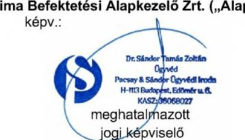

---

Észrevételek
„A Pallas Athéné Domus Meriti Alapítvány gazdálkodásának ellenőrzése” című számvevőszéki jelentéstervezet vonatkozásában

Szigorúan bizalmas!

---

# TARTALOMJEGYZÉK 

I. Bevezetés és kérelem ..... 4
I. 1 Kérelem a jelentés nyilvánosságának korlátozásáról ..... 4
II. Összegzés ..... 5
III. Részletes EGYÉB Észrevételek ..... 8
III. 1 Észrevételek az ellenőrzött időszak vonatkozásában ..... 8
III. 2 A 2.3. számú megállapításokhoz tett észrevételek (jelentéstervezet 48-49. oldal) ..... 9
IV. Definíciók ..... 11

---

# I. BEVEZETÉS ÉS KÉRELEM 

Tisztelt Igazgató Úr!
Az Állami Számvevőszék („ÁSZ”) 2025. február 13. napján EL-3815-429/2025. iktatószámú levelében megküldött EL-3815-434/2025. iktatószámú jelentéstervezetében foglalt megállapításokra az Állami Számvevőszékről szóló 2011. évi LXVI. törvény („ÁSZ Tv.”) 29. § (2) bekezdésében foglaltakra tekintettel az észrevételeinket az alábbiakban adjuk elő, amelyre tekintettel kérjük a tisztelt Állami Számvevőszéket, hogy az EL-3815/2025 hivatkozási szám alatt folyamatban lévő ellenőrzési eljárásban a jelentéstervezetet felülvizsgálni és az alább kifejtettek szerint módosítani szíveskedjék.

## I. 1 Kérelem a jelentés nyilvánosságának korlátozásáról

A tisztelt Állami Számvevőszék által készített jelentéstervezet számos törvény által védett információt és titkot tartalmaz, amelyek nyilvánosságra hozatalát törvény tiltja. E körben felhívjuk a tisztelt Állami Számvevőszék figyelmét arra, hogy ezen törvényi védelem elsődlegesen nem csak az ellenőrzés alá vont jogi személyeket védi, hanem az ellenőrzés alá vont jogi személyek befektetőit is.

Ezen törvényi védelem teljesülése érdekében a jelentés nyilvánosságra hozatalának korlátozását és tilalmát az ÁSZ Tv. is kifejezetten tartalmazza. Az ÁSZ Tv. 32.§ (3) bekezdése alapján ekként: „Az Állami Számvevőszék jelentése nyilvános. Törvény a nyilvánosságot minősített adatok védelme érdekében korlátozhatja. A nyilvánosságra hozott jelentés nem tartalmazhat minősített adatot vagy a törvény által védett egyéb titkot.”

Mindezekre tekintettel fel kívánjuk hívni a tisztelt Állami Számvevőszék figyelmét, hogy az ÁSZ tv. 32. § (3) bekezdése alapján a nyilvánosságra hozott jelentés nem tartalmazhat minősített adatot vagy a törvény által védett egyéb titkot. Tekintettel arra, hogy a jelentéstervezetben foglalt információk összessége törvény által védett titoknak minősül, így különösen üzleti titoknak, értékpapírtitoknak, valamint tőzsdei bennfentes információnak, ezért kérjük a tisztelt Állami Számvevőszéket, hogy a végleges jelentés nyilvánosságát teljes mértékben korlátozza.

A fent előadottakra, valamint a jelentésben foglalt törvény által védett titokra tekintettel kérjük a tisztelt Állami Számvevőszéket, hogy az EL-3815/2025 hivatkozási szám alatt folyamatban lévő ellenőrzési eljárásban készült jelentés nyilvánosságra hozatalát teljes egészében korlátozza, hogy az ne juthasson illetéktelen személy tudomására, és e védett adatok törvényben meghatározott védelme a hatóság eljárásában is biztosított legyen.

Az információk nyilvánosságra hozatala súlyosan hátrányos jogkövetkezményekkel járhat.

---

# II. ÖSSZEGZÉS 

A tisztelt Állami Számvevőszék jelentéstervezetében az Alapkezelőre vonatkozó, illetve azzal összefüggésbe hozott megállapításokkal kapcsolatos főbb észrevételeinket az alábbiakban összegezzük:

## 1) Ellenőrzött időszak

(i) Elöljáróban felhívjuk a figyelmet, hogy a tisztelt ÁSZ által meghatározott ellenőrzött időszak nincs összhangban a jelentéstervezet tartalmával. A jelentéstervezet megállapítja, hogy az 13. fókuszterületek vonatkozásában az ellenőrzött időszak a 2021-2023. évek és a 2023. beszámolók, ugyanakkor részletesen (és a valósággal ellentétes tényekre alapítva, valamint abból téves következtetésekre jutva) elemzi többek között a GTC S.A. 2020. év elején megvalósult megvásárlását, a tranzakció döntéshozatal körülményeit és annak gazdasági hatásait. Ugyanígy a jelentéstervezet utal több 2024. és 2025. évben történt eseményre és döntésre is.
(ii)
 Minekután az ellenőrzött időszakon kívül eső megállapítások eshetőlegesek és nem tükröznek részletes vizsgálatot, hanem csak egyes kedvezőtlen színben feltüntetett körülmények kiragadására korlátozódnak, ezért a jelentéstervezet alkalmatlan arra, hogy teljes és valós képet mutasson az ellenőrzött időszak vonatkozásában. Felhívjuk a figyelmet arra, hogy például az ellenőrzött időszak legvégén, 2023 decemberében került sor az Ultima Capital részvények Optima általi megszerzésére, és a valóságban az eredeti befektetés 2021. augusztusban valósult meg és annak formája egy hosszú lejáratú éves 12%-os kamatot biztosító kötvény volt. A jelentéstervezet ezt a körülményt meg sem említi elemzésében, holott a vizsgált időszak túlnyomó részében a befektetés formája kötvény volt.
2) Döntéselőkészítés megalapozottsága
(i) A tisztelt ÁSZ álláspontja szerint a kuratórium a döntéseit nem elegendő és mennyiségű információ és döntéselőkészítő anyagok birtokában hozta meg. Jelen észrevétel megtételét megelőző közvetlen tájékozódásuk alapján a PADME kuratóriumának álláspontja ezzel szemben az, hogy általános eljárás volt, hogy a kuratórium formális döntéshozatalait minden esetben többszöri informális telefonos és személyes egyeztetések, telefonkonferenciák előzték meg, amelyek során a kuratórium tagjai egyeztethették felvetéseiket egymással és az Optima vezetőségével. Ekként viszont álláspontunk szerint az Alapítvány kuratóriumának tagjainak szakmai múltja és felkészültsége alapján sem valószínűsíthető a tisztelt ÁSZ által bemutatott formális szerep.
(ii) Jelen észrevétel megtételét megelőző közvetlen tájékozódásuk alapján kijelenthető, hogy az Alapítvány az Optima szervezetét pont annak céljából hozta létre, hogy a befektetési döntések megalapozott előkészítése, a jogszerű és hatékony működés biztosított legyen, hiszen az Alapítvány kuratóriumában a befektetési döntések részletes elemzéséhez nincs kellő humán erőforrás, mindaz az Optima szervezetében koncentrálódik.
3) Befektetések és befektetési struktúra kialakítása
(i) A tisztelt Állami Számvevőszék a jelentéstervezetben többször hasonlítja az Optima csoport befektetéseit a magyar állampapírokba történő befektetések kockázati szintjéhez. Fel kívánjuk hívni a figyelmet, hogy az Alapítvány a befektetéseit az alapítását közvetlen követően állampapírban tartotta, azonban az Európai Központi Bank 2015-ös jelentésében megállapította, hogy a „Magyar Nemzeti Banknak is biztosítania kell, hogy azokat a jegybanki forrásokat, amelyeket átruházott az alapítványai hálózatára, ne használják - közvetlenül vagy közvetve - állami finanszírozási célokra." Az Európai Központi Bank álláspontja szerint az alapítványoknak átadott jegybanki források állampapírba történő befektetése tiltott monetáris finanszírozásnak minősül, ezért többször felszólította a Magyar Nemzeti Bankot, hogy a nemzeti bank által alapított alapítványok tekintetében ezt a gyakorlatot szüntesse meg. Ezt követően született meg az a döntés, hogy ezért az állampapírokban történő befektetés helyett az Alapítvány jövedelemtermelő eszközökbe fektesse vagyonát.
(ii) Az Optima befektetési portfóliójának főbb elemei az ellenőrzött időszakban a lengyel tőzsdén jegyzett GTC, a 12%-os hozamot biztosító Alpine kötvények, valamint a Budapesti Metropolitan Egyetem voltak. Ezen diverzifikált portfolió biztosította az Optima és az Alapítvány számára kiszámítható hozamot az Alapítvány céljainak megvalósítása érdekében. A Budapesti Metropolitan Egyetem nem csak az Optima befektetése, hanem egy vezető nemzetközi oktatási intézmény, amely közvetlenül is hozzájárul az alapítványi célok megvalósításához.
(iii) A tisztelt ÁSZ megállapítása szerint az Optima egy lényegében átláthatatlan, a valós vagyon értékelését ellehetetlenítő cégstruktúrát hozott létre. Ezzel szemben az alapkezelői tevékenységünk által az Optima célja éppen egy olyan befektetési struktúra kialakítása volt, amely által átlátható, transzparens és szabályozott környezetet teremt a befektetései végrehajtása és vagyona védelme érdekében. A befektetési struktúra kialakítását alapos szakmai megfontolások indokolták, különös tekintettel a nemzetközi tranzakciók hatékony lebonyolítására, a befektetések optimális kezelésére és a külföldi értékpapír-piaci előírásokra is. A befektetési struktúra jogszerű kialakításában nemzetközi tanácsadók (pl. DLA Piper, EY, BDO, stb.) is közreműködtek.
(iv) Felhívjuk a figyelmet, hogy a tisztelt ÁSZ Optima cégcsoport átláthatatlanságát hangsúlyozó álláspontja szembemegy a Magyar Kormány magántőkealapokkal és befektetési alapokkal kapcsolatosan mindenkor képviselt álláspontjával és alapvetően a nemzetközi kritikákat ismétli. Ezzel szemben álláspontunk az, hogy a nemzetközi befektetési gyakorlatban teljesen megszokott és elfogadott a többszintű holding- és alapstruktúrák alkalmazása, amely számos előnnyel jár mind működési, mind befektetési (és számos esetben adózási) szempontból. A befektetési alapok, illetve magántőkealapok működése, gazdálkodása, illetve beszámolási kötelezettsége részletesen szabályozott mind a magyar, mind pedig az európai uniós jogban. Ezen alapok működését a Magyar Nemzeti Bank felügyeli, amely többletgaranciát nyújt a vagyon védelme és átláthatósága érdekében.

# 4) Az Alapkezelőre tett megállapítások 

Törekedtünk arra, hogy az ÁSZ jelentéstervezetének mind az Összefoglaló részében szereplő, mind pedig a későbbiekben részletezett megállapításokra vonatkozóan külön-külön, részletes észrevételeket tegyünk.

A jelentéstervezet 2.3. pontbeli alábbi megállapításai kapcsán:

[^0]
[^0]:    „Az Alapkezelők kezelésében álló Alapok és Magántőkealapok befektetési tevékenységének szabályai nem álltak összhangban az Alapítvány Befektetési szabályzatában1-3 meghatározott befektetési alapelvekkel, nem azok figyelembevételével végezték tevékenységüket, ezzel az Alapítvány cél szerinti tevékenységének megvalósítását nem támogatták."
    „Az Alapkezelők által kezelt Alapok tartottak portfóliójukban lévid eszköznek számító pénzeszközt, állampapírt, míg a Magántőkealapok nem, bár a Kezelési szabályzatok ennek elméleti lehetőségét tartalmazták. Az Alapítvány Befektetési szabályzata szerint állampapír kizárólag másodlagos piacon vásárolható meg, azonban az Alapok és a Magántőkealapok Kezelési szabályzatai erre vonatkozó kitételeit nem tartalmazták, egyes alapok kezelési szabályzata rögzítette az elsődleges forgalmazású rendszerben szereplő állampapírok értékelési elveit, ami az Alapítvány Befektetési szabályzata előírásaival ellentmondást jelentett.
    Az Alapítvány Befektetési szabályzatában meghatározott befektetési alapelvek szerint az Alapítvány a célok elérését a befektetéseken elért hozam felhasználásával egy, a vagyontömeg megőrzését biztosító, konzervatív befektetési politika folytatása mellett kívánja megvalósítani. Ezzel szemben a Magántőkealapok és több Alap (Boreasz Alapok Alapja, Optimum I. és II. Értékpapír Alapok Alapja, Prime Értékpapír Alap) esetében a Kezelési szabályzatokban meghatározott elsődleges eszközbategória típusa (magántőkealap), vagy a portfólió összetétele (magántőkealapba való befektetés aránya) miatt az átlagot jóval meghaladó kockázattal rendelkező befektetési formák közé tartoztak, ami az Alapítvány Befektetési szabályzata előírásaival ellentmondást jelentett."

határozott álláspontunk szerint a társaságunknak, mint befektetési alapkezelőnek a vonatkozó jogszabályi előírásoknak történő megfelelés körében szükséges a szakmai tevékenységét kifejtenie. Az általunk kezelt Alapok esetében ezért a Kezelési szabályzatoknak a Magyar Nemzeti Bank mint felügyeleti szerv elvárásainak és a Kbftv. előírásainak megfelelő tartalmi követelményeknek kell megfelelniük, amely megfelelések nem vitásan teljesültek.

A befektetési alapkezelőknek nincs és nem is lehet eszköze arra, hogy a vele jogviszonyban nem álló Alapítvány bármikori Befektetési Szabályzatának tartalmát és esetleges változásait vizsgálja, illetőleg kövesse. Mindazonáltal álláspontunk szerint az Alapítvány által alkalmazott Befektetési Szabályzat esetleges állampapír vásárlási korlátozása semmiben nem ütközik azzal, ha az Alapítvány mint kötvénytulajdonos által lejegyzett kötvények vételárának akár közvetlen, akár közvetett formában befektetési jegy vásárlás/jegyzés során kerülnek harmadik személy által felhasználásra és az ekként érintett Alapok esetlegesen állampapírban (is) befektetési eszközökkel rendelkeznek, hiszen az Alapítvány itt (t.i. az Alapítványi Befektetési Szabályzat tartalmának összhang vizsgálatakor) nem befektetőnek, hanem kötvénytulajdonos minőségében hitelezőnek minősül.

Az utóbbi közvetettségi reláció igaz az Alapítványnak az Optima Befektetési Zrt-beli részvénytulajdonosi minőségére is, mivel az Optima csoport általi forrás felhasználás nem a részvénytársaság alapítójának vagyoni juttatása (t.i. alaptőke rendelkezésre bocsátása) révén alakult ki, hanem az Alapítvány általi kötvényjegyzések révén (amelyek „csak" hitelviszonyt megtestesítő jogviszonynak minősülnek).

Mindemellett meg kívánjuk jegyezni, hogy bár a Kezelési szabályzatokban elméleti lehetőségként szerepelt az elsődleges kibocsátású állampapírok értékelésének módszertana, az ellenőrzött időszakban ilyen tranzakciókra ténylegesen nem került sor, így az állítólagos ellentmondás semmilyen gyakorlati relevanciával nem bír.

Minderre figyelemmel a T. ÁSZ által hivatkozott szabályzati ellentmondás kinyilatkoztatása hamis színben tünteti fel az egymással egyebekben össze nem függő tények egyes elemeit.

# 5) Következtetés 

A fent előadottak alapján megállapítható, hogy az ÁSZ által meghatározott ellenőrzött időszak és a jelentéstervezetben foglalt megállapítások nincsenek összhangban, a legtöbb állítás 2023 végét követően megvalósult eseményeken alapul, amelyek valós értékelését a jelentéstervezet meg sem próbálta elvégezni. Minderre tekintettel a jelentéstervezet megállapításainak jelentős része megalapozatlan és a kapcsolódó elemzések felületesek és félrevezetőek.

Amennyiben a tisztelt Állami Számvevőszék az Optima csoport (beleértve az Alapkezelők) jelenlegi állapotára és értékére kíván következtetéseket megállapítani, akkor a vizsgálati időszakot ki kell terjesztenie a 2018-tól 2025-ig tartó időszakra. Amennyiben a vizsgálati időszak nem kerül kiterjesztésre, abban az esetben az ellenőrzött időszakon túlmenő megállapítások tekintetében a jelentéstervezet fontos dokumentumokat és jelentős tényállításokat nélkülöz, és ezáltal annak tartalma valótlan és félrevezető. Az Alapkezelő természetesen nyitott az aktív közreműködésre és készen áll további dokumentáció rendelkezésre bocsátásával segíteni a vizsgálat eredményes lefolytatását és lezárását.

# III. RÉSZLETES EGYÉB ÉSZREVÉTELEK 

Részletes észrevételeinket a tisztelt ÁSZ jelentéstervezetének egyes fejezeteiben foglalt megállapítások tekintetében az alábbiakban terjesztjük elő.

## III. 1 Észrevételek az ellenőrzött időszak vonatkozásában

A tisztelt ÁSZ az ellenőrzött időszakot az alábbiakban határozta meg jelentésének tervezetében:
„Az 1-3. fókuszterület vonatkozásában 2021-2023. évek, a 2023. évi beszámolók és az NJE Alapítvány által lejegyezett OPTIMA 2031 és OPTIMA 2031B kötvények ellenőrzése kapcsán 2024. június 30-ig,
az Optimum-Alfa Ingatlanbefektetési Kft., az Optimum-Delta Ingatlanbefektetési Kft., a Kasselik-Ház Ingatlanfejlesztő Zrt. és a V168 FM Kft. esetében a 2021.01.01-2023.10.31., az Infopark H Építési Terület Kft. esetében 2023.11.23-2023.12.31. közötti időszak,
a 4. fókuszterület vonatkozásában az MNB-Ingatlan Kft. (ellenőrzött időszakban: Optimum-Penta Ingatlanbefektetési Kft. néven) esetében: 2018.01.01-2019.05.30.; az Optimum-Gamma Ingatlanbefektetési Kft. esetében: 2017.01.01-2020.05.10., az Optimum-Omega Ingatlanbefektetési Kft. esetében: 2018.01.01-2022.02.27. időszak, valamint az Alapítvány ingatlanbeszerzései tekintetében 2014-2020. évek."

A tisztelt ÁSZ által meghatározott ellenőrzött időszak az 1-3. fókuszterületek vonatkozásában nincs összhangban a jelentéstervezet tartalmával. A jelentéstervezet megállapítja, hogy az 1-3. fókuszterületek vonatkozásában az ellenőrzött időszak a 2021-2023. évek és a 2023. beszámolók, ugyanakkor részletesen (és a valósággal ellentétes tényekre alapítva, valamint abból téves következtetésekre jutva) elemzi többek között a GTC S.A. 2020. év elején megvalósult megvásárlását, a tranzakció döntéshozatal körülményeit és annak gazdasági hatásait. Ugyanígy a jelentéstervezet utal több 2024. és 2025. évben történt eseményre és döntésre is, amelyeket példálózó jelleggel az alábbiakban emelünk ki:
(i) „A legutóbbi, 2024. novemberi Fitch Ratings a GTC S.A. jövőbeli minősítésének kilátásait a rövid távú likviditási kockázatok és a nagyértékű adósságállomány miatt stabilról negatívra változtatta."
(ii) „A GTC S.A. részvény tőzsdei árfolyama a vásárlást követően drasztikusan csökkent, a bekerülési értékhez viszonyítva több mint 50%-kal, a 2024. év végére tartósan 4 PLN alá esett. A megvásárolt részvénycsomag 2024. év végi tőzsdei árfolyam alapján számított értéke 162 Mrd Ft-tal csökkent."
(iii) „Az OPTIMA csoport másik jelentős külföldi befektetése, az Ultima Capital S.A. társaság tőzsdei részvényárfolyama szintén csökkenő trendben változott, 2024. december 30-án 88 CHF volt, ami a részvényenkénti 109,91 CHF bekerülési árhoz képest 20%-os csökkenést jelentett."
(iv) „A 2024. év végi likviditási helyzetet értékelő belső ellenőrzési jelentés szerint, elsősorban az Ultima Capital S.A. kapcsán 2025. június 30-ig további olyan jelentős kiadások merülnek majd fel, melynek eredményeképpen 80,5 Mrd Ft likviditási hiány prognosztizálható. Szintén a likviditási
 helyzet súlyosságát jelzi az Alapítvány felügyelőbizottságának 2025. január 18-án kelt, az MNB elnökének címzett levele, melyben a felügyelőbizottság elnökének értékelése szerint „az Alapítvány cél szerinti működése és fizetőképessége közvetlen veszélyben van”.

---

(v) „Az Alapítvány a kötvényt bekerülési értéken tartotta nyilván, azonban a 2024. évben akár 150 Mrd Ft értékvesztés elszámolása lett volna indokolt.”
(vi) „Az Alapítvány a jelzett anomáliákat annak ellenére nem ismerte el, hogy a Kuratórium 2024. április 25-én Reorganizációs tervet fogadott el, mivel az OPTIMA Befektetési Zrt. tájékoztatása szerint a várható kötelezettségeinek nem fog tudni eleget tenni.”
(vii) „Az ÁSZ jelzését követően, 2024. májusban az MNB elnöke vizsgálatokat rendelt el, melyek eredményéről 2024. decemberben tájékoztatta az ÁSZ elnökét.”
(viii) „A tájékoztatás szerint az Alapítvány által elfogadott Reorganizációs terv és a 2024. évi költségvetés éles ellentétben áll az elmúlt években teljesített éves alapítói tájékoztatásokban foglaltakkal, ezért az MNB igazgatósága több alkalommal kért információkat az Alapítvány Kuratóriumától, illetve döntött soron kívüli felügyelőbizottsági vizsgálatok elrendeléséről.”
(ix) „2024-ben a kedvezőtlen folyamatok tovább folytatódtak, ennek következtében a kötvény könyv szerinti és tényleges piaci értéke közötti veszteségjellegű különbség akár 150 Mrd Ft is lehetett.”
(x) „A GTC S.A. részvény tőzsdei árfolyama 2024. december 30-án 3,89 PLN volt, ami a darabonként bekerülési árhoz képest közel 55%-os csökkenést jelent, a részesedés tőzsdei árfolyam alapján számított értéke 394,5 M EUR-ral (162 Mrd Ft-tal csökkent).”
(xi) „2020. decemberében az Optima Befektetési Zrt. bizonyos GTC S.A. eszköz adásvételi tranzakciók utáni jutalék kifizetésre kötött megállapodásokat a B.H. Ventures Kft-vel és a PRIME Kft-vel, melyek alapján 2020. és 2021. években mindösszesen 3,0 Mrd Ft összegben teljesített kifizetéseket.”

Minekután az ellenőrzött időszakon kívül eső megállapítások esetlegesek és nem tükröznek részletes vizsgálatot, hanem csak egyes kedvezőtlen színben feltüntetett körülmények kiragadására korlátozódnak, ezért a jelentéstervezet alkalmatlan arra, hogy teljes és valós képet mutasson az ellenőrzött időszak vonatkozásában.

Felhívjuk a figyelmet arra, hogy például az ellenőrzött időszak legvégén, 2023 decemberében került sor az Ultima Capital részvények Optima általi megszerzésére, és a valóságban az eredeti befektetés 2021. augusztusban valósult meg és annak formája egy hosszú lejáratú éves 12%-os kamatot biztosító kötvény volt. A jelentéstervezet ezt a körülményt meg sem említi elemzésében, holott a vizsgált időszak túlnyomó részében a befektetés formája kötvény volt.

# III. 2 A 2.3. számú megállapításokhoz tett észrevételek (jelentéstervezet 48-49. oldal) 

## III.2.1 A jelentéstervezet 49. oldalának 3. bekezdése rögzíti, hogy

"Az Alapkezelők által kezelt Alapok tartottak portfóliójukban likvid eszköznek számító pénzeszközt állampapírban, míg a Magántőkealapok nem, bár a Kezelési szabályzatok ennek elméleti lehetőségét tartalmazták. Az Alapítvány Befektetési szabályzata szerint állampapír kizárólag másodlagos piacon vásárolható meg, azonban az Alapok és a Magántőkealapok Kezelési szabályzatai erre vonatkozó kitételt nem tartalmaztak, egyes alapok kezelési szabályzata rögzítette az elsődleges forgalmazású rendszerben szereplő állampapírok értékelési elveit, ami az Alapítvány Befektetési szabályzata előírásaival ellentmondást jelentett."

---

Határozott álláspontunk szerint a társaságunknak, mint befektetési alapkezelőnek a vonatkozó jogszabályi előírásoknak történő megfelelés körében szükséges a szakmai tevékenységét kifejtenie. Az általunk kezelt Alapok esetében ezért a Kezelési szabályzatoknak a Magyar Nemzeti Bank mint felügyeleti szerv elvárásainak és a Kbtfv. előírásainak megfelelő tartalmi követelményeknek kell megfelelniük, amely megfelelések nem vitásan teljesültek.

A befektetési alapkezelőknek nincs és nem is lehet eszköze arra, hogy a vele jogviszonyban nem álló Alapítvány bármikori Befektetési Szabályzatának tartalmát és esetleges változásait vizsgálja, illetőleg kövesse. Mindazonáltal álláspontunk szerint az Alapítvány által alkalmazott Befektetési Szabályzat esetleges állampapír vásárlási korlátozása semmiben nem ütközik azzal, ha az Alapítvány mint kötvénytulajdonos által lejegyzett kötvények vételárának akár közvetlen, akár közvetett formában befektetési jegy vásárlás/jegyzés során kerülnek harmadik személy által felhasználásra és az ekként érintett Alapok esetlegesen állampapírban (is) befektetési eszközölnének, hiszen az Alapítvány itt (t.i. az Alapítványi Befektetési Szabályzat tartalmának összhang vizsgálatakor) nem befektetőnek, hanem kötvénytulajdonos minőségében hitelezőnek minősül.

Az utóbbi közvetettségi reláció igaz az Alapítványnak az Optima Befektetési Zrt-beli részvénytulajdonosi minőségére is, mivel az Optima csoport általi forrás felhasználás nem a részvénytársaság alapítójának vagyoni juttatása (t.i. alaptőke rendelkezésre bocsátása) révén alakult ki, hanem az Alapítvány általi kötvény jegyzések révén (amelyek „csak” hitelviszonyt megtestesítő jogviszonynak minősülnek).

Mindemellett meg kívánjuk jegyezni, hogy bár a Kezelési szabályzatokban elméleti lehetőségként szerepelt az elsődleges kibocsátású állampapírok értékelésének módszertana, az ellenőrzött időszakban ilyen tranzakciókra ténylegesen nem került sor, így az állítólagos ellentmondás semmilyen gyakorlati relevanciával nem bír.

Minderre figyelemmel a T. ÁSZ által hivatkozott szabályzati ellentmondás kinyilatkoztatása hamis színben tünteti fel az egymással egyebekben össze nem függő tények egyes elemeit.

Optima Befektetési Alapkezelő Zrt.
2025.02.27.

---

# IV. DEFINÍCIÓK 

ÁSZ - Állami Számvevőszék
ÁSZ Tv. - Állami Számvevőszékről szóló 2011. évi LXVI. törvény
Bkr. - 370/2011. (XII. 31.) Korm. rendelet
EU - Európai Unió
EKB - Európai Központi Bank
GTC - Globe Trade Centre S.A.
Info Tv. - 2011. évi CXII. törvény az információs önrendelkezési jogról és az információszabadságról
Kbtfv. - kollektív befektetési formákról és kezelőikről, valamint egyes pénzügyi tárgyú törvények módosításáról szóló 2014. évi XVI. törvény

MNB - Magyar Nemzeti Bank
NJEA - Neumann János Egyetemért Alapítvány
Optima - Optima Befektetési Zrt.
Optima Csoport - az Optima Befektetési Zrt. és befektetései által tulajdonolt, illetőleg irányított szervezetek, társaságok összessége

PADME - Pallas Athéné Alapítvány
Ptk. - 2013. évi V. törvény a Polgári Törvénykönyvről
Sztv - számvitelről szóló 2000. évi C. törvény
Tpt. - tőkepiacról szóló 2001. évi CXX. törvény
Ultima - Ultima Capital S.A.
Ütvtv. - üzleti titok, amelyről az üzleti titok védelméről szóló 2018. évi LIV. törvény

---

# Hegedüs István   Vezérigazgató 

Ikt. szám: EL-3815-457/2025
Úgyintéző: Hofmeister László
Telefonszám: +36 14849112

OPTIMA Befektetési Alapkezelő Zrt.

## Budapest

Tárgy: Válaszlevél ellenőrzéssel kapcsolatos észrevételek kezeléséről

## Tisztelt Vezérigazgató Úr!

„A Pallas Athéné Domus Meriti Alapítvány gazdálkodásának ellenőrzése” című számvevőszéki jelentés tervezetével kapcsolatos, 2025. február 27-i keltezésű, meghatalmazott jogi képviselő útján benyújtott észrevételt köszönettel megkaptam.

Az Állami Számvevőszékről szóló 2011. évi LXVI. törvény (a továbbiakban: ÁSZ törvény) 29. § (2) bekezdése szerint az ellenőrzött szervezet vezetője és a felelősként megjelölt személy az ellenőrzés megállapításaira tizenöt napon belül írásban észrevételt tehet. Ugyanezen szakasz (3) bekezdése szerint az Állami Számvevőszék (a továbbiakban: ÁSZ) az észrevételre a beérkezésétől számított harminc napon belül írásban válaszol. A figyelembe nem vett észrevételeket köteles a jelentésben feltüntetni, és megindokolni, hogy azokat miért nem fogadta el.

Észrevételük bevezetés és kérelem részének L1 pontjában jelzett, a jelentés nyilvánosságának korlátozására vonatkozó kérelmükkel kapcsolatos álláspontját az ÁSZ a Pallas Athéné Domus Meriti Alapítványnak (a továbbiakban: Alapítvány) megküldött, a jelentés Függelékében megtalálható EL-3815-451/2025. iktatószámú levelében fejtette ki.

## Az ÁSZ a jelentés nyilvánosságának korlátozására vonatkozó kérelmét elutasította.

---

Az ÁSZ észrevételekre vonatkozó álláspontjáról az alábbi tájékoztatást adom:

# 1. a.) Észrevételek az ellenőrzött időszak vonatkozásában 

Észrevételük II. Összegzés részében 1) Ellenőrzött időszak cím (i) pontjában jelezték, hogy az ÁSZ által meghatározott ellenőrzött időszak az 1-3. fókuszterületek vonatkozásában nincs összhangban a jelentéstervezet tartalmával, ugyanis a jelentéstervezet megállapítja, hogy az 1-3. fókuszterületek vonatkozásában az ellenőrzött időszak a 2021-2023. évek és a 2023. beszámolók, ugyanakkor részletesen (és a valósággal ellentétes tényekre alapítva, valamint abból téves következtetésekre jutva) elemzi többek között a GTC 2020. év elején megvalósult megvásárlását, a tranzakció döntéshozatal körülményeit és annak gazdasági hatásait. Ugyanígy a jelentéstervezet utal több 2024. és 2025. évben történt eseményre és döntésre is, amelyek közül észrevétele III.1. (i)- (xi) pontjaiban példálózó jelleggel kiemelt néhányat.

Az ellenőrzött időszakkal kapcsolatos 1) (ii) pontban, a Befektetések és befektetési struktúra kialakításával kapcsolatos 3) (ii) pontban és a részletes észrevételek III. 1 pontjában észrevételükben felhívták az ÁSZ figyelmét arra, hogy az ellenőrzött időszak legvégén, 2023 decemberében került sor az Ultima részvények OPTIMA általi megszerzésére, és a valóságban az eredeti befektetés 2021. augusztusban valósult meg és annak formája egy hosszú lejáratú, éves 12%-os kamatot biztosító kötvény volt. A jelentéstervezet ezt a körülményt meg sem említi elemzésében, holott a vizsgált időszak túlnyomó részében a befektetés formája kötvény volt.

## 1. b.) ÁSZ válaszok az ellenőrzött időszak vonatkozásában tett észrevételekre

Észrevételük 1) (i) és a részletes észrevételek III. 1 pontjára válaszolva rögzítjük, hogy az ÁSZ által az ellenőrzési programban definiált ellenőrzött időszak az 1-3. fókuszterületek vonatkozásában eredetileg 2021. január 1-től 2022. december 31-ig terjedő időszak volt, melyet az ÁSZ kiterjesztett 2023. december 31-ig, valamint a 2023. évi számviteli beszámoló, illetve az OPTIMA2031 és OPTIMA2031/B kötvények további ellenőrzése kapcsán 2024. június 30-ig. A jelentés konkrét megállapításai az ellenőrzött időszakra korlátozódnak, azonban a jelentéstervezet ellenőrzés tárgya címben jelzettek szerint: „Az ellenőrzés kiterjed minden olyan körülményre és adatra, amely az ÁSZ jogszabályban meghatározott feladatainak teljesítéséhez, valamint a program végrehajtása folyamán felmerült újabb összefüggések feltárásához szükséges.” A kiemelt, ellenőrzött időszakon kívüli esemény, a GTC S.A. 2020. év elején megvalósult megvásárlása, illetve az arról hozott döntés körülményeinek bemutatása, ahogy a jelentésben is szerepel, annak a következő években (tehát az ellenőrzött időszakban) is jelentkező rendkívüli gazdasági hatásai miatt történt. Hasonlóan az összefüggések megértését, a következmények bemutatását, a naprakész információk biztosítását hivatottak segíteni az ellenőrzött időszakon túli, észrevételük III.1. (i)-(xi) pontjában példálózó jelleggel kiemelt kitekintések, utalások, melyek mindössze tényleírások, következtetések, nem pedig

---

megállapítások. Ugyanakkor a jelentésben megtett megállapításokat a 2024. év II. félévében, vagy a 2025. év első negyedévében történt események nem módosítják.

Az Ultima befektetés vizsgált időszaki formájához kapcsolódó 1) (ii), 3) (ii) és a részletes észrevételek III. 1 pontja szerinti észrevételükkel ellentétben a jelentés több helyen is említi a kötvényjegyzés tényét, nevezetesen: 13. oldalon az ellenőrzés hatóköre és az ellenőrzött szervezetek: „Ultima Capital S.A. - Az Alapítvány 2021. augusztus 24-i jóváhagyó határozata birtokában az OPTIMA Befektetési Zrt. a közvetett tulajdonában álló Alpine Holding Kft.-n keresztül átváltoztatható kötvényjegyzésre vállalt kötelezettséget, annak érdekében, hogy 2025. december 31-ig megszerezze az Ultima Capital S.A. 59%-os, valamint az ULT Management Holding S.A. 21%-os részvénycsomagját.” Ezenkívül a 36. oldalon, a 2.1. megállapítás részletezése körében, a Részesedés az Ultima Capital S.A. társaságban cím alatt: „2023. év végén az Alapítvány a közvetett befektetései révén birtokolta az Ultima Capital S.A. 33%-os részvénycsomagját, ezen felül megállapodás alapján megfizetett egy 25%-os lebirható részvénycsomagot, valamint további 42,1% részvényre kisebbségi tulajdonosokkal kötött vételi és eladási szándékot rögzítő megállapodásokat. A részvénnyé változtatható kötvény vásárlásáról bozott kuratóriumi döntés időpontjában” A kötvény kamatára vonatkozó észrevételük kapcsán megjegyezzük, hogy az ellenőrzésnek nem volt tárgya a különböző befektetések hozamainak elemzése, ezt más pénzügyi instrumentumok vonatkozásában sem tartalmazta.

Észrevételével kapcsolatban felhívom szíves figyelmét továbbá arra is, hogy a jelen levelem elején is idézett ÁSZ tv. 29. § (2) bekezdésében foglalt rendelkezések alapján az ellenőrzött időszakra nem, mindössze az ellenőrzés
 megállapításaira volt lehetősége írásban észrevételt tenni. Az ellenőrzött időszakot az ÁSZ az ellenőrzési programban az ellenőrzései megtervezése során határozza meg. Az ellenőrzési program az ÁSZ ellenőrzés tervezési dokumentuma, amely az ellenőrzés-szakmai szabályok szerint az ellenőrzés célján, tárgyán túl többek között tartalmazza az ellenőrzött időszakot is.

Összességében az ellenőrzött időszak kiterjesztése nem változtatná meg a jelentéstervezet tartalmát és következtetéseit, továbbá nem az ellenőrzés megállapítása, így arra az ellenőrzött szervezetnek nincs is lehetősége észrevételt tenni. Emiatt a jelentés módosítása az észrevétele alapján nem indokolt.

# 2. a.) Észrevételek a döntéselőkészítés megalapozatlansága kapcsán 

Észrevételük II. Összegzés részében a 2) Döntéselőkészítés megalapozottsága cím (i) pontja alatt vitatták az ÁSZ 1. összegző megállapítását, miszerint „az Alapítvány a kuratóriumi ülés tartása nélkül, elektronikus úton hozott egyes határozatai mindössze formálisak voltak. Továbbá felmerül a Kuratórium felelőssége abban, hogy a GTC S.A. részesedés vásárlása kapcsán nem elegendő minőségű és mennyiségű információ birtokában hoztak döntést." Tájékoztatták az ÁSZ-t az általános eljárásról, ami szerint a kuratórium formális döntéshozatalait minden esetben többszöri informális telefonos és személyes

---

egyeztetések, telefonkonferenciák előzték meg, amelyek során a kuratórium tagjai egyeztethették felvetéseiket egymással és az OPTIMA Befektetési Zrt. vezetőségével. Az Alapítvány kuratóriumának tagjainak szakmai múltja és felkészültsége alapján sem valószínűsíthető a tisztelt ÁSZ által bemutatott formális szerep.

Ugyancsak e témakörben jelezték a jelentés összefoglalójához kapcsolódó (ii) észrevételüket, mely szerint az Alapítvány az OPTIMA Befektetési Zrt. szervezetét pont annak céljából hozta létre, hogy a befektetési döntések megalapozott előkészítése, a jogszerű és hatékony működés biztosított legyen. Az Alapítvány kuratóriumában a befektetési döntések részletes elemzéséhez nincs kellő humán erőforrás, mindaz az OPTIMA Befektetési Zrt. szervezetében koncentrálódik.

# 2. b.) ÁSZ válaszok a döntéselőkészítés megalapozatlansága kapcsán tett észrevételekre 

Észrevételük (i) a döntések általános eljárásrendjére vonatkozott, míg a megállapításunk „egyes határozatokra". Az elektronikus úton hozott határozatok esetében eleve azon, az Önök által nem vitatott tény okán merült fel a döntések formalitásának eshetősége, hogy a jogszabályban előírt határidőnél lényegesen rövidebb határidőt határoztak meg. A megszabott rövid határidőt és a további, bemutatott döntési körülményt a GTC S.A. részesedés vásárlás kapcsán tartalmazza részletesen is a jelentés. A formális döntések kapcsán a kuratóriumi tagok szakmai múltját nem vitattuk. Az észrevételük szerinti informális telefonos és személyes egyeztetések, telefonkonferenciák lefolytatását azonban dokumentumok nem támasztják alá, az egyeztetések, megbeszélések, felvetések eredményeit, a kérdések lezárását nem rögzítették, a döntéselőkészítő anyag ezeket nem tükrözte, az esetleges egyéni kérdéseket, javaslatokat, egyéb felvetéseket, azok megoldásait a többi kuratóriumi tag nem ismerhette meg. E tárgykörben hívjuk fel figyelmüket a Polgári Törvénykönyvről szóló 2013. évi V. törvény (a továbbiakban: Ptk.) 3:17. § (3) bekezdésére, mely az alábbiakat mondja ki: „A napirendet a megbízóban olyan részletességgel kell feltüntetni, hogy a szavazásra jogosultak a tárgyalni kívánt témakörökben álláspontjukat kialakíthassák." A napirend részletes ismertetésére vonatkozó szabálytól a veszélyhelyzet során sem lehetett eltérni az 502/2020. (XI.16.) Korm. rend. 4. § (1) bekezdés a) pontja alapján. Az ügylet kapcsán az üzleti lehetőséget közvetítő, az ügylet megvalósításában érdekelt, nem független Dentons Réczicza Ügyvédi Iroda, valamint a vele közös vállalkozásként tevékenykedő Impact Advisory Zrt. által készített elemzés okán vetődött fel azzal kapcsolatban az objektivitás kérdése.

Azon észrevételüket (ii) miszerint az OPTIMA szervezetét az Alapítvány a döntések megalapozott előkészítésének, a jogszerű, és hatékony működés céljából hozta létre, nem vitatjuk, megállapításaink a rendelt célok megvalósításának módjára, eredményére, a megvalósítási folyamatban észlelt eltérésekre vonatkoznak. Az ÁSZ-nak a befektetési döntés megalapozatlanságára vonatkozó megállapítását támasztja alá a Fitch Ratings 2023. szeptemberi értékelése, amellyel a GTC S.A.-t leminősítette. A minősítés alapján a társaság részvénye nem befektetési, hanem spekulatív kategóriába került. A többszáz milliárd Ft közpénzből származó,

---

kiemelkedő nagyságrendű vagyonra tekintettel célszerűen az Alapítványnál indokolt lett volna olyan szakembereket bevonni, akik az OPTIMA Befektetési Zrt.-re bízott feladatok elvégzését, a befektetési döntések előkészítését a Kuratórium munkáját segítve ellenőrzik. A későbbiekben az Alapítvány FB elnöke is elismerte, hogy ez a megvalósítási megoldás nem volt eredményes, olyan döntések születtek, melyek finanszírozási, működési problémákat eredményeztek, veszélyeztették az Alapítvány cél szerinti működését és fizetőképességét.

# Mindezek alapján a jelentéstervezet módosítása az észrevételek miatt nem indokolt. 

## 3. a.) Észrevételek Befektetések és befektetési struktúra kialakítása kapcsán

Észrevételük II. Összegzés részében 3) Befektetések és befektetési struktúra kialakítása cím alatt, valamint a részletes észrevételek III.1., III.2.2., III.4.14. pontjaiban felhívják az ÁSZ figyelmét arra, hogy
(i) az Európai Központi Bank álláspontja szerint az alapítványoknak átadott jegybanki források állampapírba történő befektetése tiltott monetáris finanszírozásnak minősül,
(ii) véleményük szerint az OPTIMA diverzifikált befektetési portfóliója az Alapítvány számára kiszámítható hozamot biztosított céljainak megvalósítása érdekében,
(iii) az OPTIMA célja éppen egy átlátható, transzparens és szabályozott befektetési struktúra kialakítása volt, a befektetései végrehajtása és vagyona védelme érdekében,
(iv) a nemzetközi befektetési gyakorlatban teljesen megszokott és elfogadott a többszintű holding- és alapstruktúrák alkalmazása, amely számos előnnyel jár mind működési, mind befektetési szempontból, valamint a befektetési alapok, illetve magántőkealapok működése, gazdálkodása, illetve beszámolási kötelezettsége részletesen szabályozott mind a magyar, mind pedig az európai uniós jogban, működésüket az MNB felügyeli, amely többletgaranciát nyújt a vagyon védelme és átláthatósága érdekében,

## 3. b.) ÁSZ válaszok a Befektetések és befektetési struktúra kialakítása kapcsán tett észrevételekre

Észrevételük (i) pontjában kifogásolt állampapírok említése a jelentés 34. oldal 2.1. számú megállapítás részletezésében és a IV. sz. mellékletben, a Benchmarking Módszertanában történt, azonban ezek egyike sem tartalmazott arra vonatkozó utalást, hogy az alapítványoknak átadott jegybanki forrásokat állampapírban kellene tartani. A jelentés a 2.1. számú megállapítás részletezésében mindössze a kötvényértékelési módszertan bemutatása céljából említi az állampapírokat, ahol azok kamatát az OPTIMA kötvény értékelése kapcsán alsó becslésként használtuk. A IV. sz. mellékletben kifejezetten jeleztük, hogy az Alapítvány állampapírban nem tarthatja befektetéseit, emiatt a hozamokat az egyéb pénzpiaci alapokhoz, illetve ingatlanalaphoz hasonlítottuk.

---

Észrevételük (ii) pontjára adott válaszunk szerint az alapítványi célokat rögzítő befektetési szabályzat előírásai ellenére a megvalósult végső befektetések nem voltak átláthatóak, igen magas kockázatot hordoztak. Az Alapítvány közvetlen kötvénybefektetése (az OPTIMA kötvény) az utólagos kamatmeghatározás miatt nem biztosított kiszámítható hozamot, sőt, 2023-ban semmilyen hozamot nem fizetett, hiszen a kötvényt kibocsátó OPTIMA Befektetési Zrt. 2023. év végén a kötvény hozamát épp a kötvénytulajdonostól, az Alapítványtól felvett kölcsön beszámításával rendezte. Az OPTIMA Befektetési Zrt. esetében a későbbiekben kialakult fizetésképtelenséggel fenyegető helyzet szintén nem összeegyeztethető a deklarált célokkal, sőt azokkal éppen ellentétes. Az Optima befektetési portfóliója kapcsán alapvetően téves az a véleményük, miszerint a portfólió hozamának kiszámíthatóságát önmagában a portfóliót alkotó elemek diverzifikáltsága biztosítaná.

Az OPTIMA Befektetési Zrt. - észrevételük (iii) pontjában leírt - eredeti célját az ÁSZ nem vitatja, ugyanakkor ténylegesen a csoport a befektetéseket a meghatározott cél ellenére egy több országon és vállalkozói szinten átívelő, indokolatlanul bonyolult, lényegében átláthatatlan céghálózaton keresztül, magántőkealapok közbeiktatásával valósította meg, aminek szakmai indokait az ÁSZ nem tudta beazonosítani és ezeket jelen észrevételükben sem fejtették ki. Az átláthatóság meghatározását a jelentés I. sz. melléklete, az értelmező szótár tartalmazza, miszerint az „A törvényeknek és egyéb szabályoknak megfelelő tevékenységellátás, és arról történő nyilvános beszámolás. Az átláthatóság érdekében biztosítani szükséges, hogy a célok elérése érdekében folytatott tevékenységekről, folyamatokról rendszeres vagy időközönkénti beszámolók, megbízható, időszerű, a tevékenység szempontjából fontos információk elérhetők és megismerhetők legyenek." A meghatározás szerinti nyilvános beszámolás és az elérhető, megismerhető információk nem voltak biztosítottak. A nyilvánosság számára nem átlátható a magántőkealapok működése, hiszen míg a klasszikus gazdasági társaságok alapvető adatai, tulajdonosai, ügyvezetése, a társaság beszámolói, kiegészítő mellékletei, könyvvizsgálói jelentései nyilvánosak, addig ugyanez a magántőkealapok alapvető és gazdálkodási adatairól (beszámoló, nettó eszközérték kimutatás, kezelési szabályzat) nem mondható el.

Észrevételük (iv) pontjára válaszolva jelezzük, hogy az ÁSZ álláspontja szerint a hazai közpénzből származó kiemelkedő nagyságrendű átadott vagyon miatt különösen indokolt, hogy annak befektetése átlátható struktúrán keresztül történjen, azonban észrevételük - annak megfogalmazása alapján feltehetőleg - a tisztán piaci viszonyokra vonatkozik, és nem fordít figyelmet a jelentéstervezetben szereplő befektetési és céges struktúrában érintett nemzeti vagyonra, illetve annak nagyságára és az azokhoz kapcsolódó átláthatósági követelményekre. A csoport által - a nemzetközi gyakorlathoz hasonlítottan - alkalmazott többszintű holding struktúra itt említett befektetési, működési szempontú előnyeit az ÁSZ nem tudta azonosítani, ezeket jelen észrevételükben sem fejtették ki, a befektetések sem igazolták vissza.

# Mindezek alapján a jelentéstervezet módosítása az észrevételek miatt nem indokolt.

---

# 4. a.) Észrevételek az Alapkezelőre tett megállapítások kapcsán 

Észrevételükben a jelentéstervezet 2.3. számú megállapítása kapcsán kifejtették, hogy a befektetési alapkezelőknek nincs arra eszköze, hogy az Alapítvány Befektetési Szabályzatának tartalmát vizsgálja, kövesse. Továbbá jelezték, hogy a Kezelési szabályzatokban szereplő elméleti lehetőség ellenére az ellenőrzött időszakban ténylegesen nem került sor elsődleges kibocsátású állampapírok tranzakciókra.

## 4. b.) ÁSZ válaszok az Alapkezelők kapcsán tett észrevételekre

A jelentéstervezet 2.3. pontja - az észrevételükben kiemelt és az ÁSZ által már fenti pontokban megválaszolt - állampapír vásárlási korlátozás mellett az Alapítvány befektetési szabályzatának egyéb alapelvei mentén is ellentmondást állapított meg. Az Alapkezelőknek az egyes, kockázatos alapok kapcsán végzett befektetési tevékenysége során a szabályzatnak a vagyontömeg megőrzését biztosító, konzervatív befektetési politikája sem valósult meg. Az Alapkezelők kezelésében álló magántőkealapok, illetve a megállapításban felsorolt több alap az átlagot jóval meghaladó kockázattal rendelkező befektetési formák közé tartoztak, ezekben pedig az állampapírok kapcsán jelzett, a tranzakciók elméleti lehetőségeivel ellentétben ténylegesen a gyakorlatban is megvalósultak ügyletek. A jelentés a szabályozás és a gyakorlat ellentétének tényét mutatja be, az Alapkezelőnek nem rótt fel szabályozási hiányosságokat, az ÁSZ véleménye a jelentéstervezet 2.2. megállapításával összhangban az, hogy kifejezetten az Alapítványnak lett volna ahhoz eszköze, hogy végig vigye az általa szabályzatban rögzített befektetési elveket, a vagyontömeg megőrzését biztosító, konzervatív befektetési politikát a teljes befektetési struktúrán keresztül.

Összességében a fentiek alapján a jelentéstervezet módosítása az észrevételek miatt nem indokolt.

## 5. a.) Észrevételek Következtetés

Észrevételük Következtetés részében az 1.) (i) ponttal egyezően megállapították, hogy az ÁSZ által meghatározott ellenőrzött időszak és a jelentéstervezetben foglalt megállapítások nincsenek összhangban. A Következtetés III. 1. részének (i)-(xi) pontjaiban az összhang hiányának bemutatására a jelentéstervezetből felsoroltak néhány, az ellenőrzött időszakon kívüli eseményre történt utalást, amik alapján a jelentéstervezet megállapításainak jelentős részét megalapozatlannak, a kapcsolódó elemzéseket felületesek és félrevezetőek minősítették. A Következtetés III. 2. részében a jelentéstervezet 2.3. számú megállapítása kapcsán megismételték jelen levelük 4.) pontjában, az Alapkezelőre tett megállapítások kapcsán bemutatott észrevételeiket.

---

# 5. b.) ÁSZ válaszok a Következtetés észrevételek kapcsán 

Észrevételük 1.) (i) pontjára adott válaszunkat megismételve jelezzük, hogy a jelentés konkrét megállapításai az ellenőrzött időszakra korlátozódnak,
 az ellenőrzött időszakon túli, észrevételük III.1. részének (i)-(xi) pontjaiban példálózó jelleggel kiemelt kitekintések, utalások az összefüggések megértését, a következmények bemutatását, a naprakész információk biztosítását hivatottak segíteni. Az egyetlen megállapítást vitató, már a 4.) pontban kifejtett észrevételük a jelentéstervezet 2.3. megállapítására vonatkozott, azonban a jelzett megállapításban rögzített tények a teljes ellenőrzött időszakban fennálltak, annak relevanciáját az ellenőrzött időszak vonatkozásában tett észrevételeik nem érintik. A jelentéstervezet fentieken túli többi, Önök által - általános jelleggel jelentős részben megalapozatlannak titulált megállapításait jelen észrevételezésben nem konkretizálták és egyedileg nem vitatták, azok megalapozatlannak minősítését nem indokolták és bizonyítékokkal nem támasztották alá.

## Mindezek alapján a jelentéstervezet módosítása az észrevételek miatt nem indokolt.

Tájékoztatom Vezérigazgató urat, hogy a számvevőszéki jelentésben a figyelembe nem vett észrevételt szerepeltetjük az elutasítás indokának feltüntetésével.

Budapest, időbélyegző szerint

Tisztelettel:

Klinga László s.k. igazgató, kiadmányozó Állami Számvevőszék Ellenőrzési Igazgatóság V.

---

# Állami Számvevőszék   Klinga László   igazgató részére 

Tárgy: Észrevételek megküldése az Állami Számvevőszék jelentéstervezete vonatkozásában
Tisztelt Igazgató Úr!
Tisztelettel megkaptuk az Állami Számvevőszékről szóló 2011. évi LXVI. törvény (továbbiakban: „ÁSZ Tv.") 29. § (1) bekezdésében foglaltak alapján észrevételezés céljából a „Pallas Athéné Domus Meriti Alapítvány gazdálkodásának ellenőrzése" című számvevőszéki jelentés tervezetét.

Az ÁSZ Tv. 29. § (2) bekezdése alapján jelen levél mellékleteként megküldjük észrevételeinket az ellenőrzési megállapításoknak a társaságunkra vonatkozó részei tekintetében.

Köszönettel vettük a tisztelt Igazgató úr és munkatársainak segítőkész hozzáállását az ellenőrzési eljárás során és a továbbiakban is állunk bármely kérdés vagy észrevétel tisztázása érdekében a tisztelt Állami Számvevőszék munkatársainak szíves rendelkezésére.

A Tisztelt Állami Számvevőszék javaslatait a jelentéstervezet sorsától függetlenül alaposan felülvizsgáljuk, és szükség esetén haladéktalanul megvalósítjuk a szükséges lépéseket, melyeket kiemelt prioritásként kezelünk.

Budapest, 2025. február 27.
Tisztelettel:

Arcadia Befektetési Alapkezelő Zrt. („Alapkezelő")
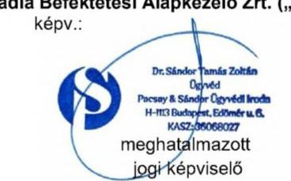

---

Észrevételek „A Pallas Athéné Domus Meriti Alapítvány gazdálkodásának ellenőrzése" című számvevőszéki jelentéstervezet vonatkozásában

Szigorúan bizalmas!

---

# TARTALOMJEGYZÉK 

I. Bevezetés és kérelem ..... 4
I. 1 Kérelem a jelentés nyilvánosságának korlátozásáról ..... 4
II. Összegzés ..... 5
III. Részletes EGYÉB Észrevételek ..... 8
III. 1 Észrevételek az ellenőrzött időszak vonatkozásában ..... 8
III. 2 A 2.3. számú megállapításokhoz tett észrevételek (jelentéstervezet 48-49. oldal) ..... 9
IV. Definíciók ..... 11

---

# I. BEVEZETÉS ÉS KÉRELEM 

Tisztelt Igazgató Úr!
Az Állami Számvevőszék („ÁSZ") 2025. február 12. napján EL-3815-428/2025. iktatószámú levelében megküldött EL-3815-434/2025. iktatószámú jelentéstervezetében foglalt megállapításokra az Állami Számvevőszékről szóló 2011. évi LXVI. törvény („ÁSZ Tv.") 29. § (2) bekezdésében foglaltakra tekintettel az észrevételeinket az alábbiakban adjuk elő, amelyre tekintettel kérjük a tisztelt Állami Számvevőszéket, hogy az EL-3815/2025 hivatkozási szám alatt folyamatban lévő ellenőrzési eljárásban a jelentéstervezetet felülvizsgálni és az alább kifejtettek szerint módosítani szíveskedjék.

## I. 1 Kérelem a jelentés nyilvánosságának korlátozásáról

A tisztelt Állami Számvevőszék által készített jelentéstervezet számos törvény által védett információt és titkot tartalmaz, amelyek nyilvánosságra hozatalát törvény tiltja. E körben felhívjuk a tisztelt Állami Számvevőszék figyelmét arra, hogy ezen törvényi védelem elsődlegesen nem csak az ellenőrzés alá vont jogi személyeket védi, hanem az ellenőrzés alá vont jogi személyek befektetőit is.

Ezen törvényi védelem teljesülése érdekében a jelentés nyilvánosságra hozatalának korlátozását és tilalmát az ÁSZ Tv. is kifejezetten tartalmazza. Az ÁSZ Tv. 32.§ (3) bekezdése alapján ekként: „Az Állami Számvevőszék jelentése nyilvános. Törvény a nyilvánosságot minősített adatok védelme érdekében korlátozhatja. A nyilvánosságra hozott jelentés nem tartalmazhat minősített adatot vagy a törvény által védett egyéb titkot."

Mindezekre tekintettel fel kívánjuk hívni a tisztelt Állami Számvevőszék figyelmét, hogy az ÁSZ tv. 32. § (3) bekezdése alapján a nyilvánosságra hozott jelentés nem tartalmazhat minősített adatot vagy a törvény által védett egyéb titkot. Tekintettel arra, hogy a jelentéstervezetben foglalt információk összessége törvény által védett titoknak minősül, így különösen üzleti titoknak, értékpapírtitoknak, valamint tőzsdei bennfentes információnak, ezért kérjük a tisztelt Állami Számvevőszéket, hogy a végleges jelentés nyilvánosságát teljes mértékben korlátozza.

A fent előadottakra, valamint a jelentésben foglalt törvény által védett titokra tekintettel kérjük a tisztelt Állami Számvevőszéket, hogy az EL-3815/2025 hivatkozási szám alatt folyamatban lévő ellenőrzési eljárásban készült jelentés nyilvánosságra hozatalát teljes egészében korlátozza, hogy az ne juthasson illetéktelen személy tudomására, és e védett adatok törvényben meghatározott védelme a hatóság eljárásában is biztosított legyen.

Az információk nyilvánosságra hozatala súlyosan hátrányos jogkövetkezményekkel járhat.

---

# II. ÖSSZEGZÉS 

A tisztelt Állami Számvevőszék jelentéstervezetében az Alapkezelőre vonatkozó, illetve azzal összefüggésbe hozott megállapításokkal kapcsolatos főbb észrevételeinket az alábbiakban összegezzük:

## 1) Ellenőrzött időszak

(i) Elöljáróban felhívjuk a figyelmet, hogy a tisztelt ÁSZ által meghatározott ellenőrzött időszak nincs összhangban a jelentéstervezet tartalmával. A jelentéstervezet megállapítja, hogy a 13. fókuszterületek vonatkozásában az ellenőrzött időszak a 2021-2023. évek és a 2023. beszámolók, ugyanakkor részletesen (és a valósággal ellentétes tényekre alapítva, valamint abból téves következtetésekre jutva) elemzi többek között a GTC S.A. 2020. év elején megvalósult megvásárlását, a tranzakció döntéshozatal körülményeit és annak gazdasági hatásait. Ugyanígy a jelentéstervezet utal több 2024. és 2025. évben történt eseményre és döntésre is.
(ii) Minekután az ellenőrzött időszakon kívül eső megállapítások eshetőlegesek és nem tükröznek részletes vizsgálatot, hanem csak egyes kedvezőtlen színben feltüntetett körülmények kiragadására korlátozódnak, ezért a jelentéstervezet alkalmatlan arra, hogy teljes és valós képet mutasson az ellenőrzött időszak vonatkozásában. Felhívjuk a figyelmet arra, hogy például az ellenőrzött időszak legvégén, 2023 decemberében került sor az Ultima Capital részvények Optima általi megszerzésére, és a valóságban az eredeti befektetés 2021. augusztusban valósult meg és annak formája egy hosszú lejáratú éves 12%-os kamatot biztosító kötvény volt. A jelentéstervezet ezt a körülményt meg sem említi elemzésében, holott a vizsgált időszak túlnyomó részében a befektetés formája kötvény volt.
2) Döntéselőkészítés megalapozottsága
(i) A tisztelt ÁSZ álláspontja szerint a kuratórium a döntéseit nem elegendő és mennyiségű információ és döntéselőkészítő anyagok birtokában hozta meg. Jelen észrevétel megtételét megelőző közvetlen tájékozódásuk alapján a PADME kuratóriumának álláspontja ezzel szemben az, hogy általános eljárás volt, hogy a kuratórium formális döntéshozatalait minden esetben többszöri informális telefonos és személyes egyeztetések, telefonkonferenciák előzték meg, amelyek során a kuratórium tagjai egyeztethették felvetéseiket egymással és az Optima vezetőségével. Ekként viszont álláspontunk szerint az Alapítvány kuratóriumának tagjainak szakmai múltja és felkészültsége alapján sem valószínűsíthető a tisztelt ÁSZ által bemutatott formális szerep.
(ii) Jelen észrevétel megtételét megelőző közvetlen tájékozódásuk alapján kijelenthető, hogy az Alapítvány az Optima szervezetét pont annak céljából hozta létre, hogy a befektetési döntések megalapozott előkészítése, a jogszerű és hatékony működés biztosított legyen, hiszen az Alapítvány kuratóriumában a befektetési döntések részletes elemzéséhez nincs kellő humán erőforrás, mindaz az Optima szervezetében koncentrálódik.
3) Befektetések és befektetési struktúra kialakítása
(i) A tisztelt Állami Számvevőszék a jelentéstervezetben többször hasonlítja az Optima csoport befektetéseit a magyar állampapírokba történő befektetések kockázati szintjéhez. Fel kívánjuk hívni a figyelmet, hogy az Alapítvány a befektetéseit az alapítását közvetlen követően állampapírban tartotta, azonban az Európai Központi Bank 2015-ös jelentésében megállapította, hogy a „Magyar Nemzeti Banknak is biztosítania kell, hogy azokat a jegybanki forrásokat, amelyeket átruházott az alapítványai hálózatára, ne használják - közvetlenül vagy

---

közvetve - állami finanszírozási célokra." Az Európai Központi Bank álláspontja szerint az alapítványoknak átadott jegybanki források állampapírba történő befektetése tiltott monetáris finanszírozásnak minősül, ezért többször felszólította a Magyar Nemzeti Bankot, hogy a nemzeti bank által alapított alapítványok tekintetében ezt a gyakorlatot szüntesse meg. Ezt követően született meg az a döntés, hogy ezért az állampapírokban történő befektetés helyett az Alapítvány jövedelemtermelő eszközökbe fektesse vagyonát.
(ii) Az Optima befektetési portfólójának főbb elemei az ellenőrzött időszakban a lengyel tőzsdén jegyzett GTC, a 12%-os hozamot biztosító Alpine kötvények, valamint a Budapesti Metropolitan Egyetem voltak. Ezen diverzifikált portfolió biztosította az Optima és az Alapítvány számára kiszámítható hozamot az Alapítvány céljainak megvalósítása érdekében. A Budapesti Metropolitan Egyetem nem csak az Optima befektetése, hanem egy vezető nemzetközi oktatási intézmény, amely közvetlenül is hozzájárul az alapítványi célok megvalósításához.
(iii) A tisztelt ÁSZ megállapítása szerint az Optima egy lényegében átláthatatlan, a valós vagyon értékelését ellehetetlenítő cégstruktúrát hozott létre. Ezzel szemben az alapkezelői tevékenységünk által az Optima célja éppen egy olyan befektetési struktúra kialakítása volt, amely által átlátható, transzparens és szabályozott környezetet teremt a befektetései végrehajtása és vagyona védelme érdekében. A befektetési struktúra kialakítását alapos szakmai megfontolások indokolták, különös tekintettel a nemzetközi tranzakciók hatékony lebonyolítására, a befektetések optimális kezelésére és a külföldi értékpapír-piacok előírásaira is. A befektetési struktúra jogszerű kialakításában nemzetközi tanácsadók (pl. DLA Piper, EY, BDO, stb.) is közreműködtek.
(iv) Felhívjuk a figyelmet, hogy a tisztelt ÁSZ Optima cégcsoport átláthatatlanságát hangsúlyozó álláspontja szembe megy a Magyar Kormány magántőkealapokkal és befektetési alapokkal kapcsolatosan mindenkor képviselt álláspontjával és alapvetően a nemzetközi kritikákat ismétli. Ezzel szemben álláspontunk az, hogy a nemzetközi befektetési gyakorlatban teljesen megszokott és elfogadott a többszintű holding- és alapstruktúrák alkalmazása, amely számos előnnyel jár mind működési, mind befektetési (és számos esetben adózási) szempontból. A befektetési alapok, illetve magántőkealapok működése, gazdálkodása, illetve beszámolási kötelezettsége részletesen szabályozott mind a magyar, mind pedig az európai uniós jogban. Ezen alapok működését a Magyar Nemzeti Bank felügyeli, amely többletgaranciát nyújt a vagyon védelme és átláthatósága érdekében.
4) Az Alapkezelőre tett megállapítások

Törekedtünk arra, hogy az ÁSZ jelentéstervezetének mind az Összefoglaló részében szereplő, mind pedig a későbbiekben részletezett megállapításokra vonatkozóan külön-külön, részletes észrevételeket tegyünk.

A jelentéstervezet 2.3. pontbeli alábbi megállapításai kapcsán:

[^0]
[^0]:    „Az Alapkezelők kezelésében álló Alapok és Magántőkealapok befektetési tevékenységének szabályai nem álltak összhangban az Alapítvány Befektetési szabályzatában1-3 meghatározott befektetési alapelvekkel, nem azok figyelembevételével végezték tevékenységüket, ezzel az Alapítvány cél szerinti tevékenységének megvalósítását nem támogatóak."
    „Az Alapkezelők által kezelt Alapok tartottak portfólójukban likvid eszköznek számító pénzeszközt állampapírban, míg a Magántőkealapok nem, bár a Kezelési szabályzatok ennek elméleti lehetőségét tartalmazóak. Az Alapítvány Befektetési szabályzata szerint állampapír kizárólag másodlagos piacon vásárolható meg, azonban az Alapok és a Magántőkealapok Kezelési szabályzatai erre vonatkozó kitételt nem tartalmazóak, egyes alapok kezelési szabályzata rögzítette az elsődleges forgalmazású rendszerben szereplő állampapírok értékelési elveit, ami az Alapítvány Befektetési szabályzata előírásaival ellentmondást jelentett.
    Az Alapítvány Befektetési szabályzatában meghatározott befektetési alapelvek szerint az Alapítvány a célok elérését a befektetéseken elért hozam felhasználásával egy, a vagyontömeg megőrzését biztosító, konzervatív befektetési politika folytatása mellett kívánja megvalósítani. Ezzel szemben a Magántőkealapok és több Alap (Boreasz Alapok Alapja, Optimum I. és II. Értékpapír Alapok Alapja, Prime Értékpapír Alap) esetében a Kezelési szabályzatokban meghatározott elsődleges eszközkategória típusa (magántőkealap), vagy a portfólió összetétele (magántőkealapba való befektetés aránya) miatt az állagot jóval meghaladó kockázattal rendelkező befektetési formák közé tartozóak állampapírok értékelési elveit, ami az Alapítvány Befektetési szabályzata előírásaival ellentmondást jelentett."

---

határozott álláspontunk szerint a társaságunknak, mint
 befektetési alapkezelőnek a vonatkozó jogszabályi előírásoknak történő megfelelés körében szükséges a szakmai tevékenységét kifejtenie. Az általunk kezelt Alapok esetében ezért a Kezelési szabályzatoknak a Magyar Nemzeti Bank mint felügyeleti szerv elvárásainak és a Kbftv. előírásainak megfelelő tartalmi követelményeknek kell megfelelniük, amely megfelelések nem vitásan teljesültek.

A befektetési alapkezelőknek nincs és nem is lehet eszköze arra, hogy a vele jogviszonyban nem álló Alapítvány bármikori Befektetési Szabályzatának tartalmát és esetleges változásait vizsgálja, illetőleg kövesse. Mindazonáltal álláspontunk szerint az Alapítvány által alkalmazott Befektetési Szabályzat esetleges állampapír vásárlási korlátozása semmiben nem ütközik azzal, ha az Alapítvány mint kötvénytulajdonos által lejegyzett kötvények vételárának akár közvetlen, akár közvetett formában befektetési jegy vásárlás/jegyzés során kerülnek harmadik személy által felhasználásra és az ekként érintett Alapok esetlegesen állampapírban (is) befektetési eszközölnek, hiszen az Alapítvány itt (t.i. az Alapítványi Befektetési Szabályzat tartalmának összhang vizsgálatakor) nem befektetőnek, hanem kötvénytulajdonos minőségében hitelezőnek minősül.

Az utóbbi közvetettségi reláció igaz az Alapítványnak az Optima Befektetési Zrt-beli részvénytulajdonosi minőségére is, mivel az Optima csoport általi forrás felhasználás nem a részvénytársaság alapítójának vagyoni juttatása (t.i. alaptőke rendelkezésre bocsátása) révén alakult ki, hanem az Alapítvány általi kötvényjegyzések révén (amelyek „csak" hitelviszonyt megtestesítő jogviszonynak minősülnek).

Mindemellett meg kívánjuk jegyezni, hogy bár a Kezelési szabályzatokban elméleti lehetőségként szerepelt az elsődleges kibocsátású állampapírok értékelésének módszertana, az ellenőrzött időszakban ilyen tranzakciókra ténylegesen nem került sor, így az állítólagos ellentmondás semmilyen gyakorlati relevanciával nem bír.

Minderre figyelemmel a T. ÁSZ által hivatkozott szabályzati ellentmondás kinyilatkoztatása hamis színben tünteti fel az egymással egyebekben össze nem függő tények egyes elemeit.

# 5) Következtetés 

A fent előadottak alapján megállapítható, hogy az ÁSZ által meghatározott ellenőrzött időszak és a jelentéstervezetben foglalt megállapítások nincsenek összhangban, a legtöbb állítás 2023 végét követően megvalósult eseményeken alapul, amelyek valós értékelését a jelentéstervezet meg sem próbálta elvégezni. Minderre tekintettel a jelentéstervezet megállapításainak jelentős része megalapozatlan és a kapcsolódó elemzések felületesek és félrevezetőek.

Amennyiben a tisztelt Állami Számvevőszék az Optima csoport (beleértve az Alapkezelők) jelenlegi állapotára és értékére kíván következtetéseket megállapítani, akkor a vizsgálati időszakot ki kell terjesztenie a 2018-tól 2025-ig tartó időszakra. Amennyiben a vizsgálati időszak nem kerül kiterjesztésre, abban az esetben az ellenőrzött időszakon túlmenő megállapítások tekintetében a jelentéstervezet fontos dokumentumokat és jelentős tényállításokat nélkülöz, és ezáltal annak tartalma valótlan és félrevezető. Az Alapkezelő természetesen nyitott az aktív közreműködésre és készen áll további dokumentáció rendelkezésre bocsátásával segíteni a vizsgálat eredményes lefolytatását és lezárását.

---

# III. RÉSZLETES EGYÉB ÉSZREVÉTELEK 

Részletes észrevételeinket a tisztelt ÁSZ jelentéstervezetének egyes fejezeteiben foglalt megállapítások tekintetében az alábbiakban terjesztjük elő:

## III. 1 Észrevételek az ellenőrzött időszak vonatkozásában

A tisztelt ÁSZ az ellenőrzött időszakot az alábbiakban határozta meg jelentésének tervezetében:
„Az 1-3. fókuszterület vonatkozásában 2021-2023. évek, a 2023. évi beszámolók és az NJE Alapítvány által lejegyzett OPTIMA 2031 és OPTIMA 2031B kötvények ellenőrzése kapcsán 2024. június 30-ig,
az Optimum-Alfa Ingatlanbefektetési Kft., az Optimum-Delta Ingatlanbefektetési Kft., a Kasselik-Ház Ingatlanfejlesztő Zrt. és a V168 FM Kft. esetében a 2021.01.01-2023.10.31., az Infopark H Építési Terület Kft. esetében 2023.11.23-2023.12.31. közötti időszak,
a 4. fókuszterület vonatkozásában az MNB-Ingatlan Kft. (ellenőrzött időszakban: Optimum-Penta Ingatlanbefektetési Kft. néven) esetében: 2018.01.01-2019.05.30.; az Optimum-Gamma Ingatlanbefektetési Kft. esetében: 2017.01.01-2020.05.10., az Optimum-Omega Ingatlanbefektetési Kft. esetében: 2018.01.01-2022.02.27. időszak, valamint az Alapítvány ingatlanbeszerzései tekintetében 2014-2020. évek."

A tisztelt ÁSZ által meghatározott ellenőrzött időszak az 1-3. fókuszterületek vonatkozásában nincs összhangban a jelentéstervezet tartalmával. A jelentéstervezet megállapítja, hogy az 1-3. fókuszterületek vonatkozásában az ellenőrzött időszak a 2021-2023. évek és a 2023. beszámolók, ugyanakkor részletesen (és a valósággal ellentétes tényekre alapítva, valamint abból téves következtetésekre jutva) elemzi többek között a GTC S.A. 2020. év elején megvalósult megvásárlását, a tranzakció döntéshozatal körülményeit és annak gazdasági hatásait. Ugyanígy a jelentéstervezet utal több 2024. és 2025. évben történt eseményre és döntésre is, amelyeket példálózó jelleggel az alábbiakban emelünk ki:
(i) „A legutóbbi, 2024. novemberi Fitch Ratings a GTC S.A. jövőbeli minősítésének kilátásait a rövid távú likviditási kockázatok és a nagyértékű adósságállomány miatt stabilról negatívra változtatta."
(ii) „A GTC S.A. részvény tőzsdei árfolyama a vásárlást követően drasztikusan csökkent, a bekerülési értékhez viszonyítva több mint 50\%-kal, a 2024. év végére tartósan 4 PLN alá esett. A megvásárolt részvénycsomag 2024. év végi tőzsdei árfolyam alapján számított értéke 162 Mrd Ft-tal csökkent."
(iii) „Az OPTIMA csoport másik jelentős külföldi befektetése, az Ultima Capital S.A. társaság tőzsdei részvényárfolyama szintén csökkenő trendben változott, 2024. december 30-án 88 CHF volt, ami a részvényenkénti 109,91 CHF bekerülési árhoz képest 20\%-os csökkenést jelentett."
(iv) „A 2024. év végi likviditási helyzetet értékelő belső ellenőrzési jelentés szerint, elsősorban az Ultima Capital S.A. kapcsán 2025. június 30-ig további olyan jelentős kiadások merülnek majd fel, melynek eredményeképpen 80,5 Mrd Ft likviditási hiány prognosztizálható. Szintén a likviditási helyzet súlyosságát jelzi az Alapítvány felügyelőbizottságának 2025. január 18-án kelt, az MNB elnökének címzett levele, melyben a felügyelőbizottság elnökének értékelése szerint „az Alapítvány cél szerinti működése és fizetőképessége közvetlen veszélyben van"."

---

(v) „Az Alapítvány a kötvényt bekerülési értéken tartotta nyilván, azonban a 2024. évben akár 150 Mrd Ft értékvesztés elszámolása lett volna indokolt."
(vi) „Az Alapítvány a jelzett anomáliákat annak ellenére nem ismerte el, hogy a Kuratórium 2024. április 25-én Reorganizációs tervet fogadott el, mivel az OPTIMA Befektetési Zrt. tájékoztatása szerint a várható kötelezettségeinek nem fog tudni eleget tenni."
(vii) „Az ÁSZ jelzését követően, 2024. májusban az MNB elnöke vizsgálatokat rendelt el, melyek eredményéről 2024. decemberben tájékoztatta az ÁSZ elnökét."
(viii) „A tájékoztatás szerint az Alapítvány által elfogadott Reorganizációs terv és a 2024. évi költségvetés éles ellentétben áll az elmúlt években teljesített éves alapítói tájékoztatásokban foglaltakkal, ezért az MNB igazgatósága több alkalommal kért információkat az Alapítvány Kuratóriumától, illetve döntött soron kívül felügyelőbizottsági vizsgálatok elrendeléséről."
(ix) „2024-ben a kedvezőtlen folyamatok tovább folytatódtak, ennek következtében a kötvény könyv szerinti és tényleges piaci értéke közötti veszteségjellegű különbség akár 150 Mrd Ft is lehetett."
(x) „A GTC S.A. részvény tőzsdei árfolyama 2024. december 30-án 3,89 PLN volt, ami a darabonként bekerülési árhoz képest közel 55\%-os csökkenést jelent, a részesedés tőzsdei árfolyam alapján számított értéke 394,5 M EUR-ral (162 Mrd Ft-tal csökkent)."
(xi) „2020. decemberében az Optima Befektetési Zrt. bizonyos GTC S.A. eszköz adásvételi tranzakciók utáni jutalék kifizetésre kötött megállapodásokat a B.H. Ventures Kft-vel és a PRIME Kft-vel, melyek alapján 2020. és 2021. években mindösszesen 3,0 Mrd Ft összegben teljesített kifizetéseket."

Minekután az ellenőrzött időszakon kívül eső megállapítások esetlegesek és nem tükröznek részletes vizsgálatot, hanem csak egyes kedvezőtlen színben feltüntetett körülmények kiragadására korlátozódnak, ezért a jelentéstervezet alkalmatlan arra, hogy teljes és valós képet mutasson az ellenőrzött időszak vonatkozásában.

Felhívjuk a figyelmet arra, hogy például az ellenőrzött időszak legvégén, 2023 decemberében került sor az Ultima Capital részvények Optima általi megszerzésére, és a valóságban az eredeti befektetés 2021. augusztusban valósult meg és annak formája egy hosszú lejáratú éves 12\%-os kamatot biztosító kötvény volt. A jelentéstervezet ezt a körülményt meg sem említi elemzésében, holott a vizsgált időszak túlnyomó részében a befektetés formája kötvény volt.

# III. 2 A 2.3. számú megállapításokhoz tett észrevételek (jelentéstervezet 48-49. oldal) 

## III.2.1 A jelentéstervezet 49. oldalának 3. bekezdése rögzíti, hogy

"Az Alapkezelők által kezelt Alapok tartottak portfólójukban likvid eszköznek számító pénzeszközt állampapírban, míg a Magántőkealapok nem, bár a Kezelési szabályzatok ennek elméleti lehetőségét tartalmazták. Az Alapítvány Befektetési szabályzata szerint állampapír kizárólag másodlagos piacon vásárolható meg, azonban az Alapok és a Magántőkealapok Kezelési szabályzatai erre vonatkozó kitételt nem tartalmaztak, egyes alapok kezelési szabályzata rögzítette az elsődleges forgalmazású rendszerben szereplő állampapírok értékelési elveit, ami az Alapítvány Befektetési szabályzata előírásaival ellentmondást jelentett."

---

Határozott álláspontunk szerint a társaságunknak, mint befektetési alapkezelőnek a vonatkozó jogszabályi előírásoknak történő megfelelés körében szükséges a szakmai tevékenységét kifejtenie. Az általunk kezelt Alapok esetében ezért a Kezelési szabályzatoknak a Magyar Nemzeti Bank mint felügyeleti szerv elvárásainak és a Kbftv. előírásainak megfelelő tartalmi követelményeknek kell megfelelniük, amely megfelelések nem vitásan teljesültek.

A befektetési alapkezelőknek nincs és nem is lehet eszköze arra, hogy a vele jogviszonyban nem álló Alapítvány bármikori Befektetési Szabályzatának tartalmát és esetleges változásait vizsgálja, illetőleg kövesse. Mindazonáltal álláspontunk szerint az Alapítvány által alkalmazott Befektetési Szabályzat esetleges állampapír vásárlási korlátozása semmiben nem ütközik azzal, ha az Alapítvány mint kötvénytulajdonos által lejegyzett kötvények vételárának akár közvetlen, akár közvetett formában befektetési jegy vásárlás/jegyzés során kerülnek harmadik személy által felhasználásra és az ekként érintett Alapok esetlegesen állampapírban (is) befektetési eszközölnek, hiszen az Alapítvány itt (t.i. az Alapítványi Befektetési Szabályzat tartalmának összhang vizsgálatakor) nem befektetőnek, hanem kötvénytulajdonos minőségében hitelezőnek minősül.

Az utóbbi közvetettségi reláció igaz az Alapítványnak az Optima Befektetési Zrt-beli részvénytulajdonosi minőségére is, mivel az Optima csoport általi forrás felhasználás nem a részvénytársaság alapítójának vagyoni juttatása (t.i. alaptőke rendelkezésre bocsátása) révén alakult ki, hanem az Alapítvány általi kötvényjegyzések révén (amelyek „csak" hitelviszonyt megtestesítő jogviszonynak minősülnek).

Mindemellett meg kívánjuk jegyezni, hogy bár a Kezelési szabályzatokban elméleti lehetőségként szerepelt az elsődleges kibocsátású állampapírok értékelésének módszertana, az ellenőrzött időszakban ilyen tranzakciókra ténylegesen nem került sor, így az állítólagos ellentmondás semmilyen gyakorlati relevanciával nem bír.

Minderre figyelemmel a T. ÁSZ által hivatkozott szabályzati ellentmondás kinyilatkoztatása hamis színben tünteti fel az egymással egyebekben össze nem függő tények egyes elemeit.

Arcadia Befektetési Alapkezelő Zrt.
2025.02.27.

---

# IV. DEFINÍCIÓK 

ÁSZ - Állami Számvevőszék
ÁSZ Tv. - Állami Számvevőszékről szóló 2011. évi LXVI. törvény
Bkr. - 370/2011. (XII. 31.) Korm. rendelet
EU - Európai Unió
EKB - Európai Központi Bank
GTC - Globe Trade Centre S.A.
Info Tv. - 2011. évi CXII. törvény az információs önrendelkezési jogról és az információszabadságról
Kbftv. - kollektív befektetési formákról és kezelőikről, valamint egyes pénzügyi tárgyú törvények módosításáról szóló 2014. évi XVI. törvény

MNB - Magyar Nemzeti Bank
NJEA - Neumann János Egyetemért Alapítvány
Optima - Optima Befektetési Zrt.
Optima Csoport - az Optima Befektetési Zrt. és befektetései által tulajdonolt, illetőleg irányított szervezetek, társaságok összessége

PADME - Pallas Athéné Alapítvány
Ptk. - 2013. évi V. törvény a Polgári Törvénykönyvről
Sztv - számvitelről szóló 2000. évi C. törvény
Tpt. - tőkepiacról szóló 2001. évi CXX. törvény
Ultima - Ultima Capital S.A.
Ütvtv. - üzleti titok, amelyről az üzleti titok védelméről szóló 2018. évi LIV. törvény

---

# Hegedüs István   Vezérigazgató 

Ikt. szám: EL-3815-454/2025
Ügyintéző: Hofmeister László
Telefonszám: +36 14849112

Arcadia Befektetési Alapkezelő Zrt.

## Budapest

Tárgy: Válaszlevél ellenőrzéssel kapcsolatos észrevételek kezeléséről

## Tisztelt Vezérigazgató Úr!

„A Pallas Athéné Domus Meriti Alapítvány gazdálkodásának ellenőrzése" című számvevőszéki jelentés tervezetével kapcsolatos, 2025. február 27-i keltezésű, meghatalmazott jogi képviselő útján benyújtott észrevételt köszönettel megkaptam.

Az
 Állami Számvevőszékről szóló 2011. évi LXVI. törvény (a továbbiakban: ÁSZ törvény) 29. § (2) bekezdése szerint az ellenőrzött szervezet vezetője és a felelősként megjelölt személy az ellenőrzés megállapításaira tizenöt napon belül írásban észrevételt tehet. Ugyanezen szakasz (3) bekezdése szerint az Állami Számvevőszék (a továbbiakban: ÁSZ) az észrevételre a beérkezésétől számított harminc napon belül írásban válaszol. A figyelembe nem vett észrevételeket köteles a jelentésben feltüntetni, és megindokolni, hogy azokat miért nem fogadta el.

Észrevételük bevezetés és kérelem részének L1 pontjában jelzett, a jelentés nyilvánosságának korlátozására vonatkozó kérelmükkel kapcsolatos álláspontját az ÁSZ a Pallas Athéné Domus Meriti Alapítványnak (a továbbiakban: Alapítvány) megküldött, a jelentés Függelékében megtalálható EL-3815-451/2025. iktatószámú levelében fejtette ki.

Az ÁSZ a jelentés nyilvánosságának korlátozására vonatkozó kérelmét elutasította.

---

Az ÁSZ észrevételekre vonatkozó álláspontjáról az alábbi tájékoztatást adom:

# 1. a.) Észrevételek az ellenőrzött időszak vonatkozásában 

Észrevételük II. Összegzés részében 1) Ellenőrzött időszak cím (i) pontjában jelezték, hogy az ÁSZ által meghatározott ellenőrzött időszak az 1-3. fókuszterületek vonatkozásában nincs összhangban a jelentéstervezet tartalmával, ugyanis a jelentéstervezet megállapítja, hogy az 1-3. fókuszterületek vonatkozásában az ellenőrzött időszak a 2021-2023. évek és a 2023. beszámolók, ugyanakkor részletesen (és a valósággal ellentétes tényekre alapítva, valamint abból téves következtetésekre jutva) elemzi többek között a GTC 2020. év elején megvalósult megvásárlását, a tranzakció döntéshozatal körülményeit és annak gazdasági hatásait. Ugyanígy a jelentéstervezet utal több 2024. és 2025. évben történt eseményre és döntésre is, amelyek közül észrevétele III.1. (i)- (xi) pontjaiban példálózó jelleggel kiemelt néhányat.

Az ellenőrzött időszakkal kapcsolatos 1) (ii) pontban, a Befektetések és befektetési struktúra kialakításával kapcsolatos 3) (ii) pontban és a részletes észrevételek III. 1 pontjában észrevételükben felhívták az ÁSZ figyelmét arra, hogy az ellenőrzött időszak legvégén, 2023 decemberében került sor az Ultima részvények OPTIMA általi megszerzésére, és a valóságban az eredeti befektetés 2021. augusztusban valósult meg és annak formája egy hosszú lejáratú, éves 12%-os kamatot biztosító kötvény volt. A jelentéstervezet ezt a körülményt meg sem említi elemzésében, holott a vizsgált időszak túlnyomó részében a befektetés formája kötvény volt.

## 1. b.) ÁSZ válaszok az ellenőrzött időszak vonatkozásában tett észrevételekre

Észrevételük 1) (i) és a részletes észrevételek III. 1 pontjára válaszolva rögzítjük, hogy az ÁSZ által az ellenőrzési programban definiált ellenőrzött időszak az 1-3. fókuszterületek vonatkozásában eredetileg 2021. január 1-től 2022. december 31-ig terjedő időszak volt, melyet az ÁSZ kiterjesztett 2023. december 31-ig, valamint a 2023. évi számviteli beszámoló, illetve az OPTIMA2031 és OPTIMA2031/B kötvények további ellenőrzése kapcsán 2024. június 30-ig. A jelentés konkrét megállapításai az ellenőrzött időszakra korlátozódnak, azonban a jelentéstervezet ellenőrzés tárgya címben jelzettek szerint: „Az ellenőrzés kiterjed minden olyan körülményre és adatra, amely az ÁSZ jogszabályban meghatározott feladatainak teljesítéséhez, valamint a program végrehajtása folyamán felmerült újabb összefüggések feltárásához szükséges.” A kiemelt, ellenőrzött időszakon kívüli esemény, a GTC S.A. 2020. év elején megvalósult megvásárlása, illetve az arról hozott döntés körülményeinek bemutatása, ahogy a jelentésben is szerepel, annak a következő években (tehát az ellenőrzött időszakban) is jelentkező rendkívüli gazdasági hatásai miatt történt. Hasonlóan az összefüggések megértését, a következmények bemutatását, a naprakész információk biztosítását hivatottak segíteni az ellenőrzött időszakon túli, észrevételük III.1. (i)-(xi) pontjában példálózó jelleggel kiemelt kitekintések, utalások, melyek mindössze tényleírások, következtetések, nem pedig

---

megállapítások. Ugyanakkor a jelentésben megtett megállapításokat a 2024. év II. félévében, vagy a 2025. év első negyedévében történt események nem módosítják.

Az Ultima befektetés vizsgált időszaki formájához kapcsolódó 1) (ii), 3) (ii) és a részletes észrevételek III. 1 pontja szerinti észrevételükkel ellentétben a jelentés több helyen is említi a kötvényjegyzés tényét, nevezetesen: 13. oldalon az ellenőrzés hatóköre és az ellenőrzött szervezetek: „Ultima Capital S.A. - Az Alapítvány 2021. augusztus 24-i jóváhagyó határozata birtokában az OPTIMA Befektetési Zrt. a közvetett tulajdonában álló Alpine Holding Kft.-n keresztül átváltoztatható kötvényjegyzésre vállalt kötelezettséget, annak érdekében, hogy 2025. december 31-ig megszerezze az Ultima Capital S.A. 59%-os, valamint az ULT Management Holding S.A. 21%-os részvénycsomagját.” Ezenkívül a 36. oldalon, a 2.1. megállapítás részletezése körében, a Részesedés az Ultima Capital S.A. társaságban cím alatt: „2023. év végén az Alapítvány a közvetett befektetései révén birtokolta az Ultima Capital S.A. 33%-os részvénycsomagját, ezen felül megállapodás alapján megfizetett egy 25%-os lebirható részvénycsomagot, valamint további 42,1% részvényre kisebbségi tulajdonosokkal kötött vételi és eladási szándékot rögzítő megállapodásokat. A részvénnyé változtatható kötvény vásárlásáról hozott kuratóriumi döntés időpontjában” A kötvény kamatára vonatkozó észrevételük kapcsán megjegyezzük, hogy az ellenőrzésnek nem volt tárgya a különböző befektetések hozamainak elemzése, ezt más pénzügyi instrumentumok vonatkozásában sem tartalmazta.

Észrevételével kapcsolatban felhívom szíves figyelmét továbbá arra is, hogy a jelen levelem elején is idézett ÁSZ tv. 29. § (2) bekezdésében foglalt rendelkezések alapján az ellenőrzött időszakra nem, mindössze az ellenőrzés megállapításaira volt lehetősége írásban észrevételt tenni. Az ellenőrzött időszakot az ÁSZ az ellenőrzési programban az ellenőrzései megtervezése során határozza meg. Az ellenőrzési program az ÁSZ ellenőrzés tervezési dokumentuma, amely az ellenőrzés-szakmai szabályok szerint az ellenőrzés célján, tárgyán túl többek között tartalmazza az ellenőrzött időszakot is.

Összességében az ellenőrzött időszak kiterjesztése nem változtatná meg a jelentéstervezet tartalmát és következtetéseit, továbbá nem az ellenőrzés megállapítása, így arra az ellenőrzött szervezetnek nincs is lehetősége észrevételt tenni. Emiatt a jelentés módosítása az észrevétele alapján nem indokolt.

# 2. a.) Észrevételek a döntéselőkészítés megalapozatlansága kapcsán 

Észrevételük II. Összegzés részében a 2) Döntéselőkészítés megalapozottsága cím (i) pontja alatt vitatták az ÁSZ 1. összegző megállapítását, miszerint „az Alapítvány a kuratóriumi ülés tartása nélkül, elektronikus úton hozott egyes határozatai mindössze formálisak voltak. Továbbá felmerül a Kuratórium felelőssége abban, hogy a GTC S.A. részesedés vásárlása kapcsán nem elegendő minőségű és mennyiségű információ birtokában hoztak döntést.” Tájékoztatták az ÁSZ-t az általános eljárásról, ami szerint a kuratórium formális döntéshozatalait minden esetben többszöri informális telefonos és személyes

---

egyeztetések, telefonkonferenciák előzték meg, amelyek során a kuratórium tagjai egyeztethették felvetéseiket egymással és az OPTIMA Befektetési Zrt. vezetőségével. Az Alapítvány kuratóriumának tagjainak szakmai múltja és felkészültsége alapján sem valószínűsíthető a tisztelt ÁSZ által bemutatott formális szerep.

Ugyancsak e témakörben jelezték a jelentés összefoglalójához kapcsolódó (ii) észrevételüket, mely szerint az Alapítvány az OPTIMA Befektetési Zrt. szervezetét pont annak céljából hozta létre, hogy a befektetési döntések megalapozott előkészítése, a jogszerű és hatékony működés biztosított legyen. Az Alapítvány kuratóriumában a befektetési döntések részletes elemzéséhez nincs kellő humán erőforrás, mindaz az OPTIMA Befektetési Zrt. szervezetében koncentrálódik.

# 2. b.) ÁSZ válaszok a döntéselőkészítés megalapozatlansága kapcsán tett észrevételekre 

Észrevételük (i) a döntések általános eljárásrendjére vonatkozott, míg a megállapításunk „egyes határozatokra”. Az elektronikus úton hozott határozatok esetében eleve azon, az Önök által nem vitatott tény okán merült fel a döntések formalitásának eshetősége, hogy a jogszabályban előírt határidőnél lényegesen rövidebb határidőt határoztak meg. A megszabott rövid határidőt és a további, bemutatott döntési körülményt a GTC S.A. részesedés vásárlás kapcsán tartalmazza részletesen is a jelentés. A formális döntések kapcsán a kuratóriumi tagok szakmai múltját nem vitattuk. Az észrevételük szerinti informális telefonos és személyes egyeztetések, telefonkonferenciák lefolytatását azonban dokumentumok nem támasztják alá, az egyeztetések, megbeszélések, felvetések eredményeit, a kérdések lezárását nem rögzítették, a döntéselőkészítő anyag ezeket nem tükrözte, az esetleges egyéni kérdéseket, javaslatokat, egyéb felvetéseket, azok megoldásait a többi kuratóriumi tag nem ismerhette meg. E tárgykörben hívjuk fel figyelmüket a Polgári Törvénykönyvről szóló 2013. évi V. törvény (a továbbiakban: Ptk.) 3:17. § (3) bekezdésére, mely az alábbiakat mondja ki: „A napirendet a meghívóban olyan részletességgel kell feltüntetni, hogy a szavazásra jogosultak a tárgyalni kívánt témakörökben álláspontjukat kialakíthassák.” A napirend részletes ismertetésére vonatkozó szabálytól a veszélyhelyzet során sem lehetett eltérni az 502/2020. (XI.16.) Korm. rend. 4. § (1) bekezdés a) pontja alapján. Az ügylet kapcsán az üzleti lehetőséget közvetítő, az ügylet megvalósításában érdekelt, nem független Dentons Réczicza Ügyvédi Iroda, valamint a vele közös vállalkozásként tevékenykedő Impact Advisory Zrt. által készített elemzés okán vetődött fel azzal kapcsolatban az objektivitás kérdése.

Azon észrevételüket (ii) miszerint az OPTIMA szervezetét az Alapítvány a döntések megalapozott előkészítésének, a jogszerű, és hatékony működés céljából hozta létre, nem vitatjuk, megállapításaink a rendelt célok megvalósításának módjára, eredményére, a megvalósítási folyamatban észlelt eltérésekre vonatkoznak. Az ÁSZ-nak a befektetési döntés megalapozatlanságára vonatkozó megállapítását támasztja alá a Fitch Ratings 2023. szeptemberi értékelése, amellyel a GTC S.A.-t leminősítette. A minősítés alapján a társaság részvénye nem befektetési, hanem spekulatív kategóriába került. A többszáz milliárd Ft közpénzből származó,

---

kiemelkedő nagyságrendű vagyonra tekintettel célszerűen az Alapítványnál indokolt lett volna olyan szakembereket bevonni, akik az OPTIMA Befektetési Zrt.-re bízott feladatok elvégzését, a befektetési döntések előkészítését a Kuratórium munkáját segítve ellenőrzik. A későbbiekben az Alapítvány FB elnöke is elismerte, hogy ez a megvalósítási megoldás nem volt eredményes, olyan döntések születtek, melyek finanszírozási, működési problémákat eredményeztek, veszélyeztették az Alapítvány cél szerinti működését és fizetőképességét.

# Mindezek alapján a jelentéstervezet módosítása az észrevételek miatt nem indokolt. 

## 3. a.) Észrevételek Befektetések és befektetési struktúra kialakítása kapcsán

Észrevételük II. Összegzés részében 3) Befektetések és befektetési struktúra kialakítása cím alatt, valamint a részletes észrevételek III.1., III.2.2., III.4.14. pontjaiban felhívják az ÁSZ figyelmét arra, hogy
(i) az Európai Központi Bank álláspontja szerint az alapítványoknak átadott jegybanki források állampapírba történő befektetése tiltott monetáris finanszírozásnak minősül,
(ii) véleményük szerint az OPTIMA diverzifikált befektetési portfóliója az Alapítvány számára kiszámítható hozamot biztosított céljainak megvalósítása érdekében,
(iii) az OPTIMA célja éppen egy átlátható, transzparens és szabályozott befektetési struktúra kialakítása volt, a befektetései végrehajtása és vagyona védelme érdekében,
(iv) a nemzetközi befektetési gyakorlatban teljesen megszokott és elfogadott a többszintű holding- és alapstruktúrák alkalmazása, amely számos előnnyel jár mind működési, mind befektetési szempontból, valamint a befektetési alapok, illetve magántőkealapok működése, gazdálkodása, illetve beszámolási kötelezettsége részletesen szabályozott mind a magyar, mind pedig az európai uniós jogban, működésüket az MNB felügyeli, amely többletgaranciát nyújt a vagyon védelme és átláthatósága érdekében,

## 3. b.) ÁSZ válaszok a Befektetések és befektetési struktúra kialakítása kapcsán tett észrevételekre

Észrevételük (i) pontjában kifogásolt állampapírok említése a jelentés 34. oldal 2.1. számú megállapítás részletezésében és a IV. sz. mellékletben, a Benchmarking Módszertanában történt, azonban ezek egyike sem tartalmazott arra vonatkozó utalást, hogy az alapítványoknak átadott jegybanki forrásokat állampapírban kellene tartani. A jelentés a 2.1. számú megállapítás részletezésében mindössze a kötvényértékelési módszertan bemutatása céljából említi az állampapírokat, ahol azok kamatát az OPTIMA kötvény értékelése kapcsán alsó becslésként használtuk. A IV. sz. mellékletben kifejezetten jeleztük, hogy az
 Alapítvány állampapírban nem tarthatja befektetéseit, emiatt a hozamokat az egyéb pénzpiaci alapokhoz, illetve ingatlanalaphoz hasonlítottuk.

---

Észrevételük (ii) pontjára adott válaszunk szerint az alapítványi célokat rögzítő befektetési szabályzat előírásai ellenére a megvalósult végső befektetések nem voltak átláthatóak, igen magas kockázatot hordoztak. Az Alapítvány közvetlen kötvénybefektetése (az OPTIMA kötvény) az utólagos kamatmeghatározás miatt nem biztosított kiszámítható hozamot, sőt, 2023-ban semmilyen hozamot nem fizetett, hiszen a kötvényt kibocsátó OPTIMA Befektetési Zrt. 2023. év végén a kötvény hozamát épp a kötvénytulajdonostól, az Alapítványtól felvett kölcsön beszámításával rendezte. Az OPTIMA Befektetési Zrt. esetében a későbbiekben kialakult fizetésképtelenséggel fenyegető helyzet szintén nem összeegyeztethető a deklarált célokkal, sőt azokkal éppen ellentétes. Az Optima befektetési portfóliója kapcsán alapvetően téves az a véleményük, miszerint a portfólió hozamának kiszámíthatóságát önmagában a portfóliót alkotó elemek diverzifikáltsága biztosítaná.

Az OPTIMA Befektetési Zrt. - észrevételük (iii) pontjában leírt - eredeti célját az ÁSZ nem vitatja, ugyanakkor ténylegesen a csoport a befektetéseket a meghatározott cél ellenére egy több országon és vállalkozói szinten átívelő, indokolatlanul bonyolult, lényegében átláthatatlan céghálózaton keresztül, magántőkealapok közbeiktatásával valósította meg, aminek szakmai indokait az ÁSZ nem tudta beazonosítani és ezeket jelen észrevételükben sem fejtették ki. Az átláthatóság meghatározását a jelentés I. sz. melléklete, az értelmező szótár tartalmazza, miszerint az „A törvényeknek és egyéb szabályoknak megfelelő tevékenységellátás, és arról történő nyilvános beszámolás. Az átláthatóság érdekében biztosítani szükséges, hogy a célok elérése érdekében folytatott tevékenységekről, folyamatokról rendszeres vagy időközönkénti beszámolók, megbízható, időszerű, a tevékenység szempontjából fontos információk elérhetőek és megismerhetőek legyenek." A meghatározás szerinti nyilvános beszámolás és az elérhető, megismerhető információk nem voltak biztosítottak. A nyilvánosság számára nem átlátható a magántőkealapok működése, hiszen míg a klasszikus gazdasági társaságok alapvető adatai, tulajdonosai, ügyvezetése, a társaság beszámolói, kiegészítő mellékletei, könyvvizsgálói jelentései nyilvánosak, addig ugyanez a magántőkealapok alapvető és gazdálkodási adatairól (beszámoló, nettó eszközérték kimutatás, kezelési szabályzat) nem mondható el.

Észrevételük (iv) pontjára válaszolva jelezzük, hogy az ÁSZ álláspontja szerint a hazai közpénzből származó kiemelkedő nagyságrendű átadott vagyon miatt különösen indokolt, hogy annak befektetése átlátható struktúrán keresztül történjen, azonban észrevételük - annak megfogalmazása alapján feltehetőleg - a tisztán piaci viszonyokra vonatkozik, és nem fordít figyelmet a jelentéstervezetben szereplő befektetési és céges struktúrában érintett nemzeti vagyonra, illetve annak nagyságára és az azokhoz kapcsolódó átláthatósági követelményekre. A csoport által - a nemzetközi gyakorlathoz hasonlítottan - alkalmazott többszintű holding struktúra itt említett befektetési, működési szempontú előnyeit az ÁSZ nem tudta azonosítani, ezeket jelen észrevételükben sem fejtették ki, a befektetések sem igazolták vissza.

# Mindezek alapján a jelentéstervezet módosítása az észrevételek miatt nem indokolt.

---

# 4. a.) Észrevételek az Alapkezelőre tett megállapítások kapcsán 

Észrevételükben a jelentéstervezet 2.3. számú megállapítása kapcsán kifejtették, hogy a befektetési alapkezelőknek nincs arra eszköze, hogy az Alapítvány Befektetési Szabályzatának tartalmát vizsgálja, kövesse. Továbbá jelezték, hogy a Kezelési szabályzatokban szereplő elméleti lehetőség ellenére az ellenőrzött időszakban ténylegesen nem került sor elsődleges kibocsátású állampapírok tranzakciókra.

## 4. b.) ÁSZ válaszok az Alapkezelők kapcsán tett észrevételekre

A jelentéstervezet 2.3. pontja - az észrevételükben kiemelt és az ÁSZ által már fenti pontokban megválaszolt - állampapír vásárlási korlátozás mellett az Alapítvány befektetési szabályzatának egyéb alapelvei mentén is ellentmondást állapított meg. Az Alapkezelőknek az egyes, kockázatos alapok kapcsán végzett befektetési tevékenysége során a szabályzatnak a vagyontömeg megőrzését biztosító, konzervatív befektetési politikája sem valósult meg. Az Alapkezelők kezelésében álló magántőkealapok, illetve a megállapításban felsorolt több alap az átlagot jóval meghaladó kockázattal rendelkező befektetési formák közé tartoztak, ezekben pedig az állampapírok kapcsán jelzett, a tranzakciók elméleti lehetőségeivel ellentétben ténylegesen a gyakorlatban is megvalósultak ügyletek. A jelentés a szabályozás és a gyakorlat ellentétének tényét mutatja be, az Alapkezelőnek nem rótt fel szabályozási hiányosságokat, az ÁSZ véleménye a jelentéstervezet 2.2. megállapításával összhangban az, hogy kifejezetten az Alapítványnak lett volna ahhoz eszköze, hogy végig vigye az általa szabályzatban rögzített befektetési elveket, a vagyontömeg megőrzését biztosító, konzervatív befektetési politikát a teljes befektetési struktúrán keresztül.
Összességében a fentiek alapján a jelentéstervezet módosítása az észrevételek miatt nem indokolt.

## 5. a.) Észrevételek Következtetés

Észrevételük Következtetés részében az 1.) (i) ponttal egyezően megállapították, hogy az ÁSZ által meghatározott ellenőrzött időszak és a jelentéstervezetben foglalt megállapítások nincsenek összhangban. A Következtetés III. 1. részének (i)-(xi) pontjaiban az összhang hiányának bemutatására a jelentéstervezetből felsoroltak néhány, az ellenőrzött időszakon kívüli eseményre történt utalást, amik alapján a jelentéstervezet megállapításainak jelentős részét megalapozatlannak, a kapcsolódó elemzéseket felületesek és félrevezetőek minősítették. A Következtetés III. 2. részében a jelentéstervezet 2.3. számú megállapítása kapcsán megismételték jelen levelük 4.) pontjában, az Alapkezelőre tett megállapítások kapcsán bemutatott észrevételeiket.

---

# 5. b.) ÁSZ válaszok a Következtetés észrevételek kapcsán 

Észrevételük 1.) (i) pontjára adott válaszunkat megismételve jelezzük, hogy a jelentés konkrét megállapításai az ellenőrzött időszakra korlátozódnak, az ellenőrzött időszakon túli, észrevételük III.1. részének (i)-(xi) pontjaiban példálózó jelleggel kiemelt kitekintések, utalások az összefüggések megértését, a következmények bemutatását, a naprakész információk biztosítását hivatottak segíteni. Az egyetlen megállapítást vitató, már a 4.) pontban kifejtett észrevételük a jelentéstervezet 2.3. megállapítására vonatkozott, azonban a jelzett megállapításban rögzített tények a teljes ellenőrzött időszakban fennálltak, annak relevanciáját az ellenőrzött időszak vonatkozásában tett észrevételeik nem érintik. A jelentéstervezet fentieken túli többi, Önök által - általános jelleggel jelentős részben megalapozatlannak titulált megállapításait jelen észrevételezésben nem konkretizálták és egyedileg nem vitatták, azok megalapozatlannak minősítését nem indokolták és bizonyítékokkal nem támasztották alá.

## Mindezek alapján a jelentéstervezet módosítása az észrevételek miatt nem indokolt.

Tájékoztatom Vezérigazgató urat, hogy a számvevőszéki jelentésben a figyelembe nem vett észrevételt szerepeltetjük az elutasítás indokának feltüntetésével.

Budapest, időbélyegző szerint

Tisztelettel:

Klinga László s.k. igazgató, kiadmányozó Állami Számvevőszék Ellenőrzési Igazgatóság V.

---

# Hufmeister László 

## ellenőrzésvezető részére

Hiv. szám: EL-3815-433/2025.
Állami Számvevőszék
Állami Vagyongazdálkodást Ellenőrző Igazgatóság

Tárgy: A „Pallas Athéné Domus Meriti Alapítvány gazdálkodásának ellenőrzése" tárgyú számvevőszéki jelentés tervezete

Tisztelt Ellenőrzésvezető Úr!
Alulírott, Optimum-Omega Ingatlanbefektetési Korlátolt Felelősségű Társaság (röviden: OptimumOmega Kft., képviseli Bozó Péter Pál ügyvezető, székhelye 1013 Budapest, Krisztina körút 32. 4. em.; cégjegyzékszám: 01-09-282790; adószám: 25569696-2-41; a továbbiakban: MNBI) hivatkozással a 2025. február 13. napján elektronikusan érkezett „Pallas Athéné Domus Meriti Alapítvány gazdálkodásának ellenőrzése" tárgyú számvevőszéki jelentés tervezetére észrevételeinket az alábbiak szerint adjuk meg.

## 63. oldal első bekezdés:

Észrevételezzük, hogy annak ténye, hogy a lebonyolítóként eljáró Somlai Invest Zrt. havi jelentésében szerepelt, hogy a tervezési és generálkivitelezési munkák elvégzésére vonatkozó beszerzési eljárásban létrejövő szerződés „megkötése még nem történt meg, de a nyertes Vállakozó kihirdetve. A szerződés a Vállakozónál van aláírás alatt." nem áll ellentétben azzal, hogy az lebonyolító a felhívás összeállításában vett részt és nem ő folytatta le a beszerzési eljárást. A társaság a lebonyolítót felkérhette a szerződés egyeztetésére az eljárás teljeskörű lebonyolításától függetlenül, amelyre vonatkozóan a jelentése ténymegállapítást tartalmazott.

## 63. oldal kékkel kiemelt észrevétel:

Álláspontunk szerint az a tény, hogy a társaság a tervezési és generálkivitelezési szerződés során beszerzési eljárás keretében, 3 ajánlat alapján választotta ki a vállalkozót megerősíti a piaci verseny érvényesülését ellentétben a jelentés erre vonatkozó megállapításával.

## 63. oldal második bekezdés:

Észrevételezzük, hogy meghatározott esetekben a vonatkozó jogszabály 5 vagy 10 év jótállási időt ír elő egyes építési termékekre, ezért jelenhetett meg az 5 éves jótállási idő az ajánlatkérésben. Ugyanakkor a partnerrel kötött szerződés már a szokásos piaci gyakorlatnak megfelelően írta elő a 36 hónap jótállási időt, amely egyes építési termékeknél a jogszabályi kötelező időtartamtól független.

## 63. oldal utolsó előtti bekezdés:

Álláspontunk szerint nem állja meg a helyét az a megállapítás, miszerint az Optimum-Omega Ingatlanbefektetési Kft. két szerződés esetében a szerződéskötés, továbbá a szerződéskötést megelőző ügyvezetői döntés figyelmen kívül hagyta volna az Alapító Okirat rendelkezéseit. Az Optimum-Omega Ingatlanbefektetési Kft. akkor hatályos Alapító Okirata nem írta elő az alapítói döntést a szerződések megkötésére vonatkozóan.

Budapest, 2025. február 28.

---

# Bozó Péter Pál Ügyvezető 

Ikt. szám: EL-3815-456/2025
Ügyintéző: Hofmeister László Telefonszám: +36 14849112

Optimum-Omega Ingatlanbefektetési Korlátolt Felelősségű Társaság

## Budapest

Tárgy: Válaszlevél ellenőrzéssel kapcsolatos észrevételek kezeléséről

## Tisztelt Ügyvezető Úr!

A „Pallas Athéné Domus Meriti Alapítvány gazdálkodásának ellenőrzése" címû ellenőrzéssel kapcsolatos, 2025. február 28-i keltezésű észrevételét köszönettel megkaptam.

Az Állami Számvevőszékről szóló 2011. évi LXVI. törvény (a továbbiakban: ÁSZ törvény) 29. § (2) bekezdése szerint az ellenőrzött szervezet vezetője és a felelősként megjelölt személy az ellenőrzés megállapításaira tizenöt napon belül írásban észrevételt tehet. Ugyanezen szakasz (3) bekezdése szerint az Állami Számvevőszék (a továbbiakban: ÁSZ) az észrevételre a beérkezésétől számított harminc napon belül írásban válaszol. A figyelembe nem vett észrevételeket köteles a jelentésben feltüntetni, és megindokolni, hogy azokat miért nem fogadta el.

Az Állami Számvevőszék észrevételekre vonatkozó álláspontjáról az alábbi tájékoztatást adom:
A jelentéstervezet 63. oldal első bekezdéséhez tett észrevételt elfogadjuk, a mondatból elhagyásra kerül „a nyilatkozattal ellentétben" szövegrész.

A jelentéstervezet 63. oldalán kékkel kiemelt szövegdoboz mondatára tett észrevétele szerint az Optimum-Omega Ingatlanbefektetési Kft. a tervezési és generálkivitelezési szerződés során a beszerzési eljárás keretében 3 ajánlat alapján választotta ki a vállalkozót, mely megerősíti a piaci verseny érvényesülését.

A jelentéstervezet 63. oldalán, a szövegdobozban megfogalmazott véleményt az ellenőrzés azokra a - a jelentéstervezetben rögzített és az Optimum Omega Ingatlanbefektetési Kft. által nem vitatott - tényekre alapozta, hogy

---

- Az Optimum-Omega Ingatlanbefektetési Kft. az ellenőrzött időszakban a Burg Hotel ingatlanon végrehajtott beruházásra az ellenőrzött időszakban megkötött szerződések összértékének 98,7 %-ára azonos érdekeltségi körhöz tartozó társaságokkal kötött szerződést, míg a beruházással összefüggésben az ellenőrzött időszakban elszámolt kiadások 81,7 %-a került kifizetésre ugyanezen érdekeltségi körbe tartozó társaságok számára.
- A Raw Development Kft. a szerződéskötést megelőző előkészítő eljárásban lebonyolítóként - az ajánlati felhívás elkészítésében - részt vevő Somlai Invest Zrt.-vel kapcsolódó vállalkozási (anya-, leányvállalati) viszonyban állt.
- A Burg Hotel ingatlanberuházás kivitelezési munkák tendereztetésének és kivitelezésének műszaki lebonyolítói és projektirányítói feladatainak ellátására a Somlai Invest Zrt.-vel kötött megbízási szerződést.
- A lebonyolító Somlai Invest Zrt. közreműködésével lefolytatott beszerzési eljárás eredményeként került sor a lebonyolító Somlai Invest Zrt.-vel kapcsolódó vállalkozási (anya-, leányvállalati) viszonyban álló Raw Development Kft.-vel a tervezési és generálkivitelezési szerződés megkötésére.
Mindezek alapján az ellenőrzés véleménye tényekkel alátámasztott, a vélemény módosítása nem indokolt.

A jelentéstervezet 63. oldal 2. bekezdésben szereplő mondatát - „A Raw Development Kft.-vel kötött szerződés nem volt összhangban az ajánlatkéréssel és a nyertesként kihirdetett ajánlattal a jótállási idő tekintetében. Az Optimum-Omega Ingatlanbefektetési Kft. az ajánlatkérésben, valamint a Raw Development Kft. nyertesként kihirdetett ajánlatában 5 év jótállási idő került meghatározásra, ugyanakkor a Raw Development Kft.-vel kötött szerződés csak 36 hónap jótállási időt tartalmazott." - érintő észrevételében az OptimumOmega Ingatlanbefektetési Kft. jelezte, hogy meghatározott esetekben a vonatkozó jogszabály 5 vagy 10
 év jótállási időt ír elő egyes építési termékekre, ezért jelenhetett meg az 5 éves jótállási idő az ajánlatkérésben. Ugyanakkor a partnerrel kötött szerződés már a szokásos piaci gyakorlatnak megfelelően írta elő a 36 hónap jótállási időt, amely egyes építési termékeknél a jogszabályi kötelező időtartamtól független.

A jelentéstervezet 63. oldalán rögzített tények alapján az Optimum-Omega Ingatlanbefektetési Kft. nem vitatta az ÁSZ azon megállapítását, hogy a Raw Development Kft-vel kötött szerződés nem volt összhangban az ajánlatkéréssel és a nyertesként kihirdetett ajánlattal a jótállási idő tekintetében. Mindezek alapján az észrevétellel érintett megállapítás helytálló, annak módosítása nem indokolt.

A jelentéstervezet 63. oldal utolsó előtti bekezdéséhez tett észrevételét - mely szerint az Optimum-Omega Ingatlanbefektetési Kft. két szerződés esetében a szerződéskötésre, továbbá a

---

szerződéskötést megelőző ügyvezetői döntésre vonatkozóan a hatályos Alapító Okirata nem írta elő az alapítói döntést - részben elfogadjuk.

Az Optimum-Omega Ingatlanbefektetési Kft. hatályos Alapító okiratának 10.1 pontja alapján „A taggyülés hatáskörébe tartozó kérdésekben a tag írásban határoz és a döntés az ügyvezetéssel való közléssel válik hatályossá.", az Alapító okirat további hatásköröket nem szabályoz. A Ptk. 3:109. § (2) bekezdésében foglaltak alapján „A gazdasági társaság legfőbb szervének feladata a társaság alapvető üzleti és személyi kérdéseiben való döntéshozatal.". A társaság tevékenységére tekintettel az ingatlan adás-vétel, az ingatlanon végrehajtott ingatlanfejlesztés alapvető üzleti kérdésnek minősül. Ennek megfelelően

- az ingatlan adásvételét, a vásárlás feltételeit a Pallas Athéné Domus Meriti Alapítvány Kuratóriuma a 8/2021. (02.05.) számú kuratóriumi határozatának 1. pontjában hagyta jóvá, majd a 2. pontjában hatalmazta fel az Optimum-Omega Ingatlanbefektetési Kft. ügyvezetőjét az adásvételi szerződés megkötésére;
- az alapító, Optima Befektetési Zrt. az 1/2021. (02.16.) számú alapítói határozatával döntött arról, hogy az Optimum-Omega Ingatlanbefektetési Kft. kezdje meg az előkészületeket az ingatlan átépítésére vonatkozóan.

A fentiekre tekintettel a megállapítás pontosítása indokolt, mely szerint „Az Optimum-Omega Ingatlanbefektetési Kft. az ingatlanberuházáshoz kapcsolódóan kötött két szerződés esetében a szerződéskötés, továbbá a szerződéskötést megelőző ügyvezetői döntés során figyelmen kívül hagyta az Alapító okirat 10.1 pontjában a tulajdonosi döntésekben foglaltakat, mivel szerződéskötésre, és a beszerzési eljárást lezáró ügyvezetői döntésre az alapítói tulajdonosi döntést, valamint az ingatlan adásvételt megelőzően került sor."

Tájékoztatom Ügyvezető urat, hogy a számvevőszéki jelentésben a figyelembe nem vett észrevételt szerepeltetjük az elutasítás indokának feltüntetésével.

Budapest, időbélyegző szerint

Tisztelettel:

Klinga László s.k.
igazgató, kiadmányozó
Állami Számvevőszék
Ellenőrzési Igazgatóság V.

---

# RÖVIDÍTÉSEK JEGYZÉKE 

${ }^{1}$ MNB
${ }^{2}$ Alapítvány
${ }^{3}$ NJE Alapítvány
${ }^{4}$ OPTIMA Befektetési Zrt.
${ }^{5}$ gazdasági társaság ${ }_{1}$
gazdasági társaság ${ }_{2}$
gazdasági társaság ${ }_{3}$
gazdasági társaság ${ }_{4}$
gazdasági társaság ${ }_{5}$
gazdasági társaság ${ }_{6}$
gazdasági társaság ${ }_{7}$
gazdasági társaság ${ }_{8}$
gazdasági társaság ${ }_{9}$
gazdasági társaság ${ }_{10}$
gazdasági társaság ${ }_{11}$
gazdasági társaság ${ }_{12}$
gazdasági társaság ${ }_{13}$
gazdasági társaság ${ }_{14}$
${ }^{6}$ kiemelt eszközcsoportok
${ }^{7}$ ÁSZ
${ }^{8}$ ÁSZ tv.
${ }^{9}$ MNB tv.
${ }^{10}$ lényeges sokaság
${ }^{11}$ Alapkezelők
${ }^{12}$ Pallas Athéné Alapítványok ${ }_{1}$

## ${ }^{13}$ Alapító Okirat ${ }_{1.3}$

${ }^{14}$ Pallas Athéné Domus Optima Zrt.
${ }^{15}$ GTC S.A.
${ }^{16}$ GTC Dutch Holdings B.V.
${ }^{17}$ GDS
${ }^{18}$ GHS
${ }^{19}$ Reorganizációs terv
${ }^{20}$ Ultima csomag

Magyar Nemzeti Bank
Pallas Athéné Domus Meriti Alapítvány
Neumann János Egyetemért Alapítvány
OPTIMA Befektetési-, Ingatlanhasznosító és Szolgáltató Zártkörűen Működő Részvénytársaság
ARCADIA Befektetési Alapkezelő Zártkörűen Működő Részvénytársaság
Sky72 Ingatlan Korlátolt Felelősségű Társaság
V168 FM Korlátolt Felelősségű Társaság
Optimum-Alfa Ingatlanbefektetési Korlátolt Felelősségű Társaság
Optimum-Delta Ingatlanbefektetési Korlátolt Felelősségű Társaság
Kasselik-Ház Ingatlanfejlesztő Zártkörűen Működő Részvénytársaság
Optimum Úri 72. Ingatlanbefektetési Korlátolt Felelősségű Társaság
FERIDA Zártkörűen Működő Részvénytársaság
Pallas Athéné Könyvkiadó Korlátolt Felelősségű Társaság
OPTIMA Befektetési Alapkezelő Zártkörűen Működő Részvénytársaság
GTC Infopark H Építési Terület Korlátolt Felelősségű Társaság
Optimum-Gamma Ingatlanbefektetési Korlátolt Felelősségű Társaság, 2023. augusztus 1-től
Optimum-Gamma Ingatlanbefektetési Korlátolt Felelősségű Társaság „v.a."
Optimum-Omega Ingatlanbefektetési Korlátolt Felelősségű Társaság
MNB-Ingatlan Korlátolt Felelősségű Társaság
ingatlanok és kapcsolódó vagyoni értékű jogok, befektetett pénzügyi eszközök, értékpapírok, pénzeszközök között nyilvántartott, lekötött (kamatozó) bankbetétek
Állami Számvevőszék
2011. évi LXVI. törvény - az Állami Számvevőszékről (hatályos 2012. január 1-től)
a Magyar Nemzeti Bankról szóló 2013. évi CXXXIX. törvény (hatályos 2013. szeptember 27-től)
az érték szerint csökkenő sorrendbe rendezett sokaság felső 50%-át kitevő tételek
OPTIMA Befektetési Alapkezelő Zrt., ARCADIA Befektetési Alapkezelő Zrt.
Pallas Athéné Domus Animae Alapítvány
Pallas Athéné Domus Concordiae Alapítvány
Pallas Athéné Domus Innovations Alapítvány
Pallas Athéné Domus Mentis Alapítvány
Pallas Athéné Domus Scientiae Alapítvány
Pallas Athéné Geopolitikai Alapítvány
Pallas Athéné Domus Meriti Alapítvány Alapító Okirata (hatályos 2019. augusztus 14-től, 2021. április 23-tól, 2022. február 22-től)

Pallas Athéné Domus Optima Befektetési, Ingatlanhasznosító és Szolgáltató Zrt.
Globe Trade Centre Spółka Akcyjna (részvénytársaság)
GTC Dutch Holdings Besloten Vennotschap (részvénytársaság)
Global Debt Strategy Société a responsabilité limitée
Global Hospitality Securities Société a responsabilité limitée
a Pallas Athéné Domus Meriti Alapítvány Kuratóriuma által a 61/2024. (04.25.) számú kuratóriumi határozattal elfogadott, a bevételek és kiadások egyensúlyának megteremtését célzó terv
az Ultima Capital S.A. 33%-os részvénycsomagja és további 25%-os lehívható, megállapodás alapján megfizetett részvénycsomag, valamint további 42% részvényre kisebbségi részvényesekkel kötött vételi és eladási szándékot rögzítő megállapodások

---

| ${ }^{21}$ Egyetem | Neumann János Egyetem |
| :--: | :--: |
| ${ }^{22}$ METU | Budapesti Metropolitan Egyetem |
| ${ }^{23}$ MNB-Ingatlan Kft. | MNB-Ingatlan Korlátolt Felelősségű Társaság, 2019. október 14-ig Optimum-Penta Ingatlanbefektetési Korlátolt Felelősségű Társaság |
| ${ }^{24}$ „v.a." | végelszámolás alatt |
| ${ }^{25}$ BOKK | a balatonakarattyai képzési-, szabadidő- és sportközpont |
| ${ }^{26}$ Burg Hotel | Budapest, I. ker. belterület 6667. helyrajzi számon nyilvántartott 1014 Budapest Szentháromság tér 7. sz. alatti 656 nm alapterületű, „kivett lakóbáz" elnevezésű ingatlan |
| ${ }^{27}$ Ptk. | 2013. évi V. törvény a Polgári Törvénykönyvről (hatályos 2014. március 15-től) |
| ${ }^{28}$ SZMSZ $_{1}$ | Pallas Athéné Domus Meriti Alapítvány Szervezeti és Működési Szabályzata (hatályos 2019. december 12-től, 2021. március 25-től, 2021. november 29-től, 2022. március 18-tól) |
| ${ }^{29}$ Alapító | Magyar Nemzeti Bank (MNB) |
| ${ }^{30}$ Számv. tv. | 2000. évi C. törvény - a számvitelről (hatályos 2001. január 1-től) |
| ${ }^{31}$ Számviteli Politika $_{1-4}$ | Pallas Athéné Domus Meriti Alapítvány Számviteli Politika (hatályos 2019. december 12-től, 2021. november 29-től, 2021. március 25-től, 2022. március 18-tól) |
| ${ }^{32}$ Alapítvány Leltározási szabályzat ${ }_{1-3}$ | Pallas Athéné Domus Meriti Alapítvány eszközök és források leltárkészítési és leltározási és szabályzata (hatályos 2019. december 12-től, 2021. március 25-től, 2022. március 18-tól) |
| ${ }^{33}$ Alapítvány Értékelési szabályzat ${ }_{1-3}$ | Pallas Athéné Domus Meriti Alapítvány eszközök és források értékelési szabályzata (hatályos 2019. december 12-től, 2021. március 25-től, 2022. március 18-tól) |
| ${ }^{34}$ Alapítvány Pénzkezelési szabályzat ${ }_{1-3}$ | Pallas Athéné Domus Meriti Alapítvány pénzkezelési szabályzata (hatályos 2019. december 6-tól, 2021. március 25-től, 2022. március 18-tól) |
| ${ }^{35}$ Civilszr. | 479/2016. (XII. 28.) Korm. rendelet - a számviteli törvény szerinti egyes egyéb szervezetek beszámoló készítési és könyvvezetési kötelezettségének sajátosságairól (hatályos 2017. január 1-től) |
| ${ }^{36}$ Alapítvány Számlarend ${ }_{1-3}$ | Pallas Athéné Domus Meriti Alapítvány számlarendje (hatályos 2019. december 12-től, 2021. március 25-től, 2022. március 18-tól) |
| ${ }^{37}$ Bizonylati és iratkezelési szabályzat ${ }_{1-3}$ | Pallas Athéné Domus Meriti Alapítvány számlarendje (hatályos 2019. december 12-től, 2021. március 25-től, 2021. november 29-től, 2022. március 18-tól) |
| ${ }^{38}$ Kuratórium | Pallas Athéné Domus Meriti Alapítvány Kuratóriuma, az Alapítvány legfőbb döntéshozó, ügyvezető szerve |
| ${ }^{39}$ Igazgató | Pallas Athéné Domus Meriti Alapítvány igazgatója |
| ${ }^{40}$ Civil tv. | 2011. évi CLXXV. törvény - az egyesülési jogról, a közhasznú jogállásról, valamint a civil szervezetek működéséről és támogatásáról (hatályos 2011. december 14-től) |
| ${ }^{41}$ Ecvhr. | 350/2011. (XII. 30.) Korm. rendelet - a civil szervezetek gazdálkodása, az adománygyűjtés és a közhasznúság egyes kérdéseiről (hatályos 2012. január 1-től) |
| ${ }^{42}$ OPTIMA Befektetési-, Ingatlanhasznosító és Szolgáltató Zrt. alapszabálya (hatályos 2020. július 6-tól, 2022. március 18-tól, 2022. május 24-tól, 2022. október 20-tól, 2023. április 19-től, 2023. augusztus 29-től) |  |
| ${ }^{43}$ OPTIMA Befektetési-, Ingatlanhasznosító és Szolgáltató Zrt. számviteli politika szabályzata (hatályos 2018. január 1-től, 2022. január 1-től) |  |
| ${ }^{44}$ OPTIMA Leltározási szabályzat | OPTIMA Befektetési-, Ingatlanhasznosító és Szolgáltató Zrt. eszközök és források leltárkészítési és leltározási szabályzata (hatályos 2021. január 1-től) |
| ${ }^{45}$ OPTIMA Értékelési szabályzat ${ }_{1-2}$ | OPTIMA Befektetési-, Ingatlanhasznosító és Szolgáltató Zrt. eszközök és források értékelési szabályzata (hatályos 2016. január 29-től, 2022. január 1-től) |
| ${ }^{46}$ OPTIMA Pénzkezelési szabályzat ${ }_{1-2}$ | OPTIMA Befektetési-, Ingatlanhasznosító és Szolgáltató Zrt. pénzkezelési szabályzata (hatályos 2019. január 1-től, 2022. január 1-től) |
| ${ }^{47}$ Önköltségszámítási szabályzat | OPTIMA Befektetési-, Ingatlanhasznosító és Szolgáltató Zrt. önköltségszámítási szabályzat (hatályos 2021. január 1-től) |
| ${ }^{48}$ OPTIMA Számlarend | OPTIMA Befektetési-, Ingatlanhasznosító és Szolgáltató Zrt. számlarendje (hatályos 2018. január 1-től) |
| ${ }^{49}$ OPTIMA Bizonylati rend ${ }_{1-2}$ | OPTIMA Befektetési-, Ingatlanhasznosító és Szolgáltató Zrt. bizonylati rendje (hatályos 2021. január 1-től, 2022. január 1-től) |
| ${ }^{50}$ Bkr. | 370/2011. (XII. 31.) Korm. rendelet a költségvetési szervek belső kontrollrendszeréről és belső ellenőrzéséről (hatályos 2012. január 1-től) |
| ${ }^{51}$ Áht. | 2011. évi CXCV. törvény - az államháztartásról (hatályos 2011. december 31-től) |

---

${ }^{52}$ PM közlemény ${ }_{1-3}$
${ }^{53}$ Gst
${ }^{54}$ Ávr.
${ }^{55}$ Adatkezelési Szabályzat ${ }_{1-3}$
${ }^{56}$ Magántőkealapok
${ }^{57}$ Alapok
${ }^{58}$ Beszerzési szabályzat ${ }_{1-2}$
${ }^{59}$ Számlatükör ${ }_{1-3}$
${ }^{60}$ FER Számviteli politika ${ }_{2}$
${ }^{61}$ FER Értékelési szabályzat ${ }_{2}$
${ }^{62}$ FER Számviteli politika ${ }_{1}$
${ }^{63}$ FER Értékelési szabályzat ${ }_{1}$
${ }^{64}$ Kbftv.
${ }^{65}$ IM Céginformációs Szolgálat
${ }^{66}$ 327/2009. Korm. rendelet
${ }^{67}$ 215/2000. Korm. rendelet
${ }^{68}$ Számlakeret
${ }^{69}$ 216/2000. Korm. rendelet
${ }^{70}$ Pályázati szabályzat ${ }_{1-5}$
${ }^{71}$ 67/2008. Korm. rendelet
${ }^{72}$ MING alapító okirat ${ }_{1-6}$
${ }^{73}$ MING SZMSZ
${ }^{74}$ MING FB ügyrend
${ }^{75}$ Gamma Alapító okirat ${ }_{1,2}$
${ }^{76}$ SOMLAI DESIGN SUDIO Kft.
${ }^{77}$ Omega Alapító okirat ${ }_{1-4}$
${ }^{78}$ MNV Zrt.
${ }^{79}$ szerződés

PM (Pénzügyminisztérium) közlemény a kormányzati szektorba sorolt egyéb szervezetekről (hatályos 2021. június 18-tól, 2022. november 30-tól, 2023. június 23-tól)
2011. évi CXCIV. törvény - Magyarország gazdasági stabilitásáról (hatályos 2011. december 31-től) 368/2011. (XII. 31.) Korm. rendelet - az államháztartásról szóló törvény végrehajtásáról (hatályos 2012. január 1-től)
Pallas Athéné Domus Meriti Alapítvány Adatkezelési Szabályzata (hatályos 2019. december 12-től, 2020. január 20-tól, 2021. március 25-től)
Optimum Ventures Magántőkealap és Optimum Ventures II. Magántőkealap
Arcadia I. Ingatlanfejlesztő Befektetési Alap; Arcadia II. Ingatlanfejlesztő Befektetési Alap; GREEN Ingatlanfejlesztő Befektetési Alap; Arcadia III. Alapok Alapja; Prime Értékpapír Alap; Boreasz Alapok Alapja (2022. október 6-ig Boreasz Ingatlan Befektetési Alap); Optimum I. Értékpapír

 Alapok Alapja; Optimum II. Értékpapír Alapok Alapja
Pallas Athéné Domus Meriti Alapítvány Beszerzési szabályzata (hatályos 2021. március 25-től, 2022. március 18-tól)
Pallas Athéné Domus Meriti Alapítvány Számlatükör (hatályos 2019. december 12-től, 2021. március 25-től, 2022. március 18-tól)
FERIDA Zártkörűen Működő Részvénytársaság Számviteli politika (hatályos 2023. november 7-től)
FERIDA Zártkörűen Működő Részvénytársaság Értékelési szabályzata (hatályos 2023. november 7-től)
FERIDA Zártkörűen Működő Részvénytársaság Számviteli politika (hatályos 2021. január 1-től)
FERIDA Zártkörűen Működő Részvénytársaság Értékelési szabályzata (hatályos 2021. január 1-től)
2014. évi XVI. törvény a kollektív befektetési formákról és kezelőikről, valamint egyes pénzügyi tárgyú törvények módosításáról (hatályos 2014. február 25-től)
Céginformációs és az Elektronikus Cégeljárásban Közreműködő Szolgálat
327/2009. (XII. 29.) Korm. rendelet - az egyes pénz- és tőkepiaci szolgáltatásokat is végző egyéb vállalkozások éves beszámoló készítési és könyvvezetési kötelezettségének sajátosságairól (hatályos 2010. január 1-től)
215/2000. (XII. 11.) Korm. rendelet - a befektetési alapok éves beszámoló készítési és könyvvezetési kötelezettségének sajátosságairól (hatályos 2001. január 1-től)
OPTIMA Befektetési Alapkezelő Zrt. - Számviteli politika - Ingatlan Alapok melléklete, a Számlakeret - Ingatlan Alapok (hatályos 2020. december 7-től)
216/2000. (XII. 11.) Korm. rendelet - a kockázati tőketársaságok és a kockázati tőkealapok éves beszámoló készítési és könyvvezetési kötelezettségének sajátosságairól
Pallas Athéné Domus Meriti Alapítvány Pályázati szabályzata (hatályos 2019. december 12-től, 2020. április 15-től, 2021. március 25-től, 2022. március 18-tól, 2023. október 11-től)
67/2008. (III. 29.) Korm. rendelet - a közpénzekből nyújtott támogatások átláthatóságáról szóló 2007. évi CLXXXI. törvény végrehajtásáról
Optimum-Penta Ingatlanbefektetési Kft. Alapító okirata (hatályos: 2017. május 15-től, 2018. április 26-tól, 2018. június 28-tól (nem áll rendelkezésre), 2018. szeptember 13-tól (nem áll rendelkezésre), 2018. december 27-től, 2019. május 15-től)
Optimum-Penta Ingatlanbefektetési Kft. szervezeti és működési szabályzata (hatályos: 2018. október 5-től)
Optimum-Penta Ingatlanbefektetési Kft. felügyelőbizottságának ügyrendje (hatályos: 2018. október 5-től)
Optimum-Gamma Ingatlanbefektetési Kft. Alapító okirata (hatályos: 2016. november 16-tól, 2018. április 27-től)

SOMLAI DESIGN STUDIO Belsőépítészeti Tervező és Kereskedelmi Korlátolt Felelősségű Társaság
Optimum-Omega Ingatlanbefektetési Kft. Alapító okirata (hatályos: 2018. január 15-től, 2019. március 18-tól, 2020. december 23-tól, 2022. január 14-től)

Magyar Nemzeti Vagyonkezelő Zártkörűen Működő Részvénytársaság
Az Optimum-Omega Kft. és a Raw Development Kft. között 2021. február 16-án 17,4 M Ft értékben tervdokumentáció és vázlatterv elkészítésére vonatkozóan kötött szerződés

---

1052 Budapest, Apáczai Csere János u. 10. | 1364 Budapest 4., Pf. 54
www.asz.hu | szamvevoszek@asz.hu
telefon: +36 14849100
