# JELENTÉS 

A Neumann János Egyetemért Alapítvány tartós hitelviszonyt megtestesítő értékpapírba történő befektetéseinek ellenőrzése
2025.

---

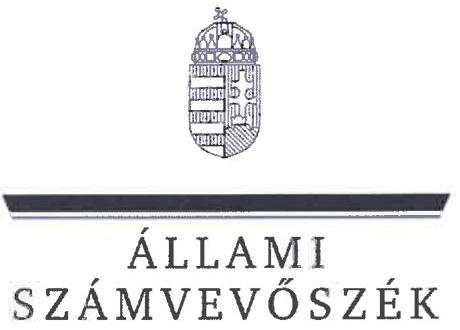

ÁLLAMI
SZÁMVEVŐSZÉK

# JELENTÉS 

## A Neumann János Egyetemért Alapítvány tartós hitelviszonyt megtestesítő értékpapírba történő befektetéseinek ellenőrzése

2025. 

25036
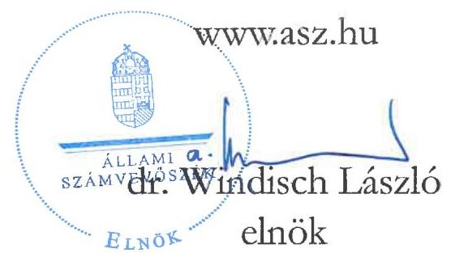

---

# ELLENŐRZÉSI IGAZGATÓSÁG: 

## ELLENŐRZÉSI IGAZGATÓSÁG V.

ELLENŐRZÉSI IGAZGATÓ:
KLINGA LÁSZLÓ igazgató

ELLENŐRZÉSVEZETŐ:
NEMESVÁRI-HORTHY ESZTER ellenőrzésvezető

Jelentéseink az interneten a www.asz.hu címen olvashatók.

IKTATÓSZÁM: EL-3967-004/2025
TÉMASORSZÁM: 35
ELLENŐRZÉS-AZONOSÍTÓ SZÁM: V-1060

---

# TARTALOMJEGYZÉK 

AZ ELLENŐRZÉS ALAPADATAI ..... 5
AZ ELLENŐRZÖTT SZERVEZET ..... 7
ÖSSZEFOGLALÁS ..... 9
AZ ELLENŐRZÉS FÓKUSZKÉRDÉSE ..... 14
MEGÁLLAPÍTÁSOK ..... 15
JAVASLATOK ..... 29
MELLÉKLETEK ..... 31
I. sz. melléklet: Értelmező szótár ..... 31
II. sz. melléklet: Az ellenőrzött szervezetek jegyzéke ..... 35
III. sz. melléklet: Ellenőrzési kritériumok ..... 36
IV. sz. melléklet: Az Alapítvány mérlegadatai a 2021-2023. években ..... 37
V. sz. melléklet: Az Alapítvány által lejegyzett kötvényekkel kapcsolatos részletes adatok az információs összeállítások alapján ..... 38
VI. sz. melléklet: Az ÁSZ elnökének figyelemfelhívó levele az Alapítvány részére ..... 41
VII. sz. melléklet: A Kuratórium Elnökének a figyelemfelhívó levélre adott válasza ..... 44
VIII. sz. melléklet: Az ÁSZ alelnökének válasza a Kuratórium elnökének tájékoztatására ..... 47
IX. sz. melléklet: Az ÁSZ elnökének ismételt figyelemfelhívó levele az Alapítvány részére ..... 49
X. sz. melléklet: A Kuratórium Elnökének a második figyelemfelhívó levélre adott válasza ..... 52
FÜGGELÉK: ÉSZREVÉTELEK ..... 55
RÖVIDÍTÉSEK JEGYZÉKE ..... 114

---

.

---

# AZ ELLENŐRZÉS ALAPADATAI 

## AZ ELLENŐRZÉS CÉLJA

Az ellenőrzés célja annak értékelése volt, hogy a Neumann János Egyetemért Alapítvány tartós hitelviszonyt megtestesítő értékpapírba történő befektetései során az alkalmazott döntéshozatali folyamat támogatta-e a szabályszerű és felelős gazdálkodás követelményének érvényesülését, a befektetési döntések szabályszerűek, célszerűek és megalapozottak voltak-e, a befektetések hozzájárultak-e a vagyon megőrzéséhez és gyarapításához.

## AZ ELLENŐRZÉS TÍPUSA

Kombinált ellenőrzés.

## AZ ELLENŐRZŐTT IDŐSZAK

A 2021. január 1-jétől 2023. december 31-éig terjedő időszak, a 2023. évi számviteli beszámoló, valamint a Neumann János Egyetemért Alapítvány által lejegyzett OPTIMA2031 és OPTIMA2031/B kötvények ellenőrzése kapcsán 2024. június 30-áig terjedő időszak.

## AZ ELLENŐRZÉS TÁRGYA

Az ellenőrzés kiterjedt a tartós hitelviszonyt megtestesítő értékpapírba történő befektetésekre vonatkozó döntés meghozatalához kapcsolódóan kialakított szabályozási környezetre, a döntést megelőző döntéselőkészítési folyamatra, a döntéshozatalra, a befektetések nyilvántartására, a befektetések nyomon követésére, a befektetési döntéseknek a vagyon megőrzéséhez, gyarapításához való hozzájárulására.

Az ellenőrzés kiterjedt minden olyan körülményre és adatra, amely az ÁSZ¹ jogszabályban meghatározott feladatainak teljesítéséhez, valamint a program végrehajtása folyamán felmerült újabb összefüggések feltárásához szükséges volt.

## AZ ELLENŐRZÉS JOGALAPJA

Az ellenőrzés jogszabályi alapját az ÁSZ tv.² 1. § (3), valamint az 5. § (3) bekezdése előírásai képezték.

## AZ ELLENŐRZÉS MÓDSZERE

Az ellenőrzést a nemzetközi standardokat irányadónak tekintve az ellenőrzési program szempontjai, az ellenőrzött időszakban hatályos jogszabályok, az ellenőrzési szakmai szabályok és módszertanok figyelembevételével végeztük.

---

Az ellenőrzési kérdések megválaszolásához szükséges bizonyítékok megszerzése az ellenőrzött szervezet és az ellenőrzést támogató szervezet által rendelkezésre bocsátott dokumentumokra és adatokra alapozva megfigyelés, szemle (szemrevételezés), kérdésfeltevés (információkérés), elemző eljárás útján történt.

Az ellenőrzési bizonyítékként felhasználható adatforrások közé tartoztak egyrészt az ellenőrzési programban felsorolt adatforrások, másrészt adatforrás lehetett még minden - az ellenőrzés folyamán - feltárt, az ellenőrzés szempontjából információkat tartalmazó dokumentum.

Az ellenőrzés lefolytatásához az ellenőrzött szervezet a tanúsítvány kitöltésével, valamint az ÁSZ által kért dokumentumok, információk megküldésével szolgáltatott adatot. Az ellenőrzés során mintavételre nem került sor.

Az ÁSZ egyes ellenőrzési szakkérdések kapcsán külső szakértőt kért fel véleményalkotásra.

---

# AZ ELLENŐRZŐTT SZERVEZET 

AZ ALAPÍTVÁNY³ a 2019-2021. évek között megalapított 21 felsőoktatási közfeladatot ellátó közérdekű vagyonkezelő alapítvány egyikeként a 2020. évben került létrehozásra az Alapító⁴ által a 2020. évi XXXVI. törvényben⁵ foglaltak alapján. Az Alapítvány a kecskeméti székhelyű Egyetem⁶ fenntartója, gyakorolja az Egyetem alapítói, tulajdonosi, fenntartói jogait, biztosítja az Egyetem működési feltételeit, intézményfejlesztési céljai megvalósítását. Az Alapító az alapítói jogokat 2020. november 10-étől ruházta át az Alapítványra. Az Alapítvány

Forrás: "Neumann János Egyetem GTK campus (Fotó: Youtube.com)"
fenntartásában lévő Egyetem aktív statisztikai hallgatói létszáma a 2023. évi számviteli beszámoló közhasznúsági szakmai beszámolója szerint a 2023. évben 3805 fő, a kiegészítő melléklete szerint a 486 fő záró munkajogi állományi létszámból az oktatói, kutatói, tanári létszám 206 fő volt. Az Egyetem az MNB⁷ által alapított PADME Alapítvánnyal⁸ közösen alapította meg a Budapest Centre For Long-term Sustainability Korlátolt Felelősségű Társaságot, amelyet 2021. május 12-én jegyeztek be.

Az Alapítvány legfőbb döntéshozó szerve az öt határozatlan időre kijelölt természetes személyből álló Kuratórium⁹ volt. Az Alapítvány rendelkezett három természetes személyből álló Felügyelőbizottsággal¹⁰, valamint a vagyongazdálkodás ellenőrzése céljából határozatlan időre kijelölt vagyonellenőrrel és könyvvizsgálóval. A Kuratórium, a Felügyelőbizottság tagjai, a vagyonellenőr és a könyvvizsgáló személyében az Alapítvány megalakulásától az ellenőrzött időszak végéig nem történt változás. Az ellenőrzött időszakban a könyvelő személyében 2023-tól egy alkalommal történt változás.

AZ ALAPVETŐ TÖRVÉNYI ELŐÍRÁSOKAT, az Alapítvány létesítésével, működésével, vagyongazdálkodásával, ellátott közfeladataival, megszűnésével kapcsolatos szabályokat a Vatv.¹¹, 2021. májustól a KEKVA törvény¹² határozta meg. Az Alapítvány 2021 óta, a 2021. június 18. napján megjelent Hivatalos értesítő¹³ 31. számában közzétett, a kormányzati szektorba sorolt egyéb szervezetekről szóló pénzügyminiszteri közlemény közzététele óta az ellenőrzött időszakban kormányzati szektorba sorolt egyéb szervezet, ezért rá a Bkr.¹⁴ 1-10. §-ai is kiterjedtek.

AZ ALAPÍTVÁNY ÉS AZ EGYETEM RÉSZÉRE TÖRTÉNŐ VAGYONJUTTATÁSRÓL a 2020. évi XXXVI. törvény 3-5. §-ai rendelkeztek, amelyek értelmében az Egyetem fenntartói jogát alapítói vagyonjuttatásként adták az Alapítvány tulajdonába. A korábban az Egyetem vagyonkezelésében lévő ingó és ingatlan vagyonelemek ingyenesen, nyilvántartási értéken történő átvezetéssel a fenntartóváltást követően magánegyetemként tovább működő Egyetem tulajdonába kerültek.

AZ ALAPÍTVÁNY INDULÓ VAGYONA A 2020. ÉVBEN 0,6 milliárd Ft volt, amely egyben a tőkeminimuma is. Az Alapítvány az Alapítótól az alapítás évében az induló vagyonon felüli alapítói pénzbeli vagyoni juttatásban részesült 44,4 milliárd Ft értékben infrastruktúra fejlesztés céljából. Az Alapítvány a 2021. évben az Alapítótól további 100,0 milliárd Ft pénzbeli vagyoni juttatásban részesült az ITM¹⁵-el kötött megállapodással az Egyetem fejlesztésére és az alapítványi célok megvalósítására. Az induló vagyonon felül az

---

Alapító költségvetési támogatás formájában biztosította az Alapítvány működését, amely a 2020. évben 0,2 milliárd Ft, a 2021-2023. évben évenként 0,4 milliárd Ft volt. Az Alapítvány éves beszámolójának részét képező mérleg főbb adatait a IV. sz. melléklet mutatja be a 2021-2023. évekre.

Az Alapítvány az Alapítótól a részére rendelt vagyonából a PADME Alapítvány tulajdonában álló OPTIMA Befektetési Zrt.¹⁶ által kibocsátott tartós hitelviszonyt megtestesítő értékpapírba, vállalati kötvénybe fektetett be a 2021. évben összesen 127,5 milliárd Ft összeget. A lejegyzett kötvényekkel kapcsolatos részletes információkat az információs összeállítások alapján az V. sz. melléklet mutatja be.

A vállalati kötvény lejegyzésének eredményeként az Alapítvány mérlegfőösszegének több, mint 80%-át tette ki a lejegyzett kötvények értéke, amelyekből a 2021-2023. évi számviteli beszámolói alapján több, mint 7,0 milliárd Ft kamatbevételt realizált.

---

# ÖSSZEFOGLALÁS 

A közfeladatot ellátó közérdekű vagyonkezelő alapítványok jelentős vagyonnal rendelkeznek, illetve az Alapítótól jelentős vagyonjuttatásban, támogatásban részesülnek közfeladataik ellátására. A társadalom jogos elvárása, hogy a közpénzekkel gazdálkodó szervezetek működéséről, tevékenységéről átfogó képet kapjon. Az Állami Számvevőszék (ÁSZ) törvényi felhatalmazás alapján ellenőrizte a kecskeméti székhelyű Neumann János Egyetemet fenntartó Neumann János Egyetemért Alapítványnál (Alapítvány), hogy a likvid pénzeszközei, összesen 127,5 milliárd Ft értékű befektetése kapcsán a befektetési döntései szabályszerűek, célszerűek és megalapozottak voltak-e, ezzel a befektetés hozzájárult-e a vagyona megőrzéséhez és gyarapításához.

Az Alapítvány a 2020. évi alapítását követően, még ugyanebben az évben 44,4 milliárd Ft, 2021-ben további 100,0 milliárd Ft pénzügyi vagyoni juttatásban részesült állami forrásból, amelyet infrastruktúra fejlesztésre, az Egyetem fejlesztésére, valamint törvényben rögzített céljaira használhatott fel.

Az Alapítvány 2021. júniusban, augusztusban és októberben úgy döntött, hogy a rendelkezésére álló 127,5 milliárd Ft likvid pénzeszközeit három ütemben - 5,0-22,5-100,0 milliárd Ft értékben - a PADME Alapítvány tulajdonában álló OPTIMA Befektetési Zrt. által kibocsátott 10 éves futamidejű, kirívóan alacsony, 2,5%-os kamatozású vállalati kötvénybe fekteti be. Az OPTIMA Befektetési Zrt. kizárólagos tulajdonosa a PADME Alapítvány, melynek kuratóriumi elnöke egyben a Neumann János Egyetemért Alapítvány kuratóriumi elnöke is volt, a PADME Alapítvány operatív vezetője, igazgatója szintén kurátor volt a kecskeméti Alapítványnál.

A kötvény vásárlás likvid, azaz könnyen visszaváltható, „pénzzé tehető” befektetésként volt feltüntetve, holott a kötvény kibocsátója pontosan tudta, hogy a kibocsátásból származó forrásból hosszú távú, nem likvid beruházásokat finanszíroz, így ténylegesen reális esély nem mutatkozott arra, hogy az opció lehívása esetén annak tényleges teljesítése meg is történjen és három hónapon belül (8 banki napon, illetve 90 naptári napon belül) veszteség nélkül, kockázatmentesen a teljesítéshez elegendő pénzeszközre legyen váltható a kötvény. Erről a befektetésről döntő Kuratóriumnak is tudomása volt, hiszen az első kötvénycsomag lejegyzésével kapcsolatos előterjesztést tárgyaló kuratóriumi ülésen az OPTIMA Befektetési Zrt. akkori vezérigazgatója ismertette a cég stratégiáját, amely szerint „elsődlegesen a közép-kelet-európai, magas bevételt generáló ingatlanokba történő befektetésekre koncentrál”.

A 2023. januári és szeptemberi kuratóriumi ülések jegyzőkönyveiben a hozzászólók által elmondottak is azt támasztják alá, hogy a Kuratórium tudomással bírt a likviditás látszólagosságáról: „Mérlegelendő a visszaváltási jog, azonban nem tehetjük tönkre azt az ingatlan bérbeadási és üzemeltetési tevékenységet, amelyet ezen befektetéssel finanszíroztak, nem tehetjük ki ennek az Alapítvány vagyonát sem.” vagy „.....a kötvény struktúrájának módosulása kapcsán kérdés a visszaválthatóság, ami jól hangzik, de rendkívül nagy kockázatot hordoz. Nem biztos, hogy ez egy valós és reális opció, lehetőség.”

---

A befektetéskor a Kuratórium nem mérte fel az Alapítvány jövőbeli készpénz-szükségletét, így azt sem, milyen futamidejű befektetések jöhetnek szóba. A likvid befektetés választására vélhetően azért került sor, hogy a rendkívül alacsony kamatot alá lehessen támasztani. A Kuratórium előtt ismert volt, hogy a befektetés valójában nem likvid, és a befektetési döntés óta eltelt években nem is volt szüksége az Alapítványnak a kötvénybe fektetett pénzére, a kötvény visszavásárlására nem került sor, így az egyébként csak látszólagos likviditás a gyakorlatban szükségtelen volt.

Az Alapítvány nem alakított ki olyan szabályokat, kontrollokat, amelyek alkalmasak az igen jelentős összegű befektetés mértékéből, típusából fakadó kiemelt kockázatok kezelésére, a befektetési döntések és a befektetésekkel kapcsolatos későbbi döntések megalapozottságának biztosítására.

Az Alapítvány a befektetési döntést megelőzően - annak ellenére, hogy a befektetni tervezett összeg nagyságrendje és koncentrációja azt szükségessé tette volna - nem vett igénybe befektetési tanácsadót, ehelyett a PADME Alapítványnál is alkalmazásban álló könyvelővel készíttetett egy, a lehetséges befektetésekre vonatkozó szakszerűtlen, a szakmaiságot nélkülöző összehasonlító elemzést, amely az OPTIMA Befektetési Zrt. vállalati kötvényeinek előnyeit emelte ki, a kockázatait ugyanakkor nem mutatta be.

A vagyonkezelési tevékenység külső ellenőrzését végző vagyonellenőr tevékenységével nem támogatta az Alapítványnál a felelős vagyongazdálkodást, a befektetési döntések, vagy a befektetések tartására vonatkozó döntések
 meghozatala során nem hívta fel a Kuratórium figyelmét az alapító okiratban, illetve a törvényben foglaltakkal ellentétes működésére, sem a befektetések túlzott koncentrációjából adódó kockázatokra.

Az első, 5,0 milliárd Ft értékű kötvénycsomag lejegyzésével kapcsolatban meghozott döntés nem volt szabályszerű, mert az Alapító okirat összeférhetetlenségi előírásába ütközött. Az összeférhetetlenségi előírást az Alapító okiratból - a 22,5 és a 100,0 milliárd Ft összegű kötvényjegyzéseket megelőzően - később hatályon kívül helyezték, ezzel a Kuratórium elnöke továbbra is a Kuratórium tagja maradhatott. Mindemellett, a 2023-2024. években a kötvényekkel kapcsolatos döntéshozatalok során a Kuratórium egy másik tagja, aki egyben a PADME Alapítvány igazgatója is volt - a törvényi előírással ellentétben rendszeresen szavazott a befektetések további sorsát tárgyaló kuratóriumi üléseken, ugyanakkor érintettségét nem jelezte.

A kötvényt kibocsátó OPTIMA Befektetési Zrt. kizárólagos tulajdonosa, a PADME Alapítvány és a Neumann János Egyetemért Alapítvány közti személyi összefonódások is hozzájárulhattak ahhoz, hogy a Kuratórium az Alapítvány szervezeti érdekei elé a kötvényt kibocsátó érdekeit helyezte.

Az Alapítvány a kötvénycsomagok jegyzésével a befektetéseit jelentős mértékben koncentrálta. A kötvényjegyzést követően az Alapítvány nem gondoskodott a kötvényt kibocsátó OPTIMA Befektetési Zrt. pénzügyi, vagyoni, jövedelmi helyzetének folyamatos nyomon követéséről, a kibocsátó kockázatainak transzparens nyomon követését biztosító monitoring rendszer működtetéséről, reálisan érvényesíthető biztosíték jellegű szerződéses keretrendszer és effektív kontrollrendszer kialakításáról, így nem értékelte a globális trendeket, nem vette figyelembe a kötvényhez kapcsolódóan a legjelentősebb vagyontömeget képviselő GTC részvények részvényárfolyamának tartós és trendszerű esését, hitelminősítésének romlását.

---

A kötvények lejegyzését követően, 2022. évben az Alapítvány készíttetett ugyan független szakértői elemzést a befektetéséről, de annak megállapításait figyelmen kívül hagyta. A szakértő már ekkor felhívta a Kuratórium figyelmét többek között a befektetései diverzifikálásának szükségességére, valamint a kockázatmentesnek tekinthető éven túli lejáratú magyar állampapírokon elérhető másodpiaci hozamnak az OPTIMA kötvénybefektetés hozamát meghaladó voltára.

A független szakértői véleményekben jelzettek ellenére az Alapítvány - többek között a kialakítani elmulasztott kontroll és effektív biztosítéki mechanizmusok hiánya miatt - nem tett lépéseket a befektetései diverzifikálására, a kötvények visszaváltására, és nem élt az eladási jogával.

A Kuratórium 2024 januárjában a kötvények egy éven belüli visszaváltásának kezdeményezése érdekében az OPTIMA Befektetési Zrt.-vel tárgyalások megkezdéséről döntött. Az OPTIMA Befektetési Zrt. nem tudta a kötvényeket a szerződéses kötelezettségeinek megfelelően visszavásárolni, a kibocsátó és az Alapítvány között a tárgyalások - a kötvény vételára kiegyenlítésének módjáról és ütemezéséről - az ÁSZ ellenőrzés lezárásának időpontjában is folyamatban voltak.

Az OPTIMA Befektetési Zrt.-vel a 2024. évben folytatott tárgyalások során - az opciós szerződésekben foglaltakkal ellentétben - olyan megállapodás körvonalazódott, amely szerint az Alapítvány bankszámlapénz helyett jelentős részben bizonytalan megtérülésű társasági részesedésekben, befektetési jegyekben kapná vissza a befektetését.

Az Alapítvány könyveiben a 2021. évi bekerülési értéken vette nyilvántartásba a lejegyzett kötvényt. A 2022. és a 2023. évre vonatkozó számviteli beszámolóiban változatlanul a bekerülési értéken mutatta ki a lejegyzett kötvényeket, értékvesztést nem számolt el, melyet pedig indokolt volna, hogy az OPTIMA Befektetési Zrt. érdekeltségébe tartozó, a legjelentősebb vagyontömeget képviselő GTC részvények árfolyama a tőzsdén folyamatosan, tendenciózusan csökkent, valamint, hogy az Alapítvány döntéshozói számára nyilvánvaló volt, hogy részére a kötvények vételárát az OPTIMA Befektetési Zrt. a szerződésben foglalt határidőre nem képes megfizetni.

Az Alapítványt jelentős kár érte a kötvények nagyon alacsony kamata miatt is. A kötvények hozamának értékelésekor nem csak azok lejegyzése idején érvényes hozamkörnyezetet kell értékelni, hanem annak az azóta eltelt időben való alakulását is, hiszen likvid, bármikor - legfeljebb 90 napos visszafizetési határidővel visszaváltható kötvényekről van szó. Ha jó gazda gondosságával kezelte volna a Kuratórium a rábízott és OPTIMA kötvényekbe fektetett 127,5 milliárd Ft vagyont, akkor figyelembe vette volna a kötvények jegyzése óta eltelt időben a hozamkörnyezet drasztikus megváltozását, értékelte volna, hogy az OPTIMA Befektetési Zrt. által a kötvények után fizetett fix 2,5 százalék kirívóan alacsonyabb a kockázatmentesen (!) elérhető állampapírpiaci referenciahozamnál. A 12 hónapos referenciahozam maximuma ebben az időszakban (2023. márciusában) 14,64% volt, ami 12,14 százalékponttal magasabb, mint a kockázatmentesnek egyáltalán nem mondható, OPTIMA Befektetési Zrt. által kibocsátott kötvények 2,5 százalékos kamata. Így amellett, hogy a kötvénybe fektetett teljes összeg megtérülése is kétségessé vált, önmagában az elmaradt haszon formájában jelentkező kár 2023 márciusi befektetés esetén az első teljes évben akár a 15,4 milliárd forintot is elérhette.

# ELŐZMÉNYEK 

Az Alapítvány megalakulása évében, majd a rá következő évben összesen 144,4 milliárd Ft pénzügyi vagyoni juttatásban részesült az Alapítótól infrastruktúra fejlesztés, az Egyetem fejlesztése és alapítványi célok megvalósítása érdekében. Az Alapítvány a vagyonjuttatásból rendelkezésre álló likvid pénzeszközeit, összesen 127,5 milliárd Ft-ot - a Kuratórium döntései alapján - három ütemben az OPTIMA Befektetési Zrt. által

---

kibocsátott 10 éves futamidejű, 2,5%-os kamatozású OPTIMA2031, illetve OPTIMA2031/B megnevezésű vállalati kötvénybe fektette be.

A Kuratórium 2021. júniusi, augusztusi és októberi döntéseit követően a kötvények lejegyzésére vonatkozó jegyzési ívet a Kuratórium elnöke írta alá. Az egyes kötvénycsomagokhoz kötelezettségvállaló nyilatkozatok kerültek kiállításra a GTC Holding Zrt. ${ }^{17}$ vezérigazgatója, valamint a PADME Alapítvány - mint az OPTIMA Befektetési Zrt. egyedüli részvényese - nevében a PADME Alapítvány kuratóriumi elnöke és kuratóriumi elnökhelyettese által. Ezek értelmében arra vállaltak kötelezettséget, hogy szükség esetén az OPTIMA Befektetési Zrt.-t olyan helyzetbe hozzák, illetve fizetőképességét biztosítják, hogy a kötvényekből eredő fizetési kötelezettségének eleget tudjon tenni. Ezen túlmenően az 5,0 milliárd Ft értékű kötvény információs összeállítása szerint a kötvényekből eredő fizetési kötelezettségeket jelentős részben a Globe Trade Centre S.A. ${ }^{18}$ által kibocsátott GTC részvény biztosítja, amelyek vonatkozásában a GTC Holding Zrt. kötelezettségvállaló nyilatkozatban vállalta, hogy azokat az Alapítvány előzetes írásbeli hozzájárulása nélkül nem idegeníti el.

Mindhárom kötvénycsomag esetében - a vagyonellenőr javaslatára - eladási jog alapítására irányuló szerződés is megkötésre került az Alapítvány, mint jogosult és az OPTIMA Befektetési Zrt., mint kötelezett között. Ezek értelmében az eladási jog megnyílását követően az Alapítvány eladási nyilatkozatának OPTIMA Befektetési Zrt. részére történő benyújtásával az OPTIMA Befektetési Zrt. - a nyilatkozat kézhezvételét követően az 5,0 és 22,5 milliárd Ft értékű kötvénycsomag esetében 8 banki, a 100,0 milliárd Ft értékű kötvénycsomag esetében 90 naptári napon belül - a kötvényeket meghatározott vételáron köteles megvásárolni. A szerződés szerint a vételár megfizetése - amennyiben az Alapítvány él a visszaváltási jogával - az Alapítvány által megadott bankszámlára történő átutalással teljesítendő. Az eladási jog megnyílásának napja az 5,0 milliárd Ft-os kötvénycsomag esetében 2022. július 9., a 22,5 milliárd Ft-os kötvénycsomag esetében 2022. február 18., a 100,0 milliárd Ft-os kötvénycsomag esetében 2022. október 11. volt.

# ÁSZ JELZÉSEK 

Az ÁSZ számára kiemelten fontos, hogy a közpénzekkel felelős módon gazdálkodjanak, ezért az ÁSZ elnöke 2024 nyarán a VI. sz. mellékletben bemutatott, az ÁSZ tv. 31. §-ában foglalt figyelemfelhívó levéllel fordult a Kuratórium elnökéhez az ÁSZ ellenőrzése folyamán feltárt tények alapján az Alapítvány részére juttatott vagyon megőrzése és a vagyonnal való felelős gazdálkodás érdekében. Az Alapítvány Kuratóriumának elnöke a VII. sz. mellékletben elhelyezett válaszában arról tájékoztatta az ÁSZ elnökét, hogy tárgyalásokat folytatnak az OPTIMA Befektetési Zrt.-vel a kötvények visszaváltása érdekében és várhatóan egy átfogó megállapodás megkötésére kerül majd sor. Az ÁSZ Alelnöke a VIII. számú mellékletben szereplő, a figyelemfelhívó levélre küldött válasz alapján felhívta az Alapítvány kuratóriumi elnökének figyelmét, hogy az eladási jog alapításáról kötött szerződésekben foglalt, a vételár megfizetésére vonatkozó rendelkezések szem előtt tartásával, bankszámlapénzben jusson hozzá az Alapítvány a kötvényekbe fektetett vagyonához. Az ÁSZ elnöke a IX. számú mellékletben bemutatott, az ÁSZ tv. 31. §-ában foglalt figyelemfelhívó levéllel fordult a Kuratórium elnökéhez, amelyben intézkedésre hívta fel az ellenőrzés során feltárt további kockázatok alapján. Az Alapítvány Kuratóriumának elnöke a X. sz. mellékletben elhelyezett válaszában arról tájékoztatta az ÁSZ elnökét, hogy a kötvények visszaváltására, a keretmegállapodás megkötése érdekében folynak a tárgyalások.

Az ÁSZ az ellenőrzés során a feltárt tények alapján több bűncselekmény gyanúját állapította meg, ezért az ÁSZ tv. 30. § (1) bekezdése alapján az ügyészségen feljelentést tett.

Az ÁSZ az Alapítvány törvényes működésének biztosítottsága érdekében az ügyészségnél törvényességi felügyeleti eljárás indítványozását kezdeményezte.

---

Az ÁSZ az Alapítvány 2021-2023. évi számviteli beszámolóinak könyvvizsgálata kapcsán a Kkt. ${ }^{19}$ 173/B. § (4) bekezdés c) pontja szerint rendkívüli minőségellenőrzés lefolytatásának megfontolása érdekében megkereste a Könyvvizsgálói Közfelügyeleti Hatóságot ${ }^{20}$.

---

# AZ ELLENŐRZÉS FÓKUSZKÉRDÉSE 

A Neumann János Egyetemért Alapítvány tartós hitelviszonyt megtestesítő értékpapírba történő befektetései szabályszerűek, célszerűek és megalapozottak voltak-e?

---

# MEGÁLLAPÍTÁSOK 

## 1. A Neumann János Egyetemért Alapítvány tartós hitelviszonyt megtestesítő értékpapírba történő befektetései szabályszerűek, célszerűek és megalapozottak voltak-e?

Összegző megállapítás

A Neumann János Egyetemért Alapítvány a vagyonnal való felelős gazdálkodás követelményével ellentétesen az OPTIMA Befektetési Zrt. vállalati kötvényeibe fektette be a szabad pénzeszközeit. Ezzel befektetését koncentrálta, amely a vagyonvesztés kockázatát hordozza és végső soron veszélyeztetheti az Alapítvány felsőoktatási közfeladatainak ellátását.

AZ ALAPÍTVÁNY NEM ALAKÍTOTT KI A JOGSZABÁLYI ELŐÍRÁSOK ELLENÉRE OLYAN BELSŐ SZABÁLYOKAT, KONTROLLTEVÉKENYSÉGEKET, AMELYEK HOZZÁJÁRULTAK VOLNA A TARTÓS HITELVISZONYT MEGTESTESÍTŐ ÉRTÉKPAPÍRBA TÖRTÉNŐ BEFEKTETÉSEIHEZ KAPCSOLÓDÓ DÖNTÉSHOZATALOK MEGALAPOZOTTSÁGÁNAK, CÉLSZERŰSÉGÉNEK BIZTOSÍTÁSÁHOZ, A BEFEKTETÉSEIT KÖVETŐEN A MEGNÖVEKEDETT KOCKÁZATAI KEZELÉSÉHEZ.
Az Alapító okirat ${ }_{1-4}{ }^{21}$ a Ptk. ${ }^{22}$ 3:391. § (1) bekezdés c) pontjában foglalt előírások szerint tartalmazta a kuratóriumi tagokra vonatkozó kizáró és összeférhetetlenségi szabályokat. Az Alapító okirat, és az Alapító

Az Alapító okirat ${ }_{3-6}$ már nem tartalmazta a Kuratórium tagjaira vonatkozó szigorú összeférhetetlenségi előírást, annak hatályon kívül helyezésével a Kuratórium elnöke továbbra is a Kuratórium tagja maradhatott.
okirat ${ }_{2}$ „IX. Az Alapítvány ügyvezető szerve" című fejezetének 11. i) alpontja, illetve 13. i) alpontja rögzítette a következő összeférhetetlenségi szabályt: „Nem lehet kuratóriumi tag az, akinek saját vagy közeli hozzátartozója közvetlen vagy közvetett, részleges vagy teljes tulajdonában és/vagy ügyvezetésében, illetve tulajdon nélkül vezetésében olyan gazdasági társaság, egyéb gazdasági szereplő van, mely szerződéses kapcsolatban áll a fenntartott intézmények bármelyikével, vagy magával az Alapítvánnyal.” Az idézett összeférhetetlenségi szabályt a Kuratórium 2021. július 20-ával hatályon kívül helyezte. A KEKVA törvény 2022. évi XXIX. törvénnyel ${ }^{23}$ hatályossá váló 15. § (3) bekezdésében foglalt összeférhetetlenségi előírásokat a Kuratórium az Alapító okirat ${ }_{3-6}$ „XIV. Egyéb összeférhetetlenségi rendelkezések” című fejezetében rögzítette.
Az Alapítvány elkészítette a Számv. tv. ${ }^{24}$ 14. § (3) bekezdésében előírt Számviteli politiká${ }_{1-3}{ }^{25}$t, amelynek keretében - figyelemmel a Számv. tv. 14. § (5) bekezdés a) és b) pontjai előírásaira - elkészítette a Leltározási szabályzat ${ }_{1-3}{ }^{26}$-ot, valamint az Értékelési szabályzat ${ }_{1-3}$-ot ${ }^{27}$. Az Alapítvány a Számv. tv. 161. § (1) bekezdésében előírtak alapján rendelkezett Számlarend
 ${ }_{1-3}{ }^{28}$-el.

---

A vagyonellenőr feladata a Vatv. és a KEKVA törvény előírásai alapján a befektetési szabályzat jóváhagyását megelőzően annak véleményezése. A vagyonellenőr a Befektetési szabályzat ${ }_{1,2}$ véleményezése során nem hívta fel a figyelmet azok hibáira, hiányosságaira, ezáltal a szabályszerű befektetési tevékenységet támogató kontrollkörnyezet kialakítása nem valósult meg maradéktalanul.

Az Alapítvány a Vatv. 9. § (4) bekezdésében előírt határidőre - az Alapítvány nyilvántartásba vételét követő hat hónapon belül - elkészítette a Befektetési szabályzat ${ }_{1}$-et. A Befektetési szabályzat ${ }_{1}$ a Vatv. 9. § (3) bekezdésében foglalt előírások ellenére nem tartalmazta az alapítványi vagyont alkotó portfólió meghatározását, a kockázatkezelést, továbbá ugyanezen jogszabályi előírás, illetve a KEKVA törvény 10. § (4) bekezdésében előírtak ellenére nem tartalmazta a befektetések tekintetében alkalmazandó döntéshozatali módot, csupán annyit rögzített, hogy a befektetési döntések meghozatalára a Kuratórium jogosult. A Befektetési szabályzat ${ }_{2}$ a KEKVA törvény 10. § (4) bekezdésében előírtak ellenére továbbra sem tartalmazta a befektetések tekintetében alkalmazandó döntéshozatali módot. A Befektetési szabályzat ${ }_{1,2}$-ban meghatározták a befektetési politika célrendszerét, amelyek a következők voltak: jövedelem generálása, biztonság, likviditás, hosszú távú befektetések, alacsony tranzakciós költségekre törekvés, a befektetések devizaárfolyam kockázatainak minimalizálása.
A Befektetési szabályzat ${ }_{1,2}$ meghatározta a befektetési típusokat, amelyek közül a befektetési jegyek kapcsán azt rögzítette, hogy a nettó eszközérték 5%-a tartható befektetési jegyben, az e fölötti befektetés kapcsán likviditási kockázatot határozott meg. Ugyanakkor ugyanilyen, vagy hasonló küszöbértéket a kockázatos befektetésnek minősülő vállalati kötvények tekintetében nem rögzített.
Az Alapítvány kuratóriumi elnöke az Alapítvány kormányzati szektorba sorolását követően a Bkr. 54/A. §-ára figyelemmel, a 6. § (4) bekezdésben előírtakkal ellentétben az integrált kockázatkezelés eljárásrendjét több, mint 6 hónapos, a szervezeti integritást sértő események kezelésének eljárásrendjét pedig 2,5 év késedelemmel szabályozta az Integrált kockázatkezelési eljárásrendben ${ }^{29}$, valamint az Integritást sértő események kezelésének eljárásrendjéről szóló szabályzatban ${ }^{30}$.

---

A AZ ALAPÍTVÁNY KURATÓRIUMA A BEFEKTETÉSI DÖNTÉSEK MEGHOZATALA SORÁN NEM KÖRÜLTEKINTŐEN JÁRT EL. AZ ALAPÍTVÁNY NEM BIZTOSÍTOTTA A DÖNTÉSEK CÉLSZERŰSÉGI, GAZDASÁGOSSÁGI, HATÉKONYSÁGI ÉS EREDMÉNYESSÉGI SZEMPONTÚ MEGALAPOZOTTSÁGÁT.
Az Alapítványnál a kontrolltevékenységek részeként nem biztosították a döntések célszerűségi, gazdaságossági, hatékonysági és eredményességi szempontú megalapozottságát a Bkr. 8. § (2) bekezdés b) pontjában foglalt előírás ellenére.
Az Alapítvány Kuratóriumának elnöke és egy tagja a kötvényt kibocsátó OPTIMA Befektetési Zrt.-t tulajdonló PADME Alapítvány Kuratóriumának elnöke és igazgatója is volt egyidejűleg. Ezen személyi összefonódások hozzájárulhattak ahhoz, hogy az Alapítvány szervezeti érdekei elé más szervezeti érdekeket, a kötvényt kibocsátó OPTIMA Befektetési Zrt. és annak egyszemélyi tulajdonosa, a PADME Alapítvány szervezeti érdekeit helyezzék.
Az Alapítvány a befektetési döntést megelőzően - annak ellenére, hogy a befektetni tervezett összeg nagyságrendje és koncentrációja azt szükségessé tette volna - külső szakértőt nem vett igénybe és kétséges, hogy a döntéshozók egy ilyen volumenű befektetés tekintetében hozott döntés kapcsán kellő kompetenciával rendelkeztek. Az Alapítványnál alkalmazásban álló könyvelővel készíttettek egy összehasonlító elemzést, aki az elemzés készítés időszakában a kötvényt lejegyző Alapítvány és egyidejűleg a kötvényt kibocsátó OPTIMA Befektetési Zrt. egyszemélyi tulajdonosa, a PADME Alapítvány alkalmazásában is állt. Az Alapítvány könyvelője által készített, a befektetési lehetőségek összehasonlítását értékelő elemzés szakmaiatlan és szakszerűtlen volt, mivel:

- nem vette figyelembe a Befektetési szabályzat ${ }_{1}$-ben meghatározott valamennyi befektetési lehetőséget, valamint az egyes befektetési lehetőségek kockázatait sem tárta fel;
- a befektetési lehetőségek közül eleve kizárta a hosszabb távú állampapír befektetéseket arra hivatkozva, hogy azokat csak vagyonvesztéssel lehet eladni, továbbá az eladási jog alapítására vonatkozó szerződés tekintetében nem vizsgálta, hogy az OPTIMA Befektetési Zrt. hogyan tudja a kihelyezett összeget és kamatát megfizetni az Alapítvány részére;
- a rövidebb lejáratú állampapírok esetében kizárólag az aktuális időpontra vonatkozóan vette figyelembe azok hozamát, nem vont le következtetéseket a lehetséges jövőbeli tendenciák alakulásáról, a kamatkörnyezet lehetséges és a befektetéskor már nyilvánvaló alakulásáról;
- a vállalati kötvény befektetéssel kapcsolatos kockázatokat teljes egészében figyelmen kívül hagyta, az állampapírok kockázataival azonos kockázatúnak minősítette, holott az állampapírok esetében az állam biztosítja a garanciát, a vállalati kötvények esetében a kibocsátó vállalat szavatolja a vállalati kötvények mögötti garanciát, amely azonban jelentősen ki van téve a tőzsdei árfolyamoknak, a kamatkörnyezet alakulásának és a további piaci, ágazati, esetükben ingatlanpiaci kockázatoknak;
- nem terjedt ki a diverzifikálás lehetőségére, amely a kockázatok csökkentésének, így a vagyonvesztés mérséklésének módja;
- a hozamokat csak a jelenben vizsgálta, nem vetítette ki a lehetséges jövőbeli forgatókönyvekre, a globális makrogazdasági trendekre nem volt figyelemmel;
- a terjedelme nem volt összhangban a befektetni tervezett összeg nagyságrendjével (mellékletek nélkül az érdemi része négy A4-es oldal).

---

Az összehasonlító elemzést készítő könyvelő a kötvényt kibocsátó OPTIMA Befektetési Zrt. egyszemélyi tulajdonosánál, a PADME Alapítványnál is alkalmazásban állt, ennek következtében az összehasonlító elemzés függetlensége, tárgyilagossága megkérdőjelezhető.

A könyvelő által elkészített összehasonlító elemzés a befektetési lehetőségek közül egyértelműen az OPTIMA Befektetési Zrt. által kibocsátott vállalati kötvényt részesítette előnyben, ezzel elvetve a többi befektetési lehetőséget, köztük az egyik legbiztonságosabbnak, gyakorlatilag kockázatmentes befektetésnek minősülő állampapírt is.
Az első, 5,0 milliárd Ft értékű kötvénylejegyzéshez kapcsolódóan a 2021. június 30-án keltezett, az Alapítvány által megbízott Független szakértő; szakértői véleménye állt rendelkezésre, amely azonban az Alapítvány megbízásának megfelelően nem a lehetséges befektetéseket elemezte, értékelte, hanem fókuszában az OPTIMA Befektetési Zrt. törlesztőképességének elemzése állt. A vélemény alternatív befektetésekkel kapcsolatos elemzést nem tartalmazott, középpontjában nem a lehetséges, azonos vagy jobb hitelkockázati besorolású, kamatozású, hozamú, likviditású befektetések bemutatása, elemzése volt.

Az ellenőrzés szakmai véleménye szerint a befektetés jelentős nagyságrendjére tekintettel a megalapozott döntéshozatal biztosítása érdekében indokolt lett volna az Alapítvány részéről a Bszt. ${ }^{31}$ szerinti befektetési szolgáltatási tevékenység végzésére engedéllyel rendelkező szakértő igénybevétele.

Az Alapítvány a második 22,5 milliárd Ft értékű, majd a harmadik, 100,0 milliárd Ft értékű kötvénylejegyzést megelőzően sem vett igénybe befektetési tanácsadói szolgáltatást, a döntéshozók részére továbbra is csak a könyvelő által 2021. június 9-i keltezéssel elkészített elemzés, valamint az OPTIMA Befektetési Zrt. törlesztőképességének elemzéséről elkészített független szakértői vélemény állt rendelkezésre.

Az Alapítvány 2021. június 29-én kelt szerződés alapján Befektetési tanácsadóval ${ }^{32}$ befektetési tanácsadási szolgáltatásra szerződést kötött, azonban a befektetési döntések meghozatalához a döntéshozók részére a kötvényekkel kapcsolatos információs összeállításon kívül semmilyen, a döntéshozatalt támogató elemzést, értékelést nem készített.
A befektetési döntések nem alapos előkészítettsége ugyanakkor nem vonja el a Kuratórium felelősségét a vagyonnal való felelős gazdálkodásért.
A vagyonellenőr az egyes befektetési döntésekkel kapcsolatban véleményt nyilvánított, azokat támogatta. A Kuratóriumnak - a KEKVA törvény 9. § (1) bekezdésében foglalt, a vagyonkezelés ellenőrzésére vonatkozó feladatkörében eljárva - nem hívta fel a figyelmét arra, hogy a befektetések ilyen mértékű koncentrációja rendkívül nagy kockázattal jár.
A befektetésekkel kapcsolatos - az első 5,0 milliárd Ft értékű kötvényjegyzésre vonatkozó döntéshozatal nem volt szabályszerű. A Felügyelőbizottság - a Ptk. 3:27. § (1) bekezdésében foglalt előírással összhangban - a Kuratórium döntését megelőzően az előterjesztéseket véleményezte. A Kuratórium kizárólag a Felügyelőbizottság egyetértő véleménye birtokában döntött kötvény lejegyzéséről. A 22,5 milliárd Ft értékű kötvénylejegyzést megelőzően az előterjesztést 2021. augusztus 4-i ülésén a Felügyelőbizottság nem támogatta, határozatában azt rögzítette, hogy a kötvény lejegyzéséről való tárgyalás „szükséges, okszerű, de jelenleg még nem időszerű”. A Felügyelőbizottság elnöke a Kuratóriumot erről a 2021. augusztus 9-i kuratóriumi ülésen tájékoztatta. Egy nappal később, 2021. augusztus 10-én a Felügyelőbizottság elnöke elektronikus döntéshozatalt kezdeményezett, amelynek keretében a kötvény lejegyzésével kapcsolatban készített előterjesztést a Kuratórium számára elfogadásra javasolta. A

---

Felügyelőbizottság a 2021. augusztus 4-i ülésén még arról döntött, hogy nem időszerű a kötvény lejegyzése, majd néhány napon belül, a 2021. augusztus 10-én kezdeményezett elektronikus szavazás alkalmával már arról, hogy támogatja a 22,5 milliárd Ft-os kötvény lejegyzését.
A Kuratórium elnöke tartózkodott a kötvényekbe történő befektetésekről döntő szavazásoknál. Az első, 5,0 milliárd Ft értékű kötvény lejegyzést megelőző kuratóriumi ülésen támogatta ugyan a döntés meghozatalát, azonban összeférhetetlenségét bejelentette, és a jegyzőkönyvben rögzítésre került, hogy „a PADME Alapítvány Kuratóriumi elnökeként, azaz OPTIMA Befektetési Zrt. tulajdonosi képviselőjeként összeférhetetlenségét szeretné bejelenteni és tartózkodni kíván a szavazáson.” Az Alapítvány a kuratóriumi ülésen 4 igen és 1 tartózkodás mellett döntött az OPTIMA Befektetési Zrt. által kibocsátott OPTIMA2031 megnevezésű vállalati kötvény 5,0 milliárd Ft értékben történő jegyzéséről. Az első, 5,0 milliárd Ft értékű kötvény lejegyzést megelőző befektetési döntéskor hatályos Alapító okirat2-ban lévő összeférhetetlenségi előírás nem a határozathozatalban való részvételre, illetve a döntéshozatalban való részvételtől tartózkodásra vonatkozott, hanem a Kuratórium elnöke az Alapítvány kuratóriumi tagja sem lehetett volna, figyelemmel az Alapító Okirat2 IX/13. i) alpontja szerinti összeférhetetlenségi előírásra, mivel a Kuratórium elnökének vezetésében nem lehetett volna olyan egyéb gazdasági szereplő, amely szerződéses kapcsolatban állt az Alapítvány által fenntartott intézménnyel, az Egyetemmel. Tekintettel arra, hogy az Alapítvány kuratóriumának elnöke a PADME kuratóriumának elnöke is volt egyidejűleg, a PADME Alapítvány „ügyvezetésében” lévő olyan gazdasági szereplőnek minősült, amely az Egyetemmel, mint az Alapítvány által fenntartott intézménnyel a gazdasági társaság (a Budapest Centre For Long-term Sustainability Korlátolt Felelősségű Társaság) közös alapítása folytán szerződéses kapcsolatot létesített. Erre figyelemmel az Alapítvány kuratóriumának elnöke esetében felmerül az Alapító Okirat2 IX. 13. i) alpontja szerinti összeférhetetlenség, illetve az összeférhetetlenség bejelentése és az összeférhetetlenség megállapításával összefüggő döntés elmulasztása sem felelt meg az Alapító Okirat2 IX. 13. k) alpontjában előírt rendelkezéseknek. Az Alapító Okirat2 módosítása ugyanakkor 2021. július 20-ától ezen összeférhetetlenség megszűnését eredményezte.
A vagyonellenőr a KEKVA törvény 9. § (3) bekezdésében foglalt előírás ellenére nem hívta fel a Kuratórium figyelmét, hogy a Kuratórium működése, eljárása nem felel meg az Alapító okiratban foglaltaknak. Az alábbiakat közölte írásos véleményében „Az előterjesztett konstrukciót támogatom, az Alapítvány számára jó befektetési lehetőségnek ítélem, tekintettel arra, hogy a befektetést az alapítvány könyvvizsgálója és a külső szakértők is támogatták.”
A 22,5 milliárd Ft és a 100,0 milliárd Ft értékű kötvénylejegyzésekkel kapcsolatos döntéshozatal kor az Alapító okiratban 2021. július 20-ától már nem volt hatályban az Alapító okirat2-ból hivatkozott összeférhetetlenségi előírás, amelynek hatályon kívül helyezésével a Kuratórium elnöke továbbra is a Kuratórium tagja maradhatott.
Az Alapítvány bankszámláján a 100,0 milliárd Ft vagyonjuttatás 2021. szeptember 30-i jóváírását megelőző nappal előterjesztést nyújtott be a Kuratórium 2021. október 6-i ülésére az Alapítvány kuratóriumi elnöke és egy tagja, amelyben az Alapítvány likviditásának felhasználása érdekében OPTIMA2031/B kötvény jegyzésére tettek javaslatot. A vonatkozó kuratóriumi ülésről készített jegyzőkönyv szerint a napirend tárgyalásakor előnyként kiemelésre került, hogy a kötvény egy év múlva visszaváltható. A 100,0 milliárd Ft kötvénylejegyzést megelőzően a vagyonellenőr támogatta a döntés meghozatalát. Az Alapítvány 2021. október 6-i kuratóriumi ülés jegyzőkönyve alapján az OPTIMA2031/B kötvény
 jegyzésére irányuló határozati javaslat egyhangúlag elfogadásra került azzal, hogy a Kuratórium elnöke ugyan támogatta a javaslatot – amelynek ő maga is előterjesztője volt –, de tartózkodott a szavazásnál.

---

A Kuratórium döntéseit követően a kötvények lejegyzésére vonatkozó jegyzési ívet a Kuratórium elnöke írta alá. Az egyes kötvénycsomagokhoz kötelezettségvállaló nyilatkozatok kerültek kiállításra az alábbiak szerint:

- Az 5,0 milliárd Ft és a 22,5 milliárd Ft értékű kötvénycsomag esetében kötelezettségvállaló nyilatkozatot a GTC Holding Zrt. vezérigazgatója – aki az OPTIMA Befektetési Zrt. vezérigazgatója is volt egyúttal – 2021. július 2-án, illetve augusztus 13-án, valamint a PADME Alapítvány – mint az OPTIMA Befektetési Zrt. egyedüli részvényese – nevében a PADME Alapítvány kuratóriumi elnöke és kuratóriumi elnökhelyettese adott ki, amelyben kötelezettséget vállaltak arra, hogy szükség esetén az OPTIMA Befektetési Zrt.-t olyan helyzetbe hozzák, illetve fizetőképességét biztosítják, hogy a kötvényekből eredő fizetési kötelezettségének eleget tudjon tenni. Az 5,0 milliárd Ft értékű kötvény információs összeállítása szerint a kötvényekből eredő fizetési kötelezettségeket jelentős részben a Globe Trade Centre S.A. által kibocsátott GTC részvény biztosítja, amelyek vonatkozásában a GTC Holding Zrt. kötelezettségvállaló nyilatkozatban vállalta, hogy azokat az Alapítvány előzetes írásbeli hozzájárulása nélkül nem idegeníti el.
- A 100,0 milliárd Ft értékű kötvénycsomag esetében kötelezettségvállaló nyilatkozatot az Alapítvány irányába 2021. október 7-én a PADME Alapítvány nevében annak kuratóriumi elnöke és elnökhelyettese tett, amelyben vállalták, hogy az OPTIMA Befektetési Zrt. egyedüli részvényeseként minden elvárható és szükséges lépést megtesznek annak érdekében, hogy az OPTIMA Befektetési Zrt. az eladási jogot biztosító szerződésben foglaltak szerinti fizetési kötelezettségének esedékességekor késedelem nélkül és maradéktalanul eleget tudjon tenni.
A Kuratórium elnöke, mint a PADME Alapítvány Kuratóriumának elnöke írta alá a kötelezettségvállaló nyilatkozatokat az Alapítvány részére, amelyek esetében felmerül, hogy azok a szerepüket – a személyi összefonódás következtében – így nem tudták betölteni.
Az eladási jog alapítására vonatkozó szerződéseket az egyes kötvénylejegyzésekhez kapcsolódóan szintén az Alapítvány Kuratóriumának elnöke írta alá az alábbiak szerint:
- Az első, 5,0 milliárd Ft-os kötvénycsomaghoz kapcsolódóan 2021. július 6-án az Alapítvány, mint jogosult és az OPTIMA Befektetési Zrt., mint kötelezett eladási jog alapítására irányuló szerződést kötött, amelynek értelmében a kötvényeket meghatározott vételáron az Alapítvány eladási nyilatkozatának OPTIMA Befektetési Zrt. részére történő benyújtásával az OPTIMA Befektetési Zrt. – a nyilatkozat kézhezvételétől számított 8 banki napon belül – köteles megvásárolni. Az eladási jog megnyílásának napjaként a szerződés 2022. július 9-ét jelölte meg.
- A második, 22,5 milliárd Ft kötvénycsomaghoz kapcsolódóan 2021. augusztus 13-án az Alapítvány, mint jogosult és az OPTIMA Befektetési Zrt., mint kötelezett eladási jog alapítására irányuló szerződést kötött, amelynek értelmében a kötvényeket meghatározott vételáron az Alapítvány eladási nyilatkozatának OPTIMA Befektetési Zrt. részére történő benyújtásával az OPTIMA Befektetési Zrt. – a nyilatkozat kézhezvételétől számított 8 banki napon belül – köteles megvásárolni. Az eladási jog megnyílásának napjaként a szerződés 2022. február 18-át jelölte meg.
- A harmadik, 100,0 milliárd Ft értékben lejegyzett kötvénycsomaghoz kapcsolódóan 2021. október 7-én az Alapítvány, mint jogosult és az OPTIMA Befektetési Zrt., mint kötelezett eladási jog alapítására irányuló szerződést kötött, amelynek értelmében a kötvényeket meghatározott vételáron az Alapítvány eladási nyilatkozatának OPTIMA Befektetési Zrt. részére történő

---

benyújtásával az OPTIMA Befektetési Zrt. – a nyilatkozat kézhezvételétől számított 90 naptári napon belül – köteles megvásárolni. Az eladási jog megnyílásának napjaként a szerződés 2022. október 11-ét jelölte meg.
Az eladási jog alapítására vonatkozó szerződések nem jelentettek megfelelő garanciális elemet a kötvények lejegyzését követően, esetükben sem értelmezhető a felelős gazdálkodás követelményének érvényesülése.
A szerződés szerint a vételár (1 darab Kötvény vételára: 1 db Kötvény névértéke, az ezen a Kötvényfeltételek alapján, a tényleges megfizetés napjáig felhalmozódott (ki nem fizetett) kamatok összegével növelten) megfizetése – amennyiben az Alapítvány él a visszaváltási jogával – az Alapítvány által megadott bankszámlára történő átutalással teljesítendő.
További garanciákat a befektetések koncentrációjából adódó magas kockázatok ellensúlyozására, a befektetés jelentős nagysága ellenére az OPTIMA Befektetési Zrt. az Alapítvány részére nem biztosított.
Az Alapítvány a részére juttatott vagyont nem a céljának megfelelően használta fel. Az Alapítvány a részére rendelt vagyont nem a KEKVA törvényben meghatározott közfeladata ellátására, illetve nem az alapító okiratában rögzített céljaira (infrastruktúra fejlesztésére és a fenntartásában lévő Egyetem fejlesztésére) fordította. A befektetés forrásául egyrészt az Alapító által az induló vagyonon felül infrastruktúra fejlesztésére további 44,4 milliárd Ft értékű vagyon egy részéből, valamint az Egyetem infrastruktúra fejlesztésére és az alapítványi célokra megállapodással juttatott 100,0 milliárd Ft értékű vagyon szolgált. Az Alapítvány Kuratóriuma 2021 őszén fogadta el az Egyetem Stratégiai dokumentumát ${ }^{33}$, melyben több, az elkövetkezendő évtizedben megvalósítandó projektet szerepeltettek. Tervben volt e dokumentum szerint 25,0 milliárd Ft értékű beruházásként a Neumann Technológiai és Innovációs Park ${ }^{34}$, illetve 75,0 milliárd Ft értékben Okos Város koncepció ${ }^{35}$ megvalósítása. A vagyonellenőr – a KEKVA törvény 9. § (3) bekezdésében előírtak ellenére – nem hívta fel a figyelmét a Kuratóriumnak, hogy a vagyonrendeléssel ellentétben, nem stratégiai fejlesztésekre, nem az Egyetem fejlesztésére, nem az alapítványi célok megvalósítására fordítják a vagyonjuttatást.
A kötvények jegyzésével az alapítványi célra rendelt vagyonból piaci szereplő, az OPTIMA Befektetési Zrt. jutott számára kedvező feltételek mellett jelentős forráshoz.
Az Alapítvány a részére juttatott vagyont nem a céljának megfelelően használta fel. Az Alapítvány a részére rendelt vagyont nem a KEKVA törvényben meghatározott közfeladata ellátására, illetve nem az alapító okiratában rögzített céljaira (infrastruktúra fejlesztésére és a fenntartásában lévő Egyetem fejlesztésére) fordította. A befektetés forrásául egyrészt az Alapító által az induló vagyonon felül infrastruktúra fejlesztésére további 44,4 milliárd Ft értékű vagyon egy részéből, valamint az Egyetem infrastruktúra fejlesztésére és az alapítványi célokra megállapodással juttatott 100,0 milliárd Ft értékű vagyon szolgált. Az Alapítvány tartós hitelviszonyt megtestesítő értékpapírba történő befektetést nyilvántartásaiban rögzítette. A tartós hitelviszonyt megtestesítő értékpapírba történő befektetés esetében a bekerülési érték meghatározása megfelelt a Számv. tv. 47. § (1) bekezdésében foglalt előírásnak, azaz a bekerülési érték a kötvényekért fizetett vételárral megegyező 127,5 milliárd Ft volt. A kötvények lejegyzését követően azok könyvviteli nyilvántartásban történő rögzítése összhangban volt a Számv. tv. 165. § (1) és (2) bekezdésében, valamint a Számlarend ${ }_{1-3}$-ben foglalt előírásokkal, miszerint a könyvviteli nyilvántartásokban a 183-as számú, „Egyéb vállalkozások értékpapírjai” főkönyvi számla alszámláin vették azokat nyilvántartásba.

---

A
A KURATÓRIUM BEFEKTETÉSI DÖNTÉSEIVEL, A BEFEKTETÉS TÚLZOTT KONCENTRÁCIÓJÁVAL VESZÉLYEZTETTE A VAGYONA MEGŐRZÉSÉT. A NAGY KOCKÁZATÚ, AZ OPTIMA BEFEKTETÉSI ZRT. ÁLTAL KIBOCSÁTOTT KÖTVÉNYBE TÖRTÉNT BEFEKTETÉSVÉL KEVESEBB HOZAMOT ÉRT EL, MINTHA KEDVEZŐBB HOZAMOT BIZTOSÍTÓ, ALACSONYABB KOCKÁZATÚ, VAGY KOCKÁZATMENTES BEFEKTETÉSI LEHETŐSÉGEKET VÁLASZTOTT VOLNA, BEFEKTETÉSEIT DIVERZIFIKÁLTA VOLNA.
Az Alapítvány nem a felelős gazdálkodás követelményének elve mentén járt el a kötvények nyomon követése és értékelése során, nem gondoskodott a kötvényt kibocsátó OPTIMA Befektetési Zrt. pénzügyi, vagyoni, jövedelmi helyzetének folyamatos nyomon követéséről, a kibocsátó kockázatainak transzparens nyomon követését biztosító monitoring rendszer működtetéséről, reálisan érvényesíthető biztosíték jellegű szerződéses keretrendszer és effektív kontrollrendszer kialakításáról. Az Alapítvány alkalmazásában álló stratégiai igazgató negyedévente készített egy oldalas összefoglalókat a Globe Trade Centre S.A. működéséről, amely, ahogyan az összefoglaló megjegyzi ,,a varsói tőzsdén jegyzett vállalat, mely bár áttételesen, de nyereséges működésével biztosítja a Neumann János Egyetemért Alapítvány által jegyzett OPTIMA kötvények folyamatos és biztonságos éves hozamát." A jelentések a Globe Trade Centre S.A. üzleti jelentéseinek a kivonataiként értelmezhetők, nem tartalmaztak következtetéseket, csak ténymegállapításokat. A jelentések terjedelme nem volt összhangban a lejegyzett kötvények értékével, a befektetés kockázatával. A jelentésekben nem értékelte a készítő a Globe Trade Centre S.A. múltbeli teljesítményét, erre alapozva nem elemezte vagyoni, pénzügyi, jövedelmi helyzetét, nem azonosította a potenciális kockázatokat sem, amelyek negatívan befolyásolhatták a társaság jelenlegi és jövőbeli fizetőképességét, vagyoni és jövedelmi helyzetének stabilitását. A tőzsdei jelentésekben szereplő kulcskockázatok egyikét sem mutatta be a stratégiai igazgató az egy oldalas jelentésekben. A befektetések mögött álló ingatlanvagyon valós értékének meghatározása, illetve azok mobilizálhatóságának vizsgálata nem történt meg, amely értékeléshez szükséges adatok a Globe Trade Centre S.A. angol nyelvű jelentéseiben rendelkezésre álltak. A GTC részvények árfolyamát, amely a kötvényekhez kapcsolódóan a legjelentősebb vagyontőke-megosztást képviselte, az elemzésekben szintén nem mutatták be. A GTC részvények árfolyama az 1. ábrában látható, hogy folyamatosan, tendenciózusan csökkent.
1. ábra

A GTC RÉSZVÉNYEK TŐZSDEI ÁRFOLYAMÁNAK ALAKULÁSA
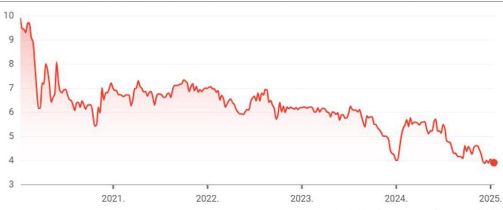

---

A 2022. évben az Alapítvány megbízásából az első eladási jog megnyílásakor (22,5 milliárd Ft értékű kötvény esetében 2022. február 18.), majd a másik két eladási jog megnyílása után (5,0 milliárd Ft és 100,0 milliárd Ft értékű kötvény esetében július 9., illetve 2022. október 11.) is készített független szakértői véleményt a Független szakértő ${ }_{1}$. A 2022. első negyedévében készített szakértői vélemények az alábbi következtetéseket tartalmazták:

- 2022. február 4-én kelt független szakértői vélemény szerint: „...a kockázatmentesnek tekinthető éven túli lejáratú forintban denominált magyar állampapírokon elérhető másodpiaci hozam a Kötvénybefektetés hozamát meghaladja (4,48%-4,95%).”
- 2022. március 4-én kelt független szakértői vélemény szerint: „Az Alapítvány számára célszerű lehet elkészíteni egy diverzifikált befektetési portfoliót. Ebbe nélkülözhetetlen egy portfolió építési stratégia kidolgozása és elfogadása, illetve a Kötvények esetleges visszaváltása kapcsán a konverzió több lépésben történő megtervezése, mely mindig a várható hosszú távú piaci tendenciák értékelésére épül. Az NJEA (az Alapítvány ÁSZ megjegyzés) befektetési döntései – az alapító okirat és az Alapítvány befektetési szabályzatának figyelembevételével – a jövőben sem épülhetnek kizárólag a rövidtávú hozammaximalizálásra és ehhez kapcsolódóan rövidtávú, potenciálisan magasabb kockázatot hordozó lépésekre.”
Az Alapítvány operatív igazgatója a független szakértői véleményt az alábbiakban foglalta össze: „volt aktualitása a befektetés felülvizsgálatának. Nem csak a megnyiló visszaváltási lehetőség miatt, de többek között a pénzpiaci helyzet alakulása miatt is. A.... (Független szakértő ${ }_{1}$ ÁSZ megjegyzés) minden eshetőséget alaposan megvizsgált a befektetés kapcsán. Kitért rá, hogy biztonságos-e, likvid-e az „Optima 2031” kötvény és a kamat az elvárásoknak megfelelő-e. A jelentésből kiderül, hogy a befektetés biztonságos, a GTC egy nemzetközi szinten szereplő, tőzsdén jegyzett cég és ne feledkezzünk meg az alapítványi garanciáról sem. A likviditás megkérdőjelezésének nincs oka.”
A Felügyelőbizottság és a Kuratórium 2022. március 21-i együttes ülésén megtárgyalta a független szakértői véleményt, azonban az abban foglaltak ellenére nem tett lépéseket a kötvény visszaváltására, a befektetések diverzifikálására.
A 2022. év negyedik negyedévében az Alapítvány megbízásából a Független szakértő ${ }_{1}$ által elkészített független szakértői vélemény az alábbi következtetéseket tartalmazta:
- az Alapítvány meglévő befektetése „...az Alapítvány befektetett tőkéjére vetítve alacsony kockázat mellett éves 2,5%-os hozamot biztosít. Az elmúlt évben jelentősen emelkedő tőkepiaci hozamkörnyezet eredményeképpen ugyanakkor a meglévő Kötvénybefektetések tartása felülvizsgálandó, mivel a jelenlegi piaci feltételek mellett ezt jócskán meghaladó hozam akár kockázatmentes állampapírokba történő befektetéssel is elérhető.”
- az eladási jog kapcsán a vélemény tartalmazta, hogy az „a futamidő alatt rugalmasságot biztosít a NJEA-nak (az Alapítvány ÁSZ megjegyzés) tőkéjének más befektetésekbe történő részleges, vagy teljes átcsoportosítására – árfolyamveszteség nélkül. Az eladási jog gyakorlása során mindazonáltal – különös tekintettel a finanszírozás jelentős értékére – az Alapítvány érdeke a visszaváltások olyan ütemezése, mely figyelembe veszi a Kibocsátó likviditását, elkerülendő a részleges nemfizetés kockázatát.”
-
 javasolta a professzionális vagyonkezelési szolgáltatás igénybevételét. Ezzel kapcsolatban a teljes befektethető vagyon esetében a partnerkockázatra tekintettel javasolta „több, eltérő tulajdonosi bázissal rendelkező szolgáltató, illetve általuk kezelt alap mérlegelését."
- a szakértő felhívta a figyelmet, hogy „alapvetően kockázatmentes és kis kockázatú eszközök jöhetnek szóba; állampapírok, illetve konzervatív súlyozással, ennél kockázatosabb eszközök tartása befektetési alapokban diverzifikálva javasolt. Ekképpen az Alapítvány számára elsősorban kötvény-, illetve óvatos befektetési politikát követő vegyes alapok jelenthetnek befektetési alternatívát."

---

Az Alapítványnál 2022. évtől pontos információk álltak rendelkezésre arra vonatkozóan, hogy a befektetés megtérülése veszélyben van, vagyonvesztés következhet be, mégis halogatták a döntéshozatalt, illetve nem tettek azonnali lépéseket a visszaváltás ütemezési tervének, koncepciójának kialakítására, a visszaváltásra vonatkozó döntés meghozatalára.

A fentebb idézett következtetéseket tartalmazó, 2022. november 7-én kelt független szakértői véleményt a Kuratórium elnöke nem a 2022. november 18-i, a Kuratórium soron következő ülésére terjesztette elő, hanem két hónappal később, 2023. január 19-i Kuratóriumi ülésre.
Az Alapítvány operatív igazgatója a Kuratórium ülésén az alábbiak szerint összegezte a Független szakértő által adott véleményt: „az előterjesztés mellékletét képező szakértői vélemény egy hosszabb elemzési folyamat végeredménye. A .... (Független szakértő: ÁSZ megjegyzés) is több szakaszban vizsgálta a kérdéses kört mielőtt elkészült a munkával. Azt leszögezi, hogy amennyiben a döntéshozók csak a rövidtávú szempontokat tartják szem előtt, akkor egy rossz döntés nagy károkat okozhat már közép távon. A 2021-ik évi kötvény befektetés jó döntés volt, ez a kiinduló pont." Kiemelte továbbá, hogy: „...az OPTIMA kötvényekbe való befektetés jó döntés volt, hiszen a mögötte levő GTC működése biztonságot ad. ... Ez a kötvény egy hosszútávú befektetést testesít meg, nem gyorsan likvidálható, hiszen ingatlanokban realizált. Mérlegelendő a visszaváltási jog, azonban nem tehetjük tönkre azt az ingatlan bérbeadási és üzemeltetési tevékenységet, amelyet ezen befektetéssel finanszíroztak, nem tehetjük ki ennek az Alapítvány vagyonát sem. Egy rossz döntéssel tönkre tehetjük az alapítvány hosszútávú finanszírozásának a lehetőségét." A vagyonellenőr az ülésen elmondta, hogy „a múltbeli döntés helyes volt és a jelen helyzetét alapul véve kell tárgyalni a jövőbeli lépések érdekében." A Kuratórium 2023. január 19-i ülésén döntött a kötvénybefektetés konverziója, befektetési tanácsadás tárgyában az OPTIMA Befektetési Zrt.-vel tárgyalások megkezdéséről, az Alapítvány és az Egyetem öt éves likviditási tervének elkészítéséről, a devizakockázatok csökkentése érdekében a kereskedelmi bankokkal tárgyalások folytatásáról.
A Kuratórium a 2022. november 7-én keltezett független szakértői véleményben foglaltak ellenére nem tett lépéseket a kötvény visszaváltására, a befektetések diverzifikálására. A kötvények visszaváltásának halogatását igazolja a 2023. szeptember 4-i kuratóriumi ülés jegyzőkönyve, ugyanis a visszaváltáson kívül minden lehetséges más megoldást vizsgáltak. Tárgyalásokat folytattak a kötvények euróra történő átváltásáról, a könyvelésben forintról devizára, euróra történő áttérés lehetőségére vonatkozóan állásfoglalást kértek a Miniszterelnökség Civil Információs Központjától, továbbá tárgyaltak az eladási jog megszüntetéséről is az OPTIMA Befektetési Zrt.-vel.

# Az Alapítvány a Független szakértő elemzéseit, az abban foglaltakat figyelmen kívül hagyta. 

A 2023. szeptember 4-i kuratóriumi ülésen a Felügyelőbizottság javaslata alapján arról döntöttek, hogy „...az alapítvány kötvénybefektetése pénzügyi biztonságának megállapíthatósága érdekében kérje be a GTC-ről a szokásos tőzsdei riportokat".
Szintén ezen az ülésen elhangzottak szerint az operatív igazgató és a stratégiai igazgató elmondta, hogy „A kötvényhez kapcsolódó megállapodás tehát megszünteti az NJEA (az Alapítvány ÁSZ megjegyzés) put opcióját... Ez egy olyan jellemzője volt a kötvénykibocsátásnak, amely a látszólagos biztonságot valójában az igen bizonytalan alkalmazhatósággal társította.... a kötvénykibocsátással gyűjtött forrást elsősorban ingatlanfejlesztésre fordították. Az ingatlanok piaci értékesítése azonban nagyban függ a konjunktúra változásától, illetve a piac általános jellemzőitől.... az adott ingatlan tulajdonosának, fejlesztőjének, de magának a kötvénykibocsátónak is kárt okozhat, mert az ingatlanfejlesztő és -hasznosító cég a kötvényt saját vagyonával is garantálja."

---

Az Alapítvány operatív igazgatója kiemelte: „.....a kötvény struktúrájának módosulása kapcsán kérdés a visszaválthatóság, ami jól hangzik, de rendkívül nagy kockázatot hordoz. Nem biztos, hogy ez egy valós és reális opció, lehetőség. Tudni illik, ha élünk vele nem csak a GTC-t hozhatjuk nehéz, megoldhatatlan helyzetbe, hanem a saját befektetésünk révén magunkat is."
A Kuratórium tagja (a PADME igazgatója) hozzászólásában elmondta: „... a hónapok óta zajló tárgyalásokon a kibocsátó azt kérte, hogy kerüljön ki a visszaváltási opció a módosított megállapodásból, mivel az a gyakorlatban nagyon nehezen érvényesíthető veszteség nélkül.... hiszen mindannyian tudjuk, hogy ingatlanokban van a forrás és ezek bevétele garantálja a kamat kifizethetőségét."
A fenti, a kuratóriumi jegyzőkönyvekből vett idézetek igazolják, reális esély nem mutatkozott arra, hogy az opció lehívása esetén annak tényleges teljesítése meg is történjen és három hónapon belül (8 banki napon, illetve 90 naptári napon belül) veszteség nélkül, kockázatmentesen a teljesítéshez elegendő pénzeszközre legyen váltható a kötvény. A Kuratórium tagjainak erről egyértelmű információja volt.
Az Alapítvány, amennyiben kockázatmentes állampapírba fektette volna a vagyonát, magasabb hozamot ért volna el. Az MNB állampapír-piaci referenciahozamok egyértelműen növekedésnek indultak 2021. novembertől. A referenciahozamok 2022. januártól a 3 hónapostól a 10 éves referenciakamatlábig minden esetben 3,5%-ot meghaladóak voltak, amely több százalékponttal meghaladja az OPTIMA Befektetési Zrt. által kibocsátott, az Alapítvány által lejegyzett kötvények kamatlábát.
Az alábbi 2. ábrán a 2021 és 2024 szeptembere közötti referenciahozamok szerepelnek, havi bontásban. A minimális hozam azt a kamatlábat mutatja meg, ami a legalacsonyabb volt adott hónapban a hónaptól a 10 éves időtávig figyelembe véve, tehát ez a minimálisan elérhető kamatszint adott hónapra vonatkozóan. A diagramon látható, hogy 2021 végén átlépte a referenciahozam az OPTIMA kötvények kamatát, és egészen 2024 szeptemberéig felette is maradt.
2. ábra

ÁLLAMPAPÍR REFERENCIAHOZAMOK A 2021-2024. ÉVEKBEN
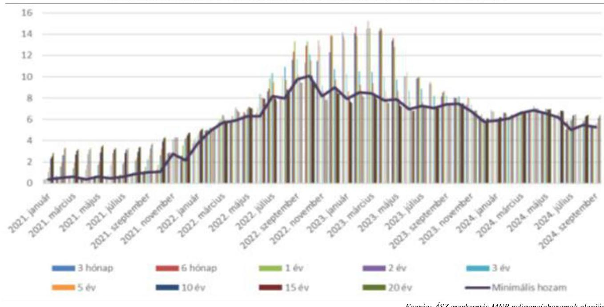

---

Az állampapírok és az ingatlanalapok bármelyike magasabb hozamot biztosított volna, mint az OPTIMA Befektetési Zrt. kötvényei. Ezen túlmenően, amennyiben az Alapítvány állampapírba, vagy piacon elérhető ingatlanalapokba fektetetett volna, az likvidebb és kockázatmentes befektetés, mint az OPTIMA Befektetési Zrt. vállalati kötvényei.

A piacon elérhető ingatlanalapok esetében szintén megfigyelhető volt, hogy 2021 novemberétől folyamatos növekedésnek indultak a referencia hozamok, sőt 2023 elején a 14%-ot is meghaladta a 3 hónapos referenciahozam. Az eladási opciók megnyílásának időszakában, mindhárom időpontban (2022. február 18., 2022. július 9. és 2022. október 11.) a 3 hónapos referenciahozam 4,93%, 8,17%, illetve 10,08% volt. A 3 hónapos referenciahozamok esetében az eladási jog megnyílásakor a legalacsonyabb hozam lett figyelembe véve. Amennyiben az Alapítvány az eladási jog érvényesítése esetében a 8 banki, illetve 90 naptári nap után jutott volna hozzá a kötvények vételárához és fekteti be állampapírba, vagy a piacon a bankok által forgalmazott ingatlanalapba, akkor ebben az esetben is magasabb hozamot ért volna el, mintha a befektetéseit az OPTIMA Befektetési Zrt. kötvényeiben tartotta volna.

Az ÁKK Zrt. $^{36}$ által közzétett állampapír referenciahozamokat figyelembe véve az ÁSZ számításai szerint az Alapítvány - amennyiben az opciós jogával élt volna - jelentős mértékű hozamokat ért volna el.
Ha az Alapítvány minden kötvénynél az eladási jog megnyílásakor élt volna az opciós jogával, akkor az OPTIMA kötvények után járó teljes futamidőre számított körülbelül 32,0 milliárd Ft kamatbevételen felül a tőke referenciahozamnak megfelelő (az opciós jogok megnyílásakor az eredeti lejárati dátumhoz közeli) állampapírba történő lekötésével jelenértéken további, hozzávetőlegesen 39,0 milliárd Ft hozamot érhetett volna el.
Amennyiben az Alapítvány, az opció lehívásával felszabaduló 127,5 milliárd Ft-ot az elszámolási napot követő 30 napon belül egy éves állampapírba fektette volna, akkor az első két évben minimum 19,3 milliárd Ft hozamot érhetett volna el kockázatmentesen.
Amennyiben 2023 márciusában, 14,64%-os referenciahozam mellett fektette volna be a teljes, 127,5 milliárd Ft-nyi vagyonát egy évre az Alapítvány, a befektetés hozama az első teljes évben éves szinten akár a 15,4 milliárd Ft-ot is elérhette volna.
Kiemelendő az a tény, hogy 2025. január-február hónapokban az egy éves hozamok közel 6%-os szinten alakultak, amelynek következtében napi, nagyságrendileg 10,0 millió Ft kockázatmentes hozamtól esik el a fenti 19,3 milliárd Ft hozamon felül az Alapítvány.
Az Alapítvány által a Befektetési szabályzat $_{1,2}$-ban a befektetési politika célrendszereként meghatározott likviditás alapelve nem érvényesült. A kötvény visszaváltása a helyszíni ellenőrzés lezárásáig az Alapítvány részéről még nem történt meg.
Az Alapítvány nem kezdte meg haladéktalanul az alternatív befektetési megoldások keresését és nem dolgozott ki vészforgatókönyvet, amely lehetővé teszi a befektetés megtérülését, kárait minimalizálja. Az Alapítvány a 2024-es évben a kötvények visszaváltására továbbra sem intézkedett, mivel a Kuratórium továbbra sem kezdeményezte - ellentétben az eladási jog alapításáról szóló szerződések 4.2. „A vételár megfizetése" pontjában foglalt, az Eladási Nyilatkozat kézhezvételétől számított 8 banki napi, illetve 90 naptári napi határidővel - a kötvények visszaváltását. Ezzel ellentétben az Alapítvány Kuratóriuma egy éven belüli határidőt határozott meg a kötvények visszaváltására, tárgyalások kezdeményezésére. A döntésről 2024. január 22-én írásban tájékoztatta az Alapítvány az OPTIMA Befektetési Zrt-t.

---

A megkezdett tárgyalások során az Alapítvány - szintén az eladási jog alapítására irányuló szerződésekben szereplő rendelkezések ellenére - a vételár bankszámlájára történő átutalása helyett jelentős részben bizonytalan megtérülésű gazdasági társasági részesedéseket és befektetési jegyeket fogadna el az OPTIMA Befektetési Zrt.-től.
A 2024. január 17-i kuratóriumi ülésre készített előterjesztés a kötvény visszaváltásának kockázatait megerősítette, miszerint: „....az többször megállapítást nyert a különböző dokumentumokban, hogy egy együtemű azonnali visszaváltás érvényesítése szinte kizárólag negatív következményekkel járna, s amely az Alapítvány vagyonánál jelentős vagyonvesztést okozhatna. (A kötvények által finanszírozott ingatlanügyletek nem teszik lehetővé az ingatlanok időtől és konjunktúrától független előnyös értékesítését, vagy önmagában az értékesítést, az ingatlanok leértékelődése és a garantőr ez általi meggyengülése egyértelműen potenciális veszteséget okozna az Alapítvány számára.)"
A vagyonellenőr írásos véleményt készített a Kuratórium 2024. január 17-én elektronikus szavazással megtartandó ülésére és támogatta a meghozandó döntést. Írásos véleményében összefoglalóan azt rögzítette, hogy „...az Alapítvány a vagyonvédelem, a visszajuttatási biztonság, a likviditás és a reálisan elérhető hozam szempontjából racionális döntést hozott a kötvények jegyzésekor és hasonlóan helyes döntést kíván hozni az általam támogatott 2/2024. (I.17.) számú határozattal."
Az Alapítvány a Független szakértőnek 2024. év elején megbízást adott, amely alapján elvégezte a Magyar Állampapírok piacának alakulását bemutató vizsgálatát, amely végső konklúzióként azt rögzítette, hogy az Alapítvány állampapírba történő befektetés révén tőkevesztést ért volna el. A tanulmány azt feltételezte, hogy a kötvények likviditása biztosított, azaz az eladási jog alapításáról szóló szerződés a visszaváltás kezdeményezése esetén 8 banki, illetve 90 naptári napon belül megtörténik. Az elemzés utólag, 2024-ben készült, amikor már a 2021-től eltelt évektől a hozamok alakulásáról pontos, egyértelmű információk állnak rendelkezésre, továbbá az elemzés a makrogazdasági várakozásokat sem vette figyelembe. A tanulmány arra sem tért ki, hogy esetlegesen ne egy értékpapírba történő befektetés lehetőségét vizsgálja.
 a koncentráció elkerülése érdekében.
Az Alapítvány Kuratóriuma a kötvények lejegyzését követő időszakban a kötvényekkel kapcsolatos döntéshozatalok során a KEKVA törvény 2022. október 13-ától hatályba lépett 15. § (3) bekezdésében foglalt összeférhetetlenségi előírást nem tartotta be. A Kuratórium tagja, aki a PADME Alapítvány igazgatója is volt, rendszeresen szavazott a befektetésekkel kapcsolatos szavazásokon, érintettségét nem jelezte a KEKVA törvény 15. § (3) bekezdésében előírtak ellenére. A vagyonellenőr a KEKVA törvény 9. § (3) bekezdésében előírtak ellenére nem hívta fel a Kuratórium figyelmét a szabályos működésre.
Az OPTIMA Befektetési Zrt. érdekeltségébe tartozó, a legjelentősebb vagyontömeget képviselő GTC részvények árfolyama a tőzsdén folyamatosan, tendenciózusan csökkent, továbbá a kötvények vételárát az Alapítvány részére az OPTIMA Befektetési Zrt. a szerződésben foglalt határidőre nem volt képes megfizetni. Ezen körülmények ellenére értékvesztés elszámolásának mérlegelésére, értékvesztés elszámolására nem került sor.
Az Alapítvány 2022. és a 2023. évre vonatkozó számviteli beszámolói szerint a kötvények továbbra is változatlanul a bekerülési értéken voltak nyilvántartva, kimutatva. Ez ellentétes volt a Számv. tv. 54. § (5) bekezdésének a) és b) pontjában foglaltakkal. Az Alapítványnak ugyanis az értékpapír piaci értékének meghatározásánál figyelembe kellett volna vennie az értékpapír (felhalmozott) kamattal csökkentett tőzsdei, tőzsdén kívüli árfolyamát, piaci értékét, annak tartós tendenciáját, valamint az értékpapír kibocsátójának piaci megítélését, a piaci megítélés tendenciáját, azt, hogy a kibocsátó a lejáratkor, a

---

beváltáskor a névértéket (és a felhalmozott kamatot) várhatóan megfizeti-e, illetve milyen arányban fizeti majd meg.
A Számviteli politika ${ }_{1-3}$-ban az szerepel, hogy a Számv. tv. rendelkezéseivel összhangban akkor kell elszámolni értékvesztést, ha a befektetett pénzügyi eszköz mérlegkészítéskori piaci értéke tartósan és jelentősen alacsonyabb, mint a könyv szerinti érték. A tartósság tekintetében az egy éves időtáv az irányadó, tehát ha a múltbeli tények és/vagy a jövőbeli várakozások okán legalább 1 évig fenn fog állni. A piaci érték csökkentését pedig akkor tekinti az Alapítvány jelentősnek, ha a piaci és könyv szerinti érték különbözete eléri a könyv szerinti érték 20%-át, de minimum a 0,1 milliárd Ft-ot. Amennyiben kellő gondossággal, a felelős gazdálkodás szabályaival összhangban jár el az Alapítvány, a Globe Trade Centre S.A. pénzügyi, vagyoni, jövedelmi helyzetét, a GTC részvények árfolyamát folyamatosan értékelte volna és szükség esetén értékvesztést számol el. Erre az Alapítvány könyvvizsgálója - az ÁSZ részére tett nyilatkozata alapján - nem hívta fel az Alapítvány figyelmét, úgy ítélte meg a könyvvizsgálat során, hogy a kamatok teljesítésre kerültek és nem tapasztalt arra utaló jelet, amely arra enged következtetni, hogy a befektetés ne térülne meg.
Az Alapítvány a kötvények után a 2024. évre járó kamatot késedelmesen, több részletben kapta meg az OPTIMA Befektetési Zrt.-től.

---

# JAVASLATOK 

Az ÁSZ tv. 33. § (1) bekezdésében foglaltak értelmében az ellenőrzött szervezet vezetője köteles a jelentésben foglalt megállapításokhoz kapcsolódó intézkedési tervet összeállítani és azt a jelentés kézhezvételétől számított 30 napon belül az ÁSZ részére megküldeni. Amennyiben az ellenőrzött szervezet vezetője nem küldi meg határidőben az intézkedési tervet, vagy továbbra sem elfogadható intézkedési tervet küld, az Állami Számvevőszék elnöke az ÁSZ tv. 33. § (3) bekezdése a) és b) pontjaiban foglaltakat érvényesítheti.

## A NEUMANN JÁNOS EGYETEMÉRT ALAPÍTVÁNY KURATÓRIUMA ELNÖKÉNEK

1. A megkezdett tárgyalások során az Alapítvány - az eladási jog alapításáról szóló szerződésekben szereplő rendelkezések ellenére - a vételár bankszámlájára történő átutalása helyett jelentős részben bizonytalan megtérülésű gazdasági társasági részesedéseket és befektetési jegyeket fogadna el az OPTIMA Befektetési Zrt.-től.
Gondoskodjon a KEKVA törvény szerinti felelős gazdálkodás követelménye, az eladási jog alapításáról szóló szerződésekben foglaltak figyelembevételével kerüljön sor az OPTIMA Befektetési Zrt.-től lejegyzett kötvényeinek visszaváltására a kötvények vételárának és a még ki nem fizetett kamatoknak az Alapítvány bankszámlájára történő megfizetésére.
2. Az Alapítvány a részére rendelt vagyont nem az Alapító okiratában rögzített céljának megfelelően fektette be, mivel nem infrastruktúra fejlesztésre, nem az Egyetem fejlesztésére fordította.
Gondoskodjon arról, hogy az Alapítvány a kötvények visszaváltását követően vételárból rendelkezésére álló pénzeszközöket a vagyon rendeltetésének megfelelően infrastruktúra fejlesztésre, az Egyetem fejlesztésére használja fel, az Alapító okiratban rögzített céljának megfelelően.
3. A befektetési döntéseket megelőzően az Alapítvány könyvelője 2021. június 9-én keltezett összehasonlító elemzést készített a befektetési lehetőségekről, valamint a Független szakértő elemzése állt rendelkezésre, amelynek fókuszában az OPTIMA Befektetési Zrt. törlesztőképességének elemzése állt. Egyéb elemzés, pénzügyi szolgáltató által készített tanácsadói vélemény nem készült a döntéseket megelőzően.
Gondoskodjon arról, hogy az Alapítvány részére a kötvények vételárából a jövőben az Alapítvány érdekeit szem előtt tartó, kockázatmentes befektetéseket eszközöljön, befektetési tevékenységéhez független befektetési tanácsadót alkalmazzon.
4. Az Alapítványnál a kontrolltevékenységek részeként nem biztosították a döntések célszerűségi, gazdaságossági, hatékonysági és eredményességi szempontú megalapozottságát a Bkr. 8. § (2) bekezdés b) pontjában foglalt előírás ellenére.
Gondoskodjon a jövőben a befektetések tekintetében a Bkr. 8. § (2) bekezdésében foglaltak alapján a kontrolltevékenység részeként minden tevékenységre vonatkozóan a szervezeti célok elérését veszélyeztető kockázatok csökkentésére irányuló kontrollok kiépítéséről, különösen a b) pont szerint a döntések célszerűségi, gazdaságossági, hatékonysági és eredményességi szempontú megalapozottsága vonatkozásában.

---

5. Az Alapítvány Kuratóriuma a kötvények lejegyzését követő időszakban a kötvényekkel kapcsolatos döntéshozatalok során a KEKVA törvény 15. § (3) bekezdésében foglalt, 2022. október 13-ától hatályba lépett összeférhetetlenségi előírást nem tartotta be.
Gondoskodjon a döntéshozatal során a KEKVA törvény 15. § (3) bekezdésében foglalt összeférhetetlenségi előírások betartatásáról.
6. A Befektetési szabályzat ${ }_{2}$ a KEKVA törvény 10. § (4) bekezdésében előírtak ellenére nem tartalmazta a befektetések tekintetében alkalmazandó döntéshozatali módot.
Gondoskodjon a Befektetési szabályzat KEKVA törvény 10. § (4) bekezdésében előírtaknak megfelelő, a befektetések tekintetében alkalmazandó döntéshozatali móddal történő kiegészítéséről.
7. Az Alapítvány Kuratóriuma a kötvények lejegyzését követő időszakban a kötvényekkel kapcsolatos döntéshozatalok során a KEKVA törvény 15. § (3) bekezdésében foglalt, 2022. október 13-ától hatályba lépett összeférhetetlenségi előírást nem tartotta be.
Fontolja meg az összeférhetetlenség esetére alkalmazandó belső eljárásrend kialakítását.
8. A Befektetési szabályzat ${ }_{2}$ a vállalati kötvényekben tartható nettó eszközértékre a befektetési jegyekhez hasonló küszöbértéket nem állapított meg.
Fontolja meg, hogy a Befektetési szabályzatban valamennyi befektetési típushoz meghatározásra kerüljön a befektetési jegyekhez hasonlóan a nettó eszközérték %-os küszöbértéke.

# A NeumanN JÁNOS EGYETEMÉRT ALAPÍTVÁNY VAGYONELLENŐRÉNEK 

1. A Neumann János Egyetemért Alapítvány a vagyonnal való felelős gazdálkodás követelményével ellentétesen az OPTIMA Befektetési Zrt. vállalati kötvényeibe fektette be a szabad pénzeszközeit. Ezzel koncentrálta befektetését, amely a vagyonvesztés kockázatát hordozza és végső soron veszélyeztetheti az Alapítvány felsőoktatási közfeladatainak ellátását.
Gondoskodjon a KEKVA törvény 9. § (1) és (3) bekezdésében foglalt, az alapítvány vagyonkezelési tevékenysége ellenőrzésére vonatkozó feladatkörében a befektetések tekintetében hozott döntéshozatal során a jogszabályi előírások betartatásáról, amennyiben szükséges, a felelősség feltárásáról és a szükséges intézkedések megtételéről.

---

# MELLÉKLETEK 

## I. SZ. MELLÉKLET: ÉRTELMEZŐ SZÓTÁR

alapító
alapító okirat
alapítvány
állampapír, állampapír-kibocsátó
befektetési szabályzat
diverzifikáció
eladási jog

Az alapítványt, mint jogi személyt az alapító okiratban meghatározott tartós cél folyamatos megvalósítására létrehozó, az alapítvány részére az alapító okiratban meghatározott, az alapítványi cél megvalósításához szükséges vagyoni hozzájárulást, vagyoni juttatást teljesítő személy(ek)/jogi személy(ek). (Forrás: Ptk. 3:378. §, 3:382. § (1) bekezdés)
A jogi személy létrehozásáról rendelkező okirat, amelyet a közfeladatot ellátó vagyonkezelő alapítványok esetében közokiratba, vagy ügyvéd által ellenjegyzett magánokiratba kell foglalni. (Forrás: Ptk. 3:4. § (1) bekezdés, KEKVA tv. 10. § (1) bekezdés)
Az alapítvány az alapító által az alapító okiratban meghatározott tartós cél folyamatos megvalósítására létrehozott jogi személy. Az alapító az alapító okiratban meghatározza az alapítványnak juttatott vagyont és az alapítvány szervezetét. Alapítvány nem alapítható gazdasági-vállalkozási tevékenység folytatására. Az alapítvány az alapítványi cél megvalósításával közvetlenül összefüggő gazdasági tevékenység végzésére jogosult. Alapítvány nem lehet korlátlan felelősségű tagja más jogalanynak, nem létesíthet alapítványt és nem csatlakozhat alapítványhoz. (Forrás: Ptk. 3:378. §, 3:379. § (1)-(3) bekezdései)
Az állampapír-kibocsátó által kibocsátott, hitelviszonyt megtestesítő értékpapír. Az állampapír-kibocsátó lehet az alábbiakban felsorolt jogi személyek bármelyike, amely hitelviszonyt megtestesítő értékpapírt bocsát ki:
a) az Európai Unió,
b) az Európai Unió valamely tagállama, ideértve annak kormányzati szervét, ügynökségét vagy különleges célú gazdasági egységét,
c) az Európai Unió szövetségi államberendezkedésű tagállama esetében a szövetség tagjai,
d) több tagállam közös különleges célú gazdasági egysége,
e) több tagállam által finanszírozás mobilizálása, valamint súlyos finanszírozási problémákkal küzdő vagy finanszírozási szempontból veszélyeztetett tagjai számára pénzügyi segítségnyújtás céljából alapított nemzetközi pénzügyi intézmény vagy
f) az Európai Beruházási Bank. (forrás: Bszt. 4. § (2) bekezdés 2a., 2b. pontok) A közfeladatot ellátó közérdekű vagyonkezelő alapítvány által az alapításkor az alapító okirathoz mellékelten, vagy a nyilvántartásba vételt követő hat hónapon belül kell elkészítendő szabályzat, amelynek jóváhagyásáról amennyiben az alapítói jogokat a kuratórium gyakorolja - az alapítványi vagyonellenőr véleményének beszerzését követően a kuratórium és a felügyelőbizottság együttesen határoz. (Forrás: KEKVA törvény 10. § (3) és (5) bekezdései)

A befektetések vagy a bevételek változatosabbá tételével történő pénzügyi kockázatcsökkentés. (Forrás: https://lexiq.hu)
Ha a tulajdonos meghatározott dologra nézve szerződéssel eladási jogot szerez, a dolgot a szerződésben meghatározott vételáron egyoldalú nyilatkozattal eladhatja az eladási jog kötelezettjének. Az eladási jog alapítására vonatkozó szerződést írásba kell foglalni. (Forrás: Ptk. 6:225. § (2) bekezdés, 6:226. § (1) bekezdés)

---

felügyelőbizottság

GTC részvények
hitelviszonyt megtestesítő értékpapír

információs összeállítás
integrált kockázatkezelési rendszer

A felügyelőbizottság legalább három természetes személyből áll, a felügyelőbizottság elnökét - az alapító okirat eltérő rendelkezése hiányában a tagok maguk közül választják. A felügyelőbizottság kijelölése és annak működése kötelező. Az alapító okirat a felügyelőbizottság elnökére és tagjaira vonatkozóan képesítési, végzettségi és egyéb szakmai követelményeket állapíthat meg. (Forrás: KEKVA törvény 6. § (2) és (3) bekezdései)
A Globe Trade Centre S.A. varsói tőzsdén jegyzett részvényei.
Minden olyan nyomdai úton előállított (előállíttatható) vagy dematerializált értékpapír, illetve e törvény által értékpapírnak minősített, jogot megtestesítő okirat, amelyben a kibocsátó (adós) meghatározott pénzösszeg rendelkezésére bocsátását elismerve arra kötelezi magát, hogy a pénz (kölcsön) összegét, valamint annak meghatározott módon számított kamatát vagy egyéb hozamát, és az általa esetleg vállalt egyéb szolgáltatásokat az értékpapír birtokosának (a hitelezőnek) a megjelölt időben és módon megfizeti, illetve teljesíti. Ide tartozik különösen: a kötvény, a kincstárjegy, a letéti jegy, a pénztárjegy, a célrészjegy, a takaréklevél, a jelzáloglevél, a hajóraklevél, a közraktárjegy, az árujegy, a zálogjegy, a kárpótlási jegy, a határozott idejű befektetési alap által kibocsátott befektetési jegy (Forrás: Számv. tv. 3. § (6) bekezdés 2. pont)
Az információs összeállítás elkészítése a kötvény kibocsátójának kötelezettsége, amennyiben a kötvény kibocsátására a Tpt. ${ }^{37}$-ben meghatározott zártkörű forgalomba hozatal útján vagy az értékpapírokra vonatkozó nyilvános ajánlattételkor vagy értékpapíroknak a szabályozott piacra történő bevezetésekor közzéteendő tájékoztatóról és a 2003/71/EK irányelv hatályon kívül helyezéséről szóló, 2017. június 14-i (EU) 2017/1129 európai parlamenti és tanácsi rendelet 1. cikk (4) bekezdésében foglalt esetekkel megegyezően kerül sor.
 Az információs összeállításban meg kell jelölni a kötvény törvényes kellékein túlmenően a kibocsátás teljes összegét, a címletbeosztást és a kötvények darabszámát, a kötvényen alapuló kötelezettségek teljesítésének tervezett pénzügyi fedezetét, a kötvényvásárlók tervezett körét, az érdekeltek tájékoztatásának módját, valamint a kibocsátó pénzügyi helyzetére vonatkozó tájékoztatást. Az információs összeállításhoz csatolni kell a kötvény szövegének javaslatát. Az információs összeállítást a kibocsátás előtt hét nappal az érdekeltek részére hozzáférhetővé kell tenni. (Forrás: Kötvényrendelet ${ }^{38}$ 8. § (1)-(3) bekezdései)
Olyan folyamatalapú kockázatkezelési rendszer, amely a szervezet minden tevékenységére kiterjed, egységes módszertan és eljárások alkalmazásával, a szervezet célkitűzéseinek és értékeinek figyelembevételével biztosítja a szervezet kockázatainak teljes körű azonosítását, azok meghatározott kritériumok szerinti értékelését, valamint a kockázatok kezelésére vonatkozó intézkedési terv elkészítését és az abban foglaltak nyomon követését. A költségvetési szerv vezetője köteles integrált kockázatkezelési rendszert működtetni, amelynek során fel kell mérni és meg kell állapítani a költségvetési szerv tevékenységében rejlő és szervezeti célokkal összefüggő kockázatokat, továbbá meg kell határozni az egyes kockázatokkal kapcsolatban szükséges intézkedéseket, valamint azok végrehajtása folyamatos nyomon követésének módját. A kormányzati szektorba sorolt egyéb szervezetre az 1-10. §-t kell alkalmazni, azzal, hogy a költségvetési szerv vezetőjén a kormányzati szektorba sorolt egyéb szervezet első számú vezetőjét kell érteni azzal az eltéréssel, hogy alapítvány, közalapítvány esetében annak kezelőjét, illetve kezelő szervének (szervezetének) elnökét, továbbá - ha az alapítvány kezelő szerve (szervezete) elkülönült jogi személy, jogi személyiséggel nem rendelkező szervezet vagy állami szerv - a kezelő szerv (szervezet) egyszemélyi felelős vezetőjét. (Forrás: Bkr. 2. § 12., 7. § (1)-(2) bekezdés, 54/A. § (1) bekezdés a) pont)

---

ISIN (International Securities Identification Number) azonosító
kormányzati szektorba sorolt egyéb szervezetek
kötvény
közfeladatot ellátó közérdekű vagyonkezelő alapítvány
kuratórium
referenciahozam
tartós hitelviszonyt megtestesítő értékpapír

A központi értéktár által kiadott, az azonos jogokat megtestesítő értékpapírok, illetőleg tőzsdei termékek azonosítására szolgáló betű vagy számjel összessége, illetve ezek kombinációja, amelyek kiadását a kibocsátó, illetve a tőzsdei tevékenységet végző szervezet (a továbbiakban együtt: kérelmező) értékpapír esetén a 20/2014. (VI. 3.) MNB rendelet ${ }^{39}$ 1. mellékletében, egyéb tőzsdei termék esetén a 2. mellékletében meghatározott adatok központi értéktárral való közlésével igényli. (Forrás: Tpt. 5. § (1) bekezdés 61., 20/2014. (VI. 3.) MNB rendelet 2. $\S$ (1) bekezdés)
A kormányzati szektorba sorolt egyéb szervezetek közé tartoznak azok a szervezetek, amelyek az Áht. alapján nem részei az államháztartásnak, azonban az Európai Közösséget létrehozó szerződéshez csatolt, a túlzott hiány esetén követendő eljárásról szóló jegyzőkönyv alkalmazásáról szóló, 2009. május 25-i 479/2009/EK tanácsi rendelet (a továbbiakban: 479/2009/EK tanácsi rendelet) szerint a kormányzati szektorba tartoznak. A kormányzati szektorba sorolt egyéb szervezetek megnevezését az államháztartásért felelős miniszter a Magyar Közlöny mellékletét képező Hivatalos Értesítőben és a Kormány honlapján közzéteszi. (Forrás: Áht. 1. § 12. pontja és 109. § (8) bekezdése)
A kötvény névre szóló, hitelviszonyt megtestesítő értékpapír, amely lejárat nélküli vagy - jogszabály által megszabott keretek között - lejárattal rendelkezik. A kötvényben a kibocsátó (az adós) arra kötelezi magát, hogy az ott megjelölt pénzösszegnek az előre meghatározott kamatát vagy egyéb jutalékait, valamint az általa vállalt esetleges egyéb szolgáltatásokat (a továbbiakban együtt: kamat), továbbá a pénzösszeget a kötvény mindenkori tulajdonosának, illetve jogosultjának (a hitelezőnek) a megjelölt időben és módon megfizeti és teljesíti. (Forrás: Tpt. 12/B. § (1) bekezdés)
A KEKVA törvény szerint a közfeladatot ellátó közérdekű vagyonkezelő alapítvány létesítéséhez három feltétel teljesülése szükséges: a törvény közfeladatot ellátó közérdekű vagyonkezelő alapítvánnyá minősítse, az alapító a közérdekű célok, illetve közfeladatok megvalósítása érdekében vagyont rendeljen, a bíróság nyilvántartásba vegye. A közfeladatot ellátó közérdekű vagyonkezelő alapítványra a KEKVA törvény eltérő rendelkezése hiányában a Ptk. alapítványra vonatkozó szabályait kell alkalmazni. (Forrás: KEKVA törvény 3. § (1) bekezdés a)-c) pontok, 2. § (2) bekezdése)
A közfeladatot ellátó közérdekű vagyonkezelő alapítvány ügyvezetését legfeljebb öt természetes személyből álló kuratórium látja el. Az alapító okirat a kuratórium elnökére és tagjaira vonatkozóan képesítési, végzettségi és egyéb szakmai követelményeket állapíthat meg. (KEKVA törvény 6. § (1) és (3) bekezdései)
Az ÁKK Zrt. által a 3, 6 és 12 hónapos, továbbá a 3, 5, 10, 15 és 20 éves futamidőkre az Elsődleges forgalmazók (a forintban kibocsátott állampapírok nyilvános forgalomba hozatalára és forgalmazására az ÁKK Zrt.-vel szerződést kötött befektetési vállalkozások, illetve hitelintézetek) „MTS Hungary" elnevezésű multilaterális kereskedési rendszeren teljesített árjegyzéséből számított átlagos hozam. (Forrás: https://www.allampapir.hu/fogalomtar/)
A mérlegben a befektetett pénzügyi eszközök között a tartós hitelviszonyt megtestesítő értékpapírként azokat a befektetési céllal beszerzett értékpapírokat kell kimutatni, amelyek lejárata, beváltása a tárgyévet követő üzleti évben még nem esedékes, és a vállalkozó azokat a tárgyévet követő üzleti évben nem szándékozik értékesíteni. (Forrás: Számv. tv. 27. § (7) bekezdés)

---

tőkeminimum
vagyonellenőr
vagyoni hozzájárulás, vagyoni juttatás

A közfeladatot ellátó közérdekű vagyonkezelő alapítvány létesítéséhez az alapítvány javára rendelt legalább 600 millió forintnak megfelelő vagyon. Az alapító az alapító okiratban meghatározhatja az alapítvány javára rendelt vagyonnak azt a mértékét, amely alá az alapítvány vagyona nem csökkenhet, ez a tőkeminimumnál kevesebb nem lehet. Meghatározás hiányában a tőkeminimumot kell ilyennek tekinteni. (Forrás: KEKVA törvény 4. § (1) és 11. $\S$ (1) bekezdései)

Az alapító okiratban az alapító, vagy az alapítvány által kijelölt személy, aki az alapítvány vagyonkezelési tevékenységének jogszerűségét az alapítvány ellenőrző szervétől függetlenül figyelemmel kíséri. Alapítványi vagyonellenőrként csak könyvvizsgáló társaság, könyvvizsgáló, ügyvédi iroda, ügyvéd vagy más büntetlen előéletű és az alapító okiratban meghatározott szakirányú felsőfokú végzettséggel rendelkező személy jelölhető ki, illetve bízható meg. Nem lehet alapítványi vagyonellenőr az alapítvány alapítója, kuratóriumának és felügyelőbizottságának tagja, elnöke, illetve az alapítvány egyéb tisztségviselője, alkalmazottja, könyvvizsgálója, kedvezményezettje és ezek hozzátartozója. Az alapító okirat e tisztség betöltésének további összeférhetetlenségi szabályait is meghatározhatja. (Forrás: KEKVA törvény 8. $\S$ (1) és (3) bekezdései)

A közfeladatot ellátó közérdekű vagyonkezelő alapítvány a KEKVA törvény 17. $\S$ (1) bekezdés szerinti tevékenységeit az állam
a) a KEKVA törvény 4. $\S$ szerinti vagyonjuttatással,
b) a KEKVA törvény 19. § szerinti, megállapodás útján nyújtott vagyoni juttatással,
c) támogatással,
d) adománnyal, illetve
e) közfeladat-finanszírozási szerződéssel
biztosítja az alapítványnak.
Ha az állam az alapítvány közfeladat-ellátása forrásának tartós fedezetét nem teljes egészében vagyonjuttatás vagy adomány útján biztosítja, akkor a felek azt megállapodásban rendezik. Az alapítvány céljai megvalósításához az államon kívüli más személy is támogatást adhat vagy adományt nyújthat. Az alapítvány részére pénzbeli és nem pénzbeli vagyoni juttatás, adomány egyaránt adható. Az alapítvány az alapító okiratában meghatározott célok elérése érdekében pályázati eljárásban részt vehet, és pályázati támogatásban részesülhet.
(Forrás: KEKVA törvény 18. § (1)-(4) bekezdései)

---

II. SZ. MELLÉKLET: AZ ELLENŐRZÖTT SZERVEZETEK JEGYZÉKE

|  ELLENŐRZÖTT SZERVEZET NEVE | ELLENŐRZÖTT SZERVEZET SZÉKHELYE  |
| --- | --- |
|  Neumann János Egyetemért Alapítvány | 6000 Kecskemét, Izsáki út 10.  |

---

# III. SZ. MELLÉKLET: ELLENŐRZÉSI KRITÉRIUMOK 

## FOKUSZKÉRDÉS

1. A Neumann János Egyetemért Alapítvány tartós hitelviszonyt megtestesítő értékpapírba történő befektetései szabályszerűek, célszerűek, megalapozottak voltak-e?

## ELLENŐRZÉSI KRITÉRIUMOK

Vatv. 9. $\S$ (3) és (4) bek., KEKVA tv. 3. $\S$ 2 (2) bek., 9. $\S$ 1 (1) bek. 9. $\S$ 3 (3) bek, 10. $\S$ 4 (4) bek., 15. $\S$ 3 (3) bek.
Ptk. 3:27. $\S$ 1 (1), 3:391. $\S$ 1 bekezdés,
Számv. tv. 14. $\S$ 3, (4) bek., (5) bek. a) és b) pontjai, 47. $\S$ (1) bek., 54. $\S$ 5 (5) bek. a) és b) pontjai, 161. $\S$ (1) bek., 165. $\S$ (1)-(2) bek.
Bkr. 6. $\S$ 4 bek., 8. $\S$ 1 (1), (2) bek.
Alapító okirat ${ }_{1-6}$.

---

# II. SZ. MELLÉKLET: AZ ALAPÍTVÁNY MÉRLEGADATAI A 2021-2023. ÉVEKBEN 

AZ ALAPÍTVÁNY MÉRLEGADATAI A 2021-2023. ÉVEKBEN (ADATOK MILLIÓ FT-BAN)

| MÉRLEGSOB MEGNEVEZÉSE/ÉV | 2021. | 2022. | 2023. |
| :--: | :--: | :--: | :--: |
| A. Befektetett eszközök | 150400 | 150412 | 152377 |
| I. Immateriális javak | - | 11 | 7 |
| II. Tárgyi eszközök | 1 | 1 | 1245 |
| III. Befektetett pénzügyi eszközök | 150399 | 150400 | 151125 |
| B. Forgóeszközök | 551 | 2209 | 461 |
| I. Készletek | 0 | 5 | 10 |
| II. Követelések | 332 | 635 | 196 |
| III. Értékpapírok | - | - | - |
| IV. Pénzeszközök | 219 | 1569 | 255 |
| C. Aktív időbeli elhatárolások | 894 | 894 | 902 |
| ESZKÖZÖK ÖSSZESEN | 151845 | 153515 | 153740 |
| D. Saját tőke | 151730 | 153205 | 153177 |
| I. Jegyzett tőke | 145000 | 145000 | 145000 |
| II. Jegyzett, de még be nem fizetett tőke | - | - | - |
| III. Tőketartalék | - | - | - |
| IV. Eredménytartalék | 6592 | 6731 | 8110 |
| V. Lekötött tartalék | - | - | - |
| VI. Értékelési tartalék | - | - | - |
| VII. Adózott eredmény | 138 | 1474 | 67 |
| E. Céltartalékok | - | - | - |
| F. Kötelezettségek | 103 | 304 | 539 |
| I. Hátrasorolt kötelezettségek | - | - | - |
| II. Hosszú lejáratú kötelezettségek | - | - | - |
| III. Rövid lejáratú kötelezettségek | 103 | 304 | 539 |
| G. Passzív időbeli elhatárolások | 12 | 6 | 24 |
| FORRÁSOK ÖSSZESEN | 151845 | 153515 | 153740 |

---

# V. SZ. MELLÉKLET: AZ ALAPÍTVÁNY ÁLTAL LEJEGYZETT KÖTVÉNYEKKEL KAPCSOLATOS RÉSZLETES ADATOK AZ INFORMÁCIÓS ÖSSZEÁLLÍTÁSOK ALAPJÁN

|  AZ ALAPÍTVÁNY ÁLTAL BEFEKTETETT ÉS AZ OPTIMA BEFEKTETÉSI ZRT.-N KERESZTÜL LEJEGYZETT KÖTVÉNYEK ADATALAPJÁN |  |  |   |
| --- | --- | --- | --- |
|  A Kibocsátó neve és székhelye: | OPTIMA Befektetési-, Ingatlanhasznosító és Szolgáltató Zártkörűen Működő Részvénytársaság 1013 Budapest, Döbrentei utca 2. |  |   |
|  A Kötvények elnevezése: | OPTIMA2031 (5 milliárd Ft) | OPTIMA2031 (22,5 milliárd Ft) | OPTIMA2031/B (100 milliárd Ft)  |
|  ISIN azonosító: | HU0000360698 | HU0000360698 | HU0000360847  |
|  A Kötvények össznévértéke: | 5.000.000.000 HUF, azaz ötmilliárd magyar forint | 22.500.000.000 HUF, azaz huszonkétmilliárd ötszáz millió magyar forint | 100.000.000.000 HUF, azaz százmilliárd magyar forint  |
|  A Kötvény névértéke: | 1 db Kötvény névértéke 1.000.000 HUF, azaz egymillió magyar forint | 1 db Kötvény névértéke 1.000.000 HUF, azaz egymillió magyar forint | 1 db Kötvény névértéke 1.000.000 HUF, azaz egymillió magyar forint  |
|  A Kötvény típusa: | Névre szóló,
 dematerializált úton előállított kötvény | Névre szóló, dematerializált úton előállított kötvény | Névre szóló, dematerializált úton előállított kötvény  |
|  Minimálisan lejegyezhető mennyiség: | 5.000 db, azaz legalább 5.000.000.000 HUF | 22.500 darab, azaz legalább 22.500.000.000 HUF | 100.000 db, azaz legalább 100.000.000.000 HUF  |
|  A Kötvény futamideje: | 2021.07.09-2031.07.09. (10 év) | 2021.07.09-2031.07.09. (10 év) | 2021.10.11-2031.10.11. (10 év)  |
|  A jegyzési ív kelte: | 2021.07.07. | 2021.08.16. | 2021.10.07.  |
|  A Kötvény lejáratának napja: | 2031.07.09. | 2031.07.09. | 2031.10.11.  |
|  Töketörlesztés: | Alapesetben a kötvény lejáratának napján, azaz 2031.07.09. napján egyösszegben esedékes. | Alapesetben a kötvény lejáratának napján, azaz 2031.07.09. napján egyösszegben esedékes. | Alapesetben a kötvény lejáratának napján, azaz 2031.10.11. napján egyösszegben esedékes.  |
|  Kamatozás: | A Kötvények fix kamatozásúak, a kamatláb mértéke: $2,5 \%$ p.a. | A Kötvények fix kamatozásúak, a kamatláb mértéke: $2,5 \%$ p.a. | A Kötvények fix kamatozásúak, a kamatláb mértéke: $2,5 \%$ p.a.  |

---

|  A kötvények összegének visszafizetését és a kamat megfizetését biztosító kötelezettségvállalások*: | A Kötvényekből eredő fizetési kötelezettségeket a Globe Trade Centre S.A. társaság által kibocsátott 9.484.466 darab, 2021. június 29. napján 14.239.740 EUR összesített árfolyamértékű részvény biztosítja, amely részvények a Kibocsátó közvetett tulajdonában álló GTC Holding Zrt. tulajdonában állnak. | A Kötvényen alapuló kötelezettségeinek teljesítéséért a Kibocsátó teljes vagyonával felel. A Kibocsátó részéről egyebekben további kötelezettségvállalásra nem kerül sor. A Kötvényen alapuló követelések nem évülnek el. | A Kötvényen alapuló kötelezettségeinek teljesítéséért a Kibocsátó teljes vagyonával felel. A Kibocsátó részéről egyebekben további kötelezettségvállalásra nem kerül sor. A Kötvényen alapuló követelések nem évülnek el.  |
| --- | --- | --- | --- |
|  Befektetési döntés meghozatal: | 2021.06.25. kuratóriumi ülésen hozott 33/2021. (VI.25.) sz. kuratóriumi határozat | 2021.08.09. és 2021.08.12. kuratóriumi ülésen hozott 55/2021. (VIII.09.) sz. és az 56/2021.(VIII.12.) sz. kuratóriumi határozatok | 2021.10.06. kuratóriumi ülésen hozott 66/2021. (X.06.) sz. kuratóriumi határozat  |
|  Befektetési döntéssel kapcsolatos információk szavazás: | az előterjesztés 4 igen szavazattal 1 tartózkodás mellett elfogadásra | az előterjesztés elektronikus döntéshozatal keretében 4 igen szavazattal 1 tartózkodás mellett elfogadásra került | az előterjesztés 4 igen szavazattal, ellenszavazat nélkül, egy tartózkodás mellett elfogadásra került  |
|  Az eladási jog alapításáról szóló szerződés kelte: | 2021.07.06. | 2021.08.13. | 2021.10.07.  |
|  Az eladási jog megnyílásának napja: | 2022.07.09. | 2022.02.18. | 2022.10.11.  |
|  Az eladási jog gyakorlásának feltétele: | A Jogosult eladási jogát az eladási jog megnyílásának napjától bármikor időbeli korlátozás nélkül gyakorolhatja a Kötelezett részére kézbesített Eladási Nyilatkozattal. A Jogosult az eladási | A Jogosult eladási jogát az eladási jog megnyílásának napjától bármikor időbeli korlátozás nélkül gyakorolhatja a Kötelezett részére kézbesített Eladási Nyilatkozattal. A Jogosult az eladási jogát | A Jogosult eladási jogát az eladási jog megnyílásának napjától bármikor időbeli korlátozás nélkül gyakorolhatja a Kötelezett részére kézbesített Eladási Nyilatkozattal. A Jogosult az eladási jogát választása szerint egy  |

---

# AZ ALAPÍTVÁNY ÁLTÁL BEFEKTETETT ÉS AZ OPTIMA BEFEKTETÉSI ZRT. KERESZTÜL LEJEGYZETT KÖTVÉNYEK ADATALJEGYZÉSENKÉNT

|   | jogát választása szerint egy vagy több
Kötvényen korlátlan számú alkalommal jogosult gyakorolni. | választása szerint egy vagy több
Kötvényen korlátlan számú alkalommal jogosult gyakorolni. | vagy több Kötvényen korlátlan számú alkalommal jogosult gyakorolni.  |
| --- | --- | --- | --- |
|  Vételár megállapítása: | 1 darab Kötvény vételára: 1 db Kötvény névértéke, a tényleges megfizetés napjáig felhalmozódott (ki nem fizetett) kamatok összegével növelten. | 1 darab Kötvény vételára: 1 db Kötvény névértéke, a tényleges megfizetés napjáig felhalmozódott (ki nem fizetett) kamatok összegével növelten | 1 darab Kötvény vételára: 1 db Kötvény névértéke, a tényleges megfizetés napjáig felhalmozódott (ki nem fizetett) kamatok összegével növelten  |
|  Vételár megfizetése: | A Kötelezett a vételárat a Jogosult részére az Eladási Nyilatkozatban megjelölt bankszámlaszámra, az Eladási Nyilatkozat kézhezvételétől számított 8 banki napon belül köteles megfizetni. | A Kötelezett a vételárat a Jogosult részére az Eladási Nyilatkozatban megjelölt bankszámlaszámra, az Eladási Nyilatkozat kézhezvételétől számított 8 banki napon belül köteles megfizetni. | A Kötelezett a vételárat a Jogosult részére az Eladási Nyilatkozatban megjelölt bankszámlaszámra, az Eladási Nyilatkozat kézhezvételétől számított 90 naptári napon belül köteles megfizetni.  |

Forrás: ÁSZ szerkesztés a kötvényekkel kapcsolatban készült információs összeállítások alapján

---

# VI. SZ. MELLÉKLET: AZ ÁSZ ELNÖKÉNEK FIGYELEMFELHIVÓ LEVELE AZ ALAPÍTVÁNY RÉSZÉRE 

## Csizmadia Attila Norbert

Kuratóriumi Elnök

Neumann János Egyetemért Alapítvány

## Kecskemét

Tárgy: Figyelemfelhívó levél

## Tisztelt Kuratóriumi Elnök Úr!

Az Állami Számvevőszék (a továbbiakban: ÁSZ) az Állami Számvevőszékről szóló 2011. évi LXVI. törvény (a továbbiakban: ÁSZ tv.) 1. § (3), valamint az 5. § (3) bekezdései alapján végzi „A Neumann János Egyetemért Alapítvány tartós hitelviszonyt megtestesítő értékpapírba történő befektetéseinek ellenőrzése" című ellenőrzés keretében a Neumann János Egyetemért Alapítvány (a továbbiakban: Neumann Alapítvány) ellenőrzését. Az ellenőrzés során az ÁSZ által megismert tények - különös tekintettel a szabad pénzeszközei kockázatos értékpapírba, vállalati kötvénybe fektetése kapcsán - a Neumann Alapítvány részére juttatott vagyon megőrzése, az alapítványi vagyonnal való felelős gazdálkodás érdekében az ÁSZ tv. 31. §-ban szabályozott figyelemfelhívó levéllel fordulok Önhöz.

A Neumann Alapítvány 2021. évben az Optima Befektetési, Ingatlanhasznosító és Szolgáltató Zrt. (a továbbiakban: Optima Befektetési Zrt.) által kibocsátott Optima2031 és Optima2031/B kötvényeket jegyzett le összesen 127,5 milliárd Ft értékben. A futamidő 10 év, a kamat 2,5%-os. A lejegyzett kötvények tekintetében a kibocsátó a Magyar Nemzeti Bank által létrehozott Pallas Athéné Domus Meriti Alapítvány (a továbbiakban: PADME) tulajdonában álló Optima Befektetési Zrt. rövid határidejű visszaváltási opciót biztosított a lejegyző Neumann Alapítvány számára egy eladási jog kötvényfeltételekben történő kikötésével.

Az ÁSZ a tartós hitelviszonyt megtestesítő értékpapírba történő befektetés kapcsán folytatott ellenőrzése eddigi eredményeit összegezve az alábbi szabálytalanságokra hívja fel a figyelmet:

1. A Neumann Alapítvány az infrastruktúra fejlesztésre és a Neumann János Egyetem (a továbbiakban: Egyetem) stratégiai céljának megvalósítására a központi költségvetésből részére juttatott vagyont, magas kockázatú, a kötvény visszaváltási feltételek megléte ellenére a valóságban nehezen mobilizálható, egy kötvénykibocsátó vállalati kötvényeibe fektette be, ezáltal befektetéseit koncentrálta, melynek következtében azt még

---

kockázatosabbá tette. A részére rendelt vagyont - a kellő körültekintés és a megalapozott döntéshozatal elmulasztása miatt - úgy fektette be tíz éves futamidőre, hogy a futamidő alatt több beruházás megvalósítását is célként tűzte ki az Egyetem stratégiai víziójában.
2. A Neumann Alapítvány a befektetéseinek ilyen mértékű koncentrációjával jelentős koncentrációs kockázatot vállalt, amelyet előzetesen nem értékelt. A kockázatok csökkentése, illetve az elmaradt haszon csökkentése (alternatív, jelentősen magasabb hozamú, likvid befektetések választásán keresztül) érdekében a Neumann Alapítvány nem gyakorolta az egyes kötvénycsomagok esetében a visszaváltási jogát azok megnyílásakor, további szokásos piaci biztosítéki elemeket a nagy összegű befektetés ellenére pedig nem kért, illetve nem kapott a kötvényt kibocsátó Optima Befektetési Zrt.-től.
3. A Neumann Alapítvány az alapítványi célokra biztosított vagyona egy kockázatos vállalati kötvénybe fektetésével, a befektetései ilyen jelentős mértékű koncentrációjával súlyos kockázatot vállalt, amely végső soron vagyonvesztést eredményezhet a Neumann Alapítványnál, amely veszélyezteti a közfeladatai ellátását, a kapott forrás felhasználásával megvalósítandó közérdekű céljai teljesítését, elérését (időben és terjedelemben). Ezáltal a vagyon kezelése során sérült a közfeladatot ellátó közérdekű vagyonkezelő alapítványokról szóló 2021. évi IX. törvény 3. § (6) bekezdésében foglalt felelős gazdálkodás követelménye.
4. A Neumann Alapítvány fentiekben bemutatott, a befektetések koncentrációját eredményező befektetési döntéséhez hozzájárultak a Neumann Alapítvány és a PADME, valamint a vezető tisztségviselői és alkalmazottai közötti kulcs szerepet játszó vezetői/döntéshozó szintű személyi összefonódások, amelyek miatt a Neumann Alapítvány pénzügyi érdekei alárendelődtek a PADME gazdasági érdekeinek.
5. Ezen túlmenően az első befektetési döntést megelőzően a Neumann Alapítvány pénzügyi szolgáltatási, befektetési tanácsadási tevékenységet nyújtó külső szakértőt nem vett igénybe, hanem a kötvény kibocsátójánál is foglalkoztatási jogviszonyban álló cég, az Optima Befektetési Zrt. könyvelőjével készíttetett összehasonlító elemzést, amelyben a Befektetési szabályzatban meghatározottakkal ellentétben valamennyi befektetési lehetőséget nem értékelte, a befektetések kockázatait nem tárta fel. Mint az Optima Befektetési Zrt. alkalmazottja nem tudott a Neumann Alapítvány érdekeit teljes mértékben szolgáló, minden - a Neumann Alapítvány fejlesztési céljaival összeegyeztethető - lehetséges befektetésre kiterjedő elemzést készíteni az irányító vezető személyi összefonódásának, illetve alkalmazotti státuszának következményeként.

Kérem Kuratóriumi Elnök urat, hogy mérje fel a Neumann Alapítvány befektetései visszaváltására vonatkozó lehetőségeit és tegye meg a szükséges intézkedéseket annak érdekében, hogy a jövőben a fentiekben bemutatott hiányosságok ne fordulhassanak elő. Felhívom figyelmét, hogy mind a lehetőségek felmérése, mind a szükséges intézkedések megtétele során tartsa szem előtt a felelős gazdálkodás követelményét, és a személyi összefonódások ellenére a Neumann Alapítvány érdekeinek az elsődlegessége figyelembevételével járjon el.

---

Kérem Kuratóriumi Elnök úr alábbi kérdésekre vonatkozó írásbeli válaszait:

1. Milyen lépéseket tervez a Neumann Alapítvány annak érdekében, hogy a 127,5 milliárd Ft-nyi befektetése teljes egészében, belátható időn belül, a fejlesztési kötelezettségek időbeli ütemezéseivel összhangban megtérüljön?
2. Milyen lépéseket tesz a lejegyzett kötvények teljes és/vagy részleges visszaváltásáig annak érdekében, hogy a kamat-felárak tükrözzék a kötvény valós kockázatait?
3. Milyen személyi intézkedéseket tesz, illetve milyen szabályozásokat, kontrollokat alakít ki annak érdekében, hogy a jövőben a döntéshozatalban, vagy bármely, a befektetésekkel kapcsolatban felmerülő feladatok ellátásában csak olyan személyek vegyenek rész, akik esetében biztosított a feladataik pártatlan, tárgyilagos és elfogulatlan ellátása?
4. Mit, illetve milyen ütemezésben szándékozik annak érdekében tenni, hogy - élve a szerződésbe foglalt opciós jogukkal - minimalizálják a további elmaradt haszon alapú veszteségüket? Hiszen az opciós jog megnyilásakor, az akkori kockázatmentes lehetséges és elérhető alternatív befektetések (hátralévő futamidőben egyező) hozamai messze meghaladták és jelenleg is meghaladják az Optima Befektetési Zrt. által kibocsátott, és jelenleg a Neumann Alapítvány által tartott kötvény hozamát.

Kérem Kuratóriumi Elnök urat, hogy az ÁSZ tv. 31. §-a alapján a figyelemfelhívó levélben foglaltakat a Kuratórium a soron következő ülésén elbírálni, a megfelelő intézkedést megtenni és a Kuratórium ülését követő tizenöt napon belül értesíteni szíveskedjék. Kérem Kuratóriumi Elnök urat, hogy a figyelemfelhívó levél elbírásáról és a megfelelő intézkedések megtételéről szóló tájékoztatásával egyidejűleg a fenti négy kérdésre adott válaszait is szíveskedjék megküldeni.

Tájékoztatását cégkapun keresztül, vagy postai úton szíveskedjék megküldeni. Tájékoztatom Kuratóriumi Elnök Urat, hogy az intézkedéseknek a jövőre szükséges vonatkozniuk, az intézkedésekről szóló tájékoztatást az intézkedésekkel érintett dokumentumok csatolása nélkül szíveskedjen megküldeni.

Bízom abban, hogy levelem kellő támogatást nyújt az intézkedések
 megtételéhez.
Kelt, Budapest 2024. 07. 05.
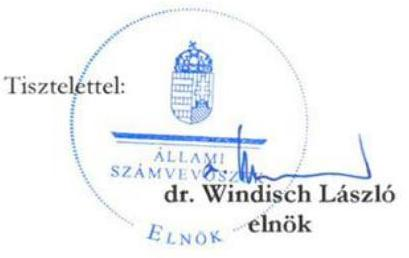

---

# VII. SZ. MELLÉKLET: A KURATÓRIUM ELNÖKÉNEK A FIGYELEMFELHÍVÓ LEVÉLRE ADOTT VÁLASZA 

Neumann János Egyetemért Alapítvány
dr. Windisch László úr
elnök
Állami Számvevőszék

Tárgy: Válasz az EL-3976-019/2024 sz. elnöki figyelemfelhívó levélre

Tisztelt Elnök Úr!
A 2024. július 5-i ÁSZ tv. 31. §-ban szabályozott figyelemfelhívó levelét köszönettel megkaptam és soron kívül továbbítottam a Neumann János Egyetemért Alapítvány kuratóriumi tagjaihoz, az Alapítvány Felügyelőbizottságához és Vagyonellenőréhez. Dr. Kardos Gyula vagyonellenőr véleményét írásban, az augusztus 8-i kuratóriumi ülést megelőzően, július 18-án juttatta el hozzám. A Felügyelőbizottság és a Kuratórium 2024. augusztus 8-án tárgyalta meg a levélben foglaltakat. Az együttesen kialakított vélemény, illetve a közösen elhatározott cselekvés az alábbiakban foglalható össze.

1. A Kuratórium - a Neumann János Egyetem elfogadott stratégiai tervében rögzített kötelezettségeket, a rövidtávú fejlesztési szükségleteket, a kötvény kibocsátójával (és tulajdonosával) fennálló stratégiai és hosszú távú együttműködés eredményeit, továbbá az esetleges felmerülő kockázatokat együttesen értékelve - megalapozottan döntött a központi költségvetésből biztosított forrás OPTIMA2031 és OPTIMA2031B kötvények jegyzésére fordításáról. E tárgyban dr. Kardos Gyula vagyonellenőr az alábbiakat rögzítette:
„Az Alapítvány döntéshozói az OPTIMA kötvények jegyzésekor kiemelt súllyal mérlegelték, hogy a kötvényeket nem egy bizonytalan hátterű gazdálkodó szervezet bocsátotta ki, hanem a Magyar Nemzeti Bank Pallas Athéné Domus Meriti Alapítványa egyszemélyes vagyonkezelő társasága, az Optima Befektetési Zrt. ... külön megerősítette a befektetői bizalmat az a tény, hogy a Magyar Nemzeti Bank a PADME Alapítvány már több mint 10 éve stratégiai együttműködésben állt az Alapítványi Egyetemmel, illetve a jogelőd Műszaki Főiskolával."

Továbbá a Vagyonellenőr véleménye szerint az OPTIMA kötvények kibocsátásának MNB általi felügyelete és a tulajdonosi ellenőrzés az Alapítvány döntéshozóinak „az állampapírokhoz hasonló biztonságot sugallt" a kötvények és hozamok megtérülésére. A kötvények jegyzését az Alapítvány kellő körültekintéssel, a számítható eredmény számbavételével tette meg - összehasonlítva azt egy azonnali (majd később cserélődő) állampapír befektetéssel -, ezt a változó pénzpiaci környezetben, a kedvezőtlen irányú változások ellenére, külső, mértékadó szakmai elemzések bizonyították (PWC). Az Ernst & Young tanulmánya - amit Önökhöz eljuttattunk - kifejezetten az állampapír befektetést, mint alternatív lehetőséget vizsgálta meg, s arra a következtetésre jutott, hogy egy ilyen forráselhelyezés nem lett volna előnyösebb, illetve az értékpapírok cseréje által már rövidtávon jelentős veszteséget, tőkevesztést generált volna. Ez az OPTIMA kötvények esetében nem áll fent.

Az OPTIMA kötvények jegyzésére a Neumann Egyetem stratégiai tervében rögzített beruházások végrehajtása iránti elkötelezettség mellett került sor, számolva természetesen azzal a realitással, hogy ezek a beruházások előkészületei akár 4-6 évig elhúzódnak, ugyanakkor az Egyetemnek versenyképessége és a fejlődésének a megerősítése céljából pótlólagos forrásra van szüksége.

---

# Neumann János 

## Egyetemért

## Alapítvány

Ezt biztosította az OPTIMA kötvények után járó rendszeres kamat, amely - az Alapítvány döntésével - éveken át folyamatosan bővítette az Egyetem fejlesztési célú tartalékát. Ahogy a Vagyonellenőr is megállapítja „az eladási jogok alapításáról kötött szerződéssel az Alapítvány lehetőséget biztosított a kötvényekbe fektetett összegek rövid időn belül történő likvidálására". Így a beruházási célok nem sérültek. (nemzetgazdasági szempontból Kecskemét és térsége fejlődésében is a külső gazdasági környezet miatt történtek módosulások, mint például a Daimler gyár új egységével összefüggő, és csak 2024-ben bemutatott humán erőforrás és lakhatási igényekhez kapcsolódó program)
2. Az Alapítvány Kuratóriuma gondosan eljárva a kötvényjegyzés biztosítéki oldalát is megteremtette. Ez egy fedezett vállalati kötvény, ahol a kibocsátó kötelezettségeiért 100%-os tulajdonosa, a PADME Alapítvány garanciát vállalt. Emellett figyelembe kell venni azt a tényt, hogy az Optima Befektetési Zrt. többségi tulajdonosa, egy a lengyel tőzsdén jegyzett ingatlanfejlesztő társaságnak, a GTC-nek (63.795.401 EUR értékű, többségi részvénypakettje az Optima Befektetési Zrt. tulajdona), ahol a tulajdonos kötelezettséget vállalt arra, hogy részvényeit a befektetők előzetes írásbeli hozzájárulása nélkül nem idegeníti el. Az Alapítvány Kuratóriuma gondos eljárás eredményeként fedezett kötvény lejegyzéséről döntött. Gondos eljárását bizonyítja, hogy az Alapítvány a GTC negyedéves jelentéseit rendszeresen értékeli. Megállapítható, hogy a kötvény fedezeti oldala rendben van, a GTC jelentős mögöttes fedezettel rendelkezik.
3. Amint a fentiekben jeleztük, az Optima Befektetési Zrt. által kibocsátott kötvények úgy a döntéshozatalkor, mint 3 év elteltével (3 év telt el a 10 éves futamidőből!) megfelelő fedezeti háttérrel rendelkeznek. Vagyonvesztésről nem lehet szó, ezt egyébként a 2022. évi audit is alátámasztotta. Az Alapítvány kötvényjegyzése semmilyen módon nem fenyegeti az Egyetem közfeladatainak ellátását. Ezt egyébként a KIM-mel aláírt közfeladat finanszírozási szerződések garantálják. A stratégiai tervben rögzített új beruházások célja: új lehetőségek megalapítása az Egyetem fejlődése, innovációs szerepének biztosítása, illetve a nemzetközi kapcsolatok építése terén.
4. A PADME és a Neumann Alapítvány közötti személyi átfedések az évek alatt a közös érdekek megerősítését (és kivitelezését) segítették, az összeférhetetlenség nem állt és nem áll fent. Az NJEA Kuratóriumi tagjainak a függetlenségét megerősítik az alábbiak is:

- Az NJEA kuratóriumi elnökét és tagjait a Magyar Állam képviseletében az Innovációért és a Felsőoktatásért is felelős Miniszter nevezte ki, azóta a személyeket érintően nem történt változás.
- Az NJEA Kuratóriuma a PADME-nél is érintett tagok részvétele nélkül is tud érvényes döntést hozni.
- A Felügyelőbizottság tagjai és a Vagyonellenőr független személyek a PADME Kuratóriumától, akik támogató állásfoglalása nélkül vagyoni kérdésekben nem hozható érvényes döntés.

5. A kötvényjegyzést megelőző döntéshozatal során szakértői elemzés is készült (PWC), akinek írásos véleményét az érintettek megismerhették. A közérdekű vagyonkezelő alapítványok egyébként csak az ismert „Zöld könyv" 2024. május 21-ei megjelenését követően kaptak instrukciókat a befektetési szabályok részletes kidolgozásához. Erre tekintettel a Neumann János Egyetemért Alapítvány is elindította a szabályozás tökéletesítését.

---

# N 

Neumann János Egyetemért Alapítvány

Tisztelt Elnök Úr!
A Neumann János Egyetemért Alapítvány érdekei elsőbbségét mindenkor szem előtt tartva kérdéseire az alábbi válaszokat adom:

1. 2024 augusztusában az Alapítvány átfogó megállapodást ír alá az Optima Befektetési Zrt.-vel a kötvények teljes visszaváltásáról és annak feltételeiről. Mindez még ez év december végéig megvalósul. Lényege: az Egyetem stratégiai céljait szolgáló vagyonelemek átvétele, illetve minden e feletti követelés cash-ben történő kiegyenlítése. Itt az első lépés az Egyetem kollégiumi és K+F infrastruktúráját megújító projekt (beruházás) saját kézbe vétele a WEPMARK Kft. 100%-os tulajdonrészének a megszerzésével. Itt az alapítványi átvétel ad garanciát a beruházások folytatására, illetve időbeli befejezésére (2025. év).
2. Az NJEA Kuratóriuma 2024. június 28-i ülésén fogadta el az összeférhetetlenség szabályozásának elveit [54/2024. (06.28.) kuratóriumi határozat], majd azt beépíti a Befektetési Szabályzatába. A módosult Befektetési Szabályzatot a Kuratórium 2024. szeptemberi ülésén tárgyalja meg és fogadja el.
3. Az Alapítvány a visszaváltással (és a kamatkompenzáció realizálásával) jelentős újra felhasználható cash-hez jut hozzá. Ennek felhasználása érdekében soron kívül elkészül egy beruházás finanszírozási ütemterv (2024. augusztus-szeptember folyamán), illetve neves tanácsadó cégek versenyeztetésével kerül kiválasztásra az év végéig egy befektetési tanácsadó. Ez utóbbi tenderre jellemzően a legnagyobb cégek lesznek meghívva.

Tisztelt Elnök Úr!
Ezúton is köszönöm levelét és kérem válaszaim szíves tudomásulvételét.

Kecskemét, 2024. augusztus 23.

Üdvözlettel:
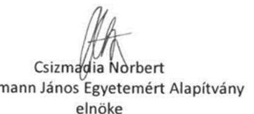

NEUMANN JÁNOS EGYETEMÉRT ALAPÍTVÁNY 6000 Kecskemét, Izsáki út 10.

---

# Csizmadia Attila Norbert 

Kuratóriumi Elnök
Neumann János Egyetemért Alapítvány

## Kecskemét

Tárgy: Tájékoztatás

## Tisztelt Kuratóriumi Elnök Úr!

Az Állami Számvevőszék (a továbbiakban: ÁSZ) az Állami Számvevőszékről szóló 2011. évi LXVI. törvény (a továbbiakban: ÁSZ tv.) 1. § (3), valamint az 5. § (3) bekezdései alapján végzi „A Neumann János Egyetemért Alapítvány tartáshitelensznyt megtestesítő értékpapírba történő befektetésének ellenőrzése" című ellenőrzés keretében a Neumann János Egyetemért Alapítvány (a továbbiakban: Neumann Alapítvány) ellenőrzését. Az ellenőrzés során az ÁSZ által megismert tények - különös tekintettel a szabad pénzeszközei kockázatos vállalati kötvénybe fektetése - kapcsán a Neumann Alapítvány részére juttatott vagyon megőrzése, az alapítványi vagyonnal való felelős gazdálkodás érdekében az ÁSZ tv. 31. §-ában szabályozott figyelemfelhívó levéllel fordult Önhöz az ÁSZ elnöke.

A figyelemfelhívó levélre és az abban feltett kérdésekre megküldött válaszát köszönettel megkaptam. Válaszában tájékoztatást adott arról, hogy a Neumann Alapítvány által a 2021. évben lejegyzett, az OPTIMA Befektetési, Ingatlanhasznosító és Szolgáltató Zrt. (a továbbiakban: OPTIMA Befektetési Zrt.) által kibocsátott Optima2031 és Optima2031/B jelű kötvények visszaváltása érdekében 2024. augusztusban átfogó megállapodást ír alá az OPTIMA Befektetési Zrt.-vel. Tájékoztatott továbbá, hogy a megállapodás lényege, hogy a Neumann János Egyetem (a továbbiakban: Egyetem) stratégiai céljait szolgáló vagyonelemeket vesz át, amelynek első lépéseként az Egyetem kollégiumi és K+F infrastruktúráját megújító projekt (beruházás) saját kézbe vétele történik meg a WEPMARK Holding Korlátolt Felelősségű Társaság (a továbbiakban: WEPMARK Holding Kft.) 100%-os tulajdonrészének megszerzésével.

A Neumann Alapítvány által az ÁSZ rendelkezésére bocsátott - a 2024. január-június hónapokban az Optima2031 és Optima2031/B jelű kötvények visszaváltásával kapcsolatban keletkezett dokumentumok (jegyzőkönyvek, határozatok, levelezés stb.) alapján egy olyan megállapodás körvonalazódik az OPTIMA Befektetési Zrt. és a Neumann Alapítvány között, amely felveti annak

---

a lehetőségét, hogy vagyonvesztés következzen be. A megismert dokumentumok alapján a Neumann Alapítvány a befektetései visszaváltására a Kuratórium 2/2024. (I. 17.) számú határozatában - ellentétben az eladási jog alapításáról szóló szerződések 4.2. „A vételár megfizetése" pontjában foglalt, az Eladási Nyilatkozat kézhezvételétől számított 8 banki napi, illetve 90 naptári napi határidővel - egy éven belüli határidőt határozott meg.
Az OPTIMA Befektetési Zrt.-vel ez év első felében folytatott tárgyalások alapján nagy valószínűséggel a Neumann Alapítvány a kötvények ellenértékét - ellentétben az eladási jog alapításáról szóló szerződések 4.2. „A vételár megfizetése" pontjában foglaltakkal - nem teljes összegében bankszámlapénz formájában, hanem elsődlegesen különböző részesedések, mint az Ön levelében is említett WEPMARK Holding Kft. üzletrésze, illetve kötvények formájában fogja megkapni.
Mindezek miatt indokoltnak tartom arra felhívni a figyelmét, hogy a kötvények visszaváltása során fokozott gondossággal, a közfeladatot ellátó közérdekű vagyonkezelő alapítványokról szóló 2021. évi IX. törvényben megfogalmazott felelős gazdálkodás követelményét érvényesítve szíveskedjenek eljárni. A kötvények visszaváltása során ezért szíveskedjenek kizárólag a Neumann Alapítvány és a fenntartott intézmény, az Egyetem érdekeit szem előtt tartani. Ennek során szíveskedjenek prioritásként kezelni, hogy vagyonvesztés ne következzen be, ennek érdekében a bizonytalan megtérülésű befektetések helyett az eladási jog alapításáról szóló szerződéseknek a vonatkozó rendelkezései szerint az OPTIMA Befektetési Zrt. a kötvény vételárát a tényleges megfizetés napjáig felhalmozódott (ki nem fizetett) kamattal növelt összeggel a Neumann Alapítvány bankszámlájára történő megfizetéssel teljesítse.

Bízom abban, hogy fenti tájékoztatásom támogatást nyújt ahhoz, hogy a kötvények visszaváltása a Neumann Alapítvány számára a legkedvezőbb formában, a vagyonvesztés elkerülésével valósuljon meg.

Budapest, 2024. szeptember 24.
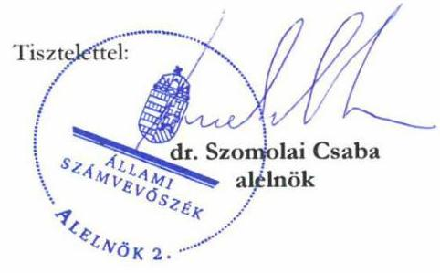

---

# IX. SZ. MELLÉKLET: AZ ÁSZ ELNŐKÉNEK ISMÉTELT FIGYELEMFELHÍVÓ LEVELE AZ ALAPÍTVÁNY RÉSZÉRE 

## ÁLLAMI   SZÁMVEVŐSZÉK

DR. WINDISCH LÁSZLÓ
ELNÖK

Ikt. szám: EL-3976-033/2025

## Csizmadia Attila Norbert

Kuratóriumi Elnök

Neumann János Egyetemért Alapítvány

## Kecskemét

Tárgy: Figyelemfelhívó levél

## Tisztelt Kuratóriumi Elnök Úr!

Az Állami Számvevőszék (a továbbiakban: ÁSZ) az Állami Számvevőszékről szóló 2011. évi LXVI. törvény (a továbbiakban: ÁSZ tv.)
 1. § (3), valamint az 5. § (3) bekezdései alapján végzi „Neumann János Egyetemért Alapítvány tartós hitelviszonyt megtestesítő értékpapírba történő befektetéseinek ellenőrzése" című ellenőrzés keretében a Neumann János Egyetemért Alapítvány (a továbbiakban: Neumann Alapítvány) ellenőrzését.

Az ÁSZ kiemelten fontosnak tartja az ellenőrzések során feltárt szabálytalanságok mielőbbi megszüntetését, a pozitív változások elindítását.

Az ellenőrzés során az ÁSZ által megismert tények - különös tekintettel a szabad pénzeszközök kockázatos értékpapírba, vállalati kötvénybe fektetése kapcsán - a Neumann Alapítvány részére juttatott vagyon megőrzése, az alapítványi vagyonnal való felelős gazdálkodás érdekében ismételten az ÁSZ tv. 31. §-ban szabályozott figyelemfelhívó levéllel fordulok Önhöz.

Az ÁSZ a számvevőszéki ellenőrzés során az EL 3976-019/2024. iktatószámú, 2024. július 5-én kelt figyelemfelhívó levelemben foglaltakon túl, további eredményeket összegezve az alábbi kockázatokat tárta fel:

1. A Neumann Alapítvány, mint a Neumann János Egyetem (a továbbiakban: Egyetem) fenntartója részéről nincs reális értékelés a tekintetben, hogy az Egyetem tervezett infrastruktúra fejlesztését hogyan tudja megvalósítani. A Neumann Alapítvány a Kuratórium 2024. január 17-én hozott döntése alapján az OPTIMA Befektetési, Ingatlanhasznosító és Szolgáltató Zrt.-vel (a továbbiakban: OPTIMA Befektetési Zrt.) tárgyalásokat kezdeményezett a tartós hitelviszonyt megtestesítő értékpapírok egy éven belüli visszaváltása érdekében. A 2024. I. félévében megkezdett tárgyalások eredményeként egy olyan megállapodás körvonalazódik, amely szerint a befektetés

---

jelentős részét nem bankszámla pénzben, hanem gazdasági társasági részesedésekben, illetve befektetési jegyekben kapná vissza a Neumann Alapítvány. A nehezen mobilizálható, esetlegesen bizonytalan megtérülésű befektetések felvetik annak a kockázatát, hogy a Neumann Alapítvány az Egyetemet érintő, tervezett infrastrukturális fejlesztéseket nem tudja megvalósítani.
2. Kérem soron kívüli tájékoztatását, hogy
a. az Egyetem tervezett infrastruktúra fejlesztését milyen források bevonásával fogják megvalósítani, ha az OPTIMA kötvénybe való befektetés nem pénzben kerül megtérítésre
b. a Metropolitan Egyetem tervezett átvétele hogyan járulhat hozzá az Egyetem infrastruktúra fejlesztéséhez, amennyiben az OPTIMA Befektetési Zrt. azzal teljesíti a kötelezettségét.
c. Ha a kötvény kibocsátója más gazdasági társaságban való részesedés (üzletrész, vagy részvények, pl. Ultima vagy GTC részvények) átadásával teljesíti fizetési kötelezettségét, úgy azok értékelésére milyen módszertan alapján, hogyan, milyen számítások szerint kerül sor.
3. A Neumann Alapítvány az OPTIMA Befektetési Zrt.-től összesen 127,5 milliárd Ft értékben lejegyzett kötvény esetében eladási jog alapítására irányuló szerződést kötött, azonban mind a mai napig nem gyakorolta a visszaváltási jogát azok megnyílása óta. Kérem soron kívüli tájékoztatását, hogy milyen megfontolások alapján nem élt még hivatalosan opciós jogával, miközben látható, hogy az Optimával való egyeztetéseik jelentősen elbizonytalanodtak, és nem látszik remény a kötvény értékének pénzben való megtérítésére.
4. A Neumann Alapítvány Kuratóriuma 2/2024. (I.17.) számú határozatával a kötvények egy éven belüli visszaváltása érdekében tárgyalások megkezdése mellett döntött. Figyelemmel a döntésben foglalt egy éven belüli határidő néhány napon belüli leteltére, kérem soron kívüli tájékoztatását, hogy a Kuratórium döntésének a Neumann Alapítvány hogyan tesz eleget.
5. A kötvénykibocsátó Optima Befektetési Zrt. fizetésképtelenségi helyzetben van, erről Ön, mint a PADME Alapítvány kuratóriumi elnöke, tájékoztatta is az MNB elnökét. Kérem soron kívül tájékoztasson arról, hogy a Neumann Alapítvány miért nem kezdeményezte felszámolási eljárás lefolytatását az Optima Befektetési Zrt.-vel szemben. Az előállt fizetésképtelen helyzetet az OPTIMA Befektetési Zrt. úgy próbálja megoldani, hogy külön egyeztetéseket folytat az NJE Alapítvánnyal, egyedi egyezségekkel, fizetési haladékok és határidő módosítások elérésével igyekszik a kialakult helyzetet kezelni. Mivel a fizetésképtelenséggel fenyegető helyzetben lévő vagy fizetésképtelen gazdálkodó adósságának hitelezőkkel való egyezségkötéssel történő rendezését törvényi előírás szabályozza, az egyedi megállapodásokkal az OPTIMA Befektetési Zrt. nem biztosítja, hogy a fizetésképtelenségi helyzet rendezése a jogszabályi keretek között, valamennyi hitelező érdekeire is figyelemmel történjen. Fentiek miatt fennáll a veszélye annak, hogy a jogszabályi előírások tiltása ellenére akár fedezet elvonás valósulhat meg.
6. Kérem Kuratóriumi Elnök urat, hogy az ÁSZ tv. 31. §-a alapján a figyelemfelhívó levélben foglaltakat tíz napon belül elbírálni, a megfelelő intézkedést meghatározni és erről soron kívül

---

# Mellékletek

értesíteni szíveskedjék. Tájékoztatását cégkapun keresztül, vagy postai úton szíveskedjék megküldeni.

Tájékoztatom Kuratóriumi Elnök Urat, hogy az intézkedéseknek a jövőre szükséges vonatkozniuk, az intézkedésekről szóló tájékoztatást az intézkedésekkel érintett dokumentumok csatolása nélkül szíveskedjen megküldeni.

Bízom abban, hogy levelem kellő támogatást nyújt az intézkedések megtételéhez.

Budapest, 2025. január 4.

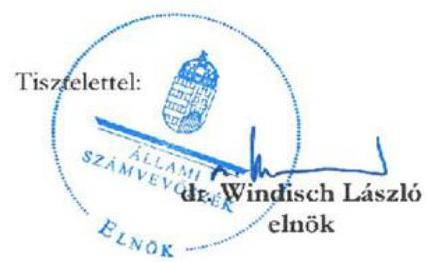

---

# X. SZ. MELLÉKLET: A KURATÓRIUM ELNÖKÉNEK A MÁSODIK FIGYELEMFELHÍVÓ LEVÉLRE ADOTT VÁLASZA 

## 4   60   Neumann János   Egyetemért   Alapítvány

dr. Windisch László
elnök
Állami Számvevőszék

Tárgy: válasz az EL-3976-033/2025 sz. elnöki levélre

Tisztelt Elnök Úr!
A 2025. 01.14-én kelt, az Állami Számvevőszékről szóló 2011. évi LXVI. törvény 31. §-a szerinti figyelemfelhívó levélére az alábbi választ adom.

Elsőként az Ön levelének 5. pontjában rögzített ténymegállapítással kívánok reagálni, amely közvetlenül és súlyosan érinthetné a NJEA helyzetét, illetve közvetlenül érinti személyemet is. Vissza kell utasítanom azt a kijelentést, mely szerint én személy szerint, mint a PADME alapítvány kuratóriumi elnökeként tájékoztattam az MNB elnökét az Optima Befektetési Zrt. fizetésképtelenségi helyzetéről. Ilyen tartalmú tájékoztatást nem adtam, illetve ezt megalapozó véleményt sem nyilvánítottam. Feltételezésem szerint vélhetően valamilyen információs csatorna torzításának eredménye a fenti félreértés.

Amint az Ön levele is említi, az elmúlt egy évben a NJEA folyamatos tárgyalásban állt az Optima Befektetési Zrt.-vel a tartós hitelviszonyt megtestesítő értékpapírok átváltása érdekében. A tárgyalások (rész)eredményéről folyamatosan tájékoztatást kapott a Kuratórium, a Felügyelő Bizottság, illetve a Vagyonellenőr (az erre vonatkozó dokumentumok az Önök adatbázisába feltöltésre kerültek). Sajnos itt kell megemlítenünk azokat a körülményeket, amelyek jelentősen hátráltatták egy megállapodás - 2024. nyaráról már keretmegállapodás létrehozását és az Ön által említett beruházási tevékenység elindítását, illetve a már zajló beruházás folytatását. Ezek a következők:

- A Kulturális és Innovációs Minisztérium a Neumann János Egyetemért Alapítvánnyal kötött 5 éves Közfeladat finanszírozási szerződésben rögzített indikátor alapú támogatási forrás folyósítását 2024 május végéről kezdődően két negyedévet érintően nem teljesítette, és számtalan írásbeli felszólítás ellenére semmilyen írásos magyarázatát nem adta számunkra (informális úton szerzett információink szerint, egyedül a NJE, illetve a NJEA került a tavalyi év folyamán ilyen helyzetbe). Ez a gyakorlatban azt jelentette, hogy az Egyetem finanszírozásából közel 2 MRD forint hiányzott, amelyet az oktatás fenntartása és az egyetemi működés zökkenőmentes biztosítása érdekében a NJEA -nak kényszerűen finanszíroznia kellett az Egyetemnél elhelyezett, korábbi években felhalmozott fejlesztési tartalék keretéből.
- A NJE által megvalósítani tervezett jövőbemutató tevékenységeket támogató beruházás a Neumann Innovációs és Technológiai Park. A Technológiai Park csak akkor valósítható meg stratégiai szemléletben, és fejleszthető tovább a jövőben, ha az állam által kiírt Tudományos és Innovációs Park cím pályázat során a tervezett Neumann Science Park elnyeri a címhasználati jogot. Az Alapítvány és az Egyetem szakmai vezetői kidolgozták a pályázati környezet szerinti Neumann Innovációs és Technológiai Park - koncepcióját, és azt a Magyar Állam által meghirdetett pályázatra 2024. májusában benyújtották. E témában az illetékes KIM a döntést hosszabb idő óta halasztja, napjainkban sem tudjuk milyen magyarázata lehet a késlekedésnek. Márpedig a Magyar Állam által stratégiai szempontból fontosnak tartott Science Park támaszthatja alá a Neumann Innovációs Központtal összefüggő gyakorlati lépéseinket.

---

# Neumann János Egyetemért Alapítvány 

- Kecskemét Megyei Jogú Város és a Neumann János Egyetem távlati jövőképét meghatározó fejlődési irányok fontos gyakorlati terepe, illetve programja lehet a kecskeméti „Okosváros" (Wise City) megvalósítása. Ez egyedülálló lehetőséget kínál az egyetemi tudásra épülő K+F tevékenység, a városi fejlesztések, illetve a kiemelkedő ipari teljesítmények összekapcsolódására. Ezt erősíti a Daimler konszern részéről felmerült igény, mely a Mercedes legújabb gyártó kapacitás fejlesztéseihez szükséges munkaerő számára infrastrukturális bázist, új elhelyezési centrumot kíván kialakítani az „Okosváros" területén. Lényegében egy új szemléletű elhelyezési centrum létesítéséről van szó. Ennek tervezését kizárólag akkor lehet elindítani, ha egyértelművé válik a Mercedes elképzelése az elhelyezésre vonatkozóan (megtörtént), illetve rendelkezésre állnak azok a finanszírozási források és támogatások, amelyek az ilyen és hasonló bérlemények létrehozását célozzák meg (ez utóbbiak feltételei nemrég tisztázódtak le).

Összességében megállapítható, hogy a fentebb jelzett nehezítő körülmények, illetve az állami szereplők oldaláról történő késlekedés sem térítette el az Alapítványt az eredeti beruházási szándékoktól, amelyet a következők bizonyítanak:
a) Az egyetemi oktatás költségvetési finanszírozásának kritikus késlekedése ellenére az Egyetem folytatta a felkészülést a kollégiumi férőhelyek bővítése érdekében, továbbá a piaci innovációs tevékenység egyetemi infrastruktúrában történő elhelyezése céljából 2024-ben is jelentősen előre haladt (amit a vonatkozó három új épület készültségi állapota tanúsít).
b) A Neumann Innovációs és Technológiai Park alapjait jelentő Science Park cím pályázat kidolgozásra és benyújtásra került a illetékes KIM-hez.
c) Elindult az „Okosváros" projekt megtervezése, felvettük a kapcsolatot olyan gazdasági szereplőkkel, akik képesek egy ilyen komplex és jelentős ingatlan beruházás megvalósítására. Ez utóbbi kapcsán meg kívánom jegyezni, hogy a GTC-vel való együttműködést mi nem kizárólag egy esetleges későbbi részvénytulajdonlás oldaláról vizsgáltuk meg, hanem a tekintetben is, hogy ez a vállalkozás Közép-Kelet Európa egyik sikeres ingatlanfejlesztője, amelynek tudását és kapcsolatrendszerét feltétlenül indokolt az „Okosváros" projekt megvalósítása során igénybe venni. Az elkészült és Önök által is ismert koncepcióterv előzetes számításai szerint a teljes beruházási érték 250-270 MRD Ft lehet.

## Tisztelt Elnök Úr!

Az Optima Befektetési Zrt-vel való tárgyalások során a fentiekre is tekintettel mindig szem előtt tartottuk, és mindig szem előtt tartjuk a következőket:
a) az aktuális beruházási fázis finanszírozására akkor álljon rendelkezésre a forrás, amikor annak ésszerű felhasználása biztosítható (ellenkező esetben az kamatozó eszközben legyen elhelyezve),
b) az Optima kötvények átváltása a (Ön által is észrevételezett módon) diverzifikációt követően optimalizálja a portfoliót,
c) a kötvény átváltásakor a szembeállított eszközök külső, független szakértő által legyenek értékelve (lehetőség szerint olyan magyar szakértők által, amelyek az adott témában nagy szakértelemmel és elismertséggel rendelkeznek.)
d) minden egyes konverziós lépés hosszú távon szolgálja az Egyetem fejlesztési céljainak megvalósítását. (Itt nem szűkítem le a fejlesztést kizárólag az infrastruktúra építésére, létrehozására, hanem ennek kötelezően együtt kell járnia az Egyetem oktatói és hallgatói létszámának bővülésével, a hazai és nemzetközi oktatási kapcsolatok kiszélesítésével, az Egyetem eredményeinek növekedésével a K+F területen.)

---

# Neumann János Egyetemért Alapítvány 

A kötvények tervezett konverziója tehát, közvetlenül vagy közvetetten, de egyértelműen elő kell, hogy mozdítsa a NJEA gyarapodó és biztonságos anyagi helyzetét, és ezen keresztül az Egyetem fejlesztéséhez szükséges hosszú távú finanszírozási hátteret. Egyébként megjegyzem, hogy e tárgyban készült 2024. augusztusában egy részletes kuratóriumi előterjesztés a „NEUMANN siker 2020-2024" címen, amelyet az Önök rendelkezésére bocsátottunk. Az Ön levelének 2. pontjára utalva, és a fentebb jelzett követelményeket hangsúlyozva nem látok kockázatot abban, ha az Optima kötvények nem kizárólagosan számlapénz formájában kerüljenek visszaváltásra. Egy befejezett infrastruktúra (kollégium) közvetlenül szolgálja az Egyetem jövőképét, (sőt megépítése lehet, hogy üzleti szereplők dominanciája mellett előnyösebb is) továbbá
 a Budapest Metropolitan Egyetem „átvétele" amilyen módon a tervek szerint megvalósulna, az egyértelműen egy egymást erősítő, duális KEKVA egyetemi modell létrehozását célozná meg, a NJE jelenlegi hallgatói létszámát annak többszörösére emelve. A GTC részvények befogadásának jelentőségére már korábban utaltam (bl. „Okosváros" építése), miközben egy nemzetközi tőzsdei, több éves múlttal rendelkező értékpapírként szükség szerint akár készpénzre is konvertálható, a tulajdonos számára történő folyamatos osztalék biztosítása mellett.

Az NJEA az Optima Befektetési Zrt-vel történő kötvényjegyzés kapcsán eladási jog lehetőséggel rendelkezik, amely a jegyzést követő egy év elteltével nyílt meg az Alapítvány számára. Ez a jog egy lehetőség, amellyel természetesen meghatározott helyzetben célszerű élni. Véleményem szerint olyan helyzet nem állt elő, amely a 127,5 milliárd forint azonnali és teljes összeget igénylő felhasználását indokolttá tette volna. Egyfelől, mint jeleztük, az Alapítvány az Egyetemet támogató fejlesztések finanszírozását csak meghatározott előrehaladás felmutatásakor indíthatja el, másrészt az OPTIMA kötvények ingatlanfejlesztési célokat szolgálnak. Harmadrészt az Optima kötvények kamatai az adott évben minden esetben teljeskörűen megfizetésre kerültek és ezáltal az Egyetemnél képzett fejlesztési tartalékot gyarapíthatták. Ehelyütt szükséges megjegyeznem, hogy a Neumann János Egyetem (NJE) beruházásának finanszírozását eszközértékesítések forrás felhasználásával időzített formában tudja az NJEA rendelkezésre bocsátani. Az eszközökkel való rendelkezés pedig lehetőséget ad arra, hogy az értékpapírok pénzügyi realizálását az NJEA olyan időpontban végezze, amikor a realizáció hozama a leginkább optimális.

Ahogy az elnök úr levele is tartalmazta, tavaly év elején egy éves időtartamot határoztunk meg az Optima Befektetési Zrt-vel folytatott tárgyalásokra, amelyek több tekintetben mutatnak előrehaladást és a közeljövőben tájékoztatást adunk az Ön részére ennek lezárásáról.

Kecskemét, 2025. január 24.

Tisztelettel:

## Csizmadia Norbert

A Neumann János Egyetemért Alapítvány elnöke

Neumann János Egyetemért Alapítvány H-6000 Kecskemét, Izsáki út 10.

---

# FÜGGELÉK: ÉSZREVÉTELEK 

A jelentéstervezetet a Számvevőszék 15 napos észrevételezésre megküldte az ellenőrzött szervezet vezetőjének az ÁSZ tv. 29. § (1) bekezdése előírásának megfelelően.

Az elfogadott észrevételek alapján a Számvevőszék módosította a jelentést.
A függelék tartalmazza az ellenőrzött észrevételeit, illetve az el nem fogadott észrevételek elutasításának indoklását.

[^0]
[^0]:    * 29. § (1) Az Állami Számvevőszék az ellenőrzési megállapításait megküldi az ellenőrzött szervezet vezetőjének vagy az általa megbízott személynek, és annak, akinek személyes felelősségét állapította meg.
    (2) Az ellenőrzött szervezet vezetője és a felelősként megjelölt személy az ellenőrzés megállapításaira tizenöt napon belül írásban észrevételt tehet.
    (3) Az Állami Számvevőszék az észrevételre a beérkezésétől számított harminc napon belül írásban válaszol. A figyelembe nem vett észrevételeket köteles a jelentésben feltüntetni, és megindokolni, hogy azokat miért nem fogadta el.

---

# NyEA   Neumann János Egyetemért Alapítvány 

Hivatkozási szám: EL-3976-036/2025.

## Állami Számvevőszék

Klinga László
igazgató részére

Tárgy: Észrevételek megküldése az Állami Számvevőszék jelentéstervezete vonatkozásában

Tisztelt Igazgató Úr!

Tisztelettel megkaptuk az Állami Számvevőszékről szóló 2011. évi LXVI. törvény (továbbiakban: „ÁSZ Tv.") 29. § (1) bekezdésében foglaltak alapján észrevételezés céljából „A Neumann János Egyetemért Alapítvány tartós hitelviszonyt megtestesítő értékpapírba történő befektetéseinek ellenőrzése" című számvevőszéki jelentés tervezetét 2025. február 18-án.

Az ÁSZ Tv. 29. § (2) bekezdése alapján a jelen levél mellékleteként megküldjük észrevételeinket az ellenőrzési megállapítások tekintetében.

Budapest, 2025. március 5.

Tisztelettel

Neumann János Egyetemért Alapítvány
Csizmadia Attila Norbert
Kuratórium elnöke

NEUMANN JÁNOS EGYETEMÉRT ALAPÍTVÁNY
6000 Kecskemét, Izsáki út 10.
www.niea.hu

---

# Észrevételek és kérelmek 

„A Neumann János Egyetemért Alapítvány tartós
hitelviszonyt megtestesítő értékpapírba történő
befektetéseinek ellenőrzése"
című számvevőszéki jelentéstervezet
vonatkozásában
szigorúan bizalmas!
2025. március 05.

---

# TARTALOMJEGYZÉK 

I. Bevezetés és kérelem ..... 3
I. 1 Kérelem záró megbeszélés tartásáról ..... 3
I. 2 Kérelem az eljárás felfüggesztésére ..... 4
I. 3 Kérelem a jelentés nyilvánosságának korlátozásáról ..... 5
II. Összegzés ..... 8
III. Részletes Észrevételek ..... 26
III. 1 Észrevételek az ellenőrzött időszak vonatkozásában ..... 26
III. 2 A megállapításokhoz tett részletes észrevételek (jelentéstervezet 14. - 27. oldal) ..... 26
IV. Definíciók ..... 34

---

# I. BEVEZETÉS ÉS KÉRELEM 

Tisztelt Igazgató Úr!
Az ÁSZ 2025. február 13. napján kelt EL-3976-036/2025. iktatószámú levelében megküldött EL-3976035/2025. iktatószámú jelentéstervezetében foglalt megállapításokra, az ÁSZ Tv. 29. § (2) bekezdésében foglaltakra tekintettel, az észrevételeinket az alábbiakban adjuk elő, amelyre tekintettel kérjük a tisztelt ÁSZt, hogy
(i) elsődlegesen az EL-3976/2025 hivatkozási szám alatt folyamatban lévő ellenőrzési eljárását felfüggeszteni szíveskedjék, illetve amennyiben arra a tisztelt ÁSZ nem lát lehetőséget
(ii) másodlagosan az EL-3976/2025 hivatkozási szám alatt folyamatban lévő ellenőrzési eljárását és jelentését az ellenőrzés alá vontnál folyamatban lévő intézkedésekkel és annak várható hatásaival kiegészíteni szíveskedjék, illetve amennyiben a tisztelt ÁSZ erre sem lát lehetőséget,
(iii) harmadlagosan az EL-3976/2025 hivatkozási szám alatt folyamatban lévő ellenőrzési eljárásban a jelentéstervezetet felülvizsgálni és az alább kifejtettek szerint módosítani szíveskedjék.

Az alábbiakban kifejtettekre, valamint a jelentéstervezetben foglalt törvény által védett titokra tekintettel kérjük a tisztelt ÁSZ-t, hogy az EL-3976/2025 hivatkozási szám alatt folyamatban lévő ellenőrzési eljárásban készült jelentés nyilvánosságra hozatalát teljes egészében korlátozza, hogy az ne juthasson illetéktelen személy tudomására, és e védett adatok törvényben meghatározott védelme a hatóság eljárásában is biztosított legyen.

## I. 1 Kérelem záró megbeszélés tartásáról

Tekintettel a jelentésben foglalt gazdasági, üzleti és jogi információk összetettségére és jelentőségére az érintett szervezetek gazdálkodására, illetve arra, hogy a tisztelt ÁSZ vizsgálatának megkezdését követően a jelentéstervezetben foglalt tényállás több tekintetben is változott, valamint arra, hogy részben a jelentés tervezetben is javasolt intézkedések megtétele folyamatban van, ezért kérjük a tisztelt ÁSZ-t, hogy a vizsgálati eljárást ne zárja le és a végleges vizsgálati jelentést ne adja ki. Valamint a vizsgálati jelentés véglegesítését megelőzően az ÁSZ Tv. 32. § (5) bekezdésére hivatkozással kérjük a tisztelt ÁSZ-t, hogy biztosítson lehetőséget, hogy a feltárt tényeket, az ezeken alapuló megállapításokat, következtetéseket, valamint a folyamatban lévő intézkedéseket a felek záró megbeszélés keretében egyeztethessék.

A folyamatban lévő intézkedések bemutatása álláspontunk szerint érdemben kihat a jelentéstervezetben az ellenőrzés alá vont jogi személy részére megfogalmazott intézkedési javaslatokra és a jelentéstervezetben megtett megállapításokra is.

A folyamatban lévő intézkedések eredményeképpen úgy véljük, hogy a jelentéstervezetben foglalt számos megállapítás a továbbiakban már okafogyott vagy módosítást igényel. Hasonló hatása van a folyamatban lévő intézkedéseknek a jelentéstervezetben foglalt intézkedési javaslatokra is.
Ezen folyamatban lévő intézkedések összetettsége és sokrétűsége meghaladja az írásbeli észrevételezés kereteit, így azok mélységükben való bemutatásához mindenképpen szükségesnek ítéljük a személyes megbeszélés megtartását.

---

# I. 2 Kérelem az eljárás felfüggesztésére 

Az ÁSZ Tv. 31.§-a értelmében: „Az Állami Számvevőszék elnöke az ellenőrzés során feltárt jogszabálysértő gyakorlat, illetve a vagyon rendeltetésellenes vagy pazarló felhasználásának megszüntetése érdekében - ha jogszabály súlyosabb jogkövetkezmény alkalmazását nem írja elő - figyelemfelhívó levéllel fordulhat az ellenőrzött szerv vezetőjéhez."

Hasonlóképpen rendelkezik az Ász Tv. 33. § (1) bekezdése is az ellenőrzés alá vontak intézkedési kötelezettségéről. „Az Állami Számvevőszék az ellenőrzési megállapításait tartalmazó jelentését megküldi az ellenőrzött szervezet vezetőjének. Az ellenőrzött szervezet vezetője köteles a jelentésben foglalt megállapításokhoz kapcsolódó intézkedési tervet összeállítani, és azt a jelentés kézhezvételétől számított harminc napon belül az Állami Számvevőszék részére megküldeni."

A jelen eljárás eredményeképpen a jelentéstervezetében a tisztelt ÁSZ számos intézkedési javaslatot megfogalmazott az ellenőrzés alá vonttal szemben. Az ÁSZ-nak az Alapítvány kuratóriumi elnöke felé megfogalmazott egyik javaslata az, hogy gondoskodjon az Optima Befektetési Zrt-nél lejegyzett kötvények visszaváltásáról és a ki nem fizetett kamatok megfizetéséről. Az Optima Befektetési Zrt. jelentősen módosított ajánlatot terjesztett 2025. február 25-én az Alapítvány elé a kötvényvisszaváltása tárgyában, amelyet jelenleg az Alapítvány kuratóriuma vizsgál. Az ajánlat célja, hogy minden érintett fél számára kedvező feltételekkel zárja le a korábbi időszakot, a kötvények visszaváltásra kerüljenek és a jelentéstervezetben kiemelt befektetési, gazdálkodási, szabályozási megállapításokra érdemben reagáljon, valamint az esetleges hiányosságokat kezelje, kiemelt tekintettel a kötvény likviditásának és hozamának összefüggéseire.

E tekintetben a felek közötti tárgyalások lezárásáig és a végleges kötvényvisszaváltási megállapodás megkötéséig, álláspontunk szerint, indokolt az eljárás felfüggesztése.

Az ÁSZ Tv. az ellenőrzési eljárás felfüggesztését nem tiltja a konszolidáció és intézkedések lezárultáig és megvalósulásáig. Ellenkezőleg, az eljárás felfüggesztése kifejezetten az ÁSZ Tv. 24.§ (1) bekezdésében foglalt, az ellenőrzésekkel szemben támasztott törvényi követelmények megvalósulását szolgálja. E körben különös hangsúllyal hivatkozunk az ÁSZ Tv. 24.§ (1) bekezdés d) és e) pontjaiban foglaltakra, amelyek értelmében: „Az ellenőrzésekkel szemben támasztott követelmények: [..] d) az ellenőrzések eredményeinek, a megállapításoknak alátámasztottnak, a következtetéseknek okszerünek és megalapozottnak kell lenniük, e) az ellenőrzéseket hatékonyan és eredményesen kell elvégezni." A tárgyalások lezárását és a végleges megállapodás megkötésének időigényét 3 hónapra becsüljük, amely időszak az ellenőrzés hatékonyságára, alaposságára és teljességére, valamint a tisztelt ÁSZ további törvényi kötelezettségeinek teljesítésére semmilyen negatív hatást nem gyakorol, hanem azok teljesülését kifejezetten elősegíti.

Mindezekre tekintettel kérjük a tisztelt ÁSZ-t, hogy az EL-3976/2025 hivatkozási szám alatt folyamatban lévő ellenőrzési eljárását 3 hónapra felfüggeszteni szíveskedjen.

Vállaljuk, hogy a 3 hónapos felfüggesztési időszak lejáratát megelőzően rendszeresen és részletesen tájékoztatjuk a tisztelt ÁSZ-t az általunk megtett intézkedésekről, valamint a kötvényekre vonatkozó megállapodás megkötéséről és azoknak az ellenőrzés alá vont működésére gyakorolt hatásáról, kifejezetten kitérve a jelentéstervezetben tett megállapításokra, az intézkedési javaslatokkal összefüggésben.

---

Meglátásunk szerint a folyamatban lévő intézkedések várható hatásai érdemben befolyásolják a jelentéstervezet megállapításait és intézkedési javaslatait, így indokolt az ellenőrzési eljárás fent hivatkozott felfüggesztése.

# I. 3 Kérelem a jelentés nyilvánosságának korlátozásáról 

A tisztelt ÁSZ által készített jelentéstervezet számos törvény által védett információt és titkot tartalmaz, amelyek nyilvánosságra hozatalát törvény tiltja.

Ezen törvényi védelem teljesülése érdekében a jelentés nyilvánosságra hozatalának korlátozási lehetőségét és tilalmát az ÁSZ Tv. is kifejezetten tartalmazza. Az ÁSZ Tv. 32.§ (3) bekezdése alapján ekként: „Az Állami Számvevőszék jelentése nyilvános. Törvény a nyilvánosságot minősített adatok védelme érdekében korlátozhatja. A nyilvánosságra hozott jelentés nem tartalmazhat minősített adatot vagy a törvény által védett egyéb titkot."

Hasonló korlátozást tartalmaz a 2011. évi CXII. törvény az információs önrendelkezési jogról és az információszabadságról („Info Tv.") 27. § (1) bekezdése is, amelynek értelmében: „A közérdekű vagy közérdekből nyilvános adat nem ismerhető meg, ha az a minősített adat védelméről szóló törvény szerinti minősített adat."

A fentieken túl általános jelleggel hivatkozunk még az általános közigazgatási rendtartásról szóló 2016. évi CL törvény 27.§ (2) bekezdésében foglaltakra: „A hatóság gondoskodik arról, hogy a törvény által védett titok és törvény által védett egyéb adat (a továbbiakban együtt: védett adat) ne kerüljön nyilvánosságra, ne juthasson illetéktelen személy tudomására, és e védett adatok törvényben meghatározott védelme a hatóság eljárásában is biztosított legyen."

Mindezekre tekintettel szeretnénk megismételni, hogy az ÁSZ tv. 32. § (3) bekezdése alapján a nyilvánosságra hozott jelentés nem tartalmazhat minősített adatot vagy a törvény által védett egyéb titkot. Tekintettel arra, hogy a jelentéstervezetben foglalt információk összessége törvény által védett titoknak minősül, így különösen üzleti titoknak, értékpapírtitoknak, valamint tőzsdei bennfentes információnak, ezért kérjük a tisztelt
 ÁSZ-t, hogy a végleges jelentés nyilvánosságát teljes mértékben korlátozza az alábbi indokokra tekintettel.

A részünkre megküldött jelentéstervezetben számos az ÁSZ tv.-ben és az Info tv.-ben hivatkozott, törvényi felhatalmazással védett titok található. E szerint, törvény által védett titoknak minősül - többek között - az üzleti titok, amelyről az üzleti titok védelméről szóló 2018. évi LIV. törvény („Ütvtv.") rendelkezik.

Az Ütvtv. 1.§ (1) bekezdése alapján „üzleti titok a gazdasági tevékenységhez kapcsolódó, titkos - egészben, vagy elemeinek összességeként nem közismert vagy az érintett gazdasági tevékenységet végző személyek számára nem könnyen hozzáférhető -, ennélfogva vagyoni értékkel bíró olyan tény, tájékoztatás, egyéb adat és az azokból készült összeállítás, amelynek a titokban tartása érdekében a titok jogosultja az adott helyzetben általában elvárható magatartást tanúsítja."

Az Ütvtv. szabályai alapján a jelentéstervezetben foglalt információk közül üzleti titoknak, valamint bennfentes információnak minősül az Optima Csoport gazdasági tevékenységéhez és befektetési tevékenységhez kapcsolódó információk összessége, valamint különösen az Optima Csoportba tartozó, tőzsdén jegyzett társaságokra vonatkozó üzleti és gazdasági információk.

---

Az Ütvtv. 6. § (1) bekezdése alapján az üzleti titokhoz fűződő jogot megsérti, aki az üzleti titkot jogosulatlanul - a jogosult hozzájárulása nélkül - felfedi. Hangsúlyozni kívánjuk, hogy a jelentéstervezetben foglalt információk összessége üzleti titoknak minősül, illetve az üzleti titok jogosultja nem kizárólag az NJEA és az Optima Csoport, hanem az adott üzleti titok felett jogszerű ellenőrzést gyakorló személy, akinek a jogszerű gazdasági, pénzügyi, üzleti érdekeit az üzleti titokhoz fűződő jog megsértése sértené. Minderre tekintettel az Ütvtv. rendelkezései alapján a jelentéstervezetben foglalt üzleti titkok tekintetében minden jogosult jóváhagyására szükség lenne ezen információk nyilvánosságra hozatalát megelőzően, azonban még a jóváhagyás megadása esetén is szükséges vizsgálni az információk jellege miatt alkalmazandó egyéb vonatkozó jogszabályokat is.

Az Info tv. irányadó rendelkezései az adatok közérdekű megismerésével szemben nem csak egyes adatok tekintetében tartalmaz védelmet és rendelkezik korlátozásról, vagy tilalomról. Az Info tv. rendszerében a megismerésre vonatkozó igénnyel szemben védelem illeti meg, meghatározott feltételek mellett, a döntéselőkészítési mechanizmust, valamint az annak során keletkezett adatokat és döntéseket is.

Az előző bekezdésben foglaltakra figyelemmel az Info tv. 27.§ (3) bekezdése értelmében: „A döntés megalapozását szolgáló adat megismerésére irányuló igény - az (5) bekezdésben meghatározott időtartamon belül - a döntés meghozatalát követően akkor utasítható el, ha az adat további jövőbeli döntés megalapozását is szolgálja, vagy az adat megismerése a közfeladatot ellátó szerv törvényes működési rendjét vagy feladat- és hatáskörének illetéktelen külső befolyástól mentes ellátását, így különösen az adatot keletkeztető álláspontjának a döntések előkészítése, illetve egyes bírósági eljárásokban való részvétele során történő szabad kifejtését veszélyeztetné."

Összességében megállapítható, hogy a jelentéstervezet olyan, az Optima Csoport tulajdonában álló lengyel Globe Trade Centre S.A. („GTC") tőzsdén jegyzett társaság eredményességéhez kapcsolódó gazdasági, üzleti információkat tartalmaz, amelyek nyilvánosságra hozatala a tőzsdén jegyzett társaságok részvényeinek árfolyamára jelentős hatást gyakorolna, ezért ezen információk tőzsdei bennfentes információnak minősülnek az Európai Parlament és a Tanács 596/2014/EU rendeletének 7. cikke alapján.

E körben, a fentieken túl, figyelemmel arra, hogy az Optima Csoport tulajdonában álló lengyel GTC tőzsdén jegyzett társaság, ezért hivatkozunk a tőkepiacról szóló 2001. évi CXX. törvény („Tpt.") titokvédelmi rendelkezéseire is. A Tpt. 369.§ (1) bekezdése értelmében: „Értékpapírtitok minden olyan, az egyes ügyfélről a befektetési alapkezelő, a kockázati tőkealap-kezelő, a tőzsde, központi értéktár, központi szerződő fél rendelkezésére álló adat, amely az ügyfél személyére, adataira, vagyoni helyzetére, üzleti befektetési tevékenységére, gazdálkodására, tulajdonosi, üzleti kapcsolataira, illetve a befektetési alapkezelővel, a kockázati tőkealap-kezelővel, a tőzsdével, a központi értéktárral, a központi szerződő féllel kötött szerződéseire, számlájának egyenlegére és forgalmára vonatkozik." A Tpt. 369.§ (1) bekezdése az értékpapír titkot ekként törvény által védett titoknak minősíti.

A törvényileg védett titokminősítésre tekintettel a Tpt. 371.§ (1) és (2) bekezdései ezért kifejezetten akként rendelkeznek, hogy az értékpapírtitok nyilvánosságra nem hozható:

- „(1) Aki üzleti vagy értékpapír-titok birtokába jut, köteles azt - törvény eltérő rendelkezése hiányában - időbeli korlátozás nélkül megtartani."
- „(2) A titoktartási kötelezettség alapján az üzleti, illetőleg az értékpapírtitok körébe tartozó tény, információ, megoldás vagy adat, az e törvényben meghatározott körön kívül - az ügyfél felhatalmazása nélkül - nem adható ki harmadik személynek és feladatkörön kívül nem használható fel."

---

A Tpt. értékpapír titokra vonatkozó rendelkezéseire figyelemmel a jelentéstervezet egyéb okból sem hozható nyilvánosságra. A Tpt. 371.§ (3) bekezdése értelmében ugyanis „Aki üzleti titok vagy értékpapírtitok birtokába jut, azt nem használhatja fel arra, hogy annak révén saját maga vagy más személy részére közvetlen vagy közvetett módon előnyt szerezzen, továbbá, hogy a befektetési alapkezelőnek, a kockázati tőkealap-kezelőnek, a tőzsdének, a központi értéktárnak, a központi szerződő félnek vagy ezek ügyfeleinek hátrányt okozzon."

Tekintettel arra, hogy az Optima meghatározó részvényes a GTC-ben, ezért a jelentéstervezetben foglalt üzleti titoknak és bennfentes információnak minősülő információk nyilvánosságra hozatala jelentős piactorzító hatással bírna a lengyel tőzsdén, továbbá a tőzsdei társasághoz kapcsolódó üzleti információk nyilvánosságra hozatala mind az európai uniós (MAR rendelet), mind pedig a lengyel jogszabályokat (lengyel pénzügyi eszközökkel való kereskedésről szóló törvény, lengyel kereskedelmi törvény, valamint a lengyel nyilvános társaságokról szóló törvény) súlyosan sértené.

Ezen tény a GTC és az Optima Csoport vonatkozásában is az Ütvtv. 1. § (1) bekezdése szerint üzleti titoknak minősül, mivel nem közismert és az Optima Csoport számára vagyoni értéket képviselnek. Ez az Európai Parlament és a Tanács 596/2014/EU rendelete (MAR rendelet) 7. cikke értelmében bennfentes információnak minősül, hiszen azok bármelyikének nyilvánosságra hozatala a részvényárfolyam jelentős változását idézheti elő. Az árfolyamváltozáson túl, ezen információk nyilvánossága a versenytársak számára előnyt biztosítana, miközben az ellenőrzés alá vontak és befektetőik érdekeit közvetlenül veszélyeztetné.

Megjegyezzük továbbá, hogy a jelentéstervezetben foglalt megállapítások Magyar Nemzeti Bankot („MNB") érintő érintettsége miatt a jelentés nyilvánosságra hozatala akár súlyosan befolyásolhatja Magyarország nemzetközi megítélését és kormányközi kapcsolatait is, valamint Magyarország nemzetbiztonsági érdekét sértheti, kiemelt figyelemmel az ország törvényes rendjének védelmébe vetett bizalom megtérése esetén. E körben hivatkozunk az Info tv. 27.§ (2) bekezdés e) pontjában foglaltakra is. Az Info tv. 27.§ (2) bekezdés e) pontja alapján a közérdekű és közérdekből nyilvános adatok megismeréséhez való jog központi pénzügyi vagy devizapolitikai érdekből kifejezetten korlátozható.

A jelentéstervezet utal az MNB-hez köthető entitások gazdálkodási és befektetési gyakorlatára, amelyek közvetlenül összefüggést látszatát kelthetik a forint árfolyamának stabilitásával és az ország pénzügyi védelmi képességével, a belső döntési mechanizmusokat és kockázatelemzéseket tartalmazó jelentéstervezet nyilvánosságra hozatala (akár teljes terjedelmében megállapításokkal és észrevételekkel, akár részben idézve vagy kivonatolva), növelheti a forint elleni spekulációs támadások kockázatát a devizapiacon, különösen egy olyan geopolitikai és gazdasági környezetben, amelyben Magyarország külső finanszírozási kitettsége jelentős. Továbbá a jelentés nyilvánosságra hozatala, az MNB közvetett befektetési stratégiájára vonatkozó adatok és eljárások kiszivárgását eredményezheti, amely alááshatná az ország gazdasági szuverenitását, így az Info tv. 27. § (2) bekezdés e) pontja szerinti központi pénzügyi és devizapolitikai érdek sérelmét jelentené. Az MNB-be vetett bizalom meggyengülése ezen túlmenően a magyar pénzügyi rendszer stabilitását is veszélyeztetné, amelynek előre nem látható következményei lehetnek a nemzetgazdaságra nézve.

A fentieken túl a jelentéstervezet tartalma és összképe alkalmas a Magyar Nemzeti Bankba vetett bizalom meggyengítésére, melynek előre beláthatatlan nemzetgazdasági következményei lehetnek.
A fent előadottakra, valamint a jelentéstervezetben foglalt törvény által védett titokra tekintettel kérjük a tisztelt ÁSZ-t, hogy az EL-3976/2025 hivatkozási szám alatt folyamatban lévő ellenőrzési eljárásban készült jelentés nyilvánosságra hozatalát teljes egészében korlátozza, hogy az ne juthasson illetéktelen személy tudomására, és e védett adatok törvényben meghatározott védelme a hatóság eljárásában is biztosított legyen.

---

# II. ÖSSZEGZÉS 

A tisztelt ÁSZ jelentéstervezetére tett főbb észrevételeinket az alábbiak összegezzük.
Az Állami Számvevőszék a Neumann János Egyetemért Alapítványnál a 2021. január 1. és 2024. június 30-ig terjedő időszak ellenőrzése és megállapításai kapcsán mindkét fél számára egyértelművé vált, hogy a Vagyonkezelő Alapítványokról szóló 2019. évi XVIII. törvény, majd később a Közfeladatokat ellátó közérdekű vagyonkezelő alapítványokról (KEKVA) szóló 2021. IX. törvény alapján az állami és minisztériumi fenntartásból a modellváltás során fenntartó alapítványi formában történő működés egy hosszú, minden ezen folyamatban résztvevő szereplőnek tanulási folyamat, mely elősegíti a hatékony, jogszerű ám mégis piaci logikát követő működést.

Az Állami Számvevőszék EL-3976-035/2025 iktatószámú jelentéstervezetében szereplő észrevételek is rámutatnak arra, hogy hivatalos útmutatás hiányában, törvényalkotó és a törvényt alkalmazó alapítványok folyamatosan dolgozzák ki és fejlesztik a működési környezetüket, alakítják ki folyamataikat és a kontrollok rendszerét.
Egyértelmű volt számunkra, hogy az Állami Számvevőszék 2024-ik évi őszi „Zöld Könyv" kiadása is ezt a cél szolgálta, mely elősegítette az állam által a vagyonkezelő alapítványoknak átadott 1.500 milliárd forint értékű vagyon szabályos vagyonkezelését, az ellenőrzési rendszerek kialakítását. Mind a jogalkotó, mind pedig a jogalkalmazó, valamint az ellenőrző szervek is egy, az egyetemi szférát ilyen mértékben átalakító új törvény esetében folyamatosan fejlesztik a működést és a kontrolling rendszereket, hiszen ilyen rendszerek még soha nem működtek a költségvetés alrendszereiben.

A fenti iktatószámon nyilvántartott jelentésben megfogalmazott észrevételekhez kapcsolódóan összefoglalóan mutatjuk be a Neumann János Egyetem és jogelődeinek a gazdasági, befektetési és stratégiai környezetét.
A Neumann János Egyetemért Alapítvány Kuratóriuma, Felügyelőbizottsága, a vagyonellenőr és az alapítvány működtetésében résztvevő munkavállalók, mindig a hatályos jogszabályoknak megfelelően jártak el, az Alapító Okiratban rögzített fő célok mentén dolgoztak, mely egyértelműen a Neumann János Egyetem fejlesztését tűzte ki célul.

Hiszen „Az Alapítvány feladata oktatási intézmény, kiemelten a Neumann János Egyetem alapítói, fenntartói jogainak gyakorlása, működési feltételei, intézményfejlesztés céljai megvalósításának biztosítása, a fenntartott intézmény(ek) számára rendelkezésre álló források folyamatos bővítése, melynek érdekében gazdasági tevékenysége keretében az alapító által rendelt, valamint az Alapítványhoz csatlakozók által nyújtott vagyont kezeli. Az Alapítvány a magyar felsőoktatás gazdasági, társadalmi és nemzetközi kapcsolatainak fejlesztése érdekében
a) oktatási, tudományos kutatási, hallgatói, tanulói, oktatói, kutatói, tanári támogatási programot működtet,
b) rászorultsági alapú támogatást biztosít,
c) tehetséggondozó programok működését támogatja."

Jelen összefoglalóban szeretnénk azt is bemutatni, hogy milyen jogi, gazdasági, stratégiai, innovációs és szabályozási környezet az, amiben az alapítvány döntéshozói a jelen és korábbi döntéseiket meghozzák (meghozták).
Kecskemét városában a Daimler gyár 2011. évi indítása, míg az Egyetem esetében a 2013-ik év közepén a Magyar Nemzeti Bank vezetőivel történt találkozó volt a fejlesztési folyamatok szempontjából kulcsfontosságú, melynek következtében a Kecskeméti Főiskola és a Magyar Nemzeti Bank stratégiai megállapodást kötött 2014. február 4-én a Bács-Kiskun Megyei Kereskedelmi és Iparkamara rendezvényén,

---

melyet a Magyar Nemzeti Bank részéről Nagy Márton akkori alelnök, jelenlegi nemzetgazdasági miniszter írt alá.

A folyamat legfontosabb mérföldköve volt, hogy 2020. július 1-vel a Magyar Állam nevében az Innovációs és Technológiai Minisztérium megalapította a Neumann János Egyetemért
 Alapítványt, mely a törvény módosításokat követően az egyetemi modellváltás keretein belül az egyetem fenntartója lett.

A Neumann János Egyetemért Alapítvány alapítói vagyonjuttatással jelentős vagyonelemeket kapott 2020. és 2021. években, melyeknek célja a CAMPUS beruházás folytatása, a Neumann János Egyetem nemzetközi megjelenésének és fejlődésének elősegítése, Innovációs és Technológiai Park létrehozása és a Homokbánya régióban egy „Okosvárosrész" megvalósítása. Szinte mindegyik cél egyben városfejlesztési célokat is szolgált, hiszen a CAMPUS beruházás révén mára a „Nyugati kapu" városi fejlődése lassan befejeződik (Kada Szakközépiskola költözés, Mercedes Kosárlabda Akadémia, Kulturális fejlesztések, sportfejlesztések, úthálózat és infrastruktúra fejlesztés stb.).

A Neumann János Egyetemért Alapítvány, illetve annak jogelőd főiskola és alkalmazott egyeteme és a Magyar Nemzeti Bank és a PADME Alapítvány között működő évtizedes stratégiai együttműködést figyelembe véve lehet csak kellő alapossággal megítélni az Optima kötvények jegyzésének körülményeit. A 2014. február 4-én megkötött stratégiai együttműködési megállapodás keretében az MNB az alábbi nagyságrendű pénzügyi támogatást nyújtotta az egyetem fejlődéséhez:

- 2014-ben az egyetem 5,5 hektár területének megvásárlása 1,7 milliárd Ft. vételáron, valamint a régi kórházépület lebontása és területrendezése 0,5 milliárd Ft, összesen 2,2 milliárd Ft, amely az időközi átlagos állampapír kamatokkal felszorozva mai reálértéken 4,67 milliárd Ft.
- A CAMPUS I. főépületének kulcsrakész megépítése 15,8 milliárd Ft, 2018-tól az időközi átlagos állampapír kamatokkal felszorozva mai reálértéken 21,3 milliárd Ft.
- Különböző oktatási és tudományos projektek támogatása 2014-2019. között 0,927 milliárd Ft, amely az időközi átlagos állampapír kamatokkal felszorozva mai reálértéken 1,23 milliárd Ft.
- A CAMPUS II. beruházás félkész épületeinek finanszírozása 20 milliárd Ft.
- Különböző oktatási és tudományos projektek támogatása 2019-től napjainkig 1,3 milliárd Ft. A fenti támogatások aktuális reálértéke összesen: 48,5 milliárd Ft.

E folyamat magától értetődő következménye volt, hogy a stratégiai fejlesztéseket szolgáló forrásjuttatását követően, 2021. évben a Neumann János Egyetemért Alapítvány, az államtól kapott források gondos és felelős felhasználása érdekében, a stratégiai partner, Magyar Nemzeti Bank által létrehozott és felügyelt Pallas Athéné Alapítványok befektetési portfólióját kezelő vállalattal, az OPTIMA Zrt-vel tárgyalt és később a kötvénykibocsátás kapcsán pedig megállapodott.
A megállapodás és a tartós hitelviszonyt megtestesítő papírban történő befektetés, azaz az OPTIMA 2031 és OPTIMA 2031B kötvények jegyzése nem az eddig a közszférában szokványos, hanem piaci, stratégiai befektetési logika mentén történt, a 2013 óta stratégiai együttműködésben működő felek stratégiai megállapodásának tekinthető, mely mögött egyértelműen a Magyar Nemzeti Bank állt.

A Neumann János Egyetemért Alapítvány Kuratóriuma, egyéb vezetői testületei és a vagyonellenőr is az alábbi szempontok szerint mérlegelte a kötvénykibocsátást:

- A Magyar Nemzeti Bank alapításában és felügyeletében levő OPTIMA Befektetési Zrt. az egyetem fejlesztés stratégiai partnere.
- A főiskolából egyetemmé történő átalakulás érdekében számos feladatot el kell még végezni, melyhez külső források is szükségesek. Az Egyetem irányítási modelljének az átalakítása, üzleti

---

tanács alapítása, Tudásközpontok létrehozása (pl. MNB Tudásközpont, EURÁZSIA központ), Doktori iskola alapítása, hallgatói létszám növelése (2023-2024 magyarországi legnagyobb %-os arányú hallgatói létszám növekedés), nemzetközi térbe történő kilépés; stb. Mindehhez elengedhetetlen a beruházásokhoz szükséges likvid forrás hosszútávú, előnyös hasznosítása.

- A beruházások esetében az Innovációs és Technológiai Park létrehozásához szükséges az egyetem hazai és nemzetközi láthatóságának, innovációs és publikációs képességének a megteremtése, a vállalati együttműködések fejlesztése, az innovációs park üzleti megalapozottságának vizsgálata enélkül nem lehetséges.
- A Homokbánya fejlesztés esetén egyértelműen látható volt, hogy 200-300 milliárd forintos fejlesztésről van szó, melyhez kapcsolódóan először a koncepciótanulmány készült el, egy közel másfél éves szoros együttműködésben a várossal és a tervezőkkel, Zoboki Gábor Kossuth- és Ybl-díjas építész vezetésével. Az üzleti alapú fejlesztés és a valószínűsített többletforrás igény egy ingatlanfejlesztési piacon jól tájékozott és hiteles szereplő részvételét feltételezi.
- Az OPTIMA Zrt. egyébként egy „belső körös", fedezett vállalati kötvényt ajánlott fel, ahol a mögöttes fedezeti elemek szintén az MNB felügyelete alatt működnek (PADMA).

A CAMPUS II. beruházási konstrukció - akár tartós bérlet, akár lízing formájában valósul meg - az Alapítványra nézve rendkívül előnyös, mivel a bérleti díj/lízingdíj összege soha nem haladhatja meg a kötvények hozamát, a kész épületek pedig előre rögzített opciós áron/maradványértéken kerülnek az Alapítvány tulajdonába. Kiemelést érdemel az a feltétel is, hogy a WEPMARK Kft 100%-os üzletrészének szakértők által meghatározott reális ellenértékét csak az OPTIMA kötvények opciós eladási ára utolsó részletének beszámításával fogja az Alapítvány kiegyenlíteni.

A fent leírtakat figyelembe véve egyértelművé vált, hogy ezt a befektetést egy, az egyetemfejlesztés speciális igényeit leginkább szolgáló logika mentén kell megtervezni, annak figyelembevételével, hogy a program mellett két, a hosszútávú stratégia mellett elkötelezett intézmény áll.

Egyértelműen látható volt, hogy a fejlesztések közül a CAMPUS II. beruházás indulhat szinte a leggyorsabban (2022. őszén elindult), majd a két nagy invesztíció az Innovációs Park és az Okosváros/Smartcity fejlesztése jelentős, hosszú évekig tartó előkészítést igényel, melyet akkor és ott, 2021-ben pontosan nem lehetett meghatározni.
A Magyar Nemzeti Bank által alapított és felügyelt PADME alapítvány és annak vagyonkezelő és befektetési vállalata stratégiai partnerként tekintett Kecskemétre és a Neumann János Egyetemre és jogelődjére. A felek a korábbi stratégiai együttműködésüket bővíteni és szélesíteni kívánták.

A Neumann János Egyetemért Alapítvány felelős döntéshozói az akkori lehetőségeket részletesen megvizsgálva, az akkor hatályos jogszabályokat, illetve belső szabályokat és eljárásrendeket betartva, az alábbi szempontokat mérlegelve egy hosszútávú, ám mégis rugalmas befektetés érdekében döntöttek az OPTIMA kötvények jegyzése mellett.

Az állam szerepe: A KEKVA törvény elfogadását követően az ITM (jelenleg KIM) hosszútávú, 25 éves, piaci logika mentén felépített, indikátor alapú feladatfinanszírozási szerződések tárgyalását kezdte el 2021. májusának a végén, majd a tárgyalások lezárásaként 2021. szeptemberében megállapodott a KEKVA alapítványokkal. Az első 5 éves időszak indikátor és forrásallokációja ismert, de a keretmegállapodás 25 éves időtartamra szóló kötelezettségvállalást jelentett minden szereplőnek. Egyértelműen az állam is hosszútávú, 5 éves ciklusokban és 25 éves együttműködésekben gondolkodik, ilyen szintű kötelezettségvállalás az elmúlt 50 évben nem történt a felsőoktatásban.

---

A COVID járvány közepén nagyon nehezen volt meghatározható, hogy milyen gazdasági környezet fog a post-covid időszakban kialakulni. Továbbá 2021-ben abszolút nem volt látható az orosz-ukrán konfliktus és az ebből kialakult jelentős inflációs hatás és nyomás a nemzetközi és a hazai gazdaságokon.

# Befektetési környezet:

A gazdasági kilátások 2021 év második negyedévében kedvezőnek tűntek, növekvő termelékenységgel, csökkenő államháztartási deficittel, melyek stabil gazdasági környezetet vetítettek előre: https://www.mnb.hu/letoltes/ir-infografika-2021-03.pdf https://kormany.hu/hirek/konvergencia-program-megkezdodhet-a-magyar-gazdasag-ujrainditasa https://kormany.hu/hirek/imf-gyors-es-hatskony-valaszokat-adott-a-kormany-a-jaryany-altat-kivattott-gazdasagi-valsagra 2021. év nyarán és őszén, amikor a Neumann János Egyetemért Alapítvány a stratégiai befektetési döntéseit hozta az állampapír piaci kamatok az alábbi táblázatban szereplő tartományban voltak.

|  Időszak | Diszkont kincstárjegyek,
Allamkötvények kamata | 3-6-12 hónapos banki
lekötések | OPTIMA 2031 kötvény
kamatai  |
| --- | --- | --- | --- |
|  2021. július és augusztus | $0,02-0,74 \%$ | $0,55-0,80 \%$ | $2,5 \%$  |
|  2021. október | $1,07-1,70 \%$ | $0,20-0,40 \%$ | $2,5 \%$  |

Fontos tény, hogy

- a Neumann János Egyetemért Alapítvány befektetési szabályzata alapján állampapírt csak a másodlagos piacon tudott volna venni ezen időszakban, azonban ezen a piacon ekkora volumenben állampapír nem is állt rendelkezésre, téves továbbá azon megállapítás, hogy az államkötvények tőkegarantáltak. Ez csak abban az esetben igaz, ha a teljes futamidő végéig megtartjuk azokat és csak a futamidő végén az állam teljes értékben visszavásárolja és visszafizeti a befektetett tőke teljes összegét. Azonban tíz éves időtartam alatt, egy, a futamidő előtti eladás esetén jelentős veszteséget lehet realizálni ezen állampapírok esetében.

Itt két területet kellett vizsgálni, melyet a döntés pillanatában az Alapítvány vezetői mérlegeltek:

- Meg tudjuk-e határozni, hogy az egyetem fejlesztése során mikor lesz meg a megfelelő üzemméret és nemzetközi innovációs és kutatási aktivitás, hogy az Innovációs és Technológiai Parkhoz kapcsolódó beruházások megkezdődjenek? Itt figyelembe kell venni a 2021 nyarán még a COVID-pandémia utóhatásait is.
- Meg tudjuk-e pontosan határozni, hogy a Smart City fejlesztés mikor és milyen mértékben kezdődik el és indul el a beruházás? Ez 2021-ben nem volt látható, ezért olyan likvid eszközbe szükséges fektetni, mely lehetőséget biztosít egy a 10 éves futamidő előtti eladásra és a tőke visszafizetésének a garantálására.

Az Alapítvány döntéshozóinak egyértelműen az alábbi szempontokat kellett mérlegelniük és a helyes és gazdaságos döntést meghozniuk:

1. Stratégiai partnerrel történő megállapodás, mely a Magyar Nemzeti Bank, mint a Magyar Állam legfontosabb pénzpiaci szereplője, központi bankja, a pénzügyi szektor ellenőrző szerve, a magyar tőzsde tulajdonosa, és az általa létrehozott és felügyelt PADME Alapítvány.
2. Kamatkörnyezet, gazdaságossági kérdés: az OPTIMA 2031 és OPTIMA 2031B kötvények kamata a vásárlás időpontjában 2,5%, míg az állampapír piacon akkoriban max. 0,74%. Az állampapír piacon, ahol csak sokkal alacsonyabb kamatkörnyezet érhető el és 10 éves időtávban egy korábbi

---

állampapír eladás jelentős realizált vagyonvesztéssel jár (lásd EY tanulmány 48 milliárd forint vagyonvesztés)

3. **Rugalmasság**: az OPTIMA Zrt-vel kötött eladási jog lehetőséget biztosít a teljes 10 éves futamidő előtti értékesítésre. A fő cél alapvetően a fejlesztések ütemezéséhez szükséges likviditás biztosítása a kötvények visszaváltására vonatkozóan, nem pedig a hozam maximalizálás.

Továbbá itt szeretnénk hangsúlyozni ismét, hogy az eladási jog adta meg azt a rugalmas modellt, mely szerint, amennyiben a fejlesztések szükségessé teszik a kötvények visszaváltását, akkor az megtehető.

A fent leírtakat figyelembe véve a **Neumann János Egyetemért Alapítvány Kuratóriuma, Felügyelőbizottsága és vagyonellenőre stratégiai szemléletű, az Egyetem fejlesztését mindenek elé helyező, helyes döntést hozott és felelősen gazdálkodott a rábízott vagyonnal.**

Amennyiben az Állami Számvevőszék által a múltra visszevetített állampapír befektetési stratégia valósult volna meg, az NJEA az alábbi veszteségeket realizálta volna (forrás EY tanulmány):

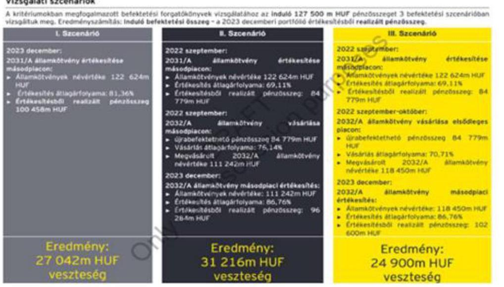

A Magyar Állam nevében eljáró KIM a 25 éves keretmegállapodásnak megfelelően a Neumann János Egyetem részére szerződésben rögzített közfeladat-finanszírozási támogatásokat a 2024. év vonatkozásában, 2024. áprilisában folyósította utoljára, mellyel 2024. évben jelentős likviditási nehézséget okozott. A felelősen gazdálkodó kuratórium döntése értelmében a befolyt kötvényhozam bevétel biztosította a kialakult likviditási válsághelyzet megoldását és így a fejlesztésre fordított előkészítő költségek átmenetileg felfüggesztésre kerültek a 2024. évben.

A Neumann János Egyetemért Alapítvány 2024. január 17. napján kelt 2/2024 számú határozatában rögzítette, hogy az OPTIMA kötvények visszaváltását 1 éven belül kell megvalósítani.

Folyamatos tárgyalások indultak az OPTIMA Zrt-vel és a 100%-os tulajdonosával, a PADME Alapítvány képviselőivel is, melynek során az alábbi lehetőségek mutatkoztak az NJEA részére:

a) Élni kíván a visszavásárlási lehetőséggel és a szerződésben rögzített módon 8 és 90 napon belül kéri a 127,5 milliárd forintot. Jelen esetben az OPTIMA Zrt. a 2017. évi XLIX. törvény alapján

---

feltételezhetően kérte volna a csődeljárás megindítását, mely minden szereplő részére akár azonnali vagyonvesztést eredményezhetett volna.
 Annak ellenére, hogy az OPTIMA Zrt. hivatalosan is elérhető és a tárgyalások során átadott információi is azt mutatják, hogy a vagyon megvan, csak nehezebben és esetleges veszteséggel mobilizálható instrumentumokban.
b) A Neumann János Egyetemért Alapítvány Kuratóriuma mérlegelve a helyzetet, valamint folyamatosan a bankszámla pénzben történő teljesítési szempontot preferálva, egy exit stratégiát dolgozott ki, melynek során jelezte igényét az OPTIMA Zrt. felé, valamint az eltelt időszak kamatkörnyezetének jelentős változásaiból eredő kamatfelár igényére.

Az OPTIMA Zrt. által javasolt instrumentumokból a WEPMARK Kft. üzletrésze a támogatás cél szerinti felhasználásának minősül, illetve a GTC részvények is fontos instrumentumok lehetnek a Smart City fejlesztéshez, melyek szintén cél szerinti felhasználásnak tekinthetők. A beruházás 200-300 milliárd forintos volumene miatt egyértelműen szükséges a Homokbánya fejlesztése kapcsán tapasztalt ingatlanfejlesztő partner megkeresése és tulajdonosi pozícióban a GTC szakmai támogatást nyújthat a SmartCity sikeres fejlesztéséhez.

Továbbá jelezzük, hogy az OPTIMA Zrt. vezetősége 2025. február 25. napján újabb javaslatot tett a kötvények cseréjére, mely jelenleg tárgyalás alatt áll.

Az Állami Számvevőszék fenti iktatószámon kelt jelentéstervezete is rámutat arra, hogy a modellváltás és a hozzá kapcsolódó vagyonátadás és befektetési döntések meghozatalára vonatkozó szabályok tekintetében számos teendő és fejlesztés szükséges még, mely mind a jogalkotót, az ellenőrző hatóságokat és a jogalkalmazókat is érinti. Ezen konkrét javaslatokat a napi munkába beépítjük és a szabályozás ezen kérdéseket érintő kiegészítését elvégezzük.

Bízunk benne, hogy a fenti összefoglalóval is rá tudtunk arra mutatni, hogy a Neumann János Egyetemért Alapítvány döntéshozó szerve és ellenőrző felügyelő szervei is szabályosan és az Alapítvány és az Egyetem érdekeit szem előtt tartva hozták meg döntéseiket, mindig szem előtt tartva a felelős állami vagyonnal való gazdálkodás szabályait.

Bízunk abban, hogy a vizsgálatot segítendő az alábbiakban ismertetett észrevételeinket az Állami Számvevőszék hasznosítani tudja és figyelembe veszi a jelentés véglegesítése során.

---

# 1) Ellenőrzött időszak 

Elöljáróban jelezzük, hogy a tisztelt ÁSZ által meghatározott ellenőrzött időszak miatt a jelentéstervezet nem ad valós képet az Alapítvány, illetve a kötvény kibocsátással érintett vagyon helyzetéről. A jelentéstervezet megállapítja, hogy az ellenőrzött időszak a 2021. január 1-jétől 2023. december 31-ig terjedő időszak, a 2023. évi számviteli beszámoló, valamint a Neumann János Egyetemért Alapítvány által lejegyzett OPTIMA2031 és OPTIMA2031/B kötvények ellenőrzése kapcsán 2024. június 30-ig terjedő időszak. Az ellenőrzött időszakot követően azonban számos olyan tényállási elem (például felek közötti megállapodások módosítása, tárgyalások stb.) nem kerül mérlegelésre a jelentéstervezetben, amelyek érdemben változtathatnák (illetve kellene megváltoztatniuk) a jelentéstervezet tartalmát és következtetéseit. Álláspontunk szerint a jelenleg fennálló helyzet elemzése elengedhetetlen a tárgybeli jelentés véglegesítéséhez, így szükséges az ellenőrzött időszak kiterjesztése és az új tényállási elemek figyelembevétele és értékelése.

## 2) Döntéselőkészítés megalapozottsága

(i) A tisztelt ÁSZ álláspontja szerint az Alapítvány a befektetési döntést megelőzően nem vett igénybe tanácsadót és a döntését egy szakszerűtlen összehasonlító elemzésre alapozta. Az Alapítvány kuratóriumának álláspontja ezzel szemben az, hogy a befektetési döntést a PADME Alapítvánnyal fennálló több mint tíz éves kiváló partnerségi kapcsolat, valamint számos egyeztetés előzte meg. A kuratórium tagjai megismerték az OPTIMA 2031 és 2031B kötvények befektetési stratégiáját, így tisztában voltak a befektetés felhasználásának céljával (hosszútávú, 10 éves befektetés), melyek a kötvényekre vonatkozó információs összeállításban részletesen bemutatásra kerültek.
(ii) Hangsúlyozni szeretnénk, hogy az Alapítvány kuratóriuma egy olyan részvénytársaság kötvényeit jegyezte le, amely a Magyar Nemzeti Bank által létrehozott alapítványnak, a PADME Alapítványnak a kizárólagos tulajdonában álló vagyonkezelő társasága. Az Optima, mint professzionális vagyonkezelő társaság és az általa kibocsátott kötvény közvetlenül, illetve közvetve a Magyar Nemzeti Bank alapítói és bankfelügyeleti ellenőrzése alatt áll. A PADME Alapítvány az Optima szervezetét pont annak céljából hozta létre, hogy a befektetési döntések megalapozott előkészítése, a jogszerű és hatékony működés biztosított legyen.
(iii) Az Optima kötvények jegyzésének körülményeit kizárólag az alapítványi egyetem és a jogelőd főiskola, valamint a Magyar Nemzeti Bank és a PADME Alapítvány évtizedes stratégiai együttműködésének tükrében lehet megítélni. A Magyar Nemzeti Bank és a PADME Alapítvány 2014. február 4-én stratégiai együttműködési megállapodást kötött a jogelőd főiskolával, amely keretében az Optima egyedüli tulajdonosa, a PADME Alapítvány mintegy 48,5 Mrd Ft pénzügyi támogatást nyújtott az alapítványi egyetemnek és jogelőd főiskolájának az elmúlt tíz évben. Ezen támogatások jelentősen hozzájárultak az alapítványi egyetem fejlődéséhez és sikerességéhez. A stratégiai partnerségből az Alapítvány és az Egyetem jelentős vagyoni előnyt is szerzett (pl.: egyetem területének megvásárlása, CAMPUS I főépület kulcsrakész megépítése, CAMPUS II beruházás félkész épületeinek finanszírozása, oktatási és tudományos projektek támogatása stb.). Az Optima továbbá számos olyan előkészítő munkát végzett, amelyek Kecskemét város polgárainak életét is jelentősen befolyásolnák, azon projektek megvalósítása esetén (pl. Okosváros program).

---

(iv) Az Alapítványnak olyan befektetési portfóliót kellett kialakítania, ami:

- biztonságos, azaz alacsony kockázattal jár, a tevékenység hosszútávú fenntartásának záloga a befektetéseken vállalt alacsony kockázat;
- profitabilis, azaz az elérhető piaci kamatok közül a legkedvezőbb hozamú, ami a hosszabb távú működést is elősegítheti a befektetések első számú célja a tevékenység és fejlesztések rendszeres finanszírozásának megteremtése;
- törvényes, azaz megfelel a jogszabályi és a belső szabályzatban megfogalmazott előírásoknak;
- likviditást szem előtt tartó, azaz a befektetéseinek összhangban kell lennie az éven belüli és az esetleges hosszú távú kötelezettségeivel, fenntartva az Alapítvány folyamatos fizetőképességét.

Az OPTIMA kötvény versus államkötvény vásárlás (2021. évi összehasonlítás)

|  Szempontok | Állampapír | OPTIMA-kötvény  |
| --- | --- | --- |
|  Biztonság | Magyar Állam fizetési kockázatát „futja" | Vállalati kötvény, nagyértékű biztosítékokkal  |
|  Profitabilitás | változó hozam | magasabb, fix hozam  |
|  Törvényesség | jogszabály engedélyezi | jogszabály engedélyezi  |
|  Likviditás | rendben, támogatni tudja az NJE és az NJEA programjait | rendben (határidőben fizetett), s így támogatni tudta az NJE és az NJEA projektjeit  |
|  Addicionális előny | nincs | van (ingatlanfejlesztés Optima Csoport által)  |

Egy befektetés esetén az egyik legfontosabb vizsgálandó szempont, hogy az éves kamat miként fizethető, illetve a befektetett vagyon miként kapható vissza a pénzügyi konstrukció végén.

A 2021. június 25-i kuratóriumi előterjesztés tartalmazott egy, az akkori befektetési környezetet összehasonlító adatösszesítést, mely jól mutatta, hogy az akkori értékpapír piacon mely állampapírok, bankbetétek érhetőek el.

Egyértelműen látható volt, hogy az akkori piaci környezetben az alábbi lehetőségek álltak rendelkezésre:

- Elsődleges piacon állampapír vásárlást a Neumann János Egyetemért Alapítvány nem indíthatott, nem volt a piacon olyan államkötvény, melyet meg lehetett volna vásárolni, tehát jogi akadály volt.
- Másodlagos piacon pedig nem állt rendelkezésre ilyen mennyiségű állampapír, illetve itt szükségszerű a befektetési cég vagyoni helyzetének a vizsgálata is.
- A banki kamat környezet 12 hónapos lekötés esetén is 0,8% kamatot biztosított volna, ezzel szemben a 2,5%-os kamatkörnyezet rendkívül kedvező volt

# 3) A kötvénybefektetés szempontjai

(i) A tisztelt ÁSZ a jelentéstervezetében rögzíti, hogy a kötvény vásárlás likvid, azaz könnyen visszaváltható, „pénzzé tehető" befektetésként volt feltüntetve, holott a kötvény kibocsátója pontosan tudta, hogy a kibocsátásból származó forrásból hosszú távú, nem likvid beruházásokat finanszíroz, és erről a befektetésről döntő Kuratóriumnak is tudomása volt.

---

Ezzel szemben a kuratórium úgy tekintett a kötvényjegyzésre, mint egy kettős kritériumot teljesítendő befektetésre: egyfelől tartalmilag ingatlan befektetésre és fejlesztésre fordítandó; másfelől az Egyetem tervezhető beruházásaihoz alkalmas időpontban likviditást kell biztosítania.
(ii) A felek kötöttek eladási jog alapításáról szóló polgári jogi megállapodást a kötvények tekintetében, ezen eladási opció a kötvénykonstrukció véglegesítése során került megalapításra, jogi többletbiztosíték nyújtása céljából. Ennek a háttere az volt, hogy valamely nem várt esemény (például vis maior) esetén többletbiztosítékot nyújtson az Alapítványnak. Az Alapítvány és az Optima terveiben megjelent a 2031-es lejárat, egyúttal az Alapítványnak nem állt szándékában alapos beruházási indok nélkül az opciós jog gyakorlása. Megjegyezzük, hogy a kötvényekből mindezidáig befolyt mintegy 7 Mrd Ft kötvényhozam jelentős pénzügyi segítséget nyújtott az alapítványi egyetem eddigi sikereiben és annak felhasználása is összhangban állt az állami vagyonjuttatás infrastruktúra fejlesztési céljaival.
(iii) OPTIMA 2031 kötvény (27,5 Mrd Ft)

Cél: a CAMPUS II. beruházások finanszírozása.
Eredményesség: A CAMPUS II. beruházás megvalósítása nem saját beruházással, hanem az OPTIMA Zrt. többségi tulajdonában álló Wepmark Holding Kft. (piaci szereplő) által folyamatban van, piaci finanszírozással. Az építés kielégítően halad egy felkészült piaci szereplő fővállalkozásában.
Gazdaságosság: Az NJEA 100% tulajdonában álló KEDO Zrt. folyamatos kontrollja mellett zajlik a beruházás, a megfelelő minőség biztosításával.
Hatékonyság: A piaci forrásból privát szereplő általi építkezés lehetőséget ad (adott) az NJEA által fel nem használt forrás befektetésére, amelyen hasznot realizál (kamat). Ezen kamatbevétel döntő hányada 2022-ben 810 M Ft, 2023-ban 1.490 M Ft az Egyetemet gyarapította fejlesztési tartalékként.

A CAMPUS II. elkészült épületeit az NJE a tervek szerint bérlet vagy ingatlanlízing formában hasznosítaná, illetve lenne lehetősége a maradványértéken történő megvásárlásra (az OPTIMA 2031 kötvények átváltásával felmerül lehetőségként a Wepmark Holding Kft. átvétele). Tekintettel arra, hogy az 5 Mrd Ft-os kötvényjegyzést korábban már kimerítően tárgyaltuk, most csak a 22,5 Mrd Ft-os kötvényről való döntés szempontjait mutatjuk be.
2021. augusztus 9-i Kuratóriumi ülésre készült dokumentáció az alábbi megállapítást tartalmazta:
„A Neumann János Egyetemért Alapítvány Kuratóriuma és Felügyelő Bizottsága 2021. január 29-i ülésén biztosította a szükséges forrást a Kecskeméti Duális Oktatás Zrt. CAMPUS II. ütemének kivitelezéséhez, melyet követően elindult az Európai Uniós Nyílt Közbeszerzési eljárás. A 9. napirendi pontban részletesen tárgyalt okok miatt a beszerzési eljárás érvénytelen lett.
Időközben, a CAMPUS II. megvalósítására felmerült egy olyan javaslat, mely szerint a beruházás az Alapítvány és az Optima Befektetési Zrt. érdekeltségébe tartozó GTC cégcsoport közös együttműködésében történt volna meg.
E koncepció megvalósulása esetén mind az Alapítvány, mind a KEDO Zrt. mentesült volna az ingatlanfejlesztéssel járó feladatok elvégzése alól, ugyanakkor nem lett volna szükség arra, hogy az Alapítvány biztosítsa a finanszírozást a beruházás megvalósításához. Ez azt vonta maga után, hogy az Alapítvány részére juttatott forrás egyrészt már nem minősült beruházásra elkülönített pénzeszköznek, másrészt a felszabaduló pénzeszközt hasznosítani, befektetni

---

kellett annak érdekében, hogy a vagyonelem megőrzésre kerüljön, hozamot termeljen és ezáltal tartósan szolgálja az Alapítvány céljait.

Fentiek okán megvizsgálásra került, hogy a rendelkezésre álló mintegy 22,5 milliárd forint összegű szabad forrás különböző befektetési konstrukciókban történő elhelyezése milyen éves hozamlehetőséget jelent az Alapítvány számára. A vizsgálat során a piacon elérhető látra szóló és lekötött betéti kamatlábak, valamint a nemrégiben jegyzett, az Optima Befektetési Zrt. által kibocsátott OPTIMA 2031 elnevezésű, 10 éves futamidejű, fix 2,5% éves kamatozással bíró kötvénysorozat került összehasonlításra. A befektetéshez kapcsolódóan készült a PWC által készített jelentés is, mely korábbi kuratóriumon tárgyalásra és elfogadásra került.

A
 vizsgálat során az alábbi eredmények születtek:

|  Befektetés típusa | Éves kamatszint (\%) | Éves kamat  |
| --- | --- | --- |
|  Látra szóló/lekötött betét | $0,52 \%$ | 117 millió Ft  |
|  Optima2031 kötvény | $2,50 \%$ | 562,5 millió Ft kamatbevétel  |

Az összehasonlítás alapján megállapítható, hogy amennyiben az Alapítvány a felszabadult pénzösszeget akár lekötés nélkül, látra szóló betétként tartja nyilván, akár leköti, az alacsonyabb hozamot termel, ellenben az Optima 2031 kötvénnyel évi 562,5 millió forint kamatot lehet elérni, 22,5 milliárd forintos befektetés esetén. Az Optima 2021. július 28-án befektetői felhívást küldött az Alapítványnak további Optima 2031-es kötvény kibocsátásban történő jegyzés lehetőségére, a korábbi Optima 2031 kötvény feltételek változatlansága mellett, azaz a változatlan futamidő és kamatozás mellett a befektetőnek továbbra is eladási joga lesz a kötvényekre a kibocsátást követő egy évet követően, továbbá a kibocsátó csoporttagjai ugyanazokat a kötelezettségvállalásokat teszik meg a Befektető javára. Fentiek alapján javasolt volt, hogy a rendelkezésre álló mintegy 22,5 milliárd forint szabad pénzösszeget az Alapítvány az Optima Befektetési Zrt. által korábban kibocsátott OPTIMA 2031 kötvénybe történő újbóli befektetés útján hasznosítsa. „

A tárgyalás után 2021. augusztus 13-án elektronikus döntéshozatal során kerül eldöntésre a 22,5 milliárd forint befektetése. 56/2021. (VIII.13.) számú Kuratóriumi határozat: „A Neumann János Egyetemért Alapítvány Kuratóriuma úgy dönt, hogy az 55/2021.(VIII.09.) számú határozatával összhangban szabad pénzeszköz állományát 6 hónapra be kívánja fektetni. A Kuratórium jóváhagyja a jelen előterjesztésben leírt OPTIMA 2031 kötvény további kibocsátásában történő részvételt, a jelenleg hatályos OPTIMA 2031 kötvény feltételek mellett."

A kötvényjegyzés célja kettős volt. Egyrészről a Neumann János Egyetem stratégiai céljai között feltüntetett CAMPUS II. beruházás során külső, piaci befektető bevonása. Azon előnyöket is biztosította, hogy a KEDO Zrt., mely a Neumann János Egyetemért Alapítvány 100%-os tulajdona a CAMPUS fejlesztéshez kapcsolódó kiviteli tervekkel, földhasználattal társtulajdonossá válik, azonban a beruházáshoz nem szükséges a finanszírozása. A beruházás során azonnal látható volt (ahogy ez a közbeszerzési értesítőben elérhető beruházások jelentős részénél jellemző), hogy a kivitelező jelentős előleget, akár a teljes beruházási költség 50%-át kérheti előlegként. Ezen összeg akár 10-15 milliárd forint is lehetne, mely addig nem kamatozik az Alapítvány részére.

---

Ezzel szemben mivel a CAMPUS beruházást külső forrásból finanszírozták, az OPTIMA 2031 kötvény kibocsátása révén az Alapítvány jelentős mértékű hozamot realizált.
A fent leírtakhoz nem volt szükséges külső tanulmány megrendelése, mert igen jól számszerűsíthető a végeredmény, már fél éves viszonylatban is.
Továbbá a CAMPUS II beruházás az egyetem céljait szolgálja, s így, mint már korábban jeleztük, cél szerinti forrásfelhasználásnak és beruházásnak minősül.

A KEDO Zrt. tulajdonszerzéséhez és apport feladatainak az ellátásához kapcsolódó döntések később megszülettek, melyek elősegítették, hogy 2022. szeptemberében megindult a CAMPUS II. beruházás.

Mindkét kötvényjegyzés jog- és szabályszerű volt. A Felügyelőbizottság 2021. augusztus 04-én ülésezett, melyre vonatkozóan a 2021. augusztus 09-i kuratóriumi ülés jegyzőkönyvében szerepel a felügyelőbizottsági határozat (52/2021 (VIII.04.) FB határozat) a második kötvényjegyzéssel kapcsolatban, ezt követően az FB ülés után 6 nappal került kiküldésre elektronikus jóváhagyásra a 22,5 milliárd forint összértékű OPTIMA 2031 kötvénycsomag lejegyzési előterjesztése, amely 2021. augusztus 13-án került elfogadásra.
(iv) OPTIMA 2031/B kötvény (100,0 Mrd Ft)

Cél: a Neumann Technológiai Központ és az „Okos város" projektek megvalósítása (beruházása)
Az NJEA 2023-ban elindította a két projekt tervezési munkálatait, de azt 2024-ben fel kellett függesztenie, mert az Egyetem állami finanszírozásának - szerződéssel ellentétes elmaradása az erre rendelkezésre álló forrásoknak az NJE felé történő átcsoportosítását követelte meg. Csak ily módon lehetett elkerülni az egyetemi működés ellehetetlenülését.

Eredményesség, gazdaságosság és hatékonyság: A két nagy projekt - vélhetően a CAMPUS II. beruházáshoz hasonlóan -, piaci forrásból valósul meg vagy vegyes finanszírozással. Ennek oka, hogy az ún. Okos város beruházás teljes bekerülése vélhetően többszöröse az NJEA teljes erre fordítható költségvetésének (2-300 Mrd Ft). Éppen ezért jól kell meghatározni azon részeket, amelyeket később az NJEA fog finanszírozni. A piaci szereplők bekapcsolódása, illetve döntési túlsúlya egyfajta garanciája a költségkeretek tartásának, a hatékony és takarékos forrásfelhasználásnak.
A tervezés lezárultáig a forrás felhasználására nem kerül sor. Így kamatozó eszközbe (volt) elhelyezhető, mely hozamok jelentős része 2022-ben és 2023 évben is az Egyetem fejlesztési tartalékába kerül, egy későbbi felhasználás számára.

2021. október 6-i Kuratóriumi ülésen a 6. napirendi pontot a Neumann János Egyetem Jövőkép és Stratégia dokumentáció képezte, melyben meghatározásra került az egyetem és városfejlesztés két stratégiai pillére. A Neumann Technológiai Park és a SmartCity fejlesztés a Homokbánya területen.

A fejlesztések igen nagy léptékű és hosszú előkészítő munkákat igényelnek, így a 10 éves futamidő választása is megalapozottnak tekinthető.
„Az Alapítvány közfeladatát a közfeladatot ellátó közérdekű vagyonkezelő alapítványokról szóló 2021. évi IX. törvény (a továbbiakban: KEKVA tv.) 19. § (1) bekezdése alapján végzi. Az Alapítvány számára az Innovációs és Technológiai Minisztérium külön megállapodással teljesít pénzbeli vagyoni juttatást - ideértve az annak felhasználása körében harmadik személy javára

---

teljesített kifizetést, illetve juttatást is - ami nem minősül külön törvény szerinti támogatásnak. Az Innovációs és Technológiai Minisztérium és a Neumann János Egyetemért Alapítvány között létrejött megállapodás keretében nyújtott vagyoni juttatás a KEKVA tv. 4. § (6) bekezdése szerinti vagyonnövelésnek minősült.
A pénzbeli vagyoni juttatás összege és forrása:
A pénzbeli vagyoni juttatás összege: 100.000.000.000.-Ft, azaz százmilliárd forint.
A pénzbeli vagyoni juttatás forrása: a Magyarország 2021. évi központi költségvetéséről szóló 2020. évi XC. törvény 1. melléklet XVII. Innovációs és Technológiai Minisztérium fejezet, 20 Fejezeti kezelésű előirányzatok cím, 67 Felsőoktatási feladatok alcím, 2. Felsőoktatás speciális feladatai fejezeti kezelésű előirányzat, 1. sz. Felsőoktatás speciális feladatai megnevezésű feladata.
Az Innovációs és Technológiai Minisztérium a Neumann János Egyetem fejlesztése és a Neumann János Egyetemért Alapítvány Alapító Okiratában rögzített Alapítványi célok megvalósítása érdekében biztosítja a forrásokat. A fejlesztésekhez kapcsolódóan jelenleg a projekt alkotási, vízió meghatározási fázisban tart az Egyetem, így a forrás felhasználására egyelőre azonnal, vagy rövid és középtávon nincs szükség, így érdemes az összeg befektetéséről gondoskodni. A befektetésen keresztüli várható hozam az Alapítvány napi működését segíti, lehetőséget fog biztosítani az oktatás fejlesztések, ösztöndíjrendszerek, képzés indítások, digitalizáció és egyéb az egyetem számára stratégiai fejlesztések finanszírozására.

A korábban már megkezdett együttműködés folytatása érdekében az előterjesztők előzetesen egyeztetettek az Optima Befektetési Zrt.-vel, amely társaság az alábbi kondíciók mellett nyitott volt egy új kötvénysorozat kibocsátására:

- 10 év futamidő
- $2,5 \%$ éves kamatláb
- a befektetőnek a kibocsátást követő egy év múlva eladási joga nyílik, az Eladási Jog megnyílásának napjától bármikor, azaz ezen naptól időbeli korlátozás nélkül gyakorolhatja, a Kötelezett részére kézbesített Eladási Nyilatkozattal.
- a kibocsátó tulajdonosa az Optima 2031 kötvénnyel azonos kötelezettségvállalást tesz meg a befektető javára, azaz a tulajdonos PADME Alapítvány minden szükséges és elvárható lépést megtesz annak érdekében, hogy az Optima Befektetési Zrt. a kötvényhez kapcsolódó fizetési kötelezettségeit határidőben teljesítse.

Figyelembe véve a kapott ajánlatot, a kötvénybefektetéssel 100 milliárd forint befektetett összeg után az Alapítvány évi 2,5 milliárd forint kamatot tud realizálni éves szinten. Ez havi szinten 208 millió forint, heti szinten 48 millió forint, napi szinten 6,84 millió forint hozamot jelent. Ekkora összeg esetében a jelenlegi, az MKB-től kapott lekötési információk alapján 1,53%-os kamat bevételt tudnak rövid távon (pár hét), hosszabb távon csak 1,2%-ot kamat bevételt tudnak garantálni, ami napi szinten max. 3,28 millió forint. Ez ugyanakkor azt is jelenti, hogy minden olyan nappal, amely a kötvénybe történő befektetés helyett bankszámlán lekötve tartja szabad likviditását, 3,56 millió forint kamatbevételtől esik el az Alapítvány.

Összegezve a fentieket, megállapítható, hogy az Alapító által átadott vagyonjuttatás
(1) a napi működés finanszírozásához nem szükséges, mivel arra a források rendelkezésre állnak,
(2) a fejlesztési elképzelések még vízió és tervezési fázisban vannak, ami csekély befektetést kíván az Alapítvány részéről,

---

(3) amennyiben nem kerül befektetésre ekkora összeg, akkor tetemes kamatbevételtől esik el az Alapítvány."

A célszerűség, eredményesség, hatékonyság, gazdaságosság érvényesítésének legfőbb garanciája a döntéshozók kiemelkedő vezetői és gazdasági felkészültsége, illetve tapasztalata az alábbiak szerint:

|   |  | 2020 |  | 2021 |  | 2022 |   |
| --- | --- | --- | --- | --- | --- | --- | --- |
|   |  | mérlegfőösszeg e N | Miszám | mérlegfőösszeg e N | Miszám | mérlegfőösszeg e N | Miszám  |
|  31. Nagy Értlán - kuratóriumi tag | eKelti vezérigazgató, aki korábban 1998 óta a Pitezste Mécsény Kecskemét Kft. igazgatta. | 19.405.289 | 724 | 19.076.936 | 471 | 20.687.160 | 491  |
|  Szaló József, kuratóriumi tag | Kecskemét gazdasági fejlesztésért, fizetésfizetésért, szaltalapásért és nempatályért, kapcsolatukért felelős alpolgármestere, a Magyar Kereskedelmi és Iparkamara Szövetség Műszaki Innovációért és Innovációért felelős alelnöke, a Bács-Kiskun Megyei Kereskedelmi és Iparkamara elnöke, a kecskeméti székházú Szimbron Kft tulajdonosa. |  |  |  |  |  |   |
|  2019. 8076 - Felügyelőbizottság elnöke | Állami Bóoma Kétvenekzené Kft. igazgató igazgatója | 59.240.129 | 1704 | 64.229.681 | 1765 | 72.541.581 | 1800  |
|  Szaló József - Felügyelőbizottság tagja | 2020-ig a Felszélt Kft. igazgató igazgatója | 12.492.087 | 724 | 16.540.760 | 662 | 15.288.123 | 660  |

Az Alapítvány Felügyelőbizottságának továbbá tagja Kecskemét Megyei Jogú Város polgármestere is, Szemereyné Pataki Klaudia, az általa irányított Kecskemét város éves mérlegfőösszege mintegy 250 milliárd forint.

A törvényi szabályozás a kuratóriumi és felügyelőbizottsági tagok kompetenciájára vonatkozóan nem tartalmaz előírást, sem a korábbi VA tv., sem a hatályos KEKVA tv. 6 § (3) bek.): „Az alapító okirat a kuratórium és a felügyelőbizottság elnökére, valamint tagjaira vonatkozóan képesítési, végzettségi és egyéb szakmai követelményeket állapíthat meg."

Szeretnénk megjegyezni, hogy az Alapítvány már 2020. IV. negyedévtől kötelező, negyedéves MNB adatszolgáltatási körbe bevont szereplő volt, melyet a kormányzati szektorba sorolást követően, 2021 évtől a Pénzügyminisztérium, valamint a Nemzetgazdasági Minisztérium felé történő negyedéves adatszolgáltatás egészített ki mind az Alapítvány, mind az Egyetem vonatkozásában, az adott évi előzetes tény, a következő évi aktualizált terv- és négyéves kitekintő tervadatok megküldésével. Ennek megfelelően az Alapítvány és az Egyetem is folyamatosan monitorozta és jelentette az Államháztartás rendszereit irányító és felügyelő szervezeteknek a vagyoni helyzetét és a várható tervszámait.

# 4) A befektetés koncentrálása és diverzifikálása

(i) Az ÁSZ jelentéstervezetében megfogalmazta, hogy az Alapítvány a kötvénycsomagok jegyzésével a befektetéseit jelentős mértékben koncentrálta, és a kötvényjegyzést követően az Alapítvány nem gondoskodott a kötvényt kibocsátó OPTIMA pénzügyi,
 vagyoni, jövedelmi helyzetének folyamatos nyomon követéséről. Ezen túl az ÁSZ megjegyezte, hogy az Alapítvány nem értékelte a globális trendeket, nem vette figyelembe a kötvényhez kapcsolódóan a legjelentősebb vagyontömeget képviselő GTC részvények részvényárfolyamának tartós és trendszerű esését, hitelminősítésének romlását. Ezzel szemben a valóság az, hogy az Alapítvány és a PADME Alapítvány, illetve az Optima között jól működő együttműködés valósult meg a kötvényjegyzést megelőzően és azt követően is. Az Optima képviselői rendszeresen tájékoztatták az Alapítványt a befektetései helyzetéről a kötvényjegyzést követően. Továbbá arra tekintettel, hogy az Optima legjelentősebb befektetése a lengyel tőzsdén jegyzett GTC volt, így a befektetéssel érintett társaság gazdálkodásával és működésével kapcsolatos információk

---

elérhetőek a széles nyilvánosság számára is. A GTC mint tőzsdén jegyzett társaság a gazdálkodásának adatait negyedévente közzéteszi, valamint rendszeres közzétételi kötelezettségeknek kell, hogy megfeleljen, ezért működése és gazdálkodása a nyilvánosság számára teljes mértékben transzparens.
(ii) Az ÁSZ a jelentéstervezetében rögzíti, hogy a kuratórium befektetése túlzott koncentrációjával veszélyeztette a vagyona megőrzését, és a befektetéseit diverzifikálni kellett volna. Ezzel szemben a valóság az, hogy a kuratóriumi tagok számára is ismert volt, hogy a kötvénybefektetés ingatlanpiaci fejlesztésre kerül bevonásra, többek között a GTC-ben való további részesedésként. A GTC a közép-kelet-európai régió vezető ingatlanbefektető és fejlesztő társasága és a piac egyik meghatározó szereplője, amely rendkívül diverzifikált portfólióval rendelkezik. A GTC bruttó eszközértéke meghaladja a 2,7 milliárd eurót és rendkívül széleskörű ingatlanportfólióval (lakó, iroda, üzletközpont) rendelkezik Lengyelországban, Magyarországon, Szerbiában, Romániában, Horvátországban és Bulgáriában. A GTC portfóliója mind földrajzi, mind pedig ingatlanállománya szempontjából is kellően diverzifikált, ezáltal a jövedelemtermelő képességet hosszútávon tudja biztosítani. A befektetés kiszámíthatóságát és stabilitását is mutatja, hogy több mint 30 éves működése során a GTC a régióban 82 modern irodaházat és kereskedelmi ingatlant fejlesztett, amelyek összterülete meghaladja az 1,4 millió négyzetmétert. A vállalat jelenleg 46 jövedelemtermelő kereskedelmi ingatlan mellett 4 fejlesztési ingatlant is tulajdonol és üzemeltet, amely mindösszesen meghaladja a 755.000 négyzetméter összterületet 87%-os kihasználtsággal.
(iii) A tisztelt ÁSZ jelentéstervezetében a GTC valós piaci értékét leegyszerűsítve kizárólag a tőzsdei közkézhányad részvényárfolyamának alakulásához köti. Ezen megközelítés azonban téves és szakmailag nem megalapozott, mivel a hasonló tőzsdén jegyzett ingatlancégek valós értékét nem a tőzsdei árfolyam, hanem a társaság nettó eszközértéke, ún. EPRA NAV értéke mutatja. Az EPRA NAV mutatót az Európai Tőzsdén Jegyzett Ingatlan Társaságok Szövetsége kifejezetten az ingatlanbefektetési vállalatok valós nettó eszközértékének meghatározására dolgozta ki. Szemléltetésképp megjegyezzük, hogy a GTC 2024 harmadik negyedévében megállapított EPRA NAV értéke 1,248 Mrd euró volt, amely 400 Ft/EUR árfolyamon 499,2 Mrd Ft. Az Optima csoport ennek 62,61%-os tulajdonosa, amely 312,5 Mrd Ft értéket képvisel. Mindez azt mutatja, hogy a GTC közkézhányadának tőzsdei részvényárfolyama - a piaci hatásokra tekintettel - bár csökkent, azonban valós értékét az elmúlt években jelentősen növelte. Minderre tekintettel biztonsággal állítható, hogy a kötvények visszafizetésére kellő fedezet áll az Optima rendelkezésére.
(iv) Az ÁSZ a jelentéstervezetében felhívja a figyelmet a GTC hitelminősítésének romlására, azonban az ezzel kapcsolatos egyéb körülményeket félrevezető módon nem részletezi. A valóság az, hogy az Optima tulajdonszerzését követően az új menedzsment stratégiai döntése alapján a GTC 2021 első félévében szerezte meg a Fitch Ratings értékelését. A Fitch Ratings olyannyira pozitív értékelést állapított meg 2021-ben, hogy a GTC a vállalati hiteleit 2,25%-os zöldkötvény kibocsátása útján refinanszírozni tudta, amely jól tükrözte a piac pozitív értékítéletét is. A nemzetközi minősítők 2022-től az ingatlanfejlesztő cégek jelentős részét leminősítették, azonban a GTC minősítését a Fitch Ratings - a közép-kelet-európai ingatlanpiaci szereplők közül az egyik utolsóként - 2023. szeptemberében változtatta csak meg. Ez azonban nem egyedi döntés volt, hanem követte a teljes ingatlanpiac leértékelését.

---

# 5) A kötvények kamatozása

(i) A tisztelt ÁSZ jelentéstervezetében többször hangsúlyozza, hogy az Optima által kibocsátott kötvények kamatozása kirívóan alacsony. Ezzel szemben a valóság az, hogy a kötvények jegyzésének időpontjában az egyéb vállalati kötvényeket és befektetési konstrukciókat vizsgálva megállapítható, hogy az Optima kötvények kamatozása kedvezőnek számított.

A gazdasági kilátások 2021 év második negyedévében kedvezőnek tűntek, növekvő termelékenységgel, csökkenő államháztartási deficittel, melyek stabil gazdasági környezetet vetítettek előre: https://www.mnb.hu/tetoltes/ir.infografika-2021-03.pdf https://kormany.hu/hirek/konvergencia-program-megkezdodhet-a-magyar-gazdasag. uirainditasa https://kormany.hu/hirek/imf-gyors-es-hatekony-valaszokat-adott-a-kormany-a-jarvany-altal-kivattott-gazdasagi-valsagra

2021-ik év nyarán és őszén, amikor a Neumann János Egyetemért Alapítvány a stratégiai befektetési döntéseit hozta az állampapír piaci kamatok az alábbi táblázatban szereplő tartományban voltak.

|  Időszak | Diszkont kincstárjegyek, Államkötvények kamata | 3-6-12 hónapos banki lekötések | OPTIMA 2031 kötvény kamatai  |
| --- | --- | --- | --- |
|  2021. július és augusztus | 0,02-0,74% | 0,55-0,80% | 2,5%  |
|  2021. október | 1,07-1,70% | 0,20-0,40% | 2,5%  |

Fontos tény, hogy a Neumann János Egyetemért Alapítvány állampapírt csak a másodlagos piacon tudott volna venni ezen időszakban, azonban ezen a piacon ekkora volumenben állampapír nem is állt rendelkezésre, téves továbbá azon megállapítás, hogy az államkötvények tőkegarantáltak. Igen azok, ha a teljes futamidő végéig megtartjuk azokat és csak a futam végén az állam teljes értékben visszavásárolja és visszafizeti a befektetett tőke teljes összegét. Azonban tíz éves időtartam alatt, egy a futamidő előtti eladás esetén jelentős veszteséget lehet realizálni ezen állampapírok esetében. (ii) A Magyar Nemzeti Bank által indított és támogatott Növekedési Hitelprogram (NHP) során 2021-ben mindösszesen 2700 Mrd Ft került kihelyezésre, 2,5%-os kamatplafonnal és maximum 20 éves lejárattal. Minderre tekintettel megállapítható, hogy a 2021-es kötvényjegyzés időszakában a kötvény feltételei (éves 2,5%-os kamat) mind a kibocsátónak mind pedig a kötvényjegyzőnek szokásos, az általános piaci feltételekkel összhangban állónak számítottak. Az érintett időszakban még az MNB által támogatott növekedési hitelek is jellemzően alacsonyabb kamatot biztosítottak.

---

6) Magasabb hozamot biztosító befektetési alternatíva
(i) Tekintettel a felek közötti régóta fennálló partnerségi kapcsolatra, az Alapítvány megalapozottan bízhat a teljes befektetett összeg és hozamainak közösen megállapított ütemezés szerinti visszafizetésében. Minderre tekintettel a befektetéssel kapcsolatosan az Alapítványnak kára semmilyen tekintetben nem keletkezik és korábban sem keletkezett.
(ii) Az Optima 2025. február 25-én kelt utolsó ajánlatában 7,65 Mrd Ft összegű kamatprémium megfizetését ajánlotta fel az Alapítvány részére 2025. május 15. napjáig, valamint további 12 Mrd Ft készpénz (és 4,5%-os kamatainak) megfizetését 2026. május 15. napjáig. Az ajánlat részeként az Optima felajánlotta továbbá a GTC mintegy 80 Mrd forint értékű 20%-os részesedésének átruházását, amely a végleges megállapodás aláírását követően haladéktalanul megvalósulna. Az átruházás oly módon valósulna meg, hogy az Optima eladási joggal biztosítaná, hogy az Alapítvány a befektetésből meghatározott időt követően (18 hónap) exitálni tudjon, és a részesedést készpénzre vagy jövedelemtermelő ingatlanokra válthassa saját döntése alapján. Megjegyezzük, hogy a 20%-os részesedés menedzsment jogokat is biztosítana az Alapítvány részére (5%-onként egy felügyelőbizottsági tag kijelölését a lengyel tőzsdei GTC-ben). Az ajánlati csomag részeként az Optima továbbá vállalná az alapítványi egyetem kecskeméti CAMPUS II projektjének teljeskörű befejezését és kulcsrakész átadását, valamint a kapcsolódó tulajdonjog átruházását mintegy 35 Mrd Ft értékben.
(iii) Fontos hangsúlyozni, hogy az Alapítvány befektetése teljes mértékben megfelel az alapítványi céloknak, azok elősegítését szolgálja. A kötvénybefektetés eddig is az Alapítvány közfeladatainak ellátását támogatta, így a kötvények esetleges készpénzre történő visszaváltását is ennek fényében kell megítélni. Az Alapítvány és a PADME Alapítvány kapcsolata túlmutat a pusztán pénzügyi befektetői kapcsolaton. A felek között egy hosszú időre visszanyúló stratégiai partnerségi kapcsolat áll fenn mind a mai napig, amely mindkét fél számára előnyös és a céljainak megvalósítását szolgálja. Amennyiben az Alapítvány a forrásait piaci pénzügyi befektetési eszközbe helyezte volna, akkor számos olyan együttműködés és projekt nem valósult volna meg, amely a felek alapítványi céljait támogatja. A kötvénykamatok mértékét is ennek figyelembevételével szükséges megítélni.
(iv) Az Állami Számvevőszék által megfogalmazott alternatív befektetési lehetőséggel, azaz állampapír vásárlással vélhetően elérhető magasabb hozam kapcsán az alábbi álláspontot kívánjuk rögzíteni.

- A vizsgált időszakban 3 olyan lehetséges állampapír volt forgalomban, aminek ±12 hónapos lejárata volt az Optima kötvény lejáratához képest. Ezek a papírok a következők voltak: 2031/A, 2030/A, 2032/G.
- Az Alapítvány befektetési szabályzata kimondja, hogy csak a másodpiacon lehet állampapírt vásárolni. Ezeknek a papíroknak a másodpiaci forgalma napi szinten olyan mértékű, hogy kb. az 5 milliárdos csomagot lehetett volna megvenni egy nap alatt. A 22 és a 100 milliárdos csomag másodpiaci megvétele még akkor is hetekbe-hónapokba tellett volna, ha a teljes másodpiaci forgalmat az Alapítvány bonyolítja le. Ez egyrészt nem reális, másrészt, ha ez történt volna, akkor gyakorlatilag az állampapírok piacának teljes működését felbolygatta volna, ami igen negatívan hatott volna a hozamra.
- Alternatív megoldásként egy kereskedelmi bankkal történő megállapodás jöhetett volna még szóba, aki aukciós keretek között vehette volna meg a papírokat és másodpiacon

---

adhatta volna el az Alapítványnak. Ez egyrészt már az állampapír működésébe történő beavatkozás lett volna, másrészt, ha biztosra szeretett volna az Alapítvány menni, hogy a kereskedelmi bank egy kibocsátásnál el tud hozni 100 milliárd HUF állampapírt, akkor nagyon alacsony hozamelvárással kellett volna ajánlatot adni.

- A fentiek azt jelentették volna, hogy az ÁSZ által kiszámolt extra hozamok jelentősen kisebbek lettek volna.
- Továbbá hangsúlyozni kívánjuk, hogy az Alapítvány befektetési szabályzata konzervatív befektetési politikát ír elő. Ebbe a kategóriába nem valószínű, hogy beletartozik az, hogy a rendelkezésre álló forrást adott esetben több hónap alatt lehessen csak befektetni, előre nem látható, vagy csak nagy bizonytalansággal előre jelezhető kondíciók mellett. Főleg olyan időszakokban, amikor az állampapírok hozama jelentős kilengéseket mutatott, valamint egy nagyon meredek alapkamat emelési ciklusban volt az ország és nem nagyon tudta senki megmondani, hogy a kamatemelésnek mikor és hol lesz vége.
- Szintén fontos megemlíteni, hogy különösen a 100 milliárdos csomag esetében az Alapítványnak 90 napra előre kellett volna kitalálnia, hogy vajon jó irányba megy-e majd az állampapírpiac, mert az opció lehívása és a tényleges kifizetés között ennyi idő telik el a szerződés szerint.
- Az opciós időszakban (2022 február - október) az országkockázati felár (CDS) 75 bázispontról 276 bázispontra emelkedett, ami egyértelmű jele annak, hogy a piac egyre magasabbnak ítélte az állampapírok nemfizetési kockázatát. Ez a felár pont akkor volt kb. 8-10 éves csúcson, amikor a 100 milliárd forint sorsáról kellett volna dönteni. (lehívja-e az Alapítvány az opciót vagy sem).
- Szintén fontos érv, hogy az opciós szerződés azt garantálta, hogy a kötvényt az aktuális árfolyamától függetlenül, mindig névértéken lehet visszaváltani, azaz tőkegaranciával rendelkezik, az aktuális árfolyamtól függetlenül. Az állampapírok esetében a tőkegarancia csak lejáratkor igaz, mert ha futamidő alatt adják el, akkor az
 aktuális piaci árfolyamot kaphatja a szereplő, ami vagyonvesztést eredményezhet.
- A T. ÁSZ elméleti megközelítéséhez kapcsolódóan három megállapítást szeretnénk részletesen cáfolni.
i. „Amennyiben az Alapítvány, az opció lehívásával felszabaduló 127,5 milliárd Ft-ot az elszámolási napot követő 30 napon belül egy éves állampapírba fektette volna, akkor az első két évben minimum 19,3 milliárd Ft hozamot érhetett volna el kockázatmentesen."
Ez egy erős elméleti megközelítés. 2023. januárjában egy olyan papír volt forgalomban, ami kb. 1 éves lejáratú volt, ez a D231227-es diszkont kincstárjegy. Ha ebből a papírból szeretett volna az Alapítvány 127,5 milliárd forint értékben vásárolni a másodpiacon, akkor az még akkor is eltartott volna február 8-ig, ha addig minden nap a teljes másodpiaci forgalmat az Alapítvány bonyolította volna (ez nem annyira reális feltételezés).
„Amennyiben 2023 márciusában, 14,64%-os referenciahozam mellett fektette volna be a teljes, 127,5 milliárd Ft-nyi vagyonát egy évre az Alapítvány, a befektetés hozama az első teljes évben éves szinten akár a 15,4 milliárd Ft-ot is elérhette volna."
i. Ez a referencia hozam nem értelmezhető, hiszen 2023 márciusában négy Diszkont Kincstárjegy volt forgalomban, aminek ez volt az átlag hozama. Ezek viszont 2023. áprilisban, júniusban és szeptemberben jártak le, azaz sehogyan sem tudott volna az alapítvány egy évnyi hozamot realizálni ezeken a papírokon.

---

Ha az összes olyan állampapírt/DKJ-t, aminek 2023. március 1. napján a hozama 14,00 vagy ennél magasabb volt, akkor tudta volna az Alapítvány egy nap alatt befektetni a teljes 127,5 milliárdot, ha akkor minden szóba jöhető papír teljes másodpiaci forgalmát az Alapítvány adta volna. Ha a későbbi napokat nézzük márciusban, akkor már 6-7 nap teljes másodpiaci forgalma kellett volna a 127,5 milliárd befektetéséhez.
„Kiemelendő az a tény, hogy 2025. január-február hónapokban az egy éves hozamok közel 6%-os szinten alakultak, amelynek következtében napi, nagyságrendileg 10,0 millió Ft kockázatmentes hozamtól esik el a fenti 19,3 milliárd Ft hozamon felül az Alapítvány."
i. Szintén erősen elméleti megközelítés tekintve, hogy az összes olyan papírnak, aminek a hozama 5,5 - 6,5% között mozgott, a napi másodpiaci forgalma január elején átlagosan kb. 200 milliárd volt, ami megint azt jelenti, hogy le kellett volna „uralni" a másodpiacot, hogy ennyi pénzt befektessen az Alapítvány. Márpedig a napi 10 millió forint hozam azt feltételezi, hogy a nulladik percben a teljes összeg befektetésre került volna.

# 7) Következtetés 

A fent előadottak alapján megállapítható, hogy az Alapítvány általi kötvényjegyzést a felek hosszú távú partneri együttműködése előzte meg. Az Alapítvány kuratóriuma a kötvényjegyzésről szóló döntést megelőzően egyeztetett az Optima képviselőivel és megfelelő információ ismeretében hozták meg döntésüket. A kötvénybefektetésből származó forrás jelentős része lengyel tőzsdei részvényekbe került befektetésre, és a GTC rendkívül diverzifikált mind ingatlanportfóliója, mind pedig azok földrajzi elhelyezkedése tekintetében.

Jelen esetben a kötvénybefektetés két olyan fél között jött létre, ahol az együttműködés túlmutat a pusztán kamatmértékek meghatározásánál, hiszen az Alapítvány szakmai, infrastrukturális fejlődésének egyik meghatározó szereplője volt az Optima Csoport, így a két szervezet közötti együttműködés gazdasági feltételrendszerének ilyen módon történő értelmezése jelentősen leegyszerűsített.

A tisztelt ÁSZ határozott iránymutatását is figyelembe véve 2024-től az Alapítvány és az Optima képviselői rendszeres egyeztetéseket folytattak a kötvények visszaváltásának lehetőségeiről és 2025. februárjában az Optima jelentősen módosított ajánlatot adott az Alapítványnak, amely alapján meghatározott ütemezéssel biztosítaná a kötvények teljes összegének visszaváltását (menedzsment jogokat biztosító részvénycsomag biztosításával, eladási opciós biztosításával stb.)
Az Alapítvány igyekszik a lehető legteljesebb körben levonni a tisztelt ÁSZ vizsgálati jelentésének foglalt megállapítások tanulságait. Az Alapítvány álláspontja teljes mértékben eltér az ÁSZ által tett megállapításoktól és azokat vitatja, azonban megtette a szükséges intézkedéseket a jelentés tárgyát képező eset átfogó vizsgálata érdekében.

A fentiek alapján megállapítható, hogy mind az Alapítvány, mind pedig az Optima minden erőfeszítést megtesz annak érdekében, hogy az ÁSZ javaslatai és az Alapítvány működését érintő iránymutatásai a lehető legteljesebb mértékben - a gazdasági észszerűség határai között - megvalósulásra kerüljenek. Minderre tekintettel kérjük a fenti kérelmeinkben foglaltak teljesítését.

---

# III. RÉSZLETES ÉSZREVÉTELEK 

Részletes észrevételeinket a tisztelt ÁSZ jelentéstervezetének egyes fejezeteiben foglalt megállapítások tekintetében az alábbiakban terjesztjük elő:

## III. 1 Észrevételek az ellenőrzött időszak vonatkozásában

A tisztelt ÁSZ az ellenőrzött időszakot az alábbiakban határozta meg jelentésének tervezetében:
„A 2021. január 1-jétől 2023. december 31-éig terjedő időszak, a 2023. évi számviteli beszámoló, valamint a Neumann János Egyetemért Alapítvány által lejegyzett OPTIMA2031 és OPTIMA2031/B kötvények ellenőrzése kapcsán 2024. június 30-áig terjedő időszak."

Felhívjuk a figyelmet arra, hogy az ellenőrzött időszakot követően a jelen beadványunk napjáig számos olyan esemény történt, amely a jelentéstervezetben megállapítottak összességére jelentős kihatással van. A tisztelt ÁSZ határozott iránymutatását is figyelembe véve 2024. januárjától kezdődően az Alapítvány tárgyalásokat folytat az Optimával a kötvények visszaváltása tekintetében.

Az ellenőrzött időszakot követően számos olyan tényállási elem (például felek közötti megállapodások módosítása, tárgyalások stb) nem kerül mérlegelésre a jelentéstervezetben, amelyek érdemben változtathatnák (illetve kellene megváltoztatniuk) a jelentéstervezet tartalmát és következtetéseit. Álláspontunk szerint a jelenleg fennálló helyzet elemzése elengedhetetlen a tárgybeli jelentés véglegesítéséhez, így szükséges az ellenőrzött időszak kiterjesztése és az új tényállási elemek figyelembevétele és értékelése.

Addig amíg véglegesen meg nem hiúsul vagy pedig a felek között megállapodás nem jön létre a kötvények esetleges visszaváltása tárgyában, addig álláspontunk szerint nem lehet érdemben megítélni a kötvények fedezeti értékének gazdasági tartalmát.

## III. 2 A megállapításokhoz tett részletes észrevételek (jelentéstervezet 14. - 27. oldal)

A tisztelt ÁSZ összegző megállapítása szerint:

- „A Neumann János Egyetemért Alapítvány a vagyonnal való felelős gazdálkodás követelményével ellentétesen az OPTIMA Befektetési Zrt. vállalati kötvényeibe fektette be a szabad pénzeszközeit. Ezzel befektetését koncentrálta, amely a vagyonvesztés kockázatát hordozza és végső soron veszélyeztetheti az Alapítvány felsőoktatási közfeladatainak ellátását."

Ezzel szemben, a tisztelt ÁSZ megállapításának nincs jogszabályi, sem egyéb alapja, a Kuratóriumi döntések teljeskörűen megfeleltek a befektetési szabályzat előírásainak. Az Alapítvány joggal bízhatott abban, hogy az általa megismert kötvényfeltételek teljesülni fognak. Továbbá az Alapítvány felsőoktatási közfeladatai soha nem kerültek veszélybe, kötelezettségeit mindig teljesítette, valamint az Optima és a PADME támogatásai biztosították korábban a rendkívül gyors szakmai növekedést.

A tisztelt ÁSZ a fenti összegző megállapításait a jelentéstervezetben három kiemelt megállapításra bontotta. Ennek megfelelően az egyes, az összegző megállapításokat kifejtő almegállapítások szerint:

---

- 1. számú kiemelt megállapítás:
„Az Alapítvány nem alakított ki a jogszabályi előírások ellenére olyan belső szabályokat, kontrolltevékenységeket, amelyek hozzájárultak volna a tartós hitelviszonyt megtestesítő értékpapírba történő befektetéseihez kapcsolódó döntéshozatalok megalapozottságának, célszerűségének biztosításához, a befektetéseit követően a megnövekedett kockázatai kezeléséhez."
- 2. számú kiemelt megállapítás:
„Az Alapítvány kuratóriuma a befektetési döntések meghozatala során nem körültekintően járt el. Az Alapítvány nem biztosította a döntések célszerűségi, gazdaságossági, hatékonysági és eredményességi szempontú megalapozottságát."
- 3. számú kiemelt megállapítás:
„A kuratórium befektetési döntéseivel, a befektetése túlzott koncentrációjával veszélyeztette a vagyona megőrzését. A nagy kockázatú, az Optima Befektetési Zrt. által kibocsátott kötvénybe történt befektetésével kevesebb hozamot ért el, mintha kedvezőbb hozamot biztosító, alacsonyabb kockázatú, vagy kockázatmentes befektetési lehetőségeket választott volna, befektetéseit diverzifikálta volna."

A tisztelt ÁSZ fenti megállapításaira az észrevételeinket az egyes almegállapításokra bontva, a tisztelt ÁSZ által a jelentéstervezetben rögzített sorrendben tesszük meg.

# III.2.1 Észrevételek az 1. számú kiemelt megállapításra 

Elöljáróban rögzítjük, hogy az Alapítvány kuratóriuma mindenkor az irányadó jogszabályok szerint járt el. A döntéshozók kellő tapasztalattal és szakértelemmel bírtak a kockázatok felméréséhez és joggal bízhattak a PADME-val való partneri kapcsolatban és a teljesítésben.

A tisztelt ÁSZ megállapításával szemben az Alapítvány célja az Optima által kibocsátott hosszútávú (2031-es lejáratú) vállalati kötvénnyel éppen az volt, hogy az Alapítvány a fennálló likvid forrását egy megbízható és biztonságos kötvénybe fektesse. Felhívjuk a figyelmet, hogy az Alapítvány Kuratóriuma egy olyan részvénytársaság kötvényeit jegyezte le, amely a Magyar Nemzeti Bank által alapított alapítványának, a PADME Alapítványnak egyszemélyes vagyonkezelő cége. Ez a vagyonkezelő cég és az általa kibocsátott kötvény közvetlenül, illetve közvetve a Magyar Nemzeti Bank alapítói és felügyeleti ellenőrzése alatt áll, amely többletgaranciát nyújt a vagyon védelme és átláthatósága érdekében.

A jelentéstervezet 1. számú kiemelt megállapításaival kapcsolatban összességében rögzíthető, hogy a negatív kicsengésű megállapítások feltételes jellegűek („kockázatát hordozza" és „veszélyeztetheti"). Az ÁSZ a jelentéstervezetében ezen feltételes állításokhoz kapcsolódóan semmilyen konkrét tényt nem jelölt meg, így álláspontunk szerint egy ilyen minősítés nem megalapozott. A kuratórium alappal bízik abban, hogy a teljes befektetés megfelelő hozammal megtérül és teljesülnek az egyéb fejlesztési projektek (CAMPUS II, Okosváros) is minden magyar állampolgár megelégedésére.

---

# III.2.2 Észrevételek az 2. számú kiemelt megállapításra 

(i) A jelentéstervezet rögzíti, hogy:
„Az Alapítványnál a kontroltevékenységek részeként nem biztosították a döntések célszerűségi, gazdaságossági, hatékonysági és eredményességi szempontú megalapozottságát a Bkr. 8. § (2) bekezdés b) pontjában foglalt előírás ellenére.

Az Alapítvány Kuratóriumának elnöke és egy tagja a kötvényt kibocsátó OPTIMA Befektetési Zrt.-t tulajdonló PADME Alapítvány Kuratóriumának elnöke és igazgatója is volt egyidejűleg. Ezen személyi összefonódások hozzájárulhattak ahhoz, hogy az Alapítvány szervezeti érdekei elé más szervezeti érdekeket, a kötvényt kibocsátó OPTIMA Befektetési Zrt. és annak egyszemélyi tulajdonosa, a PADME Alapítvány szervezeti érdekeit helyezzék."

Korábban már részletesen bemutattuk a döntések célszerűségi, gazdaságossági, hatékonysági és eredményességi szempontú megalapozottságát.
Véleményünk szerint nem állja meg a helyét az az állítás, hogy személyi összefonódások révén az Alapítvány szervezeti érdekei elé a PADME Alapítvány szervezeti érdekei kerültek volna. Egyfelől a PADME Alapítvány igazgatója a PADME Alapítvány működése során döntéshozatal pozícióban nem volt és ilyen jogkörrel sem bírt (feladata kizárólag a PADME Alapítvány munkaszervezetének irányítására vonatkozott), ezért az alapítványi döntéshozatal során összeférhetetlenségi körülmények (sem jogi, sem szervezeti szempontból) nem merültek fel. Az Alapítvány Kuratóriumának és a PADME Alapítvány kuratóriumának elnöke személyi azonossága nem eredményezett az Alapítvány döntéshozatalában bárminemű hátrányt, miután az összeférhetetlenséggel érintett kérdésekben az elnök nem vett részt a szavazásokban, így a döntéshozatalra befolyása nem volt.

Megjegyezzük, hogy az érintett döntések egyhangúlag születtek mindig a jogszabályok keretei között. Továbbá az érintett személyek anyagilag sem voltak érintve a döntések meghozatalában, valamint szakmai feddhetetlenségük okán sem lehetett szó a döntések bármilyen esetleges befolyásolásáról.
(ii) A jelentéstervezet rögzíti, hogy:
„A Kuratórium elnöke, mint a PADME Alapítvány Kuratóriumának elnöke írta alá a kötelezettségvállaló nyilatkozatokat az Alapítvány részére, amelyek esetében felmerül, hogy azok a szerepüket - a személyi összefonódás következtében - így nem tudták betölteni."

A jogszerű és szabályszerű kuratóriumi döntéseket követően a kuratórium elnöke az alapítvány törvényes képviseletére jogosultként, önállóan írta alá az egyes eladási jog alapítására vonatkozó szerződéseket.
(iii) Az ÁSZ jelentéstervezetében rögzíti, hogy „az Alapítvány kuratóriuma a befektetési döntések meghozatala során nem körültekintően járt el."

Az OPTIMA kötvények jegyzésének körülményeit kizárólag az alapítványi egyetem és a
 jogelőd főiskola, valamint a Magyar Nemzeti Bank és a PADME Alapítvány alábbiakban részletezett évtizedes stratégiai együttműködésével összevetve lehet kellő alapossággal megítélni.

A Magyar Nemzeti Bank és a PADME Alapítvány a 2014. február 4-én megkötött Stratégiai Együttműködési Megállapodás keretében az alábbi nagyságrendű pénzügyi támogatást nyújtotta a jogelőd főiskolának, az egyetemnek és az Alapítványnak:

---

a. 2014-ben az egyetem 5,5 hektár területének megvásárlása 1,7 milliárd Ft. vételáron, valamint a régi kórházépület lebontása és területrendezése 0,5 milliárd Ft, összesen 2,2 milliárd Ft, amely az időközi átlagos állampapír kamatokkal felszorozva mai reálértéken 4,67 milliárd Ft;
b. A CAMPUS I. főépületének kulcsrakész megépítése 15,8 milliárd Ft, 2018-tól az időközi átlagos állampapír kamatokkal felszorozva mai reálértéken 21,3 milliárd Ft;
c. Különböző oktatási és tudományos projektek támogatása 2014-2019. között 0,927 milliárd Ft, amely az időközi átlagos állampapír kamatokkal felszorozva mai reálértéken 1,23 milliárd Ft;
d. A CAMPUS II. beruházás félkész épületeinek finanszírozása 20 milliárd Ft;
e. Különböző oktatási és tudományos projektek támogatása 2019-től napjainkig 1,3 milliárd Ft.

A fenti támogatások aktuális reálértéke összesen 48,5 milliárd Ft.
Az Alapítvány Kuratóriumának a Magyar Nemzeti Bank és a PADME Alapítvány részéről az OPTIMA kötvények lejegyzésének kezdeményezését abból a szempontból kellett mérlegelni, hogy az addig beérkezett támogatásokból származó vagyoni előny hogyan viszonyul a kötvények kockázatához és 10 éves rögzített kamatához.

A jelentéstervezet nem mérlegelte azt a körülményt sem, hogy a fent részletezett korábbi nagyértékű támogatásokon túlmenően a CAMPUS II. épületeinek kivitelezését és pénzügyi finanszírozását jelenleg is a PADME Alapítvány, illetve az OPTIMA Zrt. tulajdonosi körébe tartozó WEPMARK Kft. végzi.

A kecskeméti CAMPUS II. beruházás célja, hogy Kecskemét „Nyugati Kapu" fejlesztési övezetében egy korszerű szellemi és infrastrukturális központot, és a Neumann János Egyetem hallgatóinak egy a huszonegyedik századi követelményeknek megfelelő, a kényelmes lakhatáson felüli közösségi élményt is nyújtó kollégiumot hozzon létre. A CAMPUS épületegyüttes rendeltetése, hogy a XXI. századi technológiai megoldások mellett a szolgáltató ipar szereplői is megtalálhassák helyüket a régió felsőoktatási intézményében. A beruházás eredményeként egy olyan helyszín, tudásközpont és közösségi tér alakul ki, ahol Kecskemét Megyei Jogú Város és térségének gazdasági szereplői, a Neumann János Egyetem és a szolgáltatóipar egymással együttműködve, a közös gazdasági célokat támogatva kutatási és fejlesztési projektekben működnek közre.

Felhívjuk a figyelmet, hogy a CAMPUS II. épületeinek az OPTIMA kötvényekhez kapcsolt beruházási konstrukciója összhangban áll az állami vagyonjuttatásban meghatározott infrastruktúra fejlesztési célokkal.

A fentiek alapján álláspontunk szerint a tisztelt ÁSZ álláspontja megalapozatlan, mivel az Alapítvány kuratóriuma körültekintően járt el a kötvénybefektetést megelőzően, különös tekintettel, hogy olyan befektetést választott, amely áttételesen a Magyar Nemzeti Bank alapítói és felügyeleti ellenőrzése alatt áll.

---

### III.2.3 Észrevételek az 3. számú kiemelt megállapításra

(i) A tisztelt ÁSZ megállapítja, hogy:

"Az Alapítvány alkalmazásában álló stratégiai igazgató negyedévente készített egy oldalas összefoglalókat a Globe Trade Centre S.A. működéséről, amely, ahogyan az összefoglaló megjegyzi a varsói tőzsdén jegyzett vállalat, mely bár áttételesen, de nyereséges működésével biztosítja a Neumann János Egyetemért Alapítvány által jegyzett OPTIMA kötvények folyamatos és biztonságos éves hozamát." A jelentések a Globe Trade Centre S.A. üzleti jelentéseinek a kivonataiként értelmezhetők, nem tartalmaztak következtetéseket, csak ténymegállapításokat. A jelentések terjedelme nem volt összhangban a lejegyzett kötvények értékével, a befektetés kockázatával. A jelentésekben nem értékelte a készítő a Globe Trade Centre S.A. múltbeli teljesítményét, erre alapozva nem elemezte vagyoni, pénzügyi, jövedelmi helyzetét, nem azonosította a potenciális kockázatokat sem, amelyek negatívan befolyásolhatták a társaság jelenlegi és jövőbeli fizetőképességét, vagyoni és jövedelmi helyzetének stabilitását. A tőzsdei jelentésekben szereplő kulcskockázatok egyikét sem mutatta be a stratégiai igazgató az egy oldalas jelentésekben. A befektetések mögött álló ingatlanvagyon valós értékének meghatározása, illetve azok mobilizálhatóságának vizsgálata nem történt meg, amely értékeléshez szükséges adatok a Globe Trade Centre S.A. angol nyelvű jelentéseiben rendelkezésre álltak. A GTC részvények árfolyamát, amely a kötvényekhez kapcsolódóan a legjelentősebb vagyontömeget képviselte, az elemzésekben szintén nem mutatták be. A GTC részvények árfolyama az 1. ábrában látható, hogy folyamatosan, tendenciózusan csökkent."

A tisztelt ÁSZ jelentéstervezetében a GTC valós piaci értékét leegyszerűsítve kizárólag a tőzsdei közkézhányad részvényárfolyamhoz köti. Ezen megközelítés azonban téves és szakmailag nem megalapozott, mivel a hasonló tőzsdén jegyzett ingatlancégek valós értékét nem a tőzsdei árfolyam, hanem a társaság nettó eszközértéke, ún. EPRA NAV értéke mutatja. Az EPRA NAV mutatót az Európai Tőzsdén Jegyzett Ingatlan Társaságok Szövetsége kifejezetten az ingatlanbefektetési vállalatok valós nettó eszközértékének meghatározására dolgozta ki.

Az EPRA NAV lényegében a vállalat csoportszinten konszolidált eszközértékének, mint bruttó eszközérték, valamint a csoportszintű harmadik fél felé fennálló kötelezettségeinek (pl. hitelek, kötvénytartozások, egyéb kötelezettségek) különbözetét mutatja, amellyel a cégcsoport cégértéke, azaz tényleges valós értéke mérhető.

A GTC EPRA NAV értékének alakulását az alábbi táblázatban szemléltetjük:

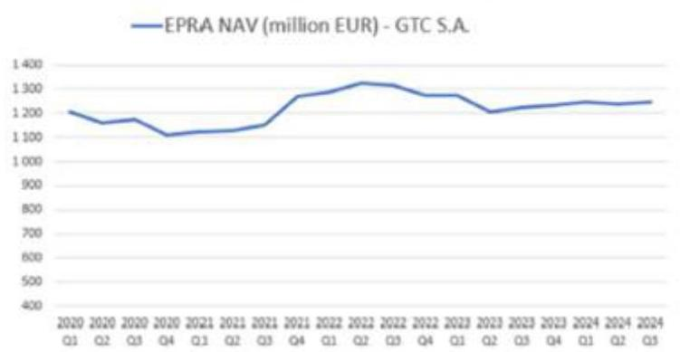

---

A részvénycsomag jelenlegi értékét a BDO frissen készült értékelése támasztja alá, mely összehasonlítható vállalatok szorzószámos értékelési módszertana (Comparable Companies Multiple) alapján a részvénycsomag jelenlegi értéke mintegy 297 Mrd Ft.

Másfelől az értékcsökkenés helyett a felértékelődési potenciált pedig az a tény mutatja, hogy miután a GTC S.A. nyilvánosan működő, tőzsdei részvénytársaság és azok részvényei valós értékelésére a piaci sztenderdek szerint a minden negyedévet érintően közzétett, egy részvényre jutó (nettó eszközérték alapján kalkulált EPRA NAV) érték a leginkább alkalmas mutatószám. Ezen érték igazoltan jelenleg 9,37 lengyel zloty részvényenként, amely negyedévente a kötelező tőzsdei jelentések részeként nyilvános adat, így az EPRA NAV nettó eszközérték kalkuláció alapján az Optima tulajdonában levő részvénymennyiség jelenlegi értéke mintegy 325 Mrd Ft, ekként önmagában sem beszélhetünk vagyontömeg leértékelődésről.
(ii) Az ÁSZ jelentéstervezetében az alábbi megállapításokat teszi:
„A Felügyelőbizottság és a Kuratórium 2022. március 21-i együttes ülésén megtárgyalta a független szakértői véleményt, azonban az abban foglaltak ellenére nem tett lépéseket a kötvény visszaváltására, a befektetések diverzifikálására."
„A Kuratórium a 2022. november 7-én keltezett független szakértői véleményben foglaltak ellenére nem tett lépéseket a kötvény visszaváltására, a befektetések diverzifikálására."
„Az Alapítvány, amennyiben kockázatmentes állampapírba fektette volna a vagyonát, magasabb hozamot ért volna el. Az MNB állampapír-piaci referenciahozamok egyértelműen növekedésnek indultak 2021. novembertől."

A fenti megállapításokkal szemben álláspontunk szerint a tisztelt ÁSZ alapvetően tévesen értékeli a kötvénybefektetéssel kapcsolatos tényeket. A kötvény visszaváltását, mint érdemi alternatívát és szükséges lépést láttatja elmulasztottnak a Kuratórium által, azonban a felek szándéka a kötvényjegyzésről egyértelműen egy hosszútávú, 2031-ben lejáró - ugyanakkor a beruházási igények szerint felbontható és folyamatosan kamatjövedelmet biztosító - befektetés volt.

Egyfelől a kötvénybefektetést kibocsátó Optima, egy kellő szakmai tudással és háttérrel működő befektetési társaság, amely diverzifikálva tartja, kezeli és növeli az általa kezelt vagyont, továbbá az alatta kialakított befektetési szinteken kellőképpen diverzifikált (mind iparágspecifikusan, mind geolokáció szempontjából).

Másfelől pedig jelezni kívánjuk azt a tényt, hogy a kamatbevételek a közfeladatok ellátását is finanszírozzák, valamint a stratégiai projekteket (CAMPUS II, kecskeméti Okosváros), melyeket a PADME a felek közötti együttműködés keretében finanszíroz és valósít meg.

Harmadrészt pedig a tisztelt ÁSZ figyelmébe ajánljuk, hogy a kötvényjegyzés által kiszámítható kamatkörnyezetben nyílt lehetőség finanszírozni, olyan szakmai-partneri megállapodásokat, amelyek révén az Alapítvány kiemelt feladatai, céljai elérése, mint például az okos város fejlesztése realizálható. Azon beruházásra az Alapítványnak elegendő forrása és szaktudása sem áll rendelkezésre, ezáltal a beruházás megvalósításába a régiós szinten kiemelkedő megítélésű GTC és egyéb fontos piaci partnerek bevonásával tervezi ezen célját elérni. Ezek okán az Alapítványnak a kamatbevétel realizása időtartama alatt a kötvényjegyzés révén a stratégiai partnerét támogatja fejlesztési/beruházási tőkéhez jutással, aki pedig az okosváros fejlesztést fogja tudni megvalósítva segíteni, ami előfeltétele az Okosváros beruházás megvalósításának.

---

Negyedrészt a tisztelt ÁSZ nem vette számításba a COVID-19 járványt és annak valamennyi gazdasági szektort érintő hatásait, mely az Okosváros fejlesztés megvalósításának előrehaladását is visszavetette, ugyanakkor a koncepcióterveket a város vezetése nyilvánosan bemutatta (https://keol.hu/kecskemet-bacs/tudasvaros-es-innovacios-tudaspark-epul-kecskemeten), azaz a fejlesztés a maga szakmai medrében halad fokozatosan előre.

Ötödrészt: A világ egyik vezető tanácsadó cége, az E&Y megállapításai igazolták, hogy a kötvény jegyzések időpontjában elérhető állampapírokba történő befektetés 27 - 31,2 Milliárd Forint mértékű veszteség realizálásával járt volna esetleges értékesítés esetén, amely befektetési döntés meghozatala hátrányosabb lett volna a gazdaságossági, hatékonysági és eredményességi szempontú döntéshozatalra vonatkozó Bkr. 8. § (2) bekezdés b) pontjában foglalt előírásokat.
(iii) Az ÁSZ a jelentéstervezetében megállapította, hogy:
„Az Alapítvány a Független szakértőnek 2024. év elején megbízást adott, amely alapján elvégezte a Magyar Állampapírok piacának alakulását bemutató vizsgálatát, amely végső konklúcióként azt rögzítette, hogy az Alapítvány állampapírba történő befektetés révén tőkevesztést ért volna el. A tanulmány azt feltételezte, hogy a kötvények likviditása biztosított, azaz az eladási jog alapításáról szóló szerződés a visszaváltás kezdeményezése esetén 8 banki, illetve 90 naptári napon belül megtörténik. Az elemzés utólag, 2024-ben készült, amikor már a 2021-től eltelt évektől a hozamok alakulásáról pontos, egyértelmű információk állnak rendelkezésre, továbbá az elemzés a makrogazdasági várakozásokat sem vette figyelembe. A tanulmány arra sem tért ki, hogy esetlegesen ne egy értékpapírba történő befektetés lehetőségét vizsgálja a koncentráció elkerülése érdekében."

Súlyosan szakmaiatlannak tartjuk a tisztelt ÁSZ fent előadott érvelését a Független Szakértő vizsgálati anyaga megállapításai súlyának lekicsinylésével. A tisztelt ÁSZ a jelentéstervezetében végig vezetett számításai és következtetései mind olyan, 2024. évben elvégzett, historikus adatokon alapuló, már bekövetkezett tények utólagos ismeretében való felhasználása, amely a jóslási képességgel nem rendelkező Kuratóriumi tagoktól és a kötvényjegyzésekkori bármely egyéb szakértőtől megalapozottan nem voltilett volna elvárható. Mindemellett az E&Y megállapításai a fent már kifejtetettek szerint éppen a tisztelt ÁSZ saját számításainak helyességéhez és megalapozottságához adnak alapos kételyt.
(iv) Az ÁSZ a jelentéstervezetében megállapította, hogy:
„Az Alapítvány Kuratóriuma a kötvények lejegyzését követő időszakban a kötvényekkel kapcsolatos döntéshozatalok során a KEKVA törvény 2022. október 13-ától hatályba lépett 15. § (3) bekezdésében foglalt összeférhetetlenségi előírást nem tartotta be. A Kuratórium tagja, aki a PADME Alapítvány igazgatója is volt, rendszeresen szavazott a befektetésekkel kapcsolatos szavazásokon, érintettségét nem jelezte a KEKVA törvény 15. § (3) bekezdésében előírtak ellenére. A vagyonellenőr a KEKVA törvény 9. § (3) bekezdésében előírtak ellenére nem hívta fel a Kuratórium figyelmét a szabályos működésre."

A KEKVA tv. 15. § (1) bekezdése alapján az alapítvány kuratóriumában és felügyelőbizottságában betöltött tagság nem összeférhetetlen további munkaviszonnyal, illetve munkavégzésre irányuló más jogviszonnyal, valamint külön törvény szerinti egyéb megbízatással és tisztséggel.

A PADME Alapítvány igazgatója a PADME Alapítvány működése során döntéshozatali pozícióban nem volt és ilyen jogkörrel sem bírt (feladat kizárólag a PADME Alapítvány munkaszervezetének irányítására vonatkozott), ezért az Alapítványi döntéshozatal során a KEKVA tv. 15. § (3) bekezdése szerinti összeférhetetlenségi körülmények (sem jogi, sem szervezeti szempontból) nem merültek fel.

---

A fentiekre tekintettel álláspontunk szerint összeférhetetlenség nem állt fenn.
(v) Az
 ÁSZ a jelentéstervezetében az alábbi megállapításokat tette:
„Az OPTIMA Befektetési Zrt. érdekeltségébe tartozó, a legjelentősebb vagyontömeget képviselő GTC részvények árfolyama a tőzsdén folyamatosan, tendenciózusan csökkent, továbbá a kötvények vételárát az Alapítvány részére az OPTIMA Befektetési Zrt. a szerződésben foglalt határidőre nem volt képes megfizetni. Ezen körülmények ellenére értékvesztés elszámolásának mérlegelésére, értékvesztés elszámolására nem került sor.”
„Amennyiben kellő gondossággal, a felelős gazdálkodás szabályaival összhangban jár el az Alapítvány, a Globe Trade Centre S.A. pénzügyi, vagyoni, jövedelmi helyzetét, a GTC részvények árfolyamát folyamatosan értékelte volna és szükség esetén értékvesztést számolt volna el. Erre az Alapítvány könyvvizsgálója - az ÁSZ részére tett nyilatkozata alapján - nem hívta fel az Alapítvány figyelmét, úgy ítélte meg a könyvvizsgálat során, hogy a kamatok teljesítésre kerültek és nem tapasztalt arra utaló jelet, amely arra enged következtetni, hogy a befektetés ne térülne meg.
Az Alapítvány a kötvények után a 2024. évre járó kamatot késedelmesen, több részletben kapta meg az OPTIMA Befektetési Zrt.-től.”

A fentiekkel szemben határozott álláspontunk, hogy semmilyen számviteli és gazdasági indok nem szólt amellett, hogy a kötvények vonatkozásában értékvesztés elszámolásra kerüljön. Ennek elsődleges indoka, hogy az Alapítvány a részére járó kötvénykamatot 2024. június 30-ig tartó időszakban minden esetben határidőben megkapta. Továbbá - mint ahogy fent bemutattuk - a GTC részvények értéke folyamatosan növekedett az EPRA NTA/NAV mutatószám által igazoltak szerint. Utóbbi érték figyelembevétele a Számv. tv. 54. § (2) bekezdés c) alpontja szerint kötelezően figyelembe veendő adat, így az éppen a kellő gondosság és felelős gazdálkodás követelményeinek teljesítésének felel meg az, amennyiben az Alapítvány a kötvényt lejegyző Optima csoport által többségileg tulajdonolt GTC részvényeknek a vállalatcsoport egy részvényre jutó nettó eszközértékét (EPRA NTA/NAV) mint valós értékét és ezáltal azok tartós értékelését veszi alapul a volatilis részvénypiaci árfolyam helyett.
(vi) Az ÁSZ a jelentéstervezetében megállapította, hogy:
„Az OPTIMA Befektetési Zrt.-vel a 2024. évben folytatott tárgyalások során - az opciós szerződésekben foglaltakkal ellentétben - olyan megállapodás körvonalazódott, amely szerint az Alapítvány bankszámlapénz helyett jelentős részben bizonytalan megtérülésű társasági részesedésekben, befektetési jegyekben kapná vissza a befektetését.”

A fentiekkel szemben határozott álláspontunk, hogy az Optimával folyó tárgyalások iránya és a lehetséges megoldások véglegesedő körvonalazódása felelősebb gazdálkodásnak minősül, mint az egy összegű kötvény-visszaváltási jog érvényesítése. A fenti észrevételeinkben kifejtettek alapján az Alapítvány vagyona nem elégséges a stratégiai ingatlanfejlesztési céljainak teljeskörű megvalósításához. Az Optima közvetlen lehetőséget teremt arra, hogy ütemezetten rendelkezésre álljon a kellő forrás az infrastrukturális beruházásokhoz, amelyeket az Alapítvány nagyobb biztonsággal tudná az Optima csoporton keresztül véghez vinni, hiszen önmagában az Alapítvány pénzeszközei piaci forrásbevonás nélkül nem elégségesek az okosváros fejlesztési tervek megvalósításához.
A 2024. évi tárgyalások során, az Alapítvány egyértelműen a bankszámlapénz formájában történő visszaváltást, illetve az Egyetem fejlődéséhez stratégiailag illeszkedő vagyontárgyak ellenértékként történő átadását preferálta. Mindezt, elismert külső szakértő bevonásával történő értékelés alapján, a vagyonvesztés kizárásával tartotta befogadhatónak. A tárgyalások korábbi fázisai során az Optima által felajánlott részesedések és befektetési jegyek több ízben is visszautasításra kerültek az előbbi megfontolásból.

---

# IV. DEFINICIÓK 

Alapítvány vagy NJEA - Neumann János Egyetemért Alapítvány
ÁSZ - Állami Számvevőszék
ÁSZ Tv. - Állami Számvevőszékről szóló 2011. évi LXVI. törvény
GTC - Globe Trade Centre S.A.
Info Tv. - 2011. évi CXII. törvény az információs önrendelkezési jogról és az információszabadságról
Kbftv. - kollektív befektetési formákról és kezelőikről, valamint egyes pénzügyi tárgyú törvények módosításáról szóló 2014. évi XVI. törvény

MNB - Magyar Nemzeti Bank
Optima - Optima Befektetési Zrt.
Optima Csoport - az Optima Befektetési Zrt, illetve annak közvetett vagy közvetlen tulajdonában álló társaságok

Optima Kötvény - az OPTIMA Befektetési Zrt. által kibocsátott és az Alapítvány által lejegyzett kötvény
Ptk. - 2013. évi V. törvény a Polgári Törvénykönyvről
Sztv - számvitelről szóló 2000. évi C. törvény
Tpt. - tőkepiacról szóló 2001. évi CXX. törvény
Ütvtv. - üzleti titok védelméről szóló 2018. évi LIV. törvény

---

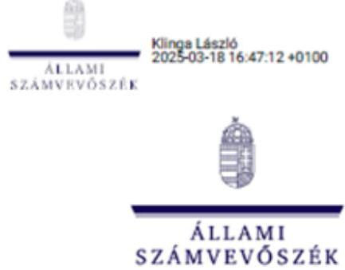

ELLENŐRZÉSI IGAZGATÓSÁG V.

Ikt. szám: EL-3976-051/2025
Ugristéző: Nemesvári-Horthy Eszter
Telefonszám: +36 1 456 8345

Csizmadia Attila Norbert
Kuratóriumi Elnök

Neumann János Egyetemért Alapítvány

Kecskemét

Tárgy: Válaszlevél ellenőrzéssel kapcsolatos észrevételek kezeléséről

Tisztelt Kuratóriumi Elnök Úr!

„A Neumann János Egyetemért Alapítvány tartós bitelviszonyt megtestesítő értékpapírba történő befektetéseinek ellenőrzése” című számvevőszéki jelentés tervezetével kapcsolatos, 2025. március 5-i keltezésű észrevételét köszönettel megkaptam.

Az Állami Számvevőszékről szóló 2011. évi LXVI. törvény (a továbbiakban: ÁSZ törvény) 29. § (2) bekezdése szerint az ellenőrzött szervezet vezetője és a felelősként megjelölt személy az ellenőrzés megállapításaira tizenöt napon belül írásban észrevételt tehet. Ugyanezen szakasz (3) bekezdése szerint az Állami Számvevőszék (a továbbiakban: ÁSZ) az észrevételre a beérkezésétől számított harminc napon belül írásban válaszol. A figyelembe nem vett észrevételeket köteles a jelentésben feltüntetni, és megindokolni, hogy azokat miért nem fogadta el. Tájékoztatom Kuratóriumi Elnök urat, hogy a számvevőszéki jelentésben a figyelembe nem vett észrevételeket szerepeltetjük az elutasítás indokának feltüntetésével.

Az ÁSZ az észrevételeire vonatkozó álláspontjáról az alábbi tájékoztatást adom:

I. Észrevételében kérelemmel fordult az ÁSZ-hoz záró megbeszélés tartása érdekében. (Észrevétel I.1.)

Észrevétel: Kuratóriumi Elnök úr észrevételében kérelmezte, hogy az ÁSZ jelentéstervezetének véglegesítése előtt az ÁSZ törvény 32. § (5) bekezdésében foglaltak alapján az ÁSZ biztosítson lehetőséget, hogy a feltárt tényeket, az ezeken alapuló megállapításokat, következtetéseket, valamint a folyamatban lévő intézkedéseket a felek záró megbeszélés keretében egyeztethessék. Kérelmében előadta, hogy a folyamatban lévő

1052 Budapest, Aplázai Csere János u. 10. | www.asz.hu
akivig@asz.hu | 1364 Budapest 4., Pf. 54 | telefon: +36 1 484 9100

---

intézkedések eredményeképpen úgy véli, hogy a jelentéstervezetben foglalt számos megállapítás a továbbiakban már okafogyott vagy módosítást igényel. Véleménye szerint hasonló hatása van a folyamatban lévő intézkedéseknek a jelentéstervezetben foglalt intézkedési javaslatokra is. Ezen folyamatban lévő intézkedések összetettsége és sokrétűsége meghaladja az írásbeli észrevételezés kereteit, így azok mélységükben való bemutatásához mindenképpen szükségesnek ítéli a személyes megbeszélés megtartását.

Válasz: Az ÁSZ törvény 32. § (5) bekezdése alapján az ÁSZ a feltárt tényeket, az ezeken alapuló megállapításokat, következtetéseket záró megbeszélés keretében egyeztetheti az ellenőrzött szervezet vezetőjével vagy az általa megbízott személlyel. Az ÁSZ számára tehát a záró megbeszélés tartása nem kötelezettség, hanem lehetőség. Az ÁSZ az ellenőrzését lefolytatta, a megállapításait és a következtetéseit a jelentéstervezetbe foglalta. Az ÁSZ ellenőrzése során tisztázatlan kérdések nem maradtak fenn, így záró megbeszélés tartása az ÁSZ szerint nem indokolt. Az ÁSZ múltra vonatkozó ellenőrzési megállapításait, következtetéseit a jövőben várható események (a Neumann János Egyetemért Alapítvány (a továbbiakban: ellenőrzött szervezet, vagy Alapítvány) által folyamatban lévő tárgyalások, esetleges a jövőben várható megállapodás a kötvények visszaváltása kapcsán) nem befolyásolják, nem változtathatják meg.

# II. Észrevételében kérelemmel fordult az ÁSZ-hoz az eljárás felfüggesztése érdekében. (Észrevétel I.2.) 

Észrevétel: Kuratóriumi Elnök úr az ellenőrzés felfüggesztésére vonatkozó kérelmét azzal indokolta, hogy a jelentéstervezetben az ÁSZ javaslatot tett az Alapítvány számára, hogy gondoskodjon a kötvények visszaváltására. Hivatkozott továbbá az ÁSZ törvény 31. §-ában foglalt elnöki figyelemfelhívó levél intézményére, valamint a jelentésben foglalt megállapításokhoz kapcsolódó intézkedési terv összeállítására. Előadta kérelmében, hogy az OPTIMA kötvények visszaváltására vonatkozó megállapodás megkötése hosszabb időt vesz igénybe, ezért a tárgyalások lezárásáig, amelyet 3 hónapra becsül, indokolt az eljárás felfüggesztése. Érvelt még azzal is kérelmében, hogy az ÁSZ törvény 24. § (1) bekezdés d) és e) pontja alapján az ellenőrzésekkel szemben támasztott követelmények közé tartozik, hogy a megállapításoknak alátámasztottnak, a következtetéseknek okszerűnek és megalapozottnak kell lennie, valamint az ellenőrzéseket hatékonyan és eredményesen kell elvégezni. A kérelmében vállalta, hogy a felfüggesztés időszakában rendszeresen tájékoztatja az ÁSZ-t az általuk megtett intézkedésekről.

Válasz: Az ÁSZ Elnöke az ellenőrzés folyamán két alkalommal is élt az ÁSZ törvény 31. § (1) bekezdése szerinti elnöki figyelemfelhívással, mivel az ellenőrzés során feltárt jogszabálysértő gyakorlat ezt indokolta. Az OPTIMA Befektetési-, Ingatlanhasznosító és Szolgáltató Zártkörűen Működő Részvénytársasággal (a továbbiakban: OPTIMA Befektetési Zrt.) a tárgyalásokat 2024. januárban kezdték meg, az ÁSZ Elnöke első figyelemfelhívó

---

levelének kiküldésére 2024. júliusban került sor. Az ÁSZ álláspontja szerint a kötvény visszaváltására vonatkozó tárgyalások megkezdésére irányuló kuratóriumi döntés óta eltelt több, mint egy évnek, valamint az ÁSZ elnökének első figyelemfelhívása óta eltelt több, mint fél évnek elegendőnek kellett volna lennie a tárgyalások lezárására.

Jelen esetben Kuratóriumi Elnök úrnak az ÁSZ törvény 29. §-a alapján az ÁSZ a jelentéstervezet megállapításaira vonatkozóan észrevételezési jogot biztosított, amellyel Kuratóriumi Elnök úr is élt. A kérelmében hivatkozott, az ÁSZ törvény 33. § (1) bekezdésében foglalt intézkedési kötelezettség teljesítése az ÁSZ végleges jelentése alapján lesz majd a jövőben feladata. Az ÁSZ törvény 33. § (1) bekezdésében foglalt intézkedési terv készítési kötelezettséggel kapcsolatban későbbiekben tájékoztatjuk Önt. Az Önök által jövőben megteendő intézkedések nem lehetnek tehát indokai annak, hogy az ÁSZ az ellenőrzését felfüggessze. Az ellenőrzés által a jelentéstervezetben rögzített cél tekintetében a múltra vonatkozóan tett megállapítások eleget tesznek az ÁSZ törvény észrevételükben hivatkozott 24. § (1) bekezdés d) és e) pontjaiban foglalt követelményeknek. Az ellenőrzés felfüggesztése - ahogyan az korábban már kifejtésre került - az ÁSZ múltra vonatkozó ellenőrzési megállapításait, következtetéseit nem befolyásolná.

Mindezek alapján az ÁSZ az ellenőrzés felfüggesztését nem tartja indokoltnak.

# III. Észrevételében kérelemmel fordult az ÁSZ-hoz a jelentés nyilvánosságának korlátozására. (Észrevétel I.3.) 

Kérelmében Kuratóriumi Elnök úr megfogalmazta, hogy az ÁSZ jelentéstervezete számos törvény által védett információt és titkot tartalmaz, amelyek nyilvánosságra hozatalát törvény tiltja.

Az ÁSZ jelentés, illetve az abban szereplő adatok nyilvánossága vonatkozásában első lépésként szükséges megvizsgálni a közpénzekhez kapcsolódó, jogszabályokban rögzített átláthatósági kötelezettség tartalmát.

## - Átláthatósági kötelezettség:

Az Alaptörvény 39. cikk (2) bekezdése alapján a közpénzekkel gazdálkodó minden szervezet köteles a nyilvánosság előtt elszámolni a közpénzekre vonatkozó gazdálkodásával. A közpénzeket és a nemzeti vagyont az átláthatóság és a közélet tisztaságának elve szerint kell kezelni. A közpénzekre és a nemzeti vagyonra vonatkozó adatok közérdekű adatok.

A nemzeti vagyonról szóló 2011. évi CXCVI. törvény (a továbbiakban: Nvtr.) 1. § (2) bekezdés c) pontja alapján az állam vagy a helyi önkormányzat tulajdonában lévő pénzügyi eszközök a nemzeti vagyonba tartoznak.

---

Az Nvtr. 7. § (1)-(2) bekezdései alapján a nemzeti vagyon alapvető rendeltetése a közfeladat ellátásának biztosítása, amelynek érdekében a nemzeti vagyont átlátható, hatékony és költségtakarékos módon kell működtetni.

A nemzeti vagyon szakszerű, gondos kezelését, felhasználását akkor lehet hatékonyan nyomon követni, ha a nemzeti vagyon egyes elemei átláthatóak. A közbizalom megteremtésének elengedhetetlen feltétele, hogy a közvagyon teljes útvonala feltérképezhető legyen. A közpénzügyi kapcsolatot létesítő, állami forrásokkal gazdálkodó magánszervezet (gazdasági társaság, alapítvány) hosszú távon akkor őrizheti meg a piaci és társadalmi bizalmat, ha tisztességéhez nem fér kétség, hiszen a rábízott közjavakkal átláthatóan gazdálkodik.

Az Alapítvány az alapítója által rendelkezésére bocsátott állami forrásból származó vagyon jelentős részét -
 a Pallas Athéné Domus Meriti Alapítvány (a továbbiakban: PADME, vagy PADME Alapítvány) 100%-os tulajdonában lévő - az OPTIMA Befektetési Zrt. kötvényén keresztül fektette be, amely vagyont ezt követően az OPTIMA Befektetési Zrt. egyéb társaság és befektetési struktúrán keresztül hasznosította.

Az átláthatósági kötelezettség érvényre jutását szolgálják a közérdekű adatok és a közérdekből nyilvános adatok nyilvánosságára vonatkozó jogszabályi előírások.

Az információs önrendelkezési jogról és az információszabadságról szóló 2011. évi CXII. törvény (a továbbiakban: Info tv.) 3. § 5. pontja alapján közérdekű adatnak minősül az állami feladatot, valamint jogszabályban meghatározott egyéb közfeladatot ellátó szerv vagy azt átvevő szerv, szervezet (a továbbiakban együtt: közfeladatot ellátó szerv) kezelésében lévő és tevékenységére vonatkozó vagy közfeladatának ellátásával összefüggésben keletkezett, a személyes adat fogalma alá nem eső, bármilyen módon vagy formában rögzített információ vagy ismeret, függetlenül kezelésének módjától, önálló vagy gyűjteményes jellegétől, így különösen a hatásköre, illetékességre, szervezeti felépítésre, szakmai tevékenységre, annak eredményességére is kiterjedő értékelésére, a birtokolt adatfajtákra és a működést szabályozó jogszabályokra, valamint a gazdálkodásra, a megkötött szerződésekre vonatkozó adat.

Az Info tv. 3. § 6. pontja alapján közérdekből nyilvános adatnak minősül a közérdekű adat fogalma alá nem tartozó minden olyan adat, amelynek nyilvánosságra hozatalát, megismerhetőségét vagy hozzáférhetővé tételét törvény közérdekből elrendeli.

Az Info tv. 26. § (1) bekezdése kimondja, hogy a közfeladatot ellátó szervnek lehetővé kell tennie, hogy a kezelésében lévő közérdekű adatot és közérdekből nyilvános adatot - az e törvényben meghatározott kivételekkel - erre irányuló igény alapján bárki megismerhesse.

Az Info tv. 32. §-a a közérdekű adatokra vonatkozó tájékoztatási kötelezettség keretében előírja, hogy a közfeladatot ellátó szerv a feladatkörébe tartozó ügyekben - így különösen az állami és önkormányzati költségvetésre és annak végrehajtására, az állami és önkormányzati

---

vagyon kezelésére, a közpénzek felhasználására és az erre kötött szerződésekre, a piaci szereplők, a magánszervezetek és -személyek részére különleges vagy kizárólagos jogok biztosítására vonatkozóan - köteles elősegíteni és biztosítani a közvélemény pontos és gyors tájékoztatását.

A közpénzek átlátható felhasználását, e tekintetben a társadalom tájékoztatását biztosítja továbbá az ÁSZ törvény 32. § (3) bekezdése is, amely alapján az ÁSZ - mint legfőbb közpénzügyi ellenőrző szerv - jelentése nyilvános.

# - Átláthatósági kötelezettség alanyai: 

Az átláthatósági kötelezettség fennállása vonatkozásában a Nemzeti Adatvédelmi és Információszabadság Hatóság által következetesen alkalmazott jogértelmezés feladatorientált, valamint vagyonszempontú megközelítést is alkalmaz.

A feladatorientált megközelítése alapján közfeladathoz kapcsolódik az adat, amennyiben az adott alapítvány vagy gazdasági társaság jogszabályban meghatározott közfeladatot lát el.

A közfeladatot ellátó közérdekű vagyonkezelő alapítványokról szóló 2021. évi IX. törvény (a továbbiakban: KEKVA törvény) hatálya kiterjed az ellenőrzött szervezetre is, mint közfeladatot ellátó közérdekű vagyonkezelő alapítványra, meghatározza az ellátandó közfeladatait is.

A KEKVA törvény 1. §-ában rögzítésre került, hogy a közfeladatot ellátó közérdekű vagyonkezelő alapítvány létrehozása során az alapító, illetve a csatlakozó biztosítja a közfeladat ellátásához szükséges vagyonelemeket és finanszírozási eszközöket, továbbá Magyarország mindenkori költségvetésének tervezésekor előresorolt tényező a közfeladatot ellátó közérdekű vagyonkezelő alapítványok vagyonkezelés útján történő, illetve a közfeladat ellátásához közvetlenül szükséges finanszírozási feltételeinek a biztosítása.

Az átláthatósági kötelezettség vagyonszempontú megközelítése alapján önmagában az a tény megteremti az átláthatósági kötelezettséget, hogy az adott alapítvány vagy gazdasági társaság a nemzeti vagyon valamely elemét kezeli, birtokolja, hasznosítja, vagy afelett bármilyen egyéb módon rendelkezik.

A nemzeti vagyonból létesített magánjogi szervezetekre (alapítványokra, gazdasági társaságokra) is kiterjed az átláthatósági kötelezettség. A vagyonszempontú megközelítés alapján a nemzeti vagyonból történő létesítés ténye is megalapozza az átláthatósági kötelezettséget.

A nemzet vagyonból létesített magánjogi szervezetek esetében az átláthatósági kötelezettséget a nemzeti vagyonba való tartozás közvetlensége vagy közvetettsége nem érinti.

---

Az Alkotmánybíróság határozata ${ }^{1}$ alapján a közpénzekkel gazdálkodó minden szervezetnek biztosítania kell a hozzáférést az általa kezelt közérdekű adatokhoz.

Az Alkotmánybíróság határozatában ${ }^{2}$ elvi éllel rögzítette, hogy „[a]z Alaptörvény 39. cikk (2) bekezdéséből - különösen annak utolsó mondatából - [...] egyértelműen következik, hogy a közérdekű adatszolgáltatás kötelezettsége nem függvénye annak, hogy közérdekű adatot birtokló szervezet milyen szervtípusba tartozik, milyen tulajdonban van, milyen tevékenységet folytat, a közérdekű adatszolgáltatásra irányuló kötelezettséget önmagában megteremti az a tény, hogy a szervezet közérdekű adatot birtokol".

A fentiek alapján az ellenőrzött szervezet tekintetében, továbbá a rendelkezési jogkörébe tartozó közpénz vonatkozásában az átláthatósági kötelezettség a feladatorientált és a vagyonszempontú megközelítés alapján is fennáll.
III.1. Észrevétel: Kérelme általános jogalapjaként hivatkozott az ÁSZ törvény 32. § (3) bekezdésére, az Info tv. 27. § (1) bekezdésére, továbbá általános jelleggel hivatkozott az általános közigazgatási rendtartásról szóló 2016. évi CL törvény (a továbbiakban: Ákr.) 27. § (2) bekezdésére.

Válasz: Az általános jogalapok közül az Info tv. hivatkozott előírása alapján - miután a jelentéstervezetben szereplő minősített adatot nem jelölt meg - kérelme érdemben nem vizsgálható. Az ÁSZ megjegyzi továbbá, hogy az adott jogszabályhely közérdekű, illetve közérdekből nyilvános adatokra vonatkozik, így e jogszabályi szakaszra történő hivatkozás azt sugallja, hogy az ellenőrzött szervezet maga is tisztában van a jelentéstervezetben szereplő adatok közérdekű, illetve közérdekből nyilvános adati minőségével. Az Ákr., mint általános jogalap kapcsán tájékoztatom Kuratóriumi Elnök urat, hogy az ÁSZ törvény preambulumához fűzött indoklás kimondja, hogy a törvény a bírósági, hatósági és hivatali típusú számvevőszéki modellek közül az utóbbi mellett foglal állást. [...].A Számvevőszék tehát nem bíróság és nem is hatóság'...]. A fentiek alapján tehát rögzíthető, hogy az ÁSZ hatóságnak nem minősül, így az Ákr. hatóságra vonatkozó előírásai az ÁSZ tekintetében nem alkalmazandók.
III.2. Észrevétel: Észrevételében a törvény által védett egyéb titkok vonatkozásában az alábbi jogszabályokat jelölte meg:

- az üzleti titok védelméről szóló 2018. évi LIV. törvény (a továbbiakban: Ütvtv.) 1. § (1) bekezdése, 6. § (1) bekezdése (üzleti titok fogalma, megsértése);
- Info tv. 27. § (6) bekezdése (a döntés megalapozását szolgáló adat védelme);
- az Európai Parlament és Tanács 596/2014/EU rendeletének (a továbbiakban: MAR rendelet) 7. cikke (bennfentes információ fogalmi meghatározása);

[^0]
[^0]:    ${ }^{1} 21 / 2013$. (VII. 19.) AB határozat
    ${ }^{2} 3026 / 2015$. (II. 9.) AB határozat

---

*Függelék: Észrevételek*

- a tőkepiacról szóló 2001. évi CXX. törvény (a továbbiakban: Tpt.) 369. § (1) bekezdése, 371. § (1)-(3) bekezdései (értékpapír titok definíciója, értékpapír titok időbeli korlátozás nélküli megtartása);
- lengyel pénzügyi eszközökkel való kereskedésről szóló törvény, lengyel kereskedelmi törvény, valamint a lengyel nyilvános társaságokról szóló törvény (általános felsorolás konkrét jogszabályhelyek megjelölése nélkül).

Válasz: A törvény által védett egyéb titkok vonatkozásában megjelölt jogszabályi helyek alapján az alábbi válaszokat adom meg:

- **Ütvtv.:** Észrevételében nem jelölte meg pontosan sem az észrevétellel érintett adatokat, sem az észrevétellel érintett jelentéstervezetben szereplő megállapítást, sem a nyilvánosságra hozatal esetén sérülő üzleti érdeket. A Kúria joggyakorlat-elemző csoportjának összefoglaló véleménye3 alapján üzleti titok fennállására általánosságban nem lehet hivatkozni, fel kell tárni, hogy konkrétan milyen üzleti érdekek sérelméről van szó. A Kúria joggyakorlat-elemző csoportjának hivatkozott összefoglaló véleménye4 alapján „a közpénzekkel kapcsolatos, annak felhasználására vonatkozó adatokat jogszabály szerint nem lehet üzleti titokként kezelni, és a kiadásuk iránti kérelem teljesítését megtagadni. Kivételt csupán azok az adatok képeznek, amelyek megismerése az üzleti tevékenység végzése szempontjából aránytalan sérelmet okozza, úgy mint a technológiai eljárások, műszaki megoldások, gyártási folyamatok, munkaszervezési és logisztikai módszerek, know-how-ra vonatkozó adatok. Amennyiben azonban ezen adatok kiadása a közérdekből nyilvános adatok megismerésének akadályát képezi, abban az esetben ezek az adatok sem tartoznak az adatnyilvánosság alól kivételek közé.”5

Az Info tv. 27. § (3) bekezdése az alábbiakat mondja ki: „Közérdekből nyilvános adatként nem minősül üzleti titoknak a központi és a helyi önkormányzati költségvetés, illetve az európai uniós támogatás felhasználásával, költségvetést érintő juttatással, kedvezménnyel, az állami és önkormányzati vagyon kezelésével, birtoklásával, használatával, hasznosításával, az azzal való rendelkezései, annak megterhelésével, az ilyen vagyont érintő bármilyen jog megszerzésével kapcsolatos adat, valamint az az adat, amelynek megismerését vagy nyilvánosságra hozatalát külön törvény közérdekből elrendeli. A nyilvánosságra hozatal azonban nem eredményezheti az olyan adatokhoz – így különösen a védett ismerethez – való hozzáférést, amelyek megismerése az üzleti tevékenység végzése szempontjából aránytalan sérelmet okozza, feltéve hogy ez nem akadályozza meg a közérdekből nyilvános adat megismerésének lehetőségét.”6

A fentiek alapján tehát – figyelemmel arra is, hogy az ellenőrzött szervezet észrevételében aránytalan sérelemre vonatkozó konkrét információ nem szerepel – az

3 A „közérdekű adatok kiadásával kapcsolatos peres gyakorlat” bírósági joggyakorlat-elemző csoport összefoglaló véleménye [62] bekezdése (https://kur-birosag.hu/sites/default/files/joggyak/osszefoglaló_velemeny_adatvedelem.pdf)

4 [63] bekezdése

---

ÁSZ álláspontja szerint a jelentés nyilvánosságra hozatala nem minősül üzleti titok jogtalan felfedésének és nem ütközik az Üvtr. 6. § (1) bekezdésébe.

- Info tv. 27. § (6) bek.: Az ellenőrzött szervezet észrevételében nem jelölt meg konkrétan semmilyen, az általa döntés megalapozását szolgáló adatnak minősített adatokat, sem az észrevétellel érintett adatokat, sem az észrevétellel érintett jelentéstervezetben szereplő megállapítást. Így tehát a jelentéstervezet nyilvánosságra hozatala útján az ÁSZ nem sérti meg az Info tv. 27. § (6) bekezdését.
- MAR rendelet: Az ellenőrzött szervezet észrevétele e tekintetében nem kellően konkrét, mivel nem jelölte meg pontosan azt, hogy az adott adatok a MAR rendelet mely pontos szakasza alapján és milyen okból minősülnek bennfentes információnak. Tájékoztatom Kuratóriumi Elnök urat, hogy a jelentéstervezet nyilvánosságra hozatala - az ÁSZ jogszabály szerinti feladat- és hatáskörére tekintettel - a MAR rendelet 8. cikke szerinti bennfentes kereskedelemnek nem minősülhet, így e tekintetében csak a MAR rendelet 10. cikke szerinti bennfentes információk jogosulatlan közzétételének megvalósulása vizsgálható. A MAR rendelet 10. cikk (1) bekezdése azonban kimondja, hogy bennfentes információ jogosulatlan közzétételére akkor kerül sor, ha egy személy bennfentes információval rendelkezik, és azt bármely más személynek átadja, kivéve akkor, ha az információt munkaviszony, valamely foglalkozás vagy meghatározott feladatok szokásos teljesítése keretében adja át. A jelentés nyilvánosságra hozatala során pedig az ÁSZ a jogszabályban meghatározott feladat- és hatáskörében jár el, így a MAR rendelet 10. § (1) bekezdésének megsértése a jelentés nyilvánosságra hozatala útján nem valósulna meg.
- Tpt.: Az ellenőrzött szervezet észrevétele e tekintetében nem kellően konkrét, mivel nem jelöli meg pontosan sem az észrevétellel érintett adatokat, sem az észrevétellel érintett jelentéstervezetben szereplő megállapítást. A Tpt. 371. § (2) bekezdése úgy rendelkezik, hogy a titoktartási kötelezettség alapján az üzleti, illetőleg az értékpapírtitok körébe tartozó tény, információ, megoldás vagy adat, az e törvényben meghatározott körön kívül - az ügyfél felhatalmazása nélkül - nem adható ki harmadik személynek és feladatkörön kívül nem használható fel, azonban az ÁSZ a jelentéstervezet nyilvánosságra hozatala során jogszabályban meghatározott feladatkörében jár el. A Tpt. értékpapír-titok cím alatt található 371. § (4) bekezdése alapján nem lehet üzleti titokra hivatkozással visszatartani az információt
 az Info tv.-ben meghatározott - közérdekű és közérdekből nyilvános adatokra vonatkozó adatszolgáltatási és tájékoztatási kötelezettség esetén. A fentiek alapján tehát figyelemmel arra is, hogy az ellenőrzött szervezet észrevételében sem az érintett adatokat, sem az érintett megállapítást nem jelölte meg, így - az ÁSZ álláspontja szerint - a jelentéstervezet nyilvánosságra hozatala nem minősül értékpapírtitok, illetve üzleti titok jogtalan felfedésének és nem minősül a Tpt. 371. § (1)-(3) bekezdései megsértésének.

---

- Egyéb jogszabályok: Az ellenőrzött szervezet észrevétele e tekintetben nem kellően konkrét, mivel nem jelöli meg pontosan sem az észrevétellel érintett adatokat, sem az észrevétellel érintett jelentéstervezetben szereplő megállapítást, sem az adott jogszabályok megsértett rendelkezéseit. Az észrevétel konkrétságának e magas szintű hiánya mellett az ÁSZ-nak semmilyen további értékelést nem volt lehetősége elvégezni, így az adott jogszabályok jelentéstervezet nyilvánosságra hozatala általi megsértése nem volt megállapítható.
III.3. Észrevétel: Észrevételt tett arra, hogy miután a jelentéstervezet utal a Magyar Nemzeti Bankhoz (a továbbiakban: MNB) köthető entitásokra, gazdálkodási és befektetési gyakorlatára, növelheti a forint elleni spekulációs támadások kockázatát a devizapiacon, hátrányosan érinthetik Magyarország nemzetközi kapcsolatait, nemzetbiztonsági érdeket sérthetnek, különösen az ország törvényes rendjébe vetett bizalom megtörése esetén. Észrevételében jelezte, hogy a jelentés nyilvánosságra hozatala az MNB közvetett befektetési stratégiájára vonatkozó adatok és eljárások kiszivárgását eredményezheti, amely alááshatná az ország gazdasági szverenitását, végső soron alkalmas az MNB-be vetett bizalom meggyengítésére, melynek előre beláthatatlan következményei lehetnek. Észrevételének megalapozásaként az Info tv. 27. § (2) bekezdés e) pontját jelölte meg, amely jogszabályhely következőket mondja ki: „A közérdekű és közérdekből nyilvános adatok megismeréséhez való jogot - az adatvédelmi szabályok meghatározásával - törvény központi pénzügyi vagy devizapolitikai érdekből korlátozhatja.”

Válasz: Magyarország nemzetközi kapcsolatai és megítélése tekintetében tájékoztatom Kuratóriumi Elnök urat, hogy az ÁSZ aktív tagja a Legfőbb Ellenőrző Intézmények Nemzetközi Szervezetének (a továbbiakban: INTOSAI) és annak regionális szervezeteként működő Legfőbb Ellenőrző Intézmények Európai Szervezetének (a továbbiakban: EUROSAI). Az ÁSZ ezen nemzetközi tagságából eredően saját működésére nézve is irányadónak tekinti az INTOSAI által kiadott Szakmai Dokumentumok Intosai Keretrendszerét (a továbbiakban: IFPP), amely keretrendszerben rögzített szabályok megtartása általános, nemzetközi elvárásként is megfogalmazódik Magyarországgal, és annak legfőbb ellenőrző szervével, az ÁSZ-szal szemben. Az INTOSAI Limai nyilatkozat alapján a számvevőszéki ellenőrzés célja az, hogy időben feltárja a gazdálkodásban az elfogadott normáktól való eltéréseket, a törvényesség, a hatékonyság, az eredményesség és a gazdaságosság elveinek megsértését, hogy lehetővé váljék az egyes esetekben javító intézkedések meghozatala, az elszámolásra kötelezettek vállalják a felelősséget, a károk megtérüljenek, illetve, hogy lépéseket tegyenek az ilyen jogsértések elkövetésének megakadályozása, vagy legalábbis megnehezítése érdekében. Amennyiben az ÁSZ az ellenőrzés során feltárt adatok alapján megfogalmazott, az MNB-t is érintő megállapítások, vagy azok egy része nyilvánosságra hozatalát elmulasztja, azzal nem tesz eleget a fent bemutatott nyilatkozatból eredő elvárásoknak, ami mind Magyarország, mind annak legfőbb ellenőrző szerve nemzetközi megítélését negatív irányba befolyásolná, ezáltal negatív hatással

---

lehetne Magyarország nemzetközi és kormányközi kapcsolataira. Az észrevétellel érintett ellenőrzést az ÁSZ az ÁSZ törvény 3. § (2a) bekezdése alapján, mint törvény felüli ellenőrzést kezdte meg, amelyről az ellenőrzés megkezdéséről szóló értesítő levélben az ÁSZ Elnöke Kuratóriumi Elnök urat tájékoztatta is. Az ÁSZ törvény 3. § (2a) bekezdése a következőket rögzíti: „Az Állami Számvevőszék az elnök döntése alapján az ellenőrzési tervben nem szereplő ellenőrzést is végezhet, amelyről az éves beszámolójában ad tájékoztatást az Országgyűlés részére.” Az ÁSZ törvény 3. § (2a) bekezdéséhez fűzött indokolásában szerepel, hogy „…Az Állami Számvevőszék éves beszámolója keretében ezen ellenőrzések eredményéről is tájékoztatást nyújt az Országgyűlés számára a transzparencia biztosítása érdekében.” Ezzel összhangban az ÁSZ törvény 4. §-a általános jelleggel írja elő az ÁSZ Elnöke részére az ÁSZ előző évi tevékenységéről való tájékoztatás nyújtását az Országgyűlés számára készített éves beszámolón keresztül. A fenti rendelkezések alapján az ellenőrzési tervben nem szereplő ellenőrzések kapcsán az ellenőrzési tervben szereplő ellenőrzésekkel azonos transzparencia követelmények érvényesülnek: azok lefolytatásáról az ÁSZ Elnöke köteles az Országgyűlés előtt beszámolni az ÁSZ éves beszámolója keretében. Így jogos társadalmi elvárás az ÁSZ-szal szemben a tárgyi ellenőrzés során feltárt tényeket, illetve az azokon alapuló megállapításokat és következtetéseket rögzítő jelentés nyilvánosságra hozatala is.

Amennyiben az ÁSZ a jelentést, vagy annak valamely részét nem hozná nyilvánosságra, az a társadalom számára azt a látszatot keltené, hogy az ÁSZ objektivitása és függetlensége sérült. Hangsúlyozandó továbbá, hogy abban az esetben, ha az ÁSZ a jelentést, vagy annak valamely részét nem hozná nyilvánosságra, azonban az adott információk a jövőben mégis nyilvánosságra kerülnének, abban az esetben a társadalmi bizalom nem csak az MNB, hanem a közpénzek őrének minősülő legfőbb ellenőrző szerv vonatkozásában is megrendülne. A több állami szervet érintő bizalomvesztés, illetve a valóság elfedésére irányuló összehangolt cselekvés látszata pedig alkalmas lenne arra, hogy nem csak az érintett szervek, de a teljes állam törvényes működésébe vetett társadalmi bizalmat megtörje.

Az ÁSZ megjegyzi, hogy az Info tv. 27. § (2) bekezdés e) pontja a közérdekű és közérdekből nyilvános adatok megismeréséhez való jogot korlátozó rendelkezéseket tartalmaz, ami szemben áll az ellenőrzött szervezet azon észrevételeivel, amelyekben ezen adatokat - az ÁSZ által vitatott módon - meghatározott titok körökbe sorolta. A fentiek mellett a hivatkozott jogszabályhely kifejezetten úgy rendelkezik, hogy a közérdekű és közérdekből nyilvános adatok megismeréséhez való jog korlátozása - a jogszabályban megjelölt okok fennállása esetén - kizárólag törvényben lehetséges. Ilyen, az adott adatok nyilvánosságra hozatalát kifejezetten megtiltó törvényi rendelkezést azonban az ellenőrzött szervezet az észrevételében nem jelölt meg. Így tehát pusztán az Info tv. 27. § (2) bekezdés e) pontja és az ellenőrzött szervezet által előadottak alapján a jelentés nyilvánosságra hozatala nem korlátozható.

---

A fentieket összegezve az ellenőrzött szervezet észrevétele nem tartalmaz olyan konkrét információkat, amelyek alapján a jelentés nyilvánosságra hozatalát az ÁSZ köteles lenne korlátozni.

# IV. Észrevételt tett az ellenőrzött időszakra (Észrevétel 1), III.1.) 

IV. 1. Észrevétel: Észrevételében szükségesnek nevezte az ellenőrzött időszak kiterjesztését arra való hivatkozással, hogy az Alapítvány által 2021. évben lejegyzett 127,5 milliárd Ft értékű OPTIMA2031 és OPTIMA2031/B kötvények ellenőrzése kapcsán az ellenőrzött időszak lezárásának napját, 2024. június 30-át követően olyan események történtek (pl.: felek közötti megállapodások módosítása, tárgyalások stb.), amelyek nem kerültek mérlegelésre a jelentéstervezetben és amelyek érdemben változtathatnák a jelentéstervezet tartalmát és következtetéseit.

Válasz: Az ellenőrzött időszakot az ÁSZ az ellenőrzési programban az ellenőrzés megtervezése során határozza meg. Az ellenőrzött időszak 2021. január 1-jétől 2023. december 31-ig terjedő időszak, a 2023. évi számviteli beszámoló, valamint az Alapítvány által lejegyzett OPTIMA2031 és OPTIMA2031/B kötvények ellenőrzése kapcsán 2024. június 30-ig terjedő időszak. A jelentéstervezetben az ÁSZ a múltra vonatkozóan, 2024. június 30-ig tette meg megállapításait, amelyeket a jelenben és a jövőben bekövetkező események nem befolyásolnak, így ennek következtében nem tudják megváltoztatni az ÁSZ jelentésének tartalmát, illetve az ÁSZ által levont következtetéseket sem érintik.
IV. 2. Észrevétel: Érvként hozta fel észrevételében, hogy addig, amíg véglegesen meg nem hírül, vagy létre nem jön a kötvények visszaváltására vonatkozó megállapodás az Alapítvány és az OPTIMA Befektetési Zrt. között, a kötvények fedezeti értéke gazdasági tartalmát nem lehet megítélni.

Válasz: A kötvények fedezeti értéke gazdasági tartalmának megítélése nem képezte az ÁSZ ellenőrzésének feladatát.

A jelentéstervezet módosítása, az ellenőrzött időszak kiterjesztése az észrevétele alapján nem indokolt.
V. Észrevételt tett a döntéselőkészítés megalapozatlansága kapcsán tett megállapításra. (Észrevétel 2)
V.1. Észrevétel: Az ellenőrzött szervezet észrevételében vitatta az ÁSZ azon megállapítását, amely szerint az Alapítvány a befektetési döntést megelőzően nem vett igénybe tanácsadót és a döntését egy szakszerűen összehasonlító elemzésre alapozta. Észrevételében hivatkozott az évtizedes partnerségi kapcsolatra a PADME Alapítvánnyal, valamint arra, hogy az egyeztetéseket korábban megkezdték a kötvényjegyzést megelőzően.

---

Válasz: A partnerségi kapcsolat önmagában nem olyan körülmény, amely cáfolná az ÁSZ azon megállapítását, amely szerint a döntéselőkészítés nem volt megalapozott. Egyebekben az ellenőrzött szervezet olyan, a jelentéstervezetben is hivatkozott dokumentumokon (pl.: előterjesztések, összehasonlító elemzés, független szakértői vélemények) kívüli dokumentumokat, amelyek azt igazolják, hogy az egyeztetéseket a kötvényjegyzésre irányuló döntést megelőzően megkezdték, az ÁSZ ellenőrzése rendelkezésére nem bocsátott.
V.2. Észrevétel: Észrevételében hivatkozott arra, hogy a PADME Alapítvány és a tulajdonában álló OPTIMA Befektetési Zrt. az MNB alapítói és bankfelügyeleti ellenőrzése alatt áll.

Válasz: Az ÁSZ nem vitatta, hogy a PADME Alapítvány és a kizárólagos tulajdonában lévő vagyonkezelő társasága az MNB alapítói és felügyeleti ellenőrzése alatt állt. A jelentéstervezet Ellenőrzés területe fejezetében az alapítói, tulajdonosi információkat tényszerűen rögzítette is az ÁSZ.
V.3. Észrevétel: Észrevételében arra hivatkozott, hogy stratégiai együttműködés van az MNB, PADME Alapítvány és a Neumann János Egyetem (a továbbiakban: Egyetem), illetve annak jogelődje, a kecskeméti főiskola között, amelynek eredményeként 48,5 milliárd Ft támogatásban részesült az Egyetem, illetve annak jogelődje, valamint Kecskemét város polgárai részére is végzett számos előkészítő munkát.

Válasz: A stratégiai együttműködés önmagában nem olyan körülmény, amely cáfolná az ÁSZ azon megállapítását, amely szerint a döntéselőkészítés nem volt megalapozott.
V.4. Észrevétel: Észrevételében bemutatta, milyen érvek szóltak a vállalati kötvény lejegyzése mellett (kamatlábak összehasonlítása, érvrendszer a döntés meghozatalához), tájékoztatott arról, hogy csak a másodpiacon jegyezhetett volna le állampapírt és az ilyen mennyiségben nem is állt volna rendelkezésére. Észrevételében jelezte, hogy a 2021. június 25-i kuratóriumi előterjesztés tartalmazott egy, az akkori befektetési környezetet összehasonlító adatösszesítést, amely az akkori értékpapír piacon elérhető állampapírokat, bankbetéteket mutatta be, továbbá észrevételében ismertette az akkori banki kamatkörnyezetre vonatkozó hozamokat.

Válasz: Az ÁSZ a jelentéstervezetben az összehasonlító elemzés egyik hibájaként épp azt nevesítette, hogy a hozamokat a jelenben vizsgálta, nem vetítette ki a lehetséges jövőbeli forgatókönyvekre, a globális makrogazdasági trendekre nem volt figyelemmel. Az ÁSZ a Befektetési szabályzatot áttekintette, megismerte, hogy abban milyen befektetési típusokat nevesít és tisztában volt azzal, hogy az állampapírok tekintetében a másodlagos piacon elérhető állampapírokat szerezhet be az Alapítvány. Az ÁSZ a jelentéstervezetben nem tett olyan megállapítást, hogy az Alapítványnak a vagyonát állampapírba kellett volna befektetnie. Elsődlegesen az Alapítványnak a részére juttatott vagyont a vagyonrendelésben foglaltaknak megfelelően kellett volna felhasználnia. Az ÁSZ az állampapírok kamatait, hozamait annak

---

érdekében mutatta be a jelentéstervezetben, hogy rávilágítson arra, hogy a kockázatos vállalati kötvény helyett kockázatmentes, vagy alacsonyabb kockázatú befektetésekkel mennyivel több hozamot érhetett volna el.

Az ÁSZ álláspontja szerint, amennyiben az észrevételében felsorolt szempontokat (biztonságos, profitabilis, törvényes, likviditást szem előtt tartó) vette volna figyelembe az Alapítvány befektetési portfóliójának kialakításakor, akkor nem egy kibocsátó vállalati kötvényekbe fektette volna be a likvid pénzeszközeit 127,5 milliárd Ft értékben.

Mindezek alapján a jelentéstervezet módosítása az
 észrevételei alapján nem indokolt.

# VI. Észrevételt tett a kötvénybefektetések szempontjaira vonatkozó megállapításra. (Észrevétel 3)

VI.1. Észrevétel: Az ellenőrzött szervezet kifogásolta az ÁSZ azon véleményét, hogy a kötvényvásárlás likvid, könnyen visszaváltható, "pénzzé tehető" befektetésként volt feltüntetve, holott a kötvény kibocsátója pontosan tudta, hogy a kibocsátásból származó forrásból hosszú távú nem likvid beruházást finanszíroz, amelyről a Kuratóriumnak is tudomása volt. A Kuratórium erre a befektetésre kettős kritériumot teljesítő befektetésként tekintett: egyfelől tartalmilag ingatlan befektetésre és fejlesztésre fordítandó, másfelől az Egyetem tervezhető beruházásaihoz likviditást is kell biztosítania.

Válasz: Az észrevételében megfogalmazott körülmények (hogyan tekintett a Kuratórium a befektetésre) az ÁSZ álláspontját nem változtatják meg, az ÁSZ továbbra is fenntartja, hogy a kötvény egy könnyen pénzzé tehető befektetésként volt feltüntetve, holott a likviditása nem volt biztosított amiatt, hogy hosszútávra fektették be a vételárat.
VI.2. Észrevétel: A Kuratórium elnöke hivatkozott az eladási jog alapítására irányuló szerződésekre, amelyek többletbiztosítékot nyújtottak az Alapítvány számára, amennyiben pl. egy vis maior esetében 2031 előtt szüksége van a befektetésre. Megjegyezte, hogy a kötvények befektetéséből származó mintegy 7 milliárd Ft kötvényhozam jelentős pénzügyi segítséget nyújtott az Egyetem sikereiben és annak felhasználása is összhangban állt az állami vagyonjuttatás infrastruktúra fejlesztési céljával.

Válasz: Az ÁSZ a látszólagos likviditással kapcsolatos álláspontjának kialakítása során mérlegelte az egyes kötvénycsomagokhoz kapcsolódóan megkötött, eladási jog alapítására vonatkozó szerződéseket is, amelyek az ÁSZ véleménye szerint nem jelentettek megfelelő garanciális elemet a kötvények lejegyzését követően. A jelentéstervezet Az ellenőrzött szervezet című fejezetében szerepel, hogy az OPTIMA kötvényekből mennyi kamatbevételt ért el az Alapítvány a 2021-2023. években. Az ellenőrzés célja nem annak értékelése volt, hogy a kamatokat a vagyonrendeléssel összhangban használta-e fel az Alapítvány, hanem hogy a befektetési döntései célszerűek voltak-e.

---

VI.3. Észrevétel: Az észrevételében az 5,0 és 22,5 milliárd Ft értékű kötvényjegyzésekhez célokat, gazdaságossági, hatékonysági és eredményességi szempontokat mutatott be. Célként a CAMPUS II. beruházás finanszírozását, eredményességi és gazdaságossági szempontként a beruházás külső piaci szereplő általi megvalósítását, illetve az Alapítvány 100%-os tulajdonában lévő vállalkozás folyamatos kontrolljával történő megvalósítást, hatékonysági szempontként az Egyetem fejlesztési tartalékának gyarapítását jelölte meg. Szó szerint idézte a 2021. augusztus 9-i előterjesztést. Észrevételében jelezte, hogy a Felügyelőbizottság ülésére 2021. augusztus 4-én került sor (határozat száma: (52/2021. (VIII. 04.)), majd a következő ülésére 6 nappal később került sor a 22,5 milliárd Ft értékű kötvény lejegyzése kérdéskörben.

Válasz: Az ÁSZ az észrevételben bemutatott, a célszerűség, gazdaságosság, eredményesség és hatékonyság kapcsán jelzett érveket nem fogadja el, azok a költségvetési szervek belső kontrollrendszeréről és belső ellenőrzéséről szóló 370/2011. (XII. 31.) Korm. rendelet (a továbbiakban: Bkr.) 8. § (2) bekezdés b) pontjában rögzített előírás biztosítását a döntések előkészítése kapcsán nem igazolják. Az eladási opció, a kötelezettségvállaló nyilatkozatok nem jelentettek kellő garanciális elemet, a befektetéseit koncentrálta az Alapítvány és nem is vizsgálták, hogyan tudja az OPTIMA Befektetés Zrt. az opció lehívása esetén kifizetni a tőkét és a kamatait az Alapítvány részére. A vagyonrendelést az Alapítvány nem cél szerint használta fel. Ha az Alapítvány más befektetést választott volna, magasabb hozamot ért volna el. Az ÁSZ az Ön észrevételében szó szerint idézett előterjesztést ismeri, felhasználta az ellenőrzés során. A Felügyelőbizottság két ülése közötti napok számával kapcsolatos észrevétele alapján a jelentéstervezet pontosításra került.
VI.4. Észrevétel: Az észrevételében a 100,0 milliárd Ft értékű kötvényjegyzéshez célokat, gazdaságossági, hatékonysági és eredményességi szempontokat mutatott be. Célként a Neumann Technológiai Központ és az „Okos város” beruházás megvalósítását, eredményességi, gazdaságossági és hatékonysági szempontként a beruházás külső piaci, vagy vegyes finanszírozásban történő megvalósítását, illetve az Egyetem fejlesztési tartalékának gyarapítását jelölte meg. Szó szerint idézte a Neumann Stratégiai Vízióját tárgyaló Kuratóriumi ülés előterjesztését. A célszerűség, eredményesség, hatékonyság, gazdaságosság garanciájaként bemutatta, hogy egyes döntéshozók milyen vezetői, gazdasági tapasztalattal rendelkeztek. Hivatkozott arra, hogy a KEKVA törvény 6. § (3) bekezdése alapján a Kuratórium és a Felügyelőbizottság elnökének és tagjainak az alapító okirat további képesítési, végzettségi és egyéb szakmai követelményeket állapíthat meg. Észrevételében jelezte az Alapítvány MNB felé, valamint államháztartás felé történő adatszolgáltatási kötelezettségét is.

Válasz: Az ÁSZ az észrevételben bemutatott, a célszerűség, gazdaságosság, eredményesség és hatékonyság kapcsán jelzett érveket nem fogadja el, azok a Bkr. 8. § (2) bekezdés b) pontjában rögzített előírás biztosítását a döntések előkészítése kapcsán nem igazolják. Az ÁSZ az észrevételében szó szerint idézett előterjesztést ismeri, felhasználta az ellenőrzése során. Az

---

ÁSZ a döntéshozók szakmai, vezetői képességeit nem vitatta, azonban azt fontosnak tartotta rögzíteni, hogy egy ilyen volumenű befektetési döntéshez kétséges, hogy rendelkeztek megfelelő kompetenciával. Az Alapítvány alapító okiratai szerint a Kuratórium és a Felügyelőbizottság elnöke és tagjai részére további képesítési követelményeket nem írtak elő, ezzel a lehetőséggel az Alapítvány nem élt, ezt az ÁSZ nem kifogásolta, erre vonatkozó megállapítást nem tett. Az MNB és az államháztartás felé teljesítendő adatszolgáltatások a kontrolltevékenységek részeként a befektetési döntések célszerűségi, gazdaságossági, hatékonysági és eredményességi szempontú megalapozottsága szempontjából nem relevánsak.

Mindezek alapján a jelentéstervezet módosítása az észrevételei alapján nem indokolt.

# VII. Észrevételt tett a befektetések koncentrációja és diverzifikálása, a GTC részvények árfolyamának kapcsán tett megállapításra. (Észrevétel 4) pont, III. Részletes észrevételek III. 2.3. (i) alpont)

## VII.1. Észrevétel: Észrevételében vitatta az ÁSZ azon megállapítását, amely szerint az Alapítvány a kötvénycsomagok jegyzésével a befektetéseit jelentős mértékben koncentrálta, és a kötvényjegyzést követően az Alapítvány nem gondoskodott a kötvényt kibocsátó OPTIMA pénzügyi, vagyoni, jövedelmi helyzetének folyamatos nyomon követéséről. Vitatta az ÁSZ azon megállapítását is, amely szerint az Alapítvány nem értékelte a globális trendeket, nem vette figyelembe a kötvényhez kapcsolódóan a legjelentősebb vagyontömeget képviselő GTC részvények részvényárfolyamának tartós és trendszerű esését, hitelminősítésének romlását. A megállapítással kapcsolatos érvelésében azt hozta fel, hogy jó az együttműködés a PADME Alapítvánnyal és az OPTIMA csoporttal, továbbá, hogy a GTC 5.A. egy tőzsdén jegyzett cég, amelynek a riportjai nyilvánosak, mindenki számára elérhetőek.

**Válasz:** A befektetések koncentrációjával, a diverzifikálással kapcsolatos megállapítást az is igazolja, hogy erre még az Alapítvány által megbízott független szakértő is felhívta a figyelmüket már 2022-ben. A független szakértő erre vonatkozó megállapításai szó szerint idézve lettek a jelentéstervezet Megállapítások című fejezetében. Az ÁSZ nem vitatta, hogy a GTC tőzsdei jelentései nyilvánosak. A nyomonkövetéssel kapcsolatban az ÁSZ áttekintette a stratégiai igazgatónak a GTC nyilvánosan elérhető riportjai alapján készült egy oldalas összefoglalóit, amelyek kivonatosak voltak. Ezek nem voltak elemzésként értelmezhetők, melyek hiányosságait az ÁSZ a jelentéstervezetben részletesen kifejtette. A független szakértő véleményeiben foglaltakat nem vették figyelembe, a befektetéseket továbbra is tartották, nem éltek az opciós jogukkal. A PADME Alapítvánnyal és az OPTIMA csoporttal való jó együttműködés nem olyan körülmény, amely az ÁSZ megállapítását megváltoztatná.

## VII.2. Észrevétel: Észrevételt tett az ÁSZ azon megállapítására, amely szerint a Kuratórium a befektetés túlzott koncentrációjával veszélyeztette a vagyona megőrzését és a befektetéseit diverzifikálnia kellett volna. Észrevételében azzal érvel, hogy a közép-kelet-európai piacon

---

vezető szerepe van a GTC-nek és kellően diverzifikált a befektetése. A diverzifikált befektetés hosszú távon alkalmas a jövedelemtermelő képesség biztosítására.

Válasz: Az ÁSZ nem a Globe Trade Centre S.A.-t ellenőrizte, hanem az Alapítványt, amelynek a befektetései kapcsán tette azt a megállapítást, hogy a befektetéseit koncentrálta. A Kuratóriumi Elnök úr érve, miszerint a GTC esetében széles körű az ingatlanportfólió (lakó, iroda, üzletközpont), valamint az ingatlanok több országban találhatóak, nem jelentik egy befektetés diverzifikáltságát. Megjegyzendő továbbá, hogy az észrevételben említettekkel ellentétben a diverzifikált befektetés és a jövedelemtermelő képesség között sincs ok-okozati összefüggés.
VII.3. Észrevétel: Észrevételében kifogásolta, hogy a GTC valós piaci értékét leegyszerűsítve, kizárólag a tőzsdei közkézhányad részvényárfolyamának alakulásához köti az ÁSZ, nem veszi figyelembe az ún. EPRA NAV mutatót.

Válasz: Az ÁSZ azért a tőzsdei árfolyamot vette figyelembe, mivel a számvitelről szóló 2000. évi C. törvény (a továbbiakban: Számv. tv.) 54. § (2) bekezdés a) pontja alapján a gazdasági társaságban lévő tulajdoni részesedést jelentő befektetés piaci értékének meghatározásakor figyelembe kell venni "a gazdasági társaság tartós piaci megítélését, a piaci megítélés tendenciáját, a befektetés (felhalmozott) átalányokkal csökkentett tőzsdei, tőzsdén kívüli árfolyamát, annak tartós tendenciáját." Megjegyezzük továbbá, hogy a tőzsdén jegyzett részvényárfolyam, illetve annak trendszerű csökkenése az értékelés során már csak azért sem hagyható figyelmen kívül, mert az hosszú távon visszatükrözi a piaci értékítéletet.
VII.4. Észrevétel: Észrevételt tett arra, hogy a jelentéstervezet a GTC hitelminősítés romlásának egyéb körülményeit nem részletezi.

Válasz: Az észrevételében a GTC részvények hitelminősítésének romlására vonatkozó ténymegállapítást nem vitatta, ezért az észrevétele alapján nem indokolt a jelentéstervezet kiegészítése.

# Összességében a fentiek alapján a jelentéstervezet módosítása az észrevételei alapján nem indokolt.

## VIII. Észrevételt tett a kötvények kamatozása tekintetében megfogalmazott megállapításra. (Észrevétel 5), 7)

VIII.1. Észrevétel: Észrevételében vitatta az ÁSZ azon megállapítását, miszerint az OPTIMA kamata kirívóan alacsony. Jelezte, hogy az OPTIMA kötvény lejegyzésének időpontjában a 2,5%-os kamat kedvező volt és a gazdasági kilátások is kedvezően alakultak. Bemutatta, hogy az állampapírok, diszkontkincstárjegyek kamataihoz és a banki lekötések kamataihoz viszonyítva kedvező volt az OPTIMA kötvények kamata. Észrevételében hivatkozott arra, hogy állampapírt csak másodlagos piacon vehetett volna az Alapítvány. Az állampapír tőkegarantált, ha azonban a futamidő lejárta előtt eladják, jelentős veszteséget lehet realizálni.

---

Válasz: Befektetések esetében nemcsak a kamatot, hanem annak kockázatait is mérlegelni szükséges. Tekintettel arra, hogy az OPTIMA kötvények magas kockázatúak voltak, ezért az ÁSZ továbbra is fenntartja azt az állítását, hogy az OPTIMA kötvények kamata kirívóan alacsony volt. Ezt tovább erősíti, hogy a hozamkörnyezet jelentősen megváltozott és 2021. őszétől mind az állampapírok, mind az ingatlanalapok esetében jelentős növekedésnek indultak a kamatok, amelyek több százalékponttal meghaladták az OPTIMA kötvények kamatait. Ezen túlmenően az Alapítvány az opciós jog megnyílásakor nem élt a kötvények visszaváltásának lehetőségével sem. Az ÁSZ a Befektetési szabályzatot áttekintette, megismerte, hogy abban milyen befektetési típusokat nevesít és tisztában volt azzal, hogy az állampapírok tekintetében a másodlagos piacon elérhető állampapírokat szerezhet be az Alapítvány. Az ÁSZ a jelentéstervezetben nem tett olyan megállapítást, hogy az Alapítványnak a vagyonát állampapírba kellett volna befektetnie. Elsődlegesen az Alapítványnak a részére juttatott vagyont a vagyonrendelésben foglaltaknak megfelelően kellett volna felhasználnia. Az ÁSZ az állampapírok kamatait, hozamait annak érdekében mutatta be a jelentéstervezetben, hogy rávilágítson arra, hogy a kockázatos vállalati kötvény helyett kockázatmentes, vagy alacsonyabb kockázatú befektetésekkel mennyivel több hozamot érhetett volna el.
VIII.2. Észrevétel: Észrevételében jelezte, hogy az MNB által támogatott növekedési hitelek is jellemzően alacsonyabb kamatot biztosítottak.

Válasz: Befektetések esetében önmagában nemcsak a kamatokat, hanem annak kockázatait is figyelembe kell venni. Tekintettel arra,
 hogy az OPTIMA kötvények magas kockázatúak voltak, ezen túlmenően az Alapítvány az opciós jog megnyílásakor nem élt a kötvények visszaváltásának lehetőségével sem, ezért az ÁSZ továbbra is fenntartja azt az állítását, hogy az OPTIMA kötvények kamata kicsinyítően alacsony volt.

Fentiek alapján az észrevétel megalapozatlan, a jelentéstervezet módosítása az észrevétele alapján nem indokolt.
IX. Észrevételt tett a magasabb hozamot biztosító befektetési alternatívával kapcsolatban tett megállapításra. (Észrevétel 6), 7))
IX.1. Észrevétel: Észrevételében jelezte, hogy a jó együttműködésre tekintettel az Alapítvány bízhat abban, hogy a befektetései megtérülnek és semmilyen tekintetben nem keletkezett és nem keletkezik kára az Alapítványnak.

Válasz: Az ÁSZ a jelentéstervezetben összefoglalóan azt állapította meg, hogy az Alapítvány a vagyonnal való felelős gazdálkodás követelményével ellentétesen az OPTIMA Befektetési Zrt. vállalati kötvényeibe fektette be a szabad pénzeszközeit. Ezzel befektetését koncentrálta, amely a vagyonvesztés kockázatát hordozza és végső soron veszélyeztetheti az Alapítvány felsőoktatási közfeladatainak ellátását. Önmagában az OPTIMA Befektetési Zrt.-vel fennálló jó partnerségi kapcsolat nem garancia semmilyen üzleti befektetés esetében arra, hogy a

---

befektetőnek ne keletkezzenek veszteségei. Az ÁSZ a jelentéstervezetben kitekintett a 2024. II. félévi folyamatokra és azt a jelentéstervezetben rögzíti tényszerűen, hogy a kötvények után járó kamatokat 2024. II. félévében, késedelmesen fizette meg az Alapítvány részére az OPTIMA Befektetési Zrt. Ez ellentmond a Kuratóriumi Elnök úr azon állításának, miszerint az Alapítványnak korábban sem keletkezett kára. Az észrevételében jelezte, hogy az Alapítvány szakmai, infrastrukturális fejlődésének meghatározó szereplője az OPTIMA Csoport, továbbá az Alapítvány és az OPTIMA Csoport közötti együttműködés túlmutat a kamat mértékek meghatározásán. Ez a kijelentése nem cáfolja, inkább igazolja az ÁSZ azon megállapítását, hogy az Alapítvány a vagyonnal való felelős gazdálkodás követelményével ellentétesen járt el.
IX.2. Észrevétel: Észrevételében ismertette az OPTIMA Befektetési Zrt. 2025. február 25-ével az Alapítvány részére bemutatott megállapodás tervezetét a kötvények visszaváltása kapcsán.

Válasz: A megállapodás-tervezet összhangban áll az ÁSZ jelentéstervezetben rögzített azon állításával, amely szerint a kötvények vételárát az OPTIMA Befektetési Zrt. a szerződésben foglalt határidőre nem képes megfizetni.
IX.3. Észrevétel: Észrevételében jelezte, hogy az Alapítvány és a PADME Alapítvány kapcsolata túlmutat a pusztán pénzügyi befektetői kapcsolaton, a kötvénykamatok mértékét is ennek figyelembevételével kell megítélni.

Válasz: Az ÁSZ álláspontja szerint egy üzleti kapcsolatban fennálló partnerségi viszony nem lehet garanciája egy befektetés megtérülésének.
IX.4. Észrevétel: Az észrevételében vitatta az ÁSZ magasabb hozam igazolására végzett számításait, például azzal, hogy nem tudott volna csak a másodpiacon kötvényt vásárolni, a nagy összegű kötvény lejegyzés felbolygatta volna a hozamot, vagy hogy egy adott napon nem lehetett volna a teljes likvid pénzeszköz értékében kötvényt lejegyezni a másodpiacon, emelkedett az országkockázati felár, futamidő alatti eladás vagyonvesztést okozhatott volna. Az elmaradt hozamok összegeinek helyességét Kuratóriumi Elnök úr vitatta.

Válasz: Tényszerű adatokkal igazolta az ÁSZ a jelentéstervezetben, hogy a kötvények lejegyzését követően mind az állampapírpiacon, mind az ingatlanalapok piacán 2021. novembertől a kamatlábak növekedésnek indultak. Kuratóriumi elnök úr az OPTIMA2031 és az OPTIMA2031/B kötvények előnyeként észrevételében éppen azt hangsúlyozta, hogy a vállalati kötvényhez opciós joggal rendelkezett, amely révén a befektetés így likvidnek minősül. A kötvények visszaváltására ugyanakkor az Alapítvány nem tett lépéseket az opciós jog megnyílását követően még akkor sem, amikor a Független szakértő 2022 tavaszán és novemberében készített szakértői véleményében a befektetések diverzifikálására hívta fel a figyelmét. Az ÁSZ továbbra is fenntartja azt az álláspontját, hogy a befektetés nem felelt meg az alapítványi céloknak, miután az Alapítvány a részére juttatott vagyont nem a

---

vagyonrendelésekben meghatározott céljának megfelelően használta fel, nem a KEKVA törvényben meghatározott közfeladat ellátására, illetve nem az alapító okiratában rögzített infrastruktúra fejlesztésére és a fenntartásában lévő Egyetem fejlesztésére fordította, hanem egy kockázatos vállalati kötvénybe fektette be. Az ÁSZ a jelentéstervezetben szereplő számítási példákkal azt mutatja be, hogy az Alapítvány, amennyiben állampapírba fektette volna a pénzeszközeit milyen hozamot érhetett volna el, amely az opciós jogával élve az első két évben minimum 19,3 milliárd Ft, egy évre akár a 15,4 milliárd Ft lehetett volna kockázatmentesen. Az ÁSZ a jelentéstervezetben azt is rögzítette, hogy 2025. január-február hónapokban az egy éves hozamok közel 6%-os szinten alakultak, amelynek következtében napi, nagyságrendileg 10,0 millió Ft kockázatmentes hozamtól esik el a fenti 19,3 milliárd Ft hozamon felül az Alapítvány. Az ÁSZ valamennyi, a jelentéstervezetben rögzített és a fentiekben is bemutatott elmaradt hozamot pontosan, utólag is visszaellenőrizhető, igazolható módon, az Államadósságkezelő Központ Zrt. állampapírpiaci referenciahozamait figyelembe véve számította ki, a számításokkal kapcsolatban tett észrevételei nem megalapozottak. Az ÁSZ ezekkel a számítási példákkal nem arra kívánta a figyelmet felhívni, hogy az Alapítványnak állampapírokban kellett volna tartania a befektetését, hanem arra, hogy magasabb hozamot biztosító, kockázatmentes befektetések révén a vagyona megőrzését, gyarapítását segíthette volna elő.

Fentiek miatt a jelentéstervezet módosítása az észrevételei alapján nem indokolt.

# X. Észrevételt tett a jelentéstervezet kiemelt megállapítására. (Részletes észrevételek III.2., III.2.1.) 

X.1. Észrevétel: A megállapításnak nincs sem jogszabályi alapja, sem egyéb alapja, a befektetés megfelel a Befektetési szabályzat előírásának. Észrevételében azzal érvel, hogy az Alapítvány joggal bízhatott abban, hogy a kötvényfeltételek teljesülni fognak. A felsőoktatási közfeladat ellátása nem került veszélybe, az OPTIMA Befektetési Zrt. és a PADME Alapítvány támogatásai biztosították a rendkívül gyors szakmai növekedést.

Válasz: Az ellenőrzés eredményeként készült számvevőszéki jelentéstervezet összegző megállapítása tömören két mondatban foglalja össze az ÁSZ ellenőrzés céljával összhangban lefolytatott ellenőrzésének legfőbb tapasztalatait, következtetéseit. Az ÁSZ álláspontja továbbra is az, hogy a befektetés nem felel meg a konzervatív befektetési politikának, hiszen az Alapítvány a befektetéseit kockázatossá tette. Az ellenőrzésnek nem képezte tárgyát, hogy a PADME és az OPTIMA Befektetési Zrt. hogyan járult hozzá az Alapítvány szakmai fejlődéséhez. A megállapításokat, a megsértett jogszabályokkal a Megállapítások című fejezet tartalmazza.
X.2. Észrevétel: Észrevételében jelezte, hogy az Alapítvány mindenkor az irányadó jogszabályok szerint járt el, az Alapítvány döntéshozói kellő szakmai tapasztalattal és szakértelemmel bírtak a kockázatok felméréséhez és joggal bízhattak a PADME-val való

---

partneri kapcsolatban és a teljesítésben. A PADME és az OPTIMA Befektetési Zrt. az MNB tulajdonosi és bankfelügyeleti ellenőrzése alatt állt. A negatív kicsengésű megállapítások feltételes jellegűek. A Kuratórium alappal bízik a befektetése megtérülésében.

Válasz: Az ellenőrzés során az ÁSZ több jogszabályi előírás megsértését tárta fel, amelyeket a jelentéstervezetben a Megállapítások című fejezetében részletesen, a konkrét megsértett jogszabályi hellyel be is mutat. Fentiekben kifejtettek szerint az ÁSZ nem vitatta, hogy a PADME Alapítvány és a kizárólagos tulajdonában lévő vagyonkezelő társasága az MNB alapítói és felügyeleti ellenőrzése alatt állt, továbbá, nem vitatta a döntéshozók szakmai, vezetői képességeit, azonban azt fontosnak tartotta rögzíteni, hogy egy ilyen volumenű befektetési döntéshez kétséges, hogy rendelkeztek megfelelő kompetenciával. Az ÁSZ ellenőrzésének nem képezte tárgyát annak értékelése, hogy az Alapítvány szakmai fejlődéséhez a PADME Alapítvány és az OPTIMA Befektetési Zrt. hogyan járult hozzá. Végső soron akár a felsőoktatási közfeladat is veszélybe kerülhet a kockázatos befektetés révén.

# Mindezek miatt a jelentéstervezet módosítása nem indokolt. 

XI. Észrevételt tett az összeférhetetlenségre vonatkozó megállapításokra. (III.2.2. (i), (ii), III.2.3. (iv)
XI.1. Észrevétel: Vitatta az ÁSZ azon megállapítását, hogy a személyi összefonódások révén az Alapítvány érdekei elé más szervezet, a PADME Alapítvány és az OPTIMA Befektetési Zrt. érdekeit helyezték. Érvelt azzal, hogy a PADME Alapítvány igazgatója a PADME munkaszervezetét vezette, nem rendelkezett döntési jogkörrel, továbbá, hogy miután a Kuratórium elnöke nem vett részt a szavazásokban, nem volt a döntéshozatalra befolyása. A döntéshozók a döntések meghozatalában nem voltak anyagilag érintettek és szakmailag is feddhetetlenek voltak.

Válasz: A jelentéstervezetben bemutatott személyi összefonódások a kontrollok hiányát eredményezhetik egy szervezeten belül. Az ÁSZ nem vitatta, hogy a PADME Alapítvány igazgatója csak a munkaszervezetet irányította, ugyanakkor a kuratóriumi üléseken elhangzott megszólalásai azt igazolják, hogy pontos ismeretekkel rendelkezett az OPTIMA befektetéseiről, érintettségét ugyanakkor mégsem jelezte.
XI.2. Észrevétel: Észrevételében jelezte, hogy jogszerű és szabályszerű kuratóriumi döntéseket követően a kuratórium elnöke az alapítvány törvényes képviseletére jogosultként, önállóan írta alá az egyes eladási jog alapítására vonatkozó szerződéseket.

Válasz: Az ÁSZ nem vitatta, hogy az Alapítvány törvényes képviselőjeként önállóan írta alá az egyes eladási jog alapítására vonatkozó szerződéseket.

Mindezekre figyelemmel Kuratóriumi Elnök úr észrevételében foglaltak nem megalapozottak, ezért a jelentéstervezet módosítása nem indokolt.

---

# XII. Észrevételt tett a Kuratórium nem körültekintő döntéshozatalára vonatkozó megállapításra. (Részletes észrevételek III.2.2. (iii)) 

Észrevétel: Vitatta az ÁSZ megállapítását, miszerint az Alapítvány a döntések meghozatal során nem körültekintően járt el. Észrevételében azzal érvelt, hogy a PADME Alapítvány 48,5 milliárd Ft támogatást nyújtott az Egyetemnek és a jogelőd főiskolának, továbbá folyamatban van a CAMPUS II beruházás, amelyet az OPTIMA Befektetési Zrt. vállalatcsoportjához tartozó WEPMARK Kft. végez és a PADME Alapítvány és az OPTIMA Befektetési Zrt. az MNB alapítói és bankfelügyeleti ellenőrzése alatt áll.

Válasz: A nem körültekintő döntéshozatalal kapcsolatos észrevételben jelzett érvek nem cáfolják az ÁSZ nem körültekintő döntéshozatalra vonatkozó álláspontját. A Kuratórium döntésével koncentrálta a befektetését, nem a céljának megfelelően használta fel a részére rendelt vagyont.

Fentiek miatt a jelentéstervezet módosítása nem indokolt.
XIII. Észrevételt tett az ÁSZ azon megállapításaira, hogy nem tett lépéseket a kötvény visszaváltására, a befektetések diverzifikálására, valamint arra a megállapításra, hogy kockázatmentes állampapírba történő befektetéssel magasabb hozamot ért volna el. (III.2.3. (ii))

Észrevétel: Észrevételében vitatta, hogy az ÁSZ megállapította, hogy a kötvények diverzifikálására nem tett lépéseket és amennyiben állampapírba fektette volna a likvid pénzeszközeit magasabb hozamot érhetett volna el. Észrevételében tájékoztatott arról, hogy az OPTIMA befektetései diverzifikáltak, a kamatbevételek a közfeladatok ellátását is finanszírozzák, több beruházás megvalósítása is lehetővé válik a befektetés révén, folyamatban van az „Okos város" koncepció megvalósítása, valamint kedvezőbb volt a kötvénybefektetés, mintha állampapírt jegyzett volna le az Alapítvány.

Válasz: Az ÁSZ a jelentéstervezetben tényszerűen megállapította, hogy annak ellenére, hogy a Független szakértő 2022. tavaszán és őszén is felhívta a figyelmet arra, hogy a befektetéseit diverzifikálni kellene, azt nem tette meg a Kuratórium. Az ÁSZ bemutatta alternatív befektetési lehetőségként az állampapír referenciahozamokat. A számítások eredménye egyértelműen az, hogy magasabb hozamot érhetett volna el az Alapítvány kockázatmentesen.

Fentiek miatt a jelentéstervezet módosítása nem indokolt.
XIV. Észrevételt tett a Magyar Állampapírok piacának alakulásával kapcsolatban a Független szakértő által készített vizsgálat ÁSZ általi értékelésére. (III.2.3. (iii))

Észrevétel: Észrevételében vitatta, hogy a Független szakértő szakértői elemzése szakmaiatlan lett volna. Észrevételében jelezte, hogy az ÁSZ véleményét súlyosan

---

szakmaiatlannak tartja. A szakértői elemzés historikus adatok alapján elemzett és értékelt. Az ÁSZ számításaival kapcsolatos kételyeket vetik fel.

Válasz: Az ÁSZ a Független szakértő szakértői elemzésével kapcsolatban tett megállapításait fenntartja. Az ÁSZ a szakértő elemzésével kapcsolatban több
 hiányosságot is megállapított, ezeket továbbra is fenntartja. A hiányosságokat a jelentéstervezet Megállapítások című fejezetében rögzítette az ÁSZ. Ennek megfelelően az elemzés azt feltételezte, hogy a kötvények likviditása biztosított, azaz az eladási jog alapításáról szóló szerződés a visszaváltás kezdeményezése esetén 8 banki, illetve 90 naptári napon belül megtörténik. Az elemzés utólag, 2024-ben készült, amikor már a 2021-től eltelt évektől a hozamok alakulásáról pontos, egyértelmű információk állnak rendelkezésre, továbbá az elemzés a makrogazdasági várakozásokat sem vette figyelembe. Az elemzés arra sem tért ki, hogy esetlegesen ne egy értékpapírba történő befektetés lehetőségét vizsgálja az Alapítvány a koncentráció elkerülése érdekében. Az ÁSZ nem összehasonlító elemzést végzett, a számításaival azt mutatta be, hogy magasabb hozamot érhetett volna el az Alapítvány kockázatmentesen. Az ÁSZ valamennyi, a jelentéstervezetben rögzített és a fentiekben is bemutatott elmaradt hozamot pontosan, utólag is visszaellenőrizhető, igazolható módon, az Államadósságkezelő Központ Zrt. állampapír-pinci referenciahozamait figyelembe véve számította ki, Kuratóriumi Elnök úrnak a számításokkal kapcsolatban tett észrevételei nem megalapozottak.

# Fentiek miatt a jelentéstervezet módosítása nem indokolt. 

XV. Észrevételt tett a kötvények értékelésével kapcsolatos megállapításra. (3.2.3. (v))

Észrevétel: Észrevételében vitatta a tőzsdei közkézhányad alkalmazását a számviteli értékelés tekintetében. Az EPRA NAV mutatószám észrevétele szerint nem igazolja az értékvesztés elszámolását. Jelezte, hogy 2024. június 30-áig a kamatokat minden esetben határidőben megkapta az Alapítvány.

Válasz: Az ÁSZ az értékvesztés elszámolásával kapcsolatban a Számv. tv. előírásából indult ki. A Számv. tv. 54. § (2) bek. a) pontja rögzíti, hogy a gazdasági társaságban lévő tulajdoni részesedést jelentő befektetés piaci értékének meghatározásakor figyelembe kell venni "a gazdasági társaság tartós piaci megítélést, a piaci megítélés tendenciáját, a befektetés (felhalmozott) osztalékkal csökkentett tőzsdei, tőzsdén kívüli árfolyamát, annak tartós tendenciáját."

Fentiek miatt a jelentéstervezet módosítása nem indokolt.
XVI. Észrevételt tett a kötvények visszaváltásával kapcsolatban 2024. januárban megkezdett tárgyalásokkal kapcsolatos ÁSZ megállapításra. (III.2.3. (vi))

Észrevétel: Vitatta az ÁSZ azon megállapítását, amely szerint bizonytalan megtérülésű társasági részesedésekben kapná vissza a befektetését az Alapítvány. Az Alapítvány vagyona

---

nem elégséges a stratégiai ingatlanfejlesztések megvalósításához. Az OPTIMA ugyanakkor lehetőséget biztosít arra, hogy ütemezetten álljanak rendelkezésre a források. A piaci forrásbevonás indokolt lenne az „Okos város" megvalósításához.

Válasz: Az ÁSZ tényszerűen rögzítette a 2024. I. félévében folyamatban lévő tárgyalások alapján, hogy egy olyan megoldás körvonalazódott, amely szerint a befektetését bizonytalan megtérülésű társasági részesedésekben, befektetési jegyekben kapná vissza az Alapítvány. Az ÁSZ ezen vélekedését az észrevételében bemutatott, a 2025. február 25-i OPTIMA Befektetési Zrt. ajánlata sem cáfolja.

A fentiek miatt a jelentéstervezet módosítása nem indokolt.

Kelt: Budapest, időbélyegző szerint.
Tisztelettel:
Klinga László s.k.
igazgató, kiadmányozó
Állami Számvevőszék
Ellenőrzési Igazgatóság V.

---

# RÖVIDÍTÉSEK JEGYZÉKE 

${ }^{1}$ ÁSZ
${ }^{2}$ ÁSZ tv.
${ }^{3}$ Alapítvány
${ }^{4}$ Alapító
${ }^{5}$ 2020. évi XXXVI. törvény
${ }^{6}$ Egyetem
${ }^{7}$ MNB
${ }^{8}$ PADME Alapítvány
${ }^{9}$ Kuratórium
${ }^{10}$ Felügyelőbizottság
${ }^{11}$ Vatv.
${ }^{12}$ KEKVA törvény
${ }^{13}$ Hivatalos értesítő
${ }^{14}$ Bkr.
${ }^{15}$ ITM
${ }^{16}$ OPTIMA Befektetési Zrt.
${ }^{17}$ GTC HOLDING Zrt.
${ }^{18}$ Globe Trade Centre S.A.
${ }^{19}$ Kkt.
${ }^{20}$ Könyvvizsgálói Közfelügyeleti Hatóság
${ }^{21}$ Alapító okirat ${ }_{1-6}$
${ }^{22}$ Ptk.
${ }^{23}$ 2022. évi XXIX. törvény
${ }^{24}$ Számv. tv.
${ }^{25}$ Számviteli politika ${ }_{1-3}$
${ }^{26}$ Leltározási szabályzat ${ }_{1-3}$
${ }^{27}$ Értékelési szabályzat ${ }_{1-3}$
${ }^{28}$ Számlarend ${ }_{1-3}$

Állami Számvevőszék
az Állami Számvevőszékről szóló 2011. évi LXVI. törvény (hatályos 2011. július 1-jétől)
Neumann János Egyetemért Alapítvány
A Magyar Állam jogkörében eljárva Magyarország Kormánya képviseletében az innovációért és technológiáért felelős miniszter
a Neumann János Egyetemért Alapítványról, a Neumann János Egyetemért Alapítvány és a Neumann János Egyetem részére történő vagyonjuttatásról szóló 2020. évi XXXVI. törvény (hatályos 2020. május 29-étől)

Neumann János Egyetem
Magyar Nemzeti Bank
Pallas Athéné Domus Meriti Alapítvány
Neumann János Egyetemért Alapítvány Kuratóriuma
Neumann János Egyetemért Alapítvány Felügyelőbizottsága
a vagyonkezelő alapítványokról szóló 2019. évi XIII. törvény (hatályos 2019. március 29-étől)
a közfeladatot ellátó közérdekű vagyonkezelő alapítványokról szóló 2021. évi IX. törvény (hatályos 2021. május 1-jétől)

A Magyar Közlöny melléklete
a költségvetési szervek belső kontrollrendszeréről és belső ellenőrzéséről szóló 370/2011. (XII. 31.) Korm. rendelet (hatályos 2012. január 1-jétől)
Innovációs- és Technológiai Minisztérium
OPTIMA Befektetési-, Ingatlanhasznosító és Szolgáltató Zártkörűen Működő Részvénytársaság
GTC HOLDING Zártkörűen Működő Részvénytársaság
Globe Trade Centre Spólka Akcyjna (lengyelországi székhelyű részvénytársaság)
a Magyar Könyvvizsgálói Kamaráról, a könyvvizsgálói tevékenységről, valamint a könyvvizsgálói közfelügyeletről szóló 2007. évi LXXV. törvény (hatályos: 2008. január 1-jétől)
a könyvvizsgálói közfelügyeleti feladatokat ellátó szervezet
A Neumann János Egyetemért Alapítvány Alapító okirata (hatályos 2020. június 29-étől 2020. november 9-éig, 2020. november 10-étől 2021. július 19-éig, 2021. július 20-ától 2021. október 5-éig, 2021. október 6-ától 2022. november 7-éig, 2022. november 8-ától 2023. december 28-áig, 2023. december 29-étől)
a Polgári Törvénykönyvről szóló 2013. évi V. törvény (hatályos 2014. március 15-étől) 2022. évi XXIX. törvény az európai uniós költségvetési források felhasználásának ellenőrzésével összefüggő egyes, a közfeladatot ellátó közérdekű vagyonkezelő alapítványokat, a Nemzeti Adó- és Vámhivatalt, valamint az Európai Csalásellenes Hivatal ellenőrzéseit érintő törvények módosításáról
a számvitelről szóló 2000. évi C. törvény (hatályos 2001. január 1-jétől)
A Neumann János Egyetemért Alapítvány számviteli politikája (hatályos: 2020. június 29-étől, 2021. február 15-étől, 2023. május 24-étől)
A Neumann János Egyetemért Alapítvány Leltárkészítési és leltározási szabályzata (hatályos 2020. június 29-étől, 2021. február 15-étől, 2023. május 24-étől)
A Neumann János Egyetemért Alapítvány Eszközök és források értékelési szabályzata (hatályos 2020. június 29-étől, 2021. február 15-étől, 2023. május 24-étől)
A Neumann János Egyetemért Alapítvány Számlarendje (hatályos 2020. június 29-étől, 2021. február 15-étől, 2023. május 24-étől)

---

${ }^{29}$ Integrált kockázatkezelési eljárásrend
${ }^{30}$ Integritást sértő események kezelésének eljárásrendjéről szóló szabályzat
${ }^{31}$ Bszt.
${ }^{32}$ Befektetési tanácsadó
${ }^{33}$ Egyetem Stratégiai dokumentuma
${ }^{34}$ Neumann Technológiai és Innovációs Park
${ }^{35}$ Okos Város koncepció
${ }^{36}$ ÁKK Zrt.
${ }^{37}$ Tpt.
${ }^{38}$ Kötvényrendelet
${ }^{39}$ 20/2014. (VI. 3.) MNB rendelet

A Neumann János Egyetemért Alapítvány Integrált kockázatkezelési eljárásrend (kelt 2021. november 15-én, hatályos 2022. január 1-jétől)
A Neumann János Egyetemért Alapítvány Integritást sértő események kezelésének eljárásrendjéről szóló szabályzata (kelt 2024. január 3-án, hatályos 2024. január 1-jétől) a befektetési vállalkozásokról és az árutőzsdei szolgáltatókról, valamint az általuk végezhető tevékenységek szabályairól szóló 2007. évi CXXXVIII. törvény (hatályos 2007. december 1-jétől)

A Neumann János Egyetemért Alapítvánnyal befektetési tanácsadási szolgáltatásra 2021. június 29-én megkötött szerződésben szereplő befektetési tanácsadó. 2021. szeptember 29-én készült, „A Neumann János Egyetem Jövőkép és Stratégia" című dokumentuma
Kecskemét Rudolf Kert városrészében megvalósítani tervezett projekt. Kecskemét Homokbánya városrészben megvalósítani tervezett projekt. Államadósság Kezelő Központ Zártkörűen Működő Részvénytársaság a tőkepiacról szóló 2001. évi CXX. törvény (hatályos 2002. január 1-jétől) a kötvényről szóló 285/2001. (XII. 26.) Korm. rendelet (hatályos 2002. január 1-jétől) az ISIN azonosítóról szóló 20/2014. (VI. 3.) MNB rendelet (hatályos 2014. június 3-ától)

---

1052 Budapest, Apáczai Csere János u. 10. | 1364 Budapest 4., Pf. 54
www.asz.hu | szamvevoszek@asz.hu
telefon: +36 1 4849100
