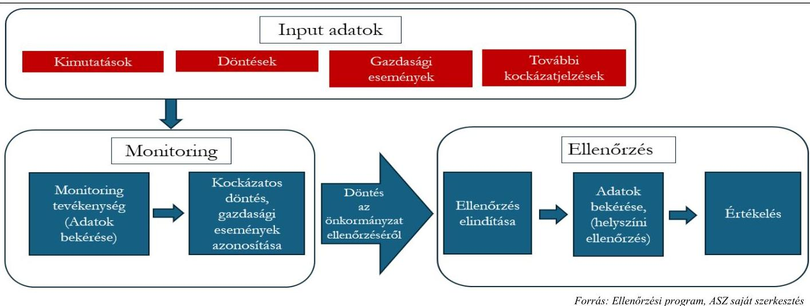

# JELENTÉS 

A 2024. évi önkormányzati és nemzetiségi önkormányzati választásokat követő időszakban hozott egyes gazdasági döntések ellenőrzése
2025.

---

# JELENTÉS 

A 2024. évi önkormányzati és nemzetiségi önkormányzati választásokat követő időszakban hozott egyes gazdasági döntések ellenőrzése
2025.

---

# ELLENŐRZÉSI IGAZGATÓSÁG: 

## ELLENŐRZÉSI IGAZGATÓSÁG II.

## ELLENŐRZÉSI IGAZGATÓ:

DR. BAFFIA GERGELY GÁBOR igazgató

## ELLENŐRZÉSVEZETŐ:

## SZAKONYI JÓZSEF ATTILA ellenőrzésvezető

Jelentéseink az interneten a www.asz.hu címen olvashatók.

IKTATÓSZÁM: EL-4076-004/2025
TÉMASORSZÁM: 46
ELLENŐRZÉS-AZONOSÍTÓ SZÁM: V1102

---

# TARTALOMJEGYZÉK 

AZ ELLENŐRZÉS ALAPADATAI ..... 5
AZ ELLENŐRZÉS HATÓKÖRE ÉS TERÜLETE ÉS AZ ELLENŐRZÖTT SZERVEZETEK ..... 8
ÖSSZEFOGLALÁS ..... 12
AZ ELLENŐRZÉS FÓKUSZTERÜLETE ..... 15
MEGÁLLAPÍTÁSOK ..... 16
JAVASLATOK ..... 38
MELLÉKLETEK ..... 47
I. sz. melléklet: Értelmező szótár ..... 47
II. sz. melléklet: Az ellenőrzött szervezetek jegyzéke ..... 49
III. sz. melléklet: Ellenőrzési kritériumok ..... 51
FÜGGELÉK: ÉSZREVÉTELEK ..... 54
RÖVIDÍTÉSEK JEGYZÉKE ..... 55

---

.

---

# AZ ELLENŐRZÉS ALAPADATAI 

## AZ ELLENŐRZÉS CÉLJA

Az ellenőrzés célja az önkormányzat ellenőrzésre kiválasztott, gazdasági kihatással bíró döntésének, kötelezettségvállalásának, gazdasági eseményének szabályszerűségi és célszerűségi szempontból történő értékelése, az önkormányzat pénzügyi és vagyoni helyzetére gyakorolt hatásának, továbbá a kapcsolódó közzétételi kötelezettség teljesítése szabályszerűségének megítélése volt.

## AZ ELLENŐRZÉS TÍPUSA

Kombinált ellenőrzés.

## AZ ELLENŐRZÖTT IDŐSZAK

A 2024. évi önkormányzati és nemzetiségi önkormányzati választások napja (2024. június 9.) és a 2019. évi önkormányzati választáson megszerzett mandátumok megszűnésének napja (2024. október 1.) közötti időszak volt.

Az adott kötelezettségvállalás/gazdasági esemény értékelése kapcsán az ellenőrzés során feltárt kockázatokra tekintettel az ellenőrzött időszak az ellenőrzés megkezdését követő öt évig (2019. január 1.) volt kiterjeszthető. Az ellenőrzött időszak kiterjesztésére Gárdony Város Önkormányzata, Kömörő Községi Önkormányzata, Mánd Község Önkormányzata, Mosonszolnok Község Önkormányzata, Nagykálló Város Önkormányzata, Nyírcsászári Község Önkormányzata, Nyúl Község Önkormányzata, Pakod Község Önkormányzata, Penészlek Község Önkormányzata, Túristvándi Község Önkormányzata és a működésükkel kapcsolatos feladatokat ellátó önkormányzati hivatalok tekintetében került sor.

## AZ ELLENŐRZÉS TÁRGYA

Az ellenőrzés tárgyát képezte az önkormányzat által vállalt kötelezettségvállalások, a pénzforgalomban megjelenő bevételek és kiadások teljesítésének, elszámolásának, közfeladat-ellátás céljára történő felhasználásának megfelelősége, célszerűsége, a döntések előkészítése és megalapozottsága, továbbá az ellenőrzött gazdasági eseménnyel, döntéssel kapcsolatos közzétételi kötelezettség teljesítése.

Az ellenőrzés kiterjedt minden olyan körülményre és adatra, amely az ÁSZ ${ }^{1}$ jogszabályban meghatározott feladatainak teljesítéséhez, valamint a program végrehajtása folyamán felmerült újabb összefüggések feltárásához szükséges volt.

## AZ ELLENŐRZÉS JOGALAPJA

Az ellenőrzés jogszabályi alapját az ÁSZ tv. ${ }^{2}$ 5. § (2), (4) és a (6) bekezdéseinek előírásai képezték.

---

# AZ ELLENŐRZÉS MÓDSZERE 

Az ellenőrzést a nemzetközi standardokat irányadónak tekintve az ellenőrzési program szempontjai, az ellenőrzött időszakban hatályos jogszabályok, az ellenőrzés szakmai szabályok és módszertanok figyelembevételével végezte az ÁSZ.

Az ellenőrzési kérdések megválaszolásához szükséges bizonyítékok megszerzése az ellenőrzött szervezetek által rendelkezésre bocsátott dokumentumok és adatok, valamint a Nemzeti Választási Iroda, a Kincstár ${ }^{3}$, a vármegyei kormányhivatalok által átadott adatok, információk értékelésével, továbbá helyszíni ellenőrzés, interjú, elemző eljárás útján történt.

Az ellenőrzés lefolytatásához az ellenőrzött szervezetek kimutatások kitöltésével, valamint az ÁSZ által kért dokumentumok, adatok, információk megküldésével szolgáltattak adatokat.

Az ellenőrzési bizonyítékként felhasználható adatforrások közé tartoztak a Nemzeti Választási Iroda, a Kincstár, a vármegyei kormányhivatalok által rendelkezésre bocsátott adat, dokumentum, valamint minden egyéb - az ellenőrzés folyamán feltárt, az ellenőrzés szempontjából információt tartalmazó - dokumentum.

Az ÁSZ az ellenőrzés célzott, erőforrástakarékos elvégzése érdekében részletes kockázatelemzést végzett. Ennek keretében első lépésként a 916 olyan önkormányzat közül, amelyek esetében a polgármester személye a választás eredménye következtében változott, kockázati szempontok alapján kiválasztott 113 önkormányzatot. Kiválasztási szempont volt többek között az önkormányzatok gazdálkodásának volumene, pénzügyi és vagyoni helyzete, adósságrendezési eljárással való érintettsége. A kiválasztott önkormányzatoknak az átmeneti időszakban hozott döntéseit, gazdasági eseményeit az ÁSZ monitoring tevékenység keretében folyamatosan elemezte.

A monitoring tevékenység alapját az önkormányzatok által kimutatásokon rendszeresen szolgáltatott adatok, az előre meghatározott kockázati szempontok szerint a vármegyei kormányhivatalok által összegyűjtött és az ÁSZ rendelkezésére bocsátott önkormányzati döntések, továbbá a Kincstár által az ÁSZ számára átadott, az ASP ${ }^{4}$ rendszerből származó, kockázati alapon leválogatott kiadási és bevételi gazdasági események jelentették. Az előre meghatározott kockázati szempontok többek között az alábbiak voltak:

- a polgármester vagy a képviselő-testület által kötött új szerződésekből eredő kötelezettségek, garancia- és kezességvállalások, követelésekről való lemondások, jutalmak, prémiumok kifizetése;
- az önkormányzati törzsvagyonba tartozó ingatlanok elidegenítése, vagyon tulajdonjogának ingyenes átruházása;
- a költségvetési rendeletek (kiadási/bevételi főösszeg 10,0\%-át meghaladó) módosításai;
- a hitelek és kölcsönök felvétele, több éves kihatású programokról, beruházásokról, felújításokról született önkormányzati döntésekből eredő kötelezettségek;
- az önkormányzati költségvetési szervek, gazdasági társaságok alapítása, átszervezése, megszüntetése területén hozott döntések.
A vármegyei kormányhivatalok, a Kincstár és az önkormányzatok által rendelkezésre bocsátott adatok egyedi elemzése alapján választotta ki az ÁSZ azokat az önkormányzati döntéseket/gazdasági eseményeket, amelyek esetében számvevőszéki ellenőrzést indított.

---

Az ellenőrzés folyamatát az 1. ábra mutatja be.
1. ábra

# AZ ELLENŐRZÉS FOLYAMATA 

Azoknál az önkormányzatoknál, ahol az ÁSZ a feltárt szabálytalanságoknak az ellenőrzés folyamatában történő kezelését indokoltnak tartotta, figyelemfelhívó levelek kiküldésére, intézkedések megtételére történő felhívásra került sor.

Az ellenőrzés kitért minden olyan körülményre és kérdésre, amely az ellenőrzési program végrehajtása kapcsán felmerült újabb összefüggéseknek az ellenőrzés céljaival összhangban lévő feltárásához szükséges volt.

---

# AZ ELLENŐRZÉS HATÓKÖRE ÉS TERÜLETE ÉS AZ ELLENŐRZÖTT SZERVEZETEK 

Az Alaptörvény ${ }^{5}$ 2022. év július 23-án módosult 35. cikk (2) bekezdése alapján a helyi önkormányzati képviselők és polgármesterek általános választását a helyi önkormányzati képviselők és polgármesterek előző általános választását követő ötödik év április, május, június vagy július hónapjában, az európai parlamenti képviselők választásával egyidejűleg kell megtartani. A 2024. évben a helyi önkormányzati választásokat június 9-én tartották. Az Alaptörvény Záró és vegyes rendelkezései 27. pontjában foglaltak szerint a hivatalban lévő képviselő-testület és polgármester megbízatása 2024. október 1-jéig tartott. A választás napja és a 2024. október 1-je közötti időszakban a választást megelőzően hivatalban lévő testületek (polgármesterek) gyakorolták a jogosítványukat (feladat- és hatáskörüket), amelynek során érvényesíteniük kellett a rendeltetésszerű joggyakorlás és a felelős gazdálkodás követelményét.

Az ellenőrzés előkészítő szakaszában, a választásokat megelőzően az ÁSZ a Közigazgatási és Területfejlesztési Minisztériummal és a Kincstárral közös közleményt adott ki, amelyben felhívta az önkormányzati tisztségviselők figyelmét arra, hogy az átmeneti időszakban is a szabályok betartásával, felelősen kell végezniük az önkormányzatok irányítását. A választásokat követően azon önkormányzatok esetén, ahol a választási eredmények ismeretében a polgármester személye változott, az ÁSZ tájékoztató levélben kérte a polgármestereket, hogy továbbra is a „jó gazda gondosságával" járjanak el a szükséges önkormányzati döntések meghozatala során.

Az országos nemzetiségi önkormányzatok esetében 2024. június 9-én a közgyűlés tagjait választották meg, az elnökök megválasztására - a közgyűlés tagjai közül - az alakuló üléseken került sor. Az alakuló üléseket 2024. október 1. napja utáni időpontra hívták össze, emiatt az ellenőrzött időszakban nem volt ismert, hogy az országos nemzetiségi önkormányzatok közül melyek esetében következett be a gazdálkodás szabályszerűségéért felelős elnökök személyében változás, ezért az országos nemzetiségi önkormányzatok közül monitoringra kijelölés nem történt.

Az ellenőrzés az ellenőrzésre kiválasztott gazdasági esemény, kötelezettségvállalás, valamint a gazdasági kihatással bíró önkormányzati döntésre fókuszált, a kiválasztott döntés/gazdasági esemény előkészítésére, megalapozottságára, szabályszerűségére, célszerűségére terjedt ki. Értékelési szempont volt továbbá a feltárt hiányosság az önkormányzat működésének hosszú távú fenntarthatóságára, a fizetőképességre, a közfeladatok ellátásának biztonságára, valamint a közzétételi kötelezettség teljesítése kapcsán az átlátható gazdálkodásra gyakorolt hatása.

Az ellenőrzött szervezetek és az ellenőrzést támogató szervezetek megnevezését a II. sz. melléklet tartalmazza.

Almásfúzítő község Komárom-Esztergom vármegyében, a Komáromi járásban fekszik. A település lakosainak száma 2024. január 1-jén 2052 fő volt. A 2024. szeptember 30. napjáig hivatalban lévő Polgármester 2017 óta látta el a polgármesteri feladatokat. Almásfúzítő Község Önkormányzata Képviselő-testületének a polgármesteren kívül hat fő képviselő tagja volt. Almásfúzítő Község Önkormányzata működésével kapcsolatos feladatokat az Almásfúzítői Polgármesteri Hivatal látta el. Az ellenőrzött időszakban a jegyző személye nem változott, feladatait 2011. március 1. - 2024. október 31. közötti időszakban látta el.

---

Balatonlelle város Somogy vármegyében, a Fonyódi Járásban található. A lakónépesség 2024. január 1-jén 4897 fő volt. Balatonlelle Város Önkormányzata 2024. szeptember 30. napjáig hivatalban lévő Polgármestere 2002. év óta látta el a polgármesteri feladatokat. Balatonlelle Város Önkormányzata Képviselőtestületének a polgármesteren kívül hat fő képviselő tagja volt. Az Önkormányzat működésével kapcsolatos feladatokat a Balatonlellei Polgármesteri Hivatal látta el. Az ellenőrzött időszakot követően változott a jegyző személye, a jelenlegi jegyző 2024. november 1. óta látta el a jegyzői feladatokat.

Bucsuta község Zala vármegyében, a Letenyei Járásban található. A lakónépesség 2024. január 1-jén 213 fő volt. Bucsuta Község Önkormányzata 2024. szeptember 30. napjáig hivatalban lévő Polgármestere 2010. év óta látta el a polgármesteri feladatokat. Bucsuta Község Önkormányzata Képviselő-testületének a Polgármesteren kívül négy fő képviselő tagja volt. Az Önkormányzat és még további öt önkormányzat működésével kapcsolatos feladatokat a Bánokszentgyörgyi Közös Önkormányzati Hivatal látta el. A Bánokszentgyörgyi Közös Önkormányzati Hivatal jelenlegi jegyzője 2013. január 1. óta látta el a jegyzői feladatokat.

Gárdony város Fejér vármegyében fekszik, a Gárdonyi járás székhelye. A település lakosainak száma 2024. január 1-jén 12667 fő volt. A 2024. szeptember 30. napjáig hivatalban lévő Polgármester 2006 óta látta el a polgármesteri feladatokat. Gárdony Város Önkormányzat Képviselő-testületének a Polgármesteren kívül 11 fő képviselő tagja volt. Gárdony város működésével kapcsolatos feladatokat a Gárdonyi Polgármesteri Hivatal látta el, amelyet a jegyző 2020. január 6. óta vezetett.

Kömörő község az Észak-Alföldi régióban, Szabolcs-Szatmár-Bereg vármegyében, a Fehérgyarmati járásban található. A település lakosainak száma 2024. január 1-jén 555 fő volt. A 2024. szeptember 30. napjáig hivatalban lévő Polgármester 2019 óta látta el a polgármesteri feladatokat. Kömörő Község Önkormányzat Képviselő-testületének a Polgármesteren kívül négy fő képviselő tagja volt. Az önkormányzat működésével kapcsolatos feladatokat a Túristvándi Közös Önkormányzati Hivatal 2020. január 1-jétől látta el. Az ellenőrzött időszakban - 2024. augusztus 15. napjával - a jegyző személye változott. Az ellenőrzött időszakban Kömörő Községi Önkormányzat adósságrendezési eljárás alatt állt.

Kübekháza község Csongrád-Csanád vármegyében, a Szegedi járásban található. A lakónépesség 2024. január 1-jén 1585 fő volt. Kübekháza Községi Önkormányzat 2024. szeptember 30. napjáig hivatalban lévő Polgármestere 2002. év óta látta el a polgármesteri feladatokat. Kübekháza Községi Önkormányzat Képviselőtestületének a Polgármesteren kívül hat fő képviselő tagja volt. Kübekháza Községi Önkormányzat működésével kapcsolatos feladatokat a Kübekházi Közös Önkormányzati Hivatal végezte. Az ellenőrzött időszakban a Kübekházi Közös Önkormányzati Hivatal jegyzőjének személye 2024. szeptember 5-én változott.

Mánd község az Észak-Alföldi régióban, Szabolcs-Szatmár-Bereg vármegyében, a Fehérgyarmati Járásban található. A település lakosainak száma 2024. január 1-jén 315 fő volt. A 2024. szeptember 30. napjáig hivatalban lévő Polgármester 2014 óta látta el a polgármesteri feladatokat. A Mánd Község Önkormányzata Képviselő-testületének a Polgármesteren kívül négy fő képviselő tagja volt. Mánd Község Önkormányzata működésével kapcsolatos feladatokat a

 Túristvándi Közös Önkormányzati Hivatal 2020. január 1-jétől, a Kisari Közös Önkormányzati Hivatal pedig 2025. január 1-jétől látta el. Az ellenőrzött időszakban – 2024. augusztus 15. napjával – a jegyző személye változott. Az Önkormányzat az ellenőrzött időszakban 2024. július 27-ig adósságrendezési eljárás alatt állt.

Miháld község Zala vármegyében, a Nagykanizsai járásban fekszik. A település lakosainak száma 2024. január 1-jén 791 fő volt. Miháld Község Önkormányzata 2024. szeptember 30-ig hivatalban lévő Polgármestere 2011. év óta látta el a polgármesteri feladatokat. A Képviselő-testületnek a Polgármesteren kívül négy fő képviselő tagja volt. Miháld Község Önkormányzata működésével kapcsolatos feladatokat a Nagyrécsei

---

Közös Önkormányzati Hivatal látta el 2013. január 1-től. A jelenlegi jegyző 2024. január 8. óta látta el a jegyzői feladatokat.

Mosonszolnok község Győr-Moson-Sopron vármegyében, a Mosonmagyaróvári járásban fekszik. A település lakosainak száma 2024. január 1-jén 1947 fő volt. A 2024. szeptember 30. napjáig hivatalban lévő Polgármester 1998 óta látta el a polgármesteri feladatokat. Mosonszolnok Község Önkormányzata Képviselőtestületének a Polgármesteren kívül hat fő képviselő tagja volt. Mosonszolnok Község Önkormányzata működésével kapcsolatos feladatokat a Mosonszolnoki Közös Önkormányzati Hivatal látja el 2013. március 1-től. A jelenlegi jegyző 2013. március 1. óta látja el a jegyzői feladatokat.

Nagykálló város az Észak-Alföldi régióban, Szabolcs-Szatmár-Bereg vármegyében, a Nagykállói járásban található. A település lakosainak száma 2024. január 1-jén 9403 fő volt. A 2024. szeptember 30. napjáig hivatalban lévő Polgármester 2019 óta látta el a polgármesteri feladatokat. A Képviselő-testületnek a Polgármesteren kívül nyolc fő képviselő tagja volt. Az Önkormányzat működésével kapcsolatos feladatokat a Nagykállói Polgármesteri Hivatal látta el. A jelenlegi jegyző 2015. január 1. óta látja el a jegyzői feladatokat.

Nyírcsaholy község az Észak-Alföldi régióban, Szabolcs-Szatmár-Bereg vármegyében, a Mátészalkai járásban található. A lakónépesség 2024. január 1-jén 2296 fő volt. Nyírcsaholy Község Önkormányzata 2024. szeptember 30-ig hivatalban lévő Polgármestere 2016. év óta látta el a polgármesteri feladatokat. Nyírcsaholy Község Önkormányzata Képviselő-testületének a Polgármesteren kívül hat fő képviselő tagja volt. Nyírcsaholy Község Önkormányzata működésével kapcsolatos feladatokat a Nyírcsaholyi Polgármesteri Hivatal látta el. Az ellenőrzött időszakban a jegyző személye nem változott, feladatait 2023. május 4-étől látta el.

Nyírcsászári község az Észak-Alföldi régióban, Szabolcs-Szatmár-Bereg vármegyében, a Nyírbátori járásban található. A lakónépesség 2024. január 1-jén 1209 fő volt. Nyírcsászári Község Önkormányzata Képviselő-testületének a Polgármesteren kívül hét fő képviselő tagja volt. Nyírcsászári Község Önkormányzata működésével kapcsolatos feladatokat 2013. február 1-jétől a Nyírcsászári Közös Önkormányzati Hivatal látta el. Az ellenőrzött időszakban a jegyző személye nem változott.

Nyúl község Győr-Moson-Sopron vármegyében, a Győri járásban fekszik. A település lakosainak száma 2024. január 1-jén 4732 fő volt. Nyúl Község Önkormányzata 2024. szeptember 30-ig hivatalban lévő Polgármestere 2006 óta állt a település élén. Nyúl Önkormányzata Képviselő-testületének a Polgármesteren kívül hat fő képviselő tagja van. Nyúl Község Önkormányzata működésével kapcsolatos feladatokat a Nyúli Polgármesteri Önkormányzati Hivatal látta el. Az ellenőrzött időszakban hivatalban levő jegyző 2023. december 1. óta látta el a jegyzői feladatokat.

Pakod község Zala vármegyében, a Zalaszentgróti járásban fekszik. A település lakosainak száma 2024. január 1-jén 870 fő volt. Pakod Község Önkormányzata Képviselő-testületének a Polgármesteren kívül négy fő képviselő tagja van. Pakod Község Önkormányzata működésével kapcsolatos feladatokat a Kehidakustányi Közös Önkormányzati Hivatal végezte 2020. január 1-től. A jelenlegi jegyző 2024. április 1. óta látta el a jegyzői feladatokat.

Penészlek község Szabolcs-Szatmár-Bereg vármegyében, a Nyírbátori járásban fekszik. A település lakosainak száma 2024. január 1-jén 1031 fő volt. Penészlek Község Önkormányzata 2024. szeptember 30-ig hivatalban lévő Polgármestere 2010 óta áll a település élén. Penészlek Község Önkormányzata Képviselőtestületnek a Polgármesteren kívül 6 fő képviselő tagja volt. Penészlek Község Önkormányzata működésével kapcsolatos feladatokat az Encsencsi Közös Önkormányzati Hivatal látta el. A jelenlegi jegyző 2013. március 1. óta látta el a jegyzői feladatokat.

---

Sárospatak város Borsod-Abaúj-Zemplén vármegyében, a Sárospataki járás székhelye. A lakónépesség 2024. január 1-jén 11357 fő volt. Sárospatak Város Önkormányzatának 2024. szeptember 30. napjáig hivatalban lévő Polgármestere 2010. év óta látta el a polgármesteri feladatokat. Sárospatak Város Önkormányzata Képviselő-testületének a Polgármesteren kívül tizenegy fő képviselő tagja volt. Sárospatak Város Önkormányzatának működésével kapcsolatos feladatokat a Sárospataki Polgármesteri Hivatal végezte. A Sárospataki Polgármesteri Hivatal jegyzőjének személye az ellenőrzött időszakot követően 2024. október 1-jétől változott.

Tiszabő község Jász-Nagykun-Szolnok vármegyében, a Kunhegyesi járásában található. A település népességszáma 2024. január 1-én 2292 fő volt. Tiszabő Községi Önkormányzata 2024. szeptember 30. napjáig hivatalban lévő Polgármestere a 2019. év óta látta el a polgármesteri feladatokat. Tiszabő Községi Önkormányzat Képviselő-testületének a Polgármesteren kívül hat tagja van. Tiszabő Községi Önkormányzat működésével kapcsolatos feladatokat a Tiszabői Polgármesteri Hivatal végezte. A Tiszabői Polgármesteri Hivatal jegyzőjének személye az ellenőrzött időszakban, 2024. szeptember 5-én változott.

Túristvándi község az Észak-Alföldi régióban, Szabolcs-Szatmár-Bereg vármegyében, a Fehérgyarmati járásban található. A település lakosainak száma 2024. január 1-jén 759 fő volt. Túristvándi Község Önkormányzata 2024. szeptember 30. napjáig hivatalban lévő Polgármestere 2013. év óta látta el a polgármesteri feladatokat. Túristvándi Község Önkormányzata Képviselő-testületének a Polgármesteren kívül négy fő képviselő tagja volt. Túristvándi Község Önkormányzata működésével kapcsolatos feladatokat 2020. január 1-től a Túristvándi Közös Önkormányzati Hivatal látta el. Az ellenőrzött időszakban a Túristvándi Közös Önkormányzati Hivatal jegyzőjének személye 2024. augusztus 15. napjával változott. Az ellenőrzött időszakban Túristvándi Község Önkormányzata adósságrendezési eljárás alatt állt.

---

# ÖSSZEFOGLALÁS 

A 2024. évben az újonnan megválasztott polgármesterek és képviselők csaknem négy hónappal az önkormányzati választás napját követően vették át az önkormányzatok irányítását. Az átmeneti időszakra vonatkozóan azonosított kockázatok alapján az ÁSZ ellenőrzése az önkormányzatok szabályszerű működésének és gazdálkodásának elősegítésére, a szabálytalanságok megelőzésére, illetve mielőbbi feltárására fókuszált.

Az ellenőrzés előkészítő szakaszában kiadott közös közlemény és a polgármestereknek megküldött tájékoztató levél hatására a monitoring rendszerbe bevont önkormányzatok közül kilenc önkormányzat képviselő-testülete elhalasztotta az önkormányzatok jövőbeni működését befolyásoló döntéseit.

Az ÁSZ által működtetett monitoring eredményeként az ÁSZ 18 önkormányzatnál indított el számvevőszéki ellenőrzést, amelyek során az alábbi hiányosságokat tárta fel.

Az ellenőrzött önkormányzatok 27,8%-a – öt önkormányzat képviselő-testülete – a leköszönő képviselő-testület tagjai – köztük a tanácsnok – részére szabálytalanul döntött jutalom kifizetéséről. A jogszabályi előírások ellenére négy önkormányzat képviselő-testülete – a tiszteletdíjon kívül – az önkormányzati képviselők munkájának elismeréseként jutalmat, illetve egy önkormányzat képviselő-testülete a 2024. évre a polgármester és az alpolgármester részére nem időarányos összegű jutalmat állapított meg.

Az ellenőrzött 18 önkormányzat közül egy önkormányzat a törvényi előírások ellenére arról döntött, hogy a helyi iparűzési adóból származó többletbevételt az önkormányzati hivatal állományában foglalkoztatottak személyi juttatásai és az ahhoz kapcsolódó munkaadókat terhelő járulékok és szociális hozzájárulási adó finanszírozására fordítja.

Hat önkormányzat jegyzője az önkormányzat képviselő-testületének nem jelezte azt, hogy a meghozott döntés jogszabálysértő, ezzel a jegyzők nem tettek eleget a jogszabályi kötelezettségüknek, amivel veszélyeztették az önkormányzatok szabályszerű működését.

Az ÁSZ kettő ellenőrzött önkormányzat esetében állapította meg, hogy a jegyző a jogszabályban foglaltak ellenére a képviselő-testületi ülésekről készült jegyzőkönyveket nem töltötte fel az előírt határidőn belül a Törvényességi Felügyelet Írásbeli Kapcsolattartás Modulon keresztül a vármegyei kormányhivatal számára, ezzel nem tett eleget a jogszabályban foglalt kötelezettségének és nem tette lehetővé, hogy a vármegyei kormányhivatal a törvényességi felügyeleti eljárása keretében a helyi önkormányzat képviselő-testületének működése jogszerűségét biztosítsa.

Kettő ellenőrzött önkormányzat az önkormányzati ingatlanok értékesítéséről szóló döntések vonatkozásában az eladási árakra vonatkozóan forgalmi értékbecslésekkel nem rendelkezett, így az eladási árak nem voltak alátámasztottak, ezzel az ingatlanértékesítésekről szóló döntésekkel sérült a törvényben megfogalmazott, a nemzeti vagyonnal történő felelős gazdálkodás elve.

Egy ellenőrzött önkormányzat a törvényi előírás ellenére az önkormányzati vagyonnal történő gazdálkodás szabályait rendeletben nem határozta meg. Egy másik ellenőrzött önkormányzatnál az önkormányzati tulajdonú ingatlanokra vonatkozó elbirtoklások miatt nem volt biztosított a törvényben előírt, a nemzeti vagyonnal történő felelős, rendeltetésszerű gazdálkodás.

Egy önkormányzat vagyonkatasztere nem tartalmazta az önkormányzat valamennyi, a valóságban fellelhető ingatlanát, ennek következtében az önkormányzat tárgyi eszközökről vezetett nyilvántartása nem volt teljeskörű. A költségvetési beszámolói mérlege ingatlanokra vonatkozó adatai, illetve azoknak a leltárral való

---

alátámasztottsága nem volt megfelelő. Mindez kockázatot jelent az önkormányzati vagyon megőrzésére, és a vagyonnal való átlátható és hatékony gazdálkodásra. A feltárt hiányosság a mérleg valódiságát nem befolyásolta.

Kettő ellenőrzött önkormányzatnál a gazdálkodási jogkörgyakorlás során nem tartották be a törvényi előírásokat, mivel a kötelezettségvállalást pénzügyi ellenjegyzés nem előzte meg, továbbá nem biztosították, hogy kifizetést elrendelni, csak utalványozás alapján lehet. A hiányosságok rendszerszerű előfordulása kockázatot jelent a kifizetések szabályszerűségére, megalapozottságára, ezáltal az önkormányzatok gazdálkodására.

Kettő ellenőrzött önkormányzat esetében a kiválasztott gazdasági műveletek, események bizonylatokkal nem voltak alátámasztottak, így nem volt igazolt, hogy ezek az önkormányzatok a költségvetési forrásokat a törvényben meghatározott feladataik ellátására használták fel.

Egy ellenőrzött önkormányzat a törvényben előírt határidőben nem tett eleget a pénzeszközöket érintő gazdasági események, műveletek bizonylati adatainak könyvekben való rögzítési kötelezettségének. A 2024. június–augusztus hónapokról elkészített időközi költségvetési jelentések tekintetében az önkormányzat adatszolgáltatását a Kincstár visszautasította, mivel az általa elrendelt javításokat, kiegészítéseket az önkormányzat nem megfelelően teljesítette. A gazdasági események számviteli nyilvántartásokban történő késedelmes rögzítése miatt a gazdasági események nem voltak ellenőrizhetőek, illetve a gazdasági események nem megfelelő dokumentáltsága kockázatot jelent az önkormányzat költségvetési gazdálkodására és az államháztartás információs rendszerébe történő havi adatszolgáltatások valós adattartalmára.

Kettő önkormányzat képviselő-testülete a jogszabályban foglaltak ellenére az adósságrendezési eljárás alatt válságköltségvetést nem fogadott el. Ezzel nem biztosították az adósságrendezés érdekében azt, hogy az önkormányzatok pénzügyileg megalapozottan működjenek.

Kettő önkormányzat a költségvetési támogatását a támogatás eredeti céljától eltérően más célra is igénybe vette, a támogatások jogszabályellenes, nem rendeltetésszerű, illetve nem a projekt céljának megvalósítására történt felhasználásával veszélyeztették az önkormányzat gazdálkodásának biztonságát és a beruházások megvalósítását.

Egy ellenőrzött önkormányzat esetében a belső szabályzatban foglaltak ellenére a közbeszerzési szakértő megbízására vonatkozó döntést a képviselő-testület késedelmesen, a feladat részbeni elvégzését követően hozta meg, mivel a közbeszerzési szakértő megbízásáról és a közbeszerzési szakértő által előkészített, közbeszerzési eljárást megindító felhívás kiírásáról egyidőben döntött.

Az ellenőrzött önkormányzatok 94,4%-ának – 17 önkormányzatnak – a közzétételre szolgáló honlapja nem volt alkalmas a törvény által elvárt cél – az elektronikusan közzétett adatok egyszerű és gyors elérhetőségének – megvalósítására. A közzétételi struktúra kialakításának és az adatok feltöltésének hiányában az ellenőrzött szervezetek nem biztosították a közérdekű adatok megismerhetőségét, a működés és a gazdálkodás átláthatóságát.

Az ellenőrzés során feltárt jogszabálysértő gyakorlat megszüntetése érdekében hat önkormányzat polgármesteréhez figyelemfelhívó levéllel fordult az ÁSZ. A polgármesterek a figyelemfelhívó levélben foglalt, összesen 13 szabálytalansággal kapcsolatosan értesítették az ÁSZ elnökét arról, hogy a megfelelő intézkedéseket megtették.

---

Az ellenőrzés során feltárt szabálytalanságok és figyelemfelhívások összesítését az 1. táblázat tartalmazza. 1.
 táblázat

FELTÁRT SZABÁLYTALANSÁGOK ÉS A FIGYELEMFELHIVÁSOK ÖSSZESÍTÉSE

| A SZABÁLYTALANSÁG   MEGONEVEZÉSE | A   SZABÁLYTALAN-   SÁGGAL   ÉRINTETT   ÖNKORMÁNYZA-   TOK SZÁMA   (DB) | FIGYELEMFELHIVÓ   LEVÉL A   SZABÁLYTALANSÁG   MEGSZÜNTETÉSE   ÉRDEKÉBEN   KIKÜLDÉSRE KERÜLT   (DB) | FIGYELEMFELHIVÓ   LEVÉL ALAPJÁN AZ   INTÉZKEDÉST   MEGTETTÉK   (DB) |
| :--: | :--: | :--: | :--: |
| A képviselő-testület tagjai - köztük a tanácsnok - részére történt jutalom jogszabálysértő megállapítása | 5 | - | - |
| Helyi iparűzési adó többletbevételének előirányzatok közötti szabálytalan átcsoportosítása | 1 | - | - |
| Jegyző jelzési kötelezettségének elmulasztása | 6 | - | - |
| Az adatszolgáltatási kötelezettség késedelmes teljesítése a vármegyei kormányhivatal részére | 2 | 2 | 2 |
| Ingatlanok értékesítésével kapcsolatos hiányosságok | 2 | 1 | 1 |
| Vagyongazdálkodással kapcsolatos szabályozási hiányosság | 1 | - | - |
| Az ingatlanvagyon kataszter vezetésének hiányossága | 1 | 1 | 1 |
| Gazdálkodási jogkörgyakorlással összefüggő hiányosságok | 2 | 1 | 1 |
| Számviteli nyilvántartásban bizonylat nélküli rögzítés | 2 | 2 | 2 |
| A pénzeszközöket érintő gazdasági események késedelmes rögzítése a könyvekben | 1 | 1 | 1 |
| Az adóságrendezési eljárás alatt az önkormányzat nem válságköltségvetés alapján gazdálkodott | 2 | - | - |
| Költségvetési támogatás más célra történő igénybevétele kincstári fizetési számláról | 2 | - | - |
| A közbeszerzési eljárást megindító felhívás közzétételére vonatkozó döntés előkészítése | 1 | - | - |
| Közérdekű adatok közzétételének hiányossága | 17 | 5 | 5 |

Forrás: A Kincstár, a Kormányhivatalok és a monitorizált önkormányzatok adatszolgáltatásai, ASZ saját szerkesztés
Egy közös önkormányzati hivatal jegyzője az ÁSZ tv. 29. § (2) bekezdés szerinti, a jelentéstervezet megállapításaira tett észrevételében arról tájékoztatta az ÁSZ-t, hogy a közérdekű adatok Info tv. 37. § (1) bekezdése előírása szerinti közzététele iránt történtek intézkedések, ezzel az ÁSZ megállapításai az ellenőrzés során hasznosultak.

---

# AZ ELLENŐRZÉS FÓKUSZTERÜLETE 

Az önkormányzat ellenőrzésre kiválasztott gazdasági kihatással bíró döntésének, kötelezettségvállalásának megalapozottsága és előkészítettsége, a költségvetési kiadások, bevételek teljesítésének, elszámolásának megfelelősége és célszerűsége, az önkormányzat pénzügyi és vagyoni helyzetére gyakorolt hatása, továbbá a közzétételi kötelezettség szabályszerű teljesítése

---

# 1. Kömörő Községi Önkormányzat 

Összegző megállapítás

Kömörő Községi Önkormányzat az adósságrendezési eljárás alatt az Mötv. ${ }^{6}$ rendelkezése ellenére válságköltségvetéssel nem rendelkezett, az Áht.7-ban foglaltak ellenére a 162,0 M Ft összegű támogatást nem a támogatott célra fordította, az ellenőrzött gazdasági eseményeket a számviteli nyilvántartásába nem szabályszerűen jegyezte be. A 2023. évi zárszámadási rendeletét 97 napos késedelemmel fogadta el. Közérdekű adatainak megismerhetőségét nem biztosította. Mindez kockázatot jelent az önkormányzat szabályszerű, átlátható gazdálkodására.

Az ÁSZ az ellenőrzés keretében kettő önkormányzati gazdasági eseményt értékelt:

- egyéb szolgáltatások 2024. június 17-én történő teljesítését 103,6 E Ft összegben,
- munkavégzésre irányuló egyéb jogviszonyban nem saját foglalkoztatottnak 2024. június 30-án kifizetett juttatásokat 45,3 E Ft összegben.
Kömörő Községi Önkormányzat az értékelt gazdasági események esetében nem rendelkezett a gazdasági eseményeket alátámasztó bizonylatokkal, ezzel megsértették a Számv. tv. ${ }^{8}$ 165. § (2) bekezdésében foglaltakat. A dokumentumok hiányában az Mötv. 111. § (2) bekezdésében foglaltak ellenére nem volt alátámasztott, hogy Kömörő Községi Önkormányzat a költségvetési forrásokat a törvényben meghatározott kötelező feladatai ellátására használta fel, ezáltal nem volt igazolt, hogy a kifizetések szabályszerűen történtek.
Az Mötv. 115. § (1) bekezdésében előírtak ellenére Kömörő Községi Önkormányzat polgármestere az önkormányzat gazdálkodásának szabályszerűségéről a felelősségi jogkörében maradéktalanul nem gondoskodott, mivel a feltárt hiányosságok rendszeresen előfordultak. A Túristvándi Közös Önkormányzati Hivatal jegyzője a Hatásköri tv. ${ }^{9} 140. § (1) bekezdésben foglalt feladat és hatáskörében teljeskörűen nem tett eleget a polgármesteri hivatal, mint költségvetési szerv operatív gazdálkodási feladatai irányítási feladatainak, valamint a Bkr. ${ }^{10} 3. § c) pontja szerinti felelősségi körében az Áht. 37. § (1) bekezdésében és az Áht. 38. § (1) bekezdésében meghatározott kontrolltevékenységek kialakítása és működtetése tekintetében.
A TOP-2.1.3.-16-SB2-2020-00015 kódszámú, „Kömörő Község belterületének védelmét szolgáló vízelvezető-hálózat, fejlesztése, rekonstrukciója" támogatás szabálytalan felhasználása következtében Kömörő Községi Önkormányzatnak 437,0 M Ft kamatokkal növelt mértékű támogatás visszafizetési kötelezettsége keletkezett. Ezzel összefüggésben Kömörő Községi Önkormányzat esetében 2024. április 18-án adósságrendezési eljárás került megindításra. Kömörő Községi Önkormányzat Kincstárnál vezetett vonatkozó „EU program lebonyolítási számláján" - a Közigazgatási és Területfejlesztési Minisztérium szabálytalansági eljárás lezárásáról szóló értesítése alapján, az utolsó rendelkezésre álló banki kivonat szerint - a felhasználható egyenleg a 400,4 M Ft helyett 2023. június 16-án 1,8 M Ft volt.

---

Kömörő Községi Önkormányzat a Kincstárnál az EU programokhoz kapcsolódóan három lebonyolítási számlával rendelkezett, amelyekről 2022. október 17. napja és 2023. november 7. napja közötti időszakban kilenc alkalommal összesen 162,0 M Ft összegben átutalási megbízást indított a saját és további kettő (Túristvándi és Mánd) önkormányzat költségvetési számláira. Ebből a saját pénzforgalmi bankszámlájára négy alkalommal összesen 128,2 M Ft-ot, valamint Túristvándi Község Önkormányzata részére négy alkalommal összesen 20,5 M Ft-ot, Mánd Község Önkormányzata részére egy alkalommal 13,3 M Ft-ot utalt. Kömörő Községi Önkormányzat a kötött felhasználású forrásokat tartalmazó kincstári számláiról történő utalásokkal megsértette az Áht. 51. § (4) bekezdésében előírtakat, mivel a Kincstárnál vezetett „EU program lebonyolítási számla" fizetési számláiról nem a költségvetési támogatások célja szerinti kiadásokat is teljesítette. Kömörő Községi Önkormányzat az EU programokhoz kapcsolódóan az eredeti céljaikra nyújtott támogatások a jóváhagyott céltól eltérő felhasználásával a költségvetésnek 162,0 M Ft összegben vagyoni hátrányt okozott.
A 2022-2023. években a Kincstárnál vezetett „EU program lebonyolítási számla" elnevezésű számláiról történő átutalással Túristvándi Község Önkormányzata és Mánd Község Önkormányzata, továbbá a költségvetési számlájáról történő átutalással - 123,8 M Ft összegben - Túristvándi Község Önkormányzata részére kölcsönt nyújtott annak ellenére, hogy a 4/2013. (IX. 30.) önkormányzati rendelete ${ }^{11} 8. § (3) bekezdésében a Képviselő-testület nem hatalmazta fel a polgármestert arra, hogy az önkormányzat pénzeszközeinek - kölcsön formájában történő - átadásáról döntést hozzon. A kifizetés teljesítéséről/engedélyezéséről Kömörő Községi Önkormányzatának Képviselő-testülete nem döntött. A kölcsönnyújtások céljával, az egyes számlákról történt átvezetések esetében a polgármester felelősségi körében nem biztosította az önkormányzat gazdálkodásának szabályszerűségét, ezáltal megsértette az Mötv. 115. § (1) bekezdésében foglaltakat.
Túristvándi Község Önkormányzata bankszámla kivonatai és a polgármester nyilatkozata alapján Kömörő Község Önkormányzata által, Túristvándi Község Önkormányzatának nyújtott kölcsönökből - 123,8 M Ft + 20,5 M Ft-ból, összesen 144,3 M Ft-ból - 2024. január 17. napjáig összesen 96,4 M Ft-ot térítettek meg.
Kömörő Községi Önkormányzat az Óatv. ${ }^{12}$ 19. § (4) bekezdésében foglaltak ellenére az adósságrendezési eljárás megindítása időpontjától számított 90 napjáig válságköltségvetést nem fogadott el, azzal az ellenőrzött időszakban nem rendelkezett. Az Mötv. 122. §-ban foglaltak ellenére Kömörő Községi Önkormányzat az adósságrendezési eljárás ideje alatt nem válságköltségvetés alapján gazdálkodott.
Az Áht. 91. § (1) bekezdésében foglaltak ellenére Kömörő Községi Önkormányzat 2023. évi költségvetésének végrehajtására vonatkozó zárszámadási rendelet tervezetét a polgármester nem terjesztette a Képviselő-testület elé úgy, hogy a rendelet legkésőbb a költségvetési évet követő ötödik hónap utolsó napjáig hatályba lépjen. Kömörő Községi Önkormányzat Képviselő-testületének a 2023. évi pénzügyi terv végrehajtásáról szóló 2/2024. (IX. 5.) önkormányzati rendelete 2024. szeptember 6.-án - 97 napos késedelemmel - lépett hatályba.
Kömörő Községi Önkormányzat nem biztosította a közérdekű adatok megismerhetőségét, az önkormányzat működésének és gazdálkodásának átláthatóságát, mivel az Info tv. ${ }^{13}$ 37. § (1) bekezdésében és a 18/2005. (XII. 27.) IHM rendelet ${ }^{14}$ 2. mellékletében előírtak szerint az általános közzétételi listában meghatározott adatokat nem tette közzé.

---

Az ellenőrzés során feltárt szabálytalanságok megszüntetése érdekében a 2024. évi helyi önkormányzati választáson megválasztott polgármester részére az ÁSZ tv. 31. §-ában szabályozott figyelemfelhívó levél került megküldésre. A 2024. évi helyi önkormányzati választáson megválasztott polgármester a figyelemfelhívó levélben foglaltakat a jogszabályban meghatározott határidőt betartva, tizenöt napon belül elbírálta és az intézkedések megtételéről az ÁSZ elnökét értesítette. A 2024. évi helyi önkormányzati választáson megválasztott polgármester az értesítésében arról tájékoztatta az ÁSZ elnökét, hogy a számviteli (könyvviteli) nyilvántartásokban történő bejegyzésre vonatkozó előírással és a közérdekű adatok kötelező közzétételével kapcsolatban feltárt szabálytalanságok megszüntetése érdekében a szükséges intézkedéseket megtette.

# 2. Mánd Község Önkormányzata 

Összegző megállapítás A Túristvándi Közös Önkormányzati Hivatal jegyzője a 2024. augusztus 15. napját megelőző időszakban a képviselőtestület döntéseit a Törvényességi Felügyelet Írásbeli Kapcsolattartás Modul igénybevételével a vármegyei kormányhivatalnak az előírt 15 napon belül nem küldte meg. Mánd Község Önkormányzata a közérdekű adatainak megismerhetőségét nem biztosította. Az ellenőrzött (egyéb szolgáltatások) gazdasági esemény szabályszerű volt.

Az ÁSZ az ellenőrzés keretében Mánd Község Önkormányzatának egy gazdasági eseményét - bankköltség - értékelt.
A K337 Egyéb szolgáltatások rovaton a pénzügyi szolgáltatásokkal összefüggésben felmerült díjat számoltak el, amely utalványrendelettel alátámasztott volt. Az értékelt gazdasági esemény az Áht. és az Ávr. ${ }^{15}$ előírásainak megfelelt.
A 2024. június 24-i képviselő-testületi ülés tekintetében a 2024. augusztus 15. napját megelőző időszakban hivatalban lévő jegyző nem szolgáltatott adatot a Törvényességi Felügyelet Írásbeli Kapcsolattartás Modulba. A jegyzőkönyveket nem töltötte fel az előírt határidőn - a képviselő-testületi ülést követő tizenöt napon - belül a Törvényességi Felügyelet Írásbeli Kapcsolattartás Modulon keresztül a vármegyei kormányhivatal számára, ezért nem tett eleget a 338/2011. (XII. 29.) Korm. rendelet 8/A. § (5) bekezdésében foglalt feltöltési kötelezettségének. A jegyző a Képviselő-testület 2024. június 24-ei ülésének jegyzőkönyvét az ülést követő 74. napon, 2024. szeptember 6-án küldte meg a vármegyei kormányhivatalnak.
Mánd Község Önkormányzata az Mötv. előírásának megfelelően az adósságrendezési eljárás alatt Mánd Község Önkormányzata Képviselő-testületének az adósságrendezési eljárás válságköltségvetéséről szóló 1/2024. (I. 11.) önkormányzati rendelete alapján gazdálkodott.

---

A polgármester, mint a szervezet első számú vezetője nem tett eleget az Info tv. 37. § (1) bekezdésében és a 18/2005. (XII. 27.) IHM rendelet 2. mellékletében előírtaknak, mivel Mánd Község Önkormányzata honlapján a helyszíni ellenőrzés napjáig, 2024. augusztus 28-ig az általános közzétételi listában meghatározott adatok nem voltak elérhetőek, ezáltal nem biztosította a közérdekű adatok megismerhetőségét, az önkormányzat működésének és gazdálkodásának átláthatóságát.

Az ellenőrzés során feltárt szabálytalanságok megszüntetése érdekében a 2024. évi helyi önkormányzati választáson megválasztott polgármester részére az ÁSZ tv. 31. §-ában szabályozott figyelemfelhívó levél került megküldésre. A polgármester a figyelemfelhívó levélben foglaltakat a jogszabályban meghatározott határidőt betartva, tizenöt napon belül elbírálta és az intézkedések megtételéről az ÁSZ elnökét értesítette. A polgármester az értesítésében arról tájékoztatta az ÁSZ elnökét, hogy a kormányhivatallal történő írásbeli kapcsolattartással és a közérdekű adatok kötelező
 közzétételével kapcsolatban feltárt szabálytalanságok megszüntetése érdekében a szükséges intézkedéseket megtette.

# 3. Túristvándi Község Önkormányzata 

Összegző megállapítás

Túristvándi Község Önkormányzata az adósságrendezési eljárás alatt az Mötv. rendelkezése ellenére válságköltségvetéssel nem rendelkezett. A 2023. évi zárszámadási rendeletét 152 napos késedelemmel fogadta el. Közérdekű adatainak megismerhetőségét nem biztosította. Mindez kockázatot jelent az önkormányzat szabályszerű, átlátható gazdálkodására. Az ellenőrzött (munkavégzésre irányuló egyéb jogviszonyban nem saját foglalkoztatottnak fizetett juttatás teljesítése) gazdasági esemény szabályszerű volt.

Az ÁSZ az ellenőrzés keretében Túristvándi Község Önkormányzatának egy gazdasági eseményét - munkavégzésre irányuló egyéb jogviszonyban, nem saját foglalkoztatottnak fizetett juttatás teljesítése - értékelte. Az értékelt gazdasági eseményhez kapcsolódóan kiállított bizonylatokat az ellenőrzés végrehajtása ideje alatt Túristvándi Község Önkormányzata nem bocsátotta az ÁSZ rendelkezésére, az alátámasztó bizonylatokat a figyelemfelhívó levél hatására bocsátotta rendelkezésre. A 2024. június 27-én 69,9 E Ft összegben történt munkavégzésre irányuló egyéb jogviszonyban nem saját foglalkoztatottnak fizetett juttatás gazdasági esemény az Áht. és az Ávr. előírásainak megfelelt, a kifizetés bizonylatokkal alátámasztott volt.
Túristvándi Község Önkormányzata ellen a TOP Plusz-1.2.3-21-SB1 Belterületi utak fejlesztése beruházáshoz kapcsolódóan, $72,8 \mathrm{M}$ Ft összegben 2024. január 10. napjával adósságrendezési eljárás került megindításra. Az Mötv. 122. §-ban foglaltak ellenére Túristvándi Község Önkormányzata az adósságrendezési eljárás ideje alatt nem válságköltségvetés alapján gazdálkodott. Túristvándi Község Önkormányzata az Öatv. 19. § (4) bekezdésében foglaltak ellenére az adósságrendezési eljárás megindítása időpontjától számított 90 napjáig válságköltségvetést nem fogadott el, azzal az ellenőrzött időszakban nem rendelkezett.

---

Az adósságrendezési eljárást megelőzően, a 2022-2023. években Kömörő Községi Önkormányzat összesen 144,3 M Ft kölcsönt nyújtott Túristvándi Község Önkormányzata részére. Túristvándi Község Önkormányzata a kapott kölcsönt részben - 96,4 M Ft-ot - fizette vissza Kömörő Községi Önkormányzat részére. Túristvándi Község Önkormányzata a kapott kölcsön törlesztéseként Kömörő Községi Önkormányzat részére - bankszámla kivonatai és a polgármester nyilatkozata alapján - 66,4 M Ft-ot 2023. október 27-én megtérített egy kivitelező részére, négy részletben történt közvetlen átutalásokkal. Túristvándi Község Önkormányzata bankszámlakivonattal igazoltan 2024. január 17-én további 30,0 M Ft-ot átutalt Kömörő Községi Önkormányzat Kincstárnál vezetett „EU program lebonyolítási számla" elnevezésű számlájára.
Az adósságrendezési eljárás alatt Túristvándi Község Önkormányzata Képviselő-testülete az Mötv. 35. § (2a) bekezdésében előírtak ellenére a 31/2024. (IX. 30.) határozatával arról döntött, hogy az önkormányzati képviselők részére meghatározott tiszteletdíj kerüljön számfejtésre és kifizetésre. A jogszabályellenes döntést az 58/2024. (X. 7.) határozatával Túristvándi Község Önkormányzata Képviselő-testülete visszavonta. Ennek következtében kifizetés nem történt.
Az Áht. 91. § (1) bekezdésében foglaltak ellenére Túristvándi Község Önkormányzata 2023. évi költségvetésének végrehajtására vonatkozó zárszámadási rendelet tervezetét a polgármester nem terjesztette a Képviselő-testület elé úgy, hogy a rendelet legkésőbb a költségvetési évet követő ötödik hónap utolsó napjáig hatályba léphessen. Túristvándi Község Önkormányzata Képviselő-testületének a 2023. évi pénzügyi terv végrehajtásáról szóló 6/2024. (X. 30.) önkormányzati rendelete 2024. október 30-án - 152 napos késedelemmel - lépett hatályba.
Túristvándi Község Önkormányzata nem rendelkezett saját honlappal. Az Önkormányzat az Info tv. 37. § (1) bekezdésében foglalt elektronikus közzétételi kötelezettségének és a 18/2005. (XII. 27.) IHM rendelet 2. § (1)-(4) bekezdéseiben meghatározott kötelezettségének nem tett eleget, mivel a kötelezően közzéteendő adatok nem kerültek feltöltésre a Hivatal honlapjára, sem pedig a Közadatkereső honlapra.

Az ellenőrzés során feltárt szabálytalanságok megszüntetése érdekében a 2024. évi helyi önkormányzati választáson megválasztott polgármester részére az ÁSZ tv. 31. §-ában szabályozott figyelemfelhívó levél került megküldésre. A polgármester - a figyelemfelhívó levélben foglaltakkal kapcsolatban megtett intézkedésekről - az ÁSZ elnöke részére megküldte az értesítését. A 2024. évi helyi önkormányzati választáson megválasztott polgármester az értesítésében arról tájékoztatta az ÁSZ elnökét, hogy az iratmegőrzésre vonatkozó előírással és a közérdekű adatok kötelező közzétételével kapcsolatban feltárt szabálytalanságok megszüntetése érdekében a szükséges intézkedéseket megtette. Az értesítés mellékleteként az ÁSZ rendelkezésére bocsátotta a „Munkavégzésre irányuló egyéb jogviszonyban nem saját foglalkoztatottnak, fizetett juttatás teljesítése" vonatkozásában az ellenőrzés során át nem adott, kapcsolódó bankszámla kivonatot, kiadási utalványrendeletet, havi főszámfejtést, megbízási szerződést.

---

# 4. Nyúl Község Önkormányzata 

Összegző megállapítás

Nyúl Község Önkormányzata esetében az Áht.-ban és az Ávr.-ben foglaltak ellenére a kifizetésekhez kapcsolódóan egyes gazdálkodási jogkörök gyakorlása nem volt szabályszerű. Nyúl Község Önkormányzata az Áht.-ban foglaltak ellenére 83,0 M Ft összegű költségvetési támogatást nem a támogatott célra használta fel, közérdekű adatainak megismerhetőségét nem biztosította. Mindez kockázatot jelent az önkormányzat szabályszerű, átlátható gazdálkodására.

Az ÁSZ az ellenőrzés keretében Nyúl Község Önkormányzatának kettő gazdasági eseményét értékelte.
A 32 292,3 E Ft összegű gazdasági esemény a „Nyúl, Héma utca útfelújítása" beruházáshoz kapcsolódó kifizetés volt. A 22 214,2 E Ft összegű gazdasági esemény a "Külterületi helyi utak fejlesztése 2021." beruházáshoz kapcsolódó pótmunkálatainak kifizetése volt.
Nyúl Község Önkormányzata fizetési számlájáról a kiadási előirányzatok terhére teljesített kifizetések nem voltak szabályszerűek, mivel mindkét esetben az Áht. 37. § (1) bekezdésében és az Ávr. 55. § (1) bekezdésében foglaltak ellenére Nyúl Község Önkormányzatának polgármestere pénzügyi ellenjegyzés nélkül vállalt kötelezettséget.
Az Ávr. 59. § (3) bekezdés e) és h) pontjaiban foglaltak ellenére az utalványozás mindkét esetben szabálytalanul történt, mivel az utalványrendeletek az érvényesítést és a kiadás egységes rovatrend és kormányzati funkció szerinti számát, a terheléssel, jóváírással (kifizetéssel) érintett pénzeszköz államháztartási számviteli kormányrendelet szerinti könyvviteli számlájának számát nem tartalmazták.
Az ellenőrzött kifizetéseknél az érvényesítő a kifizetést megelőzően nem ellenőrizte az összegszerűséget, illetve a fedezet meglétét, valamint azt, hogy a megelőző ügymenetben a jogszabályi előírásokat betartották-e, ezzel megsértette az Ávr. 58. § (1) bekezdésében foglaltakat.
A TOP PLUSZ 1.1.1. - 21 - GM1 - 2022 - 00012 azonosító számú „Ipari elkerülő út II. ütemének megvalósítása Nyúl községben" című projekt támogatási összegéből az önkormányzat a Kincstárnál vezetett „EU program lebonyolítási számlájára" 2023. március 23-án 89,0 M Ft került jóváírásra. Nyúl Község Önkormányzata kincstári számláról átutalási megbízást indított 2023. június 28-án 83,0 M Ft összegben az OTP Bank-ban vezetett költségvetési számlájára, amiről az általános működési kiadásait is teljesítette. Mivel a Kincstárnál vezetett „EU program lebonyolítási számlájáról" nem a költségvetési támogatások célja - a TOP PLUSZ 1.1.1. - 21 - GM1 - 2022 - 00012 azonosító számú „Ipari elkerülő út II. ütemének megvalósítása Nyúl községben" című projekt - szerinti kiadásokat teljesítette, megsértette az Áht. 51. § (4) bekezdésében előírtakat. Nyúl Község Önkormányzata Kincstárban vezetett számláján a 2024. szeptember 30-ai állapot szerint a folyamatban lévő beruházáshoz kapcsolódó uniós forrás összege az átvezetés miatt nem állt rendelkezésre. Az Önkormányzat Kincstárnál vezetett „EU program lebonyolítási számláján" a 2024. III. negyedévi időközi mérlegjelentés alapján 3,7 E Ft volt az egyenleg. A támogatás nem rendeltetésszerű, illetve nem a projekt céljának megvalósítására történt felhasználása kockázatot jelent a támogatott beruházás megvalósítására, a megvalósítás elmaradása esetén a támogatás visszafizetésének kötelezettsége pedig az önkormányzat gazdálkodására. Nyúl Község Önkormányzata az EU programhoz

---

kapcsolódóan az eredeti céljaikra nyújtott támogatás a jóváhagyott céltól eltérő felhasználásával a költségvetésnek 83,0 M Ft összegben vagyoni hátrányt okozott.
A polgármester, mint a szervezet első számú vezetője nem tett eleget maradéktalanul az Info tv. 37. § (1) bekezdésében foglaltaknak, mivel az általános közzétételi listában nem tették közzé a 2023-2024. évekre vonatkozóan a foglalkoztatottak létszámára, a nyújtott támogatásokra és az 5,0 M Ft-ot elérő/meghaladó szerződésekre vonatkozó információkat. Ezáltal nem biztosította a közérdekű adatok teljeskörű megismerhetőségét, az Önkormányzat működésének és gazdálkodásának átláthatóságát.

# 5. Miháld Község Önkormányzata 

Összegző megállapítás Miháld Község Önkormányzatának az ellenőrzött ingatlanértékesítésről szóló döntése nem volt szabályszerű, nem felelt meg az Nvtv.-ben előírt, a nemzeti vagyonnal történő felelős gazdálkodás elvének, mivel nem tartotta be a 8/2012. (IX. 9.) önkormányzati rendeletben szereplő, a vagyonelemek forgalmi értékének megállapítására vonatkozó előírást.

Miháld Község Önkormányzata Képviselő-testülete a 74/2024. (VII. 16.) képviselő-testületi határozatban arról döntött, hogy a Miháld zártkert 1697/2 hrsz-ú összesen $8349 \mathrm{~m}^{2}$ alapterületű, szántó és rét művelési ágú, valamint a 1457 hrsz-ú, összesen $4331 \mathrm{~m}^{2}$ alapterületű szőlő, szántó művelési ágú ingatlanokat a Polgármester részére - az általa tett 1000,0 E Ft/ha vételi ajánlatát elfogadva - értékesíti, 834,9 E Ft, illetve 433,1 E Ft vételáron. Az ingatlan értékesítésről szóló döntést meghozatala előtt a Polgármester bejelentette személyes érintettségét, és erről Miháld Község Önkormányzata Képviselő-testülete az Mötv. 49. § (1) bekezdésében foglaltak alapján úgy döntött, hogy a napirendi pont tárgyalása során a Polgármestert a döntés hozatalból nem zárja ki.
A $\mathrm{KSH}^{16}$ adatai szerint a szántó földterület földforgalmi átlagára Zala vármegyében a 2023. évben átlagosan 1547,1 E Ft/ha volt. Ezzel számolva a 1697/2 hrsz-ú ingatlan 2023. évi átlagára 1291,7 E Ft, a 1457 hrsz-ú ingatlan 2023. évi átlagára 670,0 E Ft volt. A 2023. évi átlagárakhoz képest Miháld Község Önkormányzata a két ingatlant a Polgármester részére 35,4 %-kal - 693,7 E Ft-tal - alacsonyabb eladási áron értékesítette, ezért az ingatlanértékesítések során sérült az Nvtv. ${ }^{17}$ 7. § (1) bekezdésében megfogalmazott nemzeti vagyonnal történő felelős gazdálkodás elve. Az ingatlanok értékesítése során nem tartotta be Miháld község nemzeti vagyonáról és a vagyonhasznosítás szabályairól szóló 8/2012. (IX. 19.) önkormányzati rendeletének 16. § (1) bekezdésében foglalt előírást, mivel az adott vagyonelemek forgalmi értékét nem az adott piaci viszonyok között a vagyontárgyra vonatkozó konkrét jogügylet időpontjában a vagyontárgyak reális ellenértékén állapította meg.
Az adásvételi szerződés hirdetményi úton történő közlése a mező- és erdőgazdasági földek forgalmáról szóló 2013. évi CXXII. törvény előírásának megfelelően az elektronikus tájékoztatási rendszer keretében működő kormányzati honlapon történő közzététellel valósult meg.

---

# 6. Mosonszolnok Község Önkormányzata 

Összegző megállapítás

Mosonszolnok Község Önkormányzatának az ellenőrzött ingatlanértékesítésről szóló döntése nem volt szabályszerű, mivel az nem felelt meg az Nvtv.-ben előírt, a nemzeti vagyonnal történő felelős gazdálkodás elvének, és vagyonnyilvántartása 2017. október 20. napjától 2024. június 30. napjáig az Áhsz.-ben foglaltak ellenére nem teljeskörűen tartalmazta az önkormányzat tárgyi eszközeit.

Mosonszolnok Község Önkormányzata 2017-ben - a 195/2017. (VIII. 30.) Kt. határozata alapján - 1149,0 E Ft-ért a 2114. hrsz.-ú, $2298 \mathrm{~m}^{2}$ területű zártkerti művelés alól kivett területet megvásárolta. Ezt követően 2024. augusztus 7-én Mosonszolnok Község Önkormányzatának Képviselőtestülete a 165/2024. (VIII. 7.) Kt. határozattal arról döntött, hogy az ingatlant bruttó 1000,0 E Ft eladási áron az alpolgármester részére értékesíti.
A 2114. hrsz-ú ingatlan esetében a 165/2024. (VIII. 7.) Kt. határozatban foglalt eladási ár nem volt megalapozott, nem tartotta be az önkormányzat vagyonáról és a vagyongazdálkodás szabályairól szóló 9/2014. (VI. 30.) önkormányzati rendelet 5. §-ában foglaltakat. Nem érvényesült az Nvtv. 7. § (1) bekezdésében foglalt nemzeti vagyonnal történő felelős gazdálkodás elve, mivel az ingatlant a megvásárlást követő hét év múlva az eredeti beszerzési ára alatti eladási áron történő értékesítésről
 történő döntés során az eladási ár összegét előzetes felméréssel, értékbecsléssel nem támasztották alá. Az önkormányzat vagyonáról és a vagyongazdálkodás szabályairól szóló 9/2014. (VI. 30.) önkormányzati rendelet 1-3. mellékletei tartalmazták az önkormányzat törzsvagyonát és üzleti vagyonát, azonban a Mosonszolnok, 2114. hrsz-ú ingatlan egyik mellékletben sem szerepelt. A Mosonszolnok, 2114. hrsz-ú ingatlant 2024. július 1-jén vették nyilvántartásba 1149,0 E Ft összegben, mint „Többletként fellelt eszköz, leltártöbblet”. Az ingatlan üzembe helyezésének kelteként 2017. október 20. napját rögzítették. Mosonszolnok Község Önkormányzata ingatlanvagyon-kataszterében a Mosonszolnok, 2114. hrsz-ú ingatlan adatfelfektetésének időpontja szintén 2024. július 01-je volt, míg a tulajdonba kerülésének időpontja 2017. október 20-a volt. Ezzel a Mosonszolnoki Közös Önkormányzati Hivatal jegyzője nem tett eleget az Mötv. 110. § (1) bekezdésében és a 147/1992. (XI. 6.) Korm. rendelet 1. § (1) bekezdésében foglaltaknak, mivel az Önkormányzat ingatlanvagyon-katasztere a 2017. október 20. és a 2024. június 30. közötti időszakban nem tartalmazta a Mosonszolnok, 2114. hrsz-ú ingatlant, ezáltal nem tartalmazta valamennyi, a valóságban fellelhető önkormányzati vagyontárgyat. A vagyonnyilvántartás 2017. október 20. napjától 2024. június 30. napjáig fennálló hiányossága miatt az Önkormányzatnál a 2017-2023. évek között az Áhsz. ${ }^{18} 14$. melléklet VII. pontja szerinti, a tárgyi eszközökről vezetett nyilvántartása nem volt teljeskörű. Az ingatlan értéke nem érte el a mérleg fő összeg 2%-át, ezért a feltárt hiányosság a mérleg valódiságát nem befolyásolta.
Az Önkormányzat a képviselő-testületi döntésekkel összefüggő, Info tv. szerinti közzétételi kötelezettségének a honlapján eleget tett.

---

Az ellenőrzés során feltárt szabálytalanságok megszüntetése érdekében a 2024. évi helyi önkormányzati választáson megválasztott polgármester részére az ÁSZ tv. 31. §-ában szabályozott figyelemfelhívó levél került megküldésre. A 2024. évi helyi önkormányzati választáson megválasztott polgármester a figyelemfelhívó levélben foglaltakat a jogszabályban meghatározott határidőt betartva, tizenöt napon belül elbírálta és az intézkedések megtételéről az ÁSZ elnökét értesítette. A 2024. évi helyi önkormányzati választáson megválasztott polgármester az értesítésében arról tájékoztatta az ÁSZ elnökét, hogy a 2114. hrsz-ú ingatlan értékesítésével kapcsolatban a szabálytalanság feltárása következtében a 165/2024. (VIII. 07.) Kt. határozatot nem hajtották végre, annak felülvizsgálatára kerül sor, továbbá felhívta a jegyző figyelmét az önkormányzat tulajdonában lévő ingatlanvagyon vagyonnyilvántartásba történő felfektetési és annak folyamatos vezetési kötelezettségére.

# 7. Pakod Község Önkormányzata 

Összegző megállapítás Pakod Község Önkormányzata Képviselő-testülete az önkormányzati vagyonnal történő gazdálkodás szabályait a Hatásköri tv.-ben foglaltak ellenére rendeletben nem határozta meg, ezzel nem felelt meg az Nvtv.-ben előírt nemzeti vagyonnal történő felelős gazdálkodás elvének. Pakod Község Önkormányzata a tulajdonában lévő gazdasági társaság eladásáról célszerű döntést hozott.

Pakod Község Önkormányzata tulajdonában lévő ingatlanok - a 68/2, a 899/1, a 901, a 902/1, a 902/2, a 903, a 995/1, a 995/2 és a 996 hrsz-ú - haszonbérleti szerződés keretében történő hasznosítására vonatkozóan beérkezett kérelmek alapján Pakod Község Önkormányzatának Képviselő-testülete az 57/2024. (VII. 22.) önkormányzati határozatában arról döntött, hogy az önkormányzati ingatlanokat nyilvános pályáztatás útján kívánta bérbe adni.
Az Önkormányzat Képviselő-testülete a Hatásköri tv 138. § (1) bekezdés j) pontjában foglaltak ellenére nem fogadta el az önkormányzati vagyonnal történő gazdálkodás szabályait. A vagyongazdálkodási szabályok meghatározásának hiányában nem volt biztosított a Nvtv. 7. § (1)-(2) bekezdéseiben előírt a nemzeti vagyonnal történő felelős, rendeltetésszerű gazdálkodás. A Kehidakustányi Közös Önkormányzati Hivatal jegyzője nem tett eleget a Bkr. 6. § (2) bekezdésében foglaltaknak, mivel nem alakított ki és működtetett olyan folyamatokat a szervezeten belül, amelyek biztosították a rendelkezésre álló források átlátható, szabályszerű, szabályozott, gazdaságos, hatékony és eredményes felhasználását.
A Kehidakustányi Közös Önkormányzati Hivatal jegyzője nem tett eleget az Mötv. 81. § (3) bekezdés e) pontjában foglalt, az önkormányzati működés jogszerűségét biztosító jelzési kötelezettségének, mivel nem jelezte a képviselő-testület felé az önkormányzati vagyonnal történő gazdálkodás szabályai meghatározásának szükségességét. A kapcsolódó rendelettervezet előkészítése a Hatásköri tv. 140. § (1) bekezdés a) pontjában foglaltak szerint a jegyző feladat és hatásköre, a képviselő-testület elé terjesztése a Hatásköri tv. 139.§ (1) bekezdés a) pontjában foglaltak szerint a polgármester feladat és hatásköre.
A pakodi 995/1, 995/2 és a 996 hrsz.-ú önkormányzati ingatlanok:

---

A területalapú, termeléstől független, minden támogatható hektárra kifizetett éves támogatást a 2007. évi XVII. törvény ${ }^{19}$ 44. § (7) bekezdésében felsorolt jogcímek alapján jogszerű földhasználónak minősülő személy, illetve szerv igényelheti. Pakod Község Önkormányzatának polgármestere vette igénybe - nyilatkozata szerint - a 2022. évtől a területalapú támogatást az Önkormányzat tulajdonát képező pakodi 995/1, 995/2 és 996 hrsz. ingatlanok után. Pakod Község Önkormányzata a polgármesterrel ezen önkormányzati ingatlanok hasznosítására haszonbérleti szerződést nem kötött, így a földhasználat jogszerűtlen volt. A Kehidakustányi Közös Önkormányzati Hivatal aljegyzője a jogszerűtlen földhasználat ellenére a 2007. évi XVII. törvény 44. § (7) bekezdés j) pontja szerinti, az adott terület használatának tényét igazoló hatósági bizonyítványt - többek között a pakodi 995/1, 995/2 és 996 hrsz. ingatlanokra - a polgármester részére kiállította. A polgármester a területalapú támogatást a részére szabálytalanul kiállított hatósági bizonyítvány alapján vette igénybe. A polgármester, mint nem tulajdonos földhasználó a 150/2004. (X.12.) FVM ${ }^{20}$ rendelet 7. § (2) bekezdésében foglaltak ellenére vette igénybe a területalapú támogatást, tekintettel arra, hogy annak igénybevételéhez érvényes haszonbérleti szerződéssel nem rendelkezett. Azzal, hogy a területalapú támogatást nem az Önkormányzat vette igénybe a támogatással érintett ingatlanok vonatkozásában, az OTP Agrár Területalapú támogatás kalkulátora alapján 2022-2023. évekre vetítve az Önkormányzatnak 226 E Ft vagyoni hátránya keletkezett.
A jogcím nélküli ingatlan használat megszüntetése érdekében - a vármegyei kormányhivatal törvényességi észrevétele alapján - Pakod Község Önkormányzata Képviselő-testülete a 102/2024. (X.21.) önkormányzati határozatával felszólította a 2024. szeptember 30-ig hivatalban lévő polgármestert, hogy az általa használt, Pakod Község Önkormányzatának tulajdonát képező ingatlanokat művelésre kész állapotban hagyja el, legkésőbb 2024. december 31. napjáig.
A Foglalkoztató Zala-Kar Nonprofit Közhasznú Kft. értékesítése:
Pakod Község Önkormányzata Képviselő-testülete a 30/2024. (IV. 16.) önkormányzati határozatával arról döntött, hogy a Foglalkoztató Zala-Kar Nonprofit Közhasznú Kft. 100% tulajdonjogát értékesíti bruttó 3000,0 E Ft-ért, a határozatban értékesítési határidő nem szerepelt.
Tekintettel arra, hogy a Nonprofit Kft. eladása vételi ajánlat hiányában nem valósult meg, Pakod Község Önkormányzata Képviselő-testülete a 2024. május 14. napi testületi ülésén a 41/2024. (V. 14.) önkormányzati határozattal döntött a társaság végelszámolással történő megszüntetéséről, 2024. május 15. fordulónappal. Tekintettel arra, hogy 2024. június 19-én vételi ajánlat érkezett, Pakod Község Önkormányzata Képviselő-testület a 48/2024. (VI. 19.) önkormányzati határozattal az ajánlott ár elfogadásával, 500,0 E Ft vételáron döntött a Nonprofit Kft. tulajdonjogának értékesítéséről, a 30/2024. (IV. 16.) önkormányzati határozatában meghatározott bruttó 3000,0 E Ft helyett.
A 2024. évben a Nonprofit Kft. pénzügyi adatai alapján megállapítható volt, hogy az eszközeinek értéke összesen 483,0 E Ft volt, ebből mindössze 1,0 E Ft volt a befektetett eszközök állományának értéke. A forgóeszközök között kimutatott pénzeszközök értéke 341,0 E Ft volt, ezzel szemben 353,0 E Ft kötelezettséget tartott nyilván. A 2024-ben veszteségesen gazdálkodó Nonprofit Kft. - az adózás előtti eredménye -307,0 E Ft volt - eladósodott, az eladósodottság mértéke 2,72 volt. A gazdasági társaság értékelése alapján, tekintettel a Nonprofit Kft. gazdasági-pénzügyi helyzetére, az alkalmazotti munkaerőhiányra Pakod Község Önkormányzatának Képviselő-testülete célszerű döntést hozott.
Az Önkormányzat az Info tv. 37. § (1) bekezdésében foglalt elektronikus közzétételi kötelezettségének és a 18/2005. (XII. 27.) IHM rendelet 2. § (1)-(4) bekezdéseiben meghatározott kötelezettségének nem tett eleget, mivel a kötelezően közzéteendő adatok közül a döntéshozatalok, ülések adatai nem kerültek feltöltésre a Hivatal honlapjára, sem pedig a Közadatkereső honlapra.

---

# 8. Penészlek Község Önkormányzata 

Összegző megállapítás

Penészlek Község Önkormányzata az Nvtv. előírása ellenére nem gazdálkodott felelősen a vagyonával, mivel az önkormányzatnál több ingatlan esetében történt, illetve folyamatban van elbirtoklás. Az Encsencsi Közös Önkormányzati Hivatal jegyzője nem biztosította az önkormányzati vagyon megőrzését, mivel az önkormányzatnál a mennyiségi leltárfelvétel nem felelt meg a Számv. tv. előírásának, az önkormányzati földekkel kapcsolatos határozat végrehajtási határidejével kapcsolatos hiányosságot Penészlek Község Önkormányzata Képviselő-testületének nem jelezte. Penészlek Község Önkormányzata a közérdekű adatainak megismerhetőségét nem biztosította. Mindez kockázatot jelent az önkormányzat szabályszerű, átlátható vagyongazdálkodására.

Penészlek Község Önkormányzata az Nvtv. 7. § (1) bekezdésében foglaltak ellenére nem gazdálkodott felelősen az önkormányzati vagyonnal, mivel az Önkormányzat résztulajdonában álló kettő és tulajdonában álló tíz ingatlannal kapcsolatosan a Nyírbátori Járásbíróságnál 2024-ben elbirtoklás megállapítása iránt peres eljárást indítottak.
Az önkormányzati tulajdonban lévő ingatlanok elbirtoklási kockázatának kezelése érdekében Penészlek Község Önkormányzatának Képviselő-testülete a 4/2024. (II. 19.) határozatban elrendelte az önkormányzati tulajdonú külterületi, mezőgazdasági művelésre, állattartásra vagy erdőgazdálkodásra alkalmas ingatlanjainak felmérését, hasznosíthatóság szempontjából. A Képviselő-testület szervezeti és működési szabályzatáról szóló 9/2014. (XII. 05.) önkormányzati rendelet 24. § (3) bekezdés b) pontjában előírtak ellenére Penészlek Község Önkormányzatának testületi határozata nem tartalmazta a végrehajtásra szolgáló határidőt.
Az Encsencsi Közös Önkormányzati Hivatal jegyzője nem tett eleget az Mötv. 81. § (3) bekezdés e) pontjában foglalt, az önkormányzati működés jogszerűségét biztosító jelzési kötelezettségének, mivel nem jelezte a testület felé a határidő megjelölésének a szükségességét.
Az Encsencsi Közös Önkormányzati Hivatal jegyzője a Számv. tv. 69. § (3) bekezdésében foglaltak ellenére a leltárba kerülő adatok valódiságáról a leltár összeállítását megelőzően az eszközök és források leltározási és leltárkészítési szabályzatában meghatározott időszakonként, de legalább háromévente mennyiségi felvétellel nem megfelelően győződött meg, mivel az önkormányzati ingatlanok folyamatban lévő használatának tényéről az Önkormányzatnak 15 évig nem volt tudomása. Ezzel nem biztosította az Nvtv. 7. § (2) bekezdése ellenére az önkormányzati vagyon - az elbirtoklási folyamatok megindítására vonatkozó kereseti kérelmek alapján a perek tárgyainak értéke összesen 2,4 M Ft volt - megőrzését. Az ingatlanok értéke nem érte el a mérlegfőösszeg 2%-át ezért a feltárt hiányosság a mérleg valódiságát nem befolyásolta. Penészlek Község Önkormányzata nem tett eleget az Info tv. 37. § (1) bekezdésében és az 18/2005. (XII. 27.) IHM rendeletben 2. § (1) bekezdésében előírtaknak, mivel a saját honlapja nyitó oldalán és a teljes honlap felületén nem található meg a „Közérdekű adatok” elnevezés, mely a közzétételi listák által előírt adatokat tartalmazó jegyzéket vagy felületre mutató hivatkozást tartalmazza. Ezáltal nem biztosította a közérdekű adatok teljeskörű megismerhetőségét, az Önkormányzat működésének és gazdálkodásának átláthatóságát.

---

# 9. Nyírcsászári Község Önkormányzata 

Összegző megállapítás

Nyírcsászári Község Önkormányzatának pénzmozgással járó gazdasági eseményeit a Számv. tv.-ben foglaltak ellenére a könyvekben határidőben nem rögzítették, ezzel az államháztartás információs rendszerében nem valós adatok szerepeltek. A Nyírcsászári Közös Önkormányzati Hivatal jegyzője a képviselő-testület döntéseit a Törvényességi Felügyelet Írásbeli Kapcsolattartás Modul igénybevételével a vármegyei kormányhivatalnak az előírt 15 napon belül nem küldte meg. Nyírcsászári Község Önkormányzata a
 közérdekű adatainak megismerhetőségét nem biztosította. Mindez kockázatot jelent az önkormányzat szabályszerű, átlátható gazdálkodására.

A főkönyvi könyvelésben 2024. június 10. - 2024. augusztus 30. közötti időszakban Nyírcsászári Község Önkormányzatának vonatkozásában nem került rögzítésre adat, ezzel a Nyírcsászári Közös Önkormányzati Hivatal jegyzője nem tett eleget a Hatásköri tv. 140. § (1) bekezdés f) pontjában foglalt operatív irányítási feladatának, valamint a Számv. tv. 165. § (3) bekezdés a) pontjában rögzített előírásoknak, mivel nem biztosította a pénzeszközöket érintő gazdasági események, műveletek bizonylati adatainak határidőben - készpénzforgalom esetén a pénzmozgással egyidejűleg, illetve bankszámla forgalom esetében a legkésőbb a tárgyhót követő hónap 15-ig - történő könyvekben való rögzítését.
A pénzeszközöket érintő gazdasági események késedelmes rögzítése miatt, az Áht. 37. § (1) bekezdésének és (1) bekezdés a) pontjának előírásai ellenére, a pénzügyi ellenjegyző nem tudott meggyőződni a szabad előirányzat rendelkezésre állásáról, illetve arról, hogy a kötelezettségvállalás nem sértette-e a gazdálkodásra vonatkozó szabályokat. Ezáltal a költségvetési gazdálkodás során nem volt biztosított, hogy a bevételek és kiadások a tervezéskor megállapított célhoz kötötten kerüljenek felhasználásra, továbbá annyi kiadás kerüljön teljesítésre, amennyi a közfeladatok ellátásához indokoltan szükséges.
A könyvvezetés hiányossága miatt, a pénzeszközök esetében a 2024. szeptember 30-ai főkönyvi kivonat 32., 33. számlaosztály összesen adata és a polgármesteri munkakör átadás-átvételi jegyzőkönyvben rögzített adatok között 159,3 M Ft eltérés volt kimutatható. Nyírcsászári Község Önkormányzata 22 bankszámlája közül 13 bankszámla esetében az átadás-átvételi jegyzőkönyvben feltüntetett aktuális egyenleg a bankszámla kivonatok hiánya miatt nem volt vizsgálható. Nyírcsászári Község Önkormányzata a 13 bankszámla kivonatot nem bocsátotta az ÁSZ rendelkezésére. A kapcsolódó főkönyvi kivonatok és a polgármesteri munkakör átadás-átvételi jegyzőkönyvben rögzített adatok eltéréseit a 2. táblázat szemlélteti.
2. táblázat

A FŐKÖNYVI KIVONATOKBAN ÉS A POLGÁRMESTERI MUNKAKÖR ÁTADÁS-ÁTVÉTELI JEGYZŐKÖNYVBEN RÖGZÍTETT PÉNZESZKÖZÖK ELTÉRÉSEI (ADATOK FORINT)

| MEGNEVEZÉS (FŐKÖNYVI   SZÁMLASZÁM) | FŐKÖNYVI KIVONAT | ÁTADÁS-ÁTVÉTELI   JEGYZŐKÖNYV | ELTÉRÉSEK |
| :-- | :--: | :--: | :--: |
| Pénztárak (32) | $310130,0$ | 90940,0 | 219190,0 |
| Forintszámlák (33) | 164317773,0 | 5227039,0 | 159090734,0 |
| Pénzeszközök összesen | 164627903,0 | 5317979,0 | 159309924,0 |

---

A Nyírcsászári Közös Önkormányzati Hivatal Szervezeti és Működési Szabályzata 8. § (2) bekezdésében előírtaknak a jegyző nem tett eleget, mivel a könyvvezetésre kijelölt alkalmazott akadályoztatásának idejére nem gondoskodott a 2024. június 10. - 2024. augusztus 30. közötti időszakban a könyvvezetési feladat helyettesítés útján történő ellátásáról.
Nyírcsászári Község Önkormányzata a 2024. 07-09. havi időközi költségvetési jelentései - a számvevőszéki jelentés készítésének időpontjában* - a Kincstár által működtetett elektronikus adatszolgáltató rendszer adatai alapján feladott státuszúak voltak, a feltöltött költségvetési jelentéseket a Kincstár visszautasította, az önkormányzat a Kincstár által elrendelt javítást, kiegészítést határidőben nem teljesítette, így az Ávr. 169. § (4) bekezdése alapján azok határidőben be nem nyújtott adatszolgáltatásnak minősültek.
Nyírcsászári Község Önkormányzatának második negyedévre vonatkozó időközi mérlegjelentését a Kincstár az Ávr. alapján elfogadta, a harmadik negyedévre vonatkozó időközi mérlegjelentését az Ávr.-ben előírt határidőre a Kincstár által működtetett elektronikus adatszolgáltató rendszerbe feltöltötte.
A Nyírcsászári Közös Önkormányzati Hivatal jegyzője a Törvényességi Felügyelet Írásbeli Kapcsolattartás Modulba nem határidőben szolgáltatott adatot. A jegyzőkönyveket nem töltötte fel az előírt határidőn - a képviselő-testületi ülést követő tizenöt napon - belül a Törvényességi Felügyelet Írásbeli Kapcsolattartás Modulon keresztül a vármegyei kormányhivatal számára, ezért nem tett eleget a 338/2011. (XII. 29.) Korm. rendelet 8/A. § (5) bekezdésében foglalt feltöltési kötelezettségének. Az ellenőrzött időszakban a Nyírcsászári Közös Önkormányzati Hivatal jegyzője három esetben a képviselő-testületi ülés jegyzőkönyvét az ülést követő 42.-42.-24. napon küldte meg a vármegyei kormányhivatalnak.
Nyírcsászári Község Önkormányzata nem tett eleget az Info tv. 37. § (1) bekezdésében és az 18/2005. (XII. 27.) IHM rendeletben 2. § (1) bekezdésében előírtaknak, mivel a honlap nyitó oldalán - és a teljes honlap felületén sem - található meg a „Közérdekű adatok" elnevezés, mely a közzétételi listák által előírt adatokat tartalmazó jegyzékre vagy felületre mutató hivatkozást tartalmazta volna.

Az ellenőrzés során feltárt szabálytalanságok megszüntetése érdekében a 2024. évi helyi önkormányzati választáson megválasztott polgármester részére az ÁSZ tv. 31. §-ában szabályozott figyelemfelhívó levél került megküldésre. A 2024. évi helyi önkormányzati választáson megválasztott polgármester a figyelemfelhívó levélben foglalt ÁSZ tv. 31. §-ában meghatározott tizenöt napos határidőt nem tartotta be, mivel a figyelemfelhívó levélben foglaltakat tizenöt napon túl bírálta el, tette meg a szükséges intézkedéseket és értesítette erről az ÁSZ elnökét. A 2024. évi helyi önkormányzati választáson megválasztott polgármester az értesítésében arról tájékoztatta az ÁSZ elnökét, hogy a pénzeszközöket érintő gazdasági események, műveletek bizonylati adatainak határidőben történő rögzítésével, a vármegyei kormányhivatallal történő írásbeli kapcsolattartással és a közérdekű adatok kötelező közzétételével kapcsolatban feltárt szabálytalanságok megszüntetése érdekében a szükséges intézkedéseket megtette.

[^0]
[^0]:    * 2024. november 1. - 2024. december 18. közötti időszakban.

---

# 10. Nyírcsaholy Község Önkormányzata 

Összegző megállapítás

Nyírcsaholy Község Önkormányzata polgármestere a családi nap lebonyolítása ellenőrzött gazdasági esemény tekintetében a pénzügyi ellenjegyzés nélkül vállalt kötelezettséget és a kötelezettségvállaláshoz kapcsolódó kifizetés utalványozása is elmaradt. Nyírcsaholy Község Önkormányzata a közérdekű adatainak megismerhetőségét nem biztosította. Mindez kockázatot jelent az önkormányzat szabályszerű, átlátható gazdálkodására.

Az ÁSZ az ellenőrzés keretében Nyírcsaholy Község Önkormányzatának három gazdasági eseményét - családi nap lebonyolítása, vagyonbiztosítási díj kifizetése, szemétszállítási díj kifizetése - értékelte.
A családi nap lebonyolításának költségeit Nyírcsaholy Község Önkormányzatának Képviselő-testülete a 33/2024. (VI. 30.) határozattal hagyta jóvá. A családi nap lebonyolítására a vállalkozási szerződés megkötése - 3932,0 E Ft vállalkozási díj esetében a kötelezettségvállalást pénzügyi ellenjegyzés nem előzte meg, ezzel a polgármester nem tett eleget az Áht. 37. § (1) bekezdésében, továbbá az Ávr. 50. § (1) bekezdés d) pontjában foglaltaknak.
Nyírcsaholy Község Önkormányzata megsértette az Áht. 38. § (1) bekezdésében foglaltakat azzal, hogy a családi nap lebonyolításához kapcsolódóan a kifizetést nem előzte meg utalványozás, mivel a polgármester általi utalványozás időpontja - 2024. július 10. - későbbi, mint a kifizetés - 2024. június 19. - időpontja.
A 741,5 E Ft összegű vagyonbiztosítási díj kifizetéséhez és a 69,6 E Ft összegű szemétszállítási díj kifizetéséhez kapcsolódó utalványrendeleteken feltüntették az Ávr.-ben előírtakat, továbbá a kifizetések megfeleltek az Áht.-ben foglalt előírásoknak.
Nyírcsaholy Község Önkormányzata nem tett eleget az Info tv. 37. § (1) bekezdésének és a 18/2005. (XII. 27.) IHM rendelet 2. §-ában foglaltaknak, mivel honlapján a helyszíni ellenőrzés napjáig, 2024. augusztus 28.-áig nem kerültek feltöltésre az Info tv.-ben és a 18/2005. (XII. 27.) IHM rendeletben meghatározott kötelezően közzéteendő adatok.

Az ellenőrzés során feltárt szabálytalanságok megszüntetése érdekében a 2024. évi helyi önkormányzati választáson megválasztott polgármester részére az ÁSZ tv. 31. §-ában szabályozott figyelemfelhívó levél került megküldésre. A 2024. évi helyi önkormányzati választáson megválasztott polgármester a figyelemfelhívó levélben foglaltakat a jogszabályban meghatározott határidőt betartva, 15 napon belül elbírálta és az intézkedések megtételéről az ÁSZ elnökét értesítette. A 2024. évi helyi önkormányzati választáson megválasztott polgármester az értesítésében arról tájékoztatta az ÁSZ elnökét, hogy a gazdálkodási jogkörök gyakorlásával és a közérdekű adatok kötelező közzétételével kapcsolatban feltárt szabálytalanságok megszüntetése érdekében a szükséges intézkedéseket megtette.

---

# 11. Gárdony Város Önkormányzata 

Összegző megállapítás

Gárdony Város Önkormányzatának a közbeszerzési eljáráshoz kapcsolódó döntéseinek előkészítése nem volt szabályszerű, mivel a Képviselő-testület a közbeszerzési szakértő megbízásáról a feladat részbeni elvégzését követően döntött. Gárdony Város Önkormányzata a közérdekű adatainak megismerhetőségét nem szabályszerűen biztosította. Mindez kockázatot jelent az önkormányzat szabályszerű, átlátható gazdálkodására. A Pro Urbe Gárdony jubileumi kitüntetésre vonatkozó javaslatot szabálytalanul, nem az önkormányzati rendelet szerinti határidőben nyújtották be.

Gárdony Város Önkormányzatának Képviselő-testülete a Gárdony Város Önkormányzat Közbeszerzési Szabályzatában foglaltaknak megfelelve 2024. június 26. napján a képviselő-testületi ülés 10. napirendi pontja keretében a 275/2024. (VI. 26.) Kt. határozat elfogadásával közbeszerzési eljárás - „Határ utca felújítása - II. és III. szakasz - közbeszerzés kiírása" - lebonyolításával kapcsolatban közbeszerzési szakértő megbízásáról döntött és felkérte a polgármestert a megbízási szerződés aláírására.
A Képviselő-testület 2024. június 26-án a „Határ utca felújítása - II. és III. szakasz - közbeszerzés kiírása" tárgyú közbeszerzési eljárást megindító felhívás kiírásáról (276/2024. (VI. 26.) Kt. határozat) döntött. A közbeszerzési eljárást megindító felhívást a Közbeszerzési Szabályzat ${ }^{21}$ 8.4.) pont b) alpontjában foglaltak ellenére arra megbízással nem rendelkező közbeszerzési szakértő készítette el, mivel a közbeszerzési szakértő megbízására vonatkozó döntést (275/2024. (VI. 26.) Kt. határozat) a Képviselő-testület a közbeszerzési eljárást megindító felhívásra irányuló döntéssel egyidőben, ugyanazon napirendi pont keretében hozta meg. A Gárdonyi Polgármesteri Hivatal jegyzője a közbeszerzési szakértő megbízására vonatkozó döntés nem megfelelő határidőben történő előkészítésével nem gondoskodott az Mötv. 81. § (3) bekezdés c) pontjában az önkormányzat működésével kapcsolatban meghatározott feladata ellátásáról. A Gárdony Város Önkormányzatának Képviselő-testülete a Pro Urbe Gárdony jubileumi kitüntetés alapításáról szóló 3/2004. (I. 28.) önkormányzati rendeletével a város érdekében végzett kiemelkedő színvonalú tevékenység elismeréseként öt évenként, maximum két személy vagy közösség részére adható jubileumi kitüntetés alapításáról döntött. A Pro Urbe Gárdony jubileumi kitüntetést alapításáról szóló 3/2004. (I. 28.) önkormányzati rendelet 4. §-ának (4) bekezdését Gárdony Város Önkormányzatának Képviselő-testülete 2024. augusztus 30. napjától módosította. Ennek értelmében a kitüntetéssel járó pénzjutalom, bruttó 250,0 E Ft-ról bruttó 1000,0 E Ft-ra emelkedett. A pénzjutalom emelésének költségvetési hatása öt évente, két kitüntetettre vonatkozó döntés esetében bruttó 1500,0 E Ft, ami az önkormányzat fenntartható, biztonságos gazdálkodására, feladatellátására nem volt hatással.
A 2024. évben a jubileumi kitüntetés odaítélésére vonatkozóan a díjazott személyére a képviselők tettek javaslatot - a Pro Urbe Gárdony jubileumi kitüntetés alapításáról szóló 3/2004. (I. 28.) önkormányzati rendelet előírásának megfelelően. A képviselők a Pro Urbe Gárdony jubileumi kitüntetés alapításáról szóló 3/2004. (I. 28.) önkormányzati rendelet 3. § (3) bekezdésben foglaltak ellenére nem február 1. napjáig, hanem július hónapban, az önkormányzati választás időpontja után tettek javaslatot a jubileumi kitüntetésre. Gárdony Város Önkormányzat Képviselő-testülete a 444/2024. (IX. 24.) határozata

---

elfogadásával, minősített többséggel döntött a leköszönő polgármester részére a Pro Urbe Gárdony jubileumi kitüntetés adományozásáról, a kitüntetettnek - a 3/2004. (I. 28.) önkormányzati rendelet 4. §-ának (4) bekezdése módosítása miatt - már az emelt összegű pénzjutalom járt.
Gárdony Város Önkormányzata a közérdekű adatokat nem a 18/2005. (XII. 27.) IHM rendelet 2. § (1) bekezdésben foglaltak szerint tette közzé, mivel a közzétételre szolgáló saját honlapja megnyitásakor megjelenő oldalon a közzétételi listák által előírt adatokat tartalmazó jegyzékre vagy felületre mutató hivatkozást nem helyezett el.

# 12. Almásfüzitő Község Önkormányzata 

Összegző megállapítás

Almásfüzitő Község Önkormányzata Képviselő-testületének 2024. évi költségvetési tervéről szóló önkormányzati rendelet módosítása nem volt szabályszerű, mert a Helyi adó tv. ${ }^{22}$ előírása ellenére a helyi
 iparűzési adóból származó többletbevételt az önkormányzati hivatal állományában foglalkoztatottak bérköltségei és járulékai finanszírozására fordították. A jogszabálysértő döntéssel kapcsolatban az Almásfüzitői Polgármesteri Hivatal jegyzője az előírt jelzési kötelezettségének nem tett eleget. Almásfüzitő Község Önkormányzata a közérdekű adatainak megismerhetőségét nem szabályszerűen biztosította. Mindez kockázatot jelent az önkormányzat szabályszerű, átlátható gazdálkodására.

Almásfüzitő Község Önkormányzata a 2024. szeptember 12. napján megtartott képviselő-testületi ülésén a 7/2024. (IX. 20.) önkormányzati rendelettel módosította az Önkormányzat 2024. évi költségvetési tervéről szóló 1/2024. (II. 20.) önkormányzati rendeletét. Almásfüzitő Község Önkormányzata 2024. évi költségvetési rendeletének 1. melléklete az Önkormányzat 2024. évi tervezett bevételeit és kiadásait tartalmazta.
Almásfüzitő Község Önkormányzata Képviselő-testülete által elfogadott költségvetési rendelet 1. mellékletének módosításával a helyi iparűzési adóból származó bevételi előirányzat 380000,0 E Ft-ról 420000,0 E Ft-ra növekedett. A 40000,0 E Ft helyi iparűzési adóból származó többletbevételből 14676,0 E Ft-ot az önkormányzati hivatal állományában foglalkoztatottak személyi juttatásai és 1908,0 E Ft-ot az ahhoz kapcsolódó munkaadókat terhelő járulékok kiadásának finanszírozására csoportosított át a Képviselő-testület. Almásfüzitő Község Önkormányzata Képviselő-testülete a Helyi adó tv. 36/A. §-ában foglalt előírás ellenére a települési önkormányzat által megállapított helyi iparűzési adóból származó többletbevételt az önkormányzati hivatal állományában foglalkoztatottak személyi juttatásaira és az ahhoz kapcsolódó munkaadókat terhelő járulékok és szociális hozzájárulási adó finanszírozására fordította. Almásfüzitői Polgármesteri Hivatal jegyzője Almásfüzitő Község Önkormányzata Képviselő-testületének nem jelezte azt, hogy a döntés jogszabálysértő, ezzel a jegyző nem tett eleget az Mötv. 81. § (3) bekezdés e) pontjában foglalt előírásnak.
A 7/2024. (IX. 20.) önkormányzati rendelet elfogadásával megsértették az Áht. 4. § (3) bekezdésében rögzítetteket, mivel a gazdálkodás során nem biztosították a bevételek és kiadások tervezés során meghatározott célhoz kötött felhasználását.

---

A 2024. október 1-jét követően Almásfüzitő Község Önkormányzatának honlapján a közfeladatot ellátó szervnél foglalkoztatottak létszámára és személyi juttatásaira vonatkozó összesített adatok, illetve összesítve a vezetők és vezető tisztségviselők illetménye, munkabére és rendszeres juttatásai, valamint költségtérítése, az egyéb alkalmazottaknak nyújtott juttatások fajtája és mértéke összesítve a 2023-2024. évekre vonatkozóan nem voltak elérhetőek az Info tv. 37. § (1) bekezdésében és a 18/2005. (XII. 27.) IHM rendelet 2. mellékletében foglaltak ellenére, ezáltal az általános közzétételi lista szerinti adatai megismerhetőségét nem teljeskörűen tette lehetővé a polgármester. Így nem biztosította a közérdekű adatok teljeskörű megismerhetőségét, az Önkormányzat működésének és gazdálkodásának átláthatóságát.

# 13. Nagykálló Város Önkormányzata 

## Összegző megállapítás

Nagykálló Város Önkormányzata ellenőrzésre kiválasztott döntései szabályszerűek voltak, azonban a folyamatban lévő Kállai Kettős Rendezvény és Konferenciaközpont beruházás kockázatot hordoz az önkormányzat likviditási helyzetére.

Az Önkormányzat Képviselő-testülete a 7/2022. (I. 10.) Kt. határozat elfogadásával döntött a TOPPLUSZ-1.2.1.-21-SB1 kódszámú Élhető települések című „Kállai Kettős rendezvény- konferencia- és szabadidőközpont megvalósításával zöld és okos városi alközpont kialakítása Nagykállóban" elnevezésű pályázat benyújtásáról. Nagykálló Város Önkormányzata kérelmét támogatásra érdemesnek ítélték meg, ezáltal a projekt teljes tervezett költsége - 1,0 Mrd Ft-tal - támogatott volt. A Kállai Kettős Rendezvény és Konferenciaközpont kivitelezési munkálatainak elvégzésére a közbeszerzési eljárást 2023. évben kiírták, amely építési beruházás tárgya új építés, a korábban már elbontásra került művelődési ház helyén egy új, korszerű, rendezvény és konferenciaközpont megépítésére vonatkozott.
A 2023. november 22-én hatályba lépett kivitelezési szerződés végösszege meghaladta az állami támogatás - 1000,0 M Ft - mértéket, tekintve, hogy annak végösszege 1432,3 M Ft volt, melyből 123,4 M forint volt opcionális beruházás.
Nagykálló Város Önkormányzata Képviselő-testülete a 317/2023. (IX. 16.) Kt. határozattal elfogadta, hogy az önkormányzat a megítélt támogatáson felül saját forrást biztosít 480,0 M Ft - amelyből 380,0 M Ft céltartalék és 100,0 M Ft folyószámla-hitel - összegben, és elfogadták azt, hogy a 123,4 M Ft értékű opcionális beruházás tekintetében a saját forrás biztosításáról 2024. évben döntenek.
A projekt opcionális feladatához kapcsolódó előirányzat biztosításáról a Képviselő-testület a 174/2024. (VI. 27.) Kt. határozat elfogadásával döntött úgy, hogy az opcionális beruházás megrendeléséhez a forrást az általános tartalékból - 85,0 M Ft - és a 2024. évi költségvetésben tervezett beruházások előirányzatainak - 39,0 M Ft - átcsoportosításával biztosítják. Nagykálló Város Önkormányzatának Képviselő-testülete az opcionális beruházás forrásának biztosításáról szóló döntést a 317/2023. (IX. 16.) Kt. határozatban foglaltaknak megfelelően 2024. június 27-én meghozta, figyelemmel arra, hogy a kivitelezés teljesítésének határideje a munkaterület átadásától - 2023. november 22-ét követő 15 napon belül - számított 365 naptári nap volt. A döntés Nagykálló Város Önkormányzata gazdasági működésére hatással volt, mivel 39,0 M Ft összegben tervezett beruházások, felújítások elhalasztásáról döntöttek az opcionális beruházás forrásának biztosítása érdekében.

---

A Kállai Kettős rendezvényház beruházás megvalósításával - eddig rendelkezésre nem álló - 100 fő befogadóképességű közösségi kulturális hely jön létre. A betervezett beruházások és felújítások előirányzatai (strand fejlesztés 4,0 M Ft, bérlakások külső felújítása 27,0 M Ft, kamera- és riasztórendszer 5,0 M Ft, parkosítás 3,0 M Ft) ugyanakkor átcsoportosításra kerültek és a teljes folyószámlahitel-keret igénybevétele előirányzatát - 100,0 M Ft - is szükséges volt forrásként nevesíteni. A betervezett beruházások és felújítások elhalasztása, valamint folyószámlahitel-keret teljeskörű igénybevétele kockázatot jelent Nagykálló Város Önkormányzata likviditási helyzetére.
A Képviselő-testület a 193/2024. (VII. 04.) Kt. határozattal döntött arról, hogy a város környezeti vizsgálataira vonatkozóan beérkezett árajánlatot és az ajánlatban szereplő mintavételi darabszámokat elfogadja, valamint javasolja a vonatkozó szerződés megkötését. Ezt megalapozta a városi alapállapot rögzítés környezeti vizsgálataira vonatkozóan beérkezett árajánlat tárgyában meghozott 135/2024. (V. 30.) Kt. határozat. Az árajánlat összege nettó 10060,0 E Ft volt. A környezeti vizsgálatok elvégzését indokolta a város közigazgatási határában megépítendő akkumulátorgyárhoz kapcsolódó társadalmi vita.
Az Önkormányzat a képviselő-testületi döntéseket az Info tv. rendelkezésének megfelelően közzétette, azonban a közzététel nem felelt meg a 18/2005. (XII. 27.) IHM rendelet 2. § (1) bekezdésben foglaltaknak, mivel a közzétételre szolgáló saját honlapja megnyitásakor megjelenő oldalon a közzétételi listák által előírt adatokat tartalmazó jegyzékre vagy felületre mutató hivatkozás nem a jegyzékre vagy felületre mutatott.

# 14. Balatonlelle Város Önkormányzata 

Összegző megállapítás Balatonlelle Város Önkormányzatának Képviselő-testülete a tanácsnok részére határozattal jutalmat állapított meg, amely nem felelt meg az önkormányzat rendeletében foglalt előírásoknak. Ezen jogszabálysértő döntéssel kapcsolatban a Balatonlellei Polgármesteri Hivatal jegyzője az Mötv.-ben előírt jelzési kötelezettségének nem tett eleget. Balatonlelle Város Önkormányzatának Képviselő-testülete visszavonta a pályázati tanácsnok részére jutalmat megállapító határozatát.

Balatonlelle Város Önkormányzatának Képviselő-testülete a 167/2024. (VIII. 28.) határozatában Balatonlelle Város pályázati tanácsnoka - mint önkormányzati képviselő - részére egy havi juttatásának megfelelő összegű (454,8 E Ft) jutalom kifizetéséről határozott. Az Mötv. 35. § (1) bekezdése szerint a tanácsnoknak tiszteletdíj, valamint természetbeni juttatás önkormányzati rendeletben állapítható meg.
Az Mötv.-ben foglaltaknak megfelelően Balatonlelle Város Önkormányzatának Képviselő-testülete az önkormányzati képviselők tiszteletdíjáról szóló 17/2020. (VII. 3.) önkormányzati rendeletének 1. § (1) bekezdése alapján a tanácsnokot tiszteletdíj illette meg, azaz a tiszteletdíjon túl további juttatás a részére nem volt megállapítható. A Képviselő-testület a pályázati tanácsnok részére történt jutalom megállapítása során figyelmen kívül hagyta az önkormányzat 17/2020. (VII. 3.) rendeletének 1. § (1) bekezdésében foglaltakat.
A Balatonlellei Polgármesteri Hivatal jegyzője nem tett eleget az Mötv. 81. § (3) bekezdés e) pontjában foglalt, az önkormányzati működés jogszerűségét biztosító jelzési kötelezettségének, mivel nem jelezte a Képviselő-testület felé, hogy a tanácsnok részére történő jutalom megállapítása nem volt jogszerű.

---

Balatonlelle Város Önkormányzatának Képviselő-testülete a 181/2024. (IX. 26.) Kt. számú határozatával visszavonta a pályázati tanácsnok részére jutalmat megállapító 167/2024. (VIII. 28.) határozatát.
Az Önkormányzat a képviselő-testületi döntéseket az Info tv. rendelkezésének megfelelően közzétette, azonban a közzététel nem felelt meg a 18/2005. (XII. 27.) IHM rendelet 2. § (1) bekezdésben foglaltaknak, mivel a közzétételre szolgáló saját honlapja megnyitásakor megjelenő oldalon a közzétételi listák által előírt adatokat tartalmazó jegyzékre vagy felületre mutató hivatkozás nem a jegyzékre vagy felületre mutatott.

# 15. Bucsuta Község Önkormányzata 

Összegző megállapítás

Bucsuta Község Önkormányzatának Képviselő-testülete az önkormányzati képviselők részére határozattal jutalmat állapított meg, amely nem felelt meg az önkormányzat rendeletében foglalt előírásoknak. Ezen jogszabálysértő döntéssel kapcsolatban a Bánokszentgyörgyi Közös Önkormányzati Hivatal jegyzője az Mötv.-ben előírt jelzési kötelezettségének nem tett eleget.

Bucsuta Község Önkormányzatának Képviselő-testülete az önkormányzati képviselők részére a 41/2024. (VII. 24.) határozatban, három havi tiszteletdíjnak megfelelő mértékű jutalmat (45 E Ft) állapított meg.
Az Mötv. 35. § (1) bekezdése szerint az önkormányzati képviselőknek tiszteletdíj, valamint természetbeni juttatás önkormányzati rendeletben állapítható meg.
Az Mötv.-ben foglaltaknak megfelelően Bucsuta Község Önkormányzatának Képviselő-testülete az önkormányzati képviselők tiszteletdíjának mértékéről, és a természetbeni juttatásokról szóló 3/2024. (II. 19.) önkormányzati rendeletben az önkormányzati képviselők részére kizárólag tiszteletdíjat állapított meg, tehát a rendeletben meghatározott tiszteletdíjon felül további juttatás az önkormányzati képviselőket nem illette meg. A Képviselő-testület az önkormányzati képviselők részére történt jutalom megállapításával figyelmen kívül hagyta az önkormányzat 3/2024. (II. 19.) rendeletének 1. § (1) bekezdésében foglaltakat.
A Bánokszentgyörgyi Közös Önkormányzati Hivatal jegyzője nem tett eleget az Mötv. 81. § (3) bekezdés e) pontjában foglalt, az önkormányzati működés jogszerűségét biztosító jelzési kötelezettségének, mivel nem jelezte a Képviselő-testület felé, hogy az önkormányzati képviselők részére történő jutalom megállapítása nem volt jogszerű.
Az Önkormányzat a képviselő-testületi döntéseket az Info tv. rendelkezésének megfelelően a közös hivatal honlapján közzétette, azonban a közzététel nem felelt meg a 18/2005. (XII. 27.) IHM rendelet 2. § (1) bekezdésben foglaltaknak, mivel a közzétételre szolgáló honlap megnyitásakor megjelenő oldal a közzétételi listák által előírt adatokat tartalmazó jegyzékre vagy felületre mutató hivatkozást nem tartalmazott.

---

# 16. Kübekháza Községi Önkormányzat 

Összegző megállapítás

Kübekháza Községi Önkormányzatának Képviselő-testülete az önkormányzati képviselők részére határozattal jutalmat állapított meg, amely nem felelt meg az önkormányzat rendeletében foglalt előírásoknak. Ezen jogszabálysértő döntéssel kapcsolatban a Kübekházi Közös Önkormányzati Hivatal jegyzője az Mötv.-ben előírt jelzési kötelezettségének nem tett eleget.

Kübekháza Községi Önkormányzatának Képviselő-testülete a 44/2024. (VIII. 15.) határozatában a képviselő-testületi tagok számára három havi tiszteletdíjnak megfelelő összegű jutalmat állapított meg.
Az Mötv. 35. § (1) bekezdése szerint az önkormányzati képviselőknek - az önkormányzat rendeletében meghatározott - tiszteletdíj, valamint természetbeni juttatás állapítható meg.
Az Mötv.-ben foglaltaknak megfelelően Kübekháza Községi Önkormányzatának Képviselő-testülete a helyi önkormányzati képviselők tiszteletdíjáról szóló 3/2017. (II. 15.) önkormányzati rendeletben meghatározta a képviselők díjazását, mely szerint tiszteletdíj illeti meg őket, azaz a tiszteletdíjon túl további juttatás a részére nem volt megállapítható. A Képviselő-testület az önkormányzati képviselők részére történt jutalom megállapításával figyelmen kívül hagyta az önkormányzat 3/2017. (II. 15.) rendeletének 2. § (1) bekezdésében foglaltakat.

Kübekházi Közös Önkormányzati Hivatal jegyzője nem tett eleget az Mötv. 81. § (3) bekezdés e) pontjában foglalt, az önkormányzati működés jogszerűségét biztosító jelzési kötelezettségének, mivel nem jelezte a Képviselő-testület felé, hogy az önkormányzati képviselők részére történő jutalom megállapítása nem volt
 jogszerű.
Az Önkormányzat a képviselő-testületi döntéseket az Info tv. rendelkezésének megfelelően közzétette, azonban a közzététel nem felelt meg a 18/2005. (XII. 27.) IHM rendelet 2. § (1) bekezdésben foglaltaknak, mivel a közzétételre szolgáló saját honlapja megnyitásakor megjelenő oldalon a közzétételi listák által előírt adatokat tartalmazó jegyzékre vagy felületre mutató hivatkozás nem a jegyzékre vagy felületre mutatott.
A Kűbekházi Közös Önkormányzati Hivatal jegyzője az ÁSZ tv. 29. § (2) bekezdés szerinti, a jelentéstervezet megállapításaira tett észrevételében arról tájékoztatta az ÁSZ-t, hogy az Önkormányzat intézkedéseket tett a közérdekű adatok Info tv. 37. § (1) bekezdése előírása szerinti közzététele iránt.

---

# 17. Sárospatak Város Önkormányzata 

Összegző megállapítás

Sárospatak Város Önkormányzatának Képviselő-testülete a polgármester és az alpolgármester számára a 2024. évi munkájuk elismeréseként a jutalmat nem időarányosan állapította meg. Ezen jogszabálysértő döntéssel kapcsolatban a Sárospataki Polgármesteri Hivatal jegyzője az MÖtv.-ben előírt jelzési kötelezettségének eleget tett. Ennek következtében a jutalmak kifizetéséhez kapcsolódó személyi juttatások kiadási előirányzatát a Sárospatak Város Önkormányzata Képviselő-testülete időarányosan, 4,5 havi illetménynek megfelelő összegben tervezte meg.

Sárospatak Város Önkormányzata Képviselő-testülete a 95/2024. (VI. 28.) Kt. határozattal, valamint a 96/2024. (VI. 28.) Kt. határozattal a Sárospataki Polgármesteri Hivatal jegyzője MÖtv. 81. § (3) bekezdés e) pontjában foglalt, az önkormányzati működés jogszerűségét biztosító jelzése ellenére arról döntött, hogy a polgármester, illetve az alpolgármester 2024. évi munkájának elismeréseként hat havi jutalom kerüljön kifizetésre.
A Sárospataki Polgármesteri Hivatal jegyzője a 2024. június 28-ai képviselő-testületi ülés 6. napirendi pontja keretében ismertette, hogy a Kttv. ${ }^{23}$ 225/H. § (2) bekezdés szerint a jutalom időarányos része állapítható meg, ha a polgármesteri/alpolgármesteri tisztség év közben szűnik meg, és tájékoztatást adott arról, hogy amennyiben elfogadják a határozati javaslatban foglaltakat, arányosítva történik meg a kifizetés. Sárospatak Város Önkormányzat Képviselő-testülete a hat havi illetménynek megfelelő összegű jutalom megállapításával nem tett eleget a Kttv. 225/H. § (2) bekezdésének, mivel mind a polgármester, mind az alpolgármester megbízatásának 2024. szeptember 30. napján történt megszűnését figyelmen kívül hagyva, nem időarányosan, az értékelt időszak alapján állapította meg a 2024. évi jutalom mértékét.
A Sárospatak Város Önkormányzata Képviselő-testület által 2024. szeptember 4-én módosított Sárospatak Város Önkormányzata 2024. évi költségvetéséről szóló 1/2024. (II. 26.) önkormányzati rendeletében a polgármesteri és alpolgármesteri jutalmak tekintetében időarányosan, 4,5 havi illetménynek megfelelő összegben - a tartalék terhére - a személyi juttatások kiadási előirányzatát megtervezte.
Az Önkormányzat a képviselő-testületi döntéseket az Info tv. rendelkezésének megfelelően közzétette, azonban a közzététel nem felelt meg a 18/2005. (XII. 27.) IHM rendelet 2. § (1) bekezdésben foglaltaknak, mivel a döntéseket nem a közzétételre szolgáló saját honlapja megnyitásakor megjelenő oldalon a közzétételi listák által előírt adatokat tartalmazó jegyzékre vagy felületre mutató hivatkozás szerinti helyen tette közzé.

---

# 18. Tiszabő Községi Önkormányzat 

Összegző megállapítás Tiszabő Községi Önkormányzatának Képviselő-testülete az önkormányzati képviselők részére az önkormányzat rendeletében foglaltak ellenére határozattal jutalmat állapított meg. Ezen jogszabálysértő döntéssel kapcsolatban a Tiszabői Közös Önkormányzati Hivatal jegyzője az MÖtv.-ben előírt jelzési kötelezettségének nem tett eleget. Tiszabő Községi Önkormányzatának Képviselő-testülete visszavonta a képviselő-testület tagjainak jutalmazására vonatkozó határozatát.

Tiszabő Községi Önkormányzatának Képviselő-testülete a 78/2024. (VIII. 27.) számú határozatával az önkormányzati képviselők részére (351,0 E Ft) jutalmat állapított meg.
Az MÖtv. 35. § (1) bekezdése szerint az önkormányzati képviselőknek - az önkormányzat rendeletében meghatározott - tiszteletdíj, valamint természetbeni juttatás állapítható meg. MÖtv.-ben foglaltaknak megfelelően Tiszabő Községi Önkormányzat Képviselő-testületének a helyi önkormányzati képviselők és bizottsági tagok tiszteletdíjáról szóló 5/2023. (VI. 8.) önkormányzati rendeletének 1. §-a szerint helyi önkormányzati képviselőnek havi rendszerességű tiszteletdíj került megállapításra. azaz a tiszteletdíjon túl további juttatás a részükre nem volt megállapítható. A Képviselő-testület az önkormányzati képviselők részére történt jutalom megállapításával során figyelmen kívül hagyta az önkormányzat 5/2023. (VI. 8.) rendeletének 3. §-ában foglaltakat.
Tiszabői Polgármesteri Hivatal jegyzője nem tett eleget az MÖtv. 81. § (3) bekezdés e) pontjában foglalt, az önkormányzati működés jogszerűségét biztosító jelzési kötelezettségének, mivel nem jelezte a Képviselő-testület felé, hogy az önkormányzati képviselők részére történő jutalom megállapítása nem volt jogszerű.
Tiszabő Községi Önkormányzatának Képviselő-testülete a 81/2024. (IX. 30.) határozatával visszavonta a 78/2024. (VIII. 22.) határozatát, amely a képviselő-testület tagjainak jutalmazására vonatkozott.
Az Önkormányzat nem tett eleget az Info tv. 37. § (1) bekezdésének és a 18/2005. (XII. 27.) IHM rendelet 2. §-ában foglaltaknak, mivel a honlapján nem kerültek feltöltésre az Info tv.-ben és a 18/2005. (XII. 27.) IHM rendeletben meghatározott kötelezően közzéteendő adatok.

---

# JAVASLATOK 

Az ÁSZ tv. 33. § (1) bekezdésében foglaltak értelmében az ellenőrzött szervezet vezetője köteles a jelentésben foglalt megállapításokhoz kapcsolódó intézkedési tervet összeállítani és azt a jelentés kézhezvételétől számított 30 napon belül az ÁSZ részére megküldeni. Amennyiben az ellenőrzött szervezet vezetője nem küldi meg határidőben az intézkedési tervet, vagy továbbra sem elfogadható intézkedési tervet küld, az Állami Számvevőszék elnöke az ÁSZ tv. 33. § (3) bekezdés a) és b) pontjaiban foglaltakat érvényesítheti.

## KÖMÖRŐ KÖZSÉGI ÖNKORMÁNYZAT POLGÁRMESTERE RÉSZÉRE

1. Intézkedjen az Állami Számvevőszék nyilvánosságra hozott jelentésének a kézhezvételt követő 30 napon belül a Képviselő-testület elé terjesztéséről. A jelentést a napirend tárgyalásáról szóló jegyzőkönyvvel együtt tájékoztatásul küldje meg a Kormányhivatal részére is.
2. Biztosítsa, hogy Kömörő Községi Önkormányzat költségvetéseinek végrehajtására vonatkozó zárszámadási rendelete az Áht. 91. § (1) bekezdésében foglaltakkal összhangban legkésőbb a költségvetési évet követő ötödik hónap utolsó napjáig hatályba lépjen.
3. Intézkedjen a közérdekű adatok Info tv. 37. § (1) bekezdése előírása szerinti közzététele iránt. Ennek körében gondoskodjon a közzétételi listák által előírt adatokat tartalmazó felület olyan módon történő kialakításáról, hogy a 18/2005. (XII. 27.) IHM rendelet 2. § (2) bekezdésének előírása alapján a 18/2005. (XII. 27.) IHM rendelet 1. melléklete szerinti tagolásban tartalmazza az Info tv. 1. mellékletében foglalt általános közzétételi lista adatait tartalmazó közzétételi egységeket, vagy hivatkozzon azokra.

## TÚRISTVÁNDI KÖZÖS ÖNKORMÁNYZATI HIVATAL JEGYZŐJE RÉSZÉRE

1. Készítse elő az MÖtv. 122. §-ban foglaltak alapján Kömörő Községi Önkormányzat válságköltségvetésének rendelettervezetét annak érdekében, hogy az önkormányzat az adósságrendezési eljárás ideje alatt a Képviselő-testület által elfogadott válságköltségvetés alapján gazdálkodjon.
2. Intézkedjen, hogy a költségvetési támogatás célja szerinti kiadásokat kizárólag a kincstárnál vezetett fizetési számláról teljesítsék, valamint a támogatásokat más célra még átmenetileg se vegyék igénybe, betartva az Áht. 51. § (4) bekezdésében előírtakat.
3. Intézkedjen, hogy a számviteli (könyvviteli) nyilvántartásokba csak szabályszerűen kiállított bizonylat alapján jegyezzenek be adatokat, betartva a Számv.tv. 165. § (2) bekezdésében foglaltakat.

---

# MÁND KÖZSÉG ÖNKORMÁNYZATÁNAK POLGÁRMESTERE RÉSZÉRE 

1. Intézkedjen az Állami Számvevőszék nyilvánosságra hozott jelentésének a kézhezvételt követő 30 napon belül a Képviselő-testület elé terjesztéséről. A jelentést a napirend tárgyalásáról szóló jegyzőkönyvvel együtt tájékoztatásul küldje meg a Kormányhivatal részére is.
2. Intézkedjen a közérdekű adatok Info tv. 37. § (1) bekezdése előírása szerinti közzététele iránt. Ennek körében gondoskodjon a közzétételi listák által előírt adatokat tartalmazó felület olyan módon történő kialakításáról, hogy a 18/2005. (XII. 27.) IHM rendelet 2. § (2) bekezdésének előírása alapján a 18/2005. (XII. 27.) IHM rendelet 1. melléklete szerinti tagolásban tartalmazza az Info tv. 1. mellékletében foglalt általános közzétételi lista adatait tartalmazó közzétételi egységeket, vagy hivatkozzon azokra.

## KISARI KÖZÖS ÖNKORMÁNYZATI HIVATAL JEGYZŐJE RÉSZÉRE

1. Intézkedjen a Képviselő-testület üléseiről készített jegyzőkönyvek a Törvényességi Felügyelet Írásbeli Kapcsolattartás Modulba történő, az előírt határidőn - a Képviselő-testületi ülést követő tizenöt napon - belüli feltöltése érdekében, a 338/2011. (XII. 29.) Kormány rendelet 8/A. § (5) bekezdésében foglaltaknak megfelelően.

## TÚRISTVÁNDI KÖZSÉG ÖNKORMÁNYZATÁNAK POLGÁRMESTERE RÉSZÉRE

1. Intézkedjen az Állami Számvevőszék nyilvánosságra hozott jelentésének a kézhezvételt követő 30 napon belül a Képviselő-testület elé terjesztéséről. A jelentést a napirend tárgyalásáról szóló jegyzőkönyvvel együtt tájékoztatásul küldje meg a Kormányhivatal részére is.
2. Intézkedjen, hogy Túristvándi Község Önkormányzata költségvetéseinek végrehajtására vonatkozó zárszámadási rendelete az Áht. 91. § (1) bekezdésében foglaltakkal összhangban legkésőbb a költségvetési évet követő ötödik hónap utolsó napjáig hatályba lépjen.
3. Intézkedjen a közérdekű adatok Info tv. 37. § (1) bekezdése előírása szerinti közzététele iránt. Ennek körében gondoskodjon a közzétételi listák által előírt adatokat tartalmazó felület olyan módon történő kialakításáról, hogy a 18/2005. (XII. 27.) IHM rendelet 2. § (2) bekezdésének előírása alapján a 18/2005. (XII. 27.) IHM rendelet 1. melléklete szerinti tagolásban tartalmazza az Info tv. 1. mellékletében foglalt általános közzétételi lista adatait tartalmazó közzétételi egységeket, vagy hivatkozzon azokra.

---

# TÚRISTVÁNDI KÖZÖS ÖNKORMÁNYZATI HIVATAL JEGYZŐJE RÉSZÉRE 

1. Készítse elő az MÖtv. 122. §-ban foglaltak alapján Túristvándi Község Önkormányzata válságköltségvetésének rendelettervezetét annak érdekében, hogy az önkormányzat az adósságrendezési eljárás ideje alatt a Képviselő-testület által elfogadott válságköltségvetés alapján gazdálkodjon.

## NYÚL KÖZSÉG ÖNKORMÁNYZATÁNAK POLGÁRMESTERE RÉSZÉRE

1. Intézkedjen az Állami Számvevőszék nyilvánosságra hozott jelentésének a kézhezvételt követő 30 napon belül a Képviselő-testület elé terjesztéséről. A jelentést a napirend tárgyalásáról szóló jegyzőkönyvvel együtt tájékoztatásul küldje meg a Kormányhivatal részére is.
2. Intézkedjen a közérdekű adatok Info tv. 37. § (1) bekezdése előírása szerinti közzététele iránt.

## NYÚLI POLGÁRMESTERI HIVATAL JEGYZŐJE RÉSZÉRE

1. Intézkedjen a Bkr. 3. § c) pontja szerinti felelősségi körében az Áht. 37. § (1) bekezdésében és az Áht. 38. § (1) bekezdésében meghatározott kontrolltevékenységek kialakítására és megfelelő működtetésére, amelyek megelőzik a gazdálkodási jogkörök - kötelezettségvállalás, pénzügyi ellenjegyzés, utalványozás - gyakorlásával összefüggő szabálytalanságok előfordulását.
2. Intézkedjen, hogy a költségvetési támogatás célja szerinti kiadásokat kizárólag a kincstárnál vezetett fizetési számláról teljesítsék, valamint a támogatásokat más célra még átmenetileg se vegyék igénybe, betartva az Áht. 51. § (4) bekezdésében előírtakat.

## MIHÁLD KÖZSÉG ÖNKORMÁNYZATÁNAK POLGÁRMESTERE RÉSZÉRE

1. Intézkedjen az Állami Számvevőszék nyilvánosságra hozott jelentésének a kézhezvételt követő 30 napon belül a Képviselő-testület elé terjesztéséről. A jelentést a napirend tárgyalásáról szóló jegyzőkönyvvel együtt tájékoztatásul küldje meg a Kormányhivatal részére is.

## NAGYRÉCSEI KÖZÖS ÖNKORMÁNYZATI HIVATAL JEGYZŐJE RÉSZÉRE

1. Intézkedjen annak érdekében, hogy önkormányzati vagyon értékesítése esetén az adott vagyonelem forgalmi értékének megállapítása Miháld község nemzeti vagyonáról és a vagyonhasznosítás szabályairól szóló 8/2012. (IX.19.) önkormányzati rendeletének 16. § (1) bekezdésében foglaltak szerint történjen.

---

# MOSONSZOLNOK KÖZSÉG ÖNKORMÁNYZATÁNAK POLGÁRMESTERE RÉSZÉRE 

1. Intézkedjen az Állami Számvevőszék nyilvánosságra hozott jelentésének a kézhezvételt követő 30 napon belül a Képviselő-testület elé terjesztéséről. A jelentést a napirend tárgyalásáról szóló jegyzőkönyvvel együtt tájékoztatásul küldje meg a Kormányhivatal részére is.
2. Intézkedjen a közérdekű adatok Info tv. 37. § (1) bekezdése előírása szerinti közzététele iránt. Ennek körében gondoskodjon a közzétételi listák által előírt adatokat tartalmazó felület olyan módon történő kialakításáról, hogy a 18/2005. (XII. 27.) IHM rendelet 2. § (2) bekezdésének előírása alapján a 18/2005. (XII. 27.) IHM rendelet 1. melléklete
 szerinti tagolásban tartalmazza az Info tv. 1. mellékletében foglalt általános közzétételi lista adatait tartalmazó közzétételi egységeket, vagy hivatkozzon azokra.

## MOSONSZOLNOKI KÖZÖS ÖNKORMÁNYZATI HIVATAL JEGYZŐJE RÉSZÉRE

1. Biztosítsa az Áhsz. 14. melléklet VII. pontja alapján a tárgyi eszközökről vezetett nyilvántartás teljeskörűségét.
2. Gondoskodjon arról, hogy a képviselő-testületi döntések előkészítése során érvényesüljön a nemzeti vagyonról szóló 2011. évi CXCVI. törvény 7. § (1) bekezdésében foglalt nemzeti vagyonnal történő felelős gazdálkodás elve.

## PAKOD KÖZSÉG ÖNKORMÁNYZATÁNAK POLGÁRMESTERE RÉSZÉRE

1. Intézkedjen az Állami Számvevőszék nyilvánosságra hozott jelentésének a kézhezvételt követő 30 napon belül a Képviselő-testület elé terjesztéséről. A jelentést a napirend tárgyalásáról szóló jegyzőkönyvvel együtt tájékoztatásul küldje meg a Kormányhivatal részére is.
2. Intézkedjen a közérdekű adatok Info tv. 37. § (1) bekezdése előírása szerinti közzététele iránt. Ennek körében gondoskodjon a közzétételi listák által előírt adatokat tartalmazó felület olyan módon történő kialakításáról, hogy a 18/2005. (XII. 27.) IHM rendelet 2. § (2) bekezdésének előírása alapján a 18/2005. (XII. 27.) IHM rendelet 1. melléklete szerinti tagolásban tartalmazza az Info tv. 1. mellékletében foglalt általános közzétételi lista adatait tartalmazó közzétételi egységeket, vagy hivatkozzon azokra.

## KEHIDAKUSTÁNYI KÖZÖS ÖNKORMÁNYZATI HIVATAL JEGYZŐJE RÉSZÉRE

1. Készítse elő a helyi önkormányzat rendeletét a Hatásköri tv. 141. § (1) bekezdés a) pontja alapján annak érdekében, hogy a Képviselő-testület az Mötv. 143. § (4) bekezdés i) pontjában foglalt felhatalmazás alapján az önkormányzati vagyonnal történő gazdálkodás szabályait rendeletben meghatározza.

---

# PENÉSZLEK KÖZSÉG ÖNKORMÁNYZATÁNAK POLGÁRMESTERE RÉSZÉRE 

1. Intézkedjen az Állami Számvevőszék nyilvánosságra hozott jelentésének a kézhezvételt követő 30 napon belül a Képviselő-testület elé terjesztéséről. A jelentést a napirend tárgyalásáról szóló jegyzőkönyvvel együtt tájékoztatásul küldje meg a Kormányhivatal részére is.
2. Intézkedjen a közérdekű adatok Info tv. 37. § (1) bekezdése előírása szerinti közzététele iránt. Ennek körében gondoskodjon a közzétételi listák által előírt adatokat tartalmazó felület olyan módon történő kialakításáról, hogy a 18/2005. (XII. 27.) IHM rendelet 2. § (2) bekezdésének előírása alapján a 18/2005. (XII. 27.) IHM rendelet 1. melléklete szerinti tagolásban tartalmazza az Info tv. 1. mellékletében foglalt általános közzétételi lista adatait tartalmazó közzétételi egységeket, vagy hivatkozzon azokra.

## ENCSENCSI KÖZÖS ÖNKORMÁNYZATI HIVATAL JEGYZŐJE RÉSZÉRE

1. Biztosítsa, hogy a Számv. tv. 69. § (3) bekezdésében foglaltaknak megfelelően a leltárba kerülő adatok valódiságáról az eszközök és a források leltárkészítési és leltározási szabályzatában meghatározott időszakonként, de legalább háromévente mennyiségi felvétellel elvégzett leltározással, illetve egyeztetéssel meggyőződjenek.
2. Tegyen eleget az Mötv. 81. § (3) bekezdés e) pontjában foglalt jelzési kötelezettségének a Képviselőtestület jogszabálysértő döntése esetén a határozati javaslatok végrehajtási határidejére vonatkozó szabálytalanság előfordulásának megelőzése érdekében.
3. Gondoskodjon a Bkr. 8. § (2) bekezdés a) pontjában foglaltakra tekintettel a döntések dokumentumainak elkészítésére vonatkozó kontrollok kialakításáról.

## NYÍRCSÁSZÁRI KÖZSÉG ÖNKORMÁNYZATÁNAK POLGÁRMESTERE RÉSZÉRE

1. Intézkedjen az Állami Számvevőszék nyilvánosságra hozott jelentésének a kézhezvételt követő 30 napon belül a Képviselő-testület elé terjesztéséről. A jelentést a napirend tárgyalásáról szóló jegyzőkönyvvel együtt tájékoztatásul küldje meg a Kormányhivatal részére is.
2. Intézkedjen a közérdekű adatok Info tv. 37. § (1) bekezdése előírása szerinti közzététele iránt. Ennek körében gondoskodjon a közzétételi listák által előírt adatokat tartalmazó felület olyan módon történő kialakításáról, hogy a 18/2005. (XII. 27.) IHM rendelet 2. § (2) bekezdésének előírása alapján a 18/2005. (XII. 27.) IHM rendelet 1. melléklete szerinti tagolásban tartalmazza az Info tv. 1. mellékletében foglalt általános közzétételi lista adatait tartalmazó közzétételi egységeket, vagy hivatkozzon azokra.

---

# NYÍRCSÁSZÁRI KÖZÖS ÖNKORMÁNYZATI HIVATAL JEGYZŐJE RÉSZÉRE 

1. Biztosítsa a pénzeszközöket érintő gazdasági események, műveletek bizonylati adatainak határidőben készpénzforgalom esetén a pénzmozgással egyidejűleg, illetve bankszámla forgalom esetében a legkésőbb a tárgyhót követő hónap 15-ig történő könyvekben való rögzítését a Számv. tv. 165. § (3) bekezdés a) pontjában rögzített előírások alapján.

## NYÍRCSAHOLY KÖZSÉG ÖNKORMÁNYZATÁNAK POLGÁRMESTERE RÉSZÉRE

1. Intézkedjen az Állami Számvevőszék nyilvánosságra hozott jelentésének a kézhezvételt követő 30 napon belül a Képviselő-testület elé terjesztéséről. A jelentést a napirend tárgyalásáról szóló jegyzőkönyvvel együtt tájékoztatásul küldje meg a Kormányhivatal részére is.
2. Intézkedjen a közérdekű adatok Info tv. 37. § (1) bekezdése előírása szerinti közzététele iránt. Ennek körében gondoskodjon a közzétételi listák által előírt adatokat tartalmazó felület olyan módon történő kialakításáról, hogy a 18/2005. (XII. 27.) IHM rendelet 2. § (2) bekezdésének előírása alapján a 18/2005. (XII. 27.) IHM rendelet 1. melléklete szerinti tagolásban tartalmazza az Info tv. 1. mellékletében foglalt általános közzétételi lista adatait tartalmazó közzétételi egységeket, vagy hivatkozzon azokra.

## NYÍRCSAHOLYI POLGÁRMESTERI HIVATAL JEGYZŐJE RÉSZÉRE

1. Intézkedjen a Bkr. 3. § c) pontja szerinti felelősségi körében az Áht. 37. § (1) bekezdésében és az Áht. 38. § (1) bekezdésében meghatározott kontrolltevékenységek kialakítására és megfelelő működtetésére, amelyek megelőzik a gazdálkodási jogkörök - kötelezettségvállalás, pénzügyi ellenjegyzés, utalványozás - gyakorlásával összefüggő szabálytalanságok előfordulását.

## GÁRDONY VÁROS ÖNKORMÁNYZATÁNAK POLGÁRMESTERE RÉSZÉRE

1. Intézkedjen az Állami Számvevőszék nyilvánosságra hozott jelentésének a kézhezvételt követő 30 napon belül a Képviselő-testület elé terjesztéséről. A jelentést a napirend tárgyalásáról szóló jegyzőkönyvvel együtt tájékoztatásul küldje meg a Kormányhivatal részére is.
2. Gondoskodjon a közzétételi listák által előírt adatokat tartalmazó felület olyan módon történő kialakításáról, hogy a 18/2005. (XII. 27.) IHM rendelet 2. § (1) bekezdésének előírása alapján a közzétételre szolgáló saját honlapja megnyitásakor megjelenő oldalon a közzétételi listák által előírt adatokat tartalmazó jegyzékre vagy felületre mutató hivatkozás elérhető legyen.

---

# GÁRDONYI POLGÁRMESTERI HIVATAL JEGYZŐJE RÉSZÉRE 

1. Gondoskodjon az Mötv. 81. § (3) bekezdés c) pontjában foglalt előírás alapján az önkormányzat működésével kapcsolatos feladatok ellátásáról.

## ALMÁSFÜZITŐ KÖZSÉG ÖNKORMÁNYZATÁNAK POLGÁRMESTERE RÉSZÉRE

1. Intézkedjen az Állami Számvevőszék nyilvánosságra hozott jelentésének a kézhezvételt követő 30 napon belül a Képviselő-testület elé terjesztéséről. A jelentést a napirend tárgyalásáról szóló jegyzőkönyvvel együtt tájékoztatásul küldje meg a Kormányhivatal részére is.
2. Intézkedjen a közérdekű adatok Info tv. 37. § (1) bekezdése előírása szerinti közzététele iránt.

## ALMÁSFÜZITÓI POLGÁRMESTERI HIVATAL JEGYZŐJE RÉSZÉRE

1. Készítse elő az Önkormányzat 2024. évi költségvetési tervéről szóló 1/2024. (II.20.) önkormányzati rendelet módosítását, figyelemmel a Helyi adó tv. 36/A. §-ában foglalt előírásra, miszerint a települési önkormányzat által megállapított helyi iparűzési adóból származó többletbevétel az önkormányzati hivatal állományában foglalkoztatottak személyi juttatásaira és az ahhoz kapcsolódó munkaadókat terhelő járulékokra és szociális hozzájárulási adó finanszírozására nem fordítható.
2. Tegyen eleget az Mötv. 81. § (3) bekezdés e) pontjában foglalt jelzési kötelezettségének a Képviselőtestület jogszabálysértő döntése, működése esetén szabálytalanságok ismételt előfordulásának megelőzése érdekében.

## NAGYKÁLLÓ VÁROS ÖNKORMÁNYZATÁNAK POLGÁRMESTERE RÉSZÉRE

1. Intézkedjen az Állami Számvevőszék nyilvánosságra hozott jelentésének a kézhezvételt követő 30 napon belül a Képviselő-testület elé terjesztéséről. A jelentést a napirend tárgyalásáról szóló jegyzőkönyvvel együtt tájékoztatásul küldje meg a Kormányhivatal részére is.
2. Intézkedjen a közérdekű adatok Info tv. 37. § (1) bekezdése előírása szerinti közzététele iránt. Ennek körében gondoskodjon a közzétételi listák által előírt adatokat tartalmazó felület olyan módon történő kialakításáról, hogy a 18/2005. (XII. 27.) IHM rendelet 2. § (2) bekezdésének előírása alapján a 18/2005. (XII. 27.) IHM rendelet 1. melléklete szerinti tagolásban tartalmazza az Info tv. 1. mellékletében foglalt általános közzétételi lista adatait tartalmazó közzétételi egységeket, vagy hivatkozzon azokra.

---

# BALATONLELLE VÁROS ÖNKORMÁNYZATÁNAK POLGÁRMESTERE RÉSZÉRE 

1. Intézkedjen az Állami Számvevőszék nyilvánosságra hozott jelentésének a kézhezvételt követő 30 napon belül a Képviselő-testület elé terjesztéséről. A jelentést a napirend tárgyalásáról szóló jegyzőkönyvvel együtt tájékoztatásul küldje meg a Kormányhivatal részére is.
2. Intézkedjen a közérdekű adatok Info tv. 37. § (1) bekezdése előírása szerinti közzététele iránt. Ennek körében gondoskodjon a közzétételi listák által előírt adatokat tartalmazó felület olyan módon történő kialakításáról, hogy a 18/2005. (XII. 27.) IHM rendelet 2. § (2) bekezdésének előírása alapján a 18/2005. (XII. 27.) IHM rendelet 1. melléklete szerinti tagolásban tartalmazza az Info tv. 1. mellékletében foglalt általános közzétételi lista adatait tartalmazó közzétételi egységeket, vagy hivatkozzon azokra.

## BALATONLELLEI POLGÁRMESTERI HIVATAL JEGYZŐJE RÉSZÉRE

1. Tegyen eleget az Mötv. 81. § (3) bekezdés e) pontjában foglalt jelzési kötelezettségének a Képviselőtestület jogszabálysértő döntése, működése esetén.

## BUCSUTA KÖZSÉG ÖNKORMÁNYZATÁNAK POLGÁRMESTERE RÉSZÉRE

1. Intézkedjen az Állami Számvevőszék nyilvánosságra hozott jelentésének a kézhezvételt követő 30 napon belül a Képviselő-testület elé terjesztéséről. A jelentést a napirend tárgyalásáról szóló jegyzőkönyvvel együtt tájékoztatásul küldje meg a Kormányhivatal részére is.
2. Intézkedjen a közérdekű adatok Info tv. 37. § (1) bekezdése előírása szerinti közzététele iránt. Ennek körében gondoskodjon a közzétételi listák által előírt adatokat tartalmazó felület olyan módon történő kialakításáról, hogy a 18/2005. (XII. 27.) IHM rendelet 2. § (2) bekezdésének előírása alapján a 18/2005. (XII. 27.) IHM rendelet 1. melléklete szerinti tagolásban tartalmazza az Info tv. 1. mellékletében foglalt általános közzétételi lista adatait tartalmazó közzétételi egységeket, vagy hivatkozzon azokra.

## BÁNOKSZENTGYÖRGYI KÖZÖS ÖNKORMÁNYZATI HIVATAL JEGYZŐJE RÉSZÉRE

1. Tegyen eleget az Mötv. 81. § (3) bekezdés e) pontjában foglalt jelzési kötelezettségének a Képviselőtestület jogszabálysértő döntése, működése esetén.

---

# KÜBEKHÁZA KÖZSÉGI ÖNKORMÁNYZAT POLGÁRMESTERE RÉSZÉRE 

1. Intézkedjen az Állami Számvevőszék nyilvánosságra hozott jelentésének a kézhezvételt követő 30 napon belül a Képviselő-testület elé terjesztéséről. A jelentést a napirend tárgyalásáról szóló jegyzőkönyvvel együtt tájékoztatásul küldje meg a Kormányhivatal részére is.
2. Intézkedjen a közérdekű adatok Info tv. 37. § (1) bekezdése előírása szerinti közzététele iránt. Ennek körében gondoskodjon a közzétételi listák által előírt adatokat tartalmazó felület olyan módon történő kialakításáról, hogy a 18/2005. (XII. 27.) IHM rendelet 2. § (2) bekezdésének előírása alapján a 18/2005. (XII. 27.) IHM rendelet 1. melléklete szerinti tagolásban tartalmazza az Info tv. 1. mellékletében foglalt általános közzétételi lista adatait tartalmazó közzétételi egységeket, vagy hivatkozzon azokra.

## KÜBEKHÁZI KÖZÖS ÖNKORMÁNYZATI HIVATAL JEGYZŐJE RÉSZÉRE

1. Tegyen eleget az Mötv. 81. § (3) bekezdés e) pontjában foglalt jelzési kötelezettségének a Képviselőtestület jogszabálysértő döntése, működése esetén.

## SÁROSPATAK VÁROS ÖNKORMÁNYZATÁNAK POLGÁRMESTERE RÉSZÉRE

1. Intézkedjen az Állami Számvevőszék nyilvánosságra hozott jelentésének a kézhezvételt követő 30 napon belül a Képviselő-testület elé terjesztéséről. A jelentést a napirend tárgyalásáról szóló jegyzőkönyvvel együtt tájékoztatásul küldje meg a Kormányhivatal részére is.
2. Intézkedjen a közérdekű adatok Info tv. 37. § (1) bekezdése előírása szerinti közzététele iránt. Ennek körében gondoskodjon a közzétételi listák által előírt adatokat tartalmazó felület olyan módon történő kialakításáról, hogy a 18/2005. (XII. 27.) IHM rendelet 2. § (2) bekezdésének előírása alapján a 18/2005. (XII. 27.) IHM rendelet 1. melléklete szerinti tagolásban tartalmazza az Info tv. 1. mellékletében foglalt általános közzétételi lista adatait tartalmazó közzétételi egységeket, vagy hivatkozzon azokra.

## TISZABÓ KÖZSÉGI ÖNKORMÁNYZAT POLGÁRMESTERE RÉSZÉRE

1. Intézkedjen az Állami Számvevőszék nyilvánosságra hozott jelentésének a kézhezvételt követő 30 napon belül a Képviselő-testület elé terjesztéséről. A
 jelentést a napirend tárgyalásáról szóló jegyzőkönyvvel együtt tájékoztatásul küldje meg a Kormányhivatal részére is.
2. Intézkedjen a közérdekű adatok Info tv. 37. § (1) bekezdése előírása szerinti közzététele iránt. Ennek körében gondoskodjon a közzétételi listák által előírt adatokat tartalmazó felület olyan módon történő kialakításáról, hogy a 18/2005. (XII. 27.) IHM rendelet 2. § (2) bekezdésének előírása alapján a 18/2005. (XII. 27.) IHM rendelet 1. melléklete szerinti tagolásban tartalmazza az Info tv. 1 mellékletében foglalt általános közzétételi lista adatait tartalmazó közzétételi egységeket, vagy hivatkozzon azokra.

## TISZABÓI POLGÁRMESTERI HIVATAL JEGYZŐJE RÉSZÉRE

1. Tegyen eleget az MÖtv. 81. § (3) bekezdés e) pontjában foglalt jelzési kötelezettségének a Képviselőtestület jogszabálysértő döntése, működése esetén.

---

# MELLÉKLETEK 

## I. SZ. MELLÉKLET: ÉRTELMEZŐ SZÓTÁR

célszerűség
képviselő-testület
kormányhivatalok
kötelezettségvállalás
követelés
közérdekű adat
önkormányzat

Arra vonatkozó követelmény, hogy a bevételeket a közfeladat megvalósítása érdekében, a kiadásokat a közfeladatok megfelelő ellátásához szükséges mértékben, a költségvetési célrendszer érdekében, a meghatározott célra (közfeladat ellátására), továbbá észszerűen, racionálisan használták fel. (Forrás: Az ÁSZ ellenőrzési alapelvei és módszertana, 2024. október)
A képviselő-testület és szervei biztosítják az önkormányzati feladatok ellátását. A képviselőtestület szervei: a polgármester, a főpolgármester, a vármegyei közgyűlés elnöke, a képviselő-testület bizottságai, a részönkormányzat testülete, a polgármesteri hivatal, a vármegyei önkormányzati hivatal, a közös önkormányzati hivatal, a jegyző, továbbá a társulás. (Forrás: MÖtv. 41. § (2) bekezdés)
Területi kormányzati igazgatási szervek a fővárosi és vármegyei kormányhivatalok. (Forrás: Kit. ${ }^{24}$ 2. § (4) bekezdés)
A kötelezettségvállalás a kiadási előirányzatok terhére fizetési kötelezettség - így különösen a foglalkoztatásra irányuló jogviszony létesítésére, szerződés megkötésére, költségvetési támogatás biztosítására irányuló - vállalásáról szóló, szabályszerűen megtett jognyilatkozat. (Forrás: Áht. 1. § 15. pont)
Az a jogszabályból, jogerős bírói végzésből, ítéletből vagy végleges hatósági határozatból, szerződésből - ideértve a vásárolt és a térítés nélkül átvett követelést is - jogszerűen eredő fizetési igény, amelyet a kötelezett elismert és - ellenszolgáltatást is tartalmazó szerződés esetén - a másik fél már teljesített, ilyennek minősül a bevallás alapján megállapított közhatalmi bevételre irányuló, valamint az olyan követelés is, amelyet a kötelezett vitat, de jogszabály alapján azt fellebbezésre vagy perindításra tekintet nélkül teljesítenie kell, továbbá az állami adó- és vámhatóság által beszedett közhatalmi bevételek esetén az állami adó- és vámhatóságnak bevallás nélkül megfizetett összeg elszámolása során előírt követelés. (Forrás: Áhsz. 1. §6. pont)
Az állami vagy helyi önkormányzati feladatot, valamint jogszabályban meghatározott egyéb közfeladatot ellátó szerv vagy személy kezelésében lévő és tevékenységére vonatkozó vagy közfeladatának ellátásával összefüggésben keletkezett, a személyes adat fogalma alá nem eső, bármilyen módon vagy formában rögzített információ vagy ismeret, függetlenül kezelésének módjától, önálló vagy gyűjteményes jellegétől, így különösen a hatáskörre, illetékességre, szervezeti felépítésre, szakmai tevékenységre, annak eredményességére is kiterjedő értékelésére, a birtokolt adatfajtákra és a működést szabályozó jogszabályokra, valamint a gazdálkodásra, a megkötött szerződésekre vonatkozó adat. (Forrás: Info tv. 3. §5. pont)
A helyi önkormányzat jogi személy. Az önkormányzati feladatok ellátását a képviselő-testület és szervei biztosítják. A képviselő-testület szervei: a polgármester, a főpolgármester, a (vár)megyei közgyűlés elnöke, a képviselő-testület bizottságai, a részönkormányzat testülete, a polgármesteri hivatal, a (vár)megyei önkormányzati hivatal, a közös önkormányzati hivatal, a jegyző, továbbá a társulás. A képviselő-testület a feladatkörébe tartozó közszolgáltatások ellátására - jogszabályban meghatározottak szerint - költségvetési szervet, a Polgári perrendtartásról szóló 2016. évi CXXX. törvény szerinti gazdálkodó szervezetet (a továbbiakban: gazdálkodó szervezet), nonprofit szervezetet és egyéb szervezetet (a továbbiakban együtt: intézmény) alapíthat, továbbá szerződést köthet természetes és jogi személlyel vagy jogi személyiséggel nem rendelkező szervezettel. (Forrás: MÖtv. 41. § (1), (2), (6) bekezdései)

---

önkormányzati hivatal
önkormányzati vagyon
nemzetiségi önkormányzat
polgármester

A helyi önkormányzat képviselő-testülete az önkormányzat működésével, valamint a polgármester vagy a jegyző feladat- és hatáskörébe tartozó ügyek döntésre való előkészítésével és végrehajtásával kapcsolatos feladatok ellátására polgármesteri hivatalt vagy közös önkormányzati hivatalt hoz létre. A hivatal közreműködik az önkormányzatok egymás közötti, valamint az állami szervekkel történő együttműködésének összehangolásában. A polgármester a képviselő-testület döntései szerint és saját hatáskörében irányítja, a jegyző vezeti a polgármesteri hivatalt vagy a közös önkormányzati hivatalt. Az önkormányzati hivatal lehet polgármesteri hivatal, főpolgármesteri hivatal, vármegyei önkormányzati hivatal és közös önkormányzati hivatal. (Forrás: MÖtv. 67. § (1) bekezdés a) pont, 81. § (1) bekezdés), 84. § (1) bekezdés, Áht. 1. § 18. pont)
A helyi önkormányzat vagyona a tulajdonából és a helyi önkormányzatot megillető vagyoni értékű jogokból áll, amelyek az önkormányzati feladatok és célok ellátását szolgálják. (Forrás: MÖtv. 106. § (2) bekezdés)
A helyi önkormányzat vagyona törzsvagyon vagy üzleti vagyon lehet. A helyi önkormányzat tulajdonában álló nemzeti vagyon külön része a törzsvagyon, amely közvetlenül a kötelező önkormányzati feladatkör ellátását vagy hatáskör gyakorlását szolgálja, és amelyet a) a törvény kizárólagos önkormányzati tulajdonban állónak minősít, b) a törvény, vagy helyi önkormányzat rendelete nemzetgazdasági szempontból kiemelt jelentőségű nemzeti vagyonnak minősít, törvény, vagy c) a helyi önkormányzati rendelete korlátozottan forgalomképes vagyonelemként állapít meg. (Forrás: Nvtv. 5. § (1)-(2) bekezdés)
Törvényben meghatározott nemzetiségi közszolgáltatási feladatokat ellátó, testületi formában működő, jogi személyiséggel rendelkező, demokratikus választások útján az Njtv. ${ }^{25}$ alapján létrehozott szervezet, amely a nemzetiségi közösséget megillető jogosultságok érvényesítésére, a nemzetiségek érdekeinek védelmére és képviseletére, a feladat- és hatáskörébe tartozó nemzetiségi közügyek települési, területi vagy országos szinten történő önálló intézésére jön létre. (Forrás: Njtv. 2. § 2. pont)
A képviselő-testület elnöke a polgármester. A polgármester tisztségét főállásban vagy társadalmi megbízatásban látja el. A polgármester összehívja és vezeti a képviselő-testület ülését, valamint képviseli a képviselő-testületet. A képviselőtestület döntései szerint és saját hatáskörében irányítja a polgármesteri hivatalt, a közös önkormányzati hivatalt. (Forrás: MÖtv. 64. § (1) bekezdés, 65. §, 67. § (1) bekezdés a) pont)

---

önkormányzati hivatal
önkormányzati vagyon
nemzetiségi önkormányzat
polgármester

A helyi önkormányzat képviselő-testülete az önkormányzat működésével, valamint a polgármester vagy a jegyző feladat- és hatáskörébe tartozó ügyek döntésre való előkészítésével és végrehajtásával kapcsolatos feladatok ellátására polgármesteri hivatalt vagy közös önkormányzati hivatalt hoz létre. A hivatal közreműködik az önkormányzatok egymás közötti, valamint az állami szervekkel történő együttműködésének összehangolásában. A polgármester a képviselő-testület döntései szerint és saját hatáskörében irányítja, a jegyző vezeti a polgármesteri hivatalt vagy a közös önkormányzati hivatalt. Az önkormányzati hivatal lehet polgármesteri hivatal, főpolgármesteri hivatal, vármegyei önkormányzati hivatal és közös önkormányzati hivatal. (Forrás: MÖtv. 67. § (1) bekezdés a) pont, 81. § (1) bekezdés), 84. § (1) bekezdés, Áht. 1. § 18. pont)
A helyi önkormányzat vagyona a tulajdonából és a helyi önkormányzatot megillető vagyoni értékű jogokból áll, amelyek az önkormányzati feladatok és célok ellátását szolgálják. (Forrás: MÖtv. 106. § (2) bekezdés)
A helyi önkormányzat vagyona törzsvagyon vagy üzleti vagyon lehet. A helyi önkormányzat tulajdonában álló nemzeti vagyon külön része a törzsvagyon, amely közvetlenül a kötelező önkormányzati feladatkör ellátását vagy hatáskör gyakorlását szolgálja, és amelyet a) a törvény kizárólagos önkormányzati tulajdonban állónak minősít, b) a törvény, vagy helyi önkormányzat rendelete nemzetgazdasági szempontból kiemelt jelentőségű nemzeti vagyonnak minősít, törvény, vagy c) a helyi önkormányzati rendelete korlátozottan forgalomképes vagyonelemként állapít meg. (Forrás: Nvtv. 5. § (1)-(2) bekezdés)
Törvényben meghatározott nemzetiségi közszolgáltatási feladatokat ellátó, testületi formában működő, jogi személyiséggel rendelkező, demokratikus választások útján az Njtv. ${ }^{25}$ alapján létrehozott szervezet, amely a nemzetiségi közösséget megillető jogosultságok érvényesítésére, a nemzetiségek érdekeinek védelmére és képviseletére, a feladat- és hatáskörébe tartozó nemzetiségi közügyek települési, területi vagy országos szinten történő önálló intézésére jön létre. (Forrás: Njtv. 2. § 2. pont)
A képviselő-testület elnöke a polgármester. A polgármester tisztségét főállásban vagy társadalmi megbízatásban látja el. A polgármester összehívja és vezeti a képviselő-testület ülését, valamint képviseli a képviselő-testületet. A képviselőtestület döntései szerint és saját hatáskörében irányítja a polgármesteri hivatalt, a közös önkormányzati hivatalt. (Forrás: MÖtv. 64. § (1) bekezdés, 65. §, 67. § (1) bekezdés a) pont)

---

# II. SZ. MELLÉKLET: AZ ELLENŐRZÖTT SZERVEZETEK JEGYZÉKE 

## ELLENŐRZÖTT SZERVEZETEK MEGNEVEZÉSE

Almásfüzitő Község Önkormányzata
Balatonlelle Város Önkormányzata
Bucsuta Község Önkormányzata
Gárdony Város Önkormányzata
Kömörő Községi Önkormányzat
Kübekháza Községi Önkormányzat
Mánd Község Önkormányzata
Miháld Község Önkormányzata
Mosonszolnok Község Önkormányzata
Nagykálló Város Önkormányzata
Nyírcsaholy Község Önkormányzata
Nyírcsászári Község Önkormányzata
Nyúl Község Önkormányzata
Pakod Község Önkormányzata
Penészlek Község Önkormányzata
Sárospatak Város Önkormányzata
Tiszabő Községi Önkormányzat
Túristvándi Község Önkormányzata

Almásfüzitői Polgármesteri Hivatal
Balatonlellei Polgármesteri Hivatal
Bánokszentgyörgyi Közös Önkormányzati Hivatal
Gárdonyi Polgármesteri Hivatal
Túristvándi Közös Önkormányzati Hivatal
Kübekházi Közös Önkormányzati Hivatal
Túristvándi Közös Önkormányzati Hivatal
Nagyrécsei Közös Önkormányzati Hivatal
Mosonszolnoki Közös Önkormányzati Hivatal
Nagykállói Polgármesteri Hivatal
Nyírcsaholyi Polgármesteri Hivatal
Nyírcsászári Közös Önkormányzati Hivatal
Nyúli Polgármesteri Hivatal
Kehidakustányi Közös Önkormányzati Hivatal
Encsencsi Közös Önkormányzati Hivatal
Sárospataki Polgármesteri Hivatal
Tiszabői Polgármesteri Hivatal
Túristvándi Közös Önkormányzati Hivatal

## ELLENŐRZÉST TÁMOGATÓ SZERVEZETEK MEGNEVEZÉSE

Magyar Államkincstár
Közigazgatási és Területfejlesztési Minisztérium
Bács-Kiskun Vármegyei Kormányhivatal
Baranya Vármegyei Kormányhivatal
Békés Vármegyei Kormányhivatal
Borsod-Abaúj-Zemplén Vármegyei Kormányhivatal
Budapest Főváros Kormányhivatala
Csongrád-Csanád Vármegyei Kormányhivatal
Fejér Vármegyei Kormányhivatal
Győr-Moson-Sopron Vármegyei Kormányhivatal
Hajdú-Bihar Vármegyei Kormányhivatal
Heves Vármegyei Kormányhivatal
Jász-Nagykun-Szolnok Vármegyei Kormányhivatal
Komárom-Esztergom Vármegyei Kormányhivatal

---

# ELLENŐRZÉST TÁMOGATÓ SZERVEZETEK MEGNEVEZÉSE 

Nógrád Vármegyei Kormányhivatal
Pest Vármegyei Kormányhivatal
Somogy Vármegyei Kormányhivatal
Szabolcs-Szatmár-Bereg Vármegyei Kormányhivatal
Tolna Vármegyei Kormányhivatal
Vas Vármegyei Kormányhivatal
Veszprém Vármegyei Kormányhivatal
Zala Vármegyei Kormányhivatal

---

## FOKUSZTERÜLET/FOKUSZKÉRDÉS

1. Az önkormányzat ellenőrzésre kiválasztott gazdasági kihatással bíró döntésének, kötelezettségvállalásának megalapozottsága és előkészítettsége, a költségvetési kiadások, bevételek teljesítésének, elszámolásának megfelelősége és célszerűsége, az önkormányzat pénzügyi és vagyoni helyzetére gyakorolt hatása, továbbá a közzétételi kötelezettség szabályszerű teljesítése.

## ELLENŐRZÉSI KRITÉRIUMOK

## Kömörő Községi Önkormányzat

Áht. 51. § (4) bekezdés, 91. § (1) bekezdés
ÁSZ tv. 31. §
Info tv. 37. § (1) bekezdés
MÖtv. 111. § (2) bekezdés, 115. § (1) bekezdés, 122. §
Öatv. 19. § (4) bekezdés
Számv.tv. 165. § (2) bekezdés
Bkr. 3. § c) pont
18/2005. (XII. 27.) IHM rendelet 2. melléklet
4/2013.(IX.30) önkormányzati rendelet 8. § (3) bekezdés

## Mánd Község Önkormányzata

MÖtv. 122. §
ÁSZ tv. 31. §
Info tv. 37. § (1) bekezdés
338/2011. (XII. 29.) Korm. rendelet 8/A. § (5) bekezdés
18/2005. (XII. 27.) IHM rendelet 2. melléklet

## Túristvándi Község Önkormányzata

ÁSZ tv. 31. §
Öatv. 19. § (4) bekezdés
Info tv. 37. § (1) bekezdés
MÖtv. 35. § (2a) bekezdés, 111. § (2) bekezdés, 122. §
Áht. 91. § (1) bekezdés
Számv. tv. 165. § (2) bekezdés, 169. § (2) bekezdés
18/2005. (XII. 27.) IHM rendelet 2. § (1)-(4) bekezdései

## Nyúl Község Önkormányzata

Áht. 37. § (1) bekezdés, 51. § (4) bekezdés
Info tv. 37. § (1) bekezdés
Ávr. 55. § (1) bekezdés, 58. § (1) bekezdés, 59. § (3) bekezdés e) és h) pontjai

## Miháld Község Önkormányzata

Nvtv. 7. § (1) bekezdés
2013. évi CXXII. törvény mező- és erdőgazdasági földek forgalmáról 21. § (2) bekezdés
Miháld Község nemzeti vagyonáról és a vagyonhasznosítás szabályairól szóló 8/2012. (IX.19.) önkormányzati rendelet 2. § (3) bekezdés 5. pont, 16. § (1) bekezdés

## Mosonszolnok Község Önkormányzata

ÁSZ tv. 31. §

---

MÖtv. 110. § (1) bekezdés
Nvtv. 7 § (1) bekezdés
Áhsz. 14. melléklet VII. pont
147/1992. (XI. 6.) Korm. rendelet 1. § (1) bekezdés
Az önkormányzat vagyonáról és a vagyongazdálkodás szabályairól szóló 9/2014 (VI.30.) önkormányzati rendelet 5. §, 1-3. mellékletek

# Pakod Község Önkormányzata 

MÖtv. 81. § (3) bekezdés e) pontja, 143. § (4) bekezdés i)j) pontjai
Nvtv. 7 § (1)-(2) bekezdés
Hatásköri tv. 139. § (1) bekezdés a) pont, 140. § (1) bekezdés a) pont
2007. évi XVII. törvény 44. § (7) bekezdés j) pont

Bkr. 6. § (2) bekezdés
150/2004. (X. 12.) FVM rendelet 7. § (2) bekezdés

## Penészlek Község Önkormányzata

Info tv. 37. § (1) bekezdés
MÖtv. 81. § (3) bekezdés e) pontja
Nvtv. 7. § (1)-(2) bekezdés
Számv. tv. 69. § (3) bekezdés
18/2005. (XII. 27.) IHM rendelet 2. § (1) bekezdés
A képviselő-testület szervezeti és működési szabályzatáról szóló 9/2014. (XII. 05.) önkormányzati rendelet 24. $\S$ (3) bekezdés b) pont

## Nyírcsászári Község Önkormányzata

ÁSZ tv. 31. §
Áht. 37. § (1) bekezdés, 37. § (1) bekezdés a) pont
Hatásköri tv. 140. § (1) bekezdés f) pont
MÖtv. 110. § (2) bekezdés
Számv. tv. 161. § (4) bekezdés, 165. § (3) bekezdés a) pont
Info. tv. 37. § (1) bekezdés
Ávr. 169. § (4) bekezdés, 170. § (2), (9) bekezdései
338/2011. (XII. 29.) Korm. rendelet 8/A. § (5) bekezdés
18/2005. (XII. 27.) IHM rendelet 2. § (1) bekezdés
Nyírcsászári Közös Önkormányzati Hivatal Szervezeti és Működési Szabályzata 8. § (2) bekezdés

## Nyírcsaholy Község Önkormányzata

ÁSZ tv. 31. §
Áht. 37. § (1) bekezdés, 38. § (1) bekezdés
Info tv. 37. § (1) bekezdés
Ávr. 50. § (1) bekezdés d) pont

---

18/2005. (XII. 27.) IHM rendelet 2. §

# Gárdony Város Önkormányzata 

MÖtv. 81. § (3) bekezdés c) pont
18/2005. (XII. 27.) IHM rendelet 2. § (1) bekezdés
A Pro Urbe Gárdony jubileumi kitüntetés alapításáról szóló 3/2004. (I. 28.) önkormányzati rendelet 3. $\S$ (3) bekezdés, 4. $\S$ (4) bekezdés

Gárdony Város Önkormányzat Közbeszerzési Szabályzata 3.6.) pont, 8.4.) pont b) alpont

## Almásfüzitő Község Önkormányzata

Áht. 4. § (3) bekezdés
Helyi adó tv. 36/A. §
Info tv. 37. § (1) bekezdés
MÖtv. 81. § (3) bekezdés e) pont
18/2005. (XII. 27.) IHM rendelet 2. melléklet

## Nagykálló Város Önkormányzata

317/2023. (IX.16.) Kt. határozat 3. pont
164/2024. (VI.14.) Kt. határozat

## Balatonlelle Város Önkormányzata

MÖtv. 35. § (1) bekezdés, 81. § (3) bekezdés e) pont
Az önkormányzati képviselők tiszteletdíjáról szóló 17/2020.
 (VII. 3.) önkormányzati rendelet 1. § (1) és (5) bekezdés

## Bucsuta Község Önkormányzata

MÖtv. 35. § (1) bekezdés, 81. § (3) bekezdés e) pont
Az önkormányzati képviselők tiszteletdíjának mértékéről, és a természetbeni juttatásokról szóló 3/2024. (II. 19.) önkormányzati rendelet 1. § (1) bekezdés

## Kübekháza Községi Önkormányzat

MÖtv. 35. § (1) bekezdés, 81. § (3) bekezdés e) pont
A helyi önkormányzati képviselők tiszteletdíjáról szóló 3/2017. (II. 15.) önkormányzati rendelet 2. § (1) bekezdés

## Sárospatak Város Önkormányzata

Kttv. 225/H. § (2) bekezdés, 225/K. § (1) bekezdés
MÖtv. 81. § (3) bekezdés e) pont

## Tiszabő Községi Önkormányzat

MÖtv. 35. § (1) bekezdés, 81. § (3) bekezdés e) pont
A helyi önkormányzati képviselők és bizottsági tagok tiszteletdíjáról szóló 5/2023. (VI. 8.) önkormányzati rendelet 1. § és 3. §

---

# FÜGGELÉK: ÉSZREVÉTELEK 

A jelentéstervezetet a Számvevőszék 15 napos észrevételezésre megküldte az ellenőrzött szervezet vezetőjének az ÁSZ tv. 29. § (1) bekezdése előírásának megfelelően.

Az ellenőrzött 35 szervezetből 32 ellenőrzött szervezet észrevételezési jogával nem élt, kettő ellenőrzött szervezet jelezte, hogy nem kíván észrevételt tenni a jelentéstervezet megállapításaira.
Egy ellenőrzött szervezet észrevételt nem tett, válaszlevelében a jelentéstervezetben feltárt hiányosság megszüntetésére tett intézkedésről adott tájékoztatást, amelynek tényét az ÁSZ a jelentésben rögzítette.

[^0]
[^0]:    * 29. § (1) Az Állami Számvevőszék az ellenőrzési megállapításait megküldi az ellenőrzött szervezet vezetőjének vagy az általa megbízott személynek, és annak, akinek személyes felelősségét állapította meg.
    (2) Az ellenőrzött szervezet vezetője és a felelősként megjelölt személy az ellenőrzés megállapításaira tizenöt napon belül írásban észrevételt tehet.
    (3) Az Állami Számvevőszék az észrevételre a beérkezésétől számított harminc napon belül írásban válaszol. A figyelembe nem vett észrevételeket köteles a jelentésben feltüntetni, és megindokolni, hogy azokat miért nem fogadta el.

---

# RÖVIDÍTÉSEK JEGYZÉKE 

${ }^{1}$ ÁSZ
${ }^{2}$ ÁSZ tv.
${ }^{3}$ Kincstár
${ }^{4}$ ASP
${ }^{5}$ Alaptörvény
${ }^{6}$ MÖtv.
${ }^{7}$ Áht.
${ }^{8}$ Számv. tv.
${ }^{9}$ Hatásköri tv.
${ }^{10}$ Bkr.
${ }^{11}$ 4/2013. (IX. 30.) önkormányzati rendelet
${ }^{12}$ Óatv.
${ }^{13}$ Info tv.
${ }^{14}$ 18/2005. (XII. 27.) IHM rendelet
${ }^{15}$ Ávr.
${ }^{16} \mathrm{KSH}$
${ }^{17}$ Nvtv.
${ }^{18}$ Áhsz.
${ }^{19}$ 2007. évi XVII. törvény
${ }^{20}$ 150/2004. (X. 12.) FVM rendelet
${ }^{21}$ Közbeszerzési Szabályzat
${ }^{22}$ Helyi adó tv.
${ }^{23}$ Kttv.
${ }^{24}$ Kit.
${ }^{25}$ Njtv.

Állami Számvevőszék
2011. évi LXVI. törvény az Állami Számvevőszékről

Magyar Államkincstár
Az önkormányzati feladatellátást támogató, számítástechnikai hálózaton keresztül távoli alkalmazásszolgáltatást (Application Service Provider) nyújtó elektronikus információs rendszer.
Magyarország Alaptörvénye
2011. évi CLXXXIX. törvény Magyarország helyi önkormányzatairól
2011. évi CXCV. törvény az államháztartásról
2000. évi C. törvény a számvitelről
1991. évi XX. törvény a helyi önkormányzatok és szerveik, a köztársasági megbízottak, valamint egyes centrális alárendeltségű szervek feladat- és hatásköreiről 370/2011. (XII. 31.) Korm. rendelet a költségvetési szervek belső kontrollrendszeréről és belső ellenőrzéséről
Kömörő Község Önkormányzata Képviselő-testületének 4/2013.(IX.30) önkormányzati rendelete az önkormányzat vagyonáról, a vagyongazdálkodás szabályairól
1996. évi XXV. törvény a helyi önkormányzatok adósságrendezési eljárásáról
2011. évi CXII. törvény az információs önrendelkezési jogról és az információszabadságról
18/2005. (XII. 27.) IHM rendelet a közzétételi listákon szereplő adatok közzétételéhez szükséges közzétételi mintákról
368/2011. (XII. 31.) Korm. rendelet az államháztartásról szóló törvény végrehajtásáról
Központi Statisztikai Hivatal
2011. évi CXCVI. törvény - a nemzeti vagyonról szóló

4/2013. (I. 11.) Korm. rendelet az államháztartás számviteléről
2007. évi XVII. törvény a mezőgazdasági, agrár-vidékfejlesztési, valamint halászati támogatásokhoz és egyéb intézkedésekhez kapcsolódó eljárás egyes kérdéseiről
150/2004. (X. 12.) FVM rendelet a Nemzeti Vidékfejlesztési Terv alapján a központi költségvetés, valamint az Európai Mezőgazdasági Orientációs és Garancia Alap Garancia Részlege társfinanszírozásában megvalósuló agrár-környezetgazdálkodási támogatások igénybevételének részletes szabályairól
Gárdony Város Önkormányzat Közbeszerzési Szabályzata
1990. évi C. törvény a helyi adókról
2011. évi CXCIX. törvény a közszolgálati tisztviselőkről
2018. évi CXXV. törvény a kormányzati igazgatásról
2011. évi CLXXIX. törvény a nemzetiségek jogairól

---

1052 Budapest, Apáczai Csere János u. 10. | 1364 Budapest 4., Pf. 54
www.asz.hu | szamvevoszek@asz.hu
telefon: +36 14849100
