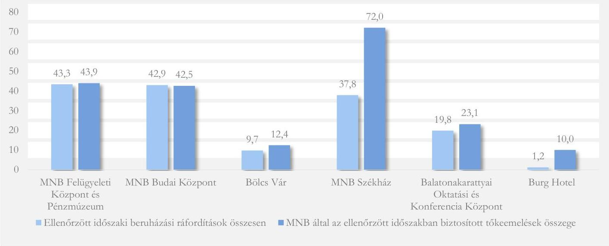
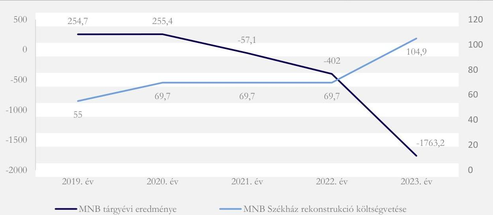
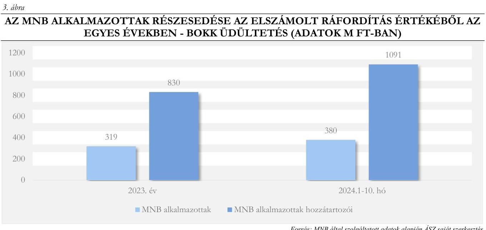
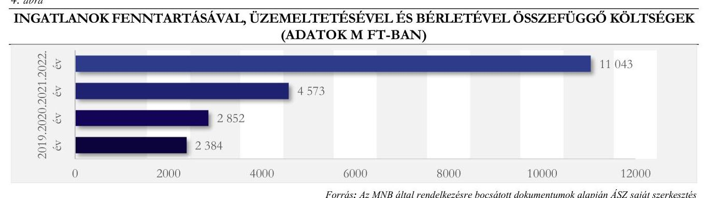
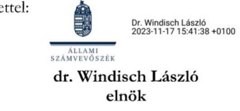
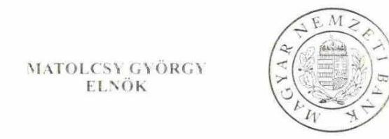
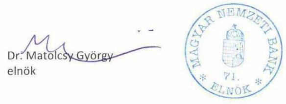
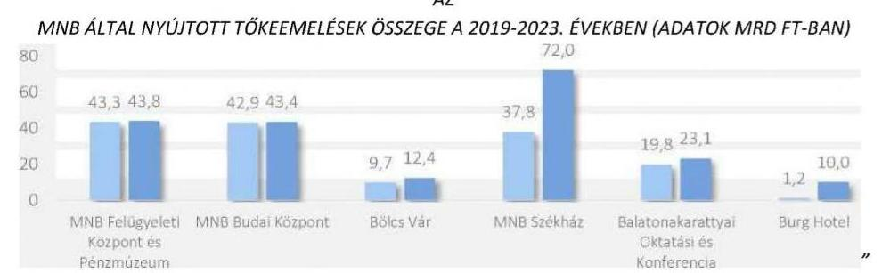
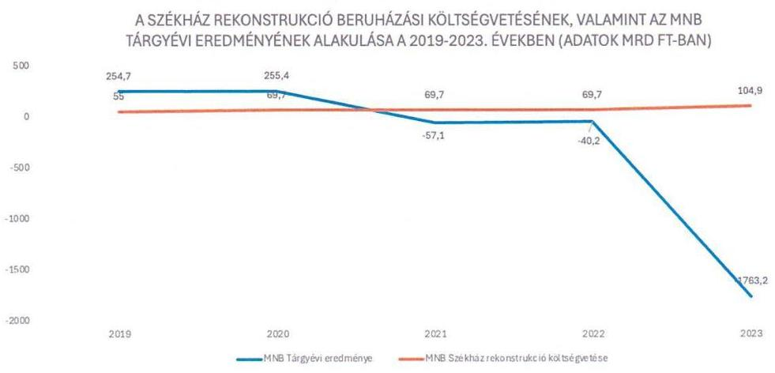
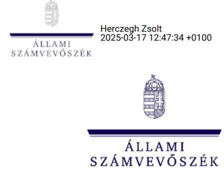

# JELENTÉS 

## A Magyar Nemzeti Bank működése szabályszerűségének ellenőrzése

2025.

---

# ÁLLAMI   SZÁMVEVŐSZÉK 

## JELENTÉS

## A Magyar Nemzeti Bank működése szabályszerűségének ellenőrzése

2025.

---

# ELLENŐRZÉSI IGAZGATÓSÁG: 

## ELLENŐRZÉSI IGAZGATÓSÁG III.

## ELLENŐRZÉSI IGAZGATÓ:

HERCZEGH ZSOLT ellenőrzési igazgató

## ELLENŐRZÉSVEZETŐ:

IMRE ZSUZSANNA ellenőrzésvezető

Jelentéseink az interneten a www.asz.hu címen olvashatók.

IKTATÓSZÁM: 3572-008/2025
TÉMASORSZÁM: -
ELLENŐRZÉS-AZONOSÍTÓ SZÁM: V0977

---

# TARTALOMJEGYZÉK 

AZ ELLENŐRZÉS ALAPADATAI ..... 5
AZ ELLENŐRZÓTT SZERVEZETEK ..... 7
ÖSSZEFOGLALÁS ..... 9
AZ ELLENŐRZÉS FÓKUSZTERÜLETEI/FÓKUSZKÉRDÉSEI ..... 19
MEGÁLLAPÍTÁSOK ..... 20
JAVASLATOK ..... 42
MELLÉKLETEK ..... 43
I. sz. melléklet: Értelmező szótár ..... 43
II. sz. melléklet: Az ellenőrzött szervezetek jegyzéke ..... 45
III. sz. melléklet: Ellenőrzési kritériumok ..... 46
IV. sz. melléklet: Az MNB tőkeemelései az MNB-Ingatlan Kft.-ben a 2019-2023. években beruházás típusonként ..... 47
V. sz. melléklet: Az MNB MNB-Ingatlan Kft.-re vonatkozó, 2020.01.24. és 2020.06.23. között hozott alapítói határozatai, melyek előzetes vizsgálatát az MNB-Ingatlan Kft. Felügyelőbizottsága nem végezte el ..... 54
VI. sz. melléklet: Az ingatlanok fenntartásával, üzemeltetésével és bérletével összefüggésben elszámolt költségek változása az előző évhez képest (2019-2022. évek) ..... 55
VII. sz. melléklet: Az ÁSZ Elnöke által az ellenőrzés során az MNB Elnöke részére megküldött elnöki figyelemfelhívó levél és az MNB arra adott válasza ..... 56
FÜGGELÉK: ÉSZREVÉTELEK ..... 63
RÖVIDÍTÉSEK JEGYZÉKE ..... 116

---

.

---

# AZ ELLENŐRZÉS ALAPADATAI 

## AZ ELLENŐRZÉS CÉLJA

Az ellenőrzés célja az $\mathrm{MNB}^{1}$ alapfeladatai közé nem tartozó tevékenységei és gazdálkodása tekintetében annak értékelése volt, hogy az MNB irányítási, döntéshozatali és ellenőrzési rendszere működésének, gazdálkodásának, valamint a pénzügyi közvetítőrendszert felügyelő, ellenőrző és szabályozó tevékenységének, továbbá szanálási hatósági tevékenységének szabályszerűségét hogyan biztosította.

## AZ ELLENŐRZÉS TÍPUSA

Törvényességi ellenőrzés*

## AZ ELLENŐRZÖTT IDŐSZAK

Az MNB 2020-2022. évek.
Az ingatlanokhoz kapcsolódó vagyongazdálkodás, valamint az egyéb berendezések beszerzésének ellenőrzése tekintetében az MNB-nél a 2014. január 1 - 2023. december 31. közötti időszak, az MNB-Ingatlan Kft. ${ }^{2}$-nél a 2019. május 31 - 2023. december 31. közötti időszak, az Optimum-Gamma Ingatlanbefektetési Kft."v.a." ${ }^{3}$-nél a 2020. május 11 - 2023. április 30. közötti időszak, és az Optimum-Omega Ingatlanbefektetési Kft. ${ }^{4}$-nél a 2022. február 28 - 2022. december 31. közötti időszak.

A Balatonakarattyai Oktatási és Konferencia Központ hasznosításának ellenőrzése tekintetében az MNB-nél a 2023. május 1 - 2024. október 31. közötti időszak, az MNB-Ingatlan Kft.-nél a 2023. május 1 2024. október 31. közötti időszak.

Az éves számviteli beszámoló készítése, jóváhagyása, a beszámolóval kapcsolatos tájékoztatási kötelezettség teljesítése kapcsán az ellenőrzött időszak kiterjed ezen feladatok jogszabályban előírt végrehajtásának időpontjáig.

## AZ ELLENŐRZÉS TÁRGYA

Az ellenőrzés tárgya az MNB gazdálkodásának és az alapvető feladatok körébe nem tartozó irányítási, döntéshozatali, beszámolási és ellenőrzési tevékenységek szabályszerűségének, valamint - az MNB tv. ${ }^{5} 4 . \S$ (14) bekezdése alapján a (8)-(9) bekezdéseiben meghatározott egyéb feladatok - a pénzügyi közvetítőrendszert

[^0]
[^0]:    * Az ÁSZ törvényességi ellenőrzése egyenértékűnek minősül a szabályszerűségi ellenőrzéssel. „A törvényességi ellenőrzés az egyes ellenőrzési kritériumok jogszabályok, az azokkal összhangban álló belső szabályzatok előírásai, valamint a közpénzekkel és közvagyonnal való gazdálkodásra vonatkozó egyéb előírások teljesülésének ellenőrzését foglalja magában."

---

felügyelő, ellenőrző és szabályozó, továbbá szanálási hatósági tevékenysége szabályozottságának ellenőrzése volt.

Az ellenőrzés kiterjedt minden olyan körülményre és adatra, amely az ÁSZ ${ }^{6}$ jogszabályban meghatározott feladatainak teljesítéséhez, valamint a program végrehajtása folyamán felmerült újabb összefüggések feltárásához szükséges volt. Az ellenőrzés kiterjedt továbbá az - ÁSZ tv. ${ }^{7} 5 . \int$ (4) bekezdés b) pontja alapján - az MNB közvetlen és közvetett befolyása alá tartozó gazdasági társaságok vagyongazdálkodásának ellenőrzésére.

# AZ ELLENŐRZÉS JOGALAPJA 

Az ellenőrzés jogszabályi alapját az ÁSZ tv. 5. § (4) bekezdés b) pontja és (10) bekezdése képezte. Az ÁSZ tv. 5. $\int$ (10) bekezdése alapján az ÁSZ ellenőrizte az MNB gazdálkodását, és az MNB tv.-ben foglaltak alapján folytatott - az alapvető feladatok körébe nem tartozó - tevékenységét.

## AZ ELLENŐRZÉS MÓDSZERE

Az ellenőrzést az ÁSZ a nemzetközi standardokat irányadónak tekintve az ellenőrzés szakmai szabályokkal és módszertani elvekkel összhangban folytatta le.

Az ellenőrzés az ellenőrzött időszakban hatályos jogszabályok, az ellenőrzés szakmai szabályai, a jelen ellenőrzésre irányadó ÁSZ módszertanok, az ellenőrzési programban foglalt értékelési szempontok szerint került végrehajtásra.

Az ellenőrzési bizonyítékként felhasználható adatforrások közé tartoztak az ellenőrzési program II. számú mellékletében felsorolt adatforrások, továbbá adatforrás volt minden egyéb - az ellenőrzés folyamán - feltárt, az ellenőrzés szempontjából információkat tartalmazó dokumentum.

Az ellenőrzési kérdések megválaszolásához szükséges bizonyítékok megszerzése az ellenőrzöttek által rendelkezésre bocsátott dokumentumokra, adatokra, információkra alapozva megfigyelés, szemle (szemrevételezés), kérdésfeltevés (információkérés), mintavételezés, valamint elemző eljárás útján történt.

Az ellenőrzés lefolytatásához az ellenőrzött szervezetek a tanúsítvány kitöltésével, az ÁSZ által kért dokumentumok, adatok, információk megküldésével, és a helyszíni ellenőrzés során szolgáltattak adatokat.

Az ÁSZ véletlen, illetve kockázatalapú mintavételi eljárással kiválasztott tételek ellenőrzésével is értékelte, hogy az ellenőrzött szervezetek biztosították-e a múködési költségekkel, valamint a beruházási, fejlesztési célú ráfordításokkal összefüggő beszerzések és elszámolások szabályszerűségét.

Az ÁSZ az egyes fókuszterületekhez kapcsolódóan az ellenőrzést törvényességi szempontok szerint végezte el.

---

# AZ ELLENŐRZÖTT SZERVEZETEK 

Az ellenőrzött szervezetek: MNB, az MNB-Ingatlan Kft., az Optimum-Gamma Ingatlanbefektetési Kft. „v.a." és az Optimum-Omega Ingatlanbefektetési Kft.

## MAGYAR NEMZETI BANK

Az MNB-t 1924. június 24-én alapították, mint Magyarország központi bankja egyszemélyes részvénytársasági formában múködik, tagja a Központi Bankok Európai Rendszerének, valamint a Pénzügyi Felügyeletek Európai Rendszerének, felelős a monetáris politikáért és ellátja a pénzügyi közvetítő rendszer felügyeletét. A kizárólagos tulajdonos Magyar Államot, mint részvényest, az államháztartásért felelős miniszter képviseli. Az MNB jegyzett tőkéje 10 Mrd Forint.

Az MNB elsődleges célja az árstabilitás elérése és fenntartása, melynek keretében alapvető feladata a monetáris politika meghatározása és megvalósítása. Az MNB kizárólagos jogosultként bankjegyet és érmét bocsát ki, deviza- és aranytartalékot képez, támogatja a pénzügyi közvetítőrendszer stabilitásának fenntartását. Az MNB alapvető feladatain túl szanálási hatóságként jár el, kizárólagosan ellátja a pénzügyi közvetítőrendszer felügyeletét, továbbá a Pénzügyi Békéltető Testület útján ellátja a fogyasztó és a pénzügyi közvetítőrendszer szervezetei között létrejött vitás ügyek rendezését. Feladatai végrehajtása során személyi, intézményi, funkcionális és pénzügyi függetlenséget élvez. Jogállását, elsődleges célját, alapvető, valamint alapvető feladatai közé nem tartozó egyéb feladatait és szervezeti felépítését az MNB tv. szabályozza.

Az MNB szervei a Monetáris Tanács, a Pénzügyi Stabilitási Tanács, az Igazgatóság és a Felügyelőbizottság.

Az MNB legfőbb döntéshozó szerve a Monetáris Tanács. Hatáskörébe tartozik az MNB egyes alapvető feladataival kapcsolatos stratégiai döntéshozatal, és az MNB mikro- és makroprudenciális, továbbá szanálási hatósági feladataival kapcsolatban azon stratégiai keretek meghatározása, amely keretek között a Pénzügyi Stabilitási Tanács döntést hoz.

A Pénzügyi Stabilitási Tanács az MNB makroprudenciális és a szanálási hatósági feladatokkal, valamint a prudenciális felügyelettel kapcsolatos döntéshozó testülete. Döntéseit a Monetáris Tanács által meghatározott stratégiai keretek között hozza meg, melyekről rendszeresen beszámol a Monetáris Tanácsnak.

Az MNB Igazgatósága felelős az MNB tv.-ben meghatározott feladatkörei tekintetében a Monetáris Tanács és a Pénzügyi Stabilitási Tanács döntéseinek végrehajtásáért, és az MNB múködésének irányításáért. Az Igazgatóság tagjai az MNB elnöke és alelnökei.

Az MNB Felügyelőbizottsága az MNB folyamatos tulajdonosi ellenőrzésének szerve. A jegybanki függetlenség biztosítása miatt az MNB Felügyelőbizottságának hatásköre nem terjed ki az MNB alapvető feladataira, illetve azoknak az MNB eredményére gyakorolt hatására. Tagjainak megbízatása az MNB elnöke megbízatásának időtartamára szól.

Az MNB tulajdonosi joggyakorlásának ellenőrzése az MNB közvetlen és közvetett befolyása alá tartozó gazdasági társaságok közül az MNB-Ingatlan Kft.-re, az Optimum-Gamma Ingatlanbefektetési Kft. „v.a."-re és az Optimum-Omega Ingatlanbefektetési Kft.-re terjedt ki.

---

# MNB-Ingatlan KorLÁtOlt FeleLŐSSÉGŰ TÁrsASÁG 

Az MNB-Ingatlan Kft. alapítására 2016. május 18-án került sor - az MNB Pallas Athéné alapítványai ${ }^{8}$ tulajdonába tartozó - OPTIMA Befektetési Zrt. ${ }^{9}$ által. Az MNB 2019. május 31-től lett az MNB-Ingatlan Kft. egyedüli tulajdonosa.

Az MNB-Ingatlan Kft. alapításkori jegyzett tőkéje 10,0 M Ft volt, mely a többszöri tőkeemelésnek köszönhetően $14,9 \mathrm{M}$ Ft-ra emelkedett, főtevékenysége ingatlan bérbeadás, üzemeltetés, továbbá ingatlankezelési- és fejlesztési tevékenység végzése volt az MNB és az MNB leányvállalatai számára. Az ellenőrzött időszakban fő feladatai az MNB Felügyeleti Központ és Pénzmúzeum ${ }^{10}$, a Bölcs Vár ${ }^{11}$, az MNB Budai Központ ${ }^{12}$ felújítása, bérbeadása, továbbá az MNB Székház ${ }^{13}$ rekonstrukciójának koordinálása voltak.

Az MNB-Ingatlan Kft. ügyvezetését és a társaság képviseletét az ügyvezető látta el.
Az MNB-Ingatlan Kft.-nél három tagú ügydöntő felügyelőbizottság működött 2018. szeptember 13 2020. január 23. között, ezt követően a 3/2020. (01. 24.) számú alapítóí határozatban foglaltak alapján a felügyelőbizottság ügydöntő jellege megszűnt.

Az MNB az MNB-Ingatlan Kft. közvetlen, és leányvállalatain keresztül történő közvetett ingatlanfejlesztési tevékenységét, illetve részesedés szerzéseit 2019-2023. években 210 756,8 M Ft - 2019. évben 14 642,1 M Ft, 2020. évben 103 047,2 M Ft, 2021. évben 30 294,2 M Ft, 2022. évben 5101,2 M Ft és 2023. évben 57 672,1 M Ft - értékű tőkeemeléssel finanszírozta.

## Optimum-Gamma Ingatlanbefektetési Korlátolt Felelősségü TÁrsasÁG „VÉGELSZÁMOLÁs ALATT"

Az Optimum-Gamma Ingatlanbefektetési Kft.-t 2016. november 21-én alapította az OPTIMA Befektetési Zrt. 3 M Ft összegű jegyzett tőkével. Az OPTIMA Befektetési Zrt. egyedüli részvényese a Pallas Athéné Domus Meriti Alapítvány volt. Az MNB közvetlen befolyása alatt álló MNB-Ingatlan Kft. 2020. május 11-én üzletrész adásvétel útján 100\%-os tulajdont szerzett az Optimum-Gamma Ingatlanbefektetési Kft. felett, így az MNB közvetett tulajdonosi körébe tartozott. Az Optimum-Gamma Ingatlanbefektetési Kft.-nél 2021. augusztus 23-tól működött felügyelőbizottság. Az Optimum-Gamma Ingatlanbefektetési Kft. tevékenységi köre alakulásától fogva saját tulajdonú, bérelt ingatlan bérbeadása, üzemeltetése, saját tulajdonú ingatlan adásvétele, ingatlanügynöki tevékenység és ingatlankezelés volt. A társaság 2017. évtől kezdve jelentős beruházási tevékenységet fejtett ki a 2017. június 27-én tulajdonába került Balatonakarattya, Koppány sor 41. szám alatti ingatlannal összefüggésben, melynek befejezése 2023 februárjában megtörtént, és az ingatlant 2023. április 12-én értékesítették az anyavállalat részére. Az Optimum-Gamma Ingatlanbefektetési Kft. 2023. augusztus 1-től végelszámolás alatt áll.

## Optimum-Omega Ingatlanbefektetési Korlátolt Felelősségü TÁrsasÁG

Az Optimum-Omega Ingatlanbefektetési Kft.-t 2016. május 18-án alapította 10,0 M Ft jegyzett tőkével a Pallas Athéné Domus Optima Zrt. A többszöri tőkeemelés után a társaság jegyzett tőkéje 20,4 M Ft-ra nőtt. Az MNB tulajdonában lévő MNB-Ingatlan Kft. 2022. február 28-án szerezte meg a társaság 100\%-os üzletrészét.

Az Optimum-Omega Ingatlanbefektetési Kft. Alapító Okirata szerinti főtevékenysége saját tulajdonú, bérelt ingatlanok bérbeadása, üzemeltetése volt. Tevékenységi körébe tartozott továbbá saját tulajdonú ingatlan adásvétele, ingatlanügynöki tevékenység, illetve ingatlankezelés is. Az ellenőrzött időszak kezdetén rendelkezett ingatlannal, mely 2019 júniusában értékesítésre került. A Burg Hotel ${ }^{14}$ 2021. február 9-én került az OptimumOmega Ingatlanbefektetési Kft. tulajdonába, melynek felújítását az ellenőrzött időszakban a társaság végezte.

Az Optimum-Omega Ingatlanbefektetési Kft.-nél felügyelőbizottság megválasztására az ellenőrzött időszakban nem került sor. A felügyelőbizottság létrehozása 2023. június 1-jével történt meg.

---

# ÖSSZEFOGLALÁS 

Az MNB státuszát és felelősségét Magyarország Alaptörvénye rögzíti, szervezetének és müködésének részletes szabályait sarkalatos törvény határozza meg. Az MNB alkotmányos helyzetéből adódóan fontos, hogy a gazdálkodása során Magyarország Alaptörvényében meghatározott, felelős gazdálkodásra vonatkozó elvek maradéktalanul érvényesüljenek és müködése példamutató legyen a közpénzzel és közvagyonnal gazdálkodó szervezetek számára. Ezen elvek kiemelt érvényesülésének szükségességét az MNB Alapokmánya is deklarálja, amely alapján az MNB müködését a tervszerűség, a jogszerűség, az átláthatóság, a hitelesség, a szabályozottság és a takarékosság kell jellemezze, továbbá a szervezet felelős költséggazdálkodása példát kell mutasson a közpénzügyek hatékonyságának javításában.

Az MNB gazdálkodásának kerete, feltételrendszere - az MNB betöltött közjogi szerepéből és feladataiból, valamint a függetlenségét biztosító hazai és európai uniós jogi környezetből fakadóan - olyan sajátosságokkal rendelkezik, mely jelentős mértékben eltér más gazdálkodó szervezetekétől. E sajátosságok közül kiemelendő, hogy az MNB - monetáris tevékenységen kívüli - gazdálkodásához igénybe vehető pénzügyi források tekintetében nincs konkrétan meghatározható „plafon", vagyis a tervei, céljai megvalósításához a pénzügyi források gyakorlatilag „korlátlanul" rendelkezésre állnak.

Az MNB monetáris tevékenységen kívüli gazdálkodásában a korlátokat elsősorban Magyarország Alaptörvényében és az MNB Alapokmányában meghatározott elvek saját maga általi érvényesítése, illetve a külső kontrolltevékenységet ellátó szervezetek, így az Országgyűlés, a Magyar Állam nevében eljáró mindenkori tulajdonosi joggyakorló, az MNB alapfeladatai közé nem tartozó tevékenységei és gazdálkodása tekintetében az ÁSZ, továbbá a választott és delegált tagokból álló MNB Felügyelőbizottság biztosítja. A külső kontrollok megfelelő működésének pedig alapvető feltétele az átlátható, ellenőrizhető gazdálkodási tevékenység.

Az MNB gazdálkodásának sajátossága, hogy a müködése során a költségek, ráfordítások, vagy éppen a leányvállalatai felé történő töketranszferek pénzügyi teljesitése, vagyis az ezzel összefüggö pénzkiáramlások, a gazdálkodásában felhasználható források nagyságrendjét nem korlátozzák bevételei, illetve külsö, államháztartás bevételeit meghatározó gazdasági folyamatoktól (az adóbevételektől, az ország gazdasági helyzetétől, stb.) függő pénzügyi keret, költségvetés, kincstári számláról felhasználható pénzmennyiség.
Ugyanakkor, a monetáris tevékenységböl származó bevételek és ráfordítások mellett az MNB gazdálkodásában felmerülö költségek és ráfordítások - az eredményre, és azon keresztül a saját tökére gyakorolt hatásuk miatt - is kihatással lehetnek a központi költségvetés esetleges térítési kötelezettségére. Az MNB tv. 166 § (3) bekezdése szerint, ha az MNB saját tökéje hosszabb ideig a jegyzett tökéje szintje alatt van, a központi költségvetés terhére közvetlenül az eredménytartalék javára történő térítéssel biztositani kell, hogy elfogadható idön legalább a jegyzett töke értékének megfelelő mértékü saját tőke álljon az MNB rendelkezésére. (Megjegyzendő ugyanakkor, hogy az ellenőrzött időszak jelentős részében még a központi költségvetés öt éven belüli, évente egyenlő részletekben történő térítési kötelezettségét rögzitő szabály volt érvényben,)

Az ÁSZ az MNB ellenőrzött időszaki működési és gazdálkodási jellemzőire tekintettel három ellenőrzési területre vonatkozóan végezte vizsgálatát. Az ellenőrzés kiemelt területnek tekintette - azok nagyságrendje miatt - az MNB tulajdonosi joggyakorlása körében a közvetlen és közvetett befolyása alá tartozó gazdasági társaságok (az MNB-Ingatlan Kft., az Optimum-Gamma Ingatlanbefektetési Kft. „v.a." és az Optimum-Omega

---

Ingatlanbefektetési Kft.) ingatlanberuházási, illetve -felújítási tevékenységét. További területként az MNB gazdálkodásának ellenőrzése kiterjedt az egyéb beruházási célú és múködéshez kapcsolódó beszerzési eljárások és kapcsolódó elszámolások, valamint a beszámolási, tájékoztatási kötelezettségének vizsgálatára is. Harmadik területként az ÁSZ ellenőrizte az MNB pénzügyi közvetítőrendszert felügyelő, ellenőrző és szabályozó, valamint szanálási hatósági tevékenysége kereteinek a kialakítását.

AZ ELLENŐRZÉS MEGÁLLAPÍTOTTA, hogy az ellenőrzött időszakban az MNB gazdálkodása az ingatlanberuházások, -felújítások tekintetében nem teljesítette a takarékos múködés követelményét, mivel az nem igazodott az ország, az állami intézményrendszer általános pénzügyi helyzetéhez, jellemző gazdálkodási folyamataihoz. Ugyanakkor az is megállapításra került, hogy az MNB az ingatlanokkal kapcsolatos gazdálkodási döntései során a saját pénzügyi helyzetét (rendkívül jelentős számviteli veszteségét) sem vette figyelembe, a beruházások hosszú távú - veszteséget növelő - hatásait nem értékelte és a külső körülmények változásaiból eredő negatív hatások (építőiparban bekövetkezett jelentős áremelkedések) miatti takarékossági intézkedéseket elmulasztotta.

A takarékos gazdálkodás érvényesülésének értékelésénél szükséges figyelembe venni, hogy a pandémia utáni időszak általános jellemzője volt a gazdaság szereplő́níél és így az államháztartás teljes szervezetrendszere vonatkozásában is a restriktív gazdálkodás. Ennek keretében az államháztartáson kívüli gazdálkodó szervezeteknél az általános költségtakarékosság, a beruházások takarékossági célú felülvizsgálata vagy elhalasztása, az államháztartás szervezeteinél a költségvetési előirányzatok csökkentése, a beruházások elhalasztása vagy az azzal járó kiadások radikális csökkentése jellemezte a gazdálkodási döntéseket, folyamatokat.

Az ellenőrzés megállapította azt is, hogy a takarékos múködés követelményének figyelmen kívül hagyása mellett az MNB az ingatlanberuházások, -felújítások megvalósítása során olyan döntéseket hozott, melyek gyengítették, gátolták a gazdálkodása felett kontrollokat gyakorló szervezetek ezirányú tevékenységét. E tekintetben az MNB ingatlanberuházásaira, -felújításaira vonatkozó transzparencia hiányát, a kontrollokat gyakorló szervezetek felé a beruházási tervek, pénzügyi hatások egységes bemutatásának elmaradását állapította meg az ellenőrzés.

# 1. Az MNB tulajdonosi joggyakorlása körében a közvetlen és közvetett befolyása alá tartozó gazdasági társaságok ingatlanberuházási, illetve -felújítási tevékenysége 

Az ÁSZ három MNB befolyása alá tartozó gazdasági társaság ingatlanberuházási, illetve -felújítási tevékenységét és a kapcsolódó tulajdonosi joggyakorlást értékelte. Az ellenőrzött gazdasági társaságokat és az érintett ingatlanokat az 1. táblázat mutatja be.

|  | MNB   FELÜJTELETI   KÖZPONTÉS   PÉNZMÚZÉUM | MNB BUDAI   KÖZPONT | BÓLCS   VÁR | MNB   SZÉKHÁZ* | BALATTINA   AKARÁTTYAI   OKTATÁSIÉS   KONFERENCIA   RÖZPONT** | BURG HÖTEL |
| :--: | :--: | :--: | :--: | :--: | :--: | :--: |
| MNB-Ingatlan Kft. | X | X | X | X | - |  |
| Optimum-Gamma   Ingatlanbefektetési Kft. „v.a." | - | - | - | - | X | - |
| Optimum-Omega   Ingatlanbefektetési Kft. | - | - | - | - | - | X |

*: Az MNB Székház felújítását az MNB-Ingatlan Kft. végezte, az ingatlan az MNB tulajdonában állt. Forrás: Az MNB által nyújtott adatszolgáltatás alapján ÁSZ saját szerkesztés
**: Balatonakarattyai Oktatási és Konferencia Központ 2023. április 12-től az MNB-Ingatlan Kft. tulajdonba került.

---

Az MNB-Ingatlan Kft. 2019. május 31-től az MNB kizárólagos tulajdonába tartozik. Az MNB-Ingatlan Kft. tulajdonát képezte az MNB Felügyeleti Központjának, valamint a Pénzmúzeumnak helyt adó Buda Palota ${ }^{15}$ ingatlan 2016. évtől, az MNB alkalmazottainak elhelyezését szolgáló MNB Budai Központ 2021. december 13. napjától, valamint a Monetáris Tanács és egyéb reprezentatív üléseknek is helyt adó Bölcs Vár ingatlan 2019. szeptember 20. napjától. Az Optimum-Gamma Ingatlanbefektetési Kft. „v.a.", amely 2017. évtől volt tulajdonosa az MNB oktatási, képzési és jóléti szolgáltatásait biztosító Balatonakarattyai Oktatási és Konferencia Központnak (BOKK ${ }^{16}$ ), 2020. május 11-től került az MNB-Ingatlan Kft. tulajdonába. Emellett 2022. február 28-tól az MNB-Ingatlan Kft. tulajdonába tartozik az Optimum-Omega Ingatlanbefektetési Kft. és vele együtt a Burg Hotel ingatlan.

Az MNB 2019-2023. években összesen 204,0 Mrd Ft összegű tőkeemeléssel biztosított forrást az MNBIngatlan Kft. részére az MNB tevékenységét szolgáló ingatlanok megvételére és fejlesztésére, továbbá az MNB Székház rekonstrukciójának megvalósítására. Az MNB-Ingatlan Kft. és a tulajdonában álló gazdasági társaságok által 2019-2023. években megvalósított ingatlanberuházások értéke 154,7 Mrd Ft volt. A beruházási ráfordítások és a kapcsolódó tőkeemelések összegét ingatlanberuházásonként az 1. ábra szemlélteti.
1. ábra

# AZ MNB BEFOLYÁSA ALATT ÁLLÓ GAZDASÁGI TÁRSASÁGOK INGATLANBESZERZÉSEI ÉS INGAFEJLESZTÉSEI, VALAMINT AZ MNB ÁLTAL NYÚJTOTT TÖKEEMELÉSEK ÖSSZEGE A 2019-2023. ÉVEKBEN (ADATOK MRD FT-BAN) 

Forrás: Az MNB által nyújtott adatszolgáltatás alapján ÁsZ saját szerkesztés
Az előzőekben részletezett ingatlanberuházási, illetve -felújítási tevékenység értékelése során az ÁSZ az Alaptörvényben és az MNB Alapokmányában rögzített elvek körében az átláthatóságot és a felelős gazdálkodás elvéből következő takarékosság érvényesülését ellenőrizte kiemelten, továbbá vizsgálta a beszerzési eljárások egyéb lényeges körülményeit is.

## a) Átláthatóság értékelése

Az MNB által, az előzőekben részletezett nagyságrendben és kiemelkedően magas értékben folytatott ingatlanberuházások, illetve -felújítások tekintetében a jogszabályokban és az MNB Alapokmányában megfogalmazott átláthatóság követelményének az érvényesüléséhez a lehető legmagasabb szintű és minőségű információáramlásra lett volna szükség. Ennek teljesülése különösen lényeges a külső szereplők, úgymint az MNB felett tulajdonosi jogokat gyakorló pénzügyminiszter és az Országgyűlés vonatkozásában, de igaz a kontrollfunkciókat gyakorlók (döntéshozó testület, belső szervezeti egységek, felügyelőbizottság) esetében is.

---

Az ellenőrzés feltárta, hogy az MNB a tevékenységét szolgáló ingatlan vásárlások és fejlesztések megvalósítására cégstruktúrát hozott létre. Az MNB a beruházásokat és felújításokat a közvetlen és közvetett befolyása alá tartozó gazdasági társaságain keresztül folytatta le. Emiatt az MNB működését szolgáló és döntésén alapuló, a befolyása alá tartozó, ellenőrzött gazdasági társaságok által végzett ingatlan beruházások költségeinek alakulása az MNB pénzügyi (beruházási) terveiben, nyilvántartásaiban, beszámolóiban és az MNB által az Országgyűlés gazdasági ügyekért felelős állandó bizottsága részére megküldendő összehasonlító - a pénzügyi év lezárását követően készített, tervezett és tényleges beruházási költségek alakulását tartalmazó - elemzésekben nem szerepeltek. A kialakított ingatlanberuházási konstrukció miatt az MNB, az MNB-Ingatlan Kft., az Optimum-Gamma Ingatlanbefektetési Kft. „v.a." és az OptimumOmega Ingatlanbefektetési Kft. által végzett ingatlanberuházások tekintetében az MNB tv.-ben foglalt beszámolási és tájékoztatási kötelezettségben kifejezett, átláthatóságra irányuló, egyértelmű jogalkotói szándék nem tudott érvényesülni.

Az MNB Felügyelőbizottságának 2023. évi jelentése is megerősítette, hogy az MNB ingatlanberuházásai nem kellően transzparensek. A jelentés tartalmazza, hogy „Az MNB építési projektjeinek jó része nem a beruházások között jelenik meg, mert az építést projekttársaság vagy az MNB-Ingatlan Kft. bonyolítja. Az építkezések finanszírozása ezekben az esetekben tőkejuttatással történik, majd a projekt befejeztével a kész ingatlan kerül át az MNB mérlegébe. Az MNB a közelmúltban ilyen megoldással finanszírozta többek között a BOKK építését, a Budai Központ felújítását és hasonló konstrukcióban valósul meg a Szabadság téri központ felújítása is. Általános érvénnyel fogalmazható meg, hogy a jegybanki beruházások az említett megoldás miatt - hasonlóan a leányvállalatok helyzetéhez - nem kellően transzparensek." (ÁSZ megjegyzés az idézett szöveghez: a tőkeemelések az MNB mérlegében ugyan megjelentek, ugyanakkor a Székház rekonstrukció beruházási ráfordításainak az értéke csak a projekt befejeztével kerül át az MNB mérlegébe.)

A kialakított konstrukcióban az ingatlanberuházások, -felújítások feletti kontrollfunkciók is lényegesen gyengültek azáltal, hogy nem az MNB közjogi felhatalmazással rendelkező felügyelőbizottsága, hanem az MNB-Ingatlan Kft. elnöki delegáláson alapuló felügyelőbizottsága látta el a kontrollokat. Emellett az MNB Felügyelőbizottságának az MNB-Ingatlan Kft.-nél és annak leányvállalatainál az MNB által tőkejuttatással finanszírozott, de általuk végrehajtott beruházások, felújítások feletti ellenőrzési lehetősége nem volt biztosított.

A jogalkotói szándék érvényesülését gátolta az a körülmény is, hogy az MNB az MNB tv.-ben foglaltak ellenére az államháztartásért felelős miniszter felé a működésének irányításával összefüggő, a működés szempontjából kiemelten fontos döntésekre vonatkozó tájékoztatási kötelezettségét nem teljesítette. Az ÁSZ álláspontja alapján a tájékoztatási kötelezettségbe a jogalkotói szándéknak megfelelő átláthatóság biztosítása érdekében beletartozik a Székház rekonstrukcióval kapcsolatos döntésekről, illetve a befolyása alá tartozó, ellenőrzött társaságok tulajdonában lévő ingatlanokkal összefüggő, MNB érdekeltségű beruházások nagyösszegű kiadásainak tőkejuttatás formájában történő finanszírozásáról való tájékoztatás is.

Külön hangsúlyozni szükséges az MNB által a saját tulajdonában lévő Székház ingatlanon az MNBIngatlan Kft. által folytatott beruházásra (Székház rekonstrukció) kialakított „atipikus" konstrukciót. A kialakított konstrukcióban a beruházási kiadások - a tervezés-előkészítésre és a koordinációra kötött szerződések kivételével - a beruházás koordinációját végző MNB-Ingatlan Kft. nyilvántartásaiban, beszámolóiban jelentek meg. Ezáltal a Székház rekonstrukcióval kapcsolatos beruházási kiadások közvetlenül, tételesen és - a tulajdonosi joggyakorló pénzügyminiszter, az MNB Felügyelőbizottsága, az MNB Igazgatósága,

---

az MNB szervezeti egységei által - ellenőrizhető módon nem jelentek meg az MNB-nél, amely az ingatlanberuházás nagyságrendje miatt szükséges, széles körű külső és belső információáramlást korlátozta.

Az „atipikus" beruházási konstrukciónak jellemzője volt az is, hogy az MNB tulajdonosi ellenőrzési tevékenységének lehetőségei is szűkültek. Az MNB a Székház rekonstrukció megkezdéséről hozott döntésével egyidőben az MNB-Ingatlan Kft. Alapító Okiratát úgy módosította, hogy a Székház felújítására vonatkozóan szűkítette az MNB Igazgatóságának kontrollfunkcióját, mivel megszűntette annak kizárólagos hatáskörét a Székház rekonstrukcióval kapcsolatos 100 M Ft -ot meghaladó nem stratégiai jellegű döntések tekintetében. Az MNB az MNB-Ingatlan Kft. Felügyelőbizottságának hatáskörét és ennek következtében ellenőrzési kötelezettségét is szűkítette azáltal, hogy az MNB-Ingatlan Kft. Felügyelőbizottsága 2020. január 24-től már nem ügydöntő felügyelőbizottságként működött, azaz ettől az időponttól kezdődően már nem az MNBIngatlan Kft. Felügyelőbizottsága hatáskörébe tartozott - többek között - a 30 M Ft -ot elérő, de 100 M Ft -ot el nem érő ügyekben való döntés, azok az MNB-Ingatlan Kft. ügyvezetőjének döntési hatáskörébe kerültek.

A megfelelő információáramlást és az MNB feletti tulajdonosi kontrollt szűkítette továbbá, hogy az MNB Igazgatósága a 2020-2022. években az MNB-Ingatlan Kft.-re vonatkozó valamennyi döntését ülésen kívül, gyorsított eljárás keretében hozta meg. Ezáltal az MNB Felügyelőbizottsága e döntésekről csak utólagosan értesült az MNB Igazgatósága által az MNB Felügyelőbizottsága részére készített negyedéves jelentésekből.

A Székház rekonstrukció nagyságrendjéhez igazodó, megfelelő információáramlás súlyos hiányát támasztja alá az ÁSZ ellenőrzése által feltárt az a tény is, hogy a Székház rekonstrukció megvalósításának projektleírását, konstrukcióját jóváhagyó 180/2020. (09. 14.) számú igazgatósági határozat előterjesztése és annak melléklete eltérő keretösszeget tartalmazott. Az MNB Igazgatósága által a projekt lebonyolítására hozott határozat előterjesztésében szereplő bruttó 70 Mrd Ft összeggel szemben az igazgatósági döntéshozatal előterjesztésének melléklete - szakértői számításokkal alátámasztottan - bruttó 55 Mrd Ft összeget tartalmazott. Megállapításra került az is, hogy az MNB Igazgatósága által hozott határozat előterjesztésében szereplő bruttó 70 Mrd Ft keretösszegre vonatkozó, azt alátámasztó előzetes szakértői számítás nem állt az MNB rendelkezésére, ilyen dokumentum az ellenőrzés során nem került bemutatásra. Ezáltal az ellenőrzés számára a projekt lebonyolításával összefüggő döntés megalapozottsága sem volt igazolt.

Az ingatlanberuházások, illetve -felújítások feletti kontroll lényeges elemei az MNB Felügyelőbizottságán kívül az MNB tulajdonában álló, a beruházások lefolytatásában érintett gazdasági társaságok felügyelőbizottságai is. Az ellenőrzés feltárta, hogy a 2020. január 24 - 2020. június 23. közötti időszakban 70,0 Mrd Ft összegű tőkeemelésre és azok felhasználására vonatkozó 20 alapítói határozat előterjesztésének előzetes vizsgálatát az MNB-Ingatlan Kft. Felügyelőbizottsága az ügyrendjében és a Ptk.-ban foglalt előírások ellenére nem végezte el. Ezt követően az MNB-Ingatlan Kft. Felügyelőbizottságának a Ptk.-ban rögzített feladatai 2020. június 23 -tól szűkítésre kerültek a felügyelőbizottság ügyrendjében rögzített kötelezettségekre, így az azon felüli, az alapító elé kerülő előterjesztéseket nem volt köteles már vizsgálni. Mindezek miatt 20202022. években az MNB Igazgatósága elé kerülő ügyek közül, az MNB-Ingatlan Kft. részére juttatott összesen mintegy 138,0 Mrd Ft összegű tőkeemelésre, és azok felhasználására vonatkozó döntéseket az MNB-Ingatlan Kft. Felügyelőbizottsága előzetesen nem ellenőrizte.

Mindezen tények és körülmények együttes értékelése alapján az ÁSZ Elnöke a számvevőszéki ellenőrzés során az ÁSZ tv.-ben szabályozott elnöki figyelemfelhívó levéllel fordult az MNB Elnökéhez. A figyelemfelhívó levélben az ÁSZ Elnöke kérte az MNB-Ingatlan Kft.-nél megvalósuló, székházfelújításra vonatkozó gazdasági tevékenységek esetében olyan kontrollok kiépítését, illetve helyreállítását, ami azzal egyenértékủ tulajdonosi, vezetői és egyéb, jogszabályok által előírt kontrollt biztosít, mintha az MNB saját beruházásában valósítaná meg

---

a Székház rekonstrukcióját és amely megfelelően biztosítja a közpénzek pazarló felhasználásának megakadályozását.

Az ÁSZ Elnökének figyelemfelhívó levele alapján, annak hatására az MNB az ellenőrzés során az MNBIngatlan Kft. Alapitó Okiratát akképpen módosította, hogy
> valamennyi, a 100 MFt-ot elérő ügyekben meghozandó döntés az Alapitó kizárólagos hatáskörébe került;
> kötelezővé vált az Alapitó elé kerülő előterjesztések előzetes, Felügyelöbizottság általi felülvizsgálata.

# b) Költség- és erőforrás takarékosság értékelése 

Az MNB speciális működési és gazdálkodási jellemzőkkel rendelkezik más közpénzből gazdálkodó szervezetekhez képest. Az MNB-nél az ingatlanberuházásokra, illetve -felújításokra fordított kiadások finanszírozási oldala (beleértve a tőkejuttatásokat is) jóval gyengébb korlátokkal rendelkezik, mint egy költségvetésből gazdálkodó szervnél, vagy árbevételből, egyéb bevételekből működő állami tulajdonú gazdasági társaságnál. Ebből adódóan kiemelten fontos kérdés, hogy az MNB mennyire erős pénzügyi kontrollok mellett milyen költség- és erőforrás takarékossági intézkedéseket eszközölt az ingatlanberuházásokkal összefüggő kiadásai tekintetében. Az ÁSZ ellenőrzés az ingatlanberuházások, illetve -felújítások tekintetében olyan körülményeket tárt fel, amelyek a közpénzből gazdálkodó szervezetektől elvárt költség- és erőforrás takarékosságnak súlyosan ellentmondanak.

Az ellenőrzés feltárta, hogy az MNB Székház rekonstrukció költségvetése több alkalommal, jelentős mértékben növekedett, közel megduplázódott. A rekonstrukciót követően az MNB Székházban elhelyezhető alkalmazottak létszáma jelentős mértékben, több, mint a felére csökkent. Az MNB az ellenőrzés rendelkezésére álló adatok és információk alapján a beruházási költségek csökkentése érdekében döntést nem hozott, intézkedést nem tett, miközben 2021-2023. években folyamatosan növekvő mértékủ veszteséget realizált és az építőiparban drasztikus áremelkedés következett be. A Székház rekonstrukció költségvetésének, valamint az MNB tárgyévi eredményeinek az alakulását a 2. ábra szemlélteti.
2. ábra

A SZÉKHÁZ REKONSTRUKCIÓ BERUHÁZÁSI KÖLTSÉGVETÉSÉNEK, VALAMINT AZ MNB TÁRGYÉVI EREDMÉNYÉNEK ALAKULÁSA A 2019-2023. ÉVEKBEN (ADATOK MRD FT-BAN)

Forrás: Az MNB által nyújtott adatszolgáltatás alapján ÁSZ saját szerkesztés

---

A költség- és erőforrás takarékosság tekintetében az ellenőrzés a müködés, illetve a beruházások területén több olyan tényt és körülményt is feltárt, melyek esetében egyértelműen megállapítható a takarékossági szempontok figyelmen kívül hagyása.

- Az MNB közvetett többségi befolyása alá tartozó gazdasági társaság, az Optimum-Gamma Ingatlanbefektetési Kft. „v.a." Balatonakarattyán egy új oktatási és képzési központot hozott létre, melyet az MNB 23,1 Mrd Ft összegű tőkeemeléssel finanszírozott az MNB-Ingatlan Kft.-én keresztül. A kapcsolódó döntéselőkészítés folyamatában a költség- és erőforrás takarékossági szempontok érvényesítését az MNB nem igazolta.
- Az MNB 2023. évben a BOKK üzemeltetését 0,9 Mrd Ft összegű, az MNB-Biztonsági Zrt. részére nyújtott tőkeemeléssel finanszírozta. Emellett az ingatlan kihasználtságát és az üzemeltetésével kapcsolatos költségek fedezetét oly módon biztosította, hogy az üdülőt igénybe vevő alkalmazottai és azok hozzátartozói üdülés költségét üdülési, valamint szabadidős és rekreációs támogatás címén az alkalmazott SZÉP kártyájára utalta. Az MNB alkalmazottak részére a BOKK üdültetéshez nyújtott üdülési támogatások 2023. évben 1,2 Mrd Ft, 2024. évben 1,5 Mrd Ft összegű személyi jellegű ráfordítás elszámolását eredményezték az MNB könyveiben.

A BOKK-ban a vállalati üdülési lehetőséget 2023. évben 2177 fö (alkalmazott: 615 fö, hozzátartozó: 1562 fö), 2024. 1-10. hóban 2662 fö (alkalmazott: 669 fö, hozzátartozó: 1993 fö) vette igénybe. Az MNB által a BOKK üdülési lehetőséget igénybe vevő alkalmazottai részére nyújtott támogatás 2023. évben 1,9 M Ft, 2024. évben 2,2 M Ft összegü ráfordítást jelentett átlagosan alkalmazottanként, amellett, hogy az MNB a SZÉP kártyával rendelkező alkalmazottai részére évente további nettó 0,8 M Ft összegü támogatást nyújtott. Megállapítható, hogy az MNB-nél az egy före jutó cafeteria összege többszörösen meghaladta az állami szférában, de akár a magánszférában nyújtott juttatások mértékét.

- Mindezek alapján megállapítható, hogy az MNB a BOKK vállalati üdülési célú hasznosítása során figyelemmel az üdülési költségek MNB általi 100\%-ban történt finanszírozására -nem érvényesített takarékossági szempontokat.
- Az MNB finanszírozásával, jelentős költséggel három ingatlanban is kialakításra került a Monetáris Tanács üléseinek lebonyolítására is alkalmas konferenciaterem az ellenőrzött időszakban, melynek indokoltsága megkérdőjelezhető.
- Az MNB 2014. évi ingatlanstratégiájában már szerepelt a Székház rekonstrukció szükségessége, azaz az épület átépítésére vonatkozó elképzelés. Ennek ellenére a Székház rekonstrukciót megelőzően, 2019. december 2-án üzembe helyezésre került a Székház biztonságtechnikai korszerűsítésével kapcsolatosan végzett beruházás 2,7 Mrd Ft értékben. Az MNB az üzembe helyezett eszközök közül 1,3 Mrd Ft bekerülési értékű eszközcsoportot a Székház rekonstrukcióra hivatkozással 2022. évben leselejtezett.
- Az MNB a Buda Palota és az MNB Budai Központ ingatlanberuházásaihoz kapcsolódóan összesen 1,3 Mrd Ft összegű tőkeemelést hagyott jóvá műalkotások (szoborcsoportok) beszerzésére 2020. évben. Továbbá az MNB-Ingatlan Kft. által az MNB részére bérbeadott ingatlanok díszítéséhez 5,6 Mrd Ft összegű tőkeemelést eszközölt művészeti alkotások vásárlására 2020. és 2021. években.
- Az MNB banküzem működési költségei - kiemelten az ingatlanok fenntartásával, üzemeltetésével és bérletével összefüggő költségek - az ellenőrzött időszakban, a 2022. évre jelentős mértékben, 363,2\%-

---

kal, 11,0 Mrd Ft-ra emelkedtek. A költségek növekedését alapvetően az új ingatlanok (MNB Felügyeleti Központ és Pénzmúzeum, MNB Budai Központ, valamint a Bölcs Vár) bérlésével és üzemeltetésével kapcsolatos jelentős költségek okozták.

Az előzőekben említett tények és körülmények alapján megállapítható, hogy Magyarország Alaptörvényében és az MNB Alapokmányában is rögzített költség- és erőforrás takarékossági, illetve felelős költséggazdálkodásra vonatkozó követelmények az MNB működése során több tekintetben nem érvényesültek. Költség- és erőforrás takarékossági intézkedések meghozatalát, illetve az intézkedések lehetőségének mérlegelését az MNB az ellenőrzés alá vont ingatlanberuházások, illetve -felújítások tekintetében az ÁSZ részére nem igazolta. Fontos hangsúlyozni, hogy a jelentős kiadási tételeket jelentő beruházásokra, illetve felújításokra olyan külső körülmények között került sor, amelyben az államháztartás egésze, a piaci szervezetek és a magánszektor a kiadások, költségek jelentős csökkentésében volt érdekelt. A takarékossági intézkedések elmaradásából eredő negatív hatásokat a külső környezetben bekövetkező kedvezőtlen változások tovább mélyítették.

A költség- és erőforrás takarékosság hiányára mutat rá az is, hogy az MNB Ingatlanstratégiajában a Székházra vonatkozó sikerkritériumként a múemléki állapot megőrzése mellett az eredeti állapot lehetőség szerinti helyreállítása került rögzitésre, mellyel ellentétes a Székház tetőterének beépitése az MNB alapfeladatai ellátását közvetlenül nem szolgáló, új tetőtéri funkciók kialakításával (VIP szintek közösségi terekkel, fitneszteremmel, éttermekkel, reprezentativ tárgyalóval).

# c) Egyéb lényeges körülmények értékelése 

Egyéb lényeges körülményként az ellenőrzés feltárta, hogy a tervezői és kivitelezői szerződések megkötését megelőző előkészítő eljárásban többségében olyan partnerkiválasztási konstrukciót alakított ki az MNB, illetve a befolyása alá tartozó gazdasági társaságok - az MNB-Ingatlan Kft., az Optimum-Gamma Ingatlanbefektetési Kft. „v.a." és az Optimum-Omega Ingatlanbefektetési Kft. -, amelyben külső partner végezte a beruházási szállító kiválasztásának lebonyolítását. Ebben a konstrukcióban a kapcsolódó folyamatok az MNB által működtetett belső kontrollrendszertől egy szinttel távolabb kerültek. Ezt támasztja alá az a körülmény is, hogy a lebonyolítással kapcsolatos dokumentumok teljeskörűen nem álltak rendelkezésre az MNB-nél, illetve a befolyása alá tartozó gazdasági társaságoknál, azokat nem tudták az ellenőrzés részére átadni.

A szerződéskötést előkészítő eljárás lebonyolításával összefüggő körülményként az ellenőrzés feltárta, hogy az Optimum-Gamma Ingatlanbefektetési Kft. „v.a." által megvalósított BOKK beruházás előkészítését lebonyolító gazdasági társaság (Somlai Invest Zrt.) a beruházás kivitelezőjével (RAW Development Kft.) kapcsolt (anya-, illetve leányvállalati) viszonyban állt. A Somlai Invest Zrt. feladatai közé tartozott az ajánlati felhívások elkészítése, az ajánlatok bekérése, kiértékelése, a vállalkozók kiválasztása, vagy abban való közreműködés.

E körülmény fennállását tapasztalta az ÁSZ az Optimum-Omega Ingatlanbefektetési Kft.-nél is a Burg Hotel ingatlanfejlesztése során. Ez esetben az előkészítő eljárásban projektirányítóként közreműködő gazdasági társasággal (Somlai Invest Zrt.) állt kapcsolt (anya-, illetve leányvállalati) viszonyban a beruházás tervezését és generálkivitelezését végző (RAW Development Kft.) gazdasági társaság.

A kiválasztási eljárások lefolytatásának eredményeként az MNB-Ingatlan Kft., az Optimum-Gamma Ingatlanbefektetési Kft. „v.a." és az Optimum-Omega Ingatlanbefektetési Kft. által megvalósított beruházások esetében a beruházási célú kiadások döntő része - az egyes ingatlanok vételára nélkül számított beruházási érték 86,1 \%-a, 95,8 Mrd Ft értékben - azonos érdekeltségi körhöz tartozó gazdasági társaságok (Somlai Invest Zrt. és RAW Development Kft., Raw Facility Kft. és Somlai Design Kft.) részére került kifizetésre. Az is

---

megállapítható, hogy az említett, azonos érdekeltségi körhöz tartozó gazdasági társaságok árbevételének meghatározó hányada a 2018-2022. években az MNB-től, az MNB közvetlen és közvetett befolyása alá tartozó gazdasági társaságoktól és az MNB alapítványoktól, valamint azok gazdasági társaságaitól származott.

A szerződéskötések előkészitő eljárásaival kapcsolatban, valamint - a korábbiakban említettek szerint - az átláthatósággal, kontrollok hiányával összefüggésben feltárt problémák felvetették a szerződések esetleges túlárazásának lehetőségét, ezért a vizsgálat során is folyamatban lévő Székház rekonstrukcióra vonatkozóan az ÁSZ Elnöke figyelemfelhívó levélben kérte a vonatkozó szerződések értékarányosságára, a már elvégzett munkák teljesitéseire, elszámolásaira kiterjedő felülvizsgálatát. Az MNB Elnöke a válaszlevelében tájékoztatást adott a kivitelezési szerződés, annak módosításai - különösen azok értékarányosságára - MNBIngatlan Kft. Felügyelőbizottsága általi felülvizsgálatának elrendeléséröl.
Az ÁSZ Elnökének figyelemfelhívó levele és az MNB Elnökének rendelkezése alapján, annak hatására az MNB-Ingatlan Kft. Felügyelőbizottsága igazságügyi szakértő bevonásával felülvizsgálta a Székház rekonstrukció megvalósitására kötött generáltervezési és generálkivitelezöi szerződést, illetve a generáltervezési és generálkivitelezöi szerződésmódosítást, melynek során az MNB-Ingatlan Kft. Felügyelőbizottsága által megbizott igazságügyi szakértő túlárazást nem állapított meg. A feladat elvégzésére vonatkozó igazságügyi szakértői ajánlat elfogadásáról az MNB-Ingatlan Kft. Felügyelőbizottsága a 14/2023 (12. 07.) számú FB határozatával döntött. Az FB határozat szerint a szakértő feladatát képezte a Székház rekonstrukcióra vonatkozó kivitelezési szerződések és azok módosításai teljeskörü - különösen azok értékarányosságára, az addig végzett munkák teljesitéseire, elszámolására kiterjedő - vizsgálata. Az igazságügyi szakértő a véleményét 13 naptári nap alatt, 2023. december 20-án kiadta.
A felülvizsgálat eredményére tekintettel az MNB további intézkedést nem tett, költség- és erőforrás takarékossági intézkedésről az ÁSZ Elnőkét nem tájékoztatta.
Emellett szükséges kiemelni, hogy az ÁSZ ellenőrzés lezárásának időpontjában folyamatban volt az MNB Felügyelőbizottsága által a Székház rekonstrukciót érintően elrendelt, külső szakértő bevonásával megvalósuló teljeskörü vizsgálat.
2. Egyéb beruházási célú és múködéshez kapcsolódó beszerzési eljárások, MNB által biztosított támogatások és a központi költségvetéssel összefüggő elszámolások, valamint a beszámolási, tájékoztatási kötelezettség
Az MNB által a Számv. tv. ${ }^{17}$ előírásaira tekintettel kialakított és múködtetett szabályozási környezet szabályszerű volt. Az MNB a szükséges számviteli szabályozásokkal rendelkezett, a kiválasztott mintatételek esetében lényeges hiányosságoktól mentesen, a szabályozásoknak megfelelően járt el. Az MNB elkészítette a működési költségeire, valamint beruházásaira vonatkozó részletes éves tervet, továbbá a pénzügyi év lezárását követően az összehasonlító elemzést a tervezett, és a tényleges működési és beruházási költségek alakulásáról, valamint számviteli beszámolóját. Ugyanakkor az ellenőrzés által a korábbiakban már rögzített megállapítás szerint, az ingatlanberuházásokra kialakított atipikus konstrukció miatt, az MNB éves tervében és elemzésében nem kerültek bemutatásra az ingatlanok felújításához, fejlesztéséhez kapcsolódó költségek, ráfordítások. Ebből következően az éves tervek és az összehasonlító elemzések nem voltak alkalmasak az MNB ingatlangazdálkodásával összefüggő adatok, információk megismerésére.

Az MNB az ellenőrzött időszakban a vagyoni értékű jogok, szellemi termékek és a berendezések beszerzésének, elszámolásának szabályszerűségét biztosította. Az eszközök térítés nélküli átadását összességében szabályszerűen, a Számv. tv. -ben, valamint az MNB Gazdálkodási Kézikönyv ${ }_{4-10}{ }^{18}$-ben

---

előírtaknak megfelelve folytatta le, dokumentálta és számolta el, továbbá az eszközök selejtezése során szabályszerűen járt el.

Az MNB az ellenőrzött mintatételek tekintetében biztosította a működési költségeihez kapcsolódó beszerzési eljárások és számviteli elszámolások szabályszerűségét.

Az MNB által a 2020-2022. években nyújtott támogatások kifizetése és elszámolása szabályszerű volt.
Az MNB a 2020-2022. évi, a központi költségvetéssel összefüggő elszámolásai a kiegyenlítési tartalékok, a Kincstári Egységes Számla és a kifizetett osztalék tekintetében szabályszerű volt.

# 3. A pénzügyi közvetítőrendszert felügyelő, ellenőrző és szabályozó, valamint szanálási hatósági tevékenység keretei 

Az MNB a pénzügyi közvetítőrendszert felügyelő, ellenőrző és szabályozó, valamint szanálási hatósági tevékenysége kereteit szabályszerűen kialakította.

A takarékos, valamint az átlátható működéssel, továbbá a kontrolltevékenységek korlátozottságával összefüggő problémák és hiányosságok következményeinek pénzügyi kihatásai - tekintettel a beruházások, felújítások nagyságrendjére, valamint az ÁSZ ellenőrzési lehetőségeinek korlátozottságára - jelen ellenőrzés keretében nem voltak megállapíthatók. Azt azonban rögzíteni lehet, hogy az ingatlanberuházások, illetve felújítások által keletkezett ingatlanvagyon fenntartása és működtetése, valamint a megnövekedett értékű ingatlanok értékcsökkenése az MNB gazdálkodása tekintetében hosszútávon jelentős költségnövekedést fog eredményezni.

---

# AZ ELLENŐRZÉS FÓKUSZTERÜLETEI/FÓKUSZKÉRDÉSEI 

1.- Az MNB tulajdonosi joggyakorlása körében a közvetlen és közvetett befolyása alá tartozó gazdasági társaságok ingatlanberuházási, illetve felújítási tevékenysége
2.- Egyéb beruházási célú és müködéshez kapcsolódó beszerzési eljárások és kapcsolódó elszámolások, valamint a beszámolási kötelezettség, továbbá ehhez kapcsolódóan kialakított kontrollrendszer müködése, támogatások kifizetése és elszámolása, valamint a központi költségvetéssel összefüggő elszámolások
3.- Az MNB pénzügyi közvetítőrendszert felügyelő ellenőrző és szabályozó, valamint szanálási hatósági tevékenysége keretei kialakításának szabályszerűsége

---

# 1. Az MNB tulajdonosi joggyakorlása körében a közvetlen és közvetett befolyása alá tartozó gazdasági társaságok ingatlanberuházási, illetve -felújítási tevékenysége 

Összegző megállapítás

Az egyes ingatlanberuházási, illetve -felújítási tevékenységben érintett gazdasági társaságok feletti tulajdonosi kontrollok szűkülése miatt az átláthatóságra vonatkozó alapelv érvényesülése tekintetében lényeges hiányosságokat tárt fel az ellenőrzés. Az MNB az ellenőrzött ingatlanberuházási, illetve -felújítási tevékenysége során költség- és erőforrás takarékossági intézkedéseket nem hozott és nem is mérlegelt.

| 2. táblárgat |  |  |
| :--: | :--: | :--: |
| AZ MNB TÁRGYÉVI EREDMÉNYE ÉS AZ ÁLTALA NYÚJTOTT TÖKEEMELÉSEK A 2019-2023. ÉVEKBEN (ADATOK M FT-BAN) |  |  |
| IDŐSZAK | TÖKEEMELES OSZÉGE | TÁRGYÉVI   EREDMÉNY |
| 2019. év | 14642,1 | 254699 |
| 2020. év | 103047,2 | 255400 |
| 2021. év | 30294,2 | $-57100$ |
| 2022. év | 5101,2 | $-401954$ |
| 2023. év | 57672,1 | $-1763244$ |
| Összesen | 210756,8 |  |
| Forrás: Az MNB által rendelkezésre bocsátott dokumentumok alapján ÁSZ szerkesztés |  |  |

Az MNB működését szolgáló és döntésén alapuló beruházások (Buda Palota, MNB Budai Központ, Bölcs Vár, Burg Hotel, BOKK) a befolyása alá tartozó gazdasági társaságok - az MNB-Ingatlan Kft., az Optimum-Gamma Ingatlanbefektetési Kft. „v.a." és az OptimumOmega Ingatlanbefektetési Kft. - tulajdonában lévő ingatlanokon valósultak meg. A saját tulajdonában lévő, MNB Székház ingatlanon történő beruházás lebonyolítását az MNBIngatlan Kft.-én keresztül végezte.
Az MNB a 2019-2023. években az MNBIngatlan Kft., az Optimum-Gamma Ingatlanbefektetési Kft. „v.a." és az Optimum-Omega Ingatlanbefektetési Kft. által megvalósított ingatlanbeszerzésekre és ingatlanfejlesztésekre $204,0 \mathrm{MrdFt}$, valamint művészeti alkotások és műalkotások vásárlására ( $6,8 \mathrm{MrdFt}$ ) összesen 210,8 Mrd Ft összegű forrást biztosított tőkeemelések formájában. Az MNB ellenőrzött időszakban kimutatott tárgyévi eredményei - a 2019. és 2020. évek kivételével - alapján gazdálkodása veszteséges volt. Az MNB által nyújtott tőkeemelések és a tárgyévi eredmények összegét évente a 2. számú táblázat szemlélteti, a tőkeemeléseket részletesen a IV. és IV/A.IV/E. számú mellékletek mutatják be.
Az MNB-Ingatlan Kft. 2019. május 31-től az MNB kizárólagos tulajdonába tartozik. Az MNB-Ingatlan Kft. tulajdonát képezte 2016. évtől az MNB Felügyeleti Központjának, valamint a Pénzmúzeumnak helyt adó Buda Palota ingatlan, 2021. december 13. napjától az MNB alkalmazottainak elhelyezését szolgáló MNB Budai Központ, valamint 2019. szeptember 20. napjától a Monetáris Tanács és egyéb reprezentatív üléseknek is helyt adó Bölcs Vár ingatlan. Az Optimum-Gamma Ingatlanbefektetési Kft. „v.a.", amely a

---

2017. évtől volt tulajdonosa az MNB oktatási, képzési és jóléti szolgáltatásait biztosító BOKK, 2020. május 11-től került az MNB-Ingatlan Kft. tulajdonába. Emellett 2022. február 28-tól az MNB-Ingatlan Kft. tulajdonába tartozik az Optimum-Omega Ingatlanbefektetési Kft. és vele együtt a Burg Hotel ingatlan. Az MNB-Ingatlan Kft., az Optimum-Gamma Ingatlanbefektetési Kft. „v.a." és az Optimum-Omega Ingatlanbefektetési Kft. 2019-2023. években ingatlanbeszerzésekre és ingatlanfejlesztésekre 154,7 Mrd Ftot fordított. (A beruházási ráfordítások és a kapcsolódó tőkeemelések összegét ingatlanberuházásonként a 3. táblázat szemlélteti.) 3. táblázat

|  AZ MNB BEFOLYÁSA ALATT ÁLLÓ GAZDASÁGI TÁRSASÁGOK INGATLANBESZERZÉSEI ÉS - FEJLESZTÉSEI A 2018-2023. ÉVEKBEN (ADATOK M FT-BAN) |  |  |  |  |  |  |  |   |
| --- | --- | --- | --- | --- | --- | --- | --- | --- |
|   | MNB
FELÜGYÉLETI
KÖZPONT ÉS
PENZMÚZEUM | MNB
BUDAI
KÖZPONT | BÖLCS
VÁR | MNB
SZÉKHÁZ | HÁLATÚS
AKÁRATTYAI
OKTATÁSI ÉS
KONFIGÉNCIA
KÖZPONT | BURG
HOTEL | MÚALKOTÁSOK | ÖSSZÉSEN  |
|  MNB-Ingatlan Kft. | 43297,0 | 42960,8 | 9664,9 | 37 809,5 * | - | - |  | 133732,2  |
|  Optimum-Gamma Ingatlanbefektetési Kft. „v.a." | - | - | - | - | 19 769,2** | - |  | 19769,2  |
|  Optimum-Omega Ingatlanbefektetési Kft. | - | - | - | - | - | 1 184,5*** |  | 1184,5  |
|  Ellenőrzött időszak beruházási ráfordítások összesen | 43297,0 | 42960,8 | 9664,9 | 37 809,5 | 19769,2 | 1184,5 |  | 154685,9  |
|  Ellenőrzött időszak megelőző időszaki beruházási ráfordítások | 13356,1 | - | - | - | 3 181,5 | 1392,0 |  | 26378,1  |
|  Beruházás bekerülési értéke mindösszesen | 56653,1 | 42960,8 | 9664,9 | 37 809,5 | 22 950,7 | 2576,5 |  | 181064,0  |
|  MNB által az ellenőrzött időszakban biztosított tőkeemelések összege | 43922,6 | 42505,0 | 12442,1 | 71 955,3 | 23 105,0 | 10002,0 | 1261,8 | 204699,7  |
|  * 2020-2023. évekre vonatkozó adat |  |  |  |  |  |  |  |   |
|  ** 2020.05.11-2022.12.31. évekre vonatkozó adat |  |  |  |  |  |  |  |   |
|  *** 2022.02.28-2022.12.31. időszakra vonatkozó adat |  |  |  |  |  |  |  |   |

Az MNB a beruházásokat az MNB-Ingatlan Kft. részére nyújtott 153,1 Mrd Ft tőkeemeléssel finanszírozta a 2019-2022. közötti időszakban, majd 2023. évben további 57,7 Mrd Ft összegű tőkeemelést hajtott végre, melyből 48,8 Mrd Ft a Székház rekonstrukció finanszírozását szolgálta. Így az MNB 2019-2023. években összesen 210,8 Mrd Ft-ot fordított az MNB-Ingatlan Kft. általi ingatlan vásárlások, fejlesztések és művészeti alkotások finanszírozására.

---

AZ MNB 2014. ÉVBEN JÓVÁHAGYOTT INGATLANSTRATÉGIÁVAL ${ }^{19}$ RENDELKEZETT, ami az MNB Alapokmányával ${ }^{20}$ összhangban állt, módosítására, aktualizálására azonban nem került sor. Az MNB nem tett eleget az ingatlanstratégia 12.5 pontjában előírtaknak, mivel elmulasztotta a folyamatos visszamérési, aktualizálási kötelezettsége teljesítését. Az ellenőrzött időszakban alkalmazott ingatlanokhoz kapcsolódó beruházási struktúra és döntési mechanizmusok nem voltak összhangban az ingatlanstratégiában foglaltakkal, mert az ellenőrzéssel érintett ingatlanberuházásokról való döntések nem az MNB éves beruházási terveit elfogadó igazgatósági határozatokban történtek meg, figyelmen kívül hagyva az Ingatlanstratégiát elfogadó 146/2014. (06. 16.) számú igazgatósági határozat IV. pontjában foglaltakat.

Az MNB 2020-2022. évekre vonatkozó, Igazgatóság által jóváhagyott beruházási tervei nem tartalmazták, nem is tartalmazhatták az ellenőrzött időszakban az MNB-Ingatlan Kft., az Optimum-Gamma Ingatlanbefektetési Kft. „v.a." és az Optimum-Omega Ingatlanbefektetési Kft. által megvalósított, az MNB tevékenységét szolgáló ingatlanberuházások értékét, mivel az MNB könyveiben pusztán a beruházások finanszírozásához nyújtott tőkeemelések jelentek meg. A beruházások megvalósítására kialakított új finanszírozási modell eredményeként az Igazgatóság ezen beruházások jóváhagyásáról az MNB éves beruházási terveinek jóváhagyása során sem döntött.
Az MNB a 179/2019. (09. 11.) számú igazgatósági határozattal döntött az MNB és leányvállalatainak hosszútávú elhelyezési koncepciójáról. Az MNB az ellenőrzés során tett nyilatkozata; ${ }^{21}$ alapján ezt a döntést az ingatlanstratégia módosításának is tekintette, azonban a 179/2019. (09. 11.) számú igazgatósági határozatban erre utalás nem történt.

# AZ INGATLANBERUHÁZÁSOK ÁTLÁTHATÓSÁGÁNAK ÉRTÉKELÉSE 

Az MNB által, a 2. számú táblázatban szereplő, jelentős nagyságrendben folytatott ingatlanberuházások, illetve -felújítások vonatkozásában az Alaptörvényben, az Nvtv. ${ }^{22}$-ben és az MNB Alapokmánya Alapértékek címủ részében megfogalmazott átláthatóság követelményének az érvényesüléséhez a lehető legmagasabb szintű és minőségű információáramlásra van szükség. Ennek teljesülése különösen lényeges a külső szereplők, úgymint az MNB felett tulajdonosi jogokat gyakorló pénzügyminiszter és az Országgyűlés vonatkozásában, de igaz a belső kontrollfunkciókat gyakorlók (döntéshozó testület, belső szervezeti egységek, felügyelőbizottság) esetében is. Az átláthatóság biztosításának legfontosabb eszközei a külső szereplők, egyéb érdekelt felek megfelelő tájékoztatását szolgáló dokumentumok, amelyek az MNB esetében az éves tervek, beszámolók, tájékoztatások voltak. Továbbá az átláthatóság érvényesülésének fontos eszköze a kellően erős, a kockázatok mértékéhez igazodó tulajdonosi kontroll.
AZ MNB A BERUHÁZÁSAIRA VONATKOZÓ RÉSZLETES ÉVES TERVÉT a pénzügyi év kezdete előtt - az alapvető és egyéb feladatai vonatkozásában elkülönítetten - elkészítette a 2020-2022.
4. táblázat

AZ MNB IGAZGATÓSÁGA ÁLTAL ELFOGADOTT BERUHÁZÁSI TERVEK (ADATOK M FT-BAN)

| BERUHÁZÁSAS,   ERINTETT ÉV | TORZGATÓSÁG   HÁTÁROZAT SZÁNA | BERUHÁZÁS,   ORSZÉGE |
| :--: | :--: | :--: |
| 2020. év | 259/2019. (12.17.) | 11736,6 |
| 2021. év | 290/2020. (12. 21.) | 13598,6 |
| 2022. év | 271/2021. (12. 21.) | 12738,2 |
|  | Forrás: Az MNB által rendelkezésre bocsátott   dokumentumok alapján ÁSZ saját szerkesztés |  |

évekre vonatkozóan, megfelelve ezáltal az MNB tv.ben foglaltaknak. Azonban a beruházási tervek az MNB-Ingatlan Kft., az Optimum-Gamma Ingatlanbefektetési Kft. „v.a." és az OptimumOmega Ingatlanbefektetési Kft. által megvalósított, az MNB tevékenységét szolgáló ingatlanberuházások értékét nem tartalmazták, mivel az MNB könyveiben pusztán a beruházások finanszírozásához nyújtott tőkeemelések jelentek meg. Az MNB Igazgatósága

---

által megtárgyalt és jóváhagyott, a 2020-2022. évekre vonatkozó beruházási tervek adatait a 4. számú táblázat tartalmazza.
Az ingatlan beruházások jóváhagyására vonatkozó, az MNB Igazgatósága által meghozott döntések az MNB-Ingatlan Kft. éves pénzügyi terveit elfogadó egyedi igazgatósági határozatokkal, illetve az ingatlan vásárlások és fejlesztések (2. táblázat) tőkeemeléssel történő finanszírozására vonatkozó egyedi igazgatósági határozatokkal történtek (IV/A. - IV/E. számú mellékletek).
AZ MNB A BESZÁMOLÁSI KÖTELEZETTSÉGÉT ugyan teljesítette, azonban a kialakított ingatlanberuházási, illetve -fejlesztési konstrukció miatt az ingatlanberuházások tényadatait az MNBIngatlan Kft., az Optimum-Gamma Ingatlanbefektetési Kft. „v.a." és az Optimum-Omega Ingatlanbefektetési Kft. számviteli nyilvántartásai és éves számviteli beszámolói tartalmazták. Így az Országgyűlés gazdasági ügyekért felelős állandó bizottsága részére készített, az MNB éves és féléves jelentéseiben, valamint a pénzügyi év lezárását követően készített, a tervezett és tényleges beruházási költségek alakulását tartalmazó összehasonlító elemzésekben az MNB-Ingatlan Kft., az OptimumGamma Ingatlanbefektetési Kft. „v.a." és az Optimum-Omega Ingatlanbefektetési Kft. által 2019-2023. években megvalósított 154,7 Mrd Ft összegű ingatlanberuházások adatai a kialakított ingatlanberuházási, -fejlesztési konstrukció miatt nem jelentek meg, mivel az MNB konszolidált beszámoló készítésére nem kötelezett.
A fentiek miatt az MNB-Ingatlan Kft., az Optimum-Gamma Ingatlanbefektetési Kft. „v.a." és az Optimum-Omega Ingatlanbefektetési Kft. által végzett ingatlanberuházások tekintetében az MNB tv. 131. § (2) és (5) bekezdéseiben foglalt beszámolási és tájékoztatási kötelezettségben kifejezett, átláthatóságra irányuló, egyértelmű jogalkotói szándék nem tudott érvényesülni.
AZ MNB-NEK TÁJÉKOZTATÁSI KÖTELEZETTSÉGE állt fenn az MNB tv. alapján az államháztartásért felelős miniszter felé a működésének irányításával összefüggő, a működés szempontjából kiemelten fontos döntések - így a Székház rekonstrukcióval kapcsolatos döntés, illetve a befolyása alá tartozó társaságok tulajdonában lévő ingatlanokkal összefüggő, MNB érdekeltségű beruházások nagyösszegű kiadásainak tőkejuttatás formájában történő finanszírozása - tekintetében. A jelentős értékű (stratégiai jelentőségű) ingatlanberuházások ellenére az MNB az MNB tv. 135. § (4) bekezdésében foglalt tájékoztatási kötelezettségét nem teljesítette.
AZ MNB A TULAJDONOSI JOGGYAKORLÁSÁT a közvetlen és közvetett befolyása alá tartozó gazdasági társaságok felett a Ptk. ${ }^{23}$ és az MNB tv. vonatkozó rendelkezéseivel összhangban az MNB SZMSZ ${ }_{1-3}{ }^{24}$-ében és az MNB tulajdonában álló társaságok tulajdonosi képviseletéről szóló elnöki utasítás ${ }_{1-3}{ }^{25}$-ban szabályozta a 2020., 2021., 2022. években.
Az MNB az MNB-Ingatlan Kft.-re vonatkozó tulajdonosi döntéseket 2020., 2021., 2022. években az MNB tv.-ben meghatározott döntési szinten a Ptk. előírásai és az IGÜGYREND ${ }_{1-4}{ }^{26}$-ben foglaltak szerint írásban, igazgatósági határozati formájában hozta meg. Az MNB az igazgatósági határozatokba foglalt tulajdonosi döntéseket - az MNB tulajdonában álló társaságok tulajdonosi képviseletéről szóló elnöki utasítás ${ }_{1-3}$, és az IGÜGYREND ${ }_{1-4}$ szerinti - megfelelő tartalmú alapítói határozatokba foglalta.
Az MNB a Székház rekonstrukció végzését kiszervezve, a kizárólagos tulajdonában álló MNB-Ingatlan Kft.-én keresztül valósította meg, olyan módon, hogy a költségek fedezetét tőkeemelés formájában biztosította leányvállalata számára. Ezzel a megoldással jelentősen szűkültek az MNB szervei (Igazgatóság, Felügyelőbizottság) és szervezeti egységei által a Székház rekonstrukcióhoz kapcsolódó gazdasági/pénzügyi döntések és azok végrehajtása felett gyakorolt irányítási- és kontrollfunkciók.

---

Az MNB a pénzügyi tervezés módszerének változásával kapcsolatosan a 159/2020. (08. 07.) számú igazgatósági határozatában úgy döntött, hogy a Székház rekonstrukció beruházási célú kiadásai az érintett leányvállalatnál (MNB-Ingatlan Kft.) kerülnek tervezésre és visszamérésre, így az MNB beruházási terve 2021. évtől ezzel kapcsolatos előirányzatot nem tartalmazott. A pénzügyi tervezés módszerének változtatásával szintén szűkültek az MNB által a Székház rekonstrukcióhoz kapcsolódó döntési és azok végrehajtása felett gyakorolt irányítási- és kontrollfunkciók.
Az MNB a Székház rekonstrukció megkezdéséről hozott döntésével egyidőben, a 180/2020. (09. 14.) számú igazgatósági határozat VI. pontjában foglalt döntéssel az MNB-Ingatlan Kft. Alapító Okiratát úgy módosította, hogy a Székház felújítására vonatkozóan szűkítette az MNB Igazgatóságának kontrollfunkcióját, mivel megszüntette annak kizárólagos hatáskörét a Székház rekonstrukcióval kapcsolatos 100 M Ft-ot meghaladó nem stratégiai jellegű döntések tekintetében. Ennek következtében az MNB Igazgatóságának nem kellett jóváhagynia a Székház rekonstrukcióra vonatkozó, nettó 54 498,4 M Ft értékű, 2020. október 9-én kelt generáltervezési és generálkivitelezői szerződést - mivel az nem tartozott a stratégiai döntések közé -, csupán a projektlebonyolításról, konstrukcióról hozott döntést. Az MNB-Ingatlan Kft. Alapítói Okiratának módosításával az MNB a kizárólagos hatáskörébe tartozó döntések körét jelentősen leszűkítette, mivel a Székház rekonstrukcióját érintően kizárólag a stratégiai döntéseket - koncepciótervek, engedélyezési tervek, kiviteli tervek elfogadása, az elfogadott koncepciótól való jelentős eltérések jóváhagyása, a Székház felújítás kimenetelét bármilyen szempontból veszélyeztető vagy befolyásoló körülmény esetén döntés a további teendőkről - tartotta fenn magának.
Az MNB az MNB-Ingatlan Kft.-nél a 2020-2022. években gondoskodott három tagú felügyelőbizottság működéséről, megfelelve a Taktv. ${ }^{27}$-ben foglalt előírásoknak. Az MNBIFB ${ }^{28}$ az ellenőrzött időszakban, 2020. január 24-ig ügydöntő felügyelőbizottságként működött. Az MNB a 4/2020. (01. 24.) számú igazgatósági határozatán alapuló 3/2020. (01. 24.) számú alapítói határozattal döntött arról, hogy az MNBIFB már ne ügydöntő felügyelőbizottságként működjön tovább. Ettől az időponttól kezdődően már nem az MNBIFB hatáskörébe tartozott - többek között - a 30 M Ft-ot elérő, de 100 M Ft-ot el nem érő ügyekben való döntés, azok az MNB-Ingatlan Kft. ügyvezetőjének döntési hatáskörébe kerültek át. Ezzel a döntéssel az MNB az MNBIFB hatáskörét és ennek következtében ellenőrzési kötelezettségét is szűkítette, ezáltal a tulajdonosi kontrollt gyengítette. Annak következtében, hogy - a Székház rekonstrukcióval kapcsolatosan - az MNB kizárólag a stratégiai döntéseket tartotta fenn magának és az MNBIFB hatáskörét is szűkítette, az MNB-Ingatlan Kft. ügyvezetője önállóan döntött olyan jelentős kihatással járó, a kockázatok csökkentése érdekében erős tulajdonosi kontrollt igénylő döntésekben is, mint a generálkivitelező kiválasztása.
Az MNB Igazgatósága 2020-2022. években az MNB-Ingatlan Kft.-re vonatkozó valamennyi döntését így többek között az ellenőrzött időszakban 154,7 Mrd Ft értékben megvalósított ingatlan beruházások jóváhagyásáról szóló 2020-2023. évi beruházási tervek, továbbá 2019-2023. években a 210,8 Mrd Ft összegű tőkeemelést jóváhagyó döntések - ülésen kívül, gyorsított eljárás keretében hozta meg. Így az MNB Felügyelőbizottsága ezen döntésekről már csak utólagosan értesült az MNB Igazgatósága által a felügyelőbizottság részére - az üzletvezetésről és az MNB vagyoni helyzetéről - készített negyedéves jelentésekből.
Az MNBIFB az ellenőrzött időszakban rendelkezett FBÜGYREND ${ }_{1-3}{ }^{29}$-del, mely a felügyelőbizottság létrehozására, tagságának szabályaira, működésére és a tagok felelősségére vonatkozó rendelkezései a Ptk. előírásaival összhangban voltak. Az MNB a 120/2020. (06. 23.) számú igazgatósági határozatán alapuló 31/2020. (06. 25.) számú alapítói határozatával jóváhagyta az FBÜGYREND ${ }_{2}$-et és döntött az MNB-

---

Ingatlan Kft. Alapító Okiratának 14.4. ponttal történő kiegészítéséről, melyben az MNBIFB kötelezettségeit szűkítették, mentesítve az FBÜGYREND ${ }_{2}$-ben foglaltakon kívüli előterjesztések előzetes felülvizsgálata alól. Így 2020. június 23 -ától az MNBIFB a Ptk.-ban ${ }^{\dagger}$ rögzített feladatai a felügyelőbizottság ügyrendjében rögzített kötelezettségekre szűkültek. Ettől az időponttól kezdődően az MNBIFB ügyrendje kötelező vizsgálatot csupán a negyedéves és éves beszámolók, valamint az éves üzleti tervek tekintetében írt elő az MNBIFB számára.
Az MNB, mint az MNB-Ingatlan Kft. tulajdonosa 2020. január 24 - 2020. június 23. között 20 olyan alapítói határozatot hozott, melyek előterjesztésének előzetes vizsgálatát az MNBIFB a Ptk. 3:27. § (1) bekezdésében és az FBÜGYREND ${ }_{1}$ 1.1. e) pontjában foglalt előírások ellenére nem végezte el, így az azzal kapcsolatos álláspontját a tulajdonossal nem ismertette. Így az MNB előzetes felügyelőbizottsági kontroll nélkül hozott alapítói határozatokat 2020. január 24 - 2020. június 23. között 70,0 Mrd Ft tőkeemelésről és annak felhasználásáról. (Az MNB MNB-Ingatlan Kft.-re vonatkozó, 2020. január 24. és 2020. június 23. között, felügyelőbizottsági kontroll nélkül hozott alapítói határozatok adatait az V. számú melléklet tartalmazza.)
Az MNB az MNBIFB fentiekben részletezett kötelezettségeinek szűkítésével, valamint a 2020. január 24 - 2020. június 23. közötti, előzetes felügyelőbizottsági kontroll nélkül hozott alapítói határozatok következtében az ellenőrzött időszakban (2020-2022. évek) az MNB Igazgatósága elé kerülő ügyek közül, az MNB-Ingatlan Kft. részére juttatott összesen 138,0 Mrd Ft összegű tőkeemelésekre, és azok felhasználására vonatkozó döntések nem kerültek előzetes felügyelőbizottsági ellenőrzés alá. Így ezekben az esetekben az alapító MNB, az MNBIFB-nek, mint a tulajdonosi ellenőrzés legfőbb szervének előzetes vizsgálatai és határozatai nélkül döntött. (Az MNBIFB előzetes vizsgálata nélkül hozott határozatok 138,0 Mrd Ft összegű tőkeemelésekre vonatkozó adatait a IV. számú melléklet szemlélteti.)
Az MNBIFB az ellenőrzött időszakban (2020-2022. évek) az MNB-Ingatlan Kft. részére jutatott tőkeemelések felhasználása vonatkozásában vizsgálatot nem végzett, arra vonatkozóan jelentést nem adott ki annak ellenére, hogy a Ptk. 3:26. § (1) bekezdése alapján az MNBIFB feladata volt az MNB-Ingatlan Kft. ügyvezetésének az ellenőrzése az MNB tulajdonosi és MNB-Ingatlan Kft. társasági érdekének megóvása érdekében.
A fentiekben foglalt tények és körülmények alapján az MNB, mint az MNB-Ingatlan Kft. tulajdonosa a nagyértékủ ingatlanberuházások tekintetében ahelyett, hogy bővítette volna a tulajdonosi ellenőrzési tevékenységeket, éppen ellenkezőleg, szűkítette azok lehetőségeit. Ebből adódóan, az MNB megsértette az Alaptörvény 38. cikk (5) bekezdésében, az Nvtv. 7. § (1) és (2) bekezdéseiben és az MNB Alapokmányában foglalt átláthatóságra és felelős gazdálkodásra vonatkozó elveket.
Az MNB Belső ellenőrzési főosztálya, a tulajdonosi ellenőrzés további alapvető szervezeti egysége, az MNB SZMSZ ${ }_{1-3}$ II/B fejezet 6.1. pont 1. alpontja alapján jogosultsággal rendelkezett az MNB többségi tulajdonában álló társaságoknál vizsgálatot lefolytatni a jogszabályokban és a belső szabályozókban foglaltak betartására vonatkozóan. Ugyanakkor az MNB belső ellenőrzése az ellenőrzött időszakban csak a művészeti alkotások beszerzésére juttatott tőke (5,6 Mrd Ft) felhasználására vonatkozóan adott ki vizsgálati jelentést. Az MNB-Ingatlan Kft. részesedésszerzéssel megvalósult ingatlanvásárlásaira, és az

[^0]
[^0]:    † diszpozitív szabályozás, Ptk. 3:27. § (1): A felügyelőbizottság köteles a tagok vagy az alapítók döntéshozó szerve elé kerülő előterjesztéseket megvizsgálni, és ezekkel kapcsolatos álláspontját a döntéshozó szerv ülésén ismertetni.)

---

ingatlanfejlesztésekre 2020-2022. időszakban juttatott tőkefelhasználására (132,9 Mrd Ft) vonatkozóan vizsgálatot - a nagyságrendjük ellenére - nem végzett.
Az MNB által finanszírozott ingatlanberuházások megvalósítását végző, az MNB közvetett befolyása alá tartozó, köztulajdonban álló Optimum-Gamma Ingatlanbefektetési Kft. „v.a." 2020. május 11-től, az Optimum-Omega Ingatlanbefektetési Kft. 2022. február 28-tól került az MNB-Ingatlan Kft. kizárólagos tulajdonába, mely időpontoktól minősültek a Taktv. 1. § a) és b) pontjai alapján köztulajdonban álló gazdasági társaságnak. Így e társaságoknál a Taktv. 4. § (1) bekezdése alapján a felügyelőbizottság létrehozása kötelező volt. Az Optimum-Gamma Ingatlanbefektetési Kft. „v.a."-nél a felügyelőbizottság 2021. augusztus 23-tól múködött. Az Optimum-Omega Ingatlanbefektetési Kft.-nél a vizsgált időszakban az ügyvezetést ellenőrző felügyelőbizottságot nem hoztak létre. (Az Optimum-Omega Ingatlanbefektetési Kft.-nél 2023. június 1-től múködött felügyelőbizottság.) Az Optimum-Gamma Ingatlanbefektetési Kft. „v.a." és az Optimum-Omega Ingatlanbefektetési Kft. több mint egy évig úgy múködtek, hogy a tulajdonosi ellenőrzés legfőbb szervét, az ügyvezetés tevékenységét ellenőrző felügyelőbizottságot nem hozták létre, figyelmen kívül hagyva a Taktv. 4. § (1) bekezdésében foglaltakat.
AZ MNB IGAZGATÓSÁGA, BELSŐ SZERVEZETI EGYSÉGEI SZÁMÁRA a Székház rekonstrukcióval kapcsolatos beruházási kiadásokra vonatkozó adatok közvetlenül, és tételesen ellenőrizhető módon nem jelentek meg a kialakított „atipikus" konstrukció miatt. A kialakított konstrukcióban a beruházással kapcsolatos kiadások - a tervezés-előkészítésre és a koordinációra kötött szerződések kivételével - az MNB beszámolóiban nem, csak a beruházás koordinációját végző MNBIngatlan Kft. nyilvántartásaiban, beszámolóiban jelentek meg.
Az MNB a 182/2019. (09. 18.) számú igazgatósági határozat II. pontjában jóváhagyta a Székház rekonstrukció becsült értékét, az előrelátható beruházási költséget bruttó 55 Mrd Ft becsült értékkel, továbbá a III. pontjában elrendelte a Székház rekonstrukcióját a közbeszerzési eljárás alóli mentesítés megszerzését követően. Az ONB ${ }^{30}$ az 53/2019. (XI. 29.) számú határozatával a mentesítési határozatot kiadta. Az MNB az ONB részére benyújtott közbeszerzési eljárás alóli mentesítési kérelmében 55 Mrd Ft becsült értéket szerepeltetett, mely a Kbt. 16. (1) bekezdésében előírtak alapján - ÁFA nélkül számított nettó értéket jelentett, így a mentesítési kérelem és az MNB igazgatósági határozata nem volt összhangban egymással, figyelemmel arra, hogy abban bruttó 55 Mrd Ft becsült érték került jóváhagyásra.
Az MNB a 180/2020. (09. 14.) számú igazgatósági határozat II. pontjában döntött arról, hogy az MNBIngatlan Kft. fogja végezni a Székház rekonstrukció teljeskörű lebonyolítását. Továbbá elfogadta a Székház rekonstrukció megvalósítására vonatkozó tervezési programot, és a tervezési program alapján a kapcsolódó előterjesztésben foglaltaknak megfelelő megvalósítást. Az igazgatósági határozathoz kapcsolódó előterjesztés (indokolási rész I. pont 3. bekezdés) rögzítette, hogy a Székház rekonstrukció megvalósítására legfeljebb bruttó 70 Mrd Ft (ami nettó 55 Mrd Ft-nak felel meg) használható fel. Az előterjesztésben ez az összeg a 182/2019. (09. 18.) számú igazgatósági határozatra hivatkozva szerepelt, azonban a hivatkozott határozatban az MNB bruttó 55 Mrd Ft becsült értékről hozott döntést. Továbbá a 180/2020. (09. 14.) számú igazgatósági határozathoz kapcsolódó előterjesztés 4. számú melléklete is a bruttó 55 Mrd Ft összeget támasztotta alá. A bruttó 70 Mrd Ft keretösszegre vonatkozó előzetes számítást az MNB az ellenőrzés számára nem bocsátotta rendelkezésre, illetve nem indokolta, így az MNB a Székház rekonstrukció keretösszegének meghatározása - a becsült értékhez képest $27 \%$-os növelése során nem biztosította az Nvtv. 7. § (2) bekezdésében és az MNB Alapokmányában megfogalmazott átláthatóságot. (Az MNB-Ingatlan Kft. a Székház rekonstrukció generáltervezési és generálkivitelezési

---

feladatai ellátására bruttó $69,2 \mathrm{MrdFt}$, nettó $54,5 \mathrm{MrdFt}$ értékben kötött generáltervezési és generálkivitelezési szerződés ${ }^{31}$-t 2020. október 9-én.)
A Székház rekonstrukció 2-5. szakaszaihoz kapcsolódóan létrejött generáltervezési és generálkivitelezői szerződés mellékletei hiányosak voltak, mivel a szerződésben hivatkozott 9. számú, árazott mennyiségi kimutatás elnevezésű melléklet - az MNB-Ingatlan Kft. által tett nyilatkozat alapján - nem készült. Továbbá a szerződés hibás melléklet hivatkozásokat tartalmazott, mely révén nem volt biztosított az átláthatóság, ellenőrizhetőség, nyomon követhetőség. E két körülmény miatt a szerződés az Alaptörvény 38. cikk (5) bekezdésében és az Nvtv. 7. § (1) bekezdésében foglalt felelős gazdálkodás elveinek nem felelt meg.
Az ellenőrzött időszakot követően, az MNB 7/2024. (01. 18.) számú igazgatósági határozatával összhangban 2024. január 22-én módosításra került a generáltervezési és generálkivitelezési szerződés. A módosított szerződés a generáltervezési és generálkivitelezési szerződés hiányzó 9. számú mellékletét már tartalmazta.

# AZ INGATLANBERUHÁZÁSOK KÖLTSÉG- ÉS ERŐFORRÁS TAKARÉKOSSÁGÁNAK ÉRTÉKELÉSE 

Az MNB speciális működési és gazdálkodási jellemzőkkel rendelkezik más közpénzből gazdálkodó szervezetekhez képest, az általa teljesített beruházási kiadásoknak nincs a „klasszikus" értelemben vett felső határa. Emiatt Magyarország Alaptörvényében és az MNB Alapokmányában meghatározott elvek saját maga általi érvényesítése jelenti a beruházási kiadásainak a korlátját. Így az MNB-nél kiemelten fontos, hogy erős pénzügyi kontrollok mellett és költség- és erőforrás takarékossági intézkedések mérlegelésével hozza meg döntéseit az ingatlanberuházásokkal összefüggő kiadásai vonatkozásában. E tekintetben az ÁSZ értékelte az egyes ingatlanberuházásokhoz kapcsolódó költségvetés változását, illetve a költség- és erőforrás takarékosságot érintő, az ellenőrzött időszakban bekövetkezett lényeges körülményeket.
AZ MNB SZÉKHÁZ REKONSTRUKCIÓ KÖLTSÉGVETÉSE több alkalommal, jelentős mértékben növekedett, közel megduplázódott (a 182/2019. (09. 18.) számú igazgatósági határozat alapján: bruttó 55 Mrd Ft , a generáltervezési és generálkivitelezési szerződés alapján: bruttó $69,2 \mathrm{MrdFt}$, a 183/2023. (11. 17.) számú igazgatósági határozat alapján: bruttó 104,9 Mrd Ft) az ellenőrzött időszakban.

---

Az MNB a 183/2023. (11. 17.) számú igazgatósági határozatával elfogadta a beruházás költségnövekedésének - szakértői véleményekkel igazolt - mértékét és indokait, figyelemmel a szerződéskötést követően bekövetkezett jelentős építőipari árnövekedésekre. Így az MNB elfogadta a beruházási előirányzat nettó $82,6 \mathrm{Mrd} \mathrm{Ft}$ (bruttó $104,9 \mathrm{MrdFt}$ ) összegét, valamint jóváhagyta a 2020. október 9-én létrejött generáltervezési és generálkivitelezési szerződés módosítását, melynek eredményeként a szerződéses ár bruttó 69,2 Mrd Ft-ról bruttó 103,5 Mrd Ft-ra (nettó 81,5 Mrd Ft-ra) emelkedett.
Az MNB a rendelkezésre álló adatok és információk alapján döntést nem hozott, intézkedést nem tett a beruházási költségnövekmény csökkentése érdekében, illetve a csökkentés lehetőségét sem vizsgálta

A Székház rekonstrukció során a költség- és erőforrás takarékossági szempontok érvényesülésének értékeléséhez viszonyitási pontot jelenthet az egykori Magyar Királyi Pénzügyminisztérium épülettömb rekonstrukciójának - amelyet egyébként maga az MNB is összehasonlítható beruházásként említ az ÁSZ elnöke által küldött figyelemfelhívó levélre adott válaszában - fajlagos átlagára.
A Székház rekonstrukció bruttó átlagára a kezdeti $2,7 \mathrm{MFt} / \mathrm{m}^{2}$-ről a 2023. évre $4,0 \mathrm{M} \mathrm{Ft} / \mathrm{m}^{2}$-re emelkedett, míg a pénzügyminisztériumi épületet érintő rekonstrukció fajlagos átlagára 1,5 M Ft/m²-ről 1,7 M Ft/m²-re emelkedett a 2023. évre vonatkozóan.
Továbbá az sem hagyható figyelmen kívül, hogy a pandémia utáni időszakban az állam teljes szervezetrendszerét visszafogott költségvetési gazdálkodás jellemezte.
meg. Ezen intézkedések meghozatala egy költség- és erőforrás takarékossági szempontokat érvényesítő gazdálkodással szemben minimum követelményként elvárható lett volna, figyelemmel a jelentős összegű beruházási költségnövekményre, és az ellenőrzött időszakban az állam szervezetrendszerének gazdálkodását általánosan jellemző takarékossági elvekre is.
Továbbá az is megállapítható volt az MNB-Ingatlan Kft. 2024. május 2-án tett nyilatkozata alapján, hogy az MNB-Ingatlan Kft. nem vizsgálta a 2020. október 9-én létrejött generáltervezési és generálkivitelezési szerződés módosítása során az árnövekedésből eredő költségek kivitelezővel történő megosztását, illetve annak lehetőségét, annak ellenére, hogy az eredeti szerződés 3.1. pontja a szerződéses árral kapcsolatban azt rögzítette, hogy a „Felek az egyértelmüség végett rögzítik, bogy a Szerzödéses Ar a munkaerö, Anyagok és egyéb dolgok költségében bekövetkezzö váltuzás következtében sem módosul’. Az idézett szerződéses rendelkezésre is figyelemmel az építőipari áremelkedésből eredő többletköltségek terheinek megosztása, illetve a megosztási lehetőségek mérlegelése a költségtakarékos gazdálkodás elvének érvényesítése érdekében indokolt lett volna.
A költség- és erőforrás takarékosság hiányára mutat rá az is, hogy az MNB Ingatlanstratégiájában a Székházra vonatkozó sikerkritériumként a múemléki állapot megőrzése mellett az eredeti állapot lehetőség szerinti helyreállítása került rögzítésre, mellyel ellentétes a Székház tetőterének beépítése az MNB alapfeladatai ellátását közvetlenül nem szolgáló, új tetőtéri funkciók kialakításával.
Az MNB Igazgatósága a 98/2021. (05. 25.) határozatán alapuló 18/2021. (05. 27.) alapítói határozatával fogadta el a Székház koncepciótervét, melyben szintén rögzítették, hogy a műemléki épület helyreállítása során elsősorban az eredeti állapot minél teljesebb módon történő visszaállítására kerül sor, azonban ezzel szemben azt is rögzítették, hogy a korábbi tetőszerkezetet is elbontják a Tervezési Programban meghatározott funkciók elhelyezése - VIP szintek közösségi terek, fitnesz terem, éttermek, reprezentatív tárgyaló, a tetőszinti edzőtermekből megközelíthető Felhőösvény séta/futókör - érdekében.

---

A Székház rekonstrukciót követően az épület befogadóképességének csökkenése sem támogatta a költségés erőforrás takarékossági szempontok érvényesülését. Az MNB és leányvállalatainak hosszútávú elhelyezési koncepciójáról szóló 179/2019. (09. 11.) számú igazgatósági határozat indoklása alapján a Székház befogadóképessége a rekonstrukciót követően csökken körülbelül 400 főre, melynek következtében a korábbiakban a Székházban munkát végző alkalmazottak egy részének (400-450 fő) elhelyezése más ingatlanban valósulhat meg.

# AZ OPTIMUM-GAMMA INGATLANBEFEKTETÉSI KFT. „V.A." 

BALATONAKARATTYÁN egy új oktatási és képzési központot hozott létre, melyet az MNB 23,1 Mrd Ft összegű tőkeemeléssel finanszírozott az MNB-Ingatlan Kft.-én keresztül. (A tőkeemelések részleteit a IV. számú melléklet tartalmazza.) A beruházással, illetve a kapcsolódó tőkeemelésekkel összefüggő döntéselőkészítések során a költség- és erőforrás takarékosság szempontjának érvényesítését az ellenőrzés rendelkezésére bocsátott dokumentumok nem igazolták.
Az MNB oktatási, képzési és jóléti szolgáltatásait biztosító BOKK 2023. évtől az MNB-Ingatlan Kft. tulajdonába, valamint az MNB-Biztonsági Zrt. üzemeltetésébe került üdülő-, konferencia- és sportközpontként való működtetése céljából a megkötött bérleti szerződés ${ }^{32}$ alapján. Az MNB 2023. évben a BOKK üzemeltetését további 0,9 Mrd Ft összegű - eszközbeszerzésre és a kezdeti fix költségek finanszírozására $0,4 \mathrm{Mrd}$ Ft-tal, majd a folyamatos likviditás biztosításához $0,5 \mathrm{Mrd}$ Ft-tal - az MNBBiztonsági Zrt. részére nyújtott tőkeemeléssel finanszírozta. Emellett az MNB az ingatlan kihasználtságát oly módon biztosította, hogy az üdülőt igénybe vevő alkalmazottai és azok hozzátartozói üdülési költségét - szállásköltséget, reggelit, parkoló használatot, wellness- és sportlétesítmények használatát - üdülési, valamint szabadidős és rekreációs támogatás címén az alkalmazott SZÉP kártyájára utalta. Az MNB alkalmazottak részére a BOKK üdültetéshez nyújtott üdülési támogatások 2023. évben 1,2 Mrd Ft, 2024. évben 1,5 Mrd Ft összegű személyi jellegű ráfordítás elszámolását eredményezték az MNB könyveiben.
Az MNB-Biztonsági Zrt.-nél felmerült BOKK üzemeltetésével kapcsolatos bevételeket, ráfordításokat 2023. év és 2024. I-III. negyedév tekintetében az 5. számú táblázat mutatja be:
5. táblázat

A BOKK HASZNOSÍTÁSÁVAL ÖSSZEFÜGGÉSBEN ELSZÁMOLT RÁFORDÍTÁSOK ÉS BEVÉTELEK AZ MNB-BIZTONSÁGI ZRT.-NÉL A 2023. ÉVBEN (ADATOK M FT-BAN)

| BEVÉTELEK, RÁFORDÍTÁSOK | 2023. EV | 2024. EV   I-III. NEGYEDEV |
| :-- | --: | --: |
| Árbevétel és egyéb bevételek | 1330,6 | 1649,7 |
| Anyagjellegủ ráfordítások | 1101,4 | 1131,9 |
| Személyi jellegű ráfordítások | 458,8 | 531,4 |
| Egy ráfordítások, értékcsökkenési leírás | 76,7 | 92,7 |
| Adózás előtti eredmény | $-306,3$ | $-106,3$ |
| Adózott eredmény | $-308,7$ | $-109,2$ |

Az MNB által az alkalmazottak részére biztosított üdülési támogatások alkalmazottakra és azok hozzátartozóira jutó megoszlását a 3. ábra szemlélteti:

---

Az MNB a BOKK üdülési lehetőséget igénybe vevő alkalmazottai részére nyújtott támogatás alkalmazottanként átlagosan 2023. évben 1,9 M Ft, 2024. évben 2,2 M Ft összegű ráfordítást jelentett az MNB részére amellett, hogy az MNB a SZÉP kártyával rendelkező alkalmazottai részére évente további nettó $0,8 \mathrm{M}$ Ft összegű támogatást nyújtott.

Az MNB a 2023. június 1-tól hatályos 2023-305. föigazgatói utasitás 17. §-a alapján a SZÉP kártyával rendelkező alkalmazottai részére évente nettó $0,8 \mathrm{M} \mathrm{Ft}$ összegben nyújtott támogatást, mely rendelkezés mellett 2023. június 1-tól bővítette a béren kivüli juttatások körét a 3. § m) pontban elöírt, vállalati üdülés (üdülési támogatás, szabadidős és rekreációs támogatás együttes) igénybevételi lehetőségével. A vállalati üdülés a BOKK-ban meghatározott időszakban biztosít kikapcsolódást, pihenést az MNB munkavállalói és a velük együtt üdülő hozzátartozóik - a közeli hozzátartozó, az élettárs, az egyeneságbeli rokon házastársa, a házastárs egyeneságbeli rokona és testvére, és a testvér házastársa - számára. A 2023-305. föigazgatói utasitás alapján az üdülési, valamint szabadidős és rekreációs támogatás összege a szolgáltató (MNB-Biztonsági Zrt.) által meghatározott szabadidős, wellness és sportcsomagárnak, a vendégéjszakáknak és az üdülésben résztvevők (a munkavállaló és a vele együtt üdülő hozzátartozói) számának szorzata. Az MNB az üdülési támogatás összegét 100\%-ban átutalta az üdülést igénybe vevő alkalmazottak SZÉP kártyájára, melyet követően fizették meg az alkalmazottak az üdülési dijat az MNB-Biztonsági Zrt. részére.

Mindezek alapján megállapítható, hogy az MNB a BOKK vállalati üdülési célú hasznosítása során figyelemmel az üdülési költségek MNB általi 100\%-ban történt finanszírozására -nem érvényesített költségtakarékossági szempontokat.

# A MONETÁRIS TANÁCS ÜLÉSEINEK LEBONYOLÍTÁSÁRA IS ALKALMAS 

KONFERENCIATEREM került kialakításra az ellenőrzött időszakban az MNB-Ingatlan Kft. tulajdonában álló három ingatlanban, amelyet az MNB tőkeemeléssel finanszírozott. A monetáris ülések lebonyolítására alkalmas irodák egyszerre három ingatlanban történő kialakításával kapcsolatban a költségés erőforrás takarékossági szempontok érvényesítését az ellenőrzés rendelkezésére bocsátott dokumentumok és információk nem támasztották alá, a kapcsolódó igazgatósági döntések előkészítése során a költség- és erőforrás takarékosság szempontja nem jelent meg.

---

Az MNB-Ingatlan Kft. a Buda Palota ingatlanban pótmunkák keretében alakította ki a Monetáris Tanács üléseinek lebonyolítására is alkalmas reprezentatív konferenciatermet, a kapcsolódó védelmi és kiszolgáló részekkel együtt, melynek szerződés szerinti többletköltsége - a kivitelezési szerződés módosítás ${ }_{3}{ }^{33}$ alapján - 885,3 M Ft volt. Az MNB a kivitelezés többletköltségének a kivitelezővel való elszámolására és a kapcsolódó szerződés módosítására vonatkozó felhatalmazást az MNB-Ingatlan Kft. részére a 268/2021. (12. 17.) számú igazgatósági határozatán alapuló 47/2021. (12. 17.) számú alapítói határozatával adta meg és egyben döntött a szükséges tőkeemelésről. Emellett az MNB-Ingatlan Kft. és a Boreasz Ingatlan Befektetési Alap között 2019. október 4-én megkötött bérleti szerződés 4.1. számú mellékletében rögzítettek alapján az MNB Budai Központ ingatlanban is kialakításra került a Monetáris Tanács üléseinek lebonyolítására alkalmas védett tárgyaló és sajtónyilvános események megrendezésére is alkalmas Konferencia központ. Továbbá az ellenőrzés számára rendelkezésre bocsátott információk alapján a Bölcs Vár ingatlan biztosít még helyet a Monetáris Tanács rendszeres üléseinek és egyéb monetáris és más reprezentatív ülések, megbeszélések lebonyolítására.
AZ MNB A BUDA PALOTA II. ütemű generálkivitelezési munkálatai megvalósítására az MNBIngatlan Kft. előterjesztését a 7/2020. (04.09.) számú alapítói határozatában elfogadta és felhatalmazást adott a kivitelezési szerződés megkötésére, amelynek fedezetét a 8/2020. (04. 09.) számú alapítói határozat alapján tőkeemelés formájában biztosította. A kivitelezési szerződés ${ }^{34} 19128,4 \mathrm{M}$ Ft összegben került megkötésre. A szerződéses összeg az MNB, mint bérlő által támasztott hasznosítási és belsőépítészeti többletigények miatt jelentősen, 29,9 \%-kal 24 850,5 M Ft-ra megnövekedett. Az MNB a többletköltségek fedezetét tőkeemelés formájában biztosította az MNB-Ingatlan Kft. részére a 48/2021. (12. 17.) számú alapítói határozat alapján.
Az MNB a Buda Palota Pénzmúzeum és Látogatóközpont megvalósítására az MNB-Ingatlan Kft. előterjesztését a 63/2020. (11. 16.) számú alapítói határozatában elfogadta és felhatalmazást adott a kivitelezési szerződés megkötésére, a 64/2020. (11. 16.) számú alapítói határozatában pedig döntött a beruházás fedezetének tőkeemelés formájában történő biztosításáról. A generálkivitelezési szerződés ${ }^{35}$ megkötésére 12661,3 M Ft összegben került sor. A szerződéses összeg az MNB által a beruházással szemben támasztott új, az eredeti tervekhez képest módosított szakmai koncepció következtében jelentősen, 28 \%-kal 16 204,5 M Ft-ra emelkedett. Az MNB a 17/2022. (07. 06.) számú alapítói határozatában döntött a többletköltségek fedezetének tőkeemelés formájában történő biztosításáról az MNB-Ingatlan Kft. részére.
A generálkivitelezői szerződés ${ }_{1,2}$ keretében elszámolt pótmunkák megrendelésére és kivitelezésére alapítói jóváhagyás nélkül került sor, ezzel az MNB-Ingatlan Kft. figyelmen kívül hagyta az Alapító Okirat ${ }_{3-5}$ 10.3. h) pont előírását, amely rögzítette, hogy az alapító kizárólagos döntése az általa jóváhagyott beruházások előirányzatánál a $10 \%$-os mértéket és a 30 M Ft-ot meghaladó túllépések, továbbá a szakmai-, műszaki tartalom jelentős módosulásáról való döntés meghozatala. Az alapító döntését tartalmazó alapítói határozatokat az elvégzett munkák teljesítését követően utólag hozta meg az MNB. Mindkét generálkivitelezői szerződés esetében a jelentős mértékủ változtatások, módosítások és az utólagos döntéshozatal döntéselőkészítési és költség- és erőforrás takarékossági hiányosságokat vetnek fel.
Az MNB a Székház biztonságtechnikai rendszer cseréjéhez kapcsolódó beruházások során, 2,7 Mrd Ft összegben megvalósított, 2019. december 2-án üzembe helyezett eszközök közül 1,3 Mrd Ft bekerülési értékủ eszközcsoportot a Székház rekonstrukcióra hivatkozással 2022. évben leselejtezett. A beruházások megvalósítására - az Összehasonlító elemzések adatai alapján - 2017-2019. években annak ellenére került sor, hogy az MNB 2014. évi ingatlanstratégiájában már szerepelt a Székház rekonstrukció szükségessége,

---

melyhez kapcsolódóan rögzítették a műemléképület lehetőségek szerinti eredeti állapotának visszaállítását. A biztonságtechnikai rendszerrel kapcsolatos beruházás befejezését és üzembehelyezését megelőzően a 22/2019. (02. 28.) számú igazgatósági határozatban döntés született a Székház rekonstrukciójára vonatkozó döntés szükségességéről. Ezen körülmények a biztonságtechnikai rendszerrel összefüggő beruházások döntéselőkészítése tekintetében a Székház rekonstrukcióval való összehangolás hiányát jelzik, amelyek a költség- és erőforrás takarékossági szempontoknak ellentmondó selejtezéshez vezettek.
AZ MNB MŰALKOTÁSOK (szoborcsoportok) és művészeti alkotások ingatlanberuházásokhoz kapcsolódó beszerzéséről döntött az ellenőrzött időszakban. Az MNB a műalkotások (szoborcsoportok) beszerzésére és művészeti alkotások (összesen 1045 db ) vásárlására a 2020. évben az 5935,8 M Ft összegű, 2020. és 2021. években pedig 889,0 M Ft összegű tőkeemelést hagyott jóvá az MNB-Ingatlan Kft. részére. (A műalkotások (szoborcsoportok) és művészeti alkotások beszerzését jóváhagyó igazgatósági és alapítói határozatok adatait a IV/G. számú melléklet tartalmazza.) A vásárlások célja az igazgatósági határozatok előterjesztéseiben rögzítettek alapján, kizárólag a minőségi irodai környezet kialakítása volt. A műalkotások és művészeti alkotások beszerzésével kapcsolatos döntéselőkészítő folyamatban indokolt beszerzésekre a felelős gazdálkodás érvényesítését az MNB nem igazolta.
AZ MNB BANKÜZEM MÜKÖDÉSI KÖLTSÉGEI ÉS RÁFORDÍTÁSAI - kiemelten az Ingatlanok fenntartásával, üzemeltetésével és bérletével összefüggő költségek - az ellenőrzött időszakban (2020-2022. évek) jelentős mértékben emelkedtek. (Az ingatlanok fenntartásával, üzemeltetésével és bérletével összefüggésben elszámolt költségek alakulását a VI. számú melléklet tartalmazza.) Az MNB Banküzem múködési költségein és ráfordításain belül az ingatlanok

A banküzem müködési költségeinek és ráfordításainak ellenőrzött idöszaki jelentős emelkedésével kapcsolatban szükséges kiemelni, hogy amennyiben az MNB Székház rekonstrukció a befejezést követően átadásra kerül az MNB részére, az aktivált beruházás értékcsökkenése további jelentős költségnövekményt fog generálni az MNB gazdálkodásában.
fenntartásával, üzemeltetésével és bérletével összefüggő költségei szintén jelentős mértékben, 363,2\%-kal emelkedtek, a 2019. évi 2384,0 M Ft-ról 2022. évre 11 043,0 M Ft-ra. A költségek alakulását az 4. számú ábra mutatja be.

Az ingatlanok fenntartásával, üzemeltetésével és bérletével összefüggő költségek növekedése - az MNB éves jelentései alapján - alapvetően az új ingatlanok (MNB Felügyeleti Központ és Pénzmúzeum, MNB Budai Központ, valamint a Bölcs Vár) bérlésével és üzemeltetésével függött össze.
Az előzőekben megfogalmazott tények és körülmények alapján megállapítható, hogy az MNB az ingatlanberuházásokra és fejlesztésekre - beleértve a műalkotások, művészeti alkotások beszerzését is -

---

vonatkozó igazgatósági és alapítói határozatok döntéselőkészítésének folyamatában a költség- és erőforrás takarékossági szempontok érvényesítését nem támasztotta alá, a döntéselőkészítő dokumentumokban ezirányú információt nem rögzítettek. Ebből adódóan az Nvtv. 7. § (1)-(2) bekezdéseiben és az MNB Alapokmányában is rögzített költség- és erőforrás takarékossági, illetve felelős költséggazdálkodásra vonatkozó követelmények nem érvényesültek. Az ellenőrzés alá vont ingatlanberuházások, illetve felújítások során költség és erőforrás takarékossági intézkedések meghozatalát, illetve ilyen intézkedések lehetőségének mérlegelését az ellenőrzés rendelkezésére bocsátott dokumentumok nem igazolták.

# EGYÉB LÉNYEGES KÖRÜLMÉNYEK ÉRTÉKELÉSE 

Az ellenőrzés egyéb lényeges körülménynek értékelte, hogy az MNB által használt ingatlanokon az MNB-Ingatlan Kft., az Optimum-Gamma Ingatlanbefektetési Kft. „v.a." és az Optimum-Omega Ingatlanbefektetési Kft. által megvalósított valamennyi beruházás esetén a projekt lebonyolítói, projektmenedzseri feladatokat a Somlai Invest Zrt., a generálkivitelezést a RAW Development Kft. - azonos tulajdonosi körhöz tartozó társaságok, így egymástól nem független felek - végezték. E körülmények azért tekinthetők lényegesnek, mert a beruházási célú kiadások döntő része az előzőekben említett tulajdonosi körhöz tartozó gazdasági társaságok részére került kifizetésre.
A BOKK BERUHÁZÁS SORÁN az Optimum-Gamma Ingatlanbefektetési Kft. „v.a." a RAW Development Kft.-vel kötött kivitelezői szerződést, akivel a szerződéskötést előkészítő eljárásban lebonyolítóként közreműködő - ajánlati felhívások elkészítését, az ajánlatok bekérését, kiértékelését, a vállalkozók kiválasztását végző, vagy abban közreműködő - Somlai Invest Zrt. kapesolt (anya- illetve leányvállalati) viszonyban állt.
Az Optimum-Gamma Ingatlanbefektetési Kft."v.a." a BOKK beruházás kivitelezéshez kapcsolódó műszaki lebonyolítói és projektirányítói feladatainak ellátására 2018. november 1-én a Somlai Property Kft.-vel kötött szerződést. A Somlai Property Kft. folytatta le a beruházás kivitelezésére vonatkozó szerződéskötést megelőző beszerzési eljárást és készítette el az ajánlati összesítőt. A BOKK kivitelezési munkáinak elvégzésére irányuló 12 672,9 M Ft összegű szerződés megkötésére 2019. október

---

11-én került sor. Az ellenőrzés feltárta, hogy a Somlai Property Kft. a Ptk. 8:2. §-a szerinti többségi befolyással rendelkezett a szerződéskötésre kiválasztott RAW Development Kft.-ben. Az OptimumGamma Ingatlanbefektetési Kft. „v.a." az ajánlattétellel összefüggő dokumentumokat nem tudta az ellenőrzés rendelkezésére bocsátani, mert nyilatkozata alapján az ajánlattétellel összefüggő dokumentumok a lebonyolító társaságnál álltak rendelkezésre.
A BOKK beruházás esetében a kivitelezési szerződés értéke 12,7 Mrd Ft-ról többszöri szerződésmódosítást követően 17,3 Mrd Ft-ra emelkedett (melynek részleteit a 6. táblázat szemlélteti). A pótmunkákhoz kapcsolódó egyeztetések, majd a kapcsolódó szerződésmódosítások alapja a RAW Development Kft. által készített és a Somlai Property Kft. által előterjesztett költségvetések/ Költségbecslések voltak, az Optimum-Gamma Ingatlanbefektetési Kft. „v.a." előzetes számításokat nem végzett.
6. táblázat

# A BOKK MEGVALÓSÍTÁSÁRA IRÁNYULÓ KIVITELEZÉSI SZERZŐDÉS MÓDOSÍTÁSÁNAK OKAI ÉS HATÁSA A SZERZŐDÉS ÖSSZEGÉRE (ADATOK M FT-BAN) 

| SZERZÖDÉS/   SZERZÖDÉSMÓDOSÍTÁS | SZERZÖDÉS/   MÓDOSÍTÁS   KELTE | A SZERZÖDÉSMÓDOSÍTÁS INDOKA | SZERZÖDÉS/   MÓDOSÍTÁS   ÉRTÉKÉ |
| :--: | :--: | :--: | :--: |
| Alapszerződés | 2019.10.11. | - | 12672,9 |
| Az 5. számú   szerződésmódosítás | 2021.06.15. | A tartalékkeret terhére megrendelt   pótmunkák (pl.: mélyalapozás, fém nyílászáró   és épületlakatos-szerkezet elhelyezése, külső   közművek, irtás, föld- és sziklamunka, stb.) | 959,9 |
| A 7. számú   szerződésmódosítás | 2021.09.27. | Támfalgarázs építését tartalmazó pótmunkák | 1995,2 |
| A 9. számú   szerződésmódosítás | 2022.03.29. | Pótmunkák végzésére irányult (pl.:   épületvillamosság, épületgépészet,   belsőépítészet - Konferencia Wellness   sodrony homlokzat, belsőépítészet - Lagúna,   belsőépítészet - Szív épület, stb.) | 1574,7 |
| A 11. számú   szerződésmódosítás | 2022.09.16. | Pótmunkák végzésére irányult (pl.:   management díj, őrzés, kertrendezés,   karbantartások, stb.) | 76,0 |
| Összesen |  |  | 17278,7 |

Forrás: Az Optimum-Gamma Ingatlanbefektetési Kft. „v.a." által rendelkezésre bocsátott dokumentumok alapján ÁSZ saját szerkecstés
Az Optimum-Gamma Ingatlanbefektetési Kft. „v.a." a 2021. június 15-én kelt 5. számú, 959,9 M Ft összegű, a tartalékkeret terhére megrendelt pótmunkák elvégzésére irányuló szerződésmódosításhoz kapcsolódóan figyelmen kívül hagyta a szerződés 27. pontjában előírt, a pótmunka igények előzetes írásbeli egyeztetésével kapcsolatos kötelezettséget és az ajánlat írásbeli elfogadási folyamatát. Az Optimum-Gamma Ingatlanbefektetési Kft. „v.a." a pótmunka igényt a kooperációs értekezleteken fogalmazta meg, szóban egyeztette a kivitelezővel, és az ellenőrzött nyilatkozata alapján szóban rendelték meg a pótmunkákat a kivitelezőtől, figyelmen kívül hagyva a 191/2009. (IX. 15.) Korm. rendelet 24/A § (5) bekezdés b) pontjában foglaltakat. A pótmunka igények teljesítése a 2020. évben a bontási munkálatok megkezdését követően, a 2021. június 15-i szerződéskötést megelőzően megtörtént. A RAW Development Kft. a pótmunka igényt írásban 2021. május 5-én terjesztette elő az Optimum-Gamma Ingatlanbefektetési Kft. „v.a." részére. A pótmunkacsomag egységárainak elfogadását a projekt lebonyolításával megbízott Somlai Property Kft. javasolta 2021. június 12-én. A szerződésmódosításban rögzítették, hogy a pótmunkákat a vállalkozó elvégezte.

---

Az Optimum-Gamma Ingatlanbefektetési Kft. „v.a." a 2021. szeptember 27-én - az MNB 24/2021. (06. 14.) számú alapítói határozatában foglalt felhatalmazás figyelembevételével, az MNB-Ingatlan Kft. 7/2021. (09. 23.) számú alapítói határozatában foglalt felhatalmazás alapján - létrejött, 1995,2 M Ft összegű pótmunkát tartalmazó 7. számú szerződésmódosítást megelőzően nem készített előzetes költségvetést a pótmunkák értékére. A kapcsolódó költségbecslést a RAW Development Kft.-vel anyaleányvállalati kapcsolatban álló Somlai Property Kft. készítette.
Az Optimum-Gamma Ingatlanbefektetési Kft. „v.a." és a RAW Development Kft. a 2022. március 29-én létrejött 9. számú kivitelezési szerződésmódosítás alapján a $20 \%$-os tartalékkeret terhére 1574,7 M Ft értékékben elvégzendő pótmunkákról állapodtak meg. Az Optimum-Gamma Ingatlanbefektetési Kft. „v.a." a 9. számú szerződésmódosításhoz kapcsolódóan előzetesen készített költségvetést nem bocsátott rendelkezésre, a RAW Development Kft. által, 2021. december 31-i dátummal készített és a lebonyolító Somlai Property Kft. által 2022. január 31-i dátummal elfogadásra javasolt pótmunka elszámolást elfogadta.
A BUDA PALOTA BERUHÁZÁSHOZ kapcsolódó kivitelezési munkák tendereztetésének és kivitelezésének műszaki lebonyolítói és projektirányítói feladatai ellátására az MNB-Ingatlan Kft. a Somlai Invest Zrt.-vel 2020. március 16-án kötött szerződést. A szerződéskötést követően - annak hatálya alatt - került sor egyrészt a Buda Palota II. ütemének megvalósításához kapcsolódó 2020. március 19-i ajánlatkérésekre és a 2020. április 9-i szerződéskötésre, másrészt a Pénzmúzeum és Látogatóközpont teljeskörű generálkivitelezéséhez kapcsolódó 2020. október 6-i ajánlatkérésekre és a 2020. november 28-i szerződéskötésre a RAW Development Kft.-vel. Az MNB Ingatlan Kft. 2023. november 3-án tett nyilatkozata alapján a Buda Palota II. ütemének megvalósításához, valamint a Pénzmúzeum és Látogatóközpont beruházáshoz kapcsolódó generálkivitelezési munkákra vonatkozó beszerzési eljárást az MNB-Ingatlan Kft. mint megrendelő, közvetlenül bonyolította le. Mindkét beszerzési eljárást követően a nyertes ajánlattevő a RAW Development Kft. a lebonyolítói és projektirányítói feladatokat ellátó a Somlai Invest Zrt.-vel kapcsolt (anya- illetve leányvállalati) viszonyban állt.
A BURG HOTEL INGATLANFEJLESZTÉS során az Optimum-Omega Ingatlanbefektetési Kft. a RAW Development Kft.-vel kötött tervezői és generálkivitelezői szerződést, amellyel a szerződéskötést előkészítő eljárásban projektirányítóként közreműködő Somlai Invest Zrt. kapcsolt (anya- illetve leányvállalati) viszonyban állt. A projektirányítói feladatokat, valamint a generálkivitelezést is ugyanazon tulajdonosi körhöz tartozó gazdasági társaságok, így egymástól nem független felek végezték.

Az említett jelentős volumenú beruházásokban a projektirányitói/lebonyolítóí feladatokat ellátó anyavállalat és a generálkivitelezöi feladatokat végzö leányvállalat közremüködése az azonos érdekeltségi kör miatt felvetette a lehetőségét az esetleges túlárazásoknak, teljesités nélküli elszámolásoknak, ezért az említett konstrukció - független személyek, szervezetek által biztositott folyamatos kontroll nélküli - alkalmazása ellentétes volt a felelös gazdálkodás elveivel.

---

# 2.Egyéb beruházási célú és múködéshez kapcsolódó beszerzési eljárások és kapcsolódó elszámolások, valamint a beszámolási kötelezettség, továbbá ehhez kapcsolódóan kialakított kontrollrendszer múködése, támogatások kifizetése és elszámolása, valamint a központi költségvetéssel összefüggő elszámolások 

| Összegző megállapítás | Az MNB biztosította a szabályszerűséget az egyéb   beruházási célú és múködéshez kapcsolódó beszerzési   eljárások és kapcsolódó elszámolások, valamint a   beszámolási kötelezettség, továbbá ehhez kapcsolódóan   kialakított kontrollrendszer múködése, támogatások   kifizetése és elszámolása, valamint a központi   költségvetéssel összefüggő elszámolások területén. Az   ellenőrzés lényeges hiányosságot nem tárt fel. |
| :--: | :--: |

AZ MNB ÁLTAL KIALAKÍTOTT ÉS MŰKÖDTETETT SZABÁLYOZÁSI KÖRNYEZET értékelése elsődlegesen a Számv. tv. előírásaira tekintettel kialakított kontrollkörnyezetre terjedt ki, azon területekre vonatkozóan, melyek kapcsolódtak az ellenőrzéssel érintett gazdasági eseményekhez, ellenőrzött tételekhez.
Az MNB az ellenőrzött időszakban a Számviteli Kézikönyv ${ }_{1-4}{ }^{37}$ - keretei között elkészítette a számviteli politikát, az eszközök és a források leltárkészítési és leltározási szabályzatát, az eszközök és a források értékelési szabályzatát, a pénzkezelési szabályzatát, az önköltségszámítás rendjére vonatkozó belső szabályzatot a Számv. tv.-ben foglaltaknak megfelelően. Továbbá elkészítette a számlarendjét, amely megfelelt a Számv. tv előírásainak.
Az MNB az ellenőrzött időszakban az MNB Gazdálkodási Kézikönyv ${ }_{4-10}$-ben meghatározta az MNB működésével, gazdálkodásával, pénzügyi tervezésével kapcsolatos eljárási rendet és az ezekhez kapcsolódó elszámolási szabályokat. Az ellenőrzés az ellenőrzött mintatételek esetében lényeges hiányosságot nem tárt fel a kialakított kontrollkörnyezet múködése tekintetében. A beszerzési eljárások összességében szabályszerűek voltak. A teljesítéseket teljesítésigazolásokkal alátámasztották. A számviteli bizonylatok és elszámolások szabályszerűek voltak.
Az MNB biztosította az eszközei értékcsökkenési leírása számviteli elszámolásának, és a hasznos élettartama meghatározásának szabályszerűségét az ellenőrzésre kiválasztott tételek tekintetében.
AZ EGYÉB BERUHÁZÁSI CÉLÚ BESZERZÉSEK - amelynek nem részei a korábbiakban értékelt ingatlanberuházások és -fejlesztések - meghatározó részét (2020. évben 92\%-át, 2021. évben 86,7\%-át, 2022. évben a $100 \%$-át) az éves Pénzügyi tervek részeként jóváhagyott beruházási tervek tartalmazták, melyeket az MNB Igazgatósága határozatokkal jóváhagyott, megfelelve az MNB tv.-ben foglaltaknak.
Az MNB az ellenőrzött beruházási célú beszerzéseinek 99,7\%-át közbeszerzési eljárás keretében valósította meg (7. számú táblázat).

---

7. táblázat

AZ ELLENŐRZÖTT BERUHÁZÁSI CÉLÚ BESZERZÉSEK ÉRTÉKÉNEK MEGOSZLÁSA KÖZBESZERZÉSI ÉS EGYÉB BESZERZÉSI ELJÁRÁSOK SZERINT (ADATOK M FT-BAN)

|  | 2020 | 2021 | 2022 | Összesen |
| :-- | --: | --: | --: | --: |
| Ellenőrzött   mintatételek   értéke   Ebből   közbeszerzéssel   érintett   Ebből egyéb   beszerzés | 2475,9 | 6874,9 | 1732,6 | 11083,3 |
|  | 2456,7 | 6864,6 | 1730,8 | 11052,0 |
|  | 19,3 | 10,3 | 1,8 | 31,3 |

Az MNB a közbeszerzési eljárás keretében lefolytatott beszerzési eljárás során a Kbt.ben és Beszerzési szabályzatai ${ }_{1-3}{ }^{38}$-ban foglalt előírásoknak megfelelően járt el. A 2021. évben az éves beruházási terven felül megvalósított beszerzés jóváhagyására költséggazdai hatáskörben került sor, megfelelve az MNB Gazdálkodási kézikönyv ${ }_{1-3}$-ben foglalt előírásoknak.
Az ellenőrzött beruházási célú beszerzések az ellenőrzött időszakban szabályszerűek voltak. A kapcsolódó számviteli bizonylatok,
a beruházások üzembe helyezése, a bekerülési érték és a hasznos élettartam meghatározása megfelelt a Számv. tv.-ben foglalt előírásoknak. Az MNB-nél az ellenőrzött beruházási célú beszerzések esetében a könyvviteli elszámolás során a könyvelési bizonylatok tartalma megfelelt a Számlarend ${ }_{1-3}{ }^{39}$-ben és a Számv. tv. -ben foglaltaknak.
Az MNB az eszközök térítés nélküli átadását az ellenőrzött tételek esetében - három tétel kivételével szabályszerűen, a Számv. tv.-ben, valamint az MNB Gazdálkodási Kézikönyv ${ }_{4-10}$-ben előírtaknak megfelelve folytatta le, dokumentálta és számolta el.
Az MNB 2022. évben az 1118,0 M Ft értékű gyűjteményt (TER_2022_01, TER_2022_02, TER_2022_03 számú mintatételek) Hun Tékába, a Pénzmúzeum gyűjteményébe helyezte. Az MNB nyilatkozata alapján a gyűjtemény Hun Tékába helyezésével azok tulajdonjoga nem változott, a számviteli nyilvántartásokban az analitikus nyilvántartások közötti átvezetés történt. Ugyanakkor az MNB a főkönyvi nyilvántartásában az eszközök MNB szervezeti egységek közötti, analitikus nyilvántartások közötti átvezetését igénylő átadását térítés nélküli eszközátadásként számolta el, figyelmen kívül hagyva a Számv. tv. 15. § (3) bekezdésben rögzített a valódiság elvének követelményeit.
Az MNB az ellenőrzött időszakban az eszközök selejtezését lényeges számviteli hiányosságoktól mentesen a Számv. tv.-ben, valamint az MNB Gazdálkodási Kézikönyv ${ }_{4-10}$-ben előírtaknak megfelelve folytatta le, dokumentálta és számolta el.

# A MÜKÖDÉSI KÖLTSÉGEIHEZ KAPCSOLÓDÓ BESZERZÉSI ELJÁRÁSOKAT ÉS SZÁMVITELI ELSZÁMOLÁSOKAT AZ ÁSZ az ingatlanok bérleti, fenntartási, üzemeltetési 

költségeihez kapcsolódó beszerzési eljárások, a hirdetési és piackutatási költségeihez kapcsolódó beszerzési eljárások, valamint az IT rendszereihez igénybe vett szolgáltatásokhoz kapcsolódó beszerzési eljárások területén értékelte.
Az MNB az ellenőrzött időszakban biztosította az ingatlanok bérleti, fenntartási, üzemeltetési költségeihez kapcsolódó beszerzési eljárások és számviteli elszámolások szabályszerűségét. Az MNB működési költségekre vonatkozó éves tervei megfelelő, az ellenőrzött szerződésekkel összhangban lévő összeggel tartalmazták a beszerzési igényt, figyelembe véve az MNB tv.-ben foglaltakat.
Az ellenőrzött beszerzésekhez kapcsolódó számviteli bizonylatok megfeleltek a Számv. tv.-ben foglalt előírásoknak, a számlák befogadására és elszámolására, továbbá a gazdasági események főkönyvi nyilvántartásban való rögzítésére szabályszerűen, a Számv. tv. előírásainak figyelembevételével került sor.

---

Az MNB ellenőrzéssel érintett hirdetési és piackutatási költségeihez kapcsolódó beszerzési eljárásai és számviteli elszámolásai lényeges hiányosságoktól mentesek voltak.
Az MNB által igénybe vett hirdetés, piackutatás szolgáltatások értékének változását a 8. számú táblázat mutatja be.

| R. táblázat |  |  |  |  |
| :--: | :--: | :--: | :--: | :--: |
| A HIRDETÉS, PIACKUTATÁS IGÉNYBE VETT SZOLGÁLTATÁSOK ÉRTÉKÉNEK VÁLTOZÁSA (ADATOK M FT-BAN) |  |  |  |  |
|  | 2019 | 2020 | 2021 | 2022 |
| Hirdetés, piackutatás | 866 | 4244 | 3753 | 2158 |
| Változás mértéke az előző évhez képest ebből: | - | $390 \%$ | $-12 \%$ | $-42 \%$ |
| Kommunikációs szolgáltatások | - | 3703 | 3250 | 1631 |

A kommunikációs szerződés ${ }_{1,2,3}$-ekhez kapcsolódóan az ellenőrzött időszak tekintetében ellenőrzött mintatételek esetén a számviteli bizonylatok rendelkezésre álltak a Számv. tv. vonatkozó rendelkezéseinek megfelelően, azok tartalma és elszámolása megfelelt a Számv. tv.-ben előírtaknak.
Az MNB biztosította az IT rendszereihez igénybe vett szolgáltatásokhoz kapcsolódó beszerzési eljárások és számviteli elszámolások szabályszerűségét az ellenőrzött mintatételek tekintetében.
Az MNB IT rendszereihez igénybe vett szolgáltatásokhoz kapcsolódó, ellenőrzés alá vont mintatételek 16 szerződéshez kapcsolódtak, melyek megkötésére közbeszerzési eljárás keretében került sor. Ezek közül hat szerződés megkötése az ellenőrzött időszakot megelőzően történt. Az ellenőrzött időszakban kötött 10 szerződés összhangban állt a nyertes ajánlattevők ajánlataival, a szerződések tartalmazták a megfelelő (szerződésszerű) teljesítés követelményeit a Ptk. előírásainak megfelelően.
Az ellenőrzött mintatételek esetében a beszerzés szerződésszerű megvalósulásáról a szerződésben, belső szabályzatban előírt teljesítési igazolás rendelkezésre állt. A számviteli bizonylatok és azok elszámolása megfelelt a Számv. tv.-ben előírtaknak.
Az ellenőrzés a 60 mintatétel esetében hiányosságot nem tárt fel a kialakított kontrollkörnyezet működése tekintetében.
A TÁMOGATÁSOK KIFIZETÉSÉRE ÉS ELSZÁMOLÁSÁRA vonatkozóan az MNB a szabályozási környezetet kialakította. Az MNB által kiszabott bírságból származó, megfizetett bevételek támogatási célú felhasználására vonatkozó előírásokat az MNB Alapokmányában, az MNB SZMSZ ${ }_{1-3^{-}}$ ben, az ITB Ügyrend ${ }_{1,2}{ }^{43}$-ben, valamint az egyes belső múködési kérdésekről szóló elnöki utasításokban szabályozta, összhangban az MNB tv.-ben előírtakkal. Az MNB a számára megfizetett bírságok összegének felhasználásával kapcsolatos szabályokat a Számviteli Kézikönyv ${ }_{1-4}$-ben meghatározta. Az MNB az általa nyújtott támogatások számviteli elszámolásával és kifizetésével kapcsolatos részletszabályokat az MNB Gazdálkodási Kézikönyv ${ }_{4-10}$-ben határozta meg.
A támogatási tevékenységhez kapcsolódóan az MNB az MNB SZMSZ ${ }_{1-3}$-ben szabályozta az Ismeretterjesztési és Támogatási Bizottság feladatait. Az MNB az ITB ${ }^{44}$ múködésének részletes szabályait az igazgatósági határozatokkal jóváhagyott ITB Ügyrend ${ }_{1,2}$-ben alakította ki.

---

Az MNB támogatási célú ráfordításainak pénzügyi keretéről az MNB Igazgatósága a 2020-2022. években igazgatósági határozatokban évente döntött, megfelelve az MNB tv.-ben és az MNB SZMSZ1-3-ben foglalt előírásoknak.
Az MNB a 2020-2022. években a MNB. tv.-ben meghatározott célokra nyújtott, az ellenőrzésbe bevont 13 darab támogatás, valamint a PSFN Kft. ${ }^{45}$ részére nyújtott támogatások tekintetében az MNB tv.-ben és a belső szabályzatokban foglaltaknak megfelelően hozott döntést.
Az ellenőrzéssel érintett támogatások számviteli elszámolása az egyéb ráfordítások között megfelelt a Számv. tv.-ben, valamint az MNB Gazdálkodási Kézikönyv ${ }_{4-10}$-ben foglaltaknak.
Az ellenőrzött támogatási szerződések tekintetében a támogatások kifizetését követően az érintettel kötött támogatási szerződésben rögzítetteknek megfelelően a pénzügyi és szakmai beszámolók az MNB részére megküldésre, azok az MNB részéről elfogadásra kerültek. Ezáltal az MNB nyomon követte a folyósított támogatás cél szerinti felhasználását, és ellenőrizte a támogatásból megvalósított célok eredményességét a megvalósulást követően.
Az MNB által a PSFN Kft. támogatására a 2020-2022. években nyújtott támogatások kifizetése és elszámolása szabályszerű volt. Az MNB elfogadta a PSFN Kft. 2020-2022. évi támogatás felhasználásának elszámolásáról szóló beszámolóit, ezáltal az MNB nyomon követte a folyósított támogatások felhasználását, ellenőrizte a támogatásokból megvalósított célok elérését.
A KIEGYENLÍTÉSI TARTALÉKOK ELSZÁMOLÁSÁNAK belső szabályait az MNB 2020-2022. évekre vonatkozóan az MNB tv.-ben foglaltakkal összhangban a Számviteli Kézikönyv ${ }_{1-4}$-ben meghatározta.
Az MNB a 2020-2022. években a külföldi pénznemben fennálló követeléseinek és kötelezettségeinek a tárgyév utolsó napján érvényes hivatalos árfolyamon történő értékeléséből származó árfolyamnyereséget a forintárfolyam kiegyenlítési tartalékába, a devizában fennálló, értékpapíron alapuló követelések piaci értékelése alapján megállapított különbözetet - a nyitóállomány visszavezetése után - a devizaértékpapírok kiegyenlítési tartalékába helyezte, megfelelve az MNB tv.-ben foglalt előírásoknak. A fentiek alapján meghatározott forintárfolyam kiegyenlítési tartalékot és deviza-értékpapír kiegyenlítési tartalékot az MNB saját tőkéjének részeként számolta el, összhangban az MNB tv.-ben foglaltakkal.
A 2020-2022. években a központi költségvetés részéről térítési kötelezettség az MNB felé nem keletkezett, figyelemmel az MNB tv.-ben foglaltakra.
A KINCSTÁRI EGYSÉGES SZÁMLÁT az MNB az MNB tv.-ben, valamint a MÁK ${ }^{46}$ és az MNB között 2015. február 2-án kötött pénzforgalmi számlaszerződésben foglaltaknak megfelelően vezette.
Az MNB a KESZ ${ }^{47}$ egyenlege után fizetendő kamatokról nyilvántartást vezetett, amely átlátható módon tartalmazta az egyes időszakokra vonatkozóan a fizetendő kamat mértékét és összegét. Az MNB által rendelkezésre bocsátott, a kamat mértékéről és összegéről vezetett nyilvántartás napi részletezettséggel tartalmazta az alkalmazandó kamatlábak, a jegybanki alapkamat és a ténylegesen megfizetett kamatok összegét és számításának módját.
Az MNB a 2020-2022. években a KESZ mindenkori egyenlege után a piaci kamatnak, de legfeljebb a jegybanki alapkamatnak megfelelő mértékű kamatot fizetett a központi költségvetés javára, megfelelve az MNB tv.-ben foglaltaknak.
AZ OSZTALÉKFIZETÉSRŐL a 2020-2023. években az MNB igazgatósági határozatokban döntött.

---

Az MNB a 2020. évben az előző évi eredménnyel kiegészített eredménytartalékból az MNB Igazgatósága által a 49/2020. (04. 01.) számú igazgatósági határozatában meghozott döntésében foglaltak szerint fizetett 250 000,0 M Ft összegű osztalékot, az MNB tv.-ben foglalt előírásoknak megfelelően.
Az MNB a 2021. évben a kiegyenlítési tartalékok negatív összegének ellentételezésére fel nem használt előző évi eredménnyel kiegészített eredménytartalékból az MNB Igazgatósága által a 65/2021. (04. 23.) számú igazgatósági határozatában foglaltak szerint a 2020. évi eredmény alapján 250 000,0 M Ft osztalékot fizetett, betartva az MNB tv.-ben foglalt előírásokat.
Az MNB által a 2020-2021. években kifizetett osztalékok számviteli elszámolása megfelelt az MNBr. ${ }^{48}$ ben és a Számv. tv.-ben foglaltaknak.
Az MNB Igazgatósága a 2022. évben az MNB tv. előírásainak megfelelően hozott döntést a 66/2022. (04. 27.) számú igazgatósági határozatában arra vonatkozóan, hogy a 2022. évben a 2021. évi veszteséggel (- 57 094,0 M Ft) csökkentett eredménytartalékból osztalékot nem fizet.
Az MNB Igazgatósága a 2023. évben az MNB tv. előírásainak megfelelően hozott döntést a 68/2023. (05. 16.) számú igazgatósági határozatában arra vonatkozóan, hogy osztalékot nem fizet, tekintettel arra, hogy az MNB tárgyévi eredménye 2022. évben negatív (-401 954,0 M Ft) volt.
A BESZÁMOLÁSI KÖTELEZETTSÉGÉNEK az MNB szabályszerűen eleget tett, a 2020., 2021. és 2022. évi éves beszámolóit a jogszabályi előírások szerinti szerkezetben, szabályszerűen készítette el.

Az MNB a Számv. tv. és az MNBr. előírásainak megfelelően elkészítette és auditáltatta a 2020., 2021. és 2022. évekre vonatkozó számviteli beszámolóit. Az auditált számviteli beszámolók elfogadásához az MNB Felügyelőbizottsága az MNB tv. és a Ptk. előírásainak megfelelően elkészítette jelentéseit. Az MNB Igazgatósága határozatban döntött az MNB tv. rendelkezése szerint az MNB 2020., 2021. és 2022. évi számviteli beszámolóiról, valamint azokat közzétette az MNB honlapján.

---

# 3. Az MNB pénzügyi közvetítőrendszert felügyelő ellenőrző és szabályozó, valamint szanálási hatósági tevékenysége keretei kialakításának szabályszerűsége 

## Összegző megállapítás

Az MNB a pénzügyi közvetítőrendszert felügyelő, ellenőrző és szabályozó, valamint szanálási hatósági tevékenysége kereteit szabályszerűen kialakította.

Az MNB a 2020-2022. években az MNB tv.-ben és MNB SZMSZ ${ }_{3-5}$-ében fogalt szabályoknak megfelelően megalkotta hatályos belső utasításait a pénzügyi közvetítőrendszert felügyelő, ellenőrző és szabályozó tevékenységei kialakításához.
Az MNB szabályszerűen elkészítette az engedélyezési eljárásra, az ellenőrzési eljárások lefolytatására, a fogyasztóvédelmi ellenőrzésre és a fogyasztóvédelmi folyamatos felügyeletre, a piacfelügyeleti eljárásokra és a felügyeleti ellenőrzésre vonatkozó belső eljárásrendjeit, szabályozta az ellenőrzések lefolytatásának módszertanát.
Az MNB tv. felhatalmazása alapján az MNB Elnöke megalkotta a felügyeleti díj megfizetésére, kiszámításának módjára és feltételeire vonatkozó rendeleteket, és a felügyeleti biztosok kirendelésére vonatkozó eljárásrendet. Az MNB az ellenőrzött időszakban elkészítette prudenciális ellenőrzési terveit, melyet a jóváhagyásra jogosult testület elfogadott.
Az MNB a 2020-2022. években az MNB tv. és a Szanálási tv. rendelkezéseinek megfelelően megalkotta a szanálási hatósági tevékenységére, eljárásaira vonatkozó belső szabályokat, rendelkezett a szanálási terv készítéséhez és felülvizsgálatához kapcsolódó információáramlásra vonatkozó belső eljárásrenddel, a független értékelésre vonatkozó belső eljárásrenddel, melyet honlapján közzétett, továbbá rendelkezett a szanálási kollégium múködésére vonatkozó belső eljárásrenddel, és a titoktartással érintett személyek és szervezetek közötti információáramlásra vonatkozó belső eljárásrenddel.

---

# JAVASLATOK 

Az ÁSZ tv. 33. § (1) bekezdésében foglaltak értelmében az ellenőrzött szervezet vezetője köteles a jelentésben foglalt megállapításokhoz kapcsolódó intézkedési tervet összeállítani és azt a jelentés kézhezvételétől számított 30 napon belül az ÁSZ részére megküldeni. Amennyiben az ellenőrzött szervezet vezetője nem küldi meg határidőben az intézkedési tervet, vagy továbbra sem elfogadható intézkedési tervet küld, az Állami Számvevőszék elnöke az ÁSZ tv. 33. § (3) bekezdése a) és b) pontjaiban foglaltakat érvényesítheti.

## A MAGYAR NEMZETI BANK ELNÖKÉNEK

1. Az MNB Alapokmánya Alapértékek címü részében foglalt tervszerűség és átláthatóság biztosítása érdekében vizsgálja felül és aktualizálja az MNB ingatlanstratégiáját. Ennek keretében intézkedjen, hogy az ingatlanstratégia terjedjen ki az MNB befolyása alá tartozó gazdasági társaságokra is.
2. Az MNB Alapokmányában és az Nvtv. 7. § (1) bekezdésében foglalt átláthatóság követelményének érvényesülése érdekében vizsgálja felül a jogszabályi előírások szerinti tájékoztatási kötelezettségeinek (Országgyülés, ÁSZ, az államháztartásért felelős miniszter felé) teljesítésére vonatkozó belső szabályozásait. Ennek keretében intézkedjen arról, hogy a tájékoztatások terjedjenek ki az MNB befolyása alá tartozó gazdasági társaságok tevékenységére is, és annak adattartalma alkalmas legyen az ingatlanberuházások, illetve fejlesztések átláthatóságának biztosítására.
3. Az egyes ingatlanberuházási, illetve -felújítási tevékenyégben érintett gazdasági társaságok feletti tulajdonosi kontrollokat - beleértve a tulajdonosi ellenőrzés rendszerét is - az Nvtv. 7. § (1) bekezdésében és az MNB Alapokmánya Alapértékek címü részében foglalt átláthatóságra és a felelős gazdálkodásra vonatkozó elvek érvényesülése érdekében vizsgálja felül, és intézkedjen a tulajdonosi kontrollok megerősitése érdekében.
4. Intézkedjen a folyamatban lévő, egyes ingatlanberuházási, illetve -felújítási tevékenyégek esetében azok költség- és erőforrás takarékossági szempontú felülvizsgálata iránt, valamint hozza meg a szükséges intézkedéseket az Nvtv.-ben és az MNB Alapokmányában rögzített takarékos gazdálkodás szempontjának érvényesülése érdekében. Emellett alakítson ki kontrollt arra vonatkozóan, hogy a jövőben minden ingatlanberuházási, -fejlesztési tevékenysége keretében meghozott döntésének előkészítésében és végrehajtásában a költség- és erőforrás takarékosság szempontjai igazoltan megjelenjenek.

---

# MELLÉKLETEK 

## I. SZ. MELLÉKLET: ÉRTELMEZŐ SZÓTÁR

MNB egyéb feladatai Az MNB külön törvényben meghatározott jogkörében szanálási hatóságként jár el. Az MNB ellátja a pénzügyi közvetítőrendszer felügyeletét
a) a pénzügyi közvetítőrendszer zavartalan, átlátható és hatékony működésének biztosítása,
b) a pénzügyi közvetítőrendszer részét képező személyek és szervezetek prudens müködésének elősegítése, a tulajdonosok gondos joggyakorlásának felügyelete,
c) az egyes pénzügyi szervezeteket, illetve a pénzügyi szervezetek egyes szektorait fenyegető, nemkívánatos üzleti és gazdasági kockázatok feltárása, a már kialakult egyedi vagy szektoriális kockázatok csökkentése vagy megszüntetése, illetve az egyes pénzügyi szervezetek prudens müködésének biztosítása érdekében megelőző intézkedések alkalmazása,
d) a pénzügyi szervezetek által nyújtott szolgáltatásokat igénybevevők érdekeinek védelme, a pénzügyi közvetítőrendszerrel szembeni közbizalom erősítése céljából.
Az MNB - a Pénzügyi Békéltető Testület útján - ellátja a fogyasztó és az MNB tv. 39. §ában meghatározott törvények hatálya alá tartozó szervezetek vagy személyek között létrejött - szolgáltatás igénybevételére vonatkozó - jogviszony létrejöttével és teljesítésével kapcsolatos vitás ügy bírósági eljáráson kívüli rendezését.
Az MNB alapvető feladatai közé nem tartozó feladatok az MNB egyéb feladatai, amelyeket - jogszabályban meghatározottak szerint - csak elsődleges célja és alapvető feladatai teljesítésének veszélyeztetése nélkül folytathat.
(MNB tv. 4. §. (8)-(10), (14) bekezdések)
Többségi befolyás Olyan kapcsolat, amelynek révén természetes személy vagy jogi személy (befolyással rendelkező) egy jogi személyben a szavazatok több mint felével vagy meghatározó befolyással rendelkezik.
(Ptk. 8:2. § (1) bekezdés, Nvtv. 3. § (1) bekezdés 16. pont)
Meghatározó befolyás A befolyással rendelkező akkor rendelkezik egy jogi személyben meghatározó befolyással, ha annak tagja vagy részvényese, és
a) jogosult e jogi személy vezető tisztségviselői vagy felügyelőbizottsága tagjai többségének megválasztására, illetve visszahívására; vagy
b) a jogi személy más tagjai, illetve részvényesei a befolyással rendelkezővel kötött megállapodás alapján a befolyással rendelkezővel azonos tartalommal szavaznak, vagy a befolyással rendelkezőn keresztül gyakorolják szavazati jogukat, feltéve, hogy együtt a szavazatok több mint felével rendelkeznek. A többségi befolyás akkor is fennáll, ha a befolyással rendelkező számára az (1)-(2) bekezdés szerinti jogosultságok közvetett befolyás útján biztosítottak.
(Ptk. 8:2. § (2)-(3) bekezdések, Nvtv. 3. § (1) bekezdés 9. pont)

---

Közvetett befolyás

Köztulajdonban álló gazdasági társaság

Közvetett befolyással rendelkezik a jogi személyben az, aki a jogi személyben szavazati joggal rendelkező más jogi személyben (köztes jogi személy) befolyással bír. A közvetett befolyás mértéke a köztes jogi személy befolyásának olyan hányada, amilyen mértékủ befolyással a befolyással rendelkező a köztes jogi személyben rendelkezik. Ha a befolyással rendelkező a szavazatok felét meghaladó mértékű befolyással rendelkezik a köztes jogi személyben, akkor a köztes jogi személynek a jogi személyben fennálló befolyását teljes egészében a befolyással rendelkező közvetett befolyásaként kell figyelembe venni.
(Ptk. 8:2. § (4) bekezdés)
Az a gazdasági társaság, amelyben a Magyar Állam, helyi önkormányzat, a helyi önkormányzat jogi személyiséggel rendelkező társulása, többcélú kistérségi társulás, fejlesztési tanács, nemzetiségi önkormányzat, nemzetiségi önkormányzat jogi személyiségủ társulása, költségvetési szerv vagy közalapítvány külön-külön vagy együttesen számítva többségi befolyással rendelkezik.
(Taktv. 1. § a) pont)

---

II. SZ. MELLÉKLET: AZ ELLENŐRZÖTT SZERVEZETEK JEGYZÉKE

| ADOSZÁM | ELLENÖRZÖTT SZERVEZET MEGNEVEZÉSE |
| :-- | :-- |
| 10011953-2-44 | Magyar Nemzeti Bank |
| 25569751-2-44 | MNB-Ingatlan Korlátolt Felelősségű Társaság |
| 25809026-2-41 | Optimum-Gamma Ingatlanbefektetési Korlátolt Felelősségű Társaság „végelszámolás alatt" |
| 25569696-2-41 | Optimum-Omega Ingatlanbefektetési Korlátolt Felelősségű Társaság |

---

# III. SZ. MELLÉKLET: ELLENŐRZÉSI KRITÉRIUMOK 

## FOKUSZTERÜLET/FOKUSZKÉRDÉS

1. Az MNB tulajdonosi joggyakorlása körében a közvetlen és közvetett befolyása alá tartozó gazdasági társaságok ingatlanberuházási, illetve felújítási tevékenysége
2. Egyéb beruházási célú és múködéshez kapcsolódó beszerzési eljárások és kapcsolódó elszámolások, valamint a beszámolási, tájékoztatási kötelezettség, továbbá ehhez kapcsolódóan kialakított kontrollrendszer múködése, támogatások kifizetése és elszámolása, valamint a központi költségvetéssel összefüggő elszámolások
3. Az MNB pénzügyi közvetítőrendszert felügyelő, ellenőrző és szabályozó, valamint szanálási hatósági tevékenysége keretei kialakításának szabályszerűsége

## ELLENŐRZÉSI KRITÉRIUMOK

MNB tv., Taktv., Alaptörvény, Nvtv., Vtv., 492/2015. (XII.30.) Korm. rend., Ptk., Számv. tv., Kbt., MNB SZMSZ, MNB Igazgatóságának Ügyrendje, Beszerzési szabályzat, Értékelési szabályzat, Számviteli politika, Számlarend, Eszközök és a források leltárkészítési és leltározása szabályzata, Alapítói Okirat, Alapítói határozatok

Számv. tv., MNB tv., MNB SZMSZ, Nvtv., Vtv. ${ }^{49}$, MNBr., Kbt., Ptk., MNB beszerzési szabályzat, MNB Számviteli politika, Értékelési szabályzat, Igazgatóság ügyrendje, Számlarend, Beszerzési szabályzat, Eszközök és a források leltárkészítési és leltározása szabályzata, Selejtezési és megsemmisítési szabályzat, Adott támogatásokra vonatkozó szabályzat, Eszközök térítés nélküli átadására vonatkozó szabályzat, Társadalmi felelősségvállalási stratégia, MNB felügyelőbizottsági jelentés, MNB Ismeretterjesztő és Támogatási Bizottság ügyrendje, 221/2000. (XII.19.) Korm. rend

MNB tv., Szanálási tv., 17/2018. (V.29.) MNB rendelet

---

IV. SZ. MELLÉKLET: AZ MNB TÖKEEMELÉSEI AZ MNB-INGATLAN KFT.-BEN A 2019-2023. ÉVEKBEN BERUHÁZÁS TÍPUSONKÉNT
(adatok M Ft-ban)
2020-2022. ÉVEKBEN ELŐZETES MNBÍFB ELLENÖRZÉS NÉLKÜLI TÖKEEMELÉS

| MNB-INGATLAN KFT. TÖKEEMELÉSEK CÉLJA | TÖKEEMELÉS |  |
| :-- | :-- | :-- |

Bőles Vár ingatlan megvásárlása 12442,1
Buda Palota felújítása, MNB Felügyeleti Központ és Pénzmúzeum megvalósítása
$43922,6 \quad 41424,6$
Optimum-Gamma Ingatlanbefektetési Kft. „v.a." üzletrészének megvásárlásával a BOKK ingatlan megszerzése és ingatlanfejlesztése
$23105,0 \quad 22975,0$
MNB Budai Központ megvásárlása és felújítása
$42505,0 \quad 42505,0$
MNB Székház rekonstrukció
$71955,3 \quad 23155,2$
Optimum-Omega Ingatlanbefektetési Kft. üzletrész megvásárlásával a Burg Hotel megszerzése és ingatlanfejlesztése
$10002,0 \quad 1558,0$
Szoboresoportok vásárlása (MNB Felügyeleti Központ és Pénzmúzeum, MNB Budai Központ)
$1261,7 \quad 1261,7$
Művészeti alkotások vásárlása
$5563,1 \quad 5161,0$
Tőkeemelés beruházás típusonként összesen 2019-2023. évek
$210756,8 \quad 138040,5$
Forrás: MNB adatszolgáltatás alapján ÁSZ saját szerkesztés

| MEGNEVEZÉS | TÖKEEMELÉS |
| :--: | :--: |
| 2019. év | 14642,1 |
| 2020. év | 103047,2 |
| 2021. év | 30294,2 |
| 2022. év | 5101,2 |
| 2023. év | 57672,1 |
| Összesen | 210756,8 |
| - ebből: 2020-2022. év összesen | 138442,6 |

IV/A. SZ. MELLÉKLET: AZ MNB TÖKEEMELÉSE A BŐLCS VÁR INGATLAN MNB-INGATLAN KFT. Általi TULAJDONSZERZÉSÉHEZ

| IGAZGATÓSÁGI HATÁROZAT | ALAPÍTÓI HATÁROZAT | MNB-INGATLAN KFT. TÖKEEMELÉSEK CÉLJA | KIFIZETÉS DÁTUMA | JEGYZETT TÖKE | TÖKE-   TARTALÉK | TÖKEEMELÉS | 2020-2022. ÉVEKBEN ELŐZETES MNBÍFB ELLENÖRZÉS NÉLKÜLI TÖKEEMELÉS |
| :--: | :--: | :--: | :--: | :--: | :--: | :--: | :--: |
| $\begin{gathered} 183 / 2019 . \\ (09.18 .) \end{gathered}$ | $\begin{gathered} 7 / 2019 \\ (11.07 .) \end{gathered}$ | Bölcs Vár ingatlan megvásárlása | $\begin{gathered} 2019.11 . \\ 08 . \end{gathered}$ | 0,1 | 12442,0 | 12442,1 | - |
| Összesen |  |  |  | 0,1 | 12442,0 | 12442,1 | - |

---

IV/B. sz. MELléklet: Az MNB TÖKEEMElései a Buda Palota FElújítÁsára, MNB FELÜGYELEti Központ és PÉNZMÚZEUM MEGVALÓsÍTÁsÁra

|  JEZZETÍSÁGI HATÁROZAT | AlAPÍTÚI HATÁROZAT | MNB-INGATLÁS KETTÖKEMELÉSÉKCELŲA | KÉSZETÍS DATUMA | JESZETET TÖKE | TÜGE-   TARTALÉK | TÜKE-   EMÉLÉS | SÍRÍKSEZES ÉVZERES ELŐZETES MNBIFB   ELLENÖRZES MELKÉS TÖKEMELÉS  |
| --- | --- | --- | --- | --- | --- | --- | --- |
|  $\begin{gathered} 119 / 2019 . \\ (06.14) \end{gathered}$ | $\begin{gathered} 1 / 2019 . \\ (06.14) \end{gathered}$ | Buda Palota ingatlan beruházás 2019. évi költségei és egyéb célok | 2019.06.14 | 0,1 | 2199,9 | 2200,0 |   |
|  $\begin{gathered} 61 / 2020 . \\ (04.08) \end{gathered}$ | $\begin{gathered} 8 / 2020 . \\ (04.09) \end{gathered}$ | Buda Palota II. ütem | 2020.04.22 | 0,1 | 19499,9 | 19500,0 | 19500,0  |
|  $\begin{gathered} 238 / 2020 . \\ (11.13) \end{gathered}$ | $\begin{gathered} 64 / 2020 . \\ (11.16) \end{gathered}$ | MNB Pénzmúzeum és Látogatóközpont megvalósítása a Buda Palota Irodabázban | 2020.11.18 | 0,1 | 12661,3 | 12661,4 | 12661,4  |
|  $\begin{gathered} 268 / 2021 . \\ (12.17) \end{gathered}$ | $\begin{gathered} 48 / 2021 . \\ (12.17) \end{gathered}$ | Magyar Nemzeti Bank Felügyeleti Központ és Pénzmúzeum MNB Budai Központ kivitelezéséhez kapcsolódó többletforrás biztosítása | 2021.12.20 | 0,1 | 5719,9 | 5720,0 | 5720,0  |
|  $\begin{gathered} 117 / 2022 . \\ (07.06) \end{gathered}$ | $\begin{gathered} 17 / 2022 . \\ (07.06) \end{gathered}$ | MNB Pénzmúzeum és Látogatóközpont kivitelezéshez kapcsolódó többletforrás biztosítása | 2022.07.11 | 0,1 | 3543,1 | 3543,2 | 3543,2  |
|  $\begin{gathered} 36 / 2023 . \\ (03.31) \end{gathered}$ | $\begin{gathered} 9 / 2023 . \\ (03.31) \end{gathered}$ | A Magyar Nemzeti Bank Felügyeleti Központ és Pénzmúzeum 7. emelet átalakítása kivitelezési költségeinek tőkeemeléssel történő finanszírozása | 2023.04.05 | 0,1 | 297,9 | 298,0 | -  |
|  Összesen |  |  |  | 0,6 | 43 922,0 | 43 922,6 | 41 424,6  |

Forrás: MNB adatszolgáltatás alapján ÁSZ saját szerkesztés

---

IV/C. sz. MELLÉklet: Az MNB TÖKEEMELÉSEI AZ OPTIMUM-GAMMA INGATLANREFEKTETÉSI Kft."V.A." ÜZLETRÉSZÉNEK MEGVÁSÁRLÁSÁVAL A BOKK INGATLAN MEGSZERZÉSÉRE ÉS INGATLANFEJLESZTÉSÉRE

|  IGazgatósági határozat | Alapítót határoZat | MNB-Ingatlan Kft. TÖKEEMELÉSEK CÉLJA | Kifizetés DÁTUMA | JEGYZETT TÖKE | TÖKE-   TARTALÉK | TÖKEEMELÉS | $\begin{gathered} 2020-2022 \ \text { ÉVEKREN } \\ \text { ELÖZETES } \\ \text { MNBIFB } \\ \text { ELLENÖRZÉS } \\ \text { NÉLKÜLI } \\ \text { TÖKEEMELÉS } \end{gathered}$  |
| --- | --- | --- | --- | --- | --- | --- | --- |
|  $\begin{gathered} 79 / 2020 . \\ (04.30) \end{gathered}$ | $\begin{gathered} 10 / 2020 . \\ (05.05) \end{gathered}$ | Optimum-Gamma Ingatlanbefektetési Kft. „v.a."(BOKK) üzletrészének megvásárlása | 2020.05.07 | 0,1 | 8249,9 | 8250,0 | 8250,0  |
|  $\begin{gathered} 118 / 2020 . \\ (06.19) \end{gathered}$ | $\begin{gathered} 28 / 2020 . \\ (06.22) \end{gathered}$ | MNB új képzési, szabadidő- és sportközpontjának (BOKK) 2020. évi beruházási költségei | 2020.06.23 | 0,1 | 5499,9 | 5500,0 | 5500,0  |
|  $\begin{gathered} 101 / 2021 . \\ (05.27) \end{gathered}$ | $\begin{gathered} 20 / 2021 . \\ (05.28) \end{gathered}$ | MNB új képzési, szabadidő- és sportközpont kivitelezési munkálataival kapcsolatban 2021. évben felmerülő költségek kifizetésére tőkeemelés | 2021.06.02 | 0,1 | 7121,9 | 7122,0 | 7122,0  |
|  $\begin{gathered} 112 / 2021 . \\ (06.10) \end{gathered}$ | $\begin{gathered} 25 / 2021 . \\ (06.14) \end{gathered}$ | BOKK támfalgarázs kivitelezési munkálataira tőkeemelés | 2021.06.16 | 0,1 | 2102,9 | 2103,0 | 2103,0  |
|  $\begin{gathered} 114 / 2023 . \\ (07.18) \end{gathered}$ | $\begin{gathered} 20 / 2023 . \\ (07.19) \end{gathered}$ | BOKK kerítés kivitelezési költségeinek tőkeemeléssel történő finanszírozása | 2023.07.20 | 0,1 | 129,9 | 130,0 | -  |
|  Összesen |  |  |  | 0,5 | 23104,5 | 23105,0 | 22975,0  |

Forrás: MNB adatszolgáltatás alapján ÁSZ saját szerkesztés IV/D. sz. MELLÉklet: Az MNB TÖKEEMELÉSEI AZ MNB BUDAI KÖZPONT MEGVÁSÁRLÁSÁRA ÉS FELÚJÍTÁSÁRA

|  IGazgatósági határoZat | Alapítót határoZat | MNB-Ingatlan Kft. TÖKEEMELÉSEK CÉLJA | Kifizetés DÁTUMA | JEGYZETT TÖKE | TÖKE-
TARTALÉK | TÖKEEMELÉS | $\begin{gathered} 2020-2022 \ \text { ÉVEKREN } \ \text { ELÖZETES } \ \text { MNBIFB } \ \text { ELLENÖRZÉS } \ \text { NÉLKÜLI } \ \text { TÖKEEMELÉS } \end{gathered}$  |
| --- | --- | --- | --- | --- | --- | --- | --- |
|  $\begin{gathered} 91 / 2020 . \\ (05.12) \end{gathered}$ | $\begin{gathered} 14 / 2020 . \\ (05.12) \end{gathered}$ | Krisztina 55 Irodaház megvásárlása | 2020.05.14 | 0,1 | 34849,9 | 34850,0 | 34850,0  |
|  $\begin{gathered} 45 / 2021 . \\ (03.16) \end{gathered}$ | $\begin{gathered} 10 / 2021 . \\ (03.17) \end{gathered}$ | Krisztina 55 Irodaház megnövekedett kivitelezési költségeinek fedezete | 2021.03.19 | 0,1 | 7654,9 | 7655,0 | 7655,0  |
|  Összesen |  |  |  | 0,2 | 42504,8 | 42505,0 | 42505,0  |

Forrás: MNB adatszolgáltatás alapján ÁSZ saját szerkesztés

---

IV/E. sz. MELLÉKLET: AZ MNB TÖKEEMELÉSEI AZ MNB SZÉKHÁZ REKONSTRUKCIÓRA

|  IGAZGATÓSÁGI HATÁROZAT | Alapítóí HATÁROZAT | MNB-Ingatlan Kft. TÖKEEMELÉSEK CÉLJA | Kifizetés DÁTUMA | JEGYZETT TÖKE | TÖKETARTALÉK | TÖKEEMELÉS | $\begin{gathered} 2020-2022 . \ \text { ÉVEKREN } \ \text { ELŐZETES } \ \text { MNBIFB } \ \text { ELLENŐRZÉS } \ \text { NELKÜLI } \ \text { TÖKEEMELÉS } \end{gathered}$  |
| --- | --- | --- | --- | --- | --- | --- | --- |
|  $\begin{gathered} 275 / 2020 . \ (12.16 .) \end{gathered}$ | $\begin{gathered} 72 / 2020 . \ (12.16 .) \end{gathered}$ | Magyar Nemzeti Bank székházának felújítására vonatkozó 2020. október 9. napján kelt generáltervezési és generálkivitelezési szerződés szerinti bankgaranciával fedezett elöleg megfizetésének fedezete
MNB Székház kivitelezési szerződésére vonatkozó vállalkozói számlák kifizetéséhez kapcsolódó tőkeemelés
MNB Székház kivitelezéséhez kapcsolódó generáltervezési és generálkivitelezési szerződés módosítása alapján többletforrás biztosítása | 2020.12.16 | 0,1 | 16349,9 | 16350,0 | 16350,0  |
|  $\begin{gathered} 56 / 2021 . \ (03.29 .) \end{gathered}$ | $\begin{gathered} 12 / 2021 . \ (03.30 .) \end{gathered}$ |  | 2021.04.01 | 0,1 | 6805,1 | 6805,2 | 6805,2  |
|  $\begin{gathered} 183 / 2023 . \ (11.17 .) \end{gathered}$ | $\begin{gathered} 29 / 2023 . \ (11.20 .) \end{gathered}$ | MNB Székház kivitelezéséhez kapcsolódó generáltervezési és generálkivitelezési szerződés módosítása alapján többletforrás biztosítása | 2023.11.21 | 0,1 | 48800,0 | 48800,1 | -  |
|  Összesen |  |  |  | 0,3 | 71955,0 | 71955,3 | 23155,2  |

Forrás: MNB adatszolgáltatás alapján ÁSZ saját szerkesztés IV/F. sz. MELLÉkLET: AZ MNB TÖKEEMELÉSEI AZ OPTIMUM-ÓMEGA INGATLANBEFEKTETÉSI Kft. ÚZLETRÉSZ MEGYÁSÁRLÁSÁVAL A BURG HOTEL MEGSZERZÉSÉRE ÉS INGATLANFEJLESZTÉSÉRE

|  IGAZGATÓSÁGI HATÁROZAT | Alapítóí HATÁROZAT | MNB-Ingatlan Kft. TÖKEEMELÉSEK CÉLJA | Kifizetés DÁTUMA | JEGYZETT TÖKE | TÖKETARTALÉK | TÖKEEMELÉS | $\begin{gathered} 2020-2022 . \ \text { ÉVEKREN } \ \text { ELŐZETES } \ \text { MNBIFB } \ \text { ELLENŐRZÉS } \ \text { NELKÜLI } \ \text { TÖKEEMELÉS } \end{gathered}$  |
| --- | --- | --- | --- | --- | --- | --- | --- |
|  $\begin{gathered} 27 / 2022 . \ (02.23 .) \end{gathered}$ | $\begin{gathered} 7 / 2022 . \ (02.23 .) \end{gathered}$ | Optimum-Omega Ingatlanbefektetési Kft. törzstőkéjének 100\%-át megtestesítő üzletrész (1014 Budapest, Szentháromság tér 7. szám alatti ingatlan) megvásárlása | 2022.02.24 | 0,1 | 1557,9 | 1558,0 | 1558,0  |
|  $\begin{gathered} 11 / 2023 . \ (02.09 .) \end{gathered}$ | $\begin{gathered} 2 / 2023 . \ (02.10 .) \end{gathered}$ | Budapest, Szentháromság tér 7. szám alatti ingatlanon megvalósítandó Pallas Athéné Konferencia Központ 2023. évi kivitelezési költségeihez forrás biztosítása | 2023.02.14 | 0,1 | 8443,9 | 8444,0 | -  |
|  Összesen |  |  |  | 0,2 | 10001,8 | 10002,0 | 1558,0  |

Forrás: MNB adatszolgáltatás alapján ÁSZ saját szerkesztés

---

IV/G. sz. MELléklet: Az MNB TÖKEEMELÉSEI a MÚALKOTÁSOK (SZOBORCSOPORTOK) ÉS MÚVÉSZETI ALKOTÁSOK VÁSÁRLÁSÁRA

| IgazgatósáGI HATÁROZAT | Alapítói   HATÁROZAT | MNB-Ingatlan Két TÖKEEMELÉSEK ÉELJA | Kifizetés   DÁTUMA | Jegyzett   TÖKE | TÖKE-   TÁBTALÉK | TÖKE-   EMELÉS | ZIM- ZICE   EVEKben   ELÖZETES   MNBII/B   ELLENÖRZES   NELKÜLE   TÖKEEMELÉS |
| :--: | :--: | :--: | :--: | :--: | :--: | :--: | :--: |
| $\begin{aligned} & 86 / 2020 . \\ & (05.07 .) \end{aligned}$ | $\begin{aligned} & 12 / 2020 \\ & (05.08 .) \end{aligned}$ | Medve-Bika, Oroszlán szoborcsoport elkészíttetése | 2020.05.12 | 0,1 | 847,0 | 847,1 | 847,1 |
| $\begin{aligned} & 107 / 2020 \\ & (05.29 .) \end{aligned}$ | $\begin{aligned} & 21 / 2020 \\ & (05.29 .) \end{aligned}$ | MNB Aranyvonat,   Csodaszarvas   elkészíttetése | 2020.06.05 | 0,1 | 414,5 | 414,6 | 414,6 |
| Müalkotások (szoborcsoportok) összesen |  |  |  | 0,2 | 1261,5 | 1261,7 | 1261,7 |
| $\begin{aligned} & 13 / 2020 \\ & (02.10) . \end{aligned}$ | $\begin{aligned} & 4 / 2020 \\ & (02.17) . \end{aligned}$ | Fajó János festmény- és szoborgyűjteményének megvásárlása | 2020.02.27 | 0,1 | 349,9 | 350,0 | - |
| $\begin{aligned} & 104 / 2020 \\ & (05.26) . \end{aligned}$ | $\begin{aligned} & 19 / 2020 \\ & (05.28) . \end{aligned}$ | Csáki Róbert festőművész alkotásainak megvásárlása | 2020.06.05 | 0,1 | 84,4 | 84,5 | 84,5 |
| $\begin{aligned} & 108 / 2020 \\ & (06.02) . \end{aligned}$ | $\begin{aligned} & 23 / 2020 \\ & (06.03) . \end{aligned}$ | Hencze Tamás, Jovánovics György, Hajdú Kinga, Nemes Márton és Szinyova Gergő festőművészek alkotásaiból álló gyűjtemény megvásárlása | 2020.06.05 | 0,1 | 164,0 | 164,1 | 164,1 |
| $\begin{aligned} & 114 / 2020 \\ & (06.10) . \end{aligned}$ | $\begin{aligned} & 26 / 2020 \\ & (06.11) . \end{aligned}$ | Bak Imre és Nádler István festőművészek alkotásaiból álló gyűjtemény megvásárlása | 2020.06.15 | 0,1 | 289,9 | 290,0 | 290,0 |
| $\begin{aligned} & 119 / 2020 \\ & (06.19) . \end{aligned}$ | $\begin{aligned} & 30 / 2020 \\ & (06.23) . \end{aligned}$ | Bullás József, Csató József, Ernszt András, Szirtes János és Gross Arnold festőművészek alkotásaiból álló gyűjtemény mevásárlása | 2020.06.24 | 0,1 | 110,0 | 110,1 | 110,1 |
| $\begin{aligned} & 128 / 2020 \\ & (06.30) . \end{aligned}$ | $\begin{aligned} & 33 / 2020 \\ & (07.02) . \end{aligned}$ | Frey Krisztián, Lakner László és Major Kamill festőművészek alkotásaiból álló gyűjtemény megvásárlása | 2020.07.03 | 0,1 | 367,4 | 367,5 | 367,5 |
| $\begin{aligned} & 145 / 2020 \\ & (07.16) . \end{aligned}$ | $\begin{aligned} & 36 / 2020 \\ & (07.17) . \end{aligned}$ | Keserü Ilona festőművész alkotásaiból álló gyűjtemény megvásárlása | 2020.07.20 | 0,1 | 85,4 | 85,5 | 85,5 |
| $\begin{aligned} & 153 / 2020 \\ & (07.28) . \end{aligned}$ | $\begin{aligned} & 38 / 2020 \\ & (07.29) . \end{aligned}$ | Korniss Dezső festőművész alkotásaiból álló gyűjtemény megvásárlása | 2020.07.31 | 0,1 | 705,9 | 706,0 | 706,0 |
| $\begin{aligned} & 154 / 2020 \\ & (07.31) . \end{aligned}$ | $\begin{aligned} & 40 / 2020 \\ & (08.04) . \end{aligned}$ | Reigl Judit festőművész alkotásaiból álló gyűjtemény megvásárlása | 2020.08.05 | 0,1 | 226,7 | 226,8 | 226,8 |
| $\begin{aligned} & 168 / 2020 \\ & (08.19) . \end{aligned}$ | $\begin{aligned} & 44 / 2020 \\ & (08.19) . \end{aligned}$ | Rippi-Rónai József, Szőnyi István, Kmetty János, Ferenczy Károly és Egyy József festőművészek alkotásaiból álló gyűjtemény megvásárlása | 2020.08.25 | 0,1 | 284,9 | 285,0 | 285,0 |
| $\begin{aligned} & 169 / 2020 \\ & (08.19) . \end{aligned}$ | $\begin{aligned} & 46 / 2020 \\ & (08.19) . \end{aligned}$ | Bortnyik Sándor festőművész „Mértani formák a térben" című alkotásának megvásárlása | 2020.08.25 | 0,1 | 287,9 | 288,0 | 288,0 |

---

|  Igazgatósági határozat | Alapítól határozat | MNB-Ingatlan Kft. tőkelemelése célja | Kifizetés
DATUMA | Jegyzett
TÖKE | Tőke-
TARTÁLÉK | Tőke-
EMELÉs | 2020-2022. Évtekben ELŐZETES MNBHPB ELŐZNŐRZES NELKÜT TÖKEEMELÉS  |
| --- | --- | --- | --- | --- | --- | --- | --- |
|  $\begin{gathered} 171 / 2020 . \\
(08.24) . \end{gathered}$ | $\begin{gathered} 48 / 2020 . \\
(08.26) . \end{gathered}$ | Konok Tamás, Lantos Ferenc és Maurer Dóra festőművészek alkotásaiból álló gyűjtemény megvásárlása | 2020.08.28 | 0,1 | 428,4 | 428,5 | 428,5  |
|  $\begin{gathered} 186 / 2020 . \\ (09.21) . \end{gathered}$ | $\begin{gathered} 53 / 2020 . \\ (09.25) . \end{gathered}$ | Almásy Aladár festőművész alkotásainak megvásárlása | 2020.09.29 | 0,1 | 52,0 | 52,1 | -  |
|  $\begin{gathered} 187 / 2020 . \\ (09.21) . \end{gathered}$ | $\begin{gathered} 55 / 2020 . \\ (09.28) . \end{gathered}$ | Walter Crane festőművész „Európa elrablása" (1881) című alkotásának megvásárlása | 2020.09.30 | 0,1 | 239,9 | 240,0 | 240,0  |
|  $\begin{gathered} 210 / 2020 . \\ (10.01) . \end{gathered}$ | $\begin{gathered} 57 / 2020 . \\ (10.02) . \end{gathered}$ | Keserü Ilona festőművész „Áramlás" című alkotásának megvásárlása | 2020.10.05 | 0,1 | 34,9 | 35,0 | 35,0  |
|  $\begin{gathered} 216 / 2020 . \\ (10.14) . \end{gathered}$ | $\begin{gathered} 60 / 2020 . \\ (10.16) . \end{gathered}$ | Molnár Vera festőművész alkotásaiból álló gyűjtemény megvásárlása | 2020.10.20 | 0,1 | 113,9 | 114,0 | 114,0  |
|  $\begin{gathered} 226 / 2020 . \\ (11.04) . \end{gathered}$ | $\begin{gathered} 62 / 2020 . \\ (11.06) . \end{gathered}$ | Szabados Árpád festőművész alkotásainak megvásárlása | 2020.11.11 | 0,1 | 47,9 | 48,0 | 48,0  |
|  $\begin{gathered} 259 / 2020 . \\ (12.01) . \end{gathered}$ | $\begin{gathered} 67 / 2020 . \\ (12.03) . \end{gathered}$ | Hantai Simon, Reigl Judit és Keserü Ilona festőművészek alkotásainak megvásárlása | 2020.12.08 | 0,1 | 692,9 | 693,0 | 693,0  |
|  $\begin{gathered} 274 / 2020 . \\ (12.16) . \end{gathered}$ | $\begin{gathered} 70 / 2020 . \\ (12.16) . \end{gathered}$ | Gellér B. István festőművész alkotásainak megvásárlása | 2020.12.16 | 0,1 | 65,9 | 66,0 | 66,0  |
|  $\begin{gathered} 289 / 2020 . \\ (12.21) . \end{gathered}$ | $\begin{gathered} 74 / 2020 . \\ (12.22) . \end{gathered}$ | Kóródi Zsuzsanna festőművész alkotásainak megvásárlása | 2020.12.30 | 0,1 | 39,9 | 40,0 | 40,0  |
|  $\begin{gathered} 34 / 2021 . \\ (02.26) . \end{gathered}$ | $\begin{gathered} 7 / 2021 . \\ (02.26) . \end{gathered}$ | Polgár Rózsa, Somody Péter és Jovanovics Tamás festőművészek alkotásainak megvásárlása | 2021.03.02 | 0,1 | 76,0 | 76,1 | 76,1  |
|  $\begin{gathered} 63 / 2021 . \\ (04.19) . \end{gathered}$ | $\begin{gathered} 14 / 2021 . \\ (04.19) . \end{gathered}$ | Károlyi Zsigmond, Rákóczy Güzella, Ujházi Péter és Veszely Ferenc festőművészek alkotásainak megvásárlása | 2021.04.22 | 0,1 | 117,2 | 117,3 | 117,3  |
|  $\begin{gathered} 68 / 2021 . \\ (04.23) . \end{gathered}$ | $\begin{gathered} 16 / 2021 . \\ (04.23) . \end{gathered}$ | Pintér Dia festőművész alkotásaiból álló gyűjtemény megvásárlása | 2021.04.28 | 0,1 | 8,8 | 8,9 | 8,9  |
|  $\begin{gathered} 128 / 2021 . \\ (07.02) . \end{gathered}$ | $\begin{gathered} 28 / 2021 . \\ (07.05) . \end{gathered}$ | Aatoth Franyo, Csáji Attila és Hortobágyi Endre festőművészek alkotásainak megvásárlása | 2021.07.07 | 0,1 | 199,4 | 199,5 | 199,5  |
|  $\begin{gathered} 156 / 2021 . \\ (08.02) . \end{gathered}$ | $\begin{gathered} 31 / 2021 . \\ (08.03) . \end{gathered}$ | Kusovszky Bea festőművész alkotásainak megvásárlása | 2021.08.04. | 0,1 | 22,5 | 22,6 | 22,6  |

---

| Igazgatósági határozat | Alapítoi határoZAT | MNB-Ingatlan Kft. TÖKEEMELÉSEK CÉLJA | Kifizetés   dátuma | Jegyzett TÖKE | TÖKETARTALÉK | TÖKEEMELÉs | $\begin{gathered} \text { SÍLIS, JESS } \\ \text { ÉVEKBEN } \\ \text { ELÖZETES } \\ \text { MNBIFB } \\ \text { ELLENÜRZÉS } \\ \text { NÉLKÉLI } \\ \text { TÖKEEMELÉs } \end{gathered}$ |
| :--: | :--: | :--: | :--: | :--: | :--: | :--: | :--: |
| $\begin{aligned} & 167 / 2021 . \\ & (08.17 .) \end{aligned}$ | $\begin{gathered} 33 / 2021 \\ (08.23) \end{gathered}$ | Cseke Szilárd, Gáspár György és Mengyán (Fajó) András festőművészek alkotásainak megvásárlása | 2021.08.26 | 0,1 | 299,7 | 299,8 | 299,8 |
| $\begin{gathered} 214 / 2021 \\ (10.27) \end{gathered}$ | $\begin{gathered} 41 / 2021 \\ (10.28) \end{gathered}$ | Kondor Attila, Horváth Lóczi Judit, Szentgróti Dávid és Szentpétery Ádám festőművészek alkotásainak megvásárlása | 2021.11.10. | 0,1 | 164,7 | 164,8 | 164,8 |
| Müvészeti alkotások összesen |  |  |  | 2,7 | 5560,4 | 5563,1 | 5 161,0 |
| Összesen |  |  |  | 2,9 | 6821,9 | 6824,8 | 6 422,7 |

---

# V. SZ. MELLÉKLET: AZ MNB MNB-INGATLAN KFT.-RE VONATKOZÓ, 2020.01.24. ÉS 2020.06.23. KÖZÖTT HOZOTT ALAPÍTÓI HATÁROZATAI, MELYEK ELŐZETES VIZSGÁLATÁT AZ MNB-INGATLAN KFT. FELÜGYELŐBIZOTTSÁGA NEM VÉGEZTE EL 

(adatok M Ft-ban)

| SZ. | HATÁROZAT   SZÁMA | DATUMA | TÁRGY | DONTESREN   MEGHATÁROZOTT   ÉRTEK |
| :--: | :--: | :--: | :--: | :--: |
| 1. | $7 / 2020(04.09)$. | 2020.04.09 | A Buda Palota II. ütemmel kapcsolatos tájékoztatásának elfogadása MNB-Ingatlan Kft. ügyvezetőjének felhatalmazása kivitelezési szerződés megkötésére a nyertes ajánlattevővel a fedezet biztosítására tőkeemelés útján kerüljön sor tájékoztatási kötelezettség havonta az MNB Igazgatósága felé törzstőkeemelés 100.000 forintal 19.499.900.000 forint tőketartalékba helyezése | 19500,0 |
| 2. | $8 / 2020(04.09)$. | 2020.04.09 | Tájékoztató elfogadása a Balatonakarattya Koppány sor 41. számú ingatlan tulajdonszerzési lehetőségeiről. | 8250,0 |
| 3. | $9 / 2020(05.05)$. | 2020.05.05 | Az MNB-Ingatlan Kft. vásárolja meg az Optimum-Gamma Ingatlanbefektetési Kft. „v.a." törzstőkéjének 100\%-át megtestesítő üzletrészt tőkeemeléssel biztosított forrásból.   A Sportközpont kivitelezéséről félévente tájékoztassa az MNB igazgatóságát. törzstőkeemelés 100.000 forintal 8.249.900.000 forint tőketartalékba helyezése | 8250,0 |
| 4. | $10 / 2020(05.05)$. | 2020.05.05 | Szőke Gábor műalkotásainak (Medve-Bika, Oroszlán Szoborcsoport) beszerzése 847.090 .000 Ft összegben, tőkeemeléssel biztosított forrásból, félévente tájékoztatási kötelezettség az MNB Igazgatósága felé | 847,1 |
| 6. | $12 / 2020(05.08)$. | 2020.05.08 | törzstőkeemelés 100.000 forintal 846.990 .000 forint tőketartalékba helyezése |  |
| 7. | $13 / 2020(05.12)$. | 2020.05.12 | Az MNB-Ingatlan Kft. ügyvezetőjének utasítása a Krisztina 55. irodaház megvásárlására az ingóságokkal együtt, mely vételárára a számozását tekintve következő alapítói határozat szerinti tőkeemeléssel biztosít forrást | $34850,0$ |
| 8. | $14 / 2020(05.12)$. | 2020.05.12 | törzstőkeemelés 100.000 forintal 34.849.900.000 forint tőketartalékba helyezése |  |
| 9. | $18 / 2020(05.28)$. | 2020.05.28 | MNB-Ingatlan Kft. ügyvezetőjének felhatalmazása legfeljebb 84.501.181 forint összegben gyűjtemény beszerzésére, valamint a beszerzést követően az MNB igazgatóságának tájékoztatására. | 84,5 |
| 10. | $19 / 2020(05.28)$. | 2020.05.28 | törzstőkeemelés 100.000 forintal 84.400 .000 forint tőketartalékba helyezése |  |
| 11. | $20 / 2020(05.29)$. | 2020.05.29 | Szőke Gábor műalkotásainak (MNB Aranyvonat, Csodaszarvas) beszerzése 414.655.000 Ft összegben, tőkeemeléssel biztosított forrásból, félévente tájékoztatási kötelezettség az MNB Igazgatósága felé | 414,7 |
| 12. | $21 / 2020(05.29)$. | 2020.05.29 | törzstőkeemelés 100.000 forintal 414.555.000 forint tőketartalékba helyezése |  |
| 13. | $22 / 2020(06.03)$. | 2020.06.03 | Hencze Tamás, Jovánovics György, Hajdú Kinga, Nemes Márton és Szinyova Gergő festőművészek alkotásaiból álló gyűjtemény beszerzésének engedélyezése 164.100 .000 Ft összegben | 164,1 |
| 14. | $23 / 2020(06.03)$. | 2020.06.03 | törzstőkeemelés 100.000 forintal 164.000 .000 forint tőketartalékba helyezése |  |
| 15. | $25 / 2020(06.11)$. | 2020.06.11 | Bak Imre és Nádler István festőművészek alkotásaiból álló gyűjtemény megvásárlásának engedélyezése 290.000 .000 Ft összegben | 290,0 |
| 16. | $26 / 2020(06.11)$. | 2020.06.11 | törzstőkeemelés 100.000 forintal 289.900.000 forint tőketartalékba helyezése |  |
| 17. | $27 / 2020(06.22)$. | 2020.06.22 | Balatonakarattyai Sportközponttal kapcsolatos tájékoztatás elfogadása 5,5 Mrd Ft biztosítása tagi kölcsön keretből a Balatonakarattyán épülő | 5500,0 |
| 18. | $28 / 2020(06.22)$. | 2020.06.22 | Sportközpont beruházási költségeire tagi kölcsön részletekről félévente tájékoztatási kötelezettség az MNB Igazgatósága felé | 5500,0 |
| 18. | $28 / 2020(06.22)$. | 2020.06.22 | törzstőkeemelés 100.000 forintal 5.499.900.000 forint tőketartalékba helyezése |  |
| 19. | $29 / 2020(06.23)$. | 2020.06.23 | Bullás József, Csató József, Ernszt András, Szirtes János és Gross Arnold festőművészek alkotásaiból álló gyűjtemény megvásárlásának engedélyezése 110.100 .000 Ft összegben | 110,1 |
| 20. | $30 / 2020(06.23)$. | 2020.06.23 | törzstőkeemelés 100.000 forintal 110.000 .000 forint tőketartalékba helyezése |  |
| Összesen |  |  |  | 70 010,4 |

---

VI. SZ. MELLÉKLET: AZ INGATLANOK FENNTARTÁSÁVAL, ÜZEMELTETÉSÉVEL ÉS BÉRLETÉVEL ÖSSZEFÜGGÉSBEN ELSZÁMOLT KÖLTSÉGEK VÁLTOZÁSA AZ ELŐZŐ ÉVHEZ KÉPEST (2019-2022. ÉVEK)

|   | 2019. FV | 2020. FV | 2021. FV | 2022. FV  |
| --- | --- | --- | --- | --- |
|  Ingatlanok fenntartása, üzemeltetése és bérlete | 2384,0 | 2852,0 | 4573,0 | 11043,0  |
|  Növekedés mértéke az előző évhez képest | - | $+20,0 \%$ | $+60,0 \%$ | $+141,0 \%$  |

Forrás: Az MNB által rendelkezésre bocsátott dokumentumok alapján ÁSZ saját szerkesztés

---

# - VII. SZ. MELLÉKLET: AZ ÁSZ ELNÖKE ÁLTAL AZ ELLENŐRZÉS SORÁN AZ MNB ELNÖKE RÉSZÉRE MEGKÜLDÖTT ELNÖKI FIGYELEMFELHIVÓ LEVÉL ÉS AZ MNB ARRA ADOTT VÁLASZA 

## Dr. Matolcsy György

elnök
Magyar Nemzeti Bank

## Budapest

Tárgy: Figyelemfelhívó levél

## Tisztelt Elnök Úr!

Az Állami Számvevőszék (továbbiakban: ÁSZ) jelenleg is végzi „A Magyar Nemzeti Bank müködése szabályszertüégének ellenörzése" címủ vizsgálatot, melynek keretében az MNB-Ingatlan Kft-nél megvalósuló székház rekonstrukcióval összefüggő gazdálkodást is ellenőrzi. Az ellenőrzés során az ÁSZ által megismert tények - különös tekintettel a beruházás költségeinek igen jelentős emelkedésére és a megfelelő kontrollok müködtetésének hiányára - a költségtakarékos, eredményes, célszerű és törvényes gazdálkodás érdekében az Állami Számvevőszékről szóló 2011. évi LXVI. törvény (továbbiakban: ÁSZ tv.) 31. § -ban szabályozott figyelemfelhívó levéllel fordulok Önhöz.

## Kontrollkörnyezete vonatkozá megállapítátok

Az ellenőrzés megállapította, hogy az MNB a székház rekonstrukció elvégzését kiszervezve, kizárólagos tulajdonában álló MNB-Ingatlan Kft-én keresztül valósítja meg, olyan módon, hogy a költségek fedezetét tőke formájában biztosítja ezen gazdasági társaság számára. Ezzel a megoldással jelentősen csökkentek az MNB és szervei (Igazgatóság, Felügyelőbizottság, belső ellenőr, stb.) által a konkrét székházfelújításhoz kapcsolódó gazdasági/pénzügyi döntések és azok végrehajtása felett gyakorolt irányítási és kontrollfunkciók.

Tovább mérsékelte a fenti konstrukcióval már meggyengült kontrollok érvényesülését, hogy az MNB az MNB-Ingatlan Kft-re vonatkozó 50/2020. (09.15.) számú alapítói határozattal jelentős mértékben csökkentette az MNB-Ingatlan Kft. feletti ellenőrzési tevékenységét. Az említett alapítói határozat

---

megszűntette az MNB kizárólagos hatáskörét a székház rekonstrukcióval kapcsolatos, 100 millió forintot meghaladó nem stratégiai döntések tekintetében. Megállapításra került továbbá, hogy a 3/2020. (01.24.) számú alapítói határozattal az MNB-Ingatlan Kft. felügyelő bizottságának jogkörei is szűkültek, ügydöntő felügyelőbizottságként történő működése megszűnt, továbbá a 31/2020. (06.25.) számú alapítói határozat következtében a felügyelő bizottság kötelező feladatai a Ptk.-ban rögzített kötelezettségekre korlátozódtak, így az azon felüli, alapító elé kerülő előterjesztések kötelező előzetes vizsgálatára már nem terjedt ki.

# Költségek jelentés emelkedésére vonatkozó megállapitások 

A székház rekonstrukciójáról szóló 182/2019. (09.18) igazgatósági határozat alapján a beruházás várható teljes költsége bruttó 55 Mrd Ft lett volna. Ezt a keretösszeget a 49/2020 (09.15) IG határozat bruttó 69,7 Mrd Ft-ra emelte.

Az ÁSZ ellenőrzés keretében az MNB-Ingatlan Kft. 2023. október 25-én rendelkezésünkre bocsátotta a 2022.12.29-én kelt igazságügyi szakértői szakvéleményt, mely alapján akár bruttó 102,87 Mrd Ft-ra is emelkedhet a székház beruházás teljes költsége.

A fentiek miatt az ÁSZ tv. 31. §-a alapján kérem, hogy

1. az MNB Ingatlan Kft-nél megvalósuló, székházfelújításra vonatkozó gazdasági tevékenységek esetében

- építsen ki (állítson helyre) olyan kontroll környezetet, ami azzal egyenértékủ tulajdonosi, vezetői és egyéb, jogszabályok által előírt kontrollt biztosít, mintha az MNB saját beruházásában valósítaná meg a székház rekonstrukcióját és amely megfelelően biztosítja a közpénzek pazarló felhasználásának megakadályozását;
- az előzőek szerint helyreállított kontrollkörnyezetben tulajdonosi és irányítási jogait érvényesítve pótlólag teljeskörűen vizsgálja felül a korábban megkötött kivitelezési szerződéseket, különösen azok értékarányosságára, az eddig végzett munkák teljesítéseire, elszámolásaira kiterjedően.

2. a székház rekonstrukcióra csak akkor fordítson újabb forrásokat (tőkejuttatást, támogatást, egyéb pénzügyi forrást, stb), ha a kontrollok helyreállítása és utólagos érvényesítése a beruházás kapcsán megtörtént.

Felhívom továbbá Elnök úr figyelmét arra, hogy az ÁSZ álláspontja szerint az MNB a leányvállalataival, valamint a közvetlenül vagy közvetve tulajdonolt, illetve az általuk használt ingatlanaival kapcsolatos gazdálkodása nem tartozik az MNB tv. 14. § (3) bekezdése szerint a tulajdonosi ellenőrzés alól kivett körbe. Ebből következően ezen kérdésekben a felügyelőbizottság maradéktalanul és közvetlenül jogosult a Ptk. 3:27. § (2) bekezdéseiben foglalt jogait gyakorolni, azaz az MNB irataiba, számviteli nyilvántartásaiba, könyveibe betekinthet, a vezető tisztségviselőktől és a jogi személy munkavállalóitól felvilágosítást kérhet, az MNB fizetési számláját, pénztárát, értékpapír-

---

és áruállományát, valamint szerződéseit megvizsgálhatja és szakértővel megvizsgáltathatja.
Felkérem Elnök urat, hogy a felügyelőbizottság jogainak érvényesülését - különösen a nagy értékű beruházások, felújítások, tőkejuttatások és az MNB-Ingatlan Kft. vonatkozásában biztosítani szíveskedjen.

Kérem Elnök urat, hogy az ÁSZ tv. 31. §-a alapján a figyelemfelhívó levélben foglaltakat tizenöt napon belül elbírálni, a megfelelő intézkedést megtenni és erről húsz napon belül értesíteni szíveskedjék. Az értesítést a hivatali kapun vagy cégkapun keresztül, amennyiben ezzel nem rendelkeznek, postai úton szíveskedjen megtenni. Az intézkedéseknek a jövőre szükséges vonatkoznia, az intézkedésekről szóló tájékoztatást az intézkedésekkel érintett dokumentumok csatolása nélkül szíveskedjen megküldeni.

Budapest, 2023. november 17.
Tisztelettel:

Kagia másolatban:

- MNB Felügyelöbizottságának elnöke
- MNB Igazgatóságának tagjai

---

# MELKKKKKK 

## MATOLCSY GYÖRGY ELNÖK

dr. Windisch László
elnök
Állami Számvevőszék

MAGYAR NEMZETI BANK

## $B E-68791222517$

2031129

Budapest, 2023. november. 2

Tárgy: Értesítés az EL-3723-162/2023 ikt. számú figyelemfelhívó levél kapcsán tett intézkedésekről

## Tisztelt Elnök Úr!

Köszönettel megkaptam az Állami Számvevőszék (a továbbiakban: ÁSZ) által „A Magyar Nemzeti Bank működése szabályszerűségének ellenőrzése" című vizsgálat (a továbbiakban: Vizsgálat) keretében megküldött figyelemfelhívó levelét (a továbbiakban: Figyelemfelhívó Levél).

A Figyelemfelhívó Levélben foglaltakat a Magyar Nemzeti Bank (a továbbiakban: MNB, vagy Alapító) igazgatósága elbírálta és az alábbi intézkedéseket hozta:

## Meghozott intézkedések

I.

Az MNB igazgatósága az MNB-Ingatlan Korlátolt Felelősségű Társaság (a továbbiakban: MNB-Ingatlan Kft., vagy Társaság) Alapító Okiratának 10.3. e) alpontját aképpen módosította, hogy az ott rögzített, a 1054 Budapest, Szabadság tér 9. szám alatti épület rekonstrukcióját érintő, nem stratégiai döntések kivételi kör törlésre került, így valamennyi, a 100 millió Ft-ot elérő ügyekben meghozandó döntés az Alapító kizárólagos hatáskörébe került. ${ }^{1}$
II.

Az MNB igazgatósága továbbá az Alapító Okirat 14.4. pontját akképpen módosította, hogy kötelezővé vált az Alapító elé kerülő előterjesztések előzetes, Felügyelőbizottság általi vizsgálata. ${ }^{2}$
A módosítással összhangban az MNB-Ingatlan Kft. Felügyelőbizottsága Ügyrendjének felülvizsgálatára is sor kerül.

[^0]
[^0]:    ${ }^{1}$ Az Alapító Okirat 10.3. e) alpontja az alábbiak szerint módosult:
    „10.3. Az alapító tag kizárólagos hatáskörébe tartozik: (...)
    e) döntés a 100 millió Ft-ot elérő ügyekben."
    ${ }^{2}$ Az Alapító Okirat 14.4. pontja az alábbiak szerint módosult: „14.4. A Felügyelőbizottság köteles az Alapító elé kerülő előterjesztéseket - a személyi kárázssékel kapcsolatos előterjesztések kivételével - előavéenen megnösgálni, az ezzel kapcsolatos álláspontját az Alapítóval ismerizeni."

---

III.

Az MNB igazgatósága döntött arról, hogy az MNB-Ingatlan Kft. Felügyelőbizottsága felé levélben fordul a Figyelemfelhívó Levél 1. pont második bekezdésében foglaltak alapján és kéri a Felügyelőbizottságot, hogy a Társaság által megkötött és megkötés alatt álló, a Székház rekonstrukcióra vonatkozó kivitelezési szerződéseket és azok módosításait teljeskörűen - különösen azok értékarányosságára, az eddig végzett munkák teljesítéseire, elszámolására kiterjedően - soron kívül vizsgálja felül és vizsgálatának eredményéről haladéktalanul tájékoztassa a Társaság feletti alapítói jogokat gyakorló MNB igazgatóságát.
IV.

Az MNB igazgatósága felhívta az MNB-Ingatlan Kft. ügyvezetőjét, hogy a 183/2023. (11. 17.) számú igazgatósági határozat II. pontja szerinti, a RAW Development Kft.-vel, mint vállalkozóval létrejött 2020. október 9. napján kelt generáltervezési és generálkivitelezési szerződés módosítását ne írja alá az erre ismételten felhívó tulajdonosi döntés kézhezvételéig, továbbá erre tekintettel megtiltotta a fenti időpontig a 183/2023. (11. 17.) számú igazgatósági határozat IV. pont szerinti tőkeemelés összegének a felhasználását.

# Észrevételek a Figyelemfelhívó Levéllel kapcsolatban 

A Figyelemfelhívó Levél vonatkozásában ugyanakkor engedje meg, hogy észrevételeimet az alábbiakban kifejtsem.

Előrebocsátom, hogy az MNB határozott álláspontja az, hogy valamennyi tevékenységére vonatkozóan, így a székházfelújítás során is feladatait a vonatkozó jogszabályok szerint végzi, a működése során meghozott döntések a költségtakarékos, eredményes, célszerű és törvényes gazdálkodás követelményének megfelelnek.

Meglátásom szerint a Figyelemfelhívó Levélben az Állami Számvevőszékről szóló 2011. évi LXVI. törvény 31. §-ban foglalt, figyelemfelhívó levél kibocsátásának egyik feltétele sem teljesül. Jogszabálysértő gyakorlatra hivatkozást a Figyelemfelhívó Levél nem tartalmaz, míg a vagyon rendeltetésellenes vagy pazarló felhasználása is csak utalásszerűen kerül egy helyen említésre. Ez alapján nem teljesül olyan feltétel, amelyet a törvény követelményként előír, illetve a tényszerű alátámasztó információk is hiányoznak. A Figyelemfelhívó Levélből az sem állapítható meg, hogy milyen, az ÁSZ által megismert információk, körülmények vezettek annak megküldéséhez.

Szükséges azt is megjegyeznem, hogy az ellenőrzés eddigi cselekményeiből, a feltett kérdésekből, valamint a bekért adatokból úgy tűnik, hogy az ÁSZ ellenőrzés túllép a szabályszerűség vizsgálatának keretein, mely kételyt maga a Figyelemfelhívó Levél sem kíván eloszlatni.

A Figyelemfelhívó Levél alapján két kifogás felmerülése azonosítható, egyrészt a kiszervezés miatti kontrollkörnyezettel kapcsolatos megállapítások, másrészt a költségek növekedése, amelyek nem feleltethetők meg a figyelemfelhívó levél kibocsátásához szükséges jogszabályi feltételek igazolásának.

A megtett intézkedések ellenére a hivatkozott két kifogás alapját a következők miatt vitatom:

---

I.

A „kiszervezésből" mint megvalósítási konstrukcióból adódó kontrollkörnyezetre vonatkozó kifogásai tekintetében hivatkozom az ÁSZ jelen Vizsgálata során korábban feltett kérdésre adott válaszra, mely részletesen bemutatja a kontrollkörnyezet elemeit, úgymint (i) a Társaság Felügyelőbizottsága, (ii) az MNB belső ellenőrzési szervezeti egysége, (iii) az MNB felügyelőbizottsága, (iv) a tulajdonosi képviselő és szakmai felügyeletet ellátó személy, (v) a Társaság könyvvizsgálója, illetve (vi) az MNB által az egységes vállalatirányítás körében a leányvállalati irányelvek által a leányvállalatok operatív működése során érvényesülő rendelkezések kialakítása és adatgyűjtése. Továbbá a Társaság részéről megbízott (vii) belső ellenőr is említhető.
Ehelyütt is kiemelem, hogy az MNB-Ingatlan Kft. 2020-ban (viii) belső kontrollrendszert alakított ki, habár erre a köztulajdonban álló gazdasági társaságok takarékosabb működéséről szóló 2009. évi CXXII. törvény 7/J. §-a alapján akkor még törvényi kötelezettsége nem állt fenn.
Az MNB meggyőződése, hogy a fentiek valódi, reális kontrollfunkcióként érvényesülnek, és megfelelően teljesítik az elvárásokat.

Az ÁSZ által „meggyengült kontrollok" érvényesüléseként minősített, de nem igazolt helyzettel szemben az MNB álláspontja az, hogy szigorú garanciák mentén került be a létesítő okiratba az Alapító Okirat 10.3. e) alpontjának azon kiegészítése, hogy a 1054 Budapest, Szabadság tér 9. szám alatti épület rekonstrukcióját érintő, nem stratégiai döntések esetében nem kell az Alapító jóváhagyását kérnie az MNB-Ingatlan Kft.-nek, és így a Társaság tevékenysége feletti szükséges kontroll mindvégig biztosított volt. Továbbá az Alapító Okirat 14.4. pontjában szereplő rendelkezés, miszerint „a felügyelőbizottság az ügyrendjében foglalt kivételektől ide értve a Számviteli törvény szerinti éves beszámoló vizsgálatát - eltekintve nem köteles az Alapító elé kerülő előterjesztéseket előzetesen vizsgálni", a Felügyelőbizottság ellenőrzési kötelezettségét nem csorbította. Természetesen a Felügyelőbizottság ettől még jogosult megvizsgálni ezen dokumentumokat és azokról véleményt formálni, illetve nem esett el az utólagos ellenőrzés lehetőségétől.

A megállapítások kapcsán továbbá rögzíteni szükséges, hogy a Székház rekonstrukció megvalósításának módja nem egyedi konstrukció, általános gyakorlatot követ, így az MNB igazgatósága többek között a Buda Palota (jelenlegi nevén MNB Felügyeleti Központ és Pénzmúzeum) rekonstrukciójának esetében is leányvállalat (kiszervezés) által történő megvalósításról döntött annak idején.
II.

A kiszervezés egyébként annyira nem egyedi megoldás ilyen jellegű, és a Székház beruházással összehasonlítható projektek kapcsán, hogy más jelenlegi állami beruházások is alkalmazzák.
(i) Összehasonlítható beruházásként megemlíthető a jelenleg párhuzamosan zajló, hasonlóan kiemelt beruházás, az egykori Magyar Királyi Pénzügyminisztérium épülettömbjének rekonstrukciója is, mely szintén egy leányvállalat, a Magyar Állam által alapított társaság, a PM-TÉR6 Beruházásszervező és Lebonyolító Nonprofit Korlátolt Felelősségű Társaság feladata ${ }^{3}$. Kiemelést érdemel, hogy éppen az a pénzügyminiszter jár el a társaság tulajdonosi joggyakorlóként, aki az MNB vonatkozásában az államot mint részvényest képviseli, továbbá delegál két tagot is az MNB felügyelőbizottságába.

[^0]
[^0]:    ${ }^{3}$ A társaság feladata „a Nemzetgazdasági Minisztérium Bodai Vámegyedben történő elhelyezéséber szükséges további intézkedésekről" szóló 1097/2017. (M. 2.) Korm. határozatban megjelölt beruházási feladat lebonyolítása, figyelemmel „a Pénzügyminisztérium bodai Vámegyedben történő elhelyezésével kapcsolatos beruházás megvalósításával összefüggő közigazgatási hatósági ügyek nemzetgazdasági szempontból kiemelt jelentőségű üggye nyilvánításáról és a beruházás kiemelten közérdeküvé nyilvánításáról" szóló 225/2018. (M.29.) Korm. rendeletre is.

---

A nyilvánosan elérhető adatok alapján úgy tűnik a beruházás költségeinek biztosítása körében, hogy az is hasonló megoldással, tőke formájában (támogatási szerződésekkel) kerül biztosításra. ${ }^{4}$ Továbbá az elérhető adatok alapján a beruházás költségeinél is az látható, hogy azok a kezdeti tervekhez képest jelentősen emelkedtek, arányaiban pedig meghaladják a Székház rekonstrukció vonatkozásában jelentkezőket.
Közismert adat, hogy az építési beruházások költségei folyamatosan emelkednek az idő előrehaladtával, különösen a műemléki védettség alá eső ingatlanok esetében. Ezt igazolják a szakértők által adott szakértői vélemények, illetve a Központi Statisztikai Hivatal által az építőiparban végzett kivitelezési tevékenység árváltozásainak adatai.
(ii) Az árváltozás egy beruházás megvalósításának időszaka alatt - különösen inflációs időszakban - annyira nem számít rendkívülinek, hogy többek között maga a Magyar Állam is - elfogadva ezt a körülményt megjelenítette ezt a Citadella erőd és környezete megújítása tárgyú kivitelezői keretszerződésben, mely eredetileg 14,9 milliárd forintról szólt, de a későbbi szerződésmódosítás szerint a keretmegállapodásban szereplő költségvetést minden évben automatikusan hozzájazítják az éves inflációhoz, így a szerződés értéke a Közbeszerzési Értesítő ${ }^{5}$ szerint nettó 17,9 milliárd forintra nőtt.

Összegezve tehát a Figyelemfelhívó Levélben megfogalmazottak jogi és ténybeli alapot nélkülöző módon kerültek rögzítésre, azok alátámasztására még utalás sem történt, tekintettel azonban az ÁSZ, valamint az MNB közjogi státuszára, reputációjának védelmére, továbbá az ellenőrzés mindenki számára megnyugtató lezárása érdekében az MNB igazgatósága úgy döntött, hogy a Figyelemfelhívó Levélben foglaltaknak a fent bemutatott intézkedések megtételével eleget tesz.

Kérem az MNB a megállapításokat teljeskörűen kezelő, fentiek szerinti intézkedéseit elfogadni és a Vizsgálat lezárásakor ezt figyelembe venni.

Tisztelettel,

Dr. Matolcsy Gyorgy elnök
Magyar Nemzeti Bank

[^0]
[^0]:    ${ }^{4}$ A PKI-TÉNi Nonprofit Kft. alopitó oftrata, az oú részletnzati hatásközt szabályok alá nem tartani eseteikben az MNB ingatlan Kft. létesítő oftratában kizáróal jövel megzszóó dezengben hatása: ez meg az „alkalásosi" alopitó oftrázsi hatásközt (alapiós, amelyhez kapcsolódó kötelezettségoóllatás értéke a 200.000.000). 41 -m megbafadja).
    ${ }^{5}$ https://heresu.com-kozteszerzes.bu/megtekintzs/kozteszerzes/172621/

---

# FÜGGELÉK: ÉSZREVÉTELEK 

A jelentéstervezetet a Számvevőszék 15 napos észrevételezésre megküldte az ellenőrzött szervezet vezetőjének az ÁSZ tv. 29. §* (1) bekezdése elöírásának megfelelően.
A jelentéstervezet megállapításaira az MNB elnöke, az MNB-Ingatlan Kft. ügyvezetője és az Optimum-Gamma Ingatlanbefektetési Kft. „va" végelszámolója észrevételt tett. Az ÁSZ tv. 29. § (3) bekezdésével összhangban az ÁSZ a Függelékben feltünteti a megállapításokkal kapcsolatban tett, el nem fogadott észrevételeket, illetve az el nem fogadott észrevételek indokolását.

[^0]
[^0]:    * 29. § (1) Az Állami Számvevőszék az ellenőrzési megállapításait megküldi az ellenőrzött szervezet vezetőjének vagy az általa megbízott személynek, és annak, akinek személyes felelősségét állapította meg.
    (2) Az ellenőrzött szervezet vezetője és a felelősként megjelölt személy az ellenőrzés megállapításaira tizenöt napon belül írásban észrevételt tehet.
    (3) Az Állami Számvevőszék az észrevételre a beérkezésétől számított harminc napon belül írásban válaszol. A figyelembe nem vett észrevételeket köteles a jelentésben feltüntetni, és megindokolni, hogy azokat miért nem fogadta el.

---

Állami Számvevőszék
Windisch László Elnök Úr részére

Budapest
Apáczai Csere János u. 10.
1052

Tárgy: Észrevételek „A Magyar Nemzeti Bank működése szabályszerűségének ellenőrzése" tárgyú számvevőszéki jelentéstervezethez

Tisztelt Elnök Úr!

Mellékelten küldöm a Magyar Nemzeti Bank észrevételeit az Állami Számvevőszék „A Magyar Nemzeti Bank müködése szabályszerűségének ellenőrzése" című, EL-3723-260/2025. számú jelentéstervezetére.

Üdvözlettel:

Melléklet:

1. számú melléklet: Észrevételek az Állami Számvevőszék „A Magyar Nemzeti Bank müködése szabályszerűségének ellenőrzése" című, EL-3723-260/2025. számú jelentéstervezetére

---

# ÉSZREVÉTELEK 

## „A Magyar Nemzeti Bank működése szabályszerűségének ellenőrzése" című Állami Számvevőszék által készített jelentés tervezetéhez

## I. A takarékos müködés követelménye kapcsán tett állítások

## 1) Általános állítások

A takarékos működés követelménye kapcsán az Állami Számvevőszék (a továbbiakban: „ÁSZ") által készített jelentéstervezet (a továbbiakban: Jelentéstervezet) a 11., 15-17., 21. és 33. oldalon is tartalmaz olyan általános állításokat, melyeket határozottan elutasítunk az alábbiakban kifejtett indokok alapján.

- Kérjük törölni a Jelentéstervezet 11. oldalán található azon bekezdést, hogy „AZ ELLENŐRZÉS MEGÁLLAPÍTOTTA, hogy az ellenőrzött időszakban az MNB gazdálkodása az ingatlanberuházások, -felújítások tekintetében nem teljesítette a takarékos müködés követelményét, mivel az nem igazodott az ország, az állami intézményrendszer általános pénzügyi helyzetéhez, jellemző gazdálkodási folyamataihoz. Ugyanakkor az is megállapításra került, hogy az MNB az ingatlanokkal kapcsolatos gazdálkodási döntései során a saját pénzügyi helyzetét (rendkívül jelentős számviteli veszteségét) sem vette figyelembe, a beruházások hosszú távú - veszteséget növelő - hatásait nem értékelte és a külső körülmények változásaiból eredő negatív hatások (építőiparban bekövetkezett jelentős áremelkedések) miatti takarékossági intézkedéseket elmulasztotta."
- Kérjük továbbá törölni az ugyanebben a tárgykörben, 15-17., 21. és 33. oldalon tett, azonos tartalmú állításokat is.

A fentiek indokaként előadjuk, hogy a Magyar Nemzeti Bank (a továbbiakban: „MNB" vagy „jegybank") saját pénzügyi helyzetét figyelembe vette, az ingatlanberuházások igénye nem vitatott. Az ingatlanberuházás előkészítéséről szóló igazgatósági döntést a műszaki kockázatok és az műemléki értékmegőrzést szempontjai támasztották alá. Az MNB-Ingatlan Kft. beszerzéseit Leányvállalati Irányelvek és saját Gazdálkodási Kézikönyve alapján végezte, a legkedvezőbb ajánlat kiválasztása mellett.
Fontos kiemelni azt a tényt, hogy az ingatlanfejlesztések ráfordítása nem érinti azonnal az eredményt, csak hosszú távon az amortizációs költségeken keresztül, a megemelkedett bérleti díjak pedig elsősorban az új ingatlanok amortizációs költségét jelentik.
Kiemeljük azt is, hogy az ingatlanberuházásokról szóló döntések idején az MNB nyereségesen müködött egészen 2021 májusáig, és 2015-től 2020-ig az államháztartás részére mindösszesen 600 mrd Ft osztalékot fizetett, a 2020. évi osztalékról a döntést 2021. április 23. napján hozta meg 250 mrd Ft összegben.

- Határozottan cáfoljuk azt az állítást is, amely szerint „nem igazodott az ország, az állami intézményrendszer általános pénzügyi helyzetéhez, jellemző gazdálkodási folyamataihoz".
Álláspontunkat alátámasztja az a tény, hogy ugyanebben az időszakban több, volumenében összemérhető állami beleértve minisztériumot is - ingatlanfejlesztés hasonló konstrukció mellett valósult meg.

## 2) Müködési költségekkel kapcsolatos állítások

A 15-17. oldalon, továbbá a 19. oldalon szereplő, az ingatlanok fenntartásával, üzemeltetésével és bérletével összefüggő költségek kapcsán tett állítások kiegészítését kérjük az alábbi, figyelmen kívül hagyott tényekkel:

- Elhelyezési koncepció

---

A 179/2019. (09. 11.) számú igazgatósági határozattal elfogadott Hosszútávú Elhelyezési Koncepció megalkotásakor az MNB kifejezetten a költséghatékony, takarékos müködésre alapította döntését, amellett, hogy a jegybank különleges helyzetéből adódó biztonsági kockázatoknak való kitettség csökkentése is rendkívül fontos - így lehetetlen, és kifejezetten felelőtlen csak és kizárólag a lehető legtakarékosabb megoldásokhoz folyamodni. Ettől függetlenül, az MNB az Elhelyezési Koncepció kialakításakor is mindvégig kiemelt figyelmet fordított a költséghatékony megoldásokra.

- Energiatakarékos müködés

Az MNB átfogó energiahatékonysági-, energiatakarékossági programmal rendelkezik, elkötelezve magát a környezettudatosság mellett, amelynek keretében meghatározott célkitűzések eléréséhez szükséges az ingatlanok modern, magas minősítésű (LEED, BREEAM) kialakítása - amely a későbbiekben várhatóan megtérül az energiatakarékos működés során. Az MNB elkötelezett a környezettudatos müködés megvalósításában, a karbonsemleges működés megvalósítása ma már lényegesen alacsonyabb költségigényt jelent, amelyet az MNB Környezetvédelmi Programja megalkotásakor számításba vett.

- A müködési költségek növekedéséhez nyilvánvalóan az is hozzájárult, hogy az MNB feladatkörei időközben bővültek.

# 3) Székház tetőtéri funkciókkal kapcsolatos megjegyzések 

Kérjük törölni azt a 17. oldalon szereplő állítást, hogy „A költség- és erőforrás takarékosság hiányára mutat rá az is, hogy az MNB Ingatlanstratégiájában a Székházra vonatkozó sikerkritériumként a múemléki állapot megőrzése mellett az eredeti állapot lehetőség szerinti helyreállítása került rögzítésre, mellyel ellentétes a Székház tetőterének beépítése az MNB alapfeladatai ellátását közvetlenül nem szolgáló, új tetőtéri funkciók kialakításával."
A tetőzet állapotával kapcsolatban a 22/2019. (02.28.) számú igazgatósági határozat melléklete az alábbiak szerint fogalmaz: „A tetőfedés állapota nem megfelelő, több helyen fordult elő beázás, melyek megszüntetése a már elöregedett, törött palák cseréjével javításra került. A tető egyes részein pl. Bank u. még azbesztcement tartalmú méhsejt fedés található, így a fedés tekintetében nincs egységes anyaghasználat. Ezeknek a felületeknek folyamatos cseréje, javitása szükséges, sokszor a szerkezeti fa elemek és deszkázat cseréjével együtt." Következésképpen az eredeti tetőszerkezet felújítása elkerülhetetlen volt, valamint a rekonstrukció célja a műemléki értékmegőrzés mellett egy korszerű irodai környezet és a jegybank kiemelt szerepéhez illő presztízsű, reprezentatív funkciókat is ellátó épület kialakítása volt, amely nem hasonlítható egy hétköznapi kereskedelmi irodaépülethez.
Rögzíteni szükséges, hogy a múemléki értékmegőrzés körében megállapítást nyert, hogy a tetőtér beépítése jogszerűen történt.

Kérjük továbbá törölni azt a téves állítást is, miszerint „(...) az MNB Ingatlanstratégiájában a Székházra vonatkozó sikerkritériumként a múemléki állapot megőrzése mellett az eredeti állapot lehetőség szerinti helyreállítása került rögzítésre, mellyel ellentétes a Székház tetőterének beépítése (...)". A megvalósult rekonstrukció ugyanis semmilyen ponton nem ellentétes a fenti sikerkritériummal. A 180/2020. (09.14.) számú igazgatósági határozattal elfogadott tervezési program alapján valóban az eredeti Alpár Ignác-féle térstruktúra került visszaállításra, megőrizve valamennyi műemléki teret és szerkezetet, emellett pedig - a visszaállított térstruktúrában visszanyert, új, a modern korban eredeti funkciójukban már nem használható terek új funkciót kaptak, a tér jobb kihasználhatósága érdekében. A belső udvar az eredeti formájában fedetlen volt, ahova lovaskocsikkal szállították a bankjegyeket - nyilvánvalóan erre a jelen korban nincs szükség, ezért a visszaállított belső udvar lefedésre került, így adva helyet közösségi és konferencia tereknek. A lefedéssel nyert új tetőtéri terek az épület hasznos alapterületét és ezáltal kihasználhatóságát is növelik, az eredeti térstruktúra érintetlenül hagyása mellett.

Kérjük törölni a 17. oldalon szereplő alábbi állítást: „A költség- és erőforrás takarékosság hiányára mutat rá az is, hogy az MNB Ingatlanstratégiájában a Székházra vonatkozó sikerkritériumként a múemléki állapot megőrzése mellett az eredeti állapot lehetőség szerinti helyreállítása került rögzítésre, mellyel ellentétes a Székház tetőterének beépítése

---

az MNB alapfeladatai ellátását közvetlenül nem szolgáló, új tetőtéri funkciók kialakításával (VIP szintek közösségi terekkel, fitnesz teremmel, éttermekkel, reprezentativ tárgyalóval, a tetőszinti edzőtermekből megközelíthető Felhőösvény séta/futókörrel)" tekintettel a fentiekre és az alábbi pontban is írtakra, illetve arra, hogy felhőösvény/futókör nem valósult meg az épületben.

# 4) Székház kapacitáscsökkenésével kapcsolatos állítások 

A Székház kapacitáscsökkenése éppen az eredeti térstruktúra visszaállításából adódik, hiszen emiatt egy szint megszüntetésre került, amint arra az MNB és leányvállalatinak Hosszútávú Elhelyezési Koncepcióját elfogadó 179/2019. (09. 11.) számú igazgatósági határozat előterjesztése is rámutat (és amelynek megvalósulását máshol vitatja a Jelentéstervezet, így kerülve ellentmondásba saját magával), hiszen a rekonstrukció előtti állapot a II. világháború utáni új födémbeépítéssel alakult ki, amikor is az 1. és 2. emelet közötti födémbeépítéssel két nyomott belmagasságú szint jött létre, ahol az Alpár Ignác tervezte esztétika a funkcionalitás alárendeltjévé vált, sötét munkaterületeket hozva így létre. Egyébként a kapacitáscsökkenés mérsékléséhez hozzájárult a fent említett tetőtér beépítés is.

## Erre tekintettel is kérjük a 17. oldalon szereplő alábbi állítás törlését:

„A költség- és erőforrás takarékosság hiányára mutat rá az is, hogy az MNB Ingatlanstratégiájában a Székházra vonatkozó sikerkritériumként a múemléki állapot megőrzése mellett az eredeti állapot lehetőség szerinti helyreállítása került rögzítésre, mellyel ellentétes a Székház tetőterének beépítése az MNB alapfeladatai ellátását közvetlenül nem szolgáló, új tetőtéri funkciók kialakításával (VIP szintek közösségi terekkel, fitnesz teremmel, éttermekkel, reprezentativ tárgyalóval, a tetőszinti edzőtermekből megközelíthető Felhőösvény séta/futókörrel)."

## 5) Székház beruházás költségnövekményével kapcsolatos állítások

Közismert adat (amit egyébként a Jelentéstervezet maga is megállapít), hogy az építőiparban jelentős áremelkedések következtek be az érintett időszakban, különösen a múemléki védettség alá eső ingatlanok esetében. Ezt igazolják a szakértők által adott igazságügyi szakértői vélemények, illetve a Központi Statisztikai Hivatal által az építőiparban végzett kivitelezési tevékenység árváltozásainak adatai. Az árváltozás egy beruházás megvalósításának időszaka alatt egyáltalán nem számít rendkívülinek.

A fentiek alapján a Jelentéstervezetben a költségtakarékos gazdálkodás hiányával kapcsolatos állítások nem helytállóak, az MNB minden vonatkozó jogszabálynak megfelelően járt el, betartva mind az Alaptörvényben és az Nvtv. 7. § (1)-(2) bekezdéseiben, mind az Alapokmányában és a belső szabályaiban foglalt rendelkezéseket.
Erre és az I.3. és I.4. pontban foglaltakra figyelemmel kérjük a költség- és erőforrás takarékosság hiányára utaló, a 15-17, 28-29. és 32. oldalon található állítások törlését.

## 6) A BOKK-kal kapcsolatos állítások

Nem felel meg a valóságnak az állítás és kérjük törölni a Jelentéstervezet 16. és 31. oldalairól, miszerint „az MNB a BOKK vállalati üdülési célú hasznosítása során - figyelemmel az üdülési költségek MNB általi 100\%-ban történt finanszírozására - nem mérlegelt és nem érvényesített takarékossági szempontokat", a Humánerőforrásmenedzsment igazgatóság ugyanis megvizsgálta a BOKK esetében a munkavállalói önrész bevezetésének lehetőségét. Mivel a működési költségekhez képest jelentős bevételt nem generált volna, ezért ez elvetésre került.

A „Javaslat a Magyar Nemzeti Bank új képzési, szabadidő- és sportközpontjának létrehozására" tárgyú, 256/2019. (12. 06.) számú igazgatósági határozat alapját képező előterjesztés indokolásában foglaltak szerint az MNB kiemelt célja volt, hogy a juttatási rendszer kialakítása során olyan juttatásokat nyújtson, amelyet a munkavállalói minél szélesebb köre tud igénybe venni, kiemelt figyelemmel a nagycsaládos munkavállalók üdülési lehetőségére. A BOKK nem csak ezt a célt szolgálja, hanem csapatépítő tréningek, és egyéb képzések (vezetői tréningek, munkatársi készségfejlesztés, szakmai képzések) lebonyolítására is alkalmas, könnyen megközelíthető helyszín. A 149/2021. (07. 29.) számú

---

igazgatósági határozat fogadta el az a komplex megvalósíthatósági tanulmányt, melyben az árbevétel kalkuláció alapját képezte, hogy a bevételek egésze fedezetet nyújtson a Központ működéséhez szükséges teljes költségszintre, ezzel biztosítva azt, hogy az adózott eredmény ne legyen veszteséges.

# 7) Az MT üléstermekkel kapcsolatos állítások 

A monetáris tanácsi üléstermekkel kapcsolatban a takarékossági szempontok említése kapcsán kiemelendő, hogy ezen üléstermek védett tárgyalók, nem kizárólag monetáris tanácsi ülések, hanem igazgatósági és felügyelőbizottsági ülések, illetve, egyéb, a jegybanki alapvető feladatokhoz kapcsolódó, érzékeny adatokat is értintő (vagy érinthető) munkának helyet biztosító tárgyalók.

Napjaink információbiztonsági horizontjához kapcsolódik az ember-ember közötti kommunikáció biztonságos környezetben történő megvalósítása, amely különleges tématerületet jelent a biztonságtudomány területén. Az értékkel bíró információk védelme során különös fontossággal bír az információmegosztás helyszíne és módja. A biztonsági szempontból tudatos kommunikációnak szerves részét kell, hogy képezze a megosztás helyszíne, így a védett helyiség használata a kommunikáló felek számára.

A minősített adat védelméről szóló 2009. évi CLV. törvény (a továbbiakban: „Mavtv.") 10. § (4) bekezdése a) pontja szerint minden olyan szervnél, ahol minősített adatot kezelnek, meg kell teremteni a minősített adat védelméhez szükséges, az adat minősítési szintjének megfelelő a Mavtv-ben és a végrehajtására kiadott rendeletekben meghatározott személyi, fizikai és adminisztratív biztonsági feltételeket.
A Mavtv. ugyanezen szakasz (5) bekezdése szerint minden olyan helyiséget, épületet, építményt, ahol minősített adatot kezelnek, fizikai biztonsági intézkedésekkel kell védeni az arra nem jogosult személyeknek a minősített adathoz történő hozzáférése ellen.

A Nemzeti Biztonsági Felügyelet müködésének, valamint a minősített adat kezelésének rendjéről szóló 90/2010. (III. 26.) Korm. rendelet 17. § (1) bekezdése alapján a „Bizalmas!" vagy ennél magasabb minősítési szintű minősített adat kizárólag I. vagy II. osztályú biztonsági területen használható fel és tárolható.
Figyelemmel arra, hogy a Mavtv. 3. § 7. pont alapján felhasználásnak minősül az állami vagy közfeladat végrehajtása érdekében a felhasználói engedély kiadására jogosult vezető által, a felhasználói engedélyben meghatározott, a minősített adatra vonatkozó rendelkezési jogosultságok gyakorlása, így ez alapján arra a következtetésre jutunk, hogy védett tárgyaló használata kötelező minden esetben, amikor olyan esemény, helyzet megbeszélésére kerül sor, amely „Bizalmas!" vagy annál magasabb minősítésű adatot tartalmaz.

Fentiekre tekintettel kérjük törölni a Monetáris Tanács üléseinek lebonyolítására is alkalmas konferenciatermek létjogosultságával és az ezek költségtakarékosságával kapcsolatos, 15-17. és 31. oldalon szereplő állításokat.

## 8) A műalkotásbeszerzéssel kapcsolatos állítások

Az MNB-Ingatlan Kft. az MNB igazgatóságának 103/2020. (05.26.) számú igazgatósági határozata II. pontjának megfelelően gondoskodott speciális műalkotás-vásárlási eljárásrend kialakításáról (valamint a megvásárolt műalkotások kezelésére vonatkozó belső szabályok kidolgozásáról). A műalkotás-vásárlás folyamata ezen eljárásrendnek megfelelően került lefolytatásra, a szakmában elismert és kiemelkedő művészettörténész tanácsadó testület javaslatára, két értékbecslés beszerzését is követően. Az értékbecslések minden esetben meghatározták az alkotásokért a piacon kalkulálható legalacsonyabb és legmagasabb árat - a Társaság csak és kizárólag az alacsonyabb alsó határt meghatározó szakvéleményben foglalt legalacsonyabb áron vásárolt.
Kérjük törölni a 32. oldalon található alábbi állítást: „A műalkotások és művészeti alkotások beszerzésével kapcsolatos döntés-előkészítő folyamatban indokolt beszerzésekre a felelős gazdálkodás érvényesítését az MNB nem igazolta."

## 9) A biztonságtechnikai rendszercserével kapcsolatos állítások

---

A 2014-ben indult székház rekonstrukciós program a 272/2015 (12.11.) igazgatósági határozat alapján leállításra került. Az új rekonstrukciós elképzelésekről 2019. februárjában született igazgatósági döntés. A nevezett bankbiztonsági rendszercsere egy más, alább részletezett szükséglethez kapcsolódik, nem volt része a teljes rekonstrukciós programnak, az egy korábbi, a bankbiztonsági koncepció részét képező, más jellegű döntés része volt.
Korábban az MNB székházában a beléptetés egyszerű forgóvillákkal volt megoldva, ami irodaházi biztonsági szintnek felelt meg. Figyelemmel arra, hogy az MNB nemzeti létfontosságú rendszerelemmé került kijelölésre, valamint arra a tényre, hogy az épület olyan frekventált helyen fekszik, ahol rendszeresek a különböző, a gyülekezési jogról szóló 2018. évi LV. törvény hatálya alá tartozó események, így a beruházás az ennek a biztonsági szintnek megfelelő biztonsági környezetet teremtette meg. A héjvédelem az épületek fizikai biztonságának elsődleges és legmeghatározóbb védelmi pontja. A golyóálló és átdobás védett személyzsilip kiépítésével, valamint csomagróntgen alkalmazásával a héjvédelem garantálta, hogy illetékételen személy, vagy tárgy ne juthasson be az épületbe. A biztonságtechnikai rendszerek ilyen szintű alkalmazása az európai jegybankok standardjának felel meg. A beruházással egy közel 20 éves, biztonsági szempontból már elavult rendszer cseréje valósult meg. A rendszer cseréje őrzés-védelmi szempontból szükséges és indokolt volt és a rendszercsere azt eredményezte, hogy a 95 fős fegyveres biztonsági őri létszámot az Országos Rendőr-főkapitányság rendészeti főigazgatója határozattal 73 főre csökkentette.
A 240/2021. (11. 19.) számú igazgatósági határozat alapjául szolgáló, „a Magyar Nemzeti Bank Székházának rekonstrukciója miatti, valamint az MNB Budai Központba történő költőzéshez kapcsolódóan átköltöztetésre nem kerülő vagyontárgyak kezelése" tárgyú előterjesztés részletesen taglalta a selejtezésre okot adó körülményeket, továbbá az MNB tulajdonában vagy kezelésében maradó - a rekonstrukció befejezést követően a Székházba visszaszállítandó, önállóan nyilvántartott, illetve az MNB által későbbiekben használni, hasznosítani kívánt megőrzendő eszközök listáját. Az előterjesztés bemutatta továbbá a Gazdálkodási Kézikönyv vonatkozó előírásaira tekintettel a selejtezendő eszközök megsemmisítésének vagy karitatív célú felhasználásának lehetőségeit. A minden részletre kiterjedő előterjesztés alapján, a hivatkozott igazgatósági határozat szerint a régi Székház bankbiztonsági eszközeiből eladásra került 34 db a Pénzjegynyomda, és 27 db az MNB Biztonsági Zrt. részére. A bankbiztonsági eszközök közül a kapuk a hasznos élettartam megváltoztatásával könyv szerinti érték nullára írásával kerültek selejtezésre. Az amortizációs kulcs a költséggazda (Bankbiztonsági igazgatóság) módosított beszerzési esettanulmányának megfelelően került beállításra.
Mindezek figyelembevételével megállapítható, hogy az eljárás összhangban volt a biztonságtechnikai rendszerrel összefüggő beruházás döntéselőkészítésével, erre tekintettel kérjük a 32. oldalon szereplő, alábbi állítás törlését: „Ezen körülmények a biztonságtechnikai rendszerrel összefüggő beruházások döntéselőkészítése tekintetében a Székház rekonstrukcióval való összehangolás hiányát jelzik, amelyek a költség- és erőforrás takarékossági szempontoknak ellentmondó selejtezéshez vezettek."

# II. Az átláthatóság követelményének érvényesülése kapcsán tett állítások 

## 1) Atipikus ingatlanberuházási konstrukció kapcsán információáramlás

Az MNB kizárólagos vagy többségi tulajdonába tartozó társaságokkal kapcsolatos adatok bárki számára nyilvánosan elérhetők. Fontos kiemelni, hogy az államot, mint részvényest képviselő pénzügyminiszter sem tartott igényt ezzel kapcsolatban az adatok közvetlen továbbítására.

Továbbá az MNB Felügyelőbizottsága folyamatosan ellenőrzi a leányvállalatok feletti tulajdonosi joggyakorlást, valamint rendszeresen tájékozódik közvetlenül a leányvállalatoktól is működésükről. Az MNB Felügyelőbizottsága a 2020. és 2023. közötti időszakban minden évben napirendre tűzte az MNB-Ingatlan Kft.-vel kapcsolatban az előző éves tevékenységéről készült beszámoló, a tárgyévi mérleg és eredmény-kimutatás, valamint a vállalat működésének és erőforrásainak ismertetéséről szóló jelentést, továbbá 2022-ben és 2023-ban tájékozódott a társaság által végzett beruházásokról is. Ekörben megjegyezzük, hogy az MNB Felügyelőbizottságába általa delegált 2 fő tag révén maga a Pénzügyminisztérium is rendszeresen kapott tájékoztatást mind az MNB, mind pedig az MNB-Ingatlan Kft. működéséről (több ízben az MNB-Ingatlan Kft. ügyvezetőjének személyes meghallgatása által is).

---

Az előbbiekből következően tényként rögzíthető, hogy a Pénzügyminisztérium nem jelzett közvetlen tájékoztatási igény, illetve az MNB Felügyelőbizottságában helyet foglaló pénzügyminiszteri delegáltak részéről sem merült fel eltérő igény.

Kérjük törölni azt a 13. oldalon és 18. oldalon is található állítást, hogy „Külön hangsúlyozni szükséges az MNB által a saját tulajdonában lévő Székház ingatlanon az MNB-Ingatlan Kft. által folytatott beruházásra (Székház rekonstrukció) kialakított „atipikus" konstrukciót." valamint, hogy „Ugyanakkor az ellenőrzés által a korábbiakban már rögzített megállapítás szerint, az ingatlanberuházásokra kialakított atipikus konstrukció miatt, az MNB éves tervében és elemzésében nem kerültek bemutatásra az ingatlanok felújításához, fejlesztéséhez kapcsolódó költségek, ráfordítások.", figyelemmel arra, hogy a megoldás egyáltalán nem volt atipikus, maga a Pénzügyminisztérium rekonstrukciója is hasonló megoldás mentén valósult meg, a Pénzügyminisztérium kizárólagos tulajdonában álló projektkoordináló cég által, amely a felújításra keretszerződéseket kötött a kivitelezőkkel.

A Jelentéstervezet 12. oldalán a szövegdobozban szereplő állítást, miszerint „Az építkezések finanszírozása ezekben az esetekben tőkejuttatással történik, majd a projekt befejeztével a kész ingatlan kerül át az MNB mérlegébe.", kérjük pontosítani, mivel a tőkeemelések folyamatosan, a Számviteli törvény előírásainak megfelelően megjelennek az MNB mérlegében befektetésként. A Székház rekonstrukció majd annak átvételét követően kerül az eszközök közé tőkeleszállítással.

Kérjük továbbá erre tekintettel törölni a 12. oldal szövegdobozában szereplő alábbi mondatot: „Általános érvénnyel fogalmazható meg, hogy a jegybanki beruházások az említett megoldás miatt - hasonlóan a leányvállalatok helyzetéhez - nem kellően transzparensek."

A fentiek alapján a Jelentéstervezetben az átláthatóság követelményének érvényesülése kapcsán tett differens állítások nem helytállóak, minden érinett a megfelelő információk birtokában volt, és az MNB minden vonatkozó jogszabálynak megfelelően járt el, betartva mind az Alaptörvény 38. cikk (5) bekezdésében és az Nvtv. 7. § (1) és (2) bekezdéseiben.

2) az MNB tv. 131. § (2) és (5) bekezdéseiben foglalt beszámolási és MNB tv. 135. § (4) bekezdésében foglalt tájékoztatási kötelezettség teljesítése

Az MNB tv. 131. § (2) bekezdésében foglalt tájékoztatási kötelezettségének az MNB mindig megfelelt.
Az MNB tv. 135. § (4) bekezdésének harmadik mondata szerinti adatszolgáltatási megállapodás tartalmi kereteinek kialakításáról a jogszabály nem rendelkezik, azt a jogalkotó az abban részes felek egyező akaratára bízta, továbbá annak kidolgozását is, hogy milyen tárgykörökben, milyen fogalmi meghatározások mentén járjanak el. A jogalkotó ezzel kapcsolatos akarata a pénzügyminiszter és az MNB elnöke által 2008-ban aláírt megállapodásra vonatkozóan az azóta fennállt három jegybanktörvény hatálya alatt is változatlan formában került a normaszövegben megjelenítésre, így megállapítható, hogy a pozitív jogi szövegezésen túl nem kívánt részletesebb iránymutatást adni a felek számára. Ez alapján a megállapodás kidolgozásában, annak fogalomkészlete meghatározásában - így valamely döntés kifejezett minősítésében - kizárólag a Pénzügyminisztérium (korábban Nemzetgazdasági Minisztérium) és az MNB jogosult eljárni, és az abban használt fogalmak tartalmi feltöltése is a feleket illeti.

A felek egyező értelmezése abból is megállapítható, hogy nem merült fel módosítási igény ekörben egyik oldalról sem, a felek kifejezetten minden egyes alkalommal arról nyilatkoztak, hogy a módosítás nem szükséges.

A fentiek alapján kérjük törölni a 13. oldalon szereplő azon állítást, hogy „A jogalkotói szándék érvényesülését gátolta az a körülmény is, hogy az MNB az MNB tv.-ben foglaltak ellenére az államháztartásért felelős miniszter felé a müködésének irányításával összefüggő, a müködés szempontjából kiemelten fontos döntésekre vonatkozó tájékoztatási kötelezettségét nem teljesítette. Az ÁSZ álláspontja alapján a tájékoztatási kötelezettségbe a jogalkotói szándéknak megfelelő átláthatóság biztosítása érdekében beletartozik a Székház rekonstrukcióval kapcsolatos

---

döntésekről, illetve a befolyása alá tartozó, ellenőrzött társaságok tulajdonában lévő ingatlanokkal összefüggő, MNB érdekeltségű beruházások nagyösszegű kiadásainak tőkejuttatás formájában történő finanszírozásáról való tájékoztatás is."

Egyebekben pedig tényszerűen rögzíthető, hogy a fentiek szerinti ezirányú kötelezettségének hiánya ellenére az MNB mégis megfelel az ÁSZ értelmezése szerint az MNB tv. 135. § (4) bekezdésében foglaltaknak, mert az éves jelentés „B" rész 4.12. pontjában szerepel a beruházással kapcsolatos teljes előirányzat, a tőkeemelések és a felhasznált összeg, amely mind a Pénzügyminisztérium, mind pedig az MNB Felügyelőbizottsága - és annak a pénzügyminiszter által delegált két tagja - részére is megküldésre kerül. A hivatkozott állításban megjelölt „jogalkotói szándék", nevezetesen az államháztartásért felelős miniszter tájékoztatása a fent előadottak szerint maradéktalanul, több formában is teljesült.

Ezen jelentések ezen túlmenően nyilvánosan is elérhetők, hiszen az MNB publikálja weboldalán (az éves jelentések a https://www.mnb.hu/kiadvanyok/jelentesek/eves-jelentesek weboldalon, a féléves jelentések pedig a Féléves jelentések | MNB.hu weboldalon olvashatóak).
Az átlátható és transzparens működés kapcsán felhívjuk a figyelmet arra a tényre is, hogy a vizsgált időszakban az MNB válaszolt 24 db beérkező sajtómegkeresésre, reagált 5 db sajtócikkre, 21 db közleményt tett közzé a weblapján (amelyek a mai napig az MNB.hu weboldalon olvashatóak), továbbá reagált a beérkezett 2 db képviselői megkeresésre is (amelyek az Országgyűlés honlapján olvashatóak).

# III. Kontrollfunkciók gyakorlása kapcsán tett állítások 

A Székház rekonstrukció kapcsán, a kontrollfunkciók gyengülésére tett észrevételekre reagálva, azokat vitatva az alábbiakat szükséges kiemelni.

Az MNB-Ingatlan Kft. Alapító Okiratának módosításáról az MNB igazgatósága ugyanabban a - 180/2020. (09.14.) számú igazgatósági - határozatban döntött, amely határozat II. határozati pontja szerint arról is határozott, hogy a Székház rekonstrukciós projekt teljes lebonyolítását az MNB-Ingatlan Kft. leányvállalat végezze. Fontos azonban kiemelni, hogy az Alapító Okirat módosítással bekerült, és kizárólag a Székház rekonstrukciós projektre megengedett szélesebb leányvállalati mozgástér kapcsán a kontrollfunkciók továbbra is biztosítottak maradtak, ugyanis a hivatkozott határozat az indokolásban meghatározott és az Alapító Okiratba és alapítói határozatba foglalt szigorú garanciákat rendelt az alábbiak szerint.
„Az igazgatóság 101/2020. (05. 22.) számú igazgatósági határozata alapját képező előterjesztésben foglalt, a Székház rekonstrukciós projekt megvalósításával kapcsolatos megoldási javaslatunk, miszerint a teljes projekt lebonyolítását az MNB-Ingatlan Kft. leányvállalat végezné, továbbra is kézenfekvő és indokolt.

1) MNB kontroll és érdekérvényesítés

Az MNB kontroll egyrészt a projektet érintő sarkalatos döntésekre vonatkozó hatáskörök rögzítésével (Id. V. pont), másfelől pedig az egyéb, alapítói döntést igénylő részletkérdések magában a projekt részletes leírását tartalmazó Projektleírásban (jelen előterjesztés 2. sz. melléklete) való meghatározásával (Id. IV. pont) gyakorolható. A leányvállalat pénzügyi tervét és beszámolóját az MNB igazgatósága évente tárgyalja, így erről az oldalról is biztosított a tulajdonosi ellenőrzés. Az MNB-Ingatlan Kft. ezen túlmenően negyedévente köteles beszámolni a lányvállalati kontrolling keretei között, továbbá az MNB Belső ellenőrzésének is lehetősége van áttekinteni a projektet.
2) A projekt költségeinek elszámolása az MNB és az MNB-Ingatlan Kft. között

A projektszintű megvalósítás folyamatában nincsenek MNB által elismert részteljesítések, az MNB-Ingatlan Kft. a kulcsrakész ingatlant adja át. Az MNB-Ingatlan Kft. a kivitelezést (befejezetlen termelés/szolgáltatás) külön nyilvántartja és azzal a projekt lezáráskor elszámol. A több éven átnyúló projekt elszámolás megvalósítása során a

---

Székház ingatlan tulajdona továbbra is az MNB-é marad. A projekt lezárásakor, használatbavételi engedélyek alapján történő birtokbaadás keretében a leányvállalat átadja az MNB részére a rekonstrukció nyilvántartási értékét, a leltárba vett, etikettekkel ellátott vagyontárgyakat (egyértelmüen beazonosítható módon szerepelniük kell a nyilvántartásban az eszközöknek, készleteknek), és a fel nem használt pénzeszközt. Az MNB-ingatlan Kft. a projekt lebonyolítása során a törvényesség, a célszerűség és az eredményesség érvényesülése érdekében a közpénzek hatékony felhasználása és a felelős gazdálkodás követelményének megtartásával köteles eljárni.

# 3) Leányvállalati belső kontroll 

A leányvállalatnál szervezeti szempontból is folyamatban van a felkészülés a nagy volumenü projekt teljes lebonyolítására, a Társaság belső kontrollrendszerének kialakítása folyamatban van.
A Takarékos tv. egy bonyolult belső kontrollrendszer kialakítását teszi kötelezővé azon (közvetlen vagy közvetett) állami tulajdonban lévő tásaságok esetében, amelyek háromból kettő esetben elérik a mérlegfőösszegre, az éves nettó árbevételre vagy a foglalkozatottak számára meghatározott törvényi limitet. Az MNB-ingatlan Kft. ezen törvényi limiteket még nem érte el, azonban - a Takarékos tv. 7/J.\$ (2) bekezdése alapján, amely lehetővé teszi, hogy a törvényi feltételeket még nem teljesitő társaságok a felügyelőbizottságuk javaslata alapján alkalmazhatják a Takarékos tv. szerinti kontrollrendszert - az MNB-ingatlan Kft. Felügyelőbizottságának 8/2020 (07.21.) sz. határozata alapján (3. sz. melléklet), megkezdte a kontrollrendszer lépcsőzetes kialakítását. A belső ellenőr - felügyelőbizottsági jóváhagyással történő - kijelölését követően el fogja készíteni a belső ellenőrzési ütemtervet (amit a Társaság szintén be fog mutatni a Felügyelőbizottságnak), ezt követő lépcsőben pedig a compliance tevékenységgel bővíti a Társaság a kontrollrendszerét. A Takarékos törvény által megkövetelt feltételeknek megfelelő belső kontrollrendszer maradéktalanul felállításra kerül a Társaságnál addigra, amikorra a törvényi limiteket a Társaság eléri, és a belső kontrollrendszer ilyetén kialakítása már jogszabályi kötelezettséggé válik.

## 4) Igénykezelés

Utasítás által a tervezés és kivitelezés során menet közben felmerülő kisebb változtatási igények rugalmasabban kezelhetők.
IV. A Projektleírás

A jelen előterjesztés 2. sz. mellékleteként csatolt Projektleírás képezi a Székház rekonstrukció alapját. A Projektleírás meghatározza a munka ütemezésének fő szakaszait és meghatározza a projektben résztvevőkkel szemben támasztott követelményeket. (...);"
„V. Alapitói hatáskörben tartott döntések, tájékoztatási kötelezettségek

Tekintettel arra, hogy a teljes Székház rekonstrukciós projekt lebonyolítását az MNB-ingatlan Kft. végezné, a projekttel kapcsolatos sarkalatos döntési hatásköröket rögzíteni szükséges alapitói határozatban.
Javasoljuk, hogy a leányvállalat az alábbi - stratégiai - kérdésekben legyen köteles alapitói döntésért folyamodni:

1) koncepciótervek elfogadása;
2) engedélyezési tervek elfogadása;
3) kiviteli tervek elfogadása;
4) az elfogadott koncepciótól való jelentős eltérések jóváhagyása;
5) a Projekt kimenetelét bármilyen szempontból veszélyeztető vagy befolyásoló körülmény esetén döntés a további teendőkről

Javasoljuk, hogy a leányvállalat számára az alábbi kérdések tekintetében alapító okirati szinten kerüljön rögzítésre az alapító tájékoztatásának kötelezettsége:

1) a Tervezés / Kivitelezés bármelyik szakaszának elfogadása és átvétele

---

2) a Tervező / Kivitelező által a Társaságnak jelzett körülményekből eredően a Tervezés/Kivitelezés költségvetésétől vagy ütemtervétől való eltérés
3) kifogás érvényesítése a vállalkozókkal szemben;
4) vállalkozói szerződésszegések esetén alkalmazott jogkövetkezmények
5) általános előrehaladási jelentés félévente
VI. A Társaság Alapító Okiratának módosítása

Tekintettel arra, hogy az MNB-Ingatlan Kft. Alapító Okirata 10.3. e) pontja alapján az alapító tag, azaz az MNB kizárólagos hatáskörébe tartozik a döntés a 100 millió Ft-ot elérő ügyekben és jelen előterjesztésben javasoltak szerint a Székház felújítás tekintetében az MNB-Ingatlan Kft. önállóan jár el, csak bizonyos - stratégiai - kérdésekben köteles az MNB döntését kérni, így javasolt a létesítő okiratának módosítása, és abban a 10.3. e) pont tekintetében a fenti kivételi kör rögzítése. A stratégiai kérdések köre alapítói határozatban kerülne jelen előterjesztés alapján meghatározásra összhangban a fenti, előterjesztés V. pontjával."

A hivatkozott határozat II. pontja értelmében és ezzel összhangban a vonatkozó előterjesztés szerint tehát a stratégiai jelentőségű kérdésekben történő döntéshozatal az MNB hatáskörében maradt, az MNB-Ingatlan Kft. kötelességeként rögzítésre került az, hogy a stratégiainak minősülő kérdésekben haladéktalanul alapítói döntésért folyamodjon. Az ilyen jellegű döntések meghozatalára tehát az MNB-nek nem csak hogy kizárólagos hatásköre volt, azt nem ruházta át és ahogy az fentebb ismertetésre került, hanem ezen túlmenően még addicionális kontrollfunkciókat is rendelt hozzájuk.

Az MNB igazgatósága döntésének III. pontja pedig kiköti, hogy a szerződés teljesítésével és a kivitelezés előrehaladásával kapcsolatos valamennyi lényeges körülményről tájékoztatást kapjon az MNB, lehetővé téve a tulajdonosi közbelépést, amennyiben szakmai vagy pénzügyi aggályok merülnek fel a projekt lebonyolítása kapcsán. Az említett határozattal elfogadott, a felújítás alapdokumentumaként szolgáló Projektleírás V. fejezete („Résztvevőkkel szemben támasztott követelmények") pedig részletesen meghatározta a feladatokat, amelyek a kivitelezési szerződés tárgyát képezik, illetve pontosan meghatározta a követelményrendszert, amelyeket a nyertes pályázó kivitelező (beleértve a projektbe általa bevonni kívánt valamennyi résztvevőt is - programalkotó, műszaki ellenőr, projektmenedzsment, tervező és kivitelező alvállalkozók) kiválasztása során figyelembe kellett vennie a leányvállalatnak. A lényeges feltételeket tehát az MNB szabta meg a Projektleírásban, így az MNB a generáltervezési és generálkivitelezői szerződés legfontosabb pontjait maga határozta meg.

Bár az MNB-Ingatlan Kft., mint lebonyolító - a fenti korlátok melletti - hatásköreként értékelhető a generálkivitelező kiválasztása, ugyanakkor az „irányítási elvet" a leányvállalat belső beszerzési szabályainak elfogadásával is meghatározta a tulajdonos (a leányvállalat Gazdálkodási Kézikönyvét a 41/2019 (11.14.) számú határozatával hagyta jóvá az - akkor még - ügydöntő Felügyelőbizottság, amely szabályzat az MNB Gazdálkodási Kézikönyvében foglalt elveket követi), illetve a projekt MNB érdekeinek megfelelően történő lebonyolításához szükséges, a stratégiai döntésköröket magánál tartva az MNB igazgatósága a Székházfelújítás ideje alatt az igazgatóság számos stratégiai döntést hozott a hatásköri szabályok figyelembevétele mellett.

Az MNB a 180/2020 (09.14.) számú igazgatósági határozat alapján tehát noha a projekt teljeskörű lebonyolítását rendelte el az MNB az MNB-Ingatlan Kft. által, de ebből nem következik a felhatalmazás teljeskörűsége. Éppen ellenkezőleg, - amint az már feljebb részletesen kifejtésre került - a hivatkozott igazgatósági határozat és az előterjesztés éppen arról szólt, hogy az MNB mely stratégiai kérdésekben tartja magánál a döntési jogokat.
A fentieken túl, a kontrollfunkciók erősségét támasztja az is alá, hogy az MNB-Ingatlan Kft.-nél többrétegű ellenőrzés valósult meg az egyes szervek és személyek részéről végzett eltérő tartalmú ellenőrzési lehetőségek és funkciók által biztosított feladatkörök szerint, melynek tulajdonosi szempontból alapvető szervezeti egysége a leányvállalat szervezetéhez tartozó leányvállalati felügyelőbizottság, illetve az MNB szervezetében működő belső ellenőrzési szervezet.

---

1) A társaság felügyelőbizottságának ellenőrzési jogköre: Az MNB-Ingatlan Kft.-nél létrehozásra került felügyelőbizottság, mely az ügyvezetést a társaság érdekeinek megóvása céljából ellenőrzi. Fontos kiemelni, hogy egyrészt a Társaság felügyelőbizottságának tagjai nem az MNB elnöke által kerültek delegálásra, hanem az MNB igazgatósága határozott személyükről, mégpedig a Társaság tevékenységi köréhez igazodóan az ellenőrzési feladat ellátásához szükséges szakértelem biztosítottságát is figyelembe véve. A felügyelőbizottsági tagok továbbá az ellenőrzési kötelezettségük elmulasztásával vagy nem megfelelő teljesítésével a Társaságnak okozott károkért a szerződésszegéssel okozott kárért való felelősség szabályai szerint felelnek a Társasággal szemben (Ptk. 3:28. §), így személyüket érintő felelősség tekintetében nem esnek enyhébb elbírálás alá, mint az MNB Felügyelőbizottsági tagjai. Azaz az állítással sugallt különbség a két szerv vizsgálata között tényszerűen nem igazolható, sőt a tevékenységre tekintettel történő választás éppen a folyamatos ellenőrzés hatékonyságának növelését volt hivatott biztosítani.

A több helyen megjelenő állítás, mely szerint az MNB-Ingatlan Kft. Felügyelőbizottságának nem ügydöntő felügyelőbizottságként tovább müködése a testület ellenőrzési kötelezettségét is szűkítette, tényszerűen nem valós. A jelzett Alapító Okirat módosítással az MNB-Ingatlan Kft. felügyelőbizottságától kizárólag döntési jogkörök kerültek el, melyek az ügyvezetéshez átkerülésével éppen, hogy az ezek feletti ellenőrzésre is jogosultságot szerzett a felügyelőbizottság, azaz ellenőrzési jogköre ezért az ÁSZ állításával ellentétben éppen, hogy bővült, a kontrollok szintje pedig nőtt.
2) Az MNB Belső Ellenőrzési Főosztály is végezhet és végzett is ellenőrzést.

Az MNBtv. 14. § (3) bekezdésében foglalt korlátozással a felügyelőbizottság, illetőleg a felügyelőbizottság hatáskörébe nem tartozó feladatok tekintetében az igazgatóság irányítása alatt álló MNB Belső Ellenőrzési Főosztály „Alapvető feladatának teljesítése érdekében [...] a Bank többségi tulajdonában álló társaságoknál vizsgálja a jogszabályokban és a belső szabályokban foglaltak betartását; átfogó, téma- és célvizsgálatokat folytat a nemzetközi ellenőrzési standardok alapján;" (MNB SZMSZ 6.1. pont 1. alpont), továbbá „A Belső ellenőrzési főosztály ellenőrzési jogköre [...] Kiterjed továbbá - amennyiben a vizsgálatot az annak elrendelésére jogosult a társaságok felügyelő bizottságának, ennek hiányában a társaság vezető tisztségviselőjének felkérése, vagy a kizárólagos tulajdonában álló társaságok esetében a saját elhatározása alapján elrendeli - a Bank többségi tulajdonában álló gazdasági társaságokra - ideértve a Bank kizárólagos tulajdonában álló gazdasági társaságokat és az azok kizárólagos tulajdonában álló gazdasági társaságokat is...., (A belső ellenőrzés rendjéről szóló 2014-103. elnöki utasítás 4. § (1) bekezdés)

Az MNB valamely szerve által végzett ellenőrzésként tekinthető további rétegek pedig az alábbiak szerint foglalhatók össze:

1) Az MNB felügyelőbizottsága ellenőrzési lehetőségei: Az MNBtv. 14. § (1) bekezdése úgy rendelkezik, hogy az MNB Felügyelőbizottsága az MNB folyamatos tulajdonosi ellenőrzésének szerve, mely hatáskörét az MNBtv. 4. § (1)(9) bekezdésében meghatározott - azaz az MNB mikro- és makroprudenciális feladataival kapcsolatos alapvető feladatok, illetve azoknak az MNB eredményére gyakorolt hatásának ellenőrzése kivételével gyakorolhatja ugyanezen paragrafus (3) bekezdése alapján, mellyel összecseng az MNB Felügyelőbizottsága hatályos Ügyrendje 2. § (1) bekezdése is, „az FB a Magyar Nemzeti Bankról szóló 2013. évi CXXXIX. törvényben (a továbbiakban: MNB tv.), valamint a Polgári Törvénykönyvről szóló 2013. évi V. törvényben (a továbbiakban: Ptk.) foglaltaknak megfelelő ellenőrzési feladatokat, vagyis az MNB, mint részvénytársaság müködésének folyamatos tulajdonosi ellenőrzését látja el tekintettel az MNB sajátosságaira." Ugyanezen paragrafus (4) bekezdése kimondja, hogy „az FB az ellenőrzési hatáskörébe tartozó kérdésekben vezető tisztségviselőktől (az igazgatóság tagjaitól), és az MNB ügyvezető igazgató/i/tól (a továbbiakban: ügyvezető igazgató) szóban vagy írásban felvilágosítást kérhet, a megkeresett, vagy az általa kijelölt személy 5 munkanapon belül írásban, majd a soron következő felügyelőbizottsági ülésen lehetőleg szóban is megad."

---

Azaz az MNB felügyelőbizottsága is ellenőrizheti az MNB igazgatóságának tevékenysége körében, annak a leányvállatok, így az MNB-Ingatlan Kft. feletti tulajdonosi jogkörében hozott döntéseit. Az MNB Felügyelőbizottsága korábban is vizsgálta az MNB ingatlanberuházásait, melynek kapcsán jogszabálysértésre vonatkozó megállapítást nem tett, illetve egyik, kifejezetten az MNB székházberuházására koncentráló vizsgálata egyebekben jelenleg is folyamatban is van.

Fontos hangsúlyozni ugyanakkor az MNB Felügyelőbizottságának az MNB-Ingatlan Kft.-nél és annak leányvállalatainál az ellenőrzési lehetőségei biztosítottsága kapcsán tett állítás esetében, hogy az MNB FB ahogy fentebb jeleztük már „az MNB folyamatos tulajdonosi ellenőrzésének szerve", az „az MNB, mint részvénytársaság működésének folyamatos tulajdonosi ellenőrzését látja el tekintettel az MNB sajátosságaira.".

Az utalószabály alapján alkalmazandó Polgári Törvénykönyvről szóló 2013. évi V. törvény (Ptk.) 3:26. § (1) bekezdése szerint: „A tagok vagy az alapítók a létesítő okiratban három tagból álló felügyelőbizottság létrehozását rendelkeik el azzal a feladattal, hogy az ügyvezetést a jogi személy érdekeinek megóvása céljából ellenőrizze."

Azaz a fentiek alapján az FB az MNB ügyvezetését ellenőrizheti, ezen túlterjedő, a leányvállatok ügyvezetésének közvetlen ellenőrzésére fennálló jogosultsága nem került deklarálása sem jogszabályi, sem szabályzati szinten. Ezt támasztja alá, hogy az MNB FB-nek az ügyrendjében sem szerepel arra vonatkozó szabály, mely az MNB-Ingatlan Kft. közvetlen ellenőrzés lehetőségét megteremtetné, holott az FB ügyrend 1. § (2) bekezdése kimondja, hogy az FB maga állapítja meg az ügyrendjét. Szintén az FB által megállapított FB ügyrend rendelkezik úgy, hogy „Az FB az ellenőrzési hatáskörébe tartozó kérdésekben vezető tisztségviselőktől (az igazgatóság tagjaitól), az MNB ügyvezető igazgató/i/tól (a továbbiakban: ügyvezető igazgató), valamint az igazgatóktól szóban vagy írásban felvilágosítást kérhet, (...). Az FB az MNB könyveit és iratait megvizsgálhatja. (...)." (2. § (4) bek.) Azaz az FB ügyrendben az FB maga sem állapított meg olyan szabályt - egyébként véleményünk szerint a jogi környezettel egyezően -, mely az MNB leányvállatokra kiterjesztené a betekintési és felvilágosítási jogát.

Az FB ügyrend ugyanezen bekezdése szerint az FB által megállapított ügyrendjét, az Államok, mint részvénytulajdonost képviselő, az államháztartásért felelős miniszter részvényesi határozattal hagyja jóvá. Ezen okból a jegybanktörvény módosítása is felmerült a következők szerint: „A tervezet alapján a Felügyelőbizottság arra is kifejezett felhatalmazást kapna, hogy közvetlenül vagy közvetve, az MNB belső ellenőrzési szervezete által ellenőrizhesse az MNB többségi tulajdonában álló gazdasági társaságokat, illetve az MNB által létrehozott alapítványok, valamint az MNB által létrehozott alapítvány többségi tulajdonában álló gazdasági társaságok gazdálkodását is." Azaz a fentiek alapján az MNB részvényese is az MNB-vel egyező álláspontot képvisel az FB hatásköre tekintetében és jegybanktörvény módosítási javaslatával tulajdonképpen kimondja az FB közvetlen ellenőrzési jogosultságának hiányát az MNB leányvállatok felett. Megjegyezzük továbbá, hogy tudomásunk szerint a jegybanktörvény módosításához nem érkezett olyan vélemény, mely vitatta volna, hogy a közvetlen ellenőrzés megteremtéséhez szükséges a fenti törvénymódosítás, azaz ezen logika alapján az MNB leányok közvetlen ellenőrzése a jogszabályi környezettel általánosan ellentétesnek vélt.

Fontos ugyanakkor hangsúlyozni, hogy az MNB - az MNB IG-n keresztül - természetesen figyelemmel kíséri a befektetéseinek, így azon gazdasági társaságok sorsát, melyekben tulajdonnal rendelkezik, így például az MNB igazgatósága ezen leányvállatoknak elfogadja a (konszolidált) beszámolóját, mely elfogadó döntés jogszerűségét az MNB FB, mint az MNB ügyvezetésének tevékenységét vizsgálhatja, megvizsgálhatja az átadott pénzeszközök és ingatlanok MNB vagyonára gyakorolt hatásait.
2) A tulajdonosi képviselő és szakmai felügyeletet ellátó személy szerepe: Az MNB közvetlen tulajdonában álló leányvállalatok esetében, így az MNB-Ingatlan Kft.-nél is tulajdonosi képviselő került kijelölésre (a Magyar Nemzeti Bank tulajdonában álló társaságok tulajdonosi képviseletéről szóló 2021-109. elnöki utasítás), aki felelős „a társaságokban folyó üzletmenet ismeretéért, a társaságokkal kapcsolatos banki üzletpolitika tudatában a tevékenység elemzéséért, a társaságoknak az MNB-vel szemben fennálló dokumentációs kötelezettségei

---

teljesítéséért, és minden egyéb, az MNB Szervezeti és Müködési Szabályzata szerint a tulajdonosi képviselők feladatkörébe tartozó feladat ellátásáért."

Az MNB SZMSZ I.8. pontja szerint: „(...) A tulajdonosi képviselő feladata a társaságok müködésének, irányításának és beszámolóinak figyelemmel kísérése, a befektetés(ek)re vonatkozó alapdokumentumok kezelésével, nyilvántartásával kapcsolatos egyéb információk Bankon belüli koordinálása, a Bank érdekeinek, céljainak képviselete és érvényesítése a Bank kizárólagos, többségi vagy kisebbségi tulajdonában lévő vállalkozásokban. E feladatkörében eljárva javaslatokat készít az érintett társaságok müködésével és gazdálkodásával összefüggésben, mely javaslatokat döntés céljából az igazgatóság ügyrendjében foglaltak szerinti döntéshozó elé terjeszti. (...) " A tulajdonosi képviselő munkáját szakmai felügyeletet ellátó személy támogatja, a tulajdonosi felügyelet szempontjából minden érdemi információt a tudomására hoz.

A pénzügyi tervezésen túl a leányvállalat ügyvezetője hetente köteles szóban beszámolni a tulajdonosi képviselőnek. A szóbeli beszámolókra ütemezetten hétfőnként kerül sor, a tulajdonosi képviselő pedig keddenként szóban tájékoztatja a fejleményekről az igazgatóság tagjait.
3) Az MNB-Ingatlan Kft. könyvvizsgálója a társaság külső ellenőrző szerve, a törvényes működés egyik biztosítéka, kifejezetten független szakértői véleményalkotás és komplex ellenőrzési folyamat, melynek célja a közérdek érvényre juttatása kiemelten a számviteli törvényben meghatározott könyvvizsgálat elvégzése által és ennek során mindenek előtt annak megállapítása, hogy a részvénytársaság számviteli törvény szerinti beszámolója megfelel e a jogszabályoknak, továbbá megbízható és valós képet ad-e a részvénytársaság vagyoni és pénzügyi helyzetéről, müködésének eredményéről. Az auditált beszámolót és a könyvvizsgálói jelentést az MNB igazgatósága tárgyalta és fogadta el, ily módon ezzel kapcsolatban is érvényesül az ellenőrzés.
4) Az MNB az egységes vállalatirányítás körében az MNB igazgatósága a leányvállalatok létesítő okirataiban, így a Társaság alapító okiratában is előirta a tulajdonosi kontrollt erősítő rendelkezéseit (például az egyes pénzügyi tervezéssel és gazdálkodással kapcsolatos jogok tulajdonosi hatáskörbe utalása), illetve a leányvállalati irányelvek által a leányvállalatok operatív müködése során érvényesülő rendelkezéseket állapított meg, az egyes belső szabályok egységesítésére is sor került, többek között a személyi juttatásokról, a gazdálkodásról, a beszerzési és a biztonsági elvekről. A leányvállalatok továbbá a gazdálkodásukról negyedévente adatszolgáltatást teljesítenek az MNB felé, mely az MNB igazgatóságának készített jelentés alapjául szolgál.
5) Az ellenőrzés részeként MNB-Ingatlan Kft. - ahogy az fentebb is jelzésre került - belső kontrollrendszert alakított ki. Az MNB-Ingatlan Kft. felügyelőbizottsága a 8/2020 (07.21.) számú FB határozatával, a Társaság által bonyolított nagyértékű beruházások fedezetének biztosítása érdekében, hogy az MNB, mint Alapító által rendelkezésre bocsátott tőke Társaság általi felhasználása és kezelése megfelelő belső kontroll mellett történjen - bár erre a köztulajdonban álló gazdasági társaságok takarékosabb müködéséről szóló 2009. évi CXXII. törvény 7/J. §-a alapján akkor még törvényi kötelezettsége nem állt fenn - már 2020-ban a köztulajdonban álló gazdasági társaságok belső kontrollrendszeréről szóló 339/2019. (XII. 23.) Kormányrendelet szerinti kontrollrendszert alakított ki. (A Társaság vonatkozásában a hivatkozott belső kontrollrendszer kialakítására vonatkozó kötelezettség a 2023-as évtől lépett életbe, tekintettel arra, hogy a 2022-es volt az első év, amikor két törvényi feltétel teljesült a háromból. A 2022. évi beszámoló szerint ebben az évben a Társaság mérlegfőösszege a 600 M Ft-ot, nettó éves árbevétele pedig az 1200 M Ft-ot meghaladta.)

Azaz összegezve kijelenthető, hogy az MNB erős kontrollja a beruházás teljes lebonyolítása alatt biztosításra került, az MNB határozott véleménye, hogy a vezetői ellenőrzés mindvégig folyamatos volt, a beszámoltatás és ellenőrzés több szinten és több formában - azaz szóban és írásban is - érvényesül(t).

Az állítás miszerint a kialakított konstrukció „atipikus" a piaci gyakorlatra tekintettel vitatható, illetve a konstrukció a Jelentéstervezetben történő negatív bemutatása is véleményünk szerint nem megfelelő az alábbiak miatt.

---

A Magyar Nemzeti Bank kizárólagos tulajdonában álló MNB-Ingatlan Kft. olyan gazdasági társaság, mely rendelkezik azon ingatlanfejlesztéssel kapcsolatos műszaki-operatív szakértelemmel, melynek a projekt lebonyolítása során igénybe nem vétele szakmai aggályokat vetett volna fel, így a legésszerűbb és szakmaibb döntésként értékelhető, hogy a Társaság lebonyolításába került a felújítási projekt. Így a leányvállalaton keresztül az MNB rendelkezésére állt azon szakmai tudás és szakmai stáb, mely egy ilyen helyzetben elengedhetetlen.

A szakmai tudás mellett fontos kiemelni, hogy az elmúlt évek során az MNB-Ingatlan Kft. több hasonló volumenű beruházást bonyolított le sikeresen, ezzel megfelelő tapasztalatot szerezve, amit a Székházfelújítás során hasznosítani tudott.

A kiszervezés olyannyira nem egyedi megoldás ilyen jellegű, és a Székház beruházással összehasonlítható projektek kapcsán, hogy más jelenlegi állami beruházások is alkalmazzák (amint arra fentebb már rámutattunk).

A fentiek alapján ismételten kiemelnénk, hogy a kiszervezés építőipari beruházásoknál - annak célszerűsége és a megvalósítás gyorsaságára és sikerességére gyakorolt pozitív hatása miatt - általánosan elfogadott, és gyakorlatban gyakran használt forma.

A Jelentéstervezet 24-25. oldalán helytelen továbbá az a megállapítás, hogy a pénzügyi tervezés módszerének változása miatt nem szerepelt a székházrekonstrukciós beruházás összege az MNB pénzügyi tervében. Az MNB a 180/2020. (09. 14.) számú igazgatósági határozatának II. pontja alapján az MNB-Ingatlan Kft. került kijelölésre a Székház rekonstrukció teljeskörű lebonyolítására. A pénzügyi tervezés módszertana mindig az MNB beruházásaira és működési költségeire vonatkozik, a 159/2020. (08. 07.) számú igazgatósági határozat ezen nem változtatott. A módszertan szöveges anyagában ismertetésre került, hogy a székház beruházást - igazodva az MNB igazgatóságának döntéséhez - az MNB leányvállalata fogja megvalósítani, így a leányvállalat pénzügyi tervében fog megjelenni, amelyet külön előterjesztésben szintén az MNB igazgatósága hagy jóvá.

A fentiekre tekintettel a Jelentéstervezet 13. oldalán lévő állítást, miszerint „A kialakított konstrukcióban az ingatlanberuházások, -felújítások feletti kontrollfunkciók is lényegesen gyengültek azáltal, hogy nem az MNB közjogi felhatalmazással rendelkező felügyelőbizottsága, hanem az MNB-Ingatlan Kft. elnöki delegáláson alapuló felügyelőbizottsága látta el a kontrollokat." törölni kérjük, illetve az ugyanezen oldalon található állítást, miszerint „(...) az MNB Felügyelőbizottságának az MNB-Ingatlan Kft.-nél és annak leányvállalatainál az MNB által tőkejuttatással finanszírozott, de általuk végrehajtott beruházások, felújítások feletti ellenőrzési lehetősége nem volt biztosított." is kérjük a fentieknek megfelelően pontosítani.

Törölni kérjük továbbá a 14. oldalon az állítást, miszerint „atipikus" beruházási konstrukció állna fenn, továbbá, hogy a „beruházási konstrukciónak jellemzője volt az is, hogy az MNB tulajdonosi ellenőrzési tevékenységének lehetőségei is szűkültek." A 14. oldalon továbbá kérjük az MNB tulajdonosi ellenőrzési tevékenységének lehetőségei szűkülésére vonatkozó részt az általunk fent előadottak szerint módosítani szíveskedjen.

Továbbá, kérjük a fent említett, az MNB-Ingatlan Kft Felügyelőbizottságának hatáskör szűkülésével kapcsolatos, téves következtetéseket tartalmazó, alábbi állítások törlését, illetve megfelelő módosítását a fenti észrevételeink mentén:
A 14. oldalon: „Az MNB az MNB-Ingatlan Kft. Felügyelőbizottságának hatáskörét és ennek következtében ellenőrzési kötelezettségét is szűkítette azáltal, hogy az MNB-Ingatlan Kft. Felügyelőbizottsága 2020. január 24-től már nem ügydöntő felügyelőbizottságként müködött, azaz ettől az időponttól kezdődően már nem az MNB-Ingatlan Kft. Felügyelőbizottsága hatáskörébe tartozott - többek között - a 30 M Ft-ot elérő, de 100 M Ft-ot el nem érő ügyekben való döntés, azok az MNB-Ingatlan Kft. ügyvezetőjének döntési hatáskörébe kerültek.",
és a 25. oldalon „Ezzel a döntéssel az MNB az MNBIFB hatáskörét és ennek következtében ellenőrzési kötelezettségét is szűkítette, ezáltal a tulajdonosi kontrollt gyengítette. Annak következtében, hogy - a Székház rekonstrukcióval kapcsolatosan - az MNB kizárólag a stratégiai döntéseket tartotta fenn magának és az MNBIFB hatáskörét is

---

szükítette, az MNB-Ingatlan Kft. ügyvezetője önállóan döntött olyan jelentős kihatással járó, a kockázatok csökkentése érdekében erős tulajdonosi kontrollt igénylő döntésekben is, mint a generálkvitelező kiválasztása."

A Jelentéstervezet 24. oldalán található alábbi állítás „Az MNB a Székház rekonstrukció végzését kiszervezve, a kizárólagos tulajdonában álló MNB-Ingatlan Kft.-én keresztül valósította meg, olyan módon, hogy a költségek fedezetét tőkeemelés formájában biztosította leányvállalata számára. Ezzel a megoldással jelentősen szűkültek az MNB szervei (igazgatóság, Felügyelőbizottság) és szervezeti egységei által a Székház rekonstrukcióhoz kapcsolódó gazdasági/pénzügyi döntések és azok végrehajtása felett gyakorolt irányítási- és kontrollfunkciók." törlését is kérjük a fentiekre tekintettel.

Az MNB észrevételeire tekintettel a Jelentéstervezet 25. oldalán található állítás, miszerint „A pénzügyi tervezés módszerének változatotásával szintén szükültek az MNB által a Székház rekonstrukcióhoz kapcsolódó döntési és azok végrehajtása felett gyakorolt irányítási- és kontrollfunkciók." törlését is kérjük.

# IV. Gyorsított eljárásban meghozott döntések kapcsán tett állítások 

Kérjük törölni a 14. oldalon található azon állítást, hogy „A megfelelő információáramlást és az MNB feletti tulajdonosi kontrollt szükítette továbbá, hogy az MNB Igazgatósága a 2020-2022. években az MNB-Ingatlan Kft.-re vonatkozó valamennyi döntését ülésen kívül, gyorsított eljárás keretében hozta meg. Ezáltal az MNB Felügyelőbizottsága e döntésekről csak utólagosan értesült az MNB Igazgatósága által az MNB Felügyelőbizottsága részére készített negyedéves jelentésekből."

Köztudomású tény, hogy ezen időszakban SARS-CoV-2 koronavírus okozta tömeges megbetegedést okozó humánjárvány megelőzése, illetve következményeinek elhárítása korlátozó jelleggel hatott a személyes interakciót igénylő feladatok ellátására.
Ezzel kapcsolatban tényszerűen rögzíthető, hogy a veszélyhelyzet során a személy- és vagyonegyesítő szervezetek működésére vonatkozó eltérő rendelkezésekről szóló 102/2020 (IV.10.) Korm. rendelet 6. § (1) bekezdése 2020. április 11. és 2020. június 17. napja között, továbbá a veszélyhelyzet során a személy- és vagyonegyesítő szervezetek működésére vonatkozó eltérő rendelkezések újbóli bevezetéséről szóló 502/2020. (XI. 16.) Korm. rendelet 6. § (1) bekezdése 2020. november 17. és 2022. május 31. napja között akként rendelkezett, hogy „a jogi személy vezető tisztségviselőkből álló ügyvezető testülete, felügyelőbizottsága, audit bizottsága, valamint jogszabály vagy a létesítő okirat rendelkezése alapján létrehozott más testületi szerve (a továbbiakban együtt: testület) üléseit elektronikus hírközlő eszköz útján vagy más személyazonosítást lehetővé tevő elektronikus eszköz igénybevételével is megtarthatja, vagy írásbeli egyeztetést folytathat, és a jogi személy irányításával kapcsolatos döntéseket írásban is meghozhatja".

Az ülésen kívüli határozathozatal (gyorsított eljárás) lehetőségét maga az MNB igazgatóságának Ügyrendje - fentiektől függetlenül - is biztosította. Ugyanakkor rögzíteni szükséges azt is, hogy az ülésen kívüli, gyorsított eljárás keretében történő döntéshozatalra az általános eljárási szabályok megfelelő alkalmazása mellett kerülhet sor, vagyis ezen eljárás keretében született határozatok előterjesztései esetében is ugyanúgy érvényesül az egyeztetési-véleményezési és tájékoztatási kötelezettség. Ekörben hivatkozunk még arra is, hogy az MNB igazgatósága Ügyrendje kötelezően előírja, hogy mind az ülésen tárgyalt, mind az ülésen kívüli döntéshozatalra bocsátott előterjesztések és jelentések megküldésre kerülnek az igazgatóság tagjainak, akik visszajelzése után kerülhet csak az adott előterjesztés vagy jelentés szavazásra bocsátásra.

A vonatkozó időszakban az MNB Felügyelőbizottsága az MNB igazgatósága által hozott határozatokról tájékoztatást a negyedéves jelentések keretében kapott rendszeresen. Mind ezen tájékoztatás áttekintése során, mind ettől függetlenül az MNB igazgatósága elé kerülő dokumentumok kérésre továbbításra kerültek - figyelemmel MNBtv. 14. § (3) bekezdésében foglalt rendelkezésekre.

---

Megjegyzendő, hogy az MNB igazgatósági előterjesztések előzetes MNB Felügyelőbizottsága általi véleményezésére vonatkozóan sem külső, sem belső normatív szabály nem ír elő kötelezettséget, így az MNB Felügyelőbizottsága Ügyrendje, az MNBtv., az MNB alapító okirata, vagy Szervezeti és Müködési Szabályzata, de maga a Ptk. sem rögzíti általános jelleggel a vélemény beszerzésének kötelezettségét, mely az MNB-Ingatlan Kft.-re vonatkozó döntések tekintetében is irányadó.

# V. Eltérő beruházási keretösszeg, döntés megalapozottsága kapcsán tett állítások 

Törölni kérjük az 14. oldalon szereplő azon állítást, miszerint „A Székház rekonstrukció nagyságrendjéhez igazodó, megfelelő információáramlás súlyos hiányát támasztja alá az ÁSZ ellenőrzése által feltárt az a tény is, hogy a Székház rekonstrukció megvalósításának projektleírását, konstrukcióját jóváhagyó 180/2020. (09. 14.) számú igazgatósági határozat előterjesztése és annak melléklete eltérő keretösszeget tartalmazott. Az MNB Igazgatósága által a projekt lebonyolítására hozott határozat előterjesztésében szereplő bruttó 70 Mrd Ft összeggel szemben az igazgatósági döntéshozatal előterjesztésének melléklete - szakértői számításokkal alátámasztottan - bruttó 55 Mrd Ft összeget tartalmazott. Megállapításra került az is, hogy az MNB Igazgatósága által hozott határozat előterjesztésében szereplő bruttó 70 Mrd Ft keretösszegre vonatkozó, azt alátámasztó előzetes szakértői számítás nem állt az MNB rendelkezésére, ilyen dokumentum az ellenőrzés során nem került bemutatásra. Ezáltal az ellenőrzés számára a projekt lebonyolításával összefüggő döntés megalapozottsága sem volt igazolt."

Kérjük továbbá törölni a 27. oldalon szereplő azon állítást is, miszerint „Az MNB a 182/2019. (09. 18.) számú igazgatósági határozat II. pontjában jóváhagyta a Székház rekonstrukció becsült értékét, az előrelátható beruházási költséget bruttó 55 Mrd Ft becsült értékkel, (...) Az MNB az ONB részére benyújtott közbeszerzési eljárás alóli mentesítési kérelmében 55 Mrd Ft becsült értéket szerepeltetett, mely a Kbt. 16. (1) bekezdésében előírtak alapján ÁFA nélkül számított - nettó értéket jelentett, így a mentesítési kérelem és az MNB igazgatósági határozata nem volt összhangban egymással, figyelemmel arra, hogy abban bruttó 55 Mrd Ft becsült érték került jóváhagyásra."

Felhívjuk a figyelmet „a Székház rekonstrukció megvalósításának projektleírását, konstrukcióját jóváhagyó 180/2020. (09. 14.) számú igazgatósági határozat előterjesztése és annak melléklete eltérő keretösszeget tartalmazott" állítás kapcsán, hogy a hivatkozott 4. sz. melléklet a korábbi, a mentesítési kérelemhez meghatározott, az 182/2019. (09. 18.) számú igazgatósági határozattal jóváhagyott becsült érték kiszámításának ismertetése céljából került az előterjesztéshez csatolásra, nem pedig a keretösszeget megalapozó számításként. A mentesítési kérelem kötőerővel nem bíró, formai kelléke a becsült érték meghatározása, így az MNB a mentesítési kérelemben bármilyen összeget megjelölhetett volna, a jogszabály semmilyen számítással nem követeli azt alátámasztani az alább kifejtettek szerint.

Az érintett állítás szakszerű és objektív megítéléséhez a beruházási koncepcióból célszerű kiindulni, amely egy unikális műemléki épület teljeskörű, kulcsrakész kivitelezésére irányul. A korai, „kick-off" szakaszban, a projekt specialitására tekintettel tapasztalható - és a szakmában egyébként jellemző - nagyfokú tervezési bizonytalanságból adódóan szükséges és felelős döntés volt az igazgatóság részéről előre számításba venni a több éven át húzódó kivitelezés során potenciálisan felmerülő költségnövekedés optimálisan kalkulálható értékét, és az előzetesen - a mentesítési kérelem formai kellékeként megjelenő, de egyébként kötőerővel logikusan és feltehetően éppen a bizonytalansági tényezőkből adódóan nem bíró - a kérelemben megjelölt becsült értékhez képest a projektre szánt keretösszegbe azt beleszámítani.

A döntés megalapozottsága tekintetében felhívjuk a figyelmet arra a tényre, hogy a MNB fent részletezett gondolatmenete az idő előrehaladtával az alább két fronton is igazolást nyert:

- Egyrészt a projekt kezdetén még fenn nem állt, azonban mostanra már ismertté vált azon múltbeli tények (a Covid-19 világjárvány, az alapanyag- és bérrobbanás, majd az ukrajnai háború kitörése) tudatában mostanra világossá vált, hogy a ILL a szakvélemény készítésekor nem tudott és nem is tudhatott kellően előrelátó lenni, ennélfogva becslése nem felelhetett meg maradéktalanul az építőipar várható áremelkedésének.

---

Maga a Covid 19, az alapanyag- és bérrobbanás, majd az ukrajnai háború miatt az áremelkedés a 30\%-os mértéknél sokkal magasabb volt. Igazságügyi szakértők, sőt maga a Közbeszerzési Hatóság is foglalkozott az áremelkedés kérdésével. Az építőipar költségének erőteljes növekedéséből származó problémákat elsősorban a fővállalkozók felől érkező jelzések alapján - az országszerte nagyszámban folyó közbeszerzésen alapuló beruházásoknál észlelve maga a Közbeszerzési Hatóság is iránymutatást tett közzé.
„A Közbeszerzési Hatóság keretében működő Tanács útmutatója a közbeszerzési eljárások eredményeként megkötött szerződések Kbt. szerinti módosításával, valamint teljesítésével kapcsolatos egyes kérdésekről (2022. szeptember 29.)"

- Másrészt az MNB-Ingatlan Kft. által lefolytatott pályáztatás során beérkezett ajánlati árak által is, amelyek mindegyike meghaladta az előzetesen, a mentesítési kérelem formai kellékeként meghatározott becsült összeget.

Ismét kiemeljük tehát, hogy a beruházás korai - állítással érintett - szakaszában értelemszerűen nem álltak, és nem is állhattak rendelkezésre olyan objektív, tervezést megalapozó adatok, amelyek alapján a projekt keretösszege kizárólag a JLL által készített szakvéleményre alapozva pontosan megállapítható lett volna, az csak kiindulópontként szolgálhatott.

Az MNB azon túlmenően, hogy a legrosszabb piaci körülményekre a lehető legoptimálisabban felkészülve határozott meg egy becsült értéket, azzal tudta még biztosítani a projekt sikeres végkimenetelét, és lehetőség szerint csökkenteni az értékmeghatározás során kényszerűen figyelembe vett bizonytalansági tényezők fajsúlyát, hogy - a piacon szokványos és bevált konstrukciót alkalmazva - a beruházás saját tulajdonú szakcég bevonásával történő megvalósítása mellett döntött, gondoskodva ezzel egyszerre a magasfokú szakértelem, a gyors és hatékony döntéshozatal, valamint a transzparens, szabályozott működés és hatékony kontroll rendelkezésre állásáról.

Az előzőekben foglaltakat összegezve tehát az MNB már konstrukcionális jelleggel, teljeskörűen biztosította a projekt korai szakaszában felmerülő esetleges bizonytalanságok szakszerű kezelését, egyfelől a megfelelő minőségű szakértelem, másfelől egy, a fenti bizonytalanságokat is számításba vevő becsült érték megadásával.

Megjegyezzük, hogy a Jelentéstervezetben a keretösszeggel kapcsolatos állítások azért is relevanciájukat vesztették, mert az MNB igazgatósága a projekt keretösszegét a 183/2023. (11. 17.) számú igazgatósági határozattal megemelte. Az igazgatóság ezen határozatát a vállalkozási díj módosításának összegszerűségének megfelelősége tekintetében három igazságügyi szakértő (Pintérné Kovács Ida közjegyző által kirendelt Schváb Zoltán igazságügyi szakértő, Seratus Ingatlan Tanácsadó Igazságügyi Szakértő Kft., Value 4 Real Kft.) szakvéleménye alapján hozta, amelyek mind azonos megállapításokkal éltek és nagyságrendi megegyezést mutattak. (Ezen túlmenően a Szabó Kelemen és Társai Andersen Ügyvédi Irodától az MNB-Ingatlan Kft. által bekért jogi szakvélemény megerősítette azt, a Vállalkozó költségigényének jogi szempontú megalapozottságát is.) Az MNB-Ingatlan Kft. Felügyelőbizottsága által, a kivitelezési szerződések és azok módosításai, továbbá a korábbi szakértői vélemények teljeskörű felülvizsgálata tárgyában elrendelt utólagos igazságügyi szakértői vizsgálat (Sátori és Társa Kft.) szintén megerősítette a keretösszeg megemelésének létjogosultságát.

# VI. Számviteli törvény kapcsán tett állítások 

A 38. oldalon található állítást, miszerint „Ugyanakkor az MNB a fökönyvi nyilvántartásában az eszközök MNB szervezeti egységek közötti, analitikus nyilvántartások közötti átvezetését igénylő átadását térítés nélküli eszközátadásként számolta el, figyelmen kívül hagyva a Számv. tv. 15. § (3) bekezdésben rögzített a valódiság elvének követelményeit." kérjük törölni.
Téves az az állítás, hogy az MNB főkönyvi nyilvántartásában az elszámolás térítés nélküli eszközátadásként jelenik meg, mert végső soron kizárólag a 175100. Numizmatikai gyűjtemény és a 142100. Képzőművészeti alkotások főkönyvek egyenlegét érintette, a kiegészítő mellékletben (mozgástáblában, szövegezésben) is átsorolásként jelent meg a gazdasági esemény a valós tartalmának megfelelően.

---

A gyűjtemény Pénzmúzeum részére történő átadásával az analitikus nyilvántartás - kötelezően és szabályszerűen kikerült az SAP-ból (AM modul) egy külső múzeumi nyilvántartásba (HunTéka), melynek nincs közvetlen kapcsolata az SAP-val. Ezáltal az AM modulban lévő analitikus nyilvántartást meg kellett szüntetni. Az AM analitikából való kivezetési jogcímek: értékesítés, selejt, hiány, térítésnélküli átadás lehetnek. Ezek közül a térítésnélküli jogcím volt a legmegfelelőbb a gyűjtemény SAP-s analitikus nyilvántartásának megszüntetésére. Majd főkönyvi könyveléssel az SAP FI-modulban a múzeum főkönyvére - egyezően a Huntéka bevételezésről küldött adatszolgáltatással és a múzeumi gyarapodási naplóval - lekönyvelésre került az átvezetés.

# VII. MNB-Ingatlan FB ellenőrzési tevékenysége kapcsán tett állítások 

Az MNB-Ingatlan Felügyelőbizottsága ellenőrzési tevékenysége vonatkozásában tett állítások kapcsán megjegyezzük, hogy a kérdéses időszakban hivatkozott 20 alapítói határozat tekintetében is minden esetben maradéktalanul érvényesült a felügyelőbizottsági kontroll.

A kérdés kapcsán hivatkozunk a Ptk. azon magyarázatára, mely szerint „Az [Ptk. 3:27. §] (1) bekezdés értelmében minden a legfőbb döntéshozó szerv elé kerülő előterjesztést a felügyelőbizottság köteles megvizsgálni, s amennyiben van álláspontja, akkor ezt az ülésen ismerteti." [HVG Orac Lap- és Könyvkiadó Kft. Polgári Jog A Ptk. magyarázatára II/VI 84. oldal] Azaz a magyarázat szerint, ha a felügyelőbizottság nem fogalmazott meg ellenvéleményt, aggályt a jelzett időszakban elfogadott határozatok előterjesztéseivel kapcsolatban, akkor azt nem kellett jelezze. Megjegyezzük továbbá, hogy azzal, hogy az MNB-Ingatlan Kft. Felügyelőbizottságának tagjai a fenti esetekben ilyen irányú jelzést az előterjesztések kapcsán nem adtak, - noha azokról időben értesültek, hiszen az III. pontban bemutatott többszintű kontrollrendszer keretében ezen előterjesztések előterjesztője tulajdonosi képviselői minőségében az MNB-Ingatlan Kft. Felügyelőbizottságának elnöke volt, és az előterjesztéseket véleményezték a testület további, MNB-s munkaviszonyban álló tagjai az adott előterjesztés tárgyában érintett vezetői minőségükben - nem hogy nem estek el az utólagos ellenőrzés lehetőségétől, arra továbbra is lehetőségük volt, sőt az továbbra is kötelezettségük volt, vagyis a felügyelőbizottsági kontroll nem csökkent.

A Polgári Törvénykönyvről szóló 2013. évi V. törvény (Ptk.) 3:27. § (1) bekezdése diszpozitív rendelkezés, mely rendelkezéstől való, az MNB-Ingatlan Kft. Alapító Okirata 14.4. pontja szerinti eltérés a felügyelőbizottság ellenőrzési kötelezettségét nem csorbítja. A vonatkozó MNB igazgatósági előterjesztés indokolása szerint: „A Társaság Felügyelőbizottsága általánosságban nem köteles előzetesen vizsgálni valamennyi, az Alapító elé kerülő előterjesztést - csak amennyiben az Alapító erre kifejezetten igényt tart." Természetesen a társaság Felügyelőbizottsága ettől még jogosult megvizsgálni ezen dokumentumokat és azokról véleményt formálni.

Az MNB-Ingatlan Kft. Felügyelőbizottságának mind az érintett időszakban, mind általános jelleggel kötelezettsége a társaság ügyvezetésének ellenőrzése, az ugyanis a folyamatos tulajdonosi ellenőrzés szerve. A Ptk. 3:120. § (3) bekezdése szerint: „Ha a felügyelőbizottság szerint az ügyvezetés tevékenysége jogszabályba vagy a létesítő okiratba ütközik, ellentétes a társaság legfőbb szerve határozataival vagy egyébként sérti a gazdasági társaság érdekeit" a felügyelőbizottságnak intézkednie szükséges a szükséges határozatok meghozatala érdekében.

Megjegyezzük, hogy az MNBI FB két ízben is lefolytatott utólagos vizsgálatot a Székház rekonstrukció projekt kapcsán:

- 13/2023 (11.30.) számú határozata alapján végezte az építésgazdasági igazságügyi szakértő Sátori és Társa Mérnöki Iroda Kft. az MNBI által megkötött és megkötés alatt álló, a Székház rekonstrukcióra vonatkozó kivitelezési szerződések és azok módosításai teljeskörű - különösen azok értékarányosságára, az eddig végzett munkák teljesítéseire, elszámolására kiterjedő vizsgálatát (melynek eredményeként a szakértő mind az eredeti szerződésben szereplő vállalási árat, mind pedig a szerződéstervezetben foglalt vállalási ár összegét megalapozottnak és értékarányosnak értékelte), és

---

- 6/2024 (03.20.) sz. határozatával elrendelte az MNB Székház rekonstrukciójával kapcsolatos kivitelezési szerződés valamennyi módosításának pótlólagos jogi szempontú felülvizsgálatát is, és az Imre Ügyvédi Iroda által elkészített jogi szakvélemény alapján javaslatot fogalmazott meg az MNBI irányába.

Fontos továbbá hangsúlyozni, hogy egyrészt a Ptk. pontosan nevesíti azokat az eseteket amikor az alapító köteles a felügyelőbizottság véleményét beszerezve döntést hozni, mely esetkörökbe a jelzett határozatok nem esetke bele, másrészt nincs olyan jogszabályi előírás, mely alapján az alapító ne hozhatna a felügyelőbizottság véleményétől eltérő döntést, vagy dönthetne úgy hogy bármely okból - akár az ügy sürgősségére tekintettel - nem várja be a felügyelőbizottság - jogszabály szerint nem kötelezően birtokolandó - véleményét.

Kiemelendő továbbá, hogy a fentiekre tekintettel nem tekinthető a Felügyelőbizottság feladatai szűkítésének az ellenőrzés időpontjában történt módosulás.

A fentiekre is tekintettel véleményünk szerint az Alaptörvény 38. cikk (5) bekezdésében, az Nvtv. 7. § (1) és (2) bekezdéseiben és az MNB Alapokmányában foglalt átláthatóságra és felelős gazdálkodásra vonatkozó elvek nem sérültek.

A fentiekre tekintettel kérjük törölni a Jelentéstervezet 14. oldalán található állítást, miszerint „Ezt követően az MNBIngatlan Kft. Felügyelőbizottságának a Ptk.-ban rögzített feladatai 2020. június 23-tól szűkítésre kerültek a felügyelőbizottság ügyrendjében rögzített kötelezettségekre, így az azon felüli, az alapító elé kerülő előterjesztéseket nem volt köteles már vizsgálni.", továbbá a 25-26. oldalon található alábbi szövegrészeket: „melyben az MNBIFB kötelezettségeit szükítették," és „így 2020. június 23-ától az MNBIFB a Ptk.-ban rögzített feladatai a felügyelőbizottság ügyrendjében rögzített kötelezettségekre szükültek. Ettől az időponttól kezdődően az MNBIFB ügyrendje kötelező vizsgálatot csupán a negyedéves és éves beszámolók, valamint az éves üzleti tervek tekintetében írt elő az MNBIFB számára." és „így az azzal kapcsolatos álláspontjót a tulajdonossal nem ismertette" és „Az MNB az MNBIFB fentiekben részletezett kötelezettségeinek szükítésével" és „az MNB, mint az MNB-Ingatlan Kft. tulajdonosa a nagyértékű ingatlanberuházások tekintetében ahelyett, hogy bővítette volna a tulajdonosi ellenőrzési tevékenységeket, éppen ellenkezőleg, szükítette azok lehetőségeit. Ebből adódóan, az MNB megsértette az Alaptörvény 38. cikk (5) bekezdésében, az Nvtv. 7. § (1) és (2) bekezdéseiben és az MNB Alapokmányában foglalt átláthatóságra és felelős gazdálkodásra vonatkozó elveket." Kérjük továbbá törölni a Vizsgálati Jelentés 26. oldalán található állítást, miszerint „Ebből adódóan, az MNB megsértette az Alaptörvény 38. cikk (5) bekezdésében, az Nvtv. 7. § (1) és (2) bekezdéseiben és az MNB Alapokmányában foglalt átláthatóságra és felelős gazdálkodásra vonatkozó elveket."

A 2020-2022. években az MNB-Ingatlan Kft. részére biztosított tőkejuttatások felhasználására vonatkozóan az MNBIngatlan Kft. Felügyelőbizottsága a társaság alapító okirata és a Ptk. alapján felhívás nélkül is kötelezettségébe tartozott vizsgálni a társaság ügyvezetésének tevékenységét, és jelezni amennyiben a felügyelőbizottság szerint az ügyvezetés tevékenysége jogszabályba vagy a létesítő okiratba ütközik, ellentétes az alapító határozataival vagy egyébként sérti a gazdasági társaság érdekeit. Külön felkérésre annak érdekében, amely a Felügyelőbizottságnak az egyébként is a kötelezettségébe tartozó feladatellátására vonatkozhatott volna, nem került sor.

A Jelentéstervezet 26. oldalán található állítás, miszerint „Az MNBIFB az ellenőrzött időszakban (2020-2022. évek) az MNB-Ingatlan Kft. részére jutatott tőkeemelések felhasználása vonatkozásában vizsgálatot nem végzett", helytelen, nem felel meg a valóságnak. Az MNBI FB 8/2020 (07.21) számú határozatával belső kontrollrendszer kiépítését írta elő az MNB-Ingatlan Kft. részére. Egyfelől, az MNB-Ingatlan Kft. részére juttatott tőkeemelések megjelennek a Társaság éves beszámolóiban, amelyek az MNBI FB előzetes - könyvvizsgálaton és az ahhoz készült értékbecsléseken alapuló vizsgálatát és jóváhagyását követően kerülnek felterjesztésre az Alapító elé. Másfelől, a belső ellenőrrel az MNBI FB ellenőrzéseket végeztetett, így „a Buda Palota projekt vizsgálata, különös tekintettel a Pénzmúzeumra" tárgyú belső ellenőri (4/2021. számú) jelentésre az MNBI FB a 3/2022. (04.05) számú FB határozatával, „a Krisztina körút 55 felújítási projekt vizsgálata" tárgyú belső ellenőri (2/2022. számú) jelentést pedig az MNBI FB a 13/2022 (12.19.) számú FB határozatával fogadta el. Az MNBI FB a jelentések elfogadásával egyidejűleg előírta intézkedési feladatok

---

végrehajtását, valamint azok a belső ellenőr általi nyomon követését is. Erre tekintettel kérjük az állítás megfelelő pontosítását, vagy törlését.

# VIII. Az ingatlanstratégia módosítása kapcsán tett állítások 

A 2020. évben az MNBI-t még nem kötelezte semmilyen szabály (alapítói döntés) arra, hogy ingatlanstratégiát készítsen. 2021-ben, a leányvállalatnál a Takarékos tv.-ben foglalt rendelkezéseknek megfelelően (a törvényi feltételek teljesülését megelőzően, idő előtt) felállított belső kontrollrendszer keretei között a belső ellenőr által jóváhagyott intézkedési terv tartalmazta a javaslatot, miszerint a Társaság a Felügyelőbizottsággal előzetesen egyeztetve határozza meg a Társaság stratégiai célkitűzéseit, majd ezek alapján készítse el a stratégiai célokat megjelölő, és az ezek eléréséhez szükséges intézkedéseket meghatározó középtávú üzleti és operációs stratégiát. Ezen belső ellenőri intézkedési javaslatnak megfelelően, az MNBI 2022-ben el is készítette a 2022-25. időszakra vonatkozó startégiáját (beleértve az ingatlanokra vonatkozó célkitűzéseket is), ugyancsak a belső kontrollrendszer felállítása eredményeként.

Középtávú pénzügyi tervet az MNBI nem készít, tekintettel arra, hogy egy fix működésű cég, amely gyakorlatilag csak a tulajdonában álló ingatlanok bérbeadásával foglalkozik, és amelyeket a jövőben is az MNB-nek és leányvállalatainak fog bérbe adni (az MNB Hosszútávú Elhelyezési Koncepciójának megfelelően).

Az MNBI a teljes beruházási költségvetését elkészíti évente, azonban pénzügyi tervében mindig az adott évi beruházások kerülnek bemutatásra. (A beruházások esetében a beruházás teljes költségvetése adott, a pénzügyi tervek pedig a jövőre nézve annyi kitekintést tartalmaznak, hogy a soron következő üzleti évre mennyi fog jutni ebből.) Ahogyan az ingatlan stratégia hivatkozott 12.5 pontja is tartalmazza, az ingatlanstratégia elfogadása, csak a fő irányok kijelölését jelenti. Mindezt alátámasztja az elmúlt évek során számtalan MNBI-t és ingatlan üzemeltetést, hasznosítást értintő igazgatósági döntés, melyek valamennyi esetben kellő és alapos műszaki és pénzügyi alátámasztottsággal rendelkeztek, a Székház felújítása körében 2019. óta számtalan igazgatósági döntés született. Ezzel is biztosítva, hogy az MNB tevékenysége és működése minden vonatkozó jogszabály és belső szabályzattal összhangban történjen.

Fentiek alapján az ingatlanstratégiát érintő, 23. oldalon szereplő állítás megfelelő pontosítását kérjük.

## IX. Az MNB Belső ellenőrzése kapcsán tett állítások

Az MNB belső ellenőrzése auditjait az igazgatóság és az MNB Felügyelőbizottsága által elfogadott ellenőrzési terv alapján végzi. Az éves ellenőrzési terv összeállítása összetett kockázatértékelés alapján, szabályozottan történik. Ennek során a belső ellenőrzés az MNB folyamatait - összhangban a Központi Bankok Európai Rendszere Belső Ellenőrzési Bizottságának módszertanával és a Nemzetközi Belső Ellenőrzési Normákkal (IIA) - a pénzügyi tényezők mellett reputációs és üzleti hatások, illetve több kockázati tényező és egyéb módosító faktorok alapján értékeli.
Ezen szempontok mentén az MNB belső ellenőrzésének tevékenysége, mind hatékonysági, mind kockázatértékelési szempontokat figyelembe véve, elsődlegesen a jegybanknak az MNB törvényben meghatározott alapvető- és egyéb tevékenységeinek ellenőrzésére, a magas kockázatú folyamatok auditálására irányul. Az MNB mérlegfőösszege 2022. évben 28000 milliárd forint volt, melyből következik, hogy a belső ellenőrzés sok esetben az ÁSZ által kiemelt 132 milliárd forintos összegnél jelentősen magasabb pénzügyi hatással rendelkező - elsősorban a jegybanki alaptevékenység körébe tartozó - folyamatok auditját végzi rendszeresen (nyilvánosan is elérhető adatok alapján ilyen (hozzávetőleges értékben forintban): devizatartalék 13000 milliárd forint; NKP 1500 milliárd forint; NHP 2500 milliárd forint; kötelező tartalékteljesítés 2500 milliárd forint; továbbá a teljes magyarországi pénzügyi közvetítő rendszer felügyeleti és felügyelési folyamatainak ellenőrzése). Természetesen az alapvető feladatokat érintő folyamatok vizsgálata mellett leányvállalatokat érintő auditok elvégzésére - kockázatértékelés alapján - rendszeresen sor kerül, így a hivatkozott 2020-2022 években is.
A fentiekre is figyelemmel szeretnénk jelezni, hogy egyetlen tétel kiemelése - az audit tevékenyég átfogó értékelése nélkül - önmagában nem ad teljes képet az ellenőrzési tevékenység rendszeréről.

---

Erre tekintettel kérjük a 26. oldalon található alábbi állítás megfelelő módosítását. „Ugyanakkor az MNB belső ellenőrzése az ellenőrzött időszakban csak a művészeti alkotások beszerzésére juttatott tőke (5,6 Mrd Ft) felhasználására vonatkozóan adott ki vizsgálati jelentést. Az MNB-Ingatlan Kft. részesedésszerzéssel megvalósult ingatlanvásárlásaira, és az ingatlanfejlesztésekre 2020- 2022. időszakban juttatott tőkefelhasználására (132,9 Mrd Ft) vonatkozóan vizsgálatot - a nagyságrendjük ellenére - nem végzett."

# X. A felelős gazdálkodásra vonatkozó állítások: 

Összegezve a fenti álláspontot, ismételten hangsúlyozzuk, hogy nem értünk egyet az ÁSZ az átláthatóságra irányuló jogalkotói szándék érvényesülésének, a költségtakarékos gazdálkodásra vonatkozó követelmények teljesülésének, valamint a felelős gazdálkodásra vonatkozó elv megsértésével kapcsolatos állításaival, tekintettel arra, hogy azok nem helytállóak, ezért az előzőekben előadottakra tekintettel kérjük a Jelentéstervezetben mindegyik helyen az Alaptörvény, valamint az Nvtv. megsértésére vonatkozó szövegezés törlését. Az MNB minden vonatkozó jogszabálynak megfelelően járt el, betartva a hivatkozott rendelkezéseket.

## XI. Az MNB-Ingatlan Kft-re vonatkozó állítások:

Az MNB-Ingatlan Kft-re és lányvállalataira vonatkozó, illetve döntési hatáskörébe tartozó ügyekre vonatkozó állítások vonatkozásában hasonlóan az ÁSZ ellenőrzési eljáráshoz, az MNB-Ingatlan Kft. külön észrevételben reagál.

## XII. A Jelentéstervezetben foglalt Javaslatokkal kapcsolatos észrevételek

1) Az 1. sz. javaslathoz nem teszünk észrevételt.
2) A fenti indoklásban foglaltak szerint az MNB jogszabályi előírások szerinti tájékoztatási kötelezettségeinek eleget tett, és ezután is eleget fog tenni.
3) Az egyes ingatlanberuházási, illetve -felújítási tevékenyégben érintett gazdasági társaságok feletti tulajdonosi kontrollok megfelelnek a jogszabályi előírásoknak (sőt, az MNBI esetében a Takarékos tv. által előírt belső kontrollrendszer kialakítása még a jogszabályi feltételek teljesülését megelőzően megtörtént).
4) Az MNB eddig is és ezután is intézkedett és intézkedni fog az ingatlanberuházási, illetve -felújítási tevékenyégek esetében azok költség- és erőforrás takarékossági szempontú felülvizsgálata iránt, megfelelve a jogszabályi előírásoknak.

## Fentieken túlmenően kérjük javítani az alábbiakat:

1) 11. oldal 1. táblázat alján található megjegyzés „*: Az MNB Székház felújítását az MNB-Ingatlan Kft. végezte, az ingatlan az MNB tulajdonában állt. Forrás: Az MNB által nyújtott adatszolgáltatás alapján ÁSZ saját szerkesztés" Jelenleg is végzi az MNB-Ingatlan az MNB székház rekonstrukcióját, mivel a fejlesztést az MNB még nem vette át.
2) 12. oldal:
„Az MNB 2019-2023. években összesen 204,7 Mrd Ft összegű tőkeemeléssel biztosított forrást az MNB- Ingatlan Kft. részére az MNB tevékenységét szolgáló ingatlanok megvételére és fejlesztésére, továbbá az MNB Székház rekonstrukciójának megvalósítására. Az MNB-Ingatlan Kft. és a tulajdonában álló gazdasági társaságok által 20192023. években megvalósított ingatlanberuházások értéke 154,7 Mrd Ft volt. A beruházási ráfordítások és a kapcsolódó tőkeemelések összegét ingatlanberuházásonként az 1. ábra szemlélteti.

---

1. ábra

AZ MNB BEFOLYÁSA ALATT ÁLLÓ GAZDASÁGI TÁRSASÁGOK INGATLANBESZERZÉSEI ÉS INGAFEJLESZTÉSEI, VALAMINT

A 2019-2023. években összesen 203,9 Mrd Ft volt a tőkeemelések összege.
Tőkeemelések összege MNB Felügyeleti Központ és Pénzmúzeum esetében: 43,6 Mrd Ft; MNB Budai Központ tekintetében: 42, 8 Mrd Ft.

A BOKK neve helyesen a táblázatban: Balatonakarattyai Oktatási és Konferencia Központ.
3) A 21. és 37. oldalon található két fejezetcím (1. és 2. fejezetek) megegyezik.
4) 21. oldal: „Az MNB a 2019-2023. években az MNB-Ingatlan Kft., az Optimum-Gamma Ingatlanbefektetési Kft. „v.a." és az Optimum-Omega Ingatlanbefektetési Kft. által megvalósított ingatlanbeszerzésekre és ingatlanfejlesztésekre 204,7 Mrd Ft, valamint művészeti alkotások vásárlására (5,6 Mrd Ft) és működési célra (0,5 Mrd Ft) összesen további 6,1 Mrd Ft, mindösszesen 210,8 Mrd Ft összegű forrást biztosított tőkeemelések formájában."
Helyesen:
„Az MNB a 2019-2023. években az MNB-Ingatlan Kft., az Optimum-Gamma Ingatlanbefektetési Kft. „v.a." és az Optimum-Omega Ingatlanbefektetési Kft. által megvalósított ingatlanbeszerzésekre, ingatlanfejlesztésekre 203,5 Mrd Ft, valamint művészeti alkotások vásárlására (6,8 Mrd Ft) és működési célra (0,5 Mrd Ft) összesen további 7,3 Mrd Ft, mindösszesen 210,8 Mrd Ft összegű forrást biztosított tőkeemelések formájában"
5) 22. oldal: „Az MNB a beruházásokat az MNB-Ingatlan Kft. részére nyújtott 152,6 Mrd Ft tőkeemeléssel finanszírozta a 2019-2022. közötti időszakban, majd 2023. évben további 57,7 Mrd Ft összegű tőkeemelést hajtott végre, melyből 48,8 Mrd Ft a Székház rekonstrukció finanszírozását szolgálta. Így az MNB 2019-2023. években összesen 210,3 Mrd Ftot fordított az MNB-Ingatlan Kft. általi ingatlan vásárlások, fejlesztések és művészeti alkotások finanszírozására."
Helyesen: Az MNB a beruházásokat az MNB-Ingatlan Kft. részére nyújtott 153,1 Mrd Ft tőkeemeléssel finanszírozta a 2019-2022. közötti időszakban, majd 2023. évben további 57,7 Mrd Ft összegű tőkeemelést hajtott végre, melyből 48,8 Mrd Ft a Székház rekonstrukció finanszírozását szolgálta. Így az MNB 2019-2023. években összesen 210,8 Mrd Ftot fordított az MNB-Ingatlan Kft. általi ingatlan vásárlások, fejlesztések és művészeti alkotások finanszírozására."
6) 32. oldal: „AZ MNB MÜALKOTÁSOK (szoborcsoportok) és művészeti alkotások ingatlanberuházásokhoz kapcsolódó beszerzéséről döntött az ellenőrzött időszakban. Az MNB a műalkotások (szoborcsoportok) beszerzésére a 2020. évben az 1261,8 M Ft összegű, a művészeti alkotások (összesen 1045 db) vásárlására a 2020. és 2021. években pedig 5563,1 M Ft összegű tőkeemelést hagyott jóvá az MNB-Ingatlan Kft. részére."
Helyesen: „AZ MNB MÜALKOTÁSOK (szoborcsoportok) és művészeti alkotások ingatlanberuházásokhoz kapcsolódó beszerzéséről döntött az ellenőrzött időszakban. Az MNB a műalkotások (szoborcsoportok) beszerzésére a 2020. évben az 5 935,8 M Ft összegű, a művészeti alkotások (összesen 1045 db) vásárlására a és 2021. években pedig 889,0 M Ft összegű tőkeemelést hagyott jóvá az MNB-Ingatlan Kft. részére."
7) 37. oldal: „Az ellenőrzés lényeges hiányosságot nem tárt fel."
„Az ellenőrzés az ellenőrzött mintatételek esetében lényeges hiányosságot nem tárt fel a kialakított kontrollkörnyezet müködése tekintetében."

---

Kérjük a lényeges szó törlését mindkét fenti esetben. Az ellenőrzés ez esetben nem tárt fel hiányosságot.
8) 42. oldal 3. fejezet címe téves.
9) IV/D melléklet táblázata: tévesen szerepelnek benne a Medve-Bika és Oroszlán szoborcsoport elkészíttetésének költségei, azokat az MNB ugyanis a mükincs vásárlásokhoz sorolta, nem az MNB Budai Központhoz.
10) 39. oldal, 8. táblázat:

A „Hirdetés, piackutatás" adata az éves jelentés eredménykimutatásából, az „ebből Kommunikációs szolgáltatás" adata pedig a kontrolling összehasonlító elemzés Kommunikáció költségcsoport adatát mutatja be. A két költségkategóriának más az adattartalma.
A Kommunikáció költségcsoportban vannak olyan főkönyvek is, amelyek az eredménykimutatásban lévő Hirdetés, piackutatás csoportban nincsenek benne. Pl. kiadványok, fordítás, Pénzügyi tanácsadó irodahálózat költségei.
Amennyiben a „Hirdetés, piackutatás" költségkategórián belül kívánják bemutatni a kommunikációs szolgáltatásokat, akkor javasoljuk az éves jelentésekkel együtt átadott eredménykimutatásban lévő XVIII.1.A) Anyagjellegű ráfordítások között bemutatott 51850. Kommunikációs szolgáltatások főkönyvi számla egyenlegét megjeleníteni a táblázatban:
2020: 3703 M Ft
2021: 3250 M Ft
2022: 1631 M Ft
11) A Jelentéstervezet 16. oldalán szereplő állítás szerint: „A BOKK-ban a vállalati üdülési lehetőséget 2023. évben 1149 fö (alkalmazott: 319 fö, hozzátartozó: 830 fö), 2024. 1-10. hóban 1471 fö (alkalmazott: 380 fö, hozzátartozó: 1091 fö) vette igénybe. Az MNB által a BOKK üdülési lehetőséget igénybe vevő alkalmazottai részére nyújtott támogatás 2023. évben 1,9 M Ft, 2024. évben 2,2 M Ft összegű ráfordítást jelentett átlagosan alkalmazottanként, amellett, hogy az MNB a SZÉP kártyával rendelkező alkalmazottai részére évente további nettó 0,8 M Ft összegű támogatást nyújtott. Megállapítható, hogy az MNB-nél az egy före jutó cafeteria összege többszörösen meghaladta az állami szférában, de akár a magánszférában nyújtott juttatások mértékét."
Tévesen szerepel a hivatkozott állításban a létszám: 2023-ban 615 fő munkavállaló és 1562 fő hozzátartozó, 2024-ben pedig 669 fő munkavállaló és 1993 fő hozzátartozó vette igénybe az üdülési lehetőséget. (Az átlagos juttatás összege jól szerepel.)
12) A Jelentéstervezet 28. oldalán említett Pénzügyminisztérium 2023. év szerinti beruházás költségei időközben a nyilvánosan elérhető információk és Közbeszerzési Értesítő alapján már jelentősen emelkedtek, ezért kérjük aktualizálni az állításban szereplő adatokat, vagy törölni az ezzel kapcsolatos bekeretezett írást.

---

# Varga Mihály 

Elnök
Magyar Nemzeti Bank

## Budapest

Tárgy: Válaszlevél ellenőrzéssel kapcsolatos észrevételek kezeléséről

## Tisztelt Elnök Úr!

„A Magyar Nemzeti Bank működése szabályszerűségének ellenőrzése" című ellenőrzéssel kapcsolatos, 2025. február 27-i keltezésű, Magyar Nemzeti Bank (továbbiakban: MNB) által küldött észrevételt köszönettel megkaptam.

Az Állami Számvevőszék észrevételekre vonatkozó álláspontjáról az alábbi tájékoztatást adom:
Mindenekelőtt szükségesnek tartjuk rögzíteni, hogy az Állami Számvevőszék (továbbiakban: ÁSZ) ellenőrzési megállapításai minden esetben az ellenőrzött szervezetek által a vizsgálat során rendelkezésre bocsátott bizonyítékokon alapulnak. A Magyar Nemzeti Bank észrevétele alapvetően az ÁSZ ellenőrzési megállapításait alátámasztó dokumentumok és információk MNB általi értelmezését fejti ki, amely azonban az ellenőrzés során átadott információkon túlmenően az MNB álláspontját alátámasztó, új adatot, információt nem tartalmaz. A következőkben az MNB észrevételének sorrendjében adjuk meg válaszunkat.

## I. A takarékos müködéssel kapcsolatos megállapításokra tett észrevételek

Az észrevétel első két pontjában az MNB a jelentéstervezet 11., 15-17., 21. és 33. oldalain tett, az ingatlanberuházások tekintetében a takarékos működés hiányára, a takarékossági intézkedések elmulasztására vonatkozó megállapítások törlését kérte.
Az észrevétel szerint az ingatlanberuházások előkészítéséről szóló igazgatósági döntést a műszaki kockázatok és a műemléki értékmegőrzés szempontjai támasztották alá és a legkedvezőbb

---

ajánlatot választották. Továbbá tájékoztatást nyújtanak arról, hogy az ingatlanfejlesztések azonnal nem érintik az eredményt és az MNB 2021 májusáig nyereségesen múködött. Emellett évvként említik, hogy más állami beruházások hasonló konstrukció mellett valósultak meg.
Az észrevétellel szemben az ÁSZ megállapítása nem az ingatlanberuházások előkészítéséről szóló igazgatósági döntésre vonatkozóan rögzíti a takarékosság hiányát, hanem az ellenőrzött időszak ingatlanberuházásokkal, -felújításokkal összefüggő gazdálkodásának egészére. Az ellenőrzés nem a Székház rekonstrukció műszaki és műemléki szempontjait, illetve a rekonstrukció szükségességét vitatta, hanem az ellenőrzött időszakban az ingatlanberuházással összefüggő takarékossági szempontok érvényesítésének hiányára mutatott rá, amely a Székház rekonstrukció esetében oda vezetett, hogy a 2023. évben a beruházás költsége 104,9 Mrd Ft-ra emelkedett. Ebben az időszakban az MNB már jelentős veszteség mellett gazdálkodott.
Az észrevétel harmadik pontjában az MNB a jelentéstervezet 11. oldalán tett, az MNB ingatlanberuházásokkal, felújításokkal összefüggő gazdálkodására vonatkozó „nem igazodott az ország, az állami intézményrendszer általános pénzügyi helyzetébez, jellemző gazdálkodási folyamataihoz" mondatrészt kívánja cáfolni, melyet azzal az állásponttal támasztott alá, hogy ugyanebben az időszakban több, volumenében összemérhető állami - beleértve minisztériumot is ingatlanfejlesztés hasonló konstrukció mellett valósult meg.
Az észrevétel érvelése azonban nem tartalmazza, hogy melyek a véleményük szerint hasonló konstrukcióban megvalósult állami ingatlanberuházások, feltételezhetően az ellenőrzés során az elnöki figyelemfelhívó levélre adott válaszuk szerinti, Magyar Királyi Pénzügyminisztérium épülettömb rekonstrukcióját értik elsősorban ez alatt. Az összehasonlíthatóság azonban annyiban értelmezhető csupán, hogy - mint azt a jelentéstervezet tartalmazza - a 2023. évre vonatkozó árakat figyelembe véve az MNB székház fajlagos rekonstrukciós átlagára $4,0 \mathrm{M} \mathrm{Ft} / \mathrm{m}^{2}$, míg a pénzügyminisztériumi épületé $1,7 \mathrm{M} \mathrm{Ft} / \mathrm{m}^{2}$. Ez a fajlagos rekonstrukciós átlagárat érintő jelentős különbség is a takarékossági szempont érvényesítésének hiányára mutat rá és arra, hogy az MNB ingatlanberuházásokkal, -felújításokkal összefüggő gazdálkodása nem igazodott az ország, az állami intézményrendszer általános pénzügyi helyzetéhez, jellemző gazdálkodási folyamataihoz.
Emellett köszönettel vettük a számviteli eredmény és a beruházási kiadások kapcsolatára vonatkozó tájékoztatást, azonban felhívjuk a figyelmet, hogy a jelentéstervezet ezt a számviteli összefüggést az Összefoglalás rész utolsó mondatában kiemeli.
Mindezek alapján az 1. szám alatti észrevételeket az ÁSZ nem fogadja el, a jelentéstervezet módosítása nem indokolt.

Az észrevétel 2. pontjában az MNB a jelentéstervezet 15-17. oldalain, továbbá a 19. oldalon szereplő, a működési költségekkel kapcsolatos, az ingatlanok fenntartásával, üzemeltetésével és bérletével összefüggő költségek kapesán tett megállapítások kiegészítését kérte.
Az elhelyezési koncepcióhoz kapcsolódóan:
A jelentéstervezet az MNB alkalmazottainak elhelyezési koncepciójáról szóló 179/2019. (09. 11.) számú igazgatósági határozattal elfogadott Hosszútávú Elhelyezési Koncepcióval kapcsolatosan megállapítást nem tett, a kapcsolódó döntéselőkészítést nem ellenőrizte, a koncepcióban foglaltak nem érintik az ÁSZ megállapításait, így a jelentéstervezet kiegészítése nem indokolt.
Energiatakarékos múködéshez kapcsolódóan:
Az ellenőrzés nem terjedt ki az MNB energiahatékonysági-, energiatakarékossági programjának értékelésére, az abban foglaltak nem érintik az ÁSZ által a takarékosság elvének érvényesülése tekintetében tett megállapításokat, így a jelentéstervezet kiegészítése nem indokolt.

---

# A müködési költségek növekedéséhez kapcsolódóan: 

A jelentéstervezet a 16. és 33. oldalakon tartalmazza, hogy - az MNB éves jelentései alapján - „A költségek növekedését alapvetően az új ingatlanok (MNB Felügyeleti Központ és Pénzmúzeum, MNB Budai Központ, valamint a Bölcs Vár) bérlésével és üzemeltetésével kapcsolatos jelentős költségek okozták.", így a jelentéstervezet kiegészítése nem indokolt.
Emellett szükséges felhívni a figyelmet, hogy az ÁSZ költségtakarékosságot érintő megállapításai nem arra irányultak, hogy az MNB a teljes tevékenységében figyelmen kívül hagyta a takarékossági szempontokat. Az észrevétellel érintett rész a jelentéstervezetben azokra a tényezőkre mutatott rá, amelyek ellentmondanak a takarékosság elvének és „Költség- és erőforrás takarékossági intézkedések megbozatalát, illetve az intézkedések lehetőségeinek mérlegelését az MNB az ellenőrzés alá vont ingatlanberuházások, illetve -felújítások tekintetében az ÁSZ részére nem igazolta".

Az észrevétel 3. és 4. pontjaiban az MNB a Székház tetőtéri funkciókkal, valamint a Székház kapacitáscsökkenésével kapcsolatosan törölni kérte a jelentéstervezet 17. oldalán szereplő megállapítást, mely szerint „A kö̈tség - és eröforrás takarékosság hiányára mutat rá az is, hogy az MNB Ingatlanstratégááában a Székbázra vonatkozó sikerkritériumként a múemléki állapot megőrzése mellett az eredeti állapot lehetőség szerinti helyreállítása került rögzitésre, mellyel ellentétes a Székház tetüterének beéptése az MNB alapfeladatai ellátását közvetlenül nem szolgáló, új tetőtéri funkciók kialakításával. (VIP szintek közösség terekkel, fitnesztervemmel, éttermekkel, reprezentativ tárgyalóval, a tetőszinti edzötermekből megközelíthető Felbőössény séta/futókövvel)".
Az észrevételben foglalt indoklással ellentétben az ÁSZ megállapítása nem a tetőszerkezet felújításának a szükségességét vitatja, hanem az MNB alapfeladatai ellátását közvetlenül nem szolgáló, új tetőtéri funkciók kialakítására vonatkozik, mellyel a költség- és erőforrás takarékosság hiányára mutat rá. Az észrevétel nem cáfolja az ÁSZ megállapítását, amely szerint a sikerkritériumon jóval túlmutató funkciók kerültek kialakításra.
Az észrevételben foglaltak alapján a Székház kapacitáscsökkenése éppen az eredeti térstruktúra visszaállításából adódik, mivel egy szint megszüntetésre került. Ezen tájékoztatás nincs összefüggésben az ÁSZ megállapításával, amely arra irányul, hogy a sikerkritériumon jóval túlmutató, az alapfeladat ellátását közvetlenül nem szolgáló funkciók kerültek kialakításra a tetőtér rekonstrukciója során. A sikerkritériummal nem a kapacitáscsökkenés ellentétes, hanem az, hogy a tetőtér rekonstrukció során olyan funkciók jöttek létre, amelyek a takarékos gazdálkodás elvével nem összeegyeztethető módon, nem az eredeti állapot helyreállítására és a műemléki állapot megőrzésére irányultak.
Az ÁSZ megállapítása helytálló, annak törlése nem indokolt. A felhőősvény/futókörre vonatkozó tájékoztatást köszönjük, a megállapítás zárójelben lévő mondatából az alábbi mondatrész elhagyása kerül: a tetőszinti edzötermekből megközelíthető Felbőössény séta/futókövvel.

Az észrevétel 5. pontjában az MNB a Székház rekonstrukció költségnövekményével kapcsolatos, a költségtakarékos gazdálkodás hiányára vonatkozó megállapítások helytállóságát vitatta, figyelemmel az igazságügyi szakértői véleményekre, illetve a Központi Statisztikai Hivatal az építőiparban végzett kivitelezési tevékenység árváltozásaira vonatkozó adataira. Az MNB rögzítette, hogy a vonatkozó jogszabályoknak megfelelően járt el, betartva mind az Alaptörvényben és az Nvtv. 7. § (1)-(2) bekezdéseiben, mind az Alapokmányában és a belső szabályaiban foglalt rendelkezéseket.

---

Felhívjuk a figyelmet, hogy az építőiparban bekövetkezett jelentős áremelkedést, a vonatkozó az igazságügyi szakértői véleményt a jelentéstervezet 15., 18. és 28. oldalain rögzített tények is tartalmazzák. Továbbá az ÁSZ megállapításai azt is rögzítik, hogy az MNB az ellenőrzés rendelkezésére álló adatok és információk alapján a beruházási költségek csökkentése érdekében döntést nem hozott, intézkedést nem tett, illetve a csökkentés lehetőségét sem vizsgálta meg. A takarékossági intézkedések elmaradásából eredő negatív hatásokat a külső környezetben bekövetkező kedvezőtlen változások tovább mélyítették. Az MNB a megállapítást alátámasztó tényeket nem vitatta.
Mindezek alapján az ÁSZ költségtakarékos gazdálkodás hiányára vonatkozó megállapítása helytálló, annak törlése nem indokolt.

Az észrevétel 6. pontjában az MNB kérte törölni a BOKK vállalati üdülési célú hasznosításával kapcsolatos, a jelentéstervezet 16. és 31. oldalain szerepeltetett megállapításokat.
Az MNB az észrevételében rögzítette, hogy a Humánerőforrás-menedzsment igazgatóság megvizsgálta a BOKK esetében a munkavállalói önrész bevezetésének lehetőségét, hivatkozva a „Javaslat a Magyar Nemzeti Bank új képzési, szabadidő- és sportközpontjának létrehozására" tárgyú, 256/2019. (12. 06.) számú igazgatósági határozat alapját képező előterjesztés indoklásában foglaltakra, valamint a komplex megvalósíthatósági tanulmányt elfogadó 149/2021. (07. 29.) számú igazgatósági határozatra, melyben az árbevétel kalkuláció alapját képezte, hogy a bevételek egésze fedezetet nyújtson a Központ működéséhez szükséges teljes költségszintre. Ugyanakkor az MNB az észrevételében hivatkozott, annak alátámasztásául szolgáló 256/2019. (12. 06.) számú igazgatósági határozatot nem bocsátotta az ellenőrzés rendelkezésére. A komplex megvalósíthatósági tanulmányban foglaltak alapján, annak készítésekor még nem volt tisztázott, hogy a vállalati üdülés költségeinek viselésében milyen arányban osztozik a munkáltató és az igénybe vevő munkavállaló.
Az MNB nem vitatta a takarékossági szempontok érvényesítésének hiányára vonatkozó megállapítást alátámasztó, a jelentéstervezetben rögzített tényeket. Emellett szükséges azt is kiemelni, hogy az MNB által nyújtott 100\%-os térítés olyan feltételek mellett került megállapításra, amely azt eredményezte, hogy az egy főre jutó cafeteria összege többszörösen meghaladta az állami szférában nyújtott juttatások mértékét is. Továbbá az észrevételben jelzett konstrukcióval szemben az MNB a 2023. évben a BOKK üzemeltetését 0,9 Mrd Ft összegű, az MNB-Biztonsági Zrt. részére nyújtott tőkeemeléssel is finanszírozta.
Mindezek alapján az ÁSZ megállapítása helytálló, annak törlése nem indokolt, az észrevételben foglaltak alapján a megállapításból a „nem mérlegelt és" mondatrész elhagyásra kerül.

Az észrevétel 7. pontjában az MNB kérte törölni a Monetáris Tanács üléseinek lebonyolítására is alkalmas konferenciatermek létjogosultságával és az ezek költségtakarékosságával kapcsolatos, a jelentéstervezet 15-17. és 31. oldalain szereplő megállapításokat. Az MNB az indoklásában részletesen bemutatta a minősített adat védelméről szóló 2009. évi CLV. törvény minősített adatok védelme érdekében az adatkezelő kötelezettségeit.
Az ÁSZ a jelentéstervezetben nem vitatta a Monetáris Tanács üléseinek lebonyolítására is alkalmas konferenciatermek létjogosultságát, annak szükségességét. Az ÁSZ a jelentéstervezet 31. oldalán azt rögzítette, hogy „A Monetáris Tanács üléseinek lebonyolítására is alkalmas konferenciaatorem kerïlt kialakításra az ellenörzött idöszakban az MNB-Ingatlan Kft. tulajdonában álló három ingatlanban, amelyet az MNB tökeemeléssel finanszirozott. A monetáris ülések lebonyolítására alkalmas irodák egyszerre

---

bárom ingatlanban történő kialakításával kapcsolatban a költség- és erőforrás takarékossági szempontok érvényesitését az ellenőrzés rendelkezésére bocsátott dokumentumok és információk nem támasztották alá, a kapcsolódó igazgatósági döntések előkészítése során a költség- és erőforrás takarékosság szempontja nem jelent meg". Az MNB a megállapítást alátámasztó tényeket nem vitatta. A Monetáris Tanács üléseinek lebonyolítására alkalmas, reprezentatív tárgyalók több helyszínen történő kialakításának szükségességét és a kapcsolódó igazgatósági döntések előkészítése során a költség- és erőforrás takarékossági szempontok érvényesítését az ellenőrzés során és az észrevételben sem támasztották alá. Mindezek alapján az ÁSZ költségtakarékos gazdálkodás hiányára vonatkozó megállapítása helytálló, annak törlése nem indokolt.

Az észrevétel 8. pontjában az MNB kérte törölni a jelentéstervezet 32. oldalán, a műalkotásbeszerzéssel kapcsolatos megállapítást, miszerint „-4 mủalkotások és múvészeti alkotások beszerzésével kapcsolatos döntés-ellékészitő folyamatban indokolt beszerzésekre a felelős gazdálkodás érvényesitését az MNB nem igazolta".
Az MNB észrevételében részletezte, hogy a műalkotások beszerzése során a vonatkozó belső eljárásrendjeiben foglaltaknak megfelelően járt el.
Az ÁSZ nem tett megállapítást arra vonatkozóan, hogy az MNB nem a belső eljárásrendjében foglaltaknak meglelően járt el. Az ÁSZ megállapítása tényként rögzítette, hogy a 2020-2022. években 6,8 Mrd Ft értékủ művészeti alkotások és műalkotások beszerzésének célja - az igazgatósági határozatok előterjesztéseiben rögzítettek alapján - kizárólag a minőségi irodai környezet kialakítása volt és a döntéselőkészítés folyamatában a költség- és erőforrás takarékossági szempontok érvényesítését nem támasztották alá, a döntéselőkészítő dokumentumokban ezirányú információt nem rögzítettek. Az ÁSZ ezen tények alapján vonta le a felelős gazdálkodás érvényesítésének hiányára vonatkozó következtetést. Az MNB az ÁSZ következtetését megalapozó tényeket nem kifogásolta.
Az ÁSZ a felelős gazdálkodás érvényesítésének hiányára vonatkozó megállapítása helytálló, annak törlése nem indokolt.

Az észrevétel 9. pontjában az MNB törölni kérte a jelentéstervezet 32. oldalán szereplő megállapítást, amely szerint „Ezen körülmények a biztonságtechnikai rendszerrel összefüggő berubázások döntéselőkészítése tekintetében a Székház rekonstrukcióval való összhangolás hiányát jelzik, amelyek a költség - és eröforrás takarékossági szempontoknak ellentmondó selejtezéshez vezettek".
Az MNB észrevételében kifejtette, hogy a 2014. évben indult Székház rekonstrukciós program a 272/2015. (12. 11.) igazgatósági határozat alapján leállításra került. Az új rekonstrukciós elképzelésekről 2019 februárjában született igazgatósági döntés, miközben a bankbiztonsági rendszercsere egy más szükséglethez kapcsolódott. A korábbi, 20 éves beléptető rendszer egyszerű forgóvillákkal volt megoldva, az új biztonsági rendszer az európai jegybankok standardjának felelt meg. Az MNB emellett részletesen bemutatta a rendszer selejtezését követő eljárást.
Az ÁSZ a jelentéstervezetben nem vitatta a bankbiztonsági rendszercsere szükségességét, sem a régi rendszer selejtezését követő eljárások szabályszerűségét. Az ÁSZ megállapítása a Székház rekonstrukcióval való összehangolás hiányára irányult a döntéselőkészítés során, ugyanis a rekonstrukció szükségessége a 2014. évi ingatlanstratégiában már szerepelt. Ezt egyébként az észrevétel is megerősíti azzal, hogy az új rekonstrukciónak, amelytől 2019 februárjában született döntés, nem volt része a rendszercsere, az egy korábbi döntés végrehajtásához kapcsolódott. Az MNB nem vitatta a jelentéstervezetben a bankbiztonsági rendszer cseréjével kapcsolatos tényeket,

---

melyek alapján a Székház rekonstrukciós programot már 2014. évben tervezték, a bankbiztonsági rendszercserét 2017-2019. években megvalósították, majd 2022. évben leselejtezték. A 2,7 Mrd Ft összegben megvalósított és 2019. december 2-án üzembe helyezett eszközök közül 1,3 Mrd Ft bekerülési értékủ eszközcsoport feleslegessé vált a 2019. évben született Székház rekonstrukciós program indítása miatt. Mindezek a tények megalapozzák a jelentéstervezetben rögzített, a biztonságtechnikai rendszerrel összefüggő beruházások döntéselőkészítése tekintetében a Székház rekonstrukcióval való összehangolás hiányára vonatkozó megállapítást.

# Az ÁSZ megállapítása helytálló, annak törlése nem indokolt. 

## II. Az átláthatóság követelményének érvényesülésével kapcsolatos megállapításokra tett észrevételek

Az észrevétel I. pontjában az MNB az atipikus ingatlanberuházási konstrukcióhoz kapcsolódó információáramlás kapcsán törölni kérte a jelentéstervezet 13. és 18. oldalain található megállapítást, miszerint „Kölön bangsúlyozni szükséges az MNB által a saját tulajdonában lévő Székház ingatlanon az MNB-Ingatlan Kft. által folytatott beruházásra (Székház rekonstrukció) kialakított „atipikus" konstrukciót.", valamint az „Ugyanakkor az ellenörzés által a korábbiakban már rögzített megállapítás szerint, az ingatlanberuházásokra kialakított atipikus konstrukció miatt, az MNB éves tervében és elemzésében nem kerültek bemutatásra az ingatlanok felújításához, fejlesztéséhez kapcsolódó költségek, ráfordítások". Az MNB észrevételében rögzítette, hogy sem a Pénzügyminisztérium nem jelzett közvetlen tájékoztatási igényt, illetve az MNB Felügyelőbizottságában helyet foglaló pénzügyminiszteri delegáltak részéről sem merült fel eltérő igény. Az MNB pontosítani kérte továbbá a 13. oldalon lévő szövegdobozban a tőkejuttatásra vonatkozó mondatot, valamint törölni kérte az utolsó „Általános érvénnyel fogalmazható meg, hogy a jegybanki beruházások az említett megoldás miatt - hasonlóan a leányvállalatok belezzetébez - nem kellően transzparensek." mondatot.
Az ÁSZ megállapítása szerint az „atipikus" jelleget az észrevételben foglaltakkal szemben nem a projektcégen keresztüli megvalósítás jelentette, hanem az, hogy az MNB-t érintő speciális tájékoztatási kötelezettségek teljesítése a kialakított konstrukció miatt nem tudott érdemben, a jogalkotói szándéknak megfelelően megvalósulni. A tőkecmeléseken keresztüli finanszírozás azt eredményezte, hogy a beruházási költségek részleteiben nem jelenhettek meg az MNB tájékoztatási kötelezettségének körében. Továbbá nem tekinthető szokásos megoldásnak, hogy egy állami tulajdonban álló gazdasági társaság a tulajdonában álló ingatlanon végzett nagy értékủ beruházáshoz kapcsolódó beruházási célú kiadásainak tervezett és tényleges összegei több éven keresztül ne jelenjenek meg a nyilvántartásaiban, beszámolóiban, jelentéseiben. Az MNB észrevételében nem vitatta a törölni kért megállapításban hivatkozott korábbi megállapítást megalapozó tényeket - a jelentéstervezet 13. oldalának első bekezdésében rögzítetteket -, mely szerint „...az MNB müködését szolgáló és döntésén alapuló, a befolyása alá tartozó, ellenörzött gazdasági társaságok által végzett ingatlan beruházások költségeinek alakulása az MNB pénzügyi (beruházási) terveiben, nyilvántartásaiban, beszámolóiban és az MNB által az Orsziggyüles gazdasági ügyekért felelős állandó bizottsága részére megküldendő összehasonlító - a pénzügyi és leszárását követően készített, tervezett és tényleges beruházási költségek alakulását tartalmazó - elemzésekben nem szerepeltek". Az MNB nem vitatta a szövegdoboz utolsó mondatában jelzett ÁSZ véleményt megalapozó, a jelentéstervezet 13. oldalán a második bekezdés utolsó mondatában rögzített tényeket, melyek alapján: „A kialakított ingatlanberuházási konstrukció miatt az MNB, az MNB-Ingatlan Kft., az Optimum-Gamma Ingatlanbefektetési Kft. „v.a." és az Optimum-Omega Ingatlanbefektetési Kft. által végzett ingatlanberuházások tekintetében az MNB tv.-ben foglalt beszámolási és tájékoztatási kötelezettségben kifejezett, átláthatóságra irányuló, egyértelmú jogalkotói szándék nem tudott érvényesülni".

---

Az átláthatóság hiányára vonatkozó megállapítások helytállóak, azok törlése nem indokolt, ugyanakkor a szövegdoboz idézet utáni része kiegészítésre kerül: (ÁSZ megjegyzés az idézett szöveghez: a tőkeemelések az MNB mérlegében ugyan megjelentek, ugyanakkor a Székház rekonstrukció beruházási ráfordításainak az értéke csak a projekt befejeztével kerül át az MNB mérlegébe.)

Az észrevétel 2. pontjában az MNB törölni kérte az MNB beszámolási, tájékoztatási kötelezettségével kapcsolatosan a jelentéstervezet 13. oldalán szereplő azon megállapítást, hogy „A jogalkotói szándék érvényesülését gátolta az a köriulmény is, hogy az MNB az MNB tv-ben foglaltak, ellenére az állambázztartásért felelős miniszter felé a müködésének irányításával összefüggő, a müködés szempontjából kiemelten fontos döntésekre vonatkozó tájékoztatási kötelezettségét nem teljesitette. Az ÁSZ álláspontja alapján a tájékoztatási kötelezettségbe a jogalkotói szándéknak megfelelő átláthatóság biztositása érdekében beletartozik: a Székház, rekonstrukcióval kapcsolatos döntésekről, illetve a befolyása alá tartozó, ellenőrzött társaságok, tulajdonában lévő ingatlanokkal összefüggő, MNB érdekeltségü beruházások nagyösszegü kiadásainak tőkejuttatás formájában történő finanszirozásáról való tájékoztatás is".
Az MNB indoklásában összegezte az MNB tv. 135. § (4) bekezdésében rögzített adatszolgáltatási kötelezettséggel kapcsolatos álláspontját, valamint rögzítette, hogy az államháztartásért felelős miniszter felé teljesítette az MNB tv. 135. § (4) bekezdésében előírt kötelezettségét azzal, hogy éves jelentésében („B" rész 4.12. pont) - mely megküldésre kerül mind a Pénzügyminisztérium, mind pedig az MNB Felügyelőbizottsága és annak a pénzügyminiszter által delegált két tagja részére - a beruházással kapcsolatos teljes előirányzat, a tőkeemelések és a felhasznált összeg szerepel.
Az észrevétellel ellentétben az ÁSZ jelentéstervezete nem azt tartalmazza, hogy az MNB az MNB tv. 131. § (2) bekezdése alapján nem számolt be az Országgyűlés gazdasági ügyekért felelős állandó bizottságának. Az ÁSZ megállapítása azt rögzíti, hogy az Országgyűlés gazdasági ügyekért felelős állandó bizottsága részére készített, az MNB éves és féléves jelentéseiben, valamint a pénzügyi év lezárását követően készített, a tervezett és tényleges beruházási költségek alakulását tartalmazó összehasonlító elemzésekben az MNB-Ingatlan Kft., az Optimum-Gamma Ingatlanbefektetési Kft. „v.a." és az Optimum-Omega Ingatlanbefektetési Kft. által 2019-2023. években megvalósított 154,7 Mrd Ft összegű ingatlanberuházások adatai a kialakított ingatlanberuházási, fejlesztési konstrukció miatt nem jelentek meg.
Az MNB tv. 135. § (4) bekezdése szerinti adatszolgáltatási megállapodással kapcsolatban az észrevétel kiemeli, hogy a megállapodás tartalmi kellékeinek kialakításáról jogszabály nem rendelkezik, az a felek egyező akaratát tükrözi, annak módosítását nem tartották szükségesnek. Az észrevétellel szemben az ÁSZ nem azt kifogásolta a jelentéstervezetben, hogy az adatszolgáltatási megállapodás tartalmi elemei nem megfelelőek, azok változtatása szükséges. Az ÁSZ jelentéstervezetben rögzített álláspontja szerint az MNB tv. 135. § (4) bekezdésében foglalt tájékoztatási kötelezettségbe a jogalkotói szándéknak megfelelő átláthatóság biztosítása érdekében beletartozott a Székház rekonstrukcióval kapcsolatos döntésekről, illetve a befolyása alá tartozó, ellenőrzött társaságok tulajdonában lévő ingatlanokkal összefüggő, MNB érdekeltségű beruházások nagyösszegű kiadásainak tőkejuttatás formájában történő finanszírozásáról való tájékoztatás is. Az ÁSZ a tájékoztatási kötelezettség e körben történő megsértését állapította meg.
Az MNB tv. 135. § (4) bekezdésében foglalt, az államháztartásért felelős miniszter felé fennálló tájékoztatási kötelezettség teljesítését az észrevétellel ellentétben nem helyettesíti az MNB éves jelentésének elkészítése és az MNB weboldalán való publikálás, illetve sajtómegkeresésre való válaszadás és a képviselői megkeresésekre történő reagálás sem. Ezt támasztja alá az is, hogy az

---

MNB tv. 135. § (4) bekezdésében foglaltak alapján az MNB elnökének az MNB működésének irányításával összefüggő, a müködés szempontjából kiemelten fontos, az igazgatóság 12. § szerinti jogkörében meghozott döntésekről a döntés meghozatalát követően áll fenn a miniszter felé a tájékoztatási kötelezettsége.

# Az észrevételt az ÁSZ nem fogadja el, a jelentéstervezet módosítása nem indokolt. 

## III. A kontrollfunkciók gyakorlásával kapcsolatos megállapításokra tett észrevételek

## Az MNB az észrevételében törölni kérte a jelentéstervezet:

13. oldalán lévő megállapítást, miszerint „A kialakított konstrukcióban az ingatlanberubázások, -felújítások feletti kontrollfunkciók is lényegesen gyengültek azáltal, hogy nem az MNB köziggi felbatalmazással rendelkező felügyelőbizottsága, hanem az MNB-Ingatlan Kft. elnöki delegáláson alapuló felügyelőbizottsága látta el a kontrollokat." , valamint pontosítani kérte az alábbi megállapítást, miszerint „(...) az MNB Felügyelőbizottságának az MNB-Ingatlan Kft.-nél és annak leányvállalatainál az MNB által tőkejuttatással finanszirvezni, de általuk végrebajtott beruházások, felújítások feletti ellenőrzési lehetősége nem volt biztositott".
14. oldalon az állítást, miszerint „atípikus" beruházási konstrukció állna fenn, továbbá, hogy a „berubázási konstrukciónak jellemzője volt az is, hogy az MNB tulajdonosi ellenőrzési tevékenységének lehetőségei is szükültté", valamint pontosítani kérte az MNB tulajdonosi ellenőrzési tevékenységének lehetőségei szűkülésére vonatkozó részt.
15. az MNB-Ingatlan Kft. Felügyelőbizottságának hatáskör szűkülésével kapcsolatos megállapításokat a 14. oldalon: „Az MNB az MNB-Ingatlan Kft. Felügyelőbizottságának hatáskörét és ennek következtében ellenőrzési kötelezettségét is szükítette azáltal, hogy az MNBIngatlan Kft. Felügyelőbizottsága 2020. január 24-től már nem ügydöntő felügyelőbizottságként müködött, azaz ettől az időponttól kezdődően már nem az MNB-Ingatlan Kft. Felügyelőbizottsága hatáskörébe tartozott - többek között - a 30 M Ft-ot elérő, de 100 M Ft-ot el nem érő ügyekben való döntés, azok az MNB-Ingatlan Kft. ügyvezetőjének döntési hatáskörébe kerültek.", valamint a 25. oldalon „Ezzel a döntéssel az MNB az MNBIFB hatáskörét és ennek következtében ellenőrzési kötelezettségét is szükítette, ezáltal a tulajdonosi kontrollt gyengítette. Annak következtében, hogy - a Székbáz rekonstrukcióval kapcsolatosan - az MNB kizárólag a stratégiai döntéseket tartotta fenn magának és az MNBIFB hatáskörét is szükítette, az MNB-Ingatlan Kft. ügyvezetője önállóan döntött olyan jelentős kibatással járó, a kockázatok csökkentése érdekében erős tulajdonosi kontrollt igénylő döntésekben is, mint a generálkivitelező kiválasztása".
16. az MNB szervei (Igazgatóság, Felügyelőbizottság) irányítási - és kontrollfunkcióinak szűkítésére vonatkozó megállapítást a 24. oldalon: „Az MNB a Székbáz rekonstrukció végzését kiszervezve, a kizárólagos tulajdonában álló MNB-Ingatlan Kft.-én keresztül valósította meg, olyan módon, hogy a költségek fedezytét tőkeemelés formájában biztositotta leányvállalata számára. Ezzel a megoldással jelentősen szükülttek az MNB szervei (Igazgatóság, Felügyelőbizottság) és szervezeti egységei által a Székbáz rekonstrukcióhoz kapcsolódó gazdasági/ pénzügyi döntések és azok végrehajtása felett gyakorolt irányítási- és kontrollfunkciók".
17. a pénzügyi tervezéssel kapcsolatos arra vonatkozó megállapításokat a 24. és 25. oldalon, melyek arra vonatkoztak, hogy a pénzügyi tervezés módszerének változása miatt nem szerepelt a székházrekonstrukciós beruházás összege az MNB pénzügyi tervében, valamint a 25. oldalon, miszerint „A pénzügyi tervezés módszerének változtatásával szintén szükülttek az MNB által a Székbáz rekonstrukcióhoz kapcsolódó döntési és azok végrehajtása felett gyakorolt irányítási- és kontrollfunkciók".

---

Az észrevétel jelen pontjában az MNB a Székház rekonstrukció esetében a kontrollfunkciók gyengülésével kapcsolatban megfogalmazott ÁSZ megállapításokat kívánja cáfolni. Az észrevétel megfogalmazza, hogy az MNB-Ingatlan Kft. alapító okiratának módosítása nem járt a kontrollfunkciók gyengülésével, mert a módosítás során az alapító okiratban és a kapcsolódó alapítói határozatban szigorú garanciákat építettek be. Így a stratégiai jelentőségű döntéshozatal az MNB hatáskörében maradt. Továbbá alapítói határozatban előírták a kivitelezői szerződés teljesítésével kapcsolatos lényeges körülményről az MNB tájékoztatását, a projektleírásban pedig meghatározták a követelményrendszert, amelyet a kivitelező kiválasztása során figyelembe kellett venni. Ezután részletezésre kerül az MNB-Ingatlan Kft.-nél megvalósult több rétegủ ellenőrzés, kiemelve az MNB-Ingatlan Kft. Felügyelőbizottságát és az MNB belső ellenőrzését. Az MNBIngatlan Kft. Felügyelőbizottsága esetében az észrevétel kifejti, hogy felelőssége nem tér el az MNB Felügyelőbizottságának felelősségétől és az ügydöntő szerep megszűnése nem szűkítette az ellenőrzési kötelezettséget, hanem növelte. Majd ezt követően az MNB egyéb szerveinek további ellenőrzési rétegeit veszi sorra az észrevétel. Az MNB Felügyelőbizottságával kapcsolatban annak ellenőrzési lehetőségeit mutatja be. Következő rétegként ismerteti a tulajdonosi képviselő, a könyvvizsgáló, a leányvállalati irányelvek, az MNB- Ingatlan Kft. belső kontrollrendszerének szerepét. Az észrevétel mindezek alapján összefoglalóan azt a következtetést vonja le, hogy az MNB erős kontrollja a beruházás alatt biztosított volt és a konstrukció nemhogy „atipikus", hanem általánosan elfogadott, más állami beruházások is alkalmazzák. Végül pedig kiemeli, hogy a pénzügyi tervezés módszertana mindig is az MNB beruházásaira és müködési költségeire vonatkozott.
Az észrevétellel kapcsolatban szükséges hangsúlyozni, hogy az nem tartalmaz az ÁSZ megállapításait alátámasztó dokumentumokhoz képest új információt. Az észrevétel logikája, kiindulási pontja alapvetően helytelen, az ÁSZ jelentéstervezetében foglalt megállapítások ugyanis nem a kontrollok teljes hiányára irányultak, hanem arra, hogy a Székház rekonstrukció vonatkozásában a tulajdonosi kontrollok nemhogy erősödtek volna, hanem gyengültek.
Az MNB-Ingatlan Kft. alapító okiratának módosítása az észrevétellel ellentétben egyértelműen az MNB Igazgatóságának kontrollfunkcióját csökkentette azzal, hogy megszűntette annak kizárólagos hatáskörét a Székház rekonstrukcióval kapcsolatos 100 M Ft-ot meghaladó nem stratégiai jellegű döntések tekintetében. Igaz ez még akkor is, ha az MNB-Ingatlan Kft. számára a szerződés teljesítésével kapcsolatos tájékoztatási kötelezettség került előírásra. Ugyanis egy kiszervezett beruházási konstrukció esetében a legerősebb tulajdonosi kontrollt az biztosítja, ha a tulajdonosi jogok gyakorlója kockázatelemzéssel megalapozott összeghatárhoz - és nem pedig elnagyolt „stratégiai" jelleghez - köti azon döntéseket, amelyekben a kizárólagos hatáskörét fenntartja. Emellett szükséges rögzíteni azt is, hogy a Székház rekonstrukcióval összefüggésben az ÁSZ ellenőrzése által feltárt felelős gazdálkodás elvét sértő hiányosságok is alátámasztják, hogy a tulajdonosi kontrollok müködését ezen intézkedés alapjaiban és negatívan érintette. Az MNB a kontroll e tekintetben történő helyreállításáról az ÁSZ elnökének figyelemfelhívó levele alapján az ÁSZ ellenőrzés során intézkedett.
Az MNB-Ingatlan Kft. Felügyelőbizottságának és az MNB Felügyelőbizottságának személyi felelősségére vonatkozóan az ÁSZ jelentéstervezete nem tartalmaz megállapítást. A két testület nem a felelősség tekintetében tér el, hanem a közjogi felhatalmazás és delegálás jellegében. E tekintetben az ÁSZ megállapítása arra irányul, hogy az MNB Felügyelőbizottságának a kontrollja nem tudott közvetlenül érvényesülni a tőkejuttatással finanszírozott leányvállalati beruházás felett, ahogy azt egyébként az észrevétel is megerősíti. Emellett szükséges hangsúlyozni, hogy az MNBIngatlan Kft. Felügyelőbizottságának ügydöntő jellegét megszüntető intézkedést téves logika úgy értelmezni, hogy az bővíti a felügyelőbizottság ellenőrzési jogkörét, mert a döntési hatáskör

---

megszűnik ugyan, de a felügyelőbizottság ellenőrzési jogot szerez az ügyvezetés döntése tekintetében. Itt arra is szükséges ráirányítani a figyelmet, hogy olyan testület ügydöntő jellege szűnt meg az intézkedés által, amely az észrevételben foglaltak alapján is a tulajdonosi érdekek érvényesítésének egyik legfontosabb eszköze.
Az MNB Belső Ellenőrzési Főosztályának ellenőrzési lehetőségét az ÁSZ jelentéstervezete nem érintette. Az észrevétel nem cáfolja a jelentéstervezetben szereplő ténymegállapítást, amely szerint az MNB-Ingatlan Kft. részesedésszerzéssel megvalósult ingatlanvásárlásaira, és az ingatlanfejlesztésekre 2020-2022. időszakban juttatott tőkefelhasználására (132,9 Mrd Ft) vonatkozóan vizsgálatot - a nagyságrendjük ellenére - az MNB Belső Ellenőrzési Főosztálya nem végzett.
Az észrevételben bemutatott további ellenőrzési rétegek közül az MNB Felügyelőbizottságának ellenőrzési lehetőségeit az ÁSZ jelentéstervezete annyiban érintette, hogy az MNB Felügyelőbizottságának az MNB-Ingatlan Kft.-nél és annak leányvállalatainál az MNB által tőkejuttatással finanszírozott, de általuk végrehajtott beruházások, felújítások feletti közvetlen ellenőrzési lehetősége nem volt biztosított. Ezt az észrevétel nem cáfolja, hanem megerősíti. Az észrevételben kiemelt, az MNB Felügyelőbizottsága által - a számára a jogszabályok által biztosított lehetőségek között - végzett, jelenleg folyamatban lévő Székház rekonstrukcióra irányuló vizsgálata az ÁSZ ellenőrzés alatt, vélhetően azzal összefüggésben indult.
A további ellenőrzési rétegek, úgymint a tulajdonosi képviselő, a könyvvizsgáló, a leányvállalati irányelvek, az MNB-Ingatlan Kft. belső kontrollrendszere nincsenek összefüggésben az ÁSZ jelentéstervezetében foglaltakkal, az ÁSZ által tényszerűn feltárt, tulajdonosi kontrollokat gyengítő körülményeket azok nem cáfolják.
Az észrevétellel szemben az ingatlanberuházási konstrukció az ÁSZ értelmezésében nem azért volt „atípikus", mert a beruházást projektség keretében valósították meg, hanem azért, mert az MNB sajátos státuszából adódóan a kiszervezés és a tőkejuttatáson keresztüli finanszírozás a jelentéstervezetben rögzített átláthatósági hiányosságokhoz vezettek, amelyet egyébként az MNB Felügyelőbizottsága is feltárt, amely FB megállapítást az ÁSZ jelentéstervezete szövegdobozban ki is emel.
A pénzügyi tervezéssel kapcsolatban írt észrevételben hivatkozott 159/2020. (08. 07.) számú igazgatósági határozat előterjesztésének I. pontja bemutatta a 2021. évi pénzügyi tervezés módszerét, melyen belül az I.1. pontban az új elemek között szerepelt, hogy az MNB 2021. évi beruházási terve a Székház rekonstrukcióval kapcsolatos előirányzatot nem tartalmaz majd. A Székház rekonstrukció beruházási célú kiadásai az érintett leányvállalatnál (MNB-Ingatlan Kft.) kerültek tervezésre és visszamérésre, így az MNB beruházási terve 2021. évtől ezzel kapcsolatos előirányzatot nem tartalmazott, amely miatt szűkültek az MNB által a Székház rekonstrukcióhoz kapcsolódó döntési és azok végrehajtása felett gyakorolt irányítási- és kontrollfunkciók.
Mindezek alapján az észrevétel III. pontjával kapcsolatban összefoglalóan rögzíthető, hogy az ÁSZ által a jelentéstervezetben tényszerủen rögzített körülmények együttes hatásának következtében az MNB által kialakított konstrukcióban az ingatlanberuházások, -felújítások feletti kontrollfunkciók lényegesen gyengültek.
Mindezek alapján az észrevételeket az ÁSZ nem fogadja el, a jelentéstervezetben szereplő megállapítások helytállóak.

---

# IV. A gyorsított eljárásban meghozott döntésekkel kapcsolatos megállapításokra tett észrevételek 

Az MNB az észrevételében kérte törölni a jelentéstervezet 14. oldalán található azon megállapítást, hogy „A megfelelő információáramlást és az MNB feletti tulajdonosi kontrollt szükétette továbbá, bogy az MNB Igazgatósága a 2020-2022. években az MNB-Ingatlan Kft.-re vonatkozó valamennyi döntését ülésen kívül, gyorsított eljárás keretében hozta meg. Ezáltal az MNB Felügyelőbizottsága e döntésekről csak utólagosan értesült az MNB Igazgatósága által az MNB Felügyelőbizottsága részére készített negyedéves jelentésekből".
Az MNB IV. számú észrevétele az ÁSZ azon megállapításának törlését kéri, amely szerint az MNB Igazgatósága által a 2020-2022. években az MNB-Ingatlan Kft.-re vonatkozó valamennyi döntését ülésen kívül, gyorsított eljárás keretében hozta meg és ezáltal e döntésekről az MNB Felügyelőbizottsága utólagosan értesült. Ezt azzal támasztja alá, hogy az ülésen kívüli, gyorsított eljárás keretében történő döntéshozatalra az általános eljárási szabályok szerint került sor. Emellett kiemelik, hogy az MNB igazgatósági előterjesztések előzetes véleményezésére sem külső, sem belső normatív szabály nem vonatkozott.
Az ÁSZ megállapítása nem a vonatkozó belső eljárásrendektől való eltérést kifogásolta meg, hanem tényszerüen rögzítette, hogy az alkalmazott ülésen kívüli, gyorsított eljárás keretében történő döntéshozatal miatt az MNB Felügyelőbizottsága a döntésekről utólagosan értesült. Az ÁSZ megállapítása az észrevétellel ellentéteben azt sem rögzíti, hogy előzetes véleményezési kötelezettség állt volna fent. A megállapítás arra irányul, hogy az FB utólagosan történő értesítése kontrollt szűkítő körülményként értékelhető a szokásos ügymenethez képest.
Mindezek alapján az észrevételt az ÁSZ nem fogadja el, a jelentéstervezet módosítása nem indokolt.

## V. Az eltérő beruházási keretösszeggel, a döntés megalapozottságával kapcsolatos megállapításokra tett észrevétel

Az MNB az észrevételében kérte törölni a jelentéstervezet 14. oldalán szereplő azon megállapítását, miszerint „A Székbáz rekonstrukció nagyságrendjébez igazodó, megfelelő információáramlás súlyos hiányát támasztja alá az ÁSZ ellenörzése által feltárt az a tény is, bogy a Székbáz rekonstrukció megvalósításának projekttérását, konstrukcióját jóváhagyó 180/2020. (09. 14.) számú igazgatósági határozat előterjesztése és annak melléklete eltérő keretösszeget tartalmazott. Az MNB Igazgatósága által a projekt lebonyolítására hozott határozat előterjesztésében szereplő bruttó 70 Mrd Ft összegeel szemben az igazgatósági döntéshozatal előterjesztésének melléklete - szakértői számításokkal alátámasztottan - bruttó 55 Mrd Ft összeget tartalmazott. Megállapításra került az is, bogy az MNB Igazgatósága által hozott határozat előterjesztésében szereplő bruttó 70 Mrd Ft keretösszegre vonatkozó, azt alátámasztó elözetes szakértői számítás nem állt az MNB rendelkezésére, ilyen dokumentum az ellenörzés során nem került bemutatásra. Ezáltal az ellenörzés számára a projekt lebonyolításával összefüggő döntés megalapozottsága sem volt igazolt". Az MNB törölni kérte továbbá a jelentéstervezet 27. oldalán szereplő azon megállapítását is, miszerint „Az MNB a 182/2019. (09. 18.) számú igazgatósági határozat II. pontjában jóváhagyta a Székbáz rekonstrukció becsült értékét, az előrelátható beruházási költséget bruttó 55 Mrd Ft becsült értékkel, (...) Az MNB az ONB részére benyújtott közbeszerzési eljárás alóli mentesitési kérelmében 55 Mrd Ft becsült értéket szerepeltetett, mely a Kbt. 16. (1) bekezdésében elö̈rtek alapján - AFA nélkül számított - nettó értéket jelentett, így a mentesitési kérelem és az MNB igazgatósági határozata nem volt összhangban egymással, figyelemmel arra, bogy abban bruttó 55 Mrd Ft becsült érték került jóváhagyásra".

---

Az MNB a törölni kért megállapításokat alátámasztó tényeket indoklásában nem vitatta, melyeket a jelentéstervezet 27. oldalának második és harmadik teljes bekezdése részletez. Az MNB a 180/2020. (09. 14.) számú igazgatósági határozat II. pontjában döntött arról, hogy az MNBIngatlan Kft. fogja végezni a Székház rekonstrukció teljeskörű lebonyolítását. Az igazgatósági határozathoz kapcsolódó előterjesztés (indoklási rész I. pont 3. bekezdés) rögzítette, hogy „Az igazgatóság a mentesitési kérelemben megjelölt 55 milliárd forintos becsült beruházási értéket 182/2019. (09. 18.) számú igazgatósági határozatával baguta jóvá, amely érték a projektmenedzsment tárgyában bekért indikativ ajánlatokra, a kivételezés dija esetében a négyzetméterre vetitett állagárra egy magas szimronaló múemlékeplület kuralitásait figyelembe véve, a tervezés és a múszaki ellenörzés tekintetében pedig az Épitész Kamara által alkalmazott dijszabásra figyelemmel került meghatározásra (ld. 4. sz. melléklet)".
A 182/2019. (09. 18.) számú igazgatósági határozatban jóváhagyott becsült érték bruttó 55 Mrd Ft volt, mint ahogyan azt a hivatkozott 4. számú melléklet is tartalmazza. Az indoklási rész I. pont 3. bekezdés következő, utolsó mondatában került meghatározásra a felhasználható keretösszeg: „...az alapján az MNB által kifizetett 113.837.350 Ft + Afa megbizási dij összege az 55 milliárdos keretösszegböl levonandó, igy mindösszesen legfeljebb a fennmaradó 54.886.162.650,- Ft + áfa, azaz összesen 69.705.426.566 Ft összeg basználható még fel a projekt megvalósitására".

Az MNB a Székház rekonstrukcióra felhasználható, 2020. szeptember 14-én meghatározott bruttó 69,7 Mrd Ft keretösszegre vonatkozó előzetes számítást sem az ellenőrzés során, sem észrevételében nem támasztotta alá. A 180/2020. (09. 14.) számú igazgatósági határozat semmilyen információt nem tartalmazott arra vonatkozóan, hogy milyen tényezők mérlegelésével, milyen pénzügyi kalkulációk figyelembevérelével jutott az igazgatóság arra az álláspontra, hogy a projekt megvalósítására vonatkozó keretösszeget mintegy 14 Mrd Ft-tal megnöveli.
Az ÁSZ által tett megállapítások helytállóak, törlésük nem indokolt.

# VI. A számviteli törvényben foglaltak érvényesülésével kapcsolatos megállapításokra tett észrevételek 

Az MNB az észrevételében kérte törölni a jelentéstervezet 38. oldalán szereplő azon megállapítást, miszerint „Ugyanakkor az MNB a fókönyvi nyilvántartásában az eszközök MNB szervezeti egységek közötti, analitikus nyilvántartások közötti átvezetését igénylő átadását térités nélküli eszközátadásként számolta el, figyelmen kivül bagura a Számv. tv. 15. § (3) bekezdésben rögzített a valódiság elvének követelményeit".
Az MNB az észrevételében tévesnek minősítette azt a megállapítást, miszerint az MNB főkönyvi nyilvántartásában térítés nélküli eszközátadásként jelenik meg a gyűjtemény szervezeti egységek közötti átadásához kapcsolódó elszámolás. Továbbá az MNB az észrevételében azt is rögzítette, hogy az elszámolás a 175100. Numizmatikai gyűjtemény és a 142100. Képzőművészeti alkotások főkönyvi számlák egyenlegét érintették.
Az ellenőrzés során rendelkezésre bocsátott számviteli dokumentumok alapján a gyűjtemény 872110 Térítés nélküli eszközátadás számlával szemben került kivezetésre, miközben térítés nélküli eszközátadás a valóságban nem történt, az MNB nyilatkozata alapján a gyűjtemény Hun Tékába helyezésével azok tulajdonjoga nem változott, így a gazdasági esemény számviteli elszámolása nem felelt meg a Számv. tv. 15. § (3) bekezdésben rögzített a valódiság elvének.
Mindezek alapján az ÁSZ által tett megállapítás helytálló, törlése nem indokolt.

---

# VII. Az MNB-Ingatlan Kft. Felügyelőbizottságának ellenőrzési tevékenységével kapcsolatos megállapításokra tett észrevételek 

## Az MNB az észrevételében kérte törölni a jelentéstervezet

- 14. oldalán található megállapítást, miszerint „Ezt követöen az MNB- Ingatlan Kft. Felügyelőbizottságának a Ptk. -ban rögzített feladatai 2020. június 23 -tól szüikitésre kerültek a felügyelőbizottság ügyrendjében rögzített kötelezettségekre, igy az azon felüli, az alapító elé kerülő előterjesztéseket nem volt köteles már vizsgálni.", továbbá a
- 25-26. oldalán található alábbi szövegrészeket: „melyben az MNBIFB kötelezettségeit szüikítették," és „igy 2020. június 23 -ától az MNBIFB a Ptk. -ban rögzített feladatai a felügyelőbizottság ügyrendjében rögzített kötelezettségekre szükköltek. Ettől az időponttól kezdődően az MNBIFB ügyrendje kötelező vizsgálatot csupán a negyedéves és éves beszámolók, valamint az éves üzleti tervek tekintetében írt elő az MNBIFB számára." és „igy az azzal kapcsolatos álláspontját a tulajdonossal nem ismertette" és „Az MNB az MNBIFB fentiekben részletezett kötelezettségeinek szüikitésével" és „az MNB, mint az MNB-Ingatlan Kft. tulajdonosa a nagy értékü ingatlanberuházások tekintetében abelyett, hogy bövítette volna a tulajdonosi ellenőrzési tevékenységeket, éppen ellenkezőleg, szükkítette azok lehetőségeit. Ebből adódóan, az MNB megsértette az Alaptörvény 38. cikk (5) bekezdésében, az Netv. 7. § (1) és (2) bekezdéseiben és az MNB Alapokmányában foglalt átlátbatóságra és felelős gazdálkodásra vonatkozó elveket".
- 26. oldalán található megállapítást, miszerint „Ebből adódóan, az MNB megsértette az Alaptörvény 38. cikk (5) bekezdésében, az Netv. 7. § (1) és (2) bekezdéseiben és az MNB Alapokmányában foglalt átlátbatóságra és felelős gazdálkodásra vonatkozó elveket.", valamint
- a jelentéstervezet 26. oldalán található megállapítás -„Az MNBIFB az ellenőrzött idöszakban (2020-2022. évek) az MNB-Ingatlan Kft. részére jutatott tőkeemelések felhasználása vonatkozásában vizsgálatot nem végzett"- megfelelő pontosítását, vagy törlését kérték.

Az észrevétel VII. pontja az MNB-Ingatlan Kft. Felügyelőbizottságának tevékenységével összefüggő, a jelentéstervezet 14., 25-26. oldalain szereplő megállapításokkal kapcsolatban rögzíti, hogy az MNBIFB által biztosított felügyelőbizottsági kontroll minden esetben, így a jelentéstervezetben hivatkozott 20 alapítói határozat esetében is érvényesült. Az észrevétel mindezt azzal támasztja alá, hogy az MNBIFB nem fogalmazott meg ellenvéleményt, noha időben értesültek az előterjesztésekről, mert az FB tagjai az MNB-s munkaviszonyuk körében előterjesztőként, illetve az előterjesztések tárgyában érintettek voltak.
Az észrevételben rögzítettekkel szemben az előterjesztésekkel összefüggő FB kontroll - de igaz ez minden kontroll mechanizmusra is - lényegi eleme pontosan abban rejlik, hogy az előterjesztő, illetve egyéb, az előterjesztésben közvetlenül érdekelt felektől a kontrollt gyakorló személye elválik. E logika alapján téves az észrevételben alkalmazott megközelítés, amely szerint az MNBIngatlan Kft. Felügyelőbizottsága időben értesült az alapítói határozatokhoz kapcsolódó előterjesztésekről, mert annak tagja és az előterjesztő személye azonos. Ezzel szemben az viszont tényként rögzíthető, hogy a felügyelőbizottság testületként a kérdéses előterjesztéseket előzetes vizsgálatra nem kapta meg, így az ÁSZ megállapítása helytálló. Az érintett 20 alapítói határozat előterjesztésének előzetes vizsgálatát az MNB-Ingatlan Kft. Felügyelőbizottsága nem végezte el, ezt az észrevétel nem cáfolja.
Továbbá helytelen az észrevételben foglalt azon érvelés is, amely szerint a felügyelőbizottság ellenőrzési kötelezettségei nem szűkültek azáltal, hogy az MNB-Ingatlan Kft. alapító okiratának módosítása következtében 2020. június 23 -ától a felügyelőbizottság általánosságban nem volt köteles előzetesen vizsgálni valamennyi Alapító elé kerülő előterjesztést, mert ettől még az

---

ellenőrzési jogosultság megmaradt. Az észrevétel ezzel nem cáfolja, hanem megerősíti, hogy az említett időponttól kezdődően kötelező vizsgálatot csupán a negyedéves és éves beszámolók, valamint az éves üzleti tervek tekintetében írtak elő az MNBIFB számára. Ez tényszerűen a korábbi, kötelező kontroll gyengítését jelenti.
Az észrevételben kiemelt, MNBIFB által folytatott vizsgálatok az ÁSZ ellenőrzése során, az ÁSZ elnökének figyelemfelhívó levele alapján indultak meg, ezért azok a folyamatos felügyelőbizottsági kontrollt nem támasztják alá. Ezzel az észrevétel megerősíti az ÁSZ megállapítását.
Az észrevétel emellett rögzíti, hogy az ÁSZ megállapításában említett alapítói határozatokhoz a Ptk. alapján nem volt kötelező beszerezni a felügyelőbizottság véleményét. Ennek érsként való említése megerősíti az ÁSZ logikáját, amely szerint az MNB-Ingatlan Kft. alapító okiratának módosítása következtében az MNBIFB az erre vonatkozó kötelezettség megszűnése miatt nem vizsgálta az ÁSZ megállapításában említett alapítói határozatokhoz kapcsolódó előterjesztéseket.
Az észrevétel további részében rögzítettek szerint az MNBIFB kötelező feladata a Ptk. alapján az MNB-Ingatlan Kft. ügyvezetésének ellenőrzése és ezt a számviteli beszámoló elfogadása során, valamint az MNB-Ingatlan Kft. belső ellenőrzési jelentéseinek elfogadásával meg is tette. A beszámoló elfogadása során végzett felügyelőbizottsági kontroll és a belső ellenőrzési jelentések elfogadása nem cáfolja az ÁSZ megállapítását, amely tényszerűen rögzíti, hogy az MNBIFB az ellenőrzött időszakban a tőkeemelések felhasználása vonatkozásában vizsgálatot nem végzett.
Mindezek alapján az ÁSZ az észrevételt nem fogadja el, a jelentéstervezet módosítása nem indokolt.

# VIII. Az ingatlanstratégia módosításával kapcsolatos megállapításokra tett észrevétel 

Az MNB az észrevételében pontosítani kérte az ingatlanstratégiát érintő, a jelentéstervezet 23. oldalán szereplő megállapítást arra való hivatkozással, hogy az MNB-Ingatlan Kft.-nek nem állt fenn ingatlanstratégia megalkotására, sem középtávú pénzügyi terv készítésére vonatkozó kötelezettsége.
Az ÁSZ a jelentéstervezetben nem tett megállapítást az MNB-Ingatlan Kft. ingatlanstratégia készítési kötelezettségére vonatkozóan. Az MNB által pontosítani javasolt megállapítások arra irányulnak, hogy az MNB 2014. évben jóváhagyott ingatlanstratégiájának módosítására az ellenőrzött időszakban - az ingatlanberuházások nagyságrendje ellenére - nem került sor, ezáltal az ingatlanokhoz kapcsolódó beruházási struktúra és döntési mechanizmusok nem voltak összhangban az ingatlanstratégiában foglaltakkal.
Mindezek alapján az ÁSZ által tett megállapítások pontosítása nem indokolt.

## IX. Az MNB Belső ellenőrzési tevékenységével kapcsolatos megállapításokra tett észrevételek

Az MNB az észrevételében a jelentéstervezet 26. oldalán található megállapítás módosítását kérte, amely szerint „Ugyanakkor az MNB belső ellenőrzése az ellenőrzött idöszakban csak a müvészeti alkotások beszerzésére juttatott tőke (5,6 Mrd Ft) felhasználására vonatkozóan adott ki vizsgálati jelentést. Az MNBIngatlan Kft. részvcedésszerzéssel megvalósult ingatlanvásárlásaira, és az ingatlanfejlesztésekre 2020- 2022.

---

idöszakban juttatott tőkefelhasználására (132,9 Mrd Ft) vonatkozóan vizsgálatot - a nagyságrendjük ellenére nem végzett".
Az észrevétel az MNB belső ellenőrzésével összefüggő, a jelentéstervezet 26. oldalán szereplő megállapítást érintően kifejti, hogy a belső ellenőrzés szabályozottan, kockázatértékelés alapján látja el a feladatát és elsődlegesen a magas kockázatú folyamatokra irányul. Emellett kiemeli, hogy az ellenőrzési tevékenység rendszeréről egyetlen tétel kiemelése nem ad teljes képet.
Az ÁSZ ellenőrzése nem a belső ellenőrzés rendszerét értékelte, hanem ténymegállapítást tett arra vonatozóan, hogy az MNB-Ingatlan Kft. részesedésszerzéssel megvalósult ingatlanvásárlásaira, és az ingatlanfejlesztésekre a 2020-2022. években juttatott tőkefelhasználásokra (132,9 Mrd Ft) vonatkozóan vizsgálatot nem végzett. E ténymegállapítást az észrevétel nem cáfolja.
Mindezek alapján az ÁSZ által tett megállapítás helytálló, módosítása nem indokolt.

# X. A felelős gazdálkodásra vonatkozó megállapításokra tett észrevételek 

Az MNB észrevételében összegezte és hangsúlyozta, hogy nem ért egyet az ÁSZ az átláthatóságra irányuló jogalkotói szándék érvényesülésének, a költségtakarékos gazdálkodásra vonatkozó követelmények teljesülésének, valamint a felelős gazdálkodásra vonatkozó elv megsértésével kapcsolatos megállapításaival, kérte a jelentéstervezetben mindegyik helyen az Alaptörvény, valamint az Nvtv. megsértésére vonatkozó szövegezés törlését.
Az ÁSZ az MNB I-IX pontokban részletezett észrevételeit - néhány pontosítási javaslat kivételével - nem fogadta el.
Mindezek alapján az ÁSZ által tett megállapítások helytállóak, törlésük, módosításuk nem indokolt.

## XI. Az MNB-Ingatlan Kft.-re vonatkozó állítások

Az MNB tájékoztatását tartalmazza arra vonatkozóan, hogy az MNB-Ingatlan Kft.-re és leányvállalataira vonatkozó, illetve döntési hatáskörébe tartozó ügyekre vonatkozó állítások vonatkozásában hasonlóan az ÁSZ ellenőrzési eljáráshoz, az MNB-Ingatlan Kft. külön észrevételben reagál.

## XII.A jelentéstervezetben foglalt javaslatokkal kapcsolatos észrevételek

A jelentéstervezetben foglalt 2. számú javaslathoz kapcsolódóan az MNB jelezte, hogy az MNB a jogszabályi előírások szerinti tájékoztatási kötelezettségeinek eleget tett, és ezután is eleget fog tenni.
Az ÁSZ az előzőekben megfogalmazott válaszai alapján a 2. számú javaslatot megalapozó megállapításokat fenntartja, a javaslat módosítása nem indokolt.
A jelentéstervezetben foglalt 3. számú javaslathoz kapcsolódóan az MNB jelezte, hogy az egyes ingatlanberuházási, illetve -felújítási tevékenyégben érintett gazdasági társaságok feletti tulajdonosi kontrollok megfelelnek a jogszabályi előírásoknak.

---

# Az ÁSZ az előzőekben megfogalmazott válaszai alapján a 3. számú javaslatot megalapozó megállapításokat fenntartja, a javaslat módosítása nem indokolt. 

A jelentéstervezetben foglalt 4. számú javaslathoz kapcsolódóan az MNB jelezte, hogy MNB eddig is és ezután is intézkedett és intézkedni fog az ingatlanberuházási, illetve -felújítási tevékenyégek esetében azok költség- és erőforrás takarékossági szempontú felülvizsgálata iránt, megfelelve a jogszabályi előírásoknak.
Az ÁSZ az előzőekben megfogalmazott válaszai alapján a 4. számú javaslatot megalapozó megállapításokat fenntartja, a javaslat módosítása nem indokolt.

## XIII. A jelentéstervezet pontositására, javítására vonatkozó további észrevételek

1. Az MNB múlt idő használatának pontosítását javasolja, figyelemmel arra, hogy az MNBIngatlan Kft. az MNB Székház rekonstrukcióját jelenleg is végzi.
Az ÁSZ a jelentéstervezetben a múlt időt használja, a módosítás nem indokolt.
2. A jelentéstervezetben az 1. ábrát és kapcsolódó szöveget a javaslatnak megfelelően, a számadatok tekintetében pontosítjuk, a BOKK elnevezése a megküldött jelentéstervezetben az észrevétellel egyezően, helyesen szerepelt, ezért annak módosítása nem indokolt.
3. A jelentéstervezet Megállapítások részében a 2. fókuszterület megnevezését javítjuk.
4. A jelentéstervezet 21 . oldalán a tőkeemelések összegét pontosítjuk.
5. A jelentéstervezet 22 . oldalán a tőkeemelések összegét pontosítjuk.
6. A jelentéstervezet 32. oldalán a műalkotások(szoborcsoportok) és művészeti alkotások beszerzésére jóváhagyott tőkeemelések összegét az alábbiak szerint pontosítjuk:
„AZ MNB MÜALKOTÁSOK (szoborcsoportok) és művészeti alkotások ingatlanberuházásokhoz kapcsolódó beszerzéséről döntött az ellenőrzött időszakban. Az MNB a műalkotások (szoborcsoportok) beszerzésére és a művészeti alkotások (összesen 1045 db ) vásárlására a 2020. évben 5 935,8 M Ft összegű, a 2021. évben pedig $889,0 \mathrm{M} \mathrm{Ft}$ összegű tőkeemelést hagyott jóvá az MNB-Ingatlan Kft. részére."
7. Az MNB kérte a „lényeges" szó törlését a jelentéstervezet 37. oldalán az alábbi megállapításból „Az ellenörzés lényeges biányosságot nem tárt fel."; „Az ellenörzés az ellenörzött mintatételek esetében lényeges biányusságot nem tárt fel a kialakított kontrollkárnyezet müködése tekintetében."
Az ÁSZ a jelentéstervezetben az ellenőrzés során tett lényeges megállapításokat szerepelteti, így a javasolt törlés nem indokolt.
8. A jelentéstervezet Megállapítások részében a 3. fókuszterület megnevezését javítjuk.
9. A jelentéstervezet IV/D. sz. mellékletéből a Medve-Bika és Oroszlán szoborcsoport elkészíttetésének költségeit elhagyjuk.
10. A jelentéstervezet 39. oldalán a 8. táblázatban hirdetés, piackutatás költségeinek összegét pontosítjuk.
11. A jelentéstervezet 16. oldalán lévő szövegdobozban a létszámadatokat pontosítjuk.
12. Az MNB kérte a jelentéstervezet 28. oldalán lévő szövegdobozban a pénzügyminisztériumi épületet érintő rekonstrukció fajlagos átlagárának a 2023. évre vonatkozó költségeit aktualizálni.
Az ÁSZ az MNB észrevétele miatt ismételten megvizsgálta a Közbeszerzési Értesítő alapján a pénzügyminisztériumi épületet érintő rekonstrukció fajlagos átlagárának a

---

változását. A jelentéstervezetben 2023. évre vonatkozóan szerepeltetett adatok helyesek, azok aktualizálása nem indokolt.
A 2024.04.10-én közzétett 2024/69. számú Közbeszerzési Értesítőben szerepeltetett adatok alapján pénzügyminisztériumi épületet érintő rekonstrukcióra vonatkozó 2024. március 25-i szerződésmódosítást követő szerződéses érték: nettó 61.270.683.160,- Ft + ÁFA, mely alapján az összesen bruttó 44.744 m 2 -re vetített bruttó fajlagos átlagár: $1,7 \mathrm{M}$ $\mathrm{Ft} / \mathrm{m} 2$, mely egyező a jelentéstervezetben bemutatott adattal.
A 2025.01.28-án közzétett 2025/19. számú Közbeszerzési Értesítőben szerepeltetett adatok alapján pénzügyminisztériumi épületet érintő rekonstrukcióra vonatkozó 2024. december 3-i szerződésmódosítást követő szerződéses érték: nettó 69.174.488.359,-$\mathrm{Ft}+\AA \AA \mathrm{FA}$, mely alapján az összesen bruttó 44.744 m 2 -re vetített bruttó fajlagos átlagár: 2,0 $\mathrm{M} \mathrm{Ft} / \mathrm{m} 2$-re növekedett.

Tájékoztatom Elnök urat, hogy a számvevőszéki jelentésben a figyelembe nem vett észrevételt szerepeltetjük az elutasítás indokának feltüntetésével.
Felmerülő kérdés esetén írásban Imre Zsuzsanna ellenőrzésvezetőtől az mnb_szab@asz.hu email címen vagy a +36 14569082 telefonszámon kérhetnek segítséget.

Budapest, 2025. március 17.

Tisztelettel:

Dr. Windisch László s.k.
elnök

---

# Imre Zsuzsanna 

ellenőrzésvezető részére

Hiv. szám: EL-3723-261/2025.

## Állami Számvevőszék   Állami Vagyongazdálkodást Ellenőrző Igazgatóság

Tárgy: „A Magyar Nemzeti Bank müködése szabályszerűségének ellenőrzése" tárgyú számvevőszéki jelentés tervezete

Tisztelt Ellenőrzésvezető Asszony!

Alulírott, MNB-Ingatlan Korlátolt Felelősségủ Társaság (röviden: MNB-Ingatlan Kft., a továbbiakban MNBI, képviseli Bozó Péter Pál ügyvezető, székhelye 1013 Budapest, Krisztina körút 32. 4. em.; cégjegyzékszám: 01-09-282793; adószám: 25569751-2-44) hivatkozással a 2025. február 14. napján elektronikusan érkezett „A Magyar Nemzeti Bank müködése szabályszerűségének ellenőrzése" tárgyú számvevőszéki jelentés tervezetére észrevételeinket az alábbiak szerint adjuk meg.

## 11. oldal 1. táblázat:

Észrevételezzük, hogy az ingatlan 2023. április 12. -től MNBI tulajdonba került.
13. oldal kiemelt észrevétel az MNB Felügyelöbizottságának 2023. évi jelentésére is figyelemmel:
„Az építkezések finanszírozása ezekben az esetekben tőkejuttatással történik, majd a projekt befejeztével a kész ingatlan kerül át az MNB mérlegébe."

Az MNBI által végzett beruházások közül kizárólag a Magyar Nemzeti Bank (a továbbiakban: MNB) kizárólagos tulajdonát képező MNB Székház ingatlanon végzett beruházás értéke kerül be az MNB mérlegébe. Az MNBI vagy leányvállalatai által végzett ingatlanfejlesztések az MNBI vagy leányvállalatainak (Optimum-Omega Ingatlanbefektetési Kft, Optimum-Gamma Ingatlanbefektetési Kft.) mérlegében jelennek meg, aszerint, hogy mely társaság a tulajdonosa a fejlesztéssel érintett ingatlannak.

## 15. oldal b) pont 2. bekezdés:

„Az ellenőrzés feltárta, hogy az MNB Székház rekonstrukció költségvetése több alkalommal, jelentős mértékben növekedett, közel megduplázódott. A rekonstrukciót követően az MNB Székházban elhelyezhető alkalmazottak létszáma jelnetős mértékben, több mint a felére csökkent."

Észrevételezzük, hogy az MNB Székház rekonstrukció költségvetésének jelentős mértékủ változtatására egy alkalommal került sor a 183/2023.(11.17.) és 7/2024.(01.18.) sz. igazgatósági határozatok alapján, amely költségnövekmény igazságügyi szakértői vizsgálattal került alátámasztásra.

A szakértői vizsgálat megállapította, hogy: „A munkák megkezdése óta a tervezési, a műemlékvédelmi és bontási munkák párhuzamosan haladnak. Az árajánlatadás és a szerződéskötés óta eltelt két évben a Világban és Európában zajló események (Covid-19 járvány, klímaválság, energiaválság, élelmiszerválság, háború, és annak minden egyéb gazdasági hatása, az Európai Unió gazdasági erőfeszítései a háború kétszereplőjének gazdasági befolyásolására) a hazai gazdaságban is kedvezőtlen hatásokat indítottak el, ami különösen az építőipari termelői árakat emelte meg drasztikusan."
A szakértői jelentés figyelembe vette a Közbeszerzési Hatóság keretében működő Tanács iránymutatását a szerződések módosítását illetően, amely iránymutatás az építőipari költségek erőteljes növekedéséből származó problémák kazalésével foglalkozott.

A kivitelezés vélelmezett csúszására tekintettel a Tárasaság több alkalommal felhívta a Vállalkozót az aktuális készültséget alapul vevő, megfelelő tényleges teljesítési határidőket tartalmazó ütemterv

---

benyújtására, amely felhívásra a Vállalkozó megküldte az új kivitelezési határidőket tartalmazó ütemtervét, és kezdeményezte a Szerződéses Ár módosítását.
A Vállalkozó ezen megkeresését Társaságunk az első körös egyeztetés során elutasította, ezzel hosszas vita alakult ki a Felek között, több mint egy éven át tartó tárgyalási folyamatot generálva. A Vállakozó az általa előterjesztettek bizonyítására - a szakértői költségek vállalása mellett - igazságügyi szakértő közjegyző általi kirendelését kérte. A közjegyző által kirendelt igazságügyi szakértő által meghatározott nettó 83,9 Mrd Ft Szerződéses Árat vitatva a Társaság újabb szakértőt bízott meg a tényleges piaci ár meghatározására. A műszaki készültségi fok figyelembevétele mellett a megbízott szakértői vélemény megállapításait elfogadva a felek nettó $81,5 \mathrm{Mrd}$ Ft-ban határozták meg a megnövekedett Szerződéses Ár összegét, amely összeg a korábbi nettó $54,5 \mathrm{Mrd}$ Ft összeghez viszonyítottan $50 \%$-os emelkedést jelentett.

A visszaköltőző munkatársak létszámának várható csökkenése már a tervezés időszakában ismert volt, hiszen a műemléki ingatlan rekonstrukciója elsősorban az eredeti 1902-05. közötti I. építési periódusban megvalósult állapot minél teljesebb módon történő visszaállítására helyezte a hangsúlyt, mely azonban a terek kialakítása, és az utólag betoldott félemelet elbontásával az irodaként hasznosításra kerülő alapterületet csökkentette.

# 16. oldal utolsó előtti bekezdés: 

„Az MNB a Buda Palota és az MNB Budai Központ ingatlanberuházásaihoz kapcsolódóan összesen 1,3 Mrd Ft összegű tőkeemelést hagyott jóvá műalkotások (szoborcsoportok) beszerzésére 2020. évben. Továbbá az MNB-Ingatlan Kft. által az MNB részére bérbeadott ingatlanok díszítéséhez 5,6 Mrd Ft összegű tőkeemelést eszközölt művészeti alkotások vásárlására 2020. és 2021. években"
A Társaság a 2020-2024. között megvásárolt műalkotások (a szoborcsoportok kivételével) aktuális piaci értékének meghatározására 2 független szakértőt bízott meg. A két szakértő által megállapított piaci érték átlaga $8,35 \mathrm{Mrd}$ Ft, amely a $6,3 \mathrm{Mrd}$ Ft-os könyv szerinti értékhez képest mintegy $33 \%$-os emelkedést mutat.
A számvevőszéki megállapítás alapját képező 2020. és 2021. években vásárolt műalkotások (szoborcsoportok kivételével) szakértők által alátámasztott aktuális piaci értéke mintegy 7,2 Mrd Ft, így kijelenthető, hogy a mütárgy vásárlásokkal az MNB nem csak hogy felelősen gazdálkodott, hanem még gyarapította is vagyonát. Egyebekben a beszerzési eljárások során mindenkor 2 független szakértői vélemény alapján került elfogadásra az adott műalkotás vételára.

## 17. oldal:

A székház költségvetés, valamint az MNB éves eredményének alakulását bemutató diagram megtévesztő tud lenni az avatatlan szemlélő számára, azt a képzetet kelti, hogy a költségvetés és a tárgyévi eredmény azonos nagyságrendűek. Ugyanazon az értéktengelyen javasolt ábrázolni a két értéket, hiszen azonos mértékegységről van szó. a javasolt diagram szemléltetőbb:

---

# 27. oldal utolsó bekezdés: 

„....a szerződésben hivatkozott 9. sz. számú, árazott mennyiségi kimutatás elnevezésủ melléklet - nem készült. Továbbá a szerződés hibás melléklet hivatkozásokat tartalmazott, mely révén nem volt biztosított az átláthatóság,..."

A hivatkozott mellékletnek a szerződés szerint a generáltervezési szakasz végére kellett elkészülnie, amelyről az eljárás során társaságunk nyilatkozott. A hivatkozott melléklet hiánya, és a hibás hivatkozások társaságunk álláspontja szerint nem eredményezte az átláthatóság hiányát, amit a jogi szempontú felülvizsgálat sem támaszt alá. Megjegyezzük továbbá, hogy a 9. sz. melléklet a kivitelezés során a 18. sz. szerződésmódosításkor beemelésre került a szerződésbe.

Az MNBI FB által elfogadott jogi szakértői vélemény szerint: „A Vállalkozási Szerződésben a Felek átalánydíjban határozták meg a vállalkozói díj összegét, amelynek teljesítése körében a havi pénzügyi kifizetéseket alapját képező dokumentumok (Előrehaladási Jelentések, Műszaki igazolások, Teljesítésigazolások, Számlák, Előlegbekérő levelek, Előleg visszafizetési bankgarancia nyilatkozatok) a Vállalkozási Szerződés rendelkezései alapján megfelelőek a kifizetések indokoltságának alátámasztásához."
„A szerződést biztosító mellékkötelezettségek (Teljesítési Biztosíték, Jótállási Biztosíték, késedelmi, hibás teljesítési, meghiúsulási kötbérek) kapcsán megállapítható, hogy nem áll rendelkezésre olyan okirat, amely alapján a Megrendelő azok bármelyikét megalapozottan érvényesíthette volna a Vállalkozóval szemben, így erre nem is került sor. Megállapítható továbbá, hogy a Vállalkozási Szerződésben meghatározott szerződést biztosító mellékkötelezettségek kiterjednek a Vállalkozó esetleges hibás teljesítésére és késedelmes teljesítésére, valamint a Vállalkozó esetleges egyéb szerződésszegésére is, amely biztosítékok - azok mértékét is figyelembe véve - ekként alkalmasak arra, hogy megfelelően garantálják a Megrendelő számára a Vállalkozó szerződésszerű teljesítését, és egyúttal megfelelő ösztönzést jelentsenek a Vállalkozó számára a szerződésszerű teljesítéshez."
Álláspontunk - figyelemmel a jogi szakértő megállapításaira is - nem áll fenn a generáltervezési és generálkivitelezési szerződés tekintetében a felelős gazdálkodás elvének megsértése.

A generáltervezési és generálkivitelezési szerződés 18. számú módosítása során a téves vagy hibás hivatkozások - az Önök által tett megállapítás alapján is - rendezése és a hiányzó melléklet pótlása megtörtént.

## 29. oldal. 2. bekezdés:

„....az MNB-Ingatlan Kft. nem vizsgálata a 2020. október 9-én létrejött generáltervezési és generálkivitelezési szerződés módosítása során az ár növekedésből eredő költségek kivitelezővel történtő megosztását, illetve annak lehetőségét, annak ellenére, hogy az eredeti szerződés 3.1. pontja a szerződéses árral kapcsolatban azt rögzítette, hogy a „Felek az egyértelműség végett rögzítik, hogy a Szerződéses Ár a munkaerő, Anyagok és egyéb dolgok költségében bekövetkező változás következében sem módosul"

Amit az a vizsgálat lefolytatása során is kifejtettük az MNBI a Szerződéses Ár változását és a teljesítési határidő módosításának elfogadását igazságügyi szakértői véleménnyel támasztotta alá.

A szakértői vélemény a vizsgálatokat a szabványok és előírások szerint, a tudomány állásának és a szakmai ismereteknek, eljárások és módszerek felhasználásával végezték el, az irattanulmányozás és elemzés, valamint a helyszíni szemlén a szemrevételezés diagnosztikai módszerével.

Az igazságügyi szakértői vélemény a költségnövekmény realitásvizsgálatához az alábbi adatszolgáltatók és szakmai elemzők aktuális tényadatait, valamint prognosztizációit alkalmazta:

- KSH - Építőipari termelői árváltozások, TEÁOR szerinti árváltozások, inflációs jelentések
- Eurostat statisztikák - energiaárak, inflációs adatok az EU-ban
- MNB kiadványok - inflációs jelentések, forint árfolyam változások, előrejelzések
- Pénzügyminisztérium - Makrogazdasági és költségvetési prognózis 2021-2025

---

- Innovációs és Technológiai Minisztérium - építőipari rezsióradíj
- Magyarország Konvergencia programja 2022-2026
- Gazdasági Versenyhivatal - Vizsgálati jelentés hőszigetelő anyagok árváltozásáról 2022
- Közbeszerzési Tanács útmutatója az építőanyagok árindexálásáról 2022. szeptember 29.
- Magyar Közlöny - bérráták
- ÉVOSZ kiadványok - rezsióradíj, munkabér, szállítási költségek változásai az építőiparban
- Építőanyaggyártók - árváltozási jelentések
- Gazdasági és műszaki folyóiratok - építőipari szakcikkek, gazdasági elemzések.

A szakértői jelentés figyelembe vette, hogy az építőipari költségének erőteljes növekedéséből származó problémákat - elsősorban a fővállalkozók felől érkező jelzések alapján - az országszerte nagyszámban folyó közbeszerzésen alapuló beruházásoknál észlelve maga a Közbeszerzési Hatóság is iránymutatást tett közzé. (A Közbeszerzési Hatóság keretében működő Tanács útmutatója a közbeszerzési eljárások eredményeként megkötött szerződések Kbt. szerinti módosításával, valamint teljesítésével kapcsolatos egyes kérdésekről (2022. szeptember 29.)

A 2020 októberében egyik fél sem láthatta előre a válság építőiparra gyakorolt hatását, tehát a hivatkozott szerződéses rendelkezés a szokásos piaci változások figyelembevételével került megfogalmazásra és elfogadásra. A válság következtében kialakult gazdasági helyzetben nem volt általánosában elvárható, hogy az építőipari költségek erőteljes növekedésének hatása ne jelenjen meg a vállalkozói díj emelkedésében.
A szerződésmódosítás előkészítésére irányuló, közel 1 éves tárgyalási folyamat során a Vállalkozó 2023. szeptember 29. napján megküldött levelében kilátásba helyezte, hogy amennyiben a tárgyalások nem vezetnek eredményre, úgy a szerződésmódosítási igényét bírósági eljárás útján lesz kénytelen érvényesíteni. Az esetleges per kimenetelére vonatkozóan a társaság külsős jogi szakértőt bízott meg, amely szakértői megállapítás szerint „nagy valószínűséggel egy peres eljárásban kirendelt szakértő is hasonló következtetésre jut és ezáltal a Szerződéses Ár módosítását a bíróság megalapozottan elrendeli". „Az új Pp. szabályok (osztott perrendtartás) alapján is 18-36 hónap egy peres eljárás lebonyolításának várható időtartama. A peres eljárás alatt bármilyen kárelhárító cselekmény elvégezhető, sőt kötelező is elvégezni mindezek azonban a szakértői eljárásokat és a szakvélemény megállapításait teszik nehezebbé."
Fentiek szerint fennállt tehát annak valós kockázata, hogy egy esetleges peres eljárás során a bíróság a szerződés módosításáról hoz határozatot. A peres eljárás időtávja, és a munkálatok ennek okán történő csúszása pedig már önmagában is azzal a következménnyel járhatott volna, hogy a megkezdett rekonstrukció befejezésére mind a mai napig nem került volna sor.

A 28/2023. (11.20.) számú alapítói határozattal az MNB elfogadta az MNBI által bemutatott költségnövekedés szakértői véleményekkel igazolt mértékét és indokait, valamint jóváhagyta a generáltervezési és generálkivitelezési szerződés - az MNBI által előterjesztett tartalommal történő módosítását.

Ismételten megjegyezzük, hogy a kivitelezés vélelmezett csúszására tekintettel a Társaság több alkalommal felhívta a Vállalkozót az aktuális készültséget alapul vevő, megfelelő tényleges teljesítési határidőket tartalmazó ütemterv benyújtására, amely felhívásra a Vállalkozó megküldte az új kivitelezési határidőket tartalmazó ütemtervét, és kezdeményezte a Szerződéses Ár módosítását.
A Vállalkozó ezen megkeresését Társaságunk az első körös egyeztetés során elutasította, ezzel hosszas vita alakult ki a Felek között, több mint egy éven át tartó tárgyalási folyamatot generálva. A Vállakozó az általa előterjesztettek bizonyítására - a szakértői költségek vállalása mellett - igazságügyi szakértő közjegyző általi kirendelését kérte. A közjegyző által kirendelt igazságügyi szakértő által meghatározott nettó 83,9 Mrd Ft Szerződéses Árat vitatva a Társaság újabb szakértőt bízott meg a tényleges piaci ár meghatározására. A műszaki készültségi fok figyelembevétele mellett a megbízott szakértői vélemény megállapításait elfogadva a felek nettó $81,5 \mathrm{Mrd}$ Ft-ban határozták meg a megnövekedett Szerződéses

---

Ár összegét, amely összeg a korábbi nettó 54,5 Mrd Ft összeghez viszonyítottan $50 \%$-os emelkedést jelentett.

Amint a fent leírtakból is látható, hogy a szakértői vizsgálatokat követően a Felek az egyeztetések eredményeként 2,4 Mrd Ft-tal alacsonyabb összegben állapodtak meg és a közel 1 évig tartó egyeztetés eredményeként az elhúzódó tárgyalási időszak alatt felmerült költségnövekmény nem került a Vállalkozó által a költségnövekedésben érvényesítésre.

# 32. old. MNB műalkotások: 

Megjegyezni kívánjuk, hogy az MNBI által megvalósított műtárgy vásárlásokkal azon alapítói szándék, hogy a nemzetközi jegybanki gyakorlathoz igazodva az MNBI - az alapító társadalmi felelősségvállalási stratégiáján belül vállalt szerepkörében - bemutathassa vagy kölcsön adhassa a gyüjtemények darabjait. Továbbá, hogy önállóan vagy az Alapítóval közösen rendezhessen kiállítást a megvásárolt műtárgyakból, ahol a Társaság tulajdonába került műalkotások a nagyközönség számára is bemutatásra kerülhetnek.
A korábbi észrevételünkre hivatkozással ismételten megjegyezzük, hogy a Társaság által felkért szakértők a 2020-2024. között megvásárolt műalkotások (a szoborcsoportok kivételével) aktuális piaci értékét mintegy 8,35 Mrd Ft-ban (szakértői vélemények szerinti átlag) határozták meg a 6,3 Mrd Ft-os könyv szerinti értékhez képest, amely mintegy $33 \%$-os értéknövekedést mutat.

## 33. oldal utolsó bekezdés:

Megjegyezni kívánjuk, hogy amennyiben az egyes fejlesztések során jelentős költségnövekedésre került sor, úgy azt valamennyi esetben az MNBI szakértői vélemény elkészítését rendelte el.

Budapest, 2025. február 28.

Tisztelettel:

MNB-Ingatlan Kft.
Bozó Péter Pál
ügyvezető

Kapja:
Fenti T. Cím
Irattár

---

# Fïggelék: Észrevételek 

ELLENÖRZÉSI IGAZGATÓSÁG III.

| Ikt. szám: | EL-3723-282/2025 |
| :-- | :-- |
| Úgyintéző: | Imre Zsuzsanna |
| Telefonszám: | +36 14569082 |
|  | +36 204036645 |

## Bozó Péter Pál

Úgyvezető
MNB-Ingatlan Korlátolt Felelősségű Társaság

## Budapest

Tárgy: Válaszlevél ellenőrzéssel kapcsolatos észrevételek kezeléséről

## Tisztelt Ügyvezető Úr!

„A Magyar Nemzeti Bank müködése szabályszertiségének ellenörzése" című ellenőrzéssel kapcsolatos, 2025. február 27-i keltezésű észrevételét köszönettel megkaptam.

Az Állami Számvevőszék észrevételekre vonatkozó álláspontjáról az alábbi tájékoztatást adom:
A jelentéstervezet 11. oldal 1. táblázatához tett észrevételt elfogadjuk, a táblázatban jelezzük, hogy a BOKK ingatlan 2023. április 12-től MNB-Ingatlan Kft. tulajdonba került.

A jelentéstervezet 13. oldalán lévő szövegdoboz harmadik mondatára tett észrevételt - mely az MNB kizárólagos tulajdonát képező MNB Székház ingatlanon végzett beruházás értéke kerül be az MNB mérlegébe - elfogadjuk, a szövegdobozban az idézet utáni rész kiegészítésre kerül: (ÁSZ megjegyzés az idézett szövegbez: a tőkeemelések az MNB mérlegében ugyan megjelentek, ugyanakkor a Székbáz rekonstrukció beruházási ráforditásainak az értéke csak a projektt befejezéével kerül át az MNB mérlegébe.)

---

A jelentéstervezet 15. oldal b) pont 2. bekezdésének első két mondatát - „Az ellenörzés feltárta, bugy az MNB Székház rekonstrukció költségvetése több alkalommal, jelentős mértékben növekedett, közel megduplázódott. A rekonstrukciót követöen az MNB Székházban elhelyezhető alkalmasutatak létszáma jelentős mértékben, több mint a felére csökkent."- érintő észrevételében az MNB-Ingatlan Kft. jelezte, hogy

- az MNB Székház rekonstrukció költségvetésének jelentős mértékủ változtatására egy alkalommal került sor a 183/2023. (11. 17.) és 7/2024. (01. 18.) sz. igazgatósági határozatok alapján, valamint
- a visszaköltöző munkatársak létszámának várható csökkenése már a tervezés időszakában ismert volt.
A jelentéstervezet 27. oldalán rögzített tények alapján az MNB a 182/2019. (09. 18.) számú igazgatósági határozat II. pontjában jóváhagyta a Székház rekonstrukció előrelátható beruházási költségét bruttó 55 Mrd Ft becsült értékkel. Ezt követően az MNB a 180/2020. (09. 14.) számú MNB igazgatósági határozatához kapcsolódó előterjesztés (indoklás rész I. pont 3. bekezdés) rögzítette, hogy a Székház rekonstrukció megvalósítására legfeljebb bruttó 69,9 Mrd Ft használható fel. Az MNB a 183/2023. (11. 17.) számú igazgatósági határozatával jóváhagyta a Raw Development Kft.-vel 2020.10.09-én létrejött generáltervezési és generálkivitelezési szerződés módosítását bruttó 69,2 Mrd Ft-ról bruttó 103,5 Mrd Ft-ra. Mindezek alapján a Székház rekonstrukció beruházási költsége két alkalommal, közel a duplájára emelkedett.
A jelentéstervezet 29. oldalán rögzített tények tartalmazzák, hogy az MNB és leányvállalatainak hosszútávú elhelyezési koncepciójáról szóló 179/2019. (09. 11.) számú igazgatósági határozat indoklása szerint a Székház befogadóképessége a rekonstrukciót követően csökken körülbelül 400 főre. Tehát a jelentéstervezet tartalmazza, hogy a Székházba visszaköltöző munkatársak létszámának várható csökkenése már a tervezés időszakában ismert volt.
Mindezek alapján az észrevétellel érintett megállapítás helytálló, annak módosítása nem indokolt.

A jelentéstervezet 16. és 32. oldalainak utolsó előtti bekezdéseit - „Az MNB a Buda Palota és az MNB Budai Központ ingatlanberuházásaiboz kapcsolódóan összesen 1,3 Mrd Ft összegü tökeemelést bagyott jóvá múalkotások (szoborcsoportok) beszerzésére a 2020. évben. Továbbá az MNB-Ingatlan Kft. által az MNB részére bérbeadott ingatlanok díszitéséhez 5,6 Mrd Ft összegü tökeemelést eszközölt múvészeti alkotások vásárlására 2020. és 2021. években" - érintő észrevételében az MNB-Ingatlan Kft. azt jelezte, hogy a Társaság a 2020-2024. között megvásárolt műalkotások (szoborcsoportok kivételével) piaci értékének meghatározásához független szakértőket bízott meg, akik a piaci értéket a beszerzési/ könyvszerinti érték felett állapították meg.
Az MNB-Ingatlan Kft. az észrevétellel érintett, a jelentéstervezetben rögzített tényeket ugyan nem vitatta, de felhívjuk a figyelmet arra, hogy az ÁSZ megállapítása nem a művészeti alkotások piaci értékére irányult, hanem tényként rögzítette, hogy a 2020-2022. években 6,8 Mrd Ft értékủ művészeti alkotások és műalkotások beszerzésének célja - az igazgatósági határozatok előterjesztéseiben rögzítettek alapján - kizárólag a minőségi irodai környezet kialakítása volt és a döntéselőkészítés folyamatában a költség- és erőforrás takarékossági szempontok érvényesítését nem támasztották alá, a döntéselőkészítő dokumentumokban ezirányú információt nem rögzítettek. Az észrevétellel érintett megállapítás helytálló, annak módosítása nem indokolt.

A jelentéstervezet 17. oldalán lévő 2. ábrához kapcsolódóan az MNB-Ingatlan Kft. észrevételében javasolta az adatok alakulását azonos értéktengelyen bemutatni.
Az ábra módosítása nem indokolt, figyelemmel arra, hogy bár két értéktengelyen kerülnek bemutatásra az MNB tárgyévi eredményére, valamint az MNB Székház rekonstrukció költségvetésére vonatkozó adatok, azokat az ábra számszerűen is tartalmazza.

---

A jelentéstervezet 27. oldal utolsó bekezdéséhez - „...a szerzödésben bivatkozott 9. számú, árazott mennyiségi kimutatás elnevezésü melléklet - nem készült. Továbbá a szerzödés bibás melléklet bivatkozásokat tartalmazott, mely révén nem volt biztositott az átláthatóság..." - kapcsolódóan az MNB-Ingatlan Kft. az észrevételében jelezte, hogy a hivatkozott mellékletnek a szerződés szerint a generáltervezési szakasz végére kellett elkészülnie, továbbá, hogy a 9. számú melléklet a kivitelezés során a 18. számú szerződésmódosításkor beemelésre került a szerződésbe. Továbbá rögzíti, hogy a melléklet hiánya véleményük szerint nem eredményezte az átláthatóság hiányát.
Az ellenőrzés rendelkezésére bocsátott dokumentumok alapján a 9. számú, árazott mennyiségi kimutatás elnevezésű mellékletnek a 2020.10.09-én kelt generáltervezési és generálkivitelezési szerződés alapján az I. Ütem lezárásáig, 2023.09.19-ig kellett elkészülnie. Az MNB-Ingatlan Kft. ellenőrzés során tett nyilatkozata alapján 9. számú melléklet nem készült. Az ellenőrzött időszakot követően, az MNB 7/2024. (01. 18.) számú igazgatósági határozatával összhangban, 2024. január 22-én módosított a generáltervezési és generálkivitelezési szerződés már tartalmazta a hiányzó 9. számú mellékletet. A vonatkozó tényeket az ÁSZ jelentéstervezete rögzíti, amely ténymegállapításokat az észrevétel nem cáfolja. A Székház rekonstrukció nagyságrendjére is tekintettel az átláthatóság elvének érvényesülése akkor tekinthető biztosítottnak, amennyiben az árazott mennyiségi kimutatás a szerződés teljesítésének nyomon követhetősége érdekében határidőben rendelkezésre áll és támogatja a vállalkozói teljesítések ellenőrizhetőségét.
Mindezek alapján a megállapítás módosítása nem indokolt.
A jelentéstervezet 29. oldal második bekezdéséhez - „...az MNB-Ingatlan Kft. nem vizsgálta a 2020. október 9-én létrejött generáltervezési és generálkivitelezési szerződés módosítása során az ár növekedéséből eredő költségek kivitelezzövel történő megasztását, illetve annak lehetőségét, annak ellenére, hogy az eredeti szerzödés 3.1. pontja a szerzödéses árral kapcsolatban azt rögzítette, hogy a „Felek az egyértelmüség végett rögzítik, hogy a Szerzödéses Ar a munkaerő, Anyagok és egyéb dolgok költségében bekövetkezö változás következében sem módosul" - kapcsolódóan az MNB-Ingatlan Kft. az észrevételében részletesen bemutatta a generáltervezési és generálkivitelezési szerződés módosítását megelőző egy éves tárgyalási folyamat során tett intézkedéseit, többek között igazságügyi szakértők bevonását a vállalkozó által kezdeményezett szerződéses ár módosítás szakértői véleménnyel való alátámasztásához. Továbbá azt is kiemeli, hogy végül a szakértői vizsgálatokat követően 2,4 Mrd Ft-tal alacsonyabb összegben állapodtak meg.
Az észrevétel nem cáfolja az ÁSZ jelentéstervezetben rögzített megállapításait, az észrevételben részletesen kifejtett körülmények közül a megállapítások alátámasztásához szükséges lényeges elemeket a jelentéstervezet tartalmazza. Emellett felhívjuk a figyelmet, hogy az észrevételben jelzett szakértői egyeztetéseket követően kialakult mindkét fél által elfogadott ár, amely az eredeti árhoz képest - az észrevételben is rögzített módon - $50 \%$-os növekedést jelentett, nem tekinthető az ár növekedésből eredő költségek kivitelezővel történő megosztásának, sőt a lehetőség érdemi vizsgálatának sem.
Mindezek alapján a megállapítás módosítása nem indokolt.
A jelentéstervezet 33. oldal utolsó bekezdéséhez - „....az MNB az ingatlanberubázásokra és fejlesztésekre - beleértve a mủalkotások, müvészeti alkotások beszerzését is - vonatkozó igazgatósági és alapitói határozatok döntéselökészitésének folyamatában a költség- és eröforrás takarékossági szempontok érvényesitését nem támasztotta alá, a döntéselökészitő dokumentumokban ezirányú információt nem rögzítettek."kapcsolódóan az MNB-Ingatlan Kft. az észrevételében jelezte, hogy amennyiben az egyes fejlesztések során jelentős költségnövekedésre került sor, úgy azt valamennyi esetben az MNBIngatlan Kft. szakértői vélemény elkészítését rendelte el.

---

A jelentéstervezet a 28. oldalon tartalmazza, hogy a Székház rekonstrukció költségnövekedésének mértékét és indokait szakértői véleményekkel igazolták. Ugyanakkor az ingatlanberuházásokhoz kapcsolódó költség- és erőforrás takarékossági szempontok érvényesítését igazoló dokumentumot sem az ellenőrzés során, sem az észrevételhez kapcsolódóan nem bocsátottak rendelkezésre. Mindezek alapján a megállapítás módosítása nem indokolt.

Tájékoztatom Ügyvezető urat, hogy a számvevőszéki jelentésben a figyelembe nem vett észrevételt szerepeltetjük az elutasítás indokának feltüntetésével.

Budapest, időbélyegző szerint

Tisztelettel:

Herczegh Zsolt igazgató, kiadmányozó Állami Számvevőszék Ellenőrzési igazgatóság III.

---

Imre Zsuzsanna
ellenőrzésvezető részére
Hiv. szám: EL-3723-262/2025.
Állami Számvevőszék
Állami Vagyongazdálkodást Ellenőrző Igazgatóság

Tárgy: „A Magyar Nemzeti Bank müködése szabályszerűségének ellenőrzése" tárgyú számvevőszéki jelentés tervezete

Tisztelt Ellenőrzésvezető Asszony!

Alulírott, Optimum-Gamma Ingatlanbefektetési Korlátolt Felelősségủ Táraság „v.a." (röviden: Optimum-Gamma Ingatlanbefektetési Kft. „v.a.") Ingatlan Kft., képviseli Bozó Péter Pál végelszámoló, székhelye 1013 Budapest, Krisztina körút 32. 4. em.; cégjegyzékszám: 01-09-290310; adószám: 25809026-2-41) a 2025. február 14. napján elektronikusan érkezett „A Magyar Nemzeti Bank müködése szabályszerűségének ellenőrzése" tárgyú számvevőszéki jelentés tervezetére észrevételeinket az alábbiak szerint adjuk meg.

# 35. oldal pótmunka: 

Megjegyezni kívánjuk, hogy jogszabály nem tette kötelezővé a pótmunka írásos megrendelését, attól a felek közös megegyezéssel eltérhettek. Az ún. Támfalgarázs koncepció kialakításáig felmerült pótmunka igények finanszírozási forrása az alapszerződésben meghatározott tartalékkeret volt, amelyet az alapító jóváhagyott.

A 191/2009.(IX.15.) Korm. rendelet 24/A § 2021. évben hatályos (5) bek. b) pontja nem áll ellentétben azzal, hogy a felek a pótmunka igényeket a kooperációs értekezleten fogadták el és később ezt az eljárást a szerződésmódosítás keretében rögzítették. Az építési napló pedig rögzítette a ténylegesen elvégzett építési tevékenységeket.

Budapest, 2025. február 28.

Tisztelettel:

Optimum-Gamma Ingatlanbefektetési Kft. „v.a."
Bozó Péter Pál
végelszámoló

Kapja:
Fenti T. Cím
Irattár

---

# ÉLLENŐRZÉSI IGAZGATÓSÁG III. 

Ikt. szám: EL-3723-283/2025
Ügyintéző: Imre Zsuzsanna
Telefonszám: $\quad+3614569082$
$+36204036645$

## Bozó Péter Pál

Végelszámoló
Optimum-Gamma Ingatlanbefektetési Korlátolt Felelősségű Társaság „végelszámolás alatt"

## Budapest

Tárgy: Válaszlevél ellenőrzéssel kapcsolatos észrevételek kezeléséről

## Tisztelt Végelszámoló Úr!

„A Magyar Nemzeti Bank müködése szabályszerűségének ellenőrzése" című ellenőrzéssel kapcsolatos, 2025. február 27-i keltezésű észrevételét köszönettel megkaptam.

Az Állami Számvevőszék észrevételekre vonatkozó álláspontjáról az alábbi tájékoztatást adom:
A jelentéstervezet 35. oldalának első bekezdésében tett megállapításhoz - „Az OptimumGamma Ingatlanbefektetési Kft. „v.a." a 2021. június 15 -én kelt 5. számú, 959,9 M Ft összegü, a tartalékkeret terhére megrendelt pótmunkák eleigzésére irányuló szerzödésmódosításhoz kapcsolódóan figyelmen kivïl bagyva a szerzödés 27. pontjában elö̈rt, a pótmunka igények elözetes irásbeli egyeztetésével kapcsolatos kötelezettséget és az ajánlat irásbeli elfogadási folyamatát. Az Optimum-Gamma Ingatlanbefektetési Kft. „v.a." a pótmunka igényt a kooperációs értekezleteken fogalmazta meg, szóban egyeztette a kivitelezzövel, és az ellenörzött nyilatkozata alapján szóban rendelték meg a pótmunkákat a kivitelezzötöl, figyelmen kivïl bagyva a 191/2009. (IX. 15.) Korm. rendelet $24 / A \S$ (5) bekezdés b) pontjában foglaltakat. A pótmunka igények teljesitése a 2020. évben a bontási munkálatok megkezdését követöen, a 2021. június 15-i szerzödésköttést megelözöen megtörtént. A RAW Development Kft. a pótmunka igényt irásban 2021. május 5-én terjesztette elő az Optimum-Gamma Ingatlanbefektetési Kft. „v.a." részére." - kapcsolódóan az Optimum-Gamma Ingatlanbefektetési Kft.

---

„v.a." észrevételében megjegyezte, hogy jogszabály nem tette kötelezővé a pótmunka írásos megrendelését, továbbá, hogy a 191/2009. (IX. 15.) Korm. rendelet 24/A § 2021. évben hatályos (5) bek. b) pontja nem áll ellentétben azzal, hogy a felek a pótmunka igényeket a kooperációs értekezleten fogadták el.
Az észrevételben foglaltakkal szemben az ÁSZ megállapítása nem arra irányul, hogy a pótmunkák megrendelése ellentétes volt a jogszabályi előírásokkal, hanem azt rögzíti, hogy a kivitelezési szerződésben rögzítettek ellenére a pótmunka igények előzetes írásbeli egyeztetése és az ajánlat írásbeli elfogadása nem történt meg. E ténymegállapítását az Optimum-Gamma Ingatlanbefektetési Kft. „v.a." észrevételében nem cáfolja. Az észrevételben kiemelt építési napló, amely a ténylegesen elvégzett építési tevékenységeket rögzíti, nincs összefüggésben a szerződésben rögzített pótmunka igények előzetes írásbeli egyeztetési kötelezettségével.
Mindezek alapján a megállapítás módosítása nem indokolt.
Tájékoztatom Végelszámoló urat, hogy a számvevőszéki jelentésben a figyelembe nem vett észrevételt szerepeltetjük az elutasítás indokának feltüntetésével.

Budapest, időbélyegző szerint

Tisztelettel:

Herczegh Zsolt igazgató, kiadmányozó Állami Számvevőszék Ellenőrzési igazgatóság III.

---

# RÖVIDÍTÉSEK JEGYZÉKE 

${ }^{1}$ MNB
${ }^{2}$ MNB-Ingatlan Kft.
${ }^{3}$ Optimum-Gamma
Ingatlanbefektetési Kft. „v.a."
${ }^{4}$ Optimum-Omega Ingatlanbefektetési Kft. Optimum-Omega Ingatlanbefektetési Korlátolt Felelősségű Társaság
${ }^{5}$ MNB tv.
${ }^{6}$ ÁSZ
${ }^{7}$ ÁSZ. tv.
${ }^{8}$ Pallas Athéné alapítványok
${ }^{9}$ OPTIMA Befektetési Zrt.
${ }^{10}$ MNB Felügyeleti Központ és Pénzmúzeum
${ }^{11}$ Bölcs Vár
${ }^{12}$ MNB Budai Központ
${ }^{13}$ MNB Székház
${ }^{14}$ Burg Hotel
${ }^{15}$ Buda Palota
${ }^{16}$ BOKK
${ }^{17}$ Számv. tv.
${ }^{18}$ MNB Gazdálkodási Kézikönyv ${ }_{1-10}$

Magyar Nemzeti Bank
MNB-Ingatlan Korlátolt Felelősségű Társaság 2016. május 18. - 2019. október 14. között Optimum-Penta Ingatlanbefektetési Korlátolt Felelősségű Társaság néven múködött.
Optimum-Gamma Ingatlanbefektetési Korlátolt Felelősségű Társaság "végelszámolás alatt"
Kft. Optimum-Omega Ingatlanbefektetési Korlátolt Felelősségű Társaság
2013. évi CXXXIX. törvény a Magyar Nemzeti Bankról

Állami Számvevőszék
2011. évi LXVI. törvény az Állami Számvevőszékről

Pallas Athéné Domus Animae Alapítvány
Pallas Athéné Domus Concordiae Alapítvány
Pallas Athéné Domus Innovations Alapítvány
Pallas Athéné Domus Mentis Alapítvány
Pallas Athéné Domus Scientiae Alapítvány
Pallas Athéné Geopolitikai Alapítvány
OPTIMA Befektetési-, Ingatlanhasznosító és Szolgáltató Zártkörűen Müködő Részvénytársaság, 2016. május 27-ig Pallas Athéné Domus Optima Befektetési-, Ingatlanhasznosító és Szolgáltató Zártkörűen Müködő Részvénytársaság néven múködött.
Magyar Nemzeti Bank Felügyeleti Központ és Pénzmúzeum (1122 Budapest, Krisztina körút 6.)
Bölcs Vár, a felújított régi budai városháza épülete, a Magyar Nemzeti Bank oktatási tevékenységének és rendezvényeinek helyet adó ingatlan (1014 Budapest, Úri utca 21.)
Magyar Nemzeti Bank Budai Központ (1013 Budapest, Krisztina körút 55.)
Magyar Nemzeti Bank Székház (1054 Budapest, Szabadság tér 9.)
1014 Budapest, Szentháromság tér 7.
A Magyar Nemzeti Bank Felügyeleti Központjának és a Magyar Pénzmúzeum és Látogatóközpontnak helyet adó irodaház (1122 Budapest, Krisztina körút 6.).
Balatonakarattyai Oktatási és Konferencia Központ
2000. évi C. törvény a számvitelről

MNB Gazdálkodási Kézikönyv ${ }_{1}$ : 2017/303. főigazgatói utasítás a Magyar Nemzeti Bank Gazdálkodási Kézikönyvéről (hatályos: 2017. december 19-től 2018. július 30 -ig)
MNB Gazdálkodási Kézikönyv2: 2018/309. főigazgatói utasítás a Magyar Nemzeti Bank Gazdálkodási Kézikönyvéről (hatályos: 2018. július 31-től 2018. december 18-ig)

MNB Gazdálkodási Kézikönyv ${ }_{3}$ 2018-315. főigazgatói utasítás a Magyar Nemzeti Bank Gazdálkodási Kézikönyvéről (hatályos: 2018. december 18-tól 2019. április1-ig)

MNB Gazdálkodási Kézikönyv4: 2019-302. főigazgatói utasítás a Magyar Nemzeti Bank Gazdálkodási Kézikönyvéről (hatályos: 2019. április 2-től 2020. április 3-ig)

MNB Gazdálkodási Kézikönyv5: 2020-308. főigazgatói utasítás a Magyar Nemzeti Bank Gazdálkodási Kézikönyvéről (hatályos: 2020. április 3-tól 2020. július 3-ig)

---

MNB Gazdálkodási Kézikönyv ${ }_{6}$ 2020-310. főigazgatói utasítás a Magyar Nemzeti Bank Gazdálkodási Kézikönyvéről (hatályos: 2020. július 3-tól 2020. december 17-ig)
MNB Gazdálkodási Kézikönyv 2020-316. főigazgatói utasítás a Magyar Nemzeti Bank Gazdálkodási Kézikönyvéről (hatályos: 2020. december 17-től 2021. április 1-ig)

MNB Gazdálkodási Kézikönyv ${ }_{8}$ 2021-306. főigazgatói utasítás a Magyar Nemzeti Bank Gazdálkodási Kézikönyvéről (hatályos: 2021. április 1-től 2021. október 23-ig)
MNB Gazdálkodási Kézikönyv ${ }_{9}$ 2021-313. főigazgatói utasítás a Magyar Nemzeti Bank Gazdálkodási Kézikönyvéről (hatályos: 2021. október 23-tól 2022. november 25 -ig)
MNB Gazdálkodási Kézikönyv ${ }_{10}$ 2022-316. főigazgatói utasítás a Magyar Nemzeti Bank Gazdálkodási Kézikönyvéről (hatályos: 2022. november 25-től)
A Magyar Nemzeti Bank Ingatlanstratégiája (146/2014. (06. 16.) számú igazgatósági határozattal elfogadott)
A Magyar Nemzeti Bank Alapokmánya (hatályos: 2014 május hótól)
Az MNB 2023. augusztus 21-én tett nyilatkozata
2011. évi CXCVI. törvény a nemzeti vagyonról
2013. évi V. törvény a Polgári Törvénykönyvről
A Magyar Nemzeti Bank Szervezeti és Müködési Szabályzatai:
MNB SZMSZ ${ }_{1}$ 4/2019. (V. 23.) MNB utasítás a Magyar Nemzeti Bank Szervezeti és Müködési Szabályzatáról (hatályos: 2019.05.24-től 2020.06.11-ig)

MNB SZMSZ ${ }_{2}$ 3/2020. (VI. 11.) MNB utasítás a Magyar Nemzeti Bank Szervezeti és Müködési Szabályzatáról (hatályos: 2020.06.12-től 2022.10.25-ig)

MNB SZMSZ ${ }_{3}$ 4/2022. (X.25.) MNB utasítás a Magyar Nemzeti Bank Szervezeti és Müködési Szabályzatáról (hatályos: 2022.10.26-tól)
A Magyar Nemzeti Bank tulajdonában álló társaságok tulajdonosi képviseletéről szóló elnöki utasítások:
2019-109. elnöki utasítás a Magyar Nemzeti Bank tulajdonában álló társaságok tulajdonosi képviseletéről (kelt: 2019.06.25., hatályon kívül helyezte a 2020-103. elnöki utasítás)
${ }_{1}$ 2020-103. elnöki utasítás a Magyar Nemzeti Bank tulajdonában álló társaságok tulajdonosi képviseletéről (kelt: 2020.01.17., hatályos 2021.07.30-ig)
2021-109. elnöki utasítás a Magyar Nemzeti Bank tulajdonában álló társaságok tulajdonosi képviseletéről (hatályos: 2021.07.31-től)
A Magyar Nemzeti Bank Igazgatóságának Ügyrendjei:
IGÜGYREND ${ }_{1}$ : Magyar Nemzeti Bank Igazgatóságának Ügyrendje (hatályos: 2019.10.08-tól 2020.07.15-ig)
IGÜGYREND ${ }_{2}$ : Magyar Nemzeti Bank Igazgatóságának Ügyrendje (hatályos: 2020.07.16-tól 2020.12.16-ig)
IGÜGYREND ${ }_{3}$ : Magyar Nemzeti Bank Igazgatóságának Ügyrendje (hatályos: 2020.12.17-től 2021.07.15-ig)
IGÜGYREND ${ }_{4}$ : Magyar Nemzeti Bank Igazgatóságának Ügyrendje (hatályos: 2021.07.16-tól)
2009. évi CXXII. törvény a köztulajdonban álló gazdasági társaságok takarékosabb müködéséről
Az MNB-Ingatlan Kft. Felügyelőbizottsága (2020.01.24-ig ügydöntő felügyelőbizottság)

---

${ }^{29}$ FBÜGYREND $_{1-3}$

## ${ }^{30}$ ONB

${ }^{31}$ generáltervezési és generálkivitelezési szerződés
${ }^{32}$ bérleti szerződés
${ }^{33}$ Buda Palota kivitelezési szerződés módosítás ${ }_{3}$
${ }^{34}$ kivitelezési szerződés ${ }_{1}$
${ }^{35}$ kivitelezési szerződés ${ }_{2}$
${ }^{36}$ MNB alapítványok
${ }^{37}$ Számviteli Kézikönyv ${ }_{4-4}$
${ }^{38}$ MNB Beszerzési szabályzat ${ }_{1-3}$

Az MNB-Ingatlan Korlátolt Felelősségű Társaság Felügyelőbizottságának Ügyrendjei:
FBÜGYREND $_{1}$ : Az MNB-Ingatlan Korlátolt Felelősségű Társaság Felügyelőbizottságának Ügyrendje (hatályos: 2019.11.15-től 2020.06.22-ig) FBÜGYREND $_{2}$ : Az MNB-Ingatlan Korlátolt Felelősségű Társaság Felügyelőbizottságának Ügyrendje (hatályos: 2020.06.23-tól 2022.01.06-ig) FBÜGYREND $_{3}$ : Az MNB-Ingatlan Korlátolt Felelősségű Társaság Felügyelőbizottságának Ügyrendje (hatályos: 2022.01.07-től)
Országgyűlés Nemzetbiztonsági Bizottsága
Az MNB-Ingatlan Kft. és a RAW Development Kft. között a Székház rekonstrukció generáltervezési és generálkivitelezési feladatai ellátására 2020. október 9-én kötött szerződés.
Az MNB-Ingatlan Kft. és az MNB-Biztonsági Szolgáltatások Zártkörűen Működő Részvénytársaság között 2023. április 19-én létrejött bérleti szerződés a BOKK ingatlan bérbeadására és üzemeltetésére.
Az MNB-Ingatlan Kft, mint megrendelő és a RAW Development Kft. között 2020. április 9-én létrejött kivitelezési szerződés 2021. december 21-én kelt 3. számú módosítása.
Az MNB-Ingatlan Kft. és a RAW Development Kft. között a BUDA PALOTA II. ütemű generálkivitelezési munkálatai megvalósítására 2020. április 9-én kötött kivitelezési szerződés.
Az MNB-Ingatlan Kft. és a RAW Development Kft. között a Buda Palota Pénzmúzeum és Látogatóközpont megvalósítására 2020. november 18-án kötött kivitelezési szerződés.
Pallas Athéné Innovációs és Geopolitikai Alapítvány
Pallas Athéné Domus Sapientiae Alapítvány
Pallas Athené Domus Scientiae Alapítvány
Pallas Athéné Domus Animae Alapítvány
Pallas Athéné Domus Educationis Alapítvány
Pallas Athéné Domus Meriti Alapítvány
Számviteli Kézikönyv1: 2019-503. számviteli vezetői utasítás a Magyar Nemzeti Bank Számviteli Kézikönyvéről (hatályos: 2019. december 19-től 2020. december 22-ig)

Számviteli Kézikönyv2: 2020-502. számviteli vezetői utasítás a Magyar Nemzeti Bank Számviteli Kézikönyvéről (hatályos: 2020. december 23-tól 2021. augusztus 5 -ig)
Számviteli Kézikönyv3: 2021-502. számviteli vezetői utasítás a Magyar Nemzeti Bank Számviteli Kézikönyvéről (hatályos: 2021. augusztus 6-tól 2022. október 15-ig)
Számviteli Kézikönyv4: 2022-501. számviteli vezetői utasítás a Magyar Nemzeti Bank Számviteli Kézikönyvéről (hatályos: 2022. október 16-tól)
MNB Beszerzési szabályzat ${ }_{1}$ : 2019-302. föigazgatói utasítás a Magyar Nemzeti Bank Gazdálkodási Kézikönyvéről, B FEJEZET A Magyar Nemzeti Bank beszerzéseinek és az ezekhez kapcsolódó szerződések előkészítésének és utókövetésének rendje, F FEJEZET A vagyontárgyak kezelésének szabályzata
MNB Beszerzési szabályzat ${ }_{2}$ : 2020-316. főigazgatói utasítás a Magyar Nemzeti Bank Gazdálkodási Kézikönyvéről, B FEJEZET A Magyar Nemzeti Bank beszerzéseinek és az ezekhez kapcsolódó szerződések előkészítésének és utókövetésének rendje, F FEJEZET A vagyontárgyak kezelésének szabályzata
MNB Beszerzési szabályzat ${ }_{3}$ : 2021-313. főigazgatói utasítás a Magyar Nemzeti Bank Gazdálkodási Kézikönyvéről, II. KÖNYV - a Magyar Nemzeti Bank beszerzéseinek és az ezekhez kapcsolódó szerződések előkészítésének és utókövetésének rendje

---

${ }^{39}$ MNB Számlarend ${ }_{1.3}$

40 Kommunikációs szerződés ${ }_{1}$
${ }^{41}$ Kommunikációs szerződés ${ }_{2}$
${ }^{42}$ Kommunikációs szerződés ${ }_{3}$
${ }^{43}$ ITB Ügyrend ${ }_{1,2}$
${ }^{44}$ ITB
${ }^{45}$ PSFN Kft.
${ }^{46}$ MÁK
${ }^{47}$ KESZ
${ }^{48}$ MNBr.
${ }^{49} \mathrm{Vtv}$.

MNB Számlarend: Számviteli politika1 E FEJEZET A Magyar Nemzeti Bank számlarendje és a számlarendi magyarázata
MNB Számlarend2: Számviteli politika2 E FEJEZET A Magyar Nemzeti Bank számlarendje és a számlarendi magyarázata
MNB Számlarend: Számviteli politika3 V. KÖNYV A Magyar Nemzeti Bank számlarendje és a számlarendi magyarázata
Az MNB és a Frank Digital Kommunikációs Tanácsadó és Szolgáltató Kft.vel a 2019-2020. évi kommunikációs szolgáltatások igénybevételére vonatkozóan 2019. október 7-én kötött szerződés
Az MNB és a Frank Digital Kommunikációs Tanácsadó és Szolgáltató Kft.vel a kommunikációs feladatok ellátására vonatkozóan 2020. november 23-án kötött szerződés
Az MNB és a Frank Digital Kommunikációs Tanácsadó és Szolgáltató Kft.vel a kommunikációs feladatok ellátására vonatkozóan 2021. október 4-én kötött szerződés
ITB Ügyrend: Ismeretterjesztési és Támogatási Bizottság Ügyrendje (hatályos: 2019. június 19-től 2021. február 16-ig)
ITB Ügyrend: Ismeretterjesztési és Támogatási Bizottság Ügyrendje (hatályos: 2021. február 17-től)
Ismeretterjesztési és Támogatási Bizottság
Pénzügyi Stabilitási és Felszámoló Nonprofit Korlátolt Felelősségű Társaság Magyar Államkincstár
Kincstári Egységes Számla
221/2000. (XII. 19.) Korm. rendelet a Magyar Nemzeti Bank éves beszámoló készítési és könyvvezetési kötelezettségének sajátosságairól
2007. évi CVI. törvény az állami vagyonról

---

1052 Budapest, Apáczai Csere János u. 10. | 1364 Budapest 4., Pf. 54
www.asz.hu | szamvevoszek@asz.hu
telefon: +36 14849100