# JELENTÉS 

A büntetés-végrehajtási szervezetben megvalósuló központi ellátás értékesítési rendszerének ellenőrzése

2025.

---

# JELENTÉS 

## A büntetés-végrehajtási szervezetben megvalósuló központi ellátás értékesítési rendszerének ellenőrzése

2025.

---

# ELLENŐRZÉSI IGAZGATÓSÁG: 

## ELLENŐRZÉSI IGAZGATÓSÁG I.

## ELLENŐRZÉSI IGAZGATÓ:

SINKÁNÉ DR. CSENDES ÁGNES ellenőrzési igazgató

## ELLENŐRZÉSVEZETŐ:

BOZSÓ ERIKA LÍVIA ellenőrzésvezető

Jelentéseink az interneten a www.asz.hu címen olvashatók.

IKTATÓSZÁM: EL-4229-001/2025
TÉMASORSZÁM: 32
ELLENŐRZÉS-AZONOSÍTÓ SZÁM: V1083

---

# TARTALOMJEGYZÉK 

AZ ELLENŐRZÉS ALAPADATAI ..... 5
AZ ELLENŐRZÉS HATÓKÖRE ÉS TERÜLETE ..... 7
ÖSSZEFOGLALÁS ..... 11
AZ ELLENŐRZÉS FÓKUSZTERÜLETEI ..... 16
MEGÁLLAPÍTÁSOK ..... 17
JAVASLATOK ..... 46
MELLÉKLETEK ..... 49
I. sz. melléklet: Értelmező szótár ..... 49
II. sz. melléklet: Az ellenőrzött szervezetek jegyzéke ..... 51
III. sz. melléklet: Ellenőrzési kritériumok ..... 52
IV. sz. melléklet:Az uniós közbeszerzési értékhatár alatti értékesítés folyamata ..... 53
V. sz. melléklet:Az uniós közbeszerzési értékhatárt elérő értékesítés folyamata ..... 54
VI. sz. melléklet: Az igénybejelentések eloszlása az év folyamán (darab) (2021-2022. évek) ..... 55
VII. sz. melléklet: Két fő meghiúsulási ok miatt meghiúsult igények száma az egyes termék/szolgáltatás kategóriákban ..... 56
FÜGGELÉK: ÉSZREVÉTELEK ..... 57
RÖVIDÍTÉSEK JEGYZÉKE ..... 60

---

.

---

# AZ ELLENŐRZÉS ALAPADATAI 

## AZ ELLENŐRZÉS CÉLJA

Az ellenőrzés célja annak értékelése volt, hogy a büntetés-végrehajtási szervezetben (továbbiakban: bv. szervezet ${ }^{3}$ ) a központi ellátó szerv által a központi ellátás értékesítési rendszerére vonatkozó működési keretek kialakítása és múködtetése megfelelt-e a jogszabályi előírásoknak, illetve a folyamat központi ellátó szerv általi végrehajtása megfelelt-e a jogszabályban és a belső szabályzatokban előírtaknak.

Az ellenőrzés célja továbbá annak értékelése volt, hogy a kiválasztott, központi ellátás értékesítési rendszerének használatára kötelezett szervezetek, valamint irányító szerveik a jogszabályokban előírt kötelezettségeiket teljesítették-e.

Az ellenőrzés célja volt a központi ellátás értékesítési rendszeréhez kapcsolódó folyamat kialakítása célszerűségének, a rendszer eredményességének, valamint az eredményességet befolyásoló tényezők értékelése.

## AZ ELLENŐRZÉS TÍPUSA

Kombinált ellenőrzés

## AZ ELLENŐRZÖTT IDŐSZAK

Az 1-2. fókuszterület esetében: a központi ellátás értékesítési folyamata működési kereteinek kialakítása és működtetése, a központi ellátási tevékenység végrehajtása vonatkozásában a 2023. év.

Az 3. fókuszterület esetében: a központi ellátás értékesítési rendszerében résztvevő szervezetek központi ellátással kapcsolatos kötelezettségeinek teljesítése vonatkozásában a 2023. év. A rendszerben résztvevő szervezetek kötelezettségeinek irányító szerv általi ellenőrzése vonatkozásában a 2022. és 2023. évek.

A 4. fókuszterület esetében: a rendszer általános adatai (az igények száma, az igények összetétele és teljesítési adatai) vonatkozásában a 2020-2023. évek. A központi ellátás értékesítési folyamatai kialakításának célszerűsége és eredményessége vonatkozásában a 2022-2023. évek.

Az ellenőrzés megállapításainak időszerűsége érdekében mindegyik fókuszterület esetében kitekintéssel éltünk a helyszíni ellenőrzés lezárásának időpontjáig (2024. október 21.)

## AZ ELLENŐRZÉS TÁRGYA

Az ellenőrzés tárgyát képezte a termékek és szolgáltatások értékesítését megszervező központi ellátó szerv ezirányú tevékenysége működési kereteinek kialakítása és működtetése, valamint értékesítéskoordináló és adatbekérési, ellenőrzési tevékenységének végrehajtása. Az ellenőrzés nem terjedt ki a bv. társaságok működésére és a termékek előállításának, illetve a termelés megszervezésének, a fogvatartottak foglalkoztatásának körülményeire, illetve ezek értékelésére.

---

Az ellenőrzés tárgyát képezte az ellenőrzött, központi ellátás értékesítési rendszerének igénybevételére kötelezett szervek központi ellátási tevékenységhez kapcsolódó belső szabályozottsága, a rendszerben történő részvételi kötelezettségének teljesítése, valamint az irányító szerv ezirányú ellenőrzési tevékenysége.

Az elemzés tárgya volt a központi ellátási értékesítési folyamat kialakításának célszerűsége, végrehajtásának eredményessége, az eredményességet befolyásoló tényezők, valamint ezek hatásának feltárása. Az elemzés során feltárásra kerültek a központi ellátás értékesítési rendszerének működésével kapcsolatos hiányosságok és fejlesztési lehetőségek.

# AZ ELLENŐRZÉS JOGALAPJA 

Az ellenőrzés jogszabályi alapját az ÁSZ tv. ${ }^{2} 1 . \int$ (3) bekezdésének, valamint a 5. $\int$ (2)-(3) bekezdésének előirása képezte.

## AZ ELLENŐRZÉS MÓDSZERE

Az ellenőrzés az Alaptörvény ${ }^{3}$ 43. cikk (1) bekezdésében meghatározott törvényességi, célszerűségi és eredményességi szempontokat, valamint a nemzetközi standardokat irányadónak tekintve az ellenőrzési program szempontjai, az ellenőrzött időszakban hatályos jogszabályok, az ellenőrzés szakmai szabályok és módszertanok figyelembevételével került lefolytatásra.

Az ellenőrzés lefolytatásához az ellenőrzött szervezetek az Állami Számvevőszék (továbbiakban: ÁSZ ${ }^{4}$ ) által kért dokumentumok, adatok, információk megküldésével és a helyszíni ellenőrzés során szolgáltattak adatokat.

Az ellenőrzési program végrehajtásához szükséges bizonyítékok megszerzése az ellenőrzött szervezetek által rendelkezésre bocsátott dokumentumokra és adatokra alapozva, továbbá mintavételezés, megfigyelés, szemle (szemrevételezés), kérdésfeltevés (információkérés), interjú, valamint elemző eljárás útján történt. Emellett ellenőrzési bizonyítékként felhasználásra került minden, az ellenőrzött szervezetektől bekért, illetve az ellenőrzés során feltárt, az ellenőrzés szempontjából releváns információkat tartalmazó dokumentum.

A központi ellátó szerv értékesítéskoordináló tevékenységének végrehajtását mintavételezéssel értékelte az ÁSZ.

Az elemzés során felhasználásra került a központi ellátó szerv 2022. és 2023. évi igénybejelentési adatbázisa. Az igénylési folyamat kialakításának célszerűségét, a folyamat működésének eredményességét a központi ellátó szerv és az ellenőrzött, központi ellátás értékesítési rendszerének igénybevételére kötelezett szervezetek ezzel kapcsolatos tevékenysége, és a mintatételek ellenőrzéséből származó eredmények felhasználásával elemeztük. Az elemző eljáráshoz az ellenőrzést támogató szervezetek által rendelkezésre bocsátott információk is hozzájárultak.

---

# AZ ELLENŐRZÉS HATÓKÖRE ÉS TERÜLETE 

A bv. szervezet a Belügyminisztérium irányító szervi és a Büntetés-végrehajtás Országos Parancsnoksága (továbbiakban: $\mathrm{BVOP}^{5}$ ) középirányító szervi irányítása alatt álló, állami, fegyveres rendvédelmi szervezet, melynek feladata a Bv. tv. ${ }^{6}$-ben meghatározott szabadságelvonással járó büntetések és egyéb kapcsolódó feladatok végrehajtása. A fogvatartottakkal kapcsolatos tevékenységeket a Bvszt. ${ }^{7}$ a bv. szervezeten belül külön szervezeti típusokba rendelte. A fogvatartottak elhelyezését és egészségügyi ellátását a bv. intézetek ${ }^{8}$, a büntetésvégrehajtási szervek anyagi-technikai ellátását, a személyi állomány oktatását, továbbképzését, valamint az egyes szociális és egészségügyi feladatokat a bv. intézmények ${ }^{9}$ végezték. A fogvatartottak munkáltatására a BVOP bv. társaságokat hozott létre.
1. ábra

## A BÜNTETÉS-VÉGREHAJTÁSI SZERVEZET FELÉPÍTÉSE

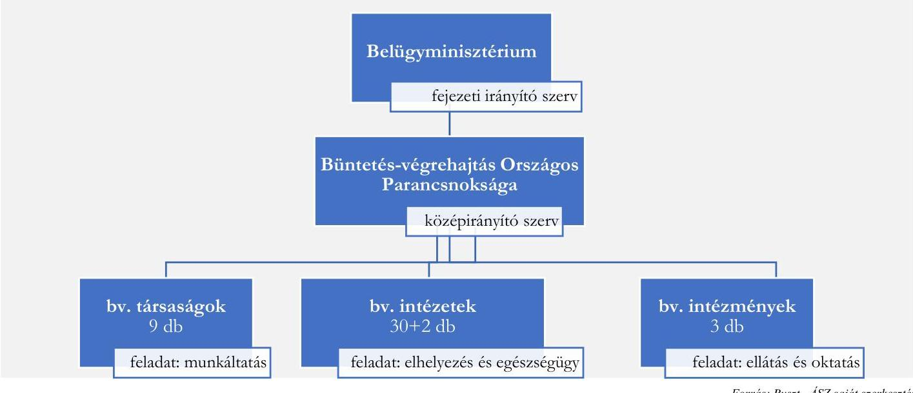

A szabadságvesztés végrehajtásának a Bv. tv.-ben meghatározott célja - a joghátrány érvényesítése, mint büntetés mellett - annak elősegítése, hogy az elítélt szabadulása után a társadalomba sikeresen visszailleszkedjen és a társadalom jogkövető tagjává váljon. Ez a reintegrációs tevékenység a fogvatartottak foglalkoztatásán keresztül valósult meg. A Bv. tv.-ben meghatározott cél a fogvatartottak teljes körű foglalkoztatása és az önfenntartó büntetés-végrehajtás, amelynek elérése érdekében többféle foglalkoztatási forma múködött az ellenőrzött időszakban: munkáltatási, oktatási, szakképzési, terápiás foglalkoztatási és egyéb reintegrációs programok.

A fogvatartottak munkáltatása a bv. intézeteken belüli költségvetési foglalkoztatás keretében, a bv. társaságoknál, valamint külső gazdasági társaságoknál bérmunka formájában valósult meg. A munkáltatás keretében a bv. társaságoknál előállított termékeket és szolgáltatásokat alapvetően a belső ellátás keretében használták fel, mely a büntetés-végrehajtási szervezeten belül a fogvatartottak élelmiszer, ruházati és egyéb ellátását jelentette. Ezen felül a bv. társaságoknál előállított termékeket, szolgáltatásokat szabályozott körülmények között a központi ellátás értékesítési rendszerében, vagy a versenypiacon értékesítették.

---

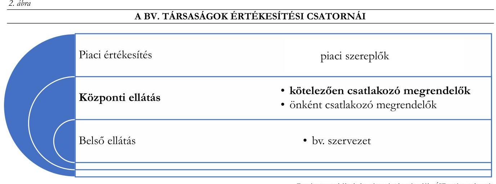

A központi ellátás értékesítési rendszere az ÁSZ fogalommeghatározása szerint a fogvatartottak munkáltatása keretében a bv. társaságok által előállított, a BM rendelet ${ }^{10}$-ben meghatározott termék- és szolgáltatáskörök meghatározott szervezetek részére történő értékesítése érdekében a központi ellátó szerv által működtetett rendszer. Az ÁSZ ellenőrzésének hatóköre a rendszert kötelezően igénybe vevő, a bv. szervezeten kívüli megrendelők irányában működtetett központi ellátás értékesítési rendszerére terjedt ki.

A központi ellátó szerv koordinálta az értékesítési tevékenységet. A Kormány a központi ellátó szerv feladatainak ellátására a BVOP-t jelölte ki. 2023. január 1. napjától a központi ellátó szerv gazdasági végrehajtási szerveként a belügyminiszter által alapított bv. intézmény, a Büntetés-végrehajtás Gazdasági Ellátó Intézete (továbbiakban: BV GEI ${ }^{11}$ ) járt el.

Az ellenőrzött időszakban a központi ellátó szerv köteles volt ellátni a Bvszt.-ben, a Korm. rendelet ${ }^{12}$ ben és a BM rendelet-ben meghatározott szervezeteknek a BM rendeletben meghatározott termékekre és szolgáltatásokra irányuló, az ellátási kötelezettség minimális értéke - alapvetően nettó 100 ezer forint - feletti igénybejelentéseivel kapcsolatos feladatokat.

A megrendelők egy része kötelezően, más része önkéntes alapon vett részt a központi ellátás értékesítési rendszerében. A rendszert kötelezően igénybe vevő megrendelők közé 2023. évben többek között az alábbi szervezetek tartoztak:

- a Korm. rendelet alapján a minisztériumok, központi hivatalok, kormányzati főhivatalok, a rendvédelmi szervek,
- a BM rendelet 2. §-a és a 2. sz. mellékletében meghatározott, a Belügyminisztérium irányítása alá tartozó szervezetek, belügyminisztériumi szervek, az önálló belügyi szervek, illetve a Belügyminisztérium szakmai felügyelete alatt álló gazdasági társaságok.
Az ellenőrzött időszakban a Belügyminisztérium Szervezeti és Működési Szabályzatáról szóló 12/2022. (VI. 28.) BM utasítás alapján az önálló belügyi szervek közé jelentős számú szervezet tartozott. Többek között:
- az Országos Kórházi Főigazgatóság, és az általa, mint középirányító szerv közreműködésével irányított állami tulajdonban és fenntartásban lévő egészségügyi intézmények,
- a Klebelsberg Központ és az általa, mint középirányító szerv közreműködésével irányított tankerületi központok,
- a Szociális és Gyermekvédelmi Főigazgatóság és az általa, mint középirányító szerv közreműködésével irányított állami fenntartásban lévő intézmények.

---

A központi ellátó szerv éves beszámolója alapján 2022. évben a központi ellátás és a belső ellátás keretében együttvéve az uniós értékhatárt el nem érő ellátási igények kapcsán a bv. társaságokat érintő kijelölés összesen nettó 19,6 Mrd Ft értékű volt, a kijelölések nyomán megkötött szerződések értéke meghaladta a nettó 10,7 Mrd Ft-ot. A 2023. évben ugyanezen a területen 23,1 Mrd Ft értékben történt meg a bv. társaság kijelölése, a kijelölések nyomán megkötött szerződések értéke meghaladta a nettó 16,7 Mrd Ft-ot.

A központi ellátó szervhez a központi ellátás keretében az elkülönült termékekre/szolgáltatásokra beérkezett egyedi igények, a bv. társaságok által tett ajánlatok és megkötött szerződések számának alakulását a 2022. és 2023. évben a 3. ábra mutatja be.
3. ábra

AZ ELKÜLŐNÜLT TERMÉKEKRE/SZOLGÁLTATÁSOKRA BEÉRKEZETT EGYEDI IGÉNYEK, A BV. TÁRSASÁGOK AJÁNLATAI ÉS SZERZŐDÉSSEL VÉGZŐDŐ IGÉNYBEJELENTÉSEK DARABSZÁMA A 2022. ÉS 2023. ÉVBEN
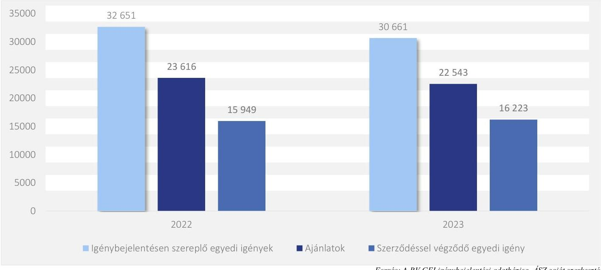

Forrás: A BV GEI igénybejelentési adatbázisa, ÁSZ saját szerkesztés
Az igénybejelentések több csatornán keresztül érkeztek a központi ellátó szervhez. Kisebb arányban internetes honlapon keresztül automatikusan kerültek a rendszerbe, nagyobbrészt az e-mail útján beérkezett igények kézi rögzítésével. Mindkét évben az igénybejelentések mintegy fele (2022. évben 48,8\%, 2023. évben $52,9 \%$ ) zárult szerződéskötéssel. A BV GEI által rendelkezésre bocsátott, a 4. fókuszterület elemzéséhez felhasznált - a bv. szervezeten kívüli megrendelőkre vonatkozó - adatbázis alapján az adatbázisban rögzített megkötött szerződések értéke a 2022. évben 7,5 Mrd Ft, a 2023. évben 12,0 Mrd Ft volt. Az adatbázisban nem került rögzítésre minden szerződés.

Az ellenőrzött időszakban a központi ellátás értékesítési folyamatát a Korm. rendelet és a BM rendelet szabályozta. A Kbt. ${ }^{13} 111 . \S$ j) pontja szerint az uniós közbeszerzési értékhatárt el nem érő, a fogvatartottak kötelező foglalkoztatása keretében előállított áruk vagy teljesített szolgáltatások beszerzése mentes volt a közbeszerzés alól. Ez alapján a szabályozás a központi ellátás értékesítési rendszerében kétfajta eljárást különböztetett meg aszerint, hogy az igénybejelentésre adott ajánlat értéke elérte-e az uniós közbeszerzési értékhatárt vagy sem.

Uniós közbeszerzési értékhatár alatti megrendelés esetén a megrendelők igénybejelentése alapján a központi ellátó szerv kijelölte az ajánlatot tevő bv. társaságot, amellyel az igénybejelentő - a Korm. rendeletben meghatározott kivételektől eltekintve - köteles volt szerződést kötni. A fontosabb kivételeket jelentették azok az esetek, melyekben az elvárt minőséget a bv. társaságok nem tudták teljesíteni, a megrendelők bizonyították,

---

hogy az ajánlati értéknél legalább 20\%-kal alacsonyabb, egyes esetekben alacsonyabb ellenértéken képesek a terméket vagy szolgáltatást beszerezni.

Uniós közbeszerzési értékhatár felett az igénybejelentők a közbeszerzési eljárás lebonyolítására irányuló ellátási megállapodást voltak kötelesek kötni a központi ellátó szervvel. Az ellenőrzött időszakban egészségügyi intézményekkel került sor mosatási szolgáltatás közbeszerzésére vonatkozó megállapodások megkötésére. A BV GEI adatszolgáltatása szerint 2023. év elejétől egy ugyanazon piaci szolgáltatóval kötött mosatási szolgáltatási keretmegállapodás alapján 28 darab 12-48 hónap időtartamra szóló egyedi szerződés került megkötésre, melyek összértéke meghaladta a 15 Mrd Ft-ot.

A központi ellátó szerv jogosult volt ellenőrizni a kedvezőbb ár benyújtására és a teljesítési határidők el nem fogadására tekintettel engedélyezett saját hatáskörben történő beszerzések megvalósulásának jogszerűségét. Ezen felül a rendszerben részvételre kötelezett szervezeteket irányító miniszter által vezetett minisztérium - ennek hiányában az irányító szerv vagy annak gazdasági szervezeti feladatait ellátó költségvetési szerv - belső ellenőrzési szervezeti egysége a rendszerben részvételre kötelezett szervezetektől történő adatbekérések alapján évente utólag ellenőrizni volt köteles az ajánlat elutasítás, az elállás eseteit, illetve a rendszer indokolatlan mellőzésével történt beszerzéseket.

Az ÁSZ ellenőrzés kiterjedt a központi ellátó szerv működési kereteinek kialakítására és működtetésére, értékelésre került a központi ellátó szerv igények ellátásához kapcsolódó adatbekérési és ellenőrzési tevékenysége. Értékelésre került az ellenőrzésre kiválasztott, központi ellátás értékesítési rendszerének igénybevételére kötelezett szervezetek központi ellátással kapcsolatos folyamatainak szabályozottsága, a rendszerben való részvételi és adatszolgáltatási kötelezettségeik teljesítése, valamint az irányító szervek ellenőrzési tevékenysége. Elemzésre kerültek a központi ellátásra vonatkozó értékesítési rendszer kialakításának célszerűsége, eredményessége, az eredményességet befolyásoló tényezők, valamint a rendszert igénybe vevők tapasztalatai.

Az ellenőrzésre kiválasztott, központi ellátás értékesítési rendszerének igénybevételére kötelezett szervezetek, valamint irányító szerveik esetében a Belügyminisztérium, mint irányító szerv, az irányítása alá tartozó két egészségügyi intézmény, egy tankerületi központ, valamint egy gyermekvédelmi szakszolgáltatást nyújtó intézmény központi ellátást érintő tevékenysége és ennek belső szabályozottsága került ellenőrzésre. Valamennyi, megrendelői körbe tartozó ellenőrzött szervezet esetében ellenőrzésre került a központi ellátásra vonatkozó belső szabályozás kialakítása, a Korm. rendeletben előírt adatszolgáltatási kötelezettség teljesítése. A Korm. rendeletben előírt adatszolgáltatás, valamint a rendelkezésre bocsátott kötelezettségvállalási adatbázis alapján a vizsgált tételek vonatkozásban ellenőrzésre került a szabályszerű részvételi kötelezettség teljesítése.

Ezen felül az ellenőrzés kiterjedt az Agrárminisztériumra, mint irányító szervre és az irányítása alá tartozó egy kiválasztott nemzeti park igazgatóságra.

Az ellenőrzött szervezetek jegyzéke a II. számú mellékletben található.

---

# ÖSSZEFOGLALÁS 

A központi ellátás értékesítési rendszere több, mint egy évtizede megalkotott jogi szabályozás mentén működik. A fennállása óta eltelt idő, a nagy számú érintett szervezet, a jelentős mértékű közpénz indokolttá tették a rendszer ellenőrzését, problémáinak feltárását.

A központi ellátás értékesítési rendszerét működtető központi ellátó szerv elsődleges feladata a Korm. rendeletben és a BM rendeletben előírtak alapján - a fogvatartottak munkáltatása keretében a bv. társaságok által előállított meghatározott termékek és szolgáltatások jogszabályban előírt szervezetek részére történő értékesítésének koordinálása volt. Ezt a feladatot a központi ellátó szerv a vizsgált időszakban a jogszabályban kötelezően előírt mértékben töltötte be.

A 2023. év elején létrejött új szervezet - a központi ellátó szerv gazdasági végrehajtási szerveként működő BV GEI - az értékesítéskoordináló tevékenységére vonatkozó szabályozását kialakította, ugyanakkor a Bkr. ${ }^{14}$ ben előírtak ellenére elmaradt a központi ellátás folyamatára vonatkozó kockázatok beazonosítása és kezelése, valamint belső ellenőr hiányában a Bkr.-ben előírtak ellenére a szervezeti célok megvalósításának nyomon követését biztosító belső ellenőrzés keretében 2023. évi ellenőrzési jelentés nem készült. Ezáltal a belső kontrollrendszer nem került teljeskörűen kialakításra és működtetésre.

A központi ellátó szerv operatív feladatait ellátó BV GEI a Korm. rendeletben kötelezően előírt feladatait végrehajtotta, azonban a Korm. rendeletben jogosultságként számára biztosított adatbekérési és ellenőrzési tevékenységét nem szabályozta, ezirányú tevékenységet nem végzett, ezáltal nem működött a saját hatáskörben történő beszerzések megvalósulásának ezen kontrollja.

Az ellenőrzött, megrendelői körbe tartozó öt szervezet a rendszerben való részvételét eltérő mértékben szabályozta, valamint a Korm. rendeletben és BM rendeletben előírt részvételi kötelezettségének eltérő mértékben tett eleget.
1. táblázat

AZ ELLENŐRZÖTT, MEGRENDELŐI KÖRBE TARTOZÓ SZERVEZETEK ÉRTÉKELÉSE

| SZERVEZETEK | RESZVETEL SZABALYOZASA   MEGTÖRTÉNT | RESZVETEL TELJESÍTÉSE   MEGTÖRTENT |
| :--: | :--: | :--: |
| Kiskunsági Nemzeti Park Igazgatóság | igen | igen |
| Országos Gyermekvédelmi Szakszolgálat | nem | nem |
| Budapesti Uzsoki Utcai Kórház | részben | részben |
| Győri Tankerületi Központ | igen | igen |
| Észak-budai Szent János Centrumkórház | részben | részben |

A két vizsgált irányító szerv - az Agrárminisztérium, valamint a Belügyminisztérium - eltérő mélységben végezte a Korm. rendeletben előírt ellenőrzési tevékenységét. Az Agrárminisztérium mindkét ellenőrzött évben minden, az irányítása alá tartozó megrendelésre kötelezett szervezet ellenőrzését elvégezte. A Belügyminisztérium évente más-más szervezetekre vonatkozóan ellenőrizte az irányítása alá tartozó megrendelésre kötelezett szervezeteket, ugyanis az elvégzendő ellenőrzési feladat eltérő mértékű volt. A rendszerben való részvételre kötelezett szervezetek döntő többsége ( 355 szervezet) a Belügyminisztérium irányítása alá tartozott.

---

A szabályszerűségi kritériumoknak való megfelelésen túl az ÁSZ elemezte a központi ellátás értékesítési folyamatának eredményességét, az azt befolyásoló tényezőket. Az igénybejelentések közel fele arányban végződtek szerződéskötéssel, így a megvalósult megrendelések aránya alacsony volt.

Az ÁSZ véleménye szerint a folyamat eredményességét az alábbi tényezők befolyásolhatták:

- A jogszabályban nevesített eljárások nem, vagy nem megfelelő mértékben valósultak meg. A rendszer használatára kötelezett szervezetek részéről nem működött a negyedéves/éves előzetes igénybejelentések rendszere. A saját hatáskörben történő beszerzések megvalósulásának jogszerűségére irányuló adatbekérés és ellenőrzés lehetőségével a központi ellátó szerv gazdasági végrehajtási szerveként működő BV GEI nem élt. A részvételre kötelezett szervezetek irányító szervei részére előírt utólagos ellenőrzés nem minden esetben valósult meg teljeskörűen.
- Egyes területek, folyamatlépések szabályozása nem történt meg, vagy azok szabályozása és megvalósítása nem minden esetben volt megfelelő. Az igénybejelentők által benyújtott kedvezőbb árajánlat okán a saját hatáskörű beszerzés engedélyezési folyamata a BV GEI-nél nem volt szabályozott, határidőt nem tartalmazott. Jelentős volt azon esetek száma, amikor az igénybejelentő a megküldött ajánlatra nem jelzett vissza, vagy a hiánypótlást nem teljesítette. Ekkor a folyamatot a BV GEI az igénybejelentő értesítése mellett lezárta, egyéb lépés nem történt.
- Az informatikai rendszer hiányosságai a folyamatot lassították, nem támogatták az eredmények elemzését. Az igények jelentős része nem a www.allamiparter.hu honlapról automatikusan került betöltésre, így a kézi adatrögzítés időigényes volt és hibalehetőségeket rejtett magában. Hiányzott az egységes ügyféltörzs és terméktörzs, amely a lekérdezéseket, a folyamat elemzését segíthette volna.
- A központi ellátó szerv operatív feladatait ellátó BV GEI a jogszabályokban számára kötelezően előírt tevékenységek elvégzésére fókuszált, ezen túlmutató nem kötelezően előírt ügyfélkapcsolati feladatokat nem végzett. Az igénybejelentők számára a bejelentéskor az előállított termékek köre és műszaki paraméterei nem voltak ismertek. A webáruház jellegű honlap használata alacsony volt, a bejelentőknek az igény benyújtásakor nem állt rendelkezésre információ az igényelt termékek/szolgáltatások listaáráról és a szállítási feltételeiről.
- Nem volt ismert a rendszert kötelezően résztvevő megrendelők köre. Mivel a két vizsgált irányító szerv közül a Belügyminisztérium csak részben végzett ezirányú ellenőrzési tevékenységet, a rendszerből kimaradó szervezetek köre feltáratlan maradt.
A központi ellátás értékesítési rendszere egy összetett folyamat része. Az összetett folyamat alapvető célja a fogvatartottak reintegrációs célú és az önfenntartó büntetés-végrehajtást elősegítő munkáltatása. A rendszer kialakításának célszerűségi, eredményességi elemzése során az ÁSZ megállapította, hogy nem határoztak meg a rendszer eredményességét mérő, átfogó elérendő mutatókat. Előre meghatározott objektív célok visszamérése nem képezte tárgyát a központi ellátó szerv elvégzett éves értékeléseinek.

Az ellenőrzés során feltárt eredményességet befolyásoló tényezők felvetik a központi ellátás értékesítési rendszere múködésének felülvizsgálatát. Az ÁSZ véleménye szerint indokolt lehet egy szűkebb megrendelői-, illetve termékköre összpontosító, a részvételi kötelezettséget hatékonyabban kontrolláló, ugyanakkor a felmerült igényeket jobban kiszolgáló, felhasználóbarát rendszer kialakítása. Az átalakításra jó gyakorlatot jelent a központosított közbeszerzési rendszer, ahol a vonatkozó eljárási és informatikai megoldások már kialakításra és alkalmazásra kerültek.

---

A központi ellátás értékesítési folyamatában rejlő beazonosított problémákat, akadályozó tényezőket és az ezekkel kapcsolatos ÁSZ véleményeket, megoldási lehetőségeket a 2. táblázat tartalmazza.
2. táblázat

# A KÖZPONTI ELLÁTÁS ÉRTÉKESÍTÉSI FOLYAMATAIBAN BEAZONOSÍTOTT PROBLÉMÁK, EZZEL KAPCSOLATOS ÁSZ VÉLEMÉNYEK 

## PROBLÉMA

JÓGSZABÁLYBAN SZEREPLŐ ELJÁRÁSOK ALKALMAZÁSÁNAK HIANYA VAGY NEM MEGFELLELŐ MÉRTEKE.

A negyedéves/éves előzetes igénybejelentések rendszere nem múködött
(Korm. rendelet $1 . \int(8)$ bek., $6 . \int(1)$ bek.)

A saját hatáskörben történő beszerzések megvalósulásának jogszerüségére irányuló adatbekérés és ellenőrzés lehetőségével a központi ellátó szerv nem élt (Korm. rendelet $12 . \int(5)$ bek.)

A részvételre kötelezett szervezetek irányító szervei részére előírt utólagos ellenőrzés eltérő mélységben valósult meg. (Korm. rendelet $12 . \int(2)-(3)$ bek.)

A központi ellátó szerv által megfelelően korai időpontban kezdeményezett igényfelmérés, mely megvalósulhat az irányítók/középirányítók bevonásával, vagy az internetes felületen.

A konkrét igények helyett rugalmasabb keretszerződések megkötése. A rendszer ezáltal segítené a bv. társaságok kapacitástervezését is.

Kockázati alapon kiválasztott tételek esetében a központi ellátó szerv adatbekérési és ellenőrzési eljárásának kidolgozása.

A Korm. rendelet 1. melléklete adattartalmának bővítése (igénybejelentési és kötelezettségvállalási azonosítószámok, meghiúsult beszerzések).

A központi ellátó szerv adatszolgáltatása az irányítószervek részére az éves igénybejelentésekről, valamint a rendszert elkerülő szervezetekről.

Az előírt éves ellenőrzési kötelezettség leszűkítése a fenti információk felhasználásával, kockázati alapon kiválasztott szervezetekre vonatkozóan.

---

# ProhLÉMA 

## MegoldásLleHETÖSÉGEK

## EGYES TERÜLETEK, FOLYAMATLÉPÉSEK SZABÁLYOZÁSANAK HIÁNYA VAGY NEM MEGFELELÖSÉGE

Jelentős volt a termékkörön kívüli igénybejelentés aránya. A BM rendelet 1. melléklete a termék és szolgáltatás megnevezések helyett a Tevékenységek Egységes Ágazati Osztályozási Rendszere (TEÁOR'08) szerinti tevékenység besorolást tartalmazza, ami nehezítette a rendelet hatálya alá tartozó termékek és szolgáltatások beazonosítását.

Az igénybejelentők által benyújtott kedvezőbb árajánlatra indított saját hatáskörű beszerzés engedélyezési folyamata nem volt szabályozott, határidőt nem tartalmazott. (Korm. rendelet 3. § (5) bek., 11. $\$ (4) bek.)

A BV GEI, valamint a bv. társaságok közti információcsere levelezés útján történt. A BV GEI sok esetben csak közvetítő szerepet töltött be a bv. társaságok és a megrendelők között, hozzáadott tevékenység nélkül, amely növelte az ügyintézési határidő hosszát.

Nem múködtek folyamatba épített kontrollok a rendszer elkerülését illetően, jelentős volt azon ügyek száma, ahol az igénybejelentők nem kötöttek szerződést, a hiánypótlást nem teljesítették.

Az uniós közbeszerzési értékhatárt meghaladó igények esetén a műszaki paraméterek egyeztetése, az ellátási megállapodás megkötése elhúzódott. (38. mintatétel)

A BM rendelet 1. mellékletében a termékek és szolgáltatások beazonosítható megnevezésének alkalmazása, valamint utalás a termékkör bv. szervezet által fenntartott, igénybejelentésre szolgáló honlapon történő megjelenítésére.

Az eljárás átgondolása, és szabályozása, valamint árajánlat összehasonlító forma nyomtatvány és dokumentumjegyzék közzététele.

A központi ellátó szerv végrehajtó szervi feladatait azon bv. szervezethez javasolt delegálni, ahol a feladat a leggyorsabban elvégezhető. Megfontolandó, hogy az uniós közbeszerzési értékhatár alatti igények esetében a Bv. Holding Kft. a feladatokat saját hatáskörben el tudná-e látni.

Az internetes felületen kialakított igénybejelentési, nyilvántartási és megrendelési folyamat mind a bv. szervezet, mind a megrendelő számára lehetővé tenné az igénylési folyamat státuszának ismeretét.

A központi ellátó szerv adatszolgáltatása az irányítószervek részére az éves igénybejelentésekről, azok alakulásáról segítené ezen estek utólagos ellenőrzését.

A Korm. rendelet 6. § (3) bekezdésében és 7. § (2) bekezdés a) pontjában szabályozott 60 napos határidő és a kapcsolódó folyamat átgondolása.

---

# PROBLÉMA 

## MEGOLDÁSI LEHETŐSÉGEK

## AZ INFORMATIKAI RENDSZER PROBLÉMÁI

Az igények jelentős része nem a honlapról automatikusan került betöltésre, így a kézi adatrögzítés időigényes volt és hibalehetőségeket rejtett magában.

Hiányzott az egységes ügyféltörzs és terméktörzs, amely a lekérdezéseket, a folyamat elemzését segíthette volna.

Az egykapus, a honlapon történő igénybejelentési lehetőség általánossá tétele, a kézi adatrögzítés helyett az előre paraméterezett adatok automatikus bevitele a rendszerbe. Ellenőrzési algoritmusok beépítése.

Az SAP rendszerben az ügyféltörzs, terméktörzs adatainak egységes szerepeltetése.

## ÜGYFÉLKÖZPONTU MEGKÖZÉLÍTÉS HIANYA

A központi ellátó szerv csak azon megrendelőkkel került kapcsolatba, amelyek jelentkeztek a rendszerben, nem rendelkezett nyilvántartással és nem szólította meg a rendszer használatára kötelezett, de azt nem használó szervezeteket.

A webáruház jellegű honlap használata alacsony volt, a gyakorlati tapasztalat szerint a regisztráció is problémába ütközött.

A bejelentőknek az igény benyújtásakor nem állt rendelkezésre információ az igényelt termékek/szolgáltatások listaáráról és a szállítási határidőkről.

A rendszer használatára kötelezett szervezetek körének átgondolása.

Az irányító szervek adatszolgáltatása alapján nyilvántartás vezetése a rendszer használatára kötelezett szervezetekről. Azon szervezetek megkeresése, amelyek kötelezettségük ellenére nem nyújtanak be igénybejelentést.

Az egykapus, a honlapon történő igénybejelentési lehetőség általánossá tétele és a használatban segítség nyújtása az ügyfelek részére.

A honlapon a lehetséges ár tartomány, valamint a szállítási határidőkeret szerepeltetése melyeken belül az egyedi ajánlatok kialakíthatók.

---

# AZ ELLENŐRZÉS FÓKUSZTERÜLETEI 

1.     - A központi ellátó szerv központi ellátás értékesítési rendszerére vonatkozó müködési kereteinek kialakítása és müködtetése
2.     - A központi ellátó szerv központi ellátás értékesítési rendszerére vonatkozó tevékenységének végrehajtása
3.     - Az ellenőrzött, megrendelői körbe tartozó szervezetek központi ellátás értékesítési rendszerével kapcsolatos kötelezettségeinek, valamint az irányító szervek ellenőrzési kötelezettségének teljesítése
4.     - A központi ellátás értékesítési folyamata kialakításának célszerüsége, a végrehajtás eredményessége és az eredményességet befolyásoló tényezők

---

# 1. A központi ellátó szerv központi ellátás értékesítési rendszerére vonatkozó múködési kereteinek kialakítása és múködtetése 

Összegző megállapítás A központi ellátó szerv értékesítéskoordináló tevékenységére vonatkozó szabályozását kialakította. Ugyanakkor a központi ellátó szerv operatív feladatait ellátó BV GEI a központi ellátásra vonatkozó kockázatokat nem azonosította be és nem kezelte, valamint a központi ellátás kontrollját is érintő belső ellenőrzést csak részben múködtette.

#### Abstract

A központi ellátó szerv feladata a Korm. rendelet alapján az ellátási tevékenység végzése és koordinálása volt. A központi ellátó szerv feladatainak ellátására a Korm. rendeletben a BVOP került kijelölésre, mely jogszabályi kijelölés nem változott a 2023. évben. Ugyanakkor 2023. január 1. napjától a központi ellátó szerv gazdasági végrehajtási szerveként az újonnan alakult BV GEI járt el. A BVOP SZMSZ-e ${ }^{15}$ alapján a 2023. évben a jogszabályban meghatározott központi ellátó szervi feladatait a BV GEI útján látta el. A BVOP parancsnoka a Bkr. előírásaival összhangban működtetett integrált kockázatkezelési rendszert, amelynek részeként a belső kontrollrendszerről szóló BVOP utasítás ${ }^{16}$ előírása szerint a folyamatgazdák kötelesek voltak minden évre vonatkozóan elvégezni a folyamatok kockázatelemzését, valamint ismertetni az előző évi magas és közepes szintű kockázatok kezelésének eredményét. Mivel a feladatot a 2023. évtől Alapító Okirata ${ }^{17}$ szerint a BV GEI végezte, a központi ellátás értékesítési rendszerének folyamatára vonatkozó kockázatelemzést a 2023. évtől a BVOP nem készített. A BVOP vezetője a Bkr. előírásai szerint működtetett belső ellenőrzést. A belső ellenőrzés a 2023. évben a központi ellátás rendszerére irányuló ellenőrzést nem végzett, ugyanakkor a BVOP egyéb szervezeti egységei (Gazdasági szolgálat, Ellenőrzési szolgálat) végeztek operatív ellenőrzéseket a BV GEI központi ellátási tevékenységének végrehajtásával kapcsolatban.

A BV GEI Alapító Okiratában az Ávr. ${ }^{18}$ szerint a szervezet alaptevékenységeként megjelölésre került a BVOP, mint központi ellátó szerv részére Korm. rendeletben meghatározott feladatok ellátása. A BV GEI SZMSZ-e ${ }^{19}$ a központi ellátási feladatok elvégzését a Központi Ellátási Osztály feladatkörébe, míg az uniós közbeszerzési értékhatárt elérő igények esetén a közbeszerzési eljárás lebonyolítását a Beszerzési Osztály feladatkörébe sorolta. A BV GEI SZMSZ-e rendelkezett a Központi Ellátási Osztály és a Beszerzési Osztály feladatköreiről, ugyanakkor megjegyzendő, hogy a felsorolt szervezeti egységeket is tartalmazó szervezeti ábrát az SZMSZ az Ávr. 13. § (1) bekezdés e) pontja ellenére nem tartalmazta.
A BV GEI SZMSZ-e, valamint a Központi Ellátási Osztály ügyrendje ${ }^{20}$ az Ávr.-ben előírtak szerint tartalmazta a központi ellátó szerv feladatait végző szervezeti egység munkafolyamatainak leírását, a vezetők és alkalmazottak feladat-és hatáskörét, a helyettesítés rendjét, a belső és külső kapcsolattartás módját, szabályait. Az ügyrend mellékleteként elkészített ellenőrzési nyomvonal tartalmazta a feladatok végrehajtásának határidejét, valamint a Bkr. előírásai szerint a felelősségi és információs szinteket és kapcsolatokat, irányítási és ellenőrzési folyamatokat.

---

1/A: A Korm. rendelet alapján a központi ellátó szerv feladatait a 2023. évtől továbbra is a BVOP látta el, a központi ellátó szerv vezetője továbbra is az országos parancsnok volt. Ugyanakkor 2023. évtől a központi ellátó szerv gazdasági végrehajtási szerveként a BV GEI került kijelölésre, és valamennyi erre vonatkozó szabályozás a BV GEI-nél volt található. Mindezek alapján indokolt a Belügyminisztérium részéről a központi ellátó szerv jogszabályban definiált fogalmát átgondolni, szükség szerint jogszabálymódosítást kezdeményezni.

A BV GEI az ellenőrzött időszakban a Bkr. 6. § (4) bekezdésében előírtak ellenére nem rendelkezett az integrált kockázatkezelés eljárásrendjével. A Bkr. 7. $\mathbb{S}$ (2) bekezdésében előírtak ellenére nem mérték fel a központi ellátás értékesítési folyamatában rejlő kockázatokat, továbbá nem határozták meg a kockázatok kezelése érdekében szükséges intézkedések megtételének, és ezek nyomon követésének kötelezettségét. A Bkr. 7. § (4) bekezdésében előírt, az integrált kockázatkezelési rendszer koordinálásával megbízott szervezeti felelőst, illetve ezt a feladatkört ellátó személyt a BV GEI vezetője nem jelölt ki.
A Bkr.-ben előírtaknak megfelelően a Központi Ellátási
Osztály ügyrendje szabályozta az információs és kommunikációs folyamatokat. A Központi Ellátási Osztály az igénybejelentések adatait az ellátási igény beérkezésétől a szerződéskötésig a KEFOnline Ügyviteli és nyilvántartó Szoftverben - a 4. fókuszterületnél ismertetett hiányosságokkal - nyilvántartotta és nyomon követte, a központi ellátási tevékenységről az országos parancsnok gazdasági és informatikai helyettese részére éves beszámolót készített.
A BV GEI SZMSZ-e rendelkezett a Bkr.-ben előírt független belső ellenőrzés szervezeti kialakításáról, a Belső Ellenőrzési Osztály feladat- és hatásköréről. 2023. év augusztus 31-ig foglalkoztattak a Bkr. 15. § (2) bekezdésében előírt legalább egy fő belső ellenőrt. 2023. év szeptember 1-től 2024. február 14-ig nem volt saját alkalmazásban foglalkoztatott, vagy a Bkr. 15. § (6) bekezdése szerint kijelölt belső ellenőr. 2024. február 15. - március 25. között ismételten volt alkalmazásban a szervezetnél belső ellenőr, majd ezt követően a helyszíni ellenőrzés lezárásának időpontjáig betöltetlen volt a pozíció. A BVOP 2023. évi összefoglaló éves ellenőrzési jelentése tartalmazta, hogy a BV GEI esetében több alkalommal került sor a belső ellenőri feladatok elvégzése tekintetében pályázat kiírására, azonban a kiválasztási folyamat nem vezetett eredményre. Belső ellenőr hiányában a BV GEI belső ellenőrzésének 2023. évi tevékenységéről szóló éves ellenőrzési jelentés a Bkr. 48-49. Ş-ban előírtak ellenére nem készült.
A BV GEI megalakulását követően a központi ellátás értékesítési folyamatának szabályozására vonatkozó Eljárásrend ${ }^{21}$ : 2023. szeptember 20-án lépett hatályba. A 2023. január 1- szeptember 19. közötti időszakban a központi ellátás értékesítési folyamatára vonatkozó szabályzattal a BV GEI nem rendelkezett. Ezen időszakban a folyamat szabályozását a Korm. rendelet, a BM rendelet, valamint a BVOP Központi Ellátási Főosztályára vonatkozó korábbi Eljárásrend: ${ }^{22}$ jelentette.
A BV GEI központi ellátás rendszerére vonatkozó Eljárásrend ${ }_{2}$-je a Korm. rendelet és a BM rendelet előírásainak megfelelően szabályozta a központi ellátás értékesítési folyamatát, eltekintve a bv. társaság kijelölésének és a bv. társaság ajánlattételének sorrendjétől. A Korm. rendelet szerint a bv. társaság kijelölésének meg kellett előznie a bv. társaság ajánlattételét. Az Eljárásrend ${ }_{2}$-ben szereplő szabályozás szerint a Központi Ellátási Osztály először ajánlatot kért a bv. társaság(ok)tól és azt követően küldte meg a kijelölést az ajánlatot adott bv. társaság részére. A folyamat így volt célszerű, hiszen az ajánlatot adni képes bv. társaságot lehetett kijelölni a termék előállítására vagy szolgáltatás nyújtására.
A Korm. rendelet szerint a központi ellátó szerv által kijelölt bv. társaságok az uniós közbeszerzési értékhatárokat el nem érő igényeket a központi ellátó szervvel kötött keretszerződések alapján kellett, hogy

---

teljesítsék. A BVOP és a bv. társaságok 2022. évre megkötött szerződései megszűnésével a BV GEI 2023. április 13-val bezárólag megkötötte a keretszerződéseket a bv. társaságokkal.

# 2. A központi ellátó szerv központi ellátás értékesítési rendszerére vonatkozó tevékenységének végrehajtása 

Összegző megállapítás

A központi ellátó szerv operatív feladatait ellátó BV GEI a beérkezett igényeket az ellenőrzött mintatételek esetében nagy részben a jogszabályoknak megfelelően kezelte. Az uniós közbeszerzési értékhatár alatti mintatételeknél feltárt hiányosságok az ügyletek kimenetelét nem befolyásolták. Egy esetben uniós közbeszerzési értékhatárokat elérő eljárás került megindításra a központi ellátó szerv részéről az értékhatár alatt lefolytatandó eljárás helyett, ami késedelmet okozott a központi ellátási folyamatban. A központi ellátó szerv operatív feladatait ellátó BV GEI a jogszabályban jogosultságként számára biztosított adatszolgáltatás kérést és ezen alapuló ellenőrzési tevékenységet nem szabályozta, és ezirányú tevékenységet nem végzett.

A Korm. rendelet alapján a részvételre kötelezett megrendelők az ellátási kötelezettség minimális értékét elérő vagy meghaladó, a fogvatartottak kötelező foglalkoztatása keretében előállított termékek és szolgáltatások körébe tartozó igényeikkel a központi ellátó szervhez voltak kötelesek fordulni.
Az uniós közbeszerzési értékhatár alatti értékesítési folyamatot a 4. ábra foglalja össze, részletesen a IV. melléklet tartalmazza.
4. ábra

A KÖZPONTI ELLÁTÁS ÉRTÉKESÍTÉSI RENDSZERÉRE VONATKOZÓ FOLYAMATOK FŐBB ELEMEI AZ UNIÓS KÖZBESZERZÉSI ÉRTÉKHATÁROK ALATTI BESZERZÉSEK ESETÉN
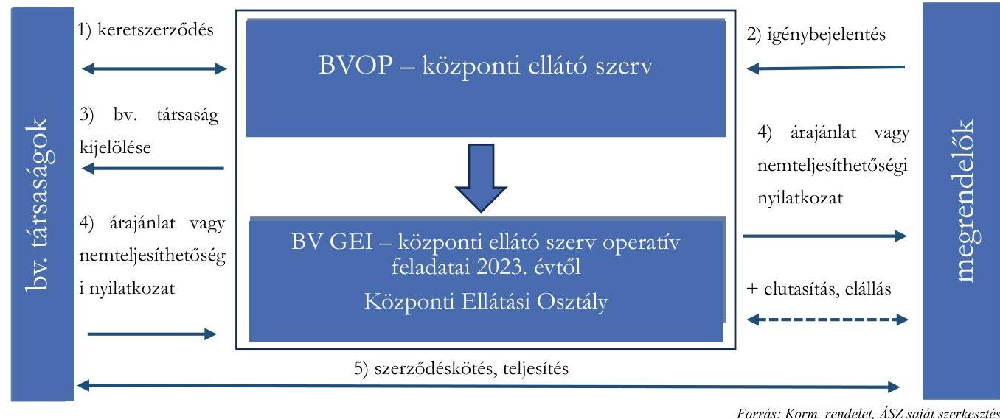

Forrás: Korm. rendelet, ÁSZ saját szerkezésére

Az uniós közbeszerzési értékhatárt elérő igénybejelentések esetén a megrendelővel kötött ellátási megállapodás alapján a megrendelő nevében és javára a központi ellátó szerv folytatta le a közbeszerzési

---

eljárást. A Korm. rendelet évente egyszer írta elő a megrendelők számára az igények benyújtását. A határidők és a folyamatlépések ez alapján kerültek meghatározásra, ugyanakkor a Korm. rendelet lehetőséget biztosított előre nem tervezett ellátási igény benyújtására is. A bv. társaságoknak ezen eljárásban nem volt ajánlattételi kötelezettségük. A gyakorlatban a központi ellátó szerv feladatait 2022. évben ellátó BVOP a 2022. évben nyílt uniós közbeszerzési eljárás lefolytatását követően piaci szolgáltatóval kötött egészségügyi intézmények részére mosatási szolgáltatási keretmegállapodást. A keretmegállapodás alapján az ellenőrzött időszakban az igénybejelentés beérkezését követően lefolytatott eljárás eredményeként kerültek megkötésre a megrendelők és a bv. társaságok között az egyedi szerződések.
Az uniós közbeszerzési értékhatár feletti értékesítési folyamatot az 5. ábra foglalja össze részletesen az V. sz. melléklet szemlélteti.
5. ábra

# A KÖZPONTI ELLÁTÁS ÉRTÉKESÍTÉSI RENDSZERÉRE VONATKOZÓ FOLYAMATOK FŐBB ELEMEI AZ UNIÓS KÖZBESZERZÉSI ÉRTÉKHATÁROKAT ELÉRŐ BESZERZÉSEK ESETÉN 

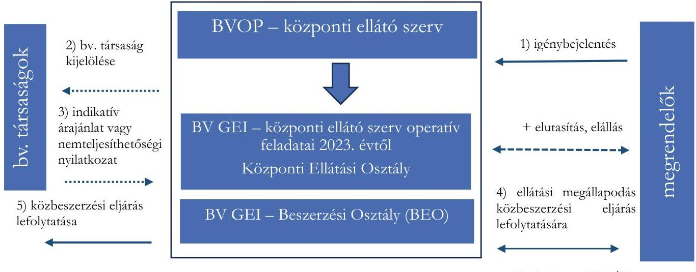

A központi ellátó szerv operatív feladatait ellátó BV GEI értékesítési folyamatban betöltött tevékenységét 38 igénybejelentési mintatételen keresztül értékelte az ÁSZ.
A 38 mintatételből 37 tétel benyújtása e-mailen, egy tétel esetében a Robotzsaru rendszeren keresztül történt.
A bejelentők egy igénybejelentésben jellemzően többfajta termékre, szolgáltatásra nyújtottak be igényt. Bizonyos termékekre megkötésre került a szerződés a megrendelők és a bv. társaságok között, míg más termékek esetében - az igényelt termékek mintegy felénél - nem jött létre az ügylet. A több termékfajtát tartalmazó igénybejelentésekből a kiválasztott termékek ügyintézési folyamatát vizsgálta az ÁSZ.

2/A: Az e-mailen vagy Robotzsaru rendszeren keresztül benyújtott igénybejelentés kézi adatrögzítést igényelt. Az egykapus, a honlapon (www.allamipartner.hu) történő igénybejelentés általánossá tétele, amely során a bejelentések automatikusan betöltődnek a nyilvántartó rendszerbe, gyorsabbá tennék az ügyintézést, és segítenék a határidők nyomon követését. Az ÁSZ véleménye szerint további fejlődési irány lehet a központosított közbeszerzési rendszerek mintájára kialakított elektronikus felület alkalmazása.

---

A mintatételek általános értékeléseként az alábbiakat állapította meg az ÁSZ:

- Valamennyi igénybejelentés tartalmazta a Korm. rendeletben meghatározott kötelező elemeket.
- A termékek beazonosítása a BM rendelet 1. sz. melléklete szerint történt.
- A teljesíthető igények esetén három mintatétel kivételével a Korm. rendeletben előírtak szerint a központi ellátó szerv az ügylet kezdő dátumához viszonyítva a pontos műszaki leírás rendelkezésre állásától számított 10 munkanapon belül kijelölte a bv. társaságot, nem teljesíthető igény esetén a Korm. rendelet szerint erre vonatkozó nyilatkozatot tett vagy az árajánlat tartalmazta a nemteljesíthetőség tényét. A 23. 27. tétel esetében csak pár nap volt a túllépés, míg
- a 36. tétel esetében az ajánlati értéknek nem megfelelő eljárás kezdeményezése miatt jelentős késés történt a bv. társaság kijelölésében.
- A bv. társaságok ajánlata tartalmazta a Korm. rendeletben előírt kötelező elemeket.

Az uniós közbeszerzési értékhatár alatti mintatételek részletes értékelését a 3. táblázat tartalmazza.
3. táblázat

# AZ UNIÓS KÖZBESZERZÉSI ÉRTÉKHATÁR ALATTI MINTATÉTELEK ÉRTÉKELÉSE 

## KATEGÓRIAK

Szerződéskötéssel zárult igénybejelentések (1-9. mintatétel)

Azon igénybejelentések, ahol a megrendelő az igénybejelentését visszavonta, vagy a megküldött ajánlatra nem jelzett vissza (10- 18. mintatétel)

Az igénybejelentő a kedvezőbb árajánlat központi ellátó szerv általi pozitív elbírálását követően jogosulttá vált a saját hatáskörben történő beszerzésre (19- 26. mintatétel)

A bv. társaságok által nem teljesíthető igénybejelentések (27- 35. mintatétel):

## ÉRTÉKELÉS

Az 1., 8. és 9. mintatétel esetében a szerződéskötés a Korm.rendelet 3. § (3) bekezdésében előírt 15 munkanapon túl történt, a többi hat mintatétel esetében határidőben.
A szerződéssel záruló kilenc minta esetében az igénybejelentéstől a szerződéskötésig tartó legrövidebb időtartam 22 nap, a leghosszabb 107 nap, az átlag 51,8 nap volt.
A teljes sokaságban a szerződéskötésig eltelt napok átlaga a mintasokasághoz közelítően 53,4 nap volt.
A Korm. rendelet nem tartalmaz előírást arra az esetre, amikor az igénybejelentő a megküldött árajánlatra nem reagál. Az Eljárásrend ${ }_{1,2}$ II.10. pontja alapján amennyiben az igénybejelentő a hiánypótlásra felszólításnak vagy a szerződéskötési kötelezettségének nem tesz eleget, a BV GEI az ügyet lezárja és erről az igénybejelentőt értesíti. Öt esetben (12. 14. 15. 17. 18. tételek) az Eljárásrend ${ }_{1,2}$ II.10. pontjában előírtak ellenére, az ügy lezárása és erről az igénybejelentő értesítése nem történt meg, négy esetben megtörtént.
A Korm. rendelet nem tartalmaz rendelkezést az igénybejelentő által benyújtott kedvezőbb ajánlatok elbírálási határidejére, és rendjére. Erre vonatkozó szabályokat az Eljárásrend ${ }_{1,2}$ sem tartalmaz.
Egyes mintatételek esetében a kedvezőbb ár elbírálása jelentős időt vett igénybe. (A 22. mintatétel esetében 25 nap, a 23. mintatétel esetében 33 nap, a 22. mintatétel esetében 11 napig, a 23. mintatétel esetében 2 napig tartó hiánypótlással) Ez különösen azokban az esetekben volt aggályos, amikor az igénybejelentés több termékre vonatkozott. Az igény együttes kezelése miatt ez időtartam alatt az ártárgyalással nem érintett termékek megrendelése is várakozott.
A 27. mintatétel esetében a központi ellátó szerv a Korm. rendelet 3. § (2) bekezdésében előírtak ellenére az ügylet kezdő dátumához viszonyítva a pontos műszaki leírás rendelkezésre állásától számított 10 munkanapon túl nyilatkozott az igénybejelentő részére arról, hogy az ellátást gyártástechnológiai hiány miatt nem képes teljesíteni. A többi mintatétel esetében a határidő betartásra került.

---

2/B: Amennyiben az igénybejelentő az árajánlatra nem jelez vissza, nem köti meg a szerződést, a belső szabályozó alapján a BV GEI az ügyet lezárja és erről az igénybejelentőt értesíti. Az értesítés során a BV GEI tájékoztatja az igénybejelentőt, hogy a lezárás nem jelenti a saját hatáskörben történő beszerzés engedélyezését.
Az ÁSZ véleménye szerint a Korm. rendelet indokolatlan mellőzésével történt beszerzés utólagos irányító szervi ellenőrzését segítené, ha a központi ellátó szerv operatív feladatait ellátó BV GEI az egyes részvételre kötelezett szervezetek igénybejelentéseiről, és azok kimeneteléről adatokat szolgáltatna az iránvító szervek részére.
Az igénybejelentő által benyújtott kedvezőbb árajánlat miatt nem teljesült igénybejelentések közül részletesen elemzett az ÁSZ egy iskolabútorokat tartalmazó igényt (21. mintatétel), mely során az alábbiakat állapította meg:

- Az ajánlati ár kialakításával kapcsolatban a dokumentumok és a nyilatkozatok alapján a bv. társaság által adott árajánlatban szereplő 15 termék közül két termék (polcos kisszekrény, olvasóasztal) egyedi gyártású volt. Megrendelés esetén gyártásuk egy nem bv. szervezetbe tartozó konzorciumi partner által történt, mely társaság a bv. társaság nyilatkozata alapján a vizsgált időszakban tevékenységének, gyártásának jelentős részét a bv. társaság üzemébe telepítve végezte fogvatartotti foglalkoztatást is igénybe véve. A bv. társaság által kiajánlott ár jelentősen meghaladta a benyújtott ellenajánlatban szereplő árakat. (A kiajánlott ár a polcos kisszekrény esetében $62 \%$-kal, az olvasóasztal esetében $73 \%$-kal volt magasabb az ellenajánlatnál.)
- A kedvezőbb ellenajánlatra tekintettel a saját hatáskörű beszerzés engedélyezési folyamatában az árellenőrzést az ajánlatot adó bv. társaság végezte, melynek eredményéről tájékoztatta a központi ellátó szervet. A megküldött árösszehasonlító táblázatban a 15 termék közül az egyik termék esetében az árajánlathoz képest elírás történt a nettó egységár összegében, így az összehasonlítás a valódinál magasabb árkülönbözetet eredményezett. A hiba a saját hatáskörű beszerzés engedélyezési döntésének kimenetelét nem befolyásolta. Az elbírálási folyamat 14 napot vett igénybe, melynek során egy alkalommal történt hiánypótlás. Az elbírálási folyamatra a Korm. rendelet nem tartalmaz határidőt.
- Az igénybejelentő által ténylegesen megvalósított beszerzést megvizsgálva az alábbi volt megállapítható: Jogszabályi változás miatt az iskolabútorok beszerzése időközben a központosított közbeszerzési rendszerről, valamint a központi beszerző szervezet feladat- és hatásköréről szóló 168/2004. (V. 25.) Korm. rendelet ${ }^{23}$ hatálya alá került. Az igénybejelentő szervezetnél nyilatkozatuk alapján megváltoztak a beszerzési igények. Ezek okán nem a benyújtott ellenajánlatban szereplő

2/C: A mintatétel alapján látható, hogy a bv. társaságtól történt megrendelés esetében nem feltétlen bv. társaság gyártja az ajánlatban szereplő termékeket. Az ÁSZ véleménye szerint indokolt lehet a Belügyminisztérium részéről az érintett jogszabályokban (Korm. rendelet, BM rendelet. Kbt.) pontosítás kezdeményezése, milyen feltételek, milyen fogvatartotti hozzáadott érték teljesülése mellett minősül egy termék/szolgáltatás a fogvatartottak kötelező foglalkoztatása keretében előállított terméknek/szolgáltatásnak.
Ezen felül az ismertetett mintatétel rámutat arra a problémára, hogy az igénybejelentők kedvezőbb árajánlatra tekintettel történő saját hatáskörű beszerzésének engedélyezése esetén semmilyen garancia nincs a beszerzés kedvezőbb árajánlatnak megfelelő megvalósulására. Indokolt a folyamat átgondolása a

---

megrendelést valósította meg. Az igénybejelentő szervezet által rendelkezésre bocsátott dokumentumok alapján történt iskolabútor beszerzés, de a mennyiségek és az egységárak nem egyeztek a központi ellátó szervhez benyújtott ellenajánlattal, az igénybejelentő nem azt a műszaki tartalmú irodabútort szerezte be harmadik féltől, amire megkapta a saját hatáskörű beszerzés engedélyezését.
Az uniós közbeszerzési értékhatárokat elérő minták a BV GEI igénybejelentési adatbázisának azon tételei közül kerültek kiválasztásra, amelyeknél az ügyfajta megjelölése „uniós értékhatár feletti igény" volt. Ezen minták értékelését a 4. táblázat tartalmazza:
4. táblázat

# AZ UNIÓS KÖZBESZERZÉSI ÉRTÉKHATÁRT ELÉRŐ MINTATÉTELEK ÉRTÉKELÉSE 

## MINTATÉTELEK

36. mintatétel: egészségügyi intézmény mosatási szolgáltatása
37. mintatétel: háztartási egészségügyi papírtermékek
38. mintatétel: mosatási szolgáltatás

## ÉRTÉKELÉS

Az ajánlat értéke uniós közbeszerzési értékhatár alatt volt, viszont a BV GEI a Korm. rendelet uniós közbeszerzési értékhatárt elérő ellátásra vonatkozó eljárását kezdte meg, majd ezt korrigálva az uniós közbeszerzési értékhatár alatti eljárást folytatta le. Ezáltal a pontos műszaki leírás rendelkezésre állásától számítva a Korm. rendelet 3. § (2) bekezdésében előírt 10 munkanap helyett két hónap elteltével jelölték ki a bv. társaságot, és juttatták el az ajánlatot a megrendelő részére.
A bejelentő igényét a Korm. rendelet 6. $\$ (1) bekezdése szerint 2023. január 20-ig benyújtotta a központi ellátó szervnek. A BV GEI a Korm. rendelet 6. $\$ (2) bekezdésében előírt február 20-i dátumhoz képest három nap késedelemmel megküldte ajánlatát a bejelentőnek. Az ellátási megállapodás a Korm. rendelet 6. $\$ (3) bekezdésében előírt határidőt figyelembe véve, 2023. március 20-a helyett augusztus 11-én került aláírásra. Ezt követően a folyamat a megrendelő miatt megakadt, végül a megrendelő 2023. december 4-én az uniós közbeszerzési eljárás kezdeményezését visszavonta, és mennyiségben és időszakban csökkentett, uniós közbeszerzési értékhatár alatti igénybejelentést nyújtott be háztartási és egészségügyi papírtermékekre vonatkozóan. Az eljárás lefolytatását követően a szerződés a bv. társasággal megkötésre került.
Az igénybejelentést a bejelentő a Korm. rendelet 7. § (1) bekezdése szerint előre nem tervezett igényként nyújtotta be. A központi ellátó szerv megküldte ajánlatát, azonban az ellátási megállapodásra a Korm. rendelet 7. $\$ (2) bekezdés a) pontjában előírtak ellenére 60 napon belül nem került sor. Az ellátási megállapodás megkötése, közel egy évvel az igénybejelentés után, a helyszíni ellenőrzés lezárásának időpontjáig sem történt meg, melynek oka a BV GEI nyilatkozata és a becsatolt dokumentumok alapján a múszaki paraméterek tekintetében elhúzódó egyeztetés a megrendelővel.

Forrás: Mintatételek dokumentumai és értékelése, ÁSZ saját szerkesztés

2/E: Az uniós közbeszerzési értékhatárt elérő igények műszaki paramétereinek egyeztetése, az ellátási megállapodás megkötése jelentős időt vehet igénybe. A Korm. rendelet 6. § (3) bekezdésében és 7. § (2) bekezdés a) pontjában szabályozott 60 napos határidő, valamint a 7. $\$ (3) bekezdésében szabályozott elállási határidők a gyakorlatban nehezen tarthatók. Az ÁSZ véleménye szerint szükséges a területet irányító Belügyminisztérium részéről a folyamat átgondolása.

---

A Korm. rendelet 12. § (5) bekezdése alapján a központi ellátó szerv jogosult volt a kedvezőbb ár benyújtása és a teljesítési határidők el nem fogadása miatt engedélyezett saját hatáskörű beszerzések jogszerűségét ellenőrizni és ehhez az igénybejelentőktől adatot kérni.
A központi ellátó szerv az Eljárásrend ${ }_{1,2}$-ben szerepeltette ezen adatszolgáltatás kérési és ellenőrzési lehetőséget, azonban az eljárás részletes szabályozása nem történt meg. A központi ellátó szerv gazdasági végrehajtási szerveként müködő BV GEI a 2023. évben a Korm. rendelet 12. § (5) bekezdésében szereplő, a kedvezőbb ár benyújtására és a teljesítési határidők el nem fogadására tekintettel engedélyezett, saját hatáskörben történő beszerzések megvalósulásának jogszerűségére irányuló adatbekérést nem indított és ellenőrzést nem végzett.

# 3. Az ellenőrzött, megrendelői körbe tartozó szervezetek központi ellátás értékesítési rendszerével kapcsolatos kötelezettségeinek, valamint az irányító szervek ellenőrzési kötelezettségének teljesítése 

Összegző megállapítás Az ellenőrzött, megrendelői körbe tartozó szervezetek a központi ellátás értékesítési rendszerével kapcsolatos kötelezettségeiknek eltérő mértékben tettek eleget. Kettő ellenőrzött szervezet szabályozta teljes mértékben a központi ellátás értékesítési rendszerében előírt kötelezettségeit, három ellenőrzött szervezet esetében szabályozási hiányosságokat tárt fel az ÁSZ ellenőrzés. A részvételi kötelezettség teljesítése a vizsgált tételek esetében két szervezet esetében történt meg, egy szervezet egyáltalán nem vett részt a rendszerben, míg két szervezet esetében hiányosságok kerültek megállapításra.
Az Agrárminisztérium valamennyi érintett irányított szervénél elvégezte az előírt ellenőrzéseket. A Belügyminisztérium évente más-más szervezetekre végezte el az előírt ellenőrzéseket.
3.1 számú megállapítás

A Kiskunsági Nemzeti Park Igazgatóság szabályozta a központi ellátás értékesítési rendszerére vonatkozó jogszabályokban előírt kötelezettségeit. Az ellenőrzött tételek tekintetében a rendszerben való részvételi és adatszolgáltatási kötelezettségét teljesítette.

A Kiskunsági Nemzeti Park Igazgatóság (továbbiakban: $\mathrm{KNPI}^{24}$ ) a természetvédelemért felelős agrárminiszter irányítása alá tartozó, központi államigazgatási szervként működő szervezet. Központi államigazgatási szervi jogállása miatt a Korm. rendelet alapján a BM rendelet 1. mellékletében szereplő termékekre és szolgáltatásokra vonatkozó igényeivel a központi ellátó szervhez volt kötelezett fordulni az ellenőrzött időszakban.
A KNPI 2023. évben hatályos Beszerzési Szabályzata ${ }^{25}$ tartalmazta a Korm. rendelet szerinti központi ellátás rendszerében előírt részvételi és adatszolgáltatási kötelezettséget, valamint szabályozta a bv. szervezet igénybevételével lefolytatandó beszerzési eljárást.

---

A BV GEI igénybejelentési adatbázisa alapján a KNPI a 2023. évben 52 db igénybejelentést tett a központi ellátás rendszerébe, amelyek összesen 259 db elkülönült termék/szolgáltatás tételt tartalmaztak. Az igények eseti jelleggel kerültek benyújtásra. Bár a Korm. rendelet lehetőséget adott eseti igények benyújtására, az alapesetként a Korm. rendelet 1. $\S$ (8) bekezdésben és 6. $\S$ (1) bekezdésében szereplő negyedéves és éves igénybejelentések nem történtek.
Az igényelt tételek jellemzően „textiláru, ruha, cipő, táska, munkaruha, egyenruha" és „bútor" kategóriában érkeztek. A tételeknek az igénylés eredménye szerinti megoszlását az 6. ábra szemlélteti. A bv. társaság által megküldött árajánlatot követően 29 tétel esetében (6 igénylést érintően) bár a központi ellátó szerv nem adott engedélyt saját hatáskörű beszerzésre, a Korm. rendelet 3. § (3) bekezdésében foglaltak ellenére az ajánlat alapján a KNPI részéről nem történt visszajelzés, és szerződéskötés.
6. ábra

# A KISKUNSÁGI NEMZETI PARK IGAZGATÓSÁG ELKÜLŐNÜLT TERMÉKEKRE/SZOLGÁLTATÁSOKRA BEÉRKEZETT IGÉNYEI A 2023. ÉVBEN 

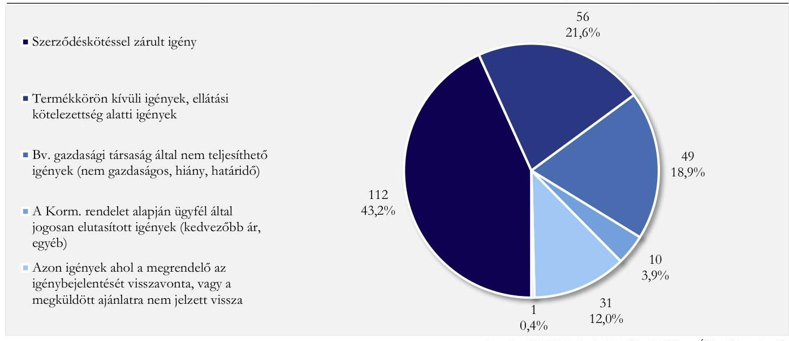

Forrás: A BV GEI igénybejelentési adatbázisa, ÁSZ saját szerkesztés
A KNPI a Korm. rendeletben előírtak szerint a 2023. évre vonatkozóan 2024. június 30-ig megküldte az irányító miniszternek a Korm. rendelet 1. mellékletében meghatározott adatokat. Az adatszolgáltatás tartalmazta a 100 ezer Ft-os összeghatárt el nem érő beszerzéseket is. Az irányító szervnek megküldött Korm. rendelet szerinti 1. melléklet tartalma alapján a KNPI a BM rendelet hatálya alá tartozó termékekre vonatkozó igény felmerülésekor a 100 ezer Ft-os összeghatár felett minden esetben megkereste a központi ellátó szervet. Az igénybejelentés eredménye vagy a bv. társasággal történt szerződéskötés vagy saját hatáskörű megrendelés engedélyezése volt. A Korm. rendelet szerinti 1. melléklet nem tartalmaz információt a központi ellátó szervnek bejelentett, de meg nem valósult, visszavont beszerzésekről, így a Korm. rendelet 1. melléklete a BV GEI igénybejelentési adatbázisának adataival csak korlátozottan összevethető.

A BM rendeletben meghatározott termékek és szolgáltatások közül az ÁSZ ellenőrzés által kiválasztott termék/szolgáltatáskörökre* megvalósított beszerzések kerültek ellenőrzésre. A kötelezettségvállalásokról rendelkezésre bocsátott adatbázis alapján a KNPI a 2023. évben e termék/szolgáltatáskörök vonatkozásában döntő részben bv. társaságokkal kötött szerződést.

[^0]
[^0]:    * munkaruházat, lábbeli, textil mosása-tisztítása, irodai papíráru, háztartási és egészségügyi papírtermék, irodabútor, egyéb bútor, papír és elektronikai hulladék elszállítás

---

A bv. társaságon kívüli féllel megvalósult kötelezettségvállalások közül kiválasztásra került négy darab ügylet. Mind a négy esetben a harmadik féllel megvalósult kötelezettségvállalás tárgyával megegyező termékekre vonatkozóan rendelkezésre állt a központi ellátó szerv irányába történt igénybejelentés, valamint a saját hatáskörben történő beszerzés engedélyezése, így ezen tételek esetében a Korm. rendelet szerint szabályszerű volt a beszerzés.
3.2 számú megállapítás

Az Országos Gyermekvédelmi Szakszolgálat nem szabályozta a központi ellátás értékesítési rendszerében előírt folyamatokat. A központi ellátás rendszerében való részvételi és adatszolgáltatási kötelezettségét nem teljesítette.

Az Országos Gyermekvédelmi Szakszolgálat (továbbiakban: OGYSZ ${ }^{26}$ ) a belügyminiszter irányítása, valamint a Szociális és Gyermekvédelmi Főigazgatóság középirányítása alatt működő szervezet. A Belügyminisztérium Szervezeti és Működési Szabályzatáról szóló 12/2022. (VI. 28.) BM utasítása szerint az önálló belügyi szervek közé tartozott, ezért a BM rendelet alapján a BM rendelet 1. mellékletében szereplő termékekre és szolgáltatásokra vonatkozó igényeivel a központi ellátó szervhez volt kötelezett fordulni az ellenőrzött időszakban.
Az OGYSZ 2023. évben hatályos Beszerzési Szabályzata ${ }^{27}{ }^{1,2}$ valamint Közbeszerzési szabályzata ${ }^{28}$, egyéb szabályzata, ellenőrzési nyomvonala nem tartalmazott előírást a Korm. rendelet 3. § (1) bekezdésében, valamint 6. $\$ 1$ ) bekezdésében előírt részvételi kötelezettségről, valamint a Korm. rendelet 12. $\$ 4$ ) bekezdése szerinti adatszolgáltatásról. Ezáltal a Bkr. 6. $\$ 2$ )-(3) bekezdésében előírtak ellenére szabályzatai ezen folyamatra nem biztosították a források szabályozott felhasználását.
A BV GEI igénybejelentési adatbázisa alapján az OGYSZ a 2023. évben nem nyújtott be igényt a központi ellátás rendszerébe. Ezt az OGYSZ mb. országos igazgatójának 2024. augusztus 23-án kelt nyilatkozata is alátámasztotta. Az Országos Gyermekvédelmi Szakszolgálat a 2023. évben a BM rendelet hatálya alá tartozó termékek és szolgáltatások körében felmerülő igényei tekintetében a Korm. rendelet előírásai ellenére nem élt bejelentéssel a központi ellátó szerv felé.
3/A: Az ÁSZ véleménye szerint a rendszer múködését elősegítené a fejezeteket irányító minisztériumok központi ellátó szerv részére történő adatszolgáltatása alapján a részvételre kötelezettek körének pontos meghatározása. Ezáltal a központi ellátó szerv operatív feladatait ellátó BV GEI nyilvántartást vezethetne a rendszer használatára kötelezett szervezetekről, valamint megkereshetné azon szervezeteket, amelyek kötelezettségük ellenére nem nyújtanak be igényt.

A BM rendeletben meghatározott termékek és szolgáltatások közül az ÁSZ ellenőrzés által kiválasztott termék/szolgáltatáskörökre ${ }^{\dagger}$ megvalósított beszerzések kerültek ellenőrzésre. A kötelezettségvállalásokról rendelkezésre bocsátott adatbázis alapján az OGYSZ a 2023. évben e termék/szolgáltatáskörök vonatkozásában rendszeresen szerzett be a 100 ezer Ftos összeghatár feletti értékben termékeket. A szállítók között nem szerepelt bv. társaság.
A beszerzéseire vonatkozóan az OGYSZ nem teljesítette a Korm. rendelet 12. § (4) bekezdésében előírt, a Korm. rendelet 1. mellékletében meghatározott adattartalmú adatszolgáltatási kötelezettségét.

[^0]
[^0]:    $\dagger$ munkaruházat, lábbeli, textil mosása-tisztítása, irodai papíráru, háztartási és egészségügyi papírtermék, irodabútor, egyéb bútor, papír és elektronikai hulladék elszállítás

---

3.3 számú megállapítás

A Budapesti Uzsoki Utcai Kórház részben szabályozta a központi ellátás értékesítési rendszerében előírt folyamatokat. Előírt éves adatszolgáltatási kötelezettségét teljesítette, ugyanakkor az ellenőrzött tételek alapján a rendszerben való részvételi kötelezettségének részben tett eleget. A BM rendelet és központosított közbeszerzés hatálya alá egyaránt tartozó termékek esetében igénybejelentését a központi ellátó szerv helyett a központosított közbeszerzési portálon tette meg.

A Budapesti Uzsoki Utcai Kórház (továbbiakban: BUK ${ }^{29}$ ) a belügyminiszter irányítása, valamint az Országos Kórházi Főigazgatóság középirányítása alatt működő szervezet. A Belügyminisztérium Szervezeti és Működési Szabályzatáról szóló 12/2022. (VI. 28.) BM utasítása szerint az önálló belügyi szervek közé tartozott, ezért a BM rendelet alapján a BM rendelet 1. mellékletében szereplő termékekre és szolgáltatásokra vonatkozó igényeivel a központi ellátó szervhez volt kötelezett fordulni az ellenőrzött időszakban.
A BUK nem szabályozta a Korm. rendelet 3. $\$ 1$ ) bekezdésében előírt részvételi kötelezettséget. A Közbeszerzési Szabályzat ${ }_{12}{ }^{30}$ sem tartalmazta az uniós közbeszerzési értékhatárokat elérő vagy meghaladó igények Korm. rendelet 6. $\mathbb{S}$ (1) bekezdésében előírt bejelentési és Korm. rendelet szerinti eljárási szabályait. Ezáltal a Bkr. 6. $\mathbb{S}$ (2) bekezdésében előírtak ellenére szabályzatai ezen folyamatra vonatkozóan nem biztosították a források szabályozott felhasználását. Ugyanakkor az Anyaggazdálkodási Osztály múködési rendje ${ }^{31}$, valamint a 2023. évben hatályos Beszerzési Szabályzat ${ }^{32}$ az ellenőrzési nyomvonal ${ }^{33}$ a hivatkozott jogszabályok között tartalmazta a Korm. rendelet, és a BM rendelet megnevezését, valamint az Anyaggazdálkodási Osztály múködési rendje tartalmazta a Korm. rendelet 12. § (4) bekezdése szerinti adatszolgáltatási kötelezettséget.

A BV GEI igénybejelentési adatbázisa alapján a BUK a 2023. évben mindössze két igénybejelentést tett a központi ellátás rendszerébe, amelyek összesen három elkülönült termék tételt tartalmaztak (műtős ing, műtős nadrág, zöld lepedő). A bv. társaság által megküldött árajánlatot követően a három tétel esetében a Korm. rendelet 3. § (3) bekezdésében foglaltak ellenére az ajánlat alapján annak megérkezésétől számított 15 munkanapon belül nem történt szerződéskötés. A Budapesti Uzsoki Utcai Kórház nyilatkozata alapján az egyik bejelentett igény beszerzését elhalasztották, míg a másik igényre kapott ajánlatot technikai probléma miatt nem tudták megnyitni, amelyet jeleztek a központi ellátó szervnek, azonban nem kaptak rá választ.
A BUK a Korm. rendeletben előírtak szerint a 2023. évre vonatkozóan 2024. június 30 -ig megküldte a középirányító szervnek a Korm. rendelet 1. mellékletében meghatározott adatokat. Az 5. táblázat összegzi az adatszolgáltatásban szereplő beszerzéseket.
3. táblázat

AZ IRÁNYÍTÓ MINISZTERNEK MEGKÜLDÖTT ADATSZOLGÁLTATÁSBAN SZEREPLŐ BESZERZÉSEK A MEGVALÓSULÁS INDOKAI SZERINT (BUDAPESTI UZSOKI UTCAI KÓRHÁZ)

| INDOKLÁS | BESZERZETT TERMÉKEK | BESZERZÉSEK ERTEKE (E Ft) |
| :--: | :--: | :--: |
| Az osztályok zavartalan múködése érdekében a központi ellátó szervtől ajánlatkérésre nem került sor | textiláru, orvosi eszközök, bútorok, nyomás, irodai papíráru, háztartási egészségügyi papírtermék | 195675 E Ft |
| Ellátási kötelezettség minimális értékét el nem érő beszerzés | orvosi eszközök, irodai papíráru, lábbeli, ruházat | 288 E Ft |
| Bv. társaságtól történt beszerzés | háztartási egészségügyi papírtermék, irodabútor | 7591 E Ft |
| BVOP keretmegállapodás alapján kötött szerződés | mosodai szolgáltatás | 155974 E Ft |
| Összesen |  | 359529 E Ft |

---

A Korm. rendelet 1. mellékletében meghatározott adatszolgáltatás és a BV GEI adatbejelentési adatbázisban szereplő információk összehangban voltak, amelyek szerint a BUK a 2023. évben a BM rendelet hatálya alá tartozó termékek beszerzése kapcsán a Korm. rendelet 3. $\$ 1$ ) bekezdésében előírtak ellenére nem nyújtott be igénybejelentést a központi ellátó szerv részére.
A BM rendeletben meghatározott termékek és szolgáltatások közül az ÁSZ ellenőrzés által kiválasztott termék/szolgáltatáskörökre ${ }^{5}$ megvalósított beszerzések kerültek ellenőrzésre. A kötelezettségvállalásokról rendelkezésre bocsátott adatbázis alapján a BUK a 2023. évben e termék/szolgáltatáskörök vonatkozásában döntően nem bv. társaságokkal kötött szerződést, a bv. társaságok közül két társasággal kötött 7549 E Ft értékben szerződést háztartási egészségügyi papírtermék, valamint irodabútor beszerzésre.
Az ellenőrzött mintatételek alapján alábbiakat állapította meg az ÁSZ ellenőrzés:

- A BUK a BM rendelet és központosított közbeszerzés hatálya alá egyaránt tartozó termékek esetében (bútorok, irodai papíráruk meghatározott termékkörei) a Korm. rendelet 11. § (1) és (3) bekezdésében előírtak ellenére elsőként nem a büntetés-végrehajtás központi ellátási rendszerét vette igénybe, hanem megrendeléseivel közvetlenül a központosított közbeszerzés rendszeréhez fordult a Közbeszerzési és Ellátási Főigazgatóságon keresztül.
- Egyéb, a BM rendeletben szereplő termék esetén sem fordult a központi ellátó szervhez, melynek indokai a BUK nyilatkozata alapján a szűkös források miatti készletezés hiánya, az azonnali igényfelmerülés minél gyorsabb kielégítése, a BUK fizetési késedelme miatt a bv. szervezet általi szállítás-felfüggesztés voltak.
- Azon esetekben, amikor bv. társaságtól történt beszerzés, a Korm. rendelet 3. § (1) bekezdésben előírtak ellenére a központi ellátó szerv helyett közvetlenül a bv. társasághoz nyújtotta be megrendelését, mivel nyilatkozatuk alapján így gyorsabb volt a folyamat. Az adatbázis alapján tíz darab beszerzés történt ilyen módon.
- A legnagyobb összegű tételt jelentő mosodai szolgáltatás igényebevétele esetében a Korm. rendeletben előírtak szerint a BUK a központi ellátó szervhez fordult, és a közbeszerzési eljárás lefolytatására megkötötte az ellátási megállapodást. A BVOP és a piaci szolgáltató keretmegállapodása alapján jött létre az egyedi mosatási szolgáltatási szerződés a BVOP, a BUK, és a piaci szolgáltató között. A közbeszerzési eljárás lezárulásáig, a köztes időszakra a központi ellátó szerv engedélyével áthidaló vállalkozási szerződés került megkötésre ugyanazon piaci szolgáltatóval.
- A 2023. évben saját hatáskörben beszerzettként jelentett 116392 E Ft értékủ műtéti szett esetében a Korm. rendelet 3. § (1) bekezdésben előírtak ellenére azon okból nem történt igénybejelentés a központi ellátó szerv részére, mivel 2020. év végén beadott korábbi igényükre a központi ellátó szerv 2021. januárjában azt a választ adta, hogy az igényelt termékek a fogvatartottak kötelező foglalkoztatása keretében jelenleg nem biztosíthatóak. Ezt a BUK úgy értelmezte, hogy innentől kezdve minden évben saját hatáskörben szerezheti be a szóban forgó termékeket, ezért a további évek elején nem nyújtotta be igényét a központi ellátó szerv felé.

[^0]
[^0]:    5 munkaruházat, lábbeli, textil mosása-tisztítása, irodai papíráru, háztartási és egészségügyi papírtermék, irodabútor, egyéb bútor, papír és elektronikai hulladék elszállítás

---

3.4 számú megállapítás

A Győri Tankerületi Központ belső szabályzatai tartalmazták a központi ellátásban lebonyolítandó beszerzések eljárásrendjét. Az ellenőrzött tételek alapján a rendszerben való részvételi és adatszolgáltatási kötelezettségét teljesítette.

A Győri Tankerületi Központ (továbbiakban: GYTK ${ }^{34}$ ) a belügyminiszter irányítása, valamint a Klebelsberg Központ középirányítása alatt működő szervezet. A Belügyminisztérium Szervezeti és Müködési Szabályzatáról szóló 12/2022. (VI. 28.) BM utasítása szerint az önálló belügyi szervek közé tartozott, ezért a BM rendelet alapján a BM rendelet 1. mellékletében szereplő termékekre és szolgáltatásokra vonatkozó igényeivel a központi ellátó szervhez volt kötelezett fordulni az ellenőrzött időszakban.
A GYTK 2023. évben hatályos Beszerzési Szabályzata ${ }^{35}$ tartalmazta a Korm. rendelet alapján a központi ellátás rendszerében előírt részvételi kötelezettséget, valamint szabályozta a bv. szervezet igénybevételével lefolytatandó beszerzési eljárást. A Bkr.-nek megfelelően az ellenőrzési nyomvonal ${ }^{36}$ szintén tartalmazott a Korm. rendeletre történő hivatkozást. A Beszerzési szabályzat meghatározta a Korm. rend. 12. § (4) bekezdésében előírt éves adatszolgáltatási feladatok teljesítésével kapcsolatos belső előírásokat.

A BV GEI igénybejelentési adatbázisa alapján a GYTK a 2023. évben 95 db igénybejelentést tett a központi ellátás rendszerébe, amelyek összesen 282 db elkülönült termék/szolgáltatás tételt tartalmaztak. Az igények

3/B: Bár a Korm. rendelet lehetőséget ad eseti igénybejelentésekre, elsősorban éves/negyedéves bejelentési kötelezettséget ír elő, amelyet az igénybejelentők a gyakorlatban nem teljesítettek.
Az ÁSZ véleménye szerint a központi ellátó szerv operatív feladatait ellátó BV GEI által megfelelően korai időpontban kezdeményezett igényfelmérés, - mely megvalósulhat az irányítók/középirányítók bevonásával, vagy hatékonyan az internetes felületen - segítené a bv. társaságok kapacitástervezését, valamint a központi ellátó szerv folyamat szervezését.
eseti jelleggel kerültek benyújtásra. Bár a Korm. rendelet lehetőséget ad eseti igények benyújtására, az alapesetként a Korm. rendelet 1. § (8) bekezdésben és 6 . $\S$ (1) bekezdésében szereplő negyedéves és éves igény bejelentések nem történtek. A középirányító szerv 2023. február elején 2023. első negyedévére kezdeményezett igényfelmérést a tankerületi központoknál, amely a folyó negyedév közepén a GYTK esetében már nem volt aktuális. A GYTK nyilatkozata szerint az előre tervezhető termékekre keretszerződéseket kötöttek, valamint sok termék esetében a szűkös forrás miatt nem volt megoldható az előzetes igénybejelentés, beszerzés és készlettartás.

Az igények jellemzően „irodai papíráru, irodaszer, nyomda" kategóriában kerültek benyújtásra. A tételeknek az igénylés eredménye szerinti megoszlását a 7. ábra szemlélteti. A bv. társaság által megküldött árajánlatot követően 27 tétel esetében bár a központi ellátó szerv nem adott engedélyt saját hatáskörű beszerzésre, a Korm. rendelet 3. § (3) bekezdésében foglaltak ellenére az ajánlat alapján a GYTK részéről nem történt visszajelzés, és szerződéskötés.

---

# A GYŐRI TANKERÜLETI KÖZPONT ELKÜLÖNÜLT TERMÉKEKRE/SZOLGÁLTATÁSOKRA BEÉRKEZETT IGÉNYEI A 2023. ÉVBEN 

- Szerződéskötéssel zárult igény
- Termékkörön kívüli igények, ellátási kötelezettség alatti igények
- Bv. gazdasági társaság által nem teljesíthető igények (nem gazdaságos, hiány, határidő)
- A Korm. rendelet alapján ügyfél által jogosan elutasított igények (kedvezőbb ár, egyéb)
- Azon igények ahol a megrendelő az igénybejelentését visszavonta, vagy a megküldött ajánlatra nem jelzett vissza
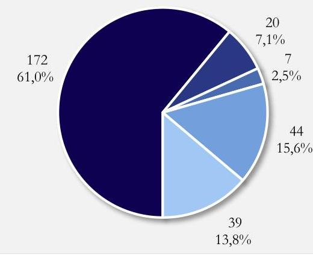

Forrás: A BV GEI igénybejelentési adatbázisa, ÁSZ saját szerkezésétes

A GYTK a Korm. rendeletben előírtaknak megfelelően a 2023. évre vonatkozóan 2024. június 30-ig megküldte a középirányító szervnek a Korm. rendelet 1. mellékletében meghatározott adatokat. A Korm. rendelet szerinti adatszolgáltatás és a mellékleteként csatolt összegző táblázat alapján „háztartási, egészségügyi papírtermék", valamint „egyéb bútor gyártása" kategóriákban került sor jelentős összegben összesen $67,6 \mathrm{~m}$ Ft értékben - bv. társaságon kívüli beszerzésre, melynek alapvető oka a központi ellátó szerv által meghatározott ellenértéknél kedvezőbb ajánlat volt.
A BM rendeletben meghatározott termékek és szolgáltatások közül az ÁSZ ellenőrzés által kiválasztott termék/szolgáltatáskörökre ${ }^{5}$ megvalósított beszerzések kerültek ellenőrzésre. A kötelezettségvállalásokról rendelkezésre bocsátott adatbázis alapján a GYTK a 2023. évben e termék/szolgáltatáskörök vonatkozásában bv. társaságokkal és nem bv. társaságokkal szintén kötött szerződést.
A nem bv. társasággal kötött, ellenőrzött ügyletek alapján az alábbiakat állapította meg az ÁSZ ellenőrzés:

- A megvizsgált öt darab, nem bv. társaságtól történt „háztartási, egészségügyi papírtermék" beszerzést megelőzően a GYTK igénybejelentéssel élt a központi ellátó szerv irányába. Az igényelt termékekre benyújtott kedvezőbb árajánlatra tekintettel a központi ellátó szerv engedélye alapján

3/C: Az igénybejelentő kedvezőbb árajánlatra tekintettel történő saját hatáskörű beszerzésének engedélyezését követően a rendszerben nincs működő kontroll arra vonatkozóan, hogy az igénybejelentő valóban a benyújtott kedvezőbb árajánlatnak megfelelő beszerzést valósította-e meg.
nem bv. társaságtól történt a beszerzés. Egy termék esetében nem került engedélyezésre a saját hatáskörű beszerzés, ez esetben Korm. rendelet 3. § (3) bekezdésének előírása szerint a bv. társasággal szerződött a GYTK.

- A GYTK iskolabútor beszerzését nem bv. társaságokon keresztül valósította meg. Ez esetben is történt igénybejelentés a központi ellátó szerv irányába. A GYTK az iskolabútorok központosított közbeszerzés hatály alá kerülése, valamint a megváltozott igények miatt
nem a benyújtott ellenajánlatban szereplő megrendelést valósította meg. (2. fókuszterület 21. mintatétel). A megvalósított beszerzés megfelelt a központosított közbeszerzés rendszerének.

[^0]
[^0]:    5 munkaruházat, lábbeli, textil mosása-tisztítása, irodai papíráru, háztartási és egészségügyi papírtermék, irodabútor, egyéb bútor, papír és elektronikai hulladék elszállítás

---

3.5 számú megállapítás

Az Észak-budai Szent János Centrumkórház az uniós közbeszerzési értékhatárok alatti igények esetén nem szabályozta a központi ellátás értékesítési rendszerében előírt kötelezettségeit. Az ellenőrzött tételek alapján a rendszerben való részvételi és adatszolgáltatási kötelezettségét részben teljesítette. A vizsgált „Háztartási, egészségügyi papírtermék" besorolású termékek esetében az igénybejelentést követően a saját hatáskörben történő beszerzési engedély hiányában kötötte meg a szerződést a bv. társaságokon kívüli partnerekkel.

Az Észak-budai Szent János Centrumkórház (továbbiakban: ÉBSZJC ${ }^{37}$ ) a belügyminiszter irányítása, valamint az Országos Kórházi Főigazgatóság középirányítása alatt múködő szervezet. A Belügyminisztérium Szervezeti és Múködési Szabályzatáról szóló 12/2022. (VI. 28.) BM utasítása szerint az önálló belügyi szervek közé tartozott, ezért a BM rendelet alapján a BM rendelet 1. mellékletében szereplő termékekre és szolgáltatásokra vonatkozó igényeivel a központi ellátó szervhez volt kötelezett fordulni az ellenőrzött időszakban.
Az ÉBSZJC 2023. évben hatályos Közbeszerzési Szabályzata ${ }^{38}$ tartalmazta az uniós közbeszerzési értékhatárokat elérő vagy meghaladó igények esetén a Korm. rendelet alkalmazásának kötelezettségét. Ugyanakkor a beszerzési tevékenységre vonatkozó szabályozása, a beszerzési eljárásokat magában foglaló Gazdálkodási és raktározási szabályzat ${ }^{39}$ nem tartalmazta a Korm. rendelet 3. § (1) bekezdésében előírt részvételi kötelezettséget és a Korm. rendelet 12. § (4) bekezdése szerinti adatszolgáltatási kötelezettséget. Ezáltal a Bkr. 6. $\$ 2$ (2) bekezdésében előírtak ellenére szabályzatai ezen folyamatra vonatkozóan nem biztosították a források szabályozott felhasználását. Ezen felül az összesített ellenőrzési nyomvonal és a beszerzésben részt vevő szervezeti egységek ellenőrzési nyomvonalai sem tartalmazták - a Bkr. 6. § (3) bekezdése ellenére - a Korm. rend. szerinti beszerzési eljárás folyamatának leírását, valamint a részvételi és adatszolgáltatási kötelezettséget.
A BV GEI igénybejelentési adatbázisa alapján az ÉBSZJC a 2023. évben 23 db eseti igénybejelentést tett a központi ellátás rendszerébe, amelyek összesen 193 db elkülönült termék/szolgáltatás tételt tartalmaztak. Az igények eseti jelleggel kerültek benyújtásra. Bár a Korm. rendelet lehetőséget ad eseti igények benyújtására, az alapesetként a Korm. rendelet 1. § (8) bekezdésben és 6. § (1) bekezdésében szereplő negyedéves és éves igény bejelentések nem történtek.
Az igények döntően „irodai papíráru, irodaszer, nyomda" kategóriában kerültek benyújtásra. A tételeknek az igénylés eredménye szerinti megoszlását a 8. ábra szemlélteti. A bv. társaság által megküldött árajánlatot követően 38 tétel esetében a Korm. rendelet 3. § (3) bekezdésében foglaltak ellenére az ajánlat alapján az ÉBSZJC részéről nem történt visszajelzés, és szerződéskötés.

---

# AZ ÉSZAK-BUDAI SZENT JÁNOS CENTRUMKÖRHÁZ ELKÜLŐNÜLT TERMÉKEKRE/SZOLGÁLTATÁSOKRA BEÉRKEZETT IGÉNYEI A 2023. ÉVBEN 

- Szerződéskötéssel zárult igény
- Termékkörön kívüli igények, ellátási kötelezettség alatti igények
- Bv. gazdasági társaság által nem teljesíthető igények (nem gazdaságos, hiány, határidő)
- A Korm. rendelet alapján ügyfél által jogosan elutasított igények (kedvezőbb ár, egyéb)
- Azon igények ahol a megrendelő az igénybejelentését visszavonta, vagy a megküldött ajánlatra nem jelzett vissza
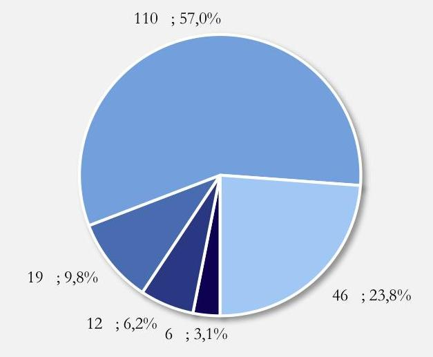

Forrás: A BV GEI igénybejelentési adatbázisa. ÁSZ saját szerkesztés

Az ÉBSZJC a Korm. rendeletben előírtaknak megfelelően a 2023. évre vonatkozóan 2024. június 30-ig megküldte a középirányító szervnek a Korm. rendelet 1. mellékletében meghatározott adatokat. A Korm. rendelet szerinti adatszolgáltatás és a mellékleteként csatolt összegző táblázat alapján „háztartási, egészségügyi papírtermék", valamint „orvosi eszköz gyártása" kategóriákban került sor jelentős összegben bv. társaságon kívüli beszerzésre, melynek oka az ÉBSZJC nyilatkozata alapján a bv. társaság által támasztott feltételek, árak el nem fogadása, a központi ellátó szerv általi saját hatáskörben történő beszerzés engedélyezése volt.
A BM rendeletben meghatározott termékek és szolgáltatások közül az ÁSZ ellenőrzés által kiválasztott termék/szolgáltatáskörökre** megvalósított beszerzések kerültek megvizsgálásra. A kötelezettségvállalásokról rendelkezésre bocsátott adatbázis alapján az ÉBSZJC a 2023. évben e termék/szolgáltatáskörök vonatkozásában jellemzően nem bv. társaságokkal kötött szerződést.
Az ellenőrzésre került ügyletek alapján az alábbiakat állapította meg az ÁSZ ellenőrzés:

- A legnagyobb összegű tételt jelentő mosodai szolgáltatás igénye esetében a Korm. rendeletben előírtaknak megfelelően az ÉBSZJC a központi ellátó szervhez fordult. A BVOP és a piaci szolgáltató keretmegállapodása alapján jött létre az egyedi mosatási szolgáltatási szerződés a BVOP, az ÉBSZJC, és a piaci szolgáltató között.

[^0]
[^0]:    ** munkaruházat, lábbeli, textil mosása-tisztítása, irodai papíráru, háztartási és egészségügyi papírtermék, irodabútor, egyéb bútor, papír és elektronikai hulladék elszállítás

---

- Az ellenőrzött, nem bv. társaságokkal kötött szerződések esetében rendelkezésre állt a központi ellátó szerv részére megküldött igénybejelentés. Az árajánlatokat követően az ÉBSZJC kedvezőbb ár vizsgálati kérelmeket nyújtott be. A vizsgált tételek közül a „Háztartási, egészségügyi

3/D: A megvizsgált tételek mutatják, hogy a központi ellátás értékesítési rendszere nem tartalmazott folyamatba épített, a rendszer elkerülését megakadályozó kontrollokat. A honlapon kialakított igénybejelentési, nyilvántartási és megrendelési folyamat mind a bv. szervezet, mind a megrendelő számára lehetővé tenné az igénylési folyamat státuszának ismeretét.
Ezen felül az internetes felület gyorsítaná a folyamatot, ezen a téren csökkentve a központosított közbeszerzési rendszerekhez képest fennálló hátrányt.
papírtermék" besorolású termékek esetében a hiánypótlást az ÉBSZJC nem teljesítette, így a bv. társaságtól történő beszerzés mellőzéséhez nem állt rendelkezésre a Korm. rendelet 3. § (4b) bekezdésében előírt, saját hatáskörben történő beszerzés központi ellátó szerv általi engedélye.

Egy esetben irodabútorok beszerzése céljából - az ÉBSZJC nyilatkozata szerint adminisztrációs hiba miatt - egyszerre történt a büntetés-végrehajtási központi ellátó szerv és a Közbeszerzési és Ellátási Főigazgatóság megkeresése. A központi ellátó szerv ajánlatának megérkezése időpontjáig a központosított közbeszerzésen keresztül már megtörtént a termék beszerzése.
3.6 számú megállapítás Az Agrárminisztérium teljesítette a jogszabályi előírások szerint a központi ellátásra vonatkozó ellenőrzési feladatait.

Az Agrárminisztérium Ellenőrzési Főosztályának 2022. évi ellenőrzési terve ${ }^{40}$ és módosított ellenőrzési terve ${ }^{41}$, valamint 2023. évi ellenőrzési terve ${ }^{42}$ és módosított ellenőrzési terve ${ }^{43}$ a Korm. rendeletben előírtak szerint tartalmazta az Agrárminisztérium irányítása alá tartozó, a központi ellátás rendszerét kötelező jelleggel igénybe vevő szervezetek ezirányú beszerzéseinek ellenőrzését. Az ellenőrzési terv a 2022. évre 13 darab, a 2023. évre 12 darab ellenőrzést irányzott elő e témakörben, köztük a Kiskunsági Nemzeti Park Igazgatóság ellenőrzését. A témakörben 2022. évre tervezett ellenőrzések száma az egyik ellenőrzött szervezet irányítószervi besorolását érintő változás miatt 12 darabra csökkent. A Korm. rendelet 12. § (2) pontjának módosítása okán a témában 2023. évre tervezett ellenőrzések száma 13 darabra növekedett.
Az Agrárminisztérium Ellenőrzési Főosztályának 2022. évi ellenőrzési jelentése ${ }^{44}$, valamint 2023. évi ellenőrzési jelentése ${ }^{45}$ alapján a minisztérium a Bkr.-ben előírtak szerint végrehajtotta valamennyi, a Korm. rendeletben előírt és az ellenőrzési tervekben szereplő ellenőrzési kötelezettségét.
Az ellenőrzési programok és az ellenőrzési jelentések alapján az elvégzett szabályszerűségi ellenőrzések a Korm. rendeletnek megfelelően kiterjedtek az ellenőrzött szervezetek központi ellátás rendszerében történő szabályszerű részvételének, a Korm. rendeletben előírt kötelezettségeik indokolatlan mellőzésének vizsgálatára. Az Agrárminisztérium javaslatai nagyrészt arra vonatkoztak, hogy az ellenőrzött szervezetek a BM rendeletben szereplő termékek és szolgáltatások körében felmerült beszerzési igényeikkel a Korm. rendelet előírásainak megfelelően minden esetben forduljanak a központi ellátó szervhez. Javaslatok születtek még a Korm. rendelet szerinti beszerzési eljárások belső szabályzatokban történő megjelenítésére, valamint a Korm. rendelet szerinti 1. melléklet megfelelő kitöltésére és megküldésére vonatkozóan.
Az Agrárminisztérium Ellenőrzési Főosztálya a Bkr.-ben előírtak szerint minden esetben dokumentált módon megküldte az ellenőrzött szervezetek részére az ellenőrzési jelentéseket, melyre az ellenőrzött szervezetek megküldték az intézkedési terveket.

---

3.7 számú megállapítás

A Belügyminisztérium a 2022. évi éves ellenőrzési terve alapján végrehajtotta a Korm. rendelet szerinti ellenőrzést, azonban az ellenőrzés eredményei nem ellenőrzési jelentésben, hanem tanácsadói jelentésben kerültek összefoglalásra. A 2023. évben - a 2024. évre áthúzódóan - az ellenőrzés alá vont szervezetek esetében teljesítette ellenőrzési feladatait.

A Belügyminisztérium Belső Ellenőrzési Osztályának 2022. évi ellenőrzési terve ${ }^{46}$ a 2021. év, mint ellenőrzött időszak vonatkozásában tartalmazott a központi ellátás rendszeréhez kapcsolódó ellenőrzést. A téma végül tanácsadói tevékenység keretében került feldolgozásra, melyről 2023. áprilisában Feljegyzés ${ }^{47}$ készült „Jelentés a Belügyminisztérium szakmai felügyelete alatt álló büntetés-végrehajtási gazdasági társaságok központi ellátási tevékenységének jogszabály előírása szerinti 2021. évi ellenőrzése tárgyú tanácsadói tevékenységről" címmel. A tanácsadói feljegyzés szerint az ellenőrzés lefolytatásra került, azonban a jelentést tartalmi és formai okok miatti átdolgozást követően tanácsadói jelentésként adták ki. A tanácsadás során felmérésre és értékelésre került a központi ellátási tevékenység szabályszerű igénybevételének és végrehajtásának megfelelősége a BVOP, valamint a kiválasztott, megrendelői körbe tartozó szervezetek: Klebelsberg Központ és hét tankerületi központ, Országos Kórházi Főigazgatóság és hat egészségügyi intézmény, a Szociális és Gyermekvédelmi Főigazgatóság és négy intézménye esetében.
Az anyagban tanácsadó jellegénél fogva javaslatok nem szerepeltek. A Bkr. 2. § 3. pontja alapján a belső ellenőrzés bizonyosságot adó, valamint tanácsadó tevékenységből áll. A tanácsadó tevékenység a Bkr. 2. § 20. pontja szerint a költségvetési szerv vezetője részére nyújtott, jellegét tekintve konzultációs tevékenység. A belső ellenőrzés a bizonyosságot adó tevékenysége keretében ad objektív értékelést, melynek eredményeként megállapításait, következtetéseit, javaslatait ellenőrzési jelentésbe foglalja. A 2022-2023. években a Korm. rendelet 12. § (2)-(3) bekezdésében előírt ellenőrzési tevékenység eredményeként a Bkr. 39. §-ban előírt ellenőrzési jelentés kiadására nem került sor.
A Belügyminisztérium Belső Ellenőrzési Osztályának 2023. évi ellenőrzési terve ${ }^{48}$ a 2022. év, mint ellenőrzött időszak vonatkozásában az alábbi címen tartalmazott a központi ellátás rendszeréhez kapcsolódó ellenőrzést: „A Belügyminisztérium szakmai felügyelete alatt álló büntetés-végrehajtási gazdasági társaságok központi ellátási tevékenységének jogszabály előírása szerinti éves ellenőrzése" A tervezett ellenőrzés célja annak megállapítása volt, hogy az ellátási tevékenység a rendeletben foglaltaknak megfelelt-e.
A 2024. évre áthúzódó ellenőrzést lezáró, jóváhagyott Ellenőrzési jelentés ${ }^{49}$ alapján a 2022. évre, mint ellenőrzött időszakra hét ellenőrzött szervezet - a BVOP, valamint hat megrendelő szervezet vonatkozásában került ellenőrzésre az ellátási tevékenység Korm. rendeletnek való megfelelősége, az adatszolgáltatási kötelezettség és a Korm. rendelet 12. § (2)-(3) bekezdésében meghatározottak teljesítése. Az ellenőrzés eredményeként hat szervezet részére került megfogalmazásra javaslat. Az Belügyminisztérium javaslatai a megrendelő szervezetek esetében nagyrészt arra vonatkoztak, hogy a BM rendeletben meghatározott termékkörre vonatkozó megrendeléseket (a speciális beszerzési igényeken kívül) a www.allamipartner.hu internetes felület alkalmazásával kezdeményezzék. Javaslatok születtek még a Korm. rendelet szerinti beszerzési eljárások belső szabályzatokban történő megjelenítésére. A BVOP részére javaslattétel történt a www.allamipartner.hu felület használatának előmozdítására, valamint egyes folyamatelemek belső szabályozására (a kedvezőbb ellenértékre vonatkozó bizonyítási eljárás módja, a Korm. rendelet 12. § (4) bekezdésében meghatározott adatszolgáltatás módja és felelőse). A Belügyminisztérium Belső Ellenőrzési Osztálya a Bkr.-ben előírtak szerint megküldte az ellenőrzött szervezetek részére az ellenőrzési jelentéseket, melyre az ellenőrzött szervezetek megküldték az intézkedési terveket.

---

Az ellenőrzött időszakban hatályos BM rendelet szerint a központi ellátás rendszerének használatára kötelezett, a Belügyminisztérium irányítása alá tartozó szervezetek száma meghaladta az ellenőrzés alá vont hat szervezetet, így teljes körűen, valamennyi érintett, megrendelésre kötelezett szervezetre nem terjedt ki a Korm. rendelet 12. $\mathbb{S}$ (2)-(3) bekezdésében előírt ellenőrzési tevékenység.
Ugyanakkor fontos megjegyezni, hogy a rendszer használatára kötelezett szervezetek döntő hányada a Belügyminisztérium irányítása alá tartozott, így e feladat elvégzése a többi irányító szerv belső ellenőrzéséhez képest eltérő terhet rótt a Belügyminisztérium belső ellenőrzésére. Az utólagos irányítószervi ellenőrzés elemzése, a módosítás irányáról kialakított ÁSZ vélemény a 4.3 pontban található.

---

# 4. A központi ellátás értékesítési folyamata kialakításának célszerűsége, a végrehajtás eredményessége és az eredményességet befolyásoló tényezők 

Összegző megállapítás

Az értékesítési folyamat kialakítása az ÁSZ véleménye szerint nem volt célszerű. Az igényelt termékek és szolgáltatások közel fele arányban végződtek szerződéskötéssel, jelentős volt a termékkörön kívüli igény, a kedvezőbb ár, valamint az igénybejelentők együttműködésének hiánya miatt meghiúsult ügyletek aránya. A központi ellátás értékesítési rendszere célját, a fogvatartottak munkáltatása keretében a bv. társaságok által előállított meghatározott termékek és szolgáltatások jogszabályban előírt szervezetek részére történő értékesítésének koordinálását, a jogszabályokban előírt feladatok tekintetében töltötte be. Az irányító szervi, valamint központi ellátó szervi kontrollok hiánya miatt a kötelezett szervezetek részvételének ellenőrzése részben valósult meg. A központi ellátás értékesítési folyamatának eredményességi kritériumai nem kerültek meghatározásra, így az eredményesség nem volt visszamérhető.
4.1 számú megállapítás

A központi ellátás értékesítési rendszerében túlnyomórészt a Belügyminisztérium irányítása alá tartozó szervezetek vettek részt. Az előzetes éves/negyedéves igénybejelentés rendszere nem működött. A termék és szolgáltatás igények közel fele arányban végződtek szerződéskötéssel. Azon termékkörökben, amelyek a központosított közbeszerzési rendszerben is elérhetőek voltak, magasabb volt a meghiúsult megrendelések aránya. Jelentős volt azon igények száma, amelyek esetében a megrendelők az árajánlat kézhezvételét követően nem működtek együtt, nem kötöttek szerződést.

A 2022. és 2023. évi igénybejelentések elemzése* alapján a bejelentők egy igénybejelentésben jellemzően többfajta termékre nyújtottak be igényt, melyek megrendelésének megvalósulása eltérhetett egymástól, egyes termékek megrendelésre kerültek, míg más termékeknél nem jött létre a szerződés. Ezért az ÁSZ elemzésének egységei az egyes elkülönült termékekre/szolgáltatásokra benyújtott igénybejelentések voltak.

[^0]
[^0]:    * A központi ellátási tevékenységről a 2020- 2023. években a büntetés-végrehajtási szervezet évkönyvei tartalmaztak aggregált adatokat, melyekben szerepeltek a bv. szervezeten belüli belső ellátás adatai is. Az ÁSZ ellenőrzés hatóköreként definiált, a rendszert kötelezően igénybe vevő, a bv. szervezeten kívüli megrendelők irányában működtetett központi ellátás értékesítési rendszerére vonatkozó adatok a részletes adatbázisok szűrésével voltak előállíthatóak. Az elemzés a központi ellátó szerv által rendelkezésre bocsátott 2022. és 2023. évi igénybejelentési adatbázis alapján történt, melyből kiszűrésre kerültek a bv. szervezeten belüli belső ellátási igények, valamint a duplikációval jelzett tételek.

---

A 2022. és 2023. évi igénybejelentések szűrt adatbázisa alapján az igényelt tételek döntő hányada a Belügyminisztérium irányítása alá tartozó azon szervezetektől származott, melyek a BM rendelet 2. mellékletében maghatározott körbe tartoztak.
6. táblázat

AZ IGÉNYELT TÉTELEK MEGOSZLÁSA AZ IGÉNYBEJELENTŐK SZERINT A 2022. ÉS 2023. ÉVEKBEN

| MEGNEVEZÉS | 2022. EVI.   IGÉNYELT   TÉTELEK SZÁMA | 2022. EVI.   IGÉNYELT   TÉTELEK ARÁNYA | 2023. EVI.   IGÉNYELT   TÉTELEK SZÁMA | 2023. EVI.   IGÉNYELT   TÉTELEK ARÁNYA |
| :-- | :--: | :--: | :--: | :--: |
| A Korm rendelet alapján a   megrendelői körbe tartozó   szervezetek igényelt tételei | 4197 | $12,9 \%$ | 3157 | $10,3 \%$ |
| A BM rendelet alapján a   megrendelői körbe tartozó   szervezetek igényelt tételei | 28409 | $87,0 \%$ | 27451 | $89,5 \%$ |
| Önként csatlakozó szervezetek   igényelt tételei | 45 | $0,1 \%$ | 53 | $0,2 \%$ |
| Oszszes | 32651 | $100,0 \%$ | 30661 | $100,0 \%$ |

A Korm. rendelet alapesetként a negyedéves - uniós közbeszerzési értékhatár elérése esetén az éves igénybejelentést írja elő, viszont lehetőséget ad eseti igények benyújtására is. Az igénybeérkezések időbeli eloszlását a VI. melléklet tartalmazza, mely alapján látható, hogy nincsenek év eleji és negyedéves kiugrások a beérkezett igények számában, a negyedéves/éves igénybejelentés rendszere nem múködött a gyakorlatban.
Az elkülönült termékekre/szolgáltatásokra vonatkozó ügyek kimeneteleit a 9. ábra szemlélteti:
9. ábra

AZ ELKÜLÖNÜLT TERMÉKEKRE/SZOLGÁLTATÁSOKRA BEÉRKEZETT IGÉNYEK SZÁMÁNAK ALAKULÁSA A 2022. ÉS 2023. ÉVBEN
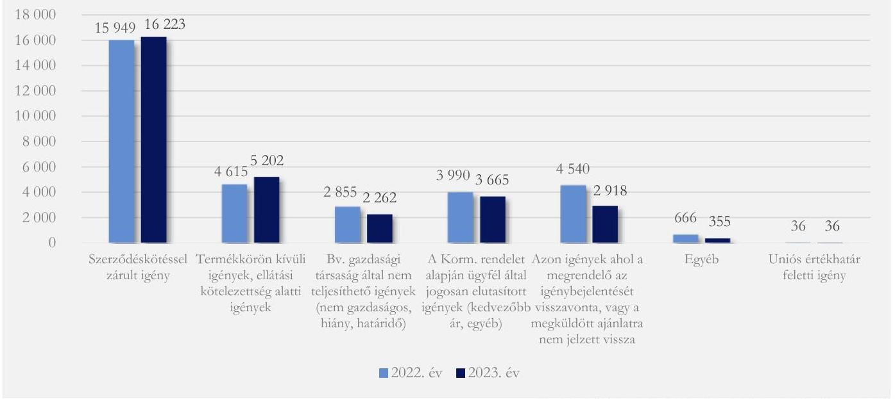

Forrás: A BV GEI igénybejelentési adatbázisa, ÁSZ saját szerkeustés

---

4/A: A jelentős arányú termékkörön kívüli igény oka lehet a BM rendelet hatálya alá eső termékek/szolgáltatások behatárolásának nehézsége. A BM rendelet 1. melléklete a termék és szolgáltatás megnevezések helyett a Tevékenységek Egységes Ágazati Osztályozási Rendszere (TEÁOR’08) szerinti tevékenység besorolást tartalmazza, ami nehezíti a rendelet hatálya alá tartozó termékek és szolgáltatások beazonosítását. Megfontolásra javasolt a BM rendelet 1. mellékletében a termékek és szolgáltatások beazonosítható megnevezésének alkalmazása, ezen felül a termékkör szükítése és specializálása.

A nem teljesült igények között legnagyobb arányban a BM rendelet 1. mellékletében meghatározott termékkörön kívüli igények szerepeltek. Ezt követték az igénybejelentők által főként a kedvezőbb ellenértékű ajánlat miatt elutasított ügyletek, valamint azon igények, melyeknél a megrendelő a bejelentését visszavonta, vagy a megküldött ajánlatra nem jelzett vissza.
A termékek és szolgáltatások az igénybejelentő által megadott megnevezéssel, az ügyintézők által berögzített TEÁOR'08 kóddal kerültek az informatikai rendszerbe. Az ÁSZ ellenőrzés
a megnevezés és a TEÁOR'08 kód alapján hat kategóriába sorolta a termékeket/szolgáltatásokat melyekre benyújtott igények számát a 10. ábra mutatja:
10. ábra

# AZ ELKÜLÖNÜLT TERMÉKEKRE/SZOLGÁLTATÁSOKRA BEÉRKEZETT IGÉNYEK SZÁMA TERMÉK/SZOLGÁLTATÁSKÖRÖNKÉNT 2022-2023. ÉVEKBEN 

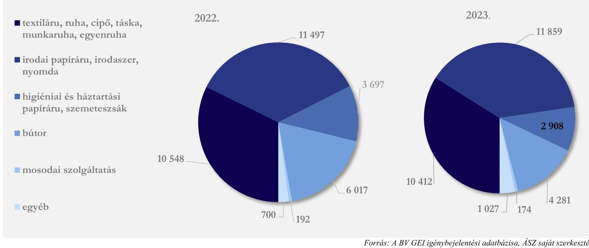

A VII. sz. melléklet tartalmazza a bv. társaságok által nem teljesíthető igények, valamint a megrendelők által elutasított igények alakulását az egyes termék és szolgáltatáskörök szerint. A nem teljesíthető igények legnagyobb számban és arányban a „textiláru, ruha, cipő, táska, munkaruha, egyenruha", valamint az „egyéb" kategóriába tartoztak.
A megrendelők által - főként a kedvezőbb árajánlat miatt - elutasított igények száma az „irodai papíráru, irodaszer, nyomda", valamint „bútor" kategóriában volt jelentős.
Ezen két kategória termékei a központosított közbeszerzési rendszerről, valamint a központi beszerző szervezet feladat- és hatásköréről szóló 168/2004. (V. 25.) Korm. rendelet szerinti országosan kiemelt termékek jegyzékében is szerepeltek. A Korm. rendelet alapján ezen termékkörök esetében először a központi ellátó szervhez volt szükséges igénybejelentéssel élni, azonban a központosított közbeszerzés

---

alkalmazásához elegendő volt a központi ellátó szerv által meghatározott ellenértéknél kedvezőbb ajánlat igazolása, szemben az egyéb termékek esetében igazolni szükséges 20\%-ot elérő kedvezőbb árajánlattal. Ezen kiemelt termékkörök esetében tehát tényleges árverseny működött.
4.2 számú megállapítás

A központi ellátó szerv által alkalmazott ügyviteli és nyilvántartó szoftver a hatályos szabályozási kereteken belül alapvetően támogatta a központi ellátás folyamatát. Az igénybejelentésekkel járó adminisztratív feladatok csökkentése, és a közvetlen adatátvitel érdekében létrehozták a webáruház jellegű értékesítési felületet biztosító honlapot, melyet a korábbi megszokott gyakorlat miatt az igénybejelentők csekély aránya használt. Az egyéb úton érkezett igénybejelentések esetén az adatátvitel nem volt automatikus, ami jelentős erőforrást kötött le, lassította a folyamatot és hibalehetőséget jelentett.

A Korm. rendelet és a BM rendelet nem határozta meg az igénybejelentés ügyviteli rendjét, a központi ellátó szerv és a megrendelők közötti kapcsolattartás csatornáját, kötelező adatait, dokumentumainak formáját, ezért e kérdéseket a központi ellátó szervnek kellett szabályoznia.
Az ellenőrzött időszakban a bejelentés több csatornán történt, döntő részt a központi ellátó szerv által kialakított űrlapokkal, amelyeket e-mail-ben vagy a Robotzsaru ügyviteli rendszeren küldtek meg a központi ellátó szerv részére. Az igények fogadására kialakított webáruház rendszerú honlapot (www.allamipartner.hu) a bejelentések kis százalékában használták.
7. táblázat

A HONLAPON LEADOTT IGÉNYEK ALAKULÁSA

| IGÉNYBEJELENTÉSEK EREDMÉNYE | 2020. EV | 2021. EV | 2022. EV | 2023. EV |
| :-- | :--: | :--: | :--: | :--: |
| Összes igénybejelentés | 5525 | 5622 | 5290 | 5221 |
| Ebből az állami partner.hu honlapon (db) | 0 | 35 | 693 | 775 |
| Honlapon történt igénybejelentések aránya | - | $0,6 \%$ | $13,1 \%$ | $14,8 \%$ |

A központi honlapon megtalálhatók voltak a bv. társaságok termékei és szolgáltatásai a minőségi jellemzőikkel együtt. Az igénybejelentés során lehetőség volt egyedi paramétereket tartalmazó igény csatolására. Egységárakat és szállítási határidőt nem tartalmazott a honlap.

---

Az ellenőrzött és ellenőrzést támogató szervezetek körében végzett kérdőíves felmérés szerint elsősorban a korábbi gyakorlatra hivatkozva a bejelentést a megkérdezett 11 szervezet közül valamennyi szervezet emailen tette meg. Hat megrendelő ismerte a honlapot, négy szervezet volt regisztrált felhasználó. A megkérdezett szervezetek szívesen használnának olyan internetes felületet, amely tartalmazza a termékeket, egységárakat és ahol lehetőség nyílna a megrendelés leadására is. Az egyik szervezet jelezte, hogy az ÁSZ ellenőrzés hatására megpróbált regisztrálni a honlapra, azonban technikai probléma lépett fel, a megoldására kezdeményezett ügyintézés lassan haladt, így az igénybejelentést továbbra is e-mail útján tették meg.

Az igénybejelentésekhez kapcsolódó feladatok támogatására a BVOP kialakította a KEFOnline ügyviteli és nyilvántartó szoftvert, amelyet a 2023. évtől a BV GEI működtetett és fejlesztett tovább. A bejelentések adatait 2024. április 30 -áig a KEFOnline, utána felmenő rendszerben egy SAP ${ }^{30}$ rendszerben kezelték. A SAP rendszerre történt áttérés oka az volt, hogy a bv. társaságok szintén SAP vállalatirányítási rendszert használtak, ezáltal egyszerűbbé vált az adatkapcsolatok kialakítása. A honlapon rögzített igények automatikusan, míg az egyéb módon érkező bejelentések kézi adatrögzítéssel kerültek a KEFOnline rendszerbe. A kézi rögzítés a SAP rendszer bevezetése után is fentmaradt.
11. ábra

# ADATRŐGZÍTÉS AZ EGYES IGÉNYBEJELENTÉSI MÓDOK ESETÉBEN 

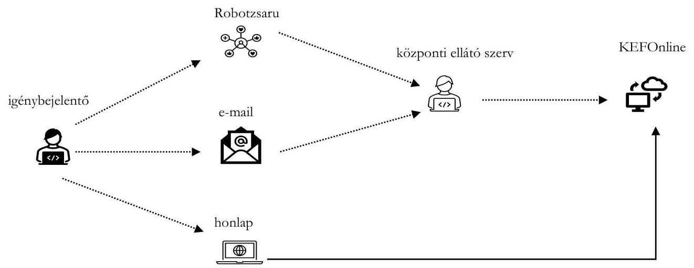

Forrás: A BV GEI oktatási anyag, belyszini interjú
A kézi adatrögzítés egyrészt lassította a folyamatot, másrészt hibalehetőséget jelentett. A KEFOnline ügyviteli és nyilvántartó szoftver által előállított 2022. és 2023. évi igénybejelentési adatbázis tartalmából az alábbi, kézi rögzítésre visszavezethető problémák kerültek beazonosításra az ÁSZ által: duplikációk az adatbázisban, üres adatmezők, téves rögzítések (pl. téves kategóriába sorolt igénybejelentő),

---

egy ügyleten belüli ellentmondások (pl. ügyfél általi elutasítás ellenére szerződés került rögzítésre), több néven szereplő egyazon igénybejelentő szervezet, termékek egységes megnevezésének hiánya.
4.3 számú megállapítás

A központi ellátás értékesítési rendszerében való részvétel ellenőrzése részlegesen valósult meg. Az utólagos ellenőrzés a vizsgált két irányító szerv vonatkozásában eltérő erőforrás-felhasználással és eltérő mértékben történt. Az Agrárminisztérium jelentős eredményt ért el a részvételre kötelezett szervezetek rendszerben való szabályszerű közreműködésében.

A Korm. rendelet és a BM rendelet tág körben határozta meg a fogvatartottak kötelező foglalkoztatása körében előállítandó termékek és szolgáltatások, valamint a rendszer használatára kötelezett megrendelők körét. A tág részvételi kötelezettség megvalósulása kontrollok működésével biztosítható.
A Korm. rendelet által szabályozott és a központi ellátó szerv által működtetett folyamat a részvételi kötelezettség tekintetében nem volt zárt. A Korm. rendelet szerint az árajánlatot követően az igénybejelentő - amennyiben nem élt a szabályszerű elutasítási lehetőségével - 15 munkanapon belül köteles volt szerződést kötni a kijelölt bv. társasággal. Az igénybejelentési adatbázis alapján rendszeresen fordult elő, hogy az igénybejelentő az árajánlatra nem jelzett vissza, vagy hiánypótlási kötelezettségét nem teljesítette. Ezen esetekről a jogszabály nem rendelkezett, a központi ellátó szerv az Eljárásrend ${ }_{1,2}$ alapján ekkor az ügyet lezárta és erről az igénybejelentőt értesítette. (10-18. mintatételek) Ezen esetekben a folyamat úgy szakadt meg, hogy a rendszerből való kilépés oka nem került ellenőrzésre.
Amennyiben az igénybejelentő által benyújtott kedvezőbb árajánlatra tekintettel a központi ellátó szerv által engedélyezésre került a saját hatáskörű beszerzés, a benyújtott kedvezőbb árajánlat szerinti megvalósulásra a rendszerben külső szervezet általi kontroll nem került alkalmazásra. (21. mintatétel)
A központi ellátó szerv az ellenőrzött időszakban a Korm. rendelet 12. § (5) bekezdésében lehetőségként szereplő, a kedvezőbb ár benyújtására és a teljesítési határidők el nem fogadására tekintettel engedélyezett saját hatáskörben történő beszerzések megvalósulásának jogszerűségére irányuló adatbekérés és ellenőrzés lehetőségével nem élt. (2. fókuszterület)
A Korm. rendelet 12. § (2) bekezdése az utólagos ellenőrzést a megrendelésre kötelezett szervezeteket irányító minisztériumok belső ellenőrzésének hatáskörébe sorolta. A minisztériumok részvételi kötelezettségének ellenőrzése a 2022. évvel bezárólag a Kormányzati Ellenőrzési Hivatal feladatköre volt, mely a 2023. évtől átkerült a minisztériumok belső ellenőrzésének hatáskörébe. Ezáltal valamennyi, a rendszert kötelezően igénybe vevő megrendelő utólagos ellenőrzése az érintett minisztérium belső ellenőrzésének feladatává vált.
. A korábban kifejtettek szerint a Belügyminisztérium a 2022. évben - a 2023. évre áthúzódva - tanácsadói jelentésben foglalkozott a területtel, amely javaslatot nem fogalmazott meg, így hasznosulás sem valósulhatott meg. A 2023. évben - a 2024. évre áthúzódva - a BVOP-t, valamint hat megrendelőt, érintően végzett ellenőrzést, melynek során hat szervezet vonatkozásában 16 javaslat került megfogalmazásra. Az intézkedési tervek a minisztérium részéről az ellenőrzött szervezetek részére az ÁSZ helyszíni ellenőrzés időszakában kerültek megküldésre, hasznosulás a jövőben várható.
Az Agrárminisztérium belső ellenőrzése nagyobb erőforrás felhasználással intenzívebb ellenőrzési munkát folytatott. Mind a 2022., mind a 2023. évben valamennyi, a rendszer használatára kötelezett szervezetet ellenőrzés alá vont. Az Agrárminisztérium az ellenőrzött szervezeteknek a 2022. évi ellenőrzések során 38 darab javaslatot tett, míg a 2023. évi ellenőrzések kapcsán kilenc darab javaslat született. A megállapítások

---

és a javaslatok döntően a beszerzéssel kapcsolatos szabályzatok Korm. rendelettel összhangban történő módosítására, valamint a központosított ellátás rendszerében történő részvételre vonatkoztak. A két év ellenőrzési eredményeinek összehasonlítása, valamint az agrárminiszter irányítása alá tartozó Kiskunsági Nemzeti Park rendszerrel kapcsolatos kötelezettségének szabályszerű teljesítése mutatja a minisztérium belső ellenőrzési munkájának hatásosságát.
Az ellenőrzési feladat azonos jogi előírás mellett eltérő terhet rótt az egyes minisztériumok belső ellenőrzésére. A BM rendelet 2. mellékletében felsorolt, a rendszert kötelezően használó megrendelők közé tartoztak a 2023. évtől az önálló belügyi szervként működő szervezetek, így többek között az Országos Kórházi Főigazgatóság, és az általa, mint középirányító szerv közreműködésével irányított, állami tulajdonban és fenntartásban lévő egészségügyi intézmények, a Klebelsberg Központ és az általa, mint középirányító szerv közreműködésével irányított tankerületi központok, a Szociális és Gyermekvédelmi Főigazgatóság és az általa, mint középirányító szerv közreműködésével irányított, állami fenntartásban lévő intézmények. Ezen felül a Belügymisztérium belső ellenőrzésének feladata volt a bv. szervezet, ezen belül a központi ellátás rendszerének ellenőrzése is.
Az irányító szervi utólagos ellenőrzés hatékonyságát növelnék, erőforrás-szükségletét csökkentenék a jogszabályi előírások alábbi módosításai:

- a Korm. rendelet 1. melléklete adattartalmának növelése az alábbi adatokkal: valamennyi benyújtott igénybejelentés központi ellátó szerv általi azonosítószáma, az igénybejelentést követően meg nem valósult beszerzés oka (pl fedezethiány miatt visszavont beszerzés), a megvalósult beszerzés kötelezettségvállalási azonosító száma,
- a központi ellátó szerv adatszolgáltatása az irányítószervek részére az éves igénybejelentésekről, valamint a központi ellátás rendszerét elkerülő szervezetekről,
- a Korm. rendelet módosításával az éves ellenőrzési kötelezettség leszűkítése a fenti információk felhasználásával, kockázati alapon kiválasztott szervezetekre vonatkozóan.
4.4 számú megállapítás

A központi ellátás értékesítési folyamatának eredményességét mérő, a bv. szervezet fogvatartotti munkáltatásba bevont egységeire vonatkozó átfogó mutatószámok, célértékek nem kerültek kialakításra és visszamérésre. A tevékenység értékelése a Korm. rendeletben előírtakra vonatkozóan, az előző évi tényadatokhoz viszonyítva történt. A rendszer működtetését végzők feladata a jogszabályi kötelezettségek végrehajtása volt.

A központi ellátó szerv a vizsgált években évente önértékelő jelentést ${ }^{51}$ készített, melyben a belső ellátás tárgyévi adataival együtt mutatta be a megelőző év tényadatait. Az önértékelésekben célértékek és azok visszamérései nem kerültek szerepeltetésre.
Ezen felül mindkét évben készült a központi ellátást végző szervezeti egység által az adott évre meghatározott szervezeti teljesítménycélok végrehajtásával kapcsolatos értékelés. Az értékelés több kategóriára bontva tartalmazott szöveges, valamint a teljesítés arányára vonatkozó százalékos minősítést. A százalékos minősítések viszonyítása alapjai, a célértékek nem kerültek feltüntetésre. Nyilatkozat alapján a teljesítménymérés a Korm. rendeletben előírt feladatokra vonatkozott, célértékek nem kerültek meghatározásra, mert az igényeket nem tudták tervezni, ezért az előző év adataihoz viszonyítva került meghatározásra a százalékos teljesítés. Az értékelt kategóriák az alábbiak voltak:

---

- Az igénybejelentések Korm. rendelet és BM rendelet szerinti szabályoknak megfelelő kezelése, együttműködve a bv. társaságokkal.
- Az ellátási megállapodások összeállítása és megkötése érdekében együttműködés mindazon igénybejelentőkkel, amelyek az uniós közbeszerzési értékhatárt elérő értékű beszerzési igényükkel a központi ellátó szervhez fordulnak.
- Az Állami Partner honlap webshop jellegű, központi igénybejelentő felületté történő kialakításának koordinálása.
- Megváltozott jogi környezet alapján a központi ellátást szabályozó jogszabályok módosításának előkészítése.
- Szervezeti és Működési Szabályzatban meghatározott feladatok végrehajtásának értékelése.

Valamennyi kategóriában az értékelés - mindkét évben azonos értékben - 95-97\%-os teljesítési aránnyal szerepelt. Az Állami Partner honlap kialakításának koordinálása 95\%-os teljesítési arányt ért el, miközben a 4.2 pontban bemutatott alacsony használati arány és problémák jellemezték a működését. Külső, objektív, mérhető célérték nem került megfogalmazásra (például a honlapon leadott igények aránya, szerződéssel végződő igényelt termékek és szolgáltatások aránya, kedvezőbb ár miatt elutasított ajánlatok aránya).
A központi ellátás értékesítési rendszerének humánerőforrás ráfordítására a 2023. évi feladatátadás nem volt hatással.
8. táblázat

# A KÖZPONTI ELLÁTÁS HUMÁNERŐFORRÁS RÁFORDÍTÁS ADATAI 

| MEGNEVEZÉS | 2022. FV | 2023. FV |
| :-- | --: | --: |
| A központi ellátással foglalkozók létszáma | $9+1$ FŐ | $9+1$ FŐ |
| Beérkezett igények száma (db) | 5296 | 5221 |
| 1 főre jutó igények száma (9 fő létszámmal számolva) | $588 \mathrm{DB} /$ FŐ/ÉV | $580 \mathrm{DB} /$ FŐ/ÉV |

Érdemes lehet átgondolni a humánerőforrás fejlesztését, a napi operatív feladatokon kívül egyéb, ügyfélkapcsolati tevékenységek felvételét a központi ellátó szerv operatív feladatait ellátó BV GEI tevékenységei közé. A vizsgált időszakban a központi ellátó szerv azon igénybejelentőkkel került kapcsolatba, amelyek saját maguk jelentkeztek a rendszerbe, nem rendelkezett kimutatással a rendszer használatára kötelezett szervezetekről, így egyes megrendelésre kötelezett szervezetek meg sem jelentek a központi ellátás rendszerében.

---

4.5 számú megállapítás

A központi ellátás értékesítési rendszere elsődleges célját - a fogvatartottak munkáltatása során előállított termékek/szolgáltatások értékesítésének koordinálását - részben töltötte be.

A központi ellátó szerv feladatait, a központi ellátás értékesítési folyamatait a Korm. rendelet határozta meg. Ez alapján a központi ellátás értékesítési rendszerének célja a fogvatartottak munkáltatása keretében a bv. társaságok által előállított, meghatározott termékek és szolgáltatások jogszabályban meghatározott szervezetek részére történő értékesítésének koordinálása volt.
A központi ellátó szerv operatív feladatait ellátó BV GEI a jogszabályban előírt kötelező feladatait elvégezte. Az ellenőrzött és ellenőrzést támogató szervezetek körében végzett kérdőíves felmérés szerint a megkérdezett 11 szervezet számára az igények összeállításánál a legnagyobb gondot az árlista hiánya okozta, ezt követte a szállítási határidő meghatározása. Az igénylés során a legtöbb megkérdezett a piaci árnál magasabb árajánlatot kifogásolta, másodsorban a bv. társaság által visszaigazolt határidő nem felelt meg az elvárásaiknak. A megkérdezettek a központi ellátás rendszerén keresztüli megrendelés átfutási idejének hosszával átlagosan voltak elégedettek (1-4 ig terjedő skálán 2,64-es átlagérték). A központi ellátás keretében előállított termékkekkel/szolgáltatásokkal inkább elégedettek (1-4 ig terjedő skálán 3-as átlagérték) voltak a válaszadó szervezetek.
A kérdőíves felmérés eredményei, valamint a jelentés korábbi részeiben szereplő megállapítások alapján a rendszer az értékesítést elősegítő, koordináló célját részben töltötte be.
A központi ellátás értékesítési rendszere nem önmagában álló tevékenység, hanem egy összetett folyamat része. Az összetett folyamat alapvető célja a fogvatartottak reintegrációs célú foglalkoztatása, melynek két fő formája a munkáltatás és az oktatás.
12. ábra

# FOGVATARTOTTAK, A MUNKÁLTATÁSBA BEVONT FOGVATARTOTTAK ÁTLAGLÉTSZÁMA, VALAMINT A BEISKOLÁZOTT FOGVATARTOTTAK SZÁMA AZ ADOTT ÉVBEN KEZDŐDŐ TANÉVBEN (FŐ) 

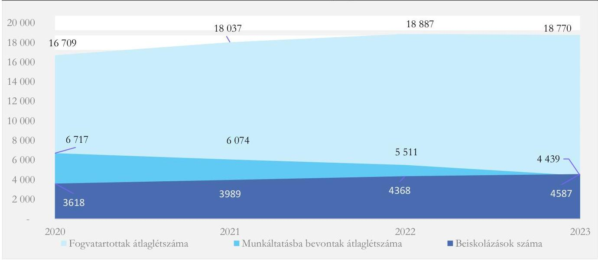

Forrás: BVOP Jelentés a büntetés-végrehajtási szervezet 2023. évi tevékenységéről, tanúsítvány, ÁSZ saját szerkesztés
A központi ellátás értékesítési rendszerében feltárt problémák, valamint a munkáltatásba bevont fogvatartottak számának csökkenése együttesen felvetik a probléma komplex megközelítésének szükségességét. Ebbe beletartozik a fogvatartotti foglalkoztatás, a termelés, a bv. társaságok múködésének

---

felmérése, az itt tapasztalható problémák kezelése, a termelői oldalon az értékesítési rendszer eredményes múködéséhez szükséges feltételek biztosítása.
Jelenleg a központi ellátás értékesítési rendszerében részvételre kötelezettek köre széles, viszont a korábbiakban ismertetettek alapján részvételük a rendszerben hatékony kontrollok nélküli. A részvételre kötelezett szervezetek túlnyomó része a Belügyminisztérium irányítása alá tartozik, a fentmaradó kevés számú kötelezett megoszlik a többi irányító szerv között.
Átgondolásra javasolt egy szűkebb termékköre koncentráló, azt nagyobb tételben és megfelelő minőségben előállító, szűkebb megrendelői körre (pl. egészségügyi, oktatási, szociális intézmények) összpontosító, a részvételi kötelezettséget hatékonyabban kontrolláló, rendszer kialakítása.

---

# JAVASLATOK 

Az ÁSZ tv. 33. § (1) bekezdésében foglaltak értelmében az ellenőrzött szervezet vezetője köteles a jelentésben foglalt megállapításokhoz kapcsolódó intézkedési tervet összeállítani és azt a jelentés kézhezvételétől számított 30 napon belül az ÁSZ részére megküldeni. Amennyiben az ellenőrzött szervezet vezetője nem küldi meg határidőben az intézkedési tervet, vagy továbbra sem elfogadható intézkedési tervet küld, az Állami Számvevőszék elnöke az ÁSZ tv. 33. § (3) bekezdése a) és b) pontjaiban foglaltakat érvényesítheti.

## BELÜGYMINISZTÉRIUM VEZETŐJE RÉSZÉRE

1. A feltárt kockázatok alapján vizsgálja felül a központi ellátás értékesítési rendszere jelenlegi szerkezetének és folyamatainak célszerüségét, különös tekintettel az alábbiakra: a fogvatartottak által előállított termékek és szolgáltatások fogalmának és körének meghatározása; a rendszerben kötelezően résztvevő megrendelők körének meghatározása, adatbázisának kialakítása, a rendszerben való részvételük ellenőrzése; valamint az értékesítési rendszer átalakítási lehetősége a központosított közbeszerzési rendszer mintájára.
2. A felülvizsgálat eredménye alapján szükség esetén kezdeményezzen jogszabálymódosítást az érintett területeken, valamint saját hatáskörben tegyen intézkedéseket a rendszer szabályszerű, célszerű és eredményes müködésének biztosítása érdekében, valamint végezze el az intézkedések végrehajtásának nyomon követését, visszamérését.

## BÜNTETÉS-VÉGREHAJTÁS ORSZÁGOS PARANCSNOKSÁGA VEZETŐJE RÉSZÉRE

1. Vizsgálja felül a központi ellátás értékesítési rendszerének jogszabálymódosítást nem igénylő, saját hatáskörben kialakított belső folyamatait, valamint célszerüségi szempontól a központi ellátó szerv operatív végrehajtási feladatainak a különböző bv. szervekhez (BV GEI, Bv. Holding Kft.) történő hozzárendelését.
2. Intézkedjen a központi ellátó szerv gazdasági végrehajtási szervénél az ügyfélkapcsolati munka feltételeinek kialakításáról különös tekintettel az alábbiakra: a honlapon történő igénybejelentési lehetőség népszerüsítése és technikai segítése, valamint az allamipartner.hu honlapon szereplő információtartalom szélesítése.
3. Intézkedjen olyan eljárások kialakításáról, melyek támogatják a Korm. rendelet 1. § (8) bekezdésében előírt negyedéves, valamint a Korm. rendelet 6. § (1) bekezdésében előírt éves igénybejelentések rendszerének minél teljesebb körü müködését.

---

# BÜNTETÉS-VÉGREHAJTÁs GAZDASÁGI ELLÁTÓ INTÉZETE VEZETŐJE RÉSZÉRE 

1. Intézkedjen az igénybejelentések www.allamipartner.hu honlapon történő benyújtásának és fogadásának általánossá tételéről, a honlap megrendelők számára történő megismertetéséről, és problémamentes müködéséről.
2. Intézkedjen a Korm. rendelet 3. § (5) bekezdésében, valamint 11. § (4) bekezdésében meghatározott, az igénybejelentők által benyújtott kedvezőbb árajánlatra indított saját hatáskörü beszerzés engedélyezése tekintetében a határidők és az eljárás szabályozásáról, valamint a folyamat gyorsítása érdekében formanyomtatványok kialakításáról és alkalmazásáról.
3. Intézkedjen a Korm. rendelet 12. § (5) bekezdésében szereplő, a kedvezőbb ár benyújtására és a teljesitési határidők el nem fogadására tekintettel engedélyezett saját hatáskörben történő beszerzések jogszerüségére irányuló adatbekérés és ellenőrzés folyamatának szabályozásáról és megvalósulásáról.
4. Gondoskodjon a központi ellátás értékesitési rendszerét támogató informatikai programban egységes ügyféltörzs és terméktörzs kialakításáról és használatáról.
5. Gondoskodjon a Bkr. 6. § (4) bekezdésében elöirt integrált kockázatkezelés eljárásrendjének elkészitéséről és hatályba léptetéséről, valamint a központi ellátás értékesitési rendszerével kapcsolatban a kockázatok felméréséről, a kockázatok kezelése érdekében szükséges intézkedések megtételéről és ezek nyomon követéséről.
6. Gondoskodjon a Bkr. 7. § (4) bekezdésében elöirtak szerint az integrált kockázatkezelési rendszer koordinálásával megbizott szervezeti felelős kijelöléséről.

---

# Országos GYERMEKVÉDELMI SZAKSZOLGÁLAT VEZETŐJE RÉSZÉRE 

1. Intézkedjen annak érdekében, hogy a beszerzéssel kapcsolatos belső szabályozás rendelkezésre álljon a Korm. rendelet 3. § (1) bekezdésében, 6. § (1) bekezdésében, valamint 11. § (1) bekezdésében előírt részvételi kötelezettség, valamint a Korm. rendelet 12. § (4) bekezdése szerinti adatszolgáltatás tekintetében.
2. A belső ellenőrzési szervezeti egység számára határozza meg feladatként annak ellenőrzését és nyomon követését, hogy a szervezet a BM rendelet hatálya alá tartozó termékek és szolgáltatások körében felmerülő igényeivel a Korm. rendelet 3. § (1) bekezdésében, 6. § (1) bekezdésében, valamint 11. § (1) bekezdésében előírtak szerint a központi ellátó szerv felé forduljon, valamint teljesítse a Korm. rendelet 12. § (4) bekezdése és 1. melléklete alapján előírt adatszolgáltatási kötelezettségét.

## BUDAPESTI UZSOKI UTCAI KÓRHÁZ VEZETŐJE RÉSZÉRE

1. Intézkedjen annak érdekében, hogy a beszerzéssel kapcsolatos belső szabályozás rendelkezésre álljon a Korm. rendelet 3. § (1) bekezdésében, 6. § (1) bekezdésében, valamint 11. § (1) bekezdésében előírt részvételi kötelezettség, valamint a Korm. rendelet 12. § (4) bekezdése szerinti adatszolgáltatás tekintetében.
2. A belső ellenőrzési szervezeti egység számára határozza meg feladatként annak ellenőrzését és nyomon követését, hogy a szervezet a BM rendelet hatálya alá tartozó termékek és szolgáltatások körében felmerülő igényeivel a Korm. rendelet 3. § (1) bekezdésében, 6. § (1) bekezdésében, valamint 11. § (1) bekezdésében előírtak szerint a központi ellátó szerv felé forduljon.

## ÉSZAK-BUDAI SZENT JÁNOS CENTRUMKÓRHÁZ VEZETŐJE RÉSZÉRE

1. Intézkedjen annak érdekében, hogy a beszerzéssel kapcsolatos belső szabályozás rendelkezésre álljon a Korm. rendelet 3. § (1) bekezdésében, 6. § (1) bekezdésében, valamint 11. § (1) bekezdésében előírt részvételi kötelezettség, valamint a Korm. rendelet 12. § (4) bekezdése szerinti adatszolgáltatás tekintetében
2. A belső ellenőrzési szervezeti egység számára határozza meg feladatként annak ellenőrzését és nyomon követését, hogy a BM rendelet hatálya alá tartozó termékek és szolgáltatások körében felmerülő igénybejelentést követően a bv. társaságtól történő beszerzés mellőzéséhez minden esetben álljon rendelkezésre a Korm. rendelet 3. § (4b) bekezdésében előírt, saját hatáskörben történő beszerzés központi ellátó szerv általi engedélyezése.

---

# MELLÉKLETEK 

## I. SZ. MELLÉKLET: ÉRTELMEZŐ SZÓTÁR

belső ellátás
büntetés-végrehajtási szervezet
bv. társaságok
célszerűség
eredményesség
fogvatartott
fogvatartottak foglalkoztatása
fogvatartottak munkáltatása

A belső ellátás keretében a bv. társaságok biztosítják a bv. intézetek élelmiszerellátásának egy részét, valamint az általuk gyártott termékek megtalálhatók a fogvatartotti zárkákban és a fogvatartotti ruházat körében.
(Forrás: https://bv.gov.hu/hu/belso-ellatas)
Szabadságelvonással járó büntetéseket, intézkedéseket, büntetőeljárási kényszerintézkedéseket, a szabadságvesztésből szabadultak utógondozását, valamint a büntetés-végrehajtási pártfogó felügyelői feladatokat végrehajtó állami, fegyveres rendvédelmi szervek együttese. A büntetés végrehajtás szervezet működését a Kormány a büntetés-végrehajtásért felelős miniszter (Belügyminiszter) útján irányítja, aki felelős annak törvényes működéséért. A büntetés-végrehajtási szervezet központi vezető szerve a BVOP, további szervei a büntetés-végrehajtási intézetek és intézmények, továbbá a bv. társaságok. (Forrás: Bvszt. 1- 2. § alapján ÁSZ saját fogalom meghatározása)
A fogvatartottak kötelező foglalkoztatására létrehozott, a büntetés-végrehajtási szervezetbe tartozó gazdasági társaságok. A 2023. évben az alábbi gazdasági társaságok:

Bv. Holding Kft., Állampusztai Kft., Annamajori Kft., DUNA-MIX Kft., DUNA PAPÍR Kft., Ipoly Cipőgyár Kft., Nagyfa-Alföld Kft., NOSTRA Kft., Pálhalmai Agrospeciál Kft.
(Forrás: Bvszt. 2. § (5) bekezdés, 9. §, https://bv.gov.hu/hu/bv-szervezetismerteto)
Annak a követelménye, hogy a bevételeket a közfeladat megvalósítása érdekében, a kiadásokat a közfeladatok megfelelő ellátásához szükséges mértékben, a költségvetési célrendszer érdekében, a meghatározott célra (közfeladat ellátására), továbbá észszerűen, racionálisan használják fel. (ÁSZ saját fogalom meghatározás)
A kitűzött célok és a tervezett eredmények (hatások) elérését jelenti. A gazdálkodás, feladatellátás eredményességét mutatja a tényleges és a tervezett eredmények (hatások) összevetése. (ÁSZ saját fogalom meghatározása)
Azon személy, aki a szabadságelvonással járó büntetést, intézkedést, büntetőeljárási kényszerintézkedést, az elzárást büntetés-végrehajtási szervnél tölti. (Forrás: Bvszt. 34. § (1) bekezdés b) pontja)

A bv. szervezet keretén belül az elítélt számára biztosított munkáltatási, oktatási, szakképzési, terápiás foglalkoztatási és egyéb reintegrációs programok összessége. (Forrás: A szabadságvesztés, az elzárás, az előzetes letartóztatás és a rendbírság helyébe lépő elzárás végrehajtásának részletes szabályairól szóló 16/2014. (XII. 19.) IM rendelet ${ }^{53}$ )
A reintegrációs tevékenység azon formája, amikor az elítéltek vagy a kényszerintézkedés hatálya alatt álló személy és a szabálysértési elzárásra kötelezett elkövető munkavégzése szervezetten, rendszeresen, haszon- vagy bevételszerzési céllal, a munka törvénykönyvéről szóló 2012. évi I. törvény által szabályozott munkaviszonytól eltérő, jogszabályban meghatározott feltételekkel és díjazás ellenében történik. (Forrás: Bv. tv. 3. § 13. pontja)

---

fogvatartottak reintegrációja
központi ellátás
központi ellátó szerv (KESZ)
központi ellátás értékesítési rendszere
központi ellátás rendszerében értékesített termékek és szolgáltatások
központi ellátás rendszerének igénybevételére kötelezett szervezet - kedvezményezett szervezet

Robotzsaru

Az elítéltek munkaerő-piaci integrációjának elősegítése, a befogadást megelőző életkörülményekből, életvitelből eredő hátrányok csökkentése, a fogvatartottak személyiségének és szociális készségeinek fejlesztése. A fogvatartottak reintegrációjának egyik legfontosabb eleme a munkáltatás. (Forrás: Bv. tv. és ÁSZ saját fogalom meghatározás)
A központi ellátó rendszer keretében két közfeladat ellátása történik, mely egyrészről biztosítja a fogvatartottak foglalkoztatását, másrészt az egyes államháztartási szervek folyamatos ellátását a bv. társaságok által előállított termékekkel, szolgáltatásokkal.
(Forrás: https://bv.gov.hu/hu/kozponti-ellatas)
A Kormány a központi ellátó szerv feladatainak ellátására a BVOP-t jelölte ki. A központi ellátó szerv koordinálja a központi ellátás értékesítési tevékenységét. 2023. január 1. napjától a központi ellátó szerv gazdasági végrehajtási szerveként a büntetés-végrehajtási intézményként múködő BV GEI jár el. (Forrás: 44/2011. (III. 23.) Korm. rendelet 1. $\$ 5$ ) bekezdés, BV GEI Alapító Okirata alapján ÁSZ saját fogalom meghatározása)
A fogvatartottak munkáltatása keretében a bv. társaságok által előállított meghatározott termékeknek és szolgáltatásoknak a jogszabályban meghatározott szervezetek részére történő értékesítésére a központi ellátó szerv által müködtetett szabályozott rendszer.
(ÁSZ saját fogalom meghatározás)
A 9/2011. (III. 23.) BM rendelet 1. mellékletében a Tevékenységek Egységes Ágazati Osztályozási Rendszere (TEÁOR'08) szerint meghatározott, a fogvatartottak kötelező foglalkoztatása körében előállítandó termékek, szolgáltatások és építési tevékenységek. (ÁSZ saját fogalom meghatározás)
A minisztériumok, központi hivatalok, kormányzati főhivatalok, a rendvédelmi szervek, a honvédelmi szervezet, a 9/2011. (III. 23.) BM rendelet 2. mellékletében meghatározott, a Belügyminisztérium irányítása alá tartozó szervezetek, minisztériumi szervek, az önálló belügyi szervek, illetve a Belügyminisztérium szakmai felügyelete alatt álló gazdasági társaságok. A hivatkozott jogszabályok a szervezetek megnevezésére a „kedvezményezett" kifejezést használják. A jelentésben a „kedvezményezett" helyett a „központi ellátás rendszerének igénybevételére kötelezett szervezet", „megrendelői körbe tartozó szervezet" megnevezés szolgál. (Forrás: 44/2011. (III. 23.) Korm. rendelet 1. § (1) bekezdés, 9/2011. (III. 23.) BM rendelet 2. melléklet alapján ÁSZ saját fogalom meghatározása)
A belügyminisztériumi szerveknél és egyes önálló belügyi szerveknél használt integrált ügyviteli, ügyfeldolgozó és elektronikus iratkezelő rendszer, amelynek használatát a Robotzsaru integrált ügyviteli, ügyfeldolgozó és elektronikus iratkezelő rendszer használatának szabályozásáról, az egységes elektronikus iratkezelés bevezetéséről és a bevezetést támogató projektszervezetek létrehozásáról szóló 24/2011. (IX. 9.) BM utasítás írta elő

---

II. SZ. MELLÉKLET: AZ ELLENŐRZÖTT SZERVEZETEK JEGYZÉKE

| SSZ. | ÁDÖSZÁM | ELLENŐRZÖTT SZERVEZET MEGNEVEZÉSE |
| :-- | :-- | :-- |
| 1. | $15752026-2-51$ | Büntetés-végrehajtás Országos Parancsnoksága |
| 2. | $15848367-2-51$ | Büntetés-végrehajtás Gazdasági Ellátó Intézete |
| 3. | $15311605-2-41$ | Belügyminisztérium |
| 4. | $15305679-2-41$ | Agrárminisztérium |
| 5. | $15490359-2-43$ | Észak-budai Szent János Centrumkórház |
| 6. | $15835121-2-08$ | Győri Tankerületi Központ |
| 7. | $15323888-2-03$ | Kiskunsági Nemzeti Park Igazgatóság |
| 8. | $15372246-2-09$ | Országos Gyermekvédelmi Szakszolgálat |
| 9. | $15492674-2-42$ | Budapesti Uzsoki utcai Kórház |

---

# III. SZ. MELLÉKLET: ELLENŐRZÉSI KRITÉRIUMOK 

## FOKUSZTERÜLET

1. A központi ellátó szerv központi ellátás értékesítési rendszerére vonatkozó múködési kereteinek kialakítása és múködtetése
2. A központi ellátó szerv központi ellátás értékesítési rendszerére vonatkozó tevékenységének végrehajtása
3. Az ellenőrzött, megrendelői körbe tartozó szervezetek központi ellátás értékesítési rendszerével kapcsolatos kötelezettségeinek, valamint az irányító szervek ellenőrzési kötelezettségének teljesítése
4. A központi ellátás értékesítési folyamata kialakításának célszerűsége, a végrehajtás eredményessége és az eredményességet befolyásoló tényezők

## ELLENŐRZÉSI KRITÉRIUMOK

Ábt ${ }^{53}$. 8/A. §, 9. § a)-b) pontok, 10. § (5) bekezdés, 70. § (1) bekezdés

Ávr. 5. § (1) f) pont, 13. § (1), (4a), (5) bekezdések
Bkr. 1. § (1), (2) bekezdés a)-b) és m) pontok 2023.05.02-
ig, 2023.05.03-tól 2. § 3)-4), 12) pontok, 4. § (a) pont, 6. §
(1) bekezdés a)-b) pontok, (2)-(2a)-(3)-(4) bekezdések, 7. §
(1)-(4) bekezdések, 8. §, 9. § (1)-(2) bekezdés, 10. §, 15. §
(1)-(2) bekezdés, 17-18-19. §, 22. § (1) a) pont, 29. § (1) bekezdés, 30. § (1) bekezdés, 31. § (1a) bekezdés, 48-49. § 44/2011. (III. 23.) Korm. rendelet 9/2011. (III. 23.) BM rendelet
44/2011. (III. 23.) Korm. rendelet 1. § (2),(4),(7) bekezdések, 2. §, 3. § (1), (2)-(2a), (3), (4)-(4b), (5) bekezdések; 4. § (2) bekezdés; 5-7. §, 9. §; 12. § (5) bekezdés, 13. §
Kbt. 15. § (1)-(2); (5) bekezdések, 16. § (1)-(3) bekezdések, 19. § (1)-(3) bekezdések; 28. § (1)-(2) bekezdések

Bkr. 6. § (2)-(3) bekezdések, 10. §, 29. § (1) bekezdés
Számv. tv.165-167. §
9/2011. (III. 23.) BM rendelet 1-2. sz. melléklet 30500/4394-5/2023. BV GEI eljárásrend
Áht. 9. § b) pont, 10. § (5) bekezdés, 70. § (1) bekezdés a) pont
Ávr. 13. § (1)-(2) a)-b) pontok, (5) bekezdés; 10. § (5) bekezdés, 13. § (1), (5) bekezdések,
Kbt. 27. § bekezdés;
Bkr. 2. § 16. pont, 6. § (1) bekezdés a)-b) pontok, (2)(3) bekezdések, 22. § (1) bekezdés b) pont, 33. §, 39-41. §, 45. § (1) bekezdés, 46. §, 47. § (1) bekezdés, 48-49-50. § 44/2011. (III. 23.) Korm. rendelet 1. § (1)-(4), (6), (8) bekezdések, 3. § (1), (2a)-(6), 4. § (3)-(4) bekezdés; 5. § (2) bekezdés, 6. § (1)-(1a)-(7) bekezdések, 7. § (1), (2) bekezdés a-b) pont; 9. §, 10. § (1) bekezdés, 11. §; 12. § (2), (4)-(5) bekezdések, 13. §
9/2011. (III. 23.) BM rendelet és 1-2. számú melléklet 44/2011. (III. 23.) Korm. rendelet és 1. számú melléklet 44/2011. (III. 23.) Korm. rendelet 9/2011. (III. 23.) BM rendelet
Kbt., Bkr., szerződéskötéssel zárult igénybejelentések aránya

---

# IV. SZ. MELLÉKLETIAZ UNIÓS KÖZBESZERZÉSI ÉRTÉKHATÁR ALATTI ÉRTÉKESÍTÉS FOLYAMATA 

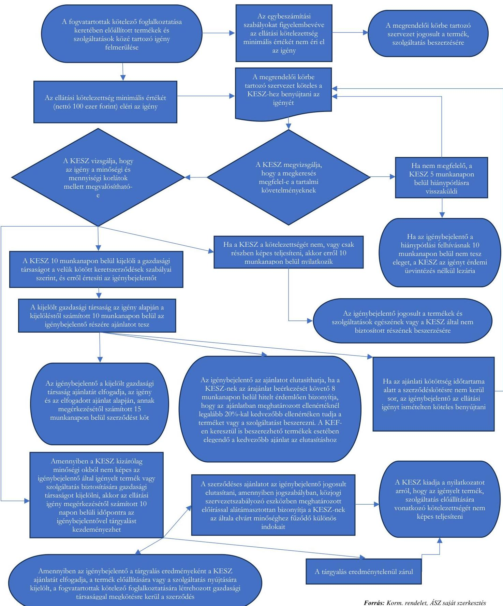

---

# V. SZ. MELLÉKLET:AZ UNIÓS KÖZBESZERZÉSI ÉRTÉKHATÁRT ELÉRŐ ÉRTÉKESÍTÉS FOLYAMATA 

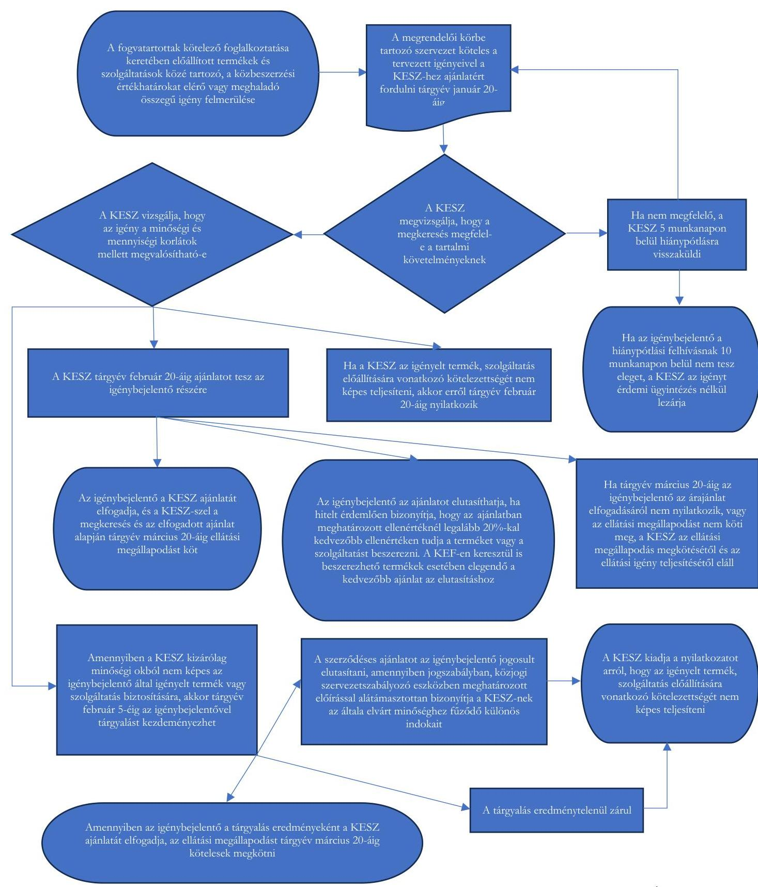

Forrás: Korm. rendelet, ÁSZ saját szerkesztés

---

Mellékletek

VI. SZ. MELLÉKLET: AZ IGÉNYBEJELENTÉSEK ELOSZLÁSA AZ ÉV FOLYAMÁN (DARAB) (2021-2022. ÉVEK)
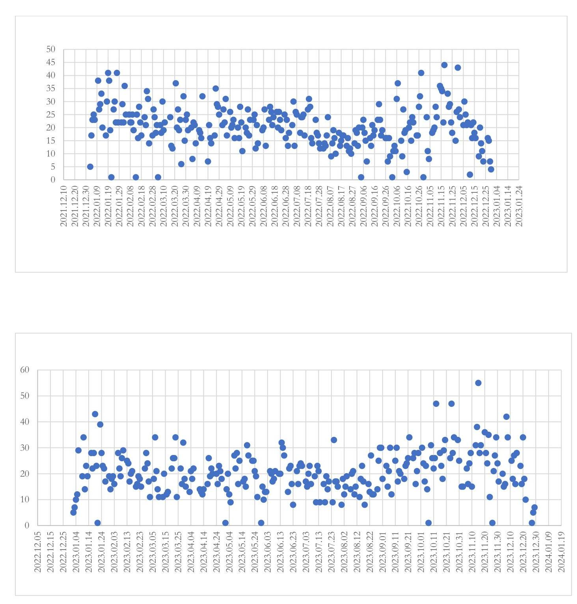

Fonrás: BV GEI igénybejelentési adatházis

---

# - VII. SZ. MELLÉKLET: KÉT FŐ MEGHIÚSULÁSI OK MIATT MEGHIÚSULT IGÉNYEK SZÁMA AZ EGYES TERMÉK/SZOLGÁLTATÁS KATEGÓRIÁKBAN 

MEGHIÚSULT IGÉNYEK SZÁMA AZ EGYES TERMÉK/SZOLGÁLTATÁS KATEGÓRIÁKBAN A 2022. ÉVBEN
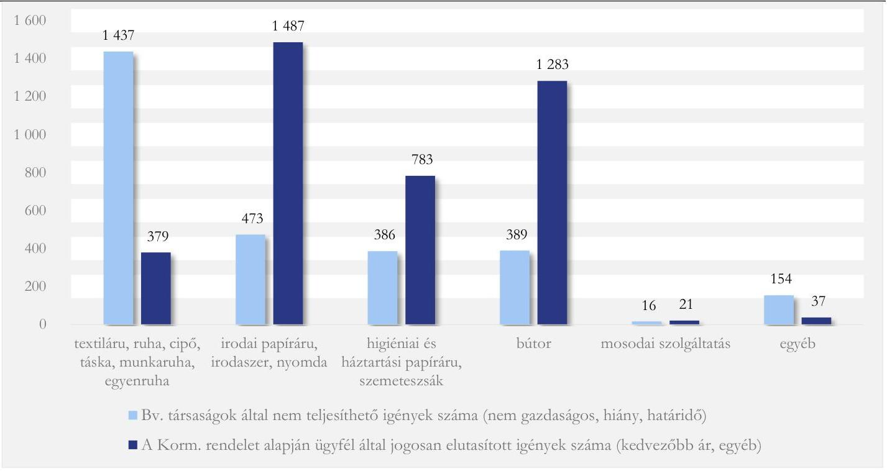

MEGHIÚSULT IGÉNYEK SZÁMA AZ EGYES TERMÉK/SZOLGÁLTATÁS KATEGÓRIÁKBAN A 2023. ÉVBEN
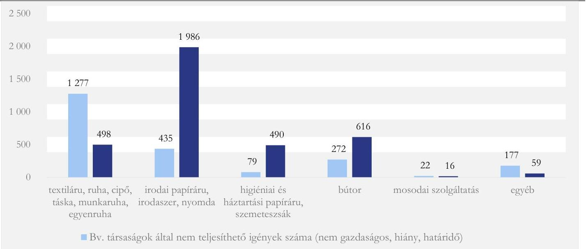

---

# FÜGGELÉK: ÉSZREVÉTELEK 

A jelentéstervezetet a Számvevőszék 15 napos észrevételezésre megküldte az ellenőrzött szervezetek vezetőinek az ÁSZ tv. 29. §* (1) bekezdése előírásának megfelelően.

A Büntetés-Végrehajtás Országos Parancsnoksága, a Büntetés-Végrehajtás Gazdasági Ellátó Intézete, az Agrárminisztérium, az Észak-budai Szent János Centrumkórház, a Győri Tankerületi Központ, a Kiskunsági Nemzeti Park Igazgatóság, az Országos Gyermekvédelmi Szakszolgálat, a Budapesti Uzsoki utcai Kórház vezetői a jelentéstervezet megállapításaira észrevételt nem tettek.
A jelentéstervezet megállapításaira a Belügyminisztérium nevében a Rendészeti Államtitkár észrevételt tett. Az ÁSZ tv. 29. § (3) bekezdésével összhangban az Állami Számvevőszék a Függelékben feltünteti a megállapításokkal kapcsolatban tett, el nem fogadott észrevételeket, és megindokolja, hogy azokat miért nem fogadta el.

## A Belügyminisztérium Rendészeti Államtitkárának 3. számú észrevétele:

Észrevétellel érintett megállapítás: A Belügyminisztérium a 2022. évben a Korm. rendeletben meghatározott ellenőrzési tevékenységet nem végzett. A 2023. évben - a 2024. évre áthúzódóan - az ellenőrzés alá vont szervezetek esetében teljesítette ellenőrzési feladatait, viszont a Belügyminisztérium irányítása alá tartozó teljes megrendelői kör Korm. rendeletben előírt ellenőrzése nem valósult meg. (3.7. számú megállapítás (34-35.oldal)
Észrevétel tartalma: A Bkr. értelmező rendelkezéseinek 3. pontja az alábbiak szerint definiálja belső ellenőrzést: 3. belső ellenőrzés: független, tárgyilagos bizonyosságot adó és tanácsadó tevékenység, amelynek célja, hogy megállapításaival és javaslataival az ellenőrzött szervezet müködését fejlessze és eredményességét növelje, az ellenőrzött szervezetet annak céljai elérése érdekében rendszerszemléletü megközelítéssel és módszertani útmutatások segítségével értékelje, illetve megállapításaival és javaslataival elősegítse az ellenőrzött szervezet irányítási és belső kontrollrendszerének hatékonyságát.
Fentiek alapján megítélésünk, hogy a tanácsadó és a bizonyosságot adó tevékenység ellenőri nézetből nem különbözik sem eredményesség, sem hasznosság tekintetében. A Korm. rendelet nem nevesíti, hogy az ellenőrzést lefolytatni bizonyosságot adó vagy tanácsadó tevékenység keretében szükséges. A tapasztalatunk az, hogy a tanácsadó tevékenység lefolytatása sokszor gyorsabb, egyszerübb, és ugyanolyan eredményre vezet, mint a bizonyosságot adó. Szövegszerü módosítás megfontolására teszünk javaslatot.

[^0]
[^0]:    * 29. § (1) Az Állami Számvevőszék az ellenőrzési megállapításait megküldi az ellenőrzött szervezet vezetőjének vagy az általa megbízott személynek, és annak, akinek személyes felelősségét állapította meg.
    (2) Az ellenőrzött szervezet vezetője és a felelősként megjelölt személy az ellenőrzés megállapításaira tizenöt napon belül írásban észrevételt tehet.
    (3) Az Állami Számvevőszék az észrevételre a beérkezésétől számított harminc napon belül írásban válaszol. A figyelembe nem vett észrevételeket köteles a jelentésben feltüntetni, és megindokolni, hogy azokat miért nem fogadta el.

---

# Szövegszerü javaslat: 

„A helyszini ellenörzések mind a két év tekintetében lefolytatásra kerültek, ugyanakkor a jelentések elkészitése áthúzódott a következő évre. 2022. évben a Belügyminisztérium a Korm. rendeletben meghatározott ellenörzését a Bkr. 2.§ 3. pont rendelkezése alapján tanácsadó tevékenység keretében végezte el. 2023. évben - a 2024. évre áthúzódóan - az ellenőrzés alá vont szervezetek esetében bizonyosságot adó ellenőrzési tevékenységet végzett. A Belügyminisztérium évente más-más szervezetekre végezte el az elöirt ellenörzéseket. ${ }^{\text { }}$
Az el nem fogadás indoka: Továbbra is fenntartjuk azon megállapítást, hogy a Korm. rendelet 12. § (2)-(3) bekezdésében elöirt ellenőrzési tevékenység nem teljesithető a belső ellenőrzési szervezeti egység tanácsadói tevékenysége keretében. A Korm. rendelet 12. § (2)-(3) bekezdése olyan éves ellenőrzési kötelezettséget határoz meg, amelynek az a célja, hogy a belső ellenőrzési szervezeti egység utólagosan, adatbekérés alapján megállapítsa, hogy a rendszer a rendelkezésben konkrétan hivatkozott jogszabályi elöírásoknak megfelelően müködött-e az ellenőrzött évben.
A tanácsadói tevékenység a Bkr. 2. § 20. pontja szerint a költségvetési szerv vezetője részére nyújtott konzultációs tevékenység, amely nem foglalja magában valamely jogszabályi rendelkezésnek való megfelelés ellenörzését, a bizonyosságot adó tevékenységet. A Bkr. 37. § (2) bekezdése értelmében tanácsadói tevékenységről készített jelentésnek például nem kell tartalmaznia a Bkr. 39. § (3) bekezdésében meghatározott tartalmi elemeket, a jelentés tartalmáért, a levont következtetésekért és a kapcsolódó javaslatokért a belső ellenőr nem felelős, a jelentésben foglaltakat ellenőrzési bizonyitékkal nem kell alátámasztani, a jelentéstervezetet nem kell egyeztetni, a tanácsadói jelentéshez nem kapcsolódik intézkedési terv készitési kötelezettség.
A fentiek alapján az ÁSZ jelentésben negatív minösités nélkül továbbra is szerepel a tényhelyzet megjelenitése. Ismertetjük az érintett tanácsadói feljegyzés elkészültének körülményeit. Így ismertetjük, hogy a 2022. évi ellenőrzési terv tartalmazott a központi ellátás rendszeréhez kapcsolódó ellenőrzést, a tanácsadói feljegyzés szerint az ellenőrzést lefolytatták, azonban tartalmi és formai okokból átdolgozást követően a témával kapcsolatban a belső ellenőrzési egység tanácsadói jelentést adott ki.

## A Belügyminisztérium Rendészeti Államtitkárának 4. számú észrevétele:

Észrevétellel érintett megállapítás: Az anyagban tanácsadó jellegénél fogva megállapítások, javaslatok nem szerepeltek. A Bkr. 2. § 3. pontja alapján a belső ellenőrzés bizonyosságot adó, valamint tanácsadó tevékenységből áll. A tanácsadó tevékenység a Bkr. 2. § 20. pontja szerint a költségvetési szerv vezetője részére nyújtott, jellegét tekintve konzultációs tevékenység. A belső ellenőrzés a bizonyosságot adó tevékenysége keretében ad objektív értékelést, melynek eredményeként megállapításait, következtetéseit, javaslatait ellenőrzési jelentésbe foglalja. A 2022-2023. években a Korm. rendelet 12. § (2)-(3) bekezdésében elöirt ellenőrzési tevékenység eredményeként, a Bkr. 21. § (3) bekezdésében meghatározott, bizonyosságot adó tevékenység körébe tartozó ellenőrzés elvégzésére,

---

valamint a Bkr. 39. §-ban előírt ellenőrzési jelentés kiadására nem került sor. (3.7. számú megállapítás, 34-35.oldal)
Észrevétel tartalma: A tanácsadói anyag ellenőri megállapításokat tartalmaz, a leíró jelleget mellőzi. A belső ellenőrzési tevékenység helyszíni szakasza 2022-2023. években végrehajtásra került, ezáltal a kontrollok érvényre juttatásával kapcsolatosan a Belügyminisztérium intézkedett. A 3.7., a 4.3., valamint a 4.4. számú megállapítások átírását javasoljuk a leírtakra tekintettel. Szövegszerü módosítás megfontolására teszünk javaslatot.
Szövegszerü javaslat:
„Az anyagban tanácsadó jellegénél fogva javaslatok nem szerepeltek. A Bkr. 2. § 3. pontja alapján a belső ellenőrzés bizonyosságot adó, valamint tanácsadó tevékenységből áll. A tanácsadó tevékenység a Bkr. 2. § 20. pontja szerint a költségvetési szerv vezetője részére nyújtott, jellegét tekintve konzultációs tevékenység. A belső ellenőrzés a bizonyosságot adó tevékenysége keretében ad objektív értékelést, melynek eredményeként megállapításait, következtetéseit, javaslatait ellenőrzési jelentésbe foglalja. "
Az észrevételt az Állami Számvevőszék részben fogadta el, melynek indoka: A szövegszerü javaslatot elfogadtuk, azaz kikerült az első mondatból, hogy a tanácsadói anyag megállapításokat nem tartalmaz, valamint az ellenőrzés elvégzésének hiányát tartalmazó megállapítás.
A 4.3 számú megállapításból kikerült a Korm. rendeletben előírt ellenőrzési kötelezettség részbeni teljesítésére vonatkozó rész.
Ugyanakkor - mivel a 4.4. megállapítás nem tartalmazott az észrevétellel érintett részt - a 4.4. számú megállapítás változatlanul szerepel a jelentésben.

---

# RÖVIDÍTÉSEK JEGYZÉKE 

${ }^{1}$ bv. szervezet
${ }^{2}$ ÁSZ tv.
${ }^{3}$ Alaptörvény
${ }^{4}$ ÁSZ
${ }^{5}$ BVOP
${ }^{6}$ Bv. tv.
${ }^{7}$ Bvszt.
${ }^{8}$ bv. intézetek
${ }^{9}$ bv. intézmények
${ }^{10}$ BM rendelet
${ }^{11}$ BV GEI
${ }^{12}$ Korm. rendelet
${ }^{13} \mathrm{Kbt}$.
${ }^{14} \mathrm{Bkr}$.
${ }^{15}$ BVOP SZMSZ
${ }^{16}$ belső kontrollrendszerről szóló
BVOP utasítás
${ }^{17}$ BV GEI Alapító Okirata
${ }^{18}$ Ávr.
${ }^{19}$ BV GEI SZMSZ
${ }^{20}$ Központi Ellátási Osztály ügyrendje
${ }^{21}$ Eljárásrend ${ }_{2}$
${ }^{22}$ Eljárásrend ${ }_{1}$
${ }^{23}$ 168/2004. (V. 25.) Korm. rendelet
${ }^{24}$ KNPI
${ }^{25}$ Kiskunsági Nemzeti Park Igazgatóság
Beszerzési szabályzat
${ }^{26}$ OGYSZ
${ }^{27}$ Országos Gyermekvédelmi Szakszolgálat
büntetés-végrehajtási szervezet
2011. évi LXVI. törvény az Állami Számvevőszékről

Magyarország Alaptörvénye
Állami Számvevőszék
Büntetés-végrehajtás Országos Parancsnoksága
2013. évi CCXL. törvény a büntetések, az intézkedések, egyes kényszerintézkedések és a szabálysértési elzárás végrehajtásáról
1995. évi CVII. törvény a büntetés-végrehajtási szervezetről

30 fogvatartottakat elhelyező és 2 egészségügyi intézet, melyek feladata a fogvatartottak elhelyezésének, valamint gyógykezelésének, elmemegfigyelésének és kivizsgálásának biztosítása
a bv. szervek anyagi-technikai ellátását végző Büntetés-végrehajtás Gazdasági Ellátó Intézete, valamint a személyi állomány oktatását, továbbképzését, egyes szociális és egészségügyi feladatok ellátását végző Büntetés-végrehajtási Szervezet Oktatási, Továbbképzési és Rehabilitációs Központja
9/2011. (III. 23.) BM rendelet a büntetés-végrehajtási szervezet részéről a büntetésvégrehajtásért felelős miniszter vezetése, irányítása vagy felügyelete alá tartozó szervek irányában fennálló ellátási kötelezettségről, a fogvatartottak kötelező foglalkoztatása keretében előállított termékekről és szolgáltatásokról, azok átadásátvételéről és az ellentételezés rendjéről
Büntetés-végrehajtás Gazdasági Ellátó Intézete
44/2011. (III. 23.) Korm. rendelet a büntetés-végrehajtási szervezet részéről a központi államigazgatási szervek és a rendvédelmi szervek irányában fennálló egyes ellátási kötelezettségekről, a termékek és szolgáltatások átadás-átvételének és azok ellentételezésének rendjéről
2015. évi CXLIII. törvény a közbeszerzésekről
370/2011. (XII. 31.) Korm. rendelet a költségvetési szervek belső kontrollrendszeréről és belső ellenőrzéséről
6/2023. (I. 31.) BVOP utasítás a Büntetés-végrehajtás Országos Parancsnoksága Szervezeti és Működési Szabályzatáról, hatályos 2023. február 01-től
26/2020. (VII. 10.) BVOP utasítás a belső kontrollrendszerről, hatályos 2020. július 12-től
BV GEI A-482-1/2022. számú alapító okirata és annak módosításai
368/2011. (XII. 31.) Korm. rendelet az államháztartásról szóló törvény végrehajtásáról
a BV GEI 2023. 01. 26-án jóváhagyott Szervezeti és Múködési Szabályzata
a BV GEI Központi Ellátási Osztályának 2023. 01. 09-én jóváhagyott ügyrendje
a BV GEI eljárásrendje a 44/2011. (III. 23.) Korm. rendelet, valamint a 9/2011. (III. 23.) BM rendelet végrehajtására, hatályos 2023. 09. 20-tól
a BVOP eljárásrendje a 44/2011. (III. 23.) Korm. rendelet, valamint a 9/2011. (III. 23.) BM rendelet végrehajtására, hatályos 2020. 06. 17-től
168/2004. (V. 25.) Korm. rendelet a központosított közbeszerzési rendszerről, valamint a központi beszerző szervezet feladat- és hatásköréről
Kiskunsági Nemzeti Park Igazgatóság
ÁLT/396-9/2022. számú Igazgatói utasítás szabályzat A kiskunsági nemzeti park igazgatóság beszerzéseinek rendjéről, hatályos 2022. április 13-tól
Országos Gyermekvédelmi Szakszolgálat
Országos Gyermekvédelmi Szakszolgálat Beszerzési szabályzatai, hatályosak 2022.

---

|  Beszerzési Szabályzata ${ }_{1,2}$ | szeptember 1-től, valamint 2023. november 27-től  |
| --- | --- |
|  ${ }^{28}$ Országos Gyermekvédelmi Szakszolgálat | Országos Gyermekvédelmi Szakszolgálat Közbeszerzési szabályzata. hatályos: 2023.  |
|  Közbeszerzési Szabályzata | november 9-től  |
|  ${ }^{29}$ BUK | Budapesti Uzsoki Utcai Kórház  |
|  ${ }^{30}$ Budapesti Uzsoki Utcai Kórház | Budapesti Uzsoki Utcai Kórház Közbeszerzési szabályzatai, hatályosak: 2020. június  |
|  Közbeszerzési szabályzata ${ }_{1,2}$ | 23 -tól, valamint 2023. augusztus 7-től  |
|  ${ }^{31}$ Budapesti Uzsoki Utcai Kórház | Budapesti Uzsoki Utcai Kórház Mu_O_3014_240719. számú Anyaggazdálkodási  |
|  Anyaggazdálkodási osztály működési rendje | osztály működési rendje, hatályos 2024. július 19-től  |
|  ${ }^{32}$ Budapesti Uzsoki Utcai Kórház | Budapesti Uzsoki Utcai Kórház Mu_SzG_0025_220916. számú Beszerzési  |
|  Beszerzési Szabályzata | Szabályzata, hatályos: 2022. szeptember16-tól  |
|  ${ }^{33}$ Budapesti Uzsoki Utcai Kórház ellenőrzési nyomvonala | Budapesti Uzsoki Utcai Kórház Mu_SzE_0012_231218_Integrált kockázatkezelési  |
|  ${ }^{34}$ GYTK | szabályzata 3. sz. melléklete, hatályos 2023. december 18-tól  |
|  ${ }^{35}$ Győri Tankerületi Központ | Győri Tankerületi Központ  |
|  Beszerzési szabályzata | módosításokkal egységes szerkezetbe foglalt 17/2017(VI.15.) szabályzat a Győri  |
|  ${ }^{36}$ Győri Tankerületi Központ Ellenőrzési nyomvonala | Tankerületi Központ Beszerzési szabályzatáról, hatályos 2020. június 26-tól  |
|  ${ }^{37}$ ÉBSZJC | Győri Tankerületi Központ Ellenőrzési nyomvonala, hatályos 2022. február 04-től  |
|  ${ }^{38}$ Észak-budai Szent János Centrumkórház | Észak-budai Szent János Centrumkórház  |
|  Közbeszerzési szabályzata | Észak-budai Szent János Centrumkórház 11/IX. sz. Közbeszerzési  |
|  ${ }^{39}$ Észak-budai Szent János Centrumkórház | szabályzata, hatályos 2022. február 09-től  |
|  Gazdálkodási és raktározási szabályzat | Észak-budai Szent János Centrumkórház 11/IX. sz. Gazdálkodási és raktározási  |
|  ${ }^{40}$ Agrárminisztérium 2022. évi ellenőrzési terve | Agrárminisztérium 2022. évi EF/40/2021. iktatószámú ellenőrzési terve  |
|  ${ }^{41}$ Agrárminisztérium 2022. évi módosított ellenőrzési terve | Agrárminisztérium 2022. évi EF/40/2021. iktatószámú ellenőrzési tervének 2022.  |
|  ${ }^{42}$ Agrárminisztérium 2023. évi ellenőrzési terve | Agráremieri módosítása  |
|  ${ }^{43}$ Agrárminisztérium 2023. évi módosított ellenőrzési terve | Agrárminisztérium 2023. évi EF/48/2022. iktatószámú ellenőrzési terve  |
|  ${ }^{44}$ Agrárminisztérium 2022. évi ellenőrzési jelentése | Agrárminisztérium EF/32/2023. iktatószámú 2023. évi módosított ellenőrzési terve  |
|  ${ }^{45}$ Agrárminisztérium 2023. évi ellenőrzési jelentése | Agrárminisztérium EF/19/2023. iktatószámú 2022. évi ellenőrzési jelentése  |
|  ${ }^{46}$ Belügyminisztérium 2022. évi ellenőrzési terve | Belügyminisztérium 2022. évi ellenőrzési jelentése  |
|  ${ }^{47}$ Feljegyzés | Belügyminisztérium Ellenőrzési Főosztály BM/15116/2023. iktatószámú feljegyzése  |
|  ${ }^{48}$ Belügyminisztérium 2023. évi ellenőrzési terve | Belügyminisztérium BM/13440-82/2022 iktatószámú 2023. évi ellenőrzési terve  |
|  ${ }^{49}$ Ellenőrzési jelentés | Belügyminisztérium Ellenőrzési Főosztálya BM/9304-12/2024. iktatószámú ellenőrzési jelentése  |
|  ${ }^{50} \mathrm{SAP}$ | Systems, Applications and Products in Data Processing (Rendszeralkalmazások és -termékek az Adatfeldolgozásban) rövidítése, amely egy vállalat és az általa fejlesztett, felhőalapú vállalatirányítási rendszer megnevezése is egyben  |
|  ${ }^{51}$ önértékelő jelentés | a központi ellátó szerv által a központi ellátási tevékenység értéklelése kapcsán a 2022. évről készített 30560/466-1/2023. iktatószámú, valamint a 2023. évről készített, iktatószám nélkül megküldött éves önértékelő jelentése  |
|  ${ }^{52} 16 / 2014$. (XII. 19.) IM rendelet | 16/2014. (XII. 19.) IM rendelet a szabadságvesztés, az elzárás, az előzetes letartóztatás és a rendbírság helyébe lépő elzárás végrehajtásának részletes szabályairól  |
|  ${ }^{53}$ Áht. | 2011. évi CXCV. törvény az államháztartásról  |

---

1052 Budapest, Apáczai Csere János u. 10. | 1364 Budapest 4., Pf. 54
www.asz.hu | szamvevoszek@asz.hu
telefon: +36 14849100