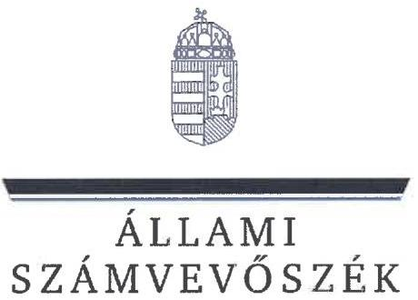
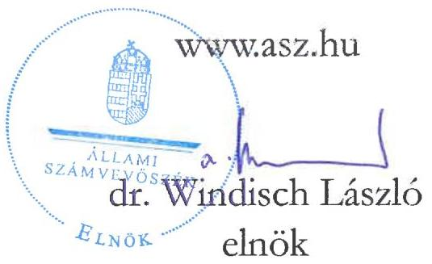
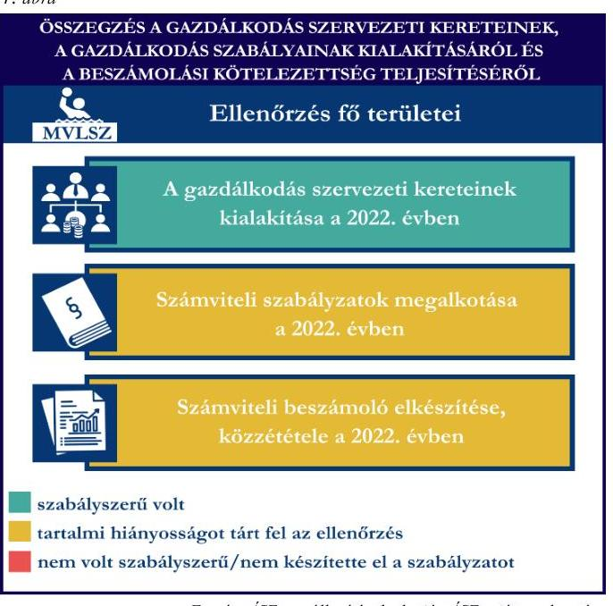
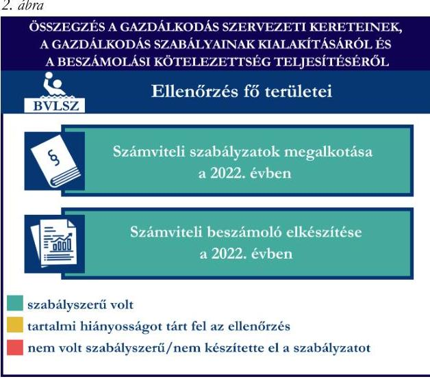
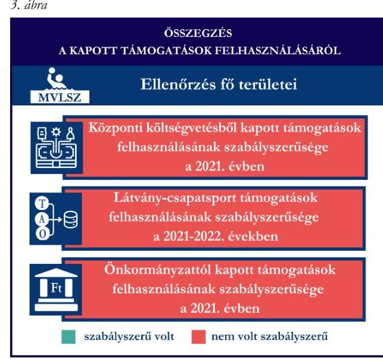
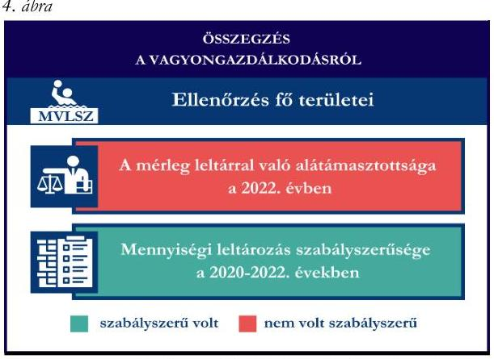

# JELENTÉS 

Támogatásban részesülő sportszövetségek, sportegyesületek és sportvállalkozások gazdálkodásának ellenőrzése

Magyar Vízilabda Szövetség

2025.

---

ÁLLAMI
SZÁMVEVŐSZÉK

# JELENTÉS 

## Támogatásban részesülő sportszövetségek, sportegyesületek és sportvállalkozások gazdálkodásának ellenőrzése

Magyar Vízilabda Szövetség

2025.

25040

---

# ELLENŐRZÉSI IGAZGATÓSÁG: 

## ELLENŐRZÉSI IGAZGATÓSÁG V.

## ELLENŐRZÉSI IGAZGATÓ:

## KLINGA LÁSZLÓ igazgató

## ELLENŐRZÉSVEZETŐ:

## KAKAS SÁNDOR ellenőrzésvezető

Jelentéseink az interneten a www.asz.hu címen olvashatók.

IKTATÓSZÁM: EL-4031-075/2025
TÉMASORSZÁM: 30
ELLENŐRZÉS-AZONOSÍTÓ SZÁM: V1078

---

# TARTALOMJEGYZÉK 

AZ ELLENŐRZÉS ALAPADATAI ..... 5
AZ ELLENŐRZÖTT SZERVEZET ..... 7
ÖSSZEFOGLALÁS ..... 8
AZ ELLENŐRZÉS FÓKUSZTERÜLETEI ..... 11
MEGÁLLAPÍTÁSOK ..... 12
JAVASLATOK ..... 24
MELLÉKLETEK ..... 26
I. sz. melléklet: Értelmező szótár ..... 26
II. sz. melléklet: Az ellenőrzött szervezetek jegyzéke ..... 28
III. sz. melléklet: Fő ellenőrzési kritériumok fő ellenőrzési fókuszterületek szerint ..... 29
FÜGGELÉK: ÉSZREVÉTELEK ..... 31
RÖVIDÍTÉSEK JEGYZÉKE ..... 61

---

.

---

# AZ ELLENŐRZÉS ALAPADATAI 

## AZ ELLENŐRZÉS CÉLJA

Az ellenőrzés célja az államháztartásból nyújtott támogatással, vagy az államháztartásból meghatározott célra ingyenesen juttatott vagyon felhasználásával érintett sportszövetségek, sportegyesületek és sportvállalkozások gazdálkodása szabályozottságának, gazdálkodási tevékenységének, ezen belül a beszámolási kötelezettség teljesítésének, a támogatások elkülönített nyilvántartásának, valamint a támogatások felhasználásának ellenőrzése.

## AZ ELLENŐRZÉS TÍPUSA

Kombinált ellenőrzés.

## AZ ELLENŐRZÖTT IDŐSZAK

Az 1. fókuszterület vonatkozásában a 2022. év.
A 2. fókuszterület vonatkozásában a 2021-2022. évek.
A 3. fókuszterület vonatkozásában a 2021-2022. évek.
A 4. fókuszterület vonatkozásában a 2022. év, a mennyiségi felvétellel történő leltározás dokumentumai tekintetében a 2020-2022. évek.

## AZ ELLENŐRZÉS TÁRGYA

Az ellenőrzés tárgyát képezte a támogatásban részesülő sportszövetség gazdálkodása szabályozottságának, gazdálkodási tevékenységén belül a beszámolási kötelezettség teljesítésének, a vagyonnyilvántartásának, a támogatások elkülönített nyilvántartásának, valamint az államháztartási forrásból származó közvetlen vagy közvetett támogatások és a meghatározott célra ingyenesen juttatott vagyon felhasználásának vizsgálata. Az ellenőrzés a támogatások vonatkozásában kiterjedt továbbá a támogató felé történő beszámolási és elszámolási kötelezettségek teljesítésére, a költségvetésből kapott támogatások továbbadásának szabályszerűségére, az ezekkel kapcsolatos jogszabályi és belső előírások betartására.

Az ellenőrzés kiterjedt minden olyan körülményre és adatra, amely az ÁSZ¹ jogszabályban meghatározott feladatainak teljesítéséhez, valamint az ellenőrzési program végrehajtása során felmerülő újabb összefüggések feltárásához szükséges volt. Az ÁSZ tv.² 25. § (3) bekezdésében meghatározottak alapján, amennyiben a rendelkezésre bocsátott dokumentumok, adatok, illetve tájékoztatás hitelességének, megalapozottságának, teljességének megállapítása vagy egyes ellenőrzési megállapítások alátámasztása, kiegészítése indokolja, az ellenőrzés tárgyát képezhetik az összefüggő tények vizsgálatához más szervezetek (ellenőrzést támogató szervezet) által rendelkezésre bocsátott adatok, dokumentációk, megadott tájékoztatások, illetve az ott végzett ellenőrzés is.

---

# Az ellenőrzés jogalapja 

Az ellenőrzés jogszabályi alapját az ÁSZ tv. 1. § (3) bekezdése, az 5. § (3) bekezdése, valamint a Civil tv.³ 47. § előírásai képezték.

## AZ ELLENŐRZÉS MÓDSZERE

Az ellenőrzést a nemzetközi standardokat irányadónak tekintve az ellenőrzési program szempontjai, az ellenőrzött időszakban hatályos jogszabályok, az ellenőrzés általános szakmai szabályai, az ellenőrzésre irányadó ÁSZ módszertanok figyelembevételével végezte az ÁSZ.

Az ellenőrzési kérdések megválaszolásához szükséges bizonyítékok megszerzése az ellenőrzött szervezet által rendelkezésre bocsátott dokumentumokra, adatokra alapozva kérdésfeltevés (információkérés), interjú, mintavételezés útján történt.

Az ellenőrzési bizonyítékként felhasználható adatforrások közé tartoztak egyrészt az ellenőrzés során az ellenőrzött szervezettől bekért dokumentumok, másrészt adatforrás volt minden további, az ellenőrzés folyamán feltárt, az ellenőrzés szempontjából információt tartalmazó egyéb adatforrás.

A támogatásokkal, azok felhasználásával, a továbbadott támogatásokkal kapcsolatos kötelezettségek vizsgálatára mintavételi eljárások kerültek alkalmazásra. Támogatás-típusok szerint nagyságrend alapján egy darab támogatás képezte a vizsgálat tárgyát. Ezen támogatások felhasználásának szabályszerűsége támogatásonként kockázatértékelés alapján kiválasztott tételekkel került ellenőrzésre. A kiválasztott támogatási szerződésekhez kapcsolódó elszámolásokból 30 db tétel került ellenőrzésre, ahol az elszámolás nem érte el a 30 db -ot, ott tételes ellenőrzésre került sor. Ezen felül a vagyongazdálkodás szabályszerűségének ellenőrzéséhez is kockázatalapú mintavétel kapcsolódott. A támogatások felhasználása és a vagyongazdálkodás területén a tételek ellenőrzése kiterjedt a könyvvezetési kötelezettség vizsgálatára is. A tárgyi eszközök tekintetében 30 db került kiválasztásra a 2022. évben állományban lévő eszközök közül azok nyilvántartásának, elszámolásának szabályszerűsége ellenőrzése céljából. A kiválasztott tételek ellenőrzésének eredménye nem került kivetítésre a teljes sokaságra, a megállapítások az adott ellenőrzött tételek vonatkozásában kerültek megjelenítésre.

---

# AZ ELLENŐRZÖTT SZERVEZET

A Magyar Vízilabda Szövetséget 1989. december 7-én alapították. Az MVLSZ⁴ a Magyarországon működő, a Sport tv.⁵-ben meghatározott, a vízilabda sportág feladatainak ellátására létrehozott, az e sportágban működő sportszervezetekre épülő, tevékenységüket összehangoló, munkájukat segítő és támogató országos sportági szakszövetség.

Az MVLSZ, mint a látvány-csapatsportban működő szakszövetség a Sport tv.-ben meghatározott feladatok ellátása során közigazgatási hatósági hatáskört gyakorol. Az MVLSZ ezen hatáskörén belül egyebek között a Tao tv.⁶-ben meghatározott támogatás igénybevételére jogosult szervezet kérelme esetén dönt a Tao tv.-ben meghatározott támogatás feltételét képező sportfejlesztési program jóváhagyásáról, a támogatás igénybevételére jogosult szervezet kérelme esetén igazolja a támogatások igénybevételére vonatkozó jogosultságot, valamint kiállítja az adókedvezményekre jogosító támogatási igazolást.

Az MVLSZ Alapszabálya⁷ szerinti célja, hogy Magyarország területén irányítja, szervezi és ellenőrzi a vízilabda sportágban folyó tevékenységet, mint közhasznú tevékenységet, közreműködik a sporttörvényben és az egyéb jogszabályokban meghatározott állami sportfeladatok ellátásában, képviseli sportágának és tagjainak érdekeit, valamint részt vesz a nemzetközi sportszervezetek tevékenységében.

Az MVLSZ legfőbb döntéshozó szerve az ellenőrzött időszakban a Közgyűlés volt, törvényes képviseletét – az önálló képviseleti joggal rendelkező – az elnök⁸ látta el. Az ellenőrzött időszakban az elnök személye változott, az elnök² 2022. november 19-től látta el feladatát.

Az MVLSZ a jogszabályi előírások szerint az ellenőrzött időszakban Ellenőrző Testület megnevezéssel felügyelőbizottságot hozott létre.

Az ellenőrzött időszakban az MVLSZ a jogszabályi előírások alapján könyvvizsgálatra kötelezett volt.

Az MVLSZ az ellenőrzött időszakban közhasznú jogállással rendelkezett.

Az MVLSZ az Alapszabálya alapján vállalkozási tevékenységet kizárólag közhasznú céljainak elérése érdekében, azokat nem veszélyeztetve végezhetett. A 2022. évben vállalkozási tevékenységet végzett.

Az MVLSZ az Alapszabályában rögzítettek szerint a 2022. évben rendelkezett önálló jogi személyiségű szervezeti egységgel. Az MVLSZ Alapszabálya alapján a Budapesti Vízilabda Szövetség területi sportági szövetség. A BVLSZ⁹ az ellenőrzött időszakban önálló jogi személyként működött.

1. táblázat

|   | 2021. év | 2022. év  |
| --- | --- | --- |
|  Központi költségvetési támogatás | 1 530,6 | 377,5  |
|  Látvány-csapatsport támogatás | 1 148,5 | 2 591,7  |
|  Helyi önkormányzati támogatás | 2,0 | -  |

*Forrás: Az ellenőrzött szervezet ellenőrzési dokumentumai alapján ÁSZ saját szerkesztés*

---

# ÖSSZEFOGLALÁS 

Magyarország Alaptörvényének XX. cikke kimondja, hogy mindenkinek joga van a testi és lelki egészséghez, melynek érvényesülését Magyarország többek között a sportolás és a rendszeres testedzés támogatásával segíti elő. Az Országgyűlés a Sport tv-ben kinyilvánította, hogy a nemzet közössége a test művelését, a sportot, a nemzet alapértékének, kívánatos célnak tekinti. A sport a közjó része. Erősíti a közösség tagjainak egymáshoz tartozását, miként az egyén testi és lelki egészségét.

A sportegyesületek, sportszövetségek, sportvállalkozások működésükre és szakmai tevékenységük ellátására költségvetési támogatásban, önkormányzati támogatásban, ingyenes vagyonjuttatásban, valamint látvány-csapatsport támogatásban részesülhetnek, amelyekre fokozott figyelem irányul.

A társadalom részéről jogosan felmerülő elvárás, hogy a közpénzeket kezelő, azzal gazdálkodó szervezetek működéséről, tevékenységéről átfogó képet kapjon, a közpénzek rendeltetésszerű és átlátható módon történő felhasználásának értékelésére időről-időre sor kerüljön az ellenőrzések keretében.

Az MVLSZ a könyvviteli szolgáltatás személyi feltételeinek megteremtéséről, a felügyelőbizottság létrehozásáról és működéséről, továbbá beszámolója könyvvizsgálattal való felülvizsgálatáról gondoskodott. Az MVLSZ a jogszabályi előírások szerint kialakította a számviteli politikáját, valamint elkészítette a számviteli szabályzatait, továbbá rendelkezett számlarenddel. A számlarend tekintetében tartalmi hiányosságot tárt fel az ellenőrzés.

Az MVLSZ a közigazgatási hatósági hatáskörének gyakorlása során a 2021. és a 2022. évben a jogszabályi előírásokat figyelmen kívül hagyva hozott döntést látvány-csapatsport támogatási kérelem elbírálása során.

Az MVLSZ könyvvezetési formája a 2022. évben

megfelelt a jogszabályi előírásoknak. A tagdíjak elszámolása a 2022. évben nem volt szabályszerű, mert a tagdíjakat nem egyéb bevételként tartotta nyilván.

Az MVLSZ a 2022. évre elkészítette a Számv. tv. szerinti éves beszámolóját és közhasznúsági mellékletét, azonban a kiegészítő melléklet, illetve az eredménykimutatás tartalmában az ellenőrzés szabálytalanságot állapított meg. A beszámoló letétbe helyezése nem volt szabályszerű, mert a jogszabályi előírások ellenére nem a Közgyűlés által elfogadott 2022. évi éves beszámolót helyezte letétbe.

A gazdálkodás szervezeti keretei kialakításának, a számviteli szabályzatok megalkotásának, valamint a számviteli beszámoló elkészítésének és közzétételének értékelését az 1. ábra mutatja be.

---

Az MVLSZ önálló jogi személyiségű szervezeti egysége a BVLSZ a 2022. évre vonatkozóan a számviteli szabályzatait az előírások szerint elkészítette. A BVLSZ saját döntése alapján felügyelőbizottságot működtetett. A BVLSZ a 2022. évi egyszerűsített beszámolóját a jogszabályi előírások szerint elkészítette és közzétette.

Az MVLSZ önálló jogi személyiségű szervezeti egysége vonatkozásában a számviteli szabályzatok megalkotásának, valamint a számviteli beszámoló elkészítésének értékelését a 2. ábra mutatja be.

*Forrás: ÁSZ megállapítások alapján ÁSZ saját szerkesztés*

Az MVLSZ a 2021. évben a központi költségvetésből kapott támogatást, a 2021. és 2022. évben a látvány-csapatsport támogatást és kiegészítő sportfejlesztési támogatást, valamint a 2021. évben az önkormányzati támogatást az ellenőrzött tételek esetében nem szabályszerűen használta fel. **A központi költségvetési támogatás, a látvány-csapatsport támogatás és az önkormányzati támogatás felhasználása során három partnerrel a közbeszerzési eljárás mellőzésével kötött szerződést. A központi költségvetésből kapott támogatás elszámolásakor olyan bizonylatot is benyújtott a támogató felé, amelyet korábban már más támogatás terhére elszámolt, ami kettős finanszírozásnak minősült. Az MVLSZ a kettős finanszírozás kapcsán feltárt szabálytalanság korrigálása érdekében az ellenőrzés során nyilatkozott, hogy a HM¹⁰, mint támogató felé az összeg visszafizetését kezdeményezte.**

A központi költségvetési támogatás, a látvány-csapatsport és kiegészítő sportfejlesztési támogatás továbbá az önkormányzati támogatás felhasználását a jogszabályi előírás ellenére nem tartotta elkülönítetten nyilván.

Az MVLSZ elnöke az ÁSZ tv. 29. § (2) bekezdés szerinti, a jelentéstervezet megállapításaira tett észrevételében arról tájékoztatta az ÁSZ-t, hogy intézkedést tett az ÁSZ ellenőrzés során felmerült hiányosságok megszüntetése érdekében, mely eredményeképpen a kapott támogatások felhasználása elkülönítetten kerül nyilvántartásra. Az ellenőrzés folyamatában megtett intézkedés hozzájárult az ÁSZ megállapításainak hasznosulásához.

A kapott támogatások felhasználásának értékelését a 3. ábra mutatja be.

Az ellenőrzött időszakban az MVLSZ a költségvetésből kapott támogatást az ellenőrzött tételek vonatkozásában szabályszerűen adta tovább. A továbbadott támogatás vonatkozásában a végső kedvezményezettek elszámolásának ellenőrzése vonatkozásában az ellenőrzés hiányosságot tárt fel.

---

*Forrás: ÁSZ megállapítások alapján ÁSZ saját szerkesztés*

Az MVLSZ vagyongazdálkodása a 2022. évben az ellenőrzött tételek vonatkozásában nem volt szabályszerű, mert a 2022. évi éves beszámolójában a tárgyi eszközök mérlegtételt a leltár nem támasztotta alá. A 2022. évre vonatkozóan a tárgyi eszközök esetében a mennyiségi felvétellel történő leltározást szabályszerűen elvégezte.

Az ellenőrzött tételek esetében a tárgyi eszközök bekerülési értékének meghatározása szabályszerű volt, az eszközök üzembe helyezése és az értékcsökkenés elszámolásával kapcsolatban az ellenőrzés szabálytalanságot tárt fel. A 2022. évi tárgyi eszköz állományban kimutatott, támogatásból beszerzett tárgyi eszköz esetében az ellenőrzés a támogatási céltól eltérő felhasználást állapított meg.

A vagyongazdálkodás értékelését a 4. ábra mutatja be.

# Az ellenőrzés során feltárt súlyos jogszabálysértések

- az
 MVLSZ közigazgatási hatósági hatásköre keretében a látvány-csapatsport támogatáshoz kapcsolódó módosítási és hosszabbítási kérelem szabálytalan elbírálása és döntéshozatala,
- továbbá gépjármű beszerzéshez és hasznosításhoz kapcsolódóan a látvány-csapatsport támogatásnak a jóváhagyott céltól eltérő felhasználása és ezzel a költségvetésnek vagyoni hátrány okozása

miatt az ÁSZ a törvényi kötelezettségének eleget téve az illetékes hatósághoz fordul.

A közbeszerzési eljárások mellőzésével megkötött szerződések okán az ÁSZ a törvényi kötelezettségének eleget téve az illetékes hatósághoz fordult. Az ÁSZ, mint hivatalból kérelmező által benyújtott, jogsértés megállapítását kérő kérelmek közül három esetben a Közbeszerzési Döntőbizottság határozataiban a közbeszerzési eljárások jogtalan mellőzését és a szerződések érvénytelenségét állapította meg és az MVLSZ-szel, mint ajánlatkérővel szemben, mindösszesen 16 M Ft bírságot szabott ki.

---

# AZ ELLENŐRZÉS FÓKUSZTERÜLETEI 

1. A gazdálkodási szabályok kialakítása, a könyvvezetési- és beszámolási kötelezettség teljesítése
2. A kapott támogatások felhasználása
3. A költségvetésből kapott támogatások továbbadása
4. Az ellenőrzött szervezet vagyongazdálkodása

---

# 1. A gazdálkodási szabályok kialakítása, a könyvvezetési- és beszámolási kötelezettség teljesítése 

### 1.1 MAGYAR VÍZILABDA SZÓVETSÉG

Összegző megállapítás

Az MVLSZ a 2022. évre szabályszerűen kialakította a szervezeti kereteit és gazdálkodásának feltételeit, azonban a számlarend tekintetében az ellenőrzés hiányosságot tárt fel. A könyvvezetési kötelezettségét a tagdíj elszámolás kivételével a jogszabályoknak megfelelően teljesítette. A beszámolási kötelezettség teljesítése vonatkozásában az eredménykimutatás és a kiegészítő melléklet tekintetében szabálytalanságot tárt fel az ellenőrzés. A MVLSZ a 2022. évi éves beszámolója letétbe helyezésénél nem tartotta be a jogszabályi előírásokat. A 2021. és 2022. évben az MVLSZ közigazgatási hatósági hatáskörében a jogszabályi előírásokat figyelmen kívül hagyva hozott döntést látványcsapatsport támogatási kérelem elbírálása során.

Az MVLSZ a 2022. évben a Számv. tv. ${ }^{11}$ előírásainak betartásával gondoskodott a könyvviteli szolgáltatás személyi feltételeinek megteremtéséről. A könyvviteli szolgáltatás körébe tartozó feladatok ellátásával 2022. január 1-től olyan számviteli szolgáltatást nyújtó személyt, majd 2022. november 24-től olyan társaságot bízott meg, amelynek a feladat irányításával, vezetésével, a beszámoló elkészítésével megbízott tagja megfelelt a jogszabályi követelményeknek.
Az MVLSZ az ellenőrzött időszakban a jogszabályi előírásoknak megfelelve, az Alapszabályban ${ }_{1,2}$ foglaltakkal összhangban három tagú felügyelőbizottságot működtetett. Az Ellenőrző Testület néven létrehozott felügyelőbizottság a Civil tv. előírásainak megfelelően rendelkezett ügyrenddel.
Az MVLSZ a Sport tv. és a Civilszr. ${ }^{12}$ előírásai szerint a 2022. évi éves beszámolója felülvizsgálatával könyvvizsgálót bízott meg.
Az MVLSZ a 2022. évben rendelkezett a Számv. tv.-ben előírt számviteli politikával ${ }^{13}$, és annak keretében elkészítette az eszközök és a források értékelési szabályzatát ${ }^{14}$, az eszközök és a források leltárkészítési és leltározási szabályzatát ${ }^{15}$ és a pénzkezelési szabályzatot ${ }^{16}$. Az MVLSZ a Számv. tv. szerint a számlarendet ${ }^{17}$, és annak keretében bizonylati rendet elkészítette ${ }^{18}$. A szabályzatok - a számlarend kivételével - az ellenőrzött tartalmi kritériumoknak megfeleltek. A számlarend a Számv. tv. 161. § (2) bekezdés a) pontjában előírtak ellenére nem tartalmazta teljeskörűen minden alkalmazásra kijelölt számla számjelét és megnevezését, továbbá a b) pontjában előírtak ellenére a számlák más számlákkal való kapcsolatát, mert a számlarend részeként rendelkezésre bocsátott számlatükör nem volt összhangban a 2022. évi főkönyvi könyvelésben alkalmazott főkönyvi számokkal (például a „3619 Előírt tartozások értékvesztése" főkönyvi számlára történt könyvelés, azonban ezt a főkönyvi számlát a számlarend nem tartalmazta; a „4567 TAO-COVID" főkönyvi számlára történt könyvelés, azonban a számlarendben „4567 TAO-KIEG." megnevezés szerepelt; a „96761 DJN Kft." főkönyvi számlára történt könyvelés, azonban a számlarendben „96761 CO-OP" megnevezés szerepelt.). Az MVLSZ az országos sportági szakszövetség státuszára figyelemmel megalkotta a Sport tv. előírása szerint a gazdálkodási, pénzügyi szabályzatát ${ }^{19}$.
Az MVLSZ a Számv. tv., a Civil tv., valamint a Civilszr. előírásainak megfelelően a 2022. évben kettős könyvvitelt vezetett. Az MVLSZ a 2022. évben könyvvezetésében a tagdíjak elszámolásánál a Számv. tv. 16. § (3) bekezdésében foglaltakat nem tartotta be, mivel könyvviteli nyilvántartásában a tagdíjakat (1820 E Ft összegben) az egyéb bevételek helyett árbevételként a 911. főkönyvi számlán tartotta nyilván.
Az MVLSZ számviteli nyilvántartásait úgy alakította ki, hogy azok megfeleljenek a támogatások felhasználásának elkülönített nyilvántartására vonatkozó jogszabályi előírásoknak. Az MVLSZ a 2022. évben az alapcél szerinti tevékenységéből, illetve vállalkozási tevékenységéből származó bevételeit és ráfordításait a jogszabályi előírásoknak megfelelően elkülönítetten tartotta nyilván.
A MVLSZ a 2022. évre a Számv. tv. és a Civilszr. szerinti éves beszámolót készített, melyet az Alapszabály ${ }_{1,2}$ rendelkezései alapján az Ellenőrző Testület véleményezett, a Számv. tv. előírásainak megfelelően a könyvvizsgáló felülvizsgált, a Közgyűlés a Ptk. ${ }^{20}$-ban foglaltaknak megfelelően a 9/2023 (05.23.) számú közgyűlési határozattal jóváhagyott. Az MVLSZ a 2022. évre vonatkozó éves beszámolójával egyidejűleg elkészítette a Civil vhr. ${ }^{21}$ melléklete szerinti tartalommal a közhasznúsági mellékletet.
Az MVLSZ a 2022. évi éves beszámoló kiegészítő mellékletében a kapott támogatásokat a Számv. tv. 93. § (3) bekezdésében előírtak ellenére a kapott összeg, annak felhasználása (jogcímenként és évenként), a rendelkezésre álló összeg megbontásban nem mutatta be, valamint közhasznú szervezetként a Civil tv. 29. § (4) bekezdésében foglaltak ellenére nem mutatta be a támogatási program keretében végleges jelleggel felhasznált összegeket támogatásonként. A 2022. évi éves beszámoló eredménykimutatásában a Civilszr. 24. § (2) bekezdésben foglaltak ellenére a tagdíjakat nem az egyéb bevételeken belül mutatta ki, hanem a belföldi értékesítés nettó árbevétele soron.
A 2022. évi éves beszámoló eredménykimutatásának tartalma nem felelt meg a Számv. tv. 80. § (1) bekezdésében előírtaknak, mert az eredménykimutatás VI. Értékcsökkenési leírás megnevezésű soron kimutatott értékcsökkenés állomány olyan eszköz után elszámolt értékcsökkenést is tartalmazott, amely eszközt az MVLSZ szabályszerűen nem helyezett üzembe, mivel a 2021. december 20-án beszerzett 44780 E Ft „streaming szolgáltatáshoz kapcsolódó eszközök" után a Számv. tv. 52. § (1)-(2) bekezdésében foglaltak ellenére a 2022. évre 6493 E Ft értékcsökkenést számoltak el. A nem szabályszerűen elszámolt értékcsökkenés következtében a 2022. évi eredménykimutatásban 6493 E Ft-tal magasabb összegű értékcsökkenés összeg szerepelt, melynek eredményre gyakorolt hatásaként 6493 E Ft-tal több eredményt mutatott ki. A feltárt szabálytalanság részletezését a 4. fókuszterület tartalmazza.
Az MVLSZ a 2022. évi éves beszámolója közzétételénél nem tartotta be a Civil tv. 30. § (1) bekezdésének előírásait, mivel az OBH${ }^{22}$-nál nem a Közgyűlés által jóváhagyott 2022. évi éves beszámolóját tette közzé és helyezte letétbe. Az MVLSZ a 2022. évi éves beszámolót és közhasznúsági mellékletet saját honlapján a jogszabályi előírásoknak megfelelően tette közzé.

---

Az MVLSZ közigazgatási hatósági hatáskörének gyakorlásával összefüggésben az ellenőrzés szabálytalanságot tárt fel. Az MVLSZ, mint látvány-csapatsportban működő szakszövetség közigazgatási hatósági hatáskörének gyakorlása során az SFP/08123/2021/MVLSZ sportfejlesztési program vonatkozásában a 2021. és 2022. évben döntéshozatali eljárásában a támogatás igénybevételére jogosult szervezet részére történő sportfejlesztési program jóváhagyása, valamint a támogatások igénybevételére vonatkozó jogosultság megállapítása tekintetében nem tartotta be a Sport tv. 22. § (2) bekezdés fa) pontjában előírtakat.

Az MVLSZ az OSC Vizilabda Sport Kft. (továbbiakban: OSC Kft.) részére az SFP/08123/2021/MVLSZ számú sportfejlesztési programhoz (továbbiakban: SFP) kapcsolódóan a 2021. és 2022. évben több módosítási kérelemben hozott döntést.
I. Az OSC Kft. 2021. október 20-án nyújtotta be „Tárgyi eszköz beruházás, felújítás (előfinanszírozott ingatlan)" jogcímmel módosítási kérelmét, melyet az MVLSZ TAO Bizottsága 2021. október 25-én tartott ülésén támogatott, továbbá az eljáráshoz igazságügyi szakértő bevonására került sor, mely szakvélemény 2021. november 23-án készült el. A döntéshozatali eljárás során:

- Az MVLSZ 2021. november 25-én kelt határozatában jóváhagyta a módosítási kérelmet 122,7 M Ft összeggel, 2022. június 30-ai teljesítési határidővel, a határozatában kitért arra, hogy a döntéshozatal során a TAO Bizottság 2021. július 12-én megtartott ülésén és 2021. október 25-én történt elektronikus úton hozott sportszakmai álláspontja alapulvételével került sor. Az SFP jóváhagyásra került annak ellenére, hogy a vonatkozó szakvélemény is kimondta, hogy a Nyéki Imre Uszoda kültéri medencéjének sátorfedése kapcsán komplett kivitelezési dokumentációt kell még készíteni, mivel az a szakvélemény készítésének időszakában még nem állt rendelkezésre.
- Az MVLSZ felé az SFP jóváhagyási eljárás során a sátorfedéssel kapcsolatosan az OSC Kft. 3 db árajánlatot csatolt, melyek között ajánlattevőként nem szerepelt az a vállalkozás, amellyel a beruházás kivitelezésére szerződést kötött, tehát az OSC Kft. nem az árajánlatokat küldő cégek egyikével kötött szerződést, hanem más vállalkozással, melynek tényét a kérelem elbírálása során az MVLSZ nem vizsgálta. Az MVLSZ az OSC Kft. második, 2023. augusztus 14-én beadott hosszabbítási kérelme elbírálása során a 2023. október 27-én kelt határozatában 2024. június 30-ig terjedő határidő hosszabbítást engedélyezett az SFP megvalósítására.
II. Az OSC Kft. 2022. november 9-én olyan - a támogatás mértékének 70%-ról 100%-ra való növelésére irányuló - módosítási kérelmet adott be a „Tárgyi eszköz beruházás, felújítás (előfinanszírozott ingatlan)" jogcímet érintően, amely a támogatás összegének 163,9 M Ft-ra történő növelésével is járt. A döntéshozatali eljárás során:
- A támogatás mértéke növelésének jóváhagyására vonatkozó MVLSZ határozat az elnök ${ }_{1}$ aláírásával 2022. november 9-én, tehát a módosítási kérelem beadásának napján kelt. Az adott ügyben a TAO Bizottság döntése volt szükséges, az elektronikus szavazás szavazólapjainak megküldésére nyitva álló időszak 2022. november 8. - 2022. november 12. közötti időszak volt, annak ellenére, hogy a módosítási kérelem csak 2022. november 9-én került beadásra az EKR rendszeren keresztül. A TAO Bizottság 9 tagjából 5 személy már 2022. november 8-án, még a módosítási kérelem benyújtását megelőzően, 3 tag 2022. november 9-én, a módosítási kérelem benyújtásának napján, míg mindössze egy személy 2022. november 10-én, a módosítási kérelem benyújtását követően adta le a szavazatát.

---

A cégnyilvántartás adatai szerint a módosítási kérelem beadása és elbírálása időszakában, 2022. október 24-től az OSC Kft.-vel szemben NAV általi végrehajtás volt folyamatban, így a módosítási kérelemben az OSC Kft. ügyvezetője e tekintetben valótlan tartalmú nyilatkozatot tett és 2022. augusztus havi köztartozásmentességi igazolást csatolt a 2022. november 9-én benyújtott kérelmének részeként. Az MVLSZ a módosítási kérelem jóváhagyása során nem vizsgálta a 107/2011. (VI. 30.) Korm. rendelet 4. § (3) bekezdés a) pontja alapján a köztartozásmentességet, ezért az OSC Kft. részére úgy hagyta jóvá a támogatási összeg kérelem szerinti növelését, hogy közben az OSC Kft.-vel szemben NAV általi végrehajtás volt folyamatban. A jóváhagyás során az MVLSZ mulasztása azt eredményezte, hogy az OSC Kft. ugyan nem felelt meg 107/2011. (VI. 30.) Korm. rendelet 4. § (3) bekezdés a) pontja szerinti feltételnek, mégis 107/2011. (VI. 30.) Korm. rendelet 4. § (6) bekezdés ellenére jóváhagyásra került a támogatás módosítási kérelme. Az ellenőrzés által a támogatás hosszabbítási kérelem MVLSZ által történő elbírálása és döntéshozatal körülményei során feltárt szabálytalanságok nyomán felmerült bűncselekmények gyanúja miatt az ÁSZ törvényi
 kötelezettségének eleget téve az illetékes hatósághoz fordul.

# 1.2 Budapesti Vízilabda Szövetség 

## Összegző megállapítás A BVLSZ a 2022. évre vonatkozóan a gazdálkodási szabályokat a jogszabályi előírások szerint kialakította, a beszámolási kötelezettségét szabályszerűen teljesítette.

A BVLSZ a 2022. évben rendelkezett a Számv. tv.-ben előírt számviteli politikával ${ }^{23}$, az eszközök és a források értékelési szabályzatával ${ }^{24}$, az eszközök és a források leltárkészítési és leltározási szabályzatával ${ }^{25}$, pénzkezelési szabályzattal ${ }^{26}$. A szabályzatok az ellenőrzött kritériumoknak megfeleltek.
A BVLSZ a 2022. évben a Civilszr. előírása szerinti egyszeres könyvvitelt vezetett, egyszerűsített beszámolóját a jogszabályi előírásoknak megfelelően elkészítette, amelyet a saját előírása szerint létrehozott felügyelőbizottság véleményezett. A 2022. évre vonatkozó egyszerűsített beszámolót a BVLSZ legfőbb döntéshozó szerve, a Klubgyűlés ${ }^{27}$ a Civil tv.-nek megfelelően jóváhagyta. A BVLSZ a 2022. évi egyszerűsített beszámolóját, valamint közhasznúsági mellékletét a Civil tv.-nek megfelelően letétbe helyezte.

---

# 2. A kapott támogatások felhasználása 

Összegző megállapítás

Az MVLSZ a 2021. évben a költségvetési támogatást, a 2021–2022. évben a látvány-csapatsport és kiegészítő sportfejlesztési támogatást, továbbá a 2021. évben az önkormányzati támogatást az ellenőrzött tételek esetében nem szabályszerűen használta fel, mert a támogatások felhasználása során a beszerzések egy részénél a törvényi előírás ellenére a közbeszerzési eljárást nem folytatta le. A központi költségvetési támogatás felhasználásánál olyan bizonylatot számolt el, melyet korábban már más támogatás terhére elszámolt, amely kettős finanszírozásnak minősül. A központi költségvetési támogatás, a látvány-csapatsport és kiegészítő sportfejlesztési támogatás, továbbá az önkormányzati támogatás felhasználásáról vezetett elkülönített nyilvántartás nem volt szabályszerű.

## Központi költségvetési támogatás:

Az MVLSZ az EMMI IX/4199-2/2021. SPORTFEJL. számú támogatói okirattal a 2021. évben 600 000 E Ft összegű központi költségvetési támogatásban részesült, melyet könyvvezetésében a Számv. tv. előírásai szerint az egyéb bevételek között elkülönítve tartott nyilván. A támogatói okiratot az MVLSZ kezdeményezésére, annak tartalmára való tekintettel 2022. évben módosították, a IX/13783/2022. számú módosított támogatói okiratban az elszámolás határidejét 2022. április 30-ra módosították. Az MVLSZ az EMMI IX/4199-2/2021. SPORTFEJL. számú támogatás felhasználásáról az EMMI ${ }^{28}$ felé benyújtott szakmai és pénzügyi beszámolóval, összesített elszámolási táblázattal, valamint a harmadik személy által felhasznált támogatásról benyújtott elszámolások összesítőjével a 27/2013. (III.29.) EMMI rendeletben ${ }^{29}$ és a támogatói okiratban előírt formában és tartalommal a módosított határidőt betartva teljesítette, melyet a támogató elfogadott, visszafizetési kötelezettséget nem állapított meg.

Az MVLSZ a számára nyújtott EMMI IX/4199-2/2021. SPORTFEJL. számú sportfejlesztési támogatásról a 474/2016. Korm. rendelet 24. § (2) bekezdésének és a támogatói okirat 5.6.3. pontjának előírása szerinti elszámolását nem megfelelően nyújtotta be a támogató felé, mivel az elszámoláshoz egy tétel (,LED telepítés, üzemeltetés - Komjádi Kupa") esetében olyan számlát nyújtott be, amely nem volt elszámolható a sportfejlesztési támogatás terhére, mivel az EMMI felé korábban már más támogatási program keretében elszámolásra került. Ez kettős finanszírozásnak minősült.
Az EMMI IX/4199-2/2021. SPORTFEJL. számú elszámolás és az EMMI SFP-000307/2018. számú központi költségvetési támogatás elszámolásához kapcsolódó számlaösszesítő adatainak összevetését követően megállapításra került, hogy az EMMI IX/4199-2/2021. SPORTFEJL. számú sportfejlesztési támogatás keretében elszámolt egy db tétel 4 508 500 Ft összegben, az EMMI SFP-000307/2018. számú támogatás terhére korábban már benyújtásra került.
Az elnök ${ }_{2}$ - az ÁSZ-hoz 2024. május 15-én, az ellenőrzés ideje alatt benyújtott nyilatkozata szerint - a szabálytalanság feltárását követően a kettős elszámolással kapcsolatban tájékoztatta a HM-t, az utóellenőrzést és a tétel visszafizetését kezdeményezte.

---

Az MVLSZ esetében a központi költségvetésből kapott támogatás ellenőrzött tételeinek (30 db) vonatkozásában az ÁSZ az alábbiakat állapította meg:

- a tételek számviteli elszámolását a Számv. tv.-ben előírtak szerint bizonylatokkal alátámasztották;
- a 474/2016. Korm. rendeletben ${ }^{30}$ foglaltaknak megfelelően a támogatás tételek tartalma (gazdasági esemény) - egy tétel kivételével - megfelelt a támogatói okiratban előírt támogatott tevékenység megvalósításához kapcsolódó költségtervben meghatározott költségnek. A kivétel tétel (,LED telepítés, üzemeltetés - Komjádi Kupa, 4 508 500 Ft) vonatkozásában, mivel a benyújtott bizonylat korábban már elszámolásra került az SFP-000307/2018 EMMI központi költségvetési támogatás terhére, így a tétel az EMMI IX/4199-2/2021. SPORTFEJL támogatás keretében történő felhasználása a támogatás céljának nem volt megfeleltethető, a felhasználás nem volt jogszerű, nem felelt meg a 474/2016. Korm. rendelet 24. § (2) bekezdésének;
- a támogatói okiratban foglaltaknak megfelelően a tételek teljesítése és pénzügyi rendezése - egy tétel kivételével - a támogatói okiratban meghatározott időtartamon belül történt. A kivételt képező tétel esetén az eltérés a második bekezdésben részletezésre került;
- a tételekhez kapcsolódó számviteli bizonylatokat - egy tétel kivételével - a 27/2013. (III.29.) EMMI rendeletben és támogatói okirat 6.5.2. pontjának megfelelően ellátták záradékkal, amelyben jelezték, hogy a számviteli bizonylaton szereplő összegből mennyit számolt el a hivatkozott támogatói okirat terhére. A kivétel tétel (,LED telepítés, üzemeltetés - Komjádi Kupa" 4 508 500 Ft) esetében a benyújtott bizonylat korábban már elszámolásra került az SFP-000307/2018 EMMI. számú központi költségvetési támogatás terhére, így tétel a 27/2013. (III.29.) EMMI rendelet 18. § (2) bekezdésében előírtak szerinti záradékolásnak nem felelt meg;
- a hivatkozott támogatói okirat terhére a számviteli bizonylaton záradékolt összeg - egy tétel kivételével - a támogatói okirat 6.5.1. b) alpontjában előírtak szerint megegyezett a számlaösszesítőben feltüntetett értékkel. A kivételt képező tétel esetén az eltérés a második bekezdésben részletezésre került;
- a számviteli bizonylatokon elszámolt/záradékolt összegek - egy tétel kivételével - elkülönített nyilvántartása nem felelt meg a Civil tv. 20. § (4) bekezdésében és a támogatói okirat 6.3. pontjában előírtaknak, mert a rendelkezésre bocsátott nyilvántartásban szereplő kiadási tételekhez főkönyvi számlaszámot nem rendeltek, ezért az elkülönített nyilvántartás főkönyvi nyilvántartással való egyezősége nem volt megállapítható;
- a tételek számviteli bizonylatának az EMMI IX/4199-2/2021. támogatói okirat terhére elszámolt összege a Számv. tv.-ben előírtak szerint tartalmának megfelelő főkönyvi számra került elszámolásra;
- egy tétel esetében a támogatói okirat 6.10. pontjában foglaltak ellenére a támogatásból 2021. december 20-án beszerzett „streaming szolgáltatáshoz kapcsolódó eszközök" megnevezésű 44 780 E Ft összegű tétel tárgyi eszközt 2021. december 31-én aktiválták annak ellenére, hogy az eszköz ténylegesen nem került üzembe helyezésre, azt tárolási nyilatkozat alapján a szállító vállalkozás székhelyén, illetve telephelyén tárolták, ezzel olyan eszköz beszerzésére fordított támogatással számoltak el, amely eszköz az elszámolás időpontjáig szabályszerűen nem került üzembe helyezésre. A feltárt szabálytalanság részletezését a 4. fókuszkérdés tartalmazza;
- három tétel (,streaming szolgáltatáshoz kapcsolódó eszközök" 44 780 E Ft; „Munkaruha vásárlás - játékvezetők részére" 8916 E Ft; „Munkaruha vásárlás - ellenőrök részére" 1084 E Ft) esetében a támogatás terhére elszámolt kiadások esetében a beszerzésre vonatkozó szerződés megkötése során nem tartották be a Kbt. ${ }^{31}$ 15. § (1) bekezdés b) pontjára, valamint a Kbt. 21. § (1) bekezdésére tekintettel a Kbt. 4. § (1) bekezdését. A közbeszerzési eljárás mellőzése kapcsán feltárt jogszabálysértés részletezését a jelentés 20. oldalán lévő keretes rész tartalmazza.

# Látvány-csapatsport és kiegészítő sportfejlesztési támogatás: 

Az MVLSZ részére a ki/JH01-607/2021/EMMI sportfejlesztési program alapján 1 918 687 E Ft támogatást hagytak jóvá. A sportfejlesztési program módosítására az ellenőrzött időszakon belül egy alkalommal, a jogcímek közötti módosításra tekintettel került sor, továbbá egy alkalommal határidő hosszabbításra került sor.
Az MVLSZ a látvány-csapatsport támogatások esetében a 2021-2022. években nem tett eleget a 107/2011. (VI. 30.) Korm. rendelet ${ }^{32}$ 11. § (2) bekezdésében foglaltaknak, mert a támogatás felhasználásáról negyedévente az előrehaladási jelentést nem nyújtotta be.
Az MVLSZ a sportfejlesztési program alapján kapott látvány-csapatsport támogatás és kiegészítő sportfejlesztési támogatás felhasználásáról a 107/2011. (VI. 30.) Korm. rendeletnek megfelelően záradékolt számviteli bizonylatokkal alátámasztott módon, összesített elszámolási táblázattal és szöveges szakmai beszámolóval, könyvvizsgálói hitelesítéssel az előírt határidőben benyújtotta az elszámolást a támogató felé. A könyvvizsgáló a jogszabályban előírt felelősségbiztosítással rendelkezett.
Az MVLSZ a 2021-2022. években a számára nyújtott látvány-csapatsport támogatást és kiegészítő sportfejlesztési támogatást a Számv. tv. előírásai szerint az egyéb bevételek között mutatta ki.
Az MVLSZ az ellenőrzött időszakban rendelkezett a sportfejlesztési támogatás felhasználásának elkülönített nyilvántartásával, azonban az nem felelt meg teljeskörűen a 107/2011. (VI. 30.) Korm. rendelet 9. § (9) bekezdésben előírt rendelkezéseknek, mivel a nyilvántartás nem minden elszámolt sportfejlesztési támogatás tételt tartalmazott.
Az MVLSZ esetében a látvány-csapatsport támogatás és kiegészítő sportfejlesztési támogatás ellenőrzött tételeinek (30-30 darab) vonatkozásában az ÁSZ az alábbiakat állapította meg:

- a tételek számviteli elszámolását a Számv. tv.-ben és a 107/2011. (VI. 30.) Korm. rendeletben előírtak szerint bizonylatokkal alátámasztották;
- a 107/2011. (VI. 30.) Korm. rendeletben foglaltaknak megfelelően a tételek tartalma (gazdasági esemény) és összege alapján a támogatási igazolásban meghatározottak szerinti jogcímre, az abban meghatározott mértékben használták fel;
- a tételek számviteli bizonylatai alapján a gazdasági események a támogatási időszak végéig szerződés szerint teljesültek, a pénzügyi rendezés az elszámolás benyújtására nyitva álló határidőig a támogatási jogcímnek megfelelő pénzforgalmi számláról megtörtént;
- a tételek számviteli bizonylatait a 107/2011. (VI. 30.) Korm. rendeletben foglaltaknak megfelelően ellátták záradékkal;
- a számviteli bizonylatokon záradékolt összegek megegyeztek a számlaösszesítőben feltüntetett értékekkel;
- a tételek számviteli bizonylatának az adott sportfejlesztési program terhére záradékolt összegei a Számv. tv.-ben előírtak szerint a tartalmuknak megfelelő főkönyvi számra kerültek elszámolásra;

---

- négy látvány-csapatsport támogatás tétel esetében (,női és férfi válogatott sportruházat" 6175 E Ft; „sapkaszett" 1265 E Ft; „UP sportfelszerelés" 12 691 E Ft; „maszk" 251 E Ft) és egy kiegészítő sportfejlesztési támogatás tétel („sportfelszerelés" 14 024 E Ft) esetében a támogatás terhére elszámolt kiadások vonatkozásában a beszerzésre vonatkozó szerződés megkötése során nem tartották be a Kbt. 15. § (1) bekezdés b) pontjára, valamint a Kbt. 21. § (1) bekezdésére tekintettel a Kbt. 4. § (1) bekezdését. A közbeszerzési eljárás mellőzése kapcsán feltárt jogszabálysértés részletezését a jelentés 20. oldalán lévő keretes rész tartalmazza.

# Önkormányzati támogatás: 

Az MVLSZ a 2021. évben „FINA Férfi vizilabda Világliga 2021. évi kvalifikációs tornájának teljes körű lebonyolítására" jogcímen támogatási szerződés alapján a számára 2 M Ft összegben juttatott önkormányzati támogatás bevételeit a Számv. tv. előírásai szerint egyéb bevételei között elkülönítve tartotta nyilván.
Az MVLSZ a támogatás felhasználásáról az Áht. ${ }^{33}$-ban és a támogatási szerződésben előírtak szerint beszámoló és számviteli bizonylatok benyújtásával az előírt határidőben elszámolt, melyet a támogató önkormányzat elfogadott.
Az MVLSZ esetében az önkormányzati támogatás ellenőrzött tétel vonatkozásában (1 db) az ÁSZ az alábbiakat állapította meg:

- a tétel számviteli elszámolását a Számv. tv.-ben előírtak szerint bizonylatokkal alátámasztották;
- az Ávr. ${ }^{34}$-ben foglaltaknak megfelelően a tétel teljesítése és pénzügyi rendezése a támogatási szerződésben meghatározott támogatott tevékenység időtartamán belül történt;
- a tétel számviteli bizonylatát az Ávr. és a támogatási szerződés előírása szerint záradékkal látták el, a bizonylaton záradékolt összeg megegyezett az elszámolási
 összesítőben szereplő értékkel;
- a támogatási szerződésben előírtak ellenére a tétel elkülönített nyilvántartása nem valósult meg, mert a főkönyvi könyvelésben nem szerepelt az önkormányzattól kapott támogatás felhasználás elkülönítésére használt kód;
- a tétel számviteli bizonylatának a támogatás terhére záradékolt összege a Számv. tv.-ben előírtak szerinti, tartalmának megfelelő főkönyvi számra került elszámolásra;
- a tétel esetében a támogatás terhére elszámolt kiadások vonatkozásában a beszerzésre vonatkozó szerződés megkötése során nem tartották be a Kbt. 19. § 2. (2) és (3) bekezdésére, valamint a Kbt. 21. § (1) bekezdésére tekintettel a Kbt. 4. § (1) bekezdését. A közbeszerzési eljárás mellőzése kapcsán feltárt jogszabálysértés részletezését a jelentés 20. oldalán lévő keretes rész tartalmazza.

---

I. Az MVLSZ, mint ajánlatkérő 2020. szeptember 11-én és 2022. március 17-én szerződést kötött a Breitling Sport Kft-vel, a beszerzés tárgya Sportruházat beszerzésére kötött keretszerződés. A 2020.09.11-én létrejött keretszerződés alapján a beszerző a kérelmezett részére mindösszesen legalább nettó 16 048 670 Ft-ot fizetett meg, továbbá a 2022.03.17-én létrejött keretszerződés alapján a beszerző a kérelmezett részére mindösszesen legalább nettó 15 156 331 Ft összegben teljesített kifizetést. Az ellenőrzés során az ÁSZ megállapította, hogy az MVLSZ a beszerzés során közbeszerzési eljárást nem folytatott le, ezért törvényi kötelezettségének eleget téve a Közbeszerzési Hatósághoz fordult.
A Közbeszerzési Döntőbizottság D.688/5/2024. számú határozatában megállapította, hogy az MVLSZ megsértette a Kbt. 15. § (1) bekezdés b) pontjára, valamint a Kbt. 21.§ (1) bekezdésére tekintettel a Kbt. 4. § (1) bekezdését. A Közbeszerzési Döntőbizottság az ajánlatkérő MVLSZ-re 2 000 000 Ft, a szerződés érvénytelensége jogkövetkezményeként az ajánlatkérővel szemben további 1 000 000 Ft bírságot szabott ki.
II. Az MVLSZ, mint ajánlatkérő 2021. december 20-án szerződést kötött a Venture CO Technology Kft-vel, - korábbi nevén: Farkas és Vezér Gamer Kft. - a beszerzés tárgya „Streaming szolgáltatáshoz kapcsolódó eszközök beszerzése", nettó 35 259 838 Ft értékben. Az ÁSZ az ellenőrzés során megállapította, hogy az MVLSZ a beszerzés során közbeszerzési eljárást nem folytatott le, ezért törvényi kötelezettségének eleget téve a Közbeszerzési Hatósághoz fordult.
A Közbeszerzési Döntőbizottság D.689/6/2024. számú határozatában megállapította, hogy az MVLSZ megsértette a Kbt. 15. § (1) bekezdés b) pontjára, valamint a Kbt. 21. § (1) bekezdésére tekintettel a Kbt. 4. § (1) bekezdését. A Közbeszerzési Döntőbizottság az ajánlatkérő MVLSZ-re 2 000 000 Ft, a szerződés érvénytelensége jogkövetkezményeként az ajánlatkérővel szemben további 1 000 000 Ft bírságot szabott ki.
III. Az MVLSZ, mint ajánlatkérő szerződést kötött a GÉPBÉR-Színpad Kft.-vel,

- „Világliga mérközések / Debrecen (LED üzemeltetés)" 2021. január 6. és 2021. január 11. között; „Világliga mérközések (Led perimeter telepítés, üzemeltetés, $2 \times 25$ dobogó építés, $1 \text{ db } 8 \times 2$ m-es TV dobogó, $2 \times 25$ m bírói dobogó, 25 fm kamera és zsűri dobogó, hangosítás és eredményjelző biztosítása Tüskecsarnok Világliga)" 2021. március 24. és 2021. március 28. között;
- „U15 Európa Bajnokság mérközésein (Led perimeter telepítés, üzemeltetés, $2 \times 25$ dobogó építés, hangosítás és eredményjelző biztosítása Szentesi Városi uszoda)" 2021. június 24. és 2021. július 4. között;
- „BENU & Seat Kupa mérközésein (Led Perimeter telepítés, üzemeltetés, $2 \times 25 \mathrm{~m}$ dobogó építés, hangosítás és eredményjelző biztosítása Budapest Margitsziget)" 2021. július 2. és 2021. július 7. között"
tárgyú beszerzések kapcsán, mindösszesen nettó 97 344 000 Ft értékben. Az ÁSZ az ellenőrzés során megállapította, hogy az MVLSZ a beszerzés során közbeszerzési eljárást nem folytatott le, ezért törvényi kötelezettségének eleget téve a Közbeszerzési Hatósághoz fordult.
A Közbeszerzési Döntőbizottság D.693/8/2024. számú határozatában megállapította, hogy az MVLSZ megsértette a közbeszerzésekről szóló Kbt. 19. § (2) és (3) bekezdésére, valamint a Kbt. 21. § (1) bekezdésére tekintettel a Kbt. 4. § (1) bekezdését. A Közbeszerzési Döntőbizottság az ajánlatkérő MVLSZ-re 5 000 000 Ft, a szerződés érvénytelensége jogkövetkezményeként az ajánlatkérővel szemben további 5 000 000 Ft bírságot szabott ki.

---

# 3. A költségvetésből kapott támogatások továbbadása 

Összegző megállapítás Az MVLSZ a 2022. évben a költségvetésből kapott támogatást az ellenőrzött tételek vonatkozásában szabályszerűen adta tovább. A továbbadott támogatás tételek közül egy esetben a végső kedvezményezett szervezet elszámolásának ellenőrzését az előírások ellenére nem végezte el.

Az MVLSZ a 2022. évben a IX/4199-2/2021. SPORTFEJL számú támogatási szerződés alapján igénybe vett támogatott program keretén belül „COVID 19 járvánnyal összefüggő átmeneti támogatás" jogcímen összesen 19 db sportegyesület és sportvállalkozás részére 220 MFt összegben adott tovább költségvetésből kapott támogatást.
Az MVLSZ a nyilvántartási rendszerét az előírások szerint úgy alakította ki, hogy abból a továbbutalási céllal kapott támogatásokkal kapcsolatos információk rendelkezésre álltak.
Az MVLSZ a Civilszr. rendelkezéseinek megfelelően a továbbutalási céllal kapott támogatást az egyéb bevételek között mutatta ki, a támogatás továbbadott összegét az egyéb ráfordítások között tartotta nyilván.
Az MVLSZ a 2022. évi közhasznúsági mellékletében a továbbadott támogatást a Civil tv.-ben előírtaknak megfelelően mutatta be a cél szerinti juttatások között.
Az MVLSZ esetében a központi költségvetésből kapott és továbbadott támogatás ellenőrzött tételeinek (3 db) vonatkozásában az ÁSZ az alábbiakat állapította meg:

- az MVLSZ az ellenőrzött tételek vonatkozásában a 474/2016. (XII. 27.) Korm. rendeletnek megfelelően határozta meg a végső kedvezményezett általi beszámoló benyújtásának határidejét;
- az MVLSZ a 474/2016. (XII. 27.) Korm. rendeletben, valamint a 27/2013. (III. 29.) EMMI rendelet $^{35}$ előírt tartalommal elszámoltatta a támogatás végső kedvezményezettjeit a költségvetési támogatás felhasználásáról összesített elszámolási táblázat benyújtásával;
- az MVLSZ a 474/2016. (XII. 27.) Korm. rendelet 24. § (2) bekezdésében előírt ellenőrzési kötelezettségének az ellenőrzés megkezdéséig az Egri Vízilabda Kft., mint végső kedvezményezett által benyújtott támogatás elszámolás kapcsán nem tett eleget, a további tételek vonatkozásában a végső kedvezményezett elszámolását ellenőrizte.

## 4. Az ellenőrzött szervezet vagyongazdálkodása

## Összegző megállapítás Az MVLSZ vagyongazdálkodása a 2022. évben nem volt szabályszerű.

Az MVLSZ a 2022. évi éves beszámoló mérlegét a Számv. tv. 69. § (1)-(2) bekezdésének előírása ellenére leltárral teljeskörűen nem támasztotta alá, mert a 2022. évi tárgyi eszköz leltárban 400 E Ft-tal kevesebb összeg szerepelt, mint a 2022. évi mérleg tárgyi eszköz soron.
A Számv. tv. előírásaival összhangban a 2022. évre vonatkozóan a mennyiségi felvétellel történő leltározást elvégezte.

---

Az MVLSZ esetében a tárgyi eszköz ellenőrzött tételek (30 db) vonatkozásában az ÁSZ az alábbiakat állapította meg:

- a tételek bekerülési értékét a Számv. tv.-nek megfelelően bizonylattal alátámasztották;
- a tárgyi eszközök számviteli besorolása, az üzembe helyezés tényének és időpontjának hitelt érdemlő dokumentálása továbbá az értékcsökkenés elszámolása - egy tétel kivételével - a Számv. tv.-nek megfelelően történt. A kivétel tétel a MVLSZ 2022. december 31-i tárgyi eszköz állományában kimutatott, a IX/4199-2/2021/SPORTFEJL számú „EMMI-COVID19" elnevezésű támogatásból 2021. december 20-án 44 780 E Ft értékben beszerzett „streaming szolgáltatáshoz kapcsolódó eszközök" megnevezésű, tárgyi eszköz, melyet 2021. december 31-én a Számv. tv. 52. § (2) bekezdésében előírtak ellenére aktiváltak annak ellenére, hogy az eszköz ténylegesen nem került üzembe helyezésre, mert azt a 2021. december 31-én kelt tárolási nyilatkozat alapján a szállító vállalkozás székhelyén, illetve telephelyén tárolták, a tényleges használatba vétel 2024. március 12-én valósult meg. (Az MVLSZ elnökének 2024. június 19-i nyilatkozata szerint az eszközök beüzemeltetése és a betanítás nem került elvégzésre, mivel azok nagy része bontatlan csomagolásban volt megtalálható a MVLSZ székházában, továbbá megállapították, hogy az eszközök közül öt tétel (összesen: 1194 E Ft értékben) nem került leszállításra, valamint öt szoftver szintén nem került leszállításra, beüzemeltetésre.) A rendeltetésszerűen használatba nem vett „streaming szolgáltatáshoz kapcsolódó eszközök" megnevezésű eszközt a Számv. tv. 26. § (1) bekezdésében foglaltak ellenére a mérlegben a tárgyi eszközök között mutatták ki, továbbá az eszközök után a Számv. tv. 52. § (2) bekezdésében foglaltak ellenére a 2022. évre 6493 E Ft értékcsökkenést számoltak el. Az MVLSZ a nem szabályszerűen elszámolt értékcsökkenés következtében a 2022. évi éves beszámolójának eredménykimutatásban a Számv. tv. 80. § (1) bekezdésében előírtak ellenére 6493 E Ft-tal magasabb összegű értékcsökkenést mutatott ki. Az MVLSZ a „streaming szolgáltatáshoz kapcsolódó eszközök" megnevezésű eszköz beszerzése során megsértette a Kbt. 15. § (1) bekezdés b) pontjában, valamint a Kbt. 21. § (1) bekezdésére tekintettel a Kbt. 4. § (1) bekezdésében, továbbá a IX/4199-2/2021/SPORTFEJL számú támogatói okirat 10.5. pontjában foglaltakat. (A közbeszerzési eljárás mellőzése kapcsán feltárt jogszabálysértés részletezését a jelentés 20. oldalán lévő keretes rész tartalmazza.)
- a támogatásból megvalósult 10 db tétel esetén a tárgyi eszköz bekerülési értékét meghatározó számviteli bizonylatokat ellátták záradékkal, amelyből kiderül, hogy a számviteli bizonylaton szereplő összegből mennyit számoltak el a hivatkozott támogatás terhére;
- egy 2022. évben selejtezésre került 400 E Ft könyv szerinti értékű tárgyi eszközt (,festmény") az eszközök és a források leltárkészítési és leltározási szabályzat C.1.6.3. pontjában foglaltak ellenére a 147. Festmények főkönyvi számla állományából nem vezettek ki. Ezáltal az MVLSZ a 2022. évi könyvvitelében a Számv. tv. 15. § (3) bekezdésében rögzített valódiság elve sérült, mert a 2022. évi tárgyi eszköz nyilvántartásában, ezáltal a könyvvitelében és a mérlegben olyan tárgyi eszközt szerepeltetett, amely a valóságban nem volt fellelhető, megléte nem volt bizonyítható, kívülállók által nem volt megállapítható. Az MVLSZ 2022. évi éves beszámoló mérlegében nem szabályszerűen kimutatott 400 E Ft összegű tárgyi eszköz (,festmény"), továbbá a „streaming szolgáltatáshoz kapcsolódó eszközök" nem szabályszerű amortizációjának elszámolása következtében feltárt 6493 E Ft összegű hiba együttesen a 2022. évi mérlegfőösszeg (14 369 630 E Ft) 2%-át nem érte el, jelentős összegű hiba nem keletkezett.

---

- egy látvány-csapatsporttámogatásból beszerzett tétel („Mercedes-Benz Tourismo 15 RHD Autóbusz") esetében a gépjármű bérbeadásával, és üzembentartói jogának átruházásával az ellenőrzött szervezet megsértette a Tao tv. 22/C. § (1) bekezdését, ezáltal a költségvetésből származó pénzeszközt a jóváhagyott céltól eltérően használta fel.

Az MVLSZ 2022. december 31-i tárgyi eszköz állományában lévő, 2019. június 28-án 92 739 182 Ft összegben vásárolt „Mercedes-Benz Tourismo 15 RHD Autóbusz" gépjármű beszerzése az SFP-00207/2017/EMMI. számú sportfejlesztési program alapján kapott támogatásból valósult meg. Az MVLSZ a gépjármű hasznosítására 2020. augusztus 18-án egy személyszállítással foglalkozó vállalkozással (továbbiakban: vállalkozás) szerződéses jogviszonyt létesített, egyrészt az MVLSZ sportolóinak szállítása céljából „megbizási keretszerződés", másrészt az autóbusz bérbeadása céljából „gépjármű bérleti szerződés" megkötése tárgyában, mely szerződések alapján a gépjármű üzembentartói joga a vállalkozás részére bejegyzésre került, továbbá az autóbusz üzemeltetésével kapcsolatos költségek viselését a szerződésekben kikötötték.

A 2021. és 2022. évben az autóbuszt az MVLSZ személyszállítás céljából négy alkalommal, mindösszesen csak 3330 km futásra vette igénybe, mely szolgáltatás után a vállalkozás részére 315 Ft/km szállítási díjat és járulékos költségeket fizetett. A 2021. és 2022. évben a vállalkozás saját bevételszerzés céljára 42 729 km futásteljesítményre használta a járművet, mely után a „gépjármű
 bérleti szerződésben" kikötött $50 \mathrm{Ft} / \mathrm{km}$ díjat fizetett az MVLSZ részére, ezzel az MVLSZ a piaci árhoz képest jelentősen alacsonyabb áron adta bérbe a gépjárművet a vállalkozás részére, és ezáltal bevételtől esett el. Továbbá az MVLSZ az üzemeltetéssel összefüggő továbbszámlázott költségek közül több jogcímen összesen 544805 Ft - olyan költséget is megfizetett a vállalkozás részére, amelynek viselésére a felek között fennálló jogviszony alapján nem lett volna köteles, ezáltal az MVLSZ-nek vagyoni kára keletkezhetett.

Az MVLSZ az SFP-00207/2017/EMMI. számú sportfejlesztési program keretében beszerzett autóbuszt a fentiek miatt a támogatási céltól eltérően használta fel, mert az EMMI a támogatási összeg felhasználását az ellenőrzött szervezet tárgyi eszköz beruházása, felújítása vonatkozásában hagyta jóvá, így annak célja a tárgyi eszköz MVLSZ általi hasznosítása volt. A gépjármű bérbeadásával, és üzemben tartói jogának átruházásával az ellenőrzött szervezet megsértette a Tao tv. 22/C. § (11) bekezdését, ezáltal a költségvetésből származó pénzeszközök jóváhagyott céltól eltérő felhasználása - a bérleti jogviszonnyal és az üzemben tartói jog átruházásával érintett időszakra nézve - megállapítható.

Az előzőek alapján az MVLSZ a látvány-csapatsport támogatásból olyan gépjárművet szerzett be, amelyre a működéséhez nem volt szüksége, továbbá a gépjármű fenntartása és hasznosítása az MVLSZ részére gazdaságtalan volt, az MVLSZ a látvány-csapatsport támogatást nem célszerűen használta fel.

A gépjármű beszerzéshez kapcsolódó látvány-csapatsport támogatásnak a jóváhagyott céltól eltérő felhasználása, és ezzel a költségvetésnek vagyoni hátrány okozása, továbbá a gépjármű hasznosítása kapcsán bűncselekmény elkövetésének gyanúja okán az ÁSZ a törvényi kötelezettségének eleget téve az illetékes hatósághoz fordul.

---

# JAVASLATOK 

Az ÁSZ tv. 33. § (1) bekezdésében foglaltak értelmében az ellenőrzött szervezet vezetője köteles a jelentésben foglalt megállapításokhoz kapcsolódó intézkedési tervet összeállítani és azt a jelentés kézhezvételétől számított 30 napon belül az ÁSZ részére megküldeni. Amennyiben az ellenőrzött szervezet vezetője nem küldi meg határidőben az intézkedési tervet, vagy továbbra sem elfogadható intézkedési tervet küld, az Állami Számvevőszék elnöke az ÁSZ tv. 33. § (3) bekezdése a) és b) pontjaiban foglaltakat érvényesítheti.

## A MAGYAR VÍZILABDA SZÖVETSÉG ELNÖKÉNEK

1. Gondoskodjon a számlarend Számv. tv. 161. § (2) bekezdés a) és b) pontjaiban előírtaknak megfelelő tartalommal való elkészítéséről.
2. Gondoskodjon a könyvvezetésében a tagdijak egyéb bevételként történő elszámolásáról és kimutatásáról a Számv. tv. 16. § (3) bekezdésében és a Civilszr. 24. § (2) bekezdésében előírtak figyelembevételével.
3. Gondoskodjon a beszámoló kiegészítő mellékletében a kapott támogatások Számv. tv. 93. § (3) bekezdésében és Civil tv. 29. § (4) bekezdésében előírtak szerinti bemutatásáról.
4. Gondoskodjon az eredménykimutatás Számv. tv. 80. § (1) bekezdésében foglaltak szerinti elkészítéséről.
5. Gondoskodjon az éves beszámoló közzétételénél a Civil tv. 30. § (1) bekezdésében foglaltak betartásáról.
6. Gondoskodjon a látvány-csapatsport támogatási kérelmek jóváhagyása tekintetében a közigazgatási hatósági hatáskörének gyakorlása során a Sport tv. 22. § (2) bekezdés fa) pontjában előírtak betartásáról.
7. Gondoskodjon a sportfejlesztési támogatás vonatkozásában a 474/2016. Korm. rendelet 24. § (2) bekezdésének és a támogatói okiratban előírtak szerinti elszámolás benyújtásáról.

---

8. Gondoskodjon arról, hogy az igénybevett központi költségvetési támogatás felhasználását igazoló valamennyi bizonylat a bekezdés előírásainak, továbbá a támogatói okiratban foglaltaknak megfelelően záradékolásra kerüljön.
9. Gondoskodjon arról, hogy a kapott támogatások felhasználását a Civil tv. 20. § (4) bekezdésében és a támogatói okiratban foglalt előírásoknak megfelelően elkülönítetten tartsa nyilván.
10. Gondoskodjon a közbeszerzési eljárás köteles beszerzései során a közbeszerzési eljárás lefolytatásáról a Kbt. előírásai betartásával.
11. Gondoskodjon arról, hogy a látvány-csapatsport támogatás és kiegészítő sportfejlesztési támogatás felhasználását a 107/2011. (VI. 30.) Korm. rendelet 9. § (9) bekezdésében foglalt előírásoknak megfelelően naprakészen, elkülönítetten tartsa nyilván.
12. Gondoskodjon a továbbadott támogatások ellenőrzése során a végső kedvezményezett által benyújtott támogatás elszámolás kapcsán ellenőrzési kötelezettségének a 474/2016. (XII.27.) Korm. rend. 24. § (2) bekezdésében előírtak szerinti betartásáról.
13. Gondoskodjon a beszámoló mérlegtételeinek leltárral történő alátámasztásáról a Számv. tv. 69. § (1)(2) bekezdés előírásainak megfelelően.
14. Gondoskodjon a Számv. tv. 52. § (2) bekezdésében foglaltaknak megfelelően a tárgyi eszköz üzembe helyezésének hitelt érdemlő módon történő dokumentálásáról.
15. Gondoskodjon valamennyi tárgyi eszköz esetében a Számv. tv. 52. § (1) bekezdéseiben foglaltaknak megfelelő értékcsökkenés elszámolásáról.
16. Gondoskodjon arról, hogy a mérlegben a rendeltetésszerűen használatba vett tárgyi eszközök kerüljenek kimutatásra a Számv. tv. 26. § (1) bekezdésében foglaltaknak megfelelően.
17. Gondoskodjon a selejtezett eszközök főkönyvi nyilvántartásból történő kivezetéséről az eszközök és források leltárkészítési és leltározási szabályzat C.1.6.3. pontjában foglaltaknak megfelelően.
18. Gondoskodjon valamennyi támogatásból beszerzett tárgyi eszköz esetében a Tao tv. 22/C. § (11) bekezdésében foglalt fenntartási kötelezettség teljesítéséről.

---

# MELLÉKLETEK 

I. SZ. MELLÉKLET: ÉRTELMEZŐ SZÓTÁR

Civil szervezet

Egyesület

Kiegészítő sportfejlesztési támogatás

Költségvetési támogatás

Közhasznú szervezet

Látvány-csapatsport támogatás

Látvány-csapatsportban működő amatőr sportszervezet

Látvány-csapatsportban működő hivatásos sportszervezet

Országos sportági szakszövetség

A civil társaság; a Magyarországon nyilvántartásba vett egyesület - a párt, a szakszervezet és a kölcsönös biztosító egyesület kivételével és - a közalapítvány és a pártalapítvány kivételével - az alapítvány. (Forrás: Civil tv. 2. § 6. pont a)c) alpontjai)

Az egyesület a tagok közös, tartós, alapszabályban meghatározott céljának folyamatos megvalósítására létesített, nyilvántartott tagsággal rendelkező jogi személy. (Forrás: Ptk. 3:63. § (1) bekezdés)
A Számv. tv. szempontjából egyéb szervezet. (Számv. tv. 3. § (1) bekezdés 4. pont a) alpontja)
A látvány-csapatsportok támogatása esetében rendelkező nyilatkozatban felajánlott összeg 12,5 százaléka kiegészítő sportfejlesztési támogatásnak minősül. (Forrás: Tao tv. 24/A. § (9) bekezdés)
A társadalombiztosítás pénzügyi alapjai kivételével az államháztartás központi alrendszeréből ellenérték nélkül, pénzben nyújtott támogatások. (Forrás: Áht. 1. § 14. pont)

Közhasznú szervezetté minősíthető a Magyarországon nyilvántartásba vett közhasznú tevékenységet végző szervezet, amely a társadalom és az egyén közös szükségleteinek kielégítéséhez megfelelő erőforrásokkal rendelkezik, továbbá amelynek megfelelő társadalmi támogatottsága kimutatható, és amely: a) civil szervezet (ide nem értve a civil társaságot), vagy
b) olyan egyéb szervezet, amelyre vonatkozóan a közhasznú jogállás megszerzését törvény lehetővé teszi. (Forrás: Civil tv. 32. § (1) bekezdés)
Az adóévben visszafizetési kötelezettség nélkül nyújtott támogatás, juttatás, véglegesen átadott pénzeszköz és térítés nélkül átadott eszköz könyv szerinti értéke, az adóévben térítés nélkül nyújtott szolgáltatás bekerülési értéke a Tao tv.-ben meghatározott jogcímeken. (Forrás: Tao tv. 4. § 44. pont)
Minden olyan, a sportról szóló törvényben meghatározott szabályok szerint a látvány-csapatsportban működő sportegyesület vagy sportvállalkozás, amelyik nem minősül a látvány-csapatsportban működő hivatásos sportszervezetnek. (Forrás: Tao tv. 4. § 42. pont)
A látvány-csapatsportágak országos sportági szakszövetsége által kiírt versenyrendszer legmagasabb felnőtt bajnoki osztályában - a veterán korosztályokra kiírt versenyrendszer kivételével - részt vevő (indulási jogot elnyert) sportszervezet, vagy alsóbb bajnoki osztályaiban részt vevő (indulási jogot elnyert) sportszervezet abban az esetben, ha az ilyen sportszervezet hivatásos sportolót alkalmaz. Több látvány-csapatsportban több jogi személy szervezeti egységgel (szakosztállyal) működő sportszervezet esetén csak az a jogi személy szervezeti egység (szakosztály), amely a fent részletezett versenyrendszerek bajnoki osztályaiban részt vesz. (Forrás: Tao tv. 4. § 43. pont)
Olyan sportszövetség, amely sportágában kizárólagos jelleggel az e törvényben, valamint más jogszabályokban meghatározott feladatokat lát el és e törvényben megállapított különleges jogosítványokat gyakorol. Olyan sportágban hozható létre, amelyet vagy a Nemzetközi Olimpiai Bizottság elismert, vagy amely sportág nemzetközi szövetségét felvették a Nemzetközi Sportszövetségek Szövetségébe (GAISF). (Forrás: Sport tv. 20. § (1), (4) bekezdés)

---

Sportági szövetség

Sportegyesület

Sportegyesületeknek, sportszövetségeknek nyújtott költségvetési támogatás
Sportszövetség

Sporttevékenység

Sportvállalkozás

A Civil tv. és a Ptk. előírásai alapján - a Sport tv.-ben meghatározott eltérésekkel - működő szövetség, amelynek tagjai kizárólag sportszervezetek lehetnek. Sportági szövetség országos jelleggel is működhet. Egy sportágban csak egy országos sportági szövetség működhet. Törvényi feltételek teljesülése esetén szakszövetségi feladatokat is elláthat. (Forrás: Sport tv. 28. §)
A Civil tv. és a Ptk. szabályai szerint működő olyan egyesület, amelynek alaptevékenysége a sporttevékenység szervezése, valamint a sporttevékenység feltételeinek megteremtése. A sportegyesületek a Sport tv. 15. § (1) bekezdésében meghatározott sportszervezetek körébe tartoznak. A sportegyesületeken kívül sportszervezet még a sportvállalkozás, a sportiskola, valamint az utánpótlás-nevelés fejlesztését végző alapítvány. (Forrás: Sport tv. 16. § (1) bekezdés)

Az állami sport célú támogatások felhasználásáról és elosztásáról szóló 474/2016. (XII. 27.) Korm. rendelet és a 27/2013. (III. 29.) EMMI rendelet 1. §-ában meghatározott fejezeti kezelésű előirányzatokból nyújtott támogatás.
Meghatározott sporttevékenységek körében a sportversenyek szervezésére, a tagok érdekvédelmére és a részükre való szolgáltatásokra, valamint a nemzetközi kapcsolatok lebonyolítására létrehozott, jogi személyiséggel és önkormányzattal rendelkező, a Civil tv. és a Ptk. alapján - az e törvényben foglalt eltérésekkel különös formában működő egyesületek. A Sport tv. 19. § (3) bekezdése szerint a sportszövetségeknek az alábbi típusai léteznek: országos sportági szakszövetségek, sportági szövetségek, szabadidősport szövetségek, fogyatékosok sportszövetségei, diák- és egyetemi-főiskolai sport sportszövetségei, nemzetközi sportszövetségek. (Forrás: Sport tv. 19. § (1), (3) bekezdés)
Meghatározott szabályok szerint, a szabadidő eltöltéseként kötetlenül vagy szervezett formában, illetve versenyszerűen végzett testedzés vagy szellemi sportágban kifejtett tevékenység, amely a fizikai erőnlét és a szellemi teljesítőképesség megtartását, fejlesztését szolgálja. (Forrás: Sport tv. 1. § (2) bekezdés)
Az a gazdasági társaság, amelynek a cégnyilvántartásról, a cégnyilvánosságról és a bírósági cégeljárásról szóló törvény alapján a cégjegyzékbe bejegyzett tevékenysége sporttevékenység, továbbá a gazdasági társaság célja sporttevékenység szervezése, valamint a sporttevékenység feltételeinek megteremtése egy vagy több sportágban. Korlátolt felelősségű társasági, illetve részvénytársasági formában alapítható, a fogyatékosok sportja, illetve a szabadidősport területén közhasznú társaságként is működhet. (Forrás: Sport tv. 18. §)

---

# II. SZ. MELLÉKLET: AZ ELLENŐRZÖTT SZERVEZETEK JEGYZÉKE 

| ELLENŐRZÖTT SZERVEZET NEVE | ELLENŐRZÖTT SZERVEZET SZÉKHELYE |
| :-- | :-- |
| Magyar Vízilabda Szövetség | 1007 Budapest, Margitsziget, Hajós Alfréd Uszoda |
| Budapesti Vízilabda Szövetség | 1053 Budapest, Curia u. 3. II. em. 4. |

---

# III. SZ. MELLÉKLET: FŐ ELLENŐRZÉSI KRITÉRIUMOK FŐ ELLENŐRZÉSI FÓKUSZTERÜLETEK SZERINT 

## FŐ ELLENŐRZÉSI FOKUSZTERÜLETEK

1. A gazdálkodási szabályok kialakítása, a könyvvezetési és beszámolási kötelezettség teljesítése

## FŐ ELLENŐRZÉSI KRITÉRIUMOK

Ptk. 3:26. § (1) bekezdés, 3:27. § (1) bekezdés, 3:82. § (1)(2) bekezdés

Számv. tv. 4. §, 6. § (2) bekezdés, 12. §, 14. § (3), (5) bekezdés a), b), d) pont, (8) bekezdés, (11)-(12) bekezdés, 69. §(1), (3) bekezdés, 90. § (3) bekezdés c) pont, 93. § (3), 96. § (4) bekezdés, 150. § (2) bekezdés, 153. § (1) bekezdés, 154. § (1) bekezdés, 161. § (1) bekezdés, (2) bekezdés a)-d) pont, (3)-(4) bekezdés, 161/A. § (1)-(2) bekezdés, 165. § (2) bekezdés

Civil tv. 28.§ (1) bekezdés, 29. § (2) bekezdés c) pont, (3), (6), (7) bekezdés, 30. § (1)-(4) bekezdés, 40. § (1), (2) bekezdés, 41. § (1) bekezdés
Civilszr. 7. § (1) bekezdés, (4) bekezdés b), c) pont, 8. § (2), (3) bekezdés, 9. § (4), (5), (8) bekezdés, 12. § (4), (5) bekezdés, 15. § (1) bekezdés a), b) pont, 16. § (1)

 bekezdés, 24. § (2) bekezdés

Civil vhr. melléklete
Sport tv. 20. § (3), 22. § (2) bekezdés fa) pont
Tao tv. 22/C. §
107/2011. (VI.30.) Korm. rendelet 9. § (9) bekezdés
2. A kapott támogatások felhasználása

Áht. 52. § (1) bekezdés, 53. §
Ávr. 76. § (1) bekezdés c) pont, 93. § (1)-(3), (5) bekezdés
Kbt. 4. § (1), 5. § (2) bekezdés, 15. §, 19. § (2) és (3) bekezdés, bt. 21. § (1) bekezdés
Számv. tv. 16. § (3) bekezdés, 25-26. §, 44. § (2) bekezdés, 45. § (1)-(2) bekezdés, 77. § (3) bekezdés b) pont, 78-81. §, 159. §, 161/A. § (2) bekezdés, 162. § (1) bekezdés, 165. § (1)-(2) bekezdés, 166. § (1) bekezdés, 167. § (1) bekezdés a), d), e), h) pont

Tao tv. 22/C. §, 24/A. § (9) bekezdés
107/2011. (VI.30.) Korm. rendelet 2. § (3b) bekezdés, 4. § (11) bekezdés, 5. § (1) bekezdés, 6. § (1) bekezdés e) pont, 9. § (8)-(10) bekezdés, 10. § (2), (2a), (2b), (4) bekezdés, 10. § (5a) bekezdés, 11. § (1), (1a), (1d), (1e), (2), (4), (4a), (5), (6) bekezdés, 13. § (1), (2a) bekezdés, 14. § (1), (4), (4b), (4c), (6c) bekezdés
275/2022. (VII.29.) Korm. rendelet 1. § (3)
474/2016. (XII. 27.) Korm. rendelet 26. § (3) bekezdés, 27/2013. (III.29.) EMMI rendelet

---

3. A költségvetésből kapott támogatások továbbadása szabályszerűen valósult-e meg?
4. Az ellenőrzött szervezet vagyongazdálkodása

474/2016. (XII. 27.) Korm. rendelet 14. §, 17. § (1) bekezdés 13. pont, 23. § (1) bekezdés, 24. § (1) bekezdés, 25. § (1) bekezdés

Sport tv. 57. § (2) bekezdés d) pont
Civil tv. 29. § (7), 166/2004. (V.21.) Korm.rendelet $^{36}$ 4. § (1) bekezdés,

Civilszr. 13. § (4) bekezdés
27/2013 (III.29.) EMMI rendelet
Ptk. 3:63. § (4) bekezdés
Számv. tv. 15. § (3) bekezdés, 26. §, 46. § (3) bekezdés, 4753. §, 57. §, 69. § (1)-(6) bekezdés, 165-166. §, 169. § (2) bekezdés

Tao tv. 22/C (6) bekezdés a), d), e) pont, (11) bekezdés
Ávr. 93. § (5) bekezdés
107/2011. (VI.30.) Korm. rendelet 11. § (5) bekezdés
474/2016. (XII. 27.) Korm. rendelet 17. § (1) bekezdés 11a. a) pont, 11b. pont, 17. § (2a) bekezdés, 24. § (2) bekezdés

---

# FÜGGELÉK: ÉSZREVÉTELEK 

A jelentéstervezetet a Számvevőszék 15 napos észrevételezésre megküldte az ellenőrzött szervezet vezetőjének az ÁSZ tv. 29. § (1) bekezdése előírásának megfelelően.

A Magyar Vizilabda Szövetség elnöke a jelentéstervezetre észrevételt tett. A függelék tartalmazza az el nem fogadott észrevételek elutasításának indokolását.

## A Magyar Vizilabda Szövetség elnökének észrevételei:

## Észrevétel 1.

„I.1. A számlarend a Számv. tv. 161. § (2) bekezdés a) pontjában előírtak ellenére nem tartalmazta teljeskörűen minden alkalmazásra kijelölt számla számjelét és megnevezését, továbbá a b) pontjában előírtak ellenére a számlák más számlákkal való kapcsolatát, mert a számlarend részeként rendelkezésre bocsátott számlatükör nem volt összhangban a 2022. évi főkönyvi könyvelésben alkalmazott főkönyvi számokkal (például a „3619 Előírt tartozások értékvesztése" főkönyvi számlára történt könyvelés, azonban ezt a főkönyvi számlát a számlarend nem tartalmazta; a „4567 TAO-COVID" főkönyvi számlára történt könyvelés, azonban a számlarendben „4567 TAO-KIEG." megnevezés szerepelt; a „96761 DJN Kft." főkönyvi számlára történt könyvelés, azonban a számlarendben „96761 CO-OP" megnevezés szerepelt.) Megjegyzés: Az MVLSZ intézkedési tervében jelölve."

## Az észrevétellel érintett megállapítás:

A számlarend a Számv. tv. 161. § (2) bekezdés a) pontjában előírtak ellenére nem tartalmazta teljeskörűen minden alkalmazásra kijelölt számla számjelét és megnevezését, továbbá a b) pontjában előírtak ellenére a számlák más számlákkal való kapcsolatát, mert a számlarend részeként rendelkezésre bocsátott számlatükör nem volt összhangban a 2022. évi főkönyvi könyvelésben alkalmazott főkönyvi számokkal (például a „3619 Előírt tartozások értékvesztése" főkönyvi számlára történt könyvelés, azonban ezt a főkönyvi számlát a számlarend nem tartalmazta; a „4567 TAO-COVID" főkönyvi számlára történt könyvelés, azonban a számlarendben „4567 TAO-KIEG." megnevezés szerepelt; a „96761 DJN Kft." főkönyvi számlára történt könyvelés, azonban a számlarendben „96761 CO-OP" megnevezés szerepelt.)

[^0]
[^0]:    * 29. § (1) Az Állami Számvevőszék az ellenőrzési megállapításait megküldi az ellenőrzött szervezet vezetőjének vagy az általa megbízott személynek, és annak, akinek személyes felelősségét állapította meg.
    (2) Az ellenőrzött szervezet vezetője és a felelősként megjelölt személy az ellenőrzés megállapításaira tizenöt napon belül írásban észrevételt tehet.
    (3) Az Állami Számvevőszék az észrevételre a beérkezésétől számított harminc napon belül írásban válaszol. A figyelembe nem vett észrevételeket köteles a jelentésben feltüntetni, és megindokolni, hogy azokat miért nem fogadta el.

---

# El nem fogadás indoklása: 

Az elnök az észrevétele I.1. pontjában a számvevőszéki jelentéstervezetben rögzített megállapítás „A számlarend a Számv.tv. 161. § (2) bekezdés a) pontjában előírtak ellenére nem tartalmazta teljeskörűen minden alkalmazásra kijelölt számla számjelét és megnevezését, továbbá a b) pontjában előírtak ellenére a számlák más számlákkal való kapcsolatát, mert a számlarend részeként rendelkezésre bocsátott számlatükör nem volt összhangban a 2022. évi főkönyvi könyvelésben alkalmazott főkönyvi számokkal (például a „3619 Előírt tartozások értékvesztése" főkönyvi számlára történt könyvelés, azonban ezt a főkönyvi számlát a számlarend nem tartalmazta; a „4567 TAO-COVID" főkönyvi számlára történt könyvelés, azonban a számlarendben „4567 TAO-KIEG. " megnevezés szerepelt; a „96761 DJN Kft. "főkönyvi számlára történt könyvelés, azonban a számlarendben „96761 CO-OP" megnevezés szerepelt.)"helytállóságát nem vitatja. Az észrevételben hivatkozott, annak mellékleteként megküldött MVLSZ011/2025. iktatószámú intézkedési terv 1. pontjában az elnök tájékoztatást adott arról, hogy a hiányosság megszüntetése érdekében 2025. május 30-i határidővel intézkedni kíván, amellyel megerősíti a számvevőszéki jelentéstervezetben rögzített megállapítást. A fentiek alapján az intézkedést az ÁSZ tudomásul vette, a jelentéstervezet módosítása nem indokolt.

## Észrevétel 2.

„I.2. Megállapítás: „Az MVLSZ a 2022. évben könyvvezetésében a tagdíjak elszámolásánál a Számv. tv. 16. § (3) bekezdésében foglaltakat nem tartotta be, mivel könyvviteli nyilvántartásában a tagdíjakat (1820 E Ft összegben) az egyéb bevételek helyett árbevételként a 911. főkönyvi számlán tartotta nyilván. A 2022. évi éves beszámoló eredménykimutatásában a Civilszr. 24. § (2) bekezdésben foglaltak ellenére a tagdijakat nem az egyéb bevételeken belül mutatta ki, hanem a belföldi értékesítés nettó árbevétele soron. " Megjegyzés: Az MVLSZ intézkedési tervében jelölve. "

## Az észrevétellel érintett megállapítás:

Az MVLSZ a Számv. tv., a Civil tv., valamint a Civilszr. előírásainak megfelelően a 2022. évben kettős könyvvitelt vezetett. Az MVLSZ a 2022. évben könyvvezetésében a tagdíjak elszámolásánál a Számv. tv. 16. § (3) bekezdésében foglaltakat nem tartotta be, mivel könyvviteli nyilvántartásában a tagdíjakat (1 820 E Ft összegben) az egyéb bevételek helyett árbevételként a 911. főkönyvi számlán tartotta nyilván.

## El nem fogadás indoklása:

Az elnök az észrevétele I.2. pontjában a számvevőszéki jelentéstervezetben rögzített megállapítás „Az MVLSZ a 2022. évben könyvvezetésében a tagdíjak elszámolásánál a Számv. tv. 16. § (3) bekezdésében foglaltakat nem tartotta be, mivel könyvviteli nyilvántartásában a tagdíjakat (1820 E Ft összegben) az egyéb bevételek helyett árbevételként a 911. főkönyvi számlán tartotta nyilván. A 2022. évi éves beszámoló eredménykimutatásában a Civilszr. 24. § (2) bekezdésben foglaltak ellenére a tagdijakat nem az egyéb bevételeken belül mutatta ki, hanem a belföldi értékesítés nettó árbevétele soron. " - helytállóságát nem vitatja. Az észrevételben hivatkozott, annak mellékleteként megküldött MVLSZ-011/2025. iktatószámú intézkedési terv 2. pontjában az elnök tájékoztatást adott arról, hogy ,, a befolyt tagdíjak a 2024. gazdasági évtől kezdődően egyéb bevételként kerülnek

---

elszámolásra és kimutatásra", amely vonatkozásában már intézkedést kezdeményezett, amellyel megerősíti a számvevőszéki jelentéstervezetben rögzített megállapítást. A fentiek alapján az intézkedést az ÁSZ tudomásul vette, a jelentéstervezet módosítása nem indokolt.

# Észrevétel 3. 

„I.3. Megállapítás: „Az MVLSZ a 2022. évi éves beszámoló kiegészítő mellékletében a kapott támogatásokat a Számv. tv. 93. § (3) bekezdésében előírtak ellenére a kapott összeg, annak felhasználása (jogcímenként és évenként), a rendelkezésre álló összeg megbontásban nem mutatta be, valamint közhasznú szervezetként a Civil tv. 29. § (4) bekezdésében foglaltak ellenére nem mutatta be a támogatási program keretében végleges jelleggel felhasznált összegeket támogatásonként."

Észrevétel: Az MVLSZ a kapott támogatások és azok felhasználásának jogcímek szerinti és éves bontásban történő kimutatását a 2022. évi beszámolóhoz kapcsolódóan határidőben elkészítette. Az MVLSZ intézkedési tervében megjelöltek szerint, a 2024. évi beszámolási időszaktól kezdődően az MVLSZ gondoskodik az előírt részletes bontást tartalmazó dokumentum kiegészítő melléklet részeként történő közzétételéről."

## Az észrevétellel érintett megállapítás:

Az MVLSZ a 2022. évi éves beszámoló kiegészítő mellékletében a kapott támogatásokat a Számv. tv. 93. § (3) bekezdésében előírtak ellenére a kapott összeg, annak felhasználása (jogcímenként és évenként), a rendelkezésre álló összeg megbontásban nem mutatta be, valamint közhasznú szervezetként a Civil tv. 29. § (4) bekezdésében foglaltak ellenére nem mutatta be a támogatási program keretében végleges jelleggel felhasznált összegeket támogatásonként.

## El nem fogadás indoklása:

Az elnök az észrevétele I.3. pontjában adott tájékoztatásával - „Az MVLSZ a kapott támogatások és azok felhasználásának jogcímek szerinti és éves bontásban történő kimutatását a 2022. évi beszámolóhoz kapcsolódóan határidőben elkészítette."- a számvevőszéki jelentéstervezetben tett megállapítás - „Az MVLSZ a 2022. évi éves beszámoló kiegészítő mellékletében a kapott támogatásokat a Számv. tv. 93. § (3) bekezdésében előírtak ellenére a kapott összeg, annak felhasználása (jogcímenként és évenként), a rendelkezésre álló összeg megbontásban nem mutatta be, valamint közhasznú szervezetként a Civil tv. 29. § (4) bekezdésében foglaltak ellenére nem mutatta be a támogatási program keretében végleges jelleggel felhasznált összegeket támogatásonként."- helytállóságát nem vitatja. Az észrevételben hivatkozott, annak mellékleteként megküldött MVLSZ-011/2025. iktatószámú intézkedési terv 3. pontjában az elnök tájékoztatást adott arról, hogy a kiegészítő melléklet hiányosságának megszüntetése érdekében a 2024. évi beszámolási időszaktól kezdődően, 2025. május 31-i határidővel intézkedni kíván, amellyel megerősíti a számvevőszéki jelentéstervezetben rögzített megállapítást. A fentiek alapján az intézkedést az ÁSZ tudomásul vette, a jelentéstervezet módosítása nem indokolt.

---

# Észrevétel 4. 

„I.4. Megállapítás: „A 2022. évi éves beszámoló eredménykimutatásának tartalma nem felelt meg a Számv. tv. 80. § (1) bekezdésében előírtaknak, mert az eredménykimutatás VI. Értékcsökkenési leírás megnevezésű soron kimutatott értékcsökkenés állomány olyan eszköz után elszámolt értékcsökkenést is tartalmazott, amely eszközt az MVLSZ szabályszerűen nem helyezett üzembe, mivel a 2021. december 20-án beszerzett 44780 E Ft „streaming szolgáltatáshoz kapcsolódó eszközök" után a Számv. tv. 52. § (1)-(2) bekezdésében foglaltak ellenére a 2022. évre 6493 E Ft értékcsökkenést számoltak el. A nem szabályszerűen elszámolt értékcsökkenés következtében a 2022. évi eredménykimutatásban 6493 E Ft-tal magasabb összegű értékcsökkenés összeg szerepelt, melynek eredményre gyakorolt hatásaként 6493 E Ft-tal több eredményt mutatott ki."

Észrevétel: Az MVLSZ a 2022. évi beszámolójának elkészítése során a 2021.
 december 31-én készült aktiválási jegyzőkönyvet és az az alapján elszámolt értékcsökkenési leírást vette alapul, tekintettel arra, hogy az értékcsökkenési leírást megalapozó aktiválási jegyzőkönyvet az MVLSZ akkori vezető tisztségviselői, azaz az MVLSZ akkori elnöke és főtitkára egyaránt aláírásával hitelesítette. A Farkas és Vezér Gamer Kft. egyik tulajdonosától (aki az érintett időszakban az MVLSZ marketingfeladatokat is ellátó operatív igazgatója volt) kapott tájékoztatás szerint, a 2021 decemberében beszerzett eszközök a Kft. által megjelölt tárolási helyen kicsomagolásra, beüzemelésre és kipróbálásra kerültek, majd az állagmegóvás érdekében, az MVLSZ székházába történő szállításukat megelőzően kerültek ismét összecsomagolásra. A MVLSZ ÁSZ részére megküldött, 2024. június 19-én kelt nyilatkozata az eszközök az MVLSZ székházában történő felleléskori állapotát jelölte.

## Az észrevétellel érintett megállapítás:

A 2022. évi éves beszámoló eredménykimutatásának tartalma nem felelt meg a Számv. tv. 80. § (1) bekezdésében előírtaknak, mert az eredménykimutatás VI. Értékcsökkenési leírás megnevezésű soron kimutatott értékcsökkenés állomány olyan eszköz után elszámolt értékcsökkenést is tartalmazott, amely eszközt az MVLSZ szabályszerűen nem helyezett üzembe, mivel a 2021. december 20-án beszerzett 44780 E Ft „streaming szolgáltatáshoz kapcsolódó eszközök” után a Számv. tv. 52. § (1)-(2) bekezdésében foglaltak ellenére a 2022. évre 6493 E Ft értékcsökkenést számoltak el. A nem szabályszerűen elszámolt értékcsökkenés következtében a 2022. évi eredménykimutatásban 6493 E Ft-tal magasabb összegű értékcsökkenés összeg szerepelt, melynek eredményre gyakorolt hatásaként 6493 E Ft-tal több eredményt mutatott ki. A feltárt szabálytalanság részletezését a 4. fókuszterület tartalmazza.

## El nem fogadás indoklása:

A elnök az észrevétele I.4. pontjában adott tájékoztatásával a jelentéstervezetben szereplő megállapítás - „A 2022. évi éves beszámoló eredménykimutatásának tartalma nem felelt meg a Számv. tv. 80. § (1) bekezdésében előírtaknak, mert az eredménykimutatás VI. Értékcsökkenési leírás megnevezésű soron kimutatott értékcsökkenés állomány olyan eszköz után elszámolt értékcsökkenést is tartalmazott, amely eszközt az MVLSZ szabályszerűen nem helyezett üzembe, mivel a 2021. december 20-án beszerzett 44780 E Ft „streaming szolgáltatáshoz kapcsolódó eszközök” után a Számv. tv. 52. § (1)-(2) bekezdésében foglaltak ellenére a 2022. évre 6493 E Ft

---

értékcsökkenést számoltak el. A nem szabályszerűen elszámolt értékcsökkenés következtében a 2022. évi eredménykimutatásban 6493 E Ft-tal magasabb összegű értékcsökkenés összeg szerepelt, melynek eredményre gyakorolt hatásaként 6493 E Ft-tal több eredményt mutatott ki.” vonatkozásában tájékoztat, hogy ,,Az MVLSZ a 2022. évi beszámolójának elkészítése során a 2021. december 31-én készült aktiválási jegyzőkönyvet és az az alapján elszámolt értékcsökkenési leírást vette alapul, tekintettel arra, hogy az értékcsökkenési leírást megalapozó aktiválási jegyzőkönyvet az MVLSZ akkori vezető tisztségviselői, azaz az MVLSZ akkori elnöke és főtitkára egyaránt aláírásával hitelesítette.”

Az ÁSZ ellenőrzése során nem az aktiválási jegyzőkönyv hiányát kifogásolta, hanem azt állapította meg, hogy a Számv. tv. 52. § (1)-(2) bekezdéseiben foglaltak ellenére olyan eszköz után számoltak el értékcsökkenést, amely nem volt szabályszerűen üzembe helyezve. A Számv. tv. 52. § (2) bekezdése alapján az üzembe helyezés időpontja az eszköz rendeltetésszerű hasznosításának a kezdő időpontja. Az üzembe helyezést hitelt érdemlő módon dokumentálni kell. A rendeltetésszerű hasznosítás a le nem szállított eszközök okán nem valósulhatott meg.

Továbbá az elnök észrevételében előadta, hogy „A Farkas és Vezér Gamer Kft. egyik tulajdonosától (aki az érintett időszakban az MVLSZ marketingfeladatokat is ellátó operatív igazgatója volt) kapott tájékoztatás szerint, a 2021 decemberében beszerzett eszközök a Kft. által megjelölt tárolási helyen kicsomagolásra, beüzemelésre és kipróbálásra kerültek, majd az állagmegóvás érdekében, az MVLSZ székházába történő szállításukat megelőzően kerültek ismét összecsomagolásra. A MVLSZ ÁSZ részére megküldött, 2024. június 19-én kelt nyilatkozata az eszközök az MVLSZ székházában történő felleléskori állapotát jelölte.” Az ÁSZ részére az MVLSZ székhelyén 2024. május 29-én lefolytatott helyszíni ellenőrzést követően megküldték a „III_3_studió.pdf” megnevezésű, 2024. március 21-ei keltezésű tárgyi eszköz átadás-átvételi jegyzőkönyvet, mely az eszközök tételes felsorolását, továbbá az MVLSZ székházán belül az eszközök kommunikációs munkatárs részére történő átadását tartalmazza. Továbbá megküldték az ÁSZ részére az MVLSZ 2024. június 19-én kelt nyilatkozatát is, mely szerint „az eszközök összeszerelése, beüzemelése, és betanítása nem került elvégzésre, mivel azok nagy része bontatlan csomagolásban volt megtalálható a MVLSZ székházában, ezért felszólítás került kiküldésre a Kft. részére, amely alapján a szolgáltatás elvégzésre került, az eszközök átadásra kerültek.” A 2024. június 19-én kelt nyilatkozathoz mellékelt 2023. május 5-i Venture CO Technology Kft. (korábbi neve: Farkas és Vezér Gamer Kft.) részére kiküldött felszólítólevél szerint az MVLSZ az eszközöket felülvizsgálta és megállapította, hogy 5 tétel (összesen: 1194 E Ft értékben) nem került leszállításra, továbbá 5 szoftver szintén nem került leszállításra, beüzemeltetésre. Az MVLSZ a felszólítólevélben rögzítette, hogy az eszközök összeszerelése, beüzemelése és a betanítás nem került elvégzésre, továbbá felszólította a Venture CO Technology Kft.-t a hiányzó eszközök leszállítására, a vállalt szolgáltatás (összeszerelés, beüzemeltetés, betanítás) elvégzésére.

Az ÁSZ a megállapításait az ellenőrzési bizonyítékok, az ellenőrzés során megismert tények, megszerzett adatok, információk és dokumentumok alapján teszi meg. Tekintettel a fentiekre, továbbá arra, hogy az elnök a I.4. számú észrevételéhez az ellenőrzés során rendelkezésre bocsátott dokumentumokon túl egyéb dokumentumot, adatot nem küldött, a jelentéstervezet módosítása nem indokolt.

---

# Észrevétel 5. 

„I.5. Megállapítás: Az MVLSZ a 2022. évi éves beszámolója közzétételénél nem tartotta be a Civil tv. 30. § (1) bekezdésének előírásait, mivel az OBH-nál nem a Közgyűlés által jóváhagyott 2022. évi éves beszámolóját tette közzé és helyezte letétbe.” Megjegyzés: Az MVLSZ intézkedési tervében jelölve.”

## Az észrevétellel érintett megállapítás:

Az MVLSZ a 2022. évi éves beszámolója közzétételénél nem tartotta be a Civil tv. 30. § (1) bekezdésének előírásait, mivel az OBH-nál nem a Közgyűlés által jóváhagyott 2022. évi éves beszámolóját tette közzé és helyezte letétbe.

## El nem fogadás indoklása:

Az MVLSZ elnöke az észrevétele I.5. pontjában a számvevőszéki jelentéstervezetben rögzített megállapítás - „Az MVLSZ a 2022. évi éves beszámolója közzétételénél nem tartotta be a Civil tv. 30. § (1) bekezdésének előírásait, mivel az OBH-nál nem a Közgyűlés által jóváhagyott 2022. évi éves beszámolóját tette közzé és helyezte letétbe.” - helytállóságát nem vitatja. Az észrevételben hivatkozott, annak mellékleteként megküldött MVLSZ-011/2025. iktatószámú intézkedési terv 5. pontjában az elnök tájékoztatást adott arról, hogy „Az MVLSZ - az Országos Bírósági Hivataltól (OBH) kapott tájékoztatásnak megfelelően - 2025. február 19-én az OBH részére elektronikus úton megküldte az MVLSZ Közgyűlése által elfogadott 2022. évi éves beszámolóját és kérte annak közzétételét.” , amellyel megerősíti a számvevőszéki jelentéstervezetben rögzített megállapítást. A fentiek alapján az intézkedést az ÁSZ tudomásul vette, a jelentéstervezet módosítása nem indokolt.

## Észrevétel 6.

„I.6. Megállapítás: „Az MVLSZ közigazgatási hatósági hatáskörének gyakorlásával összefüggésben az ellenőrzés szabálytalanságot tárt fel. Az MVLSZ, mint látvány-csapatsportban működő szakszövetség közigazgatási hatósági hatáskörének gyakorlása során az SFP/08123/2021/MVLSZ sportfejlesztési program vonatkozásában a 2021. és 2022. évben döntéshozatali eljárásában a támogatás igénybevételére jogosult szervezet részére történő sportfejlesztési program jóváhagyása, valamint a támogatások igénybevételére vonatkozó jogosultság megállapítása tekintetében nem tartotta be a Sport tv. 22. § (2) bekezdés fa) pontjában előírtakat.”

## Észrevétel:

- az OSC Vízilabda Sport Kft. SFP/08123/2021/MVLSZ számú sportfejlesztési programhoz kapcsolódóan 2021. október 20-án benyújtott módosítási kérelme kapcsán tett megállapításra (Jelentéstervezet 14. oldal I. pont):
- „Az MVLSZ 2021. november 25-én kelt határozatában jóváhagyta a módosítási kérelmet 122,7 M Ft összeggel, 2022. június 30-ai teljesítési határidővel, a határozatában kitért arra, hogy a döntéshozatal során a TAO Bizottság 2021. július 12-én megtartott ülésén és 2021. október 25-én történt elektronikus úton hozott sportszakmai álláspontja alapulvételével

---

került sor. Az SFP jóváhagyásra került annak ellenére, hogy a vonatkozó szakvélemény is kimondta, hogy a Nyéki Imre Uszoda kültéri medencéjének sátorfedése kapcsán komplett kivitelezési dokumentációt kell még készíteni, mivel az a szakvélemény készítésének időszakában még nem állt rendelkezésre.”

Észrevétel: A 2021/2022-es támogatási időszakra vonatkozó „Jóváhagyási irányelvek” tételesen meghatározta azokat a dokumentumokat, amelyek az ingatlan célú beruházás és felújítás támogatására irányuló kérelem benyújtásához szükségesek. Nevezett körben a kivitelezési dokumentáció nem került megjelölésre. Az ÁSZ által hivatkozott szakvélemény a kivitelezési dokumentációt a beruházás megvalósításának feltételeként írja elő (több egyéb előírással együtt), és nem jóváhagyási feltételként. A kivitelezési dokumentáció kötelező jellegéről a szakvélemény rendelkezett, annak meglétét a hatóság az elszámolás ellenőrzésekor ellenőrzi, hiány esetén szankcionál (az érintett sportfejlesztési program megvalósítása jelenleg még folyamatban van).”

# Az észrevétellel érintett megállapítás: 

Az MVLSZ az OSC Vízilabda Sport Kft. (továbbiakban: OSC Kft.) részére az SFP/08123/2021/MVLSZ számú sportfejlesztési programhoz (továbbiakban: SFP) kapcsolódóan a 2021. és 2022. évben több módosítási kérelemben hozott döntést. I. Az OSC Kft. 2021. október 20-án nyújtotta be „Tárgyi eszköz beruházás, felújítás (előfinanszírozott ingatlan)” jogcímmel módosítási kérelmét, melyet az MVLSZ TAO Bizottsága 2021. október 25-én tartott ülésén támogatott, továbbá az eljáráshoz igazságügyi szakértő bevonására került sor, mely szakvélemény 2021. november 23-án készült el. A döntéshozatali eljárás során:

- Az MVLSZ 2021. november 25-én kelt határozatában jóváhagyta a módosítási kérelmet 122,7 M Ft összeggel, 2022. június 30-ai teljesítési határidővel, a határozatában kitért arra, hogy a döntéshozatal során a TAO Bizottság 2021. július 12-én megtartott ülésén és 2021. október 25-én történt elektronikus úton hozott sportszakmai álláspontja alapulvételével került sor. Az SFP jóváhagyásra került annak ellenére, hogy a vonatkozó szakvélemény is kimondta, hogy a Nyéki Imre Uszoda kültéri medencéjének sátorfedése kapcsán komplett kivitelezési dokumentációt kell még készíteni, mivel az a szakvélemény készítésének időszakában még nem állt rendelkezésre.

## El nem fogadás indoklása:

Az elnök észrevétele a jelentéstervezetben szereplő ténymegállapítás - „Az MVLSZ közigazgatási hatósági hatáskörének gyakorlásával összefüggésben az ellenőrzés szabálytalanságot tárt fel. Az MVLSZ, mint látvány-csapatsportban működő szakszövetség közigazgatási hatósági hatáskörének gyakorlása során az SFP/08123/2021/MVLSZ sportfejlesztési program vonatkozásában a 2021. és 2022. évben döntéshozatali eljárásában a támogatás igénybevételére jogosult szervezet részére történő sportfejlesztési program jóváhagyása, valamint a támogatások igénybevételére vonatkozó jogosultság megállapítása tekintetében nem tartotta be a Sport tv. 22. § (2) bekezdés fa) pontjában előírtakat.

---

- az OSC Vízilabda Sport Kft. SFP/08123/2021/MVLSZ számú sportfejlesztési programhoz kapcsolódóan 2021. október 20-án benyújtott módosítási kérelme kapcsán tett megállapításra (Jelentéstervezet 14. oldal I. pont):
- „Az MVLSZ 2021. november 25-én kelt határozatában jóváhagyta a módosítási kérelmet 122,7 M Ft összeggel, 2022. június 30-ai teljesítési határidővel, a határozatában kitért arra, hogy a döntéshozatal során a TAO Bizottság 2021. július 12-én megtartott ülésén és 2021. október 25-én történt elektronikus úton hozott sportszakmai álláspontja alapulvételével került sor. Az SFP jóváhagyásra került annak ellenére, hogy a vonatkozó szakvélemény is kimondta, hogy a Nyéki Imre Uszoda kültéri medencéjének sátorfedése kapcsán komplett kivitelezési dokumentációt kell még készíteni, mivel az a szakvélemény
 készítésének időszakában még nem állt rendelkezésre." - tényszerűségét nem vitatta.

Előzőek alapján a jelentéstervezetben szereplő megállapítások módosítása nem indokolt.

# Észrevétel 7. 

- „Az MVLSZ felé az SFP jóváhagyási eljárás során a sátorfedéssel kapcsolatosan az OSC Kft. 3 db árajánlatot csatolt, melyek között ajánlattevőként nem szerepelt az a vállalkozás, amellyel a beruházás kivitelezésére szerződést kötött, tehát az OSC Kft. nem az árajánlatokat küldő cégek egyikével kötött szerződés, hanem más vállalkozással, melynek tényét a kérelem elbírálása során az MVLSZ nem vizsgálta. Az MVLSZ az OSC Kft. második, 2023. augusztus 14-én beadott hosszabbítási kérelme elbírálása során a 2023. október 27-én kelt határozatában 2024. június 30-ig terjedő határidő hosszabbítást engedélyezett az SFP megvalósítására."

Észrevétel: A sportfejlesztési programkérelemhez csatolt árajánlatok a piaci ár alátámasztására szolgálnak, szerződéskötési kötelezettség ezek alapján a sportszervezetnek nem kerül előírásra. A beruházás megvalósítása során a hatályos közbeszerzésekről szóló 2015. évi CXLIII. törvénynek (Kbt.) megfelelően kell a beszerzési eljárást lefolytatni. A hosszabbítási eljárás során a sportszervezetnek az adott időszakban fel nem használt, hosszabbítani kívánt összeg rendelkezésre állását kell igazolnia (bankszámlakivonattal vagy (előleg)számlával). Az MVLSZ a hosszabbítási kérelem elbírálásakor nem vizsgálja a támogatás felhasználását, arra az ellenőrzési eljárás keretében kerül sor."

## Az észrevétellel érintett megállapítás:

Az MVLSZ felé az SFP jóváhagyási eljárás során a sátorfedéssel kapcsolatosan az OSC Kft. 3 db árajánlatot csatolt, melyek között ajánlattevőként nem szerepelt az a vállalkozás, amellyel a beruházás kivitelezésére szerződést kötött, tehát az OSC Kft. nem az árajánlatokat küldő cégek egyikével kötött szerződés, hanem más vállalkozással, melynek tényét a kérelem elbírálása során az MVLSZ nem vizsgálta. Az MVLSZ az OSC Kft. második, 2023. augusztus 14-én beadott hosszabbítási kérelme elbírálása során a 2023. október 27-én kelt határozatában 2024. június 30-ig terjedő határidő hosszabbítást engedélyezett az SFP megvalósítására.

---

# El nem fogadás indoklása: 

Az elnök észrevétele a jelentéstervezetben szereplő ténymegállapítás - „Az MVLSZ felé az SFP jóváhagyási eljárás során a sátorfedéssel kapcsolatosan az OSC Kft. 3 db árajánlatot csatolt, melyek között ajánlattevőként nem szerepelt az a vállalkozás, amellyel a beruházás kivitelezésére szerződést kötött, tehát az OSC Kft. nem az árajánlatokat küldő cégek egyikével kötött szerződés, hanem más vállalkozással, melynek tényét a kérelem elbírálása során az MVLSZ nem vizsgálta. Az MVLSZ az OSC Kft. második, 2023. augusztus 14-én beadott hosszabbítási kérelme elbírálása során a 2023. október 27-én kelt határozatában 2024. június 30-ig terjedő határidő hosszabbítást engedélyezett az SFP megvalósítására." - tényszerűségét nem vitatta. Előzőek alapján a jelentéstervezetben szereplő megállapítások módosítása nem indokolt.

## Észrevétel 8.

- az OSC Vizilabda Sport Kft. SFP/08123/2021/MVLSZ számú sportfejlesztési programhoz kapcsolódóan 2022. november 9-én benyújtott intenzitásemelési kérelme kapcsán tett megállapításra (Jelentéstervezet 14. oldal II. pont):
- „A támogatás mértéke növelésének jóváhagyására vonatkozó MLSZ határozat az elnök aláírásával 2022. november 9-én, tehát a módosítási kérelem beadásának napján kelt. Az adott ügyben a TAO Bizottság döntése volt szükséges, az elektronikus szavazás szavazólapjainak megküldésére nyitva álló időszak 2022. november 8. - 2022. november 12. közötti időszak volt, annak ellenére, hogy a módosítási kérelem csak 2022. november 9-én került beadásra az EKR rendszeren keresztül. A TAO bizottság 9 tagjából 5 személy már 2022. november 8-án, még a módosítási kérelem benyújtását megelőzően, 3 tag 2022. november 9-én, a módosítási kérelem benyújtásának napján, míg mindössze egy személy 2022. november 10-én, a módosítási kérelem benyújtását követően adta le szavazatát."

Észrevétel: az MVLSZ, mint hatóság a támogatás növelésének jóváhagyására vonatkozó döntését (határozat) azt követően hozta meg, hogy a sportszervezet kérelme az Elektronikus Kérelmi Rendszerben benyújtásra került. A TAO bizottság előzetes sportszakmai véleményét az előzetesen a TAO Bizottsághoz elektronikus levél formájában beérkezett kérelemre alapozva alkotta meg. Az MVLSZ-t, mint hatóságot egyébiránt a TAO Bizottság sportszakmai véleménye eljárásában nem köti, az egy előzetes sportszakmai állásfoglalás (mindezt a Miskolci Törvényszék a 101.K.700.883/2024/25. számú ügyben hozott ítéletének 68. pontjában is kimondta, a vonatkozó ítélet csatolásra került).

## Az észrevétellel érintett megállapítás:

Az OSC Kft. 2022. november 9-én olyan - a támogatás mértékének 70%-ról 100%-ra való növelésére irányuló - módosítási kérelmet adott be a „Tárgyi eszköz beruházás, felújítás (előfinanszírozott ingatlan) "jogcímet érintően, amely a támogatás összegének 163,9 M Ft-ra történő növelésével is járt. A döntéshozatali eljárás során:

---

- A támogatás mértéke növelésének jóváhagyására vonatkozó MVLSZ határozat az elnök aláírásával 2022. november 9-én, tehát a módosítási kérelem beadásának napján kelt. Az adott ügyben a TAO Bizottság döntése volt szükséges, az elektronikus szavazás szavazólapjainak megküldésére nyitva álló időszak 2022. november 8. - 2022. november 12. közötti időszak volt, annak ellenére, hogy a módosítási kérelem csak 2022. november 9-én került beadásra az EKR rendszeren keresztül. A TAO Bizottság 9 tagjából 5 személy már 2022. november 8-án, még a módosítási kérelem benyújtását megelőzően, 3 tag 2022. november 9-én, a módosítási kérelem benyújtásának napján, míg mindössze egy személy 2022. november 10-én, a módosítási kérelem benyújtását követően adta le a szavazatát. A cégnyilvántartás adatai szerint a módosítási kérelem beadása és elbírálása időszakában, 2022. október 24-től az OSC Kft.-vel szemben NAV általi végrehajtás volt folyamatban, így a módosítási kérelemben az OSC Kft. ügyvezetője e tekintetben valótlan tartalmú nyilatkozatot tett és 2022. augusztus havi köztartozásmentességi igazolást csatolt a 2022. november 9-én benyújtott kérelmének részeként. Az MVLSZ a döntéshozatal során nem vizsgálta a Sport tv. 57. § (1) bekezdés a) pont szerinti feltétel meglétét, miszerint állami támogatás csak annak részére nyújtható, akinek nincs lejárt köztartozása.
- Továbbá az, hogy az MVLSZ nem vizsgálta a feltételek meglétét, ahhoz vezetett, hogy nem jutott tudomására egy olyan körülmény, amely okot adott volna a Sport tv. 57. § (3) a) és b) pontja szerinti szerződéstől való elállásra.

# El nem fogadás indoklása: 

Az elnök észrevétele a jelentéstervezetben szereplő ténymegállapítás - "Az OSC Kft. 2022. november 9-én olyan - a támogatás mértékének 70%-ról 100%-ra való növelésére irányuló módosítási kérelmet adott be a „Tárgyi eszköz beruházás, felújítás (előfinanszírozott ingatlan)" jogcímet érintően, amely a támogatás összegének 163,9 M Ft-ra történő növelésével is járt. A döntéshozatali eljárás során:

- A támogatás mértéke növelésének jóváhagyására vonatkozó MVLSZ határozat az elnök aláírásával 2022. november 9-én, tehát a módosítási kérelem beadásának napján kelt. Az adott ügyben a TAO Bizottság döntése volt szükséges, az elektronikus szavazás szavazólapjainak megküldésére nyitva álló időszak 2022. november 8. - 2022. november 12. közötti időszak volt, annak ellenére, hogy a módosítási kérelem csak 2022. november 9-én került beadásra az EKR rendszeren keresztül. A TAO Bizottság 9 tagjából 5 személy már 2022. november 8-án, még a módosítási kérelem benyújtását megelőzően, 3 tag 2022. november 9-én, a módosítási kérelem benyújtásának napján, míg mindössze egy személy 2022. november 10-én, a módosítási kérelem benyújtását követően adta le a szavazatát." - tényszerűségét nem vitatta.

A fentiekben részletezettek alapján az ÁSZ a jelentéstervezet szövegét pontosította.

## Észrevétel 9.

- „A cégnyilvántartás adatai szerint a módosítási kérelem beadása és elbírálása időszakában, 2022. október 24-től az OSC Kft.-vel szemben NAV általi végrehajtás volt folyamatban, így a módosítási kérelemben az OSC Kft. ügyvezetője e tekintetben valótlan tartalmú nyilatkozatot tett és 2022. augusztus havi köztartozásmentességi igazolást csatolt a 2022. november 9-én benyújtott kérelmének részeként. Az MVLSZ a döntéshozatal során nem vizsgálta a Sport tv. 57. § (1) bekezdés a) pont szerinti feltétel meglétét, miszerint állami támogatás csak annak részére nyújtható, akinek nincs lejárt köztartozása "

Megjegyzés: Az MVLSZ intézkedési tervében jelölve.

# Az észrevétellel érintett megállapítás: 

Az OSC Kft. 2022. november 9-én olyan - a támogatás mértékének 70%-ról 100%-ra való növelésére irányuló - módosítási kérelmet adott be a „Tárgyi eszköz beruházás, felújítás (előfinanszírozott ingatlan)" jogcímet érintően, amely a támogatás összegének 163,9 M Ft-ra történő növelésével is járt. A döntéshozatali eljárás során:

- A támogatás mértéke növelésének jóváhagyására vonatkozó MVLSZ határozat az elnök aláírásával 2022. november 9-én, tehát a módosítási kérelem beadásának napján kelt. Az adott ügyben a TAO Bizottság döntése volt szükséges, az elektronikus szavazás szavazólapjainak megküldésére nyitva álló időszak 2022. november 8. - 2022. november 12. közötti időszak volt, annak ellenére, hogy a módosítási kérelem csak 2022. november 9-én került beadásra az EKR rendszeren keresztül. A TAO Bizottság 9 tagjából 5 személy már 2022. november 8-án, még a módosítási kérelem benyújtását megelőzően, 3 tag 2022. november 9-én, a módosítási kérelem benyújtásának napján, míg mindössze egy személy 2022. november 10-én, a módosítási kérelem benyújtását követően adta le a szavazatát. A cégnyilvántartás adatai szerint a módosítási kérelem beadása és elbírálása időszakában, 2022. október 24-től az OSC Kft.-vel szemben NAV általi végrehajtás volt folyamatban, így a módosítási kérelemben az OSC Kft. ügyvezetője e tekintetben valótlan tartalmú nyilatkozatot tett és 2022. augusztus havi köztartozásmentességi igazolást csatolt a 2022. november 9-én benyújtott kérelmének részeként. Az MVLSZ a döntéshozatal során nem vizsgálta a Sport tv. 57. § (1) bekezdés a) pont szerinti feltétel meglétét, miszerint állami támogatás csak annak részére nyújtható, akinek nincs lejárt köztartozása.
- Továbbá az, hogy az MVLSZ nem vizsgálta a feltételek meglétét, ahhoz vezetett, hogy nem jutott tudomására egy olyan körülmény, amely okot adott volna a Sport tv. 57. § (3) a) és b) pontja szerinti szerződéstől való elállásra.

## El nem fogadás indoklása:

Az elnök észrevétele a jelentéstervezetben szereplő ténymegállapítást - „A cégnyilvántartás adatai szerint a módosítási kérelem beadása és elbírálása időszakában, 2022. október 24-től az OSC Kft.-vel szemben NAV általi végrehajtás volt folyamatban, így a módosítási kérelemben az OSC Kft. ügyvezetője e tekintetben valótlan tartalmú nyilatkozatot tett és 2022. augusztus havi köztartozásmentességi igazolást csatolt a 2022. november 9-én benyújtott kérelmének részeként. Az MVLSZ a döntéshozatal során nem vizsgálta a Sport tv. 57. § (1) bekezdés a) pont szerinti feltétel meglétét, miszerint állami támogatás csak annak részére nyújtható, akinek nincs lejárt köztartozása" - megerősíti, mivel észrevételéhez csatolt MVLSZ-011/2025. számú intézkedési terv 6. pontjában rögzíti "Az MVLSZ az OSC Kft. 2022. november 9-én szabálytalanul előterjesztett, sportfejlesztési program hosszabbítására irányuló, az MVLSZ által jóváhagyott kérelme kapcsán a jogi helyzetet megvizsgálta, melynek eredményeképp azt a megállapítást tette, hogy az MVLSZ hatósági jogkörben hozott döntése már nem módosítható és nem vonható vissza, mivel a 2016. évi CL. tv. (Ákr.) szerinti semmisségi ok nem áll fenn, az Ákr. 120. § (1) bekezdés szerinti egyéves határidő pedig már eltelt. Az ÁSZ a köztartozásmentesség vizsgálatának mulasztására vonatkozó észrevételének tudomásulvétele mellett, az MVLSZ ezt követően is fokozott
 figyelmet fordít a kérelmek és mellékleteinek megfelelő ellenőrzésére, melyet a látvány-csapatsportok támogatásával kapcsolatos eljárások során alkalmazott Elektronikus Kérelmi Rendszer folyamatos fejlesztése is támogat. Az MVLSZ TAO igazgatója 2025. február 17-én – a 2025/2026-os támogatási időszakot érintő feladatokról, a vonatkozó 107/2011. (VI. 30.) Korm. rendeletet érintő jogszabályváltozásokról – tartott igazgatósági értekezletén felhívta a TAO ügyintézők figyelmét a köztartozásmentesség fokozott ellenőrzésére, illetve az operatív vezető által – az MVLSZ által folytatott TAO hatósági eljárások és ellenőrzési eljárás részletes szabályozása érdekében – 2024. márciusában kiadott TAO eljárásrend fokozott betartására.
A fentiekben részletezettek alapján az ÁSZ a jelentéstervezet szövegét pontosította.

# Észrevétel 10. 

„Továbbá az, hogy az MVLSZ nem vizsgálta a feltételek meglétét, ahhoz vezetett, hogy nem jutott tudomására egy olyan körülmény, amely okot adott volna a Sport tv. 57. § (3) a) és b) pontja szerinti szerződéstől való elállásra.”

Észrevétel: A Sport tv. hivatkozott rendelkezései az állami támogatásra vonatkoznak. A Sport tv. 56. § (1) bekezdése az alábbiak szerint határozza meg az állami támogatás fogalmát. „Az állami támogatás:
a) jogszabályban normatív módon meghatározott feltételek szerint és mértékben jogosultság biztosítására, vagy – a versenysport támogatása esetén – pontértéktáblázat alapján – előzetesen kiszámított működési támogatásként szerződés alapján,
b) a sportszervezetek, sportszövetségek, helyi önkormányzatok és a sportköztestületek által összeállított, a szakmai feladatok ellátásának következő évi szakmai tervét, valamint annak finanszírozási koncepcióját tartalmazó támogatási kérelem benyújtását és annak elbírálását követően, szerződés alapján, vagy
c) a versenysport, az utánpótlás-nevelés, az iskolai és diáksport, a szakképző intézményben folytatott sport, az egyetemi-főiskolai sport, a szabadidősport és a fogyatékosok sportja, valamint a helyi önkormányzatok által ellátott sportfeladatok támogatására kiírásra kerülő pályázat útján, szerződés alapján vehető igénybe.” A Sport tv. ÁSZ által hivatkozott rendelkezése – a tv. által definiált – állami támogatási jogviszonyokra vonatkozik, melybe a TAO támogatás nem tartozik bele.
A Sport tv. a TAO támogatás kapcsán az eljáró szervek feladat- és hatáskörét, illetve egyes eljárások határidejét szabályozza. A TAO támogatás jogszabályi hátterét alapvetően a társasági adóról és az osztalékadóról szóló 1996. évi LXXXI. törvény, illetve annak végrehajtási rendelete, a 107/2011. (VI. 30.) Korm. rendelet adja. Megjegyezzük továbbá, hogy a TAO támogatás a vizsgált időszakban a hatályos Kbt. 3. § 39. pontja alapján sem minősült állami támogatásnak.

Az észrevétellel érintett megállapítás:

---

Az OSC Kft. 2022. november 9-én olyan – a támogatás mértékének 70%-ról 100%-ra való növelésére irányuló – módosítási kérelmet adott be a „Tárgyi eszköz beruházás, felújítás (előfinanszírozott ingatlan)” jogcímet érintően, amely a támogatás összegének 163,9 M Ft-ra történő növelésével is járt. A döntéshozatali eljárás során:

- Továbbá az, hogy az MVLSZ nem vizsgálta a feltételek meglétét, ahhoz vezetett, hogy nem jutott tudomására egy olyan körülmény, amely okot adott volna a Sport tv. 57. § (3) a) és b) pontja szerinti szerződéstől való elállásra.

# El nem fogadás indoklása: 

Az elnök észrevétele a jelentéstervezetben szereplő ténymegállapítás – „Továbbá az, hogy az MVLSZ nem vizsgálta a feltételek meglétét, ahhoz vezetett, hogy nem jutott tudomására egy olyan körülmény, amely okot adott volna a Sport tv. 57. § (3) a) és b) pontja szerinti szerződéstől való elállásra.” – vonatkozásában kifejti, hogy „a Sport tv. ÁSZ által hivatkozott rendelkezése – a tv. által definiált – állami támogatási jogviszonyokra vonatkozik, melybe a TAO támogatás nem tartozik bele.”

Az ellenőrzés jogszabályi alapját az ÁSZ tv. 1. § (3) bekezdése, az 5. § (3) bekezdése, valamint az egyesülési jogról, a közhasznú jogállásról, valamint a civil szervezetek működéséről és támogatásáról szóló 2011. évi CLXXV. törvény (továbbiakban Civil tv.) 47. § előírásai képezik. Ezen észrevétele kapcsán hivatkozunk továbbá a Kúria mint felülvizsgálati bíróság Pfv.IV.21.135/2017/10. ügyszámú ítéletének [21] bekezdésére, amely kimondja „minden olyan kedvezmény, amit az állam a költségvetés terhére nyújt, beleértve a Tao. tv. rendelkezése alapján igénybevett adókedvezményt is, közpénz jellegű állami támogatásnak minősül”, továbbá a társasági adóról és osztalékadóról szóló 1996. évi LXXXI. törvény (továbbiakban Tao tv.) 22/C. §-ra való hivatkozással a [22] bekezdésben rögzíti „Az egyes adózó támogatók által a sportszervezeteknek juttatott támogatás közvetett állami támogatásnak minősül.”

A fentiekben részletezettek alapján az ÁSZ a jelentéstervezet szövegét pontosította.

## Észrevétel 11.

- „az OSC Vízilabda Sport Kft. SFP/08123/2021/MVLSZ számú sportfejlesztési programhoz kapcsolódóan 2022. november 9-én benyújtott intenzitásemelési kérelme kapcsán tett megállapításra (Jelentéstervezet 14. oldal II. pont):
- „A támogatás mértéke növelésének jóváhagyására vonatkozó MLSZ határozat az elnök aláírásával 2022. november 9-én, tehát a módosítási kérelem beadásának napján kelt. Az adott ügyben a TAO Bizottság döntése volt szükséges, az elektronikus szavazás szavazólapjainak megküldésére nyitva álló időszak 2022. november 8. – 2022. november 12. közötti időszak volt, annak ellenére, hogy a módosítási kérelem csak 2022. november 9-én került beadásra az EKR rendszeren keresztül. A TAO bizottság 9 tagjából 5 személy már 2022. november 8-án, még a módosítási kérelem benyújtását megelőzően, 3 tag 2022. november 9-én, a módosítási kérelem benyújtásának napján, míg mindössze egy személy 2022. november 10-én, a módosítási kérelem benyújtását követően adta le szavazatát.”

---

Észrevétel: az MVLSZ, mint hatóság a támogatás növelésének jóváhagyására vonatkozó döntését (határozat) azt követően hozta meg, hogy a sportszervezet kérelme az Elektronikus Kérelmi Rendszerben benyújtásra került. A TAO bizottság előzetes sportszakmai véleményét az előzetesen a TAO Bizottsághoz elektronikus levél formájában beérkezett kérelemre alapozva alkotta meg. Az MVLSZ-t, mint hatóságot egyébiránt a TAO Bizottság sportszakmai véleménye eljárásában nem köti, az egy előzetes sportszakmai állásfoglalás (mindezt a Miskolci Törvényszék a 101.K.700.883/2024/25. számú ügyben hozott ítéletének 68. pontjában is kimondta, a vonatkozó ítélet csatolásra került). „A cégnyilvántartás adatai szerint a módosítási kérelem beadása és elbírálása időszakában, 2022. október 24-től az OSC Kft.-vel szemben NAV általi végrehajtás volt folyamatban, így a módosítási kérelemben az OSC Kft. ügyvezetője e tekintetben valótlan tartalmú nyilatkozatot tett és 2022. augusztus havi köztartozásmentességi igazolást csatolt a 2022. november 9-én benyújtott kérelmének részeként. Az MVLSZ a döntéshozatal során nem vizsgálta a Sport tv. 57. § (1) bekezdés a) pont szerinti feltétel meglétét, miszerint állami támogatás csak annak részére nyújtható, akinek nincs lejárt köztartozása.”

Megjegyzés: Az MVLSZ intézkedési tervében jelölve.
○ „Továbbá az, hogy az MVLSZ nem vizsgálta a feltételek meglétét, ahhoz vezetett, hogy nem jutott tudomására egy olyan körülmény, amely okot adott volna a Sport tv. 57. § (3) a) és b) pontja szerinti szerződéstől való elállásra.”

Észrevétel: A Sport tv. hivatkozott rendelkezései az állami támogatásra vonatkoznak. A Sport tv. 56. § (1) bekezdése az alábbiak szerint határozza meg az állami támogatás fogalmát. „Az állami támogatás:
a) jogszabályban normatív módon meghatározott feltételek szerint és mértékben jogosultság biztosítására, vagy – a versenysport támogatása esetén – pontértéktáblázat alapján – előzetesen kiszámított működési támogatásként szerződés alapján,
b) a sportszervezetek, sportszövetségek, helyi önkormányzatok és a sportköztestületek által összeállított, a szakmai feladatok ellátásának következő évi szakmai tervét, valamint annak finanszírozási koncepcióját tartalmazó támogatási kérelem benyújtását és annak elbírálását követően, szerződés alapján, vagy
c) a versenysport, az utánpótlás-nevelés, az iskolai és diáksport, a szakképző intézményben folytatott sport, az egyetemi-főiskolai sport, a szabadidősport és a fogyatékosok sportja, valamint a helyi önkormányzatok által ellátott sportfeladatok támogatására kiírásra kerülő pályázat útján, szerződés alapján vehető igénybe.”

A Sport tv. ÁSZ által hivatkozott rendelkezése – a tv. által definiált – állami támogatási jogviszonyokra vonatkozik, melybe a TAO támogatás nem tartozik bele. A Sport tv. a TAO támogatás kapcsán az eljáró szervek feladat- és hatáskörét, illetve egyes eljárások határidejét szabályozza. A TAO támogatás jogszabályi hátterét alapvetően a társasági adóról és az osztalékadóról szóló 1996. évi LXXXI. törvény, illetve annak végrehajtási rendelete, a 107/2011.

---

(VI. 30.) Korm. rendelet adja. Megjegyezzük továbbá, hogy a TAO támogatás a vizsgált időszakban a hatályos Kbt. 3. § 39. pontja alapján sem minősült állami támogatásnak.

# Az észrevétellel érintett megállapítás: 

Az OSC Kft. 2022. november 9-én olyan – a támogatás mértékének 70%-ról 100%-ra való növelésére irányuló – módosítási kérelmet adott be a „Tárgyi eszköz beruházás, felújítás (előfinanszírozott ingatlan)” jogcímet érintően, amely a támogatás összegének 163,9 M Ft-ra történő növelésével is járt. A döntéshozatali eljárás során:

- A támogatás mértéke növelésének jóváhagyására vonatkozó MVLSZ határozat az elnök aláírásával 2022. november 9-én, tehát a módosítási kérelem beadásának napján kelt. Az adott ügyben a TAO Bizottság döntése volt szükséges, az elektronikus szavazás szavazólapjainak megküldésére nyitva álló időszak 2022. november 8. – 2022. november 12. közötti időszak volt, annak ellenére, hogy a módosítási kérelem csak 2022. november 9-én került beadásra az EKR rendszeren keresztül. A TAO Bizottság 9 tagjából 5 személy már 2022. november 8-án, még a módosítási kérelem benyújtását megelőzően, 3 tag 2022. november 9-én, a módosítási kérelem benyújtásának napján, míg mindössze egy személy 2022. november 10-én, a módosítási kérelem benyújtását követően adta le a szavazatát. A cégnyilvántartás adatai szerint a módosítási kérelem beadása és elbírálása időszakában, 2022. október 24-től az OSC Kft.-vel szemben NAV általi végrehajtás volt folyamatban, így a módosítási kérelemben az OSC Kft. ügyvezetője e tekintetben valótlan tartalmú nyilatkozatot tett és 2022. augusztus havi köztartozásmentességi igazolást csatolt a 2022. november 9-én benyújtott kérelmének részeként. Az MVLSZ a döntéshozatal során nem vizsgálta a Sport tv. 57. § (1) bekezdés a) pont szerinti feltétel meglétét, miszerint állami támogatás csak annak részére nyújtható, akinek nincs lejárt köztartozása.
- Továbbá az, hogy az MVLSZ nem vizsgálta a feltételek meglétét, ahhoz vezetett, hogy nem jutott tudomására egy olyan körülmény, amely okot adott volna a Sport tv. 57. § (3) a) és b) pontja szerinti szerződéstől való elállásra.

## El nem fogadás indoklása:

Az elnök észrevétele a jelentéstervezetben szereplő megállapítást – „Az MVLSZ közigazgatási hatósági hatáskörének gyakorlásával összefüggésben az ellenőrzés szabálytalanságot tárt fel. Az MVLSZ, mint látvány-csapatsportban működő szakszövetség közigazgatási hatósági hatáskörének gyakorlása során az SFP/08123/2021/MVLSZ sportfejlesztési program vonatkozásában a 2021. és 2022. évben döntéshozatali eljárásában a támogatás igénybevételére jogosult szervezet részére történő sportfejlesztési program jóváhagyása, valamint a támogatások igénybevételére vonatkozó jogosultság megállapítása tekintetében nem tartotta be a Sport tv. 22. § (2) bekezdés fa) pontjában előírtakat.” – megerősíti azzal, hogy az észrevételéhez csatolt MVLSZ-011/2025. számú intézkedési terv 6. pontjában rögzíti: „Az MVLSZ az OSC Kft. 2022. november 9-én szabálytalanul előterjesztett, sportfejlesztési program hosszabbítására irányuló, az MVLSZ által jóváhagyott kérelme kapcsán a jogi helyzetet megvizsgálta, melynek eredményeképp azt a megállapítást tette, hogy az MVLSZ hatósági jogkörben hozott döntése már nem módosítható és nem vonható vissza, mivel a 2016.
 évi CL. tv. (Ákr.) szerinti semmisségi ok nem áll fenn, az Ákr. 120. § (1) bekezdés szerinti egyéves határidő pedig már eltelt."

---

A jelentéstervezetben szereplő ténymegállapítás - „A támogatás mértéke növelésének jóváhagyására vonatkozó MLSZ határozat az elnök aláírásával 2022. november 9-én, tehát a módosítási kérelem beadásának napján kelt. Az adott ügyben a TAO Bizottság döntése volt szükséges, az elektronikus szavazás szavazólapjainak megküldésére nyitva álló időszak 2022. november 8. - 2022. november 12. közötti időszak volt, annak ellenére, hogy a módosítási kérelem csak 2022. november 9-én került beadásra az EKR rendszeren keresztül. A TAO bizottság 9 tagjából 5 személy már 2022. november 8-án, még a módosítási kérelem benyújtását megelőzően, 3 tag 2022. november 9-én, a módosítási kérelem benyújtásának napján, míg mindössze egy személy 2022. november 10-én, a módosítási kérelem benyújtását követően adta le szavazatát." megalapozottságát nem vitatja, mikor észrevételében arról ad tájékoztatást, hogy ,,az MVLSZ, mint hatóság a támogatás növelésének jóváhagyására vonatkozó döntését (határozat) azt követően hozta meg, hogy a sportszervezet kérelme az Elektronikus Kérelmi Rendszerben benyújtásra került. "Észrevételében továbbá előadja, hogy „,A TAO bizottság előzetes sportszakmai véleményét az előzetesen a TAO Bizottsághoz elektronikus levél formájában beérkezett kérelemre alapozva alkotta meg.", azonban ezen észrevételéhez kapcsolódóan további alátámasztó dokumentumot az ÁSZ részére nem küldött, továbbá dokumentummal nem igazolta az MVLSZ 2022. november 9-én hozott határozatát követően 2022. november 10-én leadott szavazat döntéshozatalra vonatkozó hatályosságát.

Az elnök a jelentéstervezetben szereplő ténymegállapítást - „A cégnyilvántartás adatai szerint a módosítási kérelem beadása és elbírálása időszakában, 2022. október 24-től az OSC Kft.-vel szemben NAV általi végrehajtás volt folyamatban, így a módosítási kérelemben az OSC Kft. ügyvezetője e tekintetben valótlan tartalmú nyilatkozatot tett és 2022. augusztus havi köztartozásmentességi igazolást csatolt a 2022. november 9-én benyújtott kérelmének részeként. Az MVLSZ a döntéshozatal során nem vizsgálta a Sport tv. 57. § (1) bekezdés a) pont szerinti feltétel meglétét, miszerint állami támogatás csak annak részére nyújtható, akinek nincs lejárt köztartozása" - megerősíti, mivel észrevételéhez csatolt MVLSZ-011/2025. számú intézkedési terv 6. pontjában rögzíti „Az ÁSZ a köztartozásmentesség vizsgálatának mulasztására vonatkozó észrevételének tudomásulvétele mellett, az MVLSZ ezt követően is fokozott figyelmet fordít a kérelmek és mellékleteinek megfelelő ellenőrzésére, melyet a látvány-csapatsportok támogatásával kapcsolatos eljárások során alkalmazott Elektronikus Kérelmi Rendszer folyamatos fejlesztése is támogat. Az MVLSZ TAO igazgatója 2025. február 17-én - a 2025/2026-os támogatási időszakot érintő feladatokról, a vonatkozó 107/2011. (VI. 30.) Korm. rendeletet érintő jogszabályváltozásokról - tartott igazgatósági értekezletén felhívta a TAO ügyintézők figyelmét a köztartozásmentesség fokozott ellenőrzésére, illetve az operatív vezető által - az MVLSZ által folytatott TAO hatósági eljárások és ellenőrzési eljárás részletes szabályozása érdekében - 2024 márciusában kiadott TAO eljárásrend fokozott betartására." Az elnök észrevétele további pontjában a jelentéstervezetben szereplő megállapítás - „Továbbá az, hogy az MVLSZ nem vizsgálta a feltételek meglétét, ahhoz vezetett, hogy nem jutott tudomására egy olyan körülmény, amely okot adott volna a Sport tv. 57. § (3) a) és b) pontja szerinti szerződéstől való elállásra." vonatkozásában kifejti, hogy „a Sport tv. ÁSZ által hivatkozott rendelkezése - a tv. által definiált állami támogatási jogviszonyokra vonatkozik, melybe a TAO támogatás nem tartozik bele."

---

Az ellenőrzés jogszabályi alapját az ÁSZ tv. 1. § (3) bekezdése, az 5. § (3) bekezdése, valamint a Civil tv. 47. § előírásai képezik. Ezen észrevétele kapcsán hivatkozunk továbbá a Kúria mint felülvizsgálati bíróság Pfv.IV.21.135/2017/10. ügyszámú ítéletnek [21] bekezdésére, amely kimondja „minden olyan kedvezmény, amit az állam a költségvetés terhére nyújt, beleértve a Tao. tv. rendelkezése alapján igénybevett adókedvezményt is, közpénz jellegű állami támogatásnak minősül’, továbbá a Tao tv. 22/C. §-ra való hivatkozással a [22] bekezdésben rögzíti „Az egyes adózó támogatók által a sportszervezeteknek juttatott támogatás közvetett állami támogatásnak minősül."

A fentiekben részletezettek alapján az ÁSZ a jelentéstervezet szövegét pontosította.

# Észrevétel 12. 

„A kapott támogatások felhasználása és az ellenőrzött szervezet vagyongazdálkodása fókuszterületek tekintetében a Kbt.-be ütköző magatartásra és mulasztásra tekintettel megfogalmazott megállapításokra - valamennyi érintett megállapításra (a Jelentéstervezet 20. oldalán részletezett megállapítások) - vonatkozó észrevétel: A Közbeszerzési Döntőbizottság 688/5/2024 és a 689/6/2024 számú határozataival szemben az MVLSZ keresetet terjesztett elő, melyek nyomán a Fővárosi Törvényszék előtt K.700.422/2025, illetve K.700.426/2025 sz. alatt peres eljárások vannak folyamatban. A keresetben kifejtettük, hogy a döntéseket vitatjuk, ugyanis álláspontunk szerint a Közbeszerzési Hatóság Közbeszerzési Döntőbizottsága a Támogató okiratok idézett rendelkezéseit (azaz, hogy Támogatott a közbeszerzésre vonatkozó jogszabályokat a támogatás felhasználása során - szükség szerint - köteles alkalmazni) nem a Kbt. rendelkezéseinek, a szerződés tartalmának és a Felek szerződéskötéskor fennálló szándékának megfelelően értékelte, így megalapozatlanul jutott arra a következtetésre, hogy a Támogatói Okiratok aláírásával felperes a Kbt. 5. § (4) szerint a Kbt. szerinti közbeszerzési eljárás lefolytatását önként vagy szerződésében vállalta. A Támogatói okirat rendelkezései álláspontunk szerint nem értelmezhetőek a közbeszerzési eljárás kötelező lefolytatására vonatkozó - Kbt. 5. § (4) bekezdés szerinti - szerződéses előírásként, ezen értelmezést a „szükség szerint" szófordulat kizárja, egyértelműen jelölve, hogy felek egybehangzó akarata szerint közbeszerzési eljárást csak abban az esetben kell lefolytatni, amennyiben azt a Kbt. szabályai a Kedvezményezett részére kötelezővé teszik, azonban a Kbt. hatálya alá tartozást alapjaiban befolyásoló 5. § (4) bekezdés szerinti vállalást nem tartalmaz.

A 693/8/2024 sz. Határozattal szemben az MVLSZ szintén keresetet terjesztett elő, melynek nyomán a Fővárosi Törvényszék előtt K.700.116/2025/3. sz. alatt per van folyamatban. Ez utóbbi ügyben a fent már előadott hivatkozáson felül a döntést azért is vitatjuk, mert a Kbt. szerinti ajánlatkérői minőség vizsgálatán túl ezen beszerzések álláspontunk szerint nem tartoznak a Kbt. tárgyi hatálya alá sem. A Kbt. 111. § c) pontjában foglaltak alapján ugyanis a törvény rendelkezéseit nem kell alkalmazni az uniós értékhatárt el nem érő 92000000-1-től 92700000-8-ig tartó CPV kódok által meghatározott, a pihenés, kultúra és sport területén nyújtott szolgáltatásokra. Jelen esetben a kivételi körbe tartozást álláspontunk szerint a szolgáltatás sport célja határozza meg, így a beszerzés a 92621000-0 CPV kód szerinti Sportesemény-támogatási szolgáltatásnak minősül, hiszen a szerződések a Határozat és a Támogatói okirat által is deklaráltan sportrendezvények technikai lebonyolítását szolgálták. Azon ténytől függetlenül, hogy adott esetben más jellegű rendezvények vonatkozásában is elláthatóak ezen szolgáltatások, még jelen szerződés

---

vonatkozásában sportrendezvény megvalósítását szolgálják, így pihenés, kultúra, illetve sport területén nyújtott szolgáltatásnak minősülnek, amely esetén a közbeszerzési értékhatár nettó 238 920 000 forint. Fenti okokból a Közbeszerzési Döntőbizottság határozataiban foglaltakat vitatjuk, azokkal szemben közigazgatási pert indítottunk, melyek jelenleg is folyamatban vannak."

# Az észrevétellel érintett megállapítás: 

I. Az MVLSZ, mint ajánlatkérő 2020. szeptember 11-én és 2022. március 17-én szerződést kötött a Breitling Sport Kft-vel, a beszerzés tárgya Sportruházat beszerzésére kötött keretszerződés. A 2020.09.11-én létrejött keretszerződés alapján a beszerző a kérelmezett részére mindösszesen legalább nettó 16 048 670 Ft-ot fizetett meg, továbbá a 2022.03.17-én létrejött keretszerződés alapján a beszerző a kérelmezett részére mindösszesen legalább nettó 15 156 331 Ft összegben teljesített kifizetést. Az ellenőrzés során az ÁSZ megállapította, hogy az MVLSZ a beszerzés során közbeszerzési eljárást nem folytatott le, ezért törvényi kötelezettségének eleget téve a Közbeszerzési Hatósághoz fordult. A Közbeszerzési Döntőbizottság D.688/5/2024. számú határozatában megállapította, hogy az MVLSZ megsértette a Kbt. 15. § (1) bekezdés b) pontjára, valamint a Kbt. 21.§ (1) bekezdésére tekintettel a Kbt. 4. § (1) bekezdését. A Közbeszerzési Döntőbizottság az ajánlatkérő MVLSZ-re 2 000 000 Ft, a szerződés érvénytelensége jogkövetkezményeként az ajánlatkérővel szemben további 1 000 000 Ft bírságot szabott ki.
II. Az MVLSZ, mint ajánlatkérő 2021. december 20-án szerződést kötött a Venture CO Technology Kft-vel, - korábbi nevén: Farkas és Vezér Gamer Kft. - a beszerzés tárgya „Streaming szolgáltatáshoz kapcsolódó eszközök beszerzése ", nettó 35 259 838 Ft értékben. Az ÁSZ az ellenőrzés során megállapította, hogy az MVLSZ a beszerzés során közbeszerzési eljárást nem folytatott le, ezért törvényi kötelezettségének eleget téve a Közbeszerzési Hatósághoz fordult. A Közbeszerzési Döntőbizottság D.689/6/2024. számú határozatában megállapította, hogy az MVLSZ megsértette a Kbt. 15. § (1) bekezdés b) pontjára, valamint a Kbt. 21. § (1) bekezdésére tekintettel a Kbt. 4. § (1) bekezdését. A Közbeszerzési Döntőbizottság az ajánlatkérő MVLSZ-re 2 000 000 Ft, a szerződés érvénytelensége jogkövetkezményeként az ajánlatkérővel szemben további 1 000 000 Ft bírságot szabott ki.
III. Az MVLSZ, mint ajánlatkérő szerződést kötött a GÉPBÉR-Színpad Kft.-vel, „Világliga mérkőzések / Debrecen (LED üzemeltetés) " 2021. január 6. és 2021. január 11. között; „Világliga mérkőzések (Led perimeter telepítés, üzemeltetés, 2 × 25 dobogó építés, 1 db 8 × 2 m-es TV dobogó, 2 × 25 m bírói dobogó, 25 fm kamera és zsűri dobogó, hangosítás és eredményjelző biztosítása Tüskecsarnok Világliga) " 2021. március 24. és 2021. március 28. között;

- „U15 Európa Bajnokság mérkőzésein (Led perimeter telepítés, üzemeltetés, 2 × 25 dobogó építés, hangosítás és eredményjelző biztosítása Szentesi Városi uszoda) " 2021. június 24. és 2021. július 4. között;
„BENU & Seat Kupa mérkőzésein (Led Perimer telepítés, üzemeltetés, 2 × 25 m dobogó építés, hangosítás és eredményjelző biztosítása Budapest Margitsziget " 2021. július 2. és 2021. július 7. között" tárgyú beszerzések kapcsán, mindösszesen nettó 97 344 000 Ft értékben. Az ÁSZ az ellenőrzés során megállapította, hogy az MVLSZ a beszerzés során közbeszerzési eljárást nem folytatott le, ezért törvényi kötelezettségének eleget téve a Közbeszerzési Hatósághoz fordult. A

---

Közbeszerzési Döntőbizottság D.693/8/2024. számú határozatában megállapította, hogy az MVLSZ megsértette a közbeszerzésekről szóló Kbt. 19. § (2) és (3) bekezdésére, valamint a Kbt. 21. § (1) bekezdésére tekintettel a Kbt. 4. § (1) bekezdését. A Közbeszerzési Döntőbizottság az ajánlatkérő MVLSZ-re 5 000 000 Ft, a szerződés érvénytelensége jogkövetkezményeként az ajánlatkérővel szemben további 5 000 000 Ft bírságot szabott ki.

# El nem fogadás indoklása: 

Az elnök a II. számú észrevételében leírja, hogy ,, a Közbeszerzési Döntőbizottság 688/5/2024 és a 689/6/2024 számú határozataival szemben az MVLSZ keresetet terjesztett elő, melyek nyomán a Fővárosi Törvényszék előtt K.700.422/2025, illetve K.700.426/2025 sz. alatt peres eljárások vannak folyamatban", továbbá tájékoztat, hogy ,,A 693/8/2024 sz. Határozattal szemben az MVLSZ szintén keresetet terjesztett elő, melynek nyomán a Fővárosi Törvényszék előtt K.700.116/2025/3. sz. alatt per van folyamatban." A Közbeszerzési Döntőbizottság hivatkozott számú határozataival szemben indított peres eljárás tényét tudomásul vettük. Előzőek alapján a jelentéstervezet módosítása nem indokolt.

## Észrevétel 13.

„III. A kapott támogatások felhasználása fókuszterületre tett megállapításokra vonatkozó észrevételek: 1. Megállapítás (központi költségvetési támogatás): „A 474/2016. Korm. rendeletben foglaltaknak megfelelően a támogatás tételek tartalma (gazdasági esemény) - egy tétel kivételével
 - megfelelt a támogatói okiratban előírt támogatott tevékenység megvalósításához kapcsolódó költségtervben meghatározott költségnek. A kivétel tétel (,,LED telepítés, üzemeltetés - Komjádi Kupa, 4508500 Ft) vonatkozásában, mivel a benyújtott bizonylat korábban már elszámolásra került az SFP-000307/2018 EMMI központi költségvetési támogatás terhére, így a tétel az EMMI IX/4199-2/2021. SPORTFEJL támogatás keretében történő felhasználása a támogatás céljának nem volt megfeleltethető, a felhasználás nem volt jogszerű, nem felelt meg a 474/2016. Korm. rendelet 24. § (2) bekezdésének. A „LED telepítés, üzemeltetés - Komjádi Kupa" 4508500 Ft tétel esetében a benyújtott bizonylat korábban már elszámolásra került az SFP-000307/2018 EMMI. számú központi költségvetési támogatás terhére, így a tétel a 27/2013. (111.29.) EMMI rendelet 18. § (2) bekezdésében előírtak szerinti záradékolásnak nem felelt meg."

Észrevétel: Ahogy az a Jelentéstervezetben is rögzítésre került, az MVLSZ elnöke a szabálytalanság feltárását követően a kettős elszámolással kapcsolatban tájékoztatta a Honvédelmi Minisztériumot (HM) és utóellenőrzést, valamint az érintett tétel visszafizetését kezdeményezte. A HM 2024. június 26-án kelt, 6037-3/2024. számon iktatott levelében (csatolva) elrendelte az utóellenőrzést, majd a 2024. július 26-án kelt és 6037-6/2024. számon iktatott levelében (csatolva) az MVLSZ-t az „Összesített elszámolási táblázat" korrigálására szólította fel, melynek az MVLSZ 2024. augusztus 14-én eleget tett (csatolva). Jelenleg a HM visszafizetést elrendelő, lezáró levelét várjuk."

## Az észrevétellel érintett megállapítás:

A 474/2016. Korm. rendeletben foglaltaknak megfelelően a támogatás tételek tartalma (gazdasági esemény) - egy tétel kivételével - megfelelt a támogatói okiratban előírt támogatott tevékenység megvalósításához kapcsolódó költségtervben meghatározott költségnek. A kivétel tétel (,,LED

---

telepítés, üzemeltetés - Komjádi Kupa, 4508500 Ft ) vonatkozásában, mivel a benyújtott bizonylat korábban már elszámolásra került az SFP-000307/2018 EMMI központi költségvetési támogatás terhére, így a tétel az EMMI IX/4199-2/2021. SPORTFEJL támogatás keretében történő felhasználása a támogatás céljának nem volt megfeleltethető, a felhasználás nem volt jogszerű, nem felelt meg a 474/2016. Korm. rendelet 24. § (2) bekezdésének.

# El nem fogadás indoklása: 

Az elnök a III.1. számú észrevételében a jelentéstervezetben rögzített megállapítás - „a 474/2016. Korm. rendeletben foglaltaknak megfelelően a támogatás tételek tartalma (gazdasági esemény) egy tétel kivételével - megfelelt a támogatói okiratban előírt támogatott tevékenység megvalósításához kapcsolódó költségtervben meghatározott költségnek. A kivétel tétel (,,LED telepítés, üzemeltetés - Komjádi Kupa, 4508500 Ft ) vonatkozásában, mivel a benyújtott bizonylat korábban már elszámolásra került az SFP-000307/2018 EMMI központi költségvetési támogatás terhére, így a tétel az EMMI IX/4199-2/2021. SPORTFEJL támogatás keretében történő felhasználása a támogatás céljának nem volt megfeleltethető, a felhasználás nem volt jogszerű, nem felelt meg a 474/2016. Korm. rendelet 24. § (2) bekezdésének;" - megalapozottságát megerősíti.
Továbbá az elnök tájékoztatást adott az EMMI IX/4199-2/2021. SPORTFEJL támogatás terhére szabálytalanul elszámolt tétel rendezése érdekében a Honvédelmi Minisztérium felé történő eljárás kezdeményezéséről, ennek alátámasztására észrevételéhez mellékelte a 00307/2018/EMMI számú sportfejlesztési program kapcsán:

- a „Honvédelmi Minisztérium 6037-3/2024 (2) nyilvántartási számú 2024. június 26-án kelt Tájékoztatás a Magyar Vízilabda Szövetség 00307/2018/EMMI számú sportfejlesztési programja támogatás kapcsán utóellenőrzés lefolytatásának szükségességét vizsgáló eljárás elrendeléséről" szóló dokumentumot (melléklet_III_1a.pdf),
- az „Összesített elszámolási táblázat az SFP/00307/2018/EMMI támogatás vonatkozásában, kelte 2024. augusztus 14." dokumentumot (melléklet_III_1b.pdf),
- a „Honvédelmi Minisztérium 6037-6/2024 (2) nyilvántartási számú 2024. július 26-án kelt Felszólítás hiánypótlás a Magyar Vízilabda Szövetség 00307/2018/EMMI számú sportfejlesztési program elszámolásának utóellenőrzése kapcsán" dokumentumot (melléklet_III_1d.pdf),
- és az „MVLSZ 2024. augusztus 14-én kelt levele a Honvédelmi Minisztérium részére, a 6037-6/2024 az utóellenőrzéshez kapcsolódó dokumentum megküldéséről" szóló dokumentumot (melléklet_III_1c.pdf) fájlban csatolva.

Az intézkedések kapcsán adott tájékoztatását tudomásul vettük. Előzőek alapján a jelentéstervezet módosítása nem indokolt.

## Észrevétel 14.

„III. 2. Megállapítás (központi költségvetési támogatás): „A számviteli bizonylatokon elszámolt/záradékolt összegek - egy tétel kivételével - elkülönített nyilvántartása nem felelt meg a Civil tv. 20. § (4) bekezdésében és a támogatói okirat 6.3. pontjában előírtaknak, mert a

---

rendelkezésre bocsátott nyilvántartásban szereplő kiadási tételekhez főkönyvi számlaszámot nem rendeltek, ezért az elkülönített nyilvántartás főkönyvi nyilvántartással való egyezősége nem volt megállapítható."

Megjegyzés: Az MVLSZ intézkedési tervében jelölve."
Az észrevétellel érintett megállapítás:
A számviteli bizonylatokon elszámolt/záradékolt összegek - egy tétel kivételével - elkülönített nyilvántartása nem felelt meg a Civil tv. 20. § (4) bekezdésében és a támogatói okirat 6.3. pontjában előírtaknak, mert a rendelkezésre bocsátott nyilvántartásban szereplő kiadási tételekhez főkönyvi számlaszámot nem rendeltek, ezért az elkülönített nyilvántartás főkönyvi nyilvántartással való egyezősége nem volt megállapítható.

# El nem fogadás indoklása: 

Az elnök a III.2. számú észrevételében a jelentéstervezetben rögzített megállapítás - „A számviteli bizonylatokon elszámolt/záradékolt összegek - egy tétel kivételével - elkülönített nyilvántartása nem felelt meg a Civil tv. 20. § (4) bekezdésében és a támogatói okirat 6.3. pontjában előírtaknak, mert a rendelkezésre bocsátott nyilvántartásban szereplő kiadási tételekhez főkönyvi számlaszámot nem rendeltek, ezért az elkülönített nyilvántartás főkönyvi nyilvántartással való egyezősége nem volt megállapítható." - helytállóságát nem vitatja. Az észrevételben hivatkozott, annak mellékleteként megküldött MVLSZ-011/2025. iktatószámú intézkedési terv 9. számú pontjában az elnök tájékoztatást adott arról, hogy a 2023. évtől a kapott támogatások elkülönített nyilvántartása vezetése érdekében már intézkedett, amellyel megerősíti a számvevőszéki jelentéstervezetben rögzített megállapítást. A fentiek alapján az intézkedést az ÁSZ tudomásul vette, a jelentéstervezet módosítása nem indokolt.

## Észrevétel 15.

„III.3. Megállapítás (központi költségvetési támogatás): „Egy tétel esetében a támogatói okirat 6.10. pontjában foglaltak ellenére a támogatásból 2021. december 20-án beszerzett ,,streaming szolgáltatáshoz kapcsolódó eszközök" megnevezésű 44780 E Ft összegű tétel tárgyi eszközt 2021. december 31-én aktiválták annak ellenére, hogy az eszköz ténylegesen nem került üzembe helyezésre, azt tárolási nyilatkozat alapján a szállító vállalkozás székhelyén, illetve telephelyén tárolták, ezzel olyan eszköz beszerzésére fordított támogatással számoltak el, amely eszköz az elszámolás időpontjáig szabályszerűen nem került üzembe helyezésre." Észrevétel: Lásd a I./4. megállapításhoz tett észrevételt."

## Az észrevétellel érintett megállapítás:

Egy tétel esetében a támogatói okirat 6.10. pontjában foglaltak ellenére a támogatásból 2021. december 20-án beszerzett ,,streaming szolgáltatáshoz kapcsolódó eszközök" megnevezésű 44780 E Ft összegű tétel tárgyi eszközt 2021. december 31-én aktiválták annak ellenére, hogy az eszköz ténylegesen nem került üzembe helyezésre, azt tárolási nyilatkozat alapján a szállító vállalkozás székhelyén, illetve telephelyén tárolták, ezzel olyan eszköz beszerzésére fordított támogatással

---

számoltak el, amely eszköz az elszámolás időpontjáig szabályszerűen nem került üzembe helyezésre. A feltárt szabálytalanság részletezését a 4. fókuszkérdés tartalmazza.

# El nem fogadás indoklása: 

Az elnök az észrevétele III.3. pontjában visszahivatkozik az I.4. pontban tett észrevételére, amelyben előadja, hogy „Az MVLSZ a 2022. évi beszámolójának elkészítése során a 2021. december 31-én készült aktiválási jegyzőkönyvet és az az alapján elszámolt értékcsökkenési leírást vette alapul, tekintettel arra, hogy az értékcsökkenési leírást megalapozó aktiválási jegyzőkönyvet az MVLSZ akkori vezető tisztségviselői, azaz az MVLSZ akkori elnöke és főtitkára egyaránt aláírásával hitelesítette. A Farkas és Vezér Gamer Kft. egyik tulajdonosától (aki az érintett időszakban az MVLSZ - marketingfeladatokat is ellátó - operatív igazgatója volt) kapott tájékoztatás szerint, a 2021 decemberében beszerzett eszközök a Kft. által megjelölt tárolási helyen kicsomagolásra, beüzemelésre és kipróbálásra kerültek, majd az állagmegóvás érdekében, az MVLSZ székházába történő szállításukat megelőzően kerültek ismét összecsomagolásra.,, Az EMMI a IX/4199-2/2021/SPORTFEJL. számú támogatói okirat 6.10. pontja előírta, hogy „a Kedvezményezett tudomásul veszi, hogy a támogatás összegéből elvégzett beruházást a legkésőbb a beszámoló benyújtására az okiratban előírt határidőig a számvitelről szóló 2000. évi C. törvény szabályai szerint köteles aktiválni." A támogatói okirat 6.4. pontjában előírt beszámoló benyújtására előírt határidő 2022. január 22. napja volt. Az ÁSZ ellenőrzése megállapította, hogy a „streaming szolgáltatáshoz kapcsolódó eszközök" megnevezésű eszköz 2021. december 31-i üzembe helyezése nem felelt meg a Számv. tv. előírásainak.

Az I/4. pontban tett észrevételre adott válasz a Függelék 4. pontjában került részletezésre.
Az ÁSZ a megállapításait az ellenőrzési bizonyítékok, az ellenőrzés során megismert tények, megszerzett adatok, információk és dokumentumok alapján teszi meg. Tekintettel a fentiekre, továbbá arra, hogy az elnök az I.4. számú észrevételéhez az ellenőrzés során rendelkezésre bocsátott dokumentumokon túl egyéb dokumentumot, adatot nem küldött, a jelentéstervezet módosítása nem indokolt.

## Észrevétel 16.

„III. 4. Megállapítás (látvány-csapatsport és kiegészítő sportfejlesztési támogatás): „Az MVLSZ a látvány-csapatsport támogatások esetében a 2021-2022. években nem tett eleget a 107/2011. (VI. 30.) Korm. rendelet 11. § (2) bekezdésében foglaltaknak, mert a támogatás felhasználásáról negyedévente az előrehaladási jelentést nem nyújtotta be."

Észrevétel: Az MVLSZ valamennyi, 2025 februárjában a megvalósítás szakaszában lévő sportfejlesztési programja tekintetében 2025. február 18-ig a hiányzó előrehaladási jelentéseket pótlólag benyújtotta."

## Az észrevétellel érintett megállapítás:

Az MVLSZ a látvány-csapatsport támogatások esetében a 2021-2022. években nem tett eleget a 107/2011. (VI. 30.) Korm. rendelet 11. § (2) bekezdésében foglaltaknak, mert a támogatás felhasználásáról negyedévente az előrehaladási jelentést nem nyújtotta be.

---

# El nem fogadás indoklása: 

Az elnök a III.4. számú észrevételében a jelentéstervezetben rögzített megállapítást - „Az MVLSZ a látvány-csapatsport támogatások esetében a 2021-2022. években nem tett eleget a 107/2011. (VI. 30.) Korm. rendelet 11. § (2) bekezdésében foglaltaknak, mert a támogatás felhasználásáról negyedévente az előrehaladási jelentést nem nyújtotta be." - megerősíti azzal a tájékoztatással, hogy az MVLSZ 2025. február 18-ig a hiányzó előrehaladási jelentések benyújtása érdekében már intézkedett. Az intézkedések kapcsán adott tájékoztatását köszönettel tudomásul vettük. Előzőek alapján a jelentéstervezet módosítása nem indokolt.

## Észrevétel 17.

„III. 5. Megállapítás (látvány-csapatsport és kiegészítő sportfejlesztési támogatás):,,Az MVLSZ az ellenőrzött időszakban rendelkezett a sportfejlesztési támogatás felhasználásának elkülönített nyilvántartásával, azonban az nem felelt meg teljeskörűen a 107/2011. (VI. 30.) Korm. rendelet 9. § (9) bekezdésben előírt rendelkezéseknek, mivel a nyilvántartás nem minden elszámolt sportfejlesztési támogatás tételt tartalmazott."

Megjegyzés: Az MVLSZ intézkedési tervében jelölve."
Az észrevétellel érintett megállapítás:
Az MVLSZ az ellenőrzött időszakban rendelkezett a sportfejlesztési támogatás felhasználásának elkülönített nyilvántartásával, azonban az nem felelt meg teljeskörűen a 107/2011. (VI. 30.) Korm. rendelet 9. § (9) bekezdésben előírt rendelkezéseknek, mivel a nyilvántartás nem minden elszámolt sportfejlesztési támogatás tételt tartalmazott.

## El nem fogadás indoklása:

Az elnök a III.5. számú észrevételében a jelentéstervezetben rögzített megállapítást - „Az MVLSZ az ellenőrzött időszakban rendelkezett a sportfejlesztési támogatás felhasználásának elkülönített nyilvántartásával, azonban az nem felelt meg teljeskörűen a 107/2011. (VI. 30.) Korm. rendelet 9. § (9) bekezdésben előírt rendelkezéseknek, mivel a nyilvántartás nem minden elszámolt sportfejlesztési támogatás tételt tartalmazott."- helytállóságát nem vitatja. Az észrevételben hivatkozott, annak mellékleteként megküldött MVLSZ-011/2025. iktatószámú intézkedési terv 11. számú pontjában az elnök tájékoztatást adott arról, hogy a 2023. évtől a támogatások elkülönített nyilvántartása vezetése érdekében már intézkedtek, amellyel megerősíti a számvevőszéki jelentéstervezetben rögzített megállapítást. A fentiek alapján az intézkedést az ÁSZ tudomásul vette, a jelentéstervezet módosítása nem indokolt.

## Észrevétel 18.

„IV. A költségvetésből kapott támogatások továbbadása fókuszterülethez tett
 megállapításra vonatkozó észrevétel:

Megállapítás: „Az MVISZ a 474/2016. (XII.27.) Korm. rendelet 24. § (2) bekezdésében előírt ellenőrzési kötelezettségének az ellenőrzés megkezdéséig az Egri Vízilabda Kft., mint végső kedvezményezett által benyújtott támogatás elszámolás kapcsán nem tett eleget."

---

Észrevétel: Az Egri Vízilabda Kft. a hivatkozott Korm. rendeletben, illetve a MVLSZ-04/2021. számú támogatási szerződésben előírt elszámolási kötelezettségének eleget tett, a támogatás felhasználásáról készített „Összesített elszámolási táblázat"-ot, illetve valamennyi tételhez tartozó számviteli bizonylatot az MVLSZ-hez benyújtotta. Az MVLSZ - az „Összesített elszámolási táblázaton pipával is jelölve - az elszámolást a Korm. rendeletben előírtak szerint tételesen ellenőrizte, mellyel kapcsolatban 2021. január 24-én hiánypótlásra szólította fel a támogatott sportszervezetet, majd január 27-én az elszámolást elfogadta. A kapcsolódó dokumentumok csatolásra kerültek."

# Az észrevétellel érintett megállapítás: 

Az MVLSZ esetében a központi költségvetésből kapott és továbbadott támogatás ellenőrzött tételeinek (3 db) vonatkozásában az ÁSZ az alábbiakat állapította meg:

- az MVLSZ a 474/2016. (XII.27.) Korm. rendelet 24. § (2) bekezdésében előírt ellenőrzési kötelezettségének az ellenőrzés megkezdéséig az Egri Vízilabda Kft., mint végső kedvezményezett által benyújtott támogatás elszámolás kapcsán nem tett eleget, a további tételek vonatkozásában a végső kedvezményezett elszámolását ellenőrizte.

## El nem fogadás indoklása:

Az elnök a IV. számú észrevételében a jelentéstervezetben írt megállapítás - „Az MVLSZ a 474/2016. (XII.27.) Korm. rendelet 24. § (2) bekezdésében előírt ellenőrzési kötelezettségének az ellenőrzés megkezdéséig az Egri Vízilabda Kft., mint végső kedvezményezett által benyújtott támogatás elszámolás kapcsán nem tett eleget." - vonatkozásában tájékoztat, hogy „Az Egri Vízilabda Kft. a hivatkozott Korm. rendeletben, illetve a MVLSZ-04/2021. számú támogatási szerződésben előírt elszámolási kötelezettségének eleget tett, a támogatás felhasználásáról készített „Összesített elszámolási táblázat"-ot, illetve valamennyi tételhez tartozó számviteli bizonylatot az MVLSZ-hez benyújtotta. Az MVLSZ - az „Összesített elszámolási táblázaton pipával is jelölve - az elszámolást a Korm. rendeletben előírtak szerint tételesen ellenőrizte, mellyel kapcsolatban 2021. január 24-én hiánypótlásra szólította fel a támogatott sportszervezetet, majd január 27-én az elszámolást elfogadta. A kapcsolódó dokumentumok becsatolásra kerültek." Az elnök jelen észrevételéhez mellékelte továbbá a „melléklet_IV_b.pdf" (133 oldal), a „melléklet_IV_c.pdf" (72 oldal), „melléklet_IV_d.pdf" (59 oldal) és a „melléklet_IV_e.pdf" (108 oldal) dokumentumokat, melyek az Egri Vízilabda Kft. Összesített elszámolási táblázatát alátámasztó dokumentumokat (számlák, bérjegyzékek, stb.) tartalmazták, továbbá a „melléklet_IV_f.pdf" (7 oldal) dokumentumban az Egri Vízilabda Kft. részére nyújtott támogatás elszámolása kapcsán Összesített elszámolási táblázatot 6.352.940.-Ft-ról, Összesített elszámolási táblázatot 6.311.039.-Ft-ról, a Költségterv, valamint egy db 2020. május havi bérjegyzék dokumentumot. Az ÁSZ a továbbadott támogatások tekintetében kiválasztott három mintatétel (és három póttétel) vonatkozásában az EL-4033-188/2024. iktatószámú adatbekérő levél „A 3. sz. tanúsítvány szerint a IX/41992/2021/SPORTFEJL támogatási szerződés/támogatási okirat alapján, a 7. számú melléklet 4. számú táblázatában foglalt továbbadott támogatásokra vonatkozóan:" megnevezésű táblázat 8. pontjában „A támogatás felhasználásának ellenőrzéséről készített dokumentumok" megküldését kérte, melyre az MVLSZ dokumentumot nem szolgáltatott. Az MVLSZ-nél 2024. május 29-én lefolytatott helyszíni ellenőrzés során az ÁSZ ellenőrei hiánypótlás keretében kérték a IX/4199-2/2021/SPORTFEJL támogatói okirat alapján továbbadott támogatások ellenőrzésének dokumentumait az Egri Vízilabda Kft. által benyújtott elszámolásának ellenőrzése tekintetében, melyre az MVLSZ 2024. május 30-ai keltezéssel nyilatkozatot küldött az ÁSZ részére. A nyilatkozat szerint „a támogatás felhasználásának ellenőrzéséről készített dokumentum az Egri Vízilabda Kft. és a  esetben nem fellelhető." A támogatás felhasználásának ellenőrzéséről készült - a támogatás ellenőrzésének eredményét, a támogatás ellenőrzését végző személy aláirását is tartalmazó - „A támogatás ellenőrzése - összefoglaló" dokumentumot három kiválasztott tételből a további kettő vonatkozásában megküldték az ÁSZ részére. Az elnök jelen észrevételéhez mellékelte az Egri Vízilabda Kft. részére nyújtott támogatás elszámolásával kapcsolatban az „Összesített elszámolási táblázat 6.352.940.-Ft-ról", „Összesített elszámolási táblázat 6.311.039.-Ft-ról", „Költségterv", elszámolást alátámasztó dokumentumokat (számlák, bérjegyzékek, bankszámla kivonatok, jelenléti ívek, stb.) tartalmazó „melléklet_IV_b.pdf", a „melléklet_IV_c.pdf", „melléklet_IV_d.pdf", a „melléklet_IV_e.pdf", a „melléklet_IV_f.pdf" fájlokat. Az észrevételéhez benyújtott Összesítő táblázatokon lévő kézzel írott rájegyzések a támogatás elszámolásának dokumentált ellenőrzését és az ellenőrzés eredményét nem támasztják alá. Előzőek alapján a jelentéstervezet módosítása nem indokolt.

# Észrevétel 19. 

„V. Az ellenőrzött szervezet vagyongazdálkodása fókuszterülethez tett megállapításokra vonatkozó észrevételek: 1. Megállapítás: „Az MVLSZ a 2022. évi éves beszámoló mérlegét a Számv. tv. 69. § (1)-(2) bekezdésének előírása ellenére leltárral teljeskörüen nem támasztotta alá, mert a 2022. évi tárgyi eszköz leltárban 400 E Ft- tal kevesebb összeg szerepelt, mint a 2022. évi mérleg tárgyi eszköz soron."

Észrevétel: Megállapítást nyert, hogy az 1 db - a leltár szerint selejtezett - festmény a székházfelújítás okán állagmegóvás céljából elszállításra került. A festményt a székházba időközben visszaszállították, melyre tekintettel az MVLSZ intézkedik a leltár korrigálása érdekében, melynek eredményként a nyilvántartások közötti eltérés megszüntetésre kerül. Minderre tekintettel a 2022. évi mérleg tárgyi eszköz soron a helyes érték került feltüntetésre."

## Az észrevétellel érintett megállapítás:

Az MVLSZ a 2022. évi éves beszámoló mérlegét a Számv. tv. 69. § (1)-(2) bekezdésének előírása ellenére leltárral teljeskörüen nem támasztotta alá, mert a 2022. évi tárgyi eszköz leltárban 400 E Ft-tal kevesebb összeg szerepelt, mint a 2022. évi mérleg tárgyi eszköz soron.

## El nem fogadás indoklása:

Az elnök az észrevétele V.1. pontjában a jelentéstervezetben szereplő megállapítás - „Az MVLSZ a 2022. évi éves beszámoló mérlegét a Számv. tv. 69. § (1)-(2) bekezdésének előírása ellenére leltárral teljeskörüen nem támasztotta alá, mert a 2022. évi tárgyi eszköz leltárban 400 E Ft-tal kevesebb összeg szerepelt, mint a 2022. évi mérleg tárgyi eszköz soron." - kapcsán tájékoztat, hogy „Megállapítást nyert, hogy az 1 db - a leltár szerint selejtezett - festmény a székházfelújítás okán állagmegóvás céljából elszállításra került. A festményt a székházba időközben visszaszállították, melyre tekintettel az MVLSZ intézkedik a leltár korrigálása érdekében, melynek eredményként a nyilvántartások közötti eltérés megszüntetésre kerül. Minderre tekintettel a 2022. évi mérleg tárgyi eszköz soron a helyes érték került feltüntetésre." Az ellenőrzés során az EL-4033-091/2024. iktatószámú adatbekérő levél alapján az ellenőrzés rendelkezésére bocsátott 4/C. számú „A 2022. évben a számviteli nyilvántartásokból kivezetett tárgyi eszközök" megnevezésű tanúsítvány (4_C_Tanúsítvány.pdf) dokumentum 291. sorában feltüntették a 2015-MVLS/000173 nyilvántartási számú „Festmények" megnevezésű 400 E Ft értékű eszközt, a kivezetés indokaként „Selejtezés leltár szerint" megjelöléssel, továbbá rendelkezésre bocsátották a 2023. március 16-án kelt 2022. évi selejtezési jegyzőkönyvet is, melynek utolsó sorában „Festmények" megnevezéssel a selejtezés tényét dokumentálták. Az ellenőrzés során rendelkezésre bocsátott 2022. március 16-án kelt selejtezési jegyzőkönyv szerint a "Festmények" esetén a selejtté válás okaként a 2. kód került feltüntetésre, amely a jegyzőkönyv szerint "Üzemeltetése alkalmatlan", a hasznosítási mód kódszáma a 3. "megsemmisítés". (2022. évi selejtezési jegyzőkönyv.pdf fájl.) Az ellenőrzés rendelkezésére bocsátott dokumentumok alapján az A/II/3. mérlegsort alátámasztó leltárfelvételi íven 400 E Ft-tal kevesebb szerepel, mint a 2022. évi mérlegben, mivel a 2022. évi mérleg A/II/3. mérlegsorán 400 E Ft értékben festményt mutattak ki annak ellenére, hogy 2022. évben 400 E Ft könyv szerinti értéken a festmény a selejtezési jegyzőkönyv szerint selejtezésre került. Az ÁSZ a megállapításait az ellenőrzési bizonyítékok, az ellenőrzés során megismert tények, megszerzett adatok, információk és dokumentumok alapján teszi meg. Tekintettel a fentiekre, továbbá arra, hogy elnök az V.1. számú észrevételéhez az ellenőrzés során rendelkezésre bocsátott dokumentumokon túl egyéb dokumentumot, adatot nem küldött, a jelentéstervezet módosítása nem indokolt.

# Észrevétel 20. 

„A tárgyi eszközök számviteli besorolása, az üzembe helyezés tényének és időpontjának hitelt érdemlő dokumentálása továbbá az értékcsökkenés elszámolása - egy tétel kivételével - a Számv. tv-nek megfelelően történt. A kivétel tétel a MVLSZ 2022. december 31-i tárgyi eszköz állományában kimutatott, a IX/4199-2/2021/SPORTFEJL számú „EMMI-COVID19" elnevezésű támogatásból 2021. december 20-án 44780 E Ft értékben beszerzett „streaming szolgáltatáshoz kapcsolódó eszközök" megnevezésű, tárgyi eszköz, melyet 2021. december 31-én a Számv. tv. 52. § (2) bekezdésében előírtak ellenére aktiváltak annak ellenére, hogy az eszköz ténylegesen nem került üzembe helyezésre, mert azt a 2021. december 31-én kelt tárolási nyilatkozat alapján a szállító vállalkozás székhelyén, illetve telephelyén tárolták, a tényleges használatbevétel 2024. március 12-én valósult meg. (Az MVLSZ elnökének 2024. június 19-i nyilatkozata szerint az eszközök beüzemeltetése és a betanítás nem került elvégzésre, mivel azok nagy része bontatlan csomagolásban volt megtalálható a MVLSZ székházában, továbbá megállapították, hogy az eszközök közül öt tétel (összesen: 1194 E Ft értékben) nem került leszállításra, valamint öt szoftver szintén nem került leszállításra, beüzemeltetésre.) A rendeltetésszerűen használatba nem vett „streaming szolgáltatáshoz kapcsolódó eszközök" megnevezésű eszközt a Számv. tv. 26. § (1) bekezdésében foglaltak ellenére a mérlegben a tárgyi eszközök között mutatták ki, továbbá az eszközök után a Számv. tv. 52. § (2) bekezdésében foglaltak ellenére a 2022. évre 6493 E Ft értékcsökkenést számoltak el. Az MVLSZ a nem szabályszerűen elszámolt értékcsökkenés következtében a 2022. évi éves beszámolójának eredménykimutatásban a Számv. tv. 80. § (1) bekezdésében előírtak ellenére 6493 E Ft-tal magasabb összegű értékcsökkenést mutatott ki.

---

Észrevétel: Lásd a I./4. megjegyzéshez tett észrevételt."
Az észrevétellel érintett megállapítás:
A tárgyi eszközök számviteli besorolása, az üzembe helyezés tényének és időpontjának hitelt érdemlő dokumentálása továbbá az értékcsökkenés elszámolása - egy tétel kivételével - a Számv. tv.-nek megfelelően történt. A kivétel tétel a MVLSZ 2022. december 31-i tárgyi eszköz állományában kimutatott, a IX/4199-2/2021/SPORTFEJL számú „EMMI-COVID19" elnevezésű támogatásból 2021. december 20-án 44780 E Ft értékben beszerzett „streaming szolgáltatáshoz kapcsolódó eszközök" megnevezésű, tárgyi eszköz, melyet 2021. december 31-én a Számv. tv. 52. § (2) bekezdésében előírtak ellenére aktiváltak annak ellenére, hogy az eszköz ténylegesen nem került üzembe helyezésre, mert azt a 2021. december 31-én kelt tárolási nyilatkozat alapján a szállító vállalkozás székhelyén, illetve telephelyén tárolták, a tényleges használatbevétel 2024. március 12-én valósult meg. (Az MVLSZ elnökének 2024. június 19-i nyilatkozata szerint az eszközök beüzemeltetése és a betanítás nem került elvégzésre, mivel azok nagy része bontatlan csomagolásban volt megtalálható a MVLSZ székházában, továbbá megállapították, hogy az eszközök közül öt tétel (összesen: 1194 E Ft értékben) nem került leszállításra, valamint öt szoftver szintén nem került leszállításra, beüzemeltetésre.) A rendeltetésszerűen használatba nem vett „streaming szolgáltatáshoz kapcsolódó eszközök" megnevezésű eszközt a Számv. tv. 26. § (1) bekezdésében foglaltak ellenére a mérlegben a tárgyi eszközök között mutatták ki, továbbá az eszközök után a Számv. tv. 52. § (2) bekezdésében foglaltak ellenére a 2022. évre 6493 E Ft értékcsökkenést számoltak el. Az MVLSZ a nem szabályszerűen elszámolt értékcsökkenés következtében a 2022. évi éves beszámolójának eredménykimutatásban a Számv. tv. 80. § (1) bekezdésében előírtak ellenére 6493 E Ft-tal magasabb összegű értékcsökkenést mutatott ki. Az MVLSZ a „streaming szolgáltatáshoz kapcsolódó eszközök" megnevezésű
 eszköz beszerzése során megsértette a Kbt. 15. § (1) bekezdés b) pontjában, valamint a Kbt. 21. § (1) bekezdésére tekintettel a Kbt. 4. § (1) bekezdésében, továbbá a IX/4199-2/2021/SPORTFEJL számú támogatói okirat 10.5. pontjában foglaltakat. (A közbeszerzési eljárás mellőzése kapcsán feltárt jogszabálysértés részletezését a jelentés 20. oldalán lévő keretes rész tartalmazza.)

# El nem fogadás indoklása: 

Az elnök észrevételének V.2. pontjában a számvevőszéki jelentésben tett megállapítás - „A tárgyi eszközök számviteli besorolása, az üzembe helyezés tényének és időpontjának hitelt érdemlő dokumentálása továbbá az értékcsökkenés elszámolása - egy tétel kivételével - a Számv.tv.-nek megfelelően történt. A kivétel tétel a MVLSZ 2022. december 31-i tárgyi eszköz állományában kimutatott, a IX/4199-2/2021/SPORTFEJL számú „EMMI-COVID19" elnevezésű támogatásból 2021. december 20-án 44780 E Ft értékben beszerzett ,,streaming szolgáltatáshoz kapcsolódó eszközök" megnevezésű, tárgyi eszköz, melyet 2021. december 31-én a Számv. tv. 52. § (2) bekezdésében előírtak ellenére aktiváltak annak ellenére, hogy az eszköz ténylegesen nem került üzembe helyezésre, mert azt a 2021. december 31-én kelt tárolási nyilatkozat alapján a szállító vállalkozás székhelyén, illetve telephelyén tárolták, a tényleges használatbavétel 2024. március 12-én valósult meg. (Az MVLSZ elnökének 2024. június 19-i nyilatkozata szerint az eszközök beüzemeltetése és a betanítás nem került elvégzésre, mivel azok nagy része bontatlan csomagolásban volt megtalálható a MVLSZ székházában, továbbá megállapították, hogy az

---

eszközök közül öt tétel (összesen: 1194 E Ft értékben) nem került leszállításra, valamint öt szoftver szintén nem került leszállításra, beüzemeltetésre.) A rendeltetésszerűen használatba nem vett „,streaming szolgáltatáshoz kapcsolódó eszközök" megnevezésű eszközt a Számv. tv. 26. § (1) bekezdésében foglaltak ellenére a mérlegben a tárgyi eszközök között mutatták ki, továbbá az eszközök után a Számv. tv. 52. § (2) bekezdésében foglaltak ellenére a 2022. évre 6493 E Ft értékcsökkenést számoltak el. Az MVLSZ a nem szabályszerűen elszámolt értékcsökkenés következtében a 2022. évi éves beszámolójának eredménykimutatásban a Számv. tv. 80. § (1) bekezdésében előírtak ellenére 6493 E Ft-tal magasabb összegű értékcsökkenést mutatott ki." kapcsán jelzi, hogy a tárgyban észrevételét a I/4. pontnál részletezte.

Az I/4. pontban tett észrevételre adott válasz a Függelék 4. pontjában került részletezésre.

# Észrevétel 21. 

„V.3. Megállapítás: „Egy 2022. évben selejtezésre került 400 E Ft könyv szerinti értékű tárgyi eszközt (,,festmény") az eszközök és a források leltárkészítési és leltározási szabályzat C.1.6.3. pontjában foglaltak ellenére a 147. Festmények főkönyvi számla állományából nem vezettek ki. Ezáltal az MVLSZ a 2022. évi könyvvitelében a Számv. tv. 15. § (3) bekezdésében rögzített valódiság elve sérült, mert a 2022. évi tárgyi eszköz nyilvántartásában, ezáltal a könyvvitelében és a mérlegben olyan tárgyi eszközt szerepeltetett, amely a valóságban nem volt fellelhető, megléte nem volt bizonyítható, kívülállók által nem volt megállapítható."

Észrevétel: Lásd a V/1. megjegyzéshez tett észrevételt."
Az észrevétellel érintett megállapítás:
Egy 2022. évben selejtezésre került 400 E Ft könyv szerinti értékű tárgyi eszközt (,,festmény") az eszközök és a források leltárkészítési és leltározási szabályzat C.1.6.3. pontjában foglaltak ellenére a 147. Festmények főkönyvi számla állományából nem vezettek ki. Ezáltal az MVLSZ a 2022. évi könyvvitelében a Számv. tv. 15. § (3) bekezdésében rögzített valódiság elve sérült, mert a 2022. évi tárgyi eszköz nyilvántartásában, ezáltal a könyvvitelében és a mérlegben olyan tárgyi eszközt szerepeltetett, amely a valóságban nem volt fellelhető, megléte nem volt bizonyítható, kívülállók által nem volt megállapítható. Az MVLSZ 2022. évi éves beszámoló mérlegében nem szabályszerűen kimutatott 400 E Ft összegű tárgyi eszköz (,,festmény"), továbbá a „,streaming szolgáltatáshoz kapcsolódó eszközök" nem szabályszerű amortizációjának elszámolása következtében feltárt 6493 E Ft összegű hiba együttesen a 2022. évi mérlegfőösszeg (14 369 630 E Ft) 2%-át nem érte el, jelentős összegű hiba nem keletkezett.

## El nem fogadás indoklása:

Az elnök az észrevétele V.3. pontjában a jelentéstervezetben szereplő megállapítás - „Egy 2022. évben selejtezésre került 400 E Ft könyv szerinti értékű tárgyi eszközt (,,festmény") az eszközök és a források leltárkészítési és leltározási szabályzat C.1.6.3. pontjában foglaltak ellenére a 147. Festmények főkönyvi számla állományából nem vezettek ki. Ezáltal az MVLSZ a 2022. évi könyvvitelében a Számv. tv. 15. § (3) bekezdésében rögzített valódiság elve sérült, mert a 2022. évi tárgyi eszköz nyilvántartásában, ezáltal a könyvvitelében és a mérlegben olyan tárgyi eszközt szerepeltetett, amely a valóságban nem volt fellelhető, megléte nem volt bizonyítható, kívülállók

---

által nem volt megállapítható." - kapcsán a V.1. pontban tett észrevételére hivatkozik, mely szerint arról tájékoztat, hogy „,Megállapítást nyert, hogy az 1 db - a leltár szerint selejtezett - festmény a székházfelújítás okán állagmegóvás céljából elszállításra került. A festményt a székházba időközben visszaszállították, melyre tekintettel az MVLSZ intézkedik a leltár korrigálása érdekében, melynek eredményként a nyilvántartások közötti eltérés megszüntetésre kerül. Minderre tekintettel a 2022. évi mérleg tárgyi eszköz soron a helyes érték került feltüntetésre." - kapcsán jelzi, hogy a tárgyban észrevételét az V/1. pontnál részletezte.

A V/1. pontban tett észrevételre adott válasz a Függelék 19. pontjában került részletezésre.

# Észrevétel 22. 

„V.4. Megállapítás: „Egy látvány-csapatsporttámogatásból beszerzett tétel („Mercedes-Benz Tourismo 15 RHD Autóbusz") esetében a gépjármű bérbeadásával, és üzembentartói jogának átruházásával az ellenőrzött szervezet megsértette a Tao tv. 22/C. § (11) bekezdését, ezáltal a költségvetésből származó pénzeszközt a jóváhagyott céltól eltérően használta fel."

Észrevétel: Az EMMI a 2022. április 26-án kelt és a IX/2635-1/2022/SPORTTÁMELL számon iktatott levelében (csatolva) összesen 71.400.984 forint támogatási összegű visszafizetési kötelezettséget állapított meg az MVLSZ számára. A levél részét képező visszafizetési táblázatból látható, hogy az EMMI 69.858.822 forint értékben utasította el a tárgyban lévő busz beszerzéséhez kapcsolódó számviteli bizonylatot. Az utóellenőrzést a HM - az MVLSZ kérésére - 2024. június 18. napján kelt és 5061-5/2024. számon iktatott levelében (csatolva) rendelte el, melyhez 2024. június 28. napján kelt és 5061-6/2024. számon iktatott levelében (csatolva) hiánypótlásra szólított fel. Az MVLSZ a hiánypótlási kötelezettségét 2024. szeptember 2-án teljesítette (csatolva), annak ellenőrzése jelenleg folyamatban van. Amennyiben az utóellenőrzés során a HM nem fogadja el a tétel elszámolhatóságát, úgy nem valósul meg a támogatásból történő beszerzés, így az ÁSZ fenti megállapításának alapja megszűnik. Ez esetben az MVLSZ intézkedik a korábbi beszámolók korrigálása érdekében."

## Az észrevétellel érintett megállapítás:

Egy látvány-csapatsporttámogatásból beszerzett tétel („Mercedes-Benz Tourismo 15 RHD Autóbusz" ) esetében a gépjármű bérbeadásával, és üzembentartói jogának átruházásával az ellenőrzött szervezet megsértette a Tao tv. 22/C. § (11) bekezdését, ezáltal a költségvetésből származó pénzeszközt a jóváhagyott céltól eltérően használta fel.

## El nem fogadás indoklása:

Az elnök az észrevétele V.4. pontjában arról tájékoztat, hogy az „EMMI a 2022. április 26-án kelt és a IX/2635-1/2022/SPORTTÁMELL számon iktatott levelében összesen 71.400.984 forint támogatási összegű visszafizetési kötelezettséget állapított meg az MVLSZ számára." Észrevételéhez csatolja a „melléklet_V_4_a.pdf" fájlban lévő „Az EMMI IX/2635-1/2022/SPORTTÁMELL iktatószámú, 2022. április 26-án kelt, elszámolást elfogadó és sportfejlesztési programot lezáró értesítése" tárgyú dokumentumot. Továbbá az elnök arról tájékoztat, hogy „Az utóellenőrzést a HM - az MVLSZ kérésére - 2024. június 18. napján kelt és 5061-5/2024. számon iktatott levelében (csatolva) rendelte el, melyhez 2024. június 28. napján

---

kelt és 5061-6/2024. számon iktatott levelében (csatolva) hiánypótlásra szólított fel. Az MVLSZ a hiánypótlási kötelezettségét 2024. szeptember 2-án teljesítette (csatolva), annak ellenőrzése jelenleg folyamatban van. "Ezen észrevételéhez mellékeli a „melléklet_V_4_b.pdf" fájlban lévő „A HM 5061-5/2024-2. nyilvántartási számú, 2024. június 18-án kelt, Tájékoztatás a Magyar Vízilabda Szövetség 00207/2017/EMMI számú sportfejlesztési programja kapcsán utóellenőrzés lefolytatásának szükségességét vizsgál eljárás elrendeléséről" dokumentumot, a „melléklet_V_4_c.pdf" fájlban lévő „A HM 5061-6/2024(2) nyilvántartási számú, 2024. június 24-én kelt, Felhívás dokumentáció benyújtására a Magyar Vízilabda Szövetség 00207/2017/EMMI számú sportfejlesztési program utóellenőrzése kapcsán" dokumentumot és a „melléklet_V_4_d.pdf" fájlban lévő „Az MVLSZ Honvédelmi Minisztériumnak címzett MVLSZ50/2024. iktatószámú, 2024. szeptember 2-án kelt válaszlevél az 5061-6/2024 (2). iktatószámú felhívásra" tárgyú dokumentumot.

A Mercedes-Benz Tourismo 15 RHD autóbusz kapcsán az észrevételével egyidőben megküldött MVLSZ-011/2025. iktatószámú intézkedési terve 18. pontjához mellékelte a „Honvédelmi Minisztérium 5817-3/2023. (2) iktatószámú - 2023. május …-én kelt (nap olvashatatlan), az MVLSZ által 2023. május 12-én érkeztetett - engedélye az SFP00207/2017/EMMI azonosító számú látvány-csapatsport támogatásból megvásárolt gépjármű értékesítéséhez." tárgyú dokumentumot, mely dokumentum az ellenőrzés során már az ÁSZ részére megküldésre került. Ezen dokumentum a Honvédelmi Minisztériumnak a 00207/2017/EMMI sportfejlesztési program vonatkozásában 2019. évben beszerzésre került Mercedes-Benz Tourismo 15 RHD típusú használt autóbusz elidegenítéséhez történő hozzájárulást tartalmazza. Az ÁSZ az ellenőrzés során az MVLSZ vagyongazdálkodásának ellenőrzése során a 2022. évre vonatkozóan az MVLSZ által rendelkezésre bocsátott dokumentumok alapján az SFP00207/2017/EMMI nyilvántartási számon jóváhagyott látvány-csapatsport támogatásból beszerzett, a főkönyvi nyilvántartásukban 92739182 Ft bekerülési értékkel nyilvántartott „Mercedes-Benz Tourismo 15 RHD Autóbusz" kapcsán fogalmazta meg a megállapításait. Az elnök SFP/00207/2017/EMMI számú sportfejlesztési program kapcsán az utóellenőrzés kezdeményezéséről, az utóellenőrzés lefolytatásának szükségességét vizsgáló eljárás elrendeléséről, valamint a - becsatolt dokumentumok szerint 2024. évben folyó - az utóellenőrzés lefolytatására irányuló tájékoztatását köszönettel tudomásul vettük. Fentiek alapján a jelentéstervezet megállapításainak módosítása nem indokolt.

---

# RÖVIDÍTÉSEK JEGYZÉKE 

${ }^{1}$ ÁSZ
${ }^{2}$ ÁSZ tv.
${ }^{3}$ Civil tv.
${ }^{4}$ MVLSZ
${ }^{5}$ Sport tv.
${ }^{6}$ Tao tv.
${ }^{7}$ Alapszabály ${ }_{1,2}$
${ }^{8}$ elnök $_{1}$
elnök $_{2}$
${ }^{9}$ BVLSZ
${ }^{10}$ HM
${ }^{11}$ Számv. tv.
${ }^{12}$ Civilszr.
${ }^{13}$ számviteli politika
${ }^{14}$ eszközök és a források értékelési szabályzata
${ }^{15}$ eszközök és a források leltárkészítési és leltározási szabályzat
${ }^{16}$ pénzkezelési szabályzat
${ }^{17}$ számlarend
${ }^{18}$ bizonylati rend
${ }^{19}$ gazdálkodási, pénzügyi szabályzat
${ }^{20}$ Ptk.
${ }^{21}$ Civil vhr.
${ }^{22}$ OBH
${ }^{23}$ számviteli politika
${ }^{24}$ eszközök és források értékelési szabályzata
${ }^{25}$ eszközök és források leltárkészítési és leltározási szabályzata
${ }^{26}$ pénzkezelési szabályzat
${ }^{27}$ Klubgyűlés
${ }^{28}$ EMMI
${ }^{29}$ 27/2013. (III.29.) EMMI rendelet
${ }^{30}$ 474/2016. (XII.27.) Korm. rendelet
${ }^{31}$ Kbt.

Állami Számvevőszék
2011. évi LXVI. törvény az Állami Számvevőszékről
2011. évi CLXXV. törvény az egyesülési jogról, a közhasznú jogállásról, valamint a civil szervezetek működéséről és támogatásáról
Magyar Vízilabda Szövetség
2004. évi I. törvény a sportról
1996. évi LXXXI. törvény a társasági adóról és az osztalékadóról

Magyar Vízilabda Szövetség Alapszabálya ${ }_{1}$ (hatályos 2019. június 15-től 2021. június 27-ig)
Magyar Vízilabda Szövetség Alapszabálya ${ }_{2}$ (hatályos 2021. június 28-tól)
Magyar Vízilabda Szövetség 2018. szeptember 30-án megválasztott elnöke (lemondott 2022. október 14-én)
Magyar Vízilabda Szövetség 2022. november 19-én megválasztott elnöke
Budapesti Vízilabda Szövetség
EMMI jogutódjaként a Honvédelmi Minisztérium Sportért Felelős Államtitkársága
2000. évi C. törvény a számvitelről

479/2016. (XII. 28.) Korm. rendelet a számviteli törvény szerinti egyes egyéb szervezetek beszámoló készítési és könyvvezetési kötelezettségének sajátosságairól
Magyar Vízilabda Szövetség Számviteli politika (hatályos 2022. január 1-től)
Magyar Vízilabda Szövetség Eszközök és források értékelési szabályzata (hatályos
 2022. január 1-től)

Magyar Vízilabda Szövetség Eszközök és források leltárkészítési és leltározási szabályzata (hatályos 2022. január 1-től)
Magyar Vízilabda Szövetség Pénzkezelési szabályzat (hatályos 2022. január 1-től)
Magyar Vízilabda Szövetség Számlarend (hatályos 2022. január 1-től)
Magyar Vízilabda Szövetség Bizonylati rend (hatályos 2018. november 15-től)
Magyar Vízilabda Szövetség Gazdálkodási és pénzügyi szabályzata (hatályos 2019.08.27-től)
2013. évi V. törvény a Polgári Törvénykönyvről
350/2011. (XII. 30.) Korm. rendelet a civil szervezetek gazdálkodása, az adománygyűjtés és a közhasznúság egyes kérdéseiről
Országos Bírói Hivatal
Budapesti Vízilabda Szövetség Számviteli politika (hatályos 2018. január 1-től)
Budapesti Vízilabda Szövetség Eszközök és források értékelési szabályzata (hatályos 2018. január 1-től)

Budapesti Vízilabda Szövetség Eszközök és források leltározási és leltárkészítési szabályzata (hatályos 2018. január 1-től)
Budapesti Vízilabda Szövetség Pénzkezelési szabályzat (hatályos 2018. március 1-től)
A Budapesti Vízilabda Szövetség legfőbb döntéshozó szerve
Emberi Erőforrások Minisztériuma
27/2013. (III. 29.) EMMI rendelet az állami sport célú támogatások felhasználásáról és elosztásáról
474/2016. (XII. 27.) Korm. rendelet az állami sport célú támogatások felhasználásáról és elosztásáról
a közbeszerzésekről szóló 2015. évi CXLIII. törvény

---

| 32 107/2011. (VI.30.) Korm. rendelet | 107/2011. (VI. 30.) Korm. rendelet a látvány-csapatsport támogatását biztosító támogatási igazolás kiállításáról, felhasználásáról, a támogatás elszámolásának és ellenőrzésének, valamint visszafizetésének szabályairól |
| :--: | :--: |
| ${ }^{33}$ Áht. | 2011. évi CXCV. törvény az államháztartásról |
| ${ }^{34}$ Ávr. | 368/2011. (XII. 31.) Korm. rendelet az államháztartásról szóló törvény végrehajtásáról |
| ${ }^{35}$ 27/2013. EMMI rendelet | 27/2013. (III. 29.) EMMI rendelet az állami sport célú támogatások felhasználásáról és elosztásáról |
| ${ }^{36}$ 166/2004. (V. 21.) Korm. rendelet | 166/2004. (V. 21.) Korm. rendelet az állami sportinformációs rendszerről |

---

1052 Budapest, Apáczai Csere János u. 10. | 1364 Budapest 4., Pf. 54
www.asz.hu | szamvevoszek@asz.hu
telefon: +36 14849100

