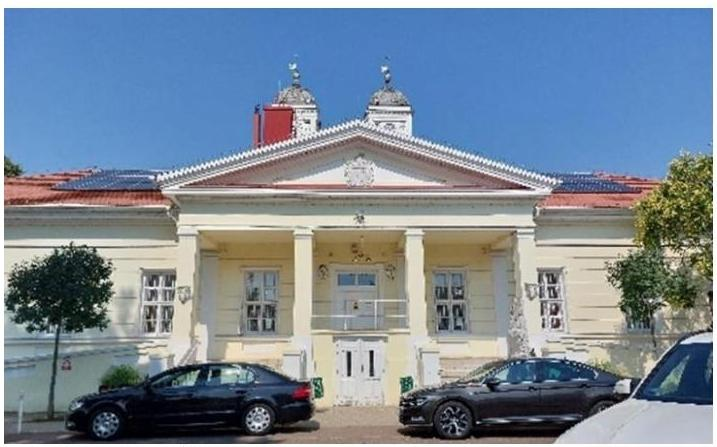

# JELENTÉS 

## Az önkormányzatok ingatlangazdálkodási tevékenységének ellenőrzése

Kunhegyes Város Önkormányzata

2025.

---

# JELENTÉS 

## Az önkormányzatok ingatlangazdálkodási tevékenységének ellenőrzése

Kunhegyes Város Önkormányzata

2025.

---

# ELLENŐRZÉSI IGAZGATÓSÁG: 

## ELLENŐRZÉSI IGAZGATÓSÁG II.

## ELLENŐRZÉSI IGAZGATÓ:

DR. BAFFIA GERGELY GÁBOR igazgató

## ELLENŐRZÉSVEZETŐ:

## BEKE ANDREA ellenőrzésvezető

Jelentéseink az interneten a www.asz.hu címen olvashatók.

IKTATÓSZÁM: EL-3975-006/2025
TÉMASORSZÁM: 49
ELLENŐRZÉS-AZONOSÍTÓ SZÁM: V105802

---

# TARTALOMJEGYZÉK 

AZ ELLENŐRZÉS ALAPADATAI ..... 5
AZ ELLENŐRZÖTT SZERVEZETEK ..... 7
ÖSSZEFOGLALÁS ..... 9
AZ ELLENŐRZÉS FÓKUSZKÉRDÉSEI ..... 11
MEGÁLLAPÍTÁSOK ..... 12
JAVASLATOK ..... 22
MELLÉKLETEK ..... 25
I. sz. melléklet: Értelmező szótár ..... 25
II. sz. melléklet: Az ellenőrzött szervezetek jegyzéke ..... 29
III. sz. melléklet: Ellenőrzési kritériumok ..... 30
IV. sz. melléklet: Az Önkormányzat 2021-2023. évi konszolidált költségvetési beszámolóinak mérlegadatai ..... 32
V. sz. melléklet: Az Önkormányzat konszolidált kiadási és bevételi adatai a 2021-2023. években ..... 33
FÜGGELÉK: ÉSZREVÉTELEK ..... 34
RÖVIDÍTÉSEK JEGYZÉKE ..... 35

---

.

---

# AZ ELLENŐRZÉS ALAPADATAI 

## AZ ELLENŐRZÉS CÉLJA

Az ellenőrzés célja az önkormányzat ingatlangazdálkodási, ingatlanhasznosítási tevékenységének szabályszerűségi és célszerűségi szempontok alapján történő értékelése volt. Az ellenőrzés kiterjedt arra, hogy az önkormányzat az ingatlangazdálkodási feladatai ellátása során figyelemmel volt-e a vagyon értékének megőrzésére, állagának fenntartására, állományának gyarapítására.

## AZ ELLENŐRZÉS TÍPUSA

Kombinált ellenőrzés.

## AZ ELLENŐRZŐTT IDŐSZAK

A 2021-2023. évek

## AZ ELLENŐRZÉS TÁRGYA

Az ellenőrzés tárgyát az Étv. ${ }^{1}$ 2. § 8. pontjában foglaltak szerinti építmények, a 2. § 10. pontjában foglaltak szerinti épületek és a 2. § 21. pont szerinti telkek, továbbá a Földtv. ${ }^{2}$ hatálya alá tartozó földterületek, valamint a 147/1992. (XI. 6.) Korm. rendelet ${ }^{3} 4$. számú melléklete szerinti külterületi ingatlanok képezték.

Az ÁSZ ${ }^{4}$ az ellenőrzés keretében az ingatlanvagyonnal kapcsolatos intézkedések végrehajtásának és elszámolásának megfelelőségét, valamint a nemzeti vagyonba tartozó ingatlanok nyilvántartásának szabályszerűségét ellenőrizte. A kockázatelemzés alapján ellenőrzésre kiválasztott önkormányzatoknál a belső kontrollrendszer részeként a nemzeti vagyonba tartozó ingatlanokkal kapcsolatos gazdálkodási, hasznosítási tevékenység tekintetében a belső szabályozás kialakítása, a kontrolltevékenységek kialakítása és működtetése, valamint a belső ellenőrzés működtetése megfelelőségének értékelésére került sor.

Az ingatlangazdálkodási tevékenység ellenőrzése az Önkormányzat ${ }^{5}$ esetében az ingatlanok ingyenes átvételére és átadására, hasznosítására (bérbe, használatba adására), az ingatlanok tulajdonjogának adásvétel keretében történő megszerzésére és értékesítésére, a beruházások, felújítások megvalósítására és az ingatlanok nyilvántartására irányult, függetlenül attól, hogy az Önkormányzat azt saját maga, vagy hivatala útján látta el.

Az ellenőrzés kiterjedt minden olyan körülményre és adatra, amely az ÁSZ jogszabályban meghatározott feladatainak teljesítéséhez, valamint a program végrehajtása folyamán felmerült újabb összefüggések feltárásához szükséges volt.

---

# Az ellenőrzés jogsalapja 

Az ellenőrzés jogszabályi alapját az ÁSZ tv. ${ }^{6} 1 . \int(3)$ bekezdésének, 5. $\int(3)$ bekezdésének és (4) bekezdés a) pontjának előírásai képezték.

## AZ ELLENŐRZÉS MÓDSZERE

Az ellenőrzést a nemzetközi standardokat irányadónak tekintve az ellenőrzési program szempontjai, az ellenőrzött időszakban hatályos jogszabályok, az ellenőrzés szakmai szabályok és módszertanok figyelembevételével végezte az ÁSZ.

Az ellenőrzési bizonyítékként felhasználható adatforrások közé tartoztak egyrészt az ellenőrzéshez kért dokumentumok, adatok, másrészt adatforrásként szolgált minden - az ellenőrzés folyamán - feltárt, az ellenőrzés szempontjából információkat tartalmazó dokumentum.

Az ellenőrzés lefolytatásához az ellenőrzött szervezetek a tanúsítványok kitöltésével, valamint az ÁSZ által kért dokumentumok, adatok, információk megküldésével és az ellenőrzés során - interjú keretében szolgáltattak adatokat. Az ellenőrzési kérdések megválaszolásához szükséges bizonyítékok megszerzése az ellenőrzött szervezetek által rendelkezésre bocsátott dokumentumokra és adatokra alapozva, továbbá megfigyelés, szemle (szemrevételezés), kérdésfeltevés (információkérés), valamint elemző eljárás útján történt.

Az ellenőrzött szervezetek ingatlangazdálkodási tevékenységének megfelelőségét mintavételi eljárással, az ingatlanok vásárlása, beruházása, felújítása esetében 21, a hasznosítás (bérbeadás) esetében 15 kockázati alapon kiválasztott mintatétel alapján értékelte az ÁSZ. Amennyiben valamely sokaság elemszáma kisebb volt, mint az előírt elemszám, a sokaságot tételesen ellenőrizte az ÁSZ. Tételes ellenőrzés történt az értékesítés (14 gazdasági esemény), a tulajdonjog ingyenes átruházás (hat gazdasági esemény), és a tulajdonjog ingyenes átvétel (hét gazdasági esemény) területeken.

A mintavételi eljárással ellenőrzött ingatlangazdálkodási tevékenységek esetében az értékelés kivetítés nélkül az egyes mintatételek tételes ellenőrzése alapján történt, a tények feltárása és azok összegzése során a megállapítások az ellenőrzött mintatételekre vonatkozóan kerültek megfogalmazásra.

---

# AZ ELLENŐRZÖTT SZERVEZETEK 

## KUNHEGYES VÁROS ÖNKORMÁNYZATA

Fonrás: ÁSZ által készitett fotó - Kunhegyesi Polgármesteri Hivatal épülete

Kunhegyes az Észak-Alföldi régióban, Jász-Nagykun-Szolnok vármegyében található város, a Kunhegyesi járás székhelye. Állandó lakosainak száma a 2021. január 1-jei 7217 fơről 2024. január 1jére 6829 főre csökkent a $\mathrm{KSH}^{7}$ adatai szerint.

A Polgármester ${ }^{8}$ a 2006. évi önkormányzati választásoktól 2024. októberéig töltötte be tisztségét, munkáját egy alpolgármester segítette. A kilenc tagú Képviselő-testület ${ }^{9}$ mellett három állandó bizottság az Ügyrendi és Egészségügyi Bizottság; a Pénzügyi, Gazdasági és Városfejlesztési Bizottság; az Oktatási, Kulturális, Szociális, Ifjúsági és Sport Bizottság - múködött.

A Polgármesteri Hivatal ${ }^{10}$ Jegyzője ${ }^{11} 2019$ óta látta el feladatát, munkáját egy aljegyző támogatta.
Az Önkormányzat a kötelező és önként vállalt feladatait a Polgármesteri Hivatal mellett az irányítása alá tartozó további kettő költségvetési szervvel ${ }^{12}$, valamint a kizárólagos tulajdonában lévő Kunhegyesi Vízmú Kft.vel $^{13}$, illetve az alapítványával, a Kunhegyes Városért Közalapítvánnyal látta el.

Az Önkormányzat az ellenőrzött időszakban nem kötött szerződést könyvvizsgálói feladatok ellátására. A belső ellenőrzési feladatok ellátását megbízási szerződés keretében biztosították.

Az Önkormányzat költségvetési kiadásainak összege a 2021. évi 1855,3 M Ft-ról - a 2022. évi kisebb emelkedés ellenére (2079,7 M Ft, 12,1\%) - a 2023. évre 1652,7 M Ft-ra (10,9\%-kal) csökkent. A költségvetési bevételek 2021. évben 1671,0 M Ft-ot tettek ki, amely összeget a 2022. évi 2197,8 M Ft 31,5\%-kal, a 2023. évi 1866,1 M Ft 11,7\%-kal haladta meg. A 2021. évben 184,3 M Ft összegű költségvetési hiány keletkezett, a 2022. évben (118,1 M Ft) és a 2023. évben (213,4 M Ft) költségvetési többlet realizálódott. A 2021. évi költségvetési hiány a felhalmozás területén keletkezett, amelyet a korábbi években folyósított és fel nem használt fejlesztési támogatások maradványa fedezett ( $916,5 \mathrm{M} \mathrm{Ft}$ ).

Az Önkormányzat összes felhalmozási bevételeinek ${ }^{14}$ összege a 2021. évben 392,2 M Ft volt, amelynek közel duplája teljesült a 2022. évben (767,7 M Ft), míg a 2023. évi 269,7 M Ft 31,2\%-kal maradt el a 2021. évben realizálttól. A 2022. évi jelentős bevételnövekedést a 2022. évben és az azt megelőző időszakban megvalósított ingatlanfejlesztések forrásául szolgáló európai uniós és hazai támogatások ütemezés szerinti folyósítása eredményezte. A 2023. évben az előző évitől elmaradó teljesítést - az ingatlanfejlesztések számának, illetve a forrásul szolgáló támogatásoknak a csökkenésén túl - az Önkormányzat 2023-ra tervezett ingatlanértékesítési bevételeinek 51,9\%-os elmaradása okozta, ami a megkötött ingatlanértékesítési szerződésekből származó követelések határidőn túli kiegyenlítése miatt következett be.

A felhalmozási kiadások ${ }^{15}$ 2021. évi 595,3 M Ft-os teljesülését a 2022. év adata 11,4\%-kal haladta meg, míg a 2023. évi 93,7 M Ft 84,3\%-kal maradt el az ellenőrzött időszak első évének adatától. A jelentős csökkenést elsődlegesen az okozta, hogy a korábbi időszakhoz képest a 2023. évben kevesebb, illetve kisebb volumenű fejlesztéseket valósított meg az Önkormányzat. A TOP ${ }^{16}$ különböző támogatásainak felhasználásával

---

végrehajtott ingatlanfejlesztésekre a 2021. évben 328,3 M Ft-ot, a 2022. évben 361,6 M Ft-ot, a 2023. évben 19,4 M Ft-ot fordítottak. A megvalósított ingatlanfejlesztések az ingatlanvagyon bruttó értékének a 2021. évben $8,0 \%$-át, a 2022. évben $7,9 \%$-át, a 2023. évben $1,1 \%$ jelentették.

## 1. táblázat

KUNHEGYES VÁROS ÖNKORMÁNYZATA INGATLANVAGYONÁNAK FŐBB ADATAI (2021-2023. ÉV)

| INGATLANORA | 2021- | 2022- | 2023. |
| :--: | :--: | :--: | :--: |
| VONSTÁSZÓ ADATOK | DECEMBER   31 | DECEMBER   31 | DECEMBER   31 |
| Ingatlanvagyon-   kataszteri adatok*   (bruttó érték M Ft) | 7461,8 | 8440,7 | 8480,4 |
| Ingatlanok és vagyoni értékủ jogok mérleg szerinti értéke (nettó érték M Ft) | 5772,0 | 6598,0 | 6474,5 |
| Bérlakás állomány (db) | 36 | 37 | 40 |
| Adott évben bérbeadott ingatlanok száma (db) | 44 | 49 | 49 |
| Belterületi földterületek $\left(\mathrm{m}^{2}\right)$ | 565,0 | 2100,0 | 2100,0 |
| Külterületi földterületek $\left(\mathrm{m}^{2}\right)$ | 8023,0 | 8023,0 | 4901,0 |

*A kataszteri adatok tartalmazzàk a vagyonkezelésbe adott ingatlanvagyon, valamint a kataszterben nem szerepiö felújitások adattát is.

Az Önkormányzat ingatlanvagyonának értéke az ellenőrzött időszak végére 12,2\%-kal nőtt a megvalósított ingatlanberuházások eredményeképpen (1. táblázat).

Az Önkormányzat tulajdonában álló bel- és külterületi földterületek nagysága a 2021. év eleji $12775,0 \mathrm{~m}^{2}$-ről, a 2023. év végére $7001,0 \mathrm{~m}^{2}$-re $-45,2 \%$-kal - csökkent, a fölterületek értékesítése miatt. Az Önkormányzatnak a 2021. évben 145,9 M Ft, a 2022. évben 51,4 M Ft, a 2023. évben 24,7 M Ft bevétele származott ingatlanértékesítésből. A 2021. évben 44, a 2022. és 2023. évben 49-49 önkormányzati ingatlant hasznosítottak bérbeadással. A bérbeadásból származó bevételek az ellenőrzött időszakban jelentős mértékben nőttek, a 2021. évi 10,3 M Ft-ot a 2023. évben realizált 37,1 M Ft összegű bevétel 260,2\%-kal haladta meg.

Az ingatlankarbantartási feladatokat az Önkormányzat a 2023. évben kizárólag saját maga, a 2021-2022. években - támogatási szerződés alapján -gazdasági társaságával, illetve alapítványával közösen látta el. A 20212023. években az Önkormányzat összesen 7,2 M Ft-ot, kizárólagos tulajdonában lévő gazdasági társasága, illetve alapítványa további 4,0 M Ft-ot fordított karbantartásra.

---

# ÖSSZEFOGLALÁS 

Az önkormányzatok müködésének egyik alapvető feltétele, hogy a kötelező feladataik ellátásához szükséges vagyontárgyak, így az ingatlanok rendelkezésükre álljanak. Az önkormányzati vagyon részét képező ingatlanok jelentős anyagi értéket képviselnek, amelyek esetében kiemelten fontos a nemzeti vagyonnal való felelős gazdálkodás követelményeinek érvényesítése. Az ÁSZ által végzett kockázatelemzés alapján került az Önkormányzat ellenőrzésre kiválasztásra.

Az Önkormányzat ingatlangazdálkodása nem volt megfelelő, az ellenőrzés szabálytalanságokat tárt fel az ingatlanértékesítések, valamint az ingatlanok bérbeadásának és az ingatlanberuházások ellenőrzött gazdasági eseményei esetében. Az ingatlanok nyilvántartása nem felelt meg a jogszabályok és a belső szabályozások előírásainak.

Az ellenőrzött hasznosítások (bérbeadások) közül egy szociális célú lakás, udvar bérbeadása során a megkötött szerződés a jogszabályi előírások ellenére nem tartalmazta a bérleti díjat, valamint az annak ellentételezéseként elvárt munka értékét. A hiányosságok következtében nem érvényesült a jogszabályban előírt bruttó elszámolás elve, továbbá nem volt igazolt, hogy a használó számára kiszabott feladatok a bérleti díjjal azonos értékben kerültek megállapításra. A jogszabályi előírás ellenére egy üzlethelyiséget a bérleti szerződés megszűnése után az új szerződés megkötéséig (négy hónapig) a bérlő szerződés nélkül használt. A bérleti szerződés nélküli használat időszakára vonatkozó bérleti díjat a bérlő megtérítette.

Az ellenőrzött ingatlanvásárlások, ingatlanberuházások, -felújítások közül kilencnél tárt fel az ÁSZ ellenőrzés hiányosságot. Egy útburkolat-beruházást ( $0,6 \mathrm{MFt}$ ) a jogszabályi előírások ellenére a Polgármester képviselő-testületi felhatalmazás írásbeli kötelezettségvállalás nélkül végeztett el. Nyolc esetben a jogszabályi előírások ellenére a kötelezettségvállalás dokumentumán nem történt meg a pénzügyi ellenjegyzés. Két ingatlan megvásárlásának teljesítésigazolására a jogszabályi előírás ellenére nem került sor, valamint egy esetben a teljesítésigazolás kötelezettségvállalás hiányában történt. Az érvényesítő figyelmen kívül hagyva a jogszabályi előírást, a kötelezettségvállalás, a pénzügyi ellenjegyzés és a teljesítésigazolás elmaradását egyetlen esetben sem jelezte, így a kifizetések utalványozása, elrendelése szabálytalanul történt. A gazdálkodási jogkörök szabálytalan gyakorlása mellett az Önkormányzat az éves költségvetéseiben az ingatlanok felhalmozási kiadásaira fordítható kiadási előirányzatokat egyik évben sem lépte túl.

Az ingatlanértékesítések közül két esetben (beépítetlen terület, illetve lakóház, udvar, gazdasági épület) - az Önkormányzat belső szabályozása előírása ellenére olyan ingatlanok értékesítésére került sor, amelyek nem voltak forgalomképesek.

Az Önkormányzat a jogszabályi előírás ellenére tíz (az értékesítések és az ellenőrzött beruházások közül egy-egy, az ellenőrzött hasznosítások közül nyolc) esetben nem győződött meg a szerződéskötést megelőzően, hogy a szerződést átlátható szervezettel kötötte meg.

A törvényi előírások ellenére az Önkormányzat 2021-2023. évi költségvetési beszámolóinak mérlegében szereplő tételeket leltárral nem támasztotta alá. Az Önkormányzat az ellenőrzött időszak költségvetési beszámolóiban és a tárgyieszköz-nyilvántartásban ${ }^{17}$ szereplő ingatlanállomány nettó értékének, valamint a 2023. évben a bruttó értékének egyezőségét a jogszabályok előírását megsértve nem biztosította. Az eltérések okait az Önkormányzat a jogszabályi előírások ellenére nem tárta fel, azokat az éves zárlati tevékenysége során nem számolta el, nem rendezte. A 2021. év eleje óta fennálló és azóta rendezetlen eltérések miatt a könyvvitelben, illetve a beszámolóban szereplő tételek esetében nem volt igazolható, hogy azok a

---

valóságban megtalálhatóak, bizonyíthatóak, ezért az Önkormányzat könyvvezetése során nem érvényesült a jogszabályban előírt számviteli alapelvek közül a valódiság elve.

Az Önkormányzat az ingyenesen átadott ingatlanok, az ingyenesen átvett ingatlanok, az ingatlanértékesítések, valamint az ingatlanbérbeadások és az ingatlanberuházások ellenőrzött tételei esetében a jogszabályok által előírt vagyonnyilvántartási feladatait nem teljeskörűen látta el. Az ellenőrzött időszakban történt hat ingyenes ingatlanátadás értékét ( $80,7 \mathrm{MFt}$ ) a számviteli nyilvántartásokból és a mérlegből az Önkormányzat az ÁSZ ellenőrzés kezdetéig nem vezette ki, a hét ingyenes ingatlanátvétel közül öt esetben az átvett ingatlanok értékét ( $11,5 \mathrm{MFt}$ ) az Önkormányzat - az ÁSZ ellenőrzés kezdetéig a számviteli nyilvántartásaiban nem számolta el, mérlegében nem tüntette fel, megsértve ezzel a jogszabály által előírt számviteli alapelvek közül a teljesség és a valódiság elvét.

Az Önkormányzat az ingyenesen átadott és átvett ingatlanoknál, az értékesítéseknél, valamint az ellenőrzött ingatlanhasznosításoknál és ingatlanberuházásoknál összesen négy esetben nem a jogszabály, és a belső szabályozás előírásának megfelelően hajtotta végre a forgalomképesség szerinti besorolást.

A Jegyző az ellenőrzött összesen 63 gazdasági esemény közül 30 esetben a jogszabályi előírás ellenére nem biztosította a tárgyieszköz-nyilvántartás és az ingatlanvagyon-kataszteri nyilvántartás, további 11 esetben pedig az ingatlanvagyon-kataszteri nyilvántartás és az ingatlanügyi hatóságként eljáró vármegyei kormányhivatal azonos tartalmú adataival való egyezőségét.

Az ÁSZ által feltárt hibák egyik évben sem érték el a jogszabályban és a belső szabályozásban meghatározott jelentős összegű hiba határát.

Az Önkormányzat az ingatlangazdálkodási, ingatlanhasznosítási folyamatok kontrollkörnyezetének részét jelentő szabályozási környezetet a jogszabályi előírásoknak megfelelően alakította ki, rendelkezett az ingatlangazdálkodási, ingatlanhasznosítási tevékenységekhez a jogszabályok által előírt szabályzatokkal és tervekkel. Az Önkormányzat a kontrolltevékenységeket - a jogszabályi előírás ellenére - nem megfelelően múködtette.

Az Önkormányzat belső ellenőrzése nem töltötte be a jogszabályokban megfogalmazott szerepét, mivel az ellenőrzött időszakban vizsgálta az Önkormányzat ingatlangazdálkodását és a leltározást, azonban nem tárta fel az ingatlanok nyilvántartásával összefüggő hiányosságokat.

A külső ellenőrzésekről vezetett nyilvántartás jogszabályi előírásoknak megfelelő tartalmát az Önkormányzat nem biztosította.

---

# AZ ELLENŐRZÉS FÓKUSZKÉRDÉSEI 

1.- Az Önkormányzat nemzeti vagyonba tartozó ingatlanokkal való gazdálkodása, valamint az ezzel kapcsolatos gazdasági események elszámolása megfelelő volt-e?
2.- Az Önkormányzat tulajdonában lévő ingatlanok nyilvántartásával kapcsolatos feladatok ellátása szabályszerű volt-e?
3.- Az Önkormányzatnál az ingatlangazdálkodási, ingatlanhasznosítási tevékenységhez kapcsolódóan a belső kontrollrendszer kialakítása és müködtetése megfelelő volt-e?

---

# 1. Az Önkormányzat nemzeti vagyonba tartozó ingatlanokkal való gazdálkodása, valamint az ezzel kapcsolatos gazdasági események elszámolása megfelelő volt-e? 

Összegző megállapítás Az Önkormányzatnak a nemzeti vagyonba tartozó ingatlanokkal való gazdálkodása, az ellenőrzőtt gazdasági események elszámolása nem volt szabályszerű. Az Önkormányzat az ingatlanértékesítések, az ellenőrzött ingatlanberuházások és ingatlanhasznosítások (bérbeadások) esetében nem az Áht. ${ }^{18}$, az Ávr. ${ }^{19}$, az Mötv. ${ }^{20}$, az Nvtv. ${ }^{21}$, a Számv. tv. ${ }^{22}$, az Áhsz. ${ }^{23}$ és a belső szabályozások előírásainak megfelelően járt el.
1.1. számú megállapítás Az önkormányzati ingatlanok értékesítése nem felelt meg az Nvtv. és a Vagyonrendelet ${ }^{24}$ előírásainak.

Az ingatlanok értékesítésére vonatkozó döntést az arra hatáskörrel rendelkező Képviselő-testület, illetve - a kihirdetett veszélyhelyzetek időszakában a Kat. ${ }^{25}$ felhatalmazása alapján - a Képviselő-testület hatáskörét gyakorló Polgármester az Mötv.-ben, a Vagyonrendeletben, a Lakásrendelet ${ }_{1,2}$-ben ${ }^{26}$, valamint az Elidegenítési rendeletben ${ }^{27}$ előírtaknak megfelelően hozta meg.
Egy ingatlan értékesítése esetében (10. számú tétel, a 14 értékesítési tétel 7,1\%-a) az Önkormányzat a szerződéskötést megelőzően az Nvtv. 13. § (2) bekezdésének előírása ellenére nem győződött meg arról, hogy az ingatlan értékesítésről szóló szerződést átlátható szervezettel kötötte meg.
Két esetben (2. és 4. számú tétel, a 14 értékesítési tétel 14,3\%-a) az Önkormányzat a Vagyonrendeletében korlátozottan forgalomképesnek besorolt ingatlanokat (beépítetlen terület, illetve lakóház, udvar, gazdasági épület) értékesített, figyelmen kívül hagyva a Vagyonrendelet 13. § (2) és (6) bekezdésének előírását.
Az Önkormányzat a 25 M Ft egyedi bruttó forgalmi értéket meghaladó értékű ingatlanát az Nvtv.-ben, a Vagyonrendeletben és az Elidegenítési rendeletben előírtaknak megfelelően versenyeztetés (árverés) útján, értékbecslés alapján értékesítette.
Az ingatlanértékesítések során a Vagyonrendelet előírásának megfelelően figyelembe vették a szakértői értékbecslés alapján megállapított forgalmi értéket. Az Nvtv.-ben meghatározottaknak megfelelően biztosították a Magyar Állam minden más jogosultat megelőző elő́vásárlási jogának érvényesítését, amellyel a Magyar Állam egyik ingatlan esetében sem élt.
Az értékesített ingatlanok ellenértéke a szerződés szerinti összegben befolyt, az Önkormányzat azok számviteli elszámolását az Áhsz. és a 38/2013. (IX. 19.) NGM rendelet ${ }^{28}$ előírásainak megfelelően végezte el.

---

1.2. számú megállapítás

A nemzeti vagyon körébe tartozó ingatlanok ingyenes (térítés nélküli) átadása megfelelt a jogszabályi előírásoknak.

A 2023. évben két alkalommal - összesen hat ingatlant érintően - került sor ingatlanok tulajdonjogának Mötv. szerinti ingyenes átruházására. Az Önkormányzat ténylegesen országos közútként funkcionáló földrészletek, és közúttal érintett földterületek tulajdonjogát adta át a Magyar Állam részére. Az ingatlanok ingyenes átadása az Mötv. és a Kkt. ${ }^{29}$ előírásainak megfelelően történt. Az átruházásról szóló döntést az Mötv.-ben, illetve a Vagyonrendeletben előírtaknak megfelelően a Képviselő-testület hozta meg.
1.3. számú megállapítás

Az ingatlanok ingyenes (térítés nélküli) átvétele megfelelt a jogszabályi előírásoknak.

Az ellenőrzött időszak hét ingyenes ingatlanátvétele közül két esetben az MVH Zrt. ${ }^{30}$ kivezetésre szánt állami vagyonának (közterület) tulajdonjogát vette át az Önkormányzat a településfejlesztési, településrendezési, településüzemeltetési, vízkárelháritási feladatainak ellátása érdekében. Öt esetben országos közúti funkcióval nem rendelkező, forgalmi jellegük szerint helyi közúti szerepet betöltő földrészletek tulajdonjogának ingyenes átvételére került sor a Kkt.-ben foglaltaknak megfelelően. Az ingyenes átvételre vonatkozó döntést minden esetben a Képviselő-testület az Mötv. előírásainak és a vonatkozó képviselő-testületi határozatban foglalt feltételeknek megfelelően hozta meg.
1.4. számú megállapítás

Az Önkormányzat ellenőrzött ingatlanhasznosításai (bérbeadásai) nem feleltek meg az Nvtv., a Számv. tv., az Áhsz. és az Ávr. előírásának.

Az Önkormányzat az SZMSZ ${ }^{31}$-ben, a Vagyonrendeletben és a Lakásrendelet ${ }_{1,2}$-ben határozta meg a vagyon hasznosítására, bérbeadására vonatkozó általános és konkrét szabályokat, jogokat, illetve kötelezettségeket.
Az ellenőrzött ingatlanhasznosítások (bérbeadások) tekintetében az Mötv. előírásainak megfelelően az arra jogosult Képviselő-testület döntött. Az ingatlanhasznosítási szerződéseket az Ávr.-ben és a Vagyonrendeletben foglaltaknak megfelelően az arra hatáskörrel rendelkező Polgármester kötötte meg.
A hasznosítás időtartamát - egy kivétellel - az Nvtv.-ben előírtaknak megfelelően állapították meg. Egy üzlethelyiség (9. számú tétel) esetében a bérleti szerződés 2021. január 1-jei kezdőnappal történő újrakötésére vonatkozó döntést - a Kat. felhatalmazása alapján a Képviselő-testület hatáskörével bíró Polgármester 2021. április 24-én hozta meg. A bérlő a bérleti szerződés újrakötését megelőzően négy hónapig az ingatlant bérleti szerződés nélkül használta, amellyel sérültek az Nvtv. 7. § (1) és (2) bekezdéseinek a nemzeti vagyonnal való felelős gazdálkodásra és a nemzeti vagyon megőrzésére irányuló követelményei. A szerződés nélküli használat időszakában a vonatkozó számlákat az Önkormányzat - az új bérleti szerződés tervezetének megfelelő összegben - havonta kiállította, a kiállított számlák összegét a használó megfizette.
Az Önkormányzat nyolc esetben (1., 3., 5., 6., 7., 9., 10., 12. számú tétel) az Nvtv. 11. § (10) bekezdésének előírása ellenére a szerződéskötés megelőzően nem győződött meg arról, hogy az ingatlanhasznosításra vonatkozó szerződést átlátható szervezettel kötötte meg.
Egy esetben (13. számú tétel) az Önkormányzat a tulajdonában álló félkomfortos, szociális célú bérlakás, udvar hasznosítási szerződésében - amelyet a Képviselő-testület egyedi határozata alapján kötöttek meg - az Ávr. 50. § (1) bekezdés b) pontja ellenére a fizetendő bérleti díjat, a használat fejében havonta elvégzendő gondnoki, őrzési, állagmegóvási, állapotfenntartási feladatok értékét, határidejét nem határozta meg. A bérleti díj és az ellentételezéseként elvégzett feladatok értékének számszerűsítése, bizonylatolása

---

és számviteli elszámolása a Számv. tv. 165. § (1) bekezdésének és a Számv. tv. 166. § (1) bekezdésének előírása ellenére nem történt meg. Ezért az Önkormányzat könyvvezetése során nem érvényesült a Számv. tv. 15. § (9) bekezdésében előírt bruttó elszámolás elve. Nem volt továbbá igazolt, hogy a bérlő számára kiszabott feladatok a bérleti díjnak megfelelő értékben kerültek megállapításra.
Az ellenőrzött ingatlanhasznosítási mintatételek közül kettő esetében történt ingyenes hasznosítás (14. és 15. számú tétel). Az önkormányzati tulajdonú két ingatlan ingyenes hasznosítására az Nvtv.-ben foglaltaknak megfelelően közfeladat ellátása - népkonyha szociális alapszolgáltatás, valamint védőnői szolgáltatás -, a lakosság közszolgáltatásokkal való ellátása, valamint e feladatokhoz szükséges infrastruktúra biztosítása céljából került sor.
Az ellenőrzött ingatlanhasznosítások bérleti díjai a megkötött szerződés szerinti összegben teljesültek, azok számviteli elszámolása - egy eset kivételével - megfelelt a Számv. tv. előírásainak. Egy kivett beépített terület földhasználati szerződése esetében (1. számú tétel) az Önkormányzat a földhasználati jogból származó bevételét az Áhsz. 40. § (1) bekezdésében előírt kötelezettség ellenére nem az Áhsz. 15. mellékletében szereplő rovatrendnek megfelelően a múködési bevételek között (a B404 „Tulajdonosi bevételek" rovat), hanem helytelenül felhalmozási bevételként (B52 „Ingatlanok értékesitése" rovat) számolta el.
1.5. számú megállapítás

Az ellenőrzött ingatlanvásárlásokat, -beruházásokat és -felújításokat megalapozó döntéseket - egy kivételével - a jogszabályi előírásoknak megfelelően hozták meg. A gazdálkodási jogkörök gyakorlása azonban kilenc esetben nem felelt meg az Áht. és az Ávr. előírásainak.

Az ellenőrzött ingatlanvásárlásokra, ingatlanberuházásokra és -felújításokra vonatkozó döntéseket - egy eset kivételével - a Képviselő-testület az Mötv. előírásának megfelelően hozta meg. Egy esetben (P5. számú tétel) az Önkormányzat saját kivitelezésű beruházást hajtott végre a „Zöld város kialakítása a Kakatér mentén, Kunhegyes belterületén" című pályázat keretében, európai uniós támogatásból megvalósított sétaúthoz kapcsolódóan. 2022 márciusában a Polgármester a sétaút rendeltetésszerủ használatának biztosítása érdekében az Mötv. 107. § -ának előírása ellenére saját hatáskörben döntött a sétaút és a földút közötti útszakasz burkolásáról és az autós közlekedést gátló akadályok kihelyezéséről, mert a döntési jogkör gyakorlására a Képviselő-testület 2022. április 22-étől hatalmazta fel őt az SZMSZ 17. § (10) bekezdésében. Az ellenőrzött mintatételhez kapcsolódó szállítói számlák (három számla, összesen 0,6 MFt) 2022. április 28 -ai pénzügyi teljesítésére úgy került sor, hogy azokat az Áht. 37. § (1) bekezdésében foglalt előírás ellenére nem előzte meg írásos kötelezettségvállalás. A beruházás értékét a Számv. tv. és az Áhsz. előírásának megfelelően számolták el a számviteli nyilvántartásokban.
Az Önkormányzat egy kivett üzem terület megvásárlása esetében (3. számú tétel) az Áht. 41. § (6) bekezdésében előírtak ellenére a szerződéskötést megelőzően nem győződött meg arról, hogy az ingatlanvásárlási szerződést átlátható szervezettel kötötte meg.
Az ellenőrzött mintatételek közül nyolc esetben (1., 2., 3., 4., 5., 11., 15., P4. számú tételek) az Áht. 37. (1) bekezdésében foglaltak ellenére a kötelezettségvállalás dokumentumán nem történt meg a pénzügyi ellenjegyzés.
Az ellenőrzött mintatételek közül két esetben (3., és a P4. számú tételek) egy 2015. évben megvásárolt üzemi terület részletfizetése és egy belterületi lakóház, udvar megvásárlása esetében az Áht. 38. § (1) bekezdésében, valamint az Ávr. 57. § (1) bekezdésében foglaltak ellenére nem történt meg a teljesítésigazolás. A feltárt szabálytalanság ellenére - a tárgyieszköz-nyilvántartás és a tulajdoni lapok alapján - mind a két ingatlan az Önkormányzat tulajdonába került.

---

Az érvényesítés során a pénzügyi ellenjegyzés, kötelezettségvállalás és teljesítésigazolás megtörténtét az Ávr. 58. § (1)-(2) bekezdéseinek előírása ellenére - az érvényesítő nem ellenőrizte, azok elmaradását nem jelezte. Ezáltal a kifizetések utalványozására, elrendelésére az Áht. 38. § (1) bekezdésének és az Ávr. 59. § (1b) bekezdésének előírása ellenére, szabálytalan érvényesítés alapján került sor. A gazdálkodási jogkörök szabálytalan gyakorlása, a pénzügyi ellenjegyzés nélküli kötelezettségvállalások nem okozták az Önkormányzatnál a 2021-2023. évi költségvetési beszámolók felhalmozási kiadási előirányzatai túllépését.
Az Önkormányzat az ellenőrzött ingatlanberuházások közül a közbeszerzési értékhatárt elérő beruházások esetében a Kbt. ${ }^{32}$ előírásainak megfelelően lefolytatta a közbeszerzési eljárást, amelyek alapján a szerződéseket valamennyi esetben a Kbt. előírásai szerint a nyertes ajánlattevővel, írásban kötötte meg. A Kbt. hatálya alá nem tartozó beszerzéseknél - a saját rezsis beruházás kivételével - az Önkormányzat a Beszerzési szabályzatnak ${ }^{33}$ megfelelően, az eredményes beszerzési eljárás alapján a szerződést írásban, a nyertes ajánlattevővel kötötte meg.
1.6. számú megállapítás Az Önkormányzat - Ehat. tv. ${ }^{34}$-ben előírt energiamegtakarítási intézkedési terv és a 1995. évi LIII. tv. ${ }^{35}$-ben előírt környezetvédelmi program kivételével - rendelkezett az önkormányzati ingatlanokra vonatkozó fejlesztési elképzeléseket tartalmazó stratégiákkal és tervekkel.

Az Önkormányzat az Nvtv. előírásának megfelelően rendelkezett közép- és hosszú távú vagyongazdálkodási tervekkel, amelyekben megfogalmazták a meglévő vagyon fenntartásának, növelésének, hasznosításának, értékesítésének szempontjait. Az Mötv. alapján elkészített gazdasági programban - a 2020-2025. évek időszakára - határoztak meg az ingatlanvagyon megújítására, korszerűsítésére, hasznosítására és fenntartására irányuló célokat és feladatokat.
Az Önkormányzat a 2021-2023. évekre vonatkozóan nem rendelkezett az 1995. évi LIII. tv. 46. § (1) bekezdés b) pontjában és 48/E. $\S$-ában foglaltaknak megfelelő környezetvédelmi programmal.
Az Önkormányzat a 2017. évben az Ehat. tv. előírásai alapján elkészítette a tulajdonában álló, közfeladatellátást szolgáló épületek ötéves energiamegtakarítási intézkedési terveit, azonban az Ehat. tv. 11/A. § a) pontját figyelmen kívül hagyva a 2022. évben nem határozta meg a következő öt évre vonatkozó energiamegtakarítási intézkedési terveket. Az energiamegtakarítási intézkedési tervek teljesítéséről az Ehat. tv. 11/A. § b) pontjának előírása ellenére nem készítettek évente jelentést.
Az ingatlanok értékének megőrzése, növelése érdekében tervezett beruházások, felújítások megvalósításához a Jegyző készített a Képviselő-testület számára energetikai, fűtéskorszerűsítési, egyéb ingatlanfejlesztési, ingatlanberuházási (például belterületi utak fejlesztése, gyermeknevelést támogató humán infrastruktúra fejlesztése tárgyú) pályázatokon való részvételre irányuló előterjesztéseket. Az elnyert pályázatok eredményeként az Önkormányzat a 2021-2023. években 1200,7 M Ft felhalmozási célú európai uniós és hazai forrásból származó pályázati támogatásban részesült.
Az Nvtv.-ben foglaltakkal összhangban az Önkormányzat felmérte, hogy a gázfelhasználás csökkenésére irányuló beruházások eredményeként az Önkormányzat gázfelhasználása ténylegesen kevesebb lett.
Az Önkormányzat a Panasz tv. ${ }^{36}$ előírásának megfelelően rendelkezett a közérdekű bejelentések és panaszok kezelésére vonatkozó eljárásrenddel, továbbá az ingatlangazdálkodási, -hasznosítási, -nyilvántartási tevékenységéhez kapcsolódó bejelentésekről és panaszokról nyilvántartást vezetett. A 2021-2023. évek időszakában az ingatlangazdálkodási, -hasznosítási, -nyilvántartási tevékenységhez kapcsolódó bejelentéseket kivizsgálták,

---

és intézkedtek az indokolt bejelentésekben jelzett problémák megszüntetéséről. A Képviselő-testület tájékoztatása a közérdekủ bejelentésekről és azok kezeléséről a 2021. évben az SZMSZ előírásának megfelelően megtörtént, azonban a 2022. évben kettő és a 2023. évben egy közérdekű bejelentésről és azok kezeléséről az SZMSZ 32. § (2) bekezdés c) pontjában foglaltak ellenére a Képviselő-testületet nem tájékoztatták.

# 2. Az Önkormányzat tulajdonában lévő ingatlanok nyilvántartásával kapcsolatos feladatok ellátása szabályszerű volt-e? 

Összegző megállapítás Az Önkormányzat vagyonnyilvántartási feladatainak ellátása nem felelt meg az Nvtv., az Mötv., a Számv. tv., az Áhsz., a 147/1992. (XI. 6.) Korm.rendelet, valamint a Vagyonrendelet és belső szabályozás előírásainak.
2.1. számú megállapítás

Az Önkormányzat ingatlanvagyonának nettó értéke az éves költségvetési beszámoló mérlegében és a számviteli nyilvántartásokban a 2021-2023. évek egyikében sem egyezett meg a Számv. tv. és az Áhsz. előírásai ellenére. A mérlegben szereplő ingatlanvagyon nettó értékét a Számv. tv. és az Áhsz. előírásai ellenére az elkészített leltárak nem támasztották alá.

Az Önkormányzat a 2021-2023. évek költségvetési beszámolóinak mérlegében szereplő ingatlanvagyon leltározását - a Számv. tv.-ben és a Leltározási szabályzatban ${ }^{37}$ az ingatlanok tekintetében előírt három évenkénti mennyiségi felvétellel történő leltározásnál gyakrabban - a 2021. és a 2023. évben is mennyiségi felvétellel végezte el.
Az Önkormányzat a főkönyvi könyvelés és a tárgyieszköz-nyilvántartás ingatlanokra vonatkozó adatainak a Számv. tv. 69. § (2) bekezdésének előírása szerinti egyeztetését nem végezte el, mert az egyes főkönyvi számlaszámokon kimutatott bruttó állományi értékek az ellenőrzött időszak egyetlen évében sem egyeztek meg a tárgyieszköz-nyilvántartás - az adott főkönyvi számlaszámokhoz tartozó - bruttó értékeivel. Az egyezőség hiánya miatt a tárgyieszköz-nyilvántartás nem töltötte be az Áhsz. 5. § (1) bekezdése szerinti alátámasztó szerepét. Ezzel szemben az ingatlanállomány főkönyvi összesített bruttó értéke a 2021. és 2022. évben megegyezett, a 2023. évben azonban $0,2 \mathrm{M}$ Ft-tal meghaladta a tárgyieszköz-nyilvántartás adatát.

Az önkormányzati ingatlanok 2021-2023. év végi állományi adatait a 2. táblázat mutatja be.

---

# AZ INGATLANOK ÁLLOMÁNYI ÉRTÉKEI AZ EGYES NYILVÁNTARTÁSOKBAN (2021-2023. ÉVEK) (M FT) 

| MEGNEVEZÉs | 2021. DECEMBER 31. |  | 2022. DECEMBER 31. |  | 2023. DECEMBER 31. |  |
| :--: | :--: | :--: | :--: | :--: | :--: | :--: |
|  | BRUTTÓ   ÉRTÉK | NETTÓ   ÉRTÉK | BRUTTÓ   ÉRTÉK | NETTÓ   ÉRTÉK | BRUTTÓ   ÉRTÉK | NETTÓ   ÉRTÉK |
| Költségvetési beszámoló 15/A. úrlap Főkönyvi kivonat   12 számlacsoport   ASP $^{38}$   tárgyieszköznyilvántartás (KATI modul ${ }^{39}$ ) | 7369,2 | 5772,0 | 8348,1 | 6597,4 | 8387,8 | 6474,0 |
| ASP ${ }^{38}$      szakrendszer ${ }^{40}$ | 7369,2 | 5772,0 | 8348,1 | 6597,4 | 8387,6 | 6478,2 |
| Eltérés (beszámoló 15/A. úrlap - ASP KATI modul) | - | 10,2 | - | 4,4 | 0,2 | 4,2 |

Forrás: A 2021-2023. évi önkormányzati adatszolgáltatás alapján ÁSZ saját szerkesztés
Az ingatlanok nettó értékének eltéréseit a főkönyvi és a tárgyieszköz-nyilvántartásban szereplő értékcsökkenések 2021. évi nyitó állományi értékének eltérése (5,2 M Ft), valamint az éves értékcsökkenés elszámolások eltérései (a 2021. évben 5,0 M Ft, a 2022. évben 4,4 M Ft, 2023. évben 4,4 M Ft), továbbá a 2023. évben a bruttó ingatlanállomány - előzőekben bemutatott 0,2 M Ft-os - eltérése okozta. Ezeket az eltéréseket az Önkormányzat az Áhsz. szerinti könyviteli zárlati tevékenységek során dokumentáltan megállapította, és az egyes évek költségvetési beszámoló mérlegében szereplő adatokat ítélte meg helyesnek. Az Önkormányzat az Áhsz. 53. § (8) bekezdés a) pontjában előírtak ellenére a 2021-2023. évi könyvviteli zárlatok keretében - a mérlegkészítés határidejéig - a kimutatott eltérések részletes okait nem derítette fel, és nem kezelte. A le nem zárt időszakkal kapcsolatos, vagy a mérlegfordulónap és mérlegkészítés időpontjáig feltárt hibákat az Áhsz. 54/A. $\$ 1$ (1) és (2) bekezdésében előírtak ellenére, a mérlegkészítés időpontját követően feltárt hibákat az Áhsz. 54/B. § (1), (3), (4) bekezdéseiben előírtak ellenére nem javította az ÁSZ ellenőrzés megkezdéséig.
Az ingatlanállomány - az éves költségvetési beszámolók mérlegeiben, a kapcsolódó tárgyieszköz-nyilvántartásban szereplő - nettó értékének 2021-2022. évi eltérései miatt az Önkormányzat könyvvezetése és éves költségvetési beszámolójának elkészítése során sérült a Számv. tv. 15.§ (3) bekezdésében előírt valódiság elve.

Az Önkormányzat a 2021. és a 2023. évekre vonatkozó leltárakat összeállította, azonban a Leltározási szabályzat 5. pontjában a leltározással kapcsolatos feladatok végrehajtása c) és d) pontjainak előírása ellenére a leltározás eredményét bemutató leltárösszesítőt nem készítette el, a leltáreltéréseket nem állapította meg.
A 2022. évi mérlegben szereplő ingatlanállomány nettó értékét alátámasztó leltárdokumentumot a Számv. tv. 169. § (1) bekezdésében foglalt előírás ellenére az Önkormányzat nem őrizte meg.

---

Mindezek alapján a 2021-2023. évek költségvetési beszámolóinak mérlegeiben kimutatott ingatlanvagyon értéke a Számv. tv. 69. § (1) bekezdésében foglaltakat megsértve, valamint az Áhsz. 22. § (1) bekezdésben foglaltakat figyelmen kívül hagyva nem volt teljeskörűen leltárral alátámasztott.
Az Önkormányzat 2021-2023. évi költségvetési beszámolóiban kimutatott ingatlanállomány bruttó értéke az ingatlanvagyon-kataszter 147/1992. (XI.6.) Korm.rendelet szerinti bruttó értékével megegyezett.
Az Önkormányzat az Áhsz. előírásának megfelelően a zárszámadási rendeleteinek ${ }^{41}$ előterjesztéseihez csatolta a vagyonkimutatásokat. Az ellenőrzött időszakra vonatkozóan az Önkormányzat a vagyonkimutatásokban kizárólag az ingatlanvagyon nettó értékét mutatta ki, ezáltal az ingatlanvagyon számviteli nyilvántartás szerinti bruttó értékének és az ingatlanvagyonkataszterben szereplő ingatlanvagyon bruttó értékének egyezősége a vagyonkimutatásokban az Áhsz. 30. § (4) bekezdésében előírtak ellenére nem volt biztosított.
2.2. számú megállapítás

Az Önkormányzat vagyonnyilvántartási feladatait az ellenőrzött ingatlan vagyonváltozások esetében nem az Nvtv., az Mötv., a Számv. tv., az Áhsz., a 147/1992. (XI. 6.) Korm.rendelet, valamint a Vagyonrendelet előírásainak megfelelően látta el.

Az Önkormányzat a tulajdonában lévő nemzeti vagyon értékét és annak változásait az Nvtv. 10. § (1) bekezdésében előírt kötelezettsége ellenére az ingyenesen átadott, illetve az ingyenesen átvett ingatlanok esetében a 2023. évben nem tartotta nyilván.
Az Önkormányzat a 2023. évben ingyenesen (térítés nélkül) átadott ingatlanok (1-6. számú tétel, az ellenőrzött hat tétel 100\%-a) értékét ( $80,7 \mathrm{MFt}$ ) a főkönyvi nyilvántartásokból és a mérlegből - az ÁSZ ellenőrzés kezdetéig nem vezette ki, megsértve ezzel a Számv. tv. 15. § (2)-(3) bekezdéseiben szereplő teljesség és valódiság számviteli alapelvét, valamint a Számv. tv. 165. § (1) bekezdésének a gazdasági események bizonylatainak a könyviteli nyilvántartásokban történő rögzítésére vonatkozó előírását. Nem történt meg - az ÁSZ ellenőrzés kezdetéig - az Áhsz. 45. § (3) bekezdése és a 14. melléklet VII. 1. k) és l) pontjaiban foglaltak ellenére az ingyenes ingatlanátadásoknak a tárgyieszköz-nyilvántartásból való kivezetése. A Jegyző az Mötv. 110. § (1) bekezdés előírása ellenére nem gondoskodott az ingyenesen átadott ingatlanok - a 147/1992. (XI. 6.) Korm.rendelet 1. §(1), 4. §(1) bekezdései, illetve a Vagyonrendelet 50. §-a szerinti - kivezetéséről az ingatlanvagyon-kataszterből. A földhivatali nyilvántartásban ugyanakkor a tulajdonjogok átírása megtörtént az Magyar Állam javára, ezért - a 147/1992. (XI. 6.) Korm. rendelet 1. § (2) bekezdés előírása ellenére - az ingatlanvagyon-kataszter adata nem egyezett meg az ingatlanügyi hatóságként eljáró vármegyei kormányhivatal ingatlan-nyilvántartásának azonos tartalmú adataival.
A 2023. első negyedévében ingyenesen átvett öt - együttesen 11,5 M Ft értékű - ingatlan (földrészletek) esetében (3-7. számú tétel, az ellenőrzött hét tétel 71,4\%-a) az ingyenes átvételhez kapcsolódó gazdasági események bizonylatainak adatait az Áhsz. 53. § (2) bekezdésében előírtak ellenére a negyedéves zárlatok során nem rögzítették a könyvviteli számlákon, amelynek pótlása az ÁSZ ellenőrzés kezdetéig nem történt meg. Ezen ingatlanok értéke az Áhsz. 11. § (3) bekezdés a) pontja előírása ellenére a 2023. évi mérlegben nem került kimutatásra, így sérült a Számv. tv. 15. § (2) bekezdésében előírt teljesség számviteli alapelve. Az érintett ingatlanokat az Áhsz. 45. § (3) bekezdésében és a 14. melléklet VII. 1. k) és l) pontjaiban foglaltak ellenére a tárgyieszköz-nyilvántartásban nem tartották nyilván. A Jegyző az Mötv. 110. § (1) bekezdését, a 147/1992. (XI. 6.) Korm. rendelet 1. § (1) bekezdését és 4. § (1) bekezdését, illetve a Vagyonrendelet 50. §-át figyelmen kívül hagyva nem gondoskodott azoknak az ingatlanvagyon-

---

kataszterben történő nyilvántartásba vételéről. A földhivatali nyilvántartásban a tulajdonjog bejegyzés 2023. október 12-én megtörtént az Önkormányzat javára, ezért a 147/1992. (XI. 6.) Korm. rendelet 1. $\S$ (2) bekezdés előírása ellenére az ingatlanvagyon-kataszter adata az ingyenesen átvett ingatlanok esetében nem egyezett meg az ingatlanügyi hatóságként eljáró vármegyei kormányhivatal ingatlannyilvántartásának azonos tartalmú adataival.
A 2022. évben két ingyenesen átvett ingatlan esetében (1., 2. számú tétel, az ellenőrzött hét tétel 28,6\%-a) az ingatlanvagyon-kataszterben nem a tárgyieszköz-nyilvántartással egyező forgalomképességre vonatkozó adatok szerepeltek a 147/1992. (XI. 6.) Korm. rendelet 2. sz. mellékletében előírtak ellenére. A szerződésben „kivett kö́́terïlet" megnevezésű ingatlanokat az Nvtv. előírásának megfelelően a tárgyieszköz-nyilvántartásban ,„árda" eszköztípussal forgalomképtelen vagyonelemként tartották nyilván, ugyanakkor az ingatlanvagyon-kataszterben azokat az Nvtv. 5. §(3) bekezdés (a) pontja ellenére forgalomképes ingatlanként szerepeltették.
Az ingatlan értékesítések közül egy ingatlan - telekrész - 2022. évi értékesítése során (8. számú tétel, az ellenőrzött 14 tétel $7,1 \%$-a) nem történt meg annak kivezetése az ingatlanvagyon-kataszterből a 147/1992. (XI. 6.) Korm. rendelet 4. $\S$ (1) bekezdésének, illetve a Vagyonrendelet 50. §-ának előírása ellenére. A főkönyvi és a tárgyieszköz-nyilvántartásból a terület arányos értéke az Áhsz. előírásának megfelelően kivezetésre került, továbbá a földhivatali tulajdoni lapokon is megtörtént a területváltozás bejegyzése a szerződésben foglaltaknak megfelelően. Ezért a 147/1992. (XI. 6.) Korm. rendelet 1. $\S$ (2) bekezdése, valamint 2. sz. mellékletének előírása ellenére nem egyezett meg az ingatlanvagyonkataszteri nyilvántartás adata a tárgyieszköz-nyilvántartás, valamint az ingatlanügyi hatóságként eljáró vármegyei kormányhivatal ingatlan-nyilvántartásának azonos tartalmú adataival.
A korlátozottan forgalomképes besorolású volt iskolaépület 2022. évi értékesítése során (10. számú tétel, az ellenőrzött 14 tétel 7,14\%-a) figyelmen kívül hagyva az Nvtv. 10. § (1) bekezdésében, valamint a Vagyonrendelet 50. §-ában foglaltakat, a Képviselő-testület döntése szerinti forgalomképessé nyilvánítás átvezetése a tárgyieszköz-nyilvántartásban és az ingatlanvagyon-kataszterben nem történt meg.
Az ellenőrzött ingatlanhasznosítások közül a bérbeadott irodaház helyiség esetében (4. számú tétel) az irodaházat a Vagyonrendeletnek megfelelően az ingatlanvagyon-kataszterben forgalomképesként tartották nyilván, a tárgyieszköz-nyilvántartásban a Vagyonrendelet 1. mellékletének előírása ellenére korlátozottan forgalomképesnek minősítették.
A 147/1992. (XI. 6.) Korm. rendelet 2. számú mellékletének előírása ellenére az ingatlanhasznosítások közül kilenc esetben (3., 4., 5., 6., 7., 9., 11., 14., 15. számú tételek) a tárgyieszköz-nyilvántartásban és az a 2021-2023. évek költségvetési beszámolóinak adatával minden évben egyező -ingatlanvagyon-kataszterben a hasznosított ingatlanok bruttó értékei nem egyeztek meg.
Az ellenőrzött 21 ingatlanvásárlás, ingatlanberuházás és -felújítás közül 18 esetben (1., 2., 4., 5., 6., 7., 8., 9., 10., 11., 12., 13., 14., 15., P2., P3., P4., P5. számú tételek) - a 147/1992. (XI. 6.) Korm.rend 2. számú mellékletének előírása ellenére - az ingatlanvagyon-kataszter nem a tárgyieszköz-nyilvántartásával egyezően tartalmazta a vásárlással, beruházással, felújítással érintett ingatlan bruttó értékét. Az ellenőrzött tételek bruttó értékei az ingatlanvagyon-kataszterben összesen 905,3 M Ft-tal haladták meg a tárgyieszköznyilvántartás adatát.
Az ÁSZ ellenőrzés által az ingyenes ingatlanátadás, illetve az ingyenes ingatlanátvétel esetében a költségvetési beszámoló mérlegéhez kapcsolódóan feltárt hibák összege összesen 92,2 M Ft volt, amely a 2023. évet érintette. Az éves költségvetési beszámoló mérlegében és a számviteli nyilvántartásokban

---

szereplő ingatlanállomány bruttó és nettó értékei közötti eltérések a 2021. évben 10,2 M Ft-ot, a 2022. évben és a 2023. évben 4,4-4,4 M Ft-ot tettek ki. Az ÁSZ ellenőrzés által feltárt, a saját tőkét növelőcsökkentő hibák nem minősülnek jelentős összegű hibának, értékük egyik évben sem érte el - az Áhsz. 1. $\S$ (1) bekezdés 3. pontjában és a Számviteli politika 4.3 pontjában meghatározott, - az éves költségvetési beszámoló mérlegfőösszegének 2\%-át, vagy a százmillió Ft-ot.

# 3. Az Önkormányzatnál az ingatlangazdálkodási, ingatlanhasznosítási tevékenységhez kapcsolódóan a belső kontrollrendszer kialakítása és múködtetése megfelelő volt-e? 

Összegző megállapítás Az Önkormányzat az Mötv., az Áht., az Ávr., a Számv. tv. és az Áhsz. előírásainak megfelelően alakította ki az ingatlangazdálkodási, ingatlanhasznosítási folyamatok szabályozási környezetét. Az Önkormányzat a kialakított kontrolltevékenységeket nem múködtette a Bkr. előírásai ellenére. Az ellenőrzött időszakban az ingatlangazdálkodást a belső ellenőrzés vizsgálta, az ÁSZ által megállapított szabálytalanságokat azonban nem tárta fel.

Az Önkormányzat az ingatlangazdálkodási, ingatlanhasznosítási tevékenységének keretszabályait a jogszabályi előírásoknak megfelelően alakította ki. A Képviselő-testület az Mötv. előírásának megfelelően rendelkezett a múködésének részletes szabályait tartalmazó SZMSZ-szel. A Polgármesteri Hivatal működésének, feladatellátásának szabályait - köztük a gazdasági szervezetre vonatkozó előírásokat - az Áht. és az Ávr. előírásai szerint a hivatali SZMSZ ${ }^{42}$-ben határozták meg.
A Polgármesteri Hivatal a Számv. tv. és az Áhsz. előírásával összhangban rendelkezett az ellenőrzött időszakban az ingatlangazdálkodásának szabályait tartalmazó belső szabályzatokkal, Számviteli Politikával ${ }^{43}$, és az annak keretében elkészítendő számviteli szabályzatokkal, amelyek hatálya kiterjedt az Önkormányzatra is. A gazdálkodás részletes szabályait - így különösen a gazdálkodási jogkörök gyakorlásának módját, eljárási és dokumentációs részletszabályait, valamint az ezeket végző személyek kijelölésének rendjét, aláírásmintájukról vezetett nyilvántartását - a Belső szabályzatban ${ }^{44}$ határozták meg. Az Önkormányzat rendelkezett Kbt. előírásának megfelelően Közbeszerzési szabályzattal ${ }^{45}$, illetve a közbeszerzési értékhatárt el nem érő beszerzések tekintetében az Ávr. előírásának megfelelően Beszerzési szabályzattal.
A Képviselő-testület a vagyongazdálkodás szabályait a Htv. ${ }^{46}$ előírásának megfelelően Vagyonrendeletben határozta meg, a lakáscélú ingatlanokra vonatkozó szabályokat Lakásrendelet1,2-ben és Elidegenítési rendeletben rögzítette. A Képviselő-testület a vagyonkezelésbe adott vagyon esetében az Mötv. 109. § (4) bekezdésének előírása ellenére nem határozta meg rendeletben a vagyonkezelői jog gyakorlásának, valamint a vagyonkezelés ellenőrzésének részletes szabályait.
Az ingatlangazdálkodás területén a kialakított belső kontrolltevékenységek a Bkr. ${ }^{47} 3 . \S$ c) pontjában foglaltak ellenére nem működtek, mivel az ellenőrzés által feltárt hiányosságok bekövetkezését nem akadályozták meg.

---

Az ingatlanok veszélyhelyzet időszakára vonatkozó használatára, hasznosítására vonatkozó feladatokat a Polgármester határozatok útján teljesítette. A Polgármester a 2021. április 30-ig hozott döntésekről az Mötv. előírásának megfelelően beszámolt a Képviselő-testületnek, azonban a 2021. május 1. és június 14. közötti időszakban meghozott döntéseiről az Mötv. 68. § (3) bekezdésében foglaltak ellenére nem tájékoztatta a Képviselő-testületet.
Az Önkormányzat a Bkr. előírásainak megfelelően rendelkezett belső ellenőrzési tervvel. A belső ellenőrzés a 2021. évben vizsgálta a vagyongazdálkodás folyamatát, ezen belül az ingatlangazdálkodási, -hasznosítási, -nyilvántartási tevékenységeket, továbbá minden évben ellenőrizte ,,a beszámolót alátámasztó leltározási folyamatot". A belső ellenőr a 2022. és a 2023. évben az éves költségvetési beszámoló mérlegét alátámasztó leltárakra vonatkozó ellenőrzése során szabálytalanságot nem állapított meg, annak ellenére, hogy a 2021. és 2023. évben a leltározás kiértékelése nem történt meg, és a 2021-2023. évek költségvetési beszámolóinak mérlegében szereplő ingatlanállomány nettó értéke egyik évben sem egyezett meg a mérleget alátámasztó leltárakban szereplő adattal.
A 2021. évben a vagyongazdálkodás folyamatának, szabályszerűségének ellenőrzése során a belső ellenőrzés által feltárt hiányosság (a Vagyonrendelet és a Versenytárgyalási szabályzat ${ }^{48}$ összhangjának hiánya) megszüntetése, valamint a megállapítás nélkül, az ingatlanvagyon-kataszterben szereplő vagyonelemek besorolásának ellenőrzésére tett általános javaslat végrehajtása érdekében készült intézkedési terv, amelyet a Bkr. előírásának megfelelően a Jegyző hagyott jóvá.
A Bkr. előírásait betartva a belső ellenőrzés az ellenőrzött időszakban vezetett nyilvántartást a belső ellenőrzésekről, amely tartalmazta az ellenőrzések nyomon követését is.
A 2023. évben a Kormányhivatal ${ }^{49}$ törvényességi felügyeleti jogkörében eljárva, külső ellenőrzés keretében vizsgálta az Önkormányzat által hozott rendeleteket. Ennek során törvényességi felhívással élt a Lakásrendelet ${ }_{1}$, illetve a Temetkezési rendelet ${ }^{50}$ jogalkotási hibái miatt. Az Önkormányzat a feltárt hiányosságokat az elkészített intézkedési terveknek megfelelően határidőben megszüntette.
A Jegyző által a külső ellenőrzésekről vezetett nyilvántartás nem felelt meg a Bkr. 47. § (2) bekezdésében foglaltaknak, mivel nem tartalmazta a Kormányhivatal által készített jelentésben szereplő javaslatot, illetve az elfogadott intézkedési tervet.

---

# JAVASLATOK 

Az ÁSZ tv. 33. § (1) bekezdésében foglaltak értelmében az ellenőrzött szervezet vezetője köteles a jelentésben foglalt megállapításokhoz kapcsolódó intézkedési tervet összeállítani és azt a jelentés kézhezvételétől számított 30 napon belül az ÁSZ részére megküldeni. Amennyiben az ellenőrzött szervezet vezetője nem küldi meg határidőben az intézkedési tervet, vagy továbbra sem elfogadható intézkedési tervet küld, az Állami Számvevőszék elnöke az ÁSZ tv. 33. § (3) bekezdése a) és b) pontjaiban foglaltakat érvényesítheti.

## A POLGÁRMESTER RÉSZÉRE

1. Intézkedjen a nyilvános jelentés kézhezvételét követő 30 napon belül annak Képviselő-testület elé terjesztéséről. A napirend tárgyalásáról szóló jegyzőkönyvvel együtt a jelentést tájékoztatásul küldje meg a Kormányhivatal számára is.
2. Biztosítsa az Nvtv. 7. § (1) és (2) bekezdéseiben megfogalmazott követelmények érvényesülésének érdekében, hogy ingatlanberuházásra és hasznosításra képviselő-testületi döntést és szerződéskötést követően kerüljön sor.
3. Biztosítsa az ingatlanértékesítések döntéselőkészítésénél, hogy a korlátozottan forgalomképes vagyonba sorolt ingatlanok értékesítésére csak azok Képviselő-testület által forgalomképessé nyilvánítását követően kerüljön sor a Vagyonrendelet 13. § (6) bekezdésében előírtaknak megfelelően.

## A JEGYZŐ RÉSZÉRE

1. Intézkedjen, hogy az ingatlanhasznosítási, értékesítési, illetve beruházási szerződések megkötésére az Nvtv. 11. § (10) bekezdésében és 13. § (2) bekezdésében, valamint az Áht. 41. § (6) bekezdésében előírtaknak megfelelően átlátható szervezetekkel kerüljön sor.
2. Intézkedjen, hogy az ingatlanhasznosítási szerződésekben az Ávr. 50. § (1) bekezdés b) pontja előírásának megfelelően minden esetben legyen meghatározva a bérleti díj, a Számv. tv. 15. § (9), 165. § (1)-(2), és a 166. § (1) bekezdéseiben előírtak teljesülése érdekében.
3. Intézkedjen a Bkr. 3. § c) pontja szerinti felelőssége körében annak érdekében, hogy a bérleti díjak elszámolása az Áhsz. 40. § (1) bekezdésének és Áhsz. 15. melléklet B404 rovat d) pontjára vonatkozó előírását betartva a költségvetési és pénzügyi számvitel szerint szabályszerűen történjenek.

---

4. 

Intézkedjen a Bkr. 3. § c) pontja szerinti felelőssége körében olyan kontrolltevékenységek müködtetéséről, amelyek biztositják, hogy az Áht. 37. § (1) bekezdése alapján a kötelezettségvállalásra pénzügyi ellenjegyzést követően kerüljön sor.
5. Intézkedjen a Bkr. 3. § c) pontja szerinti felelőssége körében olyan kontrolltevékenységek müködtetéséről, amelyek biztositják, hogy az Áht. 38. § (1) bekezdésében és az Ávr. 57. § (1) és (3) bekezdésében előírtaknak megfelelve a kiadási előirányzatok terhére kifizetés elrendelésére teljesítés igazolás után kerüljön sor.
6. Intézkedjen a Bkr. 3. § c) pontja szerinti felelőssége körében olyan kontrolltevékenységek müködtetéséről, amelyek biztositják, hogy az érvényesités során teljesüljenek az Áht. 38. § (1) bekezdésében és az Ávr. 58. § (1) és (2) bekezdésében előírt követelmények, és ne forduljon elő a pénzügyi ellenjegyzés, illetve a teljesitésigazolás elmaradásának figyelmen kívül hagyása.
7. Intézkedjen arról, hogy az éves költségvetési beszámolóban kimutatott ingatlanvagyon értéke - az Áhsz. 5. § (1) bekezdése előírásának megfelelően - folyamatosan vezetett tárgyieszköz-nyilvántartással, valamint az Áhsz. 22. § (1) bekezdésének előírása szerint leltárral legyen alátámasztott. Biztosítsa a fökönyvi könyvelés és az analitikus nyilvántartások adatai között a Számv. tv. 69. § (2) bekezdésének előírása szerinti egyeztetés elvégzését.
8. Intézkedjen az éves könyvviteli zárlati feladatoknak az Áhsz. 53. § (8) bekezdés a) pontja szerinti elvégzéséről, és a feltárt hibák Áhsz. 54/A. §-ban és 54/B §-ban foglaltak szerinti javításáról. Biztosítsa továbbá a leltározás eredményét bemutató leltárösszesitő elkészitését a Leltározási szabályzat 5. pontjában a leltározással kapcsolatos feladatok végrehajtása c) és d) pontjai előírásának megfelelően.
9. Intézkedjen a Számv. tv. 169. § (1) bekezdésében előírtaknak megfelelően az éves költségvetési beszámoló mérlegének tételeit alátámasztó leltár nyolc évig tartó megőrzési kötelezettségének teljesitéséről.
10. Intézkedjen, hogy az Áhsz. 30. § (4) bekezdésében előírtaknak megfelelően a vagyonkimutatásban szereplő ingatlanvagyon számviteli nyilvántartás szerinti bruttó értékének és az ingatlanvagyonkataszterben szereplő ingatlanvagyon bruttó értékének egyezősége biztositott legyen.
11. Intézkedjen az ingyenesen (térítés nélkül) átadott ingatlanok mérlegből és a számviteli nyilvántartásokból történő kivezetéséről a Számv. tv. 15. § (2)-(3) és 165. § (1) bekezdések előírásainak megfelelően.

---

12. Intézkedjen az ingyenesen (térítés nélkül) átvett ingatlanok könyvviteli számlákon történő elszámolásáról az Ahsz. 53. § (2) bekezdésében, továbbá a mérlegben történő bemutatásáról a Számv. tv. 15. § (2) bekezdésében és az Ahsz. 11. § (3) bekezdés a) pontjában előirtaknak megfelelően.
13. Intézkedjen az ingatlanvagyonban bekövetkezett változások Nvtv. 10. § (1) bekezdésében előírt nyilvántartási kötelezettségének megfelelő teljesítéséről. Biztosítsa, hogy az ingatlanvagyonban bekövetkezett változások rögzítésre kerüljenek a tárgyieszköz-nyilvántartásban az Ahsz. 45. § (3) bekezdésben, 14. melléklet VII. 1. k) és l) pontjában elöírtaknak megfelelően, továbbá az ingatlanvagyon-kataszterben az Mötv. 110. § (1) bekezdésében, a 147/1992. (XI. 6.) Korm. rendelet 1. § (1) bekezdésében, 4. § (1) bekezdésében, valamint a Vagyonrendelet 50. §-ában előírtaknak megfelelően.
14. Intézkedjen az ingatlanvagyon-kataszter ingatlanra vonatkozó betétlapjai és az ingatlanügyi hatóságként eljáró vármegyei kormányhivatal ingatlan-nyilvántartása azonos tartalmú adatai egyezőségének biztositásáról, a 147/1992. (XI. 6.) Korm. rendelet 1. § (2) bekezdésében foglaltaknak megfelelően. Biztosítsa továbbá az ingatlanvagyon-kataszteri adatlap forgalomképességre vonatkozó adatainak a számviteli nyilvántartásokkal, valamint az egyes ingatlanok ingatlanvagyon-kataszterben kimutatott bruttó értékének a számvitelben nyilvántartott bruttó értékével való egyezőségét a 147/1992. (XI. 6.) Korm. rendelet 2. számú mellékletében foglaltaknak megfelelően.
15. Intézkedjen, hogy az ingatlanok forgalomképesség szerinti besorolása az ingatlanvagyon-kataszter nyilvántartásban, illetve a tárgyieszköz-nyilvántartásban feleljen meg az Nvtv. 5. § (3) bekezdésében, valamint a Vagyonrendeletben rögzített besorolásnak.
16. Intézkedjen az Ehat. tv. 11/A. § a) és b) pontjában elöírtak alapján valamennyi önkormányzati tulajdonban lévő, közfeladat ellátását szolgáló épület vonatkozásában energia megtakarítási intézkedési terv készitéséről, az annak teljesítéséről szóló éves jelentések elkészitéséről, valamint a Nemzeti Energetikusi Hálózat által üzemeltetett online felületre való határidőben történő feltöltésről.
17. Intézkedjen az 1995. évi LIII tv. 46. § (1) b) pontjaiban és 48/E. §-ában foglaltaknak megfelelő, érvényes környezetvédelmi program elkészitéséről.
18. Intézkedjen az Mötv. 109. § (4) bekezdésben előírtaknak megfelelően a vagyonkezelői jog gyakorlására, valamint a vagyonkezelés ellenőrzésére vonatkozó részletes szabályok rendeletben történő meghatározásáról.
19. Intézkedjen a Bkr. 14. § (1) bekezdésében foglalt felelőssége körében a külső ellenőrzésekről vezetett nyilvántartás Bkr. 47. § (2) bekezdésének elöirása szerinti tartalmi elöírásoknak megfelelő vezetéséről.

---

# MELLÉKLETEK 

## I. SZ. MELLÉKLET: ÉRTELMEZŐ SZÓTÁR

önkormányzati ASPrendszer
beruházás
építmény
épület
felújítás
forgalomképtelen nemzeti vagyon
hasznosítás

Az önkormányzati feladatellátást támogató, számítástechnikai hálózaton keresztül távoli alkalmazásszolgáltatást (Application Service Provider) nyújtó elektronikus információs rendszer. (Forrás: 257/2016. (VIII. 31.) Korm. rendelet ${ }^{11}$ 1. § 6. pont)
A tárgyi eszköz beszerzése, létesítése, saját vállalkozásban történő előállítása, a beszerzett tárgyi eszköz üzembe helyezése, rendeltetésszerű használatbavétele érdekében az üzembe helyezésig, a rendeltetésszerú használatbavételig végzett tevékenység (szállítás, vámkezelés, közvetítés, alapozás, üzembe helyezés, továbbá mindaz a tevékenység, amely a tárgyi eszköz beszerzéséhez hozzákapcsolható, ideértve a tervezést, az előkészítést, a lebonyolítást, a hiteligénybevételt, a biztosítást is); beruházás a meglévő tárgyi eszköz bővítését, rendeltetésének megváltoztatását, átalakítását, élettartamának, teljesítőképességének közvetlen növelését eredményező tevékenység is, az előbbiekben felsorolt, e tevékenységhez hozzákapcsolható egyéb tevékenységekkel együtt. (Forrás: Számv. tv. 3. § (4) bekezdés 7. pont)
Építési tevékenységgel létrehozott, illetve késztermékként az építési helyszínre szállított, rendeltetésére, szerkezeti megoldására, anyagára, készültségi fokára és kiterjedésére tekintet nélkül - minden olyan helyhez kötött műszaki alkotás, amely a terepszint, a víz vagy az azok alatti talaj, illetve azok feletti légtér megváltoztatásával, beépítésével jön létre, az építmény az épület és mütárgy gyűitőfogalma. (Forrás: Étv. 2. § 8. pontja)
Jellemzően emberi tartózkodás céljára szolgáló építmény, amely szerkezeteivel részben vagy egészben teret, helyiséget vagy ezek együttesét zárja körül meghatározott rendeltetés vagy rendeltetésével összefüggő tevékenység, avagy rendszeres munkavégzés, illetve tárolás céljából (Forrás: Étv. 2. § 10. pontja)
Az elhasználódott tárgyi eszköz eredeti állaga (kapacitása, pontossága) helyreállítását szolgáló, időszakonként visszatérő olyan tevékenység, amely mindenképpen azzal jár, hogy az adott eszköz élettartama megnövekszik, eredeti műszaki állapota, teljesítőképessége megközelítően vagy teljesen visszaáll, az előállított termékek minősége vagy az adott eszköz használata jelentősen javul és így a felújítás pótlólagos ráfordításából a jövőben gazdasági előnyök származnak; felújítás a korszerűsítés is, ha az a korszerű technika alkalmazásával a tárgyi eszköz egyes részeinek az eredetitől eltérő megoldásával vagy kicserélésével a tárgyi eszköz üzembiztonságát, teljesítőképességét, használhatóságát vagy gazdaságosságát növeli; a tárgyi eszközt akkor kell felújítani, amikor a folyamatosan, rendszeresen elvégzett karbantartás mellett a tárgyi eszköz oly mértékben elhasználódott (szerkezeti elemei elöregedtek), amely elhasználódottság már a rendeltetésszerú használatot veszélyezteti; nem felújítás az elmaradt és felhalmozódó karbantartás egyidőben való elvégzése, függetlenül a költségek nagyságától. (Forrás: Számv. tv. 3. § (4) bekezdés 8. pont)
Az a nemzeti vagyon, amely törvényben meghatározott kivétellel nem idegeníthető el -, vagyonkezelői jog, kizárólagos gazdasági tevékenységhez kapcsolódó működtetési jog, építményi jog, jogszabályon alapuló, továbbá az ingatlanra közérdekből jogszabályban feljogosított szervek javára alapított használati jog, vezetékjog vagy ugyanezen okokból alapított szolgalom, továbbá a helyi önkormányzat javára alapított vezetékjog kivételével nem terhelhető meg, biztosítékul nem adható, azon osztott tulajdon nem létesíthető. (Forrás: Netv. 3. § (1) bekezdés 3. pont (batály: 2023. december 31.))
A tulajdonosi joggyakorló vagy a nemzeti vagyon használója által a nemzeti vagyon birtoklásának, használatának, hasznok szedése jogának bármely - a tulajdonjog átruházását nem eredményező - jogcímen történő átengedése, ide nem értve a vagyonkezelésbe adást, valamint a haszonélvezeti jog alapítását (Forrás: Netv. 3. § (1) bekezdés 4. pont)

---

ingatlan

ingatlangazdálkodás

IVK szakrendszer
karbantartás
korlátozottan
forgalomképes vagyon
külterület

A rendeltetésszerűen használatba vett földterület és minden olyan anyagi eszköz, amelyet a földdel tartós kapcsolatban létesítettek. Az ingatlanok közé sorolandó: a földterület, a telek, a telkesítés, az épület, az épületrész, az egyéb építmény, az üzemkörön kívüli ingatlan, illetve ezek tulajdoni hányada, továbbá az ingatlanokhoz kapcsolódó vagyoni értékű jogok, függetlenül attól, hogy azokat vásárolták vagy a vállalkozó állította elő, illetve azok saját tulajdonú vagy bérelt ingatlanon valósultak meg. Az ingatlanok között kell kimutatni a bérbe vett ingatlanokon végzett és aktivált beruházást, felújítást is. (Forrás: Számv. tv. 26. § (2) bekezdés)
Egy földrészlet, valamint az azon lévő épület és egyéb építmény, továbbá a terepszint alatti építmény. (Forrás: 147/1992. (XI.6.) Korm. rendelet 4. melléklet)
Egy szervezet ingatlanvagyonának teljes körű kezelését, a vele valógazdálkodást jelenti. Magában foglalja a bérlemény- és területgazdálkodást, bérbeadást, a bérleti díjak kezelését; az infrastrukturális szolgáltatások biztosítását, a kapcsolódó jogi, számviteli és pénzügyek kezelését, biztosítási ügyek intézését. Tartalmazza továbbá a karbantartási, javítási és fenntartási munkák elvégzéséről való gondoskodást. (Forrás: Bácsié Bába Éva [2020]: Ingatlangazdálkodás prezentáció, Debreceni Egyetem, http://old.elearning.unideb.hu/pleginfile.php/437201/mod resource/content/1/1.\�\�tes $\%$ C3\%ADtm\%C3\%A9ny 3.pdf letöltve: 2023.02.01.)
Ingatlanvagyon-kataszter szakrendszer nyilvántartja a 147/1992. (XI. 6.) Korm. rendelet 1. számú melléklete szerinti adatlapokat. A program biztosítja az ingatlanvagyon-kataszteri adat és betétlapokon belüli kitöltöttség ellenőrzését, a betétlapokon belüli összefüggések ellenőrzését, valamint helyrajzi számonként a betétlapok közötti összefüggések ellenőrzését. (Forrás: https://archiv.ipmonitoring.hu/resources/docs/asp-integracios-folyamatok20180411-v2.pdf letöltve: 2023.02.01.)
A használatban lévő tárgyi eszköz folyamatos, zavartalan, biztonságos üzemeltetését szolgáló javítási, karbantartási tevékenység, ideértve a tervszerű megelőző karbantartást, a hosszabb időszakonként, de rendszeresen visszatérő nagyjavítást, és mindazon javítási, karbantartási tevékenységet, amelyet a rendeltetésszerủ használat érdekében el kell végezni, amely a folyamatos elhasználódás rendszeres helyreállítását eredményezi. (Forrás: Számv. tv. 3. § (4) bekezdés 9. pont)
Az Nvtv. 1. $\$ (2) bekezdés a) pontja hatálya alá és nemzetgazdasági szempontból kiemelt jelentőségű nemzeti vagyonba nem tartozó azon nemzeti vagyon, amelyről törvényben, illetve - a helyi önkormányzat tulajdonában álló vagyon esetében - törvényben vagy a helyi önkormányzat rendeletében meghatározott feltételek szerint lehet rendelkezni. (Forrás: Netv. 3. § (1) bekezdés 6. pontja)
A település közigazgatási területének belterületnek nem minősülő, elsősorban mezőgazdasági, erdőművelési, illetőleg különleges (pl. bánya, vízmeder, hulladéktelep) célra szolgáló része. (Forrás: 147/1992. (XI. 6.) Korm. rendelet 4. számú melléklet)

---

nemzeti vagyon

A nemzeti vagyonba tartoznak:
a) az állam vagy a helyi önkormányzat kizárólagos tulajdonában álló dolgok,
b) az a) pont hatálya alá nem tartozó, az állam vagy a helyi önkormányzat tulajdonában lévő dolog,
c) az állam vagy a helyi önkormányzat tulajdonában lévő pénzügyi eszközök, továbbá az államot vagy a helyi önkormányzatot megillető társasági részesedések,
d) az államot vagy a helyi önkormányzatot megillető bármely vagyoni értékkel rendelkező jogosultság, amelyet jogszabály vagyoni értékű jogként nevesít,
e) Magyarország határa által körbezárt terület feletti légtér,
f) az üvegházhatású gázok kibocsátási egységeinek kereskedelméről szóló törvény szerinti kibocsátási egység és légiközlekedési kibocsátási egység, valamint az ENSZ Éghajlatváltozási Keretegyezménye és annak Kiotói Jegyzőkönyv végrehajtási keretrendszeréről szóló törvény szerinti kiotói egység,
g) állami vagy helyi önkormányzati fenntartású közgyűjtemény (muzeális intézmény, levéltár, közgyűjteményként müködő kép- és hangarchívum, valamint könyvtár) saját gyüjteményében nyilvántartott kulturális javak körébe tartozó dolog, kivéve, ha a dolog más tulajdonában áll,
h) a régészeti lelet,
i) a nemzeti adatvagyon körébe tartozó állami nyilvántartások fokozottabb védelméről szóló törvény szerinti nemzeti adatvagyon. (Forrás: Netv. 1. § (2) bekezdése)
nemzeti vagyon használója Azon természetes személy, jogi személy vagy jogi személyiséggel nem rendelkező szervezet, aki vagy amely állami vagyon tekintetében törvény vagy szerződés alapján, a helyi önkormányzat vagyona tekintetében törvény, a helyi önkormányzat rendelete vagy szerződés alapján bármely jogcímen nemzeti vagyont birtokol, használ, szedi annak hasznait, kivéve a tulajdonosi joggyakorló (Nettv. 3. § (1) bekezdés 11. pont)
nemzeti vagyongazdálkodás A nemzeti vagyon megőrzése, értékének és állagának védelme, rendeltetésének megfelelő, feladata az állam, az önkormányzat mindenkori teherbíró képességéhez igazodó, elsődlegesen a közfeladatok ellátásához és a mindenkori társadalmi szükségletek kielégítéséhez szükséges, egységes elveken alapuló, átlátható, hatékony és költségtakarékos müködtetése, a, hasznosítása, gyarapítása, továbbá az állam vagy a helyi önkormányzat feladatának ellátása szempontjából feleslegessé váló vagyontárgyak elidegenítése, azzal, hogy a nemzeti vagyon megőrzése érdekében végzett bontás vagy átalakítás nem minősül az állag védelmi kötelezettség megszegésének. A kiemelt kulturális örökségvédelmi és természetvédelmi szempontok - kulturális és természeti értékek jövő nemzedékek számára való megőrzése érdekében történő - érvényesítésének nem akadálya a vagyon értékváltozása. (Forrás: Nettv. 7. § (2) bekezdés)
önkormányzati hivatal

A polgármesteri hivatal, a főpolgármesteri hivatal, a (vár)megyei önkormányzati hivatal és a közös önkormányzati hivatal (Forrás: Abt. 1. § 18. pont)
önkormányzati törzsvagyon A helyi önkormányzat tulajdonában álló nemzeti vagyon külön része, amely közvetlenül a kötelező önkormányzati feladatkör ellátását vagy hatáskör gyakorlását szolgálja, és amelyet
a) e törvény kizárólagos önkormányzati tulajdonban álló vagyonnak minősít,
b) törvény vagy a helyi önkormányzat rendelete nemzetgazdasági szempontból kiemelt jelentőségű nemzeti vagyonnak minősít (az a) és b) pont a továbbiakban együtt: forgalomképtelen törzsvagyon),
c) törvény vagy a helyi önkormányzat rendelete korlátozottan forgalomképes vagyonelemként állapít meg (Forrás: Nettv. 5. § (2) bekezdés)
telek
Egy helyrajzi számon nyilvántartásba vett földterület. (Forrás: Évtv. 2. § 21.pont)

---

üzleti vagyon
vagyonkezelő a helyi önkormányzati tulajdonú vagyon tekintetében
vagyonkezelő jogköre

A nemzeti vagyon azon része, amely nem tartozik az állami vagyon esetén a kincstári vagyonba vagy a kivezetésre szánt állami vagyonba, az önkormányzati vagyon esetén a törzsvagyonba. (Forrás: Nete. 3. § (1) bekezdés 18. pont)
Helyi önkormányzati tulajdonú vagyon tekintetében vagyonkezelő:
ba) állam, helyi önkormányzat, nemzetiségi önkormányzat, helyi vagy nemzetiségi önkormányzati társulás, valamint ezek fenntartása vagy irányítása alá tartozó intézmény,
bb) költségvetési szerv,
bc) köztestület,
bd) a ba) alpontban meghatározott személyek együtt vagy külön-külön 100\%-os tulajdonában álló gazdálkodó szervezet,
be) a bd) alpont szerinti gazdálkodó szervezet 100\%-os tulajdonában álló gazdálkodó szervezet. (Forrás: Nete. 3. § (1) bekezdés 19. pont b) alpont);
A vagyonkezelőt - ha jogszabály vagy a vagyonkezelési szerződés másként nem rendelkezik - megilletik a tulajdonos jogai, és terhelik a tulajdonos kötelezettségei ideértve a számvitelről szóló törvény szerinti könyvvezetési és beszámoló-készítési kötelezettséget is - azzal, hogy
a) a vagyont nem idegenítheti el, valamint - jogszabályon alapuló, továbbá az ingatlanra közérdekből külön jogszabályban feljogosított szervek javára alapított használati jog, vezetékjog vagy ugyanezen okokból alapított szolgalom, továbbá a helyi önkormányzat javára alapított vezetékjog kivételével - nem terhelheti meg,
b) a vagyont biztosítékul nem adhatja,
c) a vagyonon osztott tulajdont nem létesíthet,
d) a vagyonkezelői jogot harmadik személyre a (9) bekezdésben foglalt kivétellel nem ruházhatja át és nem terhelheti meg, valamint
e) polgári jogi igényt megalapító, polgári jogi igényt eldöntő tulajdonosi hozzájárulást a vagyonkezelésében lévő nemzeti vagyonra vonatkozóan hatósági és bírósági eljárásban sem adhat, kivéve a jogszabályon alapuló, továbbá az ingatlanra közérdekből külön jogszabályban feljogosított szervek javára alapított használati joghoz, vezetékjoghoz vagy ugyanezen okokból alapított szolgalomhoz, továbbá a helyi önkormányzat javára alapított vezetékjoghoz történő hozzájárulást. (Forrás: Nete. 11. § (8) bekezdés (batály: 2023. december 31.))

---

# II. SZ. MELLÉKLET: AZ ELLENŐRZÖTT SZERVEZETEK JEGYZÉKE 

## MÉGNEVEZÉs

Kunhegyes Város Önkormányzata
Kunhegyesi Polgármesteri Hivatal

---

## FOKUSZTERÜLET/FOKUSZKÉRDÉS

1. Az Önkormányzat nemzeti vagyonba tartozó ingatlanokkal való gazdálkodása, valamint az ezzel kapcsolatos gazdasági események elszámolása megfelelő volt-e?

## ELLENŐRZÉSI KRITÉRIUMOK

Alaptörvény N. cikk (1) és (3) bek., P. cikk (1) bek.
Mötv. 41. § (3)-(4) bek., 42. § 16. pont, 53. § (1) bek. b) pont, 65. §, 107. §, 108. § (2)-(5) bek., 108/A. § (1)-(2) bek., 108/B. §, 109. § (1)-(7) bek., 115. § (1) bek., 116. § (1) és (3)-(4) bek.

Nvtv. 1. § (1) bek., 3. § (1) bek. 1, 17, 19. pont a)-c) alpont, 5. § (2) bek. a) pont, (7) bek., 6. § (1), (3), (3e), (5) bek., 7. § (1)(2) bek., 10. § (2) bek., 11. § (1), (10) bek., (11) bek., (13) bek., (16)-(17) bek., 13. § (1)-(2), (4) bek. a) pont, (5) bek., 14. § (1), (2) és (5) bek., 29. § (3) bek.

Ávr. 50. § (1) bek., 52. §., 55. §, 56. § (1)-(2) bek. és (6) bek., 57. § (1) és (3)-(5) bek., 58. §, 59. §, 60. § (3) bek.

Áhsz. 15. § (2) bek., 25. § (9a) bek. b-c) pont, 26. § (10a) bek. a) pont, 40. § (1), 41. § (1) bek. b) és c) pont, 43. § (1) és (4) bek., 45. § (3) bek., 14. melléklet, 15. melléklet B402, B404, B52 rovat előírása
Áht. 36. §, 37. § (1) bek., 38. §, 41. § (6) bek.
Ehat. tv. 9/A. fejezet, 11/A. §. a) és b) pont.
Áfa tv. ${ }^{52}$ 2. § a) pont, 86. § (1) bek. j)-k) pont, 165. § (1) bek., 169. § e), i) pont

Lakástv. 52. §
Számv. tv. 165. § (1)-(2), bek., 166. § (1)-(3) bek., 167. § (1) bek. a)-e) pontok, (2) bek.

Kbt. 4. § (1) bek., 15. §, 131. § (1) bek.
38/2013. (IX. 19.) NGM rendelet III. fejezet D) Értékesítés elszámolása 3-4. pont
27/2021. (I. 29.) Korm. rendelet ${ }^{53}$ 4. § 40. pont
52/2021. (II. 9.) Korm. rendelet 2. §
603/2020. (XII. 18.) Korm. rendelet 1. §,
Kat. 46. § (4) bek.
Vksztv. 29.§ (1) bek.
Ptk. 5:145. §, 5:168. § (2) bek., 6:61. §
Kkt. 29.§ (6) bek., 32. § (3a), (6) bek.
1995. évi LIII törvény 46. § (1) b-c), 48/E. §
2020. évi XC. törvény 5. § (3) bek. a-b) pont,
2021. évi XC. törvény 5. § (3) bek. a-b) pont,
2022. évi XXV. törvény 5. § (2) bek. a-b) pont,
2013. évi CLXV. törvény (hatályos 2023. VII.23-ig)
2023. évi XXV. törvény (hatályos 2023. VII.24-től)

SZMSZ
Vagyonrendelet
Lakásrendelet ${ }_{1,2}$
Elidegenítési rendelet
Beszerzési szabályzat

---

## FOKUSZTERÜLET/FOKUSZKÉRDÉS

2. Az Önkormányzat tulajdonában, kezelésében lévő ingatlanok nyilvántartásával kapcsolatos feladatok ellátása szabályszerű volt-e?

## ELLENÖRZÉSI KRÍTÉRIUMOK

Számv. tv. 15. § (2)-(3) bek., 26. § (1)-(2) bek., 46. § (3)-(4) bek., 52. $\S$ (2) bek. és (5) bek., 69. $\$ \mid(1)$ és (3)-(4) bek. 161/A. $\$ \mid(2)$ bek.,165. $\$ \mid(1)-(2),(4)$ bek., 166. $\$ \mid(1)$ bek., 169. $\$ \mid(1)$ pont

Áhsz. 1. § (1) bek. 3. pont, 5.§ (1) bek., 11. § (3) bek. a) pont, 15. § (2) bek., 20. § (1) bek., 21. § (1)-(2) bek., 22. § (1)-(2) bek., 30. (4) bek., 45. § (1), (3) bek., 53. § (2), (6) bek. b) pont, (8) bek. a)-b) pont, 54/A. §, 54/B. §, 14. melléklet, ebből: VII. 1., 3.,3.a, 4.a pontok, IX. 1-2. pontok, 15. melléklet

Ávr. 55. § (1) bek.
Mótv. 110. § (1) és (2) bek.
Nvtv. 5. § (1)-(6) bek., 10. § (1) bek.
Áht. 91. § (2) bek. c) pont
147/1992. (XI.6.) Korm.rend 1. § (1)-(3) bek., 4. § (1) bek., 2. számú melléklet
257/2016. (VIII.31.) Korm. rend. 3. § (2) bek.
Leltározási szabályzat
Vagyonrendelet
Számviteli politika
Mótv. 42. § 16. pont, 53. § (1) bek., 68. § (3) bek. 109. § (4) bek., 143. § (4) bek. i) pont, 110. § (1) bek.

Áht. 10. § (5) bek.
Ávr. 10/A. §, 13. § (2) bek. a)-b) pont, (3b) bek. a) pont, 52. § 9. pont, 60. § (3) bek.
Számv. tv. 14. § (3) bek. és (5) bek. a)-c), 69. § (3)-(4) bek., 161. § (4) bek., 169. § (1) bek.

Nvtv. 3. § (1) 3-4. pont, 7. § (1)-(2) bek., 5. § (1)-(6) bek., 9. § (1) bek., 11. § (13) és (16) bek., 11/A. § (1) bek., 13. § (4) bek. a) pont, 18. § (1) bek.
Áhsz. 50. § (1)-(4) bek., 51. § (2) bek., 14. melléklet VII. pont
Htv. 39. § (1) bek. a) pontja, 138. § (1) bek. j) pont
Lakástv. 1. § (1) bek., 34. § (1) bek., 36. § (2) bek.
Kbt. 27. § (1)-(2) bek.
Bkr. 2. § l) pont, 4. § a)-b) pontok, 6. § (2)-(3) bek., 13. § (2) és (4) bek., 14. § (1)-(2) bek., 19. § (4) bek., 21. § (1) bek., 22. § (1) bek. b) és g) pont, 29. § (1) bek., 45. § (1)-(4) bek., 47. §, 48. §, 50. § (1) bek.

147/1992. (XI.6.) Korm.rend 1. § (1) bek., 2. számú melléklet 257/2016. (VIII. 31.) Korm. rendelet
338/2011. (XII. 29.) Korm. rendelet ${ }^{54} 4 /$ A. §
Belső szabályzatok

---

IV. SZ. MELLÉKLET: AZ ÖNKORMÁNYZAT 2021-2023. ÉVI KONSZOLIDÁLT KÖLTSÉGVETÉSI BESZÁMOLÓINAK MÉRLEGADATAI

AZ ÖNKORMÁNYZAT 2021-2023. ÉVI KONSZOLIDÁLT KÖLTSÉGVETÉSI BESZÁMOLÓINAK MÉRLEGADATAI (EZER FT)

| MEGNEVEZÉS | 2021. EV | 2022. EV | 2023. EV | $\begin{gathered} \text { VÁLTOZÁs \% } \\ (2023 / 2021) \end{gathered}$ |
| :--: | :--: | :--: | :--: | :--: |
| A/I Immateriális javak | 9043,5 | 8961,7 | 8950,0 | $-1,0 \%$ |
| A/II Tárgyi eszközök | 6275 470,8 | 6667771,9 | 6553 138,0 | $+4,4 \%$ |
| A/III Befektetett pénzügyi eszközök | 10288,2 | 10258,2 | 10258,2 | $-0,3 \%$ |
| A/IV Koncesszióba, vagyonkezelésbe adott eszközök | 9066,0 | 8533,0 | 7999,9 | $-11,8 \%$ |
| A) NEMZETI VAGYONBA TARTOZÓ BEFEKTETETT ESZKÖZÖK | 6303868,5 | 6695524,8 | 6580346,0 | $+4,4 \%$ |
| B/I Készletek | 597,1 | 1159,9 | 1849,4 | $+209,7 \%$ |
| B) NEMZETI VAGYONBA TARTOZÓ FORGÓESZKÖZÖK | 597,1 | 1159,9 | 1849,4 | $+209,7 \%$ |
| C/II Pénztárak, csekkek, betétkönyvek | 0,7 | 363,8 | 0,7 | $0 \%$ |
| C/III-IV. Forintszámlák, devizaszámlák | 777063,7 | 980981,4 | 1254515,0 | $+61,4 \%$ |
| C) PÉNZESZKÖZÖK | 777064,4 | 981345,2 | 1254515,7 | $+61,4 \%$ |
| D/I Költségvetési évben esedékes követelések | 99311,0 | 108165,4 | 120975,5 | $+21,8 \%$ |
| D/II Költségvetési évet követően esedékes követelések | 227 942,2 | 196 007,6 | 207 428,7 | $-9,0 \%$ |
| D/III Követelés jellegű sajátos elszámolások | 92537,5 | 22 885,7 | 24551,6 | $-73,5 \%$ |
| D) KÖVETELÉSEK | 419790,8 | 327 058,7 | 352 955,8 | $-15,9 \%$ |
| E) EGYÉB SAJÁTOS   ELSZÁMOLÁSOK | $-13629,8$ | 3192,5 | 4027,9 | $+129,6 \%$ |
| F) AKTÍV IDŐBELI   ELHATÁROLÁSOK | 1416,7 | 1650,8 | 1385,5 | $-2,2 \%$ |
| ESZKÖZÖK ÖSSZESEN | 7489 107,7 | 8009 931,9 | 8195 080,3 | $+9,4 \%$ |
| G/I-III Nemzeti vagyon és egyéb eszközök induláskori értéke és változásai | 4756 928,5 | 4756 928,5 | 4756 928,5 | $0 \%$ |
| G/IV Felhalmozott eredmény | $-1196306,6$ | -506 161,0 | -951 019,9 | $+20,5 \%$ |
| G/VI Mérleg szerinti eredmény | 690 145,6 | -444 858,9 | -43 848,7 | $-106,4 \%$ |
| G/ SAJÁT TÖKE | 4250767,4 | 3805 908,6 | 3762 059,9 | $-11,5 \%$ |
| H/I Költségvetési évben esedékes kötelezettségek | 13 406,9 | 6286,0 | 17064,6 | $+27,3 \%$ |
| H/II Költségvetési évet követően esedékes kötelezettségek | 47646,7 | 48453,7 | 112 110,3 | $+135,3 \%$ |
| H/III Kötelezettség jellegű sajátos elszámolások | 16640,4 | 27 182,6 | 32388,7 | $+94,6 \%$ |
| H) KÖTELEZETTSÉGEK | 77694,0 | 81 922,3 | 161563,5 | $+107,9 \%$ |
| J) PASSZÍV IDŐBELI   ELHATÁROLÁSOK | 3160 646,3 | 4122 101,1 | 4271 456,9 | $+35,1 \%$ |
| FORRÁSOK ÖSSZESEN | 7489 107,7 | 8009 931,9 | 8195 080,3 | $+9,4 \%$ |

Forrás: Az Önkormányzat 2021-2023. évi konszolidált költségvetési beszámolót alapján ÁSZ saját szerkezésétes

---

V. SZ. MELLÉKLET: AZ ÖNKORMÁNYZAT KONSZOLIDÁLT KIADÁSI ÉS BEVÉTELI ADATAI A 2021-2023. ÉVEKBEN

# AZ ÖNKORMÁNYZAT KONSZOLIDÁLT KIADÁSI ÉS BEVÉTELI ADATAI A 2021-2023. ÉVEKBEN (EZER FT) 

| MEGNEVEZÉS | 2021. Év |  | 2022. Év |  | 2023. Év |  | VÁlt. (\%)   (2023 TELJ.   /2021 TELJ.) |
| :--: | :--: | :--: | :--: | :--: | :--: | :--: | :--: |
|  | EREDETi ELÓIRÁNYZAT | TEJJESÍTÉs | EREDETi   ELÓIRÁNYZAT | TEJJESÍTÉs | EREDETi   ELÓIRÁNYZAT | TEJJESÍTÉs |  |
| Személyi juttatások | 410306,0 | 519128,7 | 480 408,0 | 583635,1 | 521 121,0 | 629 634,5 | $+21,3 \%$ |
| Munkaadókat terhelő járulékok és szocho | 62594,0 | 68 464,7 | 64397,0 | 68494,5 | 69 763,0 | 75 354,3 | $+10.1 \%$ |
| Dologi kiadások | 377899,0 | 391786,5 | 439318,0 | 479707,5 | 579 046,9 | 512 902,5 | $+30,9 \%$ |
| Ellátottak pénzbeli juttatásai | 20680,0 | 43 488,5 | 21 149,0 | 32 119,6 | 17 145,0 | 33 852,5 | $-22,2 \%$ |
| Egyéb múködési célú kiadások | 213582,0 | 237 149,6 | 274 252,0 | 252 851,7 | 291 173,0 | 307 303,3 | $+29,6 \%$ |
| Beruházások | 886710,0 | 469 143,8 | 485 317,0 | 494753,5 | 707 789,0 | 38 158,8 | $-91,9 \%$ |
| Felújítások | 170 985,0 | 126 108,3 | 163 623,0 | 168 123,6 | 101 340,0 | 55 498,9 | $-56,0 \%$ |
| KÖLTSÉGVETÉSI KIADÁSOK | 2142756,0 | 1855 270,1 | 1928 464,0 | 2079 685,6 | 2287377,9 | 1652704,8 | $-10,9 \%$ |
| FINANSZÍROZÁSI KIADÁSOK | 411 922,7 | 27 005,1 | 504 108,3 | 27 215,0 | 604 172,7 | 36 980,7 | $+36,9 \%$ |
| ÖSSZES KIADÁS | 2554 678,7 | 1882 275,2 | 2432 572,3 | 2106 900,6 | 2891 550,6 | 1689 685,5 | $-10,2 \%$ |
| Múködési célú támogatások ÁHT-n belülről | 811601,3 | 1032 360,6 | 837512,3 | 1149 815,2 | 884 067,9 | 1186 229,4 | $+14,9 \%$ |
| Felhalmozási célú támogatások ÁHT-n belülről | 80423,0 | 242 129,3 | 0 | 715 289,9 | 0 | 243 276,2 | $+0,5 \%$ |
| Közhatalmi bevételek | 116 150,0 | 188 972,8 | 167 160,0 | 187 832,6 | 197 050,0 | 234 212,2 | $+23,9 \%$ |
| Múködési bevételek | 97 015,0 | 57 403,7 | 88748,0 | 92 485,6 | 135 488,0 | 175 679,3 | $+206,0 \%$ |
| Felhalmozási bevételek | 8522,0 | 147 541,9 | 46 137,0 | 51 469,6 | 51 367,0 | 24 684,0 | $-83,3 \%$ |
| Múködési célú átvett pénzeszközök | 240,0 | 40,0 | 0 | 0 | 0 | 300,0 | $+650 \%$ |
| Felhalmozási célú átvett pénzeszközök | 2000,0 | 2507,6 | 2000,0 | 908,2 | 800,0 | 1721,7 | $-31,3 \%$ |
| KÖLTSÉGVETÉSI BEVÉTELEK | 1115 951,3 | 1670 955,9 | 1141 557,3 | 2197 801,1 | 1268772,9 | 1866 102,8 | $+11,7 \%$ |
| FINANSZÍROZÁSI BEVÉTELEK | 1438727,4 | 1054 226,1 | 1291 015,0 | 876 087,2 | 1622777,7 | 1059 947,7 | $+0,5 \%$ |
| ÖSSZES BEVÉTEL | 2554 678,7 | 2725 182,0 | 2432 572,3 | 3073 888,3 | 2891 550,6 | 2926 050,5 | $+7,4 \%$ |

Forrás: Az Önkormányzat 2021-2023. évi konszolidált költségvetési beszámolói alapján ÁSZ saját szerkezésé

---

# FÜGGELÉK: ÉSZREVÉTELEK 

A jelentéstervezetet a Számvevőszék 15 napos észrevételezésre megküldte az ellenőrzött szervezet vezetőjének az ÁSZ tv. 29. §* (1) bekezdése előírásának megfelelően.

Az ellenőrzöttek a jelentéstervezet megállapításaira észrevételt nem tettek.

* 29. §(1) Az Állami Számvevőszék az ellenőrzési megállapításait megküldi az ellenőrzött szervezetek vezetőinek vagy az általuk megbízott személynek, és annak, akinek személyes felelősségét állapította meg.
(2) Az ellenőrzött szervezetek vezetői és a felelősként megjelölt személy az ellenőrzés megállapításaira tizenöt napon belül írásban észrevételt tehet.
(3) Az Állami Számvevőszék az észrevételre a beérkezésétől számított harminc napon belül írásban válaszol. A figyelembe nem vett észrevételeket köteles a jelentésben feltüntetni, és megindokolni, hogy azokat miért nem fogadta el.

---

# RÖVIDÍTÉSEK JEGYZÉKE 

${ }^{1}$ Étv. ${ }^{2}$ Földtv. ${ }^{3}$ 147/1992. (XI. 6.) Korm. rendelet ${ }^{4}$ ÁSZ ${ }^{5}$ Önkormányzat ${ }^{6}$ ÁSZ tv. ${ }^{7}$ KSH ${ }^{8}$ Polgármester ${ }^{9}$ Képviselő-testület ${ }^{10}$ Polgármesteri Hivatal ${ }^{11}$ Jegyző ${ }^{12}$ költségvetési szervek ${ }^{13}$ Kunhegyesi Vízmú Kft. ${ }^{14}$ összes felhalmozási bevétel ${ }^{15}$ felhalmozási kiadás ${ }^{16}$ TOP ${ }^{17}$ tárgyieszköz-nyilvántartás ${ }^{18}$ Áht. ${ }^{19}$ Ávr. ${ }^{20}$ Mötv. ${ }^{21}$ Nvtv. ${ }^{22}$ Számv. tv. ${ }^{23}$ Áhsz. ${ }^{24}$ Vagyonrendelet ${ }^{25}$ Kat. ${ }^{26}$ Lakásrendelet ${ }_{1}$

Lakásrendelet ${ }_{2}$
${ }^{27}$ Elidegenítési rendelet
${ }^{28}$ 38/2013. (IX. 19.) NGM rendelet
${ }^{29}$ Kkt.
${ }^{30}$ MVH Zrt.

1997. évi LXXVIII. törvény az épített környezet alakításáról és védelméről 2013. évi CXXII. törvény a mező- és erdőgazdasági földek forgalmáról 147/1992. (XI. 6.) Korm. rendelet az önkormányzatok tulajdonában lévő ingatlanvagyon nyilvántartási és adatszolgáltatási rendjéről
Állami Számvevőszék
Kunhegyes Város Önkormányzata
2011. évi LXVI. törvény az Állami Számvevőszékről

Központi Statisztikai Hivatal
Kunhegyes Város Önkormányzatának Polgármestere
Kunhegyes Város Önkormányzatának Képviselő-testülete
Kunhegyesi Polgármesteri Hivatal
Kunhegyesi Polgármesteri Hivatal Jegyzője
Kunhegyes Város Óvodai Intézmény, Bölcsőde és Konyha
Kunhegyes Városi Könyvtár és Közművelődési Intézmény
Kunhegyesi Víz- és Csatornamú Korlátolt Felelősségű Társaság
Az Önkormányzat felhalmozási bevételeinek, továbbá az államháztartáson belülről kapott felhalmozási célú támogatásokból, valamint a felhalmozási célú átvett pénzeszközökből származó bevételeinek összege.
Az Önkormányzat által beruházásokra, felújításokra fordított kiadások összege.
Terület- és Településfejlesztési Operatív Program
Az Áhsz. 14. melléklet VII. pontjában meghatározott részletező nyilvántartás
2011. évi CXCV. törvény az államháztartásról

368/2011. (XII. 31.) Korm. rendelet az államháztartásról szóló törvény végrehajtásáról
2011. évi CLXXXIX. törvény Magyarország helyi önkormányzatairól
2011. évi CXCVI. törvény a nemzeti vagyonról
2000. évi C. törvény a számvitelről
4/2013. (I. 11.) Korm. rendelet az államháztartás számviteléről
Kunhegyes Város Önkormányzat Képviselő-testületének 22/2004. (V. 1.) önkormányzati rendelete az önkormányzat vagyonáról
2011. évi CXXVIII. törvény a katasztrófavédelemről és a hozzá kapcsolódó egyes törvények módosításáról
Kunhegyes Város Önkormányzat Képviselő-testületének 8/2019. (V. 2.) önkormányzati rendelete az önkormányzat tulajdonában álló lakások és nem lakás céljára szolgáló helyiségek bérbeadásának feltételeiről
Kunhegyes Város Önkormányzata Képviselő-testületének 25/2023. (X. 27.) önkormányzati rendelete az önkormányzat tulajdonában álló lakások és helyiségek bérletéről, az elidegenítésükre vonatkozó szabályokról, valamint a lakbérek mértékéről
Kunhegyes Város Önkormányzata Képviselő-testületének 5/2004. (III. 25.) rendelete az önkormányzat tulajdonában lévő lakások és helyiségek elidegenítéséről
38/2013. (IX. 19.) NGM rendelet az államháztartásban felmerülő egyes gyakoribb gazdasági események kötelező elszámolási módjáról
1988. évi I. tv. a közúti közlekedésről

Maradványvagyon hasznosító Zártkörűen Működő Részvénytársaság

---

${ }^{31}$ SZMSZ
${ }^{32}$ Kbt.
${ }^{33}$ Beszerzési szabályzat
${ }^{34}$ Ehat. tv.
${ }^{35}$ 1995. évi LIII. tv.
${ }^{36}$ Panasz tv.
${ }^{37}$ Leltározási szabályzat
${ }^{38}$ ASP
${ }^{39}$ KATI modul
${ }^{40}$ IVK szakrendszer
${ }^{41}$ zárszámadási rendeletek
${ }^{42}$ hivatali SZMSZ
${ }^{43}$ Számviteli Politika
${ }^{44}$ Belső szabályzat
${ }^{45}$ Közbeszerzési szabályzat
${ }^{46}$ Htv.
${ }^{47}$ Bkr.
${ }^{48}$ Versenytárgyalási szabályzat
${ }^{49}$ Kormányhivatal
${ }^{50}$ Temetkezési rendelet
${ }^{51}$ 257/2016. (VIII. 31.) Korm. rendelet
${ }^{52}$ Áfa tv.
${ }^{53}$ 27/2021. (I. 29.) Korm. rendelet
${ }^{54}$ 338/2011. (XII. 29.) Korm. rendelet

Kunhegyes Város Önkormányzat Képviselő-testületének 13/2019. (X. 24.) önkormányzati rendelete a helyi önkormányzat és szervei Szervezeti és Működési Szabályzatáról
2015. évi CXLIII. törvény a közbeszerzésekről

Kunhegyes Város Önkormányzata Beszerzési Szabályzata, hatályos: 2020. január 2től, módosítása hatályos: 2022. február 15-től
2015. évi LVII. törvény az energiahatékonyságról
1995. évi LIII. törvény a környezet védelmének általános szabályairól
2013. évi CLXV. törvény a panaszokról és a közérdekủ bejelentésekről, 2023. VII. 25-től: 2023. évi XXV. törvény a panaszokról, a közérdekủ bejelentésekről, valamint a visszaélések bejelentésével összefüggő szabályokról
Kunhegyesi Polgármesteri Hivatal Leltározási és Leltárkészítési szabályzata, hatályos 2015. január 1-től, módosításai hatályai 2016. december 05-től, 2017. január 1-től, 2017. november 7-től, 2019. december 18-tól és 2022. február 15-től.

Az önkormányzati feladatellátást támogató, számítástechnikai hálózaton keresztül távoli alkalmazásszolgáltatást (Application Service Provider, ASP) nyújtó elektronikus információs rendszer. (257/2016. (VIII. 31.) Korm. rendelet)
A nemzeti vagyonba tartozó befektetett eszközök és fogóeszközök számítógépes nyilvántartását biztosítja, továbbá biztosítja a könyvelési adatok átadását a KASZPER modulnak.
az ASP ingatlanvagyon-kataszter szakrendszere
Kunhegyes Város Önkormányzata Képviselő-testületének 9/2022. (V. 27.) önkormányzati rendelete a 2021. évi költségvetés teljesítéséről
Kunhegyes Város Önkormányzata Képviselő-testületének 20/2023. (V. 26.) önkormányzati rendelete a 2022. évi költségvetés teljesítéséről
Kunhegyes Város Önkormányzata Képviselő-testületének 11/2024. (V. 30.) önkormányzati rendelete a 2023. évi költségvetés teljesítéséről
Kunhegyesi Polgármesteri Hivatal Szervezeti és müködési szabályzata, hatályos 2020. március 12-től.
Kunhegyesi Polgármesteri Hivatal Számviteli Politikája, hatályos: 2019. január 1-től, módosításai hatályai: 2019. december 18-től, 2020. január 1-től, 2020. december 29től, 2022. január 1-től és 2023. január 1-től.
Kunhegyesi Polgármesteri Hivatal Belső Szabályzata a kötelezettségvállalás, pénzügyi ellenjegyzés, teljesítés igazolás, érvényesítés, utalványozás rendjéről, hatályos: 2020. január 2-től, módosítása hatályos 2023. szeptember 1-től.
Kunhegyesi Polgármesteri Hivatal Közbeszerzési szabályzata, hatályos: 2016. január 27-től, módosítása hatályos 2022. február 15-től.
1991. évi XX. törvény a helyi önkormányzatok és szerveik, a köztársasági megbízottak, valamint egyes centrális alárendeltségủ szervek feladat- és hatásköreiről 370/2011. (XII. 31.) Korm. rendelet a költségvetési szervek belső kontrollrendszeréről és belső ellenőrzéséről
Kunhegyes Város Önkormányzata Képviselő-testületének az önkormányzat vagyonáról szóló 22/2004. (V. 01.) önkormányzati rendelete 2. mellékletében szereplő Versenytárgyalási Szabályzat
Jász-Nagykun-Szolnok Vármegyei Kormányhivatal
Kunhegyes Város Önkormányzat Képviselő-testületének 23/2008. (XII. 23.) önkormányzati rendelete a köztemetőről és a temetkezésről
257/2016. (VIII. 31.) Korm. rendelet az önkormányzati ASP rendszerről
2007. évi CXXVII. törvény az általános forgalmi adóról

27/2021. (I. 29.) Korm. rendelet a veszélyhelyzet kihirdetéséről és a veszélyhelyzeti intézkedések hatálybalépéséről
338/2011. (XII. 29.) Korm. rendelet a Nemzeti Jogszabálytárról

---

1052 Budapest, Apáczai Csere János u. 10. | 1364 Budapest 4., Pf. 54
www.asz.hu | szamvevoszek@asz.hu
telefon: +36 14849100