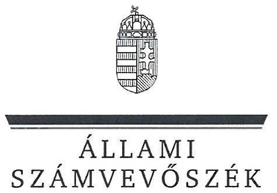
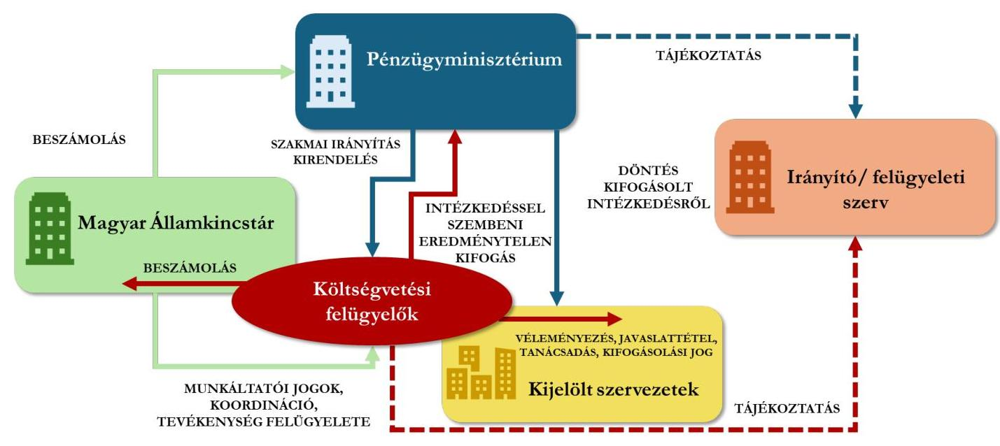
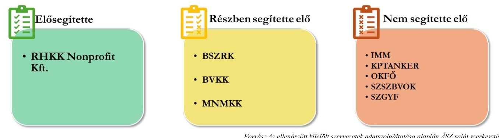
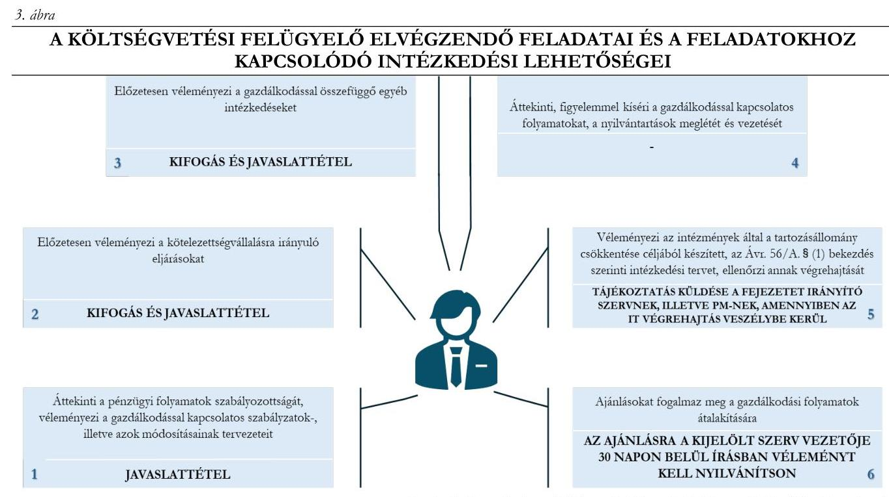
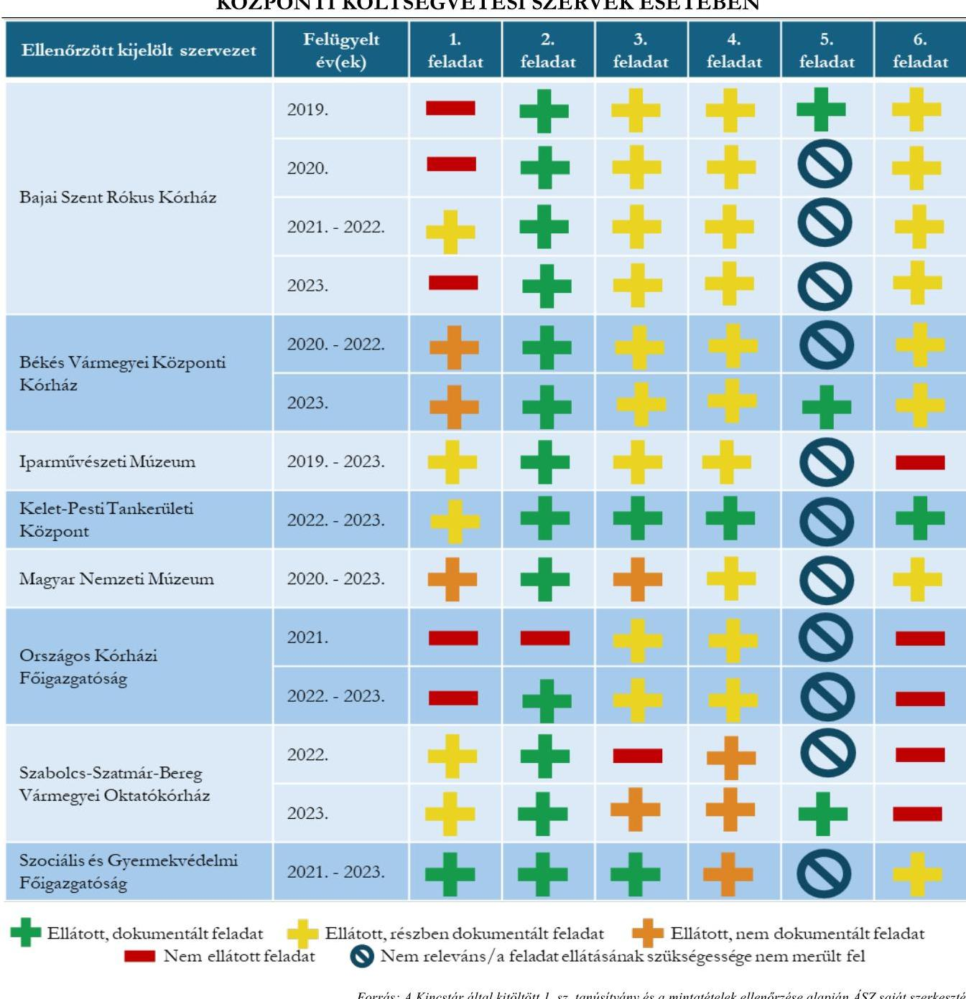
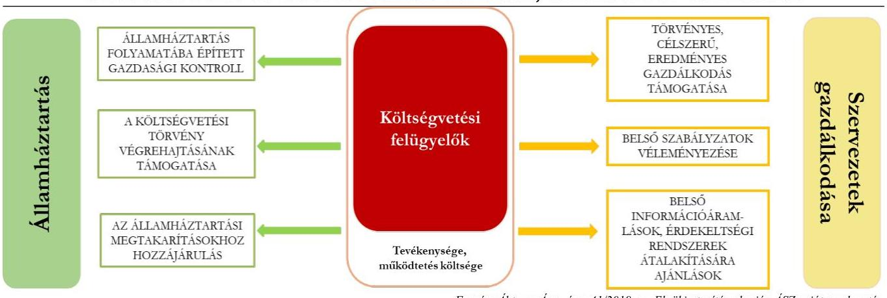

# JELENTÉS 

## A költségvetési felügyeleti tevékenység ellátása

2025.

---

ÁLLAMI
SZÁMVEVŐSZÉK

# JELENTÉS 

## A költségvetési felügyeleti tevékenység ellátása

2025.

---

# ELLENŐRZÉSI IGAZGATÓSÁG: 

## ELLENŐRZÉSI IGAZGATÓSÁG I.

## ELLENŐRZÉSI IGAZGATÓ:

SINKÁNÉ DR. CSENDES ÁGNES igazgató

## ELLENŐRZÉSVEZETŐ:

LACZI HEDVIG ANNA ellenőrzésvezető

Jelentéseink az interneten a www.asz.hu címen olvashatók.

IKTATÓSZÁM: EL-4257-001/2025
TÉMASORSZÁM: 43
ELLENŐRZÉS-AZONOSÍTÓ SZÁM: V1074

---

# TARTALOMJEGYZÉK 

AZ ELLENŐRZÉS ALAPADATAI ..... 5
AZ ELLENŐRZÉS HATÓKÖRE ÉS TERÜLETE ..... 8
ÖSSZEFOGLALÁS ..... 14
AZ ELLENŐRZÉS FÓKUSZTERÜLETEI ..... 17
MEGÁLLAPÍTÁSOK ..... 18
JAVASLATOK ..... 43
MELLÉKLETEK ..... 44
I. sz. melléklet: Értelmező szótár ..... 44
II. sz. melléklet: Az ellenőrzött szervezetek jegyzéke ..... 46
III. sz. melléklet: Ellenőrzési kritériumok ..... 47
IV. sz. melléklet: Részletező táblázat ..... 48
FÜGGELÉK: ÉSZREVÉTELEK ..... 55
RÖVIDÍTÉSEK JEGYZÉKE ..... 57

---

.

---

# AZ ELLENŐRZÉS ALAPADATAI 

## AZ ELLENŐRZÉS CÉLJA

Az ellenőrzés célja annak értékelése volt, hogy a $\mathbf{PM}^{1}$ és a Kincstár ${ }^{2}$ a költségvetési felügyeleti tevékenység működési és szervezeti kereteinek szabályozottságát kialakította-e, valamint a PM a szakmai irányítást végezte-e, és a Kincstár működtette-e a költségvetési felügyeleti tevékenységet, illetve annak nyomon követését biztosító beszámoltatási rendszert.

Az ellenőrzés célja továbbá annak feltárása volt, hogy az ellenőrzött kijelölt szervezeteknél a költségvetési felügyeleti tevékenység megvalósulását elősegítő szabályozás kialakításra került-e, valamint a költségvetési felügyeleti tevékenység a gazdálkodási folyamatokba beépült-e.

Az ellenőrzés célja volt továbbá a PM és a Kincstár által a költségvetési felügyeleti tevékenység eredményességének mérésére kialakított gyakorlat, valamint a költségvetési felügyeleti tevékenység államháztartásra, illetve a kijelölt szervezetek közpénzfelhasználására és gazdálkodására gyakorolt hatásának, valamint ezek alapján a költségvetési felügyeleti rendszer működtetését érintő célszerűség értékelése.

## AZ ELLENŐRZÉS TÍPUSA

Kombinált ellenőrzés

## AZ ELLENŐRZÖTT IDŐSZAK

A 2019-2023. évek, az ellenőrzött kijelölt szervezeteknél az ellenőrzött időszakon belül a 2023. évben feladatokat ellátó költségvetési felügyelő kirendelési időszakához igazodóan.

## AZ ELLENŐRZÉS TÁRGYA

Az ellenőrzés tárgya a költségvetési felügyeleti rendszer működési és szervezeti kereteinek szabályozottsága; a költségvetési felügyeleti tevékenység működtetése, megvalósulása; valamint a költségvetési felügyelők tevékenységével kapcsolatos nyomon követést biztosító beszámoltatási rendszer kialakítása és működtetése volt. Az ellenőrzés tárgyát képezte az ellenőrzött kijelölt szervezeteknél a költségvetési felügyeleti tevékenység megvalósulását elősegítő szabályozás kialakítása, valamint a költségvetési felügyeleti tevékenység gazdálkodási folyamatokba való beépülése. Az elemzés tárgyát képezte továbbá a PM és a Kincstár által a költségvetési felügyeleti tevékenység eredményességének mérésére kialakított gyakorlat, valamint a költségvetési felügyeleti tevékenység eredményének a kijelölt szervezetek közpénzfelhasználására és gazdálkodására, valamint az államháztartásra gyakorolt hatása, illetve ezek alapján a költségvetési felügyeleti rendszer működtetésének célszerűsége.

Az ellenőrzés kiterjedt minden olyan körülményre és adatra, amely az ÁSZ ${ }^{3}$ jogszabályban meghatározott feladatainak teljesítéséhez szükséges volt.

---

# Az ellenőrzés jogalapja 

Az ellenőrzés jogszabályi alapját az ÁSZ tv. ${ }^{4}$ 1. § (3) bekezdésének és az 5. § (2) - (3) és (6) bekezdéseinek előírásai képezték.

## AZ ELLENŐRZÉS MÓDSZERE

Az ellenőrzést a nemzetközi standardokat irányadónak tekintve az ellenőrzési program szempontjai, az ellenőrzött időszakban hatályos jogszabályok, az ellenőrzés szakmai szabályok és módszertanok figyelembe vételével végezte az ÁSZ.

Az ellenőrzés lefolytatásához az ellenőrzött szervezetek az ÁSZ által kért dokumentumok, adatok, információk megküldésével és az ellenőrzés során szolgáltattak adatokat. Az ellenőrzés lefolytatásához szükséges 1. sz. és 2. sz. tanúsítványokat a Kincstárral kormányzati szolgálati jogviszonyban álló költségvetési felügyelők töltötték ki és a Kincstár bocsátotta az ÁSZ rendelkezésére.

Az ellenőrzési program végrehajtásához szükséges bizonyítékok megszerzése az ellenőrzött szervezetek által rendelkezésre bocsátott dokumentumokra és adatokra alapozva, továbbá megfigyelés, szemle (szemrevételezés), kérdésfeltevés (információkérés), interjú, valamint elemző eljárás útján történt. Az ellenőrzési bizonyítékként felhasználható adatforrások közé tartoztak az ellenőrzéshez kért tanúsítványok, valamint dokumentumok, adatbázisok, az ellenőrzés előkészítése szakaszában bekért dokumentumok, a helyszíni jegyzőkönyvekben rögzített információk, továbbá adatforrás volt minden - az ellenőrzés folyamán - feltárt, az ellenőrzés szempontjából releváns információkat tartalmazó dokumentum.

A kijelölt és a 2023. évben költségvetési felügyelet alatt állt szervezetek közül az ÁSZ kockázati alapon választotta ki a 10 ellenőrzött kijelölt szervezet.

A költségvetési felügyeleti tevékenység megvalósulását és az ellenőrzött kijelölt szervezetek gazdálkodási folyamataiba történő beépülését az 1. sz. tanúsítványban az Ávr. ${ }^{5}$ és a 41/2019. sz. Elnöki utasítás ${ }^{6}$ alapján felsorolt hat tevékenységtípusból kockázati szempontok szerint, évenként kiválasztott feladatok, és az ezekhez a Kincstár és az ellenőrzött kijelölt szervezetek által rendelkezésre bocsátott dokumentumok alapján ellenőrizte az ÁSZ. Az ellenőrzés eredménye nem került kivetítésre a teljes sokaságra, a megállapításokat az ÁSZ az ellenőrzött feladatok vonatkozásában tette meg. A költségvetési felügyeleti tevékenység végrehajtásának ellenőrzése keretében az ellenőrzött kijelölt szervezetek ellenőrzött időszakának adatait éves bontásban vette figyelembe az ellenőrzés és az került ellenőrzésre, hogy az adott feladatot az egyes években a költségvetési felügyelő végezte vagy nem végezte és a feladatellátást a 41/2019. sz. Elnöki utasítás szerint dokumentálta-e.

A költségvetési felügyelői feladatot ellátottnak és dokumentáltnak értékelte az ÁSZ, ha a feladatellátásra vonatkozóan a havi/éves költségvetési felügyelői jelentéseken kívül azzal kapcsolatban más alátámasztó dokumentum is rendelkezésre állt.

A költségvetési felügyelői feladatot ellátottnak és részben dokumentáltnak értékelte az ÁSZ, ha

- a feladatellátásra vonatkozóan a havi/éves költségvetési felügyelői jelentéseken kívül azzal kapcsolatban más alátámasztó dokumentum nem állt rendelkezésre, vagy
- a feladatellátás szóban és elektronikus formában is megvalósult, azonban kizárólag az elektronikus formában ellátott feladatokról állt rendelkezésre alátámasztó dokumentum.

---

A költségvetési felügyelői feladatot ellátottnak és nem dokumentáltnak értékelte az ÁSZ, ha a feladatellátás kizárólag szóban valósult meg, amellyel kapcsolatban dokumentumként kizárólag a szóbeli feladatellátásra vonatkozó nyilatkozat állt rendelkezésre.

A költségvetési felügyelői feladatot nem ellátottnak értékelte az ÁSZ, amennyiben a Kincstár adatszolgáltatásában nem ellátottként került feltüntetésre.

A költségvetési felügyelői feladat elvégzése nem volt releváns, ha annak szükségessége az adott évben nem merült fel vagy a feladat ellátása állami tulajdonú gazdasági társaságok esetében az Ávr. alapján nem volt ellátandó feladat.

A költségvetési felügyeleti tevékenység célszerűségét és eredményességét a kijelölt szervezetek közpénzfelhasználására, gazdálkodására, valamint az államháztartásra gyakorolt hatása alapján az 1. és 2. sz. tanúsítványok adatainak felhasználásával elemezte az ÁSZ.

---

# AZ ELLENŐRZÉS HATÓKÖRE ÉS TERÜLETE 

Az ellenőrzés hatóköre a költségvetési felügyeleti tevékenység megvalósulásának ellenőrzésére terjedt ki, amelynek jogszabályi keretrendszerét az Áht. ${ }^{7}$ és Ávr. határozta meg.

## A KÖLTSÉGVETÉSI FELÜGYELETI TEVÉKENYSÉG - PÉNZÜGYMINISZTÉRIUM ÉS MAGYAR ÁLLAMKINCSTÁR

A költségvetési felügyeleti tevékenység az Áht. és az Ávr. előírásain alapuló véleményezési, javaslattételi és kifogásolási, valamint ellenőrzési feladat, amely a folyamatos kontroll megvalósulását szolgálja a kijelölt szervezetek gazdálkodását érintően.

A költségvetési felügyelők feladatellátása az Áht.-ban megfogalmazottak alapján a közpénzfelhasználás hatékonyságának és átláthatóságának javítását szolgálja azáltal, hogy támogatja a kijelölt szervezetek takarékos, szabályszerű, eredményes gazdálkodását, valamint az Ávr.-ben meghatározott intézkedési lehetőségekkel elősegíti a célszerű és szabályszerű közpénzfelhasználást.

Az Áht. és az Ávr. a következő feladatokat határozta meg a költségvetési felügyeleti tevékenységgel kapcsolatban:

A költségvetési felügyelők tevékenységének szakmai irányítását az Áht. 39. § (3) bekezdése alapján az államháztartásért felelős miniszter végzi, míg a költségvetési felügyeleti rendszert a PM és a Kincstár működteti. 2025. január 1-től a Pénzügyminisztérium jogutódja a Nemzetgazdasági Minisztérium.

Az Áht. 39. § (1), (3) bekezdései alapján az államháztartásért felelős miniszter gondoskodik a költségvetési felügyelő határozott időtartamra szóló megbízásáról (kirendelés) és a megbízás visszavonásáról, a kirendelésről előzetes tájékoztatást ad az Áht. 39. § (1) bekezdés a) - c) pontjaiban meghatározottak részére.

Az Áht. 39. § (4) bekezdése alapján a Kincstár elnöke gyakorolja a költségvetési felügyelő felett a megbízáson, a megbízás visszavonásán és a szakmai irányításon felüli munkáltatói jogokat. Az Ávr. 61/B. § (1) bekezdése alapján továbbá a Kincstár a költségvetési felügyelő munkájához rendelkezésre bocsátja a különböző adatbázisokból, nyilvántartásokból rendelkezésre álló részletes adatokat, elkészíti a költségvetési felügyelő által kért dokumentumokat.

Az Áht. 39. § (5) bekezdése alapján a Kincstárral kormányzati szolgálati jogviszonyban álló költségvetési felügyelő a kijelölt szervezetek gazdálkodásának költségvetés-politikával való összhangja és a takarékos, szabályszerű, eredményes működés érdekében az Ávr. 61/A. §. (1) - (3) bekezdéseiben előírt feladatokat végzi, melynek keretében ugyanezen szakasz (5) bekezdésében meghatározott intézkedéseket (kifogás, javaslattétel) tehet. Amennyiben a költségvetési felügyelő kifogása eredménytelen marad, a kifogásolt intézkedés az államháztartásért felelős miniszter jóváhagyása esetén hajtható végre.

A költségvetési felügyelők a tevékenységükről az Ávr. 61/C. § (1) bekezdés szerint havonta írásban beszámolnak az államháztartásért felelős miniszter felé.

Az Ávr. 61/B. § (1) bekezdése alapján a kijelölt szervezetek a költségvetési felügyelők rendelkezésére bocsátják az Ávr. 61/A. §-a szerinti intézkedések dokumentumait, az arra vonatkozó összefoglaló, és a különböző adatbázisokból, nyilvántartásokból rendelkezésre álló részletes adatokat, valamint elkészítik a költségvetési felügyelő által kért dokumentumokat.

Az Áht. és az Ávr. rendelkezései mellett a PM, valamint a Kincstár belső irányítási eszközeiben határozott meg feladatokat a költségvetési felügyeleti tevékenység működtetése kapcsán a különböző szervezeti egységek és azok vezetői részére.

---

# A PM Szervezeti és Működési Szabályzata ${ }_{1,2,3,4,5}{ }^{8}$ szerint 

- a költségvetésért felelős helyettes államtitkár közreműködik a költségvetési felügyelők tevékenységének szakmai irányításában, illetve szakmailag irányítja a hozzá tartozó ágazatoknál működő költségvetési felügyelők tevékenységét,
- az államháztartási szabályozásért, humán és önkormányzati költségvetésért felelős helyettes államtitkár szakmailag irányítja a hozzá tartozó ágazatoknál működő költségvetési felügyelők tevékenységét,
- az Önkormányzati Költségvetési és Kincstári Kapcsolatok Főosztály a szakmailag érintett főosztályokkal együttműködve ellátja a költségvetési felügyelők szakmai irányításához kapcsolódó előkészítő és koordinációs feladatokat, valamint előkészíti a költségvetési felügyelők megbízásával, illetve a megbízásuk visszavonásával kapcsolatos dokumentumokat.
A Kincstár Szervezeti és Működési Szabályzata ${ }_{1,2,3}{ }^{8}$ és a 41/2019. sz. Elnöki utasítás alapján a Kincstár Költségvetési felügyeleti igazgatójának egyes feladatai
- a PM kincstárért felelős helyettes államtitkárával egyeztetve kialakítani és működtetni a költségvetési felügyelők tevékenységére vonatkozó részletes eljárási, jelentési, beszámoltatási és ellenőrzési rendet,
- koordinálni és ellenőrizni a költségvetési felügyelők feladatellátását,
- koordinálni a költségvetési felügyelők feladatkörébe tartozó véleményezéseket,
- kapcsolatot tartani a kirendelt költségvetési felügyelőkkel, az őket érintő aktuális ügyekben tájékoztatást adni,
- a költségvetési felügyelők tevékenységéhez kapcsolódó szakértői anyagokat, valamint a munkájukkal kapcsolatos módszertani problémák körében egységes megoldásokat előkészíteni,
- működtetni a költségvetési felügyelők feladatellátásához szükséges adatszolgáltatási rendszert,
- koordinálni és ellenőrizni a költségvetési felügyelők havi költségvetési felügyelői jelentéseit, azokból vezetői összefoglalót készíteni,
- a havi jelentéseken túl vezetői összefoglalókat készíteni a kijelölt szervezetek kapcsán felmerülő aktuális problémákról, és azokat továbbítani a szakmailag érintett minisztériumok felé,
- javaslatot tenni a költségvetési felügyeleti rendszer bővítésére, fejlesztésére, valamint a megbízandó költségvetési felügyelők személyére.
A költségvetési felügyeleti tevékenységre vonatkozóan a jogszabályok és a belső szabályzatok szerint az érintetteket, a közöttük lévő kapcsolatokat és az ellátandó feladatokat az 1. ábra szemlélteti.

---

1. ábra

A KÖLTSÉGVETÉSI FELÜGYELETI TEVÉKENYSÉG KAPCSOLAT- ÉS FELADATRENDSZERE

Forrás: Az Aht, az Avr., valamint a PM és a Kincstár belső irányítási eszközei alapján ÁSZ saját szerkesztés
A költségvetési felügyeleti tevékenység szabályozottsága tekintetében az ellenőrzés hatóköre annak vizsgálatára terjedt ki, hogy a PM és a Kincstár meghatározta-e a költségvetési felügyeleti tevékenységhez kapcsolódó feladatok ellátásának szervezeti és működési kereteit, továbbá, hogy a költségvetési felügyeleti tevékenység megvalósulásának

 elősegítése céljából az ellenőrzött kijelölt szervezetek határoztak-e meg szabályokat a belső irányítási eszközeikben.

A költségvetési felügyeleti tevékenység működtetésére vonatkozásában az ellenőrzés hatóköre magában foglalta a PM költségvetési felügyeleti tevékenységre vonatkozó szakmai irányításának, valamint a Kincstár költségvetési felügyeleti tevékenység működtetésével és nyomon követést biztosító beszámoltatással kapcsolatos feladatai végrehajtásának értékelését. Az ellenőrzés értékelte továbbá a költségvetési felügyeleti tevékenység beépülését az ellenőrzött kijelölt szervezetek gazdálkodási folyamataiba.

Az ellenőrzés hatóköre kiterjedt továbbá a költségvetési felügyelők tevékenységére vonatkozó havi/éves beszámolóknak a Kincstár Költségvetési felügyeleti igazgatója általi kontrolljára, valamint az adatok, információk átadására a költségvetési felügyelők, az ellenőrzött szervezetek, az ellenőrzött kijelölt szervezetek és az azokat irányító szervezetek között. A Kincstár - nyilatkozata alapján - a költségvetési felügyelők beszámoltatásának értékeléséhez az ÁSZ részére a költségvetési felügyelők 2020., 2021., 2022., 2023. évi tevékenységéről készült december havi, éves jellegű beszámolóit biztosította.

Az elemzés kiterjedt a PM és a Kincstár költségvetési felügyeleti tevékenység eredményességének mérésére kialakított gyakorlatára, továbbá a költségvetési felügyeleti tevékenység kijelölt szervezetek közpénzfelhasználására, gazdálkodására és az államháztartásra gyakorolt hatására.

# ÁSZ ELLENŐRZÖTT KIJELÖLT SZERVEZETEK 

Ellenőrzött kijelölt szervezetként nyolc központi költségvetési szerv - ezeken belül két középirányító szerv -, egy állami tulajdonú gazdasági társaság és egy központi költségvetési fejezet került kiválasztásra a költségvetési felügyeleti tevékenység szervezeteknél történő ellátásának ellenőrzésére. Az ellenőrzött kijelölt szervezetek ellenőrzött időszakra vonatkozó, a költségvetési felügyeleti tevékenység szempontjából

---

meghatározó gazdálkodási adatait mutatja be a jelentés. Az ellenőrzött időszak éveinek összes kiadása és bevétele a költségvetési és a finanszírozási kiadások és bevételek teljesítési adatait foglalja magában.

A BSZRK ${ }^{10}$-hoz a 2018. szeptember 1. - 2024. június 30. közötti időszak vonatkozásában volt költségvetési felügyelő kirendelve. Az ÁSZ a 2019. január 1-től - 2023. december 31-ig tartó időszakot ellenőrizte. Az ellenőrzött időszak éveinek összes kiadását és bevételét az 1. táblázat mutatja be.

| 1. táblázat |  |  |  |  |   |
| --- | --- | --- | --- | --- | --- |
|  BAJAI SZENT RÓKUS KÓRHÁZ ÖSSZES KIADÁSA ÉS BEVÉTELE (E FT ${ }^{11}$ ) |  |  |  |  |   |
|  MEGNEVEZÉS/ÉVEK | 2019. | 2020. | 2021. | 2022. | 2023.  |
|  Összes kiadás | 6297253 | 8346415 | 9247471 | 10990419 | 11695481  |
|  Összes bevétel | 6471981 | 8367912 | 9673987 | 11151858 | 11726454  |
|   |  |  | Forrás: Az éves költségvetési beszámolók alapján ÁSZ saját szerkesztés |  |   |

A BVKK ${ }^{12}$-hoz a 2018. szeptember 1. - 2024. június 30. közötti időszak vonatkozásában volt költségvetési felügyelő kirendelve. Az ÁSZ a 2020. július 1-től - 2023. december 31-ig tartó időszakot ellenőrizte. Az ellenőrzött időszak éveinek összes kiadását és bevételét a 2. táblázat mutatja be. 2. táblázat

BÉKÉS VÁRMEGYEI KÖZPONTI KÓRHÁZ ÖSSZES KIADÁSA ÉS BEVÉTELE (E FT)

| MEGNEVEZÉS/ÉVEK | 2020. | 2021. | 2022. | 2023. |
| :-- | :--: | :--: | :--: | :--: |
| Összes kiadás | 31397608 | 31446985 | 37721334 | 44410334 |
| Összes bevétel | 31562414 | 33405057 | 39225756 | 46602888 |

Az IMM $^{13}$-hez a 2011. november 30. - 2023. december 31. közötti időszak vonatkozásában volt költségvetési felügyelő kirendelve. Az ÁSZ a 2019. február 19-től - 2023. december 31-ig tartó időszakot ellenőrizte. Az Iparművészeti Múzeum jogutódlással megszűnt, jogutód költségvetési szerve 2024. július 1-től a Magyar Nemzeti Múzeum Közgyűjteményi Központ. Az ellenőrzött időszak éveinek összes kiadását és bevételét a 3. táblázat mutatja be.

| 3. táblázat |  |  |  |  |  |
| :--: | :--: | :--: | :--: | :--: | :--: |
| IPARMÜVÉSZETI MÚZEUM ÖSSZES KIADÁSA ÉS BEVÉTELE (E FT) |  |  |  |  |  |
| MEGNEVEZÉS/ÉVEK | 2019. | 2020. | 2021. | 2022. | 2023. |
| Összes kiadás | 4469713 | 2565254 | 3014366 | 2379411 | 2734005 |
| Összes bevétel | 4878513 | 3480930 | 3107131 | 2434596 | 2777010 |

A KPTANKER ${ }^{14}$-hez a 2022. március 10. - 2024. december 31. közötti időszak vonatkozásában volt költségvetési felügyelő kirendelve. Az ÁSZ a 2022. március 10-től - 2023. december 31-ig tartó időszakot ellenőrizte. Az ellenőrzött időszak éveinek összes kiadását és bevételét a 4. táblázat mutatja be.

# 4. táblázat 

## KELET-PESTI TANKERÜLETI KÖZPONT ÖSSZES KIADÁSA ÉS BEVÉTELE (E FT)

| MEGNEVEZÉS/ÉVEK | 2022. | 2023. |
| :-- | :--: | :--: |
| Összes kiadás | 12134615 | 13453524 |
| Összes bevétel | 12250670 | 13538705 |

---

A MNMKK ${ }^{15}$-hoz a 2015. december 21. - 2023. december 31. közötti időszak vonatkozásában volt költségvetési felügyelő kirendelve. Az ÁSZ a 2020. január 1-től - 2023. december 31-ig tartó időszakot ellenőrizte. Az ellenőrzött időszak éveinek összes kiadását és bevételét az 5. táblázat mutatja be.
5. táblázat

MAGYAR NEMZETI MÚZEUM KÖZGYÜJTEMÉNYI KÖZPONT ÖSSZES KIADÁSA ÉS BEVÉTELE (E FT)

| MEGNEVEZÉS/ÉVEK | 2020. | 2021. | 2022. | 2023. |
| :-- | :--: | :--: | :--: | :--: |
| Összes kiadás | 4323723 | 8129159 | 17130831 | 18013728 |
| Összes bevétel | 6027059 | 10946297 | 21707284 | 20438133 |

Az OKFŐ ${ }^{16}$-hoz 2021. július 30-tól kezdődően van költségvetési felügyelő kirendelve, akinek a megbízatása 2025. június 30-ig szól. Az ÁSZ a 2021. július 30-tól - 2023. december 31-ig tartó időszakot ellenőrizte. Az ellenőrzött időszak éveinek összes kiadását és bevételét a 6. táblázat mutatja be.
6. táblázat

ORSZÁGOS KÓRHÁZI FŐIGAZGATÓSÁG ÖSSZES KIADÁSA ÉS BEVÉTELE (E FT)

| MEGNEVEZÉS/ÉVEK | 2021. | 2022. | 2023. |
| :-- | :--: | :--: | :--: |
| Összes kiadás | 168454877 | 143270340 | 194758108 |
| Összes bevétel | 274775677 | 186267395 | 236368646 |

A SZSZBVOK ${ }^{17}$-hoz a 2020. február 10. - 2021. június 30. közötti, majd a 2022. március 10. - 2024. december 31. közötti időszakok vonatkozásában volt költségvetési felügyelő kirendelve. Az ÁSZ a 2022. március 10-től - 2023. december 31-ig tartó időszakot ellenőrizte. Az ellenőrzött időszak éveinek összes kiadását és bevételét a 7. táblázat mutatja be.
7. táblázat

SZABOLCS-SZATMÁR-BEREG VÁRMEGYEI OKTATÓKÓRHÁZ ÖSSZES KIADÁSA ÉS BEVÉTELE (E FT)

| MEGNEVEZÉS/ÉVEK | 2022. | 2023. |
| :-- | :--: | :--: |
| Összes kiadás | 67645991 | 72409106 |
| Összes bevétel | 68227930 | 72798612 |

A SZGYF ${ }^{18}$-hez a 2021. május 12. - 2024. december 31. közötti időszak vonatkozásában volt költségvetési felügyelő kirendelve. Az ÁSZ a 2021. május 12-től - 2023. december 31-ig tartó időszakot ellenőrizte. Az ellenőrzött időszak éveinek összes kiadását és bevételét a 8. táblázat mutatja be.
8. táblázat

SZOCIÁLIS ÉS GYERMEKVÉDELMI FŐIGAZGATÓSÁG ÖSSZES KIADÁSA ÉS BEVÉTELE (E FT)

| MEGNEVEZÉS/ÉVEK | 2021. | 2022. | 2023. |
| :-- | :--: | :--: | :--: |
| Összes kiadás | 26355732 | 28997236 | 15788161 |
| Összes bevétel | 55453155 | 33108363 | 19881985 |

A BM fejezethez ${ }^{19}$ a 2019. február 19. - 2024. december 31. közötti időszak vonatkozásában volt költségvetési felügyelő kirendelve. Az ÁSZ a 2021. augusztus 1-től - 2023. december 31-ig tartó időszakot ellenőrizte. A BM fejezetnél a költségvetési felügyelői feladatellátás célja nem az Ávr. 61/A. § (1) - (3) bekezdéseiben foglalt feladatok végrehajtása volt, hanem a teljes fejezetre vonatkozóan olyan információs

---

csatorna, kapcsolat kiépítésére és folyamatos fenntartására, amely lehetőséget nyújt a kiemelt célvizsgálatok elvégzésére, költségvetési felügyelői elemzésére.

A RHKK Nonprofit Kft ${ }^{20}$-hez a 2018. április 27. - 2020. december 31. közötti, majd 2021. február 16. - 2024. december 31. közötti időszakok vonatkozásában volt költségvetési felügyelő kirendelve. Az ÁSZ a 2021. február 16-tól - 2023. december 31-ig tartó időszakot ellenőrizte. Az ellenőrzött időszak éveinek összes ráfordítását - ezen belül a közhasznú tevékenység ráfordítását - és bevételét - ezen belül a támogatás jogcímen kapott bevételt - a 9. táblázat mutatja be.
9. táblázat

# RADIOAKTÍV HULLADÉKOKAT KEZELŐ KÖZHASZNÚ NKFT. ÖSSZES RÁFORDÍTÁSA ÉS BEVÉTELE (E FT) 

| MEGNEVEZÉS/ÉVEK | 2021. | 2022. | 2023. |
| :-- | :--: | :--: | :--: |
| Összes ráfordítás | 8584207 | 9820051 | 10595693 |
| Összes ráfordításból a közhasznú tevékenység ráfordítása | 8584207 | 9820051 | 10595693 |
| Összes bevétel | 8585423 | 9825376 | 10595810 |
| Összes bevételből a támogatás jogcímen kapott bevétel | 5696432 | 6873450 | 7760382 |

Forrás: Az éves beszámolók és közhasznúsági mellékletek alapján ÁSZ saját szerkesztés

---

# ÖSSZEFOGLALÁS 

A költségvetési felügyeleti rendszer létrehozásával a jogalkotói cél az volt, hogy a kijelölt szervezeteknél a költségvetési felügyelő folyamatos és preventív kontrollt valósítson meg a gazdálkodás tekintetében, valamint járuljon hozzá a közpénzek hatékony, szabályszerű és átlátható felhasználásához. A rendszer működésének 14 éve alatt az egészségügyi, a felsőoktatási, a közoktatási, a kulturális, a szociális és a nukleáris ágazat közel 100 szervezetéhez, valamint két központi költségvetési fejezethez volt költségvetési felügyelő kirendelve.

A költségvetési felügyeleti rendszer fenntartása - tekintettel a közpénzekkel történő gazdálkodásban rejlő kockázatokra, illetve ÁSZ ellenőrzési tapasztalatokra - indokolt. A költségvetési felügyeleti rendszer fontos védelmi vonalat jelent a közpénzek és a közvagyon védelme, illetve szabályszerű felhasználása szempontjából. A PM jogutódjaként az $\mathrm{NGM}^{21}$ és a Kincstár által ugyanakkor célszerű a költségvetési felügyeleti rendszer eredményesebb működése érdekében a szabályozási és működési jellemzők átgondolása. Ennek keretében kiemelt szempontot jelent a költségvetési felügyeleti tevékenység átláthatósága, nyomon követhetősége, megalapozottsága és a működtetéséből származó eredmények növelése, amelyhez felhasználhatók a költségvetési felügyeleti rendszer eddigi tapasztalatai.

A PM a költségvetési felügyeleti rendszer szervezeti keretét kialakította, azonban a működési keretét részben határozta meg. A PM a költségvetési felügyelők megbízásával, a megbízás visszavonásával kapcsolatos tevékenységét a jogszabályi előírásoknak megfelelően szabályozta. A költségvetési felügyelők tevékenysége szakmai irányításának részletes szempontjait és módszereit azonban a PM a jogszabályi előírás ellenére nem határozta meg, továbbá a szakmai irányítás keretében nem kerültek megfogalmazásra a költségvetési felügyeleti tevékenység megvalósulásához kapcsolódó elvárások, azok mérésére és értékelésére vonatkozó módszerek és gyakorlatok. Mindez azt eredményezte, hogy a költségvetési felügyelők nem egységes szakmai szempontok szerint látták el feladataikat, ezért nem volt biztosított az elvégzett tevékenység eredményének mérése, értékelése és összemérhetősége.

A költségvetési felügyeleti rendszer transzparenciájának növelése érdekében az ÁSZ véleménye szerint indokolt a PM jogutódjaként az NGM részéről a szervezetek költségvetési felügyelet alá vonására, vagy a meglévő kijelölés meghosszabbítására vonatkozó szempontrendszer kialakítása. Ennek keretében olyan költségvetési
 vagy gazdálkodási paraméterek, célok és mutatók, vagy a szervezetek és gazdálkodási területek működése szempontjából jelentős egyéb szempontok határozhatók meg, amelyek alapján egyértelműen alátámasztott, hogy az adott szervezethez indokolt-e költségvetési felügyelő kirendelése. E szempontrendszer kidolgozásának alapvető feltétele a költségvetési gazdálkodásban rejlő kockázatok államháztartási szintű, folyamatos és átfogó mérése, illetve nyomon követése.

A Kincstár a Kincstár Szervezeti és Működési Szabályzata ${ }_{1,2,3}$-ban és a 41/2019. sz. Elnöki utasításban a költségvetési felügyeleti rendszer szervezeti keretét kialakította, azonban a működési keretét a belső szabályozásában részben határozta meg. A költségvetési felügyelők feladatellátásának eljárásrendje csak részben került meghatározásra, mivel a Kincstár a költségvetési felügyelők feladatellátására vonatkozó ellenőrzési rendet a Kincstár Szervezeti és Működési Szabályzata ${ }_{1,2,3}$-ban foglaltak ellenére nem alakította ki.

Az ellenőrzött kijelölt szervezetek közül egy szervezet szabályozottsága elősegítette, három szervezet szabályozottsága csak egyes területeken segítette elő a költségvetési felügyeleti tevékenység megvalósulását. Öt szervezet szabályozottsága nem segítette elő a költségvetési felügyeleti tevékenység megvalósulását, mivel a belső irányítási eszközeikben az Ávr.-ben és a Bkr. ${ }^{22}$-ben foglaltak ellenére a költségvetési felügyeleti tevékenység

---

megvalósulására vonatkozóan nem határoztak meg előírásokat, valamint a költségvetési felügyelő kirendelését követően nem aktualizálták a gazdálkodással kapcsolatos munkafolyamataik leírását.

A költségvetési felügyeleti tevékenység működtetése részben valósult meg. A Kincstár elnöke gyakorolta a költségvetési felügyelők feletti munkáltatói jogokat, illetve a költségvetési felügyelők részére történő információátadás, a tevékenységükhöz szükséges adatok rendelkezésre bocsátása megtörtént a Kincstár részéről. A 41/2019. sz. Elnöki utasításban foglaltak ellenére ugyanakkor a költségvetési felügyelők tevékenysége részben volt dokumentált, mivel a szóbeli véleményezések, javaslatok, releváns információk írásbeli dokumentálása nem történt meg. A Kincstárral kormányzati szolgálati jogviszonyban már nem állt költségvetési felügyelők feladatellátására vonatkozó dokumentumok, információk nem kerültek megőrzésre. A költségvetési felügyelői feladatellátás dokumentáltságának hiánya és a dokumentumok megőrzésének elmulasztása következtében a 41/2019. sz. Elnöki utasítás ellenére a Kincstár nem biztosította a költségvetési felügyelők feladatellátásának objektív nyomon követését, az elvégzett feladatok és azok eredményeinek visszakereshetőségét, illetve ellenőrizhetőségét. A költségvetési felügyeleti tevékenység eredményességének megítéléséhez szükséges, számszerűsített megtakarítások adatai mindezek következtében teljeskörűen nem voltak alátámasztottak.

A Kincstár a költségvetési felügyeleti rendszer tevékenységének nyomon követését biztosító rendszert kialakította, ugyanakkor a hiányos dokumentálás miatt ennek működtetése korlátozottan volt alátámasztott.

A Kincstár a költségvetési felügyelők tevékenységével kapcsolatos beszámoltatás kereteit kialakította, azonban ennek működtetése nem volt megfelelő. A december havi éves jellegű költségvetési felügyelői jelentések a Kincstár Költségvetési felügyeleti igazgatója által áttekintésre kerültek, azonban azok tartalmi szempontú ellenőrzése és jóváhagyása a Kincstár Költségvetési felügyeleti igazgatója részéről a 41/2019. sz. Elnöki utasításban és annak 2. sz. függelékében foglaltak ellenére dokumentált módon nem történt meg. Mindezt alátámasztja az a tény, hogy az éves jellegű költségvetési felügyelői jelentések egy része nem felelt meg a 41/2019. sz. Elnöki utasításban és annak 1. sz. függelékében szereplő tartalmi követelményeknek. A Kincstár részéről a tartalmi hiányosságok nem kerültek feltárásra és nem intézkedett a jelentések költségvetési felügyelők által történő kijavítása érdekében. Mindezek alapján elmaradt a költségvetési felügyelői jelentésekben foglaltak megalapozottságának kontrollja, ezáltal a jelentések felhasználásával a PM részére készült éves összefoglalók megtakarításokra vonatkozó adatainak alátámasztottsága sem volt biztosított.

A költségvetési felügyeleti tevékenység eredményességének mérésére vonatkozó feltételek az ellenőrzött időszakban korlátozottan álltak rendelkezésre, mivel a jogszabályi előírás ellenére a PM az eredményességre vonatkozó célokat nem határozott meg, valamint a Kincstár részletes szakmai elvárásokat nem fogalmazott meg a költségvetési felügyelők részére a feladatellátásra vonatkozóan.

A szóbeli véleményezések dokumentáltságának, valamint az iratmegőrzés hiányosságai következtében a költségvetési felügyeleti tevékenység hasznosulása az egyes érintett szervezetek, illetve az államháztartás szintjén korlátozottan volt visszamérhető, illetve alátámasztott.

---

# A KÖLTSÉGVETÉSI FELÜGYELETI RENDSZER EREDMÉNYESEBB MŰKÖDÉSÉT TÁMOGATÓ TOVÁBBI SZEMPONTOK AZ ÁSZ VÉLEMÉNYE SZERINT 

A költségvetési felügyeleti tevékenység eredményességét növelné, amennyiben a szervezetalapú feladatellátás mellett, a jövőben nagyobb hangsúlyt kapna a feladatalapú megközelítés. Ennek keretében az államháztartás vagy az egyes költségvetési ágazatok szempontjából kockázatos területek és feladatok kerülnének a költségvetési felügyeleti tevékenység fókuszába. A PM és a Kincstár részéről a feladatalapú megközelítés irányába tett „jó gyakorlat" volt a kórházaknál a 2023. évben megkezdett létszám-, és bérgazdálkodás ellenőrzése.
: A szervezetalapú költségvetési felügyeleti tevékenység eredményességét növelné, amennyiben a költségvetési felügyelői feladatellátás nagyobb mértékben a fejezetekre, a középirányító szervezetekre és az országos hatáskörű szervezetekre fókuszálna, ezáltal átfogóbb rálátás nyílna az ágazatokra és ezeken belül az egyes szervezetekre.
: A feladatalapú és a szervezetalapú költségvetési felügyeleti tevékenység megalapozottabb ellátását elősegítené a költségvetési felügyelői feladatellátás meglévő tapasztalatainak elemzése a PM jogutódjaként az NGM és a Kincstár részéről, amely hozzájárulhat az egyes ágazatok, szervezettípusok kockázatos területeinek, feladatainak feltérképezéséhez és ezek priorizálásához.

---

# AZ ELLENŐRZÉS FÓKUSZTERÜLETEI 

1. A költségvetési felügyeleti tevékenység/rendszer szabályozottsága
2. A költségvetési felügyeleti tevékenység működtetése
3. A költségvetési felügyeleti rendszer információs rendszere, a költségvetési felügyelők beszámoltatása
4. A költségvetési felügyeleti tevékenység eredményességének mérésére kialakított gyakorlatok és a tevékenység államháztartási szintű és a kijelölt szervezetekre gyakorolt hatása

---

# 1. A költségvetési felügyeleti tevékenység/rendszer szabályozottsága 

Összegző megállapítás

A költségvetési felügyeleti tevékenység szervezeti kereteit a PM és a Kincstár a jogszabályi előírásokat figyelembe véve kialakította, a működés kereteit azonban nem határozták meg minden releváns területre. Az IMM, a KPTANKER, az OKFÖ, a SZSZBVOK és a SZGYF szabályozottsága nem segítette elő a költségvetési felügyeleti tevékenység megvalósulását. A RHKK Nonprofit Kft. szabályozottsága elősegítette, míg a BSZRK, a BVKK és a MNMKK szabályozottsága egyes területek vonatkozásában segítette elő a költségvetési felügyeleti tevékenység megvalósulását.

A PM a költségvetési felügyeleti tevékenység szervezeti kereteit az Áht. 39. § (1), (3) bekezdései és az Ávr. 61. § (4) bekezdése előírásai szerint megfelelően kialakította. A PM a költségvetési felügyelők megbízólevelének kiadmányozásra történő előkészítését és kiadását, a megbízások visszavonását és a kapcsolódó koordinációs feladatokat a PM Szervezeti és Működési Szabályzata ${ }_{1,2,3,4,5}$-ban és a feladatot ellátó PM Önkormányzati Költségvetési és Kincstári Kapcsolatok Főosztály Ügyrend ${ }_{1,2,3}{ }^{23}$-ban szabályozta.
A működés kereteit az Áht. 39. § (3) bekezdése szerinti minden feladatra a Bkr. 6. § (1) bekezdés b) pontjában és a (2) bekezdésében szereplő rendelkezés ellenére nem határozta meg, mivel a költségvetési felügyelők tevékenységének szakmai irányítási módja és kerete nem kerültek meghatározásra, ezzel nem volt biztosított a költségvetési felügyelők egységes szempontok szerinti feladatellátása, valamint a feladatellátás eredményének mérése és értékelése.
Az Áht. 39. §-a, valamint az Ávr. 61. § - 61/C. §-ai nem tartalmaztak arra vonatkozóan előírást, hogy milyen feltételek esetében vagy milyen okokból szükséges költségvetési felügyelőt kirendelni valamely szervezethez, vagyis a szervezetet miért szükséges költségvetési felügyeleti tevékenység alá helyezni, erre vonatkozóan javaslatot tenni az államháztartásért felelős miniszternek. A PM a szakmai irányítás keretében a Bkr. 6. § (1) bekezdés b) pontjában és a (2) bekezdésében szereplő rendelkezés ellenére nem határozta meg a szervezetek költségvetési felügyeletre történő kijelölésének, a kijelölés meghosszabbításának, a kijelölésre vagy meghosszabbításra tett javaslat támogatásának/nem támogatásának, a szervezethez történő kirendelés esetén az adott költségvetési felügyelő kiválasztásának egységes elveit, szempontrendszerét.

A költségvetési felügyeleti tevékenység átláthatóbbá és megalapozottabbá tételéhez indokolt az ÁSZ véleménye szerint a PM jogutódjaként az NGM részéről a szervezetek költségvetési felügyeletre történő kiválasztási szempontrendszerének kidolgozása.

A szempontrendszer olyan költségvetési, gazdálkodási paramétereket - például az előirányzat-módosítások és előirányzatok alakulása, a bevételek csökkenése és kiadások növekedése -, költségvetési,

---

gazdálkodási célokat és mutatókat - például a kintlévőség-, és adósságállomány alakulása -, vagy a szervezetek működése szempontjából jelentős egyéb komponenseket - például a szervezetek átalakulása, újonnan alapított szervezet megalakulása, nagyobb összegű költségvetési forrást igénylő feladatok átvétele - tartalmazhatna, amelyek teljesülése vagy fennállása esetén szükséges - a költségvetési felügyelőnek a szervezethez történő kirendelésével - valamely szervezet költségvetési felügyelet alá vonására, vagy a meglévő kijelölés meghosszabbítására javaslatot tenni az államháztartásért felelős miniszternek. E szempontrendszer kidolgozása során fontos, hogy figyelembe vegyék a központi alrendszerbe tartozó költségvetési szervek, valamint az állami tulajdonú gazdasági társaságok eltérő gazdálkodási jellemzőit, a kapcsolódó költségvetési, gazdálkodási kockázatok mértékét annak érdekében, hogy a rendelkezésre álló költségvetési felügyelői személyi erőforrás a leginkább kockázatos területeken, szervezeteknél kerüljön felhasználásra.
A PM a Bkr. 6. § (1) bekezdés b) pontjában és a (2) bekezdésében foglaltak ellenére nem határozott meg olyan kiválasztási szempontrendszert, amely az Ávr. általános feltételeinél részletesebben tartalmazta volna azon elveket - például szakmai gyakorlat speciális területeken, ellenőrzési és költségvetési felügyeleti tapasztalat stb. -, amelyek alapján kiválasztásra kerülhettek azok a személyek, akik a költségvetési felügyelői állomány tagjai lettek. Ezen felül arra vonatkozó egységes feltételrendszert sem alakított ki, hogy a költségvetési felügyelők közül milyen elvek figyelembevételével választotta ki az adott szervezethez a költségvetési felügyelőt.
A Kincstár a költségvetési felügyeleti tevékenység működési és szervezeti kereteit az Áht. 39. §-a — kivéve (1) és (3) bekezdések — és az Ávr. 61. §-a — kivéve (4) bekezdés — és a 61/C. §-ai szerinti feladatok vonatkozásában a Kincstár Szervezeti és Működési Szabályzata ${ }_{1,2,3}$-ban és a 41/2019. sz. Elnöki utasításban határozta meg, azonban a működés szabályozása nem terjedt ki minden releváns területre. A 41/2019. sz. Elnöki utasítás részletesen tartalmazta a költségvetési felügyelők jogállása, jogai és kötelezettségei, valamint feladatai mellett a költségvetési felügyelői feladatellátás végrehajtásának részletes eljárásrendjét, így a feladatellátás dokumentálására, a tevékenységről szóló beszámolásra és a beszámoló tartalmának dokumentumokkal történő alátámasztására, valamint a költségvetési felügyelők közötti együttműködésre vonatkozó szabályokat.
A Kincstár az Áht. 10. § (5) bekezdése, az Ávr. 13. § (5) bekezdése, a Bkr. 6. § (1) bekezdés b) pontja és a (2) bekezdése, valamint a Kincstár Szervezeti és Működési Szabályzatai ${ }_{1,2,3}$-ban „A Költségvetési felügyeleti igazgatóra" vonatkozó fejezetekben meghatározottak ellenére a költségvetési felügyelők tevékenységére vonatkozó ellenőrzési rendet nem készítette el.

A szabályozás hiánya azt a kockázatot hordozza, hogy nem fog megtörténni a költségvetési felügyelők feladatellátásának egységes szempontok alapján történő ellenőrzése, illetve a feladatellátás eredményeinek szakmai kontrollja sem egységes szempontok alapján fog történni. Ezáltal a költségvetési felügyelők feladatellátásának mérése, összemérhetősége nem lesz biztosított.
Az Áht. 39. § (4) bekezdése értelmében a költségvetési felügyelők felett a munkáltatói jogokat a Kincstár elnöke gyakorolta, amelynek részletszabályait az 1/2019. (XI. 4.) sz. Elnöki utasítás ${ }^{24}$ tartalmazta. Az utasítás a költségvetési felügyelők feletti munkáltatói jogkörgyakorlásra vonatkozóan speciális szabályokat nem fogalmazott meg.
Az ellenőrzött kijelölt szervezetek esetében az Áht. 39. §-a és az Ávr. 61. §-61/C. §-ai nem tartalmaztak előírást arra vonatkozóan, hogy a költségvetési felügyeleti tevékenység eredményes megvalósulásának támogatása érdekében a belső irányítási eszközeikben határozzanak meg előírásokat, feladatokat. Az Áht.,

---

az Ávr., valamint a Bkr. rendelkezései azonban meghatározták a költségvetési szervek részére, hogy feladataik ellátásának, a feladatok munkafolyamatainak leírását és módját belső
 szabályzataik, vagy a szervezeti egységek ügyrendjei tartalmazzák.
Az IMM, a KPTANKER, az OKFŐ, a SZSZBVOK, valamint a SZGYF a belső irányítási eszközeiben - elsősorban a szervezeti és működési szabályzatában, az Ávr. 13. § (2) bekezdés szerinti szabályzatokban, gazdasági szervezetének ügyrendjében - az Áht. 10. § (5) bekezdésében, az Ávr. 13. § (5) bekezdésében, valamint a Bkr. 6. § (1) bekezdés b) pontjában és (2) - (3) bekezdéseiben foglaltak ellenére a költségvetési felügyeleti tevékenység megvalósulásának elősegítése érdekében nem határozott meg előírásokat. A belső irányítási eszközökben - e szervezetek vonatkozásában - nem jelentek meg a felelősségi, hatásköri viszonyok és feladatok a költségvetési felügyeleti tevékenységgel kapcsolatban. A szervezetek a gazdálkodási folyamataikkal kapcsolatos belső szabályzataikba és az ellenőrzési nyomvonalaikba nem építették be, illetve ezeket nem módosították a szervezethez kirendelt költségvetési felügyelővel való együttműködéssel kapcsolatos szervezeti feladatokkal.

A kijelölt szervezetek gazdálkodása és költségvetési felügyeleti tevékenység megvalósulása szempontjából kockázatot jelentenek a gazdálkodási folyamatok belső szabályozottságának hiányosságai, amelyek következtében elmaradhat a költségvetési felügyelő részére valamennyi előzetes felülvizsgálatot igénylő intézkedés-, kötelezettségvállalás-tervezet előzetes véleményezésre történő megküldése. Ennek következtében fennáll annak lehetősége, hogy a kijelölt szervezeteknél például a közfeladatokhoz nem kapcsolódó, fedezethiány fennállása esetén történő, valamint szükségtelen kötelezettségvállalás történik, illetve a költségvetési felügyelő javaslatai és ajánlásai nem kerülnek végrehajtásra vagy legalább megfontolásra.

A BSZRK, a BVKK és a MNMKK szabályozottsága részben támogatta a költségvetési felügyeleti tevékenység eredményes megvalósulását, mert az Áht. 10. § (5) bekezdése, az Ávr. 13. § (5) bekezdése, valamint a Bkr. 6. § (1) bekezdés b) pontja és (2) - (3) bekezdéseiben foglaltak ellenére a belső szabályzataikban csak a gazdálkodási folyamataik egyes területei vonatkozásában határoztak meg a szervezetükre vonatkozó előírásokat a költségvetési felügyeleti tevékenységgel kapcsolatban.
A BSZRK A költségvetési felügyelő feladatellátásának eljárásrendjében ${ }^{25}$ táblázatos formában rögzítette a költségvetési felügyeleti tevékenységhez kapcsolódó, kizárólag a dokumentumok előzetes véleményezésre történő megküldésével kapcsolatos szervezeti feladatokat, a kapcsolódó dokumentumok megnevezését, a szervezeten belüli felelősöket, határidőket, valamint az információáramlás módját.
A BVKK 2023. évben kiadott szervezeti és működési szabályzata ${ }^{26}$ tartalmazta, hogy az Igazgató Tanács üléseinek állandó meghívottja a költségvetési felügyelő. A Központi Pénzügyi Rendszerre vonatkozó szabályzata ${ }_{1,2,3}{ }^{27}$ a költségvetési felügyelő tevékenységének támogatására vonatkozó szervezeti feladatokat tartalmazta. A Gazdasági szervezet Ügyrendje ${ }^{28}$ 2024. június 1-től kiegészítésre került a költségvetési felügyelő tevékenységével kapcsolatos szervezeti feladatokkal. Az ellenőrzés során történő szabályzatkiegészítéssel az ellenőrzés a BVKK-nál folyamatában is hasznosult. A BVKK Gazdasági osztályának ${ }_{1,2,3}{ }^{29}$, Műszaki és Informatikai osztályának ${ }_{1,2,3,4}{ }^{30}$, Pénzügyi és számviteli osztályának ${ }_{1,2}{ }^{31}$, valamint a Humánpolitikai osztályának ${ }_{1,2}{ }^{32}$ ellenőrzési nyomvonala is feltételként tartalmazta a költségvetési felügyelői jóváhagyás meglétét.
A MNMKK a kötelezettségvállalásról, utalványozásról, pénzügyi ellenjegyzésről, valamint a szakmai teljesítés igazolásáról szóló szabályzatai ${ }_{1,2,3}{ }^{33}$, valamint a gazdasági igazgató által kiadott 1. számú

---

körlevelében ${ }^{34}$ adott tájékoztatást a munkatársak részére a költségvetési felügyelő kirendeléséről és kötelezettségvállalások esetében az együttműködésre vonatkozó feladatokról.
A RHKK Nonprofit Kft., mint állami tulajdonú gazdasági társaság vonatkozásában az Ávr. 61./A. § (3) bekezdése értelmében a költségvetési felügyelő feladata volt előzetesen véleményezni a társaságnak nyújtott költségvetési támogatások felhasználásával összefüggő intézkedéseket. A szervezetnél a 2021. február 22-én megtartott vezetői értekezlet keretében, valamint 2021. február 17-én e-mail formájában is történt szervezeten belüli tájékoztatás a költségvetési felügyelő ismételt megbízásáról és arról, hogy az előző évekhez hasonlóan, változatlan feltételek mellett, csak a költségvetési felügyelő jóváhagyásával lehet kötelezettséget vállalni, illetve kifizetést indítani. A szerződések kötésének rendjéről szóló utasítás ${ }^{35}$ a Gbkr. ${ }^{36}$ előírásait figyelembe véve tartalmazta a költségvetési felügyelő hozzájárulásának kérésére vonatkozó előírásokat a beszerzések megvalósításánál. Ezáltal a szervezet belső szabályozottsága elősegítette a költségvetési felügyeleti tevékenység megvalósulását.
A 2. ábra szemlélteti, hogy az ellenőrzött kijelölt szervezetek belső szabályozottsága miként járult hozzá a költségvetési felügyeleti tevékenység megvalósulásához.
2. ábra

AZ ELLENŐRZÖTT KIJELÖLT SZERVEZETEK BELSŐ SZABÁLYOZOTTSÁGÁNAK HOZZÁJÁRULÁSA A KÖLTSÉGVETÉSI FELÜGYELETI TEVÉKENYSÉG MEGVALÓSULÁSÁHOZ

A BM fejezet esetében a költségvetési felügyelő sajátos feladat ellátására kapott megbízást, amelyre vonatkozóan a szakmai leírásokat a PM által kiadott költségvetési felügyelői megbízólevelek és feladatmeghatározások tartalmazták. A BM fejezet esetében a költségvetési felügyeleti tevékenység megvalósulásának keretrendszerét nem a belső irányítási eszközök, hanem a költségvetési felügyelő megbízása és részletes feladatmeghatározása biztosította.

---

# 2. A költségvetési felügyeleti tevékenység működtetése 

| Összegző megállapítás | A PM a költségvetési felügyelők megbízóleveleinek   kiadásáról, a megbízás visszavonásáról a jogszabályi   előírásoknak megfelelően gondoskodott. A Kincstár a   költségvetési felügyeleti tevékenységgel kapcsolatos Áht.   szerinti feladatainak szabályszerűen és dokumentáltan eleget   tett. A 41/2019. sz. Elnöki utasításban foglaltak ellenére a   költségvetési felügyelői feladatellátás dokumentáltsága nem   volt teljeskörűen biztosított, valamint a költségvetési   felügyelők feladatellátásának Kincstár általi ellenőrzése nem   valósult meg. |
| :--: | :--: |

A PM az Áht. és az Ávr. előírásainak megfelelően ellátta a költségvetési felügyelők megbízásával, illetve megbízásuk visszavonásával kapcsolatos feladatokat. A kiállított megbízólevekben az Ávr.-ben foglaltak feltüntetésre kerültek. Az eredménytelen költségvetési felügyelői kifogás esetén követendő eljárást a PM az Áht. és az Ávr. előírásai, valamint a belső irányítási eszközeiben meghatározottak alapján hajtotta végre. Egységes szempontrendszer hiányában a költségvetési felügyelők szakmai irányítása a PM szakmailag illetékes főosztályai által összehívott személyes találkozók, elektronikus levelezések vagy telefonos megbeszélések keretében történt, amelyeket azonban egyes esetekben nem dokumentáltak.

Az egységes szakmai irányítás szempontrendszerének hiánya azt a kockázatot hordozza, hogy a jövőben felmerülő szakmai irányítást igénylő azonos jellegű problémák, kérdések nem egységes szakmai álláspont alapján kerülnek kezelésre költségvetési felügyelőnként, szervezetenként. Ezek a kijelölt szervezetek gazdálkodására és a közpénzek felhasználására kedvezőtlen hatással bírnak, mivel a dokumentáltság hiánya következtében nem vagy részben fog megvalósulni a szakmai megbeszéléseken, egyeztetéseken hozott döntések, gazdálkodást érintő intézkedések végrehajtása és a végrehajtás hasznosulásának visszamérése, értékelése.

A PM részéről a szervezetek költségvetési felügyelet alá vonása, a szervezetekhez a költségvetési felügyelő kirendelése a következők alapján történt

- a PM-nél felmerült szakmai igény, javaslat,
- az ágazati felelős minisztériumok/fejezetet irányító szerv kezdeményezése, illetve
- a Kincstár Költségvetési felügyeleti igazgatójának jelzése alapján.

A PM az összetettebb szakmai feladatok esetében fejezetekhez, illetve középirányító szervhez kezdeményezte költségvetési felügyelő kirendelését. A minisztériumok az ágazatukhoz tartozó, meghatározott szempontból - eladósodottság, szakmailag jelentős, országos hatáskörű szerv, a korábbiaktól eltérő különös feladatellátás kapcsán - jelentős szervezetekhez kezdeményezték a költségvetési felügyelők kirendelését a PM-nél. A Kincstár a szervezetek gazdálkodására, tartozásállományára tekintettel, illetve a középirányító szervek, szakminisztériumi javaslatok alapján kezdeményezte a költségvetési felügyelők szervezethez történő kirendelését vagy a megbízatásuk meghosszabbítását.

---

A 2023. évben költségvetési felügyelet alatt állt szervezetek megoszlását ágazatok és fejezet, valamint a költségvetési felügyeletet kezdeményezők szerint a 10. táblázat mutatja be.
10. táblázat

# 2023. ÉVBEN KÖLTSÉGVETÉSI FELÜGYELET ALATT ÁLLT SZERVEZETEK SZÁMA A KEZDEMÉNYEZŐK SZERINT ÁGAZATI ÉS FEJEZETI MEGOSZLÁSBAN (DB ${ }^{37}$ ) 

| KEZDEMÉ-   NYEZŐ | ÁGAZAT |  |  |  |  | FEJEZET | ÖSSZESEN |
| :--: | :--: | :--: | :--: | :--: | :--: | :--: | :--: |
|  | EGÉSZSÉGÜGY | KÖZOKTATÁS | KULTÚRA | SZOCIÁLIS | NUKLEÁRIS |  |  |
| Kincstár | 11 | 4 | 5 | 1 | 0 | 1 | 22 |
| PM | 1 | 0 | 0 | 0 | 0 | 0 | 1 |
| Szak-   minisztérium | 6 | 0 | 3 | 0 | 2 | 0 | 11 |
| Összesen | 18 | 4 | 8 | 1 | 2 | 1 | 34 |

A Kincstár részéről a költségvetési felügyelők feletti munkáltatói jogkörgyakorlás, a költségvetési felügyelők helyettesének kijelölése, illetve a költségvetési felügyelők részére történő információátadás, a tevékenységükhöz szükséges adatok rendelkezésre bocsátása az Áht.-ban foglaltak szerint történt. A Kincstáron belül a költségvetési felügyelők részére történő adatigénylést és az adatszolgáltatást, az adminisztratív háttér biztosítását a Kincstár Költségvetési felügyeleti igazgatója az Áht.-ban és a 41/2019. sz. Elnöki utasításban foglaltak szerint látta el.
A Kincstár Költségvetési felügyeleti igazgatója a koordinációs feladatai keretében a következő tevékenységeket végezte:

- a havi jelentéseken túl rövid, összefoglaló jellegű ágazati - kultúra, egészségügy - összesítések és részletesebb feladatalapú - bérvizsgálat a kórházaknál - összefoglalók készítése a PM és a kijelölt szervezetek fejezeti irányító minisztériumai felé,
- rendszeres, valamint eseti költségvetési felügyelői értekezletek tartása az operatív feladatvégzéshez kapcsolódó, a Kincstár Költségvetési felügyeleti igazgatója által meghatározott irányvonalak közvetítése, valamint a költségvetési felügyelők szakmai kapcsolattartása érdekében,
- a PM költségvetési felügyelők szakmai felügyeletét végző helyettes államtitkára felé a költségvetési felügyeleti rendszer fejlesztésére, alakítására vonatkozó, szükségesnek ítélt fejlesztések, rendszerbeli módosítások, javaslatok elektronikus formában történő jelzése.
A Kincstár a Szervezeti és Működési Szabályzata ${ }_{1,2,3}$ „A Költségvetési felügyeleti igazgatóra" vonatkozó fejezetében foglaltak ellenére a költségvetési felügyelők tevékenységére vonatkozó részletes eljárási és ellenőrzési rendet nem alakított ki és nem működtetett, valamint a 41/2019. sz. Elnöki utasítás 2. számú függeléke - ellenőrzési nyomvonal 1.2 pontjában foglaltak szerinti előzetes és utólagos szakmai ellenőrzést a Kincstár Költségvetési felügyeleti igazgatója dokumentáltan nem végzett.
A 41/2019. sz. Elnöki utasítás 2. számú függeléke - ellenőrzési nyomvonal - 2-4. pontjaiban a kijelölt szervezeteknél végzett költségvetési felügyelői feladatellátás előzetes és utólagos ellenőrzésének felelőseként a Kincstár Költségvetési felügyeleti igazgatója helyett a feladatot ellátó költségvetési felügyelőt

---

nevezte meg, valamint az előzetes és utólagos ellenőrzési tevékenység feladat helyett jóváhagyásként került szabályozásra. Mivel a költségvetési felügyelő feladatellátásának előzetes és utólagos „önellenőrzése" következtében nem különült el egymástól a feladatot végrehajtó és a végrehajtást ellenőrző személy, ezáltal a vezetői szakmai kontrollt a költségvetési felügyelők feladatellátása felett a Kincstár nem megfelelően alakította ki.
A Kincstár Elnöke az Áht. és az 1/2019. sz. Elnöki utasítás irányadó rendelkezéseinek megfelelően gyakorolta a munkáltatói jogköreit.
Az Áht. 39. § (3) - (6) bekezdéseiben megfogalmazott rendelkezések szerint a költségvetési felügyelők munkáltatása tekintetében a megbízólevelüket az államháztartásért felelős minisztertől kapták, aki egyben a szakmai irányításukért is felelős volt. A költségvetési felügyelőket érintő munkáltatói jogkörgyakorlást, a feladatellátásuk koordinálását, a megbízólevelük szerinti feladatellátásuk teljesítményének értékelését a Kincstár Elnöke végezte. Ilyen módon a feladatellátás teljesítményének értékelését olyan személy végezte, aki a feladat meghatározásában, a feladatellátás szakmai irányításában nem vett részt.
A Kincstár a 2018. évi CXXV. törvény ${ }^{38}$, valamint a 89/2019. (IV.23.) Korm. rendelet ${ }^{39}$ alapján készítette el a teljesítményértékelési rendszerét, amelyet valamennyi kormánytisztviselője, így a költségvetési felügyelők esetében is egységesen alkalmazott. A teljesítményértékelési rendszer a költségvetési felügyelők feladatellátására vonatkozó szakmai, egyedi, speciális értékelési feltételeket nem tartalmazott, így nem valósult meg a költségvetési felügyelők feladatellátásának szakmai szempontok
 szerinti értékelése, ezáltal nem kaptak visszajelzést a feladatellátásuk szakmai megfelelőségéről.
Az Ávr. 61/A. § (1) bekezdése, valamint a 41/2019. sz. Elnöki utasítás 3.1. - 3.6. pontjai szerint a költségvetési felügyelők által a Kormány ${ }^{40}$ irányítása vagy felügyelete alá tartozó központi költségvetési szerveknél elvégzendő feladatokat és a feladatokhoz kapcsolódó intézkedési lehetőségeket a 3. ábra foglalja össze.

---

A költségvetési felügyelők a feladataik ellátása során többségében szóban, illetve e-mailben tartották a kapcsolatot az ellenőrzött kijelölt szervezetekkel és végezték a költségvetési felügyelői feladataikat, amelyek dokumentáltsága hiányos volt az ellenőrzött időszakra vonatkozóan. A Kincstár nem biztosította a 41/2019. sz. Elnöki utasítás 4. pontjának rendelkezéseiben foglaltak teljesítését, mivel nem követelte meg, hogy a költségvetési felügyelők a feladatvégzésükkel kapcsolatos dokumentálási kötelezettségüknek a havi jelentésekben szereplő vélemények és megállapítások alátámasztására vonatkozóan eleget tegyenek, vagyis az írásos dokumentumok másolatát papíron és/vagy digitális formában őrizzék meg, illetve a szóbeli egyeztetéseken alapuló releváns információkat írásban rögzítsék.
A költségvetési felügyelők 3. ábra szerinti 1. - 6. feladatainak ellátása az ellenőrzött kijelölt szervezetek vonatkozásában az alábbiak szerint valósult meg.
A BSZRK vonatkozásában az 1. feladatot a 2019., a 2020., és a 2023. években a költségvetési felügyelő nem látta el, a 2021. és 2022. években az 1. feladat ellátása szóban, valamint elektronikus formában történt. A megbeszélésekről írásbeli dokumentáció nem állt rendelkezésre, az elektronikus formában történő véleményezésekről az elektronikus levelezés rendelkezésre állt.
A 2. feladat tekintetében a költségvetési felügyelő minden évben élt a kifogás jogával, amelyet dokumentált. A költségvetési felügyelő leggyakrabban a forrásszükséglet és a kifizetés ütemezése miatt tett kifogásokat, amelyek döntően a felújításokkal, karbantartásokkal kapcsolatos kiadásokat érintették. A költségvetési felügyelő kifogásai eredményesek voltak, az azokban foglaltakat a szervezet dokumentált módon végrehajtotta. A Kincstár adatszolgáltatása alapján a kötelezettségvállalások előzetes költségvetési felügyelői véleményezése során tett kifogások közel 2 Mrd Ft${ }^{41}$ közpénz megtakarítást eredményeztek a 2019-2023. években a szervezetnél.
A 3. feladat ellátása szóban, valamint elektronikus formában történt. A megbeszélésekről írásbeli dokumentáció nem állt rendelkezésre, az elektronikus formában történő véleményezésekről az elektronikus levelezés rendelkezésre állt. Az előirányzat-módosítások és átcsoportosítások, a többletforrás biztosítására irányuló kérelmek, valamint az eszközök értékesítésére, selejtezésére vonatkozó intézkedések

---

előzetes költségvetési felügyelői véleményezése fordult elő a leggyakrabban. A költségvetési felügyelő kifogásai és javaslatai eredményesek voltak, az azokban foglaltakat a szervezet végrehajtotta, amelyről dokumentumok álltak rendelkezésre. A Kincstár adatszolgáltatása alapján a gazdálkodással összefüggő egyéb intézkedések előzetes költségvetési felügyelői véleményezése során tett kifogások közel 440 MFt${ }^{42}$ közpénz megtakarítást eredményeztek a 2019-2023. években a szervezetnél.
A 4. feladat ellátása szóban történt, amelyről írásbeli információt a havi és éves költségvetési felügyelői jelentések tartalmaztak, a konkrét feladatellátásra vonatkozó egyéb dokumentum azonban nem állt rendelkezésre.
Az 5. feladat ellátása kapcsán a költségvetési felügyelő dokumentáltan véleményezte a 2019. évben, az Ávr. 56/A. §. (1) bekezdés szerinti, a tartozásállomány csökkentése céljából készült intézkedési tervet, valamint az intézkedési terv végrehajtásának nyomon követése is dokumentummal alátámasztottan megtörtént. A 2021. és 2023. évre vonatkozóan ezen felül reorganizációs tervek készültek, amelyeket a költségvetési felügyelő dokumentáltan szintén véleményezett.
A 6. feladat ellátása szóban, valamint elektronikus formában történt. A megbeszélésekről írásbeli dokumentáció nem állt rendelkezésre, az elektronikus formában történő ajánlásokról, javaslatokról az elektronikus levelezés rendelkezésre állt, valamint a havi és éves költségvetési felügyelői jelentések tartalmaztak információkat. A költségvetési felügyelői ajánlások a túlórák elrendelése és elszámolása, a bérgazdálkodás és a pénzügyi folyamatok átalakítása kapcsán fogalmazódtak meg. Az ajánlásokat a szervezet a gazdálkodási folyamatainak átalakítása során figyelembe vette.
A BSZRK részéről a 3. és a 6. feladatok esetében a költségvetési felügyelő szóbeli javaslatainak, észrevételeinek végrehajtásáról dokumentáció nem készült.
A BVKK vonatkozásában az 1. feladat ellátása szóban történt. A megbeszélésekről írásbeli dokumentáció nem állt rendelkezésre.
A 2. feladat tekintetében a költségvetési felügyelő minden évben élt a kifogás jogával, amelyet dokumentált. A költségvetési felügyelő leggyakrabban a fedezethiány miatt tett kifogásokat, amelyek döntően a létszám-, és bérgazdálkodást érintették. A költségvetési felügyelő kifogásai eredményesek voltak, az azokban foglaltakat a szervezet dokumentált módon végrehajtotta. A Kincstár adatszolgáltatása alapján a kötelezettségvállalások előzetes költségvetési felügyelői véleményezése során tett kifogások közel 854 M Ft közpénz megtakarítást eredményeztek a 2020-2023. években a szervezetnél.
A 3. feladat ellátására szóban, valamint elektronikus formában történt. A megbeszélésekről írásbeli dokumentáció nem állt rendelkezésre, az elektronikus formában történő véleményezésekről az elektronikus levelezés rendelkezésre állt. A többletforrás biztosítására irányuló kérelmek előzetes költségvetési felügyelői véleményezése fordult elő a leggyakrabban, döntően a COVID-19 járvány miatti többletforrás igényekhez kapcsolódóan. A költségvetési felügyelő kifogásai és javaslatai eredményesek voltak, az azokban foglaltakat a szervezet végrehajtotta, amelyről dokumentumok álltak rendelkezésre.
A 4. feladat ellátása szóban történt, amelyről írásbeli információt a havi és éves költségvetési felügyelői jelentések tartalmaztak, a konkrét feladatellátásra vonatkozó egyéb dokumentum azonban nem állt rendelkezésre.
Az 5. feladat ellátása kapcsán a költségvetési felügyelő dokumentáltan véleményezte a 2023. évben, az Ávr. 56/A. §. (1) bekezdés szerinti, a tartozásállomány csökkentése céljából készült intézkedési tervet, valamint az intézkedési terv végrehajtásának nyomon követése is dokumentummal alátámasztottan megtörtént. A 6. feladat ellátása szóban, valamint elektronikus formában történt. A megbeszélésekről

---

írásbeli dokumentáció nem állt rendelkezésre, az elektronikus formában történő ajánlásokról, javaslatokról az elektronikus levelezés rendelkezésre állt, valamint a havi és éves költségvetési felügyelői jelentések tartalmaztak információkat. A költségvetési felügyelői ajánlások a létszám- és bérgazdálkodás kapcsán fogalmazódtak meg. Az ajánlásokat a szervezet a gazdálkodási folyamatainak átalakítása során figyelembe vette.
A BVKK részéről az 1., a 3., és 6. feladatok esetében a költségvetési felügyelő szóbeli javaslatainak, észrevételeinek végrehajtásáról dokumentáció nem készült.
Az IMM vonatkozásában az 1. feladat ellátása szóban, valamint elektronikus formában történt. A megbeszélésekről írásbeli dokumentáció nem állt rendelkezésre, az elektronikus formában történő véleményezésekről az elektronikus levelezés rendelkezésre állt.
A 2. feladat tekintetében a költségvetési felügyelő minden évben élt a kifogás jogával, amelyet dokumentált. A költségvetési felügyelő leggyakrabban a fedezethiány, valamint a szükségesség nem megfelelő alátámasztottsága miatt tett kifogásokat, amelyek döntően a szakmai kiadásokat érintették. A költségvetési felügyelő kifogásai eredményesek voltak, az azokban foglaltakat a szervezet dokumentált módon végrehajtotta. A Kincstár adatszolgáltatása alapján a kötelezettségvállalások előzetes költségvetési felügyelői véleményezése során tett kifogások közel 1 Mrd Ft közpénz megtakarítást eredményeztek a 2019-2023. években a szervezetnél.
A szervezet egyedi jellegéből adódó témákban - nagyrekonstrukció, forráshiány, kormányelőterjesztés, kiköltözés a főépületből - a 3. feladat ellátása keretében a költségvetési felügyelő több egyeztetésen vett részt személyesen és elektronikus formában is, amelyekről részben állt rendelkezésre írásbeli dokumentum. Az IMM nagyrekonstrukciójával kapcsolatban a költségvetési felügyelő előterjesztéseket készített az EMMI${ }^{43}$-nek és a PM-nek, valamint elektronikus levelekben jelezte a felmerült gazdasági jellegű problémákat. Mindezek alapul szolgáltak az IMM múzeumszakmai koncepciójának elfogadásáról, valamint a nagyrekonstrukció ideje alatt felmerülő, az átmeneti működéshez szükséges többletforrások biztosításáról szóló 1234/2020. (V. 15.) Korm. határozatban biztosított többletforrás összegének pontos megállapításához. A Kincstár adatszolgáltatása alapján ezek közel 2 Mrd Ft közpénz megtakarítást eredményeztek a szervezetnél.
A 4. feladat ellátása szóban történt, amelyről írásbeli információt a havi és éves költségvetési felügyelői jelentések tartalmaztak, a konkrét feladatellátásra vonatkozó egyéb dokumentum azonban nem állt rendelkezésre.
Az 5. feladat ellátásának szükségessége nem merült fel, mivel az Ávr. 56/A. § (1) bekezdése szerinti intézkedési tervet nem kellett készítenie a szervezetnek. A költségvetési felügyelő ajánlást nem fogalmazott meg a gazdálkodási folyamat átalakítására, így a 6. feladat nem volt ellátott.
Az IMM részéről az 1. és a 3. feladatok esetében a költségvetési felügyelő szóbeli javaslatainak, észrevételeinek végrehajtásáról dokumentum nem készült.
A KPTANKER vonatkozásában az 1. feladat ellátása szóban, valamint elektronikus formában történt. A megbeszélésekről írásbeli dokumentáció nem állt rendelkezésre, az elektronikus formában történt véleményezésekről az elektronikus levelezés rendelkezésre állt.
A 2. feladat tekintetében a költségvetési felügyelő minden évben élt a kifogás jogával, amelyet dokumentált. A költségvetési felügyelő leggyakrabban a fedezethiány, valamint a szükségesség nem megfelelő alátámasztottsága miatt tett kifogásokat, amelyek döntően a személyi jellegű kiadásokat, és különböző szolgáltatások igénybevételét érintették. A költségvetési felügyelő kifogásai eredményesek

---

voltak, az azokban foglaltakat a szervezet dokumentált módon végrehajtotta. A Kincstár adatszolgáltatása alapján a kötelezettségvállalások előzetes költségvetési felügyelői véleményezése során tett kifogások közel 170 M Ft közpénz megtakarítást eredményeztek a 2022-2023. években a szervezetnél.
A 3. feladat ellátása elektronikus formában történt, amelyről az elektronikus levelezés rendelkezésre állt. Az előirányzat-módosítások és átcsoportosítások, valamint a többletforrás biztosítására irányuló kérelmek előzetes költségvetési felügyelői véleményezése fordult elő a leggyakrabban, döntően az energiaáremelkedés ellensúlyozására és infrastruktúra-fejlesztések végrehajtására kért módosítások vagy többletforrások tekintetében. A költségvetési felügyelő kifogásai és javaslatai eredményesek voltak, az azokban foglaltakat a szervezet végrehajtotta, amelyről dokumentumok álltak rendelkezésre.
A 4. feladat ellátása szóban, valamint elektronikus formában történt, amelyről írásbeli információt a havi és éves költségvetési felügyelői jelentéseken túlmenően elektronikus levelezések tartalmaztak. Az 5. feladat ellátásának szükségessége nem merült fel, mivel az Ávr. 56/A. § (1) bekezdése szerinti intézkedési tervet nem kellett készítenie a szervezetnek.
A 6. feladat ellátása elektronikus formában történt. Az elektronikus formában történő ajánlásokról, javaslatokról az elektronikus levelezés rendelkezésre állt, valamint a havi és éves költségvetési felügyelői jelentések tartalmaztak információkat. A költségvetési felügyelői ajánlások egyes folyamatok szervezeten belüli visszaszervezése, a normatív mutatókhoz kötött feladatellátás és a létszám-, és bérgazdálkodás kapcsán fogalmazódtak meg. Az ajánlásokat a szervezet a gazdálkodási folyamatainak átalakítása során figyelembe vette.
A KPTANKER részéről az 1. feladat esetében a költségvetési felügyelő szóbeli javaslatainak, észrevételeinek végrehajtásáról dokumentáció nem készült.
A MNMKK vonatkozásában az 1. feladat ellátása szóban történt. A megbeszélésekről írásbeli dokumentáció nem állt rendelkezésre.
A 2. feladat tekintetében a 2020. évben a költségvetési felügyelő számszerűsíthető pénzügyi megtakarítást eredményező kifogást nem fogalmazott meg a kötelezettségvállalásokat illetően. A költségvetési felügyelő a 2021-2023. években élt a kifogás jogával, amelyet dokumentált. A költségvetési felügyelő leggyakrabban a fedezethiány, valamint a közbeszerzési eljárás lefolytatásának szükségessége miatt tett kifogásokat, amelyek döntően különböző szakmai szolgáltatások, valamint épület-karbantartási és felújítási szolgáltatások igénybevételét érintették. A költségvetési felügyelő kifogásai eredményesek voltak, az azokban foglaltakat a szervezet dokumentált módon végrehajtotta. A Kincstár adatszolgáltatása alapján a kötelezettségvállalások előzetes költségvetési felügyelői véleményezése során tett kifogások közel 441 M Ft közpénz megtakarítást eredményeztek a 2021-2023. években a szervezetnél.
A 3. feladat ellátása szóban történt. A megbeszélésekről írásbeli dokumentáció nem állt rendelkezésre. A 2020. évben a bevételek, a bérleti díjak megállapításának és beszedésének költségvetési felügyelői véleményezése fordult elő a leggyakrabban, a 2023. évre ez a hangsúly a régészeti tevékenység kapcsán befolyó bevételekre helyeződött át.
A 4. feladat ellátása szóban történt, amelyről írásbeli információt a havi és éves költségvetési felügyelői jelentések tartalmaztak, a konkrét feladatellátásra vonatkozó egyéb dokumentum azonban nem állt
 rendelkezésre. Az 5. feladat ellátásának szükségessége nem merült fel, mivel az Ávr. 56/A. § (1) bekezdése szerinti intézkedési tervet nem kellett készítenie a szervezetnek.

---

A 6. feladat ellátása szóban történt, amelyről írásbeli információt a havi és éves költségvetési felügyelői jelentések tartalmaztak, a konkrét feladatellátásra vonatkozó egyéb dokumentum azonban nem állt rendelkezésre.
A MNMKK részéről az 1., a 3. és a 6. feladatok esetében a költségvetési felügyelő szóbeli javaslatainak, észrevételeinek végrehajtásáról dokumentáció nem készült.
A költségvetési felügyelő az OKFŐ-nél, mint középirányítónál végzett tevékenysége elsősorban nem az OKFŐ gazdálkodására és nem az Ávr. valamint a 41/2019. sz. Elnöki utasítás szerinti feladatok ellátására, hanem az irányított intézményrendszerrel kapcsolatos főbb kérdésekre, azoknak a költségvetésre gyakorolt hatásaira fókuszált. Az 1. és 6. feladat ellátása nem történt meg, az 5. feladat ellátásának szükségessége nem merült fel, mivel az Ávr. 56/A. § (1) bekezdése szerinti intézkedési tervet nem kellett készítenie a szervezetnek.
A 2. feladat ellátása a 2021. évben nem történt. A 2022. és 2023. évben a költségvetési felügyelő élt a kifogás jogával, amelyet dokumentált. A költségvetési felügyelő leggyakrabban a fedezethiány miatt tett kifogásokat, amelyek döntően különböző szakmai anyagok és orvosi műszerek beszerzését érintették. A költségvetési felügyelő kifogásai eredményesek voltak. A Kincstár adatszolgáltatása alapján a kötelezettségvállalások előzetes költségvetési felügyelői véleményezése során tett kifogások közel 8,7 Mrd Ft közpénz megtakarítást eredményeztek a 2022-2023. években a szervezetnél.
A 3. feladat ellátása szóban, valamint elektronikus formában történt. A megbeszélésekről írásbeli dokumentáció nem állt rendelkezésre, az elektronikus formában történő véleményezésekről az elektronikus levelezés rendelkezésre állt. Az előírányzat módosítások, átcsoportosítások és a maradványelszámolás mellett döntően a többletforrás biztosítására irányuló kérelmek előzetes költségvetési felügyelői véleményezése fordult elő a leggyakrabban, amelyek a COVID-19 járványhoz kapcsolódtak. A Kincstár adatszolgáltatása alapján a gazdálkodással összefüggő egyéb intézkedések előzetes költségvetési felügyelői véleményezése során tett kifogások közel 5 Mrd Ft összegű közpénz megtakarítást eredményeztek a 2021-2023. években a szervezetnél.
A 4. feladat ellátása szóban történt, amelyről írásbeli információt a havi és éves költségvetési felügyelői jelentések tartalmaztak, a konkrét feladatellátásra vonatkozó egyéb dokumentum azonban nem állt rendelkezésre.
Az OKFŐ részéről a költségvetési felügyelői feladatok ellátásával, végrehajtásával kapcsolatban dokumentumok nem álltak rendelkezésre.
A SZSZBVOK vonatkozásában az 1. feladat ellátása szóban, valamint elektronikus formában történt. A megbeszélésekről írásbeli dokumentáció nem állt rendelkezésre, az elektronikus formában történő véleményezésekről az elektronikus levelezés rendelkezésre állt.
A 2. feladat tekintetében a költségvetési felügyelő minden évben élt a kifogás jogával, amelyet dokumentált. A költségvetési felügyelő leggyakrabban a fedezethiány, illetve a szükségesség vagy az időszerűség nem megfelelő alátámasztottsága miatt tett kifogásokat, amelyek döntően a létszám-, és bérgazdálkodást, azon belül a különböző pótlékok területét érintették. A költségvetési felügyelő kifogásai eredményesek voltak, az azokban foglaltak a szervezet dokumentált módon végrehajtotta. A Kincstár adatszolgáltatása alapján a kötelezettségvállalások előzetes költségvetési felügyelői véleményezése során tett kifogások közel 1,2 Mrd Ft közpénz megtakarítást eredményeztek a 2022-2023. években a szervezetnél.

---

A 3. feladatot a költségvetési felügyelő a 2022. évben nem látta el, a 2023. évben a feladat ellátása szóban történt. A megbeszélésekről írásbeli dokumentáció nem állt rendelkezésre. A költségvetési javaslat és az elemi költségvetés, valamint a többletforrás biztosítására irányuló kérelmek előzetes költségvetési felügyelői véleményezése fordult elő. A költségvetési felügyelő a szervezet által benyújtott összegekkel és azok tartalmával egyetértett.
A 4. feladat ellátása szóban történt. A megbeszélésekről írásbeli dokumentáció nem állt rendelkezésre.
Az 5. feladat ellátása kapcsán a költségvetési felügyelő dokumentáltan véleményezte a 2023. évben, az Ávr. 56/A. §. (1) bekezdés szerinti, a tartozásállomány csökkentése céljából készült intézkedési tervet, valamint az intézkedési terv végrehajtásának nyomon követése is dokumentummal alátámasztottan megtörtént.
A költségvetési felügyelő ajánlást nem fogalmazott meg a gazdálkodási folyamat átalakítására, így a 6. feladat nem volt ellátott.
Az SZSZBVOK részéről az 1. és a 3. feladatok kapcsán a költségvetési felügyelő szóbeli javaslatainak, észrevételeinek végrehajtásáról dokumentáció nem készült.
A SZGYF vonatkozásában az 1. feladat ellátása elektronikus formában történt, amelyről az elektronikus levelezés rendelkezésre állt. A költségvetési felügyelő által megfogalmazott észrevételeket a SZGYF a szabályzatai véglegesítése során figyelembe vette.
A 2. feladat tekintetében a költségvetési felügyelő minden évben élt a kifogás jogával, amelyet dokumentált. A költségvetési felügyelő leggyakrabban a költségvetés-politikai céloknak való nem megfelelőség, a szükségszerűség, az időszerűség és a forrásszükséglet miatt tett kifogásokat, amelyek döntően az ingatlanok fejlesztési, felújítási feladatait érintették. A költségvetési felügyelő kifogásai eredményesek voltak, az azokban foglaltakat a szervezet dokumentált módon végrehajtotta. A Kincstár adatszolgáltatása alapján a kötelezettségvállalások előzetes költségvetési felügyelői véleményezése során tett kifogások közel 4,7 Mrd Ft közpénz megtakarítását eredményezték a 2021-2023. években a szervezetnél.
A 3. feladat ellátása elektronikus formában történt, amelyről az elektronikus levelezés rendelkezésre állt. A többletforrás biztosítására irányuló kérelmek előzetes költségvetési felügyelői véleményezése fordult elő a leggyakrabban, döntően a COVID-19 járvány kapcsán kért többletforrások tekintetében. A költségvetési felügyelő kifogásai és javaslatai eredményesek voltak, az azokban foglaltakat a szervezet végrehajtotta, amelyről dokumentumok álltak rendelkezésre.
A 4. feladat ellátása szóban történt. A megbeszélésekről írásbeli dokumentum nem állt rendelkezésre. Az 5. feladat ellátásának szükségessége nem merült fel, mivel az Ávr. 56/A. § (1) bekezdése szerinti intézkedési tervet nem kellett készítenie a szervezetnek.
A 6. feladat ellátása szóban, valamint elektronikus formában történt. A megbeszélésekről írásbeli dokumentáció nem állt rendelkezésre, az elektronikus formában történő ajánlásokról, javaslatokról az elektronikus levelezés rendelkezésre állt, valamint a havi és éves költségvetési felügyelői jelentések tartalmaztak információkat. A költségvetési felügyelői ajánlások az ingatlan portfóliókezelés, a keretgazdálkodás, a COVID-19 költségelszámolás, az integritási tanácsadó foglalkoztatása és a belső ellenőrzési terv kapcsán fogalmazódtak meg. Az ajánlásokat a szervezet gazdálkodási folyamatainak átalakítása során figyelembe vette.
Az SZGYF részéről a 6. feladat esetében a költségvetési felügyelő szóbeli javaslatainak, észrevételeinek végrehajtásáról dokumentáció nem készült.

---

Az ellenőrzött kijelölt költségvetési szervezeteknél a költségvetési felügyeleti tevékenység az Áht.-ban, az Ávr.-ben, valamint a Kincstár 41/2019. sz. Elnöki utasításban foglaltak szerint megvalósult, azonban nem azonos tartalommal és formában. Az ellenőrzött kijelölt szervezetek közpénzekkel való szabályszerű, eredményes és célszerű gazdálkodására legnagyobb hatást gyakorló 2. feladat ellátását - amennyiben a feladat ellátott volt - a költségvetési felügyelők dokumentáltan végezték, a kifogásaik kezelése nyomon követhető volt.
Az egyéb költségvetési felügyelői feladatok ellátásának nyomon követhetősége, visszakereshetősége, az észrevételek végrehajtásának visszamérése nem volt teljeskörűen biztosított, mivel a Kincstárnál és az ellenőrzött kijelölt szervezetnél a költségvetési felügyelői feladatok elvégzését alátámasztó írásbeli dokumentumok részben álltak rendelkezésre.
Az Ávr., és a 41/2019. sz. Elnöki utasítás 3. pontja szerinti költségvetési felügyelői feladatok végrehajtását az ellenőrzött kijelölt szervekre vonatkozóan - a BM fejezet és a RHKK Nonprofit Kft. kivételével - a 4. ábra szemlélteti.

---

4. ábra

# A KÖLTSÉGVETÉSI FELÜGYELŐI FELADATOK ELLÁTÁSA AZ ELLENŐRZŐTT KIJELÖLT KÖZPONTI KÖLTSÉGVETÉSI SZERVEK ESETÉBEN 

A BM fejezetnél a költségvetési felügyeleti tevékenység megvalósulása a PM egyedi feladatmeghatározása alapján történt, amelynek keretében a költségvetési felügyelőnek az alábbi területek vonatkozásában kellett a feladatait ellátnia:

- a büntetés-végrehajtási férőhelybővítéssel és egyéb fejlesztésekkel kapcsolatos költségvetési forrásigények és felhasználás elemzése, figyelemmel kísérése,
- a rendőrség létszámhelyzetének és az elrendelt túlmunka alakulásának, valamint az elrendelés gyakorlatának áttekintése,
- a Terrorelhárítási Központ képességfejlesztésével, beruházásaival kapcsolatos előterjesztések, tervek figyelemmel kísérése,

---

- a rendvédelmi jogállási törvényekkel kapcsolatos előterjesztések költségvetési hatásának folyamatos figyelemmel kísérése,
- a Védelmi Tanács által megtárgyalandó előterjesztések költségvetési hatásának folyamatos figyelemmel kísérése,
- a tömeges bevándorlás elleni küzdelem feladatai forrásigényének felülvizsgálata,
- a Belügyminisztérium irányítása alá átkerült területek - kiemelten az egészségügy - esetében konzultációs és véleményezési lehetőség a stratégiai kérdésekben. Költségvetési felügyelői részvétel az átvett intézményrendszer gazdálkodásához, finanszírozásához kapcsolódó főbb egyeztetéseken, a PM előzetes tájékoztatása a költségvetést érintő fontosabb kérdéskörökben, valamint
- az esetlegesen kialakuló tartozásállomány okainak vizsgálata.

A célvizsgálatok végzéséről és eredményeiről a költségvetési felügyelő rendszeresen beszámolókat készített a PM részére.
A célvizsgálatokon kívül a költségvetési felügyelő a 3. feladatot ellátta, amelyről az elektronikus levelezés rendelkezésre állt. A 2021-2023. években a többletforrás biztosítására irányuló kérelmek, a 2021-2022. években a kijelölt szerv tulajdonában lévő gazdasági társaságokkal összefüggő intézkedések, a kijelölt szerv és a gazdasági társaság között kötött szerződések, a 2022-2023. években a maradvány-elszámolás, az előirányzat-módosítások, előirányzat-átcsoportosítások és az elrendelt előirányzat-zárolás végrehajtása előzetes költségvetési felügyelői véleményezése történt a leggyakrabban.
A 4. feladat ellátása szóban történt, amelyekről írásbeli információt a havi és éves költségvetési felügyelői jelentések tartalmaztak, a konkrét feladatellátásra vonatkozóan azonban egyéb dokumentum nem állt rendelkezésre.
A RHKK Nonprofit Kft. esetében a 2. feladat ellátása keretében a költségvetési felügyelő előzetesen véleményezte a társaságnak nyújtott költségvetési támogatások felhasználásával összefüggő intézkedéseket. A költségvetési felügyelő minden évben élt a kifogás jogával, amelyeket dokumentált. A költségvetési felügyelő kifogásai eredményesek voltak, az azokban foglaltakat a szervezet végrehajtotta, dokumentumokkal alátámasztotta.
A költségvetési felügyelő a szervezetnél az Ávr. 61/A. § (3) bekezdésében kötelezően előírt feladaton felül az 1., a 3. és a 4. feladatokat is ellátta. A költségvetési felügyelő jogszabályi előíráson felüli feladat végzése „jó gyakorlat" a költségvetési felügyelői feladatellátásban, mivel a szabályozottság és az alábbiakban részletezett gazdálkodási folyamatok oldaláról is preventív kontrollt jelentett a szervezet gazdálkodására.
Az 1. feladat ellátása kapcsán a költségvetési felügyelő a szabályzatok módosítására szóbeli egyeztetések keretében tett javaslatokat, ezekről írásbeli dokumentáció nem készült sem a költségvetési felügyelő sem a RHKK Nonprofit Kft. részéről.
A 3. feladat ellátása kapcsán a költségvetési felügyelő az előző évi fel nem használt költségvetési támogatások tárgyévi felhasználását, az eszközök értékesítését, valamint selejtezését véleményezte szóban, a véleményezésekről írásbeli dokumentáció nem készült.
A 4. feladat ellátása kapcsán a költségvetési felügyelő a gazdálkodással összefüggő számviteli, pénzügyi, a bevételekkel és kintlévőségekkel kapcsolatos működést és folyamatokat vizsgálta, ezekre észrevételeket tett, amelyekről írásbeli információt a havi és éves költségvetési felügyelői jelentések tartalmaztak, egyéb dokumentum a feladatellátásra vonatkozóan nem állt rendelkezésre.

---

# 3. A költségvetési felügyeleti rendszer információs rendszere, a költségvetési felügyelők beszámoltatása 

Összegző megállapítás A költségvetési felügyelők feladatellátásáról történő beszámolás formai kereteit a Kincstár a jogszabályi előírások és a vonatkozó belső előírások szerint kialakította, amelyek alapján a beszámolások megtörténtek. A költségvetési felügyelői jelentések 41/2019. sz. Elnöki utasítás szerinti tartalmi ellenőrzése és jóváhagyása a Kincstár részéről dokumentált módon nem történt meg. A költségvetési felügyelői jelentések tartalmi szempontból csak részben feleltek meg a 41/2019. sz. Elnöki utasításban foglaltaknak. A költségvetési felügyelők feladatellátásához kapcsolódó információk nyújtása a jogszabályi előírásoknak, belső szabályozásnak megfelelően történt a tevékenységben érintett szervezetek és szereplők között.

A költségvetési felügyelők a kijelölt szervezetek gazdasági helyzetéről és a költségvetési felügyelői feladatellátásukról a 41/2019. sz. Elnöki utasítás 1. sz. függeléke szerinti formátumban, havi jelentésekben számoltak be a Kincstár Költségvetési felügyeleti igazgatójának, továbbá a visszaigazolt jelentéseiket a kijelölt szervezetek és azok
 irányító szervezeti felé megküldték. A december havi jelentések éves jellegű jelentések voltak, amelyek a költségvetési felügyelők tevékenységének éves összefoglalását tartalmazták. A BM fejezethez kirendelt költségvetési felügyelő a beszámolási kötelezettségét a megbízása és feladatszabása alapján teljesítette.
A Kincstár a 2020. évre 35, a 2021. évre 34, a 2022. évre 34, a 2023. évre 38 kijelölt szervezethez kapcsolódó december havi, éves jellegű költségvetési felügyelői jelentést bocsátott az ÁSZ rendelkezésére. Az éves jellegű költségvetési felügyelői jelentések az Ávr. 61/A. §-ban megfogalmazott feladatok közül döntően a kötelezettségvállalások kifogásolására (2. feladat), és a gazdálkodási folyamatok átalakítására (6. feladat) vonatkozó feladatvégzést foglalták össze. Az összesen 141 db éves jellegű költségvetési felügyelői jelentés 57 különböző kijelölt szervezethez kapcsolódott a 2020-2023. években, mivel egy-egy kijelölt szervezet több éven keresztül is állt költségvetési felügyelet alatt.
A Kincstár által megküldött éves jellegű költségvetési felügyelői jelentések tartalmi feldolgozását követően, az ÁSZ ellenőrzése megállapította, hogy azok a 41/2019. sz. Elnöki utasítás 4.4. pontja és az 1. sz. függeléke szerinti tartalmi követelményeket az alábbiak szerint tartalmazták/nem tartalmazták.
A kijelölt szervezetek számadaatainak elemzését, gazdálkodási-, valamint a likviditási helyzetének rövid bemutatását mind a 141 db éves jellegű költségvetési felügyelői jelentés tartalmazta.
A 141 db éves jellegű költségvetési felügyelői jelentésből

- 96 db tartalmazott rövid indoklást a kijelölt szervezetek lejárt tartozásállományára, valamint annak változására vonatkozóan, azonban egyik éves költségvetési felügyelői jelentés sem tartalmazta a tartozásállomány alakulására vonatkozó táblázatot, valamint az adósságállomány grafikus ábrázolását,

---

- 32 db tartalmazott rövid leírást arra vonatkozóan, hogy a kijelölt szervezetnek év végén nem volt lejárt tartozásállománya,
- 7 db - állami tulajdonú gazdasági társaság esetében - nem tartalmazott információt a lejárt tartozásállományról,
- 5 db - Nukleáris Pénzügyi Alap, Nemzeti Egészségbiztosítási Alapkezelő - nem volt értelmezhető / releváns a tartozásállomány, mivel esetükben nem volt tartozásállomány,
- 1 db - Magyar Honvédség Egészségügyi Központ - a kijelölési időszak november végi kezdete miatt nem volt releváns a lejárt tartozásállomány bemutatása.
Az éves jellegű költségvetési felügyelői jelentésekben a lejárt tartozásállomány bemutatásának ágazatai és éves bontású megoszlását a 11. táblázat tartalmazza.
11. táblázat

LEJÁRT TARTOZÁSÁLLOMÁNY BEMUTATÁSA AZ ÉVES JELLEGŰ KÖLTSÉGVETÉSI FELÜGYELŐI JELENTÉSEKBEN (DB)

| Ágazatok | 2020. |  |  | 2021. |  |  | 2022. |  |  | 2023. |  |  | Összesen |
| :--: | :--: | :--: | :--: | :--: | :--: | :--: | :--: | :--: | :--: | :--: | :--: | :--: | :--: |
|  | Tartalmazza | Nem tartalmazza | Nem releváns | Tartalmazza | Nem tartalmazza | Nem releváns | Tartalmazza | Nem tartalmazza | Nem releváns | Tartalmazza | Nem tartalmazza | Nem releváns |  |
| Egészségügy | 16 | 0 | 0 | 12 | 0 | 0 | 15 | 0 | 1 | 20 | 0 | 1 | 65 |
| Közoktatás | 1 | 0 | 0 | 3 | 0 | 0 | 7 | 0 | 0 | 7 | 0 | 0 | 18 |
| Kultúra | 13 | 3 | 0 | 15 | 1 | 0 | 8 | 0 | 0 | 7 | 0 | 0 | 47 |
| Szociális | 0 | 1 | 1 | 1 | 0 | 1 | 0 | 1 | 1 | 0 | 1 | 1 | 8 |
| Nukleáris | 0 | 0 | 0 | 1 | 0 | 0 | 1 | 0 | 0 | 1 | 0 | 0 | 3 |
| Összesen | 30 | 4 | 1 | 32 | 1 | 1 | 31 | 1 | 2 | 35 | 1 | 2 | 141 |

Forrás: a Kincstár adatszolgáltatása alapján ÁSZ saját szerkesztés
A 141 db éves jellegű költségvetési felügyelői jelentésből 31 db nem tartalmazta a költségvetési felügyelő által vizsgált kötelezettségvállalások számát és összértékét. Az éves jellegű költségvetési felügyelői jelentésekben a vizsgált kötelezettségvállalások bemutatásának ágazati és éves bontású megoszlását a 12. táblázat tartalmazza.
12. táblázat

VIZSGÁLT KÖTELEZETTSÉGVÁLLALÁSOK BEMUTATÁSA AZ ÉVES JELLEGŰ KÖLTSÉGVETÉSI FELÜGYELŐI JELENTÉSEKBEN (DB)

| Ágazatok | 2020. |  | 2021. |  | 2022. |  | 2023. |  | Összesen |
| :--: | :--: | :--: | :--: | :--: | :--: | :--: | :--: | :--: | :--: |
|  | Tartalmazza | Nem tartalmazza | Tartalmazza | Nem tartalmazza | Tartalmazza | Nem tartalmazza | Tartalmazza | Nem tartalmazza |  |
| Egészségügy | 9 | 7 | 7 | 5 | 14 | 2 | 14 | 7 | 65 |
| Közoktatás | 1 | 0 | 2 | 1 | 7 | 0 | 7 | 0 | 18 |
| Kultúra | 12 | 4 | 15 | 1 | 7 | 1 | 7 | 0 | 47 |
| Szociális | 2 | 0 | 2 | 0 | 2 | 0 | 2 | 0 | 8 |
| Nukleáris | 0 | 0 | 0 | 1 | 0 | 1 | 0 | 1 | 3 |
| Összesen | 24 | 11 | 26 | 8 | 30 | 4 | 30 | 8 | 141 |

A 141 db éves jellegű költségvetési felügyelői jelentésből 45 db tartalmazta a kifogásolt kötelezettségvállalások és intézkedések rövid ismertetését, 35 db tartalmazta, hogy a költségvetési felügyelő nem élt kifogással. A további 61 jelentésben a kifogásolt kötelezettségvállalások és intézkedések nem kerültek ismertetésre. Ezen éves jellegű költségvetési felügyelői jelentések tartalmából nem volt

---

megállapítható, hogy a kifogásolt kötelezettségvállalások és intézkedések azért nem kerültek bemutatásra, mert a költségvetési felügyelő nem élt kifogással, vagy élt kifogással, azonban azt nem mutatta be.
Az éves jellegű költségvetési felügyelői jelentésekben a kifogásolt kötelezettségvállalások és intézkedések bemutatásának ágazati és éves bontású megoszlását a 13. táblázat tartalmazza.
13. táblázat

KIFOGÁSOLT KÖTELEZETTSÉGVÁLLALÁSOK ÉS INTÉZKEDÉSEK BEMUTATÁSA AZ ÉVES JELLEGŰ KÖLTSÉGVETÉSI FELÜGYELŐI JELENTÉSEKBEN (DB)

| Ágazatok | 2020. |  |  | 2021. |  |  | 2022. |  |  | 2023. |  |  | Összesen |
| :--: | :--: | :--: | :--: | :--: | :--: | :--: | :--: | :--: | :--: | :--: | :--: | :--: | :--: |
|  | Tartalmazta | Nem tartalmazza | Nem volt kifogás | Tartalmazta | Nem tartalmazza | Nem volt kifogás | Tartalmazta | Nem tartalmazza | Nem volt kifogás | Tartalmazta | Nem tartalmazza | Nem volt kifogás |  |
| Egészségügy | 4 | 11 | 1 | 3 | 9 | 0 | 4 | 11 | 1 | 13 | 7 | 1 | 65 |
| Közoktatás | 1 | 0 | 0 | 0 | 3 | 0 | 3 | 2 | 2 | 6 | 1 | 0 | 18 |
| Kultúra | 1 | 8 | 7 | 2 | 5 | 9 | 3 | 1 | 4 | 3 | 1 | 3 | 47 |
| Szociális | 0 | 1 | 1 | 0 | 0 | 2 | 0 | 0 | 2 | 0 | 0 | 2 | 8 |
| Nukleáris | 0 | 0 | 0 | 0 | 1 | 0 | 1 | 0 | 0 | 1 | 0 | 0 | 3 |
| Összesen | 6 | 20 | 9 | 5 | 18 | 11 | 11 | 14 | 9 | 23 | 9 | 6 | 141 |

A 141 db éves jellegű költségvetési felügyelői jelentésből 45 db tartalmazta a kockázatok ismertetését, amelyek a szervezetek működésében, a szabályozási és működési környezetében várható kockázatokra hívták fel a figyelmet. A költségvetési felügyelők a kijelölt szervezeteknél végzett tevékenységük ellátására vonatkozó kockázatot nem fogalmaztak meg az éves jellegű költségvetési felügyelői jelentéseikben. Az éves jellegű költségvetési felügyelői jelentésekben a kockázatok bemutatásának ágazati és éves bontású megoszlását a 14. táblázat tartalmazza.
14. táblázat

KOCKÁZATOK BEMUTATÁSA AZ ÉVES JELLEGŰ KÖLTSÉGVETÉSI FELÜGYELŐI JELENTÉSEKBEN (DB)

| Ágazatok | 2020. |  | 2021. |  | 2022. |  | 2023. |  | Összesen |
| :--: | :--: | :--: | :--: | :--: | :--: | :--: | :--: | :--: | :--: |
|  | Tartalmazta | Nem tartalmazza | Tartalmazta | Nem tartalmazza | Tartalmazta | Nem tartalmazza | Tartalmazta | Nem tartalmazza |  |
| Egészségügy | 10 | 6 | 11 | 1 | 2 | 14 | 6 | 15 | 65 |
| Közoktatás | 0 | 1 | 0 | 3 | 1 | 6 | 2 | 5 | 18 |
| Kultúra | 5 | 11 | 7 | 9 | 0 | 8 | 0 | 7 | 47 |
| Szociális | 0 | 2 | 0 | 2 | 0 | 2 | 0 | 2 | 8 |
| Nukleáris | 0 | 0 | 1 | 0 | 0 | 1 | 0 | 1 | 3 |
| Összesen | 15 | 20 | 19 | 15 | 3 | 31 | 8 | 30 | 141 |

A 141 db éves jellegű költségvetési felügyelői jelentésből 112 db tartalmazta egyéb jelentős, kiemelendő körülmény, esemény rövid leírását, amelyben a költségvetési felügyelők ajánlásokat fogalmaztak meg a kijelölt költségvetési szervezetek gazdálkodási folyamatainak átalakításra, többek között a kötelezettségvállalás, a személyi és bérgazdálkodás, az eszközök beszerzése, a beruházások, a felújítások és a pályázatok témakörökben.
A Kincstár Költségvetési felügyeleti igazgatója az éves jellegű költségvetési felügyelői jelentések tartalmi ellenőrzéséről és annak eredményéről írásos véleményt nem készített, ezért objektíven nem volt

---

megállapítható, hogy a jelentések tartalmi, szakmai szempontú ellenőrzése és jóváhagyása a 41/2019. sz. Elnöki utasítás 4.4.1. pontjában és a 2. függelék 1.2 pontjában foglaltak szerint megtörtént-e.

Az éves költségvetési felügyelői jelentések dokumentált szakmai ellenőrzésének hiánya, az ellenőrzés eredményének a költségvetési felügyelő felé történő visszajelzésének az elmaradása azt a kockázatot hordozza, hogy a költségvetési felügyelői feladatellátás alapján elért eredmények nem lesznek alátámasztottak és a költségvetési felügyelő szakmai teljesítménye nem kerül értékelésre.
Az éves jellegű költségvetési felügyelői
 jelentések alapján a Kincstár Költségvetési felügyeleti igazgatója az ellenőrzött időszak minden évében éves összefoglaló beszámolót készített a költségvetési felügyelők feladatellátásáról, amelyeket a Kincstár elnöke továbbított az államháztartásért felelős miniszternek. Az államháztartásért felelős miniszternek megküldött éves összefoglaló beszámolókban feltüntetett adatok csak részben voltak alátámasztottak, mivel a Kincstár az előzőekben leírtak alapján nem biztosította az éves jellegű költségvetési felügyelői jelentések tartalmi kontrollját és a megalapozó adatok és dokumentumok teljeskörű rendelkezésre állását.
A költségvetési felügyeleti tevékenységgel kapcsolatos információk nyújtásának folyamata a jogszabályi előírásoknak megfelelően a 41/2019. sz. Elnöki utasításban kialakításra került, amely alapján a költségvetési felügyeleti tevékenységgel kapcsolatos információk nyújtása szóban és elektronikus levelezés formájában történt a költségvetési felügyeleti tevékenységben érintett szervezetek és szereplők között az 1. ábrában összefoglaltak szerint.

# 4. A költségvetési felügyeleti tevékenység eredményességének mérésére kialakított gyakorlatok és a tevékenység államháztartási szintű és a kijelölt szervezetekre gyakorolt hatása 

Összegző megállapítás A PM a költségvetési felügyeleti tevékenység eredményességére vonatkozó célokat, mutatókat és mérési módokat nem határozott meg. A költségvetési felügyeleti tevékenység kijelölt szervezetekre és az államháztartásra gyakorolt hatása csak részben volt kimutatható, mert az ehhez szükséges adatok nem kerültek teljeskörűen megőrzésre és részben álltak rendelkezésre a Kincstárnál.

A PM szakmai irányítóként a Bkr. 6. § (1) bekezdés b) pontjában és a (2) bekezdésében foglaltak ellenére a költségvetési felügyeleti tevékenység eredményessége kapcsán részletes szakmai célokat, mutatókat, illetve azok teljesülése visszamérésének módjait nem határozta meg. Azon kijelölt szervezetek, központi költségvetési fejezetek, illetve feladatok - BM, $\mathrm{HM}^{44}$, célfeladatok - esetében, ahol speciális költségvetési felügyelői feladatellátás valósult meg, a költségvetési felügyeleti tevékenység megvalósulásának hatásait, indokoltságát bemutatták.
A Kincstár koordinátorként, működtetőként a Bkr. 6. § (1) bekezdés b) pontjában és a (2) bekezdésében foglaltak ellenére a költségvetési felügyeleti tevékenység eredményességének mérési gyakorlatát nem alakította ki, mivel a tevékenység ellátásához a költségvetési felügyelők részére nem határozott meg a

---

szakmai elvárásokkal kapcsolatos szempontokat. A költségvetési felügyelői feladatellátás visszamérésére a havi költségvetési felügyelő jelentések szolgáltak, azonban azok tartalmi szempontú kontrollja az előzőekben írtak szerint nem valósult meg a Kincstár által.
Az Áht., az Ávr., és a 41/2019. sz. Elnöki utasítás alapján a költségvetési felügyelők tevékenységét a kijelölt szervezetekre és az államháztartásra gyakorolt hatása szempontjából az 5. ábra mutatja be.
5. ábra

A KÖLTSÉGVETÉSI FELÜGYELŐK FELADATAI, VALAMINT AZOK HATÁSA

A költségvetési felügyeleti tevékenység kijelölt szervezetek gazdálkodására, valamint ezek összegzéseként az államháztartásra gyakorolt hatásának elemzéséhez a Kincstár a kijelölt szervezetek költségvetési felügyelet alatti időszakához igazodóan éves bontásban szolgáltatott adatokat a kötelezettségvállalások állami tulajdonú gazdasági társaság esetében a költségvetési támogatások felhasználásának -, valamint a gazdálkodással összefüggő egyéb intézkedések előzetes költségvetési felügyelői véleményezéséről.
A Kincstár az ellenőrzött időszak vonatkozásában azon kijelölt szervezetekre vonatkozóan, amelyek költségvetési felügyelője már nem állt a Kincstárral kormányzati szolgálati jogviszonyban, nem rendelkezett a költségvetési felügyeleti tevékenység megvalósulásával kapcsolatos azon számadatokkal, amelyek alapján az államháztartási szintű hatások levezethetők. Így a Kincstár által a PM részére készített éves összefoglalókban leírtak alátámasztottsága nem volt biztosított. A 2019-2021. évek vonatkozásában a Kincstár a PM részére megküldött éves összefoglalókban nem számszerúsítette a költségvetési felügyeleti tevékenység hatására elért megtakarítások államháztartási szintű hatását, eredményét. A 2022-2023. évek vonatkozásában a Kincstár által PM részére megküldött éves összefoglalókban kimutatott, a költségvetési felügyeleti tevékenység hatására elért, számszerúsített megtakarítás összege pedig nem egyezett meg az ÁSZ részére rendelkezésre bocsátott adatok alapján kimutatott megtakarítás összegével, minimális mértékben meghaladta azt.
A Kincstár által szolgáltatott - előzőekben bemutatott körülmény miatt nem teljeskörűen rendelkezésre álló - adatok alapján a kijelölt szervezeteknél a kötelezettségvállalások és a gazdálkodást érintő egyéb intézkedések előzetes véleményezésével a költségvetési felügyeleti tevékenység a 2019-2023. évek közötti időszakban nemzetgazdasági szinten közel 42,8 Mrd Ft közpénz megtakarítást eredményezett.
A kijelölt szervezetek mellett 2021. május 04-től a Járványügyi Operatív Törzs működésének ideje alatt elrendelt beszerzések figyelemmel kísérése és a forrásbiztosítás előzetes véleményezése érdekében költségvetési felügyelők kerültek kirendelésre a Járványügyi Operatív Törzs mellé, akik 2022. év végéig látták el feladataikat. A költségvetési felügyelők Járványügyi Operatív Törzs mellett végzett feladatellátásáról készült beszámoló szerint a költségvetési felügyelők javaslatai alapján a benyújtott

---

forrásigények (mintegy 80 számozott jegyzék, továbbá számos egyedi igény) elbírálásának eredményeként elért államháztartási megtakarítás nagysága 2021. évben elérte a 21,4 Mrd Ft-ot, és 2022. évben a 20,5 Mrd Ft-ot.
A kijelölt szervezetek mellett 2022. március 21-től a PM a Nemzetbiztonsági Operatív Törzs elé terjesztendő beszerzési kérelmek forrásbiztosításával összefüggő döntéshozatal és a gördülékeny forrásbiztosítás elősegítése érdekében költségvetési felügyelőket rendelt ki, akiknek feladata a Nemzetbiztonsági Operatív Törzs elé terjesztett, forrásbiztosításra irányuló kérelmek véleményezése volt, összeghatárra való tekintet nélkül. A költségvetési felügyelők Nemzetbiztonsági Operatív Törzs melletti feladatellátásáról készült beszámoló szerint a költségvetési felügyelők javaslatai alapján a benyújtott forrásigények elbírálásának eredményeként elért államháztartási megtakarítás nagysága 2022. évben elérte a 2,2 Mrd Ft-ot, és 2023. évben a 4,0 Mrd Ft-ot.
A költségvetési felügyeleti tevékenység államháztartásra gyakorolt hatását évenkénti és ágazati bontásban a 15. táblázat tartalmazza.
15. táblázat

# A KÖLTSÉGVETÉSI FELÜGYELETI TEVÉKENYSÉG HATÁSÁRA ÁGAZATONKÉNT ÉS ÉVENKÉNT KIMUTATOTT MEGTAKARÍTÁSOK (E FT) 

| ÁGAZATOK | 2019. | 2020. | 2021. | 2022. | 2023. | Összesen |
| :-- | --: | --: | --: | --: | --: | --: |
| Egészségügy | 1250992 | 6447802 | 3392700 | 4421698 | 15143870 | 30657062 |
| Közoktatás | 288400 | 1098 | 319680 | 272578 | 500356 | 1382112 |
| Kultúra | 3832831 | 601000 | 865239 | 365856 | 305379 | 5970305 |
| Nukleáris | 0 | 0 | 50 | 9600 | 4100 | 13750 |
| Szociális | - | - | 2055397 | 2690000 | 7048 | 4752445 |
| Ágazatok összesen | 5372223 | 7049900 | 6633066 | 7759732 | 15960753 | 42775674 |
| Járványügyi Operatív   Törzs | - | - | 21400000 | 20500000 | - | 41900000 |
| Nemzetbiztonsági   Operatív Törzs | - | - | - | 2200000 | 4000000 | 6200000 |
| Mindösszesen | 5372223 | 7049900 | 28033066 | 30459732 | 19960753 | 90875674 |

A kijelölt szervezeteknél a kötelezettségvállalások és a gazdálkodást érintő egyéb intézkedések előzetes véleményezésével kapcsolatos számszerűsített adatokat, valamint az azokból képzett mutatókat a 16. táblázat tartalmazza.

---

16. táblázat

# A KÖLTSÉGVETÉSI FELÜGYELŐI FELADATELLÁTÁS EREDMÉNYEI ÉS AZ AZOKBÓL KÉPZETT MUTATÓK 

| ÖSSZESITETT ADATOK | 2019. | 2020. | 2021. | 2022. | 2023. |
| :--: | :--: | :--: | :--: | :--: | :--: |
| KIJELÖLT SZERVEZETEK (DB) | 18 | 29 | 35 | 40 | 38 |
| KÖTELEZETTSÉGVÁLLALÁSOK, ÁLLAMI TÁMOGATÁS FELHASZNÁLÁSOK |  |  |  |  |  |
| A. A vizsgált kötelezettségvállalások száma (db) | 9014 | 10669 | 24647 | 27226 | 41294 |
| B. A vizsgált kötelezettségvállalások összesített értéke (e Ft) | 74546908 | 159798870 | 242076000 | 291897602 | 514374754 |
| C. A költségvetési felügyelői kifogással/javaslattal érintett kötelezettségvállalások száma (db) | 408 | 399 | 535 | 1209 | 2834 |
| D. A költségvetési felügyelői kifogással/javaslattal érintett kötelezettségvállalások ősszesített értéke (e Ft) | 26678609 | 46596937 | 52270798 | 38238355 | 83516974 |
| E. A költségvetési felügyelői kifogás/javaslat hatására elért, számszerúsített megtakarítás összesített értéke (e Ft) | 1702036 | 2993195 | 6107464 | 6691703 | 14613784 |
| F. A kifogással/javaslattal érintett kötelezettségvállalások számának a aránya a vizsgált kötelezettségvállalások a vásáma vásáma vásáma vásáma vásáma vásáma vásáma vásáma vásáma vásáma vásáma vásáma vásáma vásáma vásáma vásáma vásáma vásáma vásáma vásáma vásáma vásáma vásáma vásáma vásáma vásáma vásáma vásáma vásáma vásáma vásáma vásáma vásáma vásáma vásáma vásáma vásáma vásáma vásáma vásáma vásáma vásáma vásáma vásáma vásáma vásáma vásáma vásáma vásáma vásáma

---

| OAZDÁLKODÁSSAL ÖSSZEFÜGGŐ EGYÉB INTEZKEDÉSEK |  |  |  |  |  |
| :--: | :--: | :--: | :--: | :--: | :--: |
| L. A vizsgált gazdálkodással összefüggő egyéb intézkedések száma (db) | 373 | 401 | 350 | 386 | 432 |
| M. A költségvetési felügyelői kifogással/javaslattal érintett gazdálkodással összefüggő egyéb intézkedések száma (db) | 89 | 134 | 140 | 135 | 142 |
| N. A költségvetési felügyelői kifogás/javaslat hatására elért, számszerúsített megtakarítás összesített értéke (e Ft) | 3670187 | 4056705 | 525602 | 1068029 | 1346969 |
| O. A költségvetési felügyelői kifogással/javaslattal érintett gazdálkodással összefüggő egyéb intézkedések számának aránya a vizsgált gazdálkodással összefüggő egyéb intézkedések számához viszonyítva (M./L.) | $23,9 \%$ | $33,4 \%$ | $40,0 \%$ | $35,0 \%$ | $32,9 \%$ |
| P. A költségvetési felügyelői kifogás/javaslat hatására elért, számszerúsített megtakarítás összesített értéke a két feladatellátás kapcsán (e Ft) (E.+N.) | 5372223 | 7049900 | 6633066 | 7759732 | 15960753 |

A költségvetési felügyelők által vizsgált kötelezettségvállalások mind számban, mind értékben évről évre növekvő tendenciát mutattak. A 2023. évi érték a 2019. évi értékhez képest a vizsgált kötelezettségvállalások száma több mind négyszeresére, a vizsgált kötelezettségvállalások értéke közel hétszeresére emelkedett, amellett, hogy a szervezetek száma csak megduplázódott. A költségvetési felügyelői kifogással/javaslattal érintett kötelezettségvállalások értékének aránya a vizsgált kötelezettségvállalásokhoz értékéhez képest minden évben lényegesen meghaladta ugyanezen kötelezettségvállalások számának arányát a vizsgált kötelezettségvállalások számához képest. A 2023. évben a kötelezettségvállalások értékében képviselt arány 16,2 %, míg a kötelezettségvállalások számában képviselt arány csak 6,9 % volt.
A feladatellátásban mindez azt a „jó gyakorlatot" mutatta, hogy a költségvetési felügyelők feladatellátásának fókuszába a nagyobb jelentőségű, nem rendszeres kötelezettségvállalásokat állították. A költségvetési felügyelői kifogások leggyakoribb okai a tervezett kötelezettségvállalások pénzügyi fedezetének hiánya, valamint szükségtelensége voltak. A költségvetési felügyelői kifogással érintett területek a dologi kiadások voltak, majd az egészségügyi ágazathoz tartozó kijelölt szervezetek számarányának növekedésével a dologi kiadások mellett a létszám-, és bérgazdálkodás területével bővült. A gazdálkodással összefüggő egyéb intézkedésekhez kapcsolódó költségvetési felügyelői kifogások/javaslatok döntően az egészségügyi ágazathoz voltak köthetőek, és a világjárvány miatti többletforrásigényekkel összefüggésben merültek fel a 2020-2022. évek vonatkozásában. A 2023. évben már csökkent a többletforrásigények száma, így az ezekhez kapcsolódó vizsgált tételek száma, valamint a költségvetési felügyeleti tevékenység és a kifogások által elért államháztartási megtakarítás értéke is kevesebb lett a korábbi évekhez képest.
A költségvetési felügyeleti tevékenység eredményeit ágazatonként összesítve, valamint az adatokból képzett mutatókat a IV. Melléklet 17. táblázata tartalmazza részletesen.

---

A korábbi években megvalósult, szervezet alapú költségvetési felügyeleti tevékenység mellett, a költségvetési felügyeleti tevékenység új típusú, feladatalapú végzésére „jó gyakorlat" a PM, a Kincstár, valamint a BM közös projektjeként
 a kórházaknál megvalósult a létszám- és bérgazdálkodás költségvetési felügyelői áttekintése és véleményezése a 2023-2024. években. Ennek keretében - a korábbi tapasztalatokból kiindulva - nem egy adott szervezethez neveztek ki hosszabb időre költségvetési felügyelőt, hanem a meghatározott, költségvetési szempontból jelentős feladatnak az adott ágazatban meghatározó jelentőségű szervezeteknél történő ellátásának ellenőrzésére.

A feladatalapú költségvetési felügyeleti tevékenység hangsúlyosabbá tétele - a szervezetalapú költségvetési felügyeleti tevékenység egyidejű ellátása mellett - hozzájárulna a költségvetési felügyeleti tevékenység eredményesebb működéséhez. A feladatalapú megközelítés előnye, hogy jól fókuszálható, az államháztartás, a költségvetési ágazatok és az egyes szervezeteknél a költségvetés számára kiemelt kockázatot rejtő témák, feladatok vizsgálatára irányul, ezáltal a költségvetési felügyelői személyi erőforrás célzottabb felhasználását eredményezi. Ilyen témák, feladatok lehetnek például a gazdálkodási folyamatok átalakítása, a konkrét beruházásra, nagyértékű eszközök beszerzésére biztosított összeg felhasználásának nyomon követése, a béremelések végrehajtásának és arra biztosított céltámogatások felhasználásának kontrollja, a korábban költségvetési felügyelet alatt állt szervezetek gazdasági, beszerzési folyamatainak utókövetése.
A szervezetalapú költségvetési felügyeleti tevékenység eredményességét növelné a költségvetési felügyelői feladatellátás fókuszának kiterjesztése a fejezetekre, a középirányító szervezetekre és az országos hatáskörű szervezetekre.

---

# JAVASLATOK 

Az ÁSZ tv. 33. § (1) bekezdésében foglaltak értelmében az ellenőrzött szervezet vezetője köteles a jelentésben foglalt megállapításokhoz kapcsolódó intézkedési tervet összeállítani és azt a jelentés kézhezvételétől számított 30 napon belül az ÁSZ részére megküldeni. Amennyiben az ellenőrzött szervezet vezetője nem küldi meg határidőben az intézkedési tervet, vagy továbbra sem elfogadható intézkedési tervet küld, az Állami Számvevőszék elnöke az ÁSZ tv. 33. § (3) bekezdése a) és b) pontjaiban foglaltakat érvényesítheti.

## AZ ÁLLAMHÁZTARTÁSÉRT FELELŐS MINISZTERNEK

1. Javasoljuk a költségvetési felügyelők adott szervezethez való kirendelése feltételrendszerének kidolgozására vonatkozó intézkedések megtételét.
2. Javasoljuk a költségvetési felügyelők szakmai irányítási szabályainak, módszertanának kidolgozása érdekében a szükséges intézkedések megtételét.
3. Javasoljuk, hogy a költségvetési felügyelők kirendelésével egyidejűleg határozzon meg célkitűzéseket, mutatószámokat, mérési módokat a költségvetési felügyelő feladatellátás eredményességének visszamérhetősége érdekében.

## A MAGYAR ÁLLAMKINCSTÁR ELNÖKÉNEK

1. Gondoskodjon a költségvetési felügyelők tevékenységére vonatkozó részletes ellenőrzési rend kialakításáról és működtetéséről.
2. Gondoskodjon a folyamatban lévő költségvetési felügyelői megbizások vonatkozásában a költségvetési felügyeleti tevékenység teljeskörű dokumentáltságának biztosításáról, valamint a feladatellátásra vonatkozó dokumentumok megőrzéséről.
3. Gondoskodjon arról, hogy a költségvetési felügyelők jelentései tartalmilag teljeskörűen megfeleljenek a 41/2019. sz. Elnöki utasítás 4.4. pontja és az 1. sz. függeléke szerinti belső szabályozásban foglaltaknak, valamint gondoskodjon a költségvetési felügyelői jelentések tartalmi szempontú dokumentált ellenőrzéséről.
4. Javasoljuk, hogy a költségvetési felügyelők részére határozzon meg részletes szakmai elvárásokat, a költségvetési felügyelői feladatellátásra vonatkozóan.

---

# MELLÉKLETEK 

## I. SZ. MELLÉKLET: ÉRTELMEZŐ SZÓTÁR

államháztartás
célszerűség
ellenőrzött kijelölt szervezet
eredményesség
észszerűség
éves jellegű beszámolók, jelentések
kijelölt szervezet

Kincstár koordinációs tevékenysége

A közfeladatok ellátásának egységes szervezeti, tervezési, gazdálkodási, ellenőrzési, finanszírozási, adatszolgáltatási és beszámolási szabályok szerint működő rendszere. (Forrás: Áht. 2. §)
Arra vonatkozó követelmény, hogy a bevételeket a közfeladat megvalósítása érdekében, a kiadásokat a közfeladatok megfelelő ellátásához szükséges mértékben, a költségvetési célrendszer érdekében, a meghatározott célra (közfeladat ellátására), továbbá észszerűen, racionálisan használták fel. (Forrás: ÁSZ saját fogalom meghatározás)
A kijelölt és 2023. évben is felügyelt szervezetek közül kockázati alapon az ÁSZ által kiválasztott 10 kijelölt szervezet. (Forrás: ÁSZ saját fogalom meghatározás az Áht. 39. §. (1) bekezdése alapján)
Az eredményesség elve a kitűzött célok és a szándékolt eredmények (hatások) elérését jelenti. A gazdálkodás, feladatellátás eredményességét mutatja a tényleges és a tervezett eredmények (hatások) összevetése. (Forrás: ÁSZ saját fogalom meghatározás)
Tudatos döntés vagy az erőforrások olyan módon történő tudatos felhasználása, amely számba veszi a lehetséges előnyöket és hátrányokat, tisztában van a következményekkel, kerüli a túlzásokat, törekszik a saját tevékenységével való konzisztenciára, a helyes elvek alkalmazására és a megfelelő érvek hatására hajlandó az önkorrekcióra is. (Forrás: ÁSZ saját fogalom meghatározás)
„A költségvetési felügyelők 2020., 2021., 2022., 2023. évi tevékenységéről pontja a kijelölt évek december havi, éves jellegű beszámolóit biztosítottuk mintaszerűen." (Forrás: a Kincstár nyilatkozata 2024.02.09. - tervezői adatbekérés 11. pont)
Ahová az államháztartásért felelős miniszter az Áht. 39. § (1) bekezdése szerint költségvetési felügyelőt rendelt ki.
Az államháztartásért felelős miniszter a Kormány irányítása alá tartozó fejezetet irányító szervhez, a Kormány irányítása vagy felügyelete alá tartozó költségvetési szervhez, az elkülönített állami pénzalapok és a társadalombiztosítás pénzügyi alapjai kezelő szervéhez, az állam legalább többségi tulajdonában álló gazdasági társasághoz, valamint az ilyen gazdasági társaság 100%-os tulajdonában álló gazdasági társasághoz költségvetési felügyelőt rendelhet ki. (Forrás: Áht. 39. § (1) bekezdése alapján)
A költségvetési felügyelők feladatellátása szakmai és adminisztratív hátterének biztosítása a Kincstár Költségvetési felügyeleti igazgatója útján. Ideértve különösen a kapcsolattartást az intézményekhez kirendelt költségvetési felügyelőkkel; az őket érintő aktuális ügyekben a feladatellátáshoz szükséges tájékoztatás megadását; a költségvetési felügyelők feladatellátásához szükséges adatszolgáltatási rendszer működtetését; a Kincstár más szakterületeitől adat, információ soron kívüli biztosítását a költségvetési felügyelőknek, a költségvetési felügyelők rendszeres időközönként történő beszámoltatását az elvégzett munkáról; rendszeres időközönként értekezlet tartását a költségvetési felügyelők részére; a költségvetési felügyelők feladatkörébe tartozó véleményezések koordinálását; a költségvetési felügyelők tevékenységéhez kapcsolódó szakértői anyagok, illetve munkájukkal kapcsolatos módszertani problémák körében egységes megoldások előkészítését; a költségvetési felügyelők havi jelentéseinek tartalmi és formai követelményeinek meghatározását és azokból vezetői összefoglaló készítését; a havi jelentések - a Kincstár elnöke által aláírt kísérőlevelekkel történő együttes megküldését a fejezetet irányító szerv vezetője és az államháztartásért felelős miniszter részére. (Forrás: 41/2019. sz. Elnöki utasítás 2.2 pontja alapján)

---

költségvetési felügyeleti tevékenység
költségvetési felügyelő

PM szakmai irányítási tevékenysége

A folyamatos, preventív államháztartási kontrollok érvényesítésének biztosítása, a kijelölt szervezeteknél a szabályozás és a gazdálkodás tekintetében. (Forrás:
Áht. 39. § és Ávr. 61/A. § - 61/C. § alapján)
A Magyar Államkincstárral kormányzati szolgálati jogviszonyban álló, az államháztartásért felelős miniszter által határozott időtartamra megbízott, a gazdálkodás költségvetés-politikával való összhangja és a takarékos, szabályszerű, eredményes működés érdekében a Kormány irányítása alá tartozó fejezetet irányító szervhez, a Kormány irányítása vagy felügyelete alá tartozó költségvetési szervhez, az elkülönített állami pénzalapok és a társadalombiztosítás pénzügyi alapjai kezelő szervéhez, az állam legalább többségi tulajdonában álló gazdasági társasághoz, valamint az ilyen gazdasági társaság 100%-os tulajdonában álló gazdasági társasághoz kirendelt; valamint a költségvetés végrehajtásának és a gazdálkodást érintő egyéb feladat ellátásának ellenőrzésére a feladattal érintett, a Kormány irányítása vagy felügyelete alá tartozó központi költségvetési szerv vagy testület, valamint a helyi önkormányzat, a helyi nemzetiségi önkormányzat, az országos nemzetiségi önkormányzat, a társulás, a területfejlesztési önkormányzati társulás, a térségi fejlesztési tanács és az általuk irányított költségvetési szerv vezetőjével folytatott előzetes egyeztetést követően megbízott személy. (Forrás: Áht. 39. § alapján)
A költségvetési felügyelők feladatellátása szakmai irányításának biztosítása a költségvetésért felelős helyettes államtitkár útján. Ideértve különösen a folyamatos kapcsolattartás biztosítását a költségvetési felügyelők és a PM főosztályai között; a költségvetési felügyelők erre irányuló megkeresése esetén minisztériumi szakmai iránymutatás kialakítását és a költségvetési felügyelők erről történő értesítését; a költségvetési felügyelők szakmai irányításához kapcsolódó előkészítő és koordinációs feladatok ellátását. (Forrás: PM Szervezeti és Működési Szabályzata1,2,3,4,5, PM Önkormányzati Költségvetési és Kincstári Kapcsolatok Főosztály Ügyrendje, folyamatleírása és folyamatábrája alapján)

---

# II. SZ. MELLÉKLET: AZ ELLENŐRZÖTT SZERVEZETEK JEGYZÉKE 

## ELLENŐRZÖTT SZERVEZETEK

Pénzügyminisztérium
Magyar Államkincstár

## ELLENŐRZÖTT KIJELÖLT SZERVEZETEK

Bajai Szent Rókus Kórház
Békés Vármegyei Központi Kórház
Iparművészeti Múzeum
Kelet-Pesti Tankerületi Központ
Magyar Nemzeti Múzeum Közgyűjteményi Központ
Országos Kórházi Főigazgatóság
Szabolcs-Szatmár-Bereg Vármegyei Oktatókórház
Szociális és Gyermekvédelmi Főigazgatóság
XIV. Belügyminisztérium Központi Költségvetési Fejezet

Radioaktív Hulladékokat Kezelő Közhasznú Nonprofit Kft.

---

# III. SZ. MELLÉKLET: ELLENŐRZÉSI KRITÉRIUMOK 

| FOKUSZTERÜLET/FOKUSZKÉRDÉS | ELLENŐRZÉSI KRITÉRIUMOK |
| :--: | :--: |
| 1. A költségvetési felügyeleti tevékenység/rendszer szabályozottsága | Áht. 10. § (5) bekezdés, 39. § - 39/A. § Ávr. 13. § (5) bekezdés, 61. § - 61/C. § Bkr. 6. § (1) - (3) bekezdés Gbkr. 4. § |
| 2. A költségvetési felügyeleti tevékenység működtetése | Áht. 10. § (5) bekezdés, 39. § - 39/A. § Ávr. 13. § (5) bekezdés, 61. § - 61/C. § Bkr. 6. § (1) - (3) bekezdés   PM Szervezeti és Működési Szabályzata $_{1,2,3,4,5}$   PM Önkormányzati Költségvetési és Kincstári Kapcsolatok Főosztály Ügyrendje $_{1,2,3}$   Kincstár Szervezeti és Működési Szabályzata $_{1,2,3}$   1/2019. (XI. 4.) sz. Elnöki utasítás   41/2019. sz. Elnöki utasítás |
| 3. A költségvetési felügyeleti rendszer információs rendszere, a költségvetési felügyelők beszámoltatása | Áht. 39. § - 39/A. §   Ávr. 61. § - 61/C. §   41/2019. sz. Elnöki utasítás |
| 4. A költségvetési felügyeleti tevékenység eredményességének mérésére kialakított gyakorlatok és a tevékenység államháztartási szintű és a kijelölt szervezetekre gyakorolt hatása | Elemzés |

---

# IV. SZ. MELLÉKLET: RÉSZLETEZŐ TÁBLÁZAT 

1. táblázat

A KÖLTSÉGVETÉSI FELÜGYELŐI FELADATELLÁTÁS EREDMÉNYEI ÉS AZ AZOKBÓL KÉPZETT MUTATÓK ÁGAZATONKÉNT ÖSSZESÍTVE

| EGÉSZSÉGÜGYI ÁGAZAT | 2019. | 2020. | 2021. | 2022. | 2023. |
| :--: | :--: | :--: | :--: | :--: | :--: |
| KIJELÖLT SZERVEZETEK (DB) | 4 | 12 | 13 | 17 | 20 |
| KÖTELEZETTSÉGVÁLLALÁSOK, ÁLLAMI TÁMOGATÁS FELHASZNÁLÁSOK |  |  |  |  |  |
| A. A vizsgált kötelezettségvállalások száma (db) | 5382 | 8432 | 21285 | 20765 | 34281 |
| B. A vizsgált kötelezettségvállalások összesített értéke (e Ft) | 37226202 | 64258768 | 73144798 | 117400099 | 404211860 |
| C. A költségvetési felügyelői kifogással/javaslattal érintett kötelezettségvállalások száma (db) | 93 | 124 | 241 | 921 | 2514 |
| D. A költségvetési felügyelői kifogással/javaslattal érintett kötelezettségvállalások összesített értéke (e Ft) | 22771500 | 38717356 | 39267892 | 30831930 | 77586682 |
| E. A költségvetési felügyelői kifogás/javaslat hatására elért, számszerűsített megtakarítás összesített értéke (e Ft) | 1115100 | 2734497 | 2972398 | 3462369 | 13900401 |
| F. A kifogással/javaslattal érintett kötelezettségvállalások számának aránya a vizsgált kötelezettségvállalások számához viszonyítva (C./A.) | 1,7 % | 1,5 % | 1,1 % | 4,4 % | 7,3 % |
| G. A kifogással/javaslattal érintett kötelezettségvállalások értékének aránya a vizsgált kötelezettségvállalások értékéhez viszonyítva (D./B.) | 61,2 % | 60,3 % | 53,7 % | 26,3 % | 19,2 % |
| H. A költségvetési felügyelői kifogás/javaslat hatására elért, számszerűsített megtakarítás összesített értékének aránya a vizsgált kötelezettségvállalások értékéhez viszonyítva (E./B.) | 3,0 % | 4,3 % | 4,1 % | 2,9 % | 3,4 % |
| I. A költségvetési felügyelői kifogás/javaslat hatására elért, számszerűsített megtakarítás összesített értékének aránya a kifogással/javaslattal érintett kötelezettségvállalások értékéhez viszonyítva (E./D.) | 4,9 % | 7,1 % | 7,6 % | 11,2 % | 17,9 % |
| J. A költségvetési felügyelői kifogás leggyakoribb indoka | Fedezethiány | Fedezethiány | Fedezethiány | Fedezethiány | Fedezethiány |
| K. A költségvetési felügyelői kifogással leggyakrabban érintett kiadási

 tételtípus | Dologi kiadások | Bérgazdálkodás | Bérgazdálkodás | Bérgazdálkodás | Dologi kiadások és bérgazdálkodás |
| GAZDÁLKODÁSSAL ÖSSZEFÜGGŐ EGYÉB INTÉZKEDÉSEK |  |  |  |  |  |
| L. A vizsgált gazdálkodással összefüggő egyéb intézkedések száma (db) | 117 | 43 | 53 | 93 | 228 |
| M. A költségvetési felügyelői kifogással/javaslattal | 13 | 16 | 16 | 30 | 68 |

---

| gazdálkodással összefüggő egyéb intézkedések száma (db) |  |  |  |  |  |
| :--: | :--: | :--: | :--: | :--: | :--: |
| N. A költségvetési felügyelői kifogás/javaslat hatására elért, számszerűsített megtakarítás összesített értéke (e Ft) | 135892 | 3713305 | 420302 | 959329 | 1243469 |
| O. A költségvetési felügyelői kifogással/javaslattal érintett gazdálkodással összefüggő egyéb intézkedések számának aránya a vizsgált gazdálkodással összefüggő egyéb intézkedések számához viszonyítva (M./L.) | $11,1 \%$ | $37,2 \%$ | $30,2 \%$ | $32,3 \%$ | $29,8 \%$ |
| P. A költségvetési felügyelői kifogás/javaslat hatására elért, számszerűsített megtakarítás összesített értéke a két feladatellátás kapcsán (e Ft) (E. + N.) | 1250992 | 6447802 | 3392700 | 4421698 | 15143870 |
| KÖZOKTATÁSI ÁGAZAT | 2019. | 2020. | 2021. | 2022. | 2023. |
| KIJELÖLT SZERVEZETEK (DB) | 1 | 1 | 3 | 7 | 7 |
| KÖTELEZETTSÉGVÁLLALÁSOK, ÁLLAMI TÁMOGATÁS FELHASZNÁLÁSOK |  |  |  |  |  |
| A. A vizsgált kötelezettségvállalások száma (db) | 72 | 90 | 114 | 3753 | 4993 |
| B. A vizsgált kötelezettségvállalások összesített értéke (e Ft) | 8476200 | 29989900 | 103962502 | 115989054 | 63362407 |
| C. A költségvetési felügyelői kifogással/javaslattal érintett kötelezettségvállalások száma (db) | 15 | 6 | 16 | 95 | 160 |
| D. A költségvetési felügyelői kifogással/javaslattal érintett kötelezettségvállalások összesített értéke (e Ft) | 1764281 | 6432798 | 9368648 | 3119750 | 4821836 |
| E. A költségvetési felügyelői kifogás/javaslat hatására elért, számszerűsített megtakarítás összesített értéke (e Ft) | 288400 | 1098 | 319680 | 206578 | 407356 |
| F. A kifogással/javaslattal érintett kötelezettségvállalások számának aránya a vizsgált kötelezettségvállalások számához viszonyítva (C./A.) | $20,8 \%$ | $6,7 \%$ | $14,0 \%$ | $2,5 \%$ | $3,2 \%$ |
| G. A kifogással/javaslattal érintett kötelezettségvállalások értékének aránya a vizsgált kötelezettségvállalások értékéhez viszonyítva (D./B.) | $20,8 \%$ | $21,4 \%$ | $9,0 \%$ | $2,7 \%$ | $7,6 \%$ |
| H. A költségvetési felügyelői kifogás/javaslat hatására elért, számszerűsített megtakarítás összesített értékének aránya a vizsgált kötelezettségvállalások értékéhez viszonyítva (E./B.) | $3,4 \%$ | $0,0 \%$ | $0,3 \%$ | $0,2 \%$ | $0,6 \%$ |
| I. A költségvetési felügyelői kifogás/javaslat hatására elért, számszerűsített megtakarítás összesített értékének aránya a kifogással/javaslattal érintett kötelezettségvállalások értékéhez viszonyítva (E./D.) | $16,3 \%$ | $0,0 \%$ | $3,4 \%$ | $6,6 \%$ | $8,4 \%$ |

---

| J. A költségvetési felügyelői kifogás leggyakoribb indoka | Szükségtelen kötelezettségvállalás | Szükségtelen kötelezettségvállalás | Szükségtelen kötelezettségvállalás | Szükségtelen kötelezettségvállalás | Szükségtelen kötelezettségvállalás |
| :--: | :--: | :--: | :--: | :--: | :--: |
| K. A költségvetési felügyelői kifogással leggyakrabban érintett kiadási tételtípus | Felhalmozási kiadások | Dologi kiadások | Dologi kiadások | Dologi kiadások | Dologi kiadások |
| GAZDÁLKODÁSSAL ÖSSZEFÜGGŐ EGYÉB INTÉZKEDÉSEK |  |  |  |  |  |
| L. A vizsgált gazdálkodással összefüggő egyéb intézkedések száma (db) | 23 | 46 | 44 | 70 | 53 |
| M. A költségvetési felügyelői kifogással/javaslattal érintett gazdálkodással összefüggő egyéb intézkedések száma (db) | 6 | 17 | 16 | 24 | 25 |
| N. A költségvetési felügyelői kifogás/javaslat hatására elért, számszerűsített megtakarítás összesített értéke (e Ft) | 0 | 0 | 0 | 66000 | 93000 |
| O. A költségvetési felügyelői kifogással/javaslattal érintett gazdálkodással összefüggő egyéb intézkedések számának aránya a vizsgált gazdálkodással összefüggő egyéb intézkedések számához viszonyítva (M./L.) | $26,1 \%$ | $37,0 \%$ | $36,4 \%$ | $34,3 \%$ | $47,2 \%$ |
| P. A költségvetési felügyelői kifogás/javaslat hatására elért, számszerűsített megtakarítás összesített értéke a két feladatellátás kapcsán (e Ft) (E. + N.) | 288400 | 1098 | 319680 | 272578 | 500356 |
| KULTURÁLIS ÁGAZAT | 2019. | 2020. | 2021. | 2022. | 2023. |
| KIJELÖLT SZERVEZETEK (DB) | 11 | 14 | 16 | 13 | 8 |
| KÖTELEZETTSÉGVÁLLALÁSOK, ÁLLAMI TÁMOGATÁS FELHASZNÁLÁSOK |  |  |  |  |  |
| A. A vizsgált kötelezettségvállalások száma (db) | 3427 | 1943 | 3052 | 1925 | 1530 |
| B. A vizsgált kötelezettségvállalások összesített értéke (e Ft) | 8630467 | 26458092 | 28292879 | 20216176 | 11733808 |
| C. A költségvetési felügyelői kifogással/javaslattal érintett kötelezettségvállalások száma (db) | 299 | 269 | 271 | 183 | 155 |
| D. A költségvetési felügyelői kifogással/javaslattal érintett kötelezettségvállalások összesített értéke (e Ft) | 2124794 | 1446783 | 1553848 | 1107454 | 935667 |
| E. A költségvetési felügyelői kifogás/javaslat hatására elért, számszerűsített megtakarítás összesített értéke (e Ft) | 298536 | 257600 | 759939 | 323156 | 294879 |
| F. A kifogással/javaslattal érintett kötelezettségvállalások számának aránya a vizsgált kötelezettségvállalások számához viszonyítva (C./A.) | $8,7 \%$ | $13,8 \%$ | $8,9 \%$ | $9,5 \%$ | $10,1 \%$ |
| G. A kifogással/javaslattal érintett kötelezettségvállalások értékének aránya a vizsgált kötelezettségvállalások értékéhez viszonyítva (D./B.) | $24,6 \%$ | $5,5 \%$ | $5,5 \%$ | $5,5 \%$ | $8,0 \%$ |

---

| H. A költségvetési felügyelői kifogás/javaslat hatására elért, számszerűsített megtakarítás összesített értékének aránya a vizsgált kötelezettségvállalások értékéhez viszonyítva (E./B.) | $3,5 \%$ | $1,0 \%$ | $2,7 \%$ | $1,6 \%$ | $2,5 \%$ |
| :--: | :--: | :--: | :--: | :--: | :--: |
| I. A költségvetési felügyelői kifogás/javaslat hatására elért, számszerűsített megtakarítás összesített értékének aránya a kifogással/javaslattal érintett kötelezettségvállalások értékéhez viszonyítva (E./D.) | $14,1 \%$ | $17,8 \%$ | $48,9 \%$ | $29,2 \%$ | $31,5 \%$ |
| J. A költségvetési felügyelői kifogás leggyakoribb indoka | Szükségtelen kötelezettségvállalás | Szükségtelen kötelezettségvállalás | Fedezethiány | Szükségtelen kötelezettségvállalás | Szükségtelen kötelezettségvállalás |
| K. A költségvetési felügyelői kifogással leggyakrabban érintett kiadási tételtípus | Dologi kiadások | Dologi kiadások | Dologi kiadások | Dologi kiadások | Dologi kiadások |

# GAZDÁLKODÁSSAL ÖSSZEFÜGGŐ EGYÉB INTÉZKEDÉSEK 

| L. A vizsgált gazdálkodással összefüggő egyéb intézkedések száma (db) | 233 | 312 | 246 | 213 | 149 |
| :--: | :--: | :--: | :--: | :--: | :--: |
| M. A költségvetési felügyelői kifogással/javaslattal érintett gazdálkodással összefüggő egyéb intézkedések száma (db) | 70 | 101 | 108 | 80 | 49 |
| N. A költségvetési felügyelői kifogás/javaslat hatására elért, számszerűsített megtakarítás összesített értéke (e Ft) | 3534295 | 343400 | 105300 | 42700 | 10500 |
| O. A költségvetési felügyelői kifogással/javaslattal érintett gazdálkodással összefüggő egyéb intézkedések számának aránya a vizsgált gazdálkodással összefüggő egyéb intézkedések számához viszonyítva (M./L.) | $30,0 \%$ | $32,4 \%$ | $43,9 \%$ | $37,6 \%$ | $32,9 \%$ |
| P. A költségvetési felügyelői kifogás/javaslat hatására elért, számszerűsített megtakarítás összesített értéke a két feladatellátás kapcsán (e Ft) (E.+N.) | 3832831 | 601000 | 865239 | 365856 | 305379 |

| NUKLEÁRIS ÁGAZAT | 2019. | 2020. | 2021. | 2022. | 2023. |
| :--: | :--: | :--: | :--: | :--: | :--: |
| KIJELÖLT SZERVEZETEK (DB) | 2 | 2 | 2 | 2 | 2 |

## KÖTELEZETTSÉGVÁLLALÁSOK, ÁLLAMI TÁMOGATÁS FELHASZNÁLÁSOK

| A. A vizsgált kötelezettségvállalások száma (db) | 133 | 204 | 175 | 226 | 197 |
| :-- | :--: | :--: | :--: | :--: | :--: |
| B. A vizsgált kötelezettségvállalások összesített értéke (e Ft) | 20214039 | 39092110 | 34542459 | 34870417 | 31778581 |
| C. A költségvetési felügyelői kifogással/javaslattal érintett kötelezettségvállalások száma (db) | 1 | 0 | 2 | 2 | 3 |
| D. A költségvetési felügyelői kifogással/javaslattal érintett kötelezettségvállalások összesített értéke (e Ft) | 18034 | 0 | 25013 | 37621 | 157523 |

---

| E. A költségvetési felügyelői kifogás/javaslat hatására elért, számszerűsített megtakarítás összesített értéke (e Ft) | 0 | 0 | 50 | 9600 | 4100 |
| :--: | :--: | :--: | :--: | :--: | :--: |
| F. A kifogással/javaslattal érintett kötelezettségvállalások számának aránya a vizsgált kötelezettségvállalások számához viszonyítva (C./A.) | $0,8 \%$ | $0,0 \%$ | $1,1 \%$ | $0,9 \%$ | $1,5 \%$ |
| G. A kifogással/javaslattal érintett kötelezettségvállalások értékének aránya a vizsgált kötelezettségvállalások értékéhez viszonyítva (D./B.) | $0,1 \%$ | $0,0 \%$ | $0,1 \%$ | $0,1 \%$ | $0,5 \%$ |
| H. A költségvetési felügyelői kifogás/javaslat hatására elért, számszerűsített megtakarítás összesített értékének aránya a vizsgált kötelezettségvállalások értékéhez viszonyítva (E./B.) | $0,0 \%$ | $0,0 \%$ | $0,0 \%$ | $0,0 \%$ | $0,0 \%$ |
| I. A költségvetési felügyelői kifogás/javaslat hatására elért, számszerűsített megtakarítás összesített értékének aránya a kifogással/javaslattal érintett kötelezettségvállalások értékéhez viszonyítva (E./D.) | $0,0 \%$ | $0,0 \%$ | $0,2 \%$ | $25,5 \%$ | $2,6 \%$ |
| J. A költségvetési felügyelői kifogás leggyakoribb indoka | Szükségtelen kötelezettségvállalás | n.a. ${ }^{45}$ | n.a. | Szükségtelen kötelezettségvállalás | Beszerzési érték nem alátámasztott |
| K. A költségvetési felügyelői kifogással leggyakrabban érintett kiadási tételtípus | n.a. | n.a. | n.a. | n.a. | n.a. |
| GAZDÁLKODÁSSAL ÖSSZEFÜGGŐ EGYÉB INTÉZKEDÉSEK |  |  |  |  |  |
| L. A vizsgált gazdálkodással összefüggő egyéb intézkedések száma (db) | 0 | 0 | 0 | 1 | 0 |
| M. A költségvetési felügyelői kifogással/javaslattal érintett gazdálkodással összefüggő egyéb intézkedések száma (db) | 0 | 0 | 0 | 1 | 0 |
| N. A költségvetési felügyelői kifogás/javaslat hatására elért, számszerűsített megtakarítás összesített értéke (e Ft) | 0 | 0 | 0 | 0 | 0 |

 | 0 | 0 | 0 | 0 | 0 |
| O. A költségvetési felügyelői kifogással/javaslattal érintett gazdálkodással összefüggő egyéb intézkedések számának aránya a vizsgált gazdálkodással összefüggő egyéb intézkedések számához viszonyítva (M./L.) | - | - | - | $100 \%$ | - |
| P. A költségvetési felügyelői kifogás/javaslat hatására elért, számszerűsített megtakarítás összesített értéke a két feladatellátás kapcsán (e Ft) (E.+N.) | 0 | 0 | 50 | 9600 | 4100 |

---

| SZOCIÁLIS ÁGAZAT | 2019. | 2020. | 2021. | 2022. | 2023. |
| :--: | :--: | :--: | :--: | :--: | :--: |
| KIELÖLT SZERVEZET (DB) | 0 | 0 | 1 | 1 | 1 |
| KÖTELEZETTSÉGVÁLLALÁSOK, ÁLLAMI TÁMOGATÁS FELHASZNÁLÁSOK |  |  |  |  |  |
| A. A vizsgált kötelezettségvállalások száma (db) | - | - | 21 | 557 | 293 |
| B. A vizsgált kötelezettségvállalások összesített értéke (e Ft) | - | - | 2133362 | 3421856 | 3288098 |
| C. A költségvetési felügyelői kifogással/javaslattal érintett kötelezettségvállalások száma (db) | - | - | 5 | 8 | 2 |
| D. A költségvetési felügyelői kifogással/javaslattal érintett kötelezettségvállalások összesített értéke (e Ft) | - | - | 2055397 | 3141600 | 15266 |
| E. A költségvetési felügyelői kifogás/javaslat hatására elért, számszerűsített megtakarítás összesített értéke (e Ft) | - | - | 2055397 | 2690000 | 7048 |
| F. A kifogással/javaslattal érintett kötelezettségvállalások számának aránya a vizsgált kötelezettségvállalások számához viszonyítva (C./A.) | - | - | $23,8 \%$ | $1,4 \%$ | $0,7 \%$ |
| G. A kifogással/javaslattal érintett kötelezettségvállalások értékének aránya a vizsgált kötelezettségvállalások értékéhez viszonyítva (D./B.) | - | - | $96,3 \%$ | $91,8 \%$ | $0,5 \%$ |
| H. A költségvetési felügyelői kifogás/javaslat hatására elért, számszerűsített megtakarítás összesített értékének aránya a vizsgált kötelezettségvállalások értékéhez viszonyítva (E./B.) | - | - | $96,3 \%$ | $78,6 \%$ | $0,2 \%$ |
| I. A költségvetési felügyelői kifogás/javaslat hatására elért, számszerűsített megtakarítás összesített értékének aránya a kifogással/javaslattal érintett kötelezettségvállalások értékéhez viszonyítva (E./D.) | - | - | $100,0 \%$ | $85,6 \%$ | $46,2 \%$ |
| J. A költségvetési felügyelői kifogás leggyakoribb indoka | - | - | n.a. | n.a. | n.a. |
| K. A költségvetési felügyelői kifogással leggyakrabban érintett kiadási tételtípus | - | - | Felújítások | Bérgazdálkodás | Dologi kiadások |
| GAZDÁLKODÁSSAL ÖSSZEFÜGGŐ EGYÉB INTÉZKEDÉSEK |  |  |  |  |  |
| L. A vizsgált gazdálkodással összefüggő egyéb intézkedések száma (db) | - | - | 7 | 9 | 2 |
| M. A költségvetési felügyelői kifogással/javaslattal érintett gazdálkodással összefüggő egyéb intézkedések száma (db) | - | - | 0 | 0 | 0 |
| N. A költségvetési felügyelői kifogás/javaslat hatására elért, számszerűsített megtakarítás összesített értéke (e Ft) | - | - | 0 | 0 | 0 |

---

| O. A költségvetési felügyelői kifogással/javaslattal érintett gazdálkodással összefüggő egyéb intézkedések számának aránya a vizsgált gazdálkodással összefüggő egyéb intézkedések számához viszonyítva (M./L.) | - | - | $0,0 \%$ | $0,0 \%$ | $0,0 \%$ |
| :--: | :--: | :--: | :--: | :--: | :--: |
| P. A költségvetési felügyelői kifogás/javaslat hatására elért, számszerűsített megtakarítás összesített értéke a két feladatellátás kapcsán (e Ft) (E.+N.) | - | - | 2055397 | 2690000 | 7048 |

Forrás: A Kincstár adatszolgáltatása alapján ÁSZ saját szerkesztés

---

# FÜGGELÉK: ÉSZREVÉTELEK 

A jelentéstervezetet a Számvevőszék 15 napos észrevételezésre megküldte az ellenőrzött szervezet vezetőjének az ÁSZ tv. 29. § (1) bekezdése előírásának megfelelően.

A Belügyminisztérium, az Országos Kórházi Főigazgatóság, a Békés Vármegyei Központi Kórház, a Magyar Nemzeti Múzeum Közgyűjteményi Központ és a Magyar Nemzeti Múzeum Közgyűjteményi Központ (az Iparművészeti Múzeum jogutódjaként) vezetői a jelentéstervezet megállapításaira nemleges észrevételt tettek.
A Nemzetgazdasági Minisztérium (a Pénzügyminisztérium jogutódjaként), a Bajai Szent Rókus Kórház, a Kelet-Pesti Tankerületi Központ, a Radioaktív Hulladékokat Kezelő NKFT, a Szociális és Gyermekvédelmi Főigazgatóság és a Szabolcs-Szatmár-Bereg Vármegyei Oktatókórház vezetői a jelentéstervezet megállapításaira észrevételt nem tettek.
A függelék tartalmazza az ellenőrzött észrevételeit, illetve az el nem fogadott észrevételek elutasításának indoklását.

## A jelentéstervezet megállapításaira a Magyar Államkincstár Elnöke észrevételt tett:

Észrevétellel érintett megállapítás: A Kincstár az Áht. 10. § (5) bekezdése, az Ávr. 13. § (5) bekezdése, a Bkr. 6. § (1) bekezdés b) pontja és a (2) bekezdése, valamint a Kincstár Szervezeti és Működési Szabályzatai $_{1,2,3}$-ban „A Költségvetési felügyeleti igazgatóra" vonatkozó fejezetekben meghatározottak ellenére a költségvetési felügyelők tevékenységére vonatkozó ellenőrzési rendet nem készítette el.
Az észrevétel tartalma: A Kincstár az Áht. 10. § (5) bekezdése, az Ávr. 13. § (5) bekezdése, a Bkr. 6. § (1) bekezdés b) pontja és a (2) bekezdése, valamint a Kincstár Szervezeti és Működési Szabályzata $_{1,2,3}$-ban „A Költségvetési felügyeleti igazgatóra" vonatkozó fejezetekben meghatározottak ellenére a költségvetési felügyelők tevékenységére vonatkozó ellenőrzési rendet részben készítette el.
Az el nem fogadás indoka: Az államháztartásról szóló 2011. évi CXCV. törvénynek és az annak végrehajtásáról szóló 368/2011. (XII. 31.) Korm. rendeletnek a jelentésben részletezett rendelkezésein túlmenően a Kincstár Szervezeti és Működési Szabályzata $_{1,2,3}$ is állapított meg szabályozási feladatokat a költségvetési felügyeleti tevékenységgel kapcsolatban a Kincstár Költségvetési felügyeleti igazgatója részére.

[^0]
[^0]:    * 29. § (1) Az Állami Számvevőszék az ellenőrzési megállapításait megküldi az ellenőrzött szervezet vezetőjének vagy az általa megbízott személynek, és annak, akinek személyes felelősségét állapította meg.
    (2) Az ellenőrzött szervezet vezetője és a felelősként megjelölt személy az ellenőrzés megállapításaira tizenöt napon belül írásban észrevételt tehet.
    (3) Az Állami Számvevőszék az észrevételre a beérkezésétől számított harminc napon belül írásban válaszol. A figyelembe nem vett észrevételeket köteles a jelentésben feltüntetni, és megindokolni, hogy azokat miért nem fogadta el.

---

A 7/2021. (VIII. 13.) PM utasítás a Magyar Államkincstár Szervezeti és Működési Szabályzatáról 21. § (1) bekezdés b) pontja, a 3/2021. (II. 15.) PM utasítás a Magyar Államkincstár Szervezeti és Működési Szabályzatáról 19. § (1) bekezdés b) pontja, valamint a 28/2017. (X. 31.) NGM utasítás a Magyar Államkincstár Szervezeti és Működési Szabályzatáról 22. § (1) bekezdés b) pontja értelmében:
,, a Kincstár költségvetési igazgatója a kincstárért felelős helyettes államtitkárral egyeztetve kialakítja és működteti a költségvetési felügyelők tevékenységére vonatkozó részletes eljárási, jelentési, beszámoltatási és ellenőrzési rendet."

A költségvetési felügyelők feladatellátásának eljárásrendjéről szóló 41/2019. sz. Elnöki Utasítás a költségvetési felügyelők tevékenységére, a jelentésre és a beszámolásukra vonatkozóan tartalmazott előírásokat, azonban a feladatellátásuk ellenőrzésére vonatkozóan nem határozott meg előírásokat.
A 41/2019. sz. Elnöki Utasítás 2.2. pontja tartalmazta, hogy a költségvetési felügyelők feladatellátását a Költségvetési felügyeleti igazgató koordinálja és ellenőrzi, ugyanakkor a 2.2. pont a) - g) alpontjaiban szereplő feladatok, tevékenységek az ellenőrzés rendjére és részletszabályaira vonatkozóan nem tartalmaztak rendelkezéseket.

A fentiek alapján az ÁSZ jelentésben szereplő megállapítás módosítása nem volt indokolt, merthogy a költségvetési felügyelők tevékenységére vonatkozó részletes ellenőrzési rendet a Kincstár nem készítette el az ellenőrzött időszakban.

---

# RÖVIDÍTÉSEK JEGYZÉKE 

${ }^{1}$ PM
${ }^{2}$ Kincstár
${ }^{3}$ ÁSZ
${ }^{4}$ ÁSZ tv.
${ }^{5}$ Ávr
${ }^{6}$ 41/2019. sz. Elnöki utasítás
${ }^{7}$ Áht
${ }^{8}$ PM Szervezeti és Működési Szabályzata $_{1,2,3,4,5}$
${ }^{9}$ Kincstár Szervezeti és Működési Szabályzata $_{1,2,3}$

## ${ }^{10}$ BSZRK

${ }^{11}$ E Ft
${ }^{12}$ BVKK
${ }^{13}$ IMM
${ }^{14}$ KPTANKER
${ }^{15}$ MNMKK
${ }^{16}$ OKFŐ
${ }^{17}$ SZSZBVOK
${ }^{18}$ SZGYF
${ }^{19}$ BM fejezet
${ }^{20}$ RHKK Nonprofit Kft.
${ }^{21}$ NGM
${ }^{22}$ Bkr.
${ }^{23}$ PM Önkormányzati Költségvetési és Kincstári Kapcsolatok Főosztály Ügyrendje $_{1,2,3}$

Pénzügyminisztérium
Magyar Államkincstár
Állami Számvevőszék
Az Állami Számvevőszékről szóló 2011. évi LXVI. törvény
Az államháztartásról szóló törvény végrehajtásáról szóló 368/2011. (XII. 31.) Korm. rendelet
A Magyar Államkincstár elnökének 41/2019. számú Elnöki utasítása a költségvetési felügyelők feladatellátásának eljárásrendjéről (hatályos: 2019. július 16-tól)
Az államháztartásról szóló 2011. évi CXCV. törvény
3/2018. (IX. 5.) PM utasítás a Pénzügyminisztérium Szervezeti és Működési Szabályzatáról (hatályos: 2018. szeptember 06. - 2019. január 28.)
1/2019. (I. 28.) PM utasítás a Pénzügyminisztérium Szervezeti és Működési Szabályzatáról (hatályos: 2019. január 29. - 2020. január 31.)
1/2020. (I. 31.) PM utasítás a Pénzügyminisztérium Szervezeti és Működési Szabályzatáról (hatályos: 2020. február 01. - 2022. június 30.)
4/2022. (VI. 30.) PM utasítás a Pénzügyminisztérium Szervezeti és Működési Szabályzatáról (hatályos: 2022. július 01. - 2023. január 17.)
1/2023. (I.13.) PM utasítás a Pénzügyminisztérium Szervezeti és Működési Szabályzatáról (hatályos: 2023. január 18-tól)
28/2017. (X. 31.) NGM utasítás a Magyar Államkincstár Szervezeti és Működési Szabályzatáról
3/2021. (II. 15.) PM utasítás a Magyar Államkincstár Szervezeti és Működési Szabályzatáról
7/2021. (VIII. 13.) PM utasítás a Magyar Államkincstár Szervezeti és Működési Szabályzatáról
Bajai Szent Rókus Kórház
Adatok ezer forintban kifejezve
Békés Vármegyei Központi Kórház
Iparművészeti Múzeum
Kelet-Pesti Tankerületi Központ
Magyar Nemzeti Múzeum Közgyűjteményi Központ
Országos Kórházi Főigazgatóság
Szabolcs-Szatmár-Bereg Vármegyei Oktatókórház
Szociális és Gyermekvédelmi Főigazgatóság
XIV. Belügyminisztérium központi költségvetési fejezet

Radioaktív Hulladékokat Kezelő Közhasznú Nonprofit Korlátolt Felelősségű Társaság
Nemzetgazdasági Minisztérium
370/2011. (XII. 31.) Korm. rendelet a költségvetési szervek belső kontrollrendszeréről és belső ellenőrzéséről
PM Önkormányzati Költségvetési Rendszerek Főosztály ügyrendje - jóváhagyva 2021. október 20.

PM Önkormányzati Költségvetési Rendszerek Főosztály ügyrendje - jóváhagyva 2022. szeptember 15.

PM Önkormányzati Költségvetési és Kincstári Kapcsolatok Főosztály ügyrendje jóváhagyva 2023. február 9.

---

${ }^{24}$ 1/2019. sz. Elnöki utasítás
${ }^{25}$ BSZRK a költségvetési felügyelő feladatellátásának eljárásrendje
${ }^{26}$ BVKK szervezeti és működési szabályzata
${ }^{27}$ BVKK Központi Pénzügyi Rendszerre vonatkozó szabályzata $_{1,2,3}$
${ }^{28}$ BVKK Gazdasági szervezet ügyrendje
${ }^{29}$ BVKK Gazdasági Osztályának ellenőrzési nyomvonala $_{1,2,3}$
${ }^{30}$ BVKK Műszaki és Informatikai Osztályának ellenőrzési nyomvonala $_{1,2,3,4}$
${ }^{31}$ BVKK Pénzügyi és Számviteli Osztályának ellenőrzési nyomvonala $_{1,2}$
${ }^{32}$ BVKK Humánpolitikai Osztályának ellenőrzési nyomvonala $_{1,2}$
${ }^{33}$ MNMKK kötelezettségvállalásról, utalványozásról, pénzügyi ellenjegyzésről, valamint a szakmai teljesítés igazolásáról szóló szabályzatai $_{1,2,3}$
${ }^{34}$ MNMKK gazdasági igazgatója által kiadott 1. számú körlevél
${ }^{35}$ RHKK Nonprofit Kft a szerződések kötésének rendjéről szóló utasítása
${ }^{36}$ Gbkr.
${ }^{37}$ db
${ }^{38}$ 2018. évi CXXV. törvény

A Magyar Államkincstár elnökének 1/2019. számú Elnöki utasítása a Magyar Államkincstár közszolgálati szabályzatáról (hatályos: 2019. november 15-től)
A Bajai Szent Rókus Kórház 2020. július 13-ától hatályos eljárásrendje a költségvetési felügyelő feladatellátásának eljárásrendjéről
A Békés Vármegyei Központi Kórház 2023. augusztus 15-től hatályos szervezeti és működési szabályzata
A Békés Vármegyei Központi Kórház 2022. július 01-től hatályos szabályzata a Központi Pénzügyi Engedélyező Rendszer alkalmazásáról
A Békés Vármegyei Központi Kórház 2022. szeptember 01-től hatályos szabályzata a Központi Pénzügyi Engedélyező Rendszer alkalmazásáról
A Békés Vármegyei Központi Kórház

 2023. június 1-től hatályos szabályzata a Központi Pénzügyi Engedélyező Rendszer alkalmazásáról
A Békés Vármegyei Központi Kórház Gazdasági Szervezetének 2024. június 1-től hatályos ügyrendje
A Békés Vármegyei Központi Kórház Gazdasági Osztályának 2020. július 1-től hatályos ellenőrzési nyomvonala
A Békés Vármegyei Központi Kórház Gazdasági Osztályának 2022. július 1-től hatályos ellenőrzési nyomvonala
A Békés Vármegyei Központi Kórház Gazdasági Osztályának 2023. július 1-től hatályos ellenőrzési nyomvonala
A Békés Vármegyei Központi Kórház Műszaki és Informatikai Osztályának 2020. július 1-től hatályos ellenőrzési nyomvonala
A Békés Vármegyei Központi Kórház Műszaki és Informatikai Osztályának 2022. július 1-től hatályos ellenőrzési nyomvonala
A Békés Vármegyei Központi Kórház Informatikai Osztályának 2023. július 1-től hatályos ellenőrzési nyomvonala
A Békés Vármegyei Központi Kórház Műszaki Osztályának 2023. július 1-től hatályos ellenőrzési nyomvonala
A Békés Vármegyei Központi Kórház Pénzügyi és Számviteli Osztályának 2020. július 1-től hatályos ellenőrzési nyomvonala
A Békés Vármegyei Központi Kórház Pénzügyi és Számviteli Osztályának 2022. július 1-től hatályos ellenőrzési nyomvonala
A Békés Vármegyei Központi Kórház Humánpolitikai Osztályának 2020. július 1-től hatályos ellenőrzési nyomvonala
A Békés Vármegyei Központi Kórház Humánpolitikai Osztályának 2022. július 1-től hatályos ellenőrzési nyomvonala
A Magyar Nemzeti Múzeum Közgyűjteményi Központ 2019. március 29-től hatályos szabályzata a kötelezettségvállalásról, utalványozásról, pénzügyi ellenjegyzésről, valamint a szakmai teljesítés igazolásáról
A Magyar Nemzeti Múzeum Közgyűjteményi Központ 2020. szeptember 21-től hatályos szabályzata a kötelezettségvállalásról, utalványozásról, pénzügyi ellenjegyzésről, valamint a szakmai teljesítés igazolásáról
A Magyar Nemzeti Múzeum Közgyűjteményi Központ 2021. március 24-től hatályos szabályzata a kötelezettségvállalásról, utalványozásról, pénzügyi ellenjegyzésről, valamint a szakmai teljesítés igazolásáról
A Magyar Nemzeti Múzeum Közgyűjteményi Központ gazdasági igazgatója által 2020. január 10-én kiadott 1. számú gazdasági igazgatói körlevél a költségvetési felügyelő kirendeléséről
A Radioaktív Hulladékokat Kezelő Közhasznú Nonprofit Korlátolt Felelősségű Társaság ügyvezető igazgatójának UT 2240-02 számú 2022. május 25-től hatályos utasítása a Szerződések kötésének rendjéről
339/2019. (XII. 23.) Korm. rendelet a köztulajdonban álló gazdasági társaságok belső kontrollrendszeréről
Adatok darabszámban kifejezve
2018. évi CXXV. törvény a kormányzati igazgatásról

---

${ }^{39}$ 89/2019. (IV. 23.) Korm. rendelet
${ }^{40}$ Kormány
${ }^{41} \mathrm{Mrd} \mathrm{Ft}$
${ }^{42} \mathrm{M} \mathrm{Ft}$
${ }^{43}$ EMMI
${ }^{44} \mathrm{HM}$
${ }^{45}$ n.a.
89/2019. (IV. 23.) Korm. rendelet a kormányzati igazgatási szerveknél foglalkoztatott kormánytisztviselők teljesítményértékeléséről
Magyarország Kormánya
Adatok milliárd forintban kifejezve
Adatok millió forintban kifejezve
Emberi Erőforrások Minisztériuma
Honvédelmi Minisztérium
Nem volt vonatkozó adatszolgáltatás

---

1052 Budapest, Apáczai Csere János u. 10. | 1364 Budapest 4., Pf. 54
www.asz.hu | szamvevoszek@asz.hu
telefon: +36 14849100
