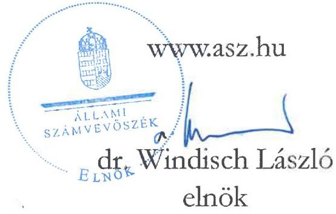
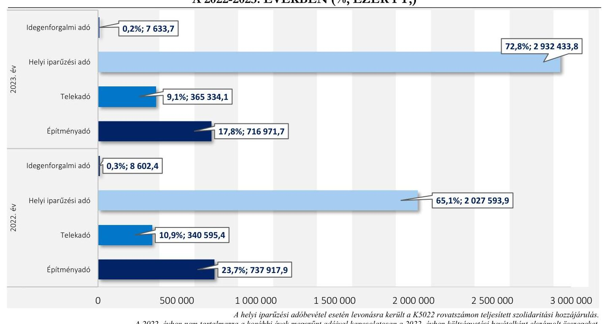
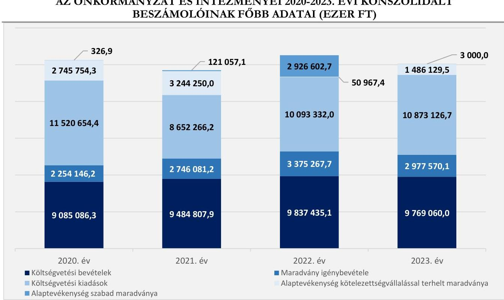
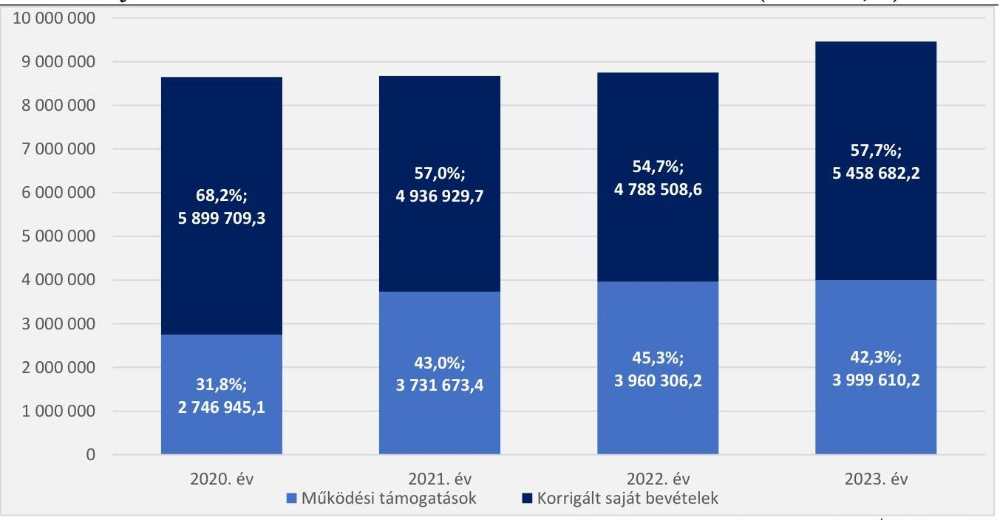

# JELENTÉS 

## Az önkormányzatok helyi adóztatási tevékenységének ellenőrzése - Ingatlanadóztatás

Hódmezővásárhely Megyei Jogú Város Önkormányzata

2025.

---

# JELENTÉS 

## Az önkormányzatok helyi adóztatási tevékenységének ellenőrzése - Ingatlanadóztatás

Hódmezővásárhely Megyei Jogú Város Önkormányzata

2025.

25044

---

# ELLENŐRZÉSI IGAZGATÓSÁG: 

## ELLENŐRZÉSI IGAZGATÓSÁG II.

## ELLENŐRZÉSI IGAZGATÓ:

DR. BAFFIA GERGELY GÁBOR ellenőrzési igazgató

## ELLENŐRZÉSVEZETŐ:

## KANYÓ LÓRÁNT ISTVÁN ellenőrzésvezető

Jelentéseink az interneten a www.asz.hu címen olvashatók.

IKTATÓSZÁM: EL-4040-036/2025
TÉMASORSZÁM: 54
ELLENŐRZÉS-AZONOSÍTÓ SZÁM: V1084

---

# TARTALOMJEGYZÉK 

AZ ELLENŐRZÉS ALAPADATAI ..... 5
AZ ELLENŐRZÖTT SZERVEZET ..... 7
ÖSSZEFOGLALÁS ..... 9
AZ ELLENŐRZÉS FÓKUSZKÉRDÉSEI ..... 11
MEGÁLLAPÍTÁSOK ..... 12
JAVASLATOK ..... 26
MELLÉKLETEK ..... 27
I. sz. melléklet: Értelmező szótár ..... 27
II. sz. melléklet: Az ellenőrzött szervezetek jegyzéke ..... 28
III. sz. melléklet: Ellenőrzési kritériumok ..... 29
IV. sz. melléklet: A helyi ingatlanadótárgyak és adóalanyok száma a 2023. és a 2024. évben ..... 32
V. sz. melléklet: Az építmény- és telekadó mértékei az ellenőrzött időszakban ..... 33
FÜGGELÉK: ÉSZREVÉTELEK ..... 34
RÖVIDÍTÉSEK JEGYZÉKE ..... 40

---

.

---

# AZ ELLENŐRZÉS ALAPADATAI 

## AZ ELLENŐRZÉS CÉLJA

Az ellenőrzés célja az volt, hogy értékelje Hódmezővásárhely megyei jogú város helyi ingatlanadóztatásának és adóhatósága feladatellátásának szabályszerűségét, célszerűségét és eredményességét. További cél volt, hogy az ellenőrzés megállapításai és következtetései segítsék az önkormányzati képviselőtestületeket a jogszabályokkal és a helyi sajátosságokkal összhangban álló helyi adópolitika kialakításában és az azt végrehajtó adóigazgatási szervezet megszervezésében. Az ellenőrzés célja volt továbbá annak megállapítása is, hogy az Önkormányzat ${ }^{1}$ által bevezetett, ingatlanokat terhelő helyi adókra vonatkozó rendeleti szabályok összhangban vannak-e a helyi adópolitikai célokkal, tartalmuk tükrözi-e a település helyi sajátosságait és az adóhatósági feladatellátás biztosítja-e az önkormányzati bevételek feltárását és beszedését.

Ennek keretében az ÁSZ ${ }^{2}$ értékelte, hogy az Önkormányzat által bevezetett, ingatlanokat terhelő helyi adókról szóló adórendeletek, valamint az adóhatóság ${ }^{3}$ döntései, adóztatási gyakorlata a vonatkozó jogszabályokkal összhangban állnak-e.

## AZ ELLENŐRZÉS TÍPUSA

Kombinált ellenőrzés.

## AZ ELLENŐRZŐTT IDŐSZAK

Az 1. fókuszkérdésnél a 2023. év, valamint a 2024. évnek az ellenőrzés megkezdését megelőző napjáig (2024. június 14.) tartó időszaka.

A 2. és 3. fókuszkérdésnél a 2023. év, valamint a 2024. évnek az ellenőrzés megkezdését megelőző napjáig (2024. június 14.) tartó időszaka, a 2020-2022. évek adatainak bázisadatként való felhasználásával.

## AZ ELLENŐRZÉS TÁRGYA

Az Önkormányzat képviselő-testületének ingatlanokat terhelő helyi adóval, azaz az építményadóval és a telekadóval kapcsolatos rendeletalkotási tevékenységének és az adóhatóság tevékenységének az ellátása.

Az ellenőrzés kiterjedt minden olyan körülményre és adatra, amely az ÁSZ jogszabályban meghatározott feladatainak teljesítéséhez, valamint az ellenőrzési program végrehajtása folyamán felmerült újabb összefüggések feltárásához szükséges.

## AZ ELLENŐRZÉS JOGALAPJA

Az ellenőrzés jogszabályi alapját az ÁSZ tv. ${ }^{4}$ 5. § (8) bekezdésének előírásai képezik.

---

# AZ ELLENŐRZÉS MÓDSZERE 

Az ÁSZ az ellenőrzést az ellenőrzési program szempontjai, az ellenőrzött időszakban hatályos jogszabályok, az ellenőrzés általános szakmai szabályai és az ellenőrzésre irányadó ÁSZ módszertanok alapján végezte.

Az ellenőrzési kérdések megválaszolásához szükséges bizonyítékok megszerzése az ellenőrzött szervezetek által rendelkezésre bocsátott dokumentumokra, adatokra és az ASP ${ }^{3}$ Adó és az Iratkezelő szakrendszerek, illetve a KGR-K11 ${ }^{6}$ számviteli adatgyűjtő rendszer adataira alapozva megfigyelés, szemle (szemrevételezés), kérdésfeltevés (információkérés), mintavételezés, valamint elemző eljárás útján történt. Emellett az ellenőrzési bizonyítékként felhasználható adatforrások közé tartozott minden egyéb - az ellenőrzés folyamán feltárt, az ellenőrzés szempontjából információt tartalmazó - releváns dokumentum (ideértve különösen a helyszíni ellenőrzésről készült jegyzőkönyvet) is.

Az ellenőrzés lefolytatásához az ellenőrzött szervezet a tanúsítványok kitöltésével, valamint az ÁSZ által kért dokumentumok, adatok, információ megküldésével és az ellenőrzés során szolgáltatott adatokat.

Az ÁSZ az adómegállapítás, az adótörlés, a fizetési kedvezmények engedélyezése és a hátralékok beszedése szabályszerűségét mintavételi eljárással ellenőrizte. Ennek során az adóhatósági adómegállapítási feladatellátás ellenőrzése keretében 28 mintatétel (11-38. mintatételek, közte 39 határozat és két végzés), négy adótörlésre vonatkozó mintatétel (2., 9., 18. és 21. mintatételek, közte négy határozat), a fizetési kedvezmények engedélyezése tárgykörben két mintatétel (9-10. mintatételek, két határozat) értékelése történt meg. Nyolc mintatételben (1-8. mintatételek, 37 határozat és 14 végzés) az ÁSZ a hátralékkezelés teljes dokumentációját is ellenőrizte.

A mintatételek kiválasztása véletlenszerűen történt az adóhatóság nyilvántartásában lévő adótárgyak és ügyek közül 15 - adómegállapításra vonatkozó - mintatétel kivételével, amelyek esetében a kiválasztás címadatok alapján történt annak érdekében, hogy feltárható legyen, volt-e olyan adótárgy, amelyet nem adóztatott az adóhatóság.

Az ellenőrzött mintatételekre vonatkozó megállapítások nem vetíthetők ki a teljes sokaságra, a megállapításokat az ÁSZ az adott ellenőrzött mintatételek vonatkozásában tette meg.

Az ÁSZ a helyi adópolitikai elképzelések és a települési sajátosságok feltárásával értékelte, hogy az adórendelet e szempontoknak mennyiben felelt meg. Az ÁSZ a helyi adópolitikai célokkal akkor tekintette összhangban állónak az adórendeletet, ha az hatását tekintve támogatta az adópolitikai célok teljesülését.

Az ÁSZ az adóhatósági feladatellátás szabályszerűségéből, a meglévő kapacitásokból, valamint az ezer forint adóbevételre jutó adóhatósági költségek alakulásából következtetett arra, hogy az adóhatóság rendelkezett-e azzal a potenciállal, amellyel eredményesen tudta a helyi adópolitikát végrehajtani.

Az ÁSZ - az adórendelet szabályainak érvényre juttatása körében - az eredményesség véleményezésekor a III. számú melléklet 2. pontjában foglalt szempontokat tekintette mérvadónak.

---

# AZ ELLENŐRZÖTT SZERVEZET 

Hódmezővásárhely megyei jogú város a Dél-Alföldön, Csongrád-Csanád vármegyében található, a Hódmezővásárhelyi Járás központja. Állandó lakossága - a $\mathrm{BM}^{5}$ adatai alapján 2020. év elején 44460 fő, 2024. év elején pedig 42810 fő volt.

A város a dél-alföldi régió kiemelkedő oktatási, gazdasági, kulturális és művészeti centruma. Idegenforgalmi szempontból jelentős természeti kincse a tiszai táj mellett a gazdag termálvízkészlete, amely a helyi strandfürdőt is

Hódmezővásárhely Megyei Jogú Város Polgármestert Hivatalo
Foerás: hitpe://hodmezovasarhely.kornyeka.hu/hodmezovasarhelyrol-roviden
táplálja. A TeIR ${ }^{8}$ 2023. december 31-ei adatai alapján a településen 7541 regisztrált gazdasági szervezet volt, amelynek közel fele ( 3740 regisztrált gazdasági szervezet) szolgáltató volt. A településen székhellyel rendelkező legjelentősebb szolgáltató gazdasági szervezetek a dohányiparban, a porcelánkészítés területén, valamint az építőiparban működtek.

Az Önkormányzat - a Hivatalon ${ }^{9}$ kívül - négy költségvetési szervvel ${ }^{1}$, továbbá négy 100\%-os tulajdonában és három résztulajdonában lévő gazdálkodó szervezettel ${ }^{2}$ rendelkezett, valamint 2023. december 31-ig egy társulásnak ${ }^{3}$ volt tagja.

Az Alaptörvény ${ }^{10}$ értelmében a helyi önkormányzat a helyi közügyek intézése körében törvény keretei között döntött a helyi adók fajtájáról és mértékéről. Az Mötv. ${ }^{11}$ rögzíti, hogy a helyi adóval kapcsolatos feladatok ellátása a helyi önkormányzatok feladata.

Az Önkormányzat a Htv. ${ }^{12}$ alapján az ingatlanokat terhelő helyi adók ${ }^{13}$ közül az illetékességi területén külön-külön adórendelettel az építményadót és a telekadót vezette be. Az adórendeletekben ${ }^{14}$ szereplő szabályrendszereket az Önkormányzat egy - az adótárgyak típusa, valamint a telekadóban adótárgy és területi körzetek szerint - differenciált mértékrendszerrel alakította ki. Az ellenőrzött időszakban az Önkormányzat egyik adónemben sem emelte az adó mértékét, a mértékrendszert részletesen az V. számú melléklet mutatja be.

Az adó megállapításával, nyilvántartásával, beszedésével összefüggő adóhatósági feladatokat - a Hatásköri tv. ${ }^{15}$ és az Air. ${ }^{16}$ rendelkezései alapján - elsőfokú hatósági jogkörben Hódmezővásárhely jegyzője ${ }^{17}$

[^0]
[^0]:    ${ }^{1}$ Hódmezővásárhelyi Egyesített Bölcsőde, Hódmezővásárhelyi Kapcsolat Központ, Hódmezővásárhely Megyei Jogú Város Önkormányzat Hódmezővásárhelyi Egyesített Óvoda, Tornyai János Múzeum, Könyvtár és Művelődési Központ.
    2 Hódmezővásárhelyi Működtető és Szolgáltató Nonprofit Zrt. (100\%), Hódmezővásárhelyi Vagyonkezelő és Szolgáltató Zrt. (100\%), Vásárhelyi Médiacentrum Nonprofit Kft. (100\%), Hódfó Hódmezővásárhelyi Foglalkoztató Közhasznú Nonprofit Kft. (100\%), Hód-Fürdő Szolgáltató és Üzemeltető Kft. (49\%), Csongrád Megyei Kegyeleti Kft. (64,8\%), Mártélyi Táigazdálkodási Kft. (5\%).
    ${ }^{3}$ Hódmezővásárhelyi Kistérségi Többcélú Társulás (MÁK törzskönyvi nyilvántartás alapján), amelyből az Önkormányzat 2023. december 31. napjával kilépett (a társulás új neve: Mindszent-Mártély-Székkutas Többcélú Kistérségi Társulás).

---

látta el a Hivatal vezetőjeként. A Hivatal illetékességi területe Hódmezővásárhely mellett Mártély Község közigazgatási területére is kiterjedt ${ }^{4}$.

Az adóhatóság által beszedett, végleges bevételként elszámolt ingatlanokat terhelő adókból származó helyi adóbevétel a 2020-2023. időszak egyes éveiben nagyságrendileg megegyező, 1100 000,0 ezer Ft körüli összeg volt. A 2023. évben az ingatlandó-bevételek az Önkormányzat korrigált konszolidált költségvetési bevételének ${ }^{18} \mathbf{1 1 , 4 \% - a ́ t ,}$ a korrigált konszolidált saját bevételének ${ }^{19} \mathbf{1 9 , 8 \% - a ́ t ,}$ a befizetett szolidaritási hozzájárulással csökkentett helyi adóbevételének pedig a $\mathbf{2 6 , 9 \% - a ́ t}$ tették ki.

Az Önkormányzat helyi adóbevételeinek 2022. és 2023. évi összetételére vonatkozó adatokat az 1. ábra, a helyi ingatlanadók 2023. és 2024. évre vonatkozó naturális adatait pedig a $I V$. számú melléklet mutatja be.
1. ábra

# AZ ÖNKORMÁNYZAT HELYI ADÓBEVÉTELEINEK MEGOSZLÁSA A 2022-2023. ÉVEKBEN (\%, EZER FT,) 

A helyi iparázési adóbevétel esetén levonásra került a K5022 rovatszámon teljesitett szolidaritási hozzájárulás. A 2022. évben nem tartalmazza a korábbi évek megszűnt adóival kapcsolatosan a 2022. évben költségvetési bevételként elszámolt összegeket. Forrás: KGR-K11 és zározzámadási rendelet, ${ }^{20}$ alapján ÁSZ saját szerkesztés

[^0]
[^0]:    ${ }^{4}$ Mártély Község 2024. december 31-i hatállyal felbontotta a közös önkormányzati hivatali szerződést Hódmezővásárhellyel és 2025. január 1-jétől Székkutas Községgel létesített közös hivatalt.

---

# ÖSSZEFOGLALÁS 

Az ÁSZ tv. értelmében az ÁSZ feladatkörébe tartozik az önkormányzatok adóztatási tevékenységének az ellenőrzése. A helyi adók az önkormányzatok saját, el nem vonható bevételét képezik, így az önkormányzatok gazdasági önállósága szempontjából különös fontossággal bír, hogy a helyi adórendeleti szabályok összhangban álljanak a magasabb szintű jogszabályokkal, továbbá az adóhatósági tevékenység jogszerü, eredményes és hatékony legyen. Erre figyelemmel volt tárgya az ÁSZ ellenőrzésének az Önkormányzat adórendelet-alkotási tevékenysége és az adóhatósági feladatellátás is.

Az adórendeletek több ponton nem voltak összhangban a magasabb szintű jogszabállyal, azonban megfeleltek az Önkormányzat jogalkotói szándékának. Az adórendeleti szabályozás támogatta az Önkormányzat adópolitikai céljainak elérését. Az adótárgy-, és adóalanyfeltárási adóhatósági feladatellátás (ezáltal az adómegállapítási feladatellátás) nem volt eredményes, azonban célszerú volt. Az adóhatósági döntések nem minden esetben voltak szabályszerűek. Az adómegállapító határozatok kiadmányozása, kézbesítése szabályszerű volt. Az adóbehajtási tevékenység szabályszerű és célszerú volt, de nem volt eredményes. Az adóhatóságnak az ellenőrzött időszakban adatszolgáltatási kötelezettsége nem keletkezett, közzétételi kötelezettségének megfelelően eleget tett. Az adóztatási kiadások - több összevetésben is vizsgálva - alacsonyak voltak. Az adóhatóság ingatlanadóztatással összefüggő feladatellátási mutatói többségében alatta voltak a nyolc megyei jogú város ${ }^{5}$ feladatellátási mutatóinak átlagos értékeinek.

## Adórendelet, adórendelet-alkotás

A telekadó-rendelet ${ }^{21}$ három ponton nem volt összhangban a törvényi előírással, mert mentességet biztosított a vállalkozó adóalanyok számára.

Az építményadó-rendelet ${ }^{22}$ két ponton nem volt összhangban a törvényi előírással, mert meghatározott telekrészeket sorolt az építményadó hatálya alá, illetve a Htv. adómérték-megállapításra vonatkozó szabályaival ellentétes módon speciális mértékszabályokat rendelt alkalmazni egyes adótárgyak után. Mindemellett három rendelkezése nem állt összhangban az egyértelmú értelmezhetőség elvével.

Az Önkormányzat a jelentéstervezet észrevételezése során nyilatkozott arról, hogy a jogsértő önkormányzati rendeleti szabályokat mindkét adórendeletben módosította 2025. január 1-jei hatállyal. Az ÁSZ a módosított rendeleti szabályok tartalmát nem ellenőrizte, azok utóellenőrzés keretében ellenőrizhetők.

Az ingatlanokat terhelő helyi adókra vonatkozó rendeleti szabályozás megalkotása során az Önkormányzat mérlegelte és figyelembe vette azt, hogy a rendeleti szabályoknak tükrözniük kell a helyi sajátosságokat, az Önkormányzat gazdasági követelményeit, továbbá az adóalanyok teherviselő képességét.

[^0]
[^0]:    ${ }^{5}$ Az ÁSZ által jelen ellenőrzés alapjául szolgáló ellenőrzési program alapján két megyei jogú város önkormányzata, továbbá a KGR-K11-ben az adóztatási tevékenységet leíró adatokat rögzítő megyei jogú városi önkormányzatok közül kiválasztott hat önkormányzat: Salgótarján Megyei Jogú Város Önkormányzata, Szekszárd Megyei Jogú Város Önkormányzata, Székesfehérvár Megyei Jogú Város Önkormányzata, Nagykanizsa Megyei Jogú Város Önkormányzata, Békéscsaba Megyei Jogú Város Önkormányzata, Eger Megyei Jogú Város Önkormányzata.

---

# Az adóhatóság adóigazgatási feladatellátásának jogrrerüsége, eredményessége 

Az adóhatóság adótárgy-, és adóalany feltárási feladatellátása (ezáltal az adómegállapítási feladatellátása) nem volt eredményes, azonban célszerú volt. Az adómegállapító határozatok nem mindegyike volt szabályszerű. Az Önkormányzat jelentéstervezetre tett észrevétele keretében nyilatkozott arról, hogy az ÁSZ ellenőrzés által feltárt, nem adóztatott ingatlanok esetében az adóalanyokat felszólította adatbejelentésre és az adatbejelentések alapján az adót megállapította.

A hatósági döntések kiadmányozása, kézbesítése szabályszerű volt. Az adóhatóságnak az ellenőrzött időszakban adatszolgáltatási kötelezettsége nem keletkezett, közzétételi kötelezettségének pedig megfelelően eleget tett.

Az adóhatóság az ellenőrzött időszakban adóellenőrzést nem folytatott.
Az adótartozások beszedése érdekében megtett intézkedések szabályszerűek és célszerűek voltak, de nem voltak eredményesek.

Az adórendelet adópolitikai célokkal való összhangia, az ingatlanokra vonatkozó adórendeletek hatása
Az Önkormányzat adórendeleti szabályai összhangban voltak az adópolitikai célokkal (az adó biztos bevételi forrást jelentsen; stabil, kiszámítható adószabályozás érvényesüljön, a magánszemélyek élvezzenek adómentességet, valamint a vállalkozások számára is vonzó adókörnyezet alakuljon ki) és tükrözték az adóalanyok adóteherviselő képességét.

A korrigált konszolidált költségvetési bevételeken belül a korrigált konszolidált saját bevételek aránya a 2023. évben $57,7 \%$ volt, amely kissé alacsonyabb a megyei jogú városokra jellemző $65,2 \%$-os aránynál. Míg a megyei jogú városok esetén az ingatlanadókból származó bevételek ${ }^{23}$ korrigált konszolidált költségvetési bevételeken belüli aránya $7,5 \%$, addig az Önkormányzat esetében ez $\mathbf{1 1 , 4 \%}$ volt a 2023. évben, azaz az Önkormányzat gazdálkodását az ingatlanadókból származó bevételek erőteljesebben befolyásolták.

## Az adóhatósági kiadások

Az adóhatóság a 2023. évben 4318 837,3 ezer Ft helyi adóbevételt ${ }^{6}$ mutatott ki költségvetési beszámolójában. Minden 1000 Ft beszedett helyi adóbevételre 12,0 Ft adóztatási kiadás esett. A nyolc megyei jogú város átlaga $13,1 \mathrm{Ft}$, az adóztatási kiadás tapasztalati referencia-érték maximuma kivetéses adóztatás esetén: 50 Ft volt.

Az Önkormányzat egy adótisztviselőjére a 2023. évben 489 103,3 ezer Ft helyi adóbevétel, 3704,9 adótárgy és 1219,8 adózó jutott, egy feladatellátási mutató a nyolc megyei jogú város átlagát meghaladta, két mutató esetében (adótisztviselőre jutó adóbevétel, adózók száma) azonban az érték alatta volt (613 578,2 ezer Ft/adótisztviselő; illetve 2068,8 adótárgy, 1334,1 adózó/adótisztviselő).

[^0]
[^0]:    ${ }^{6}$ Helyi adóbevétel körébe tartozik az adóztatási kiadások esetében: az ingatlanadókból származó bevétel, a helyi iparűzési adóbevétel, az idegenforgalmi adóbevétel, a magánszemélyek jövedelemadóiból származó bevétel, a beszedett talajterhelési díj; mivel a kapcsolódó feladatokat az önkormányzati adóhatóság látta el.

---

# AZ ELLENŐRZÉS FÓKUSZKÉRDÉSEI 

1.- Az önkormányzat ingatlanokat terhelő helyi adókra vonatkozó rendeleti szabályozása megfelelt-e a magasabb szintü jogszabályoknak?
2.- Az önkormányzati adóhatóság megfelelően és eredményesen látta-e el az ingatlanok adóztatásával kapcsolatos adóhatósági tevékenységeit?
3.- A településen megvalósuló helyi adóztatás támogatta-e a helyi adópolitikai célok teljesülését?

---

# MEGÁLLAPÍTÁSOK 

## 1. Az önkormányzat ingatlanokat terhelő helyi adókra vonatkozó rendeleti szabályozása megfelelte a magasabb szintű jogszabályoknak?

Összegző megállapítás

Az adórendeletek több ponton nem álltak összhangban a Htv. és Jat. előírásaival, szabályozási céljuk szerint azonban tükrözték a települési sajátosságokat.
1.1. számú megállapítás

Az adórendeletek több ponton ellentétesek voltak a Htv. rendelkezéseivel, továbbá az építményadó-rendelet három rendelkezése sértette az egyértelmú értelmezhetőség Jat. ${ }^{24}$-ban megfogalmazott követelményét.

A Htv. 7. § e) pontjában előírtak ellenére - amely az uniós jogból fakadó állami támogatási elvekre és normákra figyelemmel rögzíti, hogy az önkormányzat az építményadóban és a telekadóban a vállalkozó számára adómentességet, adókedvezményt nem biztosíthat - a telekadó-rendelet 3. § (1) bekezdésének a)b) pontjai mentességet biztosítottak annak a vállalkozónak, akinek
a) telke az ingatlan-nyilvántartásban lakóház, udvarként szerepel és ettől nem eltérően használták, illetve
b) telkén, telekrészén helyi védelem alatt álló épület állt.
A telekadó-rendelet 3. § (1) bekezdésének c) pontja pedig - szintén a

Az uniós állami támogatási szabályok értelmében a vállalkozóknak nyújtott helyi adómentesség, helyi adókedvezmény állami támogatásnak minősül. A jogszerútlenül nyújtott támogatást a kedvezményezettnek vissza kell fizetnie, vagy a támogatást nyújtónak kell biztosítania az uniós joggal való összhangot.
Htv. 7. § e) pontjában rögzítettek ellenére -
anélkül mentesített bizonyos út-, vagy csatorna elnevezésű telkeket a telekadó hatálya alól, hogy kizárta volna az adómentesség hatálya alól a vállalkozó adóalanyokat. ${ }^{7}$
A Htv. 11. § (1) bekezdésébe ütközőtt az építményadó-rendelet 3. § (2) bekezdése ${ }^{8}$, mert építményhez tartozónak minősítette az épületnek nem minősülő építménnyel fedett telekrészt beemelte az építményadó hatálya alá.
A Htv. adómegállapításra vonatkozó 2. §-ával ellentétesen ${ }^{9}$ az építményadó-rendelet 8. § (3) bekezdése a műhely-bővítmény, valamint a raktár-bővítmény esetében - a műhelyre, raktárra vonatkozó adómértéktől

[^0]
[^0]:    ${ }^{7}$ A telekadó-rendelet 3. §-ának módosítása eredményeként 2025. január 1-jével a Htv. 7. § e) pontjába ütköző jogsértő állapot megszűnt.
    ${ }^{8}$ E rendelkezést az Önkormányzat 2025. január 1-jével hatályon kívül helyezte.
    ${ }^{9}$ Az Alaptörvény 32. cikk (1) bekezdés h) pontja szerint: a törvény keretei között szabályozhat a helyi rendelet, így nem írhatja felül az adó tárgyát.

---

eltérő - speciális mértékszabályokat rendelt alkalmazni, ezáltal ugyanazon adótárgy esetében kétféle adómérték alkalmazására nyílt lehetőség ${ }^{10}$.
Az építményadó-rendelet az alábbi okokból fakadóan sértette - a Jat. 2. $\mathbb{S}$ (1) bekezdéséből következő - egyértelmű értelmezhetőség követelményét:
a) az építményadó-rendelet 3. $\S$ (1) bekezdése ${ }^{11}$, 4. $\S$ (5) bekezdése ${ }^{12}$, mert nem létező jogszabályi tartalomra utalt vissza;
b) az építményadó-rendelet 11. §-ának „Üzlet", illetve „Raktár" fogalma, mert azok összevetéséből nem volt egyértelmű, hogy a raktározás, tárolás célját szolgáló nyitott, értékesítést folytató hely raktárnak vagy üzletnek számít-e ${ }^{13}$.
c) az építményadó-rendelet 11. §-ának „Bővítmény", illetve „Új épület" fogalma, mert azok összevetéséből az következik, hogy a „bővítmény" fogalmi körébe tartozó „új épületre" akkor vonatkozik kedvezményes adómérték, amikor, még nem tartozik az építményadó tárgyi hatálya alá ${ }^{14}$.
1.2. számú megállapítás

Az Önkormányzat figyelembe vette a települési sajátosságokat, az Önkormányzat gazdálkodási helyzetét, továbbá az adórendeletek szabályozási céljuk szerint összhangban voltak az adóalanyok teherviselő képességével.

A Htv. 7. § g) pontjában rögzített adómegállapítási korlátokból az következik, hogy a rendelet hatályossága idején is érvényre kell jutnia az e pontban szabályozott rendeletalkotási elveknek, azaz annak, hogy települési önkormányzat az adóalap fajtáját, az adó mértékét, a rendeleti adómentességet és adókedvezményt úgy állapíthatja meg, hogy azok összességükben egyaránt megfeleljenek
a) a helyi sajátosságoknak,
b) az önkormányzat gazdálkodási követelményeinek és
c) az adóalanyok széles körét érintően az adóalanyok teherviselő képességének.

Az ÁSZ véleménye szerint legalább az adózást érintő magasabb szintű jogszabályi változások esetén indokolt felülvizsgálni a rendeletet. Ettől függetlenül a település mérete, adottsága a helyi adókra vonatkozó rendelet összetettsége, az önkormányzat gazdálkodási körülményeinek változása, az adózók teherbíró képességének változása befolyásolja a felülvizsgálat gyakoriságát.

[^0]
[^0]:    ${ }^{10}$ Az építményadó-rendelet 8. § (3) bekezdése szerint a műhely bővítményre és a raktár bővítményre vonatkozó adómérték $95 \mathrm{Ft} / \mathrm{m}^{2}$, a műhelyre, raktárra pedig $1200 \mathrm{Ft} / \mathrm{m}^{2}$. Az építményadó-rendelet 11. §-a a bővítmény alatt a telephely-bővítés során a vállalkozás meglévő telephelyén létrejött új épület, illetve a meglévő épület hasznos alapterületének újonnan megnövelt része.
    ${ }^{11}$ Az Önkormányzat 2025. január 1-jével módosította a rendelkezést, a jogsértés megszűnt.
    ${ }^{12}$ Az Önkormányzat 2025. január 1-jével hatályon kívül helyezte.
    ${ }^{13}$ Az értelmezési anomáliát az építményadó-rendelet 2025. január 1-jével hatályba lépő módosítása megszüntette, az „Üzlet" fogalmában nem szerepel a „raktározás, tárolás célját szolgáló nyitott, értékesítést folytató hely", mint az Üzlet fogalmi körébe tartozó helyiség.
    ${ }^{14}$ A Htv. 14. § (1) bekezdése alapján az építményadó-kötelezettség a használatbavételi engedély jogerőre emelkedését követő év első napján keletkezik. Ugyanakkor az építményadórendelet 11. §-ának „új épület" fogalma alapján a kedvezményes $95 \mathrm{Ft} / \mathrm{m}^{2}$ építményadómérték csak az adókötelezettség keletkezését megelőző évben alkalmazandó.

---

# A helyi sajátosságok, figyelembevétele 

Az ellenőrzött időszakban Hódmezővásárhely lakosságszáma a megyei jogú városok között szinte a legkisebb, kiterjedése azonban - a település honlapján található adat szerint - jelentős volt $\left(483,2 \mathrm{~km}^{2}\right)^{15}$. Megyei jogú városként többféle jellegzetességű övezetet, illetve funkciót betöltő ingatlan volt megtalálható a területén, mindemellett kiterjedéséből fakadó sajátossága, hogy külterületén - a Htv. hatálya alá nem tartozó - jelentős termőföld-terület volt fellelhető.
Az építményadó-rendelet az épület, épületrész fajtájára tekintettel rögzített differenciált adómértékrendszert tartalmazott, a telekadó-rendelet pedig öt, eltérő sajátosságokkal bíró és értékviszonyokat képviselő övezetre osztotta a települést, illetve határozott meg ezekre differenciált adómértéket.
Az Önkormányzat a helyi sajátosságokat - a Htv.-ben foglaltaknak megfelelően - az adórendeletek elkészítésekor figyelembe vette és mérlegelte.

## Az Önkormányzat gazdálkodási követelményeinek szempontja

A 2023. évben a helyi adókból származó befizetett - szolidaritási hozzájárulással csökkentett 4022373,3 ezer Ft bevétel az Önkormányzat korrigált konszolidált költségvetési bevételének (9 458 292,4 ezer Ft) 42,5\%-át tette ki, mely magasabb a 25 megyei jogú városra vonatkozó $38,6 \%$-os értékhez képest. A 2023. évben ingatlanadókból származó bevétel a korrigált költségvetési bevétel $11,4 \%$-át tette ki, mely szintén magasabb a 25 megyei jogú városra vonatkozó $7,5 \%$-os értékhez viszonyítva.

---

Az Önkormányzat és intézményeinek főbb gazdálkodási adataiból (2. ábra) megfigyelhető, hogy a konszolidált maradvány a 2023. évben 1489 129,5 ezer Ft volt, amely 1486 129,5 ezer Ft kötelezettségvállalással terhelt maradványból és 3000,0 ezer Ft szabad maradványból tevődött össze. A 2023. évben az Önkormányzat a kötelező feladatok ellátása mellett, 989 794,0 ezer Ft kiadást teljesített önként vállalt feladatokra, amelynek $98,9 \%$-át közhatalmi bevételekből (ezen belül helyi adóbevételekből) fedezte. A 2023. évi beszámolóban az Önkormányzat 2150 000,0 ezer Ft értékben mutatott ki költségvetési évet követően esedékes kötelezettségek között hosszú lejáratú hiteleket.
Az Önkormányzat gazdálkodási helyzete összességében nem tette szükségessé az adórendelet módosítását.
2. ábra

# AZ ÖNKORMÁNYZAT ÉS INTÉZMÉNYEI 2020-2023. ÉVI KONSZOLIDÁLT BESZÁMOLÓINAK FŐBB ADATAI (EZER FT) 

Nem tartalmazza a hitel-és kölcsönfelvételeket és azok törlesztését; a pénzeszközök lekö̈ött bankbetétként való elhelyezését és azok megszüntetését; az állambázsartáson belüli megelölegezéseket és azok visszafizetését, a vállalkozási tevékenység maradványát. Forrás: KGB-K11 és zározzámadási rendelet; a alapján ÂSZ saját szerkesztés

## Az adóalanyok teberviselő képességének figyelembevétele

Az Önkormányzat nyilatkozata szerint az adórendeletek célja volt, hogy az egyéb adóalanyokhoz képest a magánszemély adóalanyokat ne terhelje helyi ingatlanadó fizetési kötelezettség. E megfontolás mögött - a helyszíni ellenőrzés során az Önkormányzat által tett nyilatkozat alapján - az állt, hogy a nem magánszemély adóalanyok nagyobb szerepet tudnak vállalni a helyi közterhekből. Az Önkormányzat, nyilatkozata szerint törekedett arra is, hogy a vállalkozások számára is megfelelő adórendszert, ezáltal vonzó adókörnyezetet alakítson ki.
Mindezekre tekintettel - a Htv. előírásainak megfelelően - az Önkormányzat mérlegelte és figyelembe vette az adóalanyok teherviselő képességét a rendeletalkotás során.

---

# 2. Az önkormányzati adóhatóság megfelelően és eredményesen látta-e el az ingatlanok adóztatásával kapcsolatos adóhatósági tevékenységeit? 

Összegző megállapítás
Az adómegállapítási feladatellátás nem volt eredményes, azonban célszerú volt, az adómegállapító határozatok nem mindegyike volt szabályszerű. Az adóbehajtási tevékenység szabályszerű és célszerű volt, de nem volt eredményes.
2.1. számú megállapítás

Az adóhatóság adótárgy-, és adóalanyfeltárási feladatellátása nem volt eredményes, azonban célszerű volt. Az adóhatósági döntések nem minden esetben voltak szabályszerűek.

Adótárgy- és adóalanyfeltárás
Az adóhatóság a 2023. és a 2024. évben is élt az Art. ${ }^{25}$ 83. § (2) bekezdésében foglaltak alapján az ingatlanügyi hatóság megkeresésének lehetőségével. A kapott adatokat egy saját fejlesztésú programmal feldolgozhatóvá tette, az adatbázis ezáltal keresések és szűrések elvégzésére, továbbá az adatok saját nyilvántartással történő összevetésére is alkalmassá vált. Az adóhatóság az adóalanyok és az adótárgyak feltárása érdekében használt térinformatikai és egyéb rendszereket, valamint használta az építésügyi hatóság által, az Art. 86. §-a szerint szolgáltatandó adatokat.

Az ingatlanügyi hatóság által az Art. 83. § (2) bekezdése alapján az adóhatóság rendelkezésére bocsátott adatok a szolgáltatott formában csak manuálisan vethetők össze az adónyilvántartás adataival. Az ÁSZ megítélése szerint az államháztartás helyi szintjén az lenne a leggazdaságosabb, ha az adóhatóságok feldolgozható formában jutnának ezen adatokhoz. Ennek hiányában azonban jó gyakorlatnak tartja, hogy - amennyiben a település adottságai, illetve az adótárgyak száma indokolják - az adóhatóság szoftveres segítséget vesz igénybe az adatok informatikai úton történő ütköztetése érdekében.

Az ÁSZ két olyan ingatlant (32. és 34. mintatételek) tárt fel, amelyeket az adóhatóságnak építményadó esetén az építményadó-rendelet 3. §-ban és a Htv. 11. §-ban, míg telekadó esetén a telekadórendelet 1. §-ban és a Htv. 17. §-ban leírtaknak megfelelve - adóztatnia kellett volna.
Mindezek alapján az adótárgy-, és adóalanyfeltárási adóhatósági feladatellátás nem volt eredményes, azonban - figyelemmel arra, hogy a más hatóságtól kapott hiteles információt azok megszerzési céljának megfelelően használta fel - célszerű volt.

---

# Adómegállapitás (kivetés) 

Az adóhatóság valamennyi mintatétel esetében a fizetendő adó összegét - a Htv.-nek és az adórendeleteknek megfelelően - számította ki.
A 20. és 31. mintatételek esetében az adóhatóság a Htv. 12. § (1) bekezdésében és a 14. $\$ (2) bekezdésében foglalt rendelkezések ${ }^{16}$ ellenére, a 20. mintatétel esetében 2024. március 11. napján, míg a 31. mintatétel esetében 2024. április 8. napján kelt adómegállapító határozatában 2025. év január 1-jétől fennálló adókötelezettséget állapított meg.
A 25-26. mintatételek esetében a Hivatal az Ltv. ${ }^{26}$ 9. $\$ (1) bekezdése e) pontjában ${ }^{17}$ előírtak ellenére az adatbejelentő dokumentumok megőrzéséről nem gondoskodott, ezért az ÁSZnak nem volt módja ellenőrizni az adómegállapító eljárást.
Három mintatétel (12., 17. és 20. mintatételek) esetében az adótárgynak több tulajdonosa volt, ugyanakkor az adóhatóság által hozott adómegállapító határozat rendelkező része kizárólag az adó fizetésére kötelezett által fizetendő adó összegét tartalmazta.
A 24-27., a 33. és a 36. mintatételek esetében az adómegállapító határozatok indokolása - az

Ha az adótárgynak több tulajdonosa van, akkor ők tulajdoni illetőségük arányában adóalanyok. Ekkor, mindegyikük egyetértése esetén köthetnek arról megállapodást, hogy az adóalanyisággal kapcsolatos jogokat és kötelezettséget az adóhatóság előtt közülük egy adóalany kapcsolattartóként gyakorolja. Az ÁSZ jó gyakorlatnak azt tekinti, ha az adómegállapító határozat nemcsak a fizetési kötelezettséget és a fizetésre kötelezettet (a kapcsolattartót), hanem az egyes adóalanyokat terhelő adót és annak jogalapját, kiszámítását is tartalmazza, annak érdekében, hogy az egyes adóalanyok számára egyértelmű legyen az őket terhelő adó összege.

Air. 73. $\$ (1) bekezdés c) pontjában foglaltak ellenére - tényállási elemként nem tartalmazta az adótárgy utáni adó és az adóalany(ok)ra jutó adó összegének egyértelmú számszaki levezetését. Mindazonáltal az adómegállapító határozatban foglalt fizetési kötelezettség szabályszerűségét e hiányosságok nem érintették. A többi mintatétel értékelése eredményeként megállapítható, hogy az adómegállapító határozatok tartalmazták az elvárt számszaki levezetést.
Az adómegállapító határozatok kiadmányozása és adózókkal való közlése - megfelelve az Air. előírásainak - célszerű és szabályszerű volt.
Az adóhatóság az ellenőrzött időszakban adóellenőrzést nem végzett.

[^0]
[^0]:    ${ }^{16}$ A Htv. hivatkozott rendelkezései értelmében, ha év közben az adó alanyának személye változik, vagy az adótárgy állapotában az adókötelezettséget befolyásoló változás következik be, akkor e változásokat a következő év első napjától kezdődően kell figyelembe venni. Ezért az adóév első napját megelőzően kiadott, adóévre vonatkozó fizetési kötelezettséget tartalmazó határozat nem szabályszerű.
    ${ }^{17}$ A közfeladatot ellátó szerv Ltv. 9. § (1) bekezdés e) pontjából fakadó kötelessége, hogy az elintézett ügyek iratait - az irattári terv szerinti rendszerezés és válogatás pontosságának ellenőrzése mellett - irattárában elhelyezze, az irattári anyagot szakszerűen és biztonságosan megőrizze, valamint használatra bocsátásáról gondoskodjon.

---

A megállapított adó csökkentése: fizetési kedvezmények, adókötelezettség változás, elévülés miatti törlés
A fennálló adókövetelést csökkentő intézkedések ellenőrzése hat mintatétel (két fizetési kedvezmény és három adótörlés ${ }^{18}$ ) alapján történt, amelyek - az Art. előírásainak megfelelve - jogszerúek voltak. Az ellenőrzött időszakban megtett intézkedések számszaki összefoglalását az 1. táblázat mutatja be.

1. táblázat

# A 2023-2024. ÉVEKBEN TÖRTÉNT ADÓKÖVETELÉS TÖRLÉSEK FÖBB ADATAI (DB ÉS EZER FT) 

| MÉGNEVEZÉS | 2023. |  | 2024.* |  |
| :--: | :--: | :--: | :--: | :--: |
|  | ESETSZAM | ÖSSZEG | ESETSZAM | ÖSSZEG |
| Méltányosságból törőlt adókövetelés | 2 | 561,7 | 1 | 126,6 |
| Adókötelezettség változás ${ }^{19}$ okán törőlt adókövetelés | 92 | 48902,8 | 70 | 23477,3 |
| Elévülés miatt törőlt adókövetelés | 653 | 12072,0 | 103 | 6321,6 |
| Egyéb | 2 | 53621,2 | 2 | 14081,6 |

*2024. június 20. napján kelt tanúsítvány adatai alapján. Forrás: A Hivatal tanúsítványokon megadott adatai alapján ÁSZ saját szerkesztés

Adatszolgáltatási, közzétételi kötelezettség
Az ellenőrzött időszakban érvényben lévő építményadó-rendelet 2020. szeptember 12-e, míg a telekadórendelet 2019. október 31-e óta volt hatályban, így adatszolgáltatási kötelezettsége az adóhatóságnak az ellenőrzött időszakban nem keletkezett a Kincstár ${ }^{27}$ felé. Az Önkormányzat honlapján az építményadó- és a telekadó-rendeletek hatályos változata elérhető volt, ezzel az adóhatóság teljesítette a Htv.-ben rögzített közzétételi kötelezettségét.
2.2. számú megállapítás Az adóbehajtási (adóbeszedési) tevékenység szabályszerű és célszerű volt, de nem volt eredményes.

Az ingatlant terhelő adóban fennálló tartozás behajtása érdekében az adóhatóság az Avt. ${ }^{28}$-ben foglaltak alapján a 2023. évben 207 esetben, illetve 2024. május 31. napjáig 87 esetben indított végrehajtási eljárást. Az adóhatóság a végrehajtások eredményeképpen a 2023. évben 21 644,9 ezer Ft adótartozást, a 2022. december 31-én fennálló adótartozás 7,6\%-át, míg a 2024. évben (május 31-ig) 17 550,5 ezer Ft-ot, a 2023. december 31-ei adótartozás 7,1\%-át szedte be.
Az adóhatóság az adófolyószámla kivonat megküldésével tájékoztatta az adózókat az adókötelezettségről, külön fizetési felhívás, felszólítás kiküldése nem történt.

[^0]
[^0]:    ${ }^{18}$ Egy mintatétel esetében adóalanyi bejelentés következtében történő módosítás okán és két esetben adóalanyváltozás miatt történt adótörlés.
    ${ }^{19}$ Ide tartozik például az adóalany személyének változása, az adótárgyban bekövetkező változás miatti, korábban előírt adó törlése.

---

Az ÁSZ jó gyakorlatnak tartja, ha az adóhatóság az adóbehajtásra irányuló eljárásának megkezdése előtt fizetési felszólító levélben tájékoztatja az adóalanyt a fizetési kötelezettsége elmulasztásáról, valamint a pótlólagos teljesítés lehetőségéről, és a teljesítés elmaradásának következményeiről. Ez a gyakorlat elektronikus kapcsolattartás esetén az adóhatóság számára költségmentes megoldást nyújt, hiszen nem merül fel postaköltség, az adóalany szempontjából pedig - mind elektronikus, mind postai formában - kedvezőbb megoldás, mert nem merül fel végrehajtási költség-átalány.

Az adóhátralékok összege a 2023. év végére 12,3\%-kal csökkent az előző év végén fennálló hátralékadatokhoz képest. Az adóbehajtási feladatellátás azonban mégsem volt eredményes, mert az adóhatóság által nyilvántartott 2023. év utolsó napján fennálló hátraléknak (248 385,4 ezer Ft) a 2023. évi ingatlanadó-bevételhez (1 082 305,8 ezer Ft) viszonyított aránya (22,9\%) magasabb volt, mint az azonos településtípusba tartozó önkormányzatok (megyei jogú városok) adóbevétel-arányos hátraléka $(14,6 \%)$.
Az adóhatóság a vizsgált nyolc mintatétel esetében a legkorábbi tartozás esedékességének napjától számítva 1-49 nap elteltével intézkedett az első, az adótartozás behajtására irányuló (végrehajtási) cselekmény foganatosításáról, ami elősegítette azt, hogy az Önkormányzat mielőbb hozzájusson az őt megillető bevételhez. A kamatelmaradás vagy kamatkiadás kockázatát mindez nagyban csökkentette, ezért a feladatellátás célszerű volt.
A 2. táblázat az adóhátralékokra vonatkozó főbb adatokat mutatja be a 2022-2024. május 31-ig terjedő időszakban.
2. táblázat

# AZ ADÓHÁTRALÉKOK FŐBB ADATAI (DB ÉS EZER FT) 

| MÉGNEVEZÉS | NAPTÁRI   NAP | ÉPíTMÉNYADD | TELEKADO | ÖSSZÉSEN |
| :--: | :--: | :--: | :--: | :--: |
| Hátralékos adózók száma | 2022.12 .31 | 848 | 87 | 935 |
|  | 2023.12 .31 | 577 | 86 | 663 |
|  | 2024.05 .31 | 236 | 99 | 335 |
| Adóhátralék összege | 2022.12 .31 | 166575,8 | 116598,0 | 283 173,8 |
|  | 2023.12 .31 | 157 462,3 | 90 923,1 | 248385,4 |
|  | 2024.05 .31 | 126 569,4 | 36 164,2 | 162733,6 |

A 2022. január 1-jei 274 327,5 ezer Ft-os adóhátralék összege a 2022. év végére 8846,3 ezer Ft-tal, 3,2\%kal emelkedett, a 2023. év végére viszont 9,5\%-kal - 25 942,1 ezer Ft-tal - csökkent 2022. január 1-jéhez viszonyítva ${ }^{20}$. Az adóhátralék - az adóbehajtás és az adófizetés ciklikussága miatt - 2024. május 31-re tovább csökkent.
Összességében értékelve az adóbehajtási tevékenységet, az nem volt eredményes, azonban szabályszerű és célszerű volt.

[^0]
[^0]:    ${ }^{20}$ A telekadó-tartozás esetében jelentősebb volt a csökkenés: a 2023. december 31-ei adatok alapján 86 hátralékos esetében 25 674,9 ezer Ft-tal, 22,0\%-kal kevesebb, mint az előző év utolsó napján)

---

# 3. A településen megvalósuló helyi adóztatás támogatta-e a helyi adópolitikai célok teljesülését? 

| Összegző megállapítás | Az Önkormányzat ingatlanokat terhelő helyi adókra vonatkozó adórendeleti szabályozása támogatta a helyi adópolitikai célok megvalósulását. |
| :--: | :--: |
| 3.1. számú megállapítás | Az ingatlanokat terhelő helyi adókra vonatkozó önkormányzati rendeleti szabályozás támogatta a helyi adópolitikai célok megvalósulását. |

Az Önkormányzat írásba foglalt adópolitikai koncepcióval nem rendelkezett. A „Gazdasági Program 2020$2024^{29}$ " című dokumentum adópolitikai szempontokat nem fejt ki, csak, mint az önkormányzati működéshez szükséges bevételi forrást említi meg a helyi adók rendszerét.
Az Önkormányzat nyilatkozata szerinti adópolitikai cél az adórendszer stabilitásának megteremtése volt, amelyet - az Önkormányzat álláspontja szerint - az adóstruktúra változatlansága is tükrözött. Az Önkormányzat nyilatkozata szerint a magánszemélyek adómentessé tétele mellett az Önkormányzat a vállalkozások számára is megfelelő, illetve vonzó adókörnyezetet kívánt kialakítani.
Összességében az adórendeleti eszköztár az elérni kívánt adópolitikai célokkal összhangban volt.
3.2. számú megállapítás

Az Önkormányzat nagyobb mértékben támaszkodott az ingatlanadókból származó bevételekre, mint a többi megyei jogú város. Az ellenőrzött időszakban az Önkormányzat saját bevételei nőttek, azonban a támogatásoktól való függősége érdemben nem változott. Az adóteher összhangban volt az adóalanyok teherviselő képességével.

## Az adórendeletek hatása az Önkormányzat gazdálkodására

Az Önkormányzat korrigált konszolidált költségvetési bevételeinek összege a 2022. évhez képest 8,1\%-kal (709 477,6 ezer Ft) 9458 292,4 ezer Ft-ra nőtt a 2023. évben. Az Önkormányzatnál maradó korrigált konszolidált saját bevételek 2023. évi növekedése a 2022. évihez képest 14,0\% (670 173,6 ezer Ft-ot kitevő) volt, amelynek legfőbb oka, hogy a helyi iparűzési adóbevétel (1 049 165,0 ezer Ft-tal, 48,3\%-kal) jelentősen nőtt (függetlenül attól, hogy a szolidaritási hozzájárulás fizetési kötelezettség megduplázódott), amelyet az ingatlanadó-bevétel minimális, $0,4 \%$-os növekménye nem tudott ellensúlyozni.
Összességében a korrigált konszolidált költségvetési bevételeken belül a korrigált konszolidált saját bevételek aránya a 2020-2023. közötti időszakban érdemben nem változott, a 2020-2022. években - a működési támogatások saját bevételekhez képest nagyobb arányú növekedése miatt - (68,2\%-ról $57,7 \%$-ra) csökkenő, 2023. évre az előző évhez képest valamelyest (57,7\%-os) növekvő értéket mutatott.
Az Önkormányzat központi költségvetéstől való függősége - a müködési támogatások növekedésének - és a saját bevételek csökkenésének következtében a 2022. évig növekedett, utána viszont csökkent. Az ingatlanadókból származó bevételek a 2020-2023. években nagyságrendileg megegyező, 1100 000,0 ezer Ft körül alakultak, amelynek oka, hogy az adórendeleteket ebben az időszakban érdemben nem módosították (a 2021-2022. években pedig a járványügyi helyzet következtében a jogszabályok nem tették lehetővé az adómértékek emelését), illetve érdemi változás az

---

adóalanyok és adótárgyak számában sem történt. Az építményadóból származó bevétel a 2023. évben 716 971,7 ezer Ft volt, amely a 2022. évhez képest pedig 2,8\%-kal kevesebb bevételt jelentett. A telekadóból származó bevétel a 2023. évre a 2022. évihez képest 7,3\%-kal, 340 595,4 ezer Ft-ról 365 334,1 ezer Ft-ra nőtt.
A konszolidált bevételek jogcímenkénti összegét éves bontásban a 3. táblázat, az Önkormányzat és intézményei saját bevételeinek és államháztartáson belülről kapott működési támogatásainak a 20202023. évi megoszlását a 3. ábra mutatja be.

A korrigált konszolidált költségvetési bevételeken belül a korrigált konszolidált saját bevételek aránya a 2023. évben $57,7 \%$ volt, amely kissé alacsonyabb a 25 megyei jogú városra vonatkozó $65,2 \%$-os aránynál. Országos összevetésben vizsgálva, míg az ingatlanadó-bevételek aránya a korrigált konszolidált költségvetési bevételeken belül a megyei jogú városokra vonatkozó országos, 2023. évi átlag szerint 7,5\% volt, addig az Önkormányzat esetében ez az arány $11,4 \%$ volt. Az ingatlanadó-bevételek korrigált konszolidált saját bevételeken belüli aránya a 2022. évi 22,5\%-ról ugyan 2,7 százalékponttal 19,8\%-ra csökkent a 2023. évre, de még mindig jelentősen meghaladta a megyei jogú városokra vonatkozó 11,6\%-os értéket. A 2023. évben a szolidaritási hozzájárulással csökkentett helyi adóbevétel 26,9\%-át tették ki az ingatlanadó-bevételek az Önkormányzat esetében, a 25 megyei jogú város összesített adatai alapján ez az arány $19,5 \%$ volt.
Az Önkormányzat az átlagosnál nagyobb mértékben támaszkodott az ingatlanadó-bevételekre. Érdemes azonban megjegyezni, hogy bár az Önkormányzat ingatlanadókból származó bevétele 0,4\%-kal növekedett a 2023. évre az előző évhez képest, mégis elmaradt a megyei jogú városok összesített 19,1\%os együttes növekedésétől, főként arra tekintettel, hogy az Önkormányzat esetében az ellenőrzött időszakban az adómérték nem változott.

---

### 3. táblázat

### AZ ÖNKORMÁNYZAT ÉS INTÉZMÉNYEI 2020-2023. ÉVEKRE VONATKOZÓ KONSZOLIDÁLT KÖLTSÉGVETÉSI BEVÉTELEI (EZER FT, %)

|  Ssz. | JOGCIM | 2020. | 2021. | 2022. | 2023.  |
| --- | --- | --- | --- | --- | --- |
|  1. | Működési célú támogatások államháztartáson belülről | 2 746 945,1 | 3 731 673,4 | 3 960 306,2 | 3 999 610,2  |
|  2. | Felhalmozási célú támogatások államháztartáson belülről | 438 431,9 | 627 964,0 | 944 300,9 | 22 123,1  |
|  3. | Közhatalmi bevételek | 3 200 425,9 | 3 296 615,4 | 3 287 657,4 | 4 358 540,0  |
|  3.1. | ebből: ingatlanadókból származó bevétel | 1 133 554,8 | 1 159 310,0 | 1 078 513,3 | 1 082 305,8  |
|  3.2. | ebből: magánszemélyek jövedelemadói | 248,6 | 232,2 | 446,5 | 4625,0  |
|  3.3. | ebből: helyi iparázési adóbevétel | 2 045 551,9 | 2 084 308,7 | 2 171 913,3 | 3 221 078,3  |
|  3.2.1. | Tájékoztató adat: befejezett szolidaritási bevegljárulás | 0,0 | 188 240,8 | 144 319,4 | 288 644,5  |
|  3.3. | ebből: idegenforgalmi adóbevétel | 1643,4 | 3515,6 | 8602,4 | 7633,7  |
|  3.4. | ebből: egyéb közhatalmi bevételek* | 19 427,2 | 49 248,9 | 28 181,9 | 42 897,2  |
|  4. | Egyéb saját bevételek** | 2 699 283,4 | 1 828 555,1 | 1 645 170,6 | 1 388 786,7  |
|  5. | Saját bevételek^{30} (3+4) | 5 899 709,3 | 5 125 170,5 | 4 932 828,0 | 5 747 326,7  |
|  6. | Költségvetési bevételek (1+2+5) | 9 085 086,3 | 9 484 807,9 | 9 837 435,1 | 9 769 060,0  |
|  7.1. | Saját bevételek aránya a költségvetési bevételeken belül (5/6) (%) | 64,9 | 54,0 | 50,1 | 58,8  |
|  7.2. | Korrigált saját bevételek aránya a korrigált költségvetési bevételeken belül ((5-3.2.1)/(6-2-3.2.1)) (%) | 68,2 | 57,0 | 54,7 | 57,7  |

*A 2020-2022. években tartalmazza az előző években) megszűnt helyi adók befolyt bevételeit. ** Működési bevételek, felhalmozási bevételek, működési célú átvett pénzeszközök, felhalmozási célú átvett pénzeszközök. Forrás: KGB-K11 és zárszámadási rendelet; a alapján ÁSZ saját szerkesztés*

### 3. ábra

### AZ ÖNKORMÁNYZAT ÉS INTÉZMÉNYEI MŰKÖDÉSI TÁMOGATÁSAINAK ÉS KORRIGÁLT SAJÁT BEVÉTELEINEK MEGOSZLÁSA A 2020-2023. ÉVEKBEN (EZER FT, %)

---

# Az adóalanyok, teherviselő képességével való összevetés 

Az adóhatósághoz a 2022-2024. években összesen 53 alkalommal nyújtottak be fizetési kedvezmény iránti kérelmet.
Az ingatlanadókban fennálló hátralék összege a 2022. január 1-jei 274 327,5 ezer Ft-ról 2023. utolsó napjára, két év alatt 9,5\%-kal, 25 942,1 ezer Ft-tal 248 385,4 ezer Ft-ra, ezt követően 2024. május 31-ei napra még további 34,5\%-kal 162 733,6 ezer Ft-ra csökkent. Az ingatlanadóban fennálló adóhátralék költségvetési bevételként elszámolt ingatlanadókból származó bevételhez viszonyított aránya a 2022. évben 26,3\% volt, ami a 2023. évre 22,9\%-ra csökkent. A 2024. május 31-ei állapot szerinti 162 733,6 ezer Ft adóhátralék a KGR-K11 szerinti ingatlanadó-bevétel eredeti előirányzatának 14,9\%-a volt.
A hátralékos adózók száma (2022. december 31.: 935 fő; 2023. december 31.: 663 fő) 29,1\%-kal csökkent a 2023. év végére, továbbá 2024. május 31-ére tovább csökkent 335 főre.
Tekintve, hogy az adótételek és így az egy magánszemélyre jutó adóteher nem változott, az egy lakosra jutó belföldi nettó jövedelem pedig a 2020. évi 1440,1 ezer Ft-ról a 2022. évre 1993,8 ezer Ft-ra (38,4\%kal) emelkedett, az ÁSZ arra a következtetésre jutott, hogy az adóalanyok teherviselő képességével az adórendeleti szabályok összhangban voltak.
3.3. számú megállapítás

A Hivatal az Áht. ${ }^{31}$ és a 15/2019. (XII. 7.) PM rendelet ${ }^{32}$ előírásai ellenére nem mutatta ki elkülönítetten az adóigazgatási tevékenységgel összefüggő kiadásokat és a kapcsolódó átlagos statisztikai létszámadatokat. Az adóztatási kiadások nem voltak túlzottan magasak az adóbevételhez képest.

## Személyi és tárgyi feltételek

Az Önkormányzat és a Hivatalhoz tartozó Mártély Községi Önkormányzat adóigazgatási feladatait a Közgazdasági Irodán belül az Adócsoport látta el. A Hivatal adatszolgáltatása - az ellenőrzés megkezdésekor - alapján az Adócsoport tisztviselőinek száma a vezetővel együtt hét fő volt (a 2023. évben kilenc fő volt).

A Hivatalnál az adóügyi feladatok ellátáshoz szükséges tárgyi, informatikai feltételek biztosítottak voltak.
Az Önkormányzat nem rendelkezett adóérdekeltségi alap létrehozását és felhasználását tartalmazó kihirdetett önkormányzati rendelet dokumentumával és/vagy a dolgozók részére kidolgozott ösztönzőrendszert tartalmazó belső szabályzattal.

Az ÁSZ jó gyakorlatnak tartja az olyan önkormányzati rendelet alkotását, amely növeli az adóigazgatási feladatokat ellátó tisztviselők beszedési, végrehajtási, adóellenőrzési tevékenységvégzésben való érdekeltségét, különösen maximum határokhoz kötve és ösztönözve az egyéni teljesítményt. Az ilyen rendelet a különféle hatósági intézkedések nyomán befolyó bevétel egy részére fogalmazhat meg - külön döntés esetén - forrást a többlet-munkát végző adótisztviselők premizálására. A befolyó bevételi többlet javítja az önkormányzat pénzügyi helyzetét, az intézkedések elősegítik az adófizetési hajlandóság növelését. A rendelet nyilvánossága átláthatóvá teszi a juttatás feltételeit nemcsak a juttatásban részesülők, hanem a képviselő-testület és az adóalanyok számára egyaránt.

---

# Az adóztatás kiadásai 

Az Áht. 6. $\$ 1$ (1) bekezdése és a 15/2019. (XII. 7.) PM rendelet 3. $\$ 1$ (1) bekezdése előírása ellenére az adóigazgatási tevékenységgel összefüggő kiadásokat, valamint a 15/2019. (XII. 7.) PM rendelet 6. $\$ 2$ (2) bekezdésében előírtak ellenére a kapcsolódó átlagos statisztikai létszámadatokat a kormányzati funkció (011220 Adó-, vám- és jövedéki igazgatás) szerint a Hivatal elkülönítetten nem számolta el, illetve nem mutatta ki, így azok az Önkormányzat 2023. éves költségvetési beszámolójában a kormányzati funkción nem szerepeltek.

Az adóztatás kiadásai (költségei) egyfelől az adóhatóság költségeiben, másfelől az adózó költségeiben öltenek testet. Önadózás esetén az adóztatási költségek nagyobb része az adózónál merül fel, mert az adót az adóalany számítja ki, vallja be és fizeti meg. Kivetéses adóztatás esetén ellenben az adózó költsége az adó megfizetésének költségét jelenti (például a gépjárműadó vagy a hatósági nyilvántartás alapján megállapított helyi adók esetén) vagy - az adófizetési költség mellett - legfeljebb csak az adómegállapításhoz szükséges adatszolgáltatás költsége merül fel. Ha az összes bevétel több, mint $10 \%$-át teszi ki a kivetéses adózás, hatósági adómegállapítás, azaz az ingatlanadóztatás alapján befolyó bevétel, akkor az adóztatási kiadás referencia-érték maximuma 50 Ft 1000 Ft adóbevételre vetítve (a szinte kizárólag önadózásos adókat beszedő adóhatóságoknál ez az érték 10 és 20 Ft közötti).

Az adóztatás 2023. évi költségeivel kapcsolatos adatokat a 4. táblázat tartalmazza.
4. táblázat

AZ ADÓZTATÁS 2023. ÉVI KÖLTSÉGEINEK KIMUTATÁSA (EZER FT, FŐ, DB)

| MÉGNEVEZÉS | ÖNKORMÁNYZAT   ÉS HIVATAL   ADATAL | NYOLL MEGYEL JUGU VÁROS   ÖNKORMÁNYZATÁSADÉS   HIVATAL ÉNDIK ADATAL   (ÖSSZESÉN, ÁZLAG) |
| :--: | :--: | :--: |
| KGR-K11 5/A - 011220 - Személyi juttatások és   munkaadói közterhek (ezer Ft) | 52835,7 | 915874,5 |
| KGR-K11 5/A - 011220 - Átagos statisztikai   állományi létszám (fő) | 9 | 114 |
| Egy adóigazgatási dolgozóra jutó személyi   juttatás és munkaadói közteher KGR-K11 5/A   alapján (ezer Ft) | 5870,6 | 8034,0 |
| KGR-K11 - Helyi adóbevétel (ezer Ft) | 4318 837,3 | 69947909,8 |
| 1000 Ft helyi adóbevételre jutó személyi   juttatás és munkaadói közteher (Ft) | 12,0 | 13,1 |
| Egy adóigazgatásban dolgozóra jutó helyi   adóbevétel (ezer Ft) | 489 103,3 | 613578,2 |
| Egy adóigazgatásban dolgozóra jutó ASP   szerinti adózót (db) | 1219,8 | 1334,1 |
| Egy adóigazgatásban dolgozóra jutó ASP   szerinti adótárgy ${ }^{22}$ (db) | 3704,9 | 2068,8 |

[^0]
[^0]:    ${ }^{21}$ ASP szerinti adózó: az ASP önkormányzati adattárház 2023. évi zárási összesítőjén (I.) az ingatlanadók, a helyi iparűzési adó (nem került levonásra a teljesített szolidaritási hozzájárulás), az idegenforgalmi adó, a magánszemélyek jövedelemadói és a talajterhelési díj számlákon kimutatott adózok, mivel a kapcsolódó feladatokat a helyi adóhatóság látta el.
    ${ }^{22}$ Az ASP szerinti adótárgy tartalmazza egyrészt az ingatlanadó-tárgyakat, másrészt tartalmazza az ASP önkormányzati adattárház 2023. évi zárási összesítőjén (I.) a helyi iparűzési adó, az idegenforgalmi adó, a magánszemélyek jövedelemadói és a talajterhelési díj számlákon kimutatott adózok értékét, mivel a kapcsolódó feladatokat a helyi adóhatóság látta el.

---

Az adóhatóság adatszolgáltatása alapján a 2023. évben egy adótisztviselőre 5870,6 ezer Ft tényleges személyi juttatás és munkaadókat terhelő közteher jutott. Amennyiben ezt az adatot az ÁSZ által ellenőrzött másik megyei jogú városi önkormányzat, illetve további hat megyei jogú városi önkormányzat adatával vetjük össze, akkor a 8034,0 ezer Ft-os átlagos értéknek csak a 73,1\%-a volt (ugyanez az adat az állami adóhatóság esetén a 2022. évben 9700,0 ezer Ft volt).
A 2023. évben 1000 Ft helyi adóbevételt 12,0 Ft adóztatási kiadással (személyi juttatások és annak közterhei) értek el. Ez az érték a nyolc megyei jogú város önkormányzatának az átlagos adóztatási kiadásához (13,1 Ft) képest, valamint az adóztatási kiadás referencia-érték maximumához ( 50 Ft 1000 Ft adóbevételre) képest alacsonyabb volt.
A 2023. évben az egy adóigazgatási dolgozóra eső 489 103,3 ezer Ft helyi adóbevétel a nyolc megyei jogú város 613 578,2 ezer Ft-os átlagához képest alacsonyabb, annak 79,7\%-a volt (összehasonlításként az önadózásos nagy adónemeket beszedő állami adóhatóság esetén egy tisztviselőre 901 300,0 ezer $\mathrm{Ft}^{23}$ adó jutott).
Az Önkormányzat egy adótisztviselőjére - ASP szerint - 3704,9 adótárgy és 1219,8 adózó jutott (a nyolc megyei jogú város átlagos értékei adótárgy esetében 2068,8, míg adózó esetében 1334,1).
Összességében az adóhatóság kiadásai relatíve alacsonyak voltak, az adóhatóság feladatellátási mutatói a nyolc megyei jogú város átlagához képest két esetben kedvezőtlenebb, egy esetben kedvezőbb volt.
3.4. számú megállapítás

Az adóhatóság többféle, a jogszabályban előírtakon felüli eszközzel is támogatta és ösztönözte az adóalanyok önkéntes jogkövetését.

Az Önkormányzat nyilatkozata alapján a kiadott adómegállapító határozatokon túlmenően az adóegyenleg értesítőben - évente két alkalommal - tájékoztatták az adóalanyokat az esedékes adókötelezettségről. Az adóhatóság továbbá a helyi újságban, az Önkormányzat honlapján és Facebook oldalán is rendszeres tájékoztatást adott a jogkövető magatartás elősegítése érdekében.

[^0]
[^0]:    ${ }^{23}$ Magyarország 2022. évi központi költségvetéséről szóló 2021. évi XC. törvény végrehajtásáról szóló 2023. évi LXXIII. törvény XLII. A költségvetés közvetlen bevételei és kiadásai fejezetben feltüntetett közterhek összesen.

---

# JAVASLATOK 

Az ÁSZ tv. 33. § (1) bekezdésében foglaltak értelmében az ellenőrzött szervezet vezetője köteles a jelentésben foglalt megállapításokhoz kapcsolódó intézkedési tervet összeállítani és azt a jelentés kézhezvételétől számított 30 napon belül az ÁSZ részére megküldeni. Amennyiben az ellenőrzött szervezet vezetője nem küldi meg határidőben az intézkedési tervet, vagy továbbra sem elfogadható intézkedési tervet küld, az Állami Számvevőszék elnöke az ÁSZ tv. 33. § (3) bekezdése a) és b) pontjaiban foglaltakat érvényesítheti.

## A POLGÁRMESTERNEK

1. Intézkedjen a jelentés nyilvánosságra hozatalát követő 15 napon belül annak az Önkormányzat képviselő-testülete elé terjesztéséről. A jelentést a napirend tárgyalásáról szóló jegyzőkönyvvel együtt tájékoztatásul küldje meg a Csongrád-Csanád Vármegyei Kormányhivatal részére is.

## A JEGYZÖNEK

1. Vizsgálja felül az építményadó-rendelet 8. § (3) bekezdését a tekintetben, hogy az összhangban áll-e a Htv. 2. §-ban foglaltakkal.
2. Vizsgálja felül az építményadó rendelet 11. §-ának ,,új épület" fogalmát, hogy az megfelel-e a Jat. 2. § (1) bekezdésének.
3. Alakítsa ki úgy az ingatlanadó-megállapítási gyakorlatát, és alkosson arra belső szabályokat, hogy
a) az adómegállapító határozatokat - figyelembevéve a Htv. 12. § (1) bekezdését és a Htv. 14. § (2) bekezdését - ne kiadmányozza az adókötelezettség keletkezését, változását megelőzően;
b) az adókötelezettséget az adóalany számára rögzítő adómegállapító határozat alapjául szolgáló adatbejelentést (az adómegállapító határozattal együtt) legalább az adómegállapító határozatban rögzített adófizetési kötelezettség végrehajthatóságának véghatáridejéig, az Ltv. 9 § (1) bekezdés e) pontjában foglalt rendelkezésre is figyelemmel őrizze meg az adóhatóság;
c) a jövőben a Htv. 11. §-nak és 17. §-nak megfelelve végezze az adótárgy-, és adóalany feltárási feladatait.
4. Intézkedjen az Áht. 6. § (1) bekezdésében és a 15/2019. (XII. 7.) PM rendelet 3. § (1) bekezdésében elöírtak alapján az adóigazgatási tevékenységgel összefüggő kiadásoknak, valamint a 15/2019. (XII. 7.) PM rendelet 6. § (2) bekezdésében elöírtak alapján az átlagos statisztikai létszámadatoknak az arra kijelölt kormányzati funkcióra történő nyilvántartása, kimutatása érdekében.

---

# MELLÉKLETEK 

## I. SZ. MELLÉKLET: ÉRTELMEZŐ SZÓTÁR

adóhatóság
adóhatósági ellenőrzés
adótartozás
adóbehajtási tevékenység
adózó, adóalany
adótárgy
fizetési kedvezmény
ASP rendszer
ingatlanokat terhelő helyi adók a vállalkozó üzleti célt szolgáló ingatlana
szolidaritási hozzájárulás
adóztatási kiadás
adóztatási kiadás referenciaérték maximuma
célszerűség

Az önkormányzat jegyzője. (Forrás: Air. 22. § b) pont)
Az adóhatóság az adótörvényekben és más jogszabályokban előírt kötelezettségek teljesítésének vagy megsértésének megállapítása, a kötelezettségek teljesítésének előmozdítása érdekében ellenőrzést folytat. (Forrás: Air. 86. §)
Az esedékességkor meg nem fizetett adó. (Forrás: Art. 7. §6. pont)
Az adótartozás beszedésére irányuló adóhatósági tevékenység, így különösen a fizetési felhívás kibocsátása és a végrehajtási cselekmények.
Az a személy, akinek vagy amelynek adókötelezettségét a Htv. és önkormányzati rendelet előírja. (Forrás: Air. 11. § (1) bekezdés, Htv. 12. §, 18. §, 24. §)
Az az ingatlan vagy lakásbérleti jog, amelynek adókötelezettségét a Htv. és önkormányzati adórendelet előírja. (Forrás: Htv. 11. §, 17. §, 24. §)
A fizetési halasztás, részletfizetés, valamint az adómérséklés. (Forrás: Art. 198.-201. §)
Az önkormányzati feladatellátást támogató, számítástechnikai hálózaton keresztül távoli alkalmazásszolgáltatást (Application Service Provider) nyújtó elektronikus információs rendszer. (Forrás: az önkormányzati ASP rendszerről szóló 257/2016. (VIII. 31.) Korm. rendelet 1. §6. pont)

Építményadó, telekadó. (Forrás: Htv. II. fejezet, III. fejezet 1.1. pont)
Üzleti célra szolgál a vállalkozó vagy vállalkozás minden olyan ingatlana, amely kapcsán akár a tulajdonjoga, akár az ingatlan-nyilvántartásba bejegyzett vagyoni értékủ joga alapján adóalanynak tekintendő, figyelemmel arra, hogy egy vállalkozás esetében bármilyen, ingatlanhoz kapcsolódó jog megszerzésének és fenntartásának oka és célja nem lehet más, mint üzleti jellegű. (Forrás: dr. Heizer-Kiss Zsófia-Kanyó Lóránd: a helyi adók jogmagyarázata 2014 Saldo)
A mindenkori költségvetési törvényben meghatározott, központi költség számára teljesítendő, az egy lakosra jutó iparűzési adóerő összegétől függő fizetési kötelezettség.
Az adóigazgatási feladatellátással kapcsolatos kiadások közül a személyi juttatások és közterheik (az egyéb, dologi kiadások elhatárolása módszertanilag megfelelő módon nem volt lehetséges, ezért csak a kiadások mintegy $80 \%$-át kitevő személyi juttatásokat vette az ÁSZ figyelembe adóztatási kiadásként).
Szakértői tapasztalaton alapuló becsült érték, amely megmutatja, hogy 1000 Ft közteher beszedésével mekkora kiadása merült fel a beszedő szervnek. A nemzetközi (OECD) tapasztalatok szerint ez az érték 10-20 Ft (1-2\%) között mozgott 2011-ben, a NAV esetén 10,8 Ft, a dologi kiadásokkal együtt 13,5 Ft a 2022. évben. Ezek a számadatok olyan adóhatóságokra vonatkoznak, amelyek önadózásos adónemeket szednek be (a NAV által beszedett adók 97\%-a önadózással teljesítendő), amelyek esetén a hatósági kiadások kisebbek. Szakértői összevetés alapján az 50 Ft (5\%) alatti érték fogadható el. (Forrás: https://www.oecd-ilibrary.org/governance/government-at-a-glance-2011/efficiency-of-tax-administrations_gov_glance-2011-64-en és KGRK11 és szakértői becslés)
Arra vonatkozó követelmény, hogy a bevételeket a közfeladat megvalósítása érdekében, a kiadásokat a közfeladatok megfelelő ellátásához szükséges mértékben, a költségvetési célrendszer érdekében, a meghatározott célra (közfeladat ellátására), továbbá észszerűen, racionálisan használták fel. (Alaptörvény, ÁSZ) (Forrás: https://www.asz.hu/files/Ellenorzesi-alapelvek_modszertan.pdf)

---

II. SZ. MELLÉKLET: AZ ELLENŐRZÖTT SZERVEZETEK JEGYZÉKE

# AZ ELLENŐRZÖTT SZERVEZET MEGNEVEZÉSE 

Hódmezővásárhely Megyei Jogú Város Önkormányzata
Hódmezővásárhely Megyei Jogú Város Polgármesteri Hivatala

---

## FOKUSZKÉRDÉS

1. Az önkormányzat ingatlanokat terhelő helyi adókra vonatkozó rendeleti szabályozása megfelel-e a magasabb szintü jogszabályoknak?

## ELLENŐRZÉSI KRITÉRIUMOK

Alaptörvény 32. cikk (1) bekezdés a), h) pontjai, 32. cikk (3) bekezdés,

Hatásköri tv. 138. § (3) bekezdés a)-f) pontok,
Stabilitási tv. ${ }^{33}$ 31-32. §,
Jat. 2. § (1) bekezdés,
Mötv. 47. § (1)-(2) bekezdések, 50. §, 51. § (1)-(2) bekezdések, 52. § (1) bekezdés,

Htv. 1. § (1) bekezdés, 2. §- 7. §, 9. § (1) bekezdés, 11. §-26/A. §, 42/B. §, 42/I. §, 43. §, 51/P. §, 52. § 3-20. pontjai, 43-50. pontjai, 60 . pont,

Pénzügyminisztérium tájékoztató az egyes tételes helyi adómérték valorizációjáról,

Art., Air., Avt.,
Itv. ${ }^{34}$ 102. § (1) bekezdés e) pont,
61/2009. (XII. 14.) IRM rendelet ${ }^{35}$.
2. Az önkormányzati adóhatóság megfelelően és eredményesen látta-e el az ingatlanok adóztatásával kapcsolatos adóhatósági tevékenységeit?

Htv. 1. § (1) bekezdés, 2. §-7. §, 9. § (1) bekezdés, 11. §26/A. §, 42/B. §, 42/I. §, 43. §, 52. § 3-20. pontjai, 4350. pontjai, 60. pont,

Art. 48. §, 49. §, 58. § (1) bekezdés, 59. §, 83. § (2) bekezdés, 86. §, 90. §, 141. § (2), (6)-(7) bekezdések, 201. § (1) bekezdés, 207. §, 215. §, 219. §, 221. § (1) bekezdés b)-c) pontjai és (2)(3) bekezdések, 2. számú melléklet II/A 4. pont, 3.számú melléklet II/A. 4. pont,

Air. 22. § b) pontja, 50. § (1) bekezdés, 64-65. §, 73. § (4) bekezdés c) pont, 72. §-74. §, 76.-78. §, 79. § (2) bekezdés, 81. § (6) bekezdés, 82. § (4) bekezdés, (6) bekezdés, 94. §, 124. § (1)-(2) bekezdések, 125. §, 134. § (1) bekezdés, 135. § (3) bekezdés,

Avt. 18. §, 19. § (1) bekezdés, 29. §, 30. §,
465/2017. (XII. 28.) Korm. rendelet ${ }^{36}$ 73. §, 84. §,
Ltv. 9. § (1) bekezdés e) pont,
Eüsztv. ${ }^{37}$ 14. §, 15. § (1)-(2) bekezdések,
451/2016. (XII.19.) Korm. rendelet ${ }^{38}$ 54. §,
465/2017. (XII. 28.) Korm. rendelet 84. §,
335/2005. (XII.29.) Korm. rendelet ${ }^{39} 13 . \S$ (1) bekezdés, 52. § (1)-(2) bekezdések, 53. § (1) bekezdés, (3) bekezdés a) pont, A hivatali $\mathrm{SzMSz}_{1.5}{ }^{40}$,
A kiadmányozás rendjéről szóló szabályzat,
Az ingatlanokat terhelő helyi adókról szóló települési szabályokat tartalmazó önkormányzati rendelet(ek),

---

## 3. A településen megvalósuló helyi adóztatás támogatta-e a helyi adópolitikai célok teljesülését?

Az adómegállapítási feladatellátás esetén az ÁSZ álláspontja szerint akkor eredményes a feladatellátás, ha:

- az adóhatóság megkérte az Art. 83. § (2) bekezdése alapján az ingatlanügyi hatóságtól a településen található ingatlanokról és azok tulajdonosairól szóló adatszolgáltatást és ezen adatokat összevetette az adónyilvántartásban szereplő adótárgyakkal és adóalanyokkal;
- az ÁSZ ellenőrzés nem tár fel olyan adótárgyat, amely után az adóhatóság nem állapított meg adót, noha kellett volna.
Az adóbeszedési feladatellátás esetén akkor eredményes a feladatellátás, ha:
- 2023-ban és 2024-ben az adófizetés első esedékessége előtt az adóhatóság az adózókat felhívta a fizetési kötelezettségük teljesítésére;
- a 2023. évi adóbevételhez viszonyított, 2023. december 31-én fennálló hátralék (határidőben meg nem fizetett adó) aránya nem haladta meg a településtípusra jellemző arányszámot $30 \%$-nál nagyobb mértékben;
- ha a 2022. december 31-ei hátralék összegéhez képest a 2023. december 31-ei hátralék összege legfeljebb 10\%kal emelkedett, és az adóhatóság legalább a hátraléknövekedéssel érintett adózóknál emelte a beszedési cselekmények (fizetési felhívás, végrehajtási cselekmény) számát;
- az ingatlanokat terhelő adónemekből származó 2023. évi tényleges, adónemenkénti adóbevétel a 2023. évi bevétel eredeti előirányzatának legalább 90\%-ában teljesült.
Gazdasági program 2020-2024,
Htv. 1. § (1) bekezdés, 2. §-7. §, 9. § (1) bekezdés,
Htv., Art., Air., Avt. helyi adóhatóság feladatellátására vonatkozó rendelkezései,
Áht. 6. § (1) bekezdés,
Áhsz. ${ }^{41}$ 8. § (1) bekezdés,
15/2019. (XII.7.) PM rendelet 3. § (1) bekezdés,
A hivatali SzMSz ${ }_{1-3}$,
A rendeleti szabályoknak az önkormányzat gazdálkodására gyakorolt hatása kapcsán az ÁSZ az alábbiakat veszi figyelembe:
- a helyi ingatlanadókból eredő bevételek saját bevételeken belüli arányának alakulása, összehasonlítása az azonos településtípusba tartozó települések ugyanezen arányszámával;

---

- pozitív/negatív a gyakorolt hatás, ha az arányszám növekszik/csökken a korábbi időszakhoz képest;
- pozitív/negatív a gyakorolt hatás, ha a települési arányszám magasabb/alacsonyabb, mint a településtípusra jellemző arányszám.
A rendeleti szabályoknak az adóalanyok adófizetésére gyakorolt hatását az alábbiak alapján ítéli meg az ÁSZ:
Az adóalanyok adófizetési képességét a rendelet hátrányosan érintette, ha a korábbi rendeleti szabályok hatálya alatti időszakhoz képest (azonos hosszúságú időszakokat figyelembe véve)
- az ingatlanokat terhelő helyi adóhátralék összege 5\%-nál magasabb mértékben emelkedett vagy;
- az ingatlanokat terhelő helyi adókra vonatkozó fizetési könnyítésekre benyújtott kérelmek száma 5\%-nál nagyobb mértékben emelkedett vagy;
- az ingatlanokat terhelő helyi adókra vonatkozó fizetési könnyítések alapjául szolgáló adó összege 5\%-nál nagyobb mértékben emelkedett vagy;
- a fizetési felhívások száma 5\%-nál nagyobb mértékben emelkedett.
Az arányszámokat annak figyelembevétel is értékeli az ÁSZ, hogy a települési ingatlanállományon belül mekkora arányt képvisel az:
- adótárgyak száma;
- adófizetési kötelezettség alá eső adótárgyak száma;
és ezen arányszámok változása hogyan alakult a korábbi rendeleti szabályok hatálya alatti időszakhoz képest.

---

IV. SZ. MELLÉKLET: A HELYI INGATLANADÓTÁRGYAK ÉS ADÓALANYOK SZÁMA A 2023. ÉS A 2024. ÉVBEN

| MEGNEVEZÉS | ÉV | ÉPITMÉNYADO | TELEKADO | ÖSSZESEN |
| :-- | :--: | :--: | :--: | :--: |
| Adótárgyak száma   január 1-jén (db) | 2023. | 24893 | 1040 | $\mathbf{2 5 9 3 3}$ |
| Adóalanyok száma   január 1-jén (db) | 2024. | 24921 | 1054 | $\mathbf{2 5 9 7 5}$ |
|  | 2023. | 17067 | 586 | $\mathbf{1 7 6 5 3}$ |
|  | 2024. | 17067 | 597 | $\mathbf{1 7 6 6 4}$ |

Forrás: Az Önkormányzat és a Hivatal tanúsítványokon megadott adatai alapján ÁSZ saját szerkesztés

---

# V. SZ. MELLÉKLET: AZ ÉPÍTMÉNY- ÉS TELEKADÓ MÉRTÉKEI AZ ELLENŐRZŐTT IDŐSZAKBAN 

## MÉGNEVEZÉS

## Építményadó adómértékek ( $\mathrm{Ft} / \mathrm{m}^{2}$ )

- Műhely ..... 1200
- Műhely bővítmény ..... 95
- Raktár ..... 1200
- Raktár bővítmény ..... 95
- Iroda ..... 1300
- Üzemanyagtömlő állomás ..... 1300
- Üzlet $200 \mathrm{~m}^{2}$ felett ..... 1300
- Üzlet $199,99 \mathrm{~m}^{2}$-ig ..... 1200
- Garázs, gépjármútároló ..... 600
- Lakás ..... 720
- Üdülő ..... 1200
- Egyéb (az előző kategóriákba nem sorolható) ..... 1200
Telekadó adómértékek ( $\mathrm{Ft} / \mathrm{m}^{2}$ )
- I. körzet (minden terület egységesen) ..... 335
- II. körzet (minden terület egységesen) ..... 100
- III. körzet
- III/1. (a III/2. közé tartozó területek kivételével minden terület egységesen) ..... 90
- III/2. (1 $100 \mathrm{~m}^{2}$ alatti beépítetlen terület) ..... 10
- IV. körzet
- IV/1. (a IV/2. közé tartozó területek kivételével minden terület egységesen) ..... 90
- IV/2. (1 $100 \mathrm{~m}^{2}$ alatti beépítetlen terület) ..... 10
- V. körzet
- V/1. (Homokbánya) ..... 335
- V/2. (Kiállítási terület) ..... 335
- V/3. (Szárító, szárító üzem) ..... 335
- V/4. (Szérűskert) ..... 80
- V/5. (Múhelyépület, udvar) ..... 80
- V/6. (1 100 m 2 alatti zártkerti művelés alól kivett területként nyilvántartott terület) ..... 80
- V/7. (a V/1-V/6. közé tartozó területek kivételével minden terület) ..... 10 ..... 140
- Szemétlerakó telepként nyilvántartott telek ..... 20
- A legfeljebb 0,5 megawatt teljesítményű napelemes kiserőmű által fedett telek, telekrész ..... 5

---

# FÜGGELÉK: ÉSZREVÉTELEK 

A jelentéstervezetet a Számvevőszék 15 napos észrevételezésre megküldte az ellenőrzött szervezet vezetőjének az ÁSZ tv. 29. § (1) bekezdése előírásának megfelelően.

A polgármester és a jegyző a jelentéstervezet megállapításaira érdemi észrevételt tettek.
Az elfogadott észrevételek alapján a Számvevőszék módosította a jelentést.
Az ÁSZ tv. 29. § (3) bekezdésével összhangban az ÁSZ a Függelékben feltünteti a megállapításokkal kapcsolatban tett, el nem fogadott észrevételeket, illetve az el nem fogadott észrevételek indokolását.

1. Megállapítások fejezet 2.1. számú pontja (Az adóhatóság adótárgy-, és adóalanyfeltárási feladatellátása nem volt eredményes, azonban célszerű volt. Az adóhatósági döntések nem minden esetben voltak szabályszerűek.) kapcsán tett észrevétel
A 32. és 34. mintatételek esetében az ellenörzés során azt a nyilatkozatot tettük, „bogy az ingatlanok kapcsán dokumentummal/ iratanyaggal nem rendelkezünk. Az adóalanyok egyik ingatlanra vonatkozóan sem teljesítették adatbejelentési kötelezettségüket. Az elöbbiek alapján batóságom intézkedik az adatbejelentés benyújtása iránt." A 32. mintatételt képező Hódmezővásárbely zártkert ...("belyrajzi szám")... belyrajzi számú, természetben a 6800 Hódmezővásárbely, ...("közterület neve és jellege, bázszám")... szám alatti ingatlan kapcsán a telekadó adatbejelentés benyújtásra, az adó kivetésre került. A 34. mintatétel esetében (Hódmezővásárbely zártkert ...("belyrajzi szám")... belyrajzi számú, természetben a 6800 Hódmezővásárbely, ...("közterület neve és jellege, bázszám")... szám alatti ingatlan) a telekadó adatbejelentés színtén benyújtásra, az adó kivetésre került. Az adatbejelentéseket és batározatokat mellékelten csatoljuk. A fentiek is alátámasztják, hogy önkormányzatunk - lebetőségeibez mérten, figyelembe véve Hódmezővásárbely Megyei Jogú Város közigazgatási területének nagyságát is - folyamatosan végzi az adótárgyak és adóalanyok feltárását, föként a nagyobb területi egységekre és adóalanyokra összpontosítva. 2024. évben az építmény-, és telekadó felbívások eredményeként Önkormányzatunknak 46 millió Ft többletbevétele keletkezett. Az adótárgyfeltárási feladatellátás eredményességének előmozdítása érdekében előirányozzuk az földkönve program ASP modulra vonatkozó részének megrendelését.Mindezek alapján kérjük azon megállapítás végleges jelentésből történő törlését, hogy az adótárgy-, és adóalanyfeltárási adóhatósági feladatellátás nem volt eredményes. Ennek megfelelően kérjük a jelentéstervezet arra vonatkozó javaslatának a törlését is, hogy a jövőben a Htv. 11. § és 17. §-nak megfelelve végezzük az adótárgy-, és adóalany feltárási feladatainkat.
[^0]
[^0]:    * 29. § (1) Az Állami Számvevőszék az ellenőrzési megállapításait megküldi az ellenőrzött szervezet vezetőjének vagy az általa megbízott személynek, és annak, akinek személyes felelősségét állapította meg.
    (2) Az ellenőrzött szervezet vezetője és a felelősként megjelölt személy az ellenőrzés megállapításaira tizenöt napon belül írásban észrevételt tehet.
    (3) Az Állami Számvevőszék az észrevételre a beérkezésétől számított harminc napon belül írásban válaszol. A figyelembe nem vett észrevételeket köteles a jelentésben feltüntetni, és megindokolni, hogy azokat miért nem fogadta el.

---

# ÁSZ álláspont a 2.1. számú megállapítására tett észrevételre 

Az ellenőrzés bizonyította, hogy a két mintatétel esetében az adóhatóság adóalany- és adótárgy feltárási tevékenysége az ellenőrzött időszakban nem valósult meg. A két adótárgyat ugyanis az adóhatóság a rendeleti adókötelezettség ellenére nem adóztatta. E tekintetben irreleváns, hogy ez azért nem történt meg, mert az adott adótárgyakról az adóalanyok nem adtak adatbejelentést. Ez ugyanis nem mentesíti az adóhatóságot az adott adótárgyak adóztatási kötelezettsége alól, az adótárgyfeltárásnak éppen az a lényegi eleme, hogy az adóhatósági nyilvántartásban nem szereplő adótárgyakat felderítse. A megállapítást nem írja felül az a körülmény sem, hogy az adóhatóság az ellenőrzés hatására felszólította az adóalanyokat adatbejelentésre, s ennek alapján az adót kivetette, az eredménykritériumra ez nincs hatással. Erre figyelemmel a jelentéstervezet azon javaslata, hogy a jövőben a jegyző a Htv. 11. § és 17. §-nak megfelelve végezze az adótárgy-, és adóalany feltárási feladatait, megalapozott.
A fentiekre tekintettel a jelentéstervezet módosítása nem indokolt. Mindazonáltal az Önkormányzat észrevétele alapján a jelentés tartalmazza, hogy az Önkormányzat nyilatkozata szerint az ÁSZ ellenőrzésének megkezdését követően ezen ingatlanok esetében az adóhatóság az adóalanyokat felszólította adatbejelentésre és az adatbejelentések alapján az adót megállapította.

## 2. Megállapítások fejezet 2.1. számú pontja (25., 26. mintatételek esetében az adatbejelentő dokumentumok selejtezése) kapcsán tett észrevétel

Önkormányzatunk az adatbejelentő dokumentumok megörzéséről a batályos Iratkezelési Szabályzata alapján, a köziratokról, a közlevéltárakról és a magánlevéltári anyag védelméről szóló 1995. évi LXVI. törvény (a továbbiakban: Ltv.), a közfeladatot ellátó szervek iratkezelésének általános követelményeiről szóló 335/2005. (XII. 29.) Korm. rendelet, valamint az önkormányzati hivatalok egységes irattári tervének kiadásáról szóló 78/2012. (XII. 28.) BM. rendelet (továbbiakban: BM rendelet) rendelkezéseinek megfelelően gondoskodik. Az ellenörzés időpontjában kért egyes adóbevallásokra a BM rendeletben, valamint a batályos Iratkezelési Szabályzatunkban elö̈rt örzési idő (10 év) letelt (a 26. mintatétel építményadó bevallás 2008-as, telekadó bevallás 2012-es, 28. mintatétel építményadó bevallás 2008-as), azok selejtezésre kerültek, mely miatt azokat nem tudtuk a Tisztelt Állami Számvevöszék rendelkezééére bocsátani.

## ÁSZ álláspont a 2.1. számú, a 25., 26. mintatételek esetében az adatbejelentő dokumentumok selejtezése kapcsán megfogalmazott megállapításra vonatkozóan tett észrevételre

Az adómegállapítást alátámasztó dokumentumokat (bevallás, határozat, azok kézbesítését igazoló dokumentumok) az adómegállapításhoz, adótartozás végrehajtásához való jog elévülésének végső időpontjáig az adómegállapítás, adóvégrehajtás jogalapjának bizonyítása, ellenőrzése érdekében, az Ltv. 9. § (1) bekezdés e) pontjában foglaltak értelmében meg kell őrizni, azok csak akkor selejtezhetőek, ha az iratok már joghatást nem fejtenek ki. Ezen dokumentumok hiányában ugyanis sem az adókivetés, sem az adóvégrehajtás megalapozottsága nem igazolható. Ez az iratmegőrzési kötelezettség attól függetlenül fennáll, hogy az Önkormányzat a dokumentumok megőrzésére vonatkozóan milyen belső eljárásrendet ír elő.
Az önkormányzati hivatalok egységes irattári tervének kiadásáról szóló 78/2012. (XII. 28.) BM. rendelet melléklete KÜLÖNÖS RÉSZ/ (ÁGAZATI IRÁNYÍTÁS, SZAKIGAZGATÁS) /A) PÉNZÜGYEK/A.1. Adóigazgatási ügyek cím A103 sorában az "Adóellenőrzés, adategyeztetés, adókedvezményi-mentességi ügyek, adókivetés elleni jogorvoslatok, adóbevallás és adókivetés, adóhátralék, túlfizetés, téves befizetés" irataira vonatkozó 10 éves selejtezési idő kezdete - értelemszerűen - csak az adómegállapításhoz, adótartozás végrehajtásához való jog elévülésének végső időpontjától számított 10 év lehet.
Erre tekintettel a jelentéstervezet módosítása nem indokolt.

---

3. Megállapítások fejezet 2.1. számú pontja (12., 17. és 20. mintatételek esetében a több adóalany esetén kiadott adóhatározatokra vonatkozó megállapítás) kapcsán tett észrevétel
A 12., 17., és 20. mintatételek esetében jelentéstervezetük megállapítja, hogy „az adótárgynak több tulajdonosa volt, ugyanakkor az adóhatóság által hozott adómegállapító határozat rendelkező része kizárólag az adó fizetésére kötelezett által fizetendő adó összegét tartalmazta."
Önkormányzatunk a helyi adókról szóló 1990. évi C. törvény (a továbbiakban: Htv.) 12.§ (2) bekezdését - több megyei jogú város véleményével egyezően - 2008-tól úgy értelmezi és adóhatósági határozatait akként szövegezi, hogy azáltal, hogy valamennyi tulajdonos írásban megkötött és az adóhatóságboz benyújtott megállapodásban az adóalanyisággal kapcsolatos jogokkal és kötelezettségekkel egy tulajdonost rubáz fel, nem csupán a tulajdonostársak képviseletére irányuló felbatalmazást jelent, hanem azt, hogy a továbbiakban kizárólag a megállapodás alapján adatbejelentést benyújtó személy válik adó megfizetésére kötelezetté. Az adóalanyisággal kapcsolatos kötelezettségek nem kizárólag az adatbejelentés benyújtására terjednek ki, hanem az adózás rendjéről szóló 2017. évi CL. törvény 9.§-a szerint az adó megfizetésének kötelezettségére is. A kötelezöen alkalmazandó adatbejelentő lapok is a Htv. 12.§ (2) bekezdésének megfelelően kerïltek megszövegezésre, melyeket önkormányzatunk alkalmaz.

# ÁSZ álláspont a 2.1. számú, a 12., 17. és 20. mintatételek esetében a több adóalany esetén kiadott adóhatározatokra vonatkozó megállapítás kapcsán tett észrevételre 

Ha az adótárgynak több tulajdonosa van, akkor ők tulajdoni illetőségük arányában adóalanyok. Ekkor, mindegyikük egyetértése esetén köthetnek arról megállapodást, hogy az adóalanyisággal kapcsolatos jogokat és kötelezettséget az adóhatóság előtt közülük egy adóalany kapcsolattartóként gyakorolja. Mivel a megjelölt kapcsolattartó nem válik egyedüli adóalannyá csak a többiek adóhatóság felé megjelölt képviselőjévé, így az adómegállapító határozatnak nemcsak a fizetési kötelezettséget és a fizetésre kötelezett (a kapcsolattartó) személyét, hanem az egyes adóalanyokat terhelő adót és annak jogalapját, kiszámítását is tartalmaznia kellett annak érdekében, hogy az egyes adóalanyok számára egyértelmű legyen az őket terhelő adó összege. Amennyiben ugyanis kizárólag a kapcsolattartásra megjelölt félre történik az adókivetés, a Hivatal nem rendelkezik majd végrehajtható okirattal a többi szintén tulajdonos vagy haszonélvező adóalannyal szemben.
A fentiekre tekintettel a jelentéstervezet módosítása nem indokolt.

## 4. Megállapítások fejezet 2.1. számú pont (az adóellenőrzés hiányára vonatkozó megállapítás) észrevételezése

Azon megállapításra, miszerint az „adóhatóság az ellenőrzött idöszakban adóellenörzést nem végzett" a belyszini ellenörzési jegyzökönyeben felvettekkel egyezően megerösítem, hogy az Adócsoport eröforrásait teljes mértékben lekötötték a földadó bevezetésének elökészitésével, a határozatok kiadásával, majd a kivetett adóknak a Htv. módosítása miatti törlésével és visszafizetésével kapcsolatos feladatok, melyek miatt az adóellenörzések lefolytatására nem maradt bumán eröforrás. Mindezek mellett a végrehajtási eljárások lefolytatására továbbra is bangsúlyt fektettünk.

ÁSZ álláspont a 2.1. számú, az adóellenőrzés hiányára vonatkozó megállapításra tett észrevételre Észrevételében az Önkormányzat nem kezdeményezi jelentéstervezet korrekcióját, csupán megindokolja, hogy az adóellenőrzés hiányának oka kapacitáshiányra vezethető vissza.
Erre tekintettel a jelentéstervezet módosítása nem indokolt.

---

# 5. A jelentéstervezet 19. oldalán szereplő „adóhátralékok főbb adatai (db és ezer Ft)" táblázat adataira tett észrevétel 

A jelentéstervezet 19. oldalán szereplő „adóhátralékok főbb adatai (db és ezer Ft)" táblázat összessitő számadatainál kérjük figyelembe venni, hogy az összestitő adóhátralékok összegéből a 2022. 12.31-ig kimutatott 283 173,8 e Ft-ból 28 061,8 e Ftot, a 2023. 12.31-ig kimutatott 248 385,4 e Ft-ból 48 991,7 e Ft-ot, a 2024. 05.31-ig kimutatott összegből 52 749,2 e Ftot tettek ki az önkormányzatunk 100 \%-os tulajdonában álló gazdasági társaságok, valamint a 2022. 12.31-ig kimutatott 283 173,8 e Ft-ból 152 116,4 e Ft-ot, a 2023. 12.31-ig kimutatott 248 385,4 e Ft-ból 110 307,1 e Ft-ot, a 2024. 05.31ig kimutatott összegből 38 861,4 e Ft-ot tettek ki a felszámolás alatt álló adózók tartozásai. (A számadatokat a jelen levelembez csatolt táblázatok szerint ismertetem tételesen.)
A helyi adókról szóló 1990. évi C. törvény 3.§ (1) bekezdés b) pontja szerint „ba e törvény másként nem rendelkezik, a törvény alkalmazásában adóalany a jogi személy, egyéb szervezet.
Az 52.§ 26. pont szerint vállalkozónak minősül - többek között - a Polgári Törvénykönyvről szóló törvény szerinti bizalmi vagyonkezelési szerzödés alapján kezelt vagyon, valamint a gazdasági tevékenységet saját nevében és kockázatára haszonszerzés céljából, üzletszerüen végzö jogi személy, ideértve azt is, ba az felszámolás, kényszerstörlés vagy végelszámolás alatt áll. Az adóbatóság által foganatosítandó végrehajtási eljárásokról szóló 2017. évi CLIII. törvény 16. § (1) bekezdés d) pontja alapján „a végrehajtási eljárás szüunetel a felszámolás elrendelésétől a felszámolási eljárás jogerős befejezéséég, ba a gazdálkodó szervezet adótartozásának megfizetésére a belytállni köteles tag (részvényes), vezető tisztségviselő kötelezésére került sor.
A csődeljárásról és a felszámolási eljárásról szóló 1991. évi XLIX. törvény 38. § (1) bekezdése alapján, az adós ellen a felszámolás kezdő időpontjában folyamatban lévő - a felszámolás körébe tartozó vagyonnal kapcsolatos - végrehajtási eljárásokat a végrehajtást foganatosító bíróságnak (batóságnak) haladéktalanul meg kell szüntetnie stb.
A csődeljárásról és a felszámolási eljárásról szóló 1991. évi XLIX. törvény rendelkezéseiből következik, hogy felszámolási eljárás alatt álló szervezettel szemben nem lehet végrehajtási eljárást indítani, igy önkormányzatunk helyesen járt el, hogy ezen adóalanyokkal szemben nem foganatosított végrehajtási cselekményeket.

## ÁSZ álláspont a jelentéstervezet 19. oldalán szereplő „adóhátralékok főbb adatai (db és ezer Ft)" táblázat adataira tett észrevételre

Az adóhátralék nagysága meghatározásának szempontjából közömös, hogy a hátralék összege hogyan, milyen forrásból állt elő, így az is, hogy a hátralékos adózó az önkormányzat 100\%-os tulajdonában álló társasága vagy felszámolás alatt lévő társaság.

## Erre tekintettel a jelentéstervezet módosítása nem indokolt.

## 6. Megállapítások fejezet 2.2. számú pontja (adóbehajtási tevékenység ...... nem volt eredményes és nem minden esetben volt célszerű) kapcsán tett észrevétel

Az önkormányzatunk 100 \%-os tulajdonában lévő gazdasági társaságok közül a ...("adózó neve")......("dátum.")... napjával megszünt, igy esetében a követelésünk ugyancsak nem volt behajtható.
A kimutatott adóhátralékok összegénél és a megállapítás kialakításánál a fenti körülményeket, valamint annak tényét, hogy az adóhátralékok összege a vizsgált évek során a 2022.12.31-ig kimutatott 283 173,8 e Ft összegről 2024.05.31-ig 162 733,6 e Ft-ra csökkent, mindenképpen figyelembe kell venni véleményünk szerint.
A fentiekben előadottak alapján kérjük a végleges jelentésből az arra vonatkozó megállapítás törlését, miszerint az adóbehajtási tevékenységünk nem volt eredményes és a végrehajtás késedelmes megkezdése és elhá́ódása miatt nem minden esetben volt célszerü.

---

# ÁSZ álláspont a 2.2. számú megállapításra tett észrevételre 

Az adóbehajtási (adóbeszedési) tevékenység eredményessége szempontjából közömbös, hogy az Önkormányzat 100\%-os tulajdonában lévő, hivatkozott gazdasági társaság esetében nyilvántartott követelés nem volt behajtható, mert a cég megszűnt. Az észrevételben tett nyilatkozat és a mellékelt adatszolgáltatás még inkább rámutat arra, hogy az adóhatóság adóbehajtási (adóbeszedési) tevékenysége nem volt eredményes. Az ÁSZ a megállapítást a rendelkezésre bocsátott iratok, illetve az adóhatóság által nyilvántartott hátralékadatok alapján tette.
A számvevőszéki jelentéstervezet a hátralékállomány kapcsán tényleírásként rögzíti, hogy a „2022. január 1-jei 274 327,5 ezer Ft-os adóbátralék összege a 2022. év végére 8846,3 ezer Ft-tal, 3,2\%-kal emelkedett, a 2023. év végére viszont 9,5\%-kal - 25 942,1 ezer Ft-tal - csökkent 2022. január 1-jébez viszonyitva. Az adóbátralék - az adóbebajtás és az adófizetés ciklikussága miatt - 2024. május 31-re tovább csökkent". Az adóbeszedési feladatellátás eredményességének megítélése tekintetében azonban a 2024. május 31-ei hátralékos állomány 2022. december 31-ei állapothoz viszonyított aránya nem szempont. Részint azért, mert a jelentéstervezet III. számú mellékletének 2. pontjában a hátralékállomány alakulása kapcsán megfogalmazott ellenőrzési kritérium a 2023. december 31-ei hátralék összegének a 2022. december 31-ei hátralék összegéhez viszonyított alakulására vonatkozott, de legfőképp azért, mert az adóhatóság adóbeszedési feladatellátása nem a hátralék összegének alakulása, hanem a 2023. december 31-én fennálló hátralék 2023. évi adóbevételhez viszonyított, a településtípusra jellemző arányszámot 30\%-nál nagyobb mértékben meghaladó aránya következtében nem minősült eredményesnek.

## Erre tekintettel a jelentéstervezet módosítása nem indokolt.

7. Megállapítások fejezet 3.3. pontjához (a Hivatal az Áht. és a 15/2019. (XII. 7.) PM rendelet előírásai ellenére nem mutatta ki elkülönítetten az adóigazgatási tevékenységgel összefüggő kiadásokat és a kapcsolódó átlagos statisztikai létszámadatokat) tett észrevétel
A 2021. és a megelőző évek költségvetési beszámolóo tartalmazznak a 011220 Adó-, vám- és jövedéki igazgatás kormányzati funkción elszámolt kiadásokat. Ezen a kormányzati funkción kizárólag Hivatalunk Adócsoportja köztisztviselöinek illetményét és azok járulékait számoltuk el. A 2021. évi beszámoló felülvizsgálata során a bivatali müködés támogatása jogcím felhasználására vonatkozó adatszolgáltatás során a 011220 Adó-, vám- és jövedéki igazgatás kormányzati funkción szerepeltetett kiadások vonatkozásában azt az álláspontot képeiselte a Magyar Államkincstár, bogy azok e támogatás terhére nem számolhatók el bivatkozással az akkor batályos, Magyarország 2021. évi központi költségvetéséről szóló 2020. évi XC. törvény 2. melléklet II. Támogatások megállapításának, felhasználásának és elszámolásának szabályai 2. 1.1.1. A települési önkormányzatok müködésének támogatása jogcím 2.2 A támogatások felhasználásával kapcsolatos szabályok 2.2.1 pontjában foglaltakra, mely szerint: „2.2.1. A támogatások a 2.2.2. pont szerinti támogatáskiegészitéssel növelt együttes összege kizárólag az igazgatással, településüzemeltetéssel és egyéb önkormányzati feladatokkal kapcsolatos kiadásokra basználható fel." A Magyar Államkincstár szerint fenti kategóriákba az adóztatással kapcsolatos feladatok nem tartoznak bele. Az előzöckben leírtak alapján 2022. évtől a 011220 kormányzati funkciót a könyvelésünk során nem basználjuk. A fentieknek megfelelően, kérjük a jelentéstervezet 4. számú javaslatának - „Intézkedjen az Ábt. 6. § (1) bekezdésében és a 15/2019. (XII. 7.) PM rendelet 3. § (1) bekezdésében elöirtak alapján az adóigazgatási tevékenységgel összefüggő kiadásoknak, valamint a 15/2019. (XII. 7.) PM rendelet 6. § (2) bekezdésében elöirtak alapján az átlagos statisztikai létszámadatoknak az arra kijelölt kormányzati funkcióra történő nyilvántartása, kimutatása érdekében." - törlését, avagy e vonatkozásban a Magyar Államkincstárral történő egzetetés lefolytatását.

---

ÁSZ álláspont a 3.3. számú, az adóigazgatási tevékenységgel összefüggő kiadások és a kapcsolódó átlagos statisztikai létszámadatok elkülönített kimutatására vonatkozó megállapítás kapcsán tett észrevételre

Nincs összefüggés a között, hogy a Kincstár - ellenőrzött időszakon kívüli, 2021. évi - álláspontja szerint a hivatali múködés támogatása jogcím terhére az Önkormányzat Adócsoportja köztisztviselőinek illetménye és azok járulékai nem számolhatóak el és hogy az Önkormányzat a vonatkozó jogszabályok ellenére nem mutatta ki elkülönítetten az adóigazgatási tevékenységgel összefüggő kiadásokat és a kapcsolódó átlagos statisztikai létszámadatokat. A vonatkozó jogszabályi kötelezettség az ÁSZ megítélése szerint egyértelmű.
Erre tekintettel a jelentéstervezet módosítása nem indokolt.

---

# RÖVIDÍTÉSEK JEGYZÉKE 

${ }^{1}$ Önkormányzat ${ }^{2}$ ÁSZ ${ }^{3}$ adóhatóság ${ }^{4}$ ÁSZ tv. ${ }^{5}$ ASP ${ }^{6}$ KGR-K11 ${ }^{7}$ BM ${ }^{8}$ TeIR ${ }^{9}$ Hivatal ${ }^{10}$ Alaptörvény ${ }^{11}$ Mötv. ${ }^{12}$ Htv. ${ }^{13}$ ingatlanokat terhelő helyi adók ${ }^{14}$ adórendeletek ${ }^{15}$ Hatásköri tv. ${ }^{16}$ Air. ${ }^{17}$ jegyző ${ }^{18}$ korrigált költségvetési bevétel ${ }^{19}$ korrigált saját bevétel ${ }^{20}$ zárszámadási rendelet ${ }_{1-4}$ ${ }^{21}$ telekadó-rendelet ${ }^{22}$ építményadó-rendelet

Hódmezővásárhely Megyei Jogú Város Önkormányzata
Állami Számvevőszék
Hódmezővásárhely Megyei Jogú Város Polgármesteri Hivatalának jegyzője mint önkormányzati adóhatóság
2011. évi LXVI. törvény az Állami Számvevőszékről

Az önkormányzati feladatellátást támogató, számítástechnikai hálózaton keresztül távoli alkalmazásszolgáltatást nyújtó elektronikus információs rendszer (Application Service Provider)
A Kincstár egyik alapfeladataként működtetett államháztartás információs rendszer eleme, számviteli adatgyűjtő rendszer, amely az államháztartás egészének aktuális vagyoni és pénzügyi helyzetéről gyűjt adatokat a pénzügyi kormányzat számára
Belügyminisztérium
Országos Területfejlesztési és Területrendezési Információs Rendszer
Hódmezővásárhely Megyei Jogú Város Polgármesteri Hivatala
Magyarország Alaptörvénye (2011. április 25.)
2011. évi CLXXXIX. törvény Magyarország helyi önkormányzatairól
1990. évi C. törvény a helyi adókról

Építményadó, telekadó és magánszemély kommunális adója
Építmény- és telekadórendelet
1991. évi XX. törvény a helyi önkormányzatok és szerveik, a köztársasági megbízottak, valamint egyes centrális alárendeltségủ szervek feladat- és hatásköreiről 2017. évi CLL törvény az adóigazgatási rendtartásról

Hódmezővásárhely Megyei Jogú Város Polgármesteri Hivatalának jegyzője
Az éves költségvetési beszámolóban a K0522 rovatszámon kimutatott szolidaritási hozzájárulás teljesítésének összege a költségvetési bevételekből levonásra került. Továbbá nem tartalmazza az éves költségvetési beszámolóban a B2 rovatszámon kimutatott felhalmozási célú támogatások államháztartáson belülről teljesítésének összegét.
Az éves költségvetési beszámolóban a K0522 rovatszámon kimutatott szolidaritási hozzájárulás teljesítésének összegével csökkentett saját bevétel.
1.: Hódmezővásárhely Megyei Jogú Város Önkormányzata Közgyűlésének 18/2021. (VI. 27.) önkormányzati rendelete az Önkormányzat 2020. évi költségvetési gazdálkodásáról szóló zárszámadás elfogadásáról, a feladatalapú állami támogatások elszámolásáról, a maradvány felhasználásáról
2.: Hódmezővásárhely Megyei Jogú Város Önkormányzata Közgyűlésének 18/2022. (V. 27.) önkormányzati rendelete az Önkormányzat 2021. évi költségvetési gazdálkodásáról szóló zárszámadás elfogadásáról, a feladatalapú állami támogatások elszámolásáról, a maradvány felhasználásáról
3.: Hódmezővásárhely Megyei Jogú Város Önkormányzata Közgyűlésének 18/2023. (V. 25.) önkormányzati rendelete az Önkormányzat 2022. évi költségvetési gazdálkodásáról szóló zárszámadás elfogadásáról, a feladatalapú állami támogatások elszámolásáról, a maradvány felhasználásáról
4.: Hódmezővásárhely Megyei Jogú Város Önkormányzata Közgyűlésének 10/2024. (V. 24.) önkormányzati rendelete az Önkormányzat 2023. évi költségvetési gazdálkodásáról szóló zárszámadás elfogadásáról, a feladatalapú állami támogatások elszámolásáról, a maradvány felhasználásáról
Hódmezővásárhely Megyei Jogú Város Önkormányzata Közgyűlésének 44/2009. (XII. 12.) önkormányzati rendelete a telekadóról
Hódmezővásárhely Megyei Jogú Város Önkormányzata Közgyűlésének 68/2007. (XII. 18.) önkormányzati rendelete az építményadóról

---

${ }^{23}$ ingatlanadókból származó bevétel
${ }^{24}$ Jat.
${ }^{25}$ Art.
${ }^{26}$ Ltv.
${ }^{27}$ Kincstár
${ }^{28}$ Avt.
${ }^{29}$ Gazdasági Program 2020-2024
${ }^{30}$ saját bevétel
${ }^{31}$ Áht.
${ }^{32}$ 15/2019. (XII. 7.) PM rendelet
${ }^{33}$ Stabilitási tv.
${ }^{34}$ Itv.
${ }^{35}$ 61/2009. (XII. 14.) IRM rendelet
${ }^{36}$ 465/2017. (XII. 28.) Korm. rendelet
${ }^{37}$ Eüsztv.
${ }^{38}$ 451/2016. (XII. 19.) Korm. rendelet
${ }^{39}$ 335/2005. (XII. 29.) Korm. rendelet
${ }^{40}$ hivatali $\mathrm{SzMSz}_{1-3}$
${ }^{41}$ Áhsz.

Az Áhsz. szerinti fogalom: vagyoni típusú adók bevétele, mely magába foglalja a telekadó-, az építményadó- és a magánszemély kommunális adójának bevételét.
2010. évi CXXX. törvény a jogalkotásról
2017. évi CL. törvény az adózás rendjéről
1995. évi LXVI. törvény a köziratokról, a közlevéltárakról és a magánlevéltári anyag védelméről
Magyar Államkincstár
2017. évi CLIII. törvény az adóhatóság által foganatosítandó végrehajtási eljárásokról

Hódmezővásárhely Megyei Jogú Város közgyűlése, Gazdasági Program 2020-2024, 2020. április
az Mötv. 106. § (1) bekezdése szerint
2011. évi CXCV. törvény az államháztartásról

15/2019. (XII. 7.) PM rendelet a kormányzati funkciók és államháztartási szakágazatok osztályozási rendjéről
2011. évi CXCIV. törvény Magyarország gazdasági stabilitásáról
1990. évi XCIII. törvény az illetékekről
61/2009. (XII. 14.) IRM rendelet a jogszabályszerkesztésről
465/2017. (XII. 28.) Korm. rendelet az adóigazgatási eljárás részletszabályairól
2015. évi CCXXII. törvény az elektronikus ügyintézés és a bizalmi szolgáltatások általános szabályairól
451/2016. (XII. 19.) Korm. rendelet az elektronikus ügyintézés részletszabályairól
335/2005. (XII. 29.) Korm. rendelet a közfeladatot ellátó szervek iratkezelésének általános követelményeiről
1.: 5/2022 (XI. 15.) jegyzői normatív utasítás Hódmezővásárhely Megyei Jogú Város Polgármesteri Hivatala szervezeti és múködési szabályairól (hatályos: 2022. november 15. - 2023. február 28.)
2.: 2/2023 (III. 01.) jegyzői normatív utasítás Hódmezővásárhely Megyei Jogú Város Polgármesteri Hivatala szervezeti és múködési szabályairól (hatályos: 2023. március 1. - 2023. június 30.)
3.: 3/2023 (VII. 01.) jegyzői normatív utasítás Hódmezővásárhely Megyei Jogú Város Polgármesteri Hivatala szervezeti és múködési szabályairól (hatályos: 2023. július 1. - 2023. december 31.)
4.: 1/2024. (01.01.) jegyzői normatív utasítás Hódmezővásárhely Megyei Jogú Város Polgármesteri Hivatala szervezeti és múködési szabályairól (hatályos: 2024. január 1. - 2024. február 14.)
5.: 2/2024. (02.15.) jegyzői normatív utasítás Hódmezővásárhely Megyei Jogú Város Polgármesteri Hivatala szervezeti és múködési szabályairól (hatályos: 2024. február 15-étől)
4/2013. (I. 11.) Korm. rendelet az államháztartás számviteléről

---

1052 Budapest, Apáczai Csere János u. 10. | 1364 Budapest 4., Pf. 54
www.asz.hu | szamvevoszek@asz.hu
telefon: +36 14849100