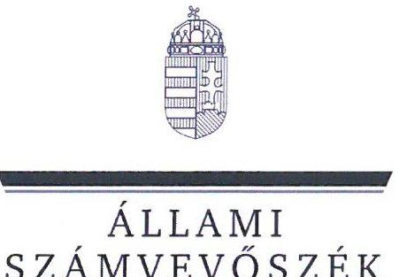

# JELENTÉS 

## Szakképzési centrumok vagyongazdálkodásának ellenőrzése

A Győri Szakképzési Centrum ellenőrzése

2025.

---

ÁLLAMI
SZÁMVEVŐSZÉK

# JELENTÉS 

## Szakképzési centrumok vagyongazdálkodásának ellenőrzése

A Győri Szakképzési Centrum ellenőrzése

2025.

---

# ELLENŐRZÉSI IGAZGATÓSÁG: 

## ELLENŐRZÉSI IGAZGATÓSÁG I.

## ELLENŐRZÉSI IGAZGATÓ:

SINKÁNÉ DR. CSENDES ÁGNES ellenőrzési igazgató

## ELLENŐRZÉSVEZETŐ:

NAGY MARIANNA ellenőrzésvezető

Jelentéseink az interneten a www.axz.hu címen olvashatók.

IKTATÓSZÁM: EL-4270-001/2025
TÉMASORSZÁM: -
ELLENŐRZÉS-AZONOSÍTÓ SZÁM: V1098

---

# TARTALOMJEGYZÉK 

AZ ELLENŐRZÉS ALAPADATAI ..... 5
AZ ELLENŐRZÖTT SZERVEZET ..... 7
ÖSSZEFOGLALÁS ..... 8
AZ ELLENŐRZÉS FÓKUSZTERÜLETEI ..... 11
MEGÁLLAPÍTÁSOK ..... 12
JAVASLATOK ..... 33
MELLÉKLETEK ..... 35
I. sz. melléklet: Értelmező szótár ..... 35
II. sz. melléklet: Az ellenőrzött szervezetek jegyzéke ..... 38
III. sz. melléklet: Ellenőrzési kritériumok ..... 39
IV. sz. melléklet: Vagyongazdálkodási tevékenység mintatételeinek értékelése ..... 41
FÜGGELÉK: ÉSZREVÉTELEK ..... 44
RÖVIDÍTÉSEK JEGYZÉKE ..... 51

---

.

---

# AZ ELLENŐRZÉS ALAPADATAI 

## AZ ELLENŐRZÉS CÉLJA

Az ellenőrzés célja annak értékelése volt, hogy a szakképzési centrum vagyongazdálkodása a jogszabályi előírásoknak és a felelős gazdálkodással szemben támasztott követelményeknek megfelelő volt-e, a belső kontrollok támogatták-e a döntések meghozatalát és végrehajtását, és a vagyongazdálkodás szabályszerű, célszerű és eredményes megvalósítását.

## AZ ELLENŐRZÉS TÍPUSA

Kombinált ellenőrzés

## AZ ELLENŐRZÖTT IDŐSZAK

2022. január 1 - 2023. december 31., kitekintéssel az ágazati képzőközpont 2021. november 11-ei létrejöttére, valamint az ágazati képzőközponthoz kapcsolódó uniós támogatások 2021. január 28-ai igénylésének időpontjára.

## AZ ELLENŐRZÉS TÁRGYA

Az ellenőrzés tárgyát a szakképzési centrum vagyongazdálkodása, ezen belül a vagyongazdálkodási tevékenység vonatkozásában kialakított szervezeti kereteknek, a vagyongazdálkodás (vagyonnövekedés, vagyoncsökkenés, vagyonhasznosítás) szabályszerűségének, célszerűségének és eredményességének, a vagyongazdálkodás belső kontrollokkal történő támogatásának, valamint a szakképzési centrum ágazati képzőközpontban meglévő tartós részesedésével összefüggő vagyongazdálkodásának; a vagyongazdálkodás felelős gazdálkodással szemben támasztott követelményeknek való megfelelőségének az ellenőrzése, egyes területeken a vagyongazdálkodás elemzése képezte.

Az ellenőrzés kiterjedt minden olyan körülményre és adatra, amely az ÁSZ ${ }^{1}$ jogszabályban meghatározott feladatainak teljesítéséhez, valamint a program végrehajtása folyamán felmerült újabb összefüggések feltárásához szükséges volt.

## AZ ELLENŐRZÉS JOGALAPJA

Az ellenőrzés jogszabályi alapját az ÁSZ tv. ${ }^{2} 1 . \int$ (3) bekezdésének, az 5. § (2)-(4) bekezdéseinek, valamint az Áht. ${ }^{3} 61 . \int$ (2) bekezdésének előírásai képezték.

---

# AZ ELLENŐRZÉS MÓDSZERE 

Az ellenőrzést törvényességi, célszerűségi, eredményességi szempontokat, valamint a nemzetközi standardokat irányadónak tekintve az ellenőrzési program szempontjai, az ellenőrzött időszakban hatályos jogszabályok, az ellenőrzés szakmai szabályok és módszertanok figyelembevételével végezte az ÁSZ.

Az ellenőrzési kérdések megválaszolásához szükséges bizonyítékok megszerzése az ellenőrzött szervezet által rendelkezésre bocsátott dokumentumokra és adatokra alapozva, továbbá megfigyelés, szemle (szemrevételezés), kérdésfeltevés (információkérés), valamint elemző eljárás útján történt. Az ellenőrzési bizonyítékként felhasználható adatforrások közé tartoztak egyrészt az ellenőrzéshez kért dokumentumok, adatforrások, másrészt adatforrás volt még minden - az ellenőrzés folyamán - feltárt, az ellenőrzés szempontjából információkat tartalmazó dokumentum.

Az ellenőrzés lefolytatásához az ellenőrzött szervezet a tanúsítványok kitöltésével, valamint az ÁSZ által kért dokumentumok, adatok, információk megküldésével és az ellenőrzés során szolgáltatott adatokat.

Az ÁSZ ellenőrzés az egyes fókuszterületek értékelését a III. számú mellékletben megjelölt kritériumok alapján végezte. A vagyongazdálkodás (vagyonnövekedés, vagyoncsökkenés, vagyonhasznosítás) szabályszerűségét a 2022. és a 2023. évi vagyonnövekedés és vagyoncsökkenés analitikus nyilvántartásából, valamint az ingatlan és ingó vagyon hasznosításáról készült kimutatásból - a 2022. és a 2023. évre évenként öt-öt - ötletszerű* mintavételi eljárással kiválasztott mintatétel alapján ellenőrizte az ÁSZ. A kiválasztott mintatételek ellenőrzésének eredménye nem került kivetítésre a teljes sokaságra. A megállapítások az adott ellenőrzött mintatételek vonatkozásában kerültek megjelenítésre. A szakképzési centrum egyes befektetett eszközökkel - mint az ingó- és ingatlanvagyonelemekkel, illetve a tartós részesedésekkel - való gazdálkodásának értékelése elemző eljárással történt. A tárgyi feltételek rendelkezésre állásának elemzését tanúsítványi adatokból ötletszerűen vett mintatételek alapján ellenőrizte az ÁSZ, tanévenként 10-10, összesen 30 duális képzőhelyhez köthető szakma Képzési Programja került kiválasztásra. A mintatételek elemzése a szakképzési centrum intézményei, valamint a duális képzőhelyek között létrejött képzési programokban foglalt, tárgyi feltételek megoszlásának elemzésére terjedt ki. A szakmai oktatásban résztvevőkkel kapcsolatos elemzések a 2021/2022., 2022/2023. és 2023/2024. tanéveket érintették.

[^0]
[^0]:    * Ötletszerű mintavételi eljárás: „hamis véletlenszerü" kiválasztás. A tételek egyedileg, „véletlenszerủen" kerülnek kiválasztásra úgy, hogy nem mért szelekciós torzítás (a sokaság bizonyos részei nem - vagy nem megfelelő valószínúséggel - kerülnek a mintába) is szerepel a kiválasztásban (Módszertani útmutató az ellenőrzési mintavételezéshez, ÁSZ)

---

# AZ ELLENŐRZÖTT SZERVEZET

Az ellenőrzés a központi költségvetési szervek körébe tartozó Győri Szakképzési Centrumra terjedt ki. A GYSZC ${ }^{4}$ a szakképzésért felelős miniszter döntése értelmében 2019. augusztus 1-jén jött létre a Győri Műszaki Szakképzési Centrum és a Győri Szolgáltatási Szakképzési Centrum összevonásával, jogelődjét 2015. július 1-jén alapították. A GYSZC létrejöttekor, 2019-ben 16 intézményében 14515 nappali és 4299 felnőttoktatási férőhelyet biztosított a tanulóinak. Intézményeinek száma 2022. július 29-én 20-ra bővült, közöttük 13 technikum, egy szakképző iskola, egy technikum és szakképző iskola, négy köznevelési intézmény és egy akkreditált vizsgaközpont található. A GYSZC intézményi tanulói létszáma 2023. december 31-én 13536 fő volt.

A GYSZC fő tevékenységei közé tartozik a technikumi és szakképző iskolai szakmai oktatás, szakiskolai és szakgimnáziumi nevelés-oktatás, sajátos nevelési igényű gyermekek, tanulók, valamint beilleszkedési, tanulási, magatartási nehézséggel küzdő tanulók iskolai nevelése-oktatása, kollégiumi ellátás biztosítása, valamint egyéb nevelő és oktató munkához kapcsolódó, nem köznevelési tevékenység. A GYSZC az állami intézményfenntartó központtól átvett gimnáziumi és általános iskolai intézményekben gimnáziumi és általános iskolai nevelés-oktatás alapfeladatot látott el, továbbá Európai Unió pénzügyi alapjaiból és más külföldi, illetőleg hazai alapokból származó támogatásokból fejlesztési programokat valósított meg.

A GYSZC irányító szerve és fenntartója a $\mathrm{KIM}^{5}$ (2022. május 24-ig $\mathrm{ITM}^{6}$ ) volt, a középirányítói feladatokat az NSZFH ${ }^{7}$ látta el. A GYSZC-t a főigazgató és a kancellár önállóan vezette és képviselte. A főigazgató felelt a szakképzési centrum részeként működő szakképző intézmények szakképzési alapfeladatainak ellátásáért, a kancellár a szakképzési centrum törvényes és szakszerű működéséért volt felelős. A főigazgató és a kancellár személye az ellenőrzött időszakban nem változott.

A GYSZC az ellenőrzött időszakban 45,0\%-os részesedést szerzett a GYÁKK ${ }^{8}$-ben. A GYÁKK létrehozásának célja az elektronika, valamint az automatizálás területéhez szorosan kapcsolódó informatika, távközlés és a gépészeti ágazatokban tanulók szakirányú oktatása, képzése. A GYSZC nemzeti vagyonba tartozó befektetett eszközeinek összege 2022. évről 2023. évre 2,4\%-kal, 198,0 M Ft-tal nőtt. A GYSZC 2022. és 2023. évi beszámoló adatait az 1. táblázat mutatja be.

|   | 2022. FV | 2023. FV  |
| --- | --- | --- |
|  Mérlegfőösszeg | 11632,7 | 8830,4  |
|  NEMZETI VAGYONBA TARTOZÓ BEFEKTETETT ESZKÖZÖK | 8402,9 | 8600,9  |
|  Immateriális javak | 3,9 | 2,7  |
|  Tárgyi eszközök | 8399,0 | 8598,3  |

Forrás: A GYSZC beszámoló adatai alapján ÁSZ szerkesztés

---

# ÖSSZEFOGLALÁS 

A szakképzési centrumok a szakképzési feladatok ellátásához jelentős nagyságú állami vagyont használtak és használnak, amelyekkel való szabályszerű, célszerű és eredményes gazdálkodás a szakképzési közfeladat elvárásainak teljesítéséhez nélkülözhetetlen. A szakképzési centrumok vagyongazdálkodása kiemelt figyelmet követel, mivel a szakképzési rendszer fenntarthatósága, infrastruktúrája és minősége függ a vagyongazdálkodás szabályosságától, célszerűségétől és eredményességétől.

A GYSZC vagyongazdálkodása a 2022. és a 2023. év vonatkozásában - a vagyonnövekedéshez és a vagyoncsökkenéshez kapcsolódó gazdasági események, valamint a vagyonhasznosítás területén, továbbá a nemzeti vagyon körébe tartozó ingatlanok és eszközök GYÁKK részére történt biztosításánál feltárt hiányosságok miatt - részben volt megfelelő. A nemzeti vagyon körébe tartozó ingatlanok és eszközök GYÁKK részére szerződés, megállapodás nélkül történt biztosításánál nem érvényesült a nemzeti vagyonnal való felelős gazdálkodás elve, és a GYSZC által alkalmazott gyakorlat miatt vagyonvesztés kockázata (vagyonelemek amortizálódása, a vagyonmegőrzés biztosításának hiánya) is felmerülhet.

A GYSZC-nél a 2022-2023. évben meglévő szabályozási hiányosságok hozzájárultak a vagyongazdálkodási tevékenységben - a vagyonnövekedéshez, a vagyoncsökkenéshez és a vagyonhasznosításhoz kapcsolódó gazdasági események - tapasztalt szabálytalanságokhoz, és e területeken a belső kontrollok nem minden esetben támogatták a vagyongazdálkodási döntések előkészítését, megalapozását, végrehajtását, nyomon követését. A vagyonnövekedéshez, a vagyoncsökkenéshez és a vagyonhasznosításhoz kapcsolódó döntések célszerűek voltak. A vagyoncsökkenéshez és a vagyonhasznosításhoz kapcsolódó gazdasági események esetében a döntések és azok végrehajtása során az eredményességi szempontok nem minden esetben érvényesültek.

## A GYSZC vagyongazdálkodásának föbb jellemzői

A GYSZC a vagyongazdálkodásra vonatkozó alapvető szabályozási kereteket kialakította, azonban a jogszabályi előírásoknak az nem teljeskörűen felelt meg. A selejtezési szabályzat nem volt összhangban a vagyonkezelési szerződés előírásaival, a selejtezési folyamatát nem rendezte átlátható, standardizált módon. A GYSZC elkészítette a vagyongazdálkodási tevékenységére vonatkozó ellenőrzési nyomvonalát, azonban a jogszabályi előírás ellenére a vagyonhasznosítási döntések előkészítésének megalapozásához, meghozatalához és végrehajtásához kapcsolódóan nem tartalmazott leírást.

A 2022. és a 2023. években a vagyonnövekedést eredményező gazdasági események esetében a felhalmozási kiadások vonatkozásában a jogszabályi előírás ellenére a pénzügyi ellenjegyzési és érvényesítési jogkör gyakorlásra jogosultak kijelölése nem történt meg, ezért pénzügyi ellenjegyzés nélkül került sor kötelezettségvállalásra és érvényesítés nélkül került sor kifizetésre. A kontrollok a döntések előkészítéséhez, megalapozásához kapcsolódóan múködtek. Az engedélyezési és jóváhagyási kontrollok a jogszabályi előírás ellenére nem működtek. A vagyonnövekedéshez kapcsolódó gazdasági események célszerűek és eredményesek voltak.

A 2022. és a 2023. években a vagyoncsökkenésekhez kapcsolódó gazdasági események esetében a selejtezési eljárás nem felelt meg az Nvtv. ${ }^{\circledR}$-ben lefektetett, a nemzeti vagyonnal való felelős gazdálkodás alapelveinek és a vagyonkezelési szerződés előírásainak, továbbá nem felelt meg a selejtezési szabályzatnak. A GYSZC az ÁSZ tv. 29. § (2) bekezdés szerinti, a jelentéstervezet megállapításaira tett észrevételében arról

---

tájékoztatta az ÁSZ-t, hogy kezdeményezte a GYSZC és a Győr Megyei Jogú Város vagyonkezelési szerződése - selejtezésre vonatkozó részének - 2024. július 1-től hatályos 1. számú módosítását, ezzel az ÁSZ megállapítása hasznosult.

A selejtezési döntések megalapozásáról a GYSZC nem gondoskodott. A selejtezési eljárásoknál az engedélyezési, jóváhagyási és a végrehajtási kontrollokat vagy nem alakították ki vagy nem minden esetben működtették azokat. A vagyoncsökkenéshez kapcsolódó gazdasági események célszerủek voltak. Az eredményesség nem minden esetben volt biztosított.

A 2022. és a 2023. években a vagyonhasznosítás során az önköltség meghatározásakor a jogszabályi előírás ellenére nem vették figyelembe az értékcsökkenést, továbbá a bérleti díj a felmerült költségekre nyújtott fedezetet, plusz bevételt nem eredményezett, amellyel kár érte az GYSZC-t. Az ingatlanok bérbeadásával kapcsolatos döntések célszerű volt. A döntések eredményességi szempontú megalapozása nem történt meg.

A GYSZC belső ellenőrzése a vagyongazdálkodási tevékenységgel kapcsolatban 2023-ban végzett ellenőrzése hiányosságot nem tárt fel.

A GYSZC 2021. november 11-én két gazdasági társaság közreműködésével létrehozta a GYÁKK-ot, amelyben $45 \%$-os tulajdonosi részesedést, és ennek megfelelő $45 \%$-os szavazati arányt szerzett. A Ptk. diszpozitív szabályaival összhangban sem alapításkor, sem a társasági szerződés módosításkor nem került sor felügyelőbizottság létrehozására. A GYÁKK megalapítását a szakképzésért felelős miniszter engedélyezte, a Győr-Moson-Sopron Megyei Kereskedelmi és Iparkamara a GYÁKK-ot duális képzőhelyként nyilvántartásba vette. A GYÁKK megalapítását célszerúségi és eredményességi szempontok is megalapozták.

A GYSZC a GYÁKK létrehozásakor pénzbeli vagyoni hozzájárulást biztosított, egyéb pénzbeli, vagy nem pénzbeli vagyoni hozzájárulást nem teljesített a 2022-2023. években a GYÁKK múködéséhez. A GYSZC a GINOP pályázat keretében 240,0 M Ft vissza nem térítendő támogatást kapott az elektronikai és elektrotechnikai ágazati képzőközpont kialakítására. A projekt összköltségének 84\%-át eszköz- és immateriális javak beszerzésére, ennek több mint $80 \%$-át az oktatórobot állomáshoz kapcsolódó felszerelések, informatikai eszközök immateriális javak, szoftverek beszerzésére fordították. A projekt eredményeként 299,6 M Ft értékű növekedés történt a GYSZC vagyonelemeiben, amely a 2023. évi vagyonnövekedés $22 \%$-a volt.

A GYSZC a GYÁKK megalapításához és múködéséhez, a szakirányú oktatásban való részvételéhez telephelyként intézményeinek ingatlanjait, valamint az uniós és egyéb forrásból származó eszközök, berendezések, felszerelések használatát szerződés vagy megállapodás nélkül biztosította, ezáltal az Nvtv.-ben megfogalmazott nemzeti vagyonnal való felelős gazdálkodás alapelveinek érvényesüléséről nem gondoskodott.

A GYSZC által a GYÁKK számára nyújtott törzstőke biztosítása célszerű volt. A biztosított eszközök, berendezések, felszerelések a GYÁKK által megvalósított duális képzésben résztvevő diákok számának növekedését eredményezte: új szakmához kapcsolódó képzés indult be, valamint a duális képzésben résztvevők száma emelkedett. A GYÁKK a GYSZC négy intézményében három ágazatban nyolc szakmában és két tanítási rendben biztosított a diákoknak szakirányú oktatást: a 2021/2022. tanévben 56, 2022/2023-ban már 247, 2023/2024-ben pedig 283 tanuló vett részt a szakirányú oktatásán. A GYÁKK-nál szakirányú képzésben résztvevők aránya a GYSZC duális képzőhelyein szakirányú oktatásban részesülő összes diák számához képest is emelkedett: a 2021/2022. tanévben a duális partnernél tanulók 8\%-át, 2022/2023. tanében 16,2\%-át és 2023/2024. tanévben már 18,3\%-át részesítette szakirányú oktatásban a GYÁKK.

---

A GYSZC GYÁKK-ban meglévő részesedés feletti tulajdonosi joggyakorlásra a GYSZC szabályzatai vonatkoztak, a belső szabályozó eszközök a tulajdonosi jogok gyakorlásának nem minden területére terjedtek ki. Az ellenőrzött időszakban a GYÁKK-ra a GYSZC számviteli szabályzatai voltak irányadóak, amelyek a jogszabályi előírással szemben a gazdasági társaságban meglévő részesedéssel kapcsolatos vagyongazdálkodási feladatokat és elveket nem határozták meg. A GYSZC a GYÁKK-ban meglévő részesedése vonatkozásában a jogszabályi előírás ellenére nem alakította ki a tulajdonosi jogok gyakorlásához kapcsolódó ellenőrzési, adatszolgáltatási és beszámolási feladatok teljesítésével kapcsolatos belső előírásokat, nem rendelkezett a működési folyamatok leírásával, ellenőrzési nyomvonallal, integrált kockázatkezelési szabályzatában nem nevezte meg a tartós részesedéshez kapcsolódó tulajdonosi joggyakorlás kockázatait, a szükséges intézkedéseket, azok végrehajtása folyamatos nyomon követésének módját. A belső ellenőr feladata a jogszabályi előírással szemben nem terjedt ki a GYÁKK-ban meglévő tartós részesedés feletti tulajdonosi joggyakorlásra.

A GYSZC a rábízott állami vagyon tekintetében az Nvtv. szerinti nyilvántartási kötelezettségét teljesítette, az időközi mérlegjelentéseket elkészítette. A GYSZC, mint tulajdonosi joggyakorló 2022. és 2023. évi beszámolója tartalmazta a GYSZC GYÁKK-ban meglévő tulajdonosi részesedésének könyv szerinti értékét, a mérlegsort főkönyvi kivonattal alátámasztották. A GYSZC - a befolyás mértékének megfelelően részt vett a GYÁKK legfőbb szervének Ptk. szerinti döntéshozói tevékenységében.

A GYSZC a GYÁKK-ban meglévő tartós részesedéséhez kapcsolódó, az államot megillető tulajdonosi jogok gyakorlására - annak ellenére, hogy GYÁKK megalapítását és működésének megkezdését sokrétű előkészítés előzte meg - nem készült fel, szabályzatait nem igazította a valós helyzethez és a tulajdonosi szemléletet nem alakította ki.

A szakképzési centrumok számára az Szkt. 2021. szeptember 1-jétől hatályos módosítása tette lehetővé, hogy ágazati képzőközpontban részesedést szerezzenek, és e tekintetben gyakorolják az államot megillető tulajdonosi jogokat. Ez a feladat a központi költségvetési szervként működő szakképzési centrumoktól más gazdálkodási és tulajdonosi szemléletet kialakítását követeli. Az ÁSZ ellenőrzés szakmai véleménye szerint célszerű lenne, ha a fenntartó a szakképzési centrumokat a megfelelő tulajdonosi szemlélet kialakításában segítené, információkkal, iránymutatással látná el a nemzeti vagyonnal való felelős gazdálkodás elveinek érvényesítése érdekében.

---

# AZ ELLENŐRZÉS FÓKUSZTERÜLETEI 

1. A szakképzési centrum vagyongazdálkodása
2. A szakképzési centrum ágazati képzőközpontban meglévő részesedésével összefüggő vagyongazdálkodása

---

# 1. A szakképzési centrum vagyongazdálkodása 

Összegző megállapítás

A GYSZC a vagyongazdálkodásra vonatkozó alapvető szabályozási kereteket kialakította. A gazdasági ügyrend, a számlarend, kötelezettségvállalási szabályzat, a selejtezési szabályzat és az ellenőrzési nyomvonal nem volt összhangban a jogszabályi és egyéb előírásokkal. A GYSZC vagyongazdálkodási tevékenysége a jogszabályi és a felelős gazdálkodás követelményeinek részben felelt meg. A GYSZC vagyongazdálkodási döntéseinek szabályszerű, célszerű és eredményes előkészítését, a vagyongazdálkodási tevékenység végrehajtását és nyomon követését a belső kontrollok csak részben támogatták.

## A GYSZC VAGYONGAZDÁLKODÁSI TEVÉKENYSÉGÉNEK SZABÁLYOZÁSI KERETEI

A GYSZC - az Áht. -val és az Ávr. ${ }^{10}$-rel összhangban - rendelkezett az ellenőrzött időszakban hatályos, NSZFH által jóváhagyott SZMSZ ${ }^{11}$-szel, amely tartalmazta a költségvetési szerv szervezetének leírását, valamint a feladatok ellátásának részletes belső rendjét és módját. Az SZMSZ - az Ávr. előírásának megfelelően - rögzítette a hatáskörök gyakorlásának módját, a helyettesítés rendjét, a helyettesítés rendjéhez kapcsolódó felelősségi szabályokat, továbbá a munkáltatói jogok gyakorlásának rendjét.
Az Ávr. rendelkezésének megfelelően a gazdasági szervezet rendelkezett gazdasági ügyrenddel ${ }_{1,2,3}{ }^{12}$, amely a vagyongazdálkodással kapcsolatos feladatok között határozta meg - többek között - a vagyonkezelésben lévő eszközök elkülönített nyilvántartását, az eszközök évenkénti leltározását, egyeztetését. A gazdasági ügyrend ${ }_{1,2,3}$ VI. fejezete nem volt összhangban a Vtv. ${ }^{13} 2 . \S$ (2) bekezdésével. A Vtv. 2. § (2) bekezdése szerint a központi költségvetési szerv önálló tulajdonjoggal nem rendelkezik, bármely dolog tulajdonjogát, gazdálkodó szervezet részesedését, vagy valamely vagyoni értékű jogot az állam javára szerez meg.
A GYSZC - a Számv.tv. ${ }^{14}$ és az Áhsz. ${ }^{15}$ előírásaival összhangban - rendelkezett számviteli politikával ${ }_{1,4}{ }^{16}$, valamint az annak keretén belül elkészítendő leltárkészítési és leltározási szabályzattal ${ }^{17}$, az eszközök és a források értékelési szabályzatával ${ }^{18}$, valamint a Számv. tv. és Áhsz. szerinti számlarenddel ${ }_{1}{ }^{19}$. A tulajdonosi joggyakorlással összefüggő sajátos feladatokat - a Számv. tv. 14. § (3) bekezdése előírásai ellenére - a számviteli politika nem szabályozta.
A leltárkészítési és leltározási szabályzat - a Számv. tv és az Áhsz. előírásaival összhangban tartalmazta a mennyiségi felvétellel történő leltározás gyakoriságát: a mérleget alátámasztó részletező leltár elkészítése minden évben kötelező, fordulónapja a tárgy év december 31-e volt. A szabályzat - az Áhsz. szel összhangban - előírta, hogy a leltározást a működtető, vagyonkezelő külön térítés és díjazás nélkül, évente köteles volt elvégezni. Az eszközök és források értékelési szabályzatában meghatározott értékcsökkenési leírási kulcsok összhangban voltak az Áhsz. szerinti leírási kulcsokkal.

---

A GYSZC rendelkezett az Ávr. szerinti kötelezettségvállalási szabályzattal ${ }_{1,2,3}{ }^{20}$. A kötelezettségvállalási szabályzat ${ }_{1,2,3}$ a pénzügyi ellenjegyzésre és érvényesítésre kijelölt személyeket csak a személyi és a dologi kiadások vonatkozásában határozta meg. A felhalmozási kiadások esetében az Ávr. 55. § (2) bekezdés a) pontjában foglaltak ellenére nem történt meg a pénzügyi ellenjegyzésre és érvényesítésre kijelölt személyek meghatározása.
A GYSZC elkészítette az Ávr. szerinti beszerzési szabályzatot ${ }_{1,2}{ }^{21}$, a Kbt. ${ }^{22}$ szerinti közbeszerzési szabályzatot ${ }_{1,2,3}{ }^{23}$, valamint a Kbt. szerint elkészítette és folyamatosan aktualizálta az árubeszerzésekről, építési beruházásokról, illetve a szolgáltatások megrendelésére vonatkozó 2022. és 2023. évi közbeszerzési terveket. A 2022. évre négy, a 2023. évre 11 közbeszerzési eljárás lebonyolítását tartalmazta a közbeszerzési terv.
A GYSZC ellenőrzési, adatszolgáltatási és beszámolási feladatait - az Ávr.-nek megfelelően - több belső szabályzat tartalmazta, így az SZMSZ, a gazdasági ügyrend ${ }_{1,2}$ és a kötelezettségvállalási szabályzat ${ }_{1,2,3}$.
A GYSZC elkészítette az Ávr. szerinti - az anyag- és eszközgazdálkodás számviteli politikában nem szabályozott kérdéseit érintően - selejtezési szabályzatot ${ }^{24}$. A 2019. augusztus 1-jétől hatályos szabályzat kiterjedt a GYSZC tulajdonában és kezelésében lévő, a centrumban és telephelyein elhelyezett ingó- és ingatlan vagyonra, tárgyi eszközökre és készletekre, ugyanakkor a selejtezés lebonyolításának folyamata, felelősei nem voltak egyértelműen meghatározva, valamint a selejtezés folyamatának szabályozása a vagyonkezelésbe átvett vagyonelemek esetében nem volt összhangban a vagyonkezelési szerződés ${ }^{25} 22$. pontjával. A selejtezési szabályzat 9. pontja szerint a vagyonkezelésbe átvett eszközök esetén írásban értesíteni szükséges a tulajdonost - engedélyezés céljából - a selejtezés megkezdése előtt, amely ellentétes volt a vagyonkezelési szerződés 22. pontjával, mert a vagyonkezelési szerződés szerint a bruttó 100 E Ft egyedi érték feletti eszközök esetén a selejtezést - a GYSZC javaslata alapján - az Önkormányzat ${ }^{26}$ végzi. A GYSZC - a Bkr. ${ }^{27}$ előírásaival összhangban - elkészítette a vagyongazdálkodási tevékenységére vonatkozó ellenőrzési nyomvonalat ${ }_{1,2}{ }^{28}$. Az ellenőrzési nyomvonalban a vagyonhasznosítás felelősségi szintje - ezen belül a vagyonhasznosítási döntések előkészítésének megalapozásához, meghozatalához és végrehajtásához kapcsolódóan -, a vagyonhasznosítás információs szintje, kapcsolatai, valamint az irányítási és ellenőrzési folyamatai nem kerültek kialakításra, amely nem felelt meg a Bkr. 6. § (3) bekezdésében foglalt előírásoknak.
A GYSZC rögzítette a szervezeti teljesítménymérési követelményrendszerét ${ }^{29}$, ez alapján elkészült a GYSZC 2023. évi szakmai beszámolója, amely a követelményrendszer indikátorait figyelembe véve összegezte és értékelte a GYSZC-hez tartozó intézmények éves teljesítményét. A GYSZC SZMSZ-e is tartalmazott nyomon követésre vonatkozó előírásokat.
A GYSZC - a Bkr.-nek megfelelően - rendelkezett integrált kockázatkezelési szabályzattal ${ }_{1,2}{ }^{30}$, amelyben a - vagyonhasznosítási folyamatokra vonatkozó és a tartós részesedéshez kapcsolódó tulajdonosi joggyakorlásra vonatkozó kockázatok kivételével - a Bkr. szerint felmérte a tevékenységében rejlő és a szervezeti célokkal összefüggő kockázatokat, valamint meghatározta az egyes kockázatokkal kapcsolatban a szükséges intézkedéseket, valamint azok teljesítésének módját. A GYSZC az egyes tevékenységeihez folyamatokat határozott meg, amelyekhez elemzési kritériumokat rendelt. A GYSZC külső és belső kockázatokat is azonosított, a kiemelten nagy kockázatú tevékenységek esetében a kancellár, illetve főigazgató személyes intézkedését rögzítette.
A GYSZC - a Bkr. előírásaival összhangban - kialakította a tevékenységének, a célok megvalósításának nyomon követését biztosító rendszer működésének szabályait, valamint - az Áht. és a Bkr.

---

rendelkezéseinek megfelelően - a belső ellenőrzés múködtetésének kereteit, a belső ellenőr a kancellárnak közvetlenül alárendelve látta el feladatait.
A GYSZC kancellárja - a Bkr. előírásának megfelelően - 2022-ben és 2023-ben értékelte a GYSZC belső kontrollrendszerének minőségét. A 2022. és 2023. évi vezetői nyilatkozat szerint a belső kontrollrendszer kialakítása, működtetése megfelelő volt, amelyet az ellenőrzés megállapításai - a vagyonnövekedési, a vagyoncsökkenési, és a vagyonhasznosítási mintatételek ellenőrzése során feltárt hiányosságok - nem támasztottak alá.

A GYSZC a számvevőszéki ellenőrzés során elkészítette, majd hatályba léptette a gazdálkodási szabályzat módosítását, amely a felhalmozási kiadásokra is kiterjedően tartalmazta a pénzügyi ellenjegyzési és érvényesítési feladatok ellátására szóló kijelöléseket, így az ÁSZ megállapítása az ellenőrzés folyamán hasznosult.

# VAGYONGAZDÁLKODÁSI TEVÉKENYSÉGEK SZABÁLYSZERŰSÉGE 

## Vagyonnövekedés

A vagyonnövekedési gazdasági események ingatlanon végzett beruházások (2022. évi az 1., 2. és 3., és 2023. évi 2. és 3. mintatétel) és nagy értékű gépbeszerzések (2022. évi 4-5. és 2023. évi 1., 4. és 5. mintatételek) voltak. A mintatételek összefoglaló kiértékelését a IV. melléklet 1. táblázat tartalmazza.
A vagyonnövekedési gazdasági események vonatkozásában ellenőrzött mintatételeknél

- a felhalmozási kiadások vonatkozásában - az Ávr. 55. § (2) bekezdés a) pontja és a 58. § (4) bekezdésben foglaltak ellenére - a pénzügyi ellenjegyzési és érvényesítési jogkör gyakorlásra jogosultak kijelölése nem történt meg,
- a gazdálkodási jogkörgyakorlás nem felelt meg az Áht. és az Ávr. előírásainak:
- egy esetben (2023. évi 1. mintatétel) - az Ávr. 50. § (1) bekezdés d.) pontjában foglaltak ellenére - a megkötött szerződés nem tartalmazta a pénzügyi ellenjegyzés keltezését,
- egy esetben (2023. évi 2. mintatétel) - az Áht. 37. § (1) bekezdés és az Ávr. 55. § (1) és (2) bekezdésben foglaltak ellenére - a felhalmozási kiadásokra vonatkozó pénzügyi ellenjegyzés nélkül került sor kötelezettségvállalásra,
- nyolc esetben (2022. évi 1.,2., 4., 5., 2023. évi 2-5. mintatétel) - az Ávr. 58. § (1) bekezdése és az 55. § (2) bekezdés a) pontjában előírtak ellenére - a felhalmozási kiadásokra kiterjedő jogosultság hiányában, érvényesítés nélkül került sor a kifizetésre.
- a nyilvántartásba vétel - kisebb hiányosságokkal - megfelelt az Nvtv., Vtvr., Áhsz. és Számv. tv. előírásainak.
A GYSZC az új vagyonelemeket a tulajdonosi joggyakorló önkormányzatok és az MNV Zrt. ${ }^{31}$ felé az Nvtv. és a Vtvr. ${ }^{32}$ előírásai szerint bejelentette és az Áhsz. előírásainak megfelelően nyilvántartásba vette. Az állományba vételi bizonylatok és a tárgyi eszköz kartonok nem tartalmazták
- épületek, építmények esetében (2022. évi 1-3. és a 2023. évi 2. és 3. mintatételek)- az Áhsz. 14. melléklete VII.4. a-b) pontjaiban foglaltak ellenére - az épületek, építmények sajátos adatai közül azoknak címét és műszaki jellemzőit (falazat stb.),

---

- gépek, berendezések, felszerelések esetében (2022. évi 4. és 5. és a 2023. évi 1., 4. és 5. mintatételek) - az Áhsz. 14. melléklete VII.5. a) és c) pontjaiban foglaltak ellenére - azok típusát, gyártójának megnevezését, gyártási számát.
- a teljesítésigazolások és az utalványozások az Áht. és az Ávr. előírásainak megfelelően történtek. A gazdálkodási jogkörgyakorlás során az Ávr.-ben foglalt összeférhetetlenségi szabályokat betartották.
- a pénzügyi könyvvezetés szerinti elszámolás az Áhsz. és a 38/2013. (IX.19.) NGM rendelet ${ }^{33}$ előírásainak megfelelő könyviteli számlákon, a költségvetési számvitelben az Áhsz. szerinti egységes rovatrend előírásainak megfelelő nyilvántartási számlákon történt.
- a vagyonnövekedési gazdasági események lebonyolítása és elszámolása megfelelt a GYSZC belső szabályzataiban foglaltaknak.
- a bekerülési értékek, az értékcsökkenési leírási kulcsok meghatározása és a terv szerinti értékcsökkenés elszámolása valamennyi mintatétel esetében, a terven felüli értékcsökkenés elszámolása az érintett 2023. évi 1-3. számú mintatételek esetében megfelelt az eszközök és források értékelési szabályzatban, valamint a számviteli politikában ${ }_{1-2}$ előírtaknak.
- a beszerzési eljárások lebonyolítása megfelelt a beszerzési szabályzat ${ }_{1,2}$ előírásainak. A GYSZC a közbeszerzési értékhatár alatti beszerzési során (2022. évi 2-5., 2023. évi 2-5. mintatétel) ajánlatkérőként járt el és a beszerzési szabályzatban ${ }_{1,2}$ foglaltakat alkalmazta. A beszerzési igényeket a beszerzési szabályzat ${ }_{1,2}$-ban előírtak figyelembevételével a GYSZC gazdasági vezetője javaslata alapján GYSZC kancellárja hagyta jóvá.

Jó gyakorlat! A GYSZC négy szakképző intézménye építőipari beruházási igényeit - a kedvezőbb árajánlat elérése érdekében - egy beszerzési eljárás keretében bonyolította le. A döntés előkészítésénél gazdaságossági szempontokat is érvényesítettek.

A 2023. évi 1. mintatétel esetében a közbeszerzési eljárás lefolytatása megfelelt a GYSZC közbeszerzési szabályzat ${ }_{1,2}$-ban foglalt előírásoknak. A 2022. évi 1. mintatétel esetében a közbeszerzési eljárást az $\mathrm{NFSI}^{34}$ folytatta le.

# Vagyoncsökkenés 

A vagyoncsökkenési gazdasági események selejtezési eljáráshoz kötődtek A mintatételek összefoglaló kiértékelését a IV. melléklet 2. táblázat tartalmazza.
A vagyoncsökkenési gazdasági események vonatkozásában ellenőrzött mintatételeknél

- a 2022. évi mintatételekhez kapcsolódó vagyoncsökkenési gazdasági események megfeleltek az Nvtv. előírásainak. A 2023. évi 1-3. sz. mintatételekhez kapcsolódó vagyoncsökkenési gazdasági események, selejtezések nem feleltek meg az Nvtv. 7. § (1) bekezdésben előírt, a nemzeti vagyonnal kapcsolatos felelős gazdálkodással szemben támasztott követelményeinek, valamint a vagyonkezelési szerződés előírásainak, mert
- a vagyonkezelési szerződés 22. pontjában foglaltakkal ellentétben a GYSZC a bruttó 100.000 Ft egyedi értéket meghaladó vagyonelemek leselejtezésére vonatkozóan javaslattal az Önkormányzat felé nem élt. A selejtezési eljárást a vagyonkezelési szerződés 22. pontjában előírtak ellenére nem az Önkormányzat, hanem a GYSZC szakképző intézményei folytatták le,

---

- a kapcsolódó vagyonelemeket érintő változásokról és a vagyonelemekben keletkezett kárról - a vagyonkezelési szerződés 20. és 23. pontjainak rendelkezése ellenére - a változás bekövetkezésétől számított 5 napon belül a GYSZC az Önkormányzatot nem értesítette, a selejtezési eljárás lefolytatására az Önkormányzat lett volna jogosult.
- a vagyoncsökkenési tételek számviteli nyilvántartásból történő kivezetése megfelelt az Számv. tv. és az Áhsz. előírásainak,
- a vagyoncsökkenéshez kapcsolódó gazdasági események elszámolása megfelelt a Számv. tv., Áhsz. és a 38/2013. (IX.19.) NGM rendelet előírásának. A 2023. évi 1-3. sz. mintatételhez kapcsolódóan a GYSZC a Számv. tv. és az Áhsz. előírásainak megfelelően terven felüli értékcsökkenési leírást számolt el,
- a vagyoncsökkenési gazdasági események lebonyolítása nem felelt meg a GYSZC belső szabályzata előírásainak
- a 2022. és a 2023. évi selejtezésekhez kapcsolódó döntések előkészítése a Bkr 8. § 2) a) pontjában és a selejtezési szabályzat 6 . pontjában foglaltak ellenére nem volt alátámasztott, mert a szabályzat alapján a selejtezés kezdeményezése a szakképző intézmény vezetőjének javaslata alapján a GYSZC gazdasági vezetőjének feladatkörébe tartozott.
- nyolc esetben (2022. évi 1-5. és 2023. évi 1-3. mintatétel) a selejtezési jegyzőkönyvekben javasolt intézkedések végrehajtására kancellári engedély nélkül került sor a selejtezési szabályzat 11.2. és 11.5. pontjaiban foglalt előírások ellenére,
- öt esetben (2022. évi 3. és 2023. évi 1., 2., 4. és 5. mintatétel) a selejtezési eljárást a selejtezési szabályzat 11.3. pontjában foglalt előírás ellenére három helyett két főből álló selejtezési bizottság folytatta le,
- a GYSZC gazdasági vezetője a selejtezési eljárás szabályszerű végrehajtását nem ellenőrizte, a selejtezési eljárás során tapasztalt szabálytalanságokat nem jelezte a GYSZC kancellárja felé, amely ellentétes volt a selejtezési szabályzat 11.7. pontjának előírásával.

# Vagyonhasznosítás 

A GYSZC a kezelésében lévő vagyont bérbeadás útján hasznosította, a kiválasztott mintatételek között helyiségbérlet szerepelt. A mintatételek összefoglaló kiértékelését a IV. melléklet 3. táblázat tartalmazza.
Az GYSZC számára a vagyon hasznosítását vagyonkezelési szerződés, MNV Zrt. által kiadott kijelölő okirat és üzemeltetési megbízási szerződés tette lehetővé. A GYSZC az Nvtv. 3. § (1) bekezdés 4. pontja és a 11. $\$ (15) bekezdés c) pontja alapján az intézmények épületeit hasznosította, használatukra bérleti szerződést kötött.
A vagyonhasznosítási gazdasági események vonatkozásában ellenőrzött mintatételeknél:

- egy esetben (2022. évi 3. mintatétel, büfé bérbeadása) versenyeztetéssel - 3 ajánlat bekérésével - történt az ingatlan hasznosítása, összhangban az Nvtv. rendelkezésével, valamint a beszerzési szabályzat előírásával. Az ajánlati felhívás azonban a beszerzési szabályzat III. fejezet 2. b) pontjában foglaltaktól eltérően nem tartalmazott versenyeztetéshez induló (becsült) értéket,
- kilenc esetben mellőzhető volt a versenyeztetés a 2022. évi 1-2., 4-5. mintatételeknél az Nvtv. 11. § (17) bekezdés b) pontjában foglaltakra, 2023. évi 1-5. mintatételeknél az Nvtv. 11.§ (18) bekezdésben foglaltakra tekintettel,

---

- kilenc esetben (2022. évi 1.-2., 4.-5., valamint a 2023. évi 1-5. mintatételek) önköltségszámítás alapozta meg a használatba adást, a bérleti díjat az önköltség összegében határozták meg,
- három esetben (2022. évi 5. mintatétel, 2023. évi 2. és 5. mintatétel) - az Áhsz. 17. § (1) bekezdésében foglaltak ellenére - nem vették figyelembe az értékcsökkenést az önköltség meghatározásakor, nem teljesült az Nvtv. 7. § (2) bekezdésében foglalt - a vagyon értéknövelő használatára, hasznosítására vonatkozó - előírás.
- négy esetben (2022. évi 3. és 5., 2023. évi 1. és 5. mintatételek) a bérbeadó GYSZC meghatározta a bérlemény cél szerinti hasznosításra vonatkozó feltételeket az Nvtv. rendelkezésének megfelelően, azonban nem írt elő beszámolási, nyilvántartási, adatszolgáltatási kötelezettségeket a vagyonhasznosításra vonatkozó szerződésekben az Nvtv. 11. § (11) bekezdés a) pont előírása ellenére,
- tízből kilenc esetben (2022. évi 1-2, 4-5. és 2023. évi 1-5. mintatételek) a bérleti díj a felmerült költségekre nyújtott fedezetet, a bérleti díj a költségeken felül további bevételt nem eredményezett, így a bérleti díj meghatározására vonatkozó döntés esetében a Bkr. 8. § (2) bekezdése b) pontja szerinti eredményességi szempont nem érvényesült. A bérleti díj mértékének megállapítása nem felelt meg a felelős gazdálkodásnak, mert nem teljesült az Nvtv. 7. § (2) bekezdésében foglalt - a vagyon értéknövelő használatára, hasznosítására vonatkozó - előírás.

# BELSŐ KONTROLLOK MŰKÖDTETÉSE A VAGYONGAZDÁLKODÁSI TEVÉKENYSÉGEK SORÁN 

A GYSZC-nél kialakított belső kontrollok - a Bkr. 8. § (2) bekezdésében foglaltak ellenére - nem terjedtek ki a vagyongazdálkodási tevékenység valamennyi alterületére, a kiépített kontrollok nem minden esetben támogatták a vagyongazdálkodási döntések előkészítését, megalapozását, végrehajtását, nyomon követését. Mindezek a mintatételekben megvalósuló gazdasági eseményeknél feltárt szabálytalanságokhoz vezettek.

## Vagyonnövekedés

A mintatételek esetében a belső kontrollok működtetésének értékelését a IV. melléklet 4. táblázat tartalmazza.
A GYSZC a 2022. és 2023. évi vagyonnövekedések vonatkozásában a Bkr. előírásainak megfelelően felmérte és megállapította a tevékenységében rejlő és szervezeti célokkal összefüggő, a beszerzésekkel kapcsolatos kockázatokat.
A vagyonnövekedési gazdasági események vonatkozásában ellenőrzött mintatételeknél

- a GYSZC-nél a kontrollok nem minden esetben támogatták a döntések megvalósítását:

1. a beszerzési döntések előkészítéséhez, jóváhagyásához és megalapozásához kapcsolódó kontrollok a Bkr. 8. § (2) bekezdés a) és b) pontjaiban foglalt előírások szerint múködtek: a GYSZC a 2022. és 2023. évi beszerzési döntések előkészítéséről, célszerűségi és eredményességi szempontú megalapozottságáról dokumentumokkal alátámasztottan gondoskodott, a vagyonnövekedéshez kapcsolódó döntések összhangban voltak a döntéselőkészítés alapján rendelkezésre álló információkkal,
2. az engedélyezési és jóváhagyási eljárások, mint kontrolltevékenységek a Bkr. 8. § (2) bekezdésben foglalt előírás ellenére nem kerültek kialakításra: a felhalmozási kiadások

---

tekintetében a pénzügyi ellenjegyzési és érvényesítési jogkörök kijelölése nem történt meg, ezek a kontrollok adott beszerzéseknél nem működtek,
3. a beszerzések végrehajtását kontrollok támogatták, a teljesítésigazolást - mint kontrolltevékenységet - kialakították és múködtették, ezáltal biztosított volt, hogy a beszerzéseket előkészítő döntés megvalósítását kontrollálják. A beszerzéseket előkészítő, döntést tartalmazó dokumentumokban foglaltakat megvalósították, a kitűzött célokat és szándékolt hatásokat elérték, a beszerzési célok megvalósítását nyomon követték. A kapott támogatásokat és kiadásokat a költségvetési célrendszer érdekében, racionálisan használták fel.
4. a beszerzésekhez a 2022. évben nem kapcsolódott, a 2023. évben kapcsolódott belső ellenőrzés, amely a belső ellenőrzési terv szerint felülvizsgálta a beszerzési folyamatokat és hiányosságot nem tárt fel.

# Vagyoncsökkenés 

A mintatételek esetében a belső kontrollok működésének értékelését a IV. melléklet 5. táblázat tartalmazza.
A GYSZC a 2022. és 2023. évi vagyoncsökkenések vonatkozásában - a Bkr. 7. § (2) bekezdésében foglaltak ellenére - nem volt figyelemmel a tevékenységében rejlő és szervezeti célokkal összefüggő kockázatokra. Selejtezéshez kapcsolódó, környezetvédelmi és hulladékgazdálkodási szempontú kockázatokat a GYSZC nem határozott meg.
A vagyoncsökkenési gazdasági események vonatkozásában ellenőrzött mintatételeknél

- a GYSZC-nél a kontrollok nem minden esetben támogatták a döntések megvalósítását:

1. a selejtezési döntések előkészítéséhez és megalapozásához kapcsolódó kontrollok (2022. évi 1-5. mintatatétek, 2023. évi 1-5. mintatételek) nem múködtek, mert a selejtezéseket megelőzően a selejtezésre vonatkozó döntések nem készültek, amely nem felelt meg a Bkr 8. § 2) a) pontjában foglaltaknak,
2. a selejtezések célszerúségi szempontú megalapozottságáról gondoskodtak. A selejtezések eredményességi szempontú megalapozottsága a Bkr. 2. § 8. pontjában (2023. V.2-ig a 2. § g pont) előírtak ellenére két esetben (2023. évi 1. és 2. sz. mintatétel) nem történt meg,
3. az engedélyezési és jóváhagyási eljárásokat, mint kontrolltevékenységeket kialakították, azonban nem megfelelően alkalmazták: nyolc esetben (2022. évi 1-5. sz. és 2023. évi 1-3. sz. mintatételek) a selejtezési eljárások során készített jegyzőkönyvekben foglalt intézkedések végrehajtására a selejtezési szabályzat 11.5 pontjában előírtak ellenére a GYSZC kancellárjának engedélye nélkül került sor,
4. a végrehajtás támogatására vonatkozó kontrollokat kiépítettek, de azokat nem minden esetben alkalmazták, ezáltal a kitűzött célokat és a szándékolt hatásokat nem érték el:

- nyolc esetben (2022. évi 1., 3., 4., 5. sz. és 2023. évi 1., 2., 3., 5. sz. mintatételek) a selejtezési eljárásról készült jegyzőkönyvek a selejtezési szabályzat 11.5. pontjában foglalt előírás ellenére nem tartalmazták a selejtezési bizottság tagjainak aláírásait,

---

- két esetben (2023. évi 1. és 2. mintatétel) a leselejtezett tárgyi eszközöket nem hasznosították, azokat hulladékként rögzítették a selejtezési jegyzőkönyvben, de a selejtezéskor keletkezett hulladékok megsemmisítésről nem gondoskodtak.

5. a selejtezési szabályzat nem támogatta a selejtezések szabályszerű végrehajtását, mivel a selejtezés végrehajtására vonatkozó előírásai nem voltak összhangban a vagyonkezelési szerződés 22. pontjában foglalt rendelkezésekkel (vagyonkezelési szerződés szerint a bruttó 100 E Ft egyedi érték feletti eszközök esetén a selejtezést - a GYSZC javaslata alapján - az Önkormányzat végzi), valamint a selejtezési szabályzat a selejtezés előkészítésének, jóváhagyásának, végrehajtásának folyamatát nem átlátható módon rendezte,
6. a selejtezések nyomon követése nem történt meg, nyolc esetben (2022. évi 1-5. sz. és a 2023. évi 1-3. sz. mintatételek) a selejtezési eljárás szabályszerű végrehajtásának ellenőrzését nem hajtotta végre GYSZC gazdasági vezetője a selejtezési szabályzat 11.7. pontjának előírása ellenére, a selejtezésekhez nem kapcsolódott belső ellenőrzés.

# Vagyonhasznosítás 

A mintatételek esetében a belső kontrollok múködtetésének értékelését a IV. melléklet 6. táblázat tartalmazza.
A vagyonhasznosítási gazdasági események vonatkozásában ellenőrzött mintatételeknél

- A GYSZC-nél a kontrollok nem minden esetben támogatták a döntések megvalósítását:

1. a vagyonhasznosítási döntések előkészítéséhez és megalapozásához kapcsolódó kontrollok támogatták az ingatlanok bérbeadásának folyamatát. A vagyonhasznosításra vonatkozó döntés előkészítéséhez dokumentált önköltségszámítást alkalmaztak (2022. évi 1-2., 4-5., valamint a 2023. évi 1-5. mintatételek). Az ingatlanok bérbeadására vonatkozó döntések célszerűségi szempontú megalapozottságáról a Bkr. előírásainak megfelelően gondoskodtak,
2. a Bkr. 8. § (2) bekezdés b) pontjában foglaltak ellenére nem került kialakításra olyan kontrolltevékenység, amely az ingatlanok bérbeadására vonatkozó döntések eredményességi szempontú megalapozottságát támogatta. Tízből kilenc mintatétel esetében a bérleti díj csak a felmerült költségekre nyújtott fedezetet, a bérleti díj a költségeken felül további bevételt nem eredményezett. A döntéselőkészítés nem minden esetben tartalmazta az értékcsökkenést,
3. A 2022. és 2023. évi vagyonhasznosításokat belső ellenőrzés nem ellenőrizte, a belső ellenőrzéseket megalapozó kockázatelemzések nem tartalmazták, a Bkr. 10. § szerinti, a szervezet tevékenységének megvalósulását biztosító nyomon követés sem érvényesült.

## ELEMZÉS

A felelős gazdálkodással szemben támasztott követelményeknek való megfelelőség körében a szabályszerűségi kérdéseken túl az GYSZC vagyongazdálkodásának ellenőrzése magában foglalta a GYSZC nemzeti tulajdonba tartozó ingó- és ingatlanvagyonának elemzését. Az elemzésben továbbá bemutatásra került a GYSZC-nél és a duális képzőhelyeknél szakmai oktatásban, továbbá a szakirányú oktatásban résztvevők diákok száma.

---

# A GYSZC VAGYONKEZELÉSÉBEN LÉVŐ INGÓ- ÉS INGATLANVAGYON 

A nemzeti vagyon az állami és önkormányzati közfeladatok ellátásának elsődleges infrastruktúráját képezi és közvetlen hatást gyakorol az ellátott közfeladat minőségére és hatékonyságára. A nemzeti vagyon hosszú távú védelme és a vagyonnal történő felelős gazdálkodás a köz érdekét szolgálja. Az Nvtv. 7. § (2) bekezdése általános elvárásként fogalmazza meg a nemzeti vagyonnal való felelős gazdálkodás kritériumait, valamint a hatékony és költségtakarékos múködtetés, az értéknövelő használat követelményeit.
A GYSZC-nél a nemzeti vagyonba tartozó befektetett eszközök értéke 2022-ben $8402,9 \mathrm{M} \mathrm{Ft}$, 2023-ban $8600,9 \mathrm{M} \mathrm{Ft}$ volt. A nemzeti vagyonba tartozó befektetett eszközök értéke az előző évhez képest 2022-ben 6,0 \%-kal, 2023-ban 2,4 \%-kal növekedett.
Az immateriális javak nettó könyv szerinti értéke - elsősorban az értékcsökkenés miatt - 2022-ben 31,2\%-kal, 2023-ban 30,9\%-kal csökkent (az előző évhez képest). Az immateriális javak esetében 2022ben és 2023-ban beszerzés nem történt. Az immateriális javak használhatósági foka 2022-ben 2,9 \%, 2023-ban 2,0 \% volt, a beszerzések elmaradása miatt csökkenő tendenciát mutatott, ugyanakkor az eszközmegújítási mutató a beszerzések elmaradása miatt nem volt értelmezhető. A nullára leírt eszközök aránya az immateriális javak esetében 2022-ben 94,5 \%, 2022-ben 94,4 \% volt.
A GYSZ-nél ingatlanok és kapcsolódó vagyoni értékú jogok állománya 2022-ben 10,2\%-kal, 2023ban $0,3 \%$-kal nőtt. Az ingatlanok nettó értéke a megvalósított KEHOP-5.2.2-16-2019-00132 sz. projektnek köszönhetően 2022-ben 10,0\% fölötti emelkedést mutatott, a projektből a PattantyúsÁbrahám Géza Technikum energetikai fejlesztése valósult meg. Az ingatlanok és a kapcsolódó vagyoni értékű jogok értékét 2022-ben a beruházásokból, felújításokból aktivált érték 749,0 M Ft-tal értékben, a Pattantyús-Ábrahám Géza Technikum energetikai beruházásához kapcsoló műszaki terv térítésmentes átvétele 29,6 M Ft értékben, egyéb növekedések 96,1 M Ft értékben növelték, 2,1 M Ft egyéb csökkenés jogcím csökkentette. Az ingatlanok és kapcsolódó vagyoni értékủ jogok értékét 2023-ban a beruházásokból, felújításokból aktivált érték $149,8 \mathrm{M} \mathrm{Ft}$ értékben növelte, a hiány, selejtezés, megsemmisülés jogcímen elszámolt csökkenés $12,0 \mathrm{M} \mathrm{Ft}$ értékben csökkentette. Az ingatlanok és kapcsolódó vagyoni jogok bruttó értékét 2023-ban 118,1 M Ft terv szerinti értékcsökkenés csökkentette, a GYSZC 9,2 M Ft terven felüli értékcsökkenés növekedést és annak kivezetését számolta el az ingatlanok esetében. Az ingatlanok használhatósági foka 2022-ről 2023-ra 83,4 \%-ról 82,4 \%-ra csökkent, az eszközmegújítási mutató 2022-ben 8,0 \%, 2023-ban 1,6 \% volt. Az ingatlanok esetében a nullára leírt eszközök aránya egyaránt $0,7 \%$ volt.
A GYSZC-nél a tárgyi eszközökön belül a gépek, berendezések, felszerelések, jármúvek nettó értéke 2022-ben 32,9\%-kal csökkent az eszközök elhasználódása és értékcsökkenése miatt. A gépek, berendezések, felszerelések, járművek értékét növelte a 64,7 M Ft beruházásokból, felújításokból aktivált érték és a 2,7 M Ft egyéb növekedés, ugyanakkor csökkentette a 144,2 M Ft hiány, selejtezés, megsemmisülés és a 114,4 M Ft egyéb jogcímú csökkenés. A gépek, berendezések, felszerelések, járművek bruttó értékében 53,7 M Ft terv szerinti értékcsökkenés következett be. 2023-ban a gépek, berendezések, felszerelések, járművek nettó értéke 36,0 \%-kal emelkedett az előző évhez képest a beszerzett informatikai és szakmai eszközök értékének köszönhetően. A beruházásokból, felújításokból aktivált érték több mint fél milliárd Ft-tal (519,2 M Ft-tal) növelte a gépek, berendezések, felszerelések, járművek nettó értékét, amellyel szemben 2023-ban 1,1 M Ft-os csökkenés állt. A gépek, berendezések, felszerelések, járművek használhatósági foka 2022-ről 2023-ra 10,9\%-ról 13,3\%-ra emelkedett a nagyértékủ informatikai és szakmai anyag beszerzéseknek köszönhetően. Az eszközmegújítási mutató 2022-ben

---

$1,4 \%, 2023$-ban $10,1 \%$ volt. A gépek, berendezések, felszerelések, jármúvek esetében a nullára leírt eszközök aránya 2022-ben 78,5\%, 2023-ban 77,7\% volt. A 2023. évi beszerzések és selejtezések hatására némileg javult a mutató értéke, de még mindig túlsúlyban ( $50 \%$ fölött) vannak a nullára írt gépek, berendezések, felszerelések aránya.
A GYSZC-nél a beruházási aktivitás mutatója a 2022. évi 813,6 M Ft-ról 2023-ra 669,0 M Ft-ra, 144,7 M Ft-tal csökkent. A folyamatban lévő beruházások aránya 2022-ben 7,1\%, 2023-ban 8,7\% volt. A GYSZC ingó és ingatlanvagyonát eltérő mértékben fejlesztette 2022-2023-ban. 2022ben pályázati forrásból megvalósított ingatlan energetikai beruházás az ingatlanok eszközértékét növelte, azáltal azok eszközmegújítási mutatója növekedett. 2023ban a gépek, berendezések felszerelések, járművekbe történő beruházások értéke több mint háromszorosa volt az ingatlanok és kapcsolódó vagyoni értékű jogok beruházási

A GYSZC vagyonkezelésében lévő ingatlan és ingó vagyon átlagos életkora (a 2023. december 31-ig aktivált eszközállománnyal együtt) a következő:

- Egyéb épületek: 16,88 év,
- Egyéb építmény: 17,12 év,
- Informatikai eszközök: 2,96 év (a kisértékủ eszközök nélkül),
- Egyéb gép, berendezés, felszerelés: 12,08 év (a kisértékủ eszközök nélkül)
- Járművek: 15,73 év

Az egyéb gépek, berendezések, felszerelések átlagos életkora a 2023. év vonatkozásában a tizenkettő évet meghaladta, amely kockázatot jelent a szakmai feladatok megfelelő ellátásában.
értékének.
A GYSZC ingóvagyonának mutatószámai azt mutatták, hogy a 2023-ban megvalósított informatikai eszközök és szakmai anyag beszerzések javítottak az ingóságok vagyoni helyzetet tükröző indikátorain. A gépek, berendezések, felszerelések, járművek használhatósági foka valamivel több mint $10,0 \%$ feletti volt mindkét évben, a nullára leírt eszközök aránya mindkét évben megközelítette a $80,0 \%$ ot.

# A GYSZC SZAKKÉPZŐ INTÉZMÉNYEINÉL FELMERÜLT, DE NEM TELJESÜLT IGÉNYEK KEZELÉSE 

A GYSZC intézményei esetében felmerült beszerzési igények teljesülésének értékelése a GYSZC vagyongazdálkodási feladatainak ellátása szempontjából alapvető jelentőségű. Amennyiben az intézményeknél felmerült beszerzési igények nem teljesülnek, az kockázatot jelenthet a GYSZC vagyongazdálkodásán keresztül a szakképzési feladatok ellátásában is.
A GYSZC intézményeinél felmerült igényekből a 2022. és 2023. évben egyaránt 5-5 db felmerült beszerzési igényt elutasítottak, ez a 2022. évi igények 9,4\%-át, a 2023. évi igények 10,8\%-át jelentette. Az elutasított igények között a 2022. évben hűtőszekrény, tanulóasztal székekkel, elöregedett vízvezetékek cseréje, HP Laserjet nyomtató, HDMI kábel beszerzése; 2023. évben átfolyós vízmelegítő, informatikai hálózati korszerűsítés, kollégiumi ágyak, ipari porszívó és karbantartáshoz szükséges eszközök beszerzése szerepelt. A GYSZC az intézményi beszerzési igények elutasítását megindokolta. A 2023. évi beszerzési igények, mint az informatikai hálózat új technológia bővülés miatti korszerűsítése, ipari porszívó beszerzés és karbantartáshoz szükséges eszközök intézményi beszerzési igényei fedezethiány miatt kerültek elutasításra. Az elutasítások egyéb indokai között a más intézménynél használaton kívül fellelhető eszközök áthelyezése, vagy a felújítások szervezeten belüli elvégzése szerepelt.

---

# A GYSZC INGÓ- ÉS INGATLANVAGYONÁNAK FEJLESZTÉSE AZ ADOTT SZAKKÉPZÉSI TERÜLET ÚJ MEGOLDÁSAIRA, TECHNIKAI FEJLŐDÉSÉRE VONATKOZÓAN 

A GYSZC a 2022-2023-ban éves informatikai beszerzési és fejlesztési, valamint intézményi fejlesztési tervvel rendelkezett. Az informatikai fejlesztések keretében a DKÜ Zrt. ${ }^{35}$ 2022-ben nettó $56,7 \mathrm{M} \mathrm{Ft}$ összegben 176 db , 2023-ban nettó $408,9 \mathrm{M}$ Ft összegben 219 db informatikai igényt engedélyezett a GYSZC-nél és intézményeinél. Az informatikai fejlesztések keretében több intézménynél a számítástechnikai tantermek teljes felszerelése megújult vagy fog megújulni a jövőben. Az elfogadott informatikai fejlesztések eredményeként notebookok, számítógépek, monitorok, projektorok, interaktív kijelzők, szünetmentes tápegységek, mobiltelefonok, routerek, bizonyítvány nyomtatók, szoftverek kábelek stb. kerültek beszerzési eljárásban engedélyezésre, illetve megvalósításra.
A GYSZC 2022. évi intézményi fejlesztési tervében elsősorban ingatlanfejlesztéshez kapcsolódó tervek szerepeltek. Az intézményi fejlesztési terve szerint a GYSZC Glück Frigyes Turisztikai és Vendéglátóipari Szakképző Iskola és a GYSZC Deák Ferenc Közgazdasági Technikumi ingatlanok állapota a fejlesztési terv skálája szerint „nagyon rossz" volt. Az előbbi intézményben nyílászáró csere, az elektromos hálózat és a vizesblokk cseréje, valamint az udvar térkövezése volt szükséges, az utóbbi esetében szakmai anyagok, bútorok beszerzése és a sportpálya teniszpálya talajának cseréje volt indokolt. A GYSZC intézményi fejlesztési tervében további nyílászáró cserék, elektromos hálózati és vizesblokk felújítások, hőszigetelési munkálatok, bútorok és oktatáshoz szükséges szakmai anyagok beszerzése szerepelt. A GYSZC ingatlan fejlesztései keretében 2022-2023-ban több kisebb épületkorszerűsítéshez, energiamegtakarításhoz kapcsolódó fejlesztési beruházást és a KEHOP-5.2.2-16-2019-00132 sz. projekt keretében nettó 613,0 MFt összegben energetikai fejlesztést valósított meg a Pattantyús-Ábrahám Géza Technikumban.
Az elektronika és elektrotechnika ágazathoz tartozó szakmák és szakképesítések iránt jelentős munkaerőpiaci keresletre és az adott szakterület új technikai fejlődésére tekintettel a GYSZC a GINOP 6.2.7-20-2021-00008 sz. projekt keretében automata összeszerelő robot oktató állomáshoz kapcsolódó beszerzést valósított meg 2023-ban, amely az automatikai technikus, elektronikai technikus, ipari informatikai technikus szakmákat tanulók projektfeladatainak végrehajtását támogatja. Az oktató állomás technológiáját megismerő tanulók olyan tudásra tesznek szert, amellyel az iskola elvégzését követően a munkaerő piacon kiemelkedő, a jelen kornak megfelelő, versenyképes szakmai tudással helyezkedhetnek el. A GYSZC a 2024/2025. tanévre új szakmaként hirdette meg a hibrid és elektromos gépjármújavitás mechatronikus szakmát. A szakma gyakorlati oktatásához a GYSZC 2023-ban HV akkumulátort szerzett be.

## A GYSZC KEZELÉSÉBEN LÉVŐ VAGYONELEMEK KÖRÉBEN VÉGZETT BESZERZÉSEK, BERUHÁZÁSOK, FELÚJÍTÁSOK

A GYSZC - a költségvetési beszámolójának szöveges indoklásai alapján - a tárgyi eszközök beszerzését 2022-ben részlegesen, 2023-ban csaknem teljes mértékben megvalósította. A beruházások teljesítése 2022-ben a módosított kiadási előirányzatok 28,1\%-át tette ki, szemben a 2023. évi 99,9\%-os aránnyal. A 2022. évi alacsony teljesítés abból adódott, hogy a beruházások között 2022-ben keletkezett maradvány a GINOP 6.2.7 -20-2021-00008 sz. projekt eszközbeszerzésének fedezete volt, amely 2023-ban valósult meg. A 2023. évi beruházásokra fordított összeget a GINOP 6.2.7-20-2021-00008 sz. projekt kiadásain túl tovább növelték az oktatáshoz szükséges informatikai és szakmai eszközök beszerzései.

---

A GYSZC-nél elvégzett beruházások és felújítások alakulását a 2. táblázat foglalja össze.
2. táblázat

A BERUHÁZÁSOK ÉS FELÚJÍTÁSOK ALAKULÁSA 2022. ÉS 2023. ÉVEKBEN (EZER FT)

|  | 2022. EVLELÓIRÁNYZATOK |  |  | 2023. EVLELÓIRÁNYZATOK |  |  |
| :--: | :--: | :--: | :--: | :--: | :--: | :--: |
| JÓGÚIM | EREDETI | MÓDOSÍTOTT | TELJESÍTÉS | EREDETI | MÓDOSÍTOTT | TELJESÍTÉs |
| Immaterialis javak beszerzése, létesítése | 0,0 | 15288,0 | 0,0 | 0,0 | 0,0 | 0,0 |
| Ingatlanok beszerzése, létesítése | 0,0 | 0,0 | 0,0 | 0,0 | 46014,0 | 46014,0 |
| Informatikai eszközök beszerzése, létesítése | 0,0 | 63602,2 | 33777,6 | 0,0 | 231564,0 | 231401,6 |
| Egyéb tárgyi eszközök beszerzése, létesítése | 10944,9 | 119214,7 | 22450,5 | 10944,9 | 280201,8 | 279 982,0 |
| Beruházások (K6) | 13900,0 | 253 852,3 | 71253,8 | 13900 | 707536,8 | 707 079,5 |
| Ingatlanok felújítása | 762,2 | 2745 111,0 | 749 029,0 | 762,2 | 106381,7 | 103 779,4 |
| Informatikai eszközök felújítása | 0,0 | 2996,5 | 2996,5 | 205,8 | 0,0 | 0,0 |
| Egyéb eszközök felújítása | 0,0 | 6 164,1 | 6 164,1 | 0,0 | 7323,8 | 7323,8 |
| Felújítások (K7) | 968,0 | 3497 927,0 | 962 900,8 | 968,0 | 143 706,3 | 141 101,1 |

A GYSZC-nél a felújítások 2022. évi összege a módosított előirányzatok $27,5 \%$-a volt, amely lehetővé tette a KEHOP-5.2.2-16-2019-00132 sz. projekt keretében megvalósított energetikai fejlesztést a Pattantyús- Ábrahám Géza Technikumban. A 2022. évi maradvány részét képezte a pályázati forrásból megvalósított eszközbeszerzések, felújítások fedezete. A 2023. évi felújítások összege a módosított előirányzatok $98,2 \%$-a volt, melynek keretében egy kültéri sportpálya, és a GYSZC intézményeiben kisebb energiamegtakarítást eredményező felújításokat végeztek.

# A GYSZC SZAKKÉPZŐ INTÉZMÉNYEIBEN FOLYÓ SZAKMAI OKTATÁSBAN RÉSZTVEVŐ TANULÓK SZÁMA 

A GYSZC-nél szakképzésben résztvevők száma 5,4\%-kal 10503 föről 11073 före, a szakmai oktatásban résztvevő tanulók száma 65,3\%-kal 6153 föről 10168 före emelkedett a 2021/202. tanévről a 2023/2024. tanévre.
A GYSZC 15 szakképző intézménye közül a 2023/2024. tanévben a legtöbb tanuló a Lukács Sándor Jármúipari és Gépészeti Technikumban, a legkevesebb tanuló a Gábor László Építő- és Faipari Szakképző Iskolában volt. A GYSZC valamennyi szakképző intézményében nőtt a szakmai oktatásban tanulók létszáma, a legnagyobb növekedés a Pattantyús- Ábrahám Géza Technikumban volt kimutatható, a 2021/2022. tanévről a 2023/2024-es tanévre csaknem megduplázódott ( $+95,9 \%$ ) a szakirányú oktatásban résztvevő tanulók száma, de $80 \%$ feletti volt a növekedés a Pálffy Miklós Kereskedelmi és Logisztikai Technikumban, a Bolyai János Technikumban és a Glück Frigyes Turisztikai és Vendéglátóipari Technikum és Szakképző Iskolában is.
A GYSZC 15 szakképző intézményében 17 ágazat több mint 70 szakmájához kapcsolódóan folyt szakmai oktatás a 2022/2023 és 2023/2024-es tanévekben. A legtöbb tanuló a turizmus-vendéglátás, gazdálkodás és menedzsment, specializált gép- és járműgyártás, valamint gépészet ágazatokhoz tartozó szakirányú oktatásban, legkevesebb a bányászat és kohászat és az oktatás ágazatokhoz tartozó szakirányú oktatásban vett részt. A szakmai oktatatásban résztvevők száma - a bányászat és kohászat ágazat kivételével - valamennyi ágazatban emelkedett, a kereskedelem ( $+97,4 \%$ ) és az épületgépészet

---

(+91,2\%) ágazatokban csaknem megduplázódott. A modern járműiparral kapcsolatos ágazatok tanulói létszámai is számottevő változást mutatnak. A specializált gép- és járműgyártás tanulói létszáma több mint $\mathbf{8 5 , 0 \% - k a l}$, az elektronika és elektrotechnika ágazat létszáma közel $\mathbf{9 0 , 0 \% - k a l}$ bővült, mindezt elősegíthette a GYSZC robotika termének tervezett kialakítása és megvalósítása is.

# A GYSZC INTÉZMÉNYI TANMÚHELYEKBEN GYAKORLATI KÉPZÉSBEN RÉSZESÜLŐ TANULÓK SZÁMA 

A GYSZC-hez tartozó szakképző intézmények iskolai tanműhelyeiben folyó szakirányú oktatásban résztvevő tanulók száma több mint négy és félszeresére emelkedett az érintett tanévekben: 2021/2022. tanévben 863 fő, 2022/2023. tanévben 2814 fő, 2023/2024-es tanévben már 3980 fő vett részt.

Az iskolai tanműhelyek a 2023/2024. tanévben már 16 ágazat 61 szakmájához kapcsolódóan biztosítottak szakirányú oktatást a tanulóknak. A legtöbb tanuló a turizmus vendéglátás, gazdálkodás és menedzsment, közlekedés és szállítmányozás, valamint építőipar ágazatokhoz kapcsolódó szakmák szakirányú oktatásait végezte az iskolai tanműhelyekben, jelentős volt az informatika és távközlés, a specializált gép- és járműgyártás és a gépészet ágazatokhoz kapcsolódó szakmák szakirányú képzésein tanulók száma is. A legkevesebb tanuló az oktatás, a fa- és bútoripar, épületgépészet, kereskedelem ágazatokhoz tartozó iskolai tanműhelyi szakirányú oktatásban vett részt. A szakképző intézmények iskolai tanműhelyekben folyó szakirányú oktatásban résztvevők számának alakulását ágazati bontásban a 3. táblázat mutatja be.
3. táblázat

A SZAKKÉPZŐ INTÉZMÉNYEKNÉL SZAKIRÁNYÚ, ISKOLAI TANMÚHELYEKBEN FOLYÓ GYAKORLATI OKTATÁSBAN RÉSZVEVŐK SZÁMÁNAK ALAKULÁSA ÁGAZATI BONTÁSBAN

| ÁGAZAT | 2021/2022. | ÁGAZAT | 2022/2023. | ÁGAZAT | 2023/2024. |
| :--: | :--: | :--: | :--: | :--: | :--: |
| MEGNEVEZÉSE | TANÉV (FÓ) | MEGNEVEZÉSE | TANÉV (FÓ) | MEGNEVEZÉSE | TANÉV (FÓ) |
| Turizmus-vendéglátás | 142 | Turizmus-vendéglátás | 394 | Turizmus-vendéglátás | 629 |
| Gazdálkodás és menedzsment | 139 | Gazdálkodás és menedzsment | 387 | Gazdálkodás és menedzsment | 602 |
| Gépészet | 123 | Közlekedés és szállítmányozás | 247 | Közlekedés és szállítmányozás | 378 |
| Építőipar | 118 | Építőipar | 243 | Építőipar | 346 |
| Informatika és távközlés | 65 | Gépészet | 233 | Informatika és távközlés | 338 |
| Kreatív | 61 | Informatika és távközlés | 185 | Specializált gép- és jármügyártás | 307 |
| Sport | 61 | Specializált gép- és jármügyártás | 171 | Gépészet | 304 |
| Specializált gép- és jármügyártás | 50 | Sport | 140 | Sport | 214 |
| Fa- és bútoripar | 47 | Kreatív | 126 | Szépészet | 202 |
| Közlekedés és szállítmányozás | 35 | Szépészet | 98 | Elektronika és elektrotechnika | 167 |
| Rendészet és közszolgálat | 9 | Elektronika és elektrotechnika | 97 | Kreatív | 165 |
| Elektronika és elektrotechnika | 7 | Rendészet és közszolgálat | 75 | Rendészet és közszolgálat | 134 |
| Szépészet | 6 | Fa- és bútoripar | 57 | Kereskedelem | 78 |
| Oktatás | 0 | Épületgépészet | 29 | Épületgépészet | 60 |
| Épületgépészet | 0 | Oktatás | 16 | Fa- és bútoripar | 44 |
| Kereskedelem | 0 | Kereskedelem | 16 | Oktatás | 12 |
| Összesen | 863 | Összesen | 2514 | Összesen | 3980 |

---

Az érintett tanévekben nemcsak az iskolai tanműhelyek szakirányú oktatásában résztvevők száma nőtt jelentősen, hanem az iskolai tanmúhelyekben oktatott szakmák közötti átrendeződés is erőteljes volt. A 2021/2022. tanévben a tanműhelyekben a pénzügyi-számviteli ügyintéző szakma mögött a szoftverfejlesztő- és tesztelő, valamint a sportedző - mint kevés tárgyi eszközt igénylő - szakmákat oktatták, a 2022/2023. tanévtől megjelentek a jelentős tárgyi eszközöket igénylők is, mint a gépjármúmechatronikai technikus, gépésztechnikus, a 2023/2024. tanévtől a gépgyártás-technológiai technikus szakmák. Mindezt a szakképzés új struktúrájában a szakképzés felsőbb éveibe lépett tanulók számának növekedése, az Ipar 4.0 követelményeihez alkalmazkodó igények, valamint a duális képzésbe belépő vállalkozások által kínált szakirányú oktatási helyek megjelenése is magyarázhatja.

# A DUÁLIS KÉPZŐHELYEKEN ÉS AZ INTÉZMÉNYI TANMŰHELYEKBEN SZAKIRÁNYÚ OKTATÁSBAN RÉSZTVEVŐK ARÁNYA 

A GYSZC szakképző intézményeinél a szakirányú oktatást iskolai tanmúhelyekben vagy duális képzőhelyen teljesítők aránya jelentős elmozdulást mutat: a duális képzőhelyek szakirányú oktatásában a tanulók aránya csökkent, 2021/2022. tanévben még a tanulók 45,1\%-a, 2022/2023. tanévben $37,7 \%$-a, 2023/2024. tanévben csupán $28,0 \%$-a vett részt, ezzel egyidejúleg az iskolai tanműhelyben szakirányú oktatásban tanuló diákok aránya növekedett: $54,9 \%$-ról előbb $62,3 \%$-ra, majd $72 \%$-ra. A szakirányú oktatást iskolai tanműhelyben vagy duális képzőhelyen teljesítők számát és arányát a 4. táblázat mutatja be.
4. táblázat

## A GYSZC INTÉZMÉNYEINÉL A DUÁLIS KÉPZŐHELYEN ÉS AZ ISKOLAI TANMŰHELYEKBEN FOLYÓ SZAKIRÁNYÚ OKTATÁSBAN RÉSZTVEVŐK ARÁNYA

| A GYÖRLSZAKKÉPZÉSI CENTRUM SZAKIRÁNYÚ | 2021/2022. | 2022/2023. | 2023/2024. |
| :--: | :--: | :--: | :--: |
| OKTATÁSÁBAN RÉSZTVEVŐ TANULÓI LÉTSZÁMA ÉS ARÁNYÁNAK ALAKULÁSA AZ INTÉZMÉNYI TANMŰHELYEKBEN ÉS A DUÁLIS KÉPZŐHELYEKEN | TANÉV   ÖSSZESEN | TANÉV   ÖSSZESEN | TANÉV   ÖSSZESEN |
| A szakképzési centrumhoz tartozó szakképző intézményeknél folyó szakirányú oktatásban az intézményi tanmúhely(ek)ben gyakorlati képzésben részesülő tanulók száma (fő) | 863 | 2514 | 3980 |
| A duális képzőhelyen szakirányú oktatásban/ gyakorlati képzésben résztvevő tanulók száma (fő) | 710 | 1520 | 1547 |
| Szakirányú oktatásban részvevő tanulók száma (fő) az intézményi tanmúhely(ek)ben és duális képzőhelyeken (ÖSSZESEN) | 1573 | 4034 | 5527 |
| A szakképzési centrumhoz tartozó szakképző intézményeknél folyó szakirányú oktatásban az intézményi tanmúhely(ek)ben gyakorlati képzésben részesülő tanulók aránya (\%) | $54,9 \%$ | $62,3 \%$ | $72,0 \%$ |
| A duális képzőhelyen szakirányú oktatásban/ gyakorlati képzésben résztvevő tanulók aránya (\%) | $45,1 \%$ | $37,7 \%$ | $28,0 \%$ |

A szakirányú oktatás jellemzően a szakképző intézmények tanműhelyeiben valósult meg. A duális képzőhelyek gyakorlati képzéseiben résztvevők száma a 2021/2022. tanévről a 2023/2024. tanévre 837 fővel ( $117,9 \%$-kal) nőtt, ugyanakkor az iskolai tanműhelyek szakirányú oktatásában résztvevők száma 3117 fővel ( $361,2 \%$-kal) emelkedett. Az adatok azt mutatják, hogy a szakirányú oktatásban résztvevők számának növekedését nem követte le a duális képzőhelyeken tanulók számának emelkedése, amely az iskolai tanműhelyekre többlet terhet rótt. A duális képzőhelyeken szakirányú oktatásban résztvevő tanulók száma a kereskedelemi értékesítő, gépi és CNC forgácsoló, szakács, gépjármú-

---

mechatronikai technikus, CNC-programozó és villanyszerelő szakmákban volt a legmagasabb a 2023/2024. tanévben.

# A GYSZC ÉS A DUÁLIS KÉPZŐHELYEK KÖZÖTTI TÁRGYI FELTÉTELEK MEGOSZLÁSA 

A duális képzőhelyek az Szkt. ${ }^{36}$ 9. § (3) bekezdés alapján a szakirányú oktatás keretében vesznek részt a szakképzésben. A GYSZC szakképző intézményei - a 2021/2022., 2022/2023. és 2023/2024. tanévekben évente kiválasztott 10-10 szakma vonatkozásában - a szakmai program keretében a duális képzőhellyel közösen készítették el képzési programjaikat, amelyek tekintettel voltak az IKK Nonprofit Zrt. ${ }^{37}$ honlapján elérhető képzési és kimeneti követelményekre.
A szakirányú oktatás képzési programokban meghatározott tárgyi feltételei - a kiválasztott mintatételek esetében - a képzési és kimeneti követelményekben meghatározottaknak megfelelően, a képzési program szerint álltak rendelkezésre az iskolai tanmúhelyben vagy a duális képzőhelyeknél.

## 2. A szakképzési centrum ágazati képzőközpontban meglévő részesedésével összefüggő vagyongazdálkodása

Összegző megállapítás

A GYÁKK létrehozása a GYSZC részéről megalapozott volt, piaci, versenyképességi és szakképzési szempontok indokolták, miniszteri engedély birtokában, jogszabályokkal összhangban történt. A GYSZC nem a „jó gazda gondosságával" járt el és nem érvényesítette a nemzeti vagyonnal való felelős gazdálkodás alapelveit, mivel a GYÁKK részére szerződés vagy megállapodás nélkül biztosította a nemzeti vagyon körébe tartozó ingatlanok és eszközök használatát.

A GYSZC 2021. november 11-én két gazdasági társaság közreműködésével létrehozta a GYÁKK-ot. A GYÁKK megalapítása a Ptk. ${ }^{38}$ és a Ctv. ${ }^{39}$ rendelkezéseivel összhangban történt, amelyet a Ptk. szerint az alapítását követő 30 napon belül bejelentettek a nyilvántartó bíróságnak. A GYÁKK társasági szerződésében a Ptk. előírásának megfelelően a székhelyet és telephelyeket is feltüntették.
A GYÁKK alapításakor a GYSZC 45\%-os tulajdonosi részesedést szerzett, törzsbetétének összege 2.475.000 Ft volt. A GYSZC-t alapításkor a tulajdonosi részesedésének megfelelő 45\%-os szavazati arány illette meg. A GYÁKK alapítása összhangban volt a Vtv. rendelkezésével, a gazdasági társaságban a GYSZC-re ruházott felelőség nem haladta meg a vagyoni hozzájárulásának mértékét.
A GYÁKK vezető tisztségviselője a Ptk.-val összhangban megbízási jogviszonyban látta el a társaság ügyvezetését. A vezető tisztségviselő határozatlan időre szóló megbízása nem volt összhangban a Ptk. 3:114. § előírásával. A vezető tisztségviselő esetében a Ptk. szerinti összeférhetetlenség nem állt fenn.
A GYÁKK társasági szerződését 2021. december 1-jén és 2023. október 30-án módosították, a módosítások összhangban voltak a Ptk.-ban foglaltakkal. Sem alapításkor, sem a társasági szerződés módosításkor nem került sor felügyelőbizottság létrehozására.

---

A GYÁKK megalapítására az Szkt. szerinti miniszteri engedély birtokában került sor. Az ITM miniszter 2020. október 13-án kelt döntésében engedélyezte, hogy a GYSZC az 5,5 M Ft törzstőkével megalakuló GYÁKK-ban 45\%-os részesedést szerezzen és gyakorolja az államot megillető tulajdonosi jogokat.
A Győr-Moson-Sopron Megyei Kereskedelmi és Iparkamara - az Szkt. és az Szkr. előírásai szerint szakirányú oktatás folytatására jogosultnak minősítette a GYÁKK-ot és duális képzőhelyként nyilvántartásba vette. A kamarai nyilvántartásba vétel kilenc szakmát érintett és több ütemben történt.
A GYSZC az ágazati képzőközpont létrehozásának megalapozásáról, indokoltságáról, valamint a szakirányú oktatásban betöltött szerepéről a GYÁKK megalapítását megelőzően a GINOP 6.2.7-20-2021-00008 pályázat keretében megvalósíthatósági tanulmányt készített, ezzel a Bkr.-ben foglaltaknak eleget tett. A megvalósíthatósági tanulmányban a Bkr.-ben foglaltaknak megfelelően célszerűségi és eredményességi szempontokat is figyelembe vettek, valamint pénzügyi, megvalósíthatósági és fenntarthatósági kockázatok feltárását és elemzését is elvégezték.

# A GYÁKK MEGALAPÍTÁSÁNAK CÉLSZERŰSÉGI ÉS EREDMÉNYESSÉGI MEGALAPOZÁSA 

A GYÁKK megalapításának célszerűségi szempontjai között jelent meg a vállalati kapcsolatok, a kisés középvállalkozások duális képzésbe való bevonásának jelentősége, az üzleti partnerekkel kialakítandó munkakapcsolat bővítése, valamint a vállalkozói együttműködéssel a duális képzésbe bevonható tanulók létszámnövekedésének lehetősége. Eredményességi szempontok között említették meg az elektronika és elektrotechnika ágazathoz tartozó szakmák és szakképesítések iránti munkaerőpiaci igényt, az Ipar 4.0 igényeit, ezeket az igényeket kielégítő robotikai tanműhely kialakítását, amelyet a duális partnerek önállóan nem tudnak létrehozni, valamint a robotikai tanműhely létrehozásával olyan valós munkaadói igényeken alapuló tudás oktatását, amely elsajátítása jelentős versenyelőnyt jelent a későbbiekben a tanulóknak és a régiónak. Az eredményességi szempont között megnevezték a GYÁKK létrehozásával érintett közvetlen (a GYSZC vezetése, a GYSZC elektronikaelektrotechnika ágazaton tanuló diákjai, a GYÁKK alapító gazdasági társaságok vezetői, oktatói, stb.) és a közvetett (a GYSZC tanulói, középfokú köznevelési intézmények, további szakképzési centrumok, kisés középvállalkozások munkavállalói, stb.) célcsoportokat is.

## A GYSZC ÁLLAMOT MEGILLETŐ TULAJDONOSI JOGOK GYAKORLÁSÁNAK KERETEIT MEGHATÁROZÓ BELSŐ SZABÁLYOZÓ ESZKÖZEI

A GYSZC SZMSZ-e - összhangban az Ávr. előírásával - tartalmazta a GYÁKK megnevezését, amelynek tekintetében a tulajdonosi jogokat gyakorolja, továbbá a tulajdonosi joggyakorlással kapcsolatos előírásokat is. A GYÁKK-ban meglévő tartós részesedéshez kapcsolódó tulajdonosi jogok gyakorlása vonatkozásában a kancellár volt a felelős a szakképzési centrum vagyongazdálkodásáért, ő gondoskodik a vagyonkezelésébe vagy használatába adott vagyon megőrzéséről, hiteles nyilvántartásáról, gyakorolja a szakképzési centrumot megillető tulajdonosi jogokat az olyan gazdasági társaságokban, gazdálkodó szervezetekben, amelyekben a szakképzési centrum részesedéssel rendelkezik, kapcsolatot tart és együttmúködik - többek között - a középirányító szervvel, a szakképzési centrumokkal, a duális képzőhelyekkel, ágazati képzőközpontokkal, a gazdasági kamarákkal, valamint önállóan képviseli a szakképzési centrumot a jogszabályban meghatározott feladatai tekintetében. Az SZMSZ rögzíti a gyakorlati képzést folytató szervezetekkel, vállalkozásokkal és gyakorlati képzést szervezőkkel történő

---

kapcsolattartást, a kapcsolattartás részletes rendjét az intézményi szervezeti és múködési szabályzatokba utalja, amely megfelel az Szkr. ${ }^{40}$-ben foglaltaknak.
A GYÁKK társasági szerződése - a Ptk. rendelkezéseivel összhangban - tartalmazott rendelkezéseket a legfőbb szervet megillető feladat- és hatáskörére, döntési és egyéb jogkörökre vonatkozóan. A GYÁKK társasági szerződésében sem alapításkor, sem a későbbi módosításkor - a Ptk. diszpozitív szabálya szerint - felügyelőbizottság nem került kinevezésre, illetve könyvvizsgáló kiválasztásra. A GYÁKK létesítő okirata, illetve annak módosítása nem tartalmazott olyan rendelkezéseket, amelyekben a tulajdonosok GYÁKK gazdálkodási döntéseinek meghozatalát tulajdonosi jóváhagyáshoz kötötték volna, továbbá tájékoztatási kötelezettséget sem kötöttek ki a tulajdonosok.
A GYSZC rendelkezett az Szkr. előírásával összhangban a kancellár által kiadott, az államot megillető tulajdonosi jogok gyakorlásához kapcsolódó eljárásrenddel ${ }^{41}$, amely 2022. január 1-jétől volt hatályos. Az Eljárásrend a Ptk. 3:109. § (2) bekezdésben foglaltakkal ellentétben a GYÁKK beszámolójával kapcsolatban rögzítette, hogy a kancellár „áttekinti, majd megfelelőség szerint jóváhagyja a GYÁKK beszámolóját".
Az eljárásrend szerint a GYÁKK-ban meglévő részesedés feletti tulajdonosi joggyakorlásra a GYSZC szabályzatai vonatkoznak.
Az eljárásrend megnevezi a tulajdonosi joggyakorlással kapcsolatos feladatokat: a GYSZC, mint tulajdonosi joggyakorló részt vesz a GYÁKK taggyűlésein, a negyedéves tagi megbeszéléseken, továbbá együttműködik az adatszolgáltatásokban, szakmai együttműködésben, fejlesztési tervek, stb. megvitatásában. Az eljárásrend rögzíti a GYÁKK-kal való kapcsolattartás rendjét, amely szerint a GYSZC és a GYÁKK a társasági szerződésben foglaltakon túl is szoros szakmai együttműködést valósít meg, valamint a GYSZC a folyamatos kapcsolattartás mellett további időszakos tájékoztatási lehetőségeket épít be az együttműködésbe az GYÁKK tagság egyetértésével.
Az ellenőrzött időszakban a GYÁKK-ra a GYSZC számviteli szabályzatai voltak irányadóak. A GYSZC számviteli politikája, leltárkészítési és leltározási szabályzata, eszközök és a források értékelési szabályzata, selejtezési szabályzata, számlarendje, gazdasági ügyrendje - a Bkr. 4. § a) pont és 6. § (2) bekezdés előírásai ellenére - nem említik a gazdasági társaságban meglévő részesedéssel kapcsolatos vagyongazdálkodási feladatokat és elveket. A számlarend mellékletekében található számlatükör ${ }_{1,2}$ tartalmazza a 1651 főkönyvi számlaszáma alatt a „Egyéb tartós részesedések nonprofit gazd. társ.-ban" megnevezésű főkönyvi számlát, amely összhangban van az Áhsz.-ben foglaltakkal, (1651. „Tartós részesedések nonprofit gazdasági társaságban"), valamint tartós részesedésről szolgáltatott beszámolót alátámasztó főkönyvi kivonattal.
A GYSZC - a Bkr. 6. § (2)-(3) bekezdéseiben foglaltak ellenére - nem rendelkezett olyan belső szabályzattal, amely - a GYÁKK-ban meglévő részesedése vonatkozásában - az államot megillető tulajdonosi jogok gyakorlásához kapcsolódóan ellenőrzési, adatszolgáltatási és beszámolási feladatok teljesítésével kapcsolatos belső előírásokat tartalmazta. Az SZMSZ rendelkezik a gazdasági vezető ellenőrzési, tájékoztatási és beszámoltatási jogköréről, illetve a belső ellenőr feladatairól, a tulajdonosi ellenőrzéssel kapcsolatos előírások azonban nem kerültek feltüntetésre. Sem az SZMSZ, sem a gazdasági ügyrend, sem a belső ellenőrzési nyomvonal szabályzat nem tartalmazott rendelkezéseket a tartós részesedéssel kapcsolatos adatszolgáltatásról.
A GYSZC a GYÁKK-ban meglévő részesedése vonatkozásában - a befolyásolás mértékének megfelelő, az államot megillető tulajdonosi jogok gyakorlásához kapcsolódó beszámolási, adatszolgáltatási és

---

nyilvántartási feladatok ellátására vonatkozóan - nem rendelkezett a múködési folyamatok leírásával, ellenőrzési nyomvonallal, amely ellentétes a Bkr. 6. § (3) bekezdésében foglaltakkal.
A GYSZC - Bkr. előírásával összhangban - rendelkezett integrált kockázatkezelési szabályzattal, amely az ellenőrzött időszakban hatályos volt. Az integrált kockázatkezelési szabályzat - a Bkr. 7. § (2) bekezdésében foglaltakkal ellentétben - GYSZC működéséhez, tevékenységéhez kapcsolódó kockázatok között nem nevezte meg a tartós részesedéshez kapcsolódó tulajdonosi joggyakorlás kockázatait, a szükséges intézkedéseket, valamint azok végrehajtása folyamatos nyomon követésének módját. A GYSZC a 2022. és 2023. évben a Bkr.-ben foglalt előírással összhangban felmérte a tulajdonosi joggyakorlásra vonatkozó kockázatokat.
A GYSZC - az Áht., az Ávr. és a Bkr. rendelkezéseivel összhangban - a belső ellenőrzést kialakította. A Bkr. 21. § (1) bekezdésében foglaltak ellenére a belső ellenőr feladatai nem terjedtek ki a GYÁKKban meglévő tartós részesedés feletti tulajdonosi joggyakorlás ellenőrzésére.
A GYSZC - Bkr.-ben foglaltak szerint - készített kockázatelemzést, éves ellenőrzési tervet és stratégiai ellenőrzési tervet. A 2022. évi és a 2023. évi belső ellenőrzési terveket megalapozó kockázatelemzés nem tartalmazott kockázatot a tulajdonosi joggyakorlással kapcsolatban. A 2022-2023. évi ellenőrzési tervek nem tartalmaztak tervezett ellenőrzéseket a tulajdonosi joggyakorlással kapcsolatban. A 2020-2022. évi stratégiai ellenőrzési terve 2022-re, a 2023-2026. évi stratégiai ellenőrzési terv 2025-re irányozta elő a vagyonkezelés szabályszerűségének vizsgálatát. A GYSZC az ellenőrzött időszakban a GYÁKK-ban meglévő részesedésével kapcsolatos belső ellenőrzést nem végzett.

# A GYSZC ÁLTAL A GYÁKK MEGALAPÍTÁSÁHOZ ÉS MÜKÖDÉSÉHEZ BIZTOSÍTOTT ESZKÖZÖK ÉS FORRÁSOK 

A GYSZC a GYÁKK létrehozásakor a Ptk.-ban foglaltakkal összhangban 2475 E Ft összegű pénzbeli vagyoni hozzájárulást biztosított. A törzstőke összegén kívül a GYSZC egyéb pénzbeli, vagy nem pénzbeli vagyoni hozzájárulást nem teljesített, további forrással nem járult hozzá a GYÁKK alapításához és működéséhez. Az ellenőrzött időszak alatt a GYÁKK legfőbb szerve nem rendelkezett - a Ptk. szerinti - pótbefizetés előírásáról, mivel ez nem volt indokolt, így a GYSZC-nek a GYÁKK megalapítását követően nem kellett további forrást (vagyoni hozzájárulást) pótbefizetésként a GYÁKK rendelkezésére bocsátani.
A GYSZC a vagyonkezelési szerződés 11., 13. és 14. pontjai alapján jogosult volt a vagyonkezelésbe vett vagyonelemek hasznosítására, pl. az ingatlanok bérbeadására, ugyanakkor a GYSZC és a GYÁKK között szerződés vagy megállapodás az ingatlanok (illetve eszközök, egyéb vagyonelemek) használatára vonatkozóan nem keletkezett. A GYSZC kancellárja a GYÁKK megalapításához és múködéséhez, azaz a szakirányú oktatásban való részvételéhez telephelyként - a Ptk. 6:58 §, az Nvtv. 3. § (1) bekezdés 4., 10. és 11. pontja, a Ctv. 7. § (4) bekezdés rendelkezései ellenére - szerződés, megállapodás (jogcím) nélkül biztosította tagintézményeinek ingatlanjait és eszközeit. A Ctv. 7. § (4) bekezdés előírása alapján cég székhelye, telephelye olyan ingatlan lehet, amely a cég tulajdonát képezi, vagy amelynek használatára a cég jogosult. A nemzeti tulajdonban és a GYSZC vagyonkezelésében lévő ingatlanok, eszközök, berendezések szerződés, megállapodás (jogcím) nélkül használatával a Ctv. 7. § (4) bekezdésben foglaltak megsértése mellett az Nvtv. 7. § (2) bekezdésben rögzített nemzeti vagyonnal való felelős gazdálkodás alapelvei sem érvényesültek, valamint a GYÁKK által használt ingatlanok és eszközök amortizációja, a fenntartás és az üzemeltetés költségei a GYSZC-t terhelték.

---

Amennyiben a GYSZC által alkalmazott gyakorlat nem fog változni, akkor a GYSZC-nél a vagyonvesztés kockázata (vagyonelemek amortizálódása, a vagyonmegőrzés biztosításának hiánya) is felmerülhet.

# AZ UNIÓS TÁMOGATÁSOK FELHASZNÁLÁSÁNAK HOZZÁJÁRULÁSA A GYSZC VAGYONÁNAK NÖVEKEDÉSÉHEZ 

A GYSZC a GINOP-6.2.7-20-2021-00008 Ágazati képzőközpontok infrastrukturális és szakmai felkészítése az új szakképzési struktúrára című pályázat keretében 240 M Ft vissza nem térítendő támogatásban részesült az elektronikai és elektrotechnikai ágazati képzőközpont kialakítására. A projekt megvalósíthatósági tanulmányában a GYÁKK létrehozatalával egyidejűleg az elektronikai és elektrotechnikai ágazatban megvalósítandó duális képzéshez szükséges robotika terem kialakítását és felszerelését is célul tűzték ki.
A projekt összköltségének legnagyobb hányadát, $\mathbf{8 4 , 0 \% - a ́ t}$ eszköz- és immateriális javak beszerzésére fordították, $\mathbf{1 3 , 5 \% - a ́ t}$ személyi jellegú ráfordítások tették ki, az eszközfejlesztési tartalék tervezett összegét pedig nem használták fel. Az eszköz- és immateriális javak beszerzéseinek 5,7\%-a a GYÁKK működéséhez szükséges bútorok beszerzését, 13,8\%-a a GYÁKK működéséhez kapcsolódó informatikai eszközök beszerzését, $\mathbf{8 0 , 5 \% - a}$ az oktatórobotállomáshoz kapcsolódó felszerelések, informatikai eszközök immateriális javak, szoftverek beszerzését fedezték. A GYÁKK megalapítása és a kapcsolódó beszerzések utófinanszírozás keretében valósultak meg: 547,3 M Ft volt a kapcsolódó tételek teljes bruttó összege, amelyből 233,2 M Ft-ot kívánt elszámolni a GYSZC, az elszámoló bizonylattal elfogadott tételek bruttó összege 226,5 Ft volt. A GYSZC nem használta ki a projektre megítélt támogatás teljes összegét.
A Támogatási szerződésben foglaltak eredményesen megvalósultak, a GYÁKK létrejött, cégbírósági bejegyzése megtörtént. Az eszközbeszerzés és/vagy infrastrukturális beruházás - az elszámoló bizonylatok alapján - 2023. október 31-ig megvalósult, a megvalósulás eredményeképpen 2024. február 21-én átadták a Pattantyús-Ábrahám Géza Technikum új szárnyát, amelyben az új robotika terem található.
A GYSZC a 272/2014. (XI. 5.) Korm. rendelet ${ }^{42}$ szerinti elkülönített nyilvántartást vezetett. A GINOP-6.2.7-20-2021-00008 projekthez kapcsolódóan a GYSZC-nél kettő belső ellenőrzést végeztek, amelyek beavatkozást nem igényeltek, intézkedési tervet nem kellett készítenie a GYSZC-nek. A záró minőségbiztosítási státuszjelentés a projekt megvalósítását sikeresnek ítélte. Független projektzáró könyvvizsgálói jelentés készült külső ellenőrzésként, amely szerint a projekt pénzügyi elszámolása megfelelt a követelményeknek.
A GINOP 6.2.7.-20-2021-00008 számú projekthez kapcsolódóan 299,6 M Ft összértékủ növekedés történt a GYSZC vagyonelemeiben, amely a 2023. évi vagyonnövekedés 22\%-a volt. A támogatási összeg felhasználása tette lehetővé a GYÁKK létrehozását, valamint müködésének megkezdését, a szakirányú oktatásba duális képzőhelyként való bekapcsolódását. Továbbá, biztosította olyan modern oktatóállomás felépítését és beüzemelését, amely az ipari technológiában elterjedt, amely a tanulók modern, naprakész tudás- és tapasztalatszerzését támogatja, valamint a munkapiaci elhelyezkedési esélyük jelentős növekedését eredményezheti.
A GYSZC a GYÁKK részére az uniós forrásból megvalósuló beszerzésekből származó eszközök, berendezések, felszerelések használatát szerződés, megállapodás (jogcím) nélkül biztosította.

---

# A GYSZC ÁLTAL A GYÁKK RÉSZÉRE BIZTOSÍTOTT ESZKÖZÖK ÉS FORRÁSOK CÉLSZERŰSÉGE 

A GYSZC a GYÁKK múködéséhez biztosította a törzstőke összegét. A GYSZC által a törzstőke biztosítása célszerű volt, mivel rendelkezésre bocsátása nélkül a GYÁKK nem jöhetett volna létre. Az intézmények telephelyekként való biztosítása célszerűnek tekinthető, ugyanis az intézmények rendelkeznek azokkal a felszerelésekkel, berendezésekkel, tantermekkel, amelyek a szakirányú oktatás lebonyolításához szükségesek voltak.
A GYSZC által a GYÁKK számára biztosított eszközök, berendezések, felszerelések a GYÁKK által megvalósított duális képzésben résztvevő diákok számának növekedéséhez hozzájárultak. A már meglévő szakmákhoz kapcsolódóan a 2021/2022. tanév 56 fő létszámhoz képest a 2023/2024. tanévben 283 főre, több mint ötszörösére nőtt a duális képzésben résztvevők száma, illetve, új szakmához (specializált gép- és járműgyártás ágazatban mechatronikai technikus szakma) kapcsolódóan is indított duális képzést a GYÁKK.

## A GYSZC-NEK A GYÁKK LEGFŐBB SZERVI TEVÉKENYSÉGÉBEN VALÓ RÉSZVÉTELE

A GYSZC - a befolyás mértékének megfelelően - a Ptk. és Vtv. rendelkezéseinek megfelelően részt vett a GYÁKK legfőbb szervének tevékenységében: a negyedéves tájékoztató megbeszéléseken, a gazdasági társaság számviteli beszámolójának elfogadásában, a társasági szerződés módosításait tárgyaló és elfogadó taggyűléseken.

## AZ ADATSZOLGÁLTATÁSI KÖTELEZETTSÉG TELJESÍTÉSE

A GYSZC a rábízott állami vagyon tekintetében az Nvtv. szerinti nyilvántartási kötelezettségét teljesítette, a GYÁKK-ban meglévő tartós részesedését 2022-ben és 2023-ban nyilvántartotta. A GYÁKK állami részesedésének nyilvántartásában - az Nvtv. 10. § (1) bekezdésében foglaltak ellenére a GYSZC a tartós részesedéséhez kapcsolódó közfeladat megnevezését nem tüntette fel. Az GYSZC az országleltárba történő 2022-2023. évi adatszolgáltatását igazolta. Az országleltárban megtalálható a „Részesedések áttekintése" és a „Vagyonelemek bemutatása" című táblázatokban a 2022. évi adat, a GYÁKK-ban meglévő tartós részesedés könyv szerinti értéke 2475 E Ft összegben.
A GYSZC, mint tulajdonosi joggyakorló 2022. és 2023. évi beszámolója tartalmazza a GYSZC GYÁKK-ban meglévő $45 \%$-os tulajdonosi részesedésének 2475 E Ft összegű könyv szerinti értékét, amely megfelelt az Áhsz.-ben és a Számv. tv.-ben foglaltaknak. A költségvetési beszámoló tartós részesedését tartalmazó mérlegsorát főkönyvi kivonattal alátámasztotta, összhangban az Áhsz. előírásával.
A GYSZC a 2022-2023. évi költségvetési beszámoló mérlegének mérlegtételeit alátámasztó mérlegleltárak a GYÁKK-ban meglévő 45\%-os tulajdonosi részesedésének 2475 E Ft értékét nem tartalmazták, azaz a tulajdonosi részesedés egyeztetéssel történő leltárazása nem történt meg, amely ellentétes a Számv. tv. 46. § (3) bekezdésben, 69. § (1) bekezdésében és az Áhsz. 5. § (1) bekezdésében 22. § (1) bekezdésben foglaltakkal.
A GYSZC a 2022. és a 2023. évben a Vtv.-ben előírt adatszolgáltatási kötelezettségét nem a Vtv. 17. § (3) bekezdésben előírtaknak megfelelően teljesítette, mert az adatszolgáltatásban a „Részesedések" sor nem tartalmazott adatokat.

---

A GYSZC az Áht. alapján az ellenőrzött időszakban rábízott állami vagyon tekintetében elkészítette az időközi mérlegjelentéseket és azokat főkönyvi kivonattal alátámasztotta.

# ELEMZÉS 

## A GYÁKK-NÁL SZAKIRÁNYÚ OKTATÁBAN RÉSZTVEVŐ TANULÓK SZÁMA

A GYÁKK a GYSZC négy intézményében három ágazatban (elektrotechnika, gépészet és specializált gép- és járműgyártás) nyolc szakmában és két tanítási rendben (esti és nappali) biztosított a diákoknak szakirányú oktatást. A GYÁKK a 2021/2022. tanévben 56, a 2022/2023. tanévben 247, a 2023/2024. tanévben pedig 283 tanuló szakirányú oktatását végezte. A GYÁKK-nál duális képzésben résztvevő diákok számát intézményi, ágazati és szakma szerinti bontásban a 5. táblázat mutatja be.
5. táblázat

| A GYÁKK-NÁL DUÁLIS KÉPZÉSBEN RÉSZTVEVŐ TANULÓK SZÁMA |  |  |  |  |  |  |
| :--: | :--: | :--: | :--: | :--: | :--: | :--: |
| INTEZMÉNY | ÁGAZAT | SZAKMA | TANULÓI LÉTSZÁM |  |  |  |
|  |  |  | 2021/2022 | 2022/2023 | 2023/2024 | Össz |
| Pattantyús- Ábrahám Géza Technikum | elektronika és elektrotechnika | 6 | 26 | 190 | 210 | 426 |
| Kossuth Lajos   Technikum és Kollégium | elektronika és elektrotechnika | 1 | 23 | 39 | 39 | 101 |
| Lukács Sándor Jármúipari és Gépészeti Technikum és Kollégium | Specializált gépés járműgyártás Gépészet | 2 | 0 | 18 | 34 | 54 |
| Jedlik Ányos Gépipari és Informatikai Technikum és Kollégium | Gépészet | 1 | 7 | 0 | 0 | 7 |

A GYÁKK által nyújtott duális képzés legnagyobb számban a Pattantyús- Ábrahám Géza Technikumban érhető el, hat szakmában összesen 426 tanuló szakirányú oktatása zajlott itt az érintett tanévekben. A GYÁKK a Lukács Sándor Jármúipari és Gépészeti Technikum és Kollégiumban két ágazat 1-1 szakmájában 54 fő, a Kossuth Lajos Technikum és Kollégiumban a villanyszerelő szakmában 101 fő szakirányú oktatását végezte. A GYÁKK-nál szakirányú képzésben résztvevők aránya a GYSZC duális képzőhelyen szakirányú oktatásban részesülő összes diák számához képest is emelkedett: 2021/2022. tanévben a duális partnernél tanulók $8 \%$-át, 2022/2023. tanében $16,2 \%$-át és 2023/2024. tanévben már $18,3 \%$-át részesítette szakirányú oktatásban a GYÁKK.

## A TÁRGYI FELTÉTELEK BIZTOSÍTÁSA A SZAKIRÁNYÚ OKTATÁSBAN

A GYÁKK nyolc szakmában végezte duális képzőhelyként a tanulók szakirányú oktatását. A nyolc szakmához tartozó képzési programok/programtervek tartalmazták az oktatás intézmény és duális képzőhely közötti megosztását, annak arányát, óraszámát, azonban csupán hat szakma képzési programjában szerepelt a szakmai oktatás végrehajtásához szükséges tárgyi feltételek intézmény és duális képzőhely közötti megosztása.

---

# JAVASLATOK 

Az ÁSZ tv. 33. § (1) bekezdésében foglaltak értelmében az ellenőrzött szervezet vezetője köteles a jelentésben foglalt megállapításokhoz kapcsolódó intézkedési tervet összeállítani és azt a jelentés kézhezvételétől számított 30 napon belül az ÁSZ részére megküldeni. Amennyiben az ellenőrzött szervezet vezetője nem küldi meg határidőben az intézkedési tervet, vagy továbbra sem elfogadható intézkedési tervet küld, az Állami Számvevőszék elnöke az ÁSZ tv. 33. § (3) bekezdése a) és b) pontjaiban foglaltakat érvényesítheti.

## A GYŐRI SZAKKÉPZÉSI CENTRUM KANCELLÁRJÁNAK

1. Intézkedjen, hogy a GYSZC gazdasági ügyrendje a Vtv. rendelkezéseivel összhangban határozza meg a költségvetési beszámoló mérlegében kimutatandó befektetett eszközöket és forgóeszközöket.
2. Vizsgálja felül a GYSZC belső kontrollrendszerének kiépitését és müködtetését, valamint gondoskodjon arról, hogy a Bkr. 1. melléklete szerinti vezetői nyilatkozat a belső kontrollrendszer kialakításával és müködtetésével összhangban lévő információkat tartalmazza.
3. Intézkedjen, hogy a GYSZC vagyonnövekedéshez kapcsolódó gazdasági események vonatkozásában a kiadások tekintetében az Ávr. szerinti gazdálkodási jogkörökhöz kapcsolódó kontrollok érvényesüljenek.
4. Vizsgálja felül a selejtezési szabályzat rendelkezéseit és teremtse meg a vagyonkezelési szerződéssel való összhangját.
5. Intézkedjen arról, hogy a selejtezés folyamata a felülvizsgált és a vagyonkezelési szerződéssel összhangba hozott selejtezési szabályzat szerint kerüljön végrehajtásra.
6. Intézkedjen arról, hogy a vagyongazdálkodási tevékenysége keretében a GYSZC kezelésében lévő vagyonelemek hasznosítására megkötött szerződésekben kerüljenek rögzítésre az Nvtv. 11. § (11) bekezdés a) pontjában előírt beszámolási, nyilvántartási, adatszolgáltatási kötelezettségek.
7. Gondoskodjon arról, hogy a vagyongazdálkodási tevékenység keretében meghozott vagyoncsökkenési és vagyonhasznosítási döntések esetében érvényesüljenek a Bkr. 8. § (2) bekezdés b) pontjában rögzített, a döntések eredményességi szempontú megalapozottságára vonatkozó követelmények.

---

8. Intézkedjen, hogy a Bkr. 7. § (2) bekezdésben foglaltakkal összhangban mérje fel és állapítsa meg a GYSZC vagyongazdálkodási tevékenységében rejlő és szervezeti célokkal összefüggő kockázatokat, továbbá határozza meg az egyes kockázatokkal kapcsolatban szükséges intézkedéseket, valamint azok végrehajtása folyamatos nyomon követésének módját.
9. Vizsgálja felül a GYSZC vagyongazdálkodással kapcsolatos belső szabályzatait és intézkedjen olyan belső szabályok kialakításáról, amely a GYÁKK-ban meglévő részesedéséhez kapcsolódóan az államot megillető tulajdonosi joggyakorlás vonatkozásában tartalmazza az ellenőrzési, adatszolgáltatási és beszámolási feladatok teljesítésére vonatkozó belső előírásokat, kockázatkezelési és nyomon követési feladatokat és elveket.
10. Intézkedjen arra vonatkozóan, hogy a belső ellenőrzés feladata terjedjen ki a GYSZC tulajdonosi joggyakorlásához kapcsolódó feladatainak ellenőrzésére is.
11. Intézkedjen, hogy a GYSZC-ben az Áhsz. 22. § (1) bekezdés szerinti költségvetési beszámoló elkészítéséhez, a GYÁKK-ban meglévő tartós részesedéshez kapcsolódó mérlegtétel alátámasztásához a Számv. tv. 69. § (3) bekezdések szerinti leltározási feladatot végezzék el.
12. Intézkedjen a tényleges állapotot rögzítő és a hatályos jogszabályoknak megfelelő, a GYSZC ingatlanjainak és ingóságainak használatára vonatkozó szerződés megkötéséről.
13. Az ÁSZ célszerünek tartja, hogy a GYSZC kezdeményezze a GYÁKK-ban felügyelőbizottság létrehozását a nemzeti vagyonnal való felelős gazdálkodás és vagyonmegőrzés elveinek érvényre juttatása érdekében.

---

# MELLÉKLETEK 

## I. SZ. MELLÉKLET: ÉRTELMEZŐ SZÓTÁR

állami vagyon
ágazati képzőközpont
belső kontrolltevékenység
célszerűség

A Vtv. alkalmazásában állami vagyonnak minősül:
a) az állam tulajdonában lévő dolog, valamint dolog módjára hasznosítható természeti erő;
b) az a) pont hatálya alá tartozó mindazon vagyon, amely vonatkozásában törvény az állam kizárólagos tulajdonjogát nevesíti;
c) az állam tulajdonában lévő tagsági jogviszonyt megtestesítő értékpapír, illetve az államot megillető egyéb társasági részesedés;
d) az államot megillető olyan immateriális, vagyoni értékkel rendelkező jogosultság, amelyet jogszabály vagyoni értékủ jogként nevesít;
e) az állam tulajdonában álló a befektetési vállalkozásokról és az árutőzsdei szolgáltatókról, valamint az általuk végezhető tevékenységek szabályairól szóló 2007. évi CXXXVIII. törvény szerinti pénzügyi eszköz;
f) azon országgyűlési képviselőről, aki más, Alaptörvényben nevesített
közjogi tisztséget is betöltve közfeladatot lát el, e közfeladata ellátása körében vagy ezzel összefüggésben, költségvetési forrásból készített, szerzői vagy szomszédos jogi védelmet élvező műböz vagy teljesítményhez, különösen kép-, illetve hangfelvételhez kapcsolódó, felhasználási szerződés útján vagy a szerzői jogról szóló törvény alapján megszerzett felhasználási engedély, illetve vagyoni jog. (Forrás: Vtv. 1. § (2) bekezdés)
Nonprofit gazdasági társaságként önálló jogi személy, a szakirányú oktatás közös megvalósítására jön létre.
Tagjai: legalább négy mikro- vagy kisvállalkozás, vagy legalább kettő középvállalkozás által, vagy legalább kettő olyan vállalkozás által, amelyből az egyik nagyvállalkozás, vagy gazdálkodó szervezet és legfeljebb $60 \%$-os tulajdoni hányaddal a szakképzési centrum. (Forrás: Szkt. 81. §)
A költségvetési szerv vezetője köteles a szervezeten belül kontrolltevékenységeket kialakítani, melyek biztosítják a kockázatok kezelését, hozzájárulnak a szervezet céljainak eléréséhez, és erősítik a szervezet integritását. A kontrolltevékenység részeként minden tevékenységre vonatkozóan biztosítani kell a szervezeti célok elérését veszélyeztető kockázatok csökkentésére irányuló kontrollok kiépítését. (Forrás Bkr. 8. § (1)-(2) bekezdés)
A kontrolltevékenység részeként a kockázatkezelési rendszer eredményeit felhasználva

- megfelelő kontrollcélkitűzések megfogalmazásával;
- rendszerszemlélettel;
- racionálisan megválasztott kontrolleljárásokkal;
- a kontrollpontok megfelelő kijelölésével;
a szervezet tevékenységére ható negatív kockázatok csökkentésére, esetleges kizárására kell törekedni.
(Forrás: Állambáztartási Belső Kontroll Standardok és Gyakorlati Útmutató, NGM, 2017. szeptember)

Arra vonatkozó követelmény, hogy a bevételeket a közfeladat megvalósítása érdekében, a kiadásokat a közfeladatok megfelelő ellátásához szükséges mértékben, a költségvetési célrendszer érdekében, a meghatározott célra (közfeladat ellátására), továbbá észszerűen, racionálisan használták fel. (Alaptv., ÁSZ)

---

eredményesség
duális képzőhely
felelős gazdálkodás
eszközmegújítási mutató
használhatósági fok
integrált kockázatkezelési rendszer
képzőközpont
költségvetési szerv
közfeladat
nemzeti vagyon

Az eredményesség elve a kitűzött célok és a szándékolt eredmények (hatások) elérését jelenti. A gazdálkodás, feladatellátás eredményességét mutatja a tényleges és a tervezett eredmények (hatások) összevetése. (INTOSAI)
A duális képzőhely a szakirányú oktatás keretében vesz részt a szakképzésben. Duális képzőhely képzőközpont vagy - a szakképző intézmény kivételével - más gazdálkodó szervezet lehet. A duális képzőhelyek nyilvántartását a gazdasági kamara vezeti. (Forrás: Szkt. XII. Fejezet alapján szerkesztett ÁSZ fogalom)
A nemzeti vagyonnal felelős módon, rendeltetésszerűen kell gazdálkodni. (Forrás: Nvtv. 7. § (1) bekezdése)
A nemzeti vagyonnal való felelős gazdálkodás követelményeit az Nvtv. III. fejezete tartalmazza. Az Nvtv. III. fejezetében előírt rendelkezések közül jelen ellenőrzéshez kapcsolódik az Nvtv. 7. § (1)-(2) bekezdése, 11. § (1), (6), (8)-(17) bekezdés, 13. §.
A beruházások eredményét, hatását az eszközmegújítási mutatóval lehet leírni. Számítási mód: tárgyév során aktivált immateriális javak és/vagy tárgyi eszközök értéke/ immateriális javak és/vagy tárgyi eszközök bruttó értéke (Forrás: A költségvetési intézmények vagyonmegőrzése, A költségvetési intézmények elemzése az eredményszemléletű elszámolások alapján, ÁSZ, 2023.)
Az eszközpótlás, vagy annak elmaradása eredményét jól lehet mérni az eszközök állapotának, használhatóságának vizsgálatával, amelyre a használhatósági fok mutató alkalmas. Számítási mód: immateriális javak és/vagy tárgyi eszközök könyv szerinti értéke/ immateriális javak és/vagy tárgyi eszközök bruttó értéke (Forrás: A költségvetési intézmények vagyonmegőrzése, A költségvetési intézmények elemzése az eredményszemléletű elszámolások alapján, ÁSZ, 2023.)
Olyan folyamatalapú kockázatkezelési rendszer, amely a szervezet minden tevékenységére kiterjed, egységes módszertan és eljárások alkalmazásával, a szervezet célkitűzéseinek és értékeinek figyelembevételével biztosítja a szervezet kockázatainak teljes körű azonosítását, azok meghatározott kritériumok szerinti értékelését, valamint a kockázatok kezelésére vonatkozó intézkedési terv elkészítését és az abban foglaltak nyomon követését. (Forrás: Bkr. 2. § 12. pont)
A képzőközpontok három típusa:

- ágazati képzőközpont (ÁKK),
- tudásközpont és
- vállalati képzőközpont.
(Forrás: Szkt. 81. §)
Az államháztartásban a tervezést, a gazdálkodást és a beszámolást középtávú
tervezés és ezen alapuló éves költségvetés alapján kell folytatni. (Forrás: Áht. 4.§ (1) bekezdés alapján)
Jogszabályban meghatározott állami vagy önkormányzati feladat, amelynek ellátása költségvetési szervek alapításával és müködtetésével vagy az ellátáshoz szükséges pénzügyi fedezet részben vagy egészben közpénzből történő biztosításával valósul meg. A közfeladatot meghatározó jogszabályban rendelkezni kell a közfeladat ellátásának módjáról és egyidejűleg az annak ellátásához szükséges pénzügyi fedezet biztosításáról. Közfeladat kizárólag az ellátását biztosító pénzügyi fedezet rendelkezésre állása esetén írható elő vagy vállalható. (Forrás: Áht. 3/A. § alapján)
A nemzeti vagyon Alaptörvény szerinti behatárolása azt a célkitűzést fejezi ki, hogy az állam és az önkormányzatok által ellátott közfeladatok törvényben meghatározott megosztásának elve érvényesüljön az adott feladat ellátásához rendelt vagyonnak az állam tulajdonából önkormányzati tulajdonba, vagy - az adott feladatnak az államhoz történő telepítése esetén - önkormányzati tulajdonból állami tulajdonba kerülése során. A törvény a nemzeti vagyon elsődleges rendeltetéseként a közfeladatok ellátásának biztosítását határozza meg. A nemzeti vagyon körébe sorolt vagyonelemeket a nemzeti vagyonról szóló 2011. évi CXCVI. törvény

---

szakképzési centrum
szakképző intézmény
szakirányú oktatás
szakmai oktatás
tulajdonosi joggyakorló vagyongazdálkodás
vagyonkezelő

1. § (2) bekezdése határozza meg. (Forrás: Nemzeti vagyonról szóló 2011. évi CXCVI. törvény általános indokolása)
A szakképzési centrumok olyan a szakképzésért felelős miniszter által alapított önálló költségvetési szervek, amelyeknek részeként müködnek a szakképzési alapfeladatot ellátó, jogi személyiséggel bíró szakképző intézmények vagy az Nkt. ${ }^{43}$ szerinti köznevelési intézmények (például kollégium). (Forrás: Szkt. 26. §-ához tartozó Nagykommentár)
A szakképzési centrum részeként müködő szakképző intézmény a szakképzési centrum jogi személyiséggel rendelkező szervezeti egysége, amely kizárólag a Kormány rendeletében meghatározott jogok és kötelezettségek alanya lehet. (Forrás: Szkt. 17. §)
A szakmai oktatásnak az ágazati alapoktatást, illetve ágazati alapvizsgát követő - a közismereti oktatással párhuzamosan vagy attól függetlenül megvalósuló - olyan része, amely a tanuló, illetve a képzésben részt vevő személy számára biztosítja a szakma keretében ellátandó munkatevékenységekhez szükséges ismeretek és készségek elsajátítását és azok gyakorlatban történő alkalmazására való képesség megszerzését,
továbbá a tanulót, illetve a képzésben részt vevő személyt a szakmai vizsgára felkészíti. Szakirányú oktatást a duális képzőhely és a szakképző intézmény szervezhet. A szakirányú oktatás megszervezésének a következő együttmüködési formái különböztethetők meg:
$\cdot$ teljes egészében a duális képzőhelyen történik (a szakképző intézményben csak közismereti oktatás van).
$\cdot$ a szakképző intézmény és a duális képzőhely megállapodása alapján megosztva történik (a szakképző intézményben a közismereti oktatás és a szakirányú oktatás elméleti része van).
$\cdot$ a szakirányú oktatás a szakképző intézményben folyik, de a tanuló, illetve a képzésben részt vevő személy évente egy alkalommal, legalább négy és legfeljebb tizenkettő hét egybefüggő időszakra duális képzőhellyel szakképzési munkaszerződést köt.
$\cdot$ kizárólag a szakképző intézményben folyik.
(Forrás: Szkt. XII. Fejezet 75-77. §, 80. § alapján szerkesztett ÁSZ fogalom)
A szakmai oktatás közismereti oktatásból, ágazati alapoktatásból és szakirányú oktatásból áll és az Szkr. 1. melléklete szerinti szakmajegyzékben meghatározott számú évfolyamon történik. (Forrás: Szkt. 19. § alapján)
Aki a nemzeti vagyon felett az államot vagy a helyi önkormányzatot megillető tulajdonosi jogok és kötelezettségek összességének gyakorlására jogosult. (Forrás: Nvtv. 3. § (1) bekezdés 17. pont)
A nemzeti vagyongazdálkodás feladata a nemzeti vagyon rendeltetésének megfelelő, az állam, az önkormányzat mindenkori teherbíró képességéhez igazodó, elsődlegesen a közfeladatok ellátásához és a mindenkori társadalmi szükségletek kielégítéséhez szükséges, egységes elveken alapuló, átlátható, hatékony és költségtakarékos müködtetése, értékének megőrzése, állagának védelme, értéknövelő használata, hasznosítása, gyarapítása, továbbá az állam vagy a helyi önkormányzat feladatának ellátása szempontjából feleslegessé váló vagyontárgyak elidegenítése. (Forrás: Nvtv. 7. § (2) bekezdés)
A nemzeti vagyonról szóló 2011. évi CXCVI. törvényben (Nvtv.) vagyonkezelőként meghatározott azon személy, amellyel az állami vagyon vagyonkezelésére a Magyar Nemzeti Vagyonkezelő Zrt. (MNV Zrt.), valamint annak jogelődje, vagy az állami vagyon tulajdonosi joggyakorlója vagyonkezelési szerződést kötött, továbbá akit törvény vagyonkezelőnek kijelöl. (Forrás: Vtvr. 1. § (7) bekezdés b) pont)

---

II. SZ. MELLÉKLET: AZ ELLENŐRZŐTT SZERVEZETEK JEGYZÉKE

|  ELLENŐRZŐTT SZERVEZET NEVE | SZEREPE  |
| --- | --- |
|  Győri Szakképzési Centrum | Szakképzési feladatot ellátó költségvetési szerv  |

---

# FOKUSZTERÜLET/FOKUSZKÉRDÉS 

## 1. A szakképzési centrum vagyongazdálkodása

1.1. A szakképzési centrum vagyongazdálkodása vonatkozásában a gazdálkodási tevékenységének szabályozási kereteinek ellenőrzése

## 1.2. A szakképzési centrum vagyongazdálkodásának jogszabályi előírásokkal való összhangjának, a felelős gazdálkodással szemben támasztott követelményeknek való megfelelőség ellenőrzése

## ÉLLENŐRZÉSI KRITÉRIUMOK

Áht. 10. § (4)-(5) bekezdés, Áht. 69. § (1) bekezdés, 70. § (1) bekezdés
Ávr. 10/A. §, Ávr. 13. § (1) bekezdés, (2) bekezdés a)-b), d) pontok, 13. § (5) bekezdés, 60. § (3) bekezdése,
Áhsz. 1. § 3. pont, 4. § (1) bekezdés, 17-19. §, 20-21. §), 22. § (2) bekezdés, 50. § (1) bekezdés, 51. § (2) bekezdés, 16. számú melléklet
Számv. tv. 14. § (3)-(4) bekezdés, 14. § (5) bekezdés a)-b) pontok, 46. §, 69. § (3) bekezdés, 161. §,
Kbt. 27. § (1)-(2) bekezdés
Szkr. 77. § (3) bekezdés ad) pont
Bkr. 2. § 12. pont (2023. V. 2-ig m) pont), 3. § b) pont 6. § (3)-(4) bekezdés, 7. §, 8. §, 10. §, 11. § (1) bekezdés, 15. § (1)-(2) bekezdés, 1. melléklet
Államháztartási módszertani útmutató 38. o. 1.1. pont, 52. o. 3.pont, III. fejezet

## Vagyonnővekedés

Nvtv. 11. § (6) bekezdés, Vtvr. 7.§ (1)-(3) bekezdés, 9. § (3) bekezdés, 14. § (2) bekezdés; Áht. 36. § (6) bekezdés 37. § (1) bekezdés; 38. § (1-(2) bekezdések; Ávr. 13. § (2) bekezdés b) pont, 50. § (1)-(1a) bekezdések, 52. § (1), (9) bekezdés, 53. § (1) bekezdés, 55. § (1),(2),(4) bekezdések, 57. § (1), (5) bekezdések, 58. § (3)-(4) és (6) bekezdések, 59. § (1)-(4) bekezdések, 60. § (1), (3) bekezdések; Áhsz. 1. § (1) bekezdés 7. pont, 15-16.§, 16/A. §, 40. § (1) bekezdés; 45. § (2)-(3) bekezdés, 51. § (1) bekezdés, 14- 16. melléklet; Számv.tv. 26. § (7) bekezdés, 47. §, 165.§ (1)-(2) bekezdés, 166. § (1) bekezdés; Kbt. 4. §, 15. §; 130. § (1) bekezdés, 131. §, 133. §; 38/2013. (IX. 19.) NGM rendelet; irányítószervi döntések, utasítások; Az előzetes írásbeli kötelezettségvállalást nem igénylő kifizetések rendjének belső szabályozása; A beszerzések lebonyolításával kapcsolatos eljárásrend; közbeszerzési szabályzat előírásai, a gazdálkodás részletes rendjét meghatározó szabályzat; számviteli politika, az eszközök és források értékelési szabályzata, számlarend előírásai

## Vagyoncsökkenés

Nvtv. 11.§ (1), (9) bekezdések, 13. § (1)-(2) bekezdések; Vtv. 33.§ (2) bekezdés, 34-35. §, Vtvr. 7.§ (1)-(3) bekezdés, 11. § (2) bekezdés, 24. § (1) bekezdés, 25. § (1)-(3) bekezdés, 26. § (2)-(3) bekezdések, 40. § (1) bekezdés, 41. § (2) bekezdés, 46. § (5) bekezdés; Számv. tv. 53. § (1) bekezdés, 77. § (3) bekezdés e) pont, 81. § (3) bekezdés c) pont,165. § (1)-(2) bekezdés, 166. § (1)-(2) bekezdés, 167. § (1) bekezdés a), d), e), f) pontok; Áhsz. 17. § (5) bekezdés,

---

1.3. A belső kontrolltevékenység értékelése, hogy az támogatta-e a szabályszerű, célszerű és eredményes vagyongazdálkodás végrehajtását
2. A szakképzési centrum ágazati képzőközpont(ok)ban meglévő részesedésével összefüggő vagyongazdálkodása
2.1. A szakképzési centrum ágazati képzőközpont(ok)ban meglévő tartós részesedésének megszerzéséhez kapcsolódó döntéseinek megalapozottságának ellenőrzése és elemzése
2.2. A szakképzési centrum tulajdonosi joggyakorlásával kapcsolatos szabályozási keretei kialakításának megfelelőségének ellenőrzése
2.3. A szakképzési centrum tulajdonosi joggyakorlásával kapcsolatos nyilvántartási, beszámolási és adatszolgáltatási kötelezettségének jogszabályok szerinti teljesítésének ellenőrzése
2.4. Az ágazati képzőközpont(ok) szakirányú oktatásban résztvevő múködéséhez kapcsolódó eszközök és források szakképzési centrum által történő biztosításának szabályszerűségének, a vagyongazdálkodása vonatkozásában annak célszerűségének és eredményességének értékelése
$25 . \S$ (9a) bekezdés e) pont, 26. § (10a) bekezdés b) pont, 52. $\S, 45 . \S$ (1) és (3) bekezdés, 14. melléklet VII. pont 1. alpont, Ávr. 50. § (1a) bekezdés; 38/2013. (IX. 19.) NGM rendelet; A vagyon értékesítésére vonatkozóan kötött megállapodás előírásai; Vagyonkezelési szerződésben meghatározott jogok és kötelezettségek; SZMSZ, ügyrend; a gazdálkodás részletes rendjét meghatározó szabályzat, selejtezési szabályzat, számviteli politika, az eszközök és források értékelési szabályzata, számlarend előírásai; a szakképzési centrum selejtezésre vonatkozó előírásai

## Vagyonhasznosítás

Nvtv. 11.§ (10)-(11), (13)-(18) bekezdés, Vtvr. 1. § (7) bekezdés e)-f) pont,40. § (1) bekezdés, 41. § (2) bekezdés; Ávr. 50. § (1a) bekezdés, 63. § (1) bekezdés, Az SZC vagyonhasznosításra vonatkozó szabályozási előírásai; gazdálkodás részletes rendjét meghatározó szabályzat
Áht. 69. § (1) bekezdés, Ávr. 13. § (2) bekezdés b) pont
Vtv. 2. § (1) bekezdés, Vtvr. 25. § (1) bekezdés, Kbt. 27. § (1) bekezdés, 42. § (1) bekezdés, Bkr. 6. § (1)-(3) bekezdés,7. § (2) bekezdés, 8. §, 10. §, 15. § 21. § (1) bekezdés, 50. § (1) bekezdés
a szakképzési centrum kapcsolódó belső szabályzat/szabályozó előírásai
Ptk. 3:22. §, 3:94-3:96. §) 3:109. §, 3:112-3:113.§ (2) bekezdés, 3:115. §; Nvtv. preambulumában megfogalmazott elvek, 7. § (1)-(2) bekezdések; Vtv. 29. § (1) és (3) bekezdések, 30. §; Szkt. 21/B. § (1) bekezdés, 81. $\S$ (1)-(2) és (4) bekezdés; Bkr. 8. § (2) bekezdés b) pont

Áht. 9. § b) pont, 10. § (5) bekezdés, Ávr. 13. §, Áhsz. 50. §, Ptk. 3:26. §, 3:27. §, 3:109-3:110. §, 3:119-123.§, Nvtv. 7.§ (1)-(2) bekezdés, Vtvr. 14. § (3) bekezdés, Számv. tv. 14. §, Bkr. 6. § (2)-(4) bekezdések, 7. §, 10. §, 15. §, 21. § (1) bekezdés, 29. § (1) bekezdés, 50. §

Nvtv. 10. § (1) bekezdés, Vtv. 17. § (3) bekezdése, Vtvr. 13. § (5) bekezdés, 30. §; Áht. 108. § (1) bekezdés, 170.§ (2), (7) bekezdés; Áhsz. 5. § (1) bekezdés, 6. § (1) bekezdés e) pontja, 22. § (1) bekezdés, 33. § (3) bekezdés; Számv. tv. 46. § (3) bekezdés, 69.§; Ptk.3:27. §, 3:109-3:111. §, 3:122. § (3) bekezdés
Áht. 45. § (2) bekezdés, 48. § (1) bekezdés b) pont; Ptk. 3:9. §, 3:10. §, 3:19. § (1) bekezdés, 3:189. § (2) bekezdés; Szkt. 13. §, 20. §; Szkr. 16. § d) pont; Nvtv. 7. §, 11. § (10)(18) bekezdése; Vtv. 2. §; Alaptörvény 38. cikkben megfogalmazott nemzeti vagyon értékének megőrzésére és védelmére vonatkozó elvek

---

# 1. táblázat 

## VAGYONNÖVEKEDÉSHEZ KAPCSOLÓDÓ MINTATÉTELEK SZABÁLYSZERŰSÉGÉNEK ÉRTÉKELÉSE

|  | 2022. EV |  |  |  | 2023. EV |  |  |  |  |
| :--: | :--: | :--: | :--: | :--: | :--: | :--: | :--: | :--: | :--: |
|  | 1.   Energiabankoroc.kív   Fodor Kő.   KEHOP   081108 | 2.   Sportpályakörtele-   eése | 3.   Jakobs   előkészitési   tervik,   dokumentációk | 4.   S200CNC   esztergagép   vezélő   csere | 5.   Komp-   resszor   081107 | 1.   Okzantober   állomás   GINOP   627-20-021 | 2.   Toma-   csarnok és   tanári tető-   záigerdés   felújítás | 3.   Ajó és   ablakcsere,   homlóskait   felújítás I-II   081132 | 4.   HV   akkomulátor   szimulátor   taneszköz   081107 | Mezbankai   hajóskészlet   1.   1. |
|  | 306950116   Ft | 39368500   Ft | 29600000   Ft | 2295377   Ft | 478541   Ft | 107000000   Ft | 22387352   Ft | 13776847   Ft | 6660000   Ft | 5237671   Ft |
| Jogszabálynak való   megfelelősége | $\checkmark$ | $\checkmark$ | $\checkmark$ | $\checkmark$ | $\checkmark$ | $\checkmark$ | $\checkmark$ | $\checkmark$ | $\checkmark$ |
| Vagyonnövekedés   nyilvántartásba vétele | $\checkmark$ | $\checkmark$ | $\checkmark$ | $\checkmark$ | $\checkmark$ | $\checkmark$ | $\checkmark$ | $\checkmark$ | $\checkmark$ |
| Jogkörgyakorlás -   kötelezettségvállalás | $\checkmark$ | $\checkmark$ | $\checkmark$ | $\checkmark$ | $\checkmark$ | $\checkmark$ | $\checkmark$ | $\checkmark$ | $\checkmark$ |
| Jogkörgyakorlás -   pénzügyi ellenjegyz. | $\checkmark$ | $\checkmark$ | $\checkmark$ | $\checkmark$ | $\checkmark$ | X | X | $\checkmark$ | $\checkmark$ |
| Jogkörgyakorlás -   érvényesítés | X | X | $\checkmark$ | X | X | $\checkmark$ | X | X | X |
| Jogkörgyakorlás -   utalványozás | $\checkmark$ | $\checkmark$ | $\checkmark$ | $\checkmark$ | $\checkmark$ | $\checkmark$ | $\checkmark$ | $\checkmark$ | $\checkmark$ |
| Gazdasági esemény   elszámolása | $\checkmark$ | $\checkmark$ | $\checkmark$ | $\checkmark$ | $\checkmark$ | $\checkmark$ | $\checkmark$ | $\checkmark$ | $\checkmark$ |
| Belső szabályoknak   való megfelelés | $\checkmark$ | $\checkmark$ | $\checkmark$ | $\checkmark$ | $\checkmark$ | $\checkmark$ | $\checkmark$ | $\checkmark$ | $\checkmark$ |

Forrás: ellenörzési dokumentumok, ÁSZ szerkesztés
2. táblázat

VAGYONCSÖKKENÉSHEZ KAPCSOLÓDÓ MINTATÉTELEK SZABÁLYSZERŰSÉGÉNEK ÉRTÉKELÉSE

|  | 2022. EV |  |  |  |  | 2023. EV |  |  |  |  |
| :--: | :--: | :--: | :--: | :--: | :--: | :--: | :--: | :--: | :--: | :--: |
|  | 1.   Nyelvi   labor   selejtezés | 2.   Digitális   képkeverő   selejtezés | 3.   Volkswagen   transporter   igb HSS396   selejtezés | 4.   Szerver HP   ML100GS   Intel Xeon   E5320-L   selejtezés | 5.   Cnc   eszterga-   gép minit.   selejtezés | 1.   Sportpadló   borkolat II   önem   selejtezés | 2.   Sportpadló   felt./mógyanta   kitölt. selej. | 3.   gázkazán,   vízmelegítő   selejtezés | 4.   Multi   italadagoló   állvány   (kísért)   selejtezés | Samung   Galaxy A7 DS   64GB telef.   (kísért.)   selejtezés |
|  | $-4483200$   Ft | $-2454240$   Ft | $-1880000$   Ft | $-1313160$   Ft | $-1125000$   Ft | $-6644709$   Ft | $-4500000$   Ft | $-857200$   Ft | $-69500$   Ft | $-54684$   Ft |
| Gazdasági esemény   jog-szabálynak való   megfelelősége | $\checkmark$ | $\checkmark$ | $\checkmark$ | $\checkmark$ | $\checkmark$ | X | X | X | $\checkmark$ | $\checkmark$ |
| Vagyoncsökkenés   nyilvántartásból   való kivezetése | $\checkmark$ | $\checkmark$ | $\checkmark$ | $\checkmark$ | $\checkmark$ | $\checkmark$ | $\checkmark$ | $\checkmark$ | $\checkmark$ | $\checkmark$ |
| Gazdasági esemény   elszámolása | $\checkmark$ | $\checkmark$ | $\checkmark$ | $\checkmark$ | $\checkmark$ | $\checkmark$ | $\checkmark$ | $\checkmark$ | $\checkmark$ | $\checkmark$ |
| Belső szabályoknak   való megfelelés | X | X | X | X | X | X | X | X | X | X |

Forrás: ellenörzési dokumentumok, ÁSZ szerkesztés

---

# 3. táblázat 

## VAGYONHASZNOSÍTÁSHOZ KAPCSOLÓDÓ MINTATÉTELEK SZABÁLYSZERŰSÉGÉNEK ÉRTÉKELÉSE

|  | 2022. EV |  |  |  |  | 2023. EV |  |  |  |  |
| :--: | :--: | :--: | :--: | :--: | :--: | :--: | :--: | :--: | :--: | :--: |
|  | 1.   uszoda +   öböső +   zohanyzó   bérlet | 2.   toma-   csarnok,   tornaterem   bérlet | 3.   bűlő   bérlet | 4.   tanterem +   autószerelő   tanmilhelyek   bérlet | 5.   cukrász   műhely   bérlet | 1.   Kávéautomata   és Törő Rudi   automata bérlet | 2.   uszoda   bérlet | 3.   tanmilhely   bérlet | 4.   tomacsarnok   öböső   futófolyosó   bérlet | 5.   cukrász   műhely   bérlet |
|  | 8000   Ft/óra | 8500   Ft/óra | 310000   Ft/hó | 6000   Ft/óra/ran-   műhely   3000   Ft/óra/tanterem | 250000   Ft/hó | 12000   Ft/hó/db   10000   Ft/hó/db | 27000   Ft/óra | 14000   Ft/óra | 25000   Ft/óra | 250000   Ft/hó |
| Gazdasági esemény jog-szabálynak való megfelelősége | $\checkmark$ | $\checkmark$ | $\checkmark$ | $\checkmark$ | $\times$ | $\times$ | $\times$ | $\checkmark$ | $\checkmark$ | $\times$ |
| Belső szabályoknak való megfelelés | $\times$ | $\times$ | $\times$ | $\times$ | $\times$ | $\times$ | $\times$ | $\times$ | $\times$ | $\times$ |

Forrás: ellenőrzési dokumentumok, ÁSZ szerkesztés
4. táblázat

## VAGYONNÖVEKEDÉSHEZ KAPCSOLÓDÓ MINTATÉTELEK VONATKOZÁSÁBAN A BELSŐ KONTROLLOK MÜKÖDTETÉSÉNEK ÉRTÉKELÉSE

|  | 2022. EV |  |  |  |  | 2023. EV |  |  |  |  |
| :--: | :--: | :--: | :--: | :--: | :--: | :--: | :--: | :--: | :--: | :--: |
|  | 1.   Energiabat.   korzert kör.   munka   Fodor kft   REHOP   081108 | 2.   Sportpálya   kivitelezése | 3.   Iskola   előkészítési   tervek,   dokument   tácitok | 4.   S280CNC   esztergagép   vezetői   csere | 5.   Kompresszor   081107 | Oktatórobot   állomás   GINOP   627-20-021 | 2.   Tornacsarnok és tanári tetőszigetelés felújítás | 3.   Ajó és ablakcsere, homókizat felújítás I-II 081132 | 4.   HV   akkumulátor   szimulátor   taneséköz   081107 | Mechanikai hajtáskéselet 1. |
|  | 306950116   Ft | 39368500   Ft | 29600000   Ft | 2295377   Ft | 478541   Ft | 107000000   Ft | 22387352   Ft | 13776847   Ft | 6660000   Ft | 5237671   Ft |
| Döntéselőkészítés | $\checkmark$ | $\checkmark$ | $\checkmark$ | $\checkmark$ | $\checkmark$ | $\checkmark$ | $\checkmark$ | $\checkmark$ | $\checkmark$ | $\checkmark$ |
| Kockázatkezelés | $\checkmark$ | $\checkmark$ | $\checkmark$ | $\checkmark$ | $\checkmark$ | $\checkmark$ | $\checkmark$ | $\checkmark$ | $\checkmark$ | $\checkmark$ |
| Nyomon követés | $\checkmark$ | $\checkmark$ | $\checkmark$ | $\checkmark$ | $\checkmark$ | $\checkmark$ | $\checkmark$ | $\checkmark$ | $\checkmark$ | $\checkmark$ |

Forrás: ellenőrzési dokumentumok, ÁSZ szerkesztés
5. táblázat

## VAGYONCSŐKKENÉSHEZ KAPCSOLÓDÓ MINTATÉTELEK VONATKOZÁSÁBAN A BELSŐ KONTROLLOK MÜKÖDTETÉSÉNEK ÉRTÉKELÉSE

|  | 2022. EV |  |  |  |  | 2023. EV |  |  |  |  |
| :--: | :--: | :--: | :--: | :--: | :--: | :--: | :--: | :--: | :--: | :--: |
|  | 1.   Nyelvi   labor   selejtezés | 2.   Digitális   képkeverő   selejtezés | 3.   Volkswagen   transporter   tgb   HSX596   selejtezés | 4.   Szerver HP   ML350GS   Intel Xeon   E5320-1.   selejtezés | 5.   Cnc   esztergagé   p minimum   selejtezés | 1.   Sportpadló   burkolat II   önem   selejtezés | 2.   Sportpadló   feltöltése/   múgyunta   köröhíd   selejtezés | 3.   gőzészítés,   vízmelegítő   selejtezés | 4.   Multi   ísásdagoló   állvány   (kísértékủ)   selejtezés | Samung   Galaxy A7   DS 64GB   telef. (bízó.)   selejtezés |
|  | -4 483200   Ft | -2 454240   Ft | -1 880000   Ft | -1 313160   Ft | -1 125000   Ft | -6 644709   Ft | -4 500000   Ft | -857200   Ft | -69500   Ft | -54684   Ft |
| Döntéselőkészítés | $\times$ | $\times$ | $\times$ | $\times$ | $\times$ | $\times$ | $\times$ | $\times$ | $\times$ | $\times$ |
| Kockázatkezelés | $\times$ | $\times$ | $\times$ | $\times$ | $\times$ | $\times$ | $\times$ | $\times$ | $\times$ | $\times$ |
| Nyomon követés | $\times$ | $\times$ | $\times$ | $\times$ | $\times$ | $\times$ | $\times$ | $\times$ | $\checkmark$ | $\checkmark$ |

Forrás: ellenőrzési dokumentumok, ÁSZ szerkesztés

---

# 6. táblázat 

## VAGYONHASZNOSÍTÁSHOZ KAPCSOLÓDÓ MINTATÉTELEK VONATKOZÁSÁBAN A BELSŐ KONTROLLOK MÜKÖDTETÉSÉNEK ÉRTÉKELÉSE

|  | 2022. EV |  |  |  |  | 2023. EV |  |  |  |  |
| :--: | :--: | :--: | :--: | :--: | :--: | :--: | :--: | :--: | :--: | :--: |
|  | 1.   uszoda +   öltöző +   zubanyzó   bérlet | 2.   tornacxamok, tornatezem bérlet | 3.   bőlé bérlet | 4.   tanterem +   autószerek   tanmúhelyek   bérlet | 5.   cukrász   műhely   bérlet | 1.   Kávéautomata és   Törö Rudíautomata   bérlet | 2.   uszoda   bérlet | 3.   tanmúhely   bérlet | 4.   tornacxamok   öltöző   fatölélyeső   bérlet | 5.   cukrász   műhely   bérlet |
|  | $\begin{gathered} 8000 \\ \text { Ft/óra } \end{gathered}$ | $\begin{gathered} 8500 \\ \text { Ft/óra } \end{gathered}$ | $\begin{gathered} 310000 \\ \text { Ft/hó } \end{gathered}$ | $\begin{gathered} 6000 \\ \text { Ft/óra/tan- } \\ \text { műhely } \\ 3000 \\ \text { Ft/óra/tan- } \\ \text { terem } \end{gathered}$ | $\begin{gathered} 250000 \\ \text { Ft/hó } \end{gathered}$ | $\begin{gathered} 12000 \\ \text { Ft/hó/db } \\ 10000 \\ \text { Ft/hó/db } \end{gathered}$ | $\begin{gathered} 27000 \\ \text { Ft/óra } \end{gathered}$ | $\begin{gathered} 14000 \\ \text { Ft/óra } \end{gathered}$ | $\begin{gathered} 25000 \\ \text { Ft/óra } \end{gathered}$ | $\begin{gathered} 250000 \\ \text { Ft/hó } \end{gathered}$ |
| Döntéselőkészítés | $\times$ | $\times$ | $\times$ | $\times$ | $\times$ | $\times$ | $\times$ | $\times$ | $\times$ | $\times$ |
| Nyomon követés | $\times$ | $\times$ | $\times$ | $\times$ | $\times$ | $\times$ | $\times$ | $\times$ | $\times$ | $\times$ |

---

# FÜGGELÉK: ÉSZREVÉTELEK 

A jelentéstervezetet a Számvevőszék 15 napos észrevételezésre megküldte az ellenőrzött szervezet vezetőjének az ÁSZ tv. 29. §* (1) bekezdése előírásának megfelelően.

A jelentéstervezet megállapításaira a GYSZC kancellárja észrevételt tett. Az elfogadott észrevételek alapján a Számvevőszék módosította a jelentést. A függelék tartalmazza az ellenőrzött megállapításokkal kapcsolatban tett, el nem fogadott észrevételeit, illetve azok elutasításának indoklását.

## A Győri SZC kancellárjának észrevétele:

## „1. Vagyoncsökkenés területén:

## 1.1. Összefoglalás (8. oldal)

"A 2022. és a 2023. években a vagyoncsökkenésekhez kapcsolódó gazdasági események esetében a selejtezési eljárás nem felelt meg az Nvtv.-ben lefektetett, a nemzeti vagyonnal való felelős gazdálkodás alapelveinek és a vagyonkezelési szerződés előírásainak"
Indokolás:
A szakképzési centrumok megalakulásakor az NSZFH jogászai határozták meg a Vagyonkezelési szerződések tartalmát, amely tartalmazott a gyakorlatban nehezen vagy egyáltalán nem érvényesíthető elemeket is. Ilyen pl. a selejtezésre vonatkozó 22. pont. Az önkormányzat a vagyont a Győri SZC vagyonkezelésébe adta, ami azt jelenti, a nemzeti vagyonban, a mérlegben a Győri SZC tartja nyilván, az Önkormányzat csak nyilvántartási számlán a nullás számlaosztályban vezeti a változásokat, nem szerepel az Önkormányzat mérlegében. Az Önkormányzat így a számviteli szabályok alapján és technikailag sem tudta a selejtezést bonyolítani. Éveken keresztül komoly problémát okozott, hogy az Önkormányzat humán erőforrás-, és részben a szándék hiányában nem segítette a selejtezés lebonyolítását, és a felhalmozódott selejtezésre váró ingóságok már tűz- és balesetvédelmi, valamint közegészségügyi kockázatot jelentettek. A későbbiekben, ahogy a 2022. év selejtezéseinél is látszik, a selejtezés elvégzésére az Önkormányzat engedélyt adott, amely tartalmazta, hogy a Centrum folytatja le a selejtezési eljárást. A 2023. évben a selejtezés 13. mintatételei esetében nem tudtuk előre jelezni az önkormányzatnak a megsemmisülést és a rendkívüli selejtezést, mivel vis maior helyzet alakult ki: 1. és 2. tétel esetében az energiamegtakarítási intézkedések végrehajtása miatt keletkezett kár, a 3. tétel esetében pedig előre nem látható volt a gázkazán olyan mértékü állagromlása, ami a készülék

[^0]
[^0]:    * 29. § (1) Az Állami Számvevőszék az ellenőrzési megállapításait megküldi az ellenőrzött szervezet vezetőjének vagy az általa megbízott személynek, és annak, akinek személyes felelősségét állapította meg.
    (2) Az ellenőrzött szervezet vezetője és a felelősként megjelölt személy az ellenőrzés megállapításaira tizenöt napon belül írásban észrevételt tehet.
    (3) Az Állami Számvevőszék az észrevételre a beérkezésétől számított harminc napon belül írásban válaszol. A figyelembe nem vett észrevételeket köteles a jelentésben feltüntetni, és megindokolni, hogy azokat miért nem fogadta el.

---

használhatatlanná válásához vezetett. Mindkét esetben a használhatatlanná válást bejelentettük a tulajdonos felé. A terven felüli értékcsökkenés mértéke 2023. évben összesen 2.759.536 Ft, a korábbi években ez nem volt jellemző, köszönhetően a Centrum által javasolt gondos üzemeltetésnek, karbantartásoknak és felújításoknak.
Mivel az NSZFH már lehetővé tette a Vagyonkezelési szerződések módosítását, észszerúsitését, a további hasonló problémák elkerülése érdekében a Győri SZC kezdeményezte is a Vagyonkezelési szerződés selejtezésre vonatkozó részeinek módosítását. Csatoltan megküldöm a Győri SZC és Győr Megyei Jogú Város vagyonkezelési szerződésének 1. számú módosítását, amely 2024.09.30. napján került aláírásra és 2024.07.01-től hatályos."

# Az észrevétellel érintett megállapítás: 

Összefoglalás fejezet 8. old. utolsó bekezdés:
A 2022. és a 2023. években a vagyoncsökkenésekhez kapcsolódó gazdasági események esetében a selejtezési eljárás nem felelt meg az Nvtv.-ben lefektetett, a nemzeti vagyonnal való felelős gazdálkodás alapelveinek és a vagyonkezelési szerződés előírásainak, továbbá nem felelt meg a selejtezési szabályzatnak.

## El nem fogadás indoka:

A Győri SZC észrevételében elismerte, hogy az ellenőrzött időszakban hatályos vagyonkezelési szerződésben rögzített selejtezésre vonatkozó rendelkezés betartása éveken keresztül komoly problémát okozott. Elismerte, hogy a 2023. évi 1-3. mintatételek esetében a selejtezések nem feleltek meg a vagyonkezelési szerződés vonatkozó rendelkezésének, és az energiamegtakarítási intézkedések végrehajtása miatt kár keletkezett. A Győri SZC nem tartotta szem előtt az Nvtv.-ben meghatározott, nemzeti vagyonnal való felelős gazdálkodás alapelvét.
A Győri SZC számára több hónap állt rendelkezésére, hogy a használhatatlanná vált padozattal kapcsolatos selejtezési szándékáról a Győr Megyei Jogú Város Önkormányzatát értesítse. A Győri SZC Energiamegtakarítási intézkedési terve 2022.09.22-én készült, az tartalmazta a Győri SZC Lukács Sándor Jármúipari és Gépészeti Technikum és Kollégium (intézmény) fütéséről a gázfütéses buborék sátor tornaterem felszámolását. Az intézmény igazgatója 2023.10.01-jén Feljegyzést készített arról, hogy a buborék sátor leengedésre került, és a tél folyamán a belső térre épült padozat használhatatlanná vált, helyreállítása nem lehetséges. 2023.10.01-jén az intézményben a selejtezésről jegyzőkönyv készült, és szintén e napon a Győri SZC gazdasági vezetője Feljegyzésében rögzítette, hogy a buborék sátor sport padlózat 2023. október 1-jei nappal selejtezés jogcímen kivezetésre került a Győri SZC vagyonnyilvántartásából. A 2023. október 1-jei állomány csökkenési bizonylat 5359824 Ft terven felüli értékcsökkenést tartalmaz.
A 2023. évi 3. mintatétel, a Győri SZC Jedlik Ányos Gépipari Technikum és Kollégium leltárában lévő gázkazán 2023. év nyarán ment tönkre, 2023.09.25-én az eszköz selejtezését megelőzően szakvélemény készült, és ezzel egyező napon történt a selejtezésről a jegyzőkönyv felvétele. Az eszköz vagyonnyilvántartásból történő kivezetésére 2023.10.19-én került sor. Győr Megyei Jogú Város Önkormányzatának értesítése nem történt meg.

---

Az észrevételezéskor megküldött vagyonkezelési szerződés 1. módosításának tényével a jelentéstervezet kiegészült.

# A Győri SZC kancellárjának észrevétele: 

## „2. Vagyonhasznosítás területén

Vagyongazdálkodási tevékenységek szabályszerüsége/ Vagyonhasznosítás (17. oldal)
"A bérleti dij mértékének megállapítása nem felelt meg a felelős gazdálkodásnak, mert nem teljesült az Nvtv. 7. § (2) bekezdésében foglalt - a vagyon értéknövelő használatára, hasznosítására vonatkozó - előírás."

## Indokolás:

A Győri Szakképzési Centrum az ÁSZ EL-4051-012/2024 iktatószámú megkeresésére 2024.04.12-én megküldte a Győri Szakképzési Centrum Önköltségszámítási szabályzatát, amely tartalmazza a bérleti dij kiszámítására vonatkozó rendelkezéseket. A szabályzat 2. bekezdésének 1) pontja szerint:
"Az államháztartás szervezeteinek kötelezően ellátandó feladatait törvény szabályozza. E kötelező feladatok mellett a szervezetek további feladatokat vállalhatnak alaptevékenységük jobb ellátása, biztonsága, a rendelkezésre álló kapacitások jobb kihasználása, esetenként többletbevételek, haszon elérése érdekében. Az önként vállalt feladat lehet:

- az alaptevékenység ellátására rendelkezésre álló személyi, anyagi kapacitás fokozottabb kihasználását célzó, nem haszonszerzés céljából végzett tevékenység, mely tevékenységből származó bevételnek fedeznie kell a tevékenységet terhelő összes kiadást. Támogatásból nem finanszírozható a szabad kapacitás kihasználását célzó nem haszonszerzés céljából végzett tevékenység."
A Győri Szakképzési Centrum központi költségvetési szervként nem profitorientált vállalkozás, hanem közfeladatot ellátó szerv, a helyiségeinek bérbeadásakor nem számolt nyereséggel, csak a költségeinek fedezetével, mivel „,kapacitáskihasználtság" miatt látta el ezen tevékenységét. A délutáni felnőttek szakmai oktatása, illetve -képzésének ideje alatt azaz az iskola nyitvatartási idejében - más partnerek is bérelhettek helyet pénzügyi ellenszolgáltatás fejében az iskoláinkban. A vagyon hasznosításánál mérlegeltük a bérlő partnerekkel a jó kapcsolat kialakítását a tanulóink érdekében, a lakókörnyezettel történő kapcsolat ápolását, a Kamarával való szorosabb együttmüködést. A tornatermeinket bérlő - diákjaink sportolását is lehetővé tevő - egyesületek jelenléte az iskoláinkban, a bérbeadás során kialakult együttmüködések, kapcsolati tőke pénzben nem kifejezhető társadalmi hozadékkal bír, és segíti alaptevékenységünk eredményes ellátását, így mint profit jelenik meg."

## Az észrevétellel érintett megállapítás:

Megállapítások fejezet 17. old. utolsó francia bekezdés 2. mondat:
A bérleti dij mértékének megállapítása nem felelt meg a felelős gazdálkodásnak, mert nem teljesült az Nvtv. 7. § (2) bekezdésében foglalt - a vagyon értéknövelő használatára, hasznosítására vonatkozó - előírás.

---

# El nem fogadás indoka: 

A bérleti dij mértékének megállapítására vonatkozó észrevételben foglaltak alapján a jelentéstervezet nem módosul, mert az Nvtv. 7. § (2) bekezdés a vagyon értéknövelő használatát, hasznosítását előírja, amely nem teljesült. Az ellenőrzött mintatételek közül három esetben az Áhsz. 17. § (1) bekezdésében foglaltak ellenére - a Győri SZC nem vette figyelembe az értékcsökkenést az önköltség meghatározásakor, kilenc esetben a bérleti dij a felmerült költségekre nyújtott fedezetet, a bérleti dij a költségeken felül további bevételt nem eredményezett.

## A Győri SZC kancellárjának észrevétele:

„3. A szakképzési centrum ágazati képzőközpontban meglévő részesedésével összefüggő vagyongazdálkodása
Összefoglalás (9.oldal)
„A GYSZC a GYÁKK megalapításához és müködéséhez, a szakirányú oktatásban való részvételéhez telephelyként intézményeinek ingatlanjait, valamint az uniós és egyéb forrásból származó eszközök, berendezések, felszerelések használatát szerződés vagy megállapodás nélkül biztositotta, ezáltal az Nvtv.-ben megfogalmazott nemzeti vagyonnal való felelős gazdálkodás alapelveinek érvényesüléséröl nem gondoskodott."
és Összegző megállapítás (28. oldal)
„A GYSZC nem a „jó gazda gondosságával" járt el és nem érvényesitette a nemzeti vagyonnal való felelős gazdálkodás alapelveit, mivel a GYÁKK részére szerződés vagy megállapodás nélkül biztositotta a nemzeti vagyon körébe tartozó ingatlanok és eszközök használatát."
valamint A GYSZC ÁLTAL A GYÁKK MEGALAPÍTÁSÁHOZ ÉS MÜKÖDÉSÉHEZ BIZTOSÍTOTT ESZKÖZÖK ÉS FORRÁSOK (32. oldal)
„A GYSZC a vagyonkezelési szerződés 11., 13. és 14. pontjai alapján jogosult volt a vagyonkezelésbe vett vagyonelemek hasznosítására, pl. az ingatlanok bérbeadására, ugyanakkor a GYSZC és a GYÁKK között szerződés vagy megállapodás az ingatlanok (illetve eszközök, egyéb vagyonelemek) használatára vonatkozóan nem keletkezett. A GYSZC kancellárja a GYÁKK megalapításához és müködéséhez, azaz a szakirányú oktatásban való részvételéhez telephelyként - a Ptk. 6:58 §, az Nvtv. 3. § (1) bekezdés 4., 10. és 11. pontja, a Ctv. 7. § (4) bekezdés rendelkezései ellenére - szerződés, megállapodás (jogcím) nélkül biztositotta tagintézményeinek ingatlanjait és eszközeit. A Ctv. 7. § (4) bekezdés előirása alapján cég székhelye, telephelye olyan ingatlan lehet, amely a cég tulajdonát képezi, vagy amelynek használatára a cég jogosult. A nemzeti tulajdonban és a GYSZC vagyonkezelésében lévő ingatlanok, eszközök, berendezések szerződés, megállapodás (jogcím) nélkül használatával a Ctv. 7. § (4) bekezdésben foglaltak megsértése mellett az Nvtv. 7. § (2) bekezdésben rögzített nemzeti vagyonnal való felelős gazdálkodás alapelvei sem érvényesültek, valamint a GYÁKK által használt ingatlanok és eszközök amortizációja, a fenntartás és az üzemeltetés költségei a GYSZC-t terhelték. Amennyiben a GYSZC által alkalmazott gyakorlat nem fog változni, akkor a GYSZC-nél a

---

vagyonvesztés kockázata (vagyonelemek amortizálódása, a vagyonmegőrzés biztositásának hiánya) is felmerülhet."
Indokolás:
A Győri Szakképzési Centrum a Győri Villamosipari Ágazati Képzőközpont Nonprofit Kft. megalapitásakor körültekintően járt el. A Társasági szerződést jegyző ügyvéd kért Nyilatkozatot a Szakképzési Centrumtól arra vonatkozóan, hogy annak a feladatellátási helyei szerepelhetnek a Társasági szerződésben, mint a GYVÁKK feladatellátási helyei. Ahogy az ügyvéd számára készült kancellári Nyilatkozatban is olvasható, ez nem csak célszerü volt a közös képzési program megvalósitása miatt, hanem elengedhetetlen is a Kamarai Nyilvántartásba vételhez, ami nélkül a duális képzés nem lett volna megkezdhető.
Az előkészitő megbeszélésen is elhangzott (a jegyzőkönyvben is szerepel), hogy a GINOP-6.2.7-20- 2021-00008 azonosítószámú, „Elektronikai és elektrotechnikai Ágazati Képzőközpont kialakítása a Győri Szakképzési Centrumban" címü projekt keretében kifejezetten az ÁKK céljaira kialakított Robotika szaktanterem kivételével a Győri Villamosipari Ágazati Képzőközpont Nonprofit Kft. NEM használja a Centrum iskoláinak ingó és ingatlan vagyonát, igy szerződés, megállapodás megkötésének nem volt indokoltsága.
A Robotika tanterem kialakítása, a sikeres pályázat jelentős mértékben hozzájárult a Centrum vagyonnövekedéséhez (és nem az ÁKK vagyonát gyarapitotta), igy értelemszerü, hogy ha azt saját tanulóink használják, akkor az amortizáció és a müködtetés költsége is a Centrumot terhelje. Sőt a Robotika tanterem megteremtése ezen projekt keretében jelentős megtakaritást eredményezett az által, hogy más iskolák és más szakmák esetén is ennek használatával tudják a KKK-ban elöirt követelményeket biztositani.
A nem jó gazda megállapitás cáfolataként érdemes azt is vizsgálni, hogy a 2023. évi Országleltár szerint a Győri Szakképzési Centrum által a GYVÁKK számára alapító tőkeként átadott 2.475.000 Ft tulajdonosi joggyakorlóra bizott állami tulajdon arányos saját tőke értéke 2023.12.31. napján 94.038.300 Ft, ami reményeink között a GYVÁKK és a Centrum közötti szoros együttmüködés eredménye."

# Az észrevétellel érintett megállapítás: 

Összefoglalás fejezet 9. old. 6. bekezdés:
A GYSZC a GYÁKK megalapitásához és müködéséhez, a szakirányú oktatásban való részvételéhez telephelyként intézményeinek ingatlanjait, valamint az uniós és egyéb forrásból származó eszközök, berendezések, felszerelések használatát szerzödés vagy megállapodás nélkül biztositotta, ezáltal az Nvtv.-ben megfogalmazott nemzeti vagyonnal való felelős gazdálkodás alapelveinek érvényesüléséröl nem gondoskodott.
Megállapitások fejezet 28. old. Összegzö megállapítás
A GYSZC nem a „jó gazda gondosságával" járt el és nem érvényesitette a nemzeti vagyonnal való felelős gazdálkodás alapelveit, mivel a GYÁKK részére szerzödés vagy megállapodás nélkül biztositotta a nemzeti vagyon körébe tartozó ingatlanok és eszközök használatát.

---

# Megállapítások fejezet 31. old. utolsó előtti és utolsó bekezdés: 

A GYSZC a vagyonkezelési szerződés 11., 13. és 14. pontjai alapján jogosult volt a vagyonkezelésbe vett vagyonelemek hasznosítására, pl. az ingatlanok bérbeadására, ugyanakkor a GYSZC és a GYÁKK között szerződés vagy megállapodás az ingatlanok (illetve eszközök, egyéb vagyonelemek) használatára vonatkozóan nem keletkezett. A GYSZC kancellárja a GYÁKK megalapításához és müködéséhez, azaz a szakirányú oktatásban való részvételéhez telephelyként - a Ptk. 6:58 §, az Nvtv. 3. § (1) bekezdés 4., 10. és 11. pontja, a Ctv. 7. § (4) bekezdés rendelkezései ellenére - szerződés, megállapodás (jogcím) nélkül biztositotta tagintézményeinek ingatlanjait és eszközeit. A Ctv. 7. § (4) bekezdés előirása alapján cég székhelye, telephelye olyan ingatlan lehet, amely a cég tulajdonát képezi, vagy amelynek használatára a cég jogosult. A nemzeti tulajdonban és a GYSZC vagyonkezelésében lévő ingatlanok, eszközök, berendezések szerződés, megállapodás (jogcím) nélkül használatával a Ctv. 7. § (4) bekezdésben foglaltak megsértése mellett az Nvtv. 7. § (2) bekezdésben rögzített nemzeti vagyonnal való felelős gazdálkodás alapelvei sem érvényesültek, valamint a GYÁKK által használt ingatlanok és eszközök amortizációja, a fenntartás és az üzemeltetés költségei a GYSZC-t terhelték. Amennyiben a GYSZC által alkalmazott gyakorlat nem fog változni, akkor a GYSZC-nél a vagyonvesztés kockázata (vagyonelemek amortizálódása, a vagyonmegőrzés biztositásának hiánya) is felmerülhet.

## El nem fogadás indoka:

Az észrevételben foglaltakkal nem értünk egyet, mert a Győri SZC kancellárja által a telephelyhasználatra adott egyoldalú nyilatkozat nem felelt meg az Nvtv. követelményének. Az Nvtv. 3. § (1) bekezdés 11. pontja alapján a nemzeti vagyon használója olyan természetes személy, jogi személy vagy jogi személyiséggel nem rendelkező szervezet lehet, aki vagy amely állami vagyon tekintetében törvény vagy szerződés alapján bármely jogcímen birtokol nemzeti vagyont, használ, szedi annak hasznait. Egy Nvtv. rendelkezéseivel összhangban lévő szerződés a nemzeti vagyonnak az Nvtv. nemzeti vagyon kezelésére, hasznosítására vonatkozó rendelkezéseinek betartását biztosítaná.
Az Nvtv. 11. § (13) bekezdése szerint nemzeti vagyon ingyenesen kizárólag közfeladat ellátása, a lakosság közszolgáltatásokkal való ellátása, valamint e feladatok ellátásához szükséges infrastruktúra biztositása céljából az ahhoz szükséges mértékben hasznosítható, ugyanakkor ez a rendelkezése sem ad felmentést a szerződés vagy megállapodás megkötése alól.
A jelentéstervezet 15 napos észrevételezésekor a Győri SZC által beküldött, a Győri SZC kancellárja által aláirt 2021.11.25-ei nyilatkozat szerint a GYÁKK a Társasági Szerződésben megjelölt telephelyek és a telephelyként szereplő iskolák infrastruktúrájának használatára jogosult. A megállapodás megkötése azért fontos, mert a Győri SZC nemzeti vagyont kezel, és felelős a nemzeti vagyonnal való gazdálkodásért.
A hivatkozott nyilatkozat szerint a Győri SZC kancellárja hozzájárult ahhoz, hogy a GYÁKK társasági szerződésében telephelyként bejegyzésre kerüljenek azok az iskolák (három iskola), akiknek a tanulói, felnőttképzési jogviszonyban résztvevői a GYÁKK-kal szakképzési

---

munkaszerződést kötnek. A Nyilatkozatban szereplő indoklás szerint a GYÁKK „a telephelyként megjelölendő iskolákkal közös képzési program alapján, feladatmegosztással kívánja a szakirányú oktatást megvalósítani".
Az észrevétel 3. pontjában foglaltak szerint a GYSZC által a GYÁKK számára alapító tőkeként átadott 2475 E Ft, és a 2023. december 31. napján 94 038,3 E Ft állami tulajdonarányos saját tőke értéke azt igazolja, hogy a GYÁKK jól gazdálkodott, amely azonban a jelentés szempontjából nem releváns. A jelentéstervezetben szereplő megállapítások nem a GYÁKK gazdálkodására vonatkoztak. A GYSZC nemzeti vagyont kezel, és az Nvtv. alapján ezért fontos, hogy az általa kezelt teljes nemzeti vagyon tekintetében felelősen gazdálkodjon.

---

# RÖVIDÍTÉSEK JEGYZÉKE 

${ }^{1}$ ÁSZ
${ }^{2}$ ÁSZ tv.
${ }^{3}$ Áht.
${ }^{4}$ GYSZC
${ }^{5}$ KIM
${ }^{6}$ ITM
${ }^{7}$ NSZFH
${ }^{8}$ GYÁKK
${ }^{9}$ Nvtv.
${ }^{10}$ Ávr.
${ }^{11}$ SZMSZ
${ }^{12}$ gazdasági ügyrend ${ }_{1,2,3}$
${ }^{13}$ Vtv.
${ }^{14}$ Számv.tv.
${ }^{15}$ Áhsz.
${ }^{16}$ számviteli politika $_{1,2}$
${ }^{17}$ leltárkészítési és leltározási szabályzat
${ }^{18}$ eszközök és a források értékelési szabályzata
${ }^{19}$ számlarend
${ }^{20}$ kötelezettségvállalási szabályzat ${ }_{1,2,3}$
${ }^{21}$ beszerzési szabályzat ${ }_{1,2}$
${ }^{22} \mathrm{Kbt}$.
${ }^{23}$ közbeszerzési szabályzat ${ }_{1,2,3}$
${ }^{24}$ selejtezési szabályzat
${ }^{25}$ vagyonkezelési szerződés
${ }^{26}$ Önkormányzat
${ }^{27}$ Bkr.
${ }^{28}$ ellenőrzési nyomvonal ${ }_{1,2}$
${ }^{29}$ szervezeti teljesítménymérési követelményrendszer

Állami Számvevőszék
2011. évi LXVI. törvény az Állami Számvevőszékről
2011. évi CXCV. törvény az államháztartásról

Győri Szakképzési Centrum
Kulturális és Innovációs miniszter
Innovációért és technológiáért felelős miniszter
Nemzeti Szakképzési és Felnőttképzési Hivatal
Győri Villamosipari Ágazati Képzőközpont Nonprofit Kft.
2011. évi CXCVI. törvény a nemzeti vagyonról

368/2011. (XII. 31.) Korm. rendelet az államháztartásról szóló törvény végrehajtásáról
A Győri Szakképzési Centrum szervezeti és müködési szabályzata
A Győri Szakképzési Centrum Gazdasági ügyendje (hatályos: 2022. 01.01-től), A Győri Szakképzési Centrum Gazdasági ügyendje (hatályos: 2022. 07.01-től), A Győri Szakképzési Centrum Gazdasági ügyendje (hatályos: 2023. 01.01-től),
2007. évi CVI. törvény az állami vagyonról
2000. évi C. törvény a számvitelről
4/2013. (I. 11.) Korm. rendelet az államháztartás számviteléről
A Győri Szakképzési Centrum Számviteli politikája (hatályos: 2021. 09. 01-től), A Győri Szakképzési Centrum Számviteli politikája (hatályos: 2022. 07. 01-től)
A Győri Szakképzési Centrum Leltárkészítési és leltározási szabályzata (hatályos: 2021. 01. 01-től)
A Győri Szakképzési Centrum Eszközök és a források értékelési szabályzata (hatályos: 2019. 08. 01-től)
A Győri Szakképzési Centrum Számlarendje (hatályos: 2021. 01. 01-től),
A Kötelezettségvállalás, ellenjegyzés, teljesítésigazolás, érvényesítés, utalványozás eljárásrendje (hatályos: 2021. 08. 31-től), A Kötelezettségvállalás, ellenjegyzés, teljesítésigazolás, érvényesítés, utalványozás eljárásrendje (hatályos: 2022. 10. 01-től), A Kötelezettségvállalás, ellenjegyzés, teljesítésigazolás, érvényesítés, utalványozás eljárásrendje (hatályos: 2022. 12. 01-től)
A Győri Szakképzési Centrum Beszerzési szabályzata (hatályos: 2019. 08. 01-től), A Győri Szakképzési Centrum Beszerzési szabályzata (hatályos: 2023. 03. 01-től) 2015. évi CXLIII. törvény a közbeszerzésekről

Győri Szakképzési Centrum Közbeszerzési szabályzata (hatályos: 2021. 08. 31-től), Győri Szakképzési Centrum Közbeszerzési szabályzata (hatályos: 2021. 10. 01-től), Győri Szakképzési Centrum Közbeszerzési szabályzata (hatályos: 2023. 11. 10-től)
A Győri Szakképzési Centrum a felesleges vagyontárgyak hasznosításának és selejtezésének szabályzata (hatályos: 2021. 07. 07-től)
Győr Megyei Jogú Város Önkormányzata és a Győri Szakképzési centrum között 2020. 12. 30-án kelt vagyonkezelési szerződés

Győr Megyei Jogú Város Önkormányzata
370/2011. (XII. 31.) Korm. rendelet a költségvetési szervek
belső kontrollrendszeréről és belső ellenőrzéséről
A Győri Szakképzési Centrum belső kontroll és belső ellenőrzési szabályzat (hatályos: 2020. 07. 01-től), A Győri Szakképzési Centrum belső kontroll és belső ellenőrzési szabályzat (hatályos: 2022. 06. 01-től)
A Győri Szakképzési Centrum teljesítménymérési követelményrendszere (Összesített MIR eredménymutatók) (2023.08.31.)

---

${ }^{30}$ integrált kockázatkezelési szabályzat ${ }_{1,2}$
${ }^{31}$ MNV Zrt.
${ }^{32}$ Vtvr.
${ }^{33}$ 38/2013. (IX.19.) NGM rendelet
${ }^{34}$ NFSI
${ }^{35}$ DKÜ Zrt.
${ }^{36}$ Szkt.
${ }^{37}$ IKK Nonprofit Zrt.
${ }^{38}$ Ptk.
${ }^{39}$ Ctv.
${ }^{40}$ Szkr.
${ }^{41}$ eljárásrend
${ }^{42}$ 272/2014. (XI. 5.) Korm. rendelet
${ }^{43} \mathrm{Nkt}$.

A Győri Szakképzési Centrum integrált kockázatkezelési szabályzata (hatályos: 2020. 07. 01-től), A Győri Szakképzési Centrum integrált kockázatkezelési szabályzata (hatályos: 2022. 09. 01-től)
Magyar Nemzeti Vagyonkezelő Zrt.
254/2007. (X.4.) Korm.rendelet az állami vagyonnal való gazdálkodásról szóló
38/2013. (IX.19.) NGM rendelet az állambáztartásban felmerülő egyes gyakoribb gazdasági események kötelező elszámolási módjáról szóló
Nemzeti Fejlesztési és Stratégiai Intézet Nonprofit Kft.
Digitális Kormányzati Ügynökség Zártkörűen Müködő
Részvénytársaság
2019. évi LXXX. törvény a szakképzésről

Innovatív Képzéstámogató Központ Nonprofit Zrt.
2013. évi V. törvény a Polgári Törvénykönyvről
2006. évi V. törvény a cégnyilvánosságról, a bírósági cégeljárásról és a végelszámolásról
12/2020. (II. 7.) Korm. rendelet a szakképzésről szóló törvény végrehajtásáról
Eljárásrend az ágazati képzőközponttal való kapcsolattatásról - a tulajdonosi joggyakorlás rendjéről (kelt: 2022. január 1-jén)
272/2014. (XI. 5.) Korm. rendelet a 2014-2020 programozási időszakban az egyes európai uniós alapokból származó támogatások felhasználásának rendjéről
2011. évi CXC. törvény a nemzeti köznevelésről

---

1052 Budapest, Apáczai Csere János u. 10. | 1364 Budapest 4., Pf. 54
www.asz.hu | szamvevoszek@asz.hu
telefon: +36 14849100