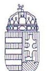
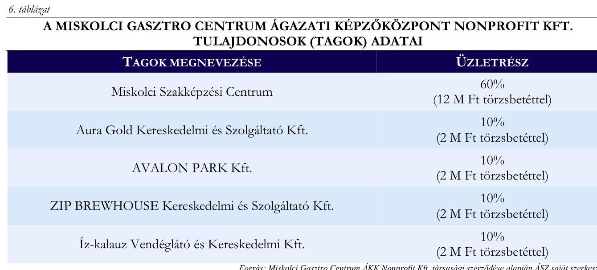

# JELENTÉS 

## Szakképzési centrumok vagyongazdálkodásának ellenőrzése

A Miskolci Szakképzési Centrum ellenőrzése

2025.

---

ÁLLAMI
SZÁMVEVŐSZÉK

# JELENTÉS 

## Szakképzési centrumok vagyongazdálkodásának ellenőrzése

A Miskolci Szakképzési Centrum ellenőrzése

2025.

---

# ELLENŐRZÉSI IGAZGATÓSÁG: 

## ELLENŐRZÉSI IGAZGATÓSÁG I.

## ELLENŐRZÉSI IGAZGATÓ:

SINKÁNÉ DR. CSENDES ÁGNES ellenőrzési igazgató

## ELLENŐRZÉSVEZETŐ:

NAGY MARIANNA ellenőrzésvezető

Jelentéseink az interneten a www.axz.hu címen olvashatók.

IKTATÓSZÁM: EL-4270-002/2025
TÉMASORSZÁM: -
ELLENŐRZÉS-AZONOSÍTÓ SZÁM: V1098

---

# TARTALOMJEGYZÉK 

AZ ELLENŐRZÉS ALAPADATAI ..... 5
AZ ELLENŐRZÖTT SZERVEZET ..... 7
ÖSSZEFOGLALÁS ..... 9
AZ ELLENŐRZÉS FÓKUSZTERÜLETEI ..... 12
MEGÁLLAPÍTÁSOK ..... 13
JAVASLATOK ..... 37
MELLÉKLETEK ..... 38
I. sz. melléklet: Értelmező szótár ..... 38
II. sz. melléklet: Az ellenőrzött szervezetek jegyzéke ..... 42
III. sz. melléklet: Ellenőrzési kritériumok ..... 43
IV. sz. melléklet: Fókuszterületekhez kapcsolódó kiegészítő információk ..... 45
FÜGGELÉK: ÉSZREVÉTELEK ..... 54
RÖVIDÍTÉSEK JEGYZÉKE ..... 55

---

.

---

# AZ ELLENŐRZÉS ALAPADATAI 

## AZ ELLENŐRZÉS CÉLJA

Az ellenőrzés célja annak értékelése volt, hogy a szakképzési centrum vagyongazdálkodása a jogszabályi előírásoknak és a felelős gazdálkodással szemben támasztott követelményeknek megfelelő volt-e, a belső kontrollok támogatták-e a döntések meghozatalát és végrehajtását, és a vagyongazdálkodás szabályszerű, célszerű és eredményes megvalósítását.

## AZ ELLENŐRZÉS TÍPUSA

Kombinált ellenőrzés.

## AZ ELLENŐRZŐTT IDŐSZAK

2022. január 1 - 2023. december 31., kitekintéssel az ágazati képzőközpont 2015. július 15-ei létrejöttére, valamint az ágazati képzőközponthoz kapcsolódó uniós támogatások 2021. január 29-ei igénylésének időpontjára.

## AZ ELLENŐRZÉS TÁRGYA

Az ellenőrzés tárgyát a szakképzési centrum vagyongazdálkodása, ezen belül a vagyongazdálkodási tevékenység vonatkozásában kialakított szervezeti kereteknek, a vagyongazdálkodás (vagyonnövekedés, vagyoncsökkenés, vagyonhasznosítás) szabályszerűségének, célszerűségének és eredményességének, a vagyongazdálkodás belső kontrollokkal történő támogatásának, valamint a szakképzési centrum ágazati képzőközpontban meglévő tartós részesedésével összefüggő vagyongazdálkodásának; a vagyongazdálkodás felelős gazdálkodással szemben támasztott követelményeknek való megfelelőségének az ellenőrzése, egyes területeken a vagyongazdálkodás elemzése képezte.

Az ellenőrzés kiterjedt minden olyan körülményre és adatra, amely az ÁSZ ${ }^{1}$ jogszabályban meghatározott feladatainak teljesítéséhez, valamint a program végrehajtása folyamán felmerült újabb összefüggések feltárásához szükséges volt.

## AZ ELLENŐRZÉS JOGALAPJA

Az ellenőrzés jogszabályi alapját az ÁSZ tv. ${ }^{2} 1 . \int(3)$ bekezdésének, az 5. § (2)-(4) bekezdéseinek, valamint az Áht. ${ }^{3} 61 . \int(2)$ bekezdésének előírásai képezték.

---

# AZ ELLENŐRZÉS MÓDSZERE 

Az ellenőrzést törvényességi, célszerűségi, eredményességi szempontokat, valamint a nemzetközi standardokat irányadónak tekintve az ellenőrzési program szempontjai, az ellenőrzött időszakban hatályos jogszabályok, az ellenőrzés szakmai szabályok és módszertanok figyelembevételével végezte az ÁSZ.

Az ellenőrzési kérdések megválaszolásához szükséges bizonyítékok megszerzése az ellenőrzött szervezet által rendelkezésre bocsátott dokumentumokra és adatokra alapozva, továbbá megfigyelés, szemle (szemrevételezés), kérdésfeltevés (információkérés), valamint elemző eljárás útján történt. Az ellenőrzési bizonyítékként felhasználható adatforrások közé tartoztak egyrészt az ellenőrzéshez kért dokumentumok, adatforrások, másrészt adatforrás volt még minden - az ellenőrzés folyamán - feltárt, az ellenőrzés szempontjából információkat tartalmazó dokumentum.

Az ellenőrzés lefolytatásához az ellenőrzött szervezet a tanúsítványok kitöltésével, valamint az ÁSZ által kért dokumentumok, adatok, információk megküldésével és az ellenőrzés során szolgáltatott adatokat.

Az ÁSZ ellenőrzés az egyes fókuszterületek értékelését a III. sz. mellékletben megjelölt kritériumok alapján végezte. A vagyongazdálkodás (vagyonnövekedés, vagyoncsökkenés, vagyonhasznosítás) szabályszerűségét a 2022. és a 2023. évi vagyonnövekedés és vagyoncsökkenés analitikus nyilvántartásából, valamint az ingatlan és ingó vagyon hasznosításáról készült kimutatásból - a 2022. és a 2023. évre évenként öt-öt - ötletszerű* mintavételi eljárással kiválasztott tétel alapján ellenőrizte az ÁSZ. A kiválasztott mintatételek ellenőrzésének eredménye nem került kivetítésre a teljes sokaságra. A megállapítások az adott ellenőrzött mintatételek vonatkozásában kerültek megjelenítésre. A szakképzési centrum egyes befektetett eszközökkel mint az ingó- és ingatlanvagyonelemekkel, illetve a tartós részesedésekkel - való gazdálkodásának értékelése elemző eljárással történt. A tárgyi feltételek rendelkezésre állásának elemzését tanúsítványi adatokból ötletszerűen vett mintatételek alapján ellenőrizte az ÁSZ, tanévenként 10-10, összesen 30 duális képzőhelyhez köthető szakma Képzési Programja került kiválasztásra. A mintatételek elemzése a szakképzési centrum intézményei, valamint a duális képzőhelyek között létrejött Képzési Programokban foglalt, tárgyi feltételek megoszlásának elemzésére terjedt ki. A szakmai oktatásban résztvevőkkel kapcsolatos elemzések a 2021/2022., 2022/2023. és 2023/2024. tanéveket érintették.

[^0]
[^0]:    * Ötletszerű mintavételi eljárás: „hamis véletlenszerü" kiválasztás. A tételek egyedileg, „véletlenszerủen" kerülnek kiválasztásra úgy, hogy nem mért szelekciós torzítás (a sokaság bizonyos részei nem - vagy nem megfelelő valószínúséggel - kerülnek a mintába) is szerepel a kiválasztásban (Módszertani útmutató az ellenőrzési mintavételezéshez, ÁSZ)

---

# AZ ELLENŐRZÖTT SZERVEZET 

Az ellenőrzés a központi költségvetési szervek körébe tartozó Miskolci Szakképzési Centrumra $\left(\mathrm{MSZC}^{4}\right)$ terjedt ki.

Az MSZC alapítása - a 146/2015. (VI. 12.) Korm. rendelet ${ }^{5}$ rendelkezései alapján - 2015. július 1. napján történt. Fő feladata volt a részeként működő intézmények szakképzési, nevelési-oktatási tevékenységének irányítása, szervezése, ellenőrzése, a nevelés-oktatás feltételeinek biztosítása. Az ellenőrzött időszakban fenntartója és irányító szerve 2022. június 30 -ig az Innovációs és Technológiai Minisztérium, 2022. július 1jétől a Kulturális és Innovációs Minisztérium, középirányító szerve a Nemzeti Szakképzési és Felnőttképzési Hivatal (NSZFH ${ }^{6}$ ) volt. Az MSZC-t a főigazgató és a kancellár önállóan vezette és képviselte. A főigazgató felelt a szakképzési centrum részeként működő szakképző intézmények szakképzési alapfeladatainak ellátásáért. A kancellár felelt a szakképzési centrum törvényes és szakszerű működéséért. Az MSZC kancellárjának és főigazgatójának személye az ellenőrzött időszakban nem változott.

Az MSZC az ellenőrzött időszakban a székhelyén működő központi szervezeti egységből, valamint jogi személyiséggel rendelkező szervezeti egységekből: a szakképző intézményekből és egy akkreditált vizsgaközpontból állt. Az MSZC - a IV. sz. melléklet 2. és 3. táblázatában bemutatott - tíz szakképző intézménnyel biztosította többek között a turizmus-vendéglátás, a gazdálkodás és menedzsment, a gépészet, az informatika és távközlés, a specializált gép- és járműgyártás és az elektronika és elektrotechnika, a szépészeti és a szociális ágazatokhoz kapcsolódó szakmai képzéseket. Az MSZC szakképző intézményeiben folyó szakmai oktatásban résztvevő tanulók száma a 9-14. évfolyamon a 2022/2023. tanévben összesen 6758 fő, 2023/2024. tanévben összesen 7105 fő volt.

Az MSZC az ellenőrzött időszakban állami tulajdonú ingatlant nem kezelt, vagyonkezelésébe önkormányzati tulajdonú ingatlanok tartoztak. Az MSZC központi épületét az MNV Zrt. Vtv. alapján készült kijelölő okiraton alapuló ingatlanhasználati jogviszony keretében használta, továbbá az üzemeltetési megbízási szerződés alapján az MSZC volt az ingatlan üzemeltetője is. A szakképző intézmények az MSZC vagyonkezelésében lévő önkormányzati tulajdonú ingatlanokban múködtek vagyonkezelési szerződés alapján. Az MSZC és az Alapítvány ${ }^{7}$ 2020. december 3-án megállapodást írt alá, amelyben az Alapítvány a hozzájárulását adta az alapítványi ingatlan ágazati képzőközpontként történő használatához.

Az MSZC mérlegfőösszege a 2022. évben 10 196,4 M Ft, a 2023. évben 6103,2 M Ft volt. (Az 1281/2022. (VI.4.) Korm. határozat ${ }^{8}$ alapján két, a tervezési szakaszban lévő beruházást felfüggesztettek, amelyre figyelemmel a 2023. évben az MSZC költségvetéséből 4220,3 M Ft elvonásra került.) Az MSZC nemzeti vagyonba tartozó befektetett eszközeinek főbb adatait az 1. táblázat mutatja be. (Az MSZC főbb mérlegadatait és évközi változásait részletesen a IV. sz. melléklet 1. táblázat mutatja be.)

---

1. táblázat

# AZ MSZC 2022-2023. ÉVI NEMZETI VAGYONBA TARTOZÓ BEFEKTETETT ESZKÖZEINEK FÖBB ADATAI (M FT) 

| MEGNEVEZÉS | 2022.EV | 2023.EV |
| :--: | :--: | :--: |
| Nemzeti vagyonba tartozó befektetett eszközök | 5588,5 | 5691,1 |
| Tárgyi eszközök, ebből | 5578,4 | 5684,1 |
| Ingatlanok és a kapcsolódó vagyoni értékú jogok | 5219,5 | 5193,2 |
| Gípek, berendezések, felszerelések, jármúvek | 353,0 | 441,2 |
| Beruházások, felújitások | 5,9 | 49,7 |
| Mérlegfőösszeg | 10196,4 | 6103,2 |

Az Szkt. ${ }^{9}$ 2021. szeptember 1-jétől hatályos 21/B. $\int$ (1) bekezdésben foglaltak alapján a szakképzési centrum - a szakképzésért felelős miniszter engedélyével - ágazati képzőközpontban részesedést szerezhet, amely tekintetében a szakképzési centrum gyakorolja az államot megillető tulajdonosi jogokat. Az MSZC a 2022. július 15-én alapított Miskolci Gasztro Centrum Ágazati Képzőközpont Nonprofit Kft.-ben (Miskolci Gasztro Centrum ÁKK ${ }^{10}$ ) 60\%-os részesedéssel rendelkezett.

---

# ÖSSZEFOGLALÁS 

A szakképzési centrumok a szakképzési feladatok ellátásához jelentős nagyságú állami vagyont használtak és használnak, amelyekkel való szabályszerű, célszerű és eredményes gazdálkodás a szakképzési közfeladat elvárásainak teljesítéséhez nélkülözhetetlen. A szakképzési centrumok vagyongazdálkodása kiemelt figyelmet követel, mivel a szakképzési rendszer fenntarthatósága, infrastruktúrája és minősége függ a vagyongazdálkodás szabályosságától, célszerűségétől és eredményességétől.

Az ÁSZ az ellenőrzés során az MSZC vagyongazdálkodásában a 2022. és 2023. év vonatkozásában - a vagyonnövekedéshez kapcsolódó gazdasági események és a vagyonhasznosítás területén - több hiányosságot tárt fel. A vagyonhasznosítás területén feltárt hiányosságok a nemzeti vagyon vonatkozásában vagyonvesztéssel nem jártak.

Az MSZC vagyongazdálkodási tevékenységének szabályozása - a feltárt hiányosságokra figyelemmel - nem teljeskörűen felelt meg a jogszabályi előírásoknak. A belső kontrollrendszerben kialakított folyamatok, a vagyongazdálkodási tevékenységhez, a döntések előkészítéséhez, megalapozásához, meghozatalához, végrehajtásához és nyomon követéséhez kapcsolódó, kiépített kontrollok hozzájárultak ahhoz, hogy az MSZC a vagyongazdálkodása során a tevékenységeket szabályszerűen, célszerűen, eredményesen hajtsa végre.

## Az MSZC vagyongazdálkodásának főbb jellemzői

Az MSZC vagyongazdálkodási tevékenységének szabályozási keretei - szabályzatok aktualizálásának hiánya miatt - nem teljeskörűen feleltek meg a jogszabályi előírásoknak. Az MSZC a 2022. és 2023. években rendelkezett a jogszabályok által előírt belső szabályzatokkal, amelyekben meghatározásra kerültek a vagyongazdálkodásra (vagyonnövekedésre, vagyoncsökkenésre, vagyonhasznosításra) vonatkozó szabályok, a kapcsolódó munkafolyamatok, felelősök, határidők. A MSZC a Miskolci Gasztro Centrum ÁKKban szerzett részesedése vonatkozásában az államot megillető tulajdonosi jogok gyakorlásához kapcsolódó előírásokat a belső szabályzataiban (számviteli politika3, értékelési szabályzat ${ }^{11}$, a leltározási szabályzat ${ }^{12}$ és a számlarend ${ }^{13}$ ) a jogszabályi előírások ellenére nem teljeskörűen határozta meg. A szabályzatok a jogszabályi előírás ellenére nem tartalmazták a gazdasági társaságban meglévő részesedéssel kapcsolatos vagyongazdálkodási feladatokat és a tulajdonosi joggyakorláshoz kapcsolódó ellenőrzési, adatszolgáltatási és beszámolási feladatok előírásait.

A 2022. és a 2023. években a vagyoncsökkenésekhez kapcsolódó gazdasági események lebonyolítása szabályszerű volt, az eszközök nyilvántartásokból való kivezetése szabályszerűen megtörtént, a vagyoncsökkenésekről a tulajdonosokat a vagyonkezelési szerződésekkel összhangban értesítették. Az MSZC a vagyoncsökkenések során a belső kontrollokat a döntések előkészítése, a kockázatok kezelése, valamint a selejtezési tevékenység nyomon követése vonatkozásában megfelelően működtette. A belső kontrollok működtetése során a célszerűségi és eredményességi szempontok érvényesültek.

A 2022. és a 2023. években a vagyonnövekedés esetében a beszerzések során a kötelezettségvállalás, teljesítésigazolás, érvényesítés, utalványozás minden eseteben megfelelt a jogszabályi előírásoknak, ugyanakkor a pénzügyi ellenjegyzés nem felelt meg teljeskörűen a jogszabály előírásainak. A vagyonnövekedések során a gazdasági események elszámolása szabályszerűen történt. A vagyonnövekedéshez kapcsolódó gazdasági eseményeknél az MSZC a belső kontrollokat - egy gazdasági esemény kivételével - megfelelően működtette, a célszerűségi és eredményességi szempontok érvényesültek. A saját kivitelezésű beruházáshoz kapcsolódó

---

gazdasági esemény vonatkozásában az önköltségszámítási szabályzatban előírt belső megrendelés és utókakkuláció nem készült el, a belső kontrollokat nem megfelelően működtették. Az ingatlanhoz kapcsolódó üzemeltetési és megbízási szerződés ellenére az előzetes bejelentési kötelezettséget az MSZC nem teljesítette.

A 2022. és a 2023. években a vagyonhasznosítás során a jogszabályban előírtak ellenére az MSZC a bérleti szerződésekben - indokoltság esetén - nem írt elő beszámolási, nyilvántartási és adatszolgáltatási kötelezettséget. Az MSZC önköltségszámítási szabályzata ellenére az MSZC az ellenőrzött mintatételek vonatkozásában nem készítette el teljeskörűen a bérleti díj összegét alátámasztó számítást. A bérleti díjak kiszámlázása nem felelt meg a bérleti szerződésben előírtaknak, és a felelős gazdálkodás elve sérült, mivel összesen 97936 Ft-tal - alacsonyabb összegben állították ki a számlát az ellenőrzött mintatételek vonatkozásában. A vagyonhasznosítás esetében nem került kialakításra olyan kontrolltevékenység, amely a döntések célszerűségi és eredményességi szempontú megalapozottságát biztosította. A jogszabályban foglaltak ellenére a belső kontrollokat az MSZC nem működtette megfelelően, mert négy esetben a bérleti díj megalapozását alátámasztó számítások hiánya miatt a döntéselőkészítés nem volt megfelelő. Amennyiben az MSZC által alkalmazott gyakorlat (önköltségszámítás hiánya, szerződés szerinti bérleti díj alatti hasznosítás) nem fog változni, akkor fennáll annak a kockázata, hogy az MSZC-nél a vagyon értéknövelő hasznosítása nem fog megvalósulni.

Az MSZC belső ellenőrzésének feladatköre kiterjedt az MSZC valamennyi tevékenységére, azonban a 2022. és 2023. években az MSZC vagyongazdálkodási tevékenysége, valamint az MSZC tartós részesedéssel kapcsolatos tevékenysége vonatkozásában belső ellenőrzés nem volt.

Az MSZC a 2022. július 15-én alapított Miskolci Gasztro Centrum ÁKK-ban 60\%-os részesedéssel rendelkezett, amely tekintetében a jogszabályban foglaltak alapján gyakorolta az államot megillető tulajdonosi jogokat. Az MSZC Miskolci Gasztro Centrum ÁKK-ban meglévő részesedésének megszerzéséhez kapcsolódó döntései megalapozottak voltak, a döntések a jogszabályi előírásoknak megfelelttek.

Az MSZC a 12,0 M Ft alapításkori vagyoni hozzájárulást a Miskolci Gasztro Centrum ÁKK részére a jogszabályoknak megfelelően biztosította. A jogszabály szerinti saját tőke/jegyzett tőke arány miatti tulajdonosi joggyakorló általi intézkedésre az ellenőrzött időszakban nem volt szükség. Az MSZC a jogszabályban foglaltaknak megfelelően a 2022. évben együttműködési megállapodás keretében két telephelyet biztosított a Miskolci Gasztro Centrum ÁKK részére a szakirányú oktatás megvalósításához. A GINOP-6.2.720 sz., „Agazati képzöközpontok infrastrukturális és szakmai felkészitése az új szakképzési struktúrára" tárgyú pályázat keretében az MSZC 309,9 M Ft vissza nem térítendő támogatásban részesült, amelyből 227,6 M Ft beruházási költség a Miskolci Gasztro Centrum ÁKK épületének teljes átalakításához, felújításához, valamint 29,6 M Ft eszközbeszerzéshez kapcsolódott. A 2023. évben az MSZC megállapodás keretében a jogszabályi előírásnak megfelelően használatba adta a Miskolci Gasztro Centrum ÁKK részére a projekt keretében beszerzett eszközöket. Az MSZC által a Miskolci Gasztro Centrum ÁKK részére történt forrás, valamint eszközök biztosítása szabályszerű volt, általuk a duális képzésben történő szakirányú oktatás eredményesen, valamint az Nvtv. ${ }^{14}$-ben foglaltakra tekintettel célszerűen valósult meg.

Az MSZC tulajdonosi joggyakorlással kapcsolatos tevékenysége a 2022. évről a 2023. évre javult. A 2022. évben a hiányosságok döntő részben az MSZC tulajdonosi joggyakorlása szabályozási kereteinek nem megfelelő kialakításából eredtek.

---

A szakképzési centrumok számára az Szkt. 2021. szeptember 1-jétől hatályos módosítása tette lehetővé, hogy ágazati képzőközpontban részesedést szerezzenek, és e tekintetben gyakorolják az államot megillető tulajdonosi jogokat. Ez a feladat a központi költségvetési szervként működő szakképzési centrumoktól más gazdálkodási és tulajdonosi szemlélet kialakítását követeli. Az ÁSZ ellenőrzés szakmai véleménye szerint célszerű lenne, ha a fenntartó a szakképzési centrumokat a megfelelő tulajdonosi szemlélet kialakításában segítené, információkkal, iránymutatással látná el a nemzeti vagyonnal való felelős gazdálkodás elveinek érvényesítése érdekében.

Az MSZC tulajdonosi joggyakorlásával kapcsolatos nyilvántartási, beszámolási és adatszolgáltatási kötelezettségének teljesítése részben volt szabályszerű. Az MSZC a Miskolci Gasztro Centrum ÁKK-ban lévő tartós részesedése tekintetében a nyilvántartási kötelezettségét teljesítette, a vagyon nyilvántartása - a számlarend aktualizálásának hiánya ellenére - megfelelő volt, mivel a Miskolci Gasztro Centrum ÁKK-ban szerzett részesedés tulajdonosi joggyakorlása vonatkozásában alkalmazott könyvviteli számla használata megfelelt a jogszabályi előírásnak. Az MSZC a rábízott állami vagyon tekintetében a beszámolási kötelezettségét, és az adatszolgáltatási kötelezettségét a jogszabályi előírások szerint teljesítette. Az MSZC nem teljesítette teljeskörűen a rábízott állami vagyon tekintetében a tulajdonosi joggyakorlását bemutató évközi jelentésekkel kapcsolatos kötelezettségét.

Az MSZC a Miskolci Gasztro Centrum ÁKK-nál a kötelezően létrehozandó felügyelő bizottság kijelölésére a jogszabályi előírás ellenére 2023. július 21-ig nem került sor. Az ekkor létrehozott felügyelőbizottság ügyrendjét a Ptk. előírásai ellenére a gazdasági társaság legfőbb szerve, a taggyűlés nem hagyta jóvá. A Miskolci Gasztro Centrum ÁKK esetében a taggyűlés nem került összehívásra a 2022. évben a társasági szerződésben foglaltak ellenére, valamint a társaság 2022. évi beszámolóját a Ptk.-ban foglaltak ellenére a taggyűlés nem hagyta jóvá. A társaság 2023. évi beszámolóját a felügyelőbizottság írásbeli jelentésének birtokában fogadta el a taggyűlés. Az MSZC integrált kockázatkezelési eljárásrendjének, valamint ellenőrzési nyomvonalának 2023. évi aktualizálásakor kiépített kontrollok - mint a társaság 2023. évi beszámolójának taggyűlés általi jóváhagyása, a vagyoneszközök használatba adásának ellenőrzése - elősegítették a tulajdonosi joggyakorláshoz kapcsolódó tevékenység szabályszerűségét.

---

# AZ ELLENŐRZÉS FÓKUSZTERÜLETEI 

1- A szakképzési centrum vagyongazdálkodása

2- A szakképzési centrum ágazati képzőközpontban meglévő részesedésével összefüggő vagyongazdálkodása

---

# 1. A szakképzési centrum vagyongazdálkodása 

| Összegző megállapítás | Az MSZC vagyongazdálkodási tevékenységének szabályozási keretei nem teljeskörűen feleltek meg a jogszabályi előírásoknak. A vagyonnövekedéshez és vagyonhasznosításhoz kapcsolódó tevékenységek a jogszabályi előírásoknak nem teljeskörűen feleltek meg. A vagyoncsökkenéshez kapcsolódó tevékenységek megfelelőek voltak. A belső kontrollok múködtetése a vagyonnövekedés gazdasági eseményei során részben, a vagyonhasznosítás esetében nem volt megfelelő. A vagyoncsökkenés gazdasági eseményei során a belső kontrollok múködtetése megfelelő volt. |
| :--: | :--: |

## AZ MSZC VAGYONGAZDÁLKODÁSI TEVÉKENYSÉGÉNEK SZABÁLYOZÁSI KERETEI

Az MSZC vagyongazdálkodási tevékenységének szabályozási keretei - aktualizálási problémák miatt - nem teljeskörűen feleltek meg a jogszabályi előírásoknak.
Az MSZC az ellenőrzött időszakban az Áht.-ban előírtaknak megfelelően rendelkezett SZMSZ ${ }^{15}$-szel, amelyet az Áht., valamint az Szkr. ${ }^{16}$ előírásainak megfelelően az NSZFH jóváhagyott. Az SZMSZ az Ávr. ${ }^{17}$-ben előírtaknak megfelelően tartalmazta a hatáskörök gyakorlásának módját, a helyettesítés rendjét, az ezekhez kapcsolódó felelősségi szabályokat, és meghatározásra kerültek a vagyongazdálkodási tevékenységgel kapcsolatos feladatok, hatáskörök és felelősségi körök is.
Az MSZC az ellenőrzött időszakban rendelkezett a Számv. tv. ${ }^{18}$, valamint az Áhsz. ${ }^{19}$ szerinti számviteli politikával ${ }^{20}{ }_{1,2}$. A számviteli politikában ${ }_{1,2}$ a Számv. tv.-ben előírtaknak megfelelően rögzítették, hogy mit tekintenek a számviteli elszámolás, az értékelés szempontjából lényegesnek, nem lényegesnek, jelentősnek, nem jelentősnek. A számviteli politika ${ }_{1,2}$ az Ávr.-ben előírtak alapján tartalmazta az ellenőrzési, adatszolgáltatási és beszámolási feladatok teljesítésével kapcsolatos belső előírásokat, feltételeket, kivéve az MSZC ÁKK feletti tulajdonosi joggyakorlásához kapcsolódó beszámolási és adatszolgáltatási feladatok előírásait. A tulajdonosi joggyakorláshoz kapcsolódó beszámolási és adatszolgáltatási feladatok szabályozásának hiánya nem felelt meg az Ávr. 13. § (2) bekezdés a) pontja előírásának. (Az ellenőrzés során feltárt hiányosságok részletesen a 2. fókuszterület tulajdonosi joggyakorlás szabályozási kereteinek értékelésénél kerülnek bemutatásra.)
Az MSZC a Számv. tv.-ben foglaltaknak megfelelően rendelkezett leltározási szabályzattal, amely a Számv. tv. és az Áhsz. előírásainak megfelelően tartalmazta a mennyiségi felvétellel történő leltározás gyakoriságának szabályozását. A szabályzatban az Áhsz. szerint meghatározták a használt, de a mérlegben értékkel nem szereplő immateriális javak, tárgyi eszközök, készletek leltározásának módját. A 2022. július 15-én alapított Miskolci Gasztro Centrum ÁKK tulajdonosi joggyakorlása vonatkozásában a szabályzat módosítása nem történt meg. A szabályzat a Számv. tv. 14. § (3) bekezdés előírása ellenére nem

---

# tartalmazta a gazdasági társaságban meglévő részesedéssel kapcsolatos vagyongazdálkodási feladatokat. 

Az MSZC a Számv. tv.-ben előírtaknak megfelelően rendelkezett értékelési szabályzattal, amely az Áhsz.-nek megfelelően tartalmazta az eszközök és források értékelésének általános és részletes szabályait. A szabályzatban meghatározott értékcsökkenési leírási kulcsok összhangban voltak az Áhsz.-ben meghatározott leírási kulcsokkal. A 2022. július 15-én alapított Miskolci Gasztro Centrum ÁKK tulajdonosi joggyakorlása vonatkozásában a szabályzat módosítása nem történt meg. A szabályzat a Számv. tv. 14. § (3) bekezdés előírása ellenére nem tartalmazta a gazdasági társaságban meglévő részesedéssel kapcsolatos vagyongazdálkodási feladatokat.
Az MSZC az ellenőrzött időszakban a Számv. tv.-ben foglaltak alapján rendelkezett számlarenddel. A 2022. július 15-én alapított Miskolci Gasztro Centrum ÁKK tulajdonosi joggyakorlása vonatkozásában a szabályzat aktualizálása nem történt meg, a számlarend 2022. július 15. napját követően nem felelt meg a Számv. tv. 161. § (2) bekezdésében foglalt előírásoknak, mivel az nem tartalmazta minden alkalmazásra kijelölt számla számjelét és megnevezését, tartalmát, a főkönyvi számla és az analitikus nyilvántartás kapcsolatát, a számlarendben foglaltakat alátámasztó bizonylati rendet. (A feltárt hiányosságok részletesen a 2. fókuszterület tulajdonosi joggyakorlás szabályozási kereteinek értékelésénél kerülnek bemutatásra.)
Az MSZC az ellenőrzött időszakban az Áht. és az Ávr. előírásainak megfelelően a gazdasági szervezetének feladatait ügyrendben ${ }^{21}$ szabályozta, amely az Ávr.-nek megfelelően tartalmazta a vagyongazdálkodási feladatokhoz kapcsolódóan ellátott feladatok munkafolyamatainak leírását, a szervezeti egység vezetőinek és alkalmazottainak feladat- és hatáskörét. Az ügyrend az Ávr. 13. § (5) bekezdésében foglaltak ellenére nem tartalmazta a tulajdonosi joggyakorláshoz kapcsolódó feladatok előírásait. (A tulajdonosi joggyakorláshoz kapcsolódó feladatok előírásai esetében feltárt hiányosságok részletesen a 2. fókuszterület tulajdonosi joggyakorlás szabályozási kereteinek értékelésénél kerülnek bemutatásra.)
Az MSZC az ellenőrzött időszakban rendelkezett az Áht.-ban előírt gazdálkodás részletes rendjét meghatározó szabályzattal ${ }_{1,2}{ }^{22}$, amely az Ávr. előírásainak megfelelően tartalmazta a gazdálkodással összefüggő feladatokat, a kötelezettségvállalás, pénzügyi ellenjegyzés, teljesítésigazolás, érvényesítés, utalványozás gyakorlásának módjával, eljárási és dokumentációs részletszabályaival, valamint az ezeket végző személyek kijelölésének rendjével kapcsolatos előírásokat. Az Áht.-ban foglaltakkal összhangban a szabályozásban meghatározott gazdálkodási jogkörgyakorlással kapcsolatos előírások egyik célja az volt, hogy biztosítsa a pénzeszközök felhasználása során az eredményesség követelményének teljesülését. A vagyongazdálkodási döntésekhez kapcsolódó kontrolltevékenységekhez azonban az MSZC nem határozott meg a belső szabályzataiban célszerűségi, eredményességi szempontokat a Nemzetgazdasági Minisztérium által közzétett Államháztartási Belső Kontroll Standardok és Gyakorlati Útmutatóban foglaltak ellenére.
Az MSZC az ellenőrzött időszakban rendelkezett közbeszerzési szabályzattal ${ }^{23}$, amely tartalmazta a Kbt. ${ }^{24}$ előírásának megfelelően a közbeszerzési eljárások előkészítésének, azok lefolytatásának felelősségi rendjét, a közbeszerzési eljárások dokumentálási rendjét. Az MSZC a 2022. év vonatkozásában rendelkezett a Kbt.-ben előírt közbeszerzési tervvel, a 2023. évre nem tervezett közbeszerzést. Az Ávr.ben előírtaknak megfelelően az MSZC rendelkezett a Kbt. hatálya alá nem tartozó beszerzések lebonyolítására vonatkozó beszerzési szabályzattal ${ }^{25}{ }_{1,2}$, amely tartalmazta a beszerzési eljárások előkészítéséhez, lefolytatásához kapcsolódó feladat- és hatásköröket.

---

Az ellenőrzés során az ÁSZ jó gyakorlatként azonosította, hogy - a közbeszerzési értékbatárok, alatti értékü beszerzések, megralósitásával és ellenörzésével kapcsolatos szabályokról szóló 459/2016. (XII. 23.) Korm. rendelet előírásainak 2021. január 1-jén hatályon kívül helyezését követően is - az MSZC beszerzési szabályzata továbbra is előírta, hogy a közbeszerzési értékhatárokat el nem érő értékủ szerződések megkötését megelőzően legalább három ajánlatot szükséges bekérni.

Az MSZC az Ávr.-ben előírtaknak megfelelően rendelkezett az ellenőrzött időszakban hatályos anyagés eszközgazdálkodási szabályzattal ${ }^{26}$, amely az Ávr.-nek megfelelően tartalmazta az anyag- és eszközgazdálkodási feladatokat, az azokhoz kapcsolódó feladat- és hatásköröket.
Az MSZC vezetője az Ávr.-ben előírtaknak megfelelően selejtezési szabályzatban ${ }_{1,2}{ }^{27}$ szabályozta a felesleges vagyontárgyak selejtezését, illetve hasznosítását. A vagyonhasznosítási tevékenységéhez kapcsolódóan az MSZC helyiségeinek, épületeinek bérbeadással kapcsolatos önköltségszámítási részletszabályokat az Áhsz. előírásának megfelelően önköltségszámítási szabályzat ${ }^{28}$ tartalmazta.
A Bkr. ${ }^{29}$-ben foglaltak alapján az MSZC az ellenőrzött időszakban rendelkezett a működési folyamatait táblázatos formában bemutató ellenőrzési nyomvonallal ${ }_{1,2}{ }^{30}$. Az ellenőrzési nyomvonal ${ }_{1,2}$ a Bkr.-ben előírtaknak megfelelően tartalmazta a működési folyamatokkal kapcsolatos felelősségi, valamint információs szinteket és kapcsolatokat, irányítási folyamatokat, ellenőrzési folyamatokat. Meghatározták a vagyongazdálkodáshoz kapcsolódó folyamatok ellenőrzési nyomvonalát is. Az MSZC a Bkr. 6. § (3) bekezdésben foglaltak ellenére nem aktualizálta rendszeresen ellenőrzési nyomvonalát az ellenőrzött időszakban, a 2022. július 15-én alakult Miskolci Gasztro Centrum ÁKK tulajdonosi joggyakorlása vonatkozásában 2023. január 16. napjától rendelkezett a folyamatok, valamint feladat- és felelősségi szintek leírásával. (Az ellenőrzés során feltárt hiányosságok részletesen a 2. fokuszzerület tulajdonosi joggyakorlás szabályozási kereteinek értékelésénél kerülnek bemutatásra.)
Az MSZC a Bkr.-ben előírtaknak megfelelően rendelkezett az ellenőrzött időszakban integrált kockázatkezelési eljárásrenddel ${ }^{31}$, amelyben a Bkr.-ben foglaltakra figyelemmel meghatározták a szervezet tevékenységében rejlő és szervezeti célokkal összefüggő kockázatok azonosításának feltételeit, módszereit, a folyamatok feltérképezésének, a kockázatkezelési stratégiák kiválasztásának, a kockázatok kezelésére vonatkozó intézkedések megtételének kötelezettségét, a kockázatok felülvizsgálatának, illetve a kockázatok és az azokhoz kapcsolódó intézkedések nyilvántartásának, nyomon követésének kötelezettséget. Az MSZC a 2022. és a 2023. évben az integrált kockázatkezelési eljárásrend alapján, a Bkr.-ben előírtaknak megfelelően meghatározta a szervezeti tevékenységhez kapcsolódó, valamint a szervezeti célokat megvalósító (rész)folyamatokat, beazonosította és értékelte a lényeges és az elhanyagolható mértékű kockázatokat, meghatározta a kockázati tűréshatár feletti kockázatokkal kapcsolatban szükséges intézkedéseket. Az MSZC integrált kockázatkezelési rendszerének kialakítása magába foglalta a vagyongazdálkodási tevékenység (rész)folyamatainak - mint vagyongazdálkodáson belül a vagyonkimutatás, anyaggazdálkodás; beruházásokon/felújításokon belül azok előkészítése és lebonyolítása - felmérését, a kapcsolódó kockázatok beazonosítását, az egyes kockázatokkal kapcsolatban szükséges intézkedések meghatározását, azok megvalósításának nyomon követését.
Az MSZC az ellenőrzött időszakban a Bkr.-ben foglaltaknak megfelelően gondoskodott a szervezet tevékenységének, a célok megvalósításának nyomon követését biztosító rendszer kialakításáról. A nyomon követési rendszer (monitoring) keretében az operatív tevékenységek során megvalósítandó folyamatos és eseti nyomon követési feladatokra az SZMSZ, az ügyrend, az ellenőrzési nyomvonal,

---

valamint az integrált kockázatkezelési eljárásrend tartalmazott előírásokat. Az operatív tevékenységektől függetlenül működő belső ellenőrzés kialakításáról az MSZC a Bkr.-ben előírtaknak megfelelően gondoskodott. A belső ellenőrzési tevékenységet az MSZC központi szervezeti egysége látta el. Az SZMSZ előírásai alapján tevékenysége - a Bkr. előírásainak megfelelően - kiterjedt a szakképzési centrum valamennyi tevékenységére, különösen a költségvetési bevételek és kiadások tervezésének, felhasználásának és elszámolásának, valamint az eszközökkel és forrásokkal való gazdálkodás vizsgálatára. A Belső ellenőrzési kézikönyv ${ }_{1,2}{ }^{32}$ tartalmazta a belső ellenőrzés hatásköréről, feladatairól, azok tervezéséről, az ellenőrzésekhez kapcsolódó kockázatelemzésről, az ellenőrzés végrehajtásáról - köztük a vagyongazdálkodás ellenőrzésére alkalmas egyes vizsgálati eljárásokról -, valamint a beszámolásról szóló részletszabályokat.
Az Áht.-ban és az Ávr.-ben előírtaknak megfelelően az MSZC belső szabályzataiban meghatározta a vagyongazdálkodásra (vagyonnövekedésre, vagyoncsökkenésre, vagyonhasznosításra) vonatkozó munkafolyamatokat és annak szabályait, felelőseit.

# VAGYONGAZDÁLKODÁSI TEVÉKENYSÉGEK SZABÁLYSZERŰSÉGE 

A vagyonnövekedéshez és vagyonhasznosításhoz kapcsolódó mintatételek értékelése alapján az MSZC vagyongazdálkodásának jogszabályi előírásokkal való összhangja, a felelős gazdálkodással szemben támasztott követelményeknek való megfelelősége nem teljeskörűen volt biztosított a feltárt szabálytalanságokra tekintettel. Az MSZC vagyoncsökkenéséhez kapcsolódó gazdasági események végrehajtása összességében a jogszabályi előírásokkal összhangban volt.

## Vagyonnövekedés

A vagyonnövekedési gazdasági események ingatlanon végzett beruházások (2022. évi 1. és 2. és 2023. évi 5. mintatétel) és nagy értékű gépbeszerzések (2022. évi 3-5. és 2023. évi 1-4. mintatételek) voltak. A mintatételek összefoglaló kiértékelését a IV. sz. melléklet 5. táblázat foglalja össze.
A vagyonnövekedéshez kapcsolódó gazdasági események végrehajtása összességében megfelelt az Nvtv., Áht. és az Ávr. előírásainak. Az MSZC az Nvtv. és az Áht. előírásainak megfelelően írásban vállalt kötelezettséget. A mintatételekhez kapcsolódó szerződések, illetve megrendelések az Ávr. előírásainak megfelelően tartalmazták a szakmai, műszaki teljesítés mennyiségi, minőségi jellemzőinek meghatározását, a teljesítés határidejét, a fizetendő összeget és a fizetés határidejét. A 2023. évi 1. mintatételnél (1 296 E Ft) az Ávr. 50. § (1a) bekezdésben foglaltak ellenére nem állt rendelkezésre a vállalkozó nyilatkozata arra vonatkozóan, hogy átlátható szervezetnek minősül.
A 2023. évi 5. mintatétel az MSZC központi épületében történt saját kivitelezésű fűtéskorszerűsítéshez kapcsolódott. Az épületet az MSZC az MNV Zrt. ${ }^{33}$ által kiadott kijelölő okiraton alapuló ingatlanhasználati jogviszony keretében használta, továbbá üzemeltetési megbízási szerződés alapján üzemeltette. Az üzemeltetési megbízási szerződés alapján az MSZC jogosult volt a fűtéskorszerűsítés elvégzésére. A felújítás összege nem érte el a közbeszerzési értékhatárt. Az MSZC az üzemeltetési megbízási szerződésben előírt, MNV Zrt. részére történő előzetes bejelentési kötelezettséget nem teljesítette.
Az MSZC-nél a vagyonnövekedés gazdasági események nyilvántartásba vétele kisebb hiányosságokkal megfelelt az Nvtv., a Vtv. vhr. ${ }^{34}$, az Áhsz. és a Számv. tv. előírásainak az ellenőrzött mintatételek vonatkozásában. Az új vagyonelemeket a tulajdonosi joggyakorló MMJV Önkormányzata ${ }^{35}$ felé az Nvtv. előírásainak és az MNV Zrt. felé a Vtv. vhr. előírásainak

---

megfelelően bejelentették. A 2023. évi 5. mintatétel (13 567 E Ft) esetében, az állami elhelyezési célú ingatlanon végzett felújítást a Vtv. vhr.-nek megfelelően jelentette az MSZC az MNV Zrt. felé.
Az Áhsz. részletező nyilvántartásokra vonatkozó előírásai az alábbi esetekben nem teljesültek:

- a 2022. évi 1., 2., és a 2023. évi 5. mintatételnél az idegen tulajdonú ingatlanon ${ }^{36}$ végzett felújítás állományba vételi bizonylata, és a tárgyi eszköz karton az Áhsz. 14. melléklet VII. 4. b) pontjában foglaltak ellenére nem tartalmazta az épület műszaki jellemzőit, továbbá a 2022. évi 2. tétel esetén a nyilvántartás nem tartalmazta az Áhsz. 14. melléklet VII. 4. a) pontjában foglaltak ellenére a címet, helyrajzi számot.
- a 2023. évi 2., 3. tételnél az állományba vételi bizonylat, illetve a tárgyi eszköz karton az Áhsz. 14. mellékletnek megfelelően tartalmazta a gyártó megnevezését, de a 14. melléklet VII/5. a) pontban szereplő gyártás évét, az eszköz típusát nem tartalmazta.
A 2022. évi 5. tétel és 2023. évi 2. tétel kivételével a vagyonnövekedési gazdasági eseménnyel kapcsolatos jogkörgyakorlás megfelelt az Áht. és az Ávr. előírásainak. A 2022. évi 5. mintatétel ( 31972 E Ft) esetében konzorciumi megállapodás alapján az IKK Nonprofit Zrt. ${ }^{37}$ és kilenc szakképzési centrum közösen folytatott le közbeszerzési eljárást. Az eljárás eredményeként a nyertes ajánlattevővel kötött szerződés vonatkozásában az MSZC kancellárja az Áht. 37. § (1) bekezdésben foglaltak ellenére pénzügyi ellenjegyzés hiányában vállalt kötelezettséget. A 2023. évi 2. mintatétel (3 347 E Ft) esetén a pénzügyi ellenjegyzés dátuma hiányzott, erre tekintettel a kötelezettségvállalás esetében nem volt igazolt, hogy az Áht. 37. § (1) bekezdés szerint arra a pénzügyi ellenjegyzést követően került sor. Az Áht. előírásainak megfelelően az utalványozásra a teljesítés igazolását és annak alapján végrehajtott érvényesítést követően került sor. A teljesítést minden esetben az Ávr. előírásainak megfelelően az arra jogosult igazolta, amely tartalmazta a teljesítés tényét, dátumát és az összegszerűséget. Az érvényesítést és az utalványozást az Ávr. előírásainak megfelelően az arra jogosultak végezték, továbbá a kifizetés összege minden mintatétel esetében összhangban volt a kötelezettségvállalással, teljesítésigazolással. A vagyonnövekedési mintatételek vonatkozásában az Ávr.-ben a gazdálkodási jogkörgyakorlókra előírt összeférhetetlenségi szabályok érvényesültek.
A vagyonnövekedési gazdasági események pénzügyi könyvvezetés szerinti elszámolása az Áhsz. és a 38/2013. (IX.19.) NGM rendelet ${ }^{38}$ előírásainak megfelelő könyviteli számlákon, a költségvetési számvitelben az Áhsz. szerinti egységes rovatrend előírásainak megfelelő nyilvántartási számlákon történt. A kapcsolódó tárgyi eszköz kartonok és állományba vételi bizonylatok rendelkezésre álltak. A bekerülési érték és az értékcsökkenési leírási kulcs meghatározása megfelelt az Áhsz.-ben és az értékelési szabályzatban előírtaknak.
A 2022. évi 2., 3., 4. mintatételekhez kapcsolódó beszerzések a Kbt. hatálya alá tartoztak, a közbeszerzési eljárást a Kbt. és a közbeszerzési szabályzat előírásainak megfelelően folytatták le. A 2022. évi 5. mintatételnél a közbeszerzési eljárást a konzorciumi megállapodás alapján nem az MSZC folytatta le. A 2022. évi 1. és a 2023. évi 1-4. mintatételeknél a beszerzést az MSZC beszerzési szabályzata ${ }_{1,2}$ előírásának megfelelően folytatták le, a beszerzést megelőzően három ajánlatot kértek be, minden esetben a legkedvezőbb ajánlatot fogadták el. A szerződések, megrendelők műszaki, számszaki tartalma összhangban volt a nyertes ajánlattal. A 2023. évi 5. mintatétel esetében az önköltségszámítási szabályzatban előírt belső megrendelés, valamint annak engedélyezése az önköltségszámítási szabályzat 10. fejezet 3. és 4. bekezdésében foglaltak ellenére nem történt meg, továbbá az önköltségszámítási szabályzat 15. fejezet 5. bekezdésében foglaltak ellenére átdolgozási jegyzőkönyv készült utókalkuláció helyett.

---

# Vagyoncsökkenés 

A vagyoncsökkenési gazdasági események közül selejtezést (2022. évi 1., 2., 4. és 2023. évi 1., 2., 4., 5., mintatételek), leltárhiányt (2022. évi 3. mintatétel), adminisztrációs hiba miatti duplikált nyilvántartás javítását (2022. évi 5. mintatétel), valamint lopás miatti káreseményt (2023. évi 3. mintatétel) ellenőrzött az ÁSZ. A mintatételek összefoglaló kiértékelését a IV. sz. melléklet 6. táblázat foglalja össze.
A vagyoncsökkenéshez kapcsolódó gazdasági események végrehajtása szabályszerű volt. A 2022. évben az 1., 2. mintatételek és a 2023. évben az 1., 2., 4., 5. mintatétel a MMJV Önkormányzata és az MSZC közti vagyonkezelési szerződéshez kapcsolódott, az MSZC megalapításakor átvett önkormányzati tulajdonú eszközök selejtezésére került sor. A fenti esetekben az MSZC értesítette MMJV Önkormányzatát a selejtezésről, mely összhangban volt a módosított vagyonkezelési szerződés és a leltározási szabályzat előírásaival. A 2022. évi 3. mintatételnél a leltározási szabályzatnak megfelelően az MNV Zrt.-t értesítették az állami vagyont érintő leltárhiányról. A 2022. évi 4. mintatételre a Mezőkövesd Város Önkormányzatával (MVÖ-vel) kötött vagyonkezelési szerződés ${ }^{39}$ vonatkozott, amely értelmében az eszköz selejtezését az önkormányzat végzi, ezért azt visszaadták, és kivezették a tárgyi eszköz nyilvántartásból. A 2022. évi 5. mintatétel esetében az MSZC a MMJV Önkormányzata és MSZC közti vagyonkezelési szerződés előírásainak megfelelően az adminisztrációs hibáról az Önkormányzatot értesítette. Az MSZC az adminisztrációs hiba javítását az Önkormányzat engedélyét követően megfelelően elvégezte.
A selejtezések esetében a Számv. tv. előírásainak és a selejtezési szabályzatnak megfelelően a selejtezési jegyzőkönyveket elkészítették. A 2022. évi 3. mintatételnél a leltárhiány számviteli bizonylata a leltár kiértékelés volt, ebben a hiányzó eszközök piaci értékét meghatározták, amelyet a kancellár és a gazdasági vezető elfogadott. A 2022. évi 5. mintatételnél a Számv. tv. előírásainak megfelelően az elszámolás alapja az MMJV Önkormányzat engedélye, a 2023. évi 3. tétel esetén pedig a káreseményhez kapcsolódó rendőrségi határozat volt. A vagyoncsökkenéshez kapcsolódó eszközök tárgyi eszköz nyilvántartásból való kivezetése megtörtént, számviteli elszámolásuk megfelelt a 38/2013. (IX. 19) NGM rendeletben előírtaknak.

## Vagyonhasznosítás

Az MSZC a kezelésében lévő egyes vagyonelemeket bérbeadás útján hasznosította, a kiválasztott mintatételek között helyiség, jármű és eszközbérlet is szerepelt. Az MSZC számára a vagyon hasznosítását a vagyonkezelői szerződésekbe, illetve az MNV Zrt. által kiadott kijelölő okiratba, üzemeltetési megbízási szerződésbe foglaltak tették lehetővé. A mintatételek összefoglaló kiértékelését a IV. sz. melléklet 7. táblázat foglalja össze.
A vagyonhasznosításra vonatkozó szerződéseket olyan jogi személlyel vagy jogi személyiséggel nem rendelkező szervezettel kötötték, melyek az Nvtv.-ben és az Ávr.-ben előírtaknak megfelelően nyilatkoztak arról, hogy átlátható szervezeteknek minősülnek.
A vagyonhasznosításra vonatkozó szerződésekben az Nvtv. előírásainak megfelelően állapították meg a hasznosítás időtartamát.
A 2022. évi 4. és 5. és a 2023. évi 1., 2., és 4. mintatételek esetében a vagyonhasznosításra vonatkozó szerződés az Nvtv. 11. § (11) bekezdés a) pontjában foglaltak ellenére nem írt elő a bérlőnek beszámolási, nyilvántartási és adatszolgáltatási kötelezettséget. A kapcsolódó - legalább több hónapos vagy azon túli időszakra vonatkozó - bérleti szerződések a bérlőnek előírták a bérlemény állagának saját költségen történő megóvását, de nem írták elő az esetlegesen végrehajtott állagmegóvási

---

intézkedésekről szóló adatszolgáltatást. A bérbeadás feltételei a 2022. évi 1-3. és 2023. évi 3. mintatétel esetében, amelyek eseti bérbeadások voltak, a fentiek előírását nem indokolták. A 2023. évi 5. mintatétel esetében az Nvtv.-ben foglaltaknak megfelelően a bérleti szerződés előírta a bérlő beszámolási, nyilvántartási és adatszolgáltatási kötelezettségét.
A 2022. évi 1., a 2. és a 2023. évi 5. mintatétel esetében a bérleti szerződésben szereplő bérleti díj nem volt alátámasztva az önköltségszámítási szabályzat 23. pontjában és 2. sz. függelékében előírt bérbeadás kalkulációs adatlappal, így a bérleti díj közvetlen- és közvetett költség, illetve haszon tartalma nem volt meghatározva, továbbá a 2023. évi 3. mintatétel esetében a gépjármú bérleti díja nem volt alátámasztva az önköltségszámítási szabályzat 19. pontjában előírt számítással. Amennyiben az MSZC által alkalmazott gyakorlat (önköltségszámítás hiánya, szerződés szerinti bérleti díj alatti hasznosítás) nem fog változni, akkor fennáll annak a kockázata, hogy az MSZC-nél a vagyon értéknövelő hasznosítása nem fog megvalósulni.
A 2022. évi 1. mintatétel kivételével a többi esetben az Nvtv.-ben foglaltaknak megfelelően a vagyonhasznosításra vonatkozó szerződés tartalmazott előírásokat arra vonatkozóan, hogy az átengedett nemzeti vagyont a szerződési előírásoknak és a tulajdonosi rendelkezéseknek, valamint a meghatározott hasznosítási célnak megfelelően kell használni. A 2022. évi 1. mintatétel esetében az Nvtv. 11. § (11) bekezdés b) pontjában előírtak ellenére a vagyonhasznosításra vonatkozó dokumentum nem tartalmazott előírásokat arra vonatkozóan, hogy az átengedett nemzeti vagyont a szerződési előírásoknak és a tulajdonosi rendelkezéseknek, valamint a meghatározott hasznosítási célnak megfelelően kell használni.
A 2022. évi 4. és a 2023. évi 2. és 4. mintatétel esetében a büfé helyiségek bérbeadása az Nvtv.-ben előírtaknak megfelelően versenyeztetés útján történt, az MSZC a legkedvezőbb ajánlatot tevő pályázóval kötött szerződést. Négy esetben (2022. évi 1. 3., 5., 2023. évi 5.) nem volt releváns, három esetben (2022. évi 2., 2023. évi 1., 3.) az Nvtv. alapján mellőzhető volt a versenyeztetési eljárás. A vagyonhasznosításra vonatkozó szerződéseket az ügyrendben előírtaknak megfelelően a kancellár írta alá.

# BELSŐ KONTROLLOK MŰKÖDTETÉSE A VAGYONGAZDÁLKODÁSI TEVÉKENYSÉGEK SORÁN 

A belső kontrollokat a vagyonnövekedés gazdasági események tekintetében a 2023. évi 5. mintatétel kivételével megfelelően múködtette az MSZC, a 2023. évi 5. mintatétel esetében a döntéselőkészítés nem valósult meg. A 2023. évi 5. mintatételnél a kockázatok kezelése sem volt megfelelő. Az MSZC a vagyoncsökkenéshez kapcsolódó gazdasági eseményei tekintetében a belső kontrollokat megfelelően múködtette. A vagyonhasznosítási gazdasági eseményeknél 2022. és 2023. években két-két esetben a döntéselőkészítés nem volt alátámasztott, továbbá a 2022. évben egy és a 2023. évben három esetben a nyomon követés nem valósult meg.

## Vagyonnövekedés

A vagyonnövekedéssel kapcsolatos mintatételek esetében a döntések előkészítése során - a 2023. évi 5. mintatétel kivételével - a Bkr.-ben előírt kontrollokat az MSZC megfelelően múködtette.
A mintatételek esetében a belső kontrollok múködésének értékelését a IV. sz. melléklet 8. táblázat foglalja össze.
A 2023. évi 5. mintatétel kivételével a döntések meghozatala összhangban volt a döntéselőkészítés alapján rendelkezésre álló információkkal, a döntések dokumentummal megfelelően előkészítésre kerültek. A 2023. évi 5. mintatétel kivételével a vagyonnövekedéshez kapcsolódó döntések célszerűek voltak, az MSZC szakképzési feladatellátásához kötődtek, a beszerzések a szakképzés színvonalának javítását

---

szolgálták. A belső kontrollok múködtetése során - 2023. évi 5. mintatétel kivételével - a célszerűségi, és az eredményességi szempontok érvényesültek.
A 2023. évi 5. mintatétel, a saját kivitelezésben végzett fűtéskorszerűsítés esetében a Bkr. 8. $\$ 2$ (2) bekezdés b) pontjában foglaltak ellenére nem került kialakításra olyan kontrolltevékenység, amely a döntés meghozatalát és a döntés célszerűségi alátámasztását támogatta volna, mivel az önköltségszámítási szabályzat szerinti belső megrendelés - az abban meghatározandó feltételek kidolgozása -, továbbá a megrendelés visszaigazolása nem történt meg.
A 2022. és a 2023. évben az 5. mintatétel kivételével a vagyonnövekedési gazdasági eseményekhez kapcsolódó kockázatok kezelése megfelelt a Bkr. -ben foglaltaknak. Az MSZC nyilvántartotta és nyomon követte az azonosított kockázatokat, illetve az azokra tett intézkedéseket (felelőssel, határidővel), a kockázatkezelési eljárások eredményét. A 2022. évi 1-4. mintatételeknél és 2023. év 1-4. mintatételeknél az MSZC integrált kockázatkezelési eljárásrendje alapján meghatározott beruházások előkészítéséhez, lebonyolításához kapcsolódó kockázatokra figyelemmel voltak. mivel az integrált kockázatkezelési eljárásrend alapján beruházás lebonyolításához kockázatként az előre nem látható események bekövetkezése miatt a megvalósítás befejezési határideje elhúzódását és a kivitelezés időbeni csúszását határozták meg. A kockázatként feltárt események - a 2022. évi 5. mintatétel kivételével - nem következtek be, mivel az építési beruházások, illetve eszközbeszerzések során a teljesítések határidőben történtek.
A 2022. évi 5. mintatételnél a beszerzési folyamat során késedelmes teljesítés történt, amelyet, mint megvalósult kockázatot az MSZC a szerződésnek megfelelő kötbérezéssel kezelt. A 2023. évi 5. tétel esetén a belső megrendelés - az abban meghatározandó feltételek, úgymint műszaki tartalom, határidő hiánya miatt - nem felelt meg az önköltségszámítási szabályzatnak 10. fejezet 3. és 4. bekezdésében foglaltaknak. A saját kivitelezésű felújítás megvalósulását - az MSZC műszaki osztályvezetője és kancellárja által aláírt - átdolgozási jegyzőkönyv támasztotta alá, a felújítás Áhsz. szerinti aktiválása megtörtént.

# Vagyoncsökkenés 

A vagyoncsökkenéshez kapcsolódó döntések előkészítése a Bkr.-ben foglaltaknak megfelelő volt, megalapozásuk megtörtént. A mintatételek esetében a belső kontrollok müködtetésének értékelését a IV. sz. melléklet 9. táblázat foglalja össze.

A döntések meghozatala összhangban volt a vagyonkezelési szerződések tartalmával. A döntések előkészítése során a belső kontrollokat a Bkr.-nek megfelelően működtették, a döntések alátámasztottak voltak, a selejtezéseknél a selejtezési jegyzőkönyvben indokolták, hogy a tárgyak feleslegessé váltak, nem voltak hasznosíthatóak, működtetésük nem volt gazdaságos. A selejtezések során az MSZC selejtezési szabályzatnak megfelelően a selejtezésre az intézmény vezetője tett javaslatot, a kancellár engedélyezte, továbbá a selejtezési bizottság tagjait is a kancellár bízta meg. A 2022. évi 3. tétel esetében a leltárhiányt a leltár kiértékelés során állapították meg, az anyagi felelősség érvényesítését a gazdasági vezető kérelmére a kancellár engedélyezte a leltározási szabályzat előírásainak megfelelően. A belső kontrollok működtetése során a célszerűségi és eredményességi szempontok érvényesültek.
Az ellenőrzött vagyoncsökkenési gazdasági események végrehajtása során az eszközök nyilvántartásból történő kivezetése az Áhsz.-nek megfelelően megvalósult. A 2022. évi 3. tételnél a leltárhiány kockázatkezelése során a kártérítés befolyt, a bevétel összege egyezett a kimutatott leltárhiányban szereplő eszközök piaci értékének összegével.

---

# Vagyonhasznosítás 

A Bkr.-ben előírt belső kontrollokat nem megfelelően működtették. A 2022. évi 1., 2. mintatétel és a 2023. évi 3., 5. mintatétel esetében a vagyonhasznosításhoz kapcsolódó döntés előkészítése nem volt alátámasztott, mivel az MSZC a belső szabályzatában előírt számításokat nem végezte el.

A mintatételek esetében a belső kontrollok működtetésének értékelését a IV. sz. melléklet 10. táblázat foglalja össze.
A 2022. évi 1., 2. és 2023. évi 5. mintatétel esetében a bérleti szerződésben szereplő bérleti díj összegét az önköltségszámítási szabályzat 23. pontjában és 2. sz. függelékében előírt bérbeadás kalkulációs adatlappal nem támasztották alá, így a bérleti díj közvetlen- és közvetett költség, illetve haszon tartalma nem volt meghatározva. A 2023. évi 3. mintatétel esetében a gépjármú bérleti díja nem volt alátámasztva az önköltségszámítási szabályzat szerinti számítással. A Bkr. 8. § (2) bekezdés b) pontjában foglaltak ellenére nem került kialakításra olyan kontrolltevékenység, amely a döntések célszerűségi és eredményességi szempontú megalapozottságát biztosította.
A 2022. évi 3., 5. és 2023. évi 1. mintatételek esetében a döntéseket bérbeadás kalkulációs lappal megalapozták, amely megfelelt az Önköltségszámítási szabályzat előírásainak. A 2022. évi 4., 2023. évi 2. és 4. mintatétel esetében a pályázati felhívás tartalmazta a bérbeadás feltételeit, többek közt azt is, hogy a közüzemi költségek a bérlőt terhelik, ezekben a bérbeadási döntés gazdaságossági és eredményességi szempontú megalapozása megtörtént.

A vagyonhasznosításhoz kapcsolódó 2022. évi 4. és 2023. évi 2., 4. és 5. mintatétel esetében a Bkr. 10. Ş-a alapján kialakított nyomon követési rendszert a Bkr. 6. § (2) bekezdés ellenére nem müködtették.
A bérleti díjak kiszámlázása nem felelt meg a bérleti szerződésben előírtaknak, és a felelős gazdálkodás elve sérült, amely nem felelt meg az Nvtv. 7. § (2) bekezdésben foglalt előírásnak. Az MSZC összesen 97936 Ft-tal alacsonyabb összegben állított ki számlát az ellenőrzött mintatételek vonatkozásában. A szerződések a bérleti díj csökkentésére vonatkozóan előírást nem tartalmaztak. A 2022. évi 4. mintatételnél az MSZC a szerződésben előírt 75000 Ft havi bérleti díjtól 24194 Ft-tal kisebb összeget számlázott 2022. év december hónapra vonatkozóan annak ellenére, hogy a szerződés az iskolai tanév időszakára szólt. A 2023. évi 2. számú mintatétel esetében a szerződésben meghatározott 95000 Ft havi bérleti díjtól eltérően az MSZC a számlákat 2023. január, illetve április hónapra ( 70484 Ft és 76000 Ft), összesen 43516 Ft-tal kisebb összegben állította ki. A 2023. évi 4. tétel esetében a büfé bérleti díjáról szóló 2023. év októberi, novemberi, decemberi számlákat az MSZC a szerződésben előírt 60000 Ft havi bérleti díjtól eltérően (59 129 Ft, 50000 Ft és 40645 Ft ) összesen 30226 Ft-tal kisebb összegben állította ki.
A 2023. évi 5. mintatétel esetében a vagyonhasznosítás az MSZC központi épületének - állami elhelyezési célú ingatlan - helyiségére vonatkozott. Az épületet az MSZC 2019. december 5-től vagyonkezelési jogviszony, 2021. július 8 -tól az üzemeltetési megbízási szerződés alapján használta. Az MSZC kancellárjának nyilatkozata alapján a helyiség bérleti szerződése a korábbi vagyonkezelő, Szociális és Gyermekvédelmi Főigazgatóságtól az MSZC-re 2019. december 5-től a vagyonkezelői joggal átruházásra került. Az MSZC a 2019. december 5-től fennálló bérbeadás alapján a bérleti díjat a 2023. március 31-én kötött szerződés alapján számlázta ki, melyet a bérlő teljes összegben teljesített.
A 2022. évi 1., 2., 3., 5. és 2023. évi 1. és 3. mintatételek esetében a bérleti szerződésekben szereplő összegeknek megfelelően kerültek kibocsátásra a vonatkozó számlák és azok kifizetése is az előírt

---

összegben teljesült, a Bkr. előírásainak megfelelően a bérbeadás folyamatos nyomon követése megvalósult.
Az ellenőrzött időszakban vagyongazdálkodást érintő belső ellenőrzést nem végeztek.
Az MSZC kancellárja a 2022. és 2023. évekre vonatkozó Bkr. szerinti vezetői nyilatkozatokat elkészítette. A vagyongazdálkodási tevékenységekhez kapcsolódó gazdasági események esetében a kontrollkörnyezetet a belső szabályzatok biztosították, amely összhangban volt a vezetői nyilatkozatokban foglaltakkal, azonban a belső kontrollok múködtetése a vagyonnövekedések és vagyonhasznosítás területén feltárt hiányosságokra tekintettel nem volt megfelelő, a nyilatkozatokban foglaltakat nem igazolták.

# AZ MSZC KÖZFELADAT ELLÁTÁSÁT SZOLGÁLÓ VAGYONÁNAK ELEMZÉSE 

Az MSZC vagyonkezelésében lévő ingó- és ingatlanvagyona a szakképzési feladat, mint közfeladat ellátását szolgálta. Az MSZC nemzeti vagyonba tartozó befektetett eszközeinek állománya a 2022. év végi 5588 524,8 E Ft-ról a 2023. év végére 5691 093,6 E Ft-ra emelkedett. Az MSZC nemzeti vagyonba tartozó befektetett eszközeit, illetve azok változásait a IV. melléklet 1. táblázat szemlélteti:
Az MSZC közfeladatellátása, a szakképzés tíz szakképző intézményénél zajlott az ellenőrzött időszakban, amelyekben a szakmai oktatásban részt vevők számát az ellenőrzött időszakot érintő három tanév vonatkozásában a 2. táblázat foglalja össze.
2. táblázat

AZ MSZC INTÉZMÉNYEIBEN SZAKMAI OKTATÁSBAN RÉSZT VEVŐK SZÁMA (FŐ)

| SZAKKÉPZŐ INTÉZMÉNY | $\begin{aligned} & 2021 / 2022 . \\ & \text { TANÉVBEN } \\ & \text { ÖSSZESEN } \end{aligned}$ | $\begin{aligned} & 2022 . / 2023 . \\ & \text { TANÉVBEN } \\ & \text { ÖSSZESEN } \end{aligned}$ | $\begin{aligned} & 2023 / 2024 \\ & \text { TANÉVBEN } \\ & \text { ÖSSZESEN } \end{aligned}$ |
| :--: | :--: | :--: | :--: |
| MSZC Andrássy Gyula Gépipari Technikum | 567 | 501 | 480 |
| MSZC Baross Gábor Üzleti és Közlekedési Technikum | 557 | 605 | 666 |
| MSZC Berzeviczy Gergely Technikum | 697 | 800 | 840 |
| MSZC Bláthy Ottó Villamosipari Technikum | 535 | 587 | 613 |
| MSZC Kandó Kálmán Informatikai Technikum | 634 | 698 | 756 |
| MSZC Kós Károly Építőipari, Kreatív Technikum és Szakképző Iskola | 781 | 925 | 961 |
| MSZC Mezőcsáti Gimnázium és Szakképző Iskola | 132 | 183 | 242 |
| MSZC Mezőkövesdi Szent László Gimnázium és Közgazdasági Technikum | 270 | 272 | 304 |
| MSZC Szemere Bertalan Technikum, Szakképző Iskola és Kollégium | 1480 | 1430 | 1424 |
| MSZC Szentpáli István Kereskedelmi és Vendéglátó Technikum és Szakképző Iskola | 753 | 757 | 819 |
| Összesen | 6406 | 6758 | 7105 |

Az MSZC szakképző intézményekben a szakmai oktatásban részt vevők száma a 2021/2022-es tanévről 2023/2024-es tanévre 10,9 \%-kal nőtt. Az MSZC legnagyobb létszámú szakképző intézménye az MSZC Szemere Bertalan Technikum Szakképzö Iskola és Kollégium volt, itt a tanulók száma kismértékben, 3,8 \%-kal csökkent a három tanév alatt. A szakmai oktatásban részt vevők száma a három tanév alatt a legnagyobb

---

arányban, 83,3\%-kal az MSZC Mezőcsáti Gimnázium és Szakképző Iskolában, a legnagyobb mértékben, 180 fővel az MSZC Kós Károly Épitóipari, Kreativ Technikum és Szakképzö Iskolában nőtt.
Az MSZC szakképző intézményeiben tanult szakmák számos ágazatba tartoztak, amelyet részletesen a IV. számú melléklet tartalmaz. A szakmák ágazati besorolását 2020-tól az OKJ ${ }^{40}$ helyébe lépő Szkt. szerinti Szakmajegyzék tartalmazta. A szakmai oktatatás szakmáinak a legnépszerűbb tíz ágazatát a 2021/20222023/2024-es tanévekben a 3. táblázat mutatja be.
3. táblázat

# AZ MSZC SZAKKÉPZŐ INTÉZMÉNYEINEK LEGNÉPSZERŰBB ÁGAZATAI ÉS A KAPCSOLÓDÓ SZAKMÁKBAN TANULÓK SZÁMA TANÉVENKÉNT (FŐ) 

| ÁGAZAT | 2021/2022 | ÁGAZAT | 2022/2023 | ÁGAZAT | 2023/2024 |
| :--: | :--: | :--: | :--: | :--: | :--: |
|  | TANÉVBEN |  | TANÉVBEN |  | TANÉVBEN |
|  | ÖSSZESÉN |  | ÖSSZESÉN |  | ÖSSZESÉN |
| Turizmus-vendéglátás 23 (2020) | 618 | Turizmus-vendéglátás 23 (2020) | 831 | Turizmus-vendéglátás 23 (2020) | 954 |
| Specializált gép- és jármúgyártás - 19 (2020) | 485 | Specializált gép- és jármúgyártás - 19 (2020) | 640 | Informatika és távközlés - 12 (2020) | 687 |
| Gazdálkodás és menedzsment - 09 (2020) | 420 | Gazdálkodás és menedzsment - 09 (2020) | 532 | Gazdálkodás és menedzsment - 09 (2020) | 670 |
| Informatika - XIII. | 388 | Elektronika és elektrotechnika - 04 (2020) | 511 | Specializált gép- és jármúgyártás - 19 (2020) | 664 |
| Elektronika és elektrotechnika - 04 (2020) | 346 | Informatika és távközlés - 12 (2020) | 503 | Elektronika és elektrotechnika - 04 (2020) | 603 |
| Informatika és távközlés - 12 (2020) | 344 | Szépészet - 21 (2020) | 336 | Gépészet - 10 (2020) | 451 |
| Szépészet - 21 (2020) | 290 | Gépészet - 10 (2020) | 334 | Rendészet és közszolgálat - 18 (2020) | 382 |
| Gépészet - 10 (2020) | 265 | Rendészet és közszolgálat - 18 (2020) | 312 | Szépészet - 21 (2020) | 366 |
| Rendészet és közszolgálat - 18 (2020) | 235 | Építőipar - 06 (2020) | 277 | Kereskedelem - 13 (2020) | 312 |
| Építőipar - 06 (2020) | 227 | Kereskedelem - 13 (2020) | 252 | Építőipar - 06 (2020) | 290 |

Forrás: MSZC adatszolgáltatása alapján ÁSZ saját szerkesztés
Az MSZC-nél mindhárom tanévben a turizmus-vendéglátás ágazathoz tartozó szakmákban volt a legmagasabb a szakmai oktatásban résztvevők száma. Az MSZC szakképző intézményeiben az informatika és távközlés, a specializált gép- és jármúgyártás, a gazdálkodás és menedzsment ágazatba tartozó szakmákban tanulók száma továbbra is kiemelkedő volt.
A szakirányú oktatás megszervezése az Szkt. alapján a duális képzőhelyen, illetve a szakképző intézményben lehetséges. A szakképzési centrumok vagyongazdálkodását, a közfeladatellátáshoz kapcsolódó vagyon nagyságát a duális képzőhelyekkel való együttműködés során a tárgyi feltételek biztosítása befolyásolja.

---

A 4. táblázat bemutatja, hogy az MSZC-nél milyen arányt képviselt az elemzett három tanévben a duális képzőhelyen és a szakképző intézményben résztvevők száma. (Tanévenként, évfolyamként részletesen a IV. számú mellékletben kerül bemutatásra.)
4. táblázat

A DUÁLIS KÉPZŐHELYEKEN ÉS INTÉZMÉNYI TANMŰHELYEKBEN SZAKIRÁNYÚ OKTATÁSBAN/GYAKORLATI KÉPZÉSBEN RÉSZTVEVŐK SZÁMA (FŐ) ÉS ARÁNYA (\%) TANÉVENKÉNT

| ÉVFOLYAMOK | INTÉZMÉNYI   TANMÚHELYBEN   RÉSZTVEVŐK   SZÁMA (FÖ) | DUÁLIS   KÉPZŐHELYEN   RÉSZT VEVŐK   SZÁMA (FÖ) | ÖSSZESEN | INTÉZMÉNYI   TANMÚHELYBEN   RÉSZTVEVŐK   ARÁNYA (\%) | DUÁLIS   KÉPZŐHELYEN   RÉSZT VEVŐK   ARÁNYA (\%) |
| :--: | :--: | :--: | :--: | :--: | :--: |
| 2021/2022. tanév   összesen | 5901 | 471 | 6372 | $92,6 \%$ | $7,4 \%$ |
| 2022/2023. tanév   összesen | 6141 | 639 | 6780 | $90,6 \%$ | $9,4 \%$ |
| 2023/2024. tanév   összesen | 6297 | 783 | 7080 | $88,9 \%$ | $11,1 \%$ |

Forrás: MSZC adatszolgáltatása alapján ÁSZ saját szerkesztés
Az MSZC szakképző intézményeinél 2021/2022. tanévben duális képzésben a diákok 7,4\%-a, 2022/2023. tanévben a $9,4 \%$-a, majd 2023/2024. tanévben a $11,1 \%$-a tanult. A szakmai gyakorlati képzés döntően a szakképző intézmények tanműhelyeiben valósult meg az elemzett tanévekben, amely vonatkozásában a tárgyi feltételek biztosításáért az MSZC volt a felelős. A 2021/2022-es tanévről a 2023/2024-es tanévre a szakirányú oktatásban/ gyakorlati képzésben részt vevők száma 708 fővel nőtt, a duális képzésben részt vevők száma 312 fővel, nagymértékben nőtt. A duális képzésben részt vevők számának bővülésében jelentős szerepet játszott a Miskolei Gasztro Centrum ÁKK megalakulásával duális képzésbe került tanulók száma. Az ellenőrzés során kiválasztott szakmákhoz kapcsolódó duális képzőhelyek vonatkozásában az MSZC szakképző intézményei rendelkeztek a - 2021/2022., 2022/2023. és 2023/2024. tanévekre vonatkozóan - kiválasztott szakmák esetében az Szkr.-nek megfelelően szakmai program keretében elkészített képzési programokkal. A képzési programokat az MSZC szakképző intézményei a kiválasztott szakmák tekintetében a duális képzőhellyel közösen alakították ki a képzési és kimeneteli követelményekre tekintettel az Szkr. előírásainak megfelelően.

# Az MSZC kezelésében lévő ingó- és ingatlanvagyon jellemzői 

Az ÁSZ elemezte az MSZC közfeladatellátáshoz rendelkezésre álló vagyon változását, valamint az eszközcsoportokra vonatkozó vagyonváltozási mutatók alakulását az ellenőrzött időszakban. Az 5. sz. táblázat a vagyonmegőrzéshez kapcsolódó vagyonváltozási mutatók alakulását mutatja be.

---

5. táblázat

# A VAGYONVÁLTOZÁSI MUTATÓK ALAKULÁSA (\%) 

| MUTATOK | 2022. EV | 2023. EV |
| :-- | :--: | :--: |
| Eszközváltozási mutató |  |  |
| a. Immateriális javak | $31,6 \%$ | $-30,9 \%$ |
| b. Ingatlanok és kapcsolódó vagyoni értékủ jogok | $2,2 \%$ | $-0,5 \%$ |
| c. Gépek, berendezések, felszerelések, járművek | $30,9 \%$ | $25,0 \%$ |
| Használhatósági fok mutató |  |  |
| a. Immateriális javak | $6,0 \%$ | $4,2 \%$ |
| b. Ingatlanok és kapcsolódó vagyoni értékủ jogok | $77,8 \%$ | $76,2 \%$ |
| c. Gépek, berendezések, felszerelések, járművek | $9,8 \%$ | $11,5 \%$ |
| Eszközmegújítási mutató |  |  |
| a. Immateriális javak | $7,1 \%$ | $0,2 \%$ |
| b. Ingatlanok és kapcsolódó vagyoni értékủ jogok | $3,5 \%$ | $1,6 \%$ |
| c. Gépek, berendezések, felszerelések, járművek | $8,3 \%$ | $7,9 \%$ |
| Nullára leírt eszközök aránya |  |  |
| a. Immateriális javak | $88,0 \%$ | $89,6 \%$ |
| b. Ingatlanok és kapcsolódó vagyoni értékủ jogok | $0,2 \%$ | $0,2 \%$ |
| c. Gépek, berendezések, felszerelések, járművek | $81,8 \%$ | $79,1 \%$ |

Forrás: MSZC 2022. és 2023. évi költségvetési beszámolói alapján ÁSZ saját szerkesztés
Az MSZC-nél 2022-ben az immateriális javak könyv szerinti nettó értéket 2022-ben 6369 E Ft, 2023ban 282 E Ft összegű beszerzés növelte, emellett nulla könyv szerinti nettó értékủ immateriális javak selejtezése történt 18617 E Ft , illetve 3938 E Ft bruttó értékben.
Az ingatlanok vonatkozásában az alábbi változások történtek: Az ingatlanok könyv szerinti nettó értéke 2022-ben 2,2 \%-kal nőtt, 2023-ban 0,5 \%-kal csökkent. Az ingatlanokra aktivált beruházások értéke 2022ben összesen 219743 E Ft, 2023-ban 90914 E Ft volt. Az ingatlanokat érintő legnagyobb beruházás ebben az időszakban a GINOP ${ }^{41}$ 6.2.7-20-2021-00014 „Ágazati képe̋kö̋zpontok infrastrukturális és szakmai felkészítése az új szakképzési struktúrára" projekt volt. A „21. századi szakképz̧ő iskola" fejlesztési program keretében elkészült az MSZC Kandó Kálmán Informatikai Szakgimnázium és az MSZC Andrássy Gyula Gépipari Technikum intézmények infrastruktúrafejlesztésére vonatkozó kiviteli terv, azonban az 1281/2022. (VI.4.) Korm. határozat alapján a két beruházást felfüggesztették, amely miatt 2023-ban a korábban kiutalt támogatásból 4220289 E Ft összegủ maradványt visszafizettek. Az aktivált felújítások közt szerepeltek az MSZC központi épületén végzett korszerűsítések is, amelyek a 2022. évben 19235 E Ft, 2023. évben 25044 E Ft összegben valósultak meg. 2023-ban az MSZC Kós Károly Kreatív Technikum és Szakképz̧ő Iskolában fűtéskorszerűsítést végeztek 26795 E Ft összegben, továbbá új aszfaltburkolat készült a Miskolci SZC Baross Gábor Üzleti és Közlekedési Technikum röplabdapályáján 10642 E Ft összegben. Az MSZC 2023-ban fejlesztési célokat határozott meg, mely hat szakképző intézmény összesen 32 db beruházását tartalmazta 2833287 E Ft összegben, a célok többsége a szakképző intézmények épületeinek komplex felújítására (homlokzat hőszigetelés, nyílászáró csere, tetőfelújítás, kazáncsere, fűtéskorszerűsítés) irányult. A fejlesztési célokhoz forrás nem állt rendelkezésre, továbbá a célok közt nem szerepelt a „21. századi szakképz̧ő iskola" projektet érintően felfüggesztett két beruházás. Az ingatlanok használhatósági foka 2022-ről 2023-ra $77,8 \%$-ról $76,2 \%$-ra csökkent, az

---

eszközmegújítási mutató 3,5 \% és 1,5 \% volt. A fejlesztési célok és az ingatlanok használhatósági fokának csökkenése azt mutatják, hogy az MSZC épületei közül több felújításra szorul.
A gépek, berendezések, felszerelések, jármúvek könyv szerinti nettó értéke 2022-ben 30,9 \%-kal, 2023-ban $25 \%$-kal nőtt, mivel 204788 E Ft , illetve 301698 E Ft összegű beruházást aktiváltak a két évben. Emellett nagyvolumenű selejtezés volt mindkét évben: 213489 E Ft és 85372 E Ft bruttó értékű nullára leírt eszközt vezettek ki a könyvekből. Az eszközök használhatósági foka a 2022. évi 9,8 \%-ról 11,5 \%-ra nőtt 2023-ra, az eszközmegújítási mutató a 2022. évben 8,3 \% és 2023. évben 7,9 \% volt. A teljesen nulláig leírt eszközök aránya 2022. évi 81,8 \%-ról 79,1 \%-ra csökkent 2023-ra. A mutató értéke a beszerzések és selejtezések hatására javult, azonban túlsúlyban maradt a nullára írt eszközök aránya. Emellett mindkét évben vásároltak kisértékủ tárgyi eszközöket (mint pl. bútorok, könyvek, informatikai eszközök) a 2022. évben 53010 E Ft, 2023. évben 92646 E Ft összegben, amelyek egy összegben leírásra kerültek, ezért az eszközök könyv szerinti nettó értékét nem növelték, a használhatósági fokot nem javították.
Az MSZC-nél 2022. év végére 5823 E Ft folyamatban lévő beruházás mellett 430899 E Ft beruházást aktiváltak, 2023. év végére 49710 E Ft folyamatban lévő beruházás mellett 394294 E Ft beruházást aktiváltak. Így a folyamatban lévő beruházások aránya az összes beruházáshoz képest 2022-ben 1,35 $\%$, 2023-ban $12,61 \%$ volt.

# 2. A szakképzési centrum ágazati képzőközpontban meglévő részesedésével összefüggő vagyongazdálkodása 

Összegző megállapítás

Az MSZC ágazati képzőközpontban meglévő tartós részesedésének megszerzéséhez kapcsolódó döntései megalapozottak voltak, a döntések a jogszabályi előírásoknak megfeleltek. A tulajdonosi joggyakorlás szabályozási kereteinek kialakítása részben volt megfelelő, valamint az MSZC tulajdonosi joggyakorlással kapcsolatos nyilvántartási, beszámolási és adatszolgáltatási kötelezettségének teljesítése, valamint a tulajdonosi joggyakorlással kapcsolatos tevékenysége részben felelt meg a jogszabályi előírásoknak az ellenőrzött időszakban. Az MSZC az ágazati képzőközpont részére a vagyoni hozzájárulást, valamint az eszközöket szabályszerűen, célszerűen és eredményesen biztosította.

## AZ MSZC ÁGAZATI KÉPZŐKÖZPONTBAN MEGLÉVŐ TARTÓS RÉSZESEDÉSÉNEK MEGSZERZÉSÉHEZ KAPCSOLÓDÓ DÖNTÉSEK

Az MSZC Miskolci Gasztro Centrum ÁKK-ban meglévő tartós részesedésének megszerzéséhez kapcsolódó döntései megalapozottak voltak, a döntések a jogszabályi előírásoknak megfeleltek, az ágazati képzőközpont kinevezett vezető tisztségviselője esetében az összeférhetetlenség szabályai érvényesültek.

---

Az MSZC a 2022. július 15-én alapított Miskolci Gasztro Centrum ÁKK vonatkozásában gyakorolta az államot megillető tulajdonosi jogokat.

Az MSZC ágazati képzőközpont létrehozásához kapcsolódó döntésének előkészítése során a Bkr.-ben előírt kontrollokat megfelelően működtették, az MSZC a döntést a 2021. évben megvalósíthatósági tanulmány ${ }^{42}$ készítésével megalapozta, a célszerűségi, eredményességi szempontokat felmérte. Az MSZC a tanulmányban az intézményei, azok létszámadatai, az ágazatok, a kapcsolódó szakmák, továbbá országos és megyei szintű társadalmi-gazdasági tendenciák, régiós gazdaságfejlesztési stratégiák, valamint megyei szinten a képzések ágazati megoszlása vonatkozásában helyzetértékelést végzett annak érdekében, hogy melyik ágazatban hozható létre a legnagyobb hatékonysággal ágazati képzőközpont. Az értékelés szempontjai között szerepelt továbbá a vállalati kapcsolatok intenzitása és minősége, a duális képzésben lévő diákok aránya, az infrastrukturális feltételek, valamint a fenntartható működés lehetősége is. A megvalósíthatósági tanulmányban értékelték a helyi tantervek és szakképzési programok és ezek megelőző öt évben megvalósult fejlesztéseit, továbbá az MSZC-nél már megvalósult infrastrukturális fejlesztéseket, intézkedéseket. Az MSZC felmérte és bemutatta az ágazati képzőközpont létrehozása esetén, rendelkezésre álló ingatlanokat, azok eszközellátottságát: a turizmus-vendéglátás ágazathoz kapcsolódó szakmák gyakorlati oktatásának helyszíneként az MSZC Szentpáli István Kereskedelmi és Vendéglátó Technikum és Szakképzö Iskola esetében az Otthon Étterem épülete - amely épületet az MSZC a létrehozandó ágazati képzőközpont székhelyeként jelölt meg -, továbbá az MSZC Berzevicz Gergety Technikum esetében két helyszín, a Berze Kávézó, valamint a Tanüzem épülete került bemutatásra. Az MSZC a megvalósíthatósági tanulmányban az ágazati képzőközpont létrehozásának lehetséges hatásait is értékelte a különböző célcsoportok (tanulók, oktatók, pályaválasztás előtt állók, MSZC szakmai és gazdasági szereplői) vonatkozásában, továbbá felmérte az ágazati képzőközpont létrehozásával, működtetésével kapcsolatban a kockázatokat. A döntés megalapozásához beazonosították és értékelték a lényeges és az elhanyagolható mértékű, lehetséges kockázatokat. A megvalósíthatósági tanulmányban foglalt elemzés eredményeként a SZAKKÉPZÉS 4.0 Stratégia ${ }^{43}$-ban foglaltaknak megfelelően az MSZC - a meglévő infrastruktúrájára és eszközeire alapozva - a turizmus-vendéglátás ágazathoz kapcsolódóan tartotta indokoltnak az első ágazati képzőközpont létrehozását, amelynek feladataként a szakirányú oktatás szervezését, megvalósítását, a duális képzéssel kapcsolatos adminisztrációs feladatok ellátását (szakképzési munkaszerződés, elszámolás stb.) határozta meg, a szakirányú oktatáshoz szükséges eszközök és felszerelések az ágazati képzőközpontot alapító szervezetek által történő közös biztosításával.
A Miskolci Gasztro Centrum ÁKK létrehozása, a tartós részesedés megszerzéséhez kapcsolódó döntések az Szkt., valamint a Ptk. vonatkozó jogszabályi előírásainak megfeleltek. Az MSZC 2021. december 17-én a szakképzésért felelős miniszter részére megküldte engedélyezés céljából az ágazati képzőközpontban való részesedés megszerzésére vonatkozó kérelmet, amelyben a mellékelt megvalósíthatósági tanulmányban foglaltakon felül bemutatták többek között a tervezett ágazati képzőközpont tulajdonosi szerkezetét és részesedési arányát: a 20,0 M Ft jegyzett tőkével létrehozandó társaság vonatkozásában az MSZC 60\%-os többségi tulajdonnal, a további négy tag 10-10\% üzletrésszel rendelkeznének. A szakképzésért felelős miniszter 2022. március 8-án az Szkt.-ban foglalt jogkörében eljárva az abban foglaltakra figyelemmel az ágazati képzőközpont létrehozása kapcsán történő tulajdonszerzést engedélyezte.

---

A Miskolci Gasztro Centrum ÁKK 2022. július 15-én kelt létesítő okirata, illetve annak 2023. július 21-én - felügyelő bizottság létrehozása miatt - történt módosítása a Ptk.-ban, a Ctv. ${ }^{44}$-ben foglaltaknak megfelelt. A társasági szerződésben foglaltak alapján az üzletrészek a tagok törzsbetétjéhez igazodtak (6. táblázat), amely megfelelt a Vtv.-ben foglaltaknak. Az ágazati képzőközpont vezető tisztségviselője esetében a Ptk.-ban foglalt összeférhetetlenségi szabályok érvényesültek.
A Miskolci Gasztro Centrum ÁKK 2022. október 7-én benyújtotta a kamarai nyilvántartásba vételi kérelmeket a képzőhelyeket illetően a területi gazdasági kamara részére az Szkt.-ban szabályozott duális képzőhelyek nyilvántartásba vétele érdekében. Az alapító tagok telephelyein a területi gazdasági kamara helyszíni szemle alapján megállapította, hogy azok a duális képzőhely feltételeinek megfeleltek, az adott szakmára kiadott képzési és kimeneteli követelményekben, az Szkt.-ban, valamint a Magyar Kereskedelmi és Iparkamara által meghatározott minőségi feltételeiben meghatározottak alapján 2022 novemberében a duális képzőhelyeket nyilvántartásba vette. Az ágazati képzőközpont által fenntartott „Miskolci Gasztro Centrum" képzőhelyet 2023. november 23-án a kamara duális képzőhelyként nyilvántartásba vette.
A Miskolci Gasztro Centrum ÁKK-nál, mint duális képzőhelynél a szakirányú oktatás a 2023/2024. tanévben kezdődött meg a turizmus-vendáglátás ágazatban hat szakma vonatkozásában összesen 98 fő részére a 7. táblázatban foglaltak szerint. Az ágazati képzőközpont létrehozását megalapozó megvalósíthatósági tanulmányban az ágazati képzőközpontnál, mint duális képzőhelynél az első tanévben összesen 48 fő oktatását tervezték, amelynek célértéke teljesült. Az Szkt.-ben, illetve az Szkr.-ben foglaltak alapján az MSZC és a Miskolci Gasztro Centrum ÁKK közös képzési programja az összes duális képzésben oktatott szakma vonatkozásában kialakításra került, a képzési programokat az Szkr.-ben foglaltakkal összhangban készítették el.

---

7. táblázat

# A MISKOLCI GASZTRO CENTRUM ÁKK-NÁL SZAKIRÁNYÚ OKTATÁSBAN RÉSZTVEVŐ TANULÓK SZÁMA SZAKMÁNKÉNT A TURIZMUS-VENDÉGLÁTÁS ÁGAZATBAN A 2023/2024. TANÉVBEN 

| ÉRINTETT SZAKKÉPZÓ   INTEZMÉNY | SZAKMA   MEGNÉVEZÉSE | 10. EV-   FOLYÁM | 11. EV-   FOLYÁM | 12. EV-   FOLYÁM | 13. EV-   FOLYÁM | 14. EV-   FOLYÁM |
| :--: | :--: | :--: | :--: | :--: | :--: | :--: |
| MSZC Berzeviczy Gergely   Technikum | Vendégtéri   szaktechnikus -   510132308 (2020) | - | - | - | - | 4 |
| MSZC Berzeviczy Gergely   Technikum | Szakács szaktechnikus -   510132306 (2020) | - | - | - | - | 1 |
| MSZC Szentpáli István   Kereskedelmi és Vendéglátó   Technikum és Szakképző Iskola | Cukrász -   410132301 (2020) | 4 | - | - | - | - |
| MSZC Szentpáli István   Kereskedelmi és Vendéglátó   Technikum és Szakképző Iskola | Cukrász szaktechnikus -   510132302 (2020) | - | - | 5 | - | 3 |
| MSZC Szentpáli István   Kereskedelmi és Vendéglátó   Technikum és Szakképző Iskola | Pincér - vendégtéri   szakember -   410132304 (2020) | 9 | 8 | 4 | - | - |
| MSZC Szentpáli István   Kereskedelmi és Vendéglátó   Technikum és Szakképző Iskola | Szakács -   410132305 (2020) | 12 | 8 | 2 | - | - |
| MSZC Szentpáli István   Kereskedelmi és Vendéglátó   Technikum és Szakképző Iskola | Szakács szaktechnikus -   510132306 (2020) | - | - | 22 | - | 4 |
| MSZC Szentpáli István   Kereskedelmi és Vendéglátó   Technikum és Szakképző Iskola | Vendégtéri   szaktechnikus -   510132308 (2020) | - | - | 12 | - | - |
|  | Összesen | 25 | 16 | 45 | 0 | 12 |
|  |  |  |  | 98 fő |  |  |

Forrás: MSZC adatszolgáltatása alapján ÁSZ saját szerkesztés
Az MSZC az ágazati képzőközpont létrehozása vonatkozásában meghozott döntésének célszerűségi, eredményességi szempontjai teljesültek, az ágazati képzőközpont létrehozásával kapcsolatban kitűzött célok, a tervezett szakirányú oktatás duális képzésben, adott szakmákban a tervezett létszámokkal - a Bkr.-ban meghatározottakra figyelemmel - eredményesen, továbbá az Szkt.-ban szabályozott szakirányú oktatás megszervezésére, valamint az Nvtv.-ben foglaltakra tekintettel - miszerint a nemzeti vagyon alapvető rendeltetése a közfeladat ellátásának biztosítása, az e feladatok ellátásához szükséges infrastruktúra biztosítása - célszerűen megvalósultak.

## AZ MSZC TULAJDONOSI JOGGYAKORLÁSÁVAL KAPCSOLATOS SZABÁLYOZÁSI KERETEI

Az MSZC tulajdonosi joggyakorlásával kapcsolatos szabályozási keretek részben voltak megfelelőek a 2022-2023. években.
A tulajdonosi jogok gyakorlásának kereteit, az MSZC, mint tulajdonosi jogok gyakorlására jogosult feladat- és hatáskörét az MSZC SZMSZ-e, valamint a Miskolci Gasztro Centrum ÁKK társasági szerződése tartalmazták, amelyek az Nvtv.-ben foglaltakra figyelemmel biztosították a nemzeti vagyon

---

megőrzése, értékének védelme, és a nemzeti vagyonnal felelős módon történő, rendeltetésszerủ gazdálkodás kereteit.
Az MSZC ellenőrzött időszakban hatályos SZMSZ-e - a Miskolci Gasztro Centrum ÁKK-ban történő MSZC részesedés szerzésére vonatkozó 2021. december 17-ei MSZC kérelem ITM miniszternek történő benyújtására tekintettel - tartalmazta azon gazdálkodó szervezet (Miskolci Gasztro Centrum ÁKK) megnevezését, amely tekintetében az MSZC 2022. július 15 -étől tulajdonosi (tagsági) jogokat gyakorolt, továbbá az Ávr.-ben foglaltaknak megfelelően tartalmazta a tulajdonosi joggyakorlással kapcsolatos feladat- és felelősségi köröket.
Az MSZC, mint tulajdonosi joggyakorló a Vtv. ${ }^{45}$ előírásai alapján a Miskolci Gasztro Centrum ÁKK-ban szerzett részesedéssel maga gazdálkodott, az államot megillető tulajdonosi jogok gyakorlásához kapcsolódó előírásokat az MSZC a belső szabályzataiban nem határozta meg teljeskörűen.
A tulajdonosi joggyakorlás szabályozása vonatkozásában a következő hiányosságok voltak:

- A számviteli politika1 a 2022. július 15-én létrejött Miskolci Gasztro Centrum ÁKK vonatkozásában szerzett részesedést követően módosításra került, a 2022. december 2-től hatályos számviteli politika ${ }_{1}$ tartalmazta az MSZC, mint tulajdonosi joggyakorló adatait. Az Ávr. 13. § (2) bekezdés a) pontjában előírtak ellenére azonban a szabályzat a tulajdonosi joggyakorló szervezetként teljesítendő, beszámolási feladatokra, az adatszolgáltatásokra vonatkozó szabályok előírását nem tartalmazta.
- Az MSZC a Számv. tv. 14. § (3) bekezdés előírásai ellenére nem alakította az adottságainak, körülményeinek leginkább megfelelő számviteli politika ${ }_{2}$-t, és ennek keretében elkészített értékelési szabályzatot és leltározási szabályzatot, mert azok nem tartalmazták a gazdasági társaságban meglévő részesedéssel kapcsolatos vagyongazdálkodási feladatokat.
- Az MSZC számlarendje 2022. július 15. napját követően nem felelt meg a Számv. tv. 161. § (2) bekezdésében foglalt előírásoknak, mert az nem tartalmazta minden alkalmazásra kijelölt számla számjelét és megnevezését, tartalmát, a főkönyvi számla és az analitikus nyilvántartás kapcsolatát, a számlarendben foglaltakat alátámasztó bizonylati rendet. A számlarend nem került aktualizálásra a Miskolci Gasztro Centrum ÁKK-ban szerzett részesedés tulajdonosi joggyakorlása vonatkozásában alkalmazott '1651000000 Egyéb tartós részesedések nonprofit gazdasági társaságban' könyviteli számlával.
- Az ügyrend nem tartalmazta az adatszolgáltatásokkal kapcsolatos feladatok meghatározásánál az Ávr. 13. § (2) bekezdés a) pontjában előírtak ellenére a tulajdonosi joggyakorló szervezetként teljesítendő adatszolgáltatási feladatok előírásait.
Az MSZC az ágazati képzőközpont létrehozását megalapozó megvalósíthatósági tanulmányban felmérte az ágazati képzőközpont létrehozásával kapcsolatos kockázatokat, azok bekövetkezésének valószínűségét, valamint kezelésének módját. A pénzügyi kockázatok, a megvalósítási és fenntarthatósági kockázatok beazonosítása és értékelése során kitértek a jogszabályi, az intézményi, a társadalmi, a szakmai kockázatokra, a pénzügyi-gazdasági fenntarthatóság lehetséges kockázataira. Az MSZC az integrált kockázatkezelés eljárásrendje alapján a tulajdonosi joggyakorlással kapcsolatban 2023. január 27-ei keltezéssel a kockázatokat felmérte, amely során kockázatként azonosították a Miskolci Gasztro Centrum ÁKK vonatkozásában, ha a múködési feltételek nem biztosítottak, és ha az ágazati képzőközpont beszámolójának, adatszolgáltatásának határidőben történő teljesítése elmarad. A kockázatokat értékelték, a kockázati tűréshatár feletti kockázatok vonatkozásában intézkedéseket határoztak meg, a tulajdonosi

---

joggyakorlás esetében 2023. december 31-i határidővel a saját tőke/ jegyzett tőke arány tulajdonosi ellenőrzését, valamint a felügyelőbizottság létrehozását határozták meg.
Az MSZC a Bkr. 6. § (3) bekezdésben foglaltak ellenére nem aktualizálta rendszeresen ellenőrzési nyomvonalát, 2023. január 16. napjától rendelkezett a tulajdonosi joggyakorlására vonatkozó ellenőrzési nyomvonallal. Az MSZC az ellenőrzési nyomvonalban a Miskolci Gasztro Centrum ÁKK taggyűlésének ellenőrzési hatáskörébe sorolta a gazdasági társaság éves beszámolójának, az üzleti terve elkészítésének ellenőrzését, a részedés rendelkezésre bocsátásának, valamint az eszközök használatba adásának kontrollját. Az ellenőrzési nyomvonal azonban a Bkr. 6. § (3) bekezdésben foglaltak ellenére az MSZC tulajdonosi joggyakorlásával kapcsolatos - beszámolási, adatszolgáltatási és nyilvántartási - feladatokra vonatkozóan előírásokat nem tartalmazott. Az MSZC nyomon követési rendszere (monitoring) keretében kialakított belső ellenőrzése az SZMSZ szabályozása alapján kiterjedt a szakképzési centrum valamennyi tevékenységére, különösen az eszközökkel és forrásokkal való gazdálkodás vizsgálatára, továbbá az MSZC az ágazati képzőközpont létrehozását megalapozó megvalósíthatósági tanulmányban - a projekt megvalósításának monitoring és kontrolling folyamata alapján - az MSZC független belső ellenőrzésének hatáskörébe sorolta a projektek ellenőrzését is.
Az MSZC belső szabályzataiban foglalt tulajdonosi ellenőrzést támogató előírások mellett a Miskolci Gasztro Centrum ÁKK társasági szerződése is tartalmazott rendelkezéseket a tulajdonosi ellenőrzéssel kapcsolatban, amelyek támogatták a tulajdonosi joggyakorlás ellátását. A Miskolci Gasztro Centrum ÁKK létesítő okirata és annak módosítása a Ptk.-ban foglaltakra figyelemmel tartalmazták a legfőbb szervet megillető feladat- és hatáskörére, a döntési és egyéb jogkörökre, valamint összeférhetetlenségre vonatkozó rendelkezéseket. A társasági szerződésben rögzítették, hogy a taggyűlést évente legalább egyszer össze kell hívni. Meghatározták, hogy a társaság a taggyűlés kizárólagos hatáskörébe tartozó ügyekben - mint a társaság saját tagjával, ügyvezetőjével, felügyelőbizottsági tagjával, választott könyvvizsgálójával vagy azok közeli hozzátartozójával kötendő szerződés jóváhagyása esetében taggyűlés tartásával határozhat. A Vtv.-ben, valamint a Ptk.-ban foglaltaknak megfelelően a tagok üzletrészéhez igazodóan került meghatározása az egyes tagokat megillető szavazatok száma: az MSZC ( $60 \%$ üzletrésszel) szavazatszáma 60, a további tagoké (10-10\% üzletrésszel) 10-10. A társasági szerződés alapján a taggyűlés akkor volt határozatképes, ha azon a leadható szavazatok $70 \%$-a képviselve volt, amely arányra tekintettel a taggyűlés az MSZC szavazata nélkül nem volt határozatképes. A Taktv. ${ }^{46}$ 4. § (1) bekezdésében foglaltak ellenére a 2022. július 15-én létrehozott Miskolci Gasztro Centrum ÁKK-nál felügyelőbizottság nem múködött. 2023. július 21-én az alapító tagok a Ptk.-ban foglaltaknak megfelelően a létesítő okirat módosításával három tagból álló felügyelőbizottságot hoztak létre. A felügyelőbizottság a Ptk.-ban foglaltaknak megfelelően saját tagjai közül választott elnököt, azonban a felügyelőbizottság ügyrendjét - amelyet maga állapított meg - a Ptk. 3:122. § (3) bekezdésében foglaltak ellenére a gazdasági társaság legfőbb szerve, a taggyűlés nem hagyta jóvá. A felügyelőbizottság ügyrendjében foglaltak összhangban álltak a Ptk. előírásaival. Feladatköreként meghatározásra került, hogy a felügyelőbizottság a társaság általános felügyelő és ellenőrző szerve, amely az alapítók részére ellenőrzi a társaság ügyvezetését, működésének szabályszerűségét, tevékenységével elősegíti annak eredményes működését, továbbá gondoskodik a jogszabályok és a létesítő okirat, valamint az alapítók határozatainak betartásáról, ellenőrzi a társaság gazdálkodását. Előírásra került, hogy a felügyelőbizottság köteles az alapítókat tájékoztatni és intézkedést kezdeményezni, ha megítélése szerint az ügyvezetés tevékenysége jogszabályba, a létesítő okiratba, az tagok határozataiba ütközik, vagy egyébként sérti a tagok és a társaság érdekeit, valamint a társaság müködése során olyan jogszabálysértés vagy a társaság érdekeit egyébként

---

súlyosan sértő esemény történt, amelynek megszüntetése vagy következményeinek elhárítása, illetve enyhítése az alapítók hatáskörébe tartozik, továbbá ha a vezető tisztségviselő felelősségét megalapozó tény merült fel.

# AZ MSZC TULAJDONOSI JOGGYAKORLÁSA, VALAMINT AZ AZZAL KAPCSOLATOS JOGSZABÁLYI KÖTELEZETTSÉGEK TELJESÍTÉSE 

Az MSZC tulajdonosi joggyakorlásával kapcsolatos adatszolgáltatási kötelezettségének teljesítése, valamint a tulajdonosi joggyakorlással kapcsolatos tevékenysége részben felelt meg a jogszabályi előírásoknak az ellenőrzött időszakban.

A jogszabályi előírások szerint az ellenőrzött időszakban az MSZC teljesítette a rábízott állami vagyon tekintetében a nyilvántartási kötelezettségét, az Nvtv.-nek megfelelően a nemzeti vagyont, annak értékét nyilvántartotta a vagyon elsődleges rendeltetése szerinti közfeladat megjelölésével. A vagyon nyilvántartása - a számlarend aktualizálásának hiánya ellenére - megfelelő volt, a Miskolci Gasztro Centrum ÁKK-ban szerzett részesedés tulajdonosi joggyakorlása vonatkozásában alkalmazott '1651000000 Egyéb tartós részesedések nonprofit gazdasági társaságban' könyvviteli számla használata megfelelt az Áhsz.-ben megállapított egységes számlakeretben előírtaknak.
Az MSZC az Áhsz. előírásai alapján - a költségvetési évet követő év június 30 -áig - határidőben teljesítette a Miskolci Gasztro Centrum ÁKK-ban lévő tartós részesedése tekintetében a beszámolási kötelezettségét a 2022-2023. évekre vonatkozóan. Az éves költségvetési beszámolót részletező nyilvántartással, főkönyvi kivonattal, valamint leltárral alátámasztotta.
Az MSZC részben teljesítette a Miskolci Gasztro Centrum ÁKK-ban lévő tartós részesedése tekintetében a tulajdonosi joggyakorlását bemutató évközi jelentésekkel kapcsolatos kötelezettségét az ellenőrzött időszakban. Az Áht. 108. § (1) bekezdés b) pontja és az Ávr. 170. § (2), valamint (7) bekezdés előírásai vonatkozásában a 2022-2023. években az MSZC a Miskolci Gasztro Centrum ÁKK-ban lévő tartós részesedésre vonatkozóan az I-III. negyedéves időközi mérlegjelentéseket - a tárgynegyedévet követő 45 napon belül - határidőben, a negyedik negyedévre vonatkozóan a gyorsjelentéseket - a tárgynegyedévet követő 60 napon túl - határidőt követően készítette el. Az MSZC az Ávr.-ben foglaltaknak megfelelően az éves elszámolást (IV. negyedéves időközi mérlegjelentést) az éves költségvetési beszámoló benyújtásának határidejével megegyezően elkészítette. Az MSZC az Áht. 108. § (1) bekezdés b) pontja, valamint az Ávr. 169. § (1) és (2) bekezdésében foglaltak ellenére a 2022. évben a 8-11., a 2023. évben a 1-11. hónapokra vonatkozóan nem készített időközi költségvetési jelentést, a 2022. és a 2023. évi 12. hónapra vonatkozó időközi költségvetési jelentést az Ávr. 169. § (2) bekezdésében foglaltak ellenére - a költségvetési évet követő év február 5. után - határidőn túl készítette el.

Az MSZC, mint az állami vagyon feletti tulajdonosi jogokat gyakorló az MNV Zrt. részére a Vtv., valamint a Vtv. vhr. szerinti adatszolgáltatási kötelezettségét - a Miskolci Gasztro Centrum ÁKK-ban lévő tartós részesedéséről készített mérlegről, valamint a mérleg soraival megegyező, vagyonelemenkénti tételes adatokról - határidőben teljesítette.
Az MSZC tulajdonosi joggyakorlással kapcsolatos tevékenysége részben volt szabályszerű az ellenőrzött időszakban a következők alapján:
A 2022. július 15-én létrehozott Miskolci Gasztro Centrum ÁKK esetében a legfőbb szerv, a taggyűlés nem került összehívásra a 2022. évben, amely nem felelt meg a társasági szerződés 11.3. pontjában foglaltaknak, miszerint a taggyűlést évente legalább egyszer össze kell hívni a társaság székhelyére. A

---

Miskolci Gasztro Centrum ÁKK 2022. évi éves beszámolóját a Ptk. 3:109. § (2) bekezdésében foglaltak ellenére a taggyúlés nem hagyta jóvá. A 2023. évben a taggyúlés összehívására egy alkalommal került sor, amelyen az összes tag, köztük az MSZC kancellárja is képviseltette magát, határozatot hozva a felügyelőbizottság megválasztásáról, továbbá a társasági szerződés emiatt történő módosításáról. A társaság 2023. évi éves beszámolóját 2024. március 19-én - a Ptk.-ban foglaltaknak megfelelően - a felügyelőbizottság írásbeli jelentésének birtokában fogadta el a taggyűlés. A 2023. évben két alkalommal tartott ülést a felügyelőbizottság, az első ülésen az elnököt választották meg, a második ülésen az ügyrendet fogadták el. A Miskolci Gasztro Centrum ÁKK vonatkozásában a 2023. évben érdemi ellenőrzés nem történt a felügyelőbizottság részéről az ügyrendjében nevesített feladatkörében meghatározottak ellenére. A Ptk.-ban foglaltak alapján a felügyelőbizottság a taggyűlés részére 2024. március 18-án elkészítette az írásbeli jelentését a Miskolci Gasztro Centrum ÁKK 2023. évi éves beszámolójáról.
Az MSZC belső szabályozásában kiépített és múködtetett kontrollok a 2023. évtől járultak hozzá a tulajdonosi joggyakorlási tevékenység ellátásához az alábbiak szerint:

- Az integrált kockázatkezelési eljárásrend alapján az ágazati képzőközpont vonatkozásában a kockázatok csökkentésére meghatározott intézkedéseket az MSZC végrehajtotta: a Miskolci Gasztro Centrum ÁKK 2023. évi éves beszámolóját a taggyűlés elfogadta; a Ptk. szerinti saját tőke/jegyzett tőke arány ellenőrzése alapján tulajdonosi joggyakorló általi intézkedésre nem volt szükség.
- Az MSZC 2023. január 16. napjától rendelkezett a Bkr. előírásának részben megfelelő, a tulajdonosi joggyakorlásra vonatkozó ellenőrzési nyomvonallal. Az MSZC a taggyűlés ellenőrzési hatáskörébe sorolta az éves beszámoló elkészítésének ellenőrzését, a részedés rendelkezésre bocsátásának, az eszközök használatba adásának kontrollját. A kontrollok meghatározása, működtetése részben megfelelő volt figyelemmel arra, hogy a Miskolci Gasztro Centrum ÁKK 2023. évi éves beszámolóját - a felügyelőbizottság véleménye alapján - a taggyűlés elfogadta; az MSZC a Miskolci Gasztro Centrum ÁKK alapításakor a törzsbetétet, valamint a Miskolci Gasztro Centrum ÁKK működéséhez az eszközöket az Nvtv. előírásai alapján szabályszerűen biztosította.
Az ellenőrzési nyomvonal azonban a Bkr. 6. § (3) bekezdésben foglaltak ellenére az MSZC tulajdonosi joggyakorlásával kapcsolatos beszámolási, adatszolgáltatási és nyilvántartási feladatára vonatkozóan előírásokat nem tartalmazott, amely kontrollok kiépítésének hiánya hozzájárulhatott ahhoz, hogy az MSZC nem teljeskörűen teljesítette a rábízott állami vagyon tekintetében a tulajdonosi joggyakorlását bemutató évközi jelentésekkel kapcsolatos kötelezettségét.
Az MSZC a nyomon követési rendszer keretében kialakította a belső ellenőrzést, amely kiterjedt a Bkr. előírásának megfelelően az MSZC valamennyi tevékenységére, különösen a költségvetési bevételek és kiadások tervezésének, felhasználásának és elszámolásának, valamint az eszközökkel és forrásokkal való gazdálkodás vizsgálatára. A belső ellenőrzés nem folytatott le a 2022. és 2023. évben az MSZC tartós részesedéssel kapcsolatos belső ellenőrzést.

# AZ MSZC ÁLTAL AZ ÁGAZATI KÉPZŐKÖZPONT RÉSZÉRE TÖRTÉNŐ FORRÁS- ÉS ESZKÖZBIZTOSÍTÁS 

Az MSZC a Miskolci Gasztro Centrum ÁKK részére az alapításkori vagyoni hozzájárulást szabályszerűen biztosította, a Miskolci Gasztro Centrum ÁKK szakirányú oktatásban történő

---

múködéséhez az MSZC az eszközöket szabályszerűen, a vagyongazdálkodása vonatkozásában célszerűen és eredményesen biztosította.
A Miskolci Gasztro Centrum ÁKK-t 20,0 M Ft jegyzett tőkével alapította öt tag, akik közül az MSZC $60 \%$-os többségi tulajdonnal rendelkezett, ennek megfelelően az alapításkori vagyoni hozzájárulást - a 12,0 M Ft törzsbetétet - a Miskolci Gasztro Centrum ÁKK részére a Ptk. előírásaira figyelemmel szabályszerűen biztosította. A Ptk. szerinti saját tőke/jegyzett tőke arány miatti tulajdonosi joggyakorló általi intézkedésre az ellenőrzött időszakban nem volt szükség.
AZ MSZC a megvalósíthatósági tanulmányban, valamint GINOP-6.2.7-20. sz. pályázat során - az MSZC Szentpáli István Kereskedelmi és Vendéglátó Technikum és Szakképzö Iskola turizmus-vendéglátás ágazathoz kapcsolódó szakmák gyakorlati oktatásának helyszínét - az Otthon Étterem épületét jelölte meg az ágazati képzőközpont létrehozása, a projekt helyszíneként. Az ingatlan az Alapítvány a Kereskedelmi és Vendéglátó Szakképzésért (továbbiakban: Alapítvány) 1/1 tulajdona volt. 2020. december 3-án az Alapítvány és az MSZC - ingatlanra használati jog alapításáról szóló - megállapodást írt alá, amely alapján az Alapítvány térítésmentesen az MSZC javára az egész ingatlanra kiterjedő használati jogot alapított határozott időre, 25 évre szólóan. Az Alapítvány a megállapodásban hozzájárulását adta, hogy az MSZC az ingatlant a jövőben ágazati képzőközpontként használhatja, amely azonban nem sértheti, vagy korlátozhatja az alapítvány célját, azaz az MSZC Szentpáli István Kereskedelmi és Vendéglátó Technikum és Szakképzö Iskola jelenlegi és jövőbeni képzési körébe tartozó szakmai képzés feltételeinek javítását. (Az intézmények és az épületek részletesen a IV. sz. mellékletben kerïltek bemutatásra.) A SZAKKÉPZÉS 4.0 Stratégia, valamint a GINOP-6.2.7-20. számú, „Ágazati képzőközpontok infrastrukturális és szakmai felkészítése az új szakképzési struktúrára" tárgyú felhívás értelmében a szakképzési centrumok meglévő tanműhelyeire, infrastruktúrájára és eszközeire alapozva kellett létrehozni a kis-, és középvállalkozások együttműködésére alapozott ágazati képzőközpontok rendszerét, amelyre figyelemmel a projekt megvalósításának helyszíni kijelölése megfelelt.
A Pénzügyminisztérium 2020. augusztus 31-én „Ágazati képzőközpontok infrastrukturális és szakmai felkészítése az új szakképzési struktúrára" (GINOP-6.2.7-20) tárgyú felhívást tett közzé, amelyre az MSZC a 2021. január 29. napon támogatási kérelmet nyújtott be. 2021. április 1-jén kelt támogatási döntés szerint az MSZC-t 279 985,4 E Ft vissza nem térítendő támogatásban részesítették. A támogatási szerződés tárgya a „Miskolci Gasztro Centrum létrehozása" projekt, a megvalósítási helyszín: 3534 Miskolc, Könyves Kálmán u. 4., amely az Otthon Étterem címe volt. A projekt főbb adatait a 8. táblázat mutatja be.
8. táblázat

A GINOP-6.2.7-20-2021-00014. SZÁMÚ PROJEKT FŐBB ADATAI

| PROJEKT   ELÜKÉSZÍTÉS-   ÉNEK   IDŐSZAKA | TÁMOGATÁSI   KÉRELEM   BENYÚJTÁSÁNAK   DÁTUMA | TÁMOGATÁS   MEGÍTÉLÉSÉNEK   DÁTUMA | PROJEKT   TERVEZETT   KEZDÉSÉNEK   IDŐPÓNTJA | PROJEKT   KEZDÉSÉNEK   IDŐPÓNTJA | PROJEKT   FIZIKAI   BEFEJEZÉ-   SÉNEK   TERVEZETT   IDŐPÓNTJA | SZÁMÚ   KIFIZETÉSI   IGÉNYLÉS   BENYÚJTÁSÁNAK   HATÁRIDEK | A   TÁMOGATÁSI   SZÁSZÓJÉS   HATÁLEBA   LÉPÉSÉNEK   NÁPA |
| :--: | :--: | :--: | :--: | :--: | :--: | :--: | :--: |
| 2020.11.01-   2021.01.29. | 2021.01.29. | 2021.04.01. | 2021.06.01. | 2021.06.01. | 2022.10.31.,   amely   módosításra   került:   2023.06.30. | 2023.09.28. | 2021.08.16. |

---

A támogatási szerződést öt esetben módosították, amelyek során a projekt az eredetihez képest nyolc hónappal, 2023. június 30. napjára meghosszabbodott és a támogatási összeg 30000 E Ft-tal, 309 985,4 E Ft-ra nőtt. Az MSZC a 256/2021. (V. 18.) Korm. rendelet ${ }^{47}$ szerinti projektszintű elkülönített számviteli nyilvántartás vezetéséről gondoskodott. A projekt költségvetését, a támogatási összeg megbontását a 9. táblázat mutatja be.
9. táblázat

# A GINOP-6.2.7-20-2021-00014. SZÁMÚ PROJEKT KÖLTSÉGVETÉSE (E FT) 

| KÖLTSÉG KATEGÓRIA, AZON BELÜL A KÖLTSÉGEK TIPUSA | GINOP-6.2.7-20-2021-00014 TAMOGATÁS ÖSSZEGE |
| :--: | :--: |
| Beruházáshoz kapcsolódó költségek | 257189,3 |
| Építéshez kapcsolódó költségek | 227562,3 |
| Eszközbeszerzés költségei | 29627,0 |
| Projektelőkészítés költségei | 10570,7 |
| Előzetes tanulmányok, engedélyezési dokumentumok költségei | 8759,7 |
| Közbeszerzési költségek | 1811,0 |
| Projektmenedzsment költség | 11965,6 |
| Szakmai megvalósításban közremúködő munkatársak költségei | 17454,8 |
| Szakmai tevékenységekhez kapcsolódó szolgáltatások költségei | 12805,2 |
| Egyéb szakértői szolgáltatás költségei | 5436,5 |
| Képzéshez kapcsolódó költségek | 3000,0 |
| Kötelezően előírt nyilvánosság biztosításának költsége | 508,0 |
| Marketing, kommunikációs szolgáltatások költségei | 2660,7 |
| Projektszintű könyvvizsgálat költsége | 1200,0 |
| Összesen | 309985,4 |

Az ingatlanhoz (építéshez) kapcsolódó beruházási költségek (227 562,3 E Ft) a fejlesztéssel értintett Otthon Étterem épületének - az ágazati képzőközpont helyszíne - teljes átalakításához, felújításához kapcsolódott, a 29 627,0 E Ft értékủ eszközbeszerzés során az MSZC vagyona gyakorlati oktatáshoz kapcsolódó konyhai eszközökkel, vendéglátóipari berendezésekkel gyarapodott.
A támogatási szerződésben foglaltak eredményesen megvalósultak, az MSZC a támogatási szerződés alapján megítélt 309 985,4 E Ft támogatási összeggel teljes összegben elszámolt. A támogatási szerződés értelmében a mérföldkövek elérését követő 15 napon belül az MSZC a szakmai beszámolót benyújtotta, azonban a projekt fizikai befejezéséhez kapcsolódó utolsó mérföldkő esetén a támogatási szerződésben meghatározott határidőn (2023. június 30. napján) túl, 2023, szeptember 28-án nyújtotta be a projekt záró beszámolóját, valamint projekt keretében felmerült és elszámolni kívánt költségek számláit. 2022. szeptember 1-jén - szakirányú oktatás és képzés megvalósítására - együttmúködési megállapodás jött létre határozatlan időtartamra a Miskolci Gasztro Centrum ÁKK és az MSZC, mint együttműködő partner között turizmus-vendéglátás ágazat - szakács, pincér-vendégtéri szakember, cukrász, szakács szaktechnikus, vendégtéri szaktechnikus, cukrász szaktechnikus szakmák vonatkozásában. A megállapodás alapján az MSZC, mint együttműködő partner két telephelyet biztosított a Miskolci Gasztro Centrum ÁKK részére a szakirányú oktatás megvalósításához, amelyek az

---

MSZC Berz̧evicz Gergety Technikum (Berze Kávézó), valamint a MSZC Szentpáli István Kereskedelmi és Vendéglátó Technikum és Szakképzö Iskola (Tankonyha) voltak. A megállapodásban az MSZC, mint együttműködő partner feladatai, jogai és kötelezettségei között szerepelt többek között: a szakirányú oktatás és képzés követelményeire való felkészítéshez szükséges tárgyi eszközök és személyi feltételek biztosítása; az ágazati képzőközpont keretei között az MSZC jogosult az adott szakma és szakképesítés egy részének oktatására kapacitása és fogadóképessége mértékéig; jogosult - az ágazati képzőközpont tagjaival közösen - meghatározni a szakirányú oktatás és képzés feladatainak megosztását a részt vevő szervezetek különböző helyszínein, telephelyein. A Miskolci Gasztro Centrum ÁKK feladatai, jogai és kötelezettségei között szerepel többek között a szakmai oktatás és képzés koordinálása, az érintett tanulók és képzésben résztvevők irányítása az adott munkahelyekre a szakképző intézmények bevonásával, valamint a szakképzési munkaszerződés megkötése a tanulóval.
2023. december 20-án az MSZC és a Miskolci Gasztro Centrum ÁKK között - az Nvtv. előírásainak megfelelő - ingó vagyontárgyak használatba adásáról szóló megállapodás jött létre, amely alapján az MSZC a GINOP 6.2.7-20-2021-00014 sz., „Miskolci Gasztro Centrum létrehozása" tárgyú projekt keretében beszerzett eszközöket, illetve egyéb eszközöket (ingóságokat) térítésmentesen, ellenérték nélkül a Miskolci Gasztro Centrum ÁKK részére használatba adta határozatlan időtartamra, de legfeljebb az ágazati képzőközpont által szakképzési feladatellátás időtartamára. Szerződő felek megállapodása szerint az Miskolci Gasztro Centrum ÁKK köteles volt viselni - saját költségén - az ingóságokkal kapcsolatos fenntartási, javítási, karbantartási költségeket, továbbá gondoskodni a vagyonvédelemről. Rögzítették, hogy az MSZC, mint tulajdonosi joggyakorló, illetve az ingóságok vagyonkezelője a Miskolci Gasztro Centrum ÁKK tevékenysége zavarása nélkül, előzetes értesítés alapján jogosult ellenőrizni az ingóságok rendeltetésszerű használatát. Ezen előírásokkal az Nvtv.-ben foglaltakra figyelemmel az MSZC gondoskodott a nemzeti vagyon védelméről.
Az MSZC által a Miskolci Gasztro Centrum ÁKK részére történt forrás, valamint eszközök biztosítása szabályszerűek voltak, a duális képzésben történő szakirányú oktatás eredményesen, valamint az Nvtv.-ben foglaltakra tekintettel - miszerint a nemzeti vagyon alapvető rendeltetése a közfeladat ellátásának biztosítása, az e feladatok ellátásához szükséges infrastruktúra biztosítása célszerűen megvalósultak.

---

# JAVASLATOK 

Az ÁSZ tv. 33. § (1) bekezdésében foglaltak értelmében az ellenőrzött szervezet vezetője köteles a jelentésben foglalt megállapításokhoz kapcsolódó intézkedési tervet összeállítani és azt a jelentés kézhezvételétől számított 30 napon belül az ÁSZ részére megküldeni. Amennyiben az ellenőrzött szervezet vezetője nem küldi meg határidőben az intézkedési tervet, vagy továbbra sem elfogadható intézkedési tervet küld, az Állami Számvevőszék elnöke az ÁSZ tv. 33. § (3) bekezdése a) és b) pontjaiban foglaltakat érvényesítheti.

## AZ MSZC KANCELLÁRJA

1. Intézkedjen, hogy az MSZC tulajdonosi joggyakorlása vonatkozásában a belső szabályzatok teljeskörüen kialakításra kerüljenek.
2. Tegyen intézkedéseket azon kontrolltevékenységek kiépítésére és megfelelő müködtetésére, amelyek biztositják, hogy a visszterhes szerzödések esetén azok tartalmazzák a szervezet képviselöjének az Ávr. 50. § (1a) bekezdése szerinti nyilatkozatát arra vonatkozóan, hogy átlátható szervezetnek minösül.
3. Tegyen intézkedéseket azon kontrolltevékenységek kiépítésére és megfelelő müködtetésére, amelyek biztositják az állami elhelyezési célú ingatlannal összefüggésben az MNV Zrt. felé történő adatszolgáltatási kötelezettség Vtv. vhr. 53/B. § (5) bekezdése szerinti teljesitését.
4. Tegyen intézkedéseket azon kontrolltevékenységek kiépítésére és megfelelő müködtetésére, amelyek biztositják, hogy a pénzügyi ellenjegyzés joggyakorlása az Áht. 37. § (1) bekezdés elöirásainak megfelelően történjen.
5. Gondoskodjon a belső kontrollrendszer esetében a nyomon követési rendszer keretében megvalósuló folyamatos és eseti nyomon követés müködtetéséről, különösen a saját kivitelezésü beruházások, továbbá a vagyonhasznosítási tevékenység területén.
6. Tegyen intézkedéseket azon kontrolltevékenységek kiépítésére és megfelelő müködtetésére, amelyek biztositják a rábízott állami vagyon tekintetében a tulajdonosi joggyakorlást bemutató évközi jelentésekkel kapcsolatos kötelezettség Ávr. 169. §-ban elöirtak szerinti teljesitését.
7. Gondoskodjon arról, hogy a Miskolci Gasztro Centrum ÁKK vonatkozásában létrehozott felügyelő bizottság ügyrendjét a Ptk. 3:122. § (3) bekezdésében foglaltaknak megfelelően a társaság legföbb szerve, a taggyülés hagyja jóvá.

---

# MELLÉKLETEK 

## I. SZ. MELLÉKLET: ÉRTELMEZŐ SZÓTÁR

állami vagyon
a) az állam tulajdonában lévő dolog, valamint dolog módjára hasznosítható természeti erő;
b) az a) pont hatálya alá tartozó mindazon vagyon, amely vonatkozásában törvény az állam kizárólagos tulajdonjogát nevesíti;
c) az állam tulajdonában lévő tagsági jogviszonyt megtestesítő értékpapír, illetve az államot megillető egyéb társasági részesedés;
d) az államot megillető olyan immateriális, vagyoni értékkel rendelkező jogosultság, amelyet jogszabály vagyoni értékủ jogként nevesít;
e) az állam tulajdonában álló a befektetési vállalkozásokról és az árutőzsdei szolgáltatókról, valamint az általuk végezhető tevékenységek szabályairól szóló 2007. évi CXXXVIII. törvény szerinti pénzügyi eszköz;
f) azon országgyűlési képviselőről, aki más, Alaptörvényben nevesített
közjogi tisztséget is betöltve közfeladatot lát el, e közfeladata ellátása körében vagy ezzel összefüggésben, költségvetési forrásból készített, szerzői vagy szomszédos jogi védelmet élvező műhöz vagy teljesítményhez, különösen kép-, illetve hangfelvételhez kapcsolódó, felhasználási szerződés útján vagy a szerzői jogról szóló törvény alapján megszerzett felhasználási engedély, illetve vagyoni jog. (Forrás: Vtv. 1. § (2) bekezdés)
ágazati képzőközpont
belső kontrolltevékenység
a szakirányú oktatás közös megvalósítására jön létre.
Tagjai: legalább négy mikro- vagy kisvállalkozás, vagy legalább kettő középvállalkozás, vagy legalább kettő olyan vállalkozás, amelyből az egyik nagyvállalkozás, vagy gazdálkodó szervezet és legfeljebb $60 \%$-os tulajdoni hányaddal a szakképzési centrum. (Forrás: Szkt. 21/B. § (1) bekezdés, 81. § (1) bekezdés c) pont)
A költségvetési szerv vezetője köteles a szervezeten belül kontrolltevékenységeket kialakítani, melyek biztosítják a kockázatok kezelését, hozzájárulnak a szervezet céljainak eléréséhez, és erősítik a szervezet integritását. A kontrolltevékenység részeként minden tevékenységre vonatkozóan biztosítani kell a szervezeti célok elérését veszélyeztető kockázatok csökkentésére irányuló kontrollok kiépítését. (Forrás Bkr. 8. § (1)(2) bekezdés)

A kontrolltevékenység részeként a kockázatkezelési rendszer eredményeit felhasználva megfelelő kontrollcélkitűzések megfogalmazásával; rendszerszemlélettel; racionálisan megválasztott kontrolleljárásokkal; a kontrollpontok megfelelő kijelölésével a szervezet tevékenységére ható negatív kockázatok csökkentésére, esetleges kizárására kell törekedni.
(Forrás: Államháztartási Belső Kontroll Standardok és Gyakorlati Útmutató, NGM, 2017. szeptember)
célszerűség
Arra vonatkozó követelmény, hogy a bevételeket a közfeladat megvalósítása érdekében, a kiadásokat a közfeladatok megfelelő ellátásához szükséges mértékben, a költségvetési célrendszer érdekében, a meghatározott célra (közfeladat ellátására), továbbá észszerűen, racionálisan használták fel. (Alaptv., ÁSZ)

---

eredményesség
eszközmegújítási mutató
eszközpótlási mutató
felelős gazdálkodás
folyamatban lévő beruházás aránya mutató
használhatósági fok
hasznosítás
integrált kockázatkezelési rendszer
képzőközpont

Az eredményesség elve a kitűzött célok és a szándékolt eredmények (hatások) elérését jelenti. A gazdálkodás, feladatellátás eredményességét mutatja a tényleges és a tervezett eredmények (hatások) összevetése. (INTOSAI)
A beruházások eredményét, hatását az eszközmegújítási mutatóval lehet leírni. Számítási mód: tárgyév során aktivált immateriális javak és/vagy tárgyi eszközök értéke/ immateriális javak és/vagy tárgyi eszközök bruttó értéke (Forrás: A költségvetési intézmények vagyonmegőrzése, A költségvetési intézmények elemzése az eredményszemléletű elszámolások alapján, ÁSZ, 2023.)
(Az időszaki aktivált beruházások értéke + az időszak végi és eleji befejezetlen beruházási állomány változása) / Időszaki elszámolt értékcsökkenés (Forrás: A költségvetési intézmények vagyonmegőrzése c. ÁSZ elemzés, 2023)
A nemzeti vagyonnal felelős módon, rendeltetésszerủen kell gazdálkodni. (Forrás: Nvtv. 7. § (1) bekezdése)
A nemzeti vagyonnal való felelős gazdálkodás követelményeit az Nvtv. III. fejezete tartalmazza. Az Nvtv. III. fejezetében előírt rendelkezések közül jelen ellenőrzéshez kapcsolódik az Nvtv. 7. § (1)-(2) bekezdése, 11. § (1), (6), (8)(17) bekezdés, 13. §.
Folyamatban lévő beruházások tárgyidőszaki összege / Befejezett beruházások tárgyidőszaki összeg (Forrás: A költségvetési intézmények vagyonmegőrzése c. ÁSZ elemzés, 2023)
Az eszközpótlás, vagy annak elmaradása eredményét jól lehet mérni az eszközök állapotának, használhatóságának vizsgálatával, amelyre a használhatósági fok mutató alkalmas. Számítási mód: immateriális javak és/vagy tárgyi eszközök könyv szerinti értéke/ immateriális javak és/vagy tárgyi eszközök bruttó értéke (Forrás: A költségvetési intézmények vagyonmegőrzése, A költségvetési intézmények elemzése az eredményszemléletű elszámolások alapján, ÁSZ, 2023.)
Az állami vagyon bármely - a tulajdonjog átruházását nem eredményező módon, jogcímen történő átadása, átengedése, ide nem értve a haszonélvezeti jog létesítését, valamint a vagyonkezelésbe adást. (Forrás: Vtv. vhr. 1. § (7) bekezdés e) pont)
Olyan folyamatalapú kockázatkezelési rendszer, amely a szervezet minden tevékenységére kiterjed, egységes módszertan és eljárások alkalmazásával, a szervezet célkitűzéseinek és értékeinek figyelembevételével biztosítja a szervezet kockázatainak teljes körű azonosítását, azok meghatározott kritériumok szerinti értékelését, valamint a kockázatok kezelésére vonatkozó intézkedési terv elkészítését és az abban foglaltak nyomon követését. (Forrás: Bkr. 2. § 12. pont)
A képzőközpontok típusa:

- ágazati képzőközpont (ÁKK),
- tudásközpont.
(Forrás: Szkt. 81. § (2) bekezdés)

---

nemzeti vagyon
nullára leírt eszközök aránya
szakképzési centrum
szakképző intézmény
szakkírányú oktatás
szakmai oktatás
tulajdonosi joggyakorló

A nemzeti vagyon Alaptörvény szerinti behatárolása azt a célkitűzést fejezi ki, hogy az állam és az önkormányzatok által ellátott közfeladatok törvényben meghatározott megosztásának elve érvényesüljön az adott feladat ellátásához rendelt vagyonnak az állam tulajdonából önkormányzati tulajdonba, vagy - az adott feladatnak az államhoz történő telepítése esetén - önkormányzati tulajdonból állami tulajdonba kerülése során. A törvény a nemzeti vagyon elsődleges rendeltetéseként a közfeladatok ellátásának biztosítását határozza meg. A nemzeti vagyon körébe sorolt vagyonelemeket a nemzeti vagyonról szóló 2011. évi CXCVI. törvény 1. § (2) bekezdése határozza meg. (Forrás: Nemzeti vagyonról szóló 2011. évi CXCVI. törvény általános indokolása)
Nullára leírt eszközök bruttó értéke / Időszak végi eszközök záró bruttó értéke (Forrás: A költségvetési intézmények vagyonmegőrzése c. ÁSZ elemzés, 2023.)
A szakképzési centrumok olyan a szakképzésért felelős miniszter által alapított önálló költségvetési szervek, amelyeknek részeként működnek a szakképzési alapfeladatot ellátó, jogi személyiséggel bíró szakképző intézmények vagy az Nkt. ${ }^{48}$ szerinti köznevelési intézmények (például kollégium). (Forrás: Szkt. 26. §-ához tartozó Nagykommentár)
A szakképzési centrum részeként működő szakképző intézmény a szakképzési centrum jogi személyiséggel rendelkező szervezeti egysége, amely kizárólag a Kormány rendeletében meghatározott jogok és kötelezettségek alanya lehet. (Forrás: Szkt. 17. §)
A szakmai oktatásnak az ágazati alapoktatást, illetve ágazati alapvizsgát követő - a közismereti oktatással párhuzamosan vagy attól függetlenül megvalósuló - olyan része, amely a tanuló, illetve a képzésben részt vevő személy számára biztosítja a szakma keretében ellátandó munkatevékenységekhez szükséges ismeretek és készségek elsajátítását és azok gyakorlatban történő alkalmazására való képesség megszerzését, továbbá a tanulót, illetve a képzésben részt vevő személyt a szakmai vizsgára felkészíti. Szakirányú oktatást a duális képzőhely és a szakképző intézmény szervezhet. A szakirányú oktatás megszervezésének a következő együttműködési formái különböztethetők meg:

- teljes egészében a duális képzőhelyen történik (a szakképző intézményben csak közismereti oktatás van).
- a szakképzö intézmény és a duális képzöhely megállapodása alapján megosztva történik (a szakképző intézményben a közismereti oktatás és a szakirányú oktatás elméleti része van).
- a szakirányú oktatás a szakképző intézményben folyik, de a tanuló, illetve a képzésben részt vevő személy évente egy alkalommal, legalább négy és legfeljebb tizenkettő hét egybefüggő időszakra duális képzöbelfyel szakképzési munkaszerzödést kött.
- kizárólag a szakképzö intézményben folyik.
(Forrás: Szkt. XII. Fejezet 75-77. §, 80. § alapján szerkesztett ÁSZ fogalom)
A szakmai oktatás közismereti oktatásból, ágazati alapoktatásból és szakirányú oktatásból áll és az Szkr. 1. melléklete szerinti szakmajegyzékben meghatározott számú évfolyamon történik. (Forrás: Szkt. 19. § alapján)
Aki a nemzeti vagyon felett az államot vagy a helyi önkormányzatot megillető tulajdonosi jogok és kötelezettségek összességének gyakorlására jogosult. (Forrás: Nvtv. 3. § (1) bekezdés 17. pont)

---

vagyongazdálkodás
vagyonkezelő

A nemzeti vagyongazdálkodás feladata a nemzeti vagyon rendeltetésének megfelelő, az állam, az önkormányzat mindenkori teherbíró képességéhez igazodó, elsődlegesen a közfeladatok ellátásához és a mindenkori társadalmi szükségletek kielégítéséhez szükséges, egységes elveken alapuló, átlátható, hatékony és költségtakarékos működtetése, értékének megőrzése, állagának védelme, értéknövelő használata, hasznosítása, gyarapítása, továbbá az állam vagy a helyi önkormányzat feladatának ellátása szempontjából feleslegessé váló vagyontárgyak elidegenítése. (Forrás: Nvtv. 7. § (2) bekezdés)
A nemzeti vagyonról szóló 2011. évi CXCVI. törvényben (Nvtv.) vagyonkezelőként meghatározott azon személy, amellyel az állami vagyon vagyonkezelésére a Magyar Nemzeti Vagyonkezelő Zrt. (MNV Zrt.), valamint annak jogelődje, vagy az állami vagyon tulajdonosi joggyakorlója vagyonkezelési szerződést kötött, továbbá akit törvény vagyonkezelőnek kijelöl. (Forrás: Vtv. vhr.. 1. § (7) bekezdés b) pont)

---

II. SZ. MELLÉKLET: AZ ELLENŐRZÖTT SZERVEZETEK JEGYZÉKE

# ELLENŐRZÖTT SZERVEZET MEGNEVEZÉSE 

Miskolci Szakképzési Centrum

---

# FOKUSZTERÜLET/ÁLTERÜLET 

## 1. A szakképzési centrum vagyongazdálkodása

1.1. A szakképzési centrum vagyongazdálkodása vonatkozásában a gazdálkodási tevékenységének szabályozási kereteinek ellenőrzése
1.2. A szakképzési centrum vagyongazdálkodásának jogszabályi előírásokkal való összhangjának, a felelős gazdálkodással szemben támasztott követelményeknek való megfelelőség ellenőrzése

## ÉLLENŐRZÉSI KRITÉRIUMOK

Áht. 10. § (4)-(5) bekezdés, Áht. 69. § (1) bekezdés, 70. § (1) bekezdés
Ávr. 10/A. §, Ávr. 13. § (1) bekezdés, (2) bekezdés a)-b), d) pontok, 13. § (5) bekezdés, 60. § (3) bekezdése,
Áhsz. 1. § 3. pont, 4. § (1) bekezdés, 17-19. §, 20-21. §), 22. § (2) bekezdés, 50. § (1) bekezdés, 51. § (2) bekezdés, 16. számú melléklet
Számv. tv. 14. § (3)-(4) bekezdés, 14. § (5) bekezdés a)-b) pontok, 46. §, 69. § (3) bekezdés, 161. §,
Kbt. 27. § (1)-(2) bekezdés
Szkr. 77. § (3) bekezdés ad) pont
Bkr. 2. § 12. pont (2023. V. 2-ig m) pont), 3. § b) pont 6. § (3)-(4) bekezdés, 7. §, 8. §, 10. §, 11. § (1) bekezdés, 15. § (1)-(2) bekezdés, 1. melléklet
Államháztartási módszertani útmutató 38. o. 1.1. pont, 52. o. 3.pont, III. fejezet

## Vagyonnővekedés

Nvtv. 11. § (6) bekezdés, Vtv. vh.. 7.§, 9. § (3) bekezdés, 14. § (2) bekezdés; Áht. 36. § (6) bekezdés 37. § (1) bekezdés; 38. § (1-(2) bekezdések; Ávr. 13. § (2) bekezdés b) pont, 50. § (1)-(1a) bekezdések, 52. § (1), (9) bekezdés, 53. § (1) bekezdés, 55. § (1),(2),(4) bekezdések, 57. § (1), (5) bekezdések, 58. § (3)-(4) és (6) bekezdések, 59. §, 60. § (1), (3) bekezdések; Áhsz. 1. § (1) bekezdés 7. pont, 1516.§, 16/A. §, 40. § (1) bekezdés; 45. § (2)-(3) bekezdés, 51. § (1) bekezdés, 14- 16. melléklet; Számv. tv. 26. § (7) bekezdés, 47. §, 165.§ (1)-(2) bekezdés, 166. § (1) bekezdés; Kbt. 4. §, 15. §; 130. § (1) bekezdés, 131. §, 133. §; 38/2013. (IX. 19.) NGM rendelet; irányítószervi döntések, utasítások; Az előzetes írásbeli kötelezettségvállalást nem igénylő kifizetések rendjének belső szabályozása; A beszerzések lebonyolításával kapcsolatos eljárásrend; Közbeszerzési szabályzat előírásai, a gazdálkodás részletes rendjét meghatározó szabályzat; számviteli politika, az eszközök és források értékelési szabályzata, számlarend előírásai

## Vagyoncsökkenés

Nvtv. 11.§ (1), (9) bekezdések, 13. § (1)-(2) bekezdések; Vtv. 33.§ (2) bekezdés, 34-35. §, Vtv. vhr. 7.§ (1)-(3) bekezdés, 11. § (2) bekezdés, 24. § (1) bekezdés, 25. § (1)(3) bekezdés, 26. § (2)-(3) bekezdések, 40. § (1) bekezdés, 41. § (2) bekezdés, 46. § (5) bekezdés; Számv. tv. 53. § (1) bekezdés, 77. § (3) bekezdés e) pont, 81. § (3) bekezdés c) pont,165. § (1)-(2) bekezdés, 166. § (1)-(2) bekezdés, 167. $\S$ (1) bekezdés a), d), e), f) pontok; Áhsz. 17. § (5) bekezdés, 25. § (9a) bekezdés c) pont, 26. § (10a) bekezdés b) pont,

---

1.3. A belső kontrolltevékenység értékelése, hogy az támogatta-e a szabályszerű, célszerű és eredményes vagyongazdálkodás végrehajtását
2. A szakképzési centrum ágazati képzőközpont(ok)ban meglévő részesedésével összefüggő vagyongazdálkodása
2.1. A szakképzési centrum ágazati képzőközpont(ok)ban meglévő tartós részesedésének megszerzéséhez kapcsolódó döntéseinek megalapozottságának ellenőrzése és elemzése
2.2. A szakképzési centrum tulajdonosi joggyakorlásával kapcsolatos szabályozási keretei kialakításának megfelelőségének ellenőrzése
2.3. A szakképzési centrum tulajdonosi joggyakorlásával kapcsolatos nyilvántartási, beszámolási és adatszolgáltatási kötelezettségének jogszabályok szerinti teljesítésének ellenőrzése
2.4. Az ágazati képzőközpont(ok) szakirányú oktatásban résztvevő múködéséhez kapcsolódó eszközök és források szakképzési centrum által történő biztosításának szabályszerűségének, a vagyongazdálkodása vonatkozásában annak célszerűségének és eredményességének értékelése
$52 . \S, 45 . \S$ (1) és (3) bekezdés, 14. melléklet VII. pont 1. alpont, Ávr. 50. § (1a) bekezdés; 38/2013. (IX. 19.) NGM rendelet; A vagyon értékesítésére vonatkozóan kötött megállapodás előírásai; Vagyonkezelési szerződésben meghatározott jogok és kötelezettségek; SZMSZ, ügyrend; A gazdálkodás részletes rendjét meghatározó szabályzat, selejtezési szabályzat, számviteli politika, az eszközök és források értékelési szabályzata, számlarend előírásai; a szakképzési centrum selejtezésre vonatkozó előírásai

## Vagyonhasznosítás

Nvtv. 11.§ (10)-(11), (13)-(18) bekezdés, Vtv. vhr. 1. § (7) bekezdés e)-f) pont,40. § (1) bekezdés, 41. § (2) bekezdés; Ávr. 50. § (1a) bekezdés, 63. § (1) bekezdés, Az SZC vagyonhasznosításra vonatkozó szabályozási előírásai; gazdálkodás részletes rendjét meghatározó szabályzat

Áht. 69. § (1) bekezdés, Ávr. 13. § (2) bekezdés b) pont
Vtv. 2. § (1) bekezdés, Vtv. vhr. 25. § (1) bekezdés, Kbt. 27. § (1) bekezdés, 42. § (1) bekezdés, Bkr. 6. § (1)-(3) bekezdés,7. § (2) bekezdés, 8. §, 10. §, 15. § 21. § (1) bekezdés, 50. § (1) bekezdés
A szakképzési centrum kapcsolódó belső szabályzat/szabályozó előírásai
Ptk. 3:22. §, 3:94-3:96. §) 3:109. §, 3:112-3:113.§ (2) bekezdés, 3:115. §; Nvtv. preambulumában megfogalmazott elvek, 7. § (1)-(2) bekezdések; Vtv. 29. § (1) és (3) bekezdések, 30. §; Szkt. 21/B. § (1) bekezdés, 81. $\S(1)-(2)$ és (4) bekezdés; Bkr. 8. § (2) bekezdés b) pont

Áht. 9. § b) pont, 10. § (5) bekezdés, Ávr. 13. §, Áhsz. 50. §, Ptk. 3:26. §, 3:27. §, 3:109-3:110. §, 3:119-123.§, Nvtv. 7.§ (1)-(2) bekezdés, Vtv. vhr. 14. § (3) bekezdés, Számv. tv. 14. §, Bkr. 6. § (2)-(4) bekezdések, 7. §, 10. §, 15. §, 21. § (1) bekezdés, 29. § (1) bekezdés, 50. §

Nvtv. 10. § (1) bekezdés, Vtv. 17. § (3) bekezdése, Vtv. vhr. 13. § (5) bekezdés, 30. §; Áht. 108. § (1) bekezdés, 170.§ (2), (7) bekezdés; Áhsz. 5. § (1) bekezdés, 6. § (1) bekezdés e) pontja, 22. § (1) bekezdés, 33. § (3) bekezdés; Számv. tv. 46. § (3) bekezdés, 69.§; Ptk.3:27. §, 3:1093:111. §, 3:122. § (3) bekezdés

Áht. 45. § (2) bekezdés, 48. § (1) bekezdés b) pont; Ptk. 3:9. §, 3:10. §, 3:19. § (1) bekezdés, 3:189. § (2) bekezdés; Szkt. 13. §, 20. §; Szkr. 16. § d) pont; Nvtv. 7. §, 11. § (10)(18) bekezdése; Vtv. 2. §; Alaptörvény 38. cikkben megfogalmazott nemzeti vagyon értékének megőrzésére és védelmére vonatkozó elvek

---

# 1. FÓKUSZTERÜLET 

1. táblázat

| AZ MSZC FŐBB MÉRLEGADATAI (E FT) |  |  |  |  |  |
| :--: | :--: | :--: | :--: | :--: | :--: |
| MÉRLEG TÉTELEK | 2022. ÉVI | 2022. ÉVI | 2022. ÉVI | 2025. ÉVI | 2025. ÉVI |
|  | NYITÓ | ZÁRO | VÁLTOZÁS | ZÁRO | VÁLTOZÁS |
| Immateriális javak | 7688,1 | 10120,2 | $131,6 \%$ | 6991,7 | $69,1 \%$ |
| Ingatlanok és a kapcsolódó vagyoni értékú jogok | 5109229,8 | 5219546,4 | $102,2 \%$ | 5193227,2 | $99,5 \%$ |
| Gépek, berendezések, felszerelések, jármúvek | 269776,1 | 353034,6 | $130,9 \%$ | 441165,0 | $125,0 \%$ |
| Beruházások, felújítások | 9499,8 | 5823,6 | $61,3 \%$ | 49709,7 | $853,6 \%$ |
| Tárgyi eszközök | 5388505,7 | 5578404,6 | $103,5 \%$ | 5684 101,9 | $101,9 \%$ |
| Nemzeti vagyonba tartozó befektetett eszközök | 5396 193,8 | 5588524,8 | $103,6 \%$ | 5691093,6 | $101,8 \%$ |
| Készletek | 69 946,2 | 51738,8 | $74,0 \%$ | 48994,5 | $94,7 \%$ |
| Nemzeti vagyonba tartozó forgóeszközök | 69 946,2 | 51738,8 | $74,0 \%$ | 48994,5 | $94,7 \%$ |
| Pénzeszközök | 6981337,5 | 4510824,5 | $64,6 \%$ | 333673,6 | $7,4 \%$ |
| Követelések | 18303,8 | 43111,7 | $329,7 \%$ | 24403,5 | $56,6 \%$ |
| Egyéb sajátos elszámolások | 234 402,7 | 2244,1 | $1,0 \%$ | 5060,0 | $225,5 \%$ |
| ESZKÖZÖK ÖSSZESEN | 12700 184,1 | 10196 443,9 | 80,3\% | 6103 225,2 | 59,9\% |
| Saját tőke | 11727 392,3 | 9400 146,6 | $80,2 \%$ | 5428614,5 | $57,8 \%$ |
| Költségvetési évben esedékes kötelezettségek | 1746,1 | 497,4 | $28,5 \%$ | - | $0,0 \%$ |
| Költségvetési évet követően esedékes kötelezettségek | 285757,2 | 129210,5 | $45,2 \%$ | 23763,2 | $18,4 \%$ |
| Kötelezettség jellegű sajátos elszámolások | 1078,9 | - |  | 634,9 | - |
| Kötelezettségek | 288582,3 | 129707,8 | $44,9 \%$ | 24398,1 | $18,8 \%$ |
| Passzív időbeli elhatárolások | 684 209,4 | 666 589,5 | $97,4 \%$ | 650212,6 | $97,5 \%$ |
| FORRÁSOK ÖSSZESEN | 12700 184,1 | 10196 443,9 | 80,3\% | 6103 225,2 | 59,9\% |

Forrás: MSZC 2022. és 2023. évi költségvetési beszámoló alapján ÁSZ saját szerkesztés

---

Az MSZC intézményeit, az ott tanulók számát, szakmánként, illetve a duális képzőhelyen/intézményi tanműhelyben történő szakirányú oktatásban történő megoszlásukat a 2-4. táblázatok mutatják be.

# 2. táblázat 

## AZ MSZC RÉSZEKÉNT MÜKÖDŐ SZAKKÉPZŐ INTÉZMÉNYEK

| SSZ. | TELEPHELY MEGNEVEZÉSE | TELEPHELY CÍME |
| :--: | :--: | :--: |
| 1. | Miskolci SZC Berzeviczy Gergely Technikum | 3525 Miskolc, Hősök tere 1. |
|  |  | 3535 Miskolc, Kuruc utca 65/a |
| 2. | Miskolci SZC Bláthy Ottó Villamosipari Technikum | 3527 Miskolc, Soltész Nagy Kálmán utca 7. |
| 3. | Miskolci SZC Andrássy Gyula Gépipari Technikum | 3530 Miskolc, Soltész Nagy Kálmán utca 10 . |
|  |  | 3527 Miskolc, Csorba-telep hrsz. 0816/7 |
| 4. | Miskolci SZC Baross Gábor Üzleti és Közlekedési Technikum | 3532 Miskolc, Rácz Ádám utca 54-56. |
| 5. | Miskolci SZC Kandó Kálmán Informatikai Technikum | 3525 Miskolc, Palóczy László utca 3. |
|  |  | 3527 Miskolc, Latabár Endre utca 1. |
| 6. | Miskolci SZC Kós Károly Építőipari, Kreatív Technikum és Szakképző Iskola | 3534 Miskolc, Gagarin utca 54. |
|  |  | 3412 Bogács, Szarvas utca 7. |
| 7. | Miskolci SZC Szemere Bertalan Technikum, Szakképző Iskola és Kollégium | 3529 Miskolc, Ifjúság útja 16-20. |
|  |  | 3533 Miskolc, Téglagyár utca 1. |
|  |  | 3400 Mezőkövesd, Damjanich utca 1. |
|  |  | 3527 Miskolc, Fonoda utca 28. |
| 8. | Miskolci SZC Szentpáli István Kereskedelmi és Vendéglátó Technikum és Szakképző Iskola | 3532 Miskolc, Herman Ottó utca 2. |
|  |  | 3534 Miskolc, Könyves Kálmán utca 4. |
| 9. | Miskolci SZC Mezőkövesdi Szent László Gimnázium és Közgazdasági Technikum | 3400 Mezőkövesd, Mátyás király út 146. |
| 10. | Miskolci SZC Mezőcsáti Gimnázium és Szakképző Iskola | 3450 Mezőcsát, Kossuth Lajos utca 12. |

---

1. táblázat

# AZ MSZC INTÉZMÉNYEIBEN SZAKMAI OKTATÁSBAN RÉSZT VEVŐK SZAKMÁINAK ÁGAZATI BESOROLÁSA (FŐ) 

| ÁGAZAT* | 2021./2022. | 2022./2023. | 2023./2024. |
| :--: | :--: | :--: | :--: |
| *ROMAISZÁMMALI OKI SZERINTI SZAKMÁK | TANÉVBEN | TANÉVBEN | TANÉVBEN |
| ABAB SZÁMMAL: SZAKMAJEGYZÚK SZERINTI SZAKMÁK | ÖSSZESEN | ÖSSZESEN | ÖSSZESEN |
| Elektronika és elektrotechnika - 04 (2020) | 346 | 511 | 603 |
| Élelmiszeripar - 05 (2020) | 13 | 27 | 29 |
| Építőipar - 06 (2020) | 227 | 277 | 290 |
| Építőipar - XVI. | 56 | 22 | 8 |
| Épületgépészet - 07 (2020) | 145 | 201 | 221 |
| Épületgépészet - VIII. | 64 | 32 | 19 |
| Fa- és bútoripar - 08 (2020) | 59 | 74 | 93 |
| Gazdálkodás és menedzsment - 09 (2020) | 420 | 532 | 670 |
| Gépészet - 10 (2020) | 265 | 334 | 451 |
| Gépészet - IX. | 219 | 119 | 18 |
| Honvédelem - 11 (2020) | 0 | 16 | 34 |
| Informatika - XIII. | 388 | 244 | 65 |
| Informatika és távközlés - 12 (2020) | 344 | 503 | 687 |
| Képző- és iparművészet - V. | 37 | 26 | 11 |
| Kereskedelem - 13 (2020) | 209 | 252 | 312 |
| Kereskedelem - XXVI. | 119 | 45 | 0 |
| Környezetvédelem és vízügy - 14 (2020) | 9 | 16 | 14 |
| Közgazdaság - XXIV. | 109 | 59 | 0 |
| Közlekedés és szállítmányozás - 15 (2020) | 218 | 232 | 268 |
| Közlekedés, szállítmányozás és logisztika - XL. | 125 | 65 | 18 |
| Közlekedésgépész - XXII. | 136 | 74 | 37 |
| Kreatív - 16 (2020) | 181 | 174 | 208 |
| Mezőgazdaság és erdészet - 17 (2020) | 23 | 21 | 25 |
| Műhelyiskola | 0 | 25 | 29 |
| Oktatás - 25 (2020) | 0 | 23 | 53 |
| Optika - XXIX. | 29 | 7 | 0 |
| Rendészet és közszolgálat - 18 (2020) | 235 | 312 | 382 |
| Rendészet és közszolgálat - XXXVIII. | 163 | 60 | 0 |
| Specializált gép- és járműgyártás - 19 (2020) | 485 | 640 | 664 |
| Sport - 20 (2020) | 81 | 99 | 124 |
| Sport - XXXVII. | 48 | 25 | 10 |
| Szépészet - 21 (2020) | 290 | 336 | 366 |
| Szépészet - XXX. | 103 | 55 | 19 |
| Szociális - 22 (2020) | 153 | 218 | 263 |
| Távközlés - XII. | 11 | 7 | 4 |
| Turisztika - XXVIII. | 67 | 41 | 0 |
| Turizmus-vendéglátás - 23 (2020) | 618 | 831 | 954 |
| Vegyipar - 24 (2020) | 13 | 18 | 8 |
| Vendéglátóipar - XXVII. | 169 | 67 | 27 |
| Villamosipar és elektronika - XI. | 208 | 138 | 121 |
| Összesen | 6406 | 6758 | 7105 |

---

A DUÁLIS KÉPZŐHELYEKEN ÉS INTÉZMÉNYI TANMÚHELYEKBEN SZAKIRÁNYÚ OKTATÁSBAN/GYAKORLATI KÉPZÉSBEN RÉSZTVEVŐK SZÁMA (FŐ) ÉS ARÁNYA (\%) TANÉVENKÉNT ÉS ÉVFOLYAMONKÉNT

| ÉVFOLYAMOK |  | INTÉZMÉNYI   TANMÚHELY-   BEN   RÉSZTVEVŐK   SZÁMA (FÓ) | DUÁLIS   KÉPZŐHELY-   EN RÉSZT   VEVŐK   SZÁMA (FÓ) | ÖSSZESEN | INTÉZMÉNYI   TANMÚHELY-   BEN   RÉSZTVEVŐK   ARÁNYA (\%) | DUÁLIS   KÉPZŐHELYEN   RÉSZT VEVŐK   ARÁNYA (\%) |
| :--: | :--: | :--: | :--: | :--: | :--: | :--: |
| 2021./2022.   tanév | 9. évfolyam | 1605 | - | 605 | - | - |
|  | 10. évfolyam | 992 | 23 | 1015 | $97,7 \%$ | $2,3 \%$ |
|  | 11. évfolyam | 1039 | 90 | 1129 | $92,0 \%$ | $8,0 \%$ |
|  | 12. évfolyam | 700 | 136 | 836 | $83,7 \%$ | $16,3 \%$ |
|  | 13. évfolyam | 1044 | 147 | 1191 | $87,7 \%$ | $12,3 \%$ |
|  | 14. évfolyam | 521 | 75 | 596 | $87,4 \%$ | $12,6 \%$ |
|  | összesen | 5901 | 471 | 6372 | 92,6\% | 7,4\% |
| 2022./2023.   tanév | 9. évfolyam | 1520 | - | 520 | - | - |
|  | 10. évfolyam | 1165 | 155 | 1320 | $88,3 \%$ | $11,7 \%$ |
|  | 11. évfolyam | 1115 | 176 | 1291 | $86,4 \%$ | $13,6 \%$ |
|  | 12. évfolyam | 690 | 65 | 755 | $91,4 \%$ | $8,6 \%$ |
|  | 13. évfolyam | 1120 | 69 | 1189 | $94,2 \%$ | $5,8 \%$ |
|  | 14. évfolyam | 531 | 174 | 705 | $75,3 \%$ | $24,7 \%$ |
|  | összesen | 6141 | 639 | 6780 | 90,6\% | 9,4\% |
| 2023./2024.   tanév | 9. évfolyam | 1432 |  | 1432 | - | - |
|  | 10. évfolyam | 1019 | 142 | 1161 | $87,8 \%$ | $12,2 \%$ |
|  | 11. évfolyam | 1378 | 241 | 1619 | $85,1 \%$ | $14,9 \%$ |
|  | 12. évfolyam | 700 | 209 | 909 | $77,0 \%$ | $23,0 \%$ |
|  | 13. évfolyam | 1132 | 24 | 1156 | $97,9 \%$ | $2,1 \%$ |
|  | 14. évfolyam | 636 | 167 | 803 | $79,2 \%$ | $20,8 \%$ |
|  | összesen | 6297 | 783 | 7080 | 88,9\% | 11,1\% |

Forrás: MSZC adatszolgáltatása alapján ÁSZ saját szerkesztés

---

A vagyonnövekedés, a vagyoncsökkenés és a vagyonhasznosítás gazdasági események 2022-2023. évekre vonatkozó értékelését az 5-10. táblázatok mutatják be.

# 5. táblázat 

VAGYONNÖVEKEDÉSHEZ KAPCSOLÓDÓ MINTATÉTELEK SZABÁLYSZERÜSÉGÉNEK ÉRTÉKELÉSE

|  | 2022. EV |  |  |  |  | 2023. EV |  |  |  |  |
| :--: | :--: | :--: | :--: | :--: | :--: | :--: | :--: | :--: | :--: | :--: |
|  | 1.   Tankony-   ha   kialakitá-   sa | 2.   Tanüzem épület korszerűsítése | 3.   KUKA   ipari robot   kar | 4.   Gyártási/ sazstékú oktatóállomás | 5.   APAS robot állomás | 1.   Állványos   füstgép | 2.   Kombi első, gőzpároló | 3.   Cukrászda bútor | Léglőttér | Fűtés-korszerűsítés |
|  | 1938410   Ft | 41870 976   Ft | 7420990   Ft | 2964356   Ft | 31972500   Ft | 1296023 Ft | 3347000   Ft | 1805239   Ft | 1850000   Ft | 13566935   Ft |
| Jogszabálynak való megfelelősége | $\checkmark$ | $\checkmark$ | $\checkmark$ | $\checkmark$ | $\checkmark$ | $\times$ | $\checkmark$ | $\checkmark$ | $\checkmark$ | $\checkmark$ |
| Vagyonnövekedés nyilvántartásba vétele | $\times$ | $\times$ | $\checkmark$ | $\checkmark$ | $\checkmark$ | $\checkmark$ | $\times$ | $\times$ | $\checkmark$ | $\times$ |
| Jogkörgyakorlás kötelezettségvállalás | $\checkmark$ | $\checkmark$ | $\checkmark$ | $\checkmark$ | $\checkmark$ | $\checkmark$ | $\checkmark$ | $\checkmark$ | $\checkmark$ | $\checkmark$ |
| Jogkörgyakorlás pénzügyi ellenjegyzés | $\checkmark$ | $\checkmark$ | $\checkmark$ | $\checkmark$ | $\times$ | $\checkmark$ | $\times$ | $\checkmark$ | $\checkmark$ | $\checkmark$ |
| Jogkörgyakorlás -érvényesítés | $\checkmark$ | $\checkmark$ | $\checkmark$ | $\checkmark$ | $\checkmark$ | $\checkmark$ | $\checkmark$ | $\checkmark$ | $\checkmark$ | $\checkmark$ |
| Jogkörgyakorlás -utalványozás | $\checkmark$ | $\checkmark$ | $\checkmark$ | $\checkmark$ | $\checkmark$ | $\checkmark$ | $\checkmark$ | $\checkmark$ | $\checkmark$ | $\checkmark$ |
| Gazdasági esemény elszámolása | $\checkmark$ | $\checkmark$ | $\checkmark$ | $\checkmark$ | $\checkmark$ | $\checkmark$ | $\checkmark$ | $\checkmark$ | $\checkmark$ | $\checkmark$ |
| Belső szabályoknak való megfelelés | $\checkmark$ | $\checkmark$ | $\checkmark$ | $\checkmark$ | $\checkmark$ | $\checkmark$ | $\checkmark$ | $\checkmark$ | $\checkmark$ | $\times$ |

Forrás: ÁSZ saját szerkesztés
6. táblázat

VAGYONCSÖKKENÉSHEZ KAPCSOLÓDÓ MINTATÉTELEK SZABÁLYSZERÜSÉGÉNEK ÉRTÉKELÉSE

|  | 2022. EV |  |  |  |  | 2023. EV |  |  |  |  |
| :--: | :--: | :--: | :--: | :--: | :--: | :--: | :--: | :--: | :--: | :--: |
|  | 1.   informatikai   eszköz   selejtezés | 2.   gép   selejtezés | 3.   leltárhiány | 4.   nyelví   labor   selejtezés | 5.   adminisztrációs   hibá | 1.   szoftver   selejtezés | 2.   szoftver   selejtezés | 3.   kár-   esemény | 4.   eszterga   selejtezés | 5.   mérőpanel   selejtezés |
|  | - 352777   Ft | - 98750   Ft | - 81099   Ft | - 990000   Ft | - 732434   Ft | - 405000   Ft | - 463582   Ft | - 153248   Ft | - 375000   Ft | - 394935   Ft |
| Gazdasági esemény jogszabálynak való megfelelősége | $\checkmark$ | $\checkmark$ | $\checkmark$ | $\checkmark$ | $\checkmark$ | $\checkmark$ | $\checkmark$ | $\checkmark$ | $\checkmark$ | $\checkmark$ |
| Vagyoncsökkenés nyilvántartásból való kivezetése | $\checkmark$ | $\checkmark$ | $\checkmark$ | $\checkmark$ | $\checkmark$ | $\checkmark$ | $\checkmark$ | $\checkmark$ | $\checkmark$ | $\checkmark$ |
| Gazdasági esemény elszámolása | $\checkmark$ | $\checkmark$ | $\checkmark$ | $\checkmark$ | $\checkmark$ | $\checkmark$ | $\checkmark$ | $\checkmark$ | $\checkmark$ | $\checkmark$ |
| Belső szabályoknak való megfelelés | $\checkmark$ | $\checkmark$ | $\checkmark$ | $\checkmark$ | $\checkmark$ | $\checkmark$ | $\checkmark$ | $\checkmark$ | $\checkmark$ | $\checkmark$ |

Forrás: ÁSZ saját szerkesztés

---

# 7. táblázat 

## VAGYONHASZNOSÍTÁSHOZ KAPCSOLÓDÓ MINTATÉTELEK SZABÁLYSZERŰSÉGÉNEK ÉRTÉKELÉSE

|  | 2022. EV |  |  |  | 2023. EV |  |  |  |  |
| :--: | :--: | :--: | :--: | :--: | :--: | :--: | :--: | :--: | :--: |
|  | 1.   terem-   bérlet | 2.   tanterem | 3.   nagy   tomaterem,   müffives   pálya | 4.   büfé | 5.   műhely | 1.   tároló   helyiség | 2.   büfé   helyiség | 3.   gépjármú | 4.   büfé   helyiség | 5.   helyiség |
|  | 63500   Ft | 165000   Ft | 105000   Ft | 75000   Ft/hó | 200000   Ft/hó | 12000   Ft/hó | 95000   Ft/hó | 15000   Ft/nap | 60000   Ft/hó | 210247   Ft/hó |
| Gazdasági esemény jogszabálynak való megfelelősége | $\times$ | $\checkmark$ | $\checkmark$ | $\times$ | $\times$ | $\times$ | $\times$ | $\checkmark$ | $\times$ |
| Belső szabályoknak való megfelelés | $\times$ | $\times$ | $\checkmark$ | $\checkmark$ | $\checkmark$ | $\checkmark$ | $\checkmark$ | $\times$ | $\checkmark$ |

Forrás: ÁSZ saját szerkesztés
8. táblázat

## VAGYONNÖVEKEDÉSHEZ KAPCSOLÓDÓ MINTATÉTELEK VONATKOZÁSÁBAN A BELSŐ KONTROLLOK MÜKÖDTETÉSÉNEK ÉRTÉKELÉSE

|  | 2022. EV |  |  |  | 2023. EV |  |  |  |  |
| :--: | :--: | :--: | :--: | :--: | :--: | :--: | :--: | :--: | :--: |
|  | 1.   Tan-   konyha   kialakítás | 2.   Tanüzem   épület   korszerűsi   tése | 3.   KUKA   ipari robot   kar | 4.   Gyártási/   szerelési   oktatóállo   más | 5.   APAS   robot   állomás | 1.   Állványos   fázógép | 2.   Korobi   sűrű,   gőzpároló | 3.   Culeászsla   bútor | Légifőér | Fűtés-   korszerű-   sítés |
|  | 1938410   Ft | 41070976   Ft | 7420990   Ft | 2964356   Ft | 31972500   Ft | 1296023   Ft | 3347000   Ft | 1805239   Ft | 1850000   Ft | 13566935   Ft |
| Döntéselőkészítés | $\checkmark$ | $\checkmark$ | $\checkmark$ | $\checkmark$ | $\checkmark$ | $\checkmark$ | $\checkmark$ | $\checkmark$ | $\times$ |
| Kockázatkezelés | $\checkmark$ | $\checkmark$ | $\checkmark$ | $\checkmark$ | $\checkmark$ | $\checkmark$ | $\checkmark$ | $\checkmark$ | $\times$ |
| Nyomon követés | $\checkmark$ | $\checkmark$ | $\checkmark$ | $\checkmark$ | $\checkmark$ | $\checkmark$ | $\checkmark$ | $\checkmark$ | $\times$ |

Forrás: ÁSZ saját szerkesztés
9. táblázat

## VAGYONCSŐKKENÉSHEZ KAPCSOLÓDÓ MINTATÉTELEK VONATKOZÁSÁBAN A BELSŐ KONTROLLOK MÜKÖDTETÉSÉNEK ÉRTÉKELÉSE

|  | 2022. EV |  |  |  | 2023. EV |  |  |  |  |
| :--: | :--: | :--: | :--: | :--: | :--: | :--: | :--: | :--: | :--: |
|  | 1.   informa-   tikai   eszköz   selejtezés | 2.   gép   selejtezés | 3.   leltárhiány | 4.   nyelvi   labor   selejtezés | 5.   adminisz-   trációs   hiba | 1.   szofiver   selejtezés | 2.   szofiver   selejtezés | 3.   kár-   esemény | 4.   eszterga   selejtezés | 5.   mérőpanel   selejtezés |
|  | - 352777   Ft | - 98750   Ft | - 81099   Ft | - 990000   Ft | - 732434   Ft | - 405000   Ft | - 463582   Ft | - 153248   Ft | - 375000   Ft | - 394935   Ft |
| Döntéselőkészítés | $\checkmark$ | $\checkmark$ | $\checkmark$ | $\checkmark$ | $\checkmark$ | $\checkmark$ | $\checkmark$ | - | $\checkmark$ | $\checkmark$ |
| Kockázatkezelés | $\checkmark$ | $\checkmark$ | $\checkmark$ | $\checkmark$ | $\checkmark$ | $\checkmark$ | $\checkmark$ | $\checkmark$ | $\checkmark$ | $\checkmark$ |
| Nyomon követés | $\checkmark$ | $\checkmark$ | $\checkmark$ | $\checkmark$ | $\checkmark$ | $\checkmark$ | $\checkmark$ | $\checkmark$ | $\checkmark$ | $\checkmark$ |

---

# 10. táblázat 

## VAGYONHASZNOSÍTÁSHOZ KAPCSOLÓDÓ MINTATÉTELEK VONATKOZÁSÁBAN A BELSŐ KONTROLLOK MÜKÖDTETÉSÉNEK ÉRTÉKELÉSE

|  | 2022. EV |  |  |  | 2023. EV |  |  |  |  |
| :--: | :--: | :--: | :--: | :--: | :--: | :--: | :--: | :--: | :--: |
|  | 1.   tentembéde | 2.   tanterem | 3.   nagy   tornaterem,   múlfives   pálya | 4.   büfé | 5.   műhely | 1.   tándó   helyiség | 2.   büfé   helyiség | 3.   gépjármú | 4.   büfé   helyiség | 5.   helyiség |
|  | 63500   Ft | 165000   Ft | 105000   Ft | 75000   Ft/hó | 200000   Ft/hó | 12000   Ft/hó | 95000   Ft/hó | 15000   Ft/nap | 60000   Ft/hó | 210247   Ft/hó |
| Döntéselőkészítés | $\times$ | $\times$ | $\checkmark$ | $\checkmark$ | $\checkmark$ | $\checkmark$ | $\checkmark$ | $\times$ | $\checkmark$ | $\times$ |
| Nyomon követés | - | - | - | $\times$ | $\checkmark$ | $\checkmark$ | $\times$ | $\checkmark$ | $\times$ | $\times$ |

---

# 2. FÓKUSZTERÜLET - kiegészítő információk 

Az ágazati képzőközpont létrehozását megalapozó megvalósíthatósági tanulmányban bemutatott, az MSZC turizmus-vendéglátás ágazathoz kapcsolódó intézményeinek, azok oktatási helyszíneinek ismeretesének összefoglalása:
Az MSZC Szentpáli István Kereskedelmi és Vendéglátó Technikum és Szakképző Iskola 1954-től működik önálló szakképző intézményként. A tanulmány készítésekor a nappali rendszerủ iskolai oktatásban 643 fő, az esti rendszerủ felnőttképzésben 89 fő vett részt. A turizmus-vendéglátás ágazathoz kapcsolódó szakmákat (mint a szakács, a pincér/vendégtéri szakember, a cukrász, valamint a turizmus-vendéglátás ágazathoz kapcsolódó technikum (köztük vendéglátásszervező, szakács szaktechnikus, vendégtéri szaktechnikus, cukrász szaktechnikus)) 35 osztályban oktatták, összesen 726 fő részére. A turizmus-vendéglátás ágazathoz kapcsolódó szakmák gyakorlati oktatásának helyszíne az Otthon Étterem épülete. Itt valósulnak meg a cukrász, szakács, pincér-vendégtéri szakemberek, a vendéglátásszervező, szakács szaktechnikus, cukrászszaktechnikus és vendégtéri-szaktechnikus szakképesítések gyakorlati oktatása. „Az oktató étterem cukrászműhellyel, tankonyhával és tanétteremmel rendelkezik, a tanüzem felszereltsége európai színvonalú, valamennyi vendéglátós szakma kimeneti követelményének felkészítésére alkalmas. Az ingatlan közel 1000m2 nagyságú, ahol egy időben 6 csoport gyakorlati oktatását lehet megszervezni. Az épület statikailag kiváló állapotban van, az értéknövelő beruházás ésszerű és gazdaságos döntés. Az MSZC az Otthon Étterem épületét jelölte meg az ágazati képzőközpont létrehozása helyszíneként."

Az Otthon Étterem épülete: az ingatlan az „Alapítvány a Kereskedelmi és Vendéglátó Szakképzésért" nevű Alapítvány (1/1) tulajdona, az Alapítványt maga az iskola (MSZC Szentpáli István Kereskedelmi és Vendéglátó Technikum és Szakképző Iskola), a Miskolci Vendéglátóipari Vállalat, valamint a Miskolci Kereskedelmi és Vendéglátóipari Szakmunkásképző Intézet Diákszövetkezete hozta létre. Az Alapítvány elsődleges célja az MSZC Szentpáli István Kereskedelmi és Vendéglátó Technikum és Szakképző Iskola jelenlegi és jövőbeni képzési körébe tartozó szakmai képzés feltételeinek javítása. Az Alapítvány a célok megvalósulása érdekében a 2020. évben az ingatlan használatát/hasznosítását újraszabályozta, így 2020. december 3-án az Alapítvány és az MSZC megállapodást írt alá, amely alapján az Alapítvány térítésmentesen, ellenérték nélkül az MSZC javára az egész ingatlanra kiterjedő használati jogot alapított határozott időre, 25 évre szólóan. Az alapítvány a megállapodásban hozzájárulását adta, hogy az MSZC az ingatlant a jövőben ágazati képzőközpontként használja, amely azonban nem sértheti, vagy korlátozhatja az alapítvány célját, azaz az MSZC Szentpáli István Kereskedelmi és Vendéglátó Technikum és Szakképző Iskola jelenlegi és jövőbeni képzési körébe tartozó szakmai képzés feltételeinek javítását. A megállapodás értelmében az MSZC gondoskodik az ingatlan állagának megóvásáról, karbantartásáról, a szükséges felújítások elvégzéséről. Az MSZC az Alapítvány előzetes engedélye alapján jogosult az ingatlant átalakítani, az ingatlan értékét növelő beruházást, felújítást végezni. A térítésmentes használatra tekintettel megállapodtak, hogy ezek költségeivel egymás között nem számolnak el, az értéknövelő beruházások ellenértékére a beruházó a használati jogviszony 25 évig tartó fennállásáig nem tart igényt, ugyanakkor annak idő előtti megszűnése esetén az értéknövelő beruházásokkal kapcsolatban kötelesek egymás között elszámolni.
Az MSZC Berzeviczy Gergely Technikumot 1886-ban alapította a Gazdasági Kamara. A tanulmány készítésekor a nappali rendszerủ iskolai oktatásban 632 fő, az esti rendszerủ felnőttképzésben 41 fő vett részt. Az intézmény gazdálkodás-menedzsment, kereskedelem, és turizmus-vendéglátás ágazatban nyújt képzéseket. A turizmus-vendéglátás vonatkozásában a vendéglátás ágazatban a vendégtéri szaktechnikus, valamint szakács szaktechnikus, a turizmus ágazatban - a német, illetve angol két tanítási nyelvű - idegenvezető, utazási

---

technikus, utazásszervező és idegenvezető szakirányú képzések folynak az intézményben. „A turizmusvendéglátás ágazatba tartozó szakmai oktatásnak gyakorlati képzése két helyszínen történik. Az egyik a Berze Kávézó: a tankávézó az iskola egyik tanműhelye, amely működési engedéllyel rendelkező vendéglátó egység, így élő gyakorlatban oktathatók a vendéglátás elemei. Az iskola főépületével egy épületben, de elkülönülten működik. A kávézó szervezeti egységei: tankonyha, tancukrászda, tanétterem, előkészítők, raktárak, szociális helyiségek. Nyitásakor teljesen felszerelt egység volt, azóta az eszközök már avultak. A szükséges cserék és karbantartás megtörtént. Egyszerre maximum 15 tanuló gyakorlati foglalkozása szervezhető meg, akik a kávézó különböző szervezeti részeibe beosztva oldják meg feladataikat. A másik gyakorlati képzési helyszín a Tanüzem. A vendéglátó tanüzem egy bölcsödével közös tömbben található - az iskola főépülettől kb. 8,5 km távolságra -, hagyományos házgyári panelépület. Három különálló szárnyból áll: tankonyha, tanétterem, tantermek, kiegészítő helyiségek találhatók benne, így alkalmas a vendéglátós ágazati alapképzés és szakmai oktatás feladatainak megoldására. A tantermek informatikai eszközökkel a szükséges mértékben felszereltek. Az épület felújításra szorul, vezetékrendszere, nyílászárói elavultak. Az eszközök szükséges karbantartása és cseréje minden esetben megvalósult, de az új követelményekhez igazodó eszközpark beszerzése a közeljövőben sürgetővé válik. Az épületben egyszerre három csoport foglalkoztatható a három különálló szárnyban."

---

# FÜGGELÉK: ÉSZREVÉTELEK 

A jelentéstervezetet a Számvevőszék 15 napos észrevételezésre megküldte az ellenőrzött szervezet vezetőjének az ÁSZ tv. 29. §* (1) bekezdése előírásának megfelelően.

A Miskolci SZC vezetői a jelentéstervezet megállapításaira észrevételt nem tettek.

[^0]
[^0]:    * 29. § (1) Az Állami Számvevőszék az ellenőrzési megállapításait megküldi az ellenőrzött szervezet vezetőjének vagy az általa megbízott személynek, és annak, akinek személyes felelősségét állapította meg.
    (2) Az ellenőrzött szervezet vezetője és a felelősként megjelölt személy az ellenőrzés megállapításaira tizenöt napon belül írásban észrevételt tehet.
    (3) Az Állami Számvevőszék az észrevételre a beérkezésétől számított harminc napon belül írásban válaszol. A figyelembe nem vett észrevételeket köteles a jelentésben feltüntetni, és megindokolni, hogy azokat miért nem fogadta el.

---

# RÖVIDÍTÉSEK JEGYZÉKE 

${ }^{1}$ ÁSZ
${ }^{2}$ ÁSZ tv.
${ }^{3}$ Áht.
${ }^{4}$ MSZC
${ }^{5}$ 146/2015. (VI.12.) Korm.rendelet
${ }^{6}$ NSZFH
${ }^{7}$ Alapítvány
${ }^{8}$ 1281/2022. (VI.4.) Korm. határozat
${ }^{9}$ Szkt.
${ }^{10}$ Miskolci Gasztro Centrum ÁKK
${ }^{11}$ értékelési szabályzat
${ }^{12}$ leltározási szabályzat
${ }^{13}$ számlarend
${ }^{14}$ Nvtv.
${ }^{15}$ SZMSZ
${ }^{16}$ Szkr.
${ }^{17}$ Ávr.
${ }^{18}$ Számv. tv.
${ }^{19}$ Áhsz.
${ }^{20}$ számviteli politika 1
számviteli politika 2
${ }^{21}$ ügyrend
${ }^{22}$ gazdálkodás részletes rendje 1
gazdálkodás részletes rendje ${ }_{2}$

Állami Számvevőszék
2011. évi LXVI. törvény az Állami Számvevőszékről
2011. évi CXCV. törvény az állambáztartásról

Miskolci Szakképzési Centrum
146/2015. (VI.12.) Korm.rendelet a Klebelsberg Intézményfenntartó Központ fenntartásában múködő egyes szakképző intézmények átadásáról, valamint egyes kormányrendeleteknek a szakképzés intézményrendszerének átalakításával összefüggő módosításáról
Nemzeti Szakképzési és Felnőttképzési Hivatal
Alapítvány a Kereskedelmi és Vendéglátó Szakképzésért
1281/2022. (VI.4.) Korm. határozat a Magyarország szomszédságában zajló háború idején a rezsicsökkentés megvédése és a honvédelmi célok teljesítése érdekében szükséges költségvetési intézkedésekről
2019. évi LXXX. törvény a szakképzésről

Miskolci Gasztro Centrum Ágazati Képzőközpont Nonprofit Kft.
A Miskolci Szakképzési Centrumot vezető főigazgató és kancellár együttes 15/2020. számú utasítása a Miskolci Szakképzési Centrum Eszközök és források értékelési szabályzat rendjéről (hatályos 2020. július 24 -től)
A Miskolci Szakképzési Centrumot vezető főigazgató és kancellár együttes 14/2020. számú utasítása a Miskolci Szakképzési Centrum Eszközök és Források leltározási és Leltárkészítési rendjéről (hatályos 2020. július 24 -től)
A Miskolci Szakképzési Centrumot vezető főigazgató és kancellár együttes 32/2020. számú utasítása a Miskolci Szakképzési Centrum Számlarend-Számlatükrének a rendjéről (hatályos 2020. július 24 -től 2024. január 24-ig)
2011. évi CXCVI. törvény a nemzeti vagyonról

A Miskolci Szakképzési Centrum Szervezeti és Müködési Szabályzata (hatályos 2021. november 18 -tól)
12/2020. (II. 7.) Korm. rendelet a szakképzésről szóló törvény végrehajtásáról
368/2011. (XII. 31.) Korm. rendelet az állambáztartásról szóló törvény végrehajtásáról
2000. évi C. törvény a számvitelről
4/2013. (I. 11.) Korm. rendelet az állambáztartás számviteléről
A Miskolci Szakképzési Centrumot vezető főigazgató és kancellár együttes 13/2020. számú utasítása a Miskolci Szakképzési Centrum Számviteli politika rendjéről (hatályos 2020. július 24 -től 2022. december 1-ig)
A Miskolci Szakképzési Centrumot vezető kancellár 17/2022. számú utasítása a Miskolci Szakképzési Centrum Számviteli politika rendjéről (hatályos 2022. december 2-től)
A Miskolci Szakképzési Centrumot vezető főigazgató és kancellár együttes 31/2020. számú utasítása a Miskolci Szakképzési Centrum Ügyrendjéről (hatályos 2020. július 24 -től 2024. január 1-ig)
A Miskolci Szakképzési Centrumot vezető főigazgató és kancellár együttes 12/2020. számú utasítása a Miskolci Szakképzési Centrum kötelezettségvállalásának, kancellári egyetértésének, ellenjegyzésének, teljesítésigazolásának, érvényesítésének, utalványozásának eljárás rendjéről (hatályos 2020. július 24 -től 2022. július 4-ig)
A Miskolci Szakképzési Centrumot vezető kancellár 13. számú utasítása a Miskolci Szakképzési Centrum kötelezettségvállalásának, kancellári egyetértésének, ellenjegyzésének, teljesítésigazolásának, érvényesítésének, utalványozásának eljárás rendjéről (hatályos 2022. július 5-től)

---

${ }^{23}$ közbeszerzési szabályzat
${ }^{24}$ Kbt.
${ }^{25}$ beszerzési szabályzat ${ }_{1}$
beszerzési szabályzat ${ }_{2}$
${ }^{26}$ anyag- és eszközgazdálkodási szabályzat
${ }^{27}$ selejtezési szabályzat ${ }_{1}$
selejtezési szabályzat ${ }_{2}$
${ }^{28}$ önköltségszámítási szabályzat
${ }^{29}$ Bkr.
${ }^{30}$ ellenőrzési nyomvonal ${ }_{1}$
ellenőrzési nyomvonal ${ }_{2}$
${ }^{31}$ integrált kockázatkezelési eljárásrend
${ }^{32}$ Belső ellenőrzési kézikönyv ${ }_{1}$

Belső ellenőrzési kézikönyv ${ }_{2}$
${ }^{33}$ MNV Zrt.
${ }^{34}$ Vtv. vhr.
${ }^{35}$ MMJV Önkormányzata
${ }^{36}$ idegen tulajdonú ingatlan
${ }^{37}$ IKK Nonprofit Zrt.
${ }^{38}$ 38/2013. (IX. 19.) NGM rendelet
${ }^{39}$ MVÖ vagyonkezelési szerződés
${ }^{40}$ OKJ
${ }^{41}$ GINOP
${ }^{42}$ megvalósíthatósági tanulmány
${ }^{43}$ SZAKKÉPZÉS 4.0 Stratégia

A Miskolci Szakképzési Centrumot vezető föigazgató és kancellár együttes 33/2020. számú utasítása a Miskolci Szakképzési Centrum Közbeszerzési szabályzatának rendjéről (hatályos 2020. július 24-től)
2015. évi CXLIII. törvény a közbeszerzésekről

A Miskolci Szakképzési Centrumot vezető föigazgató és kancellár együttes 34/2020 számú utasítása a Miskolci Szakképzési Centrum Beszerzések rendjéről (hatályos 2020. július 24-től 2023 január 9-ig)
A Miskolci Szakképzési Centrumot vezető kancellár 2/2023 számú utasítása a Miskolci Szakképzési Centrum Beszerzések rendjéről (hatályos 2023. január 10-től)
A Miskolci Szakképzési Centrumot vezető föigazgató és kancellár együttes 9/2020. számú utasítása a Miskolci Szakképzési Centrum Anyag- és eszközgazdálkodásának a rendjéről (hatályos 2020. július 24-től)
A Miskolci Szakképzési Centrumot vezető föigazgató és kancellár együttes 25/2020. számú utasítása a Miskolci Szakképzési Centrum Felesleges vagyontárgyak hasznosításának és selejtezésének rendjéről(hatályos 2020. július 24-től 2023. március 9-ig)

A Miskolci Szakképzési Centrumot vezető kancellár 4/2022. számú utasítása a Miskolci Szakképzési Centrum Felesleges vagyontárgyak hasznosításának és selejtezésének rendjéről (hatályos 2022. március 10-től)
A Miskolci Szakképzési Centrumot vezető föigazgató és kancellár együttes 16/2020. számú utasítása a Miskolci Szakképzési Centrum Önköltségszámításának rendjéről (hatályos 2020. július 24-től)
370/2011. (XII. 31.) Korm. rendelet a költségvetési szervek belső kontrollrendszeréről és belső ellenőrzéséről
A Miskolci Szakképzési Centrum Müködési folyamatainak ellenőrzési nyomvonala (hatályos 2015. július 1-től)
A Miskolci Szakképzési Centrum Müködési folyamatainak ellenőrzési nyomvonala 2023. (hatályos 2023. január 16-től)

A Miskolci Szakképzési Centrumot vezető föigazgató és kancellár együttes 5. számú utasítása a Miskolci Szakképzési Centrum Integrált kockázatkezelés rendjéről (hatályos 2022. január 1-től)
A Miskolci Szakképzési Centrumot vezető föigazgató és kancellár együttes 10/2020. számú utasítása a Miskolci Szakképzési Centrum Belső ellenőrzési kézikönyvéről (hatályos 2020. július 24-től 2022. november 15-ig)
A Miskolci Szakképzési Centrumot vezető kancellár 12/2022. számú utasítása a Miskolci Szakképzési Centrum Belső ellenőrzési kézikönyvéről (hatályos 2022. november 16-től)
Magyar Nemzeti Vagyonkezelő Zrt.
az állami vagyonnal való gazdálkodásról szóló 254/2007. Korm. rendelet
Miskolc Megyei Jogú Város Önkormányzata
MSZC központi épülete, amelyet az MSZC az MNV Zrt. Vtv. alapján készült kijelölő okiraton alapuló ingatlanhasználati jogviszony keretében használt
Innovatív Képzéstámogató Központ Nonprofit Zrt.
38/2013. (IX. 19.) NGM rendelet az államháztartásban felmerülő egyes gyakoribb gazdasági események kötelező elszámolási módjáról
Mezőkövesd Város Önkormányzat által az NSZFH-val és az MSZC-vel 2017. június 28-án kötött vagyonkezelési szerződés

Országos Képzési Jegyzék
Gazdaságfejlesztési és Innovációs Operatív Program
„Megvalósíthatósági tanulmány Ágazati képzőközpontok infrastrukturális és szakmai felkészítése az új szakképzési struktúrára GINOP-6.2.7-20 Miskolci Gasztro Centrum vendéglátás-turisztika ágazati képzőközpont létrehozása Miskolcon ${ }^{\text {mM }}$ címü megvalósíthatósági tanulmány
SZAKKÉPZÉS 4.0 - A szakképzés és felnőttképzés megújításának középtávú szakmapolitikai stratégiája, a szakképzési rendszer válasza a negyedik ipari forradalom kihívásaira

---

${ }^{44}$ Ctv.
${ }^{45}$ Vtv.
${ }^{46}$ Taktv.
${ }^{47}$ 256/2021. (V. 18.) Korm. rendelet
${ }^{48} \mathrm{Nkt}$.
${ }^{49}$ alapító okirat
2006. évi V. törvény a cégnyilvánosságról, a bírósági cégeljárásról és a végelszámolásról
2007. évi CVI. törvény az állami vagyonról
2009. évi CXXII. törvény a köztulajdonban álló gazdasági társaságok takarékosabb müködéséről
256/2021. (V. 18.) Korm. rendelet a 2021-2027 programozási időszakban az egyes európai uniós alapokból származó támogatások felhasználásának rendjéről
2011. évi CXC. törvény a nemzeti köznevelésről
2023. augusztus 31-től hatályos, II/2217-1/2023/PKF számú - módostásokkal egységes szerkezetbe foglalt - Alapító okirat

---

1052 Budapest, Apáczai Csere János u. 10. | 1364 Budapest 4., Pf. 54
www.asz.hu | szamvevoszek@asz.hu
telefon: +36 14849100