# JELENTÉS 

Egyházi fenntartású kórházak közfeladat-ellátással kapcsolatos támogatásai felhasználásának ellenőrzése és az államháztartásból nem hitéleti célra nyújtott támogatások vonatkozásában a pénzügyi és ellátási tevékenységének, adósságállomány-alakulásának elemzése

Magyarországi Református Egyház Bethesda Gyermekkórháza 2025.

---

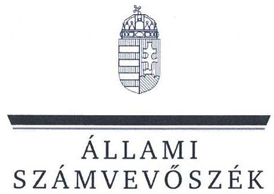

ÁLLAMI
SZÁMVEVŐSZÉK

# JELENTÉS 

## Egyházi fenntartású kórházak közfeladat-ellátással kapcsolatos támogatásai felhasználásának ellenőrzése és az államháztartásból nem hitéleti célra nyújtott támogatások vonatkozásában a pénzügyi és ellátási tevékenységének, adósságállomány-alakulásának elemzése

Magyarországi Református Egyház Bethesda Gyermekkórháza 2025.

25047
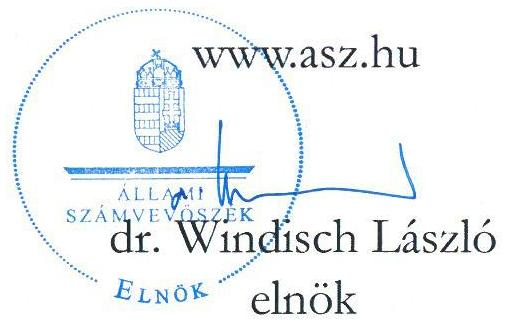

---

# ELLENŐRZÉSI IGAZGATÓSÁG: 

## ELLENŐRZÉSI IGAZGATÓSÁG V.

## ELLENŐRZÉSI IGAZGATÓ:

KLINGA LÁSZLÓ ellenőrzési igazgató

## ELLENŐRZÉSVEZETŐ:

VARGA EDIT ellenőrzési igazgatóhelyettes, ellenőrzésvezető

Jelentéseink az interneten a www.asz.hu címen olvashatók.

IKTATÓSZÁM: EL-4090-003/2025
TÉMASORSZÁM: 24
ELLENŐRZÉS-AZONOSÍTÓ SZÁM: V1108

---

# TARTALOMJEGYZÉK 

AZ ELLENŐRZÉS ALAPADATAI ..... 5
AZ ELLENŐRZÉS HATÓKÖRE ÉS TERÜLETE ..... 7
ÖSSZEFOGLALÁS ..... 9
AZ ELLENŐRZÉS FÓKUSZTERÜLETEI ..... 11
MEGÁLLAPÍTÁSOK ..... 12
JAVASLATOK ..... 20
ELEMZÉS A MAGYARORSZÁGI REFORMÁTUS EGYHÁZ BETHESDA GYERMEKKÓRHÁZ PÉNZÜGYI ÉS ELLÁTÁSI TEVÉKENYSÉGÉNEK, ADÓSSÁGÁLLOMÁNYÁNAK ALAKULÁSÁRÓL AZ ÁLLAMHÁZTARTÁSBÓL NEM HITÉLETI CÉLRA NYÚJTOTT TÁMOGATÁSOK VONATKOZÁSÁBAN ..... 22
ELEMZÉS ..... 27
MELLÉKLETEK ..... 54
I. sz. melléklet: Értelmező szótár ..... 54
II. sz. melléklet: Az ellenőrzött és ellenőrzést támogató szervezetek jegyzéke ..... 58
III. sz. melléklet: Ellenőrzési kritériumok ..... 59
IV. sz. melléklet: a Kórház főbb működési jellemzői az összes elemzett kórházhoz viszonyítva ..... 60
FÜGGELÉK: ÉSZREVÉTELEK ..... 65
RÖVIDÍTÉSEK JEGYZÉKE ..... 66

---

.

---

# AZ ELLENŐRZÉS ALAPADATAI 

## AZ ELLENŐRZÉS CÉLJA

Az ellenőrzés célja a Magyarországon egyházi fenntartásban működő aktív fekvőbeteg-szakellátást is végző kórházak esetében annak értékelése volt, hogy az államháztartásból nem hitéleti célra nyújtott támogatások vonatkozásában a támogatás felhasználásának szabályozási környezetét szabályszerűen alakították-e ki. Értékeltük továbbá a könyvvezetési és beszámoló-készítési és közzétételi kötelezettség teljesítésének szabályszerűségét, belső szabályzatoknak való megfelelését, továbbá az államháztartásból kapott, nem hitéleti célú támogatások felhasználásának és elszámolásának szabályszerűségét, a felhasználás támogatás céljának való megfelelését.

Ellenőrzési cél volt továbbá annak megállapítása, hogy az egyház (mint a közfeladatot ellátó intézmény fenntartója) a jogszabályi előírásoknak és belső szabályzatainak megfelelően gondoskodott-e a kórházzal kapcsolatos fenntartói kötelezettségei teljesítéséről.

## AZ ELLENŐRZÉS TÍPUSA

Törvényességi ellenőrzés.

## AZ ELLENŐRZŐTT IDŐSZAK

A 2023. év

## AZ ELLENŐRZÉS TÁRGYA

Az ellenőrzés tárgyát képezte - az államháztartásból nem hitéleti célra nyújtott támogatások vonatkozásában - a Magyarországon egyházi fenntartásban működő aktív fekvőbeteg-szakellátást is végző kórházak tekintetében a 2023. évre vonatkozóan a számviteli szabályozási keretek kialakításának, a könyvvezetési és beszámoló-készítési és közzétételi kötelezettség teljesítésének szabályszerűsége és belső szabályzatoknak való megfelelése. Az ellenőrzés kiterjedt a kórházak esetében az államháztartásból nem hitéleti célra nyújtott támogatás tekintetében a támogatás-felhasználás célhoz kötöttségének ellenőrzésére is.

Az egyház, mint fenntartó tekintetében az ellenőrzés tárgyát képezte a kórházzal kapcsolatos fenntartói tevékenység szabályszerűségének értékelésére figyelemmel a kórházat megillető államháztartási forrásból nem hitéleti célra nyújtott támogatások kezelése/átadása.

Az ellenőrzés kiterjedt minden olyan körülményre és adatra, amely az ÁSZ jogszabályban meghatározott feladatainak teljesítéséhez, valamint a program végrehajtása folyamán felmerült újabb összefüggések feltárásához szükséges volt.

---

# Az ellenőrzés jogalapja 

Az ellenőrzés jogszabályi alapját az ÁSZ tv. ${ }^{1} 1. \int$ (3) bekezdés, az 5. $\int$ (11) bekezdés c) pont, (13) bekezdés és az Ehtv. ${ }^{2}$ 19/D. $\int$ (2) bekezdés előírásai képezték.

## AZ ELLENŐRZÉS MÓDSZERE

Az ellenőrzést a nemzetközi standardokat irányadónak tekintve az ellenőrzési program szempontjai, az ellenőrzött időszakban hatályos jogszabályok, az ÁSZ ${ }^{3}$ ellenőrzés-szakmai szabályok és irányadó módszertanok figyelembevételével végezte az ÁSZ.

Az ellenőrzési kérdések megválaszolásához szükséges bizonyítékok megszerzése az ellenőrzött szervezetek által rendelkezésre bocsátott dokumentumokra és adatokra alapozva megfigyelés, helyszíni szemle (szemrevételezés), kérdésfeltevés (információkérés), illetve mintavételezés útján történt. Kockázati alapon kiválasztott mintatételeken keresztül történt a kórházak esetében az államháztartásból nem hitéleti célra nyújtott támogatások felhasználása, számviteli elszámolása szabályszerűségének ellenőrzése, az egyházi fenntartóknál pedig a fenntartón keresztül folyósított - kórházat megillető - támogatások kezelése (intézmény részére történő átadás, elszámolás) szabályszerűségének ellenőrzése. A mintatételek kiértékelése nem került a sokaságra kivetítésre, az ellenőrzött támogatásokra vonatkozó összegző és részletes következtetések az adott területhez kapcsolódó értékelésben kerültek megjelenítésre.

Az ellenőrzés lefolytatásához az ellenőrzött szervezetek a tanúsítványok kitöltésével, valamint az ellenőrzött és az ellenőrzést támogató szervezetek az ÁSZ által kért dokumentumok, adatok, információk megküldésével szolgáltattak adatokat.

Az ellenőrzési bizonyítékként felhasználható adatforrások közé tartoztak egyrészt az ellenőrzéshez kért dokumentumok, adatforrások, másrészt adatforrás volt még minden - az ellenőrzés folyamán - az ellenőrzés szempontjából információkat tartalmazó dokumentum. Az ellenőrzési kritériumok részletes felsorolását a III. sz. melléklet tartalmazza.

---

# AZ ELLENŐRZÉS HATÓKÖRE ÉS TERÜLETE 

Az ÁSZ tv. 5. § (11) bekezdés c) pontja értelmében az ÁSZ törvényességi szempontok szerint ellenőrzi a vallási egyesületek, az egyházi jogi személyek vagy azok nevelési-oktatási, felsőoktatási, egészségügyi, karitatív, szociális, család-, gyermek- és ifjúságvédelmi, kulturális vagy sporttevékenység végzésére létrehozott, a jogi személyiséggel rendelkező vallási közösség belső szabálya szerint jogi személyiséggel nem rendelkező intézménye részére az államháztartásból nem hitéleti célra nyújtott támogatás felhasználását.

Az ellenőrzés kiterjedt arra, hogy az egyházi fenntartó a jogszabályi előírásoknak és belső szabályzatainak megfelelően gondoskodott-e a nem hitéleti célra nyújtott támogatások felhasználása során az általa fenntartott aktív fekvőbeteg-szakellátást is végző kórházzal kapcsolatos fenntartói kötelezettségei teljesítéséről, ami magában foglalta az intézmény könyvvezetési és beszámoló-készítési kötelezettség megállapításának-, a szervezet jogi személyiségének megfelelő besorolásának-, a kórház részére a fenntartón keresztül folyósított, államháztartásból nem hitéleti célra nyújtott támogatások könyvvezetési rendszerében történő elszámolásának, átadásának ellenőrzését.

A kórház működési keretei kialakításának szabályszerűségére vonatkozó ellenőrzés az államháztartásból nem hitéleti célra nyújtott támogatások felhasználásának belső szabályozási környezete kialakításának szabályszerűségére terjedt ki. Az ellenőrzés és értékelés a beszámolót alátámasztó számviteli nyilvántartási rendszer kialakításának és működésének szabályozottságára; az elkülönített kimutatások szabályozottságára továbbá a beszámoló közzététele módjának meghatározására vonatkozott.

A beszámolási és közzétételi kötelezettség teljesítésének szabályszerűsége keretében értékelésre került, hogy a kórház a jogszabályi előírásoknak és belső szabályzataiban meghatározottaknak megfelelően eleget tette beszámolási kötelezettségének, gondoskodott-e a beszámoló közzétételéről, amennyiben számviteli politikájában meghatározta a közzététel módját. Ellenőrzésre került, hogy az államháztartási forrásból származó, nem hitéleti célú támogatást felhasználó kórház számviteli beszámolójának mérlegtételeit a Számv. tv. ${ }^{4}$ előírása szerinti leltárral alátámasztotta-e, továbbá, hogy gondoskodott-e a közfeladat-ellátással kapcsolatos közérdekű vagy közérdekből nyilvános adatok közzétételéről.

A könyvvezetési kötelezettség teljesítésének ellenőrzése keretében értékelésre került, hogy a kórház betartotta-e a jogszabályi és vonatkozó belső szabályozások előírásait, továbbá a bizonylatolásra vonatkozó előírások, a kiadási tételek besorolását. Az ellenőrzés kiterjedt arra, hogy a kórház a könyvvezetési rendszerében biztosította-e az alaptevékenységből és vállalkozási tevékenységből származó bevételeinek, költségeinek és ráfordításainak elkülönített kimutatását, hogy a kapott támogatásokat bevételként elszámolta-e, az államháztartásból nem hitéleti célra folyósított támogatások felhasználása a támogatási célnak megfelelő és szabályszerű volt-e.

A 2023. évben Magyarországon működő kilenc egyházi fenntartású fekvőbeteg-szakellátást végző intézményből a V1108 ellenőrzés-azonosító számú ellenőrzés keretében öt aktív fekvőbeteg-szakellátást is végző intézmény került ellenőrzésre. Közülük jelen ÁSZ jelentés a Magyarországi Református Egyház Bethesda Gyermekkórháza, és fenntartójaként a Magyarországi Református Egyház, mint ellenőrzött szervezetek ellenőrzéséről készült.

---

# MAGYARORSZÁGI REFORMÁTUS EGYHÁZ BETHESDA GYERMEKKÓRHÁZA 

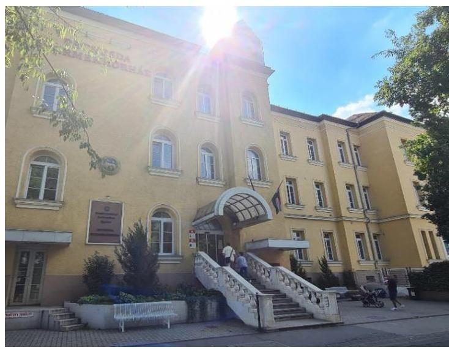

A Kórház ${ }^{5}$ jogelőd költségvetési szerve a Budapest Főváros Önkormányzata által fenntartott Apáthy István Gyermekkórház-Rendelőintézet volt. Az intézmény kezelésében lévő ingatlanok tulajdonjogát az MRE ${ }^{6}$ 1992. július 1. napjától vette át, és alapította meg az önkormányzati fenntartású egészségügyi intézmény jogutódjaként a Kórházat.

A Kórház az Alapító okiratában ${ }^{7}$ meghatározottak szerint az Ehtv. 10. §-a szerinti egyházi jogi személy volt az ellenőrzött időszakban. Közfeladata az Eütv. ${ }^{8}$ alapján az ellátási területére kiterjedően a járó- és fekvőbetegek diagnosztikus és terápiás szakorvosi ellátása, rehabilitációja és követéses gondozása, a Köznev. tv. ${ }^{9}$ alapján pedig pedagógiai szakszolgálati köznevelési alapfeladat-ellátása volt. Az ellenőrzött időszakban a Kórház Magyarország egyik legnagyobb és legjelentősebb gyermekegészségügyi intézménye volt, mely a közép-európai régióban az egyedüli egyházi fenntartású gyermekkórház. Az intézmény az észak-közép magyarországi terület vezető gyermekgyógyászati intézménye, de sok tekintetben országos központ (epilepsziás gyermekek műtét előtti kivizsgálása; kiemelt profilja az égéssérült gyermekek ellátása).

A Kórház az MRE által jóváhagyott költségvetés keretein belül önállóan gazdálkodott, a 2023. évben alaptevékenysége mellett vállalkozási tevékenységeket is végzett (közforgalmú gyógyszertár-üzemeltetés, büfé működtetés, vendégétkeztetés, webshop értékesítés, ingatlan-bérbeadás, mosodai, sterilizálási szolgáltatás), amelyekből származó árbevételei az összes bevétel mindössze 3,0%-át tették ki. A Kórház 2023. évi eredménykimutatása szerint bevételeinek főösszege 11,27 Mrd Ft, ráfordításainak összege pedig 11,34 Mrd Ft volt, mely alapján a 2023. évben 0,07 Mrd Ft vesztesége keletkezett. A feladatellátás gazdasági és pénzügyi feltételeinek romlását szemlélteti, hogy a 2019. évi 2,89 Mrd Ft-os záró pénzkészlettel szemben a 2023. évi záró pénzkészlet értéke mindössze 0,19 Mrd Ft volt, míg az áruszállításból és szolgáltatásnyújtásból származó kötelezettségek összege a 2019. évi 0,11 Mrd Ft-ról a 2023. évre 0,30 Mrd Ft-ra emelkedett, továbbá, hogy a Kórház 2023. évi vesztesége 0,01 Mrd Ft-tal meghaladta a 2019. évi 0,06 Mrd Ft-os összeget. A Kórház a 2023. évben egészségügyi feladataihoz 9,03 Mrd Ft NEAK ${ }^{10}$ finanszírozásban részesült, a pályázat és egyedi döntés alapján folyósított támogatásainak együttes összege 1,33 Mrd Ft volt.

## MAGYARORSZÁGI REFORMÁTUS EGYHÁZ

Az MRE a Magyarország területén lévő református egyházközösségekből épül fel, az Ehtv. szerinti bevett egyház, amellyel az állam közösségi célok érdekében átfogó megállapodást kötött (1821/2017. (XI. 9.) Korm. határozat ${ }^{11}$ melléklete - Az 1998. december 8-i Megállapodás megújítása). Az MRE, mint fenntartó, az általa jogutódlással alapított, önálló jogi személyiséggel rendelkező Kórházat (belső egyházi jogi személy) egyházi fenntartóként 1992. július 1-től működteti.

---

# ÖSSZEFOGLALÁS 

Magyarország Alaptörvényének ${ }^{12}$ XX. cikke szerint mindenkinek joga van a testi és lelki egészséghez, melynek érvényesülését Magyarország többek között az egészségügyi ellátás megszervezésével segíti elő. Az Ehtv. előírása szerint „a jogi személyiséggel rendelkező vallási közösség részt vállalhat a társadalom értékteremtő szolgálatában, ennek érdekében önmaga vagy e célra létrehozott intézménye útján olyan közcélú tevékenységet is elláthat, amelyet törvény nem tart fenn kizárólagosan az állam vagy annak intézménye számára". A közcélú tevékenység ellátásához az állam az Ehtv. 19. § (1)-(2) bekezdése szerint költségvetési támogatást nyújt.
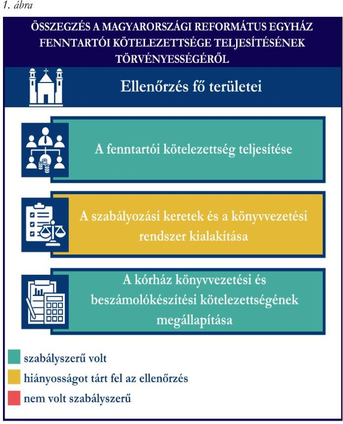

Forrás: ÁSZ megállapítások alapján ÁSZ saját szerkesztés

Az MRE, mint fenntartó a Kórház könyvvezetési és beszámoló-készítési kötelezettségét a jogszabályi előírásnak megfelelően meghatározta.

Az MRE szabályozási kereteinek és könyvvezetési rendszerének kialakítása az időbeli elhatárolásokkal kapcsolatos hiányosság kivételével - az államháztartásból nem hitéleti célra nyújtott támogatások tekintetében - szabályszerű volt. Az MRE jogszabályban előírt, a szabályszerű gazdálkodás feltételeit meghatározó belső szabályzatokkal rendelkezett, számviteli politikában az időbeli elhatárolások alkalmazásáról rendelkezett, azonban a jogszabályi előírás ellenére az időbeli elhatárolások alkalmazásának módszerét a szabályzatban nem rögzítette.

Az MRE - vállalkozási tevékenységet nem végző egyházi jogi személyként - a jogszabályi előírásoknak megfelelően számviteli politikájában meghatározta a beszámoló formáját és tartalmát, továbbá az egyszerűsített éves beszámoló alátámasztása érdekében kettős könyvvitel-vezetéséről rendelkezett.

Az ellenőrzés a Kórház számviteli szabályozási környezete kialakítása tekintetében
 hiányosságokat tárt fel. A Kórház a jogszabályban előírt, a gazdálkodás kereteit meghatározó belső szabályzatokkal rendelkezett, azonban tartalmuk nem felelt meg teljeskörűen a jogszabályi előírásoknak. A jogszabályi előírás ellenére a számviteli politikában az időbeli elhatárolások alkalmazásával kapcsolatos előírásokat nem rögzítették, a szabályzat aktualizálását nem végezték el. Az alap- és vállalkozásitevékenységhez közvetlenül nem kapcsolódó költségek és ráfordításainak jogszabályi előírásoknak megfelelő felosztását biztosító szervezeti előírásokat a Kórház belső szabályzatai nem tartalmazták., továbbá nem rendelkeztek az alap- és vállalkozási tevékenység költségeinek és ráfordításainak, valamint a kapott adományok és azok felhasználása elkülönített bemutatását biztosító szervezeti szabályokról, módszerekről.

A Kórház a számviteli politikájában - tevékenységeit és bevételeinek főösszegét figyelembe véve - a 296/2013. Korm. rend. 1. melléklete szerinti egyszerűsített éves beszámoló készítését, annak alátámasztására kettős könyvvitel vezetését írta elő.

---

2. ábra
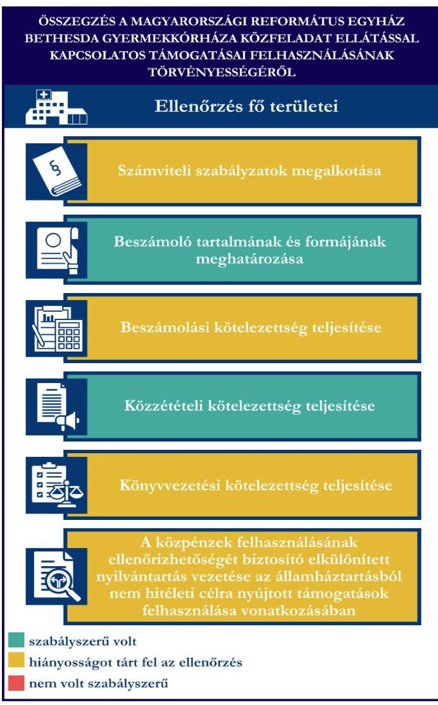

A Kórház a 2023. évre vonatkozó beszámolási kötelezettségének eleget tett, azonban az egyszerűsített éves beszámoló formája és tartalma nem felelt meg az egyházi jogi személyek beszámolási kötelezettségét meghatározó jogszabályi és a Kórház belső szabályzatai előírásainak, mivel 2023. évben vállalkozási tevékenységet is végzett, ennek ellenére egyszerűsített éves beszámolóját a vállalkozási tevékenységet nem végző egyházi jogi személyekre vonatkozó, a MRE belső törvényében meghatározott formában és tartalommal készítette el. A 2023. évi egyszerűsített éves beszámoló eredménykimutatása nem tartalmazta az alaptevékenység és vállalkozási tevékenység adózott eredményének elkülönített kimutatását, továbbá az egyéb bevételeken belül a támogatások jogszabályban meghatározottak szerinti bemutatását. A Kórház 2023. évi egyszerűsített éves beszámolójának mérleg és eredménykimutatás adatait a mérlegfőösszegek és az adózott eredmény egyezősége ellenére a főkönyvi kivonat nem minden tétel esetében támasztotta alá. A Kórház a 2023 évi egyszerűsített éves beszámoló mérlegtételeit alátámasztó, a jogszabályi előírásoknak megfelelő leltárt nem készített, ezáltal sérült a valódiság elve.

A Kórház közzétételi kötelezettségének teljesítése nem felelt meg teljeskörűen a jogszabályi előírásoknak, mivel gazdálkodási adatait nem tette közzé.

A Kórház könyvvezetési kötelezettségének teljesítése nem felelt meg teljeskörűen a jogszabályi előírásoknak, az alaptevékenység és vállalkozási tevékenység költségei és ráfordításai elkülönítéseinek hiánya, továbbá a jogszabályban meghatározott kedvezmény igénybevételére jogosító adományok, és azok felhasználása elkülönített kimutatásának elmaradása miatt.

A Kórház 2023. évben a támogatások felhasználásáról könyvvezetési rendszerében teljeskörű, a közpénzek felhasználásának ellenőrizhetőségét biztosító elkülönített nyilvántartást nem vezetett. Az államháztartásból nem hitéleti célra nyújtott támogatások felhasználása nem minden mintatétel esetében felelt meg teljeskörűen a jogszabályi előírásoknak. A beszámoló mérlegét alátámasztó leltár, továbbá az adósságcsökkentési célú támogatással kapcsolatos kiegyenlítési sorrendet meghatározó fenntartói döntés hiányából fakadó hibákon túl hiányosságok többségében a tárgyi eszközök és készletek bekerülési értékének meghatározásával, a tárgyi eszközök aktiválásával, a kiadási tételek besorolásával kapcsolatban kerültek feltárásra. Az államháztartásból nem hitéleti célra nyújtott támogatások felhasználása az ellenőrzött mintatételek esetében a támogatói okiratban meghatározott célnak megfelelő volt, azonban három mintatétel nem felelt meg a támogatói okirat szerinti támogatási időszaknak - amely időszakban felmerült és igazolt költségek finanszírozásra a támogatás összege felhasználható -, további hét mintatétel pedig ÁFA elszámolással kapcsolatos hiba és költségtervben nem szereplő felhasználási hely miatt nem felelt meg a támogatói okiratban és az annak kötelező mellékletét képező költségtervben meghatározottaknak.

---

# AZ ELLENŐRZÉS FÓKUSZTERÜLETEI 

1. Az egyház fenntartói kötelezettsége teljesítésének szabályszerűsége
2. A kórház működési keretei kialakításának szabályszerűsége az államháztartásból nem hitéleti célra nyújtott támogatások vonatkozásában
3. A kórház beszámolási és közzétételi kötelezettsége teljesítésének szabályszerűsége az államháztartásból nem hitéleti célra nyújtott támogatások vonatkozásában
4. A kórház könyvvezetési kötelezettsége teljesítésének, az államháztartásból nem hitéleti célra nyújtott támogatások felhasználásának és elszámolásának szabályszerűsége

---

# 1. Az egyház fenntartói kötelezettsége teljesítésének szabályszerűsége 

Összegző megállapítás Az MRE a Kórházzal kapcsolatos fenntartói kötelezettségeit a jogszabályi előírásoknak megfelelően teljesítette. Az MRE szabályozási kereteinek és könyvvezetési rendszerének kialakítása az államháztartásból nem hitéleti célra nyújtott támogatások vonatkozásában az időbeli elhatárolásokkal kapcsolatos szabályozási hiányosság kivételével megfelelt a jogszabályi előírásoknak.

Az MRE Kórházzal, mint egészségügyi intézménnyel kapcsolatos fenntartói kötelezettsége teljesítésére vonatkozó megállapítások:
Az MRE mint a Kórház alapítója és fenntartója, gondoskodott az intézmény Alapító okiratának elfogadásáról és szükség szerinti módosításáról. A 2023. évben hatályos Alapító okirat szerint a fenntartó a Kórházat az Ehtv. 10. $\int$-a szerinti egyházi jogi személynek sorolta be, ezáltal eleget tett a Számv. tv előírásának, a besorolással megállapította az egészségügyi intézmény könyvvezetési és beszámolókészítési kötelezettségét.
Az MRE a Kórházánál, mint egészségügyi közfeladatot ellátó intézménynél - a 2023. évben és a 2023. évre vonatkozóan is - végzett költségvetési ellenőrzést. A költségvetési ellenőrzés keretében az MRE az egészségügyi intézmény költségvetését és zárszámadását is ellenőrizte. Az egyház és a fenntartásába tartozó intézmények ellenőrzésének szabályait az MRE 2013. évi IV. törvényében ${ }^{13}$ határozta meg.
A Kórház a 2023. évben jelentős összegű (444508 E Ft) adósságcsökkentési célú működési támogatásban részesült, amelynek felhasználása során az MRE az 507/2023. Korm. rend. ${ }^{14}$ 2. § (2) bekezdés előírása ellenére a tartozások kiegyenlítési sorrendjéről nem döntött, e fenntartói jogkörét a Kórház főigazgatójára ruházta át. A tartozások kiegyenlítési sorrendjéről - átruházott hatáskörben - a főigazgató sem döntött.
Az MRE számviteli kereteinek, belső szabályainak és könyvvezetési rendszerének kialakítására vonatkozó megállapítások:
Az MRE a 2023. évben rendelkezett a Számv. tv. által előírt számviteli politikával ${ }^{15}$, és az annak keretében elkészítendő szabályzatokkal ${ }^{16}$, valamint számlarenddel ${ }^{17}$.
Az MRE számviteli politikájában a továbbutalási célú támogatásokkal kapcsolatos, jogszabályi előírás alapján kötelező időbeli elhatárolási kötelezettségen túl rögzítette azon eseteket, amelyekben a fenntartónál sor kerül az időbeli elhatárolás alkalmazására, azonban a 296/2013. Korm. rend. ${ }^{18}$ 7. § (6) bekezdés előírása ellenére a szabályozás az időbeli elhatárolások alkalmazásának módszerét nem tartalmazta.
Az MRE a 2023. évben - nyilatkozata szerint - vállalkozási tevékenységet nem végzett. Könyveit a kettős könyvvitel rendszerében vezette, a naptári évről 296/2013. Korm. rend. előírásának megfelelő egyszerűsített éves beszámolót készített, melynek formáját és tartalmát a számviteli politikában határozta meg.

---

Az egyház és a fenntartásába tartozó szervezetek gazdálkodásának alapvető, a jogszabályi előírásokon alapuló általános szabályait az MRE a 2013. évi IV. törvényében is rögzítette.
A beszámoló közzététele az egyházi jogi személyek számára nem kötelező, az MRE számviteli politikájában nem rendelkezett a beszámoló közzétételéről, nem élt a 296/2013. Korm. rend. szerinti szabályozási lehetőséggel. Az MRE 2013. évi IV. törvénye előírásainak eleget téve a 2023. évi beszámoló fő adatait a Református Közlöny 2024. évi 2. számában közzétette.
Az MRE a 2023. évben, valamint az azt megelőző években a Kórházat megillető továbbutalási célú támogatásban nem részesült, így az annak nyilvántartásával, könyvviteli elszámolásával kapcsolatos kötelezettségek teljesítésének ellenőrzésére nem került sor.

# 2. A kórház működési keretei kialakításának szabályszerűsége az államháztartásból nem hitéleti célra nyújtott támogatások vonatkozásában 

Összegző megállapítás

A Kórház az előírt szabályzatokkal rendelkezett, azonban tartalmuk nem felelt meg teljeskörűen a jogszabályi előírásoknak. A könyvvezetés módja, a beszámoló formája a jogszabályi előírásoknak és a Kórház tevékenységeinek megfelelően került meghatározásra. A Kórház a jogszabályi előírásoknak megfelelően rendelkezett az egészségügyi tevékenységét meghatározó, ellenőrzött alapdokumentumokkal.

A Kórház számviteli kereteinek, belső szabályainak és könyvvezetési rendszerének kialakítására vonatkozó megállapítások:
A Kórház a 2023. évben rendelkezett a Számv. tv. által előírt számviteli politikával ${ }^{18}$, és az annak keretében elkészítendő szabályzatokkal ${ }^{20}$ és számlarenddel ${ }^{21}$, azonban azok nem feleltek meg teljeskörűen az előírásoknak. Az egészségügyi intézmény a 296/2013. Korm. rend. előírása alapján egyszerűsített éves beszámoló készítésére kötelezett szervezetként a Számv. tv. előírása alapján mentesült az önköltségszámítási szabályzat készítési kötelezettség alól.
A Kórház 2023. évi főkönyvi kivonata szerint élt az időbeli elhatárolások alkalmazásának lehetőségével, azonban számviteli politikájában a 296/2013. Korm. rend. 7. § (6) bekezdés előírása ellenére nem rögzítette annak választott módszerét.
Az általános költségek felosztásának módját, szervezeti szabályait a Kórház a számviteli politikában meghatározta, azonban a 296/2013. Korm. rend. 7. § (5) bekezdésében előírt, az alaptevékenységhez és vállalkozási tevékenységhez közvetlenül nem kapcsolódó költségek felosztására vonatkozóan nem határozta meg, hogy felosztásuk az alaptevékenység illetve vállalkozási tevékenység között a bevételek arányában, vagy a tényleges igénybevételnek megfelelően, milyen mérő-, mutatószámok alapján történik.
A 296/2013. Korm. rend. előírása alapján a beszámoló letétbe helyezése az egyházi jogi személyek számára nem kötelező, de számviteli politikájukban dönthetnek annak közzétételéről, ezen lehetőséggel a Kórház nem élt.
A Kórház a Számv. tv. 14. § (11) bekezdésében előírtak ellenére a törvény módosításának hatályba lépését követő 90 napon belül a 2023. évben hatályos számviteli politikáján a változásokat nem vezette keresztül,

---

mivel az tartalmazta a "Rendkívüli bevételek" és "Rendkívüli ráfordítások" fogalmát annak ellenére, hogy e bevételi és kiadási kategóriákat a Számv. tv. 2015. július 4-étől nem alkalmazza, továbbá a számviteli politika 1. mellékletét képezte a számlatükör, ami tartalmában eltért a 2023. évben hatályos számlarend mellékleteként is kiadott számlatükörtől, attól eltérő részletezettségű és rendszerű alszámlákat tartalmaztak.
A Kórház a 296/2013. Korm. rend. 4. §-a előírása ellenére nem írta elő az alaptevékenységgel és a vállalkozási tevékenységgel kapcsolatos költségek és ráfordítások, továbbá a kapott adományok (közcélú adomány) és azok felhasználása könyvvezetés során történő elkülönített bemutatását. Az egészségügyi intézmény a 2023. évi főkönyvi kivonata alapján az ellenőrzött időszakban végzett vállalkozási tevékenységet, továbbá a hatályos adományozási szabályzata ${ }^{22}$ szerint jogosult volt olyan adományt elfogadni, mely alapján az adományozó jogosult a társasági adóról és osztalékadóról szóló 1996. évi LXXXI. tv. szerint kedvezmény igénybevételére.
A Kórház számviteli politikájában a naptári évről készítendő beszámoló tartalmát és formáját - a tevékenységeit és bevételeinek főösszegét figyelembe véve - a 296/2013. Korm. rend. előírásának megfelelően határozta meg: egyszerűsített éves beszámolót készített, a beszámoló alátámasztására könyveit a kettős könyvvitel szabályai szerint vezette.
A Kórház közcélú egészségügyi tevékenységét meghatározó, ellenőrzött alapdokumentumaira vonatkozó megállapítások:
A Kórház 2023. évben alkalmazandó SZMSZ ${ }^{23}$-ét a főigazgató 2022. szeptember 01-én adta ki. A hatályos Alapító okirat rendelkezése szerint az SZMSZ fenntartói jóváhagyására a Bethesda Gyermekkórház Fenntartó Testülete volt jogosult. Az Eütv. 155. § (1) bekezdés f) pontjának előírása ellenére az SZMSZ fenntartói jóváhagyása az ellenőrzött időszakra vonatkozóan nem történt meg. Az ellenőrzés azonban megállapította, hogy a Bethesda Gyermekkórház Fenntartó Testülete a Kórház SZMSZ-ét az A/778-1/2024. számú döntéssel 2024. június 13-án jóváhagyta.
Az Ehtv. előírásának megfelelően a főigazgató által kiadott SZMSZ tartalmazta a Kórház szervezeti felépítését. Az intézmény képviseletének szabályai az SZMSZ-ben, valamint az intézmény hatályos Alapító okiratában kerültek meghatározásra.

---

# 3. A kórház beszámolási és közzétételi kötelezettsége teljesítésének szabályszerűsége az államháztartásból nem hitéleti célra nyújtott támogatások vonatkozásában 

Összegző megállapítás

A Kórház a 2023. évi beszámolási kötelezettségének eleget tett, azonban az egyszerűsített éves beszámolót nem a jogszabály által előírt formában és tartalommal készítette el. A főkönyvi kivonat a beszámoló mérlegének és eredménykimutatásának adatait a főösszegek és az adózott
 eredmény egyezősége ellenére nem támasztotta alá teljeskörűen. A Kórház a beszámoló mérlegét alátámasztó, a jogszabályban előírt leltárral nem rendelkezett. A gazdálkodási adatok kivételével gondoskodott közérdekű és közérdekből nyilvános adatok jogszabályokban előírt közzétételéről.

## A Kórház beszámolási kötelezettsége teljesítésére vonatkozó megállapítások:

A Kórház 2023. évre vonatkozóan beszámolási kötelezettségének eleget tett, rendelkezett a fenntartó által is jóváhagyott számviteli beszámolóval, azonban az egyszerűsített éves beszámoló formája és tartalma nem felelt meg a 296/2013. Korm. rend. 5. § (3) bekezdése és 1. melléklete, valamint az intézmény hatályos belső szabályzatai előírásainak. A Kórház a főkönyvi kivonat adatai szerint a 2023. évben alaptevékenysége mellett végzett vállalkozási tevékenységet is, beszámolóját ennek ellenére az MRE 2013. évi IV. törvényében meghatározott, „vállalkozási tevékenységet nem végző református egyházi jogi személyek egyszerűsített éves beszámolójá" formátumban készítette el. A beszámoló eredménykimutatásában a 296/2013. Korm. rend. 9. § (1) bekezdés a) pont előírása ellenére az alap- és vállalkozási tevékenységből származó eredményt elkülönítetten nem mutatta be, továbbá a 296/2013. Korm. rend. 1. melléklet 2. rész 3. a)-d) pontjában meghatározottak ellenére az egyéb bevételek között nem mutatta ki az egyházi, központi költségvetési, helyi önkormányzati és egyéb támogatások összegét.
A Kórház a Számv. tv. és a 296/2013. Korm. rendelet könyvvezetés módjára vonatkozó előírásainak megfelelően az egyszerűsített éves beszámoló adatainak alátámasztására könyveit a kettős könyvvitel rendszerében vezette, az egyszerűsített éves beszámoló mérlegében és eredménykimutatásában az előző évi és tárgyévi adatokat elkülönítetten mutatta ki, a Számv. tv. előírását betartva a beszámoló nyitó (előző év) adatai megegyeztek az előző évi beszámoló záró adataival.
Az egyszerűsített éves beszámoló mérlegének és eredménykimutatásának adatait - a mérleg eszköz és forrás főösszege, valamint az adózott eredmény egyezése ellenére - a főkönyvi kivonat nem minden tétel esetében támasztotta alá. Az intézmény a mérlegtételek esetében a „Különféle egyéb követelések" és a „Pénzeszközök" között átsorolásokat hajtott végre, melyek nem következtek a Számv. tv. előírásaiból, a belső szabályzatokban sem kerültek rögzítésre. A főkönyvi kivonat adataival szemben az eredménykimutatásban a bevételek között az „Aktivált saját teljesítmények értéke" nem került kimutatásra, ezzel párhuzamosan a kiadások között az „Anyagjellegű ráfordítások" az aktivált saját teljesítmények értékével csökkentett összegben kerültek bemutatásra, melynek értéke 3286 E Ft volt, nem okozott jelentős összegű hibát.
A Kórház az egyszerűsített éves beszámoló mérlegét a Számv. tv. 69. § (1) bekezdése előírásának megfelelő leltárral nem támasztotta alá, megsértve ezzel a Számv. tv. 15. § (3) bekezdése szerinti valódiság elvét.

---

A Kórház a 2006. évi CXXXII. tv. ${ }^{24}$, valamint a 296/2013. Korm. rend. előírása alapján 2023. évben kötelezett volt könyvvizsgálatra. A 2023. évi egyszerűsített éves beszámolót a MRE Zsinati Tanácsa és az intézmény vezetés tájékoztatása céljából könyvvizsgáló felülvizsgálta és hitelesítő záradékkal látta el.

# A Kórház közzétételi kötelezettsége teljesítésére vonatkozó megállapítások: 

A Kórház Számviteli politikájában nem rendelkezett a beszámoló közzétételéről, így annak közzétételére a 296/2013. Korm. rend. értelmében nem volt kötelezett.
A közzétételi kötelezettségének teljesítése nem felelt meg teljeskörűen a jogszabályi előírásoknak. A Kórház a gazdálkodási adatok kivételével gondoskodott az Ehtv. 19. § (3) bekezdése, valamint az Info tv. ${ }^{25}$ 33. § (3) bekezdése, 37. § (1) bekezdése és 1. melléklete szerinti, az egészségügyi közfeladat ellátással összefüggő, az általános közzétételi listában szereplő (releváns) szervezeti és személyi, tevékenységre és működésre vonatkozó közérdekű és közérdekből nyilvános adatok közzétételéről.

## 4. A kórház könyvvezetési kötelezettsége teljesítésének, az államháztartásból nem hitéleti célra nyújtott támogatások felhasználásának és elszámolásának szabályszerűsége

Összegző megállapítás

A Kórház könyvvezetési kötelezettségének teljesítése nem felelt meg teljeskörűen a jogszabályi előírásoknak a kedvezmény igénybevételére jogosító adományok és azok felhasználása elkülönített kimutatásának, továbbá az alap- és vállalkozási tevékenység költségei és ráfordításai elkülönítésének hiánya miatt. A Kórház a támogatások felhasználásáról nem teljeskörűen vezette az elkülönített nyilvántartást. Az ellenőrzött tételek alapján az államháztartásból nem hitéleti célra nyújtott támogatások felhasználása nem felelt meg teljeskörűen a jogszabályi előírásoknak.

## A Kórház könyvvezetési kötelezettsége teljesítésére vonatkozó megállapítások:

A Kórház könyvvezetési rendszerében a bevételek számviteli elszámolás során a 296/2013. Korm. rend. előírásait betartva az adományokat és támogatásokat bevételként számolta el.
Az általános költségek tevékenységek közötti felosztásáról az intézmény a jogszabályi előírásnak és belső szabályozásának megfelelően gondoskodott. A mintatételek dokumentumai szerint a 296/2013. Korm. rend. előírását betartva az alap- és vállalkozási tevékenységhez közvetlenül nem kapcsolódó költségek felosztása is megtörtént, a felosztás módjára vonatkozó belső szabályozás hiányában az általános (közvetett) költségek tevékenységek közötti felosztási szabályainak alkalmazásával.
A Kórház az Adományozási szabályzata alapján a 2023. évben jogosult volt a jogszabályi előírások szerinti kedvezmény igénybevételére jogosító adományok gyűjtésére. A 296/2013. Korm. rend. 4. § előírása ellenére könyvvezetésében nem mutatta ki elkülönítetten azon adományokat (közcélú adományokat) és felhasználásukat, melyekről a jogszabályi előírások szerinti kedvezmény igénybevételére jogosító igazolást állított ki.
A Kórház könyvviteli nyilvántartási rendszerében az alap- és vállalkozási tevékenység bevételeit a jogszabály előírásának megfelelően elkülönítetten mutatta ki, a költségek és ráfordítások esetében az elkülönítés

---

nem felelt meg a 296/2013. Korm. rend. 4. § előírásának, mivel a 7. számlaosztály főigazgatóságok, osztályok és feladatok (tevékenységek) szerinti megbontása a költségek és ráfordítások alap- és vállalkozási tevékenységek szerinti egyértelmű elkülönítését nem biztosította.
A Kórház a Számv. tv. 161/A. § (2) bekezdése előírását megsértve a pályázati vagy egyedi döntés alapján folyósított nem hitéleti célú támogatások, valamint az egészségügyi szakellátási tevékenységéhez kapcsolódó Egészségbiztosítási Alapból nyújtott finanszírozás felhasználásáról könyvvezetési rendszerében nem vezetett a közpénzek felhasználásáról teljeskörű elkülönített nyilvántartást.
A Kórház államháztartásból nem hitéleti célra nyújtott támogatásai felhasználásának mintatételes ellenőrzésére vonatkozó megállapítások:
Az egészségügyi szakellátási tevékenységhez kapcsolódó, Egészségbiztosítási Alapból folyósított finanszírozás:
A Kórház esetében a 2023. évben folyósított támogatás összege 9027063 E Ft volt. Az egészségügyi szakellátási tevékenységhez kapcsolódó finanszírozás felhasználása során a bizonylati alátámasztottságra és a bizonylatok alaki és tartalmi követelményeire vonatkozó - a Számv. tv.-ben meghatározott - előírásokat betartotta. Az ellenőrzött kiadási tételek könyvviteli elszámolása során két mintatétel kivételével a besorolásra vonatkozó jogszabályi előírásoknak megfelelően járt el:

- A Kórház egy tétel elszámolása során nem vette figyelembe a Számv. tv. 62. § (2) bekezdése - a készletek bekerülési értékének meghatározására vonatkozó - előírását, mely szerint a vásárolt készleteknél (anyag, árú) a bekerülési érték része a Számv. tv. 47. § (2) bekezdés b) pontja alapján az előzetesen felszámított, de le nem vonható általános forgalmi adó (ÁFA: 31726 Ft).
- A Kórház egy pénzügyi teljesítést nem igénylő mintatételhez kapcsolódóan az ajándékként kapott gyógyszer ellenértékének bevételként történt elszámolását, és ehhez kapcsolódóan a szállítói kötelezettség pénzügyi teljesítés nélküli megszüntetését (kivezetését) nem végezte el, megsértve ezzel a Számv. tv. 165. § (1) bekezdés előírását (19 887 Ft).

# Pályázat vagy egyedi döntés alapján folyósított támogatások: 

A Kórház a 2023. évben nyolc olyan pályázat vagy egyedi döntés alapján folyósított támogatásban részesült, melyek esetében kiutalás és felhasználás is történt az ellenőrzött időszakban, egy esetben az ellenőrzött időszakot megelőzően felhasznált és elszámolt, utófinanszírozású támogatás kiutalására került sor, két esetben az ellenőrzött időszakot megelőzően folyósított támogatás felhasználására, egy esetben pedig a támogató döntése szerinti jogosulatlanul felhasznált támogatás visszafizetése történt 2023. évben. A támogatások villamosenergia és földgáz szolgáltatás vásárlásra, működési költségek, személyi juttatások és járulék kiadások finanszírozására, fejlesztési feladatok és szűrőprogramok megvalósítására, rezidensek képzésével kapcsolatosan felmerült kiadások, továbbá a 2022. december 31-ig lejárt tartozásállomány utólagos kiegyenlítésére szolgáltak.
A Kórház könyvvezetési rendszerében a pályázat vagy egyedi döntés alapján folyósított támogatások felhasználásáról teljeskörű, elkülönített nyilvántartást a Számv. tv. 161/A. § (2) bekezdésének előírása ellenére nem vezetett.
A Kórház esetében a 2023. évi felhasználással érintett támogatások közül öt került ellenőrzésre (IV/2081/2022/EKF, II/678-3/2022/EKF, BM/12995-1/2023. BM/20550-1/2023., BM/90423/2023), amelynek során az ellenőrzés az alábbiakat állapította meg:

---

- A Kórház a pályázat vagy egyedi döntés alapján folyósított támogatások felhasználása során a Számv. tv. bizonylatolásra, a bizonylatok alaki és tartalmi követelményeire vonatkozó előírását a személyi juttatások és kapcsolódó járulékköltségek elszámolása során feltárt hiányosság kivételével betartotta. A személyi juttatások és kapcsolódó járulékkiadások esetében Számv. tv. 167. § (1) bekezdés h) és i) pontja szerinti adatokat (könyvelés módjára, könyvviteli számlákra történő hivatkozás, nyilvántartásokban történő rögzítés időpontja) a IV/2081/2022/EKF támogatás két és a BM/12995-1/2023. támogatás öt mintatételének dokumentumai nem tartalmazták (IV_2081_01, IV_2081_02, BM_12995_01 - BM_12995_5, értékük összesen 11795735 Ft).
- A kórház a könyvviteli nyilvántartásba vétel során a Számv. tv. besorolásra vonatkozó előírásait az ellenőrzött öt támogatás 34 tételéből hat esetben nem tartotta be:
- A II/678-3/2022/EKF támogatás két eszközbeszerzéséhez (játszótér kialakítás) kapcsolódó mintatételek esetében nem tartották be a Számv. tv. 26. § (1) és (7) bekezdése tárgyi eszközök mérlegben történő kimutatására és a Számv. tv. 47. §-a bekerülési érték meghatározására vonatkozó előírását, mivel a több részletben fizetett beruházásból az eszköznyilvántartó karton szerint a teljes beruházási érték helyett csak a végszámla összege került aktiválásra (BM_9042_16350000, BM_9042_2-3870734 - értékük összesen 10220734 Ft).
- A IV/2081/2022/EKF támogatás egy tétele esetében a besorolás nem felelt meg a Számv. tv. 42. § (1) bekezdés előírásának, mert a tanácsadói szolgáltatásból származó fizetési kötelezettséget a Kórház könyvvezetési rendszerében szállítói kötelezettség helyett egyéb rövid lejáratú kölcsönként mutatta ki (IV_2081_03 - értéke 279999 Ft).
- A BM/9042-3/2023. támogatás három készletbeszerzési mintatételének elszámolása során nem vették figyelembe a Számv. tv. 62. § (2) bekezdése - a készletek bekerülési értékének meghatározására vonatkozó - előírását, mely szerint a vásárolt készleteknél (anyag, árú) a bekerülési érték része az Számv. tv. 47. § (2) bekezdés b) pontja alapján az előzetesen felszámított, de le nem vonható általános forgalmi adó (BM_9042_2, BM_9042_3 és BM_9042_5 - ÁFA értéke összesen 199109 Ft).
- A IV/2081/2022/EKF támogatás két és a BM/12995-1/2023. támogatás öt személyi juttatás és járulékköltség mintatétele esetében a Számv. tv. 79. § (1)-(4) bekezdése szerinti besorolás, és annak megfelelősége nem volt megállapítható a kontírozást igazoló dokumentumok hiánya miatt (IV_2081_01, IV_2081_02, BM_12995_01 - BM_12995_5 - értékük összesen 11795735 Ft).
- A Kórház az ellenőrzött tételeket megalapozó szerződések, megállapodások, megrendelések esetében egy kivétellel betartotta a képviseletére vonatkozó jogszabályi és belső szabályozási előírásokat. A Kórház SZMSZ-ében és az Utalványozási szabályzatban ${ }^{26}$ meghatározott szabályok ellenére a BM/20550-1/2023. támogatás egy tételéhez kapcsolódó szerződés az intézmény részéről nem tartalmazott aláírást (BM_20550_8 tétel - értéke 961647 Ft).
- A támogatások felhasználását alátámasztó dokumentumok záradékolására vonatkozó, támogatói okiratban vagy támogatási szerződésben meghatározott előírásoknak a Kórház a BM/129951/2023. támogatás öt mintatétele esetében nem tett eleget (BM_12995_1 - BM_12995_5 - értékük összesen: 1109535 Ft).
- A Kórház az ellenőrzött pályázati vagy egyedi döntés alapján folyósított támogatásokat a BM/12995-1/2023. támogatás három tétele kivételével - a támogatói okiratban vagy támogatási
 szerződésben meghatározott megvalósítási időtartam betartásával használta fel. A támogatást a

---

2023. január 1. és 2023. december 31. közötti időszak működési, bér és járulékköltségekre folyósították. A pénzügyi elszámolásából vett mintatételek alapján a támogatás terhére elszámolt 12 havi bérköltségből három mintatétel a 2022. december hónapra számfejtett, a 2022. évet terhelő, de 2023. január elején kifizetett bérkiadás volt, ezért nem feleltek meg a támogatási időszaknak (BM_12995_2 - BM_12995_4 - értékük összesen: 950620 Ft).

- A Kórház az ellenőrzött támogatásokat hét tétel kivételével a támogatói okiratban és a költségtervben meghatározottaknak megfelelően használta fel. A BM/20550-1/2023. támogatás esetében hét mintatétel nem felelt meg a támogatási szerződésben és az annak kötelező mellékletét képző költségtervben meghatározottaknak (a felhasználási hely nem szerepelt a megvalósítási helyek között; a támogatás terhére el nem számolható, levonható vagy arányosan levonható ÁFA-t tartalmazott) (BM_20550_2, BM_20550_5, BM_20550_6 - értékük összesen: 227028 Ft, BM_20550_1, BM_20550_7, BM_20550_9, BM_20550_10 - ÁFA érték összesen: 3938722 Ft).

# 507/2023. Korm. rendelet alapján folyósított támogatás:

A Kórház az adósságcsökkentési célú működési támogatás felhasználása során a Számv. tv. bizonylati alátámasztottságra vonatkozó előírásait betartotta.
A támogatás felhasználásához kapcsolódó hat mintatétel esetében a kiegyenlítés nem felelt meg az 507/2023. Korm. rend. 2. § (1) bekezdésében meghatározott tartozás kiegyenlítési sorrendnek, mivel a Kórház az 507/2023. Korm. rend. 2. § (1) bekezdés c) pontja szerinti tartozásokat megelőzően egyenlítette ki az 507/2023. Korm. rend. 2. § (1) bekezdés e) pontjába tartozó kötelezettségek összegét (Konsz11, Konsz_17, Konsz_21 - Konsz_23, Konsz_30 - értékük összesen: 9121240 Ft).

---

# JAVASLATOK

Az ÁSZ tv. 33. § (1) bekezdésében foglaltak értelmében az ellenőrzött szervezet vezetője köteles a jelentésben foglalt megállapításokhoz kapcsolódó intézkedési tervet összeállítani és azt a jelentés kézhezvételétől számított 30 napon belül az ÁSZ részére megküldeni. Amennyiben az ellenőrzött szervezet vezetője nem küldi meg határidőben az intézkedési tervet, vagy továbbra sem elfogadható intézkedési tervet küld, az Állami Számvevőszék elnöke az ÁSZ tv. 33. § (3) bekezdése a) és b) pontjaiban foglaltakat érvényesítheti.

## MAGYARORSZÁGI REFORMÁTUS EGYHÁZ ZSINATA LELKÉSZI ELNÖKÉNEK

1. A 296/2013. Korm. rend. 7. § (6) bekezdésében előírtaknak megfelelően gondoskodjon arról, hogy az időbeli elhatárolások választott módszere a Magyarországi Református Egyház Számviteli politikájában rögzítésre kerüljön.

## MAGYARORSZÁGI REFORMÁTUS EGYHÁZ BETHESDA GYERMEKKÓRHÁZA FŐIGAZGATÓJA

1. A 296/2013. Korm. rend. 7. § (6) bekezdésében előírtaknak megfelelően gondoskodjon arról, hogy a MRE Bethesda Gyermekkórháza Számviteli politikájában rögzítésre kerüljön az időbeli elhatárolások választott módszere, mivel a 2023. évi könyvvezetés során élt az időbeli elhatárolás lehetőségével.
2. A Számv. tv. 14. § (11) bekezdése előírása értelmében gondoskodjon az MRE Bethesda Gyermekkórháza Számviteli politikájának felülvizsgálatáról, aktualizálásáról.
3. A 296/2013. Korm. rend. 7. § (5) bekezdése előírásának betartása érdekében az MRE Bethesda Gyermekkórháza szabályozási rendszerében gondoskodjon az alaptevékenységhez és vállalkozási tevékenységhez közvetlenül nem kapcsolódó költségek felosztásához kapcsolódóan annak meghatározásáról, hogy felosztásuk az alaptevékenység, illetve vállalkozási tevékenység között a bevételek arányában, vagy a tényleges igénybevételnek megfelelően, milyen mérő-, mutatószámok alapján történik. Gondoskodjon a 296/2013. Korm. rend. 4. § előírása alapján az alaptevékenységgel és a vállalkozási tevékenységgel kapcsolatos költségek és ráfordítások; a kapott adományok (közcélú adomány) és azok felhasználása könyvvezetési rendszerben történő elkülönített bemutatásának előírásáról.
4. Az MRE Bethesda Gyermekkórháza által ellátott tevékenységek figyelembevételével gondoskodjon az egyszerűsített éves beszámoló 296/2013. Korm. rend. 5. § (3) bekezdése és 1. számú melléklete, valamint az intézmény hatályos belső szabályzatai előírásainak megfelelő formában és tartalommal történő összeállításáról. Az alap- és vállalkozási tevékenységből származó eredmény 296/2013. Korm. rend. 9. § (1) bekezdés a) pont előírása szerinti elkülönített, továbbá az egyéb bevételek 296/2013. Korm. rend. 1. melléklete szerinti részletező bemutatásáról.

---

5. Gondoskodjon az egyszerűsített éves beszámoló mérlegében és eredménykimutatásában szereplő adatok főkönyvi kivonattal történő alátámasztásáról. A főkönyvi számlák egyenlegének mérlegben történő átsorolása esetén a Számv. tv. 14. § (3) bekezdésében előírtaknak megfelelően, gondoskodjon az intézmény adottságainak és körülményeinek megfelelő átsorolási szabályok belső szabályzatban történő meghatározásáról, kiegészítő melléklet készítése esetén az átsorolás hatásának kiegészítő mellékletben történő bemutatásáról.
6. Gondoskodjon a Számv. tv. 69. § (1) bekezdés előírása szerint az egyszerűsített éves beszámoló mérlegének leltárral történő alátámasztásáról.
7. Az Ehtv. 19. § (3) bekezdése, valamint az Info tv. 33. § (3) bekezdése, 37. § (1) bekezdése és 1. melléklete előírásainak megfelelően gondoskodjon az egészségügyi közfeladatellátással összefüggő, az általános közzétételi listában szereplő valamennyi, közérdekű és közérdekből nyilvános adat közzétételéről, kiemelt figyelemmel gazdálkodási adatokra.
8. A Számv. tv. 161/A. § (2) bekezdése előírása alapján a könyvvezetési rendszer tovább részletezésével - a központi költségvetésből folyósított finanszírozás, a pályázati és egyedi döntés alapján folyósított nem hitéleti célú támogatások felhasználásának elkülönített nyilvántartásával - biztosítsa, hogy a közpénzek felhasználásának ellenőrizhetőségét biztosító adatok rendelkezésre álljanak.
9. Az MRE Bethesda Gyermekkórháza számviteli nyilvántartási rendszerében biztosítsa, hogy:

- eszközbeszerzések esetén a bekerülési érték minden esetben a jogszabályi előírásoknak megfelelően kerüljön meghatározásra; különös figyelemmel a tárgyieszközök esetében a Számv. tv. 47. §-a, a készletek esetében pedig a Számv. tv. 62. § (2) bekezdése előírásaira;
- valamennyi gazdasági esemény könyvviteli elszámolása a Számv. tv. 165. § (1) bekezdése előírásainak megfelelően bizonylatokkal alátámasztott és dokumentált legyen, továbbá a könyvviteli elszámolást alátámasztó bizonylatok minden esetben feleljenek meg a Számv. tv. 167. § (1) bekezdése előírásainak;
- valamennyi tárgyi eszközök a mérlegben történő bemutatása feleljen meg a Számv. tv. 26. § (1) és (7) bekezdése előírásának;
- a gazdasági események könyvviteli elszámolása minden esetben feleljen meg a Számv. tv. besorolásra vonatkozó előírásainak, különös tekintettel a személyi juttatások és a kapcsolódó járulékköltségek esetében a Számv. tv. 79. § (1)-(4) bekezdése, szállítói kötelezettségek esetében pedig a Számv. tv. 42. § (1) bekezdése előírásaira.

---

# ELEMZÉS A MAGYARORSZÁGI REFORMÁTUS EGYHÁZ BETHESDA GYERMEKKÓRHÁZ PÉNZÜGYI ÉS ELLÁTÁSI TEVÉKENYSÉGÉNEK, ADÓSSÁGÁLLOMÁNYÁNAK ALAKULÁSÁRÓL AZ ÁLLAMHÁZTARTÁSBÓL NEM HITÉLETI CÉLRA NYÚJTOTT TÁMOGATÁSOK VONATKOZÁSÁBAN

## VEZETŐI ÖSSZEFOGLALÓ

Az államháztartásból nem hitéleti célra nyújtott támogatás-felhasználás törvényességének ellenőrzésével egyidőben az ÁSZ elemzést is készített öt ${ }^{1}$ aktív fekvőbeteg-szakellátást is végző egyházi fenntartású kórház vonatkozásában, amely a pénzügyi és ellátási tevékenységére vonatkozó adatok alakulására és az adósságállomány változásának összefüggéseire, továbbá a kórházi adósságállomány összetételére és alakulására fókuszált. Ennek keretében került sor a Magyarországi Református Egyház Bethesda Gyermekkórháza tevékenységének elemzésére is, ahol a szakmailag megalapozott esetekben az elemzéssel érintett más kórházak adatai képeztek benchmark alapot, továbbá egyes esetekben országos adatokkal egészült ki az elemzés. Az ellenőrzött időszak vonatkozásában a Kórház működésére vonatkozó adatokat, mutatószámokat - az összes elemzett kórházhoz viszonyítottan - a IV. számú melléklet tartalmazza.

## A kórház bemutatása

A Kórház az 1953-as államosításáig diakonissza kórház volt, a Filadelfia Diakonissza Egylet szeretetszolgálati tevékenységet végző, elsősorban betegápoló diakonisszái testvérközösségben élve töltötték be hivatásukat. A Kórház az 1960-as évek elején gyermekkórházzá alakult, és felvette Apáthy István nevét, amely állami fenntartásban a gyermekek egészségét szolgálva 1992. június 30-ig működött. Ezt követően az 1990-ben elkezdődött tárgyalások eredményeként az MRE a Kórház jogelőd költségvetési szervétől az ingatlanok tulajdonjogát átvette és megalapította a Kórházat, így az - fenntartva a gyermekkórházi profilt - a „régi Bethesda Kórház" karitatív lelkületével működhetett tovább.

A Kórház vonatkozásában az elmúlt időszakban számos fejlesztés valósult meg, az országos hatókörrel működő égéssebészeti osztály mellett szinte az összes osztályt felújították. A Kórház összesen 160 db ággyal üzemelt, amelyből az aktív besorolású ágyak száma 135 db, míg a krónikus besorolású ágyak száma 25 db volt. A Kórház aktív fekvőbeteg szakellátását széles ellátási portfólió jellemezte. ${ }^{2}$

A Kórházon belül az elemzett időszakban összesen 12 kórházi osztály működött, amelyből nem volt I. progresszivitási szintű osztály, 4 db osztály II. progresszivitási szintű, 8 db osztály III. progresszivitási szintű volt. A többi elemzett kórházhoz viszonyítva a Kórház több szervezeti egységet működtetett, hiszen az átlag 8-10 szervezeti egység volt.

[^0]
[^0]:    ${ }^{1}$ Magyarországi Református Egyház Bethesda Gyermekkórháza; Betegápoló Irgalmas Rend Budai Irgalmasrendi Kórház; Budapesti Szent Ferenc Kórház; Magyarországi Zsidó Hitközösségek Szövetsége Szeretetkórháza; Szent Damján Görögkatolikus Kórház
    ${ }^{2}$ Sebészet; Csecsemő- és gyermekbelgyógyászat; Fül-orr-gégegyógyászat; Neurológia; Aneszteziológiai és intenzív betegellátás; Sürgősségi betegellátás; Gyermekradiológia és rehabilitáció; Gyermekplasztikai és -égéssebészeti betegellátás

---

A Kórház az intézmény üzemeltetésével kapcsolatos tevékenységek ellátását saját foglalkoztatottak alkalmazásával biztosította, kizárólag őrzés-védelmi feladatokra kötöttek vállalkozási szerződést. Magánegészségügyi ellátást a Kórházban a vizsgált időszakban nem végeztek.

# Összefoglalás - a pénzügyi helyzet jellemzői

Az elemzett időszakban a Kórház biztonságos működése nagy erőfeszítések árán biztosított volt. A Kórház a nehézségek ellenére likviditását - a célzott költségvetési támogatásoknak is köszönhetően - meg tudta őrizni a 2021-2023. évek közti veszteséges gazdálkodás ellenére. Pénzügyi és jövedelmezőségi mutatói a 2019-2020. évek kivételével kedvezőtlenül alakultak, azonban 2023. évben már javulás volt érzékelhető a mutatók értékeiben. A külső gazdasági körülmények javulásának, és a Kórház stabilizációs intézkedéseinek (teljesítmény növelése, új ellátás formák bevezetése) eredményeként a likviditási helyzet, a pénzügyi stabilitás javult.
Az elemzéssel érintett időszakon belül a 2021-2023. években a bázisértékhez (2019. évhez) viszonyítva kiadások főösszegének növekedése meghaladta a bevételek emelkedési mértékét, de 2023. évben a kiadások és bevételek növekedési üteme közelített egymáshoz, a veszteség a bevételi főösszeg 0,6%-a volt.
A NEAK finanszírozás nem fedezte a Kórház tevékenységével kapcsolatban felmerült kiadásokat. A lejárt kötelezettségállomány átlagos állománya lineáris növekedést mutatott, 2023. évben a Kórház kiadási főösszegének 4,2%-át tette ki. A lejárt kötelezettségállomány dimenzionált értékei alapján a Kórház adósságpozíciója kiegyensúlyozottnak volt leírható a 2019-2020. és 2023. években.

## 3. ábra

A Kórház bevételei és kiadásai folyamatosan emelkedtek a bázisidőszakhoz viszonyítva, azonban 2021-2023 években a kiadások növekedési üteme meghaladta a bevételek emelkedését

A bázisidőszakhoz viszonyítva a mérleg és jövedelmezőségi mutatók kedvezőtlenül alakultak, de az adatok többségében 2023. évben érzékelhető javulás következett be

A NEAK finanszírozás jelentős mértékben (127,6%-kal) növekedett, és a 2019. évi 68,8 %-kal szemben 2023. évben 83,6%-ban finanszírozta a Kórház anyag és személyi jellegű ráfordításainak együttes összegét

A Kórház gazdasági helyzete a 2019. évihez viszonyítva romlott, a 2021-2023 években a Kórház adózott eredménye (negatív) veszteség volt

2023. évben a veszteség bevételi főösszeghez viszonyított aránya jelentős mértékben lecsökkent, mindössze 0,6% volt

A lejárt kötelezettségállomány éves átlagos értéke lineárisan emelkedett

---

# Összefoglalás - a Kórház főbb működési jellemzői

4. ábra

Stabil orvos-szakdolgozó arány, az öt kórházi átlagot meghaladó fluktuációval

1 súlyszámra jutó gyógyszerkiadás 2019-ben 31,6%-kal; 2020-ban 207,7%-kal, 2021-ben 215,2%-kal, 2022-ben 63,4%-kal; 2023-ban 145,4%-kal volt több az öt kórház átlagához viszonyítva

A laboratóriumi ellátás esetén a többi kórház átlagához viszonyítva 2019-ben 60,1%-kal; 2020-ban 56,1%-kal; 2021-ben 50,9%-kal; 2022-ben 64,9%-kal; 2023-ban 59,0%-kal volt
 kevesebb a TÉK felett elszámolt pont

Az aktív ágyak kihasználtsága a vizsgált időszak minden évében az országos átlag alatt maradt

A krónikus ágykihasználtsági adatok az elemzett kórházak átlagadata alatt, és az országos átlag alatt voltak

Országos átlaghoz viszonyítottan kedvező várakozási idő a Kórház műtéti várólistáin

Az aktív fekvőbeteg szakellátás teljesítménye terén 2020. évtől az öt kórház átlagához viszonyítottan lényegesen kevesebb volt a kihasználatlan kapacitás

A Kórház járóbeteg szakellátás teljesítménye terén a 2019. és 2020. években nem volt TÉK feletti teljesítmény, viszont 2021. évtől a teljesített ponthoz viszonyítottan is magas arányú TÉK feletti teljesítmény az öt kórház átlaga felett volt a 2021. (394%) 2022. (397,5%) és 2023. (293,9%) években

Forrás: ÁSZ megállapítások alapján ÁSZ saját szerkesztés

A működést jellemző mutatók alapján megállapítható, hogy összességében a Kórház több területen képes volt a vizsgált időszakban javulást elérni, azonban a kapacitások kihasználásának optimalizációjára érdemes lehet nagyobb figyelmet fordítani.
A Kórház teljesítményét, gazdálkodását nagymértékben meghatározza a kapacitások kihasználása. A vizsgált ellátás-típusokban a volumen korlátot a Tervezett Éves Keret (TÉK) biztosítja, optimális esetben a teljesítmény eléri, vagy megközelíti azt. Amennyiben a teljesítmény jócskán a TÉK alatt van az elmaradt teljesítményt (bevételkiesést) jelent, ha a teljesítmény TÉK felett van, az degresszált finanszírozást vonz.

---

- A Kórház aktív fekvőbeteg-szakellátási teljesítménye vonatkozásában a vizsgált időszakban 2019. év kivételével - az öt kórház átlaga alatti kihasználatlan kapacitással működött, továbbá 2021-2023-ban TÉK feletti teljesítés is előfordult. Járóbeteg szakellátás teljesítménye esetén a 2019-2021. és a 2023. évek során volt kihasználatlan TÉK kapacitása, továbbá három évben TÉK feletti teljesítés is megjelent. A laboratóriumi ellátás esetén az öt kórházhoz viszonyítottan lényegesen alacsonyabb volt a TÉK felett elszámolt pontja a Kórháznak. A TÉK felett jelentett teljesítmény és a kihasználatlan TÉK éven belüli együttes jelenléte tervezési hibára, a szezonalitás nem megfelelő felmérésére, a szakmánkénti kapacitásfelosztás anomáliájára utalhat.
- Az aktív és a krónikus ágyak kihasználtsága az országos és az öt kórház átlagánál alacsonyabb volt az elemzett évek során, az aktív és krónikus ágykihasználtsági mutató kiugró mértékben nem változott. A krónikus ágyak kihasználtsága 2023-ra csökkent, míg az aktívé nőtt ugyan, de nem érte el az országos átlagot.
- Az alkalmazottak fluktuációja 2021. és 2023-ban az öt kórház átlaga felett volt.
- A kórház gyógyszerkiadása lényegesen magasabb mértékű volt az öt kórház átlagához viszonyítva.

# AZ ELEMZÉS CÉLJA 

Az elemzés célja volt az egyházi fenntartásban működő aktív fekvőbeteg-szakellátást is végző kórház pénzügyi és ellátási tevékenységére vonatkozó adatok alakulásának, a kórházi adósságállomány változásával való összefüggéseinek-, továbbá az adósságállomány összetételének és alakulásának bemutatása az államháztartásból nem hitéleti célra nyújtott támogatások vonatkozásában.

Az ÁSZ célja volt, hogy elemzéssel hozzájáruljon ahhoz, hogy a társadalom képet kapjon az egyházi fenntartású kórház adósságállományának alakulásáról és összetételéről, valamint mutatókon keresztül a fekvőbetegszakellátás területén végzett egészségügyi ellátási, pénzügyi tevékenységéről. Mindez elősegíti, támogatja az ellenőrzött szervezet működésének javulását, a közpénzfelhasználás átláthatóságát.

## AZ ELEMZÉS ADATFORRÁSAI, MÓDSZERE ÉS TERÜLETE

Az elemzés végrehajtása az elemzési programban meghatározott szempontok, fókuszterületek, illetve az elemzett időszakban hatályos jogszabályok mentén történt.

Az elemzési kérdések megválaszolásához szükséges bizonyítékként felhasználható adatforrások közé tartoztak a V1108 ellenőrzés-azonosító számú ellenőrzési program alapján végrehajtott törvényességi ellenőrzés-, valamint tárgyi elemzés vonatkozásában - az ellenőrzöttek és a közfeladatot ellátó szervek (finanszírozó szervezetek) által - az ÁSZ rendelkezésére bocsátott adatok, dokumentumok, adatforrások, valamint az elemzés folyamán feltárt, az elemzés szempontjából információkat tartalmazó dokumentumok. Az elemzési kérdések megválaszolásához szükséges bizonyítékok megszerzése ezen adatokra és dokumentumokra alapozva megfigyelés, helyszíni szemle (szemrevételezés), kérdésfeltevés (információkérés), elemző eljárás útján történt. Az egyes fókuszterületek kidolgozásánál alkalmazott módszerek eltértek egymástól, ezért azok külön, fókuszterületenként kerültek rögzítésre.

---

Elemzés a Magyarország Református Egyház Bethesda Gyermekkórház pénzügyi és ellátási tevékenységének, adósságállományának alakulásáról az államháztartásból nem hitéleti célra nyújtott támogatások vonatkozásában

Az elemzett időszak: az államháztartásból nem hitéleti célra nyújtott támogatások felhasználásához kapcsolódóan a Kórház pénzügyi és ellátási tevékenységének ismertetése vonatkozásában a 2019-2023. közötti időszak, azzal, hogy a kórházi adósságállomány adatainak bemutatása kiterjedt a 2024. I. félévére is.

# Az elemzés az alábbi fókuszterületekre, kérdéskörökre épül: 

1. fókuszterület: Bevételi, kiadási struktúra elemzése
1.1. kérdéskör: Eredménykimutatás adatainak alakulása, a bevételi és kiadási struktúraváltozás elemzése
2. fókuszterület: Pénzügyi helyzet és a kötelezettségállomány elemzése
2.1. kérdéskör: Pénzügyi helyzet, mérlegadatok elemzése
2.2. kérdéskör: A kórházi lejárt kötelezettségállomány változásának bemutatása
3. fókuszterület: A kórház működésének bemutatása
3.1. kérdéskör: Input/humán erőforrás mutatók elemzése
3.2. kérdéskör: Output/működési-, teljesítmény-, kapacitáskihasználtság mutatók elemzése
3.3. kérdéskör: Menedzsmenthatás vizsgálata
3.4. kérdéskör: Várólista, előjegyzési idők alakulása, elemzése

Az elemzés a Kórház pénzügyi és ellátási tevékenységére vonatkozó adatok alakulására és az adósságállomány változásának összefüggéseire fókuszál. Ennek keretében mutatja be, hogy a könyvviteli nyilvántartási rendszerben biztosított-e a bevételek, költségek és ráfordítások olyan kimutatása, mely alapja lehet a bevételek, költségek és ráfordítások elemzésének, értékelésének, továbbá az államháztartásból nem hitéleti célra kapott támogatások struktúráját, valamint az ehhez kapcsolódó költségszerkezetet, az éves beszámolók adatait és azok alakulását. Az elemzés az államháztartásból nem hitéleti célra nyújtott támogatások felhasználásához kapcsolódóan bemutatja a kórházi adósságállomány összetételét és alakulását évenkénti összehasonlításban, továbbá az adósságállomány éveken belüli változását is.

---

# ELEMZÉS 

## 1. Bevételi, kiadási struktúra elemzése

### 1.1. Eredménykimutatás adatainak alakulása, a bevételi és kiadási struktúra változás elemzése

A bevételek, kiadások ${ }^{3}$ és ráfordítások alakulásának és összetételének elemzése a Kórház főkönyvi kivonataiban és a kapcsolódó adatszolgáltatásaiban szereplő adatok felhasználásával az ÁSZ által kialakított formátumú eredménykimutatás alapján került elvégzésre. Az ÁSZ által szerkesztett eredménykimutatás - a Kórház beszámolóinak hibáit kiküszöbölve - a bevételeken belül az aktivált saját teljesítmények értékét is tartalmazta, így a kiadások között az anyagköltség a főkönyvi kivonat szerinti értékben került kimutatásra. A különböző formátumú beszámolókat készítő egyházi fenntartású kórházak adatainak összehasonlíthatóságát az ÁSZ szerkesztésben összeállított eredménykimutatás képezte, melyben az Egészségbiztosítási Alapból származó finanszírozásként a NEAK adatszolgáltatás szerinti, a kórház számára adott években kiutalt finanszírozás összege szerepelt.

Az értékeléshez bázisul a 2019. év adatai szolgáltak, a 2023. évi bevételek, kiadások és ráfordítások alakulása a kórház esetében a 2019. évi, 100%-nak tekintett adatokhoz viszonyítva került %-os formában is bemutatásra az 1. táblázatban.

## 1. táblázat

EREDMÉNYKIMUTATÁS 2019-2023. ÉVEKRE

| MEGNEVEZÉS | KÓRHAZADATAI (ÉVT) |  |  |  |  | ADATOK A 2019. ÉV %-ÁBAN |
| :--: | :--: | :--: | :--: | :--: | :--: | :--: |
|  | 2019. év | 2020. év | 2021. év | 2022. év | 2023. év |  |
| Összes bevétel | 5017349 | 9326404 | 10283850 | 11851950 | 11277011 | 224,8 % |
| Ebből:   1. Értékesítés nettó árbevétele (9.) | 1546508 | 3956559 | 3415919 | 3988405 | 647741 | 41,9 % |
| 2. Aktivált saját teljesítmények értéke (5.) | 30724 | 3775 | 2281 | 14539 | 3286 | 10,7 % |
| 3. Egyéb bevételek   3.a. Gyógyító, megelőző ellátások   NEAK finanszírozása (OEP támogatási (9.) | 3326312 | 4998614 | 6649018 | 7656833 | 10589929 | 318,4 % |
| 3.b. Központi költségvetési támogatás   NEAK finanszírozási nélkül (9.) | 24897 | 126402 | 579388 | 544431 | 1330729 | 5344,94 % |
| 3.c. Egyházi (fenntartói) támogatás (9.) | 60000 | 50000 | 93118 | 65804 | 80000 | 133,3 % |
| 3.d. Egyéb bevétel (9.) | 150 | 5513 | 94565 | 107833 | 106908 | 71272,0 % |
| 3.e. Egyéb támogatás (9.) | 10380 | 6142 | 41248 | 13728 | 45229 | 435,7 % |
| 4. Pénzügyi műveletek bevétele (9.) | 113805 | 367457 | 216633 | 192173 | 36055 | 31,7 % |
| Összes kiadás | 4985076 | 9244748 | 10679996 | 12295985 | 11349473 | 227,7 % |
| 1. Anyagi jellegű ráfordítások Ebből: | 2115857 | 5160637 | 5227487 | 5742656 | 3832349 | 181,1 % |
| a. Gyógyszerköltségek (gyógyszerek, vérkészítmények, radioaktív anyagok...) (5.) | 1499420 | 4396048 | 4318023 | 1514469 | 2193589 | 146,3 % |
| b. Szakmai anyagköltségek (szakmai egyszer használatos és egyéb anyagok, kötszerek, szakmai alkatrészek, orvosi gázok...) (5.) | 92492 | 95574 | 136711 | 148221 | 186380 | 201,5 % |

[^0]
[^0]:    ${ }^{3}$ Az elemzés a kiadás szó alatt a költségek és ráfordítások együttes összegét érti.

---

| MEGNEVEZÉS | KÓRHAZADATAI (ÉVT) |  |  |  |  | ADATOK A 2019. ÉV %-ÁBAN |
| :--: | :--: | :--: | :--: | :--: | :--: | :--: |
|  | 2019. év | 2020. év | 2021. év | 2022. év | 2023. év |  |
| c. Üzemeltetési anyagok (áram, gáz, víz...) (5.) | 52575 | 63902 | 51270 | 74857 | 278561 | 529,8 % |
| d. Textiliák, védőruhák, felszerelések (5.) | 4945 | 1951 | 651 | 1139 | 5577 | 112,8 % |
| e. Közműszolgáltatások (víz és csatorna, távfűtés, hő, áram, gáz, telefon...) (5.) | 38492 | 40473 | 40487 | 58405 | 71520 | 185,8 % |
| f. Vásárolt egészségügyi szolgáltatások (külső labor, CT, szerződés alapján végzett egészségügyi szolgáltatások, sterilizálás, egyéb vizsgálati díjak...) (5.) | 68690 | 95734 | 90802 | 96208 | 103960 | 151,3 % |
| g. Vásárolt üzemeltetési szolgáltatások (épület karbantartás, egyéb gépek, berendezések, járművek karbantartása...) (5.) | 36063 | 47144 | 41556 | 59243 | 59462 | 164,9 % |
| b. Anyagjellegű ráfordítások (ELABE, EKSZBE...) (8.) | 118452 | 154810 | 184700 | 3303444 | 194935 | 164,6 % |
| 2. Személyi jellegű ráfordítások Ebből: | 2577663 | 3241467 | 4861619 | 5887505 | 6969390 | 270,4 % |
| a. Rendszeres személyi juttatások...) (5.) | 1484585 | 1890298 | 3119074 | 3782382 | 4468252 | 301,0 % |
| b. Munkáltatót terheli bérjárulékok (SZOCHO, munkáltatót terheli SZJA, rehabilitációs hozzájárulás...) (5.) | 384107 | 443029 | 618058 | 651829 | 764587 | 199,1 % |
| 3. Értékcsökkenési leírások (5.) | 172324 | 221173 | 207903 | 203150 | 205677 | 119,4 % |
| 4. Egyéb ráfordítások (8.) | 117999 | 162771 | 214398 | 223913 | 295686 | 250,6 % |
| 5. Pénzügyi műveletek ráfordítása (8.) | 1233 | 458699 | 168588 | 238760 | 46372 | 3760,2 % |
| Adózás előtti eredmény (Összes bevétel-Összes kiadás) | 32273 | 81656 | -396146 | -444035 | -72462 | -224,5 % |
| Adófizetési kötelezettség | 0 | 0

 | 0 | 0 | 0 | 0 |
| Adózott eredmény (Adózás előtti eredmény - Adófizetési kötelezettség) | 32273 | 81656 | $-396146$ | $-444035$ | $-72462$ | $-224,5 \%$ |
| Pénzügyi műveletek eredménye (Pénzügyi műveletek bevétele - Pénzügyi műveletek ráfordítása) | 112572 | $-91243$ | 48045 | $-46587$ | $-10317$ | $-9,2 \%$ |
| Üzemi (üzleti) tevékenység eredménye (Összes bevétel - Pénzügyi műveletek bevétele) - (Összes kiadás - Pénzügyi műveletek ráfordítás) - Eredmény a pénzügyi műveletek eredménye nélkül | $-80299$ | 172899 | $-444191$ | $-397448$ | $-62145$ | $77,4 \%$ |

A táblázat adatai alapján megállapítható, hogy a kórház esetében mind a bevételek, mind pedig a kiadások főösszege növekedett 2019. évről 2023. évre. A bevételek 124,8 %-os emelkedésével szemben a kiadások főösszege 2,9 százalékponttal többel, 127,7 %-kal nőtt ${ }^{4}$ a bázisidőszakhoz viszonyítva, ami a 2019. évinél kockázatosabb likviditási körülményekre utal. Az adatok alakulásában a Kórház speciális tevékenységi köre (gyermekegészségügyi intézmény) és annak bővülése (SMA ellátás országos központ és nemzetközi referenciaintézmény) mellett szerepet játszott a gazdasági körülmények - pandémia, az energiaválság és a magas infláció miatti - romlása. A NEAK-tól kapott bevételek a Kórház összes kiadásának 52-65 %-át fedezték a 2019-2022. években, míg a 2023. évben jelentősen megnövekedett NEAK finanszírozás a kiadások közel 80 %-ára nyújtott fedezetet.

[^0]
[^0]:    ${ }^{4}$ Az infláció mértéke 2023. januárban 25,7 %, júliusban 17,6 %, decemberben 5,5 % volt. A fogyasztói árak az előző évhez képest 2023. évben átlagosan 17,6 %-kal nőttek.

---

A Kórház esetében az „Értékesítés nettó árbevétele" jelentős változásokat mutatott, a bázisként szolgáló 2019. év adatához viszonyítva 2023. évre jelentős mértékben (41,9 %-ra) csökkent, e csökkenés ellenére a 2020-2022. években azonban magas értéket képviselt. A jelentős eltéréseket mutató bevétel oka, hogy értékesítési bevételein kívül a Kórház 2019-2022. években e jogcímcsoporton belül számolta el a rendkívül nagy értékű (pl.: Zolgensma), de az egészségbiztosítás által nem, vagy csak részben finanszírozott, terápiás célokra felhasznált gyógyszerek (magánszemélyek, alapítványok által) megfizetett ellenértékét is. A bevételi jogcímen belül a gyógyszerértékesítésből, egészségügyi szolgáltatásból, bérleti díjakból és közvetített szolgáltatásokból, élelmezési térítési díjakból, árú értékesítésből származó bevételek 2019-ben 240242 E Ft-ot, míg 2023. évben 647741 E Ft-ot tette ki.

A „3. Egyéb bevételek" jogcímcsoporton belül elszámolt bevételek összegében a 2020. évtől jelentős és folyamatos értéknövekedés következett be (2023. évi 10585929 E Ft-os összegük a 2019. évi bevétel 318,4 %-a volt). E bevételeken belül meghatározó jelentőségű a NEAK finanszírozás volt, de egyre növekvő szerep jutott a pályázati vagy egyedi döntés alapján folyósított központi költségvetési támogatásoknak is, mivel a Kórház jelentős mértékű támogatásokat kapott az adósságának csökkentésére, energiahatékonyság fejlesztésére és egyedi döntések alapján projektek és programok finanszírozására. Az elemzéssel érintett időszak valamennyi évében részesült a Kórház egyházi (fenntartói) és egyéb támogatásban, továbbá keletkeztek egyéb bevételei (térítés nélkül átvett eszközök értéke, többletként fellelt készletek értéke, halasztott bevételként elszámolt fejlesztési célú támogatások elhatárolásának arányos feloldása) is, azonban e bevételek nem képviseltek jelentős arányt az „Egyéb bevételek" jogcímcsoporton belül.

A Kórház kiadásain belül az „5. Pénzügyi műveletek ráfordításai" összegüket tekintve 2019-ről 2023-ra jelentős mértékben megemelkedtek. Az elemzéssel érintett időszakon belül 2019-ről 2020-ra következett be egy rendkívül nagy mértékű növekedés, a 2020. és 2023. közti időszakban e ráfordításokban visszaesés volt megfigyelhető. A Kórház 2019. és 2023. között valamennyi évben rendelkezett devizás pénzkészlettel, melyek év végi összege rendkívül eltérő volt (2261 E Ft - 1061135 E Ft). A devizás műveletek realizált és nem realizált árfolyam változásának hatására (vásárlás, felhasználás, év végi értékelés) a Kórháznak eltérő mértékű, de a 2019. évhez viszonyítva jelentős összegű árfolyamvesztesége keletkezett. A jövőben célszerű lenne a Kórháznak e költségek optimalizálására, csökkentésére fokozott figyelmet fordítania az árfolyamveszteség minimalizálása érdekében.

A Kórház az elemzéssel érintett időszakban csak a 2019-2020. évek során ért el pozitív eredményt, a többi évet veszteséggel zárta. A 2019. évben - egészségügyi feladatát ellátva - a bevételi főösszegének 0,6 %-át „nyereségként" realizálta, az elért eredmény a 2020. évben a bevételi főösszeg 0,9 %-át tette ki. A Kórháznak 2021. és 2022. évben jelentős összegű vesztesége keletkezett (2020. évben a bevételi főösszeg 3,9 %-a; 2022-ben 3,7 %-a). A 2021-2022. évi veszteséget magyarázza a COVID-19 járvány miatt 2020. októberétől bevezetett átlagfinanszírozás, ami hátrányosan érintette a Kórházat, továbbá a pandémia miatt felmerült többletkiadások és az energiaválság miatti (áram, gáz) jelentős költségnövekedés, melyek hatását az állam egyedi döntések alapján folyósított költségvetési támogatásokkal, többségében utólag próbált ellensúlyozni. A 2023. évben a Kórház vesztesége jelentős mértékben csökkent, a bevételi főösszeg 0,6 %-át tette ki. Az infláció csökkenése hozzájárult a gazdasági környezet stabilizálódásához, továbbá a 2023. évben megszűnt átlagfinanszírozás és a növekvő kórházi kapacitáskihasználás mellett megemelkedett összegű NEAK finanszírozás és az egyedi döntés vagy pályázat alapján folyósított költségvetési támogatások csökkentették a pénzügyi nehézségeket.

A Kórház adózott eredményének alakulását és összetételét az 5. ábra mutatja be. A tevékenységi körébe tartozó feladatok ellátása során - a 2020. év kivételével - negatív üzemi (üzleti) eredménye (vesztesége)

---

keletkezett. Az üzemi (üzleti) eredmény alakulását a pénzügyi műveletek eredménye 2019. és 2021. években (a nyereség növelésével, illetve a veszteség csökkentésével) kedvezően befolyásolta; 2020. évben az üzemi (üzleti) tevékenység nyereségét veszteségbe fordította át; 2022. és 2023. években pedig tovább növelte az üzemi (üzleti) tevékenység veszteségét. A Kórház adózott eredményének alakulása alapján megállapítható, hogy 2019. és 2020. évek kivételével költségeinek és ráfordításainak összege meghaladta a bevételek összegét, vesztesége keletkezett.
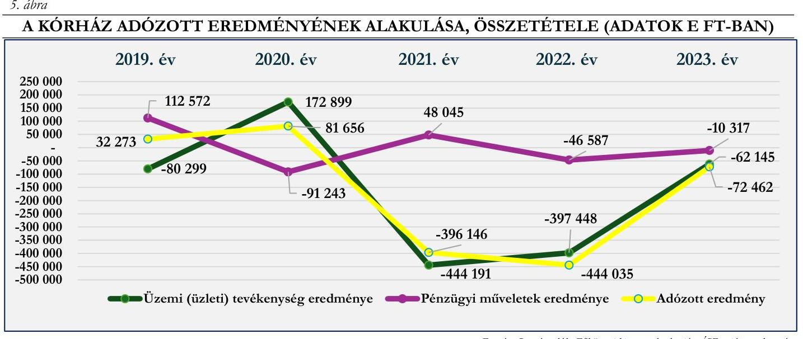

Forrás: Beszámolók, főkönyvi kivonatok alapján ÁSZ saját szerkesztés

# Bevételi struktúra 

Az 1. számú, Eredménykimutatás 2019-2023. évekre elnevezésű táblázat adatai alapján a vizsgált időszakban a Kórház bevételi struktúrájában a 2023. év kivételével jelentős változás nem következett be annak ellenére, hogy a bevételek főösszege 2019-ről 2023. évre 124,8 %-kal nőtt. A bevételi forrásokon belül az egyéb bevételek bírtak meghatározó jelentőséggel, arányuk 2019-2022. években 53,6 % és 66,3 % között mozgott, 2023. évben pedig 93,9 %-ra emelkedett. E jogcím bevételen belüli rendkívül magas arányának oka, hogy a Kórház tevékenységéhez kapcsolódó NEAK támogatás összegén kívül valamennyi támogatás, adomány, a fejlesztési és beruházási programok (pl.: gyermekpszichiátria fejlesztése), projektek megvalósításához kapott támogatások összege is e jogcím keretében került elszámolásra.

A Kórház bevételein belül az értékesítés nettó árbevételei 2019-2022. években 30,8 % és 42,4 % közötti arányt képviseltek, 2023. évben arányuk 5,7 %-ra csökkent. A 2019-2022. közötti magasabb bevételi arány oka, hogy a Kórház e jogcímcsoporton belül számolta el a rendkívül nagy értékű, de az egészségbiztosítás által nem, vagy csak részben finanszírozott, terápiás célokra felhasznált gyógyszerek megfizetett ellenértékét, azonban ilyen bevétele az intézménynek 2023. évben nem volt. Az ellenérték fejében végzett tevékenységek/szolgáltatások jogcímcsoporton belül elszámolt bevételei (értékesítés nettó árbevétele) a főkönyvi kivonat alapján elenyésző nagyságrendet képviseltek, azonban 2019. évhez képest összegük 169,6 %-os növekedéssel 647741 E Ft-ra emelkedett.

Az aktivált saját teljesítmények értéke mind az öt évben elhanyagolható arányt és összeget képviselt.
A pénzügyi műveletek bevételei az elemzett időszakban átlagosan 2,1 %-át tették ki a bevételi főösszegnek, a bevétel összege 2021. évtől csökkenő tendenciát mutatott.

A Kórház folyamatos működését, az egészségügyi közfeladatok ellátását az elemzéssel érintett időszakban a folyamatosan növekvő egyéb bevételek biztosították, 2023-ban e jogcímcsoportban 218,4 %-kal több

---

bevételt realizáltak a 2019. évinél, így azok 2023-ban már a bevételi főösszeg 93,9 %-át tették ki. A Kórház működését megalapozó egyéb bevételek jogcímcsoport többféle bevételi forrás elszámolására szolgált, ilyen a gyógyító, megelőző ellátások NEAK finanszírozása; a központi költségvetési támogatások összege; az egyházi (fenntartói) támogatás; az egyéb támogatások és adományok; valamint a térítés nélkül átvett, és többletként fellelt készletek értékét és a halasztott bevételként elszámolt fejlesztési célú támogatások feloldását tartalmazó egyéb bevételek. A jogcímcsoport bevételeinek meghatározó részét a gyógyító, megelőző ellátások NEAK finanszírozása (1. táblázat - 3.a. pont) képezte, aránya az egyéb bevételeken belül 2019. évben 97,1 %, a 2023. évben 85,3 % volt, az összes bevételnek pedig 2019. évben a 64,4 %-át, a 2023. évben a 80,0 %-át tette ki. A gyógyító, megelőző ellátások NEAK finanszírozásának aránya összes bevételen belül 2023-ra 15,6 százalékponttal növekedett, ez összegszerűen 5796178 E Ft-os növekedést jelentett 2019-ről 2023. évre. Az egyéb bevételek kisebb jelentőségű, de kiemelt eleme a központi költségvetési támogatások NEAK finanszírozás nélküli összege, mely 2019. évben az egyéb bevételek jogcímcsoport 0,7 %-át, 2023-ban 12,6 %-t, 2019-ben az összes bevétel 0,5 %-át, 2023. évben pedig a 11,8 %-át tette ki (1. táblázat - 3.b. pont.). A Kórház pályázati és/vagy egyedi döntés alapján - egyházi fenntartású egészségügyi intézményként - a közfeladat ellátását segítő, jelentős központi költségvetési támogatásban részesült az elemzéssel érintett időszakban. A 2019. évi 24897 E Ft-tal szemben 2023. évben 1330729 E Ft volt központi költségvetési támogatások NEAK finanszírozás nélküli összege, mely az adatok alapján 2020-ról 2021-re, valamint 2022-ről 2023-ra ugrásszerűen megemelkedett. E források a NEAK finanszírozást kiegészítve szolgálták az egészségügyi közfeladatellátást, a működési kiadások finanszírozásában játszott - likviditást segítő - szerepük mellett fejlesztési lehetőséget is biztosítottak a Kórház számára. Egyedi döntés alapján a Kórház az energiaválság miatt megnövekedett áram és gáz többletkiadások finanszírozásához jelentős központi költségvetési támogatásban részesült, mely 2022. évben 37173 E Ft, 2023. évben pedig 344577 E Ft volt, továbbá a 2022. december 31-ig lejárt tartozásállomány utólagos kiegyenlítéséhez 246244 E Ft, továbbá 444508 E Ft adósságcsökkentési célú működési támogatásban is részesült 2023. évben. 2021. és 2022. években pedig utófinanszírozás keretében biztosított a központi költségvetés forrásokat a járványügyi veszélyhelyzetből fakadó többletköltségek finanszírozásához. E források hozzájárultak a Kórház fizetőképességének fenntartásához, likviditási helyzetének javításához. A Kórház az elemzett évek mindegyikében részesült egyházi (fenntartói) támogatásban (2. táblázat - 3.c. pont), amely 2021-ben volt a legmagasabb, de az összeg így is csak az 1,4 %-át tette ki az egyéb bevételeknek, és 0,9 %-át pedig az összes bevételnek. Az egyéb bevételek jogcímcsoporton belül elszámolt, az 1. táblázat 3.d. pontja szerinti egyéb bevételek és 3.e. pontja szerinti egyéb támogatások a Kórház pénzügyi helyzetét érdemben nem befolyásolták. Arányuk sem az egyéb bevételek jogcímcsoporton, sem pedig az összes bevételen belül nem volt jelentős, az egyéb bevételek átlagosan a jogcímcsoport bevételi összegének 0,8 %-át, az egyéb támogatások pedig a 0,3 %-át tették ki az elemzéssel érintett években. A térítés nélkül átvett, és többletként fellelt készletek értékét, és a halasztott bevételként elszámolt fejlesztési célú támogatások feloldását tartalmazó egyéb bevételek 2023. évi összege 1063908 E Ft, a szervezetek és magánszemélyek
 által nyújtott támogatások összege pedig 45 229 E Ft volt 2023-ban. A bevételi források 2019. évről 2023. évre történő változását a 6. ábra mutatja be.

---

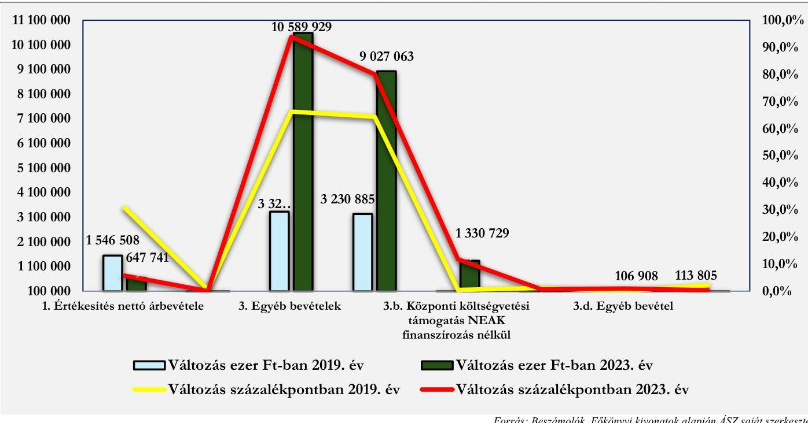

A bevételek elemzéséhez tartozó fajlagos mutató az egy ellátott esetszámra (aktív és krónikus egyben) jutó összes bevétel alakulása. Ez 2019-ben 685,1 E Ft volt, ami 2023-ra 1470,6 E Ft-ra nőtt. E fajlagos mutató értéke mind az öt vizsgált évben lényegesen magasabb az öt elemzett kórház fajlagos értékeihez viszonyítva. 2023-ban 52,0 %-kal tért el az öt kórház átlagától, a mutató átlagosan 2019-2023. évek között 1294,4 E Ft volt, 2020-ban a járvány kirobbanásakor érte el csúcspontját, 1548,8 E Ft értéket.

# NEAK finanszírozás összetételének elemzése 

A Kórház bevételeinek meghatározó részét kitevő NEAK finanszírozás összetételét, finanszírozási jogcímek szerinti alakulását a 2. táblázat tartalmazza.
2. táblázat

| A NEAK FINANSZÍROZÁS ÖSSZETÉTELE (ADATOK E FT-BAN) |  |  |  |  |  |  |  |  |  |  |
| :--: | :--: | :--: | :--: | :--: | :--: | :--: | :--: | :--: | :--: | :--: |
| MEGNEVEZÉS | 2019. ÉV | $\begin{gathered} \text { MEG- } \\ \text { OSZLÁS } \\ 2019 . \text { ÉV } \end{gathered}$ | 2020. ÉV | $\begin{gathered} \text { MEG- } \\ \text { OSZLÁS } \\ 2020 . \text { ÉV } \end{gathered}$ | 2021. ÉV | $\begin{gathered} \text { MEG- } \\ \text { OSZLÁS } \\ 2021 . \text { ÉV } \end{gathered}$ | 2022. ÉV | $\begin{gathered} \text { MEG- } \\ \text { OSZLÁS } \\ 2022 . \text { ÉV } \end{gathered}$ | 2023. ÉV | $\begin{gathered} \text { MEG- } \\ \text { OSZLÁS } \\ 2023 . \text { ÉV } \end{gathered}$ |
| Aktív fekvőbetegszakellátás | 1861147 | $57,6 \%$ | 2047568 | $42,6 \%$ | 1845296 | $31,6 \%$ | 1833738 | $26,5 \%$ | 1927009 | $21,3 \%$ |
| Krónikus fekvőbetegszakellátás | 226953 | $7,0 \%$ | 295331 | $6,1 \%$ | 300229 | $5,1 \%$ | 300229 | $4,3 \%$ | 531369 | $5,9 \%$ |
| Laboratóriumi ellátás | 13153 | $0,4 \%$ | 12815 | $0,3 \%$ | 12961 | $0,2 \%$ | 12800 | $0,2 \%$ | 13496 | $0,1 \%$ |
| Járóbeteg szakellátás | 361282 | $11,2 \%$ | 359779 | $7,5 \%$ | 357144 | $6,1 \%$ | 356634 | $5,1 \%$ | 420077 | $4,7 \%$ |
| Extrafinanszírozás | 8601 | $0,3 \%$ | 0 | $0,0 \%$ | 0 | $0,0 \%$ | 0 | $0,0 \%$ | 0 | $0,0 \%$ |
| Spec.fin. | 2511 | $0,1 \%$ | 6458 | $0,1 \%$ | 21381 | $0,4 \%$ | 15471 | $0,2 \%$ | 12585 | $0,1 \%$ |
| Nagyértékű gyógyszerfin. | 454794 | $14,1 \%$ | 1229482 | $25,6 \%$ | 1176109 | $20,1 \%$ | 1145893 | $16,5 \%$ | 1711515 | $19,0 \%$ |
| Célelőirányzatok | 302446 | $9,4 \%$ | 859123 | $17,9 \%$ | 2127580 | $36,4 \%$ | 3260273 | $47,1 \%$ | 4411013 | $48,9 \%$ |
| NEAK finanszírozás összesen | 3230885 | $100,0 \%$ | 4810557 | $100,0 \%$ | 5840699 | $100,0 \%$ | 6925037 | $100,0 \%$ | 9027063 | $100,0 \%$ |

Forrás: NEAK adatházis alapján ÁSZ saját szerkesztés (adatok E Ft-ban)

---

Az adatok alapján látható, hogy a NEAK finanszírozás összegszerű növekedése mellett a Kórház finanszírozási szerkezetében a vizsgált éveket egymáshoz viszonyítva jelentős átrendeződés volt tapasztalható. A szakellátásokhoz (aktív- és krónikus fekvőbeteg-, járóbeteg-szakellátás) kapcsolódó finanszírozások tették ki 2019-2020. években a folyósított összeg meghatározó részét, azonban NEAK bevételeken belüli arányuk a finanszírozási összegek abszolút értékének stagnálása miatt (melynek oka a pandémia következtében bevezetett átlagfinanszírozás) 2020-tól folyamatosan csökkent, a 2019. évi 75,8%-kal szemben 2023. évben 31,9 %-ot tett ki. Ezzel szemben a célelőirányzatok (egészségügyi dolgozók 2018-2024. évi béremelésének fedezete, a fix összegű bérkiegészítés, a pénzellátást helyettesítő jövedelemkiegészítés, a fiatal szakorvosok támogatása, működési támogatás) NEAK finanszírozáson belüli aránya ellenkező tendenciát mutatott, összegük évről évre növekedett, ez által finanszírozásban betöltött szerepük 2023-ra jelentőssé vált, NEAK bevételeken belüli arányuk 2019. évi 9,4 %-ról 2023. évre +39,4 %-ra emelkedett. A nagyértékű gyógyszerek finanszírozási összegének aránya 2019-ről 2020. évre jelentős mértékben, 11,5 %-kal emelkedett, majd 2021-től a terápiás igények alakulásától függően hullámzó, de csökkenő tendenciát mutatott, NEAK finanszírozáson belüli aránya a 2019. évi 14,1 %-kal szemben 2023. évben 19,0 % volt.

A 2019-2023. években a finanszírozási szerkezet alakulását a bérekhez kapcsolódó támogatások egyre növekvő szerepe mellett a finanszírozás módja, és annak változása, valamint a gyógyszertámogatás esetében az SMA kezelés társadalombiztosítási finanszírozásának bevezetése is befolyásolta. A COVID-19 járvány miatti egészségügyi veszélyhelyzetre tekintettel az intézmények pénzügyi stabilitásának biztosítása érdekében a teljesítményfinanszírozás helyett átlagfinanszírozás ${ }^{5}$ került bevezetésre a járó- és fekvőbetegszakellátás ellátásaira. Az átlagfinanszírozás a 2023. január havi teljesítmények elszámolásáig volt érvényben, a 2023. február havi teljesítmények elszámolásától (2023. április havi kifizetés) kezdődően megszűnt, visszaállt a jogszabályi előírásoknak megfelelő teljesítmény alapján történő finanszírozás. Előzőek alapján a Kórház 2021-2022. években átlagfinanszírozásban részesült, míg 2023. évben az a január-március havi átlagfinanszírozást követően 2023. áprilistól visszaállt a teljesítményfinanszírozás. A Kórház teljesítménymutatói a járvány elmúltával elkezdtek javulni. A finanszírozás tekintetében a betegforgalmi adatok kedvező alakulását azonban negatívan befolyásolta, hogy a teljesítményfinanszírozás alapját jelentő súlyszámok/szorzók/pontértékek karbantartása/felülvizsgálata nem történt meg, így az ellátások alulfinanszírozottak maradtak. Mindezek hiányában a központi költségvetés a megnövekedett szakmai és működtetési kiadások ellensúlyozása, a közfeladatellátás biztosítása érdekében célhoz kötött költségvetési támogatások (villamos- és földgázenergia beszerzés támogatása, adósságcsökkentési célú működési támogatások, járványügyi helyzetből adódó többletköltségek utólagos kompenzációja) folyósításával támogatta a kórházak pénzügyi helyzetének stabilizálását, fizetőképességének fenntartását.

A NEAK finanszírozás és a Kórház kiadásai adatainak összehasonlítása alapján megállapítható, hogy a gyógyító, megelőző ellátások NEAK finanszírozása 2019-2023. években nem fedezte a Kórház tevékenységével kapcsolatban felmerült kiadásokat. A 2019. évben elszámolt összes kiadás 64,8 %-át fedezte a NEAK finanszírozás, míg a célhoz kötött támogatásoknak köszönhetően ez az arány 2023. évben 79,5 % volt. A kiadások és a NEAK finanszírozás alakulását a 2019-2023. években a 3. táblázat foglalja össze.

[^0]
[^0]:    ${ }^{5}$ Az átlagfinanszírozás a megelőző időszak teljesítménye alapján került meghatározásra

---

| A KIADÁSOK ÉS A NEAK FINANSZÍROZÁS ALAKULÁSA (ADATOK E FT-BAN) |  |  |  |  |  |
| :--: | :--: | :--: | :--: | :--: | :--: |
| MEGNEVEZÉS | 2019. ÉV | 2020. ÉV | 2021. ÉV | 2022. ÉV | 2023. ÉV |
| NEAK finanszírozás összesen | 3230885 | 4810557 | 5840699 | 6925037 | 9027063 |
| 1. Anyagjellegű ráfordítások | 2115857 | 5160637 | 5227487 | 5742656 | 3832349 |
| 2. Személyi jellegű ráfordítások | 2577663 | 3241467 | 4861619 | 5887505 | 6969390 |
| 3. Értékcsökkenési leírások (5.) | 172324 | 221173 | 207903 | 203150 | 205677 |
| 4. Egyéb ráfordítások (8.) | 117999 | 162771 | 214398 | 223913 | 295686 |
| 5. Pénzügyi műveletek ráfordítása (8.) | 1233 | 458699 | 168588 | 238760 | 46372 |
| Kiadás összesen | 4985076 | 9244748 | 10679996 | 12295985 | 11349473 |
| Összes kiadás finanszírozottsági aránya | $64,8 \%$ | $52,0 \%$ | $54,7 \%$ | $56,3 \%$ | 79,5% |
| Anyagjellegű és személyi jellegű ráfordítások finanszírozottsági aránya | $68,8 \%$ | $57,3 \%$ | $57,9 \%$ | $59,5 \%$ | $83,6 \%$ |
| Anyagjellegű és személyi jellegű ráfordítások aránya az összes kiadáshoz mérten | $94,2 \%$ | $90,9 \%$ | $94,5 \%$ | $94,6 \%$ | $95,2 \%$ |

Forrás: Beszámolók, Főkönyvi kivonatok, NEAK adatbázis alapján ÁSZ saját szerkesztés

Az adatok szemléletesen mutatják az egészségügyi ellátás finanszírozási problémáját, látható, hogy az elemzéssel érintett öt évben a NEAK finanszírozás összege jelentős mértékben növekedett ugyan, de nem nyújtott fedezetet a Kórház kiadásainak meghatározó részét kitevő anyag és személyi jellegű ráfordítások együttes összegére sem. A pénzügyi helyzet könnyítése érdekében a központi költségvetés a veszélyhelyzet és az energiaválság miatt jelentős mértékben megnövekedett energiaköltségek kompenzálására, továbbá az adósságállomány csökkentéséhez a NEAK finanszírozáson felül - az egyéb bevételeknél már ismertetettek szerint - egyedi döntés alapján támogatást nyújtott a kórház számára 2022-2023. évben, 2021. és 2022. évben pedig a járványügyi veszélyhelyzetből adódó többletköltségek utólagos kompenzációja címén folyósított a pénzügyi helyzetet javító támogatást.

# Kiadási struktúra elemzése 

Az 1. számú, Eredménykimutatás elnevezésű táblázat adatai alapján jól látható, hogy a Kórház kiadásai 2019-ről 2020. évre ugrásszerűen megnövekedtek, 2021-2022. években folyamatosan növekedtek, míg 2022. évről 2023. évre csökkenés volt tapasztalható. A Kórház kiadási struktúrájában meghatározó arányt képviseltek az anyagi jellegű ráfordítások, ezen belül a gyógyszerek költsége, valamint a személyi jellegű ráfordítások.

Az anyagi jellegű ráfordítások az összes kiadás 42,4 %-át tették ki 2019-ben, 2023. évre arányuk a kiadásokon belül 33,8 %-ra csökkent. A személyi jellegű ráfordítások aránya az összes kiadások belül a 2019. évi 51,7 %-ról 2023. évre 61,4 %-ra emelkedett. Az egyéb ráfordítások (1,8 % és 2,6 % között) és a pénzügyi műveletek ráfordításai (0,4 % és 5,0 % között) arányukat tekintve szinte elhanyagolható nagyságrendet képviseltek a Kórház kiadási szerkezetében. Az értékcsökkenési leírás súlya az összes kiadáson belül elenyésző volt, aránya a 2019. évi 3,5 %-ról 2023. évre 1,8 %-ra csökkent, amelynek oka, hogy az összes kiadás mértéke évről évre emelkedett, 2019-ről 2023-ra 127,7 %-kal, míg az értékcsökkenés 2019-ről 2023-ra csak 19,4 %-kal nőtt.

Az összes kiadáson belül az egyéb ráfordítások aránya a 2019. évi 2,4 %-kal szemben 2023. évben 2,6% volt. A pénzügyi műveletek ráfordításai a Kórház összes kiadásán belül elhanyagolható nagyságrendet képviseltek 2019-2023. években (0,4 %-5,0 % között változott). A jogcímcsoporton belül kiadásként a főkönyvi kivonat tanúsága szerint a Kórház a devizás pénzforgalommal kapcsolatos árfolyamveszteséget számolta el.

---

Az anyagjellegű ráfordítások (ötéves átlagarány 45,5 %) a 2019. évi 42,4 %-os, és a 2023. évi 33,8 %-os arányukkal az összes kiadáshoz viszonyítva a személyi jellegű ráfordításokat követően (ötéves átlagarány 48,3 %) a Kórház második legnagyobb kiadási jogcímcsoportját tették ki az elemzéssel érintett időszakban. Az e jogcímcsoporton belüli meghatározó jelentőségű
 kiadások alakulását a 7. ábra mutatja be.
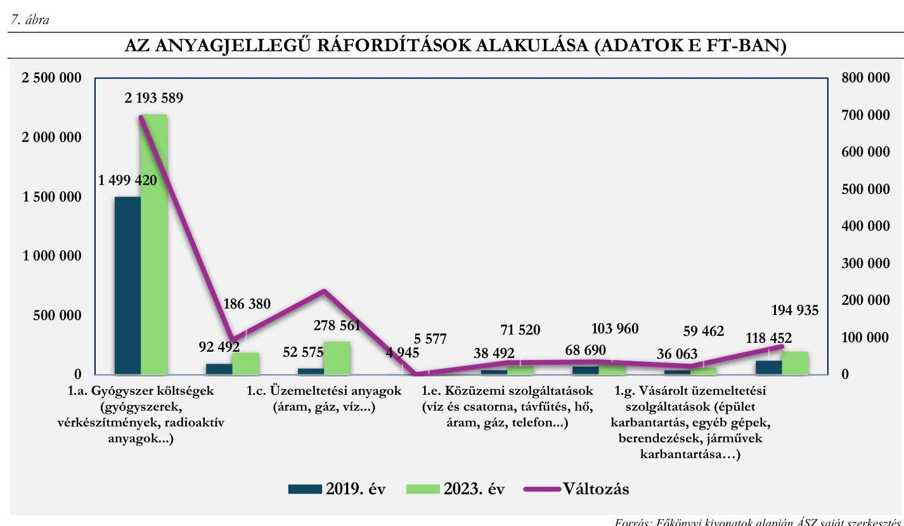

Korrás: Forráskivonatok alapján ÁSZ saját szerkesztés
Az adatok szemléletesen mutatják, hogy 2019-ről a 2023. évre a Kórház anyagi jellegű ráfordításain belül a meghatározó jelentőségű kiadások mindegyike tekintetében költségnövekedés következett be. Az egészségügyi tevékenységhez kapcsolódó gyógyszerek és szakmai anyagok beszerzésére fordított összegek együttes, 49,5%-os növekedésében az infláció mellett szerepet játszott a gyógyító, megelőző ellátások szakmai igényeinek változása, új eljárások, gyógyszerek, kezelések alkalmazása is. Az 1. táblázat adataiból látható, hogy a Kórház esetében a gyógyszerköltségek 2020. és 2021. évben kiugróan magasak voltak (SMA kezelés bevezetése ${ }^{6}$ ), ami az összegek nagysága miatt alapvetően befolyásolta a Kórház kiadási szerkezetének alakulását. A 2022. és 2023. években a gyógyszerköltségek mérséklődtek. A 7. ábra adatai alapján megállapítható, hogy az anyagjellegű ráfordításokon belül közüzemi szolgáltatások („c. Üzemeltetési anyagok" és „e. Közüzemi szolgáltatások") esetében következett be a legmagasabb költségnövekedés. A közüzemi díjak és szolgáltatások a 284,4%-os növekedéssel a 2019. évi 91 067 E Ft-ról 2023. évre 350 081 E Ft-ra nőttek. A majdnem négyszeres költségnövekedésben szerepet játszott a magas inflációs környezet (2023. év januárban 25,7%, júliusban 17,6%, decemberben 5,5%) mellett az orosz-ukrán háború kirobbanása miatt kialakult világméretű energiaválság is.

A Kórház kiadási szerkezetében meghatározó aránya a személyi jellegű ráfordításoknak volt az összes kiadáson belüli 2019. évi 51,7%-os, és a 2023. évi 61,4%-os aránnyal. A személyi jellegű kiadások növekedése az elemzéssel érintett éveben jelentős nagyságrendet képviselt, e kiadások a Kórház esetében, 2019-ről 2023. évre a 4 091 727 E Ft növekedéssel a 2019. évi 2 877 663 E Ft-os összeg közel 2,4 szeresére emelkedtek. A

[^0]
[^0]:    ${ }^{6}$ Az SMA kezelés gyógyszerköltségének ellenértéke részben megtérítésre került a Kórház részére, tehát jelentős veszteséget nem generált.

---

kiadások alakulásában az egészségügyi dolgozók bérrendezésén kívül szerepet játszott, hogy a Kórház 2019-2023. között a szakképzési programokban is részt vett.

Az adatok alapján rendszeres személyi juttatásokon belül az alapilletmények és illetménykiegészítések, valamint a pótlékok közel azonos mértékben növekedtek. A személyi jellegű egyéb kifizetéseken belül az elemzés a jogszabályból eredő jutalmak, megbízási díjak, study, kutatási és egyéb megbízási díjak alakulásának értékelésére terjedt ki. Az egészségügyi szolgálati jogviszonyról szóló 2020. évi C. törvény hatályba lépését követően az egészségügyi szolgálati jogviszonyban álló személyek egészségügyi szolgálati jogviszonyuk alapján - a jubileumi jutalom helyett - a jogszabályban meghatározottak szerint szolgálati elismerésre váltak jogosulttá.

A Kórház a 2019-2021. években a dolgozók számára jubileumi, illetve a 2021-2023. években egyéb jogszabályból - a 664/2021. (XII. 1.) Korm. rendelet ${ }^{27}$ - eredő jutalmat fizetett ki, átlagosan évenként az összes kiadásának 0,57%-át fordította jubileumi jutalomra és egyéb jogszabályból eredő jutalom kifizetésére, a 2020. évben az átlagos aránytól kevesebb (21 435 E Ft), míg a 2021. évben az átlagos aránytól nagyobb (106 332 E Ft) összeg került kifizetésre e jogcímen, a kifizetett összeg nagyságát e kiadási jogcím esetében a foglalkoztatottak - jogszabályban meghatározottak alapján számított - szolgálati jogviszonyának időtartama befolyásolta.

A 2019. évben pótlékokra a Kórház 119 798 E Ft-ot, míg az elemzéssel érintett időszak utolsó, 2023. évében 185 920 E Ft-ot fizetett ki. A 2019. évben kifizetett pótlékok az összes kiadás 2,4%-át tették ki - az elemzett időszakban ez volt a legmagasabb arányszám -, majd 2023-ra ez az arány 1,6%-ra csökkent. A 2021-2023. években a pótlékokra kifizetett összeg aránya az összes kiadáshoz képest az 1,5%-1,7%-os szinten stabilizálódott.

Study, kutatási és egyéb megbízási díj kifizetés a 2019-2023. időszak minden évében történt. Az egyéb bérjellegű kifizetések aránya az összes kiadáson belül a 2019. évi 0,96%-ról 2023. évben 0,03%-ra csökkent. A kifizetések összetétele változó volt, az elemzéssel érintett első három évben (2019-2021. évek) a Kórház az egyéb bérjellegű kifizetések keretében csak megbízási díjakat fizetett ki, majd a 2022. évben kutatás jogcímen történt a kifizetés. A 2023. évben egyéb bérjellegű kifizetések keretében 180,0 E Ft értékben megbízási díj, illetve 2842 E Ft értékben kutatás jogcímen realizálódott kifizetés.

# 2. Pénzügyi helyzet és a kötelezettségállomány elemzése 

### 2.1. Pénzügyi helyzet, mérlegadatok elemzése

4. táblázat

A KÓRHÁZ 2019 - 2023. ÉVI MÉRLEGADATAINAK ALAKULÁSA (ADATOK E FT-BAN)

| MEGNEVEZÉS | 2019. év | 2020. év | 2021. év | 2022. év | 2023. év | ADATOK A   2019. ÉV %-ARÁNYÁBAN |
| :--: | :--: | :--: | :--: | :--: | :--: | :--: |
| A. Befektetett eszközök | 4 930 023 | 2 548 768 | 1 869 002 | 1 882 402 | 1 985 833 | 40,3% |
| I. Immateriális javak | 52 535 | 35 987 | 52 603 | 8 051 | 4 022 | 7,7% |
| II. Tárgyi eszközök | 1 694 923 | 1 912 530 | 1 815 808 | 1 874 351 | 1 981 811 | 116,9% |
| III. Befektetett pénzügyi eszközök | 3 182 565 | 600 252 | 592 | 0 | 0 | 0,0% |
| B. Forgóeszközök | 3 413 084 | 6 802 457 | 8 177 339 | 1 235 688 | 959 675 | 28,1% |
| I. Készletek | 36 672 | 115 236 | 122 232 | 127 748 | 113 547 | 309,6% |
| II. Követelések | 483 435 | 4 602 393 | 2 062 086 | 541 608 | 798 580 | 165,2% |
| III. Értékpapírok | 0 | 0 | 0 | 0 | 0 | 0,0% |
| IV. Pénzeszközök | 2 892 977 | 2 084 829 | 5 993 021 | 566 331 | 47 548 | 1,6% |
| C. Aktív időbeli elhatárolások | 15 601 | 29 170 | 2 389 965 | 5 569 659 | 5 962 304 | 3821,6% |
| Eszközök összesen | 8 499 122 | 9 380 396 | 12 436 306 | 8 687 749 | 8 907 811 | 104,8% |

---

| MEGNEVEZÉS | 2019. év | 2020. év | 2021. év | 2022. év | 2023. év | ADATOK A   2019. ÉV %-ÁBAN |
| :--: | :--: | :--: | :--: | :--: | :--: | :--: |
| D. Saját tőke | 877 887 | 959 543 | 563 397 | 119 606 | 47 144 | 5,4% |
| I. Jegyzett tőke | 56 066 | 56 066 | 56 066 | 56 066 | 56 066 | 100,0% |
| II. Jegyzett, de még be nem fizetett tőke (-) | 0 | 0 | 0 | 0 | 0 | 0,0% |
| III. Tőketartalék | 0 | 0 | 0 | 0 | 0 | 0,0% |
| IV. Eredménytartalék | 789 547 | 821 821 | 403 477 | 50 754 | 63 540 | 8,0% |
| V. Lekötött tartalék | 0 | 0 | 0 | 0 | 0 | 0,0% |
| VI. Értékelési tartalék | 0 | 0 | 0 | 0 | 0 | 0,0% |
| VII. Adózott eredmény | 32 273 | 81 656 | -396 146 | -444 035 | -72 462 | -224,5% |
| 1. Alaptevékenység eredménye | - | - | - | - | - | - |
| 2. Vállalkozási tevékenység eredménye | - | - | - | - | - | - |
| E. Céltartalékok | 1 920 | 960 | 960 | 0 | 0 | 0,0% |
| F. Kötelezettségek | 358 265 | 1 080 728 | 2 223 326 | 2 724 191 | 1 151 169 | 321,3% |
| I. Hátrasorolt kötelezettségek | 0 | 0 | 0 | 0 | 0 | 0,0% |
| II. Hosszú lejáratú kötelezettségek | 0 | 0 | 0 | 0 | 0 | 0,0% |
| III. Rövid lejáratú kötelezettségek | 358 265 | 1 080 728 | 2 223 326 | 2 724 191 | 1 151 169 | 321,3% |
| G. Passzív időbeli elhatárolások | 7 261 050 | 7 339 164 | 9 648 623 | 5 843 952 | 7 709 499 | 106,2% |
| Források összesen | 8 499 122 | 9 380 396 | 12 436 306 | 8 687 749 | 8 907 811 | 104,8% |

A Kórház mérlegfőösszege a 2019. évi 8 499 122 E Ft-ról 2023. évben 8 907 811 E Ft-ra emelkedett. Az elemzéssel érintett időszakban a vagyonnövekedés minimális, 4,8%-os növekedés volt, emellett azonban elmondható, hogy 2019-2021 években a mérlegfőösszeg dinamikusan emelkedett, 2022. évben radikálisan csökkent, 2023. évben mérsékelt növekedést mutatott.

A mérleg eszközoldalának szerkezeti összetétele szinte minden évben változott, a befektetett pénzügyi eszközök 2019-2020 években, a követelések 2020-2021. években, a pénzeszközök 2021. évben, az aktív időbeli elhatárolások pedig 2022-2023. években gyakoroltak jelentős hatást a mérleg eszközoldalának szerkezeti összetételére, mely 2023. évre stabilizálódott. 2019-ben a mérleg eszközoldalán a befektetett eszközök aránya volt meghatározó (a jelentős befektetett pénzügyi eszköz miatt), 58,0%, a forgóeszközök 40,1%-os arányt képviseltek, az aktív időbeli elhatárolások 1,9%-os aránya pedig szinte elhanyagolható volt. 2023. évre a mérleg eszközoldalának szerkezeti összetétele jelentősen átalakult. A befektetett eszközök aránya 22,3%-ra, a forgóeszközöké pedig 10,8%-ra csökkent, az aktív időbeli elhatárolások súlya jelentősen megnőtt, arányuk 66,9% lett. A befektetett eszközök 2023. évi 1 985 833 E Ft-os értékének meghatározó részét a tárgyi eszközök tették ki, az immateriális javak értéke mindössze 4 022 E Ft volt, befektetett pénzügyi eszközzel a Kórház 2023. évben nem rendelkezett. A forgóeszközök 959 675 E Ft-os összegén belül meghatározó jelentőségű volt a követelések 798 580 E Ft-os értéke, melynek 94,9%-át az egyéb követelések, 5,1%-át pedig az áruszállításból és szolgáltatásból (vevők) származó követelések tették ki. A Kórház pénzeszközeinek mérleg szerinti értéke 2023. év végén 47 548 E Ft volt, mely mindössze 1,6%-át tette ki a 2019. évi pénzeszköz értékének (2 892 977 E Ft). A mérleg eszköz oldalán az aktív időbeli elhatárolások aránya megnőtt, 2023. évben összegük 5 962 304 E Ft volt a 2019. évi 15 601 E Ft-tal szemben.

A mérleg forrásoldalán a saját tőke összege 2019-ről 2023-ra jelentős mértékben csökkent (877 887 E Ft-ról 47 144 E Ft-ra). A saját tőkén belül a jegyzett tőke értéke nem változott (56 066 E Ft), tőketartalékkal a Kórház nem rendelkezett, az eredménytartalék (veszteségek miatt) 2023. évre 63 540 E Ft-ra

---

csökkent, a 2023. évi adózott eredmény (veszteség) összege pedig -72 462 E Ft volt. 2023. évben a Kórház céltartalékkal nem rendelkezett (a 2019. évi 1 920 E Ft-os céltartalék felhasználása 2022. év végére megtörtént). A mérleg forrásoldalán kimutatott kötelezettségek 2023. évi 1 151 169 E Ft-os összege csak rövid lejáratú kötelezettséget tartalmazott (az összeg több mint háromszorosa a 2019. évi 358 265 E Ft-os kötelezettségnek). A Kórháznak az elemzett időszakban hátrasorolt és hosszú lejáratú kötelezettsége nem volt. A rövid lejáratú kötelezettségek kimutatását a 5. táblázat tartalmazza.
5. táblázat

# A RÖVID LEJÁRATÚ KÖTELEZETTSÉGEK KIMUTATÁSA (ADATOK E FT-BAN) 

| MEGNEVEZÉS | 2019. ÉV
 |  | 2020. EV |  | 2021. EV |  | 2022. EV |  | 2023. EV |  |
| :--: | :--: | :--: | :--: | :--: | :--: | :--: | :--: | :--: | :--: | :--: |
|  | Össze-   SEN | EHNŐL   LEJÁRT   KÖTELE-   ZETTSÉG | Össze-   SEN | EHNŐL   LEJÁRT   KÖTELE-   ZETTSÉG | Össze-   SEN | EHNŐL   LEJÁRT   KÖTELE-   ZETTSÉG | Össze-   SEN | EHNŐL   LEJÁRT   KÖTELE-   ZETTSÉG | Összesen | EHNŐL   LEJÁRT   KÖTELE-   ZETTSÉG |
| Kötelezettségek áruszállításból, szolgáltatásból | 13 | 108 | 23416 | 0 | 140410 | 0 | 334971 |  | 300839 |  |
| Egyéb rövid lejáratú kötelezettségek | 257452 | 0 | 1057312 | 0 | 1082916 | 0 | 2389220 |  | 850330 |  |
| Rövid lejáratú kötelezettségek összesen | 267465 | 108 | 1080728 | 0 | 1223326 | 0 | 2724191 | 246244 | 1151169 | 184990 |
| Lejárt kötelezettségek aránya a rövid lejáratú kötelezettségeken belül összesen | 0 |  | 0 |  | 0 |  | 0,4% |  | 1,1% |  |

A táblázat adatai alapján megállapítható, hogy amíg a Kórház rövid lejáratú kötelezettségeinek összege 2019. évről 2023. évre 792904 E Ft-tal (221,3%) nőtt, a rövid lejáratú kötelezettségeken belül a lejárt határidejű tartozások összege 35782 E Ft-ról 184990 E Ft-ra emelkedett (149 208 E Ft-os, 417,0%-os növekedés).

A Kórház mérlegének forrás oldalán a passzív időbeli elhatárolások bírtak meghatározó jelentőséggel, összegük és forrásokon belüli arányuk jelentős mértékben nem változott az elemzéssel érintett időszakban. A passzív időbeli elhatárolások 2023. évi összege 7709499 E Ft volt, mely a mérlegfőösszeg 86,5%-át tette ki (2019. évben a passzív elhatárolások összege 7261050 E Ft, aránya pedig 84,4% volt. A 2023. évi összeg költségek és ráfordítások passzív időbeli elhatárolása (5 871000 E Ft) mellett 1848499 E Ft halasztott bevételt tartalmazott.

### 2.2. A kórházi lejárt kötelezettségállomány változásának bemutatása

Az ÁSZ által egyidőben elemzett öt egyházi fenntartású kórházak adósságállomány összetételének, változásának és alakulásának bemutatása során a kórházi lejárt kötelezettségállomány ⁷ havi adatai kerültek felhasználásra. Az elemzett öt kórház adósságpozicionálása két dimenzió mentén történt:

- a lejárt kötelezettségállomány havi szintű relatív változásának átlaga, valamint
- az átlagos lejárt kötelezettségállomány átlagos havi kiadási főösszeghez (költségek és ráfordítások együttes összegének havi átlaga) viszonyított aránya.
Az elemzés adósságállománynak a lejárt kötelezettségállományt tekinti. A Kórház esetében az elemzett időszak (2019. január - 2024. június) tört éves adatokat is tartalmazott, a tört időszak (2024. január 2024. június) a teljes évek adataival való arányosítással váltak összemérhetővé. A relatív változások matematikai jellegű torzító és annak magyarázó tényezői külön bemutatásra kerültek.

[^0]
[^0]:    ⁷ NEAK adatközlés

---

Az első dimenzió meghatározásakor az öt kórház esetén kiszámításra került a lejárt kötelezettségállomány havi változása, majd a havi változások átlaga. Korrigáltuk az átlagot a kiugró havi változások kiszűrésével, majd az öt kórházra kiszámított korrigált átlagnak vettük az átlagát (dimenziós átlag). Ez alapján meghatározhatóvá vált, hogy az egyes kórházak az első dimenziós átlag alatt vagy felett pozicionálódtak.

A második dimenzió meghatározásakor minden évre vonatkozóan kiszámítottuk az éves kiadási főösszegből az átlagos havi kiadási főösszegeket (ezzel biztosítva az összemérhetőséget), tört év esetén arányosítást alkalmaztunk. Az átlagos havi lejárt kötelezettségállomány adatokat az átlagos havi kiadási főösszegekhez viszonyítottuk, ezáltal meghatározhatóvá váltak az éves második dimenziós értékek minden évre. Az öt kórház második dimenziós értékeit 2019-től 2023-ig évenként átlagoltuk, megkapva a második dimenziós átlagokat. Ez alapján meghatározhatóvá vált, hogy az egyes kórházak a második dimenziós átlag alatt vagy felett pozicionálódtak.

Az első, valamint a második dimenziós átlag alatti és feletti lehetséges kombinációból 2x2-es mátrixot készítettünk négy lehetséges kategóriát létrehozva (kiegyensúlyozott; mérsékelten dinamikus; agresszív dinamikus; statikus). Az egyes kórházak a számított dimenziós értékek alapján a 4 kategória valamelyikébe besorolhatóvá váltak. A kórházak adósságpozicionálását a 8. ábra mutatja be. A kategóriák által jellemzett adósságkezelési együttmozgás (volatilitás és viszonyított mérték) mellett az adósság trend változását (dinamikáját) is figyelembe kell venni, mely a dimenziós átlagok változását (pl. évről évre való százalékpontos növekedését) jelenti.
8. ábra

# A LEHETSÉGES KATEGÓRIÁK A DIMENZIÓK EGYÜTTES ÉRTÉKELÉSÉVEL (ADÓSSÁGKEZELÉSI EGYÜTTMOZGÁS) 

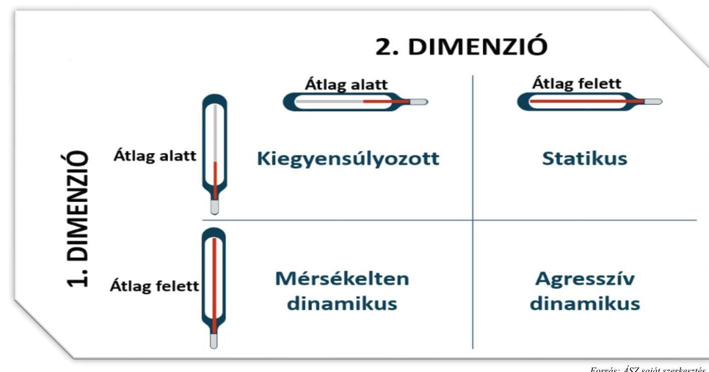

## Első dimenzió

A Kórház havi szintű lejárt kötelezettségállományának átlagos változása 2019. január és 2024. június közötti időszakban 28,9% volt. A lejárt kötelezettségállomány havi relatív változása -100,0% (teljes adósság konszolidáció) és 811,8% közötti értékeket vett fel, mely a havi szinten kiugróan magas relatív változásokkal

---

(811,8%) együtt a további négy vizsgált kórházból három kórház volatilitásához hasonlóan alakult. A négy kórház átlagos volatilitása körüli, de enyhén magasabb értéket a 2020. májusi 811,8%-os havi változás okozta, mely mögött jelentős állományi változás is állt, az összes lejárt kötelezettségállomány a 2020. áprilisi 92130 E Ft-ról 2020. májusára 840031 E Ft-ra emelkedett. A megemelkedett lejárt kötelezettségállomány 2020. júniusára 86,3%-kal csökkent, így egy havi kiugró értékként kezelhető a teljes vizsgált időszak tekintetében. A kiugró érték kiszűrése esetén a havi átlagos lejárt kötelezettségállomány változás 16,7% volt, mely a további négy vizsgált kórház közül három kórház korrigált átlagos volatilitása körüli értéknek felelt meg, immár nem a legmagasabb értéket mutatva a három kórházhoz képest.

A Kórház esetén a bázis (2019. 01. havi) lejárt kötelezettségállomány 20375 E Ft volt, mely a 2019. év végéig 35782 E Ft-ra (75,6%-kal) nőtt. A 2019. évben arányát tekintve júniusban (75,6%-kal), míg nominálisan áprilisban (20 189 E FT-tal) nőtt a legnagyobb mértékben a lejárt kötelezettségállomány. Mérsékelt (átlagosan 17,9%-os) konszolidáció október-december között történt.

A 2020. évben a 2019. évi értékhez képest (39,5%-kal) magasabb 28433 E FT bázis érték februárra 112,6%-kal, majd áprilisban további 66,8%-kal 92130 E Ft-ra nőtt. Az év első harmadában bekövetkezett állományi növekedést követően májusban kiugróan magas mértékű (840031 E Ft-ra) és arányú (811,8%-os) lejárt kötelezettség állomány emelkedés történt. A kiugróan magas lejárt kötelezettség állomány július hónapra 57932 E Ft-ra, a májusi állományi érték 6,9%-ára csökkent. Az augusztusi hónaptól novemberig ismételten emelkedni kezdett a lejárt kötelezettség állomány, mely a 2020. év végére teljes mértékben megszűnt, konszolidálásra került a nyilvántartások alapján.

A 2021. évben az év végi konszolidálásnak köszönhetően a bázis érték 0 E Ft volt. A lejárt kötelezettségállomány januártól szeptemberig ismételten, lineárisan emelkedni kezdett elérve szeptemberre a 252120 E Ft értéket. Érdemben (75,4%-kal) a 2021. évben is a decemberi hónapban csökkent a lejárt kötelezettségállomány, azonban az előző évekhez képest az év végi konszolidációt követően magasabb szinten (60023 E FT) realizálódott.

A 2022. évi bázis érték a konszolidációt követő, évről évre magasabb decemberi lejárt kötelezettségállomány 93,4%-os növekedésével kezdődött, 116060 E Ft értéken. A 2022. évben a 2021. évhez hasonlóan a lejárt kötelezettségállomány lineárisan emelkedett (januártól-novemberig 116060 E Ft-ról 396562 E Ft-ra), évről évre magasabb bázisról indulva, nominálisan magasabb állományi növekedést eredményezve. A lineáris állományi növekedést a 2022. márciusi (105,4%-os) változás, valamint az év végi - csökkenő intenzitású (37,9%-os) konszolidáció törte meg.

A 2023. évi bázis érték a 2022. év végi konszolidációt követően 22,5%-kal magasabb szinten 301716 E Ft-on alakult. A februártól novemberig tartó átlagosan vett 7,4%-os lejárt kötelezettségállomány emelkedést a decemberi 66,9%-os konszolidáció mérsékelte 184990 E Ft-ra.

A 2024. évben a trendszerűvé váló bázis érték emelkedéssel (35,9%) együtt az év első felében átlagosan 23,8%-os lejárt kötelezettségállomány növekedés történt (604668 E Ft-ra), mely az előző vizsgált évek nyilvántartási adataiból kiindulva tovább emelkedik a 2024. év második felében.

Az első dimenzió értékei alapján a Kórház lejárt kötelezettségállománya a teljes vizsgált időszakot figyelembe véve lineárisan növekszik a konszolidációs hatás ellenére.

---

# A KÓRHÁZ LEJÁRT KÖTELEZETTSÉGÁLLOMÁNYÁNAK ALAKULÁSA A VIZSGÁLT IDŐSZAKBAN 

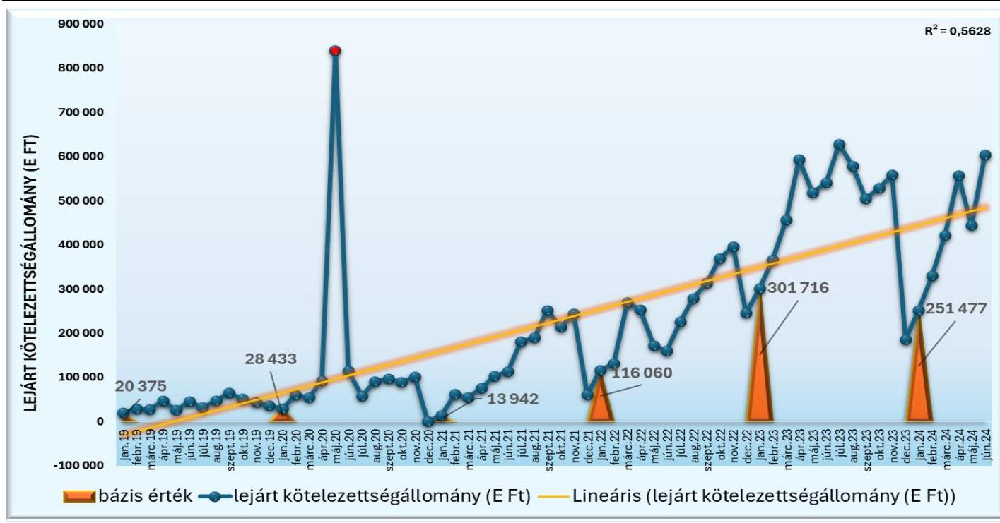

Forrás: Beszámolók, Főkönyvi kivonatok alapján ÁSZ saját szerkesztés

## Második dimenzió

A második dimenzió elemzéséhez az éves lejárt kötelezettségállomány havi átlaga került kiszámításra. A 2024. évi tört (fél éves) adatok esetén az első dimenzióban feltárt ciklikus változást, illetve hasonlóságot feltételezve becsült átlagos havi adatok kerültek kiszámításra, melyek külön értékelendők.

Az átlagos lejárt kötelezettségállomány a 2019. évben havi szinten 39218 E Ft, 2020. évben 135606 E Ft, a 2021. évben 130395 E Ft, a 2022. évben 244670 E Ft, a 2023. évben 479951 E Ft volt, mely más egyházi fenntartású kórházzal összehasonlítva magasnak számít, 2020-2022. években a legmagasabb átlag értékek jellemezték a kórházat a vizsgált négy kórházhoz képest. A 2024. tört év lineárisan növekvő, ciklikus mintázata alapján az átlagos lejárt kötelezettségállomány várhatóan tovább emelkedik, mely esetén átlagos decemberi konszolidációs arány várható.

A kórház éves kiadási főösszege mértékét tekintve a 2019. évről a 2020. évre jelentős mértékben 4985076 E Ft-ról 9244748 E Ft-ra (85,4%-kal) nőtt. Az éves kiadási főösszeg 2020-ról 2021-re 15,5%-kal, majd 2022-re további 15,1%-kal emelkedett. A 2020., a 2022. és 2023. évben nagyobb arányban emelkedett az átlagos lejárt kötelezettségállomány, mint az éves kiadási főösszeg. A 2023. évben az éves kiadási főösszeg csökkenése mellett közel duplájára nőtt az átlagos lejárt kötelezettségállomány.
6. táblázat

A KÓRHÁZ ÉVES KIADÁSI FŐÖSSZEG ÉS ÁTLAGOS LEJÁRT KÖTELEZETTSÉGÁLLOMÁNY VÁLTOZÁSOK ÖSSZEHASONLÍTÁSA

| IDŐSZAK | ÉVES KIADÁSI FŐÖSSZEG VÁLTOZÁSA | ÁTLAGOS LEJÁRT KÖTELEZETTSÉGÁLLOMÁNY VÁLTOZÁSA |
| :--: | :--: | :--: |
| 2020 | 85,4% | 245,8% |
| 2021 | 15,5% | -3,8% |
| 2022 | 15,1% | 87,6% |
| 2023 | -7,7% | 96,2% |

---

A Kórház második dimenziós pozíciójának meghatározásához a kiszámított átlagos lejárt kötelezettségállományt viszonyítottuk az átlagos havi kiadási főösszeghez, mely a 2019. évben 9,4%, a 2020. évben 17,6%, a 2021. évben 14,7%, a 2022. évben 23,9%, a 2023. évben 50,7% volt. Ez azt jelenti, hogy amíg a 2019. évben az átlagosan lejárt kötelezettségállomány nem érte el az átlagos havi kiadási főösszeg 10,0%-át, addig a 2023. évben az átlagosan lejárt kötelezettségállomány az átlagos havi kiadási főösszeg több, mint felét tette ki, ami az egyházi fenntartású korházak tekintetében magas arány, negatív jelenség. Az öt egyházi fenntartású kórház második dimenzióbeli aránya átlagosan a 2019. évben 22,1%, a 2020. évben 17,9%, a 2021. évben 19,9%, a 2022. évben 17,7%, a 2023.
 évben 55,1% volt, így a Kórházat a kiválasztott kórházakhoz képest a 2019. évben alacsonyabb, majd növekvő, a kórházi átlag értékhez felzárkózó második dimenzióbeli arány jellemezte.
7. táblázat

# A KÓRHÁZ 2. DIMENZIÓBELI ARÁNYAI AZ ELLENŐRZŐTT KÓRHÁZAKHOZ VISZONYÍTOTTAN 

| IDŐSZAK | 2. DIMENZIÓBELI ARÁNY | ELLENŐRZÖTT KÓRHÁZAK 2. DIMENZIÓBELI ARÁNYÁNAK ÁTLAGÁ ${ }^{8}$ |
| :--: | :--: | :--: |
| 2019 | $9,4 \%$ | $22,1 \%$ |
| 2020 | $17,6 \%$ | $17,9 \%$ |
| 2021 | $14,7 \%$ | $19,9 \%$ |
| 2022 | $23,9 \%$ | $17,7 \%$ |
| 2023 | $50,7 \%$ | $55,1 \%$ |

## Adósság-pozicionálás

A Kórházat a két adósságdimenzió együttes értékelése alapján 2019-2021 közötti időszakban, valamint a 2023. évben átlag alatti dimenziós értékek jellemezték, mely kiegyensúlyozott pozíciónak írható le. A kiegyensúlyozott pozíció a vizsgált kórházak átlagos havi volatilitásához képest alacsonyabb adósság volatilitásnak és annak kórházi átlagtól alacsonyabb átlagos havi kiadási főösszeghez viszonyított arányának volt köszönhető. A kezdeti kiegyensúlyozott pozíció a 2022. évben statikus pozícióra fordult, hiszen a kórházi átlag alatti átlagos havi lejárt kötelezettségállomány változás (első dimenzió) mellett kórházi átlag feletti átlagos havi kiadási főösszeghez viszonyított átlagos lejárt kötelezettségállomány (második dimenzió) jellemezte a kórházat. A kórházak összes lejárt kötelezettségállomány változásait torzító tényezők kiszűrését követően is az öt kórház átlagos értéke ( $21,3 \%$ ) alatt maradt a kórház lejárt kötelezettségállomány havi átlagos változása, azonban a kiadási főösszeghez viszonyított aránya a lineárisan emelkedő lejárt kötelezettségállomány és ezzel lépést tartani nem tudó év végi konszolidációs hatás miatt megközelítette, majd 2022-ben meghaladta az öt kórház dimenziós átlagát. A lejárt kötelezettségállomány és arány növekedésének trendjét figyelembe véve - a vizsgált kórházak pozíciójának változatlansága, esetleg javulása mellett - fenn áll a veszélye annak, hogy a kórház a kiegyensúlyozott pozícióját elveszíti.

[^0]
[^0]:    ${ }^{8}$ 2019-2020 között három, 2021-2023 között négy kórházi számított érték alapján kalkulálva

---

# 3. A kórház működésének bemutatása 

### 3.1. Input/humán erőforrás mutatók elemzése

A humán erőforrás helyzet elemzéséhez a NEAK adatai kerültek felhasználásra ${ }^{9}$, amelyek 2021 márciusától ${ }^{10}$ álltak rendelkezésre, ami meghatározta az elemzett időszakot. A főbb adatokat a 8. táblázat tartalmazza. 8. táblázat

## A HUMÁN ERŐFORRÁSHELYZET FŐBB MUTATÓSZÁMAI

| MUTATÓSZÁM NEVE | KÓRHÁZ   ADATA | AZ ELEMZETT KÓRHÁZÁK ÁTLAG ADATA | ÁTLAGTÓL   VALÓ ELTÉRÉS |
| :--: | :--: | :--: | :--: |
| 2021 |  |  |  |
| Foglalkoztatott orvosok aránya az összlétszámból (havi átlag) (\%) | $37,0 \%$ | $21,5 \%$ | $72,1 \%$ |
| Foglalkoztatott szakdolgozók aránya az összlétszámból (havi átlag) (\%) | $63,0 \%$ | $78,5 \%$ | $-19,7 \%$ |
| Alkalmazottak fluktuációja intézményi szinten (havi átlag) (\%) | $0,8 \%$ | $0,6 \%$ | $33,3 \%$ |
| ezen belül orvosok (havi átlag) (\%) | $1,3 \%$ | $1,6 \%$ | $-20,7 \%$ |
| ezen belül szakdolgozók (havi átlag) (\%) | $0,5 \%$ | $0,4 \%$ | $38,9 \%$ |
| 1 orvosra jutó szakdolgozó (havi átlag) (fő) | 1,7 | 4,6 | $-63,3 \%$ |
| 1 szakdolgozóra jutó teljesített ápolási nap (havi átlag) | 9,9 | 24,7 | $-60,0 \%$ |
| 1 orvosra jutó ágyak száma (havi átlag) | 1,1 | 7,0 | $-84,3 \%$ |
| 1 szakdolgozóra jutó ágyak száma (havi átlag) | 0,6 | 1,5 | $-58,9 \%$ |
| 2022 |  |  |  |
| Foglalkoztatott orvosok aránya az összlétszámból (havi átlag) (\%) | $37,0 \%$ | $23,4 \%$ | $58,4 \%$ |
| Foglalkoztatott szakdolgozók aránya az összlétszámból (havi átlag) (\%) | $62,6 \%$ | $76,6 \%$ | $-18,3 \%$ |
| Alkalmazottak fluktuációja intézményi szinten (havi átlag) (\%) | $0,1 \%$ | $0,2 \%$ | $-47,6 \%$ |
| ezen belül orvosok (havi átlag) (\%) | $0,1 \%$ | $0,5 \%$ | $-84,4 \%$ |
| ezen belül szakdolgozók (havi átlag) (\%) | $0,1 \%$ | $0,1 \%$ | $-15,7 \%$ |
| 1 orvosra jutó szakdolgozó (havi átlag) (fő) | 1,7 | 4,0 | $-57,8 \%$ |
| 1 szakdolgozóra jutó teljesített ápolási nap (havi átlag) | 8,3 | 23,3 | $-64,1 \%$ |
| 1 orvosra jutó ágyak száma (havi átlag) | 0,9 | 5,7 | $-83,9 \%$ |
| 1 szakdolgozóra jutó ágyak száma (havi átlag) | 0,6 | 1,4 | $-60,1 \%$ |
| 2023 |  |  |  |
| Foglalkoztatott orvosok aránya az összlétszámból (havi átlag) (\%) | $38,2 \%$ | $24,0 \%$ | $59,1 \%$ |
| Foglalkoztatott szakdolgozók aránya az összlétszámból (havi átlag) (\%) | $61,8 \%$ | $76,0 \%$ | $-18,7 \%$ |
| Alkalmazottak fluktuációja intézményi szinten (havi átlag) (\%) | $1,1 \%$ | $0,9 \%$ | $23,5 \%$ |
| ezen belül orvosok (havi átlag) (\%) | $1,4 \%$ | $1,0 \%$ | $39,2 \%$ |
| ezen belül szakdolgozók (havi átlag) (\%) | $1,1 \%$ | $1,0 \%$ | $15,0 \%$ |
| 1 orvosra jutó szakdolgozó (havi átlag) (fő) | 1,6 | 3,7 | $-56,7 \%$ |
| 1 szakdolgozóra jutó teljesített ápolási nap (havi átlag) | 9,4 | 29,1 | $-67,6 \%$ |
| 1 orvosra jutó ágyak száma (havi átlag) | 0,9 | 5,0 | $-81,1 \%$ |
| 1 szakdolgozóra jutó ágyak száma (havi átlag) | 0,6 | 1,3 | $-50,8 \%$ |

Az összlétszámhoz viszonyított orvosok és szakdolgozók arányáról elmondható, hogy az elemzett időszakban a stabilitás jellemzi, az arányuk alig változott a három év alatt. A stabilitás megtartása pozitívan értékelhető, tekintettel arra, hogy az alkalmazottak fluktuációja intézményi szinten 2021-ben 33,3%-kal és

[^0]
[^0]:    ${ }^{9}$ Az elemzést megelőzően humán erőforrásra vonatkozó adatkérést küldtünk az elemzett kórházak részére. A beérkezett adatok feldolgozásánál megállapítottuk, hogy azok összehasonlításra alkalmatlanok, az eltérő adatstruktúra miatt, továbbá eltérnek a NEAK által szolgáltatott adatoktól. Ennek okán kerültek a NEAK adatok felhasználásra a humán erőforrás helyzetének elemzéséhez.
    ${ }^{10}$ Az egészségügyi szolgálati jogviszonyról szóló 2020. évi C. törvény értelmében 2021. március 01-től történik adatgyűjtés az egészségügyi szolgálati jogviszonyban foglalkoztatott orvosok, szakdolgozók számát illetően. A gazdasági, műszaki területen foglalkoztatott dolgozók létszámára vonatkozóan 2023. július 1-től rendelkeznek adatokkal (erre az elemzés nem tér ki).

---

2023-ban 23,5%-kal volt magasabb az öt kórház átlagánál. Az egy orvosra jutó szakdolgozói létszám jócskán az öt kórház átlaga alatt volt mind a három évben, 2021-ben 63,3%-kal, 2022-ben 57,8%-kal, 2023-ban $56,7 \%$-kal volt kevesebb annál.

Az orvosokra és a szakdolgozókra jutó ágyak száma tekintetében a táblázat adataiból jól látható, hogy azok messze az öt kórház átlaga alatt maradtak mind a három évben. Az 1 orvosra jutó ágyak száma 2021-ben 1,1; 2022-ben és 2023-ban 0,9 volt, ez valamennyi évben több mint $80 \%$-kal volt kevesebb az átlagnál. Az 1 szakdolgozóra jutó ágyak száma 0,6 volt mindhárom évben, ami $50 \%$-ot meghaladó mértékben volt kevesebb az átlagnál.

Az 1 szakdolgozóra jutó teljesített ápolási napok vonatkozásában szintén megállapítható, hogy az lényegesen alatta marad az öt kórház átlagának, hiszen 2021-ben 60,0%-kal; 2022-ben 64,1%-kal; 2023-ban $67,6 \%$-kal volt kevesebb, ami magyarázható az aktív ellátás túlsúlyával.

Fontos megjegyezni, hogy az elemzés nem tért ki sem az orvosok, sem a szakdolgozók vonatkozásában a képzettségi szint szerinti megoszlásra, ami tovább árnyalná a humán erőforrás helyzet megítélését.

# 3.2. Output/működési-, teljesítmény-, kapacitáskihasználtság mutatók elemzése 

9. táblázat

## A FŐBB MŰKÖDÉSI-, TELJESÍTMÉNY-, KAPACITÁSKIHASZNÁLTSÁG ADATOK

| MUTATÓSZÁM NEVE | KÓRHÁZ ADATA | AZ ELEMZETT KÓRHÁZAK ÁTLAG ADATA | ÁTLAGTÓL   VALÓ   ELTÉRÉS |
| :--: | :--: | :--: | :--: |
| 2019 |  |  |  |
| Éves ágykihasználtsági mutató aktív (\%) | $42,9 \%$ | $67,2 \%$ | $-36,1 \%$ |
| Éves ágykihasználtsági mutató krónikus (\%) | $45,6 \%$ | $65,2 \%$ | $-30,0 \%$ |
| Egy aktív ágyra jutó elszámolt súlyszám | 64,3 | 41,6 | $54,8 \%$ |
| Case-mix index | 0,9 | 1,1 | $-12,9 \%$ |
| Egy súlyszámra jutó gyógyszerkiadás (Ft) | 240322,2 | 182602 | $31,6 \%$ |
| Egy esetszámra jutó gyógyszerkiadás - (aktív és krónikus) (Ft) | 204746,4 | 57941 | 253,4\% |
| Teljesített súlyszám (fekvő) | 5840,2 | 5464 | $6,9 \%$ |
| TÉK felett elszámolt súlyszám (degresszált súlyszám) (fekvő) | 0 | 56 | $-100,0 \%$ |
| Kihasználatlan TÉK súlyszám (fekvő) | 404,0 | 281 | $43,8 \%$ |
| Teljesített pont (járó) | 145747826,0 | 116013088 | $25,6 \%$ |
| TÉK feletti elszámolt pont (degresszált pont) (járó) | 0 | 3027851 | $-100,0 \%$ |
| Kihasználatlan TÉK pont (járó) | 113056733,0 | 93833411 | $20,5 \%$ |
| Teljesített pont (labor) | 21380307,0 | 54796184 | $-61,0 \%$ |
| TÉK felett teljesített, lebegő ponton elszámolt pont (labor) | 15715316,0 | 39377727 | $-60,1 \%$ |
| Kihasználatlan TÉK pont (labor) | 0 | 0 | $0,0 \%$ |
| Egynapos súlyszám | 0 | 8 | $-100,0 \%$ |
| Standardizált naphányados | 0,6 | 0,9 | $-25,3 \%$ |
| 2020 |  |  |  |
| Éves ágykihasználtsági mutató aktív (\%) | $30,9 \%$ | $58,3 \%$ | $-47,0 \%$ |
| Éves ágykihasználtsági mutató krónikus (\%) | $33,2 \%$ | $45,1 \%$ | $-26,3 \%$ |
| Egy aktív ágyra jutó elszámolt súlyszám | 36,3 | 23,8 | $52,6 \%$ |
| Case-mix index | 1,0 | 1,1 | $-13,9 \%$ |
| Egy súlyszámra jutó gyógyszerkiadás (Ft) | 800533,0 | 260194 | 207,7\% |
| Egy esetszámra jutó gyógyszerkiadás - (aktív és krónikus) (Ft) | 730052,4 | 195761 | 272,9\% |
| Teljesített súlyszám (fekvő) | 5074,8 | 4170 | $21,7 \%$ |
| TÉK felett elszámolt súlyszám (degresszált súlyszám) (fekvő) | 0 | 2 | $-100,0 \%$ |
| Kihasználatlan TÉK súlyszám (fekvő) | 1061,0 | 1445 | $-26,6 \%$ |
| Teljesített pont (járó) | 117032678,0 | 89381390 | $30,9 \%$ |
| TÉK feletti elszámolt pont (degresszált pont) (járó) | 0 | 0 | 0 |
| Kihasználatlan TÉK pont (járó) | 205711411,0 | 236127392 | $-12,9 \%$ |
| Teljesített pont (labor) | 17164683,0 | 42475960 | $-59,6 \%$ |
| TÉK felett teljesített, lebegő ponton elszámolt pont (labor) | 12085555,0 | 27512235 | $-56,1 \%$ |
| Kihasználatlan TÉK pont (labor) | 0 | 0 | $0,0 \%$ |
| Egynapos súlyszám

 | 0 | 6 | $-100,0 \%$ |
| Standardizált naphányados | 0,6 | 0,9 | $-30,5 \%$ |

---

| MUTATÓSZÁM NEVE | KÓRHÁZ ADATA | AZ ELEMZÉST KÓRHÁZAK ÁTLAG ADATA | ÁTLAGÓL VALÓ ELTÉRÉS |
| :--: | :--: | :--: | :--: |
| 2021 |  |  |  |
| Éves ágykihasználtsági mutató aktív (\%) | $42,4 \%$ | $56,4 \%$ | $-24,8 \%$ |
| Éves ágykihasználtsági mutató krónikus (\%) | $41,4 \%$ | 42,2 | $-2,0 \%$ |
| Egy aktív ágyra jutó elszámolt súlyszám | 66,4 | 30,5 | $117,3 \%$ |
| Case-mix index | 0,9 | 1,0 | $-6,2 \%$ |
| Egy súlyszámra jutó gyógyszerkiadás (Ft) | 670855,6 | 212802,2 | $215,2 \%$ |
| Egy esetszámra jutó gyógyszerkiadás - (aktív és krónikus) (Ft) | 556 469,6 | 126752,3 | $339,0 \%$ |
| Teljesített súlyszám (fekvő) | 6 185,0 | 4232,4 | $46,1 \%$ |
| TÉK felett elszámolt súlyszám (degresszált súlyszám) (fekvő) | 22,0 | 4,4 | $400,0 \%$ |
| Kihasználatlan TÉK súlyszám (fekvő) | 813,0 | 1986,8 | $-59,1 \%$ |
| Teljesített pont (járó) | 156865 672,0 | 123521 458,0 | $27,0 \%$ |
| TÉK feletti elszámolt pont (degresszált pont) (járó) | 47256 377,0 | 9566 249,8 | $394,0 \%$ |
| Kihasználatlan TÉK pont (járó) | 7545 650,0 | 380169 604,0 | $-98,0 \%$ |
| Teljesített pont (labor) | 24230 541,0 | 58953 874,0 | $-58,9 \%$ |
| TÉK felett teljesített, lebegő ponton elszámolt pont (labor) | 19150 848,0 | 38986 296,4 | $-50,9 \%$ |
| Kihasználatlan TÉK pont (labor) | 0 | 0 | $0,0 \%$ |
| Egynapos súlyszám | 0 | 12,4 | $-100,0 \%$ |
| Standardizált naphányados | 0,6 | 1,0 | $-41,2 \%$ |
| 2022 |  |  |  |
| Éves ágykihasználtsági mutató aktív (\%) | $43,9 \%$ | $54,9 \%$ | $-20,1 \%$ |
| Éves ágykihasználtsági mutató krónikus (\%) | $37,8 \%$ | $45,6 \%$ | $-17,1 \%$ |
| Egy aktív ágyra jutó elszámolt súlyszám | 69,5 | 33,9 | $105,1 \%$ |
| Case-mix index | 0,9 | 1,0 | $-6,2 \%$ |
| Egy súlyszámra jutó gyógyszerkiadás (Ft) | 213701,3 | 130781,7 | $63,4 \%$ |
| Egy esetszámra jutó gyógyszerkiadás - (aktív és krónikus) (Ft) | 184 281,8 | 53 697,1 | $243,2 \%$ |
| Teljesített súlyszám (fekvő) | 6792,6 | 5351,3 | $26,9 \%$ |
| TÉK felett elszámolt súlyszám (degresszált súlyszám) (fekvő) | 22,0 | 4,4 | $400,0 \%$ |
| Kihasználatlan TÉK súlyszám (fekvő) | 303,0 | 2 491,6 | $-87,8 \%$ |
| Teljesített pont (járó) | 182670 259,0 | 192261 988,4 | $-5,0 \%$ |
| TÉK feletti elszámolt pont (degresszált pont) (járó) | 93731 912,0 | 18842 002,6 | $397,5 \%$ |
| Kihasználatlan TÉK pont (járó) | 0 | 284324 272,6 | $-100,0 \%$ |
| Teljesített pont (labor) | 24871 686,0 | 83787 329,2 | $-70,3 \%$ |
| TÉK felett teljesített, lebegő ponton elszámolt pont (labor) | 19788 800,0 | 56309751,0 | $-64,9 \%$ |
| Kihasználatlan TÉK pont (labor) | 0 | 0,0 | $0,0 \%$ |
| Egynapos súlyszám | 0 | 12,2 | $-100,0 \%$ |
| Standardizált naphányados | 0,6 | 1,0 | $-40,0 \%$ |
| 2023 |  |  |  |
| Éves ágykihasználtsági mutató aktív (\%) | $52,6 \%$ | $61,9 \%$ | $-15,1 \%$ |
| Éves ágykihasználtsági mutató krónikus (\%) | $40,4 \%$ | $54,2 \%$ | $-25,5 \%$ |
| Egy aktív ágyra jutó elszámolt súlyszám | 37,2 | 33,7 | $10,4 \%$ |
| Case-mix index | 1,0 | 1,1 | $-10,5 \%$ |
| Egy súlyszámra jutó gyógyszerkiadás (Ft) | 372 200,0 | 151 655,2 | $145,4 \%$ |
| Egy esetszámra jutó gyógyszerkiadás - (aktív és krónikus) (Ft) | 286 050,3 | 69 990,1 | $308,7 \%$ |
| Teljesített súlyszám (fekvő) | 6 640,0 | 6 665,8 | $-0,4 \%$ |
| TÉK felett elszámolt súlyszám (degresszált súlyszám) (fekvő) | 24,0 | 24,2 | $-0,8 \%$ |
| Kihasználatlan TÉK súlyszám (fekvő) | 317,0 | 753,6 | $-57,9 \%$ |
| Teljesített pont (járó) | 202752 253,0 | 228596 480,0 | $-11,3 \%$ |
| TÉK feletti elszámolt pont (degresszált pont) (járó) | 28218 838,0 | 7164 085,4 | $293,9 \%$ |
| Kihasználatlan TÉK pont (járó) | 35230 048,0 | 100051 940,0 | $-64,8 \%$ |
| Teljesített pont (labor) | 28979 984,0 | 85735 806,6 | $-66,2 \%$ |
| TÉK felett teljesített, lebegő ponton elszámolt pont (labor) | 23881 695,0 | 58219 064,4 | $-59,0 \%$ |
| Kihasználatlan TÉK pont (labor) | 0 | 0,0 | $0,0 \%$ |
| Egynapos súlyszám | 0 | 13,6 | $-100,0 \%$ |
| Standardizált naphányados | 0,6 | 0,9 | $-36,1 \%$ |

A Kórház a 160 db ággyal üzemelt, amelynek számában változás nem történt a vizsgált időszakban, az összes ágyból 135 db volt aktív besorolású, míg 25 db krónikus besorolással rendelkezett, amelyeket a kórház csak rehabilitációs ellátásra használt. Az aktív ágyak kihasználtsága 2019. évben 42,9%, a 2020. évben

---

$30,9 \%, 2021$. évben $42,4 \%, 2022$. évben $43,9 \%$, míg a 2023. évben $52,6 \%$ volt. A 2019. és a 2020. évi nagyon alacsony kihasználtsági adatok a COVID-19 járványra vezethetőek vissza. Fontos megjegyezni, hogy a 2021. évtől az aktív ágyak kihasználtsága folyamatosan növekedett, ennek ellenére azok a vizsgált időszak minden évében az országos átlag $^{11}$ alatt maradtak. A Kórház aktív ágyainak kihasználtsági adatait a 10. ábra tartalmazza, az országos átlaghoz, valamint a többi elemzett kórház adataihoz viszonyítva.
10. ábra
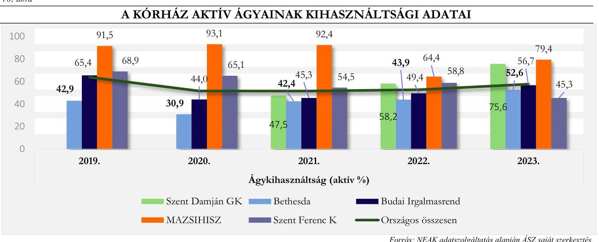

A krónikus ágyak $^{12}$ kihasználtsága a vizsgált időszakban hullámzó volt, a kiinduló 2019. éves állapothoz képest $(45,6 \%)$ minden vizsgált évben csökkenés detektálható. Fontos itt is megjegyezni, hogy a vizsgált időszak minden évében a Kórház krónikus ágykihasználtsági adatai nem csak az elemzett kórházak átlag adata alatt, hanem az országos átlag alatt is voltak. A krónikus ágykihasználtsági adatokat a 11. ábra tartalmazza az országos átlag-, illetve a többi elemzett kórház adatainak relevanciájában.
11. ábra

# A KÓRHÁZ KRÓNIKUS ÁGYAINAK KIHASZNÁLTSÁGI ADATAI 

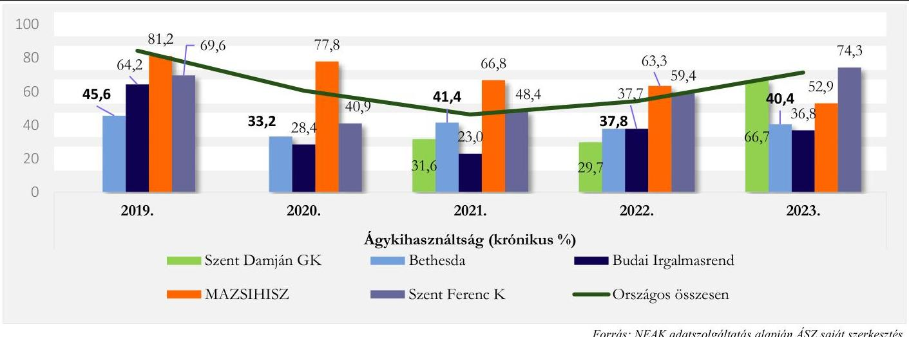

Forrás: NEAK adatszolgáltatás alapján ÁSZ saját szerkesztés

[^0]
[^0]:    $^{11}$ https://www.neak.gov.hu/felso_menu/szakmai_oldalak/publikus_forgalmi_adatok/gyogyito_megelőző_forgalmi_adat/fekvobeteg_szakellatas_stat/korhazi_agyszam
    $^{12}$ Krónikus ágyak megoszlása: krónikus ellátás - 0 db ágy; rehabilitációs ellátás - 25 db ágy

---

Az ágykihasználtsági adatok többi elemzett kórház adataihoz való viszonyítása alapján megállapítható, hogy az aktív ágyak kihasználtsága 2019-2023. évek között a legalacsonyabb volt. A Kórház krónikus ágyainak kihasználtsági adatai mindvégig elmaradtak a többi elemzett kórház adataihoz képest (2019. évben 30,0%-kal, a 2020. évben 26,3%-kal, 2021. évben 2,0%-kal, 2022. évben 17,1%-kal, míg a 2023. évben 25,5%-kal).

Az ágykihasználtsági adatok elemzésekor tekintettel kell lenni arra, hogy a Kórház gyermekek ellátására szakosodott, speciális ellátást nyújtó intézmény, így az alacsonyabb kihasználtsági adatok okai között az is szerepelhet, hogy nehezebb a tervezési folyamat, mint egy felnőtt ellátást végző, széles portfóliójú intézménynél.

Az aktív fekvőbeteg szakellátás elszámolt teljesítményét vizsgálva megállapíthatjuk, hogy a Kórház 2019-2022. közötti időszakban nem jelentett TÉK $^{28}$ feletti súlyszámot. A 2021-2022. közötti időszakban minimális (22,0) súlyszám után kapott finanszírozást, ezekben az években a többi kórháznak nem volt TÉK feletti teljesítése. A 2023. évben minimális emelkedés volt, mert 24,0 súlyszámot számoltak el részükre, megjegyzendő, hogy ez az öt elemzett kórház átlagos adata körüli érték (24,2). A Kórház bevétele szempontjából pozitív hatású, hogy 2020. évtől az öt kórház átlagához viszonyítva lényegesen kevesebb volt a kihasználatlan kapacitás (2020. évben 26,6%-kal, 2021. évben 59,1%-kal, 2022. évben 87,8%-kal, míg a 2023. évben 57,9%-kal).
12. ábra

# A KÓRHÁZ KIHASZNÁLATLAN TÉK ADATAI 

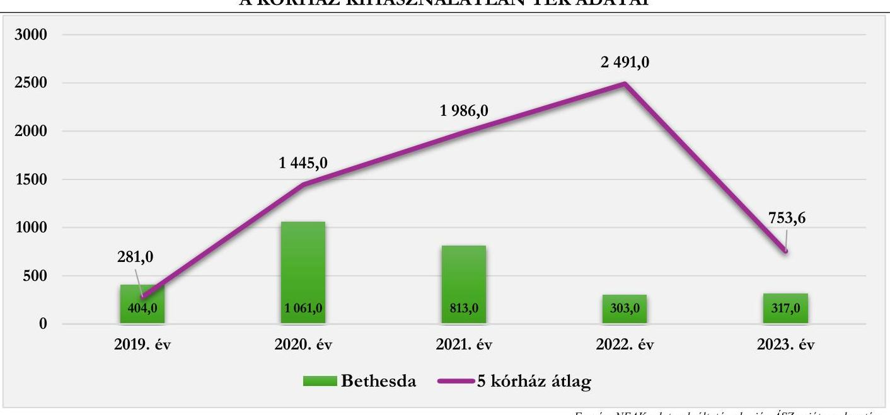

---

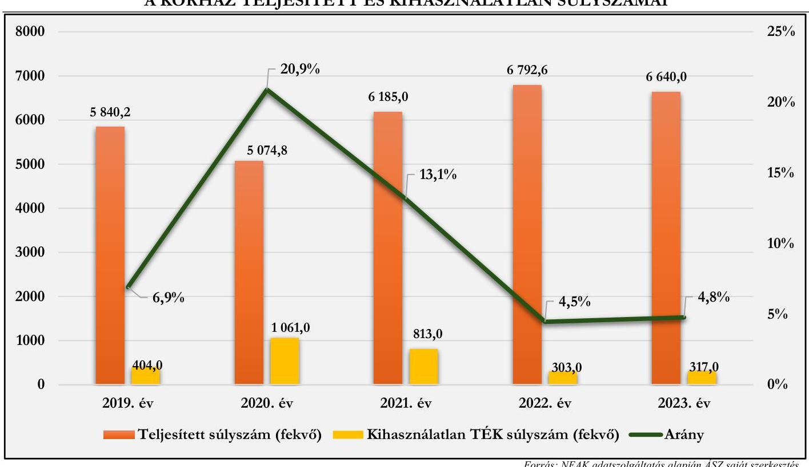

A case-mix index adott időszak alatt ellátott finanszírozási esetek összetételét költségigényesség szempontjából jellemző mutató, amely az elszámolt súlyszám és az elszámolt finanszírozási esetszám hányadosa. Így a Kórházra vizsgálva mutatja az ellátott kórházi ápolási esetek átlagos költségigényesség szerinti súlyosságát. Általában az átlagos kórházi eset súlyszáma 1,0. Ennek megfelelően az ennél magasabb case-mix index az átlagot meghaladó, a kisebb pedig az átlagnál alacsonyabb normatív költségigényű esetek ellátását jelzi. A Kórház esetében a case-mix index 0,9 és 1,0 között mozgott, ami optimálisnak tekinthető.

A Kórház adatainak sorában figyelmet érdemelnek az 1 súlyszámra jutó gyógyszerkiadás adatai: 2019-ben 31,6%-kal; 2020-ban 207,7%-kal, 2021-ben 215,2%-kal, 2022-ben 63,4%-kal; 2023-ban 145,4%-kal volt több az öt kórház átlagához viszonyítva. Az 1 súlyszámra jutó átlagnál jelentősebb gyógyszerkiadás okai között szerepet játszhat az országos hatáskörben nagy számban ellátott speciális esetek, és ezen ellátáshoz szükséges gyógyszerek extrém áremelkedése. Ha a gyógyszerkiadást esetszámra vetítjük (aktív és krónikus együtt), akkor szintén azt állapíthatjuk meg, hogy annak mértéke magasan az átlag felett volt a vizsgált években: 2019-ben 253,4%-kal; 2020-ban 272,9%-kal, 2021-ben 339%-kal, 2022-ben 243,2%-kal; 2023-ban 308,7%-kal volt magasabb, mindez a fentebb említett okok egyikére utal.

A standardizált naphányados $(SNH^{29})$ az átlagos ápolási idő viszonyát mutatja a normatív naphoz. Amennyiben az SNH értéke kisebb, mint 1, akkor a vizsgált intézmény átlagos ápolási ideje rövidebb, mint az adott $HBCS^{30}$-khez tartozó normatív ápolási idő. A Kórház esetében az SNH értéke minden évben 0,6 volt, tehát az intézmény átlagos ápolási ideje rövidebb volt, mint az adott HBCS-khez tartozó normatív ápolási idő, ami költségcsökkentő tényezőként értelmezhető.

A Kórház járóbeteg szakellátás teljesítménye vonatkozásában megállapítható, hogy a 2019. és 2020. években nem volt TÉK feletti teljesítmény, viszont 2021. évtől a teljesített ponthoz viszonyítottan is magas arányú TÉK feletti teljesítmény az öt kórház átlaga felett volt a 2021. (394%) 2022. (397,5%) és 2023. (293,9%) években, ami után degresszált finanszírozási összeget fizetett ki a NEAK. A járóbeteg szakellátás

---

teljesítményével összefüggésben a kihasználatlan TÉK mértéke nagy ingadozásokat mutat. A 2019. évben 20,5%-kal volt magasabb az 5 kórház átlagánál, majd 2020-ban a trend megfordult és 12,9% volt kevesebb annál, 2021-ben pedig 98%-kal. 2022-ben nem jelentkezett kihasználatlan TÉK a Kórház teljesítményében, továbbá 2023-ban is lényegesen kisebb volt az értéke (64,8%-kal), mint a többi kórházé. A TÉK felett jelentett teljesítmény és a kihasználatlan TÉK éven belüli együttes jelenléte tervezési hibára, a szezonalitás nem megfelelő felmérésére, a szakmánkénti kapacitásfelosztás anomáliájára utalhat. Továbbá az átlaghoz viszonyított kiugróan magas TÉK feletti elszámolt pontok mértékének alakulását (TÉK feletti teljesített pontok mértéke a teljesített pontokhoz
 viszonyítva: 2021. évben 30,1%; 2022. évben 51,3%; 2023. évben 13,9%) érdemes monitorozni a következő években, mivel ezek kiugró mértéke finanszírozási problémát okozhat hosszú távon, mivel ezek az ellátások veszteséget termelhetnek.

A laboratóriumi ellátás finanszírozására jellemző, hogy a leginkább „túlteljesített" kassza, ezt igazolja vissza, hogy a Kórház esetében nem jelent meg (és a másik 4 kórháznál sem) kihasználatlan kapacitás, viszont TÉK feletti teljesítmény annál inkább. A Kórház a TÉK feletti labor-teljesítménye után degresszált, úgynevezett lebegőponton elszámolt forintértéket kapott. A többi kórház átlagához viszonyítva 2019-ben 60,1%-kal; 2020-ban 56,1%-kal; 2021-ben 50,9%-kal; 2022-ben 64,9%-kal; 2023-ban 59,0%-kal volt kevesebb a TÉK felett elszámolt pontja a Kórháznak. Fontos megjegyezni, hogy az elemzés nem tért ki a TÉK felett leadott teljesítmény összetételének vizsgálatára, ami tovább árnyalhatná a helyzet megítélését. A 14. ábra a Kórház elszámolt pontjainak alakulását illusztrálja, a TÉK feletti elszámolt pontokkal kiegészítve, a többi elemzett kórház adataival való összehasonlításban.
14. ábra
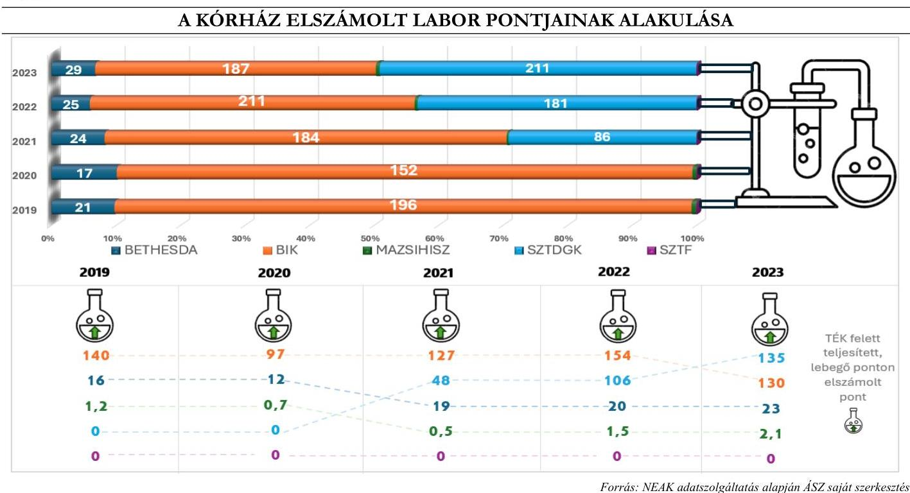

A Kórház a vizsgált években nem jelentett egynapos ellátási teljesítményt.
A kapacitások kihasználásának vizsgálatakor meg kell említenünk az épületek kihasználtságára, állapotára vonatkozó adatokat is ${ }^{13}$. A vizsgált időszakban öt műtőt üzemeltettek: Sebészet I. műtő, Sebészet II.

[^0]
[^0]:    ${ }^{13}$ Adatközlő a Kórház.

---

műtő, Sebészet Endoszkópos műtő, Gégészet műtő, Égés műtő. A műtők kapacitásának kihasználtsága a 2019. évről a 2023. évre kivétel nélkül emelkedett.
15. ábra

# A KÓRHÁZ MŰTŐINEK KIHASZNÁLTSÁGA (%) 

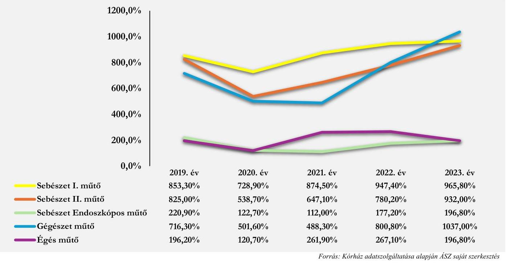

Az intézmény épületeinek átlagos kora 2024-ben 70,6 év volt. Az épületek döntő többségén a Kórház energetikai korszerűsítést hajtott végre a 2019-2021. években, továbbá az infrastruktúrájának korszerűsítésére nagy figyelmet fordított az épület-beruházások és felújításai által. ${ }^{14}$

### 3.3. Menedzsment hatásvizsgálata

A Bethesda Gyermekkórház menedzsmentjének a kórház működtetésével kapcsolatban több olyan nehézséggel kellett szembe néznie, amelyek gazdasági, társadalmi és egészségügyi területeken egyaránt éreztették hatásukat. Ilyen volt a COVID-19 járvány, amely jelentős terhet rótt a magyar egészségügyi rendszerre. Az intenzív osztályok leterheltsége és a kórházi ágyak szűkössége komoly problémát okozott ebben az időszakban.

[^0]
[^0]:    ${ }^{14}$ Beruházások
    o KEHOP-5.2.1-15-2015-00002 azonosító számú projekt keretében 2016 - 2019 - MRE Bethesda Gyermekkórháza épületenergetikai fejlesztése. A beruházás keretében többek között a homlokzat és lábazat utólagos hőszigetelésére került sor, valamint kicserélték a homlokzati ajtókat és ablakokat, illetve különböző gépészeti munkálatokat végeztek. A beruházás teljes összege pótmunkával: 609999 058,- Ft volt.
    ○ 2021. - 2022. - Magyarország Református Egyház Bethesda Gyermekkórház Labor és Gazdasági épületének energetikai korszerűsítése KEHOP-5.2.13-19-2019-00070. A beruházás keretében - ebben az esetben is - többek között a homlokzat és lábazat utólagos hőszigetelésére került sor, valamint kicserélték a homlokzati ajtókat és ablakokat. A beruházás teljes összege 132532 080,- Ft volt.
    ○ 2022-2024. „A gyermekpszichiátriai fejlesztése, valamint SMA betegségben szenvedő gyermekek szülei részére apartmanok kialakítása - Hermina 55. szám alatti épület teljeskörű belső felújítására" (II/678-3/2022/EKF és EGYH-EOR-23-P-0003). A beruházás keretében többek között a homlokzat és lábazat utólagos hőszigetelésére került sor, valamint kicserélték a homlokzati ajtókat és ablakokat, illetve különböző gépészeti munkálatokat végeztek. A beruházás teljes összege 160204 308,- Ft volt.
    Felújítások: 2019-ben Kórház főépület, hidraulikus lift felújítása, köteles felvonó felújítása, tetőfelújítás, épületi alagsor további vízesedésének megakadályozása.

---

2022-ben az orosz-ukrán háború kezdetét követően a magyarországi infláció jelentősen megemelkedett, mely az élelmiszerek, energiaköltségek és egyéb szolgáltatások jelentősebb áremelkedésében mutatkozott meg.

A kedvezőtlen folyamatok nagy részét a Kórház menedzsmentje befolyásolni nem tudta, azonban reális célként lehetett kitűzni a nem várt események, kockázatok hatásának mérséklését, a nonprofit kórház működésének elfogadható színvonalon történő fenntartását úgy, hogy közben ne termelődjön jelentős veszteség. A kihívások kezelése a menedzsment részéről nagy rugalmasságot, a gyorsan változó helyzethez való gyors alkalmazkodási képességet igényelt.

A gazdálkodással kapcsolatos problémák megoldásához a Kórház vezetése igyekezett minél megbízhatóbb gazdálkodású cégektől beszerezni a működéshez szükséges anyagokat és eszközöket annak érdekében, hogy a késedelmes kifizetések ellenére további szállításokat tudjanak a Bethesda részére teljesíteni. A Bethesda Gyermekkórház menedzsmentje törekedett arra, hogy a szállítókkal megállapodjon, a kifizetésekről ütemezési javaslatokat készített, több esetben tárgyalásokat folytatott az azonnali kifizetésekről is. A Kórház közvetlenül importált bizonyos eszközöket, ami ár-előnyhöz juttatta, illetve megteremtette a továbbértékesítés feltételeit is. Ezen intézkedések végrehajtásán túl általános gyakorlat volt olyan intézkedések megtétele is, amelyektől a kórházak teljesítményfinanszírozásból származó bevételek arányának növekedését remélték, például a járóbeteg kapacitás növelése. A Kórház törekedett a folyamat-optimalizálásra és hatékonyságnövelésre is, az egyes osztályok leterheltségének nyomon követésével, illetve túlterheltség esetén szabad kapacitás átirányításával. Ezenfelül bérfejlesztést is végrehajtott a Kórház, amely lényeges volt a meglévő munkaerő megtartása és motiválása céljából.

A fentiek mellett fontos megjegyezni, hogy a menedzsment növelte a teljesítményfinanszírozásból származó bevételeit, ami pozitívan hatott a Kórház pénzügyi helyzetére.

# 3.4. Várólista, előjegyzési idők alakulása, elemzése 

A NEAK nyilvántartása szerint a Kórház 4 fajta várólistát vezetett az ellenőrzött időszakban:

- Mandula, orrmandula műtét
- Orrmelléküregek, proc. mastoideus műtétei
- Nőgyógyászati műtétek nem malignus folyamatokban
- Térdprotézis
16. ábra

ELVÉGZETT BEAVATKOZÁSOK SZÁZALÉKOS MEGOSZLÁSA 2019-2023 KÖZÖTT
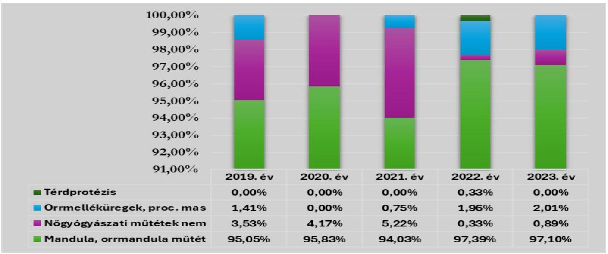

Forrás: NEAK adatszolgáltatás alapján ÁSZ saját szerkesztés

---

A vizsgált években, a mandula, orrmandula műtétek tették ki az elvégzett műtétek átlagosan 95,9%-át. A 2023. évre az elvégzett műtétek száma 166-tal, míg a tényleges átlagos várakozási idő ${ }^{15} 7$-ről 8 napra nőtt, ami így is az országos átlag 50%-a (16 nap). A tényleges medián várakozási idő a 2023. évre 4-ről 7-re nőtt, ami szintén az országos átlag alatt volt. A 60 napon túli várakozók száma 0 és 3 fő között ingadozott.

A következő három műtétfajta esetében 60 napon túli várakozó egyik vizsgált évben sem volt.
Az elvégzett nőgyógyászati műtétek nem malignus folyamatokban száma 2019-2023. évek között 10- és 1 db elvégzett műtét között változott. Az elvégzett műtétek száma a 2023. évre 4 főre csökkent a 2019. évben elvégzett 10 műtétről. A tényleges átlagos várakozási idő a 2020. (2 nap) és 2021. (1 nap) éveket leszámítva 0 nap volt. A tényleges medián várakozási idő a vizsgált időszakban végig 0 nap volt.

Az elvégzett orrmelléküreg, proc. mastoideus műtétek száma átlagosan 1,53%-át tették ki az összes műtétnek. 2019. és 2023. évek között összesen 14 db műtétet végeztek el (2019-ben 4 db, 2020-ban 0 db, 2021-ben 1 db, 2022-ben 6 db és 2023-ban 3 db volt). A kevés esetszámra való tekintettel ennél a műtétfajtánál sem volt várakozási idő.

Az elvégzett térdprotézis műtétek száma a vizsgált időszakban összesen 1 db volt, melyet 2022. évben hajtottak végre.

A Kórház adatait a tényleges átlagos várakozási idő, valamint a tényleges medián várakozási idő vonatkozásában a 10. táblázat tartalmazza az országos adatokkal kiegészítve.
10. táblázat

# A KÓRHÁZ VÁRÓLISTA ADATAI ORSZÁGOS ADATOK VISZONYLATÁBAN 

| ÉV | VÁRÓLISTA NEVE | ÉLLÁ-   TOTTAK   ÖSSZESEN | ÉLLÁTOTTAK ÖSSZE-   SEN TÉNYLEGES ÁTLA-   GOS VÁRAKOZÁSI IDŐ |  | ÖSSZESEN TÉNYLEGES   MEDIÁN VÁRAKOZÁSI   IDŐ |  |
| :--: | :--: | :--: | :--: | :--: | :--: | :--: |
|  |  | KÓRHÁZ | KÓRHÁZ | ORSZÁ-   GOS   ÁTLAG | KÓRHÁZ | ORSZÁ-   GOS   ÁTLAG |
| 2019 | Mandula, orrmandula műtét | 269 | 9 | 16 | 4 | 9 |
|  | Orrmelléküregek, proc. mastoideus műtétei | 4 | 0 | 15 | 0 | 9 |
|  | Nőgyógyászati műtétek nem malignus folyamatokban | 10 | 0 | 6 | 0 | 0 |
|  | Térdprotézis |  |  | 121 |  | 91 |
| 2020 | Mandula, orrmandula műtét | 138 | 13 | 17 | 6 | 8 |
|  | Orrmelléküregek, proc. mastoideus műtétei |  |  | 13 |  | 7 |
|  | Nőgyógyászati műtétek nem malignus folyamatokban | 6 | 2 | 6 | 0 | 0 |
|  | Térdprotézis |  |  | 135 |  | 85 |
| 2021 | Mandula, orrmandula műtét | 126 | 7 | 20 | 3 | 8 |
|  | Orrmelléküregek, proc. mastoideus műtétei | 1 | 0 | 18 | 0 | 4 |
|  | Nőgyógyászati műtétek nem malignus folyamatokban | 7 | 1 | 7 | 0 | 0 |
|  | Térdprotézis |  |  | 244 |  | 99 |
| 2022 | Mandula, orrmandula műtét | 298 | 5 | 24 | 3 | 13 |
|  | Orrmelléküregek, proc. mastoideus műtétei | 6 | 0 | 21 | 0 | 9 |
|  | Nőgyógyászati műtétek nem malignus folyamatokban | 1 | 0 | 9 | 0 | 2 |
|  | Térdprotézis | 1 | 0 | 224 | 0 | 129 |
| 2023 | Mandula, orrmandula műtét | 435 | 8 | 29 | 7 | 15 |
|  | Orrmelléküregek, proc. mastoideus műtétei | 9 | 0 | 15 | 0 | 7 |
|  | Nőgyógyászati műtétek nem malignus folyamatokban | 4 | 0 | 7 | 0 | 1 |
|  | Térdprotézis |  |  | 220 |  | 173 |

Forrás: NEAK adatszolgáltatás alapján ÁSZ saját szerkesztés

[^0]
[^0]:    ${ }^{15}$ Azt mutatja meg, hogy az elmúlt időszakban átlagosan egy adott beavatkozás tekintetében ténylegesen mennyit kellett várni.

---

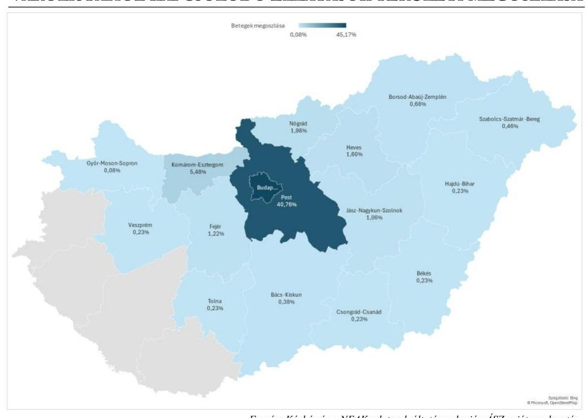

Forrás: Kórház és a NEAK adatszolgáltatása alapján ÁSZ saját szerkesztés

Várólistához kapcsolódó ellátások vonatkozásában a 2019. évben 283-, 2020. évben 144-, 2021. évben 134-, 2022. évben 306-, 2023. évben 448 beteget, azaz összesen 1315 beteget látott el a Kórház. A teljes ellátott betegállomány 85,93%-át Budapesthez (594) és Pest vármegyéhez (536) tartozott, 1% feletti betegállítás Fejér- (16), Heves- (21), Komárom-Esztergom- (72), Nógrád- (26) és Jász-Nagykun-Szolnok vármegyékben (14) volt, a maradék 2,47%-ot (36) Bács-Kiskun-, Békés-, Borsod-Abaúj-Zemplén-, Csongrád-Csanád-, Győr-Moson-Sopron-, Hajdú-Bihar-, Szabolcs-Szatmár-Bereg-, Tolna- és Veszprém vármegye tette ki.

A NEAK a várólistán regisztráltak esetében vizsgálta a sorrendiségi hibák előfordulását. A sorrendiségi hibák száma a várakozók esetén 2019-2023. évek között összesen 12 db volt. 2019. évben 1 db-, 2020. évben 3 db-, 2022. évben 3 db-, 2023. évben pedig 5 db hibát vétett a Kórház, amelyek összesen 476 E Ft büntetést vontak maguk után (2019. évben 40 E Ft, 2020- és 2022. években 119 E Ft-119 E Ft és 2023.
 évben 198 E Ft) ${ }^{16}$.

A Kórház a 2019-2023 közötti időszakban nem vett részt várólista többletprogramban.

[^0]
[^0]:    ${ }^{16} 1 \mathrm{db}$ hibapont szankcionálási mértéke 39,6 E Ft volt.

---

# MELLÉKLETEK 

I. SZ. MELLÉKLET: ÉRTELMEZŐ SZÓTÁR

Aktív fekvőbeteg szakellátás

Ágykihasználási százalék

Ápolás átlagos tartama

Beszámoló

Case-mix Index (CMI)

Az az ellátás, amelynek célja az egészségi állapot mielőbbi helyreállítása. Az aktív ellátás időtartama, illetve befejezése többnyire tervezhető, és az esetek többségében rövid időtartamú.
(Forrás:https://www.neak.gov.hu/felso_menu/szakmai_oldalak/gyógyító_megelőző_ellátás/szakellátás/fekvőbeteg_szakellátás)
Teljesített ápolási napok száma osztva a teljesíthető ápolási napok számával és szorozva 100 -zal.
(Forrás: https://www.neak.gov.hu/felso_menu/szakmai_oldalak/publikus_forgalmi_adatok/gyógyító_megelőző_forgalmi_adat/fekvőbeteg_szakellátás_stat/kórházi_ágy szám)
A tárgyévben távozott betegek teljes ápolási idejére számított ápolási napjainak száma osztva az osztályokról a tárgyévben elbocsátott betegek számával. A teljes ápolási idő a tárgyévben távozott betegek összes ápolási napját tartalmazza, így a tárgyévben távozott, de az előző évben (években) felvett beteg esetén az ápolás előző évre (évekre) eső részét is. Az ápolás átlagos tartama nem egyezik meg a teljesített ápolási napok számának és az elbocsátott betegek számának hányadosával.
(Forrás: https://www.neak.gov.hu/felso_menu/szakmai_oldalak/publikus_forgalmi_adatok/gyógyító_megelőző_forgalmi_adat/fekvőbeteg_szakellátás_stat/kórházi_ágy szám)
A gazdálkodó működéséről, vagyoni, pénzügyi és jövedelmi helyzetéről az üzleti év könyveinek zárását követően, a Számv. tv-ben meghatározott könyvvezetéssel alátámasztott beszámolót köteles - magyar nyelven - készíteni. A beszámolónak megbízható és valós összképet kell adnia a gazdálkodó vagyonáról, annak összetételéről (eszközeiről és forrásairól), pénzügyi helyzetéről és tevékenysége eredményéről.
Az egyéb szervezet beszámolási kötelezettségének, beszámolót alátámasztó könyvvezetési kötelezettségének sajátosságait a vonatkozó külön jogszabály és a Számv. tv. alapján kormányrendelet szabályozza. A gazdálkodó, illetve a természetes személy által alapított egészségügyi, szociális, kulturális és oktatási intézmény könyvvezetési, beszámolókészítési kötelezettségét a Számv. tv. és a vonatkozó külön jogszabály rendelkezései alapulvételével - a létrehozó szervezet állapítja meg azzal, hogy a létrehozott szervezetet jogi személyiségének megfelelően - a Számv. tv. 3. § (1) bekezdése 2-4. pontjai szerinti szervezetek közé kell besorolnia
(Forrás: Számv. tv. 4 § (1)-(2) bek., 6. § (2)-(3) bek.)
Adott időszak alatt ellátott finanszírozási esetek összetételét költségigényesség szempontjából jellemző mutató, amely az elszámolt súlyszám és az elszámolt finanszírozási esetszám hányadosa. Az adott kórházra (osztályra, korcsoportra, területre) vizsgálva mutatja az ellátott kórházi ápolási esetek átlagos költségigényesség szerinti súlyosságát (az előfordult homogén betegségcsoportok súlyszámának az esetszámmal súlyozott átlaga). Általában az átlagos kórházi eset súlyszáma 1,000. Ennek megfelelően az ennél magasabb case-mix index az átlagot meghaladó, a kisebb pedig az átlagnál alacsonyabb normatív költségigényű esetek ellátását jelzi.
(Forrás: a 43/1999. (III. 3.) Korm. rendelet ${ }^{31}$ 2.§ l) pont)

---

Egyház

Egyházi jogi személy

Egynapos ellátási esetek száma

Fekvőbeteg szakellátás

Fenntartó

Hierarchák Tanácsa

Kórház

Kórházi ágyak száma

Költségvetési támogatás

A vallási közösség az egyház megjelölést elnevezésében és a tevékenységére való utalás során önmeghatározása céljából - a saját hitelvei szerinti tartalommal - használhatja. (Forrás: Ehtv. 7/B §)
Egyházi jogi személy a bevett egyház, a bejegyzett egyház és a nyilvántartásba vett egyház, továbbá azok belső egyházi jogi személye.
(Forrás: Ehtv. 10. §)
Azon betegek száma, akiknek az ápolási ideje a 24 órát nem érte el, és a 9/1993 NM rendelet 9. számú mellékletében meghatározott egynapos beavatkozások valamelyikében részesültek.
(Forrás: https://www.neak.gov.hu/felso_menu/szakmai_oldalak/publikus_forgalmi_adatok/gyógyító_megelőző_forgalmi_adat/fekvőbeteg_szakellátás_stat/kórházi_ágy szám)
Klinikán, kórházban, szakápolási intézményben, valamint fekvőbeteg-ellátást nyújtó országos intézetben végzett minden ellátási esemény, amelynek során a biztosítottat az intézménybe felvették, és ott legalább 24 órán keresztül - nappali kórházi ellátás esetén legalább 6 órán keresztül - tartózkodik.
(Forrás: https://www.neak.gov.hu/felso_menu/szakmai_oldalak/gyógyító_megelőző_ellátás/szakellátás/fekvőbeteg_szakellátás)
Fenntartó:

- költségvetési szerv egészségügyi szolgáltató esetén az alapító okiratban irányító szervként megjelölt állami szerv, helyi önkormányzat vagy önkormányzati társulás,
- egyházi jogi személy vagy vallási egyesület által fenntartott egészségügyi szolgáltató esetében az egészségügyi szolgáltató alapító okiratában fenntartóként megjelölt ilyen jogalany,
- alapítványi, közalapítványi egészségügyi szolgáltató esetén az alapítvány, közalapítvány,
- a nemzeti felsőoktatásról szóló 2011. évi CCIV. törvény 97. § (1) bekezdés a) és b) pontja szerinti esetben az egészségügyi felsőoktatási intézmény, - más szervezet esetén a tulajdonosi jogokat gyakorló szervezet.
(Forrás: Eütv. 3. § w) pont)
A keleti egyházakban az ország összes részegyházának főpásztorait magába foglaló állandó testület. (Forrás: Magyar Katolikus Lexikon)
A fekvőbeteg-szakellátás körében több szakmai főcsoportba tartozó szakmában aktív és krónikus, illetve aktív vagy krónikus betegellátást nyújtó, diagnosztikai háttérrel működő egészségügyi szolgáltató esetén az adott intézmény a kórház elnevezésre jogosult.
(Forrás: 60/2003. (X. 20.) ESzCsM rend.32. 5. § (1) bek. c) pont eb) alpont)
A NEAK szerződés-nyilvántartási állományában szereplő, ÁNTSZ működési engedéllyel rendelkező ágyak száma, tárgyév december 31-én. A kórházi ágyak száma az egészségügyi ellátás kapacitásáról nyújt információt, mégpedig azon betegek maximális létszámáról, akik a kórházakban ellátásban részesülhetnek.
(Forrás: https://www.neak.gov.hu/felso_menu/szakmai_oldalak/publikus_forgalmi_adatok/gyógyító_megelőző_forgalmi_adat/fekvőbeteg_szakellátás_stat/kórházi_ágy szám)
A társadalombiztosítás pénzügyi alapjai kivételével az államháztartás központi alrendszeréből ellenérték nélkül, pénzben nyújtott támogatások.
(Forrás: Áht. ${ }^{33}$ 1. § 14. pont)

---

Közfeladat

Lebegő pont

Nem vallási tevékenység

Osztályokról elbocsátott betegek száma

Progresszív ellátás - Progresszivitási szintek

Standardizált naphányados (SNH)

Támogatás

Teljesítménydíj

A jogszabályban meghatározott állami vagy önkormányzati feladat. A közfeladat ellátásban államháztartáson kívüli szervezet jogszabályban meghatározott rendben közreműködhet.
(Forrás: Áht. 3/A. § (1) - (2) bekezdés)
A laboratóriumi ellátás vonatkozásában a labor finanszírozás szabályának értelmében a teljesítmények teljesítményvolumen korlát feletti része lebegő pont-forint értékkel kerül elszámolásra.
(Forrás: https://www.parlament.hu/irom41/17188/adatok/fejezetek/72.pdf)
Önmagában nem tekinthető vallási tevékenységnek a politikai és érdekérvényesítő, a pszichikai vagy parapszichikai, a gyógyászati, a gazdasági-vállalkozási, a nevelési, az oktatási, a felsőoktatási, az egészségügyi, a karitatív, a család-, gyermek- és ifjúságvédelmi, a kulturális, a sport-, az állat-, környezet- és természetvédelmi, a hitéleti tevékenységhez szükségesen túlmenő adatkezelési, valamint a szociális tevékenység.
(Forrás: Ehtv. 7/A $\S$ (3) bek.)
Kórházból eltávozott, továbbá ugyanazon gyógyintézet más osztályára áthelyezett és a meghalt betegek száma összesen.
(Forrás: https://www.neak.gov.hu/felso_menu/szakmai_oldalak/publikus_forgalmi_adatok/gyógyító_megelőző_forgalmi_adat/fekvőbeteg_szakellátás_stat/kórházi_ágy szám)
Az egészségügyi ellátások rendszere az eltérő egészségi állapotú egyének differenciált ellátását szolgáló, a munkamegosztás és a fokozatosság elvén alapuló intézményrendszerre épül, amelyben az egyén egészségi állapotának összes jellemzője együttesen határozza meg a szükséges ellátási szintet. Az eltérő egészségi állapotú betegek differenciált ellátását a fokozatosság elvén egymásra épülő, a szakmai tevékenységeknek a szakmai tapasztalat és a technikai feltételek alapján csoportosított progresszivitási szinteken működő ellátórendszer biztosítja. A fekvőbeteg-szakellátás - az ellátáshoz szükséges eltérő személyi és tárgyi feltételek alapján szakmánként meghatározott progresszivitási szinteken (I.; II,; III.) történik.
(Forrás: 60/2003. (X. 20.) ESzCsM rendelet 9. § (1) és (4) bekezdései és az Eütv. 75. § (3) bekezdés).
Egy intézmény, vagy osztály átlagos ápolási idejét lehet viszonyítani az adott HBCS normatív ápolási idejéhez. E két érték hányadosa adja meg a standardizált naphányadost. Amennyiben az SNH értéke kisebb, mint 1, akkor a vizsgált intézmény átlagos ápolási ideje rövidebb, mint az adott HBCS-hez tartozó normatív ápolási idő, ebben az esetben a kórház nem ápolja túl a betegeit.
(Forrás: https://www.etk.pte.hu/protected/OktatasiAnyagok/!Pályázati/EübenHasznalatosKodrendszerek_20151117_.pdf)
Az államháztartás központi vagy önkormányzati alrendszeréből, bármilyen formában, ellenérték nélkül nyújtott juttatás.
(Forrás: Áht. 1. § 19. pont)
Az alapdíj és a teljesítmény szorzata, amely a NEAK-nak leadott teljesítményjelentéseken alapul.
(Forrás: a 43/1999. (III. 3.) Korm. rendelet 2.§ h) pont)

---

Tervezett éves keret (TÉK)

Volatilitás

Önálló elszámolási tételként elszámolható, jogszabályban meghatározott szolgáltatási egységek teljesítményértékeinek mennyisége, amelyre a szakellátást nyújtó egészségügyi szolgáltató a jelen rendeletben foglalt szabályok szerint jogosult
(Forrás: az egészségügyi szolgáltatások Egészségbiztosítási Alapból történő finanszírozásának részletes szabályairól szóló 43/1999. (III. 3.) Korm. rendelet $2 . \S$ t) pont)
Egy adat változékonysága. A kórházi lejárt kötelezettségállomány változásának bemutatásához használt kifejezés (azt vizsgálva, hogy egy bizonyos idő alatt mennyit változott az adósságállomány).
(Forrás: https://www.neak.gov.hu/pfile/file?path=/letoltheto/alt-fin_dok/altfin_virt_dok2/hirek_mappa/ONKOLOGIAI_ELLATASOK_FINANSZIROZASA_1_\&inline=true)

---

II. SZ. MELLÉKLET: AZ ELLENŐRZŐTT ÉS ELLENŐRZÉST TÁMOGATÓ SZERVEZETEK JEGYZÉKE

|  ELLENŐRZŐTT SZERVEZET NEVE | ELLENŐRZŐTT SZERVEZET SZÉKHELYE  |
| --- | --- |
|  Magyarországi Református Egyház | 1146 Budapest Bethesda u. 3.  |
|  Bethesda Gyermekkórháza |   |
|  Magyarországi Református Egyház | 1146 Budapest, Abonyi u. 21.  |

# ELLENŐRZÉST TÁMOGATÓ SZERVEZETEK

Nemzeti Egészségbiztosítási Alapkezelő Belügyminisztérium Miniszterelnökség

---

# TÖKÜSZTERÜLET 

1. Az egyház fenntartói kötelezettsége teljesítésének szabályszerűsége

## ELLENŐRZÉSI KRITÉRIUMOK

Számv. tv. 6. § (3) bek., 14. § (3). (5) és (11)-(12) bek., 161. $\S$ (1) és (4) bek., Eütv. 155. $\S$ (1) bek g) pont, Áht. 53. §
296/2013. Korm. rend. 5. § (4) bek., 7. § (2)-
(4) és (6) bek., 11. §,
507/2023. Korm. rend. 2. § (2) bek.,

Számv. tv. 8. § (2)-(3) bek., 14. § (3), (5)-(7) és (11)(12) bek., 159. §, 161. § (1)-(2) és (4) bek., 162. §(II1)(2) bek.,
Eütv. 155. § (1) bek a)-b) és d)-g) pont, 155. § (1a) bek. a) pont, Ehtv. 7/A. $\S$ (1) bek., 11/A. $\S$ a) pont, 296/2013. Korm. rend. 3. § (1)-(5) bek., 4. §, 5. §, 7. § (5)(6) bek., 9. § (1) bek. a) pont, 11. §, 1. és 2. melléklet Belső szabályzatok
3. A kórház beszámolási és közzétételi kötelezettsége teljesítésének szabályszerűsége az államháztartásból nem hitéleti célra nyújtott támogatások vonatkozásában

Számv. tv. 8. § (2)-(3) bek., 15. § (3) és(6) bek., 17. § (1) bek., 69. § (1) bek., 155. § (2) bek., 159. §, 162. § (1)-(2) bek., 164. § (2) bek.

Ehtv. 19. § (3) bek.,
Info tv. 33. § (3) bek., 37. § (1) bek., 1. melléklet, 296/2013. Korm. rend. 3. § (1)-(5) bek., 5. § (1)-(4) bek., 6. § (1) bek. a)-b) pont, 9. § (1) bek. a)-b) pont, 9. § (4) bek., 10. § (2) bek., 11. §, 1.és 2. melléklet Belső szabályzatok
4. A kórház könyvvezetési kötelezettsége teljesítésének, az államháztartásból nem hitéleti célra nyújtott támogatások felhasználásának és elszámolásának szabályszerűsége

Számv. tv. 22-28. §, 42. § (1) bek., 47. § (7) bek. b) pont, 62. § (2) bek., 69. § (1) bek., 78-81. §, 101. §, 110-114. §, 160. § (2) bek. a)-b) pont, 160. § (3a)-(3b) bek., 161/A. § (2) bek., 162. § (1)-(2) bek.,165. § (1) bek., 166. § (1) bek., 167. § (1) bek. a), d), h)-i) pont, 167. § (7) bek.,

Ehtv. 11/A. § a) pont,
Ptk ${ }^{34}$ 3:29. § és 3:30. §, 3:77-3:79. §, 3:397. §, 296/2013. Korm. rend. 4. §, 5. § (4) bek., 7. § (1) és (5) bek., 507/2023. Korm. rend. 1. § (1) bek., 2. § (1), (3) és (5) bek., 3. § (1) bek., 1. melléklet Belső szabályzatok
Támogatói okirat/Támogatási szerződés

---

# IV. SZ. MELLÉKLET: A KÓRHÁZ FŐBB MŰKÖDÉSI JELLEMZŐI AZ ÖSSZES ELEMZETT KÓRHÁZHOZ VISZONYÍTOTTAN 

2019. év

| ADAT/   MUTATÓ-  SZÁM   TIPUSA | MUTATÓSZÁM/ADAT NEVE | KÓRHÁZ  ADATA | AZ ELEM-   ZETT KÓRHÁ-   ZAKÁTLAG  ADATA | ÁTLAGTÓI  VALÓ  ELTÉRÉS |
| :--: | :--: | :--: | :--: | :--: |
|  | NEAK bevétel aránya az összes bevételben (\%) | $64,4 \%$ | $62,5 \%$ | $3,1 \%$ |
|  | Lejárt kötelezettségállomány átlagának aránya az éves kiadási főösszeghez (\%) | $9,4 \%$ | $18,9 \%$ | $-50,3 \%$ |
|  | Egy esetszámra (aktív és

 krónikus) jutó összes bevétel (E Ft) | 685,1 | 458,9 | $49,3 \%$ |
|  | Foglalkoztatott orvosok aránya az összlétszámból (havi átlag) (\%) |  |  |  |
|  | Foglalkoztatott szakdolgozók aránya az összlétszámból (havi átlag)   (\%) |  |  |  |
|  | Alkalmazottak fluktuációja intézményi szinten (havi átlag) (\%) |  |  |  |
|  | 1 orvosra jutó szakdolgozó (havi átlag) (fő) | 2021. év márciustól áll rendelkezésre NEAK adatszolgáltatás |  |  |
|  | 1 szakdolgozóra jutó teljesített ápolási nap (havi átlag) |  |  |  |
|  | 1 orvosra jutó ágyak száma (havi átlag) |  |  |  |
|  | 1 szakdolgozóra jutó ágyak száma (havi átlag) |  |  |  |
|  | Összes szervezeti egység (db) |  |  |  |
|  | - ebből a kórházi osztályok progresszivitási szint szerinti besorolása: | 12,0 | 8,0 | $50,0 \%$ |
|  | I. progresszivitási szintű osztályok (db) | 0,0 | 1,5 | $-100,0 \%$ |
|  | II. progresszivitási szintű osztályok (db) | 4,0 | 3,0 | $33,3 \%$ |
|  | III. progresszivitási szintű osztályok (db) | 8,0 | 3,5 | $128,6 \%$ |
|  | Éves ágykihasználtsági mutató aktív (\%) | $42,9 \%$ | $67,2 \%$ | $-36,1 \%$ |
|  | Éves ágykihasználtsági mutató krónikus (\%) | $45,6 \%$ | $65,2 \%$ | $-30,0 \%$ |
|  | Egy aktív ágyra jutó elszámolt súlyszám | 64,3 | 41,6 | $54,8 \%$ |
|  | Case-mix index | 0,9 | 1,1 | $-12,9 \%$ |
|  | Egy súlyszámra jutó gyógyszerkiadás (Ft) | 240322,2 | 182601,8 | $31,6 \%$ |
|  | Egy esetszámra jutó gyógyszerkiadás - (aktív és krónikus) (Ft) | 204746,4 | 57941,0 | $253,4 \%$ |
|  | Teljesített súlyszám (fekvő) | 5840,2 | 5463,9 | $6,9 \%$ |
|  | TÉK felett elszámolt súlyszám (degresszált súlyszám) (fekvő) | 0,0 | 56,3 | $-100,0 \%$ |
|  | Kihasználatlan TÉK súlyszám (fekvő) | 404,0 | 281,0 | $43,8 \%$ |
|  | Teljesített pont (járó) | 145747826,0 | 116013088,0 | $25,6 \%$ |
|  | TÉK feletti elszámolt pont (degresszált pont) (járó) | 0,0 | 3027851,3 | $-100,0 \%$ |
|  | Kihasználatlan TÉK pont (járó) | 113056733,0 | 93833410,5 | $20,5 \%$ |
|  | Teljesített pont (labor) | 21380307,0 | 54796183,8 | $-61,0 \%$ |
|  | TÉK felett teljesített, lebegő ponton elszámolt pont (labor) | 15715316,0 | 39377726,8 | $-60,1 \%$ |
|  | Kihasználatlan TÉK pont (labor) | 0,0 | 0,0 | $0,0 \%$ |
|  | Egynapos súlyszám | 0,0 | 8,0 | $-100,0 \%$ |
|  | Standardizált naphányados | 0,6 | 0,9 | $-25,3 \%$ |

---

2020. év

| ADAT/   MUTATÓ-   SZÁM   TIPUSA | MUTATÓSZÁM/ADAT NEVE | KÓRHÁZ   ADATA | AZ ELEM-   ZETT KÓRHÁ-   ZAK ÁTLAG   ADATA | ÁTLAGTÓ-   TÁLÓ-   ELTÉRÉS |
| :--: | :--: | :--: | :--: | :--: |
|  | NEAK bevétel aránya az összes bevételben (\%) | $51,6 \%$ | $60,9 \%$ | $-15,2 \%$ |
|  | Lejárt kötelezettségállomány átlagának aránya az éves kiadási főösszeghez (\%) | $17,6 \%$ | $17,8 \%$ | $-1,1 \%$ |
|  | Egy esetszámra (aktív és krónikus) jutó összes bevétel (E Ft) | 1548,8 | 879,2 | $76,2 \%$ |
|  | Foglalkoztatott orvosok aránya az összlétszámból (havi átlag) (\%) |  |  |  |
|  | Foglalkoztatott szakdolgozók aránya az összlétszámból (havi átlag)   (\%) |  |  |  |
|  | Alkalmazottak fluktuációja intézményi szinten (havi átlag) (\%) | 2021. év márciustól áll rendelkezésre NEAK |  |  |
|  | 1 orvosra jutó szakdolgozó (havi átlag) (fő) | adatszolgáltatás |  |  |
|  | 1 szakdolgozóra jutó teljesített ápolási nap (havi átlag) |  |  |  |
|  | 1 orvosra jutó ágyak száma (havi átlag) |  |  |  |
|  | 1 szakdolgozóra jutó ágyak száma (havi átlag) |  |  |  |
|  | Összes szervezeti egység (db) |  |  |  |
|  | - ebből a kórházi osztályok progresszivitási szint szerinti | 12,0 | 8,0 | $50,0 \%$ |
|  | besorolása: |  |  |  |
|  | I. progresszivitási szintű osztályok (db) | 0,0 | 1,5 | $-100,0 \%$ |
|  | II. progresszivitási szintű osztályok (db) | 4,0 | 3,0 | $33,3 \%$ |
|  | III. progresszivitási szintű osztályok (db) | 8,0 | 3,5 | $128,6 \%$ |
|  | Éves ágykihasználtsági mutató aktív (\%) | $30,9 \%$ | $58,3 \%$ | $-47,0 \%$ |
|  | Éves ágykihasználtsági mutató krónikus (\%) | $33,2 \%$ | $45,1 \%$ | $-26,3 \%$ |
|  | Egy aktív ágyra jutó elszámolt súlyszám | 36,3 | 23,8 | $52,6 \%$ |
|  | Case-mix index | 1,0 | 1,1 | $-13,9 \%$ |
|  | Egy súlyszámra jutó gyógyszerkiadás (Ft) | 800533,0 | 260193,7 | 207,7\% |
|  | Egy esetszámra jutó gyógyszerkiadás - (aktív és krónikus) (Ft) | 730052,4 | 195760,6 | 272,9\% |
|  | Teljesített súlyszám (fekvő) | 5074,8 | 4170,4 | $21,7 \%$ |
|  | TÉK felett elszámolt súlyszám (degresszált súlyszám) (fekvő) | 0,0 | 2,3 | $-100,0 \%$ |
|  | Kihasználatlan TÉK súlyszám (fekvő) | 1061,0 | 1445,3 | $-26,6 \%$ |
|  | Teljesített pont (járó) | 117032678,0 | 89381390,0 | $30,9 \%$ |
|  | TÉK feletti elszámolt pont (degresszált pont) (járó) | 0,0 | 0,0 | 0,0 |
|  | Kihasználatlan TÉK pont (járó) | 205711411,0 | 236127391,8 | $-12,9 \%$ |
|  | Teljesített pont (labor) | 17164683,0 | 42475960,0 | $-59,6 \%$ |
|  | TÉK felett teljesített, lebegő ponton elszámolt pont (labor) | 12085555,0 | 27512234,8 | $-56,1 \%$ |
|  | Kihasználatlan TÉK pont (labor) | 0,0 | 0,0 | $0,0 \%$ |
|  | Egynapos súlyszám | 0,0 | 6,0 | $-100,0 \%$ |
|  | Standardizált naphányados | 0,6 | 0,9 | $-30,5 \%$ |

---

2021. év

| ADAT/   MUTATÓ-   SZÁM   TIPUSA | MUTATÓSZÁM/ADAT NEVE | KÓRHÁZ   ADATA | AZ ELEM-   ZETT KÓRHÁ-   ZAK ÁTLAG   ADATA | ÁTLAGTÓL   VALÓ   ELTÉRÉS |
| :--: | :--: | :--: | :--: | :--: |
|  | NEAK bevétel aránya az összes bevételben (\%) | $56,8 \%$ | $65,7 \%$ | $-13,5 \%$ |
|  | Lejárt kötelezettségállomány átlagának aránya az éves kiadási főösszeghez (\%) | $14,7 \%$ | $18,8 \%$ | $-21,7 \%$ |
|  | Egy esetszámra (aktív és krónikus) jutó összes bevétel (E Ft) | 1325,3 | 909,6 | $45,7 \%$ |
|  | Foglalkoztatott orvosok aránya az összlétszámból (havi átlag) (\%) | $37,0 \%$ | $21,5 \%$ | $72,1 \%$ |
|  | Foglalkoztatott szakdolgozók aránya az összlétszámból (havi átlag) (\%) | $63,0 \%$ | $78,5 \%$ | $-19,7 \%$ |
|  | Alkalmazottak fluktuációja intézményi szinten (havi átlag) (\%) | $0,8 \%$ | $0,6 \%$ | $33,3 \%$ |
|  | 1 orvosra jutó szakdolgozó (havi átlag) (fő) | 1,7 | 4,6 | $-63,3 \%$ |
|  | 1 szakdolgozóra jutó teljesített ápolási nap (havi átlag) | 9,9 | 24,7 | $-60,0 \%$ |
|  | 1 orvosra jutó ágyak száma (havi átlag) | 1,1 | 7,0 | $-84,3 \%$ |
|  | 1 szakdolgozóra jutó ágyak száma (havi átlag) | 0,6 | 1,5 | $-58,9 \%$ |
|  | Összes szervezeti egység (db)   - ebből a kórházi osztályok progresszivitási szint szerinti besorolása: | 12,0 | 9,8 | $22,4 \%$ |
|  | I. progresszivitási szintű osztályok (db) | 0,0 | 2,8 | $-100,0 \%$ |
|  | II. progresszivitási szintű osztályok (db) | 4,0 | 4,0 | $0,0 \%$ |
|  | III. progresszivitási szintű osztályok (db) | 8,0 | 3,0 | $166,7 \%$ |
|  | Éves ágykihasználtsági mutató aktív (\%) | $42,4 \%$ | $56,4 \%$ | $-24,8 \%$ |
|  | Éves ágykihasználtsági mutató krónikus (\%) | $41,4 \%$ | $42,2 \%$ | $-2,0 \%$ |
|  | Egy aktív ágyra jutó elszámolt súlyszám | 66,4 | 30,5 | $117,3 \%$ |
|  | Case-mix index | 0,9 | 1,0 | $-6,2 \%$ |
|  | Egy súlyszámra jutó gyógyszerkiadás (Ft) | 670855,6 | 212802,2 | $215,2 \%$ |
|  | Egy esetszámra jutó gyógyszerkiadás - (aktív és krónikus) (Ft) | 556469,6 | 126752,3 | $339,0 \%$ |
|  | Teljesített súlyszám (fekvő) | 6185,0 | 4232,4 | $46,1 \%$ |
|  | TÉK felett elszámolt súlyszám (degresszált súlyszám) (fekvő) | 22,0 | 4,4 | $400,0 \%$ |
|  | Kihasználatlan TÉK súlyszám (fekvő) | 813,0 | 1986,8 | $-59,1 \%$ |
|  | Teljesített pont (járó) | 156865672,0 | 123521458,0 | $27,0 \%$ |
|  | TÉK feletti elszámolt pont (degresszált pont) (járó) | 47256377,0 | 9566249,8 | $394,0 \%$ |
|  | Kihasználatlan TÉK pont (járó) | 7545650,0 | 380169604,0 | $-98,0 \%$ |
|  | Teljesített pont (labor) | 24230541,0 | 58953874,0 | $-58,9 \%$ |
|  | TÉK felett teljesített, lebegő ponton elszámolt pont (labor) | 19150848,0 | 38986296,4 | $-50,9 \%$ |
|  | Kihasználatlan TÉK pont (labor) | 0,0 | 0,0 | $0,0 \%$ |
|  | Egynapos súlyszám | 0,0 | 12,4 | $-100,0 \%$ |
|  | Standardizált naphányados | 0,6 | 1,0 | $-41,2 \%$ |

---

2022. év

| ADAT/   MUTATÓ-   SZÁM

   TIPUSA | MUTATÓSZÁM/ADAT NEVE | KÓRHÁZ  ADATA | AZ ELEM-   ZETT KÓRHÁ-   ZAK ÁTLAG  ADATA | ÁTLAGTÓ-   MÉD   EI-TEHUS |
| :--: | :--: | :--: | :--: | :--: |
|  | NEAK bevétel aránya az összes bevételben (\%) | $58,4 \%$ | $62,2 \%$ | $-6,1 \%$ |
|  | Lejárt kötelezettségállomány átlagának aránya az éves kiadási főösszeghez (\%) | $23,9 \%$ | $18,9 \%$ | $26,2 \%$ |
|  | Egy esetszámra (aktív és krónikus) jutó összes bevétel (E Ft) | 1442,2 | 1036,9 | $39,1 \%$ |
|  | Foglalkoztatott orvosok aránya az összlétszámból (havi átlag) (\%) | $37,0 \%$ | $23,4 \%$ | $58,4 \%$ |
|  | Foglalkoztatott szakdolgozók aránya az összlétszámból (havi átlag)   (\%) | $62,6 \%$ | $76,6 \%$ | $-18,3 \%$ |
|  | Alkalmazottak fluktuációja intézményi szinten (havi átlag) (\%) | $0,1 \%$ | $0,2 \%$ | $-47,6 \%$ |
|  | 1 orvosra jutó szakdolgozó (havi átlag) (fő) | 1,7 | 4,0 | $-57,8 \%$ |
|  | 1 szakdolgozóra jutó teljesített ápolási nap (havi átlag) | 8,3 | 23,3 | $-64,1 \%$ |
|  | 1 orvosra jutó ágyak száma (havi átlag) | 0,9 | 5,7 | $-83,9 \%$ |
|  | 1 szakdolgozóra jutó ágyak száma (havi átlag) | 0,6 | 1,4 | $-60,1 \%$ |
| Szakmai profil | Összes szervezeti egység (db) |  |  |  |
|  |  | 12,0 | 10,0 | $20,0 \%$ |
|  | - ebből a kórházi osztályok progresszivitási szint szerinti besorolása |  |  |  |
|  | I. progresszivitási szintű osztályok (db) | 0,0 | 2,8 | $-100,0 \%$ |
|  | II. progresszivitási szintű osztályok (db) | 4,0 | 4,2 | $-4,8 \%$ |
|  | III. progresszivitási szintű osztályok (db) | 8,0 | 3,0 | $166,7 \%$ |
|  | Éves ágykihasználtsági mutató aktív (\%) | $43,9 \%$ | $54,9 \%$ | $-20,1 \%$ |
|  | Éves ágykihasználtsági mutató krónikus (\%) | $37,8 \%$ | $45,6 \%$ | $-17,1 \%$ |
|  | Egy aktív ágyra jutó elszámolt súlyszám | 69,5 | 33,9 | $105,1 \%$ |
|  | Case-mix Index | 0,9 | 1,0 | $-6,2 \%$ |
|  | Egy súlyszámra jutó gyógyszerkiadás (Ft) | 213701,3 | 130781,7 | $63,4 \%$ |
|  | Egy esetszámra jutó gyógyszerkiadás - (aktív és krónikus) (Ft) | 184281,8 | 53697,1 | $243,2 \%$ |
|  | Teljesített súlyszám (fekvő) | 6792,6 | 5351,3 | $26,9 \%$ |
|  | TÉK felett elszámolt súlyszám (degresszált súlyszám) (fekvő) | 22,0 | 4,4 | $400,0 \%$ |
|  | Kihasználatlan TÉK súlyszám (fekvő) | 303,0 | 2491,6 | $-87,8 \%$ |
|  | Teljesített pont (járó) | 182670 259,0 | 192261 988,4 | $-5,0 \%$ |
|  | TÉK feletti elszámolt pont (degresszált pont) (járó) | 93731 912,0 | 18842 002,6 | $397,5 \%$ |
|  | Kihasználatlan TÉK pont (járó) | 0,0 | 284324 272,6 | $-100,0 \%$ |
|  | Teljesített pont (labor) | 24871 686,0 | 83787 329,2 | $-70,3 \%$ |
|  | TÉK felett teljesített, lebegő ponton elszámolt pont (labor) | 19788 800,0 | 56309751,0 | $-64,9 \%$ |
|  | Kihasználatlan TÉK pont (labor) | 0,0 | 0,0 | $0,0 \%$ |
|  | Egynapos súlyszám | 0,0 | 12,2 | $-100,0 \%$ |
|  | Standardizált naphányados | 0,6 | 1,0 | $-40,0 \%$ |

---

2023. év

| ADAT/   MUTATÓ-   SZÁM   TIPUSA | MUTATÓSZÁM/ADAT NEVE | KÓRHÁZ  ADATA | AZ ELEM-   ZETT KÓR-   HÁZÁK ÁT-   LAG ADATA | ÁTLAGTÓI   VÁLÓ   ELTÉRÉS |
| :--: | :--: | :--: | :--: | :--: |
|  | NEAK bevétel aránya az összes bevételben (\%) | $80,1 \%$ | $64,8 \%$ | $23,5 \%$ |
|  | Lejárt kötelezettségállomány átlagának aránya az éves kiadási főösszeghez (\%) | $50,7 \%$ | $54,2 \%$ | $-6,4 \%$ |
|  | Egy esetszámra (aktív és krónikus) jutó összes bevétel (E Ft) | 1470,6 | 967,2 | $52,0 \%$ |
|  | Foglalkoztatott orvosok aránya az összlétszámból (havi átlag) (\%) | $38,2 \%$ | $24,0 \%$ | $59,1 \%$ |
|  | Foglalkoztatott szakdolgozók aránya az összlétszámból (havi átlag)   (\%) | $61,8 \%$ | $76,0 \%$ | $-18,7 \%$ |
|  | Alkalmazottak fluktuációja intézményi szinten (havi átlag) (\%) | $1,1 \%$ | $0,9 \%$ | $23,5 \%$ |
|  | 1 orvosra jutó szakdolgozó (havi átlag) (fő) | 1,6 | 3,7 | $-56,7 \%$ |
|  | 1 szakdolgozóra jutó teljesített ápolási nap (havi átlag) | 9,4 | 29,1 | $-67,6 \%$ |
|  | 1 orvosra jutó ágyak száma (havi átlag) | 0,9 | 5,0 | $-81,1 \%$ |
|  | 1 szakdolgozóra jutó ágyak száma (havi átlag) | 0,6 | 1,3 | $-50,8 \%$ |
| Szakmai profil | Összes szervezeti egység (db)   - ebből a kórházi osztályok progresszivitási szint szerinti   besorolása: | 12,0 | 9,8 | $22,4 \%$ |
|  | I. progresszivitási szintű osztályok (db) | 0,0 | 2,8 | $-100,0 \%$ |
|  | II. progresszivitási szintű osztályok (db) | 4,0 | 4,0 | $0,0 \%$ |
|  | III. progresszivitási szintű osztályok (db) | 8,0 | 3,0 | $166,7 \%$ |
|  | Éves ágykihasználtsági mutató aktív (\%) | $52,6 \%$ | $61,9 \%$ | $-15,1 \%$ |
|  | Éves ágykihasználtsági mutató krónikus (\%) | $40,4 \%$ | $54,2 \%$ | $-25,5 \%$ |
|  | Egy aktív ágyra jutó elszámolt súlyszám | 37,2 | 33,7 | $10,4 \%$ |
|  | Case-mix index | 1,0 | 1,1 | $-10,5 \%$ |
|  | Egy súlyszámra jutó gyógyszerkiadás (Ft) | 372200,0 | 151655,2 | $145,4 \%$ |
|  | Egy esetszámra jutó gyógyszerkiadás - (aktív és krónikus) (Ft) | 286050,3 | 69990,1 | $308,7 \%$ |
|  | Teljesített súlyszám (fekvő) | 6640,0 | 6665,8 | $-0,4 \%$ |
|  | TÉK felett elszámolt súlyszám (degresszált súlyszám) (fekvő) | 24,0 | 24,2 | $-0,8 \%$ |
|  | Kihasználatlan TÉK súlyszám (fekvő) | 317,0 | 753,6 | $-57,9 \%$ |
|  | Teljesített pont (járó) | 202752253,0 | 228596 480,0 | $-11,3 \%$ |
|  | TÉK feletti elszámolt pont (degresszált pont) (járó) | 28218 838,0 | 7164 085,4 | $293,9 \%$ |
|  | Kihasználatlan TÉK pont (járó) | 35230 048,0 | 100051 940,0 | $-64,8 \%$ |
|  | Teljesített pont (labor) | 28979 984,0 | 85735 806,6 | $-66,2 \%$ |
|  | TÉK felett teljesített, lebegő ponton elszámolt pont (labor) | 23881 695,0 | 58219 064,4 | $-59,0 \%$ |
|  | Kihasználatlan TÉK pont (labor) | 0,0 | 0,0 | $0,0 \%$ |
|  | Egynapos súlyszám | 0,0 | 13,6 | $-100,0 \%$ |
|  | Standardizált naphányados | 0,6 | 0,9 | $-36,1 \%$ |

---

# FÜGGELÉK: ÉSZREVÉTELEK 

A jelentéstervezetet a Számvevőszék 15 napos észrevételezésre megküldte az ellenőrzött szervezet vezetőjének az ÁSZ tv. 29. § (1) bekezdése előírásának megfelelően.

A Magyarországi Református Egyház Bethesda Gyermekkórház főigazgatója, illetve a Magyarországi Református Egyház vezetője a jelentéstervezet megállapításaira észrevételt nem tettek.

[^0]
[^0]:    * 29. § (1) Az Állami Számvevőszék az ellenőrzési megállapításait megküldi az ellenőrzött szervezet vezetőjének vagy az általa megbízott személynek, és annak, akinek személyes felelősségét állapította meg.
    (2) Az ellenőrzött szervezet vezetője és a felelősként megjelölt személy az ellenőrzés megállapításaira tizenöt napon belül írásban észrevételt tehet.
    (3) Az Állami Számvevőszék az észrevételre a beérkezésétől számított harminc napon belül írásban válaszol. A figyelembe nem vett észrevételeket köteles a jelentésben feltüntetni, és megindokolni, hogy azokat miért nem fogadta el.

---

# RÖVIDÍTÉSEK JEGYZÉKE 

${ }^{1}$ ÁSZ tv.
${ }^{2}$ Ehtv.
${ }^{3}$ ÁSZ
${ }^{4}$ Számv. tv.
${ }^{5}$ Kórház
${ }^{6}$ MRE
${ }^{7}$ Alapító okirat
${ }^{8}$ Eütv.
${ }^{9}$ Köznev. tv.
${ }^{10}$ NEAK
${ }^{11}$ 1821/2017. (XI. 9.) Korm. határozat
${ }^{12}$ Alaptörvény
${ }^{13}$ MRE 2013. évi IV. törvénye
${ }^{14}$ 507/2023. Korm. rend.
${ }^{15}$ MRE számviteli politika
${ }^{16}$ MRE szabályzatok
${ }^{17}$ MRE számlarend
${ }^{18}$ 296/2013. Korm. rend.
${ }^{19}$ Kórház számviteli politika
${ }^{20}$ Kórház szabályzatok
${ }^{21}$ Kórház számlarend
${ }^{22}$ Kórház adományozási szabályzat
${ }^{23}$ SZMSZ
${ }^{24}$ 2006. évi CXXXII. tv.
${ }^{25}$ Info tv.
${ }^{26}$ Utalványozási szabályzat
${ }^{27}$ 664/2021. (XII. 1.) Korm. rendelet
${ }^{28}$ TÉK
${ }^{29}$ SNH
${ }^{30}$ HBCS
2011. évi LXVI. törvény az Állami Számvevőszékről
2011. évi CCVI. törvény a lelkiismereti és vallásszabadságról, valamint az egyházak, vallási felekezetek és vallási közösségek jogállásáról (Hatályos: 2012. 01. 01-étől)
Állami Számvevőszék
2000. évi C. törvény a számvitelről (Hatályos:2001. 01. 01-étől)

Magyarországi Református Egyház Bethesda Gyermekkórháza
Magyarországi Református Egyház
Magyarországi Református Egyház Bethesda Gyermekkórháza Alapító okirata (Hatályos:2022. 09. 14-étől)
1997. évi CLIV. törvény az egészségügyről (Hatályos:1998. 07. 01-étől)
2011. évi CXC. törvény a nemzeti köznevelésről (Hatályos:2012. 09. 01-étől)

Nemzeti Egészségbiztosítási Alapkezelő
1821/2017. (XI. 9.) Korm. határozat Magyarország Kormánya és a Magyarországi Református Egyház közötti Megállapodás megújításáról és az azzal összefüggő feladatokról (Hatályos: 2017. 11. 09-étől)
Magyarország Alaptörvénye (2011. április 25.)
2013. évi IV. törvény a Magyarországi Református Egyház gazdálkodásáról

507/2023. (XI. 17.) Korm. rendelet az egészségügyi fekvőbeteg-szakellátást nyújtó közfinanszírozott szolgáltatók gazdálkodását segítő intézkedésekről
Magyarországi Református Egyház Számviteli politikája (Hatályos: 2020. 01. 01-étől)
MRE leltározási szabályzata (Hatályos: 2020. 01. 01-étől), MRE értékelési szabályzata (Hatályos: 2020. 01. 01-étől), MRE pénzkezelési szabályzata (Hatályos: 2022. 01. 01-étől)
MRE számlarendje (Hatályos: 2020. 01. 01-étől)
296/2013. (VII. 29.) Korm. rendelet az egyházi jogi személyek beszámolókészítési és könyvvezetési kötelezettségének sajátosságairól (Hatályos: 2014. 01. 08-étől)
MRE Bethesda Gyermekkórháza Számviteli politikája (Hatályos: 2021. 01. 01-ától)
MRE Bethesda Gyermekkórháza leltározási szabályzata (Hatályos: 2021. 01. 01-étől), MRE Bethesda Gyermekkórháza értékelési szabályzata (Hatályos: 2021. 01. 01-étől), MRE Bethesda Gyermekkórháza pénzkezelési szabályzata (Hatályos: 2022. 08. 31-étől)
MRE Bethesda Gyermekkórháza számlarendje (Hatályos: 2023.)
MRE Bethesda Gyermekkórháza adományozási szabályzata (Hatályos: 2021. 01. 01-étől)
Magyarországi Református Egyház Bethesda Gyermekkórháza Szervezeti és Működési Szabályzata (Hatályos: 2022. 09. 01-étől)
2006. évi CXXXII. törvény

 az egészségügyi ellátórendszer fejlesztéséről (Hatályos: 2007. 01. 01-étől)
2011. évi CXII. törvény az információs önrendelkezési jogról és az információszabadságról (Hatályos: 2011. 07. 27-étől)
MRE Bethesda Gyermekkórháza utalványozási szabályzata (Hatályos: 2021. 01. 07-től)
664/2021. (XII. 1.) Korm. rendelet az egészségügyi szolgálati jogviszonyban álló személyek szolgálati elismerésével kapcsolatos egyes intézkedésekről (Hatályos: 2021. 12. 02-étől; Hatályon kívül helyezve: 2022. 06. 01-étől)
Tervezett éves keret
Standardizált naphányados
Homogén Betegség Csoport

---

${ }^{31}$ 43/1999. (III. 3.) Korm. rend.
${ }^{32}$ 60/2003. (X. 20.) ESzCsM rend.
${ }^{33}$ Áht.
${ }^{34}$ Ptk.
43/1999. (III. 3.) Korm. rendelet az egészségügyi szolgáltatások Egészségbiztosítási Alapból történő finanszírozásának részletes szabályairól (Hatályos: 1999. 03. 08-ától) 60/2003. (X. 20.) ESzCsM rendelet az egészségügyi szolgáltatások nyújtásához szükséges szakmai minimumfeltételekről (Hatályos: 2003. 11. 04-étől)
2011. évi CXCV. törvény az államháztartásról (Hatályos: 2011. 12. 31-étől)
2013. évi V. törvény a Polgári Törvénykönyvről (Hatályos: 2014. 03. 15-étől)

---

1052 Budapest, Apáczai Csere János u. 10. | 1364 Budapest 4., Pf. 54
www.asz.hu | szamvevoszek@asz.hu
telefon: +36 14849100
