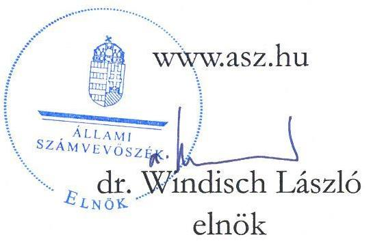
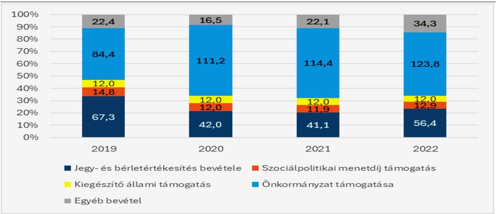
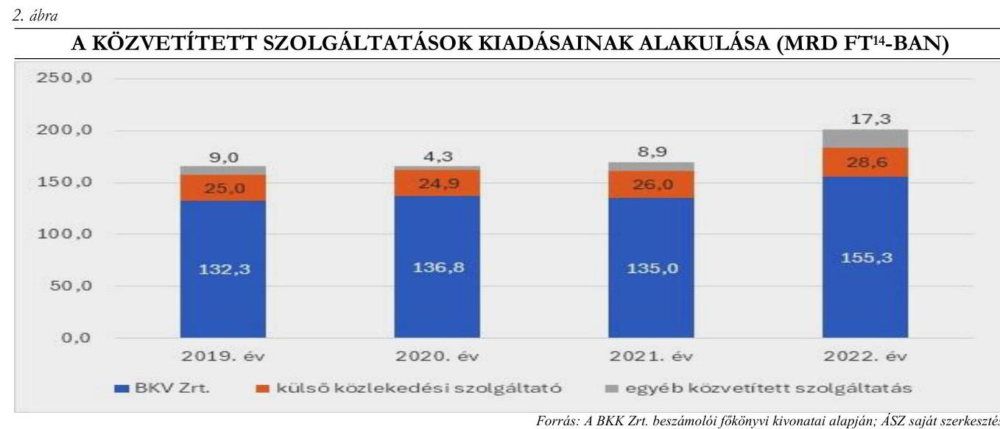
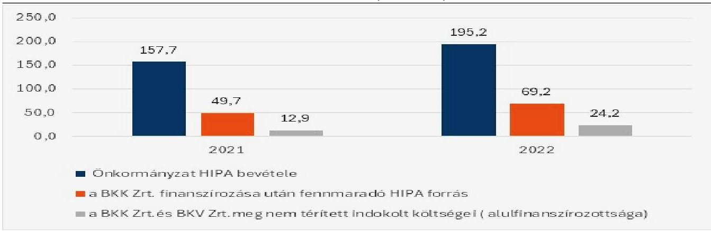
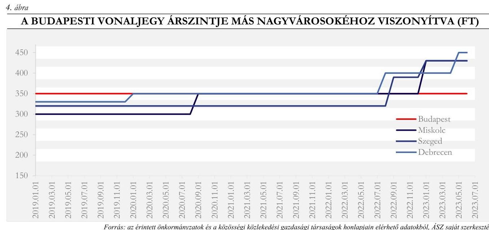
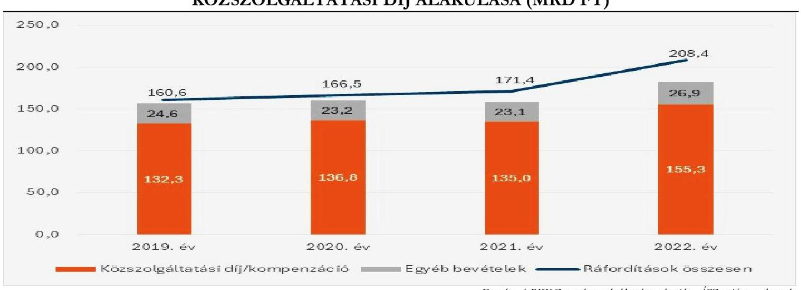
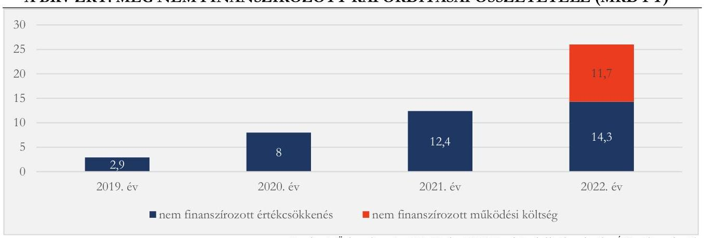
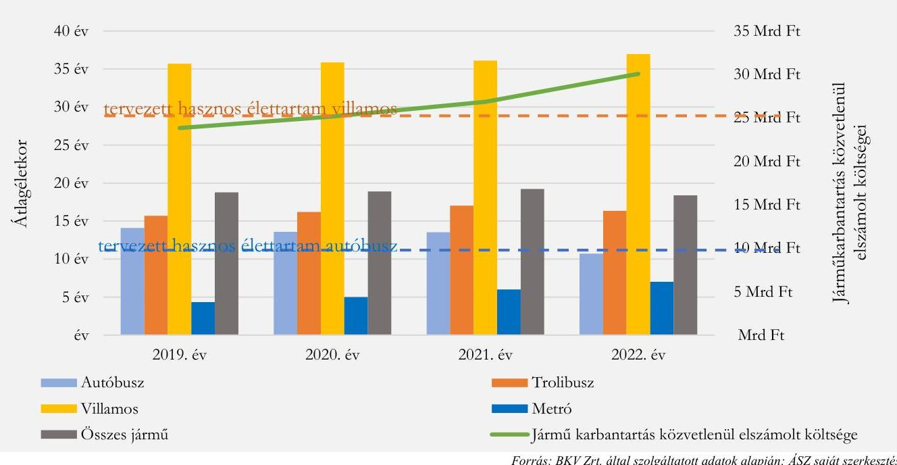
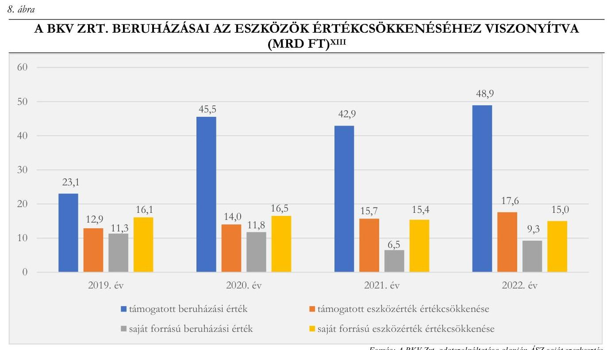
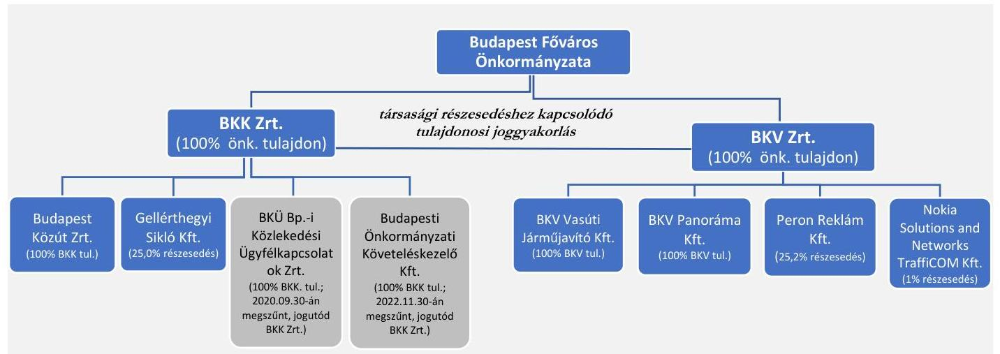

# JELENTÉS 

## Az önkormányzati tulajdonban álló gazdasági társaságok ellenőrzése

A BKK Budapesti Közlekedési Központ Zrt., a Budapesti Közlekedési Zrt. és Budapest Főváros Önkormányzata mint tulajdonos ellenőrzése
2025.

---

# JELENTÉS 

## Az önkormányzati tulajdonban álló gazdasági társaságok ellenőrzése

A BKK Budapesti Közlekedési Központ Zrt., a Budapesti Közlekedési Zrt. és Budapest Főváros Önkormányzata mint tulajdonos ellenőrzése
2025.

25048

---

# ELLENŐRZÉSI IGAZGATÓSÁG: 

## ELLENŐRZÉSI IGAZGATÓSÁG II.

## ELLENŐRZÉSI IGAZGATÓ:

BAFFIA GERGELY GÁBOR ellenőrzési igazgató

## ELLENŐRZÉSVEZETŐ:

BIALKÓ ZSOLT GYULA ellenőrzésvezető

Jelentéseink az interneten a www.asz.hu címen olvashatók.

IKTATÓSZÁM: EL-3909-002/2025
TÉMASORSZÁM: 17
ELLENŐRZÉS-AZONOSÍTÓ SZÁM: V1034

---

# TARTALOMJEGYZÉK 

AZ ELLENŐRZÉS ALAPADATAI ..... 5
AZ ELLENŐRZÖTT SZERVEZETEK ..... 7
ÖSSZEFOGLALÁS ..... 9
AZ ELLENŐRZÉS FÓKUSZTERÜLETEI ..... 13
MEGÁLLAPÍTÁSOK ..... 14
JAVASLATOK ..... 50
MELLÉKLETEK ..... 52
I. sz. melléklet: Értelmező szótár ..... 52
II. sz. melléklet: Az ellenőrzött szervezetek jegyzéke ..... 55
III. sz. melléklet: Ellenőrzési kritériumok ..... 56
IV. sz. melléklet: A bevételek és ráfordítások alakulása a BKK Zrt.-nél és a BKV Zrt.-nél 2019-2022. között (M Ft-ban) ..... 59
V. sz. melléklet: A BKK Zrt. és a BKV Zrt. tulajdonosi szerkezete, leányvállalatai és kapcsolt vállalkozásai az ellenőrzött időszakban ..... 60
FÜGGELÉK: ÉSZREVÉTELEK ..... 61
RÖVIDÍTÉSEK JEGYZÉKE ..... 103

---

.

---

# AZ ELLENŐRZÉS ALAPADATAI 

## AZ ELLENŐRZÉS CÉLJA

Az ellenőrzés célja annak értékelése volt, hogy Budapest Főváros Önkormányzata (a továbbiakban: Önkormányzat) mint tulajdonos megfelelően érvényesítette-e tulajdonosi jogait és teljesítette-e kötelezettségeit a közfeladatellátásban résztvevő BKK Budapesti Közlekedési Központ Zrt.-nél (a továbbiakban: BKK Zrt.) és a Budapesti Közlekedési Zrt.-nél (a továbbiakban: BKV Zrt.). További cél volt annak értékelése, hogy a BKK Zrt. mint az Önkormányzat nevében és képviseletében korlátozott jogkörrel eljáró részvényesi meghatalmazott megfelelően érvényesítette-e jogait és teljesítette-e kötelezettségeit a közfeladatellátásban résztvevő BKV Zrt.-nél.

Az ellenőrzés során értékeltük, hogy az önkormányzati tulajdonú gazdasági társaságok ${ }^{1}$ közfeladatellátásához kapcsolódó, az ÁSZ ${ }^{2}$ által lényegesség alapján kiválasztott vagyongazdálkodási területek vonatkozásában a karbantartási tevékenység megfelelt-e a jogszabályi, belső szabályozási, illetve a tulajdonosi előírásoknak. Az ellenőrzés továbbá kiterjedt a pénzügyi gazdálkodás megfelelőségének vizsgálatára, a követeléskezelés értékelésére, valamint az önkormányzati tulajdonú belső szolgáltató gazdasági társaság közszolgáltatási díjai megállapításának megalapozottságára.

Az ellenőrzés célja volt az önkormányzati tulajdonban lévő gazdasági társaságok közfeladatellátását befolyásoló gazdálkodási kockázatok feltárása és értékelése. További cél volt az utaselégedettség mérésére irányuló tevékenység megfelelőségének, valamint a korábbi belső ellenőrzések megállapításainak hasznosulásának értékelése.

## AZ ELLENŐRZÉS TÍPUSA

Kombinált ellenőrzés

## AZ ELLENŐRZÖTT IDŐSZAK

Az ellenőrzött időszak a 2019-2022. évek, valamint 2023. I. félév.

## AZ ELLENŐRZÉS TÁRGYA

Az Önkormányzat - a tulajdonában lévő BKK Zrt. és BKV Zrt. feletti - tulajdonosi joggyakorlásának, valamint a BKK Zrt. BKV Zrt. feletti, Önkormányzat nevében és képviseletében történő korlátozott jogkörrel eljáró részvényesi meghatalmazott jogköre érvényesítésének értékelése, az önkormányzati tulajdonú gazdasági társaságok pénzügyi és vagyongazdálkodása megfelelőségének (önköltségszámítás, követeléskezelés, karbantartási tevékenység), az utaselégedettség biztosításához és a panaszkezeléshez kapcsolódó tevékenység megfelelőségének értékelése, a közszolgáltatási díjak megalapozottságának ellenőrzése, a belső- és a tulajdonosi ellenőrzések vizsgálata, továbbá a közfeladatellátás gazdálkodási kockázatainak bemutatása volt.

---

Az ellenőrzés kiterjedt minden olyan körülményre és adatra, amely az ÁSZ jogszabályban meghatározott feladatainak teljesítéséhez, valamint a program végrehajtása folyamán felmerült újabb összefüggések feltárásához szükséges volt.

# AZ ELLENŐRZÉS JOGALAPJA 

Az ellenőrzés jogszabályi alapját az Állami Számvevőszékről szóló 2011. évi LXVI. törvény 1. § (3) és 5. § (2)-(4) bekezdései képezték.

## AZ ELLENŐRZÉS MÓDSZERE

Az ellenőrzést a nemzetközi standardokat irányadónak tekintve az ellenőrzési program szempontjai, az ellenőrzött időszakban hatályos jogszabályok, az ellenőrzés szakmai szabályok és módszertanok figyelembevételével végezte az ÁSZ.

Az ellenőrzési bizonyítékként felhasználható adatforrások közé tartoztak egyrészt az ellenőrzéshez kért dokumentumok, adatforrások, másrészt adatforrás lehetett még minden - az ellenőrzés folyamán - feltárt, az ellenőrzés szempontjából információt tartalmazó további dokumentum.

Az ellenőrzés lefolytatásához az ellenőrzött a tanúsítványok kitöltésével és az ÁSZ által kért, teljességi és hitelességi nyilatkozattal alátámasztott dokumentumok, adatok, információk rendelkezésre bocsátásával szolgáltatott az ellenőrzés során adatokat.

Az ellenőrzési kérdések megválaszolásához szükséges bizonyítékok megszerzése az ellenőrzött szervezetek által rendelkezésre bocsátott dokumentumokra, adatokra alapozva megfigyelés, szemle (szemrevételezés), kérdésfeltevés (információkérés), interjú, mintavétel, valamint elemző eljárás útján történt. A tulajdonosi joggyakorlás, a pénzügyi és vagyongazdálkodás ellenőrzése (azon belül a karbantartási tevékenység és a követeléskezelés ellenőrzése), valamint a panaszkezelés és a belső ellenőrzés értékeléséhez kockázati alapú mintavételt alkalmazott az ÁSZ. A kiválasztott mintatételek értékelése egyedileg történt, az eredmények nem kerültek kivetítésre a teljes sokaságra. Amennyiben valamely sokaság elemszáma kisebb volt, mint az előírt mintaelemszám, a sokaságot tételesen ellenőriztük.

---

# AZ ELLENŐRZÖTT SZERVEZETEK 

A fővárosi közösségi közlekedési szolgáltatás biztosítása az Önkormányzat kötelező feladata, melyet gazdasági társaságok útján lát el. Az Önkormányzat a közösségi közlekedés működtetését a közlekedésszervező BKK Zrt.-vel és a belső szolgáltató BKV Zrt.-vel, továbbá korlátozott mértékű külső szolgáltatás bevonásával biztosította az ellenőrzött időszakban.

Az Önkormányzat a BKV Zrt. adósságállományának folyamatos növekedése, a működésképességi és finanszírozási problémák, intézményrendszerbeli és szabályozási anomáliák miatt 2010-ben az intézményrendszer átalakításával, a közlekedési feladatok integrálásával kívánta biztosítani a feladatellátást. Ennek megfelelően a Közgyűlés ${ }^{3}$ 2010. 11. 02-ai hatállyal a közösségi közlekedés intézményrendszerének megújítási szándékával, nemzetközi példákat hasznosítva alapította meg a BKK Zrt.-t, amely az ellenőrzött időszakra vonatkozóan a Kijelölő rendeletben ${ }^{4}$ és a Megbízási szerződésben ${ }^{5}$ kapott a BKV Zrt.-ben meglévő önkormányzati társasági részesedéshez kapcsolódó egyes tulajdonosi jogok gyakorlására felhatalmazást. ${ }^{1}$ A BKK Zrt. a saját szervezetébe integrálta és átvette az Önkormányzat Főpolgármesteri Hivatal Közlekedési Ügyosztálya, a BKV Zrt., a Fővárosi Közterület-fenntartó Vállalat egyes feladatait, valamint a Parking Kft. és a Fővárosi Taxiállomásokat Üzemeltető, Szolgáltató Közhasznú Nonprofit Kft. teljes feladatkörét is.

A BKV Zrt. szolgáltató-üzemeltető társasággá (a Személyszállítási tv. ${ }^{6}$ 2. § 3.b) pontja alapján belső szolgáltatóvá) vált, melynek kizárólagos feladata a BKK Zrt. által megrendelt szolgáltatások szerződés szerinti teljesítése és az infrastruktúra fenntartása lett. A BKV Zrt. autó- és trolibusz (gumikerekes ágazat), villamos és metró (vaskerekes ágazat) és hajóállománya összességében több mint kétezer eszközből állt az ellenőrzött időszakban. A gumikerekes ágazat üzemeltetéséről az Autóbusz és Trolibusz Üzemeltetési Igazgatóság (a továbbiakban: ATÜI), a vaskerekes ágazat üzemeltetéséről a Vasúti Üzemeltetési Igazgatóság (a továbbiakban: VÜI) gondoskodott, a hajózási ágazattal pedig a Fejlesztési és Koordinációs Igazgatóságon belül működő Hajózási iroda foglalkozott. A BKV Zrt. főként turisztikai célzattal működtette kötöttpályás kötélvontatású szállítóeszközeit, a Budavári Siklót és a Zugligeti Libegőt.

## Az Önkormányzat és a BKK Zrt. közötti kapcsolat bemutatása

A Kijelölő rendelet közlekedésszervezőként a BKK Zrt.-t, belső szolgáltatóként pedig a BKV Zrt.-t határozta meg. A közlekedésszervezői feladatok ellátásának részletes szabályait az Önkormányzat és a közlekedésszervező közötti Feladatellátásról és Közszolgáltatásról szóló Keretmegállapodás tartalmazta. A Keretmegállapodás biztosította 2012. 05. 01-jétől, hogy a BKK Zrt. lássa el a közlekedésszervezési és közútkezelési, valamint a közszolgáltatás keretében ellátandó egyes feladatokat.

Az Önkormányzat és a BKK Zrt. között 2016. 04. 01-jétől új Keretmegállapodás ${ }^{7}$ lépett hatályba, melyet az ellenőrzött időszakban 13 alkalommal módosítottak. A Keretmegállapodás szabályozta a BKK Zrt. számára az integrált közlekedésszervezői feladatellátás, a stratégiai közútkezelői feladatellátás, a taxiállomások használatával és a taxi szolgáltatással kapcsolatos ellenőrzési feladatellátás és egyes közlekedésfejlesztési projektek kapcsán ellátandó projektmenedzsment közszolgáltatás szabályait. A Keretmegállapodás alapján az Önkormányzat és a BKK Zrt. minden évben az önkormányzati költségvetési rendelet hatálybalépését követő

[^0]
[^0]:    ${ }^{1}$ részletezve a 2.3. számú megállapításnál

---

30 napon (2023. 05. 31-től „90 napon") belül a közlekedésszervezői forrás tekintetében Közlekedésszervezői Éves Mellékletet (2023. 05. 31-től Éves Szerződést) készített.

A Kijelölő rendelet, a Keretmegállapodás és az 1370/2007/EK rendelet ${ }^{8}$ értelmében a BKK Zrt. mint megrendelő a belső szolgáltató (BKV Zrt.) mellett külső szolgáltatókat is megbízhatott egyes közszolgáltatások ellátásával. Az ellenőrzött időszakban a BKK Zrt.-nek az autóbuszok üzemeltetésére egy belső (BKV Zrt.) és egy külső szolgáltatója (ArrivaBus Kft. ${ }^{9}$ ) volt, a többi közösségi közlekedési közszolgáltatást a belső szolgáltató BKV Zrt. végezte.

Az Önkormányzat az agglomerációs (közigazgatási határt elhagyó, fővárosi helyi közszolgáltatásként működő) közösségi közlekedés megrendelői feladatait 2016. 11. 01-jével átadta az Állam ${ }^{10}$ részére, melynek az állami közszolgáltatók közigazgatási határon belül végzett közszolgáltatási tevékenységéhez - az elővárosi és helyi közösségi közlekedés integrált jellegére tekintettel - költségtérítési hozzájárulást biztosított.

A BKK Zrt. üzleti tevékenysége bevételei forrásösszetételének alakulását a következő ábra mutatja:
1. ábra

A BKK ZRT. ÜZLETI TEVÉKENYSÉGÉNEK BEVÉTELEI 2019-2022. ÉVEKBEN

# A BKK Zrt. és a BKV Zrt. közötti kapcsolat bemutatása 

A BKK Zrt. és a BKV Zrt. között 2012. 05. 01-jétől a fővárosi tömegközlekedési, helyi személyszállítási közfeladatok ellátására Közszolgáltatási szerződés ${ }^{11}$ jött létre, melyet a felek kilenc alkalommal módosítottak, majd 2021. 01. 01-jén új szerződést kötöttek. A BKK Zrt. a Közszolgáltatási szerződés keretében rendelte meg az ágazatonként meghatározott, menetrend szerinti közlekedési szolgáltatást, rögzítve a mennyiségi és minőségi követelményeket, valamint a közszolgáltatással összefüggő részletes szabályokat, köztük a közszolgáltatás költségei ellentételezésének szabályait, valamint a kompenzáció, közszolgáltatási díj kalkulációjának alapját adó módszertant is. A Közszolgáltatási szerződés szerint a BKK Zrt. és a BKV Zrt. minden évben Éves Megállapodást kötött a közszolgáltatási kötelezettség ellátásának adott menetrendi évre vonatkozó feltételeiről, a teljesítménykövetelményekről, a minőségi követelményekről, illetve rögzítették a megrendelt közszolgáltatások ellentételezéseként megfizetendő kompenzáció (2021-től közszolgáltatási díj) összegét és finanszírozási szabályait. A BKV Zrt. bevételei döntő részét a BKK Zrt.-től kapott közszolgáltatási díj tette ki, amelynek aránya az üzleti tevékenység bevételeiből lényegében nem változott 2019-2022 között (84,8% és 86,3% között alakult).

---

# ÖSSZEFOGLALÁS 

A közösségi közlekedés számos okból kiemelkedő szerepet tölt be egy modern társadalomban, mivel jelentősen befolyásolja a légszennyezettséget, a közlekedési torlódások csökkenését, hozzájárul a mobilitás növeléséhez, a gazdaság működéséhez és a városi területek fenntartható fejlődéséhez. A közösségi közlekedéssel kapcsolatos feladatellátás közvetlenül érinti a társadalom széles rétegeit, ezért a közfeladatot ellátó gazdasági társaságok működésének színvonala közvetlen hatást gyakorol a közszolgáltatást igénybe vevő társadalmi csoportokra, a fővárosban és az agglomerációban élő mintegy 2,5 millió ember életminőségére.

A jelen ellenőrzés célja annak vizsgálata volt, hogy az Önkormányzat megfelelően érvényesítette-e tulajdonosi jogait és teljesítette-e kötelezettségeit a közfeladatellátásban résztvevő BKK Zrt.-nél, valamint, hogy a BKK Zrt. megfelelően érvényesítette-e jogait és teljesítette-e kötelezettségeit a közfeladatellátásban résztvevő BKV Zrt.-nél. A gazdasági társaságok kiterjedt gazdálkodására figyelemmel az ellenőrzés a tulajdonosi joggyakorlást fókuszáltan, az önkormányzati tulajdonú gazdasági társaságok pénzügyi és vagyongazdálkodása megfelelőségének (önköltségszámítás, követeléskezelés, karbantartási tevékenység), az utaselégedettség biztosításához és a panaszkezeléshez kapcsolódó tevékenység megfelelősége, a közszolgáltatási díjak megalapozottsága, a belső- és a tulajdonosi ellenőrzések, továbbá a közfeladatellátás gazdálkodási kockázatainak körében vizsgálta. Az önkormányzati tulajdonú gazdasági társaságok gazdálkodásának teljes vizsgálata nem képezte az ellenőrzés tárgyát.

Az Önkormányzat a BKK Zrt. alapítására vonatkozó, a Közgyűlés által elfogadott koncepcióban rögzítette, hogy a BKK Zrt. létrehozatalának elsődleges célja az erőforrások hatékony és integrált felhasználása
 volt. Emellett célként fogalmazta meg a finanszírozás rövid távon érzékelt megoldatlanságát, a közösségi közlekedést biztosító gazdasági társaságok gazdálkodásának nem megfelelő tulajdonosi kontrollját, a közösségi közlekedés infrastruktúrájának és irányításának műszaki színvonalában megmutatkozó több évtizedes lemaradás megszüntetését. Továbbá a koncepcióban szerepelt a rövid távú érdekek érvényesítésével szemben a hosszú távú stabil működésre való törekvés, valamint a rendszerszemlélet és az ügyfélorientált szolgáltatási kultúra kialakítása és a „szervezetek között jellemzővé vált egymásra mutogatás” kiküszöbölése is.

Az Önkormányzat az ellenőrzött időszakban a BKK Zrt. létrehozatalával annak alapítási céljai közül a közlekedésszervezői szakmai kompetenciát biztosította, megerősítve ezzel a feladatellátásra kötelezett, a megrendelői és a szakmai ellenőrzői szerep szétválasztását. Az ÁSZ ellenőrzés a Budapest közösségi közlekedési rendszerének átalakítására vonatkozó koncepcióban kiküszöbölni kívánt hiányosságokat, anomáliákat egy részét az ellenőrzött időszakra vonatkozóan is megállapította, és annak jövőben fennálló kockázatát is azonosította. Az ÁSZ továbbra is hiányosságként állapította meg a teljes mértékű finanszírozás megoldatlanságát, a nem megfelelő tulajdonosi kontrollt, a közösségi közlekedés infrastruktúrájának műszaki színvonalában megmutatkozó több évtizedes lemaradás érdemi csökkentésének elmaradását az értékcsökkenésnél lassabb ütemű fejlesztés miatt, az ügyfélorientált szolgáltatási kultúra teljeskörűségének hiányát és a „szervezetek között jellemzővé vált egymásra mutogatás” részbeni fennmaradását a panaszkezelésnél tapasztaltak alapján, továbbá megállapítást tett az erőforrások hatékony felhasználásának hiányosságaira is a következőkben részletezettek szerint.

A BKK Zrt. életre hívásakor kitűzött cél ellenére a finanszírozás megoldatlansága az ellenőrzött időszakban sem szűnt meg, mivel a közösségi közlekedés jelentősen megnövekedett költségeit az Önkormányzat annak ellenére vállalta magára mind nagyobb mértékben, hogy azokra a forrásokat nem biztosította teljeskörűen. Az Önkormányzattól többlet finanszírozást igényelt a Covid19-járvány és a

---

kapcsolódó intézkedések, majd az energia- és nyersanyagárak, a piaci kamatok és az infláció növekedése, azonban a romló likviditási helyzetében a gazdasági társaságok finanszírozását a szükséges mértékben nem biztosította. Ennek következménye volt, hogy a BKK Zrt. 2019-2020 között, a BKV Zrt. pedig a teljes ellenőrzött időszakban alulfinanszírozottá vált, és ennek mértéke folyamatosan növekedett. Az Önkormányzat bevételét 2022-től mintegy évi 1,1 Mrd Ft-tal csökkentette a 14. életévüket be nem töltött tanulók ingyenes utazási lehetőségéről szóló 2021. évben meghozott, nem megfelelően előkészített közgyűlési döntés. A döntés előterjesztése nem tartalmazta, hogy az ingyenesség bevezetésével nem teljesült az állami szociálpolitikai menetdíj-támogatásra való jogosultság feltétele, ennek következményeként csökkent a finanszírozásra fordítható forrás is, ugyanakkor a kapcsolódó rendeletmódosítás előírta a szociálpolitikai menetdíj-támogatással meg nem térített költségeinek Önkormányzat általi biztosítását a BKK Zrt. részére. Az Önkormányzat az ellenőrzött időszakban a kötelezően ellátandó helyi közösségi közlekedési feladat támogatására évente változatlan, 12 Mrd Ft összegű kiegészítő állami támogatásban részesült, amely a jelentősen megnövekedett költségek egyre kisebb hányadát fedezte. Az Önkormányzat az ellenőrzött időszakban a helyi közösségi közlekedés feladatellátása - általa egyébként elismert - indokolt költségét törvényi előírás ellenére sem térítette meg maradéktalanul a gazdasági társaságainak, illetve a törvényi előírások ellenére 2021-től az Önkormányzatot osztottan megillető adóbevételt nem fordította elsőként a helyi közösségi közlekedési feladat ellátására, hogy a BKV Zrt. alulfinanszírozását megszüntesse.

A belső szolgáltató BKV Zrt. működésében jelenlévő folyamatos és növekvő mértékű alulfinanszírozás gazdálkodási terhe következtében a gazdasági társaság eszközeinek karbantartása, felújítása, új eszközök beszerzése elmaradt az indokolttól, így az eszközök elhasználódási szintje, átlagos életkora és használhatósági foka a villamos és a trolibusz ágazat esetében 2019-hez képest romlott 2022-re. Az eszközök értékcsökkenését huzamos ideig el nem érő pótlása azok részbeni elhasználódásához vezetett. A BKK Zrt. alapítását megalapozó koncepcióban megjelölt közösségi közlekedés infrastruktúrájának műszaki színvonalában megmutatkozó több évtizedes lemaradás csökkentésére tettek lépéseket, azonban a belső szolgáltató fejlesztési kerete összességében nem érte el az avulás mértékét, nem teljesült a kitűzött cél. Az ÁSZ ellenőrzés megállapította, hogy a fővárosi közösségi közlekedés ellenőrzött időszakban tanúsított finanszírozási gyakorlata a jogszabályi előírásokkal ellentétes és kockázatos volt, ennek folytatása a jövőben veszélyeztetheti az üzemszerű működést és a szolgáltatás minőségének romlásához vezethet.

Az Önkormányzat nem biztosította maradéktalanul a BKK Zrt. alapításakor megfogalmazott cél érvényesülését, a gazdasági társaságok gazdálkodása tulajdonosi kontrolljának a kialakítását és működtetését. Az Önkormányzat az ellenőrzött időszakban a BKK Zrt. és a BKV Zrt. vonatkozásában végzett ellenőrzései jellemzően eljárásrendek, szabályozások, feltételrendszerek meglétének kontrollálására korlátozódtak, nem terjedtek ki a BKK Zrt. számára előírt, BKV Zrt. felett gyakorolt szakmai kontrolljai érvényesülésére.

A BKK Zrt. nem végezte el maradéktalanul a Kijelölő rendeletben és a Keretmegállapodásban biztosított „nyomon követési, felügyeleti, ellenőrzési és megkérdőjelezési” tevékenységét, ami hatással volt az Önkormányzat finanszírozási döntéseire, gazdálkodására. A BKK Zrt. elegendő kontrollja hiányában az Önkormányzat nem rendelkezett információval a BKV Zrt. 2022. év végi fizetési kötelezettséggel nem terhelt 7,5 Mrd Ft-os pénzállományáról, ennek következtében az Önkormányzat finanszírozási döntéseit nem a BKV Zrt. tényadataira alapozta. A BKK Zrt. 2023. I. félévében a BKV Zrt. feletti kontrolljai hiányosságai miatt tapasztalt kockázatok csökkentésére lépéseket tett, a BKV Zrt. részére további adatszolgáltatási kötelezettséget írt elő. A BKK Zrt. alapvetően a közösségi közlekedési közszolgáltatás megrendelőjeként járt el, és a tulajdonosi érdeket támogató, a BKV Zrt. működése egészére előírt ellenőrzési tevékenységére nem helyezett elegendő

---

hangsúlyt, illetve a racionalizálásra irányuló javaslatait dokumentáltan nem jelezte a tulajdonos Önkormányzat felé. Ehhez hozzájárult, hogy az Önkormányzat nem megfelelően gyakorolta a tulajdonosi jogait, elmaradt a folyamatos számonkérés, illetve a következmények érvényesítése. A BKK Zrt. a BKV Zrt.-re vonatkozóan a jogszabályi előírásokban, illetve a Kijelölő rendeletben és a Keretmegállapodásban rögzítettek ellenére nem alakított ki a hatékony és eredményes működtetést biztosító kontrollrendszert, nem végzett a BKV Zrt. által kimutatott indokolt költségek felmerülésének megalapozottságát célzó - helyszíni, folyamat- és alapbizonylatszintű - vizsgálatot. A BKK Zrt. az ellenőrzött időszakban a tervezési peremfeltételeket határozta meg a belső szolgáltató részére, és a terv megvalósulását kontrollálta beszámolási rendszeren keresztül. A BKK Zrt. - a Kijelölő rendeletben és a Keretmegállapodásban előírt jogkörében eljárva - észlelte a külső szolgáltató (ArrivaBus Kft.) és BKV Zrt. autóbuszainak eltérő, a külső szolgáltató alacsonyabb fajlagos finanszírozási igényét, azonban az ellenőrzött időszakban a Közszolgáltatási szerződésben foglaltak ellenére nem fejezte be a teljesítményre vetített, fajlagos dí alapú indokolt költségszint megvizsgálását. Ebből következően a BKK Zrt. a Kijelölő rendeletben és a Keretmegállapodásban rögzített jogkörét nem gyakorolta, és kötelezettsége teljesítését elmulasztotta, mivel nem határozott meg a BKV Zrt. szolgáltatási díjszintjének optimalizálására alkalmas módszertant, a közlekedésszervező általi feladatellátással elérni kívánt célok közül a közlekedésre fordítható erőforrások összességében legkedvezőbb felhasználásának feltételeit nem biztosította.

A BKV Zrt.-nél a karbantartások folyamatának dokumentálása - egy vizsgált eset kivételével - szabályszerű módon történt. A karbantartásoknál a gazdaságossági, hatékonysági szempontok nem minden esetben érvényesültek, amihez a finanszírozási nehézségek, valamint ebből következően a járműpark avulása is hozzájárultak. A BKV Zrt. részben azonosította megfelelően - a kockázatok értékelését és annak megfelelő intézkedések meghozatalát segítő módon - a közfeladatellátást érintő gazdálkodási kockázatként, hogy a karbantartások ciklusrendben ${ }^{12}$ előírtaknál alacsonyabb szinten történő megvalósítása, illetve a ciklusrendtől való eltérések kedvezőtlen hatással voltak a járműpark általános állapotára, ezzel növelve a váratlan meghibásodások és a karbantartási költségek emelkedésének kockázatát. A karbantartások ciklusrendtől jellemzően szabályszerű módon való eltérését alapvetően a finanszírozási nehézségek, illetve a megrendelő igényeinek kiszolgálása és a kapcsolódó kötbérfizetés elkerülése okozták. A BKV Zrt. a jogszabályi előírások ellenére nem biztosította az összeférhetetlenségi szabályok betartását és a feladatköri szétválasztás követelményének érvényesítését a karbantartó/javító és ellenőri funkciók esetében, mivel belső szabályzatokban, illetve munkaszervezéssel nem zárták ki az érintett járművön a karbantartást végző személy vizsgáztatási lehetőségét, a kockázat fennmaradt. A BKV Zrt. az egységeinél továbbá nem írta elő egyértelműen a karbantartások vezetői, irányítói ellenőrzési feladatait, ezen ellenőrzések tartalmát.

A BKK Zrt. alapításakor a koncepcióban célként megjelöltek ellenére a szervezetek között jellemzővé vált „egymásra mutogatás” nem szűnt meg teljesen, illetve „az ügyfélorientált szolgáltatási kultúra hiányossága” a panaszkezeléseknél részben tetten érhető volt. A szolgáltatást az utazóközönségnek értékesítő BKK Zrt. a panaszosnak írt tájékoztatásában egyes mintatételek esetében a BKV Zrt. felelősségét rögzítette, amennyiben a BKV Zrt. elismerte szolgáltatói felelősségét, illetve egyéb esetekben a BKV Zrt. panasz megalapozottságát el nem ismerő állásfoglalását közvetítette annak érdemi kontrollja nélkül. Ennek következtében a panaszosok egyes mintatételek esetében nem megfelelően kontrollált tájékoztatást kaptak. A BKK Zrt. és a BKV Zrt. a panaszok kezelésére egységes ügyfélszolgálatot működtetett, azonban 2021 májusáig az ennek rendszerét megalapozó együttműködési megállapodást - a Közszolgáltatási szerződés vonatkozó előírása ellenére - nem kötötték meg, továbbá a panaszok tapasztalatainak rendszerszintű visszacsatolását a BKV Zrt. nem biztosította.

---

Az Önkormányzat a Kijelölő rendeletben és a Keretmegállapodásban a helyi közösségi közlekedési szolgáltatással szemben támasztott minőségi követelményként meghatározta az utaselégedettségi indexet, azonban az ennek értékére hatást gyakorló árra és szolgáltatás elérhetőségére a BKK Zrt.-nek és a BKV Zrt.-nek korlátozottan volt ráhatása, mivel ezek módosításához szükséges jogköröket az Önkormányzat gyakorolta.

Az ÁSZ ellenőrzés megállapította, hogy a BKK Zrt. ellenőrzési, felügyeleti tevékenységének hiányosságai hozzájárultak ahhoz, hogy elmaradt a gazdasági társaságok együttes likviditása problémáinak feltárása, továbbá, hogy a BKV Zrt.-nél a karbantartás és a panaszkezelés területén rögzített szabálytalanságokat sem kezelték megfelelően.

A gazdasági társaságok felsővezetői részére a 2021 februárjától hatályos Javadalmazási szabályzat előírása alapján jutalom nem volt megállapítható. A hatáskörében eljáró főpolgármester a gazdasági társaságok felsővezetőit 2021-től nem kizárólag előre meghatározott teljesítménykövetelmények alapján - azaz nem a jogszabályban szereplő feltételnek megfelelő módon - részesítette prémium kifizetés címen juttatásban, mivel a prémiumfeladatokat a 2021. és 2022. évek vonatkozásában 2021. december 6-án, illetve 2022. december 19-én határozta meg, amikor azok már teljesültek vagy a teljesítésük előrehaladott volt.

A BKK Zrt. követelésállományának mérleg szerinti értéke csökkent (a 2019. 12. 31-i 8,6 Mrd Ft-ról 2022. 12. 31-re 8,3 Mrd Ft-ra), a BKV Zrt.-é nőtt (a 2019. 12. 31-i 5,1 Mrd Ft-ról 2022. 12. 31-re 9,4 Mrd Ft-ra) az ellenőrzött időszakban. A BKK Zrt. követelésállománya jelentős részét a szállítónak fizetett előlegek, illetve a szociálpolitikai menetdíjtámogatás, a BKV Zrt.-ét döntően a visszaigényelhető ÁFA, illetve a BKK Zrt.-vel szembeni közszolgáltatási díj követelés tette ki.

---

# AZ ELLENŐRZÉS FÓKUSZTERÜLETEI 

1. A közfeladatellátás gazdálkodási kockázatainak értékelése
2. A gazdasági társaságok feletti tulajdonosi joggyakorlás megfelelősége
3. A gazdasági társaságok pénzügyi- és vagyongazdálkodásának megfelelősége
4. A gazdasági társaságok utaselégedettséget biztosító tevékenységének és a panaszok kezelésének megfelelősége

---

# 1. A közfeladatellátás gazdálkodási kockázatainak értékelése 

Összegző megállapítás

A gazdasági társaságok a közfeladatellátást befolyásoló gazdálkodási kockázatok többségét azonosították, ezek csökkentésére azonban több esetben hiányosan intézkedtek. A BKK Zrt. - az Önkormányzat meghatalmazottjaként - a 1370/2007 EK rendelet és a Személyszállítási tv. előírásai ellenére nem térítette meg a BKV Zrt. közszolgáltatással kapcsolatos valamennyi indokolt költségét. Az
 Önkormányzat nem tett eleget az MÖtv. előírásának, a kötelezettsége ellenére az Önkormányzatot osztottan megillető adóbevételt nem fordította elsőként és olyan mértékben a BKV Zrt. elismert teljesítménye kifizetésére, hogy az a gazdasági társaság alulfinanszírozottságát 2021-ben és 2022-ben megszüntesse. Az ÁSZ ellenőrzés megállapította, hogy a közösségi közlekedési szolgáltató BKV Zrt. tartós alulfinanszírozása veszélyeztette a szolgáltatások változatlan szinten történő ellátásának hosszútávú és kiszámítható biztosítását. Az ÁSZ feltárt olyan kockázatokat is, amiket a gazdasági társaságok nem azonosítottak.

A BKK Zrt. alapítását a Közgyűlés döntéséhez készített előterjesztés mellékletét képező koncepcióban olyan problémák kezelési igényével indokolták, mint a hosszú távú stratégia, a rendszerszemlélet és „az ügyfélorientált szolgáltatási kultúra hiánya", valamint a közösségi közlekedés infrastruktúrájának és irányításának műszaki színvonalában megmutatkozó több évtizedes lemaradás, illetve a „szervezetek között jellemzővé vált egymásra mutogatás", a gazdálkodásuk nem megfelelő tulajdonosi kontrollja, a finanszírozás már rövidtávon is érzékelt megoldatlansága, rendszerszintű végiggondolatlansága és egymástól elkülönült szabályozása. A BKK Zrt. létrehozatalával az erőforrások hatékony és integrált felhasználása volt az elsődleges cél a koncepció szerint.

## A közösségi közlekedés költségeinek alakulása:

A BKK Zrt. költségei, ráfordításai 2019-hez képest (206 126,8 M Ft ${ }^{13}$ ) 2022 végére (239 699,9 M Ft) 16,3 %-kal emelkedtek. A BKK Zrt. legnagyobb összegű költségei a BKV Zrt. és az autóbuszok üzemeltetésére szerződtetett külső szolgáltató számára kifizetett szolgáltatási díjak voltak. Ezekben - az anyag- és energiaár, üzemanyagár emelkedés miatt - 2022-ben következett be kiemelkedő növekedés, melyet a következő ábra szemléltet:

---

Az egyéb közvetített szolgáltatások részben az Önkormányzattal kötött Megvalósítási Megállapodásokhoz kapcsolódtak, ezek közül a 2021-2022. években kiemelkedő volt a Lánchíd-projekt.
Tekintettel arra, hogy a BKK Zrt. üzleti terveiben a legjelentősebb költséget (64-69%-ot) a BKV Zrt. szolgáltatási díjai képviselték, a BKK Zrt. működési kockázataként azonosította a BKV Zrt. által feltárt, saját tevékenységével összefüggő kockázatait is. Mindkét gazdasági társaság költségek növekedését eredményező kockázatként értékelte az inflációt, az olajpiaci- és a villamosenergia árak jelentős növekedését.
A gazdasági társaságok kockázatként azonosították továbbá a BKV Zrt. nem optimális üzemméretét, ami a költséggazdálkodás hatékonyságát negatívan befolyásolta. A BKK Zrt. a belső szolgáltató BKV Zrt. mellett a külső szolgáltató ArrivaBus Kft.-től is rendelt autóbuszos közlekedési szolgáltatást, azonban a BKV Zrt. a feladatát a külső szolgáltatónál magasabb fajlagos díjért ${ }^{11}$ látta el. A szolgáltatók eltérő fajlagos finanszírozási igénye már az ellenőrzött időszak kezdetét megelőzően kimutatható volt, azonban a BKK Zrt. és a BKV Zrt. csak 2021-ben rögzítette szerződéses kötelezettségként olyan módszertan kialakítását, amely alkalmas a költségek, illetve szolgáltatási díjak megfelelő összehasonlítására. A BKK Zrt. által végzett vizsgálatok rámutattak az eltérő fajlagos finanszírozási igény lehetséges okaira; a belső és a külső szolgáltató részben eltérő feladataira, vonalkiosztásaira, az ebből eredő különböző forgalmi körülményekre, és az eltérő összetételű járműparkra, amelyeket korrekciós tényezőként indokolt figyelembe venni a gazdasági társaságok szerint az összehasonlításnál. A közlekedésszervező BKK Zrt. feladata meghatározó eleme volt - a Kijelölő rendelet 9. § (1) bekezdés d) pontja és a Keretmegállapodás 10.3. pontjának előírása alapján - a tulajdonos Önkormányzat érdekeinek képviselete, ami magába foglalta a belső szolgáltató BKV Zrt. „költségeinek, működésének, teljeskörű nyomon követését, felügyeletét, ellenőrzését, szükség esetén költségei megkérdőjelezését". A BKK Zrt. az ellenőrzött időszakban a Közszolgáltatási szerződés 2.7.6. pontjában foglaltak ellenére a teljesítményre vetített, fajlagos díj alapú indokolt költségszint, illetve szolgáltatási díjszint összehasonlítására alkalmas módszertan megalapozását nem oldotta meg, annak

[^0]
[^0]:    ${ }^{11}$ A fajlagos finanszírozási igény ( $\mathrm{Ft} / \mathrm{kkm}$, a szolgáltatási díj $(\mathrm{Ft})$ és a teljesített futásteljesítmény ( kkm ) hányadosa) számítása a szolgáltatók esetében nem azonos módszertannal történt. A BKV Zrt. esetében a teljes önköltséggel (mely a mindösszesen költségek és ráfordítások és a teljesítmény hányadosa), míg az ArrivaBus Kft. esetében a kifizetett díj és a teljesítmény hányadosával számoltak.

---

véglegesítése nem fejeződött be. A BKK Zrt. a belső szolgáltató külső szolgáltató fajlagos finanszírozási igényéhez képest magasabb szolgáltatási díjához kapcsolódó gazdálkodási kockázatokat a tárgyévi üzleti terveiben nem mutatta be, a megszüntetésükre eredményesen nem intézkedett. A BKK Zrt. alapítási koncepciójában megfogalmazott belső szolgáltató gazdálkodásának megfelelő tulajdonosi kontrolljára vonatkozó igényt korlátozottan támogatta, mivel a BKK Zrt. a szerepét elsősorban megrendelőként azonosította, elemi folyamatvizsgálatokra nem helyezett hangsúlyt, a BKV Zrt.-vel szembeni nyomon követési, felügyeleti, ellenőrzési szerepét jellemzően a „makro mutatók" vizsgálatában azonosította, azonban ilyen jellegű kontrollt az ellenőrzött időszakban - az új rendszer bevezetéséhez szükséges komplex feladatok befejezésének hiányában - nem végzett.

A BKK Zrt. nyilatkozata szerint megrendelőként a belső szolgáltató költségeinek indokoltságát nem elemi folyamatvizsgálat szintjén, hanem rendszerszinten, az üzemeltetés felelősségét nem átvéve tudta vizsgálni, a gazdálkodásában a kontrollt biztosítani. A BKK Zrt. az ellenőrzött időszakot követően a belső szolgáltató gazdálkodási kontrollja tekintetében a fejlesztési lehetőséget a teljes kompenzációs rendszer összehasonlításon, makro mutatók vizsgálatán (korrigált fajlagos díj) alapuló átalakításában látja, mely bevezetésével maga a rendszer ösztönözni a belső szolgáltatót folyamatos hatékonyságjavulásra. A BKK Zrt. a Keretmegállapodásban előírt nyomon követési, felügyeleti, ellenőrzési, megkérdőjelezési tevékenysége keretében kezdeményezte ezen fejlesztő munka megkezdését, erre vonatkozóan - a BKK Zrt. szerint - konkrét kötelezvénye nem volt, és bevezetéséhez az előkészítő munkák elvégzése mellett tulajdonosi szándék is szükséges. A BKK Zrt. 2024. 12. 16-án jegyzőkönyvezett álláspontja szerint „Ennek érdekében kezdeményezte a BKK még 2021. évben az új rendszer bevezetéséhez szükséges komplex feladatok megkezdését. Az átalakítás első lépése (egyelőre a busz ágazatban) az összehasonlítási alap megtalálása (versenyeztetés szolgáltatási díjszint), és ez alapján a belső szolgáltató tekintetében a kalibráció elvégzése. Ennek végzése van jelenleg is folyamatban, több éves tesztek, tárgyalások, elemzések szükségesek a megfelelő kalibráció kialakításához. Ezt követheti a bevezetés feltételeinek meghatározása, majd a bevezetés."
A BKV Zrt. költségei, ráfordításai 2019-hez képest (160 638,1 M Ft) 2022 végére (208 449,3 M Ft) 29,8%-kal növekedtek. A legnagyobb összegű költségek, ráfordítások 2019 és 2021 között a személyi jellegűek, 2022-ben azonban már az anyagjellegűek voltak. Az energiaköltségek 2022-ben rendkívüli mértékben (2019 és 2022 viszonylatában a vontatási áram 257,6%-kal, az üzemeltetési gáz és gázolaj 164,3%-kal, az egyéb energia költségei 229,7 %-kal) emelkedtek, melyek fedezetét az üzleti tervben az Önkormányzat annak ellenére nem biztosította, hogy a közösségi közlekedés működtetése az MÖtv. 23. § (4) bekezdés 10. pontjában előírt kötelező feladata volt, és annak mértékét a Közlekedésszervezői Éves Mellékletben meghatározta. Ez utóbbi kockázattal (megnövekedett költségek megtérítésének elmaradásával) kapcsolatos megállapítások a bevételeket érintő kockázatoknál szerepelnek.
Az Önkormányzat a Keretmegállapodás 13.3. és 13.4. pontja előírása ellenére nem ellentételezte a BKK Zrt. valamennyi elfogadott költségét, míg a BKK Zrt. a Közszolgáltatási szerződés 4.3. pontja előírása ellenére a BKV Zrt. részére nem ellentételezte a belső szolgáltató valamennyi elfogadott indokolt költségét, ami ellentétes volt az 1370/2007/EK rendelet 6. cikk (1) bekezdése és a Kijelölő rendelet 7. § (5) bekezdése előírásaival is. A hivatkozott előírások alapján a BKV Zrt. az indokolt költségek megtérítése mellett jogosult volt a Közszolgáltatási szerződésben foglalt számítási módszertan szerint észszerű nyereségre is. A BKV Zrt. az indokolt költségei megtérítésének elmaradását az üzleti terveiben minden évben jelezte az Önkormányzat felé, azonban erre teljeskörű intézkedés nem történt. A BKV Zrt. elismert indokolt költségeinek tartós és egyre növekvő mértékű meg nem térítése - az ÁSZ megállapítása szerint - a jövőben kockázatot jelent a közösségi közlekedés színvonala - ellenőrzött időszakban tapasztalt szintjének megtartására, javítására.

---

Az Önkormányzat az ellenőrzés során többször hangoztatta, hogy a rendelkezésre álló forrásait csökkentette, hogy 2019-ben 10,0 Mrd Ft, 2020-ban 21,8 Mrd Ft, 2021-ben 35,4 Mrd Ft, míg 2022-ben 35,7 Mrd Ft szolidaritási hozzájárulást fizetett meg. Az Önkormányzat hivatkozott arra is, hogy az ellenőrzött időszakban a kötelezően ellátandó helyi közösségi közlekedési feladat támogatására évente változatlan, 12 Mrd Ft összegű kiegészítő állami támogatásban részesült.
Az Önkormányzat a 2021. és 2022. években nem tett eleget az MÖtv. 2020. 01. 01-től hatályos 13. § (3) bekezdése és 112. § (1a) bekezdése, valamint a Forrásmegosztási törvény ${ }^{15}$ 2020. 01. 01-től hatályos 3. §a, továbbá a 2021. 01. 01-től hatályos Helyiadótv. ${ }^{16}$ 36/A. §-a, illetve a Ptk. ${ }^{17}$ 6:137. §-a előírásainak, mivel annak ellenére nem térítette meg a gazdasági társaságok helyi közösségi közlekedéssel kapcsolatos, általa elismert indokolt költségeit, hogy az Önkormányzatot osztottan megillető adóbevételt elsőként erre a célra kell felhasználnia. Az Önkormányzat rendelkezésére álló helyi iparűzési adó bevételek lehetővé tették a közösségi közlekedés alulfinanszírozottságának megszüntetését. Ezt szemlélteti a következő ábra:
3. ábra

A KÖZÖSSÉGI KÖZLEKEDÉS ALULFINANSZÍROZOTTSÁGA A HIPA ${ }^{18}$ FORRÁSOKHOZ VISZONYÍTVA (MRD FT) ${ }^{111}$

Forrás: Az Önkormányzat 2024. 12. 10-es adatszolgáltatása és a BKK Zrt., BKV Zrt. adatszolgáltatásai alapján, ÁSZ saját szerkesztés
Az ÁSZ V1019 Budapest Főváros Önkormányzata költségvetésének és zárszámadásának ellenőrzése tárgyú ellenőrzéséről készült 24015 számú jelentése tartalmazza az Önkormányzat költségvetés-tervezési és zárszámadás-készítési folyamatának szabályozottsága, költségvetése tervezésének, módosításának, az előirányzatok nyilvántartásának és betartásának, az éves beszámolási és zárszámadási kötelezettség teljesítésének szabályszerűsége, az Önkormányzat pénzügyi egyensúlyi helyzete alakulásának értékelését.

# A közösségi közlekedés bevételeinek alakulása: 

A BKK Zrt. bevételei a 2019. évhez képest (201 433,7 M Ft) a 2022. év végére (239 939,8 M Ft) 19,1%-kal emelkedtek, ezen belül a legnagyobb mértékben az Önkormányzattól származó közlekedésszervezői forrás növekedett a 2020. évben az előző évhez képest. Az Önkormányzat prioritásként kezelte a közösségi közlekedés minél szélesebb körben való elérhetőségét és használatát, valamint figyelembe kellett vennie a Személyszállítási tv.-ben rögzített személyszállítási szolgáltatás egyéni közlekedéssel szembeni

[^0]
[^0]:    ${ }^{111}$ A BKK Zrt. és BKV Zrt. alulfinanszírozottsága értékei együttesen szerepelnek az ábrán (pl. a BKK Zrt. indokolt költségeit az Önkormányzat 2022-ben megtérítette). Az ábrán a BKK Zrt. és a BKV Zrt. meg nem térített indokolt költségeiként évenként az adott évre realizált és meg nem térített összegek szerepelnek.

---

versenyképességének követelményét ${ }^{\mathrm{IV}}$, ezért a jegy- és bérletárakat a 2013. évi viteldíjemelést követően néhány általánostól eltérő jegytípust (díjterméket) leszámítva - nem emelte. A természetes személyek által vásárolt bérletek árai 2014-től átlagosan 10%-kal csökkentek, és az ellenőrzött időszakban is változatlanok maradtak. Az ellenőrzött időszakban korlátozottan volt lehetősége díjemelésre az Önkormányzatnak, mivel a 2020. 12. 19. - 2022. 06. 30. közötti időszakban a hatályos veszélyhelyzeti jogszabályok alapján a díjtermékek árai nem emelkedhettek ${ }^{\mathrm{V}}$.

A BKK Zrt. díjtermékei módosítására vonatkozó 2022. szeptemberi közgyűlési előterjesztés azt is rögzítette, hogy „A budapestiek által használt vonaljegy, illetve a nemrégiben bevezetett, átszállásra is használható időalapú jegy esetében állandó jelleggel felmerül az egyéni gépjárműhasználat és a közösségi közlekedés közötti választás igénye, ezért itt egy
 kisebb mértékű árváltozás is a közösségi közlekedés arányának csökkenésére vezethetne. A budapesti városvezetés ezért mindaddig, amíg erre pénzügyileg egyáltalán lehetősége van, a budapestiek által használt alapvető jegy- és bérlettermékek árának nominális szinten tartására törekszik." Az előterjesztés szerint a többletkompenzáció „elmaradása a budapestiek által használt alapvető jegy- és bérlettermékek ára befagyasztásának fenntarthatóságát is megkérdőjelezheti." Az Önkormányzat az ellenőrzött időszakban a repülőtéri vonaljegy árát 2022 júliusában 67%-kal és 2023 áprilisában 47%-kal; a napijegyekét 2022 szeptemberében 33-52%-kal; a pótdíjakat 2022 szeptemberében 50%-kal emelte a helyszíni pótdíj és 56%-kal az utólagos pótdíj esetében. Az árváltozás közösségi közlekedés igénybevételére gyakorolt hatására vonatkozó álláspontját a közgyűlési előterjesztő hatástanulmánnyal nem támasztotta alá.
A költségemelkedés ellenére elmaradó fővárosi áremeléssel szemben az ellenőrzött időszakban a busz- és villamos relációval is rendelkező vidéki városok önkormányzatai, Debrecen ${ }^{19}$, Miskolc ${ }^{20}$ és Szeged ${ }^{21}$ 31,1%-kal, 34,2%-kal, illetve 25,7%-kal emelték a bérleteik díját. A vonaljegyek ára a városok sorrendjében 39,4%-kal, 43,3%-kal és 34,4%-kal növekedett 2019 és 2022 között. A hivatkozott díjtermékek ára annak ellenére nem maradt el lényegesen a budapestitől, hogy a nyújtott szolgáltatások (üzletágak, vonalhosszok, területi lefedettség, elérhetőség stb.) korlátozottabbak voltak, illetve a vidéki városokban, valamint vonzáskörzetükben ${ }^{\mathrm{VI}}$ alacsonyabb volt a bérszínvonal, mint a budapesti agglomerációban ${ }^{\mathrm{VII}}$.

[^0]
[^0]:    IV egyéb figyelembe veendő tényezők a törvény alapján a működéshez szükséges nyereség, elvonások és támogatások
    ${ }^{\mathrm{V}}$ A moratórium lejárta után több esetben sor került díjtermékek díjainak emelésére, azonban ezek korlátozott körűek voltak, a bérleteket és a leggyakrabban használt vonaljegyeket nem érintették.
    VI Vonzáskörzetnek itt az adott megyeszékhelyt magában foglaló járást tekintettük.
    VII Az ellenőrzött időszakot követően, 2023 szeptemberétől az Önkormányzat a vonaljegyek árának 30%-kal történő emeléséről döntött.

---

Miskolc, Szeged, Debrecen vonaljegyárai is meghaladták a budapesti vonaljegyárat az ellenőrzött időszak végére. A természetes személyeknek szóló havi bérletek árai Miskolcon, Szegeden és Debrecenben nem érték el a budapesti bérletárat (9500 Ft) 2023. 06. 30-ra, de megközelítették azt (Miskolcon 9400 Ft, Szegeden 8800 Ft, Debrecenben 8500 Ft volt).
A teljesség kedvéért azonban szükséges megjegyezni, hogy a fent említett önkormányzatok, valamint az Önkormányzat helyzete, illetve a közösségi személyszállítási közszolgáltatásaik körülményei nem teljesen azonosak, továbbá a közösségi közlekedést választó utazók számára gyakorolt nyilvánvaló hatás miatt a viteldíjak (jegyek, bérletek stb.) árainak meghatározásakor nem csupán gazdasági, hanem egyéb (pl. közlekedési, városüzemeltetési, környezetvédelmi stb.) szempontokat is figyelembe kell venni. Ezen komplex döntés értékelése nem képezte az ellenőrzés tárgyát és az ÁSZ ezzel kapcsolatosan nem tett megállapítást.
A Covid19-járvány miatti bevételkiesés mellett a költségek növekedését követő általános díjemelés elmaradása is növelte a közlekedésszervezés és közösségi közlekedési közszolgáltatás kompenzációs igényét.
Az Önkormányzat döntési jogkörébe tartozott annak meghatározása, hogy a közösségi közlekedés finanszírozásában milyen arányt képviselnek a menetdíjbevételek és mennyi saját forrásból nyújtott támogatással kerülnek kiegészítésre. Az Önkormányzat azáltal, hogy a megnövekedett költségek ellenére nem emelte a menetdíakat, vállalta, hogy növeli a saját hozzájárulását a finanszírozásban. Ennek a kötelezettségének nem teljes mértékben tett eleget, ami ellentétes volt a 1370/2007/EK rendelet 6. cikk (1) bekezdése és a Kijelölő rendelet 7. § (5) bekezdése előírásaival is. (Részletes megállapítások a jelentés 1. fókuszterület későbbi részénél és a 2. fókuszterületnél találhatók.) A finanszírozási hiányosságoknak hatása volt a közösségi közlekedés eszközparkja elavulására és a közszolgáltatás romló színvonalú ellátását kockáztatta.
Az Önkormányzat a 2020. évtől bevezette az álláskeresők díjmentes havi bérletét, továbbá 2021. 09. 02-tól a 14. életévüket be nem töltött tanulók ingyenes utazási lehetőségét. A döntés hatására a közösségi közlekedés finanszírozási forrásaiból kiesett éves szinten mintegy 1,1 Mrd Ft a 14. életévüket be nem töltött tanulók után járó állami szociálpolitikai menetdíj támogatás ${ }^{22}$, mivel az ingyenesség bevezetésével az igénylés 121/2012. (VI. 26.) Kormányrendeletben rögzített feltételei nem álltak fenn. Az

---

Önkormányzat feladata volt az elmaradt állami szociálpolitikai menetdíj támogatás pótlása az Mötv. előírása alapján. (Az Önkormányzat döntésével kapcsolatosan az ÁSZ a jelentés 2. fókuszterületnél tett megállapításokat.)
A BKK Zrt. többek között működése kockázataként azonosította - az Önkormányzat likviditási helyzetéből adódó - közlekedésszervezésre havonként igényelt, de nem teljes mértékben átutalt összegét, az alulfinanszírozottság rendezésének elmaradását, a Covid19-járvány következtében elmaradó bevételeket, és 2022-től a 14. életévüket be nem töltött tanulók után kieső, a közlekedésszervezőt illető szociálpolitikai menetdíj támogatás önkormányzati kompenzációjának elmaradását. A BKK Zrt. az Önkormányzat részére készített negyedéves működési beszámolóiban, a vezetői összefoglalókban minden alkalommal rögzítette az adott év kiemelt kockázatait, ezek között az alulfinanszírozás és a likviditási nehézségek kérdését. Az Önkormányzat a BKK Zrt. alulfinanszírozása miatt 2021-ben és 2022-ben a gazdasági társaság a saját tőkéjének emelésére (1,5 Mrd Ft, illetve 1,8 Mrd Ft soron kívüli pótbefizetésre) kényszerült, ezzel annak működési kockázatait csökkentette, ez hozzájárult a közlekedésszervező 2021. évre vonatkozó alulfinanszírozottsága megszüntetéséhez.
A BKV Zrt. bevételeinek növekedése szignifikánsan (13,6 százalékponttal) elmaradt a költségei, ráfordításai növekedési ütemétől, azok 2019-hez képest (156 844,0 M Ft) 2022 végére (182 242,5 M Ft) 16,2%-kal emelkedtek. A bevételek közül leginkább a BKK Zrt.-től származó kompenzáció/közszolgáltatási díj nőtt. Ennek legnagyobb összegszerű emelkedése 2022-ben következett be, amikor 2021-hez képest a BKK Zrt. 20 370,1 M Ft-tal magasabb összegű díjat fizetett a BKV Zrt.-nek az anyag-, energia- és üzemanyagár növekedése miatt. A BKK Zrt.-től származó kompenzáció/közszolgáltatási díj növekedési üteme azonban így is elmaradt a ráfordítások növekedésétől, amit a következő ábra szemléltet:
5. ábra

# A BKV ZRT. KÖZSZOLGÁLTATÁS RÁFORDÍTÁSAI ÉS AZ AZÉRT KAPOTT KÖZSZOLGÁLTATÁSI DÍJ ALAKULÁSA (MRD FT) 

A BKK Zrt. és a BKV Zrt. közfeladatellátást befolyásoló kiemelt kockázatként azonosította a belső szolgáltató veszteséges üzleti tervéből eredő jelentős összegű, és egyre növekvő alulfinanszírozását (a BKV Zrt. szempontjából bevétel elmaradását). Ez a gazdasági társaságok által azonosított kockázat az ellenőrzött időszak minden egyes évében fennállt. A BKV Zrt. a 2021. évi üzleti tervében már azt is jelezte az Önkormányzat felé, hogy a 2020. évi alulfinanszírozottságának megtérítése az üzleti évet követő elszámolás után sem volt biztosított. Az Önkormányzat tervezési és finanszírozási gyakorlata ellentétes volt a 1370/2007/EK rendelet 6. cikk (1) bekezdése és a Kijelölő rendelet 7. § (5) bekezdése, valamint a

---

Keretmegállapodás 13.3. és 13.4. pontja, továbbá a 2020. december 31-ig érvényes Közszolgáltatási szerződés 4.2.7. pontja, illetve a 2021. január 1-től érvényes Közszolgáltatási szerződés 4.2.6. pontja előírásával. A kiugró mértékű energiaárváltozás miatt megemelkedett költségei ellentételezésére a BKV Zrt. mind a 2022-es, mind a 2023-as üzleti tervében állami támogatást szerepeltetett (2022-ben 14,1 Mrd Ft, 2023-ban 14,0 Mrd Ft összegben) annak ellenére, hogy a támogatás megítélése bizonytalan volt. Ez a nem realizálódott forrás 2022-ben a fenntartó Önkormányzat intézkedési kötelezettségét, többlet támogatási igényét vonta maga után, melynek biztosításáról és annak mértékéről a Közgyűlés 2022. 12. 20-án határozott.
Az ÁSZ megállapította a követelések kezelésének nem megfelelő szabályozását, ami a gazdasági társaságok bevételei teljesülésére kockázatot jelentett (lásd a 3. fókuszterületnél feltártakat), és a továbbra is fennálló szabályozási hiányosságok a jövőben is a követelés behajtásának ellehetetlenülésének kockázatát hordozzák magukban.

# A gazdasági társaságok finanszírozásának elégtelensége és annak negatív hatásai az eszközök műszaki állagára, állapotára: 

A BKK Zrt. közlekedésszervezői feladatok ellátásával kapcsolatban felmerült költségei nem fedezett, de elismert részét a Keretmegállapodás 13.7. pontja előírása ${ }^{\text {VIII }}$ ellenére az Önkormányzat 2019. évre részben rendezte, míg 2020. évre nem térítette meg.

A BKK Zrt. 2021. évi üzleti tervben kimutatott közlekedésszervezői alulfinanszírozottságot teljes egészében megszüntette az Önkormányzat, 2022-ben pedig - a pénzügyi műveletek eredménye miatt - felülfinanszírozottá vált. A kedvező finanszírozás következményként a BKK Zrt. adózott eredménye az ellenőrzött időszakban folyamatosan javult, 2022 végére pedig - a pénzügyi műveletek eredményének köszönhetően - nyereséges lett.
Az Önkormányzat a BKV Zrt. előzetes üzleti tervében, illetve a végleges üzleti tervében szereplő finanszírozási igényét terv szintjén sem biztosította, ezért az évek során a gazdasági társaság már tervezéskor veszteséggel számolt. A közgyűlési előterjesztők a BKV Zrt. 2019-2020-2021. évi üzleti terveinek közgyűlési előterjesztéseiben a tervezett veszteség okaként az Önkormányzat által meg nem finanszírozott értékcsökkenést jelölték meg. A 2022. és 2023. üzleti évben a tervben szerepeltetett veszteséget tovább növelte, hogy a korábbi évekkel szemben már nemcsak az értékcsökkenés, hanem a működési költségek teljes fedezetét sem biztosította az Önkormányzat.
Az Önkormányzat az ellenőrzött időszak üzleti éveit követően a BKV Zrt. teljesítését elismerte, az alulfinanszírozás megszüntetésére vonatkozó igényét megvizsgálta, azonban a BKV Zrt. kockázatainak csökkentésére nem intézkedett, mivel a saját, valamint a gazdasági társaságok pénzügyi helyzetéhez igazította a feladatfinanszírozást. Az elszámoláskor az Önkormányzat a BKV Zrt. értékcsökkenését 2019-2021 között részben térítette meg, illetve a 2022. évben a finanszírozandó értékcsökkenés mellett a működési költségelemek egy részét sem ellentételezte. Az Önkormányzat a BKV Zrt. alulfinanszírozottságának BKK Zrt. által megállapított összegét 2019-ben részben térítette meg, majd a forráshiánya miatt 2020 júniusában áttért a likvidalapú finanszírozásra, és az ellenőrzött időszak további éveiben - a már hivatkozott 1370/2007/EK rendelet 1. cikk (1) bekezdés, 3. cikk (2) bekezdés, 4. cikk (1)

[^0]
[^0]:    VIII Alulfinanszírozás esetén az Önkormányzat a közlekedésszervezői feladatok ellátásával kapcsolatban felmerült költségek közlekedésszervezői forrásaiból nem fedezett, Önkormányzat által elismert részét a Közlekedésszervezői Éves Elszámolás Fővárosi Közgyűlés általi elfogadását követően legkésőbb 30 napon belül köteles volt megfizetni a BKK Zrt.-nek.

---

bekezdés b) pontja és a 6. cikk (1) bekezdés előírása ellenére - egyáltalán nem térítette meg a BKV Zrt. elismert alulfinanszírozását.
6. ábra

# A BKV ZRT. MEG NEM FINANSZÍROZOTT RÁFORDÍTÁSAI ÖSSZETÉTELE (MRD FT) ${ }^{\text {IX }}$ 

Forrás: Az Önkormányzat, a BKK Zrt. és a BKV Zrt. adatszolgáltatása alapján, ÁSZ saját szerkesztés
Az Önkormányzat hiányos finanszírozásából eredő kockázatokat csökkentette, hogy a BKV Zrt. tőkehelyzete - a BKK Zrt. értékelése szerint - stabil volt ${ }^{\mathrm{X}}$, illetve az értékcsökkenés megtérítésének elmaradása nem okozott működési nehézséget rövid távon, mivel a BKV Zrt. 2022. évben a felmerült költségek kifizetését halasztotta, a szállítói kötelezettségeit növelte. Az alulfinanszírozottság ugyanakkor folyamatos gazdálkodási (likviditási) nehézséget jelentett a minden évben egyre növekvő összegű veszteséget elkönyvelő BKV Zrt. működésében. Ez 2019-től 2022-ig az évek sorrendjében -3,8 Mrd Ft, -6,6 Mrd Ft, -13,3 Mrd Ft és -26,2 Mrd Ft eredményt jelentett, ami a saját tőke fokozatos csökkenését eredményezte (2019. december 31-én 232,3 Mrd Ft, 2020. december 31-én 225,8 Mrd Ft, 2021. december 31-én 212,4 Mrd Ft, 2022. december 31-én
 186,4 Mrd Ft volt a saját tőke).
Az alulfinanszírozás következtében a gazdasági társaságok eszközeinek ${ }^{\mathrm{XI}}$ elhasználódási szintje, átlagos életkora és használhatósági foka 2019-hez képest romlott 2022-re. Ennek az alapvetően a BKV Zrt. alulfinanszírozásából származó kockázatát a gazdasági társaságok azonosították és üzleti terveikben jelezték.

[^0]
[^0]:    ${ }^{\text {IX }}$ Az ábrán a BKK Zrt. által elismert alulfinanszírozottság értékei szerepelnek. A BKK Zrt. a BKV Zrt. által kimutatott indokolt költséghez képest az ellenőrzött időszak egyes éveiben évente 1,0 milliárd Ft körüli korrekciót alkalmazott. 2019-ben a BKK Zrt. által megállapított 10,3 milliárd Ft alulfinanszírozottságból 7,4 milliárd Ft-ot az Önkormányzat megtérített, ezért ez az összeg figyelembevételre került az ábrán. A finanszírozandó értékcsökkenés értékeinél a Közszolgáltatási szerződés szerint a közszolgáltatás kompenzációjával/közszolgáltatási díjjal finanszírozható értékcsökkenési leírásokat vettük figyelembe (halasztott bevételekkel csökkentett értékcsökkenések), vagyis a támogatásokból megvalósult eszközbeszerzések értékcsökkenéseit nem.
    X a BKK Zrt. gazdasági igazgatójának ÁSZ ellenőrzés részére tett 2024. 01. 11-ei nyilatkozata
    ${ }^{\mathrm{XI}}$ Ingatlanok és kapcsolódó vagyoni értékű jogok; Műszaki berendezések, gépek, járművek; Egyéb berendezések, felszerelések, járművek

---

A BKV Zrt. a járműállomány műszaki állapotát összefoglalóan annak átlagos életkorával jellemezte. A járművek átlagéletkora és a karbantartási költségek (járműkarbantartás közvetlenül elszámolt költségei) alakulását a következő ábra mutatja ${ }^{\mathrm{XII}}$ :
7. ábra

A JÁRMŰVEK ÉLETKORA ÉS A KARBANTARTÁSI KÖLTSÉGEK ALAKULÁSA

A BKV Zrt. járműkarbantartásainak közvetlenül elszámolt költségei folyamatosan nőttek, 2019-ről 2022-re összesen 26,2%-kal, az anyagjellegű és személyi jellegű karbantartási költségek, ráfordítások növekedése megközelítőleg azonos arányú volt (az előbbi 26,7%-kal, az utóbbi 25,3%-kal nőtt). A villamos ágazatnál a 26 db új jármű beszerzése ellenére az átlagos járműéletkor a tervezett hasznos élettartam fölé emelkedett. A metró ágazatban az átlagos járműéletkor lassan növekedett, de az lényegesen alatta maradt a metró jármű 30 évben meghatározható hasznos életkorának. A karbantartási költségek növekedését mérsékelte, hogy az autóbuszok átlagéletkora a járműbeszerzéseknek és a flotta legrosszabb állapotú darabjai kivonásának köszönhetően lassan, majd 2022. év végére nagyobb ütemben csökkent az előző év végéhez képest (2019-től 2022-ig az évek sorrendjében 14,1 év; 13,6 év; 13,5 év; 10,7 év volt). Az autóbuszflotta átlagéletkorára ugyanakkor 4-5 évet tart a BKV Zrt. megfelelőnek az összegzett költségek és a szolgáltatási színvonal együttes optimumaként. A karbantartási költségek növekedési ütemét szintén lassította, hogy a VÜI ${ }^{23}$-nél 2021. májusától módosították a ciklusrendet, ami a jármű karbantartási volumen csökkenését eredményezte.
A VÜI forrás- és kapacitáshiány miatt egyes jármű karbantartásokat a karbantartási ciklusrendben előírtaknál alacsonyabb műszaki tartalommal végezte el, illetve 2021-ben úgy módosította a ciklusrendet, hogy egyes nagyobb karbantartási ciklusokat időben későbbre helyezett. A gyakorlat folytatása kockázatot jelent a járművek műszaki állapotára, valamint az optimális költséggazdálkodásra. A VÜI egy 2022. májusi, a BKV Zrt. Igazgatósága elé terjesztett elemzésében kockázatként feltárta a csökkentett mértékű karbantartást és megoldási lehetőségeit, azonban a villamosokra vonatkozóan (ahol a ciklusrendtől való eltérések jelentkeztek) ezt a kockázatot nem szerepeltették a VÜI 2019-2022. évi éves, a kockázatkezelésre

[^0]
[^0]:    XII A közösségi közlekedést szolgáló eszközök karbantartása kulcsszerepet tölt be a megfelelő színvonalú, biztonságos közlekedés működtetésében. A járműpark általánosan kedvezőtlen állapota növeli a váratlan meghibásodások kockázatát, és a karbantartási költségek növekedését vetíti előre.

---

javasolt intézkedéseket megalapozó kockázatértékeléseiben. A VÜI ugyanakkor a ciklusrend módosítását megelőzően és azt követően statisztikai elemzéssel alátámasztott vizsgálatot végzett, amely a műszaki hibák számában a ciklusrend módosítás hatására nem mutatott növekedést. A ciklusrend módosításakor figyelembe vették a forgalombiztonsági szempontokat.
A BKV Zrt. az autóbuszok és trolibuszok esetében nem azonosította a közfeladatellátást érintő gazdálkodási kockázatként azt, hogy a karbantartások esetenként a ciklusrendben előírtaknál időben később valósultak meg.
Az ÁSZ továbbá feltárta, hogy a karbantartási tevékenység eredményessége és hatékonysága mérésére szolgáló megfelelő mutatószámok használatának hiánya (lásd a 3. fókuszterület megállapításait) is kockázatot jelent a karbantartási folyamat és annak költségei áttekinthetőségére, nyomon követhetőségére, valamint a megalapozott és célszerű karbantartási döntések meghozatalára.

# A gazdasági társaságok beruházásai forrásösszetétele, mértéke: 

A BKK Zrt. 2019 és 2022 között 55,2 Mrd Ft összegű beruházást aktivált, ennek a 42,2%-át 2019-ben. A BKK Zrt. beruházásai elegendő saját forrás hiányában a külső forrásbevonási lehetőségektől függtek, a beruházások 98,3%-ban külső forrásból (alapvetően az Európai Uniótól és az Önkormányzattól kapott támogatásokból) valósultak meg.
A BKV Zrt. a 2019-2022. években 168,9 Mrd Ft összegű beruházást aktivált, továbbá a befejezetlen beruházások, felújítások értéke is növekedett 30,5 Mrd Ft-tal (főként az M3 metró beruházás projekt miatt), ami meghaladta az elszámolt értékcsökkenést (123,2 Mrd Ft). A műszaki gépek, berendezések, járművek könyv szerinti értéke viszont összességében csökkent 2019. év vége és 2022. év vége között (0,3 Mrd Ft-tal), vagyis a beruházások, felújítások az utóbbi eszközöknél nem érték el az elszámolt értékcsökkenés szintjét. Kiemelkedő volt a járművek könyv szerinti értékének csökkenése ugyanezen időszakban, ami 18,0 Mrd Ft (10,8%) volt.

A műszaki gépek, berendezések, járművek könyv szerinti értéke viszont összességében annak ellenére csökkent 2019. év vége és 2022. év vége között, hogy az ellenőrzött időszakban ért véget az M3-as metró felújítása. Továbbá az autóbuszpark esetében sor került 343 db új autóbusz vásárlása, bérlése mellett 377 db autóbusz forgalomból történő kivonására 2019 és 2022 között. Ebben az időszakban az Önkormányzat gondoskodott új villamosok és trolibuszok beszerzéséről is.
A BKK Zrt. és a BKV Zrt. kockázatként azonosították, és az üzleti terveikben jelezték a tulajdonos Önkormányzat felé, hogy a tartós alulfinanszírozás miatt a BKV Zrt. szükséges beruházási forrásai nem kerültek megképzésre, ezért elegendő saját forrás hiányában a beruházásokra döntően (79,8%-ban) külső forrásokat vettek igénybe.

Az eszközök értékcsökkenésének kompenzálása, az eszközök pótlása vizsgálatánál indokolt megkülönböztetni a támogatásból megvalósult beruházásokat, beszerzett eszközöket és a saját forrásból megvalósult beruházásokat, beszerzett eszközöket. Az előbbi esetben a támogatások a támogatások arányában fedezetet biztosítanak az értékcsökkenésre is, míg a saját forrásból megvalósított eszközök értékcsökkenésének pótlásáról saját forrásból (ideértve a közszolgáltatásért kapott kompenzációt is) kell gondoskodni.
A saját forrású beruházások megvalósulását és az értékcsökkenéshez viszonyítva a szükségestől való elmaradó mértékét a következő ábra szemlélteti, melyen szerepelnek a támogatásból megvalósult eszközök értékcsökkenési és beruházási adatai is:

---

Az ÁSZ kockázatként azonosította, hogy beruházások tervezhetősége és a megvalósításuk is bizonytalanná vált elegendő saját forrás hiányában. További kockázatot jelent, hogy az eszközök pótlásának elmaradása a műszaki színvonal megőrzését, a biztonságos üzemeltetést veszélyezteti, illetve a karbantartási költségek emelkedését vonja maga után.

# A gazdasági társaságok eladósodottságának mértéke, szerkezete, a likviditás problémái: 

A külső források bevonásának kényszere miatt a gazdasági társaságok eladósodottságának mértéke és eladósodottsági foka (lásd az 1. mellékletben definiált mutatókat) nőtt 2019. és 2022. között. A BKK Zrt. eladósodottságának mértéke 19,7%-kal, az eladósodottság foka 38,5%-kal, a BKV Zrt. eladósodottságának mértéke 36,8%-kal, az eladósodottság foka 1,7%-kal nőtt.
Az Önkormányzat az évek során a közösségi közlekedés alulfinanszírozása mellett esetenként késedelmesen tett eleget a finanszírozási kötelezettségének, ezért a gazdasági társaságok likviditása az évek során folyamatosan romlott ${ }^{\mathrm{XIV}}$. Ennek áthidalására, a likviditás biztosítására a BKK Zrt. és a BKV Zrt. is többször a folyószámlahitel-kerete növelésére kényszerült az ellenőrzött időszakban.
A likviditási kockázatnak kitettebb BKV Zrt. jelezte az üzleti terveiben a folyósított közszolgáltatási díjból származó bevételek és kiadások időbeli eltérését, illetve az év során felhasználásra kerülő folyószámlahitel év végi törlesztéséhez szükséges forrás rendelkezésre állásának hiányát. A likviditási kockázatok rövidtávú csökkentésére - többek között - folyószámlahitel, szállítói faktoring, halasztott adófizetés és egy esetben követelés értékesítés lehetőségével terveztek, majd éltek. A 2019-2021. évekkel szemben 2022-ben már mind a BKK Zrt., mind a BKV Zrt. likviditást biztosító hitel felvételére kényszerült. Előbbi a 6,0 Mrd Ft

[^0]
[^0]:    XIII a beruházásokhoz értve itt a felújításokat is
    XIV A BKV Zrt. likviditási gyorsrátája átmeneti javulását okozta a 2022. év végén a betétszámláin lévő jelentős összeg, amelynek felhasználását követően a negatív tendencia folytatódott, a likviditása romlott.

---

keretösszegű folyószámlahitel keretét többször igénybe vette 2022-ben, amely hitelkeret 2023. I. félévben 7,0 Mrd Ft-ra nőtt, továbbá a BKK Zrt. a saját, átmeneti finanszírozása biztosítása érdekében 2023. májusában forgóeszköz-hitelszerződést kötött 24,0 Mrd Ft értékben. A BKV Zrt. 2022-ben 10,0 Mrd Ft keretösszegű, 2023. I. félévben 14,0 Mrd Ft keretösszegű folyószámlahitelt vett igénybe. A BKV Zrt. kockázatként azonosította a 2022. évi extrém magas energiaárak hatását, ami a tervezést és a fizetőképességet is veszélyeztette. A belső szolgáltató a felmerült kockázatokat jelezte a BKK Zrt. felé.

A helyzet kezelésére az Önkormányzat a gazdasági társaságaival rendszeresen egyeztetett, válságbizottságot hozott létre, Energiakrízis Intézkedési Tervet állítottak össze az energiafelhasználás csökkentése érdekében. A BKK Zrt.-t ezekben a hónapokban sújtotta az is, hogy 2022-ben a közlekedésszervezői források fizetési ütemezését módosították, így az Önkormányzat a 2022. évre járó közlekedésszervezői forrásból 9,7 Mrd Ft összeget csak 2023. januárjában teljesített. Az Önkormányzat az energiahordozók jelentős áremelkedése, továbbá a BKV Zrt. üzleti tervében szerepeltetett, de nem realizált állami energiatámogatásra tekintettel 2022. 12. 20-án a BKV Zrt. 13,0 Mrd Ft értékű plusz támogatásáról döntött, mely összegből 3,2 Mrd Ft-ot a BKK Zrt.-nek kellett biztosítania. A támogatás BKV Zrt. részére való utalása megtörtént.
Az Önkormányzat finanszírozási döntéseinek meghozatalát befolyásolhatta a BKV Zrt. év végi pénzügyi helyzetének BKK Zrt. általi megítélése. A BKK Zrt. a Kijelölő rendelet 9. § (1) bekezdés d) pontjában meghatározott 1370/2007 EK rendelet 5. cikk (2) bekezdésében biztosított ${ }^{\mathrm{XV}}$ irányítási és ellenőrzési jogkörében nem járt el, és a Keretmegállapodás 10.3. pontjában előírtak ellenére nem gyakorolt a BKV Zrt. felett olyan kontrollt, mely biztosította a BKV Zrt. 2022. év végi pénzügyi helyzetének pontos meghatározását. A BKK Zrt. a BKV Zrt. felett a 2022. év végéig gyakorolt kontrolltevékenysége nem szavatolta minden esetben, hogy a finanszírozási döntések meghozatalakor valamennyi, a döntés szempontjából lényeges információ az Önkormányzat rendelkezésére álljon ${ }^{\mathrm{XVI}}$.

A BKK Zrt. a BKV Zrt. 2022. 11. 12-én megküldött, decemberre vonatkozó forráslehívási tervére hagyatkozott, melyhez változásjelzés már az évben nem érkezett a közlekedésszervezőhöz. A BKV Zrt. 2022. 12. 27-én megküldte a 2022. 12. 23-ai záróegyenlegét a BKK Zrt.-nek, amelyben 2,2 Mrd Ft záróegyenleget és az átmenetileg szabad pénzeszközeit hasznosító 5,4 Mrd Ft-os lekötést jelzett.

A BKK Zrt.-nek nem volt tudomása arról, hogy év végéig a BKV Zrt.-nek nem keletkezik jelentős fizetési kötelezettsége, ezért a BKV Zrt.-nél meglévőnél mintegy 7,5 Mrd Ft-tal alacsonyabb összegű szabad pénzállománnyal kalkulált.
A 2022-es folyamatosan romló likviditási helyzetben a gazdasági társaságok nem készültek fel megfelelően a likviditási nehézségek kezelésére, a folyószámlahitel-keretük
 megemelésére nem tettek összehangolt lépéseket. A válsághelyzet okozta likviditási nehézségek orvoslásához szükséges mértékű folyószámlahitelkeretek hiányában az egyik számlavezető által már 2022 nyarán ajánlott, rugalmatlanabb finanszírozást biztosító követelésértékesítés lehetőségével éltek. Ezen lépést nem előzték meg ajánlatkérések más finanszírozási konstrukció kidolgozására. Az ajánlatok kérésének elmulasztásával a BKK Zrt. és a BKV Zrt. nem szerzett érvényt a Közszolgáltatási szerződés 3.3. pontjában előírtaknak, mely szerint a BKK

[^0]
[^0]:    XV Az Önkormányzat közvetlenül ítélt oda közszolgáltatási szerződést olyan jogilag elkülönült jogi személy részére, amely felett illetékes helyi hatóság (az Önkormányzat) - illetve hatóságcsoport esetén legalább egy illetékes helyi hatóság (a BKK Zrt.) - a saját szervezeti egységei feletti ellenőrzéshez hasonló ellenőrzést gyakorolhatott.
    XVI A BKK Zrt. - a 2022. évi tapasztalatai alapján - a Kijelölő rendeletben és a Keretmegállapodásban biztosított jogosítványaival élve intézkedett a BKV Zrt. feletti kontrollja fokozásáról, mellyel kapcsolatos megállapításokat az 1. fókuszterület későbbi bekezdései rögzítik.

---

Zrt. késedelmes fizetése esetén a gazdasági társaságok kötelesek mindent megtenni annak érdekében, hogy a többletköltségeket minimalizálják.

A 2022 végén várható likviditási nehézségek kezelésével kapcsolatban 2022 augusztusában a K&H Bank Zrt. kereste meg a BKV Zrt.-t egy a folyószámlahitel-keretnél rugalmatlanabb, a K&H Faktor Pénzügyi Szolgáltató Zrt.-vel (továbbiakban Faktor) megkötendő háromoldalú követelésvásárlásra és engedményezésre vonatkozó ajánlatával. A BKK Zrt. és a BKV Zrt. az erre vonatkozó szerződést a főpolgármester jóváhagyását követően 2022. 12. 22-én kötötte meg a Faktorral. A finanszírozási problémák kezelésére alkalmazott követelésértékesítés tárgya a BKV Zrt. BKK Zrt.-vel szembeni 2023. 01. 02-án esedékes közszolgáltatási díj követelésének eladása volt, ahol a számla összegét a faktorcég 2023. 01. 25-én utalta át a BKV Zrt. bankszámlájára. A követeléseladással megvalósított finanszírozás ténylegesen nem a 2022. év végi, hanem a 2023. évi likviditási hiány kezelését szolgálta. A szerződésben rögzítettek alapján a BKV Zrt. a BKK Zrt.-vel szembeni 2023. 01. 02-án esedékes, 11 245,2 M Ft összegű közszolgáltatási díjról szóló számlájából eredő követelése értékesítésére 2023. 01. 25-ig egyösszegben volt lehetőség. A szerződéses feltételek szerint a BKV Zrt.-nek csak a teljes követelése értékesítésére volt lehetősége, mivel a BKK Zrt. felé kiállítandó számláját a Közszolgáltatási szerződés rugalmatlansága miatt nem volt lehetősége részszámlázásra, illetve a részszámlákból eredő követeléseket különböző időben adja el, csökkentve ezzel a halasztott fizetésből eredő finanszírozási költséget. Az ügylet díjait a BKK Zrt. fizette meg, mint ahogy fizetési haladékot is a BKK Zrt. kapott. A gazdasági társaságok annak ellenére nem éltek más ajánlat bekérésének lehetőségével, hogy a BKK Zrt. 2023. 03. 15-ei pénzügyi teljesítéséig az ügylet költségei összesen 300,5 M Ft-ot értek el, mely költséget az átmenetileg szabad pénzeszközök lekötései mérsékeltek.
Az Önkormányzat a romló likviditási helyzete miatt a gazdasági társaságokat kötelezte, hogy a 2023. év első féléves működésük során a 2023. évi költségvetési rendeletében megállapított forrásnak legfeljebb a 45%-át használják fel a megnövekedett energiaárak, az inflációs hatások és az esetlegesen elmaradó bevételek fedezetére a folyamatos tartalék képzése érdekében. Ez az intézkedés nem bizonyult elegendőnek, mivel a BKK Zrt. a BKV Zrt. likviditása fenntartása érdekében 2023 májusában az Önkormányzat és a BKK Zrt. megállapodása alapján ismét pénzintézeti forrás bevonására kényszerült. Ekkor nem közvetlenül a közösségi közlekedés finanszírozására kötelezett Önkormányzat, hanem a BKK Zrt. vett fel 24,0 Mrd Ft értékben forgóeszköz-hitelt. A hitelt 673,0 M Ft-os tervezett kamat terhelte, melynek összegének megtérítését az Önkormányzat vállalta a BKK Zrt. részére $^{XVII}$.
A BKK Zrt. BKV Zrt. feletti szakmai ellenőrzésének hiányosságai $^{XVIII}$ hozzájárultak ahhoz, hogy az Önkormányzat rendelkezésére álló források csökkentek, terhelve ezáltal az Önkormányzat gazdálkodását. A folyamatosan romló likviditási helyzet ellenére a BKK Zrt. 2022-ben nem szigorította a BKV Zrt. pénzügyi helyzetét kontrolláló eljárásait, csak 2023. I. félévében intézkedett a belső szolgáltató feletti kontrollja hiányosságainak kiküszöbölésére, melyeket a 2022 decemberi tervezési, likviditáskezelési folyamatban szerzett tapasztalatok indukáltak.

Az együttes likviditáskezelés erősítése érdekében a BKK Zrt. gyakorította és fokozta az ellenőrzést, ennek hatására BKV Zrt.-nek már kéthetente meg kellett küldenie a BKK Zrt. részére az aktualizált napi szintű likviditási terveit. A korábban is megküldött likviditási tervek, pénzeszközök egyenlegei, kiegészültek kontrolltáblákkal, melyek a BKV Zrt. szállítóiról, számláiról, fizetési határidőiről a pénzügyi helyzetéről tartalmaztak információkat. Ezen kívül a BKK Zrt. intézkedett az

[^0]
[^0]:    XVII A BKK Zrt. 2024. 12. 20-ai nyilatkozata szerint a tényleges - ellenőrzött időszakon túlnyúló - kamatfizetés 398,7 M Ft volt.
    XVIII a 2. fókuszterületnél rögzített megállapítások, pl. a BKK Zrt. nem tárta fel, hogy a BKV Zrt. 2022 december végére vonatkozóan alultervezte szabad pénzállományát

---

indokolt esetben a BKV Zrt.-vel tartandó soron kívüli operatív egyeztetésekről, illetve előkészültek egy Treasury osztály létrehozására. $^{XIX}$

A BKK Zrt. a 2023. évben megvizsgálta a BKK Zrt. és a BKV Zrt. közötti cash pooling $^{XX}$ rendszer bevezetésének a lehetőségét, a folyószámlák csoportszintű menedzselése érdekében. A kezdeményezéssel az Önkormányzat is egyetértett. A rendszer célja volt a likviditás fenntartásával kapcsolatos döntések optimalizálása, a BKK Zrt. magasabb szintű kontrollja a BKV Zrt. felett, illetve a likviditás biztosításához kapcsolódó költségcsökkentés.
A cash pooling rendszer bevezetésére az ÁSZ ellenőrzés lezárulásáig nem került sor. Ennek elmaradása miatt nem javult a gazdasági társaságok likviditás biztosításának költséghatékonysága, az ezen a területen azonosított kockázat fennmaradt $^{XXI}$.
A feladatellátásra kötelezett Önkormányzat döntései miatt a gazdasági társaságok 2022. évben és 2023. I. félévben nem minden esetben kapták meg a folyamatos működésükhöz szükséges forrásokat, ennek következtében a BKK Zrt. és a BKV Zrt. likviditást biztosító átmeneti külső forrásbevonásai az ellenőrzött időszak második felében általánossá váltak. Ezek az intézkedések, valamint az ideiglenes kiadáscsökkentések az aktuális évben a gazdasági társaságok azonnali fizetőképességét biztosították, azonban összességében költségnövekedést okoztak. Ennek a növekvő adósságszolgálatnak a költségeit pedig közvetetten a tulajdonos Önkormányzatnak kellett utóbb megfinanszíroznia.
A gazdasági társaságok az átmenetileg szabad pénzeszközeiket azok hasznosítása érdekében betétként lekötötték. A BKK Zrt. továbbá intézkedéseket tett az általa is kockázatként azonosított követelések peres eljárásai csökkentése érdekében (a követeléskezeléssel kapcsolatos részletes megállapítások a 3. fókuszterületnél kerülnek bemutatásra).
A BKK Zrt. és a BKV Zrt. nem azonosította közfeladatellátást érintő gazdálkodási kockázatként a nem megfelelő követeléskezelés miatti esetleges veszteségeket, annak ellenére, hogy ezt az ÁSZ által jelen ellenőrzés 3.2. pontjában feltárt hiányosságok indokolták.
A BKV Zrt. a likviditás elvesztése kockázatának csökkentése érdekében új bevételek megszerzésére is tett intézkedéseket (pl. mérnöki szolgáltatás, szakfelügyelet, hulladékértékesítés bevétele, üzemanyagértékesítés), illetve energiahatékonysági és energiatakarékossági lépésekkel ért el megtakarításokat (pl. megújuló energia telepítése, fűtési rendszer és világítás korszerűsítése, nyílászáró csere). A bevételnövelő intézkedésekből a BKV Zrt.-nek az ellenőrzött időszakban összesen 12,4 Mrd Ft bevétele származott, ami ezen időszaki összbevételének 1,6%-a volt, kiadáscsökkentő intézkedésekből 11,1 Mrd Ft megtakarítása származott ezen időszakban, ami ezen időszaki összráfordításának 1,3%-át tette ki.
Az Önkormányzat, a BKK Zrt. és a BKV Zrt. által hozott bevételnövelő és költségcsökkentő intézkedések a gazdálkodási kockázatokat mérsékelték, de azokat nem szüntették meg.
A közösségi közlekedés feladatellátásának rendszere - a hiányosságai ellenére is - lehetővé tette az ellenőrzött időszak Covid19-járvány és energiaválság terhelte éveiben is a fővárosi közösségi közlekedés

[^0]
[^0]:    XIX A Treasury osztályt az ellenőrzött időszak lezárásakor létrehozták.
    XX A cash pooling rendszer támogathatja a gazdasági társaságok likviditását, ennek közösségi közlekedést működtető gazdasági társaságoknál való alkalmazását 2013-ban az ÁSZ a 13060 és 13061 számú jelentéseiben is bemutatta.
    XXI A BKK Zrt. 2024. 12. 20-án nyilatkozatában jelezte az ÁSZ felé, hogy 2025. 01. 02-től indul a cash pooling rendszer, amit az ÁSZ csak utóellenőrzés keretében ellenőrizheti.

---

utaselégedettségi vizsgálatok eredményeiben is visszatükröződő színvonalú működtetését. Az Önkormányzat a BKK Zrt. alapításával biztosította egy szakmailag kompetens közlekedésszervező létrejöttét, azonban az alapítás céljai nem valósultak meg maradéktalanul. Az ÁSZ a közlekedésszervező tevékenységével kapcsolatosan az alapításkori célok tükrében a következő hiányosságokat azonosította:

- A BKK Zrt. BKV Zrt.-vel fennálló kapcsolatában alapvetően a „közöszolgáltatás megrendelőjeként" értelmezte a szerepét. A közlekedésszervező a belső szolgáltatóval kapcsolatos ellenőrzési, felügyeleti, nyomon követési tevékenysége során indokolatlanul csak részben gyakorolta az Önkormányzat által biztosított jogosítványait;
- A BKK Zrt. nem alakított ki olyan módszertant, amely alkalmas a BKV Zrt. költségei, illetve külső szolgáltatási díjak megfelelő összehasonlítására, továbbá az indokolt költségek, a karbantartások helyszíni ellenőrzése hiánya miatt nem tett maradéktalanul eleget Keretmegállapodásban leírtaknak. Ezek a hiányosságok korlátozták a BKK Zrt. létrehozatala elsődleges céljának, az erőforrások hatékony és integrált felhasználásának az érvényesülését is;
- Az Önkormányzat nem biztosította a BKK Zrt. indokolt költségei megalapozottságának vizsgálatát, továbbá nem tárta fel a gazdasági társaságok követeléskezelésében rejlő, bevételeket veszélyeztető kockázatokat;
- A Keretmegállapodásban és Közszolgáltatási szerződésben meghatározottól eltérő finanszírozás hatással volt a gazdasági társaságok eszközeinek az elhasználódására, illetve megnehezítette hosszú távú stratégia kialakítását. A finanszírozás problémája - elsősorban a BKV Zrt. alulfinanszírozásában - továbbra sem oldódott meg az ellenőrzött időszakban;
- Az Önkormányzat a tulajdonosi joggyakorlás keretében működtetett kontrollrendszer esetenként nem biztosította a döntések megfelelő előkészítését;
- A BKK Zrt. alapításakor kihívásként jelölték meg „a szervezetek között jellemzővé vált egymásra mutogatást", illetve „az ügyfélorientált szolgáltatási kultúra hiányát". A gazdasági társaságok panaszkezelésének közös eljárásrendjét csak 2021 májusában fogadták el, azonban a szervezetek közötti egymásra mutogatás a működésben továbbra sem szűnt meg teljesen, mivel az utazó közönség részére értékesítő BKK Zrt. panasz esetén egyes esetekben a BKV Zrt. illetékességét hangsúlyozta, továbbá a panaszok tapasztalatainak rendszerszintű visszacsatolása a BKV Zrt.-nél nem volt biztosított.

---

# 2. A gazdasági társaságok feletti tulajdonosi joggyakorlás megfelelősége 

Összegző megállapítás

Az Önkormányzat tulajdonosi joggyakorlása a BKK Zrt. és a BKV Zrt. vonatkozásában részben volt megfelelő. Az Önkormányzat BKK Zrt. és BKV Zrt. vezetőivel kapcsolatos javadalmazási gyakorlata és a feladatok teljesülésének számonkérése nem felelt meg az előírásoknak. A BKK Zrt. a tulajdonos által számára előírt ellenőrzési, felügyeleti és nyomon követési tevékenységet nem látta el teljeskörűen.
2.1. számú megállapítás

Az Önkormányzat BKK Zrt. feletti tulajdonosi joggyakorlása részben volt megfelelő, mivel nem biztosította a BKK Zrt. indokolt költségei megalapozottságának felülvizsgálatát, továbbá a felsővezetők premizálása szabálytalanul történt, és a tulajdonosi kontroll nem érvényesült megfelelően.

Az Önkormányzat a tulajdonosi joggyakorlás körébe tartozó - alapvető - kontrolltevékenységek kereteit kialakította a BKK Zrt. tekintetében. A Közgyűlés elfogadta a BKK Zrt. Alapszabályát, valamint a Taktv. $^{24}$ és a Ptk. előírásainak megfelelően jóváhagyta az Önkormányzat tulajdonosi érdekeit képviselő felügyelőbizottság működési kereteit. A felügyelőbizottság az üléseit minden ellenőrzött évben az előírt rendben tartotta meg.
 A BKK Zrt. az ellenőrzött időszakban a Ptk. és a Számv.tv. ${ }^{25}$ előírásainak megfelelően független könyvvizsgáló szolgáltatását vette igénybe. Az Önkormányzat minden ellenőrzött évben elfogadta a BKK Zrt. üzleti tervét és éves beszámolóját. Ezek jóváhagyásakor a Ptk. előírásainak megfelelően rendelkezésre álltak az írásbeli felügyelőbizottsági jelentések, továbbá a Ptk. és a Számv.tv. előírásainak megfelelően a könyvvizsgálói jelentések.
Az Önkormányzat a Kijelölő rendeletben, a Megbízási szerződésben, a Keretmegállapodásban, annak Éves Mellékleteiben, valamint a Monitoring-Controlling Kézikönyvben írta elő a BKK Zrt. saját adatszolgáltatására vonatkozó feladatait, és határozta meg a BKK Zrt. BKV Zrt.-vel szembeni „nyomon követési, felügyeleti és ellenőrzési" kötelezettségeit.
Az Önkormányzat a Bkr. ${ }^{26}$ 3. § e) pontjában, 8. § (1) bekezdésében és a Kijelölő rendelet 13. § (1) bekezdés előírása ellenére nem végezte el a Keretmegállapodás 10.3. pontjában a BKK Zrt. feladataként meghatározottak teljesülésének számonkérését. A feladatellátás kontrolljának elmaradása több esetben hozzájárult, hogy a közösségi közlekedéssel kapcsolatosan nem volt biztosított megfelelő információ a Közgyűlés megalapozott döntéseinek meghozatalához.

Az Önkormányzat közösségi közlekedésre vonatkozó döntéseinél nem állt rendelkezésre a BKK Zrt. által készített, teljes mértékben megalapozott kalkuláció a 2022. év decemberében, mivel 7,5 Mrd Ft-tal alacsonyabb összegű pénzállományt mutatott ki a BKV Zrt. vonatkozásában. Továbbá az Önkormányzat nem a Bkr. 3. § e) pontjában és 8. § (1) bekezdésében és a Kijelölő rendelet 13. § (1) bekezdésében előírtaknak megfelelően kontrollálta a gazdasági társaságok felsővezetői prémiumáról, valamint a 14. életévüket be nem töltött tanulók ingyenes utazási lehetőségéről szóló előterjesztést sem.
Az Önkormányzat rendeletmódosításához készített főpolgármesteri előterjesztés, illetve az azt alátámasztó hatásvizsgálat a Jat. ${ }^{27}$ 17. § (2) bekezdés a) pontjának előírása ellenére nem tartalmazta annak a jelentős hatásnak a bemutatását, hogy az ingyenessé tétel után az eladott diákbérletekhez kapcsolódó szociálpolitikai menetdíj-támogatás megszűnésével jelentősen

---

csökkent a finanszírozásra fordítható forrás ${ }^{\text {XXII }}$. A döntéselőkészítésben részt vevő BKK Zrt. nem mérte fel teljeskörűen a szabályozás módosításának várható következményeit, így a Taktv. 7/J. $\int^{\text {XXIII }}$ (3) bekezdés f) pontjában előírtak ellenére nem működtette megfelelően az Önkormányzat érdekei védelmét szolgáló kontrollrendszert. Az Önkormányzat a közgyűlési előterjesztést megelőzően a Bkr. 3. § e) pontjának és 8. § (2) bekezdés b) pontjának előírása ellenére hiányosan működtette a kontrolltevékenységeket., ezért a BKK Zrt. által előkészített dokumentumok célszerűségi, gazdaságossági, hatékonysági és eredményességi szempontú megalapozottsági vizsgálata nem volt megfelelőXXIV.
A BKK Zrt. saját tőkéje az alaptőke kétharmada alá csökkent a 2020. és a 2021. évben, ezért az Önkormányzat a Ptk. előírásának megfelelően intézkedett a saját tőkéje megemelésére. Az Önkormányzat a 2020. évi eredmény miatt 2021-ben 1,5 Mrd Ft, a 2021. évi eredmény miatt pedig 2022-ben 1,8 Mrd Ft soron kívüli pótbefizetésről határozott, illetve teljesített. Ez az intézkedési kötelezettség annak a következménye volt, hogy az Önkormányzat a BKK Zrt.-t az ellenőrzött időszak első felében alulfinanszírozta.
A 2021. februárjától hatályos Javadalmazási szabályzat 2.5. pontjában előírtak szerint a BKK Zrt. vezető állású munkavállalója részére jutalom nem volt megállapítható. Az Önkormányzat 2021-től a BKK Zrt. egyes vezetői premizálásáról döntött. A prémium a Taktv. 5. § (1) bekezdése definíciója alapján teljesítménybérnek minősült. A vezetői prémiumfeladatokat a hatáskörében eljáró főpolgármester a 2021. és 2022. évek vonatkozásában 2021. december 6-án, illetve 2022. december 19-én határozta meg ${ }^{\mathrm{XXV}}$, ugyanakkor az ÁSZ ellenőrzés megállapította, hogy a prémiumfeladatok korábban teljesültek vagy már előrehaladott teljesítésű feladatok voltak azok előírásakor, ezáltal megsértették az Mt. ${ }^{28}$ 137. § (2) és a 138. § (4) bekezdés előírását. Az Önkormányzat eljárása ellentétes volt a Bkr. 8.§ (2) bekezdés b) pontjában rögzítettekkel, mivel a kialakított kontrollok nem biztosították a vezetői prémium jogszabályszerű meghatározását.

A főpolgármester a vezetői prémium kitűzésekor nem határozott meg konkrét feladatot (eredményterméket), így nem tartozott mérhető, teljesítménykövetelmény az „Operatív direktőrséghez tartozó területek optimális működési kereteinek megteremtése, működési kiválóság erősítése" megjelölésű feladathoz.

A prémiumfeladatokat több esetben olyan határidővel határozta meg a főpolgármester, amely már lejárt, olyan feladatok kerültek kiírásra, melynek teljesülése már korábban megtörtént (a teljesség igénye nélkül: a 2021. 12. 06-án kitűzött feladatok közül már megvalósult a Előkészített FUTÁR rendszer 2.0 fejlesztés 2021. 10. 31-ig; új, korszerű BUBI szolgáltatás 2021. 05. 20-ig. A 2022. 12. 19-én előírt feladatok közül már megvalósult a BUBI bővítés 2022. 07.23-áig; a FUTÁR rendszer megújításából (FUTÁR 2.0) a járművek/közterületi kijelzők 4G cseréje 2022. 11. 30-ig; a Megújított termékportfólió, bevezetett új termékek, árváltoztatások 2022. 10. 01-ig (a 100E vonaljegy ára 2022. 07. 01-től, más díjtermékeké 2022. 09. 01-től módosult); PR stratégia elkészítése 2022. 07. 31-ig; Bevételbiztosítási stratégia kialakítása 2022. 09. 30-ig; a Vezetői információs rendszer 1.0 fejlesztése és bevezetése, IT fejlesztési igénybejelentő rendszer
XXII A 121/2012. (VI. 26.) Korm. rendelet vonatkozó előírása alapján $3850 \mathrm{Ft} /$ hó/db támogatás járt a tárgyhónapban eladott kedvezményes árú bérletekre, függetlenül a kedvezmény mértékétől. Az állami támogatás ingyenessé tétel esetén nem volt igénybe vehető.
XXIII A Taktv. 7/J. §-a 2020. januárjától hatályos
XXIV A döntés mintegy évi 1,1 Mrd Ft összegű gazdasági kihatása az 1. fókuszterületnél részletezésre került.
XXV A prémium célkitűzéseket a BKK Zrt. javasolta az Önkormányzatnak, a BKK Zrt. a 2021. évi célkitűzéseket 2021. 07. 05-én, a 2022. évi célkitűzéseket 2022. 07. 06-án juttatta el az Önkormányzat részére.

---

kialakítása, Vállalati architektúra menedzsment rendszer bevezetése 2022. 06. 30-ig megtörtént; a BudapestGO továbbfejlesztés applikációja 2022. 02. 14-én elindult).
A BKK Zrt. vezérigazgatója 2022. 03. 08-án, illetve 2023. 03. 02-án annak ellenére javasolta a 2021. és 2022. évre vonatkozó prémiumok kifizetését a főpolgármesternek a 35/2022. (II. 28.) és 30/2023. (II. 27.) számú igazgatósági határozatra alapozva, hogy a prémiumfizetés egyik feltétele még nem teljesült, a BKK Zrt. 2021. és 2022. évi tulajdonos által elfogadott, és könyvvizsgáló által záradékolt számviteli beszámolója nem készült el. A prémiumok kifizetéséről a főpolgármester a Közgyűlés által elfogadott, és a könyvvizsgáló által záradékolt számviteli beszámoló elfogadását követően határozott. Az igazgatósági határozatokkal a 16/2022. (III. 04.) és a 12/2023. (II. 28.) számú határozata szerint a felügyelőbizottság is egyetértett, annak ellenére, hogy a határozatok alapját képező teljesítményértékelőlapok rögzítették azt, hogy a premizált feladatokat esetenként azok kitűzését megelőzően végrehajtották.
A prémiumfeladat 20%-át minden premizált személy esetében a vezetői kompetencia értékelése adta (komplex döntéshozatal 5%; stratégiai gondolkodás 5%; csapatmunka, együttműködés 5%; vezetés 5%), amely mérhetőségét tekintve szubjektív, jellegére nézve elsősorban nem feladatként, hanem a kinevezés feltételeként elvárható képességként definiálható.
Az Önkormányzat Nvtv. ${ }^{29}$-ben meghatározott tulajdonosi minőségben eljáró ellenőrzési egysége a BKK Zrt.-nél 11 esetben folytatott le az Nvtv. előírásainak megfelelő ellenőrzést az ellenőrzött időszakban - jellemzően eljárásrendek, szabályozások, feltételrendszerek meglétére vonatkozóan -, mely ellenőrzések mindösszesen hét esetben tettek olyan megállapítást, amely intézkedés megtételét indokolta. A BKK Zrt. a tulajdonosi ellenőrzés által megállapítottakra szabályszerűen, az Önkormányzat jóváhagyásával intézkedett. Az Önkormányzat ugyanakkor a Bkr. 8. § (1) bekezdés és a Kijelölő rendelet 13. § (2) bekezdés előírásai ellenére nem biztosította a BKK Zrt. indokolt költségeinek felülvizsgálatát, továbbá nem tárta fel a BKK Zrt. követeléskezelésében rejlő, bevételeket veszélyeztető kockázatokat.
2.2. számú megállapítás

Az Önkormányzat BKV Zrt. feletti tulajdonosi joggyakorlása nem volt megfelelő, mivel a felsővezetők premizálása szabálytalanul történt.

Az Önkormányzat a BKV Zrt. feletti tulajdonosi joggyakorlás kereteit úgy alakította ki, hogy a BKK Zrt.-t részvényesi megbízottként felhatalmazta egyes tulajdonosi jogok gyakorlására, továbbá meghatározta a BKK Zrt. részére az egyes kontrolltevékenységek jogalapját is. A BKV Zrt. vonatkozásában a BKK Zrt. meghatalmazással eljáró tulajdonosi joggyakorlói, illetve részvényesi meghatalmazotti jogosultságát az Önkormányzattal kötött Megbízási szerződése alapozta meg. Az Önkormányzat Megbízási szerződés keretei között biztosította, hogy a BKK Zrt. mint a Kijelölő rendeletben és a Keretmegállapodásban „illetékes helyi hatóságként" megjelölt szervezet - a 1370/2007/EK rendelet 2. cikk j) pontja értelmében olyan ellenőrzési jogokat gyakorolhasson a BKV Zrt. felett, amelyet a BKK Zrt. a saját szervezeti egységei felett is gyakorolt.
A Közgyűlés intézkedett a BKV Zrt. felügyelőbizottsága Taktv. szerinti létrehozásáról, valamint a Ptk. szerinti ügyrendje jóváhagyásáról. A felügyelőbizottság az üléseit minden ellenőrzött évben az ügyrendjében előírt rendben tartotta meg. Az Önkormányzat minden ellenőrzött évben elfogadta a BKV Zrt. üzleti tervét és éves beszámolóját. Az éves beszámoló elfogadásakor a Ptk. előírásainak megfelelően írásban rendelkezésre álltak a felügyelőbizottsági jelentések, továbbá a Ptk. és a Számv.tv. előírásainak megfelelően a könyvvizsgálói jelentések. A BKV Zrt. a Ptk. és a Számv.tv. előírásainak megfelelően Önkormányzat által választott független könyvvizsgáló szolgáltatását vette igénybe az ellenőrzött időszakban.

---

Az Önkormányzat jóváhagyta a BKV Zrt. felsővezetői javadalmazási szabályozását (Javadalmazási szabályzatot és Bérpolitikai irányelvet). A 2021. februárjától hatályos Javadalmazási szabályzat 2.5. pontjában előírtak szerint a BKV Zrt. vezető állású munkavállalója részére jutalom nem volt megállapítható. A 2021-2022. években a tárgyévekre vonatkozó vezetői prémium feladatokat az Mt. 137. § (2) és a 138. § (4) bekezdés előírását megsértve a hatáskörében eljáró főpolgármester olyan időpontban - 2021. 12. 06-án és 2022. 12. 19-én - határozta meg, amikor a kiírt feladatok már részben vagy egészben teljesültek. Az Önkormányzat nem biztosította a kontrolloknak a Bkr. 3. § e) pontjában és 8. § (2) bekezdés b) pontjában foglaltaknak megfelelő működését, ami hozzájárult ahhoz, hogy a vezetői prémium meghatározása nem jogszabályszerűen történt meg.

Az egyik premizált felsővezető 2021. 12. 01-jétől 30-áig betegállományban, a hónap utolsó napján pedig szabadságon volt, így a prémium kitűzését követő időszakban lehetősége sem volt a feladat végrehajtására.
A 2021. és a 2022. évi főpolgármesteri döntés a prémiumfeladatok végrehajtásának határidejét valamennyi esetben tárgyév december 31-ében határozta meg. A prémiumfeladatok végrehajtásának teljesítésigazolása önértékelésen alapult. A teljesítést a vezérigazgató igazolta, és javasolta a prémium kifizetését. Előfordult olyan prémiumfeladat, melynek a felsővezetők által készített önértékelése szövegszerűen megegyezett. A kiszabott prémiumfeladatok túlnyomó részének teljesítése annak meghatározásakor már folyamatban volt, illetve azok egy része jellegéből fakadóan egész éves teljesítményt tükrözött (pl.: az üzleti tervben szereplő, a vállalati működési hatékonyság növelő intézkedések végrehajtásával a tervezett amortizáció nélkül számított üzemi ráfordításainak tartása; a 2021. elején a BKV Zrt. működési folyamataiban rejlő potenciálok feltárása érdekében indított átfogó projekt; az M3 metróvonal infrastruktúra rekonstrukció kapcsán a 2021. évben lezárt szakasz utasforgalmának fenntartásához szükséges feladatok ellátása, a metrópótlás miatt megnövekedő forgalmi feladatok problémamentes lebonyolítása mellett).
Az Önkormányzat az Nvtv.-ben meghatározott tulajdonosi joggyakorlói minőségben az ellenőrzött időszakban kilenc alkalommal ellenőrizte a BKV Zrt.-t, mely során az ellenőrzési egysége a BKV Zrt.-nél - jellemzően - a BKK Zrt.-nél is lefolytatott tárgyú ellenőrzéseket végezte el. A kilenc tulajdonosi ellenőrzés összesen
 nyolc esetben tett olyan megállapítást, amely intézkedés megtételét indokolta. A BKV Zrt. az ellenőrzések által megállapítottakra vonatkozóan szabályszerűen, az Önkormányzat jóváhagyásával intézkedett. Az Önkormányzat ugyanakkor a Bkr. 8. § (1) bekezdés ellenére nem tárta fel a BKV Zrt. követeléskezelésében rejlő, bevételeket veszélyeztető kockázatokat.
2.3. számú megállapítás

A BKK Zrt. a tulajdonos által számára előírt ellenőrzési, felügyeleti és nyomon követési tevékenységet nem látta el teljeskörűen a BKV Zrt. vonatkozásában, ezért a tulajdonosi érdekek képviselete nem volt maradéktalanul biztosított.

Az Önkormányzat által biztosított jogkörében eljárva a BKK Zrt. - mint a meghatalmazással eljáró tulajdonosi joggyakorló - a lényeges pénzügyi kihatással járó ${ }^{\mathrm{xxVI}}$ írásbeli utasítási jogát a BKV Zrt. vezető tisztségviselői irányába a Megbízási Szerződés 4.1. a) pontja alapján kizárólag az Önkormányzat előzetes jóváhagyását követően gyakorolhatta. Kivételt képeztek ez alól a halaszthatatlan intézkedések, melyek utólagos beszámolási kötelezettséggel jártak. A lényeges pénzügyi kihatással nem járó esetekben a BKK

[^0]
[^0]:    XXVI A Megbízási Szerződés szerint: „Lényeges kihatással járónak tekintendő minden olyan intézkedés-tervezet, amelynek végrehajtása közvetlenül vagy közvetve az önkormányzat vagyoni vagy költségvetési helyzetét befolyásolja, érinti."

---

Zrt. önállóan jogosult volt írásbeli utasítást adni a BKV Zrt.-nek, de az ilyen utasítások tervezetéről is köteles volt előzetesen tájékoztatni az Önkormányzatot.
A BKK Zrt. az ellenőrzött időszakban a Kijelölő rendelet 14. § (4) bekezdésében és a Keretmegállapodás 10.3. pontjában előírt, a BKV Zrt. működésére vonatkozó teljeskörű ellenőrzési, felügyeleti, nyomon követési kötelezettségének nem tett eleget, mivel csak korlátozottan végzett ilyen tevékenységet:

- a BKK Zrt. a BKV Zrt.-nél helyszíni ellenőrzést nem végzett, folyamatszinten, alapbizonylat mélységben nem látott el kontrolltevékenységet, így korlátozottan ellenőrizte a BKV Zrt. által kimutatott indokolt költségek megalapozottságát is (lásd a 3. fókuszterületnél tett megállapításokat);
- a BKK Zrt. ellenőrzései nem terjedtek ki a BKV Zrt. karbantartási folyamataira, így az ÁSZ által a 3. fókuszterületnél megállapítottakat sem tárták fel. A BKK Zrt. nem ellenőrizte a BKV Zrt. panaszkezelési tevékenységét (lásd 4. fókuszterület);
- a BKK Zrt. nem tárta fel, hogy a BKV Zrt. 2022 december végére vonatkozóan alultervezte a szabad pénzállományát. A megközelítőleg 7,5 Mrd Ft-os tényeltérés hatást gyakorolhatott az Önkormányzat év végi finanszírozási döntéseire, így a BKV Zrt. részére 2022. 12. 20-án nyújtott 13,0 Mrd Ft értékű támogatás összegszerűségére is.
A BKK Zrt. BKV Zrt. feletti szakmai ellenőrzése a fentiek miatt nem biztosította a Taktv. 7/J. § (3) bekezdés f) pontjában előírt, a tulajdonosi érdekek védelmét szolgáló kontrollrendszer megfelelő működtetését, nem biztosította teljeskörűen az Önkormányzat finanszírozási döntéseinek megalapozását. A BKK Zrt. az ellenőrzött időszakban (négy és fél év alatt), mindössze négy alkalommal élt a Megbízási szerződés 4. pontjában biztosított jogkörével, utasította a BKV Zrt. vezető tisztségviselőit ${ }^{xxvii}$, melyről tájékoztatta az Önkormányzatot, illetve ebből egy alkalommal kezdeményezett lényeges pénzügyi kihatással járó utasítást ${ }^{xxviii}$ az Önkormányzatnál a BKV Zrt.-re vonatkozóan. Az ellenőrzött időszakban a BKK Zrt. kezdeményezéssel élt a BKV Zrt. működési hatékonyságát növelő célzattal arra vonatkozóan, hogy az ATÜI infrastruktúrája igazodjon az elmúlt évtizedben csökkent forgalmi feladat-volumenhez. Ennek érdekében közös szakmai projektet indítottak racionalizációs lehetőségek feltárására. A BKV Zrt. a BKK Zrt. által felvetett hatékonyságnövelő javaslatok bevezetését (pl. telephelyek számának csökkentése fióktelephelyek kialakításával) nem támogatta. A BKK Zrt. a Megbízási szerződés 4. pontjában és a Keretmegállapodás 10.3. pontjában belső szolgáltatóval szemben biztosított jogosítványaival korlátozottan élt, a racionalizálási javaslatait a tulajdonos Önkormányzat felé dokumentáltan nem jelezte. A BKK Zrt. az ellenőrzött időszakban vizsgálta a BKV Zrt. éven túli kötelezettségvállalásait. Ennek keretében a BKK Zrt. 14 alkalommal tárgyalta a BKV Zrt. éven túli kötelezettségvállalásra vonatkozó kérelmét (8 alkalommal jóváhagyta, 1 alkalommal feltétellel fogadta el, 5 alkalommal elutasította azt vagy nem hozott határozatot a további

[^0]
[^0]:    xxvii Az egyik utasítás a BKK Zrt. és a BKV Zrt. közötti eljárások módosítására vonatkozott (pl. módosult a Keretmegállapodás szerinti éven túli kötelezettségvállalásokról szóló 3/2014/M/V számú Vezérigazgatói munkautasítás, BKK Zrt. tulajdonosi joggyakorlás rendjéről szóló 1/2018/M/V/1 számú Vezérigazgatói munkautasítás), melyek betartására kötelezte a BKV Zrt-t. A másik a közbeszerzési eljárások megindítása előtt a BKK Zrt. egyetértő nyilatkozatának kikérésére, a harmadik pedig az A7 és A8 jelű szolgáltatási keretszerződések módosításának BKV Zrt. általi aláírására vonatkozott.
    xxviii 2023. 05. 16-án a cash pooling rendszer bevezetésére vonatkozóan.

---

információkérés vagy módosítási igény miatt). A BKK Zrt. a tulajdonosi érdekek védelmében a BKV Zrt. éves beszámolói, valamint üzleti tervei kapcsán 17 alkalommal jelzett határozat formájában az Önkormányzat felé finanszírozási és egyéb kockázatokat. A BKK Zrt. 2020 és 2023 I. féléve között a tulajdonos Önkormányzat, valamint a BKV Zrt. felé 13 alkalommal küldött figyelemfelhívó leveleket a BKV Zrt. tevékenységével, gazdálkodásával vagy finanszírozásával összefüggésben. A BKK Zrt. folyamatosan véleményezte a BKV Zrt. előterjesztéseit, az ellenőrzött időszakban összesen 44 előterjesztéshez kapcsolódóan tettek megjegyzést. A BKK Zrt. minden BKV Zrt. igazgatósági és felügyelőbizottsági ülésen képviseltette magát.

Nyilatkozata szerint a BKK Zrt. a belső szolgáltató BKV Zrt. költségei indokoltságának kontrollját megrendelőként a tervezési és beszámolási rendszeren keresztül érvényesítette. Ennek keretében a tervezési peremfeltételeket a belső szolgáltató részére meghatározta (tervezési premissza levelek), azoktól eltérni (pl. létszám tekintetében) csak alapos indoklást követően lehetett. A terv megvalósulását folyamatos (havi, negyedéves, éves) beszámolási rendszeren keresztül kontrollálta az ellenőrzött időszakban. A BKK Zrt. álláspontja szerint a BKV Zrt. folyamatai részletesen technologizáltak, akkreditáltak, illetve vasúttársaságként a hatóságok által is kontrolláltak voltak.

# 3. A gazdasági társaságok pénzügyi- és vagyongazdálkodásának megfelelősége 

Összegző megállapítás

A kimutatott költségek vonatkozásában az Önkormányzat a BKK Zrt.-t, a BKK Zrt. a BKV Zrt.-t nem megfelelően ellenőrizte. A követeléskezelés egyik gazdasági társaságnál sem volt maradéktalanul szabályszerű. A BKV Zrt.-nél a karbantartások működtetése során előfordult, hogy a ciklusrendtől szabálytalanul tértek el, dokumentációs hiányosságok fordultak elő és a gazdaságossági, hatékonysági szempontok korlátozottan érvényesültek. A gazdasági társaságok belső ellenőrzései által tett javaslatok a BKV Zrt.-nél hasznosultak, a BKK Zrt.-nél a belső ellenőrzési javaslatok hasznosulását részben lehetett nyomon követni.
3.1. számú megállapítás

A BKK Zrt. és a BKV Zrt. önköltségszámítása és annak szabályozása megfelelő volt. Az Önkormányzat korlátozottan ellenőrizte a BKK Zrt. által kimutatott indokolt költségeket, illetve a BKK Zrt. korlátozottan ellenőrizte a BKV Zrt. közszolgáltatással összefüggően elszámolt indokolt költségeit.

A BKK Zrt. és a BKV Zrt. az Önkormányzat tulajdonosi rendelkezéseinek megfelelően elkészítette az önköltségszámítási szabályzatát ${ }^{30}$ a Számv.tv. előírása alapján. A BKK Zrt. és a BKV Zrt. a kalkulációs egységek önköltségét az önköltségszámítási szabályzataikban előírtak szerint határozták meg.
Az Önkormányzat a Kijelölő rendelet 13. § (2) bekezdésében foglaltak ellenére nem ellenőrizte a BKK Zrt. által kimutatott indokolt költségek megalapozottságát.

Az Önkormányzat BKK Zrt.-nél 2020-ban lefolytatott pénzügyi szabályszerűségi ellenőrzése foglalkozott ugyan az önköltségszámítással, de csak az önköltségelszámolás rendszere Számv.tv-nek való megfelelőségét minősítette. Az

---

Önkormányzat a BKK Zrt. közlekedésszervezői költségeinek indokoltságát a beszámolói áttekintésén túlmenően nem kontrollálta.

A BKK Zrt. a Kijelölő rendeletben és a Keretmegállapodásban rögzített feladatkörében a közszolgáltatás indokolt költségének ellenőrzése keretében vizsgálta a BKV Zrt. önköltségszámításának megfelelőségét, azonban azt a közszolgáltatási beszámolók, főkönyvi és fajlagos költség/ráfordítás adatok, valamint a BKV Zrt.-hez intézett kérdések és az azokra adott válaszok alapján tette. A BKK Zrt. az ilyen módon lefolytatott ellenőrzés alapján döntött a költségek indokoltságáról, illetve a BKV Zrt. finanszírozásáról. A BKK Zrt. a Taktv. 7/J. § (3) bekezdés a), c) és f) pontjaiban, az 1370/2007/EK rendelet (18), (27) bekezdéseiben, a Kijelölő rendelet 14. § (4)-(5) bekezdéseiben és a Keretmegállapodás 10.3. pontjában foglaltak ellenére a BKV Zrt.-re vonatkozóan nem alakított ki a hatékony és eredményes működtetést biztosító kontrollrendszert, nem végzett a BKV Zrt. által kimutatott indokolt költségek felmerülésének megalapozottságát célzó - helyszíni - vizsgálatot. Az egyes tevékenységek szervezésére, kontrolljainak működésére, az elszámolt költségek indokoltságára is kiterjedő mélységi helyszíni vizsgálatok hiányában nem állt a BKK Zrt. rendelkezésre költségracionalizálási intézkedést, javaslatot megalapozó - a BKV Zrt., valamint a forráshiánnyal küzdő tulajdonos Önkormányzat által is hasznosítható - elegendő információ. A BKK Zrt. az ellenőrzött időszakban a Közszolgáltatási szerződés 2.7.6. pontjában foglaltak ellenére nem fejezte be a teljesítményre vetített, fajlagos díj alapú indokolt költségszint, illetve közszolgáltatási díj elszámolás módszertana megvizsgálását, ezáltal nem biztosította olyan módszertan kialakítását, amely a korrekciós tényezőket is figyelembevéve alkalmas lett volna az indokolt költség, illetve szolgáltatási díjszint összehasonlítására a külső és belső szolgáltató között. A BKK Zrt. ezáltal a Kijelölő rendelet 1. § (3) bekezdés c) pontjában előírtak ellenére a közlekedésszervező általi feladatellátással elérni kívánt célok közül a közlekedésre fordítható erőforrások összességében legkedvezőbb felhasználásának feltételeit nem biztosította.
3.2. számú megállapítás

A BKK Zrt. és a BKV Zrt. követeléskezelési tevékenysége nem felelt meg maradéktalanul a belső szabályozás követelményeinek. A kontrollkörnyezet hiányosságai miatt nem volt biztosított a követeléskezelés hatékony és eredményes működtetése.

# A BKK Zrt. követeléskezelési tevékenysége: 

A BKK Zrt. követelésállományának mérleg szerinti értéke kis mértékben csökkent az ellenőrzött időszakban (a 2019. 12. 31-i 8,6 Mrd Ft-ról 2022. 12. 31-re 8,3 Mrd Ft-ra). A követelésállomány értékének jelentős részét a szállítónak fizetett előlegek, illetve a szociálpolitikai menetdíjtámogatás tette ki. A vevői állomány a 2019. 12. 31-i 5,3 Mrd Ft-ról 2022. 12. 31-re 1,6 Mrd Ft-ra csökkent. A követeléskezelési tevékenységben releváns vevőkövetelések jellemzően a közszolgáltatáson kívüli egyéb szolgáltatásokhoz kapcsolódtak, mint például megállóhely-használat biztosítása, rendezvényekhez kapcsolódó szolgáltatások, reklámszolgáltatás. A BKK Zrt.-nél a lejárt követelések aránya az összes követeléshez viszonyítva 2019. 12. 31-én 6,1 %, 2022. 12. 31-én 1,2 % volt. A BKK Zrt. összes lejárt követelése a vevői követelésekből adódott. A fentieken túl a pótdíkkövetelések a mérlegen kívül szerepelnek a BKK Zrt. beszámolóiban a követelés megtérülésének bizonytalansága, az adós általi elismerés hiánya miatt. A pótdíkkövetelés állomány folyamatosan nőtt az ellenőrzött időszakban (2019.12.31-én 22,0 Mrd Ft volt, ami 690270 db esetszámot tartalmazott, 2022.12.31-én 24,9 Mrd Ft volt, ami 773124 db esetszámból tevődött össze).

---

A BKK Zrt. a 2019. 12. 31-i lejárt vevőkövetelései esetében az értékelt mintatételek ${ }^{XXIX}$ 92,0 %-ánál, a 2022. 12. 31-i lejárt vevőkövetelései esetében az értékelt mintatételek 77,8 %-ánál a 32/2016. sz. vezérigazgatói utasítás ${ }^{31}$ 2.2.2. pontjában, valamint az 1/2021/VH/G/1. sz. végrehajtási szabályzat ${ }^{32}$ 4.1. pont 111), 112), 113) pontjaiban foglaltak ellenére szabálytalanul intézkedett azok behajtására. A nem szabályszerű követelésbehajtási tevékenységből a BKK Zrt.-t az ellenőrzött időszakban ugyanakkor kár nem érte, a lejárt követelések a jogszabályban meghatározott elévülési időn belül voltak.

A 1., 2., 5., 15.,
 21., 22., 23., 26., 27., 28., 29., 30., 31. mintatételek és az 1., 3., 4., 15., 19., 20., 21., 22., 23., 24., 25., 27., 28., 29., 30., 31., 35. pótmintatételek esetében a fizetési felszólítást a belső szabályzatban előírt határidőkön belül nem küldte ki a BKK Zrt. Két esetben (7. és 8. mintatétel) részletfizetési ajánlatot úgy tett a BKK Zrt., hogy az nem felelt meg a 32/2016. sz. vezérigazgatói utasítás 2.1. (7) bekezdésében foglaltaknak, mivel a 300,0 E Ft ${ }^{33}$ alatti követelésre adható maximum 3 hónap helyett 6 hónapos, az 1-5 M Ft közötti követelésre adható maximum 6 hónap helyett pedig 12 hónapos részletfizetési lehetőséget biztosítottak az adósnak. A fizetési felszólítások elmaradását és késedelmes kiküldését egyes esetekben az év végi egyéb, sürgősebb feladatokkal, a vevő többi számlájának bevárásával magyarázták a BKK Zrt. képviselői.

A BKK Zrt. követelésbehajtási tevékenységére kialakított kontrollok nem feleltek meg teljeskörűen a Taktv. 7/J. § (3) bekezdés a) pontjában foglaltaknak, mivel a belső szabályozásban a jogi eljárások (fizetési meghagyásos eljárás, végrehajtási eljárás, peres eljárás) kezdeményezésére nem határoztak meg határidőt, és ezáltal a hiányosan kialakított belső kontrollrendszer nem biztosította a követeléskezelési tevékenység hatékony és eredményes ellátását. A követelések kezelésének elhúzódása miatt az ügyfelek fizetőképességében és jogi státuszában beálló változás a követelés beszedését veszélyeztette.

A BKK Zrt. lejárt vevőköveteléseiből vett egyes mintatételeknél (5., 7., 15. mintatétel) több mint egy év telt el az egyes behajtási intézkedések között, amihez hozzájárult a folyamat hiányos szabályozása.
A BKK Zrt. a pótdíjakkal kapcsolatos követelésbehajtási tevékenységet a BÖK Kft. ${ }^{34}$ ezirányú feladatellátásának integrálását követően 2022 áprilisától végezte.
A BKK Zrt. a Taktv. 7/J. § (3) bekezdés a) és e) pontjaiban, valamint a Gtbkr. ${ }^{35, XXX}$ 4. § (1) bekezdés c) pontjában, 6. § (2) bekezdésében előírt kontrollrendszert hiányosan alakította ki 2022. 04. 01-től 2022. 12. 21-ig, mert nem rendelkezett a pótdíjak követeléskezelésére alkalmas jóváhagyott szabályozással, ezért a pótdíjak követeléskezelése a BKK Zrt.-nél mintegy háromnegyed évig megfelelő szabályozás nélkül zajlott.

[^0]
[^0]:    XXIX Azok a kiválasztott mintatételek kerültek az értékelésbe bevonásra, ahol követelésbehajtási feladat felmerült az ellenőrzött szervezetnél.
    XXX A Gtbkr. előírásai 2020 júliusától alkalmazandók.

---

A kontrollrendszer hiányossága fennmaradt a szabályozást követően is, mivel a pótdíjkövetelések 2022. 12. 21-én jóváhagyott folyamatszabályozásában a fizetési felszólítások és a jogi eljárások megindításának határidejét továbbra sem határozta meg a BKK Zrt. ${ }^{\text {XXXI }}$.

A 32/2016. sz. vezérigazgatói utasítás ${ }^{\text {XXXII }}$ a nem számlán alapuló követelések körében előírást rögzített a pótdíjkövetelések behajtásáról is, azonban ezek olyan rendelkezéseket tartalmaztak:
a) amiknek a pótdíjkezelési folyamatra való értelmezhetősége nem volt egyértelmű (Például a partner telefonon és elektronikus úton való fizetésre felszólítása, holott ilyen adatokat nem szereztek be a pótdíjazáskor.) Továbbá nem volt egyértelmű a szabályzatban, hogy mit jelentett az esedékesség lejárata (amelyhez az eljárási cselekmények kapcsolódnak), tekintettel arra, hogy a pótdíj a kiszabás napjától esedékes, ugyanakkor alappótdíj megfizetésére a pótdíjazást követő 30 nap állt rendelkezésre a hatályos Díjszabás alapján, ezt követően pedig késedelmi pótdíj megfizetése vált esedékessé),
b) amelyek nem voltak összhangban a pótdíjkezelésre kialakított folyamatokkal és alkalmazott gyakorlattal (a BKK Zrt. által a BÖK Kft.-től átvett folyamatokkal, amiket a BÖK Kft.-BKK Zrt. közötti megbízási szerződés szabályozott, valamint a BKK Zrt. követeléskezelési szakterülete által 2022 szeptemberétől bevezetett új folyamatokkal, illetve a 2022. december 21-én a vezérigazgató által is jóváhagyott új pótdíjkezelési folyamatszabályozással),
c) illetve amelyeket a BKK Zrt. követeléskezelési szakterülete is úgy értelmezett (a követeléskezelési szakterülettel készített interjúban adott nyilatkozat szerint), hogy az nem vonatkozik a pótdíjkövetelésekre.

A pótdíjkövetelések kezelését az ellenőrzési időszak kezdetétől 2022. 03. 31-ig a BKK Zrt. 100%-os tulajdonában álló BÖK Kft. végezte, mely a BKK Zrt. értékelése szerint szakmailag nem működött eredményesen, ezért a követeléskezelési üzletág 2022. 04. 01-től a BKK Zrt.-hez került a BÖK Kft. munkavállalói és valamennyi tevékenysége átvételével. A pótdíjkövetelések BKK Zrt.-nél kimutatott állományi értéke a beolvadást követően, 2022. 12. 31-én 24 860,0 M Ft volt, ami 773124 db esetszámot tartalmazott. A pótdíjkövetelések 2022. 12. 31-i állományi értékének 92,7%-a egy éven túli követelésekből állt.
A BKK Zrt. mérleg szerinti követeléseit a Számv.tv.-ben előírtaknak megfelelően minősítette behajthatatlannak és írta le.

# A BKV Zrt. követeléskezelési tevékenysége: 

A BKV Zrt. követelésállományának értéke nőtt az ellenőrzött időszakban (a 2019. 12. 31-i 5,1 Mrd Ft-ról 2022. 12. 31-re 9,4 Mrd Ft-ra). A követelésállomány döntő részét a visszaigényelhető ÁFA, illetve a BKK Zrt.-vel szembeni közszolgáltatási díj követelés tette ki. A vevői állomány szintje lényegében nem

[^0]
[^0]:    XXXI A BKK Zrt. 2024. 12. 20-án nyilatkozatában jelezte az ÁSZ felé, hogy „-tz egyes folyamati lépések közötti időszükséglet határidejének szabályozását a folyamatos scoring és visszamérések miatt továbbra sem tervezi a BKK Zrt." A határidők meghatározásának hiányában nem biztosított, hogy a követelések eredményesen befolynak, mivel egy hosszabb időszak alatt az ügyfelek fizetőképességében és jogi státuszában esetlegesen beállt változások ellehetetleníthetik a követelés megtérülését. A határidők meghatározása tehát a szükséges kontrollok közé tartozik, azonban a határidők meghatározása mellett azoktól kivételkezelési, egyedi engedélyezési eljárásokkal el lehet térni.
    XXXII A 32/2016. sz. vezérigazgatói utasítást 2022. december 15-i vezérigazgatói jóváhagyással váltotta fel egy új szabályozás (63/2022/1 sz. vezérigazgatói utasítás, amely részleges szabályozást tartalmazott a pótdíjkövetelésekre (pl. részletfizetési, méltányossági kérelmek kezelésére)). A pótdíjkövetelések behajtási folyamatát a pótdíjkövetelések 2022. december 21-én jóváhagyott folyamatszabályozásában rögzítették.

---

változott (a kapcsolt vállalkozások nélkül 2019. 12. 31-én 0,5 Mrd Ft, 2022. 12. 31-én 0,7 Mrd Ft volt). A BKV Zrt. vevő követeléseinél a továbbszámlázott energia-, közterületi- és bérleti díjak, valamint a hulladék értékesítés követelései voltak meghatározóak. A BKV Zrt.-nél a lejárt vevői követelések aránya az összes vevői követeléshez viszonyítva 2019. 12. 31-én 36,1 %, 2022. 12. 31-én 62,2 % volt.
A BKV Zrt. követelésbehajtási tevékenységére kialakított kontrollok nem feleltek meg teljeskörűen a Taktv. 7/J. § (3) bekezdés a) pontjában foglaltaknak, mivel a belső szabályozásban a jogi eljárások (fizetési meghagyásos eljárás, végrehajtási eljárás, peres eljárás) kezdeményezésére, továbbá a kilépett munkavállalókkal szembeni követeléseknél a fizetési felszólítások kiküldésére nem határoztak meg határidőt, ezáltal a hiányosan kialakított belső kontrollrendszer a követeléskezelés szabályozott folyamatát nem biztosította. A követelések kezelésének elhúzódása miatt az ügyfelek fizetőképességében és jogi státuszában beálló változás a követelés beszedését veszélyeztette.

A folyamat hiányos szabályozása is hozzájárult, hogy a BKV Zrt. lejárt követeléseiből vett egyes mintatételeknél (12., 19., 20., 21., 45. és 53. mintatétel) több mint egy év telt el egyes behajtási intézkedések között.
A BKV Zrt. a vevőkövetelései esetében a 17/VU/2019. vezérigazgató utasítás ${ }^{36}$ III.2.1.1. pontjában előírtak ellenére az ellenőrzött mintatételei közül a 2019. 12. 31-i lejárt követelések 80,0%-ánál, a 2022. 12. 31-i lejárt követelések 100,0%-ánál nem szabályszerűen intézkedett a követelések behajtására. A nem szabályszerű követelésbehajtási tevékenységből a BKV Zrt.-t az ellenőrzött időszakban ugyanakkor kár nem érte, a lejárt követelések a jogszabályban meghatározott elévülési időn belül voltak.

A 2., 5., 6., 7., 8., 10., 11., 13., 14., 15., 16., 31., 33., 34., 35., 36., 41., 42., 45., 46., 47. mintatételek és a 6., 7., 8., 9., 11., 12., 13., 14., 15. pótmintatételek esetében a fizetési felszólítást az előírt határidőben nem küldték ki. További két esetben (12. és 43. mintatételnél) a fizetési felszólítást határidőben küldték meg, azonban az nem az előírt tértivevénnyel, hanem e-mailben történt. A szabályzattól való eltérés magyarázataként a BKV Zrt. képviselői elmondták, hogy 15 naptári naponta küldenek felszólítókat, ezért nem szorosan az egyes számlák fizetési határidejétől számolják a 15 napos határidejű felszólítást.

A BKV Zrt. behajthatatlan követeléseinek leírása megfelelt a Számv.tv. előírásainak.
3.3. számú megállapítás

A BKV Zrt. a karbantartási tevékenysége folyamatait hiányosan alakította ki. A karbantartási tevékenység a dokumentációs hiányosságok és a karbantartási tervektől való nem, illetve nem megfelelően engedélyezett eltérések miatt nem volt szabályszerű. A karbantartások körében a törvényben előírt gazdaságossági, hatékonysági szempont korlátozottan érvényesült. A BKK Zrt. a BKV Zrt. karbantartási tevékenységének hiányosságait nem tárta fel, kiküszöbölésükre intézkedést nem tett.

A gazdasági társaságok közül karbantartási tevékenységet csak a BKV Zrt. végzett, ezért ennek megfelelőségét ellenőrizte az ÁSZ. A járművek és infrastruktúra karbantartásainak közvetlenül elszámolt költsége a BKV Zrt.-nél a 2019-2022. években az összes költségének és ráfordításának egyötödét jelentette.
A közösségi közlekedéshez felhasznált járművek és infrastruktúra karbantartásait a BKV Zrt. két egysége, a VÜI és az ATÜI ${ }^{37}$ végezte. A BKV Zrt. a karbantartások körében több szintű kontrollrendszert alakított ki.

---

A BKV Zrt. járműveknél végzett karbantartási tevékenységének egy részét a belső szabályozásban meghatározott ciklusrend szerinti tervszerű megelőző karbantartások, a fennmaradó részét pedig nem tervezett, jellemzően sérülés miatti javítások tették ki.
A járművek tervszerű karbantartásainál a ciklusrend tartása szempontjából releváns 32 mintatétel ${ }^{\text {XXXIII }}$ közül egy esetben szabálytalanul tért el a BKV Zrt. VÜI egysége a belső szabályozásként funkcionáló, járműtípusonként meghatározott ciklusrend ütemezésétől. Négy másik esetben dokumentált engedély nélkül tért el a BKV Zrt. ATÜI egysége a ciklusrend ütemezésétől, mivel a vonatkozó szabályzata - annak indokoltsága ellenére - nem rögzítette az engedélyezés írásbeli kötelezettségét. Ezáltal dokumentumok hiányában a Gtbkr. 14. § (1) bekezdésében foglaltak ellenére nem volt biztosított az ATÜI-nél a ciklusrendnek való megfelelés belső ellenőrzése. A járművek tervszerű karbantartásainál a vizsgált mintatételek közül négy esetben a belső szabályozás által biztosított lehetőséggel élve, dokumentált engedély alapján tértek el a ciklusrendi ütemezéstől.
A ciklusrendtől való eltérésekhez a kapacitáshiány és az is hozzájárult, hogy az Önkormányzat alulfinanszírozta a közlekedésszervezőn keresztül a BKV Zrt.-t, így a szükséges források nem álltak rendelkezésre. A BKV Zrt. a karbantartási igények forrásszükségletét a teljes, műszakilag indokolt ciklusrendi igények figyelembevételével az éves előzetes üzleti tervben tervezte meg. Az előzetes üzleti tervben szereplő forrásokat azonban a tulajdonos Önkormányzat az ellenőrzött időszakban nem biztosította, így a végleges üzleti tervet a rendelkezésre bocsátott alacsonyabb összegű források figyelembevételével fogadták el, mely negatív hatást gyakorolt a karbantartások műszaki tartalmára is. Kapacitáshiányok a VÜI esetében a BKV VJSZ Kft. ${ }^{38}$ által elvégzendő javítások kapcsán fordultak elő. (A ciklusrendtől való eltérések kockázatai az 1. fókuszterületnél kerültek ismertetésre.)

Dokumentált engedély nélkül tértek el a ciklusrendtől az ATÜI vizsgált mintatételeinél a futásteljesítmény vagy üzemanyagfelhasználás alapú karbantartási ciklusú karbantartási szemlék közül a 17., 21., 27. és a pót 16. mintatételeknél (a ciklusrendben előírt karbantartási ciklust 19-26%-os mértékben haladta meg a futásteljesítmény vagy az üzemanyagfelhasználás az elvégzett karbantartás idején,
 miközben a tűréshatár 10% volt). Az Általános Rendelkező Utasítás³⁹ szerint rendkívüli körülmények esetén, a divízióvezető egyedi elrendelése alapján lehetett eltérni a ciklusrendtől. Az ATÜI tájékoztatása szerint engedély nélkül nem tértek el a divíziók a ciklusrendtől az engedélyezett mértéken túl, valamint az engedélyezés nem volt írásbeliséghez kötve. Az ellenőrzés dokumentálás hiányában nem tudott bizonyosságot szerezni a folyamatok végrehajtása szabályszerűségéről. A VÜI 23. pótmintatételénél a 2019-es karbantartási vizsgálat alkalmával 68370 volt az előző nagyjavítás óta számított kilométerállás, ami meghaladta a ciklusrend szerinti 10%-os tűréshatárral számított 66000 km-es karbantartási ciklushatárt. A VÜI tájékoztatása szerint az eltérés vélelmezhetően adatrögzítési késedelem miatt következett be. A belső szabályozás által biztosított lehetőséggel élve, megfelelő hatáskörben tett, dokumentált engedéllyel tértek el a ciklusrendtől a VÜI 34., 38., 39. és 21. pót mintatételénél. A ciklusrendtől való eltérés engedélyezéseinél forgalombiztonsági szempontokat is figyelembe véve, kisebb műszaki tartalmú vizsgálatok elvégzését előírva hagyták jóvá az eltérést.
A BKV Zrt. hiányosan tett eleget a Taktv. 7/J. § (3) bekezdés a) pontjában előírt kontrollok kialakítására és működtetésére vonatkozó követelménynek, mivel megfelelő mutatószámok használata hiányában

[^0]
[^0]:    XXXIII azon karbantartási típusokat tekintettük itt relevánsnak, amelyeknél a ciklusrend alapján pontosan meghatározható volt, hogy mikor kell elvégezni a karbantartást, szemben a nem tervezett javításokkal és a vizsgaszemlékkel, ahol nem volt pontosan meghatározott az ütemezés, csak az, hogy a vizsgaszemléket a járművek műszaki vizsgája évenkénti esedékessége alapján tervezik.

---

nem volt biztosított a karbantartási tevékenység eredményességének és hatékonyságának mérése, és ezáltal a karbantartási tevékenység eredményes és hatékony végrehajtása.

A BKV Zrt. által az eredményesség mérésre használt mutatók a karbantartások tervteljesítése (vagyis a ciklusrendi javítási igényeknek való megfelelés), és a menetrendi teljesítés adatai, illetve a műszaki okú menetkimaradási mutató voltak. A menetrendi teljesítés adatai közül a műszaki okból kimaradt menetek aránya jellemezheti leginkább a karbantartási munkák eredményességét, de utóbbi is csak a járművek életkorának figyelembevételével értelmezhető megfelelően a karbantartások eredményességének mérésére. A járművek életkorának megfelelő hatásokkal, a járműösszetételbeli változásokat kiszűrve, azzal korrigáltan nem kalkuláltak a BKV Zrt. által használt menetkimaradási mutatóknál. Egy fiatalabb járműnél nem jelentkezik olyan gyakorisággal műszaki hiba, így azzal, hogy fiatalítják a flottát, javul a műszaki menetkimaradási mutató, ebből azonban nem vonhatjuk le azt a következtetést, hogy eredményes volt a karbantartási tevékenység. Ez utóbbi megalapozottan akkor jelenthető ki, ha a menetkimaradási mutatókat korrigálják a járművek életkorával, ebből lehet objektív képet kapni arról, hogy a műszaki okú menetkimaradási mutatókra mennyi a karbantartási tevékenység hatása. A BKV Zrt. továbbá nem használt az eredetileg tervezett karbantartások teljesítési értékét összességében azonosíthatóvá tévő mutatókat. Az üzleti tervekben bemutatott egyes, a járműállománygazdálkodás hatékonyságáról szóló mutatók XXXIV közvetettek, nem szolgáltattak egyértelmű információkat a karbantartások hatékonyságáról. A BKV Zrt. járműkarbantartással kapcsolatos elemzéseiben használt mutatók alkalmasak voltak célszerű karbantartási döntések alátámasztására, viszont a karbantartási tevékenység eredményességének és hatékonyságának jellemzésére nem.
A BKV Zrt. és a BKK Zrt. is vizsgálta a BKV Zrt. költséghatékonyság növelési lehetőségeit, azonban a Takt.tv. 7/J. § (3) bekezdés a), c) és f) pontjaiban előírtak nem érvényesültek maradéktalanul, mivel a kontrollrendszer nem szolgálta a karbantartási tevékenység hatékony végrehajtását azáltal sem, hogy a BKK Zrt. a finanszírozási rendszerbe nem épített be a szolgáltató BKV Zrt.-t a karbantartási költségei - megfelelő szolgáltatási színvonal és utasbiztonság biztosítása mellett - optimalizálására ösztönző mutatókat. A BKK Zrt. ezáltal a Kijelölő rendelet 1. § (3) bekezdés c) pontjában előírtak ellenére a közlekedésszervező által történő feladatellátással elérni kívánt célok közül a közlekedésre fordítható erőforrások összességében legkedvezőbb felhasználását maradéktalanul nem biztosította. A megfelelő mutatók kialakításának hiánya a BKK Zrt. a Keretmegállapodás 10.3. pontjában előírt „ellenőrzési, nyomon követési, megkérdőjelezési" feladatának ellátását korlátozta. Nem támogatta a Taktv. 7/J. § (3) bekezdés a), c) és f) pontjai által megkövetelt - a gazdaságos, hatékony működtetést, az erőforrások és a tulajdonosi érdekek védelmét szolgáló - kontrollrendszer kialakítását, hogy a BKV Zrt. a prémiumcélkitűzésekben korlátozottan érvényesítette a költséghatékonysági szempontot, határozott meg a karbantartást végző munkavállalói felé ösztönző jellegű gazdasági szempontot, mutatószámrendszert, célértéket.
A BKV Zrt. első számú vezetője által kialakított kontrollrendszer a Taktv. 7/J. § (3) bekezdés a) pontjában előírtak ellenére nem támogatta megfelelően a tevékenységek gazdaságos végrehajtását, mivel az ATÚI egység divíziói az Általános Rendelkező Utasítás 4.6. pontja és 1. melléklete szabályozása ellenére több esetben gazdaságosan nem javítható járműveket tettek karbantartással forgalomképessé. Ezen intézkedések oka az volt, hogy a BKK Zrt. által előírt kocsikiadást járműbeszerzések hiányában csak így tudták biztosítani.

[^0]
[^0]:    XXXIV Üzemképes járműállomány/átlagos járműállomány, Átlagos forgalmi/ átlagos állományi jármű, egy állományi járműre jutó hasznos kocsikilométer, Állományi jármű darabszám/egyéb fizikai átlagos létszáma (db/fő)

---

Az ATÜI-re vonatkozó Általános Rendelkező Utasítás 4.6. pontja és 1. melléklete szerint a vázszerkezeti javítás ráfordítása saját kapacitás igénybevételével nem haladhatja meg autóbusznál a 200 munkaórát, csuklós busz esetén a 300 munkaórát, ami egyfajta gazdaságossági határként értelmezendő. A BKV Zrt. ezt az előírást esetenként (47., 49., 51., 52., 57., 59. és 60. mintatételnél) nem tartotta be.

A BKV Zrt. a belső szabályozásban, illetve munkaszervezéssel nem végezte el az ATÜI-nél a karbantartó/javító és ellenőri funkciók megfelelő elkülönítését, ezáltal nem volt biztosított az 5/1990. (IV. 12.) KöHÉM rendelet⁴⁰ 12/A. § (1a) bekezdés a) pontjában és a Gtbkr. 4. § (1) bekezdés c) és g) pontjaiban megkövetelt összeférhetetlenségi szabályok betartása és a megfelelő feladatköri szétválasztás.

Az ATÜI - melynél a vizsgabiztosok is részt vettek a karbantartási munkákban - a buszok hatósági műszaki vizsgáztatását jellemzően belső vizsgálóállomásokon, saját személyi állománnyal oldotta meg. A hiányos szabályozás, illetve a munkaszervezés miatt fennállt annak a lehetősége, hogy a vizsgabiztos részt vesz olyan jármű vizsgáztatásában, amelynek javításában közreműködöttXXXV.
A BKV Zrt. az egységeinél (ATÜI és a VÜI) a Gtbkr. 4. § (1) bekezdés c) pontjában foglaltak ellenére nem határozta meg egyértelműen a karbantartási munkák vezető általi ellenőrzésének tartalmát (a vezető által ellenőrizendő munkavégzési lépéseket vagy munkavégzés típusokat, ezen ellenőrzések mélységét). A szabályozás hiányos volta miatt nem volt biztosított a karbantartások megfelelő minőségű elvégzésének (pl. alkatrészcserék megfelelősége) ellenőrzése.
A BKV Zrt. VÜI egysége a karbantartások elvégzését a 24/2016. NFM rendelet⁴¹ 15. § (2) g) pontjában rögzítettek ellenére a vizsgált 28 esetből 22 esetben hiányosan dokumentálta.

A 6., 7., 8., 10., 11., 15., 31., 32., 33., 34., 35., 36., 37., 38., 39., 40., 41., 41. számú mintatételeknél és a 3., 21., 23., 24. pót mintatételeknél a karbantartási dokumentumok nem tartalmazták a dokumentumot kiállító személy nevét, beosztását, valamint esetenként az aláírását. A karbantartások elvégzésének ellenőrzését a 3. mintatételnél nem megfelelően dokumentálta a VÜI, amihez hozzájárulhatott az is, hogy az ellenőrzés dokumentálási helyét nem rögzítették belső szabályzatban.
A BKV Zrt. egysége, az ATÜI a vizsgált esetekben (egy kivétellel) a karbantartások elvégzését és annak ellenőrzését a FEUVE szabályzat⁴² IV.7. pontja, az Általános Rendelkező Utasítás 7.2. pontja, valamint az ATÜI raktárgazdálkodási szabályzata⁴³ III.2.2. pontja előírásai ellenére nem megfelelően dokumentálta.

Dokumentációs hiányosságok voltak az ATÜI 16., 17., 18., 19., 20., 21., 22., 23., 24., 25., 26., 27., 28., 29., 30., 43., 44., 45., 46., 47., 48., 49., 50., 51., 52., 53., 55., 56., 57., 58., 59., 60. számú mintatételeinél, valamint a 6., 7., 16., 17., 18., 20., 26. pót mintatételeknél. Jellemző volt, hogy a rendelés visszajelentő lapon nem szerepelt a munkát végzők aláírása vagy neve, a csoportvezető ellenőrzési aláírása elmaradt, vagy a csoportvezetői ellenőrzési aláírások mellett nem szerepelt a név és az ellenőrzés dátuma. Egyes esetekben (47., 55., 60. mintatétel, 20. pótmintatétel) a visszajelentő lapon nem személyenként szerepelt a munkára fordított idő, hanem az csak külön elszámolásból volt kontrollálható. Néhány esetben (47. és 49. mintatétel) az alkatrész raktárból való kivételénél nem írta alá az árukísérő jegyzéket az átvevő.

# A BKV Zrt. karbantartási tevékenységét a megállapított hiányosságok mellett az utasbiztonságra és a forgalmi igények kiszolgálására való elsődleges törekvés jellemezte. 

[^0]
[^0]:    XXXV Nem elégséges garancia, hogy az összeférhetetlenség-mentesség fennállását a vizsgabiztosnak minden esetben vizsgálnia kell, hanem a karbantartó/javító és az ellenőri funkció elkülönítését a BKV Zrt.-nek is biztosítania kell.

---

# 3.4. számú megállapítás 

A gazdasági társaságok belső ellenőrzései által tett javaslatok a BKV Zrt.-nél hasznosultak, azonban a hasznosulást a BKK Zrt.-nél részben lehetett nyomon követni.

A BKK Zrt. eljárása nem felelt meg a Gtbkr. 23. § (8) bekezdés előírásának, mivel nem biztosította az intézkedési tervek nyomon követésére vonatkozó nyilvántartásvezetési kötelezettség teljesítését, amihez hozzájárult, hogy a 2022. 03. 31-éig alkalmazott informatikai programja nem volt alkalmas az elkészült intézkedési tervek (19 ÁSZ ellenőrzési mintatételből 12 jelentéshez kapcsolódóan) nyomon követésére.
A BKK Zrt. 2022. 05. 01-től alkalmazott új, zárt rendszerű informatikai programja alapján az intézkedéseket határidőben végrehajtották és nyomon követhetőségüket a Gtbkr.-ben foglaltak szerint biztosították. A BKK Zrt. 2022. 05. 01-je után nem tett teljeskörűen eleget a Gtbkr. 18. § c) pontjában előírtaknak, mivel a megtett intézkedésekről csak a belső ellenőrzési vezetőt tájékoztatták, a gazdasági társaság első számú vezetőjét azonban nem.

A szabálytalan eljárásokhoz hozzájárult, hogy a 16/2022/1. sz. Vezérigazgatói utasítás és a 3/2023/1. sz. Vezérigazgatói utasítás, valamint a BKK Zrt. Belső Ellenőrzési Kézikönyve a jogszabályi előírással ellentétesen a belső ellenőrzési vezetőt jelölte meg az intézkedések elfogadására jogosultként, a gazdasági társaság első számú vezetőjének tájékoztatási kötelezettségét nem írta elő.
A BKV Zrt. hasznosította a belső ellenőrzése által az ellenőrzött időszakban készített 16 jelentés javaslatait a Gtbkr. előírásainak megfelelően. A BKV Zrt. első számú vezetője biztosította a belső ellenőrzés működési feltételeit.

A belső ellenőri jelentések bemutatták az ellenőrzés tapasztalatait, következtetéseit, megállapították a hiányosságokat, szabálytalanságokat, tettek javaslatot azok feloldására. Az intézkedésért felelős a feltárt hiányosságok megszüntetésére és a kockázatok csökkentésére annak végrehajtási határidejét is tartalmazó javaslatot/intézkedési tervet készített. A belső ellenőrzést végző szervezeti egység folyamatosan nyomon követte az intézkedési tervek teljesülését, melyet a területek első számú vezetői a jogszabályi előírásnak megfelelően a vezérigazgatónak jelentettek készre.

---

# 4. A gazdasági társaságok utaselégedettséget biztosító tevékenységének és a panaszok kezelésének megfelelősége 

Összegző megállapítás

Az Önkormányzat és a BKK Zrt. az utaselégedettségi vizsgálati rendszert nem működtette megfelelően. A BKK Zrt. és a BKV Zrt. egységes panaszkezelési rendszert működtetett, azonban az együttműködést szabályozó belső eljárásrendet 2021 májusáig nem

 fogadták el, esetenként nem volt biztosított az utaspanaszok megalapozott kivizsgálása.
4.1. számú megállapítás

A szolgáltatási színvonal javítása érdekében bevezetett utaselégedettségi vizsgálatok rendszerét és annak visszacsatolási folyamatait az Önkormányzat hiányosan alakította ki, az utaselégedettségi index célértéke nem teljesítésének esetére nem intézkedett, továbbá a BKK Zrt. részére sem határozott meg következményt a célérték elmaradása esetére. A BKK Zrt. az utaselégedettségi vizsgálatok eredményei alapján akcióterveket alakított ki a szolgáltatási színvonal emelésére.

A Kijelölő rendeletben az Önkormányzat minőségi követelményként írta elő az utaselégedettségi index alkalmazását, mely kritérium megjelent a BKK Zrt.-vel kötött Keretmegállapodásban is. A Keretmegállapodás Éves Melléklete ${ }^{44}$ minden ellenőrzött évben rögzítette az utaselégedettségi index meghatározásával kapcsolatos elvárt célértéket és a BKK Zrt. szakmai javaslata alapján a felmérés módszertanát. Az Önkormányzat a Bkr. 8. § (2) bekezdés b) pontja előírásai ellenére nem épített ki az utaselégedettségi vizsgálatok, illetve az utaselégedettségi index meghatározásával kapcsolatos kockázatok csökkentésére irányuló, a nemteljesítés esetére a következményeket rögzítő kontrollokat. Önmagában a célérték meghatározása - következmények előírásának hiányában - nem fejtette ki ösztönző hatását a BKK Zrt. teljesítményére.
Az Önkormányzat a Keretmegállapodás 6. pontjában rögzítette a kötelezően teljesítendő mennyiségi és minőségi követelményeket, melyek között előírta az utaselégedettségi indexet, melynek része volt a szolgáltatás ára és az elérhetősége is, azonban a BKK Zrt.-nek korlátozottan volt ráhatása a szolgáltatások árára és azok elérhetőségére. Az Önkormányzat kialakított kontrolltevékenysége a Bkr. 8. § (1) bekezdése követelménye ellenére nem járult hozzá a kockázatok kezeléséhez és a szervezet céljainak eléréséhez, nem tárta fel a BKK Zrt. részére előírt követelmény nem megfelelőségét. Annak ellenére, hogy a szolgáltatás árára vonatkozóan a BKK Zrt.-nek döntési jogosultsága nem volt, az árérzékenység folyamatos nyomon követése - a nyilatkozata szerint - visszajelzést adott a BKK Zrt. számára, amely a döntések előkészítésében játszott szerepet (többek közt az áremelésekkel kapcsolatos javaslattételek során), valamint az egységesített SUMP módszertannak is részét képezte. A szolgáltatás elérhetősége szintén fontos visszajelzést adott a BKK Zrt.-nek arra vonatkozóan, hogy a hálózatot mely területeken és milyen irányban volt érdemes továbbfejleszteni. Az Önkormányzat kialakított kontrolltevékenysége a Bkr. 8. § (1) bekezdése követelménye ellenére nem járult hozzá a kockázatok kezeléséhez és a szervezet céljainak eléréséhez, nem tárta fel a BKK Zrt. részére előírt követelmény nem megfelelőségét.

Az utaselégedettségi index mutató kidolgozása a BKK Zrt. feladata volt a Kijelölő rendelet előírása alapján. A célérték meghatározását nem az Önkormányzat végezte, hanem a BKK döntési jogkörébe tartozott. Ebből következően az

---

Önkormányzat csak a feladatot végrehajtó BKK Zrt.-től az általa meghatározott követelményszint betartását kérhette számon.

A BKK Zrt. az utaselégedettségi felmérést évente volt köteles független szakmai szervezettel elvégeztetni legalább 1000, legfeljebb 3000 fős mintán, kérdőíves kutatással, mely követelménynek az ellenőrzött időszak minden évében eleget tett. Az utaselégedettségi index elvárt célértéke 2019-től 2023-ig az évek sorrendjében 89,2%; 89,2%; 70,0%; 83,8% és 83,8% volt. Az utaselégedettségi index a lezárt években, 2019. és 2022. között 89,6%-ra; 66,5%-ra; 82,8%-ra és 71,1%-ra teljesült, tehát 2020-ban és 2022-ben nem érte el az Éves melléklet 3. számú mellékletében meghatározott célértéket.
A BKK Zrt. a 2020. évben az Éves melléklet 3. számú melléklete 3. pontjának előírása ellenére az utaselégedettségi index számítására vonatkozó módszertani követelménytől eltérő módszertanú felmérés elvégzésére adott megbízást független szolgáltatónak. A BKK Zrt. 2021-ben ismét megváltoztatta a felmérések módszertanát, mely változtatást a felmérést megelőzően rögzítettek a módosított Éves Melléklet 3. számú melléklet 3. pontjában. Ekkor az Európai Unió Urban Audit felmérésének módszertanát és indexét (SUMI) vezették be, amely a közvéleménykutató szerint standardizált, áttekinthetőbb és egyszerűbb számítási módot nyújt, és ezáltal az Európában és időben való összehasonlítást is teljes mértékben lehetővé teszi a jövőre nézve.

A BKK Zrt. álláspontja szerint a módszertani változások célja az volt, hogy a folyamatosan változó mikro- és makroökonómiai igények (pl. Covid19 járvány) mentén pontosabb képet kapjon az utasai véleményéről, mivel az ellenőrzött időszakot megelőző évek és a 2019. év utaselégedettségi index értékei már nem adtak további érdemi plusz információt. A korábbi évektől eltérő módszertan azt jelentette, hogy a 2020. évben az egyes szempontok értékelése az addig alkalmazott 5-ös osztású skála helyett 10-es skálán történt. A felmérést végző Publicus Research az elemzésében jelezte az értékek megelőző évek eredményeivel való összehasonlíthatatlanságát. A 2021. évi utaselégedettségi vizsgálatot végző TÁRKI szintén rögzítette, hogy a „legutolsó években az index (egyébként rendre rendkívül magas) értékei már nem adtak értékelhető plusz információt, ezért új számítási módszer vált szükségessé. 2020-ban a Covid járvány miatt telefonos módszerrel zajlott a felmérés, emellett a fent jelzett problémák miatt a számítás módszertanának változtatására is kísérlet lett téve, egyes szempontok értékelése a korábbi 5-ös skála helyett 10-es skálán történt." A 2022. évben felmérést végző Ipsos az összehasonlíthatatlanság okául szintén az eltérő skálázást jelölte meg okként, mely tényszerű közlést a BKK Zrt. nem kifogásolt.
A BKK Zrt. által végeztetett utaselégedettségi vizsgálatok eredményei nem töltötték be maradéktalanul a Kijelölő rendelet 7. § (3) bekezdés c) pontjában, valamint a Keretmegállapodás 6. pontjában előírt minőségi követelmény, indikátor szerepüket, mivel

- az ellenőrzött időszakban három eltérő módszertannal végzett utaselégedettségi felmérések eredményei - a fent megállapítottak szerint - nem vagy korlátozottan voltak összehasonlíthatók;
- az Önkormányzat az utaselégedettségi index részeként olyan követelményt fogalmazott meg a BKK Zrt. részére, melynek ár és elérhetőség szegmensére annak korlátozott volt a ráhatása;
- az Önkormányzat az utaselégedettségi index célértékének nem teljesítésére nem intézkedett, továbbá a BKK Zrt. részére sem határozott meg következményt a célértéktől való elmaradás esetére;
- a közvéleménykutatást végző szolgáltató és a BKK Zrt. véleménye szerint az ellenőrzött időszakot megelőző évek és a 2019. év utaselégedettségi index értékei már nem adtak értékelhető plusz információt;
- az eltérő módszerrel elvégzett utaselégedettségi vizsgálatok összehasonlíthatóságának akadálya miatt a felmérések eredményei csak egyes részterületekre voltak hasznosíthatók.

---

A BKK Zrt. nem tartotta be maradéktalanul a Keretmegállapodás 10.1. bekezdésében előírtakat, mivel a BKV Zrt.-vel kötött Közszolgáltatási szerződésben az utaspanaszok értékelése alapján számszerűsíthető elvárt és érzékelt minőségi szint közötti különbségek értékelését nem biztosította 2022 előtt, az utaselégedettségi vizsgálatok eredményeit 2021-től és közvetetten használták fel az SLA rendszer aktualizálására.

A BKK Zrt. az utaselégedettséget reprezentatív módon felmérő vizsgálatok eredménye közvetetten képezte a BKV Zrt. számára a Közszolgáltatási szerződésben meghatározott anyagi érdekeltségi rendszer részét. A BKK Zrt. által a BKV Zrt. részére követelményként előírt SLA rendszer mutatói nem voltak teljes mértékben megfeleltethetők az utaselégedettségi vizsgálatok szempontjainak. Az SLA rendszer részét képező mutatók egyes területeken - szemben az általános jellegű utaselégedettségi felmérés eredményével - nem a BKV Zrt. teljes tevékenységét fedték le, így a tényleges teljesítmény bemutatásáról nem adtak teljes képet. Az állomási tisztaság és utaskomfort mutató csak a metróállomásokra, az utastájékoztatási mutató pedig a metró járművekre és állomásokra terjedt ki. Emiatt az SLA rendszer adatait a kötbéralapú szankciórendszer kumulált adataival együtt kell értelmezni. A BKK Zrt. a 2016-tól hatályos, Keretmegállapodás 10.1. bekezdésében rögzített előírás ellenére csak 2022-től alkalmazta az SLA rendszerben ${ }^{45}$ történő értékelés részeként a megalapozott utaspanaszok miatt érvényesíthető kötbér intézményét a BKV Zrt.-vel szemben, melynek összege összesen 8,3 M Ft volt. A BKK Zrt. által ezen a jogcímen érvényesíthető kötbér mind a BKV Zrt. költségeihez, mind a BKK Zrt. bevételeihez képest elenyésző volt, ezért egyik gazdasági társaság feladatellátására sem gyakorolt érdemben hatást.
Az Önkormányzat a gazdasági társaságai bevonásával az utazóközönség elvárásainak kielégítését szolgáló fejlesztéseket hajtott végre az ellenőrzött időszakban, melyek a fővárosi közlekedési rendszer ügyfélorientált megközelítését szolgálták. Az ellenőrzött években nagyszabású digitalizációs fejlesztést hajtott végre a BKK Zrt., bevezetésre került például a Budapest Go.
4.2. számú megállapítás

A BKK Zrt. és a BKV Zrt. általi panaszkezelés részben volt szabályszerű. A panaszok kezelése esetenként nem volt megfelelően megalapozott, hiányzott a bejelentések alapján észlelt rendszerhibák utaselégedettség növelése érdekében való visszacsatolása a BKV Zrt.-nél. A Közszolgáltatási szerződés előírása ellenére 2021 májusáig a gazdasági társaságok megállapodást nem kötöttek az ügyfélszolgálati feladatokról.

A Közszolgáltatási szerződés 7.2. (majd 2021. 01. 01-től 7.3.) pontja előírása ellenére az ellenőrzött időszak kezdetétől 2021. 05. 06-ig a gazdasági társaságok írásos megállapodást nem kötöttek az ügyfélszolgálati feladatokról, ezért a közösségi közlekedés közszolgáltatás ellátásához kapcsolódóan benyújtott panaszok kezelése nem felelt meg a Közszolgáltatási szerződés vonatkozó előírásának, és ebből következően koordinálatlan volt az ellenőrzött szervezetek között.
A BKK Zrt. nem érvényesítette a BKV Zrt.-vel szemben a 1370/2007/EK rendelet 5. cikk (2) bekezdésében, a Kijelölő rendelet 9. § (1) bekezdés d) pontjában, a Megbízási szerződés 4. pontjában és a Keretmegállapodás 10.3. pontjában belső szolgáltatóval szemben biztosított jogosítványait, panaszkezelés szempontjából a kapcsolatukat jellemzően „független gazdasági társaságok", megrendelő-szolgáltató együttműködéseként értelmezte. A BKK Zrt. a panaszossal közölt álláspontja esetenként a BKV Zrt. álláspontját tükrözte. A BKK Zrt. részéről a BKV Zrt. állásfoglalásának esetenkénti megkérdőjelezése a BKV Zrt. kiegészítő állásfoglalásának kikérésére korlátozódott. A BKK Zrt. a BKV Zrt. állásfoglalását -

---

az ÁSZ által vizsgált minták esetében - más módon (pl. a BKK Zrt. által végzett tényfeltárással, kamerafelvételekkel) nem kontrollálta.

A BKV Zrt. visszatérő álláspontja volt, hogy: „A járművezető által elmondottakat nem áll módunkban megkérdőjelezni, mint ahogy a bejelentőét sem, de a munkáltatót minden esetben bizonyítási kényszer terheli." Ugyanerre hivatkozott a BKV Zrt. a BKK12. mintatételnél is, melynél a járművezető azért szállította le a buszról az utasokat a Bajza utcánál, mert ő „az éves túlórás kerete kimerülése miatt nem túlórázott".

A BKK Zrt. és a BKV Zrt. közötti felelősség hárítását példázza a BKV Zrt. nyilvántartásából vett 2., 3., 11. és 24. mintatétel és a BKK Zrt. nyilvántartásából vett 12. mintatétel. A BKV2. mintatételnél a jégen a trolibusz alá csúszott panaszos esetében a BKK Zrt. a BKV Zrt.-től annak hárító jogi érvelését követően kiegészítő állásfoglalást kért, melyre a válasz az volt, hogy „A földtisztítás nem rendelt el az adott napon sikosításmentesítést." Ennek tényét, mint a vizsgálat eredményét a BKK Zrt. a panaszossal is közölte. Az ATÜI válasza a hasznosításra vonatkozó ÁSZ kérdésre: „A sikosításmentesítés protokollja alapvetően jól működik, elszigeteltek a zavaró visszajelzések."
A BKK Zrt. az Ügyfélszolgálati megállapodás 3.2. pontjában előírtak ellenére az ellenőrzött esetek 46,7%-ánál nem adta át a panaszt 2 munkanapos határidőn belül a BKV Zrt.-nek állásfoglalásra, emiatt azonban a BKV Zrt. rendelkezésére álló vizsgálati idő és a jogszabályokban meghatározott válaszadási határidő sem sérült.

A BKK Zrt. nyilvántartásából vett, állásfoglalásra megküldött 15 panasz
 közül 8 esetben, a 2., 8., 9., 12., 18., 19., 28. és 29. mintatételeknél, valamint a BKV Zrt. nyilvántartásából vett 30 panasz közül 13 esetben, a 1., 2., 4., 5., 10., 11., 12., 13., 14., 15., 20., 21. és 24. mintatételeknél fordult elő késedelem a panaszátadásban.
A BKV Zrt. az Ügyfélszolgálati megállapodás 2.3. pontjában meghatározott határidő ellenére nem minden esetben adta át a saját bejelentői felületeire beérkezett panaszt a BKK Zrt.-nek, illetve az Ügyfélszolgálati megállapodás 3.11. pontjában rögzítettek ellenére a BKK Zrt. megkeresésére alkalmanként nem alakította ki az álláspontját határidőn belül.

A BKK Zrt.-nél vett 1. és 17. mintatételeknél nem időben történt az átadás, valamint a BKV Zrt. nyilvántartásából vett panaszok közül 7 esetben, a 2., 3., 11., 12., 18., 29. és 30. mintatételeknél a BKV Zrt. az előírt 15 napos határidőn túl adott állásfoglalást. A BKV Zrt. az Ügyfélszolgálati megállapodás előírása alapján köteles volt a hozzá közvetlenül benyújtott bejelentéseket megválaszolás céljából továbbítani a BKK Zrt. részére. A panaszok egy része tehát közvetetten, a BKV Zrt. átadása révén került a BKK Zrt. nyilvántartásába. Így az érintett bejelentéseket mindkét társaságnak kezelnie kellett.

A BKK Zrt. a panaszost automatikusan tájékoztatta a 30 napon túli, szakmai okok miatt elhúzódó válaszadásról. Ennek jogi alapját a BKK Zrt. a levelekben nem közölte, de az üzletszabályzatában feltüntette. A határidőn túl adott válaszok egy részében szerepet játszott, hogy a BKK Zrt. a Takt.tv. 7/J. § (3) bekezdés a) és f) pontja előírása ellenére nem működtetett megfelelő kontrollrendszert. A kialakított kontrolltevékenységek hiánya hatással volt arra, hogy a panaszkezelésre is használt iktatórendszer csak részben volt alkalmas a tulajdonos és az ügyfelek érdekeinek a védelmére, nem támogatta kellőképpen az ügyfélszolgálati tevékenységet.

Az ellenőrzés a hiányosságot a BKV Zrt. nyilvántartásából vett 11., 12., 13., 15., 18., 21., 24. és 30. mintatételeknél, valamint a BKK Zrt. nyilvántartásából vett 9., 12. és 17. mintatételeknél azonosította.

Az iktatórendszerben az ügyekhez egyetlen ügyintézési határidőt lehetett rögzíteni, nem volt alkalmas a teljes ügyintézési folyamat - így a BKV Zrt.-től visszaérkezett szakmai válaszok haladéktalan – követésére, amely indokolatlanul lassította a válaszadást. A gyakorlatban ez azt jelentette, hogy a BKK Zrt. a 30 nap letelte előtt - akár saját belső határidő mulasztása miatt is következett az be -, automatikusan értesítette a panaszost a határidő hosszabbításról, majd a panaszosnak a választ

---

az iktatórendszerben beállított új határidőben adták meg, függetlenül attól, hogy az információ esetleg hetekkel korábban rendelkezésre állt.

A közös ügyintézési gyakorlat következtében lassult az intézkedések folyamata, sérült az ügyintézés gördülékenysége és hatékonysága, valamint a panaszos nem optimális időben jutott a válaszhoz, mely helyzeten a 2021. májusától hatályos Ügyfélszolgálati megállapodás szabályozása alapján folytatott eljárások évről évre javítottak.
A BKV Zrt. kockázatkezelési rendszere a Gtbkr. 5. § előírása ellenére nem tárta fel, hogy a BKV Zrt. Ügyfélkapcsolati osztálya nem alkalmazta a járművek azonosítására szolgáló szoftvert abban az esetben sem, amikor a panaszbejelentéssel érintett jármű és az eset időpontja a bejelentésben ismert, továbbá az érintett divízió azonosítható volt. Ennek hatásaként kettő mintatétel esetében előfordult, hogy a BKV Zrt. Ügyfélkapcsolati Osztálya megkeresett a panasz ügyben nem érintett BKV Zrt. divíziókat az ügy kivizsgálásának igényével.

A BKV Zrt. nyilvántartásából vett 13. mintatételnél, és a BKK Zrt. nyilvántartásából vett 12. mintatételnél fordult elő divíziók indokolatlan megkeresése. Az eseteknél jellemző volt, hogy a hivatkozott jármű rendszámát, útvonalát és az eset időpontját megjelölte a panaszos. A panasszal nem érintett divíziók tájékoztatták az Ügyfélkapcsolati osztályt az illetékességük hiányáról, esetenként még az érintett járművet üzemeltető divíziót is megjelölték.
A BKK Zrt. első számú vezetője által kialakított kontrollrendszer a Takt.tv. 7/J. § (3) f) pontja előírása ellenére nem védte kellőképpen a feladatellátásra kötelezett Önkormányzat és a panaszosok érdekeit, mivel a BKK Zrt. a Személyszállítási tv. 8. § (1) a) pontja és a 8. § (13) illetve (13a) bekezdései, a Kijelölő rendelet 5. §-a és a Keretmegállapodás 10.3. pontjában meghatározott jogosítványaival nem élt. A BKK Zrt. nem szabályozta a BKV Zrt. által készített - a panaszok eredményes kivizsgálását szolgáló kamerafelvételek megtekintésének eljárásrendjét, ugyanakkor indokolt esetekben, konkrét panaszokhoz kapcsolódóan azok megtekintésének biztosítását a BKK Zrt. elvárta a BKV Zrt.-től, azonban a BKV Zrt. az általa készített felvételek megtekintését a BKK Zrt. számára nem tette lehetővé. Esetenként a BKK Zrt. sem adta át a hozzá beérkezett, ügyfelek által készített kamerafelvételeket a BKV Zrt.-nek, mert a BKV Zrt. elzárkózott ezen felvételek átvételétől, azt vélelmezve, hogy azok jogszerű kezelésére nincs módja.

A BKK Zrt. nyilvántartásából vett 1., 11., 21. és 22. mintatételeknél és a BKV Zrt. nyilvántartásából vett 5., 15., 24. és 25. mintatételeknél fordultak elő ezek a hiányosságok. A BKV Zrt. eljárási gyakorlata az ellenőrzött mintatételek alapján sokszor arra korlátozódott, hogy meghallgatta a panasszal érintett munkavállalót, aki általában nem emlékezett az esetre. Jellemző példa volt a BKV24. mintatétel, melynél a panaszos 2023. májusában videófelvételt küldött a BKK Zrt. részére. Ezt nem továbbították a BKV Zrt. felé, csak a következő tájékoztatást adták: „Az ügyfél által küldött felvételt töröltük, azonban a felvételen látható, hogy a járművezető a középső ujjával jelzi a bejelentőnek a nemtetszését." A BKV Zrt. válasza: „A BKK Zrt. által részünkre megküldött leirat (leirat a felvételről) nem alkalmas arra, hogy munkavállalóink közül bárkit is beazonosítsunk, illetve a bejelentésben foglaltakat vizsgálni tudjuk."

A BKK Zrt. vezérigazgatója nyilatkozata szerint érzékelve a bejelentéskezeléssel, ügyfélpanaszok kivizsgálásával kapcsolatos folyamataik hatékonyabbá tételének szükségét, ,,az ügymenet gyorsítása és racionalizálása, továbbá az ügyfélpanaszok korrekt kezelése érdekében" 2021-től kezdődően több alkalommal kezdeményezte a BKV Zrt. közreműködését a szolgáltatásával kapcsolatos bejelentések kezelése során az ügyfelek által küldött, illetve megosztott, valamint a BKV Zrt. által készített felvételek jogszerű kezelése feltételeinek kialakításában. A kezdeményezés ellenére 2023. májusában is előfordult, hogy az ügyfél által BKK Zrt. részére átadott felvételek BKV Zrt. részére leiratként való átadása akadályozta a panasz érdemben való kivizsgálását.

---

A BKK Zrt. és a BKV Zrt. kialakított integrált kockázatkezelési rendszere a Gtbkr. 5. §-ában előírtak ellenére a közösségi közlekedés minőségére tett utaspanaszokból szerzett tapasztalatok hasznosítására, a rendszerszintű problémák elkerülésére irányuló visszacsatolást - a BKV Zrt. által is megalapozottnak elismert panaszok 2022-től történő szankcionálásán túlmenően - nem biztosította, ezáltal a panaszokból megismert működési kockázatok azonosításának, elemzésének és folyamatba épített visszacsatolásának hiánya nem szolgálta a szolgáltatás minőségének javulását, a szervezeti célok elérését.

Visszacsatolásra vonatkozó előírást mindössze a BKV Zrt. panaszkezelési szabályzata IV.2. pontja tartalmazott, azonban az ott megjelölt kötelező visszaellenőrzés kizárólag a panasszal érintett frontember (pl. járművezető) magatartásának próbaszerű ellenőrzésére vonatkozott. A BKV Zrt. a panaszok hasznosítására a járművezetők számára kiadott folyamatos, általános figyelemfelhívásokkal tett kísérleteket. Az egyes panaszok visszacsatolása azonban legfeljebb az egyedi fegyelmi felelősség esetén volt azonosítható.

---

# JAVASLATOK 

Az ÁSZ tv. 33. § (1) bekezdésében foglaltak értelmében az ellenőrzött szervezet vezetője köteles a jelentésben foglalt megállapításokhoz kapcsolódó intézkedési tervet összeállítani és azt a jelentés kézhezvételétől számított 30 napon belül az ÁSZ részére megküldeni. Amennyiben az ellenőrzött szervezet vezetője nem küldi meg határidőben az intézkedési tervet, vagy továbbra sem elfogadható intézkedési tervet küld, az Állami Számvevőszék elnöke az ÁSZ tv. 33. § (3) bekezdés a) és b) pontjaiban foglaltakat érvényesítheti.

## A FŐPOLGÁRMESTER RÉSZÉRE

1. Intézkedjen a közösségi közlekedés finanszírozásának tervezése során az 1370/2007/EK rendelet mellékletében előírtaknak való megfelelés érdekében, továbbá tegyen eleget az Mötv. 13. § (3) bekezdése és 112. § (1a) bekezdése, valamint a Forrásmegosztási törvény 3. §-a, a Helyiadótv. 36/A. §-a, illetve a Ptk. 6:137. §-a előírásainak, térítse meg teljes egészében az Önkormányzat a gazdasági társaságai helyi közösségi közlekedéssel kapcsolatos indokolt költségeit úgy, hogy az osztottan megillető adóbevételt, amennyiben az ezt összegszerűen lehetővé teszi, elsőként erre fordítsa.
2. Intézkedjen a prémium kiírás szabályozásának és gyakorlatának átdolgozásáról úgy, hogy arra az Mt. 137. § (2) bekezdése és a 138. § (4) bekezdése előírásának betartásával a prémium ösztönző szerepet tölthessen be a vezető tisztségviselők esetében azáltal, hogy a prémium feltételeként a többletteljesítményt határozzák meg annak végrehajtása megkezdését megelőzően.
3. Intézkedjen a BKK Zrt.-nél, hogy a Kijelölő rendelet 14. § (4) bekezdés előírását betartva a BKV Zrt. felett a Keretmegállapodás 10.3. pontjában foglaltak szerint működtessen felügyeleti, ellenőrzési és nyomon követő rendszert, és az Önkormányzat biztosítsa ennek nyomon követését.
4. Kezdeményezze a Keretmegállapodás módosítását annak érdekében, hogy a követelményei között csak olyan elemek szerepeljenek az utaselégedettségi kritériumok vonatkozásában, amelyek teljesülésére a BKK Zrt.-nek van ráhatása. Gondoskodjon a módosított követelmények betartásának számonkéréséről.

## A BKK ZRT. VEZÉRIGAZGATÓJA RÉSZÉRE

1. Gondoskodjon arról, hogy az optimális üzemméret kialakításának kérdésében elkezdett vizsgálatokat véglegezzék és a hatékony költséggazdálkodást segítő intézkedéseket ez alapján hozzák meg. Ennek keretében a BKV Zrt. és a külső szolgáltató költségszintje eltérésének okait a következtetések levonására alkalmas módon tárják fel.
2. Gondoskodjon a Megbizási szerződés 4. pontjában és a Keretmegállapodás 10.3. pontjában belső szolgáltatóval szemben biztosított jogosítványaival élve a BKV Zrt. működésével kapcsolatos racionalizálási javaslatai tulajdonos Önkormányzat felé való dokumentált jelzéséről.

---

3. Gondoskodjon arról, hogy a BKK Zrt. teljeskörűen kövesse nyomon, felügyelje, ellenőrizze a BKV Zrt. működését a Kijelölő rendelet 14. § (4) bekezdésében és a Keretmegállapodás 10.3. pontjában foglaltaknak megfelelően, kiemelt figyelemmel az indokolt költségek ellenőrzésében, a karbantartási és panaszkezelési tevékenységnél, valamint a likviditás tervezésénél a jelentésben leírt hiányosságok vonatkozásában.
4. Gondoskodjon arról, hogy a lejárt követeléseknél a fizetési felszólítást a belső szabályzatban előírt határidőben küldjék ki, illetve gondoskodjon a szabályozás és az eljárási gyakorlat összhangjáról.
5. Gondoskodjon arról, hogy az utaselégedettségi vizsgálatok eredményei a jövőben az egyes évek között összehasonlíthatók legyenek, továbbá az utaselégedettségi vizsgálatok eredményeit közvetlenül használják fel az SLA rendszerben a bonus/malus számításhoz. Ehhez az utaselégedettségi vizsgálatok módszertanát is célszerű olyan irányban fejleszteni, hogy az alkalmasabb legyen külön a szolgáltató BKV Zrt. értékelésére is.

# A BKV ZRT. VEZÉRIGAZGATÓJA RÉSZÉRE 

1. Gondoskodjon arról, hogy a lejárt követeléseknél a fizetési felszólítást a belső szabályzatban előírt határidőben és módon küldjék ki, továbbá gondoskodjon a szabályozás és az eljárási gyakorlat összhangjáról.
2. Gondoskodjon a karbantartó/javító és ellenőri funkciók megfelelő elkülönítéséről a belső szabályozásban az 5/1990. (IV. 12.) KöHÉM rendelet 12/A. § (1a) bekezdés a) pontjában és a Gtbkr. 4. § (1) bekezdés c) és g) pontjaiban előírtak érvényesülése érdekében az ATÜI-nél. Továbbá mind a VÜI, mind az ATÜI által végzett karbantartások vezetői, irányítói ellenőrzése keretében elvégzendő feladatokat egyértelműen írják elő a belső szabályozásban.
3. Biztosítsa,
 hogy a karbantartások ciklusrendi ütemezését tartsák be, illetve az ettől való esetleges eltéréseket minden esetben szabályszerű, dokumentált engedéllyel támaszszák alá, és az ATÜI-nél az engedélyezési folyamat dokumentálási kötelezettségét írják elő.
4. Gondoskodjon arról, hogy a karbantartások eredményességének és hatékonyságának mérésére megfelelő mutatószámokat alkalmazzanak.
5. Gondoskodjon a panaszkezelési rendszer tekintetében olyan kockázatkezelési rendszer kialakításáról, amely a Gtbkr. 5. §-a előírásának megfelelően biztosítja az utaspanaszokból szerzett tapasztalatok hasznosítását, a rendszerszintű problémák elkerülésére irányuló visszacsatolást.

---

# MELLÉKLETEK 

## I. SZ. MELLÉKLET: ÉRTELMEZŐ SZÓTÁR

alulfinanszírozás
bonus/malus
cash pooling vagy cash pool
ciklusrend
eredményesség
észszerű nyereség
felülfinanszírozás
gazdasági társaság
gazdaságosság
hatékonyság
az Önkormányzat által a BKK Zrt. rendelkezésére bocsátott közlekedésszervezői forrás nem fedezi a közlekedésszervezői feladatok ellátását, illetve az BKK Zrt. által a BKV Zrt.-nek nyújtott kompenzáció/közszolgáltatási díj nem fedezi a közszolgáltatói feladatok ellátását
az SLA rendszerben alkalmazott, a szolgáltató teljesítésétől függő pozitív (bonus) vagy negatív (malus) következmény
Összevont pénzkezelés vagy összevezetéssel történő közös számlavezetés cégcsoportok tagjai számára. A cash-pooling olyan rövid távú likviditáskezelési technika, amely a tagok folyószámlái közötti forrásallokálással lehetővé teszi a számlák egyenlegeinek, valamint az egyenlegek után fizetendő és kapott kamatok optimalizálását. A cash-poolban a számlapénz-többlettel rendelkező tagok számlái forrásokat biztosítanak a számlapénz-hiánnyal rendelkező tagoknak. (Forrás: https://lexiq.hu, Dr. Tóth Tamás: Vállalati pénzügyek, https://mersz.hu/dokumentum/m835yp_152/ letöltések dátuma: 2024.09.03)
a járművek tervszerű megelőző karbantartásainak ütemezését tartalmazó belső szabályozás
annak követelménye, hogy a kitűzött célok - az elfogadott módosításokat és a változó körülményeket figyelembe véve - megvalósuljanak, a tevékenység tervezett és tényleges hatása közötti különbség a lehető legkisebb mértékű legyen, vagy a tényleges hatás legyen kedvezőbb a tervezettnél (Bkr. 2. §)
a közszolgáltatási kötelezettség teljesítéséből származó, elismert nyereség, melynek mértékét a szolgáltató saját tőkéjére vetítetten kell meghatározni, a vonatkozó uniós szabályoknak megfelelő mértékben
az Önkormányzat által a BKK Zrt. rendelkezésére bocsátott közlekedésszervezői forrás meghaladja a közlekedésszervezői feladatok ellátásának költségeit, illetve az BKK Zrt. által a BKV Zrt.-nek nyújtott kompenzáció/közszolgáltatási díj meghaladja a közszolgáltatói feladatok ellátásának költségeit
a gazdasági társaságok üzletszerű közös gazdasági tevékenység folytatására, a tagok vagyoni hozzájárulásával létrehozott, jogi személyiséggel rendelkező vállalkozások, amelyekben a tagok a nyereségből közösen részesednek, és a veszteséget közösen viselik (Ptk. 3:88. § (1) bekezdése)
annak követelménye, hogy az erőforrások felhasználásához kapcsolódó kiadás vagy ráfordítás az elérhető legkisebb legyen, a jogszabályban meghatározott vagy általánosan elvárható minőség mellett (Bkr. 2. §)
annak követelménye, hogy az előállított termékek, a nyújtott szolgáltatások, az ellátott feladat más eredményének értéke, vagy az azokból származó bevétel a lehető legnagyobb mértékben haladja meg a felhasznált erőforrásokhoz kapcsolódó kiadásokat vagy ráfordításokat (Bkr. 2. §)

---

indokolt költség
kompenzáció/közszolgáltatási díj
közfeladat
közlekedésszervezői forrás
közszolgáltatás
közszolgáltatási szerződés
lejárt követelések

A Személyszállítási tv. alapján a hatékonyan működő közlekedési szolgáltató közlekedési közszolgáltatásokkal felmerülő indokolt költségei. A közszolgáltatási szerződés alapján az elszámolás szempontjából indokolt költségnek kell tekinteni minden olyan költséget és ráfordítást, amely a megrendelő által megrendelt, illetve elfogadott közszolgáltatási tevékenységek körébe sorolt feladatokkal, szolgáltatásokkal kapcsolatban a szolgáltatónál takarékos és racionális gazdálkodást feltételezve, a vonatkozó jogszabályok szerinti szabályos elszámolás mellett felmerül. A közlekedésszervező indokolt költsége a közlekedésszervezői feladatok ellátása körében felmerülő indokolt költségeket jelenti. A BKK Zrt. és a BKV Zrt. között 2021. 01. 01-től hatályos Közszolgáltatási szerződés előírása szerint „Az elszámolás szempontjából indokolt költségnek kell tekinteni minden olyan költséget és ráfordítást, amely a megrendelő által megrendelt, illetve elfogadott közszolgáltatási tevékenységek körébe sorolt feladatokkal, szolgáltatásokkal kapcsolatban a szolgáltatónál takarékos és racionális gazdálkodást feltételezve, a vonatkozó jogszabályok szerinti szabályos elszámolás mellett felmerül." (Közszolgáltatási szerződés 1.1. Meghatározások)
a belső szolgáltató részére a közszolgáltatások ellentételezéseként a BKK Zrt. által megfizetett szolgáltatási díj (Indokolt Költség és Észszerű Nyereség összege), csökkentve a közszolgáltatási tevékenységből származó bevétellel, melynek éves mértékét a BKK Zrt. és a BKV Zrt. az Éves Megállapodásban rögzíti. A Közszolgáltatási díj mértékének számítására vonatkozó szabályokat a Közszolgáltatási szerződés melléklete rögzíti. (Közszolgáltatási szerződés 1.1. Meghatározások)
közfeladat a jogszabályban meghatározott állami vagy önkormányzati feladat (Áht. ⁴⁶ 3/A. § (1) bekezdése)
az Önkormányzat mindenkori éves költségvetésének megfelelően a BKK rendelkezésére bocsátott a közlekedésszervezői feladatok ellátásához kapcsolódó forrás. A közlekedésszervezői forrásigényt akként kell meghatározni, hogy annak összege a BKK Zrt. által megrendelendő közszolgáltatásokért nyújtandó ellentételezések és a közlekedésszervezői feladatok ellátásához szükséges forrásösszeg együttesének a közlekedésszervezői bevételekkel, valamint a Kijelölő rendelet 12. § (7) bekezdés szerinti költségmegtakarítással csökkentett összege. A közlekedésszervezői forrás tartalmazta az állami támogatást is. (Keretmegállapodás 13.3. és 13.4. pontja)
szerződéskötési kötelezettség alapján a lakosság alapvető szükségleteinek ellátására irányuló szolgáltatás, így különösen a villamosenergia-, gáz-, hő-, víz-, szennyvíz- és hulladékkezelési, köztisztasági, postai és távközlési szolgáltatás, továbbá a menetrend alapján közlekedő járművekkel végzett közforgalmú személyszállítás (Ebktv. ⁴⁷ 3. § 1. bekezdés d) pontja)
valamely közfeladat vagy a közfeladat egy részének a szerv nevében történő ellátására - a Ptk. 6:256. §-ában meghatározottak alapján - kötött írásbeli szerződés. Nem minősül közszolgáltatási szerződésnek azon közszolgáltatással kapcsolatban kötött szerződés, amelynek nyújtása jogszabályban meghatározott feltételeken alapuló engedélyhez van kötve (Civil. ⁴⁸ tv. 2. § 21. pontja)
azon követelések, amiknél a teljesítési határidő lejárt és a kötelezett nem teljesített

---

likvidalapú
finanszírozás
mutatószámok az 1. fókuszkérdésnél
a közszolgáltatási feladat likviditási alapon történő finanszírozása. Az Önkormányzat által 2020 júniusában bevezetett rendszer szerint a közfeladatot ellátó cégek havi finanszírozási döntésének meghozatalára felállították a likvid munkacsoportot, amely a gazdasági társaságok által benyújtott havi likviditási tervek alapján dönt a finanszírozás tényleges mértékéről

- Átlagos életkor: elhasználódási szint százaléka/értékcsökkenési leírás kulcs százaléka
- Eladósodottság foka: kötelezettségek / eszközök összesen
- Eladósodottság mértéke - Bonitás: kötelezettségek / saját tőke
- Elhasználódási szint: tárgyi eszközök elszámolt értékcsökkenése x 100 /tárgyi eszközök záró bruttó értéke
- Használhatósági fok \%: tárgyi eszközök nettó értéke x 100 / tárgyi eszközök bruttó értéke
- Likviditási gyorsráta: (forgóeszközök-készletek) / rövid lejáratú kötelezettségek

SLA rendszer
A BKK Zrt. részéről a BKV Zrt. felé meghatározott anyagi érdekeltségi rendszer, a Közszolgáltatási szerződés Éves megállapodásai 2. Szolgáltató közszolgáltatási minőségi indikátorai és azok meghatározásának módszere, mely öt fő mutatót tartalmazott: menetteljesítés, forgalombiztonság (baleseti mutató), menetrendszerűség, jármű és állomási műszaki, esztétika és utaskomfort (MEU) szempontú megfelelőségi mutató, utastájékoztatási mutató
szállítói faktoring
A 2011-ben létrejött szállítói faktoring keretmegállapodás lényege az, hogy a faktorcég megvásárolja a BKV Zrt. - a faktoring konstrukcióba bevont szállítóinak a BKV. Zrt.-vel szemben fennálló és a jövőben keletkező, halasztott fizetéssel történő áruszállításból, szolgáltatásnyújtásból, vállalkozási, szállítási, fuvarozási és egyéb szerződésből eredő számlaköveteléseit. A fizetési haladékkal érintett számlák összege a BKV Zrt. által legkésőbb a 180. napon megfizetendő, a faktorcég pedig késedelmi kamatot számol fel a BKV Zrt.-nek az ügyletért. A szállítói partner elzárkózása esetén nincs lehetőség az ő számláinak a faktorálására
szociálpolitikai menetdítámogatás
az országos, regionális és elővárosi személyszállítási közszolgáltatás, a helyi személyszállítási közszolgáltatás, valamint a komp- és révközlekedésben nyújtott személyszállítási közszolgáltatás keretében nyújtott, jogszabály alapján kedvezményes és díjmentes személyszállítási tevékenységhez kapcsolódó támogatás

---

# II. SZ. MELLÉKLET: AZ ELLENŐRZÖTT SZERVEZETEK JEGYZÉKE 

## MEGNEVEZÉS

Budapest Főváros Önkormányzata
BKK Budapesti Közlekedési Központ Zrt.
Budapesti Közlekedési Zrt.

---

# III. SZ. MELLÉKLET: ELLENŐRZÉSI KRITÉRIUMOK 

## FOKUSZTERÜLET

1. A közfeladatellátás gazdálkodási kockázatainak értékelése
2. A gazdasági társaságok feletti tulajdonosi joggyakorlás megfelelősége

## ELLENŐRZÉSI KRITÉRIUMOK

1370/2007/EK rendelet melléklete, Kijelölő rendelet 14. § (4),
Keretmegállapodás 10.3. pontja, 13.7. pontja,
Közszolgáltatási szerződés 4.3. pontja,
Gtbkr. 6. § (2) bekezdés a)-b) pontjai,
Taktv. 7/J. § (3) bekezdés f) pontja.
Jat. 17. § (2) bekezdés a) pontja,
Nvtv. 3. § (17) pontja, 10. § (2) bekezdése,
Ptk. 3:26. § (1) bekezdése, 3:121. § (1)-(2) bekezdései, 3:122. § (3) bekezdése, 3:131. § (2) bekezdése, 3:270. § (1) bekezdés a) pontja, 3:270. § (2) bekezdése,
Számv. tv.,
Taktv. 4. § (2) bekezdése, 7/J. § (3) bekezdés f) pontja,
Mt. 137. § (2) és a 138. § (4) bekezdése,
Bkr. 8. § (1) bekezdés, 8. § (2) bekezdés b) pont,
Gtbkr. 6. § (2) bekezdés a)-b) pontjai,
1370/2007/EK rendelet 1. cikk (1) bekezdés, 2. cikk j) pontja, 3. cikk
(2) bekezdés, 4. cikk (1) bekezdés b) pontja,

27/2021.(I. 29.) Korm. rendelet,
40/2020. (III. 11.) Korm. rendelet,
Önkormányzat SZMSZ 93.§ (1) bekezdés 8. pontja,
Kijelölő rendelet 14. § (4) bekezdése,
BKK Zrt. Alapszabálya,
BKK Zrt. felügyelőbizottság ügyrendjének 1. cikk 1.1. pontja,
BKV Zrt. Alapszabálya,
BKV Zrt. felügyelőbizottságának ügyrendje,
Vezetői javadalmazási szabályzatok,
Keretmegállapodás,
Éves Mellékletek,
Monitoring-Controlling Kézikönyv,
Megbízási szerződés,
az Önkormányzat rendeletei és belső szabályozásai.
Gtbkr. 4. § (1) bekezdés a)-c) és g) pontjai, 4. § (2) e) pontja, 6. § (2) bekezdés, 7/J. § (3) bekezdés, 14. § (1) bekezdés, 18. § c) bekezdése, 23. § (8) bekezdése,

Bkr. 6. § (2) bekezdés,
Ptk. 3:88. § (1) bekezdése, 6:256. §-a,
Számv. tv.,

---

Taktv. 7/J. § (3) bekezdés a), c), e), f) pontja,
1990. évi LXXXVII. törvény az árak megállapításáról,
2013. évi LIV. törvény a rezsicsökkentések végrehajtásáról,
2005. évi CLXXXIII. törvény a vasúti közlekedésről,
2012. évi XLI. tv. 2. § 3.b) pontja,

Irányelv a köztulajdonban álló gazdasági társaságok részére a belső kontrollrendszer kialakításához és működtetéséhez,
1370/2007/EK rendelet,
44/2020 (XI.19.) ITM rendelet a vasúti járművek karbantartási rendszeréről és a karbantartásáért felelős szervezetekről,
24/2016. NFM rendelet 3. § (1), 10. §, 12. § (1), 15. §, 19. §,
1988. évi I. törvény a közúti közlekedésről,
1/1975. (II.5.) KPM-BM együttes rendelet a közúti közlekedés szabályairól,
261/2011. (XII.7) Korm. rendelet a díj ellenében végzett közúti árutovábbítási, a saját számlás áruszállítási, valamint az autóbusszal díj ellenében végzett személyszállítási és a saját számlás személyszállítási tevékenységről, továbbá az ezekkel összefüggő jogszabályok módosításáról,
5/1990 (IV. 12.) KöHÉM rendelet 11. § (1) c), 13. § (1) a), b), 12/A. § (1a) a) pontja,
6/1990 (IV. 12.) KöHÉM rendelet a közúti járművek forgalomba helyezésének és forgalomban tartásának műszaki feltételeiről
1/1990. (IX. 29.) KHVM rendelet a gépjárműfenntartó tevékenység személyi és dologi feltételeiről,
BKK Zrt. belső szabályozásai:
önköltségszámítási szabályzat,
32/2016. sz. vezérigazgatói utasítás 2.2.2. pont, 2.1. 7) bekezdés, 1. melléklet,
1/2021/VH/G/1. sz. végrehajtási szabályzat 4.1. pont 111), 112), 113) pontjai,
számviteli politika,
BKK Zrt. belső ellenőrzési kézikönyve,
BKV Zrt. belső szabályozásai:
önköltségszámítási szabályzat,
17/VU/2019. vezérigazgató utasítás III.2.1.1. pont
ciklusrend,
Általános Rendelkező Utasítás 7.2. pont, 4.6. pont és 1. melléklet,
FEUVE szabályzat IV.7. pontja,
ATÜI raktárgazdálkodási szabályzata III.2.2. pontja,
BKV Zrt. belső ellenőrzési kézikönyve,
Közszolgáltatási szerződés,
Keretmegállapodás.

---

4. A gazdasági társaságok utaselégedettséget biztosító tevékenységének és a panaszok kezelésének megfelelősége

Fogyasztóvédelmi tv. 17/A. § 6. bekezdés, Gtbkr. 5. §, 6. § (1) és (2) bekezdése, Info. tv. ⁴⁹,
2012. évi XLI. törvény,

Bkr. 8. § (2) bekezdés b) pont,
Keretmegállapodás 10.1., 10.3. pontja,
Keretmegállapodás Éves Melléklete 3. számú melléklet 3. pontja,
Kijelölő rendelet 5. § 23. pontja, 7. § (3) bekezdés c) pontja, 14. § (4) bekezdése,
Közszolgáltatási szerződés 7.3. pontja,
Ügyfélszolgálati megállapodás 1.1. pontja, 2.3. pontja, 3.2. pontja, 3.6. pontja, 3.11. pontja, 7.1. pontja,
BKV Zrt. panaszkezelési szabályzat II. 3.1. pontja, III. 1., 3.1. pontja,
BKV Zrt. iratkezelési szabályzata 5.2.1. pontja,
2019-2022. évi éves megállapodások.

---

| BKK ZRT. |  |  |  |  |
| :--: | :--: | :--: |

 :--: | :--: |
| MEGNEVEZÉS | 2019. Év | 2020. Év | 2021. Év | 2022. Év |
| I. Értékesítés nettó árbevétele | 90342,9 | 57837,8 | 61481,3 | 86804,3 |
| II. Aktivált saját teljesítmények értéke | 277,6 | 149,7 | 132,0 | 0,1 |
| III. Egyéb bevételek | 110553,3 | 135962,0 | 139937,6 | 152578,6 |
| IV. Anyagjellegű ráfordítások | 183866,3 | 177881,9 | 177973,6 | 210193,8 |
| V. Személyi jellegű ráfordítások | 5256,6 | 8330,0 | 12939,3 | 14255,5 |
| VI. Értékcsökkenési leírás | 8985,2 | 9350,8 | 9913,5 | 9600,9 |
| VII. Egyéb ráfordítások | 7281,7 | 1094,6 | 2090,4 | 5560,9 |
| A. Üzemi tevékenység eredménye | $-4216,0$ | $-2707,8$ | $-1365,9$ | $-228,1$ |
| VIII. Pénzügyi műveletek bevételei | 259,9 | 1447,2 | 441,6 | 556,8 |
| IX. Pénzügyi műveletek ráfordításai | 737,0 | 701,7 | 495,2 | 88,8 |
| B. Pénzügyi műveletek eredménye | $-477,1$ | 745,5 | $-53,6$ | 468,0 |
| C. Adózás előtti eredmény | $-4693,1$ | $-1962,3$ | $-1419,5$ | 239,9 |
| D. Adózott eredmény | $-4693,1$ | $-1962,3$ | $-1419,5$ | 239,9 |

Forrás: A BKK Zrt. 2019-2022. évi eredménykimutatásai és filkönyvi kivonatai alapján ÁSZ szerkesztés

| BKV ZRT. |  |  |  |  |
| :--: | :--: | :--: | :--: | :--: |
| MEGNEVEZÉS | 2019. Év | 2020. Év | 2021. Év | 2022. Év |
| I. Értékesítés nettó árbevétele | 138518,7 | 140557,1 | 138908,8 | 161189,1 |
| II. Aktivált saját teljesítmények értéke | 843,7 | 1151,1 | 1087,5 | 1189,4 |
| III. Egyéb bevételek | 17436,2 | 17844,1 | 17986,5 | 19581,9 |
| IV. Anyagjellegű ráfordítások | 59063,9 | 59341,7 | 62294,1 | 88579,3 |
| V. Személyi jellegű ráfordítások | 69896,5 | 75059,5 | 76343,2 | 85882,8 |
| VI. Értékcsökkenési leírás | 28977,1 | 30502,0 | 31089,1 | 32603,9 |
| VII. Egyéb ráfordítások | 2688,2 | 1190,4 | 1633,5 | 1311,6 |
| A. Üzemi tevékenység eredménye | $-3827,1$ | $-6541,3$ | $-13377,1$ | $-26417,2$ |
| VIII. Pénzügyi műveletek bevételei | 45,4 | 369,8 | 64,7 | 282,1 |
| IX. Pénzügyi műveletek ráfordításai | 9,4 | 417,0 | 8,8 | 71,7 |
| B. Pénzügyi műveletek eredménye | 36,0 | $-47,2$ | 55,9 | 210,4 |
| C. Adózás előtti eredmény | $-3791,1$ | $-6588,5$ | $-13321,2$ | $-26206,8$ |
| D. Adózott eredmény | $-3791,1$ | $-6588,5$ | $-13321,2$ | $-26206,8$ |

---

# V. SZ. MELLÉKLET: A BKK ZRT. ÉS A BKV ZRT. TULAJDONOSI SZERKEZETE, LEÁNYVÁLLALATAI ÉS KAPCSOLT VÁLLALKOZÁSAI AZ ELLENŐRZŐTT IDŐSZAKBAN 

---

# FÜGGELÉK: ÉSZREVÉTELEK 

A jelentéstervezetet a Számvevőszék 15 napos észrevételezésre megküldte az ellenőrzött szervezet vezetőjének az ÁSZ tv. 29. § (1) bekezdése előírásának megfelelően.
A jelentéstervezet megállapításaira Budapest Főváros Önkormányzata, a BKK Budapesti Közlekedési Központ Zrt. vezérigazgatója és a Budapesti Közlekedési Zrt. vezérigazgatója észrevételt tett. Az ÁSZ tv. 29. § (3) bekezdésével összhangban az Állami Számvevőszék a Függelékben feltünteti a megállapításokkal kapcsolatban tett, el nem fogadott észrevételeket, és megindokolja, hogy azokat miért nem fogadta el.

## A főpolgármester észrevétele:

„Tisztelt Elnök úr!
2025. február 19-én kézhez vettem az Állami Számvevőszék a V1034 számú, „Az önkormányzati tulajdonban álló gazdasági társaságok ellenőrzése - A BKK Budapesti Közlekedési Központ Zrt., a Budapesti Közlekedési Zrt. és Budapest Főváros Önkormányzata mint tulajdonos ellenőrzése" című ellenőrzésről szóló jelentés tervezetét.

Köszönöm, hogy e jelentés tervezete tartalmazza az előző év decemberében tartott zárómegbeszélésen tett észrevételeink egy részét, valamint e megbeszélésről készült jegyzőkönyvhöz tett észrevételeink és javaslataink részben beépítésre kerültek.

A Főpolgármester részére tett javaslatokhoz kapcsolódóan korábban tett, és a jelentés tervezetbe be nem épült észrevételeimet továbbra is fenntartom, és azokat ismételten az alábbiak szerint teszem meg:
Az 1. javaslathoz kapcsolódóan: „Intézkedjen a közösségi közlekedés finanszírozásának tervezése során az 1370/2007/EK rendelet mellékletében előírtaknak való megfelelés érdekében, továbbá tegyen eleget az Mötv. 13. § (3) bekezdése és 112. § (1a) bekezdése, valamint a Forrásmegosztási törvény 3. §-a, Helyiadótv. 36/A §-a, illetve a Ptk. 6:137. §-a előírásainak, térítse meg teljes egészében az Önkormányzat a gazdasági társaságai helyi közösségi közlekedéssel kapcsolatos indokolt költségeit úgy, hogy az osztottan megillető adóbevételt, amennyiben az ezt összegszerűen lehetővé teszi, elsőként erre fordítsa."
Köszönettel vettem, hogy a rendelkezésre álló forrásainkat jelentősen csökkentő kiadásként bekerült a jelentéstervezetbe a szolidaritási hozzájárulás évenként megfizetett összege, valamint az a tény, hogy a kötelezően ellátandó helyi közösségi közlekedéshez a vizsgált időszakban változatlan összegben évenkénti 12 Mrd forint összegű állami támogatás kapott önkormányzatunk.

[^0]
[^0]:    * 29. § (1) Az Állami Számvevőszék az ellenőrzési megállapításait megküldi az ellenőrzött szervezet vezetőjének vagy az általa megbízott személynek, és annak, akinek személyes felelősségét állapította meg.
    (2) Az ellenőrzött szervezet vezetője és a felelősként megjelölt személy az ellenőrzés megállapításaira tizenöt napon belül írásban észrevételt tehet.
    (3) Az Állami Számvevőszék az észrevételre a beérkezésétől számított harminc napon belül írásban válaszol. A figyelembe nem vett észrevételeket köteles a jelentésben feltüntetni, és megindokolni, hogy azokat miért nem fogadta el.

---

Azonban a 12 Mrd forintos állami kiegészítő támogatás összege 2018 óta változatlan, miközben a közösségi közlekedés költségei a Jelentés tervezetében is bemutatott okokra visszavezethetően jelentősen növekedtek, így a kiegészítő állami támogatás a költségekhez képest egyre csökkenő mértékű. A Társaságok önkormányzati alulfinanszírozása szoros összefüggést mutat az elmaradó/stagnáló állami támogatásokkal, és az Állam által folyamatosan emelt összegű szolidaritási hozzájárulás megfizetésével.

Ugyanakkor az Állami Számvevőszék a V1019 Budapest Főváros Önkormányzata költségvetésének és zárszámadásának ellenőrzése tárgyú ellenőrzésében a 4.1. számú megállapítása során rögzítette, hogy a Fővárosi Önkormányzat pénzügyi helyzete romlott az ellenőrzött időszakban (2019-2022. évek), továbbá a költségvetési kiadások minden évben meghaladták a költségvetési bevételeket. A működési bevételek egyik évben sem nyújtottak fedezetet a működési célú kiadásokra, így többek között a közösségi közlekedés finanszírozására.

A helyi iparűzési adó bevételből finanszírozandó kiadások között a jogszabály nem sorolja fel a fizetendő szolidaritási hozzájárulás összegét, azonban az önkormányzat gazdálkodásának specifikumából adódóan ezt a kiadást csak és kizárólag a helyi iparűzési adó bevételből tudja biztosítani a Fővárosi Önkormányzat. Tekintettel arra, hogy az állam szinte adók módjára szedi be a szolidaritási hozzájárulást, és nem veszi figyelembe, hogy a Fővárosi Önkormányzat gazdálkodására milyen hatással bír ez a befizetési kötelezettség.

Az 1. számú táblázatba levezetésre került, hogy a szolidaritási hozzájárulás befizetése milyen hatásokat generált a vizsgált időszakban a Főváros gazdálkodásra.

1. számú táblázat: A Fővárosi Önkormányzat szolidaritási hozzájárulás, helyi iparűzési adóbevétel, közösségi közlekedésszervezési feladatainak alakulása 2018-2023. években

1. számú táblázat: A Fővárosi Önkormányzat szolidaritási hozzájárulás, helyi iparűzési adóbevétel, közösségi közlekedésszervezési feladatainak alakulása 2018-2023. években

1. számú táblázat: A Fővárosi Önkormányzat szolidaritási hozzájárulás, helyi iparűzési adóbevétel, közösségi közlekedésszervezési feladatainak alakulása 2018-2023. években

|  Ssz. | Megnevezés | Tény adatok |  |  |  |  |  | Mindösszesen  |
| --- | --- | --- | --- | --- | --- | --- | --- | --- |
|   |  | 2018 | 2019 | 2020 | 2021 | 2022 | 2023 |   |
|   |  | A. Szolidaritási hozzájárulás és helyi iparűzési adó bevétel alakulása |  |  |  |  |  |   |
|  I. | Szolidaritási hozzájárulás | 5 000 000 000 | 10 000 000 000 | 31 770 839 839 | 35 550 591 257 | 35 874 725 480 | 57 805 017 524 | 165 601 260 073  |
|  II. | Helyi iparűzési adó bevétel | 168 810 093 060 | 180 877 213 881 | 162 452 878 188 | 157 886 510 188 | 195 174 088 809 | 205 402 249 894 | 1 073 517 645 703  |
|  III. | Árám (III. -I.II.) | 2,4% | 6,1% | 11,3% | 22,4% | 18,3% | 21,8% | 12,4%  |
|   | B. Szolidaritási hozzájárulás növekménye, milyen mértékű vagyoni hátrányt okozott a Fővárosi Önkormányzat gazdálkodásában |  |  |  |  |  |  |   |
|  IV. | Bízót táltakat arányzámas/nyzámas vára (IV.a. -V.II.IV.) | 3 000 000 000 | 3 309 091 170 | 4 786 203 432 | 3 298 296 037 | 4 337 586 042 | 8 917 121 941 | 56 068 600 647  |
|  V. | Elmen (V.-I.IV.) |  | 4 490 408 521 | 16 984 738 284 | 39 012 291 200 | 24 117 539 438 | 48 887 891 183 | 129 132 629 438  |
|   | C. Helyi iparűzési adóbevételből a SZOLA kifizetése után rendelkezésre álló forrás kötelező feladatok finanszírozására |  |  |  |  |  |  |   |
|  VI. | Helyi iparűzési adótól/néztségi közlekedés finanszírozására fennmaradó összeg (VI.III.1.) | 143 816 093 044 | 153 977 213 951 | 120 681 953 353 | 122 343 751 959 | 159 500 141 429 | 207 597 232 170 | 907 916 385 906  |
|  VII. | ELEGEL elmélet - Közösségi közlekedésszervezés feladat | 90 709 242 482 | 91 955 512 000 | 133 511 060 000 | 119 611 060 000 | 137 626 769 000 | 110 192 622 592 | 683 606 266 074  |
|  2018 |  |  |  |  |  |  |  |   |
|  VII./a. | Állami támogatás | 12 000 000 000 | 12 000 000 000 | 12 000 000 000 | 12 000 000 000 | 12 000 000 000 | 12 000 000 000 | 72 000 000 000  |
|  VII./b. | Hivérem támogatás | 78 709 242 482 | 79 955 512 000 | 121 511 060 000 | 107 611 060 000 | 125 626 769 000 | 98 192 622 592 | 611 606 266 074  |
|  VIII. |

 SZS601 BSE De Zónázógiai közlekedési feladatok | 223 176 064 | 382 372 000 | 526 483 000 | 212 215 000 | 212 215 000 | 1 137 775 648 | 2 497 439 713  |
|  IX. | SZS601 BSE De Egyéb feladatok | 183 921 346 | 189 465 482 | 180 545 000 | 185 611 000 | 189 465 000 | 217 696 717 | 1 146 704 546  |
|  X. | Mindösszesen (X.-VII.-VIII.-IX.) | 91 116 339 892 | 92 530 552 482 | 134 010 008 000 | 120 008 886 000 | 138 028 449 000 | 111 548 094 957 | 687 250 410 331  |
|  XI. | BSE részére biztosított beforgalmász/forrás | 61% | 56% | 94% | 76% | 71% | 42% | 64%  |
|  XII. | Helyi iparűzési adótól/egyéb feladatokra rendelkezésre álló forrás (XII. -VI.IX.) | 52 699 753 152 | 61 446 661 469 | -13 336 134 647 | 2 334 865 959 | 21 471 692 429 | 96 049 137 213 | 220 665 975 529  |
|  XIII. | Egyéb feladatokra: BSE Forrás aránya (XIII. -VII. -VI.) | 37% | 40% | -11% | 2% | 13% | 46% | 24%  |

---

Az 1. számú táblázat adatait figyelembe véve megállapítható, hogy a Fővárosi Önkormányzat minden évben többlet forrást biztosított a BKK Zrt. részére, helyt állt a COVID-19 világjárvány és energiaválság helyzetben, ezzel szemben az állami támogatás összege évek óta nem változott. Megállapítható, hogy a Fővárosi Önkormányzat helyt állt a BKK Zrt. finanszírozásában és betartotta a jogszabályban foglalt kötelezettségeit úgy, hogy közben az állam irányába nettó befizető pozícióba került.

A Fővárosi Önkormányzat elsődlegesen finanszírozandó közfeladata a BKK Zrt. kiadásainak teljesítése, azonban a HIPA szolidaritási hozzájárulás befizetése után fennmaradó részének legnagyobb részét mindvégig a közösségi közlekedésre fordítottuk, de a fennmaradó összeget elengedhetetlenül szükséges volt a kötelezően ellátandó közszolgáltatásokra fordítani (pl. vízellátás, közvilágítás, közutak fenntartása, szociális ellátások, közétkeztetés stb.)

A 2. javaslathoz kapcsolódóan: „Intézkedjen a prémium kiírás szabályozásának és gyakorlatának átdolgozásáról úgy, hogy arra az Mt. 137. §. (2) bekezdése és a 138. § (4) bekezdése előírásának betartásával a prémium ösztönző szerepet tölthessen be a vezető tisztségviselők esetében azáltal, hogy a prémium feltételeként a többletteljesítményt határozzák meg annak végrehajtása megkezdését megelőzően.”

A Jelentéstervezetnek a BKK, illetve BKV vezetőinek premizálására, részükre prémium fizetésére vonatkozó megállapításai, mindenekelőtt azok jogsértő jellegére vonatkozó megállapításokkal határozottan nem értek egyet, és kérem ezeknek a jelentéstervezetből való elhagyását (ez vonatkozik elsősorban a megállapítás 2.2. pontjára, és a főpolgármesternek címzett javaslatok 2. pontjára, de értelemszerűen az Összegzés, 2.1. megállapításában foglalt erre alapuló utalásokra is).

A Jelentéstervezet a Taktv. 5. § (1) bekezdésének rendelkezésére hivatkozással - tévesen teljesítménybérként kezeli a kérdéses prémiumkitűzéseket, és ezért - tévesen - az Mt. 137. § (2) és a 138. § (4) bekezdését kéri számon, miközben e rendelkezések nem alkalmazhatók.

A kérdéses juttatások ugyanis nem tekinthetők az Mt. 137. §-a szerinti teljesítménybérnek. Ezek a prémiumok ugyanis nem képezik a kérdéses vezetők alapbérének a részét [ami a teljesítménybér fogalmi eleme az Mt. 137. § (1) bekezdése szerint], így a Taktv. 5. § (1) bekezdése szerinti rendelkezés szóhasználata ellenére nem alkalmazhatók rá az Mt. 137. § (2) bekezdésének és 138. § (4) bekezdésének a Jelentéstervezetben hivatkozott rendelkezései. Ez a javadalmazási szabályzatokból, de a kérdéses munkavállalók munkaszerződéseiből is nyilvánvaló (hiszen ezek a személyi alapbéren felüli juttatásként szabályozzák a prémiumkitűzésben megjelölt feladat teljesítéséért adható többlet juttatást).
Az érintett vezető állású munkavállalók számára biztosított többlet juttatás valójában az Mt.-nek a kifejezetten a vezető állású munkavállalókra vonatkozó szabályokat tartalmazó 207. § (2) bekezdése szerinti, a vezető állású munkavállaló számára a tulajdonosi jogokat gyakorló által meghatározott teljesítménykövetelményhez kapcsolódó egyéb juttatás. Erre a juttatásra az Mt. 137-138. §-ának rendelkezései nem alkalmazhatók - figyelemmel egyébként az Mt. 209. §-ára is.
A Taktv. 5. § (1) bekezdése szerinti prémium [ami tehát az Mt. 207. § (2) bekezdése szerinti egyéb juttatás, a Taktv. hivatkozott, zárójeles közbevetése nem értelmezhető a teljesítménybér és a prémium azonosításaként] ugyan sok vonatkozásban hasonlít a teljesítménybérhez, a bírói gyakorlat alkalmazza is rá a teljesítménybér számos szabályát, de maga nem teljesítménybér, hanem egy teljesítménykövetelményhez kapcsolt egyéb juttatás (nem is alkalmazható rá az Mt. teljesítménybérre vonatkozó számos szabálya, pl. a munkaidőben való 100%-os teljesíthetőség előzetes vizsgálata).

---

Erre tekintettel a prémiumkitűzések jogsértő jellegére utaló szövegrészek nem megalapozottak, kérjük azok, illetve a 2.2. megállapítás és a főpolgármesternek címzett 2. intézkedési javaslat elhagyását a Jelentéstervezetből.

A prémiumkitűzések adminisztrálásában valóban történt késedelem, ami sajnálatos, ám ez nem jelenti azt, hogy érdemben jogsértés történt volna, de még azt sem, hogy a teljesítményösztönző jelleg sérült volna. Maga a kiírás az üzleti terv elfogadását követően, a nyári hónapokban készült el, és azt az érintett vezérigazgatók ekkor juttatták el a főpolgármester részére, aki a kitűzött feladatok tartalmán nem változtatott, és a prémiumfeladatok teljesülését ezeknek a kitűzéseknek megfelelően került értékelésre az érintett igazgatóságok és felügyelő bizottságok határozatai szerint.

A feladatok teljesítési időszaka az év január 1-jétől december 31-ig tartott. Ennek alapján az a felsővezető, aki 2021 decemberében betegállományban volt, az is végre tudta hajtani a prémiumfeladatokat. Ennek alapján javasoljuk törölni az erre vonatkozó mondatot, illetve azt, hogy a vezetői prémiumok meghatározása nem a jogszabályoknak megfelelően történt meg.

Szükséges végezetül utalni arra, hogy az Mt. fentebb hivatkozott egyetlen rendelkezését nem lehet akként értelmezni, hogy prémiumkövetelmény nem irányulhatna a kitűzése előtt már megkezdett folyamatra. Ha így értelmeznénk, akkor az üzleti terv teljesítése - ami egy vezető állású munkavállaló egyik elsődleges, sok esetben külön erőfeszítéseket is igénylő feladata - nem lehetne prémiumkövetelmény, mivel azt a tárgyévben fogadja el a Közgyűlés a tulajdonos részéről (előbb nem is tudja, hiszen az üzleti terv az önkormányzati költségvetésre, és az az alapján megszülető közszolgáltatási szerződésekre épül), de január 1-től szól. Az üzleti terv teljesítése a munkaerőpiacon a legáltalánosabban alkalmazott prémiumkövetelmény, a javadalmazási szabályzat pedig kifejezetten rendelkezik arról, hogy ez a legfontosabb prémiumkövetelmény. Nem is beszélve arról, hogy nagyvállalati körben a legtöbb projekt éven túli kifutású, így a kitűzés vagy az értékelés túlesne a tárgyidőszakon, így ilyen jogértelmezés esetén az nem lehetne prémiumkövetelmény, ez azonban éppen a jogintézmény rendeltetésével lenne nyilvánvalóan ellentétes. A vezetői kompetenciák prémiumkövetelményként való figyelembevétele teljesen általános a munkaerőpiacon, miként az sem kifogásolható, ha egyes vezetők feladataiban látszólag átfedés mutatkozik, hiszen a vállalat vezetésében egymásra épülő szinteken, illetve társterületek vezetőin sok esetben ugyanazon eredmény eléréséhez a saját feladatkörében többeknek is feladata van, amit ezen az alapon szintén a jogintézmény rendeltetésével ellentétes lenne kizárni a prémiumkövetelmények közül.

Annak érdekében ugyanakkor, hogy a prémiumfeladatok kitűzése - az üzleti terv elfogadásához igazodóan - kellő időben megtörténjen, a 69/2025. (01.31.) főpolgármesteri határozattal módosításra került mind a BKK mind pedig a BKV Zrt. javadalmazási szabályzata akként, hogy a vezető tisztségviselő a prémiumfeladatokra vonatkozó javaslatait az üzleti tervre vonatkozó javaslattal együtt, de legkésőbb a tárgyév március 31-ig nyújtsa be, amelyről a munkáltatói jogkör gyakorlója harminc napon belül döntsön.

A 3. és 4. javaslattal kapcsolatban:
Köszönöm a 3. és 4. javaslattal kapcsolatban tett megállapítások kiegészítését a teljes körű nyomon követésre, valamint az utaselégedettséget biztosító tevékenységek és panaszok kezelésének megfelelőségére vonatkozóan.

A cash-pool rendszer kialakításával még a kezdeti szakaszban tartunk. E rendszer bevezetése, és a mára már napi gyakorlattá vált finanszírozás monitoringozásával magunk is törekszünk lehetővé tenni a

---

gazdasági társaságainkkal kapcsolatos pénzmozgások konszolidálását, a likviditásunk leghatékonyabb kezelését.

Az utaselégedettséget biztosító tevékenységek természetesen nem korlátozódnak kizárólagosan különböző akciókra, kiemelt céljaink közé tartozik a szolgáltatási színvonal emelésének elősegítése, a rendelkezésre álló források adta lehetőségeken belül, ahogy panaszok kezelésének megfelelősége is meghatározó tényezője céljainknak.

Kérem Tisztelt Elnök urat a fent megfogalmazott, a jelentés tervezetébe még be nem épült észrevételeim áttekintésére és a Jelentésben történő átvezetésre.

# El nem fogadás indoka az 1. javaslatra vonatkozóan: 

A Főpolgármester úr által hivatkozott ÁSZ jelentés azon megállapítása, hogy "a 2020-2022. években a működési bevételek egyik évben sem nyújtottak fedezetet a működési célú kiadásokra", illetve "a költségvetési kiadások minden évben meghaladták a költségvetési bevételeket" azt jelenti, hogy valamennyi költségvetési kiadás, illetve működési kiadás teljesítésére nem volt elegendő a működési, illetve költségvetési bevétel. Az észrevétel alapján a jelentéstervezetben utalást tettünk a hivatkozott jelentésre, melynek tárgya volt a Fővárosi Önkormányzat költségvetéstervezési és zárszámadáskészítési folyamatának szabályozottsága, költségvetése tervezésének, módosításának, az előirányzatok nyilvántartásának és betartásának, az éves beszámolási és zárszámadási kötelezettség teljesítésének szabályszerűsége, a Fővárosi Önkormányzat pénzügyi egyensúlyi helyzetének alakulása. A jelentéstervezet a törvényi előírások alapján a helyi iparűzési adó bevétel elsődleges felhasználási célja alapján fogalmazta meg a közösségi közlekedés finanszírozhatóságát. Az észrevételben hivatkoztak arra, hogy a szolidaritási hozzájárulás megfizetését ,,az önkormányzat gazdálkodásának specifikumából adódóan csak és kizárólag a helyi iparűzési adó bevételből tudják" biztosítani, ugyanakkor nem tértek ki arra, hogy már a tervezésnél indokolt teljeskörűen számba venni minden kiadást, hogy azok teljesítéséhez hozzá tudja rendelni majd a megfelelő forrásokat. Az Önkormányzat által is említett ÁSZ jelentés az 1.3. megállapításban azt is tartalmazta, hogy: „A Fővárosi Önkormányzat a 2023. évi költségvetési rendeletében szolidaritási hozzájárulás jogcímen történő elvonásra 35 674,7 M Ft-ot tervezett, amely 22 130,3 M Ft-tal volt kevesebb mint a ... Fővárosi Önkormányzatot terhelő fizetési kötelezettség. Ezáltal a Fővárosi Önkormányzat az ... előirányzat tervezésekor nem biztosította, hogy az indokoltan szükséges kiadás megtervezésre kerüljön.” A megállapításra vonatkozóan az észrevételben hivatkozott jelentésben javaslat is megfogalmazásra került a főjegyző felé, melyben az ÁSZ intézkedést kért a törvényi előírás betartására.
A jogalkotó azt határozta meg, hogy az Önkormányzat a helyi iparűzési adóból származó, az őt osztottan megillető bevételt elsőként a helyi közösségi közlekedési feladat ellátására köteles fordítani, így az ÁSZ ezen törvényi előírás keretein belül értelmezheti az Önkormányzat eljárását, továbbá az Önkormányzat is elismerte a jelentéstervezetre tett észrevételében megfogalmazottak szerint, hogy ,, a helyi iparűzési adó bevételből finanszírozandó kiadások között a jogszabály nem sorolja fel a fizetendő szolidaritási hozzájárulás összegét”.

## El nem fogadás indoka a 2. javaslatra vonatkozóan:

A prémium a jelen ügyben olyan juttatásforma, amelyben a gazdasági társaságok egyedüli tagjának egyoldalú kötelezettségvállalása alapján teljesítménykövetelmény és ehhez kapcsolódó díjazás került meghatározásra a javadalmazási szabályzatokban meghatározottak szerint, így az eset
 összes körülménye

---

alapján - a bírói ítélkezési gyakorlatra figyelemmel - minősíthető teljesítménybérként a prémium, aminek az a következménye, hogy irányadók rá az Mt. 137. § (2) bekezdésének, továbbá 138. § (1)-(5) bekezdésének kógens előírásai.
Ugyan az Mt. nem nevesíti a prémiumot, viszont ágazati jogszabályban, nevezetesen - a jelen ügyben is irányadó - a köztulajdonban álló gazdasági társaságok takarékosabb működéséről szóló 2009. évi CXXII. törvény (a továbbiakban: Taktv.) 5. § (1) bekezdésében találkozhatunk a prémiummal, ahol maga a jogalkotó alapbéren kívüli teljesítménybérként definiálja a prémiumot: „A köztulajdonban álló gazdasági társaság munkavállalóját munkaszerződés vagy a munkáltató egyoldalú kötelezettségvállalása alapján megillető alapbéren kívüli teljesítménybér (prémium), valamint alapbéren felüli rendszeres pénzbeli és nem pénzbeli juttatás ki nem fizetéséből eredő felelősség kizárólag a köztulajdonban álló gazdasági társaságot terheli, az igényt a gazdasági társasággal szemben kell érvényesíteni. (...) "
Az Mt. 138. § (1) és (4) bekezdéséből egyértelműen megállapítható, hogy teljesítménybér alkalmazása esetén a munkáltató teljesítménykövetelmény megállapítására jogosult, a teljesítménykövetelményt és a teljesítménybér-tényezőt alkalmazásuk előtt írásban közölni kell a munkavállalóval.
Teljesítménybérnek minősülő prémium juttatásokat olyan jellegű juttatásnak kell tekinteni, amelyet a munkáltató egy előzetes teljesítményfelmérés alapján megállapított teljesítményelvárás szerint egy adott időszak alatt a munkavállalónak a jellemzően darabszámban, vagy más egzakt módon meghatározhatóan elért teljesítménye alapján fizet.
A jogszabály előírása alapján tehát a teljesítménykövetelményt alkalmazása előtt írásban közölni kell a munkavállalóval, ennek elmaradása olyan tevékenységek esetében, amelyek a prémiumfeladatok munkáltatói kitűzése előtt teljesültek, azt eredményezi, hogy prémiumra vonatkozóan a munkáltató egyoldalú kötelezettségvállalására nem kerülhetett sor, mert a munkáltató előzetesen az ehhez szükséges konkrét elvárásokat, a számítás alapjául szolgáló teljesítményt nem határozta meg, azok a teljesítést követően a későbbiekben kerülnek kidolgozásra. A jogszabályi előírások alapján a prémium esetében megállapítható, hogy a konkrét feladatok kitűzése, teljesítése és értékelése nélkül a munkavállalót nem illeti meg a prémium, tekintettel arra, hogy nincs olyan munkáltatói kötelezettségvállalás sem, amely alapján a munkavállalói feladatok teljesítése esetén a munkáltatónak kötelezően prémium kifizetéséről kellene gondoskodnia.
Az ellenőrzött álláspontjával ellentétben az Mt. 207. § (2) bekezdése nem egy speciális, a vezető állású munkavállaló számára a tulajdonosi jogokat gyakorló által meghatározott teljesítménykövetelményhez kapcsolódó egyéb juttatási formát állapít meg, hanem a kizárólagosan a tulajdonosi jogokat gyakorlót megillető jogosultságokat rögzíti a köztulajdonban álló munkáltató esetében. Az ellenőrzött szervezet álláspontja alapján az érintett prémiumok azért nem tekinthetőek teljesítménybérnek, mert azok alapbéren felüli juttatásnak minősülnek.
A fentiekkel szemben a Taktv. 5. § (1) bekezdése szerint a prémium olyan teljesítménybér, ami a munkavállalót a munkáltató egyoldalú döntése alapján az alapbéren felül illeti meg.
Az Mt. 207. § (2) bekezdésére történő hivatkozás útján az ellenőrzött szervezet maga is elismeri, hogy az érintett prémiumok teljesítménykövetelményhez tartozó juttatásnak minősülnek.
A teljesítménykövetelmények és az az alapján nyújtott prémiumok funkciója, hogy a teljesítmény elérése esetén nyújtott juttatás útján ösztönözze a munkavállalót a munkáltató érdekei szerinti teljesítmény elérésére. A teljesítménykövetelmény utólagos, vagy a teljesítést lehetővé nem tevő rövid határidővel történő kiírása esetén a juttatás ezen funkciója nem érvényesül.

---

Az észrevételben hivatkozott Mt. 209. §-ának rendelkezései alapján nem lehet olyan következtetésre jutni, hogy jelen tényállás esetében az Mt. 137-138. §-ának rendelkezéseinek alkalmazására nincs lehetőség, ugyanis a hivatkozott szakasz nem az Mt. 137-138. §-ainak alkalmazási tilalmát mondja ki, hanem arról rendelkezik, hogy vezető munkaszerződése eltérhet az Mt. munkaviszonyról szóló Második Részétől, akár a munkavállaló hátrányára is (ez alól csak néhány kivételt határoz meg a törvény a 209. § (2)-(3) bekezdésekben, amely rendelkezésektől vezető állású munkavállaló esetében sem lehet eltérni).
Az észrevételben foglalt, a prémiumfeladatok kellő időben történő meghatározására vonatkozó intézkedésről szóló tájékoztatást köszönettel vettük. Tekintettel arra, hogy a hivatkozott javadalmazási szabályzatok megküldése hiányában nem igazolták a megtett intézkedést, a javaslatban foglaltaktól eltekinteni nem áll módunkban. A megtett intézkedés igazolására, illetve annak megfelelősége ÁSZ általi megítélésére az Állami Számvevőszékről szóló 2011. évi LXVI. tv. 33. § (1) bekezdésében rögzített főpolgármesteri intézkedési kötelezettség teljesítése során lesz lehetőség.

# A BKK Budapesti Közlekedési Központ Zrt. vezérigazgatójának el nem fogadott észrevételei: 

| Sorszám | Eredeti megállapítás | Vélemény, észrevétel, indoklás |
| :--: | :--: | :--: |
| 1. | Az Önkormányzattól többlet finanszírozást igényelt a Covid-19 járvány és a kapcsolódó intézkedések, majd az energia- és nyersanyagárak, a piaci kamatok és az infláció növekedése, azonban a romló likviditási helyzetében a gazdasági társaságok finanszírozását a szükséges mértékben nem biztosította. | Az Önkormányzat alulfinanszírozása a Társaságok irányába szoros összefüggést mutat az elmaradó/stagnáló állami támogatásokkal és az Állam által folyamatosan emelt összegű szolidaritási hozzájárulás megfizetésével. |
| 2. | Az Önkormányzat bevételét 2022-től mintegy évi 1,1 Mrd Ft-tal csökkentette a 14. életévüket be nem töltött tanulók ingyenes utazási lehetőségéről szóló 2021. évben meghozott, nem megfelelően előkészített közgyűlési döntés. A döntés előterjesztése nem tartalmazta, hogy az ingyenesség bevezetésével nem teljesült az állami szociálpolitikai menetdíj támogatásra való jogosultság feltétele, ennek következményeként csökkent a finanszírozásra fordítható forrás is, ugyanakkor a kapcsolódó rendeletmódosítás előírta a szociálpolitikai menetdíj-támogatással meg nem térített költségeinek Önkormányzat általi biztosítását a BKK Zrt. részére. | A közgyűlési előterjesztés megfelelően lett előkészítve, hiszen tartalmazta, hogy az Önkormányzat által szükséges biztosítani a kieső szociálpolitikai menetdíjtámogatást, ehhez rendeletmódosítás is készült, amit már az ÁSZ jelentése is tartalmaz. Továbbá szükséges a jelentésben megemlíteni a szabályozói kockázatokat, miszerint a helyközi kedvezményt az Állam átvette ehhez forrást rendelt, ugyanezt viszont a helyi közlekedésben nem tette meg. Ugyanakkor a 14 év alattúak díjmentességét szabályozói kockázatok is terhelték, hiszen a helyközi kedvezményt az állam átvette: a közforgalmú személyszállítási utazási kedvezményekről szóló 38/2024. (II. 29.) Korm. rendeletben helyközi személyszállítási közszolgáltatásban kötelezően előírta, s ehhez a szociálpolitikai menetdíj-támogatás megállapításának és igénybevételének szabályairól szóló 121/2012. (VI. 26.) Korm. rendeletben forrást is rendelt, ugyanezt viszont a helyi közlekedésben nem tette meg annak ellenére, hogy az Önkormányzat a támogatásról korábban több körös egyeztetést folytatott az illetékes minisztériumokkal. |
| 3. | „az eszközök elhasználódási szintje, átlagos életkora és használhatósági foka 2019-hez képest romlott 2022-re." | A BKK Zrt. nem ért egyet a megállapítással, mivel a vizsgált időszakban jelentősen megújult a járműállomány egy része, valamint nagy volumenű infrastruktúra felújítások is megvalósultak:   - M3 infrastruktúra teljes felújítás, akadálymentesítése és a teljes járműállomány felújítása,   - 72 db új SST trolibusz forgalomba állítása 2019-2023 között ütemesen,   - 26 db új CAF villamos forgalomba állítása,   - Fővárosi szinten $\sim 300 \mathrm{db}$ új autóbusz forgalomba állítása,   - nagykörúti villamos teljes pályafelújítás,   - CAF villamos forgalomba állásával kapcsolatos pályafelújítási munkálatok.   - A Jelentésben bemutatott ábrák és elemzés (pl. 23. oldal 7. ábra (A JÁRMŰVEK ÉLETKORA ÉS A KARBANTARTÁSI KÖLTSÉGEK ALAKULÁSA) alapján is látszik, hogy tekintettel a járműállomány megújítást célzó jelentős volumenű beszerzéseknek a vizsgálati időben a felszíni ágazatok jármű átlagéletkora az eltelt 4 évhez képest (!) maximum csekély mértékben nőtt, sőt az autóbusz esetében csökkent is 2022 év végére. Emiatt a Jelentés fenti megállapítását túlzónak, helyenként alaptalannak tartjuk.   - Számok konkrétan az ábra alapján:   - a busz ágazatban a járművek átlagéletkora több, mint 3 évvel csökkent   - a trolibusz és villamos ágazatok nagyságrendileg azon a szinten realizálódtak a vizsgálat végén, mint az elején, noha 4 év eltelt. |

---

|  Sorszám | Eredeti megállapítás | Vélemény, észrevétel, indoklás  |
| --- | --- | --- |
|  4. | Az ÁSZ ellenőrzés megállapította, hogy a fővárosi közösségi közlekedés ellenőrzött időszakban tanúsított finanszírozási gyakorlata a jogszabályi előírásokkal ellentétes és kockázatos volt, ennek folytatása a jövőben veszélyeztetheti az üzemszünetű működést és a szolgáltatás minőségének romlásához vezethet. | - A metró ágazat esetén a vizsgálat kezdete előtt 1 évvel fejeződött be az M3 vonal járműállományának teljes felújítása. Továbbá kijelenthető, hogy a 4 vonalból a 3 nagyteljesítményű vonal minden szempontból korszerűnek tekinthető, jó műszaki állapotban van. Továbbá fontos kiemelni, hogy a metró jármű hasznos életkora 30 évben határozható meg, az átlagéletkor a metró ágazat esetében 4-7 év. Azaz a metró ágazatnál tapasztalt egyenes arányos átlag-életkor növekedés törvényszerű.  |
|  5. | „a BKV Zrt. működésére egészére előírt ellenőrzési tevékenységére nem helyezett elegendő hangsúlyt" | Az Önkormányzat alulfinanszírozása a Társaságok irányába szoros összefüggést mutat az elmaradó/stagnáló állami támogatásokkal és az Állam által folyamatosan emelt összegű szolidaritási hozzájárulás megfizetésével.  |
|  6. | „A BKK Zrt. a BKV Zrt.-re vonatkozóan a jogszabályi előírásokban, illetve a Kijelölő rendeletben és a Keretmegállapodásban rögzítettek ellenére nem alakított ki a hatékony és eredményes működést biztosító kontrollrendszert, nem végzett a BKV Zrt. által kimutatott indokolt költségek felmerülésének megalapozottságát célzó helyszíni, folyamat- és alapbizonylatszintű vizsgálatot. A BKK Zrt. az ellenőrzött időszakban a tervezési peremfeltételeket határozta meg a belső szolgáltató részére, és a terv megvalósulását kontrollálta beszámolási rendszeren keresztül." | A BKK Zrt. vitatja ezen megállapításokat. A BKK Zrt. az alábbiak szerint működteti a hatékony kontrollrendszert:
- A BKK Zrt. a BKV Zrt. költségeinek indokoltságát megrendelőként a tervezési és beszámolási rendszeren keresztül érvényesíti.
- Ennek keretében a tervezési peremfeltételeket meghatározza, azoktól eltérni (pl. létszám tekintetében) csak alapos indoklást követően lehet.
- A BKV Zrt. közszolgáltatási feladatellátása megvalósulását a tervhez viszonyítva folyamatos (havi, negyedéves, éves) beszámolási rendszeren, valamint az éves elszámoláson keresztül kontrollálja BKK Zrt.
- A fenti tevékenységek (tervezés, beszámolás és elszámolás) ellátása több körös iterációkon, kérdés-válasz levelezésen, tárgyalásokon keresztül valósul meg.
- Mindezek alapján felelős üzemeltetőként végzi a BKV Zrt. a szolgáltatás ellátását, az üzemeltetési-karbantartási tevékenységét. Ezen belül folyamatai részletesen technologizáltak, akkreditáltak, sőt (többek között vasúttársaságként) a hatóságok által is részletesen kontrolláltak.
Az alapbizonylat szintű, illetve a helyszíni ellenőrzések végzésére vonatkozóan a BKK Zrt.-nek nincs konkrét, taxatív kötelezettsége. A BKK, korlátozott tulajdonosi joggyakorlóként és megrendelőként nem veheti át a BKV, mint különálló gazdasági társaság ügyvezetésének és cégvezetésének a Társaság gazdálkodásának szabályszerűségével kapcsolatosan fennálló, Ptk.-ban is rögzített önálló felelősségét.  |
|  7. | „Ebből következően a BKK Zrt. a Kijelölő rendeletben és a Keretmegállapodásban rögzített jogkörét nem gyakorolta, és kötelezettsége teljesítését elmulasztotta, mivel nem határozott meg a BKV Zrt. szolgáltatási díjszintjének optimalizálására alkalmas módszertant, a közlekedésszervező általi feladatellátással elérni kívánt célok ..." | A BKK Zrt. a rendelkezésre álló eszközökkel élve kezdeményezte a Közszolgáltatási Szerződés 2.7.6. pontja alapján a teljesítményre vetített, fajlagos díj alapú Indokolt Költségszint, illetve Közszolgáltatási díj elszámolás bevezetését. A módszertan kidolgozása és bevezetése a BKK Zrt.

 és a BKV Zrt. között folyamatban van. A tényleges bevezetéshez a tulajdonosi jogosítványok pontosítása/tulajdonosi szándék is szükséges.  |
|  8. | „a BKV Zrt. panasz megalapozottságát el nem ismerő állásfoglalását közvetítette annak érdemi kontrollja nélkül" | A BKK Zrt. belső folyamataiba beépítésre került a szolgáltatókra vonatkozó panaszok kontrollja.  |
|  9. | „A szolgáltatást az utazóközönségnek értékesítő BKK Zrt. a panaszosnak írt tájékoztatásában egyes mintatételek esetében a BKV Zrt. felelősségét rögzítette, amennyiben a BKV Zrt. elismerte szolgáltatói felelősségét, illetve egyéb esetekben a BKV Zrt. panasz megalapozottságát el nem ismerő állásfoglalását közvetítette annak érdemi kontrollja nélkül. Ennek következtében a panaszosok egyes mintatételek esetében nem megalapozott tájékoztatást kaptak. A BKK Zrt. és a BKV Zrt. a panaszok kezelésére egységes ügyfélszolgálatot működtetett, azonban 2021 májusáig az ennek rendszerét megalapozó együttműködési megállapodást ..." | Amennyiben a szolgáltató a felelősségét elismeri, akkor erről a BKK Zrt. tényszerűen tájékoztatja a panaszost. A vizsgálat eredményéről szóló állásfoglalás a BKV Zrt. jognyilatkozatának minősül, így amennyiben a vizsgálati anyag megfelelősége a BKK Zrt.-nél rendelkezésre álló információk alapján nem vonható kétségbe, azt érdemi változtatás nélkül köteles a BKK Zrt. megküldeni az ügyfélnek. A BKK Zrt.-nél rendelkezésre álló adatok alapján a BKV Zrt. érintettségű ügyekben minden esetben megtörtént a szakmai felülvizsgálat, amelyre vonatkozó előírást már az ellenőrzési időszakot megelőzően is tartalmazott a BKK Zrt. ügyfélszolgálati rendjéről szóló mindenkor hatályos vezérigazgatói utasítás. Nem látjuk alátámasztottnak azon megállapítást, miszerint a BKK a vizsgált ügyek valamelyikében megalapozatlan tájékoztatást adott volna a panaszosnak.  |
|  10. | „Az ÁSZ ellenőrzés megállapította, hogy a BKV Zrt.-nél a karbantartás és a panaszkezelés területén rögzített szabálytalanságok és a gazdasági társaságok együttes likviditása biztosításának hiányosságai feltárásának elmaradásához hozzájárult a BKK Zrt. nem teljes körű ellenőrzési, felügyeleti tevékenysége." | A BKK Zrt. vitatja ezen megállapításokat. A BKK Zrt. az alábbiak szerint működteti a hatékony kontrollrendszert.
- A BKK Zrt. a BKV Zrt. költségeinek indokoltságát megrendelőként a tervezési és beszámolási rendszeren keresztül érvényesíti.
- Ennek keretében a tervezési peremfeltételeket meghatározza, azoktól eltérni (pl. létszám tekintetében) csak alapos indoklást követően lehet.
- A BKV Zrt. közszolgáltatási feladatellátása megvalósulását a tervhez viszonyítva folyamatos (havi, negyedéves, éves) beszámolási rendszeren, valamint az éves elszámoláson keresztül kontrollálja BKK Zrt.
- A fenti tevékenységek (tervezés, beszámolás és elszámolás) ellátása több körös iterációkon, kérdés-válasz levelezésen, tárgyalásokon keresztül valósul meg.
- Mindezek alapján felelős üzemeltetőként végzi a BKV Zrt. a szolgáltatás ellátását, az üzemeltetési-karbantartási tevékenységét. Ezen belül  |

---

|  Sorszám | Eredeti megállapítás | Vélemény, észrevétel, indoklás  |
| --- | --- | --- |
|   |  | folyamatai részletesen technologizáltak, akkreditáltak, sőt (többek között vasúttársaságként) a hatóságok által is részletesen kontrolláltak. Az alapbizonylat szintű, illetve a helyszíni ellenőrzések végzésére vonatkozóan a BKK Zrt.-nek nincs konkrét, taxatív kötelezettsége. A BKK Zrt. belső folyamataiba beépítésre került a szolgáltatókra vonatkozó panaszok kontrollja.  |
|  11. | Az Önkormányzat nem tett eleget az Mtötv. előírásának, a kötelezettsége ellenére az Önkormányzatot osztottan megillető adóbevételt nem fordította elsőként és olyan mértékben a BKV Zrt. elismert teljesítménye kifizetésére, hogy az a gazdasági társaság „alulfinanszírozottságát 2021-ben és 2022-ben megszüntesse. | Az Önkormányzat fő saját bevétele a fővárosi helyi iparűzési adó osztottan megillető része, ebből történik a szolidaritási hozzájárulás megfizetése. Az Önkormányzat legfeljebb akkora összeget tud a helyi közösségi közlekedés finanszírozására fordítani, amennyi a szolidaritási hozzájárulás megfizetését követően a rendelkezésére áll.  |
|  12. | „a BKV Zrt.-vel szembeni nyomon követési, felügyeleti, ellenőrzési szerepét jellemzően a „makro mutatók" vizsgálatában azonosította, azonban ilyen jellegű kontrollt az ellenőrzött időszakban - az új rendszer bevezetéséhez szükséges komplex feladatok befejezésének hiányában - nem végzett." | Ellenőrzési, nyomon követési szerepünket a 8. számú észrevételben rögzített pontok szerint látjuk el.  |
|  13. | Az Önkormányzat rendelkezésre álló forrásait csökkentette, hogy 2019-ben 10,0 Mrd Ft, 2020-ban 21,8 Mrd Ft, 2021-ben 35,4 Mrd Ft, míg 2022-ben 35,7 Mrd Ft szolidaritási hozzájárulást fizetett meg. Az Önkormányzat az ellenőrzött időszakban a kötelezően ellátandó helyi közösségi közlekedési feladat támogatására évente változatlan, 12 Mrd Ft összegű kiegészítő állami támogatásban részesült. | 2023 első féléve is vizsgálat időszak, erre tekintettel indokolt a 2023. évi szolidaritási hozzájárulás összegének megjelenítése is. Megjegyzendő, hogy a szolidaritási hozzájárulás összege 2024. évben 75, 2025. évre pedig 89 Mrd Ft-ra növekedett.  |
|  14. | Az Önkormányzat rendelkezésre álló helyi iparűzési adó bevételek lehetővé tették a közösségi közlekedés alulfinanszírozottságának megszüntetését. Ezt szemlélteti a következő ábra... | Ezzel a megjegyzéssel nem értünk egyet, kérjük a mondat átfogalmazását és a táblázat módosítását oly módon, hogy egyértelműen kiderüljön belőle, hogy az iparűzési adóból a szolidaritási hozzájárulás levonását követően mekkora összeg állt az Önkormányzat rendelkezésére. (Kérjük, hogy a szolidaritási hozzájárulás összegét is tüntessék fel az ábrán oly módon, hogy az bemutassa, hogy annak megfizetése a HIPA bevéteit mennyivel csökkentette.)  |
|  15. | Az ellenőrzött időszakban korlátozottan volt lehetősége díjemelésre az Önkormányzatnak, mivel a 2020. 12. 19. 2022. 06. 30. közötti időszakban a hatályos veszélyhelyzeti jogszabályok alapján a díjtermékek árai nem emelkedhettek. | Fontosnak tartjuk szerepeltetni, hogy a Covid19-járvány alatt több mint másfél évig az Állam csak az önkormányzatoknál tartotta fontosnak a díjak befagyasztását, az állami közszolgáltatások díjai ezen időszak alatt is zavartalanul emelkedhettek.  |
|  16. | A moratorium lejárta után több esetben sor került díjtermékek díjainak emelésére, azonban ezek korlátozott körűek voltak, a bérleteket és a leggyakrabban használt vonaljegyeket nem érintették. | Kérjük a törzsszövegben - az előző megjegyzésben szereplő mondatot követően nagyobb betűmérettel - és nem lábjegyzetként megjeleníteni!  |
|  17. | Az ellenőrzött időszakot követően, 2023 szeptemberétől az Önkormányzat a vonaljegyek árának emeléséről döntött. | Kérjük a törzsszövegben - a 18. oldal utolsó, a „mint a budapesti agglomerációban" szövegre végződő mondatát közvetlenül követően nagyobb betűmérettel - és nem lábjegyzetként megjeleníteni. Kérjük az emelés százalékos mértékét a szövegben megjeleníteni.  |
|  18. |  | Fontosnak tartjuk szerepeltetni, hogy egy esetleges általános díjemelésből származó többletbevétel is csak kis mértékben tudta volna az alulfinanszírozást csökkenteni. Kérjük a törzsszövegben a 19. oldalon, a „növelte a közlekedésszervezés és közösségi közlekedési közszolgáltatás kompenzációs igényét" szövegre végződő mondatot közvetlenül követően megjeleníteni!  |
|  19. | Az Önkormányzat azáltal, hogy a megnövekedett költségek ellenére nem emelte a menetdíjakat, vállalta, hogy növeli a saját hozzájárulását a finanszírozásban. | Fontosnak tartjuk megjeleníteni, hogy az Állam a kedvezőtlen külső tényezők miatt megnövekedett költségek finanszírozásához semmilyen többletforrást nem biztosított az Önkormányzat részére (sőt annak forrásait egyre növekvő mértékben elvonta). Az Önkormányzat emelte a menetdíjakat, amiről a jelentés tételesen is beszámol a 18. oldalon az apróbetűs részben.  |
|  20. | Az Önkormányzat a 2020. évtől bevezette az álláskeresők díjmentes havi bérletét, továbbá 2021. 09. 02-tól a 14. életévüket be nem töltött tanulók ingyenes utazási lehetőségét. A döntés hatására a közösségi közlekedés finanszírozási forrásaiból kiesett éves szinten mintegy 1,1 Mrd Ft a 14. életévüket be nem töltött tanulók után járó állami szociálpolitikai menetdíj támogatás, mivel az ingyenesség bevezetésével az igénylés 121/2012. (VI. 26.) Kormányrendeletben rögzített feltételei nem álltak fenn. Az Önkormányzat feladata volt az elmaradt állami szociálpolitikai menetdíj támogatás pótlása az Mtötv. előírása alapján. | A kedvezmény bevezetésekor az Önkormányzat több körös egyeztetést kezdeményezett az érintett Minisztériumokkal a támogatás finanszírozása kapcsán, melyek során elutasító választ kapott. Majd ezt követően a 14 éven aluliak díjmentessége országosan is kiterjesztésre került az állam által, melyhez kapcsolódóan az állam átvette a helyközi kedvezményt és megtérítette a kieső bevételeket az állami szolgáltatóknak, ugyanezt viszont a helyi közlekedésben nem tette meg annak ellenére, hogy Budapest Önkormányzata úttörőként lépett fel a kedvezmények megadása kapcsán és ahogy korábban is említésre került, több körben kérte az állam támogatását. Ugyanakkor a 14 év alattúak díjmentességét szabályozói kockázatok is terhelték, hiszen a helyközi kedvezményt az állam átvette: a közforgalmú személyszállítási utazási kedvezményekről szóló 38/2024. (II. 29.) Korm. rendeletben helyközi személyszállítási közszolgáltatásban kötelezően előírta, s ehhez a szociálpolitikai menetdíj-támogatás megállapításának és  |

---

|  Sorszám | Eredeti megállapítás | Vélemény, észrevétel, indoklás  |
| --- | --- | --- |
|   |  | igénybevételének szabályairól szóló 121/2012. (VI. 26.) Korm. rendeletben forrást is rendelt, ugyanezt viszont a helyi közlekedésben nem tette meg annak ellenére, hogy az Önkormányzat a támogatásról korábban több körös egyeztetést folytatott az illetékes minisztériumokkal.  |
|  21. |  | Fontosnak tartjuk megjeleníteni, hogy az Állam az energiaárak emelkedése miatt biztosított többletforrásokat az önkormányzatok részére, ezért annak az üzleti tervben történő szerepeltetését nem tartjuk megalapozatlannak. A támogatás odaítélése azonban átláthatatlanul zajlott és abból az Önkormányzat - ismeretlen okokból - végül nem részesült. Kérjük ezt a mondatot az „Ez a nem realizálódott forrás 2022-ben a fenntartó Önkormányzat intézkedési kötelezettségét, többlet támogatási igényét vonta maga után, melynek biztosításáról és annak mértékéről a Közgyűlés 2022. 12. 20-án határozott" szövegű mondatot követően közvetlenül a Jelentésbe beilleszteni!  |
|  22. |  | Fontosnak tartjuk a Jelentésben megjeleníteni, hogy az alulfinanszírozottság kialakulása és a BKV tőkehelyzetének romlása szoros összefüggésben van a szolidaritási hozzájárulás összegének folyamatos emelkedésével. Kérjük ezt a mondatot a „Ez 2019-től 2022-ig az évek sorrendjében -3,8 Mrd Ft, -6,6 Mrd Ft, -13,3 Mrd Ft és -26,2 Mrd Ft eredményt jelentett, ami a saját tőke fokozatos csökkenését eredményezte (2019. december 31-én 232,3 Mrd Ft, 2020. december 31-én 225,8 Mrd Ft, 2021. december 31-én 212,4 Mrd Ft, 2022. december 31-én 186,4 Mrd Ft volt a saját tőke)" szövegű mondatot követően közvetlenül a Jelentésbe beilleszteni!  |
|  23. | „A metró- és villamos ágazatnál új járműbeszerzések hiányában az átlagos járműéletkor lassan növekedett." | A vizsgált időszakban történt villamos jármű beszerzés (26 db). Az átlagéletkor a metró ágazat esetében 4-7 év, ebben a kontextusban félrevezető, tekintve, hogy egy metró jármű hasznos életkora 30 évben határozható meg.  |
|  24. | A BKK Zrt.-nek nem volt tudomása arról, hogy év végéig a BKV Zrt.-nek nem keletkezik jelentős fizetési kötelezettsége, ezért a BKV Zrt.-nél meglévőnél mintegy 7,5 Mrd Ft-tal alacsonyabb összegű szabad pénzállománnyal kalkulált. | Ez
 |  Sorszám | Eredeti megállapítás | Vélemény, észrevétel, indoklás  |
| --- | --- | --- |
|   | 2021. és 2022. évek vonatkozásában 2021. december 6-án, illetve 2022. december 19-én határozta meg, ugyanakkor az ÁSZ ellenőrzés megállapította, hogy a prémiumfeladatok korábban teljesültek vagy már előrehaladott teljesítésű feladatok voltak azok előírásakor, ezáltal megsértették az Mt.28. 137. § (2) és a 138. § (4) bekezdése előírását. Az Önkormányzat eljárása ellentétes volt a Bkr. 8.§ (2) bekezdés b) pontjában rögzítettekkel, mivel a kialakított kontrollok nem biztosították a vezetői prémium jogszabályszerű meghatározását. | és a 138. § (4) bekezdése előírását. Az Önkormányzat eljárása ellentétes volt a Bkr. 8.§ (2) bekezdés b) pontjában rögzítettekkel, mivel a kialakított kontrollok nem biztosították a vezetői prémium jogszabályszerű meghatározását. A Jelentéstervezetnek a BKK vezetőinek premizálására, részükre prémium fizetésére vonatkozó megállapításai, mindenekelőtt azok jogsértő jellegére vonatkozó megállapításokat határozottan nem értünk egyet, és kérjük ezeknek a jelentéstervezetből való elhagyását. A Taktv. 5. § (1) bekezdésének rendelkezésére hivatkozással - tévesen - teljesítménybérként kezeli a kérdéses prémiumkitűzéseket, és ezért - tévesen - az Mt. 137. § (2) és a 138. § (4) bekezdését kéri számon, miközben e rendelkezések nem alkalmazhatók. A prémium ugyanis nem tekinthető az Mt. 137. §-a szerinti teljesítménybérnek. A prémium a gyakorlatban tipikusan előforduló egyéb ösztönzési bérezési forma. Ösztönző feltételként az eredményesebb, gazdaságosabb működést célzó, valamint a vezetői tevékenységgel összefüggő feladatok teljesítésének ellentételezése. Ez a javadalmazási szabályzat 2.6. pontja szerinti, az érintett vezető állású munkavállalók számára biztosított többlet juttatás, továbbá az Mt.-nek a vezető állású munkavállalókra vonatkozó szabályokat tartalmazó 207. § (2) bekezdése szerinti, a vezető állású munkavállaló számára a tulajdonosi jogokat gyakorló által meghatározott teljesítménykövetelményhez kapcsolódó egyéb juttatás. Erre tekintettel a prémiumkitűzések jogsértő jellegére utaló szövegrészek nem megalapozottak, kérjük azok elhagyását a Jelentéstervezetből.  |
|  29. | A prémiumok kifizetésével a főpolgármester a Közgyűlés által elfogadott, és a könyvvizsgáló által záradékolt számviteli beszámoló elfogadását követően határozott. Az igazgatósági határozatokkal a 16/2022. (III. 04.) és a 12/2023. (II. 28.) számú határozata szerint a felügyelőbizottság is egyetértett, annak ellenére, hogy a határozatok alapján képező teljesítményértékelőlapok rögzítették azt, hogy a premizált feladatokat esetenként azok kitűzését megelőzően végrehajtották. | Kérjük ezt a megállapítást a 32. oldalon nem az apróbetűs részben, hanem a „mivel a kialakított kontrollok nem biztosították a vezetői prémium jogszabályszerű meghatározását" végű mondatot közvetlenül, követően, nagyobb betűmérettel szerepeltetni. Fontosnak tartjuk kihangsúlyozni, hogy a vezetői prémiumok kifizetésére a könyvvizsgáló által záradékolt beszámoló elfogadását követően, az Igazgatóság és a Felügyelőbizottság támogatásával került sor. Szükséges utalni arra, hogy a prémiumra vonatkozó szabályozások egyetlen rendelkezését sem lehet akként értelmezni, hogy prémiumkövetelmények nem irányulhatnak az írásbeli kitűzés előtt már megkezdett folyamatra. Ha így értelmeznénk, akkor az üzleti terv teljesítése - ami egy vezető állású munkavállaló egyik elsődleges, sok esetben külön erőfeszítéseket is igénylő feladata - nem lehetne prémiumkövetelmény, mivel azt a tárgyévben fogadja el a Közgyűlés a tulajdonos részéről (előbb nem is tudja, hiszen az üzleti terv az önkormányzati költségvetésre, és az az alapján megszülető közszolgáltatási szerződésekre épül), de január 1-től szól.  |
|  30. | BKK Zrt. vezérigazgatója 2022. 03. 08-án, illetve 2023. 03. 02-án annak ellenére javasolta a 2021. és 2022. évre vonatkozó prémiumok kifizetését a főpolgármesternek a 35/2022. (II. 28.) és 30/2023. (II.27.) számú igazgatósági határozatra alapozva, hogy a prémiumfizetés egyik feltétele még nem teljesült, a BKK Zrt. 2021. és 2022. évi tulajdonos által elfogadott, ... | Az igazgatósági és felügyelőbizottsági előterjesztések és a határozatok a kiírt prémiumfeladatok értékeléseiről (teljesítményértékelés) és azok kifizetésére történő javaslatairól szólnak. Ez egy előfeltétele a későbbiekben meghozandó döntésnek. A főpolgármesteri döntések a tulajdonos által elfogadott, és könyvvizsgáló által záradékolt számviteli beszámoló elfogadását követően készültek el. (2022.08.02., 2023.07.20.)  |
|  31. | A prémiumfeladat 20%-át minden premizált személy esetében a vezetői kompetencia értékelése adta (komplex döntéshozatal 5%; stratégiai gondolkodás 5%; csapatmunka, együttműködés 5%; vezetés 5%), amely mérhetőségét tekintve szubjektív, jellegére nézve elsősorban nem feladatként, hanem a kinevezés feltételeként elvárható képességként definiálható. | Bár egyes vezetői kompetenciák valóban alkalmazási feltételnek minősülnek, ám évről évre azt is vizsgáljuk, hogy egy adott kompetenciában mennyire erős a vezető és azokat az adott év céljaihoz mennyire használja. A vezetői kompetenciák prémiumkövetelményként való figyelembevétele teljesen általános a munkaerőpiacon.  |
|  32. | „A BKK Zrt. az ellenőrzött időszakban a Kijelölő rendelet 14. § (4) bekezdésében és a Keretmegállapodás 10.3. pontjában előírt, a BKV Zrt. működésére vonatkozó teljeskörű ellenőrzési, felügyeleti, nyomon követési kötelezettségének nem tett eleget, mivel csak korlátozottan végzett ilyen tevékenységet" | A helyszíni ellenőrzések végzésére vonatkozóan BKK Zrt.-nek nincs konkrét, taxatív kötelezettsége. A Feladat-ellátási Keretmegállapodás alapján látja el BKK Zrt. az ellenőrzési, nyomon követési szerepét a tervezési, a beszámolási és az elszámolási folyamatok során (fentiekben már részletezetteknek megfelelően, lásd 8. pontban részletezett megjegyzés).  |
|  33. | „a BKK Zrt. ellenőrzései nem terjedtek ki a BKV Zrt. karbantartási folyamataira, így az ÁSZ által a 3. fókuszterülemben megállapítottakat sem tárták fel" |   |
|  34. | „A kimutatott költségek vonatkozásában az Önkormányzat a BKK. Zrt.-t, a BKK Zrt. a BKV Zrt.-t nem megfelelően ellenőrizte." | A BKK Zrt. vitatja ezen megállapításokat. A BKK Zrt. az alábbiak szerint működteti a hatékony kontrollrendszert:  |
|  35. | „a BKV Zrt.-re vonatkozóan nem alakított ki a hatékony és eredményes működtetést biztosító kontrollrendszert, nem végzett a BKV Zrt. által kimutatott indokolt költségek felmerülésének megalapozottságát célzó helyszíni vizsgálatot" | - A BKK Zrt. a BKV Zrt. költségeinek indokoltságát megrendelőként a tervezési és beszámolási rendszeren keresztül érvényesíti. - Ennek keretében a tervezési peremfeltételeket meghatározza, azoktól eltérni (pl. létszám tekintetében) csak alapos indoklást követően lehet. - A BKV Zrt. közszolgáltatási feladatellátása megvalósulását a tervhez viszonyítva folyamatos (havi, negyedéves, éves) beszámolási rendszeren, valamint az éves elszámoláson keresztül kontrollálja BKK Zrt. - A fenti tevékenységek (tervezés, beszámolás és elszámolás) ellátása több körös iterációkon, kérdés-válasz levelezésen, tárgyalásokon keresztül valósul meg.  |

---

| Sorszám | Eredeti megállapítás | Vélemény, észrevétel, indoklás |
| :--: | :--: | :--: |
|  |  | - Mindezek alapján felelős üzemeltetőként végzi a BKV Zrt. a szolgáltatás ellátását, az üzemeltetési-karbantartási tevékenységét. Ezen belül folyamatai részletesen technologizáltak, akkreditáltak, sőt (többek között vasúttársaságként) a hatóságok által is részletesen kontrolláltak.   Az alapbizonylat szintű, illetve a helyszíni ellenőrzések végzésére vonatkozóan a BKK Zrt.-nek nincs konkrét, taxatív kötelezettsége. |
| 36. | „A BKK Zrt. az ellenőrzött időszakban a Közszolgáltatási szerződés 2.7.6. pontjában foglaltak ellenére nem fejezte be a teljesítményre vetített, fajlagos dí alapú indokolt költségszint, illetve közszolgáltatási dí elszámolás módszertana megvizsgálását, ezáltal nem biztosította olyan módszertan kialakítását, ..." | A módszertan kidolgozása és bevezetése a BKK Zrt. és a BKV Zrt. között folyamatban van. A tényleges bevezetéshez a tulajdonosi jogosítványok pontosítása / tulajdonosi szándék is szükséges. |
| 37. | A BKK Zrt. a 2019. 12. 31-i lejárt vevőkövetelései esetében az értékelt mintatételek cca 92,0 %-ánál, a 2022. 12. 31-i lejárt vevőkövetelései esetében az értékelt mintatételek 77,8 %-ánál... |

 Az ÁSZ a vizsgálathoz a korosított, szűrt listát vette alapul, nem a teljes populációt. Ezért ezek a százalékok nem reprezentatívak. Amennyiben figyelembe vesszük a teljes minta- és pótminta tételek darabszámát, melyek bekérésre kerültek a vizsgálat során, a 38. oldal apró betűs bekezdésben kiemelt tételek darabszámát, úgy a nem a szabályzatban foglaltak szerinti lejárt vevőkövetelések behajtására tett intézkedések aránya alacsonyabb: 2019. évben 50%, 2022. évben 64%." |
| 38. | A 32/2016. sz. vezérigazgatói utasítás, valamint az ezt felváltó 63/2022/1. sz. vezérigazgatói utasítás (amelyet 2022. december 15-én hagyott jóvá a vezérigazgató) a nem számlán alapuló követelések körében előírást rögzített a pótdíkkövetelések behajtásáról is, azonban ezek olyan rendelkezéseket tartalmaztak:   amiknek a pótdíjkezelési folyamatra való értelmezhetősége nem volt egyértelmű (Például a partner telefonon és elektronikus úton való fizetésre felszólítása, holott ilyen adatokat nem szereztek be a pótdíjazáskor.) Továbbá nem volt egyértelmű a szabályzatban, hogy mit jelentett az esedékesség lejárata (amelyhez az eljárási cselekmények kapcsolódnak), tekintettel arra, hogy a pótdíj a kiszabás napjától esedékes, ugyanakkor alappótdíj megfizetésére a pótdíjazást követő 30 nap állt rendelkezésre a hatályos Díjszabás alapján, ezt követően pedig késedelmi pótdíj megfizetése vált esedékessé.),   amelyek nem voltak összhangban a pótdíjkezelésre kialakított folyamatokkal és alkalmazott gyakorlattal (a BKK Zrt. által a BÖK Kft.-től átvett folyamatokkal, amiket a BÖK Kft.-BKK Zrt. közötti megbízási szerződés szabályozott, valamint a BKK Zrt. követeléskezelési szakterülete által 2022 szeptemberétől bevezetett új folyamatokkal, illetve a 2022. december 21-én a vezérigazgató által is jóváhagyott új pótdíjkezelési folyamatszabályozással),   illetve amelyeket a BKK Zrt. követeléskezelési szakterülete is úgy értelmezett (a követeléskezelési szakterülettel készített interjúban adott nyilatkozat szerint), hogy az nem vonatkozik a pótdíkkövetelésekre. | A bekezdés nem értelmezhető, fogalmi zavart tartalmaz, így az ebből levezetett a-c pontok hibás következtetést vonnak le. A 63/2022/1 sz. vezérigazgatói utasítás 2.1. pontja foglalkozik a személyszállítási pótdíjakkal, míg a 2.4. pont a nem számlán alapuló követelésekkel. Itt egyértelműen meghatározásra került, hogy a nem számlán alapuló követelés „Valamennyi olyan követelés - a pótdíjtartozások, a munkavállalóval szembeni követelések és a kötbérkövetelések kivételével. Az utasításban „a nem számlán alapuló követelések körében előírást rögzített a pótdíkkövetelések behajtásáról" rész nem értelmezhető, mert ilyen előírás nincs rögzítve. |
| 39. | „A BKK Zrt. nem tartotta be maradéktalanul a Keretmegállapodás 10.1. bekezdésében előírtakat, mivel a BKV Zrt.-vel kötött Közszolgáltatási szerződésben az utaselégedettségi vizsgálatok és az utaspanaszok értékelése alapján számszerűsíthető elvárt és érzékelt minőségi szint közötti különbségek értékelését nem biztosította" | A BKK Zrt. biztosította az elvárt és az érzékelt minőségi szint közötti különbségek értékelését, hiszen ezek alapján kerültek meghatározásra az Éves Megállapodásokban a minőségi követelmények. Pl.:   2021-ben az utaselégedettségi adatok figyelembevételével a menetrendi pontosság és az utastájékoztatás mutatók Bonus-Malus pénzügyi vonzata a kétszeresére, míg a jármű és állomási műszaki, esztétikai, utaskomfort (MEU) mutató pénzügyi vonzata a háromszorosára nőtt.   - 2022-ben a jármű és állomási műszaki, esztétikai, utaskomfort (MEU) mutató esetében az ügyfélszempontokra tekintettel a tisztasági elvárások hangsúlyosabbá tételehez az esztétikai és tisztasági részek kiemelésre kerültek. A mutató 2 részre történő megbontásával a műszaki berendezésekre vonatkozó résztől az esztétikát és tisztaságot érintő minőségi adatok külön kerülnek értékelésre.   - 2022-ben az utas-visszajelzéseket is felhasználva a menetrendi pontosság Bonus 1 és 2 közötti sávhatár valamennyi ágazatot érintően emelésre került, a szolgáltató minőségösztönzése érdekében. Az emelés hatására a Bonus 2 sáv magasabb szolgáltatási színvonal biztosítása mellett érhető el.   - A BKK Zrt. fő szempontja a 2023-ban is az utaselégedettség növelése irányába ható szolgáltatási színvonal biztosítása, illetve az ezt elősegítő követelmény-, és motivációs rendszer fejlesztése, az eddigi tapasztalatokra, tendenciákra is tekintettel. Ennek érdekében az SLA |

---

|  Sorszám | Eredeti megállapítás | Vélemény, észrevétel, indoklás  |
| --- | --- | --- |
|   |  | mutatók ösztönző hatásában a hangsúlyok egymáshoz képest változtak. Az évekre visszamenően javuló menetkimaradási és baleseti mutatók pénzügyi vonzata csökkent, ugyanakkor a jármű és állomási műszaki, esztétikai, utaskomfort mutatók, különösen a tisztasági-esztétikai mutató pénzügyi vonzata emelkedett. A kötbérrendszerben utasszempontú pontosítások történtek (utastájékoztatás kötbértétel megbontása, tisztaság értékelés kiegészítése, csatlakozási és megállóhelyi elvárások pontosítása.  |
|  41. | „Az SLA-rendszer részét képező mutatók egyes területeken nem a BKV Zrt. teljes tevékenységét fedték le, így a tényleges teljesítmény bemutatásáról nem adtak teljes képet. Az állomási tisztaság és utaskomfort mutató csak a metróállomásokra, az utastájékoztatási mutató pedig a metró járművekre és állomásokra terjedt ki" | Az SLA-rendszer csak egy része a minőségmonitoring rendszernek. Meghatározó, mintegy 50 elemet tartalmazó, kötbéralapú értékelési rendszer egészíti ki azt.  |
|  42. | A Közszolgáltatási szerződés előírása ellenére 2021. májusáig a gazdasági társaságok megállapodást nem kötöttek az ügyfélszolgálati feladatokról. | Kérjük a megállapítás szövegének módosítását. Fontosnak tartjuk kiemelni, hogy a vizsgált időszakban került sor az ügyfélszolgálati feladatokról szóló megállapodás megkötésére, pótolva ezzel a korábbi időszakok mulasztását.  |
|  43. | A Közszolgáltatási szerződés 7.2. (majd 2021. 01. 01-től 7.3.) pontja előírása ellenére az ellenőrzött időszak kezdetétől 2021. 05. 06-ig a gazdasági társaságok írásos megállapodást nem kötöttek az ügyfélszolgálati feladatokról, ezért a közösségi közlekedés közszolgáltatás ellátásához kapcsolódóan benyújtott panaszok kezelése nem felelt meg a Közszolgáltatási szerződés vonatkozó előírásának, és ebből következően koordinálatlan volt az ellenőrzött szervezetek között. | Annak ellenére, hogy nem volt aláírt megállapodás, a folyamat a Társaságok között koordináltan zajlott, a folyamatok összehangoltsága pedig biztosította a külső jogszabályoknak való megfelelőséget is.  |
|  44. | „(...) a közösségi közlekedés közszolgáltatás ellátásához kapcsolódóan benyújtott panaszok kezelése nem felelt meg a Közszolgáltatási szerződés vonatkozó előírásának, és ebből következően koordinálatlan volt az ellenőrzött szervezetek között." | A panaszkezelésre vonatkozó külső jogszabályoknak való megfelelőség, valamint az ügyintézés koordináltsága biztosított volt a társaságoknál alkalmazott belső szabályozások összehangoltsága miatt.  |
|  45. | „A BKK Zrt. a panaszossal közölt álláspontja esetenként a BKV Zrt. álláspontját tükrözte. A BKK Zrt. részéről a BKV Zrt. állásfoglalásának esetenkénti megkérdőjelezése a BKV Zrt. kiegészítő állásfoglalásának kikérésére korlátozódott. A BKK Zrt. a BKV Zrt. állásfoglalását - az ÁSZ által vizsgált minták esetében - más módon (pl. a BKK Zrt. által végzett tényfeltárással, kamerafelvételekkel) nem kontrollálta." | A BKK Zrt.-nél rendelkezésre álló adatok alapján a BKV Zrt. érintettségű ügyekben megtörtént a szakmai felülvizsgálat, amelyre vonatkozó előírást már az ellenőrzési időszakot megelőzően is tartalmazott a BKK Zrt. ügyfélszolgálati rendjéről szóló mindenkor hatályos vezérigazgatói utasítás: „A Levelezési ügyfélszolgálat a közösségi közlekedési ügyekben a BKV Zrt. részéről visszaérkező választervezeteket szakmai kontroll céljából - beleértve a megalapozottság megítélését is - megküldi a Mobilitásmenedzsment szervezeti egység igazgatója által kijelölt munkavállaló részére, aki a megkeresésre legkésőbb a kézhezvételt követő 3 munkanapon belül, elutasítás, illetve észrevétel esetén indoklással ellátva nyilatkozik, hogy annak tartalma kellőképpen megalapozott-e, vagy azt kiegészítés vagy módosítás céljából vissza kell-e küldeni a BKV Zrt.-nek. A Mobilitásmenedzsment szervezeti egység igazgatója által kijelölt munkavállaló a panaszokat megküldi a Szolgáltatásmenedzsment Osztálynak a BKV Zrt.-t érintő esetleges szankció meghatározása érdekében." A vizsgált időszakban a BKK Zrt.-nek nem volt jogszabály adta lehetősége hozzáférni a BKV Zrt. által kezelt kamerafelvételekhez. A BKK Zrt. rendelkezésére álló információk és adatok alapján minden esetben kontrollálja a BKV Zrt. vizsgálatát.  |
|  46. | „A BKK Zrt. visszatérően idézte a panaszosnak megküldött válaszokban a BKV Zrt. álláspontját: „A járművezető által elmondottakat nem áll módunkban megkérdőjelezni, mint ahogy a bejelentőét sem, de a munkáltatót minden esetben bizonyítási kényszer terheli." Ugyanerre hivatkoztak a BKK12. mintatételnél is, melynél a járművezető azért szállította le a buszról az utasokat a Bajza utcánál, mert ő „az éves túlóra kerete kihasználtsága miatt nem túlórázhatott"." | A BKK Zrt. az említett ügyben az ügyfélnek küldött válaszlevelében nem szerepeltette a BKV Zrt. állásfoglalásában lévő idézett szövegrészt, az kizárólag a BKV Zrt. által adott állásfoglalásban szerepelt, azonban a BKK Zrt. nem emelte be az ügyfélnek küldött válaszba.  |
|  47. | „A BKK Zrt. a panaszost automatikusan, annak jogi alapját nem közölve tájékoztatta a 30 napon túli, szakmai okok miatt elhúzódó válaszadásról. A kialakított kontroll tevékenységek hiánya hatással volt arra, hogy a panaszkezelésre is használt iktatórendszer csak részben volt alkalmas a tulajdonos és az ügyfelek érdekeinek a védelmére, nem támogatta kellőképpen az ügyfélszolgálati tevékenységet" | A BKK Zrt. Üzletszabályzatának VIII., A panaszok bejelentésének és kezelésének szabályai pontja rögzíti, hogy a buszos EU-rendelet, vasúti EU-rendelet hatálya alá tartozó ügy elhúzódása esetén a BKK a válaszadás időpontjáról ad a panaszosnak tájékoztatást. A hivatkozott jogszabályokat a BKK Zrt. feltüntette az Üzletszabályzatban. Az iktatórendszer korlátozott funkcionalitása nehezítette a kontrolltevékenység működtetését, mivel az iktatórendszer egyszerre egy határidőt tud megjeleníteni adott ügyön (határidő-hosszabbítás esetén a korábbi határidőt nem), azonban ezzel jogszabálysértés nem valósult meg, a válaszadásnál a BKK Zrt. a külső jogszabályokat tartotta szem előtt. Az iktatórendszer hiányosságait a BKK Zrt. részben BI riporttal hidalja át, továbbá 2024-ben átfogó vizsgálatot indított egy ügyfélszolgálati célszoftver alkalmazására.  |

---

| Sorszám | Eredeti megállapítás | Vélemény, észrevétele, indoklás |
| :--: | :--: | :--: |
| 48. | „A BKK Zrt. a BKV Zrt. állásfoglalását - az ÁSZ által vizsgált minták esetében - más módon (pl. a BKK Zrt. által végzett tényfeltárással, kamerafelvételekkel) nem kontrollálta" | A tényfeltárás rendszer szinten az informatikai rendszerek segítségével, az utasítások betartásának ellenőrzésével megtörténik. |
| 49. | „A gyakorlatban ez azt jelentette, hogy a BKK Zrt. a 30 nap letelte előtt - akár saját belső határidő mulasztása miatt is következett be -, automatikusan értesítette a panaszost a határidő hosszabbításról, majd a panaszosnak a választ az iktatórendszerben beállított új határidőben adták meg, függetlenül attól, hogy az információ esetleg hetekkel korábban rendelkezésre állt." | A vizsgálati időszakot követően 4 hónappal a BKK Zrt. kialakított egy gyakorlatot arra vonatkozóan, hogy a megírható válaszlevelek az állásfoglalás rendelkezésre állása után a lehető leghamarabb kiküldésre kerüljenek. |
| 50. | „A közös ügyintézési gyakorlat következtében lassult az intézkedések folyamata, sérült az ügyintézés gördülékenysége és hatékonysága, valamint a panaszos nem optimális időben jutott a válaszhoz, mely helyzeten a 2021. májusától hatályos Ügyfélszolgálati megállapodás szabályozása alapján folytatott eljárások évről évre javítottak." | A közös ügyintézési gyakorlat évi több tízezres mennyiségben biztosította az ügyek külső jogszabályoknak megfelelő
 kezelését. Ezt a közel 10 éve működő gyakorlatot írta le a megállapodás, ami a kialakított folyamatra egyébként nem gyakorolt érdemi hatást. Ugyanakkor egyéb intézkedésekkel valóban sikerült csökkenteni az átlagos válaszadási időt. |
| 51. | „A BKK Zrt. első számú vezetője által kialakított kontrollrendszer a Takt.tv. 7/3. § (3) f) pontja előírása ellenére nem védte kellőképpen a feladatellátásra kötelezett Önkormányzat és a panaszosok érdekeit, mivel a BKK Zrt. a Személyszállítási tv. 8. § (1) a) pontja és a 8. § (13) illetve (13a) bekezdései, a Kijelölő rendelet 5. §-a és a Keretmegállapodás 10.3. pontjában meghatározott jogosítványaival nem élt. A BKK Zrt. nem szabályozta a BKV Zrt. által készített - a panaszok eredményes kivizsgálását szolgáló - kamerafelvétel megtekintését, továbbá esetenként a BKK Zrt. nem adta át a hozzá beérkezett, ügyfelek által készített kamerafelvételeket a BKV Zrt.-nek, mert a BKV Zrt. elzárkózott ezen felvételek átvételétől, azt vélelmezve, hogy azok jogszerű kezelésére nincs módja. A BKK Zrt. nyilvántartásából vett 1., 11., 21. és 22. mintatételeknél és a BKV Zrt. nyilvántartásából vett 5., 15., 24. és 25. mintatételeknél fordultak elő ezek a hiányosságok." | A személyszállítási tv. 2023. június 26-tól hatályos módosítása során a jogszabály kiegészült azzal, hogy a jogszabályban foglalt szolgáltatók egymás felvételeit bizonyos feltételek megléte mellett felhasználhatják, ezt követően a BKK Zrt. megkezdte az egyeztetéseket a BKV Zrt-vel a kamerafelvételek jogszabályban foglalt feltételek szerinti - bekérése kapcsán. Kidolgozásra került a BKV. Zrt. által készített kamerafelvételek BKK általi felhasználhatóságának eljárásrendje, mellyel a Szolgáltatói szerződéshez kapcsolódó, BKK Zrt. és BKV Zrt. között hatályos adatkezelési megállapodás is módosításra került. Megjegyezzük, hogy a BKV Zrt. kapacitásbeli korlátokra hivatkozva a BKK Zrt. által kikérhető kamerafelvételek számát havi 5 db-ban maximalizálta. Ezzel párhuzamosan felülvizsgálatra került a BKK Zrt.-BKV Zrt. közös szolgáltatásellenőrzési szabályzata is, melyben szintén hangsúlyosan megjelenik az ügyfélbejelentések következményeként indított, azok vizsgálata során feltárt hiányosságok, nem megfelelő teljesítések ellenőrzésére és teljes körű kivizsgálására irányuló eljárásrend, valamint a nem megfelelő teljesítések jogkövetkezménye. A bejelentéskezeléssel, ügyfélpanaszok kivizsgálásával kapcsolatos folyamataink hatékonyabbá tétele érdekében 2021-től kezdődően a BKK Zrt. több alkalommal kezdeményezte a BKV Zrt.-nél, hogy tevékenyen működjön közre az ügyfelek által megosztott felvételek jogszerű kezelése feltételeinek kialakításában. A BKK Zrt. saját adatkezelése vonatkozásában sikeres érdekmérlegelési tesztet folytatott le ügyfelek által készített kamerafelvételeket vonatkozásában, mely alapján 2022. augusztus 1-től jogszerűen kezelheti a személyszállítási közszolgáltatással, annak minőségével kapcsolatos, ügyfelek által megosztott felvételeket tartalmazó bejelentéseket. A BKK Zrt. ezzel kapcsolatos írásos tájékoztatására 2022. szeptember 6-án a BKV Zrt. azt válaszolta, hogy továbbra sem fogadja az ilyen jellegű bejelentéseket, mely álláspontja azóta sem változott. |
| 52. | „A BKK Zrt. és a BKV Zrt. kialakított integrált kockázatkezelési rendszere a Gtbkr. 5. §-ában előírtak ellenére a közösségi közlekedés minőségére tett utaspanaszokból szerzett tapasztalatok hasznosítására, a rendszerszintű problémák elkerülésére irányuló visszacsatolást - a BKV Zrt. által is megalapozottnak elismert panaszok 2022-től történő szankcionálásán túlmenően - nem biztosította, ezáltal ..." | A BKK Zrt. is érzékelte a bejelentéskezeléssel, ügyfélpanaszok kivizsgálásával kapcsolatos folyamatok hatékonyabbá tételének szükségességét, ezért 2021-től kezdődően több alkalommal kérte a BKV Zrt. együttműködését a szolgáltatásával kapcsolatos bejelentések kezelése során az ügyfelek által küldött, illetve megosztott, valamint a BKV Zrt. által készített felvételek jogszerű kezelése feltételeinek kialakításában. |
| 53. | „Intézkedjen a BKK Zrt.-nél, hogy a Kijelölő rendelet 14. § (4) bekezdés előírását betartva a BKV Zrt. felett a Keretmegállapodás 10.3. pontjában foglaltak szerint működtessen felügyeleti, ellenőrzési és nyomonkövető rendszert, és az Önkormányzat biztosítsa ennek nyomonkövetését" | A saját főosztályai feletti ellenőrzéshez hasonló ellenőrzés gyakorlásához a megfelelő tulajdonosi jogosítványok pontosítása szükséges. |
| 54. | Intézkedjen a közösségi közlekedés finanszírozásának tervezése során az 1370/2007/EK rendelet mellékletében előírtaknak való megfelelés érdekében, továbbá tegyen eleget az Mötv. 13. § (3) bekezdése és 112. § (1a) bekezdése, valamint a Forrásmegosztási törvény 3. §-a, Helyiadótv. 36/A. §-a, illetve a Ptk. 6:137 §-a előírásainak, térítse meg teljes egészében az Önkormányzat a gazdasági társaságai helyi közösségi közlekedéssel kapcsolatos indokolt költségeit úgy, hogy az osztottan megillető adóbevételt, amennyiben az ezt összegszerűen lehetővé teszi, elsőként erre fordítsa. | Javasoljuk megjeleníteni, hogy az Önkormányzat a helyi iparűzési adóból osztottan megillető bevételt legfeljebb a szolidaritási hozzájárulás megfizetése után fennmaradó összeg erejéig tudja a közösségi közlekedés fenntartására fordítani. Azonban ezzel együtt is fennáll a kockázat, hogy a törvényi előírás teljesítésével az Önkormányzat más, szintén törvényben előírt kötelező közfeladatainak ellátására nem jut forrás. |

---

| Sorszám | Eredeti megállapítás | Vélemény, észrevétel, indoklás |
| :--: | :--: | :--: |
| 55. | „Gondoskodjon arról, hogy a BKK Zrt. teljeskörűen kövesse nyomon, felügyelje, ellenőrizze a BKV Zrt. működését a Kijelölő rendelet 14. § (4) bekezdésében és a Keretmegállapodás 10.3. pontjában foglaltaknak megfelelően, kiemelt figyelemmel az indokolt költségek ellenőrzésében, a karbantartási és panaszkezelési tevékenységnél, valamint a likviditás tervezésénél a jelentésben leírt hiányosságok vonatkozásában" | A továbblépés előfeltétele ebben a kérdésben a megfelelő tulajdonosi jogosítványok pontosítása. A jelenlegi jogosítványokkal élve a BKK álláspontunk szerint megfelelően végzi az ellenőrzési, nyomon követési tevékenységét, az együttes likviditáskezelés erősítése érdekében pedig a Jelentésben is elismert módon lépéseket tett, továbbá 2025. évben bevezetésre került a közös likviditásmenedzsmentet biztosító cash pooling rendszer is. Kérjük törölni a javaslatból a karbantartási tevékenységgel összefüggő feladatokat, mivel azok egy külön, önálló Társasághoz a BKV Zrt.-hez és nem a BKK Zrt.-hez tartoznak, továbbá a likviditás tervezésével kapcsolatos javaslatot a megvalósult cash pooling rendszerre tekintettel. |
| 56. | „Gondoskodjon arról, hogy a lejárt követeléseknél a fizetési felszólítást a belső szabályzatban előírt határidőben küldjék ki, illetve gondoskodjon a szabályozás és az eljárási gyakorlat összhangjáról." | Kérjük pontosítani, hogy mit értenek lejárt követelés alatt, mivel a jelentés megállapításai alapján ez nem egyértelmű. |
| 57. | Gondoskodjon arról, hogy az utaselégedettségi vizsgálatok eredményei a jövőben az egyes évek között összehasonlíthatók legyenek, továbbá az utaselégedettségi vizsgálatok eredményeit használják fel az SLA rendszerben a bonus/malus számításhoz. Ehhez az utaselégedettségi vizsgálatok módszertanát is célszerű olyan irányban fejleszteni, hogy az alkalmasabb legyen külön a szolgáltató BKV Zrt. értékelésére is. | Mivel az utaselégedettségi vizsgálatok a Jelentésben bemutatottak szerint 2021 óta összehasonlítható módon, egységes uniós módszertan alapján történnek, a jövőre nézve ilyen javaslat megfogalmazása nem indokolt, ez a probléma a 2021 előtti időszakra vonatkozóan merült fel. Erre tekintettel kérjük ennek törlését a bemutatott szövegjavaslatnak megfelelően. Az utaselégedettség eredményei jelenleg is felhasználásra kerülnek az SLA rendszerben, a javaslat ezek közvetlen felhasználására terjedhet ki. |
| 58. | „Gondoskodjon arról, hogy az optimális üzemméret kialakításának kérdésében elkezdett vizsgálatokat véglegezzék és a hatékony költséggazdálkodást segítő intézkedéseket ez alapján hozzák meg. Ennek keretében a BKV Zrt. és a külső szolgáltató költségszintje eltérésének okait a következtetések levonására alkalmas módon tárják fel" | A továbblépés előfeltétele ebben a kérdésben a megfelelő tulajdonosi jogosítványok pontosítása (a jelenlegi jogosítványokkal élve a BKK álláspontunk szerint megfelelően végzi az ellenőrzési, nyomon követési tevékenységét). Emellett kérjük törölni a javaslatból a karbantartási tevékenységgel összefüggő feladatokat, mivel azok egy külön, önálló Társasághoz a BKV Zrt.-hez és nem a BKK Zrt.-hez tartoznak. |

# El nem fogadás indoka az 1. és a 4. sorszámú észrevételekre vonatkozóan: 

Az Önkormányzat közösségi közlekedés feladatellátásának alulfinanszírozása nem indokolható az észrevételekben rögzítettekkel, mivel az osztottan megillető adóbevételt nem az elsődleges célja szerint költötte el az Önkormányzat, abból a szolidaritási hozzájárulás nem lett volna teljesíthető. A jogalkotó azt határozta meg, hogy az Önkormányzat a helyi iparűzési adóból származó, osztottan megillető bevételt elsőként a helyi közösségi közlekedési feladat ellátására köteles fordítani, így az ÁSZ ezen törvényi előírás keretein belül értelmezheti az Önkormányzat eljárását. Az ÁSZ V1019 Budapest Főváros Önkormányzata költségvetésének és zárszámadásának ellenőrzése tárgyú ellenőrzéséről készült 24015 számú jelentése tartalmazza, hogy „A Fővárosi Önkormányzat a 2023. évi költségvetési rendeletében szolidaritási hozzájárulás jogcímen történő elvonásra 35 674,7 M Ft-ot tervezett, amely 22 130,3 M Ft-tal volt kevesebb mint a ... Fővárosi Önkormányzatot terhelő fizetési kötelezettség. Ezáltal a Fővárosi Önkormányzat az ... előirányzat tervezésekor nem biztosította, hogy az indokoltan szükséges kiadás megtervezésre kerüljön. "A megállapításra vonatkozóan a jelentésben javaslat is megfogalmazásra került a főjegyző felé, melyben az ÁSZ intézkedést kért a törvényi előírás betartására.

A helyi iparűzési adóbevétel elsődleges célja szerinti elköltése esetén a közösségi közlekedés finanszírozása biztosítható lett volna további állami támogatás hiányában is. Az Önkormányzat 2022-től a 14. életévüket be nem töltött tanulók utazásának ingyenessé tételével évente mintegy 1,1 Mrd Ft állami, szociálpolitikai menetdíj támogatásról mondott le.

## El nem fogadás indoka a 2. sorszámú észrevételre vonatkozóan:

Az észrevétel nem megalapozott, mivel a jelentéstervezet rögzíti, hogy „Az Önkormányzat rendeletmódosításához készített főpolgármesteri előterjesztés, illetve az azt alátámasztó hatásvizsgálat a Jat. 17. § (2) bekezdés a) pontjának előírása ellenére nem tartalmazta annak a jelentős hatásnak a bemutatását, hogy az ingyenessé tétel után az eladott diákbérletekhez kapcsolódó szociálpolitikai

---

menetdíjtámogatás megszünésével jelentősen csökkent a finanszírozásra fordítható forrás." Az észrevételben megjelölt önkormányzati rendelet - melyre az ÁSZ megállapítása is hivatkozott - előírta a szociálpolitikai menetdíjtámogatással meg nem térített költségeknek Önkormányzat általi biztosítását a BKK Zrt. részére, azonban a hivatkozott hatásvizsgálatot nem mutatták be a Közgyűlés részére. Az észrevételben hivatkozott közforgalmú személyszállítási utazási kedvezményekről szóló 38/2024. (II. 29.) Korm. rendelet az ellenőrzött időszakot követően lépett hatályba.

# El nem fogadás indoka a 3. számú észrevételre vonatkozóan: 

Az észrevételt részben fogadtuk el, mivel az eszközök elhasználódási szintje, átlagos életkora és használhatósági foka a villamos és a trolibusz ágazat esetében 2019-hez képest romlott 2022-re.

## El nem fogadás indoka az 5., a 6., a 10., a 12., a 26., a 27., a 32., a 33., a 34. és a 35. számú észrevételekre vonatkozóan:

A jelentés 34. oldala és a kapcsolódó felsorolások rögzítik, hogy a BKK Zrt. az ellenőrzött időszakban a Kijelölő rendelet 14. § (4) bekezdésében és a Keretmegállapodás 10.3. pontjában előírt, a BKV Zrt. működésére vonatkozó teljeskörű ellenőrzési, felügyeleti, nyomon követési kötelezettségének nem tett eleget, mivel csak korlátozottan végzett ilyen tevékenységet. Az Önkormányzat által a BKK Zrt. részére meghatározott elvárások az 1370/2007. EK rendelet és a Személyszállítási tv. 5. § (1) bekezdés d) pontjában meghatározott követelményekkel összhangban állnak. Az Önkormányzat EK rendeleti és törvényi szabályozás alapján olyan BKV Zrt. feletti teljeskörű kontroll gyakorlását írta elő a BKK Zrt.
 részére, amelyet saját főosztályai felett is gyakorol. Az észrevételben is kifejtettek szerint a BKK Zrt. megrendelőként értelmezve szerepét - az előírt kontroll tevékenységét nem teljeskörűen látta el.

## El nem fogadás indoka a 7. és a 36. sorszámú észrevételekre vonatkozóan:

A BKK Zrt. az észrevételében is elismerte, hogy a hivatkozott módszertan kidolgozása és bevezetése a BKK Zrt. és a BKV Zrt. között jelenleg is folyamatban van, így annak alkalmazására nem kerülhetett sor az ellenőrzött időszak lezárulásáig. A módszertan kidolgozására tett intézkedéseket a jelentés 16. oldal 1. és 2. bekezdése rögzítette.

## El nem fogadás indoka a 8. sorszámú észrevételre vonatkozóan:

A BKK Zrt. részéről a BKV Zrt. állásfoglalásának esetenkénti megkérdőjelezése a BKV Zrt. kiegészítő állásfoglalásának kikérésére korlátozódott. A BKK Zrt. a BKV Zrt. állásfoglalását - az ÁSZ által vizsgált minták esetében - más módon (pl. a BKK Zrt. által végzett tényfeltárással, kamerafelvételekkel) nem kontrollálta.

## El nem fogadás indoka a 9. sorszámú észrevételre vonatkozóan:

Az észrevételt részben elfogadtuk, a megállapításokon szövegszerű módosítást tettünk, azonban az észrevételében a BKK Zrt. nem cáfolta, hogy a panaszkezelés szempontjából a BKV Zrt.-vel fennálló kapcsolatukat jellemzően ,,független gazdasági társaságok", megrendelő-szolgáltató együttműködéseként értelmezte. A BKK Zrt. a panaszossal közölt álláspontja esetenként a BKV Zrt. álláspontját tükrözte. A BKK Zrt. részéről a BKV Zrt. állásfoglalásának esetenkénti megkérdőjelezése a BKV Zrt. kiegészítő állásfoglalásának kikérésére korlátozódott. A BKK Zrt. a BKV Zrt. állásfoglalását - az ÁSZ által vizsgált minták esetében - más módon (pl. a BKK Zrt. által végzett tényfeltárással, kamerafelvételekkel) nem kontrollálta.

# El nem fogadás indoka a 11. sorszámú észrevételre vonatkozóan: 

Az észrevételben nem tértek ki arra, hogy már a tervezésnél indokolt teljeskörűen számba venni minden kiadást, hogy azok teljesítéséhez hozzá tudja rendelni majd a megfelelő forrásokat. A V1019 Budapest Főváros Önkormányzata költségvetésének és zárszámadásának ellenőrzése tárgyú ellenőrzésében az 1.3. megállapításban azt is tartalmazta, hogy: „A Fővárosi Önkormányzat a 2023. évi költségvetési rendeletében szolidaritási hozzájárulás jogcímen történő elvonásra 35674,7 M Ft-ot tervezett, amely 22 130,3 M Ft-tal volt kevesebb mint a ... Fővárosi Önkormányzatot terhelő fizetési kötelezettség. Ezáltal a Fővárosi Önkormányzat az ... előirányzat tervezésekor nem biztosította, hogy az indokoltan szükséges kiadás megtervezésre kerüljön." A megállapításra vonatkozóan az észrevételben hivatkozott jelentésben javaslat is megfogalmazásra került a főjegyző felé, melyben az ÁSZ intézkedést kért a törvényi előírás betartására.

A jogalkotó azt határozta meg, hogy az Önkormányzat a helyi iparűzési adóból származó, az őt osztottan megillető bevételt elsőként a helyi közösségi közlekedési feladat ellátására köteles fordítani, így az ÁSZ ezen törvényi előírás keretein belül értelmezheti az Önkormányzat eljárását, továbbá az Önkormányzat is elismerte a jelentéstervezetre tett észrevételében megfogalmazottak szerint, hogy „a helyi iparűzési adó bevételből finanszírozandó kiadások között a jogszabály nem sorolja fel a fizetendő szolidaritási hozzájárulás összegét".

## El nem fogadás indoka a 13. sorszámú észrevételre vonatkozóan:

Az ÁSZ ellenőrzés a szolidaritási hozzájárulás fizetési kötelezettségre vonatkozóan az ellenőrzött időszak lezárt éveire tett megállapítást.

## El nem fogadás indoka a 14. sorszámú észrevételre vonatkozóan:

Az ábra adatai számszaki egyezőséget mutatnak az Önkormányzat által a záró megbeszélés jegyzőkönyvében közölt, valamint a jelentésre tett észrevételükben is közölt adatokkal. Az ábrán feltüntetésre a megállapítással érintett 2021. és 2022. évekre vonatkozóan feltüntetésre került az Önkormányzat HIPA bevétele, a BKK Zrt. finanszírozása után fennmaradó HIPA forrás, valamint a BKK Zrt. és a BKV Zrt. meg nem finanszírozott költségei is. Továbbá a 17. oldal, utolsó bekezdése tartalmazza a szolidaritási hozzájárulás adott évi összegét is.

## El nem fogadás indoka a 15. sorszámú észrevételre vonatkozóan:

Az észrevétel nem az ellenőrzött szervezetekre vonatkozik, illetve nem cáfolta a megállapítást.

## El nem fogadás indoka a 16. sorszámú észrevételre vonatkozóan:

A hivatkozott lábjegyzet kiegészítő információt tartalmaz, a vonatkozó tartalom (,,Az Önkormányzat az ellenőrzött időszakban a repülőtéri vonaljegy árát 2022 júliusában és 2023 áprilisában; a napijegyekét 2022 szeptemberében; a pótdijakat 2022 szeptemberében emelte.") kibontására részbekezdésben is sor került.

---

# El nem fogadás indoka a 17. sorszámú észrevételre vonatkozóan: 

A hivatkozott szövegrész az ellenőrzött időszakot követő döntésről ad tájékoztatást, mely az értékelt időszakra nem gyakorolt hatást, ezért azt lábjegyzetként indokolt megjeleníteni. Ugyanakkor az emelés százalékos mértéke megjelenítésre került.

## El nem fogadás indoka a 18. sorszámú észrevételre vonatkozóan:

Az észrevétel nem cáfolta a megállapítást, továbbá az állítást, mely szerint egy esetleges általános díjemelésből származó többletbevétel is csak kis mértékben tudta volna az alulfinanszírozást csökkenteni, az ellenőrzés során a BKK Zrt. nem támasztotta alá hatástanulmánnyal.

## El nem fogadás indoka a 19. sorszámú észrevételre vonatkozóan:

A jelentéstervezet 1. ábrája, az Összefoglalás 10. oldal 1. bekezdése és a jelentés 17. oldala is tartalmazza a fővárosi közösségi közlekedés Állam által az ellenőrzött időszakban nyújtott támogatás mértékét.

## El nem fogadás indoka a 20. sorszámú észrevételre vonatkozóan:

Az észrevételben hivatkozott közforgalmú személyszállítási utazási kedvezményekről szóló 38/2024. (II. 29.) Korm. rendelet az ellenőrzött időszak 2023. I. félévi lezárását követően lépett hatályba.

## El nem fogadás indoka a 21. sorszámú észrevételre vonatkozóan:

Az ÁSZ a megállapítással a tervezett forrás bizonytalanságát - dokumentumokkal való alátámasztás hiányát - valamint azt emelte ki, hogy a nem realizálódott forrás 2022-ben a fenntartó Önkormányzat intézkedési kötelezettségét, többlet támogatási igényét vonta maga után. A BKK Zrt. által hivatkozottak ezen tényeket nem cáfolták.

## El nem fogadás indoka a 22. sorszámú észrevételre vonatkozóan:

A jelentéstervezet a törvényi előírások alapján a helyi iparűzési adó bevétel elsődleges felhasználási célja alapján fogalmazta meg a közösségi közlekedés finanszírozhatóságát. Az észrevételben megfogalmazottak megítélése jelen ellenőrzésnek nem volt tárgya.

A jogalkotó azt határozta meg, hogy az Önkormányzat a helyi iparűzési adóból származó, az őt osztottan megillető bevételt elsőként a helyi közösségi közlekedési feladat ellátására köteles fordítani, ugyanakkor az Önkormányzat is elismerte a jelentéstervezetre tett észrevételében megfogalmazottak szerint, hogy ,,a helyi iparűzési adó bevételből finanszírozandó kiadások között a jogszabály nem sorolja fel a fizetendő szolidaritási hozzájárulás összegét", mindebből következően az ÁSZ-nak nincs lehetősége a törvényi előírás korlátozó értelmezésére.

## El nem fogadás indoka a 23. sorszámú észrevételre vonatkozóan:

A jelentéstervezet szövege az észrevételben megfogalmazottak alapján pontosításra, illetve kiegészítésre került: „A BKV Zrt. járműkarbantartásainak közvetlenül elszámolt költségei folyamatosan nőttek, 2019-ről 2022-re összesen 26,2\%-kal, az anyagjellegű és személyi jellegű karbantartási költségek, ráfordítások növekedése megközelítőleg azonos arányú volt (az előbbi 26,7\%-kal, az utóbbi 25,3\%-kal nőtt). A villamos ágazatnál a 26 db új járműbeszerzése ellenére az átlagos járműéletkor a tervezett hasznos élettartam fölé emelkedett. A metró ágazatban az átlagos járműéletkor lassan növekedett, de az lényegesen alatta maradt a metró jármű 30 évben meghatározható hasznos életkorának."

# El nem fogadás indoka a 24. sorszámú észrevételre vonatkozóan: 

Az észrevételben nem szolgált bizonyítékokkal annak cáfolata vonatkozásában, hogy hiányoztak a BKK Zrt. által a 2022-ben működtetett olyan kontrollok, amelyek a 2022 decemberi nem megfelelő adatszolgáltatást időben feltárták volna. 2023-tól a BKK Zrt. fokozta a BKV Zrt. feletti kontrollt a megállapításban rögzített esetek elkerülése érdekében.

## El nem fogadás indoka a 25. sorszámú észrevételre vonatkozóan:

Az észrevételben hivatkozott háromoldalú követelésvásárlásra és engedményezésre naptári éven belül 2023. 01. 25-től 2023. 03. 15-ig került sor. Ebből következően az ügylet nem minősült a Magyarország gazdasági stabilitásáról szóló 2011. évi CXCIV. törvény (Gst.) előírásai alapján adósságot keletkeztető ügyletnek, kormányzati jóváhagyás nem volt szükséges hozzá, a finanszírozása megvalósítható lett volna megfelelő folyószámlahitel-keretből is. A folyószámlahitel-keretük megemelésére viszont a gazdasági társaságok nem tettek összehangolt lépéseket.

## El nem fogadás indoka a 28., a 29., a 30. és a 31. sorszámú észrevételekre vonatkozóan:

A prémium a jelen ügyben olyan juttatásforma, amelyben a gazdasági társaságok egyedüli tagjának egyoldalú kötelezettségvállalása alapján teljesítménykövetelmény és ehhez kapcsolódó díjazás került meghatározásra a javadalmazási szabályzatokban meghatározottak szerint, így az eset összes körülménye alapján - a bírói ítélkezési gyakorlatra figyelemmel - minősíthető teljesítménybérként a prémium, aminek az a következménye, hogy irányadók rá az Mt. 137. § (2) bekezdésének, továbbá 138. § (1)-(5) bekezdésének kógens előírásai.
Ugyan az Mt. nem nevesíti a prémiumot, viszont ágazati jogszabályban, nevezetesen - a jelen ügyben is irányadó - a köztulajdonban álló gazdasági társaságok takarékosabb működéséről szóló 2009. évi CXXII. törvény (a továbbiakban: Taktv.) 5. § (1) bekezdésében találkozhatunk a prémiummal, ahol maga a jogalkotó alapbéren kívüli teljesítménybérként definiálja a prémiumot: „A köztulajdonban álló gazdasági társaság munkavállalóját munkaszerződés vagy a munkáltató egyoldalú kötelezettségvállalása alapján megillető alapbéren kívüli teljesítménybér (prémium), valamint alapbéren felüli rendszeres pénzbeli és nem pénzbeli juttatás ki nem fizetéséből eredő felelősség kizárólag a köztulajdonban álló gazdasági társaságot terheli, az igényt a gazdasági társasággal szemben kell érvényesíteni. (...)"
Az Mt. 138. § (1) és (4) bekezdéséből egyértelműen megállapítható, hogy teljesítménybér alkalmazása esetén a munkáltató teljesítménykövetelmény megállapítására jogosult, a teljesítménykövetelményt és a teljesítménybér-tényezőt alkalmazásuk előtt írásban közölni kell a munkavállalóval.
Teljesítménybérnek minősülő prémium juttatásokat olyan jellegű juttatásnak kell tekinteni, amelyet a munkáltató egy előzetes teljesítményfelmérés alapján megállapított teljesítményelvárás szerint egy adott időszak alatt a munkavállalónak a jellemzően darabszámban, vagy más egzakt módon meghatározhatóan elért teljesítménye alapján fizet.
A jogszabály előírása alapján tehát a teljesítménykövetelményt alkalmazása előtt írásban közölni kell a munkavállalóval, ennek elmaradása olyan tevékenységek esetében, amelyek a prémiumfeladatok munkáltatói kitűzése előtt teljesültek azt eredményezi, hogy prémiumra vonatkozóan a munkáltató egyoldalú kötelezettségvállalására nem kerülhetett sor, mert a munkáltató előzetesen az ehhez szükséges konkrét elvárásokat, a számítás alapjául szolgáló teljesítményt nem határozta meg, azok a teljesítést követően a későbbiekben kerülnek kidolgozásra. A jogszabályi előírások alapján a prémium esetében megállapítható, hogy a konkrét feladatok kitűzése, teljesítése és értékelése nélkül a munkavállalót nem illeti meg a prémium, tekintettel arra, hogy nincs olyan munkáltatói kötelezettségvállalás sem, amely alapján a munkavállalói feladatok teljesítése esetén a munkáltatónak kötelezően prémium kifizetéséről kellene gondoskodnia.
Az ellenőrzött álláspontjával ellentétben az Mt. 207. § (2) bekezdése nem egy speciális, a vezető állású munkavállaló számára a tulajdonosi jogokat gyakorló által meghatározott teljesítménykövetelményhez kapcsolódó egyéb juttatási formát állapít meg, hanem a kizárólagosan a tulajdonosi jogokat gyakorlót megillető jogosultságokat rögzíti a köztulajdonban álló munkáltató esetében. Az ellenőrzött szervezet álláspontja alapján az érintett prémiumok azért nem tekinthetőek teljesítménybérnek, mert azok alapbéren felüli juttatásnak minősülnek.
A fentiekkel szemben a Taktv. 5. § (1) bekezdése szerint a prémium olyan teljesítménybér, ami a munkavállalót a munkáltató egyoldalú döntése alapján az alapbéren felül illeti meg.
Az Mt. 207. § (2) bekezdésére történő hivatkozás útján az ellenőrzött szervezet maga is elismeri, hogy az érintett prémiumok teljesítménykövetelményhez tartozó juttatásnak minősülnek.
A teljesítménykövetelmények és az az alapján nyújtott prémiumok funkciója, hogy a teljesítmény elérése
 esetén nyújtott juttatás útján ösztönözze a munkavállalót a munkáltató érdekei szerinti teljesítmény elérésére. A teljesítménykövetelmény utólagos, vagy a teljesítést lehetővé nem tevő rövid határidővel történő kiírása esetén a juttatás ezen funkciója nem érvényesül.
Az észrevételben hivatkozott Mt. 209. §-ának rendelkezései alapján nem lehet olyan következtetésre jutni, hogy jelen tényállás esetében az Mt. 137-138. §-ának rendelkezéseinek alkalmazására nincs lehetőség, ugyanis a hivatkozott szakasz nem az Mt. 137-138. §-ainak alkalmazási tilalmát mondja ki, hanem arról rendelkezik, hogy vezető munkaszerződése eltérhet az Mt. munkaviszonyról szóló Második Részétől, akár a munkavállaló hátrányára is (ez alól csak néhány kivételt határoz meg a törvény a 209. § (2)-(3) bekezdésekben, amely rendelkezésektől vezető állású munkavállaló esetében sem lehet eltérni).

# El nem fogadás indoka a 37. sorszámú észrevételre vonatkozóan: 

Tekintettel arra, hogy a követelésbehajtási tevékenységet ellenőriztük, indokolt volt a lejárt követelések állományából venni a mintát. Nem állítottuk, hogy az itt szereplő százalékok reprezentatívak, a szövegben szerepel, hogy az értékelt mintatételek százalékairól van szó, amit az év végi lejárt követelések körében vizsgáltunk. Az ellenőrzés módszere részben leírtuk, hogy kockázati alapú mintavételt alkalmazott az ÁSZ. A kiválasztott mintatételek értékelése egyedileg történt, az eredmények nem kerültek kivetítésre a teljes sokaságra. A megállapítások szövegezéséből is kiderül, hogy azok csak a kiválasztott mintatételekre vonatkoznak. A kockázati alapú mintavétel szakmailag elfogadott mintavételezési mód, nem csak a statisztikai (reprezentatív) mintavételezés alapján lehet megállapítást tenni. Ahogy a jelentéstervezetben is szerepel, azok a kiválasztott mintatételek kerültek az értékelésbe bevonásra, ahol követelésbehajtási feladat felmerült az ellenőrzött szervezetnél. A bekért tételek mindegyike nem került be az értékelésbe, mert több esetben nem lehetett követelésbehajtási tevékenységet értelmezni a kiválasztott lejárt számláknál (pl. a fizetési felszólító levél kiküldési határideje előtt fizetett az adós vagy tévesen került a lejárt követelések nyilvántartásába egy tétel), ezek helyett pót mintatételek lettek bekérve. A jelentéstervezet 38. oldal apró betűs bekezdésében szereplő tételeknél tártunk fel hiányosságot, ezek értékelt mintatételekhez viszonyított arányai az ismételt felülvizsgálat után is megegyeznek a jelentéstervezetben rögzített arányszámokkal.

# El nem fogadás indoka a 38. sorszámú észrevételre vonatkozóan: 

Pontosítottuk, hogy a 63/2022/1 sz. vezérigazgatói utasításra nem, csak a 32/2016. sz. vezérigazgatói utasításra vonatkozik a megállapítás. Az észrevételezett apró betűs rész az előzőek alátámasztása a jelentéstervezetben, miszerint a BKK Zrt. a Taktv. 7/J. § (3) bekezdés a) és e) pontjaiban, valamint a Gtbkr. 4. § (1) bekezdés c) pontjában, 6. § (2) bekezdésében előírt kontrollrendszert hiányosan alakította ki 2022. 04. 01-től 2022. 12. 21-ig, mert nem rendelkezett a pótdíjak követeléskezelésére alkalmas jóváhagyott szabályozással, ezért a pótdíjak követeléskezelése a BKK Zrt.-nél mintegy háromnegyed évig megfelelő szabályozás nélkül zajlott. A 32/2016 sz. vezérigazgatói utasítás ezen háromnegyedéves időszakban volt hatályos, így az alátámasztás is természetszerűleg ezen szabályzatra vonatkozóan érvényes.

## El nem fogadás indoka a 39., 40. és 41. sorszámú észrevételre vonatkozóan:

Az 57. sorszámú észrevételében a BKK Zrt. is elismerte, hogy "az utaselégedettség eredményei jelenleg is felhasználásra kerülnek az SLA rendszerben, a javaslat ezek közvetlen felhasználására terjedhet ki". Erre tekintettel az észrevételt részben fogadta el az ÁSZ, hangsúlyozásra került, hogy az utaselégedettségi vizsgálatok eredményei 2021-től közvetetten felhasználásra kerültek az SLA rendszerben, továbbá a vizsgálatok eredménye közvetetten képezte a BKV Zrt. számára a Közszolgáltatási szerződésben meghatározott anyagi érdekeltségi rendszer részét.

## El nem fogadás indoka a 42. sorszámú észrevételre vonatkozóan:

Az észrevétel nem tartalmaz ténybeli pontosítást.

## El nem fogadás indoka a 43. és 44. sorszámú észrevételre vonatkozóan:

Megállapodás hiányában a BKK Zrt. és a BKV Zrt. eljárásai nem feleltek meg a Közszolgáltatási szerződés hivatkozott előírásának, a folyamatok koordinálása nem alapult előíráson.

## El nem fogadás indoka a 45., 48., 51. és 52. sorszámú észrevételekre vonatkozóan:

Az észrevételében a BKK Zrt. elismerte, hogy ,,A BKK Zrt. panaszossal közölt álláspontja alapvetően a BKV Zrt. jognyilatkozatán alapul. A BKK Zrt. a rendelkezésére álló információk alapján kontrollálja a BKV Zrt. állásfoglalásának megfelelőségét, melynek keretein belül esetenként a BKV Zrt.-től az állásfoglalás felülvizsgálatát kéri. " Ugyanakkor nem cáfolta, hogy a BKV Zrt. állásfoglalását - az ÁSZ által vizsgált minták esetében - más módon nem kontrollálta.
Az Önkormányzat Megbízási szerződés keretei között biztosította, hogy a BKK Zrt. mint a Kijelölő rendeletben és a Keretmegállapodásban „illetékes helyi hatóságként" megjelölt szervezet - a 1370/2007/EK rendelet 2. cikk j) pontja értelmében - olyan ellenőrzési jogokat gyakorolhasson a BKV Zrt. felett, amelyet a BKK Zrt. a saját szervezeti egységei felett is gyakorolt. Ugyanakkor A BKK Zrt. nem végezte el maradéktalanul a Kijelölő rendeletben és a Keretmegállapodásban biztosított ,,nyomon követési, felügyeleti, ellenőrzési és megkérdőjelezési" tevékenységét, mivel nem szerzett érvényt a BKV Zrt. által készített kamerafelvételek BKK Zrt. általi megtekintési igényének, illetve ennek akadályoztatását dokumentáltan nem jelezte a tulajdonos Önkormányzatnak. Ebből következően a BKK Zrt. első számú vezetője által kialakított kontrollrendszer a Takt.tv. 7/J. § (3) f) pontja előírása ellenére nem védte kellőképpen a feladatellátásra kötelezett Önkormányzat és a panaszosok érdekeit.

# El nem fogadás indoka a 46. észrevételre vonatkozóan: 

Az észrevétel részben elfogadásra került, mivel azt a BKK Zrt. az ügyfélnek adott válaszába valóban nem emelte be, viszont a jelenségre a BKK Zrt. felülvizsgálata is felhívta a levelében a figyelmet: „Nekem az elmúlt hónapokban már az üzemanyag elfogyása és az autópálya-matrica hiánya is furcsa volt, ehhez jön most az, hogy a Bajza utcánál letelik a járművezető túlórakerete. Persze lehet, hogy minden rendben van, csak én látom rosszul a dolgokat. Itt most az a konkrét problémám a BKV-válasszal, hogy a túlórakeret túllépésével a munkáltatónak is tisztában kell lennie, tehát az a sablon szerintem most nem jó, hogy: A járművezető által elmondottakat nem áll módunkban megkérdőjelezni, mint ahogy a bejelentőét sem, de a munkáltatót minden esetben bizonyítási kényszer terheli." A felülvizsgálat kérése alapján a BKV Zrt. kiegészítő állásfoglalása nem tartalmazta a kifogásolt mondatot.

## El nem fogadás indoka a 47., 49. és 50. észrevételekre vonatkozóan:

A megállapítás kiegészítésre került azzal, hogy a 30 napon túli, szakmai okok miatt elhúzódó válaszadás jogi alapját a BKK Zrt. az Üzletszabályzatban tüntette fel. A panaszkezelésre is használt iktatórendszer - a BKK Zrt. által is elismerten - csak részben volt alkalmas a tulajdonos és az ügyfelek érdekeinek a védelmére, nem támogatta teljeskörűen az ügyfélszolgálati tevékenységet. A gyakorlatban ez azt jelentette, hogy a BKK Zrt. a 30 nap letelte előtt - akár saját belső határidő mulasztása miatt is következett az be -, automatikusan értesítette a panaszost a határidő hosszabbításról, majd a panaszosnak a választ az iktatórendszerben beállított új határidőben adták meg, függetlenül attól, hogy az információ esetleg hetekkel korábban rendelkezésre állt.

## El nem fogadás indoka a 53. észrevételre vonatkozóan:

Az ÁSZ jelentésének megállapításai szerint az 1370/2007. EK rendeletben meghatározott BKK Zrt. saját főosztályai feletti kontrollnak megfelelő BKV Zrt. feletti ellenőrzés gyakorlásához a megfelelő tulajdonosi jogosítványok biztosítottak.

## El nem fogadás indoka a 54. észrevételre vonatkozóan:

A jogalkotó a közösségi közlekedés forrásaként az Önkormányzat tekintetében elsőként a helyi iparűzési adóból osztottan megillető bevételt nevesíti, ugyanakkor az Önkormányzat jelentésre tett észrevételében megfogalmazottak szerint „a helyi iparüzési adó bevételből finanszírozandó kiadások között a jogszabály nem sorolja fel a fizetendő szolidaritási hozzájárulás összegét", ebből következően az ÁSZ-nak nincs lehetősége a törvényi előírás korlátozó értelmezésére.

## El nem fogadás indoka a 55. észrevételre vonatkozóan:

Az ÁSZ jelentésének megállapításai szerint az 1370/2007. EK rendeletben meghatározott BKK Zrt. saját főosztályai feletti kontrollnak megfelelő BKV Zrt. feletti ellenőrzés gyakorlásához a megfelelő tulajdonosi jogosítványok biztosítottak. A hivatkozott EK rendelet előírása alapján a BKV Zrt. karbantartási tevékenységének BKK Zrt. általi kontrollálása indokolt. Ennek megvalósulásának tényét az intézkedési tervben indokolt alátámasztani.

# El nem fogadás indoka a 56. észrevételre vonatkozóan: 

A lejárt követelések fogalomhasználata külön magyarázat nélkül sem okozott problémákat az ellenőrzés során, ezt alátámasztja, hogy az adatszolgáltatás során bekért lejárt követelésállományt megfelelően tudták biztosítani. A jelentéstervezetben ugyanakkor az észrevétel alapján megadtuk a lejárt követelések magyarázatát az értelmező szótárban.

## El nem fogadás indoka a 57. észrevételre vonatkozóan:

Az ellenőrzött időszakban eltérő módszertanú utaselégedettségi vizsgálatot alkalmaztak. Indokolt az arra vonatkozó javaslat megtétele, hogy gondoskodjon arról, hogy az utaselégedettségi vizsgálatok eredményei a jövőben az egyes évek között összehasonlíthatók legyenek.

## El nem fogadás indoka a 58. észrevételre vonatkozóan:

Az ÁSZ jelentésének megállapításai szerint az 1370/2007. EK rendeletben meghatározott BKK Zrt. saját főosztályai feletti kontrollnak megfelelő BKV Zrt. feletti ellenőrzés gyakorlásához a megfelelő tulajdonosi jogosítványok biztosítottak. A hivatkozott EK rendelet előírása alapján a BKV Zrt. karbantartási tevékenységének BKK Zrt. általi kontrollálása indokolt.

## A BKV Budapesti Közlekedési Zrt. vezérigazgatójának észrevétele:

„Általános jellegű észrevételek: A Jelentés több helyen is tartalmaz a BKV Zrt. finanszírozási helyzetére vonatkozó utalásokat, amelyeket a karbantartási és egyéb üzemeltetésből adódó feladatok nem teljes körű ellátásával kapcsolnak össze. A Társaság a mindenkori finanszírozás, a jogszabályok maximális figyelembevétele mellett természetesen az utaskiszolgálás felelősségteljes, lehető legmagasabb színvonalú ellátására koncentrált, azaz az utasbiztonság, megbízhatóság elsődlegességére. Ennek ismeretében szervezte a belső folyamatait, törekedve a költség- és energiahatékonyság szempontok maximális érvényesítésére. A Jelentés több helyen is tartalmaz a külső szemlélő számára súlyosnak látszó negatív megállapításokat, azonban az ezekhez kapcsolódó, sok esetben akár erőt meghaladó belső intézkedések nem jelennek meg. Egy kiragadott példa: a karbantartás keretében a ciklusrendek vonatkozásában az egyetemi segítséggel megalkotott Tudományos alapú Továbbüzemeltetési Protokoll (TTP) alkalmazása komoly lehetőséget adott a nehéz finanszírozási helyzetben a járművek hosszabb távú biztonságos működtetésére. Ennek ismeretében javasoljuk a karbantartásra vonatkozó megállapítások hangsúlyainak olyan mértékű átalakítását, hogy azokból érzékelhető legyen a Társaságunknál jelen lévő, alapvetően szabálykövető és magas minőségű munkavégzés is.
A Jelentésben szerepelnek olyan megállapítások, melyek önmagukban ugyan helytállóak, de a BKV Zrt. működésének reális bemutatása érdekében pontosításukat javasoljuk. A Társaságunk működéséhez kapcsolódó legfontosabb mutatószámok - az általunk készített nemzetközi összehasonlítás (jelen dokumentum 1. sz. melléklete) figyelembevételével - mind a költséghatékonyság, mind pedig a szolgáltatás minőségi mutatói tekintetében kiemelkedően jó eredményeket mutatnak. Ezek az eredmények nem lennének elérhetők, amennyiben az üzemeltetés, karbantartás területén érzékelhető problémák lennének jelen.

Konkrét észrevételek:
„Összefoglalás" fejezet
Jelentés 11. oldal (1):

 ciklusrendben (12) előírtáknál alacsonyabb szinten történő megvalósítása, illetve a ciklusrendtől való eltérések kedvezőtlen hatással voltak a járműpark általános állapotára, ezzel növelve a váratlan meghibásodások és a karbantartási költségek emelkedésének kockázatát."
Észrevétel:
VÜI:
A karbantartási folyamat dokumentációs hátterével kapcsolatos megállapítások a Jelentés 23-24. oldalán leírtaknál részletezettek, azok itt is érvényesek.
A vasúti üzemeltetési szakterületek vonatkozásában rendszeresen kerülnek összeállításra a Társaság Igazgatósága és a Tulajdonosa számára, az eszközrendszer elemeinek műszaki állapotát részletesen bemutató összefoglaló anyagok. A vizsgált időszakban 2019. és 2021. évben is készültek ilyen anyagok, amelyekben bemutatásra kerültek az alulfinanszírozottságból adódó műszaki állapotot befolyásoló hatások és az azok enyhítését célzó, kényszerűségből elvégzésre kerülő tevékenységek (pl.: Tudományos alapú Továbbüzemeltetési Protokoll, TTP alkalmazása). Az intézkedések hatásának következtében a meghibásodások számának emelkedését a statisztikai elemzéseink nem igazolták. Az előzőben leírt tények figyelembevételével a megfogalmazás pontosítását javasoljuk.
A Megállapítások fejezetben leírtak ismeretében szöveg módosítást javaslunk.
ATÜI:
Az elsődleges prioritás mindig az utasok lehető legjobb színvonalú kiszolgálása és a megrendelői igényeknek történő megfelelés. Igyekszünk a különböző prioritások ütközését megelőzni, de ha erre kerül sor, akkor alapesetben a legmagasabb prioritás felől kezeljük a kérdést.
Ennek értelmében a ciklusrendtől való, az engedélyezett tűrésen túlmutató eltérés alapvetően (vezetői döntés/engedély alapján) a következők miatt lehetséges:

- nincs elég kiadható jármű (pl. koros járművek váratlan sorozatos műszaki meghibásodása),
- baleseti sérülés miatt hirtelen kiesik több jármű (példa: saját járművek ütközéses balesete),
- utasszámlálási feladat miatt az adott járművet nem tudjuk másikkal helyettesíteni, (utasszámmérő berendezéssel nem rendelkező jármű ilyen helyzetben nem adható ki).
Tekintettel arra, hogy a járműkiadási kritériumok (bonus-malus sávhatárok) és az utasszámlálási feladatok nem teljesítésének (minden egyes esemény kötbérezett) közvetlen negatív anyagi vonzata van, a prioritások anyagi oldalról is megalapozottak.
Ciklusrendtől eltérés utas- és forgalombiztonsági kérdésben nem lehetséges.
A ciklusrendtől való eltérés engedélyezése minden divízióban a divízióvezető, távollétében az ő helyettesének hatásköre. Az engedélyezésre minden divízióban a napi járműkiadást megelőző, a folyamatban lévő javításokat és a rendelkezésre álló járműveket szemléző belső egyeztetésen kerül sor, amely egyeztetésen a divízió vezető szakemberei vesznek részt (divízióvezető, műszaki szolgálatvezető, üzemvezető, egyéb vezető munkatársak pl. csoportvezetők). Az engedélyezés nincs írásbeliséghez kötve, engedély nélkül nem térnek el a divíziók a ciklusrendtől az engedélyezett mértéken túl.

---

Tisztában vagyunk azzal és ezt minden előterjesztésünkben le is írjuk, hogy a járművek gazdaságos élettartamon túli üzemeltetése nem a gazdaságilag legkedvezőbb megoldás, ugyanakkor a szükségesnél kevesebb új jármű miatt a gazdaságossági, hatékonysági szempontok érvényesítésére kizárólag a rendelkezésre álló eszközök és források biztosította keretek között van lehetőségünk. Az ATÜI-nél a karbantartások a ciklusrendben előírt tartalommal zajlanak. A megrendelői elvárások teljesítésének elmaradása kiemelt kockázat, amely abban az esetben biztosan bekövetkezik, ha a máskülönben kiadható járművet a ciklusrend szerinti karbantartásra rendeljük be. Ennek bekövetkezése biztos kötbérfizetési kötelezettséggel jár. Az elméleti műszaki kockázat ennél alacsonyabb.
Jelentés 11. oldal (2):
„A BKV Zrt. a jogszabályi előírások ellenére nem biztosította az összeférhetetlenségi szabályok betartását és a feladatköri szétválasztás követelményének érvényesítését a karbantartó/javító és ellenőri funkciók esetében, mivel belső szabályzatokban, illetve munkaszervezéssel nem zárták ki az érintett járművön a karbantartást végző személy vizsgáztatási lehetőségét, a kockázat fennmaradt. "
ATÜI:
A vizsgáztatási tevékenység során a vizsgabiztosok az NKH megbízásából, az NKH képviseletében, az NKH rendszerében, hatósági személyként, az erre vonatkozó jogszabályokban meghatározott módon végzik a tevékenységüket, amely tevékenység jogszabályi megfelelését annak minden aspektusából a hatóság minden vizsgaállomáson a vonatkozó jogszabálynak megfelelő rendszerességgel auditálja. Erre a tevékenységre az BKV-nak semmilyen ráhatása nincs, nem is lehet, tekintettel arra, hogy a hatósági tevékenység végzésére vonatkozó jogszabályi előírások a kérdésben a BKV mindenkori belső szabályozásai felett álló szabályozók. Önmagában ezeknek a jogszabályoknak a hatóságot képviselő vizsgabiztos általi betartása már garantálja az összeférhetetlenséget, a BKV vonatkozó belső előírásai ezeket csak kiegészíthetik.
Az 5/1990. (IV. 12.) KöHÉM rendelet 12/A. § (1a) bekezdés a) pontjában:
(1a) A műszaki vizsgálatok során a vizsgabiztosnak minden esetben vizsgálnia és biztosítania kell összeférhetetlenség-mentességét:
a) nem vehet részt olyan jármű vizsgálatában, amely saját vagy hozzátartozója tulajdonában vagy üzemeltetésében van, vagy amely jármű javításában közreműködött,
Az Ügyviteli és technológiai eljárásrend 8. pontja szerint az összeférhetetlenség-mentesség fennállását a vizsgabiztosnak minden egyes esetben vizsgálnia kell. Összeférhetetlenség fennállásakor az adott vizsgabiztos a járművet nem vizsgáztathatja, másik vizsgabiztos vezénylése történik, ill. arra is van lehetőség, hogy ne a jármű honos divíziójában történjen a vizsgáztatás.
b) díjazása nem kapcsolódhat az adott műszaki vizsgálat eredményéhez és a vizsgált járművek darabszámához,
A BKV Zrt. ATÜI divízióinál alkalmazott ügyviteli és technológiai eljárásrend biztosítja az összeférhetetlenség-mentesség fennállását. A 2 évente megismétlődő, a vizsgálóállomás engedélyezésének részletes eljárási szabályairól szóló 181/2017. (VII. 5.) Korm. rendelet felhatalmazása alapján a Magyar Közlekedéstudományi és Logisztikai Intézet Nonprofit Korlátolt Felelősségű Társaság által végzett sikeres vizsgálóállomás-auditok is biztosítják, hogy az összeférhetetlenség-mentesség fennáll. Az Ügyviteli és technológiai eljárásrend 8. pontja szerint a vizsgabiztosok foglalkoztatására kötött munkaszerződésben figyelembevételre került, hogy a díjazás nem kapcsolódhat az adott műszaki vizsgálat eredményéhez és a vizsgált járművek darabszámához.

---

Az összeférhetetlenség betartása biztosított, ezzel ellentétes tapasztalat nem került feltárásra sem az ÁSZ-vizsgálat, sem a vonatkozó hatósági ellenőrzések során. Az összeférhetetlenségi szabályok betartása az NKH hatáskörébe tartozik, a BKV belső folyamatai és szabályozói ezt az elvet a lehetséges mértékig támogatják.
Jelentés 11. oldal (3):
„A BKV Zrt. az egységeinél továbbá nem írta elő egyértelműen a karbantartások vezetői, irányítói ellenőrzési feladatait."
Észrevétel:
VÜI:
A vasúti ágazatok esetében a javítási ciklusrendhez kapcsolódóan rendelkezésre álló technológiai leírások tartalmazzák az egyes javítási nemek részletes feladatait, tevékenységeit is. Ezek - hasonlóan a ciklusrendben foglaltakhoz - gyártói előírásokon alapulnak, melynek megfelelve tartalmaznak minden olyan ellenőrzési feladatot is, amelyek elvégzése előfeltétele a mindenkori biztonságos üzemeltetésnek. Az alacsony ciklusú „E" jelű - általában nagyobb mennyiségű járművön, szemrevételes ellenőrzésre kerülő - vizsgálatok esetében az elvégzett feladatok független személy által történő ellenőrzése olyan nagy fokú többlet munkaerő ráfordítást igényelne, melynek a feltételei (létszám és bérkeret) nem állnak rendelkezésre, de üzemeltetői tapasztalatok alapján ezek elvégzése nem is indokolt, mivel ez semmilyen mértékben nem befolyásolja a biztonságos üzemeltetést.
Az egyes feladatok és ezzel együtt a felelősségi körök az ágazatokra vonatkozó utasításokban (F.2. Forgalmi Utasítások, vezérigazgató-helyettesi utasítások, üzemigazgatói- és főmérnöki rendelkezések stb.) találhatók, melyeket a vizsgálat során az ÁSZ képviselőinek rendelkezésre bocsátottunk. Az észrevétel alapján szöveg módosítást javaslunk.
ATÜI:
A téma összefügg a Jelentés 40. oldalán olvasható 3.3. megállapítás fejezetben leírtakkal, ezért ott is megismételjük a következő észrevételt:

- A raktárba kerülő alkatrész megfelelőségét a szigorú közbeszerzési eljárás és az átvételi ellenőrzés garantálja
- A szerviztevékenység több ezer különböző műveletet takar, nincs reálisan kivitelezhető, mindenre érvényesíthető ellenőrzési megoldás, erre nincs is szükség.
- Minden javítás személy(ek)hez köthető, egy ismételt meghibásodás azonnali visszajelzés arra, hogy a munka ellenőrizendő.
- Folyamatos a vezetői jelenlét az üzemben az üzemvezetői szintig, illetve rendszeres (napi többszöri) a vezetői jelenlét a műszaki szolgálatvezető/divízióvezető szintjén. A vezetői felelősség fontos része a karbantartás minősége; a vezetők szakmai tapasztalata és az adott művelet prioritása a döntő abban, hogy melyik éppen zajló műveletek azok, amelyek fokozottabb vezetői felügyeletet igényelnek és melyek azok, amelyeknél ez nem szükséges (pl. egyszerűbb rutinműveletek).
- Minden szerepben kiváló szakembereket alkalmazunk, éppen azért, hogy ne kelljen minden mozdulatukat egy másik szakembernek ellenőriznie.
- Nagyobb javítások után futópróbát teszünk.
- Kritikus javítások esetén külön eljárás van (pl. fékjavítást mindig fékmérés követ).
- Egyes forgalombiztonsági szempontból kritikus műveletekre külön előírás vonatkozik (pl. kerékfellazulások megelőzése VIGHUT).
- Az egyes feladatok és ezzel együtt a felelősségi körök az ágazatokra vonatkozó utasításokban (forgalmi utasítások, vezérigazgató-helyettesi utasítások stb.) és a szerepkörökre vonatkozó munkaköri leírásokban találhatók, amelyeket vizsgálat során az ÁSZ rendelkezésre bocsátottunk.

---

A gazdaságossági szempontok szem előtt tartása kiemelten fontos, ezért a minden egyes műveletre kiterjedő vezetői ellenőrzés - azon túl, hogy sem műszaki, sem üzemviteli szempontból nem indokolt - kifejezetten gazdaságtalannak tekinthető.
Jelentés 23-24. old.:
„A VÜI forrás- és kapacitáshiány miatt egyes jármű karbantartásokat a karbantartási ciklusrendben előírtáknál alacsonyabb műszaki tartalommal végezte el, illetve 2021-ben úgy módosította a ciklusrendet, hogy egyes nagyobb karbantartási ciklusokat időben későbbre helyezett. A gyakorlat folytatása kockázatot jelent a járművek műszaki állapotára, valamint az optimális költséggazdálkodásra.
Észrevétel:
A Vasúti Üzemeltetési Igazgatóságnál 2021-ben megvalósított ciklusrend-módosítást részletes, statisztikai elemzésekkel alátámasztott vizsgálat előzte meg, amely a gyakorlatban semmilyen negatív hatást nem azonosított, így e módosítás hatékonyságjavításként került elrendelésre. A módosítást követően az üzemeltető nyomon követte annak műszaki állapotokra gyakorolt tényleges hatásait, mely során megállapítást nyert, hogy a módosítás nem eredményezett növekedést a műszaki hibák számában, visszaigazolva ezzel az előzetesen elvégzett statisztikai vizsgálatokból levont - a döntéselőkészítés során felhasznált - következtetéseket. (Tartalmában figyelembevételre, beépítésre került.)
A ciklusrend módosítása az illetékes vasúti hatóság felé bejelentésre került, amelyet a hatóság elfogadott és jóváhagyott.
A vizsgálat során ismertetésre került, hogy ezek az elmaradások leginkább az esztétikai jellegű feladatok elhagyását, alacsonyabb szintű elvégzését jelentik a gyakorlatban. Amennyiben a műszaki tartalomban került kis mértékű csökkentés végrehajtásra, azon esetekben csak olyan elemek kerültek csökkentésre, amelyek semmilyen negatív hatással nincsenek a biztonságos üzemeltetésre. Azon - a kapcsolódó műszaki állapotfelmérések alapján elvégzendő - műszaki beavatkozások, amelyek a biztonságos forgalomba adás előfeltételei, minden esetben maradéktalanul elvégzésre kerültek és kerülnek.
A ciklusrend-módosítás olyan járműtípus esetén került bevezetésre, amely típus azt megelőzően átfogó korszerűsítésen esett át, és ezen korszerűsítés és fejlesztés biztosította azt, hogy nagy számú modern, jelentősen megnövelt élettartamú alkatrész, illetve berendezés került beépítésre a járművekbe, melyek karbantartási igénye is alacsonyabb lett. A szöveg módosítását javasoljuk.
Jelentés 23-24. old.:
„A VÜI egy 2022. májusi, a BKV Zrt. Igazgatósága elé terjesztett elemzésében kockázatként feltárta a csökkentett mértékű karbantartást és megoldási lehetőségeit, azonban a villamosokra vonatkozóan (ahol a ciklusrendtől való eltérések jelentkeztek) ezt a kockázatot nem szerepeltették a VÜI 2019-2022. évi éves a kockázatkezelésre javasolt intézkedéseket megalapozó kockázatértékeléseiben. "
Észrevétel:
A hivatkozott elemzés egy konkrét járműtípus (T5C5) esetében tartalmazott javaslatot a ciklusrend kis mértékű módosítására. A Kockázatkezelési intézkedések között megjelenítésre kerültek olyan általános kockázati tényezők, amelyek a pénzügyi erőforráshiány miatt a műszaki feladatok elmaradásának kockázatára hívják fel a figyelmet.
Jelentés 24. old.:
„A BKV Zrt. az autóbuszok és trolibuszok esetében nem azonosította a közfeladatellátást érintő gazdálkodási kockázatként azt, hogy a karbantartások esetenként a ciklusrendben előírtáknál időben később valósultak meg."

---

Észrevétel:
A ciklusrendtől való, az engedélyezett tűrésen túlmutató eltérés alapvetően (vezetői döntés/engedély alapján) a következők miatt lehetséges:

- nincs elég kiadható jármű (pl. koros járművek váratlan sorozatos műszaki meghibásodása),
- baleseti sérülés miatt hirtelen kiesik több jármű (példa: saját járművek ütközéses balesete),
- utasszámlálási feladat miatt az adott járművet nem tudjuk másikkal helyettesíteni, (utasszámmérő berendezéssel nem rendelkező jármű ilyen helyzetben nem
 adható ki).
Tekintettel arra, hogy a járműkiadási kritériumok (bonus-malus sávhatárok) és az utasszámlálási feladatok nem teljesítésének (minden egyes esemény kötbérezett) közvetlen negatív anyagi vonzata van, a prioritások anyagi oldalról is megalapozottak. A ciklusrendtől való kisebb eltérés minimális műszaki kockázatot jelent, míg a megrendelt szolgáltatás nem teljesítése 100%-os valószínűséggel bekövetkező kötbérfizetéssel jár, ezért gazdálkodási kockázatként megelőzi az előbbit. Az ATÜI így két kockázat közül az egyértelműen alacsonyabb kockázatot választotta, helyes döntést hozva.
Jelentés 24. old.:
„Az ÁSZ továbbá feltárta, hogy a karbantartási tevékenység eredményessége és hatékonysága mérésére szolgáló megfelelő mutatószámok használatának hiánya (lásd a 3. fókuszterület megállapításait) is kockázatot jelent a karbantartási folyamat és annak költségei áttekinthetőségére, nyomonkövethetőségére, valamint a megalapozott és célszerű karbantartási döntések meghozatalára. "
Észrevétel:
VÜI:
A BKV Zrt. gyakorlatában, az ÁSZ előzetes elvárásaitól eltérő módon és mutatószámok alkalmazásával kerülnek nyomon követésre, vizsgálatra a karbantartási tevékenységek, melyek önmagában üzemeltetői álláspont szerint - nem jelentenek kockázatot, a célszerű karbantartási döntések meghozatalát nem nehezítik, befolyásolják. Üzemeltetői vélemény, hogy a célszerű karbantartási döntések meghozatalát maximum csak elősegíthetik különféle mutatószámok adatai, de önmagukban ezek kellőképpen nem alapozzák azt meg.
A BKV Zrt. szolgáltatását a megrendelő BKK Zrt. több mutatószám alapján minősíti. Ilyen például a menetkimaradási mutató, amelyre kihatással van a járművek aktuális műszaki állapota, karbantartási színvonala, tehát ezekből lehet olyan következtetéseket, megállapításokat tenni, amelyek alapján megalapozott és célszerű karbantartási döntéseket lehet hozni.
Ezen kívül üzemeltetőként használunk más direkt és fajlagos értékű mutatószámokat is (pl. 1 millió km-re vetített meghibásodások száma), amelyek segítik a karbantartási tevékenység színvonalát felmérni, illetve amelyekből lehet következtetni a járművek és a járműállomány általános műszaki állapotára. ATÜI:

A BKV Zrt. gyakorlatában az ÁSZ előzetes elvárásaitól eltérő módon és mutatószámok alkalmazásával kerülnek nyomon követésre, vizsgálatra a karbantartási tevékenységek, melyek önmagában üzemeltetői álláspont szerint - nem jelentenek kockázatot.
A BKV Zrt. szolgáltatását a megrendelő BKK Zrt. több mutatószám alapján minősíti. Ezek közül kiemelten fontos az anyagi következményekkel járó (bonus/malus sávok) menetkimaradási mutató, amelyre döntő kihatással van a járművek aktuális műszaki állapota, karbantartási színvonala, ezek alkalmasak olyan következtetések, megállapítások lefektetésére, amelyek alapján megalapozott és

---

célszerű karbantartási döntéseket lehet hozni. A karbantartás eredményességére a menetrendi teljesítés adatai szintén megfelelő mutatószámok.
A járműgazdálkodásunk során a döntések meghozatalához számos egyéb eseti mutatószámot is alkalmazunk. Tekintettel arra, hogy az SAP rendszerünk minden egyes járművel kapcsolatban minden adatot tartalmaz, azokból számos következtetés levonható, pl. járműtípus fajlagos költségei, járműtípusok átlagfogyasztásához képest túlfogyasztó járművek, típusspecifikus összköltség és költségszerkezet.
Az ATÜI a kockázat megállapításával nem ért egyet, tekintettel arra, hogy számos mérőszámot, mutatót használunk a napi munka során, amely rutin kialakítása a sok évtizedes üzemi tapasztalat alapján történt.
Jelentés 33. old.:
„A 2021-2022. években a tárgyévekre vonatkozó vezetői prémium feladatokat az Mt. 137. § (2) és a 138. § (4) bekezdése előírását megsértve a hatáskörében eljáró főpolgármester olyan időpontban - 2021. 12. 06-án és 2022. 12. 19-én - határozta meg, amikor a kiírt feladatok már részben vagy egészben teljesültek. Az Önkormányzat nem biztosította a kontrolloknak a Bkr. 3. § e) pontjában és 8. § (2) bekezdés b) pontjában foglaltaknak megfelelő működését, ami hozzájárult ahhoz, hogy a vezetői prémium meghatározása nem jogszabályszerűen történt meg.
Az egyik premizált felsővezető 2021. 12. 01-jétől 30-áig betegállományban, a hónap utolsó napján pedig szabadságon volt, így a prémium kitűzését követő időszakban lehetősége sem volt a feladat végrehajtására. Észrevétel:
A vezető állásúak prémiumfeladatainak kiírása az üzleti terv elfogadását követően készült el. A vezérigazgató javaslatot tett ezen teljesítendő feladatokra, a főpolgármester ezen feladatok lényegi tartalmán nem változtatott. A feladatok teljesítési időszaka az év január 1-jétől december 31-ig tartott. Ennek alapján az a felsővezető, aki 2021. decemberében betegállományban volt, az is végre tudta hajtani a prémiumfeladatokat. Mindezek ismeretében javasoljuk törölni a sárga háttérrel jelölt erre vonatkozó mondatot, illetve azt, hogy a vezetői prémiumok meghatározása nem jogszabályszerűen történt meg.
Jelentés 3.3. sz. összegző megállapítása 40. old.:
„A BKV Zrt. a karbantartási tevékenysége folyamatait hiányosan alakította ki. A karbantartási tevékenység a dokumentációs hiányosságok és a karbantartási tervektől való eltérések miatt nem volt szabályszerű. A karbantartások körében a törvényben előírt gazdaságossági, hatékonysági szempont korlátozottan érvényesült. A BKK Zrt. a BKV Zrt. karbantartási tevékenységének hiányosságait nem tárta fel, kiküszöbölésükre intézkedést nem tett."
Észrevétel:
A következő pontokhoz tett észrevételekre tekintettel az összefoglaló megállapítás fenti szövegének módosítását javasoljuk.
Jelentés 41. oldal (1):
„A járművek tervezett karbantartásainál a ciklusrend tartása szempontjából releváns 32 mintatétel közül egy esetben szabálytalanul tért el a BKV Zrt. VÜI egysége a belső szabályozásként funkcionáló, járműtípusonként meghatározott ciklusrend ütemezésétől."

---

Észrevétel:
A VÜI vonatkozásában több vizsgált tétel kapcsán is ismertetésre és másolatban átadásra került a ciklusrendtől való eltérést rögzítő Főmérnöki engedélyező dokumentum.
Az ellenőrzések során, a villamos járműműszaki területet érintően vizsgált esetek megfeleltek a ciklusrend adta lehetőségeknek, 1 esetben volt eltérés. Az eset kivizsgálását nem kérték az ellenőrök, indoklásként elfogadták a vélelmezhetően futás km rögzítési késedelem miatt adódó eltérést. (,,A VÜI tájékoztatása szerint az eltérés vélelmezhetően adatrögzítési késedelem miatt következett be."). Időközben megtörtént az eset részletes belső vizsgálata, mely során megállapításra került, hogy a ciklusrendi eltérés tekintetében a másik négy esettel azonos módon, a belső szabályozás által biztosított lehetőséggel élve, megfelelő hatáskörben tett, dokumentált engedéllyel tértek el a ciklusrendtől, azonban az erre vonatkozó engedély egy másik pályaszámú jármű dokumentumai közé került tévesen becsatolásra és lefüzésre. A megfogalmazás pontosítását javasoljuk.
(Megjegyzés: a 32 vizsgált eset közül szabálytalannak minősített esetszám szerintünk nem indokolja a tervezet szövegében kiemelt formát, mivel egy külső, nem figyelmes szemlélő részére azt sugallhatja, hogy mindegyik szabálytalan volt, ami természetesen nem állja meg a helyét.)
Jelentés 41. oldal (2):
„ATÜI egysége a ciklusrend ütemezésétől, mivel a vonatkozó szabályzata - annak indokoltsága ellenére - nem rögzítette az engedélyezés írásbeli kötelezettségét. Ezáltal dokumentumok hiányában a Gtbkr. 14. § (1) bekezdésében foglaltak ellenére nem volt biztosított az ATÜI-nél a ciklusrendnek való megfelelés belső ellenőrzése. A járművek tervezett karbantartásainál a vizsgált mintatételek közül négy esetben a belső szabályozás által biztosított lehetőséggel élve, dokumentált engedély alapján tértek el a ciklusrendi ütemezéstől."
Észrevétel:
ATÜI:
Ciklusrendtől való, az engedélyezett tűrésen túlmutató eltérés alapvetően (vezetői döntés/engedély alapján) a következők miatt lehetséges:

- nincs elég kiadható jármű (pl. koros járművek váratlan sorozatos műszaki meghibásodása),
- baleseti sérülés miatt hirtelen kiesik több jármű (példa: saját járművek ütközéses balesete),
- utasszámlálási feladat miatt az adott járművet nem tudjuk másikkal helyettesíteni, (utasszámmérő berendezéssel nem rendelkező jármű ilyen helyzetben nem adható ki).
Tekintettel arra, hogy a járműkiadási kritériumok (bonus-malus sávhatárok) és az utasszámlálási feladatok nem teljesítésének (minden egyes esemény kötbérezett) közvetlen negatív anyagi vonzata van, a prioritások anyagi oldalról is megalapozottak.
Ciklusrendtől eltérés utas- és forgalombiztonsági kérdésben nem lehetséges.
A ciklusrendtől való eltérés engedélyezése minden divízióban a divízióvezető, távollétében a kijelölt helyettesének hatásköre. Az engedélyezésre minden divízióban a napi járműkiadást megelőző, a folyamatban lévő javításokat és a rendelkezésre álló járműveket szemlélő belső egyeztetésen kerül sor, amely egyeztetésen a divízió vezető szakemberei vesznek részt (divízióvezető, műszaki szolgálatvezető, üzemvezető, egyéb vezető munkatársak pl. csoportvezetők). Az engedélyezés nincs írásbeliséghez kötve, engedély nélkül nem térnek el a divíziók a ciklusrendtől az engedélyezett mértéken túl. A jelenlegi gyakorlat a vezetői felelősségeket is figyelembe véve megfelelő, a döntést az a személy hozza, aki egyszemélyben felel a teljes divízió működéséért, nincs indokoltsága az írásbeliségnek.

---

Jelentés 42. oldal (1):
„A BKV Zrt. hiányosan tett eleget a Taktv. 7/J. § (3) bekezdés a) pontjában előírt kontrollok kialakítására és működtetésére vonatkozó követelménynek, mivel megfelelő mutatószámok használata hiányában nem volt biztosított a karbantartási tevékenység eredményességének és hatékonyságának mérése, és ezáltal a karbantartási tevékenység eredményes és hatékony végrehajtása."
Észrevétel:
VÜI:
Álláspontunk szerint a karbantartás eredményességére a menetrendi teljesítés adatai a legmegfelelőbb mutatószámok. Ezeket az mutatószámokat (2. sz. melléklet) havi rendszerességgel vizsgáljuk és jelentésben küldjük meg a Megrendelő számára. Pontosítási javaslattal élünk.

# ATÜI: 

A műszaki okú menetkimaradási mutatói a megrendelő elsődleges mutatószáma a járműkarbantartás tekintetében. Ezek a mutatók az éves bonus/malus sávhatárok következtében anyagilag is érdekeltté teszik társaságunkat ennek betartásában, ezért - tekintettel arra, hogy ez az SLA elsődleges mérőszáma - az ATÜI is ezt alkalmazza. Tekintettel arra, hogy a javítási események 80-90%-a futójavítás (v.ö.: „A BKK Zrt. járműveknél végzett karbantartási tevékenységének döntő részét a belső szabályozásban meghatározott ciklusrend szerinti tervezett megelőző karbantartások, a fennmaradó részét pedig nem tervezett, jellemzően sérülés miatti javítások tették ki." - 38. oldal), ezek nem tervezhetők előre, így tervteljesítés ezek esetében nem értelmezhető.
Mérőszámként értelmezhető a ciklusrendtől való eltérés esetszáma, ezen eltérések azonban mindig vezetői döntés alapján, magasabb prioritású célok mentén történnek.
Jelentés 42. oldal (2):
„A BKV Zrt. által az eredményesség mérésére használt mutatók a karbantartások tervteljesítése (vagyis a ciklusrendi javítási igényeknek való megfelelés), és a menetrendi teljesítés adatai, illetve a műszaki okú menetkimaradási mutató voltak. A menetrendi teljesítés adatai közül a műszaki okból kimaradt menetek aránya jellemezheti leginkább a karbantartási munkák eredményességét, de utóbbi is csak a járművek életkorának figyelembevételével értelmezhető a karbantartások eredményességének mérésére megfelelően. A járművek életkorának megfelelő hatásokkal, a járműösszetételi változásokat kiszűrve, azzal korrigáltan nem kalkuláltak a BKV Zrt. által használt menetkimaradási mutatóknál. Egy fiatalabb járműnél nem jelentkezik olyan gyakorisággal műszaki hiba, így azzal, hogy fiatalítják a flottát, javul a műszaki menetkimaradási mutató, ebből azonban nem vonhatjuk le azt a következtetést, hogy eredményes volt a karbantartási tevékenység. Ez utóbbi megalapozottan akkor jelenthető ki, ha a menetkimaradási mutatókat korrigálják a járművek életkorával, ebből lehet objektív képet kapni arról, hogy a műszaki okú menetkimaradási mutatókra mennyi a karbantartási tevékenység hatása. A BKV Zrt. továbbá nem használt az eredetileg tervezett karbantartások teljesítési értékét összességében azonosíthatóvá tévő mutatókat. Az üzleti tervekben bemutatott egyes, a járműállomány-gazdálkodás hatékonyságáról szóló mutatók közvetettek, nem szolgáltattak egyértelmű információkat a karbantartások hatékonyságáról. A BKV Zrt. járműkarbantartással kapcsolatos elemzéseiben használt mutatók alkalmasak voltak célszerű karbantartási döntések alátámasztására, viszont a karbantartási tevékenység eredményességének és hatékonyságának jellemzésére nem."

---

Észrevétel:
VÜI:
A menetrendi teljesítés adatai közül valóban a műszaki okból kimaradt menetek aránya jellemzi a leginkább a karbantartások eredményességét, hatékonyságát. Tekintettel arra, hogy a vizsgált időszakban a villamos járművek vonatkozásában összesen 26 db új jármű beszerzése és üzembehelyezése valósult meg, amely a 600 db-ot meghaladó mértékű villamos járműállománynak még az 5%-át sem teszi ki - véleményünk szerint - a járműéletkorra és típusösszetételre és azok torzító hatása figyelembevételének fontosságára való utalás nem állja meg a helyét az alábbiak szerint:

- Az új járművek a vizsgált években az üzemeltetésük kezdeti időszakában voltak, amely során jellemzően több
 hiba jelentkezik, mint a normál üzemeltetési időszakában (kádgörbe).
- Az új járművek a frekventált viszonylatokon, magasabb teljesítménnyel kerültek üzemeltetésre, mint a régebbiek, így ennek hatása is növelheti a hibaszámokat az intenzívebb, magasabb kihasználtság okán.
- A műszaki okú mentkimaradási mutató alapvetően a forgalmi igények teljesítésének vizsgálatára vonatkozik, így - mivel erre eddig nem volt igény - nem járműtípusonként kerül nyilvántartásra.
Ezen túlmenően a karbantartások eredményességének vizsgálatára üzemeltetőként használunk más direkt és fajlagos értékű mutatószámokat is, amelyek segítik a karbantartási tevékenység színvonalát felmérni, illetve amelyekből lehet következtetni a járművek és a járműállomány általános műszaki állapotára. A vizsgálat során ezek részletes bemutatására nem került sor, mivel ez nem merült fel kérdésként. Ilyen mutató:
- 1 millió km-re vetített meghibásodások száma,
- események darabszáma,
- események darabszáma/fhkm,
- meghibásodások száma,
- meghibásodások kocsinként,
- meghibásodások jármű részegységenként,
- egyes alkatrészek km teljesítése karbantartások között.

Jelentés 43. oldal (1):
„Az ATÜI-re vonatkozó Általános Rendelkező Utasítás 4.6. pontja és 1. melléklete szerint a vázszerkezeti javítás ráfordítása saját kapacitás igénybevételével nem haladhatja meg autóbusznál a 200 munkaórát, csuklós busz esetén a 300 munkaórát, ami egyfajta gazdaságossági határként értelmezendő. A BKV Zrt. ezt az előírást esetenként (47., 49., 51., 52., 57., 59. és 60. mintatételnél) nem tartotta be. "

Észrevétel:
ATÜI:
A járművek vázszerkezetének a valós állapota, a szükséges feladatok mennyisége csak jelentős bontás után állapítható meg, amely bontás után a jármű már nem szállítható. Így a koros járművek esetében csak a gyakorlati tapasztalat alapján vélelmezhető és/vagy kívülről látható hibák és az azok javításához szükséges idő becsülhető, azonban több esetben olyan rejtett korróziós gócpont került bontás után feltárásra, amelynek létezésére semmilyen külső jel nem utalt. Ezeket a gócokat a feltárás után mind gazdasági, mind műszaki/forgalombiztonsági szempontból indokolt megszüntetni, amelynek szállíthatóság hiányában - a saját kapacitásban végzett javítás az egyetlen lehetséges kimenetele. Ugyanakkor előfordult olyan is a vizsgált mintáknál is, hogy a feltárás során olyan mértékű korróziós károsodás került feltárásra, hogy a jármű javítás helyett selejtezésre került.

---

Megállapítható továbbá, hogy az elmúlt években a belső ár/piaci ár viszonya jelentősen megváltozott a piaci ár rovására, ezáltal szükségessé vált az Általános Rendelkező Utasítás vonatkozó passzusainak az átdolgozása, amely az utasítás folyamatban lévő felülvizsgálata során kerül beépítésre.
Jelentés 43. oldal (2):
„A BKV Zrt. az egységeinél (ATÜI és a VÜI) a Gtbkr. 4. § (1) bekezdés c) pontjában foglaltak ellenére nem határozta meg egyértelműen a karbantartási munkák vezető általi ellenőrzésének tartalmát (a vezető által ellenőrizendő munkavégzési lépéseket vagy munkavégzés típusokat, ezen ellenőrzések mélységét). A szabályozás hiányos volta miatt nem volt biztosított a karbantartások megfelelő minőségű elvégzésének (pl. alkatrészcserék megfelelősége) ellenőrzése. "
Észrevétel:
VÜI:
Ismereteink szerint a vizsgálat során az „E" jelű vizsgálatok (ellenőrzések) dokumentumai kapcsán hiányolta az ÁSZ képviselője a független műszaki ellenőri aláírást, amelynek megléte véleményünk szerint nem indokolt.
A vasúti ágazatok esetében a javítási ciklusrendhez kapcsolódóan rendelkezésre álló technológiai leírások tartalmazzák az egyes javítási nemek részletes feladatait, tevékenységeit is. Ezek - hasonlóan a ciklusrendben foglaltakhoz - gyártói előírásokon alapulnak, azoknak megfelelve tartalmaznak minden olyan ellenőrzési feladatot is, amelyek elvégzése előfeltétele a mindenkori biztonságos üzemeltetésnek. Az alacsony ciklusú „E" jelű - általában nagyobb mennyiségű járművön, szemrevételezéses ellenőrzéssel elvégzésre kerülő - vizsgálatok esetében az elvégzett feladatok független személy által történő ellenőrzése olyan nagy fokú többlet munkaerő ráfordítást igényelne, melynek a feltételei (létszám és bérkeret) nem állnak rendelkezésünkre, de üzemeltetői tapasztalataink alapján ezek elvégzése nem is indokolt, mivel ez semmilyen mértékben nem befolyásolja a biztonságos üzemeltetést. Javasoljuk a szöveg módosítását.
ATÜI:
Megismételjük a korábban tett észrevételünket.

- A raktárba kerülő alkatrész megfelelőségét a szigorú közbeszerzési eljárás és az átvételi ellenőrzés garantálja.
- A szerviztevékenység több ezer különböző műveletet takar, nincs reálisan kivitelezhető, mindenre érvényesíthető ellenőrzési megoldás, erre nincs is szükség.
- Minden javítás személy(ek)hez köthető, egy ismételt meghibásodás azonnali visszajelzés arra, hogy a munka ellenőrizendő.
- Folyamatos a vezetői jelenlét az üzemben az üzemvezetői szintig, illetve rendszeres (napi többszöri) a vezetői jelenlét a műszaki szolgálatvezető/divízióvezető szintjén. A vezetői felelősség fontos része a karbantartás minősége; a vezetők szakmai tapasztalata és az adott művelet prioritása a döntő abban, hogy melyik éppen zajló műveletek azok, amelyek fokozottabb vezetői felügyeletet igényelnek és melyek azok, amelyeknél ez nem szükséges (pl. egyszerűbb rutinműveletek).
- Minden szerepben kiváló szakembereket alkalmazunk, éppen azért, hogy ne kelljen minden mozdulatukat egy másik szakembernek ellenőriznie.
- Nagyobb javítások után futópróbát teszünk.
- Kritikus javítások esetén külön eljárás van (pl. fékjavítást mindig fékmérés követ).
- Egyes forgalombiztonsági szempontból kritikus műveletekre külön előírás vonatkozik (pl. kerékfellazulások megelőzése VIGHUT).

---

- Az egyes feladatok és ezzel együtt a felelősségi körök az ágazatokra vonatkozó utasításokban (forgalmi utasítások, vezérigazgató helyettesi utasítások stb.) és a szerepkörökre vonatkozó munkaköri leírásokban találhatók, amelyeket az ÁSZ rendelkezésre bocsátottunk.
A gazdaságossági szempontok szem előtt tartása kiemelten fontos, ezért a minden egyes műveletre kiterjedő vezetői ellenőrzés - azon túl, hogy sem műszaki, sem üzemviteli szempontból nem indokolt - kifejezetten gazdaságtalannak tekinthető, mivel nagy fokú többlet munkaerő ráfordítást igényelne, miközben semmilyen mértékben nem befolyásolná a biztonságos üzemeltetést.
Jelentés 43. old (3):
„A BKV Zrt. VÜI egysége a karbantartások elvégzését a 24/2016. NFM rendelet 15. § (2) g) pontjában rögzítettek ellenére a vizsgált 28 esetből 22 esetben hiányosan dokumentálta."
Észrevétel:
VÜI:
Megismételjük az előző észrevételünket, mert erre a pontra is érvényesnek tartjuk:
Ismereteink szerint a vizsgálat során az „E" jelű vizsgálatok dokumentumai kapcsán hiányolta az ÁSZ képviselője a független műszaki ellenőri aláírást, amelynek megléte véleményünk szerint nem indokolt. A vasúti ágazatok esetében a javítási ciklusrendhez kapcsolódóan rendelkezésre álló technológiai leírások tartalmazzák az egyes javítási nemek részletes feladatait, tevékenységeit is. Ezek - hasonlóan a ciklusrendben foglaltakhoz - gyártói előírásokon alapulnak, melynek megfelelve tartalmaznak minden olyan ellenőrzési feladatot is, amelyek elvégzése előfeltétele a mindenkori biztonságos üzemeltetésnek. Az alacsony ciklusú „E" jelű vizsgálatok esetében az elvégzett feladatok független személy által történő ellenőrzése olyan nagy fokú többlet munkaerő ráfordítást igényelne, melynek a feltételei (létszám és bérkeret) nem állnak rendelkezésünkre, de üzemeltetői tapasztalataink alapján ezek elvégzése nem is indokolt, mivel ez semmilyen mértékben nem befolyásolja a biztonságos üzemeltetést. A szöveges rész pontosítását javasoljuk.
Jelentés 43-44. old.:
„BKV Zrt. egysége, az ATÜI a vizsgált esetekben (egy kivétellel) a karbantartások elvégzését és annak ellenőrzését a FEUVE szabályzat42 IV.7. pontja, az Általános Rendelkező Utasítás 7.2. pontja, valamint az ATÜI raktárgazdálkodási szabályzata III.2.2. pontja előírásai ellenére nem megfelelően dokumentálta. Dokumentációs hiányosságok voltak az ATÜI 16., 17., 18., 19., 20., 21., 22., 23., 24., 25., 26., 27., 28., 29., 30., 43., 44., 45., 46., 47., 48., 49., 50., 51., 52., 53., 55., 56., 57., 58., 59., 60. számú mintatételeinél, valamint a 6., 7., 16., 17., 18., 20., 26. pót mintatételeknél. Jellemző volt, hogy a rendelés visszajelentő lapon nem szerepelt a munkát végzők aláírása vagy neve, a csoportvezető ellenőrzési aláírása elmaradt, vagy a csoportvezetői ellenőrzési aláírások mellett nem szerepelt a név és az ellenőrzés dátuma. Egyes esetekben (47., 55., 60. mintatétel, 20. pótmintatétel) a visszajelentő lapon nem személyenként szerepelt a munkára fordított idő, hanem az csak külön elszámolásból volt kontrollálható. Néhány esetben (47. és 49. mintatétel) az alkatrész raktárból való kivételénél nem írta alá az árukísérő jegyzéket az átvevő.
A BKV Zrt. karbantartási tevékenységét a megállapított hiányosságok mellett az utasbiztonságra és a forgalmi igények kiszolgálására való elsődleges törekvés jellemezte."
Észrevétel:
ATÜI:
Az SAP mint fő nyilvántartó rendszer a vizsgált esetek jelentős részében tartalmazta a papír alapon hiányzó információkat. Ezzel együtt érzékeljük és feladatként regisztráltuk, hogy a papír alapú dokumentáció

---

előállítására és őrzésére vonatkozó szabályok, illetve az ezen előírások alapján elvégzett tevékenység közötti párhuzamot meg kell teremtenünk. Ez a párhuzam a mai környezettudatos korszakunkban már elsősorban azt kell jelentse, hogy az elektronikus nyilvántartásban (SAP) nyilvántartott adatok tekintetében meg kell vizsgálnunk, hogy mely esetekben és milyen megoldással lehet elégséges az elektronikus alapú dokumentálás.
Jelentés 49. old.:
„A BKV Zrt. nyilvántartásából vett 13 mintatételnél, és a BKK Zrt. nyilvántartásából vett 12 mintatételnél fordult elő divíziók indokolatlan megkeresése. Az eseteknél jellemző volt, hogy a hivatkozott jármű rendszámát, útvonalát és az eset időpontját megjelölte a panaszos. A panasszal nem érintett divíziók tájékoztatták az Ügyfélkapcsolati osztályt az illetékességük hiányáról, esetenként az érintett járművet üzemeltető divíziót is megjelölték. "

# Észrevétel: 

Megítélésünk szerint a jelzett mintatételek közül egy esetben lehet kijelenteni, hogy hiba történt, ez a 13. sz. minta szerinti folyamatban. A 3. sz. mellékletben tételesen igyekszünk indokolni.
Általánosságban elmondható, hogy a bejelentésnél sok esetben nem áll rendelkezésünkre olyan adat, amiből egyértelműen megállapítható egy adott szakterület illetékessége, ilyenkor szükséges több szakterület felé kiszignálni. Ez elősegíti a válaszadási határidő betartását is.
A telephelyeken a bejelentések kivizsgálását egy-egy fő koordinálja, akiknek ezen kívül egyéb feladataik is vannak.
A vizsgálat óta eltelt időszakban az olyan panelválaszokat, mint a példaként is hozott siklósságmentesítés vagyis a magyarázatot nélkülöző, túlzottan általánosító -, aktualizáltuk, és minden esetben a szakterületekkel egyeztetve használjuk.
A BKK-val kötött Együttműködési megállapodás módosítása folyamatban van; a 2024. dec. 6-án tartott megbeszélésen döntés született a módosítás első változatának elkészítésére. Az észrevétel alapján a szöveg pontosítását javasoljuk. "

## El nem fogadás indoka az általános észrevételre vonatkozóan:

A jelentéstervezetben több helyen szerepeltek a BKV Zrt. által megtett intézkedések a gazdálkodás javításával, a hatékonyság növelésével, a karbantartási tevékenységgel és ez utóbbi törekvéseivel kapcsolatban. Ilyenek voltak, hogy a VÜI a ciklusrend módosítását megelőzően és azt követően statisztikai elemzéssel alátámasztott vizsgálatot végzett, a ciklusrend módosításakor figyelembe vették a forgalombiztonsági szempontokat (jelentéstervezet 24. oldal 1. bekezdés); a BKV Zrt. új bevételek megszerzésére is tett intézkedéseket, illetve energiahatékonysági és energiatakarékossági lépésekkel ért el megtakarításokat (jelentéstervezet 29. oldal 3. bekezdés), a BKV Zrt. is vizsgálta a saját költséghatékonyságának növelési lehetőségeit (jelentéstervezet 42. oldal 3. bekezdés). A jelentéstervezetben rögzítettük, hogy a BKV Zrt. karbantartási tevékenységét a megállapított hiányosságok mellett az utasbiztonságra és a forgalmi igények kiszolgálására való elsődleges törekvés jellemezte (jelentéstervezet 44. oldal 2. bekezdés). A karbantartási munkavégzés minőségének megítélése, valamint a BKV Zrt. működése egésze vagy a karbantartási tevékenység szabályszerűségéről való általános véleményadás nem képezte az ellenőrzés tárgyát. Az ellenőrzés alapvetően - kockázati alapon kiválasztott - mintatételek ellenőrzésén keresztül értékelte a szabályszerűséget és hívta fel a figyelmet a hiányosságokra.

---

Az általános észrevételben hivatkozott pontosítani kívánt megállapításokat ennél a résznél nem fejtették ki, ezért a konkrét észrevételeknél kezeljük ezt a kérdést. Az általános észrevételhez megküldött nemzetközi összehasonlításban egy költséghatékonysági mutatót tudtunk azonosítani (egy utazásra jutó összköltség), amelynek adatai két másik várossal összehasonlításban szerepelnek, de ebből
 nem tudtunk egyértelmű következtetéseket levonni, mert különböző okokból eltérhetnek a fajlagos költségek a szolgáltatók között (pl. a járműállomány összetétele, bérszínvonal különbségek miatt), amikre a megküldött nemzetközi összehasonlítás nem vagy részlegesen tér ki. Szolgáltatás minőségi mutatók az egyes szolgáltatók összehasonlításánál nem szerepeltek a megküldött dokumentumban.

Az üzemeltetés, karbantartás területén érzékelt problémákról a BKV Zrt., illetve az üzemeltetési igazgatóságai saját maguk is beszámolnak például közszolgáltatási beszámolókban, üzleti jelentésekben, az eszközrendszer műszaki állapotának bemutatásánál (az elmaradó beruházásokkal, a magas életkorú járművek miatti kedvezőtlen folyamatokkal összefüggésben). Az ellenőrzés a karbantartási tevékenység bizonyos aspektusait értékelte alapvetően a kockázati alapon kiválasztott mintatételeken keresztül. Nem fogalmaztunk meg arra vonatkozó megállapítást, hogy az üzemeltetés, karbantartás problémáit az utasok érzékelték-e, kockázatokat azonban jeleztünk a karbantartási hiányosságok miatt a járművek műszaki állapotára és az optimális költséggazdálkodásra nézve.

# El nem fogadás indoka a 11. oldalra (1) vonatkozóan: 

A karbantartási tevékenység dokumentációs hiányosságairól szóló megállapítás javasolt módosítása az "egyes esetekben" beszúrásával nem jelent érdemi változtatást ahhoz képest, hogy "a karbantartások folyamata ...nem felelt meg teljeskörűen a belső előírásoknak". A mondat értelméből egyértelmű, hogy nem minden esetben volt hiányosság, a vizsgált mintatételeknél ugyanakkor magas volt a hiányosan dokumentált munkák, illetve ellenőrzések aránya (a VÜI-nél 28-ból 22-nél hiányos volt, az ATÜI-nél pedig egy kivételével nem volt megfelelő a dokumentálás a mintatételeknél). A javasolt szövegmódosítást elfogadva beszúrtuk a mondatba, hogy a ciklusrendtől való eltérés - egy vizsgált eset kivételével - szabályszerű módon történt, illetve a ciklusrendtől való eltérés okainál a VÜI és ATÜI megkülönböztetést megszüntettük. A ciklusrenddel kapcsolatos szabályszerűségi hiányosságokat a Megállapítások részben elegendőnek tartjuk részletezni, mivel a VÜI-nél a mintatételek közül egy esetben volt az ÁSZ által megállapított szabálytalan eltérés a ciklusrendtől, az ATÜI esetében pedig összetettebb volt a helyzet, a megállapított, ellenőrizhetőséggel kapcsolatos szabálytalanság a belső szabályozásra volt visszavezethető (a ciklusrendtől való eltérés engedélyezését nem kötötték írásbeliséghez). A szövegmódosítási javaslattal ellentétben nem csak a karbantartások korábbi ciklusrendben előírtaknál alacsonyabb szinten történő megvalósítása kockázatként való megfelelő azonosításában láttunk hiányosságot, hanem annál is, amikor a hatályos ciklusrendhez képest döntöttek műszakilag alacsonyabb tartalmú karbantartások mellett. A megállapítás megtétele során figyelembe vettük az észrevételben jelzett szakmai anyagokat. Az Összefoglalás részben szereplő ezen megállapítást a Megállapítás rész azon mondata alapozza meg, hogy "A VÜI egy 2022. májusi, a BKV Zrt. Igazgatósága elé terjesztett elemzésében kockázatként feltárta a csökkentett mértékű karbantartást és megoldási lehetőségeit, azonban a villamosokra vonatkozóan (ahol a ciklusrendtől való eltérések jelentkeztek) ezt a kockázatot nem szerepeltették a VÜI 2019-2022. évi éves a kockázatkezelésre javasolt intézkedéseket megalapozó kockázatértékeléseiben." (észrevételezésre megküldött jelentéstervezet 23-23. oldala). Az idézett megállapítást követően írtunk a ciklusrend módosításhoz kapcsolódó statisztikai elemzésről is. Az észrevételben hivatkozott 2019. és 2021. évi anyagokban kockázatként nem jelentek meg kifejezetten a csökkentett mértékű karbantartások kockázatai

---

és ezt a kockázatot nem szerepeltették a VÜI 2019-2022. évi éves a kockázatkezelésre javasolt intézkedéseket megalapozó kockázatértékeléseiben. A megállapítás szövegét azonban módosítottuk úgy, hogy részben azonosították megfelelően a kockázatokat. Az ATÜI-re vonatkozó szövegmódosítási javaslatot (utolsó mondat a szövegmódosítási javaslatban) azért nem tudjuk elfogadni, mert az autóbuszok és trolibuszok esetében - az ÁSZ rendelkezésére bocsátott - kockázatértékelési dokumentumokban nem jelent meg az, hogy a karbantartások esetenként a ciklusrendben előírtaknál időben később valósultak meg. A ciklusrendtől való eltérés okai ugyanakkor szerepelnek az észrevételezett megállapításban is. A ciklusrend előírt tartalommal való elvégzését az ÁSZ nem értékelte.

# El nem fogadás indoka a 11. oldalra (2) vonatkozóan: 

Az összeférhetetlenségi szabály betartása nem volt biztosított az ATÜI képviselőivel készített interjú, illetve az erről készített jegyzőkönyv alapján. A vizsgabiztosok karbantartó, javító munkákat is végeznek a vizsgáztatási tevékenységük mellett. Az összeférhetetlenség elkerülését nem biztosította, hogy a gyakorlatban egy telephelyen vizsgáztatott egy vizsgabiztos, ott ahol a javításokban is részt vett, a vizsgabiztosok rotációjának, átvezénylésének pedig akadálya volt, hogy a divíziók/telephelyek közötti ingázást - az interjún elhangzottak alapján - nem minden vizsgabiztos vállalná. Továbbá a vizsgabiztosok egy-egy karbantartói csoportba osztva dolgoznak, ahol az egyes csoportok specializált szakmunkákat végeznek (pl. villamossági munkák vagy karosszériajavítás), amire minden karbantartásnál szükség lehet, ezért is nehezen biztosítható, hogy egy adott karbantartói csoport - amelyben a vizsgabiztos dolgozik - munkája és a vizsgáztatás teljesen függetleníthető legyen a személyek szintjén egy adott telephelyen. A meglévő szabályozások, illetve munkaszervezések tehát nem biztosították az összeférhetetlenségi követelmény érvényesülését. Az interjú jegyzőkönyv alapján nem volt kizárható, hogy a vizsgabiztos annak a karbantartó csoportnak a munkája kapcsán is végezzen vizsgáztatást, amiben dolgozik. Nem elégséges garancia, hogy az összeférhetetlenség-mentesség fennállását a vizsgabiztosnak minden esetben vizsgálnia kell (vagy ha az NKH-nak ezt ellenőriznie kell bizonyos rendszerességgel), hanem a karbantartó/javító és az ellenőri funkció elkülönítését a BKV Zrt. első számú vezetőjének is biztosítania kell megfelelő kontrollkörnyezet kialakításával a Gtbkr. 4. § (1) bekezdés c) és g) pontjaiban előírtak szerint.

## El nem fogadás indoka a 11. oldalra (3) vonatkozóan:

A karbantartási munkák vezetői/irányítói ellenőrzésének tartalma (a vezető által ellenőrizendő munkavégzési lépések vagy munkavégzés típusok, ezen ellenőrzések mélysége) nem volt egyértelműen meghatározva a szabályozásban, ezt az észrevétel nem cáfolta. Az észrevétel kiemeli az alacsony ciklusú "E" jelű vizsgálatokat, de ezek független személy általi ellenőrzésével kapcsolatban nem állapítottunk meg hiányosságot. Az észrevétel a jelenlegi szabályozás fenntartásának elégségessége mellett érvel. A Gtbkr. 4. § (1) bekezdés c) pontja ugyanakkor előírja a feladatok egyértelmű meghatározását, ami a vezetői/irányítói ellenőrzési feladatoknál hiányzott. Ennek hiányában nem volt biztosított a karbantartások megfelelő minőségű elvégzésének (pl. alkatrészcserék megfelelősége) ellenőrzése. Az észrevételben leírták, hogy "a szerviztevékenység több ezer különböző műveletet takar, nincs reálisan kivitelezhető, mindenre érvényesíthető ellenőrzési megoldás, erre nincs is szükség". Az interjúk során egy csoportvezető által elmondottak szerint ugyanakkor a csoportvezető általi aláírások az elvégzett munkák megfelelősége ellenőrzésének tanúsítását jelentik, más csoportvezető pedig elmondta, hogy miből áll a csoportvezető ellenőrzése (nyomatékellenőrzés, tisztítások, takarítás szemrevételezése, le- és felszerelt alkatrész szériaszámának vizsgálata). Úgy tűnik tehát, hogy a gyakorlatban kialakult, hogy miket ellenőriznek a

---

vezetők, de ez nincs szabályozva, egységes követelményként megfogalmazva. Az sem volt előírva, hogy a vezetői felelősség körébe tartozik annak eldöntése, hogy mit kell ellenőriznie, felügyelnie, amire az észrevételben utalnak, de álláspontunk szerint ez nem is elegendő a kontrollrendszer megfelelőségéhez. A gyakorlatban itt csoportvezetők ellenőrzéseiről van szó, akik számára indokolt meghatározni konkrétabban az ellenőrzési felelősségüket, tekintettel arra is, hogy ők nem csak ellenőriznek, hanem a csoportban karbantartási javító munkát végeznek, így az ellenőrzési feladat könnyen a háttérbe szorulhat, formálissá válhat, ez a feladatok megfelelő elhatárolásához is szükséges, amit a Gtbkr. idézett jogszabályhelye szintén előír. Nem egyértelmű, hogy a vezetői jelenlét, felügyelet milyen felelősséggel, ellenőrzési feladatokkal jár. Aggályosnak tartjuk az észrevételben szereplő azon érvelést, hogy egy ismételt meghibásodás ad visszajelzést arra, hogy a munka ellenőrizendő. A hibák ellenőrzésen keresztül való megelőzése kellene, hogy a vezérelv legyen álláspontunk szerint.

# El nem fogadás indoka a 23. oldalra vonatkozóan: 

Az észrevételben is szerepel, hogy a ciklusrendi módosításhoz kapcsolódó statisztikai elemzés elvégzése tartalmilag beépítésre került a jelentéstervezetbe. Az észrevétel kiemeli, hogy a csökkentett műszaki tartalmú karbantartások nem voltak hatással a biztonságos üzemeltetésre, a biztonságos forgalomba adáshoz szükséges műszaki beavatkozások maradéktalanul elvégzésre kerültek. A jelentéstervezet ezt nem cáfolta, sőt az ezt megerősítő megállapításokat tett a következő megfogalmazásokkal: a ciklusrend módosításakor figyelembe vették a forgalombiztonsági szempontokat (jelentéstervezet 24. oldal), a ciklusrendtől való eltérés engedélyezéseinél forgalombiztonsági szempontokat is figyelembe vettek (jelentéstervezet 41. oldal), a BKV Zrt. karbantartási tevékenységét a megállapított hiányosságok mellett az utasbiztonságra és a forgalmi igények kiszolgálására való elsődleges törekvés jellemezte (jelentéstervezet 44. oldal). A ciklusrend módosítás hatósági jóváhagyása nem befolyásolja a megállapítás helytállóságát, nem a módosítás szabályszerűtlenségét állapítottuk meg. Az, hogy a 2021-es ciklusrend módosítás konkrétan olyan átfogóan korszerűsített járműveket érintett, amiknél a módosítás után nem nőttek a karbantartási igények, nem jelenti azt, hogy a gyártói ajánlásokon alapuló ciklusrendek - amelyek a karbantartások műszakilag indokolt ütemezését írják elő - módosítása (egyes ciklusok időbeli kitolásával) ne jelentene kockázatot a járművek műszaki állapotára és az optimális költséggazdálkodásra. Minél több idő eltelik a megelőző korszerűsítéstől, nagyjavítástól annál nagyobb a karbantartási igények fokozottabb jelentkezésének kockázata.

## El nem fogadás indoka a 23-24. oldalra vonatkozóan:

Az ÁSZ részére megküldött dokumentumok között csak a Vasúti Üzemeltetési Igazgatóság műszaki eszközrendszere állapotáról szóló, 2022. májusában készített, az Igazgatóság 2022. június 27-i ülésére előterjesztett anyag 2. számú mellékletében tudtuk azonosítani általánosan a csökkentett mértékű karbantartás BKV Zrt. által feltárt kockázatát. Ez az elemzés lehetséges megoldási alternatívákat mutatott be, nem konkrét intézkedéseket. A VÜI 2019-2022. évi éves, a kockázatkezelésre javasolt intézkedéseket megalapozó kockázatértékeléseiben az infrastrukturális beruházások elmaradása, valamint a metró műszaki üzemeltetésben a pénzügyi erőforrás hiány miatt műszaki feladatok elmaradása jelent meg kockázatként, a villamos járművekre vonatkozóan (ahol a ciklusrendtől való eltérések miatt csökkentett mértékű karbantartások jelentkeztek) ezt a kockázatot itt nem szerepeltették, így a megállapítás helytálló. A javasolt szövegmódosítások nem kapcsolódnak közvetlenül az észrevételezett megállapításhoz. A

---

szövegmódosítási javaslat egyes elemei szerepelnek a jelentéstervezetben, más részei nem képezték az ellenőrzés tárgyát, azokkal kapcsolatban nem fogalmaztunk meg hiányosságot.

# El nem fogadás indoka a 24. oldalra (1) vonatkozóan: 

Az autóbuszok és trolibuszok esetében - az ÁSZ rendelkezésére bocsátott - kockázatértékelési dokumentumokban nem jelent meg az, hogy a karbantartások esetenként a ciklusrendben előírtaknál időben később valósultak meg, ezért nincs nyoma annak a dokumentumokban, hogy ezt a kockázatot hogyan súlyozták más kockázatokhoz képest. A ciklusrendtől való eltérés okai ugyanakkor szerepelnek a jelentéstervezet más részein. Nem minősítettük nem megfelelőnek a különböző prioritások közötti döntést, hanem a megállapításban szereplő specifikus kockázat megfelelő feltárását hiányoltuk.

## El nem fogadás indoka a 24. oldalra (2) vonatkozóan:

Az ÁSZ nem egy általa előre meghatározott mutatószámrendszer BKV Zrt. általi érvényesítését várta el az ellenőrzés során (az ellenőrzés elején ugyan küldtünk egy mutatószámlistát, hogy ehhez vannak-e a BKV Zrt.-nek adatai, de nem ez volt a megállapítás viszonyítási alapja), hanem a BKV Zrt. által alkalmazott mutatókat értékelte, hogy azok alapján a karbantartási tevékenység eredményessége, hatékonysága megállapítható volt-e. Nem fogalmaztunk meg olyan megállapítást sem, amiből az következne, hogy a mutatószámok adatai önmagukban elégségesek lennének a karbantartási döntések megalapozásához. A megfelelő mutatószámok használata nélkül viszont nehéz értékelni, folyamatosan nyomon követni a tevékenység teljesítményét, megfelelő időben érzékelni egyes problémákat és azok alapján időszerű intézkedéseket tenni. Nem vitattuk azt sem, hogy a BKV Zrt. által használt mutatók alapján lehet
 megalapozott és célszerű karbantartási döntéseket hozni. Ezt meg is fogalmaztuk a jelentéstervezet 42. oldalán: „A BKV Zrt. járműkarbantartással kapcsolatos elemzéseiben használt mutatók alkalmasak voltak célszerű karbantartási döntések alátámasztására, viszont a karbantartási tevékenység eredményességének és hatékonyságának jellemzésére nem." A jelentéstervezet 42. oldalán kifejtettük, hogy a BKV Zrt. által használt mutatók miért nem voltak megfelelőek a karbantartási tevékenység eredményességének és hatékonyságának jellemzésére. Az észrevételben rögzített egyéb mutatók (pl. 1 millió km-re vetített meghibásodások száma, járműtípus-fajlagos költségei) szintén nem elégséges információval szolgálnak a karbantartás eredményessége, hatékonysága megítéléséhez, mivel a járművek állapota, meghibásodása más tényezőktől is függ mint a karbantartás (lásd életkor), a járműfenntartás költségei pedig nem a karbantartás hatékonyságát jellemzik közvetlenül (a hatékonyság megállapításához egy, a karbantartások hatását leginkább tükröző szolgáltatási mutatószámot és a karbantartási költségeket indokolt összevetni).

## El nem fogadás indoka a 33. oldalra vonatkozóan:

A megállapítás helytálló, mivel a prémiumfeladat meghatározás a főpolgármester által 2021. és 2022. decemberében történt, így amikor az egyik prémiumozott vezető 2021. december 1-30. között betegállományban, a hónap utolsó napján pedig szabadságon volt, a prémiumkiírás után 2021. évben nem tudta elvégezni a prémiumkiírásban szereplő feladatot, annak teljesítése a prémiumkiírás előtt történhetett csak meg. Ez nem felel meg az Mt. 137. § (2) és a 138. § (4) bekezdése előírásának. A főpolgármester által 2021. és 2022. év decemberében meghatározott tárgyévi prémiumfeladatok nincsenek összhangban azzal az észrevétellel, hogy a feladatok teljesítési időszaka az év január 1-jétől december 31-ig tartott.

---

# El nem fogadás indoka a 3.3. sz. összegző megállapítása 40. oldalra vonatkozóan: 

A részletes megállapításokhoz tett észrevételekre adott ÁSZ válaszok alapján az összefoglaló megállapítás módosítása nem indokolt.

## El nem fogadás indoka a 41. oldalra (1) vonatkozóan:

Az ellenőrzés során az adatbekérésünkben (EL-3883-087/2024. ikt. számú levél) kértük az észrevétellel érintett 23. pótmintatételhez kapcsolódóan is, hogy töltsék fel az ÁSZ adatszolgáltatási rendszerébe a ciklusrendnek való megfelelést igazoló dokumentumokat és az engedélyeket a ciklusrendtől való esetleges eltéréshez. A ciklusrendtől való eltérésről engedélyt ezen mintatételhez nem töltöttek fel és arról sem adtak információt, hogy ilyen engedély ezen esetben létezne. 2024. február 1-jén az adatszolgáltatással kapcsolatban emailen visszajeleztünk és a 23. pótmintatételnél külön is rákérdeztük a ciklusrendtől való eltérés engedélyére. A másnap emailen küldött válaszukban az engedély hiányát nem cáfolták, a ciklusrendtől való eltérést a futásteljesítmény adatok rendelkezésre állási idejével magyarázták. 2024. február 2-án teljességi és hitelességi nyilatkozattal (a BKV Zrt. felelős vezetője nevében) is megerősítették a hivatkozott adatbekérő levél alapján, hogy az Állami Számvevőszék részére átadott dokumentumok, adatok megbízhatóak, a bekért dokumentumokra, adatokra vonatkozóan teljes körű információt tartalmaznak, az átadott dokumentumok, adatok hitelesek, valódiak, hiánytalanok. Az észrevételhez sem csatoltak olyan dokumentumot, ami megerősíti, hogy a ciklusrendtől való eltérés engedéllyel történt. A fentiek alapján az engedély meglétéről az ellenőrzés nem tudott bizonyosságot szerezni.

Elfogadjuk ugyanakkor a megjegyzésben foglaltakat, miszerint a 32 vizsgált eset közül szabálytalannak minősített esetszám nem indokolja a tervezet szövegében kiemelt formát.

## El nem fogadás indoka a 41. oldalra (2) vonatkozóan:

Az észrevétel egy része a ciklusrendtől való eltérés okait magyarázza, amely nem volt tárgya az itt észrevételezett megállapításnak. A ciklusrendtől való eltérés okai a jelentéstervezet más részein szerepelnek, amellyel kapcsolatban az erre vonatkozó megállapításnál, az ott is megtett észrevételekre válaszoltunk.

A jelentéstervezet megállapításánál figyelembe vettük az ATÜI észrevételében foglaltakat, miszerint a ciklusrendtől való eltérés engedélyezése az ATÜI-nél nincs írásbeliséghez kötve. Nem értünk viszont egyet azzal, hogy nincs indokoltsága az írásbeliségnek. A jelentéstervezetben is rögzítettük ehhez kapcsolódóan, hogy dokumentumok hiányában a Gtbkr. 14. § (1) bekezdésében foglaltak ellenére nem volt biztosított az ATÜI-nél a ciklusrendnek való megfelelés belső ellenőrzése, valamint, hogy az ellenőrzés dokumentálás hiányában nem tudott bizonyosságot szerezni a folyamatok végrehajtása szabályszerűségéről.

## El nem fogadás indoka a 42. oldalra (1) vonatkozóan:

Az észrevétel egyrészt az ellenőrzött időszakban beszerzett új villamos járművek alacsony arányával magyarázza, hogy a járműéletkorra és annak torzító hatása figyelembevételének fontosságára való utalás nem állja meg a helyét. A megállapítás ugyanakkor általánosan, a BKV Zrt. valamennyi járművét érintő mutatószámokra vonatkozott. Az ellenőrzött időszakban jelentős autóbuszbeszerzések és ezzel összefüggő járműcserék történtek (az autóbuszpark esetében sor került 343 db új autóbusz vásárlása, bérlése mellett 377 db autóbusz forgalomból történő kivonására 2019 és 2022 között, ez a 2022. év végi 963 db-os

---

autóbuszjárműállományhoz viszonyítva azt jelenti, hogy az autóbuszjárműállomány több mint egyharmada kicserélődött. A karbantartások eredményessége, hatékonysága mérésére olyan mutatószámok használata indokolt, ami kiszűri a járműösszetételbeli változásokat és megbízhatóan jelzi, ha a karbantartási tevékenység teljesítménye nem optimális. A mutatószámoknak biztosítaniuk kell a különböző időszakok közötti összehasonlíthatóságot, ez az egyik legfőbb funkciójuk, így az a tény, hogy az új járművek az üzemeltetésük kezdeti időszakában voltak, ezért magasabb lehet a hibaszámuk, nem jelenti azt, hogy a mutató korrekciója azon időszakkal való összehasonlíthatóság miatt, amikor az új járművek már kevesebb hibát produkálnak, ne lenne szükséges. Az, hogy az új járműveket magasabb teljesítménnyel üzemeltetik szintén nem teszi irrelevánssá a korrekciót, mert akkor a hibák növekedése az új járművekkel járó magasabb teljesítménynek tudható be, ezért a tisztánlátás érdekében célszerű ezt a hatást is kiszűrni. Az észrevétel is elismeri, hogy a műszaki okú menetkimaradási mutató alapvetően a forgalmi igények teljesítésének vizsgálatára vonatkozik, a mélyebb elemzést lehetővé tevő járműtípusonkénti nyilvántartást nem végeztek. Az észrevételben rögzített egyéb mutatók (pl. meghibásodások, események száma) szintén nem elégséges információval szolgálnak a karbantartás eredményessége, hatékonysága megítéléséhez, mivel a járművek állapota, meghibásodása más tényezőktől is függ mint a karbantartás (lásd életkor), a járműfenntartás fajlagos költségei pedig nem a karbantartás hatékonyságát jellemzik közvetlenül (a hatékonyság megállapításához egy, a karbantartások hatását leginkább tükröző szolgáltatási mutatószámot és a karbantartási költségeket indokolt összevetni). Az ellenőrzés során kértük a vezetői jelentéseket, amikben az alkalmazott karbantartási mutatók szerepelnek. Az erre vonatkozó adatszolgáltatás teljeskörűségét is megerősítették teljességi és hitelességi nyilatkozattal.

# El nem fogadás indoka a 43. oldalra (1) vonatkozóan: 

Az észrevételből is kiderül, hogy a bontás után is volt döntési lehetőség: tovább folytatják a javítást vagy selejteznek. Tehát a szabályzat betartásának ez alapján nem volt objektív akadálya. A belső szabályozás átdolgozásának szükségessége nem befolyásolja az ellenőrzött időszakban hatályos szabályzat betartásának szükségességét.

## El nem fogadás indoka a 43. oldalra (2) vonatkozóan:

A karbantartási munkák vezetői/irányítói ellenőrzésének tartalma (a vezető által ellenőrizendő munkavégzési lépések vagy munkavégzés típusok, ezen ellenőrzések mélysége) nem volt egyértelműen meghatározva a szabályozásban, ezt az észrevétel nem cáfolta. Az észrevétel kiemeli az alacsony ciklusú "E" jelű vizsgálatokat, de ezek független személy általi ellenőrzésével kapcsolatban nem állapítottunk meg hiányosságot. Az észrevétel a jelenlegi szabályozás fenntartásának elégségessége mellett érvel. A Gtbkr. 4. § (1) bekezdés c) pontja ugyanakkor előírja a feladatok egyértelmű meghatározását, ami a vezetői/irányítói ellenőrzési feladatoknál hiányzott. Ennek hiányában nem volt biztosított a karbantartások megfelelő minőségű elvégzésének (pl. alkatrészcserék megfelelősége) ellenőrzése. Az észrevételben leírták, hogy "a szerviztevékenység több ezer különböző műveletet takar, nincs reálisan kivitelezhető, mindenre érvényesíthető ellenőrzési megoldás, erre nincs is szükség". Az interjúk során egy csoportvezető által elmondottak szerint ugyanakkor a csoportvezető általi aláírások az elvégzett munkák megfelelősége ellenőrzésének tanúsítását jelentik, más csoportvezető pedig elmondta, hogy miből áll a csoportvezető ellenőrzése (nyomatékellenőrzés, tisztítások, takarítás szemrevételezése, le- és felszerelt alkatrész szériaszámának vizsgálata). Úgy tűnik tehát, hogy a gyakorlatban kialakult, hogy miket ellenőriznek a vezetők, de ez nincs szabályozva, egységes követelményként megfogalmazva. Az sem volt előírva, hogy

---

a vezetői felelősség körébe tartozik annak eldöntése, hogy mit kell ellenőriznie, felügyelnie, amire az észrevételben utalnak, de álláspontunk szerint ez nem is elegendő a kontrollrendszer megfelelőségéhez. A gyakorlatban itt csoportvezetők ellenőrzéseiről van szó, akik számára indokolt meghatározni konkrétabban az ellenőrzési felelősségüket, tekintettel arra is, hogy ők nem csak ellenőriznek, hanem a csoportban karbantartási javító munkát végeznek, így az ellenőrzési feladat könnyen a háttérbe szorulhat, formálissá válhat, ez a feladatok megfelelő elhatárolásához is szükséges, amit a Gtbkr. idézett jogszabályhelye szintén előír. Nem egyértelmű, hogy a vezetői jelenlét, felügyelet milyen felelősséggel, ellenőrzési feladatokkal jár. Aggályosnak tartjuk az észrevételben szereplő azon érvelést, hogy egy ismételt meghibásodás ad visszajelzést arra, hogy a munka ellenőrizendő. A hibák ellenőrzésen keresztül való megelőzése kellene, hogy a vezérelv legyen álláspontunk szerint.

# El nem fogadás indoka a 43. oldalra (3) vonatkozóan: 

Az észrevételben foglaltakkal szemben az ellenőrzés során nem hiányoltuk az „E" jelű vizsgálatok (ellenőrzések) dokumentumai kapcsán a független műszaki ellenőri aláírást, ilyen megállapítás nem szerepel a jelentéstervezetben. A megállapítást követően szerepel a jelentéstervezetben, hogy mik voltak a feltárt hiányosságok: ,,A 6., 7., 8., 10., 11., 15., 31., 32., 33., 34., 35., 36., 37., 38., 39., 40., 41., 41. számú mintatételeknél és a 3., 21., 23., 24. pót mintatételeknél a karbantartási dokumentumok nem tartalmazták a dokumentumot kiállító személy nevét, beosztását, valamint esetenként az aláírását. A karbantartások elvégzésének ellenőrzését a 3. mintatételnél nem megfelelően dokumentálta a VÜI."

## El nem fogadás indoka a 43-44. oldalra vonatkozóan:

Az észrevétel nem cáfolta a megállapításban foglaltakat. A BKV Zrt. szövegjavaslatát az észrevételezett megállapítás utolsó mondatának kiemelésére ugyanakkor elfogadjuk.

## El nem fogadás indoka a 49. oldalra vonatkozóan:

Az észrevétel tévesen idézi és értelmezi a megállapítást, nem a BKV Zrt. nyilvántartásából vett 13 db mintatételnél, és a BKK Zrt. nyilvántartásából vett 12 db mintatételnél fordult elő divíziók indokolatlan megkeresése, hanem a BKV Zrt. nyilvántartásából vett 13. mintatételnél, és a BKK Zrt. nyilvántartásából vett 12. mintatételnél fordult elő indokolatlan megkeresés. Az észrevétel megerősíti, hogy a BKV Zrt. nyilvántartásából vett 13. mintatételnél fordult elő hiba, a BKK Zrt. nyilvántartásából vett mintatételeknél feltárt hiányosságokat a BKV Zrt. szövegjavaslata helybenhagyta.

---

# RÖVIDÍTÉSEK JEGYZÉKE 

${ }^{1}$ gazdasági társaságok
${ }^{2}$ ÁSZ
${ }^{3}$ Közgyűlés
${ }^{4}$ Kijelölő rendelet
${ }^{5}$ Megbízási szerződés
${ }^{6}$ Személyszállítási tv.
${ }^{7}$ Keretmegállapodás
${ }^{8} 1370 / 2007 /$ EK rendelet
${ }^{9}$ ArrivaBus Kft.
${ }^{10}$ Állam
${ }^{11}$ Közszolgáltatási szerződés
${ }^{12}$ ciklusrend
${ }^{13} \mathrm{M} \mathrm{Ft}$
${ }^{14} \mathrm{Mrd} \mathrm{Ft}$
${ }^{15}$ Forrásmegosztási tv.
${ }^{16}$ Helyiadótv.
${ }^{17}$ Ptk.
${ }^{18}$ HIPA
${ }^{19}$ Debrecen
${ }^{20}$ Miskolc
${ }^{21}$ Szeged
${ }^{22}$ szociálpolitikai menetdíjtámogatás
${ }^{23}$ VÜI

BKK Budapesti Közlekedési Központ Zrt. és a Budapesti Közlekedési Zrt. Állami Számvevőszék
Budapest Főváros Önkormányzata Közgyűlése
Budapest közlekedésszervezési feladatainak ellátásáról szóló 20/2012. (III. 14.) fővárosi közgyűlési rendelet
az Önkormányzat és a BKK Zrt. között, a BKK Zrt. tulajdonosi joggyakorlását szabályozó, 2016 májusában kötött szerződés
a személyszállítási szolgáltatásokról szóló 2012. évi XLI. törvény
Feladat-ellátásról és Közszolgáltatásról szóló Keretmegállapodás Budapest Főváros Önkormányzata, valamint BKK Budapest Közlekedési Központ között,

 hatályos 2016. 04. 01-től
Az Európai Parlament és a Tanács 1370/2007/EK rendelete a vasúti és közúti személyszállítási közszolgáltatásról, valamint az 1191/69/EGK és az 1107/70/EGK tanácsi rendelet hatályon kívül helyezéséről (2007. 10. 23.)
VT-ARRIVA Személyszállító és Szolgáltató Kft., majd 2021. február 1-től az elnevezése Arrivabus Korlátolt Felelősségű Társaság, tulajdonosai: ARRIVA Hungary Zrt. (a törzstőke 99,0%-a arányában) és a VIDEOTON HOLDING Zrt. (a törzstőke 1,0%-a arányában).
Magyar Állam
A BKK Zrt. és a BKV Zrt. között 2012. 05. 01-jétől a fővárosi tömegközlekedési, helyi személyszállítási közfeladatok ellátására létrejött Közszolgáltatási szerződés, és a 2021. 01. 01-jén megkötött szerződés
A BKV Zrt. által üzemeltetett vasúti és egyéb kötöttpályás járművek fenntartási és nagyjavítási ciklusrendje (BVSZ 1.201.3:2008, hatályos: 2008. 09. 01-től az új, következőkben felsorolt ciklusrend hatálybalépéséig, jóváhagyta a műszaki üzemeltetési főosztályvezető), a BKV Zrt. villamos járműműszaki főmérnökség által üzemeltetett villamosok és fogaskerekű járművek ciklusrendje (BVSZ 5.201.1:2021, hatályos: 2021. 05. 01-től, jóváhagyta a vezérigazgató-helyettes), és BKV Zrt. által üzemeltetett metró személyszállító járművek ciklusrendje (BVSZ 9.201.1:2021, hatályos: 2021. 11. 12-től, jóváhagyta a vezérigazgató-helyettes), Általános Rendelkező Utasítás 1. sz. melléklete
millió forint
milliárd forint
A fővárosi önkormányzat és a kerületi önkormányzatok közötti forrásmegosztásról szóló 2006. évi CXXXIII. törvény
1990. évi C. törvény a helyi adókról
2013. évi V. törvény a Polgári Törvénykönyvről
helyi iparűzési adó
Debrecen Megyei Jogú Város Önkormányzata
Miskolc Megyei Jogú Város Önkormányzata
Szeged Megyei Jogú Város Önkormányzata
az országos, regionális és elővárosi személyszállítási közszolgáltatás, a helyi személyszállítási közszolgáltatás, valamint a komp- és révközlekedésben nyújtott személyszállítási közszolgáltatás keretében nyújtott,
jogszabály alapján kedvezményes és díjmentes személyszállítási tevékenységhez kapcsolódó támogatás
Vasúti Üzemeltetési Igazgatóság

---

${ }^{24}$ Taktv.
${ }^{25}$ Számv. tv.
${ }^{26}$ Bkr.
${ }^{27}$ Jat.
${ }^{28} \mathrm{Mt}$.
${ }^{29}$ Nvtv.
${ }^{30}$ önköltségszámítási szabályzat
${ }^{31}$ 32/2016. sz. vezérigazgatói utasítás
${ }^{32} 1 / 2021 / \mathrm{VH} / \mathrm{G} / 1$. sz. végrehajtási szabályzat
${ }^{33} \mathrm{E} \mathrm{Ft}$
${ }^{34}$ BÖK Kft.
${ }^{35}$ Gtbkr.
${ }^{36} 17 /$ VU/2019. vezérigazgató utasítás
${ }^{37}$ ATÜI
${ }^{38}$ BKV VJSZ Kft.
${ }^{39}$ Általános Rendelkező Utasítás
${ }^{40}$ 5/1990. (IV.12.) KöHÉM rendelet
${ }^{41}$ 24/2016. NFM rendelet
${ }^{42}$ FEUVE szabályzat:
${ }^{43}$ ATÜI raktárgazdálkodási szabályzata
${ }^{44}$ Éves Melléklet
${ }^{45}$ SLA rendszer
2009. CXXII. törvény a köztulajdonban álló gazdasági társaságok takarékosabb működéséről
2000. évi C. törvény a számvitelről
370/2011. (XII. 31.) Korm. rendelet a költségvetési szervek belső kontrollrendszeréről és belső ellenőrzéséről
2010. évi CXXX. törvény a jogalkotásról
2012. évi I. törvény a Munka Törvénykönyvéről
2011. évi CXCVI. törvény - a nemzeti vagyonról
a 2018. 06. 06-tól 2022.12.31-ig hatályos 28/2014. számú vezérigazgatói utasítás és a 2023. 01. 01-től hatályos 65/2022/1. számú vezérigazgatói utasítás a BKK Zrt. önköltségszámítási rendjéről, a 2018. 12. 11-től 2020. 01. 27-ig hatályos 1/GVHU/2018. számú gazdasági vezérigazgató-helyettesi utasítás és a 2020.01.28-tól hatályos, vezérigazgató által jóváhagyott szabályzat a BKV Zrt. önköltségszámítási, indokolt költségszámítási, kalkulációs és költségáramlási rendjéről
32/2016. sz. vezérigazgatói utasítás a BKK Zrt. követeléskezelési szabályzatáról (hatályos: 2016-tól a 2022. 12. 15-én jóváhagyott új vezérigazgatói követeléskezelési szabályzat kihirdetéséig)
1/2021/VH/G/1. sz. végrehajtási szabályzat a BKK Zrt. SAP rendszerben kiállított kimenő számláival és ezen követelésekkel kapcsolatos eljárások szabályairól (a gazdasági igazgató 2021. 11. 12-én hagyta jóvá)
ezer forint
Budapesti Önkormányzati Követeléskezelő Korlátolt Felelősségű Társaság
339/2019. (XII. 23.) Korm. rendelet - a köztulajdonban álló gazdasági társaságok belső kontrollrendszeréről (hatályos 2020. 01. 01-jétől)
17/VU/2019. számú BKV Zrt. vezérigazgatói utasítás az átutalással kiegyenlítendő vevői számlák és a Társaság vevőpartnereivel szembeni követeléseinek kezelésével összefüggő feladatok szabályozása (hatályos 2019. 05. 22-től)

Autóbusz és Trolibusz Üzemeltetési Igazgatóság
BKV Vasúti Járműjavító Szolgáltató Korlátolt Felelősségű Társaság
Közforgalmú autóbuszok járműfenntartási főtechnológiája Általános Rendelkező Utasítás (hatályos: 2015. 01. 12-től, bevezetését elrendelte a vezérigazgató-helyettes), Közforgalmú trolibuszok járműfenntartási főtechnológiája Általános Rendelkező Utasítás (hatályos: 2014. 05. 26-tól, bevezetését elrendelte a vezérigazgató-helyettes)
a közúti járművek műszaki megvizsgálásáról szóló 5/1990. (IV.12.) KöHÉM rendelet
a vasúti járművek karbantartását, javítását és időszakos vizsgálatát végző műhelyekről szóló 24/2016. (VII. 18.) NFM rendelet
a munkafolyamatba épített és vezetői ellenőrzési tevékenység szabályozása 30/VU/2021 vezérigazgatói utasítás (hatályos 2021. 07. 30-tól)
az Autóbusz és Trolibusz Üzemeltetési Igazgatóság raktár- és készletgazdálkodás feladatainak szabályozása - 03/ATÜVHU/2017 ATÜI vezérigazgató-helyettesi utasítás (az ÁSZ rendelkezésére bocsátott szabályzat hatályos 2021. 11. 30-tól)
az Önkormányzat és a BKK Zrt. között kötött Feladatellátásról és Közszolgáltatásról szóló Keretmegállapodás évenként megkötött, az adott évre vonatkozó teljesítményeket, és finanszírozási feltételeket rögzítő szerződése
Statisztikai alapú minőségértékelési rendszer (SLA = Service Level Agreement; minőségi szintmérési rendszer és szolgáltatási szint megállapodás). A Szolgáltató Közszolgáltatást jellemző minőségi mutatóinak elvárt teljesítési követelményeit, a mutatók mérésének, valamint a teljesítési szintnek megfelelő finanszírozási következmények/hatások számítási

---

|  | módszertanát tartalmazó, a Bonus/Malus következménnyel járó értékelési rendszer. |
| :--: | :--: |
| ${ }^{46}$ Áht. | 2011. évi CXCV. törvény az államháztartásról (hatályos 2011. 12. 31-től) |
| ${ }^{47}$ Ebktv. | 2003. évi CXXV. törvény - az egyenlő bánásmódról és az esélyegyenlőség előmozdításáról (hatályos 2004. 01. 27-étől) |
| ${ }^{48}$ Civil tv. | 2011. évi CLXXV. törvény - az egyesülési jogról, a közhasznú jogállásról, valamint a civil szervezetek működéséről és támogatásáról (hatályos 2011. 12. 22-étől) |
| ${ }^{49}$ Info. tv | 2011. évi CXII. törvény - az információs önrendelkezési jogról és az információszabadságról (hatályos: 2011. 07. 27-étől) |

---

1052 Budapest, Apáczai Csere János u. 10. | 1364 Budapest 4., Pf. 54
www.asz.hu | szamvevoszek@asz.hu
telefon: +36 14849100
