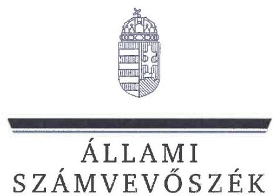
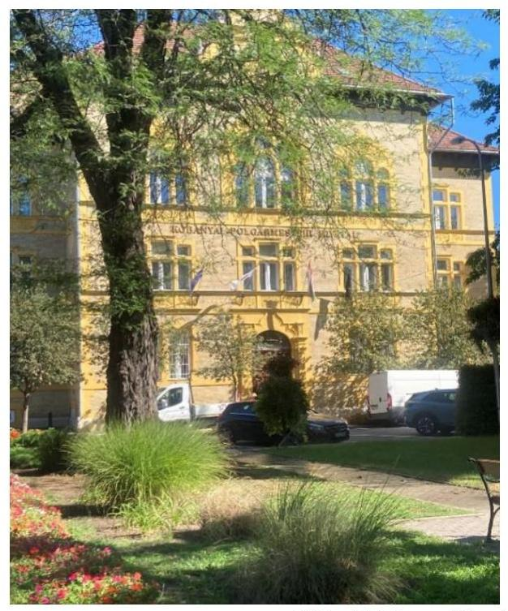
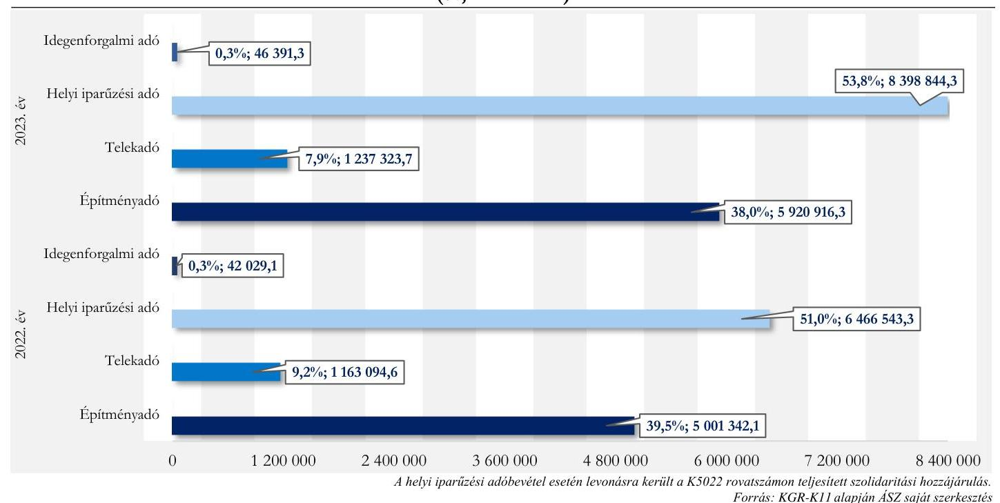
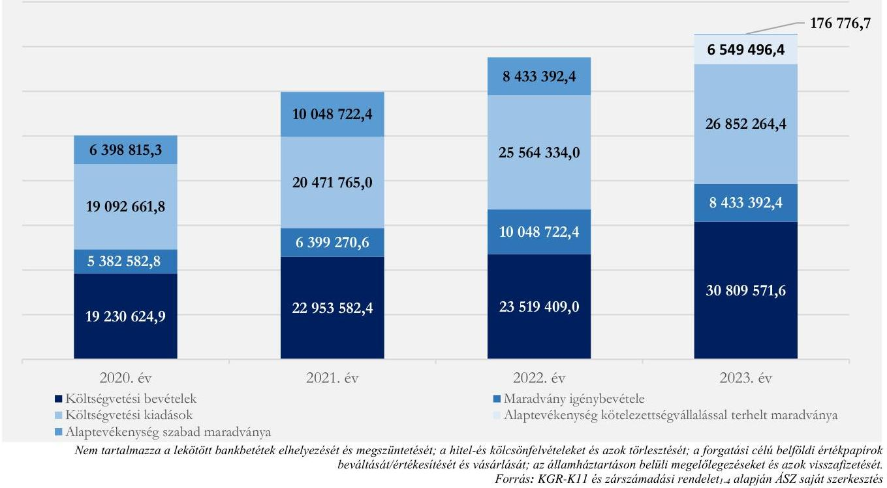
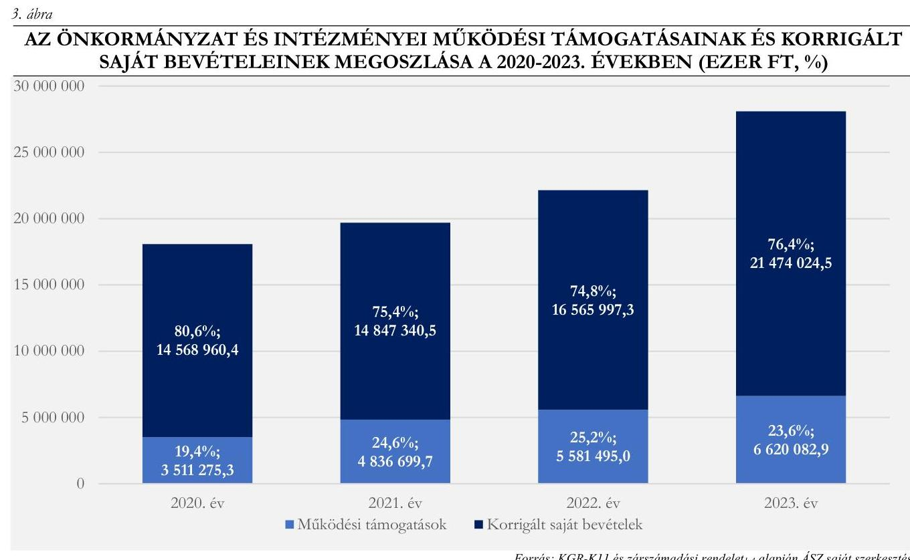

# JELENTÉS 

## Az önkormányzatok helyi adóztatási tevékenységének ellenőrzése - Ingatlanadóztatás

Budapest Főváros X. kerület Kőbányai Önkormányzat

2025.

---

ÁLLAMI
SZÁMVEVŐSZÉK

# JELENTÉS 

## Az önkormányzatok helyi adóztatási tevékenységének ellenőrzése - Ingatlanadóztatás

Budapest Főváros X. kerület Kőbányai Önkormányzat

2025.

---

# ELLENŐRZÉSI IGAZGATÓSÁG: 

## ELLENŐRZÉSI IGAZGATÓSÁG II.

## ELLENŐRZÉSI IGAZGATÓ:

DR. BAFFIA GERGELY GÁBOR ellenőrzési igazgató

## ELLENŐRZÉSVEZETŐ:

## KANYÓ LÓRÁNT ISTVÁN ellenőrzésvezető

Jelentéseink az interneten a www.asz.hu címen olvashatók.

IKTATÓSZÁM: EL-4040-043/2025
TÉMASORSZÁM: 54
ELLENŐRZÉS-AZONOSÍTÓ SZÁM: V1084

---

# TARTALOMJEGYZÉK 

AZ ELLENŐRZÉS ALAPADATAI ..... 5
AZ ELLENŐRZÉS TERÜLETE ÉS AZ ELLENŐRZÖTT SZERVEZET ..... 7
ÖSSZEFOGLALÁS ..... 9
AZ ELLENŐRZÉS FÓKUSZKÉRDÉSEI ..... 11
MEGÁLLAPÍTÁSOK ..... 12
JAVASLATOK ..... 25
MELLÉKLETEK ..... 26
I. sz. melléklet: Értelmező szótár ..... 26
II. sz. melléklet: Az ellenőrzött szervezetek jegyzéke ..... 27
III. sz. melléklet: Ellenőrzési kritériumok ..... 28
IV. sz. melléklet: A helyi ingatlanadó-tárgyak és -alanyok száma a 2023. és a 2024. évben ..... 31
FÜGGELÉK: ÉSZREVÉTELEK ..... 32
RÖVIDÍTÉSEK JEGYZÉKE ..... 38

---

.

---

# AZ ELLENŐRZÉS ALAPADATAI 

## AZ ELLENŐRZÉS CÉLJA

Az ellenőrzés célja az volt, hogy értékelje a Kerület ${ }^{1}$ helyi ingatlanadóztatásának és adóhatósága feladatellátásának szabályszerűségét, eredményességét. További cél volt, hogy az ellenőrzés megállapításai és következtetései segítsék az önkormányzati képviselő-testületet a jogszabályokkal és a helyi sajátosságokkal összhangban álló helyi adópolitika kialakításában és az azt végrehajtó adóigazgatási szervezet megszervezésében. Az ellenőrzés célja volt továbbá annak megállapítása is, hogy az Önkormányzat² által bevezetett, ingatlanokat terhelő helyi adókra vonatkozó rendeleti szabályok összhangban vannak-e a helyi adópolitikai célokkal, tartalmuk tükrözi-e a Kerület helyi sajátosságait és az adóhatósági feladatellátás biztosítja-e az önkormányzati bevételek feltárását és beszedését.

Ennek keretében az ÁSZ ${ }^{3}$ értékelte, hogy az Önkormányzat által bevezetett, ingatlanokat terhelő helyi adókról szóló adórendeletek ${ }^{4}$, valamint az adóhatóság ${ }^{5}$ döntései, adóztatási gyakorlata a vonatkozó jogszabályokkal összhangban állnak-e.

## AZ ELLENŐRZÉS TÍPUSA

Kombinált ellenőrzés.

## AZ ELLENŐRZŐTT IDŐSZAK

Az 1. fókuszkérdésnél a 2023. év, valamint a 2024. évnek az ellenőrzés megkezdését megelőző napjáig (2024. június 11.) tartó időszaka.

A 2. és 3. fókuszkérdésnél a 2023. év, valamint a 2024. évnek az ellenőrzés megkezdését megelőző napjáig (2024. június 11.) tartó időszaka, a 2020-2022. évek adatainak bázisadatként való felhasználásával.

## AZ ELLENŐRZÉS TÁRGYA

Az Önkormányzat képviselő-testületének ingatlanokat terhelő helyi adóval, az építményadóval és telekadóval kapcsolatos rendeletalkotási tevékenységének és az adóhatóság tevékenységének az ellátása.

Az ellenőrzés kiterjedt minden olyan körülményre és adatra, amely az ÁSZ jogszabályban meghatározott feladatainak teljesítéséhez, valamint az ellenőrzési program végrehajtása folyamán felmerült újabb összefüggések feltárásához szükséges.

## AZ ELLENŐRZÉS JOGALAPJA

Az ellenőrzés jogszabályi alapját az ÁSZ tv. ${ }^{6}$ 5. § (8) bekezdésének előírásai képezték.

---

# AZ ELLENŐRZÉS MÓDSZERE 

Az ÁSZ az ellenőrzést az ellenőrzési program szempontjai, az ellenőrzött időszakban hatályos jogszabályok, az ellenőrzés általános szakmai szabályai és az ellenőrzésre irányadó ÁSZ módszertanok alapján végezte.

Az ellenőrzési kérdések megválaszolásához szükséges bizonyítékok megszerzése az ellenőrzött szervezetek által rendelkezésre bocsátott dokumentumokra, adatokra és az ASP ${ }^{\top}$ Adó és az Iratkezelő szakrendszerek, illetve a KGR-K11 ${ }^{8}$ számviteli adatgyűjtő rendszer adataira alapozva megfigyelés, szemle (szemrevételezés), kérdésfeltevés (információkérés), mintavételezés, valamint elemző eljárás útján történt. Emellett az ellenőrzési bizonyítékként felhasználható adatforrások közé tartozott minden egyéb - az ellenőrzés folyamán feltárt, az ellenőrzés szempontjából információt tartalmazó - releváns dokumentum (ideértve különösen a helyszíni ellenőrzésről készült jegyzőkönyvet) is.

Az ellenőrzés lefolytatásához az ellenőrzött szervezet a tanúsítványok kitöltésével, valamint az ÁSZ által kért dokumentumok, adatok, információ megküldésével és az ellenőrzés során szolgáltatott adatokat.

Az ÁSZ az adómegállapítás, a fizetési kedvezmények engedélyezése, az adóellenőrzés és a hátralékok beszedése szabályszerűségét mintavételi eljárással ellenőrizte. Ennek során az adóhatósági adómegállapítási feladatellátás ellenőrzése keretében 22 mintatétel (közte 94 db adómegállapító határozat), a fizetési kedvezmények engedélyezése tárgykörben három mintatétel (négy határozat), továbbá az adóhatóság által lefolytatott adóellenőrzés tárgykörében öt mintatétel értékelése történt meg. Nyolc végrehajtási ügyben az ÁSZ a hátralékkezelés teljes dokumentációját ellenőrizte.

A mintatételek kiválasztása véletlenszerűen történt az adóhatóság nyilvántartásában lévő adótárgyak és ügyek közül tizenöt - adómegállapításra vonatkozó - mintatétel kivételével, amelyek esetében a kiválasztás címadatok alapján történt annak érdekében, hogy feltárható legyen, volt-e olyan adótárgy, amelyet nem adóztatott az adóhatóság. Az ellenőrzött mintatételekre vonatkozó megállapítások nem vetíthetők ki a teljes sokaságra, a megállapításokat az ÁSZ az adott ellenőrzött mintatételek vonatkozásában tette meg.

Az ÁSZ a helyi adópolitikai elképzelések és a kerületi sajátosságok feltárásával értékelte, hogy az adórendeletek e szempontoknak mennyiben feleltek meg. Az ÁSZ a helyi adópolitikai célokkal akkor tekintette összhangban állónak egy adórendeletet, ha hatását tekintve támogatta az adópolitikai célok teljesülését.

Az ÁSZ az adóhatósági feladatellátás szabályszerűségéből, a meglévő kapacitásokból, valamint az ezer forint adóbevételre jutó adóhatósági költségek alakulásából következtetett arra, hogy az adóhatóság rendelkezett-e azzal a potenciállal, amellyel eredményesen tudta a helyi adópolitikát végrehajtani.

Az ÁSZ - az adórendelet szabályainak érvényre juttatása körében - az eredményesség véleményezésekor a III. számü melléklet 2. pontjában foglalt szempontokat tekintette mérvadónak.

---

# AZ ELLENŐRZÉS TERÜLETE ÉS AZ ELLENŐRZÖTT SZERVEZET 

Az Önkormányzat illetékességi területe $32,5 \mathrm{~km}^{2}$, amelyből $29,1 \mathrm{~km}^{2}$ belterület, $3,4 \mathrm{~km}^{2}$ külterület. A Kerületet átszelik a vasútvonalak, a lakó- és ipari területek az így kialakult kerületrészeken jól elkülönülnek. A városrész történelmét jelentősen befolyásolta az iparosodás, már a 19. században is több gyárnak adott otthont. A Kerületben a TeIR ${ }^{9}$ adatai alapján 2023. december 31-én 14053 regisztrált vállalkozás volt, a legtöbb vállalkozás a kereskedelem, gépjármújavítás nemzetgazdasági ághoz tartozott (a vállalkozások 25,9\%-a, 3638 gazdasági egység). Kőbányán múködik a gyógyszeripar, a söripar egy-egy zászlóshajója is. Emellett a Kerület földrajzi adottságai és ingatlanpiaci jellemzői miatt a logisztikai tevékenységnek is teret adott (az ingatlanügyletek nemzetgazdasági ághoz 1681 vállalkozás, az összes vállalkozás $12,0 \%$-a tartozott).

A Kerület állandó lakossága - a $\mathrm{BM}^{10}$ adatai alapján 2020. év elején 72082 fő, 2024. év elején 68220 fő volt.

Az Önkormányzat - a Hivatal ${ }^{11}$ mellett - 17 költségvetési

Kőbányai Polgármesteri Hivatal
Forrás: ASZ saját fotó
szervvel ${ }^{1}$ rendelkezett és négy kizárólagos saját tulajdonban lévő gazdasági társasága ${ }^{2}$ volt.

Az Alaptörvény ${ }^{12}$ értelmében a helyi önkormányzat a helyi közügyek intézése körében törvény keretei között döntött a helyi adók fajtájáról és mértékéről. Az Mötv. ${ }^{13}$ rögzíti, hogy a helyi adóval kapcsolatos feladatok ellátása a helyi önkormányzatok feladata.

Az Önkormányzat a Htv. ${ }^{14}$ alapján illetékességi területén külön-külön adórendelettel építményadót és telekadót vezetett be. Mindkét adónem esetén terület alapján történt az adóztatás, az adó általános mértéke építményadó esetén a 2023. évben $2000 \mathrm{Ft} / \mathrm{m}^{2}$, 2024. január 1-jétől $2200 \mathrm{Ft} / \mathrm{m}^{2}$ volt, a belterületi telket terhelő telekadó mértéke 2023. január 1-jétől $360 \mathrm{Ft} / \mathrm{m}^{2}$, 2024. január 1-jétől $400 \mathrm{Ft} / \mathrm{m}^{2}$ volt. Az építményadóban az idősek, pszichiátriai betegek, illetve a fogyatékos személyek bentlakásos ellátását biztosító tevékenység céljára használt építményre, telekadóban pedig a sportcélú telkekre és zöldterületre, erdőterületre és természetközeli

[^0]
[^0]:    ${ }^{1}$ Kocsis Sándor Sportközpont, Bárka Kőbányai Humánszolgáltató Központ, Kőbányai Gesztenye Óvoda, Kőbányai Mászóka Óvoda, Kőbányai Hárslevelű Óvoda, Kőbányai Zsivaj Óvoda, Kőbányai Kiskakas Óvoda, Kőbányai Gépmadár Óvoda, Kőbányai Aprók Háza Óvoda, Kőbányai Gyöngyike Óvoda, Kőbányai Gézengúz Óvoda, Kőbányai Mocorgó Óvoda, Kőbányai Csodapók Óvoda, Kőbányai Csodafa Óvoda, Kőbányai Rece-fice Óvoda, Kőbányai Bóbita Óvoda, Kőbányai Egyesített Bölcsődék.
    ${ }^{2}$ Kőbányai Vagyonkezelő Zrt., KÖKERT Kőbányai Kerületgondnoksági és Településüzemeltetési Nonprofit Közhasznú Kft., Kőbányai Szivárvány Szociális Gondoskodást Nyújtó Közhasznú Nonprofit Kft., Kőrösi Csoma Sándor Kőbányai Kulturális Nonprofit Kft.

---

területre, valamint a külterületi telekre speciális - az általánosnál kedvezőbb - adómérték vonatkozott. Emellett mindkét adónem esetén személyi és tárgyi mentesség alá eső eseteket is rögzítettek az adórendeletek.

Az adó megállapításával, nyilvántartásával, beszedésével összefüggő adóhatósági feladatokat - a Hatásköri tv. ${ }^{15}$ és az Air. ${ }^{16}$ rendelkezései alapján - elsőfokú hatósági jogkörben a jegyző ${ }^{17}$ látta el. A hivatali $\mathrm{SzMSz}_{1,2}{ }^{18}$ alapján az Adóhatósági Osztály engedélyezett létszáma 11 fő volt az osztályvezetővel együtt.

A 2022. évben az ingatlanadókból összesen 6164 436,7 ezer Ft bevétele származott az Önkormányzatnak, amely a korrigált konszolidált költségvetési bevétel ${ }^{19}$ (22 147 492,3 ezer Ft) 27,8\%-át tette ki. A 2023. évben az ingatlanadókból származó éves 7158 240,0 ezer Ft bevétel ${ }^{20}$ az Önkormányzat korrigált konszolidált költségvetési bevételének (28 094 107,4 ezer Ft) 25,5\%-át jelentette. A 2023. évi ingatlanokat terhelő adókból - a befizetett szolidaritási hozzájárulással csökkentett - helyi adóbevétel (15 603 475,6 ezer Ft) 45,9\%-a származott. Az Önkormányzat helyi adóbevételeinek 2022. és 2023. évi összetételére vonatkozó adatokat az 1. ábra, a helyi ingatlanadók 2023. és 2024. évre vonatkozó jellemző naturális adatait pedig az $I V$. számú melléklet mutatja be.

# 1. ábra 

AZ ÖNKORMÁNYZAT HELYI ADÓBEVÉTELEINEK MEGOSZLÁSA A 2022-2023. ÉVEKBEN
(\%, EZER FT)

---

# ÖSSZEFOGLALÁS 

Az ÁSZ tv. értelmében az ÁSZ feladatkörébe tartozik az önkormányzatok adóztatási tevékenységének ellenőrzése. A helyi adók az önkormányzatok saját, el nem vonható bevételét képezik, így az önkormányzatok gazdasági önállósága szempontjából különös fontossággal bír, hogy a helyi adórendeleti szabályok összhangban álljanak a magasabb szintű jogszabályokkal, továbbá az adóhatósági tevékenység jogszerú, eredményes és hatékony legyen. Erre figyelemmel volt tárgya az ÁSZ ellenőrzésének az Önkormányzat adórendelet-alkotási tevékenysége és az adóhatósági feladatellátás is.

Az adórendeletek rendelkezései néhány kivétellel összhangban voltak a magasabb szintű jogszabályokkal, tükrözték az Önkormányzat jogalkotói szándékát. A rendeleti szabályozás támogatta az Önkormányzat adópolitikai céljainak elérését. Az adómegállapítási feladatellátás eredményes volt, de az adóhatósági döntések néhány esetben nem voltak szabályszerüek. Az adóbehajtási tevékenység eredményes volt. Az adóhatóság adatszolgáltatási és közzétételi kötelezettségének eleget tett. Az adóztatási kiadások alacsonyak voltak az adóbevételhez képest, az adóhatóság ingatlanadóztatással összefüggő feladatellátási mutatói összességében kedvezőbbek voltak a nyolc kerület ${ }^{3}$ feladatellátási mutatóinak átlagos értékeinél.

## Adórendelet, adórendelet-alkotás

Az építményadó-rendelet ${ }^{21}$ - néhány rendelkezés kivételével - összhangban állt a Htv. és más, a helyi adóztatás szempontjából releváns magasabb szintű jogszabályokkal. Egy építményadó és két telekadó rendelkezés esetén nem érvényesült az egyértelmű értelmezhetőség jogalkotási törvényben foglalt követelménye.

Az építményadóra és telekadóra vonatkozó rendeleti szabályozás megalkotása során az Önkormányzat mérlegelte a helyi sajátosságokat, az Önkormányzat gazdálkodási követelményeit, valamint az adóalanyok teherviseló képességét, emellett vizsgálta a hasonló adottságokkal bíró önkormányzatok által alkalmazott adómértékeket, felmérte továbbá a módosítás következtében jelentkező adminisztratív terheket is.

## Az adóhatóság adóigazgatási feladatellátásának jogszerüsége, eredményessége

Az adómegállapítási eljárásban hozott hatósági döntések többsége szabályszerü volt. Az ÁSZ megállapította, hogy az adóalany változása miatt kiadott adómegállapító határozatok indokolása részletes, világos, az adózó számára érthető számszaki levezetést tartalmazott az adóalap és az adó összegére nézve. Az adómegállapító határozatok kiadmányozása, kézbesítése jogszerú volt. Az adóhatóság adatszolgáltatási kötelezettségének és közzétételi kötelezettségének határidőben és teljeskörűen eleget tett. Az adótartozások beszedése érdekében megtett intézkedések eredményesek voltak.

[^0]
[^0]:    ${ }^{3}$ Az ÁSZ által jelen ellenőrzés alapjául szolgáló ellenőrzési program alapján két kerületi önkormányzat, továbbá a KGR-K11-ben az adóztatási tevékenységet leíró adatokat rögzítő kerületi önkormányzatok közül kiválasztott hat önkormányzat: Budapest Főváros X. kerület Kőbányai Önkormányzat, Budapest Főváros IX. kerület Ferencváros Önkormányzata, Budapest Főváros IV. kerület Újpest Önkormányzata, Budapest Főváros VI. kerület Terézváros Önkormányzata, Budapest Főváros XV. kerület Rákospalota, Pestújhely, Újpalota Önkormányzata, Budapest Főváros XVII. kerület Rákosmente Önkormányzata, Budapest Főváros XX. kerület Pesterzsébet Önkormányzata, Budafok-Tétény Budapest, XXII. kerület Önkormányzata.

---

# Az adórendelet adópolitikai célokkal való összhangia, az adórendelet hatása 

Míg az összes fővárosi kerület esetén az ingatlanadóból származó bevételek a korrigált konszolidált költségvetési bevételeken belüli aránya $13,2 \%$, addig az Önkormányzat esetében ez 25,5\% volt a 2023. évben. A korrigált konszolidált költségvetési bevételeken belül a korrigált konszolidált saját bevételek ${ }^{22}$ aránya a 20202023. időszakban legalább a 74,8\%-os értéket elérte, az Önkormányzat a fővárosi kerületekhez képest a 2023. évben kisebb mértékben támaszkodott az államháztartáson belülről érkező működési támogatásokra.

Az ellenőrzött időszakban az adóalanyok adóteherviselő-képességét nem érintette hátrányosan az ingatlanokat terhelő egyik adó sem.

Az Önkormányzat adórendeleti szabályai támogatták a helyi adópolitikai célok megvalósulását (a Kerület minél több vállalkozásnak adjon otthont, az adópolitika a lakhatást támogassa).

## Az adóbatósági kiadások

Az adóhatóság saját feladatellátása keretében a 2023. évben 7215 412,3 ezer Ft helyi adóbevételt ${ }^{4}$ mutatott ki az Önkormányzat költségvetési beszámolójában. Minden 1000 Ft beszedett helyi adóbevételre az ÁSZ számítása szerint - 14,6 Ft adóztatási kiadás esett. A viszonyításként figyelembe vett nyolc fővárosi kerület átlaga $31,0 \mathrm{Ft}$, az adóztatási kiadás tapasztalati referencia-érték maximuma kivetéses adóztatás esetén 50 Ft volt.

A Hivatal egy adótisztviselőjére a 2023. évben 655 946,6 ezer Ft helyi adóbevétel, 507,5 adótárgy és 228,2 adózó jutott. Összességében az állapítható meg, hogy önkormányzati szinten az adóhatóság kiadásai nem voltak túlzottak a bevételhez mérten, egy adóigazgatásban dolgozóra a legtöbb helyi (ingatlan)adóbevétel esett a nyolc kerület közül, igaz az átlaghoz képest jóval kevesebb adózóval, illetve adótárggyal.

[^0]
[^0]:    4 A helyi iparűzési adóbevétel valamennyi kerület esetében; az idegenforgalmi adóbevétel egyes kerületek esetében Budapest Fővárosi Önkormányzatát és a kerületi önkormányzatokat osztottan illette meg. Ezen közterhekben az adóztatási feladatokat a Fővárosi Önkormányzat adóhatósága látta el. A fővárosi kerületi önkormányzatok esetében sem az ebből származó bevételeket, sem a kapcsolódó kiadásokat nem tartalmazzák a számadatok. Helyi adóbevétel körébe tartozik jelen esetben (az adóztatási kiadások számításánál): az ingatlanadókból származó bevétel, az idegenforgalmi adóbevétel, a települési adóbevétel és a beszedett talajterhelési díj; mivel a kapcsolódó feladatokat a helyi adóhatóság látta el.

---

# AZ ELLENŐRZÉS FÓKUSZKÉRDÉSEI 

1.- Az önkormányzat ingatlanokat terhelő helyi adókra vonatkozó rendeleti szabályozása megfelelt-e a magasabb szintü jogszabályoknak?
2.- Az önkormányzati adóhatóság megfelelően és eredményesen látta-e el az ingatlanok adóztatásával kapcsolatos adóhatósági tevékenységeit?
3.- A Kerületben megvalósuló helyi adóztatás támogatta-e a helyi adópolitikai célok teljesülését?

---

# MEGÁLLAPÍTÁSOK 

## 1. Az önkormányzat ingatlanokat terhelő helyi adókra vonatkozó rendeleti szabályozása megfelelte a magasabb szintü jogszabályoknak?

Összegző megállapítás Az adórendeletek rendelkezései néhány kivétellel összhangban voltak a magasabb szintű jogszabályokkal.
1.1. számú megállapítás

Az építményadó-rendelet három rendelkezése sértette a Htv.-t. Az adórendeletek három rendelkezése nem felelt meg az egyértelmú értelmezhetőség Jat. ${ }^{23}$-beli követelményének.

Az építményadó-rendelet 2. §-ának 2023. évben hatályos a), valamint 2023. és 2024. évben hatályos g) pontja szerint - a Htv. 7. § e) pontjában foglaltak ellenére - a vállalkozó is jogosult volt adómentességre, ha magánszemély tulajdonában álló lakásra vagy garázsra vonatkozó vagyoni értékủ jog jogosítottjaként számított adóalanynak.
Az építményadó-rendelet 2. § b) pontja az adómentesség ${ }^{5}$ hatálya alól - a Htv. 7. § e) pontjában foglaltak ellenére nem a vállalkozó valamennyi üzleti célt szolgáló épületét, épületrészét emelte ki, hanem csak azon helyiségeket, amelyek

Az uniós állami támogatási szabályok értelmében a vállalkozóknak nyújtott helyi adómentesség, helyi adókedvezmény állami támogatásnak minősül. A jogszerütlenül nyújtott támogatást a kedvezményezettnek vissza kell fizetnie, vagy a támogatást nyújtónak kell biztosítania az uniós joggal való összhangot.
a tevékenységhez szükséges anyagok tárolását szolgálják, illetve amelyben gazdasági tevékenységet, vállalkozást folytatnak.
Az építményadó-rendelet 2. § e) pontja és a telekadó-rendelet ${ }^{24}$ 5. §(2) és (2a) bekezdései jogkövetkezményt fúztek a sportlétesítmény és a telek sportcélú használatához, azonban az adórendeletek - a Jat. 2. § (1) bekezdéséből következő egyértelmű értelmezhetőség követelménye ellenére - nem definiálták, hogy mi minősült sportlétesítménynek és sportcélú használatnak ${ }^{6}$. A Jegyző az ÁSZ tv. 29. § (2) bekezdésében foglaltak szerint tett észrevételében azt a tájékoztatást adta, hogy a sportlétesítmények és a sportcélú használat fogalma kapcsán fennálló „pontatlanságot az adórendeletek soron következö felülvizsgálatakor a döntésbozó képeiselö-testület megszünteti a rendeletek módositásával".

[^0]
[^0]:    ${ }^{5}$ A rendelkezés szerint adómentesség illeti meg a legalább 70 centiméterrel a környező terepszint alatt elhelyezkedő épületrészt.
    ${ }^{6}$ Ezen adóelőny jellemzően nagy területű ingatlanokat vonhat ki az adóztatás alól. A pontos definíció segíthet visszaélések és az esetleges későbbi jogviták kizárásában.

---

1.2. számú megállapítás

Az Önkormányzat az építményadó és a telekadó szabályozásának alakítása során mérlegelte a helyi sajátosságokat, az Önkormányzat gazdálkodási követelményeit, illetve az adóalanyok teherviseló képességét.

A Htv. 7. § g) pontjában rögzített adómegállapítási korlátokból az következik, hogy a rendelet hatályossága idején is érvényre kell jutnia az e pontban szabályozott rendeletalkotási elveknek, azaz annak, hogy települési, kerületi önkormányzat az adóalap fajtáját, az adó mértékét, a rendeleti adómentességet és adókedvezményt úgy állapíthatja meg, hogy azok összességükben egyaránt megfeleljenek
a) a helyi sajátosságoknak,
b) az önkormányzat gazdálkodási követelményeinek és
c) az adóalanyok széles körét érintően az adóalanyok teherviselő képességének.

# A belpi sajátosságok figyelembevétele 

Az Önkormányzat a mértékrendszer elemeit és a kedvezményi-, mentességi szabályokat a Htv.-nek megfelelően a helyi sajátosságokra figyelemmel alakította ki.

## Az Önkormányzat gazdálkodási követelményeinek szempontja

A 2023. évben a - teljesített szolidaritási hozzájárulással csökkentett - helyi adókból - az előző évi bevételhez (12 673 009,1 ezer Ft) képest 23,1\%-kal több - 15603 475,6 ezer Ft bevétel származott. Ezzel együtt a - szolidaritási hozzájárulással csökkentett - helyi adókból származó bevétel korrigált konszolidált költségvetési bevételben képviselt aránya $\mathbf{5 5 , 5 \%}$ volt a 2023. évben; az előző évi 57,2\%hoz képest számottevően nem csökkent.
Az Önkormányzat főbb - konszolidált - gazdálkodási adatai (2. ábra) szerint a 2023. évre a költségvetési bevételek növekedésének mértéke ( $31,0 \%$ ) meghaladta a költségvetési kiadások növekedésének mértékét (5,0\%). A 2024. évi eredeti költségvetésben a zárszámadási rendelet, ${ }^{25}$ alapján a kötelezettségvállalással terhelt maradványt 3548 441,6 ezer Ft-tal tervezte meg az Önkormányzat, 3177 831,5 ezer Ft-ot pedig a 2023. évi zárszámadás részeként előirányzatosított, zömmel (2 263 385,8 ezer Ft összegben) az Önkormányzat döntése alapján tartalékként, az elkövetkező időszak fejlesztési céljainak forrásául. Ennek is köszönhetően a konszolidált maradvány a 2023. évben 6726 273,1 ezer Ft volt, amelynek 2,6\%-a, 176 776,7 ezer Ft volt szabad maradvány.
2023. január 1-jétől az építményadó mértéke $11,1 \%$-kal, $1800 \mathrm{Ft} / \mathrm{m}^{2}$-ről $2000 \mathrm{Ft} / \mathrm{m}^{2}$-re, 2024. január 1jétől további $10 \%$-kal, $2200 \mathrm{Ft} / \mathrm{m}^{2}$-re emelkedett. A belterületi telket terhelő telekadó mértéke 2023. január 1-jétől 9,1\%-kal, $330 \mathrm{Ft} / \mathrm{m}^{2}$-ről $360 \mathrm{Ft} / \mathrm{m}^{2}$-re, 2024. január 1-jétől további 11,1\%-kal, $400 \mathrm{Ft} / \mathrm{m}^{2}$-re emelkedett (a külterületi telket terhelő $130 \mathrm{Ft} / \mathrm{m}^{2}$-es adómérték változatlan maradt). Az adómérték-emelése kapcsán az Önkormányzat mindkét évben az energiaárak növekedését nevezte meg a költségvetését negatívan befolyásoló körülménynek.
A 2023. évi és a 2024. évtől hatályba léptetett adóváltozások során az Önkormányzat mérlegelte a gazdálkodási helyzetét, összességében azonban a gazdálkodási körülményei nem tették feltétlenül szükségessé az adórendelet módosítását.

---

# Az adóalanyok teherviseló képességének figyelembevétele 

Az Önkormányzat - a képviselő-testületi ülés jegyzőkönyvéhez csatolt előterjesztés ${ }^{7}$ alapján - mérlegelte, hogy az adómérték-emelés az adóalanyok általános teherviselő képességével összhangban áll-e. Az előterjesztés szerint a vagyoni típusú adók esetében a teherviselő képesség végső soron a vagyontárgy értékében nyilvánul meg, s az épületek, lakások forgalmi értéke folyamatosan emelkedik. Ezzel együtt figyelembe vette a megelőző adóévekben benyújtott fizetési könnyítési kérelmek számát, illetve az azok által érintett adóösszeget is. Az Önkormányzat tekintettel volt arra is, hogy a kis- és középvállalkozások esetén az Önkormányzat adórendszeren kívüli támogatásai is növelik a teherviselő képességet. A magánszemélyek alacsonyabb teherviselő képességére figyelemmel a lakhatás céljára szolgáló építmények esetén ${ }^{8}$ magánszemély adóalanyok széles - majd a 2024. évtől teljes - körét lefedő mentességi tényállást rögzített.
Mindezek alapján az Önkormányzat a Htv.-ben foglaltaknak megfelelően mérlegelte az adórendeletnek az adóalanyok teherviselő képességére gyakorolt hatását.

[^0]
[^0]:    ${ }^{7}$ Az építményadó-rendelet, valamint a telekadó-rendelet módosításáról szóló 505. számú előterjesztés a képviselő-testület részére.
    ${ }^{8}$ A 2023. évben mentes volt építményadó alól a tulajdonos vagy annak hozzátartozója által életvitelszerűen, lakhatás céljából használt lakás esetében a lakásban lakó személyenként $30 \mathrm{~m}^{2}$, de legalább $100 \mathrm{~m}^{2}$ hasznos alapterület. 2024. évben a magánszemély adóalany a lakhatás céljára használt lakás, lakásrész vonatkozásában mentes volt az építményadó alól.

---

# 2. Az önkormányzati adóhatóság megfelelően és eredményesen látta-e el az ingatlanok adóztatásával kapcsolatos adóhatósági tevékenységeit? 

Összegző megállapítás

Az adóhatóság adómegállapítási feladatellátása eredményes volt. Az adóhatósági döntések nem minden esetben voltak szabályszerűek. Az adóbehajtási tevékenység szabályszerű és eredményes volt.
2.1. számú megállapítás

Az önkormányzati adóhatóság adótárgy- és adóalanyfeltárási tevékenysége hozzájárult az eredményes adómegállapításhoz, ugyanakkor az adóigazgatási eljárás során nem minden esetben járt el szabályszerűen. Az adóalany személyének változása miatt kiadott adómegállapító határozatok indokolása az adózók számára informatív számszaki levezetést tartalmazott az adóalap és az adó összegének meghatározására, ami azonban hiányzott a kizárólag az adómérték változása miatt kiadott határozatokból.

## Adótárgy- és adóalanyfeltárás

Az adóhatóság az Art. ${ }^{26}$ 83. § (2) bekezdésének előirása ellenére a 2023. évben nem élt az ingatlanügyi hatóság megkeresésének lehetőségével, azonban a NAV ${ }^{27}$-tól megkérte az illetékkiszabás alapjául szolgáló ingatlan-szerzések listáját, és azok adatait használta fel adóalany- és adótárgyfeltárási célokra. A 2024. évi, elektronikusan feldolgozható formában rendelkezésre álló, ingatlanügyi hatóságtól származó, az Art. szerint megkért adatokat folyamatosan összevetette a nyilvántartásában szereplő adótárgyakkal, adóalanyokkal, melynek eredményeként hiánypótlásra hívta

Az ÁSZ - különösen a városok, fővárosi kerületek esetén - azt tekinti jó gyakorlatnak, ha az adóhatóság intenzíven használja a társhatóságnál, különösen az ingatlanügyi hatóságnál rendelkezésre álló adatokat az adóztatás során. Az ÁSZ véleménye szerint az ingatlanadókban célravezető az adóhatóság adónyilvántartási adatainak társhatósági hiteles adatokkal való összevetése és ezek alapján szükség szerint adatbejelentésre, hiánypótlásra felhívás, majd az információk alapján a tényállás rögzítése és az adómegállapítási eljárás mielőbbi befejezése. Részint azért, mert az adótárgy jellege miatt erre lehetőség van (tipikusan évente nem változnak a kivetési adatok), részint azért, mert így az adóhatóság időben korábban jut az adóbevételhez, részint pedig azért, mert négy-öt év távlatában - utólagos adómegállapítás keretében - sokszor utólagosan nehezen lehet bizonyítani, hogy az adóév első napján mi volt az adómegállapítás kapcsán releváns tényállás.
fel az adózásra kötelezetteket, akik (az ellenőrzött mintatételek tanúsága szerint) megtették adatbejelentéseiket.
Az ÁSZ nem tárt fel olyan ingatlant, amelyet az adóhatóságnak adóztatnia kellett volna.
Az ÁSZ összességében értékelte az adóhatóság adótárgy- és adóalanyfeltárási feladatellátására vonatkozó tényeket és körülményeket: azt, hogy az ÁSZ nem tárt fel nem adóztatott ingatlant, 2024-ben az adóhatóság felhasználta az ingatlanügyi hatóság adatait, a NAV illetékezési feladatai során keletkezett

---

adatok részben alkalmasak az új adóalany és nem adózó adótárgy feltárására. Ezért az ÁSZ annak ellenére tekintette az adóhatóság adómegállapítási feladatellátását eredményesnek ${ }^{9}$, hogy a 2023. évben nem az ingatlanügyi hatóság adatait, hanem az állami adóhatóság adatait használta az adónyilvántartásában szereplő adataival való összevetésre ${ }^{10}$.

# Adómegállapitás (kivetés) 

Három mintatétel (9., 15. és 16. mintatételek) esetében az adóhatóságnál nem állt rendelkezésre az adózó által benyújtott adatbejelentés, egy esetben (a 12. mintatételnél) nem állt rendelkezésre az eredeti (2017. évi) építmény-, illetve telekadó kivetési határozat sem. Ezzel az adóhatóság megsértette az Ltv. ${ }^{28}$ 9. $\$ \mathbf{( 1 )}$ bekezdés e) pontját ${ }^{11}$. A telekadót érintő öt mintatételnél (3., 12., 16., 19. és 22. mintatételek), és az építményadót érintő tíz mintatételnél (4., 7., 9., 12., 13., 15., 16., 19., 20. és 22. mintatételek) a 2023. évben és a 2024. évtől, az építményadót érintő 18. mintatétel esetén a 2023. évtől fizetendő adót tartalmazó - az adómérték változtatása miatt kiadott - határozatok indokolása - szemben az Air. 73. $\$ (1) bekezdés c) pontjában foglaltakkal - nem tartalmazta teljeskörűen az adó összegének

Azok az adómegállapító határozatok, amelyeket az adóhatóság az adóalany személye változása miatt adott ki, egyértelműen és pontosan tartalmazták az adó összegének levezetését (az adóköteles adóalap és az alkalmazandó adómérték szorzataként), a telekadó esetén az adóköteles telekterület nagyságának részletes meghatározását. Az ÁSZ rendkívül fontosnak tartja, hogy az adóhatóság az adózó számára világos, követhető, érthető nyelvezettel indokolja a fizetendő adó összegét.
kiszámítását. Az adómegállapító határozatokban foglalt fizetési kötelezettség jogszerüségét ez a hiányosság azonban nem érintette, mert egyéb dokumentumokat figyelembe véve (adatbejelentés, korábbi évek határozatai, tulajdoni lap) megállapítható volt, hogy a határozatok rendelkező része szabályszerűen rögzítette az adó összegét.
Az adómegállapító határozatok kiadmányozása valamennyi esetben megfelelt az Air. előírásainak.
Az adómegállapító határozatok adózókkal való közlése valamennyi rendelkezésre álló adómegállapító határozat esetében megfelelt az Eüsztv. ${ }^{29}$ előírásainak. Egy mintatétel esetében (10. mintatétel) az adóhatóság nem élt az Eüsztv. ${ }^{12}$ 15. $\$ (2) bekezdésben foglalt lehetőséggel, azaz nem elektronikusan, hanem postai kézbesítés útján történt meg az adómegállapításról szóló határozatok kézbesítése.

[^0]
[^0]:    ${ }^{9}$ A III. számú melléklet 2. pontjában foglalt eredményességi kritériumok azt is magukban foglalják, hogy a 2023. évben is meg kellett volna keresni az ingatlanügyi hatóságot.
    ${ }^{10}$ Az állami adóhatóság illetékügyi feladatellátása során az ingatlanügyi hatóságtól kap ingatlan-szerzéssel, vagyoni értékủ jog szerzésével összefüggő adatokat az ingatlanra és a szerző fél személyére nézvést. Ezért az adóalanyok feltárása és részben a nem adózó adótárgyak feltárása során az állami adóhatóság adatai is hiteles adatoknak számítanak.
    ${ }^{11}$ Az Ltv. hivatkozott rendelkezése értelmében az elintézett ügy irattári anyagának szakszerű és biztonságos megőrzéséről, valamint használatra bocsátásáról gondoskodni kell.
    ${ }^{12}$ Az Eüsztv. 2024. szeptember 1-je óta hatálytalan, a jogterület szabályozását a digitális államról és a digitális szolgáltatások nyújtásának egyes szabályairól szóló 2023. évi CIII. törvény tartalmazza.

---

Az adóhatóság egy mintatétel (23. mintatétel) esetében az adóellenőrzést szabályszerűen, az Air.-ban előírtak szerint végezte, a 24-27. mintatételek esetében az Art. 141. § (4) és (7) bekezdése alapján, adótárgy- és adóalanyfeltárás eredményeként állapította meg az adót ${ }^{13}$ és szabályszerűen járt el.

A megállapított adó csökkentése: fizetési kedvezmények, adókötelezettség változás, elévülés miatti törlés
A fennálló adókövetelést csökkentő vizsgált intézkedésekről az adóhatóság az Air. 73. § (2) bekezdése szerinti egyszerűsített döntést hozott ${ }^{14}$. Ezért a döntések indokolásából, illetve az ügyben keletkezett - az ÁSZ rendelkezésére bocsátott - iratanyagból nem volt megállapítható, hogy ezen ügyekben az adóhatóság miként (milyen szempontokat figyelembe véve) mérlegelte az adómérséklés Art. 201. § (1) és (3) bekezdéseiben foglalt feltételeit ${ }^{15}$.

A fennálló adókövetelést csökkentő vizsgált intézkedések számszaki összefoglalását az 1. táblázat mutatja be.

# 1. táblázat 

## A 2023-2024. ÉVEKBEN TÖRTÉNT ADÓKÖVETELÉS TÖRLÉSEK FŐBB ADATAI (DB ÉS EZER FT)

| MEGNEVEZÉS | 2023. |  | 2024.* |  |
| :--: | :--: | :--: | :--: | :--: |
|  | ESETSZÁM | ÖSSZEG | ESETSZÁM | ÖSSZEG |
| Méltányosságból törölt adókövetelés | 14 | 1503,6 | 5 | 730,0 |
| Adókötelezettség változás okán törölt adókövetelés | 1457 | 650 133,2 | 348 | 250 906,8 |
| Elévülés miatt törölt adókövetelés | 80 | 236 970,8 | 22 | 14870,0 |

*2024. június 30 -ai állapot szerint.
Forrás: A Hivatal által tanúsítványokon megadott adatok alapján ÁSZ saját szerkesztés

Adatszolgáltatási, közzétételi kötelezettség
A jegyző a Htv. előírásainak megfelelően, határidőben intézkedett az adórendelet-módosítás adatairól szóló, a Magyar Államkincstár számára teljesítendő adatszolgáltatásról. Az építményadó- és telekadórendelet az Önkormányzat honlapján elérhető volt, az adóhatóság a Htv.-ben foglaltak szerinti közzétételi kötelezettségét határidőben teljesítette.
2.2. számú megállapítás Az adóbehajtási (adóbeszedési) tevékenység szabályszerű és eredményes volt.

Az ellenőrzött időszakban az adóhatóság az Avt. ${ }^{30}$-ben foglaltak alapján a tartozások megfizetése, beszedése érdekében intézkedett, mivel fizetési felszólításokat küldött ki, valamint az Avt. szerint végrehajtási eljárást is kezdeményezett.

[^0]
[^0]:    ${ }^{13}$ Az ellenőrzött a 24-27. mintatételek szerinti eljárást adóellenőrzésnek tekintette. Az adóellenőrzés szabályait az Air 90. §-a, az egyszerűsített adóellenőrzés szabályait a 465/2017. (XII. 28.) Korm. rendelet 84. §-a fogalmazza meg.
    ${ }^{14}$ Jogorvoslatról való tájékoztatást mellőző, az indokolásban pedig csak az azt megalapozó jogszabályhelyek megjelölését tartalmazó egyszerűsített döntés hozható, ha az adóhatóság a kérelemnek teljes egészében helyt ad.
    ${ }^{15}$ Az Art. 201. §-a értelmében adómérséklés, adóelengedés magánszemély adózó esetén akkor lehetséges, ha az adó megfizetése az adózó és a vele együtt élő hozzátartozók megélhetését súlyosan veszélyezteti. Vállalkozási tevékenységet végző esetén csak a pótlék- és bírságtartozás mérsékelhető vagy engedhető el, amennyiben annak megfizetése a gazdálkodási tevékenység ellehetetlenítését eredményezi.

---

Az adóhatóság a végrehajtások eredményeképpen a 2023. évben 262 577,3 ezer Ft adótartozást (a 2022. december 31-én fennálló adótartozás 30,0\%-át), 2024. június 30-ig 52 499,0 ezer Ft adótartozást (a 2023. december 31-én fennálló adótartozás $8,1 \%$-át) szedett be.
A 2022. január 1-jei 947 677,1 ezer Ft-os adóhátralék összege (342 hátralékos adózó) 2022. év utolsó napjára 71 987,8 ezer Ft-tal, 7,6\%-kal, a hátralékos adózók száma 67-tel, 19,6\%-kal csökkent, majd 2024. június 30-ig a hátralékosok száma 12,5\%-kal, 288 adózóra nőtt 2023. év végéhez képest. A 2. táblázat tartalmazza az adóhátralékokra vonatkozó főbb adatokat a 2022-2024. június 30-ig terjedő időszakban.
A végrehajtási eljárásokat az adóhatóság szabályszerűen - az Avt. és az Air. előírásai szerint végezte.
Az adóbehajtási feladatellátás eredményes volt, mert az adóhatóság az adózókat felhívta a fizetési kötelezettségük teljesítésére, a 2023. évi ingatlanokat terhelő adókból származó bevételek előirányzata teljesült, a 2022. december 31-ei hátralék összegéhez (875 689,3 ezer Ft) képest a 2023. december 31-ei hátralék összege ( 645 198,8 ezer Ft) 26,3\%-kal csökkent. Az adóhatóság által nyilvántartott, 2023. év végén fennálló hátralék a 2023. évi beszámolóban szereplő ingatlanadó-bevételhez (7 158 240,0 ezer Ft) viszonyított aránya $\mathbf{9 , 0 \%}$ volt, mely kedvezőbb, mint a fővárosi kerületi önkormányzatok ingatlanadó-bevétel-arányos hátraléka ( $14,8 \%$ ).
2. táblázat

# AZ ADÓHÁTRALÉKOK FŐBB ADATAI (DB ÉS EZER FT) 

| MEGNEVEZÉS | NAPTÁRI-   NAP | ÉPITMÉNYADÓ | TELEKADÓ | ÖSSZESEN |
| :--: | :--: | :--: | :--: | :--: |
| Hátralékos adózók száma | 2022.12.31 | 175 | 100 | 275 |
|  | 2023.12.31 | 166 | 90 | 256 |
|  | 2024.06.30 | 175 | 113 | 288 |
| Adóhátralék összege | 2022.12.31 | 735029,5 | 140659,8 | 875689,3 |
|  | 2023.12.31 | 492735,3 | 152463,5 | 645 198,8 |
|  | 2024.06.30 | 462391,1 | 142693,2 | 605084,3 |

---

# 3. A Kerületben megvalósuló helyi adóztatás támogatta-e a helyi adópolitikai célok teljesülését? 

| Összegző megállapítás | Az Önkormányzat ingatlanokat terhelő helyi adókra vonatkozó adórendeleti szabályozása támogatta a helyi adópolitikai célok megvalósulását, az Önkormányzat gazdálkodását, az adóteher összhangban volt az adózók teherviselő képességével. Az adóhatósági feladatellátás kiadása a fővárosi kerületek adóztatási kiadásaihoz képest alacsony volt. |
| :--: | :--: |

Az Önkormányzat által ismertetett adópolitikai célokat, az azokat segítő eszközöket a 3. táblázat tartalmazza.
3. táblázat

AZ ÖNKORMÁNYZAT ADÓPOLITIKAI CÉLJAI ÉS ALKALMAZOTT ESZKÖZRENDSZERE

| ADÓPOLITIKAI CÉL | ADÓPOLITIKAI ESZKÖZ | MEGJEGYZÉS |
| :--: | :--: | :--: |
| Minél több vállalkozásnak adjon otthont a Kerület | A fővárosi átlagnál alacsonyabb adómérték. | Az alacsonyabb adómérték - ha az adótárgyak száma nem emelkedik - a potenciális adóbevételhez képest kisebb adóbevétellel jár együtt. |
| Lakhatás támogatása | A 2023. évben adómentes volt az építményadó alól a tulajdonos vagy annak hozzátartozója által életvitelszerűen, lakhatás céljából használt lakás esetében a lakásban lakó személyenként $30 \mathrm{~m}^{2}$, de legalább $100 \mathrm{~m}^{2}$ hasznos alapterület.   A 2024. évtől valamennyi magánszemély tulajdonában álló, lakhatás céljára használt lakás mentes volt az építményadó alól. | A szabály alkalmas ugyan a lakástulajdonnal rendelkezők lakhatásának támogatására, de csak korlátozottan (magánszemély tulajdonos lakásépítése esetén) alkalmas a lakóingatlanok számának növelésére. |

3.2. számú megállapítás

Az Önkormányzat beinazóan elhalózávan az ingatlanadókból származó bevétel jelentős szerepet töltött be a fővárosi kerületekhez képest. Az adóteher összhangban volt az adóalanyok teherbíró képességével.

## Az adórendelet(módositás) batása az Önkormányzat gazdálkodására

Az ingatlanadókból származó bevétel a 2020-2022. években évente közel megegyező, nagyságrendileg 6,2 milliárd Ft volt, mert a 2021-2022. években a járványügyi helyzet következtében a jogszabályok nem tették lehetővé az adómértékek emelését. Az ingatlanadókból származó bevétel a 2023. évre 16,1\%-kal - 993 803,3 ezer Ft-tal -, 7158 240,0 ezer Ft-ra emelkedett az előző évi

---

6 164 436,7 ezer Ft-ról az adómérték emelésének ${ }^{16}$ (költségvetési rendelet ${ }^{31}$ alapján a várható többletbevétel 743 000,0 ezer Ft), a felderítési tevékenység és az adóvégrehajtási tevékenység eredményességének, valamint az adótárgyak számának növekedése következtében. A növekedés 4,0 százalékponttal meghaladta a fővárosi kerületek ingatlanadóbevétel-növekményét. Ezzel együtt - az iparűzési adóból származó bevétel nagyobb arányú növekedésének következtében - az ingatlanadókból származó bevételek aránya csökkent a korrigált konszolidált saját, valamint a költségvetési bevételeken belül.
A korrigált saját bevételek aránya a 2020-2023. években magas volt a működési támogatási bevételekhez képest, az együttes bevételben $74,8-80,6 \%$ között alakult részaránya, érdemben nem változott, a 2020-2022 időszakban enyhén csökkent, a 2023. évre pedig emelkedett. A 2023. évben az Önkormányzat a fővárosi kerületek 73,8\%-os átlagos értékéhez képest 2,6 százalékponttal nagyobb mértékben támaszkodott ezen bevételekre.
A 2020-2023. évre vonatkozó konszolidált bevételek jogcímenkénti nagyságát és változását éves bontásban a 4. táblázat, az Önkormányzat és intézményei államháztartáson belülről kapott működési támogatásainak és korrigált saját bevételeinek a 2020-2023. évi megoszlását pedig a 3. ábra mutatja be.

# 4. táblázat 

AZ ÖNKORMÁNYZAT ÉS INTÉZMÉNYEI 2020-2023. ÉVEKRE VONATKOZÓ KONSZOLIDÁLT KÖLTSÉGVETÉSI BEVÉTELEI A 2020-2023. ÉVEKBEN (EZER FT, \%)

| Sz. | Jogcím | 2020. | 2021. | 2022. | 2023. |
| :--: | :--: | :--: | :--: | :--: | :--: |
| 1. | Működési célú támogatások államháztartáson belülről | 3511 275,3 | 4836 699,7 | 5581 495,0 | 6620 082,9 |
| 2. | Felhalmozási célú támogatások államháztartáson belülről | 756 647,0 | 1921 602,4 | 2500,0 | 458 831,0 |
| 3. | Közhatalmi bevételek | 12004 067,3 | 12764 420,1 | 14213 853,7 | 18068 551,6 |
| 3.1. | ebből: ingatlanadókból származó bevétel | 6196 382,2 | 6234 038,7 | 6164 436,7 | 7158 240,0 |
| 3.2. | ebből: belsi iparüzési adóbevétel* | 5719 256,1 | 6331 176,6 | 7835 960,0 | 10655 477,5 |
| 3.2.1. | Tájékoztató adat: befizetett szolidaritási bozzajárulás | 393 742,2 | 1347 939,8 | 1369 416,7 | 2256 633,2 |
| 3.3. | ebből: idegenforgalmi adóbevétel | 23 985,1 | 14 448,8 | 42 029,1 | 46 391,3 |
| 3.4. | ebből: egvéb közhatalmi bevételek | 64 443,9 | 184 756,0 | 171 427,9 | 208 442,8 |
| 4. | Egyéb saját bevételek** | 2958 635,3 | 3430 860,2 | 3721 560,3 | 5662 106,1 |
| 5. | Saját bevételek ${ }^{32}(3+4)$ | 14962 702,6 | 16195 280,3 | 17935 414,0 | 23730 657,7 |
| 6. | Költségvetési bevételek (1+2+5) | 19230 624,9 | 22953 582,4 | 23519 409,0 | 30809 571,6 |
| 7.1. | Saját bevételek aránya a költségvetési bevételeken belül (5/6) (\%) | 77,8\% | 70,6\% | 76,3\% | 77,0\% |
| 7.2. | Korrigált saját bevételek aránya a korrigált költségvetési bevételeken belül ((5-3.2.1)/(6-2-3.2.1)) (\%) | 80,6\% | 75,4\% | 74,8\% | 76,4\% |

[^0][^1]
[^0]:    * A Fövárosi Önkormányzat által beszedett és az Önkormányzat részére átutalt - az adóztatási költségekhez való hozzájárulással csökkentett belsi iparüzési adóból származó bevétel.
    ** Müködési bevételek, felhalmozási bevételek, müködési célú átvett pénzeszközök, felhalmozási célú átvett pénzeszközök. Forrás: KGR-K11 és zárszámadási rendelet-s alapján ÁSZ saját szerkesztés

[^1]:    ${ }^{16}$ A 2022. december 31-ig hatályos $1800 \mathrm{Ft} / \mathrm{m}^{2}$ építményadó-mérték $11,1 \%$-kal $2000 \mathrm{Ft} / \mathrm{m}^{2}$-re, a $330 \mathrm{Ft} / \mathrm{m}^{2}$ telekadó-mérték (belterületi telek esetén) $9,1 \%$-kal $360 \mathrm{Ft} / \mathrm{m}^{2}$-re emelkedett a 2023. évre.

---

*Forrás: KGB-K11 és zárszámadási rendelet; a alapján ÁSZ saját szerkesztés*

Az **ingatlanadó-bevételek korrigált konszolidált költségvetési bevételeken belüli aránya** a 2022. évi 27,8%-ról 2,3 százalékponttal **25,5%-ra** csökkent (a helyi iparűzési adóbevétel nagyobb ütemű növekedése miatt) a 2023. évre, amely még így is **a fővárosi kerületekre vonatkozó 13,2%-os ugyanezen értéknek közel a duplája volt**. Az ingatlanadó-bevételek korrigált konszolidált saját bevételeken belüli aránya a 2022. évi 37,2%-ról 3,9 százalékponttal **33,3%-ra csökkent** a 2023. évre, de **jelentősen meghaladta a fővárosi kerületekre vonatkozó** 17,9%-os értéket. **Az Önkormányzat egy állandó lakosára** 104,9 ezer Ft ingatlanadó bevétel jutott, ami szintén **jóval magasabb a fővárosi kerületek** egy állandó lakosára jutó 48,0 ezer Ft-os ingatlanadó-bevételi adatánál.

Összességében tehát az Önkormányzat gazdálkodásában **a helyi adók, köztük az ingatlanadók nagyobb költségvetési mozgásteret biztosítottak a fővárosi kerületek átlagos támogatás-kitettségéhez képest**, lehetővé tették az önként vállalt feladatok ellátását is az ellenőrzött időszakban.

### *Az adóalanyok teherviselő képességével való összevetés*

Az adóalanyok a 2022. évben 105 db, a 2023. évben 100 db, a 2024. évben – az ellenőrzés megkezdéséig – 56 db fizetési kedvezmény iránti kérelmet nyújtottak be.

A 2022. év végéről a 2023. év végére a hátralékos adózók száma 6,9%-kal csökkent, 2024. június 30-ra 12,5%-kal ugyan nőtt, de számuk (288 adózó) így is csak az adózók számának 9,1%-a volt.

Az ingatlanadókban **fennálló hátralék összege** – *a 2. táblázat* adatai szerint – a 2023. év utolsó napjára, egy év alatt **26,3%-kal, 645 198,8 ezer Ft-ra csökkent,** 2024. június 30-ig a **2023. év végéhez képest** 6,2%-kal, **605 084,3 ezer Ft-ra csökkent.**

Az ÁSZ a fenti adatokat összességében értékelve arra a következtetésre jutott, hogy **a 2023. évben és a 2024. évben bekövetkező adórendelet-változás nem befolyásolta kedvezőtlenül az adóalanyok teherviselő képességét.**

---

3.3. számú megállapítás

Az ÁSZ az adóhatóság feladatellátását akadályozó körülményt nem tárt fel. Az adóztatási kiadások a fővárosi kerületekkel és az állami adóhatósággal összevetve alacsonyak voltak, az adótisztviselőkre a fővárosi kerületi adótisztviselőkhöz képest magas adóbevétel és kevés adótárgy, adóalany jutott.

# Személyi és tárgyi, informatikai feltételek. 

Az Önkormányzat adóigazgatási feladatait a Hivatalban önálló szervezeti egység, az Adóhatósági Osztály látta el, amelynek engedélyezett létszáma (osztályvezetővel együtt) 11 fő volt. A helyszíni ellenőrzéskor az állományban lévő 10 fő felsőfokú végzettséggel, többségük több mint 10 éves adóigazgatási területen szerzett szakmai tapasztalattal rendelkezett, az adóhatósági feladatellátás személyi feltétele biztosított volt.

Az adóhatósági feladatellátást végzők számára a munkavégzéshez a megfelelő eszközök rendelkezésre álltak. Az ingatlanok tekintetében az adótárgyak feltárásához, az adóellenőrzések lefolytatásához megfelelő technikai eszközökkel rendelkeztek.

## Az adóztatás kiadásai

A helyi adóztatáshoz kapcsolódó kiadási adatokat és átlagos statisztikai létszámadatokat az Áht. ${ }^{33}$ és a 15/2019. (XII. 7.) PM rendelet ${ }^{34}$ előírásának megfelelően a Hivatal éves költségvetési beszámolóiban elkülönítetten kimutatták a 011220 kormányzati funkción. Az adóztatás 2023. évi költségeivel kapcsolatos adatokat az 5. táblázat tartalmazza.

Az adóztatás kiadásai (költségei) egyfelől az adóhatóság költségeiben, másfelől az adózó költségeiben öltenek testet. Önadózás esetén az adóztatási költségek nagyobb része az adózónál merül fel, mert az adót az adóalany számítja ki, vallja be, fizeti meg. Kivetéses adóztatás esetén ellenben az adózó költsége az adó megfizetésének költségét jelenti (például a gépjármúadó vagy a hatósági nyilvántartás alapján megállapított helyi adók esetén) vagy - az adófizetési költség mellett - legfeljebb csak az adómegállapításhoz szükséges adatszolgáltatás költsége merül fel. Ha az összes bevétel több, mint $10 \%$-át teszi ki a kivetéses adózás, hatósági adómegállapítás, azaz az ingatlanadóztatás alapján befolyó bevétel, akkor az adóztatási kiadás referencia-érték maximuma 50 Ft 1000 Ft adóbevételre vetítve (a szinte kizárólag önadózásos adókat beszedő adóhatóságoknál ez az érték 10 és 20 Ft közötti).

---

5. táblázat

AZ ADÓZTATÁS 2023. ÉVI KÖLTSÉGEINEK KIMUTATÁSA (EZER FT, FŐ, FT, DB)

| MEGNEVEZÉS | ÖNKORMÁNYZAT ÉS HIVATAL ADATAI | NYOLU KERÜLET ÖNKORMÁNYZATÁNAK ÉS HIVATALÁNAK ADATAI (ÖSSZÉSEN, ÁTLAG) |
| :--: | :--: | :--: |
| KGR-K11 5/A - 011220 - Személyi juttatások és munkaadói közterhek (ezer Ft) | 105601,6 | 941298,8 |
| KGR-K11 5/A - 011220 - Átlagos statisztikai állományi létszám (fő) | 11 | 99 |
| Egy adóigazgatási dolgozóra jutó személyi juttatás és munkaadói közteher KGR-K11 5/A alapján (ezer Ft) | 9600,1 | 9508,1 |
| KGR-K11 - Helyi adóbevétel ${ }^{17}$ (ezer Ft) | 7215 412,3 | 30375 980,5 |
| 1000 Ft helyi adóbevételre jutó személyi juttatás és munkaadói közteher (Ft) | 14,6 | 31,0 |
| Egy adóigazgatásban dolgozóra jutó helyi adóbevétel (ezer Ft) | 655 946,6 | 306 828,1 |
| Egy adóigazgatásban dolgozóra jutó ASP szerinti adózó ${ }^{18}(d b)$ | 228,2 | 454,3 |
| Egy adóigazgatásban dolgozóra jutó ASP szerinti adótárgy ${ }^{19}(d b)$ | 507,5 | 1023,9 |

A KGR-K11 2023. évi költségvetési beszámoló adatai alapján a 2023. évben az Önkormányzat egy adótisztviselőjére 9600,1 ezer Ft személyi juttatás és munkaadókat terhelő közteher jutott. Amennyiben ezt az adatot az ÁSZ által ellenőrzött másik kerületi önkormányzat, illetve további hat fővárosi kerületi önkormányzat adatával vetjük össze, akkor ez csekély mértékben - 1,0\%-kal - magasabb a 9508,1 ezer Ft-os átlagos értékhez képest. Ugyanez az érték az állami adóhatóság esetén a 2022. évben 9700,0 ezer Ft volt.

A 2023. évben 1000 Ft helyi adóbevételt 14,6 Ft adóztatási kiadással értek el. Ez az érték a nyolc fővárosi kerület önkormányzat átlagos adóztatási kiadásához ( $31,0 \mathrm{Ft}$ ) képest és az adóztatási kiadás referencia-érték maximumához ( 50 Ft 1000 Ft adóbevételre) képest is alacsonyabb volt.

[^0]
[^0]:    ${ }^{17}$ A helyi iparűzési adóbevétel valamennyi kerület esetében, és az idegenforgalmi adóbevétel egyes kerületek esetében Budapest Fővárosi Önkormányzatát és a kerületi önkormányzatokat osztottan illette meg. A kapcsolódó adóztatási feladatokat a Fővárosi Önkormányzat adóhatósága látta el. A fővárosi kerületi önkormányzatok esetében sem az ebből származó bevételeket, sem a kapcsolódó kiadásokat nem tartalmazzák a számadatok. Helyi adóbevétel körébe tartozik jelen esetben: az ingatlanadókból származó bevétel, az idegenforgalmi adóbevétel, a települési adóbevétel és a beszedett talajterhelési díj; mivel a kapcsolódó feladatokat a helyi adóhatóság látta el.
    ${ }^{18}$ ASP szerinti adózó: az ASP önkormányzati adattárház 2023. évi zárási összesítőjén (L) az ingatlanadók, az idegenforgalmi adó, a települési adó és a beszedett talajterhelési díj számlákon kimutatott adózókkal növelt értéket tartalmazza, mivel ezen közterhekkel összefüggő adóztatási feladatokat szintén a helyi adóhatóság látta el.
    ${ }^{19}$ Az ASP szerinti adótárgy tartalmazza az ingatlanadó-tárgyakat és az önkormányzati adattárház 2023. évi zárási összesítőjén (L) az idegenforgalmi adó, a települési adó és a talajterhelési díj számlákon kimutatott adózókkal növelt értéket, mivel a kapcsolódó feladatokat a helyi adóhatóság látta el.

---

A 2023. évben az egy adóigazgatási dolgozóra jutó 655 946,6 ezer Ft helyi adóbevétel a nyolc fővárosi kerület 306 828,1 ezer Ft-os átlagához képest magasabb, annak $213,8 \%$-a volt (összehasonlításként az önadózásos nagy adónemeket beszedő állami adóhatóság esetén egy tisztviselőre 901300,0 ezer Ft adó ${ }^{20}$ jutott).
Az ingatlanadó, az idegenforgalmi adó, a települési adó és talajterhelési díj számlákat figyelembe véve egy adóigazgatásban dolgozóra 228,2 adózó jutott, amely elmaradt a nyolc - összehasonlított kerület 454,3 adózó/adótisztviselő átlagától. Az Önkormányzat egy adóigazgatásban dolgozójára $507,5 \mathrm{db}$ adótárgy jutott, a nyolc összehasonlított kerületi önkormányzat átlag ennek több, mint a kétszerese, 1023,9 db adótárgy volt.
Az adóhatóság kiadásai a fővárosi kerületek adóhatóságai és az állami adóhatóság kiadásaihoz képest is alacsonyak voltak. Egy adótisztviselőre a fővárosi kerületi adótisztviselőkhöz képest a legtöbb ingatlanadóbevétel esett, azonban jóval kevesebb adózó és adótárgy jutott, ami annak következménye, hogy az adórendelet nagyrészt a nagyobb területű ingatlanokat vonja adóztatás alá. Összességében az adóhatóság feladatellátási mutatói kedvezőek voltak.
3.4. számú megállapítás

Az Önkormányzat többféle, nem hatósági eszközzel is támogatta a Kerületben az adózók önkéntes jogkövetését.

Az Önkormányzat a honlapján, a kerületi médiában rendszeres tájékoztatást nyújtott a helyi adókkal kapcsolatban, emellett a közmeghallgatásra készülő füzetekben is nyújtottak információt az ingatlanadókról, a lakhatás céljára használt lakások mentességével kapcsolatban pedig az érintettek részére tájékoztató levelet is küldtek. A Kerület 10 kiemelt nagyvállalata részvételével a városvezetés tematikus platformot is szervezett.

[^0]
[^0]:    ${ }^{20}$ Magyarország 2022. évi központi költségvetéséről szóló 2021. évi XC. törvény végrehajtásáról szóló 2023. évi LXXIII. törvény XLII. A költségvetés közvetlen bevételei és kiadásai fejezetben feltüntetett közterhek összesen.

---

# JAVASLATOK 

Az ÁSZ tv. 33. § (1) bekezdésében foglaltak értelmében az ellenőrzött szervezet vezetője köteles a jelentésben foglalt megállapításokhoz kapcsolódó intézkedési tervet összeállítani és azt a jelentés kézhezvételétől számított 30 napon belül az ÁSZ részére megküldeni. Amennyiben az ellenőrzött szervezet vezetője nem küldi meg határidőben az intézkedési tervet, vagy továbbra sem elfogadható intézkedési tervet küld, az Állami Számvevőszék elnöke az ÁSZ tv. 33. § (3) bekezdése a) és b) pontjaiban foglaltakat érvényesítheti.

## A POLGÁRMESTERNEK

1. Intézkedjen a jelentés nyilvánosságra hozatalát követő 15 napon belül annak az Önkormányzat képviselő-testülete elé terjesztéséről. A jelentést a napirend tárgyalásáról szóló jegyzőkönyvvel együtt tájékoztatásul küldje meg a Fővárosi Kormányhivatal részére is.

## A JEGYZÖNEK

1. Vizsgálja felül az építményadó-rendelet 2. § b) és g) pontjait, hogy azok összhangban állnak-e a Htv. 7. § e) pontjával.
2. Vizsgálja felül
a) a telekadó-rendelet 5. § (2) és (2a) bekezdését,
b) az építményadó-rendelet 2. § e) pontját
a tekintetben, hogy azok megfelelnek-e a Jat. 2. § (1) bekezdésében foglaltaknak.
3. Alakítsa ki úgy az ingatlanadó-megállapítási gyakorlatát, és alkosson arra belső szabályokat, hogy
a) az ingatlanokat terhelő helyi adókötelezettség tárgyában kiadott adómegállapító határozatok az Air. 73. § (1) bekezdés c) pontjában foglaltaknak megfelelően teljeskörüen tartalmazzák a megállapított tényállást, az annak alapjául elfogadott bizonyítékokat, az adóalap és az adó összegének levezetését azon esetekben is, amelyekben a határozatot kizárólag az adómérték változása miatt kell kiadni;
b) az Art. 201. § (1) és (3) bekezdésének érvényre juttatása érdekében megállapítható legyen, hogy az adóhatóság az adómérséklés feltételeit megvizsgálta, a bizonyítékokat külön-külön és együttesen is értékelte és döntését mérlegelte.
4. Alakítson ki belső szabályt és kontrolltevékenységet arra nézve, hogy az Ltv. 9. § (1) bekezdés e) pontjában foglaltaknak megfelelően az adóhatósági adómegállapítás szempontjából releváns valamennyi irat megőrzése legalább a határozatban rögzített adófizetési kötelezettség végrehajthatóságának véghatáridejéig biztosított legyen.

---

# MELLÉKLETEK 

## I. SZ. MELLÉKLET: ÉRTELMEZŐ SZÓTÁR

adóhatóság
adóhatósági ellenőrzés
adótartozás
adóbehajtási tevékenység
adózó, adóalany
adótárgy
fizetési kedvezmény
ASP rendszer
ingatlanokat terhelő helyi adók
a vállalkozó üzleti célt szolgáló ingatlana
szolidaritási hozzájárulás
adóztatási kiadás
adóztatási kiadás referenciaérték maximuma

Az önkormányzat jegyzője (Forrás: Air. 22. § b) pont)
Az adóhatóság az adótörvényekben és más jogszabályokban előírt kötelezettségek teljesítésének vagy megsértésének megállapítása, a kötelezettségek teljesítésének előmozdítása érdekében ellenőrzést folytat. (Forrás: Air. 86. §)
Az esedékességkor meg nem fizetett adó (Forrás: Art. 7. §6. pont)
Az adótartozás beszedésére irányuló adóhatósági tevékenység, így különösen a fizetési felhívás kibocsátása és a végrehajtási cselekmények.
Az a személy, akinek vagy amelynek adókötelezettségét a Htv. és önkormányzati rendelet előírja. (Forrás: Air. 11. § (1) bekezdés, Htv. 12. §, 18. §, 24. §)
Az az ingatlan vagy lakásbérleti jog, amelynek adókötelezettségét a Htv. és önkormányzati adórendelet előírja (Forrás: Htv. 11. §, 17. §, 24. §)
A fizetési halasztás, részletfizetés, valamint az adómérséklés. (Forrás: Art. 198.-201. §)
Az önkormányzati feladatellátást támogató, számítástechnikai hálózaton keresztül távoli alkalmazásszolgáltatást (Application Service Provider) nyújtó elektronikus információs rendszer. (Forrás: az önkormányzati ASP rendszerről szóló 257/2016. (VIII. 31.) Korm. rendelet 1. §6. pont)
Építményadó, magánszemély kommunális adója (Forrás: Htv. II. fejezet, III. fejezet 1.1. pont)

Üzleti célra szolgál a vállalkozó vagy vállalkozás minden olyan ingatlana, amely kapcsán akár a tulajdonjoga, akár az ingatlan-nyilvántartásba bejegyzett vagyoni értékủ joga alapján adóalanynak tekintendő, figyelemmel arra, hogy egy vállalkozás esetében bármilyen, ingatlanhoz kapcsolódó jog megszerzésének és fenntartásának oka és célja nem lehet más, mint üzleti jellegű (Forrás: dr. Heizer-Kiss Zsófia-Kanyó Lóránd: a helyi adók jogmagyarázata 2014 Saldo).
A mindenkori költségvetési törvényben meghatározott, központi költség számára teljesítendő, az egy lakosra jutó iparűzési adóerő összegétől függő fizetési kötelezettség.
Az adóigazgatási feladatellátással kapcsolatos kiadások közül a személyi juttatások és közterheik (az egyéb, dologi kiadások elhatárolása módszertanilag megfelelő módon nem volt lehetséges, ezért csak a kiadások mintegy $80 \%$-át kitevő személyi juttatásokat, munkaadókat terhelő járulékok és szociális hozzájárulási adó vette az ÁSZ figyelembe adóztatási kiadásként).
Szakértői tapasztalaton alapuló becsült érték, amely megmutatja, hogy 1000 Ft közteher beszedésével mekkora kiadása merült fel a beszedő szervnek. A nemzetközi (OECD) tapasztalatok szerint ez az érték 10-20 Ft (1-2\%) között mozgott 2011-ben, a NAV esetén $10,8 \mathrm{Ft}$, a dologi kiadásokkal együtt $13,5 \mathrm{Ft}$ a 2022 . évben. Ezek a számadatok olyan adóhatóságokra vonatkoznak, amelyek önadózásos adónemeket szednek be (a NAV által beszedett adók 97\%-a önadózással teljesítendő), amelyek esetén a hatósági kiadások kisebbek. Szakértői összevetés alapján az 50 Ft (5\%) alatti érték fogadható el (Forrás: https://www.oecd-ilibrary.org/governance/government-at-a-glance-2011/efficiency-of-tax-administrations_gov_glance-2011-64-en és KGRK11 és szakértői becslés).

---

# II. SZ. MELLÉKLET: AZ ELLENŐRZÖTT SZERVEZETEK JEGYZÉKE 

## AZ ELLENŐRZÖTT SZERVEZET MEGNEVEZÉSE

Budapest Főváros X. kerület Kőbányai Önkormányzat
Budapest Főváros X. kerület Kőbányai Polgármesteri Hivatal

---

## FOKUSZKÉRDÉS

1. Az önkormányzat ingatlanokat terhelő helyi adókra vonatkozó rendeleti szabályozása megfelelt-e a magasabb szintű jogszabályoknak?
2. Az önkormányzati adóhatóság megfelelően és eredményesen látta-e el az ingatlanok adóztatásával kapcsolatos adóhatósági tevékenységeit?

## ELLENÖRZÉSI KRITÉRIUMOK

Alaptörvény 32. cikk (1) bekezdés a), h) pontjai, 32. cikk (3) bekezdés,

Hatásköri tv. 138. § (3) bekezdés a)-f) pontok, Stabilitási tv. ${ }^{35}$ 31-32. §,
Jat. 2. § (1) bekezdés,
Mötv. 47. § (1)-(2) bekezdések, 50. §, 51. § (1)(2) bekezdések, 52. § (1) bekezdés,
Htv. 1. § (1) bekezdés, 2. §- 7. §, 9. § (1) bekezdés, 11. §26/A. §, 42/B. §, 42/I. §, 43. §, 51/P. §, 52. § 3-20. pontjai, 43-50. pontjai, 60. pont,
Pénzügyminisztérium tájékoztató az egyes tételes helyi adómérték valorizációjáról,
Art., Air., Avt.,
Itv. ${ }^{36}$ 102. § (1) bekezdés e) pont,
61/2009. (XII. 14.) IRM rendelet ${ }^{37}$ a
jogszabályszerkesztésről.
Htv. 1. § (1) bekezdés, 2. §- 7. §, 9. § (1) bekezdés, 11. §26/A. §, 42/B. §, 42/I. §, 43. §, 52. § 3-20. pontjai, 4350. pontjai, 60. pont,

Art. 48. § 49. §, 58. § (1) bekezdés, 59. §, 83. § (2) bekezdés, 141. § (2), (4) (6)-(7) bekezdések, 201. § (1) bekezdés, 207. §, 215. §, 219. §, 221. § (1) bekezdés a), b) és c) pontja, 2. számú melléklet II. A/4. pont, 3. számú melléklet. II. A.4. pont,

Air. 22. § b) pont, 50. §, 64-65. §, 72. §-74. §, 76.-78. §, 79. § (2) bekezdés, 81. § (6) bekezdés, 82. § (4), (6) bekezdések, 94. §, 124. § (1)-(2) bekezdések, 120. §, 125. §, 134. § (1) bekezdés, 135. § (3) bekezdés,

Avt. 18. §, 19. § (1) bekezdés, 29. §, 30. §, 33. §,
Ltv. 9. § (1) bekezdés,
465/2017. (XII. 28.) Korm. rendelet ${ }^{38}$ 73. §, 84. §,
Eüsztv. 14. §, 15. § (1)-(2) bekezdések,
451/2016. (XII.19.) Korm. rendelet ${ }^{39}$ 54. §,
335/2005. (XII.29.) Korm. rendelet ${ }^{40}$ 13. § (1) bekezdés, 52. § (1)-(2) bekezdések, 53. § (1) bekezdés, (3) bekezdés a) pont.

Hivatali SzMSz1-2,
A kiadmányozás rendjéről szóló szabályzat,
Ingatlanokat terhelő helyi adókról szóló kerületi szabályokat tartalmazó önkormányzati rendelet(ek),

---

Az adómegállapítási feladatellátás esetén az ÁSZ álláspontja szerint akkor eredményes a feladatellátás, ha:

- az adóhatóság megkérte az Art. 83. § (2) bekezdése alapján az ingatlanügyi hatóságtól a Kerületben található ingatlanokról és azok tulajdonosairól szóló adatszolgáltatást és ezen adatokat összevetette az adónyilvántartásban szereplő adótárgyakkal és adóalanyokkal;
- az ÁSZ ellenőrzés nem tár fel olyan adótárgyat, amely után az adóhatóság nem állapított meg adót, noha kellett volna.

Az adóbeszedési feladatellátás esetén akkor eredményes a feladatellátás, ha:

- 2023-ban és 2024-ben az adófizetés első esedékessége előtt az adóhatóság az adózókat felhívta a fizetési kötelezettségük teljesítésére;
- a 2023. évi adóbevételhez viszonyított, 2023. december 31-én fennálló hátralék (határidőben meg nem fizetett adó) aránya nem haladta meg a fővárosi kerületekre jellemző arányszámot $30 \%$-nál nagyobb mértékben;
- ha a 2022. december 31-ei hátralék összegéhez képest a 2023. december 31-ei hátralék összege legfeljebb $10 \%$-kal emelkedett, és az adóhatóság legalább a hátralék-növekedéssel érintett adózóknál emelte a beszedési cselekmények (fizetési felhívás, végrehajtási cselekmény) számát;
- az ingatlanokat terhelő adónemekből származó 2023. évi tényleges, adónemenkénti adóbevétel a 2023. évi bevétel eredeti előirányzatának legalább $90 \%$-ában teljesült.

3. A Kerületben megvalósuló helyi adóztatás támogatta-e a helyi adópolitikai célok teljesülését?

Htv. 1. § (1) bekezdés, 2. §- 7. §, 9. § (1) bekezdés,
Htv., Art., Air., Avt. helyi adóhatóság feladatellátására vonatkozó rendelkezései,
Áht. 6. § (1) bekezdés,
Áhsz. ${ }^{41}$ 8. § (1) bekezdés,
15/2019. (XII.7.) PM rendelet,
Hivatali SzMSz ${ }_{1-2}$.
A rendeleti szabályoknak az önkormányzat gazdálkodására gyakorolt hatása kapcsán az ÁSZ az alábbiakat veszi figyelembe:

- a helyi ingatlanadókból eredő bevételek saját bevételeken belüli arányának alakulása,

---

összehasonlítása a fővárosi kerületek ugyanezen arányszámával;

- pozitív/negatív a gyakorolt hatás, ha az arányszám növekszik/csökken a korábbi időszakhoz képest;
- pozitív/negatív a gyakorolt hatás, ha a kerületi arányszám magasabb/alacsonyabb, mint a fővárosi kerületekre jellemző arányszám.
A rendeleti szabályoknak az adóalanyok adófizetésére gyakorolt hatását az alábbiak alapján ítéli meg az ÁSZ:
Az adóalanyok adófizetési képességét a rendelet hátrányosan érintette, ha a korábbi rendeleti szabályok hatálya alatti időszakhoz képest (azonos hosszúságú időszakokat figyelembe véve)
- az ingatlanokat terhelő helyi adóhátralék összege 5\%nál magasabb mértékben emelkedett vagy;
- az ingatlanokat terhelő helyi adókra vonatkozó fizetési könnyítésekre benyújtott kérelmek száma $5 \%$-nál nagyobb mértékben emelkedett vagy;
- az ingatlanokat terhelő helyi adókra vonatkozó fizetési könnyítések alapjául szolgáló adó összege $5 \%$-nál nagyobb mértékben emelkedett vagy;
- a fizetési felhívások száma 5\%-nál nagyobb mértékben emelkedett.
Az arányszámokat annak figyelembevétel is értékeli az ÁSZ, hogy a kerületi ingatlanállományon belül mekkora arányt képvisel az:
- adótárgyak száma;
- adófizetési kötelezettség alá eső adótárgyak száma, és ezen arányszámok változása hogyan alakult a korábbi rendeleti szabályok hatálya alatti időszakhoz képest.

---

IV. SZ. MELLÉKLET: A HELYI INGATLANADÓ-TÁRGYAK ÉS -ALANYOK SZÁMA A 2023. ÉS A 2024. ÉVBEN

| MÉGNEVEZÉS | ÉV | ÉPITMÉNYADÓ | TELEKADO | ÖSSZÉSEN |
| :-- | :--: | :--: | :--: | :--: |
| Adótárgyak száma   január 1-jén (db) | 2023. | 3888 | 1292 | 5180 |
| Adóalanyok száma   január 1-jén (db) | 2023. | 4040 | 1352 | 5392 |
|  | 2024. | 2060 | 946 | 3006 |

Forrás: A Hivatal tanúsítványokon megadott adatai alapján ÁSZ saját szerkesztés

---

# FÜGGELÉK: ÉSZREVÉTELEK 

A jelentéstervezetet a Számvevőszék 15 napos észrevételezésre megküldte az ellenőrzött szervezet vezetőjének az ÁSZ tv. 29. §* (1) bekezdése előírásának megfelelően.

A jegyző a jelentéstervezet megállapításaira érdemi észrevételt tett.
Az elfogadott észrevétel alapján a Számvevőszék módosította a jelentést.
Az ÁSZ tv. 29. § (3) bekezdésével összhangban az ÁSZ a Függelékben feltünteti a megállapításokkal kapcsolatban tett, el nem fogadott észrevételeket, illetve az el nem fogadott észrevételek elutasításának indokolását.

1. A Megállapítások fejezet 1.1. számú megállapítására tett észrevétel (a vállalkozó adóalany potenciális mentessége az építményadó alól, amennyiben a vállalkozó a vagyoni értékủ jog jogosítottjaként számít adóalanynak)
A jelentéstervezet 1.1 számú megállapítása, amely szerint Budapest Föváros X. kerület Köbányai Önkormányzat Képviselötestületének az építményadóról szóló 41/2011. (XI. 24.) önkormányzati rendelete (a továbbiakban: ÉR.) 2. §-ának 2023. évben batályos a) pontja, valamint a 2023. és a 2024. évben batályos g) pontja alapján vállalkozó is jogosult lett volna adómentességre, álláspontom szerint nem megalapozott. Az ÉR. mentességre vonatkozó szabályait a helyi adókról szóló 1990. évi C. törvény (a továbbiakban: Htv.) fogalmi rendszerével összhangban kell értelmezni és alkalmazni.

A Htv. 12. § (1) bekezdése szerint az adó alanya (3. §) az, aki a naptári év (a továbbiakban: év) első napján az építmény tulajdonosa. Több tulajdonos esetén a tulajdonosok tulajdoni bányadaik arányában adóalanyok. Amennyiben az építményt az ingatlan-nyilvántartásba bejegyzett vagyoni értékü jog terbeli, az annak gyakorlására jogosult az adó alanya. (A tulajdonos, a vagyoni értékü jog jogosítottja a továbbiakban együtt: tulajdonos).
A Htv. 52. § 7. pontja értelmében az ingatlan tulajdonosa az a személy vagy szervezet, aki/amely az ingatlan-nyilvántartásban tulajdonosként szerepel. [...]
A Htv. 6. § d) pontja szerint az önkormányzat adómegállapítási joga arra terjed ki, hogy a törvény második részében meghatározott mentességeket, kedvezményeket további mentességekkeel, kedvezményekkel, így különösen a lakások esetében a lakásban lakóbellyel rendelkező eltartottak számától, a lakáson fennálló, bitelintézet által lakásvásárlásra, lakásépítésre nyújtott bitel biztositékául szolgáló jelzálogjog fennállásától, a lakásban lakóbellyel rendelkezők jövedelmétől függő mentességekkeel, kedvezményekkel kibővítse.

[^0]
[^0]:    * 29. § (1) Az Állami Számvevőszék az ellenőrzési megállapításait megküldi az ellenőrzött szervezet vezetőjének vagy az általa megbízott személynek, és annak, akinek személyes felelősségét állapította meg.
    (2) Az ellenőrzött szervezet vezetője és a felelősként megjelölt személy az ellenőrzés megállapításaira tizenöt napon belül írásban észrevételt tehet.
    (3) Az Állami Számvevőszék az észrevételre a beérkezésétől számított harminc napon belül írásban válaszol. A figyelembe nem vett észrevételeket köteles a jelentésben feltüntetni, és megindokolni, hogy azokat miért nem fogadta el.

---

A Htv. 7. § e) pontja szerint azonban az önkormányzat adómegállapitási jogát korlátozza az, hogy a vállalkozó (52. § 26. pont) üzleti célt szolgáló épülete, épületrésze utáni építményadó, telke utáni telekadó és a helyi iparüzési adó megállapítása során - ba e törvény eltérően nem rendelkezék - a 6. § d) pontja nem alkalmazbató.
Az ÉR. Htv.-vel együtt történő alkalmazásából és értelmezéséből is következnek az alábbiak.
Az ÉR. és a fenti jogszabályhelyek alapján a vállalkozónak mint vagyoni értékü jog jogosultjakénti tulajdonosnak (jogi személynek, illetve szervezetnek) fogalmilag nem lehet hozzátartozója, illetve életvitelszerüen, lakbatás céljából nem képes lakást basználni, illetve az egyéni vállalkozó esetén érvényesül a Htv. 7. § e) pontjának fenti korlátozása.
A kifogásolt rendelkezés a garázs vonatkozásában a magánszemélynek biztosit adómentességet a meghatározott feltétel teljesülése esetén. Az esetleges vagyoni értékü jogot alapító vállalkozó más személy jogán előnyt - a vizsgált esetben adómentességet - nem szerezhet, illetve a garázst a fentiek szerint a vállalkozás nem basználhatja a saját vagy a vele közös bázztartásban élő hozzátartozója gépjármüve tárolására.
Az ÉR. 2. § b) pontja szerinti mentesség vállalkozót nem érinthet tekintettel arra, hogy a vállalkozó üzleti könyveiben szereplő építmény üzleti célt szolgál akkor is, ha abban nem folytat gazdasági tevékenységet [ld. a Htv. 6. d) pontjában használt fogalmat]. A fentiek alapján a kifogásolt jogcímeken fel sem merülhetett a vállalkozó adómentessége.

# ÁSZ álláspont az 1.1. számú megállapítására tett észrevételre 

Budapest Főváros X. kerület Kőbányai Önkormányzat (a továbbiakban: Önkormányzat) Képviselő-testületének az építményadóról szóló 41/2011. (XI. 24.) önkormányzati rendelet (a továbbiakban Építményadó-rendelet) 2. §ának 2023. évben hatályos a) pontja a tulajdonos vagy annak hozzátartozója által életvitelszerűen lakott lakás esetében személyenként $30 \mathrm{~m}^{2}$ hasznos alapterületre építményadómentességet biztosított.
A helyi adókról szóló 1990. évi C. törvény (Htv.) 12. §-ának (1) bekezdése alapján az adó alanya - főszabály szerint - az adótárgy építmény tulajdonosa. Amennyiben azonban az építményt az ingatlan-nyilvántartásba bejegyzett vagyoni értékủ jog terheli, úgy e jog jogosítottja minősül adóalanynak. A tulajdonos fogalmát a Htv. alkalmazásában - az értelmező rendelkezéseket tartalmazó - 52. § 7. pontja definiálja. Az itt leírtak szerint az ingatlan tulajdonosa az a személy vagy szervezet, aki/amely az ingatlan-nyilvántartásban tulajdonosként szerepel.
A fentiekre figyelemmel az Építményadó-rendelet 2. § a) pontjának 2023. évben hatályos szövegezéséből az következett, hogy amennyiben az adótárgy lakásban az ingatlan Htv. szerinti (ingatlan-nyilvántartásba bejegyzett) magánszemély tulajdonosa vagy annak hozzátartozója életvitelszerüen lakott, akkor a lakás hasznos alapterületéből személyenként $30 \mathrm{~m}^{2}$ nagyságú alapterület akkor is tárgyi adómentességet élvezett, ha a lakáson valamely vállalkozónak/vállalkozásnak ingatlan-nyilvántartásba bejegyzett vagyoni értékủ joga állt fenn. Más szóval ilyen esetben - a Htv. 7. § e) pontjában foglaltak ellenére - adómentességet élvezett a vállalkozó adóalany is. E tekintetben irreleváns, hogy - mint írja - a vállalkozónak számító szervezetnek nem lehet hozzátartozója, hiszen a vállalkozó szervezet, s egyben adóalany adóelőnye abban ölt testet, hogy a tulajdonos vagy annak hozzátartozója életvitelszerű ottlakása miatt az adótárgy (részleges) mentességben részesült.
Az adórendelet 2023-ban és 2024-ben hatályos 2. § g) pontja szerint mentes az építményadó alól a magánszemély tulajdonában lévő garázs, ha kizárólag a saját vagy a vele közös háztartásban élő hozzátartozója gépjárműve tárolására használja. Ez a mentességi szabály - a fent leírtak analógiájára - szintén lehetővé tette, hogy az a vállalkozó adóalany (amely lehet szervezet vagy személy), aki olyan garázson rendelkezik vagyoni értékủ joggal, amely magánszemély tulajdonában van, s amelyben a magánszemély tulajdonos vagy annak vele közös háztartásban élő hozzátartozója tárolja a gépjárművét, adómentességet élvezzen. Ez az Építményadórendeletbeli adómentesség pedig szintén ellentétes a Htv. 7. § e) pontjával.

## Erre tekintettel a jelentéstervezet módosítása nem indokolt.

---

# 2. Megállapítások fejezet 1.2. számú pontjához tett észrevétel („az Önkormányzat ...... gazdálkodási körülményei nem tették feltétlenül szükségessé az adórendelet módosítását" megjegyzés átgondolása) 

A jelentéstervezet 12. oldalán tett megjegyzés szerint az Önkormányzat „gazdálkodási körülményei nem tették feltétlenül szükségessé az adórendelet módosítását", a 2023. évi és a 2024. évi adómérték-emelést. Javasolom a fenti megállapítás felülvizsgálatát, mert az azt sugallja, bogy az Önkormányzat indokolatlanul döntött a rendeletmódosításról.
Az adómérték meghatározása az adómaximum figyelembevételével a képviselö-testület diszkrecionális batásköre, az adómérték meghatározásának lehetőségét a „gazdálkodási körülmények" nem korlátozzák. A jelentéstervezet 1.2 számú megállapítása maga is rögzíti, bogy az Önkormányzat az építményadó és a telekadó szabályozásának alakítása során mérlegelte a helyi sajátosságokat, az Önkormányzat gazdálkodási követelményeit, illetve a Htv.-ben foglaltaknak megfelelöen az adóalanyok teherviselő képességét. Az adóemelésböl származó többletbevétel bozzájárult az önkormányzat költségvetési egyenlegének biztositásához, a közszolágtatások szinvonalának növeléséhez, valamint a beruházási és felújitási feladatok megvalósitásához.

## ÁSZ álláspont az 1.2. számú megállapítására tett észrevételre

A Htv. 7. § g) pontja rögzíti, hogy az önkormányzat adómegállapítási jogát - többek között - korlátozza az, hogy az adóalap fajtáját, az adó mértékét, a rendeleti adómentességet és adókedvezményt úgy állapíthatja meg, hogy azok összességükben egyaránt megfeleljenek a helyi sajátosságoknak, az önkormányzat gazdálkodási követelményeinek és az adóalanyok széles körét érintően az adóalanyok teherviselő képességének.
Az önkormányzatnak tehát a helyi adószabályozás kialakítása során e hármas - adott esetben egymásnak ellentmondó - szempontrendszert kell figyelembe vennie és a szempontokat egymással szinkronizálnia. Az egyes szempontok súlyát, egymáshoz való viszonyát - az ÁSZ álláspontja szerint - csak az önkormányzat mérlegelheti és hozhat döntést egy-egy konkrét adószabályról. Ezért az ÁSZ ellenőrzés is csak arra terjedt ki, hogy az önkormányzat mérlegelte-e e szempontokat, és az ellenőrzés nem tett megállapítást arra nézvést, hogy a mérlegelés eredménye megfelelő volt-e, ugyanis annak egyetlen mércéje a választópolgár döntése lehet.
Az ÁSZ ellenőrzés során az ÁSZ következetesen akként értékelte az adott önkormányzat rendelkezésére álló szabad (kötelezettség-vállalással nem terhelt) pénzmaradványok létét, mint amely arra utal, hogy a vizsgált önkormányzat gazdálkodása stabil, azaz a gazdálkodási körülményei önmagukban nem feltétlenül tették szükségessé az adórendelet módosítását. Az önkormányzatnak azonban nemcsak e körülményt, hanem a másik két szempontot is mérlegelnie kell, s ennek alapján juthat összességében arra a következtetésre, hogy például emeli vagy éppenséggel csökkenti az adó mértékét, avagy új mentességet fogalmaz meg, vagy egy adóelőnyt megszüntet.
Fontos tehát rögzíteni, hogy az Ön által kifogásolt ÁSZ következtetés egy adott, önmagában vett adómegállapítási szempontra vonatkozott csupán, s nem a Htv. szerinti hármas követelmény mérlegelésének eredményére. Ennélfogva semmiben nem korlátozza az Önkormányzat helyi adóbevezetésre, helyi adómódosításra vonatkozó diszkrecionális jogalkotási jogkörének gyakorlását.

## A fentiekre tekintettel a jelentéstervezet módosítása nem indokolt.

## 3. Megállapítások fejezet 2.1. számú, az adókivetésre vonatkozóan tett megállapításaival kapcsolatban tett észrevételek

A jelentéstervezet 2.1 számú, az adókivetésre vonatkozóan tett megállapításaival kapcsolatban a következö, a batóságon kivülálló problémára szeretném felbivni a Tisztelt Igazgató Úr szives figyelmét, amelynek indokolt a jelentésben történő megjelenitése is. Az adóbatóságnak az adóigazgatási feladatai elvégzéséhez a 2019. évtől kötelezö módon a Magyar Államkincstár által biztositott

---

ASP Adó szakrendszert kell használnia. A szakrendszerben a mértékváltó határozatok központi iratsablon alapján tömegesen kerülnek elöállitásra. Az alkalmazható iratsablon-adatmezők (függvények) korlátozottak és hiányosak, jelenleg - a fejlesztési javaslatok ellenére - nem áll rendelkezésre olyan képlet, amely a végső, adóköteles adóalapot beemelné a határozat szövegébe. $A z$ egyedi kivető határozatok esetében az eljáró ügyintéző manuálisan rögzíti a határozat szövegébe az adóalapot, több ezer mértéksáltó határozat kézi kijavítása azonban lehetetlenné tenné a dokumentumok határidőben történő kiküldését, aránytalanul nagy munkaterhet jelentene az adóhatóság számára, mindemellett jelentősen növelné a bibás rögzités kockázatát. Az országos jelentőségö problémát korábban adóhatóságom jelezte a Magyar Államkincstár ASP Központ részére, programfejlesztés azonban mindezidáig nem történt. Az alkalmazott rendszer korlátozza az elektronikus kapcsolattartás szabályainak való megfelelőséget is tekintettel arra, hogy tömeges Rendelkezési Nyilvántartás lekérésére nem biztosit lehetöséget.
Javasolom, hogy az Állami Számvevöszék által is feltárt, de nem a helyi adóhatóság müködése körében jelentkező hiányosságot szíveskedjék jelezni a szakrendszert müködtető Magyar Államkincstár felé.

# ÁSZ álláspont az 2.1. számú, az adókivetésre vonatkozóan tett megállapításaival kapcsolatban tett észrevételre 

Az ÁSZ ellenőrzése során a Magyar Államkincstár nem volt ellenőrzött szervezet, így a vonatkozásában a jelentés megállapítást, javaslatot nem tartalmazhat.
Ezzel együtt az ÁSZ álláspontja szerint az a tény, hogy az Önkormányzat adóigazgatási feladatellátásához az ASP Adó Szakrendszerét köteles használni, még nem menti fel annak kötelezettsége alól, hogy e feladatkörében jogszerűen, a hatályos adójogszabályokat betartva járjon el. Amennyiben az ASP mintahatározatai ennek megvalósulását teljes mértékben nem segítik, akkor az adóhatóságnak ezen határozatokat egyediesíteni, aktualizálni, kiegészíteni szükséges annak érdekében, hogy az általa kiadott adóhatározatok minden szempontból megfeleljenek a törvényi követelményeknek. Erre egyébként az ASP Adó Szakrendszer használatán belül az adóhatóságnak van módja és lehetősége.
A fentiekre tekintettel a jelentéstervezet módosítása nem indokolt. Az ÁSZ külön levélben értesíti a Magyar Államkincstárt az ellenőrzött észrevételéről.
4. Megállapítások fejezet 2.1. számú, a 12. mintatétel kapcsán észlelt selejtezésre vonatkozó észrevétel
A 12. mintatétel vonatkozásában említett, 2017. évi épitmény- és telekadó-határozat selejtezésével kapcsolatban nyilatkozom, hogy az iratanyag selejtezése nem a belső iratkezelési szabályozás hiányosságának, hanem emberi mulasztásnak a következménye, amely egyszeri sajnálatos esemény.

## ÁSZ álláspont a 2.1. számú, a 12. mintatétel kapcsán észlelt selejtezésre vonatkozóan tett észrevételre

A megállapítás érvényessége tekintetében irreleváns, hogy az említett iratanyag selejtezése nem a belső iratkezelési szabályozás hiányosságának, hanem emberi mulasztásnak a következménye. Ezzel együtt a jelentéstervezet három másik mintatétel (9., 15. és 16. mintatételek) kapcsán azt rögzíti, hogy nem állt rendelkezésre az adózó által benyújtott adatbejelentés sem.
A fentiekre tekintettel a jelentéstervezetet akként módosítjuk, hogy az iratmegőrzésre vonatkozó javaslatot kiterjesztjük, valamennyi, az adómegállapítás szempontjából releváns irat megőrzésének biztosítására alkalmas belső szabályzat és a kontrolltevékenység kialakításának szükségességére.

---

# 5. Megállapítások fejezet 2.1. számú, a fizetési kedvezmények tárgyában született döntésekre vonatkozó megállapításra tett észrevétel 

A jelentéstervezet 16. oldalán az adómérséklések és a fizetési könnyitések vonatkozásában tett megállapításra nyilatkozom, bogy az adómérséklés és a fizetési könnyités esetében az adóbatóság természetesen elözztesen mérlegeli az adózók jövedelemi és vagyoni belyzetét, magánszemélyek esetében a bevételek és a kiadások összevetésével, jogi személyek esetében a gazdálkodási mutatószámok elemzésével, amely a belső iratanyag része. Figyelemmel arra, bogy a vizsgált ügyekben adóbatóságom a fenti mérlegelés nyomán a benyújtott kérelmekben foglaltakkal teljes mértékben egyetértett, az adóigazgatási rendtartásról szóló 2017. évi CLL törvény 73. § (2) bekezdése szerint egyszerüsitett döntést hozott annak tartalmi és formai elemeivel.
A fentiek alapján a jelentéstervezetben foglalt, az egyszerüsített döntések indokolásának biányosságára vonatkozó megállapítást nem tartom megalapozottnak.

## ÁSZ álláspont a 2.1. számú, a fizetési kedvezmények tárgyában született döntésekre vonatkozó megállapításra tett észrevételre

A fizetési kedvezményekről szóló döntések kapcsán a jelentéstervezet nem jogszabálysértő gyakorlatként, hanem tényként rögzíti, hogy a határozatok egyszerűsített döntésnek minősülnek és ezért nem tartalmaznak részletes indokolást arról, hogy milyen szempontokat figyelembe véve mérlegelte az adóhatóság az adómérséklés Art.-beli feltételeit. Az ÁSZ azt a megállapítást, miszerint „nem volt megállapítható, bogy ezen ügyekben az adóhatóság miként (milyen szempontokat figyelembe véve) mérlegelte az adómérséklés Art. 201. § (1) és (3) bekezdéseiben foglalt feltételeit" a rendelkezésre bocsátott iratok alapján tette, azaz nem csak a határozat indokolásából, de a rendelkezésre álló iratanyagból sem voltak megállapíthatók a mérlegelés szempontjai, és ellenőrzött az észrevételhez sem mellékelt olyan belső iratot, vagy más dokumentumot, ami a megállapítás módosítását vagy kiegészítését indokolná.

## A fentiekre tekintettel a jelentéstervezet módosítása nem indokolt.

## 6. Jelentéstervezet Összefoglalás része „Az adóhatóság adóigazgatási feladatellátásának jogszerűsége, eredményessége" alcímhez tett észrevétel

A fentiekre is tekintettel kérem Tisztelt Igazgató Urat, szíveskedjék a jelentéstervezet 8. oldalán „az adómegállapítási eljárásban hozott hatósági döntések többsége szabályszerű volt" megfogalmazást felülvizsgálni, mivel az a jelenlegi formájában félrevezető, és nem tükrözi a vizsgált batósági döntések szabályszerűségének arányát, számosságát. Az ellenörzés tapasztalatai, valamint a fenti észrevételeim nyomán nem csupán a batósági döntések többsége volt jogszabályszerü, hanem szabályszerűtlen döntés csak kivételes esetben fordult elö.

## ÁSZ álláspont a jelentéstervezet Összefoglalás része „Az adóhatóság adóigazgatási feladatellátásának jogszerűsége, eredményessége" alcímhez tett észrevételre

A fentiekben kifejtett, az egyes észrevételekre adott válaszokra figyelemmel továbbra is fenntartjuk, hogy megalapozott az a megállapítás, hogy az adómegállapítási eljárásban hozott hatósági döntések többsége volt szabályszerű. Ugyanakkor a jelentéstervezet Összefoglalás fejezet 2. bekezdés 3. mondatában szerepel az is, hogy az adóhatósági döntések néhány esetben nem voltak szabályszerűek.
A fentiekre tekintettel a jelentéstervezet módosítása nem indokolt.

---

# 7. A Megállapítások 3.3. pontjában lévő, egy adótisztviselőre jutó adózó mutatóra vonatkozó észrevétel 

A jelentéstervezet 3.3 számú megállapításában foglaltakboz megiegyezni kivánom, bogy az egy adóigazgatásban dolgozóra jutó — a vizsgált budapesti kerületek átlagához képest alacsonyabb — adózó, illetve adótárgy számsszaki vizsgálatakor Kőbánya sajátosságaira is szükséges figyelemmel lenni. Adóbatóságom illetékességi területén számos, nagyméretü osztatlan közös tulajdonban lévő ipari, üzemi ingatlan található, amelyek esetében az adóalap megállapítása jelentős mértékü többletmunkát igényel az eljáró ügyintézó részéről, növelve ezzel az adóbatóság általános feladatterbét.

ÁSZ álláspont a 3.3. számú, egy adótisztviselőre jutó adózó mutatóra vonatkozóan tett észrevételre Az ÁSZ ellenőrzése során - valamennyi ellenőrzött esetén - több szempont szerint értékelte az adóhatósági feladatellátását. Ennek csak részelemét képezik az egy adótisztviselőre jutó adózók, adótárgyak mutatószámai. Az adóhatóság tevékenységéről teljes képet - mint az Ön levele is rámutat - csak a jelentés egészének megismerését követően alkothat az olvasó, hiszen abból az említett számadatok mellett, például a jelentés 2. pontját áttanulmányozva az is kiolvasható, hogy az adóhatóság a tevékenységét milyen szakmai színvonalon látja el.

## A fentiekre tekintettel a jelentéstervezet módosítása nem indokolt.

---

# RÖVIDÍTÉSEK JEGYZÉKE 

${ }^{1}$ Kerület
${ }^{2}$ Önkormányzat
${ }^{3}$ ÁSZ
${ }^{4}$ adórendeletek
${ }^{5}$ adóhatóság
${ }^{6}$ ÁSZ tv.
${ }^{7}$ ASP
${ }^{8}$ KGR-K11
${ }^{9}$ TeIR
${ }^{10} \mathrm{BM}$
${ }^{11}$ Hivatal
${ }^{12}$ Alaptörvény
${ }^{13}$ Mötv.
${ }^{14}$ Htv.
${ }^{15}$ Hatásköri tv.
${ }^{16}$ Air.
${ }^{17}$ jegyző
${ }^{18}$ hivatali SzMSz ${ }_{1-2}$
${ }^{19}$ korrigált költségvetési bevétel
${ }^{20}$ ingatlanadókból származó bevétel
${ }^{21}$ építményadó-rendelet
${ }^{22}$ korrigált saját bevétel
${ }^{23}$ Jat.
${ }^{24}$ telekadó-rendelet

Budapest Főváros X. kerület, Kőbánya
Budapest Főváros X. kerület Kőbányai Önkormányzat
Állami Számvevőszék
építményadó-rendelet és telekadó-rendelet együttesen
Budapest Főváros X. kerület Kőbányai Polgármesteri Hivatal jegyzője mint önkormányzati adóhatóság
2011. évi LXVI. törvény az Állami Számvevőszékről

Az önkormányzati feladatellátást támogató, számítástechnikai hálózaton keresztül távoli alkalmazásszolgáltatást nyújtó elektronikus információs rendszer (Application Service Provider)
A Kincstár egyik alapfeladataként működtetett államháztartás információs rendszer eleme, számviteli adatgyűjtő rendszer, amely az államháztartás egészének aktuális vagyoni és pénzügyi helyzetéről gyűjt adatokat a pénzügyi kormányzat számára.
Országos Területfejlesztési és Területrendezési Információs Rendszer
Belügyminisztérium
Budapest Főváros X. kerület Kőbányai Polgármesteri Hivatal
Magyarország Alaptörvénye (2011. április 25.)
2011. évi CLXXXIX. törvény Magyarország helyi önkormányzatairól
1990. évi C. törvény a helyi adókról
1991. évi XX. törvény a helyi önkormányzatok és szerveik, a köztársasági megbízottak, valamint egyes centrális alárendeltségủ szervek feladat- és hatásköreiről
2017. évi CLI. törvény az adóigazgatási rendtartásról

Budapest Főváros X. kerület Kőbányai Polgármesteri Hivatal jegyzője
1.: Budapest Főváros X. kerület Kőbányai Önkormányzat Jegyzőjének 5/2015. (XI. 9.) jegyzői utasítása a Budapest Főváros X. kerület Kőbányai Polgármesteri Hivatal Szervezeti és Működési Szabályzatáról (hatályos 2015. november 10 -étől 2023. november 30 -ig)
2.: Budapest Főváros X. kerület Kőbányai Önkormányzat Jegyzőjének 8/2023. (XI. 30.) jegyzői utasítása a Budapest Főváros X. kerület Kőbányai Polgármesteri Hivatal Szervezeti és Múködési Szabályzatáról (hatályos 2013. december 1-jétől

Az éves költségvetési beszámolóban a K0522 rovatszámon kimutatott szolidaritási hozzájárulás teljesítésének összege a költségvetési bevételekből levonásra került. Továbbá nem tartalmazza az éves költségvetési beszámolóban a B2 rovatszámon kimutatott felhalmozási célú támogatások államháztartáson belülről teljesítésének összegét.
az Áhsz. szerinti fogalom: vagyoni típusú adók bevétele, mely magába foglalja a telekadó-, az építményadó- és a magánszemély kommunális adójának bevételét
Budapest Főváros X. kerület Kőbányai Önkormányzat Képviselő-testületének 41/2011. (XI. 24.) önkormányzati rendelete az építményadóról (hatályos 2012. január 1-jétől)
Az éves költségvetési beszámolóban a K0522 rovatszámon kimutatott szolidaritási hozzájárulás teljesítésének összegével csökkentett saját bevétel.
2010. évi CXXX. törvény a jogalkotásról

Budapest Főváros X. kerület Kőbányai Önkormányzat Képviselő-testületének 42/2011. (IX. 24.) önkormányzati rendelete a telekadóról (hatályos 2012. január 1jétől)

---

${ }^{25}$ zárszámadási rendelet ${ }_{1-4}$
${ }^{25}$ Arst.
${ }^{27}$ NAV
${ }^{28}$ Ltv.
${ }^{29}$ Eüsztv.
${ }^{30}$ Avt.
${ }^{31}$ költségvetési rendelet
${ }^{32}$ saját bevétel
${ }^{33}$ Áht.
${ }^{34}$ 15/2019. (XII. 7.) PM rendelet
${ }^{35}$ Stabilitási tv.
${ }^{36}$ Itv.
${ }^{37}$ 61/2009. (XII. 14.)
${ }^{38}$ 465/2017. (XII. 28.) Korm. rendelet
${ }^{39}$ 451/2016. (XII. 19.) Korm. rendelet
${ }^{40}$ 335/2005. (XII. 29.) Korm. rendelet
${ }^{41}$ Áhsz.

1.: Budapest Főváros X. kerület Kőbányai Önkormányzat Képviselő-testületének 10/2021. (V. 20.) önkormányzati rendelete Budapest Főváros X. kerület Önkormányzat 2020. évi költségvetési beszámolójáról, zárszámadásáról és pénzmaradványáról
2.: Budapest Főváros X. kerület Kőbányai Önkormányzat Képviselő-testületének 9/2022. (V. 20.) önkormányzati rendelete Budapest Főváros X. kerület Önkormányzat 2021. évi költségvetési beszámolójáról, zárszámadásáról és pénzmaradványáról
3.: Budapest Főváros X. kerület Kőbányai Önkormányzat Képviselő-testületének 9/2023. (V. 19.) önkormányzati rendelete Budapest Főváros X. kerület Önkormányzat 2022. évi költségvetési beszámolójáról, zárszámadásáról és pénzmaradványáról
4.: Budapest Főváros X. kerület Kőbányai Önkormányzat Képviselő-testületének 7/2024. (V. 16.) önkormányzati rendelete Budapest Főváros X. kerület Önkormányzat 2023. évi költségvetési beszámolójáról, zárszámadásáról és pénzmaradványáról
2017. évi CL. törvény az adózás rendjéről

Nemzeti Adó- és Vámhivatal
1995. évi LXVI. törvény a köziratokról, a közlevéltárakról és a magánlevéltári anyag védelméről
2015. évi CCXXII. törvény az elektronikus ügyintézés és a bizalmi szolgáltatások általános szabályairól
2017. évi CLIII. törvény az adóhatóság által foganatosítandó végrehajtási eljárásokról Budapest Főváros X. kerület Kőbányai Önkormányzat Képviselő-testületének 3/2023. (II. 23.) önkormányzati rendelete Budapest Főváros X. kerület Önkormányzat 2023. évi költségvetéséről
az Mötv. 106. § (1) bekezdése szerint
2011. évi CXCV. törvény az államháztartásról

15/2019. (XII. 7.) PM rendelet a kormányzati funkciók és államháztartási szakágazatok osztályozási rendjéről
2011. évi CXCIV. törvény Magyarország gazdasági stabilitásáról
1990. évi XCIII. törvény az illetékekről

61/2009. (XII. 14.) IRM rendelet a jogszabályszerkesztésről
465/2017. (XII. 28.) Korm. rendelet az adóigazgatási eljárás részletszabályairól
451/2016. (XII. 19.) Korm. rendelet az elektronikus ügyintézés részletszabályairól
335/2005. (XII. 29.) Korm. rendelet a közfeladatot ellátó szervek iratkezelésének általános követelményeiről
4/2013. (I. 11.) Korm. rendelet az államháztartás számviteléről

---

1052 Budapest, Apáczai Csere János u. 10. | 1364 Budapest 4., Pf. 54
www.asz.hu | szamvevoszek@asz.hu
telefon: +36 14849100