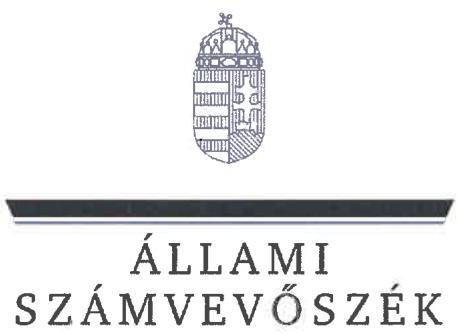
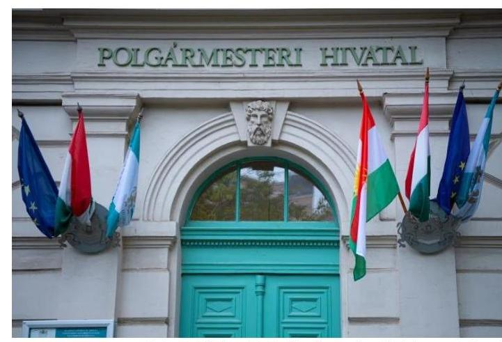
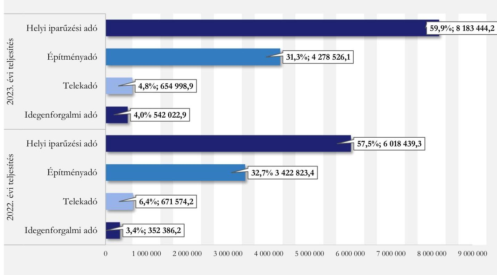
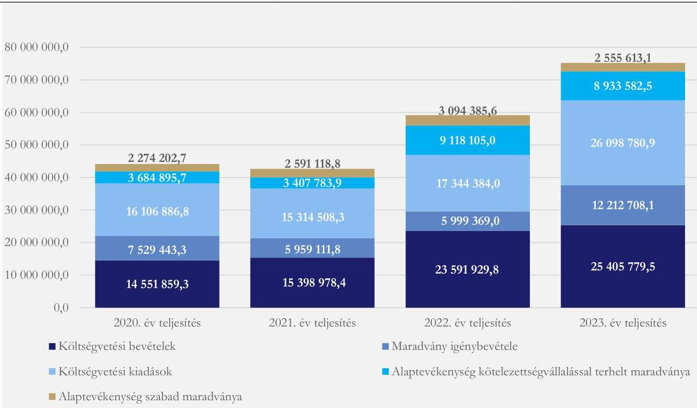
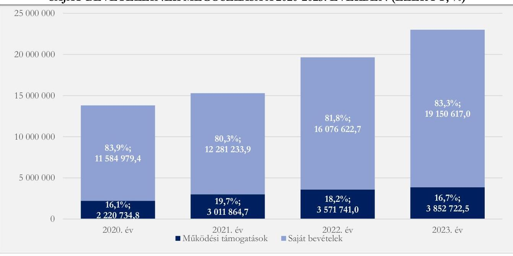

# JELENTÉS 

## Az önkormányzatok helyi adóztatási tevékenységének ellenőrzése - Ingatlanadóztatás

Budapest Főváros IX. Kerület Ferencváros Önkormányzata

2025.

---

# JELENTÉS 

## Az önkormányzatok helyi adóztatási tevékenységének ellenőrzése - Ingatlanadóztatás

Budapest Főváros IX. Kerület Ferencváros Önkormányzata

2025.

---

# ELLENŐRZÉSI IGAZGATÓSÁG: 

## ELLENŐRZÉSI IGAZGATÓSÁG II.

## ELLENŐRZÉSI IGAZGATÓ:

DR. BAFFIA GERGELY GÁBOR ellenőrzési igazgató

## ELLENŐRZÉSVEZETŐ:

## KANYÓ LÓRÁNT ISTVÁN ellenőrzésvezető

Jelentéseink az interneten a www.asz.hu címen olvashatók.

IKTATÓSZÁM: EL-4040-044/2025
TÉMASORSZÁM: 54
ELLENŐRZÉS-AZONOSÍTÓ SZÁM: V1084

---

# TARTALOMJEGYZÉK 

AZ ELLENŐRZÉS ALAPADATAI ..... 5
AZ ELLENŐRZÉS TERÜLETE ÉS AZ ELLENŐRZÖTT SZERVEZET ..... 7
ÖSSZEFOGLALÁS ..... 10
AZ ELLENŐRZÉS FÓKUSZKÉRDÉSEI ..... 12
MEGÁLLAPÍTÁSOK ..... 13
JAVASLATOK ..... 30
MELLÉKLETEK ..... 32
I. sz. melléklet: Értelmező szótár ..... 32
II. sz. melléklet: Az ellenőrzött szervezetek jegyzéke ..... 33
III. sz. melléklet: Ellenőrzési kritériumok ..... 34
IV. sz. melléklet: Budapest IX. Kerület ingatlanadó mértékei a 2022-2024. években ..... 37
V. sz. melléklet: A helyi ingatlanadótárgyak és adóalanyok a 2023. és a 2024. évben ..... 37
FÜGGELÉK: ÉSZREVÉTELEK ..... 38
RÖVIDÍTÉSEK JEGYZÉKE ..... 39

---

.

---

# AZ ELLENŐRZÉS ALAPADATAI 

## AZ ELLENŐRZÉS CÉLJA

Az ellenőrzés célja az volt, hogy értékelje a Kerület ${ }^{1}$ helyi ingatlanadóztatásának és adóhatósága feladatellátásának szabályszerűségét, célszerűségét és eredményességét. További cél volt, hogy az ellenőrzés megállapításai és következtetései segítsék az önkormányzati képviselő-testületeket a jogszabályokkal és a helyi sajátosságokkal összhangban álló helyi adópolitika kialakításában és az azt végrehajtó adóigazgatási szervezet megszervezésében. Az ellenőrzés célja volt továbbá annak megállapítása is, hogy az Önkormányzat² által bevezetett, ingatlanokat terhelő helyi adókra vonatkozó rendeleti szabályok összhangban vannak-e a helyi adópolitikai célokkal, tartalmuk tükrözi-e a Kerület helyi sajátosságait és az adóhatósági feladatellátás biztosítja-e az önkormányzati bevételek feltárását és beszedését.

Ennek keretében az ÁSZ ${ }^{3}$ értékelte, hogy az Önkormányzat által bevezetett, ingatlanokat terhelő helyi adókról szóló adórendelet ${ }^{4}$, valamint az adóhatóság ${ }^{5}$ döntései, adóztatási gyakorlata a vonatkozó jogszabályokkal összhangban álltak-e.

## AZ ELLENŐRZÉS TÍPUSA

Kombinált ellenőrzés.

## AZ ELLENŐRZÖTT IDŐSZAK

Az 1. fókuszkérdésnél a 2023. év, valamint a 2024. évnek az ellenőrzés megkezdését megelőző napjáig (2024. június 13.) tartó időszaka.

A 2. és 3. fókuszkérdésnél a 2023. év, valamint a 2024. évnek az ellenőrzés megkezdését megelőző napjáig (2024. június 13.) tartó időszaka, a 2020-2022. évek adatainak bázisadatként való felhasználásával.

Az ellenőrzés során feltárt kockázatok, tények, körülmények alapján az ÁSZ az ellenőrzött időszakot a 2. fókuszkérdés esetében, a 7. mintatételnél a 2022. évre is kiterjesztette.

## AZ ELLENŐRZÉS TÁRGYA

Az Önkormányzat képviselő-testületének ingatlanokat terhelő helyi adókkal, azaz az építményadóval és a telekadóval kapcsolatos rendeletalkotási tevékenységének és az adóhatóság tevékenységének az ellátása.

Az ellenőrzés kiterjedt minden olyan körülményre és adatra, amely az ÁSZ jogszabályban meghatározott feladatainak teljesítéséhez, valamint az ellenőrzési program végrehajtása folyamán felmerült újabb összefüggések feltárásához szükséges.

---

# Az ellenőrzés jogalapja 

Az ellenőrzés jogszabályi alapját az ÁSZ tv. ${ }^{6} 5 . \S$ (8) bekezdésének előírásai képezték.

## AZ ELLENŐRZÉS MÓDSZERE

Az ellenőrzést az ellenőrzési program szempontjai, az ellenőrzött időszakban hatályos jogszabályok, az ellenőrzés általános szakmai szabályai és az ellenőrzésre irányadó ÁSZ módszertanok alapján végezte az ÁSZ.

Az ellenőrzési kérdések megválaszolásához szükséges bizonyítékok megszerzése az ellenőrzött szervezetek által rendelkezésre bocsátott dokumentumokra, adatokra és az ASP ${ }^{7}$ Adó és az Iratkezelő szakrendszerek, illetve a KGR-K11 ${ }^{8}$ számviteli adatgyűjtő rendszer adataira alapozva megfigyelés, szemle (szemrevételezés), kérdésfeltevés (információkérés), mintavételezés, valamint elemző eljárás útján történt. Emellett az ellenőrzési bizonyítékként felhasználható adatforrások közé tartozott minden egyéb - az ellenőrzés folyamán feltárt, az ellenőrzés szempontjából információt tartalmazó - releváns dokumentum (ideértve különösen a helyszíni ellenőrzésről készült jegyzőkönyvet) is.

Az ellenőrzés lefolytatásához az ellenőrzött szervezet a tanúsítványok kitöltésével, valamint az ÁSZ által kért dokumentumok, adatok, információk megküldésével és az ellenőrzés során szolgáltatott adatokat.

Az ÁSZ az adómegállapítás és a hátralékok beszedésének szabályszerűségét mintavételi eljárással ellenőrizte. Ennek során az adóhatósági adómegállapítási feladatellátás ellenőrzése keretében 28 mintatétel (közte 99 adómegállapító határozat és 7 törlő határozat), a fizetési kedvezmények engedélyezése tárgykörben két mintatétel (négy határozat) értékelése történt meg, továbbá nyolc mintatételben (18 határozat) az ÁSZ a hátralékkezelés teljes dokumentációját is ellenőrizte. A mintatételek kiválasztása véletlenszerűen történt az adóhatóság nyilvántartásában lévő adótárgyak és ügyek közül tíz - adómegállapításra vonatkozó - mintatétel kivételével, amelyek esetében a kiválasztás címadatok alapján történt annak érdekében, hogy feltárható legyen, volt-e olyan adótárgy, amelyet nem adóztatott az adóhatóság. Az ellenőrzött mintatételekre vonatkozó megállapítások nem vetíthetők ki a teljes sokaságra, a megállapításokat az ÁSZ az adott ellenőrzött mintatételek vonatkozásában tette meg.

Az ÁSZ a helyi adópolitikai elképzelések és a kerületi sajátosságok feltárásával értékelte, hogy az adórendelet e szempontoknak mennyiben felelt meg. Az ÁSZ a helyi adópolitikai célokkal akkor tekintette összhangban állónak az adórendeletet, ha az hatását tekintve támogatta az adópolitikai célok teljesülését.

Az ÁSZ az adóhatósági feladatellátás szabályszerűségéből, a meglévő kapacitásokból, valamint az ezer forint adóbevételre jutó adóhatósági költségek alakulásából következtetett arra, hogy az adóhatóság rendelkezett-e azzal a potenciállal, amellyel eredményesen tudta a helyi adópolitikát végrehajtani.

Az ÁSZ - az adórendelet szabályainak érvényre juttatása körében - az eredményesség véleményezésekor a III. számú melléklet 2. pontjában foglalt szempontokat tekintette mérvadónak.

---

# AZ ELLENŐRZÉS TERÜLETE ÉS AZ ELLENŐRZÖTT SZERVEZET 

A Kerület a Duna bal partján, a pesti oldalon terül el, összefoglaló történelmi neve Ferencváros, mely elnevezését az 1792. évben I. Ferenc trónra lépésének alkalmából kapta. Lakosainak száma - a $\mathrm{BM}^{9}$ adatai szerint - 2020. év elején 54316 fő, 2024. év elején 52899 fő volt.

A lakások száma - a TeIR ${ }^{10}$ adatai alapján - a 2020. évi 42420 darabról a 2023. évre 6,1%-kal 44991 darabra emelkedett.

A TeIR adatai alapján 2023. december 31-én 15611 regisztrált gazdasági szervezet (egyéni vállalkozókkal) volt a Kerületben, melyek jelentős hányada (84,3%-a, 13153 darab) a szolgáltatási

Budapest Főváros IX. Kerület Ferencvárosi Polgármesteri Hivatal Forrás: https://www.ferencvaros.hu/wpcontent/uploads/2020/03/83247057_10158242796154724_9004407895365779456_o768x512.jpg
szektorban működött.

Az egy főre jutó személyi jövedelemadó-alap összege a 2020-2022. évek között a TeIR adatai szerint 36,8%-kal 3 301,8 ezer Ft-ra emelkedett, mely a fővárosi átlagot (3 026,7 ezer Ft) 9,1%-kal, az országos átlagot (2 268,8 ezer Ft) 45,5%-kal haladta meg.

Az Önkormányzat az SZMSZ ${ }^{11}$-ében foglaltak alapján olyan önként vállalt feladatokat is ellátott, mint a járó beteg szakellátás keretében CT diagnosztikai szolgáltatás költségeinek átvállalása; hajléktalanok, állami gondozottak, intézményi dolgozók elhelyezése; karácsonyi támogatás juttatása; mozgáskorlátozottak lakásának akadálymentesítési támogatása; lakóház-felújítási támogatás; fűtéstámogatás; születési és életkezdési támogatás; iskolakezdési támogatás; oktatási támogatás nyújtása; tanulóbérlet biztosítása; jogosítvány megszerzésének támogatása. Emellett az Önkormányzat újságot adott ki, televíziót, Pinceszínházat, valamint települési értéktár bizottságot működtetett.

Az Önkormányzat - a Hivatal ${ }^{12}$ mellett - az ellenőrzött időszakban 15 költségvetési szervet ${ }^{1}$ tartott fenn, melyből egy bölcsődei ellátást, kilenc óvodai nevelést, egy szociális ellátást, egy szakorvosi járóbeteg-ellátást biztosított, kettő közművelődési feladatokat, egy pedig intézményüzemeltetési feladatokat látott el. Az Önkormányzatnak a két kizárólagos tulajdonában lévő gazdasági társasága mellett három nonprofit gazdasági társaságban volt részesedése 2024. II. negyedévében.

[^0]
[^0]:    ${ }^{1}$ Ferencvárosi Egyesített Bölcsődei Intézmények, Ferencvárosi Kicsi Bocs Óvoda, Ferencvárosi Epres Óvoda, Ferencvárosi Ugrifüles Óvoda, Ferencvárosi Méhecske Óvoda, Ferencvárosi Liliom Óvoda, Ferencvárosi Napfény Óvoda, Ferencvárosi Csudafa Óvoda, Ferencvárosi Csicsergő Óvoda, Ferencvárosi Kerekerdő Óvoda, Ferencvárosi Egészségügyi Szolgálat, Ferencvárosi Szociális és Gyermekjóléti Intézmények Igazgatósága, Ferencvárosi Művelődési Központ és Intézményei, Ferencvárosi Pinceszínház, Ferencvárosi Intézményüzemeltetési Központ

---

Az Alaptörvény ${ }^{13}$ értelmében a helyi önkormányzat a helyi közügyek intézése körében törvény keretei között dönt a helyi adók fajtájáról és mértékéről. Az Mötv. ${ }^{14}$ rögzíti, hogy a helyi adóval kapcsolatos feladatok ellátása a helyi önkormányzatok feladata.

Az Önkormányzat képviselő-testülete a Htv. ${ }^{15}$-ben foglalt felhatalmazással élve az Önkormányzat illetékességi területén az adórendelettel az ingatlanokat terhelő helyi adók közül az építményadót és a telekadót vezette be.

Az Önkormányzat az építményadó tekintetében az általános adómértéktől eltérő, alacsonyabb mértékkel adóztatta a magánszemély tulajdonában lévő lakásokat, s magasabb adómértékkel 2023ban az $1000 \mathrm{~m}^{2}$ hasznos alapterületet meghaladó kereskedelmi egységek többségét, 2024-ben pedig valamennyi $1000 \mathrm{~m}^{2}$ hasznos alapterületű kereskedelmi egységet ${ }^{2}$. A felsorolt kedvezményeken túl a képviselő-testület ${ }^{16}$ több mentességi tényállást is meghatározott, melyek között mentesítette az építményadó alól azon magánszemély tulajdonában lévő lakásokat, amelyekben a magánszemély adóalany, illetve annak hozzátartozója életvitelszerűen lakik.

A telekadó tekintetében a 2023. adóévtől kezdődően egy általános adómérték szerint adóztak az Önkormányzat illetékességi területén található telkek. ${ }^{3}$

A képviselő-testület az építmény- és telekadó tekintetében egyaránt, mind a 2023. év, mind a 2024. év vonatkozásában élt az adómérték emelésének lehetőségévével. Az Önkormányzat által bevezetett, ingatlanokat terhelő helyi adókban alkalmazott mértékrendszert és a mértékváltozást részletesen a IV. számú melléklet szemlélteti.

Az Önkormányzat helyi adóbevételei 2022. és 2023. évi összetételére vonatkozó adatokat az 1. ábra, a helyi ingatlanadók 2023. és 2024. évre vonatkozó jellemző naturális adatait pedig az V. számú melléklet mutatja be.

[^0]
[^0]:    2 Az adórendelet 2022. és 2023. években hatályos rendelkezései szerint az Önkormányzat sávosan adóztatta az $1000 \mathrm{~m}^{2}$ hasznos alapterületet meghaladó kereskedelmi egységeket: Külön adómérték szerint adóztak az $1000 \mathrm{~m}^{2}$ hasznos alapterületet meghaladó, de $3000 \mathrm{~m}^{2}$ hasznos alapterületet el nem érő kereskedelmi egységek, és külön, magasabb adómérték szerint adóztak a $3000 \mathrm{~m}^{2}$ hasznos alapterületet meghaladó kereskedelmi egységek. Az adórendelet alapján az általánostól eltérő adómérték a pontosan $3000 \mathrm{~m}^{2}$ hasznos alapterületű kereskedelmi egységekre nem vonatkozott. Az adórendelet 2024. január 1-jétől hatályos módosítása értelmében valamennyi $1000 \mathrm{~m}^{2}$ hasznos alapterületet meghaladó kereskedelmi egységek azonos adómérték szerint adóztak.
    3 Az adórendelet 2022. évben hatályos rendelkezései szerint az Önkormányzat illetékességi területén található telkek három övezetbe soroltan, eltérő adómértékkel adóztak.

---

1. ábra

*Forrás: KGR-K11 2022-2023. évi költségvetési beszámoló adatai alapján ÁSZ saját szerkesztés*

---

# ÖSSZEFOGLALÁS 

Az ÁSZ tv. értelmében az ÁSZ feladatkörébe tartozik az önkormányzatok adóztatási tevékenységének ellenőrzése. A helyi adók az önkormányzatok saját, el nem vonható bevételét képezik, így az önkormányzatok gazdasági önállósága szempontjából különös fontossággal bír, hogy a helyi adórendeleti szabályok összhangban álljanak a magasabb szintű jogszabályokkal, továbbá az önkormányzati adóhatósági tevékenység jogszerű, eredményes és hatékony legyen. Erre figyelemmel volt tárgya az ÁSZ ellenőrzésének az Önkormányzat adórendelet-alkotási tevékenysége és az adóhatósági feladatellátás is.

Az adórendelet több ponton nem volt összhangban a magasabb szintű jogszabályokkal, ugyanakkor alkalmas volt az Önkormányzat adópolitikai céljainak elérésére. Az adóhatóság adóalany- és adótárgyfeltárásra irányuló feladatellátása nem volt eredményes, az adómegállapító határozatok nem minden esetben feleltek meg a jogszabályi előírásoknak. Adóellenőrzést az adóhatóság nem folytatott. Az adóhatóság adóbehajtási tevékenysége - egy kivétellel - szabályszerű volt, de nem volt eredményes, illetve nem minden esetben volt célszerű. Az adóhatóság adatszolgáltatási kötelezettségét határidőn túl teljesítette, míg közzétételi kötelezettségének a jogszabályi előírásoknak megfelelően eleget tett. Az adóztatási kiadások nem voltak túlzottak. az adóbevételhez képest. Az adóhatóság ingatlanadóztatással összefüggő feladatellátási mutatói összességében kedvezőbbek voltak az ÁSZ által elemzés alá vont nyolc fővárosi kerület ${ }^{4}$ feladatellátási mutatóinak átlagos értékeinél.

## Adórendelet, adórendelet-alkotás

Az adórendelet építményadóra vonatkozó egyes rendelkezései nem voltak összhangban a jogszabályi előírásokkal, mert azon társasházak számára is adómentességet biztosítottak, amelyek a közös tulajdonú, illetve használatú helyiségeket bevételszerzés céljából hasznosították, s ezáltal a Htv. szerinti vállalkozónak minősültek, továbbá azon vállalkozó adóalanyok számára is építményadó-mentességet biztosítottak, akik/amelyek magánszemélyek tulajdonában álló garázsok, gépkocsi beállók és tárolók esetében vagyoni értékű jog jogosultjaiként építményadó alanyának minősültek. Törvénysértő volt továbbá az adórendelet, mivel egy adott adótárgyra vonatkozó építményadó mértékének megállapítása során nem az adott adótárgy hasznos alapterületét, hanem az adott helyrajzi számon nyilvántartott valamennyi kereskedelmi egységnek minősülő önálló adótárgy összesített alapterületét rendelte figyelembe venni. Emellett az adórendelet egy nem egyértelmű, ezáltal vitatható rendelkezést tartalmazott.

Az ingatlanokat terhelő helyi adókra vonatkozó rendeleti szabályozás megalkotása során az Önkormányzat figyelembe vette, hogy a rendeleti szabályoknak tükrözniük kell a helyi sajátosságokat, az önkormányzat gazdálkodási követelményét, továbbá az adóalanyok széles körét érintően az adóalanyok teherviselő képességét.

Az adóhatóság adóigazgatási feladatellátásának jogszerűsége, eredményessége
Az adóhatóság adótárgy-, és adóalany feltárási feladatellátása (ezáltal az adómegállapítási feladatellátása) nem volt eredményes, az adómegállapítási eljárásban hozott hatósági döntések nem minden esetben voltak szabályszerűek. Az adómegállapító határozatok kiadmányozása, kézbesítése megfelelt a

[^0]
[^0]:    ${ }^{4}$ Az ÁSZ által jelen ellenőrzéshez kapcsolódóan elemzés alá vont fővárosi kerületek: Budapest IV. kerülete, Budapest VI. kerülete, Budapest IX. kerülete, Budapest X. kerülete, Budapest XV. kerülete, Budapest XVII. kerülete, Budapest XX. kerülete és Budapest XXII. kerülete.

---

jogszabályoknak. Az adóhatóság adatszolgáltatási kötelezettségét késedelmesen teljesítette, közzétételi kötelezettségének eleget tett. Az adóhatóság adóbehajtási (adóbeszedési) tevékenysége - egy kivétellel, mely esetben az adóhatóság olyan adótartozásra is foganatosított végrehajtási cselekményt, amely tekintetében a végrehajtásához való jog elévült - szabályszerű volt, de nem volt eredményes, és nem minden esetben volt célszerű.

Adóellenőrzést az adóhatóság az ellenőrzött időszakban nem folytatott.
A z adórendelet adópolitikai célokkal való összhangja, az adórendelet hatása
Az Önkormányzat - a fővárosi kerületek 2023. évi konszolidált költségvetési beszámolói összegző adataival történő összehasonlítása alapján - erőteljesebben támaszkodott az ingatlanadó-bevételekre, azonban az Önkormányzat gazdálkodásában az ingatlanadó-bevételek jelentősége csökkent a vizsgált időszakban. Az ingatlanadó-bevétel aránya a konszolidált - befizetett szolidaritási hozzájárulással csökkentett - saját bevételeken belül a fővárosi kerületekre jellemző 17,9\%-os értéket meghaladó $\mathbf{2 8 , 3 \%}$ volt. Az ingatlanadó-bevétel konszolidált - az államháztartáson belülről származó felhalmozási célú támogatások nélküli és befizetett szolidaritási hozzájárulással csökkentett - költségvetési bevételeken belüli részesedése pedig a fővárosi kerületekre vonatkozó $13,2\%$-nál 10,0 százalékponttal magasabb, $\mathbf{23 , 2\%}$ volt. A 23 fővárosi kerület esetén az egy állandó lakosra jutó átlagos 48,0 ezer Ft-os ingatlanadó-bevételhez képest az Önkormányzat egy állandó lakosára 93,3 ezer Ft jutott.

Az Önkormányzat adórendeleti szabályai összhangban voltak az adópolitikai célokkal (bevételszerzés, de nem a magánlakások adóztatása révén) és az adóalanyok többségének adóteherviselő képességét nem érintették hátrányosan.

# Az adóhatósági kiadások

Az adóhatóság a 2023. évben - a szolidaritási hozzájárulással csökkentve - 5481 935,2 ezer Ft helyi adóbevételt ${ }^{5}$ számolt el költségvetési beszámolójában. Minden 1000 Ft beszedett helyi adóbevételre - az ÁSZ számítása szerint - 24,6 Ft adóztatási kiadás esett. Az elemzés alá vont nyolc fővárosi kerület átlaga 31,0 Ft, az adóztatási kiadás tapasztalati referencia-érték maximuma kivetéses adóztatás esetén $50,0 \mathrm{Ft}$ volt.

Az Önkormányzat egy adótisztviselőjére a 2023. évben 365 462,3 ezer Ft helyi adóbevétel, 1 579,5 adótárgy és 439,9 adózó jutott. Ezek az értékek többségükben kedvezőbbek (magasabb adóbevétel és adótárgy, ugyanakkor kevesebb adózó jutott egy adótisztviselőre), mint az ÁSZ által elemzés alá vont nyolc fővárosi kerület átlaga (306 828,1 ezer Ft ingatlanadó-bevétel/adótisztviselő, illetve 1 023,9 adótárgy/adótisztviselő és 454,3 adózó/adótisztviselő).

[^0]
[^0]:    5 A helyi iparűzési adóbevétel valamennyi kerület esetében; az idegenforgalmi adóbevétel egyes kerületek esetében Budapest Fővárosi Önkormányzatát és a kerületi önkormányzatokat osztottan illette meg. Ezen közterhekben az adóztatási feladatokat a Fővárosi Önkormányzat adóhatósága látta el. A fővárosi kerületi önkormányzatok esetében sem az ebből származó bevételeket, sem a kapcsolódó kiadásokat nem tartalmazzák a számadatok. Helyi adóbevétel körébe tartozik jelen esetben (az adóztatási kiadások számításánál): az ingatlanadókból származó bevétel, az idegenforgalmi adóbevétel, a települési adóbevétel és a beszedett talajterhelési díj; mivel a kapcsolódó feladatokat a helyi adóhatóság látta el.

---

# AZ ELLENŐRZÉS FÓKUSZKÉRDÉSEI

1.  Az önkormányzat ingatlanokat terhelő helyi adókra vonatkozó rendeleti szabályozása megfelel-e a magasabb szintű jogszabályoknak?
2.  Az önkormányzati adóhatóság megfelelően és eredményesen látta-e el az ingatlanok adóztatásával kapcsolatos adóhatósági tevékenységeit?
3.  A Kerületben megvalósuló helyi adóztatás támogatta-e a helyi adópolitikai célok teljesülését?

---

# MEGÁLLAPÍTÁSOK

## 1. Az önkormányzat ingatlanokat terhelő helyi adókra vonatkozó rendeleti szabályozása megfelelte a magasabb szintű jogszabályoknak?

## Összegző megállapítás

Az adórendelet több ponton nem felelt meg a magasabb szintű jogszabályoknak.
1.1. számú megállapítás

Az adórendelet több ponton ellentétes volt a Htv. rendelkezéseivel. Az adórendelet egy rendelkezése sértette az egyértelmű értelmezhetőség Jat. ${ }^{17}$-ban megfogalmazott követelményét.

A Htv. 7. § e) pontjában előírtak ellenére - amely az uniós jogból fakadó állami támogatási elvekre és normákra figyelemmel rögzíti, hogy az önkormányzat az építményadóban és a telekadóban a vállalkozó számára adómentességet, adókedvezményt nem biztosíthat - az adórendelet:
7.  § (1) bekezdésének c) pontja azáltal, hogy a lakóépületben található, a társasház közös tulajdonában és használatában álló helyiséget mentesítette az építményadó alól, azon társasházak számára is adómentességet biztosított, amelyek a közös tulajdonú, illetve használatú helyiségeket bevételszerzés céljából hasznosították (pl. bérbe adták), s ezáltal a Htv. szerinti vállalkozónak minősültek;
8.  § (1) bekezdésének d) pontja azáltal, hogy a magánszemély tulajdonát képező garázs egy részét, illetve a magánszemély tulajdonában lévő gépkocsi beállót mentesítette az építményadó alól, potenciálisan azon vállalkozó adóalanyok számára is építményadómentességet biztosított, akik/amelyek ezen garázsok,

Az uniós állami támogatási szabályok értelmében a vállalkozóknak nyújtott helyi adómentesség, helyi adókedvezmény állami támogatásnak minősül. A jogszerűtlenül nyújtott támogatást a kedvezményezettnek vissza kell fizetnie, vagy a támogatást nyújtónak kell biztosítania az uniós joggal való összhangot.
gépkocsi beállók esetében - az ingatlan-nyilvántartásba bejegyzett vagyoni értékű joguk okán - az építményadó alanyának minősültek;
9.  § (1) bekezdésének e) alpontja azáltal, hogy a magánszemély tulajdonában álló egyes tárolókat mentesítette az építményadó alól, potenciálisan azon vállalkozó adóalanyok számára is építményadómentességet biztosított, akik/amelyek ezen tárolók esetében - az ingatlan-nyilvántartásba bejegyzett vagyoni értékű joguk okán - az építményadó alanyának minősültek.
A Htv. 11. § (1) bekezdésébe és 15. § a) pontjába ütközése ${ }^{6}$, illetve a megalkotására vonatkozó törvényi felhatalmazás hiánya miatt törvénysértő az adórendelet 12. § (4) bekezdése, mivel egy adott adótárgyra vonatkozó adómérték megállapítása során nem az adott adótárgy hasznos alapterületét (a releváns adóalapot), hanem az adott helyrajzi számon nyilvántartott valamennyi kereskedelmi egységnek minősülő önálló adótárgy összesített alapterületét rendeli figyelembe venni.

[^0]
[^0]:    ${ }^{6}$ A Htv. 11. § (1) bekezdéséből és 15. § a) pontjából következik, hogy az építményadókötelezettség az egyes adótárgyak esetében önállóan értelmezendő.

---

Az adórendelet 7. § (1) bekezdésének a) pontja ${ }^{7}$ sértette - a Jat. 2. § (1) bekezdéséből következő egyértelmű értelmezhetőség követelményét azzal, hogy abból nem derül ki, hogy az építményadómentességhez az adóalanynak vagy az ott lakó hozzátartozónak kell megfelelnie annak a feltételnek, hogy nem rendelkezik máshol olyan lakással, amit életviteléhez szükségesen használ.
1.2. számú megállapítás

Az Önkormányzat az ingatlanokat terhelő helyi adókra vonatkozó rendeleti szabályozás megalkotása során figyelembe vette a kerületi sajátosságokat, az Önkormányzat gazdálkodási követelményeit és az adóalanyok széles körét tekintve az adóalanyok teherviselő képességét.

A Htv. 7. § g) pontjában rögzített adómegállapítási korlátokból az következik, hogy a rendelet hatályossága idején is érvényre kell jutnia az e pontban szabályozott rendeletalkotási elveknek, azaz annak, hogy kerületi önkormányzat az adóalap fajtáját, az adó mértékét, a rendeleti adómentességet és adókedvezményt úgy állapíthatja meg, hogy azok összességükben egyaránt megfeleljenek
a) a helyi sajátosságoknak,
b) az önkormányzat gazdálkodási követelményeinek és
c) az adóalanyok széles körét érintően az adóalanyok teherviselő képességének.

# A helyi sajátosságok figyelembevétele

Az Önkormányzat legfőbb sajátosságát az adja, hogy fővárosi kerületként többféle jellegzetességű övezet, többféle funkciót betöltő ingatlan található benne, viszonylag szoros területi közelségben egymáshoz (az ipari létesítmények, kereskedelmi egységek, lakóépületek egy-egy utcán belül váltakozva illeszkednek a városrész szövetébe).
Az adóalany minősége, továbbá az adótárgy fajtája, hasznosítási módja, illetve hasznos alapterületének nagysága alapján differenciált építményadó-mértékre tekintettel megállapítható, hogy a Kerület ingatlanadóztatás szempontjából meghatározó sajátos körülményeit a hatályos adórendelet előkészítésekor az Önkormányzat figyelembe vette és mérlegelte.

[^0]
[^0]:    ${ }^{7}$ Az adórendelet 7. § (1) bekezdés a) pontja értelmében mentes az építményadó alól „a magánszemély tulajdonában lévő lakás, amelyben a magánszemély adóalany, illetve annak hozzátartozója tartós ottlakásra rendezkedett be, és ahol életvitelszerűen ott lakik.". Az adórendelet hivatkozott pontja az életvitelszerűen lakásként használt ingatlant a következőképp definiálja: „a tulajdonos olyan lakása, ahol ő vagy hozzátartozója bizonyítottan az életviteléhez szükséges tevékenységeket (étkezés, főzés, mosás, családi élet szervezése, közüzemi szolgáltatások igénybe vétele, elérhetőségi címkénti megjelölése stb.) rendszeresen, legjellemzőbben folytatja és máshol nincs olyan lakás, amelyet ténylegesen az életviteléhez szükségesen használ, és ahol az év bármely időszakában szállásadó tevékenységet semmilyen jogcímen a lakásban nem folytatnak, a lakást nem adják bérbe".

---

# Az önkormányzat gazdálkodási követelményeinek szempontja

Az Önkormányzat nyilatkozata szerint a helyi ingatlanadók kerületi működtetésének az elsődleges célja a bevételszerzés volt, mert az önkormányzati finanszírozási rendszer átalakítása miatt fokozott szüksége volt az Önkormányzatnak saját bevételre.
A 2022. évben a helyi adókból - az 1054735,2 ezer Ft szolidaritási hozzájárulással csökkentve összesen 9410 488,0 ezer Ft bevétele származott az Önkormányzatnak, amely a szolidaritási hozzájárulással, valamint az államháztartáson belülről kapott felhalmozási célú támogatásokkal korrigált konszolidált költségvetési bevételnek (amely 18593 628,5 ezer Ft) 50,6\%-át tette ki. A 2023. évben a helyi adókból származó - 1731798,6 ezer Ft szolidaritási hozzájárulással csökkentett - éves 11927 193,5 ezer Ft ugyanezen aránya a konszolidált költségvetési bevételének az 56,1\%-a volt.
Az ingatlanadó-bevétel 2022. évi 4094 397,6 ezer Ft-ról a következő évre - főképp az építményadó mértékének növekedésére visszavezethetően - 20,5\%-kal 4933 525,0 ezer Ft-ra nőtt (1. ábra).
Az Önkormányzat és intézményeinek főbb gazdálkodási adataiból (2. ábra) az figyelhető meg, hogy 2020-2023. között jelentős maradvány képződött. A konszolidált alaptevékenység maradványa a 2022. évben 12212 490,6ezer Ft, a 2023. évben 11489 195,6 ezer Ft volt, melyből a szabad maradvány a 2022. évben 3094385,6 ezer Ft-ot, a 2023. évben 2555 613,1 ezer Ft-ot tett ki, míg az Önkormányzatnak a következő években esedékes kötelezettségállománya 2022. év végén 531 788,9 ezer Ft, a 2023. év végén 886 772,3 ezer Ft volt. Az önkormányzat gazdálkodási helyzete összességében nem tette szükségessé az adórendelet módosítását.
2. ábra

AZ ÖNKORMÁNYZAT ÉS INTÉZMÉNYEI 2020-2023. ÉVI KONSZOLIDÁLT BESZÁMOLÓJÁNAK FŐBB ADATAI (EZER FT)*

[^0]
[^0]: *Nem tartalmazza az államháztartáson belüli megelőlegezéseket és visszafizetéseket, a pénzeszközök lekötött bankbetétként történt elhelyezéseit és azok megszüntetéseit, a hitel-, kölcsönfelvételeket és azok törlesztését, valamint a vállalkozási tevékenység maradványát. Forrás: KGR-K11 és zárszámadási rendelet:18, 219, 220, 221 alapján ÁSZ saját szerkesztés

---

# Az adóalanyok teherviselő képességének figyelembevétele 

Az adórendelet célja szerint egyrészt arra irányult, hogy az egyéb adóalanyokhoz képest a magánszemély adóalanyokat a saját vagy a hozzátartozójuk életvitelszerű lakóhelyéül szolgáló lakások után építményadó-mentesség illesse meg. Ezen túlmenően a kizárólag magánszemély tulajdonában álló lakás esetében az építményadó mértéke alacsonyabb ( $500 \mathrm{Ft} / \mathrm{m}^{2} / \mathrm{év}$ ) volt, mint az egyéb adótárgyak esetében, amelyek után a 2023. évben $1670,0 \mathrm{Ft} / \mathrm{m}^{2} /$ év, a 2024. évben $1920 \mathrm{Ft} / \mathrm{m}^{2} /$ év építményadót kellett fizetni. E megfontolás mögött - az Önkormányzat tájékoztatása alapján - az állt, hogy meglátásuk szerint a nem magánszemély adóalanyok nagyobb szerepet tudnak vállalni a helyi közterhekből.
A nem magánszemély adóalanyok jelentősebb terhelése öltött testet abban, hogy az építményadószabályozás - amely az 1.1. számú megállapítás alatt leírtak szerint törvénysértő volt - az egy helyrajzi számon fellelhető, összességében az $1000 \mathrm{~m}^{2}$ hasznos alapterületet meghaladó kereskedelmi egységek esetében az átlagadómértékhez képest jóval magasabb $2500 \mathrm{Ft} / \mathrm{m}^{2} /$ év építményadó-mértéket írt elő, és abban, hogy a telekadó mértéke $\left(456,0 \mathrm{Ft} / \mathrm{m}^{2}\right)$ a Htv. szerinti adómaximummal $\left(456,1 \mathrm{Ft} / \mathrm{m}^{2}\right)$ közel azonos volt ${ }^{8}$.
Az Önkormányzat a Htv. előírásainak megfelelően figyelembe vette a helyi ingatlanadó-szabályozás kialakításánál az adóalanyok teherviselőképességét.

[^0]
[^0]: ${ }^{8}$ A szinte teljesen beépített Kerületben a magánszemély adóalanyok nem vagy legfeljebb elvétve rendelkeznek az Önkormányzat illetékességi területén adóköteles telekkel, s amennyiben ilyen telkek léteznek, azok is üzleti hasznosításúak.

---

# 2. Az önkormányzati adóhatóság megfelelően és eredményesen látta-e el az ingatlanok adóztatásával kapcsolatos adóhatósági tevékenységeit? 

Összegző megállapítás

Az adóhatóság adómegállapítási tevékenysége nem volt eredményes, továbbá az adóhatósági döntések sem voltak minden esetben szabályszerűek. Az adóhatóság adatszolgáltatási kötelezettségének határidőn túl, közzétételi kötelezettségének azonban maradéktalanul eleget tett. Az adóhatóság adóbehajtási tevékenysége - egy kivétellel szabályszerű volt, azonban nem volt eredményes, és nem minden esetben volt célszerű.
2.1. számú megállapítás

Az adóhatóság adóalany- és adótárgyfeltárási feladatellátása nem volt eredményes. Az adófizetési kötelezettség megállapítása nem minden esetben volt szabályszerű. Az adóhatóság adatszolgáltatási kötelezettségét késedelmesen teljesítette, közzétételi kötelezettségének eleget tett.

Adótárgy- és adóalanyfeltárás
Az adóhatóság a 2023. és a 2024. évben is élt az Art. ${ }^{22}$ 83. § (2) bekezdésében foglaltak alapján az ingatlanügyi hatóság megkeresésének lehetőségével. Ezen, a kerületi ingatlanokról és tulajdonosaikról, valamint az ingatlanokon fennálló vagyoni értékű jog jogosítottjairól szóló adatokat összevetette saját nyilvántartásával. Emellett az adóhatóság az építésügyi hatóság által az Art. 86. §-a szerint szolgáltatandó adatokat is felhasználta az adatbejelentést elmulasztó adóalanyok beazonosítására, továbbá az adótárgyak feltárása érdekében térinformatikai eszközt, valamint a Google Earth és Google Streetview szolgáltatásait is igénybe vett. Ennek ellenére az ÁSZ több olyan ingatlant (29., 30. és 34. mintatételek) is feltárt, amelyek után az adóhatóságnak - a Htv. 2. és 11. §-aiban, valamint az adórendelet 5. § (1) bekezdésében foglaltaknak megfelelve - adómegállapító eljárást kellett volna lefolytatnia (és ezen eljárás keretében megállapítani az adót vagy az adómentességet).

---

Mindezek alapján összességében az adótárgy- és adóalanyfeltárási adóhatósági feladatellátás figyelemmel arra, hogy a más hatóságtól kapott hiteles információt azok megszerzése céljának megfelelően használta fel - célszerű volt, ugyanakkor nem volt eredményes.

# Adómegállapítás (kivetés) 

Az adóhatóság valamennyi mintatétel (ellenőrzött adómegállapító határozat) esetén a fizetendő adó összegét a Htv.-nek és az adórendeletnek megfelelően számította ki.
Három mintatétel (20., 22. és 36. mintatételek) esetében az adóhatóság az Air. ${ }^{23}$ 2. §-ában foglalt szakszerű és hatékony eljárás elvével ellentétben több határozatot is közölt az adózókkal, melyek közül az első adómegállapító határozatot - az Air. 4. §-ában és az Air. 73. §(1) bekezdés c) pontjában foglaltakkal ${ }^{9}$ ellentétben - úgy hozta meg, hogy annak nem volt jogalapja, hiszen az adóhatóságnak már a határozathozatal időpontjában rendelkezésére álló információk alapján ${ }^{10}$ tisztában kellett lennie azzal, hogy a kivetett adó összegét módosítani kell. Emellett az adóhatóság a 24. mintatétel esetében - szemben az Air. 2. §-ával - az egy helyrajzi szám alatt lévő adótárgyak után adótárgyanként adott ki határozatot.
Két mintatétel esetében (16. és 20. mintatételek) az adótárgynak több tulajdonosa volt, ugyanakkor az adóhatóság által - az adóalanyok megállapodása alapján hozott adómegállapító határozat rendelkező része kizárólag az adó fizetésére kötelezett által fizetendő adó összegét tartalmazta.
Két mintatétel (24. és 26. mintatételek) esetében a több, önállóan adózó résztulajdonos részére hozott adómegállapító határozatok indokolásai - az Air. 73. §

Az ÁSZ általában véve sem tartja célszerűnek, ha az adóhatóság a szükségesnél több határozatot hoz, különösen, ha azt ugyanazon adóhatósági eljárásban, ugyanazon adózónak címezve teszi. Részint azért, mert azok előállítása, adott esetben kézbesítése magasabb költségekkel jár, de legfőképp azért, mert több, egyidejűleg közölt határozat esetén kevésbé áttekinthető az adózónak, hogy melyik a végleges határozat, amely alapján adófizetési kötelezettségét teljesítenie kell.

Ha az adótárgynak több tulajdonosa van, akkor ők tulajdoni illetőségük arányában adóalanyok. Ekkor mindegyikük egyetértése esetén köthetnek arról megállapodást, hogy az adóalanyisággal kapcsolatos jogokat és kötelezettséget az adóhatóság előtt közülük egy adóalany kapcsolattartóként gyakorolja. Az ÁSZ jó gyakorlatnak azt tekinti, ha az adómegállapító határozat nemcsak a fizetési kötelezettséget és a fizetésre kötelezettet (a kapcsolattartót), hanem az egyes adóalanyokat terhelő adót és annak jogalapját, kiszámítását is tartalmazza, annak érdekében, hogy az egyes adóalanyok számára egyértelmű legyen az őket terhelő adó összege.

[^0]
[^0]: ${ }^{9}$ Az Air. 4. §-a szerint az adóhatóság az eljárás során az érintett ügyre vonatkozó tényeket veszi figyelembe, minden bizonyítékot súlyának megfelelően értékel, döntését valósághű tényállásra alapozza, az Air 73. § (1) bekezdés c) pont szerint pedig a határozatban a megállapított tényállásnak megfelelő döntést kell hozni.
    ${ }^{10}$ A hivatkozott mintatételek esetében az adózó ugyanazon adótárgyra vonatkozóan több adatbejelentést is benyújtott, melyekben - az adókötelezettség kezdete és az adatbejelentés benyújtása között - felmerült változásokról is adatot szolgáltatott az adóhatóság részére (tulajdoni hányad változás, mentességre okot adó körülmény felmerülése).

---

(1) bekezdés c) pontjában foglaltak ellenére - nem rögzítették tényállási elemként az adóalany tulajdoni hányadát, s így nem tartalmazták az adótárgy utáni adó, valamint a adóalanyra a résztulajdona alapján jutó adó összegének egyértelmű számszaki levezetését, jogalapját.
Egy mintatétel (23. mintatétel) esetében az adómegállapító határozat - az Air. 73. § (1) bekezdés c) pontjában foglaltak ellenére - nem tartalmazta annak indokolását, hogy a rendelkezésre álló két adatbejelentés ellenére az adókivetés miért csupán az egyik adatbejelentésnek megfelelően történt meg.
Az adóhatóság az adómegállapító határozatok mindegyikének indokolási részében az ügyintézési határidőt az adatbejelentés adóhatósághoz való érkezése napjától számította. Az adómegállapító eljárás ugyanakkor nem kérelemre, hanem hivatalból indított eljárás, ezért az adóhatóság gyakorlata ellentétes volt az Air. 50. § (1) bekezdésével ${ }^{11}$, amely alapján hivatalbóli eljárás esetén az ügyintézési határidő az első eljárási cselekmény megkezdésének a napján kezdődik.
Mindazonáltal a határozatokban foglalt adófizetési kötelezettség jogszerűségét az indokolás kapcsán megállapított hibák, hiányosságok nem érintették. A világos, követhető magyarázat ugyanakkor érthetővé teszi az adózó számára, hogy milyen jogalapon és miért az adómegállapító határozat szerinti összeget kell fizetnie. Ezen túlmenően az adóhatóságnak és az Önkormányzatnak is előnyös, ha az adózó fizetési hajlandósága javul azáltal, hogy számára is világos és érthető az adómegállapító határozat.
Az adómegállapító határozatok kiadmányozása és adózókkal való közlése valamennyi adómegállapító határozat esetében megfelelt az Air. és az Eüsztv. ${ }^{14}$ előírásainak ${ }^{12}$.

# Adóellenőrzés 

Adóellenőrzést az adóhatóság az ellenőrzött időszakban nem végzett.
A megállapított adó csökkentése: fizetési kedvezmények, adókötelezettség változás, elévülés miatti törlés
Az ÁSZ az adóhatóság fizetési kedvezményre vonatkozó kérelem elbírálására vonatkozó eljárását két mintatétel (11. és 12. mintatételek) ellenőrzésével végezte el. A fizetési könnyítések engedélyezéséről az adóhatóság az Air. 73. § (2) bekezdése szerinti egyszerűsített döntést hozott ${ }^{13}$. Ezért a döntések indokolásából, illetve az ügyben keletkezett - az ÁSZ rendelkezésére bocsátott - iratanyagból nem volt megállapítható, hogy ezen ügyekben az adóhatóság miként (milyen szempontokat figyelembe véve)

[^0]
[^0]: ${ }^{11}$ Az Air. 50. § (1) bekezdés értelmében hivatalból való eljárás esetén az első eljárási cselekmény megkezdése napjától - azaz a konkrét esetekben (mivel egyéb eljárási cselekmény nem történt) a határozat kiadmányozása napjától - kell számítani az ügyintézési határidőt.
    ${ }^{12}$ Az Eüsztv. 2024. szeptember 1-je óta hatálytalan, a jogterület szabályozását a digitális államról és a digitális szolgáltatások nyújtásának egyes szabályairól szóló 2023. évi CIII. törvény tartalmazza.
    ${ }^{13}$ A jogorvoslatról való tájékoztatást mellőző, az indokolásban pedig csak az azt megalapozó jogszabályhelyek megjelölését tartalmazó egyszerűsített döntés hozható, ha az adóhatóság a kérelemnek teljes egészében helyt ad.

---

mérlegelte a fizetési könnyítés Art. 198. § (1) és (4)-(5) bekezdéseiben foglalt feltételeit ${ }^{14}$.
Az ellenőrzött időszakban megtett adókövetelést csökkentő intézkedések számszaki összefoglalását az 1. táblázat mutatja be.

1.  táblázat

# A 2023-2024. ÉVEKBEN TÖRTÉNT ADÓKÖVETELÉS TÖRLÉSEK FŐBB ADATAI (DARAB ÉS EZER FT) 

| MEGNEVEZÉS | 2023. |  | 2024.* |  |
| :--: | :--: | :--: | :--: | :--: |
|  | ESETSZÁM | ÖSSZEG | ESETSZÁM | ÖSSZEG |
| Méltányosságból törölt adókövetelés | 301 | 181791,4 | 161 | 244 123,4 |
| Adókötelezettség változás okán törölt adókövetelés | 2254 | 1088 196,5 | 1103 | 975 561,4 |
| Elévülés miatt törölt adókövetelés | 100 | 8 132,8 | 241 | 253 036,7 |
| *2024. július 31-i állapot szerint.   Forrás: Az Önkormányzat és a Hivatal tanúsítványokon megadott adatai, valamint az adóhatóság adókötelezettség változás okán törölt adókövetelések részletezése tárgyában tett nyilatkozata alapján ÁSZ saját szerkesztés |  |  |  |  |

## Adatszolgáltatási, közzétételi kötelezettség

Az adóhatóság a Htv. 42/B. § (1) bekezdésében foglalt előírások ellenére a 2023. január 1-jétől hatályos adórendelet módosítás kapcsán 60 nap késedelemmel, illetve a 2024. január 1-jétől hatályos adórendelet módosítás kapcsán 224 nap késedelemmel tett eleget a Kincstár ${ }^{25}$ felé fennálló adatszolgáltatási kötelezettségének. Az adórendelet az Önkormányzat honlapján elérhető volt, az adóhatóság a Htv.-ben foglaltak szerinti közzétételi kötelezettségét szabályszerűen teljesítette.
2.2. számú megállapítás

Az adóbehajtási (adóbeszedési) tevékenység a vizsgált mintatételek tekintetében - egy kivétellel - szabályszerű volt, ugyanakkor nem volt eredményes és nem volt célszerű.

Az adóhatóság az ingatlant terhelő adóban fennálló tartozás behajtásához kapcsolódóan a 2023. évben 91 esetben, a 2024. évben az ellenőrzés megkezdéséről való értesítés átvételének (2024. június 13.) napjáig 32 esetben indított az Avt. ${ }^{26}$-ben foglaltak alapján végrehajtási eljárást. A megindított végrehajtási eljárások közül a 2023. évben 64 esetben az adóhatóság maga járt el, 27 esetben az állami adóhatóságot kereste meg az adótartozás végrehajtása céljából. A 2024. évben az adóhatóság 17 darab végrehajtási eljárást maga végzett, míg 15 darab volt az állami adóhatóság részére átadott

[^0]
[^0]:    ${ }^{14}$ Az Art. 198. § (1) bekezdése értelmében fizetési halasztás, részletfizetés (a továbbiakban együtt: fizetési könnyítés) abban az esetben engedélyezhető, ha a fizetési nehézség kialakulása a kérelmezőnek nem róható fel, vagy annak elkerülése érdekében úgy járt el, ahogy az az adott helyzetben tőle elvárható, továbbá a fizetési nehézség átmeneti jellegű, azaz az adó későbbi megfizetése valószínűsíthető. Természetes személy részére fizetési könnyítés - tekintet nélkül a fizetési nehézség kialakulásának körülményeire - engedélyezhető, ha a kérelmező igazolja vagy valószínűsíti, hogy az adó azonnali vagy egyösszegű megfizetése családi, jövedelmi, vagyoni és szociális körülményeire is tekintettel súlyos megterhelést jelent. A fizetési nehézség kialakulásának körülményeitől függetlenül engedélyezhető fizetési könnyítés a természetes személy vagy egyéni vállalkozó esetében, ha a pénzügyi intézménnyel szemben fennálló hitelszerződés, kölcsönszerződés vagy pénzügyi lízingszerződés alapján fennálló kötelezettségei törlesztő részleteinek megemelkedése vagy az ezzel érintett hitelszerződés felmondása aránytalanul súlyos megterhelést jelent, továbbá az adósságrendezési eljárás során

---

tartozás. Az adóhatóság a végrehajtások eredményeképpen a 2023. évben 74 612,3 ezer Ft adótartozást, a 2022. december 31-én fennálló adótartozás 3,7\%-át, míg a 2024. évben - az ellenőrzés megkezdéséről való értesítés átvételének (2024. június 13.) napjáig - 30 744,1 ezer Ft adótartozást, a 2023. december 31-én fennálló adótartozás 1,5\%-át szedte be.
Az adóhatóság az adófizetés első esedékessége előtt felhívta az adózók figyelmét az adókötelezettség teljesítésére. A 2023. évi, ingatlant terhelő adókból származó bevételek előirányzata teljesült. Az adóbehajtási feladatellátás azonban mégsem volt eredményes, mert:

- az adóhatóság által nyilvántartott 2023. évi hátraléknak (2 069 160,1 ezer Ft) a 2023. évi beszámolóban szereplő ingatlanadó-bevételhez viszonyított aránya (41,9\%) magasabb volt, mint a fővárosi kerületi önkormányzatok ingatlanadó-bevétel-arányos hátraléka (15,3\%);
- a 2023. december 31-i hátralékok összege 1,6\%-kal magasabb volt, mint a 2022. december 31-én fennálló hátralékok összege, ugyanakkor az adóhatóság az adóhátralék emelkedése ellenére a beszedési cselekmények számát nem emelte.
Az ÁSZ az adóhatóság adóbehajtási (adóbeszedési) tevékenysége ellenőrzése keretében nyolc mintatétel (1-8. mintatételek) ellenőrzését végezte el, amelyek - egy kivétellel - szabályszerűek voltak. Az Avt. 19. § (1) bekezdése ${ }^{15}$ ellenére a 7. mintatétel esetén olyan tartozásra is rendelt el az adóhatóság 2022. szeptember 6-án jövedelemletiltást, amelynek a végrehajtásához való jog elévült.
Az adótartozás behajtására irányuló első (végrehajtási) cselekmény foganatosítása az 1. és 4. mintatételek esetében 70 nappal, a 2. mintatétel esetében 389 nappal, a 3. mintatétel esetében 102 nappal, a 6. mintatétel esetében 125 nappal, a 8. mintatétel esetében 152 nappal, míg a 7. mintatétel esetében 2000 nappal az esedékességet követően történt. Az adóbehajtási tevékenység elhúzódása eredményeképp az Önkormányzat később jut az adóbevételhez, ami kamat-elmaradással vagy kamatkiadással jár, ezért az adóbehajtás a hét mintatétel esetén nem volt célszerű.
A 2. táblázat tartalmazza az adóhátralékokra vonatkozó főbb adatokat a 2022-2024. közötti időszakban.
2. táblázat

| MEGNEVEZÉS | ALAPTÁRI   NAP | ÉPÍTMÉNYADÓ | TELEKADÓ | ÖSSZESEN |
| :--: | :--: | :--: | :--: | :--: |
| Hátralékos adózók száma | 2022.12.31. | 959 | 42 | 1001 |
|  | 2023.12.31. | 1046 | 37 | 1083 |
|  | 2024.09.30. | 1235 | 30 | 1265 |
| Adóhátralék összege | 2024.12.31. | nincs adat | nincs adat | nincs adat |
|  | 2022.12.31. | 1541 860,2 | 495255,9 | 2037 116,1 |
|  | 2023.12.31. | 1540 616,4 | 528543,7 | 2069 160,1 |
|  | 2024.09.30. | 1644 024,9 | 575751,0 | 2219 776,0 |
|  | 2024.12.31. | 1494 231,1 | 506 947,3 | 2001 178,4 |

[^0][^1]
[^0]:    ${ }^{15}$ Az Avt. hivatkozott rendelkezése szerint az esedékességkor meg nem fizetett adó, az esedékessége évének utolsó napjától számított 4. év végig hajtható be.

[^1]:    ${ }^{15}$ Az Avt. hivatkozott rendelkezése szerint az esedékességkor meg nem fizetett adó, az esedékessége évének utolsó napjától számított 4. év végig hajtható be.

---

A 2022. január 1-jei 2374 851,5 ezer Ft-os adóhátralék összege (1 174 hátralékos adózó) a 2023. év végére 12,9\%-kal - 305 691,4 ezer Ft-tal - csökkent, ugyanakkor a kintlévőség a 2023. évben a költségvetési bevételként elszámolt ingatlanadó-bevétel 41,9\%-át tette ki.

# 3. A Kerületben megvalósuló helyi adóztatás támogatta-e a helyi adópolitikai célok teljesülését? 

| Összegző megállapítás | Az Önkormányzat ingatlanokat terhelő helyi adókra vonatkozó adórendeleti szabályozása támogatta a helyi adópolitikai célok megvalósulását. Az Önkormányzat gazdálkodásában az ingatlanadó-bevétel számottevő, de csökkenő jelentőséggel bírt. Az adóhatósági feladatellátás kiadásai az elért adóbevételhez mérten nem voltak magasak, a feladatellátás mutatói összességében az ÁSZ által elemzés alá vont nyolc fővárosi kerület mutatói átlagos értékeinél kedvezőbbek voltak. |
| :--: | :--: |

Az adórendelet szabályozási koncepciója az ellenőrzött időszakban regnáló képviselő-testület, illetve a polgármester ${ }^{27}$ hivatalba lépése előtt alakult ki. Annak szabályrendszerén csak az adómérték emelésével változtatott a 2019. évi helyi önkormányzati választásokat követően megalakult képviselő-testület. A helyi adóztatás elsődleges célja a hivatalban lévő képviselő-testület álláspontja szerint a bevételszerzés. Emellett kiemelt adópolitikai cél az is, hogy az ingatlanadóbevétel jelentős részét ne a magánlakások adóztatása révén szedje be az Önkormányzat, egyrészt azért, mert a magánlakások adóztatása nyilatkozata szerint politikailag rendkívül érzékeny kérdés, másrészt azért, mert amellett, hogy az így beszedhető ingatlanadóbevétel nem magas, a magánszemélyek lakása utáni adóvégrehajtás is nehézkes.
Az Önkormányzat által az ÁSZ helyszíni ellenőrzése során megfogalmazott adópolitikai célokat és az alkalmazott eszközrendszert a 3. táblázat tartalmazza.

---

# 3. táblázat 

## AZ ÖNKORMÁNYZAT ADÓPOLITIKAI CÉLJAI ÉS ALKALMAZOTT ESZKÖZRENDSZERE

| ADÓPOLITIKAI CÉL | ADÓPOLITIKAI ESZKÖZ | LÉHETSÉGES ADÓPOLITIKAI ESZKÖZ |
| :--: | :--: | :--: |
| Biztos bevételi forrás legyen. | Építményadó és telekadó bevezetése. | - |
|  | A magánszemély adóalanyok vagy a hozzátartozójuk által életvitelszerűen lakott lakások esetében az adórendelet építményadó-mentességet biztosít, az |  |
| Elviselhető, méltányos teher a lakosság számára. | egyéb - kizárólag magánszemély tulajdonában álló - lakások esetében az általános építményadó-mérték (2023-ban $1670 \mathrm{Ft} / \mathrm{m}^{2} / \mathrm{év}, 2024$-ben $1920 \mathrm{Ft} / \mathrm{m}^{2} / \mathrm{év}$ ) helyett jóval alacsonyabb, $500 \mathrm{Ft} / \mathrm{m}^{2} / \mathrm{év}$ összegű adómérték alkalmazandó. | - |
|  |  | Differenciált mértékrendszer akár várospolitikai vagy környezetvédelmi okokból (például speciális egészségügyi vagy környezeti kockázatot, egyéb negatív extern hatást jelentő tevékenység folytatására használt adótárgyakra). |

A méltányos adóztatás ellen hat az adórendelet 12. § (2) bekezdése, mert a kedvezményes, $500 \mathrm{Ft} / \mathrm{m}^{2} / \mathrm{év}$ összegű adómérték nem vonatkozott a nem magánszemély tulajdonában álló lakáson vagyoni értékű joggal rendelkező magánszemély adóalanyra.
A fent részletezett szabályozási hiányosság ellenére az ÁSZ véleménye szerint az adórendeleti eszköztár összességében az elérni kívánt adópolitikai célokkal összhangban volt.

Az ÁSZ jó gyakorlatnak tekinti, ha az önkormányzat az adótárgy fajtája szerinti jogszerű adómérték-differenciálással fejezi ki azt, ha egy adótárgy használata a közösség számára negatív extern hatással, környezeti, egészségügyi kockázattal jár. Ebben az esetben nem valósul meg ágazatspecifikus megkülönböztetés, mert nem valamely szektor szereplőit terheli más szektor szereplőihez képest eltérő, magasabb adómérték, hanem azon gazdasági szereplőket, akik szektorális besorolásuktól függetlenül egészségügyi vagy környezetvédelmi kockázatot eredményező tevékenységet folytatnak az adótárgy ingatlanban. Az ilyen adómérték-differenciálás tehát társadalmilag igazolható, s ekként sem alkotmányos, sem uniós jogi aggályt nem vet fel.

---

3.2. számú megállapítás

Az Önkormányzat a fővárosi kerületek összegző adataival összehasonlítva nagyobb mértékben támaszkodott az ingatlanadókból származó bevételekre, ugyanakkor az Önkormányzat gazdálkodásában az ingatlanadó-bevétel jelentősége csökkent a vizsgált időszakban. Az adórendelet módosításai nem érintették hátrányosan az adóalanyok teherviselő-képességét.

Az adórendelet(módosítás) hatása az önkormányzat gazdálkodására
Az ingatlanadó-bevétel a 2022. évi 4094 397,6 ezer Ft-ról a következő évre 20,5\%-kal 4933 525,0 ezer Ft-ra emelkedett. Az építményadó-bevétel 855 702,7 ezer Ft-tal, 25,0\%-kal volt magasabb a 2023. évben a 2022. évhez képest, a telekadó-bevétel azonban 16 575,3 ezer Ft-tal, 2,5\%-kal csökkent az előző évhez képest. Az építményadó-bevétel növekedéséhez hozzájárult, hogy a 2017. január 1-je óta változatlan adómértéket az Önkormányzat 2023. január 1-jei hatállyal mintegy 10%-kal ${ }^{16}$ megemelte. Az ingatlanokhoz kapcsolódó adóbevételek a 2022. évben a közhatalmi bevételek 36,5\%-át, a 2023. évben 33,5\%-át jelentették.
Az ingatlanadó-bevételek mellett az idegenforgalmi adó 189 636,7 ezer Ft-tal (53,8\%-kal), valamint a helyi iparűzési adóból származó bevétel is jelentős mértékben, 2165 004,9 ezer Ft-tal (36,0\%-kal) nőtt a 2022. évről a 2023. évre.
Az Önkormányzat konszolidált költségvetési bevételei a 2023. évre a 2020. évhez képest 74,6\%-kal növekedtek, köszönhetően az államháztartáson belülről érkezett felhalmozási célú támogatások 222,0\%-os, a működési célú támogatások 73,5\%-os emelkedésének.
A vizsgált időszakban az Önkormányzat saját bevételei ettől lassabb ütemben, 65,3\%-kal emelkedtek, így a költségvetési bevételeken belül a saját bevételek aránya az ellenőrzött időszakban a 2020. évi 79,6\%-ról 2023-ra 75,4\%-ra csökkent.
Ebből adódóan az ingatlanadó-bevétel konszolidált költségvetési bevételeken belüli aránya folyamatosan csökkent, a 2020. évi 24,6\%-ról a 2023. évre 19,4\%-ra mérséklődött.
Az ingatlanadó bevételek konszolidált saját bevételeken belüli aránya ugyanezen időszak alatt 30,9\%-ról 25,8\%-ra csökkent a helyi iparűzési adó és az idegenforgalmi adó dinamikusabb emelkedése következtében.
A 2020-2023. év(ek)re vonatkozó konszolidált bevételek jogcímenkénti nagyságát és változását éves bontásban a 4. táblázat, az Önkormányzat és intézményei működési támogatásainak és saját bevételeinek 2020-2023. évi megoszlását pedig a 3. ábra mutatja be.

[^0]
[^0]:    ${ }^{16}$ Az adórendelet 2023. január 1-jei hatállyal történt módosítása során az építményadó mértéke az általános adómérték tekintetében 9,9%-kal, az $1000 \mathrm{~m}^{2}$ hasznos alapterületet meghaladó, de $3000 \mathrm{~m}^{2}$ hasznos alapterületet el nem érő kereskedelmi egység esetében 10,3%-kal, a $3000 \mathrm{~m}^{2}$ hasznos alapterületet meghaladó kereskedelmi egység esetében 26,6%-kal emelkedett, míg a magánszemélyek tulajdonában lévő lakások vonatkozásában nem változott.

---

### 4. táblázat

### AZ ÖNKORMÁNYZAT ÉS INTÉZMÉNYEI 2020-2023. ÉVEKRE VONATKOZÓ KONSZOLIDÁLT KÖLTSÉGVETÉSI BEVÉTELEI (EZER FT)

|  Ssz. | Jogcím | 2020. | 2021. | 2022. | 2023.  |
| --- | --- | --- | --- | --- | --- |
|  1. | Működési célú támogatások államháztartáson belülről | 2 220 734,8 | 3 011 864,7 | 3 571 741,0 | 3 852 722,5  |
|  2. | Felhalmozási célú támogatások államháztartáson belülről | 746 145,1 | 105 879,8 | 3 943 566,1 | 2 402 440,0  |
|  3. | Közhatalmi bevételek | 8 280 390,2 | 9 488 288,3 | 11 224 922,4 | 14 723 528,6  |
|  3.1. | ebből: ingatlanadókból származó bevételek${ }^{2}$ | 3 580 987,1 | 3 932 261,6 | 4 094 397,6 | 4 933 525,0  |
|  3.2. | ebből: helyi iparűzési adóbevétel* | 4 392 408,9 | 4 862 366,0 | 6 018 439,3 | 8 183 444,2  |
|  3.2.1. | Tájékoztató adat: befizetett szolidaritási hozzájárulás | 178 149,5 | 1 049 904,7 | 1 054 735,2 | 1 731 798,6  |
|  3.3. | ebből: idegenforgalmi adóbevétel | 65 868,8 | 71 052,5 | 352 386,2 | 542 022,9  |
|  3.4. | ebből: egyéb közhatalmi bevételek | 240 373,0 | 622 608,2 | 759 699,2 | 1 064 536,5  |
|  4. | Egyéb saját bevételek${ }^{2}$ | 3 304 589,2 | 2 792 945,6 | 4 851 700,3 | 4 427 088,4  |
|  5. | Saját bevételek${ }^{2}$ (3+4) | 11 584 979,4 | 12 281 233,9 | 16 076 622,7 | 19 150 617,0  |
|  6. | Költségvetési bevételek (1+2+5) | 14 551 859,3 | 15 398 978,4 | 23 591 929,8 | 25 405 779,5  |
|  7.1. | Saját bevételek aránya a költségvetési bevételeken belül (5/6) (%) | 79,6 | 79,8 | 68,1 | 75,4  |
|  7.2. | Korrigált saját bevételek aránya a korrigált költségvetési bevételeken belül (5-3.2.1)/(6-2-3.2.1) (%) | 83,7 | 78,9 | 80,8 | 81,9  |

* A Fővárosi Önkormányzat${ }^{1}$ által beszedett és az Önkormányzat részére átutalt – az adóztatási költségekhez való hozzájárulással csökkentett – helyi iparűzési adóból származó bevétel. ** Működési bevételek, felhalmozási bevételek, működési célú átvett pénzeszközök, felhalmozási célú átvett pénzeszközök. Forrás: KGR-K11 és zárszámadási rendelet: a alapján ÁSZ saját szerkesztés

### 3. ábra

### AZ ÖNKORMÁNYZAT ÉS INTÉZMÉNYEI MŰKÖDÉSI TÁMOGATÁSAINAK, VALAMINT SAJÁT BEVÉTELEINEK MEGOSZLÁSA A 2020-2023. ÉVEKBEN (EZER FT, %)

*Forrás: KGR-K11 és zárszámadási rendelet: a alapján ÁSZ saját szerkesztés*

---

Az ingatlanadó-bevételek aránya a konszolidált - az államháztartáson belülről származó felhalmozási célú támogatások nélküli és befizetett szolidaritási hozzájárulással csökkentett - költségvetési bevételeken belül a valamennyi fővárosi kerületre vonatkozó 2023. évi átlag szerint $13,2 \%$ volt, addig az Önkormányzat esetében ez az arány $23,2 \%$. A fővárosi kerületekre vonatkozó, egy állandó lakosra jutó 48,0 ezer Ft átlagos ingatlanadó-bevételhez képest az Önkormányzat egy állandó lakosára 93,3 ezer Ft ingatlanadó-bevétel jutott, amely az ÁSZ által elemzés alá vont nyolc fővárosi kerület ugyanezen adatai tekintetében a harmadik legmagasabb (az elemzés alá vont nyolc fővárosi kerület átlaga: 52,8 ezer Ft) volt.
Az egy állandó lakosra jutó - szolidaritási hozzájárulással csökkentett - helyi adóbevétel az Önkormányzat esetében a 2023. évben 225,5 ezer Ft volt, mely a valamennyi fővárosi kerület vonatkozásában számított 166,4 ezer Ft-os átlagot $\mathbf{3 5 , 5 \% -k a l}$, az elemzés alá vont nyolc fővárosi kerület tekintetében számított 174,3 ezer Ft-os átlagot $\mathbf{2 9 , 4 \% -k a l}$ haladta meg. Az ingatlanadóztatás területén a kedvezőbb adatok, mutatók részben az építményadó mértékének 2023. január 1-jei hatállyal történt megemelésére vezethetőek vissza.
Tekintettel arra, hogy az Önkormányzat jelentős összegű államháztartáson belüli felhalmozási célú támogatásokat kapott és a helyi iparűzési adó is jelentős mértékben ( $86,3 \%$-kal) emelkedett, így az Önkormányzat gazdálkodására a vizsgált időszakban a helyi ingatlanadó-bevétel - a 2023. évi adómérték emelés ellenére - egyre kisebb hatást gyakorolt.

# Az adóalanyok teherviselő képességével való összevetés 

Az adóalanyok - a 2022. évben 30 alkalommal, a 2023. évben 50 alkalommal, a 2024. évben az ellenőrzés megkezdéséig 23 alkalommal - a 2022-2024. években összesen 103 alkalommal nyújtottak be fizetési kedvezmény iránti kérelmet, mely az adózók éves átlagos számának (18 219) 0,6\%-a volt. Az építményadóhoz kapcsolódó fizetési kedvezmények iránti kérelmek száma a 2022. évi 23 darabról a 2023. évre 45 darabra emelkedett; a 2024. évben az ellenőrzés megindításáig 20 darab kérelem érkezett az adóhatósághoz. A telekadó tekintetében beérkezett fizetési kedvezmények iránti kérelmek száma évről évre csökkent, a 2022. évben 7 darab, a 2023. évben 5 darab volt; míg a 2024. évben az ellenőrzés megindításáig 3 darab kérelem került benyújtásra az adóhatósághoz.
Az ingatlanadókban fennálló hátralék összege - a 2. táblázat adatai szerint - a 2023. év utolsó napjára, egy év alatt mindössze 1,6\%-kal, azaz 32 044,0 ezer Ft-tal növekedett csupán (az építményadóhátralék esetében $0,1 \%$-os csökkenés, a telekadó-hátralék tekintetében $6,7 \%$-os növekedés volt megfigyelhető), majd 2024. év végére a 2023. év végéhez képest 3,3\%-kal, 67 981,7 ezer Ft-tal csökkent. Az adóhatósághoz benyújtott fizetési kedvezmény iránti kérelmek 2023. évre megemelkedett száma ellenére a fizetési kérelmet benyújtó adózók aránya alacsony volt, emellett az adórendelet${ }^{17}$ alapján nem kell adót fizetnie a magánszemély tulajdonosoknak az életvitelszerűen általuk vagy hozzátartozójuk által használt lakás után, így az adórendelet 2023. január 1-jétől, illetve 2024. január 1-jétől hatályos módosításai az adóalanyok széles körét érintően nem érintették hátrányosan az adóteherviselő képességet.

${ }^{17}$ Az adórendelet 7. § (1) bekezdés a) pont.

---

3.3. számú megállapítás

Az adóztatás személyi és tárgyi feltételei biztosítottak voltak. A Hivatal az Áht.${ }^{31}$ és a 15/2019. (XII. 7.) PM rendelet${ }^{32}$ előírásai ellenére nem mutatta ki elkülönítetten az adóigazgatási tevékenységgel összefüggő kiadásokat és a kapcsolódó átlagos statisztikai létszámadatokat. Az adóztatási kiadások nem voltak túlzottan magasak az adóbevételhez képest, az adóhatósági feladatellátás mutatói az ÁSZ által elemzés alá vont nyolc fővárosi kerület feladatmutatóinak átlagos értékeihez képest többségükben kedvezőbbek voltak.

# Személyi- és tárgyi feltételek. 

Az Önkormányzat adóigazgatási feladatait a Hivatalon belül önálló szervezeti egységként működő Adóiroda - mely további Kivetési csoportra és Végrehajtási csoportra tagozódott - egy fő irodavezetője és 11 fő adóügyi ügyintézője (melyből kettő fő tartozott a Végrehajtási csoporthoz), továbbá két fő ügykezelője látta el. Az adóigazgatásban dolgozó munkatársak közül három fő középfokú-, kilenc fő felsőfokú végzettséggel rendelkezett. Az adóigazgatási feladatot ellátó személyek közül nyolc fő több mint 10 éves adóigazgatásban szerzett szakmai tapasztalattal rendelkezett.
A Hivatalnál az adóügyi feladatok ellátásához szükséges tárgyi, informatikai feltételek biztosítottak voltak (például az Önkormányzat számára a TAKARNET Földhivatali Információs Rendszer alapján az ingatlannyilvántartási adatok elérhetősége, az adótárgyak feltárásához térinformatikai rendszer biztosított volt).

## Az adóztatás kiadásai

Az Áht. 6. § (1) bekezdése és a 15/2019. (XII. 7.) PM rendelet 3. § (1) bekezdése előírása ellenére az adóigazgatási tevékenységgel összefüggő kiadásokat, valamint a 15/2019. (XII. 7.) PM rendelet 6. § (2) bekezdésében előírtak ellenére a kapcsolódó átlagos statisztikai létszámadatokat a kormányzati funkció (011220 Adó-, vám- és jövedéki igazgatás) szerint a Hivatal elkülönítetten nem számolta el, illetve nem mutatta ki, így azok az Önkormányzat 2023. éves költségvetési beszámolójában a kormányzati funkción nem szerepeltek.
Az adóztatás 2023. évi költségeivel kapcsolatos adatokat az 5. táblázat tartalmazza.
Az adóztatás kiadásai (költségei) egyfelől az adóhatóság költségeiben, másfelől az adózó költségeiben öltenek testet. Önadózás esetén az adóztatási költségek nagyobb része az adózónál merül fel, mert az adót az adóalany számítja ki, vallja be és fizeti meg. Kivetéses adóztatás esetén ellenben az adózó költsége az adó megfizetésének költségét jelenti (például a gépjárműadó vagy a hatósági nyilvántartás alapján megállapított helyi adók esetén) vagy - az adófizetési költség mellett - legfeljebb csak az adómegállapításhoz szükséges adatszolgáltatás költsége merül fel. Ha az összes bevétel több, mint $10 \%$-át teszi ki a kivetéses adózás, hatósági adómegállapítás, azaz az ingatlanadóztatás alapján befolyó bevétel, akkor az adóztatási kiadás referencia-érték maximuma 50 Ft 1000 Ft adóbevételre vetítve (a szinte kizárólag önadózásos adókat beszedő adóhatóságoknál ez az érték 10 és 20 Ft közötti).

---

5. táblázat

# AZ ADÓZTATÁS 2023. ÉVI KÖLTSÉGEINEK KIMUTATÁSA (EZER FT, FŐ, FT, DB) 

| MEGNEVEZÉS | ÖNKORMÁNYZAT   ÉS HÍVATAL   ADATAI | NYOLC KERÜLET   ÖNKORMÁNYZATÁNAK   ÉS HÍVATALÁNAK ADATAI   (ÖSSZESEN, ÁTLAG) |
| :--: | :--: | :--: |
| Személyi juttatások és munkaadói közterhek a Hivatal adatszolgáltatása, valamint a KGR- K11 5/A alapján (ezer Ft) | 134 978,4 | 941 298,8 |
| Átlagos statisztikai állományi létszám a Hivatal adatszolgáltatása, valamint a KGRK11 5/A alapján (fő) | 15 | 99 |
| Egy adóigazgatási dolgozóra jutó személyi juttatás és munkaadói közteher a Hivatal adatszolgáltatása, valamint a $K G R-K 115 / A$ alapján (ezer Ft) | 8998,6 | 9508,1 |
| KGR-K11 - Helyi adóbevétel${ }^{18}$ (ezer Ft) | 5 481 935,2 | 30 375 980,5 |
| 1000 Ft helyi adóbevételre jutó személyi juttatás és munkaadói közteher (Ft) | 24,6 | 31,0 |
| Egy adóigazgatásban dolgozóra jutó helyi adóbevétel (ezer Ft) | 365 462,3 | 306 828,1 |
| Egy adóigazgatásban dolgozóra jutó ASP szerinti adózót${ }^{19}$ (db) | 439,9 | 454,3 |
| Egy adóigazgatásban dolgozóra jutó ASP szerinti adótárgy (db) | 1579,5 | 1023,9 |

Forrás: KGR-K11, ASP önkormányzati adattárház és a Hivatal adatszolgáltatása alapján ÁSZ saját szerkesztés
Az adóhatóság adatszolgáltatása alapján a 2023. évben egy adótisztviselőre 8 998,6 ezer Ft tényleges személyi juttatás és munkaadókat terhelő közteher jutott, mely elmaradt az ÁSZ által elemzés alá vont nyolc fővárosi kerület számított 9 508,1 ezer Ft-os átlagától. Ugyanez az érték az állami adóhatóság esetén a 2022. évben 9 700,0 ezer Ft volt.

${ }^{18}$ A helyi iparűzési adóbevétel valamennyi kerület esetében, és az idegenforgalmi adóbevétel egyes kerületek esetében Budapest Fővárosi Önkormányzatát és a kerületi önkormányzatokat osztottan illette meg. A kapcsolódó adóztatási feladatokat a Fővárosi Önkormányzat adóhatósága látta el. A fővárosi kerületi önkormányzatok esetében sem az ebből származó bevételeket, sem a kapcsolódó kiadásokat nem tartalmazzák a számadatok. Helyi adóbevétel körébe tartozik jelen esetben: az ingatlanadókból származó bevétel, az idegenforgalmi adóbevétel, a települési adóbevétel és a beszedett talajterhelési díj; mivel a kapcsolódó feladatokat a helyi adóhatóság látta el.
    ${ }^{19}$ ASP szerinti adózó: az ASP önkormányzati adattárház 2023. évi zárási összesítőjén (L) az ingatlanadók, az idegenforgalmi adó, a települési adó és a beszedett talajterhelési díj számlákon kimutatott adózókkal növelt értéket tartalmazza, mivel ezen közterhekkel összefüggő adóztatási feladatokat szintén a helyi adóhatóság látta el.

---

A 2023. évben 1000 Ft költségvetési bevételként elszámolt helyi adóbevételt 24,6 Ft adóztatási kiadással (személyi juttatások és annak közterhei) értek el. Ez az érték mind a nyolc elemzés alá vont fővárosi kerületi önkormányzat átlagos adóztatási kiadásához ( $31,0 \mathrm{Ft}$ ) képest, mind az adóztatási kiadás referencia-érték maximumához ( $50,0 \mathrm{Ft} 1000 \mathrm{Ft}$ adóbevételre) képest alacsonyabb volt.
A 2023. évben az egy adóigazgatási dolgozóra eső 365462,3 ezer Ft helyi adóbevétel a nyolc elemzés alá vont fővárosi kerület 306828,1 ezer Ft-os átlagát 19,1\%-kal meghaladta (összehasonlításként az önadózásos nagy adónemeket beszedő állami adóhatóság esetén egy tisztviselőre 901300,0 ezer Ft adó jut).
Az adótisztviselők munkafeladatának (leterheltségének) ellenőrzése során megállapítható volt, hogy az Önkormányzat egy adótisztviselőjére 1579,5 adótárgy és 439,9 adózó jutott, mely az ÁSZ által elemzés alá vont nyolc fővárosi kerület átlagos értékeinél (1 023,9 adótárgy és 454,3 adózó) az adótárgyak száma tekintetében kedvezőbb volt, míg az adózók száma tekintetében kevéssel, 3,2\%-kal maradt el az átlagos értéktől.
Az adóhatóság adóztatási kiadásai alacsonyabbak voltak, mint az adóztatási kiadások referenciaérték maximuma, az adóhatósági feladatellátás mutatói pedig többségükben kedvezőbbek voltak az elemzés alá vont nyolc fővárosi kerület feladatmutatóinak az átlagos értékeitől.
3.4. számú megállapítás

Az ÁSZ nem tárt fel az adózók önkéntes jogkövetését elősegítő, nem jogszabályi alapokon nyugvó gyakorlatot, módszert, eszközt.

Az ÁSZ nem tárt fel olyan gyakorlatot, hogy az adóhatóság jogszabályban nem előírt eszközökkel és módokon támogatta volna a Kerületben az adózók önkéntes jogkövetését.

---

# JAVASLATOK 

Az ÁSZ tv. 33. § (1) bekezdésében foglaltak értelmében az ellenőrzött szervezet vezetője köteles a jelentésben foglalt megállapításokhoz kapcsolódó intézkedési tervet összeállítani és azt a jelentés kézhezvételétől számított 30 napon belül az ÁSZ részére megküldeni. Amennyiben az ellenőrzött szervezet vezetője nem küldi meg határidőben az intézkedési tervet, vagy továbbra sem elfogadható intézkedési tervet küld, az Állami Számvevőszék elnöke az ÁSZ tv. 33. § (3) bekezdése a) és b) pontjaiban foglaltakat érvényesítheti.

## A POLGÁRMESTERNEK

1. Intézkedjen a jelentés nyilvánosságra hozatalát követő 15 napon belül annak az Önkormányzat képviselő-testülete elé terjesztéséről. A jelentést a napirend tárgyalásáról szóló jegyzőkönyvvel együtt tájékoztatásul küldje meg a Budapest Főváros Kormányhivatala részére is.

## A JEGYZŐNEK

1. Vizsgálja felül az adórendelet 7. § (1) bekezdés c)-e) pontjait a tekintetben, hogy azok összhangban állnak-e a Htv. 7. § e) pontjával.
2. Vizsgálja felül az adórendelet 12. § (4) bekezdését a tekintetben, hogy az összhangban áll-e a Htv. 11. § (1) bekezdésével és a Htv. 15. § a) pontjával.
3. Vizsgálja felül az adórendelet 7. § (1) bekezdés a) pontját a tekintetében, hogy az megfelel-e a Jat. 2. § (1) bekezdésében foglaltaknak.
4. Alakítsa ki úgy az ingatlanadó-megállapítási gyakorlatát, és alkosson arra belső szabályokat, hogy
a) a jövőben a Htv. 2. és 11. §-aiban, valamint az adórendelet 5. § (1) bekezdésében foglaltaknak megfelelve végezze az adótárgy-, és adóalany feltárási feladatait;
b) a jövőben az Air. 4. §-ában foglaltakkal összhangban, döntését valósághű tényállásra alapozva hozza meg az ingatlanokat terhelő helyi adókötelezettség tárgyában kiadandó adómegállapító határozatokat;
c) az adómegállapító határozatok indokolási része - az Air. 73. § (1) bekezdés c) pontjának hatályosulása érdekében - tartalmazza a tényálláson belül az adótárgy utáni adó és az adóalany(ok)ra jutó adó kiszámításának a folyamatát, továbbá az az Air. 50. § (1) bekezdésének megfelelően, helyesen tartalmazza az ügyintézési határidő számítását.

---

5. Alakítsa ki úgy az adóbehajtási, adóvégrehajtási adóhatósági feladatellátás gyakorlatát, hogy - az Avt. 19. § (1) bekezdésében foglaltakkal összhangban - kizárólag olyan adótartozás végrehajtásáról intézkedjen, mely adótartozás tekintetében a végrehajtáshoz való jog még nem évült el.
6. Alakítson ki kontrollt annak érdekében, hogy az adóhatóság a Htv. 42/B. § (1) bekezdése szerint, határidőben tegyen eleget adatszolgáltatási kötelezettségének.
7. Intézkedjen az Áht. 6. § (1) bekezdésében és a 15/2019. (XII. 7.) PM rendelet 3. § (1) bekezdésében előírtak alapján az adóigazgatási tevékenységgel összefüggő kiadásoknak, valamint a 15/2019. (XII. 7.) PM rendelet 6. § (2) bekezdésében előírtak alapján az átlagos statisztikai létszámadatoknak az arra kijelölt kormányzati funkcióra történő nyilvántartása, kimutatása érdekében.

---

# MELLÉKLETEK 

## I. SZ. MELLÉKLET: ÉRTELMEZŐ SZÓTÁR

adóhatóság
adóhatósági ellenőrzés
adótartozás
adóbehajtási tevékenység
adózó, adóalany
adótárgy
fizetési kedvezmény

ASP rendszer
ingatlanokat terhelő helyi adók
a vállalkozó üzleti célt szolgáló ingatlana
adóztatási kiadás
adóztatási kiadás referencia-érték maximuma

Az önkormányzat jegyzője. (Forrás: Air. 22. § b) pont)
Az adóhatóság az adótörvényekben és más jogszabályokban előírt kötelezettségek teljesítésének vagy megsértésének megállapítása, a kötelezettségek teljesítésének előmozdítása érdekében ellenőrzést folytat. (Forrás: Air. 86. §)
Az esedékességkor meg nem fizetett adó. (Forrás: Art. 7. § 6. pont)
Az adótartozás beszedésére irányuló adóhatósági tevékenység, így különösen a fizetési felhívás kibocsátása és a végrehajtási cselekmények.
Az a személy, akinek vagy amelynek adókötelezettségét a Htv. és önkormányzati rendelet előírja. (Forrás: Air. 11. § (1) bekezdés, Htv. 12. §, 18. §, 24. §

Az az ingatlan vagy lakásbérleti jog, amelynek adókötelezettségét a Htv. és önkormányzati adórendelet előírja. (Forrás: Htv. 11. §, 17. §, 24. §)
A fizetési halasztás, részletfizetés, valamint az adómérséklés. (Forrás: Art. 198.-201. §)

Az önkormányzati feladatellátást támogató, számítástechnikai hálózaton keresztül távoli alkalmazásszolgáltatást (Application Service Provider) nyújtó elektronikus információs rendszer. (Forrás: az önkormányzati ASP rendszerről szóló 257/2016. (VIII. 31.) Korm. rendelet 1. § 6. pont)
Építményadó, telekadó, magánszemély kommunális adója. (Forrás: Htv. II. fejezet, III. fejezet 1.1. pont)

Üzleti célra szolgál a vállalkozó vagy vállalkozás minden olyan ingatlana, amely kapcsán akár a tulajdonjoga, akár az ingatlan-nyilvántartásba bejegyzett vagyoni értékű joga alapján adóalanynak tekintendő, figyelemmel arra, hogy egy vállalkozás esetében bármilyen, ingatlanhoz kapcsolódó jog megszerzésének és fenntartásának oka és célja nem lehet más, mint üzleti jellegű. (Forrás: dr. Heizer-Kiss Zsófia-Kanyó Lóránd: A helyi adók jogmagyarázata, 2014, Saldo)
Az adóigazgatási feladatellátással kapcsolatos kiadások közül a személyi juttatások és közterheik (az egyéb, dologi kiadások elhatárolása módszertanilag megfelelő módon nem volt lehetséges, ezért csak a kiadások mintegy 80%-át kitevő személyi juttatásokat vette az ÁSZ figyelembe adóztatási kiadásként).
Szakértői tapasztalaton alapuló becsült érték, amely megmutatja, hogy 1000 Ft közteher beszedésével mekkora kiadása merült fel a beszedő szervnek. A nemzetközi (OECD) tapasztalatok szerint ez az érték 10-20 Ft (1-2\%) között mozgott 2011-ben, a NAV esetén 10,8 Ft, a dologi kiadásokkal együtt 13,5 Ft 2022-ben. Ezek a számadatok olyan adóhatóságokra vonatkoznak, amelyek önadózásos adónemeket szednek be (a NAV által beszedett adók 97%-a önadózással teljesítendő), amelyek esetén a hatósági kiadások kisebbek. Szakértői összevetés alapján 50 Ft (5%) alatti érték fogadható el. (Forrás: https://www.oecd-ilibrary.org/governance/government-at-a-glance-2011/efficiency-of-tax-administrations_gov_glance-2011-64-en és KGR-K11 és szakértői becslés)

---

# II. SZ. MELLÉKLET: AZ ELLENŐRZÖTT SZERVEZETEK JEGYZÉKE 

## AZ ELLENŐRZÖTT SZERVEZET MEGNEVEZÉSE

Budapest Főváros IX. Kerület Ferencváros Önkormányzata
Budapest Főváros IX. Kerület Ferencvárosi Polgármesteri Hivatal

---

# III. SZ. MELLÉKLET: ELLENŐRZÉSI KRITÉRIUMOK 

## FOKUSZTERÜLET/FOKUSZKÉRDÉS

1. Az önkormányzat ingatlanokat terhelő helyi adókra vonatkozó rendeleti szabályozása megfelelte a magasabb szintű jogszabályoknak?

## ELLENŐRZÉSI KRITÉRIUMOK

Magyarország Alaptörvénye 32. cikk (1) bekezdés a), h) pontjai, 32. cikk (3) bekezdés

Hatásköri tv. 138. § (3) bekezdés a)-f) pontok
Stabilitási tv. ${ }^{33}$ 31-32. §
Jat. 2. § (1) bekezdés
Mötv. 47. § (1)-(2) bekezdés, 50. §, 51. § (1)-(2) bekezdés, 52. § (1) bekezdés

Htv. 1. § (1) bekezdés, 2. §-7. §, 9. § (1) bekezdés, 11. § 26/A. §, 42/B. §, 42/I. §, 43. §, 52. § 3-20. pontjai, 43-50. pontjai, 60 . pont

Pénzügyminisztérium tájékoztató az egyes tételes helyi adómérték valorizációjáról

Art., Air., Avt.
Itv. ${ }^{34}$ 102. § (1) bekezdés e) pont
61/2009. (XII. 14.) IRM rendelet a jogszabályszerkesztésről.
2. Az önkormányzati adóhatóság megfelelően és eredményesen látta-e el az ingatlanok adóztatásával kapcsolatos adóhatósági tevékenységeit?

Htv. 1. § (1) bekezdés, 2. §-7. §, 9. § (1) bekezdés, 11. § 26/A. §, 42/B. §, 42/I. §, 43. §, 52. § 3-20. pontjai, 43-50. pontjai, 60 . pont

Art. 49. §, 58. § (1) bekezdés, 59. §, 83. § (2) bekezdés, 141. § (2), (6)-(7) bekezdések, 221. § (1) bekezdés b) és c) pontja
2. számú melléklet II. A/4. pont, 3. sz. mell. II. A. 4. pont Air. 22. § b) pont, 72. § (1) bekezdés, 73. §-74. §, 76-78. §, 79. § (2) bekezdés, 81. § (6) bekezdés, 82. § (4), (6) bekezdés, 124. § (1)-(2) bekezdés, 125. §, 134. § (1) bekezdés, 135. § (3) bekezdés

Avt. 18. §, 30. §
465/2017. (XII. 28.) Korm. rendelet ${ }^{35} 84 . \S$
Eüsztv. 14. §, 15. § (1)-(2) bekezdés
451/2016. (XII. 19.) Korm. rendelet ${ }^{36} 54 . \S$
335/2005. (XII. 29.) Korm. rendelet ${ }^{37}$ 52. § (1)(2) bekezdések, 53. § (1) bekezdés, (3) bekezdés a) pont

Az önkormányzati hivatal Szervezeti és Működési Szabályzata

---

A kiadmányozás rendjéről szóló szabályzat
ingatlanokat terhelő helyi adókról szóló kerületi szabályokat tartalmazó önkormányzati rendelet(ek)
Az adómegállapítási feladatellátás esetén az ÁSZ álláspontja szerint akkor eredményes a feladatellátás, ha:

- az adóhatóság megkérte az Art. 83. §-a (2) bekezdése alapján az ingatlanügyi hatóságtól a kerületben található ingatlanokról és azok tulajdonosairól szóló adatszolgáltatást és ezen adatokat összevetette az adónyilvántartásban szereplő adótárgyakkal és adóalanyokkal;
- az ÁSZ ellenőrzés nem tár fel olyan adótárgyat, amely után az adóhatóság nem állapított meg adót, noha kellett volna.

Az adóbeszedési feladatellátás esetén akkor eredményes a feladatellátás, ha:

- 2023-ban és 2024-ben az adófizetés első esedékessége előtt az adóhatóság az adózókat felhívta a fizetési kötelezettségük teljesítésére;
- a 2023. évi adóbevételhez viszonyított, 2023. december 31-én fennálló hátralék (határidőben meg nem fizetett adó) aránya nem haladta meg a településtípusra jellemző arányszámot 30%-nál nagyobb mértékben;
- ha a 2022. december 31-ei hátralék összegéhez képest a 2023. december 31-ei hátralék összege legfeljebb 10%-kal emelkedett, és az adóhatóság legalább a hátralék-növekedéssel érintett adózóknál emelte a beszedési cselekmények (fizetési felhívás, végrehajtási cselekmény) számát;
- az ingatlanokat terhelő adónemekből származó 2023. évi tényleges, adónemenkénti adóbevétel a 2023. évi bevétel eredeti előirányzatának legalább 90%-ában teljesült.

3. A Kerületben megvalósuló helyi adóztatás támogatta-e a helyi adópolitikai célok teljesülését?

Budapest Főváros IX. Kerület Ferencváros Önkormányzatának Gazdasági Programja 2019-2024.

Htv. 1. § (1) bekezdés, 2. §-7. §, 9. § (1) bekezdés
Htv., Art., Air., Avt. helyi adóhatóság feladatellátására vonatkozó rendelkezései
Áht.

---

# 15/2019. (XII. 7.) PM rendelet 

A rendeleti szabályoknak az önkormányzat gazdálkodására gyakorolt hatása kapcsán az ÁSZ az alábbiakat veszi figyelembe:

- a helyi ingatlanadókból eredő bevételek saját bevételeken belüli arányának alakulása, összehasonlítása az azonos településtípusba tartozó települések ugyanezen arányszámával;
- pozitív/negatív a gyakorolt hatás, ha az arányszám növekszik/csökken a korábbi időszakhoz képest;
- pozitív/negatív a gyakorolt hatás, ha a kerületi arányszám magasabb/alacsonyabb, mint a településtípusra jellemző arányszám.

A rendeleti szabályoknak az adóalanyok adófizetésére gyakorolt hatását az alábbiak alapján ítéli meg az ÁSZ:
Az adóalanyok adófizetési képességét a rendelet hátrányosan érintette, ha a korábbi rendeleti szabályok hatálya alatti időszakhoz képest (azonos hosszúságú időszakokat figyelembe véve)

- az ingatlanokat terhelő helyi adóhátralék összege 5%-nál magasabb mértékben emelkedett vagy;
- az ingatlanokat terhelő helyi adókra vonatkozó fizetési könnyítésekre benyújtott kérelmek száma $5 \%$-nál nagyobb mértékben emelkedett vagy;
- az ingatlanokat terhelő helyi adókra vonatkozó fizetési könnyítések alapjául szolgáló adó összege $5 \%$-nál nagyobb mértékben emelkedett vagy;
- a fizetési felhívások száma 5%-nál nagyobb mértékben emelkedett.

Az arányszámokat annak figyelembevételével is értékeli az ÁSZ, hogy a kerületi ingatlanállományon belül mekkora arányt képvisel az:

- adótárgyak száma;
- adófizetési kötelezettség alá eső adótárgyak száma, és ezen arányszámok változása hogyan alakult a korábbi rendeleti szabályok hatálya alatti időszakhoz képest.

---

# MELLÉKLETEK 

## IV. SZ. MELLÉKLET: BUDAPEST IX. KERÜLET INGATLANADÓ MÉRTÉKEI A 2022-2024. ÉVEKBEN

## MEGNEVEZÉS

## Építményadó adómértékek ( $\mathrm{Ft} / \mathrm{m}^{2} / \mathrm{év}$ )

- általános adómérték
- magánszemélyek tulajdonában lévő lakások estében
- $1000 \mathrm{~m}^{2}$ hasznos alapterületet meghaladó, de $3000 \mathrm{~m}^{2}$ hasznos alapterületet el nem érő kereskedelmi egység esetében
- $3000 \mathrm{~m}^{2}$ hasznos alapterületet meghaladó kereskedelmi egység esetében
- $1000 \mathrm{~m}^{2}$ hasznos alapterületet meghaladó kereskedelmi egység esetében

## Telekadó adómértékek ( $\mathrm{Ft} / \mathrm{m}^{2} / \mathrm{év}$ )

1.  övezetben (Fővám tér - Vámház körút - Kálvin tér - Üllői út - Ferenc körút - Boráros tér - Soroksári út - Könyves Kálmán körút - Duna folyam által határolt terület)

- 2/a. övezetben (Boráros tér - Ferenc körút - Üllői út - Nagyvárad tér - MÁV Kelenföld-Keleti Pályaudvar vasútvonal - Soroksári út által határolt terület) és 2/b. (Üllői út - Határ út - 3-as villamospálya - Ecseri út által határolt terület)
- 3. övezetben (MÁV Kelenföld - Keleti Pályaudvar vasútvonal - Üllői út - Ecseri út - 3-as villamospálya - Határ út - közigazgatási határ - Ráckevei-Soroksári Duna ág - Duna folyam által határolt terület)
- általános adómérték

Forrás: Az Önkormányzat korábbi és az ellenőrzött időszakban hatályos helyi adórendeletei alapján ÁSZ saját szerkesztés

## V. SZ. MELLÉKLET: A HELYI INGATLANADÓTÁRGYAK ÉS ADÓALANYOK A 2023. ÉS A 2024. ÉVBEN

| MEGNEVEZÉS | ÉV | ÉPÍTMÉNYADÓ | TELEKADÓ | ÖSSZESEN |
| :--: | :--: | :--: | :--: | :--: |
| Adótárgyak száma január 1-jén (db) | 2023. | 22275 | 369 | 22644 |
|  | 2024. | 22197 | 349 | 22546 |
| Adóalanyok száma január 1-jén (db) | 2023. | 17903 | 262 | 18165 |
|  | 2024. | 17869 | 252 | 18121 |

---

# FÜGGELÉK: ÉSZREVÉTELEK 

A jelentéstervezetet a Számvevőszék 15 napos észrevételezésre megküldte az ellenőrzött szervezet vezetőjének az ÁSZ tv. 29. § (1) bekezdése előírásának megfelelően.

Az ellenőrzött szervezetek vezetői a jelentéstervezet megállapításaira nem tettek észrevételt.

[^0]
[^0]:    * 29. § (1) Az Állami Számvevőszék az ellenőrzési megállapításait megküldi az ellenőrzött szervezet vezetőjének vagy az általa megbízott személynek, és annak, akinek személyes felelősségét állapította meg.
    (2) Az ellenőrzött szervezet vezetője és a felelősként megjelölt személy az ellenőrzés megállapításaira tizenöt napon belül írásban észrevételt tehet.
    (3) Az Állami Számvevőszék az észrevételre a beérkezésétől számított harminc napon belül írásban válaszol. A figyelembe nem vett észrevételeket köteles a jelentésben feltüntetni, és megindokolni, hogy azokat miért nem fogadta el.

---

# RÖVIDÍTÉSEK JEGYZÉKE 

${ }^{1}$ Kerület
${ }^{2}$ Önkormányzat
${ }^{3}$ ÁSZ
${ }^{4}$ adórendelet
${ }^{5}$ adóhatóság
${ }^{6}$ ÁSZ tv.
${ }^{7}$ ASP
${ }^{8}$ KGR-K11
${ }^{9} \mathrm{BM}$
${ }^{10} \mathrm{TeIR}$
${ }^{11}$ SZMSZ
${ }^{12}$ Hivatal
${ }^{13}$ Alaptörvény
${ }^{14}$ Mötv.
${ }^{15}$ Htv.
${ }^{16}$ képviselő-testület
${ }^{17}$ Jat.
${ }^{18}$ zárszámadási rendelet ${ }_{1}$
${ }^{19}$ zárszámadási rendelet ${ }_{2}$
${ }^{20}$ zárszámadási rendelet ${ }_{3}$
${ }^{21}$ zárszámadási rendelet ${ }_{4}$
${ }^{22}$ Art.
${ }^{23}$ Air.
${ }^{24}$ Eüsztv.
${ }^{25}$ Kincstár
${ }^{26}$ Avt.
${ }^{27}$ polgármester
${ }^{28}$ ingatlanadókból származó bevétel
${ }^{29}$ saját bevétel

Budapest Főváros IX. kerület, Ferencváros településrésze
Budapest Főváros IX. Kerület Ferencváros Önkormányzata
Állami Számvevőszék
Budapest Főváros IX. Kerület Ferencváros Önkormányzat Képviselő-testületének 40/2011. (XII. 12.) önkormányzati rendelete a helyi építmény- és telekadóról
Budapest Főváros IX. Kerület Ferencvárosi Polgármesteri Hivatal jegyzője mint önkormányzati adóhatóság
2011. évi LXVI. törvény az Állami Számvevőszékről

Az önkormányzati feladatellátást támogató, számítástechnikai hálózaton keresztül távoli alkalmazásszolgáltatást nyújtó elektronikus információs rendszer (Application Service Provider)
A Kincstár egyik alapfeladataként működtetett államháztartás információs rendszer eleme, számviteli adatgyűjtő rendszer, amely az államháztartás egészének aktuális vagyoni és pénzügyi helyzetéről gyűjt adatokat a pénzügyi kormányzat számára.
Belügyminisztérium
Országos Területfejlesztési és Területrendezési Információs Rendszer
Budapest Főváros IX. Kerület Ferencváros Önkormányzata Képviselő-testületének 28/2011. (X.11.) önkormányzati rendelete a Szervezeti és Működési Szabályzatáról (hatályos: 2024. október 7. 11 óra 45 percig)
Budapest Főváros IX. Kerület Ferencvárosi Polgármesteri Hivatal
Magyarország Alaptörvénye (2011. április 25.)
2011. évi CLXXXIX. törvény Magyarország helyi önkormányzatairól
1990. évi C. törvény a helyi adókról

Budapest Főváros IX. Kerület Ferencváros Önkormányzatának képviselő-testülete
2010. évi CXXX. törvény a jogalkotásról

Budapest Főváros IX. Kerület Ferencváros Önkormányzata Képviselő-testülete 22/2021. (V. 27.) önkormányzati rendelete az Önkormányzat 2020. évi zárszámadásáról
Budapest Főváros IX. Kerület Ferencváros Önkormányzat Képviselő-testületének 6/2022. (V. 18.) önkormányzati rendelete az Önkormányzat 2021. évi zárszámadásáról
Budapest Főváros IX. Kerület Ferencváros Önkormányzat Képviselő-testületének 14/2023. (V. 23.) önkormányzati rendelete az Önkormányzat 2022. évi zárszámadásáról
Budapest Főváros IX. Kerület Ferencváros Önkormányzat Képviselő-testületének 9/2024. (V. 14.) önkormányzati rendelete az Önkormányzat 2023. évi zárszámadásáról
2017. évi CL. törvény az adózás rendjéről
2017. évi CLI. törvény az adóigazgatási rendtartásról
2015. évi CCXXII. törvény az elektronikus ügyintézés és a bizalmi szolgáltatások általános szabályairól
Magyar Államkincstár
2017. évi CLIII. törvény az adóhatóság által foganatosítandó végrehajtási eljárásokról Budapest Főváros IX. Kerület Ferencváros Önkormányzatának polgármestere az Áhsz. szerinti fogalom: vagyoni típusú adók bevétele, mely magába foglalja a telekadó-, az építményadó- és a magánszemély kommunális adójának bevételét. az Mötv. 106. § (1) bekezdése szerint

---

${ }^{30}$ Fővárosi Önkormányzat
${ }^{31}$ Áht.
${ }^{32}$ 15/2019. (XII. 7.) PM rendelet
${ }^{33}$ Stabilitási tv.
${ }^{34}$ Itv.
${ }^{35}$ 465/2017. (XII. 28.) Korm. rendelet
${ }^{36}$ 451/2016 (XII. 19.) Korm. rendelet
${ }^{37}$ 335/2005. (XII. 29.) Korm. rendelet

Budapest Főváros Önkormányzata
2011. évi CXCV. törvény az államháztartásról

15/2019. (XII. 7.) PM rendelet a kormányzati funkciók és állambáztartási szakágazatok osztályozási rendjéről
2011. évi CXCIV. törvény Magyarország gazdasági stabilitásáról
1990. évi XCIII. törvény az illetékekről
465/2017. (XII. 28.) Korm. rendelet az adóigazgatási eljárás részletszabályairól
451/2016. (XII. 19.) Korm. rendelet az elektronikus ügyintézés részletszabályairól
335/2005. (XII. 29.) Korm. rendelet a közfeladatot ellátó szervek iratkezelésének általános követelményeiről

---

1052 Budapest, Apáczai Csere János u. 10. | 1364 Budapest 4., Pf. 54
www.asz.hu | szamvevoszek@asz.hu
telefon: +36 14849100
