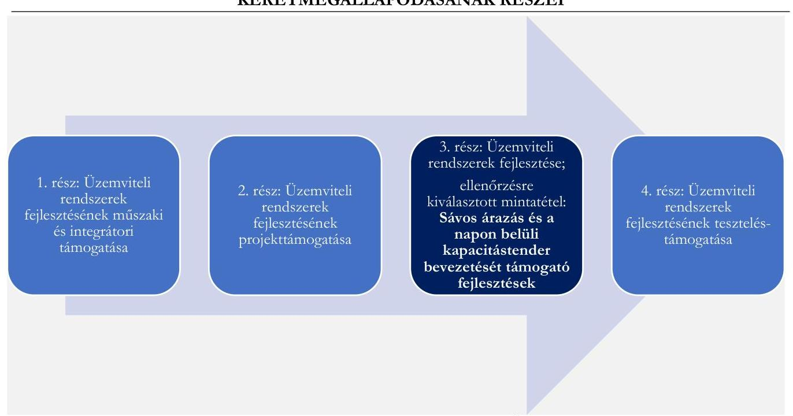

# JELENTÉS 

## A többségi állami tulajdonban álló gazdasági társaságok informatikai célú beszerzéseinek ellenőrzése

MAVIR Magyar Villamosenergia-ipari Átviteli Rendszerirányító Zrt.

2025.

---

# JELENTÉS 

## A többségi állami tulajdonban álló gazdasági társaságok informatikai célú beszerzéseinek ellenőrzése

MAVIR Magyar Villamosenergia-ipari Átviteli Rendszerirányító Zrt.

2025.

---

# ELLENŐRZÉSI IGAZGATÓSÁG: 

## ELLENŐRZÉSI IGAZGATÓSÁG III.

## ELLENŐRZÉSI IGAZGATÓ:

## HERCZEGH ZSOLT igazgató

## ELLENŐRZÉSVEZETŐ:

## DABISNÉ NYIKOS MELINDA ellenőrzésvezető

Jelentéseink az interneten a www.asz.hu címen olvashatók.

IKTATÓSZÁM: EL-4063-002/2025
TÉMASORSZÁM: 34/2024.
ELLENŐRZÉS-AZONOSÍTÓ SZÁM: V1093

---

# TARTALOMJEGYZÉK 

AZ ELLENŐRZÉS ALAPADATAI ..... 5
AZ ELLENŐRZÖTT SZERVEZET ..... 7
ÖSSZEFOGLALÁS ..... 8
AZ ELLENŐRZÉS FÓKUSZTERÜLETE ..... 10
MEGÁLLAPÍTÁSOK ..... 11
JAVASLATOK ..... 16
MELLÉKLETEK ..... 17
I. sz. melléklet: Értelmező szótár ..... 17
II. sz. melléklet: Az ellenőrzött szervezetek jegyzéke ..... 18
III. sz. melléklet: Ellenőrzési kritériumok ..... 19
FÜGGELÉK: ÉSZREVÉTELEK ..... 20
RÖVIDÍTÉSEK JEGYZÉKE ..... 23

---

.

---

# AZ ELLENŐRZÉS ALAPADATAI 

## AZ ELLENŐRZÉS CÉLJA

Az ellenőrzés célja annak értékelése volt, hogy a többségi állami tulajdonban álló gazdasági társaság informatikai célú - ellenőrzés során kiválasztott - beszerzésére szabályszerűen került-e sor, a kapcsolódó döntéshozatal megalapozott volt-e, valamint érvényesültek-e a célszerűség és eredményesség szempontjai.

## AZ ELLENŐRZÉS TÍPUSA

Kombinált ellenőrzés.

## AZ ELLENŐRZÖTT IDŐSZAK

A 2022., 2023. évek.

## AZ ELLENŐRZÉS TÁRGYA

Az ellenőrzés tárgya a MAVIR Zrt. ${ }^{1}$ 2022., 2023. években megvalósult, lezárult informatikai célú beszerzésére irányuló döntések szabályszerűsége, megalapozottsága, célszerűsége, a megvalósult informatikai beszerzés szabályszerűsége, eredményessége, a beszerzett informatikai eszközök, szolgáltatások (köz)feladat ellátás során történt hasznosulása, azaz a beszerzés megfelelősége volt. Az ellenőrzés kiterjedt a beszerzés előkészítésének, a beszerzésre vonatkozó szerződés megkötésének és tartalmának ellenőrzésére, valamint az informatikai célú beszerzés aktiválásának (használatbavételének) ellenőrzésére is.

Az ellenőrzés kiterjedt minden olyan körülményre és adatra, amely az ÁSZ ${ }^{2}$ jogszabályban meghatározott feladatainak teljesítéséhez, valamint a program végrehajtása folyamán felmerült újabb összefüggések feltárásához szükséges volt.

## AZ ELLENŐRZÉS JOGALAPJA

Az ellenőrzés jogszabályi alapját az ÁSZ tv. ${ }^{3} 1 . \int(3)$ bekezdése és az 5. $\int(4)$ bekezdése képezték.

## AZ ELLENŐRZÉS MÓDSZERE

Az ellenőrzést a nemzetközi standardokat irányadónak tekintve az ellenőrzési program szempontjai, az ellenőrzött időszakban hatályos jogszabályok, az ellenőrzés szakmai szabályok és a jelen ellenőrzésre irányadó ÁSZ módszertan figyelembevételével történt.

---

Az ellenőrzési kérdések megválaszolásához szükséges bizonyítékok megszerzése az ellenőrzött szervezet által rendelkezésre bocsátott dokumentumokra és adatokra alapozva, továbbá mintavételezés, szemrevételezés, kérdésfeltevés (információkérés), valamint elemző eljárás útján valósult meg.

Az ellenőrzési bizonyítékként felhasználható adatforrások közé tartoztak az ellenőrzés lefolytatáshoz kért dokumentumok, valamint minden egyéb - az ellenőrzés folyamán feltárt, az ellenőrzés szempontjából információt tartalmazó - dokumentum.

Az ellenőrzés lefolytatásához az ellenőrzött szervezet a 2022., 2023. években megvalósult, lezárult informatikai beszerzéseire vonatkozó főkönyvi és analitikus nyilvántartások, valamint az ÁSZ által kért további dokumentumok, adatok, információk megküldésével és a helyszíni ellenőrzés során szolgáltatott adatokat. A rendelkezésre álló adatok alapján a MAVIR Zrt. a 2022., 2023. években 335 darab lezárult/megvalósult informatikai beszerzéssel rendelkezett. A mintavételezés keretében egy informatikai beszerzés került kiválasztásra, melynek szerződéses értéke nettó 271853400 + áfa' volt. A tények feltárása és azok összegzése során a megállapítások az ellenőrzött mintatételre vonatkozóan kerültek megfogalmazásra. A mintatétel ellenőrzésének eredményei nem kerültek kivetítésre.

A beszerzés megfelelő, ha a beszerzési eljárás teljes folyamata a lényegi elemeiben szabályszerű, célszerű és - amennyiben értékelhető - eredményes volt, illetve a beszerzés tekintetében érvényesültek a nemzeti vagyonnal való felelős gazdálkodás elvei.

---

# AZ ELLENŐRZÖTT SZERVEZET 

A MAVIR Zrt.-t a villamosenergia-kereskedelem liberalizációjára történő felkészülés részeként a Magyar Villamos Művek Részvénytársaság (jelenlegi nevén: MVM Zrt. ${ }^{5}$ ) 2000.10.19-én hozta létre, aki jelenleg is a Társaság egyedüli részvényese.

A MAVIR Zrt. fő tevékenysége: villamosenergia-szállítás. A Társaság volt a felelős az elektromos átviteli hálózat üzemeltetéséért, valamint rendszerirányítóként folyamatosan gondoskodott a mindenkori fogyasztói igénynek megfelelő áramellátásról. A MAVIR Zrt. átviteli rendszerirányítóként garantálta Magyarország villamos energia ellátásbiztonságát, felügyelte és működtette a kritikus infrastruktúrának számító - mintegy 5000 km távvezetéket és 37 alállomást magába foglaló - nagyfeszültségű villamos energia átviteli hálózatot, összehangolta a magyar villamosenergia-rendszer múködését a szomszédos országok átviteli hálózataival, illetve az átviteli hálózathoz csatlakozó elosztóhálózatokkal. A Társaság felelős volt továbbá a termelés-fogyasztás egyensúlytartásáért, a villamosenergia-rendszer üzembiztonságáért, zavartalan működtetéséért, rendelkezett a villamosenergia-rendszer szabályozásához szükséges tartalékokkal, és diszponált a határkeresztező távvezetékek, hálózati kapacitások felett.
1. táblázat
(adatok: M Ft-ban)
A MAVIR ZRT. BESZÁMOLÓJÁNAK FŐBB ADATAI

|  | 2022. év | 2023. év |
| :-- | --: | --: |
| Értékesítés nettó árbevétele | 2998239 | 1523010 |
| Igénybe vett szolgáltatások | 20146 | 23192 |
| Adózott eredmény | 9586 | 12646 |
| Immateriális javak | 6737 | 8418 |
| Tárgyi eszközök | 495507 | 573152 |
| ebből beruházás, felújítás | 36804 | 52851 |
| Jegyzett tőke | 146550 | 146550 |

A Társaság informatikai tárgyú beszerzéseire a DKÜ rendelet ${ }^{6} 1 . \S$ (2) bekezdés d) pontja értelmében a központosított közbeszerzés szabályai, valamint a Kbt. ${ }^{7}$ ide vonatkozó rendelkezései ${ }^{8}$ voltak az irányadóak.

A MAVIR Zrt.-nél az átlagosan foglalkoztatottak száma 2022. évben 721 fő, 2023. évben 772 fő volt, az ellenőrzött időszakban a Tak.tv. ${ }^{9}$ 7/J. § (1) bekezdésben meghatározott mutatóértékek alapján a Gbkr. ${ }^{10}$ hatálya alá tartozott, belső kontrollrendszer működtetésére volt kötelezett.

---

# ÖSSZEFOGLALÁS 

A Magyar Államnak az állami tulajdonú gazdasági társaságokban lévő részesedései a nemzeti vagyon, ezen belül az állami vagyon részét képezik. E részesedések értékére, ezáltal az állami vagyon értékének megőrzésére, növelésére alapvető befolyást gyakorol az állami tulajdonban álló gazdasági társaságok gazdálkodási tevékenysége. Az ellenőrzés a felelős gazdálkodás kritériumának vizsgálata keretében értékelte, hogy a MAVIR Zrt. mintatételként kiválasztott informatikai beszerzése megfelelő volt-e.

A gazdasági társaságokkal szemben elvárás, hogy beruházásaikat, beszerzéseiket megfelelő tervezéssel hajtsák végre, mérjék fel annak szükségességét, pénzügyi vonzatát, valamint értékeljék a beszerzés gazdálkodásra vonatkozó várható hatásait, elemezzék azok következményeit, és alapozzák meg döntésüket. Magyarország Alaptörvénye ${ }^{11}$ is rögzíti ezeket a feltételeket azzal, hogy az állam tulajdonában álló gazdálkodó szervezetek törvényben meghatározott módon, önállóan és felelősen gazdálkodnak a törvényesség, célszerűség és eredményesség követelményei szerint. A gazdasági társaságok a tevékenységük során kötelesek a belső szabályozóikban foglaltakat betartani. A gazdálkodás egyes kérdéseire kiterjedő belső szabályozók a gazdasági társaságok múködési sajátosságainak figyelembevételével alkotott részletes rendelkezéseikkel hivatottak biztosítani a jogszabályokban meghatározott általános normák végrehajtását, így - többek között - a felelős gazdálkodás elveinek érvényesülését.

A Társaság kiválasztott informatikai beszerzése megfelelő volt. Az ellenőrzés a beszerzési eljárást megelőző tervezési szakaszban tárt fel hiányosságokat.

AZ ELLENŐRZÉS MEGÁLLAPÍTOTTA, hogy a MAVIR Zrt. beszerzési igényre vonatkozó döntése az ellenőrzött tétel tekintetében indokolt, és célszerű volt, az a Társaság tevékenységével, valamint a stratégiai tervében meghatározott célokkal összhangban merült fel.
Az ellenőrzés a Társaság 2023. évi üzleti tervezése vonatkozásában hiányosságként tárta fel, hogy a MAVIR Zrt. a belső szabályozójában foglalt rendelkezések ellenére a kiválasztott tételt a beszerzési tervében nem tüntette fel, azt csak a fejlesztési tervében rögzítette. A MAVIR Zrt. első számú vezetője a tervezéséhez nem alakított ki olyan kontrollt, amely biztosította volna a döntés célszerűségi, gazdaságossági, hatékonysági és eredményességi szempontú megalapozottsági vizsgálatát, a Társaság a 2023. évi üzleti tervében a kiválasztott beszerzést jelentősen alultervezte. A MAVIR Zrt. a beszerzési eljárása során a beszerzésre irányuló döntését a jogszabályi előírások alapján megalapozta, a kiválasztott beszerzés becsült értékét a jogszabályi rendelkezések szerint állapította meg. A Társaság a belső szabályozója alapján az ellenőrzött tételre vonatkozó 2023. évi üzleti terv adatokat a tényadatok ismeretében korrigálta.

A MAVIR Zrt. a beszerzési eljárása során döntően a jogszabályi és belső szabályozókban foglalt rendelkezések szerint járt el. Az ellenőrzés azonban hiányosságként tárta fel, hogy a Társaság a jogszabályi rendelkezés ellenére a kiválasztott beszerzés teljesítéséről szóló adatszolgáltatását a DKÜ ${ }^{12}$ részére nem nyújtotta be határidőben. A felmerült hiányosságot a MAVIR Zrt. az ellenőrzés során pótolta.
Az ellenőrzött tétel használatba vételére ${ }^{13}$ a 2023. évben sor került, a MAVIR Zrt. által kitűzött célérték (a projekt 2023. évi megvalósítása) a kiválasztott tétel vonatkozásában eredményesen teljesült. Az ellenőrzött tétel az eredetileg elvárt funkcióját betölti.

---

Az ellenőrzés jó gyakorlatként értékelte, hogy a projekt zárásakor a MAVIR Zrt. a projekt során felmerült problémákat objektíven értékelte, a feltárt hiányosságok tekintetében a szükséges következtetéseket levonta, valamint intézkedéseket határozott meg annak érdekében, hogy a jövőbeni fejlesztései során hasonló hibák/hiányosságok ne merüljenek fel. A fejlesztési feladat folyamatos nyomon követésével a felmerült problémákra időben tudott reagálni a Társaság.

---

# AZ ELLENŐRZÉS FÓKUSZTERÜLETE 

1- A többségi állami tulajdonban álló gazdasági társaság informatikai célú beszerzésének megfelelősége

---

# MEGÁLLAPÍTÁSOK 

## 1. A többségi állami tulajdonban álló gazdasági társaság informatikai célú beszerzésének megfelelősége

## Összegző megállapítás

A MAVIR Zrt. ellenőrzés alá vont informatikai célú beszerzése megfelelő volt. Az ellenőrzés a beszerzési eljárást megelőző tervezési szakaszban tárt fel hiányosságokat.

Az ÁSZ ellenőrzése a MAVIR Zrt. egy darab, lezárult informatikai célú beszerzésének a megfelelőségére terjedt ki. A kiválasztott ellenőrzési tétel egy négy részből álló keretmegállapodás harmadik, üzemviteli rendszerek fejlesztése tárgyú részéhez* kapcsolódott.

## 1. ábra

A MAVIR ZRT. ÜZEMVITELI RENDSZEREK FEJLESZTÉSI ÉS FEJLESZTÉSTÁMOGATÁSI KERETMEGÁLLAPODÁSÁNAK RÉSZEI

Forrás ÁSZ saját szerkesztés a MAVIR Zrt. adatszolgáltatása alapján

[^0]
[^0]:    *A Társaság beszerzési eljárása a Kbt. és a közszolgáltatók közbeszerzéseire vonatkozó sajátos közbeszerzési szabályokról szóló 307/2015. (X.27.) Korm. rendelet alapján az EKR001310362020 azonosító számon a Kbt. szerinti keretmegállapodás megkötésére irányuló uniós nyílt közbeszerzési eljárás keretében került lefolytatásra a „MAVIR Zrt. üzemviteli rendszereinek fejlesztési és fejlesztéstámogatási feladatai" 3. rész Üzemviteli rendszerek fejlesztése elnevezéssel.

---

| 2. táblázat |  |  |  |   |
| --- | --- | --- | --- | --- |
|  AZ ELLENŐRZÖTT BESZERZÉS FŐBB ADATAI |  |  |  |   |
|  SZERZŐDÉS TÁRGYA | SZERZŐDÉS KELTE | SZERZŐDÉS ÉRTÉKE | TELJESÍTÉS IDEJE | TÁRSASAGNAK SZÁMLÁZOTT NETTÓ ÖSSZEG  |
|   |  |  | Alapfeladatok mérföldkövei |   |
|   |  |  | 1.) 2023.07.25. | 104559000 Ft  |
|   |  | alapfeladatokat érintő összeg; 209118000 Ft + áfa | 2.) 2023.11.15. | 62735400 Ft  |
|  Sávos árazás és a napon belüli kapacitástender bevezetését támogató fejlesztések megvalósítása | 2023.05.01. |  | 3.) 2023.11.29. | 41823600 Ft  |
|   |  |  |  | Opciós lehívások*  |
|   |  |  | 1.) 2023.09.07. | 4804800 Ft  |
|   |  | opcionális feladatokat érintő keretösszeg; 62735400 Ft + áfa | 2.) 2023.09.15. | 764400 Ft  |
|   |  |  | 3.) 2023.10.26. | 1092000 Ft  |
|   |  |  | 4.1.) 2023.11.15. | 2839200 Ft  |
|   |  |  | 4.2.) 2023.12.08. | 3516240 Ft  |
|   |  |  | 4.3.) 2024.01.25. | 2293200 Ft  |
|   |  |  | * az opcionális feladatoknál nem kerüli lehívásra a teljes keretösszeg Forrás élé saját szerkesztés a MAVIR Zrt. adatszolgáltatása alapján |   |

# A BESZERZÉSHEZ KAPCSOLÓDÓ SZABÁLYOZÁSI KÖRNYEZET

Az informatikai célú beszerzésekre vonatkozó eljárásokat a DKÜ rendeletben meghatározott központosított közbeszerzési eljárás szabályai, az ide kapcsolódó Kbt. rendelkezések, valamint a Társaság belső szabályozó eszközei - Alapszabály ${ }^{14}{ }_{1-3}$, SZMSZ ${ }^{15}{ }_{1-2}$, Közbeszerzési és beszerzési szabályzat ${ }^{16}{ }_{1-5}$, Beszerzés megvalósítás folyamata utasítás ${ }^{17}{ }_{1-2}$, Projektmenedzsment folyamat utasítás ${ }^{18}{ }_{1-2}$, Szerződéskötések rendjére vonatkozó szabályzat ${ }^{19}{ }_{1-4}$, Általános szerződéskötési folyamat utasítás ${ }^{20}$, Pénzügyi teljesítések jóváhagyása ${ }^{21}{ }_{1-3}$, Számlakezelés folyamat utasítás ${ }^{22}{ }_{1-2}$ - szabályozták. A MAVIR Zrt. a Tak.tv. rendelkezései szerint a beszerzési eljárásaira vonatkozóan a belső szabályozói környezetét kialakította.

## A BESZERZÉSI IGÉNY FELMERÜLÉSE

A Társaság Alapszabályában ${ }_{1-3}$ rögzítette a VET $^{23}$, a VET Vhr. ${ }^{24}$, valamint az Irányelvben ${ }^{25}$ és a 714/2009/EK európai parlamenti és tanácsi rendeletben ${ }^{26}$ megfogalmazott követelmények szerinti működését, és a villamosenergia-rendszer irányításáért, üzemvitelének biztonságáért történő felelősségét. A MAVIR Zrt. kiválasztott beszerzésének célja az volt, hogy a sávos energiadíajánlat-adás bevezetésével a hazai aFRR ${ }^{27}$ szabályozási energia-piac közelebb kerüljön a PICASSO platformhoz ${ }^{28}$ való csatlakozás minimális elvárásaihoz, valamint hozzájáruljon a szabályozási energia költségek csökkentéséhez és a $\mathrm{BSP}^{29}$-k számára egy rugalmasabb ajánlattételi stratégiát biztosítson. Emellett a napon belüli kapacitástender bevezetésével a rendszerszintű szolgáltatások piacán tömegesen megjelenő új típusú piaci szereplők - tárolók, fogyasztók, megújuló termelök - számára elősegítse a kiegyenlítő szabályozásba történő integrálást, illetve a meglévő szolgáltatók számára biztosítsa a valós időhöz közelebbi ajánlatadást és ezáltal a kapacitásbeszerzési költségek csökkenését. A MAVIR Zrt. a Tak.tv., a Gbkr., valamint az Alapszabály ${ }_{1-}$ ${ }_{3}$ rendelkezéseinek megfelelve a 2020-2025. évekre vonatkozó stratégiáját elkészítette, melyben célként az

---

informatikai fejlettség növelése meghatározásra került. A Társaság előírta az informatikai rendszer fejlesztését, új technológiák bevezetését, az energiaellátás biztonságának biztosítását.
A kiválasztott mintatételhez kapcsolódó beszerzési igény a Társaság stratégiájával összhangban, a 2020. évben merült fel - keretmegállapodás első részének indulásakor -, amely a rendszerirányítási, piacmúködtetési és vállalati rendszereinek, valamint az ezeket kiszolgáló informatikai rendszerek technikai és funkcionális továbbfejlesztéséhez kapcsolódott. A Társaság beszerzésre irányuló döntése az ellenőrzött tétel vonatkozásában indokolt és célszerú volt, az a MAVIR Zrt. stratégiai céljaival, valamint tevékenységével összhangban merült fel.

# A BESZERZÉSRE IRÁNYULÓ DÖNTÉS 

A MAVIR Zrt. a DKÜ rendelet előírásainak megfelelően a 2023. évi éves informatikai beszerzési és fejlesztési tervét a DKÜ részére benyújtotta, a kapcsolódó miniszteri jóváhagyás rendelkezésre állt. A Társaság 2023. évi informatikai beszerzési és fejlesztési terve azonban az ellenőrzött tételre vonatkozóan tervsort nem tartalmazott, mely abból adódott, hogy keretmegállapodás esetén, az adott keretszerződés alapján történő egyes beszerzések, az erre vonatkozó DKÜ állásfoglalás alapján már nem minősültek önálló informatikai beszerzési igénynek, így a megfelelő minősítésű miniszteri jóváhagyás az alapigény keretein belül ezekre a beszerzésekre is kiterjedt. A keretmegállapodásos eljárás első része 2020.10.20-án rendkívüli informatikai beszerzési igényként került a DKÜ Portálon rögzítése, mely a DKÜ rendeletnek megfelelően miniszteri jóváhagyással rendelkezett.
A Társaság a felügyelőbizottság által jóváhagyott 2023. évi üzleti tervét az Alapszabály ${ }_{3}$ rendelkezéseinek megfelelően elkészítette, melyben a kiválasztott informatikai célú beszerzésre vonatkozó terv adatokat nettó 35 millió Ft összegben tüntette fel. A MAVIR Zrt. 2023. évi beszerzési terve a Közbeszerzési és beszerzési szabályzat, 41.) pontjában előírt rendelkezés ellenére - miszerint a beszerzési tervnek az adott tárgyévre vonatkozóan az összes beszerzési igényt tartalmaznia kell - a kiválasztott informatikai célú fejlesztést nem tartalmazta. A MAVIR Zrt. a beszerzés becsült értékét az üzleti tervben rögzített adathoz képest magasabb áron (nettó 286 millió Ft) határozta meg, az ellenőrzött tétel költsége a Társaság részéről az üzleti tervezés során jelentősen alul lett tervezve. A Társaság nyilatkozata alapján az üzleti tervezés és a becsült érték közötti jelentős különbség oka az volt, hogy az üzleti tervezés során nem állt rendelkezésre olyan belső kompetencia, aki fel tudta volna mérni azt, hogy milyen költséggel jár a kiválasztott informatikai fejlesztés. A Társaság a projekt záró jelentésében ${ }^{30}$ is rögzítette, hogy az ellenőrzésre kiválasztott tételt alulbecsülte, mivel az sokkal komplexebb és nagyobb feladat volt, mint azt elsőre felmérte. A Társaság első számú vezetője a Gbkr. 6. $\$ 2$ (2) bekezdés a) pontjában előírtak ellenére a kiválasztott informatikai beszerzés tervezéséhez nem alakított ki olyan kontrollt, amely biztosította volna a döntés dokumentumainak előkészítését és amely hozzájárult volna a felügyelőbizottság döntésének megalapozásához. A Társaság első számú vezetője a Gbkr. 6. $\mathbb{S}$ (2) bekezdés b) pontjában előírtak ellenére a kiválasztott informatikai beszerzés tervezéséhez nem alakított ki olyan kontrollt, amely biztosította volna a döntés célszerűségi, gazdaságossági, hatékonysági és eredményességi szempontú megalapozottsági vizsgálatát.
A MAVIR Zrt. a beszerzési eljárása során a beszerzésre irányuló döntését megalapozta, a becsült érték meghatározásához a Kbt. és a Közbeszerzési és beszerzési szabályzat, előírásainak megfelelve az indikatív árajánlatok már a MAVIR Zrt. rendelkezésre álltak. A Társaság a Projektmanagement folyamat utasítás ${ }_{3}$ előírása alapján a szükséges fejlesztési tervet elkészítette, melyben rögzítésre került a kiválasztott tétel (aktualizált) költsége, melyet a Társaság első számú vezetője megismert. A Közbeszerzési és beszerzési

---

szabályzat előírásai alapján a Társaság a tényadatok ismeretében a 2023. évi üzleti terve vonatkozásában is tervfelülvizsgálatot készített, melynek keretében a kiválasztott sávos projekt tervezett értéket a szükséges mértékre korrigálta. A MAVIR Zrt. a szükséges fedezetet az egyes fejlesztések hátrébb sorolásával, és a priorizált fejlesztésekre történő átcsoportosítással biztosította. A tervmódosítás eredményeképpen az ellenőrzött tételt a Társaság a 2023. évi informatikai beszerzési tervében is rögzítette.

# A BESZERZÉSI ELJÁRÁS 

A MAVIR Zrt. rendszerek fejlesztési feladataira vonatkozó közbeszerzési eljárását a DKÜ rendelet alapján a Társaság javára eljárva a DKÜ folytatta le központi beszerző szervként járulékos közbeszerzési szolgáltatás nyújtásával, melynek keretében a DKÜ és a Társaság között együttműködési megállapodás jött létre. A közbeszerzési eljárást az EKR ${ }^{31}$ rendszerben a MAVIR Zrt. nevében a DKÜ hozta létre, mely keretében a Társaság részére a jogosultságok, valamint a jogi, pénzügyi, és közbeszerzési szakértelem biztosításra került. Az együttműködési megállapodás rögzítette, hogy a nyertes ajánlattevőkkel az egyes keretmegállapodásokat a MAVIR Zrt. köti meg, illetve az egyedi keretmegállapodások közbeszerzéseit a Társaság valósítja meg. A DKÜ rendeletnek megfelelően a közbeszerzési díjat a MAVIR Zrt. megfizette.

A MAVIR Zrt. a kiválasztott beszerzés közbeszerzésének előkészítése és lefolytatása során a DKÜ rendelet, a Kbt., valamint a Közbeszerzési és beszerzési szabályzat, előírásait betartotta. A döntéshozó a döntését a bírálóbizottság által, a bírálóbizottsági jegyzőkönyvben ${ }^{32}$ rögzített értékelés alapján hozta meg, a kiválasztott fejlesztés megvalósításához a nyertes ajánlattevő az ajánlattételi felhívásban meghatározott műszaki, alkalmassági feltételeknek megfelelt.

A kiválasztott beszerzést érintő egyedi szerződés a Kbt., az SZMSZ ${ }_{3}$, és a Szerződéskötések rendjére vonatkozó szabályzat ${ }_{3}$ előírásainak megfelelően, az arra jogosultak által került megkötésre. Az egyedi szerződésben foglalt műszaki tartalom, vállalkozói díj a közbeszerzési eljárás során tett nyertes ajánlattal összhangban állt. Az egyedi szerződésben meghatározásra került a beszerzés tárgya, értéke, a fizetés esedékessége, ütemezése, a teljesítési határidő, a felmondás feltételei, a felek jogai és kötelezettségei, valamint a garanciális kötelezettségek is. A MAVIR Zrt. az opciós lehívásokat az egyedi szerződésnek megfelelően egyedi megrendelések útján valósította meg.

## A BESZERZÉS ELSZÁMOLÁSA

A Társaság a Gbkr., valamint a Projektmenedzsment folyamat utasítás ${ }_{2}$ előírásainak megfelelően az ellenőrzött tételre vonatkozó fejlesztési folyamatokat nyomon követte, annak haladásáról beszámolókat/jelentéseket készített - státuszjelentések, szponzori beszámolók, munkacsoport-vezetői státuszok, projekt záró jelentés -, a felmerült kockázatok vonatkozásában időben beavatkozott.
A Társaság az ellenőrzött tételt a Számv. tv. ${ }^{33}$, a Számlakezelés folyamat utasítás ${ }_{1-2}$, a Pénzügyi teljesítések jóváhagyása ${ }_{1-3}$ előírásainak megfelelően számolta el, az egyedi szerződésben foglaltak alapján a feladatok teljesítése dokumentálásra került. Az opciós lehívások összegei az egyedi szerződésben meghatározott keretet nem haladták meg.
A Társaság az ellenőrzésre kiválasztott tétel teljesítéséről a DKÜ rendelet 13. § (9) bekezdésében foglaltak ellenére 10 munkanapon belül a DKÜ Portálon keresztül nem számolt be - a teljesitésigazolási jegyzökönyv alapján az utolsó opciós lebirás során meghatározott feladatok 2024.01.25. napján zárultak - A Társaság a feltárt hiányosságot a jelen ellenőrzés keretében pótolta - a DKÜ portálon 2025.01.23. napján teljesítette adatszolgáltatását -.

---

A MAVIR Zrt. a 2023. évi Társasági stratégiájában a kiválasztott tétel vonatkozásában $\mathrm{KPI}^{34}$-ként $100 \%$ os, 2023. évi teljesülési célértéket határozott meg. A projekt záró jelentés alapján az ellenőrzött tétel használatba vételére 2023.11.15. napjával sor került, melynek következtében a kitűzött célérték a Társaság részéről eredményesen teljesült. A projekt indulását követően a MAVIR Zrt. grafikus ábrán szemléltette a sávos árazás bevezetésének hatását a kiegyenlítő szabályozásienergia-piacra, melynek eredménye azt mutatta, hogy a piaci szereplők által beadott kiegyenlítő szabályozásienergia-ajánlatokban található energiaárak az indulás előtti időszakhoz képest csökkentek. A sávos árazásra vonatkozó fejlesztését a MAVIR Zrt. a Számv. tv. rendelkezései alapján üzembe helyezte, az ellenőrzött tétel az eredetileg elvárt funkcióját betölti.

# KÖZZÉTÉTELI KÖTELEZETTSÉG 

A MAVIR Zrt. a Tak.tv., és az Info tv. ${ }^{35}$ rendelkezéseinek megfelelően eleget tett közzétételi kötelezettségének a megkötött informatikai beszerzésre irányúló szerződése vonatkozásában.

---

# JAVASLATOK 

Az ÁSZ tv. 33. § (1) bekezdésében foglaltak értelmében az ellenőrzött szervezet vezetője köteles a jelentésben foglalt megállapításokhoz kapcsolódó intézkedési tervet összeállítani és azt a jelentés kézhezvételétől számított 30 napon belül az ÁSZ részére megküldeni. Amennyiben az ellenőrzött szervezet vezetője nem küldi meg határidőben az intézkedési tervet, vagy továbbra sem elfogadható intézkedési tervet küld, az Állami Számvevőszék elnöke az ÁSZ tv. 33. § (3) bekezdése a) és b) pontjaiban foglaltakat érvényesítheti.

## MAVIR ZRT. VEZÉRIGAZGATÓJA RÉSZÉRE

1. A Gbkr. 6. § (2) bekezdés a) és b) pontjában elöirtaknak megfelelően kerüljenek kialakításra olyan kontrolltevékenységek a tervezés során, amelyek az informatikai beszerzésekre vonatkozóan biztositják a döntések dokumentumainak előkészitését és a döntések célszerüségi, gazdaságossági, hatékonysági és eredményességi szempontú megalapozottsági vizsgálatát.
2. A kialakított kontrollokat müködtesse annak érdekében, hogy a jövőben a DKÜ rendelet 13. § (9) bekezdés alapján a DKÜ Portálon határidőben kerüljenek benyújtásra a teljesült informatikai beszerzések adatszolgáltatásai.

---

# MELLÉKLETEK 

## I. SZ. MELLÉKLET: ÉRTELMEZŐ SZÓTÁR

gazdasági társaság
többségi állami tulajdon
vagyongazdálkodás alapelvei
informatikai célú beszerzés
szolgáltatás

A gazdasági társaságok üzletszerű közös gazdasági tevékenység folytatására, a tagok vagyoni hozzájárulásával létrehozott, jogi személyiséggel rendelkező vállalkozások, amelyekben a tagok a nyereségből közösen részesednek, és a veszteséget közösen viselik.
(Ptk. ${ }^{36}$ 3:88. § (1) bekezdése)
Az állam tulajdonában lévő tagsági jogviszonyt megtestesítő értékpapír, illetve az állam tulajdonában lévő egyéb társasági részesedés, amennyiben a társaságban a Magyar Állam közvetlenül vagy közvetetten a szavazatok több mint felével rendelkezik.
(ÁSZ definíció a Vtv. ${ }^{37}$ 1. § (2) bekezdés c) pontja és a Ptk. 8:2. § (1), (3)-(4) bekezdései alapján)
A nemzeti vagyon alapvető rendeltetése a közfeladat ellátásának biztosítása, ideértve a lakosság közszolgáltatásokkal való ellátását és e feladatok ellátásához szükséges infrastruktúra biztosítását. A nemzeti vagyonnal felelős módon, rendeltetésszerűen kell gazdálkodni.
A nemzeti vagyongazdálkodás feladata a nemzeti vagyon megőrzése, értékének és állagának védelme, rendeltetésének megfelelő, az állam, az önkormányzat mindenkori teherbíró képességéhez igazodó, elsődlegesen a közfeladatok ellátásához és a mindenkori társadalmi szükségletek kielégítéséhez szükséges, egységes elveken alapuló, átlátható, hatékony és költségtakarékos müködtetése, értéknövelő használata, hasznosítása, gyarapítása, továbbá az állam vagy a helyi önkormányzat feladatának ellátása szempontjából feleslegessé váló vagyontárgyak elidegenítése, azzal, hogy a nemzeti vagyon megőrzése érdekében végzett bontás vagy átalakítás nem minősül az állag védelmi kötelezettség megszegésének.
(Nvtv. ${ }^{38}$ 7. § (1)-(2) bekezdése alapján)
Informatikai célú beszerzés alatt az informatikai eszköz, szoftver, alkalmazásfejlesztés és az ezekhez kapcsolódó szolgáltatások beszerzésére irányuló keretmegállapodás vagy más keretjellegủ szerződés, továbbá visszterhes szerződés létrehozását célzó beszerzési eljárást értjük.
(DKÜ rendelet 1. § (4) bekezdés 5. pont)
Szolgáltatás alatt a gazdasági társaság által igénybe vett/megrendelt, harmadik fél által nyújtott/számlázott, nem anyagi javak termelésére irányuló tevékenységeket értjük.
(ÁSZ definíció a Számv. tv. 3. § (7) bekezdés 1. pontja alapján)

---

II. SZ. MELLÉKLET: AZ ELLENŐRZÖTT SZERVEZETEK JEGYZÉKE

# ELLENŐRZÖTT SZERVEZET NEVE 

MAVIR Magyar Villamosenergia-ipari Átviteli Rendszerirányító Zártkörűen Működő Részvénytársaság

---

## FOKUSZTERÜLET

1. A többségi állami tulajdonban álló gazdasági társaság informatikai célú beszerzésének megfelelősége

## ELLENŐRZÉSI KRITÉRIUMOK

Vtv. 2. $\S$ (1) bek.
Nvtv. 7. § (1)-(2) bek.
Tak.tv. 2. §, 7/J. § (1) (3) bek.
Ptk. 3:4. § (1) bek., 6:16. §, 6:215-234. §, 6:238-271. §, 6:272 - 6:279. §,

DKÜ rendelet 1. § (2) bek. d) pont, 7-13. §
Kbt. 7. § (1) bek., 8. § (1) bek., 16. § (1) bek., 25. §, 27. §, 28. § (2) bek., 37. § (2) bek., 68. § (6) bek., 69. § (3) bek., 76. §, 81. § (1) bek., 104. § (3) bek., 105. § (2) bek., (4) bek., 131. § (1) bek.

307/2015. (X. 27.) Korm. rendelet
Gbkr. 4. §, 6. §, Gbkr. Irányelv ${ }^{39}$, Gbkr. Kézikönyv ${ }^{40}$
Számv. tv. 4. § (1) bek., 14. § (3) bek., 16. §, 25. § (6) bek., 58. §, 159. §, 160. § (3a) és (3b) bek., 161-161/A., 164. § (2) bek., 165. § (1)-(2) bek., 166. § (1)-(2) bek., 167. §, 169. $\S(1)-(2)$ bek.
a Társaság belső szabályzatai (Alapszabály ${ }_{1-3}$, SZMSZ ${ }_{1-2}$, Közbeszerzési és beszerzési szabályzat ${ }_{1-5}$, Beszerzés megvalósítás folyamata utasítás ${ }_{1-2}$, Projektmenedzsment folyamat utasítás ${ }_{1-2}$, Szerződéskörések rendjére vonatkozó szabályzat ${ }_{1-4}$, Általános szerződéskötési folyamat utasítás, Pénzügyi teljesítések jóváhagyása ${ }_{1-3}$, Számlakezelés folyamat utasítás ${ }_{1-2}$ )
Info tv. 33. §

---

# FÜGGELÉK: ÉSZREVÉTELEK 

A jelentéstervezetet a Számvevőszék 15 napos észrevételezésre megküldte az ellenőrzött szervezet vezetőjének az ÁSZ tv. 29. §* (1) bekezdése előírásának megfelelően.

A függelék tartalmazza az ellenőrzött észrevételeit, illetve az el nem fogadott észrevételek elutasitásának indoklását.

## A MAVIR Zrt. észrevételei az Összefoglalás fejezet 6. bekezdése, a Beszerzés elszámolása fejezet 3. bekezdése és a kapcsolódó 2. ÁSZ javaslat vonatkozásában:

„2025.04.08-án érkezett észrevétel: Az ellenőrzés során a MAVIR Zrt. jelezte az Állami Számvevőszék ellenőrzést végző számvevői részére, hogy a DKÜ rendelet 13. § (9) bekezdésében foglalt teljesitésre vonatkozó adatszolgáltatási előirásnak technikai okokból kifolyólag nem volt lehetősége a MAVIR Zrt.-nek. Ezt a MAVIR Zrt. többször jelezte a DKÜ-nek, akik elektronikus úton visszaigazolták, megerősitették, hogy a teljesitési adatok feltöltésére szolgáló Portálon technikai okokból nem lehetséges ezen jogszabályi kötelezettség teljesitése. Ennek oka többek között az volt, hogy a DKÜ új elektronikus rendszert vezetett be, amely során a korábbi Portálon történt igénybejelentésekbez kapcsolódó teljesitési adatok rögzitésére nem volt lehetőség. Erről a hibáról maga a DKÜ is tudomással bírt, ám a biba javitása bosszabb időt vett igénybe. A fent leírtak alapján tehát a MAVIR Zrt. a jogszabályi kötelezettségének önbibáján kivül nem tett eleget. A fent leírtak alátámasztására elektronikus leveleket (2 db) mellékelünk jelen levelünkbö̌z. A fent leírtakon kivül a DKÜ rendszerében a saját keretmegállapodásból indított versenyúiranyitások (továbbiakban 2. körös beszereések) esetében a rendszer müködése, technikai sajátossága alapján nincs mód lezárni a 2. körös beszerezését teljesitését, mivel ha a 2. körös beszerezés teljesülését lejelentjük és így a teljesitést lezárjuk a rendszerben, akkor a teljes saját keretmegállapodás is lezárul, és így az időben később keletkező vagy keletkezett 2. körös beszerezési igények teljesitése már nem adminisztrálható a rendszerben. Az ellenőrzés adott pillanatában a fenti technikai korlátok miatt nem tudta teljesíteni a lezárást a MAVIR Zrt., ám azt követően, hogy a DKÜ felnyitotta az igényt, a teljesitési adatok és dokumentumok haladéktalanul feltöltésre kerültek. Ezen kivül szeretnénk kiemelni, hogy a MAVIR Zrt. a DKÜ rendelet 13. § (9) bekezdésében foglalt teljesitési adatok rögzitésére vonatkozó jogszabályi előirást minden esetben teljesítette, amikor azt a DKÜ informatikai rendszere lehetővé tette. A fent leírtak alapján a MAVIR Zrt. kéri Tisztelt Igazgató urat, hogy tekintettel arra, hogy a MAVIR Zrt. a DKÜ rendelet 13. § (9) bekezdésében foglalt teljesitési adatok rögzitésére vonatkozó jogszabályi kötelezettségének önbibáján kivül nem tett eleget, ennek ténye kerüljön rögzitésre - a vonatkozó megállapítás- és javaslat-tervezet törlése mellett.
2025.04.11-én kelt második észrevétel: Az alábbi pontositásokat kérnénk a megküldött jelentéstervezetben:

A 8. oldal utolsó előtti bekezdését kérjük az alábbiak szerint pontosítani: A MAVIR Zrt. a beszerezési eljárása során döntően a jogszabályi és belső szabályozókban foglalt rendelkezések szerint járt el. Az ellenőrzés emellett megállapította, hogy bár a Társaság a kiválasztott beszerezés teljesitéséről szóló adatszolgáltatását a DKÜ részére nem nyújtotta be határidőben, ez a DKÜ oldalán felmerült adminisztrációs biba miatt történt, és a felmerült hiányosságot a MAVIR Zrt. az ellenőrzés során pótolta.

[^0]
[^0]:    * 29. § (1) Az Állami Számvevőszék az ellenőrzési megállapításait megküldi az ellenőrzött szervezet vezetőjének vagy az általa megbízott személynek, és annak, akinek személyes felelősségét állapította meg.
    (2) Az ellenőrzött szervezet vezetője és a felelősként megjelölt személy az ellenőrzés megállapításaira tizenöt napon belül írásban észrevételt tehet.
    (3) Az Állami Számvevőszék az észrevételre a beérkezéséről számított harminc napon belül írásban válaszol. A figyelembe nem vett észrevételeket köteles a jelentésben feltüntetni, és megindokolni, hogy azokat miért nem fogadta el.

---

A 14. oldal utolsó bekezdését kériük az alábbiak szerint pontosítani: A Társaság az ellenörzésre kiválasztott tétel teljesitéséröl a DKÜ Portálon keresztül nem számolt be - a teljesitésigazolási jegyơökönyv alapján az utolsó opciós lebivás során meghatározott feladatok 2024.01.25. napján zárultak -, tekintettel arra, bogy a DKÜ rendszere technikai okokból azt nem tudta fogadni. A Társaság a feltárt biányosságot a jelen ellenörzés keretében pótolta - a DKÜ portálon 2025.01.23. napján teljesítette adatszolgáltatását. A Társaság a DKÜ rendelet 13. § (9) bekezdésében foglaltak szerinti teljesüléséröl jelen szerzödés esetén nem volt kötelezett adatot szolgáltatni, biszen maga a keretmegállapodás, amely alapján a versenyüjranyitás lefolytatásra kerïlt, még aktív, nem zárult le.
A 16. oldal második javaslatát kérjük az alábbiak szerint pontosítani: A kialakitott kontrollokat továbbra is müködtesse annak érdekében, bogy DKÜ rendelet 13. § (9) bekezdés alapján a DKÜ Portálon csupán a DKÜ rendeletnek megfelelöen nyújtsa be a jelen vizsgálat tárgyát képező eljárás esetén - a keretmegállapodás teljesitését követöen, vagyis az abból történt valamennyi lebivás, beszerzés teljesitését követöen."

# Észrevétellel érintett megállapítások: 

Összefoglalás fejezet 6. bekezdése: A MAVIR Zrt. a beszerzési eljárása során döntően a jogszabályi és belső szabályozókban foglalt rendelkezések szerint járt el. Az ellenőrzés azonban hiányosságként tárta fel, hogy a Társaság a jogszabályi rendelkezés ellenére a kiválasztott beszerzés teljesítéséről szóló adatszolgáltatását a DKÜ részére nem nyújtotta be határidőben. A felmerült hiányosságot a MAVIR Zrt. az ellenőrzés során pótolta.

Beszerzés elszámolása fejezet 3. bekezdése: A Társaság az ellenőrzésre kiválasztott tétel teljesítéséről a DKÜ rendelet 13. $\int$ (9) bekezdésében foglaltak ellenére 10 munkanapon belül a DKÜ Portálon keresztül nem számolt be - a teljesitésigazolási jegyzökönyv alapján az utolsó opciós lebivás során meghatározott feladatok 2024.01.25. napján zárultak - . A Társaság a feltárt hiányosságot a jelen ellenőrzés keretében pótolta - a DKÜ portálon 2025.01.23. napján teljesítette adatszolgáltatását-.
2. ÁSZ javaslat: A kialakított kontrollokat múködtesse annak érdekében, hogy a jövőben a DKÜ rendelet 13. § (9) bekezdés alapján a DKÜ Portálon határidőben kerüljenek benyújtásra a teljesült informatikai beszerzések adatszolgáltatásai.

## El nem fogadás indoka:

A MAVIR Zrt. észrevétele arra irányult, hogy a kiválasztott informatikai beszerzés teljesítésének határidőben történő lejelentése a DKÜ oldalán felmerült adminisztrációs hiba miatt nem volt teljesíthető, továbbá a teljes keretmegállapodás teljesítését követően kellett volna csak adatot szolgáltatnia és nem valamennyi lehívás, beszerzés teljesítését követően. A Társaság a jelentés megállapításainak pontosítását kérte.
A MAVIR Zrt. észrevételével ellentétben az adatszolgáltatás határidőben történő elmulasztása nem a DKÜ oldalán felmerült hiba miatt merült fel, hanem azon okból, hogy a Társaság egyik munkavállalója 2023. január 19-én adminisztrációs hiba következtében lezárta a 111330059 sz. (MAVIR rendszerek fejlesztési feladatai és a fejlesztések támogatása) keretmegállapodását. Ezt igazolják az ellenőrzés során rendelkezésre bocsátott dokumentumok is, miszerint a MAVIR Zrt. 2024. december 19-én arról tájékoztatta a DKÜ-t, hogy a DKÜ rendelet 13. § (9) bekezdése szerint a 111330059 sz. keretmegállapodás alapján kezdeményezett lehívások teljesítését le kell jelentenie (a keretmegállapodás 2024. november 21. napon járt le), de nem tudja a

---

teljesítéseket rögzíteni mivel adminisztratív hiba miatt a keretmegállapodást lezárták. A MAVIR Zrt. a lezárt keretmegállapodást hiánypótlásra kérte visszanyitni a DKÜ részéről, hogy a teljesítések lejelentését kezelni és rögzíteni tudja. (A Társaság részéről fellépő adminisztrációs béba, valamint az égénylezárás feltárás azon problémája, bogy a felületet a DKÜ tudja újra biánypótlásra felnyitni a 2025. január 21-i belyszini ellenőrzés során készült jegyzőkönyvben is rögzitésre került.)
A bejelentési kötelezettség tekintetében az észrevételben rögzítettekkel ellentétben megállapítható, hogy a Társaság a DKÜ-től állásfoglalást kért annak érdekében, hogy a létrejött keretmegállapodás, keretszerződésén kívül milyen bejelentési kötelezettségek vonatkoztak a MAVIR Zrt.-re a keretmegállapodás terhére kötött egyes lehívások dokumentációinak vonatkozásában. A 2020. július 7 -én kelt DKÜ állásfoglalás szerint az adott szerződés alapján megvalósított beszerzések vonatkozásában a DKÜ rendelet 13. § (9) bekezdése szerint kellett a Társaságnak adatot szolgáltatnia. A DKÜ rendelet 13. § (9) bekezdése rögzíti, hogy az érintett szervezet a 13. $\int$ (1) bekezdés a) és b) pontja szerinti beszerzési eljárás eredményeképpen az érintett szervezet által megkötött szerződések teljesítéséről a teljesítést követő - vagy ha a teljesítés meghiúsult, a teljesítésre meghatározott határidő lejártát követő - 10 munkanapon belül köteles a DKÜ részére, az ott meghatározott struktúra és adattartalom szerint részletezve, a DKÜ alkalmazáson keresztül számot adni. A fentieket a DKÜ és a Társaság között 2021. február 9-én kelt együttműködési megállapodás 2.4. pontja is rögzítette. A Társaság által rendelkezésre bocsátott DKÜ portálra feltöltött adatszolgáltatása alapján is megállapítható, hogy maga is szerződésenként rögzítette a keretmegállapodáshoz kapcsolódó szerződéseit. Ezt igazolja a Társaság által a DKÜ-nek 2024. december 19-én küldött levele is, mely arról adott tájékoztatást, hogy a keretmegállapodás keretében kezdeményezett lehívások teljesítését kell lejelentenie. (Megjegyezö̈k, bogy a DKÜ részére tett jelzés azt követöen készült a Társaság részéről miután az ÁSZ 2024. november 28-án megküldte a beszámolásra vonatkozó kérdéseit.). Az ellenőrzés során rendelkezésre bocsátott dokumentumok alapján az ellenőrzés alá vont egyedi szerződés a 4. opciós lehívás során meghatározott feladatok teljesítésével, a kiállított teljesítésigazolási jegyzőkönyv alapján 2024. január 25-én zárult, mely alapján a Társaságnak az ezt követő 10 munkanapon belül kellett volna a DKÜ felé a DKÜ rendelet 13. § (9) bekezdés rendelkezése szerint adatot szolgáltatnia. Az ellenőrzött tételre vonatkozó adatszolgáltatási kötelezettségét 2025. január 23-án pótolta a Társaság. Az ÁSZ a kialakított kontrollok működtetése érdekében tett javaslatát fenntartja, annak érdekében, hogy a DKÜ portálon a teljesített informatikai beszerzések szerződéseire vonatkozó adatszolgáltatások a jövőben is a DKÜ rendelet 13. § (9) bekezdés szerint kerüljenek benyújtásra.

---

# RÖVIDÍTÉSEK JEGYZÉKE 

${ }^{1}$ MAVIR Zrt./Társaság/ többségi állami tulajdonban álló gazdasági társaság
${ }^{2}$ ÁSZ
${ }^{3}$ ÁSZ tv.
${ }^{4}$ áfa
${ }^{5}$ MVM Zrt.
${ }^{6}$ DKÜ rendelet
${ }^{7}$ Kbt.
${ }^{8}$ Kbt. ide vonatkozó rendelkezései
${ }^{9}$ Tak.tv.
${ }^{10}$ Gbkr.
${ }^{11}$ Magyarország Alaptörvénye
${ }^{12}$ DKÜ
${ }^{13}$ használatba vétel
${ }^{14}$ Alapszabály $_{1-3}$
${ }^{15} \mathrm{SZMSZ}_{1-2}$
${ }^{16}$ Közbeszerzési és beszerzési szabályzat ${ }_{1-5}$
${ }^{17}$ Beszerzés megvalósítás folyamata utasítás ${ }_{1-2}$
${ }^{18}$ Projektmenedzsment folyamat utasítás ${ }_{1-2}$

MAVIR Magyar Villamosenergia-ipari Árviteli Rendszerirányító Zártkörűen Működő Részvénytársaság

Állami Számvevőszék
2011. évi LXVI. törvény az Állami Számvevőszékről
általános forgalmi adó
MVM Energetika Zártkörűen Müködő Részvénytársaság
301/2018. (XII. 27.) Korm. rendelet a Nemzeti Hírközlési és Informatikai Tanácsról, valamint a Digitális Kormányzati Ügynökség Zártkörűen Müködő Részvénytársaság és a kormányzati informatikai beszerzések központosított közbeszerzési rendszeréről 2015. évi CXLIII. törvény a közbeszerzésekről
a becsült érték meghatározása esetében a Kbt. 16. § (1) bekezdés, Kbt. 28. § (2) bekezdés
2009. évi CXXII. törvény a köztulajdonban álló gazdasági társaságok takarékosabb müködéséről
339/2019. (XII. 23.) Korm. rendelet a köztulajdonban álló gazdasági társaságok belső kontrollrendszeréről
Magyarország Alaptörvénye (2011.04.25.)
Digitális Kormányzati Ügynökség Zártkörűen Müködő Részvénytársaság
a sávos árazás bevezetésére (program éles indulása) 2023.11.15-én került sor
Alapszabály ${ }_{1}$ - MAVIR Magyar Villamosenergia-ipari Árviteli Rendszerirányító Zártkörűen Müködő Részvénytársaság Alapszabálya a 35. számú módosításokkal egységes szerkezetben (hatályos: 2020.07.22-től 2021.02.28-ig)
Alapszabály ${ }_{2}$ - MAVIR Magyar Villamosenergia-ipari Árviteli Rendszerirányító Zártkörűen Müködő Részvénytársaság Alapszabálya a 36. számú módosításokkal egységes szerkezetben (hatályos: 2021.03.01-jétől 2022.04.04-ig)
Alapszabály ${ }_{3}$ - MAVIR Magyar Villamosenergia-ipari Árviteli Rendszerirányító Zártkörűen Müködő Részvénytársaság Alapszabálya a 37. számú módosításokkal egységes szerkezetben (hatályos: 2022.04.05-től 2023.12.31-ig)
SZMSZ ${ }_{1}$ - MAVIR Magyar Villamosenergia-ipari Árviteli Rendszerirányító Zrt. Szervezeti és Müködési Szabályzat (MAVIR-VIG-VU-0010-20-2022-10-14, hatályos: 2022.10.15-2023.02.14.)

SZMSZ ${ }_{2}$ - MAVIR Magyar Villamosenergia-ipari Árviteli Rendszerirányító Zrt. Szervezeti és Müködési Szabályzat (MAVIR-VIG-VU-0010-21-2023-02-13, hatályos: 2023.02.15-2023.06.30.)

Közbeszerzési és beszerzési szabályzat ${ }_{1}$ : 3/2017. sz. VU A MAVIR Zrt.
közbeszerzési és beszerzési szabályzata, változat: F, jóváhagyás dátuma: 2021.11.22., Közbeszerzési és beszerzési szabályzat ${ }_{2}$ : 3/2017. sz. VU A MAVIR Zrt. közbeszerzési és beszerzési szabályzata, változat: G, jóváhagyás dátuma: 2022.10.10., Közbeszerzési és beszerzési szabályzat ${ }_{3}$ : 3/2017. sz. VU A MAVIR Zrt. közbeszerzési és beszerzési szabályzata, változat: H, jóváhagyás dátuma: 2022.11.24., Közbeszerzési és beszerzési szabályzat ${ }_{4}$ : 3/2017. sz. VU A MAVIR Zrt. közbeszerzési és beszerzési szabályzata, változat: I, jóváhagyás dátuma: 2023.01.31., Közbeszerzési és beszerzési szabályzat ${ }_{5}$ : 3/2017. sz. VU A MAVIR Zrt. közbeszerzési és beszerzési szabályzata, változat: J, jóváhagyás dátuma: 2023.09.13.
A beszerzés megvalósítás folyamata ${ }_{1}$, „E" változat, kiadás dátuma: 2023.01.31., A beszerzés megvalósítás folyamata ${ }_{2}$, „F" változat, kiadás dátuma: 2023.09.13.
Projektmenedzsment folyamat utasítás ${ }_{1}$, B. változat hatályos 2021.11.19-től 2023.05.29-ig

Projektmenedzsment folyamat utasítás ${ }_{2}$, C. változat hatályos: 2023.05.30-tól

---

${ }^{19}$ Szerződéskötések rendjére vonatkozó szabályzat ${ }_{1-4}$
${ }^{20}$ Általános szerződéskötési folyamat utasítás
${ }^{21}$ Pénzügyi teljesítések jóváhagyása ${ }_{1-3}$
${ }^{26} 714 / 2009 /$ EK európai parlamenti és tanácsi rendelet
${ }^{27}$ aFRR
${ }^{28}$ PICASSO platform
${ }^{29}$ BSP
${ }^{30}$ Projekt záró jelentés
${ }^{31}$ EKR
${ }^{32}$ bírálóbizottsági jegyzőkönyv
${ }^{33}$ Számv tv.
${ }^{34} \mathrm{KPI}$
${ }^{35}$ Info tv.
${ }^{36}$ Ptk.
${ }^{37}$ Vtv.
${ }^{38} \mathrm{Nvtv}$.

Szerződéskötések rendjére vonatkozó szabályzat ${ }_{5}: 27 / 2001$. SZ. Vezérigazgatói Utasítás a Szerződéskötések Rendje a MAVIR Zrt.-nél, változat: Q, jóváhagyás dátuma: 2021.10.05.,
Szerződéskötések rendjére vonatkozó szabályzat ${ }_{2}: 27 / 2001$. SZ. Vezérigazgatói Utasítás a Szerződéskötések Rendje a MAVIR Zrt.-nél, változat: R, jóváhagyás dátuma: 2022.12.20.,
Szerződéskötések rendjére vonatkozó szabályzat ${ }_{5}: 27 / 2001$. SZ. Vezérigazgatói Utasítás a Szerződéskötések Rendje a MAVIR Zrt.-nél, változat: S, jóváhagyás dátuma: 2023.01.31.,
Szerződéskötések rendjére vonatkozó szabályzat ${ }_{4}$ : 27/2001. SZ. Vezérigazgatói Utasítás a Szerződéskötések Rendje a MAVIR Zrt.-nél, változat: T, jóváhagyás dátuma: 2023.12.07.
A MAVIR Zrt. általános szerződéskötési folyamata, „F" változat, kiadás dátuma: 2022.12.21.

Pénzügyi teljesítések jóváhagyása eljárási utasítás ${ }_{1}$ : változat: „B", kiadás dátuma: 2023.02.17.,

Pénzügyi teljesítések jóváhagyása eljárási utasítás ${ }_{2}$ : változat: „C", kiadás dátuma: 2023.09.08.,

Pénzügyi teljesítések jóváhagyása eljárási utasítás ${ }_{3}$ : változat: „D", kiadás dátuma: 2023.12.18.

Számlakezelés folyamat utasítás ${ }_{1}$ : Számlakezelés címủ folyamat utasítás, változat: „C", kiadás dátuma: 2023.01.13.,
Számlakezelés folyamat utasítás ${ }_{2}$ : Számlakezelés címủ folyamat utasítás, változat: „D", kiadás dátuma: 2023.09.27.
a villamos energiáról szóló 2007. évi LXXXVI. törvény
273/2007. (X. 19.) Korm. rendelet a villamos energiáról szóló törvény egyes rendelkezéseinek végrehajtásáról
Az Európai Parlament és a Tanács 2009/72/EK irányelve (2009. július 13.) a villamos energia belső piacára vonatkozó közös szabályokról és a 2003/54/EK irányelv hatályon kívül helyezéséről (EGT-vonatkozású szöveg)
Az Európai Parlament és a Tanács 714/2009/EK rendelete (2009. július 13.) a villamos energia határokon keresztül történő kereskedelme esetén alkalmazandó hálózati hozzáférési feltételekről és az 1228/2003/EK rendelet hatályon kívül helyezéséről (EGT-vonatkozású szöveg)
automatic Frequency Restoration Reserve - automatikus frekvencia-visszaállítási tartalék
The Platform for the International Coordination of Automated Frequency Restoration and Stable System Operation - A PICASSO platform az európai átvitelirendszer-üzemeltetők (TSO-k) által támogatott kezdeményezés, amelynek célja a kiegyenlítő energia európai szintủ cseréjének megkönnyítése.
Balancing Service Provider - Kiegyenlítő szabályozási szolgáltatást nyújtó egység 2024.04.30-án kelt Projekt Záró Jelentés (PZJ) EB \#22;28 Sávos árazás és IDK bevezetése
Elektronikus Közbeszerzési Rendszer
Bírálóbizottsági jegyzőkönyv, mely készült a MAVIR Zrt. ajánlatkérő által a EKR000198882023 számon kiküldött ajánlattételi felhívással megindított, „Sávos árazás és a napon belüli kapacitástender bevezetését támogató fejlesztések megvalósítása" tárgyban indított közbeszerzési eljárásban érkezett ajánlatok bírálatára, az eljárás eredményére vonatkozóan, kelt: 2023.03.30.
2000. évi C. törvény a számvitelről

Key performance indicator - kulcsfontosságú teljesítménymutató
2011. évi CXII. törvény az információs önrendelkezési jogról és az információszabadságról
2013. évi V. törvény a Polgári Törvénykönyvről
2007. évi CVI. törvény az állami vagyonról
2011. évi CXCVI. törvény a nemzeti vagyonról

---

${ }^{39}$ Gbkr. Irányelv
${ }^{40}$ Gbkr. Kézikönyv

2020 decemberében a Nemzeti Vagyon Kezeléséért Felelős tárca nélküli miniszter és a pénzügyminiszter által kiadott IRÁNYELV a köztulajdonban álló gazdasági társaságok részére a belső kontrollrendszer kialakításához és működtetéséhez
2021 februárban, a Nemzeti Vagyon Kezeléséért Felelős tárca nélküli miniszter és a pénzügyminiszter által kiadott KÉZIKÖNY a köztulajdonban álló gazdasági társaságok részére

---

1052 Budapest, Apáczai Csere János u. 10. | 1364 Budapest 4., Pf. 54
www.asz.hu | szamvevoszek@asz.hu
telefon: +36 14849100