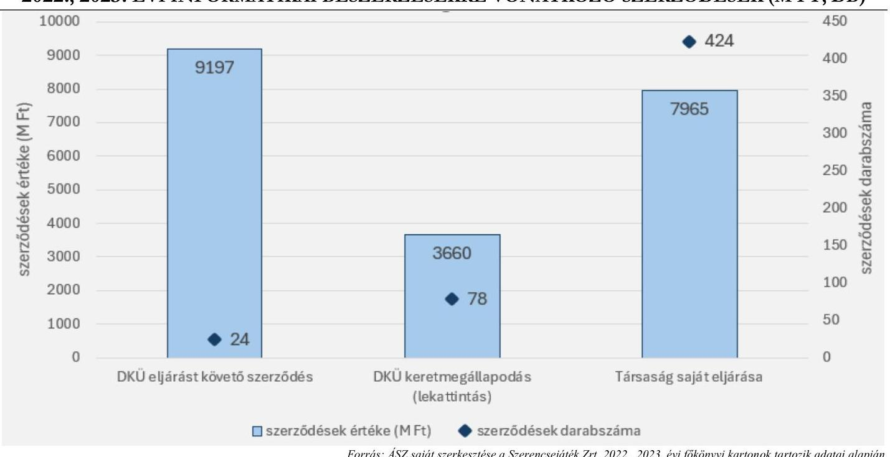

# JELENTÉS 

A többségi állami tulajdonban álló gazdasági társaságok informatikai célú beszerzéseinek ellenőrzése

Szerencsejáték Zrt.

2025.

---

ÁLLAMI
SZÁMVEVŐSZÉK

# JELENTÉS 

## A többségi állami tulajdonban álló gazdasági társaságok informatikai célú beszerzéseinek ellenőrzése

Szerencsejáték Zrt.

2025.

---

# ELLENŐRZÉSI IGAZGATÓSÁG: 

## ELLENŐRZÉSI IGAZGATÓSÁG III.

## ELLENŐRZÉSI IGAZGATÓ:

HERCZEGH ZSOLT igazgató

## ELLENŐRZÉSVEZETŐ:

## DABISNÉ NYIKOS MELINDA ellenőrzésvezető

Jelentéseink az interneten a www.asz.hu címen olvashatók.

IKTATÓSZÁM: EL-4063-003/2025
TÉMASORSZÁM: 34/2024
ELLENŐRZÉS-AZONOSÍTÓ SZÁM: V1093

---

# TARTALOMJEGYZÉK 

AZ ELLENŐRZÉS ALAPADATAI ..... 5
AZ ELLENŐRZÖTT SZERVEZET ..... 7
ÖSSZEFOGLALÁS ..... 9
AZ ELLENŐRZÉS FÓKUSZTERÜLETE ..... 10
MEGÁLLAPÍTÁSOK ..... 11
JAVASLATOK ..... 16
MELLÉKLETEK ..... 17
I. sz. melléklet: Értelmező szótár ..... 17
II. sz. melléklet: Az ellenőrzött szervezetek jegyzéke ..... 18
III. sz. melléklet: Ellenőrzési kritériumok ..... 19
IV. sz. melléklet: Piaci ártól való eltérés ..... 20
FÜGGELÉK: ÉSZREVÉTELEK ..... 21
RÖVIDÍTÉSEK JEGYZÉKE ..... 30

---

.

---

# AZ ELLENŐRZÉS ALAPADATAI 

## AZ ELLENŐRZÉS CÉLJA

Az ellenőrzés célja annak értékelése volt, hogy a többségi állami tulajdonban álló gazdasági társaság informatikai célú - ellenőrzés során kiválasztott - beszerzésére szabályszerűen került-e sor, a kapcsolódó döntéshozatal megalapozott volt-e, valamint érvényesültek-e a célszerűség és eredményesség szempontjai.

## AZ ELLENŐRZÉS TÍPUSA

Kombinált ellenőrzés.

## AZ ELLENŐRZÖTT IDŐSZAK

A 2022., 2023. évek.

## AZ ELLENŐRZÉS TÁRGYA

Az ellenőrzés tárgya a Szerencsejáték Zrt. ${ }^{1}$ 2022., 2023. években megvalósult, lezárult informatikai célú beszerzésére irányuló döntések szabályszerűsége, megalapozottsága, célszerűsége, a megvalósult informatikai beszerzés szabályszerűsége, eredményessége, a beszerzett informatikai eszközök, szolgáltatások (köz)feladat ellátás során történt hasznosulása, azaz a beszerzés megfelelősége volt. Az ellenőrzés kiterjedt a beszerzés előkészítésének, a beszerzésre vonatkozó szerződés megkötésének és tartalmának ellenőrzésére, valamint az informatikai célú beszerzés aktiválásának (használatbavételének) ellenőrzésére is.

Az ellenőrzés kiterjedt minden olyan körülményre és adatra, amely az ÁSZ² jogszabályban meghatározott feladatainak teljesítéséhez, valamint a program végrehajtása folyamán felmerült újabb összefüggések feltárásához szükséges volt.

## AZ ELLENŐRZÉS JOGALAPJA

Az ellenőrzés jogszabályi alapját az ÁSZ tv. ${ }^{3} 1. § (3)$ bekezdése és az 5. § (4) bekezdése képezték.

## AZ ELLENŐRZÉS MÓDSZERE

Az ellenőrzést a nemzetközi standardokat irányadónak tekintve az ellenőrzési program szempontjai, az ellenőrzött időszakban hatályos jogszabályok, az ellenőrzés szakmai szabályok és a jelen ellenőrzésre irányadó ÁSZ módszertan figyelembevételével történt.

---

Az ellenőrzési kérdések megválaszolásához szükséges bizonyítékok megszerzése az ellenőrzött szervezet által rendelkezésre bocsátott dokumentumokra és adatokra alapozva, továbbá mintavételezés, szemrevételezés, kérdésfeltevés (információkérés), valamint elemző eljárás útján valósult meg.

Az ellenőrzési bizonyítékként felhasználható adatforrások közé tartoztak az ellenőrzés lefolytatásához kért dokumentumok, valamint minden egyéb - az ellenőrzés folyamán feltárt, az ellenőrzés szempontjából információt tartalmazó - dokumentum.

Az ellenőrzés lefolytatásához az ellenőrzött szervezet a 2022., 2023. években megvalósult, lezárult informatikai beszerzéseire vonatkozó főkönyvi és analitikus nyilvántartások, valamint az ÁSZ által kért további dokumentumok, adatok, információk megküldésével és a helyszíni ellenőrzés során szolgáltatott adatokat. A rendelkezésre álló adatok alapján a Szerencsejáték Zrt. a 2022., 2023. években 526 darab informatikai beszerzésre irányuló szerződéssel rendelkezett, melyből 424 darab szerződés a Társaság saját hatáskörben lefolytatott beszerzési eljárásaihoz kapcsolódott. A mintavételezés keretében egy informatikai beszerzés került kiválasztásra, melynek összértéke nettó 141504600 Ft + áfa-t tett ki. A tények feltárása és azok összegzése során a megállapítások az ellenőrzött mintatételre vonatkozóan kerültek megfogalmazásra. A mintatétel ellenőrzésének eredményei nem kerültek kivetítésre.

A beszerzés megfelelő, ha a beszerzési eljárás teljes folyamata a lényegi elemeiben szabályszerű, célszerű és - amennyiben értékelhető - eredményes volt, illetve a beszerzés tekintetében érvényesültek a nemzeti vagyonnal való felelős gazdálkodás elvei.

---

# AZ ELLENŐRZÖTT SZERVEZET 

A Szerencsejáték Zrt. 1990.12.31-én átalakulással jött létre, jogelődje a Magyar Szerencsejáték Vállalat volt. A Társaság egyedüli részvényese a Magyar Állam, az Nvtv. ${ }^{4}$ 2. mellékletében rögzítettek szerint a Szerencsejáték Zrt. részvényeinek 100%-a nemzetgazdasági szempontból kiemelt jelentőségű nemzeti vagyonban tartandó állami tulajdonban álló társasági részesedésnek minősül.

A Szerencsejáték Zrt. tulajdonosi joggyakorlója 2018.08.01-től az 1/2018 (VI. 25.) NVTNM rendelet ${ }^{5} 1$. számú melléklete szerint a nemzeti vagyon kezeléséért felelős tárca nélküli miniszter volt, majd az 1/2022. (V. 26.) GFM rendelet ${ }^{6}$ 1. melléklet II. 2. pontjában foglalt módosítás alapján 2022.05.27-től a Miniszterelnöki Kabinetiroda lett.

A Szerencsejáték Zrt. főtevékenysége az ellenőrzött időszakban: szerencsejáték, fogadás. A Társaság az ellenőrzött időszakban az Szjtv. ${ }^{7}$-ben biztosított kizárólagos joggal forgalmazott Magyarország területén számsorsjátékokat (Ötöslottó, Hatoslottó, Skandináv Lottó, Eurojackpot, Joker, Kenó, Luxor, Puttó, papír alapú és elektronikus sorsjegyek) és totalizátor fogadást (Totó, Góltotó), továbbá egyedül rendelkezett engedéllyel bukmékeri típusú fogadás (Tippmix, VSport) szervezésére. 2023.01.01-től a liberalizált piacon távszerencsejáték értékesítést végzett (Tippmixpro, V-SportPro).

A Szerencsejáték Zrt. főtevékenysége mellett számos egyéb tevékenységet is ellátott, többek között: napilapkiadás, folyóirat, időszaki kiadvány kiadása, film-, video- és televízióprogram terjesztése, irodai papíráru gyártása, nyomás (kivéve: napilap), adatfeldolgozás, web-hosting szolgáltatás.

| 1. táblázat | (adatok: M Ft-ban) |
| :--: | :--: |

A SZERENCSEJÁTÉK ZRT. BESZÁMOLÓJÁNAK FŐBB ADATAI

|  | 2022. év | 2023. év |
| :--: | :--: | :--: |
| Értékesítés nettó árbevétele | 822721 | 979659 |
| Igénybe vett szolgáltatások | 90908 | 97791 |
| Adózott eredmény | 25893 | 39644 |
| Immateriális javak | 8450 | 9685 |
| Tárgyi eszközök | 19199 | 19667 |
| ebből beruházás, felújítás | 1715 | 1350 |
| Jegyzett tőke | 3000 | 3000 |

A Társaság informatikai tárgyú beszerzéseire a DKÜ rendelet ${ }^{8} 1. § (2)$ bekezdés d) pontja értelmében a központosított közbeszerzés szabályai és az ide vonatkozó Kbt. ${ }^{9}$ rendelkezései ${ }^{10}$ voltak az irányadóak.

A Szerencsejáték Zrt. mindennapi működése digitális folyamatokra épül, így az ellenőrzött időszakban a beszerzések meghatározó része (az üzleti tervek ${ }^{11}$ adatai alapján az összes beruházás 60%-a) az informatikai fejlesztésekhez és eszközbeszerzésekhez kapcsolódott.

A Társaság 2022., 2023. évi megvalósult, lezárult informatikai beszerzésekre vonatkozó szerződéseit az alábbi ábra szemlélteti:

---

1. ábra
2022., 2023. ÉVI INFORMATIKAI BESZERZÉSEKRE VONATKOZÓ SZERZŐDÉSEK (M Ft, db)

Forrás: ÁSZ saját szerkesztése a Szerencsejáték Zrt. 2022., 2023. évi főkönyvi kartonok adatai alapján
A Szerencsejáték Zrt.-nél az átlagosan foglalkoztatottak száma 2022. évben 1795 fő, 2023. évben 1835 fő volt, az ellenőrzött időszakban a Taktv. ${ }^{12}$ 7/J. § (1) bekezdésben meghatározott mutatóértékek alapján a Gbkr. ${ }^{13}$ hatálya alá tartozott, belső kontrollrendszer működtetésére volt kötelezett.

---

# ÖSSZEFOGLALÁS 

A Magyar Államnak az állami tulajdonú gazdasági társaságokban lévő részesedései a nemzeti vagyon, ezen belül az állami vagyon részét képezik. E részesedések értékére, ezáltal az állami vagyon értékének megőrzésére, növelésére alapvető befolyást gyakorol az állami tulajdonban álló gazdasági társaságok gazdálkodási tevékenysége. Az ellenőrzés a felelős gazdálkodás kritériumának vizsgálata keretében értékelte, hogy a Szerencsejáték Zrt. mintatételként kiválasztott informatikai beszerzése megfelelő volt-e.

A gazdasági társaságokkal szemben elvárás, hogy beruházásaikat, beszerzéseiket megfelelő tervezéssel hajtsák végre, mérjék fel annak szükségességét, pénzügyi vonzatát, valamint értékeljék a beszerzés gazdálkodásra vonatkozó várható hatásait, elemezzék azok következményeit, és alapozzák meg döntésüket. Magyarország Alaptörvénye ${ }^{14}$ is rögzíti ezeket a feltételeket azzal, hogy az állam tulajdonában álló gazdálkodó szervezetek törvényben meghatározott módon, önállóan és felelősen gazdálkodnak a törvényesség, célszerűség és eredményesség követelményei szerint. A gazdasági társaságok a tevékenységük során kötelesek a belső szabályozóikban foglaltakat betartani. A gazdálkodás egyes kérdéseire kiterjedő belső szabályozók a gazdasági társaságok működési sajátosságainak figyelembevételével alkotott részletes rendelkezéseikkel hivatottak biztosítani a jogszabályokban meghatározott általános normák végrehajtását, így - többek között - a felelős gazdálkodás elveinek érvényesülését.

A Szerencsejáték Zrt. kiválasztott informatikai beszerzése összességében nem volt megfelelő.

AZ ELLENŐRZÉS MEGÁLLAPÍTOTTA, hogy a Szerencsejáték Zrt. beszerzési igényre vonatkozó döntése az ellenőrzött tétel tekintetében az üzletmenet folytonosságának biztosítása érdekében indokolt volt, az a Társaság stratégiai tervében meghatározott célokkal összhangban merült fel.

A Szerencsejáték Zrt. azonban a beszerzési igényre vonatkozó döntését a jogszabályi előírás ellenére nem alapozta meg, az ellenőrzött tétel vonatkozásában gazdaságossági számítást nem végzett, a becsült érték meghatározása során a jogszabályban foglalt rendelkezéseket nem tartotta be, a piackutatás eredményére vonatkozó dokumentumokkal nem rendelkezett. A Társaság a becsült érték meghatározása során olyan korrekciós tételeket alkalmazott, melynek indokoltságát a jogszabályi előírás ellenére döntéselőkészítő dokumentumban igazolni nem tudta.

A Szerencsejáték Zrt. a beszerzési eljárása során nem a jogszabályi és belső szabályokban foglalt rendelkezések szerint járt el, a központosított közbeszerzési eljárás szabályainak megsértése miatt a kiválasztott informatikai beszerzés ára nem a közbeszerzési eljárás biztosította garanciális keretek között került meghatározásra. A kiválasztott informatikai beszerzés tekintetében a felelős gazdálkodásra vonatkozó alapelv nem érvényesült.

---

# AZ ELLENŐRZÉS FÓKUSZTERÜLETE 

1- A többségi állami tulajdonban álló gazdasági társaság informatikai célú beszerzésének megfelelősége

---

# MEGÁLLAPÍTÁSOK 

## 1. A többségi állami tulajdonban álló gazdasági társaság informatikai célú beszerzésének megfelelősége

## Összegző megállapítás A Szerencsejáték Zrt. ellenőrzés alá vont informatikai célú beszerzése összességében nem volt megfelelő.

Az ÁSZ ellenőrzése a Szerencsejáték Zrt. 2022., 2023. években megvalósult informatikai célú beszerzései közül egy darab, saját hatáskörben lefolytatott beszerzésének a megfelelőségére terjedt ki.
2. táblázat

| AZ ELLENŐRZÖTT BESZERZÉS FŐBB ADATAI |  |  |  |  |  |  |  |
| :--: | :--: | :--: | :--: | :--: | :--: | :--: | :--: |
| A SZERZŐDÉS TÁRGYA | CIKKSZÁM |  | DARABSZÁM | KM ${ }^{2}$   KERETÉBEN   ELŐÍRT   VOLT-E | SZERZŐDÉS   KÖTÉSE | KÉRÉS-   IGAZOLÁS   IDŐPONTJA | SZERZŐDÉSI   ÉRTÉK |
| VMware   beszerzés   AEGIS   megújítása | VMware   vSphere 7   Enterprise   Plus to   vCloud   Suite 2019   Advanced | CL19-EPL7-   ADV-UG-C-   T3 | 18 darab | $\times$ |  |  |  |
|  |  | CL19-ADV-   P-SSS-C | 18 darab | $\checkmark$ |  |  |  |
|  | Essential   Kit to   vSphere 7   Enterprise   Plus | VS7-ESP-   EPL-AK-   UG-C | 2 darab | $\checkmark$ |  |  |  |
|  |  | VS7-EPL-   6AK-P-SSS-C | 2 darab | $\checkmark$ |  |  |  |
|  | VMware   vSphere 7,   VMware   NSX, and   vRealize   Suite 2019   to   complete   VMware   Cloud   Foundation   4 Advanced   Stack for   External   Storage | CF4-B4-   ADV-ES-   AD-C-T3 | 8 darab | $\times$ | 2022.03.31. | 2022.04.21. | 141504600   Ft + áfa |

---

# A BESZERZÉSHEZ KAPCSOLÓDÓ SZABÁLYOZÁSI KÖRNYEZET 

A stratégiai, üzleti, valamint az informatikai beszerzések tervezését a DKÜ rendelet szabályai, valamint a Társaság belső irányító eszközei szabályozták - tulajdonosi joggyakorló premisszája ${ }^{16}$, tervezési szabályzat ${ }^{17}$, portfólió szabályzat ${ }^{18}-$.
Az informatikai célú beszerzésekre vonatkozó eljárásokat a DKÜ rendeletben meghatározott központosított közbeszerzési eljárás szabályai, az ide

 kapcsolódó Kbt. rendelkezések, valamint a Társaság belső szabályozó eszközei - Alapszabály ${ }^{19}$, SZMSZ ${ }^{20}_{1-2}$, Igazgatósági ügyrend ${ }^{21}$, Felügyelőbizottsági ügyrend ${ }^{22}$, Kötelezettségvállalási szabályzat ${ }^{23}$, Eseti közbeszerzési szabályzatok ${ }^{24}$, Beszerzési szabályzat ${ }^{25}$, Informatikai beszerzések engedélyeztetési rendje ${ }^{26}$, Szoftvergazdálkodási szabályzat ${ }^{27}$, Projektmenedzsment szabályzat ${ }^{28}$, Számlák likvidációjának eljárásrendje ${ }^{29}$ - szabályozták.
A Szerencsejáték Zrt. a Taktv. alapján a tervezési és beszerzési eljárásaira vonatkozóan a belső szabályozói környezetét kialakította.

## A BESZERZÉSI IGÉNY FELMERÜLÉSE

A Szerencsejáték Zrt. 2021-2025. évi stratégiai tervének ${ }^{30}$ céljai között meghatározásra került az informatikai rendszerek, valamint az üzemeltetés stabilitásának a biztosítása. A stratégiai terv végrehajtását a Társaság 2020-2023. évekre vonatkozó informatikai stratégiája ${ }^{31}$ támogatta, mely tartalmazta a projektek megvalósítási tervét is. Az ellenőrzött tétel vonatkozásában a Szerencsejáték Zrt. beszerzésre irányuló döntése az üzletmenet folytonosságának biztosítása érdekében indokolt volt, az az informatikai stratégiával és a Társaság tevékenységével összhangban állt. A kiválasztott beszerzés a SZIIR ${ }^{32}$ projekt részeként, az AEGIS ${ }^{33}$ hardver infrastruktúra megújításához kapcsolódott. A Szoftvergazdálkodási szabályzat alapján a beszerzési igény a Szerencsejáték Zrt. erre vonatkozó informatikai rendszerébe rögzítésre és jóváhagyásra került.

## A BESZERZÉSRE IRÁNYULÓ DÖNTÉS

A Szerencsejáték Zrt. a DKÜ rendelet alapján a 2022. évre vonatkozó DKÜ tervét ${ }^{34}$ elkészítette, azt az NHIT ${ }^{35}$ végrehajtásra javasolta, a kapcsolódó miniszteri jóváhagyás rendelkezésre állt.
A Társaság DKÜ terve azonban a rendelkezésre álló IT tervével ${ }^{36}$ nem állt összhangban, mivel azok között nagy volumenű eltérés volt tapasztalható (a DKÜ tervben az IT tervben szereplő 525 darab tétel közül mindössze 223 darab tétel volt beazonosítható). A Szerencsejáték Zrt. DKÜ terve - az IT tervtől való eltérés következtében - a DKÜ rendelet 1. § 4. bekezdés 3. és 4. pontjaiban foglalt tartalmi elvárásoknak nem felelt meg, mivel abban nem kerültek teljeskörűen rögzítésre az adott évre tervezhető informatikai beszerzések.
Az ellenőrzött tételhez kapcsolódó beszerzési igény a 2022. évi DKÜ tervbe felvezetésre került, azonban azt a Szerencsejáték Zrt. nem annak a terhére valósította meg, hanem a 2021. év végén rendkívüli beszerzési igényként nyújtotta be a DKÜ ${ }^{37}$ részére. A rendkívüli beszerzési igény indoka az volt, hogy a Társaság új AEGIS rendszerének bővítéséhez fejlett virtualizációs licencek voltak szükségesek, a korábbi meglévő licencek képességeit pedig a szükséges szintre kellett fejleszteni. A Szerencsejáték Zrt. a rendkívüli beszerzési igényt a SZIIR projekt alá vonta, mely keretében a beszerzés fedezete is biztosításra került (a Társaság részéről 2021.12.06-án aláirt, a DKÜ felé 2021.12.07-én benyújtott fedezetigazolás nyilatkozatban rögzítették, hogy a fedezet a Szerencsejáték Zrt. számláján ütemezetten rendelkezésre állt). A Szerencsejáték Zrt. fentiekben rögzített eljárása a tervezési szabályzat 4.4.8. pontjában előírtaknak nem felelt meg, mivel

---

projekt keretében csak olyan fejlesztés lett volna megvalósítható, melynek pénzügyi forrása az üzleti tervben rendelkezésre állt, a rendkívüli beszerzési igény miatt ezen feltétel (mivel az a 2021. évi üzleti tervben nem került tervezésre) nem teljesült.
A DKÜ rendelet a beszerzési eljárások értékének meghatározására a Kbt. szerinti becsült értéket ${ }^{38}$ veszi alapul, melyet a DKÜ felé benyújtott tervekben is rögzítenie kell a gazdasági társaságoknak. A beszerzési igény fedezetigazolásához szükséges becsült érték nyilatkozat a Szerencsejáték Zrt. rendelkezésére állt, melyben megadásra került, hogy a becsült érték (nettó 145060850 Ft / bruttó 184227280 Ft) piackutatással került meghatározásra. A Szerencsejáték Zrt. a piackutatás eredményét írásos formában igazolni nem tudta, azon oknál fogva, hogy a termékek árairól - a Társaság nyilatkozata alapján - telefonon kértek tájékoztatást a licenc forgalmazójától. A Társaság az eljárásával a Kötelezettségvállalási szabályzat 5.2. pontjában előírt rendelkezést megsértette, mivel az erre vonatkozó informatikai rendszerében nem állt teljeskörűen rendelkezésre a kötelezettségvállalás előkészítéséhez kapcsolódó valamennyi dokumentum.
A Szerencsejáték Zrt. a becsült érték meghatározása során nem tett eleget a Kbt. 16. § (1) bekezdésében előírt, a piacon általában kért vagy kínált értéken történő nettó beszerzési érték megadásának sem, mivel a licenc forgalmazója által adott áron felül 1,27-es szorzó értéket alkalmazott, melynek okára egyéb számítást, alátámasztó dokumentációt nem készített. Ebből adódóan a Társaság a Gbkr. 6. § (2) bekezdés a) és b) pontjaiban foglalt rendelkezések ellenére az informatikai beszerzési folyamatokhoz nem épített ki olyan kontrollt, amely biztosította volna a döntések dokumentumainak előkészítését, a döntések célszerűségi, gazdaságossági, hatékonysági és eredményességi szempontú megalapozottsági vizsgálatát. A Társaság a becsült értéket továbbá nem a nyilatkozatában meghatározott MNB középárfolyamon ${ }^{39}$ számította át, valamint a licencek, és a supportok időszakát tört évek figyelembevételével határozta meg, annak ellenére, hogy azok egész éves időszakra voltak elérhetőek. A Szerencsejáték Zrt. indikatív ajánlatot írásban nem kért be, illetve egyéb módon sem tudta igazolni az alkalmazott árak megfelelőségét, így a Kbt. 28. § (2) bekezdésben rögzített előírások ellenére az objektív módszerek alkalmazásának és azok eredményének dokumentálási kötelezettségének sem tett eleget. A kiválasztott informatikai beszerzéshez kapcsolódóan a Kötelezettségvállalási szabályzat 6.3.1. pontja szerinti gazdaságossági számítás nem készült el.
A Szerencsejáték Zrt. által alkalmazott becsült érték megfelelőségének kontrollja érdekében a DKÜ Portálon elérhető DKM01VLIC20 ${ }^{40}$ számú keretmegállapodás árinformációi az ellenőrzés keretében lekérdezésre kerültek. A kontroll adatok alapján az ÁSZ által megállapított piaci ártól a Szerencsejáték Zrt. becsült értéke jelentősen eltért. A Társaság informatikai beszerzésre irányuló döntése a fentiekben rögzített szabályszerűtlen eljárásból adódóan nem volt megalapozott, a Szerencsejáték Zrt. a becsült értéket a piackutatás napján érvényes DKÜ KM árakon ${ }^{41}$ számított piaci értékhez képest 31,25%-kal (nettó 34536922 Ft + áfa) magasabb értékben határozta meg. A döntéselőkészítő dokumentumok hiánya, valamint a becsült érték megalapozatlansága miatt a Taktv. 7/J. § (3) bekezdés e) pontjában foglalt rendelkezés sérült, a Társaság első számú vezetője nem alakított ki és működtetett olyan belső kontrollrendszert, amely az ellenőrzött tétel vonatkozásában biztosította volna a jogszabályi előírásoknak megfelelő, szabályozott, átlátható működést. (A piaci ártól való eltérés levezetését a IV. sz. melléklet tartalmazza.)

---

# A BESZERZÉSI ELJÁRÁS 

A Szerencsejáték Zrt. az ellenőrzött tételhez kapcsolódó rendkívüli informatikai beszerzésre vonatkozó igényét a DKÜ rendelet 7. § c) pontjában foglalt rendelkezések ellenére nem az igény felmerülését követő 5 munkanapon belül nyújtotta be a DKÜ Portálon keresztül (beszerzési igény igazoló bejegyzése: 2021.10.13., DKÜ benyújtás: 2021.12.07.).

A DKÜ a DKÜ rendelet értelmében a Szerencsejáték Zrt. beszerzési igényét vizsgálat alá vonta, majd a megfelelő minősítést követően visszaadta azt a Társaságnak saját hatáskörben történő lefolytatásra.
A Szerencsejáték Zrt. a beszerzési eljárása során a DKÜ rendelet 13. § (1b) bekezdésében maghatározott szabályokat megsértette, mivel az ellenőrzött tételre vonatkozó beszerzési eljárását zártkörű pályáztatás útján valósította meg, annak ellenére, hogy a beszerzés tárgyát képező termékek tekintetében hat cikkszámból négy elérhető volt a DKM01VLIC20 számú keretmegállapodásban. A Szerencsejáték Zrt. a saját beszerzési eljárásának előnyben részesítését azzal indokolta, hogy „két termék nem volt elérhető”, illetve „a beszerzés keretmegállapodásban beszerzett, cikkszámok mentén való darabolása üzembiztonsági kockázatot is jelenthet”. A jogszabályi rendelkezés azonban pontosan determinálja azt, ha a DKÜ a beszerzési igény kielégítésére szolgáló beszerzési eljárást az érintett szervezet részére saját hatáskörben történő lefolytatásra a DKÜ rendelet 13. § (1) bekezdés b) pontja alapján visszaadta, és az a DKÜ rendelet szerinti sajátos beszerzési módszerekkel megkötött keretmegállapodás vagy más keretjellegű szerződés alkalmazásával kielégíthető, akkor a beszerzési igényt köteles a keretmegállapodás vagy más keretjellegű szerződés alkalmazásával kielégíteni. A Szerencsejáték Zrt. indoka nem volt megalapozott, mivel a beszerzési igényben megjelölt termékek közül négy a DKÜ keretmegállapodás keretében önállóan beszerezhető volt, nem képeztek megbonthatatlan egységet, valamint eltérő szerződéses lejárat kapcsolódott hozzájuk. A Társaság 2022. évi DKÜ tervében is rögzítésre került továbbá a keretmegállapodással történő beszerzés megjelölése, valamint az, hogy az ellenőrzött tételre vonatkozó beszerzési igénye nem volt egybeszámítással érintett. A keretmegállapodás alapján elérhető termékeket (mely a szerződéses érték 54%-át tette ki) a fentiek értelmében a Szerencsejáték Zrt.-nek a DKÜ rendelet 13. § (1b) bekezdése alapján a keretmegállapodás terhére kellett volna beszereznie, csak a keretmegállapodásban nem szereplő eszközök esetében alkalmazhatta volna a belső szabályozása szerinti saját hatáskörű beszerzési eljárását.
A Szerencsejáték Zrt. Kötelezettségvállalási szabályzat 9.2. pontja alapján saját hatáskörben lefolytatott, zártkörű pályáztatási eljárása nem volt szabályszerű, a központosított közbeszerzési eljárás szabályainak megsértése végett a beszerzett eszközök ára nem a közbeszerzési eljárás biztosította garanciális keretek között került meghatározásra. A Társaság az ellenőrzött tételt az ÁSZ által megállapított piaci értéktől 28%-kal (nettó 30980672 Ft + áfa) magasabb értékben szerezte be. Az ellenőrzött tétel vonatkozásában az Nvtv. 7. § (1)-(2) bekezdésben foglaltak ellenére a Társaság nem tett eleget a nemzeti vagyonnal történő felelős, átlátható, költségtakarékos vagyongazdálkodási kötelezettségének. (A piaci ártól való eltérés levezetését a IV. sz. melléklet tartalmazza.)

## A BESZERZÉS ELSZÁMOLÁSA

A beszerzési eljárás keretében befogadott nettó 141504600 Ft + áfa összegű számla pénzügyi teljesítését a Társaság gazdasági igazgatója engedélyezte, azonban a Szerencsejáték Zrt. eljárása aktualizált vezérigazgatói felhatalmazás hiányában nem felelt meg a Számlák likvidációjának eljárásrendje 4.6. pontjában előírt szabályoknak. Az ellenőrzés során átadott vezérigazgatói felhatalmazások a gazdasági

---

igazgató megbízás vonatkozásában nem minősültek érvényesnek, mivel azok a gazdasági igazgató korábbi beosztásához kapcsolódtak ${ }^{42}$, melyek azért kerültek beállításra számára, hogy helyettesítési jogkörben járjon el más vezetők helyett. A gazdasági igazgató a pénzügyi teljesítés engedélyezésére vonatkozóan a Ptk. 6:16. § szerinti általános meghatalmazással nem rendelkezett, így jogosultság hiányában az ellenőrzött tételre vonatkozó pénzügyi teljesítést szabálytalanul engedélyezte.
A Társaság az üzembe helyezés időpontját nem a Számv. tv. ${ }^{43}$ 52. § (2) bekezdésben foglalt szabályok alapján állapította meg, mivel az Üzembe helyezési és maradványérték meghatározási bizonylatok ${ }^{44}$ tartalma alapján az üzembe helyezés elrendelésének napja 2022.05.09-e volt, a Szerencsejáték Zrt. által alkalmazott 2022.04.12-i kezdő időponttal szemben (az ellenőrzött tétel leszállítására ${ }^{45}$ 2022.04.19-én, a teljesítésigazolás ${ }^{46}$ Társaság általi aláirására 2022.04.21-én került sor). Az Egyedi eszköznyilvántartó kartonok ${ }^{47}$, valamint az Üzembe helyezési és maradványérték meghatározási bizonylatok tartalma alapján továbbá megállapítható volt, hogy a Társaság a Számv. tv. 16. § (1) bekezdés szerinti egyedi nyilvántartási kötelezettség előírását is megsértette, mivel a beszerzett eszközök mennyiségénél nem a valósan beszerzett mennyiségeket tüntette fel, hanem termékenként egy darabot rögzített.
A Társaság az ellenőrzött tételre vonatkozó adatszolgáltatását a DKÜ rendelet szerint teljesítette, valamint a 2022. évi informatikai beszerzéseiről szóló beszámolót benyújtotta.

# KÖZZÉTÉTELI KÖTELEZETTSÉG 

A Szerencsejáték Zrt. a Taktv., és az Info tv. ${ }^{48}$ rendelkezéseinek megfelelően eleget tett közzétételi kötelezettségének a megkötött informatikai beszerzésre irányuló szerződése vonatkozásában.

---

# JAVASLATOK 

Az ÁSZ tv. 33. § (1)
 bekezdésében foglaltak értelmében az ellenőrzött szervezet vezetője köteles a jelentésben foglalt megállapításokhoz kapcsolódó intézkedési tervet összeállítani és azt a jelentés kézhezvételétől számított 30 napon belül az ÁSZ részére megküldeni. Amennyiben az ellenőrzött szervezet vezetője nem küldi meg határidőben az intézkedési tervet, vagy továbbra sem elfogadható intézkedési tervet küld, az Állami Számvevőszék elnöke az ÁSZ tv. 33. § (3) bekezdése a) és b) pontjaiban foglaltakat érvényesítheti.

## SZERENCSEJÁTÉK ZRT. VEZÉRIGAZGATÓJA RÉSZÉRE

1. Tegyen intézkedést annak érdekében, hogy a Társaság DKÜ terve a jövőben a DKÜ rendelet 1. § (4) bekezdés 3. és 4. pontjaiban foglalt tartalmi elvárásoknak megfeleljen.
2. Gondoskodjon arról, hogy a jövőben a Kötelezettségvállalási szabályzat 5.2. pontjában előírt szabályok alapján a kötelezettségvállalás előkészítéséhez kapcsolódó valamennyi dokumentum az erre vonatkozó informatikai rendszerben (ANDOC-rendszer) teljeskörűen rendelkezésre álljon.
3. Tegyen intézkedést annak érdekében, hogy a Társaság a jövőben az informatikai beszerzésekre vonatkozó becsült érték meghatározásánál a Kbt. 16. §-ban, Kbt. 28. § (2) bekezdésben rögzített előírásoknak megfeleljen, valamint a Gbkr. 6. § (2) bekezdés a) és b) pontjaiban foglalt kontrollokat a Társaság kialakítsa és működtesse.
4. Gondoskodjon arról, hogy a jövőben a Kötelezettségvállalási szabályzat 6.3.1. pontjában előírt rendelkezés szerinti gazdaságossági számítások a 25 millió forint feletti beruházásoknál rendelkezésre álljanak.
5. Alakítson ki és működtessen kontrollt a DKÜ rendeletben foglalt rendelkezések alapján annak biztosítására, hogy a Szerencsejáték Zrt. informatikai beszerzései a jogszabályban meghatározott előírásoknak megfeleljenek.
6. Vizsgálja felül a Számlák likvidációjának eljárásrendje 4.6. pont alapján a vezérigazgatói felhatalmazásokat, és az aktualizálások érdekében (ahol szükséges) tegye meg a szükséges intézkedéseket.
7. Gondoskodjon arról, hogy a jövőben a Számv. tv. 16. § (1) bekezdés szerint az egyedi értékelés elve betartásra kerüljön.

---

# MELLÉKLETEK 

## I. SZ. MELLÉKLET: ÉRTELMEZŐ SZÓTÁR

gazdasági társaság
többségi állami tulajdon
vagyongazdálkodás alapelvei
informatikai célú beszerzés
szolgáltatás

A gazdasági társaságok üzletszerű közös gazdasági tevékenység folytatására, a tagok vagyoni hozzájárulásával létrehozott, jogi személyiséggel rendelkező vállalkozások, amelyekben a tagok a nyereségből közösen részesednek, és a veszteséget közösen viselik.
(Ptk. 3:88. § (1) bekezdése)
Az állam tulajdonában lévő tagsági jogviszonyt megtestesítő értékpapír, illetve az állam tulajdonában lévő egyéb társasági részesedés, amennyiben a társaságban a Magyar Állam közvetlenül vagy közvetetten a szavazatok több mint felével rendelkezik.
(ÁSZ definíció a Vtv. ${ }^{49}$ 1. § (2) bekezdés c) pontja és a Ptk. 8:2. § (1), (3)-(4) bekezdései alapján)
A nemzeti vagyon alapvető rendeltetése a közfeladat ellátásának biztosítása, ideértve a lakosság közszolgáltatásokkal való ellátását és e feladatok ellátásához szükséges infrastruktúra biztosítását. A nemzeti vagyonnal felelős módon, rendeltetésszerűen kell gazdálkodni.
A nemzeti vagyongazdálkodás feladata a nemzeti vagyon megőrzése, értékének és állagának védelme, rendeltetésének megfelelő, az állam, az önkormányzat mindenkori teherbíró képességéhez igazodó, elsődlegesen a közfeladatok ellátásához és a mindenkori társadalmi szükségletek kielégítéséhez szükséges, egységes elveken alapuló, átlátható, hatékony és költségtakarékos működtetése, értéknövelő használata, hasznosítása, gyarapítása, továbbá az állam vagy a helyi önkormányzat feladatának ellátása szempontjából feleslegessé váló vagyontárgyak elidegenítése, azzal, hogy a nemzeti vagyon megőrzése érdekében végzett bontás vagy átalakítás nem minősül az állagvédelmi kötelezettség megszegésének.
(Nvtv. 7. § (1)-(2) bekezdése alapján)
Informatikai célú beszerzés alatt az informatikai eszköz, szoftver, alkalmazásfejlesztés és az ezekhez kapcsolódó szolgáltatások beszerzésére irányuló keretmegállapodás vagy más keretjellegű szerződés, továbbá visszterhes szerződés létrehozását célzó beszerzési eljárást értjük.
(DKÜ rendelet 1. § (4) bekezdés 5. pont)
Szolgáltatás alatt a gazdasági társaság által igénybe vett/megrendelt, harmadik fél által nyújtott/számlázott, nem anyagi javak termelésére irányuló tevékenységeket értjük.
(ÁSZ definíció a Számv. tv. 3. § (7) bekezdés 1. pontja alapján)

---

II. SZ. MELLÉKLET: AZ ELLENŐRZÖTT SZERVEZETEK JEGYZÉKE

# ELLENŐRZÖTT SZERVEZET NEVE 

Szerencsejáték Zártkörűen Működő Részvénytársaság

---

# III. SZ. MELLÉKLET: ELLENŐRZÉSI KRITÉRIUMOK 

## FOKUSZTERÜLET

1. A többségi állami tulajdonban álló gazdasági társaság informatikai célú beszerzésének megfelelősége

## ELLENŐRZÉSI KRITÉRIUMOK

Vtv. 2. $\S$ (1) bek.
Nvtv. 7. § (1)-(2) bek.
Taktv. 2. §, 7/J. § (1) (3) bek.
Ptk. 3:4. § (1) bek., 6:16. §, 6:215-234. §, 6:238-271. §, 6:272-6:279. §,
DKÜ rendelet 1. § (2) bek. d) pont, 7-13. §
Kbt. 16. § (1), 28. § (2)
Gbkr. 4. §, 6. §, Gbkr. Irányelv ${ }^{30}$, Gbkr. Kézikönyv ${ }^{31}$
Számv. tv. 4. § (1) bek., 14. § (3) bek., 16. §, 25. § (6) bek., 58. §, 159. §, 160. § (3a) és (3b) bek., 161-161/A., 164. § (2) bek., 165. § (1)-(2) bek., 166. § (1)-(2) bek., 169. § (1)(2) bek.
a Társaság belső szabályzatai (Alapszabály, SZMSZ ${ }_{1-2}$, Igazgatósági ügyrend, Felügyelőbizottsági ügyrend, Kötelezettségvállalási szabályzat, Eseti közbeszerzési szabályzatok, Beszerzési szabályzat, Informatikai beszerzések engedélyeztetési rendje, Szoftvergazdálkodási szabályzat, Projektmenedzsment szabályzat, előterjesztések rendje, tulajdonosi joggyakorló premisszái, tervezési szabályzat, portfólió szabályzat, Számlák likvidációjának eljárásrendje)
Info tv. 33. §

---

# IV. SZ. MELLÉKLET: PIACI ÁRTÓL VALÓ ELTÉRÉS

|  DKÜ cikkszám | 15-1 | $\begin{gathered} \text { DKÜ-1.3. } \ 2021.10 .13 . \text { (*) } \ \text { nettó ár/db } \ \text { (HUF) } \end{gathered}$ | $\begin{gathered} \text { DKÜ-1.3. } \ 2021.10 .13 . \text { (ár } \ \text { clérisában) db } \ \text { (EUR) } \end{gathered}$ | Beszerzési menny. (db) | Bocsált érték szerinti nettó egységár/ db (EUR) | Píaci érték a DKÜ ésával számolva |  | Bocsált nettó érték a Társaság által alkalmazott árfolyammal |  | 1.Társaság által a becsült érték meghatározással alkalmazott további szorozó |  | Supportok esetén a Társaság által alkalmazott szorzók 2022.01.01.- 2023.05.17. 2024.02.04. időtartam éves arány |  | 1.Társaság által meghatározott nettó piaci érték a supportok korrekciója alapján (5. és a 10. oszlop szorzata) azzal a kérés(fe), hogy a supportok csak fiz. 1 évre szólnak, ezért keretlen. 1 év, illetve 2 évre vannak keretlése a 10. oszlop adatai (HUF) |  | 1.Társaság által meghatározott nettó becsült érték a supportok időszaki korrekciójával együtt (5. és 10. oszlop szorzata) (HUF) |  |  |  |   |
| --- | --- | --- | --- | --- | --- | --- | --- | --- | --- | --- | --- | --- | --- | --- | --- | --- | --- | --- |
|   |  |  |  |  |  | HUF
2021.10.13.
(1. és 3.
oszlop
szorzata) | EUR
2021.10.13.
(2. és 3.
oszlop
szorzata) | EUR
(4. és 3.
oszlop
szorzata) | HUF
(360
EUR/HUF
árfolyam
szorzata a 7.
oszlop
adatával) | HUF
8. oszlop adata
1,27 szorzóval
névelt értékkel | HUF
8. oszlop adata
1,27 szorzóval
névelt értékkel |  |  |  |  |  |   |
|   |  |  |  |  |  |  |  |  |  |  |  |  |  |  |  |  |  |   |
|   |  | 1. | 2. | 3. | 4. | 5. | 6. | 7. | 8. | 9. | 10. | 11. | 12. | 13. |  |  |  |   |
|  CF4-B4-ADV-ES-AD-P-
SSS-C | 27 | 384905 | 1093,48 | 8 | 962,29 | 3079240 | 8747,84 | 7698,31 | 2771392 | 3519668 | 2,093150685 | 6158480 | 7367194 | 8082400 |  |  |  |   |
|  VS7-EPL-6AK-P-SSS-C | 27 | 2429958 | 6903,29 | 2 | 6074,91 | 4859916 | 13806,58 | 12149,83 | 4373937 | 5554900 | 1,37260274 | 4859916 | 7624671 | 12628800 |  |  |  |   |
|  VS7-ESP-EPL-AK-UG-
C | 27 | 7550389 | 21449,97 | 2 | 23650,00 | 15100778 | 42899,94 | 47300,00 | 17028000 | 21625560 | - | 15100778 | 21625560 | 17802400 |  |  |  |   |
|  CL19-ADV-P-SSS-C | 27 | 820614 | 2331,29 | 18 | 2331,29 | 14771052 | 41963,20 | 41963,22 | 15106759 | 19185584 | 2,093150685 | 29542104 | 40158319 | 38385000 |  |  |  |   |
|  CF4-B4-ADV-ES-AD-C* | 27 | 1446363 | 4108,99 | 8 | 3937,50 | 11570904 | 32871,89 | 31500,00 | 11340000 | 14401800 | - | 11570904 | 14401800 | 13641600 |  |  |  |   |
|  CL19-EPL7-ADV-UG-
C* | 27 | 2405097 | 6652,66 | 18 | 6547,50 | 43291746 | 122987,92 | 117852,00 | 42427800 | 53883306 | - | 43291746 | 53883306 | 31044400 |  |  |  |   |
|  Összesen |  |  |  |  |  | 92673636 | 26327736 | 25846636 | 93047888 | 110170818 |  | 110523978 | 145060850 | 141504600 |  |  |  |   |

- A DKÜ Portálon el nem érhető T3 végű két cikkszám (CF4-B4-ADV-ES-AD-C-T3 és CL19-EPL7-ADV-UG-C-T3) esetében az alap cikkszámokat (CF4-B4-ADV-ES-AD-C és CL19-EPL7-ADV-UG-C) és az azokhoz kapcsolódó árakat vette alapul az ellenőrzés. Ennek oka az, hogy a „T" -szintek kedvezményes ársávokat, vagy programokat jelölnek, amelyeket ügyfélítípusok vagy partnerségi szintek szerint határozott meg a Vmware (így az alap cikkszámokhoz képest alacsonyabb áron kellene szerepelnie). Összevetési alapként a DKÜ Portálon rögzített alap cikkszámok árai felhasználhatóak (mivel a Társaság a T3 végű cikkszámú termékeket magasabb áron vásárolta meg, mint amennyibe az alap cikkszámok kerültek). ** A Társaság a beszerzési igényéhez kapcsolódó bejegyzését 2021.10.13-án rögzítette informatikai rendszerében, így az ellenőrzés által meghatározott piaci ár ezen időpontra vonatkozóan került meghatározásra. Megjegyzés: a DKÜ KM (EUR) árak a beszerzési eljárás során változatlanok voltak. Piaci ártól való eltérés a nettó becsült értékhez képest: 145060850 Ft / 110523928 Ft = 1,3125 -> + 31,25 % (nettó 34536922 Ft , ami bruttó 43861891 Ft ) Piaci ártól való eltérés a nettó szerződés értékéhez képest: 141504600 Ft / 110523928 Ft = 1,28 -> + 28 % (nettó 30980672 Ft , ami bruttó 39345453 Ft )

---

# FÜGGELÉK: ÉSZREVÉTELEK 

A jelentéstervezetet a Számvevőszék 15 napos észrevételezésre megküldte az ellenőrzött szervezet vezetőjének az ÁSZ tv. 29. § (1) bekezdése előírásának megfelelően.

A jelentéstervezet megállapításaira a Szerencsejáték Zrt. észrevételt tett. Az ÁSZ tv. 29. § (3) bekezdésével összhangban az ÁSZ a Függelékben feltünteti a megállapításokkal kapcsolatban tett, el nem fogadott észrevételeket, illetve az el nem fogadott észrevételek indokolását.

## 1.)

A Szerencsejáték Zrt. észrevétele a Beszerzésre irányuló döntés fejezet 2. bekezdés vonatkozásában: „Az adatszolgáltatás keretében
 megküldött „IT terv 2022.sdxx és IT terv 2023.sdxx" fájlok az informatikai beszerzéseket és fejlesztéseket rögzítették, amelyek között nagy számban szerepeltek olyan informatikai igények, amelyek vonatkozásában DKÜ bejelentési kötelezettsége a Társaságnak nem volt (pl.: már élő szerződés okán, vagy korábbi DKÜ engedély miatt), mely beiváskozásokat a táblázat B oszlopa tartalmazza. Emellett a DKÜ rendelet 1. § (4) bekezdésének 5. pontja alapján informatikai beszerzésnek minősül az informatikai eszköz, szoftver, alkalmazásfejlesztés és az ezekhez kapcsolódó szolgáltatások beszerzésére irányuló keretmegállapodás vagy más keret jellegű szerződés, továbbá visszterhes szerződés létrehozását célzó beszerzési eljárás. Tekintettel arra, hogy egyes IT tervben szereplő leírás esetében a keretszerződés már rendelkezésre állt, az azokból való leírásokat a fogalom meghatározás alapján nem szükséges a DKÜ felé bejelenteni vagy a DKÜ tervben szerepeltetni. A 2022. évre vonatkozó 525 darab tételből álló tervben összesen 19 db sor szerepel (ebből 6 db törlésre került, 3 db nem informatikai beszerzés: futárszolgálat, fordítás, parkolás), melyek nem tartoznak a fent említett egyik kategóriába sem, és ezek között is mindössze elenyésző számú (10 db) olyan tétel azonosítható, amelyek a DKÜ tervezés és az üzleti tervezés között eltelt hónapok alatt merültek fel a Társaság működése során, mely mennyiség álláspontunk szerint egy TOP 10-es árbevételű állami vállalat életében nem haladja meg a normál üzletmenetbe tartozó mértéket. Fentiek alapján megállapítható, hogy a Szerencsejáték Zrt. DKÜ terve a DKÜ rendeletben foglalt tartalmi elvárásokat nem sértette meg."

Észrevétellel érintett megállapítás: A Társaság DKÜ terve azonban a rendelkezésre álló IT tervével nem állt összhangban, mivel azok között nagy volumenű eltérés volt tapasztalható (a DKÜ tervben az IT tervben szereplő 525 darab tétel közül mindössze 223 darab tétel volt beazonosítható). A Szerencsejáték Zrt. DKÜ terve - az IT tervtől való eltérés következtében - a DKÜ rendelet 1. § (4) bekezdés 3. és 4. pontjaiban foglalt tartalmi elvárásoknak nem felelt meg, mivel abban nem kerültek teljeskörűen rögzítésre az adott évre tervezhető informatikai beszerzések.

El nem fogadás indoka: A Szerencsejáték Zrt. észrevétele is alátámasztja az ÁSZ megállapításait, miszerint a Társaság 2022. évi IT terve nem állt összhangban a 2022. évi DKÜ tervével. A Társaság 2022. évi DKÜ

[^0]
[^0]:    * 29. § (1) Az Állami Számvevőszék az ellenőrzési megállapításait megküldi az ellenőrzött szervezet vezetőjének vagy az általa megbízott személynek, és annak, akinek személyes felelősségét állapította meg.
    (2) Az ellenőrzött szervezet vezetője és a felelősként megjelölt személy az ellenőrzés megállapításaira tizenöt napon belül írásban észrevételt tehet.
    (3) Az Állami Számvevőszék az észrevételre a beérkezésétől számított harminc napon belül írásban válaszol. A figyelembe nem vett észrevételeket köteles a jelentésben feltüntetni, és megindokolni, hogy azokat miért nem fogadta el.

---

tervében szereplő tételek a 2022. évi IT tervben teljeskörűen nem voltak beazonosíthatóak, továbbá a 2022. évi IT terv olyan informatikai beszerzéseket is tartalmazott, melyek a 2022. évi DKÜ tervben nem kerültek felvezetésre. A DKÜ iránymutatása alapján (mely megfelel a DKÜ rendelet 1. § (4) bekezdés 3-4. pontjaiban foglaltaknak) az éves informatikai beszerzési és fejlesztési tervekben minden, előre tervezetten megvalósítani kívánt, a DKÜ rendelet tárgyi hatálya alá tartozó informatikai beszerzést szerepeltetni kell (megjegyzés: a 2022. évi informatikai beszerzési és fejlesztési tervvel készül beszámoló adatai alapján a DKÜ által elbírált 231 db igényből 103 db-ot terven felüli igényként nyújtott be a Társaság). Továbbá a 2022. évre vonatkozó IT tervben olyan tételek is szerepeltetésre kerültek, melyek nem tartoztak az informatikai beszerzés keretei közé (pl. futárszolgálat, fordítás, parkolás), mely szintén igazolja a nem megfelelően végrehajtott informatikai tervezést.

# 2.) 

A Szerencsejáték Zrt. észrevétele a Beszerzésre irányuló döntés fejezet 3. bekezdés vonatkozásában: ,,A beszerzés a SZIIR projekt részeként valósult meg, mely projekt a (0393 SZIIR alszámlán) a 2021. évi üzleti terv részét képezte. Mivel a vizsgált beszerzés is a SZIIR projekt megvalósítását támogatta, ezért megállapítható, hogy az üzleti tervben a SZIIR projektre dedikált összeg fedezetet biztosított a „VMware beszerzés AEGIS megújítása" tárgyú eljárásra. Mivel a beszerzés fedezetéül szolgáló pénzügyi forrás a 2021. üzleti tervben is a Társaság rendelkezésére állt, ezért álláspontunk szerint a hivatkozott Tervezési Szabályzat 4.4.8. pontjának megsértése nem állapítható meg."
Észrevétellel érintett megállapítás: Az ellenőrzött tételhez kapcsolódó beszerzési igény a 2022. évi DKÜ tervbe felvezetésre került, azonban azt a Szerencsejáték Zrt. nem annak a terhére valósította meg, hanem a 2021. év végén rendkívüli beszerzési igényként nyújtotta be a DKÜ részére. A rendkívüli beszerzési igény indoka az volt, hogy a Társaság új AEGIS rendszerének bővítéséhez fejlett virtualizációs licencek voltak szükségesek, a korábbi meglévő licencek képességeit pedig a szükséges szintre kellett fejleszteni. A Szerencsejáték Zrt. a rendkívüli beszerzési igényt a SZIIR projekt alá vonta, mely keretében a beszerzés fedezete is biztosításra került. A Szerencsejáték Zrt. fentiekben rögzített eljárása a tervezési szabályzat 4.4.8. pontjában előírtaknak nem felelt meg, mivel projekt keretében csak olyan fejlesztés lett volna megvalósítható, melynek pénzügyi forrása az üzleti tervben rendelkezésre állt, a rendkívüli beszerzési igény miatt ezen feltétel (mivel az a 2021. évi üzleti tervbe nem került tervezésre) nem teljesült.

El nem fogadás indoka: A Tervezési Szabályzat 4.4.8. pontjában rögzítettek értelmében a rendkívüli beszerzés annak jellege miatt nem része az üzleti tervnek. A Társaság az ellenőrzés részére átadott dokumentumai szerint - JIRA 2021. november 12-i bejegyzés dokumentuma -, illetve a 2024. december 2-án megtartott helyszíni interjú és helyszíni szemle során (jegyzőkönyv 5. kérdés-válasz, helyszíni szemle bekezdés) szintén megerősítette, hogy a beszerzésre sem a 2021. évi, sem pedig a 2022. évi üzleti tervben nem volt fedezet (forrást nem tartalmazott), mivel rendkívüli tételként került az igény beterjesztésre a DKÜ felé. Továbbá a tervek annak ellenére nem tartalmazták a beszerzett tételeket, hogy azok a Szerencsejáték Zrt. helyszíni szemle keretében tett nyilatkozata alapján a licencek tervezése jól ütemezhető. A beszerzés forrását a Társaság az Andoc rendszer 2022. március 16-i bejegyzése alapján (keretlehívási kérelem) átcsoportosítással, utólag a szerződés egyeztetése szakaszában biztosította azáltal, hogy azt utólagosan a SZIIR projekt alá vonta.

## 3.)

A Szerencsejáték Zrt. észrevétele a Beszerzésre irányuló döntés fejezet 4-5. bekezdés vonatkozásában: ,,A becsült érték meghatározása során Társaságunk nem a KM-es árlistát vette figyelembe - erre vonatkozó jogszabályi kötelezése nem is volt -, hanem az eljárás fajtájához jobban igazodó, piackutatáson alapuló becsült érték meghatározási módszertant alkalmazott azzal, hogy közvetlenül a gyártótól kért árajánlatot. Itt jegyezzük meg, hogy a Kbt. által felsorolt becsült érték

---

meghatározási módszertan nem egy taxatív felsorolás, a Kbt. csupán azt rögzíti, hogy a módszertannak objektívnek kell lennie, és a gyártói árajánlatkérés a piaci gyakorlat szerint is annak minősül, így a nettó becsült érték meghatározása a Kbt. előírásainak megfelelően történt. Ezúton is jelezzük, hogy a piackutatás eredményeként a gyártó által megküldött kalkuláció az ellenőrzést végzők részére - az Állami Számvevőszék EAR rendszerébe - 2024. október 10-ig átadásra került, így annak rendelkezésre állása igazolást nyert. A piackutatás (nettó 145060850 Ft) megfelelőségét az is alátámasztja, hogy a beszerzési eljárás során az ajánlattevők által küldött ajánlatok is a gyártó által megadott összeghez közelítettek (NTT: 146251820 Ft; T-Systems: 145536940 Ft; Areus: 141504600 Ft), melyre tekintettel kijelenthető, hogy a becsült érték a piaci viszonyoknak megfelelően került meghatározásra. A Szerencsejáték Zrt. Számviteli Politikája nem írja elő, hogy a becsült értéket az MNB középárfolyamon szükséges átszámítani. A Tisztelt Állami Számvevőszék által jelzett 1,27-es szorzót a Társaság nem tudta azonosítani, tudomásunk szerint azt az eljárásban nem alkalmazta. (A gyártói ajánlatban valóban szerepelnek szorzótényezők - 1,37 és 2,09-es szorzók, melyekre később részletesebben is kitérünk -, de azokat sem a Társaság, hanem a gyártó határozta meg.) Megjegyezzük, hogy a helyszíni ellenőrzés során valóban esett szó telefonos egyeztetésről, azonban az erre vonatkozó rész a 2024. december 02. napján kelt jegyzőkönyvben félreérthetően szerepel, mert a telefonos egyeztetés nem a beszerzési fázisban történt, a Kbt. szerinti becsült érték meghatározáshoz nem kapcsolódott semmilyen módon, hanem egy évvel korábban történt, amikor a Társaság a 2021. évi üzleti tervezéséhez gyűjtött információt. Az így kapott információkat a Szerencsejáték Zrt. arra használta, hogy egy előzetes, nagyságrendi pénzügyi tervezést végezzen a teljes évre, tehát a telefonos egyeztetés a tényleges beszerzési folyamathoz nem kapcsolódott, abban semmiféle relevanciával nem bírt. Fentiek alapján a Kbt. és Gbkr. megsértésére vonatkozó megállapításokat nem tartjuk megalapozottnak."

Észrevétellel érintett megállapítás: A DKÜ rendelet a beszerzési eljárások értékének meghatározására a Kbt. szerinti becsült értéket veszi alapul, melyet a DKÜ felé benyújtott tervekben is rögzítenie kell a gazdasági társaságoknak. A beszerzési igény fedezetigazolásához szükséges becsült érték nyilatkozat a Szerencsejáték Zrt. rendelkezésére állt, melyben megadásra került, hogy a becsült érték (nettó 145060850 Ft / bruttó 184227280 Ft) piackutatással került meghatározásra. A Szerencsejáték Zrt. a piackutatás eredményét írásos formában igazolni nem tudta, azon oknál fogva, hogy a termékek árairól - a Társaság nyilatkozata alapján - telefonon kértek tájékoztatást a licenc forgalmazójától. A Társaság az eljárásával a Kötelezettségvállalási szabályzat 5.2. pontjában előírt rendelkezést megsértette, mivel az erre vonatkozó informatikai rendszerében nem állt teljeskörűen rendelkezésre a kötelezettségvállalás előkészítéséhez kapcsolódó valamennyi dokumentum.

A Szerencsejáték Zrt. a becsült érték meghatározása során nem tett eleget a Kbt. 16. § (1) bekezdésében előírt, a piacon általában kért vagy kínált értéken történő nettó beszerzési érték megadásának sem, mivel a licenc forgalmazója által adott áron felül 1,27-es szorzó értéket alkalmazott, melynek okára egyéb számítást, alátámasztó dokumentációt nem készített. Ebből adódóan a Társaság a Gbkr. 6. § (2) bekezdés a) és b) pontjaiban foglalt rendelkezések ellenére az informatikai beszerzési folyamatokhoz nem épített ki olyan kontrollt, amely biztosította volna a döntések dokumentumainak előkészítését, a döntések célszerűségi, gazdaságossági, hatékonysági és eredményességi szempontú megalapozottsági vizsgálatát. A Társaság a becsült értéket továbbá nem a nyilatkozatában meghatározott MNB középárfolyamon számította át, valamint a licencek, és a supportok időszakát tört évek figyelembevételével határozta meg, annak ellenére, hogy azok egész éves időszakra voltak elérhetőek. A Szerencsejáték Zrt. indikatív ajánlatot írásban nem kért be, illetve egyéb módon sem tudta igazolni az alkalmazott árak megfelelőségét, így a Kbt. 28. § (2) bekezdésben rögzített előírások ellenére az objektív módszerek alkalmazásának és azok eredményének dokumentálási kötelezettségének sem tett eleget.

El nem fogadás indoka: Az ÁSZ megállapítása a Kbt. szerinti becsült érték meghatározása során alkalmazandó eljárásra irányult, mely az észrevételben hivatkozott KM szerinti árlista alkalmazását nem rögzítette. A Társaság
 becsült értéke a Kbt. 16. § (1) bekezdésében előírtaknak nem felelt meg, mivel a licenc

---

forgalmazója által adott áron felül 1,27-es szorzó értéket alkalmazott, melynek okára egyéb számítást, alátámasztó dokumentációt nem készített. A Szerencsejáték Zrt. által rendelkezésre bocsátott Becsült érték alátámasztása.xlsx, valamint ugyanazon levezetést tartalmazó BENY_alatamaszto_JNIBESZ_2347_2021111.xlsx kalkulációs táblában (megjegyzés: melyet az excel tábla információs adatai alapján a Szerencsejáték Zrt. alkalmazottja hozott létre mindkét esetben) az 1,27-es szorzó kétszer került alkalmazásra az alábbiak szerint: nettó érték L22 cella $=\operatorname{SZUM}(\mathrm{L} 2: \mathrm{L} 20)^{*} 1,27$, majd a bruttó érték meghatározásánál ismét 1,27-es szorzót alkalmazott a Társaság L23 cella $=\mathrm{L} 22^{*} 1,27$. A Társaság a Kbt. 28. § (2) bekezdésben előírt rendelkezéseknek nem felelt meg, mivel az objektív módszerek alkalmazásának és azok eredményének dokumentálási kötelezettségének nem tett eleget (megjegyezzük, hogy nem a gyártó felelőssége a becsült érték kalkuláció elkészítése és annak alátámasztásának dokumentálása, hanem az ajánlatkérőé). Az ajánlatkérő a Kbt. 28. § (1) bekezdésben meghatározott felelősségi körében köteles a becsült érték meghatározása céljából külön vizsgálatot végezni és annak eredményét dokumentálni. A piackutatási folyamat tekintetében a Szerencsejáték Zrt. 2024. december 2-án kelt nyilatkozata szerint (jegyzőkönyv 9. kérdés-válasz) a VMware Magyarország áraival számoltak, melyet telefonon kaptak meg és írásos formában nem állt rendelkezésre a piackutatás eredménye. A hivatkozott helyszíni jegyzőkönyvre a Társaság képviselői észrevételt nem tettek, azt a helyszínen elfogadólag aláírták. Az ÁSZ megállapítása továbbá nem a Társaság Számviteli politikájában előírt becsült érték átszámítására vonatkozott. A Szerencsejáték Zrt. 2024. december 2-án tett nyilatkozata (jegyzőkönyv 9. kérdés-válasz) szerint a becsült érték nyilatkozat kiállításának napján érvényes MNB középárfolyamon számoltak, ezzel kalkulálódik a forintos érték. Megjegyezzük, hogy a Társaság Számviteli politikája is meghatározta a devizás tételekre vonatkozó átszámítási szabályokat, melyben az MNB által közzétett árfolyam került rögzítésre.

# 4) 

A Szerencsejáték Zrt. észrevétele a Beszerzésre irányuló döntés fejezet 4. bekezdés vonatkozásában: „Egy jelentés, átfogó projekt keretében megvalósuló beruházás egyes tételei árbevételt nem generálnak, csak ráfordítást jelentenek, mivel jelen beszerzés tárgya a SZIIR projekt keretében ilyen beruházási tételnek minősül, így gazdaságossági, eredményességi számítás nem értelmezhető a beszerzésre, ezért nem készült hozzá. Mindezek alapján nem tudott a társaság gazdaságossági számítást készíteni az ellenőrzéssel érintett beszerzés kapcsán."

Észrevétellel érintett megállapítás: A kiválasztott informatikai beszerzéshez kapcsolódóan a Kötelezettségvállalási szabályzat 6.3.1. pontja szerinti gazdaságossági számítás nem készült el.

El nem fogadás indoka: Az ellenőrzött tétel rendkívüli beszerzésnek minősült, a beszerzési igény keletkezésekor a beruházás nem volt még a SZIIR projekt része, mivel később került bevonásra. A SZIIR projektbe történő bevonás oka a beruházás fedezetének biztosítása volt. A Szerencsejáték Zrt. Kötelezettségvállalási szabályzatának 6.3.1. pontja szerint 25 millió forint feletti beruházásoknál gazdaságossági számítást kell készíteni, melynek a Társaság nem tett eleget, ezt a Szerencsejáték Zrt. 2024. december 2-án tett nyilatkozata (jegyzőkönyv 1. kérdés-válasz) is megerősítette.

## 5)

A Szerencsejáték Zrt. észrevétele a Beszerzésre irányuló döntés fejezet 6. bekezdés vonatkozásában: „Abban a Tisztelt Állami Számvevőszék részére átadott műszaki leírásban is szerepel, a Szerencsejáték Zrt. által megvásárolt termékek licencekhez kapcsolódtak, amelyek frissítés (upgrade) következtében megváltoztak, de nem csupán cikkszámukban és megnevezésükben, hanem funkcionalitásukban is. Ezek eredetileg már rendelkeztek egy lejárati idővel, ebbe volt szükséges illeszteni az új támogatásokat is, amely az új licenchez tartozó egy éves támogatási cikkszámmal nem volt kezelhető. Mindezek alapján a gyártó egy szorzót (2022.01.01 és a lejárat közötti napok száma/365) használt, amellyel megszorozta a standard

---

cikkszámhoz tartozó támogatás árát. Megállapítható, hogy a gyártó által az egyes licencek kapcsán megadott 2,093150685-es és 1,37260274-es szorzókat nem a Társaság határozza meg, és azok használatának a fent bemutatott objektív okai voltak. Mivel a DKÜ KM standard támogatási cikkszámok pontosan egy évre szóltak, így ahhoz tartozó árakat adtak a szállítók a KM első ajánlati szakaszában a DKÜ-nek, ezért nem tekinthetők referenciának, mivel a listaár 209,315%-a és a 137,260%-a (lsd. fenti szorzók) nem volt azokba beárazva. Álláspontunk szerint mindezek alapján kijelenthető, hogy ha a támogatások tekintetében közbeszerzésben a gyártó ezeket (lsd. fenti szorzókkal növelt) az árakat ajánlja ki a disztribútorkon keresztül a KM szállítóknak, akkor azok nem tudtak volna a Szerencsejáték Zrt. részére ajánlatot adni, mivel nincs rá lehetőségük, hogy KM-es listaár felett határozzanak meg árat. Megjegyezzük továbbá, hogy a Tisztelt Állami Számvevőszék az összehasonlításban nem a műszaki kiírásban szereplő T3-as végű licencek árait hasonlította össze a KM-ben található árakkal, hanem egyéb alap cikkszámokét, és azokkal végezte el az ellenőrzést, melyek összevetési alapként történő felhasználása nem ugyanazt az eredményt adja. Fentiek alapján megállapítható, hogy a Tisztelt Állami Számvevőszék által becsült 31,25%-os piaci értéknél magasabb árra vonatkozó megállapítása nem megalapozott, mivel nem veszi figyelembe sem azt, hogy a DKÜ KM-ből csak egy éves időszakra lehetett volna támogatást beszerezni (ezért nem is alkalmazhatott volna 2,093150685-es és 1,37260274-es szorzókat), amely műszaki okokból sem lett volna megfelelő a Társaság számára, továbbá azt sem, hogy az összehasonlításnál egyes licenceknél nem a műszaki leírásban szereplő típusokat hasonlította össze a DKÜ KM-ben elérhető licencekkel. Fentiek - valamint a korábban előadottak alapján - alapján a Taktv. megsértésére vonatkozó megállapítást nem tartjuk megalapozottnak."

Észrevétellel érintett megállapítás: A Szerencsejáték Zrt. által alkalmazott becsült érték megfelelőségének kontrollja érdekében a DKÜ Portálon elérhető DKM01VLIC20 számú keretmegállapodás árinformációi az ellenőrzés keretében lekérdezésre kerültek. A kontroll adatok alapján az ÁSZ által megállapított piaci ártól a Szerencsejáték Zrt. becsült értéke jelentősen eltért. A Társaság informatikai beszerzésre irányuló döntése a fentiekben rögzített szabályszerűtlen eljárásból adódóan nem volt megalapozott, a Szerencsejáték Zrt. a becsült értéket a piackutatás napján érvényes DKÜ KM árakon számított piaci értékhez képest 31,25 %-kal (nettó 34 536 922 Ft + áfa) magasabb értékben határozta meg. A döntéselőkészítő dokumentumok hiánya, valamint a becsült érték megalapozatlansága miatt a Taktv. 7/J. § (3) bekezdés e) pontjában foglalt rendelkezés sérült, a Társaság első számú vezetője nem alakított ki és működtetett olyan belső kontrollrendszert, amely az ellenőrzött tétel vonatkozásában biztosította volna a jogszabályi előírásoknak megfelelő, szabályozott, átlátható működést.

El nem fogadás indoka: A Szerencsejáték Zrt. az általa rendelkezésre bocsátott Műszaki leírás, valamint a 2021. november 19-i JIRA bejegyzése alapján a T3-as licencek hiánya miatt döntött úgy, hogy a teljes beszerzést saját hatáskörben folytatja le. Az ellenőrzés részére sem a DKÜ részéről jóváhagyott műszaki leírásban, sem pedig a Társaság által adott nyilatkozatban nem került rögzítésre a tört évekre vonatkozó licenc vásárlás, mivel a Műszaki leírásban szereplő érintett cikkszámok esetében is fix év volt megjelölve, melyet a 2024. december 2-i jegyzőkönyv 9. kérdés-válasza is alátámaszt. A T3 licencek vonatkozásában az alaplicencek összevetési alapként történő felhasználásának magyarázatát az ÁSZ által készített piaci ár levezető táblázat tartalmazza. A T3-on kívüli licencek esetében a Műszaki leírásban szereplő cikkszámok szerint kerültek kigyűjtésre az összehasonlítás alapját képező adatok (KM árak). A DKÜ Portálon el nem érhető T3 végű két cikkszám (CF4-B4-ADV-ES-AD-C-T3 és CL19-EPL7-ADV-UG-C-T3) esetében az alap cikkszámokat (CF4-B4-ADV-ES-AD-C és CL19-EPL7-ADV-UG-C) és az azokhoz kapcsolódó árakat vette alapul az ellenőrzés. Ennek oka az volt, hogy a „T"-szintek kedvezményes ársávokat, vagy programokat jelölnek, amelyeket ügyféltípusok vagy partnerségi szintek szerint határozott meg a VMware (így az alap cikkszámokhoz képest alacsonyabb áron kellene szerepelniük). Összevetési alapként a DKÜ Portálon rögzített alap cikkszámok árai felhasználhatóak, mivel a Társaság a T3 végű cikkszámú termékeket magasabb áron vásárolta meg forintban, mint amennyibe az alap cikkszámok kerültek. Megjegyezzük továbbá, hogy a táblázat adatai alapján az ÁSZ által alkalmazott KM alaplicenc árak (euroban), valamint a Társaság becsült értéke során használt T3-as licenc árak (euroban) minimálisan tértek el. A piaci

---

ártól való jelentős eltérést az 1,27-es szorzó kétszeri alkalmazása okozta a beszerzési eljárás során (lásd észrevételre adott válasz 3. pont levezetés).
6)

A Szerencsejáték Zrt. észrevétele a Beszerzési eljárás fejezet 1. bekezdés vonatkozásában: „A DKÜ rendelet 7. §-a szerint érintett szervezetnek az „ott meghatározott struktúra és adattartalom szerint részletezve, a Portálon keresztül" kell benyújtania az informatikai beszerzési igényt a DKÜ részére, mely csak abban az esetben teljesíthető, ha a benyújtáshoz előírt szükséges dokumentumok aláírva rendelkezésre állnak (pl.: fedezetigazolás, becsült érték nyilatkozat, műszaki leírás, becsült érték alátámasztás.) Azzal, hogy a Szerencsejáték Zrt. egyik belső rendszerében a beszerzési jegy (JIRA ticket) létrejött 2021. október 13. napján, azzal az igény benyújtásához szükséges dokumentáció előállításának folyamata indult csak el, mely nem jelenti az igény hivatalos felmerülését, csak a Társasági belső döntéshozatalához is szükséges folyamat megkezdését. Az igény csak akkor tekinthető létrejöttnek, ha arra vonatkozóan a megfelelő szintű döntéshozó jóváhagyása rendelkezésre áll, vagyis az arra jogosult személy eldönti, hogy az üzleti elképzelés igénynek tekinthető-e. Ez értelemszerűen nem is lehet másként, hiszen például egy tulajdonosi szintet elérő beszerzés esetén a belső döntéshozatali folyamatokat még számos külső igazgatósági, felügyelőbizottsági és részvényesi előterjesztés és - döntés követi, melyek után van csak lehetőség a DKÜ részére benyújtani az igényt, hiszen ha ezt a döntések előtt tenné a Társaság, akkor azzal a DKÜ eljárás megkezdésekor előlegként megfizetésre kerülő eljárási díj elvesztését kockáztatná, mert az nem jár vissza abban az esetben, ha a Társaság az eljárást - pl.: mert az arra jogosult döntéshozó nem adta hozzájárulását - visszavonja. Mivel a szükséges döntés (2021. december 2.) mellett a dokumentáció teljeskörűen 2021. december 07. napján állt elő (aláírt becsült érték nyilatkozat és fedezetigazolás), ezért az informatikai igény ekkor vált benyújthatóvá a DKÜ részére, így kijelenthető, hogy a Társaság nem a DKÜ rendeletben meghatározott határidőn túl nyújtotta be az igényt az ügynökség részére. Megállapítható, hogy a Társaság a DKÜ rendeletben előírt határidőt megtartva nyújtotta be igényét."

Észrevétellel érintett megállapítás: A Szerencsejáték Zrt. az ellenőrzött tételhez kapcsolódó rendkívüli informatikai beszerzésre vonatkozó igényét a DKÜ rendelet 7. § c) pontjában foglalt rendelkezések ellenére nem az igény felmerülését követő 5 munkanapon belül nyújtotta be a DKÜ Portálon keresztül (beszerzési igény igazoló bejegyzése: 2021.10.13., DKÜ benyújtás: 2021.12.07.).

El nem fogadás indoka: A Szerencsejáték Zrt. informatikai jellegű beszerzéseinek előzetes engedélyeztetési rendjéről szóló szabályzat alapfogalmak 3. pontja szerinti igénybejelentés a 64/2012 sz. vezérigazgatói utasításban kiadott kötelezettségvállalás eljárás rendje szerint: az igénylő szervezeti egység elektronikusan készült írásbeli nyilatkozata, feljegyzés, levél, beiktatott e-mail, stb.) és annak mellékletei az áru vagy szolgáltatás beszerzésének, megrendelésének szükségességéről. A nevezett szabályt a Társaság Kötelezettségvállalási szabályzatának 3.5. pontja is tartalmazza. Ezeknek a szabályoknak a keretében a Társaság igénybejelentése a beszerzés szükségességéről 2021.10.13-án megtörtént (létrehozásra került a
 bejelentés) a JIRA rendszerben. Megjegyezzük, hogy a díjfizetési kötelezettség nem rögtön a DKÜ beszerzési igény jóváhagyásra történő benyújtásakor merül fel. A DKÜ rendelet 13. § (1) bekezdés a) pontja szerinti beszerzési eljárás megindításának feltétele, hogy az érintett szervezet a DKÜ részére a beszerzés Kbt. szerinti - egybeszámítás nélküli - becsült értékének a DKÜ által meghatározott mértékét, de legfeljebb 1%-át előlegként megfizesse. A nevezett esetben akkor keletkezik díjfizetés, ha a DKÜ a beszerzési igény kielégítésére szolgáló beszerzési eljárást az érintett szervezet javára eljárva központosított beszerzés keretében vagy járulékos beszerzési szolgáltatás nyújtásával maga folytatja le. Továbbá a Szerencsejáték Zrt. indokaként előadott döntési folyamat ellentmond a 2024. december 2-i jegyzőkönyv 13. kérdés-válaszában foglaltaknak, mely értelmében a pályáztatás megindításáról - melynek előfeltétele a DKÜ engedély megléte - az informatikai igazgató dönt, a pályáztatás után kerül sor a szerződéskötést megelőző lépésként az összeghatárhoz igazodó megfelelő szintű vezetői jóváhagyás

---

megszerzésére, emiatt sor kerülhet arra, hogy eredményesen lefolytatott eljárást követően nem történik szerződéskötés.

# 7) 

A Szerencsejáték Zrt. észrevétele a Beszerzési eljárás fejezet 3-4. bekezdés vonatkozásában: „A Szerencsejáték Zrt. elsőként azt vizsgálta, hogy a beszerzési igény batályos DKÜ KM-ből megvalósítható-e vagy sem. Figyelemmel arra, hogy a műszaki leírás részét képező 2 db cikkszám nem volt elérhető KM-ből (DKM01VLIC20), továbbá jelen dokumentum 1.5. pontban említett szorzók sem tették volna lehetővé azt, hogy a támogatásokat beszerezzük a KM-ből, döntött úgy Társaságunk, hogy mivel a teljes beszerzés KM-ből nem valósítható meg, ezért a DKÜ engedélye esetén társasági eljárásban fogja a beszerzést lefolytatni. Figyelemmel arra, hogy a beszerzés teljes tárgya műszaki és szállítási ütemezési szempontból összetartozó tételekből áll, így a Társaság a részlegesre bontással járó üzletmenet folytonosságra vonatkozó veszély felvállalását nem tartotta elfogadhatónak, mert ez azt eredményezhette volna, hogy az egyes cikkszámokat adott esetben eltérő szállítók, eltérő időpontban teljesítsék, ami üzembiztonsági szempontból nem felvállalható kockázat, mivel a teljes integráltság, a maximális kompatibilitás, a komponensek együttműködő képessége és a gyártói szakszerű támogatottság elengedhetetlen. Ennek megfelelően a DKÜ a beszerzési igény minősítése során nem kifogásolta azt, hogy a Társaság a beszerzést nem batályos KM-ből valósítja meg,  bolott ezen ellenőrzési szempont az elsődleges helyen szerepel akkor, amikor a DKÜ az igényeket megvizsgálja. A társasági eljárási konstrukcióban való megvalósítást a DKÜ a Portálon jóváhagyólag visszaigazolta, mely visszaigazolást a Tisztelt Állami Számvevőszék részére az adatszolgáltatások keretén belül feltöltöttünk. Fentiek alapján megállapítható, hogy a DKÜ tudomásával és jóváhagyásával lefolytatott beszerzési eljárással a DKÜ rendeletet a Társaság semmilyen módon nem sértette meg, melyet alátámaszt az is, hogy azt a DKÜ a döntését megelőzően megismerte, az a műszaki leíráson keresztül is bemutatásra került részére és azt jóváhagyásával elfogadta, az ellen kifogást semmilyen módon nem emelt."

Észrevétellel érintett megállapítás: A Szerencsejáték Zrt. a beszerzési eljárása során a DKÜ rendelet 13. § (1b) bekezdésében meghatározott szabályokat megsértette, mivel az ellenőrzött tételre vonatkozó beszerzési eljárását zártkörű pályáztatás útján valósította meg, annak ellenére, hogy a beszerzés tárgyát képező termékek tekintetében hat cikkszámból négy elérhető volt a DKM01VLIC20 számú keretmegállapodásban. A Szerencsejáték Zrt. a saját beszerzési eljárásának előnyben részesítését azzal indokolta, hogy „két termék nem volt elérhető", illetve „a beszerzés keretmegállapodásban beszerezhető, cikkszámok mentén való darabolása üzembiztonsági kockázatot is jelenthet". A jogszabályi rendelkezés azonban pontosan determinálja azt, ha a DKÜ a beszerzési igény kielégítésére szolgáló beszerzési eljárást az érintett szervezet részére saját hatáskörben történő lefolytatásra a DKÜ rendelet 13. § (1) bekezdés b) pontja alapján visszaadta, és az a DKÜ rendelet szerinti sajátos beszerzési módszerekkel megkötött keretmegállapodás vagy más keretjellegű szerződés alkalmazásával kielégíthető, akkor a beszerzési igényt köteles a keretmegállapodás vagy más keretjellegű szerződés alkalmazásával kielégíteni. A Szerencsejáték Zrt. indoka nem volt megalapozott, mivel a beszerzési igényben megjelölt termékek közül négy a DKÜ keretmegállapodás keretében önállóan beszerezhető volt, nem képeztek megbonthatatlan egységet, valamint eltérő szerződéses lejárat kapcsolódott hozzájuk. A Társaság 2022. évi DKÜ tervében is rögzítésre került továbbá a keretmegállapodással történő beszerzés megjelölése, valamint az, hogy az ellenőrzött tételre vonatkozó beszerzési igénye nem volt egybeszámítással érintett. A keretmegállapodás alapján elérhető termékeket (mely a szerződéses érték 54%-át tette ki) a fentiek értelmében a Szerencsejáték Zrt.-nek a DKÜ rendelet 13. § (1b) bekezdése alapján a keretmegállapodás terhére kellett volna beszereznie, csak a keretmegállapodásban nem szereplő eszközök esetében alkalmazhatta volna a belső szabályozása szerinti saját hatáskörű beszerzési eljárását.
A Szerencsejáték Zrt. Kötelezettségvállalási szabályzat 9.2. pontja alapján saját hatáskörben lefolytatott, zártkörű pályáztatási eljárása nem volt szabályszerű, a központosított közbeszerzési eljárás szabályainak

---

megsértése végett a beszerzett eszközök ára nem a közbeszerzési eljárás biztosította garanciális keretek között került meghatározásra. A Társaság az ellenőrzött tételt az ÁSZ által megállapított piaci értéktől 28%-kal (nettó 30980672 Ft + áfa) magasabb értékben szerezte be. Az ellenőrzött tétel vonatkozásában az Nvtv. 7. § (1)-(2) bekezdésben foglaltak ellenére a Társaság nem tett eleget a nemzeti vagyonnal történő felelős, átlátható, költségtakarékos vagyongazdálkodási kötelezettségének.

El nem fogadás indoka: A Szerencsejáték Zrt. válaszában megerősítette az ÁSZ megállapításában rögzítetteket, hogy a DKÜ rendelet 13. § (1b) bekezdése ellenére nem a keretmegállapodás terhére szerezte be az ott elérhető termékeket. Ugyanakkor az észrevételben hivatkozott szorzókra az eljárás módjának meghatározásakor az átadott dokumentumokban nem hivatkozott, illetve azok az 5. pontban rögzített észrevételre adott ÁSZ válaszban foglaltak alapján nem állnak összhangban a műszaki dokumentációban foglaltakkal. Megjegyezzük továbbá, hogy a 2022. évi DKÜ tervben szereplő szerződés tervezett kezdete és vége közötti időszakok is egész évre vonatkoztak. A DKÜ által saját hatáskörbe való lefolytatásra visszaadott beszerzések esetében a DKÜ iránymutatása alapján annak meghatározása, hogy az adott beszerzési igény keretmegállapodás vagy más keretjellegű szerződés használatával kielégíthető-e vagy sem, az érintett szervezet feladat- és felelősségi körébe tartozik, melyet a DKÜ rendelet 13. § (1b) bekezdése szabályoz.

# 8) 

A Szerencsejáték Zrt. észrevétele a Beszerzés elszámolása fejezet 1. bekezdés vonatkozásában: „A Tisztelt Állami Számvevőszék részére 2024. december 6. napján megküldött kartonok, valamint az Üzembe helyezési és maradványérték adatszolgáltatás keretében becsatolt első képernyőfotóval igazoltuk, hogy a Szerencsejáték Zrt. Andoc rendszerében rögzítve lett már 2016-ban a beszerzési eljárás során gazdasági igazgatói pozíciót betöltő munkatárs pénzügyi teljesítmények engedélyezésére vonatkozó jogosultsága. Mivel a vonatkozó szabályzat nem írja elő, hogy munkakör változás esetén új engedély kiállítása szükséges, ezért megállapítható, hogy az érintett munkatárs részére korábban megadott pénzügyi engedélyezési jogosultságot szabályszerűen alkalmazta gazdasági igazgatói munkakörében. Megjegyezzük, hogy a Tisztelt Állami Számvevőszék által nem megfelelőnek tartott engedély nem kifejezetten a pénzügyi engedélyezésre vonatkozott, hanem arra, hogy az érintett munkatárs egy konkrét vezérigazgató-helyettest helyettesíteni tudjon „minden szempontból", ami a helyettesítés szempontjából szükséges valamennyi feladatra vonatkozott, nem csupán a pénzügyi teljesítményre."

Észrevétellel érintett megállapítás: A beszerzési eljárás keretében befogadott nettó 141504600 Ft + áfa összegű számla pénzügyi teljesítését a Társaság gazdasági igazgatója engedélyezte, azonban a Szerencsejáték Zrt. eljárása aktualizált vezérigazgatói felhatalmazás hiányában nem felelt meg a Számlák likvidációjának eljárásrendje 4.6. pontjában előírt szabályoknak. Az ellenőrzés során átadott vezérigazgatói felhatalmazások a gazdasági igazgatói megbízás vonatkozásában nem minősültek érvényesnek, mivel azok a gazdasági igazgató korábbi beosztásához kapcsolódtak, melyek azért kerültek beállításra számára, hogy helyettesítési jogkörben járjon el más vezetők helyett. A gazdasági igazgató a pénzügyi teljesítés engedélyezésére vonatkozóan a Ptk. 6:16. § szerinti általános meghatalmazással nem rendelkezett, így jogosultság hiányában az ellenőrzött tételre vonatkozó pénzügyi teljesítést szabálytalanul engedélyezte.

El nem fogadás indoka: A Társaság észrevétele megerősítette az ÁSZ megállapítását, miszerint a gazdasági igazgató a pénzügyi teljesítés engedélyezésére vonatkozóan sem a Számlák likvidációjának eljárásrendje 4.6. pontjában előírt szabályok szerint, sem pedig a Ptk. 6:16. § szerinti általános vezérigazgatói felhatalmazással nem rendelkezett, kizárólagosan helyettesítési jogkört biztosító engedélye volt. Ezen engedélyt az akkori főosztályvezetői pozíciójában kapta annak érdekében, hogy a gazdasági vezérigazgató-helyettest helyettesíteni tudja. A Társaság Számlák likvidációjának eljárásrendjének 4.6. pontja szerint a pénzügyi engedélyezési

---

jogosultságok felügyelete, nyilvántartása, a keletkezett dokumentumok őrzése, tárolása, a Basware rendszerben történő aktualizálása a gazdasági igazgatóság vezetőjének hatáskörébe tartozik. A gazdasági igazgatóság vezetőjének utasítására az Üzleti Intelligencia és Gazdasági Rendszertámogató Osztály adminisztrátorai az Andoc iratkezelő rendszerben aláírt dokumentumok birtokában állítanak be vagy szüntetnek meg pénzügyi engedélyezési jogosultságot. A kilépő munkavállalók utolsó munkanapján az Üzleti Intelligencia és Gazdasági Rendszertámogató Osztály a kilépő munkavállaló helyettesítésében eljáró jogosultságát nem szüntette meg. A pénzügyi teljesítés ezáltal olyan jóváhagyással került engedélyezésre az ellenőrzött tétel tekintetében, mely egy kilépett munkavállaló (és megszűnt pozíció) helyettesítéséhez kapcsolódott.

# 9) 

A Szerencsejáték Zrt. észrevétele a Beszerzés elszámolása fejezet 2. bekezdés vonatkozásában: „A 2022. április 12-ei aktiválással összefüggésben az alábbi észrevételeket tesszük: az alábbi három licence örök licenceként a korábbi években került beszerzésre Társaságunk által, a használatuk korlátlan időre szól. A licencek a Társaság folyamatos használatában voltak a vizsgált időszakban. Jelen beszerzés keretében a termékek támogatását, követését - azaz a szoftver hibajavításokhoz, új fejlesztésekhez, verziókhoz való hozzáférés jogát - vásároltuk meg a megadott időszakra folytatólagosan, azaz 2022. április 12-től 2024. február 04-ig. Ezzel a beszerzéssel biztosítottuk a licence-k használatának a folytonosságát és támogatottságát. Érintett licencek: VMware vSphere 7 Enterprise Plus to vCloud Suite2019 Advanced, VMware vSphere 7 Essential Kit to vSphere 7 Enterprise Plus, VMware vSphere 7, VMware NSX, and vRealize Suite 2019 to complete VMware Cloud Foundation 4 Advanced Stack for External Storage."

Észrevétellel érintett megállapítás: A Társaság az üzembe helyezés időpontját nem a Számv. tv. 52. § (2) bekezdésben foglalt szabályok alapján állapította meg, mivel az Üzembe helyezési és maradványérték meghatározási bizonylatok tartalma alapján az üzembe helyezés elrendelésének napja 2022.05.09-e volt, a Szerencsejáték Zrt. által alkalmazott 2022.04.12-i kezdő időponttal szemben (az ellenőrzött tétel leszállítására 2022.04.19-én, a teljesítésigazolás Társaság általi aláírására 2022.04.21-én került sor). Az Egyedi eszköznyilvántartó kartonok, valamint az Üzembe helyezési és maradványérték meghatározási bizonylatok tartalma alapján továbbá megállapítható volt, hogy a Társaság a Számv. tv. 16. § (1) bekezdés szerinti egyedi nyilvántartási kötelezettség előírását is megsértette, mivel a beszerzett eszközök mennyiségénél nem a valósan beszerzett mennyiségeket tüntette fel, hanem termékenként egy darabot rögzített.

El nem fogadás indoka: Az ÁSZ megállapítása arra irányult, hogy a rendelkezésre bocsátott dokumentumokon az ellenőrzött tétel leszállításának napja: 2022. április 19., a teljesítésigazolás Társaság általi aláírásának napja: 2022. április 21., az Üzembe helyezési és maradványérték meghatározási jóváhagyó bizonylatok - üzembe helyezés elrendelésének napja: 2022. május 09. volt. Ezzel szemben az aktiválás dátumaként a Társaság által rendelkezésre bocsátott számviteli dokumentumon 2022. április
 12. került megjelölésre, mely időben megelőzte mind a teljesítésigazolás, mind a leszállítás, mind pedig az üzembe helyezés elrendelésének időpontját.

---

# RÖVIDÍTÉSEK JEGYZÉKE 

${ }^{1}$ Szerencsejáték Zrt./Társaság/ többségi állami tulajdonban álló gazdasági társaság
${ }^{2}$ ÁSZ
${ }^{3}$ ÁSZ tv.
${ }^{4}$ Nvtv.
${ }^{5}$ 1/2018 (VI. 25.) NVTNM rendelet
${ }^{6}$ 1/2022. (V. 26.) GFM rendelet
${ }^{7}$ Szjtv.
${ }^{8}$ DKÜ rendelet
${ }^{9}$ Kbt.
${ }^{10}$ ide vonatkozó Kbt. rendelkezések
${ }^{11}$ üzleti terv
${ }^{12}$ Taktv.
${ }^{13}$ Gbkr.
${ }^{14}$ Magyarország Alaptörvénye
${ }^{15} \mathrm{KM}$
${ }^{16}$ tulajdonosi joggyakorló premisszája
${ }^{17}$ tervezési szabályzat
${ }^{18}$ portfólió szabályzat
${ }^{19}$ Alapszabály
${ }^{20} \mathrm{SZMSZ}_{1-2}$
${ }^{21}$ Igazgatósági ügyrend
${ }^{22}$ Felügyelőbizottsági ügyrend
${ }^{23}$ Kötelezettségvállalási szabályzat
${ }^{24}$ Eseti közbeszerzési szabályzatok
${ }^{25}$ Beszerzési szabályzat
${ }^{26}$ Informatikai beszerzések engedélyeztetési rendje

Szerencsejáték Zártkörűen Működő Részvénytársaság

Állami Számvevőszék
2011. évi LXVI. törvény az Állami Számvevőszékről
2011. évi CXCVI. törvény a nemzeti vagyonról szóló
1/2018 (VI. 25.) NVTNM rendelet az egyes állami tulajdonban álló gazdasági társaságok felett az államot megillető tulajdonosi jogok és kötelezettségek összességét gyakorló személyek kijelöléséről
1/2022. (V. 26.) GFM rendelet az egyes gazdasági társaságok felett az államot megillető tulajdonosi jogok és kötelezettségek összességét gyakorló szervezet kijelöléséről szóló
1991. évi XXXIV. törvény a szerencsejáték szervezéséről

301/2018. (XII. 27.) Korm. rendelet a Nemzeti Hírközlési és Informatikai Tanácsról, valamint a Digitális Kormányzati Ügynökség Zártkörűen Működő Részvénytársaság és a kormányzati informatikai beszerzések központosított közbeszerzési rendszeréről 2015. évi CXLIII. törvény a közbeszerzésekről
a becsült érték meghatározása esetében a Kbt. 16. § (1) bekezdés, Kbt. 28. § (2) bekezdés
A Szerencsejáték Zrt. 2022. és 2023. évi üzleti terve.
2009. évi CXXII. törvény a köztulajdonban álló gazdasági társaságok takarékosabb működéséről
339/2019. (XII. 23.) Korm. rendelet a köztulajdonban álló gazdasági társaságok belső kontrollrendszeréről
Magyarország Alaptörvénye (2011.04.25.)
DKÜ Keretmegállapodás
NVTNM tájékoztató levele a 2022. évi terv elkészítéséhez szükséges tervezési irányelvekről, iktatószáma: TÜF/4962/2/2021-MKI, kelt: 2021.10.19.
103/2011 sz. vezérigazgatói utasítás - A Szerencsejáték Zrt. üzleti tervezési, tervkövetési és jelentési rendszere - Verzió: 2, hatályos 2018.04.01-2023.10.29.
4/2020. sz. vezérigazgatói utasítás - A Szerencsejáték Zrt. vállalati portfólió szabályozásáról - Verzió: 1., hatályos 2020.05.23-2022.02.17.
A Szerencsejáték Zrt. Alapszabálya, egységes szerkezetbe foglalva 2021.10.14. napján 3/2019. sz. vezérigazgatói utasítás - a Szerencsejáték Zrt. Szervezeti és Működési Szabályzata - Verzió: 7, aláírás kelte: 2021.06.25.
3/2019. sz. vezérigazgatói utasítás - a Szerencsejáték Zrt. Szervezeti és Működési Szabályzata - Verzió: 8,- aláírás kelte: 2022.01.03.
A Szerencsejáték Zrt. igazgatóságának ügyrendje, hatályos: 2018.02.23-től
A Szerencsejáték Zártkörűen Működő Részvénytársaság felügyelőbizottságának ügyrendje, hatályos: 2015.12.15-től
64/2012. sz. vezérigazgatói utasítás - a kötelezettségvállalás eljárási rendjének szabályzata - Verzió 8, elektronikusan hitelesítette 2021.05.23-án a Szerencsejáték Zrt. vezérigazgatója
A Szerencsejáték Zrt. DKÜ keretmegállapodás keretében megvalósított beszerzései Szerencsejáték Zrt 7/2023. vezérigazgatói utasítás Beszerzési szabályzat - Verzió: 1, kelt: 2023.11.08.
4/2016. sz. vezérigazgatói utasítás, a Szerencsejáték Zrt. informatikai jellegű beszerzéseinek előzetes engedélyeztetési rendjéről - Verzió: 1, hatályos: 2016.06.08-2022.01.05.

---

${ }^{27}$ Szoftvergazdálkodási szabályzat
${ }^{28}$ Projektmenedzsment szabályzat
${ }^{29}$ Számlák likvidációjának eljárásrendje
${ }^{30}$ 2021-2025. évi stratégiai terv
${ }^{31}$ informatikai stratégia
${ }^{32}$ SZIIR
${ }^{33}$ AEGIS
${ }^{34}$ DKÜ terv
${ }^{35}$ NHIT
${ }^{36}$ IT terv
${ }^{37}$ DKÜ
${ }^{38} \mathrm{Kbt}$. szerinti becsült érték
${ }^{39}$ MNB középárfolyam
${ }^{40}$ DKM01VLIC20
${ }^{41}$ DKÜ KM ár
${ }^{42}$ a gazdasági igazgató korábbi jogosultságai
${ }^{43}$ Számv .tv.
${ }^{44}$ Üzembe helyezési és maradványérték meghatározási bizonylat
${ }^{45}$ Szállítólevél
${ }^{46}$ Teljesítésigazolás
${ }^{47}$ Egyedi eszköznyilvántartó kartonok
${ }^{48}$ Info tv.
${ }^{49}$ Vtv.
${ }^{50}$ Gbkr. Irányelv
${ }^{51}$ Gbkr. Kézikönyv
20/2015. igazgatói utasítás - A jogszerű szoftverhasználat és a szoftvergazdálkodás Verzió: 1, aláírás kelte: 2015.09.25
3/2020. sz. vezérigazgatói utasítás - A Szerencsejáték Zrt. projektmenedzsment szabályozásáról - Verzió: 1, hatályos: 2020.05.23-tól
GI/2/2013. sz. GI Gazdasági utasítás - A beérkező számlák likvidációjának eljárásrendjéről Verzió 4., elektronikusan hitelesítette a gazdasági igazgató 2021.12.14-én
A Szerencsejáték Zrt. 2021-2025. évi időszakra vonatkozó stratégiai terve
Deloitte Digital által 2020.11.30-án véglegesített Szerencsejáték Zrt. Informatikai stratégiája 2020-2023 időszakra
Szerencsejáték Integrált Informatikai Rendszerkörnyezet
Szerencsejáték Zrt. fogadási - termelési - értékesítési rendszere
2022. évi DKÜ részére megküldendő informatikai beszerzési és fejlesztési terv

Nemzeti Hírközlési és Informatikai Tanács
2022. évi informatikai beszerzési terv

Digitális Kormányzati Ügynökség Zártkörűen Működő Részvénytársaság
Kbt. 16. § (1) bekezdése értelmében a közbeszerzés becsült értékén a közbeszerzés megkezdésekor annak tárgyáért az adott piacon általában kért vagy kínált - általános forgalmi adó nélkül számított - teljes ellenszolgáltatást kell érteni.
A becsült érték nyilatkozat kiállításának napján az MNB EUR középárfolyam 365,65 EUR/HUF volt, szemben a Társaság által alkalmazott 360,0 EUR/HUF helyett.
DKM01VLIC20 - Meglévő VMware szoftverlicencek megújítása, bővítése, kiegészítése, valamint a kapcsolódó támogatási szolgáltatások teljesítése (VLIC20) tárgyú keretmegállapodás - hatályosság: 2021.04.12-2024.02.12.
DKÜ Keretmegállapodás keretében elérhető ár
A főosztályvezető BASWARE jogosultsága az ANDOC rendszerben SZ2016/017265-001 és SZ2017/013914-001 számokon
megjegyzés:
BASWARE-rendszer: a Szerencsejáték Zrt.-nél alkalmazott elektronikus számlafeldolgozó és teljesítésigazolási rendszer
ANDOC-rendszer: a Szerencsejáték Zrt. elektronikus irat-, dokumentum és munkafolyamat kezelő rendszere
2000. évi C. törvény a számvitelről

0212199, 0223886, 0223887 ÜH bizonylat jóváhagyásai

A SZER22/000408-0001 sz. egyedi szerződéshez kapcsolódó szállítólevél - kelt: 2022.04.19-én

A SZER22/000408-0001 sz. egyedi szerződéshez kapcsolódó teljesítésigazolás - kelt: 2022.04.20-án, Szerencsejáték Zrt. aláírva 2022.04.21-én

Egyedi eszköznyilvántartó kartonok, tárgyi eszköz száma: 0212199, 0223886, 0223887
2011. évi CXII. törvény az információs önrendelkezési jogról és az információszabadságról
2007. évi CVI. törvény az állami vagyonról

2020 decemberében a Nemzeti Vagyon Kezeléséért Felelős tárca nélküli miniszter és a pénzügyminiszter által kiadott IRÁNYELV a köztulajdonban álló gazdasági társaságok részére a belső kontrollrendszer kialakításához és működtetéséhez
2021 februárban, a Nemzeti Vagyon Kezeléséért Felelős tárca nélküli miniszter és a pénzügyminiszter által kiadott KÉZIKÖNYV a köztulajdonban álló gazdasági társaságok részére

---

1052 Budapest, Apáczai Csere János u. 10. | 1364 Budapest 4., Pf. 54
www.asz.hu | szamvevoszek@asz.hu
telefon: +36 14849100

