# JELENTÉS 

Az ipari eredetű vízszennyezés hatása a víztestek minőségére és a vízszennyezés csökkentése érdekében tett intézkedések eredményessége
2025.

---

# JELENTÉS 

Az ipari eredetű vízszennyezés hatása a víztestek minőségére és a vízszennyezés csökkentése érdekében tett intézkedések eredményessége

2025.

---

# ELLENŐRZÉSI IGAZGATÓSÁG: 

## ELLENŐRZÉSI IGAZGATÓSÁG VI.

## ELLENŐRZÉSI IGAZGATÓ:

DR. JAKAB KORNÉL igazgató

## ELLENŐRZÉSVEZETŐ:

GALLI JÓZSEF ellenőrzésvezető

Jelentéseink az interneten a www.asz.hu címen olvashatók.

IKTATÓSZÁM: EL-4035-003/2025
TÉMASORSZÁM: 11
ELLENŐRZÉS-AZONOSÍTÓ SZÁM: V1091

---

# TARTALOMJEGYZÉK 

AZ ELLENŐRZÉS ALAPADATAI ..... 5
AZ ELLENŐRZÉS HATÓKÖRE ÉS TERÜLETE ..... 7
ÖSSZEFOGLALÁS ..... 9
AZ ELLENŐRZÉS FÓKUSZTERÜLETEI ..... 12
MEGÁLLAPÍTÁSOK ..... 13
JAVASLATOK ..... 65
MELLÉKLETEK ..... 67
I. sz. melléklet: Értelmező szótár ..... 67
II. sz. melléklet: Az ellenőrzött szervezetek jegyzéke ..... 71
III. sz. melléklet: Ellenőrzési kritériumok ..... 72
IV. sz. melléklet: Az ellenőrzés területét szabályozó jogszabályok ..... 74
V. sz. melléklet: A vízminőséget befolyásoló szennyező anyagok legnagyobb mennyiségű kibocsátói 2019-2023. között ..... 75
VI. sz. melléklet: Engedélyezés eljárásokhoz kötődő határidők ..... 76
VII. sz. melléklet: Szervezetrendszer tagjainak főbb vízgazdálkodást, vízvédelmet, környezetvédelmet érintő hatáskörei, feladatai ..... 77
VIII. sz. melléklet: Kimutatás az ellenőrzött szervezetek humánerőforrás-gazdálkodási adatairól ..... 79
IX. sz. melléklet: A VGT2-ben és VGT3-ban meghatározott intézkedések ..... 83
FÜGGELÉK: ÉSZREVÉTELEK ..... 84
RÖVIDÍTÉSEK JEGYZÉKE ..... 92

---

.

---

# AZ ELLENŐRZÉS ALAPADATAI 

## AZ ELLENŐRZÉS CÉLJA

Az ellenőrzés célja az ipari eredetű vízszennyezés megelőzése és csökkentése érdekében tett intézkedések, valamint a kialakított állami intézményrendszer, az irányítási, az engedélyezési, a felügyeleti és ellenőrzési keretrendszer, a finanszírozási és ösztönzési rendszer, a döntéstámogatási rendszerek eredményességének és hatékonyságának értékelése volt. Célja volt továbbá annak értékelése, hogy hozzájárultak-e az ipari eredetű vízszennyezés megelőzése és csökkentése érdekében tett intézkedések a fenntartható vízgazdálkodáshoz, illetve az irányításért felelősök megteremtették-e a környezet-, vízügyi és iparpolitikai célok közti egyensúlyt.

## AZ ELLENŐRZÉS TÍPUSA

Rendszerellenőrzés

## AZ ELLENŐRZÖTT IDŐSZAK

2019. január 1-jétől 2023. december 31-ig, kitekintéssel a jelentéstervezet 2024. decemberi összeállításáig terjedő időszakra.

## AZ ELLENŐRZÉS TÁRGYA

Az ellenőrzés tárgyát képezte az ipari eredetű vízszennyezés megelőzése és csökkentése, az ipar szükségletei mellett is fenntartható vízgazdálkodás érdekében kialakított - pénzügyi, jogi, szervezeti, személyi és tárgyi - keretrendszer, a vízminőségvédelem erősítésére megtett intézkedések. Az ellenőrzés tárgyát képezte továbbá az ipari eredetű vízszennyezés megelőzésével és csökkentésével összefüggő környezetvédelmi és vízgazdálkodási feladatellátás, a hazai és uniós támogatások prioritásai, továbbá az országos és az ágazati stratégiák, tervek és programok.

Az ellenőrzés kiterjedt minden olyan körülményre és adatra, amely az ÁSZ ${ }^{1}$ jogszabályban meghatározott feladatainak teljesítéséhez, valamint a program végrehajtása folyamán felmerült újabb összefüggések feltárásához szükséges volt.

## AZ ELLENŐRZÉS JOGALAPJA

Az ellenőrzés jogszabályi alapját az ÁSZ tv. ${ }^{2} 1 . \int(3)$ bekezdés, az 5. $\int(2)$-(3) bekezdés előírásai képezték.

---

# AZ ELLENŐRZÉS MÓDSZERE 

Az ellenőrzést a nemzetközi standardokat irányadónak tekintve az ellenőrzési program szempontjai, az ellenőrzött időszakban hatályos jogszabályok, az ellenőrzés szakmai szabályok és módszertanok figyelembevételével végezte az ÁSZ.

Az ellenőrzés probléma- és rendszerorientált megközelítést alkalmazott. A rendszerorientált megközelítés alkalmazásával az irányítási rendszerek müködését, a döntéshozatali folyamatokat vizsgálta az ellenőrzés. A problémaorientált megközelítés során az állami intézményrendszer együttműködését, az engedélyezési, a felügyeleti és ellenőrzési keretrendszert, a döntéstámogatási folyamatokat konkrét problémák vagy az ellenőrzési kritériumoktól való eltérések okainak vizsgálatával ellenőrizte és értékelte az ellenőrzés.

Az ellenőrzési kérdések megválaszolásához szükséges bizonyítékok megszerzése az ellenőrzött szervezetek és az ellenőrzést támogató szervezetek által rendelkezésre bocsátott dokumentumokra, adatokra alapozva dokumentum- és adatelemzés, összehasonlítás, kérdésfeltevés (információkérés), interjú, valamint elemző eljárás útján történt. Az ellenőrzési bizonyítékként felhasznált adatforrások közé tartoztak az ellenőrzéshez kért dokumentumok, adatbázisok, illetve azokból előállított adatszolgáltatások, valamint az ÁSZ által felkért külső szakértő által készített szakmai anyagok. Adatforrás volt minden - az ellenőrzés folyamán feltárt, az ellenőrzés szempontjából információkat tartalmazó dokumentum.

Az ellenőrzés lefolytatásához az ellenőrzött szervezetek tanúsítványok, az ellenőrzést támogató szervezetek kérdőívek kitöltésével továbbá az ÁSZ által kért dokumentumok, adatok, információk rendelkezésre bocsátásával szolgáltattak adatokat.

---

# AZ ELLENŐRZÉS HATÓKÖRE ÉS TERÜLETE 

Felszíni vizeink szennyezettségéhez és terheléséhez jelentős mértékben hozzájárul a tisztított és a tisztítatlan szennyvíz, a túlzott mértékủ műtrágya és növényvédőszerek használata, valamint a lakossági és az ipari eredetű szennyezés. Felszín alatti vízkészleteink védelme is stratégiai feladat, mivel az ivóvízellátás több mint $90 \%$-a a felszín alatti vízkészletre támaszkodik. Ezek minőségét többek között a bányászatból, az iparból és a mezőgazdaságból származó nehézfémek, tápanyagok, vegyszerek és veszélyes hulladékok felszabadulása veszélyezteti. A vízszennyezés súlyos következményekkel jár. Ezek közé tartozik a természeti környezet károsodása, az egészségügyi károsodás és a vízhasznosítási lehetőségek csökkenése, melyek kezelése, felszámolása költségigényes feladatellátást jelent.

Az ellenőrzés keretében az ÁSZ az ipari vízszennyezés megelőzése és csökkentése érdekében tett intézkedések, valamint a vízminőség védelmét szolgáló - pénzügyi, jogi, szervezeti, személyi, tárgyi keretrendszer kialakítása eredményességének, hatékonyságának megítélésén keresztül értékelte a vízszennyezés megelőzése céljából kiépített rendszert, irányítást és folyamatokat.

Az ellenőrzés hatóköre kiterjedt az ipari tevékenység folytatásának feltételeit meghatározó jogszabályi környezet, az engedélyezési eljárások, a kialakított szervezetrendszer, együttműködés és koordináció, adat- és információáramlás, valamint az ellenőrzési és felügyeleti rendszer szabályozásának, az ipari eredetű vízszennyezés megelőzéséhez, csökkentéséhez történő hozzájárulásának értékelésére.

Az ellenőrzés hatóköre kiterjedt a vízminőségvédelmi célú beruházások, fejlesztések, hazai és uniós támogatások és ösztönzők ipari eredetű vízszennyezés megelőzés rendszerére gyakorolt hatásának, eredményességének, valamint a vízminőségi célokhoz való hozzájárulásának, stratégiai-irányítási összefüggéseinek, összehangolásának értékelésére.
1. ábra

## A VÍZSZENNYEZÉS LEHETSÉGES FORRÁSAI

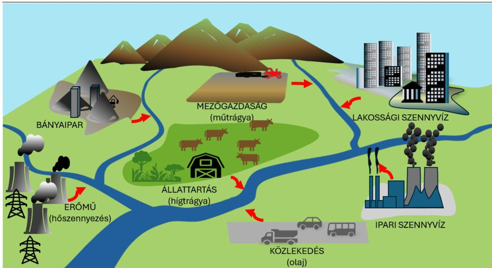

Forrás: ÁSZ saját szerkesztés

---

Az ellenőrzés nem terjedt ki a lakossági és mezőgazdasági eredetű, továbbá a diffúz szennyezések megelőzéséhez köthető eljárásokra, illetve a határon túlról érkező szennyezésekkel összefüggő nemzetközi együttműködések rendszerének értékelésére.

Az ellenőrzött, és az ellenőrzést támogató szervezeteket a II. számú melléklet tartalmazza.

---

# ÖSSZEFOGLALÁS 

„A szennyezés elleni fellépés mellett egyértelmü gazdasági érvek szólnak, a társadalom számára jelentkező elönyök pedig messze felülmúlják a költségeket, ahogy a tétlenség költségei is rendkivüli mértékben meghaladják a cseleksés költségeit.""

A víz az emberi élet létfontosságú eleme, társadalmi, ökológiai és gazdasági érték. Magyarországon a vízzel, mint környezeti elemmel való fenntartható gazdálkodás a vízkészletünk jelenlegi célokra történő felhasználását és kezelését jelenti anélkül, hogy veszélyeztetné a jövő generációjának azon képességét, hogy kielégítse szükségleteit. Mivel a vízhiány és a túlszennyezett víztestek a jövőben a gazdasági növekedés korlátozó tényezőjévé válhatnak, a fenntartható vízgazdálkodás egyik fontos eleme a környezeti egyensúly fenntartása a gazdasági fejlődés biztosítása mellett.

A vízszennyezés megelőzésére kialakított, de a jogalkotási folyamat jellegzetességei miatt az iparfejlődésre lassan reagáló jogszabályi környezet alkalmazását kapacitáshiányos intézményrendszer végezte, ennek ellenére tevékenysége hozzájárult az elővigyázatosság és a megelőzés elvének érvényesítéséhez. A szennyező fizet elvének gyakorlati alkalmazásában korlátokat jelentettek a pénzügyi ösztönzők hatékonysági hiányosságai. A vízszennyezés megelőzése és intézményrendszere fejlesztésének stratégiai irányait egyes szakpolitikai területeken összehangoltan, más területeken nem, vagy a környezeti elemek védelmének érvényesítése nélkül határozták meg a környezetvízvédelemért felelős irányító szervek.

A kialakított jogszabályi környezet nem biztosította a környezetvédelmi alapelvek érvényesítését. A BM ipari eredetű vízszennyezés megelőzése és csökkentése érdekében végzett jogszabályalkotási tevékenysége nem volt eredményes.

Csökkentette az ipari eredetű vízszennyezés megelőzésének eredményességét az új típusú szennyező anyagokra, technológiai kibocsátásokra vonatkozó határértékek hiánya, a vizek mennyiségi és minőségi védelméért való felelősség szétválasztása, a befogadó víztest terhelhetőségének állami oldalról történő vizsgálatáért való felelősség egyértelmű meghatározásának hiánya. Az irányítási felelősség megosztottsága és változásai kockázatot jelentenek az egységes irányítási szempontok érvényesülésére, az irányítási tevékenység hatékonyságára és célszerűségére. A VIZIG ${ }^{3}$-ek hatósági vagy a víziközműszolgáltatókhoz hasonló ellenőrzési jogkörrel, jogosítvánnyal nem rendelkeztek. Az állami vagyon megőrzési és megóvási kötelezettség érvényesítése érdekében a VIZIG-ek számára biztosított jogi eszközök nem tették lehetővé a vagyonkezelői hozzájáruló nyilatkozatban esetlegesen előírt határérték betartatásának közvetlen ellenőrzését és felügyeletét, csökkentve ezzel a megelőzés elvének érvényesítését.

Az ÁSZ ellenőrzés az ipari eredetű vízszennyezések megelőzésére és csökkentésére irányuló állami intézkedések eredményességére helyezte a hangsúlyt. Az ÁSZ értékelte a kialakított vízminőség védelmét szolgáló keretrendszert a környezetvédelmi alapelvek (elővigyázatosság, megelőzés, szennyező fizet elv) érvényesülése szempontjából (2. ábra).

[^0]
[^0]:    ${ }^{3}$ Európai Bizottság közleménye az Európai Parlamentnek, a Tanácsnak, az Európai Gazdasági és Szociális Bizottságának és a Régiók Bizottságának, Bolygónk egészségessé tétele mindenki számára, Uniós cselekvési terv: „Út a szennyezőanyag-mentes levegő, víz és talaj felé" 1. Bevezetés 6. bekezdése (https://eur-lex.europa.eu/legalcontent/HU/TXT/HTML/?uri=CELEX:52021DC0400)

---

# A VÍZMINŐSÉG VÉDELMÉT SZOLGÁLÓ KERETRENDSZER ÉRTÉKELÉSE 

## ERŐSSÉGEK

- Uniós előírásokhoz képest szigorúbb határértékrendszer
- Veszélyes üzemek felügyelete
- Egységes környezethasználati engedélyezési eljárások integrált szemlélet
- Szakhatósági eljárások rendszere
- Próbaüzem intézménye
- Társhatósági és összevont hatósági ellenőrzések

## GYENGESÉGEK

- Az irányító szervet támogató vízügyi kutató háttérintézet hiánya
- Állami tulajdonban lévő víztestek vagyonkezelő szervezetei vagyonmegőrzési és -megóvási kötelezettségének korlátai
- Szervezetrendszer elégtelen tárgyi, humánerőforrás kapacitása, leterheltsége, területi eloszlása, bérszínvonala
- Laboratóriumok száma, elégtelen tárgyi- és humánerőforrás kapacitása
- Ellenőrzési tervet megalapozó kockázatelemzések hiánya
- Ismert és potenciális vízszennyezők nyilvántartásának hiánya
- Az önellenőrzési mintavételek ütemezésének és a hatósági ellenőrzések időpontjának előzetes ismerete
- A víziközmú-szolgáltatók szúrópróba-szerű ellenőrzései eredményességének korlátai
- A bírságok visszatartó erejének hiánya
- Stratégiai környezeti vizsgálat hiánya az iparstratégiák esetében
- Közvetlen, ipari eredetű vízszennyezés megelőzését célzó stratégiai célkitűzések hiánya
- Stratégiai szintű fejlesztési tervek hiánya
- Megosztott irányítás

## LEHETŐSÉGEK

- Vízügyi kutató háttértámogató intézeti kapcsolat kialakítása
- Közműszolgáltatók
laborkapacitásainak kihasználása
- Vízvédelmi alap vagy célelőirányzat létrehozása
- Pénzügyi garancia, biztosíték, céltartalékképzés előirása
- Vízvédelmi technológiai beruházások ösztönzése
- Adatbázisok teljes körű összekapcsolása, integrálása
- Stratégiai szemléletű engedélyezési folyamat kialakítása
- Részvétel erősítése a nemzetközi K+F programokban

## VESZÉLYEK

- Új típusú szennyező anyagok, technológiai kibocsátásokra vonatkozó határértékek hiánya
- A befogadó víztest terhelhetőségének állami oldalról történő vizsgálatáért való felelősség egyértelmű meghatározásának hiánya
- Ipari vízgazdálkodás stratégiai szemléletű megközelítésének hiánya
- A környezet- és vízpolitika, valamint az iparpolitika közti egyensúly hiánya

---

A vízügyi, vízvédelmi hatóságok humánerőforrás kapacitása nem igazodott az ellátandó feladatok mennyiségéhez és nem követte le az ipari szereplők területi eloszlását, így nem volt biztosított a hatékony területi jelenlét. Az ipari létesítmények által kibocsátott szennyvíz, valamint a benne lévő szennyező anyagok mennyiségi és minőségi mérése érdekében kialakított önellenőrzési rendszer nem biztosította teljeskörűen az ipari létesítmények valós vízszennyezés mértékének megállapítását és csökkentette a víziközműszolgáltatók ellenőrzési tevékenységének eredményességét. Amennyiben az önellenőrzési rendszer változatlan formában múködik tovább, úgy fennáll annak a kockázata, hogy a szennyező ipari üzemek nem, vagy nem arányos mértékben fizetik meg az általuk okozott környezeti károk költségeit, valamint a jogkövető magatartás kikényszerítése érdekében történő hatósági beavatkozások elmaradása miatt közvetett módon sérülhet az ivóvízbázisok minősége. A laboratóriumok fejlesztései elmaradtak, így azok korszerű felszereltségének hiánya korlátot jelentett a szennyezések megelőzésében és feltárásában is. A fejlesztések elmaradása miatt fennáll a kockázata annak, hogy egyes szennyezőanyagok koncentrációja vagy új típusú vízszennyező anyagok szennyezési mértéke mérését a laboratóriumok nem képesek elvégezni, ezáltal olyan szennyezőanyagok is kerülhetnek a víztestekbe, amik veszélyeztetik az ökoszisztémát és az ivóvízbázisokat.

A szervezetrendszer feladatellátását több adatbázis támogatta, azonban a legnagyobb informatikai adatbázisok összekapcsolása nem történt meg. Az adatbázisok az ipari létesítmények által okozott, engedélyezettnél nagyobb mértékủ vízszennyezések azonnali jelzésére nem voltak alkalmasak, elsősorban az előirások betartásának utókövetését biztosították, a hatósági döntéshozatalt és az irányítási tevékenységet közvetetten, a trendek/tendenciák azonosításával támogatták.

A kialakított finanszírozási és ösztönző rendszer nem támogatta a fenntartható ipari vízgazdálkodást, nem késztette az ipari szereplőket a vízszennyezés és környezetkárosítás megelőzésére és nem ösztönözte az ipari szennyvíz tisztításának és kezelésének technológiai fejlesztését, a víztakarékos technológiák és a használt víz újrahasznosítását támogató beruházások elterjedését.

A környezet- és vízpolitika, valamint az iparpolitika közti egyensúly megteremtését gátolta az, hogy hiányzott az ipari vízgazdálkodás stratégiai szemléletű megközelítése.

Nemzetközi és hazai szinten több jelentős, környezet- és vízvédelmet pozitívan érintő változás történt 2024-ben. Az ipari kibocsátásokról szóló 2010/75/EU uniós irányelv módosításai szigorították az akkumulátorgyártási tevékenység megkezdéséhez szükséges környezetvédelmi engedélyezés folyamatát, amit a hazai jogrendbe az $\mathrm{EM}^{4}$ átültetett és hatályba léptetett. A nem lakossági felhasználók víz- és csatornadíjai átlagosan két-, háromszorosra emelkedtek 2024. év elején, ami a vízigény csökkentésére, a használtvíz újrahasznosítására, továbbá új szennyvíztisztítási technológiákba való beruházásokra ösztönözheti az ipari vállalkozásokat. A 2024-ben elfogadott Magyarország versenyképességi stratégiában már megjelenik stratégiai célként a környezetvédelmi gondolkodásmód térnyerése a járműiparban, illetve általános fejlesztési célként a környezettudatos és fenntartható építőipar. Jelentős változást hozott a 2024-ben lezajlott évközi ágazati átalakítás, miszerint a $\mathrm{BM}^{5}$-től az EM-be került az állami vízgazdálkodási és vízvédelmi feladatok ellátása és a kapcsolódó intézmények (szakmai) irányítása. Az ágazati átalakítás hozzájárul a magasabb szintű integrált szemlélet, valamint a célszerúségi szempontok érvényesüléséhez a szervezetrendszer kialakításában. A vízügyi, vízvédelmi hatóságok a katasztrófavédelmi szervezetrendszerből a kormányhivatalokba integrálódtak, míg azok középirányítói tevékenységét ellátó BM OKF ${ }^{6}$ feladatát az EM látja el. Amennyiben a jogalkotó új középirányítót nem jelöl ki, vagy az irányító szerveztén belül középirányítói szintű feladatok ellátását végző szervezeti egységet nem alakít ki, úgy fennáll annak a kockázata, hogy a korábbi középirányító által kialakított jó gyakorlatok továbbvitele és fejlesztései elmaradnak és az országosan egységes irányítás szempontjai nem fognak érvényesülni.

---

# AZ ELLENŐRZÉS FÓKUSZTERÜLETEI 

1- Az ipari eredetű vízszennyezés megelőzése és csökkentése keretrendszerének kialakítása, valamint a vízszennyezés megelőzése és csökkentése érdekében tett intézkedések eredményessége

2- A hazai víztestek legalább jó állapotának elérését, fenntarthatóságát célzó finanszírozási és ösztönzési rendszer, valamint a stratégiai és irányítási fejlesztési tervek az ipari eredetű vízszennyezés megelőzésének tükrében

---

# MEGÁLLAPÍTÁSOK 

## 1. Az ipari eredetű vízszennyezés megelőzése és csökkentése keretrendszerének kialakítása, valamint a vízszennyezés megelőzése és csökkentése érdekében tett intézkedések eredményessége

| Összegző megállapítás | A kialakított jogszabályi környezet nem biztosította az elővigyázatosság, a megelőzés és a szennyező fizet környezetvédelmi alapelvek érvényesítését, valamint vízvédelem szempontjából nem reagált rugalmasan az ipari technológiák fejlődésére, az iparszerkezet változására. Az irányítás megosztottsága, valamint a szervezetrendszer tárgyi és humánerőforrás kapacitásának hiányosságai ellenére a középirányítói és hatósági feladatellátás, továbbá az adatbázisok fejlesztése érdekében tett intézkedések hozzájárultak az ipari eredetű vízszennyezés eredményes megelőzéséhez, csökkentéséhez. Az ellenőrzési, felügyeleti feladatellátás hatékonyságát csökkentette a kockázatalapú tervezés és azt támogató adatbázisok információi tervszerű felhasználásának hiánya. A környezetvédelmi és vízjogi engedélyezési eljárásokban összességében nem érvényesült az ipari víggazdálkodás stratégiai szemlélete. |
| :--: | :--: |

## JOGI KERETRENDSZER

A jogalkotó - a vonatkozó uniós joggal összhangban - a Kvtv. ${ }^{7}$-ben és Vgtv. ${ }^{8}$-ben meghatározta a vizek mennyiségi és minőségi védelmének alapvető jogszabályi kereteit.
A környezet és annak védelme nélkül más értékek - különösen az élet, az egészség - védelme sem lehetséges. Magyarország Alaptörvényének XX. cikke szerint mindenkinek joga van a testi és lelki egészséghez, amelynek érvényesülését Magyarország többek között a környezet védelmének biztosításával segíti elő. Az Alaptörvény ${ }^{9}$ XXI. cikk (2) bekezdése a szennyező fizet elvét rögzíti azáltal, hogy az, aki a környezetben kárt okoz, köteles azt helyreállítani vagy a helyreállítás költségét viselni. Az Alaptörvény 38. cikk (1) bekezdése szerint az állam és a helyi önkormányzatok tulajdona nemzeti vagyon, amely kezelésének, megőrzésének és védelmének egyik célja a természeti erőforrások megóvása, valamint a jövő nemzedékek szükségleteinek figyelembevétele. Az Alaptörvény rendelkezéseit, illetve az azokkal összefüggésben - elsősorban az $\mathrm{AB}^{10}$ határozatokban - kidolgozott követelményeket tekinthetjük a környezetjog alkotmányjogi alapjainak, ugyanakkor maga az egészséges környezethez való jog úgy is értelmezhető, mint a környezetvédelmi szabályozási alapelv. A hivatkozott AB határozatok előtérbe helyezik a megelőzést és kimondják, hogy az egészséges környezethez való jog védelmének eszközei között a megelőzésnek elsőbbsége van.

---

A törvényi felhatalmazás adta keretek között a vizek hasznosításával, védelmével, az ipari tevékenységekkel összefüggő részletszabályokat számos kormányrendelet, valamint miniszteri rendelet határozta meg. Az ellenőrzés területét szabályozó releváns jogszabályok rendszerét a 3. ábra (bővebben a IV. sz. melléklet) mutatja be.
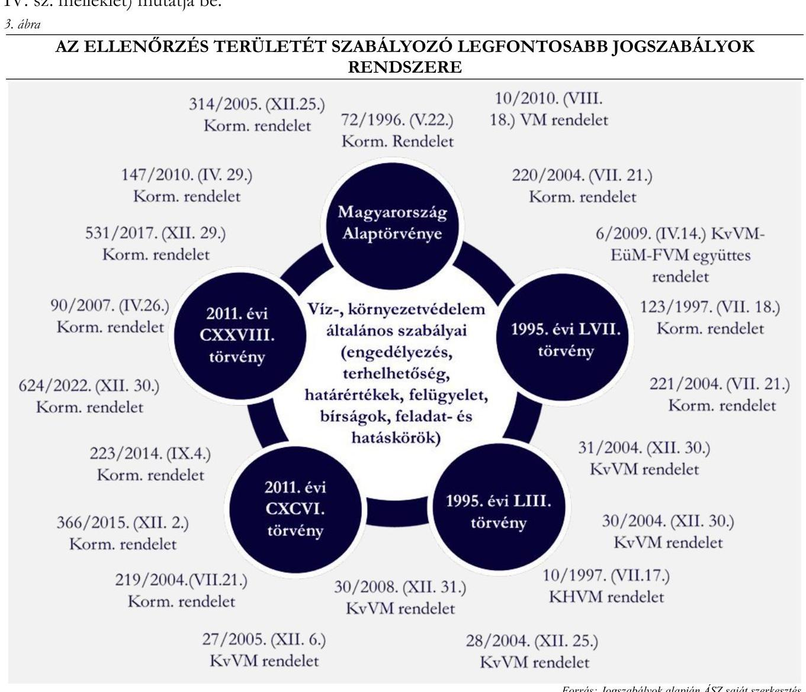

# I. Jogalkotási tevékenység 

Az ellenőrzött időszakban hatályos, az ipari eredetű felszíni és felszín alatti vízszennyezés megelőzésével, csökkentésével összefüggő jogszabályok koherens rendszert alkottak. Az ellenőrzött időszakban a vízgazdálkodásért való felelősség hatáskörében a BM nem tett új jogszabály megalkotására javaslatot, ugyanakkor előkészített jogszabálymódosítást, amely elfogadására azonban az ellenőrzött időszakban nem került sor. A szervezetrendszer tapasztalatain alapuló, vízvédelmet érintő jogszabálymódosító javaslatok nem épültek be a jogszabályi környezetbe, vízminőségi káresemények tapasztalatai - elemzések hiányában - nem támogatták a jogalkotási tevékenységet, így nem járulhattak hozzá az ipari eredetű vízszennyezés jogi keretrendszer útján történő megelőzéséhez.
A BM feladatkörébe tartozott többek között a vízminőséget, vízvédelmet meghatározó szabályozás kialakítása, az uniós jog implementálása, valamint az ipari kibocsátásokkal összefüggő jogszabályalkotás.

---

A BM OKF, valamint az $\mathrm{OVF}^{11}$ az ellenőrzött időszakban indoklással alátámasztott jogszabálymódosító javaslatokkal, féléves gyakorisággal készített összefoglalókkal támogatta a BM feladatellátását. A javaslatok többsége a vízkészlet-gazdálkodáshoz kapcsolódott, valamint technikai jellegűek voltak. Az ipari vízszennyezés megelőzésével közvetlenül összefüggő javaslatok közül kiemelhető a határértékek felülvizsgálatára tett javaslatok, illetve a VIZIG-ek szakértőként (vagyonkezelőként) történő bevonása a vízügyi hatósági és szakhatósági eljárásokba. A szabályozási környezet az ellenőrzött időszakban jelentős, érdemi változtatáson nem esett át. A jogszabálymódosítások jellemzően technikai jellegűek voltak, míg a releváns javaslatok nem épültek be a jogszabályi környezetbe, így a középirányítók jogszabálymódosító javaslatai nem járulhattak hozzá az ipari eredetű vízszennyezés megelőzéséhez és csökkentéséhez.
A vízgazdálkodást érintően a VGT2 ${ }^{12}$-ben megfogalmazott 48 db szabályozási javaslat közül a 2015-2021. évek között 5 db valósult meg, melyből 1 db - A monitoring fejlődése, az új monitoring-irányok beillesztése - kapcsolódott közvetett módon jelen ÁSZ ellenőrzés témájához.
Az OVF heti rendszerességgel számolt be a vízminőséget érintő káreseményekről a BM felé. A BM nem készített ezekről összefoglalókat, elemzéseket, így a vízminőségi káresemények tapasztalatainak jogalkotási tevékenységben való hasznosítására nem alakítottak ki keretet.
A szabályozási környezet nem volt reziliens. A gazdasági és ipari szerkezetet, valamint a természeti környezetet érintő változásokat a jogalkotó felismerte, azonban a jogalkotási folyamat időigénye miatt arra a jogi keretrendszer nem tudott rugalmasan reagálni. Amennyiben nem alakul ki a jogalkotót támogató stabil vízügyi kutatóbázis, úgy fennáll annak a kockázata, hogy a jogszabályokban nem nevesített és határértékkel nem szabályozott új típusú szennyezőanyagok hosszabb ideig, a természet öntisztuló képességét meghaladó mennyiségben kerülnek be a víztestekbe, veszélyeztetve ezzel az ökoszisztémát és közvetett módon az emberi egészséget.
A hazai jogszabályok, így az ipari kibocsátásokra vonatkozó jogszabályok alapját az uniós irányelvek előírásai alapján dolgozta ki a jogalkotó az ellenőrzött időszakot megelőzően. A kodifikálás során azonban figyelemmel kellett lenni a hazai sajátosságokra, technológiai és iparági változásokra.
Előrelépést jelentett az a jogszabálymódosítás, mely alapján egyes villamosberendezés gyártási tevékenységek engedélyezése során környezetvédelmi szempontból szigorúbb eljárást kell követni 2024. szeptemberétől.
A villamos berendezés gyártási tevékenységnél tapasztalható iparági változásokat lekövető, vízminőségvédelmi szempontú új, vízminőségi határértékeket érintő szabályozás nem lépett hatályba az ellenőrzött időszakban. A jogalkotási eredmények alapján a szabályozási környezet nem alkalmazkodott rugalmasan sem a technológiai fejlődés üteméhez, sem a gazdasági, ipari szerkezet változásához.
Előrelépést jelentett az, hogy a jogalkotók, felismerve a gazdasági és ipari szerkezetet, valamint a természeti környezetet érintő változásokat és - összhangban az ipari kibocsátásokról szóló irányelv módosításával -2023-ban megkezdték a környezet- és vízminőségvédelmi jogalkotási munkát. Ennek nyomán az EM felelősségi körében a környezetvédelmi hatósági engedélyezési eljárások során 2024. szeptember 29-től kötelezővé tette a környezeti hatásvizsgálati eljárás lefolytatását valamennyi akkumulátor, illetve akkumulátor részegység gyártása tekintetében. A környezetvédelmi engedélyezési eljárás szabályozásának módosítása megteremtette az egységes hatósági gyakorlatot és kiszámíthatóbb eljárást tett lehetővé, kizárta az eltérő jogértelmezés lehetőségét, hozzájárulva ezzel a környezetvédelmi célkitűzések elérésének eredményességéhez és a lakosság egészségének védelméhez. Ezzel párhuzamosan a BM is megkezdte az új, jogszabályban még nem szereplő szennyező anyagokra vonatkozó határértékek kidolgozását.

---

A jogszabályban még nem rögzített szennyező anyagok, technológiai kibocsátások megjelenése esetén a hazai jogalkotást gátolta a tudományos-kutató háttér hiánya.
A jogalkotási tevékenységet nehezítette az a körülmény, hogy a BM kutatási, tudományos háttere leszűkült a VITUKI ${ }^{13}$ 2012. évi megszüntetésével. Stabil vízügyi kutatóbázis hiányában, amennyiben egy új üzem új - kibocsátási határértékkel még nem szabályozott - gyártási technológiával jelenik meg, a kibocsátási határértékek meghatározása és szabályozása csak hosszas kutatómunka után lehetséges.

# II. Feladatok és hatáskörök, szervezetrendszer 

A jogi keretrendszer - terhelhetőségi vizsgálat egyértelmú szabályozásának kivételével biztosította a szervezetrendszer tagjai feladat- és hatásköreinek szétválasztását, egyúttal megosztott irányítási felelősséget eredményezett. A szakhatósági eljárások rendszere támogatta az integrált szemlélet érvényesülését.
A jogalkotó kijelölte a vízügyi igazgatási (OVF és VIZIG -ek), és a vízügyi, valamint a vízvédelmi hatósági feladatokat ellátó szerveket (BM OKF és kijelölt VMKI ${ }^{14}$-k), a vízvédelmi igazgatási szerveket (OVF, VIZIG-ek, BM OKF, VMKI-k), a környezetvédelmi hatósági szerveket (VMKH ${ }^{15}$ ), illetve a szervezetrendszer szakmai irányítóit (BM, EM), valamint középirányító szerveit (BM OKF, OVF) és meghatározta azok feladatait (VII. sz. melléklet).
A kijelölő, valamint a feladat- és hatásköröket meghatározó jogszabályi környezet, ezen belül elsősorban a szakhatósági eljárások rendszere támogatta a környezetvédelmi, valamint a vízügyi és a vízvédelmi szervek integrált szemléletű feladatellátását. Az IED-irányelv ${ }^{16}$ alapján a környezetre legkockázatosabb tevékenységeket szabályozó EKHE ${ }^{17}$ esetén fokozottan érvényesült az integrált szemléletű feladatellátás.
Az irányítási felelősség megosztottsága és változásai kockázatot jelentenek az egységes irányítási szempontok érvényesülésére, az irányítási tevékenység hatékonyságára és célszerűségére. Az ellenőrzött időszakban mind a vízügyi és vízvédelmi, mind a környezetvédelmi szakterületet irányítási megosztottság jellemezte (4. ábra). A megosztottság megfigyelhető volt az igazgatási és hatósági feladatok szétválasztásában, a laboratóriumok, valamint a víziközmű-szolgáltatók irányításában is. Az ellenőrzött időszakban a vizek mennyiségi és minőségi védelméért való felelősség szétválasztása korlátozta az integrált szemlélet egy szervezeten belüli érvényesíthetőségét, ezáltal nem támogatta az ipari vízszennyezés megelőzésének eredményességét.

---

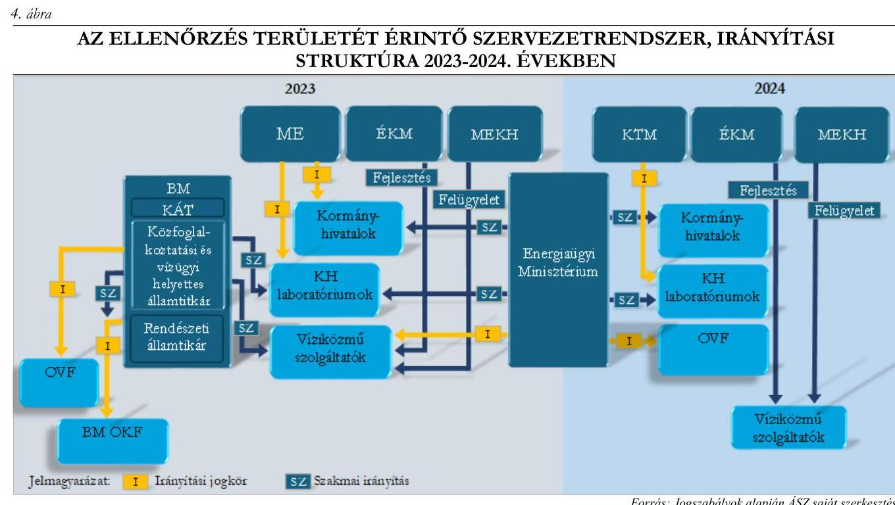

A jogszabályok és közjogi szervezetszabályozó eszközök 2023. év végén hatályos rendelkezései alapján a BM szervezetrendszerében - egymástól elkülönítetten működött a katasztrófavédelem általános és annak szervezetrendszerén belül elhelyezkedő vízügyi szakterület szakmai irányítása. A BM OKF és területi szervek általános irányítási feladatait a RÁT ${ }^{18}$, a vízügyi és vízvédelmi hatóságok szakmai felügyeletét a BM Közigazgatási Államtitkárságán belül elhelyezkedő KVHÁT ${ }^{19}$ látta el. A KVHÁT látta el közvetlenül az OVF és területi szervei általános és szakmai irányítási feladatait is. Az irányítás megosztottsága mellett a jogalkotó a végrehajtó szervek között a vizek mennyiségi, valamint minőségi védelméhez köthető feladatokat is felosztotta, ezzel csökkentve az integrált szemlélet ágazati szintű érvényesülését.
A környezetvédelmi szakterület irányítószerve többször változott az ellenőrzött időszak alatt. 20192022. években az $\mathrm{AM}^{20}$, 2022-ben fél éven keresztül a $\mathrm{TIM}^{21}$ látta el ezt a feladatot, majd 2022. decemberétől az EM vette át az ágazat irányítását. A vízügyi és vízvédelmi szakterület mellett a környezetvédelmi szakterület esetében is azonosítható volt a megosztott irányítás. A környezetvédelmi hatósági feladatokat ellátó kormányhivatalok általános szakmai irányítása 2023. év végén az EM feladatkörébe tartozott, míg a működés, funkcionális irányítás, erőforrásgazdálkodás a $\mathrm{ME}^{22}, 2024$-től a $\mathrm{KTM}^{23}$ feladatát képezte. Az EM szakmai feladatai kiterjedtek a kormányhivataloknál lefolytatott - a minisztérium felelősségi körébe tartozó - környezetvédelmi hatóságokat érintő átfogó ellenőrzésekre, amelyeket a ME koordinált.
Mind a vízvédelem, mind a környezetvédelem területéhez szervesen kapcsolódó regionális környezetvédelmi laboratóriumként kijelölt kormányhivatalok is megosztott irányítás alatt álltak. Míg az általános, funkcionális irányítási jogkör a ME-hez, addig a szakmai irányítási jogkörök 2019-2023. évek közötti időszakban a $\mathrm{FEVI}^{24}, \mathrm{FAVI}^{25}$ vízmonitoring tekintetében a BM-hez tartoztak, a környezetvédelem esetében az - AM és a TIM után - EM gyakorolta a törvényességi és szakszerűségi ellenőrzési hatáskört, valamint koordinálta a fejlesztéseket 2022. decemberétől.

---

A víziközmú-szolgáltatók esetében is azonosítható volt a feladatmegosztás az egyes minisztériumok között. Az ellenőrzött időszakban a víziközmű-szolgáltatók irányításában szerepet játszott 2022. májusáig az ITM, ezt követő fél éven keresztül a TIM, majd jogutódjaként 2022. decembertől az EM és 2024. júliusig a vízgazdálkodás tekintetében a BM, illetve felügyeletet gyakorolt a MEKH ${ }^{26}$. Az ÉKM ${ }^{27}$ volt felelős a víziközmű-szolgáltatókat érintő beruházások szabályszerű és hatékony végrehajtásáért, a végrehajtás nyomon követéséért.
A szervezetrendszer együttmúködésének kereteit a jogszabályok alapvetően biztosították. A szervezetrendszer hatékony együttmúködését nehezítette a szervezetek közötti feladatmegosztás, a hatóságok, laboratóriumok és víziközmú-szolgáltatók eltérő területi illetékességei, hatáskörei, illetve az együttmúködést részletesen szabályozó belső eljárásrendek hiánya.
Az érintett szervezetek területi illetékességeit az 5. ábra mutatja. A 12 db vízügyi igazgatási szerv (VIZIGek) illetékessége a vízgyűjtő területekhez illeszkedett. A katasztrófavédelem 20 területi igazgatósága közül 12 rendelkezett vízügyi, vízvédelmi hatáskörrel, melyek megegyeztek a VIZIG-ek illetékességi területeivel. A környezetvédelmi hatóságok illetékességi területe a 19 területileg illetékes kormányhivatal szerint volt kialakítva, míg a kormányhivatalokon belül múködő 7 db regionális környezetvédelmi laboratórium illetékessége több megyére is kiterjedt. Mindezek mellett országos szinten 35 víziközmú-szolgáltató fogadott be ipari eredetű szennyvizet.
A BM OKF, továbbá egyes Kormányhivatalok eljárásrendjei nem tartalmaztak részletes rendelkezéseket a más szervezetekkel való együttmúködésre, ami - figyelemmel a megosztott hatósági feladatellátásra hátráltatta az információáramlást.

---

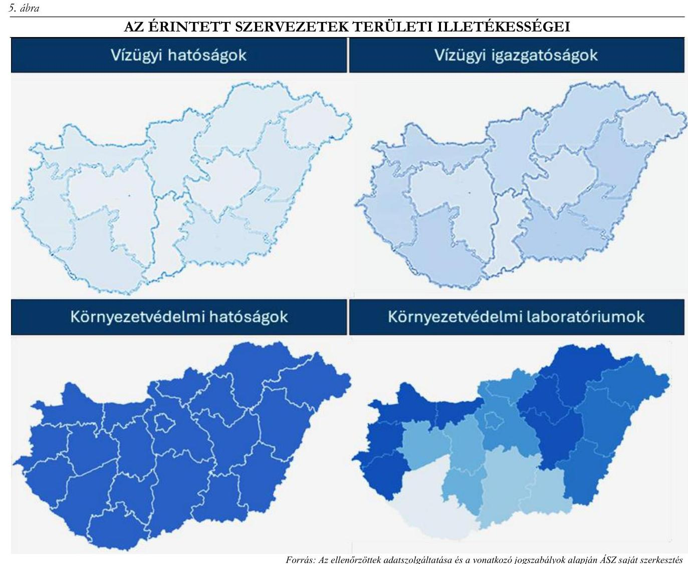

A 2024. évben végbement szervezeti változások az irányítási felelősség koncentrációját jelentették.
A jogalkotó a kormánytagok egyes feladat- és hatásköreinek átcsoportosításával ágazati átalakítást hajtott végre irányítói szinten. Ezzel megteremtette a magasabb szintű integrált szemlélet, valamint a célszerűségi szempontok érvényesülésének e tekintetben szükséges feltételeit. Az átalakítás eredményeként csökkent a szervezetrendszer irányítási megosztottsága. A víziközmű-szolgáltatással összefüggő feladatokon túl a környezet minden elemének védelme, így a vízvédelmi feladatok irányítása is az EM-nél összpontosultak. Az irányítóváltással a vízügyi és vízvédelmi hatósági szervezetrendszer is átalakult. A vízügyi és vízvédelmi hatósági feladatok a katasztrófavédelmi szervezetrendszerből - azonos illetékességi területtel - a kormányhivatalokhoz kerültek. A környezetvédelmi és vízügy/vízvédelmi feladatok kormányhivatali struktúrába helyezése tovább erősítette az integrált szemlélet érvényesülését, ugyanakkor az új szervezeti struktúrába a korábbi középirányító szint nem épült be. A középirányító szint hiánya kockázatot hordoz a korábban kialakított jó gyakorlatok - pl. képzés, módszertanok, eljárásrendek, egységes jogértelmezés kialakítása - továbbvitele és fejlesztése tekintetében.
Az engedélyezési folyamatokban a szakhatósági vélemények, azaz a környezetvédelmi és vízvédelmi szempontok beépülése biztosított volt. Az engedélyezési eljárás lefolytatásában illetékes hatóság felelőssége volt koordinálni és együttműködni az ügyben érintett szakhatóságokkal. A különböző

---

hatóságok belső eljárásrendjeiben megjelentek a szakhatósági eljárásokban követendő együttműködés előírásai, ezek a jogszabályi rendelkezések leképezését jelentették további részletezés nélkül.

# III. Irányítási tevékenység 

Az irányítószervi döntések megalapozásához rendszeres beszámolók álltak rendelkezésre, ugyanakkor az irányító szervek nem készítettek ismétlődő jelleggel elemzéseket a döntéshozatal hatékonyságának támogatására.
A vízügyi, vízvédelmi hatósági engedélyezési eljárásokhoz, ellenőrzési/felügyeleti feladatellátáshoz egységes jogértelmezést támogató irányítószervi útmutatót, módszertant, ajánlást nem adott ki a BM az ellenőrzött időszakban. Jogszabályokban nem nevesített szennyező anyagok, új technológiai kibocsátásokból származó vízszennyező anyagok esetében a BM a hatósági feladatellátást nem támogatta egységesen alkalmazandó, követendő eljárásokra irányuló tájékoztatóval, ajánlással, iránymutatással. A BM egyedi ügyekhez eseti jelleggel készített vagy készíttetett elemzéseket a döntések megalapozásához.
A BM irányítási és beszámoltatási tevékenysége az OVF irányába eredményes volt. Rendszeres és eseti beszámolókat kért a vízkár eseményekről, a felszín alatti és a felszíni vizeket érintő éves monitoring terv végrehajtásáról, a Nitrát-jelentésről és hatéves ciklusokban a VGT ${ }^{28}$ szerinti állapotértékelésekről. Javaslatokat kért a jogszabálymódosításhoz, a vízgazdálkodási fejlesztések prioritásának meghatározásához. A BM kérésére a BM OKF - jellemzően egyedi ügyekről - rendszeres és eseti beszámolókat készített, azonban az irányítói döntések megalapozásához nem írt elő vízügyi és vízvédelmi éves szintű engedélyezési, ellenőrzési folyamatokat és tapasztalatokat tartalmazó elemzések készítésére vonatkozó feladatot.
A BM számára további megalapozó információkat adott évente két alkalommal az $\mathrm{OVT}^{29}$, ahol összefoglaló tájékoztatást adott a BM OKF a hatósági ügyekről és az éves tevékenységéről.
Tekintettel arra, hogy a katasztrófavédelmi szervezetrendszert a RÁT irányította, a KVHÁT számára a vízügyi/vízvédelmi hatóságok szakmai irányítása nehézségekbe ütközött.
A környezetvédelmi hatóságok esetében a jogszabályok középirányító szervet nem jelöltek ki, így a feladatellátás összehangolása az irányítószervre hárult. Az EM meghatározta a 2023. évi ellenőrzési program sarokpontjait, ezzel irányt mutatott az ellenőrzési tevékenység területén a környezetvédelmi hatóságoknak. Az akkumulátorgyártás környezetkárosító kockázatainak csökkentése érdekében 2023. év végén a BM OKF-fel együttműködve szakmai útmutatót készített, valamint a létesítés és működés engedélyezésének eljárási folyamatábráját kiadta. Mindemellett negyedéves gyakorisággal iránymutatást adott a hatóságoknak és lehetőséget biztosított a tapasztalatok megosztására, illetve részt vett a ME irányításával végrehajtott kormányhivatali átfogó ellenőrzésekben. A döntések megalapozásához az EM nem írt elő környezetvédelmi éves szintű engedélyezési, ellenőrzési folyamatokat és tapasztalatokat tartalmazó összefoglalók készítésére vonatkozó feladatot, országos szintű jelentések, elemzések, értékelések nem készültek. A környezetvédelmi hatóságok - középirányító hiányában - nem rendelkeztek országos szintű, egységes eljárásrendekkel, módszertanokkal, útmutatókkal, ami kockázatot jelent az egységes engedélyezési, ellenőrzési döntéshozatalra, jogértelmezésre, továbbá a mérlegelési lehetőséget jelentő esetekben az azonos szemlélet kialakítására.

---

Jó gyakorlatként kiemelhető, hogy a Somogy VMKH a szervezeti egységek közti szakhatósági együttműködést is szabályozta, illetve egyes kormányhivatalok (Csongrád-Csanád VMKH, Bács-Kiskun VMKH, Békés VMKH, Jász-Nagykun-Szolnok VMKH, Hajdú-Bihar VMKH) a hatósági feladatellátás során felmerülő környezetvédelmi ügyet érintő szakkérdés vizsgálatára irányulóan ötoldalú együttműködésre alakítottak ki gyakorlatot.

A vízügyi, vízvédelmi hatóságok középirányítója, a BM OKF feladatellátásával biztosította az egységes irányítási szempontok érvényesülését, illetve a korábbi tapasztalatokra épülő, egységes tudásmegosztást.
A BM OKF az engedélyezési, ellenőrzési, szakhatósági eljárásokhoz egységes eljárásrendeket készített, melyek mind a 12 területi vízügyi, vízvédelmi hatóságra kiterjedtek. Középirányítóként egységes ellenőrzési nyomvonalakat határozott meg, módszertani útmutatókat adott ki a bírságolás, engedélyezés, ellenőrzés, szakkérdések vizsgálata, továbbá a kármentesítés területén és ismertette az elvárt hatósági gyakorlatot. A módszertanok jellemzően kitértek a jogalkalmazási tapasztalatok ismertetésére, egyúttal a jogalkalmazási gyakorlat egységesítésére vonatkozó iránymutatásokra. A módszertani útmutatók struktúrája, gyakorlata támogatta az egységes jogalkalmazási gyakorlat kialakítását, a mérlegelési lehetőségekben rejlő kockázatok csökkentését. A BM OKF rendszeresen szervezett hatósági belső képzéseket, melynek keretében a szakterületen dolgozók megosztották gyakorlati tapasztalataikat, megismerték a középirányítószervi ajánlásokat, ami támogatta az egységes eljárási gyakorlat kialakítását, megerősítését. A BM OKF középirányítóként elkészítette az országos ellenőrzési terveket, jóváhagyta az igazgatóságok havi gördülő ellenőrzési terveit, középirányítóként hangsúlyt fektetett a feladatellátás jogszerűségének és szakszerűségének támogatására.

# IV. Határérték/küszöbérték szabályozása, tiltások 

A szennyező anyagok kibocsátásaira vonatkozó küszöb-, illetve határértékeket a jogszabályok rögzítették. Az új típusú szennyező anyagokra, technológiai kibocsátásokra a vízszennyezettségi határértékek alkalmazását előíró jogszabályok nem tartalmaztak előírásokat. Előírt határértékek hiányában a jogalkalmazók korlátozottan tudták érvényesíteni az uniós irányelvekben is rögzített elővigyázatosság és megelőzés elvét.
A felszíni és felszín alatti vizek jó kémiai és ökológiai állapotának eléréséhez és megőrzéséhez vízszennyezettségi határértékek alkalmazását három miniszteri rendelet is előírta. A vízügyi, vízvédelmi hatóság első ízben a tevékenység megkezdésekor, az engedélyezési eljárásban írta elő azokat a határértékeket, amiket az ipari szereplőknek be kellett tartaniuk. Indokolt esetben - pl.: engedély felülvizsgálatakor, ellenőrzés jogkövetkezményeként - a hatóságoknak lehetőségük volt a határértékek módosítására is. A jogszabály határérték és küszöbérték előírásával tett különbséget az ipari szennyvíz kibocsátás azon eseteire, amikor azt közvetlenül a végső befogadó víztestbe vagy közvetetten közcsatornán keresztül a végső befogadó víztestbe vezette az üzem. A határértékrendszer kialakításakor a jogalkotó figyelemmel volt az elsőbbségi, illetve az egyes tevékenységből származó ismert technológiai szennyező anyagokra. Amennyiben új típusú szennyező anyagra, technológiai kibocsátásra a jogszabályok nem tartalmaztak határértékre vonatkozó előírásokat, úgy a hatóságoknak lehetőségük volt egyedi határérték előírására. A VGT3 ${ }^{30}$ keretében a jogszabályi felülvizsgálat során szakértői anyag foglalkozott és tett javaslatot olyan gyártási, termelési - pl.: borászati tevékenységnél alkalmazott - technológiák

---

szennyvízkibocsátási határértékeire, amelyeket külön nevesítetten még nem tartalmaztak a jogszabályok. Ezen javaslatok átvezetése a jogszabályokon azonban nem történt meg.

# Az uniós előírásokhoz képest a hazai határérték rendszer szigorúbb előírásokat alkalmazott. 

Az uniós jogszabályok az elővizi kibocsátásokra határértéket vagy eltávolítási hatásfokot írtak elő. A fix határérték szigorúbb előírást jelent, mint az eltávolítási hatásfok betartása. A magyar hatósági gyakorlat jellemzően nem alkalmazta az eltávolítási hatásfokot, csak a határértéket. Magyarországon a fentieken túl nem csak technológiai, hanem területi határértékek is szerepeltek a jogszabályokban, amelyeket a vízminőség-védelmi területi kategóriák figyelembevételével állapított meg a jogalkotó. Területi határértékek csoportjába tartoztak a tápanyag határértékek, a magyar szabályozás e tekintetben is szigorúbb az uniós irányelvekben megfogalmazottaknál, mert még azoknál a kis szennyvíztelepeknél is megkövetelte a határértékek betartását, ahol az uniós irányelv nem. A szigorúbb területi határértékeket az indokolja, hogy a nyugat-európaihoz képest kevesebb hígítóvíz áll rendelkezésre számos befogadó esetében. Az éghajlatváltozás miatt ez a természetes adottságokból eredő hátrány tovább fokozódik és megmutatkozik az időszakos vízfolyások és állóvizek térnyerésében is.
A veszélyes anyagokkal foglalkozó üzemek eltérő kockázatot jelentettek a felszín alatti vagy felszíni vizekre. A Seveso III. irányelvhez ${ }^{31}$ képest Magyarország szigorúbb szabályokat alkalmazott. A magyar jogrendben külön kategóriát képeztek az alsó küszöbérték negyedét elérő ún. küszöbérték alatti üzemek. A FEVI R. ${ }^{32}$ rendelkezett azon anyagokról, illetve meghatározta azon technológiákból származó anyagok körét, amelyek kibocsátását megtiltotta a jogalkotó. További tiltásokról a vízszennyezettségi határértékek alkalmazását előíró miniszteri rendeletek rendelkeztek.

## V. Engedélyezési folyamatok

Az érintett hatóságok, illetve szakhatóságok (vízjogi, építési, energetikai) egymás közötti hierarchiája, az engedélyezések sorrendje, típusa nem egyértelmúen rögzített a jogszabályokban azokra az esetekre vonatkozóan, amikor a tervezett ipari üzemben ipari víztisztító, szennyvíz előtisztító, szennyvízhálózat létesítését tervezték.
Engedélyezés szempontjából megkülönböztethetünk egyszerűbb (pl. élelmiszeripari), illetve bonyolultabb üzemi (pl. vegyipari) beruházást. Az egyszerű üzemek esetében a gyártási/termelési technológia ismert, ezért az engedélyezési folyamat is egyszerűbb. A bonyolult üzemek esetében a technológiai sajátosságok miatt az engedélyezési eljárásban a környezeti elemek egymásra hatását is figyelembe kell venni.
Az új beruházásoknál számos engedélyezési eljárás jelent meg az ipari létesítmények esetében, mint az építési, vízjogi, környezetvédelmi és - veszélyes anyagokkal foglalkozó üzemek esetében - iparbiztonsági engedély. Környezetvédelmi és vízvédelmi szempontból az ipari tevékenység megkezdésének és folytatásának feltételéül a környezethasználat gyakorlásához a környezetvédelmi hatóság, bármely vízimunka elvégzéséhez, vízilétesítmény megépítéséhez, átalakításához, megszüntetéséhez, vízhasználathoz a vízügyi, vízvédelmi hatóság engedélyének beszerzése volt szükséges. Abban az esetben, ha a tervezett ipari üzemben ipari víztisztítót, szennyvíz előtisztítót, szennyvízhálózatot kellett létesíteni, a jogszabályok nem adtak egyértelmú útmutatást az - építési, vízjogi létesítési, speciális építmény engedélyezési eljárások és a dokumentáció típusok közötti választásra.
Az engedélyezési eljárások a beruházó kérelmére, jogszabályokban meghatározott dokumentáció benyújtásával indultak el. Míg a tervdokumentációk elkészítőjétől a vízjogi engedélyes tervek elkészítésénél a jogszabályok megkövetelték a Magyar Mérnöki Kamara vízimérnöki csoportba tartozó tervezői engedély

---

meglétét, addig a környezetvédelmi dokumentációk szennyvíztisztítási fejezetének elkészítéséhez nem, ez kockázatot jelent a vízvédelem érvényesülésére.

# Környezetvédelmi engedélyezési eljárások 

A környezetvédelmi engedélyezés többlépcsős eljárásból állt (1. táblázat).

## A KÖRNYEZETVÉDELMI HATÓSÁGI ELJÁRÁSOK ÉS ENGEDÉLYEZÉSEK

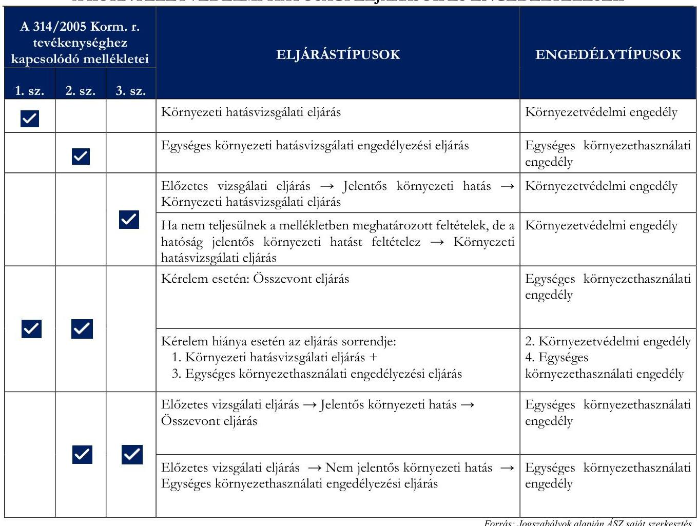

A 314/2005. (XII. 25.) Korm. rendelet 3.§ (1) bekezdése alapján kötelező volt az előzetes vizsgálati eljárás lefolytatása, ha a tervezett tevékenység a rendelet 3. számú mellékletében, vagy ha a 2. és 3. számú mellékletben egyaránt szerepelt. Az eljárás célja volt azt eldönteni, hogy a 3. számú mellékletben szereplő tevékenység is olyan környezeti igénybevételt jelentett-e, amely indokolta részletes környezeti hatásvizsgálati eljárás, illetve egységes környezethasználati engedély iránti eljárás lefolytatását. A fő rendezőelv az volt, hogy a tevékenység jelentős vagy nem jelentős hatást gyakorolt-e a környezetre. Bár a jogszabály meghatározta a környezeti hatások jelentőségének vizsgálatához szükséges adatok és dokumentumok körét, a környezetvédelmi hatóságoknak mérlegelési lehetőségük volt döntéseik meghozatala során. Amennyiben az irányító az országosan egységes döntéshozatal érdekében nem ad ki útmutatót az ország több területén is megjelenő, azonos iparágban, hasonló jellegű tevékenységet végző ipari létesítmények engedélyezési eljárásaihoz, úgy fennáll a kockázata annak, hogy a 19 területileg illetékes környezetvédelmi hatóság eltérő döntést hoz azonos vagy közel azonos környezetvédelmi ügyekben.

---

A környezetre jelentős hatást gyakorló tevékenységek esetében biztosított volt az előzetes konzultáció lehetősége, mely a hatóság tevékenységét is támogatta.
A hatósági eljárások közül a környezeti hatásvizsgálati eljárás célja az, hogy meghatározza a tervezett beruházás környezeti hatásait és a környezethasználat feltételeit a környezetvédelmi engedélyhez.
Környezet-, és vízvédelmi szempontból a legszigorúbb eljárás az egységes környezethasználati engedélyezési eljárás volt. Az eljárásban magas szinten érvényesült az integrált környezet-, és vízvédelmi szemlélet, mivel egyidőben ugyanazon dokumentáció alapján adhatta meg a környezetvédelmi hatóságnak minden érintett hatóság a szakvéleményét, köztük a vízügyi, vízvédelmi hatóság is. Az eljárások közül itt jelent meg először a szennyvíz kezelésének tervezett módja és mennyisége, amire a vízügyi/vízvédelmi hatóság már határértékeket is előírt. A környezetvédelmi hatósági eljárásokban biztosított volt a vízügyi, vízvédelmi hatóságok szakhatóságként történő bevonása, amely támogatta a vízvédelmi szempont érvényesülését.
A környezetvédelmi engedélyeket a beruházás kivitelezését megelőzően, végleges technológiai döntéseket megelőzően benyújtott tervek alapján adták ki a hatóságok. A gyakorlat szerint az ipari szereplők az előzetes vizsgálati eljárásban vízkivételi igényt fogalmaztak meg, noha még nem volt végleges műszaki terv arra, hogy pontosan mennyi vizet fognak kivenni és mennyi szennyvizet bocsátanak ki. Noha a változtatásokat (módosítási kérelem alapján) lekövették az engedélyezési eljárások, azok ismételt lefolytatása többletköltségként jelent meg az állam és a beruházó oldalán egyaránt. Így az egységes környezethasználati engedélyezési eljárás során vízvédelmi szempontból előírt határértékek később, a vízjogi engedélyezési eljárás során módosulhattak.
A környezetvédelmi engedély birtokában már megkezdődhetett az építési engedélyezési eljárás, azt követően pedig a tényleges kivitelezés. Ezen a ponton azonban az ipari szennyvizet befogadó víztest vagyonkezelő, vagy közcsatornába engedés esetében a víziközmű-szolgáltató befogadó nyilatkozata, továbbá a tevékenység folytatásához szükséges víz mennyiségét biztosító vagyonkezelői hozzájárulás még nem állt a beruházó rendelkezésére. Mivel a környezetvédelmi engedély kiadását követően már kérhető és kiadható volt az építési engedély és a beruházás megkezdődhetett, a vízügyi hatóság kényszerhelyzetbe került, különösen, ha az eredeti tervekhez képest jelentősebb (pl. technológiai) változás, gyárbővítés is bekövetkezett. Ebből adódóan lehetőség volt arra, hogy a környezetvédelmi engedélyt nem a végleges kibocsátási paraméterek ismeretében kapják meg az ipari létesítmények.
Az ellenőrzés megállapítása szerint az ipari vízgazdálkodás stratégiai szemléletének érvényesítése érdekében a vízforgalmi ábrát már a környezetvédelmi engedélyezési eljárások dokumentációjának részeként szükséges benyújtani. A jogszabályok nem tették kötelezővé a vízforgalmi ábra elkészítését amely tartalmazza az összes vízvételt, vízkezelést, vízhasználati helyet, a szennyvíz keletkezési pontot, a szennyvíz elvezető rendszer koncepcióját és a kezelendő szennyvizek kijelölését -, így a környezetvédelmi és vízjogi engedélyezési eljárások során benyújtandó dokumentumok között nem jelent meg. A környezetvédelmi hatóság olyan fázisban adta ki az engedélyeket, amikor a beruházás folyamatban volt, ami kockázatot jelent a vizek mennyiségi és minőségi védelmének érvényesítésére.

# Iparbiztonsági engedélyezési eljárás 

Az iparbiztonsági hatóság a katasztrófavédelmi szervezetrendszer része volt, eljárásai a súlyos ipari balesetek megelőzésére szolgáltak. Az iparbiztonsági engedélyezési eljárás - katasztrófavédelmi szemlélete miatt - elkülönült és nem kapcsolódott a vízügyi/vízvédelmi szakkérdésekhez, ezért nem jelentek meg az eljárásaiban a vízügyi/vízvédelmi, valamint a környezetvédelmi hatóságok, mint

---

szakhatóságok. A veszélyes üzemek vízügyi és környezetvédelmi szempontú vizsgálata az általános eljárásrend szerint történtek. Az iparbiztonsági hatóság azonban szakhatóságként részt vett a környezeti hatásvizsgálati eljárásban. A veszélyes üzemek engedélyezése, felügyelete szigorú hatósági kontroll alatt volt.

# Vízjogi engedélyezési eljárás 

A vízjogi engedélyezési eljárás szintén többlépcsős eljárást (6. ábra) jelentett. A vízjogi engedélyezési eljárásokat jellemzően a kivitelezés megkezdését és a végleges technológiai döntések meghozatalát követően folytatta le a hatóság.

Jó gyakorlatként kiemelhető, hogy a vízügyi/vízvédelmi hatóság összevetette az egységes környezethasználati, az iparbiztonsági és a vízjogi engedélyezési dokumentációkat. E gyakorlat során több esetben tártak fel eltéréseket, amelyek tisztázása érdekében jelzéseket tettek az illetékes hatóságok felé.

A vízjogi engedélyezési eljárás lefolytatásának feltétele a szennyvizet befogadó szervezet által kiadott nyilatkozat megléte volt. Az ipari üzemek számára kétféle lehetőség volt a szennyvíz átadására:

1) ha az üzem közcsatornába kívánta az ipari szennyvizet vezetni, a közcsatornát üzemeltető víziközmű-szolgáltatóval lépett jogviszonyba. A társaság a befogadó nyilatkozatban meghatározta azokat a szennyezési küszöbértékeket, amelyeket megkövetelt ahhoz, hogy a szennyvizet meg tudja tisztítani és megadta a bebocsátható szennyvíz mennyiséget.
2) amennyiben a technológia és a telephely területi elhelyezkedése azt lehetővé tette, lehetőség nyílt közvetlenül élővízbe bocsátásra is. Ebben az esetben a befogadó víztest vagyonkezelője adott ki befogadó nyilatkozatot. Amennyiben a tevékenység folytatásához igényelt vízkivétel engedélyezésével és
5. ábra

VÍZJOGI ENGEDÉLYEZÉSI FOLYAMAT
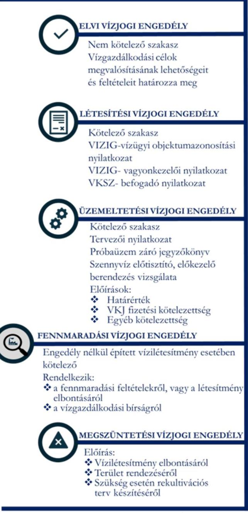

A jogalkotó a szervezeti felelősség körében nem határozta meg egyértelműen a befogadó víztest terhelhetőségének állami oldalról történő vizsgálatáért való felelősséget.

---

Az ipari szennyvíz víztestekre gyakorolt negatív hatásának megelőzése és csökkentése szempontjából sarkalatos pont a terhelhetőségi vizsgálat.
Felszíni vizeinket számos negatív hatás, szennyező anyag bevezetés éri a befogadó víztest egyes szakaszain. Ezen szennyezések környezeti hatásainak megítélése nem szorítkozhat csupán az újonnan megjelenő ipari üzem pontszerű bevezetésének értékelésére. A szennyező anyag befogadó víztestbe történő bevezetését komplex módon, az érintett víztest állapota alapján, nem csak határértékek, hanem anyagáramlás szempontjából is értékelni szükséges annak érdekében, hogy e tevékenység víztest állapotára gyakorolt hatása - más hatásokkal együttesen - értékelhető legyen.
Az ipari szennyvizek hatásai a végső befogadó víztestben összeadódnak. Terhelhetőségi vizsgálatok keretében értékelni kell, hogy milyen szennyező anyag terhelés engedhető meg a vizeinkben. Az ÁSZ által felkért szakértő megítélése szerint a háttérterhelések függvényében meg kell határozni az ökoszisztéma kritikus terhelését, vagyis azt a terhelést, amely még nem idéz elő visszafordíthatatlan negatív ökológiai változást a víztestben. Meg kell határozni azt a kibocsátási határértéket, amellyel a kibocsátott szennyező anyag elhagyja a vízszennyező forrást (pl. telephelyet), amit a befogadó víztest öntisztuló képessége még „kezelni képes", vagy környezeti kockázatot, környezeti állapot romlást nem eredményez. A folyamatokat tovább ronthatja az aszályos, vízhiányos időszak, mivel a szennyvízkoncentráció alacsonyabb vízhozam mellett megemelkedik.
Közcsatornás bebocsátás esetén az ipari üzemeknek a jogszabályokban, illetve a víziközmű-szolgáltatók által előírt küszöbértékeknek megfelelő minőségűre kellett a szennyvizet megtisztítaniuk. Az üzemek egy része az előkezelést saját előtisztítóval valósította meg, azonban a tisztítók meglétét a víziközmúszolgáltatók közül csak 11 szolgáltató ellenőrizte. Az előtisztító üzemeltetése, karbantartása kiemelt szereppel bírt, mivel a vízminőségi káresemények egy része ezek meghibásodásából eredt és a jogszabályok sem írták elő a sokszor rendkívül bonyolult berendezés üzemeltetéséhez és karbantartásához szükséges képzettséget.

Jó gyakorlatként emelhető ki a Debreceni Vízmú Zrt. eljárása, mivel a széleskörű vizsgálat mellett megkövetelték az ipari üzem előtisztító berendezésének karbantartására vonatkozó szerződés meglétét is. A Miskolci Vízmú Kft. a befogadói nyilatkozat kiadását a szennyvíz-előtisztító berendezés meglétéhez és megfelelő üzemeléséhez kötötte, míg a TETTYE FORRÁSHÁZ Zrt. előkezelő technológia üzemeltetési, kezelési- és karbantartási utasítást is kért a kérelmezőtől.

A víziközmú-szolgáltató által kibocsátott befogadó nyilatkozat kiállításának nem volt feltétele az, hogy a víziközmű-szolgáltató a tisztítást követően a végső befogadó víztesteket érintő összterhelést vizsgálja. A befogadó nyilatkozat kiállítását megelőzően a végső befogadó víztest terhelhetőségét az ÁSZ által megkérdezett 36 víziközmú-szolgáltatóból csupán 4 vizsgálta, 28 nem (helyette vizsgálták a telep mennyiségi és minőségi terhelhetőségét), 4 esetében nem volt releváns ipari szennyvíz befogadása. A víziközmű-szolgáltatók - az engedélyben meghatározott gyakorisággal - az általuk kibocsátott szennyvízre előírt határértékeknek való megfelelést önellenőrzés keretében vizsgálták. A közcsatornás szennyvíz bebocsátás azon paraméterei, melyek kizárólag ipari forrásból származtak, hatással voltak a végső befogadó víztestre is. A végső befogadó víztest terhelhetőségének vizsgálatára irányuló kötelező eljárás hiánya kockázatot jelent a vízminőségre, mivel bizonyos összetevőket (pl. sók, nehézfémek, mikro szennyezők) a kommunális telepek csak részlegesen tudtak eltávolítani, így ezek átfolytak rajtuk.

---

Amennyiben a víziközmű-szolgáltató befogadta az ipari (előtisztított) szennyvizet, az adott ipari üzem a befogadó nyilatkozatban foglalt küszöbértékek betartásán túli - szennyvíztisztítási felelőssége a víziközmü-szolgáltatókra hárult, ugyanakkor a szolgáltató többlet tisztítás átvállalása esetén magasabb csatornadíjat érvényesíthetett.
Amennyiben az ipari üzem a szennyvizét közvetlenül az állami vagyonba tartozó végső befogadó víztestbe engedte, úgy az ipari szennyvíz- befogadás feltételeit a vagyonkezelő VIZIG-eknek kellett meghatározni. Az OVF azonban nem rendelkezett a terhelhetőségi vizsgálatra vonatkozó egységes országos eljárásrenddel az ipari tevékenységet illetően, mivel jogszabály nem tartalmazott kötelezést a vizsgálat elvégzésére. Ettől függetlenül a VIZIG-ek a vagyonkezelői hozzájáruló nyilatkozat kiállításához jellemzően megkövetelték a beruházótól a terhelhetőségi vizsgálat elvégzését. Idősorok és adatok hiányában a beruházó tervezői által elvégzett terhelhetőségi vizsgálat eredménye nem minden esetben pontos, de a befogadó víztest vagyonkezelője ennek szakmai felülvizsgálatával és kiértékelésével - kötelezés hiányában amennyiben úgy mérlegelt - megállapíthatott határértékeket és adhatott ki vagyonkezelői hozzájáruló nyilatkozatot. A vagyonkezelői hozzájárulások egységes szempontjainak érvényesítését az OVF által kialakított iratminták támogatták.
A jogalkotó lehetővé tette, hogy minden érintett, hatósági jogkörrel rendelkező szervezet szakhatóságként véleményt alkothasson az eljárások során. A szakhatósági vélemény kialakítása során az Ákr. ${ }^{33} 25 . \int$ alapján a vízügyi, vízvédelmi hatóságok - amennyiben az eljárások során a szükséges adattal vagy irattal nem rendelkeztek - megkereshették az érintett VIZIG-et az állami vagyonért való felelősségére tekintettel. A VIZIG-ek szakhatósági eljárásba történő bevonása azonban csak lehetőségként és nem kötelező jellegú előírásként jelent meg a jogszabályokban. Az állami vagyon megőrzési és megóvási kötelezettség érvényesítése érdekében a VIZIG-ek számára biztosított jogi eszközök nem tették lehetővé a vagyonkezelői hozzájáruló nyilatkozatban esetlegesen előírt határérték betartatásának közvetlen ellenőrzését és felügyeletét.
A VIZIG-ek hatósági vagy a víziközmű-szolgáltatókhoz hasonló ellenőrzési jogkörrel, jogosítvánnyal nem rendelkeztek. Mindezeket figyelembe véve az állami vagyonba tartozó víztestek Nvtv ${ }^{34}$-ben előírt vagyon megőrzési és megóvási kötelezettség érvényesítése érdekében a vagyonkezelő VIZIG-ek számára biztosított jogi eszközök nem tették lehetővé a vagyonkezelői hozzájáruló nyilatkozatban esetlegesen előírt határérték betartatásának közvetlen ellenőrzését és felügyeletét. Mindezeken túl a rendkívül sok adattal és szaktudással rendelkező VIZIG-ek - hatósági vagy ellenőrzési jogkör, jogosítvány hiányában nem hatóságként, hanem „ügyfélként" vettek részt a vízjogi engedélyezési eljárásban, így szakvéleményt csak abban az esetben tudtak adni, amikor a vízügyi/vízvédelmi hatóságok mérlegelése alapján megkereséssel éltek feléjük.
A vagyonkezelői hozzájárulás során a VIZIG-ek azt is vizsgálták, hogy az ipari üzemi tevékenységhez igényelt vízmennyiség a területi viszonyoknak megfelelően biztosítható-e. A VIZIG-ek a számítások elvégzéséhez erre a célra kifejlesztett modelleket használtak, így ismerték a vízkészleteket és azok megújulási képességeit. A VIZIG-ek lehetőségeikhez mérten fokozott figyelmet fordítottak a felszín alatti vízkészletekre, mert hosszú távon azok ipari célú kivétele kockázatot jelent megújulási képességükre. A vízkészletek mennyiségének és minőségének megőrzése szempontjából kulcsfontosságú tehát az ipari vízgazdálkodás stratégiai szemlélete. Az ellenőrzött időszakban csak a létesítési engedélyhez volt kötelező a vagyonkezelői hozzájárulást benyújtani a kérelmezőnek, az elvi és üzemeltetési vízjogi engedélyezési eljárásban nem, ami kockázatot jelent a vízgazdálkodás integrált szemléletének érvényesítésére. Amennyiben a létesítési engedélyben foglaltak szerint történt

---

meg a beruházás, az üzemeltetési engedélyezési folyamatba már nem vonták be a VIZIG-eket. Más jellegű előírásokat igényel egy vízilétesítmény/vízimunka a létesítésnél és mást az üzemeltetésnél, valamint sok esetben az engedélyes személye sem azonos az eljárásokban. Amennyiben a létesítésre és az üzemeltetésre vonatkozó engedélyezés között két év is eltelt, ez idő alatt több tényező is megváltozhatott (ide értve a felhasznált víz mennyiségét és minőségét vagy a kivitelezett műszaki/technológiai megoldásokat, a szennyvíz bebocsátásra kijelölt víztest állapotát). Amennyiben az üzemeltetési vízjogi engedélyhez továbbra sem lesz kötelező a vagyonkezelői hozzájáruló nyilatkozat benyújtása, úgy fennáll annak a kockázata, hogy az érintett víztestből annak megújulási képességét meghaladó mértékben történik vízkivétel, ami hatással lehet az újonnan betelepülő ipari létesítmények vagy a lakossági vízigények kielégítésére.
Terhelhetőségi vizsgálatot a vízügyi, vízvédelmi hatóságok nem végeztek. A kiadott befogadó nyilatkozatok valóságtartalmát a hatóság - jogszabályi előírás, illetve kapacitás hiányában - helyszíni ellenőrzés keretében nem vizsgálta az engedélyezési eljárás során. A vízjogi engedélyezési eljárásban és amennyiben kötelező volt, úgy a környezetvédelmi engedélyezési eljárásban a környezeti hatások értékelése alatt megjelentek a környezet terhelésre vonatkozó számítások, melynek alapját a hat évente frissülő VGT adatai alapozták meg.

# Szennyvízkibocsátási engedély 

A vízjogi, valamint a szennyvízkibocsátási engedélyezési eljárásban a próbaüzemeltetési kötelezettség alkalmazásával a jogalkotó széles körben érvényesítette a jogszabályokban nevesített szennyezőanyagok esetében az elővigyázatosság és a megelőzés elvét.
A szennyvízkibocsátással, közcsatornába vezetéssel összefüggő környezet-, és vízvédelmi követelményeket többek között a FEVI R írta elő. A vízjogi eljárások esetében a próbaüzemeltetésre további előírásokat a 72/1996. (V.22.) Korm. rendelet határozott meg. Az engedélyezési eljárást a vízvédelmi hatóság kérelemre folytatta le. Az engedélyezés során a kibocsátásra és a szennyvizek befogadó víztestbe vezetésének szabályozására a hatóság kombinált megközelítésen alapuló szabályozási módszert alkalmazott. A vízjogi engedélyezési eljárás során, új beruházás esetében - a 220/2004. (VII. 21.) Korm. rendelet 26.§ (3) bekezdése alapján - kötelező volt a próbaüzem. Kötelező volt a próbaüzem akkor is, ha berendezés vagy komplex ipari létesítmény rendeltetésszerű - a jogszabályoknak és a hatósági előírásoknak megfelelő - használhatósága, üzemeltetése, próbaüzem nélkül nem volt megállapítható. A tevékenység folytatásának feltétele a próbaüzem eredményének kiértékelését követően az engedélyben megadott feltételekhez volt kötött. Új létesítmények esetén a kibocsátó a próbaüzem lezárásáig akkreditált laboratórium által végzett mérési eredményekkel volt köteles igazolni, hogy az engedélyben előírt határértéket, illetve küszöbértéket tartósan és folyamatosan betartotta. Új típusú szennyező anyag, technológiai kibocsátás esetén a jogszabályi előírás vonatkozó határértéket, küszöbértéket nem tartalmazott, a vízszennyezés megelőzése, csökkentése érdekében a próbaüzem ezekben az esetekben is támogatta a vízszennyezés megelőzését és lehetőséget biztosított a hatóságok számára vízvédelmi szempontú feltételek előírására.
A környezetvédelmi engedélyezési eljárásokban a próbaüzem előírását új létesítmények, jelentős változás, illetve az új típusú szennyező anyag, új keletú technológiai kibocsátások esetében biztosították a jogalkotók.
Amennyiben az egységes környezethasználati engedélyben foglalt előírások betartása hatósági ellenőrzéssel a technológia jellegéből adódóan nem volt megállapítható, úgy a 314/2005. (XII. 25.) Korm.

---

rendelet 22. § (1) bekezdése próbaüzemet írt elő, ami támogatta a környezetvédelmi célok elérését. A környezethasználati eljárások közül a 314/2005. (XII. 25.) Korm. rendelet kitért az új keletú technikák alkalmazása esetén követendő próbaüzemi eljárásra és meghatározta a kötelező próbaüzemeltetés feltételeit.
A korábban bemutatottak szerint az ipari szennyvíz előkezelő, előtisztító berendezéseknek vízminőségvédelmi szempontból kiemelt szerepe van. A vízjogi engedélyezési eljárás során biztosított volt a hatósági ellenőrzés az üzembehelyezést megelőzően, azonban a hatóságok nem helyszíni, hanem jellemzően dokumentumalapú ellenőrzés keretében vizsgálták, hogy a szennyvíz előkezelő, előtisztító berendezések a jogszabályi előírások és a létesítési engedélynek megfelelő előírások betartására alkalmasak-e. A vízjogi üzemeltetési engedély kiadásának feltétele volt a próbaüzemi záró jelentés, amit akkreditált mintavételi eredményekkel kellett alátámasztani. Ennek keretében történt a szennyvízkibocsátás - egyúttal az előtisztító berendezések teljesítményének - vizsgálata is. Az ellenőrzött időszakban jogszabályi előírás nem rendelkezett az üzemi előtisztítók és szennyvízkezelők esetében a szakképzett munkaerő alkalmazásának kötelezettségéről. Amennyiben a későbbiekben sem kötik a jogszabályok a berendezések kezelését, karbantartását a megfelelő szakképzettséghez, úgy fennáll a kockázata annak, hogy a vízminőségi káresemények jelentős része továbbra is az ebből eredő problémákhoz fognak fűződni, kockáztatva ezzel a folyamatos környezeti károkozást, a vízminőség romlását.

A víziközmű-szolgáltatók jelzése alapján problémát okozott, hogy a helyi önkormányzatok kiadtak olyan üzemeknek múködési engedélyt, akik nem voltak kötelezettek a szolgáltatótól befogadói nyilatkozatot kérelmezni. Különösen olyan esetekben jelentkezett ez a probléma, ahol már kiépített házi csatornahálózatra csatlakozott az üzem és/vagy az üzem olyan helyen létesült, ahol a korábbi tulajdonosnak volt csatornahasználati engedélye, de nem üzemi tevékenységre (tipikusan a társasházakba települő vendéglátóipari egységek). A probléma felveti a vízügyi holisztikus szemlélet érvényesítésének hiányosságát, valamint a befogadó nyilatkozat beszerzésére kötelezettek köre felülvizsgálatának kérdését.

Az ipari üzemek felhagyásának engedélyezését meghatározó jogi és szervezeti keretek összességében biztosították a vizek mennyiségi és minőségi védelme szempontjainak érvényesítését, azonban nem tértek ki a megszüntetés helyszíni ellenőrzésének szabályaira, ezzel csökkentették a hatósági ellenőrzés hatékonyságát, és az ipari eredetű vízszennyezések megelőzésének eredményességét, növelve a hosszútávú szennyezések és a szennyező fizet elv érvényesítése elmaradásának kockázatát.
Az ipari üzemek által használt vízilétesítmények megszüntetésére irányuló vízjogi engedélyezési eljárást a 72/1996. (V.22.) Korm. rendelet, a kapcsolódó szakhatósági eljárásokat az 531/2017. (XII. 29.) Korm. rendelet határozta meg. A vízügyi és vízvédelmi hatóságok engedélyezési, ellenőrzési és szakhatósági eljárásrendjét a BM OKF főigazgatója által kiadott főigazgatói intézkedések mellékletei határozták meg. A vízjogi megszüntetési engedélyben foglaltak végrehajtását a hatóság jellemzően fényképes dokumentáció alapján ellenőrizte, a helyszíni ellenőrzés nem volt általános gyakorlat.
A vízminőségre veszélyt jelentett a bányászati tevékenység felhagyásával járó bányászati tájseb rekultivációs (visszatöltési) kötelezettség. Az Országos Hulladékgazdálkodási Terv ugyanis előírta az építőiparból származó hulladék újrahasznosításának 70\%-os arányát. Az építőipari bontási hulladékot feltöltésre használták fel a kibányászott kavics és homok helyére. Ez azonban az eredeti talajréteget egyes

---

területeken nem pótolta megfelelően és további szennyezés forrásául is szolgálhatott (pl. vegyipari tevékenység helyéül szolgáló épület bontási törmeléke). Míg környezetvédelmi szempontból ezek az anyagok hulladéknak minősültek, addig hulladékhasznosítás szempontjából ezeket az építési bontási (inert) törmelékeket szennyezőanyag mentes anyagnak tekintették a jogszabályok. Mindezek alapján nem minősült hulladéklerakásnak ez a fajta pótlási tevékenység, így az érintettek mentesülhettek a hulladéklerakási járulékfizetési kötelezettség alól. Ezen tevékenységek káros hatásait nem lehetett egyértelműen kimutatni, amiben a szennyezés felhígulása is szerepet játszott. Figyelembe kell venni azt is, hogy a szennyezés hatása hosszú távon jelentkezik. Bár a bányászati tevékenység megkezdéséhez a környezetvédelmi hatóság engedélye volt szükséges, felhagyásának elfogadása/jóváhagyása már a bányafelügyeleti hatóság feladat- és hatáskörébe tartozott, így nem volt biztosított a környezet- és vízvédelmi szempontok érvényesülése. Amennyiben a bányászati tevékenység felhagyását követő rekultivációs kötelezettség építőiparból származó bontási hulladék felhasználásával továbbra is teljesíthető lesz, úgy fennáll annak a kockázata, hogy a bányák közelében elhelyezkedő tavak és felszín alatti víztestek elszennyeződnek, hosszú távon kockáztatva ezzel az ivóvízbázisok minőségét és az emberi egészséget is.
A vízjogi engedélyezési eljárások részletszabályainak kialakítása során figyelembe vették a települési szennyvíz kezeléséről szóló 91/271/EGK irányelv ${ }^{35}$ 11. cikkét, valamint I. mellékletének C pontját.
A 91/271/EGK irányelv 11. cikke írta elő többek között az ipari szennyvíz gyűjtőrendszerekbe történő bevezetésének engedélyezését, annak felülvizsgálatát. Az irányelv I. melléklet C. pontja határozta meg a csatornarendszerbe kerülő szennyvizek előtisztításának alapvető követelményeit. Az irányelvben foglaltak figyelembevételével alakították ki többek között a felszíni vizek minősége védelmének szabályait (220/2004. (VII. 21.) Korm. rendelet), valamint a vízszennyező anyagok kibocsátásaira vonatkozó határértékeket és alkalmazásuk szabályait (28/2004. (XII. 25.) KvVM rendelet).
Az engedélyezési eljárások során biztosított volt az ismételt hiánypótlás lehetősége, illetve biztosított volt a kiadott engedélyek felülvizsgálata az ipari üzem tevékenységében bekövetkezett változások esetén, ami hozzájárult a megalapozottabb döntéshozatalhoz, ezáltal támogatta az ipari eredetű vízszennyezések megelőzésének eredményességét, továbbá az elővigyázatosság és megelőzés elvének érvényesülését.
A vízbázisok védőővezeteinek lehatárolásával a jogalkotó gondoskodott a védett és sérülékeny vízbázisok mennyiségi és minőségi védelméről és a vízjogi engedélyezés során is érvényesítendő vízminőségvédelmi szempontok érvényesüléséről.
A védőterületeken, védőidomokon folytatható tevékenységek tekintetében a 123/1997. (VII. 18.) Korm. rendelet és a kijelölő határozatok előírásai voltak irányadók. Amennyiben az ipari üzem, telephely a vízbázis védőövezetén belül helyezkedett el, a befogadó nyilatkozatok kiadása során a fent említett jogszabályi és hatósági előírások, köztük a védőidomokra vonatkozó tiltások és korlátozások érvényesülését a hatóságok és adott esetben a víziközmű-szolgáltatók is ellenőrizték.

# VI. Határidők 

A hatóságok engedélyezési eljárásaira biztosított jogszabályi határidők alapvetően elégségesek voltak a megalapozott döntéshozatalhoz. A jogszabályok azonban nem vették figyelembe a bonyolultabb, nagyobb volumenű ügyek esetére az engedélyezési eljárások magasabb időigényét és nem biztosítottak hosszabb eljárási határidőt azok komplexitására, terjedelmére, jellegére tekintettel. A nemzetgazdasági szempontból kiemelt jelentőségű beruházások esetében a kormányrendeletekben meghatározott egyedi határidők az általánosnál rövidebbek voltak.

---

Amennyiben az engedélyek kiadására nyitva álló határidő továbbra is szűk marad és a jogalkotók nem veszik figyelembe a beruházások komplexitását, volumenét, úgy fennáll a kockázata annak, hogy a hatóságok nem megalapozott döntéseket hoznak, a szükséges vizsgálatokat nem tudják alaposan elvégezni és nem tudnak minden szennyező anyagot beazonosítani vagy határértékeket meghatározni, ezzel kockáztatva olyan kiemelt jelentőségi nemzetgazdasági beruházást, ipari létesítmények üzembe helyezését, amelyek veszélyeztetik az ökoszisztémát, a vízkészleteinket és közvetetten az emberi egészséget.
A nemzetgazdasági szempontból kiemelt jelentőségű beruházások esetében az engedélyezési eljárásoknál az általános eljárásokhoz képest szűkebb határidőket biztosítottak a jogszabályok és nem vették figyelembe az ügyek komplexitását és a beruházások volumenét. Az engedélyezési eljárások lefolytatására a hatóságok számára rendelkezésre álló szűkös határidők és a határidőtartáshoz kapcsolódó problémák, kockázatok a BM előtt is ismertek voltak. A BM OKF a kockázatokat az irányító felé történő jelzésekkel, a beruházókkal történő előzetes konzultációkkal és egyeztetésekkel csökkentette. A kiemelt jelentőségű nemzetgazdasági beruházások engedélyezési eljárásainak határidő korlátait figyelembe véve a társadalom környezeti döntéshozatalban történő részvétele korlátozottabb volt az általános eljárásokhoz képest.
A környezetvédelmi, a vízügyi/vízvédelmi, valamint a nemzetgazdasági szempontból kiemelt jelentőségű beruházások engedélyezési eljárásaihoz rendelt határidőket az VI. sz. melléklet tartalmazza.

# VII. Éghajlatváltozás kezelése 

Az éghajlatváltozás kihívásainak kezeléséről - elsősorban az aszályos, vízhiányos időszakokra figyelemmel - a jogalkotó törvényi, valamint rendeleti szinten is gondoskodott.
Az éghajlatváltozásból eredő szélsőséges időjárás - mint például a 2022. évi aszályos időszak vagy a hirtelen lezúduló nagy mennyiségű csapadék - jelentős hatással van a víztestek minőségére. A nyári aszályos időszakban a felszíni vízfolyások vízhozama jelentősen lecsökken, így a szennyvíz befogadóba engedése veszélyezteti a víztestek minőségét. Amennyiben hosszabb ideig tartó aszályos időszakban nem korlátozzák - elsősorban felszín alatti vízkészletekből - az ipari vízkivételeket, úgy fennáll annak a kockázata, hogy a felszín alatti vízkészletek nem lesznek képesek megújulni, hosszú távon veszélyeztetve ezzel a társadalom ivóvízszükségletét.
Az aszályos időszakból eredő vízminőségi problémákat a hazai jogszabályok megfelelően kezelték. A vízhiány elleni védekezés szabályait a jogalkotó a 28/2004 KvVM rendeletben, illetve a 10/1997. (VII. 17.) KHVM rendeletben szabályozta. Külön vízminőségvédelmi területi kategóriaként kezelte az időszakos vízfolyás befogadókat és más kibocsátási határértékeket határozott meg esetükben. A vízhiány mértékétől függően az OVF I-III. fokú készültség elrendeléséről, súlyosabb esetben vízhasználati korlátozásról dönthetett.
A hirtelen nagy mennyiségben lezúduló csapadékvízek esetenként ún. havária helyzetet okoznak, mely kezelését a Vgtv. és a 147/2010. (IV. 29.) Korm. rendelet szabályozta. A gyakorlatban azonban megfelelő méretű és mennyiségủ záportározók hiányában a szennyvízelvezetőkből és szennyvíztározókból esetlegesen kilépő kezeletlen szennyvíz tisztítás nélkül jut a befogadó víztestbe. A probléma nem kezelhető csupán jogszabályi előírással.

---

# KAPACITÁS, HUMÁN- ÉS TÁRGYI ERŐFORRÁS 

A vízügyi, vízvédelmi és környezetvédelmi igazgatási és hatósági feladatellátás hatékony és eredményes ellátásához megfelelően képzett, a területi sajátosságokhoz megfelelően illeszkedő humánerőforrás kapacitás biztosítása szükséges. A személyi állomány feladatellátáshoz viszonyított alacsony létszáma, a megfelelően képzett munkaerő hiánya kockázatot jelent az engedélyezési eljárásokban a megalapozott döntéshozatalra, a határidők tarthatóságára, az ipari üzemek szigorú felügyeletére, azaz a hatékony területi jelenlétre. A szervezetrendszer humánerőforrás kapacitására vonatkozó részletes adatokat, kimutatásokat a VIII. sz. melléklet tartalmazza.

A hatósági és igazgatási szerveknél magas volt a fluktuáció és a betöltetlen álláshelyek aránya. A vízügyi ágazatban dolgozók átlagkeresete a bruttó nemzetgazdasági átlagkeresetet nem érte el, ami kockázatot hordoz az ágazat szakképzett munkaerő megtartási és utánpótlási képességére.
A területi vízügyi, vízvédelmi hatóságok létszámcsökkenése országos összesítésben nem számottevő, ugyanakkor egyes területileg illetékes hatóságoknál magas létszámcsökkenés volt tapasztalható (5-15\%). A feladatellátást nehezítette a betöltetlen álláshelyek magas aránya, amely az ellenőrzött időszakban országos szinten minden évben elérte a $10 \%$-ot. A fluktuáció tekintetében sem volt kedvező a hatóságok helyzete, országos átlagban 11-26\%-os sávban mozgott.
A környezetvédelmi hatóságok esetében országos szinten a létszám növekedett, de területileg itt is jelentős eltérések voltak. A betöltetlen álláshelyek aránya országos összesítésben a környezetvédelmi hatóságok esetében alacsonyabb volt, mint a vízügyi, vízvédelmi hatóságoknál. A kilépések száma jellemzően magas volt ( 13 kormányhivatal esetén $10 \%$ feletti az utolsó ellenőrzött évben), így a munkaerő folyamatos pótlása nehezítette a feladatellátást.
Az OVF területi szervezetei esetében országos szinten a - vagyonkezelői hozzájárulás kiadási, a vizek állapotértékelési/monitoring, illetve vízminőségi kárelhárítási feladatokat ellátó - létszám kismértékben csökkent, néhány igazgatóság esetében azonban a csökkenés jelentős volt. Folyamatosan magas volt és tendenciaszerűen növekedett a betöltetlen státuszok aránya. Az adatok azt mutatják, hogy a távozó létszám pótlásának problémája erősödött.
A Kormányhivatalokhoz rendelt hét környezetvédelmi laboratórium létszámfeltételei két kivétellel romlottak, különböző mértékű - 8-25\%-os - létszámcsökkenést szenvedtek el.
A szervezetrendszer bérszínvonala elmaradt a nemzetgazdasági átlagtól. A bérezés minden vizsgált szervezetnél az ellenőrzött időszakban egyre nagyobb mértékben maradt el a nemzetgazdasági átlagtól. Ez a munkáltatók munkaerőpiaci pozícióját rontotta, ami az elvándorlást növelte és fokozta a munkaerő utánpótlás problémáit.
A szervezetrendszer munkavállalóinak átlagkereset változásairól ad képet a 7. és 8. ábra.

---

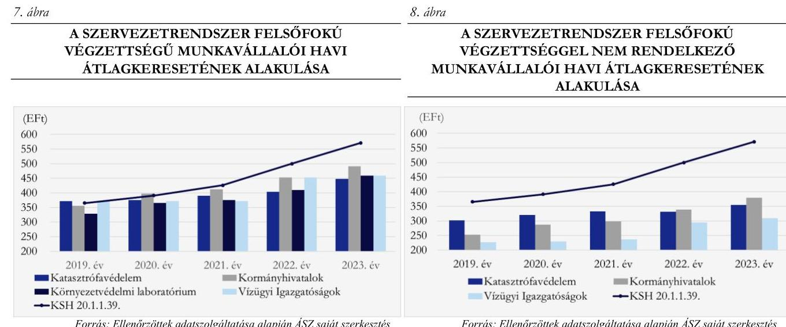

A kormányhivatali (közte a környezetvédelmi hatósági feladatokat is ellátó) alkalmazottak az elmúlt öt évben háromszor részesültek bérfejlesztésben, amit differenciáltan valósítottak meg. A felsőfokú végzettségű munkavállalók mintegy $38 \%$-os, a felsőfokú végzettséggel nem rendelkező munkavállalók $50 \%$-os béremelést kaptak. Ennek ellenére a bérszínvonal így is elmaradt a nemzetgazdasági átlagkeresettől.
Az engedélyezési és ellenőrzési feladatokat ellátó hatóságoknál a szakirányú egyetemi vagy főiskolai szintű végzettséggel és szakképzettséggel rendelkezők magas aránya országos szinten biztosította a feladatellátás magas színvonalú ellátását. Területi egyenlőtlenségek azonban itt is kimutathatóak voltak. Az ellenőrzött időszakban a hatósági feladatokat végző szervezeteknél országos szinten jellemző volt az ügyszám növekedése, az ügytípusok összetételének változása.
Tizenegy kormányhivatal környezetvédelmi hatóságának létszámnövekedése ellensúlyozni tudta az ügyszámok növekedését, míg nyolc kormányhivatalnál terhelésnövekedés következett be.
A környezetvédelmi hatóságok esetében eltérő mértékủ és irányú változások következtek be. Az egybevont ügyszámot tekintve országos szinten terheléscsökkenés mutatkozott, amint azt a 2. táblázat mutatja. Előfordult, hogy a terhelés növekedését nem az ügyek számának változása, hanem a létszám csökkenése eredményezte. Voltak olyan szervek, amelyek esetén az ügyek volumenének növekedése mellett a létszám nagyobb arányban emelkedett, ami csökkentette a terhelést.
Az összes ügyszám a környezetvédelmi hatóságok engedélyezési eljárásait és ellenőrzéseit összevontan tartalmazza. Ez magába foglalja a tárgyévben lefolytatott összes ellenőrzési és engedélyezési eljárást, az engedély felülvizsgálatára irányuló eljárásokat, a vízügyi/vízvédelmi hatóság és az egyéb hatóság eljárásában környezetvédelmi szakhatóságként történő közreműködések számát. A kormányhivatalok terhelése az eltérő nyilvántartások, azok szűrési és lekérdezési lehetőségeinek eltérései miatt egymással nem vethetők össze.

---

2. táblázat

A KORMÁNYHIVATALOK KÖRNYEZETVÉDELMI HATÓSÁGAI EGY FŐRE VETÍTETT ÖSSZESÍTETT ÜGYSZÁMÁNAK VÁLTOZÁSA SZÁZALÉKBAN 2020-2023. KÖZÖTT

| VÁLMEGVEI KORMÁNYHIVATALOK | VÁLTOZÁSSZÁZALÉKBAN (BAZÉ 2019. EV) |  |  |  |
| :--: | :--: | :--: | :--: | :--: |
|  | 2020. EV | 2021. EV | 2022. EV | 2023. EV |
| Bács-Kiskun VKH | 6,6 | $-34,8$ | $-23,9$ | $-23,3$ |
| Baranya VKH | $-26,8$ | 13,8 | 11,0 | 37,8 |
| Békés VKH | $-31,4$ | $-62,1$ | $-72,9$ | $-73,8$ |
| Borsod-Abaúj-Zemplén VKH | 7,6 | $-24,4$ | $-25,2$ | $-13,0$ |
| Csongrád-Csanád VKH | $-10,7$ | $-42,7$ | $-33,2$ | $-30,9$ |
| Fejér VKH | 30,9 | $-6,2$ | $-12,7$ | $-16,0$ |
| Győr-Moson-Sopron VKH | $-0,4$ | 19,5 | 18,4 | 53,5 |
| Hajdú-Bihar VKH | 0,5 | 9,0 | 18,9 | 10,6 |
| Heves VKH | $-10,9$ | $-26,4$ | $-35,2$ | $-37,3$ |
| Jász-Nagykun-Szolnok VKH | 0,3 | 1,3 | $-5,8$ | 6,2 |
| Komárom-Esztergom VKH | 25,6 | 109,0 | 42,1 | 35,9 |
| Nógrád VKH | $-28,2$ | 144,1 | 344,1 | 210,0 |
| Pest VKH | $-65,5$ | $-55,2$ | $-80,9$ | $-78,8$ |
| Somogy VKH | $-5,6$ | $-34,5$ | $-33,9$ | $-32,1$ |
| Szabolcs-Szatmár-Bereg VKH | $-16,6$ | $-0,2$ | 12,4 | 77,4 |
| Tolna VKH | 10,7 | $-1,2$ | 14,5 | $-3,9$ |
| Vas VKH | $-22,5$ | $-15,0$ | $-15,7$ | $-7,5$ |
| Veszprém VKH | $-0,4$ | 5,4 | 12,6 | 22,3 |
| Zala VKH | $-40,5$ | $-26,3$ | 9,5 | $-19,0$ |
| Kormányhivatalok átlaga | $-16,2$ | $-27,5$ | $-21,6$ | $-15,5$ |

A hőtérkép vizuálisan szemlélteti a kormányhivatalok környezetvédelmi hatósági feladatokat ellátó szervezeti egységek munkavállalói terhelésének időbeli alakulását. A terhelésváltozás mértékét különböző színárnyalatok jelenítik meg: a piros és narancssárga színek a terhelés erőteljesebb, illetve mérsékeltebb növekedésére utalnak, míg a zöld és sárga színek a terhelés jelentősebb, illetve enyhébb csökkenését jelzik.

A vízügyi, vízvédelmi hatóságok humánerőforrás kapacitása nem igazodott az ellátandó feladatok mennyiségéhez és nem követte le az ipari szereplők területi eloszlását, így nem volt biztosított a hatékony területi jelenlét.
A vízügyi, vízvédelmi hatóságok esetében a terhelés nagy területi különbségeket mutatott, úgyszámban kétszeres különbségek is megfigyelhetők voltak, amint azt a 3. táblázat mutatja.
Az összes úgyszám a vízügyi, vízvédelmi hatóságok engedélyezési eljárásait és ellenőrzéseit összevontan tartalmazta, amely így az elvégzendő ügyek számát reprezentálja. Az összesített mérőszám tartalmazza a tárgyévben határozattal lezárt összes hatósági engedélyezési eljárás számát; a környezetvédelmi hatóság eljárásában és az egyéb hatóság eljárásában vízügyi/vízvédelmi szakhatóságként történő közreműködések számát. Az összesített úgyszám tartalmazza továbbá az éves ellenőrzési terv szerinti ellenőrzések, az egyéb helyszíni ellenőrzések, illetve a közérdekű bejelentés és panaszbejelentés alapján végzett helyszíni ellenőrzések számát.

---

1. táblázat

A VÍZÜGYI, VÍZVÉDELMI HATÓSÁGOK ÖSSZESÍTETT ÜGYSZÁMA EGY FŐRE VETÍTVE ÉS A VÁLTOZÁS MÉRTÉKE SZÁZALÉKBAN 2019-2023. KÖZÖTT

| TERÜLETI |  |  |  |  |  | VÁLTOZÁS |
| :--: | :--: | :--: | :--: | :--: | :--: | :--: |
| KATASZTROFAVÉDELMI   ÍGAZGATÓSÁGOK | 2019. ÉV | 2020. ÉV | 2021. ÉV | 2022. ÉV | 2023. ÉV | 2023/2019   (\%) |
| Bács-Kiskun VKI | 126,2 | 84,9 | 123,9 | 112,8 | 126,8 | 0,4 |
| Baranya VKI | 161,1 | 139,3 | 163,9 | 167,5 | 183,5 | 13,9 |
| Békés VKI | 98,2 | 82,4 | 98,2 | 104,6 | 127,9 | 30,3 |
| Borsod-Abaúj-Zemplén VKI | 111,3 | 93,9 | 111,1 | 145,8 | 155,1 | 39,4 |
| Csongrád-Csanád VKI | 121,9 | 123,0 | 100,1 | 116,1 | 134,0 | 10,0 |
| Fejér VKI | 193,5 | 171,8 | 215,0 | 188,9 | 224,5 | 16,1 |
| Fővárosi KI | 81,5 | 100,8 | 126,0 | 125,0 | 141,7 | 73,7 |
| Győr-Moson-Sopron VKI | 146,7 | 123,5 | 124,6 | 147,9 | 110,9 | $-24,4$ |
| Hajdú-Bihar VKI | 132,0 | 117,9 | 121,0 | 109,5 | 134,5 | 1,8 |
| JNSZ VKI | 85,5 | 98,7 | 105,7 | 104,9 | 142,2 | 66,3 |
| Szabolcs-Sz.-B. VKI | 190,9 | 163,8 | 147,7 | 145,0 | 176,3 | $-7,6$ |
| Vas VKI | 144,6 | 133,0 | 127,7 | 117,1 | 130,3 | $-9,9$ |
| Területi igazgatóságok átlaga | 127,9 | 118,0 | 129,1 | 132,1 | 149,0 | 16,6 |

A hőtérkép grafikusan jeleníti meg a cellaértékeket. A terhelés adatértékeinek jelzésére alkalmazott hőtérkép színei reprezentálják az adatok értékét. A narancssárga és a piros árnyalatok a magasabb, míg a zöld árnyalatok az alacsonyabb terhelési értékeket mutatják az országos 5 évi átlagos terheltséghez viszonyítva. A sárga a színskála közepe, ami az adatok átlagát jelöli.

Az ellenőrzések és a hatékony felügyelet biztosítása érdekében a rendelkezésre álló humán erőforrás kapacitásnak igazodnia kell az elvégzendő feladatok területi eloszlásához, melyet elsősorban a létesítmények száma határoz meg. A 9. ábrán látható, hogy a 2023. évi összesített ügyszámok területi eloszlásához nem igazodott a humánerőforrás eloszlása.

---

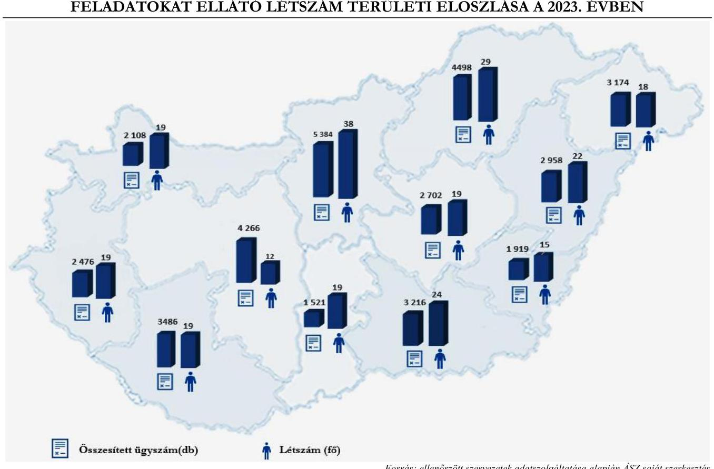

A vizek állapotértékelésében, szennyezettségének mérésében kiemelt szerepet játszó környezetvédelmi laboratóriumok kapacitás kihasználtsága magas volt. A mérési követelmények folyamatos szigorítása, az új típusú szennyező anyagok megjelenése, a feladatok számának emelkedése ellenére a létszám csökkent és a laboratóriumok fejlesztései elmaradtak. A laboratóriumok tárgyi feltételei csak részben voltak adottak, mivel a mérési képességek fejlesztésre szorultak többek közt az új típusú szennyező anyagok mérésének szükségessége miatt.
Az ellenőrzött időszakot megelőzően működött 29 laborral szemben az ellenőrzött időszakban csupán 7 kormányhivatali akkreditált labor és 3 OVF akkreditált labor működött országosan. Az ipari eredetű vízszennyezések csökkentésének, az ellenőrzési tevékenység hatékonyságának, illetve a szennyező fizet elv érvényesítésének szempontjából kiemelkedő szerepe van az országos laboratóriumi hálózatnak. A vízszennyezéssel összefüggő hatósági eljárásokat megalapozó bizonyítékhoz akkreditált mintavételre és akkreditált vizsgálatra van szükség. A laboratóriumok száma és területi elhelyezkedése fontos szempont, mivel a vízből vett mintákat mielőbb el kell juttatni a laboratóriumba. Minél később értékelik ki a mintát, annál nagyobb a kockázata annak, hogy az eredetitől eltérő mértékủ vagy minőségű szennyezettség mutatható ki. Bár a vízvédelmi hatóságok rendelkeztek katasztrófavédelmi mobil laborokkal - amelyek alapvető vízkémiai vizsgálatok (pl. oldott oxigén, vezetőképesség, pH mérés stb.) végzésére alkalmasak voltak -, akkreditációval nem rendelkeztek.
A laboratóriumi hálózatról általánosságban elmondható, hogy jelentős fejlesztést igényelnek mind technikai, mind humánerőforrás kapacitás szempontjából. A laboratóriumok üzemeltetése jelentős költségvetési forrásokat emésztett fel, ami mind az eszközök fenntartásának, karbantartásának, mind a működtetéshez szükséges anyagok (pl. a mérésekhez szükséges reagensek) magas költségigényének tudható

---

be. Mindemellett az uniós követelmények folyamatosan szigorodtak a műszerpark és az analitikai módszerek folyamatos fejlesztését igényelve. Az ellenőrzött időszak végén problémát okozott a megfelelő képzettségű műszaki személyzet megtartása is. Ismertek voltak olyan paraméterek, amelyek mérése a labor technológiai fejlesztése, valamint a szakember hiány miatt nem volt lehetséges. Az új vízszennyező anyagokkal összefüggő mérésekre forrás és eszköz nem állt rendelkezésre. Az új technológiák esetében a laboratóriumoknak problémát jelentett annak eldöntése, hogy a vízminták laboratóriumi vizsgálatánál konkrétan milyen anyagokra történjen az értékelés. Az új határértékek mérésére a laborok helyenként csak korlátozottan voltak alkalmasak. Ezt tetézte, hogy a műszerek gyorsan elavultak, megnövelve az amúgy is magas költségeket. A gyógyszermaradványok koncentrációját például nem tudták minden esetben mérni.
A laborhálózat - fent részletezett - kihívásai, nehézségei az irányító és középirányító szervek előtt ismertek voltak, ennek ellenére hosszabb távú laborkoncepció kialakítása nem történt meg 20192023. között.

Országos szinten a laboratóriumok alkalmazottainak létszáma 7,9\%-os csökkenést mutatott, amihez az alacsony bérszint is hozzájárult. Az ipari létesítmények számának emelkedése vagy annak stagnálása mellett növekvő ellenőrzések száma több mérést és laborvizsgálatot indukál, ami az önbevalláson alapuló mérési eredmények kontrollját, ellenőrzését biztosítja. A laboratóriumok száma, tárgyi és humánerőforrás kapacitásának szűkössége kockázatot jelent az ipari létesítmények önellenőrzés keretében szolgáltatott adatainak hatékony kontrolljára.
A vízügyi igazgatóságok a veszélyes anyagokkal összefüggő monitorozási tevékenységet részben tudták végrehajtani, tekintettel arra, hogy egyes veszélyes anyagok mérési technológiája nem állt rendelkezésre sem a vízügyi igazgatóságok, sem a kormányhivatalok laboratóriumaiban. Egyes esetekben ezért jól felszerelt, megbízható, piaci alapon működő akkreditált laboratóriumokkal is együttműködtek.
A víziközmű-szolgáltatók közül 30 db rendelkezett 2023-ban saját, akkreditált laboratóriummal. A laboratóriumok kihasználtsága magas volt, ugyanakkor a rendelkezésre bocsátott adatok alapján találhatók olyan víziközmű-szolgáltatók által üzemeltetett laboratóriumok, amelyek az ellenőrzés időszaka alatt változó mértékben rendelkeztek szabad kapacitással. A víziközmű ágazat laborkapacitásának kihasználtságát a 10. ábra mutatja be.
10. ábra

A VÍZIKÖZMÜ-SZOLGÁLTATÓK LABORKAPACITÁSÁNAK KIHASZNÁLTSÁGA 2019-2023. ÉVEKBEN
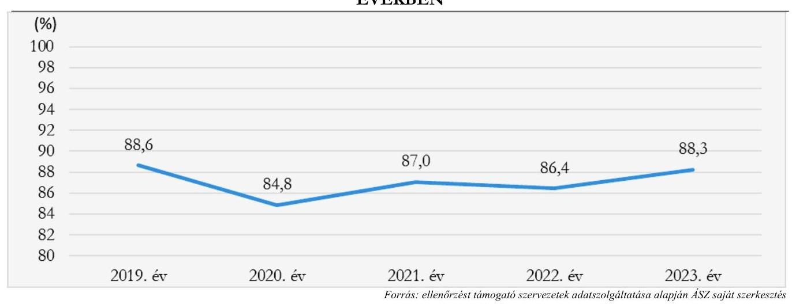

---

Az állami szervek részéről a víziközmű-szolgáltatók által üzemeltetett laboratóriumok szabad kapacitásainak igénybevételi lehetőségét a víziközmű-szolgáltatók többsége lehetségesnek tartotta. Az ÁSZ által kiküldött kérdőíven hét szolgáltató jelzett szabad kapacitást, további tizenhét szolgáltató szabad kapacitás függvényében lát lehetőséget az együttmúködésre.

# ELLENŐRZÉS ÉS FELÜGYELET 

## A jogszabályi környezet biztosította az ipari szereplők felügyeletét.

Az ipari üzemek felügyeleti rendszere az ellenőrzött időszakban önellenőrzésen és hatósági ellenőrzésen alapult. Vízügyi szempontból a 72/1996. (V.22.) Korm. rendelet a kibocsátók I-IV. felügyeleti kategóriába sorolásával, valamint az ahhoz rendelt ellenőrzési gyakorisággal biztosította a felügyeletet. A használt és szennyvízek kibocsátásának ellenőrzésére vonatkozó szabályokat a FEVI R. az önellenőrzés, ellenőrzés részletszabályait a 27/2005. (XII. 6.) KvVM rendelet tartalmazta az ellenőrzött időszakban. A környezetvédelmi szempontú felügyelet és ellenőrzés szabályait, feltételeit elsősorban a Kvtv., valamint a 314/2005. (XII.25.) Korm. rendelet határozta meg.
A monitorozás a hatóságok által végzett ellenőrzéseket és az üzemek által végzett önellenőrzéseket jelentette. A szennyvízkibocsátások ellenőrzése akkreditált mintavétellel történt mind a kibocsátók, mind a hatóság részéről. A hatósági ellenőrzés keretében vett mintákat az állami regionális környezetvédelmi laboratóriumokban értékelték ki. A BM és az ME együttműködési megállapodása részletesen szabályozta a környezetvédelmi laboratóriumok igénybevételét.
Az önellenőrzéseket a vízvédelmi hatóság által jóváhagyott, a mintavételek ütemezését is tartalmazó önellenőrzési terv alapozta meg. Ellenőrzési jogkörrel a vízvédelmi hatóság rendelkezett, közcsatornába történő szennyvízbevezetés esetében a felügyeleti rendszer kiegészült a szennyvizet befogadó víziközmúszolgáltató által végzett ellenőrzésekkel. A víziközmú-szolgáltatók az általuk kibocsátott befogadó nyilatkozattal érintett gazdálkodó egységek szennyvízkibocsátásának ellenőrzésekor az üzem területén lévő utolsó tisztítóaknában, a befogadási ponton végeztek akkreditált mintavételt éves mintavételi terv alapján (4. táblázat).
4. táblázat

VÍZIKÖZMÜ-SZOLGÁLTATÓI ELLENŐRZÉSEK ALAKULÁSA A 2019-2023. ÉVEKBEN

| ELLENÖRZÉSEKKEL KAPCSOLATOS   ADATOK | $\mathbf{2 0 1 9}$. ÉV | $\mathbf{2 0 2 0}$. ÉV | $\mathbf{2 0 2 1}$. ÉV | $\mathbf{2 0 2 2}$. ÉV | $\mathbf{2 0 2 3}$. ÉV |
| :-- | :--: | :--: | :--: | :--: | :--: |
| Az ipari szennyvízkibocsátók ellenőrzéseinek   száma - db | 2461 | 2173 | 3790 | 3020 | 2681 |
| Csatornabírság-javaslatok száma (az adott évben   kezdeményezett) - db | 127 | 109 | 97 | 118 | 121 |
| Csatornabírság-javaslatok összege (az adott   évben kezdeményezett) - MFt | 415,9 | 203,4 | 254,5 | 491,8 | 196,7 |
| Az adott évben a korábbi évben kezdeményezett   csatornabírság javaslatok alapján elfogadott,   kirótt csatornabírságból a vksz részére befolyt   összeg - MFt | 155,5 | 172,3 | 241,0 | 145,2 | 155,0 |

Forrás: 36 db víziközmü-szolgáltató adatszolgáltatása alapján ÁSZ saját szerkesztés
Az önellenőrzési mintavételek ütemezésének és a hatósági ellenőrzések időpontjának előzetes ismerete visszaélésekre adott lehetőséget. Amennyiben az önellenőrzési rendszer változatlan formában múködik tovább, úgy fennáll annak a kockázata, hogy a szennyezők nem vagy nem

---

arányos mértékben fizetik meg az általuk okozott környezeti károk költségeit, valamint a jogkövető magatartás kikényszerítése érdekében történő hatósági beavatkozások elmaradása miatt közvetett módon sérülhet az ivóvízbázisok minősége. Fennáll a kockázata annak is, hogy az önellenőrzés keretében vett minták mérési eredményei nem a tényleges szennyezéseket fogják mutatni, így nem ösztönzi az ipari létesítményeket víztakarékos, vagy korszerű szennyvíztisztító beruházásokra.
Az önellenőrzési rendszerhez füződő kockázatokat az ÁSZ elemzés ${ }^{\dagger}$ is bemutatta, miszerint az OVF a szennyvíziszap mennyiségi adatok alapján arra a következtetésre jutott, hogy magasabb arányban történhet szennyvíziszap kibocsátás a folyóvizekbe, mint az a hivatalos önellenőrzési adatokból következne. Ezt támasztja alá az is, hogy az emissziós adatokból kalkulált terhelések és az immissziós adatok ellentmondást mutatnak.
A víziközmú-szolgáltatók szúrópróba-szerű ellenőrzéseinek eredményességét csökkentette az önellenőrzési rendszer „nem megbízható" minősítési kategóriába sorolásának korlátja.
A jogszabályok meghatározták az önellenőrzési rendszer megbízhatóságának kritériumait. A víziközműszolgáltatók adatszolgáltatásai alapján a vízügyi, vízvédelmi hatóság a csatornabírság-javaslat benyújtásakor, bírósági döntésre hivatkozva több esetben nem fogadta el a víziközmú-szolgáltatók mérési eredményeit a csatornabírságolás alapjaként. Ennek oka az volt, hogy amennyiben a víziközmű-szolgáltató - nem a kibocsátó által az önellenőrzési tervben meghatározott napon végzett - helyszíni csatornaellenőrzés alapján terjesztett be csatornabírság javaslatot, az eltérő mintavételi időpont miatt korlátokba ütközött az önellenőrzési rendszer 27/2005. (XII. 6.) KvVM rendelet 14. §-a szerinti „nem megbízható"-nak minősítése. Így a víziközmű-szolgáltatók üzemi önellenőrzés időpontjától eltérő időpontban végzett szúrópróba-szerű ellenőrzései jelentős számú esetben nem zárulhattak bírság kiszabásával. Erre mutattak rá a víziközmú -szolgáltatók adatszolgáltatásai is, miszerint az általuk javasolt csatornabírságok összegének csupán $55,6 \%$-a folyt be az ellenőrzött időszakban.
A víziközmú-szolgáltatók ellenőrzési hatékonyságát csökkentette a - hatósági hatáskörhöz képest - korlátozottabb ellenőrzési jogosultság / hatáskör, így a telepekre való bejutás egyes esetekben korlátokba ütközött, vagy késedelmet szenvedett. Amennyiben a víziközmű-szolgáltatók ellenőrzési hatásköre nem bővül vagy nem erősítik meg azokat, úgy fennáll annak a kockázata, hogy az ipari üzemek mintavétel mérési eredményei alapján kimutatható szennyezés mértéke eltér a ténylegestől, a csatornákban keletkező károk helyreállításának fedezetét nem tudja kikényszeríteni a víziközmű-szolgáltatók, így súlytalanná válnak ellenőrzéseik.
A vízügyi és a környezetvédelmi hatóságok adminisztratív jellegű ellenőrzési feladatainak tervezését, továbbá a határérték-túllépesek jogkövetkezményeinek érvényesítését az OKIR ${ }^{\text {® }}$-ban rögzített önellenőrzési adatok alapozták meg. Az OKIR-ban nyilvántartott önellenőrzési adatok elsősorban az utókövetést támogatták, a szennyezések mielőbbi azonosítása jellemzően a közérdekủ bejelentések, illetve az önkéntes jogkövetés eredménye volt.
Az ellenőrzési, felügyeleti jogkörrel rendelkező hatóságok, irányítószervek ellenőrzési típusait az 5. táblázat mutatja be.

[^0]
[^0]:    † Szennyvíz és vízszennyezés - társadalmi és környezeti fenntarthatóság az ENSZ 6. Fenntartható Fejlődési Célja fényében; 2023. (https://www.asz.hu/dokumentumok/Elemzes_szennyviz-es-vizszennyezes.pdf)

---

| 5. táblázat |  |  |  |
| :--: | :--: | :--: | :--: |
| AZ ELLENŐRZÉS-TÍPUSAI |  |  |  |
| ELLENÖRZES   TÍPUSA | ELLENÖRZÉST VÉGZŐ   SZERVEZETEK | ELLENÖRZÖTT   SZERVEZETEK KÖRE | ELLENÖRZÉS TÁRGYA |
| hatósági ellenőrzés | vízügyi, vízvédelmi hatóság környezetvédelmi hatóság | ipari létesítmények | jogszabályban és engedélyben foglaltaknak való megfelelés |
| összevont hatósági ellenőrzés | környezetvédelmi hatóság koordinálása mellett a vízügyi, vízvédelmi hatóság | EKHE hatálya alá tartozó ipari létesítmények | jogszabályban és engedélyben foglaltaknak való megfelelés |
| társhatósági   (supervisori) ellenőrzés | iparbiztonsági hatóság koordinálása mellett a vízügyi, vízvédelmi, környezetvédelmi és egyéb, hatáskörrel rendelkező hatóságok | veszélyes anyagokkal foglalkozó üzemek és küszöbérték alatti üzemek | jogszabályban és engedélyben foglaltaknak való megfelelés |
| kormányhivatalok átfogó ellenőrzése | irányító miniszter   (ME/KTM) koordinálása mellett a szakmai irányító miniszter   közreműködésével | kormányhivatalok környezetvédelmi szakterülete | törvényességi, szakszerűségi, hatékonysági és pénzügyi ellenőrzés |
| komplex ellenőrzés | MEKH | víziközmű-szolgáltatók | törvényességi, szakszerűségi, hatékonysági ellenőrzés |

Nem érvényesült a megelőzés elve a vízszennyezések kialakulásának megelőzését is célzó hatósági ellenőrzési és felügyeleti tevékenység tervezése során, mivel a tevékenységet nem kockázatfelmérésekre és -visszacsatolásokra alapozva tervezték meg. Az ellenőrzéseket a hatóságok éves ellenőrzési terv alapján végezték, azonban az ellenőrzések tervezéséhez nem hasznosították az adatbázisok és információs rendszerek adatait.
A vízügyi, vízvédelmi hatóságok országos éves ellenőrzési tevékenységének kereteit a BM OKF határozta meg. Ehhez igazodott a területileg illetékes hatóságok éves és havi gördülő ellenőrzési terve, amit a középirányító hagyott jóvá. Az ellenőrzési terv kialakítását, megtervezését a BM nem támogatta iránymutatásokkal, ajánlásokkal és az éves tevékenységről szóló beszámolón túl nem kért visszacsatolásokat az éves ellenőrzési terv végrehajtásának tapasztalatairól.
A jogalkotó a létesítményeket azok jellegére és a térség vízgazdálkodásában betöltött szerepére figyelemmel, I-IV-ig terjedő felügyeleti kategóriába sorolta és meghatározta az egyes kategóriákba sorolt létesítmények ellenőrzési gyakoriságát. Ez képezte az országos éves ellenőrzési tevékenység megtervezésének alapját. A BM OKF a tervek összeállításakor a katasztrófavédelmen belül elhelyezkedő iparbiztonsági hatóság veszélyes üzemek felügyeleti és ellenőrzési terveit figyelembe vette. A BM OKF belső ellenőrzési eljárásrendekkel, módszertani útmutatókkal, ajánlásokkal és jogi körlevelekkel biztosította az országosan egységes feladatellátást, jogalkalmazást.
A BM OKF és területi szervei nem vezettek nyilvántartást az ismert és potenciális szennyezőkről, a bekövetkezett szennyezések információi nem épültek be a tervezésbe, ami gátolta a kockázatalapú ellenőrzési tervek kialakításának és a vízszennyezések megelőzésének eredményességét.

---

Az éves ellenőrzési terv kialakításához sem a BM OKF, sem a területileg illetékes hatóságok nem készítettek a korábbi ellenőrzési tapasztalatokon vagy az ipari üzemek monitoring (önellenőrzés) adatszolgáltatásain alapuló, azokat összegző kockázatelemzéseket. Nem használták a társhatóságok adatbázisaiban, szennyezés miatt kiszabott bírságok nyilvántartásaiban rendelkezésre álló adatokat. Az ipari létesítmények által az OKIR rendszerbe szolgáltatott monitoring adatok a terven felüli ellenőrzéseket, az adminisztratív ellenőrzéseket és jogkövetkezmények alkalmazását támogatták. A soron kívüli ellenőrzések alapját az OKIR-ban szereplő, kiugró mérési eredmények mellett, a panaszok, közérdekű bejelentések, valamint az ipari üzemek által tett önkéntes bejelentések képezték.
A vízügyi hatóságok ellenőrzési tervei nem tartalmazták a korábbi ellenőrzési terv teljesítésének értékelését, így a tervezett és kiemelt ellenőrzési szempontok meghatározásába, az esetleges utó- és célvizsgálatok tervezésébe nem épültek be a korábbi ellenőrzési tapasztalatok.
A BM OKF a katasztrófavédelmi szervezetrendszeren belül rendelkezésére álló humánerőforrás kapacitásokat hatékonyan használta fel az ellenőrzési tevékenység megszervezésére.
A vízügyi, vízvédelmi hatóságok ellenőrzési terv alapján lefolytatott, illetve azon túl végrehajtott ellenőrzései számának alakulását a 6. táblázat szemlélteti. Az ipari létesítmények elkülönített nyilvántartásának hiánya és az adatbázisok korlátozott lekérdezési lehetőségei miatt az adatok a vízügyi, vízvédelmi hatóságok által végzett összes - nem csak az ipari létesítményeknél végrehajtott - ellenőrzést tartalmazzák. Míg az éves ellenőrzési terv szerinti helyszíni ellenőrzések száma jelentős változást nem, addig az adminisztratív, dokumentumalapú ellenőrzések száma érdemi növekedést mutatott az ellenőrzött időszakban.
6. táblázat

A VÍZÜGYI, VÍZVÉDELMI HATÓSÁGOK ELLENŐRZÉSEINEK ÖSSZESÍTETT ÜGYSZÁMA ÉS A VÁLTOZÁS MÉRTÉKE SZÁZALÉKBAN 2019-2023. KÖZÖTT

| ELLENŐRZÉSTIPUSOK/   ELLENŐRZÉSEK DARABSZÁMA | 2019. ÉV | 2020. ÉV | 2021. ÉV | 2022. ÉV | 2023. ÉV | VÁLTOZÁS   2019/2023   (\%) |
| :--: | :--: | :--: | :--: | :--: | :--: | :--: |
| A vízügyi, vízvédelmi hatóság tárgyévi ellenőrzések darabszáma, ebből: | 13848 | 13476 | 15559 | 13877 | 20876 | 50,8 |
| - éves ellenőrzési terv szerinti ellenőrzések | 2792 | 1792 | 2379 | 2431 | 2758 | $-1,2$ |
| - egyéb helyszíni ellenőrzés* | 645 | 497 | 508 | 477 | 965 | 49,6 |
| - adminisztratív és adatbekéréssel lefolytatott ellenőrzések | 10411 | 11187 | 12672 | 10969 | 17153 | 64,8 |
| Közérdekú bejelentés, panaszbejelentés alapján végzett helyszíni vizsgálatok száma** | 447 | 526 | 549 | 460 | 406 | $-9,2$ |
| Szennyvízkibocsátókat érintő adminisztratív ellenőrzések száma (OKIR adatlapok vizsgálata, adatbekérés) | 24078 | 23426 | 24378 | 24383 | 24174 | 0,4 |

---

A BM OKF belső eljárásrendben biztosította a humánerőforrás átcsoportosítás lehetőségét, így az ellenőrzések lefolytatásában a nyolc vízügyi és vízvédelmi hatáskörrel nem rendelkező katasztrófavédelmi igazgatóság vízügyi referensei is részt vehettek. Az átcsoportosítás a humánerőforrás hatékony felhasználásán keresztül az ellenőrzések eredményességét támogatta.
A megelőzés és a kockázatok minimalizálása mellett a reagálóképesség kulcstényező a vízvédelemben. A vizek minőségével összefüggésben a területi igazgatóságokhoz és a BM OKF-hez számos jelzés, bejelentés érkezett, jellemzően a felszíni vizek kezelőitől/tulajdonosaitól, társhatóságoktól és önkormányzatoktól (pl. mezőőri szolgálat), a nemzeti parkok és az erdészeti hatóságok munkatársaitól, vagy az állampolgároktól. A (panasz)bejelentések, káresemények kivizsgálását támogatták a katasztrófavédelmi mobil laborok, amelyekkel alapvető vízkémiai vizsgálatokat végeztek, ezzel azonosítható volt a szennyeződés.
Az ipari parknál nem követhető vissza egyértelműen a szennyező forrása, ha a parkon belül egyesített a szennyvízhálózat. Az ipari parkoknál kötelező volt az üzemeltetésért felelős szervezet megjelölése, valamint az ott működő üzemekkel kötött szerződések naprakész nyilvántartása, ami a gyakorlatban -víziközmű-szolgáltatói tapasztalatok alapján - több esetben nem valósult meg. Felelős üzemeltető hiányában a felelősségre vonás nehézségekbe ütközik, ami kockázatot jelent a szennyező fizet elv érvényesítésére.
Az előre bejelentett ellenőrzések, valamint a - korábban bemutatott humánerőforrás kapacitás korlátok miatt - visszafogott hatósági jelenlét, és a későbbiekben ismertetett jogkövetkezmények rendszere miatt a vízügyi, vízvédelmi hatósági ellenőrzéseknek nem volt visszatartó ereje, így összességében nem voltak eredményesek. Az ellenőrzési tevékenység hatékonyságát gátolta az állami laborkapacitás szűkössége is.
Az I-IV. felügyeleti kategóriába tartozó létesítmények száma 2024 augusztusában 39399 darab volt. A korábbi időállapotokra vonatkozó adatok előállítására, leszűrésére a vízügyi, vízvédelmi hatósági nyilvántartások nem voltak alkalmasak. A 2024. évi adatokhoz viszonyítva 2023-ban az I-IV. felügyeleti kategóriába tartozó létesítmények 7\%-ának helyszíni ellenőrzésére volt elegendő a vízügyi, vízvédelmi hatóságok humánerőforrás kapacitása.
A vízminőségre jelentős hatással bíró víziközmú-szolgáltatók feletti kontroll biztosított volt.
A víziközmű-szolgáltatók által üzemeltetett szennyvíztelepek jellemzően magasabb felügyeleti kategóriába tartoztak. Erre tekintettel a vízügyi, vízvédelmi hatóságok az ellenőrzött időszakban gyakrabban, rendszeres időközönként ellenőrizték azokat (7. táblázat).
7. táblázat

VÍZÜGYI, VÍZVÉDELMI HATÓSÁGI ELLENŐRZÉSEK ALAKULÁSA A 36 VÍZIKÖZMÜSZOLGÁLTATÓNÁL A 2019-2023. ÉVEKBEN (DB)

|  | 2019. EV | 2020. EV | 2021. EV | 2022. EV | 2023. EV |
| :--: | :--: | :--: | :--: | :--: | :--: |
| Közműszolgáltatónál végzett ellenőrzések száma | 313 | 246 | 352 | 342 | 309 |
| Szennyezéscsökkentési ütemterv- készítési kötelezettség előirása | 69 | 32 | 38 | 56 | 76 |
| Forrás: 36 db víziközmü-szolgáltató adatszolgáltatása alapján ÁSZ saját szerkestés |  |  |  |  |  |

Jó gyakorlatként kiemelhető, hogy 2019. előtt a szennyvíztelepek teljes körének ellenőrzése megtörtént a megnövekedett szennyező anyag-kibocsátások miatt.

---

Ehhez hasonló, vízszennyezés szempontjából kockázatos ipari tevékenységet folytató alágazat átfogó ellenőrzésére nem került sor az ellenőrzött időszakban.
A vízügyi, vízvédelmi hatóságok mellett a vízközmű-szolgáltatók felett a MEKH rendelkezett hatósági ellenőrzési jogosultságokkal. Ennek keretében rendszeresen - legalább hároméves ciklusonként teljeskörűen, minden működési területre kiterjedően - végezte a víziközmű-szolgáltatók működésének komplex törvényességi, szakszerűségi, hatékonysági ellenőrzését.
Az OVF és VIZIG-ek a hatóságok felügyeleti és ellenőrzési tevékenységét azzal támogatták, hogy az általuk üzemeltetett mérő és megfigyelő hálózat útján észlelt kiugróan rossz vízminőségi adatok alapján rendkívüli beavatkozást igénylő esetekben jelzéssel éltek az illetékes hatóságok felé.
Az EM meghatározta és a környezetvédelmi hatóságok rendelkezésére bocsátotta a 2023. évi ellenőrzési programokban érvényesítendő sarokpontokat és irányokat, támogatva ezzel az egységes országos ellenőrzési súlypontok meghatározását és érvényesülését a feladatellátás során.
A környezetvédelmi hatóságok ellenőrzési tevékenységüket éves ellenőrzési program alapján végezték. Az összevont hatósági ellenőrzési terveket kockázatbecslésekre támaszkodva állították össze, így az egységes környezethasználati engedélyekhez köthető ellenőrzések tervezése során 2022. évtől a kockázatalapúság megvalósult. Az ellenőrzés jó gyakorlatokat is azonosított.

A jogszabályi előírások szerint a környezetvédelmi hatóságnak mérlegelési lehetősége volt a tekintetben, hogy az egységes környezethasználati engedéllyel rendelkezők közül mely létesítményeket ellenőrzi évente vagy egyéb gyakorisággal. Azoknál az ipari létesítményeknél, ahol a tárgyi évet megelőző évben az engedélyben meghatározott feltételek teljesültek, a hatóság mérlegelhetett, hogy éves gyakoriság helyett két- de legfeljebb háromévente végez helyszíni ellenőrzést.
Az összevont hatósági ellenőrzések körébe tartozó egységes környezethasználati engedélyek esetében 2022. évtől a környezetvédelmi hatóságok kockázatbecslés alapján határozták meg a helyszíni ellenőrzések gyakoriságát annak alapján, hogy a tevékenység környezetre gyakorolt hatása alacsony, közepes vagy magas volt. Ezen ellenőrzéseket a környezetvédelmi hatóságok kezdeményezték és közösen végezték a vízügyi hatóságokkal. Az így készült jegyzőkönyveket megismerésre a hatóságok egymás rendelkezésére bocsátották.

Jó gyakorlatként azonosítható Győr-Moson-Sopron, illetve Heves Vármegye Kormányhivatal hatósági gyakorlata, ahol részletes szempontsorral alátámasztott kockázatbecslés alapján készült az ellenőrzési terv. Jó gyakorlatként emelhető ki a Békés Vármegyei Kormányhivatal belső eljárásrendje, ahol a hatósági ellenőrzések egységes módszertana részletesen tartalmazta a társhatóságok bevonását.

A környezetvédelmi hatóságoknál a lehetséges szennyező-források - köztük az ipari létesítmények - 90/2007. (IV. 26.) Korm. rendelet ${ }^{37}$ 12. §. (1) bekezdése szerinti nyilvántartására egységes gyakorlat nem alakult ki.
A lehetséges szennyező-források nyilvántartása tekintetében a 19 környezetvédelmi hatóság közül hat rendelkezett nyilvántartással az üzemi kárelhárítási tervekről. Öt hatóság nem vezetett nyilvántartást, négy pedig az OKIR-t nevezte meg nyilvántartásként. Két hatóság az IPPC ${ }^{38}$ hatálya alá tartozó szervezetek, további két hatóság a kármentesítések nyilvántartását vezette.
A környezetvédelmi hatóságok hatósági ellenőrzési tevékenységükről 2022-ig éves, 2023-tól negyedéves rendszerességgel számoltak be az EM felé. Az ME évente átlagosan két-három vármegyei kormányhivatal teljes hatósági tevékenységének átfogó ellenőrzését végezte el. A környezetvédelmi hatóságok ellenőrzését

---

az EM hajtotta végre, készítette el a jelentést és küldte meg az irányító szerv részére, aki összefoglalta és koordinálta ezeket a vizsgálatokat. Az EM, mint a környezetvédelmi hatóságok szakmai irányítója így közvetlen betekintést nyert a hatósági feladatellátásba.
A vízügyi és környezetvédelmi hatóságok ellenőrzési és felügyeleti együttműködését, azaz a társhatósági ellenőrzések tervezését a jogszabályok biztosították. A társhatósági ellenőrzések során az együttmúködés eredményes volt, ami hozzájárult az ipari szereplők felügyeletének hatékonyságához és erősítette a megelőzés elvének érvényesülését. A társhatósági ellenőrzés alkalmas eszköz volt a környezet- és vízvédelem integrált szemléletének érvényesítésére, valamint a vizeket érintő szennyezések megelőzéséhez szükséges visszacsatolások elmélyítésére.
A vízügyi felügyeleti ellenőrzéssel összehangoltan lehetőség nyílt a veszélyes üzemekre vonatkozó szintén rendszeres és soron kívüli - ellenőrzés egyidejű lefolytatására is Az ellenőrzési tevékenység során a társhatósági ellenőrzések tervezése és végrehajtása szoros együttműködést kívánt meg a szervezetrendszer tagjai között. A vízügyi, vízvédelmi hatóságok mellett a katasztrófavédelmi szervezetrendszeren belül helyezkedtek el az iparbiztonsági hatóságok. Az iparbiztonsági hatóságok - a BM OKF irányításával - előre be nem jelentett, társhatósági, ún. „supervisori" ellenőrzéseket terveztek és kezdeményeztek, amiben részt vettek a vízügyi, vízvédelmi, környezetvédelmi és hulladékgazdálkodási hatóságok is. A társhatósági ellenőrzések általános eljárási szabályait - az együttműködő társszerveket és a kapcsolódó együttműködési területeket - a BM OKF belső eljárásrendjeiben szabályozta, a tervezés és a kockázatelemzés szabályaira azonban nem tértek ki. A környezetvédelmi hatóságok jelzése alapján nehezítette a társhatóságok ellenőrzésre történő felkészülésére az, hogy az iparbiztonsági hatóság a társhatósági ellenőrzések végrehajtásának időpontjáról csak pár nappal korábban értesítette a résztvevőket. Az egyidejűleg lefolytatott ellenőrzések alapján az egyes hatóságok külön-külön ellenőrzési jegyzőkönyveket készítettek, az esetleges jogkövetkezmények tekintetében is önállóan jártak el.
Jogszabályi előírás hiányában a BM OKF a társhatóságokkal közösen lefolytatott ellenőrzésekről országos szintű, éves összefoglaló jelentéseket, elemzéseket nem készített, így ezek tapasztalatai az ellenőrzéstervezés során nem hasznosultak.

Jó gyakorlatként azonosítható a Fejér Vármegyei Kormányhivatal és Fejér Vármegyei Katasztrófavédelmi Igazgatóság együttműködési megállapodása. A megállapodás általános elvként rögzíti a feladatok végrehajtásának kölcsönös támogatását, illetve az egymás hatáskörébe tartozó információk átadását, a közös ellenőrzések és képzések szervezését.
A víz- és környezetvédelemben érintett szervezetrendszer feladat és hatáskörei széttagoltsága az üzemi és kárelhárítási tervek jóváhagyása és felügyelete során is tetten érhető volt. Az üzemi és kárelhárítási területi tervek jóváhagyása a környezetvédelmi hatóságok, míg az üzemi tervekben foglaltak betartásának felügyelete a vízvédelmi hatóságok feladatát képezte. A káresemények minősítési rendszere, illetve a kárelhárítás költségeinek környezethasználóra történő átháríthatósága korlátokba ütközött. Amennyiben a környezetkárosodás minősítésére irányadó szempontrendszert és a minősítésre nyitva álló határidőt nem írják elő továbbra sem a jogszabályok, úgy fennáll annak a kockázata, hogy a vízszennyező által okozott károk helyreállítási költségeit vagy annak jelentős részét a társadalom fizeti meg, így sérül a szennyező fizet elv érvényesíthetősége.
A környezethasználó azonnali beavatkozást igénylő környezetkárosodás bekövetkezése esetén kárelhárítást, minden más esetben kármentesítést volt köteles végezni. Amennyiben a környezethasználó személye ismert, azonban önmaga nem volt képes a környezetkárosodást megelőző intézkedések

---

megtételére, a kárelhárítás elvégzésére, felszíni és felszín alatti vizek esetében a VIZIG szakmai irányítása mellett köteles volt részt venni a kárelhárításban. Amennyiben a környezethasználó személye nem volt ismert, úgy a kárelhárítás költségei az állam oldalán jelentek meg. Mindkét esetben korlátokba ütközött a szennyező fizet elv érvényesíthetősége. A felszíni és felszín alatti vizek esetében a kárelhárítási területi tervek elkészítése és adott esetben a kárelhárítás a VIZIG-ek feladata volt.
A beruházók üzemi tervet voltak kötelesek készíteni, amelyben pontosan meg kellett határozni, hogy milyen lépéseket és intézkedéseket tesz az üzemeltető a vízszennyezés bekövetkezésekor. Mindkét tervet a környezetvédelmi hatóság hagyta jóvá. Míg a terv jóváhagyása/engedélyezése a környezetvédelmi hatóságok feladatát képezte, addig az abban foglaltak betartásának felügyeletét a vízvédelmi hatóságok látták el, ami szoros együttműködést igényelt.
A környezetkárosodás észlelése céljából a vizeket és a földtani közeget érintő rendkívüli szennyezések felderítése érdekében a VIZIG-ek figyelőhálózatot, és mérő-megfigyelő rendszert működtettek. A káresemény bekövetkeztekor a vízügyi igazgatóságnak azonnal be kellett avatkoznia.
Az OVF rendelkezett olyan belső eljárásrenddel, illetve annak részeként folyamatábrákkal, amely a vízminőségi káresemények bekövetkezése esetén biztosítja a VIZIG-ek vízügyi hatóságokkal, valamint a környezetvédelmi hatóságokkal való gördülékeny együttműködést. Ez többek közt abból a szempontból is jelentőséggel bírt, hogy a vízügyi hatóságoknak a VIZIG-ek adatszolgáltatásai alapján kellett minősítenie a káreseményeket. A kárelhárítási tevékenység eredményességének feltétele az érintett szervek hatékony együttműködése és a minél korábbi beavatkozás, amellyel megelőzhető vagy jelentősen csökkenthető a kialakult szennyezettség továbbterjedése. A környezetkárosodás minősítésére irányadó szempontrendszert és a minősítésre nyitva álló határidőt az irányadó 90/2007. (IV. 26.) Korm. rendelet nem rögzítette.

# ADATBÁZISOK, INFORMÁCIÓS RENDSZEREK 

Az adatok, információk hatékony gyűjtése, feldolgozása és értékelése, valamint azok döntéstámogató funkciója - adatbázisokon alapuló - információs rendszerek összekötésével, működtetésével biztosítható. Az aktuális és időszerű mérési eredményeket tartalmazó adatbázisok teremtik meg a szennyező fizet-elv érvényesíthetőségének, a szennyezések azonnali detektálhatóságának, a vízminőséget érintő káresemények kiterjedése megelőzésének alapjait.
Az adatbázisok, információs rendszerek integrációja nem valósult meg teljeskörűen (11. ábra). A két legnagyobb, országos lefedettségű adatbázis (VAR, OKIR) közötti kapcsolat és információcsere hiánya csökkentette az irányító szervek és a végrehajtó szervezetek döntéselőkészítésének, valamint feladatellátásának hatékonyságát. Nem állt rendelkezésre egyegy víztest összes információját integráltan tartalmazó adatbázis.
A BM OKF és területi szervei feladatellátását további, saját fejlesztésű és üzemeltetésű adatbázisok, nyilvántartások támogatták, azok azonban nem kapcsolódtak az OKIR-hoz. A vízügyi és vízvédelmi hatóság feladatainak ellátását a saját fejlesztésű adatbázisok mellett a $\mathrm{VKJ}^{39}$ modul, a $\mathrm{VFA}^{40}$ rendszer, valamint a VIZEK rendszer ${ }^{41}$ hatósági modulja támogatta.
Az igazgatási és hatósági feladatokat ellátó szervezetek jellemzően a saját fejlesztésű adatbázisaik, nyilvántartásaik adatait használták fel tevékenységük tervezése, végrehajtása és dokumentálása során. A vízügyi, vízvédelmi hatóságok, a környezetvédelmi hatóságok, valamint a vízügyi igazgatási szervek széles körű hozzáféréssel rendelkeztek az OKIR adataihoz.

---

11. ábra

A VÍZÜGYI ÉS VÍZVÉDELMI FELADATOKHOZ KÖTHETŐ ADATBÁZISOK ÉS INFORMATIKAI RENDSZEREK KAPCSOLATA
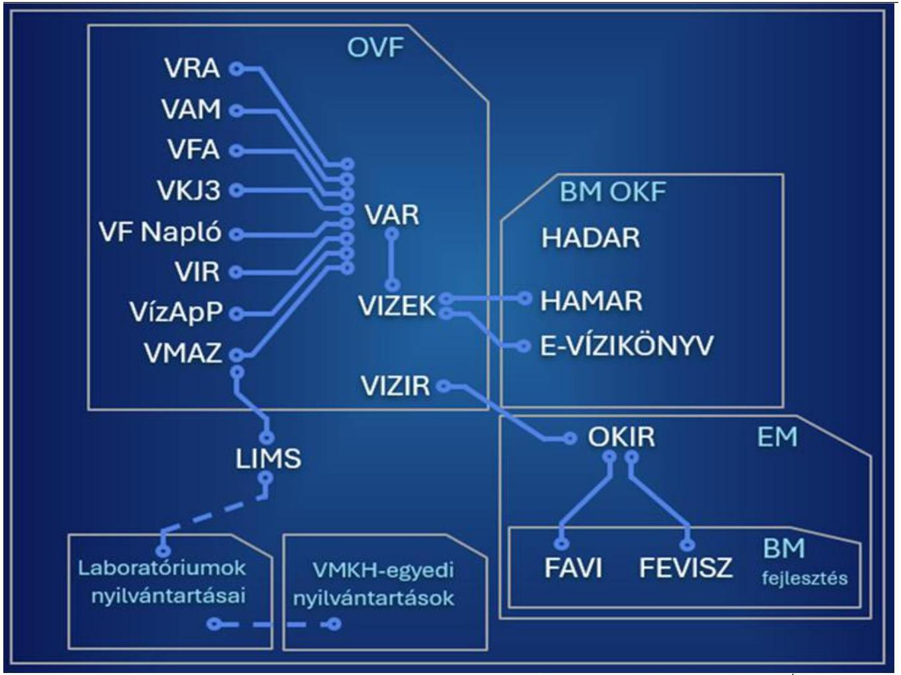

Forrás: ellenőrzött szervezetek adatszolgáltatása alapján ÁSZ saját szerkesztés
A szervezetrendszer feladatellátásához használt adatbázisok fejlesztése - a VKJ3 ${ }^{42}$, VF Napló ${ }^{43}$, $\mathrm{VAR}^{44}$ kivételével - folyamatos volt az ellenőrzött időszakban.
Az információs rendszerek fejlesztései közül az ellenőrzött időszakban megvalósult a VIZIR ${ }^{45}$, és a VIZEK projekt, továbbá 2023 decemberében lezárult a VIZIR és az OKIR rendszer közötti kapcsolat kialakítása. A VIZEK projekt-fejlesztés elsődleges célja a vízjogi engedélyezési eljárás, az ezzel kapcsolatos vízgazdálkodási, fenntartói, hatósági, adózási és kutatási-statisztikai feladatok támogatása, a beruházó oldaláról a gördülékenyebb ügyintézés, környezetvédelmi szempontból a papírmentesség, továbbá hatósági oldalról a hatékonyabb hatósági feladatellátás támogatása volt. A projekt keretében az eVízikönyvi és Vízkészletjárulék nyilvántartást, ügyféladatok szintjén pedig a VIZEK, a HAMAR ${ }^{46}$, eVízikönyv ${ }^{47}$ és a VKJ rendszereket hangolták össze.
Az OVF a „Digitális vízgazdálkodás" című projekt keretében folytatta az átfogó vízminőségi adatbázis kialakítását az ellenőrzött időszakban. A szakmai adatbázisépítés célja többek között az volt, hogy támogassa a vízgyűjtőgazdálkodás tervezését, a víztestek vízminőségi értékelését, illetve az ágazati szereplők feladatellátását. Az ÁSZ ellenőrzése alatt is fejlesztés alatt lévő közös adatbázis célkitűzését hátráltatta, hogy folyamatosan változtak a hazai jogszabályok, az uniós irányelvek és az akkreditációs hatóság általi új előírások. A 10. ábrán bemutatott szervezetrendszer által használt adatbázisok fejlesztése - a VKJ3, FV Napló, VAR kivételével - folyamatos volt az ellenőrzött időszakban.

---

2021-ben elindult a hazai vízmonitoring erősítését célzó vízmonitoring projekt. A projekt keretében a BM, az OVF, az AM és a NÉBIH ${ }^{48}$ együttműködésében felmérték a jelenlegi vízmonitoring rendszert. A felülvizsgálatot követően a BM az ellenőrzött időszakban megkezdte a 221/2004. (VII. 21.) Korm. rendelet szerinti monitoring program előkészítését, amely figyelembe veszi a szennyező anyagokra vonatkozó küszöbértékeket, továbbá az emberi egészségre vagy az ivóvízbiztonságra kockázatot jelentő szennyező anyagokat.
A többszöri irányítói szintű szervezeti változások hátráltatták a meglévő adatbázisok fejlesztése és összekapcsolása érdekében szükséges informatikai fejlesztések megvalósulását.
Az OKIR üzemeltetéséért a környezetvédelemért felelős tárca felelt, mely az ellenőrzött időszak alatt háromszor változott. Az intézményrendszer tagoltsága miatt az OKIR működtetését, fejlesztését is a megosztottság jellemezte. A környezetvédelemért felelős miniszter az OKIR rendszer üzemeltetéséért, míg a vízgazdálkodásért és vízvédelemért felelős miniszter szakmailag az OKIR FAVI, FEVISZ almoduljaiért, azok fejlesztéséért tartozott felelősséggel. Az egyes rendszermodulok fejlesztési igényei és a fejlesztések pénzügyi forrásának biztosítása - a fentiekben bemutatott okok miatt - elvált egymástól. A felelősségi viszonyok tisztázatlanságából adódóan az OKIR FAVI almodul fejlesztése nem valósult meg, az adatok nem voltak elérhetők az ÁSZ ellenőrzése alatt sem.
Az OKIR adatforrásait egyrészt a környezethasználók, másrészt a környezetvédelmi, illetve vízügyi és vízvédelmi hatóságok és igazgatási szervek által előállított, mért adatok képezték. A környezetvédelmi, a vízügyi és vízvédelmi igazgatási szervek és hatóságok, továbbá a környezethasználók által az OKIR rendszerbe teljesített adatszolgáltatások, valamint a VAR rendszer biztosította a fő adatforrást a víztestek állapotának, igénybevételének és terhelésének értékeléséhez. A környezetvédelemért, valamint a vízgazdálkodásért és vízvédelemért felelős minisztérium, irányítószervi feladatellátásuk érdekében teljeskörű hozzáféréssel rendelkeztek az OKIR adataihoz. Az irányítószervek döntéshozatalát az OKIR támogatta, azonban - részben az adatbázisok közti információcsere hiánya miatt - a döntéseket jellemzően a hatóságok rendszeres és egyedi beszámolói alapozták meg.
A szervezetek adatszolgáltatási kötelezettsége tekintetében a BM OKF éves gyakoriságú - a települési szennyvíztisztító telepek kibocsátásával összefüggő - adatszolgáltatást teljesített az OVF, továbbá a hatósági és szakhatósági tevékenységről az $\mathrm{OSAP}^{49}$ keretében a ME részére. Az OVF az ellenőrzött időszakban nem volt kötelezett a hatóságok felé az ipari eredetű vízszennyezést érintő adatszolgáltatás teljesítésére. A vármegyei kormányhivatalok rendszeres és eseti adatszolgáltatásokat teljesítettek az irányító minisztériumok, továbbá a vízügyi és vízvédelmi hatóságok felé.
Az adatbázisokban tárolt adatok jogszabály szerinti naprakészsége biztosított volt, ez azonban nem tette alkalmassá azokat arra, hogy a szennyezéseket azonnal detektálja és jelezze azt a hatóságok számára. Az adatbázisok jelzésközvetítő funkciója az utókövetést biztosította, a hatósági döntéshozatalt és az irányítási tevékenységet közvetetten, a trendek/tendenciák azonosításával támogatta.
Az ipari létesítmények OKIR-ban tárolt vízszennyezési adatait az önellenőrzés keretében vett minták laboratóriumi kiértékelését követően töltötték fel a gazdasági szereplők. Az OVF által fenntartott monitoringhálózat biztosította a felszíni és felszín alatti vizek mennyiségi és minőségi állapotának értékelését, minősítését. A szervezetrendszer nem rendelkezett olyan adatbázissal, ami az ipari - kisebbnagyobb mértékủ folyamatos - vízszennyezések azonnali jelzését közvetítette volna a hatóságok felé.

---

A környezetkárosodás észlelése céljából a rendkívüli vízszennyezések felderítése érdekében a VIZIG-ek figyelőhálózatot, és mérő-megfigyelő rendszert működtettek.
A felszíni és felszín alatti vizek monitoringjáról szóló kormányrendeletek biztosították, hogy a veszélyeztetett helyzetű víztestek esetében kellő mennyiségű adat álljon rendelkezésre azokról a szennyező anyagokól, amelyek veszélyeztették a felszín alatti vizek jó kémiai állapotát. A monitoringrendszer alkalmas volt továbbá arra, hogy a romló tendenciákat időben felismerjék a döntéshozók, és azonosíthatóak legyenek a veszélyeztetett helyzetű víztestek.
A társadalom naprakész környezeti információkhoz való hozzáférése széles körűen, a felszín alatti vizeket érintő terhelések adatai kivételével biztosított volt.
Az ellenőrzött időszakban hatályos jogszabályok alapján a környezeti információkat tartalmazó dokumentumokat az azokkal rendelkező szerveknek elektronikusan vagy más módon közzé kellett tenniük a nyilvánosság számára, valamint biztosítani kellett a döntéshozatalban való részvétel lehetőségét.
Az OVF monitoring rendszere, a VGT-k és az OKIR - a felszín alatti víztestekre vonatkozó adatok kivételével - nyilvános elérhetősége, továbbá a vízügy, vízvédelem helyzetére vonatkozó stratégiai tervek társadalmi vitára bocsátása biztosította a részletes információk rendelkezésre állását a társadalom számára.
A környezetvédelmi hatóságok által kiadott engedélyek adatainak az OKIR-ban és a hatóságok honlapján történő közzététele biztosította a társadalom tájékoztatását.
A VIZIR-ben megvalósított fejlesztések eredményeként bővült az elérhető információk köre és biztosított volt a társadalom számára a vízgazdálkodási alapadatok megismerhetősége. A VIZIR adatai magukban foglalták azokat a leíró vagy idősor jellegű adatokat, amelyek megismerése a vizek, vízilétesítmények állapotának feltárását, valamint állapotuk értékelését szolgálta.
Az ellenőrzött időszakban a társadalom tájékoztatását szolgálta továbbá az OKIR részeként működtetett FAVI, FEVISZ rendszermodul ${ }^{50}$. A FAVI rendszermodul tartalmazta a felszín alatti vizek szennyezésére, állapotára, a környezetvédelmi intézkedésekre, a szennyező anyagok bevezetésére vonatkozó adatok gyűjtését. A FEVISZ rendszermodul a felszíni vizek immissziós és emissziós adatainak gyűjtésével és lekérdezhetőségével biztosította a víztestek állapotváltozásának megismerhetőségét. Az OKIR - a felszín alatti víztestek adatai kivételével - biztosította a társadalom számára a mennyiségi és minőségi adatokhoz való hozzáférést, területi bontásban a vízszennyezést okozó ipari létesítmények, illetve a szennyező anyagkibocsátások, valamint az engedélyezések adataihoz való hozzáférést. Az OKIR nyilvános adatai alapján a vízminőséget befolyásoló szennyező anyagok legnagyobb mennyiségű kibocsátóit a V. sz. melléklet tartalmazza.

---

# 2. A hazai víztestek legalább jó állapotának elérését, fenntarthatóságát célzó finanszírozási és ösztönzési rendszer, valamint a stratégiai és irányítási fejlesztési tervek az ipari eredetű vízszennyezés megelőzésének tükrében 

| Összegző megállapítás | A vízszennyezés megelőzése és a bekövetkezett károk   elhárítása finanszírozási rendszerének nem minden eleme   esetében valósult meg a bevételek és kiadások cél szerinti   összekapcsolása. A vízszennyezés megelőzését szolgáló   ösztönző rendszer közvetlen pozitív elemeit elsősorban az   uniós forrás allokációval összhangban, a közvetett pozitív   ösztönzőket a jogalkotó a gazdasági környezethez igazítva   alakította ki. A közel egy évtizede változatlan mértékű   negatív ösztönző eszközöknek nem volt visszatartó erejük,   nem járultak hozzá a vízszennyezések eredményes   megelőzéséhez. A környezeti és vízügyi stratégiákat az   irányítók összehangolták, az iparstratégiákat azonban nem,   illetve azokhoz nem készültek stratégiai környezeti   vizsgálatok. Hiányzott az ipari víggazdálkodás stratégiai   szemléletű megközelítése. |
| :--: | :--: |

## PÉNZÜGYI KERETRENDSZER

Magyarország 2019-2023. évi központi költségvetései, valamint azok végrehajtásáról szóló zárszámadások tartalmazták a vízgazdálkodási, vízminőségvédelmi és környezetvédelmi feladatellátással érintett állami szervek költségvetési előirányzatait és a ténylegesen felhasznált pénzügyi forrásokat.
A központi költségvetés tartalmazott elkülönített előirányzatokat a vízügyi ágazat kiadásaira, a vízkárelhárítás költségeinek fedezetére, míg az ipari eredetű vízszennyezés megelőzésére, szennyvízkezelésre célzott támogatásokat, előirányzatokat nem. A költségvetés, a zárszámadás, illetve a végrehajtó szervezetrendszer beszámolói sem tartalmaztak olyan alábontásokat, mely alapján egyértelműen elkülöníthetőek az ipari vízszennyezés megelőzésére vagy vízminőségvédelemre fordított szervezeti kiadások.
A zárszámadások tartalmazták az államháztartási kiadások funkcionális bontás szerinti kimutatásait. A $\mathrm{KSH}^{\mathrm{N}} 2021$-ig gyűjtött adatokat a környezetvédelmi beruházásokról környezeti területek szerinti megbontásban. A 12. ábrán látható, hogy a 2015. évben kiemelkedő értékű volt a szennyvízkezelési és hulladékgazdálkodási beruházások mindösszesen értéke, azt követően 2019. évben csúcsosodott a 2015. évi értéknél kisebb összeggel a beruházások összértéke. A kormányzat végső fogyasztási kiadása környezetvédelem funkción az összes végső fogyasztási kiadás arányában 1,5\%-ról 1,8\%-ra emelkedett 2019. és 2022. évek között (13. ábra). Magyarország e mutató tekintetében az uniós tagállamok között a 16. helyen állt 2022-ben, az uniós átlagtól $0,1 \%$-ponttal elmaradva. Ez az adat a környezeti elemek (föld, víz, levegő, élővilág) védelmére fordított kiadások összességét jelentette, tehát nem kizárólag a vízvédelemre fordított kiadásokra szorítkozott, azok elkülönítetten kormányzati pénzügyi elszámolásokban nem jelentek meg.

---

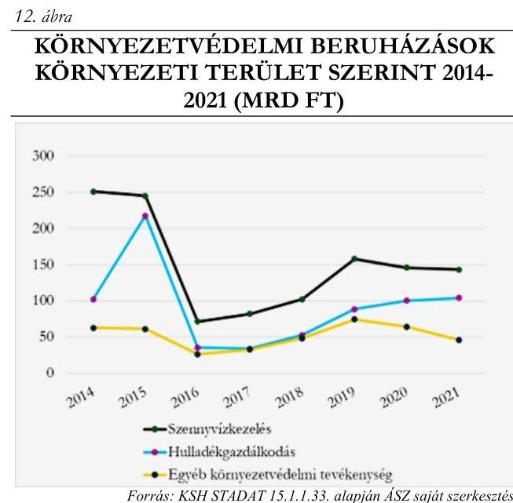
13. ábra

A KORMÁNYZAT VÉGSŐ FOGYASZTÁSI KIADÁSA A KÖRNYEZETVÉDELMI FUNKCIÓN AZ ÖSSZES VÉGSŐ FOGYASZTÁSI KIADÁS ARÁNYÁBAN (\%)
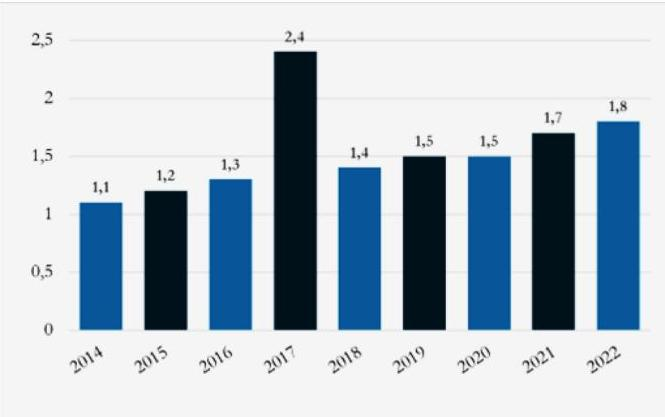

A központi költségvetésben a VIZIG-ek vízkárelhárítás költségeit felülről nyitott előirányzat biztosította, amire nagyságrendileg évente 1,2 Mrd Ft-ot különítettek el az ellenőrzött időszakban. A vízkárelhárítás összege a vízminőségi kárelhárításon túl tartalmazta az árvíz-belvíz, helyi vízkár, vízhiány elleni védekezés, helyreállítás kezelésének költségeit is. A vízminőségi kárelhárításra az állam összesen 3,77 Mrd Ft-ot költött 2019-2023. évek között.

Megoldásra vár a vízminőségi kárelhárítás az illegális hulladéklerakással érintett területeken. A felszíni vizek közelében illegálisan lerakott hulladék veszélyeztette a felszíni- és a felszín alatti vizeket, ezért esetenként a vízügyi igazgatóságok számolták fel és szállíttatták el a hulladékot annak ellenére, hogy ilyen feladatot jogszabály egyértelműen nem írt elő számukra. Ezen feladatok költségeit is a vízminőségi kárelhárításra szolgáló, felülről nyitott előirányzat terhére számolták el.

A VKI ${ }^{52}$-val összefüggő feladatellátásra a 2020. évi költségvetésben a VKI400, a 2021. évi költségvetésben pedig a VKI200 fejezeti kezelésű előirányzatok összességében 0,6 Mrd Ft összegben tartalmaztak fedezetet. Az előirányzatokat átcsoportosítást követően az OVF a BM-mel egyeztetett módon, elsősorban a VKI végrehajtásához szükséges intézkedési programokra használta fel, ami részben érintette a vízminőségvédelmet és vízminőségi kárelhárítást is.
A BM OKF és területi szervei - a vízminőségvédelmi feladatok megosztottságára is tekintettel - nem rendelkeztek a vízminőségi károk megelőzésére és elhárítására irányuló feladatok ellátására elkülönített előirányzattal.
A környezeti adók és járulékok elvonást jelentenek a gazdasági szereplőktől a környezet használatáért cserébe. A különböző bírságokat a környezeti elemek - megengedettnél nagyobb mértékủ - terhelése miatt fizetik meg az ipari üzemek. A környezet túlzott terhelése és szennyezése, illetve ezeknek költségei, mérséklésének, elhárításának anyagi terhe az egész társadalom számára jelent terhet. A szennyezés által okozott károk helyreállítási költségei miatt indokolt a környezethasználók bevonása a finanszírozásba, érvényesítve ezzel a szennyező fizet elvet.
Annak ellenére, hogy Magyarország környezeti adókból származó bevétele az ellenőrzött időszakban emelkedett, az összes adóbevételen belüli aránya 2020. év óta folyamatosan csökkent, 2022-ben 7,27\% volt. A szennyezési adók összes környezeti adóbevételen belüli aránya a 2019. évi $8,92 \%$-ról $8,36 \%$-ra csökkent 2022 -re (14. ábra).

---

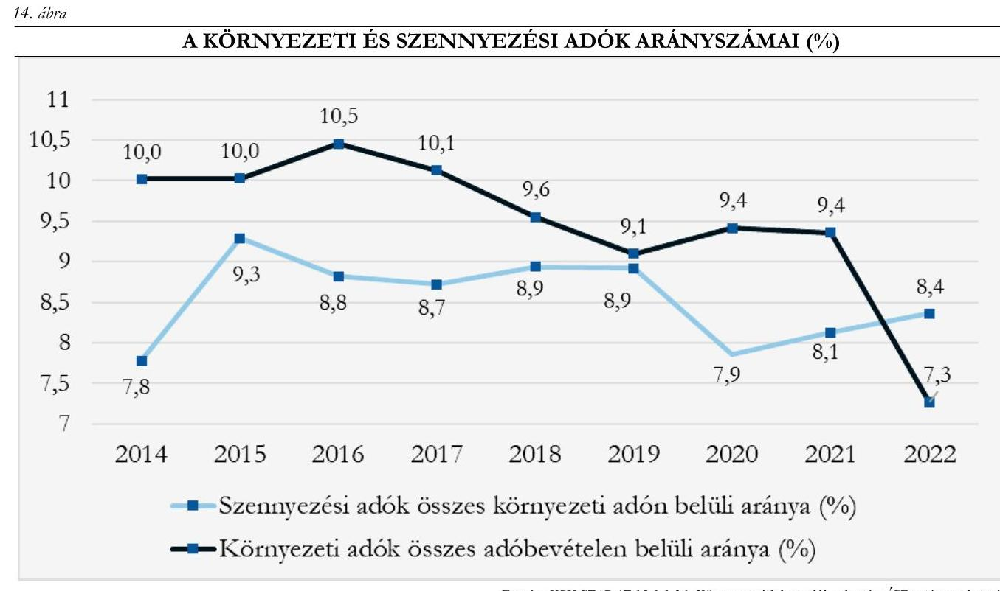

Forrás: KSH STADAT 15.1.1.36. Környezetvédelmi adók. alapján ÁSZ saját szerkesztés
A környezeti bevételeket célszerű ott felhasználni, ahol a bevétellel összefüggő állami kiadások felmerülnek. Ez pénzügyi fedezetet nyújt többek közt olyan beruházásokra is, amelyek a víz mennyiségi és minőségi védelme érdekében merülnek fel.
Az ellenőrzött időszakban több jogcímen keletkezett környezeti bevétele az államnak, amit a 8. táblázat mutat be. 8. táblázat

# A KÖRNYEZETVÉDELMI BEVÉTELEK ÉS AZ ARRA JOGOSULTAK KÖZTI MEGOSZLÁSA 

| MEGNEVEZÉS | A BEVÉTEL JOGOSULTJA | ARÁNY (\%) |
| :-- | :-- | :--: |
| Vízgazdálkodási bírság | Központi költségvetés | 100 |
| Csatornabírság | Közműszolgáltató | 97 |
|  | Vízvédelmi hatóság | 3 |
| Vízszennyezési bírság | Vízvédelmi hatóság | 70 |
|  | Kedvezményezett önkormányzat | 30 |
| Vízvédelmi bírság | Központi költségvetés | 100 |
| Felszínalattivíz-védelmi bírság | Központi költségvetés | 100 |
| Környezetvédelmi termékdíj | Központi költségvetés | 100 |
| Vízterhelési díj | Központi költségvetés | 100 |
| Talajterhelési díj | Központi költségvetés | 100 |
| Vízkészletjárulék | Központi költségvetés | 100 |
| Környezetvédelmi bírság |  |  |
| - ha önkormányzat által kiszabott | Érintett önkormányzat | 100 |
| - ha környezetvédelmi hatóság által |  |  |
| kiszabott | Központi költségvetés | 70 |
|  | Érintett önkormányzat | 30 |

---

A környezeti adókat, járulékokat, díjakat, bírságokat (együttesen a környezeti bevételeket) a vízszennyezési, valamint a csatornabírság kivételével nem célzottan használták fel vízminőségvédelemre, a vízszennyezések megelőzésére, kárelhárítási költségek ellentételezésére. A vízszennyezési bírság vízvédelmi hatóságot megillető részét vízminőségvédelemre, a vízszennyezések megelőzésére, valamint a vízügyi ágazat kárelhárítási költségeinek fedezetére használták fel.
A Kvtv. előírásai szerint a környezetvédelmi bírság a települési önkormányzati környezetvédelmi alap bevétele. Bár a környezetvédelmi alap létrehozása önkéntes, annak létrehozását a jogalkotó azzal ösztönözte, hogy amennyiben a települési önkormányzat rendelkezik környezetvédelmi alappal, úgy annak bevételét képezheti egyes esetekben a talajterhelési díj is.
A központi költségvetés nem tartalmazott környezetvédelmi vagy vízvédelmi költségek, fejlesztések fedezetéül szolgáló elkülönített pénzügyi alapot, de az elvégzendő feladatokra biztosított forrásokat.
A Kvtv. alapján az állam feladata a környezetvédelem gazdasági-pénzügyi alapjainak biztosítása. A környezetvédelmi, vízvédelmi célú forrásteremtés nem újkeletű, az elmúlt évek során különböző formát vett fel. A hazai költségvetésben 2019. évet megelőzően szerepelt a Központi Környezetvédelmi Alap (KKA), később fejezeti kezelésű előirányzatként jelent meg (Környezetvédelmi Alap Célfeladatok KAC), majd a környezetvédelem és a vízügy egy minisztériumhoz kerülését követően megjelent benne a vízügyi célelőirányzat (KÖVICE).
Az ellenőrzött időszakban a Víziközművek Állami Rekonstrukciós Alapja (VÁRA) a 2018-2020. évi költségvetésekben jelent meg. Részben ebből is finanszírozták a víziközmű-szolgáltatók gördülő fejlesztési terveiben szereplő rekonstrukciós célok megvalósítását évi 1,5 Mrd Ft-os kerettel.
Az irányító szervek nem kezdeményezték a hulladékgazdálkodáshoz hasonló környezeti felelősség érvényesítését előmozdító pénzügyi biztosítékok rendszerének kialakítását. A helytelen üzemeltetésből, előre nem látható káresemények miatt bekövetkező ipari vízszennyezéshez köthető kötelező pénzügyi garanciát, biztosítékot, céltartalékképzést az ellenőrzött időszakban hatályos jogszabályok nem írtak elő a gazdálkodó szervezetek részére.
A környezetvédelmi, vízvédelmi célú pénzügyi biztosíték rendszere az előre nem látható környezeti károk elhárítását lehetővé tevő finanszírozást hivatott biztosítani. A környezeti felelősségről szóló, 2004/35/EK irányelv értelmében a tagállamoknak, így Magyarországnak is intézkedéseket kellett tennie annak érdekében, hogy ösztönözzék a gazdasági szereplőket megfelelő biztosítás vagy más pénzügyi biztosíték igénybevételére.
A Kvtv. 101. § (5)-(6) bekezdése, illetve 110. § (7) bekezdés 4. pontja felhatalmazta a Kormányt arra, hogy meghatározott tevékenységet folytató gazdasági szereplőket rendeletalkotás útján környezetvédelmi biztosíték adására vagy céltartalék képzésére kötelezze. Ezzel a lehetőséggel az ipari eredetű vízszennyezést érintő tevékenységek körét illetően nem éltek a jogalkotók.
A környezet- és vízvédelmi szempontok a hazai és uniós fejlesztési források prioritásainak meghatározásában a szennyvízelvezetésen és -tisztításon, szennyvízkezelés megvalósításán, a kármentesítési feladatokon keresztül közvetetten érvényesültek.
Az ellenőrzött időszakban az állami szervek költségvetésén túl, a hazai és uniós források felhasználását és ezek alapján a vízvédelmi szempontok prioritásait a 15. ábra szemlélteti.

---

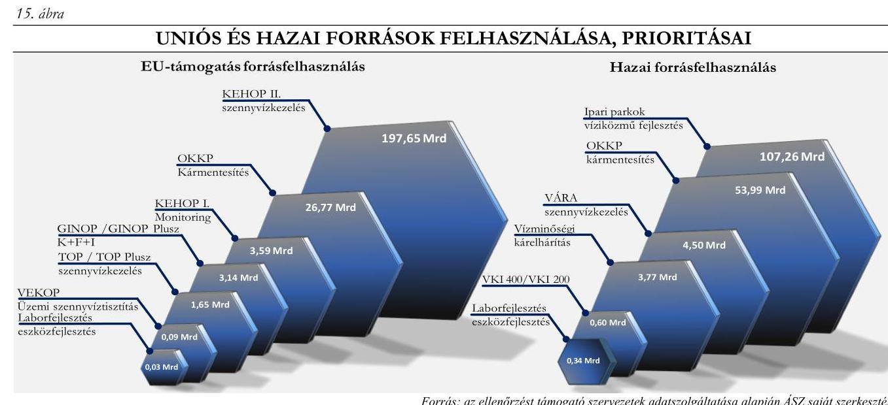

Forrás: az ellenőrzést támogató szervezetek adatszolgáltatása alapján ÁSZ saját szerkesztés

# Uniós források 

Az uniós források felhasználásának prioritásait a BM az OVF előkészítése mellett szakértői munkacsoporttal határozta meg a vízgazdálkodási, vízvédelmi szempontokra figyelemmel azzal, hogy az öntözés támogatása kiemelt prioritást kapott.
Fontos megjegyezni, hogy a szennyező fizet elv értelmében az uniós támogatásokat az ipari szereplők (társaságok) szennyvíztisztítás fejlesztésre nem pályázhatták meg.
Az ipari eredetű vízszennyezés megelőzését, csökkentését közvetett módon támogatta az uniós - és $15 \%$-ban hazai - forrásokból finanszírozott szennyvízhálózatok bővítése (a közműolló zárása), rekonstrukciója, a szennyvíztisztító telepek fejlesztése.
Közvetlenül hozzájárultak a felszín alatti vizek ipari eredetű szennyezésének csökkentéséhez a hátrahagyott ipari üzemek miatt részben uniós forrásból elvégzett kármentések. A 2014-2020-as uniós költségvetési ciklusban az OKKP ${ }^{53}$ keretében zajlottak kármentesítési programok. A 2021-2027-es uniós költségvetési ciklusban a források csökkenése az OKKP és a KEHOP+ ${ }^{54}$ terhére indított projekteket és kifizetéseket is érintette.
Az állami forrásokból származó pénzeszközök cél szerinti felhasználását a víziközmúszolgáltatók beruházásaiért felelős ÉKM és a ME/KTM, mint az operatív programok Irányító Hatósága folyamatosan nyomon követte. A BM az OVF és a BM OKF egyedi és éves rendszeres beszámolóin keresztül, az EM pedig irányító szervként az OKKP végrehajtására fordított források felhasználását figyelemmel kísérte.

## ÖSZTÖNZÖK RENDSZERE

Az ösztönzők rendszerének kialakításakor nem volt deklarált szempont az (ipari eredetű) vízszennyezés megelőzése. A vízszennyezés elleni fellépésre alkalmas eszközként a magyar jogrendszer kiépítette a negatív ösztönzőket, azonban a bírságok rendszerének nem volt visszatartó ereje, mert annak mértéke nem követte a gazdaságfejlődés mértékét, illetve a szennyező árbevételével sem volt arányban. Ezáltal a bírságok nem érték el a jogalkotó által kívánt célt (a szennyezőkkel szembeni hatékony fellépést) így megállapítható, hogy a bírságolási rendszer nem volt célszerűen

---

kialakítva. A kialakított közvetett pozitív ösztönzők nem kizárólag a vízszennyezés megelőzésének eszközei voltak, mivel céljuk az intézményrendszer müködtetése fenntartási költségeinek megteremtése is volt.
Az alkalmazott ösztönzőket a 16. ábra szemlélteti. A negatív ösztönzők a víz minőségével, míg a járulékok és az árpolitika a víz mennyiségével hozhatók összefüggésbe.
16. ábra

A VÍZSZENNYEZÉS MEGELŐZÉSÉNEK ÖSZTÖNZÖRENDSZERE
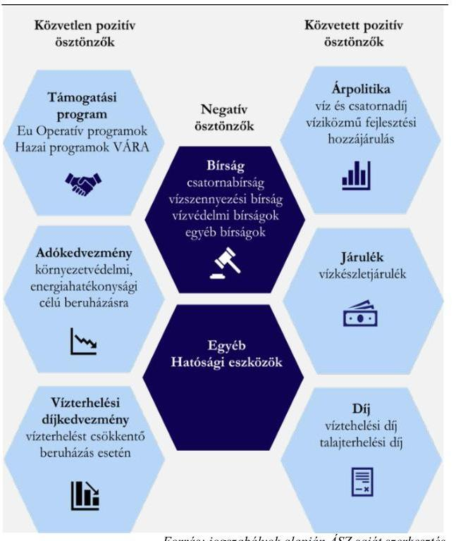

Aztartolás az ipari szereplők jogkövető magatartásának előmozdítására nem hatósági, megelőzési eszközöket is alkalmaztak. A környezet-, és vízhasználók jogkövető magatartásának biztosítására a hatóságoknak számos - az adott szituáció súlyosságától függő - eszköze volt. Első lépésként a hatóságok szisztematikusan tájékoztatták az érintetteket a megváltozott jogszabályi kötelezettségekről (szakmai szervezet útján is), ezzel támogatva az önkéntes jogkövetést. Igény szerint az engedélyezési eljárást megelőzően és közben is volt lehetőség a hatóság és az ügyfél közötti egyeztetésre.

A vízügyi, vízvédelmi hatóságok enyhébb és súlyosabb hatósági eszközöket alkalmaztak. Az ellenőrzésünk tapasztalatai szerint a vízszennyezés miatt bírsággal sújtott szervezetek száma, a jogsértések számossága és a kiszabott bírságok összege nem csökkent, így kijelenthető, hogy a bírságok nem bírtak visszatartó erővel (17. ábra). Az ellenőrzési jogkövetkezmények, bírságok visszatartó erejét nem mérték az ágazati szereplők, így a negatív ösztönzők hatására indított fejlesztések mértéke sem volt ismert az irányító szervek előtt.
Enyhe eszköznek minősültek azok a hatósági intézkedések, amelyek elsősorban nem szankcionális jellegűek. Ezek közé tartoztak az intézkedési terv készítési kötelezettség és a szennyezéscsökkentési ütemterv előirása, ismételt ellenőrzések végrehajtása, a kiadott engedély módosítása. Keményebb eszközök közé tartoztak a jogkövetkezmények, különböző szankciók és bírságok alkalmazása. Súlyosabb vízszennyezés esetében kötelezést, a tevékenység végzésének korlátozását, a káros, vagy fenyegető állapot megszüntetését, indokolt kármegelőző vagy -elhárító munkák elvégzésének előírását, vagy a tevékenység megszüntetésének előírását, az engedély visszavonását alkalmazták.

---

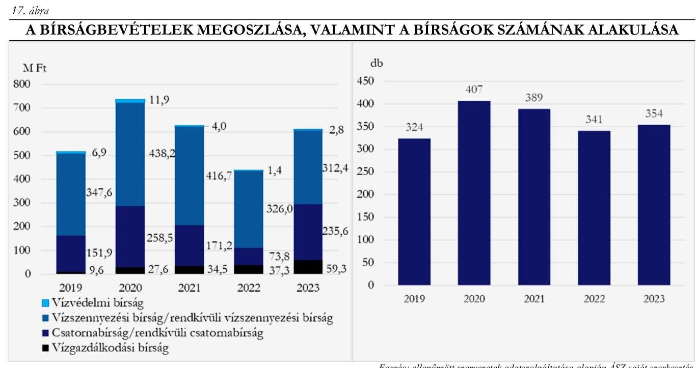

Forrás: ellenörzött szervezetek adatszolgáltatása alapján ÁSZ saját szerkesztés

A víziközmú közszolgáltatóknál költségként jelentkező kárelhárítási munkálatok részbeni ellentételezésére szolgáló csatornabírság bevétel rendelkezésre állásának időpontja, és az annak alapját képező szennyezés bekövetkezésének időpontja között akár 1,5-2 év különbség is volt.
Abban az esetben, ha az üzem (előtisztított) szennyvizét a víziközmú-szolgáltató tisztította, mind az ellenőrzés, mind a bírságolás rendszere elsősorban a vízközmú-szolgáltató társaságokat tette érdekeltté abban, hogy a szennyezéseket megakadályozzák. Az engedélyezési eljárásban ugyanis a víziközmúszolgáltató adott - hatóság által nem ellenőrzött befogadó nyilatkozatot arra az esetre, ha a vele szerződő üzem megfelelő határértékre/küszöbértékre előtisztított szennyvizet bocsát a közcsatornába. Amennyiben az üzem határérték feletti szennyezettségű szennyvizet bocsátott be, a víziközmú-szolgáltató e tényt akkreditált mérésekkel állapította meg. A mérések, valamint a tisztítás, illetve esetleges kárelhárítás többletköltsége a víziközmú-szolgáltatókat terhelte, azok ellentételezése - a jogszabályi rendelkezések szerint - a csatorna-szolgáltatási díjakban kellett megképződjön.

## 18. ábra

CSATORNABÍRSÁGOK RENDELKEZÉSRE ÁLLÁSÁNAK ÁTFUTÁSI IDEJE
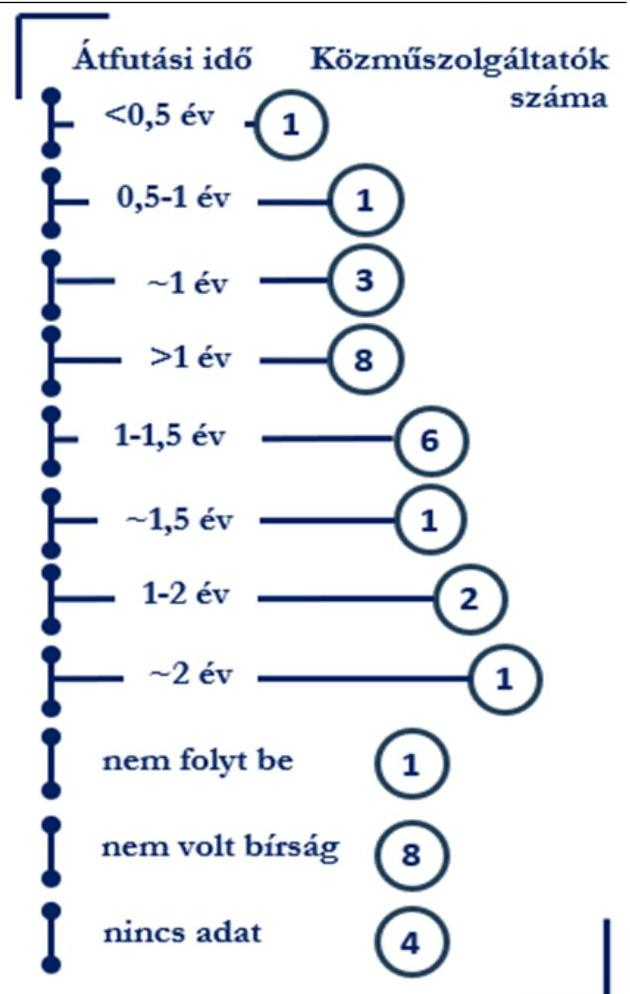

Forrás: ellenörzött szervezetek adatszolgáltatása alapján ÁSZ saját szerkesztés

---

Amennyiben a határérték túllépés bizonyított volt, a víziközmű-szolgáltató bírság kiszabását kezdeményezte. A hatóság által kiszabott bírságból a víziközmű-szolgáltatók adatszolgáltatása szerint jellemzően 1-1,5 éves, szélsőséges esetben közel 2 éves átfutási időt követően keletkezett bevétele. (18. ábra)
Ennek oka az, hogy a csatornabírságok kiszabása iránti kérelmet a víziközmű-szolgáltatók a tárgyévet megelőző naptári évben bekövetkezett szennyezésekről a tárgyév március 31-ig kezdeményezhették a vízvédelmi hatóságnál. A hatóság a bírságokat az adott év december 31-ig szabhatta ki és csak ezt követően folyt be a bírságbevétel a szolgáltatóhoz. Ez a gyakorlat az inflációs környezetet nem vette figyelembe és negatív hatással volt a szennyező fizet elv érvényesítésére.
A különböző bírságok, díjak és járulékok mértéke az elmúlt évtizedben változatlanok maradtak (19. ábra), reálértékük az ellenőrzött időszakban csökkent. Ez gyengítette a szennyező fizet elv érvényesülését, egyre kisebb mértékben volt képes fedezni a szennyezések megelőzésének és az azok által okozott károk helyreállítási költségeit, továbbá nem ösztönözte az ipari szereplőket a vízszennyezés és környezetkárosítás elkerülésére. A bírságok lehetséges összege és a potenciális fejlesztő beruházások értéke az ellenőrzött időszakban aránytalan volt, ezért nem ösztönözte az ipari üzemeket saját szennyvíztisztító berendezéseik fejlesztésére. A bírságok mértékének meghatározásakor a jogalkotó nem volt figyelemmel az ipari üzem méretére, árbevételére, a károkozás ismétlődő jellegére.
Az alkalmazott szankciók, bírságok rendszere túl enyhe ahhoz, hogy valóban elrettentsék az ipari üzemeket a jogellenes magatartástól.
19. ábra

MIÓTA VÁLTOZATLANOK A BÍRSÁGOK, JÁRULÉKOK
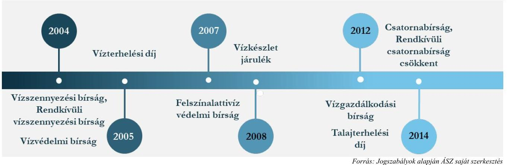

Forrás: Jogszabályok alapján ÁSZ saját szerkesztés
Fontos megjegyezni, hogy az ipari kibocsátásokról szóló irányelvet az unió 2024 áprilisában módosította, mely a szankciókat is érintette. Ennek értelmében olyan közigazgatási pénzbírságokat kell alkalmazni, amelyek ténylegesen megfosztják a jogsértést elkövetőket a jogsértésből származó gazdasági előnyöktől. A jogi személy által elkövetett legsúlyosabb jogsértések esetén a pénzbírságok maximális összege az üzemeltető által a bírság kiszabásának évét megelőző pénzügyi évben elért uniós éves árbevétel legalább $3 \%$-a kell legyen. Az említett jogsértések esetében a tagállamok büntetőjogi szankciókat is elfogadhatnak, feltéve, hogy azok hatékonyak, arányosak és visszatartó erejűek. A tagállamoknak 2026. július 1-ig kell átültetniük az irányelvben eszközölt módosításokat.
Az ellenőrzött időszak végén hatályba lépett 432/2023. (IX. 21.) Korm. rendelet szerint veszélyhelyzet ideje alatt a környezetvédelmi jogszabályokat, valamint a környezetvédelmi hatóság által kiadott

---

engedélyben foglalt előírásokat megszegő ipari szereplőkkel a környezetvédelmi hatóság - bírságot kiszabó határozat helyett - szerződést köthetett. Amennyiben a környezetszennyező jogi személy környezetvédelmi hatósági szerződésben vállalta a szabálytalanságok megszüntetését, úgy akár mentesülhetett is a bírság megfizetése vagy egyéb súlyosabb jogkövetkezmények (tevékenység felfüggesztése, korlátozása, tiltása) alól. Mindez az elővigyázatosság, megelőzés és szennyező fizet elv érvényesítése, a jogkövető magatartás kikényszerítése és a vízvédelmi beruházások ösztönzése szempontjaival ellentétes hatásokat eredményez, miközben fennáll annak a kockázata, hogy a hatósági szerződés alkalmazásával az általános ügymenet szerint kiadott határozattal szemben a hatóságok adminisztrációs terhei nőnek. Amennyiben a hivatkozott jogszabály szerint a környezetvédelmi hatóság szerződést köt az ipari szereplővel és abban a környezetszennyező a jogkövetkezmények alól teljeskörűen mentesül, úgy fennáll annak a kockázata, hogy sérül a visszalépés tilalmának elve, azaz a környezetvédelmi jogszabályokban korábban fellelhető garanciális elemek hatékonyságához képest a környezetvédelem szintje csökkenhet.
Pozitív ösztönzők közé sorolhatóak az adórendszeren keresztül nyújtható kedvezmények. A hazai társasági adószabályozásban több beruházásösztönző adókedvezmény volt jelen, többek közt itt jelent meg a környezetvédelmi beruházásra vonatkozó kedvezmény. Meghatározott kereteken belül a környezetvédelmi beruházás értékével csökkenthető volt a számított társasági adó. A KSH adatai arra mutatnak rá, hogy az ellenőrzött időszakban éves szinten 200-300 Mrd Ft összegű környezetvédelmi célú beruházás történt a vállalati szektorban. A KSH adatok aggregáltsága miatt nem különíthető el a társasági adókedvezmény tényleges vízvédelmi hatása és szerepe.
2024. év elején a nem lakossági felhasználók víz- és csatornadíjai átlagosan két-, háromszorosra emelkedtek, amely a gyakorlatban a vízdíj esetében $576 \mathrm{Ft} / \mathrm{m}^{3}$, a csatornadíj esetében $881 \mathrm{Ft} / \mathrm{m}^{3}$ díjat jelentett. Az intézkedés hatásai az ellenőrzés lefolytatásának idején nem voltak ismertek, azok hosszabb távon értékelhetők. A víziközmű-szolgáltatási díjak megemelése a vízigény csökkentésére, a használtvíz újrahasznosítására, továbbá új szennyvíztisztítási technológiák bevezetésére ösztönözheti az ipari vállalkozásokat. Az alapellátáson felül a többletszolgáltatás esetén a csatornadíj meghatározása során a víziközmű-szolgáltató figyelembe vette a befogadott ipari szennyvíz minőségét, így a differenciált díjakkal közvetetten ösztönözte a szennyvíztisztítási technológiai beruházásokat. Következésképp érdekeltté teszi az ipari vállalkozásokat a vízszennyezések megelőzésében, emiatt az intézkedés összhangban volt az unió környezetvédelmi politikájának alapját képező „,szennyező fizet" elvével.
Az iparügyekért felelős tárca - 2019-2022. április között ITM, 2022. május-november között TIM, 2022. decemberétől $\mathrm{NGM}^{55}$ - irányította a Kormány iparfejlesztési koncepciójának és programjának kidolgozását, valamint más minisztériumok ágazati szakterületeivel együttműködésben volt felelős kidolgozni az egyes ágazatokat érintő technológiai fejlesztési javaslatokat. A pozitív ösztönzők körébe illeszkedően az iparügyekért felelős tárca és vele együttműködésben sem a BM, sem az EM nem tett vagy készített olyan technológiaváltásra irányuló kezdeményezéseket, javaslatokat, koncepciókat, intézkedéseket az ellenőrzött időszak alatt, amelyek az ipari vízfelhasználás csökkentését, ipari használt víz újrahasznosítását, az ipari szennyvíztisztító berendezések fejlesztését, az ipari szennyvíziszap kezelését, tárolását, újrahasznosítását elősegítették, ösztönözték.

---

# STRATÉGIAI KERETRENDSZER 

A vízpolitikai stratégiák és tervek (KJT ${ }^{56}$, VGT2, VGT3, SZKHS ${ }^{57}$, NVKS ${ }^{58}$ ), a környezetpolitikai stratégiák (NKP4 ${ }^{59}$, NKP5 $^{60}$, $\mathrm{OHT}^{61}$, NES $^{62}$, NÉS $^{63}$, NTFS $^{64}$ ) illetve az egyéb országos, átfogó stratégiák (NVS ${ }^{65}$, NFFK $^{66}$, OFTK $^{67}$ ) célkitűzései és célrendszerei összhangban álltak.
A hazai vízgazdálkodási és vízvédelmi szabályozás egyik alapköve az unió tagországaiban 2000. december 22-én hatályba lépett Víz Keretirányelv. Az ebben rögzített előírások végrehajtása valamennyi tagállamra nézve kötelező volt, így a magyar vízstratégiák is kiemelten kezelték a kielégítő és jó minőségű víz biztosítását, az egységes monitoringon és hatáselemzésen alapuló intézkedési tervkészítési kötelezettséget. A vízszektor szerteágazó, számos további ágazatot érint, ezért a vízügyi szakpolitikai stratégia integrált szemléletet és összevetést igényelt a környezeti és ipari szakpolitikai stratégiákkal.
Az ellenőrzött időszakban a víz minőségi és mennyiségi védelméhez, a szennyvíz és szennyvíziszap kezeléséhez, továbbá az iparpolitikához - közvetlenül, vagy közvetetten - kötődő célt, célrendszert tartalmazó stratégiákat, programokat, terveket és azok időhorizontját a 20. ábra mutatja be.
20. ábra

AZ ELLENŐRZÖTT IDŐSZAKOT ÉRINTŐ RELEVÁNS STRATÉGIÁK, PROGRAMOK, TERVEK
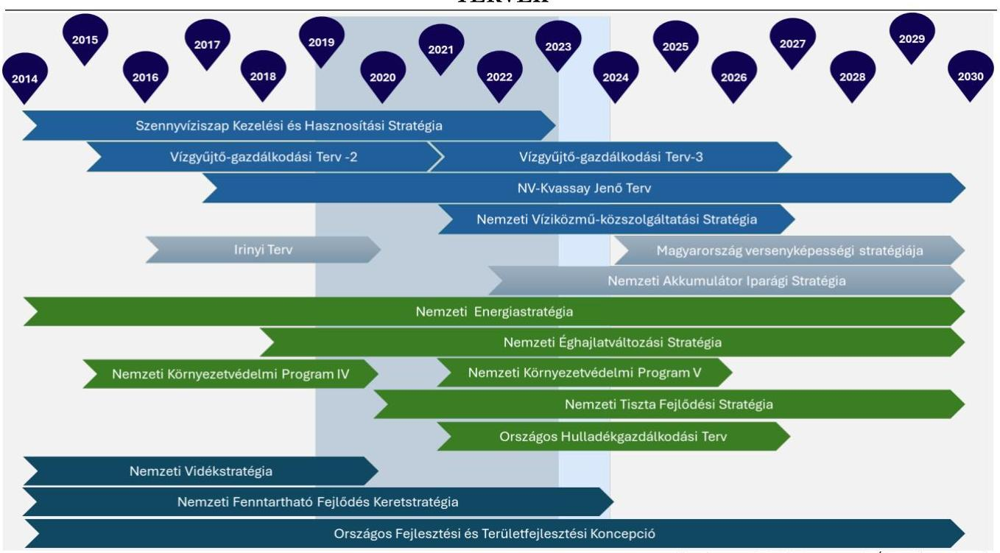

A Nemzeti Vízstratégia - Kvassay Jenő Terv a magyar vízgazdálkodás keretstratégiája, mely a 38/2012. (III.12.) Korm. rendelet értelmében vízügyi szakpolitikai stratégiának minősül. A KJT középpontjában a vízválság elkerülése, a víz jövő nemzedék számára történő megőrzése, a víz kártételei elleni védekezés, illetve a víz természeti egysége és a vízgazdálkodás társadalmi-gazdasági megosztottsága közötti ellentétet feloldó integrált vízgazdálkodás áll. Ennek megfelelően a KJT a vizek kezelésével és állapotával összefüggésben közép és hosszútávú célokat jelöl ki, intézkedéseket és feladatokat határoz meg.
A KJT ipari eredetű vízszennyezés megelőzését és csökkentését tartalmazó közvetlen célkitűzést nem tartalmazott. A VKI célkitűzéseivel összhangban jelent meg közvetett célként a vizek állapotának fokozatos javítása, a jó állapot elérése, illetve a társadalom és a víz viszonyának a javítása,

---

mely cél elérésének eszközeként a lakossági, ipari és mezőgazdasági használók körében a hatékony és takarékos vízhasználat népszerűsítését, és a tisztított szennyvíz hasznosítását jelölte meg.
A VKI elsődleges célja, hogy a felszíni és felszín alatti vizek „jó állapotba" kerüljenek. Az uniós célkitűzések teljesítése érdekében Magyarország 6 éves tervezési ciklusokban készíti el vízgyűjtőgazdálkodási tervét, ami egyben a KJT célkitűzéseinek elérését támogató eszköz is. Amellett, hogy a VGT értékeli a hazai vizeink állapotát, számos intézkedést és feladatot határoz meg a „jó állapot" elérése érdekében. A „jó állapot" elérésének feltétele a VGT2, VGT3 intézkedési program általános és szabályozási intézkedéseinek átfogó megvalósulása, illetve a szükséges pénzügyi források biztosítása.
Jelentős vízgazdálkodási problémaként jelent meg a VGT3-ban az ipari szennyvíz felszíni vízbe történő bevezetése. A VGT2, VGT3 értékelte az ipari eredetű vízterheléseket és közvetlen intézkedési javaslatot fogalmazott meg az ipari szennyvíztisztítók korszerűsítésére, bővítésére, valamint kommunális rendszerbe vezetett ipari szennyvíz vízminőségi szabályozására a legjobb elérhető technika (BAT) által.
A Nemzeti Víziközmű-közszolgáltatási Stratégia feljogosító feltételeinek teljesüléséhez szükséges intézkedésekről című dokumentum tárgyalta a kezelt szennyvíz ismételt felhasználását és javasolta az ipari vízrendszerek kiépítése szükségességének vizsgálatát, konkrét célkitűzések azonban nem jelentek meg. Az SZKHS rögzítette az iszapgazdálkodás fejlesztése során megvalósítandó iszapkezelés hatékonyságának és hasznosításának céljait, azonban a stratégiának nem tárgya az ipari szennyvíztisztítókban, előkezelőkben keletkező iszapok kezelése és hasznosítása/ártalmatlanítása.
Az Irinyi Terv ${ }^{68}$ átfogó ipari célkitűzéseinek elérését támogató eszközként megjelent az új technológiák alkalmazásának elősegítése, mely közvetett módon hozzájárulhat az ipari eredetű vízszennyezés megelőzéséhez és csökkentéséhez. Az ellenőrzött időszakban hatályos iparpolitikai stratégiák azonban a víz mennyiségi és minőségi védelmének szempontjából nem tartalmaztak célkitűzéseket, intézkedéseket, szempontokat.
A 2024-ben elfogadott Magyarország versenyképességi stratégiában már megjelenik stratégiai célként a környezetvédelmi gondolkodásmód térnyerése a járműiparban, illetve általános fejlesztési célként a környezettudatos és fenntartható építőipar.

# I. Stratégiaalkotási folyamat 

Az iparpolitikai stratégiákba a vízvédelmi szempontok nem épültek be.
A stratégiai dokumentumok elkészítésének folyamatát (21. ábra) a KSIR ${ }^{69}$, valamint a 2001/42/EK Irányelvet ${ }^{70}$ a hazai jogrendbe átültető 2/2005. (I. 11.) Korm. rendelet ${ }^{71}$ szabályozta. Az ellenőrzés során értékelt stratégiai dokumentumok ezen rendeletek hatálya alá tartoztak.

---

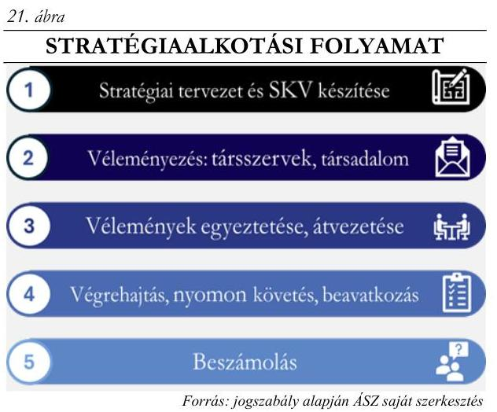

Az ellenőrzés elsősorban azt vizsgálta, hogy az iparpolitikai stratégiák előkészítése során a vízvédelemért és a környezetvédelemért felelős tárcák véleményezték-e a stratégia tervezeteket, érvényesítették-e a véleményezés során a vízvédelmi, környezetvédelmi szempontokat és hogy azokat végső soron figyelembe vette-e az iparügyekért felelős tárca. Az irányító szervek együttmúködésének, véleményezésének keretei biztosítottak voltak annak érdekében, hogy a különböző stratégiai dokumentumokban egyaránt érvényesüljenek a vízvédelmi, a környezetvédelmi és az iparpolitikai szempontok.

A víz és környezetvédelmi stratégiai dokumentumokat társadalmi egyeztetésre bocsájtották, többek között a tudományos közélet képviselői, szakértők, civil szervezetek bevonásával. Biztosították a lehetőséget az egyetemek, kutatóhelyek észrevételeinek megtételére, azok megtárgyalására és a stratégiába építésére, ami biztosította a tudományos szempontok implementálását. Az ellenőrzött időszakban hatályos, valamint a 2024-ben elfogadott iparpolitikai stratégiákhoz a BM vízgazdálkodási és vízvédelmi felelősségi körében nem tett észrevételt, így azokba nem épültek be vízvédelmi szempontok.
A környezetvédelemért felelős tárca a BM-hez hasonlóan az Irinyi Tervhez nem, csak az azt kiegészítő stratégiákhoz és cselekvési tervekhez tett észrevételt. A 2024. évben elfogadott Magyarország Versenyképességi Stratégiájának véleményezése során az EM élt észrevételezési jogával és érvényesítette a környezetvédelmi szempontokat, melyek megjelentek a stratégiában.
A stratégiai célok elemzésekkel, előzetes környezettanulmányokkal, hatástanulmányokkal, kockázatelemzésekkel, felmérésekkel, számítások készítésével való alátámasztása érdekében a KSIR meghatározta azon terveket, programokat, amelyekhez a stratégiaalkotási folyamat során stratégiai környezeti vizsgálatot kell készíteni. Ennek megfelelően a BM és az EM a felelősségi körükbe tartozó vízgazdálkodási és környezetvédelmi stratégiai dokumentumokhoz elkészítette az SKV ${ }^{72}$-kat. Az iparügyekért felelős tárca az ellenőrzött időszakban hatályos stratégiák egyikéhez sem készített SKV-t. Ezt a hiányosságot az Irinyi Tervet kiegészítő Iparfejlesztési stratégia 4.0 dokumentum véleményezése során a környezetvédelemért felelős tárca jelezte. Stratégiai környezeti vizsgálatok hiányában az iparstratégiai tervdokumentumok környezeti és az ezzel összefüggő társadalmi hatásainak előrejelzése és értékelése nem történt meg és az iparpolitikáért felelős tárca nem értékelte az iparstratégiák környezetvédelmi, vízminőségi célkitűzésekre és a fenntartható fejlődés irányába történő elmozdulásra gyakorolt hatását.

# II. Stratégiai célok, intézkedések, programok eredményessége 

A VGT2-ben meghatározott, ipari vízszennyezéssel közvetlenül összefüggő programok megvalósításáról, előrehaladásáról a felelősök beszámolót, összefoglalót nem készítettek.
A KJT-ben megfogalmazott, ipari eredetű vízszennyezéssel közvetetten összefüggő célokat (9. sz. táblázat), eszközöket, intézkedéseket rögzítették.

---

# A KIT-BEN MEGFOGALMAZOTT, IPARI EREDETŰ VÍZSZENNYEZÉS MEGELŐZÉSÉVEL, CSÖKKENTÉSÉVEL KÖZVETETTEN ÖSSZEFÜGGŐ CÉLOK 

## CELKITÜZES

A VÍZGAZDÁLKODÁS
HOSSZÚ TÁVÚ CÉLJAI
(2030)

3. A vizek állapotának fokozatos javítása, a jó állapot elérésére.

## 5. A társadalom és a víz viszonyának a javítása (mind egyéni, mind gazdasági, mind döntéshozói szinten).

## KÖZÉPTÁVÚ CÉLOK 2020-IG

## ESZKÖZ - INTÉZKEDÉSEK

A szennyvízkibocsátás és elhelyezés ne rontsa sem a felszíni, sem a felszín alatti víztestek előírás szerinti állapotát, a veszélyes anyagok vizekbe kerülésének korlátozása

Termálvíz, egyéb FAV készletek hasznosítása csak az utánpótlódási képesség mértékéig történjék

A szennyező anyagok terhelése ne lépje túl az asszimilációs képességet

A vízkészletek megőrzése fontosságának jobb megértetése társadalommal és a döntéshozókkal.
3.1. A VGT2 intézkedéseinek végrehajtása a jó minőségủ vízkészletek fenntarthatóságának biztosítása érdekében.
3.2. A VGT2 hazai jogkövetkezményeinek kidolgozása és az érvényesítésükhöz szükséges eszközök megteremtése a vízállapotok következetes javítása érdekében.
3.4. A vízkészlet, mint természeti elem egységes mennyiségi és minőségi kezelésének megteremtése.
3.5. A vízminőségi kárelhárítás megfelelő szervezetének, eszközeinek, jogszabályi kereteinek biztosítása.
5.4. A hatékony és takarékos vízhasználat népszerűsítése a lakossági, ipari és mezőgazdasági használók körében, az ÚJ VÍZ, mint tisztított szennyvíz hasznosítása.

Forrás: KJT alapján ÁSZ saját szerkesztés

A célok elérésének eszközeként elsősorban a VGT2 intézkedéseinek végrehajtását jelölték meg. Az ipari eredetű felszíni-, felszín alatti vízszennyezés megelőzése, csökkentése érdekében közvetlenül és közvetetten kitűzött célokhoz rendelt intézkedések által elért eredményekről a 2022-2023. évek tekintetében a BM nem rendelkezett információval. A stratégiai célkitűzések előrehaladásának folyamatos nyomon követését és értékelését gátolta a rendelkezésére álló adatok mennyiségének elégtelensége, az összehasonlításra és értékelésre alkalmas adatok feldolgozottságának hiánya. A VKI szerinti ,jó állapotú" víztestek 2027. évi célértékek teljesítésére kockázatot jelent, hogy adatok hiányában a beavatkozásokért felelős szervezetek nem tudnak időben korrekciós döntéseket hozni.
A VGT2 elkészítése az OVF feladata volt, így az abban megfogalmazott intézkedések, programok végrehajtására vonatkozó információk, adatok is az OVF-nél összpontosultak. A VGT-ben megtervezett intézkedések végrehajtására nincs kényszerítő erő (hatáskör hiányában az OVFnek sem). A monitoringprogram megfelelt a VKI előírásainak, azonban a VGT2 állapotértékelése során azonosították, hogy a terhelések hatásainak, a terhelések és víztest-állapot közötti összefüggések megállapításához, az intézkedések tervezéséhez és a már beindított intézkedési programok hatásának ellenőrzéséhez a monitoringhálózat és programok további bővítése, megerősítése szükséges.

---

A kiváló és jó minőségű ökológiai víztestek aránya - a tervhez képest 2021. évre - kis mértékben javult (10. számú tábla), azonban a vízminőségjavulás nem a tervek szerint haladt, így a KJT-ben foglalt vízminőségi célkitűzések elérése a VGT-ben foglalt rész-célkitűzések szerint nem valósult meg.
10. tábáirat

JÓ ÉS KIVÁLÓ ÖKOLÓGIAI ÉS MENNYISÉGI ÁLLAPOTÚ VÍZTESTEK ARÁNYA AZ ÖSSZES ÉRTÉKELT VÍZTESTHEZ KÉPEST

| JÓ ÉS KIVÁLÓ ÁLLAPOTÚ   VÍZTESTEK ARÁNYA   AZ ÖSSZES ÉRTÉKELT   VÍZTESTHEZ KÉPEST | VGT1   CÉLKITÜZÉS   2015-RE   2009. | VGT2   ÁLLAPOT   2015. | KJT   CÉLKITÜZÉS   2021-RE   2017. | VGT3   ÁLLAPOT   2021. | KJT   CÉLKITÜZÉS   2027-RE   2017. |
| :--: | :--: | :--: | :--: | :--: | :--: |
| Vizfolyások (ökológiai állapot) | $10 \%$ | 7,50\% | $16 \%$ | $11,10 \%$ | $26 \%$ |
| Állóvizek (ökológiai állapot) | $21 \%$ | $11,7 \%$ | $12 \%$ | $12,30 \%$ | $66 \%$ |
| Felszín alatti víztestek (mennyiségi állapot) | $69 \%$ | $80 \%$ | $83 \%$ | 80,00\% | $91 \%$ |

Figyelembe kell venni azt is, hogy a víztestek kémiai állapotértékelésére vonatkozó uniós határértékek néhány kivételtől eltekintve folyamatosan szigorodtak, a monitoring pontok száma - ezzel az értékelt víztestek száma is - növekedett, a közműolló záródása miatt pedig megnövekedett a szennyvíz mennyisége.
Az ipari eredetű vízszennyezés visszaszorításával, megelőzésével közvetlenül - „Ipari szennyvíztisztítók korszerűsítése, bővítése" elnevezésű intézkedéscsomag - és közvetetten összefüggő intézkedések (IX. sz. melléklet) előrehaladásáról az OVF nem rendelkezett információval. Nagyobb előrelépés a Szennyvíztisztító telepek építése és korszerűsítése területén történt, aminek a felszíni vízminőségre gyakorolt pozitív hatása kimutatható. A Szennyvíz Program ${ }^{73}$ végrehajtásának következtében a növekvő csatornázottságból adódóan javult a felszín alatti vizek minősége, azonban megnőtt a felszíni vizekbe jutó tisztított szennyvíz mennyisége.
Az ellenőrzött időszakban nem fejeződött be kármentesítési program. A finanszírozási források csökkenésével a kármentesítési programok intenzitása csökkent. Összesen 70 db kármentesítési program volt folyamatban, amire 80,8 Mrd Ft-ot költött az állam, míg további 80 db állami felelősség körébe tartozó kármentesítéssel érintett feladat megkezdése volt hátra az ellenőrzött időszak végén 293 Mrd Ft becsült költséggel. Ezek mielőbbi végrehajtása kiemelten fontos, hiszen az idő előrehaladtával a kármentesítés állami költségei emelkednek és fokozatosan növekszik a felszín alatti vízbázisok elszennyeződésének kockázata. A KEHOP Plusz források kármentesítési feladatokra tervezett keretösszege 12,8 Mrd Ft, ami megközelítőleg 2-3 állami felelősségi körbe tartozó szennyezett terület megtisztítására lesz elegendő.

---

# III. Viz-, környezetvédelem és iparpolitika egyensúlya 

A környezet- és vízpolitika, valamint az iparpolitika közti egyensúly megteremtését gátolta az, hogy hiányzott az ipari vízgazdálkodás stratégiai szemléletű megközelítése (22. ábra).
22. ábra

A KÖRNVEZET- ÉS VÍZPOLITIKA, VALAMINT AZ IPARPOLITIKA EGYENSÚLYÁNAK VISZONYA
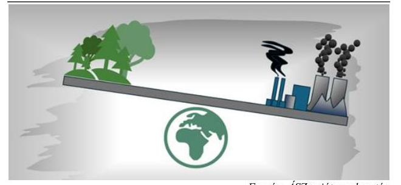

Forrás. Alú saját tzerkezés

Az ipari vízgazdálkodás nemcsak különböző ipari technológiák halmaza, hanem legalább ilyen mértékben a vízgyűitő területen jelenlévő ipari szereplők gazdálkodás-menedzsmentjének együttműködése is.
A KJT - nem ipari vagy mezőgazdasági vagy egyéb területek szerint, hanem - általános jelleggel fogalmazza meg a fenntartható, integrált vízgazdálkodást támogató célkitűzéseket, illetve annak eléréshez rendelt eszközöket, intézkedéseket.

A stratégiában megfogalmazott hosszútávú átfogó, integrált vízgazdálkodási célkitűzések elérését hátráltatta a befogadó víztest terhelhetőségének állami oldalról történő vizsgálatáért való felelősség egyértelmű meghatározásának és a kockázatelemzések hiánya, ami növelte az állami externális költségek díjrendszerbe történő beépítésének kockázatát. A különböző - engedélyezési folyamatoknál korábban bemutatottak szerint a környezetvédelmi, építési, vízjogi - engedélyezési eljárásokra, folyamatokra, az eljárásokban kötelezően benyújtandó dokumentumok körére vonatkozó előírásokból hiányzott az ipari vízgazdálkodás stratégiai szemléletű megközelítése.
Az ipari üzemek létesítésénél a gyakorlat szerint elsőként a telephely kiválasztása történik meg és csak ezt követően vizsgálják meg a tevékenység környezeti hatásait, vízigényét, szennyvízkezelését, -elvezetését, majd határozzák meg a tevékenység jellegéhez igazodó környezetvédelmi és vízvédelmi szempontokat. Az ipari vízgazdálkodás stratégiai szemlélete ezt a folyamatot megfordítja és a tervezett tevékenység vízigénye, keletkező szennyvíz mennyisége és minősége alapján meghatározza, hogy területileg hol lehetséges a gazdálkodás folytatása, vagy a kiválasztott telephelyen, még a beruházást megelőzően meghatározza a környezetvédelmi és vízvédelmi előírásokat, a terhelhetőségi vizsgálat alapján az ipari eredetű szennyvíz befogadásának feltételeit annak érdekében, hogy a beruházó tisztában legyen a hatósági elvárásokkal és költségekkel.
A stratégiai célok és a stratégiai folyamatok értékelésénél bemutatottak szerint a környezet- és vízpolitika, valamint az iparpolitika közti egyensúly megteremtését gátolta a közvetlen ipari vízszennyezés megelőzésére és csökkentésére irányuló célkitúzés, valamint az iparpolitikai stratégiákhoz szükséges SKV-k hiánya.
Akadályozta az ágazati politikák közti egyensúly megteremtését a korábban bemutatott negatív ösztönzők rendszere, illetve a szervezetrendszer számára biztosított tárgyi- humánerőforrás kapacitás szűkössége.
Az engedélyezési folyamatok ipari vízgazdálkodás stratégiai szemléletű áttekintése és újraszabályozása a KJT-ben megfogalmazott, a vízgazdálkodást jellemző állapotok és folyamatok gyengeségeit és veszélyeit is kezelik.

---

# IV. Stratégiai fejlesztési tervek 

A vízszennyezés megelőzésének feladatait ellátó szervezetrendszer tárgyi, pénzügyi, személyi feltételeire felmérés, illetve azok fejlesztésére, megerősítésére, valamint a pénzügyi ösztönző rendszer fejlesztésére stratégiai célokat rögzítő terv nem készült.
Az ipari eredetű vízszennyezés megelőzése és csökkentése érdekében ellátott állami feladatok eredményességét és hatékonyságát alapvetően a rendelkezésre álló személyi, tárgyi, pénzügyi feltételek, keretek határozták meg.
A BM 2019. júliusában felmérte a környezetvédelmi, vízvédelmi mérési feladatokat ellátó kormányhivatali laboratóriumok költségvetését, állományi létszámát, műszerparkját. A vízügyi, vízvédelmi feladatokat ellátó személyzet száma - 2019. májusi állapot szerint - 111 fő volt, azonban a megfelelő feladatellátás a vizsgálatok alapján 225 főt igényelt volna. A műszerállomány állapotát kielégítőnek ítélték - a vízhez köthető mérések terén rendelkezésükre álló információ alapján - azonban mérési képességeik fejlesztésre szorultak. A BM fejlesztési tervdokumentumában megállapított laborproblémákat, lényeges tárgyi eszköz hiányosságokat. A felmérés alapján a BM fejlesztési javaslatot fogalmazott meg maximum két „nemzeti" laboratórium fejlesztésére, a gépjárműpark megújítására, valamint az állományi létszám növelésére.
Az EM kezdeményezésére - az ipari beruházások számának gyarapodása, valamint az új technológiák megjelenése okán - a KTM a laboratóriumi hálózat múködtetésére és fejlesztésére irányuló koncepció kidolgozását megkezdte 2024-ben. A koncepció célja volt többek közt az új ipari technológiák megjelenésével esetlegesen felmerülő további komponensek felmérését támogató laboratóriumi mérőkapacitás biztosításához szükséges fejlesztési igények meghatározása. A felmérés szerint a teljes környezetvédelmi laboratóriumi állomány (ide értve a víz, levegő és egyéb mérési feladatokat ellátó) létszáma sem érte el 2023-ra a BM által korábban kizárólag a vízügyi, vízvédelmi feladatok ellátásához indokoltnak ítélt létszámot. Az ellenőrzött időszakban a környezetvédelmi laboratóriumok állományi létszáma, országos szinten 13 fővel ( $7,9 \%$ ) csökkent (VIII. sz. melléklet).
A környezetvédelemért felelős minisztérium a vizsgált időszakban a környezetvédelmi hatóságok, illetve a regionális környezetvédelmi laboratóriumok tárgyi, pénzügyi és humánerőforrásainak megerősítését, fejlesztését szolgáló tervet nem készített.
A BM OKF középirányító a vízügyi- és vízvédelmi szakterületre vonatkozó fejlesztési tervet nem készített, tervezése a teljes katasztrófavédelmi szervezetrendszer éves költségvetési tervezésére korlátozódott.
Az OVF fejlesztési tervdokumentumai kiterjedtek az OKKP végrehajtására irányuló pénzügyi források meghatározására, illetve a víz állapotértékelését támogató monitoring rendszer továbbfejlesztésére.
Az ipari eredetű vízszennyezés megelőzése és csökkentése szempontjából a víziközmű-szolgáltatóknak a korábban bemutatottak szerint kiemelkedő szerepük volt. A víziközmű-szolgáltatók a közszolgáltatás hosszú távú biztosíthatósága érdekében víziközmú-rendszerenként 15 éves időtávra GFT-t voltak kötelesek készíteni, amit a MEKH hagyott jóvá. A GFT két részből adódott össze, a felújítási és pótlási, illetve a beruházási tervrészből.
A 2024. év közi ágazati átalakítást megalapozó fejlesztési terveket, tanulmányokat, hatásvizsgálatokat, elemzéseket, számításokat sem az EM, sem a BM nem készített, az ágazati átalakítás vízvédelmi szempontú hatékonyságát nem értékelték.

---

# JAVASLATOK 

Az ÁSZ tv. 33. § (1) bekezdésében foglaltak értelmében az ellenőrzött szervezet vezetője köteles a jelentésben foglalt megállapításokhoz kapcsolódó intézkedési tervet összeállítani és azt a jelentés kézhezvételétől számított 30 napon belül az ÁSZ részére megküldeni. Amennyiben az ellenőrzött szervezet vezetője nem küldi meg határidőben az intézkedési tervet, vagy továbbra sem elfogadható intézkedési tervet küld, az Állami Számvevőszék elnöke az ÁSZ tv. 33. § (3) bekezdése a) és b) pontjaiban foglaltakat érvényesítheti.

## ENERGIAÜGYI MINISZTER RÉSZÉRE

1. Határozza meg a terhelhetőségi vizsgálat fogalmát, illetve vizsgálja felül és kezdeményezzen jogszabálymódosítást a víztestek terhelhetőségi vizsgálatáért felelős szervezet meghatározása érdekében.
2. Az ipari vízgazdálkodás stratégiai szemlélet kialakítása érdekében vizsgálja felül és kezdeményezze az engedélyezési eljárás jogszabályi környezetének módosítását, kiemelten a környezet és vízjogi engedélyezési folyamatok szakaszainak egymásra épülésére, a szükséges dokumentumok körére, a vízszennyező anyagok határértékeire és az eljárási határidőkre figyelemmel.
3. Az állami tulajdonban lévő víztestek vagyonkezelői számára biztosítsa a szakhatósági eljárásokban való kötelező jellegű részvételt, valamint az állami vagyonért való felelősségére tekintettel mérlegelje és kezdeményezze a vagyon megőrzési és megóvási kötelezettség teljesítésének ellátását megerősitő, VIZIGeket érintő ellenőrzési jogkörök biztosítását.
4. Vizsgálja felül a szennyvízkibocsátók önellenőrzési rendszerének jogi környezetét és kezdeményezzen jogszabálymódosítást a vízvédelmi feladatellátás hatékonyságának növelése érdekében.
5. Vizsgálja felül a díjak és járulékok, valamint a csatorna és vízvédelmi bírságok mértékét és kezdeményezzen jogszabálymódosítást azok reálértékének megtartása érdekében, figyelemmel az ipari kibocsátásokról szóló 2010/75/EU irányelv módosítására (a szennyező ipari létesítmény árbevétele és a bírság összegének kapcsolatát illetően).
6. A kapacitások felhasználásának optimalizálása érdekében készítsen hosszútávú koncepciót és kezdeményezze annak megvalósítását a vízügyi, vízvédelmi szakterület hatékony területi jelenlétének biztosítása érdekében.
7. Mérje fel és mérlegelje a víziközmü-szolgáltatók laboratóriumi kapacitásai állami feladatellátásba történő bevonásának lehetőségét a feladatellátás hatékonyságának növelése érdekében.

---

8. 

Mérje fel és mérlegelje a „szennyező fizet elv" érvényesitésének lehetőségét az alábbi szempontokból:

- környezeti felelősség érvényesitését előmozdító pénzügyi biztosítékok rendszerének kialakítását;
- a vízvédelmi költségek és fejlesztések fedezetéül szolgáló elkülönített vízvédelmi alap, célelőirányzat létrehozását.

9. Támogassa mind jogalkotási, mind szakmai irányítási tevékenysége részeként a környezetvédelmi, vízügyi és vízvédelmi hatósági tevékenység éves terveinek kockázatalapon történő megtervezését az országosan egységes nyilvántartási rendszer kialakításával az ismert, a visszaeső és potenciális vízszennyezőkről.
10. Módszertani és eljárási ajánlásokkal gondoskodjon a környezetvédelmi, vízügyi és vízvédelmi hatóságok országosan egységes engedélyezési, ellenőrzési döntéshozataláról, jogértelmezéséről, adat- és információáramlásról.
11. A vízügyi tudományos-kutató háttértámogató intézeti kapcsolatrendszer kialakítása és megerősitése érdekében készítsen hosszútávú koncepciót és kezdeményezze annak megvalósítását, hogy az új anyagok és technológiák alkalmazása esetén minél hamarább meghatározásra kerülhessenek a határértékek.

---

# MELLÉKLETEK 

## I. SZ. MELLÉKLET: ÉRTELMEZŐ SZÓTÁR

befogadó
befogadó terhelhetősége
célszerűség
diffúz szennyezés
elővigyázatosság elve
elsőbbségi anyag
emisszió
eredményesség
externális költségek

A felszíni víz, valamint annak medre (Forrás: 220/2004. (VII. 21.) Korm. rendelet)
Előzetes vízszennyezettségi vizsgálatok és a vonatkozó vízszennyezettségi határérték alapján az illetékes vízvédelmi hatóság által megállapított olyan mértékủ, még megengedhető terhelés, amely mellett még biztosítható a környezeti célkitüzés elérése. (Forrás: 220/2004. (VII. 21.) Korm. rendelet)
A célszerűség követelménye azt jelenti, hogy a bevételeket a közfeladat megvalósítása érdekében, a kiadásokat a közfeladatok megfelelő ellátásához szükséges mértékben, a költségvetési célrendszer érdekében, a meghatározott célra (közfeladat ellátására), továbbá észszerűen, racionálisan használták fel. Az erőforrások észszerű, racionális felhasználása alatt a tudatos döntéshozatalt vagy az erőforrások olyan módon történő, tudatos felhasználását foglalja magában, amely számba veszi a lehetséges előnyöket és hátrányokat, tisztában van a következményekkel, kerüli a túlzásokat, törekszik a saját tevékenységével való konzisztenciára, a helyes elvek alkalmazására és a megfelelő érvek hatására hajlandó az önkorrekcióra is. A gondosság a körültekintő alapossággal történő eljárást jelenti, amelyet az előrelátó óvatosság és a döntések következményének, kimenetének vizsgálata jellemez. (Forrás: Az ÁSZ ellenőrzési alapelvei és módszertana)
A diffúz szennyezőforrások nagy kiterjedésben és szétszórtan jelentkeznek. A diffúz szennyezések a területen szétoszolva általános kiterjedésben fordulnak elő, és pontosan nem meghatározható helyeken kerülnek a vizekbe (például mezőgazdasági területekről, vagy a burkolt utakról a vizekbe bemosódó szennyezés). Ellentétük a pontszerú szennyezőforrás, amikor a szennyezés helye pontosan beazonosítható (pl. csővég) (Forrás: Fogalomtár A vízgyűjtő-gazdálkodási tervezés társadalmi vitaanyagaihoz, http://www2.vizeink.hu/files/fogalomtar.pdf).
Ha egy intézkedés vagy politika káros hatással lehet a környezetre vagy a közegészségre, és továbbra is fennáll a tudományos bizonytalanság annak hatásait illetően, az intézkedést mindaddig nem szabad végrehajtani, amíg további bizonyítékok nem állnak rendelkezésre. (Forrás: Európai Parlament Környezetpolitika: általános elvek és alapvető keretek; https://www.europarl.europa.eu/factsheets/hu/sheet/71/kornyezetpolitika-altalanos-elvek-es-alapveto-keretek)
A Bizottság egy elsőbbségi anyagokat felsoroló listára vonatkozó javaslatot nyújt be, amely anyagokat azok közül választ ki, amelyek a vízi környezetre vagy a vízi környezeten keresztül jelentős kockázatot jelentenek. (Forrás: Az Európai Parlament és Tanács 2000. október 23-i 2000/60/EK irányelve - a vízvédelmi politika terén a közösségi fellépés kereteinek meghatározásáról, 16. cikk)
A különböző típusú forrásokból időegység alatt kibocsátott szennyezőanyag mennyisége (Forrás: https://www.hidrotanszek.hu/files/4164/Kornyved alapfogalamak.pdf)
A kitűzött célok és a tervezett eredmények (hatások) elérését jelenti, azt, hogy az ellenőrzött terület (tevékenység, folyamat, projekt, beruházás, informatikai rendszer stb.) vagy szervezet a kitüzött célokat és a szándékolt eredményeket (hatásokat) elérte. A gazdálkodás, a feladatellátás eredményességét a szervezet által kitüzött célok és a szándékolt eredmények (hatások) elérésének (a tényleges és a tervezett eredmények) össevetése révén lehet meghatározni. (Forrás: Az ÁSZ ellenőrzési alapelvei és módszertana)
A környezetszennyező tevékenység negatív hatásainak költsége. (Forrás: Szlávik János (2019): Fenntartható gazdálkodás. Budapest: Wolters Kluwer Kft.. https://doi.org/10.55413/9789632958200
Letöltve: https://mersz.hu/dokumentum/YOV1449_47/\#YOV1449_45_p3 (2025. 01. 12.)

---

felszín alatti víz
felszíni víz
fenntartható fejlődés
gördülő fejlesztési terv
hatásfok
hatásfok
hatékonyság
immisszió
inert hulladék
jó állapot
kibocsátási határérték

A terepfelszín alatt a földtani közeg telített zónájában (így különösen a földtani képződmények pórusaiban, hasadékaiban) elhelyezkedő víz. (Forrás: 219/2004. (VII. 21.) Korm. rendelet)
A föld felszínén lévő állóvíz (így különösen: tó, bányató, mocsár, tározó), vízfolyás (így például: folyam, folyó, patak, ér, csatornák, időszakos vízfolyás, vízmosás) vize. (Forrás: 220/2004. (VII. 21.) Korm. rendelet)

A fenntartható fejlődés (sustainable development) olyan fejlődési folyamat, ill. szervezési elv, ami „kielégíti a jelen szükségleteit anélkül, hogy csökkentené a jövendő generációk képességét, hogy kielégítsék a saját szükségleteiket" (Forrás: Egyesült Nemzetek Szervezete 1987-es Brundtland jelentés).
Víziközmű-rendszerre vonatkozó hosszú távú, felújítási és pótlási, valamint beruházási tervrészből álló terv. (Forrás: 2011. évi CCIX. törvény)
A hatásfok az adott berendezésben eltávolított és a bevezetett szennyezőanyag mennyiségének aránya [\%](Forrás: https://eta.bibl.uszeged.hu/2861/7/K\%C3\%B6rnyezetv\%C3\%A9delmi\%20M\%C5\%B1veletek_Gyakorlati\% 20seg\%C3\%A9dlet\%20\%C3\%A9s\%20p\%C3\%A9ldar\%C3\%A1r_.pdf)
A hatékonyság elve azt jelenti, hogy a rendelkezésre álló erőforrásokkal a szervezet a lehető legtöbbet érje el. Ez az elv az igénybe vett erőforrások és az elért eredmények mennyiségben, minőségben és időben kifejezett kapcsolatát jelenti. (Forrás: Az ÁSZ ellenőrzési alapelvei és módszertana)
Egy adott területen különböző szennyeződést okozó anyagoknak a környezetbe (levegőbe, talajba, vízbe) jutása, illetve ennek koncentrációja (Forrás: Kerekes Sándor (2018): A környezetgazdaságtan alapjai. Budapest: Akadémiai Kiadó. https://doi.org/10.1556/9789634542261
Letöltve: https://mersz.hu/dokumentum/dj331aka_63/\#dj331aka_60_p7 (2025. 01. 12.))
Olyan hulladék, amely semmilyen jelentős fizikai, kémiai vagy biológiai átalakuláson nem megy át; jellemzője, hogy nem oldódik, nem ég, sem más fizikai vagy kémiai reakcióba nem lép, biológiai úton nem bomlik, vagy nincs kedvezőtlen hatással a vele kapcsolatba kerülő más anyagra oly módon, hogy környezetszennyezést okozna, vagy károsítaná az emberek egészségét; további jellemzője, hogy teljes kioldhatósága, szennyezőanyag tartalma, valamint a csurgalékvíz ökotoxicitása elhanyagolható, és nem veszélyezteti a felszíni vizek, illetve a felszín alatti víz minőségét. (Forrás: 20/2006. (IV. 5.) KvVM rendelet)
A vizek VKI ${ }^{74}$ szerinti jó állapotát egyrészt az emberi egészség, másrészt az ökoszisztémák igényei határozzák meg. Akkor tekinthetők a vizek jó állapotúnak, ha az ivóvízellátásra, vagy egyéb célokra (rekreáció, öntözés) használt vizek minősége megfelel a használat által szabott és a meghatározott környezetminőségi követelményeknek, és a vizektől függő természetes élőhelyek működését nem zavarják az ember által a vizekben okozott mennyiségi és minőségi változások. Vízfolyások és állóvizek esetén a jó ökológiai és kémiai állapot vagy potenciál, a felszín alatti vizeknél a jó kémiai és mennyiségi állapot elérése a cél 2015-ig, de legkésőbb 2027ig. Erősen módosított vagy mesterséges víztestek esetében a jó állapot helyett a jó ökológia potenciál elérése és fenntartása a cél (Forrás: Magyarország vízgyűjtő-gazdálkodási terve 2021). Egy víztest együttes értékelése akkor lehet „jó", ha mindkét szempontból eléri a jó állapotot. Ha vagy a kémiai, vagy az ökológiai (felszín alatti vizeknél mennyiségi) állapota ennél rosszabb, az határozza meg az összesített értékelést is (http://www2.vizeink.hu/files/fogalomtar.pdf).
A vízszennyező anyagok kibocsátásaira vonatkozó határértékekről és alkalmazásuk egyes szabályairól szóló miniszteri rendeletben meghatározott keretek között, hatósági határozatban előírt - közvetlen vagy közvetett úton - a felszíni vízbe, illetve közcsatornába, közös üzemi csatornába vezethető szennyező anyag mértéke. Az adott szennyező anyagra vonatkozó határérték megadható koncentrációban, tömegáramban, előállított termékegységre, felhasznált anyagmennyiségre, gyártási kapacitásra vonatkozó fajlagos mennyiségben, illetve százalékos csökkentési hatásfokban. (Forrás: 220/2004. (VII. 21.) Korm. rendelet)

---

kibocsátási
küszöbérték
környezeti adó
közműolló
legjobb elérhető technika
megelőzés elve
monitoringhálózat

Országos Környezeti Kármentesítési Program
reziliencia
szennyezési adó

Jogszabályban, jogszabályi keretek között hatósági határozatban meghatározott kibocsátási határérték, mely a közcsatornába vezethető szennyező anyag minőségét és megengedett mértékét határozza meg. (Forrás: 220/2004. (VII. 21.) Korm. rendelet)
Környezeti adóknak nevezzük az OECD és az Eurostat definíciója értelmében azokat az adótípusokat, amelyek adóalapja olyan fizikai egység, aminek bizonyítottan negatív hatása van a környezetre. A környezettel összefüggő adófajták az alábbi négy csoport valamelyikébe sorolhatók: energiaadók (beleértve a szén-dioxid-adót is), közlekedési/szállítási adók, szennyezési adók, erőforrásadók. A környezeti adó fogalmával megegyezik a környezetvédelmi adó fogalma, így értelmezendők a KSH STADAT 15.1.1.36. táblájában szerepelő adatok is. (Forrás: Központi Statisztikai Hivatal, https://www.ksh.hu/sdg/3-32-sdg-17.html)
A közműolló a közüzemi vízhálózatba és csatornahálózatba bekapcsolt lakások arányának különbsége százalékpontban kifejezve (Forrás: https://www.ksh.hu/sdg/3-13-sdg-6.html).
Elérhető legjobb technika mindazon technika, beleértve a technológiát, a tervezést, karbantartást, üzemeltetést és felszámolást, amelyek elfogadható műszaki és gazdasági feltételek mellett gyakorlatban alkalmazhatóak, és a leghatékonyabbak a környezet egészének magas szintű védelme szempontjából. (Forrás: kormany.hu, https://ippc.kormany.hu/bat)
Olyan eszköz, amelynek célja a környezeti károk megelőzése, nem pedig az azokra való reagálás. Ehhez a környezeti károk előrejelzésére és elkerülésére szolgáló, megelőző intézkedésekre van szükség (Forrás: Európai Parlament Környezetpolitika: általános elvek és alapvető keretek; https://www.europarl.europa.eu/factsheets/hu/sheet/71/kornyezetpolitika-altalanos-elvek-es-alapveto-keretek)
A potenciális szennyezés forrásánál, de még a szennyezés bekövetkezését megelőzően történő fellépés kötelezettségét jelenti: annak biztosítását, hogy a környezetet esetlegesen károsító folyamatok ne következzenek be. (Forrás: 13/2018. (IX. 4.) AB határozat [20] bekezdés)
A vízhez kapcsolódó monitoring olyan rendszeres mintavételi, mérési, vizsgálati észlelési tevékenységet jelent, mely a felszíni és felszín alatti vizek mennyiségi és minőségi állapotának megállapítását, jellemzését, illetve az állapot rövid, vagy hosszú távú változásának leírását teszi lehetővé. A 2000/60/EK Víz Keretirányelvben - a vizek jó állapotának elérése érdekében előírt valamennyi intézkedés a monitoring programokon alapuló állapotértékelésen nyugszik. A Víz Keretirányelv (VKI) monitoring programok lényege, hogy az egyes víztesteket az előírt, és a terhelések alapján megállapított minőségi elemre és paraméterkörre, megadott gyakorisággal kell vizsgálni (Forrás: Magyarország vízgyűjtő-gazdálkodási terve - 2021).
Az OKKP Magyarország egyik legjelentősebb hosszú távú fejlesztési programja, ami az elmúlt évszázad intenzív iparosításából hátrahagyott környezeti károk országos felmérésével, azonosításával és ütemezett felszámolásával lehetőséget teremt a sérült, károsodott környezet újrahasznosítására, további nemzetgazdasági fejlesztések megvalósítására, egyben a lakosság egészségének megóvására, a stratégiai jelentőségű víz és talajkészletünk jó állapotának megőrzésére. Az OKKP kiterjed a szennyező fizet elv alapján és az állami felelősségi körben történő kármentesítési beavatkozásokra, mely utóbbi a kormányzati feladatmegosztásnak megfelelően ún. tárca-alprogramok keretében történik. (Forrás: 20 éves az Országos Környezeti Kármentesítési Program c. kiadvány, 2016.)
A rendszerek fennállása szilárdságának és arra irányuló képességének az elért foka, hogy miközben e rendszerek képesek bármiféle változás és zavar elnyelésére, mindazonáltal változatlanul fenn tudják tartani ugyanazon viszonyokat és állapotokat különféle sokaságok vagy állapotváltozók között egyaránt (Forrás: Varga Csaba (2022): Jogváltozás. Budapest: Akadémiai Kiadó - Társadalomtudományi Kutatóközpont. https://doi.org/10.1556/9789634548300

Letöltve:
https://mersz.hu/dokumentum/m988jv_11/\#m988jv_9_p3 (2025. 01. 12.))
Azon típusú adók, amelyek alapja a levegő- és vízszennyezés, a különféle szilárdhulladék-, vagy zajkibocsátás (Forrás: Központi Statisztikai Hivatal, https://www.ksh.hu/sdg/3-32-sdg17.html).

---

szennyező fizet elv Azt előíró elv, hogy az általa okozott szennyezés költségeit a szennyezőnek kell állnia, e költségekbe beleértve a szennyezés megelőzésének, megfékezésének és felszámolásának költségeit, valamint a társadalomra háruló költségeket is.
(Forrás: https://op.europa.eu/webpub/eea/special-reports/polluter-pays-principle-122021/hu/)
Az olyan gazdasági szereplőnek, aki környezeti kárt okoz, vagy akinek tevékenysége ilyen jellegű közvetlen kárveszéllyel fenyeget, elvben viselnie kell a szükséges megelőző vagy felszámolási intézkedések költségeit. Olyan esetben, amikor az illetékes hatóság saját maga vagy harmadik fél útján egy adott gazdasági szereplő helyett jár el, biztosítania kell az általa viselt költségek behajtását a gazdasági szereplőtől. Indokolt továbbá, hogy végül a gazdasági szereplő viselje a környezeti kár, illetve az ilyen jellegű közvetlen kárveszély felmérésével kapcsolatos költségeket. (Forrás: a környezeti károk megelőzése és felszámolása tekintetében a környezeti felelősségről szóló 2004/35/EK irányelv)
szennyvíziszap A szennyvíztisztítás során természetes, vagy mesterséges eljárással leválasztott szilárd anyagok és víz keveréke. Fajtái:

- a mechanikai fokozatból kikerülő iszap a primer (vagy nyers) iszap,
- a biológiai fokozatból kikerülő iszap a szekunder iszap (vagy fölösiszap),
- a harmadik fokozatból kikerülő iszap, általában vegyszeres iszap.

A fentiek közül két vagy több iszapfajta keveréke a kevert iszap (Forrás: Szennyvíziszap kezelési és hasznosítási stratégia 2014-2023)
technológiai határérték Az elérhető legjobb technika alkalmazásából és a kapcsolódó szennyvíztisztítási tevékenységből származó szennyezőanyag-kibocsátás értékei alapján megállapított, az adott technológiára vonatkozó kibocsátási határérték. (Forrás: 220/2004. (VII. 21.) Korm. rendelet)
területi határérték A vízminőség-védelmi területi kategóriák alapján meghatározott a közvetlen bevezetésre vonatkozó határérték. (Forrás: 220/2004. (VII. 21.) Korm. rendelet)
vízgazdálkodás A vizek hasznosítása, hasznosítási lehetőségeinek megőrzése, a vizek kártételei elleni védelem és védekezés (vízkárelhárítás) (Forrás: 1995. évi LVII. törvény - a vízgazdálkodásról)
víztest Felszíni víztest: a felszíni vizek lehatárolt, különálló, jelentős eleme (így különösen a tó, tározó, folyó, patak, csatorna) vagy ezek egy része, szakasza
Felszín alatti víztest: a felszín alatti vizek vizsgálatának egyes szabályairól szóló külön jogszabály szerint a felszín alatti víz térben lehatárolt része (Forrás: a vízgyűjtő-gazdálkodás egyes szabályairól szóló 221/2004. (VII. 21.) Korm. rendelet 2.§ f)-g))
vízvédelem A víz, mint környezeti elem mennyiségi és minőségi védelme (Forrás: Nemzeti Vízstratégia (Kvassay Jenő Terv) 2017)

---

# II. SZ. MELLÉKLET: AZ ELLENŐRZÖTT SZERVEZETEK JEGYZÉKE 

## ELLENŐRZÖTT SZERVEZETEK MEGNEVEZÉSE

Belügyminisztérium
Energiaügyi Minisztérium
Nemzetgazdasági Minisztérium
BM Országos Katasztrófavédelmi Főigazgatóság
Országos Vízügyi Főigazgatóság
Budapest Főváros Kormányhivatala
Pest Vármegyei Kormányhivatal
Bács-Kiskun Vármegyei Kormányhivatal
Baranya Vármegyei Kormányhivatal
Békés Vármegyei Kormányhivatal
Borsod-Abaúj-Zemplén Vármegyei Kormányhivatal
Csongrád-Csanád Vármegyei Kormányhivatal
Fejér Vármegyei Kormányhivatal
Győr-Moson-Sopron Vármegyei Kormányhivatal
Hajdú-Bihar Vármegyei Kormányhivatal
Heves Vármegyei Kormányhivatal
Jász-Nagykun-Szolnok Vármegyei Kormányhivatal
Komárom-Esztergom Vármegyei Kormányhivatal
Nógrád Vármegyei Kormányhivatal
Somogy Vármegyei Kormányhivatal
Szabolcs-Szatmár-Bereg Vármegyei Kormányhivatal
Tolna Vármegyei Kormányhivatal
Vas Vármegyei Kormányhivatal
Veszprém Vármegyei Kormányhivatal
Zala Vármegyei Kormányhivatal

## ELLENŐRZÉST TÁMOGATÓ SZERVEZETEK MEGNEVEZÉSE

Építési és Közlekedési Minisztérium
Közigazgatási és Területfejlesztési Minisztérium
Magyar Energetikai és Közmű-szabályozási Hivatal
Magyar Mérnöki Kamara
Vksz. ${ }^{75}$ tv. hatálya alá tartozó víziközmű-szolgáltatók

---

# III. SZ. MELLÉKLET: ELLENŐRZÉSI KRITÉRIUMOK 

## FOKUSZTERÜLET

1. Az ipari eredetű vízszennyezés megelőzése és csökkentése keretrendszerének kialakítása, valamint a vízszennyezés megelőzése és csökkentése érdekében tett intézkedések eredményessége

## ELLENŐRZÉSI KRITÉRIUMOK

Az ipari létesítést és működtetést szabályozó jogszabályokban és jogi irányítási eszközökben érvényesültek a vizek mennyiségi és minőségi védelmét meghatározó környezetvédelem, vízügy és iparpolitika egységes szempontjai.
A jogszabályi és szervezetszabályozási környezet alkalmas volt integrált szemléletű feladatellátásra a környezetvédelmi és vízvédelmi feladatokat ellátó állami szerveknél.
Az ipari eredetű vízszennyezés eredményes megelőzése és csökkentése érdekében a jogalkotó figyelembe vette az engedélyezési és ellenőrzési eljárások meghatározásakor a tapasztalatokat, a magyarországi iparfejlődési és területi sajátosságokat.
Az ipari üzem létesítésének, múködés folytatásának engedélyezését meghatározó jogi és szervezeti eljárási keretek biztosították a megalapozott döntéshozatalt.
Az engedélyezési, ellenőrzési eljárásokat meghatározó jogszabály alkalmazta az elővigyázatosság és megelőzés elvét, különösen az új anyagokat és technológiákat alkalmazó iparágakra nézve.
A hatósági eljárásokban szabályozott volt az együttműködés rendszere.
Egységes irányítási szempontok érvényesültek a vízügyi, vízvédelmi, környezetvédelmi hatóságok, vízügyi igazgatási szervek, a víziközművek és a laboratóriumok szakmai tevékenységének irányításában.
A hatóságok személyi állományi létszáma és képzettsége az ellátandó feladatokhoz igazodott, és biztosította a kockázatokkal arányos területi jelenlétet.
Az adatbázisok és információs rendszerek összekapcsolása, naprakészsége, valamint a monitoringhálózat biztosította a szennyezések detektálását, a kockázatalapú ellenőrzési tevékenység megtervezését, végrehajtását és nyomon követését, az irányítási és hatósági döntéshozatalt.
A társadalom számára biztosított volt a naprakész, megbízható, integrált információk elérhetősége, összehasonlíthatósága.
A hatósági és felügyeleti ellenőrzések megtervezésében hasznosultak a kockázatelemzések, a korábbi ellenőrzési és monitoring tapasztalatok, valamint a bekövetkezett szennyezések információi.
A társhatósági ellenőrzés alkalmas eszköz volt a környezeti elemek védelme integrált szemléletének érvényesítésére.

---

2. A hazai víztestek legalább jó állapotának elérését, fenntarthatóságát célzó finanszírozási és ösztönzési rendszer, valamint a stratégiai és irányítási fejlesztési tervek az ipari eredetű vízszennyezés megelőzésének tükrében

Olyan pénzügyi alapot vagy biztosíték rendszert hoztak létre, melybe az ipari üzemeknek a müködés feltételeként hozzájárulást kell fizetni.
A fenntarthatóság érdekében a környezeti adókat, járulékokat, díjakat, bírságokat visszaforgatták a vízügyi ágazat, vízminőségvédelem és vízszennyezés megelőzésére és kárelhárítás költségeire.
Az ellenőrzési jogkövetkezmények eredményesen és ösztönzőleg hatottak a vízszennyezések csökkentésére, megszüntetésére, későbbi megelőzésére.
Jogi eszközök és pozitív ösztönzők léptek hatályba a vízigény csökkentés, ipari szennyvíz újrahasznosítás, a szennyvíziszap újrahasznosítás, szennyvíztisztítási új technológiák elterjesztésére.
A szennyező fizet elve érvényesülését az ipari tevékenység teljes életciklusában támogatták, előmozdították.
A fejlesztési források kihelyezésének prioritásait meghatározó dokumentumban érvényesítették a vizek mennyiségi és minőségi védelmének fontosságát. Környezetvédelmi szempontokat (pl. éghajlati változásokra tekintettel) határoztak meg a vizek védelme érdekében.
Az ipari vízgazdálkodás stratégiai célkitűzéseit meghatározták.
Biztosított volt a stratégia alkotási folyamatokban a célok kialakítását megelőző környezet- és hatástanulmányok elkészítése, valamint az irányító szervek együttmüködése a vízvédelmi, a környezetvédelmi és az iparpolitikai szempontok összehangolására.
A stratégiai dokumentumokban kitűzött célokat elérték, a cselekvési tervekben, intézkedési programokban meghatározott feladatokat végrehajtották.
A vízszennyezés megelőzésének feladatait végző szervezetrendszer tárgyi, pénzügyi és humánerőforrásainak megerősítését, fejlesztését stratégiaiirányítási eszköz priorizálta. Közép- és/vagy hosszútávú laborfejlesztési koncepció készült.

---

# IV. SZ. MELLÉKLET: AZ ELLENŐRZÉS TERÜLETÉT SZABÁLYOZÓ JOGSZABÁLYOK 

## AZ ELLENŐRZÉS TERÜLETÉT SZABÁLYOZÓ LEGFONTOSABB JOGSZABÁLYOK

Magyarország Alaptörvénye - (2011. április 25.)

## Törvények

1995. évi LIII. törvény
1995. évi LVII. törvény
2011. évi CXXVIII. törvény
2011. évi CXCVI. törvény

72/1996. (V. 22.) Korm. rendelet
123/1997. (VII. 18.) Korm. rendelet
219/2004. (VII. 21.) Korm. rendelet
220/2004. (VII. 21.) Korm. rendelet
221/2004. (VII. 21.) Korm. rendelet
314/2005. (XII. 25.) Korm. rendelet
90/2007. (IV. 26.) Korm. rendelet
147/2010. (IV. 29.) Korm. rendelet
223/2014. (IX. 4.) Korm. rendelet
366/2015. (XII. 2.) Korm. rendelet
531/2017. (XII. 29.) Korm. rendelet
624/2022. (XII. 30.) Korm. rendelet

## Törvények

a környezet védelmének általános szabályairól
a vízgazdálkodásról
a katasztrófavédelemről és a hozzá kapcsolódó egyes törvények módosításáról
a nemzeti vagyonról

## Kormányrendeletek

a vízgazdálkodási hatósági jogkör gyakorlásáról
a vízbázisok, a távlati vízbázisok, valamint az ivóvízellátást szolgáló vízilétesítmények védelméről
a felszín alatti vizek védelméről
a felszíni vizek minősége védelmének szabályairól
a vízgyűjtő-gazdálkodás egyes szabályairól
a környezeti hatásvizsgálati és az egységes környezethasználati engedélyezési eljárásról
a környezetkárosodás megelőzésének és elhárításának rendjéről
a vizek hasznosítását, védelmét és kártételeinek elhárítását szolgáló tevékenységekre és létesítményekre vonatkozó általános szabályokról
a vízügyi igazgatási és a vízügyi, valamint a vízvédelmi hatósági feladatokat ellátó szervek kijelöléséről
a vízvédelmi igazgatási feladatokat ellátó szervek kijelöléséről, és egyes vízügyi tárgyú kormányrendeletek módosításáról
az egyes közérdeken alapuló kényszerítő indok alapján eljáró szakhatóságok kijelöléséről
a környezetvédelmi hatósági és igazgatási feladatokat ellátó szervek kijelöléséről (hatályos: 2022. 12. 31-től)

## Miniszteri rendeletek

az árvíz- és a belvízvédekezésről
a vízszennyező anyagok kibocsátásaira vonatkozó határértékekről és alkalmazásuk egyes szabályairól
a felszín alatti vizek vizsgálatának egyes szabályairól
a felszíni vizek megfigyelésének és állapotértékelésének egyes szabályairól
a használt és szennyvizek kibocsátásának ellenőrzésére vonatkozó részletes szabályokról
a vizek hasznosítását, védelmét és kártételeinek elhárítását szolgáló tevékenységekre és létesítményekre vonatkozó műszaki szabályokról
a földtani közeg és a felszín alatti víz szennyezéssel szembeni védelméhez szükséges határértékekről és a szennyezések méréséről
a felszíni víz vízszennyezettségi határértékeiről és azok alkalmazásának szabályairól

---

# V. SZ. MELLÉKLET: A VÍZMINŐSÉGET BEFOLYÁSOLÓ SZENNYEZŐ ANYAGOK LEGNAGYOBB MENNYISÉGŰ KIBOCSÁTÓI 2019-2023. KÖZÖTT 

## Az ipari tevékenység hatásának értékelése 2019-2023. években az OKIR alapján

Az ÁSZ által készített kimutatáshoz felhasznált adatok forrása: az OKIR honlapján közzétett, FEVISZ rendszermodul adatbázisban szereplő a „Szennyező anyag kibocsátás adatai a benyújtott éves bejelentő lapok alapján". adatok (https://web.okir.hu/ssc/?group=FEVISZ). A kimutatás alapját a lekérdezett adatokból előállított országos adatsorok képezték, amelyek a 2019-2023-ig tartó időszakot ölelik fel. Az ipari szereplők a hatóságok részére önellenőrzés keretében szolgáltatott és az OKIR-ban elérhető adatok értékelését végezte el az ÁSZ. A nyilvános adatok alapján az ÁSZ mennyiségi oldalról tudta megvizsgálni azt, hogy mely iparágak terhelték legnagyobb mértékben a hazai víztesteket. A vízminőség állapotát leginkább befolyásoló szennyező anyagok ipari tevékenységek szerinti kibocsátásának mennyiségi alakulását az alábbi táblázat mutatja be.

| SZKKÉNE | DIERUMÁTDE OXIGÉNFOGYÁSZTÁSROLÉJ | BUDKEMIAI OXIGÉNIGÉSSY (BOXI) | OSSZES NITROGEN | OSSZES FOAZFOR | OSSZES SÓ (TERMESZETES / TECHNOLÓGIAI) |
| :--: | :--: | :--: | :--: | :--: | :--: |
|  | IPARAGAK |  |  |  |  |
| 1. | Szennyezz grózste, kezelése | Szennyez grózste, kezelése | Szennyezz grózste, kezelése | Szennyez grózste, kezelése |  |
| 2. | Villamosenseegis-teumelés | Tejtemaék grózsta | Villamosenseegis-teumelés | Villamosenseegis-teumelés | Feketezzés-bányizzat |
| 3. | Üdőzüsül, tervinyez grózsta | Cokongrózsta | Vegri szül grózsta | Stiogrózsta | Max. egreb szüszkeztatás, szabadulás tevékenység |
| 4. | Tejtemaék grózsta | Gyógyszendapanyag-grózsta | Mitazgyn, aátongzavegrület grózsta | Baumulásis feldolgozása, tartózása | Villamosenseegis-teumelés |
| 5. | Gyógyszendapanyag-grózsta | Baumulásis feldolgozása, tartózása | Gyógyszendapanyag-grózsta | Tejtemaék grózsta | Finkus kiterzestet (evzió szolgáltatás |
| 6. | Baumulásis feldolgozása, tartózása | Villamosenseegis-teumelés | Vízteumelés,-kezelés,-elkizés | Cokongrózsta | Szennyezödeumautezzés, egreb bolladékkezelés |
| 7. | Vav-, szeb-, vasútrózat-alapanyag grózsta | Egreb grózszábo, zöldségfeldolgozás,-tartózás | Vav-, szeb-, vasútrózat-alapanyag grózsta | Hizzfeldolgozás,-tartózás | Szállobai szolgáltatás |

---

# VI. SZ. MELLÉKLET: ENGEDÉLYEZÉS ELJÁRÁSOKHOZ KÖTÖDŐ HATÁRIDŐK 

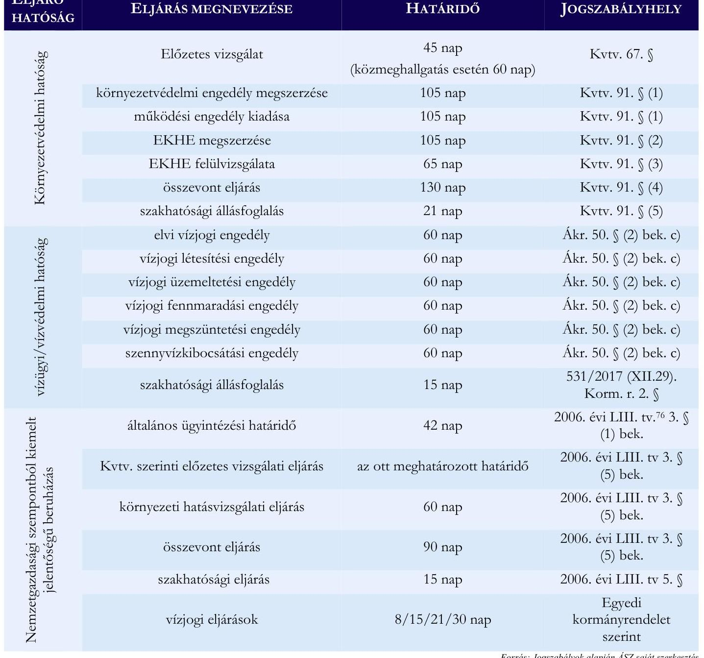

---

# - VII. SZ. MELLÉKLET: SZERVEZETRENDSZER TAGJAINAK FŐBB VÍZGAZDÁLKODÁST, VÍZVÉDELMET, KÖRNYEZETVÉDELMET ÉRINTŐ HATÁSKÖREI, FELADATAI 

## BM

- vízgazdálkodásért, vízvédelemért, katasztrófák elleni védekezésért felelős kormánytag
- vízügyi igazgatási- és hatósági szervek irányítása
- OVF középirányító szerv irányítása
- BM OKF középirányító szerv szakmai irányítása

## NGM

- iparpolitikáért felelős kormánytag
- támogatáspolitikai célú szakmai javaslattétel az ipari technológiaváltás ágazati rendszereinek és eszközeinek fejlesztése érdekében
- ipari technológiaváltásra irányuló kezdeményezések keretében indított ágazatfejlesztési programok tevékenységének koordinálása

## OVF

- középirányítóként a területi vízügyi igazgatóságok szakmai tevékenységének ellenőrzése, irányítása, koordinálása
- országos vízügyi, vízvédelmi igazgatási feladatok ellátása
- országos szintű vízgazdálkodási feladatok ellátása, koordinálása
- VGT elkészítése, állapotértékelés, intézkedési programok meghatározása, mérő,- megfigyelő, monitoring rendszer múködtetése

## EM

- környezetvédelemért, víziközmúszolgáltatásért felelős kormánytag
- környezetvédelmi igazgatási- és hatósági szervek irányításáért

## ME/KTM

- közigazgatás-szervezésért felelős kormánytag
- kormányhivatalok irányítása

## BM OKF

- középirányítóként a területi vízügyi és vízvédelmi hatóságok szakmai tevékenységének ellenőrzése, irányítása, koordinálása
- országos hatáskörű és illetékességű vízügyi hatóság
- másodfokú hatósági feladat és hatáskör gyakorlása
- országos vízvédelmi igazgatási szerv

---

## Katasztrófavédelem

Területi vízügyi, vízvédelmi hatóságok
Területi vízvédelmi igazgatási szervek

- víz minőségi védelme
- vízjogi engedélyezési eljárások lefolytatása
- ellenőrzési, felügyeleti hatáskör gyakorlása
- vízkészletjárulékhoz füződő adóhatósági feladatok ellátása
- védőidom, védőterület, védősáv kijelölése
- kutak létesítésével, kivitelezésével, üzemeltetésével összefüggő feladat- és hatáskörök gyakorlása
- kármentesítési feladatok
- vízügyi, vízvédelmi szakhatósági feladatés hatáskör gyakorlása

Víziközmű-szolgáltatók

- ipari szennyvíz befogadó nyilatkozat
- ipari előtisztított szennyvíz tisztítása
- ellenőrzési jogosultság
- csatornabírságolási javaslat

## Kormányhivatalok

Országos és területi környezetvédelmi hatóságok és igazgatási szervek

- föld, levegő védelme, zaj és rezgés elleni védelme
- környezetvédelmi engedélyezési eljárások lefolytatása
- ellenőrzési, felügyeleti hatáskör gyakorlása
- földtani közeg és felszín alatti vizek kármentesítésének engedélyezése, ellenőrzése
- 7 kijelölt kormányhivatal regionális laboratóriumot múködtet, amelyek mintavételi, laboratóriumi vizsgálati tevékenységet, felszíni és felszín alatti monitoring feladatok ellátása
- környezetvédelmi szakhatósági jogkör gyakorlása

Területi Vízügyi Igazgatóságok
Területi vízügyi, vízvédelmi igazgatási szerv

- víz mennyiségi védelme, vagyonkezelőként az Nvtv. szerint állami tulajdonban álló víztestek vagyonmegőrzési és megóvási kötelezettsége
- vagyonkezelői hozzájárulás, befogadó nyilatkozat kiadása
- vízminőségi kárelhárítás

---

# A TERÜLETI KATASZTRÓFAVÉDELMI IGAZGATÓSÁGOK VÍZÜGYI/ VÍZVÉDELMI TEVÉKENYSÉGET VÉGZŐ ÁLLOMÁNYA LÉTSZÁMÁNAK ALAKULÁSA (FŐ), VÁLTOZÁS SZÁZALÉKBAN 2019-2023. 

| Területi Katasztrófavédelmi Igazgatóságok | 2019. év | 2020. év | 2021. év | 2022. év | 2023. év | Változás 2019/2023 (\%) |
| :--: | :--: | :--: | :--: | :--: | :--: | :--: |
| Bács-Kiskun VKI | 13 | 16 | 15 | 13 | 12 | $-7,7$ |
| Baranya VKI | 18 | 19 | 17 | 17 | 19 | 5,6 |
| Békés VKI | 15 | 15 | 15 | 15 | 15 | 0,0 |
| Borsod-Abaúj-Zemplén VKI | 28 | 29 | 29 | 28 | 29 | 3,6 |
| Csongrád-Csanád VKI | 23 | 25 | 28 | 25 | 24 | 4,3 |
| Fejér VKI | 20 | 21 | 21 | 22 | 19 | $-5,0$ |
| Fővárosi KI | 44 | 48 | 49 | 47 | 38 | $-13,6$ |
| Győr-Moson-Sopron VKI | 18 | 19 | 22 | 19 | 19 | 5,6 |
| Hajdú-Bihar VKI | 22 | 24 | 25 | 26 | 22 | 0,0 |
| JNSZ VKI | 18 | 19 | 19 | 19 | 19 | 5,6 |
| Szabolcs-Sz.-B. VKI | 20 | 21 | 22 | 20 | 18 | $-10,0$ |
| Vas VKI | 16 | 16 | 18 | 19 | 19 | 18,8 |
| Igazgatóságok összesen | 255 | 272 | 281 | 270 | 253 | 4,8 |

A TERÜLETI KATASZTRÓFAVÉDELMI IGAZGATÓSÁGOK VÍZÜGYI/ VÍZVÉDELMI TEVÉKENYSÉGET VÉGZŐ SZERVEZETI EGYSÉGEI KILÉPÉSI FORGALMÁNAK ALAKULÁSA SZÁZALÉKBAN 2019-2023.

| Területi Katasztrófavédelmi Igazgatóságok | 2019. év | 2020. év | 2021. év | 2022. év | 2023. év |
| :--: | :--: | :--: | :--: | :--: | :--: |
| Bács-Kiskun VKI | 23,1 | 0,0 | 13,3 | 46,2 | 41,7 |
| Baranya VKI | 66,7 | 26,3 | 64,7 | 35,3 | 36,8 |
| Békés VKI | 0,0 | 0,0 | 26,7 | 13,3 | 0,0 |
| Borsod-Abaúj-Zemplén VKI | 3,6 | 3,4 | 6,9 | 17,9 | 3,4 |
| Csongrád-Csanád VKI | 8,7 | 8,0 | 7,1 | 8,0 | 33,3 |
| Fejér VKI | 15,0 | 9,5 | 14,3 | 13,6 | 21,1 |
| Fővárosi KI | 31,8 | 33,3 | 42,9 | 36,2 | 50,0 |
| Győr-Moson-Sopron VKI | 16,7 | 0,0 | 18,2 | 36,8 | 0,0 |
| Hajdú-Bihar VKI | 18,2 | 4,2 | 4,0 | 3,8 | 50,0 |
| JNSZ VMKI | 5,6 | 26,3 | 26,3 | 21,1 | 31,6 |
| Szabolcs-Szatmár-Bererg VKI | 15,0 | 0,0 | 0,0 | 15,0 | 22,2 |
| Vas VKI | 0,0 | 0,0 | 0,0 | 15,8 | 5,3 |
| Országos átlag | 18,0 | 11,8 | 19,6 | 21,9 | 26,1 |

A fluktuációnál figyelembe vett mutató a kilépési forgalom. A kilépési forgalom (\%) = (Kilépők száma (fő) / Átlagos állományi létszám (fő́)) x 100 kifejezi, hogy a teljes létszámhoz viszonyítva, milyen arányú a kilépők száma. Ez úgy értelmezhető, hogy 100 átlagos statisztikai létszám mellett 42\%-os kilépési forgalom esetén 42 fő hagyta el a szervezetet az adott évben.

---

# A KORMÁNYHIVATALOK KÖRNYEZETVÉDELMI HATÓSÁGI FELADATOKAT ELLÁTÓ SZERVEZETI EGYSÉGEINEK ÁTLAGOS ÁLLOMÁNYI LÉTSZÁMA (FŐ), VÁLTOZÁS SZÁZALÉKBAN 2019-2023.

|  Vármegyei Kormányhivatalok | 2019. év | 2020. év | 2021. év | 2022. év | 2023.év | Változás 2019/2023 (\%)  |
| --- | --- | --- | --- | --- | --- | --- |
|  Bács-Kiskun VKH | 32 | 31 | 49 | 53 | 54 | 68,8  |
|  Baranya VKH | 19 | 27 | 21 | 20 | 18 | $-5,3$  |
|  Békés VKH | 13 | 18 | 36 | 44 | 41 | 215,4  |
|  Borsod-Abaúj-Zemplén | 37,5 | 37 | 50 | 61,3 | 59,7 | 59,1  |
|  Csongrád-Csanád VKH | 22,5 | 23 | 32,7 | 32,3 | 31,3 | 38,9  |
|  Fejér VKH | 42 | 30,5 | 48,7 | 56,9 | 57,6 | 37,1  |
|  Győr-Moson-Sopron VKH | 18 | 18 | 15 | 14 | 12 | $-33,3$  |
|  Hajdú-Bihar VKH | 29 | 29 | 28 | 26 | 31 | 6,9  |
|  Heves VKH | 18 | 14,8 | 16,4 | 18,8 | 18,2 | 1,1  |
|  Jász-Nagykun-Szolnok VKH | 19,5 | 18,2 | 18,6 | 18,9 | 19,1 | $-1,8$  |
|  Komárom-Esztergom VKH | 19 | 16,5 | 11 | 17,2 | 17,3 | $-8,9$  |
|  Nógrád VKH | 13 | 13 | 24 | 27 | 30 | 130,8  |
|  Pest VKH | 78 | 148 | 172 | 161 | 149 | 91,0  |
|  Somogy VKH | 16 | 14,9 | 15,0 | 15,9 | 16,8 | 4,8  |
|  Szabolcs-Szatmár-Bereg VKH | 34 | 34 | 30 | 28 | 30 | $-11,8$  |
|  Tolna VKH | 11,2 | 9,8 | 7,8 | 6,9 | 7,4 | $-33,6$  |
|  Vas VKH | 13 | 13 | 12 | 13 | 14 | 7,7  |
|  Veszprém VKH | 35,2 | 35,3 | 29,1 | 26,7 | 29,4 | $-16,3$  |
|  Zala VKH | 20 | 21 | 16 | 12 | 15 | $-25,0$  |
|  Kormányhivatalok összesen | 489,8 | 552,0 | 632,2 | 652,9 | 650,8 | 32,9  |

Forrás: Adatszolgáltatás alapján ASZ saját szerkestés

## A KORMÁNYHIVATALOK KÖRNYEZETVÉDELMI HATÓSÁGI FELADATOKAT ELLÁTÓ SZERVEZETI EGYSÉGEI KILÉPÉSI FORGALMA SZÁZALÉKBAN 2019-2023.

|  Vármegyei kormányhivatalok | 2019. év | 2020. év | 2021. év | 2022. év | 2023. év  |
| --- | --- | --- | --- | --- | --- |
|  Bács-Kiskun VKH | 34,4 | 12,9 | 28,6 | 18,9 | 25,9  |
|  Baranya VKH | 5,3 | 0,0 | 19,0 | 10,0 | 16,7  |
|  Békés VKH | 15,4 | 11,1 | 22,2 | 13,6 | 26,8  |
|  Borsod-Abaúj-Zemplén | 18,7 | 5,4 | 12,0 | 6,5 | 6,7  |
|  Csongrád-Csanád VKH | 13,3 | 4,3 | 3,1 | 30,9 | 6,4  |
|  Fejér VKH | 7,1 | 16,4 | 14,4 | 3,5 | 6,9  |
|  Győr-Moson-Sopron VKH | 61,1 | 38,9 | 20,0 | 42,9 | 50,0  |
|  Hajdú-Bihar VKH | 31,0 | 10,3 | 10,7 | 19,2 | 12,9  |
|  Heves VKH | 11,1 | 6,8 | 24,4 | 0,0 | 5,5  |
|  Jász-Nagykun-Szolnok VKH | 5,1 | 5,5 | 0,0 | 0,0 | 10,5  |
|  Komárom-Esztergom VKH | 26,3 | 12,1 | 18,2 | 5,8 | 11,6  |
|  Nógrád VKH | 15,4 | 7,7 | 16,7 | 40,7 | 10,0  |
|  Pest VKH | 62,8 | 8,8 | 16,9 | 13,0 | 16,8  |
|  Somogy VKH | 18,8 | 0,0 | 6,7 | 25,1 | 6,0  |
|  Szabolcs-Szatmár-Bereg VKH | 0,0 | 14,7 | 3,3 | 17,9 | 10,0  |
|  Tolna VKH | 9,0 | 0,0 | 25,8 | 28,9 | 13,5  |
|  Vas VKH | 30,8 | 0,0 | 16,7 | 7,7 | 0,0  |
|  Veszprém VKH | 37,0 | 31,2 | 51,6 | 26,2 | 27,2  |
|  Zala VKH | 10,0 | 0,0 | 93,8 | 16,7 | 26,7  |
|  Kormányhivatalok összestve | 26,3 | 10,5 | 19,1 | 15,2 | 15,1  |

Forrás: Adatszolgáltatás alapján ASZ saját szerkestés

---

# A TERÜLETI VÍZÜGYI IGAZGATÓSÁGOK LÉTSZÁMÁNAK* ALAKULÁSA (FŐ), VÁLTOZÁS SZÁZALÉKBAN 2019-2023.

|  Területi vízügyi igazgatóságok | 2019. év | 2020. év | 2021. év | 2022. év | 2023. év | Változás 2019/2023 (\%)  |
| --- | --- | --- | --- | --- | --- | --- |
|  Alsó-Duna-völgyi VI | 49 | 51 | 54 | 53 | 50 | 2,0  |
|  Alsó-Tisza-vidéki VI | 378,5 | 420,5 | 441,5 | 415 | 405,5 | 7,1  |
|  Dél-Dunántúli VI | 10 | 12 | 11 | 11 | 10 | 0,0  |
|  Észak- dunántúli VI | 101 | 102 | 101 | 93 | 89 | $-11,9$  |
|  Észak-magyarországi VI | 333,2 | 340,8 | 358,7 | 351,3 | 346,9 | 4,1  |
|  Felső-Tisza-vidéki VI | 15 | 15 | 15 | 15 | 15 | 0,0  |
|  Közép-dunántúli VI | 121 | 123 | 122 | 124 | 128 | 5,8  |
|  Közép-Duna-völgyi VI | 188 | 196 | 186 | 170 | 158 | $-16,0$  |
|  Közép-Tisza-vidéki VI | 140 | 145 | 147 | 142 | 149 | 6,4  |
|  Körös-vidéki VI | 37 | 47 | 34 | 35 | 34 | $-8,1$  |
|  Nyugat-dunántúli VI | 54 | 55 | 55 | 54 | 53 | $-1,9$  |
|  Tiszántúli VI | 11 | 12,5 | 13 | 11 | 11 | 0,0  |
|  Országos szinten összesen | 1437,7 | 1519,8 | 1538,2 | 1474,3 | 1449,4 | 0,8  |

*A vagyonkezelői hozzájárulás, a vizek állapotértékelési/monitoring, illetve vízminőségi kárelhárítási feladatokat ellátó alkalmazottak

A TERÜLETI VÍZÜGYI IGAZGATÓSÁGOK KILÉPÉSI FORGALMÁNAK ALAKULÁSA SZÁZALÉKBAN 2019-2023. (\%)

|  Területi vízügyi igazgatóságok | 2019. év | 2020. év | 2021. év | 2022. év | 2023. év  |
| --- | --- | --- | --- | --- | --- |
|  Alsó-Duna-völgyi VI | 2,0 | 11,8 | 9,3 | 9,4 | 8,0  |
|  Alsó-Tisza-vidéki VI | 9,5 | 6,4 | 6,8 | 5,8 | 7,9  |
|  Dél-Dunántúli VI | 20,0 | 8,3 | 9,1 | 9,1 | 10,0  |
|  Észak- dunántúli VI | 12,9 | 2,9 | 9,9 | 16,1 | 12,4  |
|  Észak-magyarországi VI | 11,4 | 12,9 | 14,8 | 13,1 | 11,5  |
|  Felső-Tisza-vidéki VI | 6,7 | 0,0 | 20,0 | 6,7 | 6,7  |
|  Közép-dunántúli VI | 4,1 | 7,3 | 4,1 | 7,3 | 4,7  |
|  Közép-Duna-völgyi VI | 3,7 | 13,3 | 12,4 | 14,7 | 17,1  |
|  Közép-Tisza-vidéki VI | 1,4 | 2,8 | 2,0 | 1,4 | 3,4  |
|  Körös-vidéki VI | 5,4 | 0,0 | 11,8 | 8,6 | 5,9  |
|  Nyugat-dunántúli VI | 1,9 | 1,8 | 1,8 | 9,3 | 9,4  |
|  Tiszántúli VI | 0,0 | 8,0 | 15,4 | 0,0 | 9,1  |
|  Területi szervezetek átlaga | 7,5 | 8,0 | 9,1 | 9,2 | 9,3  |

Forrás: Adatszolgáltatás alapján ASZ saját szerkészés

---

A KÖRNYEZETVÉDELMI LABORATÓRIUMOK LÉTSZÁMÁNAK ALAKULÁSA (FŐ) ÉS VÁLTOZÁSÁNAK MÉRTÉKE SZÁZALÉKBAN 2019-2023.

|  Környezetvédelmi hatósági
laborok | 2019. év | 2020. év | 2021. év | 2022. év | 2023. év | Változás
2019/2023 (\%)  |
| --- | --- | --- | --- | --- | --- | --- |
|  Baranya VKH | 17 | 19 | 21,2 | 20,3 | 20,9 | 22,9  |
|  Borsod-Abaúj-Zemplén VKH | 24 | 24 | 24 | 24 | 22 | $-8,3$  |
|  Csongrád-Csanád VKH | 19 | 19 | 18 | 20 | 21 | 10,5  |
|  Fejér VKH | 24 | 23 | 24 | 24 | 24 | 0,0  |
|  Győr-Moson-Sopron VKH | 28 | 27 | 26 | 24 | 21 | $-25,0$  |
|  Hajdú-Bihar VKH | 25 | 22 | 21 | 22 | 21 | $-16,0$  |
|  Pest VKH | 29 | 29 | 29 | 27 | 23 | $-20,7$  |
|  Összesen | 166 | 163 | 163,2 | 161,3 | 152,9 | $-7,9$  |

Fonrás: Adatszolgáltatás alapján ASZ saját szerkezetét

---

# AZ IPARI VÍZSZENNYEZÉS VISSZASZORÍTÁSÁVAL ÉS MEGELŐZÉSÉVEL KÖZVETLENŰL ÉS KÖZVETETTEN ÖSSZEFÜGGŐ INTÉZKEDÉSEK (VASTAGON KIEMELVE A KÖZVETLEN INTÉZKEDÉSEK) 

## VGT2INTÉZKEDÉSEK MEGNEVEZÉSE

1. Szennyvíztisztító telepek építése és korszerűsítése
2. Bekövetkezett szennyezések csökkentése, felszámolása, beleértve a felhagyott szennyezett területek kármentesítését
3. A víz hatékony felhasználását elősegítő műszaki intézkedések, az öntözés, az ipar, az energiatermelés és a háztartás területén
4. Kutatás, tudásbázis fejlesztés a bizonytalanság csökkentése érdekében
5. Elsőbbségi veszélyes anyagok kibocsátásának megszüntetése és elsőbbségi anyagok kibocsátásának csökkentése
6. Ipari szennyvíztisztítók korszerűsítése, bővítése
7. Hűtővizek felszíni vízbe történő bevezetésének szabályozása
8. Balesetből származó szennyezések megelőzése

## VGT3INTÉZKEDÉSEK MEGNEVEZÉSE

1. Szennyvíztisztító telepek építése és korszerűsítése
2. Bekövetkezett szennyezések csökkentése, felszámolása, beleértve a felhagyott szennyezett területek kármentesítését
3. A víz hatékony felhasználását elősegítő műszaki intézkedések, az öntözés, az ipar, az energiatermelés és a háztartás területén
4. Kutatás, tudásbázis fejlesztés a bizonytalanság csökkentése érdekében
5. Elsőbbségi veszélyes anyagok kibocsátásának megszüntetése és elsőbbségi anyagok kibocsátásának csökkentése
6. Ipari szennyvíztisztítók korszerűsítése, bővítése
7. Talajerózióból és/vagy felszíni lefolyásból származó hordalék- és szennyező anyag-terhelés csökkentése
8. Éghajlatváltozáshoz történő alkalmazkodás
9. Savasodást ellensúlyozó intézkedések
10. Hőterhelések kezelése
11. Károsodott védett vízi, vizes és szárazföldi élőhelyek védelme vízminőségi hatásokkal szemben, az egyéb intézkedéseken felül
12. Balesetből származó szennyezések megelőzése

Forrás: VGT2, VGT3, ASZ saját szerkesztés

---

# FÜGGELÉK: ÉSZREVÉTELEK 

A jelentéstervezetet a Számvevőszék 15 napos észrevételezésre megküldte az ellenőrzött szervezet vezetőjének az ÁSZ tv. 29. §* (1) bekezdése előirásának megfelelően.

A jelentéstervezet megállapításaira a 25 ellenőrzött szervezet közül tíz szervezet Energiaügyi Minisztérium, Nemzetgazdasági Minisztérium, Csongrád-Csanád Vármegyei Kormányhivatal, Heves Vármegyei Kormányhivatal, Komárom-Esztergom Vármegyei Kormányhivatal, Nógrád Vármegyei Kormányhivatal, Somogy Vármegyei Kormányhivatal, Szabolcs-Szatmár-Bereg Vármegyei Kormányhivatal, Veszprém Vármegyei Kormányhivatal, Zala Vármegyei Kormányhivatal - vezetője nem tett észrevételt. Nyolc ellenőrzött szervezet vezetője - Baranya Vármegyei Kormányhivatal, Bács-Kiskun Vármegyei Kormányhivatal, Békés Vármegyei Kormányhivatal, Budapest Főváros Kormányhivatala, Győr-Moson-Sopron Vármegyei Kormányhivatal, Pest Vármegyei Kormányhivatal, Tolna Vármegyei Kormányhivatal, Vas Vármegyei Kormányhivatal - nemleges észrevételt tett. Két ellenőrzött szervezet Belügyminisztérium, BM Országos Katasztrófavédelmi Főigazgatóság - a jelentéstervezet 15 napos észrevételezése során már nem rendelkezett vízügyi és vízvédelmi feladat- és hatáskörrel.
Az Országos Vízügyi Főigazgatóság, a Borsod-Abaúj-Zemplén Vármegyei Kormányhivatal, a Hajdú-Bihar Vármegyei Kormányhivatal, a Jász-Nagykun-Szolnok Vármegyei Kormányhivatal, valamint a Fejér Vármegyei Kormányhivatal vezetője a jelentéstervezet megállapításaira észrevételt tett. Az Országos Vízügyi Főigazgatóság vezetőjének észrevételét az ÁSZ elfogadta, a számvevőszéki jelentés véglegesitése során figyelembe vette. A Hajdú-Bihar Vármegyei Kormányhivatal vezetőjének kettő észrevételét, a Jász-Nagykun-Szolnok Vármegyei Kormányhivatal vezetőjének egy észrevételét az ÁSZ elfogadta, a számvevőszéki jelentés véglegesitése során figyelembe vette.
A Borsod-Abaúj-Zemplén Vármegyei Kormányhivatal vezetőjének egy észrevételét, a Hajdú-Bihar Vármegyei Kormányhivatal vezetőjének három észrevételét, a Fejér Vármegyei Kormányhivatal vezetőjének két észrevételét részben az ÁSZ elfogadta és figyelembe vette a számvevőszéki jelentés véglegesitése során.

[^0]
[^0]:    * 29. § (1) Az Állami Számvevőszék az ellenőrzési megállapításait megküldi az ellenőrzött szervezet vezetőjének vagy az általa megbízott személynek, és annak, akinek személyes felelősségét állapította meg.
    (2) Az ellenőrzött szervezet vezetője és a felelősként megjelölt személy az ellenőrzés megállapításaira tizenöt napon belül írásban észrevételt tehet.
    (3) Az Állami Számvevőszék az észrevételre a beérkezésétől számított harminc napon belül írásban válaszol. A figyelembe nem vett észrevételeket köteles a jelentésben feltüntetni, és megindokolni, hogy azokat miért nem fogadta el.

---

Az ÁSZ tv. 29. § (3) bekezdésével összhangban az ÁSZ a Függelékben feltünteti a megállapításokkal kapcsolatban tett, el nem fogadott észrevételeket, illetve az el nem fogadott észrevételek indoklását.

# A Borsod-Abaúj-Zemplén Vármegyei Kormányhivatal részben elfogadott, illetve el nem fogadott észrevételei 

## 1. Észrevétel

„A tervezet 36. oldalán szereplő 9. ábrábơ kapcsolódóan:
A számverőszéki ellenőrzés során, mint területi vizügyi és vizvédelmi batóság, a Borsod-Abaúj-Zemplén Vármegyei Katasztrófavédelmi Igazgatóság (továbbiakban: Igazgatóság) közbiteles batósági nyilvántartásnak minősülő vizikönyvi okirattárában levő adatok alapján 2024. augusztus 16-án kiegészítő nyilatkozatot tett a vizügyi illetékességi területén vizjogi engedéllyel rendelkező vizilétesítmények, vizbasználatok vizügyi felügyeleti kategóriánkénti darabszámáról.
Az Igazgatóság a nyilatkozatában az elektronikus vizikönyvi okirattárban nyilvántartott darabszámokat szerepeltette, azonban a 9. ábra alapján valószínüsithetően országosan nem egységes módszertan és értelmezés alapján adták meg az illetékes igazgatóságok a számvevöszéki ellenőrzés során az érintett létesítmények számát.
A vizügyi, vizvédelmi batáskörében eljáró Borsod-Abaúj-Zemplén Vármegyei Kormányhivatal illetékességi területen lévő, vizjogi engedéllyel rendelkező létesítmények száma a közölt adatnál lényegesen magasabb. Az eltérést elsősorban az okozza, bogy az elektronikus nyilvántartó rendszer létrehozásakor a VIZEK projekt keretében az e-vizikönyvben az illetékességi területünket érintően rögzített, mintegy 15 ezer batározathoz tartozó vizügyi felügyeleti kategória rögzítése nem történt meg. Az e-vizikönyv csak a létrehozása óta rögzített új vizikönyvi egységek felügyeleti kategóriáját tartalmazza, az említett kiegészítő nyilatkozatban közölt darabszámok is ennek megfelelőek, hiszen a közbiteles elektronikus rendszerben csak az új tételek vizikönyvi számának rögzítésére van lehetőség.
Fontos megjegyezni, bogy a kiegészítő nyilatkozatban a közbitelesnek tekintett elektronikus nyilvántartás alapján az ott nyilvántartott létesítmények teljes száma került megadásra, ugyanakkor a 9. ábra a közölt számokat az ipari üzemek számaként tartalmazza, ami félreértésre adhat okot. A vizügyi batóság a vizügyi igazgatási szervezet vizgazdálkodási nyilvántartásáról szóló 23/1998. (XI. 6.) KHVM rendelet 10. §-a szerint vizikönyvi nyilvántartást vezet. Tapasztalatunk szerint a bivatkozott rendeletben foglaltak ellenére bosszú ideje országosan jelentős eltérések vannak abban, bogy az egyes vizügyi batóságok mit tekintenek egy vizikönyvi egységnek, ami az országos adatok összebasonlítását, ill. a kapacitások optimalizálását egyaránt befolyásolhatja."

Részben elfogadás indoka: Az ellenőrzés során a BM OKF által koordinált és teljesített - így egységes módszertan és iránymutatás alapján teljesített - adatszolgáltatást vette alapul az ÁSZ. Ugyanakkor az esetleges téves következtetés elkerülése érdekében a 9. ábrát módosítottuk.

## 2. Észrevétel

Javaslat: „Az állami tulajdonban lévő vizetesek vagyonkezelői számára biztosítsa a szakbatósági eljárásokban való kötelezö jellegö részvételt, valamint az állami vagyonért való felelősségére tekintettel mérlegelje és kezdeményezzze a vagyon megőrzési és megóvási kötelezettség teljesitésének ellátását megerősitő, VIZIG-eket érintő ellenőrzési jogkörök biztosítását."

---

Észrevétel: „A 3. javaslat esetében fennáll annak a lehetősége, hogy a vizügyi igazgatóságok kötelezö jellegü részvétele szakbatóságként a vizügyi hatóságok és a vizügyi igazgatóságok feladatellátásában párhuzamossághoz, ill. az eljárások elbúződásához vezet. A szakbatósági eljárások (ill. szakkérdés vizsgálatok) jelentös számát tekintve szükségesnek látszik annak pontositása, hogy a vizügyi igazgatóságok közremüködése valamennyi eljárásban indokolt-e.
Kérem a jelentéstervezet véglegesitése során fenti észrevételek szíves figyelembe vételét."

El nem fogadás indoka: Az irányító szerv részére megfogalmazott javaslat arra irányult, hogy a vízügyi igazgatóságok (továbbiakban: VIZIG-ek) az állami vagyonért való felelősségére tekintettel vegyenek részt az eljárásokban. A szakhatósági vélemény kialakítása során az általános közigazgatási rendtartásról szóló 2016. évi CL. törvény 25.§ alapján a vízügyi, vízvédelmi hatóságok - amennyiben az eljárások során a szükséges adattal vagy irattal nem rendelkeztek, legalább ötnapos határidő tűzésével - eddig is megkereshették az érintett VIZIG-et. A hivatkozott jogszabályhely alapján a VIZIG-ek szakhatósági eljárásba történő kötelező jellegű részvétele nem eredményezheti az eljárások elhúzódását, illetve a párhuzamos feladatellátást.

# A Hajdú-Bihar Vármegyei Kormányhivatal részben elfogadott, illetve el nem fogadott észrevételei 

## 1. Észrevétel

Megállapítás: „A kialakitott jogszabályi környezet nem biztositotta az elövigyázatosság, a megelözés és a szennyezzö fizet környezetvédelmi alapelvek érvényesitését, valamint vizyédelem szempontjából nem reagált rugalmasan az ipari technológiák fejlődésére, az iparszerkezet változására."
„Az új típusú szennyező anyagokra, technológiai kibocsátásokra a jogszabályok nem tartalmaztak elöírásokat."

Észrevétel: „A jelentéstervezet Megállapítások c. fejezetének 13. oldalán szereplő összegzö megállapítás szerint vizvédelem szempontjából a jogszabályi környezet nem reagált rugalmasan az ipari technológiák fejlődésére, az iparszerkezet változására, a jogszabályi rendelkezések az új típusú szennyezőanyagok vonatkozásában nem tartalmaztak elöírásokat. A kormányhivatal álláspontja szerint a környezetvédelmi szabályozás szempontjából az elérhető legjobb technikának való megfelelés folyamatos szem előtt tartása biztositja azt, hogy az ipari technológiák fejlődése során a környezetvédelmi elöírásoknak érvényt lehessen szerezni ott is, ahol a jogszabályi környezet nem naprakészen követi le a kibocsátási változásokat. A környezeti hatásvizsgálati és az egységes környezethasználati engedélyezési eljárásról szóló 314/2005. (XII. 25.) Korm. rendelet (a továbbiakban: Khvr.) 17. §-ának és 20. §-ának elöirása szerint az egységes környezethasználati engedélyben rendelkezni kell az elérhető legjobb technikához kapcsolódó kibocsátási határértékekről és ezt a vizjogi engedélyezési eljárás során is figyelembe kell venni a környezet védelmének általános szabályairól szóló 1995. évi LIII. törvény (a továbbiakban: Kvt.) 66. §-a alapján."

Részben elfogadás indoka: A hivatkozott megállapítás az irányító szerv jogalkotási tevékenységére vonatkozik (14-15. oldal). A rendelkezésre álló elérhető legjobb technikákra vonatkozó BAT útmutatók nem fedik le az iparágban használatos technikák teljes körét, továbbá a BAT előírásokat csak a Khvr. 2. számú mellékletében szereplő egységes környezethasználati engedélyhez kötött tevékenységek esetében kell kötelezően alkalmazni. A kormányhivatal összességében nem vitatta az ÁSZ azon megállapítását, amely szerint "A kialakitott jogszabályi környezet nem biztositotta az elövigyázatosság, a megelözés és a szennyezzö fizet környezetvédelmi alapelvek érvényesitését, valamint vizyédelem szempontjából nem reagált rugalmasan az ipari technológiák, fejlődésére, az iparszerkezet változására." A Kormányhivatal az észrevételében az elérhető legjobb

---

technikáknak (BAT) való megfelelés, mint a szabályozási hiányosságokat pótló eszköz szerepét emelte ki. Mindezek figyelembevételével az ÁSZ nem tartja szükségesnek a 13. oldalon szereplő összegző megállapítás módosítását. Az észrevétele egy része a számvevőszéki jelentéstervezet 21. oldalon található miszerint: "...a jogszabályi rendelkezések az új típusú szennyezőanyagok vonatkozásában nem tartalmaztak elörrásokat...". Az észrevétel alapján a félreértések elkerülése érdekében a megállapítás megfogalmazását az ÁSZ pontosította.

# 2. Észrevétel 

Megállapítás: „Mivel a környezetvédelmi engedély kiadását követöen már kérhető és kiadható volt az épitési engedély és a beruházás megkezdődhetett, a vizügyi hatóság kényszerhelyzetbe került, különösen, ha az eredeti tervekhez képest jelentősebb (pl. technológiai) változás, gyárbővités is bekövetkezett. Ebből adódóan lehetöség volt arra, bogy a környezetvédelmi engedélyt nem a tényleges kibocsátási paraméterek ismeretében kapják meg az ipari létesítmények."

Észrevétel: „Téves azon megállapítás a tervezet 24. oldalán a Megállapítások c. fejezetben, bogy a környezetvédelmi engedélyt nem a tényleges kibocsátási paraméterek ismeretében kapták meg az ipari létesítmények, ezáltal kényszerhelyzetbe kerültek a vízügyi hatóságok. Amennyiben változás következik be egy engedélyben meghatározott adathoz képest, úgy a környezetvédelmi hatóság - amennyiben a változás kimeríti a Kbvr.-ben meghatározott jelentős módosítás (környezetvédelmi engedély esetében) vagy jelentős változtatás (az egységes környezethasználati engedély esetében) fogalmát - külön módosítási eljárást folytat le, figyelemmel a Kvt. 66. § (5) bekezdésében foglaltakra is."

Részben elfogadás indoka: A jelentéstervezet a kormányhivatal által tett észrevétel tartalmával azonos megállapítást tartalmaz, miszerint a beruházások kivitelezése során eszközölt változtatásokat (módosítási kérelem alapján) lekövették az engedélyezési eljárások. A jelentés megállapította, hogy a környezetvédelmi hatóságok az engedélyeket a kivitelezés megkezdése és a végleges technológiai döntések meghozatala előtt adták ki. A környezetvédelmi engedély kiadása után következett az építési engedélyezési eljárás, azt követően pedig a tényleges kivitelezés. Ezen a ponton azonban az ipari létesítmény beruházói még nem rendelkeztek sem a tevékenység folytatásához szükséges víz mennyiségét biztosító vagyonkezelői hozzájárulással, sem pedig a szennyvízet befogadó vagyonkezelő vagy víziközmű-szolgáltató befogadó nyilatkozatával. Olyan esetben is kellett engedélyt kiállítaniuk a vízügyi, vízvédelmi hatóságoknak, amikor többek közt már egy több milliárdos értékủ, adott térség vagy régió gazdaságára és foglalkoztatottságára komoly hatással bíró, nemzetgazdasági szempontból kiemelt jelentőségű beruházás folyamatban volt. Ebben a helyzetben a vízügyi/vízvédelmi hatóságoktól szoros együttműködést és folyamatos konzultációt igényelt a beruházóval, víziközmű-szolgáltatóval és egyéb állami intézményekkel (új típusú szennyezőanyagok esetében laboratóriumokkal, kutatókkal, szakértőkkel) annak érdekében, hogy a vízjogi engedély kiadható legyen. A számvevőszéki jelentéstervezet 65 . oldala az ipari vízgazdálkodás stratégiai szemléletű megközelítése keretében tovább részletezi a kérdéskört. Ugyanakkor az esetleges téves következtetés elkerülése érdekében a megállapítás pontosítását az ÁSZ elvégezte.

## 3. Észrevétel

Megállapítás: „A kiemelt jelentőségü nemzetgazdasági beruházások engedélyezési eljárásainak határidő korlátait figyelembe véve a társadalom környezeti döntéshozatalban történő részvétele korlátozott volt."

---

Észrevétel: „A jelentéstervezet 31. oldalán szereplő megállapítás - mely szerint a kiemelt jelentőségü nemzetgazdasági beruházások engedélyezési eljárásainak határidő korlátait figyelembe véve a társadalom környezeti döntéshozatalban történő részvetele korlátozott volt - jogszabályellenes, figyelemmel arra, bogy a Kbvr. nyilvánosság bevonására vonatkozó szabályai, igy az észrevételezésre, kifüggesztésre, közmeghallgatásra irányuló határidők nem rövidülnek a nemzetgazdasági szempontból kiemelt jelentőségü beruházások esetében. Kizárólag a környezetvédelmi batóságok ügyintézési határideje rövidül."

Részben elfogadás indoka: A gyorsított eljárások során a hatóságoknak kevesebb idő jut - mindenre kiterjedően - megalapozott döntéseket hozni. A kormányhivatal nem vitatta az ÁSZ azon megállapítását, miszerint "A nemzetgazdasági szempontból kiemelt jelentőségü beruházások esetében a kormányrendeletekben meghatározott egyedi határidők az általánosnál rövidebbek voltak. Amennyiben az engedélyek kiadására nyitva álló határidő továbbra is szük marad és a jogalkotók nem veszèk figyelembe a beruházások komplexitását, volumenét, úgy fennáll a kockázata annak, bogy a batóságok nem megalapozott döntéseket hoznak, a szükséges vizsgálatokat nem tudják alaposan elvégezni és nem tudnak minden szennyező anyagot beazonosítani vagy határértékeket meghatározni, ezzel kockáztatva olyan kiemelt jelentőségi nemzetgazdasági beruházást, ipari létesítmények üzembe helyezését, amelyek veszélyeztetik az ökozzisztémát, a vïrkészleteinket és közvetetten az emberi egészéget. " Mindezekre figyelemmel környezeti ügyekben a gyorsított eljárásokban hozott döntésekbe való társadalmi részvétel korlátozottabban érvényesült az általános eljárásokhoz képest. Az észrevétellel érintett megállapítás - figyelemmel a kormányhivatal jelzésére is - félreértésre adhat okot, ezért annak módosítását az ÁSZ elvégezte.

# 4. Észrevétel 

Megállapítás: „A laboratóriumok fejlesztései elmaradtak, igy azok korszerü felszereltségének biánya korlátot jelentett a szennyezések megelőzésében és feltárásában is."

Észrevétel: „A jelentéstervezet Összefoglalás c. fejezetének 11. oldala azt tartalmazza, bogy a laborfejlesztések elmaradtak, azonban a laboratóriumi fejlesztések a Hajdú-Bihar Vármegyei Kormányhivatalnál közel 350 millió forint értékben megvalósultak 2024-2025. évben, mely fejlesztésnek köszönbetően még biztonságosabbá vált az üzemek kibocsátásának mennyiségi és minőségi meghatározása. A pontosabb mérések kiterjednek a levegő, a talaj és a víz vizsgálatára."

El nem fogadás indoka: Az ellenőrzött időszak 2019. január 1-jétől 2023. december 31-ig, kitekintéssel a jelentéstervezet 2024. decemberi összeállításáig terjedő időszakra. Az ellenőrzött és ellenőrzést támogató szervezetektől az adatokat, dokumentumokat a 2019. január 1-től 2023. december 31-ig terjedő időszakra vonatkozóan kérte az ÁSZ megküldeni. A jelentéstervezet laborfejlesztéseire irányuló megállapításai a regionális környezetvédelmi laboratóriumok működésért, erőforrásgazdálkodásért, funkcionális irányításáért felelős Közigazgatási és Területfejlesztési Minisztérium (továbbiakban: KTM) adatszolgáltatásán alapultak. A jelentéstervezet 54. oldal 15. ábrája tartalmazza a laborfejlesztésekre fordított Európai Uniós, illetve hazai forrásokat, ami 0,37 Mrd Ft-ot tett ki országos összesítésben 20192023. évek tekintetében. A KTM által 2024. évben végzett felmérés alapján megállapításra került, hogy kormányhivatalonként eltérőek az igények, de közel 5,3 Mrd Ft-ra lenne szükség a környezetvédelmi laboratóriumok fejlesztése tárgyában. Mindezek figyelembevételével az ÁSZ nem tartja szükségesnek a megállapítás módosítását.

---

# 5. Észrevétel 

Megállapítás: „Terhelhetőségi vizsgálatot a vizügyi, vizyédelmi hatóságok nem végeztek."

Észrevétel: „A jelentéstervezet 28. oldalán található megállapítás szerint terhelhetőségi vizsgálatot a vizügyi, vizvédelmi hatóságok nem végeztek. Ez a megállapítás abban az esetben lenne helytálló, ha a hatósági eljárások (szakbatósági közremüködés és/vagy önálló vizügyi, vizvédelmi eljárás) során magának a hatóságnak lenne a feladata a terhelhetőségi vizsgálat elvégzése. Azonban a vizügyi, vizvédelmi hatóságnak a szakbatósági közremüködés vagy a vizügyi, vizvédelmi engedélyezés során a benyújtott dokumentáció és a rendelkezésére álló adatok alapján kell vizsgálnia azt, bogy az adott eljárásban megtörtént-e a befogadó vizsgálata a terhelhetőség szempontjából is. A terhelhetőségi vizsgálat a Hajdú-Bibar vármegyei vizügyi, vizvédelmi hatóság gyakorlatában megvalósult. Szakbatósági közremüködés során, illetve szakkérdés vizsgálatakor a hatóság minden esetben kéri becsatolni egyrészt közvetlen bevezetés esetén a felszíni befogadó üzemeltetőjének, hozzájárulását (aki a befogadó vizyogi engedélyében meghatározott üzemeltetési feltételek teljesitéséért felel), másrészt közzetett felszíni bevezetés esetén pedig a szennyvíztisztitió telep üzemeltetőjének, hozzájárulását (aki a felszíni befogadóba történő megfelelő kibocsátásért felel a szennyvíztisztitió telep üzemeltetési engedélyében foglaltak szerint), amely eljárásban már vizsgálatra került a befogadó terhelhetősége is."

El nem fogadás indoka: A megállapítás - tekintettel az ellenőrzött időszakra, valamint az ágazat 2024. évi átalakítására is - nem a vármegyei vízügyi, vízvédelmi hatóságokra vonatkozik, amelyek vízügyi, vízvédelmi hatósági feladat- és hatáskörrel 2024. októbere óta rendelkeznek. Az ÁSZ országosan, minden ágazati szereplőre kiterjedően, rendszerszinten mérte fel a terhelhetőségi vizsgálat végzésére irányuló feladatellátást. A megállapítást az irányító és középirányító szervek, valamint az ellenőrzést támogató szervek által szolgáltatott adatok, dokumentumok és nyilatkozatok alapján tette meg az ÁSZ. A jelentéstervezet a kormányhivatal által tett észrevétel tartalmával azonos megállapítást tartalmaz (28. oldal), miszerint: "A kiadott befogadó nyilatkozatok valóságtartalmát a hatóság - jogszabályi elöirás, illetve kapacitás hiányában - helyszíni ellenörzés keretében nem vizsgálta az engedélyezési eljárás során. A vizyogi engedélyezési eljárásban és amennyiben kötelezö volt, úgy a környezetvédelmi engedélyezési eljárásban a környezeti hatások értékelése alatt megjelentek a környezet terhelésre vonatkozó számítások, melynek alapját a hat évente frissülö VGT adatai alapozták meg.". Mindezek figyelembevételével az ÁSZ nem tartja szükségesnek a megállapítás módosítását.

## A Jász-Nagykun-Szolnok Vármegyei Kormányhivatal el nem fogadott észrevételei

1. Észrevétel: „A dokumentáció 36. oldalán szereplő „A szervezetrendszer munkavállalóinak átlagkereset változásairól" képet adó a 7. és 8. ábra adataiban szereplő emelkedés az ágazatban nem realizálódott."

El nem fogadás indoka: A 7. ábra a szervezetrendszer felsőfokú végzettségű munkavállalói havi átlagkeresetének alakulását, a 8. ábra a szervezetrendszer felsőfokú végzettséggel nem rendelkező munkavállalói havi átlagkeresetének alakulását szemlélteti az ellenőrzött szervezetek tanúsítványai, illetve az ellenőrzést támogató szervezetek adatszolgáltatása alapján. Az észrevételben hivatkozott ábrákat a jelentéstervezet 33. oldala, a keresetek alakulásával összefüggő részletes megállapításokat a jelentéstervezet 32-33. oldalai tartalmazzák. Mindezek figyelembevételével az ÁSZ nem tartja szükségesnek a jelentéstervezet módosítását.

---

# 2. Észrevétel 

Megállapítás: „Jelentős változást hozott a 2024-ben lezajlott év közi ágazati átalakítás, miszerint a BM-től az EM-be került az állami vizgazdálkodási és vizvédelmi feladatok ellátása és a kapcsolódó intézmények (szakmai) irányítása. Az ágazati átalakítás hozzájárul a magasabb szintü integrált szemlélet, valamint a célszerüségi szempontok érvényesüléséhez a szervezetrendszer kialakításában. A vïügyi, vizvédelmi batóságok a katasztrófavédelmi szervezetrendszerből a kormánybivatalokba integrálódtak, míg azok középirányitói tevékenységét ellátó BM OKF feladatát az EM látja el."

Észrevétel: „Javasoljuk a szervezetrendszerben végbement változások részletesebb vizsgálatát, megjelenítését. „Jelentős változást hozott a 2024-ben lezajlott évközi ágazati átalakítás, miszerint a BM-től az EM-be került az állami vizgazdálkodási és vizvédelmi feladatok ellátása és a kapcsolódó intézmények (szakmai) irányítása. Az ágazati átalakítás hozzájárul a magasabb szintü integrált szemlélet, valamint a célszerüségi szempontok érvényesüléséhez a szervezetrendszer kialakításában. A vizügyi, vizvédelmi batóságok a katasztrófavédelmi szervezetrendszerből a kormánybivatalokba integrálódtak, míg azok középirányitói tevékenységét ellátó BM OKF feladatát az EM látja el." (Dokumentáció 11. oldala: Összefoglalás, utolsó bekezdés)"

El nem fogadás indoka: A számvevőszéki jelentéstervezet "Összefoglalás" fejezetének elsődleges célja átfogó, szintetizált kép biztosítása a számvevőszéki ellenőrzés megállapításairól. A szervezeti struktúrára vonatkozó részletes megállapításokat és tényleírásokat a jelentéstervezet "Megállapítások" fejezetének 16-21. oldalai tartalmazzák. Az ellenőrzött időszak 2019. január 1-jétől 2023. december 31-ig, kitekintéssel a jelentéstervezet 2024. decemberi összeállításáig terjedő időszak volt, ezért a 2024. évben lezajlott évközi szervezeti átalakítások ismertetésének célja a 2019-2023. időszakban fennálló szervezeti struktúra változásának áttekintő bemutatása, amely a jelentéstervezetben tett javaslatok értelmezését támogatja. Mindezek figyelembevételével az ÁSZ nem tartja szükségesnek a jelentéstervezet módosítását.

## 3. Észrevétel

Megállapítás: „Az ipari létesítmények által kibocsátott szennyvïz, valamint a benne lévő szennyező anyagok mennyiségi és minőségi mérése érdekében kialakított önellenőrzési rendszer nem biztositotta teljeskörüen az ipari létesítmények valós vízszennyezés mértékének megállapítását és csökkentette a víziközmü-szolgáltatók ellenőrzési tevékenységének eredményességét. Amennyiben az önellenőrzési rendszer változatlan formában müködik tovább, úgy fennáll annak a kockázata, bogy a szennyező ipari üzemek nem, vagy nem arányos mértékben fizetik meg az általuk okozott környezeti károk költségeit, valamint a jogkövető magatartás kikényszerítése érdekében történő batósági beavatkozások elmaradása miatt közvetett módon sérülhet az ivóvïzházisok minősége."
„Az önellenőrzési mintavételek ütemezésének és a batósági ellenőrzések időpontjának elözetes ismerete visszaélésekre adott lehetőséget. A víziközmü-szolgáltatók szüröpróba-szerü ellenőrzéseinek eredményességét csökkentette az önellenőrzési rendszer „nem megbizható" minősitési kategóriába sorolásának korlátja."

Észrevétel: „A jelentés összefoglalásként kiemeli, bogy „Az ipari létesítmények által kibocsátott szennyvïz, valamint a benne lévő szennyező anyagok mennyiségi és minőségi mérése érdekében kialakitott önellenőrzési rendszer nem biztositotta teljeskörüen az ipari létesítmények valós vízszennyezés mérteidének megállapítását és csökkentette a víziközmü szolgáltatók ellenőrzési tevékenységének eredményességét. Amennyiben az önellenőrzési rendszer változatlan

---

formában müködik tovább, úgy fennáll annak a kockázata, bogy a szennyező ipán üzemek nem, vagy nem arányos mértékben fizetik meg az általuk okozott környezeti károk költségeit, valamint a jogkövetö magatartás kikényszerítése érdekében történő batósági beavatkozásuk elmaradása miatt kö̉vetett módon sérülhet az ivóvėbázisok minősége "
„Az Önellenörzési mintavételek ütemezésének és a batósági ellenörzések időpontjának elözetes ismerete visszaélésekre adott lebetöséget."

A fenti megállapítás kapcsán megjegyezük, bogy a környezeti célkitüzzések (VGT3) elérése érdekében fontosnak tartjuk az ellenörzési rendszer átalakítását, melyben az önellenörzés megtartása mellett, nagyobb bangsúlyt kell helyezni a viziközmü-szolgáltatók, és a batóság ellenörzéseire, melynek jogi, anyagi/ személyi és laboratóriumi bátterét meg kellene teremteni. A jelenlegi önellenörzési rendszer mellett a jogkövetö magatartás kikényszerítése nebezen valósitbató meg.

Az önellenörzési rendszer „nem megbizható" minösitési kategóriába sorolásának jogszabályban megfogalmazott korlátjait is felül kell vizsgálni, annak érdekében, bogy a birságolás lebetővé váljon különösképpen a viziközmüszolgáltatók esetében."

El nem fogadás indoka: A jelentéstervezet 11. oldal 1. bekezdésében, valamint a 39. oldalon megfogalmazott megállapításokra vonatkozó észrevétel a megállapítások helytállóságát nem vitatta, a jelentéstervezet módosítása nem indokolt. Az ÁSZ az önellenőrzési rendszerrel összefüggő problémákat javaslati szinten kezelte a jelentéstervezetben.

# A FejérVármegyei Kormányhivatal részben elfogadott észrevételei 

1. Észrevétel: „A 34. oldalon lévő 2. táblázatban irreálisan nagy (78-szoros). Az aránytalanság a batóságok között (2,6-202,4 ügy/ fö). Ez az aránytalanság nem valószínü."

Részben elfogadás indoka: A 2. táblázat a kormányhivatalok által tanúsítvány formájában szolgáltatott adatokat tartalmazza. A környezetvédelmi hatósági feladatokat ellátó szervezeti egységeket tekintve a jelentéstervezet 33. oldala kiemelte, hogy „Az összes ügyszám a környezetvédelmi batóságok engedélyezési eljárásait és ellenörzéseit összevontan tartalmazza. Ez magába foglalja a tárgyérben lefolytatott összes ellenörzési és engedélyezési eljárást, az engedély felülvizsgálatára irányuló eljárásokat, a vizügyi/vizvédelmi batóság és az egyéb batóság eljárásában környezetvédelmi szakbatóságként történő közremüködések számát. A kormányhivatalok terhelése az eltérő nyilvántartások, azok szürési és lekérdezési lehetőségeinek eltérései miatt egymással nem vethetők össze. "

Ugyanakkor az esetleges téves következtetés elkerülése érdekében a 2. táblázatot módosítottuk.
2. Észrevétel: „A 36. oldalon lévő 9. ábrában szintén irreálisan nagy (255-szörös) az aránytalanság (12/6631 19/413 fö/ létesítmény). Ez az aránytalanság nem valószínü. Valószinüleg a batóságok adatainak tartalma nem volt azonos."

Részben elfogadás indoka: Az ellenőrzés során a BM OKF által koordinált és teljesített - így egységes módszertan és iránymutatás alapján teljesített - adatszolgáltatást vette alapul az ÁSZ. Ugyanakkor az esetleges téves következtetés elkerülése érdekében a 9. ábrát módosítottuk.

---

# RÖVIDÍTÉSEK JEGYZÉKE 

${ }^{1}$ ÁSZ
${ }^{2}$ ÁSZ tv.
${ }^{3}$ VIZIG
${ }^{4}$ EM
${ }^{5}$ BM
${ }^{6}$ BM OKF
${ }^{7}$ Kvtv.
${ }^{8}$ Vgtv.
${ }^{9}$ Alaptörvény
${ }^{10}$ AB határozatok
${ }^{11}$ OVF
${ }^{12}$ VGT2
${ }^{13}$ VITUKI
${ }^{14}$ VMKI
${ }^{15}$ VMKH
${ }^{16}$ IED-irányelv
${ }^{17}$ EKHE
${ }^{18}$ RÁT
${ }^{19}$ KVHÁT
${ }^{20}$ AM
${ }^{21}$ TIM
${ }^{22}$ ME
${ }^{23}$ KTM
${ }^{24}$ FEVI
${ }^{25}$ FAVI
${ }^{26}$ MEKH
${ }^{27}$ ÉKM
${ }^{28}$ VGT
${ }^{29}$ OVT
${ }^{30}$ VGT3
${ }^{31}$ Seveso III irányelv
${ }^{32}$ FEVI R.
${ }^{33}$ Ákr.
${ }^{34}$ Nvtv.
${ }^{35}$ 91/271/EGK irányelv
${ }^{36}$ OKIR

Állami Számvevőszék
2011. évi LXVI. törvény az Állami Számvevőszékről

Vízügyi Igazgatóság
Energiaügyi Minisztérium
Belügyminisztérium
Belügyminisztérium Országos Katasztrófavédelmi Főigazgatóság
1995. évi LIII. törvény a környezet védelmének általános szabályairól
1995. évi LVII. törvény a vízgazdálkodásról

Magyarország Alaptörvénye (2011. április 25.)
Alkotmánybíróság határozatai (28/1994 (V.20.), 27/2017. (X.25.), 28/2017. (X.25.), 13/2018. (IX.4.)
Országos Vízügyi Főigazgatóság
Magyarország felülvizsgált, 2015. évi Vízgyűjtő-gazdálkodási Terve (1155/2016. (III. 31.) Korm. határozattal kihirdetve 2016. április 7-én, hatályos 2016. április 1. - 2022. április 27.)
Vízgazdálkodási Tudományos Kutatóintézet
Vármegyei Katasztrófavédelmi Igazgatóság
Vármegyei Kormányhivatal
Az Európai Parlament és a Tanács ipari kibocsátásokról szóló 2010/75/EU irányelve (Industrial Emissions Directive - IED)
egységes környezethasználati engedélyezési eljárás
Belügyminisztérium Rendészeti Államtitkárság
Közfoglalkoztatási és Vízügyi Helyettes Államtitkárság, Belügyminisztérium (2024.07.31-ig)
Agrárminisztérium
Technológiai és Ipari Minisztérium
Miniszterelnökség
Közigazgatási és Területfejlesztési Minisztérium
felszíni vizek
felszín alatti vizek
Magyar Energetikai és Közmű-szabályozási Hivatal
Építési és Közlekedési Minisztérium
Vízgyűjtő-gazdálkodási Terv
Országos Vízgazdálkodási Tanács
Magyarország Vízgyűjtő-gazdálkodási terve 2021 (VGT második felülvizsgálata, 1242/2022. (IV. 28.) Korm. határozattal kihirdetve, hatályos 2022. április 28 -tól)
Az Európai Parlament és a Tanács 2012/18/EU irányelve (2012. július 4.) a veszélyes anyagokkal kapcsolatos súlyos balesetek veszélyének kezeléséről, valamint a 96/82/EK tanácsi irányelv módosításáról és későbbi hatályon kívül helyezéséről 220/2004. (VII. 21.) Korm. rendelet a felszíni vizek minősége védelmének szabályairól
az általános közigazgatási rendtartásról szóló 2016. évi CL. törvény
2011. évi CXCVL törvény - a nemzeti vagyonról
a települési szennyvíz kezeléséről szóló 91/271/EGK irányelv
Országos Környezetvédelmi Információs Rendszer

---

|  ${ }^{37}$ 90/2007. (IV. 26.) Korm. rendelet | a környezetkárosodás megelőzésének és elhárításának rendjéről szóló 90/2007. (IV. 26.) Korm. rendelet  |
| --- | --- |
|  ${ }^{38}$ IPPC | Integrált szennyezés-megelőzés és csökkentés (az Európai Parlament és a Tanács ipari kibocsátásokról szóló 2010/75/EU irányelve alapján)  |
|  ${ }^{39}$ VKJ | vízkészletjárulék  |
|  ${ }^{40}$ VFA | Víziközmű Feldolgozó Alkalmazás  |
|  ${ }^{41}$ VIZEK rendszer | Vízhasználat Információs, Ellenőrzési és Integrált hatósági feladatokat ellátó Keretrendszer  |
|  ${ }^{42}$ VKJ3 | Vizkészletjárulék nyilvántartás  |
|  ${ }^{43}$ VF Napló | Vízföldtani Napló  |
|  ${ }^{44}$ VAR | Vízügyi Alapadatrendszer Törzsadatkezelő Alkalmazás  |
|  ${ }^{45}$ VIZIR | Vízgazdálkodási Információs Rendszer  |
|  ${ }^{46}$ HAMAR | Hatósági Munkafolyamat szervezési és Adatszolgáltatási Rendszer  |
|  ${ }^{47}$ e-Vízikönyv | a vízi létesítményekkel, vízi munkákkal és vízhasználatokkal összefüggő jogokat és kötelezettségeket, jogi szempontból jelentős tényeket és adatokat tartalmazó elektronikus nyilvántartás  |
|  ${ }^{48}$ NÉBIH | Nemzeti Élelmiszerlánc-biztonsági Hivatal  |
|  ${ }^{49}$ OSAP | Országos Statisztikai Adatfelvételi Program  |
|  ${ }^{50}$ FEVISZ rendszermodul | Felszíni Vizek Szakterületi Rendszer  |
|  ${ }^{51}$ KSH | Központi Statisztikai Hivatal  |
|  ${ }^{52}$ VKI | Víz Keretirányelv  |
|  ${ }^{53}$ OKKP | Országos Környezeti Kármentesítési Program  |
|  ${ }^{54}$ KEHOP+ | Környezeti és Energiahatékonysági Operatív Program Plusz  |
|  ${ }^{55}$ NGM | Nemzetgazdasági Minisztérium  |
|  ${ }^{56}$ KJT | Nemzeti Vízstratégia Kvassay Jenő Terv  |
|  ${ }^{57}$ SZKHS | Szennyvíziszap Kezelési és Hasznosítási Stratégia  |
|  ${ }^{58}$ NVKS | A Nemzeti Víziközmú-közszolgáltatási Stratégia feljogosító feltételeinek teljesüléséhez szükséges intézkedésekről  |
|  ${ }^{59}$ NKP4 | Nemzeti Környezetvédelmi Program 2015-2020.  |
|  ${ }^{60}$ NKP5 | Nemzeti Környezetvédelmi Program 2021-2026  |
|  ${ }^{61}$ OHT | Országos Hulladékgazdálkodási Terv  |
|  ${ }^{62}$ NES | Nemzeti Energiastratégia  |
|  ${ }^{63}$ NÉS | Nemzeti Éghajlatváltozási Stratégia  |
|  ${ }^{64}$ NTFS | Nemzeti Tiszta Fejlődési Stratégia  |
|  ${ }^{65}$ NVS | Nemzeti Vidékfejlesztési Stratégia  |
|  ${ }^{66}$ NFFK | Nemzeti Fenntartható Fejlődési Keretstratégia  |
|  ${ }^{67}$ OFTK | Országos Fejlesztési és Területfejlesztési Koncepció  |
|  ${ }^{68}$ Irinyi Terv | 1442/2016. (VIII. 17.) Korm. határozat az Irinyi Terv végrehajtásához szükséges egyes intézkedésekről  |
|  ${ }^{69}$ KSIR | 38/2012. (III. 12.) Korm. rendelet a kormányzati stratégiai irányításról  |
|  ${ }^{70}$ 2001/42/EK Irányelv | Az Európai Parlament és a Tanács 2001/42/EK irányelve (2001. június 27.) bizonyos tervek és programok környezetre gyakorolt hatásainak vizsgálatáról  |
|  ${ }^{71}$ 2/2005. (I. 11.) Korm. rendelet - egyes tervek, illetve programok környezeti vizsgálatáról |   |
|  ${ }^{72}$ SKV | stratégiai környezeti vizsgálat  |
|  ${ }^{73}$ Szennyvíz Program | Nemzeti Települési Szennyvíz- elvezetési és -tisztítási Megvalósítási Program  |
|  ${ }^{74}$ VKI | 2000/60/EK irányelv, a Víz Keretirányelv  |
|  ${ }^{75}$ Vksz. tv | 2011. évi CCIX. törvény a víziközmú-szolgáltatásról  |
|  ${ }^{76}$ 2006. évi LIII. | törvény - a nemzetgazdasági szempontból kiemelt jelentőségű beruházások megvalósításának gyorsításáról és egyszerűsítéséről (hatályos: 2023.12.29-ig)  |

---

1052 Budapest, Apáczai Csere János u. 10. | 1364 Budapest 4., Pf. 54
www.asz.hu | szamvevoszek@asz.hu
telefon: +36 14849100