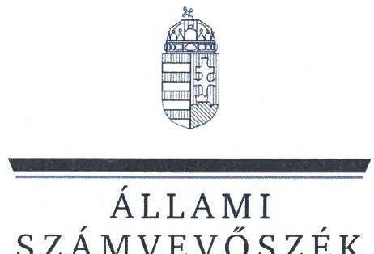
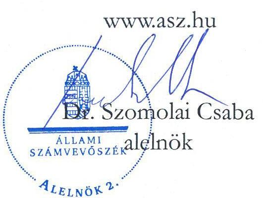
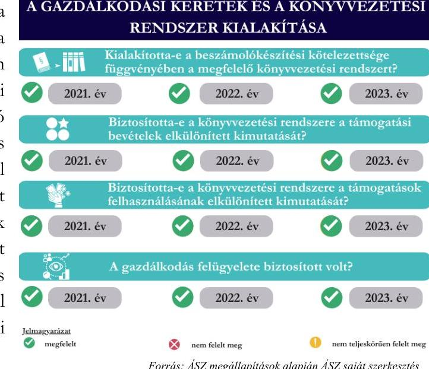
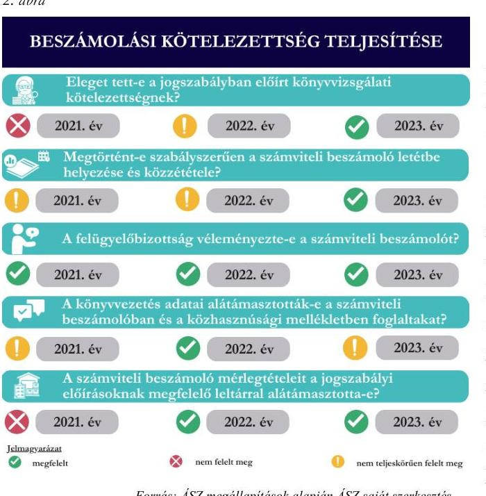
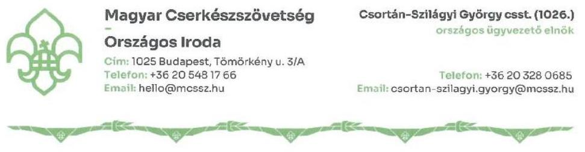
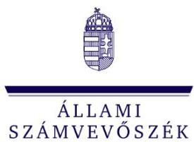

# JELENTÉS 

## Az államháztartásból nyújtott támogatást felhasználó egyesületek és alapítványok ellenőrzése

Magyar Cserkészszövetség

2025.

---

ÁLLAMI
SZÁMVEVÔSZÉK

# JELENTÉS 

## Az államháztartásból nyújtott támogatást felhasználó egyesületek és alapítványok ellenőrzése

Magyar Cserkészszövetség

2025.

25054

---

# ELLENŐRZÉSI IGAZGATÓSÁG: 

## ELLENŐRZÉSI IGAZGATÓSÁG V.

## ELLENŐRZÉSI IGAZGATÓ:

## KLINGA LÁSZLÓ igazgató

## ELLENŐRZÉSVEZETŐ:

## BÉCSI ANDREA ellenőrzésvezető

Jelentéseink az interneten a www.asz.hu címen olvashatók.

IKTATÓSZÁM: EL-4032-005/2025
TÉMASORSZÁM: 35
ELLENŐRZÉS-AZONOSÍTÓ SZÁM: V108001

---

# TARTALOMJEGYZÉK 

AZ ELLENŐRZÉS ALAPADATAI ..... 5
AZ ELLENŐRZÖTT SZERVEZET ..... 7
ÖSSZEFOGLALÁS ..... 9
AZ ELLENŐRZÉS FÓKUSZTERÜLETEI ..... 11
MEGÁLLAPÍTÁSOK ..... 12
JAVASLATOK ..... 17
MELLÉKLETEK ..... 18
I. sz. melléklet: Értelmező szótár ..... 18
II. sz. melléklet: Az ellenőrzött szervezetek jegyzéke ..... 20
III. sz. melléklet: Ellenőrzési kritériumok ..... 21
FÜGGELÉK: ÉSZREVÉTELEK ..... 22
RÖVIDÍTÉSEK JEGYZÉKE ..... 33

---

.

---

# AZ ELLENŐRZÉS ALAPADATAI 

## AZ ELLENŐRZÉS CÉLJA

Az ellenőrzés célja annak értékelése volt, hogy az államháztartásból nyújtott támogatást felhasználó egyesületi vagy alapítványi formában múködő civil szervezetek a gazdálkodásuk szabályozási környezetét, a gazdálkodás kontrolljait - az államháztartásból nyújtott támogatások tükrében - szabályszerűen alakították-e ki. A civil szervezetek a kapott támogatásokat célszerűen, a támogatói okiratban foglaltaknak megfelelően használták-e fel, a kapott támogatások felhasználása, a támogatásokkal való elszámolás szabályszerű volt-e, illetve a gazdálkodásukról szabályszerűen beszámoltak-e.

## AZ ELLENŐRZÉS TÍPUSA

Kombinált ellenőrzés.

## AZ ELLENŐRZÖTT IDŐSZAK

A 2021-2023. évek.

## AZ ELLENŐRZÉS TÁRGYA

Az ellenőrzés tárgyát képezte az államháztartásból nyújtott támogatást felhasználó egyesületek és alapítványok 2021-2023. évi gazdálkodásának ellenőrzése. Ennek keretében a könyvvezetésre vonatkozó jogszabályi előírások betartása, az államháztartásból származó támogatások és azok felhasználása jogszabályi előírásoknak megfelelő elkülönített nyilvántartása, a támogatás támogatói okirat / támogatási szerződés szerinti célszerű felhasználása, valamint a beszámolási és közzétételi kötelezettség teljesítésének szabályszerűsége. Az ellenőrzés kiterjedt továbbá annak ellenőrzésére, hogy a számviteli szabályozási környezet kialakítása támogatta-e az államháztartásból származó támogatások vonatkozásában a szabályos könyvvezetést, a kapcsolódó beszámolási kötelezettség teljesítését.

## AZ ELLENŐRZÉS JOGALAPJA

Az ellenőrzés jogszabályi alapját az ÁSZ tv. ${ }^{1} 1 . \int(3)$ bekezdés, az 5. $\int(3)$ bekezdés, valamint a Civil tv. ${ }^{2} 47 . \int$ előírásai képezték.

---

# AZ ELLENŐRZÉS MÓDSZERE 

Az ÁSZ ${ }^{3}$ az ellenőrzést a nemzetközi standardokat irányadónak tekintve az ellenőrzési program szempontjai, az ellenőrzött időszakban hatályos jogszabályok, az ellenőrzés szakmai szabályok és módszertanok figyelembevételével végezte.

Az ellenőrzési bizonyítékként felhasználható adatforrások közé tartoztak egyrészt az ellenőrzési programban felsorolt adatforrások, másrészt adatforrás volt még minden - az ellenőrzés folyamán - feltárt, az ellenőrzés szempontjából információkat tartalmazó dokumentum.

Az ellenőrzési fókuszterületek megválaszolásához szükséges bizonyítékok megszerzése az ellenőrzött szervezet által rendelkezésre bocsátott dokumentumokra és adatokra alapozva, továbbá kérdésfeltevés (információkérés) és mintavételezés útján történt.

Az ellenőrzés lefolytatásához az ellenőrzött szervezet a tanúsítványok kitöltésével, valamint az ÁSZ által kért dokumentumok, információk megküldésével szolgáltatott adatot.

A támogatások ${ }_{1-5}{ }^{4}$ célnak megfelelő, szabályszerű felhasználásának és nyilvántartásának ellenőrzését mintavételi eljárással kiválasztott tételek alapján ellenőrizte az ÁSZ. A mintatételek kiértékelése alapján kivetítésre nem került sor, a megállapítások az ellenőrzött tételekre vonatkoznak. Az ellenőrzés nem terjedt ki a támogatások ${ }_{1-5}$ értékarányos felhasználásának vizsgálatára.

---

# AZ ELLENŐRZÖTT SZERVEZET

## MAGYAR CSERKÉSZSZÖVETSÉG

Magyarországon a cserkészet legfőbb szervezete az 1912. évben alapított Magyar Cserkészszövetség jogutódjaként és hagyományainak folytatójaként 1989-ben újjáalakult Magyar Cserkészszövetség, ahol országszerte több mint 15 ezer cserkész tevékenykedik. Az MCSSZ ${ }^{5}$ Alapszabálya ${ }_{1-8}{ }^{6}$ szerint „A Szövetség célja szervezeti keretek között összefogni a magyarországi cserkészetet." „A cserkészet célja a fiatalok lelki, értelmi, érzelmi, testi és társas adottságainak, valamint szociális érzékének kifejlesztése. Elő kivánja segíteni, bogy a fiatalok jellemes egyéniségként értékes és hasznos tagjai legyenek a helyi közösségnek, a nemzetnek és az emberiségnek; emberebb emberré és magyarabb magyarrá váljanak.". Az MCSSZ egyesületi formában működő civil szervezet, mely 2015. május 27. óta közhasznú jogállással rendelkezik és kizárólagos magyarországi tagja a Cserkészmozgalom Világszervezetének ${ }^{7}$.

Az ellenőrzött időszakban az MCSSZ ügyvezető szerve az országos elnökség, a legfőbb döntéshozó szerve az országos küldöttgyűlés volt. Az MCSSZ-t az országos elnök és az országos ügyvezető elnök önállóan képviselte, az országos elnökség által megállapított esetekben és jogkörökben az MCSSZ képviseletét a szövetségi igazgató és az országos külügyi vezető is elláthatta. Az MCSSZ Alapszabálya ${ }_{1-8}$ szerint előírtaknak megfelelően gondoskodott felügyelőbizottság létrehozásáról. Az MCSSZ a 2022. évtől Alapszabályában, létrehozta a felügyeleti és ügyviteli szervek szakmai tanácsadó szerveként a Számvizsgáló Bizottságot, melynek fő feladata a pénzügyi és számviteli beszámoló és a közhasznúsági melléklet áttekintése, véleményezése volt.

Az MCSSZ-nek az ellenőrzött időszakban két gazdasági társaságban volt 100\%-os tulajdoni részesedése. A Cserkészingatlanok Nonprofit Kft. főtevékenysége saját tulajdonú, bérelt ingatlanok bérbeadása, üzemeltetése, a Scoutmaster Szolgáltató Kft. főtevékenysége konferencia, kereskedelmi bemutató szervezése volt.

Az MCSSZ-nek a 2021. évi beszámoló adatai szerint 149,9 M Ft értékesítés nettó árbevétele keletkezett, melyből 28,7 M Ft vállalkozási tevékenységből származott. A 2022. évben az értékesítés nettó árbevétele 65,6 M Ft, a 2023. évben 54,5 M Ft volt, a 2022-2023. években vállalkozási tevékenységet nem végzett. Az MCSSZ céljainak megvalósítását főként egyéb bevételekből, ezen belül támogatásokból, tagdíjból és adományokból finanszírozta. (1. táblázat) Az ellenőrzés 528,1 M Ft központi költségvetésből származó támogatás nyilvántartására, felhasználására és elszámolására terjedt ki. (2. táblázat)

## AZ MCSSZ EGYÉB BEVÉTELEINEK ALAKULÁSA A 2021-2023. ÉVEKBEN (ADATOK EFT-BAN)

|   | 2021. | 2022. | 2023.  |
| --- | --- | --- | --- |
|  Egyéb bevételek | 433329 | 431191 | 488268  |
|  Tagdíj | 57640 | 42436 | 51124  |
|  Támogatások | 367568 | 386571 | 405989  |
|  ebből: Adomány | 31247 | 211489 | 181037  |

Forrás: ÁSZ saját szerkesztés az MCSSZ 2021-2023. évi számviteli beszámolóinak adatai alapján

---

# AZ MCSSZ ELLENŐRZÖTT TÁMOGATÁSAI 

|  | TÁMOGATÁS, | TÁMOGATÁS, | TÁMOGATÁS, | TÁMOGATÁS, | TÁMOGATÁS, |
| :--: | :--: | :--: | :--: | :--: | :--: |
| Támogatói okirat azonosítója | CNP-KP-1-2022/1000157 | 7634-1/2019 | CNP-KP-1-2021/1000231 | CNP-KP-1-2021/1000043 | EG-00254-001/2022 |
| Támogatási program célja | A szervezet ifjúságnevelő munkájának támogatása | A Teleki-Tisza   Kastélykomplexum   panzió és   matracszállás   kialakításának, a   Miskolci   Cserkészház-Ifjúsági   mobilitási központ   fejlesztésének és a   Kecskeméti   Cserkészház   felújításának   előkészítése | A szervezet szakmai programjainak és múködésének támogatása | A szervezet ifjúságnevelő programjának támogatása | Magyar Dzsembori Csapat részvételének támogatása a 25. World Scout Jamboree-n |
| Támogató megnevezése | BGA Zrt. ${ }^{8}$ | $\mathrm{EMMI}^{9}$ | BGA Zrt. | BGA Zrt. | Tempus   Közalapítvány |
| Támogatott tevékenység időtartama a támogatói okirat alapján | $\begin{aligned} & 2022.12 .01- \\ & 2023.10 .30 . \end{aligned}$ | $\begin{aligned} & 2019.01 .01- \\ & 2022.06 .30 . * \end{aligned}$ | $\begin{aligned} & 2021.12 .01- \\ & 2022.12 .31 . * \end{aligned}$ | $\begin{aligned} & 2021.06 .01- \\ & 2022.12 .31 . * \end{aligned}$ | $\begin{aligned} & 2022.05 .31- \\ & 2023.12 .31 . \end{aligned}$ |
| Felhasználás végső időpontja az eredeti támogatói okirat alapján | 2023.09.30. | 2019.12.28. | 2022.06.30. | 2022.01.30. | 2024.01.30. |
| Felhasználás végső időpontja a legutolsó támogatói okirat módosítás alapján | 2023.10.30. | 2022.06.30. | 2023.01.30. | 2023.01.30. | nem releváns |
| Támogatás folyóstításának módja | 100\%-os támogatási előlegként folyósitott, vissza nem térítendő | 100\%-os támogatási előlegként folyósitott, vissza nem térítendő | 100\%-os támogatási előlegként folyósitott, vissza nem térítendő | 100\%-os támogatási előlegként folyósitott, vissza nem térítendő | 100\%-os támogatási előlegként folyósitott, vissza nem térítendő |
| Támogatási előleg folyóstításának napja, összege | $\begin{aligned} & 2022.12 .27 . \\ & 50,0 \mathrm{M} \mathrm{Ft} \end{aligned}$ | $\begin{aligned} & 2019.05 .02 . \\ & 393,0 \mathrm{M} \mathrm{Ft} \end{aligned}$ | $\begin{aligned} & 2021.12 .27 . \\ & 55,1 \mathrm{M} \mathrm{Ft} \end{aligned}$ | $\begin{aligned} & 2021.04 .21 . \\ & 20,0 \mathrm{M} \mathrm{Ft} \end{aligned}$ | $\begin{aligned} & 2022.12 .22 . \\ & 10,0 \mathrm{M} \mathrm{Ft} \end{aligned}$ |
| A pénzügyi elszámolás határideje az eredeti támogatói okirat alapján | 2023.10.30. | 2019.12.30. | 2022.06.30. | 2022.01.30. | 2024.02.29. |
| A pénzügyi elszámolás határideje a legutolsó támogatói okirat módosítás alapján | 2023.11.30. | 2022.07.10. | 2022.12.31. | 2022.12.31. | nem releváns |
| A záró pénzügyi elszámolás kelte, a támogatásból felhasznált összeg | $\begin{aligned} & 2023.11 .29 . \\ & 50,0 \mathrm{M} \mathrm{Ft} \end{aligned}$ | $\begin{aligned} & 2023.08 .02 . \\ & 393,0 \mathrm{M} \mathrm{Ft} \end{aligned}$ | $\begin{aligned} & 2022.11 .29 . \\ & 55,05 \mathrm{M} \mathrm{Ft} \end{aligned}$ | $\begin{aligned} & 2022.08 .12 . \\ & 20,0 \mathrm{M} \mathrm{Ft} \end{aligned}$ | $\begin{aligned} & 2024.05 .24 . \\ & 10,0 \mathrm{M} \mathrm{Ft} \end{aligned}$ |
| Benyújtott elszámolás támogatói elfogadása | folyamatban | 2023.11.13. | 2023.01.03. | 2022.12.05. | folyamatban |

[^0]
[^0]:    * a 118/2022. (III. 22.) Korm. rendelet 2. § (1) bekezdés a) pontja szerint a 2021. január 1-je előtt létrejött és azóta fennálló támogatási jogviszonyokban 2022. június 30. napjáig a tévarkozott jogszabály b) pontja szerint a 2021. január 1-je és 2021. december 31-e között létrejött támogatási jogviszonyokban 2022. december 31. napjáig a támogatott tevékenység időtartama meghosszabbodott

---

# ÖSSZEFOGLALÁS 

A cserkészet a világ legnagyobb gyermek-és ifjúsági mozgalma melynek célja, hogy a cserkészek aktív, elkötelezett felnőttekké váljanak. Az MCSSZ a 2021-2023. években az alapcél szerinti (közhasznú) tevékenysége költségei, ráfordításai - ideértve az annak keretében megvalósuló fejlesztési célt - ellentételezésére kapott támogatásai közül a kiválasztott és ellenőrzött támogatások ${ }_{1-5}$ összege összesen 528,1 M Ft volt, melyet 100\%-os előlegként, vissza nem térítendő támogatásként kapott. A társadalom részéről jogosan felmerülő elvárás, hogy ellenőrzések keretében időről-időre sor kerüljön az államháztartásból nyújtott támogatások rendeltetésszerủ és átlátható módon történő felhasználásának értékelésére, s ezáltal átfogó képet kapjon a közpénzből gazdálkodó szervezetek múködéséről, tevékenységéről.

Az ellenőrzött időszakban az MCSSZ könyvvezetése a jogszabályi előírásoknak megfelelően a kettős könyvvitel rendszerében történt, egyszerűsített éves 1. ábra beszámolót készített. A számviteli nyilvántartásában a jogszabályi előírásoknak megfelelően biztosította a támogatási bevételek egyéb bevételektől elkülönítetten történő nyilvántartásának lehetőségét, a könyvvezetési rendszerét úgy alakította ki, hogy abból megállapítható legyen, hogy a kapott támogatás államháztartási, és azon belül központi költségvetési forrásból származott. Gondoskodott továbbá olyan elkülönített számviteli nyilvántartás kialakításáról, melynek megfelelő alkalmazásával támogatásonként megállapítható és ellenőrizhető a kapott támogatás felhasználása. Az MCSSZ 2022. május 25 -től rendelkezett a jogszabály által előírt számviteli politikával és az annak keretében elkészítendő szabályzatokkal.

Az GAZDÁLKODÁSI KERETÉE ÉS A KÖNYVVEZETÉSI HENDSZER KIALAKÍTÁSA

Az MCSSZ gondoskodott a felügyelőbizottság létrehozásáról, biztosította a múködésének feltételeit. (1. ábra)

Az MCSSZ számviteli beszámolóit és közhasznúsági mellékleteit a felügyelőbizottság véleményének ismeretében az országos küldöttgyűlést jóváhagyta. A 2021-2022. évi beszámolókat a jogszabályban előírt határidőn túl, de a pótlási határidőn belül helyezte letétbe és tette közzé, a 2023. évi beszámoló letétbe helyezése és közzététele határidőben megtörtént. Könyvvizsgálatra a 2021-2023. évek vonatkozásában kötelezett volt, azonban a könyvvizsgálati kötelezettségét a 2021. évi beszámoló vonatkozásában a jogszabályi előírások ellenére nem teljesítette. A 2022. évi beszámoló könyvvizsgálatára annak közzétételét követően, utólagosan került sor. A 2023. év vonatkozásában könyvvizsgálattal alátámasztott beszámolót tett közzé, azonban a könyvvizsgálatra a jogszabály által előírt határidőn túl bízott meg könyvvizsgálót. Az MCSSZ saját honlapján nem tett eleget a 2021-2023. évi számviteli beszámolók közzétételi kötelezettségének.

A 2021. évi számviteli beszámoló mérlegtételeit az MCSSZ a jogszabályi előírás ellenére nem támasztotta alá leltárral.

---

A 2021. évi beszámoló kiegészítő melléklete nem tartalmazott a beszámoló szempontjából lényeges és jelentős információkat a 2021. évben feltárt, az MCSSZ kárára a 2015-2021. években elkövetett jelentős értékre elkövetett sikkasztásra vonatkozóan.

A könyvviteli rendszerében a jogszabályban foglaltak szerint kötelezettségként mutatta ki a vissza nem térítendő, $100 \%$-os előlegként kapott támogatásokat, azonban a támogatás ${ }_{1,5}$ esetében a kötelezettséget a záró pénzügyi elszámolás ${ }_{1,5}{ }^{10}$ támogató általi elfogadását megelőzően, a támogatott tevékenység megvalósítására rendelkezésre álló időszak utolsó napjával megszüntette, melynek következtében a 2023. évről készített számviteli beszámolójában 60,0 M Ft-tal kevesebb kötelezettséget mutatott ki. Az MCSSZ a 2021. és a 2023. évről készített számviteli beszámolójában a jogszabályi előírásokban foglaltak ellenére nem biztosította az egyezőséget az üzleti év nyitóadatai és az előző üzleti év záró adatai között. (2. ábra)

Az MCSSZ a támogatási bevételeket az egyéb bevételeitől elkülönítve, a támogatás ${ }_{3,4}$ kivételével a jogszabály által előírt részletezésben mutatta ki. Az öt ellenőrzött támogatás felhasználásáról a jogszabályban előírtaknak megfelelően vezetett elkülönített nyilvántartást. A támogatás ${ }_{1-5}$ terhére teljesített, ellenőrzött kifizetések jogcímei a támogatói okiratokban ${ }_{1-5}{ }^{11}$ foglaltaknak megfeleltek, azonban a támogatás ${ }_{3-5}$ felhasználása és elszámolása során nem tartotta be a támogatói okiratokban ${ }_{3-5}$ számára előírt, az elszámolási határidőre, illetve a bizonylatok záradékolására vonatkozó kötelezettségeket. (3. ábra)

Az MCSSZ az ÁSZ tv. 29. § (2) bekezdés szerinti, a jelentéstervezet megállapításaira tett észrevételében arról tájékoztatta az ÁSZ-t, hogy a számviteli beszámolók saját honlapján történő közzétételét pótolta, valamint intézkedéseket tett a számviteli beszámoló és a közhasznúsági melléklet szabályszerű elkészítése, a támogatási előlegek jogszabályi előírásoknak megfelelő elszámolása, a támogatási bevételek megfelelő nyilvántartása érdekében.

---

# AZ ELLENŐRZÉS FÓKUSZTERÜLETEI 

1. A civil szervezet gazdálkodási keretei és könyvvezetési rendszere kialakításának szabályszerűsége az államháztartásból származó támogatások vonatkozásában
2. A civil szervezet jogszabályban előírt beszámolási kötelezettsége
3. A civil szervezet által államháztartási forrásból kapott támogatások és azok felhasználása, továbbá a kapcsolódó elszámolások szabályszerűsége

---

# 1. A civil szervezet gazdálkodási keretei és könyvvezetési rendszere kialakításának szabályszerűsége az államháztartásból származó támogatások vonatkozásában 

Összegző megállapítás

Az MCSSZ számviteli szabályozási környezete 2022. május 25-től volt szabályszerű. Az MCSSZ könyvvezetési rendszerének kialakítása az államháztartásból származó támogatások vonatkozásában megfelelt a Számv. tv. ${ }^{12}$ és a Civil tv. előírásainak.

Az ellenőrzött időszakban a közhasznú jogállású MCSSZ könyvvezetése a Civil tv. és az Eszkr. ${ }^{13}$ előírásainak megfelelően a kettős könyvvitel rendszerében történt, a hivatkozott jogszabályok formai előírásainak megfelelően, a 2021-2023. évekre vonatkozóan egyszerűsített éves beszámolót készített. Az MCSSZ a 2021-2023. évek vonatkozásában az Eszkr. előírásai alapján könyvvizsgálatra volt kötelezett, mert az éves bevétele az üzleti évet megelőző két üzleti év átlagában meghaladta a 300,0 M Ft-ot. Az MCSSZ a Eszkr. 16. § (1) bekezdésében foglaltak ellenére a 2021. évi beszámoló felülvizsgálatára nem, a 2022-2023. évi számviteli beszámolók könyvvizsgálatára az Eszkr. 16. (3) bekezdésben előírt határidőn túl, az előző üzleti évi beszámoló elfogadását követően bízott meg könyvvizsgálót, az MCSSZ a választott könyvvizsgáló társasággal 2024. január 30-án kötött szerződést.
Az MCSSZ a Civil tv.-ben előírtaknak megfelelően a könyvvezetési rendszerének kialakítása során biztosította az alapcél szerinti (közhasznú) tevékenysége költségei, ráfordításai ellentételezésére visszafizetési kötelezettség nélkül kapott támogatás - ideértve az alapcél szerinti (közhasznú) tevékenysége keretében megvalósuló fejlesztés céljára kapott támogatást is - bevételként történő elszámolásakor annak egyéb bevételeitől elkülönítetten történő bemutatását. Továbbá, a bevételeken belül az alkalmazott főkönyvi számlák struktúráját úgy alakította ki, hogy abból megállapítható legyen, hogy a kapott támogatás államháztartási forrásból kapott támogatás, azon belül központi költségvetési forrásból kapott támogatás volt. Az MCSSZ a 2021-2023. évek vonatkozásában a Számv. tv. és a Civil tv. előírásainak megfelelően úgy alakította ki a könyvvezetési rendszerét, hogy a támogatások felhasználásának elkülönített nyilvántartása biztosított legyen, melynek érdekében gyűjtőszámokat és munkaszámokat hozott létre.
Az MCSSZ számviteli szabályozási környezete 2022. május 24-ig nem volt szabályszerű, mert nem rendelkezett a Számv. tv. 14. § (3) bekezdése által előírt számviteli politikával és a Számv. tv. 14. § (5) bekezdésének a), b) és d) pontjában előírt, a számviteli politika keretében elkészítendő szabályzatokkal. Az MCSSZ hiányosságait pótolta és 2025. május 25 -től eleget tett a jogszabályi követelményeknek a számviteli rendjének kialakítása vonatkozásában.
Az MCSSZ-nél a Ptk. ${ }^{14}$, a Civil tv. és az Alapszabály ${ }_{1-8}$ előírásaival összhangban az ellenőrzött időszakban felügyelőbizottság múködött. Az MCSSZ legfőbb döntéshozó szerve, az országos

---

küldöttgyűlés 2021. május 15-én nem fogadta el a felügyelőbizottság beszámolóját, melynek következményeképp az Alapszabályban ${ }_{1}$ foglaltaknak megfelelően megszűnt a felügyelőbizottság megbízatása. Az új felügyelő bizottsági tagok megválasztására a Ptk. szerinti határidőn belül, 2021. június 16-án sor került. Az új felügyelőbizottság a Ptk. és az Alapszabálys.s előírásaiban, valamint a Felügyelőbizottság Ügyrendjében ${ }^{15}$ foglaltaknak megfelelően figyelemmel kísérte a gazdálkodást, illetve beszámolt működéséről az országos küldöttgyűlésnek.

# 2. A civil szervezet jogszabályban előírt beszámolási kötelezettsége 

## Összegző megállapítás

Az MCSSZ az előírt beszámolási kötelezettségének eleget tett, azonban az elkészített számviteli beszámolók több esetben nem feleltek meg a Számv. tv. és a Civil tv. előírásainak.

Az MCSSZ a 2021-2023. évre vonatkozó számviteli beszámolókat és közhasznúsági mellékleteket elkészítette, valamint a Civil tv. előírásainak megfelelően jóváhagyásra az erre jogosult testület, az országos küldöttgyűlés elé terjesztette. Az MCSSZ felügyelőbizottsága a 2021-2023. évi számviteli beszámolók vonatkozásában az előterjesztéseket megvizsgálta, álláspontját a Ptk.-ban foglaltak szerint ismertette az országos küldöttgyűléssel.
A 2021-2023. évekre vonatkozó számviteli beszámolókat az országos küldöttgyűlés elfogadta, azokat az MCSSZ a Civil tv. előírásai szerint letétbe helyezte és az $\mathrm{OBH}^{16}$ honlapján közzé tette. Az MCSSZ közzétételi kötelezettségét a 2021-2022. évi beszámolók vonatkozásában a Civil tv. 30. § (1) bekezdésében előírt határidőn túl teljesítette, de mindkét beszámoló vonatkozásában gondoskodott annak egy éven belüli pótlásáról, a 2021. évi beszámolót 2022. december 21-én, a 2022. évi beszámolót 2023. november 21-én tette közzé. A 2023. évre vonatkozó beszámolót az MCSSZ a Civil tv. által előírt határidőben letétbe helyezte és közzétette.
A 2021-2023. évi számviteli beszámolók a Számv. tv. 20. § (6) bekezdésében, a 96. § (1) bekezdésében, valamint az Eszkr. 7. § (1) bekezdésében előírtak ellenére nem tartalmazták a szervezet képviseletére jogosult személy aláírását. A 2021. évre vonatkozó számviteli beszámoló tekintetében az Eszkr. 16. § (1) bekezdésében foglaltak ellenére az MCSSZ a kötelező könyvvizsgálati kötelezettségének nem tett eleget. Az MCSSZ a 2022. évi beszámolóját a könyvvizsgálóval utólag, annak közzétételét követően ellenőriztette, így a Civil tv. 30. § (1) bekezdésében foglaltak ellenére a közzétett beszámoló nem volt könyvvizsgálattal alátámasztott. A 2023. évi közzétett beszámolót a Civil tv.-ben foglaltaknak megfelelően könyvvizsgáló ellenőrizte. Az OBH honlapján közzétett számviteli beszámolóit és közhasznúsági mellékleteit a 2021-2023. évek vonatkozásában a Civil tv. 30. § (4) bekezdésben előírtak ellenére az MCSSZ a saját honlapján nem hozta nyilvánosságra.
A 2021. évről készített számviteli beszámolójának mérlegadatait az MCSSZ a Számv. tv. 69. § (1) bekezdésében foglaltak ellenére nem támasztotta alá olyan leltárral, amely tételesen ellenőrizhető módon tartalmazta volna a mérleg fordulónapján meglévő eszközeit és forrásait mennyiségben és értékben. A 2022. és a 2023. évekről készített számviteli beszámolók mérlegtételei a Számv. tv. előírásai szerint leltárral alátámasztottak.

---

Az MCSSZ a 2021-2023. évi számviteli beszámolóinak kiegészítő mellékletei a Civil tv. előírása szerint támogatásonként tartalmazták a támogatási programok keretében végleges jelleggel felhasznált összegeket, valamint az MCSSZ az ellenőrzött időszak minden üzleti évére vonatkozóan bemutatta az általa elvégzett főbb tevékenységeket és programokat.
Az MCSSZ a 2021-2023. évi számviteli beszámolókkal egyidejűleg elkészítette a Civil tv. előírásai szerint és a Civil vhr. ${ }^{17}$ által előírt formában a közhasznúsági mellékleteket. A 2021-2022. évi közhasznúsági mellékletek tartalma megfelelt a jogszabályi előírásoknak, azonban a 2023. évi közhasznúsági melléklet a Számv. tv. 164. § (2) bekezdés előírásai ellenére nem volt az MCSSZ könyvviteli rendszeréből származó adatokat tartalmazó főkönyvi kivonattal alátámasztott, ugyanis a cél szerinti juttatások összegeként 8,1 E Ft helyett tévesen 13,2 E Ft került feltüntetésre.
Az MCSSZ könyvviteli nyilvántartása és a számviteli beszámolói nem feleltek meg az ellenőrzött időszakban a jogszabályok alábbiakban részletezett előírásainak:

- A vissza nem térítendő, 100\%-os előlegként kapott támogatásokat ${ }_{1-5}$ az MCSSZ a könyvviteli rendszerében a jogszabályban előírtak szerint az egyéb rövid lejáratú kötelezettségek között nyilvántartásba vette. A támogatás ${ }_{1,5}$ összegét a záró pénzügyi elszámolás ${ }_{1,5}$ támogató ${ }_{1,5}{ }^{18}$ részéről történő elfogadását megelőzően, a támogatott tevékenység megvalósítására rendelkezésre álló időszak utolsó napjával kivezette a kötelezettségek közül. Az elszámolás támogatói ${ }_{1,3}$ jóváhagyás hiányában az Ávr. ${ }^{19}$ előírásai szerint nem minősült befejezettnek és lezártnak, valamint annak támogató általi elfogadásáig a támogatási előleg nem volt tekinthető véglegesnek. A támogatás ${ }_{1,5}$ esetében az elszámolás támogató ${ }_{1,3}$ általi elfogadása az adatszolgáltatás lezárásáig ${ }^{20}$ nem történt meg. Mivel az MCSSZ a támogatói jóváhagyás előtt kivezette a támogatás ${ }_{1,5}$ összegét a kötelezettségek közül, a 2023. évi számviteli beszámolójában a Számv. tv. 43. § (1) bekezdésben foglaltak ellenére nem mutatta ki az egyéb rövid lejáratú kötelezettségek között a támogatás ${ }_{1}$ 50,0 M Ft és a támogatás ${ }_{5} 10,0 \mathrm{M}$ Ft összegét.
- Az MCSSZ a 2021. évben a 2015-2021. évek között egy korábbi munkavállalója által elkövetett sikkasztást tárt fel. A kár összegét 225,0 M Ft-ban állapította meg, melyet a 2021. évben a korábbi munkavállalóval szembeni követelésként vett nyilvántartásba. A követeléshez kapcsolódóan a Számv. tv. előírásai alapján - figyelemmel a követelésből várhatóan megtérülő összegre - az MCSSZ 200,0 M Ft összegű értékvesztést számolt el. A 2021. évi kiegészítő melléklet azonban a Számv. tv. 16. § (4) bekezdésében megfogalmazott lényegesség elvét, valamint a Számv. tv. 4. § (3) bekezdése szerinti megbízható és valós összkép bemutatását megsértve erre vonatkozóan információt nem tartalmazott.
- A 2021. évben a sikkasztáshoz kapcsolódó 19 db készpénzfelvételi tranzakciót - összesen 8,3 M Ft összegben - a 2021. évben számviteli szolgáltatást végző gazdasági társaság bevételi pénztárbizonylat nélkül könyvelt le az MCSSZ könyveiben. Az MCSSZ számviteli nyilvántartásában a Számv. tv. 165. § (1)-(2) bekezdésében foglalt bizonylati elvre és bizonylati fegyelemre vonatkozó előírások ellenére, valamint a Számv. tv. 15. § (3) bekezdésében előírt valódiság elvét figyelmen kívül hagyva, ezen gazdasági események bizonylatok nélkül kerültek elszámolásra.
- Az MCSSZ 2021. és 2023. évről készített számviteli beszámolójában feltüntetett, előző évre vonatkozó adatok a Számv. tv. 15. § (6) bekezdésében előírt folytonosság elvét megsértve több esetben eltértek az előző üzleti évről készült beszámoló tárgyévi adataitól. A 2021. évi számviteli beszámolóban az előző év adatát tartalmazó „Pénzeszközök" mérlegsoron szereplő összeg a

---

2020. évi beszámoló „Értékpapírok" és „Pénzeszközök" mérlegsorain feltüntetett tárgyévi adatok összegét tartalmazta, a 2020. évi eredménykimutatás „Adományok" során szereplő tárgyévi összeg a 2021. évi eredménykimutatás előző évi adatainál nem került feltüntetésre, míg a 2021. évi beszámolóban az előző évre vonatkozóan a közhasznú jogállás megállapításához szükséges mutatók „Éves összes bevétel", „Közbaspnú tevékenység ráforditásai", „Adózott eredmény" és „A szervezet munkájában közremüködő közérdekü önkéntes tevékenységet végzö személyek száma" különbözött a 2020. évi beszámolóban szereplő tárgyévi adatoktól. A 2023. évi számviteli beszámoló eredménykimutatásában a „Személyi jellegö ráforditások" előző évi összege tért el a 2022. évi számviteli beszámolóban feltüntetett tárgyévi összegtől.

# 3. A civil szervezet által államháztartási forrásból kapott támogatások és azok felhasználása, továbbá a kapcsolódó elszámolások szabályszerűsége 

Összegző megállapítás Az ellenőrzött államháztartási forrásból kapott támogatások és azok felhasználásának számviteli elszámolása a támogatás ${ }_{1,2,5}$ esetében szabályszerű volt, a támogatás ${ }_{3,4}$ esetében maradéktalanul nem felelt meg a Civil tv. előírásainak. Az ellenőrzött támogatások felhasználása megfelelt a jogszabályban és a támogatói okiratokban foglaltaknak, a támogatás ${ }_{3-5}$ elszámolása nem felelt meg a támogatói okiratokban $3-5$ foglalt minden előírásnak.

Az MCSSZ az öt ellenőrzött támogatást ${ }_{1-5}$ vissza nem térítendő, $100 \%$-os előlegként kapta az alapcél szerinti (közhasznú) tevékenysége költségei, ráfordításai ellentételezésére a támogatóktól ${ }_{1-3}$. Az MCSSZ valamennyi támogatást ${ }_{1-5}$ nyilvántartotta az ellenőrzött időszakban.
A támogatás ${ }_{5}$ esetében a záró pénzügyi elszámolás ${ }_{5}$ benyújtása a támogatói okiratokban ${ }_{5}$ foglaltak szerinti határidőn túl történt, azt az MCSSZ a támogatói okiratban ${ }_{5}$ foglalt 2024. február 29-i határidőt követően, 2024. május 24-én nyújtotta be. A támogatás ${ }_{2}$ vonatkozásában az MCSSZ a támogató ${ }_{2}$ felé a támogatói okirat ${ }_{2}$ mellékletét képező költségterv módosítása iránt 2022. március 11-én - a 2022. július 10-i elszámolási határidőt megelőzően - kérelmet nyújtott be, melynek elfogadására több mint egy évvel később, 2023. július 13-án a KIM, mint az EMMI jogutódja által került sor. A záró pénzügyi elszámolás ${ }_{2}$ benyújtására a támogatói okirat ${ }_{2}$ módosítását követően, 2023. augusztus 02-án került sor. A támogatás ${ }_{2}$ 4 vonatkozásában elkészült elszámolásokat a támogató ${ }_{1,2}$ elfogadta, a támogatás ${ }_{1,5}$ esetében az elszámolás támogató ${ }_{1,3}$ általi elfogadása az adatszolgáltatás lezárásáig nem történt meg.
Az MCSSZ a 2022. évben a Civil tv. előírásainak megfelelően kialakított könyvviteli nyilvántartásában a kapott támogatások bevételként történő elszámolásakor a támogatás ${ }_{3,4}$ esetében a Civil tv. 20. § (3) bekezdés a) pontja előírása ellenére nem a központi költségvetési forrásból kapott támogatások között, hanem a más gazdálkodótól kapott támogatások között tartotta nyilván. Az MCSSZ a kapott támogatások ${ }_{1-5}$ felhasználásáról a Civil tv. előírásai szerint elkülönített számviteli nyilvántartást vezetett.

---

A támogatások ${ }_{1-5}$ célnak megfelelő, szabályszerű felhasználásának és nyilvántartásának értékelése a támogató ${ }_{1-3}$ felé benyújtott záró pénzügyi elszámolások ${ }_{1-5}$ alapján a támogatásonként kiválasztott mintatételekhez kapcsolódó bizonylatok ellenőrzésével történt. A támogatások ${ }_{1-5}$ terhére elszámolt, ellenőrzésre kiválasztott kifizetések jogcímei megfeleltek a támogatói okirat ${ }_{1-5}$ és azok módosításai mellékleteként elkészített költségtervekben foglaltaknak, valamint megfeleltek a támogatott tevékenység időtartamára vonatkozó előírásoknak. Az ellenőrzött kifizetések számviteli elszámolása a Számv. tv. és a Civil tv. előírásainak megfelelően szabályszerű volt.
Az MCSSZ a támogatói okiratban ${ }_{2}$ foglaltak és a Kbt. ${ }^{21}$ szerint a támogatás ${ }_{2}$ tekintetében kötelezett volt a szabadidős létesítmény építése vonatkozásában közbeszerzési eljárás megindítására. A közbeszerzési eljárást lefolytatta, melynek eredményeképp a közbeszerzési eljárás nyertesével szerződést kötött.
A mintatételek ellenőrzése során megállapításra került, hogy az MCSSZ a CNP-KP-1-2021-1-000043_06. ssz., a CNP-KP-1-2021-1-000231_10. ssz., az EG-00254-001-2022_01. ssz. és a EG-00254-001-2022_02. ssz. mintatételek esetében nem tartotta be a támogatói okiratban ${ }_{3-5}$ előírtakat, mivel a támogatás felhasználás igazolását dokumentáló eredeti számlákra, bizonylatokra, egyéb okiratokra nem vezette rá, hogy azt mely támogatás terhére számolta el.

---

# JAVASLATOK 

Az ÁSZ tv. 33. § (1) bekezdésében foglaltak értelmében az ellenőrzött szervezet vezetője köteles a jelentésben foglalt megállapításokhoz kapcsolódó intézkedési tervet összeállítani és azt a jelentés kézhezvételétől számított 30 napon belül az ÁSZ részére megküldeni. Amennyiben az ellenőrzött szervezet vezetője nem küldi meg határidőben az intézkedési tervet, vagy továbbra sem elfogadható intézkedési tervet küld, az Állami Számvevőszék elnöke az ÁSZ tv. 33. § (3) bekezdése a) és b) pontjaiban foglaltakat érvényesítheti.

## MAGYAR CSERKÉSZSZÖVETSÉG ORSZÁGOS ELNÖKE

1. Gondoskodjon arról, hogy amennyiben az MCSSZ éves (éves szintre átszámított) bevétele az üzleti évet megelőző két üzleti év átlagában meghaladja a hatályos Eszkr. 16. § (1) bekezdésben foglalt összeghatárt, az Eszkr. 16. § (1) és (3) bekezdésben foglalt előirásoknak megfelelően tegyen eleget a kötelező könyvvizsgálati kötelezettségnek.
2. Gondoskodjon arról, hogy az MCSSZ müködéséről, vagyoni, pénzügyi és jövedelmi helyzetéről szóló számviteli beszámoló a Számv. tv. 20. § (6) bekezdésében foglaltaknak megfelelően tartalmazza a szervezet képviseletére jogosult személy aláírását.
3. Gondoskodjon a Civil tv. 30. § (4) bekezdés előirása szerint a számviteli beszámolók saját honlapon történő közzétételéről.
4. Gondoskodjon a közhasznúsági mellékletben kimutatott adatoknak a kettős könyvvitellel vezetett könyvvezetési rendszerben szereplő adatokkal történő alátámasztottságáról a Számv. tv. 164. § (2) bekezdésében foglaltakat betartva.
5. Gondoskodjon arról, hogy az MCSSZ müködéséről, vagyoni, pénzügyi és jövedelmi helyzetéről szóló számviteli beszámoló mérlegében a Számv. tv. 43. § (1) bekezdésében elöírtaknak megfelelően a kötelezettségek között kerüljön kimutatásra az államháztartási forrásból azon belül központi költségvetési forrásból, vissza nem térítendő, 100\%-os előlegként kapott támogatás összege a támogatói okirat szerinti elszámolás támogató általi elfogadásáig.
6. Gondoskodjon a Számv. tv. 15. § (6) bekezdésében foglalt folytonosság elvének betartásáról a számviteli beszámolói elkészítése során.
7. Gondoskodjon a könyvviteli nyilvántartási rendszerében a Civil tv. 20. § (3) bekezdés a) pontjában meghatározott bevételek kimutatására vonatkozó követelmények teljesítéséről, továbbá arról, hogy az alapcél szerinti tevékenysége költségei, ráfordításai ellentételezésére visszafizetési kötelezettség nélkül, államháztartási forrásból kapott, ezen belül központi költségvetésből kapott támogatást a hivatkozott jogszabályi előírásnak megfelelő helyen szerepeljen.
8. Gondoskodjon arról, hogy a kapott támogatás felhasználásához kapcsolódóan a könyvviteli nyilvántartásba vétel és a pénzügyi elszámolás során tartsa be a támogatói okirat vonatkozó előírásait, különös tekintettel a felhasználást alátámasztó eredeti számla/dokumentum előírás szerinti záradékolására.

---

# MELLÉKLETEK 

## I. SZ. MELLÉKLET: ÉRTELMEZŐ SZÓTÁR

adomány
alapítvány
cél szerinti juttatás
civil szervezet
civil szervezetek egyszerúsített támogatása
egyesület
gazdasági-vállalkozási tevékenység
gazdálkodó tevékenység
könyvvizsgálati kötelezettség
közcélú tevékenység
közfeladat

A civil szervezetnek - létesítő okiratban rögzített céljaira - ellenszolgáltatás nélkül juttatott eszköz, illetve nyújtott szolgáltatás. (Civil tv. 2. § 1. pont)
Az alapítvány az alapító által az alapító okiratban meghatározott tartós cél folyamatos megvalósítására létrehozott jogi személy. Az alapító az alapító okiratban meghatározza az alapítványnak juttatott vagyont és az alapítvány szervezetét. (Ptk. 3:378. §) A Számv. tv. alkalmazásában egyéb szervezet. (Számv. tv. 3. § 4.a) pont)
A civil (közhasznú) szervezet által (közhasznú) alaptevékenysége keretében nyújtott pénzbeli vagy nem pénzbeli szolgáltatás. (Civil tv. 2. § 4. pont)
A civil társaság; a Magyarországon nyilvántartásba vett egyesület a párt, a szakszervezet és a kölcsönös biztosító egyesület kivételével; az alapítvány közalapítvány és a pártalapítvány kivételével. (Civil tv. 2. § 6. pont)
A Nemzeti Együttmúködési Alap terhére történő kifizetés a helyi vagy területi hatókörű civil szervezetek számára, mely egyszerúsített formában, jogosultsági alapon nyújtott támogatás, amelyet a civil szervezet alapcél szerinti közösségteremtő, a hatókörébe tartozó közösség érdekében végzett tevékenységéhez kapcsolódó költségeinek fedezésére fordít. (Civil tv. 2. § 8b. pont alapján)
Az egyesület a tagok közös, tartós, alapszabályban meghatározott céljának folyamatos megvalósítására létesített, nyilvántartott tagsággal rendelkező jogi személy. (Ptk. 3:63. § (1) bekezdés) A Számv. tv. alkalmazásában egyéb szervezet. (Számv. tv. 3. § 4.a) pont)
A jövedelem- és vagyonszerzésre irányuló vagy azt eredményező, üzletszerűen végzett gazdasági tevékenység, kivéve
a) az adomány (ajándék) elfogadását,
b) a létesítő okiratban meghatározott cél szerinti tevékenységet (ideértve a közhasznú tevékenységet is),
c) a pénzeszközök betétbe, értékpapírba, társasági részesedésbe történő elhelyezését,
d) az ingatlan megszerzését, használatának átengedését és átruházását. (Civil tv. 2. §11. pont)
Azon tevékenységek összessége, amelyek a civil szervezet vagyoni, pénzügyi, jövedelmi helyzetére kiható gazdasági eseményt eredményeznek. (Civil tv. 2. § 10. pont)
A civil szervezet akkor kötelezett könyvvizsgálatra, ha az éves (éves szintre átszámított) bevétele az üzleti évet megelőző két üzleti év átlagában meghaladja a 300 millió forintot, vagy azt más jogszabály kötelezővé teszi, továbbá, ha ezek egyike sem áll fenn, akkor a civil szervezet is dönthet arról, hogy a beszámoló felülvizsgálatával könyvvizsgálót bíz meg. (Eszkr. 16. § (1) bekezdés alapján)
Személyek csoportja által, valamely a csoportnál tágabb közösség érdekében - más, e közösségbe nem tartozó személyek érdekeinek sérelme nélkül - végzett tevékenység. (Civil tv. 2. § 16. pont)
A jogszabályban meghatározott állami vagy önkormányzati feladat. A közfeladat ellátásban államháztartáson kívüli szervezet jogszabályban meghatározott rendben közremúködhet. (Áht. ${ }^{22} 3 /$ A. § (1)-(2) bekezdése alapján)

---

közhasznú szervezet
közhasznú tevékenység
létesítő okirat
támogatás
támogatási szerződés / támogatói okirat

Közhasznú szervezetté minősíthető a Magyarországon nyilvántartásba vett közhasznú tevékenységet végző szervezet, amely a társadalom és az egyén közös szükségleteinek kielégítéséhez megfelelő erőforrásokkal rendelkezik, továbbá amelynek megfelelő társadalmi támogatottsága kimutatható, és amely:
a) civil szervezet (ide nem értve a civil társaságot), vagy
b) olyan egyéb szervezet, amelyre vonatkozóan a közhasznú jogállás megszerzését törvény lehetővé teszi. (Civil tv. 32. § (1) bekezdés)
Minden olyan tevékenység, amely a létesítő okiratban megjelölt közfeladat teljesítését közvetlenül vagy közvetve szolgálja, ezzel hozzájárulva a társadalom és az egyén közös szükségleteinek kielégítéséhez. (Civil tv. 2. § 20. pont)
A Ptk. előirása szerint a jogi személy létrehozásáról a személyek szerződésben, alapító okiratban vagy alapszabályban szabadon rendelkezhetnek, mely dokumentumokra együttesen a létesítő okirat megnevezést használjuk. (Ptk. 3:4. § (1) bekezdés))
Céljellegú juttatás, mely kizárólag arra a célra használható fel, amelyre a támogató azt rendelkezésre bocsátotta, amely cél megvalósítását a támogatási szerződés, okirat vagy éppen jogszabály kikötötte. Támogatásként értelmezzük valamennyi, a civil szervezetnek államháztartási forrásból nyújtott támogatást - ideértve a központi költségvetésből kapott támogatást, az elkülönített állami pénzalapokból kapott támogatást, a helyi önkormányzatoktól, kisebbségi önkormányzatoktól, önkormányzati társulástól kapott támogatást -, továbbá az Európai Unió költségvetéséből, külföldi állam államháztartásából, nemzetközi szervezettől, vagy nemzetközi szerződés rendelkezése alapján kapott támogatást, valamint más civil szervezettől kapott támogatást. A gyüjtő fogalom alatt egyaránt értjük a civil szervezetnek nyújtott feladatfinanszírozást szolgáló költségvetési támogatást, a civil szervezetek normatív támogatását, valamint a civil szervezetek egyszerüsített támogatását is. (ÁSZ saját fogalom)
Az államháztartás alrendszerei terhére támogatás közigazgatási hatósági határozattal vagy hatósági szerződéssel, támogatói okirattal vagy támogatási szerződéssel jogszabály vagy egyedi döntés (a továbbiakban: támogatási döntés) alapján, pályázati úton vagy pályázati rendszeren kívül nyújtható. Ha jogszabály - a központi költségvetés Áht. 14. § (3) bekezdése szerinti fejezetéből biztosított költségvetési támogatások esetén jogszabály vagy a Kormány határozata - a támogatás biztosításának módjáról nem rendelkezik, arról - a központi költségvetés Áht. 14. § (3) bekezdése szerinti fejezetéből biztosított költségvetési támogatásoktól eltérő más esetekben - az ötmilliárd forintot el nem érő összegű költségvetési támogatás esetén támogatói okiratot kell kibocsátani, az ötmilliárd forintot elérő vagy azt meghaladó összegủ költségvetési támogatás esetén hatósági szerződésnek nem minősülő támogatási szerződésben kell megállapodni a kedvezményezettel. (Áht. 48. § (1) bekezdése, Ávr. 65/A. § (1) bekezdése alapján)

---

II. SZ. MELLÉKLET: AZ ELLENŐRZÖTT SZERVEZETEK JEGYZÉKE

| ELLENŐRZÖTT SZERVEZET NEVE | ELLENŐRZÖTT SZERVEZET SZÉKHELYE |
| :-- | :-- |
| Magyar Cserkészszövetség | 1025 Budapest, Tömörkény utca 3/A. |

---

# III. SZ. MELLÉKLET: ELLENŐRZÉSI KRITÉRIUMOK 

## FOKUSZTERÜLET

1. A civil szervezet gazdálkodási keretei és könyvvezetési rendszere kialakításának szabályszerűsége az államháztartásból származó támogatások vonatkozásában
2. A civil szervezet jogszabályban előírt beszámolási kötelezettsége
3. A civil szervezet által államháztartási forrásból kapott támogatások és azok felhasználása, továbbá a kapcsolódó elszámolások szabályszerűsége

## ELLENŐRZÉSI KRITÉRIUMOK

Civil tv. 20. § (1) - (4) bekezdés, 27. § (2) bekezdés, 29. § (1) bekezdés, 40. § (1) bekezdés, 41. § (1) bekezdés

Eszkr. 8. § (1)-(3) bekezdés, 9. § (1) - (2), (4) - (5) bekezdés, 14. $\S$ (1) bekezdés, 16. $\S$ (1) - (4) bekezdés

Ptk. 3:25. § (4) bekezdés, 3:26. § (1) - (5) bekezdés, 3:27. § (1) bekezdés, 3:82. § (1) bekezdés, 3:400. § (1) - (2) bekezdés
Civil tv. 2. §4. pont, 29. (2) - (7) bekezdés, 30. § (1)-(5) bekezdés, 46. § (1) bekezdés
Civil vhr. 12. § (1)-(3) bekezdés, Melléklet
Cnytv. 39. § (1) - (3) bekezdés, 40. § (2) bekezdés
Eszkr. 7. § (1) - (2), (4) bekezdés a) - c) pont és (5) - (7) bekezdés, 13. § (4) - (5) bekezdés, 17. § (1) és (3) bekezdés, 46. § (1) bekezdés, 1 - 4. számú melléklet

Számv. tv. 15. § (6) bekezdés, 69. § (1) bekezdés, 93. § (3) bekezdés
Civil tv. 20. § (1) - (4) bekezdés, 37. § (2) bekezdés b) pont Eszkr. 13. § (3) - (5) bekezdés, 14. § (1) bekezdés
Kbt. 5. § (2) és (4) bekezdés, 27. § (1) - (2) bekezdés, 131. § (1) és (4) bekezdés
Ptk. 3:19. § (2) bekezdés a) - b) és f) pont, 3:29 - 3:30. §, 3:77 - 3:79. §, 3:397. §
Számv. tv. 22 - 28. §, 29. § (1) bekezdés, 32. § (1) bekezdés, 33. § (7) bekezdés, 43. § (1) bekezdés, 44. § (2) bekezdés, 45. § (1) bekezdés a) pont, (2) bekezdés, 47. § (1) bekezdés, 52. § (1) - (7) bekezdés, 53. § (6) bekezdés, 69. §, 78 - 81. §, 101. §, 110 - 114. §, 160. § (2) bekezdés a) és b) pont, (3a) és (3b) bekezdés, 162. § (1) - (2) bekezdés, 166. § (1) bekezdés, 167. § (1) és (7) bekezdés

Támogatói okirat

---

# FÜGGELÉK: ÉSZREVÉTELEK 

A jelentéstervezetet a Számvevőszék 15 napos észrevételezésre megküldte az ellenőrzött szervezet vezetőjének az ÁSZ tv. 29. §* (1) bekezdése előírásának megfelelően.

A Magyar Cserkészszövetség országos ügyvezető elnöke a jelentéstervezetre észrevételt tett. A függelék tartalmazza az el nem fogadott észrevételek elutasitásának indoklását.

[^0]
[^0]:    * 29. § (1) Az Állami Számvevőszék az ellenőrzési megállapításait megküldi az ellenőrzött szervezet vezetőjének vagy az általa megbízott személynek, és annak, akinek személyes felelősségét állapította meg.
    (2) Az ellenőrzött szervezet vezetője és a felelősként megjelölt személy az ellenőrzés megállapításaira tizenöt napon belül írásban észrevételt tehet.
    (3) Az Állami Számvevőszék az észrevételre a beérkezésétől számított harminc napon belül írásban válaszol. A figyelembe nem vett észrevételeket köteles a jelentésben feltüntetni, és megindokolni, hogy azokat miért nem fogadta el.

---

# Tisztelt Állami Számvevőszék!

Ezúton is köszönjük az ellenőrzés során tanúsított figyelmüket, precizitásukat, amelyet a közös munkánk folyamán megtapasztalhatunk. Az ennek eredményeképpen született átfogó és igen alapos dokumentum hasznos visszajelzéseket tartalmaz. Az Önök által megfogalmazott megállapítások stabil alapot nyújtanak Szövetségünk számára a továbbiakban működésünk pénzügyi területének fejlesztését illetően. Javaslatalkat a jövőben szem előtt tartjuk, azokat folyamatalukba beépítjük.

Amennyiben a végleges Jelentés műfaji keretei ezt lehetővé teszik, köszönettel vennénk az ellenőrzés időszaka alatt, az Önök által tapasztalt olyan jellegű észrevételek leírását is, amelyek arra vonatkozóan tesznek megállapításokat, hogy az Önök szakmal megítélése alapján milyen garanciák épültek ki a vizsgált időszak alatt, illetve, hogy milyen erőfeszítéseket tettek a jelenlegi dolgozók a felmerült problémák orvoslására. Segítséget és megerősítést jelentene Szövetségünk számára, ha a táblázatokban és tényszerű megállapításokban láttatott fejlődés és változás mögötti, az Önök nézőpontjából megfogalmazott okok és a Szövetségi munka láthatóvá válna a dokumentációban.

Tekintettel a dokumentum átvételét követő válaszlehetőség 15 napos határidejére, a Jelentéstervezettel kapcsolatos észrevételeinket az alábbiakban jelezzük vissza az Önök számára. Amennyiben egyéb kérdések merülnek fel, illetve további egyeztetések szükségesek, úgy bármikor készséggel állunk rendelkezésükre.

Munkájukat, szíves segítségüket előre is köszönjük!

MAGYAR CSERKÉSZSZÖVÉTSEG
1085 Budapest, Támbhány u. 38
Adószám: 19006705-2-41

Tisztelettel:

Csorgán-Szilágyi György
országos ügyvezető elnök
Magyar Cserkészszövetség

Budapest, 2025.03.04.

---

# 1. ÁSZ megállapítás: 

"A 2021-2023. évi számviteli beszámolók a Számv. tv. 20. § (6) bekezdésében, a 96. § (1) bekezdésében, valamint az Eszkr. 7. § (1) bekezdésében előírtak ellenére nem tartalmazták a szervezet képviseletére jogosult személy alárását."

## MCSSZ megjegyzés:

A Szövetség pénzügyi beszámolói ÁNYK rendszeren keresztül, cégkapuból, elektronikusan kerültek beküldésre, így ezek aláírására nem volt lehetőség. Ezekben az esetekben aláírásra a KAÜ azonosítás szolgál, a dokumentumok nem kerülnek kinyomtatásra a beküldés előtt, hanem közvetlenül a nyomtatványkitöltő programból történik a beküldés.

## 2. ÁSZ megállapítás:

"Könyvvizsgálatra a 2021-2023. évek vonatkozásában kötelezett volt, azonban a könyvvizsgálati kötelezettségét a 2021. évi beszámoló vonatkozásában a jogszabályi előírások ellenére nem teljesítette."

## MCSSZ megjegyzés:

A számviteli törvény szerinti egyes egyéb szervezetek beszámolókészítési és könyvvezetési kötelezettségének sajátosságairól szóló 479/2016. (XII. 28.) Korm. rendelet (a továbbiakban: kormányrendelet) 2020. január 1-jel hatállyal módosult, miszerint a kormányrendelet 16. § (1) bekezdése alapján kötelező a könyvvizsgálat annál az egyéb szervezetnél, amelynél az éves (éves szintre átszámított) (ár)bevétel az üzleti évet megelőző két üzleti év átlagában meghaladja a 300 millió forintot.
A hivatkozott jogszabályi előírásra tekintettel az egyéb szervezetek esetében a könyvvizsgálati kötelezettségre vonatkozó értékhatároknál - nemcsak a vállalkozási tevékenységböl származó árbevételt kell figyelembe venni, hanem - az alaptevékenységből és a vállalkozási tevékenységből származó éves bevétel (árbevétel) együttes összegét szükséges figyelembe venni.
A Kormányrendelet módosítását szakértők bevonásával (könyvelők, könyvvizsgáló) megvitatva úgy értelmeztük, hogy a Szövetség leghamarabb a 2022. számviteli évétől kezdődően könyvvizsgálat köteles (árbevétele az üzleti évet megelőző két üzleti év átlagában meghaladja a 300 millió forintot).
Amennyiben a fenti értelmezés hibás, úgy a Szövetség iránymutatást kér a 2021-es év további teendőit illetően.

## 3. ÁSZ megállapítás:

"A 2023. év vonatkozásában könyvvizsgálattal alátámasztott beszámolót tett közzé, azonban a könyvvizsgálatra a jogszabály által előírt határidőn túl bízott meg könyvvizsgálót."

## MCSSZ megjegyzés:

A Polgári Törvénykönyv 3:130. § rendelkezik az állandó könyvvizsgálói megbízatás keletkezéséről és időtartamáról, mely alapján a könyvvizsgálóval a megbízási szerződést a legfőbb szerv által meghatározott feltételekkel és díjazás mellett - az ügyvezetés a kijelölést vagy választást követő kilencven napon belül köti meg. A jogszabály szerint az

---

aktuális számviteli év könyvvizsgálatát végző könyvvizsgálót az előző évi számviteli beszámoló elfogadásának (MCCSZ 2022. évi beszámoló elfogadása: 2023.11.15.) időpontjában kell megválasztani, ezt követően 90 nap áll rendelkezésre a szerződéskötésre (2024.01.30.) A szerződés tehát kiválasztást követő 90 napon belül, mérleg fordulónap után került megkötésre. A Szövetségnek készlete nem volt, a leltározáshoz kapcsolódó egyéb ellenőrzési feladatokat a könyvvizsgáló el tudta végezni.

# 4. ÁSZ megállapítás: 

"Az MCSSZ saját honlapján nem tett eleget a 2021-2023. évi számviteli beszámolók közzétételi kötelezettségének."

## MCSSZ megjegyzés:

A Szövetség számviteli beszámolói valóban csak a civil szervezetek névjegyzékének oldalán (birosag.hu) kerültek közzétételre, de ezt az elmaradást azóta pótoltuk.

- https://www.cserkesz.hu/vezetoknek/testuletek/hivatalos-dokumentumok/dokumentum/pe nzugvi-es-szakmai-beszamolo-2023
- https://www.cserkesz.hu/vezetoknek/testuletek/hivatalos-dokumentumok/dokumentum/pe nzugvi-es-szakmai-beszamolo-2022
- https://www.cserkesz.hu/vezetoknek/testuletek/hivatalos-dokumentumok/dokumentum/pe nzugvi-es-szakmai-beszamolo-2021

## 5. ÁSZ megállapítás:

"A 2021. évi beszámoló kiegészítő melléklete nem tartalmazott a beszámoló szempontjából lényeges és jelentős információkat a 2021. évben feltárt, az MCSSZ kárára a 2015-2021. években elkövetett jelentős értékre elkövetett síkkasztásra vonatkozóan."

## MCSSZ megjegyzés:

A Szövetség ismeretlen tettes ellen tett feljelentést, melynek következtében nyomozás indult. A Szövetséget képviselő büntetőjogi ügyvéd akkori állásfoglalása alapján a pénzügyi visszaéléssel kapcsolatos konkrétumok kiegészítő mellékletben történő szerepeltetése a nyomozás kimenetelét befolyásoló tényező lett volna, ezért nem javasolta.
Amennyiben lehetséges, a Jelentéstervezetben 3 helyen szereplő (10. és 14. oldalak) síkkasztás kifejezés korrigálását szeretnénk kérni "pénzügyi visszaélés"-re a bűncselekmény komplexitását érzékeltetendő.

## 6. ÁSZ megállapítás:

"A könyvviteli rendszerében a jogszabályban foglaltak szerint kötelezettségként mutatta ki a vissza nem térítendő, 100\%-os előlegként kapott támogatásokat, azonban a támogatás ${ }_{1,5}$ esetében a kötelezettséget a záró pénzügyi elszámolási, 510 támogató általi elfogadását megelőzően, a támogatott tevékenység megvalósítására rendelkezésre álló időszak utolsó napjával megszüntette, melynek következtében a 2023. évről készített számviteli beszámolójában 60,0 M Ft-tal kevesebb kötelezettséget mutatott ki. Az MCSSZ a 2021. és a 2023. évről készített számviteli beszámolójában a jogszabályi előírásokban foglaltak ellenére nem biztosította az egyezőséget az üzleti év nyitóadatai és az előző üzleti év záró adatai között. (2. ábra)"

---

MCSSZ megjegyzés:
A Szövetség egyeztetett a könyvelését végző szolgáltató céggel, és jelezte a problémát, akik elfogadták a hiba tényét és biztosítottak arról, hogy a jövőben nagyobb figyelmet fordítanak az ilyen jellegü esetek elkerülésére.
7. ÁSZ megállapítás:
"A 2021-2022. évl közhasznúsági mellékletek tartalma megfelelt a jogszabályi elölrásoknak, azonban a 2023. évi közhasznúsági melléklet a Számv. tv. 164. § (2) bekezdés elölrásai ellenére nem volt az MCSSZ könyvviteli rendszeréből származó adatokat tartalmazó főkönyvi kivonattal alátámasztott, tekintettel arra, hogy a cél szerinti juttatások összegeként 8,1 E Ft helyett tévesen 13,2 E Ft került feltüntetésre."

MCSSZ megjegyzés:
A Szövetség egyeztetett a könyvelését végző szolgáltató céggel, és jelezte a problémát, akik elfogadták a hiba tényét, mely technikai jellegü volt, és biztosítottak arról, hogy a jövőben ilyen nem fordul elö.

# 8. ÁSZ megállapítás: 

"A vissza nem térítendő, 100\%-os előlegként kapott támogatásokat ${ }_{1,4}$ az MCSSZ a könyvviteli rendszerében a jogszabályban elölrtak szerint az egyéb rövid lejáratú kötelezettségek között nyilvántartásba vette. A támogatás ${ }_{1,5}$ összegét a záró pénzügyi elszámolás ${ }_{1,5}$ támogató ${ }_{1,3}$ részére történő elfogadást megelőzően, a támogatott tevékenység megvalósítására rendelkezésre álló időszak utolsó napjával kivezette a kötelezettségek közül. Az elszámolás támogatól ${ }_{1,5}$ jóváhagyás hlányában az Ávr. 19 elöírásai szerint nem minősült befejezettnek és lezártnak, valamint annak támogató általi elfogadásáig a támogatási előleg nem volt tekinthető véglegesnek. A támogatás ${ }_{1,5}$ esetében az elszámolás támogató ${ }_{1,5}$ általi elfogadása az adatszolgáltatás lezárásáig nem történt meg. Tekintettel arra, hogy az MCSSZ a támogatói jóváhagyás előtt kivezette a támogatás ${ }_{1,5}$ összegét a kötelezettségek közül, azt eredményezte, hogy a 2023. évi számviteli beszámolójában a Számv. tv. 43. § (1) bekezdésben foglaltak ellenére nem mutatta ki az egyéb rövid lejáratú kötelezettségek között a támogatás, 50,0 M Ft és a támogatás ${ }_{5} 10,0 \mathrm{M}$ Ft összegét."

MCSSZ megjegyzés:
A Szövetség egyeztetett a könyvelését végző szolgáltató céggel, és jelezte a problémát, akik elfogadták a hiba tényét és biztosítottak arról, hogy a jövőben nagyobb figyelmet fordítanak az ilyen jellegü esetek elkerülésére.

## 9. ÁSZ megállapítás:

"Az MCSSZ a 2021. évben a 2015-2021. évek között egy korábbi munkavállalója által elkövetett síkkasztást tárt fel. A kár összegét 225,0 M Ft-ban állapította meg, melyet a 2021. évben a korábbi munkavállalóval szembeni követelésként vett nyilvántartásba. A követeléshez kapcsolódóan a Számv. tv. elölrásai alapján - figyelemmel a követelésből várhatóan megtérülő összegre - az MCSSZ 200,0 M Ft összegű értékvesztést számolt el. A 2021. évi kiegészítő melléklet azonban a Számv. tv. 16. § (4) bekezdésében

---

megfogalmazott lényegesség elvét, valamint a Számv. tv. 4. § (3) bekezdése szerinti megbízható és valós összkép bemutatását megsértve erre vonatkozóan információt nem tartalmazott."

# MCSSZ megjegyzés: 

A Szövetség ismeretlen tettes ellen tett feljelentést, melynek következtében nyomozás indult. A Szövetséget képviselö büntetőjogi ügyvéd akkori állásfoglalása alapján a pénzügyi visszaéléssel kapcsolatos konkrétumok kiegészitő mellékletben történő szerepeltetése a nyomozás kimenetelét befolyásoló tényező lett volna. Valamint a 2021-es évi pénzügyi beszámoló véglegesitési folyamatának egyik utolsó lépéseként ezt a kérdést egy 10 föt meghaladó szakértői egyeztetésen vitatta meg a Szövetség vezetése, hogy a legjobb döntést hozhassa e tekintetben is. A szakértők egyhangú véleménye alapján határoztak a leírt módon a Szövetség képviselői.

## 10. ÁSZ megállapítás:

"A 2023. évi számviteli beszámoló eredménykimutatásában a „Személyi jellegű ráfordítások" előző évi összege tért el a 2022. évi számviteli beszámolóban feltüntetett tárgyévi összegtől."

## MCSSZ megjegyzés:

A Szövetség egyeztetett a könyvelését végző szolgáltató céggel, és jelezte a problémát, akik elfogadták a hiba tényét, mely technikai jellegű volt, és biztosítottak arról, hogy a jövőben ilyen nem fordul elő.

## 11. ÁSZ megállapítás:

"A támogatás ${ }_{5}$ esetében a záró pénzügyi elszámolás5 benyújtása a támogatól okiratokban ${ }_{5}$ foglaltak szerinti határidőn túl történt, azt az MCSSZ a támogatói okiratban5 foglalt 2024. február 29-i határidőt követően, 2024. május 24-én nyújtotta be."

## MCSSZ megjegyzés:

A Jelentéstervezetben szereplő Támogatás ${ }_{5}$ esetében a záró pénzügyi elszámolás benyújtásának dátuma és az egyéb leírások nem teljesen egyeznek a belső nyilvántartásainkkal. A támogatói okirat szerint a pénzügyi elszámolás határideje 2024. január 30. (vö.: a támogatási időszak zárultát - 2023.12.31. - követő 30 nap), mely időpontig a dokumentumok benyújtásra kerültek - egész pontosan már 2023. október 31-én (postal feladóvevénnyel igazolt módon), majd ezt ugyan hiánypótlás követte, de ez is még a 2023-as évben megtörtént. Annak kiderítése érdekében, hogy a 2024. február 29-i dátum adatszolgáltatási hiba vagy egy komplexebb értelmezési kérdés, egy szóbeli egyeztetés keretében szívesen egyeztetnénk, amennyiben erre lehetőséget biztosítanak.
12. ÁSZ megállapítás:
"Az MCSSZ a 2022. évben a Civil tv. előírásainak megfelelően kialakított könyvviteli nyilvántartásában a kapott támogatások bevételként történő elszámolásakor a támogatás3,4 esetében a Civil tv. 20. § (3) bekezdés a) pontja előírása ellenére nem a központi költségvetési forrásból kapott támogatások között, hanem a más gazdálkodótól kapott támogatások között tartotta nyilván."

---

MCSSZ megjegyzés:
A Szövetség egyeztetett a könyvelését végző szolgáltató céggel, és jelezte a problémát, akik elfogadták a hiba tényét és biztosítottak arról, hogy a jövőben nagyobb figyelmet fordítanak az ilyen jellegü esetek elkerülésére.
13. ÁSZ megállapítás:
"A mintatételek ellenőrzése során megállapításra került, hogy az MCSSZ a CNP-KP-1-2021-1- 000043_06. ssz., a CNP-KP-1-2021-1-000231_10. ssz., az EG-00254-001-2022_01. ssz. és a EG-00254-001- 2022_02. ssz. mintatételek esetében nem tartotta be a támogatói okiratban ${ }_{3-5}$ előlrtakat, mivel a támogatás felhasználás igazolását dokumentáló eredeti számlákra, bizonylatokra, egyéb okiratokra nem vezette rá, hogy azt mely támogatás terhére számolta el."

MCSSZ megjegyzés:
Az adatszolgáltatás során a Szövetségi kollégák az iktatási rendszerben lévő elektronikus példányokat használták, melyek nem minden esetben a dokumentumok záradékolt verzióját jelentik. A hiánypótlások során nem találtunk erre vonatkozó kérést, de a záradékolt példányok rendelkezésre állnak, ezt a támogató szervezetek általi beszámoló elfogadás is igazolja.

---

# Csortán-Szilágyi György 

országos ügyvezető elnök
Magyar Cserkészszövetség

## Budapest

Tárgy: Válaszlevél „Az állambáźtartásból nyújtott támogatást felhasználó egyesületek és alapitványok ellenörzése - Magyar Cserkészszövetség" címủ jelentéstervezettel kapcsolatos észrevételek kezeléséről

## Tisztelt Elnök Úr!

„Az állambáźtartásból nyújtott támogatást felhasználó egyesületek és alapitványok ellenörzése - Magyar Cserkészszövetség" címủ ellenőrzéssel kapcsolatos, 2025. március 4-i keltezésű észrevételét köszönettel megkaptam.

Az Állami Számvevőszék (továbbiakban: ÁSZ) észrevételekre vonatkozó álláspontjáról az alábbi tájékoztatást adom:

1. Elnök úr az 1. számú észrevételében jelezte, hogy a Magyar Cserkészszövetség (továbbiakban: MCSSZ) számviteli beszámolóinak aláírására nem volt lehetőség, mivel azok elektronikusan kerültek beküldésre, a dokumentumok nem kerültek kinyomtatásra a beküldés előtt. Az ÁSZ az adatbekérés során aláírt, hiteles dokumentumok megküldését kérte. A számvitelről szóló 2000. évi C. törvény (továbbiakban: Számv. tv.) 20. § (6) bekezdése, a 96. § (1) bekezdése, valamint a számviteli törvény szerinti egyes egyéb szervezetek beszámoló készítési és könyvvezetési kötelezettségének sajátosságairól szóló 479/2016. (XII. 28.) Korm. rendelet (továbbiakban: Eszkr.) 7. § (1) bekezdése értelmében az egyszerűsített éves beszámoló részét képező mérleget, eredménykimutatást és kiegészítő mellékletet a hely és a kelet feltüntetésével a szervezet képviseletére jogosult személy köteles aláírni. Elnök Úr az észrevételéhez az ellenőrzés során rendelkezésre bocsátott

---

dokumentumokon túl, egyéb dokumentumot nem küldött. A fentiekben részletezettek alapján a jelentéstervezet módosítása nem indokolt.
2. Elnök úr a 2. számú észrevételében jelezte, hogy a 2020. január 1-jei hatállyal módosult Eszkr. 16. $\$ (1) bekezdésében foglalt könyvvizsgálati kötelezettségre vonatkozó jogszabályt úgy értelmezték, hogy az MCSSZ leghamarabb a 2022. számviteli évtől kezdődően köteles könyvvizsgálatra. A 343/2019. (XII. 23.) Korm. rendelet 23. §-a szerint a 2020. január 1-jei hatállyal módosult Eszkr. 16. § (1) bekezdésében foglalt előírásokat először a 2020. évben induló üzleti évről készített beszámolóra kellett alkalmazni. Mindezekre tekintettel az MCSSZ az ellenőrzött időszakban a 2021. évben is könyvvizsgálatra kötelezett volt, mivel az éves bevétele az üzleti évet megelőző két üzleti év átlagában meghaladta a 300,0 M Ft-ot (2019-ben 898,7 M Ft, 2020-ban 483,9 M Ft volt az összes bevétele). A fentiekben részletezettek alapján a jelentéstervezet módosítása nem indokolt.
3. Elnök úr a 3. számú észrevételében jelezte, hogy álláspontja szerint az MCSSZ-nek a 2023. év könyvvizsgálatára vonatkozó 2024. január 30-i szerződéskötése határidőn belül történt, mivel a 2022. évi beszámoló elfogadása a Számv. tv.-ben meghatározott határidőn túl (2023. november 15.) történt, így véleménye szerint a Polgári Törvénykönyvről szóló 2013. évi V. törvény (továbbiakban: Ptk.) 3:130. § -a alapján a beszámoló elfogadásához képest 90 napon belül megkötötte a szerződést a könyvvizsgálóval. Az Eszkr. 17. § (1) bekezdése szerint a beszámoló közzétételének határideje - ha jogszabály másként nem rendelkezik az adott üzleti év mérlegfordulónapját követő ötödik hónap utolsó napja, így legkésőbb eddig az időpontig el kellett volna készülnie a végleges, aláírt, elfogadott számviteli beszámolónak, ebből következően eddig az időpontig kellett volna megbíznia a könyvvizsgálót is. A Ptk. 3:129. §-a szerint az állandó könyvvizsgálót a legfőbb szerv választja. A Ptk. 3:130. § (1) bekezdése szerint az első állandó könyvvizsgálót a létesítő okiratban kell kijelölni, ezt követően a könyvvizsgálót a társaság legfőbb szerve választja. Az ÁSZ az adatbekérés során bekérte a könyvvizsgáló kijelölésére és megbízására vonatkozó dokumentum(ok)at (határozat, szerződés stb.) (Dokumentumjegyzék 7. pont). A Ptk. 3:130. § (1) bekezdésében foglaltak ellenére az első állandó könyvvizsgálót a létesítő okiratban nem jelölték ki (az MCSSZ 2023. november 26-án kelt Alapszabálya nem tartalmazott a könyvvizsgáló kijelölésére vonatkozóan információt). A 2023. november 15-i Országos Küldöttgyűlés határozata nem tartalmazta a könyvvizsgáló megbízását, kijelölését. Az MCSSZ a könyvvizsgáló megválasztására vonatkozóan nem küldött határozatot, a 2024. január 30-án kötött könyvvizsgálói szerződés sem tartalmazott hivatkozást a megválasztására vonatkozó döntési határozatra vonatkozóan. Elnök úr 2024. június 12-én tett nyilatkozata szerint: "Nyilatkozom, hogy a Magyar Cserkészzzövetség részére érkezett "Torábbi adatszolgáltatás kérése ellenörzés lefolytatásához E.AR rendszeren keresztül" tárgyú, "EL-4086-025/2024" iktatószámú levelének 1.6. pontjában megnevezett "Az MCSSZ határozatai a könyvvizsgálói szerzödések megkötésére" tárgyban nem rendelkezzik Küldöttgyüles által írásban

---

elfogadott határozattal a könyvevzsgálói szerzödések megkötésére." Elnök úr az észrevételéhez az ellenőrzés során rendelkezésre bocsátott dokumentumokon túl, egyéb dokumentumot nem küldött. Nem tudta hitelt érdemlő módon bizonyítani, hogy a könyvvizsgáló megbízatása a legfőbb szerv által mely napon történt, mivel határozatot arról nem hozott. A fentiekben részletezettek alapján a jelentéstervezet módosítása nem indokolt.
4. Elnök úr az 5. és a 9. számú észrevételében jelezte, hogy a 2021. évi beszámoló kiegészítő melléklete azért nem tartalmazott a pénzügyi visszaéléssel kapcsolatban információt, mert az MCSSZ-t képviselő büntetőjogi ügyvéd akkori állásfoglalása alapján az a nyomozás kimenetelét befolyásoló tényező lett volna. A sikkasztásra vonatkozó információ be nem mutatása sérti a Számv. tv. hivatkozott előírásait. Hiteltérdemlő módon nem igazolt, hogy a nyomozás kimenetelét befolyásolta volna a pénzügyi visszaéléssel kapcsolatos információk bemutatása. Elnök úr az észrevételéhez az ellenőrzés során rendelkezésre bocsátott dokumentumokon túl egyéb dokumentumot nem küldött. 2021. október 12-én az MCSSZ honlapján is megjelent a hír "Nagyösszegü sikkasztás áldozata lett a Magyar Cserkészzzövetség" címmel. A fentiekben részletezettek alapján a jelentéstervezet módosítása nem indokolt.
5. Elnök úr a 11. számú észrevételében jelezte, hogy véleménye szerint a támogatás ${ }_{5}$ esetében a záró pénzügyi elszámolás határideje a jelentéstervezetben foglalt 2024. február 29. helyett 2024. január 30. volt. Továbbá, a belső nyilvántartásaik szerint a záró pénzügyi elszámolás már 2023. október 31-én megtörtént, melyet hiánypótlás követett, amely szintén még a 2023. évben megtörtént, míg a jelentéstervezetben a záró pénzügyi elszámolás ${ }_{5}$ benyújtásaként 2024. május 24 -ei dátum szerepel. A támogatói okirat szerint a támogatott tevékenység időtartama: 2022.05.01-2023.12.31. volt. A felhasználási határidő a támogatói okirat II. 3. pontja értelmében az ezt követő 30. nap, azaz 2024. január 30. volt. A pénzügyi elszámolás határideje a támogatói okirat V. 1. pontja értelmében a felhasználási határidőt (2024. január 30.) követő 30. nap, azaz 2024. február 29., mely a jelentéstervezetben helyesen szerepel. Az ÁSZ részére megküldött számlaösszesítőn szereplő dátum 2024. május 24. Elnök úr az észrevételéhez az ellenőrzés során rendelkezésre bocsátott dokumentumokon túl, egyéb dokumentumot nem küldött. A fentiekben részletezettek alapján a jelentéstervezet módosítása nem indokolt.
6. Elnök úr a 13. számú észrevételében jelezte, hogy az adatszolgáltatás során az iktatási rendszerben lévő elektronikus példányokat küldték meg, melyek nem minden esetben a dokumentumok záradékolt verzióját jelentették, azonban a záradékolt példányok rendelkezésre állnak. Az adatbekérés során a támogatás felhasználásának igazolásához szükséges dokumentumokat kérte be az ÁSZ. Az eredeti bizonylatokra kell rávezetni, hogy mely támogatás terhére lettek elszámolva és ebben a formájában kell a bizonylatok megőrzéséről gondoskodnia. Elnök Úr az észrevételéhez az ellenőrzés során rendelkezésre bocsátott dokumentumokon túl, egyéb dokumentumot nem küldött. A fentiekben részletezettek alapján a jelentéstervezet módosítása nem indokolt.

---

Tájékoztatom Elnök urat, hogy a számvevőszéki jelentésben a figyelembe nem vett észrevételeket szerepeltetjük az elutasítás indokának feltüntetésével. Köszönöm továbbá a tájékoztatását a számvevőszéki ellenőrzés során feltárt hiányosságok, hibák megszüntetése érdekében tett intézkedéseiről.

Egyidejűleg megköszönöm Elnök úrnak és munkatársainak az ellenőrzésünk eredményes lefolytatásához nyújtott segítségét.

Budapest, időbélyegző szerint

Tisztelettel:
Klinga László s.k.
igazgató, kiadmányozó
Állami Számvevőszék
Ellenőrzési Igazgatóság V.

---

# RÖVIDÍTÉSEK JEGYZÉKE 

${ }^{1}$ ÁSZ tv.
${ }^{2}$ Civil tv.
${ }^{3}$ ÁSZ
${ }^{4}$ támogatás ${ }_{1}$
támogatás ${ }_{2}$
támogatás ${ }_{3}$
támogatás ${ }_{4}$
támogatás ${ }_{5}$
${ }^{5}$ MCSSZ
${ }^{6}$ Alapszabály ${ }_{1}$
Alapszabály ${ }_{2}$
Alapszabály ${ }_{3}$
Alapszabály ${ }_{4}$
Alapszabály ${ }_{5}$
Alapszabály ${ }_{6}$
Alapszabály ${ }_{7}$
Alapszabály ${ }_{8}$
${ }^{7}$ Cserkészmozgalom Világszervezete
${ }^{8}$ BGA Zrt.
${ }^{9}$ EMMI
${ }^{10}$ záró pénzügyi elszámolás ${ }_{1}$
záró pénzügyi elszámolás ${ }_{2}$
záró pénzügyi elszámolás ${ }_{3}$
záró pénzügyi elszámolás ${ }_{4}$
záró pénzügyi elszámolás ${ }_{5}$
${ }^{11}$ támogatói okirat ${ }_{1}$
támogatói okirat ${ }_{2}$
támogatói okirat ${ }_{3}$
támogatói okirat ${ }_{4}$
támogatói okirat ${ }_{5}$
${ }^{12}$ Számv.tv.
${ }^{13}$ Eszkr.
${ }^{14}$ Ptk.
${ }^{15}$ Felügyelőbizottság ügyrendje
${ }^{16} \mathrm{OBH}$
${ }^{17}$ Civil vhr.
2011. évi LXVI. törvény az Állami Számvevőszékről
2011. évi CLXXV. törvény az egyesülési jogról, a közhasznú jogállásról, valamint a civil szervezetek müködéséről és támogatásáról
Állami Számvevőszék
A BGA Zrt-től kapott CNP-KP-1-2022/1-000157. számú támogatás
Az EMMI-től kapott 7634-1/2019. számú támogatás
A BGA Zrt-től kapott CNP-KP-1-2021/1-000231. számú támogatás
A BGA Zrt-től kapott CNP-KP-1-2021/1-000043. számú támogatás
A TEMPUS Közalapítványtól kapott EG-00254-001/2022. számú támogatás
Magyar Cserkészszövetség
Alapszabály (hatályos: 2019.12.01-2021.05.14)
Alapszabály (hatályos: 2021.05.15-2021.12.04)
Alapszabály (hatályos: 2021.12.05-2022.05.13)
Alapszabály (hatályos: 2022.05.14-2022.12.03)
Alapszabály (hatályos: 2022.12.04-2023.05.12)
Alapszabály (hatályos: 2023.05.13-2023.06.12)
Alapszabály (hatályos: 2023.06.13-2023.11.25)
Alapszabály (hatályos: 2023.11.26. -)
World Organisation of the Scout Movement
Bethlen Gábor Alapkezelő Zrt.
Emberi Erőforrások Minisztériuma
A BGA Zrt-től kapott CNP-KP-1-2022/1-000157. számú támogatás 2023.11.29-én kelt számlaösszesítő dokumentuma
Az EMMI-től kapott 7634-1/2019. számú támogatás 2023.08.02-án kelt számlaösszesítő dokumentuma
A BGA Zrt-től kapott CNP-KP-1-2021/1-000231. számú támogatás 2022.11.29-én kelt számlaösszesítő dokumentuma
A BGA Zrt-től kapott CNP-KP-1-2021/1-000043. számú támogatás 2022.08.12-én kelt számlaösszesítő dokumentuma
A TEMPUS Közalapítványtól kapott EG-00254-001/2022. számú támogatás 2024.05.24-én kelt számlaösszesítő dokumentuma
CP/15161/1/2022. iktatószámú támogatói okirat
7634-1/2019. iktatószámú támogatói okirat
CP/18175/3/2021. iktatószámú támogatói okirat
CP/4697/2/2021. iktatószámú támogatói okirat
EG-00254-001/2022. iktatószámú támogatói okirat
2000. évi C. törvény a számvitelről
479/2016. (XII.28.) Korm.rendelet a számviteli törvény szerinti egyes egyéb szervezetek beszámoló készítési és könyvvezetési kötelezettségének sajátosságairól
2013. évi V. törvény a Polgári Törvénykönyvről

A 7./2018. (VI.07.) FB Határozattal elfogadott 2018.06.07-től hatályos A Magyar Cserkészszövetség Felügyelőbizottságának Ügyrendje
Országos Bírósági Hivatal (honlapja: www.birosag.hu)
350/2011. (XII.30.) Korm. rendelet - a civil szervezetek gazdálkodása, az adománygyűjtés és a közhasznúság egyes kérdéseiről

---

${ }^{18}$ támogató
támogató
támogató
${ }^{19}$ Ávr.
${ }^{20}$ adatszolgáltatás lezárása
${ }^{21} \mathrm{Kbt}$.
${ }^{22}$ Áht.

Bethlen Gábor Alapkezelő Zrt.
Emberi Erőforrások Minisztériuma
TEMPUS Közalapítvány
368/2011. (XII. 31.) Korm. rendelet az államháztartásról szóló törvény végrehajtásáról
A 2024.09.17-én kelt Teljességi és Hitelességi Nyilatkozat a bekért adatokra vonatkozóan
2015. évi CXLIII. törvény a közbeszerzésekről
2011. évi CXCV. törvény az államháztartásról

---

1052 Budapest, Apáczai Csere János u. 10. | 1364 Budapest 4., Pf. 54
www.asz.hu | szamvevoszek@asz.hu
telefon: +36 14849100