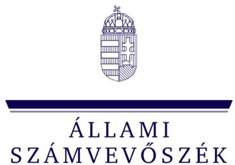
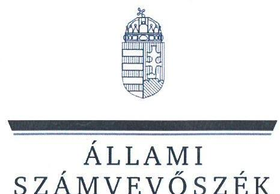
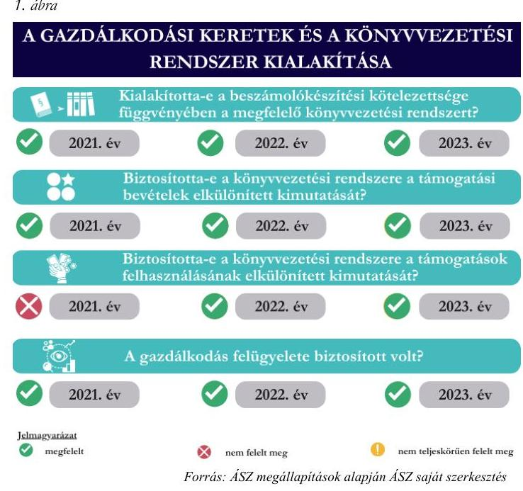
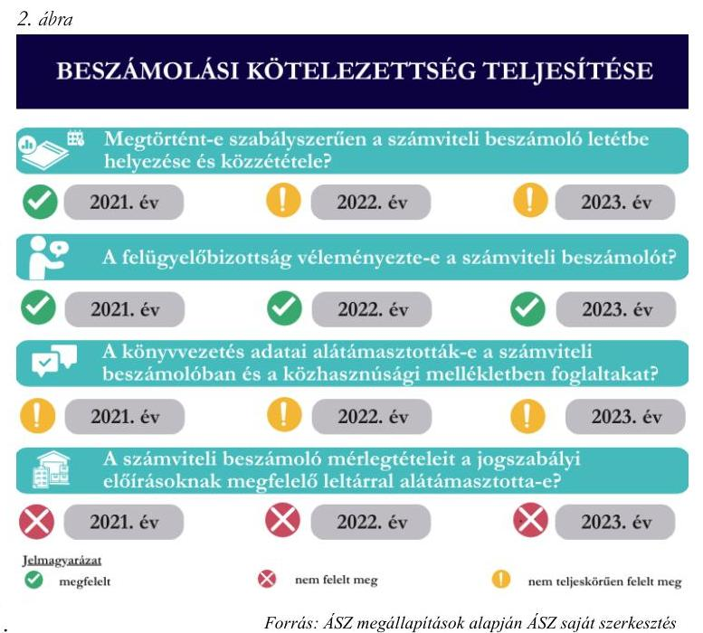

ÁLLAMI
SZÁMVEVŐSZÉK

# JELENTÉS 

## Az államháztartásból nyújtott támogatást felhasználó egyesületek és alapítványok ellenőrzése

Szülők Háza Közhasznú Alapítvány

2025 .

25055
www.asz.hu

---

ÁLLAMI
SZÁMVEVÔSZÉK

# JELENTÉS 

## Az államháztartásból nyújtott támogatást felhasználó egyesületek és alapítványok ellenőrzése

Szülők Háza Közhasznú Alapítvány

2025.

---

# ELLENŐRZÉSI IGAZGATÓSÁG: 

## ELLENŐRZÉSI IGAZGATÓSÁG V.

## ELLENŐRZÉSI IGAZGATÓ:

## KLINGA LÁSZLÓ igazgató

## ELLENŐRZÉSVEZETŐ:

## BÉCSI ANDREA ellenőrzésvezető

Jelentéseink az interneten a www.asz.hu címen olvashatók.

IKTATÓSZÁM: EL-4032-006/2025
TÉMASORSZÁM: 35
ELLENŐRZÉS-AZONOSÍTÓ SZÁM: V108004

---

# TARTALOMJEGYZÉK 

AZ ELLENŐRZÉS ALAPADATAI ..... 5
AZ ELLENŐRZÖTT SZERVEZET ..... 7
ÖSSZEFOGLALÁS ..... 9
AZ ELLENŐRZÉS FÓKUSZTERÜLETEI ..... 11
MEGÁLLAPÍTÁSOK ..... 12
JAVASLATOK ..... 17
MELLÉKLETEK ..... 19
I. sz. melléklet: Értelmező szótár ..... 19
II. sz. melléklet: Az ellenőrzött szervezetek jegyzéke ..... 21
III. sz. melléklet: Ellenőrzési kritériumok ..... 22
FÜGGELÉK: ÉSZREVÉTELEK ..... 23
RÖVIDÍTÉSEK JEGYZÉKE ..... 24

---

.

---

# AZ ELLENŐRZÉS ALAPADATAI 

## AZ ELLENŐRZÉS CÉLJA

Az ellenőrzés célja annak értékelése volt, hogy az államháztartásból nyújtott támogatást felhasználó, egyesületi vagy alapítványi formában múködő civil szervezetek a gazdálkodásuk szabályozási környezetét, a gazdálkodás kontrolljait - az államháztartásból nyújtott támogatások tükrében - szabályszerűen alakították-e ki. A civil szervezetek a kapott támogatásokat célszerűen, a támogatói okiratban foglaltaknak megfelelően használták-e fel, a kapott támogatások felhasználása, a támogatásokkal való elszámolás szabályszerű volt-e, illetve a gazdálkodásukról szabályszerűen beszámoltak-e.

## AZ ELLENŐRZÉS TÍPUSA

Kombinált ellenőrzés.

## AZ ELLENŐRZÖTT IDŐSZAK

A 2021-2023. évek.

## AZ ELLENŐRZÉS TÁRGYA

Az ellenőrzés tárgyát képezte az államháztartásból nyújtott támogatást felhasználó egyesületek és alapítványok 2021-2023. évi gazdálkodásának ellenőrzése. Ennek keretében a könyvvezetésre vonatkozó jogszabályi előírások betartása, az államháztartásból származó támogatások és azok felhasználása jogszabályi előírásoknak megfelelő elkülönített nyilvántartása, a támogatás támogatói okirat szerinti célszerű felhasználása, valamint a beszámolási és közzétételi kötelezettség teljesítésének szabályszerűsége. Az ellenőrzés kiterjedt továbbá annak ellenőrzésére, hogy a számviteli szabályozási környezet kialakítása támogatta-e az államháztartásból származó támogatások vonatkozásában a szabályos könyvvezetést, a kapcsolódó beszámolási kötelezettség teljesítését.

## AZ ELLENŐRZÉS JOGALAPJA

Az ellenőrzés jogszabályi alapját az ÁSZ tv. ${ }^{1} 1 . \int(3)$ bekezdés, az 5. $\int(3)$ bekezdés, valamint a Civil tv. ${ }^{2} 47 . \int$ előírásai képezték.

---

# AZ ELLENŐRZÉS MÓDSZERE 

Az ÁSZ ${ }^{3}$ az ellenőrzést a nemzetközi standardokat irányadónak tekintve az ellenőrzési program szempontjai, az ellenőrzött időszakban hatályos jogszabályok, az ellenőrzés szakmai szabályok és módszertanok figyelembevételével végezte.

Az ellenőrzési bizonyítékként felhasználható adatforrások közé tartoztak egyrészt az ellenőrzési programban felsorolt adatforrások, másrészt adatforrás volt még minden - az ellenőrzés folyamán - feltárt, az ellenőrzés szempontjából információkat tartalmazó dokumentum.

Az ellenőrzési fókuszterületek megválaszolásához szükséges bizonyítékok megszerzése az ellenőrzött szervezet által rendelkezésre bocsátott dokumentumokra és adatokra alapozva, továbbá kérdésfeltevés (információkérés) és mintavételezés útján történt.

Az ellenőrzés lefolytatásához az ellenőrzött szervezet a tanúsítványok kitöltésével, valamint az ÁSZ által kért dokumentumok, információk megküldésével szolgáltatott adatot.

A támogatások ${ }^{4}{ }_{1-5}$ célnak megfelelő, szabályszerű felhasználásának és nyilvántartásának ellenőrzését mintavételi eljárással kiválasztott tételek alapján ellenőrizte az ÁSZ. A mintatételek kiértékelése alapján kivetítésre nem került sor, a megállapítások az ellenőrzött tételekre vonatkoznak. Az ellenőrzés nem terjedt ki a támogatások ${ }_{1-5}$ értékarányos felhasználásának vizsgálatára.

---

# AZ ELLENŐRZÖTT SZERVEZET 

## SZÜLŐK HÁZA KÖZHASZNÚ ALAPÍTVÁNY

A Szülők Háza Alapítványt egy magánszemély alapította 2015. november 10-én, mely a Szolnoki Törvényszék 2021. augusztus 3-i hatályú végzésével közhasznú jogállású lett. A Szülők Háza Közhasznú Alapítvány nevet 2022. október 18-tól viseli.

Az Alapítvány ${ }^{5}$ célja:

- a családdá alakulás kezdeti nehézségeinek támogatása, felkészítés a szülővé válásra, testi-lelki és szellemi értelemben egyaránt;
- befogadó közösségi terek támogatása és létesítése;
- táborok szervezése és lebonyolítása;
- a rászoruló családok integrációjának elősegítése;
- a nők, nagycsaládosok, valamint a munkaerőpiacról kiszoruló társadalmi rétegek munkaerőpiaci reintegrációjának a segítése;
- a hátrányos helyzetű régiók felzárkóztatása és a határon túli magyarság segítése.

Az Alapítvány hatályos Alapító Okirata, ${ }^{6}$ szerint: „Az Alapítvány célja elérése érdekében a gyermekek és szülök számára is vonzó programokat támogat, igy sportélet utánpótlás képzést, valamint konferenciákat, elöadásokat, rendezvényeket szervez céljával megegyező témában, oktatási anyagokat állít elö, kutatásokat végez, társadalmi célú médiatartalmakat készit, ezzel is segitve a szociokulturális hátrányok lekiüzdését."

Az Alapítvány egyszemélyes ügyvezető szerve az ellenőrzött időszakban 2022. február 13-ig a kurátor, ezt követően az Alapító ${ }^{7}$ döntése értelmében a négy személyből álló kuratórium ${ }^{8}$ volt. Az Alapító fenntartotta magának a kuratórium tagjainak kijelölési jogát, a kuratórium tagjairól a 2022. február 14-én kelt Alapítói Határozatban döntött. Az Alapítvány képviseletét az ellenőrzött időszakban 2022. február 13-ig a kurátor, ezt követően a kuratórium elnöke önállóan látta el. Az Alapítvány működésének és gazdálkodásának ellenőrzésére az Alapító háromtagú Felügyelőbizottságot jelölt ki, a tagok maguk közül választottak elnököt.

Az Alapítvány a 2021-2023. években vállalkozási tevékenységet nem végzett, céljainak megvalósítását főként támogatásokból és adományokból finanszírozta. (1. táblázat) Az ellenőrzés összesen 169,5 M Ft központi költségvetésből származó támogatás nyilvántartására, felhasználására és elszámolására terjedt ki. (2. táblázat)

## AZ ALAPÍTVÁNY EGYÉB BEVÉTELEINEK ALAKULÁSA A 2021-2023. ÉVEKBEN (ADATOK E FT-BAN)

|  | 2021. | 2022. | 2023. |
| :--: | :--: | :--: | :--: |
| Összes bevétel | 71052 | 126505 | 166631 |
| Támogatások | 57836 | 112352 | 156374 |
| ebből: Adomány | 4630 | 5743 | 3720 |

---

# AZ ALAPÍTVÁNY ELLENŐRZŐTT TÁMOGATÁSAI 

|  | TÁMOGATÁS: | TÁMOGATÁS: | TÁMOGATÁS: | TÁMOGATÁS: | TÁMOGATÁS: |
| :--: | :--: | :--: | :--: | :--: | :--: |
| Támogatói okirat azonosítója | CSP-HB-21-A-0092 | EG-00012-   001/2021 | EG-00004-001/2022 | MK_TSZ/258/2 (2022) | V/834-   2/2023/CSTF |
| Támogatási program célja | Hazai családi bólcsőde és munkabelyi bólcsőde-fejlesztési program nem önkormányzati fenntartók részére | 2021. évi szakmai programok lebonyolításának támogatása | 2022. évi szakmai programok lebonyolításának támogatása | Befogadó szemléletű közösségépítő és családtámogató program megnevezésű szakmai feladatok támogatása | 2023. évi   családpolitikai célú szakmai programok megvalósításának támogatása |
| Támogató megnevezése | Miniszterelnökség | Tempus   Közalapítvány   (Miniszterelnökség) | Tempus   Közalapítvány   (Miniszterelnökség) | Miniszterelnöki   Kabinetiroda | Kulturális és   Innovációs   Minisztérium |
| Támogatott tevékenység időtartama | 2021. január 01 2022. december 31.* | 2021. március 01 2022. december 31.* | 2022. február 01 2022. december 31. | 2022. április 01 2022. december 31. | 2023. január 01 2023. december 31. |
| Felhasználás végső időpontja | 2022. december 31. | 2023. január 30. | 2023. január 30. | 2022. december 31. | 2024. január 30. |
| Támogatás folyóitásának módja | 100\%-os támogatási előlegként folyósított, vissza nem térítendő | 100\%-os támogatási előlegként folyósított, vissza nem térítendő | 100\%-os támogatási előlegként folyósított, vissza nem térítendő | 100\%-os támogatási előlegként folyósított, vissza nem térítendő | 100\%-os támogatási előlegként folyósított, vissza nem térítendő |
| Támogatási előleg folyóitásának napja, összege | 2021. december 23., 32,0 M Ft | 2021. július 01., $27,5 \mathrm{M} \mathrm{Ft}$ | 2022. március 07., $50,0 \mathrm{M} \mathrm{Ft}$ | 2022. április 19., $10,0 \mathrm{M} \mathrm{Ft}$ | 2023. május 30., $50,0 \mathrm{M} \mathrm{Ft}$ |
| A pénzügyi elszámolás határideje | 2023. január 30. | 2023. március 01. | 2023. március 01. | 2023. január 31. | 2024. március 01. |
| A záró pénzügyi elszámolás kelte, a támogatásból felhasznált összeg | 2023. január 30., 32,0 M Ft | 2022. május 26., $27,5 \mathrm{M} \mathrm{Ft}$ | 2023. március 01., $50,0 \mathrm{M} \mathrm{Ft}$ | 2023. január 27., $10,0 \mathrm{M} \mathrm{Ft}$ | 2024. február 28., $50,0 \mathrm{M} \mathrm{Ft}$ |
| Benyújtott elszámolás támogatói elfogadása | 2024. június 21. | 2024. november 22. | folyamatban | 2023. június 20. | 2025. február 19. |

[^0]
[^0]:    * a 118/2022. (III. 22.) Korm. rendelet ${ }^{2}$ 2. § (1) bekezdés b) pontjában foglaltak figyelembevételével, mely szerint a 2021. január 1-je és 2021. december 31-e között létrejött támogatási jogviszonyokban 2022. december 31. napjáig a támogatott tevékenység idö́tartama meghosszabbodott

---

# ÖSSZEFOGLALÁS 

Az Alapítvány a 2021-2023. években az alapcél szerinti (közhasznú) tevékenysége költségei, ráfordításai - ideértve az annak keretében megvalósuló fejlesztési célt - ellentételezésére kapott támogatásai közül, a kiválasztott és ellenőrzött támogatások ${ }_{1-5}$ összege összesen 169,5 M Ft volt, melyet 100\%-os előlegként, vissza nem térítendő támogatásként kapott. A társadalom részéről jogosan felmerülő elvárás, hogy az ellenőrzések keretében időről-időre sor kerüljön az államháztartásból nyújtott támogatások rendeltetésszerú és átlátható módon történő felhasználásának értékelésére, s ezáltal átfogó képet kapjon a közpénzből gazdálkodó szervezetek múködéséről, tevékenységéről.

Az ellenőrzött időszakban az Alapítvány könyvvezetése a jogszabályi előírásoknak megfelelően a kettős könyvvitel rendszerében történt, egyszerúsített éves beszámolót készített és nem volt kötelezett könyvvizsgálatra. Az Alapítvány a számviteli nyilvántartásában a jogszabályi előírásoknak megfelelően biztosította a támogatási bevételek egyéb bevételektől elkülönítetten történő nyilvántartásának lehetőségét. A 2021. évben azonban olyan elkülönített számviteli nyilvántartás kialakításáról nem gondoskodott, melynek vezetésével támogatásonként megállapítható és ellenőrizhető lett volna a kapott támogatás felhasználása, a 2022. és a 2023. években a támogatások felhasználásának elkülönített kimutatásához a könyveiben biztosította a feltételeket.

Az Alapítvány gondoskodott a jogszabályi előírásoknak megfelelően a felügyelőbizottság létrehozásáról, illetve biztosította annak múködésének feltételeit. (1. ábra)

Az Alapítvány számviteli beszámolóit és közhasznúsági mellékleteit a felügyelőbizottság véleményének ismeretében a kuratórium minden üzleti évre vonatkozóan jóváhagyta, a 2021. évi számviteli beszámolót határidőben, a 2022. és a 2023. évi beszámolókat a jogszabályban előírt határidőn túl, de a pótlási határidőn belül helyezte letétbe és tette közzé. Az Alapítvány a 2021-2023. évi beszámolók kiegészítő mellékletét, valamint a közhasznúsági mellékletét nem a jogszabályokban előírt tartalommal állította össze.

Az Alapítvány könyvvezetésének adatai a jogszabályban foglaltak ellenére a 2021-2022. évben teljeskörűen nem támasztották alá a számviteli beszámolók eredménykimutatásának adatait.

---

Az Alapítvány a 2021-2023. évi számviteli beszámolók mérlegtételeit a jogszabályi előírás ellenére nem támasztotta alá szabályszerűen leltárral, mellyel megsértette a valódiság elvét. (2. ábra)

Az Alapítvány az ellenőrzött időszakban a vissza nem térítendő, $100 \%$-os előlegként kapott támogatásokat a jogszabályban foglaltak ellenére a könyveiben nem mutatta ki kötelezettségként. Ezzel sérült a jogszabályban előírt lényegesség elve, mivel a számviteli beszámolók mérlege nem tartalmazott minden fennálló kötelezettségre vonatkozó olyan információt, amely befolyásolhatja a beszámolók adatait felhasználók döntését. Az öt ellenőrzött támogatás közül a támogatás ${ }_{1,2,4}$ esetében az Alapítvány a jogszabályi

előírások ellenére nem vezetett olyan elkülönített számviteli nyilvántartást, melynek alapján támogatásonként megállapítható volt a kapott támogatások felhasználása, a támogatás ${ }_{3,5}$ felhasználásáról vezetett elkülönített nyilvántartás a jogszabályban előírtaknak megfelelt.

1. ábra

| AZ ÁLLAMDÁSZTARTÁSI FORRÁSIÓD KAPOTT TÁMOGATÁSOK ÉS AZOK FELIMSZSÁLÁSA |  |
| :--: | :--: |
| A támogatás nyilvántartása szabályszeti volt-e? |  |
| (5) Támogatás, (5) Támogatás, (5) Támogatás, (5) Támogatás, (5) Támogatás |  |
| A támogatás felhasználása és az elszámolása során bezárlotta-e a jogszabályban és a támogatott okiratban elolitsékel? |  |
| (5) Támogatás, (1) Támogatás, (5) Támogatás, (5) Támogatás, (5) Támogatás, |  |
| A támogatás felhasználásáról vezetett elkülönített nyilvántartás megfelelő volt-e? |  |
| (5) Támogatás, (5) Támogatás, (5) Támogatás, (5) Támogatás, (5) Támogatás, |  |
| (5) Támogatás, (5) Támogatás, (5) Támogatás, (5) Támogatás, (5) Támogatás |  |

A támogatás ${ }_{1,2,4,5}$ terhére teljesített, az ellenőrzés keretein belül ellenőrzött kifizetések jogcímei a támogatói okiratokban ${ }_{1,2,4,5}{ }^{10}$ foglaltaknak megfeleltek. A támogatás ${ }_{3}$ terhére azonban az Alapítvány olyan ingatlan használatához kapcsolódó bérleti díjat számolt el a támogatás ${ }_{3}$ teljes összege $15,2 \%$-ának megfelelő, mindösszesen $7,6 \mathrm{MFt}$ összegben, mely ingatlan nem szerepelt a támogatói okirat ${ }_{3}$ mellékletét képező szakmai programban feltüntetett, a támogatott tevékenységgel érintett ingatlanok között. A támogatások ${ }_{2}$ felhasználása és elszámolása során az Alapítvány nem tartotta be teljeskörűen a támogatói okiratban ${ }_{2}$ számára előírt a bizonylatok záradékolására vonatkozó kötelezettséget. (3. ábra)

---

# AZ ELLENŐRZÉS FÓKUSZTERÜLETEI 

1. A civil szervezet gazdálkodási keretei és könyvvezetési rendszere kialakításának szabályszerűsége az államháztartásból származó támogatások vonatkozásában
2. A civil szervezet jogszabályban előírt beszámolási kötelezettsége
3. A civil szervezet által államháztartási forrásból kapott támogatások és azok felhasználása, továbbá a kapcsolódó elszámolások szabályszerűsége

---

# 1. A civil szervezet gazdálkodási keretei és könyvvezetési rendszere kialakításának szabályszerűsége az államháztartásból származó támogatások vonatkozásában 

Összegző megállapítás Az Alapítvány gazdálkodási kereteinek és könyvvezetési rendszerének kialakítása a 2021. évben nem felelt meg, a 2022. és a 2023. évben megfelelt a Számv. tv. ${ }^{11}$ és a Civil tv. előírásainak, a felügyelőbizottság múködése az ellenőrzött időszakban biztosítva volt.

Az ellenőrzött időszakban az Alapítvány könyvvezetése a Civil tv. és az Eszkr. ${ }^{12}$ előírásainak megfelelően a kettős könyvvitel rendszerében történt, a hivatkozott jogszabályok formai előírásainak megfelelően, a 2021-2023. évekre vonatkozóan egyszerűsített éves beszámolót készített. Az Alapítvány az ellenőrzött időszakban az Eszkr. előírásai alapján nem volt kötelezett könyvvizsgálatra, mivel a 20212023. években az éves bevétele az üzleti évet megelőző két üzleti év átlagában nem haladta meg a 300,0 M Ft-ot.
Az Alapítvány a könyvviteli nyilvántartását úgy alakította ki, hogy az biztosította a kapott támogatások Civil tv.-ben előírt részletezését.
Az Alapítvány a 2021. évre vonatkozóan a Számv. tv. 161/A. § (2) bekezdésében és a Civil tv. 20. § (4) bekezdésében előírtak ellenére nem úgy alakította ki a könyvvezetési rendszerét, hogy abból az alapcél szerinti (közhasznú) tevékenység költségei, ráfordításai ellentételezésére kapott támogatásokról támogatásonként megállapítható és ellenőrizhető legyen a kapott támogatás felhasználása. A 2022-2023. évek vonatkozásában a hivatkozott jogszabályok szerint - munkaszámok alkalmazásával - biztosította annak lehetőségét, hogy a támogatások felhasználása támogatásonként elkülönítetten kerüljön kimutatásra.
Az Alapító a Ptk. ${ }^{13}$ és a Civil tv. előírásaival összhangban gondoskodott három tagú felügyelőbizottság létrehozásáról. A felügyelőbizottság tagjainak személye az ellenőrzött időszakban egy alkalommal változott, az Alapító Alapítói Határozatban döntött a korábbi felügyelőbizottsági tagok visszahívásáról és egyidejúleg az új tagok kijelöléséről. Az Alapító Okiratban ${ }^{14}$ a változás rögzítésre került.

---

# 2. A civil szervezet jogszabályban előírt beszámolási kötelezettsége 

Összegző megállapítás Az Alapítvány a 2021-2023. évi beszámolási kötelezettségének nem jogszerúen tett eleget, mert az elkészített számviteli beszámolók nem feleltek meg teljeskörűen a Számv. tv., a Civil tv. és az Eszkr. előírásainak.

Az Alapítvány a 2021-2023. évre vonatkozó számviteli beszámolókat és közhasznúsági mellékleteket elkészítette, azokat a felügyelőbizottság megvizsgálta, majd a Ptk.-ban előírtak szerint álláspontját a kuratóriummal ismertette. A kuratórium a felügyelőbizottság írásbeli jelentése ismeretében elfogadta az Alapítvány 2021-2023. évi számviteli beszámolóit. A 2021. évre vonatkozó beszámolót az Alapítvány a Civil tv. által előírt határidőben letétbe helyezte és közzé tette. A 2022-2023. évekre vonatkozó számviteli beszámolók tekintetében az Alapítvány a közzétételi kötelezettségét nem a Civil tv. 30. § (1) bekezdésben előírt határidőben teljesítette, azonban mindkét beszámoló vonatkozásában gondoskodott annak egy éven belüli pótlásáról, a 2022. évi beszámolót 2023. július 21én, a 2023. évi beszámolót 2024. július 3-án helyezte letétbe. Az $\mathrm{OBH}^{15}$ honlapján közzétett 2021-2023. évi számviteli beszámolókat és közhasznúsági mellékleteket az Alapítvány a saját honlapján is nyilvánosságra hozta.
Az Alapítvány a Számv. tv. 69. § (1) bekezdésének előírásai ellenére a 2021-2023. évre vonatkozóan a könyvek üzleti év végi zárásához, a beszámoló elkészítéséhez, a mérleg tételeinek alátámasztásához nem állított össze olyan leltárt, amely tételesen, ellenőrizhető módon tartalmazta a mérleg fordulónapján meglévő eszközeit és forrásait mennyiségben és értékben, ezzel megsértette a Számv. tv. 15. § (3) bekezdésben foglalt valódiság elvét.
Az Alapítvány a 2021-2023. évi számviteli beszámolók kiegészítő mellékletében a Civil tv. 29. § (4) bekezdésében előírtak ellenére a támogatási program keretében végleges jelleggel felhasznált összegeket nem mutatta be támogatásonként, az általa az üzleti években végzett főbb tevékenységeket és programokat az ellenőrzött időszak minden üzleti évére vonatkozóan nyilvánosságra hozta.
Az Alapítvány a 2021-2023. évi közhasznúsági mellékletekben a Civil tv.-ben előírtak szerint bemutatta az általa végzett közhasznú tevékenységek eredményeit és azok fő csoportjait, azonban a Civil tv. 29. § (7) bekezdésében előírtak ellenére a közhasznúsági mellékletek nem tartalmazták az ellenőrzött támogatás felhasználásából következő, a közhasznúsági melléklet 2. és 3. pontjaiban leírt tevékenységek - szociális, egészségügyi és sporttevékenység, továbbá a hátrányos helyzetű családok, gyerekek támogatása - megvalósítása során keletkezett cél szerinti juttatások kimutatását.
Az Alapítvány 2021-2023. évi könyvvezetése nem felelt meg a Számv. tv. és az Eszkr. alábbiakban részletezett előírásainak:

- A 2021-2022. évi könyvvezetési rendszer adatai (főkönyvi kivonat) a Számv. tv. 20. § (1) bekezdésében foglaltak ellenére nem támasztották alá a számviteli beszámolókban szereplő alábbi adatokat:

---

- A 2021. és a 2022. évi eredménykimutatás értékesítés nettó árbevétele során mindkét évben 0,0 Ft szerepelt, azonban az üzleti évről szóló főkönyvi kivonatokban a 91-es (a 2021. évben a célszerinti alaptevékenység bevétele, illetve a 2022. évben a belföldi értékesítés árbevétele) főkönyvi számlacsoport egyenlegei szerint a 2021. évben 13,2 M Ft, a 2022. évben 14,2 M Ft összegű ilyen bevétellel rendelkezett az Alapítvány. Ezen összegek az eredménykimutatásokban az értékesítés nettó árbevétele helyett az egyéb bevételek között kerültek kimutatásra.
- A 2022. évi eredménykimutatás központi költségvetési támogatásra vonatkozó tájékoztató adatait a főkönyvi kivonat adatai nem támasztották alá. Az eredménykimutatás értelmében a 88,4 M Ft összegű központi költségvetési támogatás magában foglalta az Alapítvány által kapott 17,8 M Ft összegű normatív támogatást is. A főkönyvi kivonat szerint azonban az Alapítvány a feltüntetett normatív támogatásban a központi költségvetésből kapott támogatáson felül részesült.
- Az Eszkr. 14. § (2) bekezdésében foglaltak ellenére az Alapítvány 2022-2023. évi beszámolója eredménykimutatásának tájékoztató adatainál nem mutatta be teljeskörűen a kapott támogatásokat forrásonként. A 2022. évben nem került kimutatásra $0,2 \mathrm{M}$ Ft összegű helyi önkormányzati költségvetési támogatás, az Szftv. ${ }^{16}$ alapján kapott $0,3 \mathrm{M}$ Ft felajánlás összege, illetve a 2023. évre vonatkozó eredménykimutatás tájékoztató adatainál a $0,1 \mathrm{M}$ Ft összegű helyi önkormányzati költségvetési támogatást, továbbá $63,4 \mathrm{M}$ Ft elkülönített állami pénzalaptól kapott támogatás annak ellenére, hogy a főkönyvi kivonatok adatai alapján rendelkezett ilyen bevételekkel.
- Az Alapítvány a vissza nem térítendő, 100\%-os előlegként kapott támogatások ${ }_{1-5}$ összegét a folyósításkor bevételként számolta el, azokat a Számv. tv. 43. § (1) bekezdésben foglaltak ellenére a 2021-2023. évek könyvviteli nyilvántartásában és számviteli beszámolóiban az egyéb rövid lejáratú kötelezettségek között nem mutatta ki. Emiatt az ellenőrzött támogatások vonatkozásában a 2021. évben 59,5 M Ft összegben (támogatás ${ }_{1-2}$ ), a 2022. évben 119,5 M Ft összegben (támogatás ${ }_{1-4}$ ) és a 2023. évben 169,5 M Ft összegben (támogatás ${ }_{1-5}$ ) nem került kimutatásra a támogatóval szemben fennálló kötelezettségként, mely mind a három év vonatkozásában jelentős összegű hibának minősült.

---

# 3. A civil szervezet által államháztartási forrásból kapott támogatások és azok felhasználása, továbbá a kapcsolódó elszámolások szabályszerűsége 

Összegző megállapítás Az ellenőrzött államháztartási forrásból kapott támogatásoknak ${ }_{1-5}$ és azok felhasználásának számviteli elszámolása a 2021-2023. években nem volt szabályszerű. A támogatás ${ }_{3}$ felhasználása és a támogatás ${ }_{2}$ elszámolása teljeskörűen nem felelt meg a támogatói okiratokban ${ }_{2,3}$ foglaltaknak.

Az Alapítvány az ellenőrzött támogatásokat ${ }_{1-5}$ vissza nem térítendő, $100 \%$-os előlegként kapta az alapcél szerinti (közhasznú) tevékenysége költségei, ráfordításai - ideértve az annak keretében megvalósuló fejlesztési célt - ellentételezésére. Az Alapítvány valamennyi támogatást ${ }_{1-5}$ nyilvántartotta az ellenőrzött időszakban.
Az Alapítvány a támogatás ${ }_{1-5}$ felhasználásáról készítendő záró pénzügyi elszámolásokat a támogató ${ }_{1-4}{ }^{17}$ felé az előírt határidőben benyújtotta. A benyújtott záró elszámolások közül a támogatások elszámolásának elfogadásáról a támogatás ${ }_{1}$ esetében a lebonyolító szervezet ${ }_{1}{ }^{18}$ 2024. június 21-én, a támogatás ${ }_{2}$ esetében a támogató ${ }_{2}$ 2024. november 22-én, a támogatás ${ }_{4}$ esetében a támogató ${ }_{3}$ 2023. június 20-án, a támogatás ${ }_{5}$ esetében a támogató ${ }_{4}$ 2025.02.19-én értesítette az Alapítványt, a támogatás ${ }_{5}$ elszámolásának elfogadásáról az ÁSZ részére történt adatszolgáltatás lezárásáig ${ }^{19}$ az Alapítvány nem kapott tájékoztatást.
A támogatás ${ }_{1-5}$ felhasználására a záró pénzügyi elszámolások alapján a felhasználási határidőn belül került sor.
Az Alapítvány könyveiben a kapott támogatásokat ${ }_{1-5}$ elkülönítve tartotta nyilván, a Civil tv. előírásainak megfelelően bemutatta, hogy a kapott támogatás ${ }_{1-5}$ államháztartási forrásból származott és ezen belül központi költségvetési forrásból kapott támogatás volt. Mivel az Alapítvány a 2021. évben a támogatások felhasználására vonatkozóan az elkülönített számviteli nyilvántartás lehetőségét a könyveiben nem biztosította, a 2021. évi felhasználással érintett támogatás ${ }_{1,2}$ esetében a Számv. tv. 161/A. $\int(2)$ bekezdésben és a Civil tv. 20. $\int(4)$ bekezdésében előírtak ellenére nem vezetett olyan elkülönített számviteli nyilvántartást, amelynek alapján támogatásonként megállapítható és ellenőrizhető volt a kapott támogatások felhasználása. A támogatás ${ }_{3-5}$ vonatkozásában vezetett elkülönített nyilvántartás megfelelt a Számv. tv. és a Civil tv. előírásainak.
A támogatások ${ }_{1-5}$ célnak megfelelő, szabályszerű felhasználásának és nyilvántartásának értékelése a támogató felé benyújtott elszámolások alapján a támogatásonként kiválasztott mintatételekhez kapcsolódó bizonylatok ellenőrzésével történt. A mintatételek ellenőrzése során megállapításra került, hogy:

- Az Alapítvány a támogatói okiratban ${ }_{2}$ előírtakat 12 darab mintatétel (2_04, 2_05, 2_06, 2_08, 2_09, 2_10, 2_11, 2_12, 2_13, 2_14, 2_15, 2_19) esetében nem tartotta be, mivel a támogatás ${ }_{2}$ felhasználásának igazolását dokumentáló eredeti számlákra, bizonylatokra, egyéb okiratokra a támogatói okiratban ${ }_{2}$ foglaltaknak megfelelően nem vezette rá, hogy azt mely támogatás terhére számolta el.

---

- A Számv. tv. 167. § (1) bekezdés h) és i) pontjaiban előírtak ellenére a támogatás ${ }_{1-5}$ felhasználásához kapcsolódó, ellenőrzött számviteli bizonylatok - 6 mintatétel (2_07, 2_16, 2_17, 2_18, 2_20, 3_05) kivételével - nem tartalmazták a könyvelés módjára, az érintett könyvviteli számlákra történő hivatkozást, továbbá a könyvviteli nyilvántartásokban történt rögzítés időpontját, igazolását, a Számv. tv. 167. § (7) bekezdése szerinti logikai hozzárendelés nem teljesült.
- A támogatás ${ }_{3}$ esetében kettő mintatétel (3_04, 3_18) tárgya olyan ingatlan használatához kapcsolódó bérleti díj volt, melynél az érintett ingatlan nem szerepelt a támogatói okirat3 1. számú mellékletét képező szakmai program 6. pontjában feltüntetett, a támogatott tevékenységgel érintett ingatlanok között. Az ellenőrzött mintatételekhez kapcsolódó ingatlan bérbeadója és egyben kizárólagos tulajdonosa az Alapítvány kuratóriumi elnöke volt, aki a 2022. március 1-jén kelt, illetve 2022. május 5-én és 2022. október 1-jén módosított bérleti szerződés értelmében az állandó lakcímével megegyező ingatlant adta bérbe az Alapítványnak. A két mintatétel összesen 1,6 M Ft kifizetését érintette, a benyújtott elszámolás szerint a támogatás terhére a 2022. március-december közötti időszakban 10 tételben összesen bruttó 7,6 M Ft került a kuratóriumi elnök részére ingatlan bérleti díj jogcímen átutalásra.

---

# JAVASLATOK 

Az ÁSZ tv. 33. § (1) bekezdésében foglaltak értelmében az ellenőrzött szervezet vezetője köteles a jelentésben foglalt megállapításokhoz kapcsolódó intézkedési tervet összeállítani és azt a jelentés kézhezvételétől számított 30 napon belül az ÁSZ részére megküldeni. Amennyiben az ellenőrzött szervezet vezetője nem küldi meg határidőben az intézkedési tervet, vagy továbbra sem elfogadható intézkedési tervet küld, az Állami Számvevőszék elnöke az ÁSZ tv. 33. § (3) bekezdése a) és b) pontjaiban foglaltakat érvényesítheti.

## SZÜLÖK HÁZA KÖZHASZNÚ ALAPÍTVÁNY KURATÓRIUMI ELNÖKE

1. Gondoskodjon arról, hogy az Alapítvány müködéséről, vagyoni, pénzügyi és jövedelmi helyzetéről szóló beszámoló elkészitésére és a kuratórium által jóváhagyott beszámoló közzétételére a Civil tv. 30. § (1) bekezdésében elöirt határidő betartásával kerüljön sor.
2. Gondoskodjon a könyvek üzleti év végi zárásához, a beszámoló elkészitéséhez, a mérleg tételeinek alátámasztásához olyan leltár összeállításáról, amely tételesen, ellenőrizhető módon tartalmazza az Alapítványnak a mérleg fordulónapján meglévő eszközeit és forrásait mennyiségben és értékben a Számv. tv. 69. § elöirásainak megfelelően.
3. Gondoskodjon arról, hogy az Alapítvány müködéséről, vagyoni, pénzügyi és jövedelmi helyzetéről szóló beszámolójának részeként elkészitésre kerülő kiegészitő melléklet feleljen meg a vele szemben támasztott tartalmi követelményeknek, különös tekintettel a Civil tv. 29. § (4) bekezdésében foglaltakra.
4. Gondoskodjon arról, hogy a közhasznúsági melléklet Civil tv. 29. § (7) bekezdés szerinti közhasznú cél szerinti juttatás kimutatása a Civil tv. 2. § 4. pontban meghatározottak szerint, a civil szervezet által alaptevékenysége keretében nyújtott pénzbeli vagy nem pénzbeli szolgáltatást tartalmazza.
5. Gondoskodjon arról, hogy az Alapítvány müködéséről, vagyoni, pénzügyi és jövedelmi helyzetéről szóló beszámolóját a bizonylatokkal alátámasztott, szabályszerűen vezetett kettős könyvvitel adatai alapján készítse el a Számv. tv. 20. § (1) bekezdésében foglaltak szerint, különös tekintettel a Számv. tv. 15. § (3) bekezdésében elöirt valódiság elvére.
6. Gondoskodjon arról, hogy a kapott támogatások összegei az Alapítvány müködéséről, vagyoni, pénzügyi és jövedelmi helyzetéről szóló beszámoló eredménykimutatásában az Eszkr. 14. § (2) bekezdésében elöirtak szerint az eredménykimutatás tájékoztató adatai között kerüljenek kimutatásra.
7. Gondoskodjon arról, hogy az Alapítvány müködéséről, vagyoni, pénzügyi és jövedelmi helyzetéről szóló beszámoló mérlegében a Számv. tv. 43. § (1) bekezdésében elöirtaknak megfelelően a kötelezettségek között kerüljön kimutatásra az államháztartási forrásból azon belül központi költségvetési forrásból, vissza nem térítendő, 100\%-os előlegként kapott támogatás összege a támogatói okirat szerinti elszámolás támogató általi elfogadásáig.

---

8. Gondoskodjon arról, hogy a kapott támogatás felhasználása során, valamint a kapott támogatás felhasználásához kapcsolódóan a könyvviteli nyilvántartásba vétel és a pénzügyi elszámolás során tartsa be a támogatói okirat vonatkozó előírásait, különös tekintettel a felhasználást alátámasztó eredeti számla/dokumentum előírás szerinti záradékolására.
9. Gondoskodjon arról, hogy a könyvviteli nyilvántartást közvetlenül alátámasztó bizonylatok a Számv. tv. 167. § (1) bekezdés h) és i) pontjában elöírtaknak megfelelően tartalmazzák a könyvelés módjára, az érintett könyvviteli számlákra történő hivatkozást, továbbá a könyvviteli nyilvántartásokban történt rögzítés időpontját, igazolását.

---

# MELLÉKLETEK 

## I. SZ. MELLÉKLET: ÉRTELMEZŐ SZÓTÁR

adomány
alapítvány
cél szerinti juttatás
civil szervezet
civil szervezetek normatív támogatása
egyesület
feladatfinanszírozást szolgáló költségvetési támogatás
gazdasági-vállalkozási tevékenység
gazdálkodó tevékenység
könyvvizsgálati kötelezettség
közcélú tevékenység
a civil szervezetnek - létesítő okiratban rögzített céljaira - ellenszolgáltatás nélkül juttatott eszköz, illetve nyújtott szolgáltatás; (Civil tv. 2. § 1. pont)
Az alapítvány az alapító által az alapító okiratban meghatározott tartós cél folyamatos megvalósítására létrehozott jogi személy. Az alapító az alapító okiratban meghatározza az alapítványnak juttatott vagyont és az alapítvány szervezetét. (Ptk. 3:378. §)
A Számv. tv. alkalmazásában egyéb szervezet (Számv. tv. 3. § 4.a) pont)
a civil (közhasznú) szervezet által (közhasznú) alaptevékenysége keretében nyújtott pénzbeli vagy nem pénzbeli szolgáltatás;
(Civil tv. 2. § 4. pont)
A civil társaság; a Magyarországon nyilvántartásba vett egyesület a párt, a szakszervezet és a kölcsönös biztosító egyesület kivételével; az alapítvány közalapítvány és a pártalapítvány kivételével. (Civil tv. 2. § 6. pont)
a Nemzeti Együttműködési Alap terhére történő kifizetés, mely a civil szervezetek által gyűjtött és a számviteli beszámolóban feltüntetett adományok értéke után járó tíz százalékos normatív kiegészítés, amelyet a civil szervezet a múködési költségeinek fedezésére fordít; (Civil tv. 2. § 8a. pont alapján)
Az egyesület a tagok közös, tartós, alapszabályban meghatározott céljának folyamatos megvalósítására létesített, nyilvántartott tagsággal rendelkező jogi személy. (Ptk. 3:63. § (1) bekezdés)

A Számv. tv. alkalmazásában egyéb szervezet (Számv. tv. 3. § 4.a) pont)
valamely közfeladat államháztartáson kívüli szervezet által történő ellátását, valamint e feladat ellátásához közvetlenül kapcsolódó, arányos múködési költségeket finanszírozó költségvetési támogatás; (Civil tv. 2. § 8. pont)
a jövedelem- és vagyonszerzésre irányuló vagy azt eredményező, üzletszerűen végzett gazdasági tevékenység, kivéve
a) az adomány (ajándék) elfogadását,
b) a létesítő okiratban meghatározott cél szerinti tevékenységet (ideértve a közhasznú tevékenységet is),
c) a pénzeszközök betétbe, értékpapírba, társasági részesedésbe történő elhelyezését,
d) az ingatlan megszerzését, használatának átengedését és átruházását; (Civil tv. 2. $\$ 11$. pont)
azon tevékenységek összessége, amelyek a civil szervezet vagyoni, pénzügyi, jövedelmi helyzetére kiható gazdasági eseményt eredményeznek; (Civil tv. 2. § 10. pont)
a civil szervezet akkor kötelezett könyvvizsgálatra, ha az éves (éves szintre átszámított) bevétele az üzleti évet megelőző két üzleti év átlagában meghaladja a 300 millió forintot, vagy azt más jogszabály kötelezővé teszi, továbbá, ha ezek egyike sem áll fenn, akkor a civil szervezet is dönthet arról, hogy a beszámoló felülvizsgálatával könyvvizsgálót bíz meg; (Eszkr. 16. § (1) bekezdés alapján)
személyek csoportja által, valamely a csoportnál tágabb közösség érdekében - más, e közösségbe nem tartozó személyek érdekeinek sérelme nélkül - végzett tevékenység. (Civil tv. 2. § 16. pont)

---

közfeladat
közhasznú szervezet
közhasznú tevékenység
létesítő okirat
támogatás
támogatási szerződés / támogatói okirat

A jogszabályban meghatározott állami vagy önkormányzati feladat. A közfeladat ellátásban államháztartáson kívüli szervezet jogszabályban meghatározott rendben közremüködhet. (Áht. ${ }^{20}$ 3/A. § (1)-(2) bekezdése alapján)
Közhasznú szervezetté minősíthető a Magyarországon nyilvántartásba vett közhasznú tevékenységet végző szervezet, amely a társadalom és az egyén közös szükségleteinek kielégítéséhez megfelelő erőforrásokkal rendelkezik, továbbá amelynek megfelelő társadalmi támogatottsága kimutatható, és amely:
a) civil szervezet (ide nem értve a civil társaságot), vagy
b) olyan egyéb szervezet, amelyre vonatkozóan a közhasznú jogállás megszerzését törvény lehetővé teszi. (Civil tv. 32. § (1) bekezdés)
minden olyan tevékenység, amely a létesítő okiratban megjelölt közfeladat teljesítését közvetlenül vagy közvetve szolgálja, ezzel hozzájárulva a társadalom és az egyén közös szükségleteinek kielégítéséhez; (Civil tv. 2. § 20. pont)
A Ptk. előírása szerint a jogi személy létrehozásáról a személyek szerződésben, alapító okiratban vagy alapszabályban szabadon rendelkezhetnek, mely dokumentumokra együttesen a létesítő okirat megnevezést használjuk. (Ptk. 3:4. § (1) bekezdés alapján)
céljellegủ juttatás, mely kizárólag arra a célra használható fel, amelyre a támogató azt rendelkezésre bocsátotta, amely cél megvalósítását a támogatási szerződés, okirat vagy éppen jogszabály kikötötte. Támogatásként értelmezzük valamennyi, a civil szervezetnek államháztartási forrásból nyújtott támogatást - ideértve a központi költségvetésből kapott támogatást, az elkülönített állami pénzalapokból kapott támogatást, a helyi önkormányzatoktól, kisebbségi önkormányzatoktól, önkormányzati társulástól kapott támogatást -, továbbá az Európai Unió költségvetéséből, külföldi állam államháztartásából, nemzetközi szervezettől, vagy nemzetközi szerződés rendelkezése alapján kapott támogatást, valamint más civil szervezettől kapott támogatást. A gyűjtő fogalom alatt egyaránt értjük a civil szervezetnek nyújtott feladatfinanszírozást szolgáló költségvetési támogatást, a civil szervezetek normatív támogatását, valamint a civil szervezetek egyszerúsített támogatását is. (ÁSZ saját fogalom)
Az államháztartás alrendszerei terhére támogatás közigazgatási hatósági határozattal vagy hatósági szerződéssel, támogatói okirattal vagy támogatási szerződéssel jogszabály vagy egyedi döntés (a továbbiakban: támogatási döntés) alapján, pályázati úton vagy pályázati rendszeren kívül nyújtható. Ha jogszabály - a központi költségvetés Áht. 14. § (3) bekezdése szerinti fejezetéből biztosított költségvetési támogatások esetén jogszabály vagy a Kormány határozata - a támogatás biztosításának módjáról nem rendelkezik, arról - a központi költségvetés Áht. 14. § (3) bekezdése szerinti fejezetéből biztosított költségvetési támogatásoktól eltérő más esetekben - az ötmilliárd forintot el nem érő összegủ költségvetési támogatás esetén támogatói okiratot kell kibocsátani, az ötmilliárd forintot elérő vagy azt meghaladó összegű költségvetési támogatás esetén hatósági szerződésnek nem minősülő támogatási szerződésben kell megállapodni a kedvezményezettel. (Áht. 48. § (1) bekezdése, Ávr. ${ }^{21}$ 65/A. § (1) bekezdése alapján)

---

II. SZ. MELLÉKLET: AZ ELLENŐRZÖTT SZERVEZETEK JEGYZÉKE

| ELLENŐRZÖTT SZERVEZET NEVE | ELLENŐRZÖTT SZERVEZET SZÉKHELYE |
| :-- | :-- |
| Szülők Háza Közhasznú Alapítvány | 8089 Vértesacsa, Ady Endre utca 10. |

---

# III. SZ. MELLÉKLET: ELLENŐRZÉSI KRITÉRIUMOK 

## FOKUSZTERÜLET

1. A civil szervezet gazdálkodási keretei és könyvvezetési rendszere kialakításának szabályszerűsége az államháztartásból származó támogatások vonatkozásában
2. A civil szervezet jogszabályban előírt beszámolási kötelezettsége
3. A civil szervezet által államháztartási forrásból kapott támogatások és azok felhasználása, továbbá a kapcsolódó elszámolások szabályszerűsége

## ELLENŐRZÉSI KRITÉRIUMOK

Civil tv. 20. § (1) - (4) bekezdés, 27. § (2) bekezdés, 29. § (1) bekezdés, 40. § (1) bekezdés, 41. § (1) bekezdés
Eszkr. 8. § (1)-(3) bekezdés, 9. § (1) - (2), (4) - (5) bekezdés, 14. $\S$ (1) bekezdés, 16. $\S$ (1) - (4) bekezdés

Ptk. 3:25. § (4) bekezdés, 3:26. § (1) - (5) bekezdés, 3:27. § (1) bekezdés, 3:82. § (1) bekezdés, 3:400. § (1) - (2) bekezdés
Civil tv. 2. §4. pont, 29. (2) - (7) bekezdés, 30. § (1)-(5) bekezdés, 46. § (1) bekezdés
Civil vhr. 12. § (1)-(3) bekezdés, Melléklet
Cnytv. 39. § (1) - (3) bekezdés, 40. § (2) bekezdés
Eszkr. 7. § (1) - (2), (4) bekezdés a) - c) pont és (5) - (7) bekezdés, 13. § (4) - (5) bekezdés, 17. § (1) és (3) bekezdés, 46. § (1) bekezdés, 1 - 4. számú melléklet

Számv. tv. 15. § (6) bekezdés, 69. § (1) bekezdés, 93. § (3) bekezdés
Civil tv. 20. § (1) - (4) bekezdés, 37. § (2) bekezdés b) pont Eszkr. 13. § (3) - (5) bekezdés, 14. § (1) bekezdés
Kbt. 5. § (2) és (4) bekezdés, 27. § (1) - (2) bekezdés, 131. $\S$ (1) és (4) bekezdés
Ptk. 3:19. § (2) bekezdés a) - b) és f) pont, 3:29 - 3:30. §, 3:77 - 3:79. §, 3:397. §
Számv. tv. 22 - 28. §, 29. § (1) bekezdés, 32. § (1) bekezdés, 33. § (7) bekezdés, 43. § (1) bekezdés, 44. § (2) bekezdés, 45. § (1) bekezdés a) pont, (2) bekezdés, 47. § (1) bekezdés, 52. § (1) - (7) bekezdés, 53. § (6) bekezdés, 69. §, 78 - 81. $\S, 101 . \S, 110-114 . \S, 160 . \S$ (2) bekezdés a) és b) pont, (3a) és (3b) bekezdés, 162. § (1) - (2) bekezdés, 166. § (1) bekezdés, 167. § (1) és (7) bekezdés
Támogatói okirat

---

# FÜGGELÉK: ÉSZREVÉTELEK 

A jelentéstervezetet a Számvevőszék 15 napos észrevételezésre megküldte az ellenőrzött szervezet vezetőjének az ÁSZ tv. 29. §* (1) bekezdése előírásának megfelelően.
A Szülők Háza Közhasznú Alapítvány kuratóriumi elnöke a jelentéstervezet megállapításaira észrevételt tett. Az elfogadott észrevételek alapján a Számvevőszék módosította a jelentést.

[^0]
[^0]:    * 29. § (1) Az Állami Számvevőszék az ellenőrzési megállapításait megküldi az ellenőrzött szervezet vezetőjének vagy az általa megbízott személynek, és annak, akinek személyes felelősségét állapította meg.
    (2) Az ellenőrzött szervezet vezetője és a felelősként megjelölt személy az ellenőrzés megállapításaira tizenöt napon belül írásban észrevételt tehet.
    (3) Az Állami Számvevőszék az észrevételre a beérkezésétől számított harminc napon belül írásban válaszol. A figyelembe nem vett észrevételeket köteles a jelentésben feltüntetni, és megindokolni, hogy azokat miért nem fogadta el.

---

# RÖVIDÍTÉSEK JEGYZÉKE 

${ }^{1}$ ÁSZ tv.
${ }^{2}$ Civil tv.
${ }^{3}$ ÁSZ
${ }^{4}$ támogatás ${ }_{1}$
támogatás ${ }_{2}$
támogatás ${ }_{3}$
támogatás ${ }_{4}$
támogatás ${ }_{5}$
${ }^{5}$ Alapítvány
${ }^{6}$ Alapító Okirat ${ }_{2}$
${ }^{7}$ Alapító
${ }^{8}$ kuratórium
${ }^{9}$ 118/2022. (III. 22.) Korm. rendelet
${ }^{10}$ támogatói okirat ${ }_{1}$
támogatói okirat ${ }_{2}$
támogatói okirat ${ }_{3}$
támogatói okirat ${ }_{4}$
támogatói okirat ${ }_{5}$
${ }^{11}$ Számv. tv.
${ }^{12}$ Eszkr.
${ }^{13}$ Ptk.
${ }^{14}$ Alapító Okirat ${ }_{1}$
${ }^{15} \mathrm{OBH}$
${ }^{16}$ Szftv.
${ }^{17}$ támogató ${ }_{1}$
támogató ${ }_{2}$
támogató ${ }_{3}$
támogató ${ }_{4}$
${ }^{18}$ lebonyolító szervezet ${ }_{1}$
${ }^{19}$ ÁSZ részére történt adatszolgáltatás
lezárásának napja
${ }^{20}$ Áht.
${ }^{21}$ Ávr.
2011. évi LXVI. törvény az Állami Számvevőszékről
2011. évi CLXXV. törvény az egyesülési jogról, a közhasznú jogállásról, valamint a civil szervezetek múködéséről és támogatásáról
Állami Számvevőszék
CSP-HB-21-A-0092 iktatószámú támogatás
EG-00012-001/2021 iktatószámú támogatás
EG-00004-001/2022 iktatószámú támogatás
MK_TSZ/258/2 (2022) iktatószámú támogatás
V/834-2/2023/CSTF iktatószámú támogatás
Szülők Háza Közhasznú Alapítvány
Az Alapítvány 2022. július 28 -tól hatályos Alapító Okirata
dr. Kemény Dénes László
az Alapítvány kuratóriuma
118/2022. (III. 22.) Korm. rendelet a támogatott tevékenység időtartamának meghosszabbításával összefüggő veszélyhelyzeti szabályokról
CSP-HB-21-A-0092 iktatószámú támogatói okirat
EG-00012-001/2021 iktatószámú támogatói okirat
EG-00004-001/2022 iktatószámú támogatói okirat
MK_TSZ/258/2 (2022) iktatószámú támogatói okirat
V/834-2/2023/CSTF iktatószámú támogatói okirat
2000. évi C. törvény a számvitelről
479/2016. (XII.28.) Korm.rendelet a számviteli törvény szerinti egyes egyéb szervezetek beszámoló készítési és könyvvezetési kötelezettségének sajátosságairól
2013. évi V. törvény a Polgári Törvénykönyvről

Az Alapítvány 2022. február 14-től hatályos Alapító Okirata
Országos Bírósági Hivatal
1996. évi CXXVI. törvény a személyi jövedelemadó meghatározott részének az adózó rendelkezése szerinti felhasználásáról
Miniszterelnökség
Tempus Közalapítvány (Miniszterelnökség)
Miniszterelnöki Kabinetiroda
Kulturális és Innovációs Minisztérium
2023. június 29-ig Emberi Erőforrás Támogatáskezelő, 2023. június 29-től új néven Nemzeti Kulturális Támogatáskezelő
2025. április 11. - az Alapítvány ÁSZ tv. 29. § (1) bekezdése előírása alapján tett észrevétel kelte
2011. évi CXCV. törvény az államháztartásról
368/2011. (XII. 31.) Korm. rendelet az államháztartásról szóló törvény végrehajtásáról

---

1052 Budapest, Apáczai Csere János u. 10. | 1364 Budapest 4., Pf. 54
www.asz.hu | szamvevoszek@asz.hu
telefon: +36 14849100