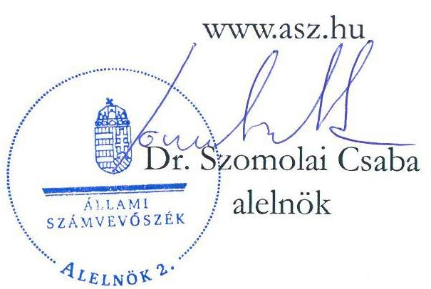
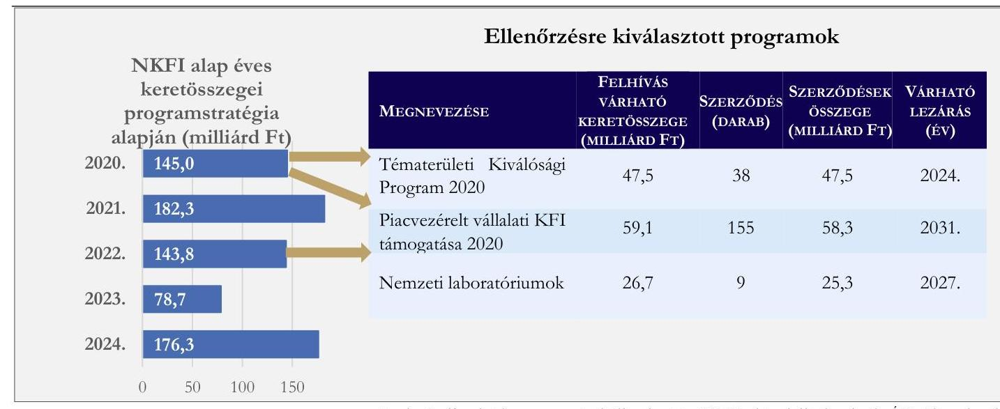
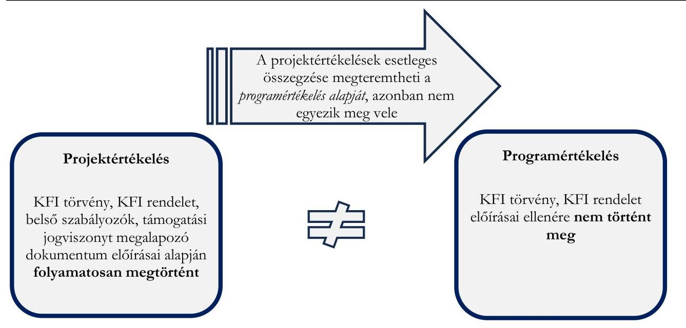

# JELENTÉS 

A kutatás-fejlesztésre és innovációra fordított
költségvetési kiadások célzott ellenőrzése a
támogatást nyújtó szervezetnél című ellenőrzésről

Nemzeti Kutatási, Fejlesztési és Innovációs Hivatal
2025.

---

# JELENTÉS 

A kutatás-fejlesztésre és innovációra fordított
költségvetési kiadások célzott ellenőrzése a
támogatást nyújtó szervezetnél című ellenőrzésről

Nemzeti Kutatási, Fejlesztési és Innovációs Hivatal
2025.

25056

---

# ELLENŐRZÉSI IGAZGATÓSÁG: 

## ELLENŐRZÉSI IGAZGATÓSÁG I.

## ELLENŐRZÉSI IGAZGATÓ:

SINKÁNÉ DR. CSENDES ÁGNES igazgató

## ELLENŐRZÉSVEZETŐ:

RENKÓ ZSUZSANNA ellenőrzésvezető

Jelentéseink az interneten a www.asz.hu címen olvashatók.

IKTATÓSZÁM: EL-4113-011/2025
TÉMASORSZÁM: -
ELLENŐRZÉS-AZONOSÍTÓ SZÁM: V106601

---

# TARTALOMJEGYZÉK 

AZ ELLENŐRZÉS ALAPADATAI ..... 5
AZ ELLENŐRZÉS HATÓKÖRE ÉS TERÜLETE, AZ ELLENŐRZÖTT SZERVEZET ..... 7
ÖSSZEFOGLALÁS ..... 11
AZ ELLENŐRZÉS FÓKUSZTERÜLETEI ..... 13
MEGÁLLAPÍTÁSOK ..... 14
JAVASLATOK ..... 19
MELLÉKLETEK ..... 21
I. sz. melléklet: Értelmező szótár ..... 21
II. sz. melléklet: Az ellenőrzött szervezet jegyzéke ..... 22
III. sz. melléklet: Ellenőrzési kritériumok ..... 23
FÜGGELÉK: ÉSZREVÉTELEK ..... 24
RÖVIDÍTÉSEK JEGYZÉKE ..... 28

---

.

---

# AZ ELLENŐRZÉS ALAPADATAI 

## AZ ELLENŐRZÉS CÉLJA

Az ellenőrzés célja az ellenőrzés alá vont NKFI Alapból ${ }^{1}$ finanszírozott KFI programok ${ }^{2}$ előkészítése, előzetes, folyamatos, időközi, illetve utólagos értékelése, a programértékelések eredményeinek nyilvánossága, és a programértékelések folyamatában végzett monitoring tevékenység megfelelőségének ellenőrzése volt.

## AZ ELLENŐRZÉS TÍPUSA

Törvényességi ellenőrzés

## AZ ELLENŐRZÖTT IDŐSZAK

2019. évtől 2024. október 25-ig tartó időszak.

## AZ ELLENŐRZÉS TÁRGYA

Az ellenőrzés tárgya a NKFI Alap fejezetbe sorolt előirányzatok terhére támogatott, ellenőrzés alá vont kutatás-fejlesztési és innovációs programok előkészítése, előzetes, folyamatos, időközi, illetve utólagos értékelésére vonatkozó kötelezettségek teljesítése, a programértékelés folyamatában végzett monitoring tevékenység, és a programértékelések eredményei nyilvánosságra hozatala megfelelőségének ellenőrzése volt.

## AZ ELLENŐRZÉS JOGALAPJA

Az ellenőrzés jogszabályi alapját az ÁSZ tv. ${ }^{3} 1 . \int(3)$ bekezdése, 5. $\int(2)-(3)$ bekezdései, valamint az Áht. ${ }^{4}$ 61. $\int(2)$ bekezdésének előírásai képezték.

## AZ ELLENŐRZÉS MÓDSZERE

Az ellenőrzés a nemzetközi standardokat irányadónak tekintve az ellenőrzési program szempontjai, az ellenőrzött időszakban hatályos jogszabályok és az ellenőrzés szakmai szabályok alapján történt. Az ellenőrzés mintavételi eljárás alkalmazása nélkül történt.

Az ellenőrzési kérdések megválaszolásához szükséges bizonyítékok megszerzése az ellenőrzött szervezet által rendelkezésre bocsátott dokumentumokra és adatokra alapozva, továbbá megfigyelés, szemle (szemrevételezés), kérdésfeltevés (információkérés), valamint elemző eljárás útján történt.

Az ellenőrzés lefolytatásához az ellenőrzött szervezet dokumentumok, információk rendelkezésre bocsátásával, megküldésével szolgáltatott adatokat. Az ÁSZ ${ }^{5}$ az ellenőrzést az ellenőrzési programban ismertetett ellenőrzési kérdések, kritériumok, adatforrások figyelembevételével, az ellenőrzési program

---

kérdéseire adott válaszok kiértékelésével folytatta le. Az ÁSZ jelen ellenőrzéssel párhuzamosan külön ellenőrzések keretében ellenőrizte az NKFI Alap három programjából támogatást nyert projektek közül kiválasztott egy-egy projektet. A támogatást felhasználó szervezetnél végzett ÁSZ ellenőrzések során feltárt tények, megállapítások jelen ellenőrzésben felhasználásra kerültek.

A támogatási programok többéves megvalósítási időszakára figyelemmel az ellenőrzésre kiválasztott támogatási programok értékelési folyamata 2024. évben a helyszíni ellenőrzés lezárásáig került ellenőrzésre.

---

# AZ ELLENŐRZÉS HATÓKÖRE ÉS TERÜLETE, AZ ELLENŐRZÖTT SZERVEZET 

## NKFI Alap fejezete

A KFI törvény ${ }^{6}$ szerint a Kormány a kutatás-fejlesztés és innováció közfinanszírozású támogatását elsődlegesen az NKFI Alapból biztosítja. Az NKFI Alap a kutatás-fejlesztés és az innováció állami támogatását biztosító és kizárólag ezt a célt szolgáló, az Áht. szerinti elkülönített állami pénzalap, amely a központi költségvetésben önálló fejezetet képez.

Az NKFI Alap éves programstratégiáját a 380/2014. (XII. 31.) Korm. rendelet ${ }^{7}$ 2023. július 01-jétől bekövetkezett módosításáig a Kormány hagyta jóvá, ezt követően a jóváhagyási jogosultság a tudománypolitika koordinációjáért felelős miniszterhez (a kultúráért és innovációért felelős miniszter) került. A kutatás-fejlesztési és innovációs támogatási programokban kitűzött célok megvalósítását rendszeresen értékelni kell. A KFI rendelet ${ }^{8}$ tartalmazta az NKFI Alapból finanszírozott kutatás-fejlesztési és innovációs programok értékelésének alapvető szabályait.

A KFI törvény alapján az NKFI Alap terhére visszatérítendő és vissza nem térítendő közfinanszírozású támogatás nyújtható.

## NKFI Alap alaprészei

Az ellenőrzés az NKFI Alap fejezetbe sorolt előirányzatok terhére támogatott, ellenőrzés alá vont KFI programokra terjedt ki, érintve a Kutatási, az Innovációs és a Nemzeti Laboratóriumok Alaprészt is.

Mindhárom alaprésznél a projektek beszámoltatása a projektek támogatási szerződéseiben vállalt mérföldkövek lezárását követő rész- és záróbeszámolókkal kellett történjen az NKFIH ${ }^{9}$ részéről a vonatkozó szakmai rendszerekben dokumentálva. A beszámolók időszakára és tartalmára vonatkozóan előírást a pályázati felhívás dokumentumai tartalmaztak.

A Nemzeti Laboratóriumok Alaprész keretében a nemzeti laboratóriumok létrehozásának, fejlesztésének, tevékenységének támogatása 2022-ben került át az NKFIH fejezet fejezeti kezelésű előirányzatából az NKFI Alapba. Az NKFIH a nemzeti laboratóriumok keretprogramját az NKFI Alapnak a Kutatási, az Innovációs Alaprészétől eltérő felépítéssel, eljárási szabályokkal és értékelési folyamattal hozta létre. Az NKFIH a 2020. évben elindult Nemzeti Laboratóriumok keretprogramnál a hatékony, eredményorientált működés érdekében kialakította a PIR ${ }^{10}$-t. A 2024. április 10-től hatályos Eljárásrend ${ }^{11}$ tartalmazott a PIR szereplőire vonatkozó előírásokat. A testületek és a bizottság általános működési szabályait Ügyrendek ${ }^{12}$ szabályozták. A PIR-en keresztül történt mind a program, mind a projekt szintű támogatási kérelmek értékelése, a támogatási döntés előkészítése és az odaítélt támogatások felhasználásának ellenőrzése. A PIR-nek kettő szintje volt:

- Programok szintjén történt a pályázók kérelmének rangsorolása, javaslattétele az $\mathrm{FT}^{13}$ felé a projektek megvalósításának szakmai értékelését és javaslattételét végrehajtó SZTB ${ }^{14}$ részéről; valamint a laboratóriumok felső szintű szakmai felügyelete és a programszintű stratégiai döntések előkészítése az FT által.
- Projektek szintjén a laboratóriumok stratégiai irányítását, képviseletét és ellenőrzését a nemzeti laboratóriumonként létrehozott $\mathrm{PIT}^{15}$-ek végezték. A PIT tagjai maximum öten lehetnek, egy tag az NKFIH képviselője. A PIT üléseken állandó meghívottként szerepelnek az SZTB által delegált tagok. Ezzel a projekt és a program szint közötti szóbeli kommunikációs kapcsolat lehetősége is megteremtődött a projektek vonatkozásában.

---

A Nemzeti Laboratóriumok keretprogram értékelése kettő szinten zajlik. Az egyik szint, ahol a laboratóriumok tevékenységük végrehajtását - a támogatási szerződésekben és a PIT ügyrendben előírtak szerint - szakmai és pénzügyi előrehaladási jelentésben, mindig a laboratórium elindulásától a tárgyévig mutatják be. Az előrehaladási jelentések elfogadása a projekt majd a program szintű dokumentum értékelését követően, a PIR-en keresztül történik meg. A másik szint megegyezik az NKFI Alap másik kettő alaprészéből támogatott projektek értékelésével.

# Az NKFI Alap alaprészeiből kiválasztott programjai és projektjei 

A támogatási programot több projekt alkotja, amelyek a programban meghatározott átfogó cél elérését különböző módokon valósítják meg. Az NKFI Alap Kutatási Alaprészéből és Innovációs Alaprészéből finanszírozott, ellenőrzés alá vont támogatási programok kiválasztása a kutatás-fejlesztési és innovációs támogatási programok többéves megvalósítási időszakára figyelemmel az NKFI Alap 2020. éves programstratégiájából történt.

Az ellenőrzött támogatási program a NKFI Alap Kutatási Alaprésznél a Tématerületi Kiválósági Program 2020 tárgyú pályázat volt. Célja a felsőoktatási intézmények és állami kutatóhelyek szakmai kiválóságára építve, tématerületi kutatási programok lebonyolítása volt. A Területi Kiválósági Program „nemzeti kihívások" alprogramjában megjelent kormányzati prioritások mentén támogatott tématerületi programok egyik kutatási területe az „Egészség" (orvostudományi és állatorvos-tudományi kutatások, gyógyszerkutatások, biológia, biotechnológia, kémia, transzlációs medicina, agykutatás, rákkutatás, biztonságos élelmiszer) volt. A támogatást felhasználó szervezetnél végzett ÁSZ ellenőrzés az 1,0 milliárd Ft vissza nem térítendő támogatást nyert „Transzlációs Medicina Kutatóközpont (TMKK) és Innovativ Sejtterápiás Központ létrehozása a Dél-pesti Centrumkórbáz - Országos Hematológiai és Infektológiai Intézetben" című projektet érintette. A projekt megvalósítása 2020. január 01-je és 2021. december 31-e között történt.

Az ellenőrzött támogatási program a NKFI Alap Innovációs Alaprésznél a Piacvezérelt kutatásfejlesztési és innovációs projektek támogatása pályázat volt. Célja a vállalkozások versenyképességének javítása volt piacorientált kutatás-fejlesztési és innovációs projektjeik támogatásával. A támogatást felhasználó szervezetnél végzett ÁSZ ellenőrzés a 799,3 millió Ft vissza nem térítendő támogatást nyert a „Pályaszerkezetből visszanyert aszfalt aszfaltkeverékbe történő visszaadagolásának fejlesztése keverötelepen a Hódút Freeway Kft.-nél" című projektet érintette. A projekt megvalósítása 2020. november 02-a és 2023. október 31-e között történt.

Az ellenőrzött támogatási program a NKFI Alap Nemzeti Laboratóriumok Alaprésznél a Nemzeti Laboratóriumok Létrehozása, komplex fejlesztése tárgyú pályázat volt. Célja a nemzetgazdaság perspektivikus területein tudásközpontok létrehozása volt. A támogatást felhasználó szervezetnél végzett ÁSZ ellenőrzés az 1 215,2 millió Ft vissza nem térítendő támogatást nyert az „Agrártechnológiai Nemzeti Laboratórium fejlesztése" című projektet érintette. A projekt megvalósítása 2022. január 01-je és 2024. június 30-a között történt.

Az NKFI Alap 2020-2024. éves keretösszegeit és az ellenőrzött programokra vonatkozó egyes adatokat az 1. ábra mutatja be.

---

1. ábra

# AZ NKFI ALAP 2020-2024. ÉVES KERETÖSSZEGEI ÉS AZ ELLENŐRZÖTT PROGRAMOK EGYES ADATAI 

Forrás: Az elfogadott éves programstratégiak, valamint az NKFIH adatszolgáltatása alapján ÁSZ saját szerkesztés

## Ellenőrzött szervezet

Az NKFIH az Országos Tudományos Alapprogramok Iroda és a Nemzeti Innovációs Hivatal összeolvadásával jött létre, azok általános és egyetemes jogutódjaként. Az NKFIH a korábbi Kutatási és

Technológiai Innovációs Alap müködtetésének adminisztratív feladatai ellátása tekintetében a Miniszterelnökség jogutódja, az NKFI Alap pedig a korábbi Kutatási és Technológiai Innovációs Alap jogutódja.

Az NKFIH a tudománypolitika koordinációjáért felelős miniszter irányítása alá tartozó központi költségvetési szerv, feladata a Kormány és a Kulturális és Innovációs Minisztérium gazdasági versenyképességet és a felelős társadalompolitikai célokat szolgáló kutatás-fejlesztési és innovációs szakpolitikájának támogatása, többek között:

- nemzetgazdasági szinten a stratégiailag megalapozott kutatás-fejlesztési és innovációs tevékenység támogatása,
- a versenyképes kutatási infrastruktúra megteremtésének ösztönzése,
- a kiszámítható és átlátható finanszírozási rendszer kiépítése és fenntartása,
- a közfinanszírozású kutatás-fejlesztési és innovációs támogatást igénybe vevők felelősségvállalásának erősítése a projektcélok meghatározásakor, a pályázatok előkészítése, megvalósítása és hasznosítása során.
Az NKFIH a KFI törvény és a 344/2019. (XII. 23.) Korm. rendelet ${ }^{16}$ alapján az NKFI Alap kezelő szerve. Az NKFIH a tudománypolitika koordinációjáért felelős miniszter irányítása mellett részt vesz a középtávú és éves $\mathrm{KFI}^{17}$ stratégiák kidolgozásában (380/2014. (XII. 31.) Korm. rendelet alapján az NKFI Alap éves programstratégiájának előkészítésében), közreműködik a végrehajtásában, nyomon követi és értékeli a közfinanszírozással megvalósuló KFI programokat és projekteket. Feladatai ellátása során az NKFIH együttműködik a Magyar Tudományos Akadémiával, a Magyar Kutatási Hálózat Titkárságával és más kutatásfejlesztéssel és innovációval foglalkozó szervezetekkel és intézményekkel.

---

Az NKFIH ellenőrzése kiterjedt a kiválasztott kutatás-fejlesztési és innovációs támogatási programok előkészítése, előzetes, folyamatos/időközi, illetve utólagos értékelése tekintetében a KFI törvényben és a KFI rendeletben írt szabályok végrehajtására, az értékelési eljárások KFI rendeletben előírt szabályozottságára, az értékelési eljárási szabályok és módszertanok végrehajtására, a programértékelések eredményeinek nyilvánosságra hozatalára. Az ellenőrzés kiterjedt továbbá a KFI törvényben és a KFI rendeletben előírt monitoring tevékenység megfelelőségének értékelésére.

---

# ÖSSZEFOGLALÁS 

A KFI tevékenység ${ }^{18}$ hatással van az ország versenyképességére, ezáltal a társadalmi-gazdasági fejlődésre. Magyarország KFI stratégiája ${ }^{19}$ célkitűzéseinek elérését az ösztönzés módja és a támogatásra fordított közpénz mértéke mellett a felhasznált közpénz eredményes hasznosulását akadályozó körülmények és kockázatok feltárása is elősegíti. A KFI programok támogatási finanszírozását nyújtó szervezet ellenőrzésének megállapításai hozzájárulnak a támogatási rendszer működtetését támogató döntések meghozatalához, a számvevőszéki tapasztalatok összegyűjtéséhez és ezek alapján intézkedési javaslatok, felvetések megtételéhez.

Az NKFIH az NKFI Alap alaprészeiből finanszírozott programok előkészítését nem a jogszabályi előírásoknak megfelelően hajtotta végre, a belső szabályozókat nem a jogszabályban foglaltaknak megfelelően készítette el. Program szinten a monitoring információk összesítése, kiértékelése, a programértékelések és azok eredményeinek nyilvánosságra hozatala a jogszabályban előírtak ellenére elmaradt. A program szintű és a projekt szintű értékelés nem egyezik meg, a programértékelés a programokban kitűzött célok megvalósítását, a projektértékelés az adott projektet értékeli. Az NKFI Alapból támogatásra került projektek előrehaladásának nyomonkövetése a jogszabályban és a projekt felhívás dokumentumaiban foglaltaknak megfelelően megvalósult.

## A kutatás-fejlesztési és innovációs támogatási programok előkészítése

Az NKFIH az ellenőrzött programoknál a feladatellátás hatásköri, eljárási és végrehajtási szabályait tartalmazó belső irányítási eszközeit elkészítette. Az NKFIH azonban a programokra vonatkozó monitoring rendszert nem alakított ki, mivel a jogszabályi előírás ellenére nem határozta meg az NKFI Alapból finanszírozott támogatási programokra alkalmazandó értékelések eljárásrendjének és módszertanának részletes szabályait, valamint az értékelés hatékonyságának elősegítésére a módszertani útmutatót és a monitoring adatlapot.

Az NKFIH a programok előkészítésekor a jogszabályi előírás ellenére programértékelési tervet nem készített, és nem határozta meg a programok - előzetes (ex-ante), utólagos (ex-post), időközi (mid-term) és folyamatos (on-going) értékelés - értékelésének módjait, azok időbeli ütemezését.

Az NKFIH 2021-2023. évi ellenőrzési nyomvonala a jogszabályi előírás ellenére nem tartalmazta az éves programstratégiák előkészítése folyamatának felelősségi és információs szintjeit, kapcsolatait. Az NKFIH az NKFI Alapból finanszírozott támogatási programok értékeléseinél a jogszabályi előírás ellenére nem határozta meg a programok céljának és a célok elérése ismérveinek és indikátorainak körét.

A szabályozási hiányosságok miatt a programértékelések elkészítésének alapfeltételei hiányoznak, ez pedig növeli az induló programok megfelelő, megalapozott előkészítését érintő hiányosság előfordulásának kockázatát.

## A programértékelés végrehajtása és a programértékelések folyamatában végzett monitoringtevékenység

Az NKFIH az ellenőrzött KFI programoknál a jogszabályi előírás ellenére előzetes (ex-ante) értékelést nem végzett.

Az NKFIH a finanszírozott projektek előrehaladását nyilvántartotta, folyamatos (on-going) értékelést a projektek szintjén végeztek, amely lehetőséget biztosított a program szintű értékelés elvégzésére is, de a jogszabályi előírások ellenére a folyamatos (on-going) értékelés programszinten nem történt.

---

Az NKFIH rendszeres programértékelést nem végzett. A programok dokumentált értékelésének elmaradása következtében nem igazolt, hogy megtörténtek az egyes KFI programok monitoringja, a helyzetelemzésen alapuló célszerűségének vizsgálatai, időközi eredményeinek az elemzései, és az elért célok nyomon követése. Az értékelések hiányában nem álltak rendelkezésre olyan információk, amelyek alapján mérlegelni lehetett volna a támogatási programok szintjén az esetleges beavatkozások, intézkedések szükségességét, és a programértékelésekkel összegyűjtött tapasztalatok sem épülhettek be a következő évi programstratégia tervezési folyamatába.

# A programértékelések eredményeinek nyilvánossága 

A programértékelések hiányában a jogszabályban foglaltak ellenére a programértékelés eredményének NKFIH honlapján való közzétételére sem került sor.

Az NKFIH nem múködtetett a jogszabályban előírt a projektek adatainak fogadására, tárolására és kezelésére alkalmas informatikai nyilvántartási rendszert, ennek hiánya ellenére nem csatlakozott olyan informatikai rendszerhez, amely erre teljes körűen alkalmas lett volna. A projektadatok nyilvántartására egymástól független adatbázisokat (a pályázatkezelési szakrendszerek, táblázatok) alkalmaztak, ami azonban a nyilvános hozzáférést a nyilvántartási adatokhoz nem tette lehetővé. Az NKFIH a jogszabályban foglaltaktól eltérően a projektértékelés eredményét nem hozta nyilvánosságra a honlapján.

---

# AZ ELLENŐRZÉS FÓKUSZTERÜLETEI 

1. A kutatás-fejlesztési és innovációs támogatási program előkészítése
2. A kutatás-fejlesztési és innovációs támogatási program megvalósításának értékelése

---

# 1. A kutatás-fejlesztési és innovációs támogatási program előkészítése 

Összegző megállapítás

Az NKFIH a jogszabályi előírások ellenére a KFI programok szakmai előkészítésének és előzetes értékelése végrehajtásának eljárási szabályait nem határozta meg. A jogszabályokban foglaltak ellenére az NKFIH programértékelési tervvel nem rendelkezett, a programértékelés hatékonyságának elősegítésére módszertani útmutatókat és az alkalmazandó értékelések módszertanának részletes szabályait, az indikátorai körét nem határozta meg. A KFI programoknál előzetes programértékelést a jogszabályban előírtak ellenére nem végzett.

## A támogatási programok és értékeléseik eljárási szabályainak és módszertanának kialakítása

Az NKFIH ellenőrzött időszakra vonatkozó ellenőrzési nyomvonalai mind a három alaprész (Kutatási Alaprész, Innovációs Alaprész, Nemzeti Laboratóriumok Alaprész) felhasználásánál meghatározták a projektekre a pályáztatási, a szerződéskötési és elszámolási folyamatokat, a részfolyamatokat, a felelősöket, a határidőket és a keletkező dokumentációt. Az NKFIH 2021-2023. évi ellenőrzési nyomvonala ${ }^{20}$ a Bkr. ${ }^{21}$ 6. $\int$ (3) bekezdése ellenére nem tartalmazta a működési folyamatok között az éves programstratégiák előkészítésének részletezett folyamatát felelősségi és információs szintek és kapcsolatok meghatározásával. Az NKFI Alap éves programstratégiái rendelkezésre álltak.
Az NKFI Alap Kutatási és Innovációs Alaprészeiből meghirdetett pályázatok és finanszírozott projektek eljárásrendjét - alapvetően az NKFIH és a támogatott szervezetek közti folyamatokra, kapcsolatokra fókuszálva - az ellenőrzött években elnöki utasításokban ${ }^{22}$ szabályozták. Azonban a 2022. évben létrejött Nemzeti Laboratóriumok alaprészből 2022. évben meghirdetett „Nemzeti Laboratóriumok létrehozása, komplex fejlesztése" című pályázat kiírásakor ilyen jellegű szabályozás a KFI törvény 25. § (4) bekezdésében foglaltak ellenére nem állt rendelkezésre. A vonatkozó belső irányítási eszközt csak a 2024. április 10-től hatályos Eljárásrend tartalmazta.
Az NKFIH az alaprészek egyes programjai értékelésének szabályrendszerét nem alakította ki, a KFI rendelet 13. § (1)-(2) bekezdéseiben előírtak ellenére az értékelés hatékonyságát elősegítő módszertani útmutatót és monitoring adatlapot nem dolgozott ki, a programértékelés alkalmazandó eljárásrendjének és módszertanának részletes szabályait nem határozta meg.
Az NKFIH a KFI rendelet 15. § a) pontjában előírása ellenére az ellenőrzött programokhoz kapcsolódóan programértékelési tervet nem készített.

---

Az NKFIH a KFI rendelet 15. § b) pontja előírása ellenére az NKFI Alapból finanszírozott támogatási programok értékeléseinél nem határozta meg a programok céljának és a célok elérése ismérveinek és indikátorainak körét. Az indikátorokat projektszinten, a pályázati felhívás dokumentumaiban meghatározta ugyan (figyelembe véve a célok és az elvárt eredmények teljesülése mérésének alapfeltételeit), ugyanakkor ennek programszintű értelmezését, követelményeit nem szabályozta.

# A kutatás-fejlesztési és innovációs támogatási programok előkészítése és előzetes értékelése 

Az NKFIH a támogatási programok tervezésekor a KFI stratégiában foglaltakat figyelembe vette, azok illeszkedtek a hatályos szakmai koncepcióhoz, valamint a megnevezés, cél és keretösszeg nagyságrendje tekintetében az éves programstratégiához.
Az NKFIH ugyanakkor a KFI rendelet 18. §-ának előírása ellenére az ellenőrzött KFI programoknál nem végzett előzetes (ex-ante) programértékelést, amelynek következtében elmaradt a KFI rendelet 21. §-ában előírtak ellenőrzése is. Nem ellenőrizték a KFI programok szükségességét, a programok teljesülésének értékelhetőségét, a kijelölt célok társadalmi és gazdasági megalapozottságát, a programok költségvetési forrásának biztosítottságát és ennek más programok megvalósíthatóságára gyakorolt hatását, a benyújtásra kerülő projektek értékelése, kiválasztása tervezett módjai KFI programok céljainak való megfelelőségét, a támogatások módjának, keretösszegének és a projektekre igénybe vehető támogatások összegének megfelelőségét. Az NKFIH a KFI rendelet 23. §-ának előírása ellenére nem készítette el a jogszabályban előírt részekből álló programértékelési dokumentumot. Nem mutatta be az adott KFI program meghatározott célját és a cél elérése ismérveit és indikátorait összegezve, az előzetes vizsgálat megállapításait, a megállapításokból levonható következtetéseket és az azokat megalapozó hiteles adatokat, ezek részletes indokolását, a KFI program várható hatásainak, eredményeinek előrejelzését, a KFI programokra vonatkozó meghirdetésre kerülő ajánlásokat.
Az NKFIH a támogatási programok előkészítése során nem gyűjtötte össze a jogszabályban meghatározott NKFI Alap éves programstratégiáinak megvalósítása során szerzett tapasztalatokat, így azok nem épültek be a következő évi programstratégia tervezési folyamatába.

---

# 2. A kutatás-fejlesztési és innovációs támogatási program megvalósításának értékelése 

Összegző megállapítás Az NKFIH a KFI programokban kitűzött célok megvalósítását a jogszabályokban előírtak ellenére program szinten nem értékelte, a folyamatos értékelés csak projekt szinten valósult meg. Az NKFIH a jogszabályban foglaltak ellenére nem rendelkezett a nyilvánosság számára hozzáférhető informatikai nyilvántartási rendszerrel, a programértékelés eredményét nem hozta nyilvánosságra.

## A programértékelés folyamatában végzett monitoring tevékenység végrehajtása

A program értékelések eljárásrendje és módszertana szabályai, valamint a módszertani útmutató és monitoring adatlap előző fejezetben leírt hiánya és a programokban kitűzött célok megvalósításának KFI törvény 21. $\int$ (1) bekezdésében előírt rendszeres értékelése elmaradása miatt az NKFIH a KFI programok helyzetelemzésen alapuló célszerűségét nem vizsgálta, a KFI programok rendszeres eredményeit nem elemezte, az elért célokat nem követte nyomon. Következésképpen az NKFIH a KFI rendelet 2. § (1) bekezdés 10. pontjában értelmezett monitoring rendszert nem alakította ki.

A KFI rendelet 24-26. §-ai szerinti utólagos (ex-post) értékelés végrehajtása az ellenőrzött programoknál még nem volt aktuális, mivel a támogatással érintett három program nem mindegyik támogatott projektjének megvalósítási időszaka zárult le az ÁSZ ellenőrzésének időszakáig.

## A programok és az azon belüli projektszintü értékelések végrehajtása

A programok egyes projektjeihez kapcsolódó monitoring tevékenységre vonatkozó előírásokat a pályázati felhívások dokumentumai és a támogatási jogviszonyt megalapozó dokumentumok szabályszerűen tartalmazták.
Az NKFIH a támogatott projektekre vonatkozó szakmai és pénzügyi részbeszámolók, és záró beszámolók ellenőrzésének részleteit belső szabályozóban szabályozta mind a három alaprésznél. Az NKFIH a támogatásban részesülő kedvezményezettek részére a támogatói döntést követően a folyamatos szakmai és pénzügyi ellenőrzés biztosítása érdekében a pályázati kiírásban meghatározott projekt mérföldkövek szerinti időszakonként és a projekt befejezésekor előírta a szakmai és pénzügyi beszámoló benyújtását a pályázati felhívás dokumentumaiban és a támogatási jogviszonyt megalapozó dokumentumban. Az NKFIH az előírásoknak megfelelően értékelte a szakmai és pénzügyi beszámolókat. A projektek részbeszámolóinak és záró beszámolóinak esedékességét, azok megtörténtét nyilvántartásában rögzítette, a projektbeszámolás elfogadásáról a kedvezményezettek tájékoztatást kaptak. Azonban az NKFIH a projektekről vezetett nyilvántartásait nem összegezte program szinten, a jogszabályokban előírt programértékelési terv hiányában a KFI rendelet 16. § b) és d) pontjaiban előírtak szerinti időközi (mid-term), és folyamatos (on-going) programértékelések alkalmazhatóságát sem határozta meg, a KFI törvény 21.§ (1) bekezdésében foglaltak ellenére rendszeresen programértékelést nem végzett.

---

Az NKFIH projekt szinten a projektértékelés keretein belül a KFI törvényben és a KFI rendeletben foglaltaknak megfelelően nyomon követte és értékelte a projekt végrehajtását. Az értékelési folyamat összefüggését szemlélteti a 2. ábra.
2. ábra

# AZ NKFIH PROJEKTÉRTÉKELÉSÉNEK ÉS PROGRAMÉRTÉKELÉSÉNEK ÖSSZEFÜGGÉSE 

Forrás: jogszabályok, NKFIH eljárásrendek és projekt értesitések, összegzők, projekt támogató okiratok alapján ÁSZ szerkesztés

## Az NKFIH kontrolltevékenysége az NKFI Alap Kutatási Alaprész terhére nyújtott kiválasztott projektnél

Az NKFI Alap Kutatási Alaprészéből finanszírozott TKP2020-NKA-19 pályázati azonosítószámú, a „Transzlációs Medicina Kutatóközpont (TMKK) és Innovativ Sejtterápiás Központ létrehozása a Dél-pesti Centrumkórbáz - Országos Hematológiai és Infektológiai Intézetben" című projekt részbeszámolói és pénzügyi elszámolásai NKFIH általi felülvizsgálataiban, hiánypótlásaiban kifogásolt egyes költségtételek miatt a végleges pénzügyi elszámolásban a számviteli nyilvántartásban kimutatott költségeknél alacsonyabb összegű támogatásfelhasználás történt, így a megkapott előleghez képest támogatási maradvány keletkezett. A Támogatói okiratban ${ }^{23}$ nevesített visszafizetési kötelezettségre irányuló kommunikáció az NKFIH és a kedvezményezett között elhúzódott. A felvett támogatási előleg maradványának visszafizetésével kapcsolatos egyeztetést az NKFIH 2024. májusában - az ÁSZ ellenőrzés megkezdését követően - kezdeményezte. Az összeg visszautalására az NKFIH és a kedvezményezett közötti többkörös egyeztetés után, a beszámoló elfogadását követően két évvel, 2024. július 24-én került sor. A visszafizetett maradvány a támogatás összegének $0,08 \%$-a volt.
A Támogatói okirat 5.16. pontja ellenére a jogosulatlanul igénybe vett támogatás visszafizetésének kötelezettségéről az NKFIH a kedvezményezettet a rész- vagy záróbeszámolóról szóló döntését követő 15 napon belül nem értesítette, amely hozzájárult a kedvezményezett elhúzódó maradvány visszafizetéséhez. Az NKFIH-nál a Bkr. 8. § (2) bekezdés a) pontja szerinti kontrolltevékenység nem működött megfelelően, mivel nem tárta fel a kedvezményezett visszautalására vonatkozó fizetési felszólításának, valamint a maradvány visszafizetésének elmaradását.

---

# A programértékelések és a projektértékelések eredményeinek nyilvánossága 

Az NKFIH a programértékelések elmaradása következtében a programértékelés eredményét a KFI törvény 21. $\int$ (3) bekezdésében foglaltak ellenére nem hozta nyilvánosságra, a KFI rendelet 19. $\int$-ában előírtak ellenére nem tette közzé a honlapján.
Az NKFIH a KFI törvény 23. $\int(1)^{*}$ bekezdésében előírtak ellenére nem múködtetett az általa kezelt közfinanszírozású támogatással megvalósuló projektek adatainak fogadására, tárolására és kezelésére alkalmas informatikai nyilvántartási rendszert, és ennek hiánya ellenére nem csatlakozott olyan informatikai rendszerhez, amely teljes körűen alkalmas a jogszabályban meghatározott adatok fogadására, tárolására és kezelésére. Az NKFIH a támogatott projektek nyomon követésére egymástól független adatbázisokat alkalmazott (FAIR és EPTK pályázatkezelési szakrendszerek), továbbá a pályázatkezelési szakrendszereken kívül, táblázatokban kezelték a Tématerületi Kiválósági Program és a Nemzeti Laboratóriumok keretprogram projektjeinek adatait. 2024. évtől kezdődően az NKFIH a PIR részeként létrehozott egy online felületet a laboratóriumok értékelésére.
Az NKFIH-nál az adatbázisokból és pályázatkezelési szakrendszereken kívülről rendelkezésre álló adatokhoz a nyilvánosságnak nincs hozzáférése, így az NKFIH nem biztosította a KFI törvény 23. § (3) bekezdésének előírása ellenére a nyilvántartási rendszer adatbázisában szereplő adatok nyilvánosságát.
Az NKFIH a KFI törvény 22. § (3) bekezdésének előírása ellenére nem hozta nyilvánosságra a projektértékelés eredményét, nem gondoskodott a KFI rendelet 33. §-ban előírt honlapján történő közzétételről. A projekteket megvalósító kedvezményezettek gondoskodtak a projektjeik végrehajtásával elért eredmények nyilvánosságáról, amelyet a Tájékoztatási és Nyilvánossági Kötelezettségek című szabályozás és a támogatási jogviszonyt megalapozó dokumentumban írt elő számukra az NKFIH. Az NKFIH honlapján a támogatott projektekkel kapcsolatban nyilvánosan elérhető adatok a támogatási döntéssel kapcsolatban közzétett alapadatok voltak.

[^0]
[^0]:    * A hivatkozott jogszabályhely a KFI törvény 2025. január 01-jei változtatásával módosult a 23.§ (1) bekezdés a) pontra.

---

# JAVASLATOK 

Az ÁSZ tv. 33. § (1) bekezdésében foglaltak értelmében az ellenőrzött szervezet vezetője köteles a jelentésben foglalt megállapításokhoz kapcsolódó intézkedési tervet összeállítani és azt a jelentés kézhezvételétől számított 30 napon belül az ÁSZ részére megküldeni. Amennyiben az ellenőrzött szervezet vezetője nem küldi meg határidőben az intézkedési tervet, vagy továbbra sem elfogadható intézkedési tervet küld, az Állami Számvevőszék elnöke az ÁSZ tv. 33. § (3) bekezdése a) és b) pontjaiban foglaltakat érvényesítheti.

## AZ NKFIH ELNÖKÉNEK

1. Intézkedjen a KFI rendelet 13. § (1)-(2) bekezdéseiben és a 15. § b) pontjában foglaltaknak megfelelően az értékelés hatékonyságának elősegitésére módszertani útmutató és monitoring adatlap kidolgozásáról, az alkalmazandó értékelések módszertanának részletes szabályai meghatározásáról, továbbá a programok céljának és a cél elérésének ismérvei és indikátorai meghatározásáról.
2. Intézkedjen a KFI rendelet 15. § a) pontjában foglaltaknak megfelelően a programokhoz kapcsolódóan programértékelési terv készitéséről.
3. Intézkedjen a Bkr. 6. § (3) bekezdésében foglaltak alapján, hogy az ellenőrzési nyomvonalban kerüljön meghatározásra az éves programstratégia előkészitésének folyamata - ideértve a felelősségi és információs szintek és kapcsolatok meghatározását - is.
4. Intézkedjen a Bkr. 8. § (2) bekezdés a) pontja szerinti kontrolltevékenység kiépitésére és/vagy megfelelő müködtetésére, amely megelőzi a jelentésben leírt Támogatói okirat 5.16. pontjában elöírt értesitési kötelezettségnek, valamint időben feltárja a kedvezményezett maradvány visszafizetési kötelezettsége teljesitésének az elmaradását.
5. Intézkedjen program szinten a KFI rendelet 18. § és 23.§ alapján a programok elözetes (ex-ante) programértékelés szabályainak elkészitéséről és az értékelés elvégzéséről.
6. Intézkedjen a KFI törvény 21. § (1) bekezdésében foglaltaknak megfelelően program szinten a programokban kitüzött célok megvalósításának rendszeres értékeléséről, a program szintü monitoring rendszer müködtetéséről.

---

7. Intézkedjen a KFI törvény 21. § (3) bekezdésében és a KFI rendelet 19. §-ában előírtaknak megfelelően a programértékelés eredményének nyilvánosságra hozataláról.
8. Intézkedjen a KFI törvény 22. § (3) bekezdésében és a KFI rendelet 33. §-ában elöirtaknak megfelelően a projektértékelés eredményének nyilvánosságra hozataláról.
9. Intézkedjen a közfinanszirozású támogatással megvalósuló projektek nyilvántartása céljából a KFI törvény 23. § (1) bekezdés a) pontjában elöirt adattartalmú, informatikai nyilvántartási rendszer müködtetéséről, ennek hiányában csatlakozzon olyan információs rendszerhez, amely a KFI törvény 1. mellékletében szereplő információkat teljes körüen tartja nyilván. Ezzel összhangban biztosítsa a KFI törvény 23. § (3) bekezdésében elöirtaknak megfelelően a nyilvántartási rendszer adatbázisában szereplő adatok nyilvánosságát.

---

# MELLÉKLETEK 

## I. SZ. MELLÉKLET: ÉRTELMEZŐ SZÓTÁR

projekt felhívási dokumentumok
előzetes (ex-ante) értékelés
monitoring
időközi (mid-term) értékelés
folyamatos (on-going) értékelés
utólagos (ex-post) értékelés
kedvezményezettek
kutatás-fejlesztési és
innovációs projekt

Nemzeti Laboratórium

Nemzeti Laboratóriumok keretprogram
programértékelési módok
a támogatást felhasználó szervezetnél végzett ÁSZ ellenőrzések programjainak projekt felhívás dokumentuma, a pályázati útmutató dokumentuma és mellékletei
a KFI program helyzetelemzésen alapuló célszerúségének és a célok eléréséhez felhasználni javasolt eszközök megfelelőségének vizsgálata
(Forrás: KFI rendelet 2. § (1) bek. 2. pont)
az értékeléssel összefüggő olyan folyamat, amelynek feladata az egyes KFI programok és KFI projektek szakmai és pénzügyi előrehaladásának rendszeres nyomon követése, vizsgálata, amely alapján javaslat fogalmazható meg a szükséges beavatkozásokra (Forrás: KFI rendelet 2. § (1) bek. 10 .pont)
a KFI program megvalósításának folyamata során (általában a futamidő közepén) végzett vizsgálat, amely célja a KFI program eredményeinek elemzése, annak megállapítása, hogy a KFI program lezárulásáig megvalósítható-e az elérni kívánt cél (Forrás: KFI rendelet 2. § (1) bek. 7. pont)
a KFI program megvalósítása során folyamatosan (általában 12 havonta) végzett vizsgálat, amely kiterjed a megvalósulás menetének, valamint az időközi eredmények és az elért célok nyomon követésére
(Forrás: KFI rendelet 2. § (1) bek. 4. pont)
a KFI program végrehajtását és befejezését követő vizsgálat, amely kiterjed a források felhasználása szabályosságának, a KFI program és a végrehajtás módja eredményességének és hatékonyságának ellenőrzésére, a KFI program társadalmigazdasági és tudományos hatásainak elemzésére, valamint arra, hogy a KFI programban meghatározott célkitűzéseket sikerült-e elérni, teljesíteni
(Forrás: KFI rendelet 2. § (1) bek. 3. pont)
A támogatási programok által finanszírozott projektek tagjai. A Nemzeti Laboratóriumok Program keretében polgári jogi szerződés alapján konzorciumi formában múködnek együtt a kedvezményezett szervezetek (egyetemek, kutatóhelyek, egyéb KFI feladatot ellátó költségvetési szervek, vállalkozások) a támogatói okiratban vállalt eredmények elérése érdekében. Az adott nemzeti laboratórium konzorciumában résztvevő felek megítélt támogatási összegei elkülönítetten kerültek meghatározásra.
Meghatározott kutatás-fejlesztési feladat vagy innovációs folyamat végrehajtására irányuló tevékenység az abban érdekeltek által meghatározott terv alapján.
(Forrás: KFI törvény a tudományos kutatásról, fejlesztéssöl és innovációról 3. § 19. pontja)
felfedező és kísérleti megközelítésű kutatásoknak új, nemzetközi dimenzióját nyitó, együttműködésen alapuló, intézményesülő, dinamikus színtér a kutatási eredmények társadalmi, gazdasági, környezeti hasznosítására
A Nemzeti Laboratóriumok támogatási programjai a megalakulást, a 2020. évtől kezdődően:

- 2020-2021. évek: NKFIH fejezeti kezelésű előirányzata
- 2022. évtől: a Magyarország 2022. évi központi költségvetéséről szóló 2021. évi XC. törvényben foglaltak alapján NKFI Alap Nemzeti Laboratóriumok Alaprész előirányzata vagy Magyarország Helyreállítási és Ellenálló-képességi Terve (RRF) Európai uniós forrása
A KFI rendelet alapján az alkalmazandó értékelési módok közül kötelező elvégezni az előzetes (ex-ante), valamint az utólagos (ex-post) értékeléseket. Ezen kívül a jogszabály tartalmazza az időközi (mid-term) és a folyamatos (on-going) értékelési módokat. (Forrás: KFI rendelet 16. §, 18. §.)

---

II. SZ. MELLÉKLET: AZ ELLENŐRZŐTT SZERVEZET JEGYZÉKE

|  ELLENŐRZŐTT SZERVEZET | ÁDOSZÁM  |
| --- | --- |
|  Nemzeti Kutatási, Fejlesztési és Innovációs Hivatal | $15831000-2-42$  |

---

# 111. SZ. MELLÉKLET: ELLENŐRZÉSI KRITÉRIUMOK 

## FOKUSZTERÜLET

1. A kutatás-fejlesztési és innovációs támogatási program előkészítése
2. A kutatás-fejlesztési és innovációs támogatási program megvalósításának értékelése

## ELLENŐRZÉSI KRITÉRIUMOK

KFI tv., KFI rendelet, 380/2014. (XII. 31.) Korm. rendelet; 344/2019. (XII. 23.) Korm. rendelet, A Nemzeti Kutatási, Fejlesztési És Innovációs Alap Nemzeti Laboratóriumok Alaprészéből 2022. január 1-jét követően meghirdetett, Nemzeti Laboratóriumok támogatás nyújtására irányuló pályázatok és finanszírozott támogatások, valamint az egyedi kérelmek és támogatások kezelésének eljárásrendjéről; A Nemzeti Kutatási, Fejlesztési És Innovációs Alapból meghirdetett Innovációs pályázatok és finanszírozott támogatások kezelésének eljárásrendjei; A Nemzeti Kutatási, Fejlesztési És Innovációs Alapból meghirdetett kutatás-fejlesztési pályázatok és finanszírozott támogatások kezelésének eljárásrendjei; Az NKFIH 2021-2023. évi ellenőrzési nyomvonalai; a Nemzeti Kutatási, Fejlesztési és Innovációs Alap 2021-2023. évi programstratégiái, Magyarország Kutatási, Fejlesztési és Innovációs Stratégiája 2021-2030, a támogatást felhasználó szervezetnél végzett ÁSZ ellenőrzések programjainak projekt felhívási dokumentumai

KFI tv., KFI rendelet, 380/2014. (XII. 31.) Korm. rendelet; A Nemzeti Kutatási, Fejlesztési És Innovációs Alap Nemzeti Laboratóriumok Alaprészéből 2022. január 1-jét követően meghirdetett, Nemzeti Laboratóriumok támogatás nyújtására irányuló pályázatok és finanszírozott támogatások, valamint az egyedi kérelmek és támogatások kezelésének eljárásrendjéről; A Nemzeti Kutatási, Fejlesztési És Innovációs Alapból meghirdetett Innovációs pályázatok és finanszírozott támogatások kezelésének eljárásrendjei; A Nemzeti Kutatási, Fejlesztési És Innovációs Alapból meghirdetett kutatás-fejlesztési pályázatok és finanszírozott támogatások kezelésének eljárásrendjei; Az NKFIH 2021-2023. évi ellenőrzési nyomvonalai; a Nemzeti Kutatási, Fejlesztési és Innovációs Alap 2021-2023. évi programstratégiái, Magyarország Kutatási, Fejlesztési és Innovációs Stratégiája 2021-2030, a támogatást felhasználó szervezetnél végzett ÁSZ ellenőrzések programjainak projekt felhívási dokumentumai

---

# FÜGGELÉK: ÉSZREVÉTELEK 

A jelentéstervezetet a Számvevőszék 15 napos észrevételezésre megküldte az ellenőrzött szervezet vezetőjének az ÁSZ tv. 29. §* (1) bekezdése előírásának megfelelően.

A jelentéstervezet megállapításaira az ellenőrzött szervezet vezetője észrevételt tett. A függelék tartalmazza az ellenőrzött észrevételeit, illetve az el nem fogadott észrevételek elutasításának indoklását. A részben elfogadott észrevételek alapján a Számvevőszék módosította a jelentést.

Az NKFIH elnökének észrevétele: „Az 1. ábra első oszlopának megnevezése nem pontos. félrevezető lehet, javaslat: „NKFI alap éves Program stratégiájának keretösszegei". Az 1. ábra adott évi PS részadataival összevetve a Felbívás keretösszege oszlop adata eltér az adott évi Program Stratégiában meghatározott vonatkozó keretösszegtől. Év közzben a kibirdetések és teljesülések szerint el lehet térni a megbirdetett keretösszegektől. Javasoljuk, hogy szerepelen a jegyzőkönyvbe, hogy 1489/2020. Kormánybatározatot végrehajtásra került a Nemzeti Kutatási Fejlesztési és Innovációs Hivatal által és a beérkezett pályázatok elbírálása során alakultak ki a szerződéses összegek."
Az észrevétellel érintett megállapítások: „Az NKFI Alap 2020-2024. éves keretösszegeit és az ellenőrzött programokra vonatkozó egyes adatokat az 1. ábra mutatja be. 1. ábra: Az NKFI Alap 2020-2024. éves keretösszegei és az ellenőrzött programok egyes adatai (8-9. oldal)
Részben elfogadott észrevétel indokolása: A jelentéstervezet 1. ábrára vonatkozó észrevétele alapján a diagram fejlécét pontositottuk. A programok keretösszegére vonatkozó észrevétele megállapítást nem érint, mert az ellenőrzés nem értékelte a megbirdetett és teljesített keretösszegeek kapcsolatát, így a jelentéstervezet kiegészítése nem indokolt.
Az NKFIH elnökének észrevétele: „A 433/2016 Kormányrendelet 2.§ 10. pont szerint a monitoring: az értékeléssel összefüggő olyan folyamat, amelynek feladata az egyes KFI programok és KFI projektek szakmai és pénzügyi előrebaladásának rendszeres nyomon követése, vizsgálata, amely alapján javaslat fogalmazható meg a szükséges beavatkozásokra. A Jelentéstervezet kis mértékben foglalkozik azzal, hogy a projektek mind szakmai, mind pénzügyi előrebaladását a Hivatal rendszeresen nyomon követte, és most is nyomon követi. Javasoljuk kiegészíteni, hogy a projektek monitoringja teljes mértékben megvalósul mind pénzügyi, mind szakmai nyomon követés tekintetében."
Az észrevétellel érintett megállapítások: Program szinten a monitoring információk összezitése, kiértékelése, a programértékelések és azok eredményeinek nyilvánosságra hozatala a jogszabályban elöírtak ellenére elmaradt. A program szintü és a projekt szintü értékelés nem egyezik meg, a programértékelés a programokban kitüzött célok megvalósítását, a projektértékelés az adott projektet értékeli. Az NKFI Alapból támogatásra került projektek előrebaladásának nyomonkövetése a jogszabályban és a projekt felbívás dokumentumaiban foglaltaknak megfelelően megvalósult. (11. oldal)
El nem fogadás indokolása: A monitoring folyamattal kapcsolatos észrevétel nem az ellenőrzés tárgyára vonatkozik. Az ellenőrzés - többek között - a Nemzeti Kutatási, Fejlesztési és Innovációs Alap (továbbiakban: NKFI Alap) alaprészéből

[^0]
[^0]:    * 29. § (1) Az Állami Számvevőszék az ellenőrzési megállapításait megküldi az ellenőrzött szervezet vezetőjének vagy az általa megbízott személynek, és annak, akinek személyes felelősségét állapította meg.
    (2) Az ellenőrzött szervezet vezetője és a felelősként megjelölt személy az ellenőrzés megállapításaira tizenöt napon belül írásban észrevételt tehet.
    (3) Az Állami Számvevőszék az észrevételre a beérkezésétől számított harminc napon belül írásban válaszol. A figyelembe nem vett észrevételeket köteles a jelentésben feltüntetni, és megindokolni, hogy azokat miért nem fogadta el.

---

kiválasztásra került egy-egy programmal kapcsolatos monitoring tevékenységet értékelte. Az észrevétel a programok keretében támogatott projektek monitoring folyamatára vonatkozik. A jelentéstervezet a teljes körűség érdekében az ellenőrzött programok támogatását felhasználó szervezetnél jelen ellenőrzéssel párbuzamosan lefolytatott ÁSZ ellenőrzések keretében kiválasztott projektek nyomon követési folyamatára is tartalmaz a Nemzeti Kutatási, Fejlesztési és Innovációs Hivatalra (továbbiakban: NKFIH) vonatkozó tényeket, azonban a projektek monitoringjának részletes értékelése nem volt jelen ellenőrzés feladata, így az észrevétel alapján a jelentéstervezet módosítása nem indokolt.
Az NKFIH elnökének észrevétele: Kérjük az 1. megállapítást úgy pontosítani, amely rögzíti, hogy a program menedzseléséhez szükséges szabályozások egyes elemei rendelkezésre álltak a pályázat megbirdetésekor, illetve a pályázatátás folyamán. - A NEMZETI LABORATÓRIUMOK PROJEKTIRÁNYÍTÓ TESTÜLETÉNEK ÁLTALÁNOS ÜGYRENDJE kiadásra került 2021.05.19-én, a pályázat megbirdetése (2022. március 01.) előtt. - A NEMZETI LABORATÓRIUMOK SZAKMAI TANÁCSADÓ BIZOTTSÁGÁNAK ÜGYRENDJE kiadásra került 2022.03.16-i batállyal, a pályázat megbirdetése után haladéktalanul, a pályázati beadási batáridő (2023. július 14.), azaz a testületi munka megkezdése előtt. - NEMZETI LABORATÓRIUMOK FELÜGYELŐ TESTÜLETÉNEK ÜGYRENDJE kiadásra került 2022.03.10-i batállyal, a pályázat megbirdetése után haladéktalanul, a pályázati beadási batáridő (2023. július 14.), azaz a testületi munka megkezdése előtt. - A NEMZETI KUTATÁSI, FEJLESZTÉSI ÉS INNOVÁCIÓS ALAP NEMZETI LABORATÓRIUMOK ALAPRÉSZÉBŐL 2022. JANUÁR 1-JÉT KÖVETŐEN MEGHIRDETETT, NEMZETI LABORATÓRIUMOK TÁMOGATÁS NYÚJTÁSÁRA IRÁNYULÓ PÁLYÁZATOK ÉS FINANSZÍROZOTT TÁMOGATÁSOK, VALAMINT AZ EGYEDI KÉRELMEK ÉS TÁMOGATÁSOK KEZELÉSÉNEK ELJÁRÁSRENDJÉRŐL c. dokumentum pótlásra kerül, 2024.04.09-ei kiadmányozással.

Az észrevétellel érintett megállapítások: Az NKFI Alap Kutatási és Innovációs Alaprészeiből megbirdetett pályázatok és finanszirozott projektek eljárásrendjét - alapvetően az NKFIH és a támogatott szervezetek közti folyamatokra, kapcsolatokra fókuzzálva - az ellenőrzött években elnöki utasításokban szabályozták. Azonban a 2022. évben létrejött Nemzeti Laboratóriumok alaprészböl 2022. évben megbirdetett „Nemzeti Laboratóriumok létrehozása, komplex fejlesztése" címü pályázat kiírásakor ilyen jellegü szabályozás a KFI törvény 25. § (4) bekezdésében foglaltak ellenére nem állt rendelkezésre. A vonatkozó belső irányítási eszközt csak a 2024. április 10-től batályos Eljárásrend tartalmazza. (14.oldal)
Részben elfogadott észrevétel indokolása: Az NKFI Alap Nemzeti Laboratóriumok Alaprészéből megbirdetett pályázatok és finanszirozott támogatások kezelésének eljárásrendjére vonatkozó észrevétele nem vitatja a jelentéstervezet Nemzeti Laboratóriumok Alaprész normatív utasítására vonatkozó megállapításait. Azt a tényt, hogy az NKFIH a Nemzeti Laboratóriumok Alaprész keretében Program irányítási rendszer müködött és ennek szereplői rendelkeznek ügyrendekkel, a jelentéstervezet „Az ellenőrzés hatókörre és területe, az ellenőrzött szervezet" része tartalmazza. A belső szabályozók pontos nevével és batályba lépésük dátumával a jelentéstervezetet kiegészítettük.
Az NKFIH elnökének észrevétele: A Jelentéstervezet 15. oldalán található azon állítást, mely szerint „elmaradt a KFI rendelet 21. §-ában elöírtak ellenőrzése" ebben a formában vitatjuk és kérjük pontosítani. A felsoroltakból egyes elemek vizsgálatra kerültek, csak nem „ex-ante értékelés" megnevezésü dokumentumban. A mindenkori Programstratégia minden esetben vizsgálja a programok költségvetési forrásának biztosítottságát, a programok együttesen nem haladhatják meg a NKFI Alapban rendelkezésre álló kereteket. (A programok költségvetési forrásának biztosítottsága minden esetben forintra pontosan vizsgálva van a programstratégia elfogadását célzó előterjesztésben.) A vállalati KFI pályázatok esetében a rendelkezésre álló GINOP programok vizsgálva voltak, a GINOP programok céloztak kevésbé fejlett régiókra, a NKFI Alap pályázatai a fejlett régióra, azaz területi illesztés történt. (Azzaz a releváns esetben a más programok megvalósíthatóságára gyakorolt hatása vizsgálva volt.)A KFI programok esetén a támogatások módjának, keretösszegének és a projektekre igénybe vehető támogatások összegének megfelelőségét a pályázati felbívás elkészítése folyamán vagy előkészítő munkacsoport vagy a szakmai föosztályok közti véleményezés keretében vizsgálja az NKFI Hivatal.

---

Az észrevétellel érintett megállapítások: Az NKFIH ugyanakkor a KFI rendelet 18. §-ának előírása ellenére az ellenőrzött KFI programoknál nem végzett elözetes (ex-ante) programértékelést, amelynek következtében elmaradt a KFI rendelet 21. §-ában előírtak ellenőrzése is. Nem ellenőrizték a KFI programok szükségességét, a programok teljesülésének értékelhetőségét, a kijelölt célok társadalmi és gazdasági megalapozottságát, a programok költségvetési forrásának biztositottságát és ennek más programok megvalósithatóságára gyakorolt hatását, a benyújtásra kerülő projektek értékelése, kiválasztása tervezett módjai KFI programok céljainak való megfelelőségét, a támogatások módjának, keretösszegének és a projektekre igénybe vehető támogatások összegének megfelelőségét. (15. oldal)
El nem fogadás indokolása: Az ex-ante program értékelésre vonatkozó észrevételében bivatkozott vizsgálatok végrehajtását sem az ellenőrzés, sem az észrevételezés során dokumentummal nem támasztották alá. A 2021. évben a központi költségvetésből történő támogatások uniós finanszirozással közösen megosztott irányításra, a GINOP - Vállalati kutatási, fejlesztési és innovációs tevékenységek felbivásához alkalmazott vizsgálatok észrevételben bivatkozott elvégzése nem befolyásolja az ÁSZ által ellenőrzött NKFI Alap Innovációs alaprészéből finanszirozott 2020. évi Piacvezérelt kutatás-fejlesztési és innovációs projektek támogatása pályázat megnevezésű program előzetes értékelésére vonatkozó megállapítást. A 2020. év decemberében társadalmi egyeztetésre felkért operatív program előzetes hatásvizsgálata párbuzamosan történbetett az NKFI Alap Innovációs Alaprészéből támogatott, ellenőrzött program felbivásra való előkészítéssel, azonban a jelentéstervezet előzetes értékelésre vonatkozó megállapításait ez nem cáfolja. Az NKFIH szervezeti egységei közötti kommunikációt sem az ellenőrzés, sem az észrevételezés során dokumentummal nem támasztották alá. Az észrevétel alapján a jelentéstervezet megállapításainak módosítása nem indokolt.
Az NKFIH elnökének észrevétele: Az NKFI Hivatal projekt szintü monitoring tevékenységet végez, programszintü értékeléseket nem végzett a vizsgált időszakban. - Megjegyzendő, bogy a 433/2014. (XII. 31.) Korm. rendelet fogalom használata a monitoring, értékelés, hatásvizsgálat vonatkozásában következetlen és pontatlan.
Az észrevétellel érintett megállapítások: A program értékelések eljárásrendje és módszertana szabályai, valamint a módszertani útmutató és monitoring adatlap előző fejezetben leírt biánya és a programokban kitüzött célok megvalósitásának KFI törvény 21. § (1) bekezdésében előirt rendszeres értékelése elmaradása miatt az NKFIH a KFI programok belyzetelemzésen alapuló célszerüségét nem vizsgálta, a KFI programok rendszeres eredményeit nem elemezte, az elért célokat nem követte nyomon. Következésképpen az NKFIH a KFI rendelet 2. § (1) bekezdés 10. pontjában értelmezett monitoring rendszert nem alakította ki... Azonban az NKFIH a projektekről vezetett nyilvántartásait nem összegezte program szinten, a jogszabályokban előirt programértékelési terv biányában a KFI rendelet 16. § b) és d) pontjaiban előírtak szerinti időközi (mid-term), és folyamatos (ongoing) programértékelések alkalmazhatóságát sem határozta meg, a KFI törvény 21.§ (1) bekezdésében foglaltak ellenére rendszeresen programértékelést nem végzett. (16. oldal)
El nem fogadás indokolása: A programszintü értékelésre vonatkozó észrevétele, miszerint a Nemzeti Kutatási, Fejlesztési és Innovációs Hivatal által a Nemzeti Kutatási, Fejlesztési és Innovációs Alapból finanszirozott kutatás-fejlesztési és innovációs programok és projektek értékelésének részletes szabályairól szóló 433/2016. (XII. 15.) Korm. rendelet fogalom használata következetlen és pontatlan nem vitatja a jelentéstervezet megállapításait, így annak módosítása nem indokolt.
Az NKFIH elnökének észrevétele: „Az NKFIH a KFI törvény 23. § (1)* bekezdésében előírtak ellenére nem müködtetett az általa kezelt közfinanszirozású támogatással megvalósuló projektek adatainak fogadására, tárolására és kezelésére alkalmas informatikai nyilvántartási rendszert, ..." és „Az NKFIH a támogatott projektek nyomon követésére egymástól független adatbázisokat alkalmazott...". A megállapítás két mondata egymásnak ellentmond, emiatt is vitatjuk. Az „A kutatásra, fejlesztésre és innovációra fordított költségvetési kiadások ellenőrzése" témájú ellenőrzés előkészítésével összefüggésben, az EL-3997-003/2024. iktatószámú - Adatszolgáltatás kérés dokumentumjegyzéke szerinti 5. sorszámú dokumentumban adott válaszában részletesen rögzítette az NKFI Hivatal, bogy mely informatikai rendszereket alkalmazta a pályázatok esetében. Az informatikai rendszerek részletes leírását is csatolta a Hivatal, az alábbiak szerint: Innovációs Alaprész - FAIR (EUPR és EPTK)/, a Kutatási Alaprész - EPR/, egyéb funkcionális szakrendszerek: PKR és Forrás.net/

---

Szakrendszeren kivül kezelt programok: Tématerületi Kiválósági Program; Kooperativ Doktori Program 2022-ig, Új Nemzeti Kiválóság Program 2022-ig. Azaz az az állítás, bogy az NKFI Hivatal a projektek adatainak fogadására, tárolására és kezelésére alkalmas informatikai nyilvántartási rendszer nem müködtetett, csak és kizárólag a szakrendszereken kivül kezelt programokra érvényes. Kérjük ennek megfelelően pontosítani a jelentéstervezetet!
Az észrevétellel érintett megállapítások: Az NKFIH a KFI törvény 23. § (1) bekezdésében előirtak ellenére nem müködtetett az általa kezelt közfinanszirozású támogatással megvalósuló projektek adatainak fogadására, tárolására és kezelésére alkalmas informatikai nyilvántartási rendszert, és ennek biánya ellenére nem csatlakozott olyan informatikai rendszerbez, amely teljes körűen alkalmas a jogszabályban meghatározott adatok fogadására, tárolására és kezelésére. Az NKFIH a támogatott projektek nyomon követésére egymástól független adatbázisokat alkalmazott (FAIR és EPTK pályázatkezelési szakrendszerek), továbbá a pályázatkezelési szakrendszereken kivül, táblázatokban kezeltték a Tématerületi Kiválósági Program és a Nemzeti Laboratóriumok keretprogram projektjeinek adatait. 2024. évtől kezdődően az NKFIH a PIR részeként létrehozott egy online felületet a laboratóriumok értékelésére. (18. oldal)
El nem fogadás indokolása: Az informatikai nyilvántartási rendszerre vonatkozó észrevétele, miszerint a jelentéstervezet kettő mondata ellentmond nem megalapozott. A jelentéstervezet bivatkozott kettő megállapítása kiegészíti egymást: mivel az NKFIH-nál egy egységes informatikai nyilvántartási rendszer nem állt rendelkezésre a feladatok teljeskörü végrehajtása érdekében, így az alkalmazott informatikai rendszereket kiegészitve független adatbázisok is alkalmazásra kerültek a teljes körü, jogszabályban meghatározott adatok fogadására, tárolására és kezelésére. Az észrevételben bivatkozott dokumentumok a jelentéstervezet megállapításait támasztják alá, azt nem cáfolják. A jelentéstervezet megállapításainak módosítása nem indokolt.
Az NKFIH elnökének észrevétele: A KFI törvény 23. § (3) bekezdésére tett észrevétel tekintetében kérjük a pontosítást az alábbiak szerint: Az NKFI Hivatal a támogatási döntések nyilvánosságának biztosítása keretében a bonlapján közzéteszi az információs önrendelkezési jogról és információszabadságról szóló 2011. évi CXII. törvény 37. § (1) bekezdése szerint a bivatkozott törvény 1. mellékelt III. 3. pontjában meghatározott adatokat. A közzétett adatok köre szerepel a KFI tv. 1. mellékletében szereplő adatkörben. Az NKFI Hivatal által is alkalmazott EUPR rendszer nem alkalmas arra, bogy a KFI törvény mellékletében rögzített adatokat nyilvánosságra hozza. A támogatási döntést követően a döntéssel kapcsolatban közzétett adatokat a saját bonlapján teszi közzé az NKFI Hivatal. A Kincstár által müködtetett OTR (Országos Támogatás-ellenőrzési Rendszer) nyilvántartásban kereshetők általános adatok. Az OTR számára az NKFI Hivatal biztosítja a pályázati adatok átadását. A fentiek rögzítésre kerültek a 2024. szeptember 26-i keltezésű fegyzökönyvben.
Az észrevétellel érintett megállapítások: Az NKFIH-nál az adatbázisokból és pályázatkezelési szakrendszereken kivülröl rendelkezésre álló adatokhoz a nyilvánosságnak nincs hozzáférése, így az NKFIH nem biztosította a KFI törvény 23. § (3) bekezdésének előirása ellenére a nyilvántartási rendszer adatbázisában szereplő adatok nyilvánosságát. (18. oldal)
El nem fogadás indokolása: A nyilvántartási rendszer adatbázisában szereplő adatok nyilvánosságára vonatkozó észrevétele, miszerint a támogatási döntések nyilvánosságát biztosították az NKFIH saját bonlapján, nem mond ellent a jelentéstervezet megállapításainak. A tudományos kutatásról, fejlesztésről és innovációról szóló 2014. évi LXXVI. törvény 1. mellékletben meghatározott adatok teljes körü fogadására, tárolására és kezelésére vonatkozó nyilvánosságra tesz megállapítást a jelentéstervezet. A KFI törvény a törvény 1. mellékletében szereplő adatok nyilvánosságát rögzíti, amelynek részét képezik a támogatási döntéssel kapcsolatos közérdekü adatok, azonban nem egyeznek meg azokkal. Továbbá a Nemzeti Kutatási, Fejlesztési és Innovációs Hivatal által a Nemzeti Kutatási, Fejlesztési és Innovációs Alapból finanszirozott kutatás-fejlesztési és innovációs programok és projektek értékelésének részletes szabályairól szóló 433/2016. (XII. 15.) Korm. rendeletben rögzítésre került, bogy az NKFIH a bonlapján történő közzététel útján gondoskodik többek között a KFI törvény rendelkezési szerinti nyilvánosságra hozatalról. Az észrevételben bivatkozott kincstári OTR rendszer müködése a jelentéstervezet megállapításaitól független. A jelentéstervezet megállapításainak módosítása nem indokolt.

---

# RÖVIDÍTÉSEK JEGYZÉKE 

${ }^{1}$ NKFI Alap
${ }^{2}$ KFI programok
${ }^{3}$ ÁSZ tv.
${ }^{4}$ Áht.
${ }^{5}$ ÁSZ
${ }^{6}$ KFI törvény
${ }^{7}$ 380/2014. (XII. 31.) Korm. rendelet
${ }^{8}$ KFI rendelet
${ }^{9}$ NKFIH
${ }^{10}$ PIR
${ }^{11}$ Eljárásrend
${ }^{12}$ Ügyrendek
${ }^{13}$ FT
${ }^{14}$ SZTB
${ }^{15}$ PIT
${ }^{16}$ 344/2019. (XII. 23.) Korm. rendelet
${ }^{17}$ KFI
${ }^{18}$ KFI tevékenység
${ }^{19}$ Magyarország KFI stratégiája

Nemzeti Kutatási, Fejlesztési és Innovációs Alap
a közfinanszírozású támogatási forrás céljának elérését szolgáló, vagy meghatározott témakörbe csoportosítható kutatás-fejlesztési vagy innovációs projektek megvalósításának támogatására kiírt pályázatok időben megismételt sorozata, illetve támogatási intézkedés (KFI tv. 3. § 13. pont)
2011. évi LXVI. törvény az Állami Számvevőszékről
2011. évi CXCV. törvény az államháztartásról

Állami Számvevőszék
2014. évi LXXVI. törvény a tudományos kutatásról, fejlesztésről és innovációról

380/2014. (XII. 31.) Korm. rendelet a Nemzeti Kutatási, Fejlesztési és Innovációs Alap működtetésének és felhasználásának szabályairól
433/2016. (XII. 15.) Korm. rendelet a Nemzeti Kutatási, Fejlesztési és Innovációs Hivatal által a Nemzeti Kutatási, Fejlesztési és Innovációs Alapból finanszírozott kutatás-fejlesztési és innovációs programok és projektek értékelésének részletes szabályairól
Nemzeti Kutatási, Fejlesztési és Innovációs Hivatal
Program irányítási rendszer
A Nemzeti Kutatási, Fejlesztési És Innovációs Alap Nemzeti Laboratóriumok Alaprészéből 2022. január 1-jét követően meghirdetett, Nemzeti Laboratóriumok támogatás nyújtására irányuló pályázatok és finanszírozott támogatások, valamint az egyedi kérelmek és támogatások kezelésének eljárásrendjéről (hatályos 2024. április 10.)
A Nemzeti Laboratóriumok Projektirányító Testületeinek 2021. május 19-től hatályos Nemzeti Laboratóriumok Projektirányító Testületének Általános Ügyrendje, 2022. január 24-től hatályos Nemzeti Laboratóriumok Projektirányító Testületének Általános Ügyrendje, a 2022. szeptember 29-től hatályos Nemzeti Laboratóriumok Projektirányító Testületének Általános Ügyrendje, a 2023. április 26-tól hatályos Nemzeti Laboratóriumok Projektirányító Testületének Általános Ügyrendje, a 2024. április 03-tól hatályos Nemzeti Laboratóriumok Projektirányító Testületének Általános Ügyrendje;
a Nemzeti Laboratóriumok Szakmai Tanácsadó Bizottsága 2022. március 16-tól hatályos Nemzeti Laboratóriumok Szakmai Tanácsadó Bizottságának Ügyrendje és a 2023. november 15-től hatályos Nemzeti Laboratóriumok Szakmai Tanácsadó Bizottságának Ügyrendje;
a Nemzeti Laboratóriumok Felügyelő Testülete 2022. március 10-től hatályos
Nemzeti Laboratóriumok Felügyelő Testületének Ügyrendje és a 2023. november 15-től hatályos Nemzeti Laboratóriumok Felügyelő Testületének Ügyrendje.
Nemzeti Laboratóriumok Felügyelő Testülete
Nemzeti Laboratóriumok Szakmai Tanácsadó Bizottsága
Nemzeti Laboratóriumok Projektirányító Testületei
344/2019. (XII. 23.) Korm. rendelet a Nemzeti Kutatási, Fejlesztési és Innovációs Hivatalról, valamint a Nemzeti Kutatási, Fejlesztési és Innovációs Alap kezelő szervének kijelöléséről
kutatás, fejlesztés és innováció
kutatási, fejlesztési és innovációs tevékenység
Magyarország kutatás, fejlesztés és innováció területén megalkotott stratégiai- és programdokumentumai: Nemzeti Intelligens Szakosodási Stratégia 2021-2027, Magyarország kutatási, fejlesztési és innovációs stratégiája (2021-2030), Neumann János Program

---

${ }^{20}$ 2021-2023. évi ellenőrzési nyomvonal
${ }^{21}$ Bkr.
${ }^{22}$ elnöki utasítások
${ }^{23}$ Támogatói okirat

NKFIH-2494-14/2021. iktatószámú Nemzeti Kutatási, Fejlesztési és Innovációs Hivatal ellenőrzési nyomvonal, NKFIH-2443-3/2022. iktatószámú Nemzeti Kutatási, Fejlesztési és Innovációs Hivatal ellenőrzési nyomvonal, NKFIH-012301/2023. iktatószámú Nemzeti Kutatási, Fejlesztési és Innovációs Hivatal ellenőrzési nyomvonal és NKFIH-01230-2/2023. iktatószámú Nemzeti Kutatási, Fejlesztési és Innovációs Hivatal ellenőrzési nyomvonal
370/2011. (XII. 31.) Korm. rendelet a költségvetési szervek belső kontrollrendszeréről és belső ellenőrzéséről
A Nemzeti Kutatási, Fejlesztési és Innovációs Alapból meghirdetett kutatásfejlesztési pályázatok és finanszírozott támogatások kezelésének eljárásrendjéről szóló 13/2019. számú elnöki utasítás; A Nemzeti Kutatási, Fejlesztési és Innovációs Alapból meghirdetett kutatás-fejlesztési pályázatok és finanszírozott támogatások kezelésének eljárásrendjéről szóló 1/2023. számú elnöki utasítás; A Nemzeti Kutatási, Fejlesztési és Innovációs Alapból meghirdetett innovációs pályázatok és finanszírozott támogatások kezelésének eljárásrendjéről szóló 7/2019. számú elnöki utasítás; A Nemzeti Kutatási, Fejlesztési és Innovációs Alap Innovációs Alaprészéből meghirdetett innovációs pályázatok és finanszírozott támogatások kezelésének eljárásrendjéről szóló 1/2021. számú elnöki utasítás; A Nemzeti Kutatási, Fejlesztési és Innovációs Alap Innovációs Alaprészéből meghirdetett innovációs pályázatok és finanszírozott támogatások kezelésének eljárásrendjéről szóló 6/2022. számú elnöki utasítás
TKP-3-1/PALY-2020 iktatószámú Támogatási Okirat dokumentum és annak TKP-3-3/PALY-2020 iktatószámú módosítása

---

1052 Budapest, Apáczai Csere János u. 10. | 1364 Budapest 4., Pf. 54
www.asz.hu | szamvevoszek@asz.hu
telefon: +36 14849100