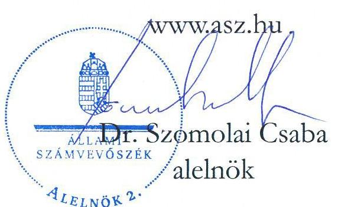
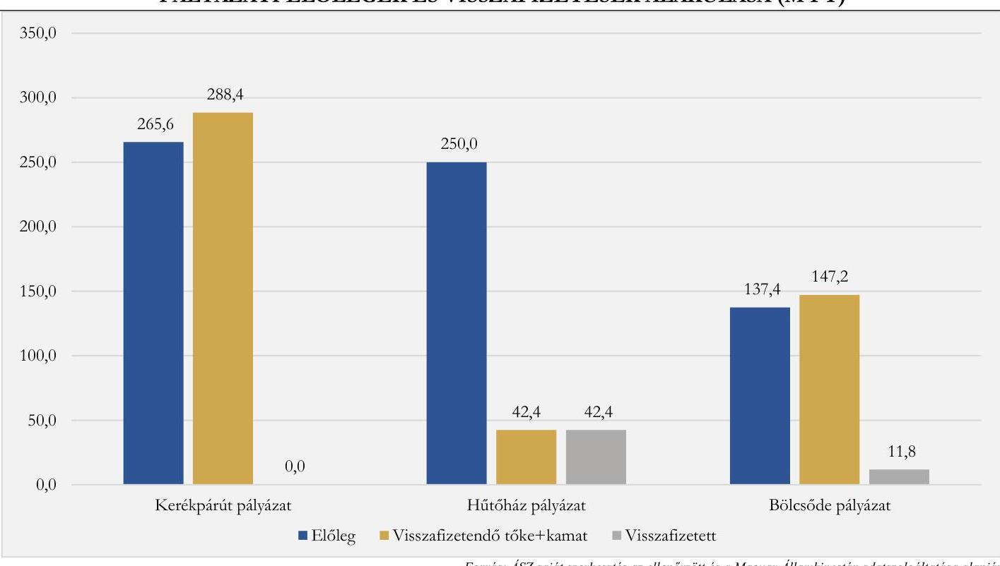

# JELENTÉS 

## Az önkormányzatok gazdálkodásának célvizsgálata

Az önkormányzatok ellenőrzése - a pénzforgalomban megjelenő kiadások teljesítésének és elszámolásának megfelelősége

Cserdi Község Önkormányzata

2025. 

25058
www.asz.hu

---

ÁLLAMI
SZÁMVEVŐSZÉK

# JELENTÉS 

## Az önkormányzatok gazdálkodásának célvizsgálata

Az önkormányzatok ellenőrzése - a pénzforgalomban megjelenő kiadások teljesítésének és elszámolásának megfelelősége

Cserdi Község Önkormányzata

2025.

25058

---

# ELLENŐRZÉSI IGAZGATÓSÁG: 

## ELLENŐRZÉSI IGAZGATÓSÁG II.

## ELLENŐRZÉSI IGAZGATÓ:

DR. BAFFIA GERGELY GÁBOR igazgató

## ELLENŐRZÉSVEZETŐ:

## HUDÁK MAGDOLNA ellenőrzésvezető

Jelentéseink az interneten a www.asz.hu címen olvashatók.

IKTATÓSZÁM: EL-4239-006/2025
TÉMASORSZÁM: 52
ELLENŐRZÉS-AZONOSÍTÓ SZÁM: V100212

---

# TARTALOMJEGYZÉK 

AZ ELLENŐRZÉS ALAPADATAI ..... 5
AZ ELLENŐRZÖTT SZERVEZETEK ..... 7
ÖSSZEFOGLALÁS ..... 9
AZ ELLENŐRZÉS FÓKUSZTERÜLETE ..... 11
MEGÁLLAPÍTÁSOK ..... 12
JAVASLATOK ..... 21
MELLÉKLETEK ..... 23
I. sz. melléklet: Értelmező szótár ..... 23
II. sz. melléklet: Az ellenőrzött szervezetek jegyzéke ..... 24
III. sz. melléklet: Ellenőrzési kritériumok ..... 25
IV. sz. melléklet: Összefoglaló táblázat az Önkormányzat gazdálkodási jogköreinek gyakorlásáról ellenőrzött gazdasági eseményenként ..... 26
V. sz. melléklet: Cserdi Község Önkormányzata esetében ellenőrzött, A nyilvántartásban késedelmesen rögzített kötelezettségvállalások ..... 28
VI. sz. melléklet: Cserdi Község Önkormányzata esetében ellenőrzött, késedelmesen könyvelt gazdasági események ..... 29
FÜGGELÉK: ÉSZREVÉTELEK ..... 30
RÖVIDÍTÉSEK JEGYZÉKE ..... 31

---

.

---

# AZ ELLENŐRZÉS ALAPADATAI 

## AZ ELLENŐRZÉS CÉLJA

Az ellenőrzés célja annak értékelése volt, hogy az Önkormányzatnál ${ }^{1}$ a pénzforgalomban megjelenő kiadások teljesítése és elszámolása megfelelő volt-e, továbbá a kiadások teljesítése az Önkormányzat közfeladat-ellátásához kapcsolódott-e.

## AZ ELLENŐRZÉS TÍPUSA

Törvényességi ellenőrzés.

## AZ ELLENŐRZÖTT IDŐSZAK

Az ellenőrzött időszak a 2023. és 2024. évek, valamint a 2025. év az ellenőrzés megállapításainak az ÁSZ tv. ${ }^{2} 29. \S$ (1) bekezdése szerinti megküldése napjáig.

## AZ ELLENŐRZÉS TÁRGYA

Az Önkormányzat pénzforgalmában megjelenő kiadások teljesítésének, elszámolásának, közfeladatellátással kapcsolatos felhasználásának ellenőrzése. Az ellenőrzés kiterjedt minden olyan körülményre és adatra, amely az ÁSZ ${ }^{3}$ jogszabályban meghatározott feladatainak teljesítéséhez, valamint a program végrehajtása folyamán felmerült újabb összefüggések feltárásához szükséges volt.

## AZ ELLENŐRZÉS JOGALAPJA

Az ellenőrzés jogszabályi alapját az ÁSZ tv. 1. § (3) bekezdésének, valamint az 5. $\S(2)-(3)$ és (6) bekezdéseinek előírásai képezték.

## AZ ELLENŐRZÉS MÓDSZERE

Az ellenőrzést a nemzetközi standardokat irányadónak tekintve az ellenőrzési program szempontjai, az ellenőrzési időszakban hatályos jogszabályok, az ellenőrzés szakmai szabályok és módszertanok figyelembevételével végezte az ÁSZ.

Az ellenőrzési kérdések megválaszolásához szükséges bizonyítékok megszerzése az ellenőrzött szervezetek által rendelkezésre bocsátott dokumentumok és adatok, valamint az ellenőrzést támogató szervezetek ${ }^{4}$ által adott adatok, információk értékelésével, továbbá megfigyelés, szemle (szemrevételezés) és információkérés (kérdésfeltevés), valamint elemző eljárás útján történt.

---

Az ellenőrzési bizonyítékként felhasználható adatforrások közé tartoztak egyrészt az ellenőrzéshez kért dokumentumok, adatforrások, másrészt adatforrás volt még a közhiteles nyilvántartásból (Magyar Államkincstár nyilvántartásai, Önkormányzati rendelettár) származó, az ellenőrzés szempontjából információkat tartalmazó dokumentum.

Az ellenőrzés lefolytatásához az ellenőrzött szervezetek a tanúsítványok kitöltésével, valamint az ÁSZ által kért dokumentumok, adatok, információk megküldésével az ellenőrzés során szolgáltattak adatokat. A rendelkezésre bocsátott adatok, információk kontrolljára helyszíni ellenőrzés keretében is sor került.

A pénzforgalomban megjelenő kiadások teljesítésének megfelelőségét mintavételi eljárással kiválasztott 12 tétel alapján ellenőrizte az ÁSZ. Az uniós támogatásokkal kapcsolatos pénzforgalmi adatok elemzése alapján az ÁSZ megállapításokat tett, és ezeknek az önkormányzat működésére és gazdálkodásra gyakorolt hatásának bemutatásánál figyelembe vette a támogatások felhasználásával kapcsolatban az irányító hatóság által tett megállapításokat is. Az ellenőrzés során a működés, gazdálkodás kockázatos területeinek meghatározását követően az ellenőrzött szervezetre vonatkozó főkönyvi adatbázisokból kockázat alapú eljárás alapján történt a mintatételek kiválasztása. A tények feltárása és azok összegzése során a megállapítások az ellenőrzött mintatételekre vonatkozóan kerültek megfogalmazásra.

Az ellenőrzés kiemelten kezelte a kifizetések közfeladat ellátáshoz való közvetlen kapcsolódásának, kötelezettségvállalás szerinti teljesülésének, a kifizetések jogszerűségének, szabályszerűségének értékelését, figyelemmel a kiadások teljesítésével összefüggő kontrollok gyakorlati működésére.

Az ellenőrzés kiterjedt minden olyan körülményre és kérdésre is, amely a program végrehajtása kapcsán felmerült újabb összefüggéseknek az ellenőrzés céljaival összhangban lévő feltárásához szükséges.

---

# **AZ ELLENŐRZÖTT SZERVEZETEK**

Cserdi község a Közép-Magyarországi régióban, Baranya vármegyében, a Szentlőrinci járásban található.

A település lakóinak száma a KSH^{5} adata alapján 2024. január 1-jén 382 fő, a relatív munkanélküliségi ráta az NFSZ^{6} adata szerint 2024. december 20-án 9,5% volt. Cserdi a 2023. és 2024. években a felzárkózó települések^{7} közé sorolt település volt.

A polgármester^{8} a településen 2020. év óta látta el tisztségét, a Képviselő-testületnek^{9} a polgármesteren kívül négy képviselő tagja volt.

Az Önkormányzat, valamint Boda és Dinnyebereki községek önkormányzatai működésével kapcsolatos feladatokat 2013. január 1-jétől a Bicsérdi Közös Önkormányzati Hivatal bodai kirendeltsége látta el. A Hivatal^{10} létszáma az ellenőrzött időszakban hatályos Szervezeti és működési szabályzat szerint 13 fő főállású és egy fő félállású dolgozó volt, melyből a bodai kirendeltségen 3 fő főállásban, egy fő pedig félállásban dolgozott. A jegyző^{11} 2013. január 1-jétől volt hivatalban.

Az Önkormányzat fenntartásában nem működött költségvetési szerv. Az Önkormányzat a gyermek- és ifjúságvédelemmel, a házi segítségnyújtással és szociális alapellátással, valamint az óvodai neveléssel kapcsolatos feladatait a Szentlőrinci Kistérségi Többcélú Önkormányzati Társulás, az egészségügyi alapellátási feladatait az Eszterházy Egészségügyi Önkormányzati Társulás útján látta el. A belső ellenőrzési feladatok elvégzésére külső szolgáltatóval megbízási szerződést kötöttek. Az Önkormányzat a nagyaktivitású radioaktívhulladék-tároló telephely kiválasztásával kapcsolatos tájékoztatási, információs és ellenőrzési, valamint működési és településfejlesztési feladatok ellátása érdekében 2018. január 1-jével csatlakozott a Nyugat-Mecseki Társadalmi Információs Ellenőrzési és Településfejlesztési Önkormányzati Társuláshoz.

Az Önkormányzat 2023. évi beszámolójának és 2024. évi pénzügyileg elfogadott beszámolójának főbb adatait az 1. táblázat mutatja be.

|  AZ ÖNKORMÁNYZAT 2023. ÉVES BESZÁMOLÓJÁNAK ÉS 2024. ÉVI PÉNZÜGYILEG ELFOGADOTT BESZÁMOLÓJÁNAK FÖBB ADATAI (M FT) |  |   |
| --- | --- | --- |
|  MEGNEVEZÉS | 2023. ÉV BESZÁMOLÓ | 2024. ÉV BESZÁMOLÓ  |
|  Költségvetési bevétel | 124,3 | 103,4  |
|  Ebből: önkormányzatok működési támogatása | 47,0 | 45,7  |
|  hosszabb időtartamú közfoglalkoztatás támogatása | 36,6 | 35,2  |
|  Költségvetési kiadás | 167,9 | 128,4  |
|  Finanszírozási bevétel | 111,2 | 115,9  |
|  Finanszírozási kiadás | 1,7 | 50,2  |

*1. táblázat*

*Forrás: Az Önkormányzat 2023. évi beszámolóján és a 2024. évi pénzügyileg elfogadott beszámolóján, alapján ÁSZ saját szerkesztés*

Az Önkormányzat költségvetési kiadásai a 2023-2024. években meghaladták költségvetési bevételeit. A kiadási többletet az előző év költségvetési maradványának igénybevételével biztosították. A 2023. évben az

---

ellenőrzött időszakot megelőzően képződött maradványból 109,4 M Ft-ot, 2024. évben pedig 65,8 M Ft-ot használt fel az Önkormányzat a költségvetési hiányának fedezésére.

Az önkormányzat az ellenőrzött időszakban három $\mathrm{TOP}^{12}$-ból elnyert pályázattal rendelkezett, amelyekre a megítélt 705,0 MFt támogatási összegből 653,0 MFt előleget folyósítottak ki.

A közfoglalkoztatási támogatásokhoz kapcsolódóan az Önkormányzatot a 2024. évben a szabálytalanság miatt 355,9 E Ft összegű tőke és kamatainak megfizetésére kötelezte a Baranya Vármegyei Kormányhivatal, amely kötelezettségének az Önkormányzat eleget tett. A Baranya Vármegyei Rendőr-főkapitányság tájékoztatása szerint az Önkormányzat által a közmunkások részére kifizetett pénzösszegekre tekintettel a 2024. évben iratok lefoglalására is sor került. Az eljárás 2024. december 31-én még folyamatban volt.

Az Önkormányzat 2023. és 2024. években a települési önkormányzatok rendkívüli támogatásából nem részesült, adósságrendezési eljárás alatt nem állt.

Az Önkormányzat beszámolóiból számított főbb pénzügyi mutatóinak alakulását a 2. táblázat mutatja be. 2. táblázat

|  A PÉNZÜGYI EGYENSÚLY ALAKULÁSA - MUTATÓSZÁMOK |  |  |  |  |   |
| --- | --- | --- | --- | --- | --- |
|  MEGNEVEZÉS |  | KEDVEZŐ
REFERENCIA
ÉRTÉK | 2022.12 .31 | 2023.12 .31 | 2024.12 .31  |
|  1. | Likviditási gyorsráta: a likvid eszközök és a rövid időn belül esedékes kötelezettségek hányadosa | $>1,00$ | 5,99 | 5,46 | 1,70  |
|  2. | Likviditási gyorsráta változása az előző évhez képest | $>0$ | - | $-0,54$ | $-3,75$  |
|  3. | Eladósodottsági mutató: a kötelezettségek és az összes forrás hányadosa (\%) | $\max .50-60 \%$ | $4,07 \%$ | $2,41 \%$ | $1,64 \%$  |
|  4. | Lejárt szállítói állomány aránya az összes szállítói állományon belül (\%) | aránya nem növekvő | $100,00 \%$ | $100,00 \%$ | $0,00 \%$  |
|  5. | Pénzhányad mutató: a pénzeszközök és a rövid időn belül esedékes kötelezettségek hányadosa | $\begin{gathered} >=0,4 \text { és az } \\ \text { előző } \end{gathered}$ időszakhoz képest nem csökken | 5,96 | 5,35 | 1,50  |

Forrás: ÁSZ saját szerkesztés a KGR K11 és az ellenőrzött adatszolgáltatása alapján

Az Önkormányzat likviditása 2022-2024. években folyamatosan romlott, mind a likviditási gyorsráta, mind a pénzhányad mutató értéke csökkent.

- Az Önkormányzat likviditásának romlását főként a pénzeszközeinek csökkenése (2023. évben a hűtőház pályázattal kapcsolatos $41,8 \mathrm{M} \mathrm{Ft}$, 2024. évben a bölcsőde pályázathoz kapcsolódó $11,8 \mathrm{M} \mathrm{Ft}$, valamint a közfoglalkoztatással kapcsolatos 355,9 E Ft visszafizetés) magyarázta.
Az Önkormányzat eladósodottsági szintje 2022-2024. évek átlagában 2,71\% volt, a referencia tartományban maradt és a 2022. évi 4,07 %-ról, 2024. évre 1,64 %-ra csökkent.

---

# ÖSSZEFOGLALÁS 

A településeken az önkormányzati gazdálkodás sokrétű feladatot jelent. A tevékenység összetettsége, a megfelelő képzettségű, létszámú humán-erőforrás hiánya a gazdálkodás területén magas szintű kockázatokat eredményezhet. Az ellenőrzés hozzájárul az Önkormányzat szabályszerű és felelős gazdálkodásához, a közpénzek szabályos, cél szerinti felhasználásához, a közvagyon védelméhez.

Az Önkormányzat a jogszabályokban, illetve a szervezeti és működési szabályzatában meghatározott közfeladatait ellátta. Az Önkormányzat rövidtávú fizetőképessége a 2022-2024. évi beszámolókból számított mutatószámok alapján - azok csökkenése ellenére - biztosítottnak látszott, valójában pénzügyi helyzete nem volt stabil. Az ellenőrzött időszakban működését pénzintézettől felvett munkabérhitelből, valamint a pályázati források céltól eltérő felhasználásával finanszírozta.

Az Önkormányzat TOP-ból elnyert pályázataihoz kapcsolódóan kerékpárút ${ }^{13}$ építésére 2017. évben konzorciumi tagként ${ }^{14} 265,6 \mathrm{M}$ Ft, helyi termék raktár, hűtőház ${ }^{15}$, csomagoló és logisztikai bázis létesítésére 2018. és 2020. években összesen 250 M Ft, továbbá bölcsőde ${ }^{16}$ kialakítására 2020. évben 137,4 M Ft támogatási előleget kapott, amelyek összegét és a visszafizetések pályázatonkénti alakulását az 1. ábra mutatja be.
1. ábra

PÁLYÁZATI ELŐLEGEK ÉS VISSZAFIZETÉSEK ALAKULÁSA (M FT)

Forrás: ÁSZ saját szerkesztés az ellenőrzött és a Magyar Államkincstár adatszolgáltatása alapján
Az Önkormányzat a jogszabályi előírások ellenére a pályázati támogatások előlegének 97,7\%-át, 630,6 M Ft-ot nem a pályázati céloknak megfelelően használta fel. A pályázatok közül a Kerékpárút és a Bölcsőde pályázat végrehajtása meghiúsult, a Hűtőház pályázat a helyszíni ellenőrzés lezárásáig nem fejeződött be. Az irányító hatóság ${ }^{17}$ szabálytalansági döntései alapján az Önkormányzat 2024. december 31-ig összesen 54,2 M Ft kamattal növelt támogatási előleget fizetett vissza. Az Önkormányzatot a pályázatok meghiúsulása és a szabálytalanul elköltött támogatási előlegek miatt 51,4 M Ft pályázati forrás és 2,8 M Ft kamata erejéig vagyoni hátrány érte.

---

Az uniós pályázati
 források felhasználásának értékelésén túlmenően, az ÁSZ az Önkormányzat pénzforgalmában megjelenő 9,3 M Ft összértékű 12 kiadási tételt ellenőrzött, amelyek teljesítése, illetve elszámolása egyetlen esetben sem felelt meg teljeskörűen a jogszabályi előírásoknak. Ebből egy 0,2 M Ft összegű közfeladatellátáshoz való kapcsolódása nem volt igazolt, mivel nem állt rendelkezésre a kifizetett külső személyi juttatás jogalapját, célját meghatározó dokumentum.

Az Önkormányzat kiadási előirányzatai terhére teljesített ellenőrzött kifizetések nem voltak szabályszerűek. Az előzetes írásbeli kötelezettségvállalást igénylő 12 esetből egy esetben a jogszabályi előírások ellenére nem, és hét esetben nem megfelelően vállaltak kötelezettséget, mindösszesen 5,4 M Ft kifizetést érintően. A kötelezettségvállalások pénzügyi ellenjegyzésére 12 esetből egy esetben nem, és 11 esetben nem megfelelően került sor 9,3 M Ft kifizetést érintően. A teljesítésigazolás az ellenőrzött 12 gazdasági eseményből négy esetben elmaradt, és öt esetben azt nem megfelelően végezték el, mindösszesen 5,5 M Ft összeget érintően. Az érvényesítés egy ellenőrzött esetben sem, az utalványozás hét esetben nem felelt meg a jogszabályi előírásoknak.

Az Önkormányzatnál a jogszabályokban előírt nyilvántartások vezetése sem volt megfelelő. A kötelezettségvállalások nyilvántartásban való rögzítésére késedelmesen került sor, így az nem volt alkalmas a kötelezettségvállalás időpontjában a szabad előirányzat, valamint a kötelezettségállomány megállapítására. A szállítói kötelezettségekről sem vezették a jogszabályban előírt nyilvántartást.

Az Önkormányzatnál a 2024. évi beszámolóban a mérlegben kimutatott tárgyi eszközök vonatkozásában nem végezték el a jogszabályban legalább hároméves gyakorisággal előírt mennyiségi leltározást. A tárgyi eszközök mennyiségi leltározására utoljára a 2021. évi költségvetési beszámoló mérlegének alátámasztásához kapcsolódóan került sor, ezért a 2024. évi beszámoló mérlegét már ismételten mennyiségi leltárral kellett volna alátámasztani. A mennyiségi felvétellel történő leltározás elmaradása miatt sérültek a vagyonvédelemre vonatkozó előírások.

A gazdálkodás belső szabályainak kialakítása nem felelt meg a jogszabályi előírásoknak, mert a pénzügyi ellenjegyzési és az érvényesítői jogkör gyakorlóját az arra jogosult jegyző helyett a polgármester jelölte ki, valamint a szabályzatok nem tartalmazták az összeférhetetlenség felmerülésekor követendő eljárásrendet.

A belső ellenőrzés az ellenőrzött időszakban nem járult hozzá a szabályszerű működéshez és a hiányosságok feltárásához, mivel az Önkormányzat gazdálkodását az ellenőrzött időszakban nem vizsgálta. Az ellenőrzött időszakot megelőző 2022. évben mindössze egy belső ellenőrzés történt, amely az ÁSZ megállapításaival összhangban azt állapította meg, hogy az Önkormányzat a beszámoló mérlegét leltárral nem támasztotta alá. A jegyző a jogszabályi előírások ellenére nem gondoskodott arról, hogy a belső ellenőri jelentés javaslatainak végrehajtására készített intézkedési tervben foglaltakat határidőben végrehajtsák.

Az ÁSZ az ellenőrzés során feltárt hiányosságok felszámolása, a szabályszerű működés feltételeinek megteremtése érdekében a polgármesternek három, a jegyzőnek 10 javaslatot tett.

---

# AZ ELLENŐRZÉS FÓKUSZTERÜLETE 

1.- Az Önkormányzat pénzforgalmában megjelenő kiadások teljesítésének és elszámolásának megfelelősége, az önkormányzati feladatellátásához való kapcsolódásának értékelése

---

# MEGÁLLAPÍTÁSOK 

## 1. Az Önkormányzat pénzforgalmában megjelenő kiadások teljesítésének és elszámolásának megfelelősége, az önkormányzati feladatellátásához való kapcsolódásának értékelése

Összegző megállapítás Az Önkormányzatnál a pénzforgalomban megjelenő ellenőrzött kiadások teljesítése és elszámolása nem felelt meg az Mötv. ${ }^{18}$, a Számv. tv. ${ }^{19}$, az Áht. ${ }^{20}$, az Ávr. ${ }^{21}$ és az Áhsz. ${ }^{22}$ előírásainak, egy kiadás és közfeladathoz való kapcsolódása sem volt igazolt.
1.1. számú megállapítás Az ellenőrzött gazdasági események - egy kivételével - az Önkormányzat feladatellátásához kapcsolódtak.

Az Önkormányzatnál az Mötv. 111. § (2) bekezdésében foglaltak ellenére a 12 ellenőrzött, 9276,8 E Ft összértékű gazdasági eseményből egy 187,9 E Ft összegű kiadás igazolható módon nem kapcsolódott az Önkormányzat feladatellátásához.

- Az ONK_KIAD_03 számú, munkavégzésre irányuló egyéb jogviszonyban nem saját foglalkoztatottnak fizetett juttatások teljesítésére vonatkozó 187,9 E Ft összegű gazdasági eseményhez kapcsolódóan az Önkormányzat az Áht. 37. § (1) bekezdésének előírása ellenére nem rendelkezett írásbeli kötelezettségvállalással, valamint az Ávr. 57. § (1) bekezdésének előírása ellenére a gazdasági esemény teljesítésigazolása nem történt meg. Kötelezettségvállalás és teljesítésigazolás hiányában nem volt megállapítható, hogy a kifizetés milyen munka elvégzéséhez kötődött, és az sem, hogy ez kapcsolódott-e az önkormányzati feladatellátáshoz. A kifizetés elszámolását az utalványrendelet és a könyvelési adatállomány igazolta, bankkivonat nem állt rendelkezésre.
1.2. számú megállapítás

Az Önkormányzat pénzforgalmában megjelenő ellenőrzött kiadások teljesítése, elszámolása, nyilvántartása és a kapcsolódó belső szabályozás teljeskörűen nem felelt meg a jogszabályi előírásoknak.

Az ellenőrzött 12 gazdasági esemény (9276,7 E Ft) mindegyikéhez szükség volt előzetes, írásbeli kötelezettségvállalásra, amelyből hét gazdasági esemény (5239,0 E Ft) vonatkozásában a kötelezettségvállalás dokumentuma nem felelt meg az Ávr. 50. § (1) bekezdés a) illetve b) pontjai előírásainak. Egy gazdasági eseménynél az Áht. 37. § (1) bekezdésének előírása ellenére (187,9 E Ft) az Önkormányzat nem rendelkezett előzetes írásbeli kötelezettségvállalással. Négy gazdasági esemény (3849,8 E Ft) vonatkozásában a kötelezettségvállalás dokumentuma megfelelt az Áht. és az Ávr. előírásainak, a kötelezettségvállalásra szabályszerűen került sor.

- Az ONK_KIAD_06, ONK_KIAD_07, ONK_KIAD_09 és ONK_KIAD_10 számú gazdasági eseményekhez (2370,0 E Ft) kapcsolódó szerződések nem tartalmazták a szakmai, műszaki teljesítés

---

mennyiségi és minőségi jellemzőinek meghatározását. Az ONK_KIAD_01 és POT_KIAD_01 számú, a falugondnok, a polgármester és az alpolgármester jutalmáról szóló (900,0 E Ft) gazdasági eseményekhez kapcsolódó képviselő-testületi döntés nem tartalmazza a jogosultak részére kifizetendő összegeket. A POT_KIAD_02 számú, a 2023. évi szociális tűzifa vásárlásról szóló (1969,0 E Ft) gazdasági eseményhez kapcsolódó szerződés nem tartalmazza a tűzifa egységárát, így nem lehetett a szerződés alapján megállapítani a kötelezettségvállalás összegét.

- Az ONK_KIAD_03 számú, 187,9 E Ft összegű gazdasági eseményhez kapcsolódóan az Önkormányzat nem rendelkezett a kötelezettségvállalás dokumentumával. Az ONK_KIAD_01 és POT_KIAD_01 számú gazdasági eseményeknél további hiányosság volt, hogy az Mötv. 49. § (1) bekezdésének előírása ellenére a 2023. december 4-i képviselő-testületi ülésről készült jegyzőkönyv szerint a polgármester, az alpolgármester, és a jutalmazással érintett képviselő nem jelentette be személyes érintettségét a jutalmazásról szóló döntés meghozatalakor, továbbá a polgármester az Ávr. 60. § (2) bekezdésének előírása ellenére a kötelezettségvállalás vonatkozásában saját maga és közeli hozzátartozója javára döntött. A képviselő-testületi döntésben a jutalmazottak között szerepelt a polgármester, mint jutalmazott polgármester és a falugondnok, az alpolgármester, továbbá a polgármesterrel közeli hozzátartozói kapcsolatban (testvér) álló képviselő.
- Az ONK_KIAD_06 (családi nap), ONK_KIAD_07 (farsang, nőnap és gyermeknap) gazdasági események vonatkozásában hiányosságként jelentkezett továbbá, hogy a kapcsolódó szerződések nem tartalmazták a rendezvények során végrehajtandó konkrét feladatokat. Az ONK_KIAD_07 számú gazdasági esemény esetében a farsangi rendezvény lebonyolításához kapcsolódó kötelezettségvállalás az Áht. 37. § (1) bekezdésének előírása ellenére utólag történt, mert annak megrendezésére 2023. február 25-én került sor, ami megelőzte a szerződés megkötését (2023. március 3.). Az ONK_KIAD_06 számú gazdasági eseményhez kapcsolódó szolgáltatási szerződésben az Ávr. 51. § (2) bekezdésének előírása ellenére nem kötötték ki, hogy a díj kizárólag abban az esetben illeti meg a költségvetési szerv állományába tartozó személyt (kirendeltség vezető), ha a szerződésben rögzített feladat mellett a munkakörébe tartozó feladatainak is maradéktalanul eleget tett.
Az Ávr. 55. § (1) bekezdésében előírtak ellenére az Önkormányzatnál a pénzügyi ellenjegyző az előzetes, írásbeli kötelezettségvállalást igénylő 12 esetből (9276,7 E Ft) egy esetben nem, és 11 esetben nem megfelelően látta el feladatát. Az Áht. 37. § (1) bekezdésének előírását megsértve nem győződött meg arról, hogy a tervezett kifizetések időpontjaiban a pénzügyi fedezet biztosított volt-e, a kötelezettségvállalás nem sértette-e a gazdálkodásra vonatkozó szabályokat. Kilenc esetben (8188,8 E Ft összegben) az Áht. 37. § (1) bekezdésének előírása ellenére a kötelezettségvállalás pénzügyi ellenjegyzésére a kifizetést követően került sor úgy, hogy a pénzügyi ellenjegyző az Ávr. 55. § (1) bekezdésében foglaltak ellenére nem rendelkezett az Ávr. 55. § (2) bekezdés f) pontja szerinti kijelöléssel. Kettő esetben (900,0 E Ft összegben) az előzetes, írásbeli kötelezettségvállalás az Áht. 37. § (1) bekezdésének és az Ávr. 53/A. § (1) bekezdésének előírása ellenére nem tartalmazott pénzügyi ellenjegyzést. Egy esetben (187,9 E Ft összegben) az Áht. 37. § (1) bekezdésében és az Ávr. 52. § (1) bekezdés e) pontjában előírtak ellenére a kötelezettségvállalásról nem készült dokumentum, ezért a pénzügyi ellenjegyző nem tudta ellátni az Ávr. 55. § (1) bekezdésében foglalt feladatát.
- Az ONK_KIAD_02, ONK_KIAD_04, ONK_KIAD_05, ONK_KIAD_06, ONK_KIAD_07, ONK_KIAD_08, ONK_KIAD_09, ONK_KIAD_10, POT_KIAD_02 (8188,8 E Ft összegű) gazdasági események vonatkozásában került sor a kötelezettségvállalás pénzügyi ellenjegyzésére a kifizetést követően.

---

Ezen gazdasági események vonatkozásában a pénzügyi ellenjegyzőt a jegyző helyett a polgármester jelölte ki, emiatt a kijelölés nem volt érvényes.

- Az ONK_KIAD_01 és a POT_KIAD_01 (900, E Ft összegű) gazdasági események vonatkozásában a kötelezettségvállalásokról szóló dokumentum nem tartalmazott pénzügyi ellenjegyzést.
- Az ONK_KIAD_03 (187,9 E Ft összegű) gazdasági esemény vonatkozásában a kötelezettségvállalásról szóló dokumentum nem készült, így annak pénzügyi ellenjegyzése nem történhetett meg.
Az értékelt gazdasági eseményekből kilenc esetben, 5526,7 E Ft közpénz elköltését megelőzően a teljesítést igazoló nem ellenőrizte, hogy a kifizetések az arra jogosult részére a megfelelő összegben történtek-e, illetve, hogy a kifizetés alapjául szolgáló ellenszolgáltatást az Önkormányzat részére ténylegesen elvégezték-e. Az Áht. 38. § (1) bekezdésének és az Ávr. 57. § (1) bekezdésének előírását megsértve négy esetben, 1507,4 E Ft összegű kifizetést megelőzően a teljesítésigazoló nem végezte el feladatát. Öt esetben, 4019,3 E Ft összegű kifizetést megelőzően az Ávr. 57. § (1) bekezdésének előírása ellenére a teljesítés igazolása nem volt megfelelő. Három esetben, 3750,0 E Ft összegű gazdasági esemény teljesítés igazolása az Ávr. előírásainak megfelelően történt.
- Az ONK_KIAD_01, ONK_KIAD_02, ONK_KIAD_03 és POT_KIAD_01 (1507,4 E Ft összegű) gazdasági események vonatkozásában nem állt rendelkezésre a teljesítésigazolás tényét igazoló dokumentum.
- Az ONK_KIAD_07, ONK_KIAD_09, ONK_KIAD_10 és POT_KIAD_02 (3389,0 E Ft összegű) gazdasági események vonatkozásában a teljesítésigazolás formális volt, mert a teljesítésigazoló az ONK_KIAD_07 gazdasági eseménynél a rendezvény megtörténtét alátámasztó dokumentumok, az ONK_KIAD_09 és ONK_KIAD_10 gazdasági eseményeknél a fahíd karbantartás teljesítését alátámasztó dokumentumok (a fűrészárú leszállításáról szóló szállítólevélen szereplő anyag mennyisége és minősége az átvevő részéről nem került igazolásra), valamint a POT_KIAD_02 (szociális tűzifa beszerzés) gazdasági eseménynél a szerződésben rögzített egységár hiányában ténylegesen nem ellenőrizte a kötelezettségvállalás teljesítését és kiadás teljesítésének összegszerűségét.
- Az ONK_KIAD_05 (630,3 E Ft összegű) traktor karbantartás vonatkozásában a teljesítésigazolás dokumentuma nem volt alkalmas a teljesítés tényleges megtörténtének ellenőrzésére, mert tartalmából nem lehetett beazonosítani a teljesítésigazolás alapjául szolgáló kötelezettségvállalást.
Az érvényesítés az ellenőrzött 12, összesen 9276,7 E Ft értékű kifizetés egyikénél sem felelt meg az Ávr. előírásainak. Az érvényesítés az Ávr. 58. § (4) bekezdésének és az 55. § (2) bekezdés f) pontjának előírása ellenére valamennyi gazdasági eseménynél kijelölés hiányában történt, mivel az érvényesítőt a jegyző helyett a polgármester jelölte ki.
- Hét esetben (ONK_KIAD_01, ONK_KIAD_02, ONK_KIAD_03, ONK_KIAD_04, ONK_KIAD_08, POT_KIAD_01 és POT_KIAD_02), 6276,5 E Ft-ot érintően
 az érvényesítő az Ávr. 58. § (1) bekezdésének előírása ellenére nem ellenőrizte az összegszerűséget, a fedezet meglétét, az érvényesítésre az Ávr. 58. § (3) bekezdésének előírása ellenére a kifizetést követően került sor, mert az utalványrendelet kelte, illetve az érvényesítés kelte későbbi volt, mint a kifizetés kelte.
- 10 esetben (ONK_KIAD_01, ONK_KIAD_04, ONK_KIAD_05, ONK_KIAD_06, ONK_KIAD_07, ONK_KIAD_08, ONK_KIAD_09, ONK_KIAD_10, POT_KIAD_01 és POT_KIAD_02), 8669,3 E Ft összegben az érvényesítő az Ávr. 58. § (1) bekezdésének előírása ellenére nem ellenőrizte,

---

hogy a megelőző ügymenetben betartották-e az Áht., az Ávr., az Áhsz., továbbá a belső szabályzatokban foglaltakat, mert:

- kettő esetben (ONK_KIAD_01 és POT_KIAD_01), 900,0 E Ft összegben az érvényesítő nem észrevételezte, hogy a kötelezettségvállalás pénzügyi ellenjegyzése az Áht. 37. § (1) bekezdésének előírása ellenére nem történt meg;
- nyolc esetben (ONK_KIAD_04, ONK_KIAD_05, ONK_KIAD_06, ONK_KIAD_07, ONK_KIAD_08, ONK_KIAD_09, ONK_KIAD_10 és POT_KIAD_02), 7769,3 E Ft összegben az érvényesítő nem észrevételezte, hogy a kötelezettségvállalást megelőzően nem folytatták le a Beszerzési szabályzat 7.1. és 7.2. pontjai szerinti beszerzési eljárást. A Beszerzési szabályzatban foglaltak ellenére a 200,0 E Ft-ot meghaladó, de a közbeszerzési értékhatárt el nem érő egyedi beszerzési értékű gazdasági események vonatkozásában nem kértek be három árajánlatot.
Az utalványozás az ellenőrzött 12 gazdasági eseményből öt esetben felelt meg az Ávr. utalványozásra vonatkozó előírásainak. Hét, 6276,5 E Ft összegű gazdasági esemény utalványozása az Áht. 38. § (1)-(2) bekezdéseinek előírása ellenére formális volt, mivel az utalványozás a kifizetést követően történt, amelyből három esetben, 1319,5 E Ft összegben megsértették az Ávr. 60. § (2) bekezdése szerinti összeférhetetlenségi szabályokat is.
- Az ONK_KIAD_01, ONK_KIAD_02, ONK_KIAD_03, ONK_KIAD_04, ONK_KIAD_08, POT_KIAD_01 és POT_KIAD_02 gazdasági események vonatkozásában az utalványozásra a kifizetést követően került sor, mivel az utalványrendeletek kelte későbbi volt, mint a kifizetések kelte.
- A hét gazdasági eseményből három esetben (ONK_KIAD_01, ONK_KIAD_02 és POT_KIAD_01), a polgármester saját maga javára utalványozott.
Az Ávr. 13. § (2) bekezdés a) pontjának előírása ellenére az Önkormányzat belső szabályzatai nem tartalmaztak előírást az Ávr. 60. § (1)-(2) bekezdéseiben rögzített összeférhetetlenség esetében követendő eljárásrendre.
(Az összefoglaló táblázatot az Önkormányzat gazdálkodási jogköreinek gyakorlásáról ellenőrzött gazdasági eseményenként a IV. számú melléklet tartalmazza.)
A tárgyi eszköz javításra, illetve ingatlan karbantartásra irányuló öt ellenőrzött gazdasági eseményhez (ONK_KIAD_04, ONK_KIAD_05, ONK_KIAD_08, ONK_KIAD_09 és ONK_KIAD_10) kapcsolódó tárgyi eszközök (fahíd és traktor) a helyszíni ellenőrzés során fellelhetőek voltak, azonban leltári számmal nem rendelkeztek. A helyszíni ellenőrzés során az eszközök azonosítására az eszközök típusa, illetve forgalmi rendszáma alapján került sor. A traktort (ONK_KIAD_05) a Számv. tv. és az Áhsz. előírásai szerint a tárgyi eszköz nyilvántartásban szerepeltették, a 2023. évi leltárban kimutatták. A Számv. tv. 69. § (1)-(2) bekezdéseiben és az Áhsz. 22. § (1) bekezdésében foglaltak ellenére a fahíd (ONK_KIAD_04, ONK_KIAD_08, ONK_KIAD_09 és ONK_KIAD_10) az Önkormányzat 2023. évi, egyeztetéssel alátámasztott leltárában nem szerepelt. Az Áhsz. 39. § (3) bekezdésének előírása ellenére a fahíd 2023. évben az Önkormányzat tárgyi eszköz nyilvántartásában sem szerepelt, annak nyilvántartásba vételére 2024. október 1-jén került sor 4546,6 E Ft összegben.
A Számv. tv. 69. § (3) bekezdésének előírása ellenére az Önkormányzat legalább háromévenkénti mennyiségi felvétellel történő leltározási kötelezettségének nem tett eleget.
- Az Önkormányzat tárgyi eszközeinek mennyiségi felvétellel történő leltározására utoljára 2021. december 31-ei fordulónappal került sor. A következő mennyiségi leltárfelvétel

---

2024. december 31-ig nem történt meg. A 2024. december 31-ei fordulónappal készült leltár záró jegyzőkönyve szerint a tárgyi eszközök leltározására egyeztetéssel került sor.
Az ellenőrzött 12 gazdasági esemény esetében a kötelezettségvállalás nyilvántartásban való rögzítése az Ávr. 56. § (1) bekezdésének előírása ellenére a kötelezettségvállalást követően haladéktalanul nem történt meg, azokat átlagosan 43 nap késedelemmel rögzítették. A késedelem befolyásolta az államháztartás információs rendszerébe teljesített havi adatszolgáltatások adattartalmát.
(A nyilvántartásban késedelmesen rögzített kötelezettségvállalásokat részletesen a V. számú melléklet mutatja be.)
Az ellenőrzött gazdasági események közül négy esetben (ONK_KIAD_03, ONK_KIAD_08, ONK_KIAD_09 és ONK_KIAD_10) 2367,9 E Ft összegben a számviteli elszámolás nem felelt meg a Számv. tv. és az Áhsz. előírásainak.

- A Számv. tv. 165. § (2) bekezdésének előírása ellenére a számviteli nyilvántartásba az ONK_KIAD_03 számú (187,9 E Ft összegű) gazdasági eseményt bizonylat hiányában rögzítették. A munkavégzésre irányuló egyéb jogviszonyban nem saját foglalkoztatottnak fizetett személyi juttatás vonatkozásában az Önkormányzat nem rendelkezett a kötelezettségvállalást, a teljesítésigazolást, a gazdasági eseményt alátámasztó számviteli bizonylattal (személyi juttatás számfejtésének dokumentuma), továbbá a kifizetését igazoló bizonylattal (bankszámla kivonat). A rendelkezésre bocsátott utalványrendelet, kötelezettségvállalás nyilvántartás és banknapló nem igazolta a számviteli számla kijelölésének helyességét, a kifizetés jogosságát és megtörténtét.
- Az ONK_KIAD_08, ONK_KIAD_09 és ONK_KIAD_10 számú (2180,0 E Ft) gazdasági események a község központjában lévő fahíd felújításáról szóltak, azonban az elvégzett munkákra az Önkormányzat nyilatkozata szerint a fahíd elmaradt és felhalmozódó karbantartása céljából került sor, ami a Számv. tv. 3. § (4) bekezdés 8.-9. pontjai szerint karbantartásnak minősül. Ezért azt a 053343. Karbantartási, kisjavítási szolgáltatások teljesítése főkönyvi számon és K334 Karbantartási, kisjavítási szolgáltatások rovaton szükséges elszámolni az Áhsz. 15. és 16. mellékletei alapján, a 05713. Ingatlanok felújítása teljesítése főkönyvi szám és a K71 Ingatlanok felújítása rovat helyett.
A Számv. tv. 165. § (3) bekezdés a) pontjában előírtak ellenére a 12 ellenőrzött gazdasági esemény közül 11 esetben, 7307,7 E Ft összegben az Önkormányzat nem biztosította a pénzeszközöket érintő gazdasági műveletek, események bizonylati adatainak a könyvekben történő késedelem nélküli rögzítését. A gazdasági eseményeket átlagosan 44 napi késedelemmel rögzítették, azonban az ONK_KIAD_03 gazdasági eseménynél a rögzítés késedelme 336 nap volt. A késedelem befolyásolta az államháztartás információs rendszerébe teljesített havi adatszolgáltatások adattartamát.
(A késedelmesen rögzített gazdasági eseményeket részletesen a VI. számú melléklet mutatja be.)
1.3. számú megállapítás

Az Önkormányzatnál az európai uniós forrásból megvalósuló pályázati források felhasználása és elszámolása nem felelt meg az Áht., az Áhsz és a Mötv. előírásainak. A támogatási összegeket a támogatási szerződésben meghatározottaktól eltérően használták fel, a támogatási célok megvalósítása meghiúsult.

Az Önkormányzat az ellenőrzött időszakban három TOP-ból elnyert pályázattal rendelkezett, amelynek főbb adatait a 3. táblázat mutatja be:

---

| PÁLYÁZATI TÁMOGATÁSOK (M FT) |  |  |  |  |  |  |  |  |
| :--: | :--: | :--: | :--: | :--: | :--: | :--: | :--: | :--: |
| Pályázat-   tőridi   emeyvezési | Pályázati   támogatás | Támogatási   előleg | Szabálytalan,   célra   felhasznált | Szabálytalanul,   nem célra   felhasznált | Visszakövetelt   támogatás | Követelt   kamat | Visszafizetett   támogatás | Visszafizetés rendezéses |
| Kerékpárút   pályázat | 265,6 | 265,6 | 0,0 | 265,6 | 265,6 | 22,8 | - | Előirányzat átesoportosítás   a XIX. Uniós fejlesztési   fejezet tartalék előirányzat   terhére. |
| Hűtőház   pályázat | 250,0 | 250,0 | 7,5 | 239,4 | 39,6 | 2,8 | 42,4 | Bölcsőde pályázatból került   visszafizetésre |
| Bölcsőde   pályázat | 189,4 | 137,4 | 0,0 | 125,6 | 137,4 | 9,8 | 11,8 | Előirányzat átesoportosítás   a TOP előirányzat hazai   társfinanszírozásán felüli   felhasználásával és a XIX.   Uniós fejlesztési fejezet   tartalék előirányzat terhére. |
| Összesen: | 705,0 | 653,0 | 7,5 | 630,6 | 442,6 | 35,4 | 54,2 |  |

A három TOP-ból elnyert pályázatból a Kerékpárút és a Bölcsőde pályázat végrehajtása meghiúsult, a Hűtőház pályázat a helyszíni ellenőrzés lezárásáig nem fejeződött be. Az Önkormányzat az Áht. 51. § (4) bekezdés előírása ellenére a pályázati támogatások előlegének 97,7%-át, 630,6 M Ft-ot nem a pályázati célok szerint használta fel. Az irányító hatóság szabálytalansági döntései alapján az Önkormányzat 2024. december 31-ig összesen 54,2 M Ft kamattal növelt támogatási előleget fizetett vissza. Az Önkormányzatot a szabálytalanul elköltött és emiatt visszafizetett 51,4 M Ft pályázati forrás és 2,8 M Ft kamata erejéig vagyoni hátrány érte. Az Mötv. 115. § (1) bekezdésében foglaltak alapján a helyi önkormányzat gazdálkodásának szabályszerűségéért a polgármester a felelős.

- A támogatási előlegből a cél szerint felhasznált 208,6 M Ft elszámolását sem fogadta el az irányító hatóság a projektek meghiúsulása miatt, míg a fennmaradó 422,0 M Ft-ból az Önkormányzat 54,2 M Ft-ot a kamattal növelt támogatási előleg (51,4 M Ft támogatási előleg és 2,8 M Ft kamat) visszafizetésére fordított. 367,8 M Ft pályázati céllal összefüggő felhasználását az önkormányzat nem tudta igazolni.
Az egyes pályázatok ellenőrzött időszakra vonatkozó hatásait, valamint a támogatások felhasználását az alábbiakban mutatjuk be:

# Kerékpárút pályázat 

Az Önkormányzat konzorciumi tagként, kerékpárút építésére pályázott (kerékpárút pályázat), a pályázatra kapott előleg felhasználását a 4. táblázat mutatja be.

---

|  KERÉKPÁRÚT PÁLYÁZATI TÁMOGATÁS FELHASZNÁLÁSA (M FT) |   |
| --- | --- |
|  MEGNEVEZÉS | Összeg (M FT)  |
|  Pályázati támogatás előlege (100 \%) | 265,6  |
|  Pályázati célra felhasznált összeg | 0,0  |
|  Nem pályázati célra felhasznált összeg | 265,6  |
|  Visszakövetelt támogatás összege | 265,6  |
|  Követelt kamat összege (2022.11.30-ig) | 21,7  |
|  Pályázati forrásból még az Önkormányzat bankszámláján rendelkezésére álló összeg | 0,0  |
|  Visszafizetett pályázati támogatás és kamat | 0,0  |

Kezés: ÁSZ saját szerkesztés az ellenőrzött és a Magyar Államkincstár adatszolgáltatása alapján Az irányító hatóság szabálytalansági döntésében megállapította, hogy az Önkormányzat a 272/2014. (XI.5.) Korm. rendelet 164. § (2) bekezdés a) pontja szerinti szabálytalanságot követte el, a támogatási előleget nem a projekt megvalósítása érdekében használta fel, azzal nem számolt el, ezért elrendelte az Önkormányzat részére kifizetett előleg visszafizetését. Az Önkormányzat az ellenőrzött időszakot megelőzően a konzorciumból kilépett, ugyanakkor a 265,6 M Ft összegű támogatási előleget és annak 22,8 M Ft összegű kamatát nem fizette vissza. Az irányító hatóság 2023. augusztus 31-i tájékoztatása értelmében a fejezetet irányító szerv vezetője döntött az Önkormányzattal szemben fennálló követelés finanszírozására előirányzat átcsoportosításról a XIX. Uniós fejlesztési fejezet TOP Előirányzat Felhasználási Keretszámla javára a tartalék előirányzat terhére ezáltal a követelés a pályázat szempontjából lezárt állapotúvá vált, az Önkormányzat kötelezettsége megszűnt.

# Hűtőház pályázat

Az Önkormányzat helyi termék raktár, hűtőház, csomagoló és logisztikai bázis létesítésére (hűtőház pályázat) a 2018 és a 2020. években részesült támogatásban, a hűtőház pályázatra kapott előleg felhasználását a 5. táblázat mutatja be. 5. táblázat

|  HŰTŐHÁZ PÁLYÁZATI TÁMOGATÁS FELHASZNÁLÁSA (M FT) |   |
| --- | --- |
| 

 MEGNEVEZÉS | Összeg (M FT)  |
|  Pályázati támogatás előlege (100 \%) | 250,0  |
|  Pályázati célra szabályosan felhasznált összeg | 7,5  |
|  Elszámolásra benyújtott, de szabálytalannak minősített felhasználás | 195,0  |
|  Elszámolásra be nem nyújtott támogatási előleg felhasználás | 44,4  |
|  Szabálytalanul felhasznált támogatás összesen | 239,4  |
|  Visszakövetelt támogatás összege | 39,6  |
|  Követelt kamat összege (2022.09.16-ig) | 2,8  |
|  Pályázati forrásból még a projekt elkülönített számláján rendelkezésére álló összeg* | 3,1  |
|  *: Utolsó bankszámlakivonat száma: 3/2024, értéknapja: 2024.12.20 |   |
|  Forrás: ÁSZ saját szerkesztés az ellenőrzött és a Magyar Államkincstár adatszolgáltatása alapján |   |

---

Az irányító hatóság az Önkormányzatot a projekttel kapcsolatos közbeszerzési eljárás szabályainak megszegése és a projekt megvalósításának tartós akadályoztatása miatt kezdeményezett szabálytalansági eljárás során a 39,6 M Ft támogatási előleg és 2,8 M Ft kamattal növelt összegének visszafizetésére kötelezte az ellenőrzött időszakot megelőzően. Az Önkormányzat 2023-ban a fizetési kötelezettségének az Áht. 48/A. § (1) bekezdésében és 51. § (4) bekezdésében foglaltakat megsértve a bölcsőde pályázat elkülönített számláján található összeg - tehát más célra kapott pályázati forrás felhasználásával - tett eleget. Az Önkormányzat a projekt lebonyolítása és eredményes befejezése érdekében 2023. novemberében a Támogatási Szerződés módosítására irányuló kérelmet nyújtott be, amelyben 418,9 M Ft többletforrás biztosítása mellett egy civil szervezet konzorciumi tagként való bevonását, valamint a majd elkészülő beruházás civil szervezet tulajdonába adását kérte. A többlettámogatási kérelmet 2024. decemberében az irányító hatóság jóváhagyta, így a projekt meg tud valósulni.

# Bölcsőde pályázat 

Az Önkormányzat bölcsőde pályázati támogatásának felhasználását a 6. táblázat mutatja be.
6. táblázat

BÖLCSŐDE PÁLYÁZATI TÁMOGATÁS FELHASZNÁLÁSA (M FT)

| Megnevezés | Összeg (M Ft) |
| :-- | :--: |
| Pályázat összköltsége | 189,4 |
| Pályázati támogatás összege | 189,4 |
| Pályázati támogatás folyósított előlege | 137,4 |
| Pályázati célra szabályosan felhasznált összeg | 0,0 |
| Elszámolásra benyújtott, de szabálytalannak minősített felhasználás | 13,6 |
| Elszámolásra nem benyújtott támogatási előleg felhasználás | 112,0 |
| ebből: hűtőház pályázat költség korrekciójának és kamatainak visszafizetése | 42,4 |
| Szabálytalanul felhasznált támogatás összesen | 125,6 |
| Visszakövetelt támogatás összege | 137,4 |
| Követelt kamat összege (2023.02.14-ig) | 9,8 |
| Visszafizetett támogatási előleg | 11,8 |
| Pályázati forrásból még a projekt elkülönített számláján rendelkezésére álló összeg | 0,0 |

Forrás: ÁSZ saját szerkesztés az ellenőrzött és a Magyar Államkincstár adatszolgáltatása alapján
Az irányító hatóság szabálytalansági döntésében megállapította, hogy az Önkormányzat a 272/2014. (XI. 5.) Korm. rendelet 164. § (2) bekezdés a) pontja szerinti szabálytalanságot követte el, a bölcsőde pályázat előlegével nem számolt el, a tervezést követően nem történt előrelépés a projekt megvalósításában. Az irányító hatóság 2023. február 14-i szabálytalansági döntésben a projekt megvalósításának tartós akadályozottságára, jelentős pénzügyi elmaradására és a szakmai beszámolók benyújtásának elmaradására hivatkozva a támogatástól elállt, és az Önkormányzatot a 137,4 M Ft kiutalt előleg, a 2023. február 14-ig felszámított 4,7 M Ft ügyleti és 5,1 M Ft késedelmi kamat (összesen: 147,2 M Ft) megfizetésére kötelezte, amelyből az Önkormányzat 11,8 M Ft-ot fizetett vissza.
A bölcsődei pályázathoz kapcsolódóan az Önkormányzat az Áht. 51. § (4) bekezdésének előírása ellenére, a projekthez kapcsolódó elkülönített bankszámlájáról a 2023-2024. években 10 alkalommal, összesen

---

48,1 M Ft átvezetést teljesített az elszámolási számlája javára, amelyet egyrészt a Hűtőház pályázat költség korrekciójának és kamatainak visszafizetésére (42,4 M Ft), másrészt az Önkormányzat működési kiadásaira használtak fel.

- Az irányító hatóság 2023. február 14-én kelt szabálytalanság-eljárási jegyzőkönyve szerint az Önkormányzat 2020. október 28-án időközi elszámolást nyújtott be 13,6 M Ft összegben, amely teljes egészében elutasításra került az irányító hatóság által az elszámoláshoz kért iratok megküldésének elmaradása miatt. A visszakövetelt összegből az Önkormányzat 2024. február 27-én 11,8 M Ft-ot fizetett vissza, a fennmaradó összeg visszafizetésére az Önkormányzat projekthez kapcsolódó bankszámlája nem biztosított fedezetet. Az Önkormányzat 2024. február 22-én kérelmet nyújtott be, amelyben az 590/2022. Korm. rendelet 14. § (1) bekezdés e) pontjára hivatkozva kérte a visszakövetelt támogatás finanszírozását a XIX. Uniós fejlesztési fejezet terhére.
- Az irányító hatóság 2024. december 19-én kelt levelében tájékoztatta az Önkormányzatot, hogy a benyújtott kérelmükre, a visszakövetelt támogatásból az Önkormányzat által vissza nem fizetett támogatásból és kamatából fennmaradó 135,4 M Ft összeg finanszírozása jóváhagyásra került. A támogatás finanszírozása 50-50% mértékben az 590/2022. Korm. rendelet 9. § (1) bekezdés f) pontja alapján a TOP előirányzat hazai társfinanszírozásán felüli felhasználásával és a 14. § (1) bekezdés e) pontja alapján a XIX. Uniós fejlesztési fejezet tartalék előirányzata terhére történt.
1.4. számú megállapítás

Az Önkormányzatnál a jegyző nem gondoskodott az MÖtv. és az Áht. szerinti belső ellenőrzés megfelelő működtetéséről, az nem látta el a Bkr. ²⁹ szerinti feladatát.

Az ellenőrzött időszakban az Önkormányzat rendelkezett szerződéssel a belső ellenőrzési feladatok ellátására, ugyanakkor az MÖtv. 119. § (4) bekezdésében és az Áht. 70. § (1) bekezdésében foglaltak ellenére a jegyző nem gondoskodott a belső ellenőrzés megfelelő működtetéséről. A belső ellenőrzés megtervezése és végrehajtása nem felelt meg a Bkr. előírásainak, mivel az Önkormányzat az ellenőrzött időszakban a Bkr. 29. § (1) bekezdés előírása ellenére nem rendelkezett kockázatelemzéssel alátámasztott belső ellenőrzési tervvel, valamint a Bkr. 32. § (4) bekezdés előírása ellenére az éves belső ellenőrzési tervről a Képviselő-testület nem döntött. Az ellenőrzött időszakban egy belső ellenőrzést végeztek, amely a 2022. évi költségvetési beszámoló mérleg sorainak egyeztetésére és a leltározás ellenőrzésére irányult. A belső ellenőrzés - tekintettel az ÁSZ által a belső ellenőrzés működésében, valamint az önkormányzat gazdálkodásában feltárt szabálytalanságokra - nem látta el a Bkr. 21. §-ban meghatározott feladatát, nem volt alkalmas arra, hogy feltárja a gazdálkodás során jelentkező kockázatokat, hiányosságokat.

- Az Önkormányzat 2022. évi költségvetési beszámoló mérleg sorainak egyeztetésére és a leltározás ellenőrzésére irányuló belső ellenőrzés megállapította, hogy a 2022. évi beszámoló mérlegét nem támasztották alá leltárral, sem mennyiségi felvétellel, sem pedig egyeztetéssel történő leltározás nem történt. A belső ellenőrzés megállapításai összhangban voltak az ÁSZ megállapításaival.
- A Bkr. 45. § (1) bekezdés előírása ellenére az 2022. évi belső ellenőrzési jelentéshez készült és a Képviselőtestület által jóváhagyott intézkedési tervben foglaltakat határidőn túl, az intézkedési tervben foglalt 2024. december 31-ei határidő helyett 2025. február 5-ével hajtották végre.

---

# JAVASLATOK 

Az ÁSZ tv. 33. § (1) bekezdésében foglaltak értelmében az ellenőrzött szervezet vezetője köteles a jelentésben foglalt megállapításokhoz kapcsolódó intézkedési tervet összeállítani és azt a jelentés kézhezvételétől számított 30 napon belül az ÁSZ részére megküldeni. Amennyiben az ellenőrzött szervezet vezetője nem küldi meg határidőben az intézkedési tervet, vagy továbbra sem elfogadható intézkedési tervet küld, az Állami Számvevőszék elnöke az ÁSZ tv. 33. § (3) bekezdés a) és b) pontjaiban foglaltakat érvényesítheti.

## CSERDI KÖZSÉG ÖNKORMÁNYZATÁNAK POLGÁRMESTERE RÉSZÉRE

1. Intézkedjen az Állami Számvevőszék nyilvánosságra hozott jelentésének a kézhezvételét követő 30 napon belül a Képviselő-testület elé terjesztéséről. A jelentést a napirend tárgyalásáról szóló jegyzőkönyvvel együtt tájékoztatásul küldje meg a Kormányhivatal részére is.
2. Tegyen intézkedéseket az Áht. 37. § (1) és 38. § (1) bekezdésében foglalt kontrolltevékenységek kiépítésére és megfelelő működtetésére, amelyek megelőzik a jelentésben leírt, az Ávr. 52. §-ában, 57. §-ában, valamint 59. §-ában foglalt kötelezettségvállalási, teljesítésigazolási és utalványozási jogkörök gyakorlásával és az Ávr. 60. §-ában foglalt összeférhetetlenségi követelményekkel összefüggő szabálytalanságok ismételt előfordulását.
3. Gondoskodjon az Áht. 51. § (4) bekezdés előírása szerint a pályázati támogatások szabályszerű, pályázatok célja szerinti felhasználásáról.

## BICSÉRDI KÖZÖS ÖNKORMÁNYZATI HIVATAL JEGYZŐJE RÉSZÉRE

1. Tegyen intézkedéseket az Önkormányzat vonatkozásában az Áht. 37. § (1) és 38. § (1) bekezdésében foglalt kontrolltevékenységek kiépítésére és megfelelő működtetésére, amelyek megelőzik a jelentésben leírt, az Ávr. 51. § (2) bekezdésében, az 55. §-ában, valamint az 58. §-ában foglalt kötelezettségvállalási, pénzügyi ellenjegyzési és érvényesítési jogkörök gyakorlásával összefüggő szabálytalanságok ismételt előfordulását.
2. Intézkedjen a pénzügyi ellenjegyzésre és érvényesítésre jogosultaknak az Ávr. 58. § (4) bekezdés és 55. § (2) bekezdés f) pont előírása szerinti kijelöléséről.

---

3. 

Intézkedjen az Ávr. 13. § (2) bekezdés a) pont előírásai szerint az Önkormányzat gazdálkodására vonatkozó belső szabályozásainak az Ávr. 60.§ (2) bekezdés szerinti összeférhetetlenség esetén követendő eljárásrenddel való kiegészítéséről.
4. Intézkedjen az Önkormányzatnál a Számv. tv. 69. § (1)-(3) bekezdéseinek, és az Áhsz. 22. § (1) bekezdésének előírásai szerinti, valamint az Önkormányzat leltározási szabályzatában foglaltaknak megfelelő leltár elkészítéséről.
5. Intézkedjen az Önkormányzatnál a kötelezettségvállalásoknak az Ávr. 56. § (1) bekezdése szerinti haladéktalan nyilvántartásba vételéről.
6. Intézkedjen az Áhsz. 39. § és 45. §-a előírásai alapján a gazdasági események tartalmának megfelelő számviteli elszámolásról.
7. Intézkedjen a Bkr. 8. § (2) bekezdés d) pontjában foglaltaknak megfelelően a kockázatok csökkentése érdekében olyan kontrolltevékenységek kialakításáról, amelyek biztosítják, hogy a Számv. tv. 165. § (3) bekezdés a) pontjában foglaltak szerint a pénzeszközöket érintő gazdasági műveletek, események bizonylatai adatainak a könyvekben történő rögzítése késedelem nélkül megtörténjen az Önkormányzat esetében.
8. Intézkedjen a Bkr. 8. § (1) bekezdésében foglaltaknak megfelelően a kockázatok csökkentése érdekében olyan kontrolltevékenységek kialakításáról, amelyek biztosítják a beszerzési szabályzat 7.1 pontjában meghatározott esetben a beszerzési szabályzat 7-8 pontjaiban előírt beszerzési eljárások lefolytatását és teljeskörű dokumentálását.
9. Gondoskodjon arról, hogy a Bkr. 29. § (1) bekezdésében foglaltaknak megfelelően, a kockázatelemzéssel alátámasztott belső ellenőrzési terv elkészüljön, illetve intézkedjen annak képviselő-testületi előterjesztéséről.
10. Biztosítsa a belső ellenőrzési jelentésre készített intézkedési tervben foglaltak határidőben történő végrehajtását a Bkr. 45. § (1) bekezdésében foglaltaknak megfelelően.

---

# MELLÉKLETEK 

## I. SZ. MELLÉKLET: ÉRTELMEZŐ SZÓTÁR

eladósodottsági mutató

A

## pénzhányad mutató

Az eladósodottsági mutató alapképlete az idegen forrásoknak az összes eszközhöz viszonyított aránya megállapítására szolgál. A mutató az eladósodottság mértékét fejezi ki százalékos formában. Jelen ellenőrzés keretében a mutató az önkormányzat kötelezettségeinek arányát mutatja az összes forráson belül. Kedvező, ha az eladósodottságot jelző mutatószám 50-60 % körül van, magas, ha 60 % és 100 % között van, kedvezőtlen a helyzet, ha 100 % vagy e felett helyezkedik el.
(Forrás Zéman Zoltán, Bébm Imre A pénzügyi menedzsment controll elemzési eszköztára, https://mersz.hu/dokumentum/dj242apmcee_152/alapján ÁSZ meghatározás)
A likviditási gyorsráta a likvid eszközök és a likvid források közötti arányt oly módon határozza meg, hogy a készletállományt a likvid eszközök közül figyelmen kívül hagyja. Jelen ellenőrzés keretében a mutató mutatja, hogy a likvid eszközök hányszorosát teszik ki a likvid forrásoknak, vagyis a forgóeszközök mekkora mértékben fedezik a rövid lejáratú kötelezettségeket. Kedvező, ha a mutató értéke 1-nél nagyobb értéket
 ér el. Ha kisebb, mint 1 akkor fizetőképtelenség fenyeget, vagy bekövetkezett (Forrás: Zéman Zoltán, Béhm Imre A pénzügyi menedzsment controll elemzési eszköztára, https://mersz.hu/dokumentum/dj242apmcee_152/alapján ÁSZ meghatározás.)
A Pénzhányad a készletek és a követelések nélküli likvid eszközök likviditását fejezi ki. Jelen ellenőrzés keretében a mutató a mobilizálható pénzeszközöket veti össze a rövid lejáratú kötelezettségekkel. Megfelelő az értéke, ha értéke 0,4 vagy magasabb. (Forrás: Zéman Zoltán, Béhm Imre A pénzügyi menedzsment controll elemzési eszköztára https://mersz.hu/dokumentum/dj242apmcee_152/alapján ÁSZ meghatározás)

---

II. SZ. MELLÉKLET: AZ ELLENŐRZÖTT SZERVEZETEK JEGYZÉKE

# MEGNEVEZÉS 

Cserdi Község Önkormányzata
Bicsérdi Község Önkormányzati Hivatal

---

# III. SZ. MELLÉKLET: ELLENŐRZÉSI KRITÉRIUMOK 

## FOKUSZTERÜLET

1. Az Önkormányzat pénzforgalmában megjelenő kiadások teljesítésének és elszámolásának megfelelősége, az Önkormányzat feladatellátásához kapcsolódó megvalósulásának értékelése

Áht. 37. § (1) bekezdés;
Áht. 38. § (1) és (2) bekezdések;
Áht. 51. § (4) bekezdés;
Ávr. 13. § (2) bekezdés a) pontja;
Ávr, 13. § (3b) bekezdés
Ávr. 50. § (1) bekezdés a) pontja;
Ávr. 50. § (1) bekezdés b) pontja;
Ávr. 50. § (2) bekezdés;
Ávr. 51. §;
Ávr. 51. § (2) bekezdés;
Ávr. 52. §;
Ávr. 52. § (1) bekezdés c) pontja;
Ávr. 53/A. § (1) bekezdés;
Ávr. 55. §;
Ávr. 55. § (1) bekezdés;
Ávr. 55. § (2) bekezdés a) pontja;
Ávr. 55. § (2) bekezdés f) pontja;
Ávr. 56. § (1) bekezdés;
Ávr. 57. §;
Ávr. 57. § (1) és (3) bekezdések;
Ávr. 58. §;
Ávr. 58. § (1), (3) és (4) bekezdések;
Ávr. 59. §;
Ávr. 60. §;
Ávr. 60. § (2) bekezdés;
Áhsz. 22. § (1) bekezdés;
Áhsz. 39. §;
Áhsz. 39. § (3) bekezdés;
Áhsz. 45. §;
Áhsz. 15. és 16. mellékletek;
ÁSZ tv. 1. § (3) bekezdés;
ÁSZ tv. 5. § (2)-(3) és (6) bekezdések;
ÁSZ tv. 29. § (1) bekezdés;
ÁSZ tv. 33. § (1) bekezdés;
ÁSZ tv. 33. § (3) bekezdés a) és b) pontjai;
Bkr. 8. § (1) és (2) bekezdések;
Bkr. 21. §;
Bkr. 29. § (1) bekezdés;
Bkr. 32. § (4) bekezdés;
Bkr. 45. § (1) bekezdés;
Mötv. 49. § (1) bekezdés;
Mötv. 111. § (2) bekezdés;
Mötv. 115. § (1) bekezdés;
Számv. tv. 3. § (4) bekezdés 8. és 9. pontjai;
Számv. tv. 69. § (1), (2) és (3) bekezdések;
Számv. tv. 165. § (2) bekezdés;
Számv. tv. 165. § (3) bekezdés a) pontja;
590/2022. Korm. rendelet 9. § (1) bekezdés f) pontja
590/2022. Korm. rendelet 14. § (1) bekezdés c) pontja

---

Mellékletek

IV. SZ. MELLÉKLET: ÖSSZEFOGLALÓ TÁBLÁZAT AZ ÖNKORMÁNYZAT GAZDÁLKODÁSI JOGKÖREINEK GYAKORLÁSÁRÓL ELLENŐRZÖTT GAZDASÁGI ESEMÉNYENKÉNT

CSERDI KÖZSÉG ÖNKORMÁNYZATA

|  Ssz. | Mítatétel azonosító száma | Tárgya | Dátuma | Kifizetés módja | Összege (FI) | Kötelezettségvállalás | Pénzügyi előréggyzés | Gazdálkodási jogkörök gyakorlása | Telfesítés- igazolás | Érvényesítés | Utalványozás | Köz- feladat ellátás | Szám- vítéli elszámolás  |
| --- | --- | --- | --- | --- | --- | --- | --- | --- | --- | --- | --- | --- | --- |
|  1. | ONK_KIAD_01 | A polgármesternek, mint falugondnok részére kifizetett nettó jutalom (2023. december) | 2023.12.13 | bank | 500 000 | Nem megfelelő dokumentum | Nem megfelelő dokumentum | Nincs dokumentum | Nem megfelelő dokumentum | Nem megfelelő dokumentum | I | I |   |
|  2. | ONK_KIAD_02 | Polgármesteri, alpolgármesteri tiszteletdíjak és költségtérítések, képviselői tiszteletdíjak (2023. december) | 2024.01.03 | bank | 419 489 | Megfelelő dokumentum | Nem megfelelő dokumentum | Nincs dokumentum | Nem megfelelő dokumentum | Nem megfelelő dokumentum | I | I |   |
|  3. | ONK_KIAD_03 | Munkavégzésre irányuló egyéb jogviszonyban nem saját foglalkoztatottnak fizetett juttatások teljesítése | 2023.01.03 | bank | 187 935 | Nincs dokumentum | Nincs dokumentum | Nincs dokumentum | Nem megfelelő dokumentum | Nem megfelelő dokumentum | Nem igazolt | N |   |
|  4. | ONK_KIAD_04 | Fabiál karbantartás | 2024.05.24 | bank | 1 400 000 | Megfelelő dokumentum | Nem megfelelő dokumentum | Megfelelő dokumentum | Nem megfelelő dokumentum | Nem megfelelő dokumentum | I | I |   |
|  5. | ONK_KIAD_05 | Traktor karbantartás | 2023.07.11 | pénztár | 630 300 | Megfelelő dokumentum | Nem megfelelő dokumentum | Nem megfelelő dokumentum | Nem megfelelő dokumentum | Megfelelő dokumentum | I | I |   |
|  6. | ONK_KIAD_06 | Rendezvényszervezés: családi nap | 2024.08.31 | pénztár | 950 000 | Nem megfelelő dokumentum | Nem megfelelő dokumentum | Megfelelő dokumentum | Nem megfelelő dokumentum | Megfelelő dokumentum | I | I |   |
|  7. | ONK_KIAD_07 | Rendezvényszervezés: farsang, nőnap és gyermeknap (helyszíni ellenőrzés jegyzőkönyve szerint) | 2023.04.30 | pénztár | 640 000 | Nem megfelelő dokumentum | Nem megfelelő dokumentum | Nem megfelelő dokumentum | Nem megfelelő dokumentum | Megfelelő dokumentum | I | I |   |
|  8. | ONK_KIAD_08 | Fabiál karbantartási, kisjavítási kapcsolódó fűrészáru megmunkálása, előkészítése (1,3 m3) | 2023.11.30 | bank | 1 400 000 | Megfelelő dokumentum | Nem megfelelő dokumentum | Megfelelő dokumentum | Nem megfelelő dokumentum | Nem megfelelő dokumentum | I | N |   |
|  9. | ONK_KIAD_09 | Fabiál karbantartásához 0,6 m3 fenyő fűrészáru vásárlása | 2023.06.21 | pénztár | 360 000 | Nem megfelelő dokumentum | Nem megfelelő dokumentum | Nem megfelelő dokumentum | Nem megfelelő dokumentum | Megfelelő dokumentum | I | N |   |
|  10. | ONK_KIAD_10 | Fabiál karbantartásához 0,7 m3 fenyő fűrészáru vásárlása | 2023.06.20 | pénztár | 420 000 | Nem megfelelő dokumentum | Nem megfelelő dokumentum | Nem megfelelő dokumentum | Nem megfelelő dokumentum | Megfelelő dokumentum | I | N |   |
|  11. | POT_KIAD_01 | Polgármester és alpolgármester 2023. decemberi jutalma | 2023.12.21 | bank | 400 000 | Nem megfelelő dokumentum | Nem megfelelő dokumentum | Nincs dokumentum | Nem megfelelő dokumentum | Nem megfelelő dokumentum | I | I |   |
|  12. | POT_KIAD_02 | 2023. évi szociális tűzifa vásárlás | 2024.03.21 | bank | 1 969 028 | Nem megfelelő dokumentum | Nem megfelelő dokumentum | Nem megfelelő dokumentum | Nem megfelelő dokumentum | Nem megfelelő dokumentum | I | I |   |
|   |  |  | Összesen |  | 9 276 752 |  |  |  |  |  |  |  |   |
|  Cserdi Község Önkormányzata kiadási tételek összesen (db): |  |  |  | Megfelelő dokumentum: |  | 4 | 0 | 3 | 0 | 5 | 11 | 8 |   |
|   |  |  |  | Nem megfelelő dokumentum: |  | 7 | 11 | 5 | 12 | 7 | 0 | 4 |   |
|   |  |  |  | Nincs dokumentum: |  | 1 | 1 | 4 | 0 | 0 | 1 | 0 |   |
|   |  |  |  | Nem releváns: |  | 0 | 0 | 0 | 0 | 0 | 0 | 0 |   |
|   |  |  |  | Kiadási tételek összesen: |  | 12 | 12 | 12 | 12 | 12 | 12 | 12 | 12  |

Fonrás: Az ellenőrzött által szolgáltatott dokumentumok alapján ÁSZ saját szerkesztés

---

# A DOKUMENTUMOK ÉRTÉKELÉSE 

Nem megfelelő dokumentum: ha rendelkezésre áll dokumentum, de azt a gazdálkodási jogkör gyakorlók aláirással, dátummal nem látták el/ vagy ha aláirással ellátták, azonban a gazdálkodási jogkörrel kapcsolatos ellenőrzési feladatok elvégzéséhez szükséges háttérdokumentumok nem állnak rendelkezésre, és ezért nem megállapítható, hogy azt elvégezték$\mathrm{e} /$ vagy a háttér dokumentumokból az állapítható meg, hogy az ellenőrzési feladatot ténylegesen nem végezték el, mert a kifizetés nem a jogosultnak, nem megfelelő összegben történt, vagy az ellenszolgáltatás nem történt meg. Nem megfelelő a dokumentum akkor sem, ha aláirással ellátták, de azt nem az arra jogosult írta alá.

Nem releváns: az adott gazdasági eseménynél jogszabályi előírás, vagy belső szabályzat szerint nem kell az adott gazdálkodási jogkört gyakorolni (pl. 200 E Ft alatti tételek esetében nem kell írásbeli kötelezettségvállalás, ha egyébként azt belső szabályzat sem írja elő.)

---

# V. SZ. MELLÉKLET: CSERDI KÖZSÉG ÖNKORMÁNYZATA ESETÉBEN ELLENŐRZÖTT, A NYILVÁNTARTÁSBAN KÉSEDELMESEN RÖGZÍTETT KÖTELEZETTSÉGVÁLLALÁSOK 

| Sorszám | Gazdasági esemény (mintatétel) azonosítója | Gazdasági esemény (mintatétel) tárgya | Pénzügyi teljesítés időpontja | Összege (Ft) | Kötelezettségvállalás rögzítésének időpontja | Késedelert (nap) |
| :--: | :--: | :--: | :--: | :--: | :--: | :--: |
| 1. | ONK_KIAD_01 | A polgármesternek, mint falugondnok részére kifizetett nettó jutalom (2023. december) | 2023.12.13 | 500000 | 2024.01.17 | 35 |
| 2. | ONK_KIAD_02 | Polgármesteri, alpolgármesteri tiszteletdíjak és költségtérítések, képviselői tiszteletdíjak (2023. december) | 2024.01.03 | 419489 | 2024.04.11 | 99 |
| 3. | ONK_KIAD_03 | Munkavégzésre irányuló egyéb jogviszonyban nem saját foglalkoztatottnak fizetett juttatások teljesítése | 2023.01.03 | 187935 | 2023.07.31 | 209 |
| 4. | ONK_KIAD_04 | Fahíd karbantartás | 2024.05.24 | 1400000 | 2024.07.11 | 48 |
| 5. | ONK_KIAD_05 | Traktor karbantartás | 2023.07.11 | 630300 | 2023.07.25 | 14 |
| 6. | ONK_KIAD_06 | Rendezvényszervezés: családi nap | 2024.08.31 | 950000 | 2024.09.10 | 10 |
| 7. | ONK_KIAD_07 | Rendezvényszervezés: farsang, nőnap és gyermeknap (helyszíni ellenőrzés jegyzőkönyve szerint) | 2023.04.30 | 640000 | 2023.05.17 | 17 |
| 8. | ONK_KIAD_08 | Fahíd karbantartási, kisjavítási kapcsolódó fűrészáru megmunkálása, előkészítése ( $1,3 \mathrm{~m} 3$ ) | 2023.11.30 | 1400000 | 2023.12.18 | 18 |
| 9. | ONK_KIAD_09 | Fahíd karbantartásához 0,6 m3 fenyő fűrészáru vásárlása | 2023.06.21 | 360000 | 2023.06.28 | 7 |
| 10. | ONK_KIAD_10 | Fahíd karbantartásához 0,7 m3 fenyő fűrészáru vásárlása | 2023.06.20 | 420000 | 2023.06.28 | 8 |
| 11. | POT_KIAD_01 | Polgármester és alpolgármester 2023. decemberi jutalma | 2023.12.21 | 400000 | 2024.01.17 | 27 |
| 12. | POT_KIAD_02 | 2023. évi szociális tűzifa vásárlás | 2024.03.21 | 1969028 | 2024.04.11 | 21 |
|  |  |  | Összesen:

 | 9276752 |  |  |

Forrás: Az ellenőrzött által szolgáltatott dokumentumok alapján ÁSZ saját szerkesztés

---

# VI. SZ. MELLÉKLET: CSERDI KÖZSÉG ÖNKORMÁNYZATA ESETÉBEN ELLENŐRZÖTT, KÉSEDELMESEN KÖNYVELT GAZDASÁGI ESEMÉNYEK

|  Sor-
szám | Gazdasági
esemény
(mintatétel)
azonosítója | Gazdasági esemény (mintatétel) tárgya | Pénzügyi
teljesítés
időpontja | Összege (Ft) | Rögzítés
jogszabályi
határideje | Tényleges
rögzítés
(könyvelés)
időpontja | Késedelem
(nap)  |
| --- | --- | --- | --- | --- | --- | --- | --- |
|  1. | ONK_KIAD_01 | A polgármesternek, mint falugondnok
részére kifizetett nettó jutalom (2023.
december) | 2023.12.13 | 500000 | 2024.01.15 | 2024.01.17 | 2  |
|  2. | ONK_KIAD_02 | Polgármesteri, alpolgármesteri
tiszteleddíjak és költségtérítések, képviselői
tiszteleddíjak (2023. december) | 2024.01.03 | 419489 | 2024.02.15 | 2024.04.11 | 56  |
|  3. | ONK_KIAD_03 | Munkavégzésre irányuló egyéb
jogviszonyban nem saját foglalkoztatottnak
fizetett juttatások teljesítése | 2023.01.03 | 187935 | 2023.02.15 | 2024.01.17 | 336  |
|  4. | ONK_KIAD_04 | Fahíd karbantartás | 2024.05.24 | 1400000 | 2024.06.15 | 2024.07.11 | 26  |
|  5. | ONK_KIAD_05 | Traktor karbantartás | 2023.07.11 | 630300 | 2023.07.11 | 2023.07.31 | 20  |
|  6. | ONK_KIAD_06 | Rendezvényszervezés: családi nap | 2024.08.31 | 950000 | 2024.08.31 | 2024.09.14 | 14  |
|  7. | ONK_KIAD_07 | Rendezvényszervezés: farsang, nőnap és
gyermeknap (helyszíni ellenőrzés
jegyzőkönyve szerint) | 2023.04.30 | 640000 | 2023.04.30 | 2023.05.18 | 18  |
|  8. | ONK_KIAD_08 | Fahíd karbantartási, kisjavítási kapcsolódó
fürészáru megmunkálása, előkészítése (1,3
m3) | 2023.11.30 | 1400000 | 2023.12.15 | 2023.12.18 | 3  |
|  9. | ONK_KIAD_09 | Fahíd karbantartásához 0,6 m3 fenyő
fürészáru vásárlása | 2023.06.21 | 360000 | 2023.06.21 | 2023.07.13 | 22  |
|  10. | ONK_KIAD_10 | Fahíd karbantartásához 0,7 m3 fenyő
fürészáru vásárlása | 2023.06.20 | 420000 | 2023.06.20 | 2023.07.13 | 23  |
|  11. | POT_KIAD_01 | Polgármester és alpolgármester 2023.
decemberi jutalma | 2023.12.21 | 400000 | 2024.01.15 | 2024.01.17 | 2  |
|   |  |  | Összesen: | 7307724 |  |  |   |

Forrás: Az ellenőrzött által szolgáltatott dokumentumok alapján ÁSZ saját szerkesztés

---

# FÜGGELÉK: ÉSZREVÉTELEK 

A jelentéstervezetet a Számvevőszék 15 napos észrevételezésre megküldte az ellenőrzött szervezet vezetőjének az ÁSZ tv. 29. § (1) bekezdése előírásának megfelelően.

Az ellenőrzött szervezetek a jelentéstervezet megállapításaira észrevételt nem tettek.

[^0]
[^0]:    * 29. § (1) Az Állami Számvevőszék az ellenőrzési megállapításait megküldi az ellenőrzött szervezet vezetőjének vagy az általa megbízott személynek, és annak, akinek személyes felelősségét állapította meg.
    (2) Az ellenőrzött szervezet vezetője és a felelősként megjelölt személy az ellenőrzés megállapításaira tizenöt napon belül írásban észrevételt tehet.
    (3) Az Állami Számvevőszék az észrevételre a beérkezésétől számított harminc napon belül írásban válaszol. A figyelembe nem vett észrevételeket köteles a jelentésben feltüntetni, és megindokolni, hogy azokat miért nem fogadta el.

---

# RÖVIDÍTÉSEK JEGYZÉKE 

${ }^{1}$ Önkormányzat
${ }^{2}$ ÁSZ tv.
${ }^{3}$ ÁSZ
${ }^{4}$ ellenőrzést támogató szervezetek
${ }^{5} \mathrm{KSH}$
${ }^{6}$ NFSZ
${ }^{7}$ felzárkózó település
${ }^{8}$ polgármester
${ }^{9}$ Képviselő-testület
${ }^{10}$ Hivatal
${ }^{11}$ jegyző
${ }^{12}$ TOP
${ }^{13}$ Kerékpárút pályázat
${ }^{14}$ konzorcium tagjai
${ }^{15}$ Hűtőház pályázat
${ }^{16}$ Bölcsőde pályázat
${ }^{17}$ irányító hatóság
${ }^{18}$ Mótv.
${ }^{19}$ Számv. tv.
${ }^{20}$ Áht.
${ }^{21}$ Ávr.
${ }^{22}$ Áhsz.
${ }^{23}$ Beszerzési szabályzat
${ }^{24}$ Számv. tv.
${ }^{25}$ kerékpárút pályázat
${ }^{26}$ hűtőház pályázat
${ }^{27}$ bölcsőde pályázat
${ }^{28}$ 272/2014. (XI. 5) Korm. rendelet
${ }^{29}$ Bkr.

Cserdi Község Önkormányzata
2011. évi LXVI. törvény az Állami Számvevőszékről

Állami Számvevőszék
Baranya Vármegyei Kormányhivatal, Nemzeti Adó- és Vámhivatal Baranya Vármegyei Adó- és Vámigazgatóság, Baranya Vármegyei Rendőr-Főkapitányság, Magyar Államkincstár
Központi Statisztikai Hivatal
Nemzeti Foglalkoztatási Szolgálat
A Kormány 1404/2019. (VII. 5.) Korm. határozatával, a KSH legalacsonyabb komplex mutatója alapján kiválasztott 300 település.
a 2020. október 1-je óta, jelenleg is hivatalban lévő polgármester
Cserdi Község Önkormányzatának Képviselő-testülete
Bicsérdi Közös Önkormányzati Hivatal
Bicsérdi Közös Önkormányzati Hivatalt 2013. január 1-től vezető jegyző
Terület- és Településfejlesztési Operatív Program
TOP-1.2.1-15-BA1-2016-00007 pályázat
Baranya Megyei Fejlesztési Ügynökség Nonprofit Kft., Orfü Községi Önkormányzat, Hetvehely Község Önkormányzata, Kovácsszénája Község Önkormányzat, Sumony Községi Önkormányzat, Szentlőrinc Város Önkormányzat, Kákics Község Önkormányzata, Bükkösd Községi Önkormányzat, Komló Város Önkormányzat, Cserdi Község Önkormányzata
TOP-1.1.3-16-BA1-2017-00002 pályázat
„Cserdi C ringató szektor" TOP-1.4.1-19-BA1-2019-00003 pályázat
Miniszterelnökség Területfejlesztési Programok Végrehajtásáért Felelős Helyettes Államtitkár (2024. július 31-ig)
Nemzeti Fejlesztési Központ Területfejlesztési Programok Végrehajtásáért Felelős Főigazgatóság (2024. augusztus 1-től)
2011. évi CLXXXIX. törvény Magyarország helyi önkormányzatairól
2000. évi C. törvény a számvitelről
2011. évi CXCV. törvény az államháztartásról
368/2011. (XII. 31.) Korm. rendelet az államháztartásról szóló törvény végrehajtásáról
4/2013. (I. 11.) Korm. rendelet az államháztartás számviteléről
Bicsérdi Közös Önkormányzati Hivatal - Beszerzési szabályzata (hatályos 2020.01.01-től)
2000. évi C. törvény a számvitelről

TOP-1.2.1-15-BA1-2016-00007 pályázat
TOP-1.1.3-16-BA1-2017-00002 pályázat
„Cserdi C ringató szektor" TOP-1.4.1-19-BA1-2019-00003 pályázat
272/2014. (XI. 5) Korm. rendelet a 2014-2020 programozási időszakban az egyes európai uniós alapokból származó támogatások felhasználásának rendjéről
370/2011. (XII. 31.) Korm. rendelet a költségvetési szervek belső kontrollrendszeréről és belső ellenőrzéséről

---

1052 Budapest, Apáczai Csere János u. 10. | 1364 Budapest 4., Pf. 54
www.asz.hu | szamvevoszek@asz.hu
telefon: +36 14849100
