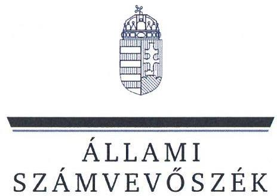
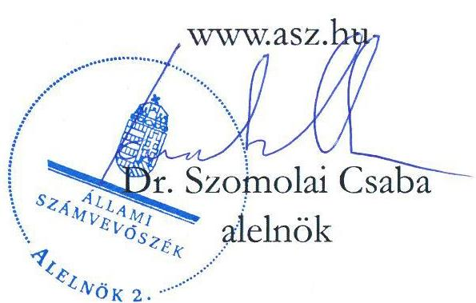
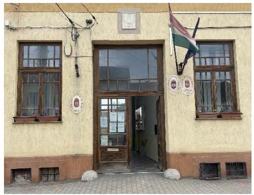
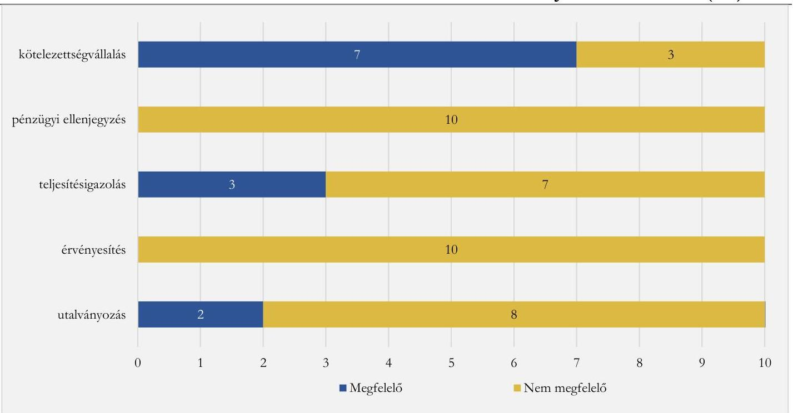

# JELENTÉS 

## Az önkormányzatok gazdálkodásának célvizsgálata

Az önkormányzatok ellenőrzése - a pénzforgalomban megjelenő kiadások teljesítésének és elszámolásának megfelelősége

Hirics Községi Önkormányzat

2025. 

25059
www.asz.hu

---

ÁLLAMI
SZÁMVEVŐSZÉK

# JELENTÉS 

## Az önkormányzatok gazdálkodásának célvizsgálata

Az önkormányzatok ellenőrzése - a pénzforgalomban megjelenő kiadások teljesítésének és elszámolásának megfelelősége

Hirics Községi Önkormányzat
2025.

25059

---

# ELLENŐRZÉSI IGAZGATÓSÁG: 

## ELLENŐRZÉSI IGAZGATÓSÁG II.

## ELLENŐRZÉSI IGAZGATÓ:

DR. BAFFIA GERGELY GÁBOR igazgató

## ELLENŐRZÉSVEZETŐ:

## HUDÁK MAGDOLNA ellenőrzésvezető

Jelentéseink az interneten a www.asz.hu címen olvashatók.

IKTATÓSZÁM: EL-4240-006/2025
TÉMASORSZÁM: 52
ELLENŐRZÉS-AZONOSÍTÓ SZÁM: V100213

---

# TARTALOMJEGYZÉK 

AZ ELLENŐRZÉS ALAPADATAI ..... 5
AZ ELLENŐRZÖTT SZERVEZET ..... 7
ÖSSZEFOGLALÁS ..... 10
AZ ELLENŐRZÉS FÓKUSZTERÜLETE ..... 12
MEGÁLLAPÍTÁSOK ..... 13
JAVASLATOK ..... 19
MELLÉKLETEK ..... 21
I. sz. melléklet: Értelmező szótár ..... 21
II. sz. melléklet: Az ellenőrzött szervezetek jegyzéke ..... 22
III. sz. melléklet: Ellenőrzési kritériumok ..... 23
IV. sz. melléklet: Összefoglaló táblázat az Önkormányzat gazdálkodási jogköreinek gyakorlásáról ellenőrzött gazdasági eseményenként ..... 24
V. sz. melléklet: Hirics Községi Önkormányzata esetében ellenőrzött, késedelmesen rögzített kötelezettségvállalások ..... 26
VI. sz. melléklet: Hirics Községi Önkormányzata esetében ellenőrzött, késedelmesen könyvelt gazdasági események ..... 27
FÜGGELÉK: ÉSZREVÉTELEK ..... 28
RÖVIDÍTÉSEK JEGYZÉKE ..... 29

---

.

---

# AZ ELLENŐRZÉS ALAPADATAI 

## AZ ELLENŐRZÉS CÉLJA

Az ellenőrzés célja annak értékelése volt, hogy az Önkormányzatnál ${ }^{1}$ a pénzforgalomban megjelenő kiadások teljesítése és elszámolása megfelelő volt-e, továbbá a kiadások teljesítése az Önkormányzat közfeladat-ellátásához kapcsolódott-e.

## AZ ELLENŐRZÉS TÍPUSA

Törvényességi ellenőrzés.

## AZ ELLENŐRZÖTT IDŐSZAK

Az ellenőrzött időszak a 2023-2024. évek, valamint a 2025. évben az ellenőrzés megállapításainak az ÁSZ tv. ${ }^{2} 29. \S$ (1) bekezdése szerinti megküldése napjáig.

## AZ ELLENŐRZÉS TÁRGYA

Az Önkormányzat pénzforgalmában megjelenő kiadások teljesítésének, elszámolásának, közfeladatellátással kapcsolatos felhasználásának ellenőrzése. Az ellenőrzés kiterjedt minden olyan körülményre és adatra, amely az ÁSZ ${ }^{3}$ jogszabályban meghatározott feladatainak teljesítéséhez, valamint a program végrehajtása folyamán felmerült újabb összefüggések feltárásához szükséges volt.

## AZ ELLENŐRZÉS JOGALAPJA

Az ellenőrzés jogszabályi alapját az ÁSZ tv. 1. § (3) bekezdésének, valamint az 5. $\S(2)-(3)$ és (6) bekezdéseinek előírásai képezték.

## AZ ELLENŐRZÉS MÓDSZERE

Az ellenőrzést a nemzetközi standardokat irányadónak tekintve az ellenőrzési program szempontjai, az ellenőrzési időszakban hatályos jogszabályok, az ellenőrzés szakmai szabályok és módszertanok figyelembevételével végezte az ÁSZ.

Az ellenőrzési kérdések megválaszolásához szükséges bizonyítékok megszerzése az ellenőrzött szervezetek által rendelkezésre bocsátott dokumentumok és adatok, valamint az ellenőrzést támogató szervezetek ${ }^{4}$ által adott adatok, információk értékelésével, továbbá megfigyelés, szemle (szemrevételezés) és információkérés (kérdésfeltevés), valamint elemző eljárás útján történt.

---

Az ellenőrzési bizonyítékként felhasználható adatforrások közé tartoztak egyrészt az ellenőrzéshez kért dokumentumok, adatforrások, másrészt adatforrás volt még a közhiteles nyilvántartásból (Magyar Államkincstár nyilvántartásai, Önkormányzati rendelettár) származó, az ellenőrzés szempontjából információkat tartalmazó dokumentum.

Az ellenőrzés lefolytatásához az ellenőrzött szervezetek a tanúsítványok kitöltésével, valamint az ÁSZ által kért dokumentumok, adatok, információk megküldésével az ellenőrzés során szolgáltattak adatokat. A rendelkezésre bocsátott adatok, információk kontrolljára helyszíni ellenőrzés keretében is sor került.

A pénzforgalomban megjelenő kiadások teljesítésének megfelelőségét mintavételi eljárással kiválasztott 10 tétel alapján ellenőrizte az ÁSZ. Az ellenőrzés során a működés, gazdálkodás kockázatos területeinek meghatározását követően az ellenőrzött szervezetre vonatkozó főkönyvi adatbázisokból kockázat alapú eljárás alapján történt a mintatételek kiválasztása. A tények feltárása és azok összegzése során a megállapítások az ellenőrzött mintatételekre vonatkozóan kerültek megfogalmazásra.

Az ellenőrzés kiemelten kezelte a kifizetések közfeladat ellátáshoz való közvetlen kapcsolódásának, kötelezettségvállalás szerinti teljesülésének, a kifizetések jogszerűségének, szabályszerűségének értékelését, figyelemmel a kiadások teljesítésével összefüggő kontrollok gyakorlati működésére.

Az ellenőrzés kiterjedt minden olyan körülményre és kérdésre is, amely a program végrehajtása kapcsán felmerült újabb összefüggéseknek az ellenőrzés céljaival összhangban lévő feltárásához szükséges.

---

# AZ ELLENŐRZÖTT SZERVEZET

Hirics község a Dél-Dunántúli régióban, Baranya vármegyében, a Sellyei járásban található.

A település lakóinak száma a KSH⁵ adata alapján 2024. január 1-jén 231 fő, a relatív munkanélküliségi ráta az NFSZ⁶ adata szerint 2024. december 20-án 10,2% volt. Hirics a 2023. és 2024. években a felzárkózó települések⁷ közé sorolt település volt.

A polgármester⁸ a településen 2019. év óta látta el tisztségét, a Képviselő-testületnek⁹ a polgármesteren kívül négy fő képviselő tagja volt. Az Önkormányzat működésével kapcsolatos feladatokat 2020. évtől a Vajszlói Közös Önkormányzati Hivatal látta el. A Hivatal¹⁰ vezetője, a jegyző¹¹ 2013. május 1-től látta el feladatait. A Hivatal teljes foglalkoztatott létszáma az ellenőrzött időszakban hatályos Szervezeti és Működési Szabályzata szerint 22 fő, amelyből 12 fő teljes munkaidős állásban foglalkoztatott köztisztviselő és 10 fő teljes munkaidős állásban foglalkoztatott közalkalmazott volt. A köztisztviselői létszámból 2023. és 2024. években az Önkormányzat igazgatási feladatait három fő, pénzügyi feladatait egy fő látta el.

Az Önkormányzat az ellenőrzött időszakban költségvetési szervet nem tartott fent. A közszolgáltatások biztosításával, fejlesztésével, szervezésével, intézmények fenntartásával, és a településfejlesztés összehangolásával összefüggő feladatokat a Sellyei Kistérségi Többcélú Társulás; az óvodai ellátás feladatait a Vajszlói Aprófalva Óvoda Intézményfenntartó Társulás; a vízgazdálkodással összefüggő, az ivóvízminőség javítását célzó feladatokat a Sellyei Kistérségi Ivóvízminőség-javító Önkormányzati Társulás; a hulladékgazdálkodási feladatokat a Mecsek-Dráva Önkormányzati Társulás látták el az Önkormányzat részére. A belső ellenőrzési feladatok ellátásáról az ellenőrzött időszakban nem gondoskodtak, az Önkormányzat könyvvizsgálót nem foglalkoztatott.

Az Önkormányzat 2023. évi beszámolójának és 2024. évi pénzügyileg jóváhagyott beszámolójának főbb adatait az 1. táblázat mutatja be.

|  1. táblázat | AZ ÖNKORMÁNYZAT 2023. ÉVI BESZÁMOLÓJÁNAK ÉS 2024. ÉVI PÉNZÜGYILEG JÓVÁHAGYOTT BESZÁMOLÓJÁNAK FŐBB ADATAI (M FT)  |
| --- | --- |
|  MEGNEVEZÉS | 2023. ÉV
BESZÁMOLÓ  |
|  Költségvetési bevételek | 141,3  |
|  Ebből: működési célú támogatások állambáztartáson belülről | 123,1  |
|  önkormányzatok működési támogatásai | 33,2  |
|  hosszabb időtartamú közfoglalkoztatás | 25,2  |
|  közfoglalkoztatási mintaprogram | 63,6  |
|  Költségvetési kiadás | 139,8  |
|  Ebből: hosszabb időtartamú közfoglalkoztatás | 23,8  |
|  közfoglalkoztatási mintaprogram | 65,8  |
|  Finanszírozási bevételek | 9,4  |
|  Ebből: előző évi maradvány igénybevétele | 8,2  |
|  Finanszírozási kiadások | 1,1  |

*1. táblázat*

*Forrás: Az Önkormányzat 2023. évi beszámolóján és a 2024. évi pénzügyileg jóváhagyott beszámolóján alapján ÁSZ saját szerkesztés*

---

Az Önkormányzat költségvetési bevételei a 2023-2024. években fedezetet nyújtottak a költségvetési kiadásaira.

Az ellenőrzött időszakban az Önkormányzat a költségvetési bevételeihez képest csekély összegű közhatalmi bevétellel rendelkezett. A 2023. évi HIPA ${ }^{13}$ 6,4 M Ft-os összege az összes költségvetési bevétel 4,5\%-át jelentette, míg 2024-ben a $0,8 \mathrm{M}$ Ft összegű HIPA bevétel az összes költségvetési bevétel $0,6 \%$-át tette ki.

Önerőből csak kis volumenű fejlesztéseket valósított meg az Önkormányzat. A 2023. évben 1,0 M Ft összeget fizettek ki beruházásokra és felújításokra, amelynek 35,9\%-a eszközbeszerzés volt. A 2024. évben 3,5 M Ft-ot használt fel eszközpótlásra, amelynek 83,1\%-át az „Újonnan felújított Kultúrbáz eszközbeszerzés megvalósítása" című pályázaton belül a Magyar Falu Program ${ }^{13}$ keretében finanszírozták.

Az Önkormányzat a 2023. évben likviditási célú kölcsönt nem vett fel. A 2024. évben 3,0 M Ft értékű hitelkeret szerződést kötött a számlanövekedést meghaladó fizetési megbízás átmeneti finanszírozására, amelyből az Önkormányzat mindösszesen 80 E Ft összeget hívott le, amelyet 2024. december 31-ig visszafizetett.

Az Önkormányzat a 2023. évben 1,6 M Ft rendkívüli támogatást kapott, amelyet HIPA túlfizetés visszafizetésére és egészségügyi feladatellátáshoz kapcsolódó tartozások kiegyenlítésére használt fel.

Az Önkormányzat beszámolóiból számított főbb pénzügyi mutatóinak és közfoglalkoztatáshoz kapcsolódó pénzeszközökkel korrigált mutatóinak alakulását a 2022-2024. években a 2. táblázat mutatja be.
2. táblázat

# A PÉNZÜGYI EGYENSÚLY ALAKULÁSA - MUTATÓSZÁMOK 

|  | MEGNEVEZÉS | KEDVEZŐ   REFERENCIA   ÉRTÉK | 2022.12 .31 | 2023.12 .31 | 2024.12 .31 |
| :--: | :--: | :--: | :--: | :--: | :--: |
| 1. | Likviditási gyorsráta: a likvid eszközök és a rövid időn belül esedékes kötelezettségek hányadosa | $>1,00$ | 10,91 | 30,80 | 38,42 |
|  | Korrigált likviditási gyorsráta | $>1,00$ | 5,51 | 15,20 | 7,25 |
| 2. | Likviditási gyorsráta változása az előző évhez képest | $>0$ | - | 19,89 | 7,62 |
| 3. | Eladósodottsági mutató: a kötelezettségek és az összes forrás hányadosa (\%) | max.50-60\% | $1,18 \%$ | $1,04 \%$ | $0,92 \%$ |
| 4. | Lejárt szállítói állomány aránya az összes szállítói állományon belül (\%) | aránya nem növekvő $>=0,4$ és az előző időszakhoz képest nem csökken | $100 \%$ | $0 \%$ | $0 \%$ |
| 5. | Pénzhányad mutató: a pénzeszközök és a rövid időn belül esedékes kötelezettségek hányadosa |  | 10,71 | 30,17 | 36,59 |
|  |  | $>=0,4$ és az előző   időszakhoz képest   nem csökken | 5,31 | 14,57 | 5,43 |

Forrás: ÁSZ saját szerkesztés a KGR K11 és az ellenőrzött adatszolgáltatása alapján
Az Önkormányzat kötelező feladatait ellátta, a mutatók szerint az Önkormányzat rövidtávú fizetőképessége biztosított, működése stabil és kiegyensúlyozott volt.

Az Önkormányzat likviditása a 2022-2024. években látszólag folyamatosan javult, mind a likviditási gyorsráta, mind a pénzhányad mutató értéke növekedett. Ennek oka a rövid időn belül esedékes kötelezettségek állományának csökkenése volt, mivel a 2022. évben esedékes orvosi ügyeleti díj, illetve a kötelező gépjármű

---

felelősségbiztosítás a 2023. évben rendezésre került. A likviditási gyorsráta és a pénzhányad mutatók alakulása azonban nem mutatott reális képet, mivel a pénzeszközök között a 2022-2024. években jelentős súllyal - 2022-ről 2024-re 55,2\%-os növekedéssel - jelentek meg a közfoglalkoztatáshoz kapcsolódó, év végéig fel nem használt támogatások, amelyek az Önkormányzat likviditását látszólag javították, azonban a közfoglalkoztatási támogatás célra kapott pénzeszköz volt, így az Önkormányzat számára nem jelentett szabadon elkölthető forrást. Az Önkormányzat beszámoló adatainak a közfoglalkoztatáshoz kapcsolódó pénzeszközökkel történő korrigálásával, mind a likviditási, mind a pénzhányad mutatók értéke az elemzett időszakban számottevő mértékben csökkent. A likviditási mutató értéke a 2022-2023. években közel felére, a 2024. évben valamivel több, mint ötödére esett vissza. A pénzhányad mutató értéke a 2022-2023. években valamivel több, mint felére, a 2024. évben közel hetedére csökkent.

Az Önkormányzat eladósodottsági mutatója a 2022-2024. évek átlagában 1,05 \% volt, a kedvező referencia tartományban maradt.

---

# ÖSSZEFOGLALÁS 

A településeken az önkormányzati gazdálkodás sokrétű feladatot jelent. A tevékenység összetettsége, a megfelelő képzettségű, létszámú humán-erőforrás hiánya a gazdálkodás területén magas szintű kockázatokat eredményezhet. Az ellenőrzés hozzájárul az Önkormányzat szabályszerű és felelős gazdálkodásához, a közpénzek szabályos, cél szerinti felhasználásához, a közvagyon védelméhez.

Az Önkormányzat a 2023. évben 141,3 M Ft, a 2024. évben 144,2 M Ft költségvetési bevételből gazdálkodott, a jogszabályokban, illetve a szervezeti és működési szabályzatában meghatározott közfeladatait ellátta. Az Önkormányzat rövidtávú fizetőképessége a 2022-2024. évi beszámolókból számított mutatószámok alapján biztosítottnak látszott, valójában pénzügyi helyzete nem volt stabil. Az ellenőrzött időszakban két alkalommal rendkívüli támogatást igényelt, illetve egy esetben pénzintézettől folyószámlahitelt vett fel.
 Az Önkormányzat a 2023-2024. években adósságrendezési eljárás alatt nem állt.

Az Önkormányzatnál a jegyző a jogszabályi előírások ellenére nem alakította ki a kontrollkörnyezetet, mivel nem gondoskodott az Önkormányzat gazdálkodásával összefüggő belső szabályzatok elkészítéséről, valamint a kontrolltevékenységeket nem működtette.

Az ellenőrzés során az Önkormányzat pénzforgalmában megjelenő 13,4 M Ft összértékű 10 kiadást vizsgálta az ÁSZ, amelyek teljesítése, illetve elszámolása egyetlen esetben sem felelt meg teljeskörűen a jogszabályi előírásoknak. Ebből egy 2,0 M Ft összegű kölcsönnyújtás közfeladatellátásához kapcsolódása nem volt igazolt, mivel az nem tartozott az Önkormányzat helyi közügyek intézésének és a helyi közhatalom gyakorlásának tevékenységi körébe.

Az ellenőrzés során feltárt szabálytalanságok számát gazdálkodási jogkörönként az 1. ábra mutatja be. 1. ábra

A FELTÁRT SZABÁLYTALANSÁGOK TÍPUSAI GAZDÁLKODÁSI JOGKÖRÖNKÉNT (DB)

Forrás: Az ellenőrzött dokumentumok értékelése alapján ÁSZ saját szerkesztés!

---

Az Önkormányzat kiadási előirányzatai terhére teljesített ellenőrzött kifizetések nem voltak szabályszerűek, mivel az előzetes kötelezettségvállalást igénylő 10 esetből háromnál- 2,3 M Ft kifizetést érintően - a jogszabályi előírások ellenére nem, vagy nem megfelelően vállaltak írásban kötelezettséget. A kötelezettségvállalások pénzügyi ellenjegyzése - 13,4 M Ft kifizetést érintően - egyetlen esetben sem, vagy nem megfelelően történt. A teljesítésigazolás az ellenőrzött gazdasági események 70,0%-ánál - 5,6 M Ft összeget érintően - elmaradt, vagy azt nem megfelelően végezték el. Az érvényesítés az ellenőrzött gazdasági események egyikénél sem, illetve az utalványozás nyolc esetben nem felelt meg a jogszabályi előírásoknak.

A gazdálkodásban jelentős kockázati tényezőként jelenik meg a megfelelő szakértelem hiánya, amely az önkormányzati működés terén a szervezet és a kontrollok kialakításával és működtetésével, a pénzügyi gazdálkodással és a fizetőképességgel, a vagyongazdálkodással, valamint a beszámolással és transzparens működéssel kapcsolatos kockázatokban jelenhet meg.

A pénzügyi tranzakciókkal kapcsolatos kötelezettségvállalások, teljesítésigazolások és utalványozások esetében a jogszabályi előírások ellenére az ellenőrzött gazdasági események 20,0%-ánál megsértették az összeférhetetlenségi előírásokat. A polgármester egy esetben közeli hozzátartozója javára vállalt kötelezettséget, illetve igazolta a teljesítést és engedélyezte a kifizetést, továbbá egy esetben saját maga javára engedélyezte a kifizetést.

Az ÁSZ ellenőrzés szabálytalanságokat tárt fel a gazdálkodási jogkörök gyakorlása során a pénzügyi ellenjegyző és érvényesítő megbízatásával kapcsolatban, mert a pénzügyi ellenjegyző a feladatát vállalkozási szerződés alapján végezte annak ellenére, hogy azt kizárólag a Hivatal állományába tartozó köztisztviselő láthatta volna el.

Az Önkormányzat a jogszabályban foglaltak ellenére a 2023-2024. évi beszámolókhoz kapcsolódóan a mérlegsorokat leltárral nem támasztotta alá, ezáltal sérült a jogszabályi előírás szerinti valódiság számviteli alapelve.

A belső ellenőrzés nem járult hozzá a szabályszerű működéshez és a hiányosságok feltárásához, mivel azt az ellenőrzött időszakban a jegyző a jogszabályban foglaltak ellenére nem alakította ki.

Az ÁSZ az ellenőrzés során feltárt hiányosságok felszámolása, a szabályszerű működés feltételeinek megteremtése érdekében a polgármesternek három, a jegyzőnek kilenc javaslatot tett.

---

# AZ ELLENŐRZÉS FÓKUSZTERÜLETE 

Az Önkormányzat pénzforgalmában megjelenő kiadások teljesítésének és elszámolásának megfelelősége, az önkormányzati feladatellátásához való kapcsolódásának értékelése

---

# MEGÁLLAPÍTÁSOK 

## 1. Az Önkormányzat pénzforgalmában megjelenő kiadások teljesítésének és elszámolásának megfelelősége, az önkormányzati feladatellátásához való kapcsolódásának értékelése

Összegző megállapítás Az Ávr. ${ }^{14}$-ben foglaltak ellenére az Önkormányzatnál a pénzforgalomban megjelenő ellenőrzött kiadások teljesítése és elszámolása nem volt megfelelő, egy kiadás kifizetése szabálytalan és jogosulatlan is volt. A Bkr. ${ }^{15}$-ben előírtak ellenére a jegyző nem alakította ki a kontrollkörnyezetet, mert nem gondoskodott az Önkormányzat gazdálkodással kapcsolatos szabályzatainak elkészítéséről.
1.1. számú megállapítás Az ellenőrzött gazdasági események szabályozottsága nem volt megfelelő.

Az Önkormányzatnál a jegyző a Bkr. 3. § a) pontjában foglaltak ellenére nem alakította ki a belső kontrollrendszer keretében a kontrollkörnyezetet, mert nem gondoskodott a Bkr. 6. § (2) bekezdése szerinti belső szabályzatok elkészítéséről, így nem biztosította az Mötv. ${ }^{16} 119 . \S$ (3) bekezdése és a Bkr. 6. § (2) bekezdése szerinti, a rendelkezésére álló források átlátható, szabályszerű, szabályozott, gazdaságos, hatékony és eredményes felhasználását.

- Az Önkormányzat a 2020. évben csatlakozott a Hivatalhoz. A jegyző által készített belső szabályzatok a csatlakozás előttiek voltak, azok személyi hatályát nem terjesztette ki az Önkormányzatra a csatlakozást követően, így a jegyző nem gondoskodott az Önkormányzat szabályszerű működési kereteinek megteremtéséről.
Az Önkormányzat nem rendelkezett az Ávr. 13. § (2) bekezdés a) pont szerinti, a gazdálkodás részletes rendjét meghatározó szabályzattal, így nem rendelkezett az Ávr. 60.§ (2) bekezdés szerinti összeférhetetlenség esetén követendő eljárásrendről sem. Az Ávr. 13. § (2) bekezdés b) pont előírása ellenére a jegyző nem szabályozta a beszerzések részletes rendjét. A Számv.tv. ${ }^{17}$ 14. § (5) bekezdés d) pontjának és (8) bekezdésének előírása ellenére az Önkormányzat nem rendelkezett, a pénzforgalom készpénzben és bankszámlán történő lebonyolításának rendjét meghatározó pénzkezelési szabályzattal.
A kontrolltevékenységekre irányuló szabályozás hiányában - a Bkr. 8. § (2) bekezdésében foglaltak ellenére - az Önkormányzat kontrolltevékenysége nem volt alkalmas a gazdálkodással, ezen belül is kiemelten a gazdálkodási jogkörök gyakorlásával kapcsolatos kockázatok csökkentésére.

---

1.2. számú megállapítás

Az ellenőrzött kiadások egy kivételével az Önkormányzat feladatellátásához kapcsolódtak.

Az Önkormányzatnál az ellenőrzött 10, összesen 13 406,3 E Ft összértékű gazdasági eseményből az Mötv. 111. § (2) bekezdésében foglaltak ellenére egy 2000,0 E Ft összegű kiadás igazolható módon nem kapcsolódott az Önkormányzat feladatellátásához.

- Az ONK_KIAD_07, 2000,0 E Ft összegű - egy másik község önkormányzata részére, annak nehéz anyagi helyzetére tekintettel adott - kölcsön kifizetése nem kapcsolódott az Önkormányzat közfeladatellátáshoz, mert az Mötv. 10. § (1)-(2) bekezdésében foglalt önkormányzati feladatokra tekintettel a kölcsön nem minősül törvény által előírt kötelező önkormányzati feladatnak, sem a helyi közügynek minősülő önként vállalt feladatnak. Az ellenőrzött időszakban hatályos Szervezeti és Működési Szabályzat értelmében az Önkormányzat önként vállalt feladatot nem látott el. Az Önkormányzatot vagyoni hátrány nem érte, mert a kölcsönt a másik önkormányzat négy részletben, a megállapodásban rögzített határidőn belül visszafizette.
1.3. számú megállapítás

Az Önkormányzat pénzforgalmában megjelenő ellenőrzött kiadások teljesítése, elszámolása, nyilvántartása és szabályozottsága teljeskörűen egyetlen esetben sem felelt meg a jogszabályi előírásoknak.

Az Áht. ${ }^{18}$ 37. § (1) bekezdésében és az Ávr. 52. § (1) bekezdés c) pontjában foglaltak ellenére az előzetes írásbeli kötelezettségvállalást igénylő 10 ellenőrzött gazdasági eseményből egy esetben (1582,8 E Ft összegű kifizetésnél) az Önkormányzat nem rendelkezett írásbeli kötelezettségvállalással. Kettő esetben (758,0 E Ft összegű kifizetésnél) a kötelezettségvállalás dokumentuma nem felelt meg az Ávr. 50.§ (1) bekezdésében foglalt előírásoknak, amelyek közül egy esetben (220,0 E Ft összegű kifizetés) a polgármester az Ávr. 60. § (2) bekezdése szerinti összeférhetetlenségi szabályokat megsértve közeli hozzátartozója javára vállalt kötelezettséget.
Hét gazdasági esemény (11 065,6 E Ft) vonatkozásában a kötelezettségvállalás dokumentuma megfelelt az Áht. és az Ávr. előírásainak, azonban ezek közül egy esetben (ONK_KIAD_10) a költségvetési forrás biztosítása tárgyában meghozott képviselő-testületi döntést megelőzően a Mötv. 49. § (1) bekezdésében foglaltak ellenére egy képviselő nem jelentette be a döntéssel kapcsolatos személyes érintettségét és a döntéshozatalban részt vett, illetve az Mötv. 49. § (2) bekezdése szerint az Önkormányzat hatályos Szervezeti és Működési Szabályzat 42. § (1) bekezdésében meghatározott jogkövetkezményt sem érvényesítették.

- Az ONK_KIAD_09 számú (1582,8 E Ft összegű), a lakossági víz- és csatornaszolgáltatás támogatásáról szóló gazdasági eseménnyel összefüggésben az Önkormányzat, mint Kedvezményezett és a Támogató között létesült jogviszony, amely nem rendezte, hogy a pályázati támogatás mely víziközmű-szolgáltató által használható fel. A víziközmű-szolgáltató számára továbbutalt támogatási összeg értéke meghaladta a kétszázezer forintot, amelyhez kötelezettségvállalási dokumentum nem készült. Ennek hiányában az Ávr. 50. § (1) bekezdésében foglaltak ellenére nem voltak megállapíthatóak a szerződés általános adatai (szerződő felek), az Ávr. 50. § (1) bekezdés b) pontjában foglaltak ellenére nem volt megállapítható a kifizetendő összeg és a pénzügyi teljesítés feltételei (ezen belül többek között a víziközmű-szolgáltató felelőssége a pályázati támogatás felhasználás elszámolásához kapcsolódó adatszolgáltatásban). A támogatási összeggel a Támogató Okirat alapján az az Önkormányzatnak kellett elszámolnia a Támogató felé, amelyhez szükség volt a víziközmű-szolgáltató adatszolgáltatására is.
- Az ONK_KIAD_06 számú (538,0 E Ft összegű) - 88 fő Balatonlellére, majd Balatonlelléről Hiricsre való személyszállítási szolgáltatásra irányuló - gazdasági esemény vonatkozásában a Megrendelő nem

---

tartalmazta a szakmai teljesítés mennyiségi és minőségi jellemzőinek meghatározását, azaz, hogy hány fő, hány közlekedési eszközzel történő elszállításáról kell gondoskodnia a szolgáltatást nyújtójának. Az adatok csak a csatolt menetlevelekből voltak megállapíthatók. A Megrendelő nem tartalmazta a számlázás alapjául szolgáló egységárat sem. Az Ávr. 13. § (2) bekezdés b) pontja szerinti beszerzési szabályzat hiányában a kötelezettségvállalást megelőzően nem került lefolytatásra beszerzési eljárás.

- Az ONK_KIAD_02 számú (220,0 E Ft összegű), a családi portaprogramban résztvevők oktatásáról és mezőgazdasági szolgáltatás nyújtásáról szóló kötelezettségvállalási dokumentum nem tartalmazta a szakmai teljesítés mennyiségi és minőségi jellemzőinek meghatározását, azt, hogy hány alkalommal való oktatást, illetve hány fő, hány órában történő mezőgazdasági szaktanácsadását kell elvégeznie a szerződőnek a szerződés alapján. Az Ávr. 13. § (2) bekezdés b) pontja szerinti beszerzési szabályzat hiányában a kötelezettségvállalást megelőzően nem került sor beszerzési eljárás lefolytatására. Az Önkormányzat nevében a polgármester a szolgáltatás elvégzéséhez megfelelő végzettséggel rendelkező közeli hozzátartozójával kötött szolgáltatási szerződést.
- Az ONK_KIAD_10 számú (350,0 E Ft összegű) gazdasági esemény esetében a Hiricsi Horgász Egyesület részére támogatást megállapító 9/2023. (V.23.) Képviselő-testületi határozat meghozatala során az egyik önkormányzati képviselő megsértette a Mötv. 49. § (1) bekezdésének előírását, mivel a Képviselő-testületi ülésről készített jegyzőkönyv alapján a Horgász Egyesület támogatásáról rendelkező döntés meghozatala előtt nem jelentette be közeli hozzátartozói kapcsolatát a támogatott szervezet elnökével, így a Képviselőtestület nem döntött arról, hogy az érintett képviselőt döntésből kizárja-e.
Az Ávr. 13. § (2) bekezdés b) pontja szerinti beszerzési szabályzat hiánya miatt öt ellenőrzött gazdasági esemény esetében (ONK_KIAD_02, ONK_KIAD_03, ONK_KIAD_04, ONK_KIAD_05, ONK_KIAD_06), 8604,7 E Ft összegű kifizetésnél nem volt megállapítható, hogy a polgármester az Mötv. 115. § (1) bekezdése szerinti kritérium szem előtt tartásával, a gazdasági szempontokat mérlegelve döntött-e a kötelezettségvállalásokról.
A pénzügyi ellenjegyző az Áht. 37. § (1) bekezdésében és az Ávr. 55.§ (1) bekezdésében előírtak ellenére a pénzügyi ellenjegyzéshez kapcsolódó ellenőrzési feladatokat három esetben (2818,8 E Ft összegű kifizetésnél) nem, illetve az Áht. 37. § (1) bekezdésében és az Ávr. 55. § (2) bekezdés f) pontjában foglaltak ellenére hat esetben (9004,7 E Ft összegű kifizetés esetén) jogosulatlanul végezte el. Az Áht. 37. § (1) bekezdésének és az Ávr. 52. § (1) bekezdés c) pontjának előírása ellenére egy esetben (1582,8 E Ft összegben) az Önkormányzat nem rendelkezett írásbeli kötelezettségvállalással, ezért a pénzügyi ellenjegyző nem tudta ellátni az Áht.-ban és az Ávr-ben előírt feladatát.
- Az ONK_KIAD_01, ONK_KIAD_07, ONK_KIAD_10 (2818,8 E Ft összegű) gazdasági esemény esetében a kötelezettségvállalási dokumentumokon a pénzügyi ellenjegyzés ténye, valamint a pénzügyi ellenjegyző dátummal ellátott
 aláírása nem szerepelt.
- Az ONK_KIAD_02, ONK_KIAD_03, ONK_KIAD_04, ONK_KIAD_05, ONK_KIAD_06, ONK_KIAD_08 (9004,7 E Ft összegű) gazdasági események vonatkozásában a pénzügyi ellenjegyzői feladatokat a jegyző által kötött vállalkozási szerződés alapján, és nem a Hivatal állományába tartozó köztisztviselő látta el.
- Az ONK_KIAD_09 (1582,8 E Ft összegű) - lakossági víz- és csatornaszolgáltatás támogatásáról szóló gazdasági esemény esetében írásbeli kötelezettségvállalás nem történt, így annak pénzügyi ellenjegyzése nem történhetett meg.

---

- Az ONK_KIAD_04, ONK_KIAD_05 (6578,6 E Ft összegű) gazdasági események vonatkozásában további szabálytalanság volt, hogy a kötelezettségvállalás pénzügyi ellenjegyzésére az Áht. 37. § (1) bekezdésétől és az Ávr. 53/A. § (1) bekezdésétől eltérően a kifizetést követően került sor.
A teljesítésigazolást a teljesítésigazoló az Áht. 38. §(1) bekezdésében és az Ávr. 57. §(1) bekezdésében foglaltak ellenére hét esetben nem, vagy nem megfelelően végezte el. A szabálytalanul elvégzett teljesítésigazolások közül egy esetben (220,0 E Ft összegű kifizetés) a polgármester az összeférhetetlenségi szabályokat megsértve közeli hozzátartozója javára igazolta a teljesítést. Három esetben (7846,7 E Ft összegű) kifizetés teljesítés igazolása az Ávr. előírásainak megfelelően történt.
- Az ONK_KIAD_01, ONK_KIAD_07, ONK_KIAD_08, ONK_KIAD_09 és ONK_KIAD_10 (4801,6 E Ft összegű) gazdasági események vonatkozásában nem állt rendelkezésre a teljesítésigazolás tényét igazoló dokumentum.
- Az ONK_KIAD_02 (220,0 E Ft), a családi portaprogramban résztvevők oktatásáról és mezőgazdasági szolgáltatás nyújtásáról szóló gazdasági esemény esetében a teljesítésigazolás formális volt, mivel azok a kifizetést követően keltek, utólag készültek. A polgármester megsértette az Ávr. 60. § (2) bekezdésében foglalt összeférhetetlenségi szabályokat is, mivel a teljesítésigazolást közeli hozzátartozója javára végezte el.
- Az ONK_KIAD_06 számú (538,0 E Ft) - 88 fő Balatonlellére, majd Balatonlelléről Hiricsre való személyszállítási szolgáltatásra irányuló - gazdasági esemény vonatkozásában a teljesítésigazolás formális volt, mivel a megrendelő tartalmi hiányosságai miatt az ellenszolgáltatás mennyiségi és minőségi teljesítését ellenőrizni nem lehetett.
Az Ávr. 58. § (4) bekezdésében foglaltak ellenére az érvényesítő feladatát valamennyi gazdasági eseménynél jogosulatlanul látta el. Az érvényesítő az Ávr. 58. (1)-(2) bekezdéseiben foglaltak ellenére a 10 gazdasági esemény egyikénél sem ellenőrizte, hogy a megelőző ügymenetben betartották-e az Áht., az Ávr. és az Áhsz. ${ }^{19}$ előírásait. Az érvényesítés az Ávr. 58.§ (3) bekezdésben előírtak ellenére hat esetben (5159,6 E Ft összegű kifizetésnél) formális volt, mivel arra a kifizetést követően került sor.
- A jegyző a gazdálkodási feladatok ellátására vállalkozási szerződést kötött, amelynek alapján az érvényesítő feladatát végezte. A szerződés tartalma ellentétes volt az Ávr. 58. § (4) bekezdésében foglaltakkal, mivel az érvényesítői feladatokat csak a hivatal állományába tartozó személy láthatta volna el.
- Hét esetben (ONK_KIAD_01, ONK_KIAD_02, ONK_KIAD_06, ONK_KIAD_07, ONK_KIAD_08, ONK_KIAD_09, ONK_KIAD_10), összesen 5559,6 E Ft összegű kifizetést érintően az érvényesítő nem jelezte, hogy a teljesítésigazolás nem történt meg, vagy nem az Áht. 38. § (1) bekezdésében és az Ávr. 57. § (1) bekezdésében foglaltaknak megfelelően történt.
- Három esetben (ONK_KIAD_01, ONK_KIAD_07, ONK_KIAD_10), 2818,8 E Ft összegű kifizetésnél további hiányosság volt, hogy az érvényesítő nem észrevételezte, hogy a kötelezettségvállalás pénzügyi ellenjegyzése az Áht. 37. § (1) bekezdés és az Ávr. 53/A. § (1) bekezdés előírása ellenére nem történt meg.
- Egy esetben (ONK_KIAD_09), 1582,8 E Ft összegű kifizetésnél az érvényesítő nem észrevételezte, hogy a gazdasági esemény kapcsán nem állt rendelkezésre az Ávr. 52. § (1) bekezdés e) pontban előírt kötelezettségvállalási dokumentum.
- Hat esetben (ONK_KIAD_02, ONK_KIAD_03, ONK_KIAD_04, ONK_KIAD_05, ONK_KIAD_06, ONK_KIAD_08), 9004,7 E Ft összegű kifizetésnél az érvényesítés - az Ávr. 58. § (4) bekezdésében, és az Ávr. 55. § (2) bekezdés f) pontjában foglaltak ellenére - formális volt, mivel a pénzügyi ellenjegyzői feladatot nem a hivatal állományába tartozó személy látta el.

---

- Egy esetben (ONK_KIAD_04) és 760,0 E Ft összegben az érvényesítő nem észrevételezte, hogy az Áht. 37. § (1) bekezdésben előírtak ellenére a gazdasági esemény vonatkozásában bekért árajánlat a kötelezettségvállalást követően kelt (árajánlat 2023.03.05-én kelt, a kötelezettségvállalás dokumentuma 2023.01.21-én került aláírásra).
- Hat esetben (ONK_KIAD_01, ONK_KIAD_02, ONK_KIAD_06, ONK_KIAD_07, ONK_KIAD_09, ONK_KIAD_10), 5159,6 E Ft összegben az érvényesítésre a kifizetést követően került sor, az utalványrendelet és az érvényesítés kelte későbbi volt, mint a kifizetés kelte.
A 10 ellenőrzött gazdasági eseményből kettő utalványozása megfelelt a jogszabályi előírásoknak. Nyolc gazdasági esemény utalványozása nem felelt meg az Áht. 38. §(1)-(2) bekezdései és az Ávr. 59. § (3) bekezdés d) pontja előírásainak. Ebből kettő esetben az Ávr. 60. § (2) bekezdésében foglalt összeférhetetlenségi szabály megsértésével került sor az utalványozásra.
- Öt esetben (ONK_KIAD_01, ONK_KIAD_02, ONK_KIAD_06, ONK_KIAD_09, ONK_KIAD_10), 3159,6 E Ft összegben az utalványozásra a kifizetést követően került sor.
- Három esetben (ONK_KIAD_03, ONK_KIAD_04, ONK_KIAD_05), 7846,7 E Ft összegben az utalványrendelet nem tartalmazta a fizetés időpontját.
- Az ONK_KIAD_01, ONK_KIAD_02 gazdasági események vonatkozásában (617,7 E Ft összegben) további szabálytalanság volt, hogy a polgármester saját maga, illetve közeli hozzátartozója javára utalványozott.
(Az összefoglaló táblázatot az Önkormányzat gazdálkodási jogköreinek gyakorlásáról ellenőrzött gazdasági eseményenként a IV. számú melléklet tartalmazza.)
A kötelezettségvállalások nyilvántartásban való rögzítésére az Ávr. 56. § (1) bekezdés előírása ellenére nyolc esetben a kötelezettségvállalást követően került sor. Egy esetben, az ONK_KIAD_7 gazdasági eseménynél (2000,0 E Ft) a kötelezettségvállalás nyilvántartásba vétele formális volt, ugyanis annak nyilvántartásban történő rögzítése az Ávr. 56. § (1)-(2) bekezdéseiben foglaltak ellenére érték nélkül történt. Egy esetben, az ONK_KIAD_9 gazdasági eseménynél (1582,8 E Ft) nem állt rendelkezésre kötelezettségvállalás dokumentuma, a gazdasági eseményt az Ávr. 56. §(1) bekezdésében foglaltak ellenére utólag, a kifizetést követően vette a kötelezettségvállaló nyilvántartásba. Az ONK_KIAD_2 gazdasági esemény (220,0 E Ft) esetében további hiányosság volt, hogy a kötelezettség 20,0 E Ft-tal alacsonyabb értéken (200,0 E Ft) került rögzítésre a nyilvántartásban. A kötelezettségvállalások nyilvántartásba vételének elmulasztása, illetve azok utólagos rögzítése miatt az Önkormányzat kötelezettségvállalás nyilvántartása az Áht. 36. § (1) bekezdésében foglaltak ellenére nem volt alkalmas a kötelezettségvállalás időpontjában a szabad előirányzat megállapítására.
(A késedelmesen rögzített kötelezettségvállalásokat részletesen a V. számú melléklet mutatja be.)
A kiadások számviteli elszámolása egy esetben (ONK_KIAD_07), 2000,0 E Ft összegben nem felelt meg az Áhsz. 39. § és 45. § előírásainak, mert a gazdasági esemény rögzítése nem a megfelelő főkönyvi számlára, valamint nem a megfelelő egységes rovatrend szerinti nyilvántartási számlára történt. Kilenc esetben a gazdasági események számviteli elszámolása megfelelt a jogszabályi előírásoknak.
- Az ONK_KIAD_07 számú, egy községi önkormányzatnak adott kölcsön (2000,0 E Ft) nem minősült végleges jelleggel nyújtott támogatásnak vagy más ellenérték nélküli kifizetésnek, ezért a 055043 Működési célú visszatérítendő támogatások, kölcsönök nyújtása államháztartáson belülre teljesítése főkönyvi számon és a K504 Működési célú visszatérítendő támogatások, kölcsönök nyújtása államháztartáson belülre rovaton kellett volna elszámolni az Áhsz. 15. és 16. mellékletei szerint a 055063 Egyéb működési célú

---

támogatások államháztartáson belülre teljesítése főkönyvi szám és a K506 Egyéb működési célú támogatások államháztartáson belülre rovat helyett.
A Számv.tv. 165. § (3) bekezdés a) pontjában előírtak ellenére három esetben és 6 568,6 E Ft összegben nem biztosították a pénzeszközöket érintő gazdasági műveletek, események bizonylati adatainak a könyvekben történő késedelem nélküli rögzítését. A gazdasági események rögzítése 5-30 napos késedelemmel történt.
(A késedelmesen rögzített gazdasági eseményeket részletesen a VI. számú melléklet mutatja be.)
Az Önkormányzat a Számv. tv. 69. § (1) bekezdésében és az Áhsz. 22. § (1) bekezdésében foglaltak ellenére a 2023-2024. évi beszámolókhoz kapcsolódóan a mérlegsorokat leltárral nem támasztotta alá. Emiatt sérült a Számv. tv. 15. § (3) bekezdése szerinti valódiság elve. A mérlegben kimutatott tárgyi eszközök vonatkozásában utoljára a 2022. évre vonatkozóan folytattak le mennyiségi leltározást.
1.4. számú megállapítás Az Önkormányzatnál a jegyző nem gondoskodott az Mötv. és Áht. szerinti belső ellenőrzés kialakításáról és működtetéséről.

A jegyző a 2023-2024. években az Mötv. 119. § (4) bekezdés és az Áht. 70. § (1) bekezdés előírása ellenére az Önkormányzatnál nem gondoskodott a belső ellenőrzés kialakításáról és működtetéséről. A Bkr. 10. §-ában foglaltak ellenére belső ellenőrzés hiányában az Önkormányzatnál nem volt biztosított a szervezeti célok megvalósulásának nyomon követése.

- Az Önkormányzat az ellenőrzött időszakban szervezeti keretein belül belső ellenőrt nem foglalkoztatott, belső ellenőrzést végző szervezeti egységet nem alakított ki, belső ellenőrrel kötött szerződéssel utoljára 2022. évben rendelkezett.

---

# JAVASLATOK 

Az ÁSZ tv. 33. § (1) bekezdésében foglaltak értelmében az ellenőrzött szervezet vezetője köteles a jelentésben foglalt megállapításokhoz kapcsolódó intézkedési tervet összeállítani és azt a jelentés kézhezvételétől számított 30 napon belül az ÁSZ részére megküldeni. Amennyiben az ellenőrzött szervezet vezetője nem küldi meg határidőben az intézkedési tervet, vagy továbbra sem elfogadható intézkedési tervet küld, az Állami Számvevőszék elnöke az ÁSZ tv. 33. § (3) bekezdés a) és b) pontjaiban foglaltakat érvényesítheti.

## HIRICS KÖZSÉGI ÖNKORMÁNYZAT POLGÁRMESTERE RÉSZÉRE

1. Intézkedjen az Állami Számvevőszék nyilvánosságra hozott jelentésének a kézhezvételét követő 30 napon belül a Képviselő-testület elé terjesztéséről. A jelentést a napirend tárgyalásáról szóló jegyzőkönyvvel együtt tájékoztatásul küldje meg a Kormányhivatal részére is.
2. Tegyen intézkedéseket az Áht. 37. § (1) és 38. § (1) bekezdésében foglalt kontrolltevékenységek kiépítésére és megfelelő működtetésére, amelyek megelőzik a jelentésben leírt, az Ávr. 52. §-ában, 57. §-ában, valamint 59. §-ában foglalt kötelezettségvállalási, teljesítésigazolási és utalványozási jogkörök gyakorlásával és az Ávr. 60. §-ában foglalt összeférhetetlenségi követelményekkel összefüggő szabálytalanságok ismételt előfordulását.
3. Hívja fel a Képviselő-testület tagjait, hogy az Mötv. 49. § (1) bekezdése szerint jelezzék személyes érintettségüket a képviselő-testületi döntéshozatalt megelőzően, és kezdeményezze az érintett képviselő testületi döntéshozatalból való kizárását.

## VAJSZLÓI KÖZÖS ÖNKORMÁNYZATI HIVATAL JEGYZŐJE RÉSZÉRE

1. A Bkr. 3. § a) pontja és 6. § (2) bekezdésében foglaltakra figyelemmel, a belső kontrollkörnyezet részeként intézkedjen az Ávr. 13. § (2) bekezdés a) pontja szerinti gazdálkodás részletes rendjének elkészítéséről, melynek keretében szabályozza az Ávr. 60.§ (2) bekezdés szerinti összeférhetetlenség esetén követendő eljárásrendet is.
2. A Bkr. 3. § a) pontja és 6. § (2) bekezdésében foglaltakra figyelemmel, a belső kontrollkörnyezet részeként intézkedjen az Ávr. 13. § (2) bekezdés b) pontja szerinti beszerzések - ideértve a közbeszerzési értékhatár alatti beszerzéseket - lebonyolításával kapcsolatos eljárásrend elkészítéséről.

---

3. A Bkr. 3. § a) pontja és 6. § (2) bekezdésében foglaltakra figyelemmel, a belső kontrollkörnyezet részeként intézkedjen a Számv.tv. 14. § (5) bekezdés d) pontja és (8) bekezdése szerinti a pénzforgalom készpénzben és bankszámlán történő lebonyolításának rendjének szabályozásáról.
4. Tegyen intézkedéseket az Önkormányzat vonatkozásában az Áht. 37. § (1) és 38. § (1) bekezdésében foglalt kontrolltevékenységek kiépítésére és megfelelő működtetésére, amelyek megelőzik a jelentésben leírt, az Ávr. 55. §-ában, valamint az 58. §-ában foglalt pénzügyi ellenjegyzési és érvényesítési jogkörök gyakorlásával összefüggő szabálytalanságok ismételt előfordulását.
5. Intézkedjen az Önkormányzatnál arról,
 hogy a pénzügyi ellenjegyzői és érvényesítési feladatokat ellátó személyek az Ávr. 55. § (2) bekezdése és 58. § (4) bekezdése szerint a Hivatal alkalmazásában álljanak.
6. Intézkedjen a Bkr. 8. § (2) bekezdésében foglaltakra tekintettel olyan kontrolltevékenységek kialakításáról, amelyek biztosítják, hogy a Számv. tv. 165. § (3) bekezdés a) pontjában foglaltak szerint a pénzeszközöket érintő gazdasági műveletek, események bizonylatai adatainak a könyvekben történő rögzítése késedelem nélkül megtörténjen az Önkormányzat esetében.
7. Intézkedjen az Önkormányzat éves költségvetési beszámolója mérlegének leltárral való alátámasztásáról a Számv. tv. 69. § (1) bekezdésének és az Áhsz. 22. § (1) bekezdésének előírásai szerint.
8. Intézkedjen az Önkormányzatnál a kötelezettségvállalásoknak az Ávr. 56. § (1) bekezdése szerinti nyilvántartásba vételéről.
9. Gondoskodjon az Önkormányzatnál a belső ellenőrzés Mötv. 119. § (4) bekezdése és az Áht. 70. § (1) bekezdése szerinti kialakításáról és működtetéséről, annak érdekében, hogy az Önkormányzatnál megvalósuljon a Bkr. 10. §-ában foglaltaknak megfelelően a szervezeti célok megvalósulásának nyomon követése.

---

# MELLÉKLETEK 

## I. SZ. MELLÉKLET: ÉRTELMEZŐ SZÓTÁR

eladósodottsági mutató

A

## pénzhányad mutató

Az eladósodottsági mutató alapképlete az idegen forrásoknak az összes eszközhöz viszonyított aránya megállapítására szolgál. A mutató az eladósodottság mértékét fejezi ki százalékos formában. Jelen ellenőrzés keretében a mutató az önkormányzat kötelezettségeinek arányát mutatja az összes forráson belül. Kedvező, ha az eladósodottságot jelző mutatószám 50-60 % körül van, magas, ha 60 % és 100 % között van, kedvezőtlen a helyzet, ha 100 % vagy e felett helyezkedik el.
(Forrás: Zéman Zoltán, Béhm Imre A pénzügyi menedzsment controll elemzési eszköztára, https://mersz.hu/dokumentum/dj242apmcee_152/alapján ÁSZ meghatározás)
A likviditási gyorsráta a likvid eszközök és a likvid források közötti arányt oly módon határozza meg, hogy a készletállományt a likvid eszközök közül figyelmen kívül hagyja. Jelen ellenőrzés keretében a mutató mutatja, hogy a likvid eszközök hányszorosát teszik ki a likvid forrásoknak, vagyis a forgóeszközök mekkora mértékben fedezik a rövid lejáratú kötelezettségeket. Kedvező, ha a mutató értéke 1-nél nagyobb értéket ér el. Ha kisebb, mint 1 akkor fizetőképtelenség fenyeget, vagy bekövetkezett (Forrás: Zéman Zoltán, Béhm Imre A pénzügyi menedzsment controll elemzési eszköztára, https://mersz.hu/dokumentum/dj242apmcee_152/alapján ÁSZ meghatározás.)
A Pénzhányad a készletek és a követelések nélküli likvid eszközök likviditását fejezi ki. Jelen ellenőrzés keretében a mutató a mobilizálható pénzeszközöket veti össze a rövid lejáratú kötelezettségekkel. Megfelelő az értéke, ha értéke 0,4 vagy magasabb. (Forrás: Zéman Zoltán, Béhm Imre A pénzügyi menedzsment controll elemzési eszköztára, https://mersz.hu/dokumentum/dj242apmcee_152/alapján ÁSZ meghatározás)

---

II. SZ. MELLÉKLET: AZ ELLENŐRZÖTT SZERVEZETEK JEGYZÉKE

# MEGNEVEZÉS 

Hirics Községi Önkormányzat
Vajszlói Közös Önkormányzati Hivatal

---

# III. SZ. MELLÉKLET: ELLENŐRZÉSI KRITÉRIUMOK 

## FOKUSZTERÜLET

Az Önkormányzat pénzforgalmában megjelenő kiadások teljesítésének és elszámolásának megfelelősége, az Önkormányzat feladatellátásához kapcsolódó megvalósulásának értékelése

## ELLENŐRZÉSI KRITÉRIUMOK

Áht. 37. § (1) bekezdés;
Áht. 38. § (1) és (2) bekezdések;
Áht. 70. § (1) bekezdés;
Ávr. 13. § (2) bekezdés a) pontja;
Ávr. 13. § (2) bekezdés b) pontja;
Ávr. 50. § (1) bekezdés a) pontja;
Ávr. 50. § (1) bekezdés b) pontja;
Ávr. 51. §;
Ávr. 52.§;
Ávr. 52. § (1) bekezdés c) pontja;
Ávr. 53/A. § (1) bekezdés;
Ávr. 55. §;
Ávr. 55. § (1) és (2) bekezdések;
Ávr. 55. § (2) bekezdés f) pontja;
Ávr. 56. § (1) és (2) bekezdések;
Ávr. 57. §;
Ávr. 57. § (1) bekezdés;
Ávr. 58. §;
Ávr. 58. § (1), (2), (3) és (4) bekezdések;
Ávr. 59. §;
Ávr. 59. § (3) bekezdés d) pontja;
Ávr. 60. §;
Ávr. 60. § (2) bekezdés;
Áhsz. 22. § (1) bekezdés;
Áhsz. 39. §;
Áhsz. 45. §;
ÁSZ tv. 1. § (3) bekezdés;
ÁSZ tv. 5. § (2), (3) és (6) bekezdések;
ÁSZ tv. 29. § (1) bekezdés;
ÁSZ tv. 33. § (1) bekezdés;
ÁSZ tv. 33.§ (3) bekezdés a) és b) pontjai;
Bkr. 3. § a) és c) pontjai;
Bkr. 6. § (2) bekezdés;
Bkr. 8. § (1) és (2) bekezdések;
Bkr. 21. §;
Mótv. 10. § (1) és (2) bekezdések;
Mótv. 49. § (1) bekezdés;
Mótv. 111. § (2) bekezdés;
Mótv. 115. § (1) bekezdés;
Mótv. 119. § (4) bekezdés;
Szám. tv. 14. § (5) bekezdés d) pontja;
Számv. tv. 14. § (8) bekezdés;
Számv. tv. 15. § (3) bekezdés;
Számv. tv. 69. § (1) bekezdés;
Számv. tv. 165. § (3) bekezdés a) pontja.

---

# IV. SZ. MELLÉKLET: ÖSSZEFOGLALÓ TÁBLÁZAT AZ ÖNKORMÁNYZAT GAZDÁLKODÁSI JOGKÖREINEK GYAKORLÁSÁRÓL ELLENŐRZÖTT GAZDASÁGI ESEMÉNYENKÉNT

## HIRICS KÖZSÉGI ÖNKORMÁNYZAT

|  SZ. | Mintatétel azonosító száma | Gazdasági esemény |  |  |  | Gazdálkodási jogkörök gyakorlása |  |  |  |  |  |   |
| --- | --- | --- | --- | --- | --- | --- | --- | --- | --- | --- | --- | --- |
|   |  | Tárgya | Dátuma | Kifizetés módja | Összége (Ft) | Kötelezettségvállalás | Pénzügyi ellenjegyzés | Teljesítésigazolás | Érvényesítés | Utalványozás | Közfeladat ellátás | Számviteli elvénézés  |
|  1. | ONK_KIAD_01 | Választott tisztségviselők 2023. 2. havi juttatásai | 2023.03.02 | bank | 468790 | Megfelelő dokumentum | Nem megfelelő dokumentum | Nincs dokumentum | Nem megfelelő dokumentum | Nem megfelelő dokumentum | I | I  |
|  2. | ONK_KIAD_02 | Megbízási díj oktatási és szolgáltatási szerződés szerint | 2023.06.16 | bank | 220000 | Nem megfelelő dokumentum | Nem megfelelő dokumentum | Nem megfelelő dokumentum | Nem megfelelő dokumentum | Nem megfelelő dokumentum | I | I  |
|  3. | ONK_KIAD_03 | Élelmiszer csomag beszerzés | 2023.12.18 | bank | 1268031 | Megfelelő dokumentum | Nem megfelelő dokumentum | Megfelelő dokumentum | Nem megfelelő dokumentum | Nem megfelelő dokumentum | I | I  |
|  4. | ONK_KIAD_04 | Előnevelt csirke vásárlása | 2023.05.25 | bank | 760000 | Megfelelő dokumentum | Nem megfelelő dokumentum | Megfelelő dokumentum | Nem megfelelő dokumentum | Nem megfelelő dokumentum | I | I  |
|  5. | ONK_KIAD_05 | Pályázati projektmenedzsment megbízási szerződés szerint | 2023.02.06 | bank | 5818639 | Megfelelő dokumentum | Nem megfelelő dokumentum | Megfelelő dokumentum | Nem megfelelő dokumentum | Nem megfelelő dokumentum | I | I  |
|  6. | ONK_KIAD_06 | Személyszállítás | 2024.08.23 | bank | 538000 | Nem megfelelő dokumentum | Nem megfelelő dokumentum | Nem megfelelő dokumentum | Nem megfelelő dokumentum | Nem megfelelő dokumentum | I | I  |
|  7. | ONK_KIAD_07 | Önkormányzat számára nyújtott kölcsön megállapodás szerint | 2023.06.07 | bank | 2000000 | Megfelelő dokumentum | Nem megfelelő dokumentum | Nincs dokumentum | Nem megfelelő dokumentum | Megfelelő dokumentum | N | N  |
|  8. | ONK_KIAD_08 | Magánszemély számára nyújtott kölcsön megállapodás szerint (zemetkezési költségek finanszírozására) | 2024.03.07 | pénztár | 400000 | Megfelelő dokumentum | Nem megfelelő dokumentum | Nincs dokumentum | Nem megfelelő dokumentum | Megfelelő dokumentum | I | I  |
|  9. | ONK_KIAD_09 | 2023. évi lakosság ivóvíz támogatás | 2023.06.26 | bank | 1582800 | Nincs dokumentum | Nincs dokumentum | Nincs dokumentum | Nem megfelelő dokumentum | Nem megfelelő dokumentum | I | I  |
|  10. | ONK_KIAD_10 | 2023. évi haltámogatás Híricsi Horgász Egyesület számára megállapodás szerint | 2023.06.21 | bank | 350000 | Megfelelő dokumentum | Nem megfelelő dokumentum | Nincs dokumentum | Nem megfelelő dokumentum | Nem megfelelő dokumentum | I | I  |
|  Hírics Községi Önkormányzat kiadási tételek összesen (Ft): |  |  |  |  13406260 |  |  |  |  |  |  |  |   |
|   |  |  | Megfelelő dokumentum/Igen: |  |  | 7 | 0 | 3 | 0 | 2 | 9 | 9  |
|  Hírics Községi Önkormányzat kiadási tételek összesen (db): |  |  | Nem megfelelő dokumentum/Nem: |  |  | 2 | 9 | 2 | 10 | 8 | 1 | 1  |
|   |  |  | Nincs dokumentum/Nem megítélhető: |  |  | 1 | 1 | 5 | 0 | 0 | 0 | 0  |
|   |  |  |  | Nem releváns: |  | 0 | 0 | 0 | 0 | 0 | 0 | 0  |
|   |  |  |  | Összesen: |  | 10 | 10 | 10 | 10 | 10 | 10 | 10  |

---

# A DOKUMENTUMOK ÉRTÉKELÉSE 

Nem megfelelő dokumentum: ha rendelkezésre áll dokumentum, de azt a gazdálkodási jogkör gyakorlók aláírással, dátummal nem látták el/ vagy ha aláírással ellátták, azonban a gazdálkodási jogkörrel kapcsolatos ellenőrzési feladatok elvégzéséhez szükséges háttérdokumentumok nem állnak rendelkezésre, és ezért nem megállapítható, hogy azt elvégezték-e/ vagy a háttér dokumentumokból az állapítható meg, hogy az ellenőrzési feladatot ténylegesen nem végezték el, mert a kifizetés nem a jogosultnak, nem megfelelő összegben történt, vagy az ellenszolgáltatás nem történt meg. Nem megfelelő a dokumentum akkor sem, ha aláírással ellátták, de azt nem az arra jogosult írta alá.

Nem releváns: az adott gazdasági eseménynél jogszabályi előírás, vagy belső szabályzat szerint nem kell az adott gazdálkodási jogkört gyakorolni (pl. 200 E Ft alatti tételek esetében nem kell írásbeli kötelezettségvállalás, ha egyébként azt belső szabályzat sem írja elő.)

---

|  V. | SZ. | MELLÉKLET: | HIRICS KÖZSÉGI ÖNKORMÁNYZATA ESETÉBEN | ELLENŐRZÖTT, KÉSEDELMESEN | RÖGZÍTETT  |
| --- | --- | --- | --- | --- | --- |
|  Sorszám | Gazdasági esemény (mintatétel) azonosítója | Gazdasági esemény (mintatétel) tárgya | Kötelezettségvállalás időpontja | Összege (Ft) | Kötelezettségvállalás rögzítésének időpontja  |
|  1. | ONK_KIAD_01 | Választott tisztségviselők 2023. 2. havi juttatásai | 2022.01.01 | 468 790 | 2024.01.04  |
|  2. | ONK_KIAD_02 | Megbízási díj oktatási és szolgáltatási szerződés szerint | 2023.02.01 | 220 000 | 2024.01.04  |
|  3. | ONK_KIAD_03 | Élelmiszer csomag beszerzés | 2023.12.10 | 1 268 031 | 2023.12.18  |
|  4. | ONK_KIAD_04 | Előnevelt csirke vásárlása | 2023.01.21 | 760 000 | 2023.05.25  |
|  5. | ONK_KIAD_05 | Pályázati projektmenedzsment megbízási szerződés szerint | 2022.11.23 | 5 818 639 | 2023.02.06  |
|  6. | ONK_KIAD_06 | Személyszállítás |

 2024.08.01 | 538 000 | 2024.08.23  |
|  7. | ONK_KIAD_07 | Önkormányzat számára nyújtott kölcsön megállapodás szerint | 2023.06.07 | 2 000 000 | na  |
|  8. | ONK_KIAD_08 | Magánszemély számára nyújtott kölcsön megállapodás szerint (temetkezési költségek finanszírozására) | 2024.03.07 | 400 000 | 2024.03.12  |
|  9. | ONK_KIAD_09 | 2023. évi lakossági ivóvíz támogatás | na | 1 582 800 | 2023.07.07  |
|  10. | ONK_KIAD_10 | 2023. évi haltámogatás Híricsi Horgász Egyesület számára megállapodás szerint | 2023.05.24 | 350 000 | 2023.06.23  |

*Forrás: Az ellenőrzött által szolgáltatott dokumentumok alapján ÁSZ saját szerkesztés*

---

# VI. SZ. MELLÉKLET: HIRICS KÖZSÉGI ÖNKORMÁNYZATA ESETÉBEN ELLENŐRZÖTT, KÉSEDELMESEN KÖNYVELT GAZDASÁGI ESEMÉNYEK

|  Sorszám | Gazdasági esemény (mintatétel) azonosítója | Gazdasági esemény (mintatétel) tárgya | Pénzügyi teljesítés időpontja | Kifizetés módja | Összege (Ft) | Rögzítés jogszabályi határideje | Tényleges rögzítés (könyvelés) időpontja | Késedelem (nap)  |
| --- | --- | --- | --- | --- | --- | --- | --- | --- |
|  1. | ONK_KIAD_05 | Pályázati projektmenedzsment megbízási szerződés szerint | 2023.02.06 | bank | 5818639 | 2023.03.15 | 2023.04.04 | 20  |
|  2. | ONK_KIAD_08 | Magánszemély számára nyújtott kölcsön megállapodás szerint (temetkezési költségek finanszírozására) | 2024.03.07 | pénztár | 400000 | 2024.03.07 | 2024.03.12 | 5  |
|  3. | ONK_KIAD_10 | 2023. évi haltámogatás Híricsi Horgász Egyesület számára megállapodás szerint | 2023.06.21 | bank | 350000 | 2023.07.15 | 2023.08.14 | 30  |
|  Hirics Községi Önkormányzat késedelmesen könyvelt mintatételek összesen (Ft) |  |  |  |  | 6568639 |  |  |   |

*Forrás: Az ellenőrzött által szolgáltatott dokumentumok alapján ÁSZ saját szerkesztés*

---

# FÜGGELÉK: ÉSZREVÉTELEK 

A jelentéstervezetet a Számvevőszék 15 napos észrevételezésre megküldte az ellenőrzött szervezet vezetőjének az ÁSZ tv. 29. § (1) bekezdése előírásának megfelelően.

Az ellenőrzött szervezetek a jelentéstervezet megállapításaira észrevételt nem tettek.

[^0]
[^0]:    * 29. § (1) Az Állami Számvevőszék az ellenőrzési megállapításait megküldi az ellenőrzött szervezet vezetőjének vagy az általa megbízott személynek, és annak, akinek személyes felelősségét állapította meg.
    (2) Az ellenőrzött szervezet vezetője és a felelősként megjelölt személy az ellenőrzés megállapításaira tizenöt napon belül írásban észrevételt tehet.
    (3) Az Állami Számvevőszék az észrevételre a beérkezésétől számított harminc napon belül írásban válaszol. A figyelembe nem vett észrevételeket köteles a jelentésben feltüntetni, és megindokolni, hogy azokat miért nem fogadta el.

---

# RÖVIDÍTÉSEK JEGYZÉKE 

${ }^{1}$ Önkormányzat
${ }^{2}$ ÁSZ tv.
${ }^{3}$ ÁSZ
${ }^{4}$ ellenőrzést támogató szervezetek
${ }^{5} \mathrm{KSH}$
${ }^{6}$ NFSZ
${ }^{7}$ felzárkózó település
${ }^{8}$ polgármester
${ }^{9}$ Képviselő-testület
${ }^{10}$ Hivatal
${ }^{11}$ jegyző
${ }^{12}$ HIPA
${ }^{13}$ Magyar Falu Program
${ }^{14}$ Ávr.
${ }^{15}$ Bkr
${ }^{16}$ Mótv.
${ }^{17}$ Számv.tv.
${ }^{18}$ Áht.
${ }^{19}$ Áhsz.

Hirics Községi Önkormányzat
2011. évi LXVI. törvény az Állami Számvevőszékről
Állami Számvevőszék
Baranya Vármegyei Kormányhivatal, Nemzeti Adó- és Vámhivatal Baranya Vármegyei Adó- és Vámigazgatóság, Baranya Vármegyei Rendőr-főkapitányság
Központi Statisztikai Hivatal
Nemzeti Foglalkoztatási Szolgálat
A Kormány 1404/2019. (VII. 5.) Korm. határozat a „Felzárkózó települések" hosszú távú programjának megalapozásáról címú kormányprogramhoz, a KSH által számított legalacsonyabb komplex mutató alapján kiválasztott 300 település.
Hirics Községi Önkormányzat polgármestere
Hirics Községi Önkormányzat Képviselő-testülete
Vajszlói Közös Önkormányzati Hivatal
Vajszlói Közös Önkormányzati Hivatalt 2013. május 1-től vezető jegyző
helyi iparűzési adó
Önkormányzati tulajdonú ingatlanok fejlesztése, önkormányzati feladatellátáshoz kapcsolódó beszerzések-2024 című, MFP-ÖTIFB/2024 kódszámú pályázati kiírás 368/2011. (XII. 31.) Korm. rendelet az államháztartásról szóló törvény végrehajtásáról
370/2011. (XII. 31.) Korm. rendelet a költségvetési szervek belső kontrollrendszeréről és belső ellenőrzéséről
2011. évi CLXXXIX. törvény Magyarország helyi önkormányzatairól
2000. évi C. törvény a számvitelről
2011. évi CXCV. törvény az államháztartásról
4/2013. (I. 11.) Korm. rendelet az államháztartás számviteléről

---

1052 Budapest, Apáczai Csere János u. 10. | 1364 Budapest 4., Pf. 54
www.asz.hu | szamvevoszek@asz.hu
telefon: +36 14849100
