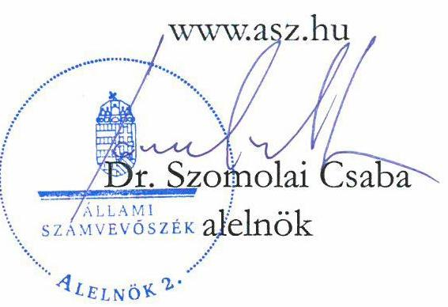
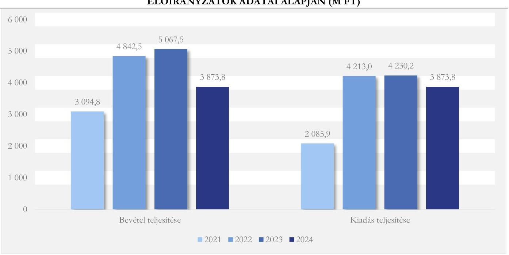
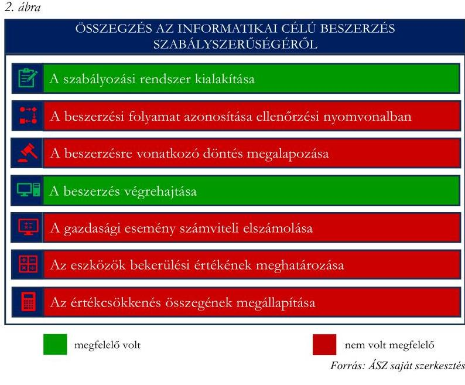
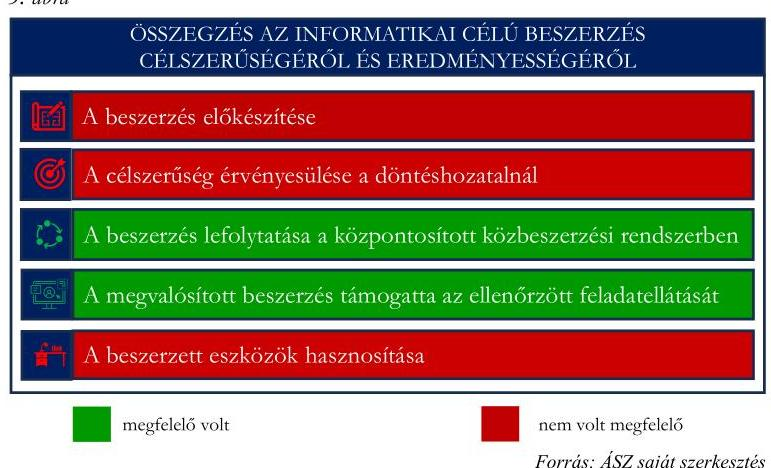
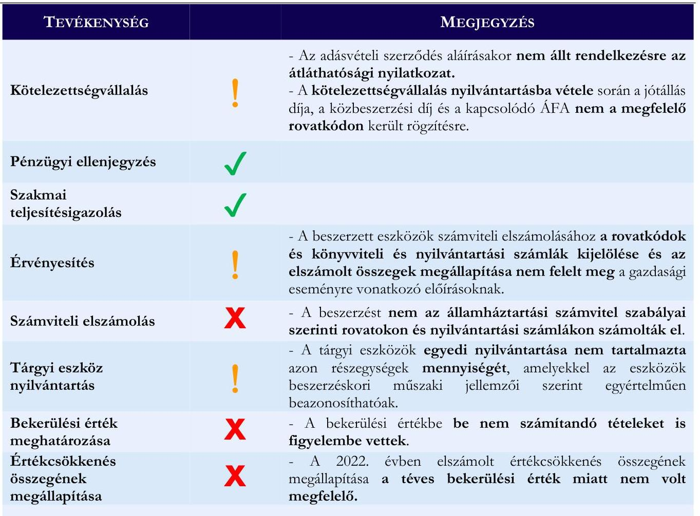

# JELENTÉS 

## A központi költségvetési szervek egyes informatikai beszerzéseinek célzott ellenőrzése

Néprajzi Múzeum

2025.

---

# JELENTÉS 

## A központi költségvetési szervek egyes informatikai beszerzéseinek célzott ellenőrzése

Néprajzi Múzeum

2025.

25061

---

# ELLENŐRZÉSI IGAZGATÓSÁG: 

## ELLENŐRZÉSI IGAZGATÓSÁG I.

## ELLENŐRZÉSI IGAZGATÓ:

SINKÁNÉ DR. CSENDES ÁGNES igazgató

## ELLENŐRZÉSVEZETŐ:

TÖTH GERGELY ellenőrzésvezető

Jelentéseink az interneten a www.asz.hu címen olvashatók.

IKTATÓSZÁM: EL-4143-004/2025

ELLENŐRZÉS-AZONOSÍTÓ SZÁM: V1100

---

# TARTALOMJEGYZÉK 

AZ ELLENŐRZÉS ALAPADATAI ..... 5
AZ ELLENŐRZÉS HATÓKÖRE ÉS TERÜLETE ..... 7
ÖSSZEFOGLALÁS ..... 9
AZ ELLENŐRZÉS FÓKUSZTERÜLETEI ..... 11
MEGÁLLAPÍTÁSOK ..... 12
JAVASLATOK ..... 24
MELLÉKLETEK ..... 25
I. sz. melléklet: Értelmező szótár ..... 25
II. sz. melléklet: Az ellenőrzött szervezetek jegyzéke ..... 26
III. sz. melléklet: Ellenőrzési kritériumok ..... 27
FÜGGELÉK: ÉSZREVÉTELEK ..... 28
RÖVIDÍTÉSEK JEGYZÉKE ..... 29

---

.

---

# AZ ELLENŐRZÉS ALAPADATAI 

## AZ ELLENŐRZÉS CÉLJA

Az ellenőrzés célja annak értékelése volt, hogy a Néprajzi Múzeum kiválasztott informatikai célú beszerzésére szabályszerűen került-e sor, a kapcsolódó döntés megalapozott és célszerű volt-e, és a beszerzés megvalósította-e az elérni kívánt célkitűzést.

## AZ ELLENŐRZÉS TÍPUSA

Kombinált ellenőrzés

## AZ ELLENŐRZÖTT IDŐSZAK

A 2021-2022. évek, kitekintéssel a helyszíni ellenőrzés lezárásának időpontjáig, 2025. január 21-ig.

## AZ ELLENŐRZÉS TÁRGYA

Az ellenőrzés tárgyát képezte a Néprajzi Múzeumnál a kiválasztott informatikai célú beszerzéshez kapcsolódóan a Múzeum ${ }^{1}$ belső szabályozási kereteinek kialakítása és a működtetése, az ellenőrzött szerv beszerzésre vonatkozó döntés-előkészítési és a beszerzés megvalósítási/végrehajtási tevékenysége, valamint a beszerzés számviteli elszámolása és a beszerzett eszköz használatbavétele, hasznosíthatósága a Múzeum (köz)feladat ellátásával kapcsolatosan.

Az ellenőrzés kiterjedt továbbá minden olyan körülményre és adatra, amely az ÁSZ ${ }^{2}$ jogszabályban meghatározott feladatainak teljesítéséhez, valamint a program végrehajtása folyamán felmerült újabb összefüggések feltárásához szükséges volt.

## AZ ELLENŐRZÉS JOGALAPJA

Az ellenőrzés jogszabályi alapját az ÁSZ tv. ${ }^{3} 1 . \mathbb{S}$ (3) bekezdésének és az 5. $\mathbb{S}$ (3) bekezdésének előírásai képezték.

## AZ ELLENŐRZÉS MÓDSZERE

Az ellenőrzést a nemzetközi standardokat irányadónak tekintve az ellenőrzési program szempontjai, az ellenőrzött időszakban hatályos jogszabályok, az ellenőrzés szakmai szabályok és módszertanok figyelembevételével végezte az ÁSZ.

---

Az ellenőrzési kérdések megválaszolásához szükséges bizonyítékok megszerzése az ellenőrzött szervezet által rendelkezésre bocsátott dokumentumokra és adatokra alapozva, továbbá szemrevételezés, információkérés, interjú, valamint elemző eljárás útján történt.

Az ellenőrzési bizonyítékként felhasználható adatforrások közé tartoztak az ellenőrzéshez kért dokumentumok, adatforrások, valamint minden egyéb - az ellenőrzés folyamán feltárt, az ellenőrzés szempontjából információkat tartalmazó - dokumentum.

Az ellenőrzés lefolytatásához a Múzeum az ÁSZ által kért dokumentumok, adatok, információk megküldésével és a helyszíni ellenőrzés során szolgáltatott adatokat.

Az ellenőrzéshez a Múzeum egy, 2022. évben megvalósult, lezárt informatikai célú beszerzése került kiválasztásra DKÜ Zrt. ${ }^{4}$ adatszolgáltatása keretében beérkezett adatok elemzése alapján.

Az ellenőrzés kiterjedt további informatikai célú beszerzéshez kapcsolódó minden olyan körülményre és adatra, amely a program végrehajtása folyamán felmerült újabb összefüggéseknek az ellenőrzés céljaival összhangban történő feltárása érdekében szükséges volt.

---

# AZ ELLENŐRZÉS HATÓKÖRE ÉS TERÜLETE 

A központi költségvetési szervek a DKÜ rendeletben ${ }^{5}$ foglaltak alapján kötelesek informatikai célú beszerzéseikhez kapcsolódóan éves beszerzési és fejlesztési terveket összeállítani, továbbá a tervezett, a rendkívüli és a tervmódosítást igénylő informatikai beszerzési igényüket a DKÜ Zrt. részére megküldeni. A DKÜ Zrt. a beszerzési igények vizsgálata, véleményezésre, jóváhagyásra történő előkészítése során beszerzési és jogi szempontokat is figyelembe vesz, ennek eredményéről, valamint a nettó 15 millió Ft-ot elérő értékű beszerzési igényre vonatkozó miniszteri ${ }^{6}$ döntésről értesítést küld a központi költségvetési szerv részére. A DKÜ Zrt. a „megfelelő" minősítésű beszerzési igény kielégítése érdekében a beszerzési eljárást vagy maga folytatja le, vagy visszaadja a központi költségvetési szerv saját hatáskörében történő lebonyolításra.

A Néprajzi Múzeum a Magyar Nemzeti Múzeum 1872-ben létrejött Ethnographiai Osztályának utódjaként, 1947-től önálló intézményként működik.

A Múzeum jogszabályban meghatározott közfeladata az örökségvédelem - múzeumi tevékenység a 1997. évi CXL. törvényben ${ }^{7}$ és a 2001. évi LXIV. törvényben ${ }^{8}$ foglaltak alapján, valamint a 2019. évi CXXIV. törvény ${ }^{9}$ szerint kultúrstratégiai intézményi tevékenység a népi hagyományok ágazatban.

A Múzeum alaptevékenysége keretében végzi a gyűjtőkörébe tartozó kulturális javak (tárgyi, képi, írásos, hang- és egyéb forrásanyag) és az ehhez kapcsolódó kulturális értékkel bíró információk felkutatását, gyűjtését, őrzését, szakszerű nyilvántartását, kezelését, állagmegóvását és védelmét, valamint tudományos feldolgozását, a tudományos eredmények közzétételét. Kulturális szolgáltatásaival, az állandó és időszaki kiállításokkal, valamint a hozzájuk kapcsolódó múzeumpedagógiai tevékenységgel, családi és közösségi programokkal, szakmai rendezvényekkel - a minél szélesebb körű hozzáférés érdekében - szolgálja a társadalom művelődését, a formális és nem formális oktatás céljait, és a szabadidő hasznos eltöltésének lehetőségével segíti az egész életen át tartó tanulás folyamatát. Fenntartja és fejleszti a néprajztudomány központi archívumát, továbbá gyűjtőköréhez kapcsolódó nyilvános szakkönyvtárat működtet. Alaptevékenységei között kiemelt feladata többek között a múzeumi terület vonatkozásában a jelenkor kutatásának és dokumentálásának országos szintű koordinálása, információs központjának és adatbázisának működtetése.

A Múzeum 2017-ig a Parlament épülettömbjével szemben elhelyezkedő, egykori Igazságügyi Palotában működött. A 1866/2015. (XII. 2.) Korm. határozat ${ }^{10}$ értelmében a Liget Budapest projekt részeként a Múzeum új épületének megvalósításáról született döntés.
A Múzeum új épületét a budapesti Városligetben 2022. május 22 -én adták át.

A Múzeum történetében korszakos változásként értékelik, hogy az intézmény egy korszerű, történetében először kifejezetten a számára tervezett épületben, eredendően az igényeinek megfelelően kialakított térbe került. A Múzeum 250 ezer darabot számláló gyűjteménye így a korábbi kiállítóterek többszörösével rendelkező, a szakmai követelmények, valamint gyűjteményi és látogatói igények szerint kialakított épületben kapott új és végleges helyet.

A Múzeum országos hatáskörű költségvetési szerv, amelynek élén - határozott időre szóló megbízással föigazgató áll. A főigazgató 2013. február 1-jétől tölti be tisztségét.

---

A Múzeum irányító szerve 2022. május 24-ig az Emberi Erőforrások Minisztériuma, ezt követően a Kulturális és Innovációs Minisztérium volt. A Múzeumnál az ellenőrzött időszakban az Áht. ${ }^{11}$ 11. §-ában meghatározott átalakulás nem történt.

A Múzeum jogállása az ellenőrzött időszakban központi költségvetési szerv volt. A Múzeum gazdasági szervezettel rendelkezett. A Múzeum költségvetési és finanszírozási bevételeinek és kiadásainak alakulását az 1. ábra mutatja be.
1. ábra

# A NÉPRAJZI MÚZEUM KÖLTSÉGVETÉSI ÉS FINANSZÍROZÁSI BEVÉTELEI ÉS KIADÁSAI A 2021-2023. ÉVI KÖLTSÉGVETÉSI BESZÁMOLÓK ADATAI, VALAMINT A 2024. ÉVI ELEMI KÖLTSÉGVETÉS ELŐIRÁNYZATOK ADATAI ALAPJÁN (M FT) 

A Múzeumnál ellenőrzésre a központosított informatikai beszerzési rendszerben ${ }^{12}$ az I/540/2021/000047 számú beszerzési igény részeként szerepelt 200 darab, $66,3 \mathrm{M} \mathrm{Ft}$ nettó becsült értékű asztali munkaállomás beszerzésére irányuló eljárás került kiválasztásra. Az eljárás során azonban a beszerezni kívánthoz képest kevesebb mennyiségű (120 darab) asztali munkaállomás beszerzése valósult meg.

Az ellenőrzés kiterjedt a Múzeum beszerzésre vonatkozó belső szabályozása jogszabályi előírásoknak való megfelelőségének, a beszerzés előkészítésével és végrehajtásával kapcsolatos döntések megalapozottságának, célszerűségének ellenőrzésére, valamint a számviteli elszámolás szabályszerűségének, a beszerzett eszközök aktiválásának, használatbavételének ellenőrzésére.

Az ellenőrzés hatóköre kiterjedt továbbá annak vizsgálatára, hogy a beszerzett eszköz a Múzeumnál alkalmazásra, hasznosításra került-e, betöltötte-e az elvárt funkcióját, támogatta-e a szerv feladatellátását, illetve célkitűzései elérését.

Az ellenőrzés nem terjedt ki a DKÜ Zrt. által megkötött keretmegállapodások szabályszerűségének ellenőrzésére.

---

# ÖSSZEFOGLALÁS 

Napjainkban az információtechnológiai eszközök dinamikusan fejlődnek, amelyek használata elengedhetetlen a közszféra múködésében is. A digitalizáció révén az állami szervezetek tevékenysége, feladatainak ellátása hatékonyabbá válhat, időt és erőforrásokat takaríthatnak meg múködésük során. A széleskörű elektronizáció új és speciális informatikai eszközök, szolgáltatások folyamatos beszerzését igényli, amely jelentős anyagi ráfordítást, külső szakmai támogatást feltételez. A közpénzek rendeltetésszerú és eredményes felhasználása ezen a területen is jogosan felmerülő elvárás a társadalom részéről.

Az ellenőrzés megállapította, hogy a Néprajzi Múzeumnál a munkaállomások beszerzése nem volt megfelelően előkészített. Az eszközök mennyiségére és műszaki paramétereire vonatkozó döntés során nem érvényesültek a célszerúségi szempontok. A beszerzés részben volt eredményes, mivel a megvásárolt munkaállomások nem kerültek teljességgel hasznosításra. Az ellenőrzés által feltárt körülmények alapján az ÁSZ a költségvetési források felhasználásának egy részét fecsérlőnek értékelte.

Az ellenőrzés a beszerzést részben eredményesnek értékelte, mivel a beszerzett eszközöket üzembe helyezték, és azok támogatták a Múzeum feladatellátását, a munkaállomások állománya megújult, azonban a megvásárolt eszközök negyede nem került hasznosításra.

A Múzeum a beszerzési tevékenység kereteit a jogszabályi előírásoknak megfelelően kialakította, az ellenőrzés az ellenőrzési nyomvonallal kapcsolatosan állapított meg hiányosságot, mert az a jogszabályi előírással ellentétben nem tartalmazta a beszerzési folyamatokat.

Az ellenőrzés megállapította, hogy a beszerzés nem volt megfelelően előkészített. A Múzeum a jogszabályi előírásokkal ellentétben nem épített ki kontrollokat a beszerzésre vonatkozó döntés dokumentálására, valamint a célszerűségi, gazdaságossági, hatékonysági és eredményességi szempontú megalapozására, illetve a döntést nem dokumentálta, nem alapozta meg. A Múzeumnál továbbá a belső szabályzatának előírásai ellenére nem végezték el a beszerzés célszerűségének vizsgálatát és a szükségesség indoklását.

A beszerzés végrehajtása során a jogszabályi előírásokban és belső szabályzatokban foglaltaknak megfelelően jártak el. Az ellenőrzés megállapította, hogy a beszerzés számviteli elszámolása, az eszközök bekerülési értékének meghatározása nem volt szabályszerű. Az operációs rendszer szoftverek és a munkaállomások bekerülési értékének meghatározása nem felelt meg a jogszabályi előírásoknak, mert a bekerülési érték megállapításánál a vételáron felül a bekerülési értékbe nem beszámítható díjakat is figyelembe vettek. A helytelenül meghatározott bekerülési értékek és az ezek alapján téves összegben meghatározott értékcsökkenés miatt a Múzeum 2022. évi költségvetési beszámolójában a 01 űrlapon (K1-K8

---

Költségvetési kiadások) kimutatott teljesítési adatok a hibás számviteli elszámolással érintett rovatokon, valamint a költségvetési beszámoló mérlegében a nemzeti vagyonba tartozó befektetett eszközök adatai nem a valós értéket mutatták.

Az ellenőrzés feltárta, hogy az asztali munkaállomások egyedi nyilvántartása a jogszabályban előírtak ellenére nem tartalmazta a memória modulok és az SSD adattároló részegységek mennyiségét, mint egyedi jellemzőit, ezáltal nem volt biztosított a munkaállomások beszerzés szerinti specifikációjának megfelelő, teljes műszaki tartalmú beazonosítása.

A Múzeum a beszerezni tervezett eszközök mennyiségének és műszaki paramétereinek a szervezet feladatellátásához való szükségességét és illeszkedését nem mérte fel. A beszerzett munkaállomások mennyiségét az ellenőrzés - a dolgozói létszámban 2022. évre bekövetkezett növekedés ellenére- nem értékelte indokoltnak.

A Múzeumnál a 120 darab asztali munkaállomás beszerzésén kívül 2021-2022. évben további 60 darab asztali munkaállomás és 175 darab laptop beszerzésére is sor került, mindösszesen 206,0 M Ft értékben.

A létszámadatok és az adott évre vonatkozó aktuális informatikai környezetről szóló beszámoló adatai alapján 2022-ben a 165 fő munkatárs részére összesen 504 darab munkaállomás állt rendelkezésre, azaz 3,1 darab munkaállomás minden dolgozóra. A szakmai alapfeladatok és funkcionális feladatok ellátását technikailag segítők (például teremőr, gépkocsi vezető) létszámát, illetve a Múzeum könyvtárába nyilvános használatra kihelyezett számítógépek számát figyelmen kívül hagyva ez az arány 3,4 darab munkaállomás/dolgozó volt. A 2023. évi informatikai környezetről adott beszámoló adatok alapján 2,2 darab munkaállomás jutott minden dolgozóra, a fentiek szerinti korrigált arány 2,4 darab/fő volt.
3. ábra

Az ellenőrzés értékelését alátámasztja az is, hogy a Múzeumnál a helyszíni ellenőrzéskor - 2024 decemberében - a beszerzett összesen 180 darab asztali munkaállomásból 41 darab $(22,8 \%)$, és a 175 darab laptopból 48 darab $(27,4 \%)$ mindösszesen 50,4 M Ft értékú eszköz raktáron volt, azaz nem volt hasznosítva.

A Múzeum a 2021. évben indított beszerzési eljárásaiban a munkaállomások és laptopok múszaki jellemzőit (teljesítményét, tároló kapacitását, a monitorok, illetve kijelzők tulajdonságait, stb.) nem differenciálta.

Az ellenőrzés a Múzeum döntését a munkaállomások múszaki jellemzőinek meghatározására nem értékelte célszerűnek. A különböző munkakörökben a munkaállomásokkal szembeni elvárások eltérőek lehetnek, azonban a beszerzésre irányuló döntés során, a beszerzési igény meghatározásakor a Múzeum ezt figyelmen kívül hagyta. Az ellenőrzés véleménye szerint nem volt indokolt és szükséges a Múzeum feladatellátásához a dolgozói állomány részére a munkaállomásoknak a kiválasztott műszaki jellemzőkkel, illetve teljesítménnyel történt beszerzése.

A munkaállomások beszerzésével kapcsolatosan feltárt körülmények alapján az ellenőrzés véleménye szerint a beszerzés során a Múzeum a költségvetési források egy részét fecsérlő módon használta fel.

---

# AZ ELLENŐRZÉS FÓKUSZTERÜLETEI 

1. A központi költségvetési szerv informatikai célú beszerzésének szabályszerűsége
2. A központi költségvetési szerv informatikai célú beszerzésének célszerűsége és eredményessége

---

# 1. A központi költségvetési szerv informatikai célú beszerzésének szabályszerűsége 

Összegző megállapítás

A Múzeum a beszerzési tevékenységére a belső szabályozási rendszerét az ellenőrzési nyomvonala kivételével a jogszabályi előírások szerint kialakította. A beszerzésre vonatkozó döntést a jogszabályi előírás és a belső szabályozásában előírtak ellenére nem alapozta meg. A beszerzés végrehajtása összességében szabályszerű volt. A gazdasági esemény számviteli elszámolása, az eszközök bekerülési értékének meghatározása nem szabályszerűen történt, így az azok alapján megállapított értékcsökkenés összege sem volt megfelelő.

## A Múzeum beszerzési tevékenysége megfelelően szabályozott volt. Az ellenőrzési nyomvonal nem tartalmazta a beszerzések folyamatát.

Az ellenőrzött időszakban a Múzeum rendelkezett az irányító szerv által jóváhagyott SZMSZ ${ }^{13}$-szel az Áht.-ban és az Ávr. ${ }^{14}$-ben foglalt előírásnak megfelelően. Az SZMSZ tartalmazta a szervezeti felépítést és a működés rendjét, a szervezeti egységek - ezen belül a gazdasági szervezet - megnevezését, feladatait, az SZMSZ-ben nevesített munkakörökhöz tartozó feladat- és hatásköröket, a hatáskörök gyakorlásának módját, a helyettesítés rendjét, az ezekhez kapcsolódó felelősségi szabályokat, a szervezeti felépítés ábráját. A Múzeum a Bkr. ${ }^{15}$ előírásával összhangban meghatározta az etikai elvárásokat a szervezet szintjén. Az SZMSZ tartalmazta, hogy a Múzeum elfogadja és magára nézve kötelezően alkalmazza a Múzeumok Nemzetközi Tanácsa Múzeumok etikai kódexét ${ }^{16}$, ami tartalmazta az erőforrások kezelésével, a jogszerű és szakszerű működéssel kapcsolatos elvárásokat.
Az Áht. és Ávr. előírásainak megfelelően a Múzeum gazdasági szervezetére vonatkozó szabályokat az SZMSZ-ben és az Ügyrend ${ }^{17}$-ben határozták meg. Az Ügyrend tartalmazta a gazdálkodással összefüggő feladat,- hatás- és jogköröket, az egyes gazdasági folyamatok lebonyolításának módját. A Múzeum az Áht.ban és az Ávr.-ben foglalt előírásnak megfelelően rendelkezett a gazdálkodás részletes rendjét meghatározó Gazdálkodási szabályzattal ${ }^{18}$, amely tartalmazta a gazdálkodási jogkörök gyakorlásának módjával (különös tekintettel a kötelezettségvállalásra és a teljesítésigazolásra), továbbá a kötelezettségvállalást végző személyek kijelölésének rendjével kapcsolatos belső előírásokat, feltételeket, valamint az eljárási és a dokumentációs részletszabályokat. A Múzeum az Ávr. előírásainak megfelelően rendelkezett a gazdálkodási jogkörök gyakorlására jogosult személyekről és azok aláírás-mintájáról vezetett nyilvántartással.

---

A Múzeum a Kbt. ${ }^{19}$ és az Ávr. előírásainak megfelelően rendelkezett a közbeszerzések rendjét meghatározó Közbeszerzési szabályzattal ${ }^{20}$, valamint a Kbt. hatálya alá nem tartozó beszerzések lebonyolításával kapcsolatos eljárásrendről szóló Beszerzési Szabályzattal ${ }^{21}$.
A Múzeum a Számv. tv. ${ }^{22}$ és az Áhsz. ${ }^{23}$ előírásainak eleget téve rendelkezett az eszközök és a források Értékelési szabályzat ${ }^{24}$-ával, valamint az eszközök és a források Leltározási és leltárkészítési szabályzat ${ }^{25}$-ával. Az Értékelési szabályzat tartalmazta a vásárolt immateriális jószágok, vagyonértékủ jogok, tárgyi eszközök bekerülési értéke meghatározásának szabályait. A terv szerinti és terven felüli értékcsökkenés meghatározása során követendő eljárást a Múzeum Számviteli politikája ${ }^{26}$ tartalmazta. A Leltározási és leltárkészítési szabályzat szerint a Múzeum a tárgyi eszközeiről három évente köteles végezni tényleges mennyiségi felvételt.
A Múzeum a Számv. tv. és az Áhsz. előírásainak megfelelően rendelkezett az egységes számlakeret alapján készült Számlarend ${ }^{27}$-del. A Számlarend a Számv. tv.-ben és az Áhsz-ben foglalt előírásoknak eleget téve tartalmazta a könyvviteli számlák értéke növekedésének, csökkenésének jogcímeit, a számlákat érintő gazdasági eseményeket, a könyvviteli zárlattal kapcsolatos feladatokat és határidőket, továbbá a részletező nyilvántartásokra és a bizonylatokra vonatkozó szabályokat.
A Múzeum a 2021. és 2022. évre vonatkozóan elkészítette elemi költségvetését és éves költségvetési beszámolóját az Áht.-ban, az Ávr.-ben és az Áhsz.-ben foglaltaknak megfelelően. Az irányító szerv a Múzeum éves költségvetési beszámolóit jóváhagyta.
A Múzeumnál a beszerzésekkel kapcsolatosan a feladatokat ellátó szervezeti egység feladataira, a nevesített munkakörökhöz tartozó feladat- és hatáskörökre, továbbá a beszerzés előkészítésében részt vevő szervezeti egység által ellátott feladatok munkafolyamataira az SZMSZ, az Ügyrend, a Gazdálkodási szabályzat, a Közbeszerzési szabályzat és a Beszerzési szabályzat tartalmazott leírást. Az SZMSZ és az Ügyrend alapján a gazdasági igazgató a Múzeum közbeszerzéseinek előkészítésével, lebonyolításával kapcsolatos irányítási, szervezési feladatokat látott el, feladata az egyes közbeszerzési eljárásokkal kapcsolatos konkrét feladatok elosztása, koordinálása volt.
A beszerzési folyamatban részt vevő szervezeti egységek számára a Közbeszerzési szabályzat és a Beszerzési szabályzat tartalmazta azokat az alapelveket, amelyeket a (köz)beszerzési eljárásban résztvevők kötelesek betartani: a jóhiszeműség, a tisztesség, a rendeltetésszerű joggyakorlás követelményei, a korrupció elleni rendelkezések tartalmának megfelelő eljárás, az esélyegyenlőség és az egyenlő bánásmód az ajánlattevők számára, az átláthatóság és a dokumentáltság.
A Beszerzési szabályzat alapján a DKÜ rendelet tárgyi hatálya alá tartozó beszerzések esetében a Közbeszerzési szabályzatban foglaltakra figyelemmel kellett eljárni. A Beszerzési szabályzat abban az esetben volt alkalmazandó, ha a beszerzés saját hatáskörben való megvalósítására Múzeum az arra jogosulttól engedélyt kapott.
A Múzeum a Bkr. előírásainak eleget téve rendelkezett Ellenőrzési nyomvonallal ${ }^{28}$, azonban az a Bkr. 6. § (3) bekezdésében előírtak ellenére nem tartalmazta a beszerzési folyamatokat.

A Múzeumnál az asztali munkaállomások beszerzésére irányuló döntést a Bkr. elöírásai és a Beszerzési szabályzatban foglaltak ellenére dokumentumokkal nem alapozták meg. A beszerzés végrehajtása során - a szerződéskötés és az érvényesités esetében feltárt kisebb hiányosságok kivételével - a jogszabályi elöírások és belső szabályzatokban foglaltaknak megfelelően jártak el. A gazdasági esemény számviteli elszámolása, az eszközök bekerülési értékének meghatározása

---

az Áhsz. előírásaival ellentétben nem szabályszerűen történt, amelyre alapozva az értékcsökkenés összegének megállapítása sem volt megfelelő.

Az ellenőrzött asztali munkaállomások beszerzési eljárására a DKÜ rendelet, a Beszerzési szabályzat és a Gazdálkodási szabályzat előírásai voltak az irányadóak.
A Múzeum a beszerzési eljárását a Beszerzési szabályzat 2.3. pontjában meghatározott, a beszerzési eljárás átláthatóságára és dokumentáltságára vonatkozó elvárás figyelmen kívül hagyásával indította. A Beszerzési szabályzat 3.2. és 3.3. pontjaiban foglalt előírások ellenére a beszerzési igény célszerűségét nem vizsgálták és a szükségességet nem indokolták, ezáltal a beszerzés nem volt megfelelően előkészített.
A Múzeum a Bkr. 8. § (2) bekezdés a) és b) pontjaiban foglalt előírások ellenére a szervezeti célok elérését veszélyeztető kockázatok csökkentésére irányuló kontrollokat - különösen a beszerzésre vonatkozó döntés dokumentumainak elkészítése, valamint a döntés célszerűségi, gazdaságossági, hatékonysági és eredményességi szempontú megalapozottsága - a beszerzések vonatkozásában nem építette ki, illetve a beszerzési döntésére, vonatkozóan dokumentumot nem készített, a döntést nem alapozta meg.
A Múzeum a DKÜ rendeletben az informatikai beszerzésekre meghatározott igénybejelentési és jóváhagyási eljárást követően az asztali munkaállomások beszerzésére 2021. december 22-én kötött adásvételi szerződést a DokuCentrum Kft.-vel. ${ }^{29}$ Az adásvételi szerződés az Áht. és az Ávr. rendelkezéseknek megfelelően az általános adatokon, feltételeken túlmenően tartalmazta a szakmai, műszaki teljesítés mennyiségi és minőségi jellemzőit, a teljesítés határidejét, a számlázás alapjául szolgáló egységárat, a pénzügyi teljesítés devizanemét, módját és feltételeit, a kifizetés határidejét. Az adásvételi szerződésben meghatározták továbbá a teljesítés igazolására jogosult személyt, a teljesítésigazolás formátumát és tartalmát. Az adásvételi szerződés mellékletét képező műszaki leírás alapján a beszerzett termékek megnevezését és mennyiségét az 1. táblázat tartalmazza.

1. táblázat

# A BESZERZETT ESZKÖZÖKRE VONATKOZÓ ADATOK 

TERMEK MEGNEVEZÉSE
ASUSPRO D700
Intel Core i5-10400 Processor
8 GB DDR4
512 GB SSD
3 éves helyszíni jótállás
HDD, SSD megtartás
MS Win 10 Pro 64 operációs rendszer
ASUS VA24 monitor
ASUS SDRW-08D2S-U LITE USB
$1,5 \%$ Közbeszerzési díj Ft
Összesen (nettó) Ft
ÁFA ${ }^{30}(27 \%) \mathrm{Ft}$
Összesen (bruttó) Ft

## MENNYISEG (DARAB)

120
120
240
240
120
120
120
120
10
641580
43413550
11721658
55135208

---

A kötelezettséget az Áht.-ban és az Ávr.-ben foglaltakkal összhangban az arra jogosultsággal rendelkező főigazgató vállalta. A kötelezettségvállalásra az Áht.-ban és az Ávr.-ben foglaltak szerint, az arra jogosult gazdasági igazgató általi pénzügyi ellenjegyzés után került sor.
A kötelezettségvállalással kapcsolatosan az ellenőrzés hiányosságot tárt fel, mivel a Múzeum az Ávr. 50. § (1a) bekezdésének előírása ellenére az adásvételi szerződést úgy kötötte meg, hogy a szállító gazdasági társaság képviselőjének nyilatkozata nem állt rendelkezésre arra vonatkozóan, hogy a szállító DokuCentrum Kft. átlátható szervezetnek minősült. Az átláthatósági nyilatkozat kibocsátására az adásvételi szerződés aláírását követően, 2021. december 27-én került sor.
A kötelezettségvállalás nyilvántartásba vétele az Áht. és az Ávr. előírásai szerint megtörtént, azonban az nem felelt meg az Áhsz. 40. § (1) bekezdésében és a 15. mellékletében foglalt előírásoknak. A Múzeum az adásvételi szerződés szerinti „3 éves helyszíni jótállás, következő munkanapi megjelenés, 5 x 8 óra rendelkezésre állás" nettó 494880 Ft díjat, továbbá a „Közbeszerzési díj" nettó 641580 Ft összegét és a kapcsolódó összesen 306844 Ft ÁFA összegét az Áhsz. 15. mellékletében foglalt előírásokkal ellentétben a K6 Beruházások rovaton vette nyilvántartásba.
Az ellenőrzés a kötelezettségvállalás nyilvántartás tartalmával kapcsolatosan kisebb hiányosságot tárt fel, mivel a Múzeumnál a „Kötelezettségvállalás életút lista" elnevezésű dokumentum nem tartalmazta az Áhsz. 14. melléklet II. 4. pontjában előírt valamennyi adatot, úgy, mint a kötelezettségvállalást tanúsító dokumentum megnevezését, a kötelezettségvállalás tárgyát, a költségvetési évben a pénzügyi teljesítési határidőket dátum szerint, az utalványozás dokumentumának azonosításához szükséges adatokat.
Az adásvételi szerződés szerinti termékek átadás-átvételére szállítólevéllel igazoltan 2022. május 6-án került sor. A vállalt feladat szerződés szerinti teljesítését és a szerződéses ár szerinti számla kiállíthatóságát az arra jogosult személy 2022. május 10-én igazolta.
A beszerzett eszközök számviteli nyilvántartásba vételére, elszámolására és a kiadás teljesítésére a Számv. tv előírásainak megfelelően szabályszerűen kiállított bizonylat, a szállítói számla alapján került sor.
A beszerzéssel kapcsolatos kifizetés elrendelése során az érvényesítést az Áht. 38. § (1) bekezdése ellenére nem az Ávr. 58. § (1) bekezdése előírásának megfelelően végezték el. Az érvényesítés során az Ávr. előírása szerint ellenőrizni szükséges a kiadást megelőző ügymenetben az Áht., az Ávr. és az Áhsz. előírásai betartását, azonban az érvényesítésre úgy került sor, hogy a kiadás számviteli elszámolásához a rovatkódok, valamint a könyvviteli és nyilvántartási számlák kijelölése, továbbá az elszámolt összegek megállapítása nem felelt meg a gazdasági eseményre vonatkozó, Áhsz.-ben foglalt előírásoknak. Az érvényesítéssel kapcsolatban az ellenőrzés továbbá kisebb hibát tárt fel, mert a Múzeum a szállító 2022. május 9-i keltezésű számláját befogadta annak ellenére, hogy a szállító a számla kiállítására az adásvételi szerződésben meghatározott tartalmú 2022. május 10-én aláírt teljesítésigazolással lett volna jogosult.
A beszerzéssel kapcsolatosan teljesített kiadás költségvetési és pénzügyi számviteli elszámolása a Múzeumnál nem volt szabályszerű, mivel az adásvételi szerződés, illetve a számla szerinti „3 éves helyszíni jótállás, következő munkanapi megjelenés, 5 x 8 óra rendelkezésre állás" szolgáltatás nettó 494880 Ft díját, a „Közbeszerzési díj" nettó 641580 Ft összegét és a kapcsolódó összesen 306844 Ft ÁFA összegét az Áhsz. 40. § (1) bekezdésében foglaltak, illetve Áhsz. 15. mellékletében meghatározottak ellenére nem a K3 Dologi kiadások megfelelő rovatain számolták el.
A Múzeumnál a szolgáltatás és a közbeszerzési díj összegét értékarányosan felosztották a K61 Immateriális javak beszerzése, létesítése és a K63 Informatikai eszközök beszerzése, létesítése rovatokon, továbbá a számla szerinti ÁFA elszámolása teljes összegben a K67 Beruházási célú előzetesen felszámított általános

---

forgalmi adó rovaton történt, amely eljárások ellentételes voltak az államháztartási számvitelre vonatkozó előírásokkal.
A beszerzett eszközök üzembehelyezése a Számv. tv. előírásai szerint megfelelően dokumentált volt, azonban a bekerülési érték meghatározása és az eszközök nyilvántartásba vétele nem volt megfelelő.
A beszerzett operációs rendszer szoftverek és az asztali munkaállomások bekerülési értékének meghatározása nem felelt meg az Áhsz. 16. § (1) és (3) bekezdései előírásainak, mivel az eszközök bekerülési értéke megállapításánál a vételáron felül a - bekerülési értékbe nem beszámítható - jótállás és rendelkezésre állás szolgáltatás díját és a közbeszerzési díj összegét is figyelembe vették.
A téves bekerülési érték miatt az értékcsökkenés összegének megállapítása nem volt szabályszerű.
A Múzeum 2022. évi költségvetési beszámolójában a kiadások kimutatott teljesítési adatai a hibás számviteli elszámolással érintett K33 Szolgáltatási kiadások, K351 Működési célú előzetesen felszámított általános forgalmi adó, K355 Egyéb dologi kiadások, K61 Immateriális javak beszerzése, létesítése, K63 Informatikai eszközök beszerzése, létesítése és K67 Beruházási célú előzetesen felszámított általános forgalmi adó rovatokon, valamint a hibásan meghatározott bekerülési értékek és az az alapján meghatározott értékcsökkenés nem megfelelő összege miatt a beszámoló „12/A űrlap - Mérleg" A) Nemzeti vagyonba tartozó befektetett eszközök adatai és a „15/A űrlap - Kimutatás az immateriális javak, tárgyi eszközök koncesszióba, vagyonkezelésbe adott eszközök állományának alakulásáról" nem a valós értéket mutatták.
Az asztali munkaállomások egyedi nyilvántartása az Áhsz. 45. § (3) bekezdésében és a 14. melléklet VII.1. a-b) pontjaiban előírtak ellenére nem tartalmazta a memória modulok és az SSD adattároló részegységek mennyiségét, mint egyedi jellemzőt, ezáltal nem volt biztosított a munkaállomások beszerzés szerinti specifikációjának megfelelő, teljes műszaki tartalmú beazonosítása.
A Számv. tv. előírásaival összhangban a Múzeum Leltározási és leltárkészítési szabályzata szerint a tárgyi eszközökről három évente végeznek tényleges mennyiségi leltárfelvételt, ami a megvásárolt eszközökre 2024. évben volt esedékes. A Múzeumnál a 2024. évi leltározási ütemtervet elkészítették, az tartalmazta a leltári körzeteket, a leltárfelelősöket, a leltározás végrehajtásának idejét, a leltár kiértékelés és a leltározást lezáró jegyzőkönyv elkészítésének határidejét. A leltározás és a leltár kiértékelés a helyszíni ellenőrzés időpontjáig nem zárult le.
Az ellenőrzési megállapítások alapján az ellenőrzött informatikai célú beszerzés előkészítésével és végrehajtásával, valamint számviteli elszámolásával kapcsolatos hiányosságokat és szabálytalanságokat a 4. ábra foglalja össze.

---

# 4. ábra 

## AZ INFORMATIKAI CÉLÚ BESZERZÉS SZABÁLYSZERŰSÉGÉVEL KAPCSOLATBAN TETT MEGÁLLAPÍTÁSOK

---

# 2. A központi költségvetési szerv informatikai célú beszerzésének célszerúsége és eredményessége 

Összegző megállapítás A Múzeum a beszerzési eljárást a kormányzati informatikai beszerzések központosított közbeszerzési rendszerére vonatkozó jogszabályi előírások szerint folytatta le. A beszerzés eredményeként a Múzeumnál a munkaállomások állománya megújult, az eszközök támogatták a Múzeum feladatellátását. A Múzeum beszerzésre vonatkozó döntései esetében a célszerűség szempontjai nem érvényesültek és beszerzett eszközök nem kerültek teljességgel hasznosításra. Az ellenőrzés véleménye szerint a beszerzés során a Múzeum a költségvetési források egy részét fecsérlő módon használta fel.

A Múzeum az asztali munkaállomások beszerzési eljárását a DKÜ rendelet elöírásainak megfelelően szabályszerűen indította meg, és hajtotta végre, a beszerzéssel kapcsolatos adatszolgáltatási és beszámolási kötelezettségét teljesítette.
A munkaállomások beszerzése által a munkaállomások állománya megújult. A megvásárolt eszközök támogatták a Múzeum feladatellátását, azonban nem kerültek teljességgel hasznosításra. A Múzeum döntése a beszerzett eszközök mennyiségére és müszaki paramétereire nem volt célszerü. A beszerzés során a költségvetési források egy részének felhasználását fecsérlőnek értékelte az ellenőrzés.

Az ÁSZ ellenőrzése a kiválasztott, a központosított informatikai beszerzési rendszerben a Múzeum I/540/2021/000047 számú beszerzési igénye részeként szerepelt 200 darab, 66,3 M Ft nettó becsült értékű asztali munkaállomás, de a beszerezni tervezetthez képest kevesebb mennyiségre megvalósított, 120 darab asztali munkaállomás beszerzését célszerűségi és eredményességi szempontok mentén értékelte.
A Múzeum az eszközök beszerzésére irányuló eljárás megindításának, a beszerzés megvalósítására irányuló adásvételi szerződés megkötésének évére, 2021. évre nézve a DKÜ rendeletnek megfelelően rendelkezett jóváhagyott éves informatikai beszerzési és informatikai fejlesztési tervvel, azt nem módosította. A kiválasztott beszerzés szerinti eszközökre vonatkozóan a terv az „Asztali munkaállomások beszerzése a Néprajzi Múzeum új épületébe" tervsorban tartalmazott tervezett eljárást.
A Múzeum 2021. december 6-án I/540/2021/000047 számú új beszerzési igényt rögzített a DKÜ Portálon ${ }^{31}$. Az igény szerint a beszerzés tárgya 200 db asztali munkaállomás (operációs rendszerrel), 200 db monitor, 200 db laptop és 10 db USB DVD meghajtó volt. A beszerzés szükségességének indoka, a beszerzés céljának rövid leírása részben „A Néprajzi Múzeum új épületének felszerelése" indok volt.
A beszerzési igény benyújtásához mellékelt nyilatkozat szerint a Múzeum a beszerzés becsült értékét a DKM01SZGRK20 keretmegállapodás terhére a KEF portálon ${ }^{32}$ elérhető adatok alapján határozta meg.
A beszerzési igény benyújtásához a Múzeum nyilatkozott, hogy a szükséges, összesen 228304548 Ft fedezettel rendelkezett.

---

Az ÁSZ ellenőrzése részére a Múzeum arról adott tájékoztatást, hogy a beszerzési igény benyújtásához a régebb óta használt gépek helyére a beszerezni tervezett asztali munkaállomások és a laptopok műszaki paramétereinek kiválasztásakor a munkatársak munkaköri specialitásai, a várható felhasználói igények, illetve a könnyű cserélhetőség volt a szempont.
A beszerezni tervezett 200 darab asztali munkaállomás és 200 darab laptop mennyiségét a munkatársak létszámának várható növekedésével indokolták.
A Múzeum I/540/2021/000047 számú beszerzési igényét a DKÜ 2021. december 20-i közléssel megfelelőnek minősítette, és a DKÜ rendelet 13. § (I) bekezdés b) pontja alapján a beszerzési igény kielégítésére szolgáló eljárást saját hatáskörben történő lefolytatásra a szervezetnek visszaadta. A beszerzési igény miniszteri döntéssel való jóváhagyásának napja 2021. december 22-e volt. A DKÜ 2021. december 22-i értesítése tartalmazta, hogy a beszerzési igény a becsült értékkel a DKM01SZGRK20 keretmegállapodásból való teljesítése jóváhagyásra került.
A beszerzési igény jóváhagyásával a Múzeum 120 darab asztali munkaállomás és operációs rendszer, azaz a beszerezni tervezett és jóváhagyott beszerzési igénynél 80 darabbal kevesebb mennyiségre - és 10 darab DVD író beszerzésére kötött adásvételi szerződést a DKÜ döntés szerinti keretmegállapodás terhére. A mennyiség csökkentéséről a Múzeum a tervezett állományi létszám növekedés figyelembevételével a benyújtott igény felülvizsgálata után döntött.
A beszerzési igényhez képest a ténylegesen beszerzett mennyiség jelentős, $40 \%$-os csökkentése az ellenőrzés véleménye szerint a nem körültekintő beszerzési döntésre utal.
Az adásvételi szerződés szerint a munkaállomások és a DVD író nettó egységára 3,7\%-kal volt magasabb a beszerzési igény becsült értéke szerinti egységáraknál, ami összhangban állt a DKÜ rendelet vonatkozó előírásával.
A Múzeumnál a kiválasztott asztali munkaállomások beszerzésén kívül 2021. évben további asztali munkaállomások és laptopok beszerzésére is sor került.
A Múzeum az I/540/2021/000021 számú beszerzési igénye jóváhagyását követően 2021. október 20-án 60 darab asztali munkaállomás és a 75 darab laptop beszerzésére kötött szerződést a DokuCentrum Kft.vel. A beszerzés 2021. december 14. napjával teljesült.
A 2021-ben indított beszerzési eljárások során megvásárolt asztali munkaállomások és laptopok mennyiségét és értékét a 2 . táblázat mutatja be.

---

# 2. táblázat

A BESZERZETT INFORMATIKAI ESZKÖZÖK MENNYISÉGE ÉS ÉRTÉKE A BESZERZÉSI IGÉNYEK ÉS AZ ADÁSVÉTELI SZERZŐDÉSEK SZERINT (DARAB/FORINT)

|  INFORMATIKAI ESZKÖZ | $\begin{aligned} & \text { I/540/2021/000021 } \ & \text { BESZERZÉSI IGÉNY } \end{aligned}$ | $\begin{aligned} & \text { SZERZŐDÉS } \ & 2021 / 020 \end{aligned}$ | $\begin{aligned} & \text { I/540/2021/000047 } \ & \text { BESZERZÉSI } \ & \text { IGÉNY } \end{aligned}$ | $\begin{aligned} & \text { SZERZŐDÉS } \ & 2021 / 1522 \end{aligned}$ | $\begin{gathered} 2021 / 010255 \ \text { BESZERZETT } \ \text { ESZKÖZÖK } \ \text { ÖSSZESEN } \end{gathered}$  |
| --- | --- | --- | --- | --- | --- |
|  Asztali munkaállomás |  |  |  |  |   |
|  száma (db) | 60 | 60 | 200 | 120 | 180  |
|  típusa | Asus PRO D640SA |  | Asus PRO D640SA | Asus PRO D700 |   |
|  DVD író |  |  |  |  |   |
|  száma (db) | 10 | 10 | 10 | 10 | 20  |
|  típusa | Asus SDRW USB |  |  |  |   |
|  Laptop |  |  |  |  |   |
|  száma (db) | 75 | 75 | 200 | 100 | 175  |
|  típusa | Dell Latitude 5520 notebook |  |  |  |   |
|  Eszközök összesen |  |  |  |  |   |
|  nettó érték M Ft |  | 58,3 |  | 95,0 | 153,3  |
|  bruttó érték M Ft |  | 74,1 |  | 120,6 | 194,7  |
|  Helyszíni jótállás, közbeszerzési díj bruttó értéke M Ft |  | 4,4 |  | 6,9 | 11,3  |
|  Mindösszesen bruttó érték M Ft |  | 78,5 |  | 127,5 | 206,0  |

Forrás: A beszerzési igények és az adásvételi szerződések adatai alapján ASZ saját szerkesztés A jóváhagyott I/540/2021/000047 számú beszerzési igény az asztali munkaállomások mellett továbbá 200 db laptopot is tartalmazott. A Múzeum az asztali munkaállomások beszerzésével egy időben ugyanazon szállítóval 100 darab laptop beszerzésre is kötött adásvételi szerződést. A laptopok átadásátvétele 2022. február 17-én megtörtént. A beszerzési igényhez képest a ténylegesen beszerzett laptopok mennyiségének jelentős, $50 \%$-os csökkentése az ellenőrzés véleménye szerint a laptopok beszerzésére vonatkozó döntés esetében sem járt el a Múzeum körültekintő alapossággal.. Az összesen 355 darab asztali munkaállomás és laptop beszerzésére a Múzeum a kapcsolódó szolgáltatások díjával együtt összesen bruttó 206,0 M Ft-ot fordított. Az informatikai beszerzésekkel kapcsolatos, a DKÜ rendeletben meghatározott adatszolgáltatási és beszámolási kötelezettségeit a Múzeum teljesítette. A 2021. évre vonatkozóan az aktuális informatikai környezetéről és az adott év informatikai fejlesztéseinek és beszerzéseinek tapasztalatairól szóló beszámolóját a DKÜ rendelet 5. § (10) bekezdésben előírt határidőn túl, 2022. szeptember 29-én, a 2022. évi beszámolót határidőben nyújtotta be a DKÜ Portálra. A Múzeum a 2021. és 2022. évben beszerzett asztali munkaállomásokat és laptopokat az adott évi beszámolóiban szerepeltette. A beszerzett asztali munkaállomások mennyiségének indokoltságát az ellenőrzés a Múzeumnál foglalkoztatottak létszámára tekintettel értékelte. A Múzeum létszámadatai az éves költségvetési beszámolók adatai alapján a 3. táblázatban összefoglaltak szerint alakultak:

---

# A MÚZEUM LÉTSZÁMADATAI AZ ÉVES KÖLTSÉGVETÉSI BESZÁMOLÓK ADATAI ALAPJÁN (FŐ/SZÁZALÉK) 

| LÉTSZÁM ADATOK | $\begin{gathered} 2021 . \\ \text { EV } \end{gathered}$ | $\begin{gathered} 2022 . \\ \text { EV } \end{gathered}$ | $\begin{gathered} \text { VALEOZÁS } \\ 2022 / 2021 . \\ \text { ÉV } \end{gathered}$ | $\begin{gathered} \text { MÉGOSZLÁS } \\ 2022 . \text { ÉV } \end{gathered}$ | $\begin{gathered} 2023 . \\ \text { EV } \end{gathered}$ | $\begin{gathered} \text { VALEOZÁS } \\ 2023 / 2021 . \\ \text { ÉV } \end{gathered}$ | MÉGOSZLÁS   2023. EV |
| :--: | :--: | :--: | :--: | :--: | :--: | :--: | :--: |
| I. Szakmai alapfeladatot ellátók | 77 | 92 | 19,5\% | 55,7\% | 95 | 23,3\% | 40,6\% |
| II. Szakmai alapfeladatok ellátását funkcionálisan segítők | 31 | 49 | 58,0\% | 29,8\% | 107 | 245,2\% | 45,7\% |
| III. Szakmai alapfeladatok és funkcionális feladatok ellátását technikailag segítők | 20 | 24 | 20,0\% | 14,5\% | 32 | 60,0\% | 13,7\% |
| Foglalkoztatottak összesen | 128 | 165 | 28,9\% | 100,0\% | 234 | 82,8\% | 100,0\% |

A Múzeum létszáma 2022. évre 28,9\%-kal, 2023. évre a 2021. évi létszámhoz képest 82,8\%-kal emelkedett, kiemelkedően a szakmai alapfeladatok ellátását funkcionálisan segítők létszámában. A Múzeumnál az új épületben való működéséhez, valamint a kultúrstratégiai feladatai ellátásához különösen a rendezvényszervező, hang és fénytechnikus, múzeumpedagógus, vendégkoordinátor, teremőr, jegypénztáros, gazdasági ügyintéző munkakörökben dolgozók létszáma emelkedett.
A létszámadatok és az adott évre vonatkozó aktuális informatikai környezetről szóló beszámoló adatai alapján 2022-ben a 165 fő munkatárs részére összesen 504 darab munkaállomás állt rendelkezésre, azaz 3,1 darab munkaállomás minden dolgozóra. A szakmai alapfeladatok és funkcionális feladatok ellátását technikailag segítők (például teremőr, gépkocsi vezető) létszámát figyelmen kívül hagyva - mivel ezen munkakörökben nem indokolt az önálló munkaállomás használata - továbbá a munkaállomások számából levonva a Múzeum könyvtárába nyilvános használatra kihelyezett maximum 18 darab számítógépet, úgy ez az arány 3,4 darab munkaállomás/dolgozó volt.
A 2023. évi létszám és az informatikai környezetről adott beszámoló adatok alapján 2,2 darab munkaállomás jutott minden dolgozóra, a fentiek szerint korrigált arány 2,4 darab/fő volt.
Az ellenőrzés az asztali munkaállomások, valamint az ugyanazon beszerzési igény szerinti laptopok beszerzett mennyiségét -a 2021. évi további összesen 135 darab eszköz beszerzésére figyelemmel, és a dolgozói létszámban 2022. évre bekövetkezett növekedés ellenére - nem értékelte indokoltnak.
Az ellenőrzés értékelését alátámasztja az is, hogy a Múzeumnál a helyszíni ellenőrzéskor (2024. december 10.) a 2021. évben indított eljárásokkal beszerzett összesen 180 darab asztali munkaállomásból 139 darab ( $77,2 \%$ ) volt használatba kiadva, és 41 darab ( $22,8 \%$ ) raktári tárolásban volt. A laptopok tekintetében a beszerzett 175 darab laptop 27,4\%-a (48 darab) volt raktáron.
A két beszerzési igény szerinti, illetve a megkötött adásvételi szerződések szerinti összesen 180 darab asztali munkaállomás típusa, műszaki jellemzői azonosak voltak, valamint a 175 darab laptop is ugyanazon típusú volt. A Múzeum a 2021. évben indított beszerzési eljárásaiban a munkaállomások és laptopok műszaki jellemzőit, teljesítményét, tároló kapacitását, a monitorok, illetve kijelzők tulajdonságait nem differenciálta. Az ellenőrzés véleménye szerint a differenciálás hiánya miatt az eszközöknek a munkatársak munkaköri specialitásaihoz való optimális illeszkedése nem volt biztosított.

---

A különböző munkakörökben (például jogi, gazdasági munkatárs, ügyviteli ügyintéző, múzeumpedagógus, restaurátor, kiállításszervező, marketing, kommunikációs munkatárs) a munkaállomásokkal szembeni elvárások eltérőek lehetnek a műszaki jellemzőkön túl például az eszközök biztonságossága, kezelésének módja, praktikussága, tartóssága, megbízhatósága, időtállósága, súlya, a kijelző tulajdonságai, stb. tekintetében, azonban a beszerzésre irányuló döntés során, beszerzési igény meghatározásakor a Múzeum ezt figyelmen kívül hagyta. Az ellenőrzés véleménye szerint a dolgozói állomány részére a munkaállomások beszerzése a kiválasztott műszaki jellemzőkkel, illetve teljesítménnyel, nem volt szükséges és indokolt a Múzeum feladatellátásához.

Az ellenőrzés a Múzeum döntését a kiválasztott asztali munkaállomások mennyiségére és műszaki jellemzőinek meghatározására nem értékelte célszerűnek. A Múzeum az asztali munkaállomások beszerzésére vonatkozó döntései esetében a célszerűség szempontjai nem érvényesültek, melynek oka, hogy a beszerzési igény benyújtása és a beszerzésre irányuló döntése nem volt megalapozott és megfelelően előkészített.

A Múzeum az asztali munkaállomás beszerzéssel megvalósult beruházás hasznosulását, eredményességét utólagosan nem értékelte, melyet az ÁSZ szakmai véleménye hiányosságnak értékelt.

Az ellenőrzés értékelése szerint a beszerzés részben volt eredményes, mivel a Múzeumnál az asztali munkaállomások és laptopok üzembe helyezése, használatba vétele megtörtént, a beszerzéssel elérni kívánt célkitűzés megvalósult, azonban a megvásárolt eszközök nem kerültek teljességgel hasznosításra.

A Múzeumnak a munkaállomások beszerzésével kapcsolatosan a várható felhasználói igényeknek való megfelelésre és a könnyű cserélhetőségre irányuló szándéka megvalósult, a munkaállomások állománya megújult. Az intézmény informatikai környezetében 2022-ben az összes munkaállomás 74,8%-a 0-2 éves korú volt, aminek 94,2%-át a 2021-ben indított és az ellemőrzött beszerzést is tartalmazó beszerzési eljárásokkal beszerzett munkaállomások tették ki.

A Múzeumnál a munkaállomások – mely magába foglalja az asztali munkaállomásokat és a laptopokat is – számát és korát a 4. táblázat mutatja be.

|  Eszköz
KORA | 2020. DV |  | 2021. DV |  | 2022. DV |   |
| --- | --- | --- | --- | --- | --- | --- |
|   | MUNKA-
ÁLLOMÁSOK
SZÁMA | MEGOSZLÁS | MUNKA-
ÁLLOMÁSOK
SZÁMA | MEGOSZLÁS | MUNKA-
ÁLLOMÁSOK
SZÁMA | MEGOSZLÁS  |
|  0-2 éves | 91 | 34,9% | 142 | 37,5% | 377 | 74,8%  |
|  3-5 éves | 99 | 37,9% | 124 | 32,7% | 124 | 24,6%  |
|  6-10 éves | 44 | 16,9% | 72 | 19,0% | 3 | 0,6%  |
|  10+ éves | 27 | 10,3% | 41 | 10,8% | 0 | 0,0%  |
|  Összesen | 261 | 100,0% | 379 | 100,0% | 504 | 100,0%  |

*A tábáizgat*

### **A MUNKAÁLLOMÁSOK SZÁMA AZ ESZKÖZÖK KORA SZERINTI MEGOSZLÁSBAN (DARAB/SZÁZALÉK)**

*Forrás: Az adott évi informatikai környezetről szóló beszámoló adatai alapján ÁSZ saját szerkesztés*

A **beszerzett eszközök támogatták a Múzeum feladatellátását, azonban nem kerültek teljességgel hasznosításra**, mert a megvásárolt 120 darab asztali munkaállomásból 41 darab (34,2%) az üzembehelyezéstől számított 31 hónapon túl, a helyszíni ellenőrzés időpontjában is raktári állományban volt. A 2021-ben indított eljárásokkal beszerzett asztali munkaállomásokból és laptopokból a használatba kiadott és a raktári tárolásban lévő mennyiséget és beszerzési értéket az 5. táblázat mutatja be.

---

5. táblázat

A HASZNÁLATBA KIADOTT ÉS A RAKTÁRI TÁROLÁSBAN LÉVŐ ESZKÖZÖKRE VONATKOZÓ ADATOK (DARAB/SZÁZALÉK)

| BESZERZÉS |  | HASZNÁLATBA KIADOTT ESZKÖZÖK |  |  | RAKTÁRI TÁROLÁSBAN LÉVŐ ESZKÖZÖK |  |  |  |
| :--: | :--: | :--: | :--: | :--: | :--: | :--: | :--: | :--: |
| Kelte | ESZKÖZÖK   SZÁMA | SZÁMA | Összesen | $\%$ | SZÁma | Összesen | $\%$ | Bruttó   BESZERZÉSI   ZKYÉKE |
| Asztali munkaállomás |  |  |  |  |  |  |  |  |
| $\begin{aligned} & 2021.10 .20 \\ & 2021.12 .22 \end{aligned}$ | $\begin{array}{r} 60 \\ 120 \end{array}$ | $\begin{aligned} & 60 \\ & 79 \end{aligned}$ | 139 | $77,2 \%$ | $\begin{aligned} & 0 \\ & 41 \end{aligned}$ | 41 | $22,8 \%$ | 18,3 M Ft |
| Laptop |  |  |  |  |  |  |  |  |
| $\begin{aligned} & 2021.10 .20 \\ & 2021.12 .22 \end{aligned}$ | $\begin{array}{r} 75 \\ 100 \end{array}$ | $\begin{aligned} & 74 \\ & 53 \end{aligned}$ | 127 | $72,6 \%$ | $\begin{aligned} & 1 \\ & 47 \end{aligned}$ | 48 | $27,4 \%$ | 32,1 M Ft |

A helyszíni ellenőrzés időpontjában a 2021. évben indított eljárásokkal beszerzett asztali munkaállomások 22,8\%-a (41 darab) összesen bruttó 18,3 M Ft értékben, és 32,1 M Ft bruttó beszerzési értékű laptop, összesen 50,4 M Ft értékű eszköz nem került használatba kiadásra és raktári állományban volt. Az ellenőrzés álláspontja szerint a raktárban volt asztali munkaállomások és laptopok mennyisége és aránya az összes munkaállomás darabszámához képest meghaladta az esetleges meghibásodás(ok) esetére az ésszerű tartalék mennyiségét.
Az ellenőrzés által feltárt körülmények alapján az ÁSZ az asztali munkaállomások és laptopok beszerzése során a költségvetési források egy részének felhasználását fecsérlőnek értékelte.

---

# JAVASLATOK 

Az ÁSZ tv. 33. § (1) bekezdésében foglaltak értelmében az ellenőrzött szervezet vezetője köteles a jelentésben foglalt megállapításokhoz kapcsolódó intézkedési tervet összeállítani és azt a jelentés kézhezvételétől számított 30 napon belül az ÁSZ részére megküldeni. Amennyiben az ellenőrzött szervezet vezetője nem küldi meg határidőben az intézkedési tervet, vagy továbbra sem elfogadható intézkedési tervet küld, az Állami Számvevőszék elnöke az ÁSZ tv. 33. § (3) bekezdése a) és b) pontjaiban foglaltakat érvényesítheti.

## A NÉPRAJZI MÚZEUM FŐIGAZGATÓJA RÉSZÉRE

1. Intézkedjen a központi költségvetési szerv ellenőrzési nyomvonalának kiegészítéséről, hogy az a Bkr. 6. § (3) bekezdés előírása szerint tartalmazza a beszerzési tevékenység folyamatát.
2. Intézkedjen a Bkr. 8. § (1) bekezdésében foglaltaknak megfelelően a kockázatok csökkentése érdekében olyan kontrolltevékenységek kialakításáról és müködtetéséről, hogy a beszerzések során a Bkr. 8. § (2) bekezdés b) pontja szerinti feltétel biztosítására és a belső szabályzatában foglaltak szerint a döntéselőkészítő dokumentumok minden esetben elkészítésre kerüljenek.
3. Gondoskodjon arról, hogy a jövőben a kötelezettségvállaláskor az Ávr. 50. § (1) bekezdés szerinti okirat minden esetben tartalmazza az Ávr. 50. § (1a) bekezdésben előírt dokumentumot.
4. Intézkedjen a Múzeumnál a kötelezettségvállalások nyilvántartásának az Áhsz. 14. számú mellékletének II. 4. pontjában részletezett tartalmú vezetéséről.
5. Tegyen intézkedéseket a Bkr. 8. § (1) bekezdésében és a 8. § (2) bekezdés d) pontjában foglaltaknak megfelelően a kockázatok csökkentése érdekében olyan kontrolltevékenységek kialakítására és müködtetésére, amelyek megelőzik a jelentésben leírt, a kötelezettségvállalások nyilvántartásba vétele és a beszerzés számviteli elszámolásával összefüggő szabálytalanságok ismételt előfordulását, továbbá biztosítják, hogy a gazdasági események minden esetben az Áhsz. 40. § (1) bekezdés, illetve a 15. számú mellékletben meghatározottaknak megfelelően kerüljenek nyilvántartásra, illetve elszámolásra.
6. Intézkedjen a Bkr. 8. § (1) bekezdésében és a 8. § (2) bekezdés d) pontjában foglaltaknak megfelelően a kockázatok csökkentése érdekében olyan kontrolltevékenységek kialakításáról és müködtetéséről, amelyek biztosítják, hogy az eszközök bekerülési értéke minden esetben a Számv. tv. Az eszközök bekerülési (beszerzési és előállítási) értéke alcímben, valamint az Áhsz. 8. Az eszközök bekerülési értéke alcímben meghatározott előírások szerint kerüljön megállapításra.
7. Tegyen intézkedéseket az Áht. 38. § (1) bekezdésében foglalt kontrolltevékenység megfelelő müködtetésére, amely megelőzi a jelentésben leírt, az Ávr. 58. § (1) bekezdésben foglalt érvényesítési jogkör gyakorlása során felmerült hiányosság ismételt előfordulását.
8. Intézkedjen az Áhsz. 45. § (3) bekezdésében meghatározott, az Áhsz. 14. számú mellékletének VII.1. a-b) pontjaiban részletezett tartalmú tárgyi eszköz nyilvántartás vezetéséről, különösen a tárgyi eszköz sajátos, illetve az azonosításhoz szükséges egyéb adatok felvezetéséről.

---

# MELLÉKLETEK 

## I. SZ. MELLÉKLET: ÉRTELMEZŐ SZÓTÁR

célszerűség
eredményesség
fecsérlés
informatikai beszerzés
informatikai eszköz

A célszerűség követelménye azt jelenti, hogy a bevételeket a közfeladat megvalósítása érdekében, a kiadásokat a közfeladatok megfelelő ellátásához szükséges mértékben, a költségvetési célrendszer érdekében, a meghatározott célra (közfeladat ellátására), továbbá észszerűen, racionálisan használták fel.
(Forrás: Az ÁSZ ellenőrzési alapelvei és módszertana - 2024. október)
Az eredményesség elve a kitűzött célok és a tervezett eredmények (hatások) elérését jelenti, azt, hogy az ellenőrzött terület, vagy szervezet a kitüzött célokat és a szándékolt eredményeket (hatásokat) elérte.
(Forrás: Az ÁSZ ellenőrzési alapelvei és módszertana - 2024. október)
A gazdaságossággal összefüggésben a fecsérlés alatt olyan erőforrások felhasználása értendő, amelyek nem szükségesek az elérni kívánt eredmény (output) előállításához.
(Forrás: Az ÁSZ ellenőrzési alapelvei és módszertana - 2024. október)
Informatikai eszköz, szoftver, alkalmazásfejlesztés és az ezekhez kapcsolódó szolgáltatások beszerzésére irányuló keretmegállapodás vagy más keretjellegủ szerződés, továbbá visszterhes szerződés létrehozását célzó beszerzési eljárás. (Forrás: DKÜ rendelet 1. $\$ 4$ ) bekezdés 5. pontja)
Asztali és hordozható számítógépek, kézi számítógépek, mágneslemezes meghajtók, flashmeghajtók, optikai meghajtók és egyéb tárolóeszközök, nyomtatók, monitorok, billentyűzetek, egerek, belső és külső számítógépmodemek, számítógép-terminálok, számítógépszerverek, hálózati eszközök, lapolvasók, vonalkód-leolvasók, programozható kártyaolvasók (smart card), számítógép-kivetítők, infokommunikációs, információtechnológiai eszközök, a pénzkiadó automaták (ATM) és a nem mechanikus müködésű bolti kártyaleolvasó (POS) terminálok, valamint a mindezekbe beépült szoftverek. (Forrás: Áhsz. 1. § (1) bekezdés 2. pontja)

---

II. SZ. MELLÉKLET: AZ ELLENŐRZÖTT SZERVEZETEK JEGYZÉKE

# ELLENŐRZÖTT SZERVEZET MEGNEVEZÉSE: 

Néprajzi Múzeum

---

# III. SZ. MELLÉKLET: ELLENŐRZÉSI KRITÉRIUMOK 

| FOKUSZTERÜLET/FOKUSZKÉRDÉS | ELLENŐRZÉSI KRITÉRIUMOK |
| :--: | :--: |
| 1. A központi költségvetési szerv informatikai célú beszerzésének szabályszerűsége | Áht.   Kbt.   Számv. tv.   Ávr.   Bkr.   Áhsz   DKÜ rendelet   belső szabályozók |
| 2. A központi költségvetési szerv informatikai célú beszerzésének célszerúsége és eredményessége | Az informatikai célú beszerzés célszerú, ha a beszerzett eszköz vagy szolgáltatás támogatta a központi költségvetési szerv (köz)feladat ellátását, összhangban volt a szervezet célkitúzéseivel.   Az informatikai célú beszerzés eredményes, ha a beszerzett eszköz vagy szolgáltatás használatba vételére sor került és a költségvetési szerv által a beszerzéssel elérni kívánt célkitúzések megvalósultak, a beszerzés eredménye betöltötte az eredetileg elvárt funkciót, illetve hasznosításra került. |

---

# FÜGGELÉK: ÉSZREVÉTELEK 

A jelentéstervezetet a Számvevőszék 15 napos észrevételezésre megküldte az ellenőrzött szervezet vezetőjének az ÁSZ tv. 29. §* (1) bekezdése előírásának megfelelően.

A Néprajzi Múzeum föigazgatója a jelentéstervezet megállapításaira észrevételt nem tett.

[^0]
[^0]:    * 29. § (1) Az Állami Számvevőszék az ellenőrzési megállapításait megküldi az ellenőrzött szervezet vezetőjének vagy az általa megbízott személynek, és annak, akinek személyes felelősségét állapította meg.
    (2) Az ellenőrzött szervezet vezetője és a felelősként megjelölt személy az ellenőrzés megállapításaira tizenöt napon belül írásban észrevételt tehet.
    (3) Az Állami Számvevőszék az észrevételre a beérkezésétől számított harminc napon belül írásban válaszol. A figyelembe nem vett észrevételeket köteles a jelentésben feltüntetni, és megindokolni, hogy azokat miért nem fogadta el.

---

# RÖVIDÍTÉSEK JEGYZÉKE 

${ }^{1}$ Múzeum
${ }^{2}$ ÁSZ
${ }^{3}$ ÁSZ tv.
${ }^{4}$ DKÜ Zrt.
${ }^{5}$ DKÜ rendelet
${ }^{6}$ miniszter
${ }^{7}$ 1997. évi CXL. törvény
${ }^{8}$ 2001. évi LXIV. törvény
${ }^{9}$ 2019. évi CXXIV. törvény
${ }^{10}$ 1866/2015. (XII. 2.) Korm. határozat
${ }^{11}$ Áht.
${ }^{12}$ központosított informatikai beszerzési rendszer
${ }^{13}$ SZMSZ
${ }^{14}$ Ávr.
${ }^{15}$ Bkr.
${ }^{16}$ Múzeumok etikai Kódexe
${ }^{17}$ Ügyrend
${ }^{18}$ Gazdálkodási szabályzat
${ }^{19}$ Kbt.
${ }^{20}$ Közbeszerzési szabályzat
${ }^{21}$ Beszerzési szabályzat
${ }^{22}$ Számv. tv.
${ }^{23}$ Áhsz.
${ }^{24}$ Értékelési szabályzat
${ }^{25}$ Leltározási és leltárkészítési szabályzat
${ }^{26}$ Számviteli politika
${ }^{27}$ Számlarend
${ }^{28}$ Ellenőrzési nyomvonal

Néprajzi Múzeum
Állami Számvevőszék
az Állami Számvevőszékről szóló 2011. évi LXVI. törvény
Digitális Kormányzati Ügynökség Zártkörűen Müködő Részvénytársaság
a Nemzeti Hírközlési és Informatikai Tanácsról, valamint a Digitális Kormányzati Ügynökség Zártkörűen Müködő Részvénytársaság és a kormányzati informatikai beszerzések központosított közbeszerzési rendszeréről szóló 301/2018. (XII. 27.) Korm. rendelet
az e-közigazgatási és informatikai fejlesztések egységesítéséért felelős miniszter
a muzeális intézményekről, a nyilvános könyvtári ellátásról és a közművelődésről szóló 1997. évi CXL. törvény
a kulturális örökség védelméről szóló 2001. évi LXIV. törvény
a Nemzeti Kulturális Tanácsról, a kultúrstratégiai intézményekről, valamint egyes kulturális vonatkozású törvények módosításáról szóló 2019. évi CXXIV. törvény
a Liget Budapest projekt megvalósításához szükséges intézkedésekről szóló 1866/2015. (XII. 2.) Korm. határozat
az államháztartásról szóló 2011. évi CXCV. törvény
a Nemzeti Hírközlési és Informatikai Tanácsról, valamint a Digitális Kormányzati
Ügynökség Zártkörűen Müködő Részvénytársaság és a kormányzati informatikai beszerzések központosított közbeszerzési rendszeréről szóló 301/2018. (XII. 27.) Korm. rendelet $1 . \S$ (4) bekezdés 8c. pont szerinti központosított beszerzés
a Néprajzi Múzeum 2014. február 7. nappal kiadott Szervezeti és Müködési Szabályzata
az államháztartásról szóló törvény végrehajtásáról szóló 368/2011. (XII. 31.) Korm. rendelet
a költségvetési szervek belső kontrollrendszeréről és belső ellenőrzéséről szóló 370/2011. (XII. 31.) Korm. rendelet
International Council of Museums - ICOM Múzeumok Etikai Kódexe 2004
10/2019. sz. Főigazgatói utasítás a Néprajzi Múzeum gazdasági szervezetének ügyrendje - hatályos 2019. január 26-tól
8/2019. sz. Főigazgatói utasítás a Néprajzi Múzeum Gazdálkodási szabályzata hatályos 2019. január 1-től
a közbeszerzésekről szóló 2015. évi CXLIII. törvény
3/2019. sz. Főigazgatói utasítás a Néprajzi Múzeum Közbeszerzési szabályzata hatályos 2019. július 1-től
2/2021. sz. Főigazgatói utasítás a Néprajzi Múzeum Beszerzési szabályzata - hatályos 2021. január 1-től
a számvitelről szóló 2000 . évi C törvény
az államháztartás számviteléről szóló 4/2013. (I. 11.) Korm. rendelet
7/2016. sz. Főigazgatói utasítás a Néprajzi Múzeum Értékelési szabályzata - hatályos 2016. augusztus 16-tól
10/2015. sz. Főigazgatói utasítás a Néprajzi Múzeum Leltározási és leltárkészítési szabályzata - hatályos 2015. június 15 -től
9/2016. sz. Főigazgatói utasítás a Néprajzi Múzeum Számviteli politikája - hatályos 2016. január 1.
6/2016. sz. Főigazgatói utasítás a Néprajzi Múzeum Számlarendje - hatályos 2016. augusztus 16 -tól
12/2019. sz. Főigazgatói utasítás a Néprajzi Múzeum Ellenőrzési nyomvonala kiadva 2019. január 1.

---

${ }^{29}$ Dokucentrum Kft.
${ }^{30}$ ÁFA
${ }^{31}$ DKÜ Portál
${ }^{32}$ KEF Portál

DokuCentrum Irodai Rendszerek Korlátolt Felelősségű Társaság általános forgalmi adó
a Nemzeti Hírközlési és Informatikai Tanácsról, valamint a Digitális Kormányzati Ügynökség Zártkörűen Müködő Részvénytársaság és a kormányzati informatikai beszerzések központosított közbeszerzési rendszeréről szóló 301/2018. (XII. 27.) Korm. rendelet 1. § (4) bekezdés 9. pont szerint: Portál: a DKÜ által működtetett, az e rendeletben meghatározott kapcsolattartásra és az e rendeletben meghatározott adatszolgáltatási és tájékoztatási kötelezettség teljesítésére alkalmas, internetes felületen keresztül elérhető alkalmazások és az ezt támogató adatforrások összessége Közbeszerzési és Ellátási Főigazgatóság Központosított Közbeszerzési Portál

---

1052 Budapest, Apáczai Csere János u. 10. | 1364 Budapest 4., Pf. 54
www.asz.hu | szamvevoszek@asz.hu
telefon: +36 14849100