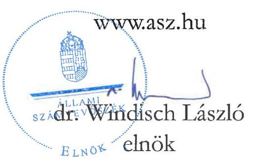
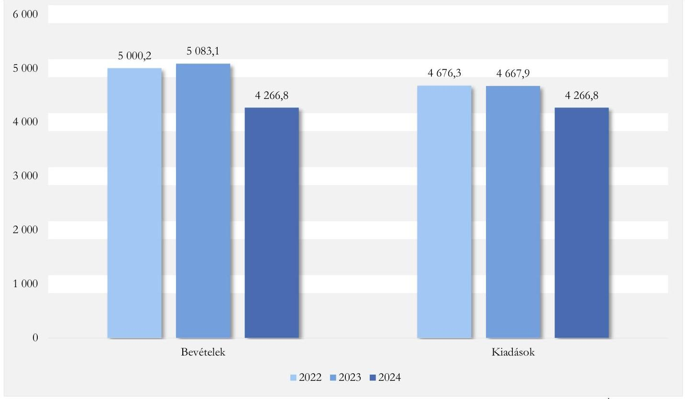
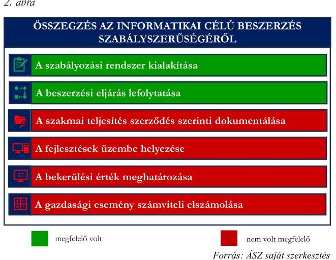
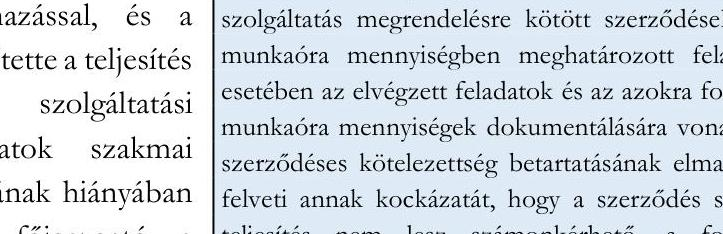

# JELENTÉS 

## A központi költségvetési szervek egyes informatikai beszerzéseinek célzott ellenőrzése

Szellemi Tulajdon Nemzeti Hivatala

2025.

---

# JELENTÉS 

## A központi költségvetési szervek egyes informatikai beszerzéseinek célzott ellenőrzése

Szellemi Tulajdon Nemzeti Hivatala

2025.

25062

---

# ELLENŐRZÉSI IGAZGATÓSÁG: 

## ELLENŐRZÉSI IGAZGATÓSÁG I.

## ELLENŐRZÉSI IGAZGATÓ:

SINKÁNÉ DR. CSENDES ÁGNES igazgató

## ELLENŐRZÉSVEZETŐ:

TÖTH GERGELY ellenőrzésvezető

Jelentéseink az interneten a www.asz.hu címen olvashatók.

IKTATÓSZÁM: EL-4143-005/2025

ELLENŐRZÉS-AZONOSÍTÓ SZÁM: V1100

---

# TARTALOMJEGYZÉK 

AZ ELLENŐRZÉS ALAPADATAI ..... 5
AZ ELLENŐRZÉS HATÓKÖRE ÉS TERÜLETE ..... 7
ÖSSZEFOGLALÁS ..... 10
AZ ELLENŐRZÉS FÓKUSZTERÜLETEI ..... 13
MEGÁLLAPÍTÁSOK ..... 14
JAVASLATOK ..... 26
MELLÉKLETEK ..... 27
I. sz. melléklet: Értelmező szótár ..... 27
II. sz. melléklet: Az ellenőrzött szervezetek jegyzéke ..... 28
III. sz. melléklet: Ellenőrzési kritériumok ..... 29
IV. sz. melléklet: Az ellenőrzött informatikai célú beszerzés háttere, előzményei ..... 30
FÜGGELÉK: ÉSZREVÉTELEK ..... 31
RÖVIDÍTÉSEK JEGYZÉKE ..... 38

---

.

---

# AZ ELLENŐRZÉS ALAPADATAI 

## AZ ELLENŐRZÉS CÉLJA

Az ellenőrzés célja annak értékelése volt, hogy a Szellemi Tulajdon Nemzeti Hivatala kiválasztott informatikai célú beszerzésére szabályszerűen került-e sor, a kapcsolódó döntés megalapozott és célszerű volte, és a beszerzés megvalósította-e az elérni kívánt célkitűzést.

## AZ ELLENŐRZÉS TÍPUSA

Kombinált ellenőrzés

## AZ ELLENŐRZÖTT IDŐSZAK

A 2023. év, kitekintéssel a kiadás teljesítésének, a beszerzett eszköz használatbavételének évére, illetve a helyszíni ellenőrzés lezárásának időpontjáig, 2025. január 21-ig.

## AZ ELLENŐRZÉS TÁRGYA

Az ellenőrzés tárgyát képezte a Szellemi Tulajdon Nemzeti Hivatalánál a kiválasztott informatikai célú beszerzéshez kapcsolódóan a Hivatal ${ }^{1}$ belső szabályozási kereteinek a kialakítása és működtetése, a szervezet beszerzésre vonatkozó döntés-előkészítési és a beszerzés megvalósítási tevékenysége, valamint a beszerzés számviteli elszámolása és a beszerzés eredményeként megvalósult szolgáltatás használatbavétele, hasznosíthatósága a Hivatal (köz)feladat ellátásával kapcsolatosan.

Az ellenőrzés kiterjedt továbbá minden olyan körülményre és adatra, amely az ÁSZ ${ }^{2}$ jogszabályban meghatározott feladatainak teljesítéséhez, valamint a program végrehajtása folyamán felmerült újabb összefüggések feltárásához szükséges volt.

## AZ ELLENŐRZÉS JOGALAPJA

Az ellenőrzés jogszabályi alapját az ÁSZ tv. ${ }^{3}$ 1. $\$ (3) bekezdésének és az 5. $\$ (3) bekezdésének előírásai képezték.

## AZ ELLENŐRZÉS MÓDSZERE

Az ellenőrzést a nemzetközi standardokat irányadónak tekintve az ellenőrzési program szempontjai, az ellenőrzött időszakban hatályos jogszabályok, az ellenőrzés szakmai szabályok és módszertanok figyelembevételével végezte az ÁSZ.

---

Az ellenőrzési kérdések megválaszolásához szükséges bizonyítékok megszerzése az ellenőrzött szervezet által rendelkezésre bocsátott dokumentumokra és adatokra alapozva, továbbá szemrevételezés, információkérés, interjú, valamint elemző eljárás útján történt. Az ellenőrzési bizonyítékként felhasználható adatforrások közé tartoztak egyrészt az ellenőrzéshez kért dokumentumok, adatforrások, másrészt adatforrás volt még minden - az ellenőrzés folyamán - feltárt, az ellenőrzés szempontjából információkat tartalmazó dokumentum.

Az ellenőrzés lefolytatásához a Hivatal az ÁSZ által kért dokumentumok, adatok, információk megküldésével és a helyszíni ellenőrzés során szolgáltatott adatokat.

Az ellenőrzéshez a Hivatal egy, a 2023-2024. években megvalósult informatikai célú szolgáltatás beszerzése került kiválasztásra a DKÜ Zrt. ${ }^{4}$ adatszolgáltatása keretében beérkezett adatok elemzése alapján. Az ellenőrzés kiterjedt az ellenőrzött informatikai célú beszerzés előzményeihez kapcsolódó minden olyan körülményre és adatra, amely a program végrehajtása folyamán felmerült újabb összefüggéseknek az ellenőrzés céljaival összhangban történő feltárása érdekében szükséges volt.

---

# AZ ELLENŐRZÉS HATÓKÖRE ÉS TERÜLETE 

A központi költségvetési szervek a DKÜ rendeletben ${ }^{5}$ foglaltak alapján kötelesek informatikai célú beszerzéseikhez kapcsolódóan éves beszerzési és fejlesztési terveket összeállítani, továbbá a tervezett, a rendkívüli és a tervmódosítást igénylő informatikai beszerzési igényüket a DKÜ Zrt. részére megküldeni. A DKÜ Zrt. a beszerzési igények vizsgálata, véleményezésre, jóváhagyásra történő előkészítése során beszerzési és jogi szempontokat is figyelembe vesz, ennek eredményéről, valamint a nettó 15 M Ft -ot elérő értékű beszerzési igényre vonatkozó miniszteri döntésről értesítést küld a központi költségvetési szerv részére. A DKÜ Zrt. a „megfelelő" minősítésű beszerzési igény kielégítése érdekében a beszerzési eljárást vagy maga folytatja le, vagy visszaadja a központi költségvetési szerv saját hatáskörében történő lebonyolításra.

A Szellemi Tulajdon Nemzeti Hivatala, mint a szellemi tulajdon védelméért felelős kormányzati főhivatal 1896. március 1-jén jött létre Magyar Királyi Szabadalmi Hivatal néven. A Hivatal volt felelős az ellenőrzött időszakban a kormányzaton belül valamennyi szellemi tulajdon védelmével összefüggő kérdésért, valamint képviselte Magyarországot a regionális és nemzetközi szervezetekben. Részt vett az Európai Uniós tagságból fakadó kötelezettségek ellátásában, valamint aktív szerepet töltött be a bilaterális szellemitulajdonvédelmi együttműködésekben is. Feladat- és hatáskörébe tartozott az iparjogvédelmi hatósági vizsgálatok és eljárások lefolytatása; a szerzői és a szerzői joghoz kapcsolódó jogokkal összefüggő egyes feladatok ellátása; az állami dokumentációs és információs tevékenység a szellemi tulajdon területén; a szellemi tulajdon védelmét szabályozó jogszabályok előkészítésében való részvétel; a szellemi tulajdon védelmére irányuló kormányzati stratégia kidolgozása és érvényesítése, az ehhez szükséges állami intézkedések kezdeményezése, illetve végrehajtása; a szellemi tulajdon területén folyó nemzetközi, illetve európai együttműködés szakmai feladatainak ellátása; valamint a korai fázisú vállalkozásokat támogató vállalkozások által igénybe vehető adóalapkedvezményhez kapcsolódó nyilvántartási feladatok ellátása. A kutatás-fejlesztési tevékenység minősítésével kapcsolatos hatósági és szakértői feladatok ellátását a 2023. évi XLI. törvény ${ }^{6}$ 2023. szeptember 1-jétől kivette a Hivatal feladatstruktúrájából, a feladatot az NKFIH ${ }^{7}$ vette át.

A Hivatal jogállására, gazdálkodására, feladat- és hatáskörére vonatkozó részletes, ellenőrzött időszakban hatályos szabályokat az 1995. évi XXXIII. törvény ${ }^{8}$ XIV/C. fejezetének 115/D-115/L. $\mathbb{S}$-ai, valamint a 2018. évi CXXV. törvény ${ }^{9}$ tartalmazta. Kormányzati főhivatalként a Kormány irányította, felügyeletét a 182/2022. (V. 24.) Korm. rendelet ${ }^{10} 1$. melléklete szerint a kultúráért és innovációért felelős miniszter látta el.

A Hivatal területi szervekkel nem rendelkezett. Élén az elnök állt, akinek személyében 2023. május 1jével változás történt. A Hivatalnál az ellenőrzött időszakban az Ábt. ${ }^{11}$ 11. $\mathbb{S}$-ában meghatározott átalakulásra nem került sor.

Az ellenőrzött időszakban a Hivatal gazdasági szervezettel rendelkezett, amelynek vezetője a gazdasági ügyekért felelős elnökhelyettes volt, személye az ellenőrzött időszakban nem változott. A Hivatal, mint fejezetet irányító szervi jogosítványokkal felhatalmazott költségvetési szerv, a központi költségvetésben a felügyeletet ellátó miniszter által irányított minisztérium (2022. május 25. napjától a KIM ${ }^{12}$ ) fejezetén belül önálló címként szerepelt. Múködését az ellenőrzött időszakban saját bevételeiből fedezte, bevételeivel önállóan gazdálkodott, azokat múködésének fedezetére használta fel. Az ellenőrzött időszakban vállalkozási tevékenységet nem folytatott, tulajdonosi- és vagyonkezelői jogokat nem gyakorolt. A Hivatal költségvetési és finanszírozási bevételeinek és kiadásainak alakulását az 1. ábra mutatja be.

---

1. ábra

A BEVÉTELEK ÉS KIADÁSOK ALAKULÁSA A 2022-2023. ÉVI KÖLTSÉGVETÉSI BESZÁMOLÓK TELJESÍTÉSI ADATAI, VALAMINT A 2024. ÉVI ELEMI KÖLTSÉGVETÉS ELŐIRÁNYZAT ADATAI ALAPJÁN (M FT)

Forrás: A Szellemi Tulajdon Nemzeti Hivatala 2022-2023. évi költségvetési beszámolói és 2024. évi elemi költségvetése alapján ÁSZ saját szerkesztés

Az ellenőrzés a Hivatal 2023-2024. években megvalósult, már lezárult informatikai beszerzésére irányult, amelynek tárgya a Hivatal hatósági tevékenységének ellátását támogató ügyviteli és nyilvántartási rendszerének (ENYV rendszer ${ }^{13}$ ) fejlesztésére és üzemeltetésének támogatására kötött szerződés, azaz egy informatikai szolgáltatási szerződés. A Hivatal napi működése során a helyszíni ellenőrzés idején is használt ENYV rendszer bevezetésére 1992-ben került sor. Az ellenőrzött informatikai beszerzés célja az időközben elavult rendszer szolgáltatásainak fenntartása volt modernizálódó infrastruktúra környezetben, egy, az elavult rendszert kiváltó új rendszer megvalósítását célzó, folyamatban lévő projekt idejére.

Az „SZTNH ${ }^{14}$ Ügyviteli rendszerek fejlesztése és üzemeltetés támogatása" tárgyú beszerzési igényre vonatkozó dokumentáció 2023. május 24-én került benyújtásra a DKÜ Zrt. felé. A DKÜ Zrt. a beszerzési eljárást saját hatáskörben történő lefolytatásra a Hivatalnak visszaadta. A beszerzés a kötelezettségvállalás dokumentuma (szerződéses összeg) alapján a Kbt. ${ }^{15}$ hatálya alá tartozott. A Hivatal beszerzési igényét a Kbt. alapján a központosított közbeszerzési rendszerben a DKÜ Zrt. által megkötött keretmegállapodás ${ }^{16}$-ból, a Kbt. 105. § (2) bekezdés c) pont szerinti verseny újranyitással valósította meg.

A szolgáltatási keretszerződés ${ }^{17}$ a közbeszerzési dokumentáció és a szerződés részét képező műszaki leírásban meghatározott követelmények szerint megrendelt, a szerződés mellékletét képező szolgáltatás- és árlistában nevesített elemekből álló szolgáltatás nyújtására irányult. A beszerzés tárgya egyrészt szoftverfejlesztő, tesztelő, rendszertervező, adattárház szakértő biztosítása volt a felhasználói igények ügyviteli rendszerben történő leképezéséhez (fejlesztés), másrészt támogatási tevékenység biztosítása (rendszerfelügyelet). Az ellátandó fejlesztési tevékenységet munkaórákban, szükség esetén $+20 \%$ mennyiségi eltérési lehetőséggel, a rendszerfelügyeleti feladatokat 24 havi mennyiségben határozta meg a szerződés, bruttó 123,4 M Ft összegben.

---

Erre tekintettel a szerződés a keretösszeg kimerüléséig, de legkésőbb 24 hónapig terjedő határozott időtartamra jött létre.

Az ellenőrzés kiterjedt a Hivatal beszerzésre vonatkozó belső szabályozása jogszabályi előírásoknak való megfelelésére, az informatikai szolgáltatás beszerzés előkészítésével és végrehajtásával kapcsolatos döntések megalapozottságának, célszerúségének ellenőrzésére, a számviteli elszámolás szabályszerűségének, a rendszerfejlesztések aktiválásának, használatbavételének ellenőrzésére. Az ellenőrzés hatóköre kiterjedt továbbá annak vizsgálatára, hogy a beszerzett szolgáltatás a Hivatalnál alkalmazásra, hasznosításra került-e, betöltötte-e az elvárt funkcióját, támogatta-e a Hivatal (köz)feladat ellátását, illetve célkitűzései elérését.

Az ellenőrzés nem terjedt ki a DKÜ Zrt. által megkötött keretmegállapodás szabályszerűségének ellenőrzésére és az ENYV rendszer kiváltását célzó, folyamatban lévő projekt megvalósításának ellenőrzésére sem.

Az ellenőrzött szervezet megnevezését a II. sz. melléklet tartalmazza.
Az ENYV rendszer bevezetésének és működésének körülményeire és az időközben elavulttá vált rendszer kiváltását célzó projektekre, az ellenőrzött informatikai célú beszerzés előzményeire vonatkozó információk a IV. sz. mellékletben szerepelnek.

---

# ÖSSZEFOGLALÁS 

Napjainkban az információtechnológiai eszközök dinamikusan fejlődnek, amelyek használata elengedhetetlen a közszféra müködésében is. A digitalizáció révén az állami szervezetek feladatellátása hatékonyabbá válhat, időt és erőforrásokat takaríthatnak meg müködésük során. A széleskörű elektronizáció új és speciális informatikai eszközök, szolgáltatások folyamatos beszerzését igényli, amely jelentős anyagi ráfordítást, külső szakmai támogatást feltételez. A közpénzek rendeltetésszerü és eredményes felhasználása ezen a területen is jogosan felmerülő elvárás a társadalom részéről.

A Hivatal ellenőrzött informatikai célú beszerzése során nem érvényesült a közpénzekkel való átlátható, felelős gazdálkodás elve. A beszerzéssel elérni kívánt célkitúzés, a Hivatal hatósági tevékenységét támogató elavult ügyviteli rendszer müködésének informatikai támogatása megvalósult, a beszerzés eredményeként igénybe vett informatikai szolgáltatás támogatta a szervezet közfeladatellátását, hatósági tevékenységének zavartalan ellátását. A beszerzés ugyanakkor összességében nem volt szabályszerű, mivel a feladatok szakmai teljesítésének szerződés szerinti dokumentálását a Hivatal a szolgáltatótól nem követelte meg, a teljesítést dokumentumok hiányában igazolta.

Az ellenőrzés megállapította az ellenőrzött időszakra vonatkozóan, hogy a Hivatal a beszerzési tevékenység kereteit a jogszabályi előírásoknak megfelelően kialakította, a beszerzési tevékenység szabályozottsága megfelelő volt. A Hivatal belső szabályozói a jogszabályi előírásoknak megfelelően rendelkeztek a beszerzésekkel kapcsolatosan feladatokat ellátó szervezeti egységek feladatairól, felelősségi- és hatáskörökről.

A Hivatal ellenőrzött informatikai célú beszerzésének előkészítésére, a közbeszerzési eljárás lefolytatására a jogszabályi és a Hivatal vonatkozó belső szabályozói előírásainak betartásával került sor. A beszerzés végrehajtása a szakmai teljesítés szerződés szerinti dokumentálásának hiánya miatt nem volt szabályszerű. A 2023. augusztus-2024. augusztus közötti teljesítési időszakra vonatkozóan - a szolgáltatási keretszerződésben a szakmai teljesítés igazolásának alapjául a Hivatal által meghatározott - munkaóra elszámolások és az adott hónapban elvégzett feladatokat tartalmazó kimutatások nem készültek, a feladatok szakmai teljesítésének szerződés szerinti dokumentálását a Hivatal nem követelte meg, az elvégzett feladatokat szóban egyeztette a szolgáltatóval. Az elvégzett fejlesztésekről tesztelési dokumentáció állt rendelkezésre, ezek alapján azonban a feladatok szerződés szerinti teljesítése nem volt nyomon követhető, az egyes feladatokra fordított munkaórák száma nem volt igazolt. Nem támasztották alá dokumentumok azt sem, hogy a rendszerfelügyelet fedezetére szolgáló, szerződés szerint 24 hónapra tervezett keretösszeg 11 hónap alatt történt felhasználását milyen többletfeladatok indokolták. A feladatok szerződés szerinti teljesítése dokumentálásának hiányában a teljesítésigazolásra jogosult főigazgató a jogszabályi előírások ellenére a teljesítést annak ellenére igazolta, hogy

---

a kiadások szakmai teljesítésének jogosságát, összegszerűségét dokumentumok nem igazolták, nem támasztották alá.

A szolgáltatási keretszerződésben előírt munkaóra elszámolások és az elvégzett feladatokat tartalmazó kimutatások hiányában dokumentumokkal nem volt alátámasztott a szolgáltató által elvégzett feladatokra elszámolt munkaórák mennyiségének, a szolgáltató részére kifizetett összeg nagyságának indokoltsága. Az ÁSZ szakmai véleménye szerint a dokumentumokkal való alátámasztás hiánya miatt felmerülhet a pazarlás lehetősége, amennyiben az SZTNH nem a beszerzéssel elérni kívánt eredmény eléréséhez indokoltan szükséges erőforrás igénybevételéért teljesített kifizetést.

A szolgáltatási keretszerződés alapján a teljesítési időszakban végrehajtott fejlesztések üzembe helyezését a jogszabályi előírásoknak megfelelően hitelt érdemlő módon dokumentálták. Az üzembe helyezések napján minden esetben megtörtént az aktiválás könyvelése, az aktiválás engedélyezésére ugyanakkor minden esetben az üzembe helyezést követően, utólag került sor, amely gyakorlat nem felelt meg a Hivatal számviteli politikájában ${ }^{18}$ foglaltaknak.

A szerződésben előírt munkaóra elszámolások és az elvégzett feladatokat tartalmazó kimutatások hiányában dokumentumok nem támasztották alá, hogy a 2023 szeptember havi teljesítés esetében a bekerülési érték meghatározása megfelelt-e a Hivatal számviteli politikájában foglalt előírásoknak. Dokumentumokkal nem volt igazolható, hogy a 2023 szeptember hónapra fejlesztési cikkszámokra kiszámlázott, de a bekerülési érték részeként figyelembe nem vett, 950400 Ft összegű rendszerfejlesztés megfelelt-e a számviteli politikában rögzített kitételnek (a fejlesztés nem növelte a szoftver értékét és a tevékenységet nem szolgálta tartósan, legalább egy éven túl), ami indokolta a K61 Immateriális javak beszerzése, létesítése rovat helyett annak dologi kiadásként történt elszámolását.

Az informatikai beszerzéssel megvalósult szolgáltatás számviteli elszámolása a szakmai teljesítés szerződés szerinti dokumentálásának hiányában nem volt megalapozott, a 2023. évről készült éves költségvetési beszámoló esetében sérült a Számv. tv. szerinti valódiság elve. A szerződés alapján a 2023. és 2024. években elszámolt, könyvvitelben rögzített, valamint a 2023. évről készült éves költségvetési beszámoló mérlegében és 01 űrlapján (K1-K8 Költségvetési kiadások) szereplő tételek dokumentumokkal nem alátámasztottak, nem bizonyíthatók, kívülállók által nem megállapíthatók.

Az ellenőrzött informatikai célú beszerzés megfelelően előkészített, a beszerzésre vonatkozó döntés megalapozott, dokumentumokkal alátámasztott volt. A Hivatal a beszerzési eljárást a jogszabályi előírásoknak megfelelve szabályszerűen, a jogszabályi határidők betartásával indította meg. Az ellenőrzés a beszerzéssel kapcsolatos adatszolgáltatási és beszámolási kötelezettség teljesítése kapcsán több esetben mulasztást állapított meg. A beszerzési eljárás eredményéről szóló döntés másolatát nem, a megkötött szerződés másolatát a jogszabályi határidőn túl töltötte fel a DKÜ Portál ${ }^{19}$-ra, illetve határidő mulasztás történt a teljesítésről történő beszámolás során is.
3. ábra

| OSSZEGZÉS AZ INFORMATIKAI CÉLÚ BESZERZÉS CÉLSZÉRÉSÉGÉRÖLÉS EREDMÉNYESSÉGÉRÖL |  |
| :--: | :--: |
| A beszerzés előkészítése |  |
| A beszerzésre vonatkozó döntés megalapozása |  |
| Az adatszolgáltatási és beszámolási kötelezettség teljesítése |  |
| A célszerüség érvényesülése a döntéshozatalnál |  |
| Az ellenőrzött feladatellátásának beszerzés általi támogatása |  |
| Az elérni kívánt célkitűzés megvalósítása |  |
| megfelelő volt | nem volt megfelelő   Forrás: ÁSZ saját szerkestés |

[^0]
[^0]:    18 megfelelő volt nem volt megfelelő
    Forrás: ÁSZ saját szerkestés

---

Az ellenőrzött informatikai célú beszerzésre irányuló döntéshozatalnál érvényesült a célszerúség, a beszerzés támogatta a szervezet közfeladatellátását, a hatósági tevékenység zavartalan ellátását. A Hivatal a tevékenységéhez kapcsolódó információtechnológiai rendszereinek üzemeltetéséhez folyamatosan külső fejlesztési és üzemeltetés támogatási szolgáltatásokat vett igénybe, mivel a kapcsolódó informatikai feladatoknak csak egy kis részét tudta saját erőforrásból megoldani, minden más fejlesztési és rendszerfelügyeleti tevékenység külső szolgáltató igénybevételét tette szükségessé. A Hivatal hatósági tevékenységét támogató, 1992 óta alkalmazott ügyviteli és nyilvántartási szoftver az ellenőrzött időszak alatt - 2007 óta gyári támogatás nélküli elavult szoftvernek minősült.

A beszerzés eredményeként igénybe vett informatikai szolgáltatás megvalósította az elérni kívánt célkitűzést, az elavult ENYV rendszer szolgáltatásainak fenntartását modernizálódó infrastruktúra környezetben, az új rendszer megvalósítását célzó projekt idejére. A Hivatal hatósági tevékenységének támogatására az elavult technológiára épülő szoftver használata - a gyári támogatás elvesztése óta eltelt 17 évre és az új szoftver technológiára való átállási kísérletek kudarcára tekintettel - a normál ügymenet részévé vált, melynek során a felmerülő fejlesztésekre és hibaelhárításokra megkötött és folyamatosan megújított szerződések biztosították közel két évtizede a Hivatal teljes hatósági feladatellátására kiterjedő ügyviteli és nyilvántartási rendszerének napi múködését.

Az ÁSZ véleménye szerint az elavult rendszer „életben tartása" nem tekinthető átmeneti, ideiglenes állapotnak, kiváltásának elhúzódása hosszú távon a közfeladatellátás biztonsága szempontjából kockázatot jelent, azaz az ügyviteli rendszer átmeneti vagy hosszabb távú leállása esetén a Hivatal a feladatait nem tudja ellátni. Az elavult szoftver használatából adódó kockázatok felmérése, és az új technológiára való átállás felgyorsítása az optimális teljesítmény, biztonság és jogi megfelelőség biztosítása érdekében nélkülözhetetlen.

---

# AZ ELLENŐRZÉS FÓKUSZTERÜLETEI 

1. A központi költségvetési szerv informatikai célú beszerzésének szabályszerűsége
2. A központi költségvetési szerv informatikai célú beszerzésének célszerűsége és eredményessége

---

# 1. A központi költségvetési szerv informatikai célú beszerzésének szabályszerűsége 

Összegző megállapítás

A Hivatal a beszerzési tevékenység kereteit a jogszabályi előírásoknak megfelelően kialakította, a beszerzési tevékenység szabályozottsága megfelelő volt. Az ellenőrzött informatikai célú beszerzés nem volt szabályszerű a szakmai teljesítés szerződés szerinti dokumentálásának hiánya és a számviteli elszámolás ebből adódó megalapozatlansága miatt. A feltárt szabálytalanság miatt sérült a közpénzekkel való felelős gazdálkodás elve és a 2023. évről készült éves költségvetési beszámoló valódiságának elve.

## A Hivatal beszerzési tevékenységének szabályozottsága megfelelő volt.

A beszerzésekkel kapcsolatosan feladatokat ellátó szervezeti egységek feladatait, felelősségi és hatásköröket a Hivatal 2022. április 30-tól hatályos SZMSZ ${ }^{20}$-e, valamint gazdasági szervezetének ügyrendje ${ }^{21}$ tartalmazta, eleget téve az Ávr. ${ }^{22}$ előírásainak. A Hivatal gazdálkodása keretgazdai rendszerben múködött, az SZMSZ alapján az informatikai fejlesztési és üzemeltetési tárgyú, a Kbt. hatálya alá eső szolgáltatások és árubeszerzések lebonyolításáért, koordinálásáért a Hivatal főigazgatója ${ }^{23}$ volt felelős. A gazdasági szervezet ügyrendjének hatálya az informatikai szakterület beszerzésekkel kapcsolatosan feladatokat ellátó munkatársaira is kiterjedt.
A beszerzések előkészítésében részt vevő szervezeti egységek által ellátott feladatok munkafolyamatainak leírását a $\mathrm{Bkr}^{24}$ előírásainak megfelelve ellenőrzési nyomvonal ${ }^{25}$-ban rögzítették. A gazdasági szervezet, továbbá valamennyi, költségvetési kerettel rendelkező és gazdálkodási jogosultsággal bíró szervezeti egység által kötelezően alkalmazni rendelt folyamatleírás kiterjedt az előirányzatok kezelése, a kötelezettségvállalás és beszerzés, valamint a szerződések nyilvántartása folyamatok lépéseire.
A Hivatal az Áht. előírásainak megfelelően rendelkezett a gazdálkodás részletes rendjét meghatározó szabályzattal, amelynek keretében gondoskodott a gazdálkodási jogkörök gyakorlásának szabályozásáról ${ }^{26}$. A szabályzat tartalmazta a gazdálkodási jogkörök gyakorlásának módjával kapcsolatos belső előírásokat, dokumentációs részletszabályokat, valamint e jogköröket végző személyek kijelölésének rendjével kapcsolatos előírásokat az Ávr. előírásainak megfelelően. A szabályzat alapján a Hivatal elnökhelyettesei és főigazgatója a felügyeletük alá rendelt szervezeti egységek tárgykörébe tartozó beszerzésekkel összefüggésben értékhatár nélkül vállalhattak kötelezettséget. A szabályzat a kötelezettségvállalások előzetes pénzügyi ellenjegyzésére értékhatár nélkül a szervezet gazdasági vezetőjét jogosította fel. A gazdálkodási jogkörök gyakorlására jogosult személyekről és aláírás-mintájukról az Ávr. előírásának megfelelően naprakész nyilvántartást vezettek.
A Hivatal belső szabályozóiban rendelkezett a közbeszerzések, valamint a Kbt. hatálya alá nem tartozó beszerzések lebonyolításának eljárásrendjéről, eleget téve a Kbt. és az Ávr. előírásainak. A

---

közbeszerzési szabályzat ${ }_{2}{ }^{27}$-ben a Kbt. előírásának megfelelve a Hivatal rendelkezett a közbeszerzési eljárások előkészítésének, lefolytatásának, belső ellenőrzésének felelősségi rendjéről, a nevében eljáró, illetve az eljárásba bevont személyek, szervezetek felelősségi köréről és az eljárások dokumentálási rendjéről. A szabályzatban meghatározták az eljárás során hozott döntésekért felelős személyeket, valamint az $\mathrm{EKR}^{28}$ alkalmazására vonatkozó jogosultságok gyakorlásának rendjét. A közbeszerzési szabályzat ${ }_{2}$ rendelkezett a DKÜ rendeletben meghatározott informatikai tárgyú beszerzésekről, azok végrehajtásáért felelősként az informatikával összefüggő feladatok ellátásáért felelős szakterület vezetőjét nevesítette. A közbeszerzési szabályzat ${ }_{2}$ szerint informatikai tárgyú (köz)beszerzések esetén az eljárás megindításáról a Hivatal főigazgatója dönt és meghozza az eljárást lezáró döntést. A 2023. április 21-én hatályba lépett közbeszerzési szabályzat ${ }_{2}$ visszamenőleges hatállyal rendelkezett az informatikai tárgyú beszerzések vonatkozásában arról, hogy a Hivatal főigazgatója az őt megillető jogköröket 2023. január 1jétől volt jogosult gyakorolni. A korábbi időszakban hatályos közbeszerzési szabályzat ${ }_{1}{ }^{29}$ alapján e döntési jogköröket a gazdasági ügyekért felelős elnökhelyettes gyakorolta, a szabályzat az informatikai tárgyú beszerzéseket külön nem nevesítette.
A Hivatal - megfelelve a Számv. tv. ${ }^{30}$ és az Áhsz. előírásainak - a számviteli politikával összhangban elkészítette, és önálló utasítások keretében kiadta az eszközök és a források értékelési szabályzatát ${ }^{31}$, valamint a leltározási és leltárkészítési szabályzat ${ }^{32}$-ot.
Az eszközök és a források értékelési szabályzata a Számv. tv. és az Áhsz. előírásainak megfelelően tartalmazta a mérlegtételek értékelésének, a bekerülési érték meghatározásának szabályait. Rendelkezett arról, hogy a mérlegben az immateriális javakat, tárgyi eszközöket a bekerülési értéken kell kimutatni, csökkentve az elszámolt terv szerinti és terven felüli értékcsökkenéssel, növelve a terven felüli értékcsökkenés visszaírt összegével, megfelelve az Áhsz. előírásának. A szabályzat a terv szerinti értékcsökkenés leírási kulcsait az Áhsz. előírásainak megfelelően határozta meg.
A leltározási és leltárkészítési szabályzatban meghatározták a leltározás előkészítésének és lebonyolításának feladatait, a leltározásban részt vevők felelősségét, a leltározás módját és dokumentációs részletszabályait. A szabályzat a Számv. tv. előírásának megfelelve az immateriális javak kétévente történő leltározásáról rendelkezett.
A Hivatal, eleget téve az Áhsz. előírásának, rendelkezett az egységes számlakeret alapján készült számlarenddel, amely tartalmazta egyebek mellett a könyvvezetésre vonatkozó részletes előírásokat és a könyvvezetési feladatokat alátámasztó bizonylati rendet, a számlaosztályok tagolását, a könyvviteli zárlattal kapcsolatos feladatokat, határidőket, felelősöket. Tartalmazta továbbá a költségvetési és pénzügyi számvitel számláit érintő gazdasági események kontírozását, eleget téve a Számv. tv. előírásainak.
A Hivatal az Áht. előírásának megfelelve a 2023. és 2024. költségvetési évekre elkészítette elemi költségvetését, valamint a 2023. költségvetési évről az éves költségvetési beszámolóját, eleget téve az Áhsz. előírásainak. Az éves költségvetési beszámolót - megfelelve az Áhsz. előírásának - a Hivatal első számú vezetője és a gazdasági vezető írta alá. Tekintettel arra, hogy a Hivatal fejezetet irányító szervi jogosítványokkal felhatalmazott költségvetési szerv, az éves költségvetési beszámoló irányító szervi jóváhagyásáról ugyancsak a Hivatal vezetője gondoskodott.
A Hivatal az ellenőrzött informatikai célú beszerzése során a közbeszerzési eljárást a jogszabályi és a belső irányító eszközeiben foglalt előírásoknak megfelelően folytatta le. A feladatok szakmai teljesítésének szerződés szerinti dokumentálását a szolgáltatótól nem követelte meg, ezzel sérült a közpénzekkel való felelős gazdálkodás elve.

---

A közbeszerzési eljárás lefolytatására a Kbt. és a Hivatal vonatkozó belső szabályozói előírásainak betartásával került sor. A Hivatal, mint ajánlatkérő a Kbt. előírásának eleget téve 2023. június 22-én a DKÜ Zrt.-vel keretmegállapodást kötött összes ajánlattevőnek megküldte írásban az ajánlattételi felhívást, amely tartalmazta a Kbt. 105. § (3) bekezdésben meghatározott tartalmi elemeket, és az ajánlatok értékelésének szempontjaként a legalacsonyabb árat határozta meg.
A közbeszerzési dokumentáció részeként rendelkezésre állt a beszerzés fedezetének igazolására, valamint a becsült érték Kbt. 28. § (2) bekezdés szerinti meghatározásának módszerére vonatkozó nyilatkozat, az annak alátámasztásául szolgáló dokumentumokkal együtt, megfelelve a közbeszerzési szabályzat ${ }_{1,2}$ előírásának. Az eljárás becsült értéke a közbeszerzés előkészítése keretében a Kbt. 28. § (2) bekezdés a) pontja alapján, a beszerzés tárgyára vonatkozó indikatív ajánlatok alapján került meghatározásra, az eljárás egybeszámított becsült értéke nettó 106950990 Ft volt. A közbeszerzési eljárás fedezetére vonatkozó, 2023. április 19-én kiadott, a gazdasági ügyekért felelős elnökhelyettes által pénzügyileg ellenjegyzett nyilatkozat szerint az eljárás eredményeként megkötendő közbeszerzési szerződés teljesítéséhez szükséges pénzügyi forrás a Hivatal 2023. évi költségvetésében rendelkezésre állt, illetve - tekintettel a 24 hónapra tervezett rendszerfelügyeleti feladatokra -a 2024-2025. években tervezésre kerül.
A Kbt., valamint a közbeszerzési szabályzat ${ }_{2}$ előírásának megfelelően felállított négyfős bírálóbizottság, eleget téve a Kbt. előírásának, a közbeszerzési szabályzat ${ }_{2}$ előírásának megfelelő tartalommal elkészítette szakvéleményét és 2023. július 17-én felterjesztette döntési javaslatát a döntéshozó főigazgató felé, amelyben a hiánypótlásra felhívott, de azt határidőre nem teljesítő ajánlattevők ajánlatát érvénytelennek minősítette, és - a közbeszerzési szabályzat ${ }_{2}$ előírásának eleget téve - megállapította, hogy az érvényes ajánlatok közül a Kbt. 76. § (2) bekezdés a) pont szerinti értékelési szempontra tekintettel az IMG Solution Zrt. által képviselt közös ajánlattevők ajánlata a legkedvezőbb. Az eljárás eredményére vonatkozó, eljárást lezáró döntést a bírálóbizottság szakvéleménye alapján a Hivatal főigazgatója hozta meg, eleget téve a közbeszerzési szabályzat ${ }_{2}$ előírásának. A szerződés megkötésére a nyertes ajánlattevővel, a nyertes ajánlat tartalmának megfelelően került sor, eleget téve a Kbt. előírásának.
A kötelezettségvállalásra az Áht. és az Ávr. előírásai és a Hivatal belső szabályozóiban foglaltak betartásával került sor. A szolgáltatási keretszerződés tekintetében a kötelezettségvállalási jogkört - az Ávr. előírásának és a Hivatal gazdálkodási jogkörök gyakorlására vonatkozó szabályozásának megfelelve - a Hivatal vezetője által írásban felhatalmazott főigazgató gyakorolta. A Hivatal főigazgatója szerepelt a gazdálkodási jogkörök gyakorlására jogosult személyekről és aláírás-mintájukról az Ávr. előírásának megfelelően vezetett nyilvántartásban.
A kötelezettségvállalásra pénzügyi ellenjegyzést követően került sor, eleget téve az Áht. előírásának. A pénzügyi ellenjegyzés során érvényesültek a gazdálkodási jogkörök gyakorlásának szabályozásában foglalt előírások. A szabályzat előírásának megfelelve, tekintettel arra, hogy a kötelezettségvállalás alapját képező szerződés digitális formában került megkötésre, a pénzügyi ellenjegyzésre is elektronikus aláírás alkalmazásával került sor. A szolgáltatási keretszerződés tekintetében pénzügyi ellenjegyzőként a Pénzügyi és számviteli osztály vezetője járt el, aki a gazdálkodási jogkörök gyakorlásának szabályozása alapján a Hivatal gazdasági vezetőjének akadályoztatása (szabadsága) miatt értékhatár nélkül volt jogosult pénzügyi ellenjegyzésre.
A szolgáltatási keretszerződés tartalmi elemei megfeleltek a jogszabályi előírásoknak. A szolgáltatási keretszerződés, az Ávr. előírásainak megfelelve, az általános adatokon túl tartalmazta a szakmai, műszaki teljesítés mennyiségi és minőségi jellemzőit, a teljesítés határidejét, a számlázás alapjául szolgáló egységárat,

---

a pénzügyi teljesítés devizanemét, módját és feltételeit, valamint a kifizetés határidejét, továbbá a szerződő partner képviselőjének nyilatkozatát arra vonatkozóan, hogy átlátható szervezetnek minősül.
A kötelezettségvállalás nyilvántartásba vétele az Áht. és az Ávr. előírásainak megfelelően megtörtént. A kötelezettségvállalás alapdokumentumának az Ávr. előírásának eleget téve a közbeszerzési eljárást megindító ajánlattételi felhívást tekintették, a kötelezettségvállalás összege ún. SAP ${ }^{33}$ megrendelés létrehozásával került előzetesen rögzítésre az SAP rendszerben.
A szerződés a keretösszeg kimerüléséig, de legkésőbb 24 hónapig terjedő határozott időtartamra jött létre. A szerződés szerinti alap munkaóra mennyiség a fejlesztés vonatkozásában 2024 júniusában kimerült, július-augusztus hónapokban a szerződésben rögzített $+20 \%$ mennyiségi eltérés került felhasználásra. A mennyiségi eltérés lehívásának teljesítéséhez szükséges pénzügyi forrás ( 11750400 Ft + 1,5\% beszerzési díj + ÁFA) a Hivatal 2024. évi költségvetésében rendelkezésre állt. A rendszerfelügyelet fedezetére szolgáló, szerződés szerinti 24 havi, összességében nettó 25200000 Ft keretösszeg 2024 júniusában, 11 hónap alatt ugyancsak kimerült, itt szerződés szerint nem volt lehetőség mennyiségi eltérés lehívására.
A Hivatal a szerződés 4. pontjában a szakmai teljesítés igazolásának alapjául a szolgáltatást nyújtó által az elszámolási időszakra benyújtott munkaóra elszámolást határozta meg, a szerződés 1. pontjában előírta továbbá a szolgáltató kötelezettségeként az adott hónapban elvégzett feladatokról havonta utólag kimutatás készítését. A 2023. augusztus-2024. augusztus közötti teljesítési időszakra vonatkozóan - a szolgáltatási keretszerződésben a szakmai teljesítés igazolásának alapjául meghatározott - munkaóra elszámolások és az adott hónapban elvégzett feladatokról kimutatások nem készültek, a szerződésben rögzített dokumentálási kötelezettség teljesítését a Hivatal a szolgáltatótól nem követelte meg. A Hivatal nyilatkozata szerint a teljesítésigazolásokon szereplő óraelszámolások alapját a szolgáltató és a Hivatal szakértői között rendszeresen, minden egyes teljesítésigazolás kiadása előtt megtartott koordinációs értekezletek képezték, ezekről azonban írásos emlékeztető nem készült.
Megfelelve az Ávr. előírásának, a teljesítést az igazolás dátuma és a teljesítés tényére történő utalás megjelölésével az arra jogosult főigazgató havonta igazolta. A kötelezettségvállalóként eljáró főigazgató megfelelve az Ávr. előírásának - rendelkezett a teljesítés igazolására vonatkozó írásbeli felhatalmazással, és a kötelezettségvállalás dokumentuma is nevesítette a teljesítés igazolására jogosult személyként. A szolgáltatási keretszerződésben meghatározott feladatok szakmai teljesítése szerződés szerinti dokumentálásának hiányában azonban a teljesítésigazolásra jogosult főigazgató a teljesítést annak ellenére igazolta, hogy a kiadások szakmai

teljesítésének jogosságát, összegszerűségét dokumentumok nem igazolták, nem támasztották alá, megsértve az Ávr. 57. § (1) bekezdés előírását. Az elvégzett fejlesztésekről tesztelési dokumentáció állt rendelkezésre, ezek alapján a feladatok szerződés szerinti teljesítése nem volt nyomon követhető, az egyes feladatokra fordított munkaórák száma nem volt igazolható. Nem támasztották alá az elvégzett feladatokat rögzítő kimutatások, egyéb dokumentumok azt sem, hogy a rendszerfelügyelet fedezetére szolgáló, szerződés szerint 24 hónapra tervezett keretösszeg 11 hónap alatt történő felhasználását milyen többletfeladatok indokolták. (Hét alkalommal a szerződés mellékletét képező szolgáltatás- és árlistában meghatározott egy havi egységár kettő-három-négyszerese került teljesítésigazolásra és kiszámlázásra.)

---

Pénzügyi teljesítésre havi rendszerességgel a szolgáltató által szabályszerűen kiállított számlák szerint, utalványozás alapján került sor, eleget téve az Áht. előírásának. A szolgáltatási keretszerződés mellékletét képező szolgáltatás- és árlista alapján és a szerződésben rögzített $+20 \%$ mennyiségi eltérés figyelembevételével elszámolható, valamint a szolgáltató által ténylegesen kiszámlázott és pénzügyileg teljesített összegek alakulását az 1. táblázat mutatja be.

# 1. táblázat 

## A SZOLGÁLTATÁSI KERETSZERZŐDÉS ALAPJÁN ELSZÁMOLHATÓ ÉS TÉNYLEGESEN KISZÁMLÁZOTT SZOLGÁLTATÁSOK ÉS ÖSSZEGEK ALAKULÁSA

| MEGNEVEZÉS | SZERZŐDÉS SZERINT KISZÁMLÁZHATÓ |  |  | SZERZŐDÉS SZERINT KISZÁMLÁZHATÓ ELTÉRÉSI LEHETŐSÉGGEL (+20\%) |  |  | KISZÁMLÁZOTT |  |  |
| :--: | :--: | :--: | :--: | :--: | :--: | :--: | :--: | :--: | :--: |
|  | MENNY. | NETTÖ   EGYSÉGÁR   (f/9) | NETTÖ ÁR ÖSSZ.   (f/9) | MENNY. | NETTÖ   EGYSÉGÁR   (f/9) | NETTÖ ÁR ÖSSZ.   (f/9) | MENNY. | NETTÖ   EGYSÉGÁR   (f/9) | NETTÖ ÁR ÖSSZ.   (f/9) |
| Architekt/ rendszertervező | 200 óra | 33300 | 6660000 | 240 óra | 33300 | 7992000 | 240 óra | 33300 | 7992000 |
| Adattárház szakértő, fejlesztő | 480 óra | 29800 | 14304000 | 576 óra | 29800 | 17164800 | 576 óra | 29800 | 17164800 |
| Szoftverfejlesztő | 1280 óra | 27300 | 34944000 | 1536 óra | 27300 | 41932800 | 1536 óra | 27300 | 41932800 |
| Tesztelő | 122 óra | 23700 | 2891400 | 146 óra | 23700 | 3460200 | 146 óra | 23700 | 3460200 |
| Rendszerfelügyelet | 24 hó/fő | 1050000 | 25200000 | 24 hó/fő | 1050000 | 25200000 | 24 hó/fő | 1050000 | 25200000 |
| Nettó összesen |  |  | 83999400 |  |  | 95749800 |  |  | 95749800 |
| Beszerzési díj $1,5 \%$ |  |  | 1259991 |  |  | 1436250 |  |  | 1436250 |
| ÁFA |  |  | 23020036 |  |  | 26240233 |  |  | 26240233 |
| Bruttó összesen |  |  | 108279427 |  |  | 123426283 |  |  | 123426283 |

Forrás: Szolgáltatási keretszerződés és a kiállított számlák alapján ÁSZ saját szerkesztés
A szolgáltatási keretszerződésben előírt munkaóra elszámolások és az elvégzett feladatokat tartalmazó kimutatások hiányában dokumentumokkal nem volt alátámasztott a szolgáltató által elvégzett feladatokra elszámolt munkaórák mennyiségének indokoltsága és ebből következően a szolgáltató részére kifizetett összeg jogossága. Az ÁSZ szakmai véleménye szerint a dokumentumokkal való alátámasztás hiánya miatt felmerülhet a pazarlás lehetősége, amennyiben az SZTNH nem a beszerzéssel elérni kívánt eredmény eléréséhez indokoltan szükséges erőforrás igénybevételéért teljesített kifizetést. A Kbt. 2. § (4) bekezdés alapján az ajánlatkérőnek a közpénzek felhasználásakor a hatékony és felelős gazdálkodás elvét szem előtt tartva kell eljárnia. A Hivatal a szerződés teljesítése során megsértette a Kbt. 2. § (4) bekezdés, valamint a 142. § (1) bekezdés előírását, mert a közpénzekkel való felelős gazdálkodás elvének érvényesítése

---

érdekében nem dokumentálta a szerződéses kötelezettségek teljesítését, illetve a dokumentálást nem követelte meg a szolgáltatótól.
Az informatikai beszerzéssel megvalósult szolgáltatás számviteli elszámolása a szakmai teljesítés szerződés szerinti dokumentálásának hiányában nem volt megalapozott, a 2023. évről készült éves költségvetési beszámoló esetében sérült a Számv. tv. szerinti valódiság elve.
A szolgáltatási keretszerződés alapján a 2023. augusztus-2024. augusztus közötti teljesítési időszakban végrehajtott fejlesztések üzembe helyezése öt részletben történt meg. Az üzembe helyezéseket hitelt érdemlő módon dokumentálták, eleget téve a Számv. tv. előírásának. Az aktiválás engedélyezésére minden esetben az üzembe helyezést követően, utólag került sor, ami nem felelt meg a Hivatal számviteli politikája VI.2.A pontjában foglalt, a befektetett eszközök üzembe helyezésére vonatkozó rendelkezésnek, amely szerint az üzembehelyezést a beruházást végző szervezeti egység vezetője rendeli el és az aktiválást jóváhagyó hivatali dokumentumot az üzembe helyezés napján átadja a Létesítménygazdálkodási osztály eszközanalitikusának, aki az átadott dokumentum alapján végrehajtja az SAP rendszerben az aktiválást.
A Hivatal a számviteli politika keretében rendelkezett arról, hogy ,,a nagy összegben végzett rendszerfejlesztéseket ráaktiválja a már korábban basználatba vett, immateriális javak között nyilvántartott rendszerekre. Mivel az immateriális javak bekerülési értéke a basználatuk során értéknövelő fejlesztés, bővités miatt megnö, és az a tevékenységet tartósan, legalább egy éven túl szolgálja, ezért a fejlesztés kiadásait a K61 Immateriális javak beszerzése, létesítése rovaton számolja el". A számviteli politika tartalmazta továbbá azt a kitételt, hogy „amennyiben a rendszerfejlesztés nem felel meg a fenti feltételeknek, a kiadásokat csak dologi kiadásként, a K321 Informatikai szolgáltatások igénybevétele rovaton lehet elszámolni". A Hivatal a hatósági tevékenységét támogató ENYV II szoftvert 2011. január 21-én aktiválta.
A Hivatal a szolgáltatási keretszerződés alapján a 2023 augusztus-2024 augusztus közötti teljesítési időszakban végrehajtott, a szolgáltató által havonta a fejlesztési cikkszámokra kiszámlázott rendszerfejlesztés teljes összegét - a 2023 szeptember havi teljesítés kivételével - ráaktiválta az ENYV II szoftverre. A 2023 szeptember havi teljesítésről 2023. október 3-án kiállított és október 6-án pénzügyileg teljesített 23011275 sorszámú számla alapján a fejlesztés - fejlesztési cikkszámokra kiszámlázott - nettó értéke 3814600 Ft volt, ezzel szemben 2023. október 16-án a szeptember hónapban elszámolt szoftverfejlesztés aktiválására ennél 950400 Ft-tal alacsonyabb, 2864200 Ft összegben került sor. Tekintettel arra, hogy a szerződésben előírt munkaóra elszámolások a szeptember havi teljesítésre vonatkozóan sem készültek, a 2023. október 16-i üzembehelyezés során a bekerülési érték meghatározása és a 2023 szeptember havi teljesítés számviteli elszámolása nem volt megalapozott, dokumentumokkal alátámasztott. Dokumentumokkal nem volt igazolt, hogy a 2023 szeptember havi teljesítés számviteli elszámolása, a bekerülési érték meghatározása megfelelt-e a számviteli politikában foglalt előírásoknak, vagyis a 2023 szeptember hónapra fejlesztési cikkszámokra kiszámlázott, de a bekerülési érték részeként figyelembe nem vett, 950400 Ft összegű rendszerfejlesztés megfelelt-e a számviteli politikában rögzített kitételnek (a fejlesztés nem növelte a szoftver értékét és a tevékenységet nem szolgálta tartósan, legalább egy éven túl), ami indokolta a K61 Immateriális javak beszerzése, létesítése rovat helyett a dologi kiadásként a K321 Informatikai szolgáltatások igénybevétele rovaton történő elszámolását.
A Hivatal a gazdasági esemény költségvetési könyvvezetés szerinti elszámolására az egységes rovatrend előírásainak megfelelő nyilvántartási számlákat, illetve pénzügyi könyvvezetés szerinti elszámolására a megfelelő könyvviteli számlákat alkalmazta, eleget téve az Áhsz. előírásainak és a hatályos számlarendjében foglaltaknak.

---

A gazdasági esemény számviteli elszámolását alátámasztó bizonylatok (számlák és az utalványozás végrehajtását igazoló dokumentumok) összességében tartalmazták a gazdasági eseményre vonatkozóan a könyvvitelben rögzítendő adatokat és megfeleltek a bizonylat általános alaki és tartalmi követelményeinek, eleget téve a Számv. tv. 165. § (2) bekezdés előírásának. A számlákon nem került feltüntetésre a Számv. tv. 167. § (1) bekezdés h) és i) pont előírásaival ellentétben a könyvelés módjára, az érintett könyvviteli számlákra történő hivatkozás, és a könyvviteli nyilvántartásokban történt rögzítés időpontja, igazolása, a számlákhoz hozzárendelhető kontírlapokon ugyanakkor szerepelt a kiadás egységes rovatrend és kormányzati funkció szerinti száma, megfelelve a számviteli politikában foglalt előírásnak. A számviteli politika IX.4. pont előírása alapján a Számv. tv. vonatkozó előírásának a Hivatal a könyvviteli számlák számának az utalványlapon és a kontírlapon történő feltüntetésével kell, hogy eleget tegyen. A számviteli politika előírta azt is, hogy az utalványlap és a kontírlap együttesen tartalmazza az Ávr. 59. § (3) bekezdésében előírt adattartalmat. Az ellenőrzés kisebb súlyú hiányosságként állapította meg, hogy az utalványozás végrehajtását igazoló dokumentumok (utalványlap, kontírlap) egyike sem tartalmazta a terheléssel (kifizetéssel) érintett pénzeszköz Áhsz. szerinti könyvviteli számlájának számát, megsértve az Ávr. 59. § (3) bekezdés e) pont előírását. A szolgáltatási keretszerződés alapján az egyes rovatkódokon a 2023. és 2024. évben elszámolt összegek alakulását a 2. táblázat mutatja be.

| 2. táblázat |  |  |  |
| :--: | :--: | :--: | :--: |
| A SZOLGÁLTATÁSI KERETSZERZŐDÉS ALAPJÁN ELSZÁMOLT ÖSSZEGEK ALAKULÁSA (FT) |  |  |  |
| ROVAT | 2023 | 2024 | ÖsszESEN |
| K61 Immateriális javak beszerzése, létesítése | 32383800 | 37215600 | 69599400 |
| K321 Informatikai szolgáltatások igénybevétele | 8300400 | 17850000 | 26150400 |
| K355 Egyéb dologi kiadások | 610263 | 825986 | 1436249 |
| K351 Müködési célú előzetesen felszámított általános forgalmi adó | 2405879 | 5042516 | 7448395 |
| K67 Beruházási célú előzetesen felszámított általános forgalmi adó | 8743627 | 10048212 | 18791839 |
| Összesen | 52443969 | 70982314 | 123426283 |

A Hivatal a 2023. évről készült éves költségvetési beszámoló mérlegében az immateriális javak vagyonelemeket bekerülési értéken mutatta ki, csökkentve az elszámolt terv szerinti értékcsökkenéssel, megfelelve az Áhsz. előírásának és az eszközök és források értékelési szabályzatában foglaltaknak. Terven felüli értékcsökkenés elszámolására, illetve visszaírására nem került sor. A terv szerinti értékcsökkenés elszámolásánál a szellemi termékek esetében, megfelelve az Áhsz. előírásának, 33\%-os leírási kulcsot alkalmazott. A szolgáltatási keretszerződésben előírt munkaóra elszámolások és az elvégzett feladatokat tartalmazó kimutatások hiányában azonban a szerződés alapján a 2023. és 2024. években elszámolt, könyvvitelben rögzített, valamint a 2023. évről készült éves költségvetési beszámoló mérlegében és 01 űrlapján (K1-K8 Költségvetési kiadások) szereplő tételek dokumentumokkal nem alátámasztottak, nem bizonyíthatók, kívülállók által nem megállapíthatók, ezzel sérült a Számv. tv. 15. § (3) bekezdés szerinti valódiság elve. Az ellenőrzés során feltárt hiba a Hivatal számviteli politikájában rögzítettek szerint nem minősült jelentős összegű hibának, mivel a szerződés alapján a 2023. évben elszámolt összeg 52,4 M Ft

---

volt, a 2023. költségvetési év mérlegfőösszegének (3451,5 M Ft) 1,5\%-a, ami alatta maradt a 2\%-os hibahatárnak.
Az ellenőrzési megállapítások alapján az ellenőrzött informatikai célú beszerzés végrehajtásával, valamint számviteli elszámolásával kapcsolatos hiányosságokat és szabálytalanságokat a 4. ábra foglalja össze.
4. ábra

# AZ ELLENŐRZÖTT INFORMATIKAI CÉLÚ BESZERZÉS SZABÁLYSZERŰSÉGÉVEL KAPCSOLATBAN TETT MEGÁLLAPÍTÁSOK 

| ESEMÉNY | MEGFELELŐSÉG | MEGJEGYZÉS |
| :--: | :--: | :--: |
| Kötelezenségvállalás | $\checkmark$ | A kötelezettségvállalásra szabályszerűen került sor, nyilvántartásba vétele megtörtént. |
| Pénzügyi ellenjegyzés | $\checkmark$ | A kötelezettségvállalás pénzügyi ellenjegyzést követően történt, eleget téve az Ábt. előírásának. A pénzügyi ellenjegyzés során érvényesültek a gazdálkodási jogkörök gyakorlásának szabályozásában foglalt előírások. |
| Szakmai teljesítésigazolás | $\mathbf{X}$ | A szerződésben a szakmai teljesítés igazolásának alapjául meghatározott munkaóra elszámolások és az elvégzett feladatokat tartalmazó kimutatások nem készültek, ennek hiányában a teljesítésigazolásra jogosult a teljesítést annak ellenére igazolta, hogy a kiadások szakmai teljesítésének jogosságát, összegszerűségét dokumentumok nem igazolták, nem támasztották alá, megsértve az Ávr. 57. § (1) bekezdés előírását. Dokumentálás hiányában nem volt alátámasztott az elszámolt munkaóriák mennyiségének indokoltsága, a kifizetett összeg jogossága, felmerülhet a pazarlás lehetősége. |
| Üzembe helyezés | 1 | Az üzembe helyezéseket hitelt érdemlő módon dokumentálták, de az aktiválás engedélyezésére minden esetben az üzembe helyezést követően, utólag került sor, a Hivatal számviteli politikájában foglaltak ellenére. |
| Bekerülési érték meghatározása | $\mathbf{X}$ | Dokumentumok nem támasztották alá, hogy a 2023 szeptember havi teljesítés esetében a bekerülési érték meghatározása megfelelve a számviteli politikában foglalt előírásoknak, a bekerülési érték részeként figyelembe nem vett 950400 Ft összegủ rendszerfejlesztés esetében indokolt volt-e annak dologi kiadásként történő elszámolása. |
| Számviteli elszámolás és év végi értékelés | $\mathbf{X}$ | A szerződésben előírt munkaóra elszámolások és az elvégzett feladatokat tartalmazó kimutatások hiányában a szerződés alapján a 2023. és 2024. években elszámolt, könyvvitelben rögzített, valamint a 2023. évtől készült éves költségvetési beszámoló mérlegében és 01 útlapján (K1-K8 Költségvetési kiadások) szereplő tételek dokumentumokkal nem alátámasztottak, nem bizonyíthatók, kívülállók által nem megállapíthatók, sérült a Számv. tv. 15. § (3) bekezdés szerinti valódiság elve. |

[^0]
[^0]:    Jelmagyarázat:
    $\checkmark$ Szabályszerü
    1 Részben szabályszerű
    $\times$ Nem szabályszerű

---

# 2. A központi költségvetési szerv informatikai célú beszerzésének célszerúsége és eredményessége 

Összegző megállapítás A Hivatal informatikai célú beszerzése megfelelően előkészített, a beszerzésre vonatkozó döntés megalapozott, dokumentumokkal alátámasztott volt. Az ellenőrzés a beszerzéssel kapcsolatos adatszolgáltatási és beszámolási kötelezettség teljesítése során több esetben mulasztást állapított meg. A beszerzésre irányuló döntéshozatalnál érvényesült a célszerűség, a beszerzés támogatta a szervezet közfeladatellátását. A szakmai teljesítés dokumentálásának hiányosságai miatt a szolgáltatás eredményessége csak részben volt alátámasztott. A beszerzéssel az elvárt célkitúzés megvalósult, az igénybe vett informatikai szolgáltatás biztosította a Hivatal napi múködése során a hatósági feladatok zavartalan ellátását a gyári támogatás nélküli elavult ügyviteli és nyilvántartási rendszer használatával.

Az ellenőrzött informatikai célú beszerzés megfelelően előkészített, a beszerzésre vonatkozó döntés megalapozott, dokumentumokkal alátámasztott volt. A Hivatal a beszerzési eljárás eredményéről szóló döntés másolatát nem, a beszerzési eljárás eredményeképpen megkötött szerződés másolatát a jogszabályi határidőn túl töltötte fel a DKÜ Portálra, illetve határidő mulasztás történt a megkötött szerződés teljesítéséről történő beszámolás során is.
A Hivatal informatikai beszerzései során a DKÜ rendelet 1. § (2) bekezdés a) pontja alapján a rendelet előírásai szerint volt köteles eljárni, nem kapott felmentést a rendeletben foglalt központosított közbeszerzési eljárási szabályok alkalmazása alól. A Hivatal a 2023. évre vonatkozóan a DKÜ Portálon meghatározott struktúra és adattartalom szerint részletezve elkészítette éves informatikai beszerzési és fejlesztési tervét, és azt a DKÜ rendelet előírásának megfelelve határidőben, 2022. szeptember 28-án a DKÜ Zrt. részére megküldte. A Hivatal az ellenőrzött informatikai célú beszerzésre vonatkozó igény benyújtásának évében (2023) rendelkezett miniszteri jóváhagyással bíró, nyilvántartásba vett éves informatikai beszerzési és fejlesztési tervvel, azt a Hivatal - sem 2023-ban, sem 2024-ben - nem módosította.
A Hivatal 2023. évi informatikai beszerzési és fejlesztési terve tartalmazott tervezett eljárást az ellenőrzött informatikai célú beszerzésre vonatkozóan a „000095 SZTNH_Ügyviteli rendszerek infrastruktúra fejlesztés beszerezésé" tervsoron. A Hivatal az "SZTNH_Ügyviteli rendszerek fejlesztése és üzemeltetés támogatása" tárgyú beszerzési igényre vonatkozó dokumentációt 2023. május 24-én nyújtotta be a DKÜ Zrt. részére.
A Hivatal a beszerzést megfelelően előkészítette, a beszerzési igényt megalapozta és dokumentumokkal alátámasztotta. A beszerzésre irányuló előterjesztés, illetve a kapcsolódó dokumentáció tartalmazta az igényfelmerülés körülményeit, főbb tartalmi és műszaki jellemzőit, a Hivatal feladatellátásához és célkitűzéseihez való illeszkedésének indokait. A beszerzés célja volt a Hivatal hatósági tevékenységét 1992 óta támogató, időközben gyári támogatás nélkül maradt, elavult ügyviteli rendszer szolgáltatásainak fenntartása modernizálódó infrastruktúra környezetben egy, az elavult rendszert kiváltó új rendszer megvalósítását célzó, folyamatban lévő projekt idejére. Az ENYV rendszer üzemeltetésére és fejlesztésére

---

igénybe venni tervezett informatikai szolgáltatás indokoltságát a Hivatal napi müködése fenntartásának szükségességével támasztotta alá. A Hivatal felmérte a tervezett beszerzés várható költségeit és kapcsolódó költséghatásait, az eljárás becsült értékének meghatározásához a Kbt. előírásainak megfelelően indikatív árajánlatokat kért be. A beszerzés előkészítése során a Hivatal időkalkulációt is végzett, a beszerzés tárgyát és mennyiségét 24 hónapra vonatkozóan határozta meg, azonban a keret tervezettnél korábbi kimerülése esetén - a szerződés jellegéből adódóan és a folyamatos müködés biztosításának szükségessége miatt - a gyakorlat alapján a szolgáltatást újra pályáztatják, illetve újrakötik a szerződést. A kötelezettségvállalás és beszerzés, valamint a szerződések nyilvántartása teljes folyamatának leírását rögzítő ellenőrzési nyomvonalban a Hivatal nem állapított meg kockázatot a beszerzés folyamatához kapcsolódóan, az ellenőrzött informatikai célú beszerzés kapcsán célzott, egyedi kockázatfelmérés nem készült.
A beszerzésre irányuló előterjesztés részeként az informatikával összefüggő feladatok ellátásáért felelős szakterület vezetője - eleget téve a Kbt. előírásának - összeállította és 2023. április 19-én jóváhagyásra felterjesztette a Hivatal főigazgatója részére a lefolytatandó közbeszerzési eljáráshoz a közbeszerzési szabályzat ${ }_{1}$-ben előírt felelősségi rendet, amely tartalmazta egyebek mellett a beszerzés tárgyát, mennyiségét, értékelési szempontokat, a bírálóbizottság tagjaira vonatkozó javaslatot. A közbeszerzési szabályzat ${ }_{1,2}$ meghatározta az EKR rendszer alkalmazására vonatkozó jogosultságok gyakorlásának rendjét, megfelelve a Kbt. előírásának. A közbeszerzési szabályzat 1 9. $\$ (1) bekezdés g) pont, valamint 12. $\int$ (4) bekezdés előírása ellenére a konkrét eljárás kapcsán a felelősségi rendben nem rögzítették a kiosztott jogosultságokat és azok birtokosait, illetve az eljáráshoz kapcsolódó adminisztratív feladatokat az EKRben elvégző személyét. A beszerzési eljárás megindításáról a felelősségi rend és a mellékletét képező műszaki leírás jóváhagyásával a Hivatal főigazgatója döntött 2023. április 19-én. A főigazgató számára a döntési jogosultság gyakorlásának lehetőségét a vonatkozó belső szabályozás, a 2023. április 21-én hatályba lépett közbeszerzési szabályzat ${ }_{2}$ visszamenőleges hatállyal, 2023. január 1-jétől biztosította.
A DKÜ Zrt. a beszerzési eljárást saját hatáskörben történő lefolytatásra a Hivatalnak visszaadta, amely a beszerzési igényt keretmegállapodás alkalmazásával, a Kbt. 105. § (2) bekezdés c) pont szerinti verseny újranyitással valósította meg. A Hivatal a beszerzési eljárást, a DKÜ rendelet előírásainak megfelelve szabályszerűen, a beszerzési igény DKÜ Portálra történő feltöltésétől számított 12 munkanap elteltét követően, illetve az igény miniszteri jóváhagyásának birtokában, a miniszteri jóváhagyásról való közlést (2023. június 21.) követően, 2023. június 22-én indította meg az ajánlati felhívás kiküldésével.

A Hivatal a DKÜ rendelet 13. § (8) bekezdés előírásai ellenére a beszerzési eljárás eredményéről 2023. július 20 -án hozott döntés másolatát a DKÜ Portálra nem töltötte fel, a beszerzési eljárás eredményeképpen 2023. augusztus 17-én megkötött szerződés másolatát pedig a jogszabály szerinti, szerződéskötést követő 10 munkanapos határidőt jelentősen túllépve, 2023. december 19-én töltötte fel a DKÜ Portálra. A jogszabályi, teljesítést követő 10 munkanapos határidőt több mint két hónappal túllépve adott számot a megkötött szerződés teljesítéséről is,

Az ÁSZ véleménye szerint az érintett szervezetek részéről a beszerzési eljárásokra vonatkozó adatszolgáltatások elmaradása vagy késedelmes teljesítése felveti annak kockázatát, hogy a DKÜ által nyilvántartott adatok nem naprakészek, nem megbízhatóak.
megbértve a DKÜ rendelet 13. § (9) bekezdés előírását. A szolgáltatási keretszerződés alapján elvégzett feladatok utolsó havi teljesítésének dátuma 2024. szeptember 3-a volt, a teljesítést a Hivatal főigazgatója ugyanezen a napon igazolta, ugyanakkor a teljesítés lezárása a feltöltött dokumentum alapján csak 2024. november 25-i dátummal került rögzítésre a DKÜ Portálon.

---

A Hivatal az ellenőrzött informatikai célú beszerzésre vonatkozó igény benyújtásának évére (2023) vonatkozóan az aktuális informatikai környezetéről és az adott év informatikai fejlesztéseinek és beszerzéseinek tapasztalatairól 2024. január 29-én beszámolt a DKÜ Zrt.-nek, eleget téve a DKÜ rendelet előírásának.
Az ellenőrzött informatikai célú beszerzésre irányuló döntéshozatalnál érvényesült a célszerűség, a beszerzés támogatta a szervezet közfeladatellátását, a hatósági tevékenység zavartalan ellátását.
A Hivatal a tevékenységéhez kapcsolódó információtechnológiai rendszereinek üzemeltetéséhez folyamatosan külső fejlesztési és üzemeltetés támogatási szolgáltatásokat vett igénybe, mivel a kapcsolódó informatikai feladatoknak csak egy kis részét (jellemzően az infrastruktúra üzemeltetést és alkalmazás üzemeltetést) tudta saját erőforrásból (házon belül) megoldani, minden más fejlesztési és rendszerfelügyeleti tevékenység külső szolgáltató igénybevételét tette szükségessé. A helyszíni ellenőrzés idején négy keretszerződés alapján vett igénybe fejlesztési és üzemeltetés támogatási szolgáltatást külső szolgáltatóktól, amely szerződések a keretek kimerülésekor folyamatosan megújításra kerültek a napi működés zavartalan ellátásának biztosítása érdekében. E keretszerződések egyike volt az ellenőrzött szolgáltatási keretszerződés, ami 2023 augusztus hónaptól szerződés szerint 24 hónap tervezett időtartamra biztosította a Hivatal hatósági tevékenységét támogató ENYV rendszer üzemeltetésének külső informatikai támogatását. A 2023. augusztus 17-én kötött szolgáltatási keretszerződés 2024 augusztus hónapra pénzügyileg kimerült, a Hivatalnak azonban a helyszíni ellenőrzés idején is volt az ENYV rendszer működtetésére érvényes keretszerződése az informatikai támogatást a korábbiakban is biztosító külső szolgáltatóval.
Az 1992 óta alkalmazott ügyviteli és nyilvántartási szoftver az ellenőrzött időszak alatt - 2007 óta gyári támogatás nélküli - elavult szoftvernek minősült.
2007 óta a Hivatal több projektet is indított, amely az ügyviteli rendszer technológiájának kiváltását célozta, azonban ezek egyike sem vezetett eredményre a Hivatal tájékoztatása alapján. Egy, az elavult rendszert kiváltó új rendszer megvalósítását célzó projekt a helyszíni ellenőrzés idején is folyamatban volt (a megvalósítás céldátuma a helyszíni ellenőrzés idején nem volt ismert), mindeközben azonban a meglévő rendszert „életben kellett tartani", ami az üzemeltetésen, hibaelhárításon túl a jogszabályi változások és a felhasználói igények folyamatos átvezetését is jelentette. Az elavult technológiára épülő ügyviteli rendszer esetében a hibák javítása - a korábbi fejlesztések dokumentálásának hiánya, illetve hiányosságai miatt - sok esetben a programkódok visszafejtését, és ehhez speciális szakértelem igénybevételét tette szükségessé.
Tekintettel arra, hogy a Hivatal az ENYV rendszerben látta

Az elavult szoftverek használata számos kockázatot hordozhat magában, többek között:
Biztonsági sebezhetőség: már nem kaphatnak biztonsági frissítéseket, így kibertámadásokkal és rosszindulatú szoftverekkel szemben sebezhetővé válnak.
Kompatibilitási problémák: nem kompatibilisek az újabb hardverekkel vagy operációs rendszerekkel, ami funkcionális korlátozásokhoz és csökkent teljesítményhez vezethet.
Megfelelési és jogi kockázatok: nem felelnek meg a modern szabályozási követelményeknek, a fejlesztésekhez szükség van folyamatosan fejlesztési és üzemeltetés támogatási szolgáltatás igénybevételére (kiszolgáltatottság).
Korlátozott támogatás: mivel a gyártó megszüntette a szoftververzió támogatását, nehezen találni erőforrásokat a hibaelhárításhoz és a technikai segítségnyújtáshoz.
Csökkent termelékenység: az elavult szoftverekből hiányozhatnak az újabb funkciók és optimalizálások, amelyek növelhetnék a termelékenységet és a hatékonyságot a műveletekben.
el a napi hatósági ügyvitelét, azaz a Hivatal összes hatósági tevékenységének végrehajtása, digitális támogatása ebben a rendszerben zajlott, a Hivatal nem hagyta - az elavult technológiából adódó kockázatok miatt sem - az ENYV rendszer üzemeltetését külső támogatás nélkül. Az ellenőrzött

---

informatikai célú beszerzés tehát összhangban állt a Hivatal közfeladat ellátásával, annak napi működését támogatta.
A beszerzés eredményeként igénybe vett informatikai szolgáltatás megvalósította az elérni kívánt célkitűzést, az elavult ügyviteli és nyilvántartási rendszer szolgáltatásainak fenntartását modernizálódó infrastruktúra környezetben, az új rendszer megvalósítását célzó projekt idejére, a jogszabályi környezet változásainak és a felhasználói igények elvárásainak és ütemezésének mentén. Az elvégzett feladatok dokumentumaiként rendelkezésre álló tesztelési jegyzőkönyvek azonban csak részben támasztották alá a szolgáltatás eredményességét, a szolgáltatási keretszerződésben előírt munkaóra elszámolások és az adott hónapban elvégzett feladatokat tartalmazó kimutatások nem készültek.
A Hivatal az ellenőrzött informatikai célú beszerzés eredményeként megkötött szolgáltatási keretszerződésben konkrét feladatot, elvárást, amelyek jövőbeni monitoring, illetve hasznosulási indikátorok lehetnek, nem határozott meg, mivel a jogszabályváltozásból adódó, illetve hibaelhárításra és fejlesztésre vonatkozó felhasználói igények menet közben merültek fel. A munkaóra keretek lehívására a felmerülő és rendszerszerűen gyűjtött igények függvényében került sor. A nagyobb volumenű fejlesztésekhez koncepciótervek készültek, a kisebb fejlesztéseknél a rendszerszervezők leegyeztették az igényeket a fejlesztőkkel. Az elvégzendő feladatot alátámasztó részletes dokumentáció (pl. koncepcióterv, logikai rendszerterv, tesztelési koncepció és terv vagy szoftver optimalizációs dokumentumok) elkészítését a Hivatal csak nagyobb volumenű informatikai fejlesztések esetén várta el, a kisebb fejlesztések esetében ilyet nem követelt meg. A szerződés szerint elvégzendő feladatok között alapvetően hibajavítások, jogszabályváltozás miatt szükséges módosítások és a szakterületekről érkező felhasználói igények kezelése szerepelt. A szolgáltatási keretszerződés keretei között a szolgáltató által elvégzett feladatokról tesztelési dokumentáció (jegyzőkönyvek) készült, ezek a dokumentumok azonban csak részben támasztották alá a szolgáltatás eredményességét, mivel hiányoztak a 2023. augusztus-2024. augusztus közötti teljesítési időszakra vonatkozóan - a szerződésben a szakmai teljesítés igazolásának alapjául meghatározott munkaóra elszámolások és az adott hónapban elvégzett feladatokat tartalmazó kimutatások.
A Hivatal hatósági tevékenységének támogatására az elavult technológiára épülő ügyviteli és nyilvántartási szoftver használata - a gyári támogatás elvesztése óta eltelt 17 évre és az új szoftver technológiára való, a IV. sz. mellékletben részletesen bemutatott átállási kísérletek kudarcára tekintettel - a normál ügymenet részévé vált, melynek során a felmerülő fejlesztésekre és hibaelhárításokra megkötött és folyamatosan megújított fejlesztési és üzemeltetés támogatási szerződések biztosították évtizedek óta a Hivatal teljes hatósági feladatellátására kiterjedő ENYV rendszer napi múködését. Az elavult rendszer „életben tartása" nem tekinthető átmeneti, ideiglenes állapotnak, kiváltásának elhúzódása hosszú távon a közfeladatellátás biztonsága szempontjából kockázatot jelent. Az elavult szoftver használatából adódó kockázatok felmérése, és az új technológiára való átállás felgyorsítása az optimális teljesítmény, biztonság és jogi megfelelőség biztosítása érdekében nélkülözhetetlen.

---

# JAVASLATOK 

Az ÁSZ tv. 33. § (1) bekezdésében foglaltak értelmében az ellenőrzött szervezet vezetője köteles a jelentésben foglalt megállapításokhoz kapcsolódó intézkedési tervet összeállítani és azt a jelentés kézhezvételétől számított 30 napon belül az ÁSZ részére megküldeni. Amennyiben az ellenőrzött szervezet vezetője nem küldi meg határidőben az intézkedési tervet, vagy továbbra sem elfogadható intézkedési tervet küld, az Állami Számvevőszék elnöke az ÁSZ tv. 33. § (3) bekezdése a) és b) pontjaiban foglaltakat érvényesítheti.

## A SZELLEMI TULAJDON NEMZETI HIVATALA ELNÖKE RÉSZÉRE

1. Intézkedjen a Bkr. 3. § c) pontja szerinti felelősségi körében olyan kontrolltevékenységek kialakításáról és müködtetéséről, amelyek biztosítják, hogy a szolgáltatási keretszerződésekben meghatározott feladatok szerződés szerinti szakmai teljesitését alátámasztó dokumentumok minden esetben rendelkezésre álljanak, ami alapján a teljesitésigazolás az Ávr. 57. § (1) bekezdésében foglaltaknak megfelelően szabályszerűen elvégezhető, a közpénzekkel való felelős gazdálkodás elve érvényesíthető.
2. Intézkedjen, hogy a kiadások utalványozására vonatkozó külön írásbeli rendelkezésen az Ávr. 59. § (3) bekezdés e) pontjában foglaltaknak megfelelően minden esetben kerüljön feltüntetésre a terheléssel érintett pénzeszköz államháztartási számviteli kormányrendelet szerinti könyvviteli számlájának száma.

---

# MELLÉKLETEK 

## I. SZ. MELLÉKLET: ÉRTELMEZŐ SZÓTÁR

célszerűség
eredményesség
informatikai beszerzés
informatikai eszköz
keretgazdai rendszer

ORACLE Forms
pazarlás

Arra vonatkozó követelmény, hogy a bevételeket a közfeladat megvalósítása érdekében, a kiadásokat a közfeladatok megfelelő ellátásához szükséges mértékben, a költségvetési célrendszer érdekében, a meghatározott célra (közfeladat ellátására), továbbá észszerűen, racionálisan használták fel. (Forrás: Az Állami Számvevőszék ellenőrzési alapelvei és módszertana 2024. október)
Az eredményesség elve a kitűzött célok és a szándékolt eredmények (hatások) elérését jelenti. A gazdálkodás, feladatellátás eredményességét mutatja a tényleges és a tervezett eredmények (hatások) összevetése. (Forrás: Az Állami Számvevőszék ellenőrzési alapelvei és módszertana 2024. október)
Informatikai eszköz, szoftver, alkalmazásfejlesztés és az ezekhez kapcsolódó szolgáltatások beszerzésére irányuló keretmegállapodás vagy más keretjellegủ szerződés, továbbá visszterhes szerződés létrehozását célzó beszerzési eljárás. (Forrás: DKÜ rendelet 1. § (4) bekezdés 5. pontja)
Asztali és hordozható számítógépek, kézi számítógépek, mágneslemezes meghajtók, flashmeghajtók, optikai meghajtók és egyéb tárolóeszközök, nyomtatók, monitorok, billentyűzetek, egerek, belső és külső számítógépmodemek, számítógép-terminálok, számítógépszerverek, hálózati eszközök, lapolvasók, vonalkód-leolvasók, programozható kártyaolvasók (smart card), számítógép-kivetítők, infokommunikációs, információtechnológiai eszközök, a pénzkiadó automaták (ATM) és a nem mechanikus múködésű bolti kártyaleolvasó (POS) terminálok, valamint a mindezekbe beépült szoftverek. (Forrás: Áhsz. 1. § (1) bekezdés 2. pontja)
A kijelölt keretgazdák a hozzájuk rendelt keretek tekintetében a jogszabályok és a belső utasítások megtartásával, önállóan gazdálkodnak, a szakmai területüket érintő beszerzéseket maguk bonyolítják le, a szakmai döntések decentralizáltan születnek. (Forrás: a Hivatal SZMSZ-e alapján ÁSZ saját fogalom meghatározás)
Informatikai fejlesztői eszköz (szoftvertermék) olyan Oracle-adatbázissal együttműködő felhasználói felületek létrehozásához, amellyel az adatbázissal való interakciók könnyedén elvégezhetők.
(Forrás: https://en.wikipedia.org/wiki/Oracle_Forms alapján ÁSZ saját fogalom meghatározás)
Az az eset, amikor jobb minőségű erőforrásért fizettek, mint amilyenre a kívánt eredmény előállításához szükség lett volna. (Forrás: Az Állami Számvevőszék ellenőrzési alapelvei és módszertana 2024. október)

---

II. SZ. MELLÉKLET: AZ ELLENŐRZÖTT SZERVEZETEK JEGYZÉKE

# ELLENŐRZÖTT SZERVEZETEK MEGNEVEZÉSE 

Szellemi Tulajdon Nemzeti Hivatala

---

# III. SZ. MELLÉKLET: ELLENŐRZÉSI KRITÉRIUMOK 

## FOKUSZTERÜLET/FOKUSZKÉRDÉS

1. A központi költségvetési szerv informatikai célú beszerzésének szabályszerűsége
2. A központi költségvetési szerv informatikai célú beszerzésének célszerűsége és eredményessége

## ELLENŐRZÉSI KRITÉRIUMOK

Áht., Kbt., Számv. tv., Ávr., Bkr., Áhsz., DKÜ rendelet, belső szabályozók
Az informatikai célú beszerzés célszerű, ha a beszerzett eszköz vagy szolgáltatás támogatta a központi költségvetési szerv (köz)feladat ellátását, összhangban volt a szervezet célkitűzéseivel.
Az informatikai célú beszerzés eredményes, ha a beszerzett eszköz vagy szolgáltatás használatba vételére sor került és a költségvetési szerv által a beszerzéssel elérni kívánt célkitűzések megvalósultak, a beszerzés eredménye betöltötte az eredetileg elvárt funkciót, illetve hasznosításra került.

---

# IV. SZ. MELLÉKLET: AZ ELLENŐRZŐTT INFORMATIKAI CÉLÚ BESZERZÉS HÁTTERE, ELŐZMÉNYEI 

A Hivatal hatósági tevékenységét támogató, a helyszíni ellenőrzés idején is használt ENYV rendszer bevezetése 1992-ben történt, akkor a kialakítandó ügyviteli rendszerrel szemben megfogalmazott legfontosabb elvárások a következők voltak:

- a Hivatal hatáskörébe tartozó valamennyi oltalmi formára (iparjogvédelem, szerzői jogvédelem) terjedjen ki és kezelje az oltalom engedélyezésével, fenntartásával, nyilvántartásával összefüggő hivatali tevékenység valamennyi fázisát;
- szolgáljon kizárólagos forrásul a Hivatal valamennyi adatszolgáltatási kötelezettségének a '90-es évek informatikai kívánalmainak megfelelő színvonalú teljesítéséhez;
- tegye hatékonyabbá és a felhasználók számára „barátságosabbá" a tevékenységet;
- épüljön a meglévő hardverállományra, és illeszkedjen a meglévő szoftverparkhoz.

A '90-es évek informatikai piacán az ORACLE adatbázis-kezelő rendszer rendelkezett megfelelő referenciákkal, amelyek alapján megnyugtatóan teljesíthetőnek látszottak a Hivatal informatikai ügyviteli rendszerével szemben támasztott követelmények, továbbá ebben az időszakban kormányzati ajánlás is volt az ORACLE adatbázis-kezelő rendszer használatára a közigazgatási szférában.

A Hivatal 1992-ben bevezette az ORACLE adatbázis-kezelő rendszert, ennek megfelelően a Hivatal teljes hatósági ügyvitelét kiszolgáló informatikai rendszer egy közös ORACLE adatbázisra épült, illetve két felhasználói felületből állt: az ENYV egy ORACLE Forms6-os technológiára épülő rendszer, a később kifejlesztett ENYV II egy modernebb, vékonyklienses webes felület JAVA-s programkódban.

A ORACLE Forms6-os technológia szoftvertámogatását az ORACLE vállalat 2007-ben megszüntette, így az 1992-ben bevezetett ENYV rendszer 15 év után gyári szoftvertámogatás nélkül maradt, elavult szoftverré vált. Az 1992-ben indult fejlesztés során sok esetben nem voltak dokumentálva a fejlesztések, ezért további nehézséget jelentett, hogy probléma esetén a hibajavítások során vissza kellett fejteni az ügyviteli rendszer programkódjait.

2007 után három projekt is indult az elavult rendszer kiváltására, azonban ezek közül kettő sikertelen volt. A második, 2015. évben indított eljárást megelőzően a Hivatal külső szakértőt is igénybe vett a Hivatal igényeinek felméréséhez, a specifikáció kidolgozásához, a kockázatok beazonosításához. Az ezt követő nyílt közbeszerzési eljáráson nyertes szolgáltató sem tudta azonban az elvárt eredményterméket produkálni (sorozatos határidő-módosítások ellenére sem), a szerződés felmondásra került.

Az addigi tapasztalatok alapján a projekt kritikus pontjaként a Hivatal a felhasználói igények pontos felmérését azonosította a szolgáltatók részéről, ezért más megoldást keresett. Felmérte a nemzetközi partnerszervezetek által a nemzeti szervezetek számára kínált szoftveres megoldásokat, azok előnyeit és hátrányait, amelynek eredményeként 2018-ban vezetői döntés született az ENYV rendszernek az EUIPO ${ }^{34}$ dizájn és védjegy ügyek kezelésére alkalmas rendszerével való kiváltására és a hazai környezethez való adaptálására, testre szabására, annak érdekében, hogy az új rendszer - a dizájn és védjegy ügyek kezelésén túl a teljes hatósági ügyvitel lefedésére alkalmas legyen. A kiváltást célzó projekt a helyszíni ellenőrzés idején folyamatban volt, a megvalósítás céldátuma azonban még nem volt ismert. A kiváltást nehezíti, hogy a technológia váltást folyamatos múködés mellett kell megvalósítani.

---

# FÜGGELÉK: ÉSZREVÉTELEK 

A jelentéstervezetet a Számvevőszék 15 napos észrevételezésre megküldte az ellenőrzött szervezet vezetőjének az ÁSZ tv. 29. §* (1) bekezdése előírásának megfelelően.

Az elfogadott észrevételek alapján a Számvevőszék módosította a jelentést.
A függelék tartalmazza az ellenőrzött észrevételeit, illetve az el nem fogadott észrevételek elutasításának indoklását.

A Szellemi Tulajdon Nemzeti Hivatala elnökének észrevételei:

## 1. Észrevétel

„Kisebb jelentőségü, de több esetben értelemzavaró biba a tervezetben, hogy a „beszerzés" szó, illetve fogalom nem mindenhol azonos tartalommal szerepel, mert van abol a „beszerzés" kifejezés mint magának az ügyletnek az előkészitésére, vagyis a közbeszerzési eljárásra, az az alapján megkötött szerzödésre utal (ez a fajta értelmezés összhangban áll a DKÜ rendelettel, azaz a Nemzeti Hírköz̧ési és Informatikai Tanácsról, valamint a Digitális Kormányzati Ügynökség Zártkörüen Müködő Részvénytársaság és a kormányzati informatikai beszereések központosított közbeszerzési rendszeréröl szóló 301/2018. (XII. 27.) Korm. rendelet 1. § (4) bek. 5. pontjával, amely szerint az informatikai beszerzés nem más, mint „informatikai eszköz, szoftver, alkalmazásfejlesztés és az ezekhez kapcsolódó szolgáltatások beszerzésére irányuló keretmegállapodás vagy más keretjellegü szerzödés, továbbá visszterbes szerzödés létrehozását célzó beszerzési eljárás"; ugyanakkor a tervezet szövege ezzel szemben több más helyen a „beszerzés" alatt az egész folyamatra utal, vagyis az előkészitésitől kezdödöen az elvégzett tevékenység átvételével, kifizetésével és könyvelésével lezárult teljes ügyletre."

## Az 1. észrevételt az ÁSZ nem fogadta el, az észrevétel alapján a jelentéstervezet nem módosult.

Az el nem fogadás indoka: Az ellenőrzés alapadatai szövegrészben szerepel, hogy a lefolytatott ellenőrzés tárgya a kiválasztott informatikai célú beszerzéshez kapcsolódóan a Hivatal belső szabályozási kereteinek a kialakítása és működtetése, a szervezet beszerzésre vonatkozó döntés-előkészítési és a beszerzés megvalósítási tevékenysége, valamint a beszerzés számviteli elszámolása és a beszerzés eredményeként megvalósult szolgáltatás használatbavétele, hasznosíthatósága a Hivatal (köz)feladat ellátásával kapcsolatosan. Az ÁSZ ellenőrzése ez alapján kiterjedt az informatikai célú beszerzés teljes folyamatára a döntés-előkészítéstől a hasznosításig, illetve annak szabályszerűségi, célszerűségi és eredményességi szempontjaira. Az egyes fókuszterületek kapcsán megfogalmazott megállapítások alapján egyértelműen beazonosítható, hogy a

[^0]
[^0]:    * 29. § (1) Az Állami Számvevőszék az ellenőrzési megállapításait megküldi az ellenőrzött szervezet vezetőjének vagy az általa megbízott személynek, és annak, akinek személyes felelősségét állapította meg.
    (2) Az ellenőrzött szervezet vezetője és a felelősként megjelölt személy az ellenőrzés megállapításaira tizenöt napon belül írásban észrevételt tehet.
    (3) Az Állami Számvevőszék az észrevételre a beérkezésétől számított harminc napon belül írásban válaszol. A figyelembe nem vett észrevételeket köteles a jelentésben feltüntetni, és megindokolni, hogy azokat miért nem fogadta el.

---

megállapítást a beszerzési folyamat mely szakaszára vonatkozóan és milyen aspektusból (szabályszerüség, célszerüség, eredményesség) fogalmazta meg az ÁSZ.

Mindezek alapján a jelentéstervezet módosítása nem indokolt.

# 2. Észrevétel 

„Miután nem kifejtett és semmivel sincs alátámasztva megalapozatlan, bibás és téves következtetés a tervezetben a „pažarlás lebetöségére" vonatkozó utalás, ami álláspontunk szerint az informatikai beszerezés esetében nem informatikai alapon, szakmailag nem itélhető meg megalapozottan az ÁSZ részéről éppen a fejlesztett, illetve javított rendszer részleteinek ismerete biányában."

A 2. észrevételt az ÁSZ részben elfogadta, az észrevétel alapján a jelentéstervezet módosult. A jelentéstervezet I. számú mellékletét képező Értelmező szótár tartalmazza a "pazarlás"-nak az ÁSZ 2024 októberében kiadott és a honlapján is nyilvánosságra hozott ellenőrzési alapelvei és módszertana szerinti definícióját. Az ÁSZ az észrevételben foglaltakkal szemben a szakmai teljesítés szerződés szerinti dokumentálásának hiánya miatt tett megállapítást, mivel a feladatokra elszámolt munkaórák mennyisége, és a szolgáltató részére kifizetett összeg indokoltsága dokumentumokkal nem volt alátámasztott. Az ÁSZ szakmai véleménye szerint ennek következtében merülhet fel annak lehetősége, hogy az SZTNH nem a kívánt eredmény eléréséhez indokoltan szükséges erőforrásért teljesített kifizetést, nem vitatva a szerződés szerinti tevékenységek szükségességét.

A vonatkozó megállapítás megfogalmazása félreértésre adhatott okot, ezért az kiegészítésre került.

## 3. Észrevétel

„Ezeknél azonban súlyosabb téves következtetéseket is tartalmaz a jelentéstervezet akkor, amikor

- a teljesitésigazolás jogszabályszerüsége,
- az átlátható és felelös gazdálkodás elve és a
- 2023. évi beszámoló valódiság elve
vonatkozásában teszi kétségessé az SZTNH tevékenységének jogszabályi elöirásoknak való teljes megfelelését.
Az ezekre utaló téves megállapításokat batározottan visszautasítjuk és kérjük a tervezetböl ezek törlését, azok megalapozatlansága miatt, miután az SZTNH a jogszabályi elöírások maradéktalan betartásával járt el az adott beszerezés kapcsán.

Az észrevételek kifejtése előtt elengedhetetlen visszautalni a szerzödés tényleges rendeltetésére és funkciójára, amit egyébként a jelentéstervezet is több helyen belyesen kifejt. Az adott közbeszerzési szerzödés célja és rendeltetése az volt, bogy az SZTNH egységes ügyviteli és nyilvántartó informatikai rendszerét (ENYV), amely 1992. évben készült el és amelynek gyártói informatikai támogatása 2007. év óta megszünt, támogassa a szerzödés ideje alatt az elöre pontosan nem látható és ezért pontosan nem is tervezhető változtatási (fejlesztési) és bibajavítási igények kiszolgálásával.

## 1) Teljesitésigazolás

A jelentéstervezet szövege azt tartalmazza, bogy „a szerzödés szerinti teljesités nem volt nyomon követbetö", az „...egyes feladatokra fordított munkaórák száma nem volt igazolt,".

---

*Ezzel szemben tény, hogy minden kifizetés előtt a jogszabályi, így különösen az állambázatátásról szóló törvény végrehajtásáról szóló 368/2011. (XII. 31.) Korm. rendelet (Ávr.) előírásainak megfelelően került megvalósításra a teljes kifizetési folyamat pénzügyi és informatikai szakmai szempontból egyaránt, mert minden esetben a kifizetések előtt a teljesítésigazolás kiállítására került sor, amelyek mindegyike tartalmazta*

- *a tevékenység beazonosításához szükséges „cikkszámokat”,*
- *az annak megfelelő egységnyi óradíjakat és*
- *az adott besorolású egyes tevékenységekre fordított órák számát, amelyek alapján ugyancsak tartalmazta*
- *a kifizethető összeget.*

*Ezen tartalmi kellékek megléte teljes egészében megfelel a jogszabályi kötelező előírásoknak. Így nem merül fel a teljesítésigazolások jogszerütlenségének kérdése.*

*Az sem vitatható, hogy a teljesítésigazolás aláírása előtt, ezáltal a konkrét kifizetések előtt megfelelő szakmai ellenőrzés történt feladatellátásról a teljesítésigazoló részéről.*

*Az SZTNH azt elismeri, hogy a szerződés megkötésekor a szövegben valóban nevesítésre került, hogy a teljesítésigazolás alapja a „szolgáltató által készített munkaórakimutatás és az elvégzett feladatokról utólag készített kimutatás”, amelyek valóban nem kerültek dokumentálásra. Ebben a tekintetben az SZTNH képviselői részéről az érintett digitalizációs és fejlesztési ügyekért felelős főigazgató az ÁSZ vizsgálatot folytató munkatársai számára már a személyes egyeztetés során elmondta, hogy ezt a szerződésben írt, alapul szolgáló módszert a szerződés gyakorlati operatív és gördülékenyebb végrehajtása érdekében a felek más megalapozó, batékonyabb módszerrel váltották fel. Ezt tényként rögzíti a 2024. december 13-án folytatott helyszíni interjúról készült jegyzőkönyv 3. oldala is a következök szerint*

*„…a teljesítésigazolást megelőzően szóban egyeztet az SZTNH informatikai szakterülete a szolgáltatóval az elvégzett feladatokról, arról külön írásos dokumentum nem készül.”*

*Ugyanezt egyébként maga a jelentés tervezete is tartalmazza az alábbi szöveggel a 17. oldal 3. bekezdés utolsó mondataként:*

*„… A Hivatal nyilatkozata szerint a teljesítésigazolásokon szereplő óraelszámolások alapján a szolgáltató és a Hivatal szakértői között rendszeresen, minden egyes teljesítésigazolás kiadása előtt megtartott koordinációs értekezletek képezték, ezekről azonban írásos emlékeztető nem készült.”*

*Erre figyelemmel az SZTNH álláspontja szerint nem vitatható, hogy*

- *a kifizetéseket megelőzően a teljesítések részletes ellenőrzésre kerültek az SZTNH képviselője részéről,*
- *a teljesítésigazolások a teljesítéseket tükrözték,*
- *a teljesítésigazoló dokumentumok pontosan tartalmazták az egyes tevékenység típusokat és az azokra fordított óraszámokat, és ezek alapján a kifizethető összegeket.*

*A leírtak alapján a jogszabályi követelmények maradéktalanul megvalósultak, amin nem változtat az sem, hogy a szerződésben szereplő dokumentáltsági követelmény helyett más módon történt a teljesítésekről való egyeztetés és a teljesítésigazolás kiadásának a „megalapozása”. Ez önmagában nem jogszabálysértés, hanem a szerződés eredeti előírásától való eltérést jelent, amit azonban az érintett felek kölcsönösen elfogadtak.*

*A jelentéstervezetben bivatkozott Ávr. 57. § (1) bekezdésének a megsértése sem áll fenn, tekintettel arra, hogy az említett jogszabályhely nem sorolja fel a kötelezően ellenőrizendő dokumentumokat, hanem azt írja elő, hogy*

---

„A teljesités igazolása során ellenörizhető okmányok alapján ellenőrizni és igazolni kell a kiadások teljesitésének jogosságát, összegszerűségét, ellenszolgáltatást is magában foglaló kötelezettségvállalás esetében - ... - annak teljesitését. „,

Az ellenörzés és igazolás pedig megtörtént minden esetben az egyeztetés és több esetben a tesztetési jegyzökönyvek stb. alapján, vagyis az ellenörizhető dokumentumokra figyelemmel."

A 3. észrevételt az ÁSZ nem fogadta el, azonban az észrevételre tekintettel a jelentéstervezet pontositásra került. Az ÁSZ arra vonatkozóan tett megállapítást, hogy az Ávr. 57. § (1) bekezdés előírásának ellenére a teljesítésigazoló dokumentumok alapján nem ellenőrizte és nem igazolta a kiadás teljesítésének jogosságát, összegszerűségét, az észrevételben foglaltakkal szemben nem a kiállított teljesítésigazolások tartalmi elemeinek jogszabályi megfelelőségét vitatta.

Az Ávr. 57. § (1) bekezdése valóban nem írja elő, nem sorolja fel kötelező jelleggel, hogy milyen dokumentumok alapján kell ellenőrizni és igazolni a kiadás jogosságát és összegszerűségét, azonban az ÁSZ álláspontja szerint a szerződésben a teljesítés igazolásának alapjául előírt dokumentumok megkövetelése helyett alkalmazott szóbeli egyeztetés, amelyről nem készült írásos emlékeztető, jegyzőkönyv, nem tekinthető dokumentumnak. A teljesítés dokumentumaiként az ellenőrzés rendelkezésére bocsátott tesztelési jegyzőkönyvek pedig, amelyekre az SZTNH észrevételében mint ellenőrizhető dokumentumokra hivatkozik, az elvégzett feladatokra fordított munkaórák számát, ebből adódóan a kiadás jogosságát és összegszerűségét nem igazolták, nem támasztották alá.

Dokumentumokkal nem volt igazolt az sem, milyen többletfeladatok indokolták, hogy a rendszerfelügyelet fedezetére szolgáló, szerződés szerint 24 hónapra tervezett keretösszeg 11 hónap alatt kimerült, oly módon, hogy a 11-ből 7 alkalommal a szerződésben meghatározott egy havi egységár kettő-három-négyszerese került kifizetésre. Mindezekre tekintettel az ÁSZ álláspontját fenntartja arra vonatkozóan, hogy a teljesítésigazolás során nem érvényesült az Ávr. 57. § (1) bekezdésének előírása, mindazonáltal az egyértelműség érdekében a megállapítás megfogalmazása pontosításra került.

A szakmai teljesítés dokumentálására, annak megkövetelésére vonatkozó ÁSZ javaslatot az SZTNH észrevételében elfogadta, azzal kapcsolatban intézkedési terv készítését jelezte.

# 4. Észrevétel 

„2) Átláthatóság és felelős gazdálkodás elve
Az 1) pontnál már leírtaknak megfelelöen az egyes teljesitésigazolások részletesen tartalmazták a szükséges elemeket abboz, bogy átláthatóan beazonosítható legyen, bogy milyen tevékenységekre, milyen óraszám alapján, mennyit fizetett ki az SZTNH.

Arra is volt már az előzöekben utalás, bogy eleve nem felmérhető változtatási igények kiszolgálására irányult a megkötött szerzödés, és bogy az maga elöirta - éppen erre már elöre számítva -, bogy a keret felhasználása esetén a szerzödés a 24 bónapos kerethatáridő előtt is megszünhet. Ezzel kapcsolatos megállapításokat a jelentéstervezet 25. oldalának második bekezdése kellö részletezettséggel tükröz̧i vissza.

Az egyes teljesitésigazolások pontosan visszatükrözik azt, bogy milyen tevékenységek, milyen volumenben történő igénybevétele tette szükségessé azt, bogy a szerzödés az eredeti keretfutamidőnél korábban került pénzügyileg felhasználásra és kimerülésre. Arra is utal egyébként a jelentéstervezet, bogy a szolgáltató által végzett feladatokról tesztelési dokumentáció (jegyzökönyvek) is rendelkezésre állnak.

---

Az pedig, hogy a kisebb munkákról, igy pl.: a kisebb volumenü bibajavitásokról tesztelési jegyzökönyv nem készül és nem áll rendelkezésre, természetes, hiszen ilyen eseteknél a feleslegesen túlzo, bürokratikus adminisztráció kerülendö és a batékony és célszerü munkavégzéssel ellentétes lenne.

A teljesitésigazolások tartalma, az egyes teljesitévekkel kapcsolatos jegyzökönyvek stb. dokumentumok alapján az SZTNH álláspontja szerint egyrézzt a közpénzékkel kapcsolatos átláthatóság teljes egészében megvalósult, másrészt a tevékenységek szükségessége - amit a jelentéstervezet is elismer - pedig egyértelmüen igazolja, hogy a felelős gazdálkodás elve sem sérïlt, biszen valós igények kielégitése történt a szerzödés alapján, a közbeszerzési eljárásban rögzült szerzödéses árakon.

Az átláthatóság megvalósulását nem csökkenti az, hogy nem a szolgáltató által összeállított óraszám és utólagos kimutatás alapján történt a teljesitések igazolása és a kifizetések."

# A 4. észrevételt az ÁSZ nem fogadta el, az észrevétel alapján a jelentéstervezet nem módosult. 

Az el nem fogadás indoka: Az ellenőrzött informatikai célú beszerzést az ÁSZ célszerűnek ítélte, az támogatta az SZTNH közfeladat ellátását. Az ÁSZ nem vitatta a beszerzés eredményeként megvalósított tevékenységek szükségességét, és azt sem, hogy valós igények kielégítése történt a szerződés alapján, a közbeszerzési eljárásban rögzült szerződéses árakon.

Az ellenőrzés rendelkezésére bocsátott dokumentumok alapján valóban átláthatóan beazonosítható, hogy a kiállított teljesítésigazolások alapján milyen tevékenységekre, milyen óraszám alapján, mennyit fizetett ki az SZTNH, azon észrevételével azonban, hogy "az átláthatóság megvalósulását nem csökkenti az, hogy nem a szolgáltató által összeállított óraszám és utólagos kimutatás alapján történt a teljesítések igazolása és a kifizetések", az ÁSZ nem ért egyet. Az ÁSZ a jelentéstervezetben a teljesítésigazolást megalapozó, a kiadás jogosságát, összegszerűségét igazoló dokumentumok hiánya miatt tett megállapítást, és arra vonatkozó álláspontját továbbra is fenntartja, miszerint a szakmai teljesítés szerződés szerinti dokumentálásának hiányában az egyes feladatokra fordított munkaórák száma nem volt igazolható, erre az ellenőrzés rendelkezésére bocsátott tesztelési jegyzőkönyvek sem voltak alkalmasak, ily módon az átláthatóság követelménye nem érvényesült. Az SZTNH nem követelte meg a szolgáltatótól a feladatok szakmai teljesítésének szerződés szerinti dokumentálását, amelynek kötelezettségét a Kbt. 142. § (1) bekezdése is előírja az esetleges szerződésszegésből eredő igények érvényesíthetősége érdekében, emiatt az ÁSZ szakmai véleménye szerint sérült a Kbt. 2. § (4) bekezdésében előírt, a közpénzekkel való felelős gazdálkodás elve.

A leírtak alapján a megállapítás törlése nem indokolt.

## 5. Észrevétel

„3) 2023. évi beszámoló valódiság elvének sérelme
A jelentéstervezet 19. oldalán a 23011275 sorszámú 3814 600.-Ft összegü számla 950 400.-Ft részösszege tekintetében veti fel, hogy dokumentáltság hiányában kérdéses az aktiválás helyett a dologi költségként történő elszámolás helyessége, amely miatt megkérdőjelezi a 2023. évi költségvetési évről összeállított beszámoló helyességét és azzal kapcsolatosan a valódiság elvének érvényesülését. Teszi ezt a jelentéstervezet annak ellenére, hogy maga is elismeri, hogy a „feltárt biba nem minösül jelentős összegü bibának" figyelemmel arra, hogy a 2023. évi költségvetési év mérlegfőösszegének a $2 \%$-át nem éri el.

Az SZTNH a 2023. évről összeállított beszámoló tekintetében visszautasit minden olyan véleményt, ami kérdésessé akarná tenni a beszámolót, vagy annak valódiságát.

---

A konkrét tétel tekintetében ezzzel összefüggésben tényként kivánjuk rögziteni, hogy

- a szerzödés, mint ahogyan arról már korábban volt emlités a tárgyát tekintve, fejlesztési és hibajavítási tevékenységre irányul, amelyek közül kizárólag a fejlesztéseknek van olyan bozzáadott értékük, amelyek aktiválást tesznek lehetővé, ezzzel szemben a hibajavítások bizonyos köre erre nem ad módot, így az a tény, hogy ezt a szóvá tett összeget az SZTNH nem aktiválta, hanem a számviteli politikájában írtaknak megfelelöen dologj költségként számolta el prudens magatartás;
- a tétel nagyságrendje a 2023. évi mérlegfőösszeghez (3 451,5 M Ft) képest a 0,02 \%-ot éppen csak bogy meghaladja, így már az összeg nagyságrendje is kizárja, hogy azzal kapcsolatosan felmerüljön a beszámoló valódiság elvének sérelme."

Az 5. észrevételt az ÁSZ nem fogadta el, azonban az észrevételre tekintettel a jelentéstervezet pontosításra került. Az észrevételben foglaltakkal szemben az ÁSZ nem a 2023 szeptember hónapra fejlesztési cikkszámokra kiszámlázott, de a bekerülési érték részeként figyelembe nem vett (nem aktivált), 950400 Ft összegű rendszerfejlesztés miatt kérdőjelezte meg a 2023. évi költségvetési évről összeállított beszámoló helyességét és vetette fel a valódiság elvének sérelmét. Az informatikai beszerzéssel megvalósult szolgáltatás számviteli elszámolása a szakmai teljesítés szerződés szerinti dokumentálásának hiánya miatt nem volt az ÁSZ szakmai véleménye szerint megalapozott. Emiatt a szerződés alapján a 2023. évben elszámolt (52,4 M Ft összegű), a beszámoló mérlegében és 01 űrlapján (K1-K8 Költségvetési kiadások) szereplő tételek dokumentumokkal nem alátámasztottak, nem bizonyíthatók, kívülállók által nem megállapíthatók. Ennek alapján állapította meg az ÁSZ a 2023. évi éves költségvetési beszámoló vonatkozásában a valódiság elvének sérelmét, a jelentéstervezetben rögzítve azt is, hogy a számviteli politika előírásai szerint a feltárt hiba nem minősült jelentős összegű hibának. Az ÁSZ megállapításával érintett, a szerződés alapján a 2023. évben elszámolt összeg 52,4 M Ft volt, ami a 2023. évi mérlegfőösszeg 1,5\%-a.

A 2023. szeptember havi teljesítés kapcsán az ÁSZ arra vonatkozóan tett megállapítást, hogy dokumentumok nem támasztották alá, ezért nem volt igazolható, hogy a bekerülési érték meghatározása során az SZTNH a számviteli politikában foglaltaknak megfelelően járt el. Nem állapítható meg, hogy mi indokolta a fejlesztési cikkszámokra kiszámlázott 3.814.600 Ft összeg egy részének ( 950.400 Ft ) aktiválás helyett dologi kiadásként történő elszámolását.

A félreérthetőség elkerülése érdekében a vonatkozó megállapítást az ÁSZ kiegészítette a beszámoló valódisága kapcsán feltárt hiba nagyságrendjére és a mérlegfőösszeghez viszonyított arányára vonatkozó információkkal.

# 6. Észrevétel 

,4) Az utalványlap adattartalma
Az elözö 1-3) pontban kifejtettekbez képest kisebb jelentőségü, de mindenképpen megemlitendő tévedést tartalmaz a jelentéstervezet 20. oldalának első bekezdése utolsó elötti mondata:
„Az utalványozás végrebajtását igazoló dokumentumok kapcsán az ellenörzés kisebb biányosságot állapitott meg, mivel azok nem tartalmazták a terheléssel (kifizetéssel) érintett pénzeszköz. Ábsz, szcrrinti könyvviteli számlájának számát, megsértve az Ávr. 59. § (3) bekezdés e) pont elöirását.

A megállapítás azon része nem vitatható, hogy maga az utalványlap nem tartalmazta/ tartalmazza maradéktalanul az. Ávr. 59. § (3) bekezdés e) pont szerinti adatokat. Szeretnénk ugyanakkor rámutatni, hogy - amint azt a jelentéstervezet 20. oldala is megállapította - „a számlákboz bozzárendelhető kontirlapokon ugyanakkor szerepelt a kiadás egységes rovatrend és kormányzati

---

funkció szerinti száma." A látszólagos kettősség feloldását, vagyis a vonatkozó jogszabályi megfelelést az SZTNH úgy kivánta, illetve kivánja biztositani, bogy az utalványlapot szabályzatilag összerendelte a kontirlappal elöirva azok együttes kezelését.

Az adatszolgáltatás során az ÁSZ számára átadott, az 5/2022. (IX. 1.) gazdasági vezetői utasitással érvénybe belyezett bivatali számviteli politika 34. oldalán lévő IX. fejezet 4. pont igy rendelkezik:
„4. A könyvelés módjára, az érintett könyvviteli számlákra való bivatkozás
A Számv. tv. 167. §-a (1) bekezdésének b) pontja szerint a könyvviteli elszámolást közzvetlenül alátámasztó bizonylat alaki és tartalmi kellékei között szerepelnie kell a könyvelés módjára, az érintett könyvviteli számlákra történő bivatkozásnak.

E törvényi elöirásnak a Hivatal közvetlenül, a könyvviteli számlák számának az utalványlapon és a kontirlapon történő feltüntetésével tesz eleget. Az utalványlap és a kontirlap együttesen tartalmazza az Ávr. 59. §. (3) bekezdésében elöirt adattartalmat.

A megjelölt adatokat, információkat és igazolásokat az eredeti (elektronikus vagy papíralapú) bizonylatboz egyértelmü, az utólagos módosítás lehetőségét kizáró módon fizikailag vagy logikailag kell bozzárendelni. A logikai bozzárendelés elektronikus nyilvántartással is teljesithető."

Megítélésünk szerint az SZTNH pénzügyi-számviteli rendszere ezáltal az idézett belső szabályzat szabálya alapján kielégíti a Számv. tv. és az Ávr. vonatkozó elöirásait, ugyanakkor - tekintetbe véve az ellenörzés javaslatát - a még jobb megfelelés érdekében intézkedési terv megfogalmazását tervezzük az utalványlap és a kontirlap adatainak egyértelmü összefésülésére."

A 6. észrevételt az ÁSZ részben elfogadta, az észrevétel alapján a jelentéstervezet módosult. Az ÁSZ az utalványozás végrehajtását igazoló dokumentumok kapcsán az Ávr. 59. § (3) bekezdésben előírt tartalmi elemek közül a terheléssel (kifizetéssel) érintett pénzeszköz államháztartási számviteli kormányrendelet szerinti könyvviteli számlája számának hiánya miatt tett megállapítást, a kiadás egységes rovatrend és kormányzati funkció szerinti száma valóban szerepelt a kontírlapon, mint ahogy azt a 20. oldal 1. bekezdésében szereplő megállapítás tartalmazta. A terheléssel (kifizetéssel) érintett pénzeszköz Áhsz. szerinti könyvviteli számlájának száma ugyanakkor nem szerepelt az utalványlapon (ezt az SZTNH sem vitatta), és nem szerepelt a kontírlapon sem, annak ellenére, hogy az SZTNH a számviteli politikában az utalványlapot összerendelte a kontírlappal, előírva azok együttes kezelését.

Az utalványozás dokumentumai tartalmának jogszabályi megfeleltetésére vonatkozóan javaslatot fogalmazott meg az ÁSZ, amelyet az SZTNH elfogadott és a hiányosság kapcsán intézkedési terv megfogalmazását tervezi.

Az esetleges téves következtetés elkerülése érdekében ugyanakkor megtörtént a megállapítás pontosítása és kiegészítése a számviteli politika észrevételben hivatkozott előírására utalással.

---

# RÖVIDÍTÉSEK JEGYZÉKE 

${ }^{1}$ Hivatal
${ }^{2}$ ÁSZ
${ }^{3}$ ÁSZ tv.
${ }^{4}$ DKÜ Zrt.
${ }^{5}$ DKÜ rendelet
${ }^{6}$ 2023. évi XLI. törvény
${ }^{7}$ NKFIH
${ }^{8}$ 1995. évi XXXIII. törvény
${ }^{9}$ 2018. évi CXXV. törvény
${ }^{10}$ 182/2022. (V. 24.) Korm. rendelet
${ }^{11}$ Áht.
${ }^{12}$ KIM
${ }^{13}$ ENYV rendszer
${ }^{14}$ SZTNH
${ }^{15}$ Kbt.
${ }^{16}$ keretmegállapodás
${ }^{17}$ szolgáltatási keretszerződés
${ }^{18}$ számviteli politika
${ }^{19}$ DKÜ Portál
${ }^{20}$ SZMSZ
${ }^{21}$ gazdasági szervezet ügyrendje
${ }^{22}$ Ávr.
${ }^{23}$ a Hivatal föigazgatója
${ }^{24}$ Bkr.
${ }^{25}$ ellenőrzési nyomvonal
${ }^{26}$ gazdálkodási jogkörök gyakorlásának szabályozása
${ }^{27}$ közbeszerzési szabályzat ${ }_{2}$

Szellemi Tulajdon Nemzeti Hivatala
Állami Számvevőszék
az Állami Számvevőszékről szóló 2011. évi LXVI. törvény
Digitális Kormányzati Ügynökség Zártkörűen Müködő Részvénytársaság
a Nemzeti Hírközlési és Informatikai Tanácsról, valamint a Digitális Kormányzati Ügynökség Zártkörűen Müködő Részvénytársaság és a kormányzati informatikai beszerzések központosított közbeszerzési rendszeréről szóló 301/2018. (XII. 27.) Korm. rendelet
az innovációs és tudományos eredmények gazdasági hasznosításának elősegítése érdekében szükséges egyes törvények módosításáról szóló 2023. évi XLI. törvény
Nemzeti Kutatási, Fejlesztési és Innovációs Hivatal
a találmányok szabadalmi oltalmáról szóló 1995. évi XXXIII. törvény
a kormányzati igazgatásról szóló 2018. évi CXXV. törvény
a Kormány tagjainak feladat- és hatásköréről szóló 182/2022. (V. 24.) Korm. rendelet
az államháztartásról szóló 2011. évi CXCV. törvény
Kulturális és Innovációs Minisztérium
a Hivatal hatósági tevékenységét támogató egységes ügyviteli és nyilvántartási rendszer
Szellemi Tulajdon Nemzeti Hivatala
a közbeszerzésekről szóló 2015. évi CXLIII. törvény
a DKÜ által 2021. szeptember 14-én megkötött DKM02SWF21 azonosító számú, „Java alapú fejlesztői környezetbez vagy Business Intelligence alkalmazás rendszerek fejlesztői környezetéhez kapcsolódó fejlesztési szolggáltatások és üzemeltetési támogatások nyújtása" tárgyú keretmegállapodás
„SZTNH Ügystiteli rendszerek fejlesztése és üzemeltetés támogatása" tárgyú, 2023. augusztus 17-én megkötött Egyedi Keretszerződés
a Szellemi Tulajdon Nemzeti Hivatala gazdasági vezetőjének 5/2022. (IX.1.) gazdasági vezetői utasítása a számviteli politikáról (hatályos: 2022. szeptember 1-jétől) a DKÜ által működtetett, kapcsolattartásra és az adatszolgáltatási és tájékoztatási kötelezettség teljesítésére alkalmas, internetes felületen keresztül elérhető alkalmazások és az ezt támogató adatforrások összessége. 2023. július 7-től DKÜ alkalmazás. (DKÜ rendelet 1. § (4) bekezdés 9. pont)
az innovációért és a technológiáért felelős miniszter 6/2022. (IV. 29.) ITM utasítása a Szellemi Tulajdon Nemzeti Hivatala Szervezeti és Müködési Szabályzatáról (hatálytalan: 2024. december 20-től)
a Szellemi Tulajdon Nemzeti Hivatala gazdasági vezetőjének 4/2021. (XII.10.) gazdasági vezetői utasítása a Szellemi Tulajdon Nemzeti Hivatala gazdasági szervezetének feladat- és hatásköréről (ügyrendjéről) (hatályos: 2021. december 11-től) az államháztartásról szóló törvény végrehajtásáról szóló 368/2011. (XII. 31.) Korm. rendelet
digitalizációs és fejlesztési ügyekért felelős főigazgató
a költségvetési szervek belső kontrollrendszeréről és belső ellenőrzéséről szóló 370/2011. (XII. 31.) Korm. rendelet
X.4. Beszerzés/kötelezettségvállalás folyamatai (hatályos: 2020. augusztus 31-től)
a Szellemi Tulajdon Nemzeti Hivatala elnökének 8/2022. (IX.30.) SZTNH utasítása a kötelezettségvállalás, pénzügyi ellenjegyzés, teljesítésigazolás, érvényesítés és utalványozás rendjéről (hatályos: 2022. október 1-jétől)
a Szellemi Tulajdon Nemzeti Hivatala elnökének 1/2023. (IV.20.) SZTNH utasítása a közbeszerzési szabályzatról (hatályos: 2023. április 21-től)

---

${ }^{28}$ EKR
${ }^{29}$ közbeszerzési szabályzat ${ }_{1}$
${ }^{30}$ Számv. tv.
${ }^{31}$ eszközök és források értékelési szabályzata
${ }^{32}$ leltározási és leltárkészítési szabályzat
${ }^{33}$ SAP
${ }^{34}$ EUIPO
elektronikus közbeszerzési rendszer
18/2021. (XII.29.) SZTNH utasítás a közbeszerzési szabályzatról (hatálytalan: 2023. április 21-től)
a számvitelről szóló 2000. évi C. törvény
a Szellemi Tulajdon Nemzeti Hivatala gazdasági vezetőjének 4/2017. (XI.8.) gazdasági vezetői utasítása az eszközök és források értékelésének szabályairól (hatályos: 2017. november 9-től)
a Szellemi Tulajdon Nemzeti Hivatala elnökének 8/2021. (X.8.) SZTNH utasítása a leltározási és leltárkészítési szabályokról (hatályos: 2021. október 9-től)
SAP vállalatirányítási rendszer
az Európai Unió Szellemi Tulajdoni Hivatala

---

1052 Budapest, Apáczai Csere János u. 10. | 1364 Budapest 4., Pf. 54
www.asz.hu | szamvevoszek@asz.hu
telefon: +36 14849100