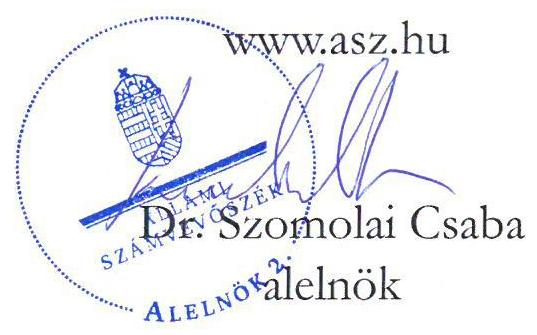
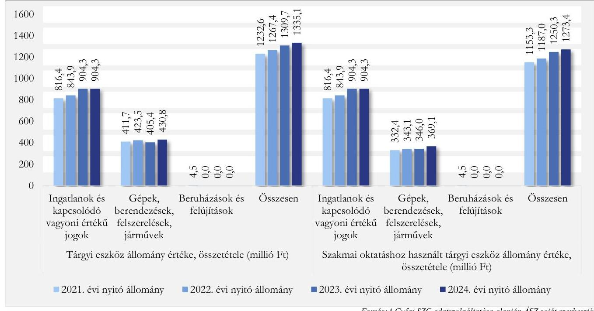
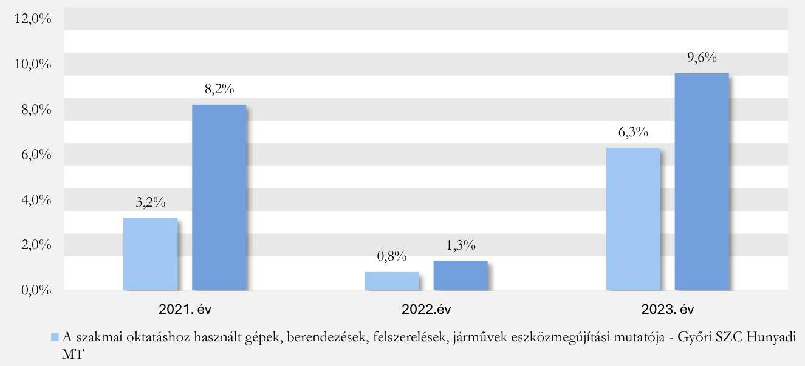
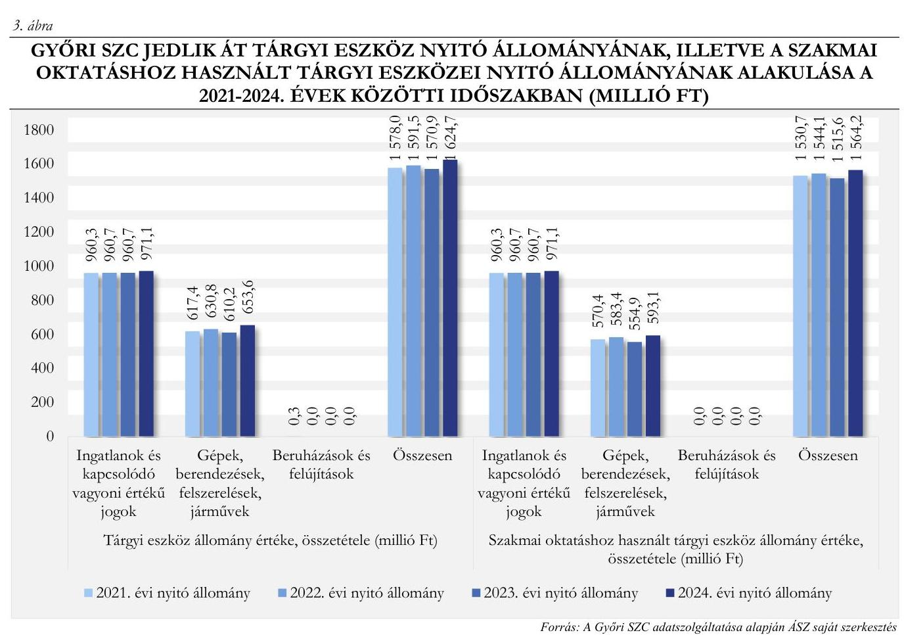
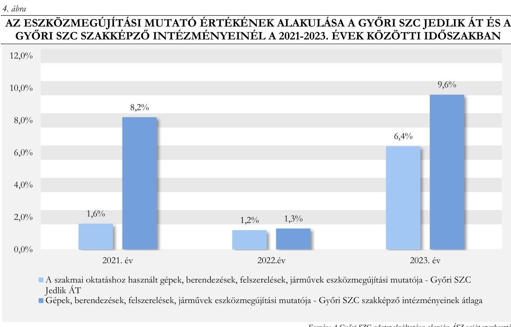
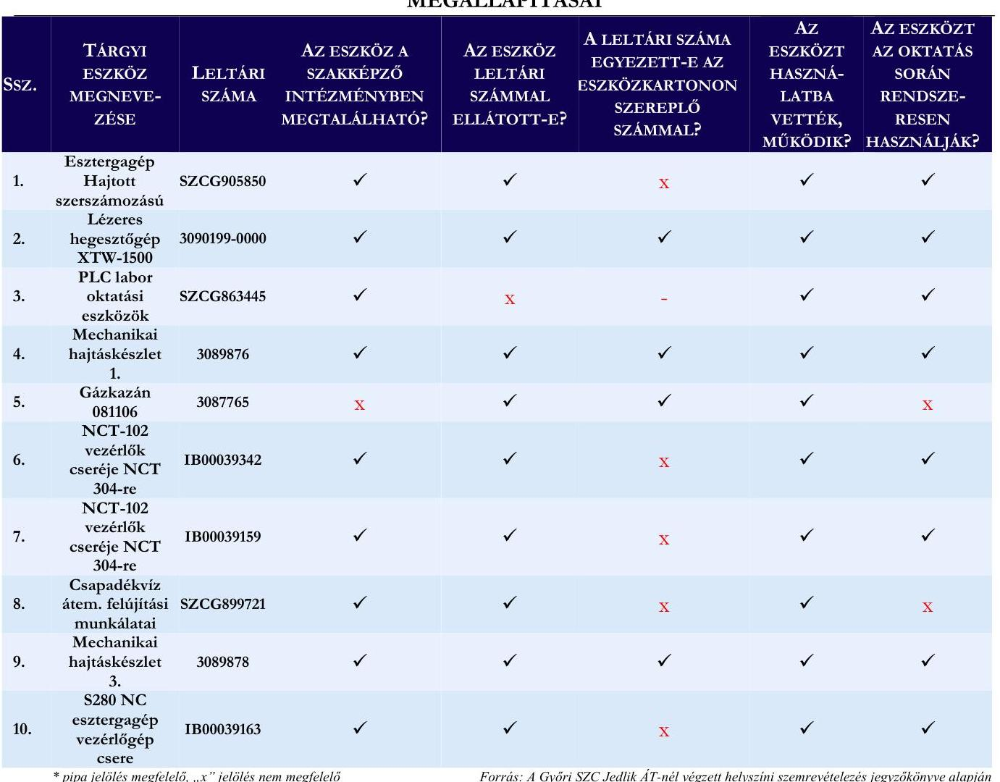

# JELENTÉS 

A szakképzési centrum intézményénél a feladatellátáshoz szükséges tárgyi feltételek rendelkezésre állásának célzott ellenőrzése

A Győri Szakképzési Centrum és két intézmény ellenőrzése
2025.

---

# JELENTÉS 

## A szakképzési centrum intézményénél a feladatellátáshoz szükséges tárgyi feltételek rendelkezésre állásának célzott ellenőrzése

A Győri Szakképzési Centrum és két intézmény ellenőrzése
2025.

25063

---

# ELLENŐRZÉSI IGAZGATÓSÁG: 

## ELLENŐRZÉSI IGAZGATÓSÁG I.

## ELLENŐRZÉSI IGAZGATÓ:

SINKÁNÉ DR. CSENDES ÁGNES ellenőrzési igazgató

## ELLENŐRZÉSVEZETŐ:

NAGY MARIANNA ellenőrzésvezető

Jelentéseink az interneten a www.axz.hu címen olvashatók.

IKTATÓSZÁM: EL-4303-001/2025
TÉMASORSZÁM: -
ELLENŐRZÉS-AZONOSÍTÓ SZÁM: V1096

---

# TARTALOMJEGYZÉK 

AZ ELLENŐRZÉS ALAPADATAI ..... 5
AZ ELLENŐRZÖTT SZERVEZETEK ..... 7
ÖSSZEFOGLALÁS ..... 8
AZ ELLENŐRZÉS FÓKUSZTERÜLETE ..... 10
MEGÁLLAPÍTÁSOK ..... 11
JAVASLATOK ..... 23
MELLÉKLETEK ..... 24
I. sz. melléklet: Értelmező szótár ..... 24
II. sz. melléklet: Az ellenőrzött szervezetek jegyzéke ..... 26
III. sz. melléklet: Ellenőrzési kritériumok ..... 27
FÜGGELÉK: ÉSZREVÉTELEK ..... 28
RÖVIDÍTÉSEK JEGYZÉKE ..... 32

---

.

---

# AZ ELLENŐRZÉS ALAPADATAI 

## AZ ELLENŐRZÉS CÉLJA

Az ellenőrzés célja annak értékelése volt, hogy a szakképzési centrum intézményeiben a szakképzési feladatok ellátásához szükséges tárgyi feltételek biztosítottak voltak-e.

## AZ ELLENŐRZÉS TÍPUSA

Kombinált ellenőrzés

## AZ ELLENŐRZÖTT IDŐSZAK

2021-2023. évek, kitekintéssel 2024. évre az ellenőrzés megkezdésének időpontjáig (2024. október 15-ig).

## AZ ELLENŐRZÉS TÁRGYA

Az ellenőrzés tárgyát képezte a szakképzési centrum intézményeinél a szakképzési feladatok ellátásához szükséges tárgyi feltételek rendelkezésre állásának a vagyonmegőrzési kockázatot jelző mutatók segítségével történő ellenőrzése, az ellenőrzött időszakban megvalósult beruházások, felújítások; a szakképző intézmény által használt ingatlannal kapcsolatban a feladatai ellátásához szükséges feltételek biztosítása az Szkr. ${ }^{1}$ 55. § (3) bekezdése alapján; a szakmai oktatáshoz szükséges tárgyi feltételek rendelkezésre állása az Szkt. ${ }^{2}$ 11. §-ának, az Szkr. 12. § f) pontjában foglaltaknak megfelelően, az Szkr. 12/A. §-ban előírtak alapján kidolgozott képzési és kimeneti követelmények figyelembe vételével.

Az ellenőrzés kiterjedt minden olyan körülményre és adatra, amely az ÁSZ ${ }^{3}$ jogszabályban meghatározott feladatainak teljesítéséhez, valamint a program végrehajtása folyamán felmerült újabb összefüggések feltárásához szükséges volt.

## AZ ELLENŐRZÉS JOGALAPJA

Az ellenőrzés jogszabályi alapját az ÁSZ tv. ${ }^{4} 1 . \S$ (3) bekezdés és az 5. § (2)-(4) bekezdés előírásai képezték.

## AZ ELLENŐRZÉS MÓDSZERE

Az ellenőrzést a nemzetközi standardokat irányadónak tekintve az ellenőrzési program szempontjai, az ellenőrzött időszakban hatályos jogszabályok, az ellenőrzés szakmai szabályok és módszertanok figyelembevételével végezte az ÁSZ.

Az ellenőrzési kérdések megválaszolásához szükséges bizonyítékok megszerzése az ellenőrzött szervezetek által rendelkezésre bocsátott dokumentumokra és adatokra alapozva, továbbá megfigyelés,

---

helyszíni szemle (szemrevételezés), kérdésfeltevés (információkérés), valamint elemző eljárás útján történt. Az ellenőrzési bizonyítékként felhasználható adatforrások közé tartoztak egyrészt az ellenőrzéshez kért dokumentumok, adatforrások, másrészt adatforrás volt még minden - az ellenőrzés folyamán - feltárt, az ellenőrzés szempontjából információkat tartalmazó dokumentum.

Az ellenőrzött szervezetek az ellenőrzés lefolytatásához tanúsítványok kitöltésével, valamint az ÁSZ által kért dokumentumok, adatok, információk megküldésével és az ellenőrzés során szolgáltattak adatokat.

Az ellenőrzés keretében mintavételezésre nem került sor. A szakképző intézményekben helyszíni szemlére (szemrevételezésre) került sor a 2023. évben a 10 legnagyobb könyv szerinti értékkel rendelkező tárgyi eszközt (ezen belül gép, berendezés felszerelés) érintően. A helyszíni ellenőrzés célja volt, hogy az ellenőrzés során az ÁSZ meggyőződjön a tárgyi eszközök létezéséről, azok használatáról azon szakmákhoz kapcsolódóan, amelyekhez a beszerzésük történt.

Az ÁSZ a szakképzési centrumokhoz tartozó ellenőrzött szakképző intézményeknél a szakképzési feladatok ellátásához szükséges tárgyi feltételek rendelkezésre állását a vagyonmegőrzési kockázatot jelző mutatók (tárgyi eszközök használhatósági foka, beruházási aktivitás és eszközmegújítás mértéke) segítségével elemezte és értékelte, továbbá az Szkt. és az Szkr. előírásai alapján ellenőrizte és értékelte.

A vagyonmegőrzési kockázatot jelző mutatók alapján a szakképzési feladatellátás tárgyi feltételeinek rendelkezésre állásában kockázatot hordozhat, ha az ellenőrzött időszakban a tárgyi eszközök használhatósági foka folyamatosan csökkenő tendenciájú volt, és a szakmai oktatáshoz használt eszközök - ezen belül gépek, berendezések, felszerelések és járművek - használhatósági fokának mértéke az ellenőrzött időszak utolsó lezárt évében nem érte el a 20,0\%-ot és a nullára leírt eszközök aránya 50,0\% vagy azt meghaladó volt, és az ellenőrzött időszakban a beruházási aktivitás az eszközpótlási igénytől elmaradó és az eszközmegújítás folyamatosan csökkenő tendenciát mutatott.

---

# AZ ELLENŐRZÖTT SZERVEZETEK 

## GYŐRI SZAKKÉPZÉSI CENTRUM

A Győri SZC ${ }^{5}$ a szakképzésért felelős miniszter döntése értelmében 2019. augusztus 1-jén jött létre a Győri Műszaki Szakképzési Centrum és a Győri Szolgáltatási Szakképzési Centrum összevonásával, jogelődjét 2015. július 1-jén alapították. A Győri SZC irányító szerve és fenntartója a KIM ${ }^{6}$ (2022. május 24-ig ITM ${ }^{\text {® }}$ ) volt, a középirányítói feladatokat az NSZFH ${ }^{8}$ látta el.

A Győri SZC fő tevékenységei közé tartozott a technikumi és szakképző iskolai szakmai oktatás, szakiskolai és szakgimnáziumi nevelés-oktatás, sajátos nevelési igényű gyermekek, tanulók, valamint beilleszkedési, tanulási, magatartási nehézséggel küzdő tanulók iskolai nevelése-oktatása, kollégiumi ellátás biztosítása, valamint egyéb nevelő és oktató munkához kapcsolódó, nem köznevelési tevékenység. A Győri SZC az állami intézményfenntartó központtól átvett gimnáziumi és általános iskolai intézményekben gimnáziumi és általános iskolai nevelés-oktatás alapfeladatot látott el.

A Győri SZC-nél a foglalkoztatottak átlagos állományi létszáma a 2022. évben 1328 fő, a 2023. évben 1325 fő volt. A Győri SZC-nél a szakmai oktatásban résztvevő tanulók száma a 2021/2022. tanévről a 2023/2024. tanévre 6153 főről 10168 főre (65,3\%-kal) emelkedett. A szakképzési centrum részeként az ellenőrzött időszakban 16 szakképző intézmény, négy köznevelési intézmény, valamint egy akkreditált vizsgaközpont működött. Az Szkt. 26. § (3) bekezdés alapján a szakképzési centrumot a főigazgató és a kancellár önállóan vezeti és képviseli. Az Szkt. 26. § (4)-(5) bekezdései alapján a főigazgató felel a szakképzési centrum részeként működő szakképző intézmények szakképzési alapfeladatainak ellátásáért, a kancellár felel a szakképzési centrum törvényes és szakszerű működéséért. A Győri SZC kancellárjának és főigazgatójának személye az ellenőrzött időszakban nem változott.

A szakképzési centrum részeként működő szakképző intézmények költségvetését a szakképzési centrum költségvetése tartalmazza, és az éves költségvetési beszámoló a szakképzési centrum vonatkozásában készül. A Győri SZC-nél a nemzeti vagyonba tartozó befektetett eszközök értéke - a tárgyévet megelőző évhez képest -2022-ben 6,0 \%-kal, 2023-ban 2,4 \%-kal növekedett, 2022-ben 8 402,9 M Ft, 2023-ban 8 600,9 M Ft volt.

## GYŐRI SZC HUNYADI MÁTYÁS TECHNIKUM

A Győri SZC Hunyadi MT ${ }^{9}$ a Győri SZC részeként működik 2015.07.01-je óta. A Győri SZC ellenőrzött időszakban hatályos alapító okiratának 6.1.4. pontja alapján a technikumi szakmai oktatás mellett a Győri SZC Hunyadi MT szakképző iskolai szakmai oktatást is ellátott. A Győri SZC Hunyadi MT-ben oktatott szakmák a specializált gép- és járműgyártás, a gépészet, fa- és bútoripar, az építőipar, a kereskedelem és a szépészet ágazatba sorolhatók. A 2023/2024. tanévben a szakmai oktatás keretében résztvevő tanulók száma 555 fő.

## GYŐRI SZC JEDLIK ÁNYOS GÉPIPARI ÉS INFORMATIKAI TECHNIKUM ÉS KOLLÉGIUM

A Győri SZC Jedlik ÁT ${ }^{10}$ a Győri SZC részeként működik 2015.07.01-je óta. A Győri SZC ellenőrzött időszakban hatályos alapító okiratának 6.1.5. pontja alapján a Győri SZC Jedlik ÁT a technikumi szakmai oktatás mellett szakképző iskolai szakmai oktatást is ellátott. A Győri SZC Jedlik ÁT-ben oktatott szakmák a gépészet, informatika és távközlés ágazatba sorolhatók. A 2023/2024. tanévben a szakmai oktatás keretében résztvevő tanulók száma 883 fő volt.

---

# ÖSSZEFOGLALÁS 

A szakképzési rendszer irányítása és múködési mechanizmusa az elmúlt években jelentősen átalakult, a szakképzés versenyképességi tényezővé vált. A szakképzési rendszer fejlesztése állandó tárgya a közérdeklődésnek. A szakképzési rendszer fejlesztése szempontjából fontos, hogy a szakképzési centrum rendelkezik-e a szakképzési feladatellátáshoz szükséges tárgyi feltételekkel, illetve az is, ha azok csak részlegesen tudják biztosítani a korszerű szakmai ismeretek megszerzésére való felkészítést a szakképző intézményeknél. Ha a feladatellátás tárgyi feltételei nem vagy nem megfelelően biztosítottak, akkor az a feladatellátási kockázaton túl azt eredményezheti, hogy a tanulók korszerű szakmai ismeretek nélkül lépnek ki a munkaerőpiacra.

A szakmai oktatáshoz használt tárgyi eszközök értékének meghatározásánál problémát jelentett, hogy a Győri SZC által használt nyilvántartó rendszer nem tette lehetővé a szakmai feladatellátást és az üzemeltetést szolgáló tárgyi eszközök megkülönböztethetőségét. A Győri SZC-nél nem volt megítélhető, hogy a Győri SZChez tartozó Győri SZC Hunyadi MT és a Győri SZC Jedlik ÁT rendelkezett-e a szakképzési alapfeladatok ellátásához szükséges és arra alkalmas eszközökkel.

A Győri SZC Hunyadi MT-nél és Győri SZC Jedlik ÁT-nél történt helyszíni szemrevételezés eredményei alátámasztották a nyilvántartás hiányosságait, és az eszközök szakmai oktatásra vonatkozó beazonosíthatóságának a hiányát.

A Győri SZC az ÁSZ ellenőrzése folyamán manuálisan gyűjtötte ki az intézményi szakmai oktatáshoz használt eszközöket, és készítette el az erre vonatkozó kimutatást, amelynek értékelése megtörtént. A szakmai oktatáshoz használt tárgyi eszközök elhasználódása és a Győri SZC Hunyadi MT-nél az eszközmegújítás alacsony mértéke miatt fennáll annak a kockázata, hogy a Győri SZC Hunyadi MT-nél és a Győri SZC Jedlik ÁT-nél nem a legmodernebb eszközök fognak rendelkezésre állni.

A Győri SZC Hunyadi MT-nél a szakmai oktatáshoz használt nullára leírt gépek, berendezések, felszerelések, járművek összes gépek, berendezések, felszerelések, járművek bruttó értékéhez viszonyított aránya több mint 20 százalékponttal meghaladta az ÁSZ módszertani meghatározása alapján elvárt 50,0\%-os értéket. A szakmai oktatáshoz használt gépek, berendezések, felszerelések, járművek használhatósági foka az ellenőrzött időszak egyik évében sem érte a $20,0 \%$-ot.

A Győri SZC Jedlik ÁT-nél a szakmai oktatáshoz használt nullára leírt gépek, berendezések, felszerelések, járművek összes gépek, berendezések, felszerelések, járművek bruttó értékéhez viszonyított aránya több mint 30 százalékponttal meghaladta az ÁSZ módszertani meghatározása alapján elvárt 50,0\% alatti értéket. A szakmai oktatáshoz használt gépek, berendezések, felszerelések, járművek használhatósági foka az ellenőrzött időszak egyik évében sem érte el a $20,0 \%$-ot.

Ahhoz, hogy a Győri SZC Hunyadi MT és a Győri SZC Jedlik ÁT a szakmai oktatás feladatait a szakképzésre vonatkozó jogszabályokban foglaltaknak megfelelően el tudja látni, célszerű lenne a szakmai oktatáshoz használt tárgyi eszközök tervszerű, ütemezett pótlásának megvalósítása.

A Győri SZC Hunyadi MT-nél a beruházások és felújítások összege a 2021-2023. évekre összesen 111,6 M Ft volt, ebből a 44,6 M Ft-ot ( $40,0 \%$-ot) a gépek, berendezések, felszerelések, járművek tettek ki. A Győri SZC által az intézményi szakmai oktatáshoz használt eszközökről manuálisan készített kimutatás alapján megállapítható, hogy a szakmai oktatáshoz használt gépek, berendezések, felszerelések, járművek esetében a 2021-2023. évekre elszámolt értékcsökkenés összege összesen 63,3 M Ft, volt, a nullára leírt gépek, berendezések, felszerelések, járművek aránya a 2021. évi 73,0\%-ról a 2023. évre 77,2\%-ra emelkedett. Ezen

---

eszközcsoport 2023. évi nettó eszközértéke 38,2 M Ft volt, amely a nullára leírt eszközök 284,8 M Ft értékének $13,4 \%$-a.

A Győri SZC Jedlik ÁT-nél a beruházások és felújítások éves összege a 2021-2023. évekre összesen 80,9 M Ft volt, ebből a 68,5 M Ft-ot ( $84,7 \%$-ot) a gépek, berendezések, felszerelések, járművek tettek ki. A Győri SZC által az intézményi szakmai oktatáshoz használt eszközökről manuálisan készített kimutatás alapján megállapítható, hogy a szakmai oktatáshoz használt gépek, berendezések, felszerelések, járművek esetében a 2021-2023. évekre elszámolt értékcsökkenés összege összesen 51,3 M Ft, volt, a nullára leírt leírt gépek, berendezések, felszerelések, járművek aránya a 2021. évi $87,6 \%$-ról a 2023. évre $84,6 \%$-ra csökkent. Ezen eszközcsoport 2023. évi nettó eszközértéke 59,3 M Ft volt, amely nullára leírt eszközök 501,6 M Ft értékének $11,8 \%$-a volt.

A Győri SZC Hunyadi MT-nél és a Győri SZC Jedlik ÁT-nél a 2021., 2022. és a 2023. években oktatott szakmákhoz szükséges tárgyi feltételek szakmánként történő ellenőrzésére, a képzési és kimeneti követelmények alapján készült szakmai programoknak való megfelelés ÁSZ által történt ellenőrzése nem valósult meg, mert az alapadatok beazonosíthatóságának a hiányában nem volt értékelhető a szakmai oktatáshoz szükséges tárgyi eszközök rendelkezésre állása.
A képzési és kimeneti követelmények alapján készült szakmai programokban a szakmai alap- és szakirányú oktatás megszervezéséhez szükséges tárgyi feltételek rendelkezésre állásának maradéktalan megítéléséhez célszerű lenne egy olyan eszköz nyilvántartás kialakítása, amely intézményenként, szakmánként biztosítja a szakmai alap- és szakirányú oktatáshoz szükséges tárgyi feltételek rendelkezésre állásának nyomon követhetőségét és ellenőrizhetőségét.

A Győri SZC Hunyadi MT és a Győri SZC Jedlik ÁT szakképző intézményeknél a szakképzési-alapfeladat ellátását szolgáló, a jogszabályban előírt tárgyi feltételek közül az ingatlanok rendelkezésre álltak.

---

# AZ ELLENŐRZÉS FÓKUSZTERÜLETE 

A szakképzési centrumhoz tartozó intézményben a szakképzési feladatok ellátásához szükséges tárgyi feltételek rendelkezésre állása

---

# MEGÁLLAPÍTÁSOK 

## 1. A szakképzési centrumhoz tartozó intézményben a szakképzési feladatok ellátásához szükséges tárgyi feltételek rendelkezésre állása

Összegző megállapítás

A Győri SZC a 2021., a 2022. és a 2023. évek vonatkozásában nem biztosította a Győri SZC Hunyadi MT és a Győri SZC Jedlik ÁT intézmények által a szakmai oktatáshoz használt tárgyi eszköz állomány teljeskörű beazonosíthatóságát, nem támogatta a tárgyi feltételek rendelkezésre állásának nyomon követését. A megfelelő eszköz nyilvántartás hiánya miatt a Győri SZC-nél nem volt megítélhető, hogy a Győri SZC-hez tartozó Győri SZC Hunyadi MT és a Győri SZC Jedlik ÁT rendelkezett-e a szakképzési alapfeladatok ellátásához szükséges és arra alkalmas eszközökkel. A Győri SZC által az intézményi szakmai oktatáshoz használt eszközökről manuálisan készített kimutatás alapján megállapítható, hogy a 2021-2023. évekre számítva a szakmai oktatáshoz használt tárgyi eszközök elhasználódása és az eszközmegújítás alacsony mértéke a Győri SZC Hunyadi MT-nél és a Győri SZC Jedlik ÁT-nél kihatott a szakképzési feladatellátás tárgyi feltételeinek biztosítására.
1.1. számú megállapítás:

A Győri SZC Hunyadi MT-nél és a Győri SZC Jedlik ÁT-nél a szakmai oktatáshoz használt gépek, berendezések, felszerelések, járművek használhatósági foka a 2021-2023. időszakban nem érte el a 20,0\%-ot, és a nullára leírt gépek, berendezések, felszerelések aránya meghaladta az $50,0 \%$-ot. A szakmai oktatáshoz használt tárgyi eszközök tervszerű, ütemezett pótlása nem valósult meg.
A Győri SZC tárgyi eszközeinek nyitó állománya 2021. évről 2024. évre 12 906,8 M Ft-ról 14 720,3 M Ftra (14,1\%-kal) növekedett. A Győri SZC tárgyi eszközei nyitóállományának évenkénti összetételének alakulását az 1. táblázat mutatja be.

---

1. táblázat

A GYŐRI SZC TÁRGYI ESZKÖZEI NYITÓ ÁLLOMÁNYÁNAK ALAKULÁSA A 2021-2024. ÉVEKBEN (MILLIÓ FT)

| ÉV | INGATLANOK ÉS   KAPCSOLÓDÓ   VAGYONI ÉRTÉKŐ   JOOK | GÉPEK,   BERENDEZÉSEK,   FELSZERELÉSEK,   JÁRMÜVEK | BERUHÁZÁSOK,   FELÚJÍTÁSOK | ÖSSZESEN |
| :-- | :--: | :--: | :--: | :--: |
| 2021. évi nyitó   állomány | 8426,2 | 4390,0 | 90,6 | 12906,8 |
| 2022. évi nyitó   állomány | 8528,6 | 4793,9 | 58,1 | 13380,6 |
| 2023. évi nyitó   állomány | 9401,2 | 4602,6 | 58,0 | 14061,9 |
| 2024. évi nyitó   állomány | 9539,0 | 5123,3 | 58,0 | 14720,3 |

A Győri SZC tárgyi eszközeinek nyitó állományában az ingatlanok és kapcsolódó vagyoni értékủ jogok a 2021. évben $65,3 \%$, a 2022. évben $63,7 \%$, a 2023. évben $66,9 \%$, a 2024. évben $64,8 \%$, a gépek berendezések, felszerelések, járművek állománya a 2021. évben 34,0\%, a 2022. évben 35,8\%, a 2023. évben $32,7 \%$, a 2024. évben $34,8 \%$ arányt tett. A beruházások, felújítások nyitó állománya a tárgyi eszközökhöz viszonyított aránya 2021-ben $0,7 \%$, a 2022-2024. években $0,4 \%$ volt.

# Győri SZC Hunyadi MT 

A Győri SZC Hunyadi MT tárgyi eszközei nyitó állományának összesen értéke, valamint az ingatlanok és kapcsolódó vagyoni értékủ jogok és a gépek, berendezések, felszerelések, járművek nyitó állománya is növekvő trendet mutatott a 2021-2024 időszakban. Az ingatlanok és kapcsolódó vagyoni értékủ jogok állománya a 2021. évi 816,4 M Ft-ról 2024. évre 904,3 M Ft-ra, 10,8\%-kal növekedett. A gépek, berendezések, felszerelések, járművek nyitó állományi értéke 2021. évi 411,7 M Ft-ról a 2024. évre 430,8 M Ft-ra, 4,6\%-kal növekedett. A Győri SZC Hunyadi MT tárgyi eszközei állományában a legnagyobb értéket az ingatlanok és kapcsolódó vagyoni értékủ jogok képezték (2021. évi 66,2\%, 2024. évi $67,7 \%$ ).
A gépek, berendezések, felszerelések, járművek állománya a Győri SZC Hunyadi MT tárgyi eszköz állományának egyharmad részét tették ki (2021. évi 33,4\%, 2024. évi 32,3\%) a 2021. és a 2024. években.
A Győri SZC Hunyadi MT tárgyi eszközei állományának, illetve a szakmai oktatáshoz használt tárgyi eszközei 2021-2024. évi nyitó állományának alakulását az 1. ábra mutatja be.

---

1. ábra

GYŐRI SZC HUNYADI MT TÁRGYI ESZKÖZ NYITÓ ÁLLOMÁNYÁNAK, ILLETVE A SZAKMAI OKTATÁSHOZ HASZNÁLT TÁRGYI ESZKÖZEI NYITÓ ÁLLOMÁNYÁNAK ALAKULÁSA A 2021-2024. ÉVEK KÖZÖTTI IDŐSZAKBAN (MILLIÓ FT)

A Győri SZC Hunyadi MT-hez tartozó ingatlanok teljes egészében a szakmai oktatás tárgyi feltételei közé tartoztak. A szakmai oktatáshoz használt gépek, berendezések, felszerelések, járművek nyitó állománya a 2021. évi 332,4 M Ft-ról 2024. évre 369,1 M Ft-ra, 11,0\%-kal növekedett.

# A vagyonmegőrzési kockázatot jelző mutatószámok 

A nullára leírt gépek, berendezések, felszerelések, járművek eszközök aránya a 2021-2023. években meghaladta a gépek, berendezések, felszerelések, járművek bruttó értékének az 50,0\%-át. A nullára leírt gépek, berendezések, felszerelések, járművek bruttó értékének aránya a 2021. évi a 73,0 \%-ról a 2023. évre $77,2 \%$-ra növekedett. A nullára leírt, a tervezett élettartam után működtetett gépek, berendezések, felszerelések, járművek esetében nagyobb a meghibásodás lehetősége.

## Használhatósági fok

A Győri SZC Hunyadi MT-hez tartozó ingatlanok teljes mértékben a szakmai oktatási tevékenységet szolgálták. A Győri SZC Hunyadi MT-nél a szakmai oktatáshoz használt gépek, berendezések, felszerelések, járművek használthatósági foka a 2021. évi 16,4\%-ról 2023. évre 10,4\%-ra 6,0 százalékponttal csökkent. A szakmai oktatáshoz használt gépek, berendezések, felszerelések, járművek használhatósági foka a 2021-2023 közötti időszakban nem érte el a 20,0 \%-ot, és ezeknél az eszközöknél gyakoribb az esetleges meghibásodás bekövetkezése.

## Beruházás, felújítás, beruházási aktivitás

A Győri SZC Hunyadi MT-nél az intézményi beruházások és felújítások éves összege 2021. évben 56,0 M Ft, 2022. évben 53,7 M Ft és a 2023. évben 32,0 M Ft volt, amely a 2021. évben és a 2022. évben is meghaladta a Győri SZC szakképző intézményeinek beruházások és felújítások 2021. évi 32,0 M Ft és a 2022. évi 49,2 M Ft-os átlagértékét.

---

A Győri SZC Hunyadi MT beruházás aktivitása csökkenő tendenciát mutatott, a 2021. évi 44,1 M Ft-ról 2023. évre 25,2 M Ft-ra csökkent és 2021-2023. közötti időszakban elmaradt a Győri SZC szakképző intézményei beruházási aktivitásának átlagától. A gépek, berendezések, felszerelések, járművek 2021. évi beruházási aktivitása a 2021. évi teljes beruházási aktivitás értékének 37,5 \%-át tették ki, mely arány a 2022. évre 7,0\%-ra csökkent. A 2023. évi beruházási aktivitás 100,0\%-a a gépek, berendezések, felszerelések, járművekhez kötődött. A Győri SZC Hunyadi MT beruházási aktivitását és a Győri SZC szakképző intézményeinek beruházási aktivitásának átlagát a 2021-2023. közötti időszakban a 2. táblázat mutatja be. 2. táblázat

# A GYŐRI SZC HUNYADI MT BERUHÁZÁSI AKTIVITÁSA ÉS A GYŐRI SZC SZAKKÉPZŐ INTÉZMÉNYEI BERUHÁZÁSI AKTIVITÁSÁNAK ÁTLAGA 2021-2023. ÉVEK KÖZÖTT (MILLIÓ FT) 

| MEGNEVEZÉS | BERUHÁZÁSI   AKTIVITÁS 2021. ÉV | BERUHÁZÁSI   AKTIVITÁS 2022. ÉV | BERUHÁZÁSI   AKTIVITÁS 2023. ÉV |
| :-- | :--: | :--: | :--: |
| Győri SZC Hunyadi MT | 44,1 | 42,3 | 25,2 |
| Győri SZC szakképző   intézményeinek átlaga | 57,9 | 107,3 | 80,2 |

Forrás: A Győri SZC adatszolgáltatása alapján ÁSZ saját szerkesztés
A Győri SZC Hunyadi MT-nél a szakmai oktatáshoz rendelkezésre álló tárgyi eszköz állomány értékcsökkenési leírása a 2021. évről 2023. évre 459,9 M Ft-ról 546,7 M Ft-ra növekedett. A szakmai oktatáshoz használt, ingatlanok és a kapcsolódó vagyoni értékủ jogok nélkül a tárgyi eszközök éves értékcsökkenése a 2021. évi 19,3 M Ft-ról 2022. évre 20,5 M Ft-ra, 2023. évre 23,5 M Ft-ra növekedett.

## Eszközmegújítási mutató

Az eszközmegújítási mutató értékének alakulását a Győri SZC Hunyadi MT és a Győri SZC szakképző intézményeinél a 2021-2023. közötti időszakban a 2. ábra mutatja be.
2. ábra

AZ ESZKÖZMEGÚJÍTÁSI MUTATÓ ÉRTÉKÉNEK ALAKULÁSA A GYŐRI SZC HUNYADI MT ÉS A GYŐRI SZC SZAKKÉPZŐ INTÉZMÉNYEINÉL A 2021-2023. ÉVEK KÖZÖTTI IDŐSZAKBAN

[^0]
[^0]:    Forrás: A Győri SZC adatszolgáltatása alapján ÁSZ saját szerkesztés

---

A szakmai oktatáshoz használt gépek, berendezések, felszerelések, járművek eszközmegújítási mutatója a 2021. évi $3,2 \%$-ról 2023. évre $6,3 \%$-ra 3,1 százalékponttal növekedett, de a növekedése nem volt folytonos és mértéke elmaradt Győri SZC szakképző intézményeinek átlagértékeitől, amely a 2021. évi $8,2 \%$-ról a 2023. évre $9,6 \%$-ra növekedett.
A Győri SZC Hunyadi MT-nél a beruházások és felújítások összege a 2021-2023. évekre összesen 111,6 M Ft volt, ebből a 44,6 M Ft-ot ( $40,0 \%$-ot) a gépek, berendezések, felszerelések, járművek tettek ki. A Győri SZC által az intézményi szakmai oktatáshoz használt eszközökről manuálisan készített kimutatás alapján megállapítható, hogy a szakmai oktatáshoz használt gépek, berendezések, felszerelések, járművek esetében a 2021-2023. évekre elszámolt értékcsökkenés összege összesen 63,3 M Ft volt, a nullára leírt leírt gépek, berendezések, felszerelések, járművek aránya a 2021. évről a 2023. évre 4,2 százalékponttal ( $73,0 \%$-ról $77,2 \%$-ra) emelkedett. Ezen eszközcsoport 2023. évi nettó eszközértéke 38,2 M Ft volt, amely a nullára leírt eszközök 284,8 M Ft értékének 13,4\%-a.
A Győri SZC Hunyadi MT-nél a 2021-2023. évekre számítva a gépek, berendezések, felszerelések, járművek eszközcsoportnál a használhatósági fok nem érte el a $20,0 \%$-ot, és a nullára leírt gépek, berendezések, felszerelések aránya meghaladta az 50,0\%-ot. A Győri SZC a Győri SZC Hunyadi MT vonatkozásában a 2021., a 2022. és a 2023. évekre az eszközök pótlásához nem készített eszközpótlási tervet. A szakmai oktatáshoz használt tárgyi eszközök elhasználódása és az eszközmegújítás alacsony mértéke miatt fennáll annak a kockázata, hogy a Győri SZC Hunyadi MT-nél nem a legmodernebb eszközök fognak rendelkezésre állni, amely kihat a szakképzési feladatellátás minőségére.
A Győri SZC nyilatkozata alapján ennek oka, hogy az egyes oktatott ágazatok és szakmák esetében nagyon eltérő a technológiaváltás üteme, a képzési és kimeneti követelményekben meghatározott eszközigény összetettsége, a duális partnerek rendelkezésre állása és eszközellátottsága, melyek mindegyikét mérlegelni szükséges az eszközpótlás szükségessége szempontjából.
Az ÁSZ ellenőrzés szakmai véleménye alapján ahhoz, hogy a Győri SZC Hunyadi MT a szakmai oktatás feladatait az Szkt.-ben és az Szkr.-ben foglaltaknak megfelelően el tudja látni, célszerű lenne, hogy a szakmai oktatáshoz használt tárgyi eszközök tervszerű, ütemezett pótlása megvalósuljon.
Az eszközpótlási terv Győri SZC által történő elkészítése a vagyonfelélés megakadályozásának dokumentumát is jelentheti.

# Győri SZC JedliK ÁT 

A Győri SZC Jedlik ÁT tárgyi eszközei nyitó állományának összesen értéke és a gépek, berendezések, felszerelések, járművek nyitó állománya - a 2023. év kivételével - növekvő trendet mutatott a 2021-2024. időszakban. Az ingatlanok és kapcsolódó vagyoni értékủ jogok állománya minimálisan, a 2021. évi 960,3 M Ft-ról 2024. évre 971,1 M Ft-ra növekedett. A gépek, berendezések, felszerelések, járművek állományi értéke 2021. évi 617,4 M Ft-ról a 2024. évre 653,6 M Ft-ra, 5,8 \%-kal növekedett. A Győri SZC Jedlik ÁT tárgyi eszközei nyitó állományában a legnagyobb értéket az ingatlanok és kapcsolódó vagyoni értékủ jogok képezték (2021. évi $60,9 \%, 2024$. évi $59,8 \%$ ).
A gépek, berendezések, felszerelések, járművek állománya a Győri SZC Jedlik ÁT tárgyi eszköz nyitó állományának 2021. évi $39,1 \%$-a, 2024. évi $40,2 \%$-a volt.
A Győri SZC Jedlik ÁT tárgyi eszközei állományának, illetve a szakmai oktatásra használt tárgyi eszközei 2021-2024. évi nyitó állományának alakulását a 3. ábra mutatja be.

---

A Győri SZC Jedlik ÁT-hez tartozó ingatlanok teljes egészében a szakmai oktatás tárgyi feltételei közé tartoztak. A szakmai oktatáshoz használt gépek, berendezések, felszerelések, járművek nyitó állománya változatos képet mutatott a 2021. évi 570,4 M Ft-ról 2022. évre 583,4 M Ft-ra növekedett, majd a 2023. évi csökkenést követően 2024. évre 593,1 M Ft-ra növekedett.

# A vagyonmegőrzési kockázatot jelző mutatószámok 

A nullára leírt gépek, berendezések, felszerelések, járművek eszközök aránya a 2021-2023. években meghaladta a gépek, berendezések, felszerelések, járművek bruttó értékének az 50,0\%-át. A nullára leírt gépek, berendezések, felszerelések, járművek bruttó értékének aránya a 2021. évben 87,6\%, a 2023. évben $84,6 \%$ volt. A nullára leírt, a tervezett élettartam után működtetett gépek, berendezések, felszerelések, járművek esetében nagyobb a meghibásodás lehetősége.

## Használhatósági fok

A Győri SZC Jedlik ÁT-hez tartozó ingatlanok teljes mértékben a szakmai oktatás tárgyi feltételei közé tartoztak. A Győri SZC Jedlik ÁT-nél a szakmai oktatáshoz használt gépek, berendezések, felszerelések, járművek használthatósági foka a 2021. évi 8,7\%-ról, a 2023. évre 10,0\%-ra, 1,3 százalékponttal növekedett. A Győri SZC Jedlik ÁT-nél a szakmai oktatáshoz használt gépek, berendezések, felszerelések, járművek használhatósági foka a 2021-2023. évek közötti időszakban nem érte el a 20,0\%-ot, és ezeknél az eszközöknél gyakoribb az esetleges meghibásodás bekövetkezése.

---

# Beruházás, felújítás, beruházási aktivitás 

A Győri SZC Jedlik ÁT-nél az intézményi beruházások és felújítások éves összege 2021. évben 14,9 M Ft, 2022. évben 18,4 M Ft és a 2023. évben 69,3 M Ft volt, amely a 2023. évben meghaladta a Győri SZC beruházások és felújítások 40,4 M Ft-os átlagértékét.
A Győri SZC Jedlik ÁT beruházás aktivitása növekvő tendenciát mutatott, a 2021. évi 11,8 M Ft-ról 2023. évre 54,6 M Ft-ra nőtt, de elmaradt a Győri SZC szakképző intézményei beruházási aktivitásának átlagától. A gépek, berendezések, felszerelések, járművek 2021. évi beruházási aktivitása a 2021. évi teljes beruházási aktivitás értékének 96,1\%-át tették ki, mely a 2023. évre 79,5\%-ra csökkent. A Győri SZC Jedlik ÁT beruházási aktivitását és a Győri SZC szakképző intézményeinek beruházási aktivitásának átlagát a 20212023. közötti időszakban az 3. táblázat mutatja be.

| 3. táblázat   A GYŐRI SZC JEDLIK ÁT ÉS A GYŐRI SZC SZAKKÉPZŐ INTÉZMÉNYEINEK BERUHÁZÁSI AKTIVITÁSÁNAK ÁTLAGA A 2021-2023. ÉVEK KÖZÖTTI IDŐSZAKBAN (MILLIÓ FT) |  |  |  |
| :--: | :--: | :--: | :--: |
| MÉGNEVEZÉS | BERUHÁZÁSI   AKTIVITÁS 2021. ÉV | BERUHÁZÁSI   AKTIVITÁS 2022. ÉV | BERUHÁZÁSI   AKTIVITÁS 2023. ÉV |
| Győri SZC Jedlik ÁT | 11,8 | 14,5 | 54,6 |
| Győri SZC szakképző   intézményeinek átlaga | 57,9 | 107,3 | 80,2 |

A Győri SZC Jedlik ÁT-nél a szakmai oktatáshoz rendelkezésre álló tárgyi eszköz állomány értékcsökkenési leírása a 2021. évről 2023. évre 676,6 M Ft-ról 697,4 M Ft-ra növekedett. A szakmai oktatáshoz használt, ingatlanok és a kapcsolódó vagyoni értékủ jogok nélkül a tárgyi eszközök éves értékcsökkenési leírása a 2021. évi 16,6 M Ft-ról a 2023. évre 18,0 M Ft-ra növekedett.

## Eszközmegújítási mutató

A szakmai oktatáshoz használt gépek, berendezések, felszerelések, járművek eszközmegújítási mutatója változatos képet mutatott a 2021-2023 közötti időszakban. A 2021. évi 1,6\%-ról 2023. évre 6,4 \%-ra 4,8 százalékponttal növekedett, de a növekedése nem volt folytonos, és mértéke elmaradt Győri SZC szakképző intézményeinek átlagértékeitől, amely a 2021. évi 8,2\%-ról a 2023. évre 9,6\%-ra növekedett.
Az eszközmegújítási mutató értékének alakulását a Győri SZC Jedlik ÁT és a Győri SZC szakképző intézményeinél a 2021-2023 közötti időszakban a 4. ábra mutatja be.

---

*Forrás: A Győri SZC adatszolgáltatása alapján ÁSZ saját szerkesztés*

A Győri SZC Jedlik ÁT-nél a beruházások és felújítások éves összege a 2021-2023. évekre összesen 80,9 M Ft, ebből a 68,5 M Ft-ot (84,7%-ot) a gépek, berendezések, felszerelések, járművek tettek ki. A szakmai oktatáshoz használt gépek, berendezések, felszerelések, járművek esetében a 2021-2023. évekre elszámolt értékcsökkenés összege összesen 51,3 M Ft, volt, a nullára leírt gépek, berendezések, felszerelések, járművek aránya a 2021. évről a 2023. évre 3,0 százalékponttal (87,6%-ról 84,6%-ra) csökkent. Ezen eszközcsoport 2023. évi nettó eszközértéke 59,3 M Ft volt, amely a nullára leírt eszközök 501,6 M Ft értékének 11,8 %-a volt.

A Győri SZC Jedlik ÁT-nél a 2021-2023. évekre számítva a gépek, berendezések, felszerelések, járművek eszközcsoportnál a használhatósági fok nem érte el a 20,0%-ot, és a nullára leírt gépek, berendezések, felszerelések aránya meghaladta az 50,0%-ot. A Győri SZC a Győri SZC Jedlik ÁT vonatkozásában az eszközök pótlásához nem készített eszközpótlási tervet. A szakmai oktatáshoz használt tárgyi eszközök elhasználódása és az eszközmegújítás alacsony mértéke miatt fennáll annak a kockázata, hogy a Győri SZC Jedlik ÁT -nél nem a legmodernebb eszközök fognak rendelkezésre állni, amely kihat a szakképzési feladatellátás minőségére.

A Győri SZC nyilatkozata alapján az eszközpótlási terv hiányának oka, hogy az egyes oktatott ágazatok és szakmák esetében nagyon eltérő a technológiaváltás üteme, a képzési és kimeneti követelményekben meghatározott eszközigény összetettsége, a duális partnerek rendelkezésre állása és eszközellátottsága, melyek mindegyikét mérlegelni szükséges az eszközpótlás szükségessége szempontjából.

Az ÁSZ ellenőrzés szakmai véleménye alapján ahhoz, hogy a Győri SZC Jedlik ÁT a szakmai oktatás feladatait az Szkt.-ben és az Szkr.-ben foglaltaknak megfelelően el tudja látni, célszerű lenne, hogy a szakmai oktatáshoz használt tárgyi eszközök tervszerű, ütemezett pótlása megvalósuljon.

Az eszközpótlási terv Győri SZC által történő elkészítése a vagyonfelélés megakadályozásának dokumentumát is jelentheti.

---

1.2. számú megállapítás:

A Győri SZC Hunyadi MT és a Győri SZC Jedlik ÁT szakképzésialapfeladatellátásához szükséges ingatlanok rendelkezésre álltak.
A Győri SZC Hunyadi MT és a Győri SZC Jedlik ÁT szakképző intézmények a szakképzési-alapfeladatellátását szolgáló, a feladataik ellátásához szükséges ingatlanokkal, az Szkt.-vel összhangban rendelkeztek. A szakképzési-alapfeladat ellátásához szükséges és arra alkalmas helyiségek az Szkr.-ben előírtaknak megfelelően rendelkezésre álltak és legalább ötéves időtávlatban biztosítottak voltak. A Győri SZC, a Győr Megyei Jogú Város önkormányzatával és az NSZFH-val, valamint Mosonmagyaróvár Város önkormányzatával kötött vagyonkezelési szerződései alapozták meg a Győri SZC Hunyadi MT és a Győri SZC Jedlik ÁT múködési feltételeit az Szkt.-ben előírtaknak megfelelően.
1.3. számú megállapítás:

A Győri SZC a Győri SZC Hunyadi MT-nél és a Győri SZC Jedlik ÁTnél a szakmai oktatáshoz használt tárgyi eszközök beazonosíthatóságát nem biztosította. Ezáltal nem volt megítélhető a szakmai oktatáshoz szükséges tárgyi feltételek 2021., 2022. és 2023. években történő rendelkezésre állása. A Győri SZC Hunyadi MT-nél és a Győri SZC Jedlik ÁT-nél végzett helyszíni szemrevételezés alátámasztotta az eszközök szakmai oktatásra vonatkozó beazonosíthatóságának a hiányát.
A Győri SZC Hunyadi MT tizenkét, a Győri SZC Jedlik ÁT hat féle szakmára képezte a tanulókat a 2021-2023 közötti időszakban. Az Szkt. előírja, hogy a szakmai oktatás a képzési és kimeneti követelmények alapján ágazati alapoktatásban és szakirányú oktatásában történik.
Az Szkt. 10. §-a szerint a kizárólag szakképző intézményben szakmai oktatás keretében elsajátítható szakmákat a Kormány rendeletben (Szkr.) állapítja meg (szakmajegyzék). Az Szkt. 80. § (1)-(2) bekezdés előírja, hogy a szakirányú oktatást a duális képzőhely, illetve a szakképző intézmény szervezhet. A szakirányú oktatás követelményeire való felkészítéshez szükséges tárgyi eszközöket a szakirányú oktatást folytató szervezet biztosítja. Az Szkr. 237. § szerint a szakirányú oktatást tanteremben, tanműhelyben vagy munkahelyi körülmények között kell megszervezni.
A Győri SZC kancellárjának nyilatkozata alapján a Győri SZC Hunyadi MT-ben és a Győri SZC Jedlik ÁT-ban az ellenőrzött időszakban oktatott szakmák tekintetében a képzési és kimeneti követelményekben közzétett, az ágazati alapoktatás megszervezéséhez szükséges eszközök az iskolákban, a szakirányú oktatás megszervezéséhez szükséges eszközök pedig az iskolákban és/vagy a duális partnereknél az ellenőrzött időszakban rendelkezésre álltak.
Győri SZC Hunyadi MT és a Győri SZC Jedlik ÁT intézményei vonatkozásában a szakmai oktatáshoz használt tárgyi eszközökről készített 2021., 2022. és 2023. évekre vonatkozó kimutatása tartalmazta az általuk használt eszközöket, beleértve az üzemeltetéshez és karbantartáshoz használt eszközöket.
A Győri SZC kancellárjának nyilatkozata szerint a Győri SZC-nél a könyvvezetésre használt SAPprogram $^{11}$ nem tette lehetővé a tárgyi eszköz adatainál azt a jelölést, hogy az eszközök az általános múködést vagy a szakmai feladatok ellátását szolgálják, így a szakmai feladatok ellátását biztosító eszközök intézményenként történő legyűjtését. Az adatszolgáltatás keretében az ellenőrzéshez rendelkezésre bocsátott, a szakmai oktatáshoz tartozó tárgyi eszközökről a 2021., 2022. és 2023. évekre vonatkozó nyilvántartások, illetve kimutatások a Győri SZC nyilatkozata alapján az analitikus nyilvántartásokból „kézi adatgyűjtés" eredményeként jöttek létre.
A Győri SZC nem rendelkezett olyan nyilvántartó rendszerrel, amely a szakmai oktatáshoz használt tárgyi eszköz állomány teljeskörű lekérdezhetőségét, azok rendelkezésre állásának nyomon követhetőségét és

---

ellenőrizhetőségét biztosította volna. Az adatok manuálisan történő legyűjtése nem képezett pontos kiinduló alapot a szakmai oktatás megszervezéséhez, adott szakma képzéséhez szükséges tárgyi feltételek rendelkezésre állásának megítéléséhez.
A Győri SZC az általa használt nyilvántartó rendszerben nem biztosította a szakmai feladatellátást és az üzemeltetést szolgáló tárgyi eszközök megkülönböztethetőségét, amely nem felelt meg az Áhsz. ${ }^{12} 14$. melléklete VII. 1. pontjában előírtaknak.
A szakmai oktatáshoz használt tárgyi eszköz állomány rendelkezésre állása nyomon követhetőségének és ellenőrizhetőségének hiánya a jövőben kockázatot jelent a képzési és kimeneti követelmények alapján a szakmai programokban meghatározott, - a duális partnereknél rendelkezésre álló eszközökön túl - a Győri SZC-nél biztosítandó eszközök rendelkezésre állása tekintetében.
A Győri SZC Hunyadi MT-nél és a Győri SZC Jedlik ÁT-nél a 2021., 2022. és a 2023. években oktatott szakmákhoz szükséges tárgyi feltételek szakmánként történő ellenőrzésére, a képzési és kimeneti követelmények alapján a szakmai programoknak való megfelelés ellenőrzésére nem került sor, mert az alapadatok beazonosíthatóságának a hiányában nem volt értékelhető a szakmai oktatáshoz szükséges tárgyi eszközök rendelkezésre állása.
A szakmai oktatáshoz szükséges tárgyi feltételek rendelkezésre állásának nyomonkövethetőségét biztosító eszköz nyilvántartás hiánya miatt a Győri SZC-nél az Szkr. 58. § (3) bekezdésében foglaltak ellenére nem volt megítélhető, hogy a Győri SZC-hez tartozó Győri SZC Hunyadi MT és a Győri SZC Jedlik ÁT rendelkezett-e a szakképzési alapfeladatok ellátásához szükséges és arra alkalmas eszközökkel.
Az Áhsz. 14. melléklet VII. 1. pontjának megfelelő, a szakmai feladatellátást és az üzemeltetést szolgáló tárgyi eszközök megkülönböztethetőségét lehetővé tevő eszköz nyilvántartásnak a hiányára vezethetőek vissza a Győri SZC Hunyadi MT és a Győri SZC Jedlik ÁT szakképző intézményeknél történt helyszíni szemrevételezésekhez kapcsolódó megállapítások.
A Győri SZC Hunyadi MT-nél végzett helyszíni szemrevételezés megállapításait a 4. táblázat tartalmazza.

---

# A GYŐRI SZC HUNYADI MT-NÉL VÉGZETT HELYSZÍNI SZEMREVÉTELEZÉS MEGÁLLAPÍTÁSAI* 

| SZC. | TÁRGYI ESZKÖZ MEGNEVEZÉSE | LÉLTÁRI   SZÁMA | AZ ESZKÖZASZAKKÉRZÖ   INTÉZMÉNY-   BEN   MEGTÁLÁL-   HATO? | AZ ESZKÖZ   LÉLTÁRI   SZÁMMAL   ELLÁTOTT-E? | LÉLETÁRI   SZÁMA   EGYÉZÉTT-E AZ   ESZKÖZKÁRTO-   NON SZEREPŁŐ   SZÁMMAL? | AZ ESZKÖZT HASZNÁLATBA VETTÉK, MÚKÖDIK? | AZ ESZKÖZT AZ OSTATÁS SORÁN RENDSZERESEN   HASZNÁLJAK? |
| :--: | :--: | :--: | :--: | :--: | :--: | :--: | :--: |
| 1. | Esztergagép hagyományos Super Basic | 3089749 | $\checkmark$ | $\checkmark$ | $\checkmark$ | $\checkmark$ | $\checkmark$ |
| 2. | Személyemelő gép MAGNI E S | SZCG878680 | $\checkmark$ | $\checkmark$ | $\checkmark$ | $\checkmark$ | X |
| 3. | Palástköszörü RSM 500 A | SZCG822363 | $\checkmark$ | $\checkmark$ | $\checkmark$ | $\checkmark$ | $\checkmark$ |
| 4. | Arclifting gép   Smartsonic   Ultrahangos | 3085529 | $\checkmark$ | $\checkmark$ | $\checkmark$ | $\checkmark$ | $\checkmark$ |
| 5. | Marógép   KOMPAS F1100   Univerzális   marógép   VHF2 géptalp és gépsatu | SZCG877754 | $\checkmark$ | $\checkmark$ | $\checkmark$ | $\checkmark$ | $\checkmark$ |
| 6. | Holzmann többfunkciós gép | SZCG628308 | $\checkmark$ | $\checkmark$ | $\checkmark$ | $\checkmark$ | $\checkmark$ |
| 7. | Esztergagép Basic 180 Super | SZCG795714 | $\checkmark$ | $\checkmark$ | $\checkmark$ | $\checkmark$ | $\checkmark$ |
| 8. | Glettszóró | SZCG628310 | $\checkmark$ | $\checkmark$ | $\checkmark$ | $\checkmark$ | $\checkmark$ |
| 9. | Arckezelő gép   PLASMA GTS 3F | SZCG977787 | $\checkmark$ | $\checkmark$ | $\checkmark$ | $\checkmark$ | $\checkmark$ |

* pipa jelölés megfelelő, „A" jelölés nem megfelelő

Forrás: A Győri SZC Hunyadi MT-nél végzett helyszíni szemrevételezés jegyzőkönyve alapján

A Győri SZC Hunyadi MT-nél a 2023. év vonatkozásában a 10 legnagyobb könyv szerinti értékkel rendelkező tárgyi eszköznél (ezen belül gép, berendezés felszerelés) az analitika alapján nem lehetett beazonosítani, hogy szakmai oktatáshoz használt eszköz volt-e. A helyszíni szemrevételezés során az ÁSZ ellenőrzés megállapította, hogy a személyemelőgép Magni ES (leltári száma: SCZG878680) tárgyi eszköz beszerzése nem szakmához kapcsolódott, és az eszközt nem a szakmai oktatási feladatokhoz kapcsolódóan, hanem az üzemeltetési feladatok ellátásához használták.
A Győri SZC Jedlik ÁT-nél végzett helyszíni szemrevételezés megállapításait az 5. táblázat tartalmazza.

---

# A GYŐRI SZC JEDLIK ÁT-NÉL VÉGZETT HELYSZÍNI SZEMREVÉTELEZÉS MEGÁLLAPÍTÁSAI 

A Győri SZC Jedlik ÁT-nél a 2023. év vonatkozásában a 10 legnagyobb könyv szerinti értékkel rendelkező tárgyi eszköznél (ezen belül gép, berendezés felszerelés) az analitika alapján nem lehetett beazonosítani, hogy szakmai oktatáshoz használt eszköz volt-e. A Győri SZC Jedlik ÁT-nél a helyszíni szemrevételezés során az ÁSZ ellenőrzés megállapította, hogy a gázkazán (leltári száma: 3087765) és a csapadékvíz átemelő felújítási munkálatai (leltári száma: SZCG899721) tárgyi eszközök beszerzése nem szakmához kapcsolódott, és az eszközt nem a szakmai oktatási feladatokhoz kapcsolódóan, hanem az üzemeltetési feladatok ellátásához használták.
A helyszíni szemrevételezésre kiválasztott 10 tárgyi eszköz közül 5 tárgyi eszköz leltári száma nem egyezett meg az eszközkartonon szereplő számmal. A helyszíni szemrevételezés megállapításai alapján a PLC oktatási labor hét oktató állomáson lévő oktatási eszközei ugyanazon a leltári számon (3022239) szerepeltek, amely nem felelt meg az Áhsz. 14. melléklet VII. 1. a) és b) pontjában előírt nyilvántartásnak.

---

# JAVASLATOK 

Az ÁSZ tv. 33. § (1) bekezdésében foglaltak értelmében az ellenőrzött szervezet vezetője köteles a jelentésben foglalt megállapításokhoz kapcsolódó intézkedési tervet összeállítani és azt a jelentés kézhezvételétől számított 30 napon belül az ÁSZ részére megküldeni. Amennyiben az ellenőrzött szervezet vezetője nem küldi meg határidőben az intézkedési tervet, vagy továbbra sem elfogadható intézkedési tervet küld, az Állami Számvevőszék elnöke az ÁSZ tv. 33. § (3) bekezdése a) és b) pontjaiban foglaltakat érvényesítheti.

## A GYŐRI SZC KANCELLÁRJÁNAK

1. Gondoskodjon az intézményi eszközpótlási terv elkészítéséről, amely a szakmai oktatáshoz használt tárgyi eszközök ütemezett, tervszerű utánpótlását biztosíthatja.
2. Gondoskodjon az Áhsz. 14. melléklet VII. 1. a) és b) pontjában előírt részletezettségủ nyilvántartás vezetéséről, amely lehetővé teszi a Győri SZC Jedlik ÁT-nél a tárgyi eszközök tételes, egyedi ellenőrizhetőségét.
3. Intézkedjen a Győri SZC-nél a tárgyi eszközök nyilvántartásának olyan részletezettségű, az Áhsz. 14. melléklete VII. 1. pontjának megfelelő kialakításáról, amely biztosítani tudja a szakmai feladatok ellátását és a müködtetést szolgáló tárgyi eszközök megkülönböztethetőségét.
4. Intézkedjen a Győri SZC-nél egy olyan eszköz nyilvántartás kialakításáról, amely biztosítja az intézményi szakmai oktatáshoz használt tárgyi eszközök beazonosíthatóságát, rendelkezésre állásának nyomon követhetőségét és ellenőrzését.

---

# MELLÉKLETEK 

## I. SZ. MELLÉKLET: ÉRTELMEZŐ SZÓTÁR

szakképzési centrum
szakképző intézmény
szakképzési alapfeladat
szakirányú oktatás
szakmai oktatás
ágazati alapoktatás

A szakképzési centrumok olyan a szakképzésért felelős miniszter által alapított önálló költségvetési szervek, amelyeknek részeként működnek a szakképzési alapfeladatot ellátó, jogi személyiséggel bíró szakképző intézmények vagy az Nkt. szerinti köznevelési intézmények (például kollégium). (Forrás: Szkt. 26. §-ához tartozó Nagykommentár)
Szakképzési alapfeladat ellátására létrejött jogi személy. A szakképzési centrum részeként múködő szakképző intézmény a szakképzési centrum jogi személyiséggel rendelkező szervezeti egysége, amely kizárólag a Kormány rendeletében meghatározott jogok és kötelezettségek alanya lehet. (Forrás: Szkt. 17. §)
A szakképző intézmény alapító okiratában meghatározott technikumi szakmai oktatás és szakképző iskolai szakmai oktatás, továbbá ahhoz kapcsolódóan az előkészítő évfolyam és a műhelyiskola megszervezése (Szkt. 7. § (értelmező rendelkezések) 6. pont)

A szakmai oktatásnak az ágazati alapoktatást, illetve ágazati alapvizsgát követő - a közismereti oktatással párhuzamosan vagy attól függetlenül megvalósuló - olyan része, amely a tanuló, illetve a képzésben részt vevő személy számára biztosítja a szakma keretében ellátandó munkatevékenységekhez szükséges ismeretek és készségek elsajátítását és azok gyakorlatban történő alkalmazására való képesség megszerzését,
továbbá a tanulót, illetve a képzésben részt vevő személyt a szakmai vizsgára felkészíti. Szakirányú oktatást a duális képzőhely és a szakképző intézmény szervezhet. A szakirányú oktatás megszervezésének a következő együttműködési formái különböztethetők meg:

- teljes egészében a duális képzőhelyen történik (a szakképző intézményben csak közismereti oktatás van).
- a szakképző intézmény és a duális képzőhely megállapodása alapján megosztva történik (a szakképző intézményben a közismereti oktatás és a szakirányú oktatás elméleti része van).
- a szakirányú oktatás a szakképző intézményben folyik, de a tanuló, illetve a képzésben részt vevő személy évente egy alkalommal, legalább négy és legfeljebb tizenkettő hét egybefüggő időszakra duális képzőhellyel szakképzési munkaszerződést köt.
- kizárólag a szakképző intézményben folyik.
(Forrás: Szkt. XII. Fejezet 75-77. §, 80. § alapján szerkesztett ÁSZ fogalom)
A szakmai oktatás közismereti oktatásból, ágazati alapoktatásból és szakirányú oktatásból áll és az Szkr. 1. melléklete szerinti szakmajegyzékben meghatározott számú évfolyamon történik. (Forrás: Szkt. 19. § alapján)
Adott ágazat közös szakmai tartalmait a képzési és kimeneti követelményekben meghatározottak szerint magában foglaló ismeretek és készségek átadására szolgáló, a szakirányú oktatást megelőző képzési forma, amely kizárólag a szakképző intézményben szervezhető meg. (Forrás: A szakképzési jogszabályok magyarázata, Második átdolgozott és hatályosított kiadás, Budapest, 2022.)

---

képzési és kimeneti követelmények
beruházási aktivitás
eszközmegújítás
nullára leírt eszközök aránya
tárgyi eszköz használhatósági foka
vagyonmegőrzési kockázatot jelző mutatók

A szakmákhoz - az ellenőrzési, a mérési és az értékelési rendszer kialakítását és múködését biztosító, a szakképzésben kötelezően alkalmazandó - képzési és kimeneti követelményeket kell előírni. A képzési és kimeneti követelményekben - részszakmaként - meghatározható a szakmának olyan önállóan elkülöníthető része, amely legalább egy munkakör betöltéséhez szükséges kompetenciák megszerzését teszi lehetővé. Ha e törvény eltérően nem rendelkezik, a szakmára vonatkozóan meghatározott rendelkezéseket a részszakmára is alkalmazni kell.

A képzési és kimeneti követelményeket a szakképzésért felelős miniszter az IKK Zrt. útján dolgozza ki. A képzési és kimeneti követelményeket - a Kormány adott ágazatért felelős tagjának egyetértésével - a szakképzésért felelős miniszter hivatalos kiadványként a szakképzési tájékoztatási és információs központ keretében múködtetett honlapon (a továbbiakban: honlap) teszi közzé. A képzési és kimeneti követelmények normatív rendelkezést nem tartalmazhatnak és azok tartalma jogszabállyal és közjogi szervezetszabályozó eszközzel nem lehet ellentétes. A képzési és kimeneti követelmények a honlapról nem távolíthatók el, archiválásukra a digitális archiválás szabályait kell alkalmazni.

A képzési és kimeneti követelményekben kell meghatározni a szakmai oktatás megszervezéséhez szükséges tárgyi feltételeket. (Forrás: Szkt. 11. § (1)-(2) bekezdései alapján, Szkr. 12. § f) pont, 12/A. §)
Számítási mód: tárgyi eszközök beszerzése + beruházásokból, felújításokból aktivált érték + beruházások, felújítások változása. (Forrás: A költségvetési intézmények vagyonmegőrzése, A költségvetési intézmények elemzése az eredményszemléletű elszámolások alapján, ÁSZ, 2023.)
Számítási mód: tárgyév során aktivált tárgyi eszközök értéke / tárgyi eszközök bruttó értéke
(Forrás: A költségvetési intézmények vagyonmegőrzése, A költségvetési intézmények elemzése az eredményszemléletű elszámolások alapján, ÁSZ, 2023.)

Teljesen (0-ig) leírt eszközök bruttó értéke/ nemzeti vagyonba tartozó befektetett eszközök bruttó értéke (Forrás: A költségvetési intézmények vagyonmegőrzése, A költségvetési intézmények elemzése az eredményszemléletű elszámolások alapján, ÁSZ, 2023.)

Az eszközpótlás, vagy annak elmaradása eredményét jól lehet mérni az eszközök állapotának, használhatóságának vizsgálatával, amelyre a használhatósági fok mutató alkalmas. Számítási mód: tárgyi eszközök záró könyv szerinti értéke/ tárgyi eszközök záró bruttó értéke. (Forrás: A költségvetési intézmények vagyonmegőrzése, A költségvetési intézmények elemzése az eredményszemléletű elszámolások alapján, ÁSZ, 2023.)
A költségvetési intézmények vagyonmegőrzése - A költségvetési intézmények elemzése az eredményszemléletű elszámolások alapján (Állami Számvevőszék, T/606. számú publikáció, 2023., https://www.asz.hu/elemzesek)

---

II. SZ. MELLÉKLET: AZ ELLENŐRZÖTT SZERVEZETEK JEGYZÉKE

|  ELLENŐRZÖTT SZERVEZET NEVE | SZEREPE  |
| --- | --- |
|  1. Győri Szakképzési Centrum | Szakképzési feladatot ellátó költségvetési szerv  |
|  2. Győri SZC Hunyadi Mátyás Technikum | Szakképző intézmény  |
|  3. Győri SZC Jedlik Ányos Gépipari és Informatikai | Szakképző intézmény  |
|  Technikum és Kollégium |   |

---

# FOKUSZTERÜLET 

## 1. Fókuszterület

A szakképzési centrumhoz tartozó intézményben a szakképzési feladatok ellátáshoz szükséges tárgyi feltételek rendelkezésre állásának ellenőrzése
1.1. Az intézményre vonatkozóan az eszközök értéke, összetétele, használhatósági foka; az ellenőrzött időszakban megvalósult beruházások, felújítások vizsgálata
1.2. A szakképző intézmény által használt ingatlannal kapcsolatban a feladatai ellátásához szükséges feltételek biztosítása
1.3. Az adott szakma alapképzéséhez és a szakmai oktatáshoz szükséges tárgyi feltételek rendelkezésre állása, az Szkt. 11. $\int$-ában, valamint a Szkr. 12. $\int$ f) pontban, az Szkr. 12/A. $\int$-ban előírtak alapján nyilvántartott kimeneti előírások alapján

## ELLENŐRZÉSI KRITÉRIUMOK

## Használhatósági fok

Számítás: tárgyi eszközök záró könyv szerinti értéke/ tárgyi eszközök záró bruttó értéke.
A számítás alapja az intézményi analitikák vonatkozásában:
15/A űrlap 25. sor 4., 5., 6., 7. oszlop értéke és a 15. sor 4., 5., 6., 7 oszlop értéke

## Beruházási aktivitás:

Számítás: tárgyi eszközök beszerzése + beruházásokból, felújításokból aktivált érték + beruházások, felújítások változása.
A számítás alapja tárgyi eszközökre a szakképzési centrum 2021., 2022. és 2023. évi költségvetési beszámolója alapján: 15/A. űrlap 2. sor 7. oszlop + 4. sor összesen oszlop (3. oszlop nélkül) + 12. űrlap 8. sor tárgyidőszak oszlop változása (előző évről tárgyévre)
Tárgyi eszközökre elszámolt értékcsökkenés összege: A 2021., 2022. és a 2023. évekre a tárgyi eszközökre elszámolt éves értékcsökkenés összege az intézmény vonatkozásában

## Eszközmegújítás mértéke:

Számítás: tárgyév során aktivált tárgyi eszközök értéke / tárgyi eszközök bruttó értéke
A szakképzési centrum 2021., 2022. és 2023. évi éves költségvetési beszámolója alapján: 15/A. űrlap 4. sor 4-56. oszlop értéke/ 15. sor 4-5-6. oszlopok értéke

Szkt. 22. § (2) bekezdéséhez, az Szkr. 55. § (3) bekezdés; A szakképző intézmény feladatai ellátásához szükséges feltételek biztosítása
Az Szkt 11. §-ában, valamint az Szkr. 12. § f) pontban, az Szkr. 12/A. §-ban előírtak szerint közzétett kimeneti előírások szerint.
Tárgyi eszköz nyilvántartás Áhsz 14. melléklete VII. 1. pont
Szakirányú oktatás követelményeire való felkészítéshez és a szakképzésialapfeladat-ellátáshoz szükséges eszközöket biztosító szervezet: Szkt. 80. § (2) bekezdés, Szkr. 58. § (3) bekezdés

---

# FÜGGELÉK: ÉSZREVÉTELEK 

A jelentéstervezetet a Számvevőszék 15 napos észrevételezésre megküldte az ellenőrzött szervezet vezetőjének az ÁSZ tv. 29. §* (1) bekezdése előirásának megfelelően.

A jelentéstervezet megállapításaira a Győri SZC kancellárja észrevételt tett. Az elfogadott észrevételek alapján a Számvevőszék módosította a jelentést. A függelék tartalmazza az ellenőrzött észrevételeit, illetve az el nem fogadott észrevételek elutasitásának indoklását.

## A Győri SZC kancellárjának észrevétele:

„1. A Győri Szakképzési Centrum nem ért egyet a Jelentéstervezet 11. oldalán megfogalmazott Összegző megállapításban foglaltakkal, miszerint:

A Győri SZC az általa használt nyilvántartó rendszerben a 2021., a 2022. és a 2023. évek vonatkozásában az Áhsz.-ben foglalt előirás ellenére nem biztositotta a Győri SZC Hunyadi MT és a Győri SZC Jedlik ÁT intézmények által a szakmai oktatáshoz használt tárgyi eszköz állomány teljeskörü beazonosíthatóságát, nem támogatta a tárgyi feltételek rendelkezésre állásának nyomon követését. Az Áhsz. szerinti eszköznyilvántartás hiánya miatt a Győri SZC- nél az Szkr.-ben foglaltak ellenére nem volt megitélhető, hogy a Győri SZC-hez tartozó Győri SZC Hunyadi MT és a Győri SZC Jedlik ÁT rendelkezett-e a szakképzési alapfeladatok ellátásához szükséges és arra alkalmas eszközökkel.

Indoklás:
A Győri Szakképzési Centrum tárgyi eszköz nyilvántartó rendszere elsődlegesen a naprakész vagyonnyilvántartást, a mérleg alátámasztását biztositja, és nem elvárható, hogy biztositani tudja a szakmai feladatok ellátását és a müködtetést szolgáló tárgyi eszközök megkülönböztethetőségét, különösen nem a képzési és kimeneti követelményekben (továbbiakban: KKK) közzétett, ágazati alapoktatás és szakirányú oktatás megszervezéséhez szükséges eszközjegyzékben szereplő tárgyi eszközök rendelkezésre állásának maradéktalan megitélhetőségét. A tárgyieszköz nyilvántartás és a KKK eszközjegyzéke több ok miatt sem összevethető:

- a KKK többnyire csak eszköz csoportokat, kategóriákat nevez meg, míg a nyilvántartás ennél sokkal konkrétabb,

[^0]
[^0]:    * 29. § (1) Az Állami Számvevőszék az ellenőrzési megállapításait megküldi az ellenőrzött szervezet vezetőjének vagy az általa megbízott személynek, és annak, akinek személyes felelősségét állapította meg.
    (2) Az ellenőrzött szervezet vezetője és a felelősként megjelölt személy az ellenőrzés megállapításaira tizenöt napon belül írásban észrevételt tehet.
    (3) Az Állami Számvevőszék az észrevételre a beérkezésétől számított harminc napon belül írásban válaszol. A figyelembe nem vett észrevételeket köteles a jelentésben feltüntetni, és megindokolni, hogy azokat miért nem fogadta el.

---

- a KKK-k változása folyamatos, az eszköz nyilvántartás ezt a gyors változást nem tudná követni.
- Az Szkr. 56. § (2) pontja pedig kimondja, hogy a szakképzési centrum részeként müködő szakképző intézmény esetében a Szkr. 56.§ (1) pontja szerinti feltételeknek a szakképzési centrum tekintetében kell fennállnia, így az eszközjegyzéknek való megfelelés intézményenként nem is kell, hogy azonosítható legyen.
- Az Áhsz. 14. melléklet VII. 1. pontja alapján a tárgyi eszközök nyilvántartása tartalmazza legalább a tárgyi eszköz megnevezését, sajátos adatait, stb.
A sajátos adatokról pedig az Áhsz. 14. melléklet VII. 5. pontja rendelkezik:
A gépek, berendezések, felszerelések, jármüvek

1. a) pontban hivatkozott sajátos adatai
a) annak típusa, gyártójának megnevezése, a gyártás éve,
b) VTSZ száma, és
c) egyedi nyilvántartás esetén annak gyártási száma, jármú esetén alvázszám, rendszáma, forgalmi engedély száma, érvényessége.

- Az intézményekben fellelhetőek voltak olyan eszközök a vizsgált időszakban, melyet az Önkormányzatok az intézmények használatába adtak, azok rendelkezésére bocsátottak, de a vagyonkezelési szerződés részeként nem kerültek átadásra. A szóban forgó eszközök egy részét 2024. IV. negyedévében adta át a Győri Önkormányzat a Győri Szakképzési Centrum részére, melyek így a Győri SZC számviteli nyilvántartásába kerültek.

A szakmai feladatellátást és a müködtetést szolgáló eszközök elkülönítése, és a KKK eszközjegyzékben felsorolt eszközök rendelkezésre állásának ellenőrzése véleményünk szerint szakmai feladat, amely nem alapulhat dokumentumelemzésen, gyakorlatban csak az adott szakterületen képzett szakemberek által tartott helyszíni szemlén ítélhető meg (ahogy azt a Kamara is ellenőrzi a duális partnereknél a nyilvántartásba vételkor).

Ezen nehézségek ellenére az ÁSZ ellenőrzés során a vizsgált intézmények és szakmák tekintetében törekedtünk olyan adattáblák elkészitésére (7. ponthoz feltöltött intézményenkénti, évenkénti adattáblák), ami lehetővé teszi az ÁSZ számára a KKK eszközjegyzékének való megfelelés megállapítását."

# El nem fogadás indoka: 

Az észrevételben foglaltakkal részben értünk egyet. Az Szkt. 80. § (1)-(2) bekezdés előírja, hogy a szakirányú oktatást a duális képzőhely, illetve a szakképző intézmény (együtt: szakirányú oktatást folytató szervezet) szervezhet. A szakirányú oktatás követelményeire való felkészitéshez szükséges tárgyi eszközöket a szakirányú oktatást folytató szervezet biztositja. Az Szkr. 58. § (3) bekezdés szerint a szakképzési centrum részeként müködő szakképző intézmény szakképzési alapfeladat ellátásához szükséges és arra alkalmas

---

eszközöket a szakképzési centrum bocsátja a részeként müködő szakképző intézmény rendelkezésére. A Győri SZC szakképző intézményei a szakirányú oktatás tárgyi feltételeit - a képzési és kimeneti követelmények alapján - a képzési programokban határozták meg.

Ahhoz, hogy a jogszabályi követelmény és a Győri SZC szakképző intézményeinek képzési programjaiban meghatározottak teljesülése - a szakmai oktatás tárgyi feltételeinek megléte - a Győri SZC és a szakképző intézményei számára is megítélhető, visszamérhető és ellenőrizhető legyen, olyan nyilvántartás vezetése szükséges a Győri SZC-nél, amely szakképző intézményenként, szakmánként lehetővé teszi a tárgyi eszközök beazonosíthatóságát. Az észrevétel megerősítette, hogy a Győri SZC nem rendelkezett a szakmai oktatást biztosító eszközök nyilvántartásával, mert a Győri SZC az ÁSZ ellenőrzés során a vizsgált intézmények és szakmák tekintetében készítette el az adattáblákat. A szakmai oktatást biztosító eszközök nyilvántartásának hiánya nem függ össze azzal, hogy az intézményekben fellelhetőek voltak olyan eszközök, amelyeknek egy részét a 2024. IV. negyedévben adta át a Győri Önkormányzat a Győri SZC részére.

Fontos továbbá, hogy a Győri SZC által vezetett tárgyi eszköz nyilvántartásban az üzemeltetést szolgáló eszközök és a szakmai oktatást szolgáló eszközök megkülönböztetése biztosított legyen. Az Áhsz. 14. melléklete VII. 1. pontja szerinti eszköz nyilvántartás alkalmas arra, hogy a tárgyi eszközök beazonosíthatóak, az üzemeltetést szolgáló eszközök és a szakmai oktatást szolgáló eszközök megkülönböztethetőek legyenek. Az Áhsz. 14. melléklet VII. 1. a) pontjára hivatkozás törlésre került a jelentéstervezetben.

# A Győri SZC kancellárjának észrevétele: 

„2. A Jelentéstervezetben több helyen és a javasolt intézkedések között is megjelenik az eszközpótlási terv készitésének indokoltsága.

Pl. "Gondoskodjon az intézményi eszközpótlási terv elkészitéséről, amely a szakmai oktatáshoz használt tárgyi eszközök ütemezett, tervszerű utánpótlását biztosíthatja."

A Győri Szakképzési Centrum az eszközpótlási terv elkészitésének a következő okokból nem látja a gyakorlati hasznát:

- A Szakképzés 4.0 stratégiának és az új Szakképzési törvénynek is alapvetése, hogy a szakképzés gyorsan és rugalmasan alkalmazkodjon a gazdaság szintén gyorsan változó igényeihez, így az oktatott szakmák köre, de különösen azok szakmai tartalma, és így az oktatásban szükséges eszközök köre is folyamatosan változik, alakul.
- Az eszközpótlásra/fejlesztésre fordítható keret maximum az adott költségvetési évre látható, de még ott sem annak indulásakor, mivel a fejlesztések forrása elsődlegesen a felnőttek szakmai oktatására kapott külön támogatás.
- Az Áhsz. által meghatározott értékcsökkenési leírási kulcsok eszközcsoportonként eltérőek, az adott eszközök hasznos élettartama a jogszabályban rögzített leírási

---

időtartamtól jelentősen eltérnek. Az adott eszköz tartóssága, az oktatásban (nem termelésben!) történő, ritkább használata a rögzített leírási időnél hosszabb müködési élettartamot biztosít.
Az eszközök nullára történő leírását követően is alkalmasak a szakmai és müködtetési feladatok ellátására, rendszeres karbantartással fizikai állapotuk megfelelően megőrizhető, az eszközök biztonságos müködésre alkalmasak.
Az eszközök tervezett élettartama meghatározó befolyást gyakorol a nullára leírt eszközök állományára, számviteli avulást tükröző magasabb nullás eszközállományt okoz, amely azonban nem jelent automatikusan nem használható eszközök miatti eszközpótlási igényt.

- Az intézmények a felmerült eszközpótlási igényeiket folyamatosan jelzik a benyújtott igénybejelentőkön keresztül."

# El nem fogadás indoka: 

Az eszközpótlási terv készitése célszerúségi javaslatként szerepel a jelentéstervezetben. A Győri SZC ellenőrzött két szakképző intézményénél a szakmai oktatáshoz használt tárgyi eszközök elhasználódása miatt, továbbá a Győri SZC Hunyadi MT-nél az eszközmegújítás alacsony mértéke miatt fennáll annak a kockázata, hogy a Győri SZC ellenőrzött két szakképző intézményénél nem a legmodernebb eszközök fognak rendelkezésre állni, amely kihat a szakképzési feladatellátás minőségére. Az eszközpótlási terv elkészitése azért lenne célszerü, mert ahhoz, hogy a Győri SZC ellenőrzött szakképző intézményei a szakmai oktatás feladatait az Szkt.-ben és az Szkr.ben foglaltaknak megfelelően el tudják látni, szükséges lenne, hogy a szakmai oktatáshoz használt tárgyi eszközök tervszerü, ütemezett pótlása megvalósuljon.

---

# RÖVIDÍTÉSEK JEGYZÉKE 

${ }^{1}$ Szkr.
${ }^{2}$ Szkt.
${ }^{3}$ ÁSZ
${ }^{4}$ ÁSZ tv.
${ }^{5}$ Győri SZC
${ }^{6}$ KIM
${ }^{7}$ ITM
${ }^{8}$ NSZFH
${ }^{9}$ Győri SZC Hunyadi MT
${ }^{10}$ Győri SZC Jedlik ÁT
${ }^{11}$ SAP-program
${ }^{12}$ Áhsz.

12/2020. (II. 7.) Korm. rendelet a szakképzésről szóló törvény végrehajtásáról 2019. évi LXXX. törvény a szakképzésről
Állami Számvevőszék
2011. LXVI. törvény az Állami Számvevőszékről

Győri Szakképzési Centrum
Kulturális és Innovációs Minisztérium
Innovációs és Technológiai Miniszter
Nemzeti Szakképzési és Felnőttképzési Hivatal
Győri Szakképzési Centrum Hunyadi Mátyás Technikum
Győri Szakképzési Centrum Jedlik Ányos Gépípari és Informatikai Technikum és Kollégium
System Applications and Products in Data Processing (vállalatirányítási rendszer)
4/2013. (I.11.) Korm. rendelet az államháztartás számviteléről

---

1052 Budapest, Apáczai Csere János u. 10. | 1364 Budapest 4., Pf. 54
www.asz.hu | szamvevoszek@asz.hu
telefon: +36 14849100