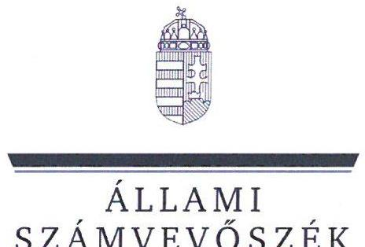
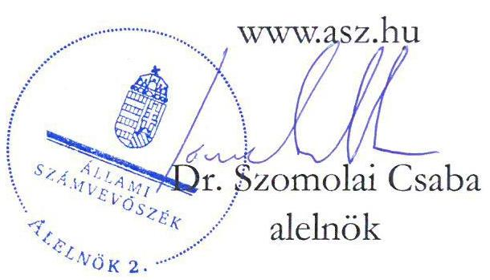
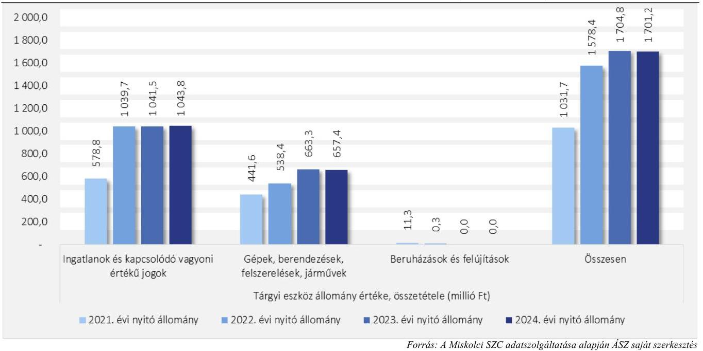
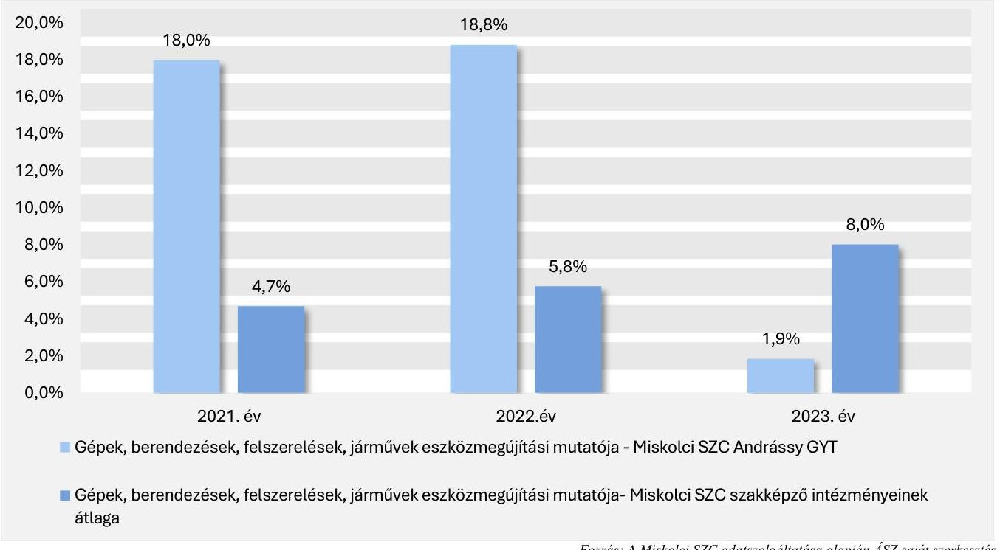
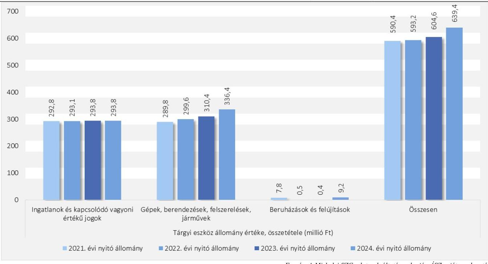
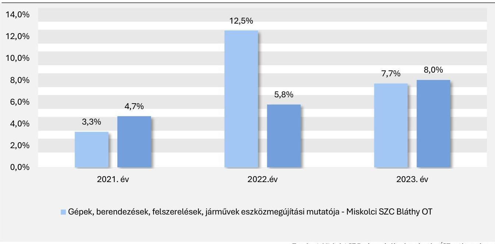
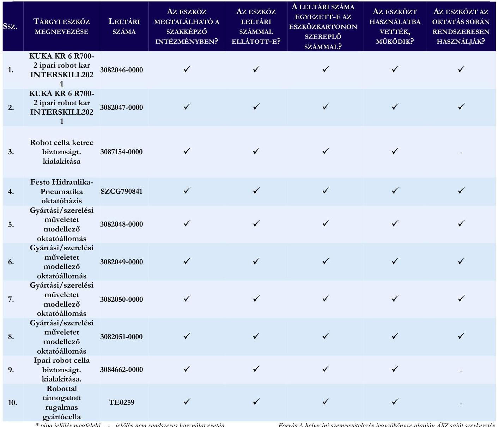

# JELENTÉS 

A szakképzési centrum intézményénél a feladatellátáshoz szükséges tárgyi feltételek rendelkezésre állásának célzott ellenőrzése

A Miskolci Szakképzési Centrum és két intézmény ellenőrzése
2025.

---

ÁLLAMI
SZÁMVEVÔSZÉK

# JELENTÉS 

## A szakképzési centrum intézményénél a feladatellátáshoz szükséges tárgyi feltételek rendelkezésre állásának célzott ellenőrzése

A Miskolci Szakképzési Centrum és két intézmény ellenőrzése
2025.

25064

---

# ELLENŐRZÉSI IGAZGATÓSÁG: 

## ELLENŐRZÉSI IGAZGATÓSÁG I.

## ELLENŐRZÉSI IGAZGATÓ:

SINKÁNÉ DR. CSENDES ÁGNES ellenőrzési igazgató

## ELLENŐRZÉSVEZETŐ:

NAGY MARIANNA ellenőrzésvezető

Jelentéseink az interneten a www.axz.hu címen olvashatók.

IKTATÓSZÁM: EL-4303-002/2025
TÉMASORSZÁM: -
ELLENŐRZÉS-AZONOSÍTÓ SZÁM: V1096

---

# TARTALOMJEGYZÉK 

AZ ELLENŐRZÉS ALAPADATAI ..... 5
AZ ELLENŐRZÖTT SZERVEZETEK ..... 7
ÖSSZEFOGLALÁS ..... 8
AZ ELLENŐRZÉS FÓKUSZTERÜLETE ..... 10
MEGÁLLAPÍTÁSOK ..... 11
JAVASLATOK ..... 21
MELLÉKLETEK ..... 22
I. sz. melléklet: Értelmező szótár ..... 22
II. sz. melléklet: Az ellenőrzött szervezetek jegyzéke ..... 24
III. sz. melléklet: Ellenőrzési kritériumok ..... 25
FÜGGELÉK: ÉSZREVÉTELEK ..... 26
RÖVIDÍTÉSEK JEGYZÉKE ..... 31

---

.

---

# AZ ELLENŐRZÉS ALAPADATAI 

## AZ ELLENŐRZÉS CÉLJA

Az ellenőrzés célja annak értékelése volt, hogy a szakképzési centrum intézményeiben a szakképzési feladatok ellátásához szükséges tárgyi feltételek biztosítottak voltak-e.

## AZ ELLENŐRZÉS TÍPUSA

Kombinált ellenőrzés

## AZ ELLENŐRZÖTT IDŐSZAK

2021-2023. évek, kitekintéssel 2024. évre az ellenőrzés megkezdésének időpontjáig (2024. október 15-ig).

## AZ ELLENŐRZÉS TÁRGYA

Az ellenőrzés tárgyát képezte a szakképzési centrum intézményeinél a szakképzési feladatok ellátásához szükséges tárgyi feltételek rendelkezésre állásának a vagyonmegőrzési kockázatot jelző mutatók segítségével történő ellenőrzése, az ellenőrzött időszakban megvalósult beruházások, felújítások; a szakképző intézmény által használt ingatlannal kapcsolatban a feladatai ellátásához szükséges feltételek biztosítása az Szkr. ${ }^{1}$ 55. § (3) bekezdése alapján; a szakmai oktatáshoz szükséges tárgyi feltételek rendelkezésre állása az Szkt. ${ }^{2}$ 11. §-ának, az Szkr. 12. § f) pontjában foglaltaknak megfelelően, az Szkr. 12/A. §-ban előírtak alapján kidolgozott képzési és kimeneti követelmények figyelembe vételével.

Az ellenőrzés kiterjedt minden olyan körülményre és adatra, amely az ÁSZ ${ }^{3}$ jogszabályban meghatározott feladatainak teljesítéséhez, valamint a program végrehajtása folyamán felmerült újabb összefüggések feltárásához szükséges volt.

## AZ ELLENŐRZÉS JOGALAPJA

Az ellenőrzés jogszabályi alapját az ÁSZ tv. ${ }^{4} 1 . \S$ (3) bekezdés és az 5. § (2)-(4) bekezdés előírásai képezték.

## AZ ELLENŐRZÉS MÓDSZERE

Az ellenőrzést a nemzetközi standardokat irányadónak tekintve az ellenőrzési program szempontjai, az ellenőrzött időszakban hatályos jogszabályok, az ellenőrzés szakmai szabályok és módszertanok figyelembevételével végezte az ÁSZ.

Az ellenőrzési kérdések megválaszolásához szükséges bizonyítékok megszerzése az ellenőrzött szervezetek által rendelkezésre bocsátott dokumentumokra és adatokra alapozva, továbbá megfigyelés,

---

helyszíni szemle (szemrevételezés), kérdésfeltevés (információkérés), valamint elemző eljárás útján történt. Az ellenőrzési bizonyítékként felhasználható adatforrások közé tartoztak egyrészt az ellenőrzéshez kért dokumentumok, adatforrások, másrészt adatforrás volt még minden - az ellenőrzés folyamán - feltárt, az ellenőrzés szempontjából információkat tartalmazó dokumentum.

Az ellenőrzött szervezetek az ellenőrzés lefolytatásához tanúsítványok kitöltésével, valamint az ÁSZ által kért dokumentumok, adatok, információk megküldésével és az ellenőrzés során szolgáltattak adatokat.

Az ellenőrzés keretében mintavételezésre nem került sor. A szakképző intézményekben helyszíni szemlére (szemrevételezésre) került sor a 2023. évben a 10 legnagyobb könyv szerinti értékkel rendelkező tárgyi eszközt (ezen belül gép, berendezés, felszerelés) érintően. A helyszíni ellenőrzés célja volt, hogy az ellenőrzés során az ÁSZ meggyőződjön a tárgyi eszközök létezéséről, azok használatáról azon szakmákhoz kapcsolódóan, amelyekhez a beszerzésük történt.

Az ÁSZ a szakképzési centrumokhoz tartozó ellenőrzött szakképző intézményeknél a szakképzési feladatok ellátásához szükséges tárgyi feltételek rendelkezésre állását a vagyonmegőrzési kockázatot jelző mutatók (tárgyi eszközök használhatósági foka, beruházási aktivitás és eszközmegújítás mértéke) segítségével elemezte és értékelte, továbbá az Szkt. és az Szkr. előírásai alapján ellenőrizte és értékelte.

A vagyonmegőrzési kockázatot jelző mutatók alapján a szakképzési feladatellátás tárgyi feltételeinek rendelkezésre állásában kockázatot hordozhat, ha az ellenőrzött időszakban a tárgyi eszközök használhatósági foka folyamatosan csökkenő tendenciájú volt, és a szakmai oktatáshoz használt eszközök - ezen belül gépek, berendezések, felszerelések és járművek - használhatósági fokának mértéke az ellenőrzött időszak utolsó lezárt évében nem érte el a 20,0\%-ot és a nullára leírt eszközök aránya 50,0\% vagy azt meghaladó volt, és az ellenőrzött időszakban a beruházási aktivitás az eszközpótlási igénytől elmaradó és az eszközmegújítás folyamatosan csökkenő tendenciát mutatott.

---

# AZ ELLENŐRZÖTT SZERVEZETEK 

## Miskolci SzakKÉpzési CEntrum

A Miskolci SZC ${ }^{5}$ 2015. július 1-jén kezdte meg múködését a 146/2015. (VI. 12.) Korm. rendelet ${ }^{6}$ rendelkezései alapján. A Miskolci SZC irányító szerve és fenntartója a KIM $^{7}$ (2022. május 24-ig ITM ${ }^{8}$ ) volt, a középirányítói feladatokat az NSZFH ${ }^{9}$ látta el.

A Miskolci SZC fő tevékenységei közé tartozott a technikumi és szakképző iskolai szakmai oktatás, szakiskolai és szakgimnáziumi nevelés-oktatás, sajátos nevelési igényű gyermekek, tanulók, valamint beilleszkedési, tanulási, magatartási nehézséggel küzdő tanulók iskolai nevelése-oktatása, kollégiumi ellátás biztosítása, valamint egyéb nevelő és oktató munkához kapcsolódó, nem köznevelési tevékenység.

A Miskolci SZC-nél a foglalkoztatottak átlagos állományi létszáma a 2022. évben 768 fő, a 2023. évben 758 fő volt. A Miskolci SZC-nél a szakmai oktatásban résztvevő tanulók száma a 2021/2022-es tanévről a 2023/2024-es tanévre 6406 főről 7105 főre ( $10,9 \%$-kal) emelkedett. A szakképzési centrum részeként az ellenőrzött időszakban 10 szakképző intézmény, valamint egy független vizsgaközpont működött. Az Szkt. 26. § (3) bekezdés alapján a szakképzési centrumot a főigazgató és a kancellár önállóan vezeti és képviseli. Az Szkt. 26. § (4)-(5) bekezdései alapján a főigazgató felel a szakképzési centrum részeként működő szakképző intézmények szakképzési alapfeladatainak ellátásáért, a kancellár felel a szakképzési centrum törvényes és szakszerű működéséért. A Miskolci SZC kancellárjának és főigazgatójának személye az ellenőrzött időszakban nem változott.

A szakképzési centrum részeként működő szakképző intézmények költségvetését a szakképzési centrum költségvetése tartalmazza, és az éves költségvetési beszámoló a szakképzési centrum vonatkozásában készül. A Miskolci SZC-nél a nemzeti vagyonba tartozó befektetett eszközök nettó értéke - a tárgyévet megelőző évhez képest - 2022-ben 3,6 \%-kal, 2023-ban 1,8 \%-kal növekedett, 2022-ben 5 588,5 M Ft, 2023-ban 5 691,1 M Ft volt.

## Miskolci Szc Andrássy Gyula GÉpiPari Technikum

A Miskolci SZC Andrássy GYT ${ }^{10}$ a Miskolci SZC részeként múködik 2015.07.01-je óta. A Miskolci SZC ellenőrzött időszakban hatályos alapító okiratának 6.1.1. pontja alapján a technikumi szakmai oktatás mellett a Miskolci SZC Andrássy GYT szakképző iskolai szakmai oktatást is ellátott. A Miskolci SZC Andrássy GYTben oktatott szakmák a gépészet és a specializált gép- és járműgyártás ágazatba sorolhatók. A 2023/2024. tanévben a szakmai oktatás keretében résztvevő tanulók száma 480 fő volt.

## Miskolci Szc Bláthy Ottó Villamosipari Technikum

A Miskolci SZC Bláthy OT ${ }^{11}$ a Miskolci SZC részeként múködik 2015.07.01-je óta. A Miskolci SZC ellenőrzött időszakban hatályos alapító okiratának 6.1.4. pontja alapján a Miskolci SZC Bláthy OT a technikumi szakmai oktatás mellett szakképző iskolai szakmai oktatást is ellátott. A Miskolci SZC Bláthy OT -ben oktatott szakmák az elektronika és elektrotechnika ágazatba sorolhatók. A 2023/2024. tanévben a szakmai oktatás keretében résztvevő tanulók száma 613 fő volt.

---

# ÖSSZEFOGLALÁS 

A szakképzési rendszer irányítása és múködési mechanizmusa az elmúlt években jelentősen átalakult, a szakképzés versenyképességi tényezővé vált. A szakképzési rendszer fejlesztése állandó tárgya a közérdeklődésnek. A szakképzési rendszer fejlesztése szempontjából fontos, hogy a szakképzési centrum rendelkezik-e a szakképzési feladatellátáshoz szükséges tárgyi feltételekkel, illetve az is, ha azok csak részlegesen tudják biztosítani a korszerű szakmai ismeretek megszerzésére való felkészítést a szakképző intézményeknél. Ha a feladatellátás tárgyi feltételei nem vagy nem megfelelően biztosítottak, akkor az a feladatellátási kockázaton túl azt eredményezheti, hogy a tanulók korszerű szakmai ismeretek nélkül lépnek ki a munkaerőpiacra.

A szakmai oktatáshoz használt tárgyi eszközök értékének meghatározásánál problémát jelentett, hogy a Miskolci SZC az általa használt nyilvántartó rendszerben nem tette lehetővé a szakmai feladatellátást és az üzemeltetést szolgáló tárgyi eszközök megkülönböztethetőségét. A Miskolci SZC-nél nem volt megítélhető, hogy a Miskolci SZC-hez tartozó Miskolci SZC Andrássy GYT és a Miskolci SZC Bláthy OT rendelkezett-e a szakképzési alapfeladatok ellátásához szükséges és arra alkalmas eszközökkel.

A Miskolci SZC Andrássy GYT-nél és a Miskolci SZC Bláthy OT-nél történt helyszíni szemrevételezés eredményei alapján az ellenőrzött gépek, berendezések, felszerelések a szakképző intézményekben megtalálhatóak voltak és a szakmai oktatást szolgálták.

A Miskolci SZC Andrássy GYT-nél és a Miskolci SZC Bláthy OT-nél a 2021-2023. évekre a szakmai oktatáshoz használt gépek, berendezések, felszerelések, járművek köre, a szakmai oktatáshoz használt eszközökre elszámolt értékcsökkenés mértéke, ezen eszközök esetében az eszközmegújítás mértéke nem volt megállapítható, ezért fennáll annak a kockázata, hogy a Miskolci SZC a jövőben nem fogja tudni meghatározni, hogy a szakképzési feladatok ellátásához milyen eszközök szükségesek.

A Miskolci SZC Andrássy GYT-nél a beruházások és felújítások összege a 2021-2023. évekre összesen 299,1 M Ft volt, ebből 266,1 M Ft-ot ( $89,0 \%$-ot) a gépek, berendezések, felszerelések, járművek tettek ki. A gépek, berendezések, felszerelések, járművek esetében a 2021-2023. évekre elszámolt értékcsökkenés összege összesen 97,7 M Ft volt, a nullára leírt leírt gépek, berendezések, felszerelések, járművek aránya a 2021. évi $77,6 \%$-ról a 2023. évre $67,0 \%$-ra ( 10,6 százalékponttal) csökkent. A Miskolci SZC Bláthy OT-nél a beruházások és felújítások összege a 2021-2023. évekre összesen 96,2 M Ft volt, ebből 94,9 M Ft-ot ( $98,6 \%$-ot) a gépek, berendezések, felszerelések, járművek tették ki. A gépek, berendezések, felszerelések, járművek esetében a 20212023. évekre elszámolt értékcsökkenés összege összesen 24,9 M Ft volt, a nullára leírt gépek, berendezések, felszerelések, járművek aránya a 2021. évi $89,2 \%$-ról a 2023. évre $73,4 \%$-ra ( 15,8 százalékponttal) csökkent. A 2021-2023. évekre számítva a gépek, berendezések, felszerelések, járművek eszközcsoportnál az eszközmegújítás mértéke meghaladta az értékcsökkenés mértékét, amely az eszközök elhasználódását csökkentette. Ez a szakmai oktatáshoz használt eszközökre elkülönülten nem volt megállapítható.

A Miskolci SZC Andrássy GYT és a Miskolci SZC Bláthy OT szakképző intézményeknél a 2021., 2022. és a 2023. években oktatott szakmákhoz szükséges tárgyi feltételek szakmánként történő ellenőrzése, a képzési és kimeneti követelmények alapján készült szakmai programoknak való megfelelés ÁSZ által történt ellenőrzése nem valósult meg, mert az alap adatok beazonosíthatóságának a hiányában nem volt értékelhető a szakmai oktatáshoz szükséges tárgyi eszközök rendelkezésre állása.

A képzési és kimeneti követelmények alapján készült szakmai programokban a szakmai alap- és szakirányú oktatás megszervezéséhez szükséges tárgyi feltételek rendelkezésre állásának maradéktalan megítéléséhez célszerű lenne egy olyan eszköz nyilvántartás kialakítása, amely intézményenként, szakmánként

---

biztosítja a szakmai alap- és szakirányú oktatáshoz szükséges tárgyi feltételek rendelkezésre állásának nyomon követhetőségét és ellenőrizhetőségét.

A Miskolci SZC Andrássy GYT és a Miskolci SZC Bláthy OT szakképző intézményeknél a szakképzésialapfeladat ellátását szolgáló, a jogszabályban előírt tárgyi feltételek közül az ingatlanok rendelkezésre álltak.

---

# AZ ELLENŐRZÉS FÓKUSZTERÜLETE 

A szakképzési centrumhoz tartozó intézményben a szakképzési feladatok ellátásához szükséges tárgyi feltételek rendelkezésre állása

---

# MEGÁLLAPÍTÁSOK 

## 1. A szakképzési centrumhoz tartozó intézményben a szakképzési feladatok ellátásához szükséges tárgyi feltételek rendelkezésre állása

Összegző megállapítás

1.1. számú megállapítás:

A Miskolci SZC a 2021., a 2022. és a 2023. évek vonatkozásában nem biztosította a Miskolci SZC Andrássy GYT és a Miskolci SZC Bláthy OT intézmények által a szakmai oktatáshoz használt tárgyi eszköz állomány teljeskörű beazonosíthatóságát, nem támogatta a tárgyi feltételek rendelkezésre állásának nyomon követését. A megfelelő eszköz nyilvántartás hiánya miatt a Miskolci SZCnél nem volt megítélhető, hogy a Miskolci SZC-hez tartozó Miskolci SZC Andrássy GYT és a Miskolci SZC Bláthy OT rendelkezett-e a szakképzési alapfeladatok ellátásához szükséges és arra alkalmas eszközökkel.
A Miskolci SZC Andrássy GYT és a Miskolci SZC Bláthy OT vonatkozásában az ellenőrzött időszakban a tárgyi eszközök állományi értéke növekedett. A nullára leírt gépek, berendezések, felszerelések, járművek aránya meghaladta az 50,0\%-ot. A 2021-2023. évekre a szakmai oktatáshoz használt gépek, berendezések, felszerelések, járművek köre, a szakmai oktatáshoz használt eszközökre elszámolt értékcsökkenés mértéke, ezen eszközök esetében az eszközmegújítás mértéke elkülönítetten nem volt megállapítható.

A Miskolci SZC tárgyi eszközeinek nyitó állománya a 2021. évről a 2024. évre 10 375,0 M Ft-ról 10 692,7 M Ft-ra (3,1\%-kal) növekedett. A Miskolci SZC tárgyi eszközei bruttó nyitó állományának évenkénti összetételének alakulását az 1. táblázat mutatja be.

## 1. táblázat

A MISKOLCI SZC TÁRGYI ESZKÖZEI NYITÓ ÁLLOMÁNYÁNAK ALAKULÁSA A 2021-2024. ÉVEKBEN (MILLIÓ FT)

| ÉV | INGATLÁSOKÉS   KAPCSOLÓDÓ   YAGYONI ÉRTÉKŐ   JÓGOK | GÉPEK,   BERENDEZÉSEK,   FELSZERELÉSEK,   JÁRMÜVEK | BERUHÁZÁSOK,   FELÜJÍTÁSOK | ÖSSZÉSEN |
| :--: | :--: | :--: | :--: | :--: |
| 2021. évi nyitó állomány | 6409,2 | 3910,0 | 55,8 | 10375,0 |
| 2022. évi nyitó állomány | 6471,1 | 3555,9 | 9,5 | 10036,5 |
| 2023. évi nyitó állomány | 6706,3 | 3613,3 | 5,8 | 10325,4 |
| 2024. évi nyitó állomány | 6812,2 | 3830,8 | 49,7 | 10692,7 |

Forrás: Miskolci SZC 2021-2023. évi beszámoló 15/A árlapjai alapján ÁSZ saját szerkesztés

---

A Miskolci SZC tárgyi eszközeinek nyitó állományában az ingatlanok és kapcsolódó vagyoni értékủ jogok a 2021. évben $61,8 \%$, a 2022. évben $64,5 \%$, a 2023. évben $64,9 \%$, a 2024. évben $63,7 \%$, a gépek berendezések, felszerelések, járművek állománya a 2021. évben 37,7\%, a 2022. évben 35,4\%, a 2023. évben $35,0 \%$, a 2024. évben $35,8 \%$ arányt tett ki. A beruházások, felújítások nyitó állományának a tárgyi eszközökhöz viszonyított aránya kismértékủ volt.

# Miskolci SZC Andrássy GYT 

A Miskolci SZC Andrássy GYT tárgyi eszközei nyitó állományának összesen értéke, valamint az ingatlanok és kapcsolódó vagyoni értékủ jogok és a gépek, berendezések, felszerelések, járművek nyitó állományi értéke is növekvő trendet mutatott a 2021-2023 időszakban, a 2024. évben a gépek, berendezések, felszerelések, járművek nyitó állományi értéke minimálisan csökkent. Az ingatlanok és kapcsolódó vagyoni értékủ jogok állománya a 2021. évi 578,8 M Ft-ról 2024. évre 1 043,8 M Ft-ra, 80,3\%kal növekedett a vizsgaközpont és a 4251/A/1 helyrajzi számú telek 2022. évi aktiválása következtében. A gépek, berendezések, felszerelések, járművek nyitó állományi értéke 2021. évi 441,6 M Ft-ról a 2024. évre 657,4 M Ft-ra, 48,9\%-kal növekedett.
A Miskolci SZC Andrássy GYT tárgyi eszközei 2021-2024. évi nyitó állományának alakulását az 1. ábra mutatja be.

## 1. ábra

MISKOLCI SZC ANDRÁSSY GYT TÁRGYI ESZKÖZ NYITÓ ÁLLOMÁNYÁNAK ALAKULÁSA A 2021-2024. ÉVEK KÖZÖTTI IDŐSZAKBAN (MILLIÓ FT)

A Miskolci SZC Andrássy GYT tárgyi eszközei állományában a legnagyobb értéket az ingatlanok és kapcsolódó vagyoni értékủ jogok képezték (2021. évi 56,1\%, 2024. évi 61,4\%), a gépek, berendezések, felszerelések, járművek tárgyi eszközökön belüli aránya csökkent (2021. évi 42,8\%, 2024. évi 38,6\%) a 2021. évhez képest a 2024. évre.

---

# A vagyonmegőrzési kockázatot jelző mutatószámok 

A Miskolci SZC Andrássy GYT-nél a nullára leírt tárgyi eszközök bruttó értéke a 2021. évi 418,0 M Ftról a 2023. évre 440,5 M Ft-ra növekedett. A gépek, berendezések, felszerelések, járművek nullára leírt tárgyi eszközök bruttó értékének aránya a 2021. évi a 77,6\%-ról a 2023. évre 67,0\%-ra csökkent. A nullára leírt gépek, berendezések, felszerelések, járművek eszközök aránya meghaladta a gépek, berendezések, felszerelések, járművek 2021-2023. évi bruttó értékének az 50,0\%-át.

## Használhatósági fok

A Miskolci SZC Andrássy GYT-nél a szakmai oktatáshoz használt tárgyi eszköz állományának használhatósági foka az adatszolgáltatás hiánya miatt nem volt megállapítható, így a használhatósági fok számítása a teljes tárgyi eszköz állományra történt.
A Miskolci SZC Andrássy GYT-nél a gépek, berendezések, felszerelések, járművek használhatósági foka a 2021-2023 közötti időszakban változó képet mutatott. A 2021. évi 15,8\%-ról a 2022. évre 27,2\%-ra növekedett, majd 2023. évre 22,7\%-ra csökkent (2021. évről a 2023. évre 6,9 százalékponttal növekedett).

## Beruházás, felújítás, beruházási aktivitás

A Miskolci SZC Andrássy GYT-nél az intézményi beruházások és felújítások összege a 2021-2023. években összesen 299,1 M Ft volt, éves összege a 2021. évi 120,7 M Ft-ról a 2023. évre 18,0 M Ft-ra csökkent.
A Miskolci SZC Andrássy GYT beruházás aktivitása a 2021. évi 113,2 M Ft-ról a 2023. évre 14,2 M Ft-ra csökkent. A Miskolci SZC Andrássy GYT-nél a beruházási aktivitás jelentős hányada a 2021. évben 80,4\%, a 2022. évben $98,6 \%$ a gépek, berendezések, felszerelések, járművek állományához kapcsolódott.
A Miskolci SZC Andrássy GYT-nél a tárgyi eszköz állomány értékcsökkenési leírása a 2021. évről a 2023. évre 639,6 M Ft-ról 730,4 M Ft-ra, 14,2\%-kal növekedett.

## Eszközmegújítási mutató

A Miskolci SZC Andrássy GYT eszközmegújítási mutatója a szakmai oktatáshoz használt eszközök adatai hiányában a teljes tárgyi eszköz állományra került kiszámításra. Az eszközmegújítási mutató értékének alakulását a Miskolci SZC Andrássy GYT és a Miskolci SZC szakképző intézményeinél a 2021-2023. évek közötti időszakban a 2. ábra mutatja be.

---

2. ábra

# AZ ESZKÖZMEGÚJÍTÁSI MUTATÓ ÉRTÉKÉNEK ALAKULÁSA A MISKOLCI SZC ANDRÁSSY GYT ÉS A MISKOLCI SZC SZAKKÉPZŐ INTÉZMÉNYEINÉL A 2021-2023. ÉVEK KÖZÖTTI IDŐSZAKBAN 

Forrás: A Miskolci SZC adatszolgáltatása alapján ÁSZ saját szerkesztés
A gépek, berendezések, felszerelések, járművek eszközmegújítási mutatója a 2021. évi 18,0\%-ról 2023. évre $1,9 \%$-ra csökkent, de a csökkenése nem volt folytonos. A 2023. évben a Miskolci SZC Andrássy GYT-nél a gépek, berendezések, felszerelések, járművek eszközmegújítási mutatója a Miskolci SZC szakképző intézményei (2023. évi 8,0\%) átlagértéke alá csökkent.
A Miskolci SZC Andrássy GYT-nél a beruházások és felújítások összege a 2021-2023. évekre összesen 299,1 M Ft volt, ebből 266,1 M Ft-ot ( $89,0 \%$-ot) a gépek, berendezések, felszerelések, járművek tettek ki. A gépek, berendezések, felszerelések, járművek esetében a 2021-2023. évekre elszámolt értékcsökkenés összege összesen 97,7 M Ft volt, a nullára leírt gépek, berendezések, felszerelések, járművek aránya a 2021. évi $77,6 \%$-ról a 2023. évre $67,0 \%$-ra (10,6 százalékponttal) csökkent. A 2021-2023. évekre számítva a gépek, berendezések, felszerelések, járművek eszközcsoportnál az eszközmegújítás mértéke meghaladta az értékcsökkenés mértékét, amely az eszközök elhasználódását csökkentette. Ez a szakmai oktatáshoz használt eszközökre elkülönülten nem volt megállapítható.
A Miskolci SZC a Miskolci SZC Andrássy GYT vonatkozásában a 2021., a 2022. és a 2023. évekre az eszközök pótlásához nem készített eszközpótlási tervet.
Az ÁSZ ellenőrzés szakmai véleménye alapján ahhoz, hogy a Miskolci SZC Andrássy GYT a szakmai oktatás feladatait az Szkt.-ben és az Szkr.-ben foglaltaknak megfelelően el tudja látni, szükséges lenne, hogy a szakmai oktatáshoz használt tárgyi eszközök tervszerű, ütemezett pótlása megvalósuljon. Az eszközpótlási terv Miskolci SZC által történő elkészítése a vagyonfelélés megakadályozásának dokumentumát is jelentheti.

---

# Miskolci SZC Bláthy OT 

A Miskolci SZC Bláthy OT tárgyi eszközei nyitó állományának összesen értéke, valamint az ingatlanok és kapcsolódó vagyoni értékủ jogok és a gépek, berendezések, felszerelések, járművek nyitó állományi értéke is növekvő trendet mutatott a 2021-2024. időszakban. Az ingatlanok és kapcsolódó vagyoni értékủ jogok és a gépek, berendezések, felszerelések, járművek nyitó állománya is növekvő trendet mutatott a 20212024 közötti időszakban. Az ingatlanok és kapcsolódó vagyoni értékủ jogok állománya minimálisan, a 2021. évi 292,8 M Ft-ról a 2024. évre 1,0 M Ft-tal, 293,8 M Ft-ra növekedett. A gépek, berendezések, felszerelések, járművek nyitó állományi értéke a 2021. évi 289,8 M Ft-ról a 2024. évre 336,4 M Ft-ra, 16,1\%-kal növekedett. A Miskolci SZC Bláthy OT tárgyi eszközei 2021-2024. évi nyitó állományának alakulását a 3. ábra mutatja be.
3. ábra

MISKOLCI SZC BLÁTHY OT TÁRGYI ESZKÖZ NYITÓ ÁLLOMÁNYÁNAK ALAKULÁSA A 20212024. ÉVEK KÖZÖTTI IDŐSZAKBAN (MILLIÓ FT)

A Miskolci SZC Bláthy OT tárgyi eszközei nyitó állományában az ingatlanok és kapcsolódó vagyoni értékủ jogok (2021. évi 49,6 \%, 2024. évi 45,9\%) közel azonos arányt képviseltek a gépek, berendezések, felszerelések, járművek nyitó állományi értékeivel (2021. évi 49,1 \%, 2024. évi 52,6\%) a 2021. és a 2024. években.

## A vagyonmegőrzési kockázatot jelző mutatószámok

A Miskolci SZC Bláthy OT-nél a nullára leírt tárgyi eszközök bruttó értéke a 2021. évi 267,1 M Ft-ról a 2023. évre 247,0 M Ft-ra csökkent. A gépek, berendezések, felszerelések, járművek nullára leírt tárgyi eszközök bruttó értékének aránya a 2021. évi a 89,2\%-ról a 2023. évre 73,4\%-ra csökkent. A kimutatott időszaki csökkenés ellenére a nullára leírt gépek, berendezések, felszerelések, járművek eszközök aránya meghaladta a gépek, berendezések, felszerelések, járművek 2021-2023. évi bruttó értékének az 50,0\%-át.

---

# Használhatósági fok 

A Miskolci SZC Bláthy OT-nél a szakmai oktatáshoz használt tárgyi eszköz állományának használhatósági foka az adatszolgáltatás hiánya miatt nem volt megállapítható, így a használhatósági fok számítása a teljes tárgyi eszköz állományra történt.
A Miskolci SZC Bláthy OT-nél a gépek, berendezések, felszerelések, járművek használhatósági foka a 2021. évi 7,2\%-ról a 2022. évre 16,9\%-ra növekedett, majd 2023. évre minimálisan, 15,2\%-ra csökkent (a 2021. évről a 2023. évre 8,0 százalékpontos volt a növekedés). A Miskolci SZC Bláthy OT-nél a gépek, berendezések, felszerelések, járművek használhatósági foka a 2022. és a 2023. években - az eszközmegújítások eredményeként - meghaladta a Miskolci SZC gépek, berendezések, felszerelések, járművek használhatósági fokának adott évi Miskolci SZC intézmények átlagértékeit.

## Beruházás, felújítás, beruházási aktivitás

A Miskolci SZC Bláthy OT-nél az intézményi beruházások és felújítások összege a 2021-2023. évekre összesen 96,2 M Ft volt, éves összege a 2021. évben 5,9 M Ft, a 2022. évben 57,1 M Ft, a 2023. évben 33,2 M Ft volt.
A Miskolci SZC Bláthy OT beruházási aktivitása a 2022. évre 44,5 M Ft-ra történő növekedést követően a 2023. évre 26,2 M Ft-ra csökkent.
A Miskolci SZC Bláthy OT esetében a tárgyi eszköz állomány értékcsökkenési leírása a 2021. évről a 2023. évre 328,9 M Ft-ról 345,3 M Ft-ra, 5,0\%-kal növekedett.

## Eszközmegújítási mutató

A Miskolci SZC Bláthy OT eszközmegújítási mutatója a szakmai oktatáshoz használt eszközök adatai hiányában a teljes tárgyi eszköz állományra került kiszámításra. Az eszközmegújítási mutató értékének alakulását a Miskolci SZC Bláthy OT és a Miskolci SZC szakképző intézményeinél a 2021-2023. évek közötti időszakban a 4. ábra mutatja be.
4. ábra

AZ ESZKÖZMEGÚJÍTÁSI MUTATÓ ÉRTÉKÉNEK ALAKULÁSA A MISKOLCI SZC BLÁTHY OT ÉS A MISKOLCI SZC SZAKKÉPZŐ INTÉZMÉNYEINÉL A 2021-2023. ÉVEK KÖZÖTTI IDŐSZAKBAN

---

A gépek, berendezések, felszerelések, járművek eszközmegújítási mutatója a 2021. évi 3,3\%-ról a 2022. évre 12,5\%-ra növekedett, majd 2023. évre 7,7\%-ra csökkent, és mértéke a 2021. és a 2023. években elmaradt a Miskolci SZC szakképző intézményei eszközmegújítási mutatójának (2021. évi 4,7\%, 2023. évi 8,0\%) átlagértékeitől.
A Miskolci SZC Bláthy OT-nél a beruházások és felújítások összege a 2021-2023. évekre összesen 96,2 M Ft volt, ebből 94,9 M Ft-ot ( $98,6 \%$-ot) a gépek, berendezések, felszerelések, járművek tették ki. A gépek, berendezések, felszerelések, járművek esetében a 2021-2023. évekre elszámolt értékcsökkenés összege összesen 24,9 M Ft volt, a nullára leírt gépek, berendezések, felszerelések, járművek aránya a 2021. évi $89,2 \%$-ról a 2023. évre $73,4 \%$-ra ( 15,8 százalékponttal) csökkent. A 2021-2023. évekre számítva a gépek, berendezések, felszerelések, járművek eszközcsoportnál az eszközmegújítás mértéke meghaladta az értékcsökkenés mértékét, amely az eszközök elhasználódását csökkentette. Ugyanakkor ez a szakmai oktatáshoz használt eszközökre elkülönülten nem volt megállapítható.
A Miskolci SZC a Miskolci SZC Bláthy OT vonatkozásában az eszközök pótlásához nem készített eszközpótlási tervet.
Az ÁSZ ellenőrzés szakmai véleménye alapján ahhoz, hogy a Miskolci SZC Bláthy OT a szakmai oktatás feladatait az Szkt.-ben és az Szkr.-ben foglaltaknak megfelelően el tudja látni, szükséges lenne, hogy a szakmai oktatáshoz használt tárgyi eszközök tervszerű, ütemezett pótlása megvalósuljon. Az eszközpótlási terv Miskolci SZC által történő elkészítése a vagyonfelélés megakadályozásának dokumentumát is jelentheti.
1.2. számú megállapítás: A Miskolci SZC Andrássy GYT és a Miskolci SZC Bláthy OT szakképzésialapfeladat-ellátásához szükséges ingatlanok rendelkezésre álltak.
A Miskolci SZC Andrássy GYT és a Miskolci SZC Bláthy OT szakképző intézmények a szakképzésialapfeladat-ellátását szolgáló ingatlanokkal, az Szkt.-vel összhangban rendelkeztek. A szakképzési-alapfeladat ellátásához szükséges és arra alkalmas helyiségek az Szkr.-ben előírtaknak megfelelően rendelkezésre álltak, és legalább ötéves időtávlatban biztosítottak voltak. A Miskolci SZC, Miskolc Megyei Jogú Város Önkormányzatával és az NSZFH-val kötött vagyonkezelési szerződése alapozta meg a Miskolci SZC Andrássy GYT és a Miskolci SZC Bláthy OT működési feltételeit az Szkt.ben előírtaknak megfelelően.
1.3. számú megállapítás: A Miskolci SZC a Miskolci SZC Andrássy GYT-nél és a Miskolci SZC Bláthy OT-nél a szakmai oktatáshoz használt tárgyi eszközök beazonosíthatóságát nem biztosította. Ezáltal nem volt megítélhető a szakmai oktatáshoz szükséges tárgyi feltételek 2021., 2022. és 2023. években történő rendelkezésre állása.
A Miskolci SZC Andrássy GYT hat, a Miskolci SZC Bláthy OT öt féle szakmára képezte a tanulókat a 2021-2023 közötti időszakban. Az Szkt. előírja, hogy a szakmai oktatás a képzési és kimeneti követelmények alapján ágazati alapoktatásban és szakirányú oktatásban történik.
Az Szkt. 10. §-a szerint a kizárólag szakképző intézményben szakmai oktatás keretében elsajátítható szakmákat a Kormány rendeletben (Szkr.) állapítja meg (szakmajegyzék). Az Szkt. 80. § (1)-(2) bekezdései előírják, hogy a szakirányú oktatást a duális képzőhely, illetve a szakképző intézmény szervezhet. A szakirányú oktatás követelményeire való felkészítéshez szükséges tárgyi eszközöket a szakirányú oktatást

---

folytató szervezet biztosítja. Az Szkr. 237. §-a szerint a szakirányú oktatást tanteremben, tanműhelyben vagy munkahelyi körülmények között kell megszervezni.
A Miskolci SZC Andrássy GYT és a Miskolci SZC Bláthy OT igazgatóinak nyilatkozatai alapján a képzési és kimeneti követelményekben rögzített, oktatott szakmákhoz szükséges tárgyi feltételek rendelkezésre álltak.
A Miskolci SZC kancelláriának nyilatkozata szerint a szakmai oktatáshoz használt tárgyi eszközöket az SAP-rendszerben ${ }^{12}$ a Miskolci SZC nem tudja elkülönítetten nyilvántartani, mert az SAP-rendszer a tárgyi eszközök főkönyvi és analitikus nyilvántartásba vételekor a szakmai oktatáshoz használatba vett tárgyi eszközök megkülönböztetésére, jelölésére nem nyújt technikai támogatást.
A Miskolci SZC nem rendelkezett olyan nyilvántartó rendszerrel, amely a szakmai oktatáshoz használt tárgyi eszköz állomány teljeskörű lekérdezhetőségét, azok rendelkezésre állásának nyomon követhetőségét és ellenőrizhetőségét biztosította volna.
A Miskolci SZC az általa használt nyilvántartó rendszerben nem biztosította a szakmai feladatellátást és az üzemeltetést szolgáló tárgyi eszközök megkülönböztethetőségét, amely nem felelt meg az Áhsz. ${ }^{13} 14$. melléklete VII. 1. pontjában előírtaknak.
A szakmai oktatáshoz használt tárgyi eszköz állomány rendelkezésre állása nyomon követhetőségének és ellenőrizhetőségének hiánya a jövőben kockázatot jelent a képzési és kimeneti követelmények alapján a szakmai programokban meghatározott - a duális partnereknél rendelkezésre álló eszközökön túl -, a Miskolci SZC-nél biztosítandó eszközök rendelkezésre állása tekintetében.
A Miskolci SZC Andrássy GYT-nél és a Miskolci SZC Bláthy OT-nél a 2021., 2022. és a 2023. években oktatott szakmákhoz szükséges tárgyi feltételek szakmánként történő ellenőrzésére, a képzési és kimeneti követelmények alapján a szakmai programokban való megfelelés ellenőrzésére nem került sor, mert az alap adatok beazonosíthatóságának a hiányában nem volt értékelhető a szakmai oktatáshoz szükséges tárgyi eszközök rendelkezésre állása.
A szakmai oktatáshoz szükséges tárgyi feltételek rendelkezésre állásának nyomon követhetőségét biztosító eszköz nyilvántartás hiánya miatt a Miskolci SZC-nél az Szkr. 58. § (3) bekezdésében foglaltak ellenére nem volt megítélhető, hogy a Miskolci SZC-hez tartozó Miskolci SZC Andrássy GYT és a Miskolci SZC Bláthy OT rendelkezett-e a szakképzési alapfeladatok ellátásához szükséges és arra alkalmas eszközökkel. A helyszíni szemrevételezés megállapításai alapján az ellenőrzésre kiválasztott tárgyi eszközök a szakmai oktatást szolgálták a Miskolci SZC Andrássy GYT-nél és Miskolci SZC Bláthy OT-nél.
A Miskolci SZC Andrássy GYT-nél végzett helyszíni szemrevételezés megállapításait a 2. táblázat tartalmazza.

---

# 2. táblázat 

## A MISKOLCI SZC ANDRÁSSY GYT-NÉL VÉGZETT HELYSZÍNI SZEMREVÉTELEZÉS MEGÁLLAPÍTÁSAI*

| SZ. | TÁRGYI ESZKÖZ MEGNEVEZÉSE | LEITÁRI   SZÁMA | AZ ESZKÖZ   MEGTÁLÁLHATÓ A SZAKKÉPZŐ INTEZMÉNYBEN? | AZ ESZKÖZ   LEITÁRI   SZÁMMAL   ELLÁTOTT-E? | TÁJÓ ZÁRCSZÁMA   EGYEZETT-E AZ   ESZKÖZKARTONÓN   SZEREPLŐ   SZÁMBALÓ | AZ ESZKÖZT HASZNÁLATBA VETTEK, MÚKÖDIK? | AZ ESZKÖZT AZ OKTÁLÁS SZKÁN BENDSZERESZEN HASZNÁLJÁK? |
| :--: | :--: | :--: | :--: | :--: | :--: | :--: | :--: |
| 1. | KUKA robot állomás | 3082087-0000 | $\checkmark$ | $\checkmark$ | $\checkmark$ | $\checkmark$ | $\checkmark$ |
| 2. | APAS robot állomás | 3082088-0000 | $\checkmark$ | $\checkmark$ | $\checkmark$ | $\checkmark$ | $\checkmark$ |
| 3. | mMS4.0 állomás   3.GINOP-6.1.10-   VEKOP-19-2020-   00002 | 3082086-0000 | $\checkmark$ | $\checkmark$ | $\checkmark$ | $\checkmark$ | $\checkmark$ |
| 4. | mMS4.0 állomás   2.GINOP-6.1.10-   VEKOP-19-2020-   00002 | 3082085-0000 | $\checkmark$ | $\checkmark$ | $\checkmark$ | $\checkmark$ | $\checkmark$ |
| 5. | mMS4.0 állomás   1. GINOP-6.1.10-   VEKOP-19-2020-   00002 | 3082084-0000 | $\checkmark$ | $\checkmark$ | $\checkmark$ | $\checkmark$ | $\checkmark$ |
| 6. | CNC   megmunkáló   központ maró   CTX 210   Gildmester   Sinumerik 840D   CNC   megmunkáló   központ ipari   eszterga   DMC 635V   DECKEL MAHO   CNC | TE0082 | $\checkmark$ | $\checkmark$ | $\checkmark$ | $\checkmark$ | $\checkmark$ |
| 7. | megmunkáló központ maró   DMC 635V   DECKEL MAHO   Ívhegesztő   robotrendszer   MOTOMAN   SSF2000 | TE0083 | $\checkmark$ | $\checkmark$ | $\checkmark$ | $\checkmark$ | $\checkmark$ |
| 8. | THÜMLER   gyártmányú 5 kN -   os szakítógép | 3085222-0000 | $\checkmark$ | $\checkmark$ | $\checkmark$ | $\checkmark$ | $\checkmark$ |

* pipa jelölés megfelelő, „-„ jelölés nem rendszeres használat esetén
Forrás: A helyszíni szemrevételezés jegyzőkönyv alapján ÁSZ saját szerkesztés
A Miskolci SZC Andrássy GYT-nél a helyszíni szemrevételezésre kiválasztott, tíz legnagyobb könyv szerinti értékkel rendelkező tárgyi eszköznél (gép, berendezés. felszerelés) az analitika alapján nem lehetett beazonosítani, hogy szakmai oktatáshoz használt eszköz volt-e. A helyszíni szemrevételezés során az ÁSZ ellenőrzés megállapította, hogy az eszközök a szakképző intézményben megtalálhatóak voltak, és a szakmai oktatást szolgálták.
A Miskolci SZC Bláthy OT-nél végzett helyszíni szemrevételezés megállapításait az 3. táblázat tartalmazza.

---

# A MISKOLCI SZC BLÁTHY OT-NÉL VÉGZETT HELYSZÍNI SZEMREVÉTELEZÉS MEGÁLLAPÍTÁSAI* 

A Miskolci SZC Bláthy OT-nél a helyszíni szemrevételezésre kiválasztott tíz legnagyobb könyv szerinti értékkel rendelkező tárgyi eszköznél (gép, berendezés, felszerelés) az analitika alapján nem lehetett beazonosítani, hogy szakmai oktatáshoz használt eszköz volt-e. A helyszíni szemrevételezés során az ÁSZ ellenőrzés megállapította, hogy az eszközök a szakképző intézményben megtalálhatóak voltak, és a szakmai oktatást szolgálták.

---

# JAVASLATOK 

Az ÁSZ tv. 33. § (1) bekezdésében foglaltak értelmében az ellenőrzött szervezet vezetője köteles a jelentésben foglalt megállapításokhoz kapcsolódó intézkedési tervet összeállítani és azt a jelentés kézhezvételétől számított 30 napon belül az ÁSZ részére megküldeni. Amennyiben az ellenőrzött szervezet vezetője nem küldi meg határidőben az intézkedési tervet, vagy továbbra sem elfogadható intézkedési tervet küld, az Állami Számvevőszék elnöke az ÁSZ tv. 33. § (3) bekezdése a) és b) pontjaiban foglaltakat érvényesítheti.

## A MISKOLCI SZC KANCELLÁRJÁNAK

1. Gondoskodjon az intézményi eszközpótlási terv elkészitéséről, amely a szakmai oktatáshoz használt tárgyi eszközök ütemezett, tervszerü utánpótlását biztosíthatja.
2. Intézkedjen a Miskolci SZC-nél a tárgyi eszközök nyilvántartásának olyan részletezettségű, az Áhsz. 14. melléklete VII. 1. pontjának megfelelő kialakításáról, amely biztosítani tudja a szakmai feladatok ellátását és a müködtetést szolgáló tárgyi eszközök megkülönböztethetőségét.
3. Intézkedjen a Miskolci SZC-nél egy olyan eszköz nyilvántartás kialakításáról, amely biztosítja az intézményi szakmai oktatáshoz használt tárgyi eszközök beazonosíthatóságát, rendelkezésre állásának nyomon követhetőségét és ellenőrzését.

---

# MELLÉKLETEK 

## I. SZ. MELLÉKLET: ÉRTELMEZŐ SZÓTÁR

szakképzési centrum
szakképző intézmény
szakképzési alapfeladat
szakirányú oktatás
szakmai oktatás
ágazati alapoktatás

A szakképzési centrumok olyan, a szakképzésért felelős miniszter által alapított önálló költségvetési szervek, amelyeknek részeként működnek a szakképzési alapfeladatot ellátó, jogi személyiséggel bíró szakképző intézmények vagy az Nkt. szerinti köznevelési intézmények (például kollégium). (Forrás: Szkt. 26. §-ához tartozó Nagykommentár)
Szakképzési alapfeladat ellátására létrejött jogi személy. A szakképzési centrum részeként működő szakképző intézmény a szakképzési centrum jogi személyiséggel rendelkező szervezeti egysége, amely kizárólag a Kormány rendeletében meghatározott jogok és kötelezettségek alanya lehet. (Forrás: Szkt. 17. §)
A szakképző intézmény alapító okiratában meghatározott technikumi szakmai oktatás és szakképző iskolai szakmai oktatás, továbbá ahhoz kapcsolódóan az előkészítő évfolyam és a műhelyiskola megszervezése (Szkt. 7. § (értelmező rendelkezések) 6. pont)

A szakmai oktatásnak az ágazati alapoktatást, illetve ágazati alapvizsgát követő - a közismereti oktatással párhuzamosan vagy attól függetlenül megvalósuló - olyan része, amely a tanuló, illetve a képzésben részt vevő személy számára biztosítja a szakma keretében ellátandó munkatevékenységekhez szükséges ismeretek és készségek elsajátítását és azok gyakorlatban történő alkalmazására való képesség megszerzését,
továbbá a tanulót, illetve a képzésben részt vevő személyt a szakmai vizsgára felkészíti. Szakirányú oktatást a duális képzőhely és a szakképző intézmény szervezhet. A szakirányú oktatás megszervezésének a következő együttműködési formái különböztethetők meg:

- teljes egészében a duális képzőhelyen történik (a szakképző intézményben csak közismereti oktatás van);
- a szakképző intézmény és a duális képzőhely megállapodása alapján megosztva történik (a szakképző intézményben a közismereti oktatás és a szakirányú oktatás elméleti része van);
- a szakirányú oktatás a szakképző intézményben folyik, de a tanuló, illetve a képzésben részt vevő személy évente egy alkalommal, legalább négy és legfeljebb tizenkettő hét egybefüggő időszakra duális képzőhellyel szakképzési munkaszerződést köt;
- kizárólag a szakképző intézményben folyik.
(Forrás: Szkt. XII. Fejezet 75-77. §, 80. § alapján szerkesztett ÁSZ fogalom)
A szakmai oktatás közismereti oktatásból, ágazati alapoktatásból és szakirányú oktatásból áll és az Szkr. 1. melléklete szerinti szakmajegyzékben meghatározott számú évfolyamon történik. (Forrás: Szkt. 19. § alapján)
Adott ágazat közös szakmai tartalmait a képzési és kimeneti követelményekben meghatározottak szerint magában foglaló ismeretek és készségek átadására szolgáló, a szakirányú oktatást megelőző képzési forma, amely kizárólag a szakképző intézményben szervezhető meg. (Forrás: A szakképzési jogszabályok magyarázata, Második átdolgozott és hatályosított kiadás, Budapest, 2022.)

---

képzési és kimeneti követelmények
szakmai program
beruházási aktivitás
eszközmegújítás
nullára leírt eszközök aránya
tárgyi eszköz használhatósági foka
vagyonmegőrzési kockázatot jelző mutatók

A szakmákhoz - az ellenőrzési, a mérési és az értékelési rendszer kialakítását és múködését biztosító, a szakképzésben kötelezően alkalmazandó - képzési és kimeneti követelményeket kell előírni. A képzési és kimeneti követelményekben - részszakmaként - meghatározható a szakmának olyan önállóan elkülöníthető része, amely legalább egy munkakör betöltéséhez szükséges kompetenciák megszerzését teszi lehetővé. Ha e törvény eltérően nem rendelkezik, a szakmára vonatkozóan meghatározott rendelkezéseket a részszakmára is alkalmazni kell.

A képzési és kimeneti követelményeket - a Kormány adott ágazatért felelős tagjának egyetértésével - a szakképzésért felelős miniszter hivatalos kiadványként a szakképzési tájékoztatási és információs központ keretében múködtetett honlapon (a továbbiakban: honlap) teszi közzé. A képzési és kimeneti követelmények normatív rendelkezést nem tartalmazhatnak és azok tartalma jogszabállyal és közjogi szervezetszabályozó eszközzel nem lehet ellentétes. A képzési és kimeneti követelmények a honlapról nem távolíthatók el, archiválásukra a digitális archiválás szabályait kell alkalmazni.
A képzési és kimeneti követelményekben kell meghatározni a szakmai oktatás megszervezéséhez szükséges tárgyi feltételeket.
(Forrás: Szkt. 11. § (1)-(2) bekezdései alapján, Szkr. 12. § f) pont, 12/A. §)
A szakképző intézményben a nevelő és oktató munka a képzési és kimeneti követelményekre figyelemmel kidolgozott szakmai program alapján folyik.
(Forrás: Szkt. 12. §)
Számítási mód: tárgyi eszközök beszerzése + beruházásokból, felújításokból aktivált érték + beruházások, felújítások változása. (Forrás: A költségvetési intézmények vagyonmegőrzése, A költségvetési intézmények elemzése az eredményszemléletű elszámolások alapján, ÁSZ, 2023.)
Számítási mód: tárgyév során aktivált tárgyi eszközök értéke / tárgyi eszközök bruttó értéke
(Forrás: A költségvetési intézmények vagyonmegőrzése, A költségvetési intézmények elemzése az eredményszemléletű elszámolások alapján, ÁSZ, 2023.)

Teljesen (0-ig) leírt eszközök bruttó értéke/ nemzeti vagyonba tartozó befektetett eszközök bruttó értéke (Forrás: A költségvetési intézmények vagyonmegőrzése, A költségvetési intézmények elemzése az eredményszemléletű elszámolások alapján, ÁSZ, 2023.)
Az eszközpótlás, vagy annak elmaradása eredményét jól lehet mérni az eszközök állapotának, használhatóságának vizsgálatával, amelyre a használhatósági fok mutató alkalmas. Számítási mód: tárgyi eszközök záró könyv szerinti értéke/ tárgyi eszközök záró bruttó értéke. (Forrás: A költségvetési intézmények vagyonmegőrzése, A költségvetési intézmények elemzése az eredményszemléletű elszámolások alapján, ÁSZ, 2023.)
A költségvetési intézmények vagyonmegőrzése - A költségvetési intézmények elemzése az eredményszemléletű elszámolások alapján (Állami Számvevőszék, T/606. számú publikáció, 2023., https://www.asz.hu/elemzesek)

---

II. SZ. MELLÉKLET: AZ ELLENŐRZÖTT SZERVEZETEK JEGYZÉKE

| ELLENŐRZÖTT SZERVEZET NEVE | SZEREPE |
| :-- | :-- |
| 1. Miskolci Szakképzési Centrum | Szakképzési feladatot ellátó költségvetési szerv |
| 2. Miskolci SZC Andrássy Gyula Gépipari Technikum | Szakképző intézmény |
| 3. Miskolci SZC Bláthy Ottó Villamosipari Technikum | Szakképző intézmény |

---

# FOKUSZTERÜLET 

## 1. Fókuszterület

A szakképzési centrumhoz tartozó intézményben a szakképzési feladatok ellátáshoz szükséges tárgyi feltételek rendelkezésre állásának ellenőrzése
1.1. Az intézményre vonatkozóan az eszközök értéke, összetétele, használhatósági foka, kora; az ellenőrzött időszakban megvalósult beruházások, felújítások vizsgálata
1.2. A szakképző intézmény által használt ingatlannal kapcsolatban a feladatai ellátásához szükséges feltételek biztosítása
1.3. Az adott szakma alapképzéséhez és a szakmai oktatáshoz szükséges tárgyi feltételek rendelkezésre állása, az Szkt. 11. §-ában, valamint a Szkr. 12. § f) pontban, az Szkr. 12/A. §-ban előírtak alapján nyilvántartott kimeneti előírások alapján

## ÉLLENŐRZÉSI KRITÉRIUMOK

## Használhatósági fok

Számítás: tárgyi eszközök záró könyv szerinti értéke/ tárgyi eszközök záró bruttó értéke.
A számítás alapja az intézményi analitikák vonatkozásában:
15/A űrlap 25. sor 4., 5., 6., 7. oszlop értéke és a 15. sor 4., 5., 6., 7 oszlop értéke

## Beruházási aktivitás:

Számítás: tárgyi eszközök beszerzése + beruházásokból, felújításokból aktivált érték + beruházások, felújítások változása.
A számítás alapja tárgyi eszközökre a szakképzési centrum 2021., 2022. és 2023. évi költségvetési beszámolója alapján: 15/A. űrlap 2. sor 7. oszlop + 4. sor összesen oszlop (3. oszlop nélkül) + 12. űrlap 8. sor tárgyidőszak oszlop változása (előző évről tárgyévre)
Tárgyi eszközökre elszámolt értékcsökkenés összege: A 2021., 2022. és a 2023. évekre a tárgyi eszközökre elszámolt éves értékcsökkenés összege az intézmény vonatkozásában

## Eszközmegújítás mértéke:

Számítás: tárgyév során aktivált tárgyi eszközök értéke / tárgyi eszközök bruttó értéke
A szakképzési centrum 2021., 2022. és 2023. évi éves költségvetési beszámolója alapján: 15/A. űrlap 4. sor 4-56. oszlop értéke/ 15. sor 4-5-6. oszlopok értéke

Szkt. 22. § (2) bekezdéséhez, az Szkr. 55. § (3) bekezdés; A szakképző intézmény feladatai ellátásához szükséges feltételek biztosítása
Az Szkt 11. §-ában, valamint az Szkr. 12. § f) pontban, az Szkr. 12/A. §-ban előírtak szerint közzétett kimeneti előírások szerint
Tárgyi eszköz nyilvántartás Áhsz. 14. melléklete VII. 1. pont

Szakirányú oktatás követelményeire való felkészítéshez és a szakképzésialapfeladat-ellátáshoz szükséges eszközöket biztosító szervezet: Szkt. 80. § (2) bekezdés, Szkr. 58. § (3) bekezdés

---

# FÜGGELÉK: ÉSZREVÉTELEK 

A jelentéstervezetet a Számvevőszék 15 napos észrevételezésre megküldte az ellenőrzött szervezet vezetőjének az ÁSZ tv. 29. §* (1) bekezdése előirásának megfelelően.

A jelentéstervezet megállapításaira a Miskolci SZC kancellárja észrevételt tett. Az elfogadott észrevételek alapján a Számvevőszék módosította a jelentést. A függelék tartalmazza az ellenőrzött észrevételeit, illetve az el nem fogadott észrevételek elutasításának indoklását.

## A Miskolci SZC kancellárjának észrevétele:

„A jelentéstervezet összefoglalásában, valamint a megállapításaiban többször szerepel, hogy, „A jogszabály szerinti eszköz nyilvántartás hiánya miatt a Miskolci SZC-nél a jogszabályban foglaltak ellenére nem volt megítélhető, hogy a Miskolci SZC-hez tartozó Miskolci SZC Andrássy Gyula Technikum és a Miskolci SZC Bláthy Ottó Technikum rendelkezett-e a szakképzési alapfeladatok ellátásához szükséges és arra alkalmas eszközökkel". Ezen megállapítást az Állami Számvevőszék három jogszabályi hivatkozással támasztja alá, azonban megítélésem szerint a hivatkozott jogszabályhelyek nem írnak elő olyan nyilvántartásvezetési kötelezettséget, amelyet az Állami Számvevőszék a jelentéstervezetében megállapított.

Az első hivatkozott jogszabályhely az államháztartás számviteléről szóló 4/2013. (I.11.) Korm. rendelet (továbbiakban: Áhsz.) 14. melléklet VII. 1. a) pontja, amely kimondja, hogy a tárgyi eszközök nyilvántartása tartalmazza legalább a tárgyi eszköz megnevezését, sajátos adatait. A jelentéstervezet megállapítása arra utal, hogy az Állami Számvevőszék megítélése szerint egy tárgyi eszköz sajátos adata az lenne, hogy az adott eszközt mire használjuk, milyen céllal szereztük be. Véleményem szerint a sajátos adatnak a gépek, berendezések, felszerelések, jármüvek esetén az eszköz megkülönböztethetőségét, egyedi azonosíthatóságát kell szolgálnia, és így ez a jogszabályhely csupán az eszköz egyedi jellemzőinek, sajátosságainak (méret, szín, típus, stb.) nyilvántartásba vételét írja elő. Ezt a véleményt támasztja alá az Áhsz. 14. mellékletének VII. 5. pontja is, amely a sajátos adatok tartalmáról így rendelkezik:
„A gépek, berendezések, felszerelések, jármüvek 1. a) pontban hivatkozott sajátos adatai
a) annak típusa, gyártójának megnevezése, a gyártás éve,

[^0]
[^0]:    * 29. § (1) Az Állami Számvevőszék az ellenőrzési megállapításait megküldi az ellenőrzött szervezet vezetőjének vagy az általa megbízott személynek, és annak, akinek személyes felelősségét állapította meg.
    (2) Az ellenőrzött szervezet vezetője és a felelősként megjelölt személy az ellenőrzés megállapításaira tizenöt napon belül írásban észrevételt tehet.
    (3) Az Állami Számvevőszék az észrevételre a beérkezésétől számított harminc napon belül írásban válaszol. A figyelembe nem vett észrevételeket köteles a jelentésben feltüntetni, és megindokolni, hogy azokat miért nem fogadta el.

---

b) VTSZ száma, és
c) egyedi nyilvántartás esetén annak gyártási száma, jármú esetén alvázszám, rendszáma, forgalmi engedély száma, érvényessége."

A második hivatkozott jogszabályhely a szakképzésről szóló 2019. évi LXXX. törvény (továbbiakban: Szkt.) 80. § (2) bekezdése „csupán" arról rendelkezik, hogy a szakirányú oktatás követelményeire való felkészitéshez szükséges tárgyi eszközöket és személyi feltételeket a szakirányú oktatást folytató szervezet biztositja. A hivatkozott jogszabályhely (1) bekezdése határozza meg a szakirányú oktatást folytató szervezet fogalmát: „,Szakirányú oktatást a duális képzőhely, illetve a szakképző intézmény (a továbbiakban együtt: szakirányú oktatást folytató szervezet) folytathat". Az Szkt. 80. §-a az eszközök nyilvántartására vonatkozóan nem ír elő kötelezettséget. A személyi és tárgyi feltételeket a szakképző intézménynek és a duális képzőhelynek együttesen kell biztosítania, a feladatmegosztást, illetve a feltételek biztositási kötelezettségének megosztását a közösen kidolgozott képzési program tartalmazza.
A harmadik hivatkozott jogszabályhely a szakképzésről szóló törvény végrehajtásáról rendelkező 12/2020. (II. 7.) Korm. rendelet 58. § (3) bekezdése. Ez a rendelkezés azt tartalmazza, hogy a szakképzési alapfeladat ellátásához szükséges és arra alkalmas eszközöket a szakképzési centrum bocsátja a részeként müködő szakképző intézmény rendelkezésére. Ez a jogszabályhely sem tartalmaz az eszközök nyilvántartására vonatkozóan előirást.
Az előzőeket összefoglalva:
A hivatkozott jogszabályhelyek nem írják elő, hogy a számviteli (vagyon) nyilvántartásból lekérdezhetőnek kellene lennie, hogy egy eszköz szakmai feladatellátást - esetünkben szakmai oktatást -, vagy üzemeltetést-müködtetést szolgál-e, és erre tekintettel nem elfogadható a jelentéstervezet azon megállapitása, amely az eszköznyilvántartás hiányára utal.
A szakmai oktatás eszközrendszerét a szakképző intézmény és a duális partner együttesen biztositja. A vizsgálat nem terjedt ki a duális partner által biztositott eszközökre, igy kizárólag a szakképző intézmény körében végzett vizsgálat alapján az adott szakmai oktatáshoz szükséges eszközök rendelkezésre állása nem állapitható meg.
A Miskolci SZC, mint ahogy a szakképzési centrumok mindegyike a könyvvezetéséhez az SAP integrált ügyviteli rendszert használja. Az adatszolgáltatás teljesitése során nyilatkozatomban jeleztem, hogy az SAP rendszert országosan egységes paraméterezéssel biztositják a szakképzési centrumok számára, és a fejlesztők tájékoztatása szerint az SAP rendszer paraméterezése, kiegészitése, módosítása csak középirányitói igény alapján valósitható meg, igy az ezzel kapcsolatos intézkedések megtétele túlmutat a szakképzési centrumunk lehetőségein, azok csak országos szakmapolitikai döntéssel valósithatók meg.
Amellett, hogy a jelenlegi vagyonnyilvántartási rendszerünk nem teszi lehetővé, több szempontból nem is lenne célszerü, hogy az eszközök nyilvántartásba vételekor a képzési és kimeneti követelményekre utaljunk. Egyrészt egy adott eszközt egyszerre több szakma

---

oktatásához is használunk, - ami azt jelenti, hogy nem lehet egyértelmüen az egyik vagy a másik szakmához rendelni, - másrészt a képzési és kimeneti követelmények változását a nyilvántartásban nagyon nehéz lenne naprakészen nyomon követni. Ezen túl egy adott eszköz (pl. tanulói pad) az egyik intézményben müködtetési eszköznek, egy másik intézményben pedig szakmai eszköznek minősül. (Ha ez az eszköz tárolási helyet vált, akkor szükséges lenne az alapadatának a megváltoztatása is, amire személyi kapacitás sem áll rendelkezésre.)"

# El nem fogadás indoka: 

Az észrevételben foglaltakkal részben értünk egyet.
Az Áhsz. 14. melléklet VII. 1. a) pontjára hivatkozás törlésre került a jelentéstervezetben. Ugyanakkor az Áhsz. 14. melléklet VII. 1. pontja azokat a tartalmi elvárásokat határozza meg, amelyeket a tárgyi eszközök nyilvántartásának legalább tartalmazni szükséges. A tárgyi eszköz nyilvántartás alkalmas arra, hogy a nyilvántartásban az eszközök felhasználásának célja is szerepeljen.
A jelentéstervezet nem tartalmazott olyan megállapítást, miszerint az Szkt., illetve az Szkr. előirása ellenére a Miskolci SZC nem tett eleget a nyilvántartási kötelezettségnek. A jelentéstervezetben az Szkt.-re és az Szkr.-re utalás azért szerepel, mert az Szkt. 80. § (1)(2) bekezdés és az Szkr. 58. § (3) bekezdés rendelkezik a szakirányú oktatás, illetve a szakképzési alapfeladat ellátás eszközeinek biztositásáról. Az ÁSZ ellenőrzés nem a duális képzőhelyre és az általa biztositott eszközöre terjedt ki, hanem a szakképzési centrumra és a részeként müködő szakképző intézményre, és a szakmai oktatás eszközeire.
Ahhoz, hogy a jogszabályi követelmény és a Miskolci SZC szakképző intézményeinek képzési programjaiban meghatározottak teljesülése - a szakmai oktatás tárgyi feltételeinek megléte - a Miskolci SZC és a szakképző intézményei számára is megitélhető, visszamérhető és ellenőrizhető legyen, olyan nyilvántartás vezetése szükséges a Miskolci SZC-nél, amely szakképző intézményenként, szakmánként lehetővé teszi a tárgyi eszközök beazonosíthatóságát. Fontos továbbá, hogy a Miskolci SZC által vezetett tárgyi eszköz nyilvántartásban az üzemeltetést szolgáló eszközök és a szakmai oktatást szolgáló eszközök megkülönböztetése biztositott legyen.

## A Miskolci SZC kancellárjának észrevétele:

„A jelentéstervezet mind a Miskolci SZC Andrássy Gyula Technikum, mind a Miskolci SZC Bláthy Ottó Technikum vonatkozásában megállapította, hogy „a nullára leírt eszközeik aránya meghaladta a gépek, berendezések, felszerelések, jármüvek 2021-2023. évi bruttó értékének az $50 \%$-át".
A számítás helytálló, azonban szeretnék ehhez a megállapításhoz néhány megjegyzést, kiegészitést tenni:

- a jelenlegi számviteli előírások alkalmazása mellett az adott évben beszerzett, (tehát új), kis értékü tárgyi eszközök az üzembe helyezésükkor azonnal nullára iródnak, azaz a teljesen nulláig leírt eszközök állományát (és arányát) növelik,

---

- a nagy értékü tárgyi eszközök vonatkozásában a számviteli-gazdasági avulás, azaz az, hogy könyv szerinti értékük már nulla, nem jár együtt azzal, hogy ezek a gépek már használhatatlanok. Például a hagyományos megmunkálási technológiák az elmúlt évtizedekben szinte semmit sem változtak, a gépek müködésében, felépitésében jelentős változások nem következtek be, a régi gépek masszívabbak, strapabíróbbak, rendszeres karbantartásuk révén még hosszú éveken keresztül biztonságosan üzemeltethetők, és alkalmasak a szakmai és a müködtetési feladatok ellátására is.
Előzőekre tekintettel a magasabb szintü számviteli avulást jelző mutatószám nem jelenti azt, hogy az eszközök már használhatatlanok lennének, tehát nem kell feltétlenül a pótlásukról gondoskodni.
Az éves eredeti előirányzatunk nagyon alacsony értékü (8,2 millió Ft) felhalmozási kiadási előirányzatot tartalmaz, ebből 10 szakképző intézmény, a Miskolci Független Vizsgaközpont és a központi szervezet felmerülő eszközbeszerzési, felújítási igényét nem lehet kielégíteni. Amint a pótlólagosan biztosított források rendelkezésre állnak - évente két alkalommal igényfelmérést végzünk, és megvalósítjuk a szakképző intézmények által igényelt eszközök beszerzését. Az igények összeállításánál az intézmények igazgatói kiemelt figyelmet fordítanak arra, hogy intézményeik rendelkezzenek a képzési és kimeneti követelményekben rögzített eszközállománnyal, illetve olyan eszközbeszerzéseket valósítsanak meg, amely a technikai fejlődéshez és a gazdasági környezethez, annak elvárásaihoz igazodva korszerü ismeretek nyújtását teszik lehetővé.
A vizsgálatba bevont két szakképző intézmény igazgatója az adatszolgáltatás során nyilatkozott arról, hogy a képzési és kimeneti követelményekben rögzített eszközállománnyal az oktatott szakmák tekintetében rendelkeznek.
A helyszíni ellenőrzésre kiválasztott eszközök tekintetében a helyszíni szemrevételezés eredményei alapján a jelentéstervezetben szerepel, hogy „az ellenőrzött gépek, berendezések, felszerelések, a szakképző intézményekben megtalálhatóak voltak, és a szakmai oktatást szolgálták"."

# El nem fogadás indoka: 

A Miskolci SZC maga is helytállónak tekintette a számítást, miszerint "a nullára leírt eszközeik aránya meghaladta a gépek, berendezések, felszerelések, jármüvek 2021-2023. évi bruttó értékének az 50\%-át". A jelentéstervezet olyan megközelítésben tartalmazza az eszköz pótlás szükségességét, hogy célszerü lenne eszközpótlási tervet készíteni a szakmai oktatáshoz használt eszközök vonatkozásában.
A jelentéstervezetben megállapításra került, hogy a Miskolci SZC két ellenőrzött intézményénél a gépek, berendezések, felszerelések, jármüvek esetében a nullára leírt leírt gépek, berendezések, felszerelések, jármüvek aránya a 2021. évről a 2023. évre csökkent. A 2021-2023. évekre számítva a gépek, berendezések, felszerelések, jármüvek eszközcsoportnál az eszközmegújítás mértéke meghaladta az értékcsökkenés mértékét, amely az eszközök elhasználódását csökkentette. Ez a szakmai oktatáshoz használt eszközökre elkülönülten nem volt megállapítható.

---

# A Miskolci SZC kancellárjának észrevétele: 

„A bekért adatok alapján az Állami Számvevőszék a két kiválasztott intézményre 2021-2023. évek vonatkozásában beruházási aktivitás mutatószámot számított, amit a Miskolci SZC szakképző intézményeinek átlagos beruházási aktivitásával vetett össze. Az utóbbi adatsor számértékei valószínüleg elírásra kerültek. Ezen kívül jelezni kívánom, hogy a mutatószám Mellékletben feltüntetett számítási módja nem azonos a forrásként megjelölt Elemzésben szereplő számítási móddal."

## El nem fogadás indoka:

A Miskolci SZC ellenőrzött két intézményére 2021-2023. évek vonatkozásában számított beruházási aktivitás mutatószám nem módosul, azonban a Miskolci SZC szakképző intézményeinek átlagos beruházási aktivitásával történő összevetés - mivel a szakmai oktatáshoz használt eszközök esetében az eszközmegújítás mértéke nem volt megállapítható - törlésre került a jelentéstervezetben.
A jelentéstervezet felülvizsgálata megtörtént. A beruházási aktivitás fogalom meghatározása az elemzés fogalommeghatározásán alapul. A számítási mód annyiban tér el, hogy a jelentéstervezetben a tárgyi eszközökre, az elemzésben az immateriális javakra is vonatkozik a számítás. (Elemzés: 15. ürlap 2. sor 3. oszlop plusz; 4. sor összesen oszlop plusz 12. ürlap 8. sor tárgyidőszak oszlop változása 2019-ről 2021-re. Jelentéstervezet: 15/A. ürlap 2. sor 7. oszlop + 4. sor összesen oszlop (3. oszlop nélkül) + 12. ürlap 8. sor tárgyidőszak oszlop változása) A jelentéstervezetben kiegészitésre került, hogy a számítás a tárgyi eszközökre vonatkozik.

---

# RÖVIDÍTÉSEK JEGYZÉKE 

${ }^{1}$ Szkr.
${ }^{2}$ Szkt.
${ }^{3}$ ÁSZ
${ }^{4}$ ÁSZ tv.
${ }^{5}$ Miskolci SZC
${ }^{6}$ 146/2015. (VI.12.) Korm.rendelet
${ }^{7}$ KIM
${ }^{8}$ ITM
${ }^{9}$ NSZFH
${ }^{10}$ Miskolci SZC Andrássy GYT
${ }^{11}$ Miskolci SZC Bláthy OT
${ }^{12}$ SAP-program
${ }^{13}$ Áhsz.
12/2020. (II. 7.) Korm. rendelet a szakképzésről szóló törvény végrehajtásáról 2019. évi LXXX. törvény a szakképzésről

Állami Számvevőszék
2011. LXVI. törvény az Állami Számvevőszékről

Miskolci Szakképzési Centrum
146/2015. (VI.12.) Korm.rendelet a Klebelsberg Intézményfenntartó Központ fenntartásában múködő egyes szakképző intézmények átadásáról, valamint egyes kormányrendeleteknek a szakképzés intézményrendszerének átalakításával összefüggő módosításáról
Kulturális és Innovációs Minisztérium
Innovációs és Technológiai Minisztérium
Nemzeti Szakképzési és Felnőttképzési Hivatal
Miskolci SZC Andrássy Gyula Gépipari Technikum
Miskolci SZC Bláthy Ottó Villamosipari Technikum
System Applications and Products in Data Processing (vállalatirányítási rendszer)
4/2013. (I.11.) Korm. rendelet az államháztartás számviteléről

---

1052 Budapest, Apáczai Csere János u. 10. | 1364 Budapest 4., Pf. 54
www.asz.hu | szamvevoszek@asz.hu
telefon: +36 14849100