# JELENTÉS 

## Budapest Főváros Önkormányzata vagyonértékesítési és vagyonhasznosítási tevékenységének ellenőrzése

2025.

---

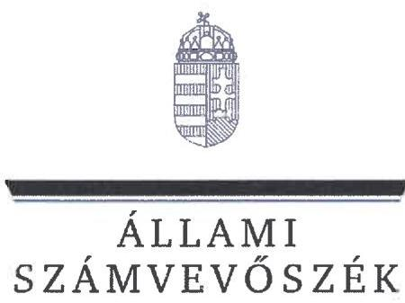

ÁLLAMI
SZÁMVEVŐSZÉK

# JELENTÉS 

## Budapest Főváros Önkormányzata vagyonértékesítési és vagyonhasznosítási tevékenységének ellenőrzése

2025.

---

# ELLENŐRZÉSI IGAZGATÓSÁG: 

## ELLENŐRZÉSI IGAZGATÓSÁG II.

## ELLENŐRZÉSI IGAZGATÓ:

DR. BAFFIA GERGELY GÁBOR igazgató

## ELLENŐRZÉSVEZETŐ:

KERSMÁJER ÁGOTA ellenőrzésvezető

Jelentéseink az interneten a www.asz.hu címen olvashatók.

IKTATÓSZÁM: EL-4030-002/2025
TÉMASORSZÁM: 45
ELLENŐRZÉS-AZONOSÍTÓ SZÁM: V-1079

---

# TARTALOMJEGYZÉK 

AZ ELLENŐRZÉS ALAPADATAI ..... 5
AZ ELLENŐRZÖTT SZERVEZETEK ..... 8
ÖSSZEFOGLALÁS ..... 11
AZ ELLENŐRZÉS FÓKUSZTERÜLETEI ..... 15
MEGÁLLAPÍTÁSOK ..... 16
JAVASLATOK ..... 34
MELLÉKLETEK ..... 38
I. sz. melléklet: Értelmező szótár ..... 38
II. sz. melléklet: Az ellenőrzött szervezetek jegyzéke ..... 41
III. sz. melléklet: Ellenőrzési kritériumok ..... 42
IV. sz. melléklet: Ingatlanállomány 2022-2023 ..... 44
FÜGGELÉK: ÉSZREVÉTELEK ..... 45
RÖVIDÍTÉSEK JEGYZÉKE ..... 71

---

.

---

# AZ ELLENŐRZÉS ALAPADATAI 

## AZ ELLENŐRZÉS CÉLJA

Az ellenőrzés célja az volt, hogy értékelje a Fővárosi Önkormányzat ${ }^{1}$ vagyoni helyzetének alakulását, a vagyonértékesítési tevékenység szabályszerűségét és célszerűségét, a vagyonhasznosítási tevékenység szabályszerűségét és eredményességét, valamint a vagyongazdálkodás vonatkozásában a szervezeti keretek megfelelőségét és célszerűségét. Az ellenőrzés kiterjedt a vagyonértékesítési és vagyonhasznosítási tevékenységhez kapcsolódó belső ellenőrzés és tulajdonosi joggyakorlás működése megfelelőségének vizsgálatára.

## AZ ELLENŐRZÉS TÍPUSA

Kombinált ellenőrzés

## AZ ELLENŐRZÖTT IDŐSZAK

A Fővárosi Önkormányzat vagyoni helyzete alakulásának értékelése, 2020-2023. évek
ezen belül: a leltározási és selejtezési tevékenység megfelelősége. a 2022-2023. évi költségvetési beszámolókra vonatkozóan

A vagyonértékesítési tevékenység szabályszerűsége és célszerűsége, a vagyonhasznosítási tevékenység szabályszerűsége és eredményessége, valamint a vagyongazdálkodás szervezeti kereteinek megfelelősége
2022-2023. évek

A vagyonértékesítési és vagyonhasznosítási tevékenységhez kapcsolódó belső ellenőrzés és tulajdonosi joggyakorlás működésének megfelelősége

## AZ ELLENŐRZÉS TÁRGYA

Az ellenőrzés tárgyát képezte a Fővárosi Önkormányzat vagyoni helyzete alakulásának áttekintése. Az ellenőrzés kiterjedt a vagyonértékesítési tevékenység szabályszerűségére és célszerűségére, a vagyonhasznosítási tevékenység szabályszerűségére és eredményességére, a vagyongazdálkodás szervezeti kereteinek megfelelőségére és célszerűségére, továbbá a vagyonértékesítési és vagyonhasznosítási tevékenységhez kapcsolódó belső ellenőrzés és tulajdonosi joggyakorlás működésének megfelelőségére. A vagyonértékesítés ellenőrzésének fókuszát annak nagyságrendje miatt a nemzeti vagyonba tartozó befektetett eszközök közül a tárgyi eszközök, valamint a Fővárosi Önkormányzat költségvetésének és zárszámadásának ellenőrzése során feltárt kockázatok miatt a készletek közé átsorolt ingatlanok képezték. A vagyonhasznosítás ellenőrzése a nem lakáscélú ingatlanokra terjedt ki.

Az ellenőrzés kiterjedt minden olyan körülményre és adatra, amely az ÁSZ² jogszabályban meghatározott feladatainak teljesítéséhez, valamint a program végrehajtása folyamán felmerült újabb összefüggések feltárásához szükséges volt.

---

Az ÁSZ a Fővárosi Önkormányzat működésének és gazdálkodásának ellenőrzését - az ellenőrzött szervezet mérete és feladatainak összetettsége miatt - több ütemben hajtotta végre. A jelenlegi, II. ütemet megelőző ellenőrzés a Fővárosi Önkormányzat költségvetésének és zárszámadásának ellenőrzésére terjedt ki, amelynek megállapításait a 24015 sorszámú ÁSZ jelentés tartalmazza.

# AZ ELLENŐRZÉS JOGALAPJA 

Az ellenőrzés jogalapját az ÁSZ tv. ${ }^{3} 1. § (3)$ bekezdésében, az 5. § (2)-(6) bekezdésekben, valamint az Áht. ${ }^{4} 61. § (2)$ bekezdésében foglaltak képezték.

## AZ ELLENŐRZÉS MÓDSZERE

Az ÁSZ az ellenőrzést törvényességi, célszerűségi, eredményességi szempontokat, valamint a nemzetközi standardokat irányadónak tekintve az ellenőrzési program szempontjai, az ellenőrzött időszakban hatályos jogszabályok, az ellenőrzés szakmai szabályok és módszertanok figyelembevételével végezte.

Az ellenőrzési kérdések megválaszolásához szükséges bizonyítékok megszerzése az ellenőrzött szervezetek által rendelkezésre bocsátott dokumentumokra, adatokra alapozva, továbbá megfigyelés, interjú, információkérés, mintavételezés útján, valamint elemző eljárással történt.

Az ellenőrzési bizonyítékként felhasználható adatforrások közé tartoztak az ellenőrzéshez kért dokumentumok, adatforrások, az ellenőrzés tárgyával kapcsán releváns, nyilvánosan hozzáférhető adatok, dokumentumok, a Kincstár ${ }^{5}$ adatbázisai, továbbá adatforrás volt még minden, az ellenőrzés folyamán feltárt, az ellenőrzés szempontjából információkat tartalmazó egyéb dokumentum, nyilatkozat, jegyzőkönyv.

Az ellenőrzés lefolytatásához az ellenőrzött szervezetek, valamint a NAV${ }^{6}$, mint ellenőrzést támogató szervezet az ÁSZ által kért dokumentumok, adatok, információk megküldésével, az ellenőrzött szervezetek továbbá tanúsítványok kitöltésével és megküldésével szolgáltattak adatokat az ellenőrzés során.

A Fővárosi Önkormányzat vagyoni helyzete alakulásának értékelése a 2020. január 1-jei bázisadatokkal való összevetésen alapuló trend-, illetve tendenciaelemzéssel - a vagyonváltozás tényezőkre bontásával, a legfőbb befolyásoló tényezők azonosításával és változásra gyakorolt hatásuk vizsgálatával - történt.

Az egyes fókuszterületek értékelésére a III. számú mellékletben megjelölt kritériumok alapján került sor, amely a vagyongazdálkodás kialakított szervezeti kereteinek, valamint az értékesítésre történő kijelölésről szóló döntések tekintetében célszerűségi, a vagyonhasznosítás tekintetében eredményességi kritériumokat is tartalmaz. Az ÁSZ a vagyongazdálkodás szervezeti kereteinek célszerűsége vonatkozásában ellenőrizte, hogy a stratégiai célok megvalósítását szolgáló, a külső környezetnek és belső adottságoknak megfelelő, valamint a vagyongazdálkodási tevékenység szabályszerűségét biztosító szervezeti keret került-e kialakításra. Az ellenőrzés a Fővárosi Önkormányzat vagyonértékesítési tevékenységének célszerűsége terén értékelte a döntések összhangját a vagyongazdálkodással/ingatlanértékesítéssel kapcsolatos stratégiákban/tervekben meghatározott célokkal. A vagyonhasznosítási tevékenység eredményessége terén az ÁSZ ellenőrizte a kitűzött stratégiai célok elérését és visszamérését, az éves tervekben foglalt tervcélok megvalósulását, továbbá értékelte a hasznosítás bevételei és azok elérése érdekében felmerült ráfordítások alakulását. A Fővárosi Önkormányzat vagyonának hasznosítására vonatkozóan a fajlagos (területegységre vetített) hasznosítási díjakat és a kihasználtságot, valamint azok időbeli változásait összehasonlító elemzés elvégzésével értékelte az ÁSZ. Összehasonlító adatként - az ingatlanpiaci jellemzők (bérleti díjak, hozamok, kihasználatlanság)

---

alakulására vonatkozóan - az MNB jelentések ${ }^{7}$ álltak az ÁSZ rendelkezésére, amelyek az irodapiacot, a kiskereskedelmi és ipari-logisztikai ingatlanpiaci szegmenseket érintően tartalmaztak adatokat. Az ingatlanpiaci adatokkal való összehasonlító elemzés a bérleti díjak és a kihasználtság vonatkozásában korlátozottan volt elvégezhető, mivel az MNB jelentésekben szereplő és a Fővárosi Önkormányzat tulajdonában lévő ingatlanok adottságai (pl. földrajzi elhelyezkedés, műszaki állapot) teljeskörűen nem voltak megfeleltethetőek. A piaci összehasonlítás az aluljárós üzlethelyiségekre - sajátos jellegük miatt - nem terjedt ki.

A hozamvizsgálatoknál az ÁSZ a közel kockázatmentesnek tekintett állampapírok referenciahozamait vette alapul, tekintettel arra, hogy a bérleti díjak megállapítása során az ingatlanok forgalmi értékének hozamszámítás módszerével történő meghatározásához kiindulásként a BFVK Zrt. ${ }^{8}$ is jellemzően a 15 éves futamidejű állampapírpiaci referenciahozamokat vette figyelembe az ellenőrzött időszakban. A hozamok értékelése során az ÁSZ vizsgálta, hogy az egyes szegmenseket (iroda, üzlet, ipari-logisztikai ingatlan) érintő piaci alapú hasznosítások esetén a 2023. év végén az állampapírpiaci hozamokat meghaladó hozamszint a korábban megkötött szerződésekre kiterjedően is fennállt-e. Az éves bérleti díjbevétel forgalmi értékhez viszonyított arányán alapuló hozamszámításra csak azon ingatlanok esetében volt lehetőség, amelyeknél a 2023. évre vagy az azt megelőző időszakra vonatkozó (becsült) forgalmi adatok rendelkezésre álltak. A 2023. évet megelőző becsült forgalmi értékeket az ellenőrzés - az ingatlanok forgalmi értékének változását leginkább kifejező - építőipari termelői árindex alkalmazásával indexálta a 2023. év végére.

A vagyonértékesítés, valamint a vagyonhasznosítás szabályszerűségét mintavételi eljárással kiválasztott tételek alapján ellenőrizte az ÁSZ. A vagyonértékesítés megfelelőségének értékeléséhez kockázati alapon 10 db mintatétel került kiválasztásra. Ellenőrzésre került továbbá 5 db - értékalapú mintavételezéssel kiválasztott - olyan ingatlan készletté történő átsorolásának szabályszerűsége, amely a 2022. és/vagy a 2023. évi beszámoló mérlegében a készletek között szerepelt.

A vagyonhasznosítás megfelelőségének értékelése 10 db kockázati alapon kiválasztott mintatétel alapján történt. További 27 db mintatételnél ellenőriztük a 2022-2023. években létrejött szerződéseket érintő döntések megfelelőségét. Az ellenőrzött mintatételekre vonatkozó megállapítások nem vetíthetők ki a teljes sokaságra, a megállapításokat az ÁSZ az adott ellenőrzött mintatételek vonatkozásában tette.

---

# AZ ELLENŐRZÖTT SZERVEZETEK 

Budapest Főváros Önkormányzata, Budapest Főváros Főpolgármesteri Hivatal, BUDAPEST FÖVÁROS VAGYONKEZELŐ KÖZPONT ZRT.

A Fővárosi Önkormányzat feladatainak végrehajtása érdekében a 2022. és 2023. évben a Főpolgármesteri Hivatallal ${ }^{9}$ együtt 24 költségvetési szervet működtetett, amelyekből 18 rendelkezett gazdasági szervezettel. A feladatok ellátásában a Fővárosi Önkormányzat többségi befolyása alatt álló 45 gazdasági társaság vett részt.

A Főpolgármesteri Hivatalban foglalkoztatottak éves átlagos statisztikai létszáma a 2022. évben 862 fő, a 2023. évben 908 fő volt.

A Fővárosi Önkormányzat pénzügyi helyzete a 2022-2023. években kedvezőtlenül alakult, a 2022-2023. évi költségvetéseinek végrehajtása során teljesített költségvetési bevételek nem nyújtottak fedezetet a költségvetési kiadásokra. A működési célra igénybe vett maradvány (37 912,2 MFt) nem fedezte a működési hiány (32 256,6 MFt) és tőketörlesztés (12 188,0 MFt) együttes összegét, és a felhalmozási célra igénybe vett maradvány (1350,9 MFt) is kevesebb volt, mint a felhalmozási hiány (118 390,4 MFt). A 2022-2023. évi hiányzó forrás (123 571,9 MFt) finanszírozására felhasználták a 2022. év elején államkötvényekben, lekötött bankbetétben rendelkezésre álló forrásokat.

A Fővárosi Önkormányzat fejlesztési célú hitelállománya a 2022. január 1-jei 166 293,2 MFt-ról, 2023. december 31-re 154 105,2 MFt-ra csökkent. A Fővárosi Önkormányzat likviditási nehézségei áthidalásához a 2022. évben 25 000,0 MFt folyószámla hitelkerettel rendelkezett, egyéb likviditási célú hitelt nem vett igénybe. A likviditási nehézségek 2023. évben fokozódtak. A folyószámlahitel átlagos napi állománya (4 927,1 MFt) közel háromszorosa volt a 2022. évinek, 2023. július 14. - szeptember 20. között szükségessé vált a folyószámla hitelkeret 40 000,0 MFt-ra történő emelése is. A folyószámla-hitelhez kapcsolódóan a 2023. évben 794,2 MFt kamatkiadás merült fel. A Fővárosi Önkormányzat adatszolgáltatása szerint a kötött felhasználási célú - átmenetileg szabad - pénzeszközökből 2023. december 31-ei állapot szerint 10 076,8 MFtot vontak be ideiglenesen a kiadások finanszírozásába. A Fővárosi Önkormányzat a likviditási helyzet 2023. év végi rendezéséhez a gazdasági társaságoktól 5200 M Ft (BKK Zrt. ${ }^{10} 3100,0 \mathrm{MFt}$, BGYH Zrt. ${ }^{11} 2100,0 \mathrm{MFt}$ ) pénzeszközt vett át, továbbá a BKK Zrt. számára, a közösségi közlekedés közlekedésszervezői feladatok ellátására előirányzott, 2023. IV. negyedévre vonatkozó 49 975,7 MFt összegű támogatás kifizetését a 2024. I. negyedévre ütemezte át.

A Fővárosi Önkormányzat - könyv szerinti nettó értéken - a 2022. évben 2 192 211,4 MFt, míg a 2023. évben 2 214 722,6 MFt értékű ingatlanvagyonnal rendelkezett, amelyből a tárgyi eszközök között szereplő ingatlanok értéke 2022-ben 1 668 391,2 MFt, 2023-ban 2 074 533,5 MFt, az államháztartáson kívülre átadott ingatlanok értéke 460 494,4 MFt, illetve 77 217,1 MFt volt. Készletekre átsorolt, valamint az államháztartáson belülre vagyonkezelésbe adott - mérlegben nem szereplő - ingatlanok között a 2022. évben további 63 325,8 MFt-ot, a 2023. évben 62 972,0 MFt-ot mutattak ki. A vagyonkimutatás szerint az önálló helyrajzi számmal, egyedi azonosítóval rendelkező ingatlanok száma a 2022. évben 7400 db, a 2023. évben 9316 db volt, a növekedés többsége hírközlési alépítmények 2023. évi nyilvántartásba vételéhez kapcsolódott.

Az önkormányzati tulajdonú ingatlanvagyon túlnyomó többségét (98,5%, illetve 98,7%) a 2022-2023. években a törzsvagyon körébe tartozó ingatlanok tették ki, míg az üzleti ingatlanvagyon aránya 1,5%, illetve

---

1,3% volt. A törzsvagyoni körben a forgalomképtelen kizárólagos tulajdonban lévő törzsvagyon volt többségben (55,7%, illetve 56,2%).

A vagyonkimutatás alapján a vagyongazdai feladatkört a Főpolgármesteri Hivatal hat főosztálya látta el. A Fővárosi Önkormányzat befektetett eszközök között szereplő ingatlanvagyonának vagyongazdák, illetve ágazatok szerinti megoszlását a IV. melléklet 1. ábrája szemlélteti.

A BFVK Zrt. egyszemélyes részvénytársaság, amelyet a Fővárosi Önkormányzat 1994. október
 27-én alapított. A társaság Alapszabálya ${ }_{1-3}$-ban ${ }^{12}$ meghatározott főtevékenysége a vagyonkezelés. A 2022. évben árbevételének 90,8%-a (2611,1 M Ft), 2023. évben 90,2%-a (3260,5 M Ft) a Fővárosi Önkormányzattal kötött Éves közfeladat-ellátási szerződésekben ${ }^{13}$ rögzített feladatellátás költségeinek ellentételezéséből származott. Közfeladatellátásként a 2022. és 2023. években lakások és nem lakáscélú ingatlanok üzemeltetésével, hasznosításával, lakások felújításával,
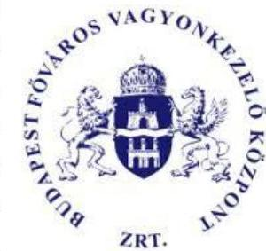

XRT.
karbantartási feladatainak ellátásával, ingatlanok értékesítésével, illetve egyes fővárosi tulajdonú gazdasági társaságokban lévő üzletrészek portfóliókezelésével kapcsolatos feladatokat végzett. Az ebből származó bevételek közvetlenül a Fővárosi Önkormányzathoz folytak be. A fővárosi vagyonelemek mellett a társaság saját ingatlanokat és társasági részesedéseket is kezelt, illetve más piaci szereplőnek is nyújtott ingatlan értékesítési, bérbeadási, valamint értékbecslési szolgáltatást.

| 1. táblázat |  |  |
| :--: | :--: | :--: |
| A BFVK ZRT. GAZDÁLKODÁSÁT A 2022-2023. ÉVEKBEN JELLEMZŐ ADATOK (M FT) |  |  |
| MEGNEVEZÉS | 2022. ÉV | 2023. ÉV |
| Értékesítés nettó árbevétele | 2875,8 | 3586,1 |
| Egyéb bevételek | 17,0 | 13,0 |
| Anyagjellegű ráfordítások | 1159,1 | 1732,6 |
| Személyi jellegű ráfordítások | 1543,2 | 1616,0 |
| Értékcsökkenési leírás | 62,3 | 53,7 |
| Egyéb ráfordítások | 95,4 | 162,4 |
| Adózás előtti eredmény | 34,1 | 34,4 |
| Adózott eredmény | 32,3 | 26,9 |

A gazdasági társaság saját tőkéje a 2022. évben 1497,6 M Ft, a 2023. évben 1524,5 M Ft volt, amelyekből a jegyzett tőke 721,3 M Ft-ot képviselt. A BFVK Zrt. gazdálkodásának főbb adatait az 1. táblázat mutatja be.

A Vezérigazgató ${ }^{14}$ személye az ellenőrzött időszakban nem változott, vezetői tisztségét 2015. január 1-jétől látta el. A BFVK Zrt. által foglalkoztatottak átlagos statisztikai állományi létszáma a 2022. évben 193 fő, a 2023. évben 164 fő volt. A gazdasági társaságban hat fős felügyelő bizottság ${ }^{15}$ működött. A 2022. és 2023. évi számviteli beszámolót a könyvvizsgáló hitelesítő záradékkal látta el. A gazdasági társaság az ellenőrzött időszakban a Taktv. ${ }^{16}$ 7/J. § (1) bekezdése és így a Gtbkr. ${ }^{17}$ hatálya alá tartozott.

A BFVK Zrt. által kezelt ingatlanvagyon a 2022. évben 902 db 47 870,5 M Ft nettó értékű, a 2023. évben 931 db 65 798,8 M Ft nettó értékű ingatlan volt. Forgalomképesség alapján az ingatlanvagyon megoszlását a 2022-2023. években az 1. ábra mutatja be.

---

# A BFVK ZRT. ÁLTAL KEZELT INGATLANVAGYON MEGOSZLÁSÁNAK ALAKULÁSA A 2022-2023. ÉVEKBEN 

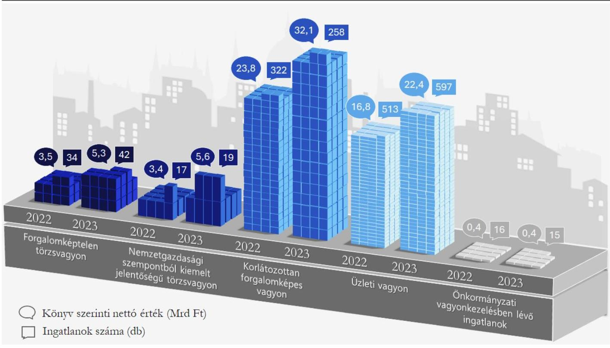

Forrás: BFVK Zrt. adatszolgáltatása alapján ÁSZ saját szerkesztés

---

# ÖSSZEFOGLALÁS 

Az ÁSZ általános hatáskörrel végzi az önkormányzati vagyonnal való felelős gazdálkodás ellenőrzését. Az Mötv. ${ }^{18}$ rendelkezése értelmében az önkormányzatok vagyona az önkormányzati feladatok és célok ellátását szolgálja. Az önkormányzati vagyonnal való felelős és átlátható gazdálkodás közérdek. Mindezek alapján került sor Budapest Főváros Önkormányzata vagyonértékesítési és vagyonhasznosítási tevékenységének ellenőrzésére.

A Fővárosi Önkormányzat leltározási tevékenységének hiányosságai miatt a nemzeti vagyonnal való felelős gazdálkodás követelményei nem érvényesültek maradéktalanul. Az ingatlanértékesítési és ingatlanhasznosítási tevékenység nem felelt meg teljeskörűen a jogszabályi előírásoknak és belső szabályozásoknak. Önkormányzati szinten meghatározott stratégiai célok hiányában az ingatlanok értékesítése során stratégiai célszerűségi kritérium nem érvényesült, önkormányzati szinten a hasznosítás eredményessége nem volt mérhető.

A Fővárosi Önkormányzat vagyonának meghatározó hányadát (89,8-94,7%-át) a nemzeti vagyonba tartozó befektetett eszközök képezték, amelynek értéke 492 270,2 M Ft-tal (25,1%-kal) nőtt 2020-2023 között. A változás alapvetően az ingatlanok és vagyoni értékű jogok 542 702,2 M Ft-tal történő növekedéséből származott, azonban azt nem a vagyon tényleges gyarapodása, hanem a víziközművagyon értékének jogszabályi előíráson alapuló újbóli megállapítása, illetve 2023. évben a „fellelt Nokia alépítményi hálózatok” állományba vétele eredményezte.

A Fővárosi Önkormányzat leltárkészítési és leltározási tevékenysége a 2020-2022. években nem felelt meg teljeskörűen a jogszabályi és belső szabályzatban foglalt előírásoknak. A 2020-2023. években a költségvetési beszámoló mérlege „Módosítások” oszlopa jellemzően a 2020. január 1-jét megelőző időszakban üzembe helyezett, felújított tárgyi eszközök aktiválását, illetve az értékesített tárgyi eszközök számviteli nyilvántartásokból történő kivezetését tartalmazta. A módosítások alapján az ellenőrzés megállapította, hogy a 2020-2022. évi beszámolók mérlegében kimutatott beruházások, felújítások mérlegértékének alátámasztásához nem állítottak össze szabályszerű, a fordulónapi mérlegtételeket tételesen, ellenőrizhető módon tartalmazó leltárt, mivel rendeltetésszerűen használatba vett, üzembe helyezett tárgyi eszközöket is kimutattak a beruházások, felújítások mérlegsoron. Az üzembe helyezett tárgyi eszközök aktiválásának elmulasztása miatt az értékesedés elszámolására sem került sor a 2020-2022. években. Így a tárgyi eszközök mérlegben kimutatott könyv szerinti értéke nem felelt meg a jogszabályi előírásoknak, ugyanakkor az eltérés - annak nagyságrendje miatt - a mérleg valódiságát lényegesen nem befolyásolta. A 2022. évben a Fővárosi Önkormányzat tárgyi eszközök körében elvégzett mennyiségi felvétellel történő leltározása nem volt szabályszerű, mivel a 2023. évi mérlegmódosítás során rendezett - korábbi éveket érintő - tételeket leltáreltérésként nem tárták fel.

A Fővárosi Önkormányzat jogszabályban előírt közép- és hosszú távú vagyongazdálkodási tervvel nem rendelkezett, az ingatlanok értékesítésére és a nem lakáscélú ingatlanok hasznosítására kiterjedő stratégiai célkitűzéseket nem határozott meg. A BFVK Zrt. ingatlanok értékesítésére, hasznosításra is kiterjedő Stratégiai tervének ${ }^{19}$ Alapító ${ }^{20}$ általi jóváhagyása nem történt meg, az abban meghatározott célkitűzések nem tekinthetőek önkormányzati szintű céloknak.

Az ingatlanértékesítések a 2022-2023. években elmaradtak az Éves közfeladat-ellátási szerződésekben tervezettől. A BFVK Zrt. a 2022. évben az értékesítésre kijelölt 61 db ingatlanból 23 db ingatlant nettó 8 106,3 M Ft, a 2023. évben a kijelölt 77 db ingatlanból 12 db ingatlant nettó 428,0 M Ft értékben értékesített.

---

A Fővárosi Önkormányzat által az ellenőrzött időszakban további 6 db ingatlan került eladásra összesen nettó 1940,6 M Ft értékben.

Az ingatlanértékesítésekhez kapcsolódó döntéshozataloknál - önkormányzati szintű stratégiai célok hiányában - stratégiai célszerűségi kritérium nem érvényesült. Az ingatlanok értékesítése, valamint készletté történő átsorolása nem felelt meg teljeskörűen a jogszabályi, valamint a belső szabályzók előírásainak. Előfordult, hogy korlátozottan forgalomképes fővárosi törzsvagyont a Vagyonrendeletben ${ }^{21}$ előírtak ellenére magánszemélyek, illetve gazdasági társaságok részére értékesítettek, továbbá használaton kívüli, közvetlenül a Fővárosi Önkormányzat feladat- és hatáskörének ellátását már nem szolgáló ingatlanokat az értékesítést megelőzően nem minősítették át forgalomképes üzleti vagyonná. Az ingatlanok készletté történő átsorolásánál előfordult, hogy a jogszabályi előírások ellenére a 2022. és a 2023. évi beszámoló mérlegében átsorolt készletként mutattak ki egy olyan ingatlant, amely jellegénél fogva nem volt értékesíthető, és az a 2022. és 2023. évi vagyonkimutatásban forgalomképtelen törzsvagyonba tartozó vagyonelem helyett forgalomképes készletre átsorolt ingatlanként szerepelt. Az értékesítésre szánt ingatlanok készletté történő átsorolására nem minden esetben a jogszabályban előírt feltételek bekövetkezésekor került sor. Ebből adódóan előfordult, hogy egyes ingatlanok értékét a 2021. évi és a 2022. évi beszámoló mérlegében szabálytalanul készletek helyett tárgyi eszközként mutatták ki. Az ingatlanok készletként történő értékesítéséből származó bevétel működési célra történő felhasználása nem biztosította az önkormányzati vagyon megőrzését.

A vagyonhasznosítási tevékenység során a szabályszerűségi követelmények nem érvényesültek teljeskörűen, a hasznosítás eredményessége nem volt mérhető. A 2022-2023. években a Vagyongazdálkodási Főosztály 244 db, a BFVK Zrt. 190 db hatályban lévő szerződés alapján végezte a nem lakáscélú ingatlanok hasznosítását, amelyből a Fővárosi Önkormányzat a 2022. évben 1638,8 M Ft, a 2023. évben 1822,6 M Ft bevételt realizált. A 2022-2023. években érvényben lévő hasznosítási szerződések 37,1%-a közfeladat ellátására irányult, amelynek 59,6%-a ingyenes hasznosítás volt.

A 2022-2023. években létrejött hasznosítási szerződésekhez kapcsolódó döntéshozatalok nem feleltek meg maradéktalanul a jogszabályi előírásoknak. Előfordult, hogy a döntéshozatalt megelőzően nem állapították meg a hasznosítással érintett ingatlanrész egyedi forgalmi értékét, melynek hiányában fennállt annak eshetősége, hogy a jogszabályban és belső szabályozásban előírtakat megsértve versenyeztetés lefolytatása nélkül került sor a hasznosításra, illetve, hogy a döntést nem az Önkormányzati SzMSz ${ }^{22}$-ben előírt hatáskörben hozták meg. A 2022. és a 2023. évi zárszámadási rendelettervezet előterjesztésekor a helyiségek hasznosításából származó bevételből nyújtott kedvezmény, mentesség összegét nem a valóságnak megfelelően mutatták be a Közgyűlés ${ }^{23}$ részére.

A Fővárosi Önkormányzat nem alakított ki olyan nyilvántartási rendszert, amely tartalmazta a hasznosítható és hasznosított ingatlanok számát és értékét, valamennyi hasznosított ingatlanra kiterjedő területi adatot (földterület, felépítményi terület), valamint valamennyi hasznosított ingatlan forgalmi értékét. Önkormányzati szinten a vagyonhasznosítás eredményessége nem volt mérhető, mivel a mutatók kihasználatlanság és hozamtermelő képesség - számításához szükséges adatok a nyilvántartási rendszer hiányosságai miatt nem álltak rendelkezésre, továbbá a stratégiai célokat sem jelölte ki a Fővárosi Önkormányzat. A BFVK Zrt.-nél a nyilvántartott adatokból a kihasználatlanság megállapítható volt, azonban hozamvizsgálatok csak szűk körben, a becsült forgalmi értékkel rendelkező ingatlanok esetében voltak elvégezhetőek.

Az ellenőrzött időszakban hatályos szerződések 62,9%-a nem közfeladatellátást szolgáló, piaci alapú hasznosítás volt. A 2023. évi szerződésállomány értéke az előző évhez képest 17,3%-kal nőtt. A 2022. évi

---

inflációt meghaladó mértékű növekedés (2,8 százalékpont) a hasznosítási tevékenység intenzitásának növekedését mutatta, amely alapvetően az ipari-logisztikai ingatlanokat érintette.

A hasznosítási tevékenység intenzitásának növekedése ellenére a kihasználatlanság - az üzletek kivételével - az ellenőrzött időszakban meghaladta a piaci átlagot, ami jellemzően az ingatlanok adottságaival volt összefüggésben. A BFVK Zrt. részére bérbe adható ingatlanállományként kijelölt ingatlanok közel egyharmada volt érintett hasznosítást akadályozó, illetve gátló tényezőkkel, amelyek közül az állomány negyedét érintő műszaki állapot volt a legjelentősebb.

A bérleti díjak elmaradtak a kereskedelmi ingatlanok piacát jellemző átlagértékektől. A hozamok a 2023. év végére többségében nem érték el - a szerződéskötést megelőző bérleti díj számítás során a BFVK Zrt. által is alkalmazott - 15 éves futamidejű állampapírok referenciahozamát. Az elmaradásokhoz hozzájárult, hogy a szerződésekben értékkövetésekre alkalmazott KSH ${ }^{24}$ fogyasztói-árindex többségében nem követte az ingatlanpiaci változásokat.

A szervezeti keretek kialakítása során célszerűségi szempontok nem minden esetben érvényesültek, mivel a keretrendszer nem biztosította teljeskörűen a vagyongazdálkodási tevékenység megfelelőségét.

A Fővárosi Önkormányzat a tulajdonosi ellenőrzési jogait a BFVK Zrt.-nél többek között felügyelő bizottság működtetésével és a társaság beszámoltatásával gyakorolta. A BFVK Zrt. féléves és éves beszámolói nem tartalmazták teljeskörűen a Keretszerződésben ${ }^{25}$ előírt tartalmi elemeket. Ennek hiányában nem mutatták be a társaság tevékenységére ható pozitív és negatív piaci tényezőket. A Keretszerződés nem írta elő a közfeladat-ellátásról szóló beszámoló tartalmi elemei között a közfeladat-ellátás keretében végzett tevékenységek eredményességének mérésére szolgáló adatok bemutatását, így a 2022-2023. évi üzleti jelentés nem tartalmazta a lakásüzemeltetés tervezett bevételeit, valamint a többi közfeladat (nem lakáscélú ingatlanok üzemeltetése-bérbeadása, ingatlan értékesítés és értékbecslés, portfóliókezelés) tervadatai is csak a tényadatok és teljesítési százalékok alapján voltak kiszámíthatóak. A hiányosságok miatt az üzleti jelentések nem nyújtottak tájékoztatást a Fővárosi Önkormányzatot megillető bevételek tervadatoktól való eltéréséről, valamint az arra ható külső
 és belső tényezőkről. A vagyonértékesítési és vagyonhasznosítási tevékenységhez kapcsolódó belső ellenőrzést sem a Fővárosi Önkormányzat, sem a BFVK Zrt. nem folytatott le az ellenőrzött időszakban. A vagyonértékesítési és vagyonhasznosítási tevékenység tekintetében a belső ellenőrzési terveket megalapozó kockázatelemzések során a Főpolgármesteri Hivatal magas kockázatot nem tárt fel. A BFVK Zrt. belső ellenőrzési vezetője a jogszabályi előírás ellenére nem kockázatalapú éves belső ellenőrzési terveket állított össze.

A Vezérigazgató és helyettese részére történő prémiumkifizetések Humánerőforrás-menedzsment Főosztály általi döntéselőkészítésébe, a prémiumfeladatok teljesítésének kontrolljába szakmailag kompetens szervezeti egységet nem vontak be, azt belső szabályozás nem is írta elő. Felülvizsgálat hiányában a kifizetett prémiumok összegének meghatározása a Vezérigazgató és helyettese által készített prémiumfeladatok teljesítéséről szóló jelentések alapján történt. A 2022. évi prémium kiírások nem feleltek meg a belső szabályozás előírásának, mivel tartalmaztak olyan feladatot, amelyet már a kiírást megelőzően teljesített a Vezérigazgató, valamint helyettese. Üzleti terv teljesítését ösztönző feladatokat a 2022. és 2023. évi prémiumkiírás nem tartalmazott, annak ellenére, hogy az hatékony motivációs eszközként szolgálhatott volna a tulajdonos Fővárosi Önkormányzat számára.

A Főpolgármester az ÁSZ tv. 29. § (2) bekezdés szerinti, a jelentéstervezet megállapításaira tett észrevételében arról tájékoztatta az ÁSZ-t, hogy intézkedéseket tettek egyes hiányosságok megszüntetésére. A 2024. évi vagyonkimutatás elkészítése során már gondoskodtak arról, hogy az a jogszabályban rögzítetteken túl a Vagyonrendelet 2. melléklet „II. A vagyonkimutatás tartalma" részben

---

előírtakkal összhangban legyen. Annak érdekében, hogy az értékesítendő ingatlanok készletté történő átsorolására a jogszabályban előírt feltételek bekövetkezésekor kerüljön sor, módosításra került a BFVK Zrt. Közfeladat-ellátási Szerződése, és erre vonatkozólag rendszeres, havi adatszolgáltatás van a BFVK Zrt. és a Főpolgármesteri Hivatal között. Az ellenőrzés folyamatában megtett intézkedések hozzájárulhatnak a jelentés megállapításainak hasznosulásához.

---

# AZ ELLENŐRZÉS FÓKUSZTERÜLETEI 

1. A Fővárosi Önkormányzat vagyoni helyzete alakulásának értékelése
2. A vagyonértékesítési tevékenység szabályszerűsége és célszerűsége, a vagyonhasznosítási tevékenység szabályszerűsége és eredményessége, valamint a vagyongazdálkodás szervezeti kereteinek megfelelősége és célszerűsége
3. A vagyonértékesítési és vagyonhasznosítási tevékenységhez kapcsolódó belső ellenőrzés és tulajdonosi joggyakorlás működésének megfelelősége

---

# 1. A Fővárosi Önkormányzat vagyoni helyzete alakulásának értékelése 

Összegző megállapítás

1.1. számú megállapítás

A Fővárosi Önkormányzat vagyona az ellenőrzött időszakban növekedett, amelyet alapvetően nem a vagyon gyarapodása, hanem a víziközmű vagyon értékének újbóli megállapítása eredményezett. A mérlegmódosítások során rendezett, előző éveket érintő hibákat leltárkészítéskor eltérésként nem tárták fel, ezért a leltározás teljeskörűen nem felelt meg a Számv. tv. ${ }^{26}$ és az Áhsz. ${ }^{27}$ előírásainak.

A leltározási tevékenység nem volt szabályszerű, mivel a mérlegmódosítások során rendezett - tárgyi eszközök mérlegsorait érintő - hibákat a leltározás során nem tárták fel. A tárgyi eszközök mennyiségi felvétellel történő leltározása során megállapított leltárhiányt nem az Áhsz.-ben és a Leltározási szabályzatban ${ }^{28}$ előírtak szerint rendezték.

A Fővárosi Önkormányzat 2020-2022. évi beszámolóinak elkészítéséhez összeállított leltár nem felelt meg a Számv. tv. 69. § (1) bekezdésben előírtaknak, mivel a beruházások, felújítások mérlegsor vonatkozásában a főkönyvi könyvelés és analitikus nyilvántartások adatai közötti, a Számv. tv. 69. § (2) bekezdésben előírt egyeztetést - az analitikus nyilvántartás hiányosságai miatt - nem megfelelően végezték el. A Fővárosi Önkormányzat az ellenőrzött időszak minden évében állapított meg a költségvetési beszámolóban a korábbi évekre jelentős hibát, és azok hatását a mérlegben külön oszlopban bemutatta az Áhsz. előírásainak megfelelően. A mérleg módosítások nagy része a beruházások, felújítások, ingatlanok és kapcsolódó vagyoni értékű jogok mérlegsorokat érintő - 2020. január 1-jét megelőző - mulasztások (beruházások, felújítások utólagos aktiválása, értékesített tárgyi eszközök nyilvántartási értékének utólagos kivezetése, nem műemlékként nyilvántartott műemlék ingatlanok nyilvántartásának korrigálása) számviteli rendezése volt az ellenőrzött időszakban. A 2020-2022. évi beszámolók mérlegeiben kimutatott beruházások, felújítások mérlegsort érintően nem tárták fel a 2023. évi mérlegkorrekciós tételek közül a 2013-2022. években műszakilag üzembe helyezett, azonban a számviteli nyilvántartásokban beruházásként nyilvántartott, utólag aktivált eszközöket. A Leltározási szabályzat 21. § (5) bekezdésben előírtak ellenére a beruházások részletező nyilvántartásának a pénzügyi és műszaki teljesítésekkel, valamint a könyvviteli számlákkal történő egyeztetését nem megfelelően végezték el, ezáltal az egyeztetés során nem tárták fel a már üzembehelyezett beruházások, felújítások aktiválásának hiányát. Ennek következtében a Számv. tv. 69. § (2) bekezdése szerinti, a főkönyvi könyvelés és az analitikus nyilvántartások adatai közötti egyeztetés során sem jelentkezett eltérésként a beruházások, felújítások aktiválásának elmaradása.

---

A 2022-ben végzett mennyiségi felvétellel történő leltározás nem felelt meg a Számv. tv. 69. § (3) bekezdésben foglaltaknak, mivel a 2022. évi mennyiségi felvétellel történő leltározás során a beruházások, felújítások mérlegsort érintően leltártöbbletként nem lelték fel a már üzembehelyezett beruházásokat és felújításokat, leltáreltérésként nem rendezték a számviteli nyilvántartásokban ezek értékét. Ezen tárgyi eszközök aktiválása utólag, a 2023. évi mérlegkorrekció keretében történt meg.
A Fővárosi Önkormányzat azzal, hogy a 2020-2022. évi beszámolók mérlegeiben a beruházások között mutatott ki rendeltetésszerűen használatba vett, üzembe helyezett tárgyi eszközöket, megsértette az Áhsz. 11. § (3) bekezdés a)-b) pontok, valamint (5) bekezdés előírásait. Az üzembe helyezett tárgyi eszközök számviteli nyilvántartásokban késve történő átvezetése (aktiválása) miatt az Áhsz. 17. § (1) bekezdésben foglaltak ellenére a hiba javításának évéig az értékcsökkenési leírás elszámolását is elmulasztották, a hiba - annak nagyságrendje miatt - azonban a mérleg valódiságát lényegesen nem befolyásolta.

A Fővárosi Önkormányzat 2022-ben végezte el a tárgyi eszközök mennyiségi felvétellel történő leltározását. A nem lakáscélú ingatlanok hasznosítása ellenőrzéséhez kiválasztott mintatételekkel érintett ingatlanok leltározása a Számv. tv. 69. § (3) bekezdésében előírtaknak megfelelően történt. A leltározási feladatokat végző Hivatalüzemeltetési és Intézményfejlesztési Főosztály a leltárívek és jegyzőkönyvek alapján kimutatta az összesített leltárhiányt. A leltárhiányt szervezeti egységenként összesítő táblázat adatai szerint a hiányzó eszközök mindegyikének nulla volt a könyv szerinti értéke. A „megjegyzés rovat" adatai szerint az eszközök a költözés, átszervezés, felújítások során vesztek el, illetve tűntek el, illetve egyes eszközöket a kilépő dolgozó nem adott le. Indokként szerepelt továbbá egyes eszközöknél a „2019. évi hiány". A Fővárosi Önkormányzat azzal, hogy a 2022. évi leltározáskor még szerepeltek a könyvekben a 2019. évi leltározás során hiányként megjelölt tárgyi eszközök, megsértette a Leltározási szabályzat 14. §-át, mely szerint „a leltáreltéréseket (hiány, többlet), a leltárkülönbözetekről készített jegyzőkönyv elkészülte és kézhezvétele után öt napon belül, de legkésőbb a negyedéves, illetve éves könyvviteli zárlat keretében a könyvviteli nyilvántartásokban rendezni kell". Nem tartották be továbbá az Áhsz. 53. § (8) bekezdés b) pontjának előírásait, mely szerint „az éves könyvviteli zárlat keretében el kell végezni a leltári különbözetek elszámolását, az eltérések okainak kivizsgálását". Azzal, hogy az átszervezések, felújítások lebonyolítása során, illetve a dolgozók kilépésekor nem biztosították az önkormányzati tulajdonban lévő eszközök védelmét megsértették az Nvtv. ${ }^{29}$ 7. § (1)-(2) bekezdésében előírt, felelős vagyongazdálkodás alapelvét. A „2019. évi hiány" megjelölésű eszközök nyilvántartásokból való kivezetése a 2022. év zárásakor megtörtént.
Az ellenőrzött időszakban a Koordinációs Főosztályon történt selejtezés (2022-ben), az informatikai eszközök körében. A selejtezési jegyzőkönyv a Selejtezési szabályzatban ${ }^{30}$ előírt tartalommal tartalmazta a feleslegessé vált vagyontárgyak jegyzékét, amelyben 277 informatikai eszköz, nulla könyv szerinti értékkel szerepelt. A selejtté válás oka valamennyi eszköz esetében az erkölcsi avulás, fizikai elhasználódás volt. Az eszközök selejtezését szabályszerűen a főjegyző hagyta jóvá. A selejtezési bizottság a leselejtezett eszközök elektronikai hulladékhasznosítással foglalkozó társaságok részére történő átadására, illetve szakszerű, környezetvédelmi előírásoknak megfelelő megsemmisítésére tett javaslatot.
1.2. számú megállapítás

A Fővárosi Önkormányzat vagyona alapvetően a víziközmű vagyon értékének újbóli megállapítása miatt nőtt, az értékesíthető vagyonelemek mérlegértéke csökkent az ellenőrzött időszakban.

A Fővárosi Önkormányzat és költségvetési szervei vagyona (mérlegfőösszeg) az ellenőrzött időszakban 17,8\%-kal, 2338 599,7 M Ft-ról 2755 852,9 M Ft-ra nőtt. A vagyon alakulását a következő ábra mutatja be:

---

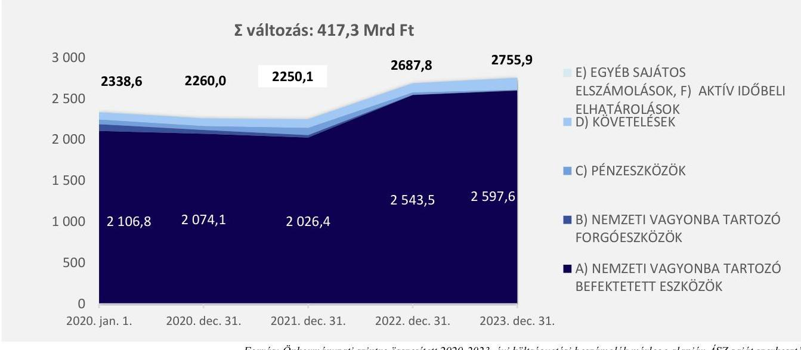

Forrás: Önkormányzati szintre összesített 2020-2023. évi költségvetési beszámolók mérlege alapján ÁSZ saját szerkesztés
Az eszköz állomány meghatározó része (92,3-94,4\%-a) a Fővárosi Önkormányzat mérlegében szerepelt a 2020-2023. években, a költségvetési szervek együttesen az eszközök könyv szerinti értékének mindössze 5,6-7,7\%-át mutatták ki a mérlegeikben.
A Fővárosi Önkormányzat 2020-2023. évi beszámolóiban kimutatott eszközérték 89,8-94,7\%-át a nemzeti vagyonba tartozó befektetett eszközök képezték. A befektetett eszközök összetételének alakulását a következő ábra szemlélteti:
3. ábra

# A FŐVÁROSI ÖNKORMÁNYZAT BEFEKTETETT ESZKÖZEI ÖSSZETÉTELÉNEK ALAKULÁSA (M FT-BAN) 

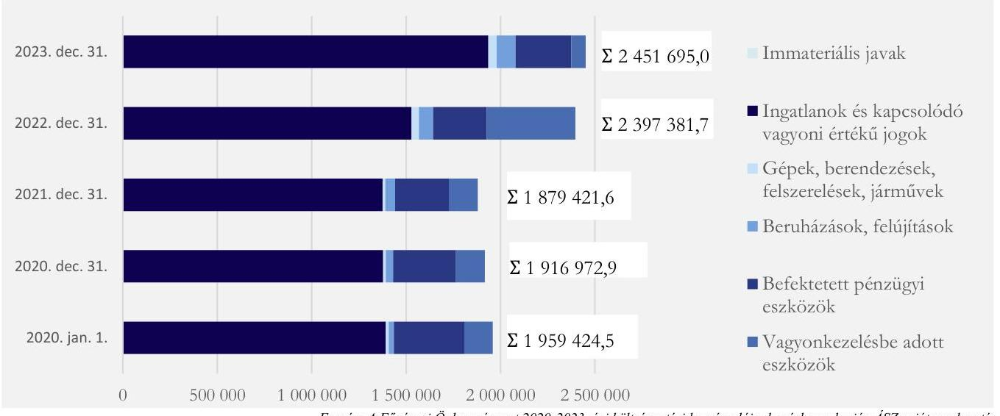

A tárgyi eszközök könyv szerinti értéke az ellenőrzött időszakban 44,9\%-kal, 1435 655,2 M Ft-ról 2079 721,6 M Ft-ra nőtt. A 644 066,4 M Ft-os változást alapvetően két, egyéb növekedésként - és nem értéknövelő beruházás kapcsán - elszámolt gazdasági esemény számviteli nyilvántartásokban történő rögzítése eredményezte. Egyrészt a víziközmű vagyon értéke emelkedett jelentősen a bekerülési érték -víziközmű-szolgáltatásról szóló 2011. évi CCIX. törvény 12. § (1) bekezdésében előírt - újbóli

---

megállapítása miatt, amelynek következtében a 2022. december 31-i könyv szerinti érték 511 596,7 M Ft-tal haladta meg az átértékelés előtti nettó értéket. Másrészt a 2023. évben egyéb növekedésként számolták el a „fellelt Nokia alépítményi hálózatok" állományba vételét 35 066,5 M Ft értékben. A tárgyi eszközökön belül az ingatlanok és kapcsolódó vagyoni értékű jogok nettó értékének 2022. évi, 200 561,8 M Ft-os emelkedését alapvetően a Fővárosi Csatornázási Művek Zrt.-nek üzemeltetésre átadott víziközművek átértékelésének elszámolása eredményezte. A 2023. évi 405 938,8 M Ft összegű emelkedéshez alapvetően a Fővárosi Vízművek vagyonkezeléséből kivont, 2022-ben átértékelt víziközművek, valamint a hálózati alépítmények egyéb növekedés jogcímen történő állományba vétele járult hozzá.
A beruházások, felújítások mérlegértéke dinamikus emelkedés mellett 73 199,9 M Ft-tal nőtt az ellenőrzött időszakban. A nemzeti vagyonba tartozó befektetett eszközökön belüli aránya 2020. január 1-jén 1,4\%, 2023. december 31-én 4,1\% volt. A 2023. évi mérlegben kimutatott 100 723,5 M Ft könyv szerinti értékű beruházások, felújítások 71,7\%-a befejezetlen ingatlan beruházás, 28,3\%-a befejezetlen ingatlan felújítás volt. Az állomány meghatározó részét a közútfejlesztési, vízügyi és hulladékgazdálkodási projektek képezték.
Az államháztartáson kívülre vagyonkezelésbe adott eszközök könyvszerinti értéke a 2020. január 1-jei 151 122,7 M Ft-ról 77 218,4 M Ft-ra csökkent 2023. december 31-re. Ennek alapvető oka az volt, hogy a Fővárosi Vízművek Zrt.-vel kötött vagyonkezelési szerződés 2023. január 1-jétől bérleti szerződésre módosult. Az ellenőrzött időszak végén a Városligeti Ingatlanfejlesztő Zrt. vagyonkezelésében volt jelentős értékű (76 693,9 M Ft) önkormányzati vagyon (Városligeti ingatlanok). A vagyonkezelő szervezetek ${ }^{51}$ közül kizárólag a Fővárosi Vízművek Zrt. végzett értéknövelő beruházásokat, felújításokat 26 636,4 M Ft összegben (víziközmű vagyon után elszámolt értékcsökkenési leírás 90,9\%-a mértékben).
A befektetett pénzügyi eszközök között tartotta nyilván a Fővárosi Önkormányzat a gazdasági társaságokban meglévő tartós részesedéseit, valamint a tartós hitelviszonyt megtestesítő értékpapírokat.
A Fővárosi Önkormányzat tulajdonában lévő tartós részesedések könyv szerinti értéke a 2020. január 1-jei 295 132,7 M Ft-ról az ellenőrzött időszak végére
 minimálisan, 294 180,3 M Ft-ra csökkent. A tartós részesedések piaci értéke (gazdasági társaságok tulajdoni hányadra jutó saját tőkéjének értéke) ugyanakkor az ellenőrzött időszak elején (198 001,4 M Ft-tal) és végén (113 190,8 M Ft-tal) egyaránt meghaladta a könyvekben kimutatott értéket.
A tartós hitelviszonyt megtestesítő értékpapírok mérlegsoron 2020-ban és 2021-ben szerepeltetett értéket a Fővárosi Önkormányzat. A 2020. január 1-jén meglévő, 76 980,6 M Ft értéken nyilvántartott államkötvényeket 2020-ban és 2021-ben értékesítették (beváltották). A 2020. év végi mérlegérték 36 799,6 M Ft volt, a 2021-2023. évi beszámoló mérlegeiben nem mutattak ki tartós hitelviszonyt megtestesítő értékpapírt.
A Nemzeti vagyonba tartozó forgóeszközök közül a készletek könyv szerinti értéke a 2021-2023. évi mérlegekben kimutatott összes eszköz 0,002-0,3%-át alkotta, mérlegértékét az értékesítésre kijelölt és készletté átsorolt tárgyi eszközök (ingatlanok, egyéb berendezések) nagyságrendje befolyásolta döntően. 2020-ban nem mutattak ki készletté átsorolt ingatlant a mérlegben. 2021-ben 5 087,9 M Ft, 2022-ben 1 435,7 M Ft, 2023-ban 2 520,3 M Ft volt a készletté átsorolt tárgyi eszközök záró értéke. A forgatási célú értékpapírok a mérlegben kimutatott eszközök értékének 2020 végén 1,8%-át, 2021 végén 1,1%-át tették ki. 2022 és 2023 év végén nem volt a Fővárosi Önkormányzat tulajdonában értékpapír.
A 2023. év végére a pénzeszközök mérlegértéke a 2020. január 1-jei 48 285,2 M Ft-ról 2 148,7 M Ft-ra csökkent. Az eszközökön belüli aránya az ellenőrzött időszak elején 2,2%, a végén 0,1% volt. A

---

pénzeszközök mérlegértéke 2021-ben mutatott kiugró értéket, az átmenetileg szabad pénzeszközökből lekötött bankbetétek 57 000,0 M Ft-os záróállománya miatt. Ezt megelőzően, illetve követően nem volt lekötött bankbetétje a Fővárosi Önkormányzatnak az ellenőrzött időszakban.
A követelések az eszközérték 4,1-5,6%-át képezték az ellenőrzött időszakban, könyv szerinti értékük a 2020. év elejétől a 2023. év végéig 61,8%-kal 145 154,3 M Ft-ra folyamatosan emelkedett. A Fővárosi Önkormányzat követeléseinek legnagyobb része (77,2-87,7%-a) a közhatalmi bevételekhez kapcsolódott, amelynek állománya a 2020 január 1-jei 77 954,5 M Ft-ról a 2023. év végére 50,9%-kal 117 620,5 M Ft-ra nőtt. A közhatalmi bevételek év végi magas követelésállománya az iparűzési adóelőleg követelésként történő előírásának és a fizetési kötelezettség teljesítési határidejének eltérő időpontjaiból adódott. Az állomány emelkedéséhez alapvetően az adózók adófizetési kötelezettségének növekedése járult hozzá. A követelések mérlegértékének emelkedése mellett a lejárt követelésállomány 2020. január 1-jétől 2023 végére 14,4%-kal 7 277,6 M Ft-ra csökkent. A határidőn túli kintlévőségek döntően - az iparűzési adóhátralékokból eredő - közhatalmi bevételekkel kapcsolatos követelésekből származtak, amelynek határidőn túli követeléseken belüli aránya 2020. január 1-jén 59,1% (5 018,5 M Ft), 2023. december 31-én 90,0% (6547,9 M Ft) volt.
A kötelezettségek forrásokon belüli aránya 2020. január 1-jén 6,0%, 2023 végén 9,9% volt, összege közel duplájára (131 184,6 M Ft-ról 256 542,4 M Ft-ra) nőtt. A Fővárosi Önkormányzat költségvetési évben esedékes kötelezettségeinek 2020. január 1-jén elenyésző része (0,2%), 2023 végén a teljes állománya (7 574,1 M Ft) lejárt tartozás volt, amelyek esedékessége nem haladta meg a 30 napot. A költségvetési évet követően esedékes kötelezettségek állománya a 2020. január 1-jei 116 784,4 M Ft-ról 2023. december 31-ére - folyamatosan - 229 431,5 M Ft-ra emelkedett. A változáshoz nagy mértékben hozzájárult a városfejlesztések és városi közlekedés fejlesztés forrásának biztosítására 2021. évben lehívott 65 639,2 M Ft EIB³² hitel, továbbá a BKK Zrt. közösségi közlekedés közlekedésszervezői feladatok ellátására előirányzott 2023. IV. negyedévi 49 975,7 M Ft összegű támogatás kifizetésének 2024. évre történő átütemezése.
A Fővárosi Önkormányzat az Áhsz. előírásaival összhangban a 0-s számlaosztály nyilvántartási számláin tartotta nyilván az államháztartáson belül vagyonkezelésbe adott eszközeit, amelyek könyv szerinti értéke 2020. január 1-jén 167 519,4 M Ft, 2023. december 31-én 191 836,3 M Ft volt. Az ellenőrzött időszakban jellemzően köznevelési, szakképzési, szociális, kulturális közfeladatok ellátásához, 2020-2021. évben vásárcsarnok üzemeltetéshez adott vagyonkezelésbe önkormányzati vagyont a Fővárosi Önkormányzat.
A feladatellátást szolgálták továbbá a nullára leírt tárgyi eszközök, amelyek bruttó értéke az ellenőrzött időszak elején 142 217,8 M Ft, az ellenőrzött időszak végén 133 106,1 M Ft volt. A nullára leírt tárgyi eszközökből az ingatlanok és kapcsolódó vagyoni értékű jogok 72,3%-ot, valamint 77,3%-ot képviseltek. A Fővárosi Önkormányzat vagyonának meghatározó hányada (63,8%-a) az ingatlan és kapcsolódó vagyoni értékű jogok voltak 2020. január 1-jén. Az egyes vagyonelemek állományának - befektetési és forgatási célú értékpapírok, pénzeszközök - ellenőrzött időszakban bekövetkezett csökkenése és az ingatlanok és kapcsolódó vagyoni értékű jogok mérlegértékének emelkedése együttesen azt eredményezte, hogy 2023. december 31-én a tárgyi eszközök között nyilvántartott ingatlanvagyon (1 934 842,9 M Ft) az eszközértéknek (2 601 414,1 M Ft) már mintegy háromnegyedét alkotta.

---

# 2. A vagyonértékesítési tevékenység szabályszerűsége és 

célszerűsége, a vagyonhasznosítási tevékenység
szabályszerűsége és eredményessége, valamint, a
vagyongazdálkodás szervezeti kereteinek megfelelősége és
célszerűsége

| Összegző megállapítás | A Fővárosi Önkormányzat vagyonértékesítési és vagyonhasznosítási tevékenysége nem felelt meg teljeskörűen az Nvtv., az Áhsz., a 38/2013. NGM rendelet ³³, a Bkr., a Gtbkr., valamint a Vagyonrendelet, a Helyiségrendelet ³⁴, az Alapszabály és a Hivatali SzMSz ³⁵ előírásainak. Az ingatlanértékesítésekhez kapcsolódó döntéshozataloknál önkormányzati szintű stratégiai célok hiányában stratégiai célszerűségi kritérium nem érvényesült. A hasznosítás eredményességének méréséhez teljesítménycélokat nem határoztak meg. A szervezeti keretek kialakítása során célszerűségi szempontok nem minden esetben érvényesültek, mivel a keretrendszer nem biztosította teljeskörűen a vagyongazdálkodási tevékenység megfelelőségét. |
| :--: | :--: |

2.1. számú megállapítás

A Fővárosi Önkormányzat az Nvtv.-ben előírt közép- és hosszú távú vagyongazdálkodási tervvel nem rendelkezett, az ingatlanok értékesítésére, illetve a nem lakáscélú ingatlanok hasznosítására kiterjedő stratégiai célkitűzéseket nem határozott meg. A BFVK Zrt. elkészítette az ingatlanok értékesítésére, hasznosítására is kiterjedő Stratégiai tervét, de annak Fővárosi Önkormányzat részéről történő jóváhagyására nem került sor.

A közfeladatellátáshoz nem szükséges vagyon esetén a Fővárosi Önkormányzat Vagyongazdálkodási Főosztálya és a BFVK Zrt. volt a vagyongazdálkodó. A feladatellátásért elsődlegesen a Vagyongazdálkodási Főosztály felelt, de a BFVK Zrt. a közfeladatellátási szerződésének keretei között közvetlenül bekapcsolódott a vagyongazdálkodási feladatok végrehajtásába. A BFVK Zrt. az Éves közfeladat-ellátási szerződésekben rögzített vagyonelemeket kezelte.
A Fővárosi Önkormányzat az Mötv. előírásai szerint rendelkezett a 2020-2024. évekre vonatkozó Gazdasági Programmal, amelyben meghatározták a Fővárosi Önkormányzat által nyújtandó feladatok biztosítását, színvonalának javítását szolgáló célkitűzéseket, feladatokat, fejlesztési elképzeléseket, azonban azok a vagyon értékesítésével, valamint hasznosításával kapcsolatos stratégiai célokat nem tartalmaztak. A Gazdasági Program elfogadásáról szóló 455/2020. (V. 20.) Kgy. határozatban előírtak ellenére a koronavírusjárvány okozta veszélyhelyzet megszűnését követően a főpolgármester a Gazdasági Program felülvizsgálatáról és szükséges módosításokkal történő Közgyűlés elé terjesztéséről nem gondoskodott.

---

A Fővárosi Önkormányzat az Nvtv. 9. § (1) bekezdésében, valamint a Vagyonrendelet 25. §-ában előírtak ellenére az ellenőrzött időszakban hatályos közép- és hosszú távú vagyongazdálkodási tervvel nem rendelkezett.
A BFVK Zrt. elkészítette a 2022-2025. évekre vonatkozó Stratégiai tervét, amelyet a BFVK Zrt. Igazgatósága a 8/2022. (VI. 30.) számú határozatával elfogadott, valamint a felügyelőbizottság a 13/2022. (VI. 30.) számú határozatával tudomásul vett. A Fővárosi Önkormányzat - mint Alapító azonban a Stratégiai terv jóváhagyásáról az Alapszabály 9.2. l) pontjában előírtak ellenére nem döntött.
A Fővárosi Önkormányzat a vagyongazdálkodási közfeladatainak ellátására a BFVK Zrt.-vel - mivel a korábbi Keretszerződés lejárt - 2021. április 1-jétől 10 éves időtartamra új Keretszerződést kötött. A BFVK Zrt. által ellátandó konkrét vagyongazdálkodási közfeladatok leírását és a feladatellátást szolgáló vagyonelemek meghatározását a 2022. valamint 2023. évi Közfeladat-ellátási szerződésekben rögzítették.
A Fővárosi Önkormányzat - az Mötv. rendelkezésének megfelelően - az Áhsz.-ben előírt tartalommal elkészítette a 2022. és 2023. évi vagyonkimutatást, amelyeket az Áht.-ban előírt módon a zárszámadási rendelettervezetek előterjesztésekor a Közgyűlés részére tájékoztatásul bemutatott. Az Áhsz. előírásain túl a Vagyonrendelet 2. melléklet „II. A vagyonkimutatás tartalma" fejezetben meghatározott vagyonelemek követelések, egyéb sajátos eszközoldali elszámolások, aktív időbeli elhatárolások, kötelezettségek, egyéb sajátos forrásoldali elszámolások, passzív időbeli elhatárolások - bemutatását azonban 2022. és 2023. évi vagyonkimutatások a Vagyonrendelet előírása ellenére nem tartalmazták.
2.2. számú megállapítás

Az ingatlanok értékesítése, valamint készletté történő átsorolása - a mintatételeknél feltárt hiányosságok miatt - nem felelt meg teljeskörűen az Nvtv., az Áhsz., a 38/2013. NGM rendelet, valamint a Vagyonrendelet előírásainak. Az ingatlanértékesítésekhez kapcsolódó döntéshozataloknál önkormányzati szintű stratégiai célok hiányában stratégiai célszerűségi kritérium nem érvényesült.

A BFVK Zrt. - Éves közfeladat-ellátási szerződései alapján - a 2022. évben 61 db ingatlant tervezett értékesíteni összesen nettó 20 489,1 M Ft eladási áron, amelyből a számszerűsített eladási esélyek figyelembevételével a 2022. évre 14 478,7 M Ft bevételt terveztek. A 2023. évben értékesítésre tervezett ingatlanok száma 77 db volt, nettó 18 157,2 M Ft értékben, amelyből az értékesítési esélyek alapján a 2023. évre 13 071,5 M Ft bevétellel terveztek. A Fővárosi Önkormányzatnál ezen túl önkormányzati lakások értékesítéséből a 2022 évi költségvetésében 352,3 M Ft, a 2023. évi költségvetésében 449,0 M Ft bevétellel számoltak.

---

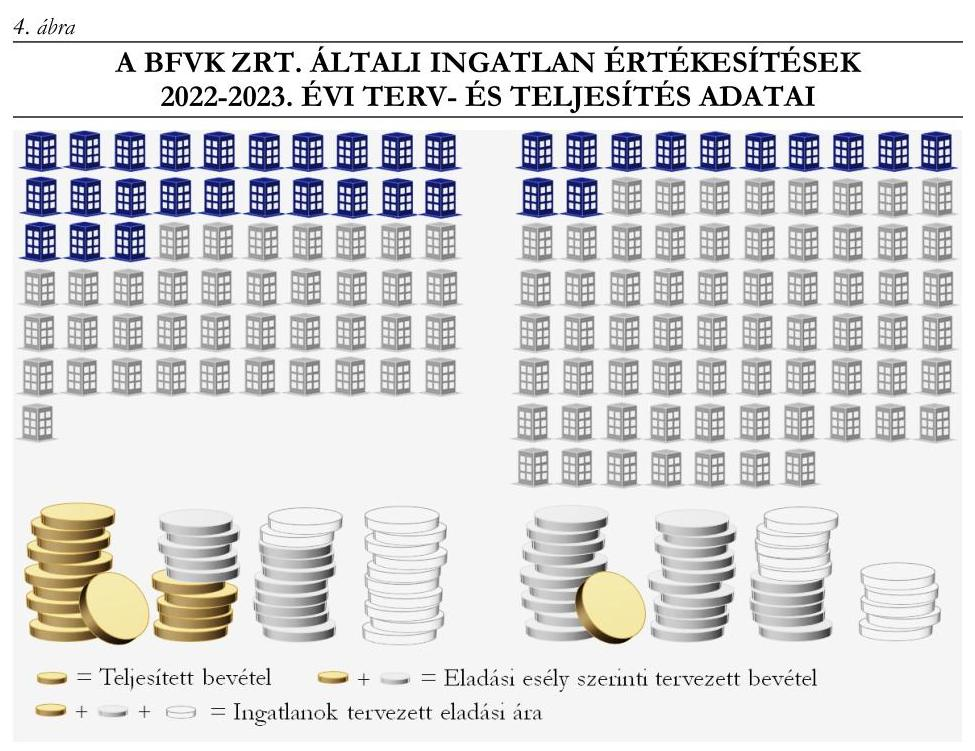

Forrás: A BFVK Zrt. adatszolgáltatása alapján ÁSZ feldolgozás és szerkesztés
Az ingatlanértékesítések mindkét évben elmaradtak a tervezettől, mivel a pályázati eljárások során nem érkezett az adott ingatlanokra vételi ajánlat. A BFVK Zrt. a 2022. évben 23 db ingatlant nettó 8 106,3 M Ft, a 2023. évben 12 db ingatlant nettó 428,0 M Ft értékben értékesített. A Fővárosi Önkormányzatnál a BFVK Zrt. értékesítésein túl a 2022. évben nettó 1 925,2 M Ft (4 db), a 2023. évben nettó 15,4 M Ft (2 db) ingatlanértékesítés történt. Az értékesítések bevételei mindkét évben lényegesen meghaladták az értékesített ingatlanok összesített könyv szerinti értékét, amely a 2022. évben 4 624,6 M Ft, a 2023. évben 251,8 M Ft volt.
A Fővárosi Önkormányzat ingatlanértékesítéssel kapcsolatos stratégiával/tervvel nem rendelkezett, a Bkr. 5. § (1) bekezdése alapján az államháztartásért felelős miniszter által közzétett módszertani útmutatóban előírtakat figyelmen kívül hagyva mérhető teljesítménycélokat nem alakított ki, ezáltal a saját hatáskörében értékesített ingatlan (1. minta) döntéshozatalánál stratégiai célszerűségi kritérium nem érvényesült. A BFVK Zrt. ingatlan értékesítései összhangban voltak a Stratégiai tervében szereplő célkitűzésekkel - az értékesített ingatlanok az ingatlanvagyon értékelések dokumentumai szerint jellemzően leromlott állapotú, használaton kívüli épületek és nem hasznosított, gondozatlan földterületek voltak -, továbbá szerepeltek az Éves közfeladat-ellátási szerződésekben a Fővárosi Önkormányzat által értékesítésre kijelölt ingatlanok között. A BFVK Zrt. az ingatlanértékesítések vonatkozásában mérhető teljesítménycélokat - értékesítésre tervezett és értékesített ingatlanok számát és értékét, ezek %-os alakulását, valamint a pályázati értékesítés átfutási idejét - határozott meg, azok teljesülését negyedévente nyomon követte. A BFVK Zrt. Stratégiai tervének céljai ugyanakkor nem tekinthetőek önkormányzati szintű céloknak, mivel a terv Fővárosi Önkormányzat részéről történő jóváhagyása nem történt meg.
Az ingatlanok értékesítésére vonatkozó döntések előkészítése megfelelt a Vagyonrendelet előírásainak. A Vagyonrendelet előírása szerint a tulajdonosi joggyakorlásra irányuló
 döntést megelőzően az adott vagyonelem értékét 6 hónapnál nem régebbi forgalmi értékbecslés alapján határozták meg. Abban az esetben, ha a vagyonelem vonatkozásában 6 hónapot meghaladó, de egy évnél nem régebben készült forgalmi értékbecslés állt rendelkezésre, akkor a Vagyonrendeletben foglaltaknak megfelelően a döntéshez az értékbecslést aktualizálták. A kiválasztott ingatlanok értékesítését megelőzően az ingatlanvagyonértékelések során készültek állapotfelmérések az ingatlan hasznosítási lehetőségeinek megalapozására.
Az értékesítésre irányuló döntést a kiválasztott mintatételeknél az MÖtv. és az Önkormányzati SzMSz előírásainak megfelelően az arra jogosult Közgyűlés, illetve átruházott hatáskörben a Tulajdonosi Bizottság hozta meg.

---

Az ellenőrzött időszakban - a kiválasztott mintatételeknél - az Nvtv. előírásának megfelelve forgalomképtelen törzsvagyon elidegenítésére nem került sor.
A Vagyonrendelet 17. § (10) bekezdése ellenére - amely szerint korlátozottan forgalomképes fővárosi vagyon a jogszabályi kivételtől eltekintve kizárólag az állam, másik helyi önkormányzat, vagy önkormányzati társulás részére idegeníthető el - négy korlátozottan forgalomképes ingatlan (3., 4., 5. és 7. minta) értékesítése magánszemélyek, illetve a Vagyonrendelet 17. § (11) bekezdése szerinti kivételi körbe nem tartozó gazdasági társaságok részére történt. A mintatételek esetében az értékesítést megelőzően a Vagyonrendelet 6. § (2), valamint 8. § (1) bekezdésben foglaltakat figyelmen kívül hagyva a forgalomképes üzleti vagyonná történő átminősítés nem történt meg annak ellenére, hogy ezen ingatlanok - az ingatlanvagyon-értékelések szerint - használaton kívül voltak, a Fővárosi Önkormányzat feladat- és hatáskörének ellátását közvetlenül már nem szolgálták.
Az ingatlanértékesítések lebonyolításának folyamatát a Fővárosi Önkormányzat részben a Vagyonrendeletben, részben az Éves közfeladat-ellátási szerződésekben szabályozta. A BFVK Zrt. az ellenőrzött időszakban rendelkezett Versenyeztetési szabályzattal ${ }^{36}$. Az értékesítések lebonyolítása (pályázat kiírása, versenyeztetés, szerződéskötés) a belső szabályozásnak megfelelően történt. Az érvényes pályázatot benyújtók közül a BFVK Zrt. minden esetben a legmagasabb vételi árat tartalmazó ajánlatot fogadta el. A Fővárosi Önkormányzat az értékesítések során az Nvtv., valamint a Vagyonrendelet előírásait betartva az ingatlanok tulajdonjogát természetes személyre vagy átlátható szervezetre ruházta át. Az adásvételi szerződéseket a kiválasztott mintatételeknél az arra jogosultak kötötték meg. A szerződéseket a nyertes ajánlattevővel, a versenyeztetésre vonatkozó jogszabályi előírásoknak megfelelően kialakult áron kötötték meg, a számlázás a szerződés szerinti összegben történt.
A tárgyi eszközként történt értékesítések közül egy esetben (2. minta) az értékesítésből származó bevételt az Áhsz. 15. számú mellékletben foglaltak ellenére a B52 rovat - 09523 ingatlanok értékesítésének teljesítése főkönyvi számla - helyett a B401 rovatra - 094013 Készletértékesítés ellenértékének teljesítése főkönyvi számlára - könyvelték. A pénzügyi számvitelben az Áhsz. 25. § (9a) bekezdés c) pontjában, valamint a 38/2013. NGM rendelet 1. melléklet III. fejezet csökkenések D) 4. b) pontjában foglaltak ellenére a tárgyi eszköz könyv szerinti értékének és az értékesítésből származó bevételnek a nyereségjellegű különbözetét nem az egyéb eredményszemléletű bevételek között számolták el, hanem az eszközök és szolgáltatások értékesítése nettó eredményszemléletű bevételeinél.
Az értékesítéseket követően a kiválasztott mintatételeknél minden esetben megtörtént a részletező nyilvántartásokból történő kivezetés.
A 2022-2023. években az ingatlanok készletté történő átsorolásánál egy esetben (K1. minta) az Áhsz. 12. § (6) bekezdésben foglaltak ellenére átsorolt készletként mutattak ki olyan ingatlant, amely „Kivett közterület, transzformátorbáz” jellegénél fogva nem volt értékesíthető. Ebből adódóan a 2022. és 2023. évi beszámoló mérlegében az ingatlan nettó értéke 207,4 M Ft az Áhsz. 11. § (3) bekezdés a) pontjában foglaltak ellenére tárgyi eszközök helyett helytelenül készletek között szerepelt. A 2022. és 2023. évi vagyonkimutatásban az ingatlan az Nvtv. 5. § (3) bekezdés a)-b) pontjaiban, valamint a Vagyonrendelet 5. §(1) bekezdés aa)-ab) pontjaiban foglaltak ellenére forgalomképtelen törzsvagyonba tartozó vagyonelem helyett forgalomképes készletre átsorolt ingatlanként volt kimutatva.
Az ellenőrzött időszakban két esetben (K5. és K6. minta) az értékesítésre szánt ingatlanok készletté történő átsorolására nem az Áhsz. 12. § (6) bekezdésben előírt feltételek bekövetkezésekor került sor, hanem egy jóval későbbi időpontban. Ebből adódóan az ingatlanok nettó értéke az Áhsz. 12. §

---

(6) bekezdés előírása ellenére a 2021. évi beszámoló mérlegében 309,5 M Ft, a 2022. évi beszámoló mérlegében 188,7 M Ft a készletek helyett helytelenül a tárgyi eszközök között volt kimutatva.
2.3. számú megállapítás

A nem lakáscélú ingatlanok hasznosítása során a hasznosítással érintett ingatlanrész egyedi forgalmi értékének megállapítása nem felelt meg az Nvtv., valamint a Vagyonrendelet és a Helyiségrendelet előírásainak. A Fővárosi Önkormányzat a hasznosítás eredményességének méréséhez mérhető teljesítménycélokat nem határozott meg. Nem rendelkezett továbbá olyan nyilvántartási rendszerrel, amely az ingatlanhasznosítás eredményességének megítéléséhez szükséges adatokat teljeskörűen tartalmazta. A BFVK Zrt. esetében az ingatlanok hasznosításából származó bevétel meghaladta a kiadásokat, ugyanakkor az ingatlanok kihasználtsága és a bérleti díjak szintje elmaradt az ingatlanpiaci értékektől.

A Fővárosi Önkormányzat a nem lakáscélú ingatlanhasznosításból a 2022. évben 1862,7 M Ft, a 2023. évben 2022,1 M Ft bevételt realizált. E bevételek 88,0%-a (1638,8 M Ft), illetve 90,1%-a (1 822,6 M Ft) a Vagyongazdálkodási Főosztály és a BFVK Zrt. által ellátott vagyonhasznosítási feladatokhoz kapcsolódott, amelynek több mint felét (914,4 M Ft, illetve 1002,3 M Ft) a BFVK Zrt. hasznosítási tevékenységéből származó bevételek képviselték. A fennmaradó 12,0%, illetve 9,9% döntően a forgalomtechnikai alépítményi hálózat használatából (10,0%, illetve 7,7%), a városháza helyiségeinek bérbeadásából, valamint kulturális területen végzett hasznosítási tevékenységből származó bevételekből származott.
A 2022-2023. években a Vagyongazdálkodási Főosztály 244 db, a BFVK Zrt. 190 db hatályban lévő szerződés alapján végezte a nem lakáscélú ingatlanok hasznosítását. A 2022-2023. években érvényben lévő hasznosítási szerződések 37,1%-a közfeladat ellátására irányult, amelynek 59,6%-a ingyenes hasznosítás volt. Az ellenőrzött időszakban megkötött 76 szerződésből 56 ipari-logisztikai ingatlan, 20 szerződés jellemzően irodák, üzletek, telkek, középületek hasznosítására irányult. A szerződések 77,6%-át határozatlan időre kötötték.
A 2022-2023. években létrejött 76 hasznosítási szerződéshez kapcsolódó 30 döntéshozatalból hét nem felelt meg maradéktalanul a jogszabályi előírásoknak. A Helyiségrendelet 6. § (2) bekezdésében, illetve a Vagyonrendelet 12. § (1) bekezdés aa) pontjában foglaltak ellenére hét döntést 782/2022. (VIII. 30.), 1007/2022. (IX. 27.), 1066/2022.(X. 25.), 1298/2022. (XII. 13.), 623/2023. (VI. 27.), 798/2023. (IX. 26.), 1051/2023. (XI. 28.) TB határozat ${ }^{37}$ - megelőzően nem állapították meg a hasznosítással érintett ingatlanrész egyedi forgalmi értékét. Ennek hiányában:

- négy döntéshez (1007/2022. (IX. 27.), 1066/2022. (X. 25.), 1298/2022. (XII. 13.), 623/2023. (VI. 27.) TB határozat) kapcsolódó hasznosítások esetében fennállt annak eshetősége, hogy az ingatlanok hasznosítására az Nvtv. 11. § (16) bekezdésében, valamint a Helyiségrendelet 9. § (1) bekezdésében és a Vagyonrendelet 18. § (1) bekezdés a) pontjában előírtakat megsértve versenyeztetés lefolytatása nélkül került sor. A versenyeztetési értékhatár megítéléséhez szabálytalanul a bérleti díjak 5 éves időtartamra számított értékét vették figyelembe, annak ellenére, hogy a Vagyonrendelet 18. § (1) bekezdés a) pontjában és a Helyiségrendelet 9. § (1) bekezdésében a Fővárosi Önkormányzat a versenyeztetés értékhatárát a mindenkori költségvetési törvényben

---

meghatározott összegben határozta meg, amely a 2022. és a 2023. években a hasznosítás tekintetében 25,0 millió forint egyedi bruttó forgalmi érték volt.

- három - üzleti vagyonba tartozó ingatlan hasznosítására irányuló -, a Tulajdonosi Bizottság által meghozott döntést (782/2022. (VIII. 30.), 798/2023. (IX. 26.), 1051/2023. (XI. 28.) TB határozat) érintően nem volt igazolható, hogy a döntési hatáskör az Önkormányzati SzMSz 46. § (1) bekezdés, valamint az 1. melléklet 2.3. pontja alapján a Tulajdonosi Bizottság átruházott hatáskörébe tartozott.
A nem lakáscélú ingatlanok hasznosítására vonatkozó szerződéseket - ide nem értve a fent bemutatott döntéshozatali szabálytalanságokkal esetlegesen érintett szerződéseket - a 2022-2023. években a vonatkozó jogszabályi előírások betartásával kötötték meg. Az ingyenes hasznosításra irányuló 2022-2023. évben létrejött hasznosítási szerződések (9 db) esetén az Nvtv.-ben foglaltaknak megfelelően az érintett ingatlant kizárólag közfeladat ellátása, a lakosság közszolgáltatásokkal való ellátása, valamint e feladatok ellátásához szükséges infrastruktúra biztosítása céljából hasznosították. A térítés ellenében történő hasznosítások esetén a 2022-2023. években létrejött szerződésekben a KSH fogyasztói-árindex alkalmazása mellett rendelkeztek az értékkövetésről, a szerződéses díj egyoldalú módosításának lehetőségéről. A pénzügyi elszámolás alapjául szolgáló számviteli bizonylatok (szerződés, számla) megfeleltek az Áhsz. és Számv. tv. előírásainak.
A hasznosításból származó bevételek egy mintatétel kivételével a szerződés szerinti összegben teljesültek. A siófoki 3778/7 helyrajzi számú ingatlan esetében (8. tanúsítvány 228. tétele) a vevő folyószámlán jelentős tartozás halmozódott fel, alapvetően a Haszonbérleti szerződés ${ }^{38}$ 2.3. pontjában előírt elszámolási kötelezettség teljesítésének elmulasztása miatt.
Az üdülőépület Haszonbérleti szerződésében foglaltak szerint a haszonbérlő üdülési szolgáltatást biztosított az ellenőrzött időszakban a Fővárosi Önkormányzat számára a szerződésben rögzített díj ellenében. A felek megállapodása alapján a haszonbérlő által fizetendő haszonbérleti díj keretösszege és a Fővárosi Önkormányzat által igénybe vett üdülési szolgáltatás ellenértéke elszámolásának határideje a tárgyévet követő év január 15-e volt. A Haszonbérleti szerződésben vállalt ezen kötelezettségüknek a felek a 2022-2023. évek vonatkozásában nem tettek eleget. A Fővárosi Önkormányzat könyveiben kimutatott haszonbérlővel szemben fennálló 2023. december 31-i követelés 125,0 M Ft volt. Ennek részét képezte a 2022. és 2023. évi haszonbérleti díj keretösszeg (összesen nettó 69,9 M Ft), amellyel szemben elszámolandó a Fővárosi Önkormányzat által igénybe vett üdülési szolgáltatás díja, amely a 2022-2023. években nettó 51,9 M Ft volt. Az elszámolás hiányában az egyenleg pénzügyi rendezése sem történt meg. A Fővárosi Önkormányzat a nem lakáscélú ingatlanállománnyal összefüggő hasznosítási tevékenysége eredményességének önkormányzati szintű megítéléséhez önkormányzati stratégiai célokkal nem rendelkezett.
A BFVK Zrt. - a Fővárosi Önkormányzat által el nem fogadott - Stratégiai tervében az ingatlanhasznosítási tevékenységhez kapcsolódóan általános célkitűzésként határozta meg az önkormányzati feladatellátáshoz nem szükséges ingatlanok megtartását és bérbeadását, amennyiben hozamtermelő képességük eléri vagy megközelíti a piaci jövedelmezőséget és kihasználtságuk magas. E stratégiai célok megvalósíthatósága azonban jelentős részben a BFVK Zrt. hatáskörén kívül állt, mivel az ingatlanok hasznosítására vonatkozó döntések meghozatalára a Fővárosi Önkormányzat volt jogosult. Továbbá a kitűzött célok megvalósulása mérhető teljesítménycélok hiányában nem volt értékelhető.

---

Az önkormányzati szintű eredményesség méréséhez szükséges mutatók - kihasználatlanság és hozamtermelő képesség - számítása nem volt biztosított, mivel nem alakítottak ki olyan nyilvántartási rendszert, amely tartalmazta

- a hasznosítható és hasznosított ingatlanok számát és értékét;
- valamennyi hasznosított ingatlanra kiterjedően a területi adatokat (földterület, felépítményi terület);
- valamennyi hasznosított ingatlan forgalmi értékét.

Kihasználatlanság számítására kizárólag a BFVK Zrt. által kezelt nem lakáscélú ingatlanállomány esetében volt lehetőség, mivel a nyilvántartott adatok köre a hasznosítható és hasznosított ingatlanok, illetve azok területi adatai vonatkozásában teljeskörűen rendelkezésre állt. A hozamvizsgálatok pedig csak a becsült forgalmi értékkel rendelkező ingatlanok esetében voltak elvégezhetőek. A BFVK Zrt. a hozamtermelő képességet a könyv szerinti értékekhez viszonyítva számította, amely piaci összehasonlító elemzésekre a forgalmi értékektől való jelentős eltérések miatt - nem volt alkalmas.
A nem lakáscélú
 ingatlanok BFVK Zrt. és Vagyongazdálkodási Főosztály általi hasznosítása - az ingatlanok területe alapján - döntően a közfeladatellátást szolgálta a 2022-2023. években. A hasznosított telkek, földterületek négyötöde, a felépítményes ingatlanok esetén a felépítmények hasznosított területének közel háromnegyede szolgált a közfeladatok ellátására.
Az ellenőrzött időszakban hatályos 434 db szerződés 62,9%-át kitevő, nem közfeladatellátást szolgáló, piaci alapú hasznosítás szerződésállományának értéke a teljes nem lakáscélú ingatlanállománynak a háromnegyedét képviselte a 2022-2023. években (75,8%, illetve 76,1%). A 2023. évi szerződésállomány éves értéke 1460,1 M Ft volt, amely 17,3%-kal haladta meg a 2022. évit. A 2022. évi inflációt (14,5%) 5. ábra

ÜZLETEK, IRODÁK, IPARI-LOGISZTIKAI INGATLANOK ELHELYEZKEDÉSE A 2023. ÉVI SZERZŐDÉSÁLLOMÁNYI ÉRTÉK NAGYSÁGÁNAK SZEMLÉLTETÉSÉVEL (M FT)
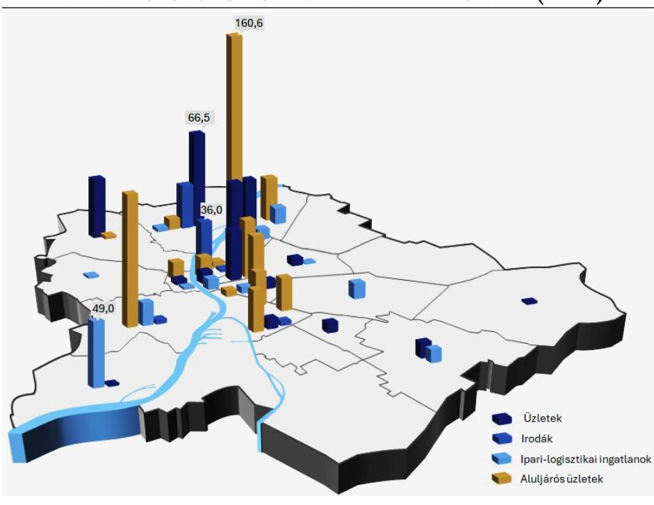

Forrás: A Fővárosi Önkormányzat és a BFVK Zrt. adatszolgáltatása alapján ÁSZ feldolgozás és szerkesztés
meghaladó mértékű bővülés a hasznosítási tevékenység fokozását mutatta, amely alapvetően az ipari-logisztikai ingatlanokat érintette. Az üzletek, irodák, ipari-logisztikai ingatlanok kerületi elhelyezkedését és a 2023. évi szerződésállomány értéke szerinti eloszlását az 5. ábra szemlélteti.

A 2022-2023. években a szerződésállomány értékének 51,9%-át, illetve 53,9%-át az üzletek, azon belül a legnagyobb arányt (59,5%, illetve 62,1%) az aluljárós üzletek képviselték, míg a fennmaradó részt a lakótelepi, körúti és egyéb üzletek jelentették.

A szerződésállomány értékének 9,5%-át, illetve 9,2%-át az ipari-logisztikai ingatlanok (felépítményes ingatlan, helyiség), 5,1%-át, illetve 4,9%-át az irodák képezték. A földhasználatokhoz (telkek, közparkok)

---

kapcsolódó szerződésállomány értéke 2022-ben 17,6%-ot, 2023-ban 19,0%-ot képviselt. A további funkciócsoportok (szálloda, intézményi épületek, irodák, nyaralóövezeti ingatlanok, irodai funkciót betöltő családi ház, illemhelyiség, garázs) esetében már csak jellemzően 5% alatti arányok jelentkeztek.
A 2022-2023. években a BFVK Zrt. kezelésében lévő bérbe adható ingatlanállomány közel egyharmadánál - 2022. évben 340 ingatlanból 103, míg a 2023. évben 348 ingatlanból 108 esetében - merült fel olyan körülmény, amely a bérbeadhatóságot nem biztosította vagy jelentősen akadályozta. A leggyakrabban előforduló gátló tényező a műszaki állapot volt (a bérbe adható állomány 22,4-23,0%-a), amelyet a funkcionális kötöttségből (az ingatlan eredeti rendeltetéséből) adódó korlátok követtek (14,1-15,2%). A bérbe adható ingatlanállomány 4,1-4,3%-át érintő jogi, szabályozási környezetből adódó akadályok között az ingatlan megközelíthetősége, átminősítési nehézségek, tulajdonjogi viták, területszabályozási és ráépítési korlátok egyaránt jelentkeztek. Az ingatlan környezete esetében a távhővezetékek és a vasúti közlekedési útvonalak közelsége rontotta a hasznosíthatóság esélyét a bérbe adható ingatlanok 2,4-2,9%-ánál.
A BFVK Zrt. bérbe adható ingatlan-portfóliója kihasználatlanságának ingatlanpiaci adatokkal való összehasonlítását a 6. ábra szemlélteti:
6. ábra

A BFVK ZRT. BÉRBE ADHATÓ INGATLANPORTFÓLIÓJÁNAK KIHASZNÁLATLANSÁGA AZ INGATLANPIACI ADATOKHOZ KÉPEST A 2022-2023. ÉVEKBEN (%)
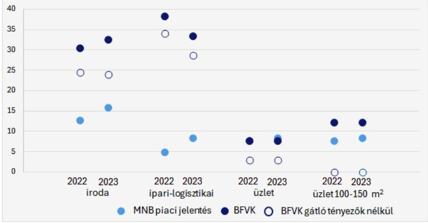

A hasznosítási célból a BFVK Zrt. kezelésébe adott irodák, illetve irodai célra hasznosítható ingatlanok, ingatlanrészek (a 2022-2023. években 45, illetve 47 db) kihasználatlansága meghaladta a 30%-ot, szemben az ingatlanpiacon jellemző 12,7-15,7%-kal. A hasznosítást gátló, akadályozó tényezőkkel nem érintett ingatlanállomány esetében már kedvezőbb volt a helyzet, de a kihasználatlanság még így is mindkét évben megközelítette a 25%-ot (24,5% és 24,1%).

A ipari-logisztikai ingatlanok (2022: 101 db, 2023: 102 db) kihasználatlansága - szemben a 4,8%-os ingatlanpiaci átlaggal - 2022. évben 38,3% volt. A 2023. évben az ipartelepeket érintő hasznosítások fokozásának eredményeként a kihasználatlanság mutatója 33,3%-ra javult, azonban az ingatlanpiaci átlagot az akadályozó, gátló tényezőkkel nem érintett ingatlanállomány esetén is 20,3 százalékponttal meghaladta.
Az üzletek (2022: 95 db, 2023: 93 db) kihasználatlansága lényegesen kedvezőbb képet mutatott. A gátló, akadályozó tényezők nélküli üzletek kihasználatlansága az ingatlanpiaci átlaghoz (7,7% és 8,3%) képest alacsonyabb (2,9-3,0%) volt, a 100-150 m² üzletek (2022-2023. években 8 db) esetében pedig teljes kihasználtságot sikerült elérni.
A nem lakáscélú ingatlanok bérleti díjainak az MNB jelentésekben szereplő piaci adatokkal való összehasonlítása alapján az ellenőrzés megállapította, hogy azok mindhárom szegmensben elmaradtak a piaci átlagoktól, amelynek mértéke a főváros központi városrészének frekventált helyszínein fekvő irodák (4 db) és üzletek (12 db) esetén is átlagosan 56,4%-os, illetve 60,2%-os volt. A kiértékelt 22 db ingatlanból - ahol a becsült forgalmi értékek alapján lehetőség volt a számítások elvégzésére - 14 db esetében a hozamok elmaradtak a 15 éves állampapírpiaci referenciahozamok éves átlagértékétől (7,31%) és az esetek

---

felében (11 db) a 2023. december havi értékétől (6,11%)*. Az elmaradásokhoz hozzájárult, hogy a hasznosítások során az értékkövetésre alkalmazott - KSH fogyasztói-árindex többségében nem követte az MNB jelentésekben szereplő 2016., illetve a 2017. évektől kezdődően rendelkezésre álló piaci adatok alapján - az ingatlanpiaci változásokat.
A Vagyongazdálkodási Főosztály által kezelt ingatlanok esetében - az üzemeltetéssel kapcsolatban felmerült költségek elkülönített nyilvántartása hiányában - fedezetszámításra nem volt lehetőség. A BFVK Zrt. által kezelt nem lakáscélú ingatlanok esetében a hasznosítási bevételek a 2022-2023. években fedezetet nyújtottak az energiafelhasználással és üzemeltetéssel, fenntartással kapcsolatos kiadásokra.
A Fővárosi Önkormányzat a 2022. és a 2023. évi zárszámadás előterjesztésekor az Ávr. ³⁹ 162. §-ában és 28. § d) pontjában előírt helyiségek hasznosításából származó bevételből nyújtott kedvezmény, mentesség összegét nem a valóságnak megfelelően mutatta be a Közgyűlés részére, mivel a közvetett támogatásokat tartalmazó kimutatásban:

- nem mutatták be valamennyi ingatlanhoz - 2022-ben az ellenőrzés során feltárt 23, 2023-ban 22 hasznosítási tételhez - kapcsolódó kedvezmény, mentesség összegét,
- több ingatlan - az ellenőrzés során feltárt 37 hasznosítási tétel - esetében a korábbi években megállapított díjkedvezmény összegét mutatták be, nem vették figyelembe a kedvezmény, mentesség összegének KSH fogyasztói-árindex alkalmazásával történő indexálását,
- egyes tételeket duplán is kimutattak (2022. évben öt tételhez kapcsolódóan 140,6 M Ft, 2023. évben három tételhez kapcsolódóan 114,3 M Ft értékben).

A fentieken túl a 2023. évi kimutatásban a helyiségek hasznosításából származó kedvezmény, mentesség összege a BFVK Zrt. által hasznosított ingatlanokhoz kapcsolódó közvetett támogatásokat tévesen 279820 E Ft helyett csak 280 E Ft összegben - tartalmazta.
2.4. számú megállapítás

A szervezeti keretek kialakítása során célszerűségi szempontok nem minden esetben érvényesültek, mivel a keretrendszer - az ellenőrzés során feltárt hiányosságok miatt - nem biztosította teljeskörűen a vagyongazdálkodási tevékenység megfelelőségét.

A Fővárosi Önkormányzat vagyongazdálkodása stratégiai és operatív célkitűzéseinek jogszabályi előírásokkal való kapcsolatát és szervezeti keretét a 7. ábra szemlélteti:

[^0]
[^0]:    * Az ellenőrzés a becsült forgalmi értékeket az építőipari termelői árindex alkalmazásával 2023. évre indexálta.

---

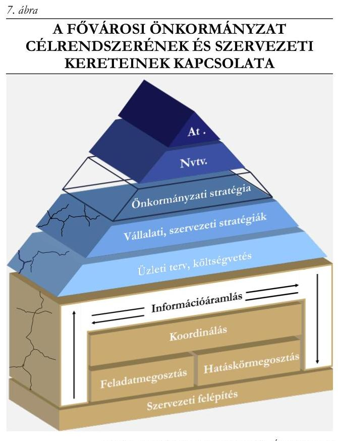

Forrás: Az ellenőrzési tapasztalat alapján ÁSZ szerkesztés

Az önkormányzati vagyongazdálkodás alapvető célja - az Alaptörvényben ⁴⁰ és az Nvtv.-ben előírtak alapján - a nemzeti vagyon költségtakarékos, értékmegőrző, értéknövelő működtetése és hasznosítása. A jogszabályi elvek érvényesülését nem szolgálta, hogy stratégiai célokat a Fővárosi Önkormányzat az ellenőrzött időszakban a vagyonértékesítés és a vagyonhasznosítás vonatkozásában nem határozott meg. Az Nvtv. 9. § (1) bekezdésében, valamint a Vagyonrendelet 25. §-ában előírtak ellenére a Fővárosi Önkormányzat a Közgyűlés által elfogadott közép- és hosszú távú vagyongazdálkodási tervvel nem rendelkezett, továbbá a BFVK Zrt. - mint a fővárosi vagyon kezelője - stratégiáját az Alapszabály 9.2. I) pontjában előírtak ellenére nem hagyta jóvá. A Fővárosi Önkormányzatnál közép- és hosszú távú vagyongazdálkodási terv hiányában az éves feladatokat tartalmazó operatív tervek sem készültek. A BFVK Zrt. 2022-2023. évi üzleti terveiben - a Gtbkr. 3. § (3) bekezdés alapján közzétett irányelvben foglaltak megfelelő alkalmazásához kiadott Belső Kontrollrendszer Kézikönyv ⁴¹ 1.1.2.1.2. pontjában foglaltak ellenére - nem került bemutatásra, hogy az üzleti terv egyes rendelkezései miként szolgálják a gazdasági társaság stratégiájának megvalósítását.
A vagyongazdálkodási feladatellátásban részt vevők közötti koordináció kulcsfontosságú eleme a megfelelő információáramlás, amelynek feltárt hiányosságai a Fővárosi Önkormányzatnál többségében visszavezethetők voltak a szervezeti keretek nem megfelelő és célszerű kialakítására. A Fővárosi Önkormányzatnál kialakított információs és kommunikációs rendszer a Bkr. ⁴² 9. § (1) bekezdés ellenére nem biztosította, hogy:

- a Közgyűlés megbízható, pontos információkhoz jusson a 2022-2023. évi zárszámadások keretében a vagyon - Vagyonrendeletben előírt tartalom szerinti - összetételét és a nem lakáscélú helyiségek hasznosítása során nyújtott kedvezményeket, mentességeket érintően;
- az ingatlanok értékesítésével, valamint készletté történő átsorolásával összefüggésben a munkavégzéshez, döntések meghozatalához szükséges releváns, pontos információk rendelkezésre álljanak a vagyonértékesítésben résztvevő szervezeti egységeknél (Vagyongazdálkodási Főosztály, BFVK Zrt. Pénzügyi, Számviteli és Vagyonnyilvántartási Főosztály) a 2022-2023. években;
- a beruházások, tárgyi eszközök körét, értékét érintő gazdasági eseményekhez kapcsolódó információk a megfelelő időben eljussanak az illetékes szervezeti egységekhez, biztosítva a változások számviteli nyilvántartásokon történő szabályos átvezetését;
- a megfelelő információk eljussanak az illetékes szervezethez, szervezeti egységhez, mivel az Éves közfeladat-ellátási Szerződések keretében bérbeadás céljára a 2022. évben öt, a 2023. évben egy olyan ingatlant is kijelöltek, amelyek értékesítése már az előző évben megtörtént.

---

A feladat- és hatáskörmegosztással kapcsolatos hiányosságok voltak, hogy:

- A Hivatali SzMSz 104. §-ában előírtak ellenére a Várostervezési Főosztály Ügyrendje a 2021. év folyamán, míg a többi vagyongazda főosztály ügyrendje a 2022-2023. években került előterjesztésre, majd jóváhagyásra. A Hivatali SzMSz 16. § (1) bekezdése rögzítette, hogy az önálló szervezeti egységek működésének részletes szabályait az önálló szervezeti egységek ügyrendjében kellett meghatározni, amelyeket a 104. §-ban előírtak szerint a Hivatali SzMSz hatálybalépését követő 30 napon belül - 2020. december 1-ig - kellett elkészíteni és jóváhagyásra előterjeszteni.
- A közvetett támogatások számszerúsítéséhez adatot szolgáltatók (pl. Vagyongazdálkodási Főosztály, BFVK Zrt.) tevékenysége koordinálásának hiányossága egyes tételek duplán történő szerepeltetéséhez vezetett a 2022. és 2023. évi zárszámadás előterjesztésében.
- A Vezérigazgató és helyettese részére történő prémiumkifizetések Humánerőforrás-menedzsment Főosztály általi döntéselőkészítésének részeként a prémiumfeladatok teljesítése szakmai kontrolljának feladatát kompetens szervezeti egység számára nem írták elő, és a szakmai felülvizsgálatot nem végezték el. Felülvizsgálat hiányában a kifizetett prémiumok összegének meghatározása a Vezérigazgató és helyettese által készített - az Önkormányzat által nem kontrollált - prémiumfeladatok teljesítéséről szóló jelentések alapján történt.

# 3. A vagyonértékesítési és vagyonhasznosítási tevékenységhez kapcsolódó belső ellenőrzés és tulajdonosi joggyakorlás működésének megfelelősége 

| Összegző megállapítás | A tulajdonosi joggyakorlás során nem érvényesültek   maradéktalanul a Keretszerződés előírásai. A   vagyonértékesítési és vagyonhasznosítási tevékenységhez   kapcsolódóan nem folytattak le belső ellenőrzést az   ellenőrzött időszakban. A vagyonértékesítési és   vagyonhasznosítási tevékenység tekintetében a belső   ellenőrzési terveket megalapozó kockázatelemzések során a   Főpolgármesteri Hivatal magas kockázatot nem tárt fel. A   BFVK Zrt. belső ellenőrzési vezetője a Gtbkr. előírása   ellenére nem kockázatalapú éves belső ellenőrzési tervet   állított össze. |
| :--: | :--: |

A BFVK Zrt. - a Keretszerződés előírása szerint - féléves gyakorisággal elkészítette a közfeladatellátásáról szóló beszámolóját. A 2022. és 2023. évi éves beszámolók egyben a számviteli beszámoló üzleti
 jelentését is képezték. A 2022. és 2023. év I. félévi és éves beszámolók hiányossága volt, hogy - a Keretszerződés 3. számú mellékletében előírtak ellenére - nem tartalmazták a tevékenységre ható pozitív és negatív piaci tényezőket. A naturáliákat az adott időszak vonatkozásában mutatták be, a Keretszerződésben foglaltak ellenére nem tartalmazták a beszámolók a tárgyévi tényadatoknak az előző év azonos időszaki tényadatokkal, illetve a tárgyévi tervadatokkal való összevetését grafikonokkal, táblázatokkal és rövid szöveges ismertetéssel, indoklással. A féléves beszámolók az I. félévi eredményeket a Keretszerződésben előírtaktól eltérően az előző év azonos időszakához képest nem mutatták be,

---

továbbá a Keretszerződés 3. számú melléklet IV. pontjában előírtak közül nem tartalmazták a következő évre vonatkozó üzleti terv szerint előirányzott ellentételezési igényt.
A - Ptk. ${ }^{43}$ előírásaival összhangban megválasztott - felügyelő bizottság a 2022. évi és 2023. évi számviteli beszámolókről alkotott véleményét, valamint azok elfogadására vonatkozó javaslatát továbbította a Közgyűlés részére.
A Keretszerződés 11.11. pontja előírta továbbá, hogy a vagyongazdálkodásból származó bevételek tervezett szintnél alacsonyabb realizálása esetén a BFVK Zrt. köteles az észszerűen lehetséges legrövidebb időn belül intézkedési tervet készíteni és a Fővárosi Önkormányzatnak átadni. A 2022. és 2023. években az ingatlanértékesítésből származó bevétel, valamint az ingatlanértékesítés és hasznosítás együttes bevétele egyaránt elmaradt a tervezettől. Az alulteljesítés ellenére intézkedési terv nem készült, a mulasztást a Fővárosi Önkormányzat nem kérte számon. Az üzleti terv teljesítése nem szerepelt a Vezérigazgató, illetve a helyettese számára kiírt prémiumfeladatok között.
A BFVK Zrt. Javadalmazási szabályzata rendelkezett a vezető állású munkavállalók prémiumának mértékéről, továbbá a prémiumfeladatok kitűzésének szempontjairól. A 2022. évi prémium kiírások nem feleltek meg a Javadalmazási szabályzat 2.6. pontja azon előírásának, amely szerint a prémiumfeladatnak objektívnek, valós többletteljesítményre ösztönzőnek kell lennie, ugyanis tartalmaztak olyan feladatot, amelyet már a kiírást megelőzően teljesített a Vezérigazgató, valamint a helyettese. Az ellenőrzött időszakban főpolgármesteri döntések alapján a Vezérigazgató és helyettese részére két alkalommal történt prémium kifizetés. A főpolgármesteri döntések mellékletét az érintett vezetők által készített, prémiumfeladatok teljesítéséről szóló jelentések képezték, amelyek szakmai kontrollja a főpolgármesteri döntések előkészítése keretében nem történt meg. A Bkr. 8. § (2) bekezdésének c) pontjában előírtak ellenére nem került kiépítésre olyan kontroll, amely biztosította a prémiummal kapcsolatos döntések szabályszerűségi szempontból történő jóváhagyását, illetve ellenjegyzését. Ennek hiányában nem volt igazolt, hogy a feladatokat a kiírásnak megfelelően hajtották végre.
A Javadalmazási szabályzat az „éves személyi alapbér" 40%-ában határozta meg a kifizethető prémium maximum mértékét. Nem volt egyértelmű, hogy az éves bér a prémium kiírás évének (bázisév) bére, vagy a prémium teljesítésről és kifizetésről szóló főpolgármesteri döntés évének (tárgyév) bére, vagy a prémium kiírással érintett időszakban (bázisév június 1. - tárgyév május 31.) kifizetett bér. A szabályozás hiányossága miatt a Humánerőforrás-menedzsment Főosztály - a főpolgármesteri döntések előkészítése során - a prémium összeg alapját képező éves bért eltérő időszaki bérek figyelembevételével határozta meg.

- a Vezérigazgató számára kiírt prémiumfeladatokat tartalmazó 2021. december 6-i főpolgármesteri döntés esetében a 2021. június 1. - 2022. május 31. a megjelölt időszak. A Fővárosi Önkormányzat nyilatkozata szerint a 2021. december 31-én érvényes alapbér 12-szerese képezte a prémium alapot;
- a Vezérigazgató helyettese számára kiírt prémiumfeladatokat tartalmazó 2021. december 6-i főpolgármesteri döntés esetében a 2021. évi alapbér, egyezően a kifizetésről szóló főpolgármesteri döntéssel;
- a Vezérigazgató számára kiírt prémiumfeladatokat tartalmazó 2022. december 19-i főpolgármesteri döntés esetében a 2022. június 1. - 2023. május 31. a megjelölt időszak, egyezően a kifizetésről szóló főpolgármesteri döntéssel.;

---

- a Vezérigazgató-helyettes számára kiírt prémiumfeladatokat tartalmazó 2022. december 19-i főpolgármesteri döntés esetében a 2022. június 1. - 2023. május 31. a megjelölt időszak. A kifizetésről szóló döntésben a 2022. évi alapbér képezte a prémium alapot.
A Fővárosi Önkormányzat belső ellenőrzési feladatait - a Bkr.-ben előírtakkal összhangban - a főjegyző közvetlen irányítása alatt a Főpolgármesteri Hivatal önálló szervezeti egységeként a Belső Ellenőrzési Osztály látta el az ellenőrzött időszakban. A belső ellenőrzési vezető a jogszabályban előírt tartalommal elkészítette a 2019-2022. évi, valamint a 2023-2026. évi Stratégiai ellenőrzési tervet ${ }^{44}$, azonban azokat a Bkr. 22. § (1) bekezdés b) pontjában foglaltak ellenére a Közgyűlés helyett a főjegyző és a főpolgármester együttesen hagyta jóvá. A Fővárosi Önkormányzat - a Bkr.-ben előírtak szerint - rendelkezett a 2022. és 2023. évekre vonatkozóan a belső ellenőrzési vezető által összeállított, kockázatelemzéssel alátámasztott, a Közgyűlés által jóváhagyott éves belső ellenőrzési tervvel. A 2022. és 2023. évi belső ellenőrzési terveket megalapozó kockázatelemzések a Főpolgármesteri Hivatal és a BFVK Zrt. vagyonértékesítési és vagyonhasznosítási tevékenysége tekintetében magas kockázatot nem tártak fel, ezért a Főpolgármesteri Hivatal belső ellenőrzése a 2022-2023. években ezen tevékenységekre vonatkozóan ellenőrzést nem végzett.
A BFVK Zrt. a Gtbkr.-ban előírtak alapján kialakította az operatív tevékenységektől függetlenül működő belső ellenőrzést. A gazdasági társaság belső ellenőrzési vezetője a 2018-2022. illetve a 2023-2026. évekre vonatkozó stratégiai ellenőrzési terveket elkészítette, amelyek jóváhagyása szabályszerű volt.
A 2023-2026. évi stratégiai ellenőrzési terv tartalma nem volt összhangban a Gtbkr. 3. § (3) bekezdésében előírt Irányelv ${ }^{45} 5.5$ pontjában, valamint az Irányelvben foglaltak alkalmazásához készített Belső Kontrollrendszer Kézikönyv C. IV. 3.1. pontjában foglaltakkal, mivel nem tért ki a belső ellenőrzés átfogó céljaira, a folyamatok kockázataira és a belső ellenőrzés fejlesztésének irányára, prioritásaira, a feladat ellátáshoz szükséges erőforrásokra, az kizárólag a tervezett ellenőrzéseket tartalmazta éves bontásban.
A BFVK Zrt. az ellenőrzött években a Gtbkr. előírásainak megfelelve rendelkezett belső ellenőrzési vezető által elkészített, felügyelőbizottság által elfogadott éves belső ellenőrzési tervekkel, amelyek a BFVK Zrt. vagyonértékesítési és vagyonhasznosítási tevékenységével összefüggő ellenőrzéseket nem tartalmaztak. A 2022. és 2023. években az éves belső ellenőrzési tervhez készültek kockázatértékelések, azonban azok a vagyonértékesítési és vagyonhasznosítási tevékenységekben rejlő kockázatok felmérésére nem terjedtek ki. A belső ellenőrzési vezető a Gtbkr. 19. § előírása ellenére nem kockázatalapú éves ellenőrzési terveket állított össze, mivel az éves belső ellenőrzési tervekbe kizárólag a stratégiai ellenőrzési tervekben szereplő ellenőrzések kerültek beépítésre, a kockázati értékelésekben szereplő magas kockázati kitettségű folyamatokat az éves ellenőrzési tervek összeállítása során nem vették figyelembe.

---

# JAVASLATOK 

Az ÁSZ tv. 33. § (1) bekezdésében foglaltak értelmében az ellenőrzött szervezet vezetője köteles a jelentésben foglalt megállapításokhoz kapcsolódó intézkedési tervet összeállítani és azt a jelentés kézhezvételétől számított 30 napon belül az ÁSZ részére megküldeni. Amennyiben az ellenőrzött szervezet vezetője nem küldi meg határidőben az intézkedési tervet, vagy továbbra sem elfogadható intézkedési tervet küld, az Állami Számvevőszék elnöke az ÁSZ tv. 33. § (3) bekezdése a) és b) pontjaiban foglaltakat érvényesítheti.

## A FŐPOLGÁRMESTER RÉSZÉRE

1. Intézkedjen a nyilvános jelentés kézhezvételét követően az Állami Számvevőszék jelentésének a Közgyűlés soron következő ülésére történő előterjesztéséről. A jelentést a napirend tárgyalásáról szóló jegyzőkönyvvel együtt tájékoztatásul küldje meg a Kormányhivatal részére is.
2. Intézkedjen - a Fővárosi Önkormányzat közép- és hosszú távú vagyongazdálkodási tervének elfogadását követően - a BFVK Zrt. Stratégiai tervének az Alapszabály 9.2. l) pontjában előírtak szerinti Fővárosi Önkormányzat - mint Alapító - általi jóváhagyásáról.
3. A BFVK Zrt. feletti tulajdonosi joggyakorlás keretében intézkedjen annak érdekében, hogy a Gtbkr. 3. § (3) bekezdés alapján kiadott Belső Kontrollrendszer Kézikönyv 1.1.2.1.2. pontjában foglaltakkal összhangban az üzleti tervekben bemutatásra kerüljön, hogy az üzleti terv egyes rendelkezései miként szolgálják a gazdasági társaság stratégiai tervének megvalósítását.
4. A BFVK Zrt. feletti tulajdonosi joggyakorlás keretében intézkedjen arról, hogy a
a) a prémiumfeladatok kiírására a javadalmazási szabályzatban foglaltaknak megfelelően kerüljön sor;
b) a prémiumkiírás tartalmazzon üzleti terv teljesítését ösztönző feladatokat;
c) a prémiumok kifizetésére vonatkozó főpolgármesteri döntés előkészítésének keretében történjen meg a prémiumfeladatok teljesítéséről szóló jelentésben foglaltak szakmai kontrollja.
5. Gondoskodjon a BFVK Zrt. feletti tulajdonosi joggyakorlás keretében a javadalmazási szabályzat pontosításáról a prémium összegének alapját képező éves bér irányadó időszakának vonatkozásában.

---

# A FŐJEGYZŐ RÉSZÉRE 

1. Gondoskodjon arról, hogy a költségvetési beszámoló mérlegét alátámasztó leltár a Számv.tv. 69. § (1) bekezdésben előírtaknak megfelelően minden esetben tételesen és ellenőrizhető módon tartalmazza a mérlegfordulónapi tételeket.
2. Intézkedjen a Leltározási szabályzat 21. § (5) bekezdésében foglaltak szerint a beruházások részletező nyilvántartása helyességének folyamatos ellenőrzéséről a pénzügyi és műszaki teljesítésekkel, valamint a könyvviteli számlákkal történő egyeztetés alapján.
3. Intézkedjen arról, hogy a költségvetési beszámoló mérlegében a rendeltetésszerűen használatba vett, üzembe helyezett tárgyi eszközöket az Áhsz. 11. § (3) bekezdés a)-b) pontjaiban előírtak szerint mutassák ki.
4. Intézkedjen arról, hogy a leltári különbözetek elszámolására, az eltérések okainak kivizsgálására az Áhsz. 53. § (8) bekezdés b) pontjának előírásait betartva legkésőbb az éves zárlat keretében kerüljön sor.
5. Intézkedjen az Nvtv. 9. § (1) bekezdés, valamint a Vagyonrendelet 25. §-ában foglaltak szerinti közép- és hosszú távú vagyongazdálkodási terv előkészítéséről és annak elfogadása érdekében a Közgyűlés elé történő terjesztéséről.
6. Gondoskodjon arról, hogy a vagyonkimutatás a jogszabályban rögzítetteken túl összhangban legyen a Vagyonrendelet 2. melléklet „II. A vagyonkimutatás tartalma" részben előírtakkal.
7. Intézkedjen - a Bkr. 5. § (1) bekezdése alapján az államháztartásért felelős miniszter által közzétett módszertani útmutatóban előírtak figyelembevételével - az értékesítéssel kapcsolatos stratégiai célok, teljesítménymérésre alkalmazható mutatók, mérőszámok kialakításáról, továbbá a Bkr. 10. §-ában foglaltak szerint a kitűzött célok, mutatók, mérőszámok nyomon követéséről.
8. Intézkedjen, hogy a Vagyonrendelet 17. § (10) bekezdés előírásait betartva korlátozottan forgalomképes fővárosi vagyon elidegenítése - a (11) bekezdésben foglalt eltéréssel - kizárólag az állam, másik helyi önkormányzat vagy önkormányzati társulás részére történjen.
9. Intézkedjen a korlátozottan forgalomképes vagyonba sorolt ingatlanok értékesítését megelőzően a forgalomképessé történő átminősítésről a Vagyonrendelet 8. § (1) bekezdés előírásának megfelelően, amennyiben a Vagyonrendelet 6. § (2) bekezdése szerint az adott vagyonelem a Fővárosi Önkormányzat feladat- és hatáskörének ellátását, vagy közhatalmának gyakorlását közvetlenül már nem szolgálja.

---

10. Intézkedjen a Bkr. 3. §-a szerinti felelőssége körében annak érdekében, hogy a tárgyi eszköz értékesítés elszámolása a költségvetési számvitelben az Áhsz. 15. mellékletben B52 rovatra vonatkozó előírást betartva történjen, továbbá a pénzügyi számvitelben a tárgyi eszköz könyv szerinti értékének és az értékesítésből származó bevételnek nyereség jellegű különbözete az Áhsz. 25. § (9a) bekezdés c) pontjában, valamint a 38/2013. NGM rendelet 1. melléklet III. fejezet csökkenések D) 4. b) pontjában foglaltak szerint az egyéb eredményszemléletű bevételek között kerüljön elszámolásra.
11. Intézkedjen, hogy az értékesítendő ingatlanok készletté történő átsorolására az Áhsz. 12. § (6) bekezdésben előírt feltételek bekövetkezésekor kerüljön sor.
12. Biztosítsa, hogy az ingatlanok forgalomképesség szerinti besorolása a vagyonkimutatásban, valamint az ingatlanvagyon-kataszter nyilvántartásban megfeleljen az Nvtv. 5. §-ában, valamint a Vagyonrendelet 5-7. §-ában rögzített besorolásnak.
13. Gondoskodjon a Közgyűlés részére a zárszámadás
 keretében bemutatott közvetett támogatások, ezen belül az Avr. 162. §-a és a 28. § d) pontja szerinti helyiségek, eszközök hasznosításából származó bevételből nyújtott kedvezmény, mentesség összegének megalapozottságáról, megbízhatóságáról.
14. Gondoskodjon a jövőben hasznosítandó ingatlanok egyedi bruttó forgalmi értékének meghatározásáról annak érdekében, hogy:
a) az Nvtv. 11. § (16) bekezdésében, valamint a Helyiségrendelet 9. § (1) bekezdésében és a Vagyonrendelet 18. § (1) bekezdés a) pontjában előírt versenyeztetés szükségessége megítélhető legyen;
b) a döntési hatáskör címzettjei az Önkormányzati SzMSz 46. § (1) bekezdés, valamint az 1. melléklet előírásai szerint kerüljenek kijelölésre.
15. Gondoskodjon a siófoki 3778/7 helyrajzi számú ingatlan vonatkozásában kötött Haszonbérleti szerződésben rögzített, követelésként nyilvántartott haszonbérleti díj keretösszeg beszedését alátámasztó elszámolások elkészítéséről, a kintlévőségek beszedéséről, továbbá tegyen intézkedést a jövőbeli elszámolások szerződés szerinti határidőben történő elvégzése érdekében.
16. A nem lakáscélú ingatlanhasznosítás eredményességének növelése érdekében vizsgálja meg, hogy a bérleti díjak értékkövetésénél milyen módon és mértékben célszerű figyelembe venni a bérleti díjak piaci változását.
17. Intézkedjen, hogy a Bkr. 22. § (1) bekezdés b) pontjában foglaltakkal összhangban a stratégiai ellenőrzési tervet a Közgyűlés jóváhagyja.

---

# A BFVK ZRT. VEZÉRIGAZGATÓJA RÉSZÉRE 

1. Gondoskodjon arról, hogy a féléves és éves beszámolók a Keretszerződés 3. számú mellékletben előírt tartalommal készüljenek.
2. Intézkedjen a Keretszerződés 11.11. pontjában előírt intézkedési terv készítési kötelezettség teljesítéséről abban az esetben, ha a vagyongazdálkodásból származó bevételek nem érik el a tervezett szintet.
3. Gondoskodjon arról, hogy a belső ellenőrzési vezető által elkészített, a Gtbkr. 15. § (1) bekezdés b) pontjában előírt stratégiai ellenőrzési terv a Gtbkr. 3. § (3) bekezdésben rögzített - az állami vagyon felügyeletéért felelős miniszter által az államháztartásért felelős miniszter egyetértésével közzétett - irányelv alkalmazásával kerüljön összeállításra.
4. Intézkedjen, hogy a belső ellenőrzési vezető által elkészített éves ellenőrzési terv a Gtbkr. 19. § előírása alapján kockázatelemzésen alapuljon.

---

# MELLÉKLETEK 

## I. SZ. MELLÉKLET: ÉRTELMEZŐ SZÓTÁR

Budapest Főváros Főpolgármesteri Hivatala

Budapest Főváros Közgyűlése

Budapest Főváros Önkormányzata
ellenőrzést támogató szervezet
építőipari termelői árindex
forgalomképtelen nemzeti vagyon
gazdasági társaság
hasznosítás

A fővárosban főpolgármesteri hivatal működik. A főpolgármesteri hivatalt a főjegyző vezeti. (Forrás: Mótv. 22. § (5) bekezdés)
Budapest Főváros Önkormányzatának képviselő-testülete a közgyűlés. A közgyűlést a főpolgármester képviseli. A fővárosi közgyűlés tagjai a főpolgármester és a fővárosi listáról mandátumot szerzett képviselők. (Forrás: Mótv. 22. § (3) és (3a) bekezdés)
Budapest Főváros Önkormányzata olyan önkormányzat, amely a települési és a területi önkormányzat feladat- és hatásköreit is elláthatja. Az Önkormányzatra vonatkozó feladat- és hatásköri szabályokat az Mótv. határozza meg. (Forrás: Mótv. 22. § (3) bekezdés; 23. § (1)-(7) bekezdések)
Amennyiben a rendelkezésre bocsátott dokumentumok, adatok, illetve tájékoztatás hitelességének, megalapozottságának, teljességének megállapítása vagy egyes ellenőrzési megállapítások alátámasztása, kiegészítése indokolja, a számvevő jogosult az összefüggő tények vizsgálata céljából más szervezettől (a továbbiakban: ellenőrzést támogató szervezet) adatot, dokumentációt, tájékoztatást kérni, illetve az érintett szervezetnél is ellenőrzést végezni. Az ellenőrzést támogató szervezet a megkeresésben foglaltak teljesítését csak akkor tagadhatja meg, ha az jogszabályba ütközik. Az ellenőrzést támogató szervezet a megkeresést annak megérkezésétől számított 8 napon belül köteles teljesíteni vagy a megkeresés teljesítésének jogszabályi akadályát az Állami Számvevőszékkel közölni. (Forrás: ÁSZ tv. 25. § (3) bekezdés)

Az építőipari termelői árindex output árindex, annak az árnak a változását fejezi ki, amelyet az építtető fizet a kivitelezőnek. Ez az árindex figyelembe veszi az építési folyamatban felhasznált költségtényezők (anyag, munkaerő) árváltozását, a termelékenység és a kivitelezői profit változását. Nem tartalmazza a tervezési, mérnöki és ügyvédi díjak, a telekár, az ÁFA és egyéb, a végső tulajdonost terhelő költség változását. (Forrás: KSH)
Az a nemzeti vagyon, amely az Nvtv.-ben meghatározott kivétellel nem idegeníthető el -, vagyonkezelői jog, kizárólagos gazdasági tevékenységhez kapcsolódó működtetési jog, építményi jog, jogszabályon alapuló, továbbá az ingatlanra közérdekből jogszabályban feljogosított szervek javára alapított használati jog, vezetékjog vagy ugyanezen okokból alapított szolgalom továbbá a helyi önkormányzat javára alapított vezetékjog kivételével - nem terhelhető meg, biztosítékul nem adható, azon osztott tulajdon nem létesíthető (Forrás: Nvtv. 3. § (1) bekezdés 3. pont)
A gazdasági társaságok üzletszerű közös gazdasági tevékenység folytatására, a tagok vagyoni hozzájárulásával létrehozott, jogi személyiséggel rendelkező vállalkozások, amelyekben a tagok a nyereségből közösen részesednek, és a veszteséget közösen viselik. (Forrás: Ptk. 3:88. § (1) bekezdése)
A tulajdonosi joggyakorló vagy a nemzeti vagyon használója által a nemzeti vagyon birtoklásának, használatának, hasznok szedése jogának bármely - a tulajdonjog átruházását nem eredményező - jogcímen történő átengedése, ide nem értve a vagyonkezelésbe adást, valamint a haszonélvezeti jog alapítását (Forrás: Nvtv. 3. § (1) bekezdés 4. pont)

---

hozam
ingatlan
kihasználtság, kihasználatlanság
korlátozottan forgalomképes vagyon
nemzeti vagyon

Az éves nettó bérleti bevétel, valamint az ingatlan becsült nettó forgalmi értékének hányadosa. (Forrás: ÁSZ saját fogalom)
A rendeltetésszerűen használatba vett földterület és minden olyan anyagi eszköz, amelyet a földdel tartós kapcsolatban létesítettek. Az ingatlanok közé sorolandó: a földterület, a telek, a telkesítés, az épület, az épületrész, az egyéb építmény, az üzemkörön kívüli ingatlan, illetve ezek tulajdoni hányada, továbbá az ingatlanokhoz kapcsolódó vagyoni értékű jogok, függetlenül attól, hogy azokat vásárolták vagy a vállalkozó állította elő, illetve azok saját tulajdonú vagy bérelt ingatlanon valósultak meg. Az ingatlanok között kell kimutatni a bérbe vett ingatlanokon végzett és aktivált beruházást, felújítást is. (Forrás: Számv. tv. 26. § (2) bekezdés)
Az ingatlanok hasznosított, illetve hasznosítatlan területadatainak viszonyulása a hasznosítható alapterülethez. (Forrás: ÁSZ saját fogalom)
Az Nvtv. 1. § (2) bekezdés a) pontja hatálya alá és nemzetgazdasági szempontból kiemelt jelentőségű nemzeti vagyonba nem tartozó azon nemzeti vagyon, amelyről törvényben, illetve - a helyi önkormányzat tulajdonában álló vagyon esetében - törvényben vagy a helyi önkormányzat rendeletében meghatározott feltételek szerint lehet rendelkezni. (Forrás: Nvtv. 3. § (1) bekezdés 6. pontja)
A nemzeti vagyonba tartozik:
a) az állam vagy a helyi önkormányzat kizárólagos tulajdonában álló dolgok,
b) az a) pont hatálya alá nem tartozó, az állam vagy a helyi önkormányzat tulajdonában lévő dolog,
c) az állam vagy a helyi önkormányzat tulajdonában lévő pénzügyi eszközök, továbbá az államot vagy a helyi önkormányzatot megillető társasági részesedések,
d) az államot vagy a helyi önkormányzatot megillető bármely vagyoni értékkel rendelkező jogosultság, amelyet jogszabály vagyoni értékű jogként nevesít,
e) Magyarország határa által körbezárt terület feletti légtér,
f) az üvegházhatású gázok kibocsátási egységeinek kereskedelméről szóló törvény szerinti kibocsátási egység és légiközlekedési kibocsátási egység, valamint az ENSZ Éghajlat-változási Keretegyezménye és annak Kiotói Jegyzőkönyve végrehajtási keretrendszeréről szóló törvény szerinti kiotói egység,
g) állami vagy helyi önkormányzati fenntartású közgyűjtemény (muzeális intézmény, levéltár, közgyűjteményként működő kép- és hangarchívum, valamint könyvtár) saját gyűjteményében nyilvántartott kulturális javak körébe tartozó dolog, kivéve, ha a dolog más tulajdonában áll,
h) a régészeti lelet,
i) a nemzeti adatvagyon körébe tartozó állami nyilvántartások fokozottabb védelméről szóló törvény szerinti nemzeti adatvagyon. (Forrás: Nvtv. 1. § (2) bekezdése)

---

önkormányzat
önkormányzati törzsvagyon
szerződésállomány értéke
trend-, illetve tendenciaelemzés
tulajdonosi joggyakorló
üzleti vagyon
vagyongazdálkodás

A helyi önkormányzat jogi személy. Az önkormányzati feladatok ellátását a képviselő-testület és szervei biztosítják. A képviselő-testület szervei: a polgármester, a főpolgármester, a vármegyei közgyűlés elnöke, a képviselőtestület bizottságai, a részönkormányzat testülete, a polgármesteri hivatal, a vármegyei önkormányzati hivatal, a közös önkormányzati hivatal, a jegyző, továbbá a társulás. A képviselő-testület a feladatkörébe tartozó közszolgáltatások ellátására - jogszabályban meghatározottak szerint - költségvetési szervet, a Polgári perrendtartásról szóló 2016. évi CXXX. törvény szerinti gazdálkodó szervezetet, nonprofit szervezetet és egyéb szervezetet alapíthat, továbbá szerződést köthet természetes és jogi személlyel vagy jogi személyiséggel nem rendelkező szervezettel. (Forrás: Mötv. 41. § (1), (2), (6) bekezdései)
A helyi önkormányzat tulajdonában álló nemzeti vagyon külön része, amely közvetlenül a kötelező önkormányzati feladatkör ellátását vagy hatáskör gyakorlását szolgálja, és amelyet
a) e törvény kizárólagos önkormányzati tulajdonban álló vagyonnak minősít,
b) törvény vagy a helyi önkormányzat rendelete nemzetgazdasági szempontból kiemelt jelentőségű nemzeti vagyonnak minősít (az a) és b) pont a továbbiakban együtt: forgalomképtelen törzsvagyon),
c) törvény vagy a helyi önkormányzat rendelete korlátozottan forgalomképes vagyonelemként állapít meg (Forrás: Nvtv. 5. § (2) bekezdés)
Egy adott évben hatályos szerződésekben meghatározott nettó bérleti díjak éves szintre számított értékének összesített összege. (Forrás: ÁSZ saját fogalom)
Hosszabb időszakon át, tartósan meglevő tendencia (átlagos mozgásirány) azonosítására irányuló idősorelemzés. (Forrás: https://www.staff.uszeged.hu/ pepe/jegyzet_eu.pdf, letöltve: 2023. 09.01.)
Aki a nemzeti vagyon felett az államot vagy a helyi önkormányzatot megillető tulajdonosi jogok és kötelezettségek összességének gyakorlására jogosult. (Forrás: Nvtv. 3. § (1) bekezdés 17. pontja)
A nemzeti vagyon azon része, amely nem tartozik az állami vagyon esetén a kincstári vagyonba vagy a kivezetésre szánt állami vagyonba, az önkormányzati vagyon esetén a törzsvagyonba. (Forrás: Nvtv. 3. § (1) bekezdés 18. pont)

A nemzeti vagyongazdálkodás feladata a nemzeti vagyon megőrzése, értékének és állagának védelme, rendeltetésének megfelelő, az állam, az önkormányzat mindenkori teherbíró képességéhez igazodó, elsődlegesen a közfeladatok ellátásához és a mindenkori társadalmi szükségletek kielégítéséhez szükséges, egységes elveken alapuló, átlátható, hatékony és költségtakarékos működtetése, értéknövelő használata, hasznosítása, gyarapítása, továbbá az állam vagy a helyi önkormányzat feladatának ellátása szempontjából feleslegessé váló vagyontárgyak elidegenítése, azzal, hogy a nemzeti vagyon megőrzése érdekében végzett bontás vagy átalakítás nem minősül az állagvédelmi kötelezettség megszegésének. (Forrás: Nvtv. 7. § (2) bekezdés)

---

# II. SZ. MELLÉKLET: AZ ELLENŐRZÖTT SZERVEZETEK JEGYZÉKE 

## MÉGNEVEZÉS

Budapest Főváros Önkormányzata
Budapest Főváros Főpolgármesteri Hivatal
Budapest Főváros Vagyonkezelő Központ Zrt.

---

## FOKUSZTERÜLET

1. A Fővárosi Önkormányzat vagyoni helyzete alakulásának értékelése
2. A vagyonértékesítési tevékenység szabályszerűsége és célszerűsége, a vagyonhasznosítási tevékenység szabályszerűsége és eredményessége, valamint a vagyongazdálkodás szervezeti kereteinek megfelelősége és célszerűsége

## ELLENŐRZÉSI KRITÉRIUMOK

Számv.tv. 69. §;
Áhsz. 4. § (1) bekezdés, 5. § (1) bekezdés, 11. § (3)-(5) bekezdései, 22. § (1)-(3) bekezdései;
Áht. 91. §;
Mötv. 106. § (2) bekezdés;
24/2013. (V. 29.) NFM rendelet ${ }^{46}$ 2. § (4)-(5) bekezdései; 6. § (1) bekezdés;

Fővárosi Önkormányzat Számviteli politika, Eszközök és források értékelési szabályzata, Eszközök és források leltárkészítési és leltározási szabályzata, Selejtezési szabályzat előírásai;
Nvtv. 7. § (1)-(2) bekezdései;
Bkr. 6. § (2)-(3) bekezdései.
Gazdasági program, közép- és hosszú távú vagyongazdálkodási terv, vagyonértékesítésre, vagyonhasznosításra vonatkozó vagyongazdálkodási stratégiák/tervek célkitűzései;
Ingatlan értékesítési döntésekhez kapcsolódó mérhető teljesítménycélok, teljesítménymutatók/mérőszámok;
BFVK Zrt. üzleti terveiben szereplő éves célkitűzések, célértékek;
Ingatlanpiaci elemzések (pl. MNB Zrt.; Kereskedelmiingatlan-piaci jelentés);
Mötv. 22. § (3) bekezdés, 41. § (1), (3)-(5) bekezdései;107. §, 108/A. § (1)-(2) bekezdései, 108/B. §, 110. § (1) bekezdés;
Hatv. ${ }^{47}$ 138. § (1) bekezdés j) pontja;
Nvtv. 3. § (1) bekezdés 1., 3. és 6. pont, 5. § (2) bekezdés a) pont, 5. § (3) bekezdés a) pontja, 5. § (6)-(7) bekezdései, 6. § (3e) és (5) bekezdései, 7. § (1)-(2) bekezdései; 9. § (1) bekezdés, 11. § (10) bekezdés, (11) bekezdés a), b), c) pontjai, (13), (16), (17) bekezdései, 13. §, 14. § (1) bekezdés; 2022. évi Kvtv.
 ${ }^{48}$ 5. § (3) bekezdés a) és b) pontjai; 2023. évi Kvtv. ${ }^{49}$ 5. § (2) bekezdés a) és b) pontjai;

Számv.tv. 165. § (1)-(2) bekezdései, 166. § (3) bekezdés, 167. § (1) bekezdés a), b), d), e), f) pontok;

Áhsz. 5. § (1) bekezdés, 10. § (5)-(6) bekezdések, 11. § (3) bekezdés a) pontja, 12. § (6) bekezdés, 22. § (1)-(2) bekezdései, 25. § (3) bekezdés, (9a) bekezdés c) pontja, 26. § (10a) bekezdés a) pontja, 45. §, 52. §;
Lakás tv. ${ }^{50}$ 52. §;
Áht. 36. § (7) bekezdés;
Ávr. 52. § (1) és (6)-(6a) bekezdései; 60. § (3) bekezdés; 162. §;

Bkr. 9. § (1) bekezdése;
147/1992.(XI. 6.) Korm.rendelet ${ }^{51}$ 1.§ (1), (3) bekezdései, 4. §;
27/2021. (I. 29.) Korm. rendelet ${ }^{52}$ 4. § 40. pont (hatályos 2021.02.08-től 2022.05.31-ig);
52/2021. (II. 9.) Korm. rendelet ${ }^{53}$ 2. § (hatályos 2021.02.10-től 2022.05.31-ig);

---

3. A vagyonértékesítési és vagyonhasznosítási tevékenységhez kapcsolódó belső ellenőrzés és tulajdonosi joggyakorlás működésének megfelelősége

Helyiségrendelet 6. § 2. bekezdése, 9. § (1) bekezdése; Vagyonrendelet 5. § (1) bekezdés aa) pontja, 6. § (2) bekezdése, 8. § (1) bekezdése, 12. § (1) bekezdés aa) pontja, 17. § (10) bekezdése, 18. § (1) bekezdés a) pontja, 25. § Vagyongazdálkodás belső szabályai;
Gazdálkodási jogkörök gyakorlásáról szóló szabályozás előírásai;
Ingatlanhasznosításra kötött szerződés előírásai;
Fővárosi Önkormányzat Számviteli politika, Eszközök és források értékelési szabályzata, Önköltségszámítási szabályzat, Eszközök és források leltárkészítési és leltározási szabályzata, Számlarend, Selejtezési szabályzat előírásai;
BFVK Zrt. Alapszabálya;
Az értékesítésre történő kijelölésről szóló döntések akkor tekinthetők célszerűnek, ha azok összhangban voltak a vagyongazdálkodással/ingatlanértékesítéssel kapcsolatos stratégiákban/tervekben meghatározott célokkal;
A Fővárosi Önkormányzat vagyonhasznosítási tevékenysége akkor tekinthető eredményesnek, ha a kitűzött stratégiai és éves operatív célok megvalósultak, a hasznosítás bevételei és azok elérése érdekében közvetlenül felmerült ráfordítások különbözetének alakulása kedvező (pozitív előjelű, illetve pozitív irányba elmozduló) volt, valamint a kihasználtság és a fajlagos hasznosítási díjak (alapterület egységre jutó bérleti díj) összességében nem maradtak el az ingatlanpiaci átlagoktól. A vagyongazdálkodás szervezeti keretei akkor tekinthetők célszerűnek, ha a stratégia megvalósítását szolgáló, a külső környezetnek és belső adottságnak megfelelő, valamint a vagyongazdálkodási tevékenység szabályszerűségét biztosító szervezet került kialakításra.
Mötv. 119. § (5) bekezdés;
Bkr. 15. § (2) bekezdés, 21. § (1)-(2) bekezdései, 22. § (1) bekezdés b), g) pontjai, 28. § c) pontja, 29. § (1) bekezdés, 31. § (1)-(4), (6) bekezdései, 39. § (1)-(2) bekezdései, 45. § (1)-(4) bekezdései, 46. §, 47. § (1) bekezdés, 48. §;

Gtbkr. 13. § (1), (6)-(7) bekezdései, 14. § (1) bekezdés, (2) bekezdés b) pontja, (3)-(4) bekezdései, 15. § (1) bekezdés b) pontja, (2) bekezdés e) pontja, 18. § c) pontja, 19. §, 21. § (1) bekezdés, 23. § (3)-(5) bekezdései, 31. § (1)-(4) bekezdései;
Vagyonrendelet 43. § (1) és (3) bekezdései;
Keretszerződés 7.1., 7.5., 9.1., 9.2., 10.3., 11.11. pontjai, 3. számú melléklete;
Taktv. 4. § (2) bekezdés;
Ptk. 3:27. § (1) bekezdés, 3:120. § (2)-(3) bekezdései, 3:121. § (1)-(2) bekezdései;
BFVK Zrt. SZMSZ, Alapszabály;
Tulajdonosi joggyakorló előírásai az FB tagok beszámoltatásáról;
BFVK Zrt. 2022-2023. évi üzleti terveiben szereplő célkitűzések;
Fővárosi Önkormányzat belső szabályozása a BFVK Zrt. vezetőire vonatkozó prémiumkitűzések rendjéről.

---

# IV. SZ. MELLÉKLET: INGATLANÁLLOMÁNY 2022-2023 

## 1. ábra

INGATLANÁLLOMÁNY 2022-2023
A Fővárosi Önkormányzat összevont mérlegében a befektetett eszközök között szereplő ingatlanokról
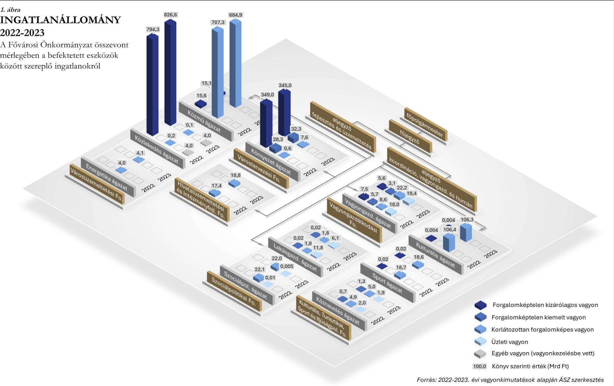

---

# FÜGGELÉK: ÉSZREVÉTELEK 

A jelentéstervezetet a Számvevőszék 15 napos észrevételezésre megküldte az ellenőrzött szervezet vezetőjének az ÁSZ tv. 29. § (1) bekezdése előírásának megfelelően.

A jelentéstervezet megállapításaira a Főpolgármester észrevételt tett. Az elfogadott észrevétel alapján a Számvevőszék módosította a jelentést. A függelék tartalmazza az ellenőrzött észrevételeit, illetve az el nem fogadott észrevételek elutasításának indoklását.

[^0]
[^0]:    * 29. § (1) Az Állami Számvevőszék az ellenőrzési megállapításait megküldi az ellenőrzött szervezet vezetőjének vagy az általa megbízott személynek, és annak, akinek személyes felelősségét állapította meg.
    (2) Az ellenőrzött szervezet vezetője és a felelősként megjelölt személy az ellenőrzés megállapításaira tizenöt napon belül írásban észrevételt tehet.
    (3) Az Állami Számvevőszék az észrevételre a beérkezésétől számított harminc napon belül írásban válaszol. A figyelembe nem vett észrevételeket köteles a jelentésben feltüntetni, és megindokolni, hogy azokat miért nem fogadta el.

---

# [Vonalkód] 

[Vonalkód]

## [Állami Számvevőszék]

1052 Budapest, Apáczai Csere János u. 10.

Budapest Főváros | Főpolgármestere

| ügyintéző: | Talló Éva |
| :-- | :-- |
| telefon: | +36 1327-1590 |
| email: | tallo.eva@budapest.hu |
| ikt. szám: | [Iktatószám] |
| hiv. szám: | EL-4029-089/2025 |
| tárgy: | Jelentéstervezet véleményezése BFÖNK |

dr. Windisch László elnök úr részére

Tisztelt Elnök úr!
2025. április 9-én kézhez vettem az Állami Számvevőszék V1079 számú „Budapest Főváros Önkormányzata vagyonértékesítési és vagyonhasznosítási tevékenységének ellenőrzése" című ellenőrzésről szóló jelentés tervezetét.

Köszönöm, hogy e jelentés tervezet tartalmazza a tartott zárómegbeszélésen tett észrevételeink egy részét, valamint e megbeszélésről készült jegyzőkönyvhöz tett észrevételeink és javaslataink részben beépítésre kerültek.

A Jelentéstervezethez kapcsolódóan korábban tett, és a jelentés tervezetbe be nem épült észrevételeimet továbbra is fenntartom, és azokat ismételten az alábbiak szerint teszem meg:

## I. Összefoglalás fejezethez kapcsolódóan

11. oldal második bekezdés: „A Fővárosi Önkormányzat leltározási tevékenységének hiányosságai miatt a nemzeti vagyonnal való felelős gazdálkodás követelményei nem érvényesültek maradéktalanul. Az ingatlanértékesítési és ingatlanhasznosítási tevékenység nem felelt meg teljeskörűen a jogszabályi előírásoknak és belső szabályozásoknak. Önkormányzati szinten meghatározott stratégiai célok hiányában az ingatlanok értékesítése során stratégiai célszerűségi kritérium nem érvényesült, önkormányzati szinten a hasznosítás eredményessége nem volt mérhető."

Észrevétel: „A Fővárosi Önkormányzat leltározási tevékenységének hiányosságai miatt a nemzeti vagyonnal való felelős gazdálkodás követelményei nem érvényesültek maradéktalanul. Az ingatlanértékesítési és ingatlanhasznosítási tevékenység nem felelt meg teljeskörűen a jogszabályi előírásoknak és belső szabályozásoknak. Önkormányzati szinten meghatározott stratégiai célok hiányában az ingatlanok értékesítése során ilyen stratégiai célszerűségi kritérium nem érvényesült, önkormányzati szinten a hasznosítás eredményessége nem volt mérhető."

Kérjük az összefoglalás megfelelő kiegészítését az észrevételben rögzítettek szerint.
Továbbá kérjük a fent idézett részből a következő mondat törlését: „Az ingatlanértékesítési és ingatlanhasznosítási tevékenység nem felelt meg teljeskörűen a jogszabályi előírásoknak és

---

belső szabályozásoknak.", melynek részletes indoklása alább, a 12. oldal első bekezdéséhez a b) pontban írt észrevételben, valamint a 12. oldal harmadik bekezdéséhez írt észrevételben került részletesen kifejtésre. 

11. oldal negyedik bekezdés: „A Fővárosi Önkormányzat leltárkészítési és leltározási tevékenysége a 2020-2022. években nem felelt meg teljeskörűen a jogszabályi és belső szabályzatban foglalt előírásoknak. A 2020-2023. években a költségvetési beszámoló mérlege „Módosítások" oszlopa jellemzően a 2020. január 1-jét megelőző időszakban üzembe helyezett, felújított tárgyi eszközök aktiválását, illetve az értékesített tárgyi eszközök számviteli nyilvántartásokból történő kivezetését tartalmazta. A módosítások alapján az ellenőrzés megállapította, hogy a 2020-2022. évi beszámolók mérlegében kimutatott beruházások, felújítások mérlegértékének alátámasztásához nem állítottak össze szabályszerű, a fordulónapi mérlegtételeket tételesen, ellenőrizhető módon tartalmazó leltárt, mivel rendeltetésszerűen használatba vett, üzembe helyezett tárgyi eszközöket mutattak a beruházások, felújítások mérlegsoron. Az üzembe helyezett tárgyi eszközök aktiválásának elmulasztása miatt az értékcsökkenés elszámolására sem került sor a 2020-2022. években. Így a tárgyi eszközök mérlegben kimutatott könyv szerinti értéke nem felelt meg a jogszabályi előírásoknak, ugyanakkor az eltérés - annak nagyságrendje miatt - a mérleg valódiságot lényegesen nem befolyásolta. A 2022. évben a Fővárosi Önkormányzat tárgyi eszközök körében elvégzett mennyiségi felvétellel történő leltározása nem volt szabályszerű, mivel a 2023. évi mérlegmódosítás során rendezett - korábbi éveket érintő - tételeket leltáreltérésként nem tárták fel."

Észrevétel: „A Fővárosi Önkormányzat leltárkészítési és leltározási tevékenysége a 2020-2022. években nem felelt meg teljeskörűen a jogszabályi és belső szabályzatban foglalt előírásoknak. A 2020-2023. években a költségvetési beszámoló mérlege „Módosítások" oszlopa jellemzően a 2020. január 1-jét megelőző időszakban üzembe helyezett, felújított tárgyi eszközök aktiválását, illetve az értékesített tárgyi eszközök számviteli nyilvántartásokból történő kivezetését tartalmazta. A módosítások alapján az ellenőrzés megállapította, hogy a 2020-2022. évi beszámolók mérlegében kimutatott beruházások, felújítások mérlegértékének alátámasztásához nem állítottak össze minden tekintetben szabályszerű, a fordulónapi mérlegtételeket tételesen, ellenőrizhető módon tartalmazó leltárt, mivel rendeltetésszerűen használatba vett, üzembe helyezett tárgyi eszközöket is kimutattak a beruházások, felújítások mérlegsoron. Az üzembe helyezett tárgyi eszközök aktiválásának elmulasztása miatt az értékcsökkenés elszámolására sem került sor a 2020-2022. években. Így a tárgyi eszközök mérlegben kimutatott könyv szerinti értéke nem felelt meg minden tekintetben a jogszabályi előírásoknak, ugyanakkor az eltérés - annak nagyságrendje miatt - a mérleg valódiságot lényegesen nem befolyásolta. A 2022. évben a Fővárosi Önkormányzat tárgyi eszközök körében elvégzett mennyiségi felvétellel történő leltározása nem volt teljesen szabályszerű, mivel a 2023. évi mérlegmódosítás során rendezett - korábbi éveket érintő - tételeket leltáreltérésként nem tárták fel."

Kiegészítő információk: Az utólagos aktiválások mind bruttó értéken, mind értékcsökkenés tekintetében szerepeltetve lettek a mindenkori aktuális mérlegben, mint módosító tételek, teljes körű analitikával alátámasztva, a jogszabályok szerint.

Mivel a Vagyonnyilvántartási Osztály 2022. óta folyamatosan azon dolgozott, hogy a korábban elmaradt aktiválások megtörténhessenek, tudomásunk volt azokról a beruházásokról, melyek már üzembe lettek helyezve, de a nyilvántartásban még befejezetlen állományként volt nyilvántartva. Indokolatlan lett volna fellelt vagyonként is nyilvántartásba venni azon eszközöket, melyek bekerülési értéke már a befejezetlen állomány részét képezte, mivel az duplikációt eredményezett volna.

---

Kérjük az összefoglalás megfelelő kiegészítését az észrevételben rögzítettek szerint, illetve kérjük a kiegészítő információk figyelembevételét a szövegezésben.
11. oldal ötödik bekezdés: „A Fővárosi Önkormányzat jogszabályban előírt közép- és hosszú távú vagyongazdálkodási tervvel nem rendelkezett, az ingatlanok értékesítésére és a nem lakáscélú ingatlanok hasznosítására kiterjedő stratégiai célkitűzéseket nem határozott meg. A BFVK Zrt. ingatlanok értékesítésére, hasznosításra is kiterjedő Stratégiai tervének Alapító általi jóváhagyása nem történt meg, az abban meghatározott célkitűzések nem tekinthetők önkormányzati szintű céloknak. "
Észrevétel: A BFVK Zrt. 2022-2025. évekre vonatkozó stratégiai tervét az Igazgatóság és a Felügyelőbizottság jóváhagyta.
12. oldal első bekezdés: „Az ingatlanértékesítésekhez kapcsolódó döntéshozataloknál - önkormányzati szintű stratégiai célok hiányában - stratégiai célszerűségi kritérium nem érvényesült. Az ingatlanok értékesítése, valamint készletté történő átsorolása nem felelt meg teljeskörűen a jogszabályi, valamint a belső szabályzók előírásainak. Előfordult, hogy korlátozottan forgalomképes fővárosi törzsvagyon a Vagyonrendeletben előírtak ellenére magánszemélyek, illetve gazdasági társaságok részére értékesítettek, továbbá használaton kivüli, közvetlenül a Fővárosi Önkormányzat feladat- és hatáskörének ellátását már nem szolgáló ingatlanokat az értékesítést megelőzően nem minősítettek át forgalomképes üzleti vagyonná. Az ingatlanok készletté történő átsorolásánál előfordult, hogy a jogszabályi előírások ellenére a 2022. és a 2023. évi beszámoló mérlegében átsorolt készletként mutattak ki olyan ingatlant, amely jellegénél fogva nem volt értékesíthető, továbbá a 2022. és 2023. évi vagyonkimutatásban ingatlan forgalomképtelen törzsvagyonba tartozó vagyonelem helyett forgalomképes készletre átsorolt ingatlanként volt
 kimutatva. Az értékesítésre szánt ingatlanok készletté történő átsorolására nem minden esetben a jogszabályban előírt feltételek bekövetkezésekor került sor. Ebből adódóan előfordult, hogy egyes ingatlanok értékét a 2021. évi és a 2022. évi beszámoló mérlegében szabálytalanul készletek helyett tárgyi eszközként mutatták ki. Az ingatlanok készletként történő értékesítéséből származó bevétel működési célra történő felhasználása nem biztosította az önkormányzati vagyon megőrzését. "

# Észrevétel: 

a) pontosítás Az ingatlanértékesítésekhez kapcsolódó döntéshozataloknál - önkormányzati szintű stratégiai célok hiányában - stratégiai célszerűségi kritérium nem érvényesült. Az ingatlanok értékesítése, valamint készletté történő átsorolása nem felelt meg teljeskörűen a jogszabályi, valamint a belső szabályzók előírásainak. Az ingatlanok készletté történő átsorolásánál hiba volt, hogy a jogszabályi előírások ellenére a 2022. és a 2023. évi beszámoló mérlegében átsorolt készletként mutattak ki egyes esetekben olyan ingatlant, amely jellegénél fogva nem volt értékesíthető, továbbá előfordult, hogy a 2022. és a 2023. évi vagyonkimutatásban ingatlan forgalomképtelen törzsvagyonba tartozó vagyonelem helyett forgalomképes készletre átsorolt ingatlanként volt kimutatva. Az értékesítésre szánt ingatlanok készletté történő átsorolására nem minden esetben a jogszabályban előírt feltételek bekövetkezésekor került sor. Ebből adódóan előfordult, hogy egyes ingatlanok értékét a 2021. évi és a 2022. évi beszámoló mérlegében szabálytalanul készletek helyett tárgyi eszközként mutatták ki. Az ingatlanok készletként történő értékesítéséből származó bevétel működési célra történő felhasználása nem biztosította az önkormányzati vagyon megőrzését.
b) a következő szöveg teljeskörű törlését kérjük az alábbi részletes jogi érvelés alapján, mivel ezen megállapításuk jogi tévedésen alapul:

---

„Előfordult, hogy korlátozottan forgalomképes fővárosi törzsvagyont a Vagyonrendeletben előírtak ellenére magánszemélyek, illetve gazdasági társaságok részére értékesítettek, továbbá használaton kívüli, közvetlenül a Fővárosi Önkormányzat feladat- és hatáskörének ellátását már nem szolgáló ingatlanokat az értékesítést megelőzően nem minősítették át forgalomképes üzleti vagyonná.."

A csak a Vagyonrendelet által - tehát nem a nemzeti vagyontörvény alapján - korlátozottan forgalomképesnek minősített vagyon tekintetében a Vagyonrendelet nem határoz meg értékesítési korlátot, ezért azok magánszemély számára és átlátható szervezetnek minősülő gazdasági társaság számára is értékesíthető. A nemzeti vagyontörvény 5. § (7) bekezdés szerinti korlát csak a nemzeti vagyontörvény szerint korlátozottan forgalomképesnek minősülő vagyonelemek köre esetén alkalmazandók, így csak az ilyen vagyonelemek azok, amelyek csak az ott meghatározott alanyi körnek értékesíthetők.

A nemzeti vagyontörvény külön rendelkezésben teszi lehetővé a helyi önkormányzat számára, hogy a nemzeti vagyontörvényben meghatározott korlátozottan forgalomképes vagyoni kört bővítse:
5. § (1) A helyi önkormányzat vagyona törzsvagyon vagy üzleti vagyon lehet.
(2) A helyi önkormányzat tulajdonában álló nemzeti vagyon külön része a törzsvagyon, amely közvetlenül a kötelező önkormányzati feladatkör ellátását vagy hatáskör gyakorlását szolgálja, és amelyet
a) e törvény kizárólagos önkormányzati tulajdonban álló vagyonnak minősít,
b) törvény vagy a helyi önkormányzat rendelete nemzetgazdasági szempontból kiemelt jelentőségű nemzeti vagyonnak minősít (az a) és b) pont a továbbiakban együtt: forgalomképtelen törzsvagyon), c) törvény vagy a helyi önkormányzat rendelete korlátozottan forgalomképes vagyonelemként állapít meg.
Továbbá, a nemzeti vagyontörvény lehetővé teszi a helyi önkormányzat számára, hogy a saját maga által megállapított korlátozottan forgalomképes vagyoni körről rendelkezés tekintetében - ide értve az eladást is - saját (tehát akár a nemzeti vagyontörvénytől eltérő) feltételeket állapítson meg. A nemzeti vagyontörvény 3.§ 6. korlátozottan forgalomképes vagyon: az 1. § (2) bekezdés a) pontja hatálya alá és nemzetgazdasági szempontból kiemelt jelentőségű nemzeti vagyonba nem tartozó azon nemzeti vagyon, amelyről törvényben, illetve - a helyi önkormányzat tulajdonában álló vagyon esetében - törvényben vagy a helyi önkormányzat rendeletében meghatározott feltételek szerint lehet rendelkezni;
Fenti rendelkezésekből egyértelmű, hogy a törvényben meghatározott korlátozás alá nem eső vagyonelemek esetében csak azon korlátok érvényesülnek, amelyeket a vagyonelem korlátozott forgalomképességét előíró rendelet meghatároz.
A Vagyonrendelet 17.§ (10) bekezdésében ez történik: a Főváros a nemzeti vagyontörvény. 5.§ (5), (7) bekezdés szerint kötelezően megállapított értékesítési körön kívül, azoktól egyértelműen elkülönülően rendelkezik a saját maga által megállapított korlátozottan forgalomképes vagyoni körről, s külön értékesítési korlátokat ezek vonatkozásában nem állapít meg. Ezáltal a nemzeti vagyontörvény. 5.§ (5) bekezdés szerinti vagyontárgyakon kívüli korlátozottan forgalomképes vagyonelemek eladása akkor is szabályos, ha a vevő magánszemély vagy gazdasági társaság.
A Vagyonrendelet 17. § (10) bekezdés a törvény szerinti korlátozásra csak a nemzeti vagyontörvény szerint korlátozottan forgalomképesnek minősülő vagyoni körbe tartozó vagyonelemek esetében utal. Ezt nem terjeszti ki:
„(10) * A nemzeti vagyonról szóló törvény szerint korlátozottan forgalomképes fővárosi vagyon önkormányzati hitelfelvétel és kötvénykibocsátás esetén annak fedezetéül nem szolgálhat, és - a (11) bekezdésben foglalt eltéréssel - kizárólag az állam, másik helyi önkormányzat vagy önkormányzati társulás részére idegeníthető el."

---

Azt, hogy csak erre a nemzeti vagyontörvény szerint korlátozottan forgalomképesnek minősített vagyoni körre vonatkozóan rendelkezik (lényegében - még ha feleslegesen is, de csak megismételve a törvényi szabályokat), alátámasztja az, hogy ha az önkormányzat a teljes korlátozottan forgalomképes vagyoni körre ki akarta volna terjeszteni ezeket a korlátozásokat, akkor ezt a szűkítő feltételt („A nemzeti vagyonról szóló törvény szerint korlátozottan forgalomképes") ezen korlátozások tekintetében nem tartalmazná a rendelet.
Ezt támasztja alá továbbá az, hogy a korlátozottan forgalomképes vagyoni kör esetköreinél a 6. §ban ott, ahol a nemzeti vagyontörvény minősíti korlátozottan forgalomképessé, hivatkozás történik magára a törvényre (lásd 6. § (1) bek. 1-4. pontok.
Továbbá ezt támasztja alá a 6. § (2) bekezdés is, ahol a Vagyonrendelet különválasztja a nemzeti vagyontörvény szerinti és az Vagyonrendeleti szerinti korlátozottan forgalomképes vagyoni kört. A tételes rendelkezések és a szövegösszefüggések vizsgálata alapján egyértelmű, hogy másként nem értelmezhető, csak az általunk leírt módon a Vagyonrendelet 17. § (10) bekezdése. Ennek okán a megállapítással nem értünk egyet, téves jogértelmezésen alapul, hiszen az érintett vagyonelemek mindegyike olyan, amely a nemzeti vagyontörvény szerint nem, csak a Vagyonrendelet szerint minősül „korlátozottan forgalomképesnek".
A vagyonrendelet 6. § (2) bekezdése - megegyezően a nemzeti vagyontörvény 5. § (6) bekezdésével - úgy rendelkezik, hogy „(2) A nemzeti vagyonról szóló törvény, valamint az e rendelet szerinti korlátozottan forgalomképes törzsvagyon minősítés a fővárosi vagyon tekintetében addig áll fenn, amíg az adott vagyonelem közvetlenül a Fővárosi Önkormányzat feladat- és hatáskörének ellátását, vagy közhatalmának gyakorlását szolgálja."
A rendelkezés alapján egyértelmű, hogy a megszűnés objektíven bekövetkezik akkor, amikor az adott vagyonelem a Fővárosi Önkormányzat feladat- és hatáskörének ellátását, vagy közhatalmának gyakorlását már közvetlenül nem szolgálja; erre vonatkozóan külön tulajdonosi döntés nem szükséges. A Vagyonrendelet külön rendelkezése [8. § (1) bek.] szól azokról az - ettől eltérő esetekről, amikor vagyoni kör átminősítésére külön tulajdonosi döntés alapján kerül sor.
Ha az értékesítést megelőzően egy korlátozottan forgalomképes vagyonelem közfeladatellátást szolgált, de az értékesítéskor ez a helyzet már nem áll fenn, az a jogszabály erejénél fogva, külön döntés nélkül elveszti korlátozottan forgalomképes minőségét. A vizsgált értékesítések közül egyetlen olyan eset sem volt, ahol közfeladatellátást szolgáló vagyonelem értékesítése történt volna meg. Ráadásul a vizsgált esetekben a Vagyonrendelet szerinti korlátozottan forgalomképesnek minősítést megalapozó tényezők külső okok miatt álltak fenn, ezen tényezők hiányát a tulajdonos meg nem állapíthatta meg. A kérdéses vagyonelemek korlátozottan forgalomképes minősítése a Vagyonrendelet 6. § (1) bek. 7, 12., illetve 13. pontja alapján állt fenn, azaz átminősítési döntés jogszabályi lehetősége nem állt fenn.
Fentiek alapján nem sérült sem a nemzeti vagyontörvényben a korlátozottan forgalomképes vagyonelemek értékesítésére előírt korlát, sem az értékesítésre vonatkozó más korlát, a Vagyonrendelet 6. § (1) bek. 7, 12., illetve 13. pontja szerinti tényezők miatt pedig a Vagyonrendelet szerinti minősítés megváltoztatására sem volt mód azzal, hogy a fentiek szerint ez azonban az értékesítésnek nem képezte jogszabályi korlátját.

# 12. oldal harmadik bekezdés 

A 2022-2023. években létrejött hasznosítási szerződésekhez kapcsolódó döntéshozatalok nem feleltek meg maradéktalanul a jogszabályi előírásoknak. Előfordult, hogy a döntéshozatalt megelőzően nem állapították meg a hasznosítással érintett ingatlanrész egyedi forgalmi értékét, melynek hiányában fennállt annak eshetősége, hogy a jogszabályban és belső szabályozásban előírtakat megsértve versenyeztetés lefolytatása nélkül került sor a hasznosításra, illetve, hogy a döntést nem az Önkormányzati SzMSz-ben előírt hatáskörben hozták meg.

---

Észrevétel: A forgalmi érték fogalmát sem a nemzeti vagyontörvény, sem a kötelező versenyeztetési értékhatárt megállapító éves költségvetésről szóló törvények, sem pedig más felsőbb szintű jogszabályok nem határozzák meg.
A Vagyonrendelet erre tekintettel maga meghatározza a forgalmi érték fogalmát. Ez annál inkább is indokolt, mert nem az ingatlanátruházás az egyetlen módja annak, ahogy a tulajdonos az ingatlannal rendelkezhet (hisz ilyen a hasznosítás is), valamint a forgalomképtelen ingatlanoknál az átruházás egyébként sem lehetséges, csak maga a hasznosítás.
Vagyonrendelet 3.§ 15. „Forgalmi érték: az a pénzben kifejezhető érték (összeg), ami piaci viszonyok között a vagyonelemre vonatkozó konkrét jogügylet (elidegenítés, hasznosítás, megterhelés stb.) időpontjában a vagyonelem ellenértékeként elérhető. Amennyiben a konkrét jogügylet tárgya - az ingatlanhoz vagy ingó dologhoz kapcsolódó - vagyoni értékű jog (bérleti, használati, vételi, elővásárlási, szolgalmi, zálogjog stb.), a jogügylet időpontjában ennek ellenértékeként elérhető összeg tekintendő a forgalmi értéknek. Határozatlan idejű jogviszony esetében az 5 éven belül ellenértékként elérhető összeget kell figyelembe venni."
Így tehát a felsorolt esetekben mivel hasznosítás történt, a Vagyonrendelet szerinti fogalommeghatározás szerint történt a forgalmi érték megállapítása, és mivel az nem haladta meg a költségvetési törvényben meghatározott bruttó 25 millió Ft-os értékhatárt, így nem lett megsértve a jogszabály a versenyeztetési kötelezettség vonatkozásában, illetve a hatáskör gyakorló megállapítása is helyesen történt meg.
Megjegyezzük, hogy a hivatkozott rendelkezést a Vagyonrendelet 2012. évi hatályba lépése óta a forgalmi érték meghatározását kodifikációs vagy egyes kapcsolódó ügyletek szabályossága tekintetében felügyeleti szerv nem kifogásolta, törvényességi észrevétel a Kormányhivataltól nem érkezett, és bíróság sem mondta ki ezen rendeleti rendelkezés törvénybe, avagy alkotmányba ütközését.

# Kérjük ezen megállapítás törlését az észrevételben foglaltak alapján. 

12. oldal harmadik bekezdés utolsó mondata: A 2022. és a 2023. évi zárszámadási rendelettervezet előterjesztésekor a helyiségek hasznosításából származó bevételből nyújtott kedvezmény, mentesség összegét nem a valóságnak megfelelően mutatták be a Közgyűlés részére.

Észrevétel: A jelentéstervezetből nem derül ki, pontosan mely ügyletek alapján született ez a megállapítás, így annak helytállósága kapcsán nem tudunk nyilatkozni.

## Konkrétum hiányában kérjük e mondat törlését.

13. oldal második bekezdés: „A bérleti díjak elmaradtak a kereskedelmi ingatlanok piacát jellemző átlagértékektől. A hozamok a 2023. év végére többségében nem érték el - a szerződéskötést megelőző bérleti díj számítás során a BFVK Zrt. által is alkalmazott - 15 éves futamidejű állampapírok referenciahozamát. Az elmaradásokhoz hozzájárult, hogy a szerződésekben értékkövetésekre alkalmazott KSH fogyasztói árindex többségében nem követte az ingatlanpiaci változásokat."

Észrevétel: A bérbeadási eljárásokat megelőzően minden alkalommal elkészíttetjük az ingatlanra az aktuális piaci bérleti díjra vonatkozó értékbecslést, így minden hasznosítás esetében biztosított, hogy a szerződéskötésre piaci bérleti díjon vagy afelett
 kerül sor. Az ingatlanhasznosításoknál általános gyakorlat, hogy amennyiben egy bérleményre több ajánlat is érkezik, akkor az eljárás második fordulójában a pályázók egy anonim elektronikus árverésen vesznek részt, melynek során

---

rendszeresen előfordul, hogy az értékbecslés szerinti piaci díjnál is magasabb bérleti díjon hasznosítjuk az ingatlanokat.
Hasznosításaink során gondot fordítunk arra, hogy a bérleti díjak értékállósága biztosítva legyen, melynek során a jogszabályoknak és az általános piaci gyakorlatnak megfelelően minden év január 1-vel a bérleti díjakat indexáljuk az előző évre vonatkozó KSH által közzétett fogyasztói árindex mértékével. Az állampapírhozamok, mint alternatív referenciahozamok vizsgálata a befektetési döntések meghozatalakor releváns, így az nem tévesztendő össze egy fennálló bérleti szerződésnek az értékkövető indexálásával. A magyarországi ingatlanpiacon, forint alapú bérleti szerződések esetében, a KSH fogyasztói árindex alkalmazása bevett gyakorlat, így a Helyiségrendelet (40/2006. (VII. 14.) önkormányzati rendelet) 20. § (1) bekezdése is ezen mutató alkalmazásáról rendelkezik a bérleti díjak indexálása kapcsán. Az ezen túlmenő egyoldalú díjemelés lehetőségét a jelenlegi jogszabályi környezet nem teszi lehetővé (lásd Lakástörvény, nemzeti vagyontörvény, Ptk.)

# Kérjük ezen megállapítás módosítását az észrevételben foglaltak alapján. 

13. oldal ütődik bekezdés vége: „A 2022. évi prémium kiírások nem feleltek meg a belső szabályozás előírásainak, mivel tartalmaztak olyan feladatot, amelyet már a kiírást megelőzően teljesített a Vezérigazgató, valamint helyettese. Üzleti terv teljesítését ösztönző feladatokat a 2022. és 2023. évi prémiumkiírás nem tartalmazott, annak ellenére, hogy az hatékony motivációs eszközként szolgálhatott volna a tulajdonos Fővárosi Önkormányzat számára."

Észrevétel: A vezérigazgató és helyettese prémiumkiírását az üzletmenet szerint Igazgatóság és a Felügyelőbizottság az adott év május végén vagy június elején fogadja el az év június 1. - és az azt követő év május 31. közötti időszakára, majd ez beküldésre kerül az Alapító részére. Az érintettek ez alapján kezdik meg a prémium kiírásban foglaltak teljesítését. A kitűzés az Alapító által rendszerint az év végén kerül aláírásra és az érintettek számára megküldésre változatlan tartalommal.

## II. Megállapítások fejezethez kapcsolódóan

## 1.1 számú megállapítás:

„A Fővárosi Önkormányzat 2020-2022. évi beszámolóinak elkészítéséhez összeállított leltár nem felelt meg a Számv. tv. 69. § (1) bekezdésben előírtaknak, mivel a beruházások, felújítások mérlegsor vonatkozásában a főkönyvi könyvelés és analitikus nyilvántartások adatai közötti, Számv. tv. 69. § (2) bekezdésben előírt egyeztetést nem megfelelően végezték el."

Észrevétel/megjegyzés: Mindegyik negyedévben és év végén megtörtént, megtörténik a főkönyv és az analitika egyeztetése.

## 1.1 számú megállapítás:

„A mérleg módosítások nagy része a beruházások, felújítások, ingatlanok és kapcsolódó vagyoni értékű jogok mérlegsorokat érintő - 2020. január 1-jét megelőző - mulasztások (beruházások, felújítások utólagos aktiválása, értékesített tárgyi eszközök nyilvántartási értékének utólagos kivezetése, nem műemlékként nyilvántartott műemlék ingatlanok nyilvántartásának korrigálása) számviteli rendezése volt az ellenőrzött időszakban. A 2020-2022. évi beszámolók mérlegeiben kimutatott beruházások, felújítások mérlegsort érintően nem tárták fel a 2023. évi mérlegkorrekciós tételek közül a 2013-2022. években

---

műszakilag üzembe helyezett, azonban a számviteli nyilvántartásokban beruházásként nyilvántartott, utólag aktivált eszközöket."

Észrevétel/megjegyzés: 2022. és 2023. években, valamint a 2024. évi beszámolóban is a tárgyi eszközöket érintő hibahatásnak nem csak egy része, hanem nagy része az utólagos aktiválások miatt keletkezik. 2022. évi mennyiségi leltár alkalmával készült Intézkedési terv a befejezetlen beruházások rendezésére vonatkozóan. Ennek eredménye, hogy a 2023-2024. években megnövekedett a hibahatás jegyzőkönyvek mennyisége és értéke is. A jegyzőkönyvekből egyértelműen kiderül, hogy melyek azok a tételek, melyek utólagos aktiválásnak minősülnek.

# 1.1 számú megállapítás: 

„A Leltározási szabályzat 21. § (5) bekezdésben előírtak ellenére a beruházások részletező nyilvántartásának a pénzügyi és műszaki teljesítésekkel, valamint a könyvviteli számlákkal történő egyeztetését nem megfelelően végezték el."

Észrevétel/megjegyzés: Minden beruházás esetében az elkészült pénzügyi-műszaki leltár előzetes és részletes egyeztetési folyamaton megy keresztül, mely keretében nem csak a műszaki teljesítések kerülnek egyeztetésre, hanem a számla analitika is, ill. a könyvviteli számlák is. Kérjük részletezni, hogy „a nem megfelelően végezték el" milyen hiányosságokra utal.

## 1.1 számú megállapítás:

„A 2022-ben végzett mennyiségi felvétellel történő leltározás nem felelt meg a Számv. tv. 69. § (3) bekezdésben foglaltaknak, mivel a 2022. évi mennyiségi felvétellel történő leltározás során a beruházások, felújítások mérlegsort érintően leltártöbbletként nem lelték fel a már üzembehelyezett beruházásokat és felújításokat, leltáreltérésként nem rendezték a számviteli nyilvántartásokban ezek értékét. Ezen tárgyi eszközök aktiválása utólag a 2023. évi mérlegkorrekció keretében történt meg. "

Észrevétel/megjegyzés: Mivel az említett beruházások bekerülési értéke nyilvánvalóan a befejezetlen beruházások mérlegsoron szerepel, ezért annak fellelt vagyonként mérlegben történő kimutatása duplikációt eredményezett volna. Nagyon sok esetben a beruházások, felújítások aktiválása előtt is már létező eszközök szerepelnek a nyilvántartásban, melyek tényleges részét is képezik a mennyiségi leltárnak, ezért fellelésük nem lenne életszerű. Pl. Lánchid felújítás értéke: szerepel a Lánchid a tételes leltárban, fellelni még egy Lánchidat nem volt indokolt.

## Kérjük a megállapítások megfelelő részével kapcsolatban jelzett megjegyzések figyelembevételét a megfogalmazás során.

2.2 számú megállapítás: A Vagyonrendelet 17. § (10) bekezdése ellenére - amely szerint korlátozottan forgalomképes fővárosi vagyon a jogszabályi kivételtől eltekintve kizárólag az állam, másik helyi önkormányzat, vagy önkormányzati társulás részére idegeníthető el - négy korlátozottan forgalomképes ingatlan (3., 4., 5. és 7. minta) értékesítése magánszemélyek, illetve a Vagyonrendelet 17. § (11) bekezdés szerinti kivételi körbe nem tartozó gazdasági társaságok részére történt. A mintatételek esetében az értékesítést megelőzően a Vagyonrendelet 6. § (2), valamint 8. § (1) bekezdésben foglaltakat figyelmen kívül hagyva a forgalomképes üzleti vagyonná történő átminősítés nem történt meg annak ellenére, hogy ezen ingatlanok - az ingatlanvagyon-értékelések

---

szerint - használaton kívül voltak, a Fővárosi Önkormányzat feladat- és hatáskörének ellátását közvetlenül már nem szolgálták.

Megjegyzés: Lásd az Összefoglalás a 12. oldalához füzött megjegyzéseket.

# A megjegyzés alapján a 2.2 számú megállapítást kérjük törölni. 

2.3. számú megállapítás: A nem lakáscélú ingatlanok hasznosítása során a hasznosítással érintett ingatlanrész egyedi forgalmi értékének megállapítása nem felelt meg az Nvtv., valamint a Vagyonrendelet és a Helyiségrendelet előírásainak.
A 2022-2023. években létrejött 76 hasznosítási szerződéshez kapcsolódó 30 döntéshozatalból hét nem felelt meg maradéktalanul a jogszabályi előírásoknak. A Helyiségrendelet 6. § (2) bekezdésében, illetve a Vagyonrendelet 12. § (1) bekezdés aa) pontjában foglaltak ellenére hét döntést - 782/2022. (VIII. 30.), 1007/2022. (IX. 27.), 1066/2022.(X. 25.), 1298/2022. (XII. 13.), 623/2023. (VI. 27.), 798/2023. (IX. 26.), 1051/2023. (XI. 28.) TB határozat - megelőzően nem állapították meg a hasznosítással érintett ingatlanrész egyedi forgalmi értékét. Ennek hiányában:

- négy döntéshez (1007/2022. (IX. 27.), 1066/2022. (X. 25.), 1298/2022. (XII. 13.), 623/2023. (VI. 27.) TB határozat) kapcsolódó hasznosítások esetében fennállt annak eshetősége, hogy az ingatlanok hasznosítására az Nvtv. 11. § (16) bekezdésében, valamint a Helyiségrendelet 9. § (1) bekezdésében és a Vagyonrendelet 18. § (1) bekezdés a) pontjában előírtakat megsértve versenyeztetés lefolytatása nélkül került sor. A versenyeztetési értékhatár megítéléséhez szabálytalanul a bérleti díjak 5 éves időtartamra számított értékét vették figyelembe, annak ellenére, hogy a Vagyonrendelet 18. § (1) bekezdés a) pontjában és a Helyiségrendelet 9. § (1) bekezdésében a Fővárosi Önkormányzat a versenyeztetés értékhatárát a mindenkori költségvetési törvényben meghatározott összegben határozta meg, amely a 2022. és a 2023. években a hasznosítás tekintetében 25,0 millió forint egyedi bruttó forgalmi érték volt.
- három - üzleti vagyonba tartozó ingatlan hasznosítására irányuló -, a Tulajdonosi Bizottság által meghozott döntést (782/2022. (VIII. 30.), 798/2023. (IX. 26.), 1051/2023. (XI. 28.) TB határozat) érintően nem volt igazolható, hogy a döntési hatáskör az Önkormányzati SzMSz 46. § (1) bekezdés, valamint az 1. melléklet 2.3. pontja alapján a Tulajdonosi Bizottság átruházott hatáskörébe tartozott.

Észrevétel: A forgalmi érték meghatározása megfelelt a Vagyonrendeletnek, egyéb hivatkozott jogszabályok tételes szabályt a forgalmi érték meghatározására nem tartalmaznak. Részletesebben kifejtésre került az Összefoglalás 12. oldal 3. bekezdéséhez tett észrevételben.

## A részletes indokolás alapján kérjük törölni a 7 db ingatlan jogszabálynak nem megfelelő értékesítésére vonatkozó szövegrészt.

2.4. számú megállapítás 7. pontja: „A Vezérigazgató és helyettese részére történő prémiumkifizetések Humánerőforrás-menedzsment Főosztály általi döntéselőkészítésének részeként a prémiumfeladatok teljesítése szakmai kontrolljának feladatát kompetens szervezeti egység számára nem írták elő, és a szakmai felülvizsgálatot nem végezték el. Felülvizsgálat hiányában a kifizetett prémiumok összegének meghatározása a Vezérigazgató és helyettese által készített - az Önkormányzat által nem kontrollált - prémiumfeladatok teljesítéséről szóló jelentések alapján történt."

---

Az Összegzés 13. oldal 5. bekezdéséhez tett megjegyzés alapján kérem a 2.4. Megállapítás 7. pontjának törlését.

# III. Javaslatok fejezethez kapcsolódóan 

## Főjegyző részére:

1. „Gondoskodjon arról, hogy a költségvetési beszámoló mérlegét alátámasztó leltár a Számv.tv. 69. § (1) bekezdésben előírtaknak megfelelően minden esetben tételesen és ellenőrizhető módon tartalmazza a mérlegfordulónapi tételeket."

Észrevétel/megjegyzés: A megfogalmazott javaslatot kérjük törölni, mert az ebben a formában nem helytálló, tekintettel arra, hogy a Fővárosi Önkormányzat minden évben gondoskodik a Számv.tv. 69. § (1) bekezdésben előírt, mérleg-leltár összeállításáról, annak pontos alátámasztásáról, és azt a könyvvizsgáló is auditálja. A mérleg alátámasztó leltárok között megtalálható mind a tárgyi eszközök, mind pedig a befejezetlen beruházások, felújítások leltára.
2. „Intézkedjen a Leltározási szabályzat 21. § (5) bekezdésében foglaltak szerint a beruházások részletező nyilvántartása helyességének folyamatos ellenőrzéséről a pénzügyi és műszaki teljesítésekkel, valamint a könyvviteli számlákkal történő egyeztetés alapján."

Észrevétel/megjegyzés: A megfogalmazott javaslatot kérjük törölni, mert mert a részletező nyilvántartás és a főkönyv teljeskörű egyezőségét az integrált számviteli rendszer biztosítja, amennyiben azok között eltérés van, hibát jelez a program és nem zárható az adott időszak.
6. „Gondoskodjon arról, hogy a vagyonkimutatás a jogszabályban rögzítetteken túl összhangban legyen a Vagyonrendelet 2. melléklet „II. A vagyonkimutatás tartalma" részben előírtakkal.

Észrevétel/megjegyzés: A 2024. évi vagyonkimutatás elkészítése során már gondoskodtunk róla, hogy a jogszabályban rögzítetteken túl a Vagyonrendelet 2. melléklet „II. A vagyonkimutatás tartalma" részben előírtakkal összhangban legyen.
8. „Intézkedjen, hogy a Vagyonrendelet 17. § (10) bekezdés előírásait betartva korlátozottan forgalomképes fővárosi vagyon elidegenítése - a (11) bekezdésben foglalt eltéréssel - kizárólag az állam, másik helyi önkormányzat vagy önkormányzati társulás részére történjen."

Észrevétel/megjegyzés: kérjük a kifejtettek szerint a megállapítással együtt a javaslat törlését is.
11. „Intézkedjen, hogy az értékesítendő ingatlanok készletté történő átsorolására az Áhsz. 12. § (6) bekezdésben előírt feltételek bekövetkezésekor kerüljön sor."

Észrevétel/megjegyzés: Ennek a javaslatnak a teljesülése érdekében már módosításra került a BFVK Zrt. Közfeladat-ellátási Szerződése, és erre vonatkozólag rendszeres, havi adatszolgáltatás van a BFVK és az FPH között.

Kérem Tisztelt Elnök urat a fent megfogalmazott, a jelentés tervezetébe még be nem épült észrevételeim áttekintésére és a Jelentésben történő átvezetésre.

---

Kelt Budapesten, a minősített elektronikus aláírásba foglalt időbélyegző szerinti időpontban

Tisztelettel:
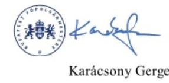

Láttam és egyetértek:

Digitálisan aláírta:
Barts Jend Balázs
Dátum: 2025.04.24
$16: 16: 20+02: 00$
Barts J. Balázs
vezérigazgató

---

#  

## 

## 

## Karácsony Gergely

főpolgármester
Budapest Főváros Önkormányzata

## Budapest

Tárgy: Válaszlevél ellenőrzéssel kapcsolatos észrevételek kezeléséről

##

 Tisztelt Főpolgármester Úr!

„Budapest Főváros Önkormányzata vagyonértékesítési és vagyonhasznosítási tevékenységének ellenőrzése" című ellenőrzéssel kapcsolatos, 2025. április 24-i keltezésű észrevételét köszönettel megkaptam.

Az Állami Számvevőszék (továbbiakban: ÁSZ) észrevételekre vonatkozó álláspontjáról az alábbi tájékoztatást adom:

1. Főpolgármester úr észrevételt tett a jelentéstervezet Összefoglalás fejezet 11. oldal 2. bekezdésében szereplő következő megállapításra: „Az ingatlanértékesítési és ingatlanhasznosítási tevékenység nem felelt meg teljeskörűen a jogszabályi előírásoknak és belső szabályozásoknak. Önkormányzati szinten meghatározott stratégiai célok hiányában az ingatlanok értékesítése során stratégiai célszerűségi kritérium nem érvényesült, önkormányzati szinten a hasznosítás eredményessége nem volt mérhető."
Főpolgármester úr észrevételében kérte „Az ingatlanértékesítési és ingatlanhasznosítási tevékenység nem felelt meg teljeskörűen a jogszabályi előírásoknak és belső szabályozásoknak." megállapítás törlését, továbbá a második mondat kiegészítését oly módon, hogy önkormányzati szinten meghatározott stratégiai célok hiányában az ingatlanok értékesítése során „ilyen" stratégiai célszerűségi kritérium nem érvényesült.
Tájékoztatom Főpolgármester urat, hogy az Összefoglalás fejezetben hivatkozott megállapítást egyrészt az Összefoglalás fejezet 12-13. oldalán, másrészt a jelentéstervezet Megállapítások fejezet 2.1.-2.3. pontjaiban foglaltak támasztják alá. Tekintettel arra, hogy az ellenőrzés mind az ingatlanok értékesítése, mind a nem lakás célú ingatlanok hasznosítása vonatkozásában tárt fel hiányosságokat, ezért a jelentéstervezet hivatkozott megállapítása helytálló, annak törlése nem indokolt. A stratégiai célszerűségi kritériumra vonatkozó kiegészítését nem tartjuk indokoltnak, mivel a kifogásolt mondat első része

---

tartalmazza, hogy milyen stratégiai célok hiányában nem érvényesült az ingatlanok értékesítése során stratégiai célszerűségi kritérium.
Fentiekre tekintettel a megállapítást nem módosítottuk.
2. Főpolgármester úr észrevételt tett a jelentéstervezet Összefoglalás fejezet 11. oldal 4. bekezdésére, amely a Fővárosi Önkormányzat leltárkészítési és leltározási tevékenységére vonatkozó összegző megállapításokat tartalmazza.
Főpolgármester úr észrevételében a megállapítást nem vitatja, annak kiegészítésére tesz szövegszerű javaslatot az alábbiak szerint:

- A módosítások alapján az ellenőrzés megállapította, hogy a 2020-2022. évi beszámolók mérlegében kimutatott beruházások, felújítások mérlegértékének alátámasztásához nem állítottak össze „minden tekintetben" szabályszerű, a fordulónapi mérlegtételeket tételesen, ellenőrizhető módon tartalmazó leltárt, mivel rendeltetésszerűen használatba vett, üzembe helyezett tárgyi eszközöket „is kimutattak" a beruházások, felújítások mérlegsoron.
- Így a tárgyi eszközök mérlegben kimutatott könyv szerinti értéke nem felelt meg „minden tekintetben" a jogszabályi előírásoknak, ugyanakkor az eltérés - annak nagyságrendje miatt - a mérleg valódiságát lényegesen nem befolyásolta.
- A 2022. évben a Fővárosi Önkormányzat tárgyi eszközök körében elvégzett mennyiségi felvétellel történő leltározása nem volt „teljesen" szabályszerű, mivel a 2023. évi mérlegmódosítás során rendezett - korábbi éveket érintő - tételeket leltáreltérésként nem tárták fel.
Főpolgármester úr észrevételében jelezte továbbá, hogy az utólagos aktiválások mind bruttó értéken, mind értékcsökkenés tekintetében szerepeltetve lettek a mindenkori aktuális mérlegben, mint módosító tételek, teljes körű analitikával alátámasztva, a jogszabályok szerint. Tájékoztatása szerint a Vagyonnyilvántartási Osztálynak tudomása volt azokról a beruházásokról, melyek már üzembe lettek helyezve, de a nyilvántartásban még befejezetlen állományként volt nyilvántartva, és indokolatlan lett volna fellelt vagyonként is nyilvántartásba venni azon eszközöket, melyek bekerülési értéke már a befejezetlen állomány részét képezte, mivel az duplikációt eredményezett volna.
Tájékoztatom Főpolgármester urat, hogy az észrevételezésre megküldött jelentéstervezet 11. oldal 4. bekezdésében az észrevételével megegyezően szerepelt, hogy „rendeltetésszerűen használatba vett, üzembe helyezett tárgyi eszközöket is kimutattak a beruházások, felújítások mérlegsoron". A jelentéstervezet 15. oldal utolsó bekezdése tartalmazza továbbá azt is, hogy „... a 2022. évi mennyiségi felvétellel történő leltározás során a beruházások, felújítások mérlegsort érintően leltártöbbletként nem lelték fel a már üzembe helyezett beruházásokat és felújításokat, leltáreltérésként nem rendezték a számviteli nyilvántartásokban ezek értékét. Ezen tárgyi eszközök aktiválása utólag, a 2023. évi mérlegkorrekció keretében történt meg." A jelentéstervezetben foglaltak szerint nem duplán kellett volna szerepeltetni a mérlegben a már üzembe helyezett, de nem aktivált beruházásokat és felújításokat, hanem meg kellett volna állapítani a tárgyi eszközök egyes mérlegsorait érintő leltáreltéréseket (beruházások és felújítások mérlegsort érintően leltártöbbletet, a tárgyi eszközök egyéb sorait érintően pedig leltárhiányt). A megállapított leltáreltéréseket - különös tekintettel arra, hogy tájékoztatása szerint tudomásuk is volt ezekről a beruházásokról - a számviteli nyilvántartásokban rendezni kellett volna.
A jelentéstervezet kiegészítése a további szövegszerű javaslatok alapján nem indokolt, mivel a jelentéstervezetben konkrétan szerepelnek azok a hibák, amelyek a hivatkozott

---

megállapításokat alátámasztják.
Mindezek alapján a jelentéstervezet módosítása az észrevételei alapján nem indokolt.
3. Főpolgármester úr észrevételt tett a jelentéstervezet Összefoglalás fejezet 11. oldal 5. bekezdésére, amely azt rögzíti, hogy a BFVK Zrt. ingatlanok értékesítésére, hasznosításra is kiterjedő Stratégiai tervének Alapító általi jóváhagyása nem történt meg, az abban meghatározott célkitűzések nem tekinthetők önkormányzati szintű céloknak.
Főpolgármester úr észrevételében jelezte, hogy a BFVK Zrt. 2022-2025. évekre vonatkozó stratégiai tervét az Igazgatóság és a Felügyelőbizottság jóváhagyta. A jelentéstervezet Megállapítások fejezet 2.1. pontja (21. oldal 2. bekezdés) tartalmazza, hogy „A BFVK Zrt. elkészítette a 2022-2025. évekre vonatkozó Stratégiai tervét, amelyet a BFVK Zrt. Igazgatósága a 8/2022. (VI. 30.) számú határozatával elfogadott, valamint a felügyelőbizottság a 13/2022. (VI. 30.) számú határozatával tudomásul vett."
Az észrevétel a megállapítást nem kifogásolja, ezért a jelentéstervezet módosítása nem indokolt.
4. Főpolgármester úr észrevételt tett a jelentéstervezet Összefoglalás fejezet 12. oldal 1. bekezdésére, amely a Fővárosi Önkormányzat ingatlanértékesítéseivel kapcsolatos összegző megállapításokat tartalmazza.
a) Főpolgármester úr észrevételében az ingatlanok készletté történő átsorolására vonatkozó megállapítást nem vitatja, annak kiegészítésére tesz szövegszerű javaslatot az alábbiak szerint: Az ingatlanok készletté történő átsorolásánál hiba volt, hogy a jogszabályi előírások ellenére a 2022. és a 2023. évi beszámoló mérlegében átsorolt készletként mutattak ki „egyes esetekben" olyan ingatlant, amely jellegénél fogva nem volt értékesíthető, továbbá „előfordult, hogy" a 2022. és 2023. évi vagyonkimutatásban ingatlan forgalomképtelen törzsvagyonba tartozó vagyonelem helyett forgalomképes készletre átsorolt ingatlanként volt kimutatva.
Az Összefoglalás fejezetben hivatkozott megállapítást a jelentéstervezet Megállapítások fejezet 2.2. pontjában (23. oldal 6. bekezdésben) foglaltak támasztják alá. Az egyértelműség érdekében a hivatkozott megállapítást a következők szerint pontosítjuk: „... a 2022. és a 2023. évi beszámoló mérlegében átsorolt készletként mutattak ki egy olyan ingatlant, amely jellegénél fogva nem volt értékesíthető és az a 2022. és 2023. évi vagyonkimutatásban forgalomképtelen törzsvagyonba tartozó vagyonelem helyett forgalomképes készletre átsorolt ingatlanként szerepelt."
b) Főpolgármester úr - az észrevételében kifejtett jogi érvelésre hivatkozva - kérte továbbá, hogy az „Előfordult, hogy korlátozottan forgalomképes fővárosi törzsvagyont a Vagyonrendeletben előírtak ellenére magánszemélyek, illetve gazdasági társaságok részére értékesítettek, továbbá használaton kívüli, közvetlenül a Fővárosi Önkormányzat feladat- és hatáskörének ellátását már nem szolgáló ingatlanokat az értékesítést megelőzően nem minősítettek át forgalomképes üzleti vagyonná." megállapítás kerüljön törlésre, mivel véleménye szerint az jogi tévedésen alapul. A jogi érvelés szerint Budapest Főváros Önkormányzata vagyonáról, a vagyonelemek feletti tulajdonosi jogok gyakorlásáról szóló 22/2012. (III. 14.) önkormányzati rendelet (továbbiakban: Vagyonrendelet) nem határoz meg értékesítési korlátot a csak a Vagyonrendelet által - tehát nem a nemzeti vagyonról szóló 2011. évi CXCVI. törvény (továbbiakban: Nvtv.) alapján - korlátozottan forgalomképesnek minősített vagyon tekintetében, ezért azok magánszemély számára és átlátható szervezetnek minősülő gazdasági társaság számára is értékesíthetők. Az észrevételben foglaltak szerint a Vagyonrendelet 6. § (2) bekezdése alapján egyértelmű, hogy a korlátozottan forgalomképes

---

törzsvagyoni minősítés megszűnése objektíven bekövetkezik akkor, amikor az adott vagyonelem a Fővárosi Önkormányzat feladat- és hatáskörének ellátását, vagy közhatalmának gyakorlását már közvetlenül nem szolgálja, erre vonatkozóan külön tulajdonosi döntés nem szükséges.
Az ÁSZ álláspontjának kiinduló alapja, hogy a nemzeti vagyon kezelésének és védelmének Alaptörvényben rögzített elveitől jogszabály nem térhet el, így az Nvtv.-ben rögzített, a korlátozottan forgalomképes önkormányzati vagyonra vonatkozó önkormányzati rendeletalkotási és szabályozási felhatalmazás nem jelenti azt, hogy a Fővárosi Önkormányzat a Vagyonrendeletében olyan szabályokat hozhat, amelyek nem, vagy nem kellő mértékben biztosítják a nemzeti vagyon használatára és védelmére vonatkozó Alaptörvényi előírásokat. (E jogértelmezést a Kúria Kfv.37.152/2014./5. számú, precedens értékű határozata is megerősíti.)
Véleményünk szerint nem megfelelő jogértelmezés az, hogy a Fővárosi Önkormányzat a Vagyonrendelet 17. § (10) bekezdésében szereplő „Nvtv. szerint korlátozottan forgalomképes fővárosi vagyon" fogalma alatt jogértelmezési szempontból indokolatlanul leszűkítő módon pusztán az Nvtv. 5. § (5) bekezdése szerinti vagyont érti. Az Nvtv. 5. § (2) bekezdés c) pontja ugyanis korlátozottan forgalomképes vagyonnak tekinti a törvény, vagy önkormányzati rendelet által ilyen minősítést kapott önkormányzati vagyont is.
Amennyiben a Vagyonrendelet 17. § (10) bekezdését úgy kellene értelmezni, hogy csak az Nvtv. 5. § (5) bekezdésében meghatározott korlátozottan forgalomképes vagyonelemekre terjedne ki, akkor a Vagyonrendeletben meghatározott további korlátozottan forgalomképes vagyonelem (pl. műemlék) vonatkozásában kiüresedne a korlátozott forgalomképességi jelleg, hiszen egyéb - valamennyi vagyonelemre, így az üzleti vagyonra is kiterjedő korlátokon (pl. átláthatóság) kívüli - forgalomképességi korlát nem állna fenn. Ezzel nem különböztetné meg semmi pl. a korlátozottan forgalomképes műemléki vagyont az üzleti vagyontól. Egy ilyen rendelkezés, illetve az értékesítés során a korlátozottan forgalomképes törzsvagyon üzleti vagyonnal azonos módon történő kezelése a nemzeti vagyonra vonatkozó, Alaptörvényben rögzített elvek megsértését is jelentené.
Az Nvtv. 3. § (1) bekezdés 6. pontja rögzíti, hogy korlátozottan forgalomképes vagyon a helyi önkormányzat kizárólagos tulajdonában álló dolgok körébe és a nemzetgazdasági szempontból kiemelt jelentőségű nemzeti vagyonba nem tartozó azon nemzeti vagyon, amelyről törvényben, illetve - a helyi önkormányzat tulajdonában álló vagyon esetében törvényben vagy a helyi önkormányzat rendeletében meghatározott feltételek szerint lehet rendelkezni. E rendelkezés is azt támasztja alá, hogy a korlátozottan forgalomképes vagyonelemekkel való rendelkezés vonatkozásában a helyi önkormányzatnak szükséges rendeleti szinten szabályozni, hogy milyen feltételek mellett teheti mindezt. A Vagyonrendeletben pedig a fővárosi vagyonnal való rendelkezés szabályai alatt a korlátozottan forgalomképes vagyonelemekkel való rendelkezés vonatkozásában a 17. § (10) bekezdésén kívül egyéb szabályozás nem található, így annak szabályai - a szabályozás logikai értelmezése alapján - a Fővárosi Önkormányzat valamennyi korlátozottan forgalomképes vagyonára ki kell, hogy terjedjenek.
A Vagyonrendelet 6. § (2) bekezdése szerint az Nvtv. és a Vagyonrendelet szerinti korlátozottan forgalomképes törzsvagyoni minősítés a fővárosi vagyon tekintetében addig áll fenn, amíg az adott vagyonelem közvetlenül a Fővárosi Önkormányzat feladat- és hatáskörének ellátását, vagy közhatalmának gyakorlását szolgálja.
A Vagyonrendelet 8. § (1) bekezdése az alábbiakat rögzíti: „A tulajdonosi jogokat gyakorló

---

szerv - ha jogszabály eltérően nem rendelkezik - indokolt esetben, minősített szavazattöbbséggel dönthet a vagyonelem forgalomképességének megváltoztatásáról (forgalomképesség átminősítése)."
A Vagyonrendelet 8. § (2) bekezdése szerint amennyiben egy fővárosi vagyonelem forgalomképesség szerinti besorolása függ az adott vagyonelem (e rendelet 5-6. §-aiban felsorolt) funkciójától vagy jellegétől is, úgy a forgalomképesség megváltoztatásával egyidejűleg megfelelő módon rendelkezni kell - ha jogszabály nem tiltja - a vagyonelem ezen funkciójának vagy jellegének a megváltoztatásáról is. Ilyen esetben a vagyonelem funkciójának és jellegének megváltoztatására hatáskörrel rendelkező szerv dönt a vagyonelem forgalomképességének megváltoztatásáról is.
Az ÁSZ álláspontja szerint e jogszabályi rendelkezések egyértelművé teszik, hogy a forgalomképesség változása nem „de facto" a vagyonelem funkciójának
 változása által, hanem a tulajdonosi jogokat gyakorló szerv, illetve a hatáskörrel rendelkező szerv általi döntéssel történik.
Tehát azzal, hogy az érintett ingatlanokat a Vagyonrendelet 8. § (1) bekezdésében előírtak szerint nem sorolták át üzleti vagyonba arra hivatkozással, hogy azok már nem szolgálják közvetlenül a kötelező önkormányzati feladatkör ellátását vagy hatáskör gyakorlását, illetve erről döntés nem született, a Fővárosi Önkormányzat a Vagyonrendelet 17. § (10) bekezdésében foglaltak be nem tartásával értékesítette magánszemélyek és gazdasági társaságok részére az érintett vagyonelemeket. Az értékesítések előtt szükséges lett volna az érintett ingatlanokat - amennyiben a Vagyonrendeletben foglaltak fennállnak, miszerint a vagyonelem már nem szolgálja közvetlenül a kötelező önkormányzati feladatkör ellátását vagy hatáskör gyakorlását - üzleti vagyonná átminősíteni.
A fentiekre tekintettel a megállapítás törlése nem indokolt.
5. Főpolgármester úr észrevételt tett a jelentéstervezet Összefoglalás fejezet 12. oldal 3. bekezdésében szereplő következő megállapításra: „A 2022-2023. években létrejött hasznosítási szerződésekhez kapcsolódó döntéshozatalok nem feleltek meg maradéktalanul a jogszabályi előírásoknak. Előfordult, hogy a döntéshozatal megelőzően nem állapították meg a hasznosítással érintett ingatlanrész egyedi forgalmi értékét, melynek hiányában fennállt annak eshetősége, hogy a jogszabályban és belső szabályozásban előírtakat megsértve versenyeztetés lefolytatása nélkül került sor a hasznosításra, illetve, hogy a döntést nem az Önkormányzati SzM3z-ben előírt hatáskörben hozták meg."
Főpolgármester Úr észrevételében kifogásolta a megállapítást és kérte annak törlését, arra hivatkozással, hogy a forgalmi érték fogalmát sem a nemzeti vagyontörvény, sem a kötelező versenyeztetési értékhatárt megállapító éves költségvetésről szóló törvények, sem pedig más felsőbb szintű jogszabályok nem határozzák meg. A Vagyonrendelet erre tekintettel maga meghatározza a forgalmi érték fogalmát. A Vagyonrendelet 3.§ 15. pontja szerint: „Forgalmi érték: az a pénzben kifejezhető érték (összeg), ami piaci viszonyok között a vagyonelemre vonatkozó konkrét jogügylet (elidegenítés, hasznosítás, megterhelés stb.) időpontjában a vagyonelem ellenértékeként elérhető. Amennyiben a konkrét jogügylet tárgya - az ingatlanhoz vagy ingó dologhoz kapcsolódó - vagyoni értékű jog (bérleti, használati, vételi, elővásárlási, szolgalmi, zálogjog stb.), a jogügylet időpontjában ennek ellenértékeként elérhető összeg tekintendő a forgalmi értéknek. Határozatlan idejű jogviszony esetében az 5 éven belül ellenértékként elérhető összeget kell figyelembe venni."
Főpolgármester Úr álláspontja szerint a felsorolt esetekben a Vagyonrendelet szerinti fogalommeghatározás, vagyis a bérleti díjak 5 éves időtartamra számított értéke alapján történt a forgalmi érték megállapítása, és mivel az nem haladta meg a költségvetési törvényben meghatározott bruttó 25 millió Ft-os értékhatárt, így nem lett megsértve a

---

jogszabály a versenyeztetési kötelezettség vonatkozásában, illetve a hatáskör gyakorló megállapítása is helyesen történt.
Az Nvtv. 11. § (16) bekezdésének előírása alapján a helyi önkormányzat tulajdonában álló nemzeti vagyon tekintetében törvényben, vagy a helyi önkormányzat rendeletében meghatározott értékhatár feletti nemzeti vagyont hasznosítani - ha törvény kivételt nem tett - csak versenyeztetés útján lehetett. A 2022. és 2023. évre vonatkozóan a költségvetési törvények a versenyeztetési értékhatárt a hasznosítással érintett rész egyedi bruttó forgalmi értékéhez kötötték. A törvényi rendelkezésekkel összhangban a Vagyonrendelet 18. § (1) bekezdés a) pontja alapján fővárosi ingatlanvagyont a költségvetési törvényben meghatározott értékhatár felett csak versenyeztetés útján lehetett hasznosítani, míg a Fővárosi Önkormányzat tulajdonában lévő nem lakás céljára szolgáló helyiségek feletti tulajdonosi jogok gyakorlásáról szóló 40/2006. (VII. 14.) önkormányzati rendelet (továbbiakban: Helyiségrendelet) 17. § (2) bekezdése úgy rendelkezett, hogy a versenyeztetés szabályait nem kell alkalmazni, ha a helyiség forgalmi értéke nem éri el a mindenkori költségvetési törvényben meghatározott értékhatárt. A törvényi és az azzal összhangban álló rendeleti szabályozás alapján a versenyeztetés megítélésének alapjául a nemzeti vagyon részét képező, hasznosítani kívánt ingatlan(rész) - mint dolog és nem mint dologhoz kapcsolódó vagyoni értékű jog - forgalmi értéke szolgált.
A forgalmi érték fogalmát az Nvtv. és a költségvetési törvények az észrevételben foglaltak szerint valóban nem tisztázzák, ugyanakkor a 16/2017. (VII. 10.) AB határozat (továbbiakban: AB határozat) is rávilágít arra, hogy „bár a forgalmi értéknek nincsen az egész jogrendszerre nézve kizárólagosan alkalmazott definíciója, e fogalom régóta ismert a magyar magánjogban, és értelmezése általában nem vet fel a jogalkalmazás során problémát. [...] A forgalmi érték tehát a piac által elfogadott érték, általánosan bevett és elfogadott polgári jogi fogalom, ami elvileg egy dolog értékét (előnyös és hátrányos tulajdonságait) komplex módon értékeli a kereslet és kínálat összefüggésében". Az AB határozatban foglaltak alapján a „forgalmi érték a jogalkotók és a jogalkalmazók által ismert és általánosan alkalmazott fogalom"nak tekintendő. Az AB határozat indokolásában szereplő fogalmi meghatározással összhangban állt a BFVK Zrt. által is alkalmazott Európai Értékelési Szabványokban (European Valuation Standards, EVS) a piaci (forgalmi) érték fogalmi meghatározása is („Az a becsült összeg, amelyért az értékelés napján az eszköz gazdát cserélhet egy hajlandóságot mutató vevő és egy hajlandóságot mutató eladó között [...]").
Az AB határozat tartalmazta továbbá azt is, hogy „a konkrét vagyontárgy forgalmi értékének kiszámításához általában szakértő igénybevételére van szükség, aki különböző számítási módszerek alapján állapítja azt meg." A szakértői anyag elkészítéséről a Fővárosi Önkormányzat hasznosításra irányuló döntéseit megelőzően is gondoskodni kellett. A Helyiségrendelet 6. § (2) bekezdése, illetve a Vagyonrendelet 12. § (1) bekezdés aa) pontja írta elő a forgalmi értékbecslés elkészítését, amelynek tekintetében a Vagyonrendelet 4. melléklet 1. a) pont alapján a BFVK Zrt. kizárólagos joggal rendelkezett. A Fővárosi Önkormányzat és a BFVK Zrt. között létrejött Éves közfeladat-ellátási szerződések részét képező 1. sz. melléklet I. Vagyongazdálkodási közfeladatok 5. sz. melléklete határozta meg részletesen az ingatlan és ingó vagyon értékbecslésének feladatait, amely többek között rögzítette a szakértői anyagokban az értékbecslés készítésénél alkalmazandó szakmai jogszabályokat és szabványokat.
Tekintettel arra, hogy a hasznosítás az ingatlanra és nem az ahhoz kapcsolódó vagyoni értékű jogra vonatkozik, az ÁSZ álláspontja szerint a versenyeztetés szükségességének megítéléséhez a hasznosítani kívánt ingatlan(rész) forgalmi értékét a Vagyonrendelet 3. §

---

15. pontjának első mondata szerinti fogalommeghatározás alapján kellett volna megállapítani: „Forgalmi érték: az a pénzben kifejezhető érték (összeg), ami piaci viszonyok között a vagyonelemre vonatkozó konkrét jogügylet (elidegenítés, hasznosítás, megterhelés, stb.) időpontjában a vagyonelem ellenértékeként elérhető." Ezt támasztja alá az is, hogy a 2022-2023. években kötött további határozatlan idejű bérleti szerződések (8. tanúsítvány 251., 259., 268. tétele) esetében sem a bérleti díjak 5 éves időtartamra számított értéke alapján történt a forgalmi érték meghatározása, hanem az ingatlan forgalmi (piaci) értékét becsülték meg a Helyiségrendelet 6. § (2) bekezdésében, illetve a Vagyonrendelet 12. § (1) bekezdés aa) pontjában foglaltaknak megfelelően.
A Vagyonrendelet 3. § 15. pontja szerinti szabályozást az ÁSZ nem kifogásolta, mivel annak első mondata az általánosan használt forgalmi érték fogalommal összhangban van, a második és harmadik mondata - „Amennyiben a konkrét jogügylet tárgya - az ingatlanhoz vagy ingó dologhoz kapcsolódó - vagyoni értékű jog (bérleti, használati, vételi, elővásárlási, szolgalmi, zálogjog stb.), a jogügylet időpontjában ennek ellenértékeként elérhető összeg tekintendő a forgalmi értéknek. Határozatlan idejű jogviszony esetében az 5 éven belül ellenértékként elérhető összeget kell figyelembe venni." - pedig a vagyoni értékű jogokkal kapcsolatos jogügyletekre vonatkozik, amelyek vizsgálatára az ÁSZ ellenőrzése nem terjedt ki.
A forgalmi érték fogalmi meghatározása a 2022-2023. években hatályos formájában már 2008. november 21-től élt a Fővárosi Önkormányzat vagyonrendeleti szabályozásában, amelyet a vagyontárgyak feletti tulajdonosi jogok gyakorlásáról szóló 75/2007. (XII. 28.) Főv. Kgy. rendelet módosításáról szóló Budapest Főváros Közgyűlésének 56/2008. (XI. 21.) önkormányzati rendelete emelt be a szabályozásba. Az indokolás alapján a korábbi fogalomhasználat ${ }^{1}$ módosítása azért vált indokolttá, mert „a jogalkalmazás szempontjából átláthatóbb és egyértelműbb, ha a vagyonra, mint „dologra" vonatkozó forgalmi érték megfogalmazása elválik az adott dologgal kapcsolatos vagyoni értékű jog forgalmi értékének definíciójától". Ez alapján a módosított fogalommeghatározás első mondata a „dologra", a második és harmadik mondata a „dologhoz kapcsolódó vagyoni értékű jogra" vonatkozik. Annak ellenére tehát, hogy az Nvtv. 3. § 4. pontja alapján a hasznosítás a nemzeti vagyon birtoklásának, használatának, hasznok szedése jogának bármely - a tulajdonjog átruházását nem eredményező - jogcímen történő átengedését jelenti, a forgalmi érték meghatározásánál a hasznosított vagyon (ingatlan) és nem a vagyoni értékű jog (bérleti jog) forgalmi értékének meghatározását kellett elvégezni.
A hatáskör gyakorlásra vonatkozó észrevételével összefüggésben tájékoztatom, hogy - a megelőző bekezdésekben bemutatott döntésekkel szemben - az érintett döntések esetében (782/2022. (VIII. 30.), 798/2023. (IX. 26.), 1051/2023. (XI. 28.) TB határozat) az előterjesztés dokumentuma sem tért ki a forgalmi értékre, illetve annak meghatározási módjára, továbbá a három esetből egy esetben nem határozatlan idejű szerződés megkötésére került sor. A versenyeztetés mellőzésének megfelelőségére irányuló észrevételben foglaltak ezekre az esetekre nem értelmezhetők.
Mindazonáltal tájékoztatom, hogy a Vagyonrendelet 3. § 11. pontjának és 9. § (1) bekezdésének, valamint a Helyiségrendelet 6. § (4) bekezdésének és 38. § 9. pontjának előírásából is az következik, hogy a tulajdonosi jog gyakorlójának megállapítása is a hasznosított ingatlan(rész) forgalmi értékén alapul, de ebben az esetben a nettó értéket

[^0]
[^0]:    ${ }^{1}$ Forgalmi érték: az a pénzben kifejezhető érték, ami piaci viszonyok között a vagyontárgyra vonatkozó konkrét jogügylet (elidegenítés, hasznosítás, megterhelés stb.) során az átruházott vagyoni értékű jog (tulajdon-, bérleti, használati, vételi, elővásárlási, szolgalmi, zálogjog stb.) ellenértékeként elérhető.

---

kellett alapul venni. Az ingatlan(rész) forgalmi értékének ismerete nélkül az érintett üzleti vagyonelemek hasznosítása esetén nem volt biztosított a tulajdonosi jogok gyakorlására jogosult azonosíthatósága.
Fentiekre tekintettel az ÁSZ megállapítása helytálló, törlése nem indokolt.
6. A jelentéstervezet Összefoglalás fejezet 12. oldal 3. bekezdés utolsó mondatában szerepel, hogy „A 2022. és a 2023. évi zárszámadási rendelettervezet előterjesztésekor a helyiségek hasznosításából származó bevételből nyújtott kedvezmény, mentesítés összegét nem a valóságnak megfelelően mutatták be a Közgyűlés részére."
Főpolgármester úr észrevételében arról tájékoztatott, hogy a jelentéstervezetből nem derül ki, pontosan mely ügyletek alapján született ez a megállapítás, így annak helytállósága kapcsán nem tudnak nyilatkozni.
Tájékoztatom Főpolgármester urat, hogy az Összefoglalás fejezetben szereplő fenti megállapításhoz kapcsolódó, a jelentéstervezet 28. oldal 2-3. bekezdéseiben található részletes megállapítások - amelyekhez kapcsolódóan észrevétel nem érkezett - a közvetett támogatásokat tartalmazó kimutatásban feltárt hibákat típus és előfordulás gyakoriságának feltüntetésével tartalmazzák.
A típushibák jelentéstervezetben szereplő leírása, a helyszíni ellenőrzésen felvett jegyzőkönyvek és a témában bekért dokumentumok alapján egyértelműen azonosíthatóak az érintett hasznosítási ügyletek (pl. a részkimutatásokban értékadatot nem tartalmazó hasznosítási tételek, változatlan értékadat a szerződéskori értékhez vagy az előző évhez képest, a részkimutatásokon belüli és részkimutatások közötti duplikációk).
Felhívom Főpolgármester úr figyelmét, hogy a Fővárosi Önkormányzatnál nem állt rendelkezésre a hasznosításokra vonatkozóan teljeskörű, az adatok kontrollálásához szükséges nyilvántartás. Ezért használtuk a jelentéstervezet Megállapítások fejezetben az „ellenőrzés során feltárt" kifejezést. A megállapítások hasznosulásához a
 kedvezményekkel, mentességekkel érintett hasznosítási szerződések teljeskörű feltárása és a kimutatások felülvizsgálata szükséges.
A fentiekre tekintettel az ÁSZ megállapítása helytálló, törlése nem indokolt.
7. Főpolgármester úr észrevételt tett a jelentéstervezet Összefoglalás fejezet 13. oldal 2. bekezdésében szereplő következő megállapításra: „A bérleti díjak elmaradtak a kereskedelmi ingatlanok piacát jellemző átlagértékektől. A hozamok a 2023. év végére többségében nem érték el - a szerződéskötést megelőző bérleti díj számítás során a BFVK Zrt. által is alkalmazott - 15 éves futamidejű állampapírok referenciahozamát. Az elmaradásokhoz hozzájárult, hogy a szerződésekben értékkövetésre alkalmazott KSH fogyasztói árindex többségében nem követte az ingatlanpiaci változásokat."
Főpolgármester úr észrevételében előadta, hogy a bérbeadási eljárásokat megelőzően a bérleti díjra vonatkozó értékbecsléseket minden alkalommal elkészíttetik, ezáltal biztosított, hogy a szerződéskötésre piaci bérleti díjon vagy afölött kerül sor. Az ingatlanhasznosításoknál általános gyakorlatként jelölte meg több ajánlattevő esetén a többfordulós pályáztatást, amelynek eredményeképpen a becsült piaci díjnál is magasabb díjon hasznosítják az ingatlanokat. Kifejtette, hogy hasznosításaik során gondot fordítanak a bérleti díjak értékállóságára, amelyet a bérleti díjak KSH által fogyasztói árindex mértékével történő minden év január 1-jével történő indexálásával érnek el, továbbá, hogy a Helyiségrendeletben előírt KSH fogyasztói árindex alkalmazásán alapuló indexálás bevett gyakorlatnak számít a forint alapú elszámoláson alapuló bérleti szerződések esetén. A díjemelés lehetőségét a jelenlegi jogszabályi környezet nem teszi lehetővé. Észrevételében jelezte azt is, hogy az állampapír hozamok, mint alternatív referenciahozamok vizsgálata a befektetési döntések meghozatalakor releváns, így az nem tévesztendő össze egy fennálló bérleti szerződésnek az értékkövető indexálásával.
Tájékoztatom Főpolgármester urat, hogy az ÁSZ megállapítása nem kifogásolta a bérleti díjak szakértői becslésen alapuló megállapításának gyakorlatát és értékkövetésének ellenőrzött időszakban alkalmazott módszerét.
Az ÁSZ a piaci adatokkal való összehasonlító elemzési eljárás keretében vizsgálta a piaci adatoktól való elmaradás okait. Az értékelésbe bevont - az érintett ingatlanpiaci szegmensekbe (irodapiac, ipari-logisztikai ingatlanok, üzletek) tartozó, piaci alapon hasznosított - ingatlanokra, ingatlanrészekre vonatkozóan rendelkezésre álló adatok (adottságok, becsült forgalmi értékek, bérleti díjak), a piaci árváltozások és az egyes indexek idősoros adatai (fogyasztói árindex, építőipar termelői árindexei) felhasználásával végzett adatmodellezés alapján jutott az ÁSZ arra a következtetésre, hogy az adottságokon kívül nem elhanyagolható annak a hatása, hogy a KSH fogyasztói árindex a 2013-2022 közötti időszakban összességében tartósan elmaradt a piaci bérleti díjak változásának ütemétől.
Az ellenőrzött időszakban a forgalmi értékekre is kiterjedő szakértői értékbecslésekben foglaltak alapján az állampapírpiaci referenciahozamokat alapul vevő hozamelvű értékelési módszerrel történő becslések a piaci árak érvényesítését hivatottak szolgálni a hasznosítási szerződések megkötésekor. A bérleti díjak piaci árszintjének bérleti szerződések futamideje alatt történő fenntartása ugyanakkor a BFVK Zrt. Stratégiai tervében foglalt általános célkitűzés eléréséhez is szükséges volt, tekintettel arra, hogy a BFVK Zrt. azon önkormányzati feladatellátáshoz nem szükséges ingatlanok megtartását és bérbeadását tűzte ki célul, amelyeknél a hozamtermelő képesség eléri vagy megközelíti a piaci jövedelmezőséget. A célkijelölés nyilvánvalóan nem szűkülhet a hasznosítási döntések meghozatalának időpontjára.
A BFVK Zrt. Stratégiai tervében foglaltak megvalósulásának támogatása mellett a hasznosítási döntéskor kialakított piaci árak értékkövetése a nem lakáscélú ingatlanhasznosítás eredményességének növelését is szolgálják, ezért irányult az ÁSZ célszerűségi javaslata a piaci árváltozások érvényesíthetőségének vizsgálatára. A célszerűséget erősíti, hogy a piaci áraktól való elmaradás kockázatával leginkább érintett határozatlan idejű hasznosítási szerződések az értékelésbe bevont szerződésállomány több mint háromnegyedét (75,8%-át) jelentették.
Tájékoztatom Főpolgármester urat, hogy a meglévő határozatlan idejű bérleti szerződések felülvizsgálatára vonatkozó célkitűzést az egyes ingatlanok hozamtermelő képességének javítása, illetve legoptimálisabb hasznosítási módjának megtalálása érdekében - konkrét példa megjelölésével - a BFVK Zrt. Stratégiai terve is meghatározott. (BFVK Zrt. Stratégia XIV.4. pont „Meglévő bérleti szerződések felülvizsgálata (IHI/3.))

A jövőben történő bérbeadások esetére figyelembe vehető a Helyiségrendelet 20. § (2) bekezdése, amely szerint az észrevételben hivatkozott 20. § (1) bekezdés szerinti indexáláson alapuló alap bérleti díjon felül további díjnövelésben is meg lehet állapodni.
A fentiekre tekintettel az ÁSZ megállapítása helytálló, módosítása nem indokolt.
8. Főpolgármester úr észrevételt tett a jelentéstervezet Összefoglalás fejezet 13. oldal 5. bekezdésében szereplő következő megállapításra: „A 2022. évi prémium kiírások nem feleltek meg a belső szabályozás előírásának, mivel tartalmaztak olyan feladatot, amelyet már a kiírást megelőzően teljesített a vezérigazgató, valamint helyettese. Üzleti terv teljesítését ösztönző feladatokat a 2022. és 2023. évi prémiumkiírás nem tartalmazott, annak ellenére, hogy az hatékony motivációs eszközként szolgálhatott volna a tulajdonos Fővárosi Önkormányzat számára."
Főpolgármester úr észrevételében tájékoztatást adott arról, hogy a vezérigazgató és helyettese prémiumkiírását az üzletmenet szerint az Igazgatóság és a Felügyelőbizottság az adott év május végén vagy június elején fogadja el az év június 1. és az azt követő év május 31. közötti időszakára, majd ez beküldésre kerül az Alapító részére. Az érintettek ez alapján kezdik meg a prémium kiírásban foglaltak teljesítését. A kitűzés az Alapító által rendszerint az év végén kerül aláírásra és az érintettek számára megküldésre változatlan tartalommal.
Köszönöm Főpolgármester úr tájékoztatását, az abban leírtak a hivatkozott megállapítást nem vitatják, a jelentéstervezet módosítása nem indokolt.
9. Főpolgármester úr észrevételt tett a jelentéstervezet 1.1. pontjában szereplő következő megállapításra: „A Fővárosi Önkormányzat 2020-2022. évi beszámolóinak elkészítéséhez összeállított leltár nem felelt meg a Számv. tv. 69. § (1) bekezdésben előírtaknak, mivel a beruházások, felújítások mérlegsor vonatkozásában a főkönyvi könyvelés és analitikus nyilvántartások adatai közötti, Számv. tv. 69. § (2) bekezdésben előírt egyeztetést nem megfelelően végezték el."

Főpolgármester úr észrevételében jelezte, hogy mindegyik negyedévben és év végén megtörtént, megtörténik a főkönyv és az analitika egyeztetése.
A jelentéstervezetben az ÁSZ azt kifogásolta, hogy az egyeztetést nem megfelelően végezték el, mivel - ahogy az a jelentéstervezet 1.1. pontjában részletesen bemutatásra kerül - az egyeztetések során nem tárták fel, hogy a beruházások, felújítások között már üzembe helyezett eszközök is szerepeltek.
A fentiekre tekintettel az ÁSZ megállapítása helytálló, az egyértelműség érdekében azonban a kifogásolt mondatot kiegészítettük a következők szerint:
„A Fővárosi Önkormányzat 2020-2022. évi beszámolóinak elkészítéséhez összeállított leltár nem felelt meg a Számv. tv. 69. § (1) bekezdésben előírtaknak, mivel a beruházások, felújítások mérlegsor vonatkozásában a főkönyvi könyvelés és analitikus nyilvántartások adatai közötti, a Számv. tv. 69. § (2) bekezdésben előírt egyeztetést - az analitikus nyilvántartás hiányosságai miatt - nem megfelelően végezték el."
10. Főpolgármester úr észrevételt tett a jelentéstervezet 1.1. pontja azon megállapítására, hogy „A mérleg módosítások nagy része a beruházások, felújítások, ingatlanok és kapcsolódó vagyoni értékű jogok mérlegsorokat érintő - 2020. január 1-jét megelőző - mulasztások (beruházások, felújítások utólagos aktiválása, értékesített tárgyi eszközök nyilvántartási értékének utólagos kivezetése, nem műemlékként nyilvántartott műemlék ingatlanok nyilvántartásának korrigálása) számviteli rendezése volt az ellenőrzött időszakban. A 2020-2022. évi beszámolók mérlegében kimutatott beruházások, felújítások mérlegsort érintően nem tárták fel a 2023. évi mérlegkorrekciós tételek közül a 2013-2022. években műszakilag üzembe helyezett, azonban a számviteli nyilvántartásokban beruházásként nyilvántartott, utólag aktivált eszközöket."
Főpolgármester úr észrevételében megerősítette azt, hogy 2022. és 2023. években, valamint a 2024. évi beszámolóban is a tárgyi eszközöket érintő hibahatásnak nem csak egy része, hanem nagy része az utólagos aktiválások miatt keletkezett.
Főpolgármester úr a hivatkozott megállapítást nem vitatja, a jelentéstervezet módosítása nem indokolt.
11. Főpolgármester úr észrevételt tett a jelentéstervezet 1.1. pontjában található azon megállapításra, hogy a „Leltározási szabályzat 21. § (5) bekezdésben előírtak ellenére a beruházások részletező nyilvántartásának a pénzügyi és műszaki teljesítésekkel, valamint a könyvviteli számlákkal történő egyeztetését nem megfelelően végezték el."
Főpolgármester úr észrevételében jelezte, hogy minden beruházás esetében az elkészült pénzügyi-műszaki leltár előzetes és részletes egyeztetési folyamaton megy keresztül, mely keretében nem csak a műszaki teljesítések kerülnek egyeztetésre, hanem a számla analitika is, ill. a könyvviteli számlák is. Kérte továbbá részletezni, hogy „a nem megfelelően végezték el" milyen hiányosságokra utal.
A jelentéstervezet 1.1 pontja tartalmazza, hogy „A 2020-2022. évi beszámolók mérlegében kimutatott beruházások, felújítások mérlegsort érintően nem tárták fel a 2023. évi mérlegkorrekciós tételek közül a 2013-2022. években műszakilag üzembe helyezett, azonban a számviteli nyilvántartásokban beruházásként nyilvántartott, utólag aktivált eszközöket." A beruházások, felújítások részletező nyilvántartásának pénzügyi és műszaki teljesítésekkel történő egyeztetésének megfelelő elvégzése esetén fel kellett volna tárni azt, hogy már üzembe helyezett eszközök szerepelnek a beruházások, felújítások között.
Mindezek alapján a jelentéstervezet megállapítása helytálló, azonban az egyértelműség érdekében a mondatot kiegészítettük a következők szerint:
„A Leltározási szabályzat 21. § (5) bekezdésben előírtak ellenére a beruházások részletező nyilvántartásának a pénzügyi és műszaki teljesítésekkel, valamint a könyvviteli számlákkal történő egyeztetését nem megfelelően végezték el, ezáltal az egyeztetés során nem tárták fel a már üzembe helyezett beruházások, felújítások aktiválásának hiányát. Ennek következtében a Számv. tv. 69. § (2) bekezdése szerinti, a főkönyvi könyvelés és az analitikus nyilvántartások adatai közötti egyeztetés során sem jelentkezett eltérésként a beruházások, felújítások aktiválásának elmaradása."
12. Főpolgármester úr észrevételt tett a jelentéstervezet 1.1 pontjában szereplő megállapításra, miszerint a „2022-ben végzett mennyiségi felvétellel történő leltározás nem felelt meg a Számv. tv. 69. § (3) bekezdésben foglaltaknak, mivel a 2022. évi mennyiségi felvétellel történő leltározás során a beruházások, felújítások mérlegsort érintően leltártöbbletként nem lelték fel a már üzembe helyezett beruházásokat és felújításokat, leltáreltérésként nem rendezték a számviteli nyilvántartásokban ezek értékét. Ezen tárgyi eszközök aktiválása utólag, a 2023. évi mérlegkorrekció keretében történt meg."
Főpolgármester úr észrevételében kifejtette, hogy mivel az említett beruházások bekerülési értéke nyilvánvalóan a befejezetlen beruházások mérlegsoron szerepel, ezért annak fellelt vagyonként mérlegben történő kimutatása duplikációt eredményezett volna. Nagyon sok esetben a beruházások, felújítások aktiválása előtt is már létező eszközök szerepelnek a nyilvántartásban, melyek tényleges részét is képezik a mennyiségi leltárnak, ezért fellelésük nem lenne életszerű.
A 2. pontban rögzítettek alapján a megállapítás módosítása nem indokolt.
13. Főpolgármester úr észrevételt tett a jelentéstervezet 2.2. pontjában szereplő azon megállapításra, hogy a Vagyonrendelet 17. § (10) bekezdése ellenére négy korlátozottan forgalomképes ingatlan értékesítése magánszemélyek, illetve a Vagyonrendelet 17. § (11) bekezdés szerinti kivételi körbe nem tartozó gazdasági társaságok részére történt. A mintatételek esetében az értékesítést megelőzően a Vagyonrendelet 6. § (2), valamint 8. § (1) bekezdésben foglaltakat figyelmen kívül hagyva a forgalomképes üzleti vagyonná történő átminősítés nem történt meg annak ellenére, hogy ezen ingatlanok - az ingatlanvagyonértékelések alapján - használaton kívül voltak, a Fővárosi Önkormányzat feladat- és hatáskörének ellátását közvetlenül már nem szolgálták.

Főpolgármester úr észrevételében kérte - az Összefoglalás 12. oldalon található megállapításhoz tett észrevételének figyelembevételével - a megállapítás törlését.
A 4. b) pontban rögzítettek alapján a megállapítás törlése nem indokolt.
14. Főpolgármester úr észrevételt tett a jelentéstervezet 2.3. pontjában szereplő azon megállapításra, hogy a „nem lakáscélú ingatlanok hasznosítása során a hasznosítással érintett ingatlanrész egyedi forgalmi értékének megállapítása nem felelt meg az Nctv., valamint a
 Vagyonrendelet és a Helyiségrendelet előírásainak."
A 2.3. számú megállapításhoz kapcsolódó részletes megállapítások között szerepel, hogy „A 2022-2023. években létrejött 76 hasznosítási szerződéshez kapcsolódó 30 döntéshozatalból hét nem felelt meg maradéktalanul a jogszabályi előírásoknak. A Helyiségrendelet 6. § (2) bekezdésében, illetve a Vagyonrendelet 12. § (1) bekezdés aa) pontjában foglaltak ellenére hét döntést - 782/2022. (VIII. 30.), 1007/2022. (IX. 27.), 1066/2022.(X. 25.), 1298/2022. (XII. 13.), 623/2023. (VI. 27.), 798/2023. (IX. 26.), 1051/2023. (XI. 28.) TB határozat - megelőzően nem állapították meg a hasznosítással érintett ingatlanrész egyedi forgalmi értékét. Ennek hiányában:

- négy döntéshez (1007/2022. (IX. 27.), 1066/2022. (X. 25.), 1298/2022. (XII. 13.), 623/2023. (VI. 27.) TB határozat) kapcsolódó hasznosítások esetében fennállt annak eshetősége, hogy az ingatlanok hasznosítására az Nctv. 11. § (16) bekezdésében, valamint a Helyiségrendelet 9. § (1) bekezdésében és a Vagyonrendelet 18. § (1) bekezdés a) pontjában előírtakat megsértve versenyeztetés lefolytatása nélkül került sor. A versenyeztetés értékhatár megítéléséhez szabálytalanul a bérleti díjak 5 éves időtartamra számított értékét vették figyelembe, annak ellenére, hogy a Vagyonrendelet 18. § (1) bekezdés a) pontjában és a Helyiségrendelet 9. § (1) bekezdésében a Fővárosi Önkormányzat a versenyeztetés értékhatárát a mindenkori költségvetési törvényben meghatározott összegben határozta meg, amely a 2022. és a 2023. években a hasznosítás tekintetében 25,0 millió forint egyedi bruttó forgalmi érték volt.
- három - üzleti vagyonba tartozó ingatlan hasznosítására irányuló -, a Tulajdonosi Bizottság által hozott döntést (782/2022. (VIII. 30.), 798/2023. (IX. 26.), 1051/2023. (XI. 28.) TB határozat) érintően nem volt igazolható, hogy a döntési hatáskör az Önkormányzati SzMSz 46. § (1) bekezdés, valamint az 1. melléklet 2.3. pontja alapján a Tulajdonosi Bizottság átruházott hatáskörébe tartozott."

Főpolgármester úr észrevételében - az Összefoglalás 12. oldal 3. bekezdésének megállapításához tett részletes észrevételében foglaltakra hivatkozással - kérte a megállapítás törlését.

Az 5. pontban kifejtettek alapján a megállapítás törlése nem indokolt.
15. Főpolgármester úr észrevételt tett a jelentéstervezet 2.4. pontjában szereplő megállapításra, miszerint „A Vezérigazgató és helyettese részére történő prémiumkifizetések Humánerőforrásmenedzsment Főosztály általi döntéselőkészítésének részeként a prémiumfeladatok teljesítése szakmai kontrolljának feladatát kompetens szervezeti egység számára nem írták elő, és a szakmai felülvizsgálatot nem végezték el. Felülvizsgálat hiányában a kifizetett prémiumok összegének meghatározása a Vezérigazgató és helyettese által készített - az Önkormányzat által nem kontrollált - prémiumfeladatok teljesítéséről szóló jelentések alapján történt."
Főpolgármester úr észrevételében - az Összefoglalás 13. oldal 5. bekezdéséhez tett megjegyzése alapján - kérte a megállapítás törlését.
Tájékoztatom Főpolgármester urat, hogy az Összefoglalás 13. oldal 5. bekezdéséhez tett észrevétele a prémium kiírására vonatkozott, míg jelen megállapítás a prémiumfeladatok

---

teljesítéséről szóló jelentések szakmai felülvizsgálatának hiányát rögzíti.
Fentiekből adódóan a jelentéstervezetben megfogalmazott megállapítás törlése nem indokolt.
16. Főjegyző részére tett 1. javaslat: „Gondoskodjon arról, hogy a költségvetési beszámoló mérlegét alátámasztó leltár a Számv.tv. 69. § (1) bekezdésben előírtaknak megfelelően minden esetben tételesen és ellenőrizhető módon tartalmazza a mérlegfordulónapi tételeket."
Főpolgármester úr kérte a javaslat törlését, mivel észrevétele szerint az ebben a formában nem helytálló. Tájékoztatása szerint a Fővárosi Önkormányzat minden évben gondoskodik a Számv.tv. 69. § (1) bekezdésben előírt, mérleg-leltár összeállításáról, annak pontos alátámasztásáról, és azt a könyvvizsgáló is auditálja. A mérleg alátámasztó leltárok között megtalálható mind a tárgyi eszközök, mind pedig a befejezetlen beruházások, felújítások leltára.
A 9. pontban szereplő indoklás alapján a jelentéstervezet javaslatot megalapozó megállapítása helytálló, a javaslat törlése nem indokolt.
17. Főjegyző részére tett 2. javaslat: „Intézkedjen a Leltározási szabályzat 21. § (5) bekezdésében foglaltak szerint a beruházások részletes nyilvántartása  vezetésének folyamatos ellenőrzéséről a pénzügyi és műszaki teljesítésekkel, valamint a könyvviteli számlákkal történő egyeztetés alapján."
Főpolgármester úr észrevételében kérte a javaslat törlését arra hivatkozva, hogy részletező nyilvántartás és a főkönyv teljeskörű egyezőségét az integrált számviteli rendszer biztosítja, amennyiben azok között eltérés van, hibát jelez a program és nem zárható az adott időszak.
A javaslat a beruházások részletes nyilvántartásának helyes, pontos vezetésére irányul, amelyet a Leltározási szabályzat 21. § (5) bekezdésében leírtak szerint kell elvégezni. A főkönyvi számlák és ezáltal a költségvetési beszámoló mérlegének pontatlansága éppen abból adódott, hogy maga a részletes nyilvántartás sem volt pontos.
A 11. pontban szereplő indoklás alapján a jelentéstervezet javaslatot megalapozó megállapítása helytálló, a javaslat törlése nem indokolt.
18. Főjegyző részére tett 6. javaslat: „Gondoskodjon arról, hogy a vagyonkimutatás a jogszabályban rögzítetteken túl összhangban legyen a Vagyonrendelet 2. melléklet „II. A vagyonkimutatás tartalma" részben előírtakkal."
Köszönettel vettem Főpolgármester úr tájékoztatását arra vonatkozóan, hogy a 2024. évi vagyonkimutatás elkészítése során már gondoskodtak arról, hogy a jogszabályban rögzítetteken túl a Vagyonrendelet 2. melléklet „II. A vagyonkimutatás tartalma" részben előírtakkal összhangban legyen. Tájékoztatom Főpolgármester urat, hogy a jelentés Összefoglalás fejezetében szerepeltetjük az intézkedés megtételére vonatkozó tájékoztatását. Jelzem továbbá, hogy az ÁSZ a jelentésben foglalt megállapításokhoz kapcsolódó intézkedések elfogadhatóságát az intézkedési terv megküldését követően értékeli, továbbá az intézkedési tervben foglaltak megvalósítását utóellenőrzés keretében ellenőrizheti az Állami Számvevőszékről szóló 2011. évi LXVI. törvény (továbbiakban: ÁSZ tv.) 33. § (7) bekezdés előírásai alapján.
19. Főjegyző részére tett 8. javaslat: „Intézkedjen, hogy a Vagyonrendelet 17. § (10) bekezdés előírásait betartva korlátozottan forgalomképes fővárosi vagyon elidegenítése - a (11) bekezdésben foglalt eltéréssel - kizárólag az állam, másik helyi önkormányzat vagy önkormányzati társulás részére történjen."
Főpolgármester úr a 4. pontban bemutatott észrevételére tekintettel kérte a javaslat törlését.

---

Tekintettel arra, hogy a 4. b) pontban szereplő indoklás alapján a jelentéstervezet javaslatot megalapozó megállapítása helytálló, a javaslat törlése nem indokolt.
20. Főjegyző részére tett 11. javaslat: „Intézkedjen, hogy az értékesítendő ingatlanok készletté történő átsorolására az Áhsz. 12. § (6) bekezdésben előírt feltételek bekövetkezésekor kerüljön sor."
Köszönettel vettem Főpolgármester úr tájékoztatását arról, hogy a javaslat hasznosulása érdekében már módosításra került a BFVK Zrt. Közfeladat-ellátási Szerződése, és erre vonatkozólag rendszeres, havi adatszolgáltatás van a BFVK és az FPH között. Tájékoztatom Főpolgármester urat, hogy a jelentés Összefoglalás fejezetében szerepeltetjük az intézkedés megtételére vonatkozó tájékoztatását. Jelzem továbbá, hogy az ÁSZ a jelentésben foglalt megállapításokhoz kapcsolódó intézkedések elfogadhatóságát az intézkedési terv megküldését követően értékeli, továbbá az intézkedési tervben foglaltak megvalósítását utóellenőrzés keretében ellenőrizheti az ÁSZ tv. 33. § (7) bekezdés előírásai alapján.
Tájékoztatom Főpolgármester urat, hogy a számvevőszéki jelentésben a figyelembe nem vett észrevételt szerepeltetjük az elutasítás indokának feltüntetésével.

Budapest, időbélyegző szerint

Tisztelettel:
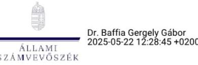

Dr. Baffia Gergely Gábor igazgató, kiadmányozó Állami Számvevőszék Ellenőrzési igazgatóság II.

---

# RÖVIDÍTÉSEK JEGYZÉKE 

${ }^{1}$ Fővárosi Önkormányzat ${ }^{2}$ ÁSZ ${ }^{3}$ ÁSZ tv. ${ }^{4}$ Áht. ${ }^{5}$ Kincstár ${ }^{6}$ NAV ${ }^{7}$ MNB jelentések ${ }^{8}$ BFVK Zrt. ${ }^{9}$ Főpolgármesteri Hivatal ${ }^{10}$ BKK Zrt. ${ }^{11}$ BGYH Zrt. ${ }^{12}$ Alapszabály $_{3}$

## Alapszabály $_{3}$

Alapszabály $_{3}$

${ }^{13}$ Éves közfeladat-ellátási szerződés
${ }^{14}$ Vezérigazgató
${ }^{15}$ felügyelő bizottság
${ }^{16}$ Taktv.
${ }^{17}$ Gtbkr.
${ }^{18}$ Mötv.
${ }^{19}$ Stratégiai terv
${ }^{20}$ Alapító
${ }^{21}$ Vagyonrendelet
${ }^{22}$ Önkormányzati SzMSz
${ }^{23}$ Közgyűlés
${ }^{24} \mathrm{KSH}$
${ }^{25}$ Keretszerződés
${ }^{26}$ Számv. tv.
${ }^{27}$ Áhsz.

Budapest Főváros Önkormányzata
Állami Számvevőszék
2011. évi LXVI. törvény az Állami Számvevőszékről
2011. évi CXCV. törvény az államháztartásról

Magyar Államkincstár
Nemzeti Adó- és Vámhivatal
Magyar Nemzeti Bank kereskedelmiingatlan-piaci jelentései
Budapest Főváros Vagyonkezelő Központ Zártkörűen Működő Részvénytársaság
Budapest Főváros Főpolgármesteri Hivatala
Budapesti Közlekedési Központ Zártkörűen Működő Részvénytársaság
Budapest Gyógyfürdői és Hévizei Zártkörűen Működő Részvénytársaság
Budapest Főváros Vagyonkezelő Központ Zártkörűen Működő Részvénytársaság
Alapszabálya (módosításokkal egységes szerkezetbe foglalt, hatályos 2019. december 13-tól 2020. december 21-ig)
Budapest Főváros Vagyonkezelő Központ Zártkörűen Működő Részvénytársaság Alapszabálya (módosításokkal egységes szerkezetbe foglalt, hatályos 2020. december 22-től 2023. április 18-ig)
Budapest Főváros Vagyonkezelő Központ Zártkörűen Működő Részvénytársaság Alapszabálya (módosításokkal egységes szerkezetbe foglalt, hatályos 2023. április 19-től)
Budapest Főváros Önkormányzata és a BFVK között létrejött éves közfeladat-ellátási szerződés
Budapest Főváros Vagyonkezelő Központ Zártkörűen Működő Részvénytársaság vezérigazgatója
Budapest Főváros Vagyonkezelő Központ Zártkörűen Működő Részvénytársaság Felügyelő Bizottsága
2009. évi CXXII. törvény a köztulajdonban álló gazdasági társaságok takarékosabb működéséről
339/2019. (XII. 23.) Korm. rendelet a köztulajdonban álló gazdasági társaságok belső kontrollrendszeréről
2011. évi CLXXXIX. törvény Magyarország helyi önkormányzatairól

Budapest Főváros Vagyonkezelő Központ Zrt. Stratégiai terve 2022-2025.
Budapest Főváros Vagyonkezelő Központ Zrt. alapítója és egyszemélyi részvényese Budapest Főváros Önkormányzata
Budapest Főváros Önkormányzata Közgyűlésének 22/2012. (III. 14.) önkormányzati rendelete Budapest Főváros Önkormányzata vagyonáról, a vagyonelemek feletti tulajdonosi jogok gyakorlásáról (hatályos 2012. március 15-étől)
Budapest Főváros Önkormányzata Közgyűlésének 1/2020. (II. 5.) önkormányzati rendelete Budapest Főváros Önkormányzata Szervezeti és Működési Szabályzatáról (hatályos 2020. február 13-tól)
Budapest Főváros Önkormányzata Közgyűlése
Központi Statisztikai Hivatal
672/2021. (III. 31.) közgyűlési határozattal jóváhagyott Közfeladat-ellátási keretszerződés (hatályos 2021. április 1-jétől)
2000. évi C. törvény a számvitelről
4/2013. (I. 11.) Korm. rendelet az államháztartás számviteléről

---

${ }^{28}$ Leltározási szabályzat
${ }^{29}$ Nvtv.
${ }^{30}$ Selejtezési szabályzat
${ }^{31}$ vagyonkezelő szervezetek
${ }^{32}$ EIB
${ }^{33}$ 38/2013. NGM rendelet
${ }^{34}$ Helyiségrendelet
${ }^{35}$ Hivatali SzMSz
${ }^{36}$ Versenyeztetési szabályzat
${ }^{37}$ TB határozat
${ }^{38}$ Haszonbérleti szerződés
${ }^{39}$ Ávr.
${ }^{40}$ Alaptörvény
${ }^{41}$ Belső Kontrollrendszer Kézikönyv
${ }^{42}$ Bkr.
${ }^{43}$ Ptk.
${ }^{44}$ 2019-2022. évi Stratégiai ellenőrzési terv
2023-2026. évi Stratégiai ellenőrzési terv
${ }^{45}$ Irányelv
${ }^{46}$ 24/2013. (V. 29.) NFM rendelet
${ }^{47}$ Hatv.
${ }^{48}$ 2022. évi Kvtv.
${ }^{49}$ 2023. évi Kvtv.
${ }^{50}$ Lakás tv.
${ }^{51}$ 147/1992.(XI. 6.) Korm.rendelet
${ }^{52}$ 27/2021. (I. 29.) Korm. rendelet
${ }^{53}$ 52/2021. (II. 9.) Korm. rendelet

Budapest Fővárosi Önkormányzata Főpolgármestere és Főjegyzője 61/2015. (VII. 8.) együttes utasítása Budapest Főváros Önkormányzata eszközeinek és forrásainak leltározásáról és leltárkezelésről
2011. évi CXVI. törvény a nemzeti vagyonról

Budapest Főváros Önkormányzata Főpolgármestere és Főjegyzője 76/2015. (IX. 7.) együttes utasítása a Budapest Főváros Önkormányzata felesleges vagyontárgyaival kapcsolatos feladatokról
Városliget Ingatlanfejlesztő Zrt., Fővárosi Közterület-fenntartó Zrt.; Budapesti Távhőszolgáltató Zrt., Fővárosi Vízművek Zrt., Semmelweis Egyetem, Szalézi Intézmény Fennitartó
Európai Beruházási Bank (European Investment Bank)
az államháztartásban felmerülő egyes gyakoribb gazdasági események kötelező elszámolási módjáról szóló 38/2013. (IX. 19.) NGM rendelet
Budapest Főváros Önkormányzata Közgyűlésének 40/2006. (VII. 14.) önkormányzati rendelete a Fővárosi Önkormányzat tulajdonában lévő nem lakás céljára szolgáló helyiségek feletti tulajdonosi jogok gyakorlásáról (hatályos 2014. július 16-ától)
Budapest Főváros Önkormányzata Főpolgármesterének 25/2020. (X. 26.) utasítása Budapest Főváros Főpolgármesteri Hivatal szervezeti és működési szabályzatáról (hatályos: 2020. november 1-től)
Budapest Főváros BFVK Zrt. Központ Zrt. Versenyeztetési Szabályzat (hatályos 2022. január 1-jétől)

Tulajdonosi Bizottság határozata
BFVK Zrt. és a KOWAX Kft. között 2019. 12. 10-én létrejött Haszonbérleti szerződés 368/2011. (XII. 31.) Korm. rendelet az államháztartásról szóló törvény végrehajtásáról
Magyarország Alaptörvénye
a Nemzeti Vagyon Kezeléséért Felelős Tárca Nélküli Miniszter által 2021 februárjában megjelent Kézikönyv a köztulajdonban álló gazdasági társaságok részére a belső kontrollrendszer kialakításához és működtetéséhez (megjelent 2021. február)

370/2011. (XII. 31.) Korm. rendelet a költségvetési szervek belső kontrollrendszeréről és belső ellenőrzéséről
2013. évi V. törvény a Polgári Törvénykönyvről

Fővárosi Önkormányzat 2019-2022. évekre vonatkozó, módosított Stratégiai Ellenőrzési Terve
Fővárosi Önkormányzat 2023-2026. évekre vonatkozó Stratégiai Ellenőrzési Terve az állami vagyon felügyeletéért felelős miniszter által az államháztartásért felelős miniszter egyetértésével közzétett Irányelv a
 köztulajdonban álló gazdasági társaságok részére a belső kontrollrendszer kialakításához és működtetéséhez (hatályos 2021. január 1-jétől)

24/2013. (V. 29.) NFM rendelet a víziközművek vagyonértékelésének szabályairól és a víziközmű-szolgáltatók által közérdekből közzéteendő adatokról
1991. évi XX. törvény a helyi önkormányzatok és szerveik, a köztársasági megbízottak, valamint egyes centrális alárendeltségű szervek feladat- és hatásköreiről
2021. évi XC. törvény Magyarország 2022. évi központi költségvetéséről
2022. évi XXV. törvény Magyarország 2023. évi központi költségvetéséről
1993. évi LXXVIII. törvény - a lakások és helyiségek bérletére, valamint az elidegenítésükre vonatkozó egyes szabályokról
147/1992. (XI. 6.) Korm. rendelet az önkormányzatok tulajdonában lévő ingatlanvagyon nyilvántartási és adatszolgáltatási rendjéről
27/2021. (I. 29.) Korm. rendelet a veszélyhelyzet kihirdetéséről és a veszélyhelyzeti intézkedések hatálybalépéséről (hatálytalan 2022. június 1-jétől)
52/2021. (II. 9.) Korm. rendelet a bérletidíj-fizetési mentességről (hatálytalan 2022. június 1-jétől)

---

1052 Budapest, Apáczai Csere János u. 10. | 1364 Budapest 4., Pf. 54
www.asz.hu | szamvevoszek@asz.hu
telefon: +36 14849100
