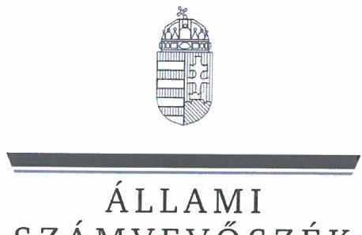
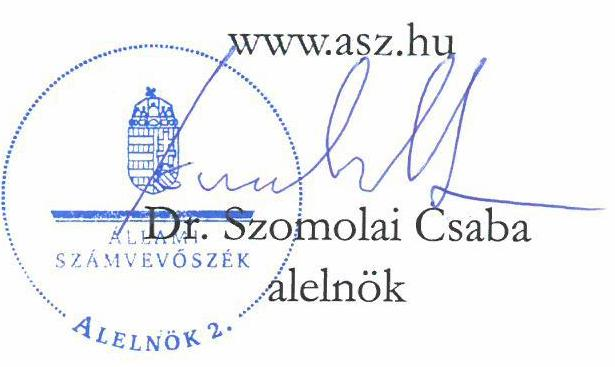
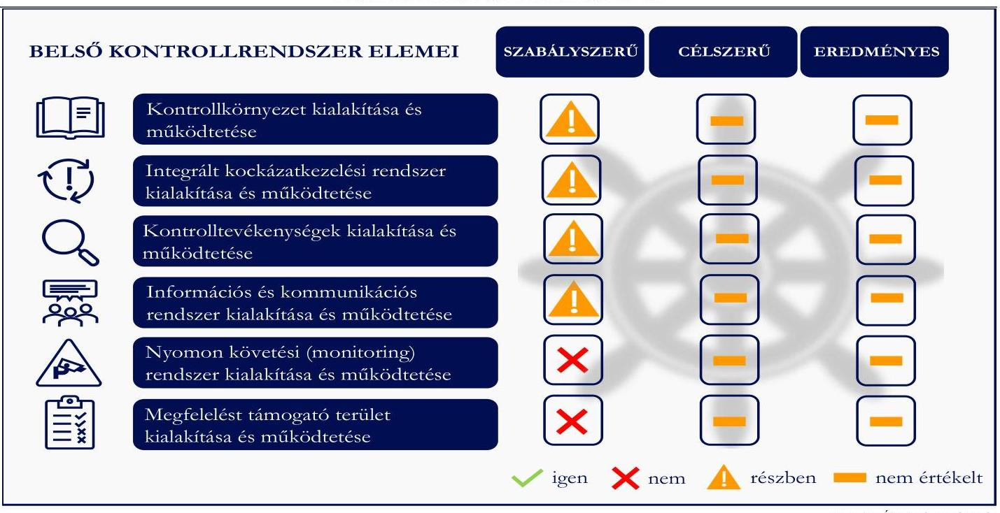

# JELENTÉS 

Az állami tulajdonban álló gazdasági társaságoknál a belső kontrollrendszer kiépítésére és múködtetésére előírt egyes követelmények érvényesülésének ellenőrzése

MAHART - PassNave Személyhajózási Korlátolt Felelősségű Társaság

2025.

---

ÁLLAMI
SZÁMVEVŐSZÉK

# JELENTÉS 

## Az állami tulajdonban álló gazdasági társaságoknál a belső kontrollrendszer kiépítésére és múködtetésére előírt egyes követelmények érvényesülésének ellenőrzése

MAHART - PassNave Személyhajózási Korlátolt Felelősségű Társaság
2025.

25066

---

# ELLENŐRZÉSI IGAZGATÓSÁG: 

## ELLENŐRZÉSI IGAZGATÓSÁG III.

## ELLENŐRZÉSI IGAZGATÓ:

HERCZEGH ZSOLT ellenőrzési igazgató

## ELLENŐRZÉSVEZETŐ:

IMRE ZSUZSANNA ellenőrzésvezető

Jelentéseink az interneten a www.asz.hu címen olvashatók.

IKTATÓSZÁM: EL-4136-003/2025
TÉMASORSZÁM: 41
ELLENŐRZÉS-AZONOSÍTÓ SZÁM: V1110

---

# TARTALOMJEGYZÉK 

AZ ELLENŐRZÉS ALAPADATAI ..... 5
AZ ELLENŐRZÖTT SZERVEZET ..... 7
ÖSSZEFOGLALÁS ..... 8
AZ ELLENŐRZÉS FÓKUSZTERÜLETE ..... 11
MEGÁLLAPÍTÁSOK ..... 12
JAVASLATOK ..... 19
MELLÉKLETEK ..... 21
I. sz. melléklet: Értelmező szótár ..... 21
II. sz. melléklet: Az ellenőrzött szervezetek jegyzéke ..... 22
III. sz. melléklet: Ellenőrzési kritériumok ..... 23
IV. sz. melléklet: A kiválasztott mintatételek adatai (adatok E Ft-ban) ..... 24
FÜGGELÉK: ÉSZREVÉTELEK ..... 25
RÖVIDÍTÉSEK JEGYZÉKE ..... 26

---

.

---

# AZ ELLENŐRZÉS ALAPADATAI 

## AZ ELLENŐRZÉS CÉLJA

Az ellenőrzés célja annak értékelése volt, hogy a többségi állami tulajdonban álló gazdasági társaságnál a belső kontrollrendszer kialakítására és működtetésére szabályszerűen került-e sor. Az ellenőrzés célja továbbá annak értékelése volt, hogy a belső kontrollrendszer kialakítása és működtetése célszerű és eredményes volt-e.

## AZ ELLENŐRZÉS TÍPUSA

Kombinált ellenőrzés.

## AZ ELLENŐRZÖTT IDŐSZAK

A 2023. év. A 2023. évhez kapcsolódó beszámolók, a teljesítménymérési rendszer értékeléséhez a teljesítményértékelések tekintetében azok elkészítésének napjáig tartó időszak.

## AZ ELLENŐRZÉS TÁRGYA

A MAHART-PassNave Kft. ${ }^{1}$-nél a belső kontrollrendszer egyes elemeinek - kontrollkörnyezet, integrált kockázatkezelési rendszer, kontrolltevékenységek, információs és kommunikációs rendszer, nyomon követési (monitoring) rendszer - kialakítása és múködtetése során a jogszabályi követelmények érvényesülése a főbb folyamatok (a tervezés, értékesítés, beszerzés, az információs és kommunikációs rendszer, nyomon követési rendszer esetében az üzleti tervezés) esetében. Továbbá annak értékelése volt, hogy ezen folyamatok tekintetében a belső kontrollrendszer működtetése célszerű és eredményes volt-e. Az ellenőrzés tárgyát képezte továbbá, hogy az ellenőrzött szervezet szabályszerűen kialakította-e és működtette-e a belső ellenőrzési és a megfelelést támogató területet.

Az ellenőrzés a MAHART-PassNave Kft. kontrollkörnyezetének kialakítását és működtetését a fő folyamatai, így a tervezési, az értékesítési és a beszerzési folyamatok, a teljesítménymérési rendszer tekintetében értékelte.

Az integrált kockázatkezelési rendszer kialakítását és működtetését az ellenőrzés a MAHART- PassNave Kft. stratégia alkotási, az üzleti tervezési, az értékesítési és a beszerzési tevékenysége tekintetében vizsgálta.

A kontrolltevékenységek kialakításának és működtetésének értékelése a MAHART-PassNave Kft. stratégiai és üzleti tervezés, továbbá az értékesítési és a beszerzési folyamatára terjedt ki.

Az információs és kommunikációs rendszer kialakítását és működtetését az ÁSZ ${ }^{2}$ a MAHART- PassNave Kft. 2023. évi üzleti tervezésének folyamatához kapcsolódóan ellenőrizte, valamint értékelte az információs és kommunikációs rendszer részeként kialakított és működtetett vállalatirányítási rendszert.

---

A MAHART-PassNave Kft.-nél a nyomon követési, monitoring rendszer kialakításának és működtetésének értékelése a 2023. évre vonatkozó üzleti tervben foglaltak teljesüléséhez kapcsolódó monitoring tevékenység kialakítására és működtetésére irányult, az ellenőrzés által kiválasztott szervezeti egység - a Kereskedelmi egység Értékesítési, valamint Forgalmi csoportja -, és annak vezetője vonatkozásában. Az ellenőrzés kiterjedt minden olyan körülményre és adatra, amely az ÁSZ jogszabályban meghatározott feladatainak teljesítéséhez, valamint az ellenőrzési program végrehajtása folyamán felmerült újabb összefüggések feltárásához szükséges volt.

# AZ ELLENŐRZÉS JOGALAPJA 

Az ellenőrzés jogszabályi alapját az ÁSZ tv. ${ }^{3} 1 . \int$ (3) bekezdése és az 5. $\int$ (4) bekezdése képezték.

## AZ ELLENŐRZÉS MÓDSZERE

Az ellenőrzést az ÁSZ a nemzetközi standardokat irányadónak tekintve az ellenőrzési program szempontjai, az ellenőrzött időszakban hatályos jogszabályok, az ellenőrzés szakmai szabályok és módszertanok figyelembevételével folytatta le.

Az ellenőrzési kérdések megválaszolásához szükséges bizonyítékok megszerzése az ellenőrzött szervezet által rendelkezésre bocsátott dokumentumokra és adatokra alapozva, a következő ellenőrzési eljárások alkalmazásával történt: megfigyelés, szemle (szemrevételezés), kérdésfeltevés (információkérés), elemző eljárás. Az ÁSZ a kontrolltevékenységek (döntések megalapozottságának vizsgálata, a döntéselőkészítés, a döntések jóváhagyása és ellenjegyzése, a gazdasági eseményekhez kapcsolódó elszámolások során alkalmazott kontrollok) szabályszerűségét mintavételi eljárással , a bevételszerzési/értékesítési tevékenységre vonatkozóan 9433 darabszámú, 4084,3 M Ft értékű adatbázisból $3 \mathrm{db}, 229,0 \mathrm{M}$ Ft értékű, a beszerzési tevékenységre vonatkozóan 1048 darabszámú, 994,2 M Ft értékủ adatbázisból $3 \mathrm{db}, 114,2 \mathrm{M}$ Ft értékű, kockázati alapon kiválasztott tétel alapján is ellenőrizte. A kiválasztott mintatételek ellenőrzésének eredményei nem kerültek kivetítésre a teljes sokaságra, a megállapítások az adott ellenőrzött mintatételek vonatkozásában kerültek megjelenítésre.

Az ellenőrzés a belső kontrollrendszer azon elemeinek célszerűségét és eredményességét értékelte, amely elemek kialakításáról és/vagy működtetéséről az ellenőrzött szervezet szabályszerűen gondoskodott.

Az ellenőrzési bizonyítékként felhasználható adatforrások közé tartoztak egyrészt az ellenőrzéshez kért dokumentumok, adatforrások, másrészt adatforrás volt még minden - az ellenőrzés folyamán feltárt, az ellenőrzés szempontjából releváns információt tartalmazó - dokumentum.

Az ellenőrzés lefolytatásához az ellenőrzött szervezet az ÁSZ által kért dokumentumok, adatok, információk megküldésével szolgáltatott adatokat. Az ellenőrzéshez az ÁSZ felhasználta a nyilvánosan elérhető közhiteles adatokat is.

---

# AZ ELLENŐRZÖTT SZERVEZET 

## MAHART - PASSNAVE SZEMÉLYHAJÓZÁSI KORLÁTOLT FELELŐSSÉGŰ TÁRSASÁG

A MAHART-PassNave Kft.-t a MAHART Magyar Hajózási Rt. alapította 1993. december 20-án, 2014. január 14-től többségi tulajdonosa a Magyar Állam (2023. évben 51\%-os részesedés), kisebbségi tulajdonosa a Viking Hungary Kft. (2023. évben 49\%-os részesedés) volt. A MAHART-PassNave Kft. jegyzett tőkéje 2023. december 31-én 366,0 M Ft volt. A MAHART-PassNave Kft. közvetlen többségi állami tulajdonba kerülését követően a tulajdonosi joggyakorló ${ }^{4}$ személye hét alkalommal változott, az ellenőrzött időszakban az Építési és Közlekedési Minisztérium 2022. november 24. és 2024. április 30. között, majd 2024. április 30-tól a Magyar Turisztikai Ügynökség Zrt. volt.

A MAHART-PassNave Kft. főtevékenysége a belvízi személyszállítás volt, további főbb szolgáltatási tevékenységei: a hajós rendezvények szervezése, a dunai kikötők üzemeltetése, valamint a MAHART Tours Utazási Iroda müködtetése volt. A székhelye 1056 Budapest, Belgrád rakpart, Nemzetközi Hajóállomáson található, emellett két budapesti és egy esztergomi telephellyel, valamint egy komáromi és egy esztergomi fiókteleppel rendelkezett.

A MAHART-PassNave Kft. kisebbségi tulajdonrésszel rendelkezett az Esztergom - Mahart Személyhajózási és Kikötő Kft.-ben, további gazdasági társaságban nem rendelkezett tulajdonrésszel. Az Ügyvezető ${ }_{1,2,3}{ }^{5}$-inek személye az ellenőrzött időszakot érintően három alkalommal változott, a jelenlegi Ügyvezető 2024. május 30 -tól látta el feladatát.

A Társaság ${ }^{6}$ 2023. évi Éves beszámolója alapján a mérlegfőösszege 6868,6 M Ft, a saját tőke összege 5974,1 M Ft, az értékesítés nettó árbevétele 5052,1 M Ft, az adózás előtti eredménye 2417,5 M Ft, a foglalkoztatottak átlagos statisztikai állományi létszáma 72 fő volt.

Az ellenőrzött időszakban a Tak.tv. ${ }^{7}$ 7/J. § (1) bekezdés a) és b) pontjában meghatározott mutatóértékek alapján a Társaság a Gbkr. ${ }^{8}$ hatálya alá tartozott, belső kontrollrendszer müködtetésére volt kötelezett.

A MAHART-PassNave Kft.-nél az ellenőrzött mintatételekhez kapcsolódó beszerzések esetében nem merült fel közbeszerzési eljárás lefolytatására vonatkozó kötelezettség.

---

# ÖSSZEFOGLALÁS 

A Magyar Állam gazdasági társaságokban lévő részesedései a nemzeti vagyon részét képezik. A nemzeti vagyonnal felelős módon, rendeltetésszerúen kell gazdálkodni. A nemzeti vagyongazdálkodás feladata - többek között - a nemzeti vagyon megőrzése, értékének és állagának védelme, átlátható, hatékony és költségtakarékos működtetése, értéknövelő használata, hasznosítása, gyarapítása. Az állam tulajdonában álló gazdálkodó szervezetek törvényben meghatározott módon, felelősen kell, hogy gazdálkodjanak a törvényesség, a célszerűség és az eredményesség követelményei szerint, amit a megfelelően kialakított és múködtetett belső kontrollrendszer tud biztosítani.

A belső kontrollrendszer, mint folyamatrendszer a szervezet céljainak elérésében segíti a társaság első számú vezetőjét, annak kialakítása, múködtetése és fejlesztése a társaság első számú vezetőjének a felelőssége. A belső kontrollrendszer a jogszabályi kötelezettségeknek való tudatos megfelelés, kockázatok kezelése és a tárgyilagos bizonyosság megszerzése érdekében azt a célt szolgálja, hogy a társaság múködése és gazdálkodása során a tevékenységét gazdaságosan, hatékonyan és eredményesen végezze, elszámolási kötelezettségeit teljesítse, megvédje az erőforrásait a veszteségektől, károktól és a nem rendeltetésszerú használattól, múködésével kapcsolatosan megfelelő, pontos és naprakész információ álljon rendelkezésre, biztosítsa a jogszabályi előírásoknak megfelelő, szabályozott, átlátható és etikus múködést, védje a tulajdonos(ok) és az ügyfelek érdekeit, valamint kockázatait kezelje, különös tekintettel az integritás kockázatokra (Gbkr. Irányelv ${ }^{9} 3$. pont).

Az ellenőrzés kiterjedt a MAHART-PassNave Kft.-nél a belső kontrollrendszer egyes elemeinek - azok kialakításának és múködtetésének - a vizsgálatára a főbb folyamatok, így a tervezés, értékesítés, beszerzés, az információs és kommunikációs rendszer, nyomon követési rendszer esetében az üzleti tervezés tekintetében. Az ellenőrzés során az ÁSZ értékelte továbbá a belső ellenőrzés, valamint a megfelelést támogató terület kialakítását és múködését. Az ellenőrzés megállapításait a belső kontrollrendszer egyes elemeinek értékelése tekintetében az 1. ábra szemlélteti.

## AZ ELLENŐRZÉS MEGÁLLAPÍTÁSAI A BELSŐ KONTROLLRENDSZER EGYES ELEMEINEK ÉRTÉKELÉSE TEKINTETÉBEN

---

AZ ELLENŐRZÉS HIÁNYOSSÁGOKAT TÁRT FEL a MAHART-PassNave Kft. által kialakított és múködtetett belső kontrollrendszer valamennyi eleme esetében, amely kockázatokat hordoz a Társaság múködése tekintetében.

A kontrollkörnyezet kialakítása részben felelt meg a jogszabályi előírásoknak a MAHART- PassNave Kft.-nél az ellenőrzött időszakban, mivel a Társaság stratégiát nem határozott meg, 2023. évre vonatkozó üzleti tervvel nem rendelkezett, tevékenységét, folyamatait több területen nem szabályozta, teljesítménymérési rendszert nem alakított ki az ellenőrzött időszakban a tevékenységére jellemző főbb folyamatok vonatkozásában. A MAHART-PassNave Kft. rendelkezett SZMSZ ${ }_{1,2}{ }^{10}$-szel, Számviteli politiká ${ }^{11}$-val, Beszerzési szabályzat ${ }^{12}$-tal és Közbeszerzési szabályzat ${ }^{13}$-tal, ugyanakkor nem gondoskodott a Számviteli politika keretében az Eszközök és források értékelési szabályzatának az elkészítéséről, valamint az Önköltségszámítás rendjére vonatkozó belső szabályzat megalkotásáról. A MAHART-PassNave Kft. nem gondoskodott továbbá a tervezési, értékesítési folyamat szabályozásáról, és csak részben szabályozta a szerződéskötés rendjét.

Az integrált kockázatkezelési rendszer kialakításáról a MAHART-PassNave Kft. első számú vezetője az ellenőrzött időszakban gondoskodott az IKK szabályzat ${ }^{14}$ megalkotásával, ugyanakkor - az üzleti tervezési, az értékesítési és a beszerzési tevékenysége tekintetében - integrált kockázatkezelési rendszert nem múködtetett, nem mérte fel, nem azonosította a gazdasági társaság tevékenységében rejlő és a szervezeti célokkal összefüggő kockázatokat, ezzel részben felelt meg a jogszabályi előírásoknak.

A kontrolltevékenységek kialakítása és múködtetése részben felelt meg a jogszabályi előírásoknak. A MAHART-PassNave Kft. első számú vezetője a 2023. évi üzleti tervezéshez kapcsolódóan nem gondoskodott a kontrolltevékenységek kialakításáról és múködtetéséről. Az üzleti terv elfogadására a gazdasági év utolsó hónapjában került sor, így az ÁSZ véleménye szerint az nem tölthette be a szerepét, a Felügyelőbizottság ${ }^{15}$ jóváhagyó és a Taggyűlés ${ }^{16}$ elfogadó határozatai nem a MAHART-PassNave Kft. 2023. évi üzleti tervére, hanem már a 2023. évi gazdálkodását bemutató mérleg és eredménykimutatás várható adataira vonatkoztak.

A MAHART-PassNave Kft. első számú vezetője a beszerzési tevékenységéhez kapcsolódó döntéselőkészítés során az ellenőrzött mintatételek esetében a kontrolltevékenységeket kialakította, azonban csak részben múködtette, mivel a beszerzési eljárás lefolytatására a belső szabályozásában foglaltaknak megfelelően került sor, azonban olyan beszállítókkal kötött szerződést, melyekre a belső szabályozása szerinti minősítés és jóváhagyás nem állt rendelkezésre, a szerződések pénzügyi és jogi véleményezése dokumentáltan nem történt meg, így ezt a kontrolltevékenységet nem múködtette, továbbá egy esetben a szerződésgazdai, a szerződésgondozói és a beszerzés jóváhagyói feladatköröket ugyanaz a személy, az Ügyvezető: látta el, így nem biztosította a feladatkörök elkülönítését.

A MAHART-PassNave Kft. első számú vezetője az értékesítési tevékenységhez kapcsolódó döntéselőkészítés során az ellenőrzött mintatételek esetében a kontrolltevékenységeket kialakította, de nem múködtette,

- a döntések előkészítéséhez, jóváhagyásához, ellenjegyzéséhez kapcsolódó tevékenységek feladatköri elkülönítését nem biztosította, mivel a szerződéskötéseket a belső szabályozásában a döntéselőkészítésre kijelölt vezetők, illetve szervezeti egységek bevonása nélkül készítette elő és írta alá az Ügyvezető ${ }_{1,2}$,

---

- az ellenőrzött 4. és 6. mintatételek esetében a szerződéseket az Ügyvezető ${ }_{1,2}$ írta alá cégszerűen anélkül, hogy azokat a Taggyűlés elé terjesztették volna jóváhagyásra, figyelmen kívül hagyva a Társasági szerződés; ${ }^{17}$-ben és belső szabályozásában foglaltakat.
Az információs és kommunikációs rendszerének múködését a MAHART-PassNave Kft. integrált vállalatirányítási rendszere - az üzleti tervezés kivételével - támogatta. A MAHART-PassNave Kft. első számú vezetője az információs és kommunikációs rendszert az üzleti tervezés tekintetében - a szabályozás hiányában - csak részben alakította ki. A MAHART-PassNave Kft. a közzétételi kötelezettségének csak részben tett eleget, így részben felelt meg a jogszabályi előírásoknak

A nyomon követési (monitoring) rendszer kialakítása és működtetése nem felelt meg a jogszabályi előírásoknak, mivel a MAHART-PassNave Kft. első számú vezetője az ellenőrzött időszakra, az üzleti tervezésre vonatkozóan nem alakította ki és nem működtette azt, tevékenységeivel kapcsolatos nyomon követési stratégiát nem alakított ki, valamint nem gondoskodott belső ellenőrzési funkció kialakításáról, megfelelő működtetéséről.

Megfelelést támogató szervezeti egységet a MAHART-PassNave Kft. első számú vezetője az ellenőrzött időszakban nem hozott létre. A MAHART-PassNave Kft. első számú vezetője a jogszabályi előírás ellenére nem értékelte nyilatkozatban a gazdasági társaság belső kontrollrendszerének 2023. évi múködését.

---

# AZ ELLENŐRZÉS FÓKUSZTERÜLETE 

1.- A többségi állami tulajdonban álló, a Gbkr. hatálya alá tartozó gazdasági társaságnál kialakított és müködtetett belső kontrollrendszer egyes elemeinek az értékelése.

---

# MEGÁLLAPÍTÁSOK 

## 1. A többségi állami tulajdonban álló, a Gbkr. hatálya alá tartozó gazdasági társaságnál kialakított és múködtetett belső kontrollrendszer egyes elemeinek az értékelése.

Összegző megállapítás A MAHART-PassNave Kft. az ellenőrzött időszakban a belső kontrollrendszerének egyes elemeit részben alakította ki és részben múködtette. A belső kontrollrendszer részben támogatta a társaság fő folyamatainak szabályszerű ellátását.

## A KONTROLLKÖRNYEZET KIALAKÍTÁSÁNAK ÉRTÉKELÉSE

#### Abstract

A belső kontrollrendszer részeként a megfelelően kialakított kontrollkörnyezet biztositja az egész szervezet müködésének a kereteit. A gazdasági társaság megfelelő müködtetése érdekében szükséges egy komplex szabályzatrendszer kialakítása, melynek keretében kialakított szabályzatok megalapozzák a gazdaságos, hatékony és eredményes munkavégzést, támogatják az egymáshoz kapcsolódó folyamatok végrehajtását, elősegitik a munkavégzéshez szükséges információk áramlását. (Gbkr. Irányelv)

A Társaság közép- és hosszú távú szervezeti céljainak meghatározására az ellenőrzött időszakban nem került sor, a MAHART-PassNave Kft. Társasági szerződése ${ }_{1,2,3}$ sem tartalmazta a MAHART- PassNave Kft. közép- és hosszú távú szervezeti céljait. A Társaság stratégiáját nem foglalták írásba, figyelmen kívül hagyva a Gbkr. 4. § (1) bekezdés a) pontjában, a (3) bekezdésében foglaltakat, valamint a Gbkr. Irányelv 3.1. pontjának a stratégiai célrendszer rögzítésére vonatkozó előírásait.
A MAHART-PassNave Kft. 2023. évi üzleti tervének elfogadásáról a Taggyűlés a 6/2023. (XII. 13.) sz. taggyűlési határozatában döntött. A MAHART-PassNave Kft. első számú vezetője a 2023. évi üzleti terv tervezetét 2023. április 24-én elkészítette, viszont a többszöri módosítás, egyeztetések ellenére a Felügyelőbizottság novemberben és a többségi tulajdonos csak decemberben fogadta el. A Taggyűlés által elfogadott dokumentum, annak tartalmára és elfogadásának időpontjára figyelemmel az ÁSZ álláspontja szerint nem tekinthető üzleti tervnek. Ez alapján a MAHART-PassNave Kft. a 2023. évre vonatkozóan nem rendelkezett üzleti tervvel. Így nem került sor az operatív szervezeti célok meghatározására és azok szervezeti egységekre történő lebontására sem, mellyel a Társaság nem tett eleget a Gbkr. 4. § (1) bekezdés a) pontjában és (3) bekezdésében foglaltaknak és a Gbkr. Irányelv 3.1. pontja 4. francia bekezdése szerint operatív célrendszer írásban történő rögzítésére vonatkozó elvárásoknak.
A MAHART-PassNave Kft. múködésének szervezeti kereteire vonatkozó szabályozását az ellenőrzött időszak és a fő folyamatai tekintetében a Társasági szerződés ${ }_{1,2,3}$, az SZMSZ ${ }_{1,2}$, a Számviteli politika és annak keretében elkészített számviteli szabályzatai (Leltározási szabályzat ${ }^{18}$, Pénzkezelési szabályzat ${ }^{19}$, Számlarend ${ }^{20}$ ), a Beszerzési szabályzat, a Közbeszerzési szabályzat, valamint a Javadalmazási szabályzat ${ }^{21}$ képezte megfelelve ezáltal a Ptk. ${ }^{22}$, a Gbkr., a Számv.tv. ${ }^{23}$, a Kbt. ${ }^{24}$ és a Tak.tv. előírásainak.

---

A MAHART-PassNave Kft. az ellenőrzött időszakban nem rendelkezett az Eszközök és források értékelési szabályzatával és az Önköltségszámítás rendjére vonatkozó belső szabályzattal, így nem tett eleget a Számv. tv. 14. § (5) bekezdés b) és c) pontjaiban foglaltaknak.
A MAHART-PassNave Kft.-nél a 2023. évben a részleges vállalatirányítási és pénzügyi adminisztrációs, valamint teljes körű számviteli adminisztrációs tevékenységet megbízási szerződés alapján - az SZMSZ ${ }_{1,2}$ alapján, mint kiszervezett tevékenységet - a KONTO-ROLL AUDIT Kft. látta el.
Az SZMSZ ${ }_{1,2}$-ben a MAHART-PassNave Kft. rendelkezett a társaság képviseletéről, szervezeti felépítéséről, a szervezeti felépítést szervezeti ábrával szemléltette, részletesen meghatározta az ügyvezető feladat- és hatáskörét, a vezető munkavállalók és beosztottak általános feladat- és hatáskörét, a szervezeti egységek feladatkörét, döntéselőkészítői és döntési hatásköröket, a helyettesítés rendjét. A MAHART- PassNave Kft.-nél az SZMSZ ${ }_{1,2}$-ben meghatározott szabályozási keretek a szervezeti struktúra tekintetében világosak, a felelősségi és hatásköri viszonyok és feladatok egyértelműek, és megfelelően elhatároltak voltak, megfelelve ezáltal a Gbkr.-ben foglaltaknak.
A tervezési folyamat tekintetében a kapcsolódó feladatokat, felelősségi és hatásköröket tartalmazó szabályzattal a MAHART-PassNave Kft. az ellenőrzött időszakban nem rendelkezett, a folyamatot nem szabályozta, így a Gbkr. 4. § (1) bekezdés a) és c) pontjai szerinti kontrollkörnyezetet nem alakította ki megfelelően.
Az értékesítési folyamatot a MAHART-PassNave Kft. első számú vezetője az ellenőrzött időszakra vonatkozóan - a folyamatban résztvevő egyes szervezeti egységek SZMSZ ${ }_{1,2}$-ben rögzített feladatain kívül - nem szabályozta, figyelmen kívül hagyva a Gbkr. 4. § (3) bekezdésében foglaltakat, így nem biztosította a Tak.tv. 7/J. § (3) bekezdésében meghatározott követelmények teljesülését sem.
A beszerzési folyamatok szabályozásáról a MAHART-PassNave Kft. első számú vezetője a Beszerzési szabályzat és a Közbeszerzési szabályzat megalkotásával gondoskodott, megfelelve a Gbkr.-ben foglalt előírásoknak.
A szerződéskötés folyamatát a MAHART-PassNave Kft. első számú vezetője az ellenőrzött időszakban valamennyi szerződéskötés tekintetében nem, csak a beszerzési folyamatok vonatkozásában szabályozta a Beszerzési szabályzatában. A szerződéskötések rendjére vonatkozó szabályozással nem rendelkezett, ezáltal a MAHART-PassNave Kft. részben vette figyelembe a Gbkr. Irányelv 3.1.1. Belső szabályozás pontjának második bekezdésében foglalt elvárásokat, így részben felelt meg a Gbkr. 4. § (3) bekezdésben foglalt előírásoknak, és nem biztosította a Tak.tv. 7/J. § (3) bekezdésében meghatározott követelmények teljesülését.
A MAHART-PassNave Kft. teljesítménymérési rendszert nem alakított ki és nem múködtetett az ellenőrzött időszakban a tevékenységére jellemző főbb folyamatok vonatkozásában. A MAHART- PassNave Kft. a teljesítménymérési rendszer kialakításának és működtetésének elmulasztásával figyelmen kívül hagyta az SZMSZ ${ }_{1}$ 5.1.1. pontjában, SZMSZ ${ }_{1,2}$ 3.2.1. pontjában, a Gbkr. Irányelv 3.1. pontjának 7. francia bekezdésében foglalt elvárásokat, valamint a Gbkr. 4. § (4) bekezdésben foglalt előírásokat.

---

# AZ INTEGRÁLT KOCKÁZATKEZELÉSI RENDSZER KIALAKÍTÁSÁNAK ÉS MÜKÖDTETÉSÉNEK ÉRTÉKELÉSE 

Az integrált kockázatkezelés a gazdasági társaság céljai elérésével kapcsolatos kockázatok azonosításának és elemzésének, valamint a megfelelő válaszok meghatározásának folyamata, mely magában foglalja a kockázatok azonosítását, értékelését, a kockázatokra adandó válaszok kialakítását, az integrált kockázatkezelési intézkedési tervek megvalósítását, valamint a kockázatokra kialakított válaszok végrehajtásának és hatékonyságának a monitoringját. (Gbkr. Irányelv)
Az integrált kockázatkezelési rendszer kialakításáról a MAHART-PassNave Kft. első számú vezetője az ellenőrzött időszakban gondoskodott az IKK szabályzat megalkotásával. Az IKK szabályzatban rendelkeztek az integrált kockázatkezelési folyamat egyes lépéseiről, az integrált kockázatkezelés folyamatában résztvevők feladatainak felosztásáról és hatásköréről, megfelelve a Gbkr.-ben és a Gbkr. Irányelvben foglaltaknak.
A MAHART-PassNave Kft. a kialakított integrált kockázatkezelési rendszer működtetését igazoló dokumentumot nem bocsátott az ellenőrzés rendelkezésére. A MAHART-PassNave Kft. első számú vezetője a kialakított integrált kockázatkezelési rendszert nem müködtette, nem azonosította és nem elemezte a társaság tevékenységében rejlő és a szervezeti célokkal összefüggő kockázatait, nem határozta meg az egyes kockázatokkal kapcsolatos szükséges intézkedéseket, az intézkedéssel érintett szervezeti egységek körét, és az azok végrehajtásának folyamatos nyomon követési módját és eljárásrendjét a stratégia alkotási, az üzleti tervezési, értékesítési és beszerzési tevékenysége tekintetében sem, figyelmen kívül hagyva ezáltal a Gbkr. 5. §-ában és az IKK szabályzatban foglaltakat.

## A KONTROLLTEVÉKENYSÉGEK KIALAKÍTÁSÁNAK ÉS MÜKÖDTETÉSÉNEK ÉRTÉKELÉSE

A kontrolltevékenység keretében kell bevezetni és müködtetni a szervezet célkitüzései elérésének biztositása érdekében szükséges intézkedéseket. A kontrolltevékenységek biztositják, hogy a társaság vezetésének iránymutatásai és instrukciói úgy kerüljenek végrehajtásra, hogy a meghatározott kockázatok a türéshatáron belül maradjanak. A kontrolltevékenységek kialakításának föbb lépései közé tartozik többek között a szervezeti célok, a kulcsfontosságú teljesítménymutatók, a folyamatleírások, a belsó szabályozók, az ellenörzési nyomvonalak és az azonosított kockázatok megismerése. (Gbkr. Irányelv)
A stratégiai tervezéshez kapcsolódó kontrolltevékenységek kiépítését az ellenőrzés nem vizsgálta, figyelemmel arra, hogy a MAHART-PassNave Kft. az ellenőrzött időszakra vonatkozóan a Taggyúlés által elfogadott stratégiával nem rendelkezett.
A rövidtávú (üzleti/operatív) tervezéshez kapcsolódó kontrolltevékenységeket a MAHART- PassNave Kft. az ellenőrzött időszakra vonatkozóan nem alakított ki. A MAHART- PassNave Kft. a 2023. évi üzleti tervezésére vonatkozóan nem készített ütemtervet, felelősségi köröket, határidőket nem határozott meg, kapcsolódó kockázatokat nem azonosított. Mindezek alapján a MAHART-PassNave Kft. a 2023. évi üzleti tervezés során a Gbkr. 6. § (1) bekezdésében foglalt előírások ellenére nem alakította ki az üzleti tervezés folyamatához kapcsolódóan a kockázatok azonosítását és kezelését biztosító kontrolltevékenységeket. A MAHART-PassNave Kft. 2023. december 12-ig nem rendelkezett üzleti tervvel, az ezt követő időszak tekintetében pedig az üzleti terv a funkcióját nem tölthette be. A MAHART- PassNave Kft. az üzleti tervezéshez kapcsolódó

---

kontrollokat nem alakított ki, és így nem is müködtetett, amellyel figyelmen kívül hagyta a Gbkr. 3. $\$ (1) bekezdésének c) pontjában és a Gbkr. 6. $\$ (2) bekezdés a) pontjában foglaltakat.
A MAHART-PassNave Kft. nem rendelkezett a 2023. évi üzleti tervezéshez kapcsolódó célszerűségi, gazdaságossági, hatékonysági és eredményességi szempontok szerinti elemzésekkel. A MAHART- PassNave Kft. a 2023. évi üzleti tervezéshez kapcsolódó döntések célszerűségi, gazdaságossági, hatékonysági és eredményességi szempontú megalapozottságának vizsgálata vonatkozásában a Gbkr. 6. $\$ (2) bekezdésének b) pontjában foglaltak ellenére nem biztosította a kontrollok kiépítését, nem vizsgálta a 2023. évi üzleti tervezéshez kapcsolódóan meghozott döntések megalapozottságát célszerűségi, gazdaságossági, hatékonysági és eredményességi szempontok szerint.
A MAHART-PassNave Kft. 2023. november 10-én kelt 2023. évi üzleti tervét a Felügyelőbizottság a 2/2023. (XI. 22.) FB sz. határozatával 2023. november 22-én jóváhagyta és a Taggyűlés részére elfogadásra ajánlotta, melyet a Taggyűlés a 6/2023. (XII. 13.) sz. határozatával 2023. december 13-án a Társasági Szerződés ${ }_{3}$-ben és az SZMSZ ${ }_{2}$-ben foglaltakra figyelemmel elfogadott.
Az értékesítési és beszerzési tevékenységéhez kapcsolódó kontrollok kiépítésének és működtetésének értékelését az ellenőrzés a MAHART-PassNave Kft.-nél a IV. számú mellékletben szereplő, kiválasztott mintatételek tekintetében végezte el.
A MAHART-PassNave Kft. az értékesítési és beszerzési tevékenységéhez kapcsolódó döntések célszerűségi, gazdaságossági, hatékonysági és eredményességi szempontú megalapozottsági vizsgálata vonatkozásában a Gbkr. 6. $\$ (2) bekezdésének b) pontjában foglaltak ellenére nem biztosította a kontrollok kiépítését, így a kiépített kontrollok hiányában az 1. és 3., valamint a 4-6. mintatélek esetében a Gbkr. 3. $\$ (1) bekezdés c) pontjában foglaltak ellenére azokat nem is müködtette.
A MAHART-PassNave Kft. beszerzési tevékenységéhez kapcsolódó 1-3. mintatételek esetében a döntéselőkészítés részben volt szabályszerű, mivel a beszerzési eljárás lefolytatására a Beszerzési szabályzatban foglaltaknak megfelelően - az 1. és 2. mintatétel esetében egyszerűsített meghívásos eljárással, a 3. mintatétel esetében a versenyeztetési eljárás eltekintésével - került sor, ugyanakkor olyan beszállítókkal kötöttek szerződést, amelyekre a Beszerzési szabályzat a 3.5., 3.16. és 15. pontjaiban foglaltak szerinti minősítés és jóváhagyás nem állt rendelkezésre. Emellett az 1-3. mintatélekhez kapcsolódó szerződések pénzügyi és jogi véleményezése dokumentáltan nem történt meg a Beszerzési szabályzat 8. pontjában foglaltak ellenére. Továbbá a MAHART-PassNave Kft. a Beszerzési szabályzatban jól elkülönítette a szerződésgazdai, a szerződésgondozói és a beszerzés jóváhagyói feladatköröket, ennek ellenére a 3. mintatételhez kapcsolódóan ezen feladatköröket ugyanaz a személy látta el. Így a beszerzési tevékenységéhez kapcsolódóan a MAHART-PassNave Kft. a kontrolltevékenységeket nem megfelelően működtette, figyelmen kívül hagyva a Gbkr. 3. $\$ (1) bekezdés c) pontjában foglaltakat.
Az ellenőrzött 1-3. mintatétel esetében a szerződést a MAHART-PassNave Kft. részéről az Ügyvezető ${ }_{1}$ írta alá cégszerűen, így a döntések jóváhagyása - összhangban a Gbkr.-ben foglaltakkal és megfelelve a Társasági szerződés ${ }_{1}$-ben és az SZMSZ ${ }_{1}$-ben foglaltaknak - szabályszerű volt.
A MAHART-PassNave Kft. értékesítési tevékenységéhez kapcsolódó 4-6. mintatételek esetében a döntéselőkészítés nem volt szabályszerű, mivel a szerződéskötéseket az Ügyvezető ${ }_{1,2}$ készítette elő, írta alá annak ellenére, hogy az SZMSZ ${ }_{1}$ 5.2.1., 5.6.1 és 3. melléklet 2. pontjában foglaltak alapján a szerződés- és döntéselőkészítés a kereskedelmi vezető és az üzemeltetési vezető (4. mintatétel), illetve az értékesítési csoport (6. mintatétel) és a kikötői csoport (5. mintatétel) feladata volt. Így a MAHART-PassNave Kft. a

---

kontrolltevékenységeket a Gbkr. 3. $\int(1)$ bekezdés c) pontjában foglaltak ellenére nem múködtette, a döntések előkészítéséhez, jóváhagyásához kapcsolódó tevékenységek feladatköri elkülönítését nem biztosította a Gbkr. 6. $\$ (3) bekezdésében foglaltak ellenére.
Az ellenőrzött 4. és 6. mintatételek esetében a szerződések értéke meghaladta a 100 M Ft -ot. A szerződéseket a társaság képviseletére jogosult Ügyvezető ${ }_{1,2}$ írta alá cégszerűen anélkül, hogy azokat a Taggyűlés elé terjesztették volna jóváhagyásra. A Mahart-PassNave Kft. Ügyvezető ${ }_{1,2}$-je figyelmen kívül hagyta a Társasági Szerződés: 2.3. alpontjának bb) bekezdésében és az SZMSZ ${ }_{1,2}$ 1.1. alpontjának bb) bekezdésében foglaltakat, melyek szerint a 100 M Ft összeget elérő, vagy meghaladó kötelezettség vállalásokról szóló döntés, amelyek az adott évre jóváhagyott üzleti tervben foglaltakon kívül estek, taggyűlési hatáskörbe tartoztak. A szerződéskötések időpontjában - 2023. augusztus 14-én és 2023. június 19-én - a MAHART-PassNave Kft. nem rendelkezett a Taggyűlés által jóváhagyott 2023. évi üzleti tervvel, mivel az 2023. december 13-ai időponttal került elfogadásra. Mindezekre figyelemmel a MAHARTPassNave Kft. az ellenőrzött 4. és 6. mintatételek esetében a kontrolltevékenységeket nem működtette, figyelmen kívül hagyva a Gbkr. 3. $\int(1)$ bekezdés c) pontjában foglaltakat.
Az ellenőrzött 1-3. mintatétel esetében a gazdasági esemény teljesítését, a Számv.tv. előírásaira figyelemmel, összhangban a Beszerzési szabályzatban foglaltakkal az arra jogosult alkalmazott igazolta a szerződésben foglaltaknak megfelelő „Teljesítés igazolás" dokumentum kiállításával. Az ellenőrzött 1-3. mintatétel esetében a díjbekérők és végszámlák tartalmazták az utalványozást végző Ügyvezető ${ }_{1,2}$ aláírását, megfelelve a Gbkr.-ben és a Számv. tv.-ben foglaltaknak.

# AZ INFORMÁCIÓs ÉS KOMMUNIKÁCIÓs RENDSZER KIALAKÍTÁSÁNAK ÉS MŰKÖDTETÉSÉNEK ÉRTÉKELÉSE 

A gazdasági társaság által kialakított információs és kommunikációs rendszernek biztosítania kell többek között a munkavégzéshez, a döntések hozatalához megfelelő, időszerü, aktuális, pontos és hozzáférhető információk rendelkezésre állását, a beszámoltatási rendszer kialakítását, a belső információáramlást és a kommunikációs csatornák kiépítését és a megfelelő és megbizható informatikai hátteret. (Gbkr. Irányelv)
A MAHART-PassNave Kft. az ellenőrzött időszakban működtetett az információs és kommunikációs rendszerének részeként vállalatirányítási rendszert (MRC), amely lefedte a gazdasági társaság működésének főbb folyamatait (értékesítés, beszerzés, pénzügyi, számviteli nyilvántartások, kontrolling és beszámolás), az üzleti tervezés kivételével. Az üzleti tervezéshez az MRC mindössze a bázisidőszaki adatokat, a programhajózásra vonatkozó megrendelések, valamint a kikötői szolgáltatás tekintetében a menetrendi terv adatokat biztosította. A MAHART-PassNave Kft. által kialakított és múködtetett vállalatirányítási rendszer (MRC) a fő folyamatok - a tervezési folyamat esetében csak részben tekintetében összességében hozzájárult az információs és kommunikációs rendszer múködéséhez és működtetéséhez, figyelemmel a Gbkr. Irányelvben és Gbkr.-ben foglaltakra.
A MAHART-PassNave Kft. üzleti terve tekintetében a döntéselőkészítés az ügyvezető igazgató, valamint a vezető munkavállalók, míg a döntéshozatal a gazdasági társaság taggyűlésének hatáskörébe tartozott az SZMSZ ${ }_{1}$ 3. számú melléklet (Hatásköri táblázat) 5. pontjában foglaltak alapján. A MAHART-PassNave Kft. ügyvezetője a 2023. évi üzleti terv tervezetének elkészítésével, a Taggyűlés részére történő beterjesztésével a döntés előkészítéséről gondoskodott. A MAHART-PassNave Kft.-nél ugyanakkor az ellenőrzött időszakban nem került meghatározásra az üzleti terv elkészítésében résztvevők köre, feladatai, az elkészítéséhez szükséges információk köre, átadásának formája, módja, kommunikációs csatornája,

---

felelőse és határideje, valamint az üzleti terv elkészítése során történő információáramlásban résztvevők köre. A MAHART-PassNave Kft. 2023. évi üzleti tervét a KONTO-ROLL AUDIT Kft. készítette el, azonban a Megbízási szerződés ${ }_{1-16}{ }^{25}$-ben nem kerültek rögzítésre a KONTO-ROLL AUDIT Kft. tervezéssel kapcsolatos feladatai és felelősségi körei. A MAHART-PassNave Kft. mindezekre tekintettel az információs és kommunikációs rendszert az üzleti tervezés tekintetében - a szabályozás hiányában csak részben alakította ki és működtette, ezzel részben felelt meg a Gbkr. 3. $\$ (1) bekezdés d) pontjában, valamint a 7. $\$ (1) bekezdésében foglaltaknak.
A MAHART-PassNave Kft. az Infotv. ${ }^{26}$-ben előírt közzétételi kötelezettségének csak részben tett eleget, mivel honlapján nem tette közzé az Infotv. 1. mellékletének III. Gazdálkodási adatok 2. pontjában rögzített, a közfeladatot ellátó szervnél foglalkoztatottak létszámára és személyi juttatásaira, valamint a vezető tisztségviselők részére nyújtott juttatásokra vonatkozó információkat, ezzel figyelmen kívül hagyta a Infotv. 37. $\$ (1) bekezdésében foglaltakat.

# A NYOMON KÖVETÉSI (MONITORING) RENDSZER ÉS A BELSŐ ELLENŐRZÉS KIALAKÍTÁSÁNAK ÉS MÜKÖDTETÉSÉNEK ÉRTÉKELÉSE 

A nyomon követési (monitoring) rendszer kialakítása és megfelelő müködtetése biztositja a gazdasági társaság számára, hogy a különböző szintü szervezeti célok megvalósitásának folyamatát figyelemmel kisérje, melynek során a releváns eseményekről, tevékenységekről és folyamatokról rendszeres jelleggel, strukturált, döntéstámogató információkhoz juthatnak a szervezet vezetői. A belső ellenőrzés olyan objektiv bizonyosságot adó tevékenység, melynek célja, hogy szabályozott eljárással értékelje és javitsa a kockázatkezelési, a kontroll és az irányitási folyamatok hatékonyságát, ezáltal segitve a szervezeti célok megvalósitását. (Gbkr. Irányelv)
A MAHART-PassNave Kft. a gazdasági társaság tevékenységeivel kapcsolatos, az ellenőrzött időszakban hatályos nyomon követési stratégiát nem alakított ki - melyet az Ügyvezető ${ }_{4}$ nyilatkozatában is megerősített -, figyelmen kívül hagyva a Gbkr. 3. $\$ (3) bekezdésben előírtakra tekintettel a Gbkr. Irányelv 3.4 fejezetében foglaltakat.
A MAHART-PassNave Kft. az ellenőrzött időszakban a kiválasztott szervezeti egység és annak vezetője tekintetében a szervezeti célok megvalósulását biztosító nyomon követési (monitoring) rendszert a kialakítás hiányában nem múködtette. A MAHART-PassNave Kft. az Ügyvezető ${ }_{4}$ által tett nyilatkozatokban rögzítettek alapján nem rendelkezett a szervezeti célok elérését szolgáló feladatok és folyamatok teljesítésének mérésére kidolgozott mutatószámokkal, indikátorokkal, a kiválasztott szervezeti egység és annak vezetője tekintetében, melyet a helyszíni ellenőrzés során tett nyilatkozatokkal is megerősítettek. A MAHART-PassNave Kft. azzal, hogy a szervezeti célok megvalósulását biztosító nyomon követési (monitoring) rendszert nem müködtetett - a kiválasztott szervezeti egység és annak vezetője tekintetében -, figyelmen kívül hagyta a Gbkr. 3. $\$ (1) e) pontjában foglaltakat, a Gbkr. 3. $\$ (3) bekezdésben előírtakra tekintettel a Gbkr. Irányelv 3.4 fejezetében foglaltakat, továbbá a Gbkr. 8. §-ban foglalt előírásokat.
A MAHART-PassNave Kft. első számú vezetője az ellenőrzött időszakban a belső ellenőrzési funkció kialakításáról nem gondoskodott. A 2023. november 27-ig hatályos SZMSZ ${ }_{1}$ nem tartalmazott a belső ellenőrzés kialakítására vonatkozó szabályozást, azt csak a 2023. november 28-án hatályba lépett SZMSZ ${ }_{2}$ 5.1.1. pontja tartalmazta, azonban a belső ellenőrzési feladatok megszervezése és ellátása ennek

---

ellenére nem történt meg. A MAHART-PassNave Kft. Belső ellenőrzési szabályzat²-ának II. Általános ismertető fejezete a 4. oldalán tartalmazta, hogy a MAHART-PassNave Kft. kiszervezte a belső ellenőrzési feladatok előkészítését és végrehajtását a társaság pénzügyi-számviteli-kontrolling tevékenységét végző vállalkozás hatáskörébe, ugyanakkor a pénzügyi-számviteli-kontrolling tevékenységet végző vállalkozással, a KONTO- ROLL AUDIT Kft.-vel kötött Megbízási szerződés ${ }_{1-16}$ nem tartalmazott a belső ellenőrzési feladatok ellátására vonatkozó rendelkezést, amely megoldás egyébként sem támogatta volna a szervezeti területektől független és objektív belső ellenőrzési terület elkülönítését. A MAHART-PassNave Kft. azzal, hogy az ellenőrzött időszakban belső ellenőrt nem alkalmazott, az operatív tevékenységektől függetlenül működő belső ellenőrzést nem alakított ki, nem biztosította a belső ellenőrzés működési feltételeit, figyelmen kívül hagyta a Tak.tv. 7/J. $\$ (4) bekezdésében, valamint a Gbkr. 8. $\$$-ában és 12. $\$$ (1) bekezdésében foglalt előírásokat.

# A MEGFELELÉST TÁMOGATÓ TERÜLET KIALAKÍTÁSÁNAK ÉS MÜKÖDTETÉSÉNEK ÉRTÉKELÉSE 

A megfelelést támogató funkció („compliance") a belső kontrollrendszer szerves része, alapvető célja - többek között - annak elösegítése, hogy a társaság külső és belső tevékenységét tekintve megfeleljen az irányadó jogszabályokban és az általa alkotott belső szabályzatokban foglaltaknak, továbbá a szabályokban foglaltak betartásának ellenörzése, az eltérések feltárása, azok jelentése, javaslattétel a feltárt hiányosságok kijavítására, a döntéshozatalhoz szükséges információk megfelelőségének biztositása, valamint a társaság, a tulajdonos(ok) és az ügyfelek pénzügyi érdekeinek védelme. (Gbkr. Irányelv)
A MAHART-PassNave Kft. első számú vezetője az ellenőrzött időszakban nem gondoskodott sem munkaviszony, sem megbízási jogviszony keretében megfelelési tanácsadókból álló megfelelést támogató szervezeti egység létrehozásáról vagy megfelelési tanácsadó kijelöléséről, ezzel elmulasztotta a Gbkr. 9. § (1) bekezdésében előírt követelmények teljesítését, így a Gbkr. 10. §-ában meghatározott - a megfelelésért felelős által ellátandó - feladatok teljesítésére sem kerülhetett sor.
A MAHART-PassNave Kft. Ügyvezető ${ }_{1,2,3}$-i az ellenőrzött időszakra vonatkozóan nem tettek nyilatkozatot a belső kontrollrendszer 2023. évi múködésének értékeléséről, figyelmen kívül hagyva Gbkr. 11. § (1), (2) és (6) bekezdéseiben foglalt előírásokat.

---

# JAVASLATOK 

Az ÁSZ tv. 33. § (1) bekezdésében foglaltak értelmében az ellenőrzött szervezet vezetője köteles a jelentésben foglalt megállapításokhoz kapcsolódó intézkedési tervet összeállítani és azt a jelentés kézhezvételétől számított 30 napon belül az ÁSZ részére megküldeni. Amennyiben az ellenőrzött szervezet vezetője nem küldi meg határidőben az intézkedési tervet, vagy továbbra sem elfogadható intézkedési tervet küld, az Állami Számvevőszék elnöke az ÁSZ tv. 33. § (3) bekezdése a) és b) pontjaiban foglaltakat érvényesítheti.

## A MAHART - PASSNAVE KFT. ÜGYVEZETŐJÉNEK

1. Intézkedjen az eszközök és források értékelési szabályzatának és az önköltségszámítás rendjére vonatkozó szabályzat megalkotása iránt a Számv. tv. 14. § (5) bekezdés b) és c) pontjának megfelelően, a tervezési és értékesítési folyamatok szabályozásáról a Gbkr. 4. § (3) bekezdésében, és a Tak.tv. 7/J. § (3) bekezdésében meghatározottaknak megfelelően, valamint a szerződéskötések rendjére vonatkozó szabályozás megalkotása iránt a Gbkr. Irányelv 3.1.1. pontjában megfogalmazott elvárások teljesítése érdekében.
2. Intézkedjen a társaság tevékenységére jellemző föbb folyamatok tekintetében a teljesítménymérési rendszer kialakítása és müködtetése iránt a Gbkr. 4. § (4) bekezdésének megfelelően.
3. Intézkedjen a kialakított integrált kockázatkezelési rendszer müködtetése érdekében az SZMSZ ${ }_{1,2}$-nek és a Gbkr. 5. §-ának megfelelően.
4. Intézkedjen a társaságon belül olyan kontrolltevékenységek kialakítása és müködtetése iránt, amelyek biztositják a kockázatok azonosítását és kezelését, ezáltal hozzájárulnak a társaság céljainak eléréséhez, a Gbkr. 3. § (1) bekezdés c) pontjának, a 6. § (1) - (2) bekezdésének megfelelően.
5. Intézkedjen olyan kontrolltevékenységek kialakítása és müködtetése iránt, melyek biztositják a beszerzési eljárásai során a belső irányítási eszközeiben, így a hatályos SZMSZ-ben, Beszerzési szabályzatban foglaltak érvényesülését.
6. Intézkedjen a külső és belső információáramlás biztosítása érdekében az információs és kommunikációs szabályozás kialakítása és müködtetése iránt a Gbkr. 7. §-ának és 3. § (1) bekezdés d) pontjának figyelembevételével.

---

7. Intézkedjen az Infotv. 37. § (1) bekezdése szerinti közzétételi kötelezettség teljeskörü teljesitése iránt a társaságnál foglalkoztatottak létszám és személyi juttatás adatai, továbbá a vezető tisztségviselők részére nyújtott juttatásokra vonatkozó adatok közzétételére vonatkozóan.
8. Intézkedjen a társaság tevékenységével kapcsolatos nyomon követési stratégia kialakítása, a szervezeti céljainak meghatározása, valamint ezek megvalósulását biztosító nyomon követési (monitoring) rendszer müködtetése iránt a Gbkr. 3. § (1) és (3) bekezdésének és a Gbkr. Irányelv 3.4. fejezének figyelembevételével, valamint a Gbkr. 8. §-ában foglaltaknak megfelelően.
9. Intézkedjen a társaság esetében a belső ellenőri funkció kialakítása és müködtetése iránt a Gbkr. 8. §ának és 12. § (1) bekezdésének, és a Tak.tv. 7/J. § (4) bekezdésének megfelelően.
10. Intézkedjen megfelelést támogató rendszer kialakítása és müködtetése iránt a Gbkr. 9. § (1) bekezdésének és 10. §-ának megfelelően.
11. Intézkedjen a jövőben a társaság belső kontrollrendszerének müködéséről szóló nyilatkozat megtétele iránt a Gbkr. 11. § (1), (2) és (6) bekezdéseiben foglaltaknak megfelelően.

---

# MELLÉKLETEK 

## I. SZ. MELLÉKLET: ÉRTELMEZŐ SZÓTÁR

belső kontrollrendszer
compliance
gazdasági társaság
többségi állami tulajdon
tulajdonosi joggyakorló

A belső kontrollrendszer a vállalatirányítás elválaszthatatlan eszközeként magában foglalja mindazon szabályokat, eljárásokat, gyakorlati módszereket és szervezeti struktúrákat, amelyeket arra a célra terveztek, hogy segítséget nyújtson az ügyvezetésnek céljai eléréséhez, megelőzze, vagy feltárja és korrigálja a célok elérését akadályozó eseményeket (kockázatokat). A belső kontrollrendszer hozzájárul ahhoz, hogy a gazdasági társaság a tevékenységét szabályosan és hatékonyan folytassa, biztosítva az ügyvezetés politikájának érvényesülését, a vagyon védelmét, a nyilvántartások és beszámolók teljességét és pontosságát, és mindezekről pontos, időbeni információkat nyújtson gazdasági társaság első számú vezetője számára.
A belső kontrollrendszer magában foglalja kontrollkörnyezetet, az integrált kockázatkezelési rendszert, kontrolltevékenységeket, az információs és kommunikációs rendszert, és a nyomon követési rendszert (monitoring).
(ÁSZ definíció a Gbkr. 3. § (1) bekezdése és a Gbkr. KÉZIKÖNYV 12. oldal ,2. A felelős vállalatirányítás" pontja alapján)

Megfelelés támogatás - a belső kontrollrendszer szerves része, alapvető célja - többek között - annak elősegítése, hogy a társaság külső és belső tevékenységét tekintve megfeleljen az irányadó jogszabályokban és az általa alkotott belső szabályzatokban foglaltaknak, továbbá a szabályokban foglaltak betartásának ellenőrzése, az eltérések feltárása, azok jelentése, javaslattétel a feltárt hiányosságok kijavítására, a döntéshozatalhoz szükséges információk megfelelőségének biztosítása, valamint a társaság, a tulajdonos(ok) és az ügyfelek pénzügyi érdekeinek védelme.
(Forrás: Gbkr. Irányelv 4. pontja)
A gazdasági társaságok üzletszerű közös gazdasági tevékenység folytatására, a tagok vagyoni hozzájárulásával létrehozott, jogi személyiséggel rendelkező vállalkozások, amelyekben a tagok a nyereségből közösen részesednek, és a veszteséget közösen viselik.
(Forrás: Ptk. 3:88. § (1) bekezdése)
Az állam tulajdonában lévő tagsági jogviszonyt megtestesítő értékpapír, illetve az állam tulajdonában lévő egyéb társasági részesedés, amennyiben a társaságban a Magyar Állam közvetlenül vagy közvetetten a szavazatok több mint felével rendelkezik.
ÁSZ definíció a Vtv. ${ }^{28}$ 1. § (2) bekezdés c) pontja és a Ptk. 8:2. § (1), (3)-(4) bekezdései alapján
Aki a nemzeti vagyon felett az államot vagy a helyi önkormányzatot megillető tulajdonosi jogok és kötelezettségek összességének gyakorlására jogosult.
(Forrás: Nvtv. ${ }^{29}$ 3. § (1) bekezdés 17. pontja)

---

# II. SZ. MELLÉKLET: AZ ELLENŐRZÖTT SZERVEZETEK JEGYZÉKE 

## ELLENŐRZÖTT SZERVEZET

MAHART-PassNave Személyhajózási Korlátolt Felelősségű Társaság

---

# III. SZ. MELLÉKLET: ELLENŐRZÉSI KRITÉRIUMOK 

## FOKUSZTERÜLET/FOKUSZKÉRDÉS

1. A többségi állami tulajdonban álló, a gbkr. hatálya alá tartozó gazdasági társaságnál kialakított és müködtett belső kontrollrendszer egyes elemeinek az értékelése

## ELLENŐRZÉSI KRITÉRIUMOK

Nvtv., Ptk., Tak.tv., Infotv. Gbkr., Gbkr. IRÁNYELV, Gbkr. KÉZIKÖNYV ${ }^{30}$, belső szabályozó eszközök

---

| ELLENÖRZES TERÚLETE | MINTATÉTEL   SORSZÁMA | SZERZŐDÉS |  |  | MINTATÉTEL ÖssZEGE |
| :--: | :--: | :--: | :--: | :--: | :--: |
|  |  | TÁRGYA | DÁTUMA | ÉRTÉKE |  |
|  | 1 | Vállalkozói szerződés   Gönyű nemzetközi   hajókikötő kivitelezési   munkáira | 2023.05.03. | 37396,6 | 37396,6 |
|  | 2 | Vállalkozási szerződés   "Győr" termes   személyhajó partiszemle   felkészítésére | 2023.02.24.   mód. 2023.03.04 | 15472,1 | 15472,1 |
| Beszerzés |  | Vállalkozási szerződés a   2023. évi tüzijáték vízi   logisztikájának   biztosításához szükséges   eszközök bérlésére (6.   számú mintatétel   szerződésének   teljesítéséhez) | 2023.06.19. | 91300,0 | 91300,0 |
|  | 3 | Vállalkozói szerződés a   2023. évi Atlétikai   Világbajnokság alatt a   szerződésben   meghatározott   menetrend szerinti vízi   személyszállítás   szolgáltatására | 2023.08.14. | 106726,0 | 106726,0 |
|  | 4 | Kikötőbérleti szerződés   állóhajók kikötése céljára   5 év határozott   időtartamra. (A   mintatétel a szerződés   1.4.3. pontjában foglaltak   szerinti, a kikötött hajók   által 2023.07. havi   ténylegesen igénybe vett   közüzemi szolgáltatások   és a hulladék elszállítás   díja.) | 2023.05.31. | 102000,0   EUR +   rezsiköltség | 2734,8 |
|  | 6 | Vállalkozói szerződés a   2023. augusztus 20-i   tűzijátékhoz szükséges   hajók és úszóművek   (bárkák) biztosítására | 2023.06.19. | 119500,0 | 119500,0 |

---

# FÜGGELÉK: ÉSZREVÉTELEK 

A jelentéstervezetet a Számvevőszék 15 napos észrevételezésre megküldte az ellenőrzött szervezet vezetőjének az ÁSZ tv. 29. §* (1) bekezdése előírásának megfelelően.

A MAHART - PassNave Személyhajózási Korlátolt Felelősségű Társaság vezetője nem élt észrevételezési jogával.

[^0]
[^0]:    * 29. § (1) Az Állami Számvevőszék az ellenőrzési megállapításait megküldi az ellenőrzött szervezet vezetőjének vagy az általa megbízott személynek, és annak, akinek személyes felelősségét állapította meg.
    (2) Az ellenőrzött szervezet vezetője és a felelősként megjelölt személy az ellenőrzés megállapításaira tizenöt napon belül írásban észrevételt tehet.
    (3) Az Állami Számvevőszék az észrevételre a beérkezésétől számított harminc napon belül írásban válaszol. A figyelembe nem vett észrevételeket köteles a jelentésben feltüntetni, és megindokolni, hogy azokat miért nem fogadta el.

---

# RÖVIDÍTÉSEK JEGYZÉKE 

${ }^{1}$ MAHART-PassNave Kft.
${ }^{2}$ ÁSZ
${ }^{3}$ ÁSZ tv.
${ }^{4}$ tulajdonosi joggyakorló
${ }^{5}$ Ügyvezető ${ }_{1,2,3,4}$
${ }^{6}$ Társaság
${ }^{7}$ Tak.tv.
${ }^{8}$ Gbkr.
${ }^{9}$ Gbkr. Irányelv
${ }^{10} \mathrm{SZMSZ}_{1,2}$
${ }^{11}$ Számviteli politika
${ }^{12}$ Beszerzési szabályzat
${ }^{13}$ Közbeszerzési szabályzat
${ }^{14}$ IKK Szabályzat
${ }^{15}$ Felügyelőbizottság
${ }^{16}$ Taggyűlés
${ }^{17}$ Társasági szerződés ${ }_{1,2,3}$
${ }^{18}$ Leltározási szabályzat
${ }^{19}$ Pénzkezelési szabályzat
${ }^{20}$ Számlarend
${ }^{21}$ Javadalmazási szabályzat
${ }^{22}$ Ptk.
${ }^{23}$ Számv. tv.
${ }^{24}$ Kbt.
${ }^{25}$ Megbízási szerződés ${ }_{1-16}$

MAHART-PassNave Személyhajózási Korlátolt Felelősségű Társaság
Állami Számvevőszék
2011. évi LXVI. törvény az Állami Számvevőszékről

Építési és Közlekedési Minisztérium 2022.11.24 - 2024.04.30. között
Magyar Turisztikai Ügynökség Zrt. 2024.04.30-tól
Ügyvezető:: Spányik Gábor 2019.12.09-2023.07.22. között
Ügyvezetőz: Sztilkovics Szávó Endre 2023.07.22-2023.10.18. között
Ügyvezetőz: Dr. Bényi Szabolcs Tamás 2023.10.17-2024.05.30. között
Ügyvezetőz: Somodi László 2024.05.30-tól
MAHART-PassNave Személyhajózási Korlátolt Felelősségű Társaság
2009. évi CXXII. törvény a köztulajdonban álló gazdasági társaságok takarékosabb müködéséről
339/2019. (XII. 23.) Korm. rendelet a köztulajdonban álló gazdasági társaságok belső kontrollrendszeréről
2020 decemberében a Nemzeti Vagyon Kezeléséért Felelős tárca nélküli miniszter és a pénzügyminiszter által kiadott IRÁNYELV a köztulajdonban álló gazdasági társaságok részére a belső kontrollrendszer kialakításához és müködtetéséhez
SZMSZ ${ }_{1}$, a MAHART-PassNave Kft. Szervezeti és Működési Szabályzata, hatályos: 2015.08.31-től 2023.11.27-ig

SZMSZ ${ }_{2}$, a MAHART-PassNave Kft. Szervezeti és Müködési Szabályzata, hatályos: 2023.11.28-től
a MAHART-PassNave Kft. Számviteli politikája változtatásokkal egységes szerkezetben, hatályos 2022.06.01-től
a MAHART-PassNave Kft. Beszerzési szabályzata módosításokkal egységes szerkezetben, hatályos 2019.05.21-től
a MAHART-PassNave Kft. Közbeszerzési szabályzata, hatályos 2016. decembertől
MAHART-PassNave Kft. integrált kockázatkezelési eljárás rendjéről szóló szabályzata, hatályos: 2021.09.30-tól
MAHART-PassNave Kft. felügyelőbizottsága
MAHART-PassNave Kft. taggyűlése
${ }_{1}$ a MAHART-PassNave Kft. 2019.05.28-án kelt Társasági szerződése
2 a MAHART-PassNave Kft. 2023.10.18-án kelt Társasági szerződése
${ }_{3}$ a MAHART-PassNave Kft. 2023.12.13-án kelt Társasági szerződése
a MAHART-PassNave Kft. Leltározási szabályzata, hatályos: 2018.01.01-től
a MAHART-PassNave Kft. Pénzkezelés rendje módosításokkal egységes szerkezetben, hatályos: 2021.10.05-től
a MAHART-PassNave Kft. Számlarendje, hatályos: 2016.01.01-től
a MAHART-PassNave Kft. Javadalmazási szabályzata, hatályos: 2016.01.01-től
2013. évi V. törvény a Polgári Törvénykönyvről
2000. évi C. törvény a számvitelről
2015. évi CXLIII. törvény a közbeszerzésekről
a MAHART-PassNave Kft. és a KONTO-ROLL Management Kft./KONTOROLL AUDIT Kft. között létrejött Megbízási Szerződés és módosításai:

1. A KONTO-ROLL Management Kft.-vel 2008.07.08-án kötött Megbízási Szerződés
2. A KONTO-ROLL Management Kft.-vel 2008.07.08-án kötött Megbízási Szerződés 2010.02.19-én kelt 1.sz. módosítása

---

3. A KONTO-ROLL Management Kft.-vel 2008.07.08-án kötött Megbízási Szerződés 2010.03.05-én kelt 2.sz. módosítása
4. A KONTO-ROLL Management Kft.-vel 2008.07.08-án kötött Megbízási Szerződés 2010.04.02-án kelt 3.sz. módosítása
5. A KONTO-ROLL Management Kft.-vel 2008.07.08-án kötött Megbízási Szerződés 2012.11.15-én kelt 4.sz. módosítása
6. A KONTO-ROLL Management Kft.-vel 2008.07.08-án kötött Megbízási Szerződés 2014.12.29-én kelt 5.sz. módosítása
7. A KONTO-ROLL Management Kft.-vel 2008.07.08-án kötött Megbízási Szerződés 2017.04.25-én kelt 6.sz. módosítása
8. A KONTO-ROLL Management Kft.-vel 2008.07.08-án kötött Megbízási Szerződés 2019.10.21-én kelt 7.sz. módosítása
9. A KONTO-ROLL Management Kft.-vel 2008.07.08-án kötött Megbízási Szerződés 2021.11.03-án kelt 8.sz. módosítása
10. A KONTO-ROLL Management Kft.-vel 2008.07.08-án kötött Megbízási Szerződés 2022.04.20-án kelt 9.sz. módosítása, KONTO-ROLL AUDIT Kft. szerződéses jogutód a módosítástól
11. A KONTO-ROLL Management Kft.-vel 2008.07.08-án kötött Megbízási Szerződés 2022.08.31-én kelt 10.sz. módosítása
12. A KONTO-ROLL Management Kft.-vel 2008.07.08-án kötött Megbízási Szerződés 2023.02.20-án kelt 11.sz. módosítása
13. A KONTO-ROLL Management Kft.-vel 2008.07.08-án kötött Megbízási Szerződés 2023.06.15-én kelt felmondása
14. A KONTO-ROLL Management Kft.-vel 2008.07.08-án kötött Megbízási Szerződés 2023.07.11-én kelt 12.sz. módosítása, felmondás hatályon kívül helyezése
15. A KONTO-ROLL Management Kft.-vel 2008.07.08-án kötött Megbízási Szerződés 2023.09.12-én kelt 13.sz. módosítása
16. A KONTO-ROLL AUDIT Kft.-vel 2023.09.28-án kötött Megbízási Szerződés a MAHART-PassNave Kft. számviteli és bérszámfejtési folyamatainak átadásával kapcsolatos szolgáltatásra
17. évi CXII. törvény az információs önrendelkezési jogról és az információszabadságról
18. A MAHART-PassNave Kft. Belső Ellenőrzési Szabályzata, Kelt: Budapest, 2019.11.19-én
19. évi CVI. törvény az állami vagyonról
20. évi CXCVI. törvény a nemzeti vagyonról

2021 februárban a Nemzeti Vagyon Kezeléséért Felelős tárca nélküli miniszter és a pénzügyminiszter által kiadott KÉZIKÖNYV a köztulajdonban álló gazdasági társaságok részére a belső kontrollrendszer kialakításához és működtetéséhez

---

1052 Budapest, Apáczai Csere János u. 10. | 1364 Budapest 4., Pf. 54
www.asz.hu | szamvevoszek@asz.hu
telefon: +36 14849100