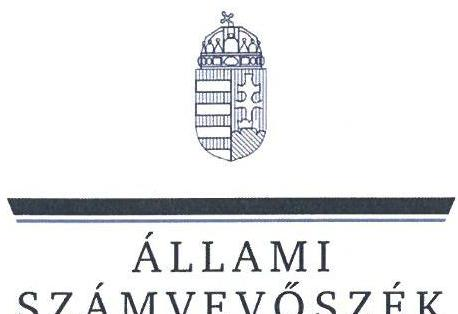
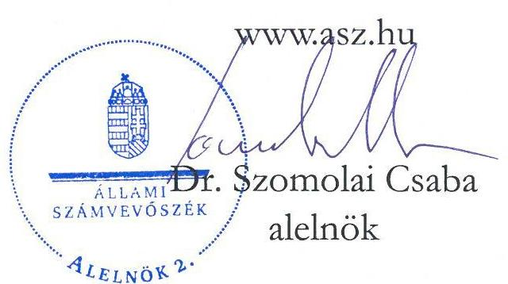
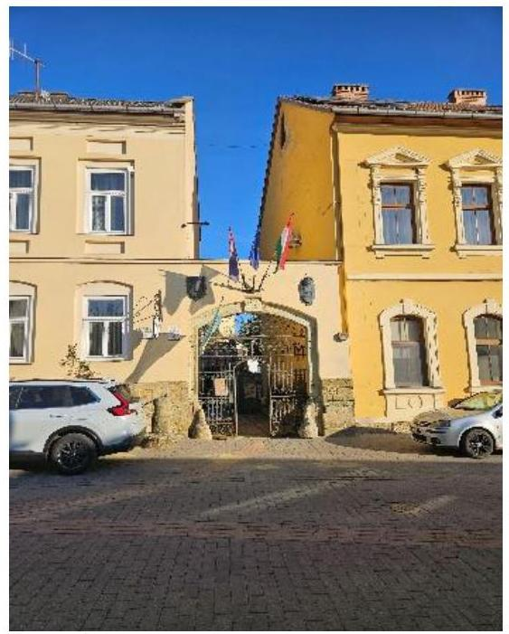

# JELENTÉS 

## Az önkormányzatok ingatlangazdálkodási tevékenységének ellenőrzése

Mád Község Önkormányzata

2025.

---

ÁLLAMI
SZÁMVEVŐSZÉK

# JELENTÉS 

## Az önkormányzatok ingatlangazdálkodási tevékenységének ellenőrzése

Mád Község Önkormányzata

2025.

25067

---

# ELLENŐRZÉSI IGAZGATÓSÁG: 

## ELLENŐRZÉSI IGAZGATÓSÁG II.

## ELLENŐRZÉSI IGAZGATÓ:

DR. BAFFIA GERGELY GÁBOR igazgató

## ELLENŐRZÉSVEZETŐ:

## BEKE ANDREA ellenőrzésvezető

Jelentéseink az interneten a www.asz.hu címen olvashatók.

IKTATÓSZÁM: EL-3975-007/2025
TÉMASORSZÁM: 49
ELLENŐRZÉS-AZONOSÍTÓ SZÁM: V105803

---

# TARTALOMJEGYZÉK 

- AZ ELLENŐRZÉS ALAPADATAI ..... 5
- AZ ELLENŐRZÖTT SZERVEZETEK ..... 7
- ÖSSZEFOGLALÁS ..... 9
- AZ ELLENŐRZÉS FÓKUSZKÉRDÉSEI ..... 12
- MEGÁLLAPÍTÁSOK ..... 13
- JAVASLATOK ..... 22
- MELLÉKLETEK ..... 26
I. sz. melléklet: Értelmező szótár ..... 26
II. sz. melléklet: Az ellenőrzött szervezetek jegyzéke ..... 30
III. sz. melléklet: Ellenőrzési kritériumok ..... 31
IV. sz. melléklet: Az Önkormányzat konszolidált mérlegadatai a 2021-2023. években ..... 34
V. sz. melléklet: Az Önkormányzat konszolidált kiadási és bevételi adatai a 2021-2023. években ..... 35
- FÜGGELÉK: ÉSZREVÉTELEK ..... 36
- RÖVIDÍTÉSEK JEGYZÉKE ..... 37

---

.

---

# AZ ELLENŐRZÉS ALAPADATAI 

## AZ ELLENŐRZÉS CÉLJA

Az ellenőrzés célja az önkormányzat ingatlangazdálkodási, ingatlanhasznosítási tevékenységének szabályszerűségi és célszerűségi szempontok alapján történő értékelése volt. Az ellenőrzés kiterjedt arra, hogy az önkormányzat az ingatlangazdálkodási feladatai ellátása során figyelemmel volt-e a vagyon értékének megőrzésére, állagának fenntartására, állományának gyarapítására.

## AZ ELLENŐRZÉS TÍPUSA

Kombinált ellenőrzés.

## AZ ELLENŐRZŐTT IDŐSZAK

A 2021-2023. évek.

## AZ ELLENŐRZÉS TÁRGYA

Az ellenőrzés tárgyát az Étv. ${ }^{1}$ 2. $\$ 8$. pontjában foglaltak szerinti építmények, a 2. $\$ 10$. pontjában foglaltak szerinti épületek és a 2. $\$ 21$. pont szerinti telkek, továbbá a Föld tv. ${ }^{2}$ hatálya alá tartozó földterületek, valamint a 147/1992. (XI. 6.) Korm. rendelet ${ }^{3}$ 4. számú melléklete szerinti külterületen fekvő ingatlanok képezték.

Az ÁSZ ${ }^{4}$ az ellenőrzés keretében az ingatlanvagyonnal kapcsolatos intézkedések végrehajtásának és elszámolásának megfelelőségét, valamint a nemzeti vagyonba tartozó ingatlanok nyilvántartásának szabályszerűségét ellenőrizte. A kockázatelemzés alapján ellenőrzésre kiválasztott önkormányzatoknál a belső kontrollrendszer részeként a nemzeti vagyonba tartozó ingatlanokkal kapcsolatos gazdálkodási, hasznosítási tevékenység tekintetében a belső szabályozás kialakítása, a kontrolltevékenységek kialakítása és működtetése, valamint a belső ellenőrzés működtetése megfelelőségének értékelésére került sor.

Az ingatlangazdálkodási tevékenység ellenőrzése az Önkormányzat ${ }^{5}$ esetében az ingatlanok vagyonkezelésbe adására, ingyenes átvételére és átadására, hasznosítására (bérbe, használatba adására), az ingatlanok tulajdonjogának adásvétel keretében történő megszerzésére és értékesítésére, a beruházások, felújítások megvalósítására és az ingatlanok nyilvántartására irányult, függetlenül attól, hogy az Önkormányzat azt saját maga, vagy hivatala útján látta el.

Az ellenőrzés kiterjedt minden olyan körülményre és adatra, amely az ÁSZ jogszabályban meghatározott feladatainak teljesítéséhez, valamint a program végrehajtása folyamán felmerült újabb összefüggések feltárásához szükséges volt.

---

# Az ellenőrzés jogsalapja 

Az ellenőrzés jogszabályi alapját az ÁSZ tv. ${ }^{6} 1 . \int(3)$ bekezdése, $5 . \int(3)$ bekezdése és (4) bekezdés a) pontja képezték.

## AZ ELLENŐRZÉS MÓDSZERE

Az ellenőrzést a nemzetközi standardokat irányadónak tekintve az ellenőrzési program szempontjai, az ellenőrzött időszakban hatályos jogszabályok, az ellenőrzés szakmai szabályok és módszertanok figyelembevételével végezte az ÁSZ.

Az ellenőrzési bizonyítékként felhasználható adatforrások közé tartoztak egyrészt az ellenőrzéshez kért dokumentumok, adatok, másrészt adatforrásként szolgált minden - az ellenőrzés folyamán - feltárt, az ellenőrzés szempontjából információkat tartalmazó dokumentum.

Az ellenőrzés lefolytatásához az ellenőrzött szervezetek a tanúsítványok kitöltésével, valamint az ÁSZ által kért dokumentumok, adatok, információk megküldésével és az ellenőrzés során - interjú keretében szolgáltattak adatokat. Az ellenőrzési kérdések megválaszolásához szükséges bizonyítékok megszerzése az ellenőrzött szervezetek által rendelkezésre bocsátott dokumentumokra és adatokra alapozva, továbbá megfigyelés, szemle (szemrevételezés), kérdésfeltevés (információkérés), valamint elemző eljárás útján történt.

Az ellenőrzött szervezetek ingatlangazdálkodási tevékenységének megfelelőségét mintavételi eljárással, az ingatlanhasznosítás (bérbeadás) esetében 15, az ingatlanok beruházása, felújítása esetében 15 kockázati alapon kiválasztott mintatétel alapján értékelte az ÁSZ. Amennyiben a kiválasztás kockázati szempontjai (eljárási kockázat, jogszabályok be nem tartásának kockázata stb.) indokolták, és a sokaság elemszáma lehetővé tette, vagy valamely sokaság elemszáma kisebb volt, mint az előírt elemszám, a sokaságot tételesen ellenőrizte az ÁSZ. Tételes ellenőrzés történt az ingatlanértékesítés (18 gazdasági esemény), a tulajdonjog ingyenes átruházás (kettő gazdasági esemény), és a tulajdonjog ingyenes átvétel (három gazdasági esemény) esetében. Ingatlan vagyonkezelésbe adására az ellenőrzött időszakban nem került sor. Az ellenőrzött időszakot megelőzően történt vagyonkezelésbe adások elszámolásának, nyilvántartásba vételének ellenőrzése elemző eljárással történt.

A mintavételi eljárással ellenőrzött ingatlangazdálkodási tevékenységek esetében az értékelés kivetítés nélkül az egyes mintatételek tételes ellenőrzése alapján történt, a tények feltárása és azok összegzése során a megállapítások az ellenőrzött mintatételekre vonatkozóan kerültek megfogalmazásra.

---

# AZ ELLENŐRZÖTT SZERVEZETEK 

Furnác: ÁSZ által közzétett futó - Mádó Polgármesteri Hivatal bejárata

Mád község Borsod-Abaúj-Zemplén vármegyében, a Tokaji borvidék központi részén, a Szerencsi járásban található. Állandó lakosainak száma a 2021. január 1-jei 1981 főről 2024. január 1jére 1814 főre csökkent a $\mathrm{KSH}^{7}$ adatai szerint.

A Polgármester ${ }^{8}$ a 2010. évi önkormányzati választásokat követő hivatalba lépésétől 2024 szeptember végéig töltötte be tisztségét, munkáját egy alpolgármester segítette. A hét tagú Képviselő-testület ${ }^{9}$ mellett három állandó bizottság - a Pénzügyi Bizottság, a Szociális Bizottság, valamint a Kulturális és Sport Bizottság - működött.

A Polgármesteri Hivatal ${ }^{10}$ Jegyzője ${ }^{11}$ 2017-től 2024 szeptember végéig látta el feladatát, munkáját egy aljegyző támogatta. Az Önkormányzat hivatali feladatait 2025. január 1-től a Szerencsi Közös Önkormányzati Hivatal látja el.

Az Önkormányzat a kötelező és önként vállalt feladatait a Polgármesteri Hivatal mellett a fenntartása alá tartozó költségvetési szervvel ${ }^{12}$, valamint gazdasági társaságával ${ }^{13}$ látta el.

Az Önkormányzat az ellenőrzött időszakban nem kötött szerződést könyvvizsgálói feladatok ellátására. A belső ellenőrzés feladatai ellátását az ellenőrzött időszakban társulási megállapodás keretében biztosították.

Az Önkormányzat költségvetési kiadásainak összege a 2021. évi 607,7 M Ft-ról a 2022. évre 979,5 M Ftra ( $61,2 \%$-kal) nőtt, a 2023. évre 968,9 M Ft-ra csökkent (az előző évhez képest 1,1\%-kal). A költségvetési bevételek a 2021. évben 722,4 M Ft-ot tettek ki, amely összeget a 2022. évi 851,1 M Ft 17,8\%-kal, a 2023. évi 866,5 M Ft 19,9\%-kal haladta meg. A 2021. évben 114,7 M Ft összegű költségvetési többlet realizálódott, a 2022. évben (128,4 M Ft) és a 2023. évben (102,4 M Ft) költségvetési hiány keletkezett. A 2022. és a 2023. évi költségvetési hiány a felhalmozási célok megvalósítása során keletkezett, amelyeket a korábbi években folyósított és fel nem használt fejlesztési támogatások maradványai - a 2022. évben 529,8 M Ft, a 2023. évben 404,0 M Ft - fedeztek.

Az Önkormányzat összes felhalmozási bevételeinek ${ }^{14}$ összege a 2021. évben 304,7 M Ft volt, amelyet a 2022. évben realizált 379,5 M Ft 24,5\%-kal, a 2023. évben realizált 343,1 M Ft 12,6\%-kal haladta meg. A felhalmozási bevételek növekedését mindkét évben az ellenőrzött időszakban és azt megelőzően megvalósított ingatlanfejlesztések európai uniós és hazai támogatásainak - amelyek az éves felhalmozási bevételek átlagosan $98,9 \%$-át tették ki - ütemezés szerinti folyósítása eredményezte.

A felhalmozási kiadások ${ }^{15}$ 2021. évi 117,3 M Ft-os teljesüléséhez képest a 2022. és 2023. évek adatai ( 424,2 M Ft és 408,7 M Ft) több mint háromszoros növekedést mutattak, 261,6\%-kal, illetve 248,4\%-kal haladták meg a 2021. évi adatot. A jelentős növekedést elsődlegesen a 2022. és a 2023. évben megvalósított ingatlanberuházások, -felújítások okozták. Hazai és európai uniós támogatások felhasználásával a 2021. évben 106,2 M Ft-ot, a 2022. évben 420,5 M Ft-ot, a 2023. évben 385,1 M Ft-ot fordítottak ingatlanfejlesztésre. A megvalósított ingatlanfejlesztések az ingatlanvagyon bruttó értékének a 2021. évben 2,6\%-át, a 2022. évben $10,4 \%$-át, a 2023. évben $9,8 \%$ jelentették.

---

1. táblázat

MÁD KÖZSÉG ÖNKORMÁNYZATA INGATLANVAGYONÁNAK FŐBB ADATAI (2021-2023. ÉV)

| INGATLANOKRA   VONATKOZO   ADATOK | 2021.   DECEMBER   31. | 2022.   DECEMBER   31. | 2023.   DECEMBER   31. |
| :--: | :--: | :--: | :--: |
| Ingatlanvagyon-   kataszteri adatok   (bruttó érték M Ft) | 4018,9 | 4057,9 | 3939,4 |
| Ingatlanok és   vagyoni értékủ jogok   mérleg szerinti   értéke   (nettó érték M Ft) | 2589,1 | 2470,9 | 3146,4 |
| Bérlakás állomány (db) | 3 | 1 | 1 |
| Adott évben   bérbeadott ingatlanok   száma (db) | 8 | 9 | 7 |
| Belterületi   földterületek (ha) | 45,2 | 45,1 | 45,2 |
| Külterületi   földterületek (ha) | 121,9 | 121,9 | 121,9 |

Az önkormányzati ingatlanok és vagyoni értékủ jogok állományának nettó értéke az ellenőrzött időszak végére 21,5\%kal nőtt a megvalósított ingatlanberuházások eredményeképpen, a 2021. év végéhez viszonyítva. (1. táblázat)

Az Önkormányzat tulajdonában álló bel- és külterületi földterületek nagysága az ellenőrzött időszakban számottevően nem változott. Az Önkormányzatnak az ingatlanok értékesítéséből a 2021. évben 1,2 M Ft, a 2022. évben 7,3 M Ft, a 2023. évben 1,7 M Ft bevétele származott. A 2021. évben nyolc, a 2022. évben kilenc, a 2023. évben hét önkormányzati ingatlant hasznosítottak bérbeadásnál. A bérbeadásból származó bevételek az ellenőrzött időszakban jelentős mértékben - 51,5\%-kal - csökkentek, a 2021. évi 6,8 M Ft-ról a 2023. évben realizált 3,3 M Ft-ra, a közszolgáltatási funkciójú épületek bérbeadásából származó bevétel összegének nagymértékű csökkenése miatt.

Az ingatlankarbantartási feladatokat az Önkormányzat az ellenőrzött időszakban kizárólag saját maga látta el, a 2021-2023. években összesen 1,8 M Ft-ot fordított karbantartásra.

---

# ÖSSZEFOGLALÁS 

Az önkormányzatok müködésének egyik alapvető feltétele, hogy a kötelező feladataik ellátásához szükséges vagyontárgyak, így az ingatlanok rendelkezésükre álljanak. Az önkormányzati vagyon részét képező ingatlanok jelentős anyagi értéket képviselnek, amelyek esetében kiemelten fontos a nemzeti vagyonnal való felelős gazdálkodás követelményeinek érvényesítése.

Az Önkormányzat a tulajdonában lévő nemzeti vagyonnal nem gazdálkodott felelősen, az ellenőrzés szabálytalanságokat tárt fel az ingatlanértékesítések, az ingatlanok ingyenes átvétele, az ingatlanok bérbeadása és az ingatlanberuházások, -felújítások ellenőrzött gazdasági eseményei esetében. Az Önkormányzat ingatlan nyilvántartása nem felelt meg a jogszabályok és a belső szabályozások előírásainak, nem biztosította az Önkormányzat vagyoni helyzetének, az ingatlanok megőrzésének, értékük és állaguk védelmének nyomon követését. A 2023. évi költségvetési beszámoló a jogszabályi előírás ellenére nem adott megbízható és valós képet az Önkormányzat vagyoni, pénzügyi helyzetéről.

Az ingatlanberuházások, -felújítások ellenőrzött tételei mindegyikénél szabálytalanságokat tárt fel az ÁSZ. Egy esetben a Polgármester és a Jegyző európai uniós, illetve hazai forrásból származó, kincstári számlán lévő támogatásból a jogszabályi és a pályázati előírásokat figyelmen kívül hagyva szabálytalanul vezetett át pénzösszeget az Önkormányzat (nem kincstári) elszámolási számlájára. Az Önkormányzat az átvezetett összeget a jogszabályi előírás ellenére nem a projektcél szerint, a projekt megvalósítása érdekében használta fel. A szabálytalan gazdálkodás, a jóváhagyott projektcéltól eltérően felhasznált támogatás az Önkormányzatnak vagyoni hátrányt okozott.

Az ingatlanberuházások, -felújítások kötelezettségvállalásainak nyilvántartásba vétele a jogszabályi előírások ellenére egyetlen ellenőrzött tétel esetében sem történt meg haladéktalanul a kötelezettségvállalást követően, azokat a kifizetésekkel egyidejűleg, a kifizetéssel egyező összegben rögzítették a nyilvántartásban. Ezáltal az Önkormányzat a jogszabályi előírások ellenére nem tudta nyomon követni a szabad felhalmozási kiadási előirányzatait, valamint a megkötött szerződések alapján fennálló fizetési kötelezettségeit.

Az Önkormányzatnál az ingatlanberuházások és -felújítások esetében a gazdálkodási jogkör gyakorlók a jogszabályok és a belső szabályzatok által meghatározott jogköreiket szabálytalanul gyakorolták, ezáltal az ellenőrzött tételek esetében nem volt biztosított a jogszabályi előírás ellenére a döntések dokumentumainak szabályszerű elkészítése, a döntések megalapozottsága, a döntések szabályszerűségi szempontból történő jóváhagyása, illetve ellenjegyzése, a gazdasági események elszámolása. Három esetben a Polgármester pénzügyi ellenjegyzés - a gazdálkodásra vonatkozó szabályok betartására, a pénzügyi fedezet rendelkezésre állására vonatkozó információk ismerete - nélkül kötötte meg az ingatlanberuházási, -felújítási szerződést. Négy további esetben a jogszabályi előírás ellenére a kifizetésre úgy került sor, hogy a teljesítésigazoló nem megfelelően igazolta a számla összegszerűségét. Az ellenőrzött ingatlanberuházások és -felújítások esetében a kifizetéseket a jogszabályi előírásokat figyelmen kívül hagyva egyetlen esetben sem előzte meg érvényesítés és utalványozás. Az érvényesítő a jogszabályokban foglaltak ellenére időben nem jelezte, hogy a pályázati támogatás átvezetése szabálytalan, vagy hogy elmaradt a pénzügyi ellenjegyzés, illetve hogy nem volt megfelelő a teljesítésigazolás. A kifizetések utalványozására a jogszabályi előírások ellenére azok elrendelését követően került sor szabálytalan érvényesítés alapján, négy esetben az összegszerűséget nem megfelelően ellenőrző teljesítésigazolással. A gazdálkodási jogkörök szabálytalan gyakorlása nem okozta az Önkormányzat éves költségvetései végrehajtása során az ingatlanok felhalmozási kiadásaira fordítható kiadási előirányzatok túllépését.

---

Az Önkormányzat az ellenőrzött ingatlanberuházások, -felújítások esetében a jogszabályi előírásnak megfelelően lefolytatta a közbeszerzési eljárást, azonban hat esetben a megkötött szerződések közzétételéről - a nemzeti vagyonnal való gazdálkodás átláthatóságának biztosítása érdekében - a jogszabályi előírás ellenére nem gondoskodott. Az Önkormányzat a jogszabályi előírások ellenére a 2021. és a 2022. évi közbeszerzési terveket nem módosította, a 2023. évre vonatkozóan nem készített közbeszerzési tervet. Hat további, közbeszerzési eljárást nem igénylő esetben az Önkormányzat a jogszabályok és a belső szabályozások előírásait figyelmen kívül hagyva dokumentáltan nem folytatta le a beszerzési eljárást.

Az Önkormányzat nemzeti vagyonnal való - a jogszabályok által elvárt - felelős gazdálkodása az ingatlanok értékesítése során sem valósult meg, az ingatlanértékesítések mindegyike esetében szabálytalanságot tárt fel az ÁSZ. Egy esetben a Polgármester a jogszabályokban és a belső szabályzatban meghatározott hatáskörét túllépve nem a kapcsolódó képviselő-testületi döntésben meghatározott vevővel kötötte meg az adásvételi szerződést. A belső szabályzat előírásait figyelmen kívül hagyva 13 esetben az ingatlan értékét nem adó- és értékbizonyítvány alapján állapították meg, ebből két esetben a belső szabályozás ellenére az értékesítésre nem nyilvános meghirdetés, hanem vételi ajánlat elbírálása alapján került sor. Az Önkormányzat egyetlen ingatlanértékesítés esetében sem tett eleget a jogszabályokban előírt számla kibocsátási kötelezettségének. A befolyt bevételek költségvetési számvitel szerinti elszámolása során nyolc esetben nem érvényesült a jogszabályban előírt számviteli alapelvek közül a bruttó elszámolás elve, mivel a bevételeket a kapcsolódó díffizetésekkel csökkentett összegben számolták el. A bevételek pénzügyi számviteli elszámolása, a vonatkozó jogszabálymódosítások figyelmen kívül hagyása miatt egyetlen esetben sem felelt meg a jogszabályi előírásoknak.

A Képviselő-testület az ingatlanok tulajdonjogának ingyenes átvételéről (legelő, gyümölcsös) a belső szabályozás előírása ellenére nem döntött.

Az ingatlanhasznosítások (bérbeadások) ellenőrzött tételei közül 13 esetben a bérbeadási döntés meghozatalára jogosult Képviselő-testület nem hozott döntést az ingatlanok hasznosítására vonatkozóan. Négy ingatlanhasznosítási szerződés esetében az Önkormányzat a jogszabályokban előírtakat figyelmen kívül hagyva nem határozta meg a hasznosítás időtartamát.

Az Önkormányzat által megkötött szerződések a jogszabályi előírás ellenére 17 (az ellenőrzött hasznosítások közül négy, az ellenőrzött beruházások közül 13) esetben nem tartalmazták a jogi személy, vagy jogi személyiséggel rendelkező szerződő fél vezetőjének nyilatkozatát, arról hogy a szervezet átlátható szervezetnek minősül.

A törvényi előírások ellenére az Önkormányzat a 2021-2023. évi költségvetési beszámolóinak mérlegében szereplő tételeket leltárral nem támasztotta alá. Az Önkormányzat a jogszabályok előírását figyelmen kívül hagyva nem biztosította az ingatlanállomány - a 2021. és a 2023. évi költségvetési beszámolókban és a tárgyi eszközök nyilvántartásában ${ }^{16}$ szereplő - bruttó és nettó értékének, továbbá az ingatlanvagyon-kataszterben szereplő bruttó értékének egyezőségét.

Az Önkormányzat az ingyenesen átadott és átvett ingatlanok, valamint az ingatlan hasznosítások (bérbeadások) és az ingatlanberuházások ellenőrzött tételei esetében a jogszabályok által előírt vagyonnyilvántartási feladatait nem teljeskörűen látta el. Két ingyenes ingatlanátadás értékét (400,9 M Ft) a mérlegből az Önkormányzat a 2023. évben nem vezette ki, megsértve ezzel a jogszabály által előírt számviteli alapelvek közül a teljesség és a valódiság elvét. A hiba a 2023. évben elérte a jogszabályban és a belső szabályozásban meghatározott jelentős összegű hiba határát. A feltárt hiányosságok miatt az Önkormányzat 2023. évi költségvetési beszámolója a jogszabályi előírások ellenére nem mutatott megbízható és valós képet az Önkormányzat tényleges vagyonáról.

---

Az Önkormányzat egy hasznosított (bérbe adott) ingatlan és egy ingatlanberuházás esetében nem a jogszabály, és a belső szabályozás előírásának megfelelően hajtotta végre a forgalomképesség szerinti besorolást. A Jegyző hét beruházási mintatétel esetében a jogszabályi előírások ellenére nem gondoskodott arról, hogy az ingatlanok értékében bekövetkezett változások 90 napon belül az ingatlanvagyon-kataszterben átvezetésre kerüljenek, és nem biztosította a tárgyi eszközök nyilvántartása és az ingatlanvagyonkataszteri nyilvántartás azonos tartalmú adatai közötti egyezőséget.

Az Önkormányzat az ingatlangazdálkodási, ingatlanhasznosítási folyamatok kontrollkörnyezetének részét jelentő szabályozási környezetet a jogszabályi előírásoknak megfelelően alakította ki. Az Önkormányzat a kialakított kontrolltevékenységeket - a jogszabályi előírás ellenére - nem megfelelően múködtette.

---

# AZ ELLENŐRZÉS FÓKUSZKÉRDÉSEI 

1. Az Önkormányzat nemzeti vagyonba tartozó ingatlanokkal való gazdálkodása, valamint az ezzel kapcsolatos gazdasági események elszámolása megfelelő volt-e?
2. Az Önkormányzat tulajdonában lévő ingatlanok nyilvántartásával kapcsolatos feladatok ellátása szabályszerű volt-e?
3. Az Önkormányzatnál az ingatlangazdálkodási, ingatlanhasznosítási tevékenységhez kapcsolódóan a belső kontrollrendszer kialakítása és müködtetése megfelelő volt-e?

---

# 1. Az Önkormányzat nemzeti vagyonba tartozó ingatlanokkal való gazdálkodása, valamint az ezzel kapcsolatos gazdasági események elszámolása megfelelő volt-e? 

Összegző megállapítás

Az Önkormányzat nemzeti vagyonba tartozó ingatlanokkal való gazdálkodása nem volt szabályszerű. Az Önkormányzat ingatlanainak ingyenes átadása szabályszerűen történt. Az ingatlanértékesítések, az ingatlanok ingyenes átvétele, valamint az ellenőrzött ingatlanberuházások, -felújítások és ingatlanhasznosítások (bérbeadások) esetében az Önkormányzat nem a jogszabályok és a belső szabályozások előírásainak megfelelően járt el.
1.1. számú megállapítás

Az Önkormányzat az ingatlanok értékesítése és elszámolása során nem tartotta be az Áhsz. ${ }^{17}$, az Áfa tv. ${ }^{18}$, az Mötv. ${ }^{19}$, a Számv. tv. ${ }^{20}$ és a Vagyonrendelet ${ }^{21}$ előírásait. A Polgármester egy esetben a Ptk. ${ }^{22}$ előírását figyelmen kívül hagyva az ingatlanértékesítési szerződést nem a képviselő-testületi döntés szerinti szervezettel kötötte meg.

Az ingatlanok értékesítésére vonatkozó döntést az arra hatáskörrel rendelkező Képviselő-testület az Mötv.-ben és a Vagyonrendeletben előírtaknak megfelelően hozta meg.
Egy kivett beépítetlen terület (12. számú tétel, a 18 értékesítési tétel 5,6\%-a) értékesítése során a Polgármester túllépte a Ptk. 6:14. $\$ (1) bekezdése szerinti képviseleti jogkörét, az adásvételi szerződést nem a kapcsolódó képviselő-testületi döntésben meghatározott gazdasági társasággal, hanem annak ügyvezetőjével mint magánszeméllyel kötötte meg. A Képviselő-testület a Polgármester által tett jognyilatkozat Ptk. szerinti jóváhagyásáról az ÁSZ ellenőrzés megkezdéséig nem döntött. A Képviselőtestület Mötv. 107. §-ában, illetve a Vagyonrendelet 3. § (1) bekezdésében biztosított tulajdonosi joga (az elidegenítésről történő döntés) nem érvényesült.
A Vagyonrendelet az ingatlanok versenyeztetéssel történő értékesítésének értékhatárát 5,0 M Ft-ban határozta meg. Az Önkormányzat 13, az értékhatárt meg nem haladó ingatlan értékesítése esetében (3., 5., 6., 9., 10., 11., 12., 13., 14., 15., Pt1., Pt2., Pt3. számú tétel, a 18 értékesítési tétel 72,2\%-a) a Vagyonrendelet 20. $\$ (2) bekezdés b) pontjában előírtak ellenére az ingatlan értékét nem adó- és értékbizonyítvány alapján állapította meg. Közülük két beépítetlen földterület (3., 5. számú tétel, a 18 értékesítési tétel 11,1\%-a) értékesítésére a Vagyonrendelet 18. § (2) bekezdésében előírtak ellenére nem nyilvános meghirdetéssel, hanem a vételi ajánlat elbírálása alapján került sor.
Az Önkormányzat az ingatlanok értékesítése során egy esetben sem tett eleget az Áfa tv. 159. § (1) bekezdésében előírt számla kibocsátási kötelezettségének.

---

Az Önkormányzat az ingatlanértékesítések költségvetési számviteli elszámolása során nyolc esetben (2., 5., 6., 7., 8., 12., 13., Pt4. számú tétel, a 18 értékesítési tétel 44,4\%-a) nem a befolyt (kiegyenlített) bevételt számolta el a 09523 Ingatlanok értékesitése teljesitése főkönyvi számlán, hanem annak a felmerült költségekkel (pl. felszámított beszedői, postai közreműködési díjak) csökkentett összegét, megsértve ezzel a Számv. tv. 15. § (9) bekezdésében foglalt bruttó elszámolás elvét.
Az Önkormányzat a pénzügyi számviteli elszámolások során figyelmen kívül hagyva az Áhsz. 25. § (9a) bekezdés c) pontjának, illetve a 26. § (10a) bekezdés a) pontjának 2021. január 1-jétől hatályba lépett előírását, az ingatlanértékesítéseknél az értékesítési bevétel és a könyv szerinti érték különbözetét nem más különféle egyéb eredményszemléletű bevételként, vagy egyéb ráfordításként számolta el, hanem továbbra is a 2021. január 1-jét megelőzően hatályos elszámolási módot, a könyv szerinti érték teljes összegének egyéb ráfordításokkal szembeni kivezetését alkalmazta.
1.2. számú megállapítás Az ingatlanok ingyenes (térítés nélküli) átadása megfelelt a jogszabályi előírásoknak.

A 2023. évben az Önkormányzat a tulajdonában álló - 400,9 M Ft könyv szerinti értékű -víziközmű-vagyont a Vksztv. ${ }^{23}$ előírásának megfelelően ingyenesen átadta a Magyar Állam részére. A Képviselő-testület az ingyenes átadásról szóló döntést az Mötv.-ben, illetve a Vagyonrendeletben előírtaknak megfelelően hozta meg.
1.3. számú megállapítás

A Képviselő-testület a Vagyonrendelet előírása ellenére nem döntött az ajándékba kapott ingatlanok ingyenes átvételéről.

Az ellenőrzött időszakban egy ajándékozási szerződés keretében három - összesen $1767 \mathrm{~m}^{2}$ területű, és $0,3 \mathrm{M}$ Ft értékű - ingatlan (legelő, gyümölcsös stb.) került magánszemélytől ingyenesen az Önkormányzat tulajdonába.
A Képviselő-testület a Vagyonrendelet 21. §(1) bekezdésében előírtak ellenére az ingatlanok tulajdonjogának ingyenes átvételéről nem döntött. Az Önkormányzat földszerzési jogosultságára vonatkozó, a Föld tv. által előírt, településfejlesztési célra történő átvétel teljesülését a Polgármester által megkötött ajándékozási szerződésben rögzítették.
1.4. számú megállapítás

Az Önkormányzat ellenőrzött ingatlan hasznosításai (bérbeadásai) nem feleltek meg az Mötv., az Ávr. ${ }^{24}$ és a Vagyonrendelet előírásainak.

Az Önkormányzat az SZMSZ ${ }^{25}$-ben, a Vagyonrendeletben és a Lakásrendeletben ${ }^{26}$ határozta meg a vagyon hasznosítására, bérbeadására vonatkozó szabályokat, jogokat, illetve kötelezettségeket.
A Polgármester az Mötv. 107. §-ában, továbbá a Vagyonrendelet 3. § (1) bekezdésében foglaltak ellenére az ellenőrzött ingatlanhasznosítási tételek közül 13 esetben (1., 2., 3., 4., 5., 7., 9., 10., 11., 12., 13., 14., 15. számú tétel) képviselő-testületi döntés hiányában kötötte meg az ingatlan hasznosítására (bérbeadására) irányuló szerződést. A 13-ból hét mintatételnél (5., 7., 9., 11., 12., 13., 14. számú tétel) eseti jelleggel történt önkormányzati tulajdonú helyiségek, termek bérbeadása néhány órás időtartamokra.
Az Önkormányzat négy ingatlanhasznosítási szerződése (3., 11., 12., 13. számú tétel) az Ávr. 50. § (1) bekezdés a) pontjában előírtakat figyelmen kívül hagyva nem tartalmazta a hasznosítás napját, illetve időtartamát.

---

Négy esetben (9., 10., 12., 13. számú tétel) az Önkormányzat által megkötött szerződések az Ávr. 50. § (1a) bekezdésében előírtak ellenére nem tartalmazták a jogi személy, vagy jogi személyiséggel rendelkező szerződő fél vezetőjének nyilatkozatát arra vonatkozóan, hogy a szervezet átlátható szervezetnek minősül.
1.5. számú megállapítás

Az ellenőrzött ingatlanberuházások, -felújítások végrehajtása és elszámolása nem felelt meg az Áht. ${ }^{27}$ a $\mathrm{Kbt}^{28}$ az Ávr., az Áhsz., a Beszerzési szabályzat ${ }^{29}$ és a Gazdálkodási szabályzat előírásának. A beruházási forrásoknak a jóváhagyott projektcéltól eltérő felhasználása vagyoni hátrányt okozott az Önkormányzat számára.

Az ingatlanberuházásra, -felújításra vonatkozó döntést minden ellenőrzött esetben az Mötv. előírásának megfelelően a Képviselő-testület hozta meg.
Az Önkormányzat a „Mádon települési kékinfrastruktúra fejlesztése" beruházás megvalósításához (13. mintatétel) az Európai Regionális Fejlesztési Alapból és hazai pályázati forrásból vissza nem térítendő támogatást kapott (TOP_PLUSZ-1.2.1-21-B01-2022-00002.). A projekt tervezett költsége 201,0 M Ft, a támogatás intenzitása a projekt elszámolható összköltségének a 100,0\%-a volt. A 100,0\%-os támogatási előleget 2023. február 22-én írták jóvá az Önkormányzat Kincstár ${ }^{30}$ által vezetett számláján. Az elnyert támogatási összegből 2023. december 28-án - a Polgármester és Jegyző intézkedése alapján - az Önkormányzat Kincstár által vezetett számlájáról a 256/2021. (V. 18.) Korm. rendelet ${ }^{31}$ 251. § (2) bekezdésének, továbbá a Pályázati felhívás ${ }^{32} 7.1$ pontjának előírása ellenére $65,0 \mathrm{M}$ Ft-ot átvezettek az Önkormányzat kereskedelmi banknál vezetett elszámolási számlájára. Az Önkormányzat az átvezetett összeg projektcél szerinti felhasználását dokumentáltan nem igazolta. A pályázati forrás a jóváhagyott projektcéltól eltérő, szabálytalan felhasználása az Önkormányzatnak vagyoni hátrányt okozott. Az Mötv. 115. § (1) bekezdés alapján a helyi önkormányzat gazdálkodásának szabályszerűségéért a Polgármester a felelős.
Az átvezetés elrendelésére, utalványozására - az Áht. 38. § (1) bekezdésében foglaltakat figyelmen kívül hagyva - az összeg átvezetését követően, 50 nappal később került sor.
Az Önkormányzat az ellenőrzött közbeszerzési értékhatárt elérő fejlesztések esetében a Kbt. előírásainak megfelelően lefolytatta a közbeszerzési eljárást, azonban hat esetben (1., 2., 3., 4., 7., 9. számú tétel) az Önkormányzat a szerződések közzétételéről a Közbeszerzési Hatóság által működtetett nyilvános elektronikus szerződéstárban, valamint az EKR ${ }^{33}$-ben a Kbt. 43. § (1) bekezdés b) pontjának előírása ellenére nem gondoskodott.
Az Önkormányzat a Kbt. 42. § (1) bekezdésében foglaltak ellenére a 2023. évre vonatkozóan nem készített közbeszerzési tervet, továbbá a Képviselő-testület által jóváhagyott 2021. és 2022. évi közbeszerzési terveket a Kbt. 42. § (3) bekezdésének előírása ellenére a 4. és 9. számú tételek beruházásaival nem módosították.
A Kbt. hatálya alá nem tartozó mintatételek közül hat esetben (5., 8., 10., 11., 12., 15. számú tétel) az Önkormányzat dokumentáltan nem folytatta le a Beszerzési szabályzat III. rész 4-8. pontjában foglaltak szerinti beszerzési eljárást.
Az ellenőrzött tételek esetében a szerződéseket az Ávr. előírásának megfelelően a Polgármester írásban kötötte meg. Az Önkormányzat a kötelezettségvállalást - valamennyi ellenőrzött mintatétel esetében - az Ávr. 56. § (1) bekezdésében, valamint a Gazdálkodási szabályzat IV. fejezet 6. pontjában előírtak ellenére nem a szerződéskötést követően haladéktalanul, a szerződésben szereplő összegben és ütemezésben, hanem a kiállított számlák kifizetésével egyidejűleg, a megfizetett összegek tekintetében vette

---

nyilvántartásba. Ezáltal az Önkormányzatnál a kötelezettségvállalások nyilvántartása nem támogatta az Áht. 36. $\int(1)$ bekezdése azon követelményének teljesülését, hogy kötelezettségvállalásra a szabad előirányzatok mértékéig kerüljön sor. A kötelezettségvállalások nyilvántartása nem mutatta továbbá az Önkormányzat megkötött szerződések alapján fennálló fizetési kötelezettségeit sem.
Hat mintatétel esetében (1., 2., 6., 7., 10., 14. tétel) a szerződésekben az Ávr. 50. $\$ (1) bekezdés c) pontja előírása ellenére nem rögzítették a több év előirányzatai terhére vállalt kötelezettségek évenkénti ütemezését.
13 mintatétel esetében (1., 3., 4., 5., 6., 7., 8., 9., 10., 11., 12., 13., 15. számú tétel) az Önkormányzat által megkötött szerződések az Ávr. 50. $\$ (1a) bekezdésében előírtak ellenére nem tartalmazták a jogi személy, vagy jogi személyiséggel rendelkező szerződő fél vezetőjének nyilatkozatát arra vonatkozóan, hogy a szervezet átláthatónak minősül.
Az ellenőrzött tételek közül három esetben (8., 10., 13. tétel) az Áht. 37. $\$ (1) bekezdésében, az Ávr. 50. $\$ (1) bekezdés d) pontjában, valamint a Gazdálkodási szabályzat V. fejezetében foglaltak ellenére a kötelezettségvállalás dokumentumán nem történt meg a pénzügyi ellenjegyzés.
Négy esetben (1., 4., 7., 12. számú tétel) az Ávr. 57. $\$ (1) bekezdése és a Gazdálkodási szabályzat VI. pontja előírása ellenére a teljesítésigazoló nem ellenőrizte megfelelően a teljesítés összeszerüségét, mivel nem jelezte, hogy a kiállított (rész)számlák összegei nem feleltek meg a szerződésekben foglaltaknak.
Az ellenőrzött tételek közül 15 esetben (1., 2., 3., 4., 5., 6., 7., 8., 9., 10., 11., 12., 13., 14., 15. számú mintatételek) az Áht. 38. $\$ (1) bekezdésében előírtak ellenére szabálytalanul került sor a kifizetésre, mivel azt nem előzte meg érvényesítés és utalványozás. Az érvényesítő az Ávr. 58. § (1)-(2) bekezdésében előírtak ellenére a kifizetéseket megelőzően nem ellenőrizte azok összegszerűségét, a fedezet meglétét, az Áht., az Ávr., az Áhsz., valamint a belső szabályzatok előírásainak betartását, így például nem jelezte, hogy négy esetben a teljesítésigazoló az összegszerűség ellenőrzésére vonatkozó előírást nem tartotta be megfelelően.
A gazdálkodási jogkörök szabálytalan gyakorlása, a pénzügyi ellenjegyzés nélküli kötelezettségvállalások nem okozták az Önkormányzatnál a 2021-2023. évi költségvetési beszámolók felhalmozási kiadási előirányzatai túllépését.
1.6. számú megállapítás

Az Önkormányzat az ingatlanok fejlesztési elképzeléseit tartalmazó stratégiák és tervek közül nem készítette el az Ehat. tv. ${ }^{34}$-ben előírt energiamegtakarítási intézkedési terveket, az 1995. évi LIII. tv. ${ }^{35}$-ben előírt környezetvédelmi programot, és az Nvtv. ${ }^{36}$ által előírt hosszú távú vagyongazdálkodási tervet.

Az Önkormányzat az Nvtv. által előírtak szerinti - az ingatlanvagyon megújítására, korszerűsítésére, hasznosítására és fenntartására irányuló - középtávú vagyongazdálkodási célokat és feladatokat a 20202024. évekre vonatkozó gazdasági programjában határozta meg. Az Önkormányzat hosszú távú vagyongazdálkodási tervvel az Nvtv. 9. § (1) bekezdésének előírása ellenére nem rendelkezett.
Az Önkormányzat az 1995. évi LIII. tv. 46. § (1) bekezdés b) pontjában foglaltak ellenére nem rendelkezett környezetvédelmi programmal. Környezetvédelmi feladatait az 1995. évi LIII. tv. előírásának megfelelően környezetvédelmi rendeletben ${ }^{37}$ szabályozta.

---

Az Önkormányzat tulajdonában és használatában álló, közfeladatellátást szolgáló épületek öt évre készítendő energiamegtakarítási intézkedési terveit az Ehat. tv. 11/A. § a) pontjának előírása ellenére nem készítették el.
Az ingatlanok értékének megőrzése, növelése érdekében tervezett beruházások, felújítások megvalósításához elnyert pályázatok eredményeként az Önkormányzat a 2021-2023. években 1015,6 M Ft felhalmozási célú európai uniós és hazai forrásból származó pályázati támogatásban részesült. Az Önkormányzat - nyilatkozata alapján - az ellenőrzött időszakban megvalósult energetikai beruházások által eredményezett megtakarításokat nem mérte, nem követte nyomon.

# 2. Az Önkormányzat tulajdonában lévő ingatlanok nyilvántartásával kapcsolatos feladatok ellátása szabályszerű volt-e? 

## Összegző megállapítás

Az Önkormányzat az ingatlannyilvántartási feladatait nem a jogszabályok és a belső szabályzatok előírásának megfelelően látta el. A 2023. évi költségvetési beszámoló megsértve a Számv. tv. előírását - nem adott megbízható és valós képet az Önkormányzat vagyonáról.
2.1. számú megállapítás

Az Önkormányzat ingatlanvagyonának nettó értéke a 2021. és a 2023. évi költségvetési beszámolók mérlegében és a számviteli nyilvántartásokban a Számv. tv. és az Áhsz. előírásai ellenére nem egyezett meg. A mérlegben szereplő ingatlanvagyon értékét a Számv. tv. és az Áhsz. előírásai ellenére leltárral egyetlen évben sem támasztották alá.

Az Önkormányzat a 2021-2023. évek költségvetési beszámolóinak mérlegében szereplő ingatlanvagyon leltározását a Számv. tv.-ben és a Leltározási szabályzatban ${ }^{38}$ előírt háromévenkénti mennyiségi felvétellel vagy évenkénti egyeztetéssel történő leltározását a Számv. tv. 69. § (3) bekezdését és a Leltározási szabályzat 5.1. pontját megsértve egyik évben sem végezte el. Az éves költségvetési beszámolók mérlegében kimutatott ingatlanvagyon értékét a Számv. tv. 69. § (1) bekezdésében foglaltakat megsértve, valamint az Áhsz. 22. § (1) bekezdésben foglaltakat figyelmen kívül hagyva az ellenőrzött időszak egyik évében sem támasztotta alá leltár.
Az önkormányzati ingatlanok 2021-2023. évi végi állományi adatait a 2. táblázat mutatja be.

---

# 2. táblázat 

## AZ INGATLANOK ÁLLOMÁNYI ÉRTÉKEI AZ EGYES NYILVÁNTARTÁSOKBAN (2021-2023) (M FT)

| MEGNEVEZÉs | 2021. DECEMBER 31. |  | 2022. DECEMBER 31. |  | 2023. DECEMBER 31. |  |
| :--: | :--: | :--: | :--: | :--: | :--: | :--: |
|  | Bruttó   ÉRTÉK | NÉttó   ÉRTÉK | Bruttó   ÉRTÉK | NÉttó   ÉRTÉK | Bruttó   ÉRTÉK | NÉttó   ÉRTÉK |
| Költségvetési beszámoló 15/A. úrlap | 4059,0 | 2589,1 | 4061,3 | 2470,9 | 4841,5 | 3146,4 |
| Főkönyvi kivonat 12 számlacsoport | 4059,0 | 2589,1 | 4061,3 | 2470,9 | 4841,5 | 3146,4 |
| ASP ${ }^{39}$ - tárgyi eszközök nyilvántartása (KATI modul ${ }^{40}$ ) | 4055,6 | 2585,4 | 4061,3 | 2470,9 | 3939,5 | 2745,5 |
| ASP - IVK szakrendszer ${ }^{41}$ | 4018,9 | - | 4057,9 | - | 3939,4 | - |
| Eltérés (beszámoló 15/A. úrlap - ASP KATI modul) | 3,4 | 3,7 | - | - | 902,0 | 400,9 |
| Eltérés (beszámoló 15/A. úrlap - ASP IVK modul) | 40,1 | - | 3,4 | - | 902,0 | - |

Forrás: A 2021-2023. évi önkormányzati adatszolgáltatás alapján ÁSZ saját szerkesztés
Az Önkormányzat a főkönyvi könyvelés és a tárgyi eszközök nyilvántartása ingatlanokra vonatkozó adatainak a Számv. tv. 69. § (2) bekezdésének előírása szerinti egyeztetését nem végezte el megfelelően, mert az ingatlanok főkönyvi számlaszámokon, illetve költségvetési beszámolóban kimutatott bruttó és nettó állományi értéke a 2021. és a 2023. évben nem egyezett meg a tárgyi eszközök nyilvántartásában szereplő bruttó és nettó értékekkel. Az egyezőség hiánya miatt a tárgyi eszközök nyilvántartása az Áhsz. 5. § (1) bekezdésében foglaltak ellenére nem támasztotta alá a költségvetési beszámoló mérlegében szereplő adatokat.
Az Önkormányzat az ellenőrzött időszakban 3,4 MFt értékű, a 2018. évben elvégzett ingatlanhelyreállítási, kivitelezési munkát a Számv. tv. 26. § (3) bekezdésében foglaltakat figyelmen kívül hagyva, tévesen az "12213 Üzleti (forgalomképes) ingatlanokboz kapcsolódó vagyoni értékú jogok" főkönyvi számlaszámon számolt el. Ezt a tévesen az ingatlanokhoz kapcsolódó vagyoni értékủ jogként nyilvántartott 3,4 M Ft értéket az Önkormányzat a tárgyi eszközök nyilvántartásában az Áhsz. 45. § (3) bekezdésének és a 14. melléklet VII. 1. pontjának előírása ellenére nem szerepeltette, ami eltérést okozott a főkönyvi és a tárgyi eszközök nyilvántartásában a 2021. évben. A nettó értékek tekintetében további 0,3 M Ft eltérést okozott a 2021. évi nyitó értékcsökkenésállomány értékének a főkönyvi nyilvántartás és a tárgyi eszközök nyilvántartása közötti eltérése. Az eltéréseket az Önkormányzat a 2022. év során rendezte.
A 2023. évi eltérés oka, hogy az Önkormányzat az év során ingyenesen (térítés nélkül) átadott víziközmű vagyon értékét (1., 2. számú tétel) (bruttó 902,0 M Ft, nettó 400,9 M Ft) - az Nvtv. 10. § (1) bekezdésében előírt kötelezettsége ellenére - a főkönyvi nyilvántartásokból és a mérlegből nem vezette ki, megsértve ezzel a Számv. tv. 15. § (2) és (3) bekezdéseiben szereplő teljesség és valódiság számviteli alapelvét, valamint a Számv. tv. 165. § (1) bekezdésének a gazdasági események bizonylatainak a könyvviteli nyilvántartásokban történő rögzítésére vonatkozó előírását. Az ingatlanátadás értékének a tárgyi eszközök

---

nyilvántartásából, valamint az ingatlanvagyon-kataszterből való kivezetése a jogszabályi előírásoknak megfelelően történt. A szabálytalan elszámolás miatti hiba ( 400,9 M Ft) összege a 2023. évben elérte az Áhsz. 1. $\$ (1) bekezdés 3. pontja, illetve a Számviteli politika ${ }^{42}$ 4.3. pontja által meghatározott jelentős összegű hiba határát. A 2023. évi költségvetési beszámoló - megsértve a Számv. tv. 18. §-ának előírását nem adott megbízható és valós képet az Önkormányzat vagyonáról.
Az eltéréseket az Önkormányzat a Kincstár jelzése alapján 2024. I. negyedévében rendezte, az ingyenesen átadott ingatlanok értékét kivezette a főkönyvi nyilvántartásából, mérlegéből.
Az Önkormányzat éves költségvetési beszámolóiban és az ingatlanvagyon-kataszterben kimutatott bruttó érték között mindhárom évben eltérés mutatkozott: a 2021. évi különbséget az okozta, hogy egy elkészült 36,7 M Ft értékű beruházást, valamint - a téves főkönyvi számon nyilvántartott - 3,4 M Ft helyreállítási, kivitelezési munka értékét az ingatlanvagyon-kataszterben - a 147/1992. (XI.6.) Korm. rendelet 4. § (1) bekezdésében foglaltak ellenére - 90 napon túl rögzítették. A 2023. évi különbséget - az előzőekben már említett - 902,0 M Ft bruttó értékủ ingyenesen (térítés nélkül) átadott víziközmủ vagyon mérlegből való kivezetésének elmaradása okozta. Az Önkormányzat a 36,7 M Ft értékű beruházást a 2022. évben, a 3,4 M Ft-ot a 2023. év során rögzítette az ingatlanvagyon-kataszterben.
Az Önkormányzat az Áhsz. előírásának megfelelően a zárszámadási rendeleteihez csatolta a vagyonkimutatását. Az Önkormányzat a vagyonkimutatásban szereplő ingatlanvagyon számviteli nyilvántartás szerinti bruttó értékének és az ingatlanvagyon-kataszterben szereplő ingatlanvagyon bruttó értékének egyezőségét az Áhsz. 30. § (4) bekezdésében előírtak ellenére az ellenőrzött időszak egyik évében sem biztosította. A 2021. és a 2023. évi vagyonkimutatás az Áhsz. 30. § (4) bekezdésének előírása ellenére nem tartalmazta az ingatlanvagyon bruttó értékét. A 2022. évi vagyonkimutatás az Áhsz. 30. § (2) bekezdésében foglaltak ellenére nem tartalmazta megfelelő tagolásban az Önkormányzat tulajdonában álló tárgyi eszközök arab számmal jelzett tételeinek (pl. ingatlanok) adatát.
2.2. számú megállapítás

Az Önkormányzat vagyonnyilvántartási feladatait az ellenőrzött ingatlanvagyon változások esetében nem az Nvtv., az Mötv., a Számv. tv., a 147/1992. (XI. 6.) Korm. rendelet, valamint a Vagyonrendelet és a Számviteli politika előírásainak megfelelően látta el.

Az Önkormányzat az Áhsz. 14. melléklet VII. 1. pont a) pontja alapján sajátos adatként vezette az ingatlan területének nagyságát, azonban azt az ingyenesen átvett ingatlanok közül egy esetben (1. számú tétel, az ellenőrzött három tétel 33,3\%-a) nem pontosan rögzítette, a tényleges $1 \mathrm{ha}^{43} 9315 \mathrm{~m}^{2}$ helyett csak $9315 \mathrm{~m}^{2}$ t vett nyilvántartásba. Az ingatlanbérbeadások közül a műfüves pálya esetében (8. számú tétel) az ingatlant a Vagyonrendeletnek megfelelően a tárgyi eszközök nyilvántartásában korlátozottan forgalomképesként tartották nyilván, a Vagyonrendelet 2. számú mellékletének előírása ellenére azonban az ingatlanvagyonkataszterben forgalomképes besorolást kapott.
Az Önkormányzat az ingatlanhasznosítások közül a közfeladatot ellátó Mádi Idősek Nappali Ellátása épületét (11. számú tétel) az Nvtv. 5. § (5) bekezdés b) pontjának, valamint a Vagyonrendelet 7. § előírása ellenére a Vagyonrendeletben, a tárgyi eszközök nyilvántartásában és az ingatlanvagyon-kataszterben is forgalomképesként sorolta be. Az Önkormányzat egy közterületi játszótér-fejlesztést (12. számú tétel) az ingatlanvagyon-kataszterben az Nvtv. 5. § (3) bekezdés b) pontjában foglaltak ellenére forgalomképes besorolással szerepeltetett.
Az Önkormányzat két ingatlanberuházás (3. és 5. számú tétel) esetében a Számv. tv. 165. § (1)-(2) bekezdéseiben és a Számviteli politika III. fejezet 8. pontjában foglaltak ellenére az állományba vételt, a

---

számviteli nyilvántartásba bejegyzést nem dokumentáltan végezte el. Állományba vételi bizonylat hiányában nem volt megállapítható, hogy a számviteli nyilvántartásokba felvezetett összegek szabályszerűen kerültek-e meghatározásra.
Az ingatlanberuházások és -felújítások ellenőrzött mintatételei közül hét esetben (1., 3., 5., 7., 10., 11., 12. számú tétel) a Jegyző az Mötv. 110. § (1) bekezdésének, valamint a 147/1992. (XI. 6.) Korm. rendelet 1. $\S$ (1) és (3) bekezdése és 4 . $\S$ (1) bekezdése előírásainak ellenére nem gondoskodott arról, hogy az ingatlanok értékében bekövetkezett változások a bekövetkezéstől számított 90 napon belül, a számviteli nyilvántartások szerinti bruttó értékkel egyezően az ingatlanvagyon-kataszterben átvezetésre kerüljenek.
Az Önkormányzat a közoktatási intézményeinek ingatlanait a 2012. évi CLXXXVIII. tv. ${ }^{44}$ alapján az ellenőrzött időszakot megelőzően, a 2014. évben a Klebelsberg Központ vagyonkezelésébe adta. Az Önkormányzat ezt az államháztartáson belül vagyonkezelésbe adott, 153,3 M Ft bruttó értékű ingatlanállományt az Áhsz. előírásának megfelelően a könyveiből kivezette, azonban az Áhsz. 47. § (3) bekezdésében foglaltak ellenére a 0 . számlaosztály befektetett eszközei között nem tartotta nyilván.

# 3. Az Önkormányzatnál az ingatlangazdálkodási, ingatlanhasznosítási tevékenységhez kapcsolódóan a belső kontrollrendszer kialakítása és múködtetése megfelelő volt-e? 

Összegző megállapítás Az Önkormányzat a jogszabályoknak megfelelően alakította ki az ingatlangazdálkodási, ingatlanhasznosítási folyamatok szabályozási környezetét. Az Önkormányzat a kialakított kontrolltevékenységeket a Bkr. ${ }^{45}$ előírásai ellenére nem múködtette.

Az Mötv. előírásával összhangban a Képviselő-testület rendelkezett a múködésének részletes szabályait tartalmazó SZMSZ-szel. A Polgármesteri Hivatal múködésének, feladatellátásának szabályait - köztük a gazdasági szervezetre vonatkozó előírásokat - az Áht. és az Ávr. előírásai szerint a hivatali SZMSZ ${ }^{46}$-ben határozták meg.
A Polgármesteri Hivatal a Számv. tv. és az Áhsz. előírásaival összhangban az ellenőrzött időszakban rendelkezett az ingatlangazdálkodásának szabályait tartalmazó belső szabályzatokkal, Számviteli politikával és az annak keretében elkészítendő számviteli szabályzatokkal, amelyeknek a hatálya kiterjedt az Önkormányzatra is. A Polgármesteri Hivatal az Önkormányzatra is kiterjedő Gazdálkodási szabályzatban határozta meg a gazdálkodás részletes szabályait, a gazdálkodási jogkörök gyakorlásának módját, eljárási és dokumentációs szabályait.
A Képviselő-testület a vagyongazdálkodás szabályait a Htv. ${ }^{47}$-ben előírtaknak megfelelően Vagyonrendeletben rögzítette, a lakáscélú ingatlanokra vonatkozó szabályokat a Lakásrendeletben határozta meg.
Az Önkormányzat rendelkezett a Kbt. előírásának megfelelően Közbeszerzési szabályzattal ${ }^{48}$, a közbeszerzési értékhatárt el nem érő beszerzések tekintetében Beszerzési szabályzattal. Az Önkormányzat a Beszerzési szabályzat hatályát a nettó $1,0 \mathrm{M}$ Ft-ot elérő beszerzésekre vonatkozóan állapította meg.

---

Az ingatlangazdálkodás területén a kialakított belső kontrolltevékenységek a Bkr. 3. § c) pontjában foglaltak ellenére nem működtek megfelelően, mivel az ellenőrzés által feltárt hiányosságok bekövetkezését nem akadályozták meg.
A belső ellenőrzés az ellenőrzött időszakban nem ellenőrizte az Önkormányzat vonatkozásában a vagyon megóvását és gyarapítását, valamint a vagyonnal kapcsolatos elszámolások megfelelőségét. Az Önkormányzat a belső ellenőrzésekről vezette a Bkr. előírásai szerinti nyilvántartást. Az Önkormányzatnál a 2022. évben a Kincstár az Áht. előírása szerinti külső ellenőrzést végzett, amely alapján javasolta gazdálkodási szabályzatok, valamint a munkaköri leírások átdolgozását. A Jegyző a Bkr. 14. § (1) bekezdése ellenére nem gondoskodott a külső ellenőrzés javaslatai alapján készített intézkedési tervek nyilvántartásáról.

---

# JAVASLATOK 

Az ÁSZ tv. 33. § (1) bekezdésében foglaltak értelmében az ellenőrzött szervezet vezetője köteles a jelentésben foglalt megállapításokhoz kapcsolódó intézkedési tervet összeállítani és azt a jelentés kézhezvételétől számított 30 napon belül az ÁSZ részére megküldeni. Amennyiben az ellenőrzött szervezet vezetője nem küldi meg határidőben az intézkedési tervet, vagy továbbra sem elfogadható intézkedési tervet küld, az Állami Számvevőszék elnöke az ÁSZ tv. 33. § (3) bekezdése a) és b) pontjaiban foglaltakat érvényesítheti.

## A POLGÁRMESTER RÉSZÉRE

1. Intézkedjen a nyilvános jelentés kézhezvételét követő 30 napon belül annak Képviselő-testület elé terjesztéséről. A napirend tárgyalásáról szóló jegyzőkönyvvel együtt a jelentést tájékoztatásul küldje meg a Borsod-Abaúj-Zemplén Vármegyei Kormányhivatal számára is.
2. Intézkedjen annak érdekében, hogy az Mötv. 107. §-ában, a Vagyonrendelet 3. § (1) bekezdésében és 21. § (1) bekezdésében elöirtaknak megfelelően a tulajdonost megillető jogok gyakorlásáról a Képviselő-testület rendelkezzen, az ingatlanértékesítések, -hasznosítások és az ingatlanok tulajdonjogának átvétele vonatkozásában minden esetben a Képviselő-testület hozzon döntést.
3. Biztosítsa, hogy ingatlanértékesítéseknél az ingatlan értéke minden esetben a Vagyonrendelet 20. § (2) bekezdés b) pontjában elöírtakat betartva 6 hónapnál nem régebbi adó- és értékbizonyitvány alapján kerüljön megállapításra.
4. Biztosítsa, hogy a Vagyonrendelet 18. § (2) bekezdésében foglaltaknak megfelelően a nettó 5 millió Ft értékhatárt meg nem haladó ingatlanok értékesítésére nyilvános meghirdetéssel kerüljön sor.
5. Intézkedjen az Mötv. 115. § (1) bekezdése szerinti felelőssége körében, hogy a fejlesztési projektek esetében a 256/2021. (V. 18.) Korm. rendelet 251. § (2) bekezdése elöírásainak, valamint a projektek mindenkori pályázati dokumentumaiban foglalt elöírásoknak megfelelően - az Önkormányzat kincstári számláján lévő költségvetési támogatásokból - kizárólag a projektek megvalósítása érdekében, a jóváhagyott célok szerinti kiadások kerüljenek teljesítésre.
6. Intézkedjen a Kbt. 43. § (1) bekezdés b) pontjában foglalt elöírásnak megfelelően az Önkormányzat közbeszerzéssel érintett szerződéseinek közzétételéről a Közbeszerzési Hatóság által müködtetett nyilvános elektronikus szerződéstárban, valamint az EKR -ben.

---

7. Intézkedjen annak érdekében, hogy a Kbt. 42. § (1) bekezdésében foglaltaknak megfelelően minden évben készüljön közbeszerzési terv, továbbá, hogy a Képviselő-testület által jóváhagyott közbeszerzési tervek a Kbt. 42. § (3) bekezdésének előirása alapján szükség esetén módosításra kerüljenek.
8. Intézkedjen az Ehat. tv. 11/A. § a) pontja előírásának megfelelően a tulajdonában álló, közfeladatellátást szolgáló épületek ötéves energiamegtakarítási intézkedési terveinek elkészítéséről.

# A JEGYZŐ RÉSZÉRE 

1. Intézkedjen, hogy az Önkormányzat vagyonkezelésbe adott ingatlanállománya az Áhsz. 47. § (3) bekezdésében foglaltaknak megfelelően a 0. számlaosztály befektetett eszközei között nyilvántartásba vételre kerüljön.
2. Intézkedjen annak érdekében, hogy az ingatlanértékesítésekre vonatkozóan az Önkormányzat az Áfa tv. 159. § (1) bekezdésében foglalt számla kibocsátási kötelezettségének eleget tegyen.
3. Intézkedjen a Bkr. 3. § c) pontja szerinti felelőssége körében annak érdekében, hogy az ingatlanértékesítésekből származó bevételek költségvetési számviteli elszámolása során teljesüljön a Számv. tv. 15. § (9) bekezdésében foglalt bruttó elszámolás elve, továbbá a pénzügyi elszámolások során az Áhsz. 25. § (9a) bekezdés c) pontjának és 26. § (10a) bekezdés a) pontjának 2021. január 1-jétől hatályba lépett módosítása kerüljön alkalmazásra.
4. Intézkedjen, hogy az ingatlanhasznosítási, illetve beruházási szerződések az Ávr. 50. § (1a) bekezdés előírásának megfelelően tartalmazzák a jogi személy vagy jogi személyiséggel rendelkező szerződő fél vezetőjének nyilatkozatát arról, hogy a szervezet átlátható szervezetnek minősül.
5. Biztosítsa, hogy az ingatlanhasznosítási szerződések az Ávr. 50. § (1) bekezdés a) pontjában előírtakat figyelembe véve minden esetben tartalmazzák a hasznosítás napját, illetve időtartamát.
6. Intézkedjen annak érdekében, hogy minden, a Kbt. hatálya alá nem tartozó beszerzés esetében kerüljön dokumentáltan lefolytatásra a Beszerzési szabályzat III. rész 4-8. pontjában foglaltak szerinti beszerzési eljárás.
7. Intézkedjen annak érdekében, hogy a kötelezettségvállalások nyilvántartásba vételére az Ávr. 56. § (1) bekezdésében, valamint a Gazdálkodási szabályzat IV. fejezet 6. pontjában előírtak alapján a kötelezettségvállalást követően haladéktalanul, továbbá a szerződésnek megfelelő összegben és ütemezésben kerüljön sor.

---

8. 

Intézkedjen annak érdekében, hogy az ingatlanberuházási szerződésekben az Ávr. 50. § (1) bekezdés c) pontja előírásának megfelelően kerüljön rögzítésre a több év előirányzatai terhére vállalt kötelezettségek évenkénti ütemezése.
9. Intézkedjen a Bkr. 3. § c) pontja szerinti felelőssége körében olyan kontrolltevékenységek müködtetéséről, amelyek biztositják, hogy az Áht. 37. § (1) bekezdése, az Ávr. 50. § (1) bekezdés d) pontja, valamint a Gazdálkodási szabályzat V. fejezete alapján a kötelezettségvállalásra pénzügyi ellenjegyzést követően kerüljön sor.
10. Intézkedjen a Bkr. 3. § c) pontja szerinti felelőssége körében olyan kontrolltevékenységek müködtetéséről, amelyek biztositják, hogy az Ávr. 57. § (1) bekezdésében, valamint a Gazdálkodási szabályzat VI. pontjában előirtaknak megfelelően a teljesítésigazoló ellenőrizze a kiállított (rész)számlák összegszerüségének megfelelőségét.
11. Intézkedjen a Bkr. 3. § c) pontja szerinti felelőssége körében olyan kontrolltevékenységek müködtetéséről, amelyek biztositják, hogy az érvényesités során teljesüljenek az Áht. 38. § (1) bekezdésében és az Ávr. 58. § (1) és (2) bekezdésében előírt követelmények.
12. Intézkedjen a Bkr. 3. § c) pontja szerinti felelőssége körében olyan kontrolltevékenységek müködtetéséről, amelyek biztositják, hogy az Áht. 38. § (1) bekezdésének előírásának megfelelően minden kifizetésre utalványozás alapján kerüljön sor.
13. Intézkedjen az Önkormányzat ingatlanvagyonának a Számv. tv. 69. § (3) bekezdésének és a Leltározási szabályzat 5.1. pontjának megfelelő leltározásáról, valamint az éves költségvetési beszámolóban kimutatott ingatlanvagyon értékének a Számv. tv. 69. § (1) bekezdésében és az Áhsz. 22. § (1) bekezdésében foglaltak szerinti leltárral való alátámasztásáról.
14. Biztosítsa a fökönyvi könyvelés és a tárgyi eszközök nyilvántartásának adatai között a Számv. tv. 69. § (2) bekezdésének előírása szerinti egyeztetés megfelelő elvégzését, az Áhsz. 5. § (1) bekezdésében foglaltak érvényesülése érdekében.
15. Intézkedjen az ingatlanvagyonban bekövetkezett változások Nvtv. 10. § (1) bekezdésében előírt nyilvántartási kötelezettségének megfelelő teljesítéséről. Biztosítsa, hogy az ingatlanvagyonban bekövetkezett változások rögzítésre kerüljenek a tárgyi eszközök nyilvántartásában az Áhsz. 45. § (3) bekezdésben, 14. melléklet VII. pontjában előírtaknak megfelelően, továbbá az ingatlanvagyonkataszterben az Mötv. 110. § (1) bekezdésében, a 147/1992. (XI. 6.) Korm. rendelet 1. § (1), (3) bekezdésében, valamint 4. § (1) bekezdésében foglaltaknak megfelelően, a Számv. tv. 15. § (2) és (3) bekezdésében, 18. §-ában, valamint a 165. § (1) bekezdésében előírtak teljesülése érdekében.

---

16. 

Intézkedjen, hogy a vagyonkimutatás az Áhsz. 30. § (2) bekezdése által előirt tagolásban tartalmazza az adatokat, továbbá, hogy az Áhsz. 30. § (4) bekezdésében előirtaknak megfelelően a vagyonkimutatásban szereplő ingatlanvagyon számviteli nyilvántartás szerinti bruttó értékének és az ingatlanvagyonkataszterben szereplő ingatlanvagyon bruttó értékének egyezősége biztositott legyen.
17. Intézkedjen, hogy az ingatlanok forgalomképesség szerinti besorolása az ingatlanvagyon-kataszter nyilvántartásban, illetve a tárgyi eszközök nyilvántartásában megfeleljen az Nvtv. 5. § (3) bekezdés b) pontjában, az 5. § (5) bekezdés b) pontjában, valamint a Vagyonrendeletben rögzített besorolásnak.
18. Intézkedjen, hogy az ingatlanberuházások állományba vétele, számviteli nyilvántartásba történő bejegyzése a Számv. tv. 165. § (1)-(2) bekezdésében és a Számviteli politika III. fejezet 8. pontjában foglaltaknak megfelelően dokumentált legyen, és szabályszerű bizonylat alapján történjen.
19. Intézkedjen az Nvtv. 9. § (1) pontjának előirásának megfelelően hosszú távú vagyongazdálkodási terv készitéséről.
20. Intézkedjen, hogy az 1995. évi LIII. tv. 46. § (1) bekezdés b) pontjában foglaltaknak megfelelően az Önkormányzat készítse el környezetvédelmi programját.
21. Intézkedjen a Bkr. 14. § (1) bekezdésének megfelelően a külső ellenőrzések által tett javaslatokhoz kapcsolódó intézkedési tervek végrehajtásáról nyilvántartás készitéséről.

---

# MELLÉKLETEK 

## I. SZ. MELLÉKLET: ÉRTELMEZŐ SZÓTÁR

ASP-rendszer
beruházás
építmény
épület
felújítás
forgalomképtelen nemzeti vagyon
hasznosítás

Az önkormányzati feladatellátást támogató, számítástechnikai hálózaton keresztül távoli alkalmazásszolgáltatást (Application Service Provider) nyújtó elektronikus információs rendszer. (Forrás: 257/2016. (VIII. 31.) Korm. rendelet ${ }^{49}$ 1. § 6. pont)
A tárgyi eszköz beszerzése, létesítése, saját vállalkozásban történő előállítása, a beszerzett tárgyi eszköz üzembe helyezése, rendeltetésszerú használatbavétele érdekében az üzembe helyezésig, a rendeltetésszerú használatbavételig végzett tevékenység (szállítás, vámkezelés, közvetítés, alapozás, üzembe helyezés, továbbá mindaz a tevékenység, amely a tárgyi eszköz beszerzéséhez hozzákapcsolható, ideértve a tervezést, az előkészítést, a lebonyolítást, a hiteligénybevételt, a biztosítást is); beruházás a meglévő tárgyi eszköz bővítését, rendeltetésének megváltoztatását, átalakítását, élettartamának, teljesítőképességének közvetlen növelését eredményező tevékenység is, az előbbiekben felsorolt, e tevékenységhez hozzákapcsolható egyéb tevékenységekkel együtt. (Forrás: Számv. tv. 3. § (4) bekezdés 7. pont)
Építési tevékenységgel létrehozott, illetve késztermékként az építési helyszínre szállított, rendeltetésére, szerkezeti megoldására, anyagára, készültségi fokára és kiterjedésére tekintet nélkül - minden olyan helyhez kötött műszaki alkotás, amely a terepszint, a víz vagy az azok alatti talaj, illetve azok feletti légtér megváltoztatásával, beépítésével jön létre, az építmény az épület és mütárgy gyűitőfogalma. (Forrás: Éttv. 2. § 8. pontja)
Jellemzően emberi tartózkodás céljára szolgáló építmény, amely szerkezeteivel részben vagy egészben teret, helyiséget vagy ezek együttesét zárja körül meghatározott rendeltetés vagy rendeltetésével összefüggő tevékenység, avagy rendszeres munkavégzés, illetve tárolás céljából (Forrás: Éttv. 2. § 10. pontja)
Az elhasználódott tárgyi eszköz eredeti állaga (kapacitása, pontossága) helyreállítását szolgáló, időszakonként visszatérő olyan tevékenység, amely mindenképpen azzal jár, hogy az adott eszköz élettartama megnövekszik, eredeti műszaki állapota, teljesítőképessége megközelítően vagy teljesen visszaáll, az előállított termékek minősége vagy az adott eszköz használata jelentősen javul és így a felújítás pótlólagos ráfordításából a jövőben gazdasági előnyök származnak; felújítás a korszerűsítés is, ha az a korszerű technika alkalmazásával a tárgyi eszköz egyes részeinek az eredetitől eltérő megoldásával vagy kicserélésével a tárgyi eszköz üzembiztonságát, teljesítőképességét, használhatóságát vagy gazdaságosságát növeli; a tárgyi eszközt akkor kell felújítani, amikor a folyamatosan, rendszeresen elvégzett karbantartás mellett a tárgyi eszköz oly mértékben elhasználódott (szerkezeti elemei elöregedtek), amely elhasználódottság már a rendeltetésszerú használatot veszélyezteti; nem felújítás az elmaradt és felhalmozódó karbantartás egyidőben való elvégzése, függetlenül a költségek nagyságától. (Forrás: Számv. tv. 3. § (4) bekezdés 8. pont)
Az a nemzeti vagyon, amely törvényben meghatározott kivétellel nem idegeníthető el -, vagyonkezelői jog, kizárólagos gazdasági tevékenységhez kapcsolódó működtetési jog, építményi jog, jogszabályon alapuló, továbbá az ingatlanra közérdekből jogszabályban feljogosított szervek javára alapított használati jog, vezetékjog vagy ugyanezen okokból alapított szolgalom, továbbá a helyi önkormányzat javára alapított vezetékjog kivételével nem terhelhető meg, biztosítékul nem adható, azon osztott tulajdon nem létesíthető. (Forrás: Netv. 3. § (1) bekezdés 3. pont (batály: 2023. december 31.))
A tulajdonosi joggyakorló vagy a nemzeti vagyon használója által a nemzeti vagyon birtoklásának, használatának, hasznok szedése jogának bármely - a tulajdonjog átruházását nem eredményező - jogcímen történő átengedése, ide nem értve a vagyonkezelésbe adást, valamint a haszonélvezeti jog alapítását (Forrás: Netv. 3. § (1) bekezdés 4. pont)

---

ingatlan
ingatlangazdálkodás
IVK szakrendszer
karbantartás
korlátozottan
forgalomképes vagyon
külterület
nemzeti vagyon

A rendeltetésszerűen használatba vett földterület és minden olyan anyagi eszköz, amelyet a földdel tartós kapcsolatban létesítettek. Az ingatlanok közé sorolandó: a földterület, a telek, a telkesítés, az épület, az épületrész, az egyéb építmény, az üzemkörön kívüli ingatlan, illetve ezek tulajdoni hányada, továbbá az ingatlanokhoz kapcsolódó vagyoni értékủ jogok, függetlenül attól, hogy azokat vásárolták vagy a vállalkozó állította elő, illetve azok saját tulajdonú vagy bérelt ingatlanon valósultak meg. Az ingatlanok között kell kimutatni a bérbe vett ingatlanokon végzett és aktivált beruházást, felújítást is. (Forrás: Számv. tv. 26. § (2) bekezdés)
Egy földrészlet, valamint az azon lévő épület és egyéb építmény, továbbá a terepszint alatti építmény. (Forrás: 147/1992. (XI. 6.) Korm. rendelet 4. melléklet)
Egy szervezet ingatlanvagyonának teljes körű kezelését, a vele valógazdálkodást jelenti. Magában foglalja a bérlemény- és területgazdálkodást, bérbeadást, a bérleti díjak kezelését; az infrastrukturális szolgáltatások biztosítását, a kapcsolódó jogi, számviteli és pénzügyek kezelését, biztosítási ügyek intézését. Tartalmazza továbbá a karbantartási, javítási és fenntartási munkák elvégzéséről való gondoskodást. (Forrás: Bácsnè Bába Éva [2020]: Ingatlangazdálkodás prezentáció, Debreceni Egyetem, https://alLeloarning.unidels.hu/pluginfils.php/437201/mod_resourve/content/1/L\%C3\%A9te3\% C3\%ADtue\%C3\%A9ny_3.pdf letöltve: 2023. 02. 01.)
Ingatlanvagyon-kataszter szakrendszer nyilvántartja a 147/1992. (XI. 6.) Korm. rendelet 1. számú melléklete szerinti adatlapokat. A program biztosítja a kataszteri adat és betétlapokon belüli kitöltöttség ellenőrzését, a kataszteri betétlapokon belüli összefüggések ellenőrzését, valamint helyrajzi számonként a kataszteri betétlapok közötti összefüggések ellenőrzését. (Forrás: https:// archive.ipmonitoring.hu/resources/docs/asp-integrastas-folyamatok-20180411-e2.pdf letöltve: 2023. 02. 01.)
A használatban lévő tárgyi eszköz folyamatos, zavartalan, biztonságos üzemeltetését szolgáló javítási, karbantartási tevékenység, ideértve a tervszerű megelőző karbantartást, a hosszabb időszakonként, de rendszeresen visszatérő nagyjavítást, és mindazon javítási, karbantartási tevékenységet, amelyet a rendeltetésszerú használat érdekében el kell végezni, amely a folyamatos elhasználódás rendszeres helyreállítását eredményezi. (Forrás: Számv. tv. 3. § (4) bekezdés 9. pont)
Az Nvtv. 1. $\S$ (2) bekezdés a) pontja hatálya alá és nemzetgazdasági szempontból kiemelt jelentőségű nemzeti vagyonba nem tartozó azon nemzeti vagyon, amelyről törvényben, illetve - a helyi önkormányzat tulajdonában álló vagyon esetében - törvényben vagy a helyi önkormányzat rendeletében meghatározott feltételek szerint lehet rendelkezni. (Forrás: Nvtv. 3. § 6. pontja)
A település közigazgatási területének belterületnek nem minősülő, elsősorban mezőgazdasági, erdőművelési, illetőleg különleges (pl. bánya, vízmeder, hulladéktelep) célra szolgáló része. (Forrás: 147/1992. (XI. 6.) Korm. rendelet 4. számú melléklet)
A nemzeti vagyonba tartoznak:
a) az állam vagy a helyi önkormányzat kizárólagos tulajdonában álló dolgok,
b) az a) pont hatálya alá nem tartozó, az állam vagy a helyi önkormányzat tulajdonában lévő dolog,
c) az állam vagy a helyi önkormányzat tulajdonában lévő pénzügyi eszközök, továbbá az államot vagy a helyi önkormányzatot megillető társasági részesedések,
d) az államot vagy a helyi önkormányzatot megillető bármely vagyoni értékkel rendelkező jogosultság, amelyet jogszabály vagyoni értékủ jogként nevesít,
e) Magyarország határa által körbezárt terület feletti légtér,
f) az üvegházhatású gázok kibocsátási egységeinek kereskedelméről szóló törvény szerinti kibocsátási egység és légiközlekedési kibocsátási egység, valamint az ENSZ Éghajlat-

---

cellozási Keretegyezménye és annak Kiotói Jegyzőkönyve végrehajtási keretrendszeréről szóló törvény szerinti kiotói egység,
g) állami vagy helyi önkormányzati fenntartású közgyűjtemény (muzeális intézmény, levéltár, közgyűjteményként működő kép- és hangarchívum, valamint könyvtár) saját gyűjteményében nyilvántartott kulturális javak körébe tartozó dolog, kivéve, ha a dolog más tulajdonában áll,
h) a régészeti lelet,
i) a nemzeti adatvagyon körébe tartozó állami nyilvántartások fokozottabb védelméről szóló törvény szerinti nemzeti adatvagyon. (Forrás: Netv. 1. § (2) bekezdése)
nemzeti vagyon használója Azon természetes személy, jogi személy vagy jogi személyiséggel nem rendelkező szervezet, aki vagy amely állami vagyon tekintetében törvény vagy szerződés alapján, a helyi önkormányzat vagyona tekintetében törvény, a helyi önkormányzat rendelete vagy szerződés alapján bármely jogcímen nemzeti vagyont birtokol, használ, szedi annak használt, kivéve a tulajdonosi joggyakorló (Netv. 3. § (1) bekezdés 11. pont)
nemzeti vagyongazdálkodás A nemzeti vagyon megőrzése, értékének és állagának védelme, rendeltetésének megfelelő, feladata az állam, az önkormányzat mindenkori teherbíró képességéhez igazodó, elsődlegesen a közfeladatok ellátásához és a mindenkori társadalmi szükségletek kielégítéséhez szükséges, egységes elveken alapuló, átlátható, hatékony és költségtakarékos működtetése, a, hasznosítása, gyarapítása, továbbá az állam vagy a helyi önkormányzat feladatának ellátása szempontjából feleslegessé váló vagyontárgyak elidegenítése, azzal, hogy a nemzeti vagyon megőrzése érdekében végzett bontás vagy átalakítás nem minősül az állag védelmi kötelezettség megszegésének. A kiemelt kulturális örökségvédelmi és természetvédelmi szempontok - kulturális és természeti értékek jövő nemzedékek számára való megőrzése érdekében történő - érvényesítésének nem akadálya a vagyon értékváltozása. (Forrás: Netv. 7. § (2) bekezdés)
önkormányzati hivatal A polgármesteri hivatal, a főpolgármesteri hivatal, a (vár)megyei önkormányzati hivatal és a közös önkormányzati hivatal (Forrás: Abt. 1. § 18. pont)
önkormányzati törzsvagyon A helyi önkormányzat tulajdonában álló nemzeti vagyon külön része, amely közvetlenül a kötelező önkormányzati feladatkör ellátását vagy hatáskör gyakorlását szolgálja, és amelyet
a) e törvény kizárólagos önkormányzati tulajdonban álló vagyonnak minősít,
b) törvény vagy a helyi önkormányzat rendelete nemzetgazdasági szempontból kiemelt jelentőségủ nemzeti vagyonnak minősít (az a) és b) pont a továbbiakban együtt: forgalomképtelen törzsvagyon),
c) törvény vagy a helyi önkormányzat rendelete korlátozottan forgalomképes vagyonelemként állapít meg (Forrás: Netv. 5. § (2) bekezdés)
telek Egy helyrajzi számon nyilvántartásba vett földterület. (Forrás: Étv. 2. § 21.pont)
üzleti vagyon A nemzeti vagyon azon része, amely nem tartozik az állami vagyon esetén a kincstári vagyonba vagy a kivezetésre szánt állami vagyonba, az önkormányzati vagyon esetén a törzsvagyonba. (Forrás: Netv. 3. § (1) bekezdés 18. pont)
vagyonkezelő a helyi Helyi önkormányzati tulajdonú vagyon tekintetében vagyonkezelő:
ba) állam, helyi önkormányzat, nemzetiségi önkormányzat, helyi vagy nemzetiségi önkormányzati társulás, valamint ezek fenntartása vagy irányítása alá tartozó intézmény,
bb) költségvetési szerv,
bc) köztestület,
bd) a ba) alpontban meghatározott személyek együtt vagy külön-külön 100\%-os tulajdonában álló gazdálkodó szervezet,
be) a bd) alpont szerinti gazdálkodó szervezet 100\%-os tulajdonában álló gazdálkodó szervezet. (Forrás: Netv. 3. § (1) bekezdés 19. pont b) alpont);

---

vagyonkezelő jogköre

A vagyonkezelőt - ha jogszabály vagy a vagyonkezelési szerződés másként nem rendelkezik - megilletik a tulajdonos jogai, és terhelik a tulajdonos kötelezettségei ideértve a számvitelről szóló törvény szerinti könyvvezetési és beszámoló-készítési kötelezettséget is - azzal, hogy
a) a vagyont nem idegenítheti el, valamint - jogszabályon alapuló, továbbá az ingatlanra közérdekből külön jogszabályban feljogosított szervek javára alapított használati jog, vezetékjog vagy ugyanezen okokból alapított szolgalom, továbbá a helyi önkormányzat javára alapított vezetékjog kivételével - nem terhelheti meg,
b) a vagyont biztosítékul nem adhatja,
c) a vagyonon osztott tulajdont nem létesíthet,
d) a vagyonkezelői jogot harmadik személyre a (9) bekezdésben foglalt kivétellel nem ruházhatja át és nem terhelheti meg, valamint
e) polgári jogi igényt megalapító, polgári jogi igényt eldöntő tulajdonosi hozzájárulást a vagyonkezelésében lévő nemzeti vagyonra vonatkozóan hatósági és bírósági eljárásban sem adhat, kivéve a jogszabályon alapuló, továbbá az ingatlanra közérdekből külön jogszabályban feljogosított szervek javára alapított használati joghoz, vezetékjoghoz vagy ugyanezen okokból alapított szolgalomhoz, továbbá a helyi önkormányzat javára alapított vezetékjoghoz történő hozzájárulást. (Forrás: Netv. 11. § (8) bekezdés (batály: 2023. december 31.)

---

II. SZ. MELLÉKLET: AZ ELLENŐRZÖTT SZERVEZETEK JEGYZÉKE

# ELLENŐRZÖTT SZERVEZETEK MEGNEVEZÉSE 

Mád Község Önkormányzata
Mádi Polgármesteri Hivatal

---

## FOKUSZKÉRDÉS

1. Az Önkormányzat nemzeti vagyonba tartozó ingatlanokkal való gazdálkodása, valamint az ezzel kapcsolatos gazdasági események elszámolása megfelelő volt-e?

## ELLENŐRZÉSI KRITÉRIUMOK

Alaptörvény N. cikk (1) és (3) bek., P. cikk (1) bek.
Mötv. 41. § (3)-(4) bek., 42. § 16. pont, 53. § (1) bek. b) pont, 65. §, 107. §, 108. § (2)-(5) bek., 108/A. § (1)-(2) bek., 108/B. §, 109. § (1)-(7) bek., 115. § (1) bek., 116. § (1) és (3)-(4) bek.

Nvtv. 1. § (1) bek., 3. § (1) bek. 1, 17, 19. pont a)-c) alpont, 5. § (2) bek. a) pont, (7) bek., 6. § (1), (3), (3c), (5) bek., 7. § (1), (2) bek., 9. § (1) bek., 10. § (2) bek., 11. § (1), (10), (11), (13), (16), (17) bek., 13. § (1), (2) bek., (4) bek. a) pont, (5) bek., 14. § (1), (2) és (5) bek., 29. § (3) bek.

Ávr. 50. § (1), (1a) bek., 52. §, 55. §, 56. § (1), (2), (6) bek., 57. § (1), (3)-(5) bek., 58. §, 59. §, 60. § (3) bek.

Áhsz. 15. § (2) bek., 25. § (9a) bek. b-c) pont, 26. § (10a) bek. a) pont, 40. § (1) bek., 41. § (1) bek. b) és c) pont, 43. § (1), (4) bek., 45. § (3) bek., 14. melléklet, 15. melléklet B402, B404, B52 rovat előírása
Áht. 36. §, 37. § (1) bek., 38. §, 41. § (6) bek., 51. § (4) bek.
Ehat. tv. 11/A. § a) és b) pont.
Áfa tv. 2. § a) pont, 86. § (1) bek. j)-k) pontok, 159. § (1) bek., 165. § (1) bek., 169. § e), i) pont
Számv. tv. 15. § (9) bek., 165. § (1)-(2) bek., 166. § (1)-(3) bek., 167. § (1) bek. a)-e) pontok, (2) bek.
Föld tv. 11. § (2) bek. c) pont, 12. § (2) bek., 13. § (1) bek.,
Kbt. 4. § (1) bek., 15. §, 42. § (1) bek., 42. § (3) bek., 43. § (1) bek., 131. § (1) bek.

256/2021. (V. 18.) Korm. rendelet 251. § (2) bek.
Vksztv. 29. § (1) bek.
Ptk. 6:14. § (1) bek.
1995. évi LIII törvény 46. § (1) b-c) pontok, 48/E. §
2020. évi XC. törvény 5. § (3) bek. a-b) pont,
2021. évi XC. törvény 5. § (3) bek. a-b) pont,
2022. évi XXV. törvény 5. § (2) bek. a-b) pont,
2013. évi CLXV. törvény (hatályos 2023. VII. 23-ig)
2023. évi XXV. törvény (hatályos 2023. VII. 24-től)

SZMSZ
Vagyonrendelet
Lakásrendelet
Beszerzési szabályzat
Gazdálkodási szabályzat

---

## FOKUSZKÉRDÉS

2. Az Önkormányzat tulajdonában lévő ingatlanok nyilvántartásával kapcsolatos feladatok ellátása szabályszerű volt-e?

## ELLENÖRZÉSI KRITÉRÜMÖK

Számv. tv. 15. § (2)-(3) bek., 18. §, 26. § (1)-(2) bek., 46. $\S$ (3), (4) bek., 52. $\$ (2),(5)$ bek., 69. $\$ (1)-(4) bek., 161/A. $\$ \S$ (2) bek.,165. $\$ \mathbb{\$}$ (1), (2), (4) bek., 166. $\$ \mathbb{\$}$ (1) bek., 169. $\$ \mathbb{\$}$ (1) bek.
Áhsz. 1. $\$ \mathbb{\$}$ (1) bek. 3. pont, 5. $\$ \mathbb{\$}$ (1) bek., 11. $\$ \mathbb{\$}$ (3) bek. a) pont, 15. $\$ \mathbb{\$}$ (2) bek., 20. $\$ \mathbb{\$}$ (1) bek., 21. $\$ \mathbb{\$}$ (1), (2) bek., 22. $\$ \mathbb{\$}$ (1), (2) bek., 30. $\$ \mathbb{\$}$ (2), (4) bek., 45. $\$ \mathbb{\$}$ (1), (3) bek., 47. $\$ \mathbb{\$}$ (3) bek., 53. $\$ \mathbb{\$}$ (2) bek., (6) bek. b) pont, (8) bek. a), b) pont, 54/A. $\mathbb{\$}, 14$. melléklet VII. 1. a), c) pontok, 15. melléklet
Ávr. 55. $\$ \mathbb{\$}$ (1) bek.
Mötv. 110. $\$ \mathbb{\$}$ (1) és (2) bek.
Nvtv. 5. $\$ \mathbb{\$}$ (1)-(6) bek., 10. $\$ \mathbb{\$}$ (1) bek.
Áht. 91. $\$ \mathbb{\$}$ (2) bek. c) pont
2012. évi CLXXXVIII. tv.

147/1992. (XI. 6.) Korm. rendelet 1. §(1)-(3) bek., 4. $\$ \mathbb{\$}$ (1) bek., 2. számú melléklet

257/2016. (VIII. 31.) Korm. rendelet. 3. § (2) bek.
Leltározási szabályzat
Vagyonrendelet
Számviteli politika
Mötv. 42. § 16. pont, 53. § (1) bek., 68. § (3) bek., 109. $\$ \mathbb{\$}$ (4) bek., 110. $\$ \mathbb{\$}$ (1) bek., 143. $\$ \mathbb{\$}$ (4) bek. i) pont

Áht. 10. $\$ \mathbb{\$}$ (5) bek.
Ávr. 10/A. $\S, 13 . \mathbb{\$}$ (2) bek. a)-b) pont, (3b) bek. a) pont, 52. $\$ 9$. pont, 60. $\$ \mathbb{\$}$ (3) bek.

Számv. tv. 14. § (3) bek., (5) bek. a)-c) pontok, 69. § (3)(4) bek., 161. $\$ \mathbb{\$}$ (4) bek., 169. $\$ \mathbb{\$}$ (1) bek.
Nvtv. 3. $\$ \mathbb{\$}$ (1) 3-4. pont, 7. $\$ \mathbb{\$}$ (1)-(2) bek., 5. $\$ \mathbb{\$}$ (1)-(6) bek., 9. $\$ \mathbb{\$}$ (1) bek., 11. $\$ \mathbb{\$}$ (13), (16) bek., 11/A. $\$ \mathbb{\$}$ (1) bek., 13. $\$ \mathbb{\$}$ (4) bek. a) pont, 18. $\$ \mathbb{\$}$ (1) bek.
Áhsz. 50. § (1)-(4) bek., 51. § (2) bek., 14. melléklet VII. pont
Htv. 39. $\$ \mathbb{\$}$ (1) bek. a) pontja, 138. $\$ \mathbb{\$}$ (1) bek. j) pont
Kbt. 27. § (1)-(2) bek.
Bkr 2. § 1) pont, 3. § c) pont, 4. § a)-b) pontok, 6. § (2)-(3) bek., 13. § (2) és (4) bek., 14. § (1)-(2) bek., 19. § (4) bek., 21. $\$ \mathbb{\$}$ (1), (2) bek. b) pont, 22. $\$ \mathbb{\$}$ (1) bek. b) és g) pont, 29. $\$ \mathbb{\$}$ (1) bek., 45. $\$ \mathbb{\$}$ (1)-(4) bek., 47. $\S, 48 . \S, 50 . \S$ (1) bek.

147/1992. (XI. 6.) Korm. rendelet 1. § (1) bek., 2. számú melléklet

257/2016. (VIII. 31.) Korm. rendelet
338/2011. (XII. 29.) Korm. rendelet ${ }^{50}$ 4/A. §
SZMSZ, hivatali SZMSZ,

---

| FOKUSZKÉRDÉS | ELLENÖRZÉSI KRITÉRIUMOK |
| :-- | :-- |
|  | Vagyonrendelet, |
|  | Gazdálkodási szabályzat, |
|  | Beszerzési szabályzat, |
|  | Közbeszerzési szabályzat, |
|  | Számviteli politika |

---

# IV. SZ. MELLÉKLET: AZ ÖNKORMÁNYZAT KONSZOLIDÁLT MÉRLEGADATAI A 2021-2023. ÉVEKBEN

|  AZ ÖNKORMÁNYZAT KONSZOLIDÁLT MÉRLEGADATAI A 2021-2023. ÉVEKBEN (EZER FT) |  |  |   |
| --- | --- | --- | --- |
|  MEGNEVEZÉS | 2021. EV | 2022. EV | 2023. EV  |
|  A/I Immateriális javak | 0,0 | 0,0 | 12612,6  |
|  A/II Tárgyi eszközök | 3022 863,7 | 3178 688,0 | 3481 333,7  |
|  A/III Befektetett pénzügyi eszközök | 13010,0 | 14430,0 | 2360,0  |
|  A) NEMZETI VAGYONBA TARTOZÓ BEFEKTETETT ESZKÖZÖK | 3035 873,7 | 3193 118,0 | 3496 306,3  |
|  B) NEMZETI VAGYONBA TARTOZÓ FORGÓESZKÖZÖK | 0,0 | 0,0 | 0,0  |
|  C/II Pénztárak, csekkek, betétkönyvek | 0,0 | 601,1 | 735,5  |
|  C/III-IV. Forintszámlák, devizaszámlák | 677 119,7 | 551 722,6 | 462 468,3  |
|  C) PÉNZESZKÖZÖK | 677 119,7 | 552 323,7 | 463 203,8  |
|  D/I Költségvetési évben esedékes követelések | 38 892,3 | 36 550,8 | 23 203,9  |
|  D/III Követelés jellegű sajátos elszámolások | 20,0 | 465,2 | 525,3  |
|  D) KÖVETELÉSEK | 38 912,3 | 37 016,0 | 23 729,2  |
|  E) EGYÉB SAJÁTOS ELSZÁMOLÁSOK | 0,0 | $-42,5$ | $-414,0$  |
|  F) AKTÍV IDŐBELI ELHATÁROLÁSOK | 0,0 | 0,0 | 0,0  |
|  ESZKÖZÖK ÖSSZESEN | 3751 905,7 | 3782 415,2 | 3982 825,3  |
|  G/I-III Nemzeti vagyon és egyéb eszközök induláskori értéke és változásai | 3285 068,3 | 3285 068,3 | 3285 068,3  |
|  G/IV Felhalmozott eredmény | 150 918,6 | 216 731,6 | $-828799,4$  |
|  G/VI Mérleg szerinti eredmény | 65 812,9 | $-1045531,0$ | $-273157,9$  |
|  G/ SAJÁT TÖKE | 3501 799,8 | 2456 268,9 | 2183 111,0  |
|  H/I Költségvetési évben esedékes kötelezettségek | 44 364,5 | 51 046,7 | 170 255,7  |
|  H/II Költségvetési évet követően esedékes kötelezettségek | 6737,8 | 7772,9 | 8554,0  |
|  H/III Kötelezettség jellegű sajátos elszámolások | 10 796,1 | 13 759,3 | 26 377,5  |
|  H) KÖTELEZETTSÉGEK | 61 898,4 | 72 578,9 | 205 187,2  |
|  J) PASSZÍV IDŐBELI ELHATÁROLÁSOK | 188 207,5 | 1253 567,4 | 1594 527,1  |
|  FORRÁSOK ÖSSZESEN | 3751 905,7 | 3782 415,2 | 3982 825,3  |

Forrás: Az Önkormányzat 2021-2023. évi konszolidált költségvetési beszámolói alapján ASZ saját szerkesztés

---

# V. SZ. MELLÉKLET: AZ ÖNKORMÁNYZAT KONSZOLIDÁLT KIADÁSI ÉS BEVÉTELI ADATAI A 20212023. ÉVEKBEN 

AZ ÖNKORMÁNYZAT KONSZOLIDÁLT KIADÁSI ÉS BEVÉTELI ADATAI A 2021-2023. ÉVEKBEN (EZER FT)

| MEGNEVEZÉS | 2021. ÉV |  | 2022. ÉV |  | 2023. ÉV |  |
| :--: | :--: | :--: | :--: | :--: | :--: | :--: |
|  | EREDETi ELÓRÁNYZAT | TEIJESítés | EREDETi ELÓRÁNYZAT | TEIJESítés | EREDETi ELÓRÁNYZAT | TEIJESítés |
| Személyi juttatások | 175735,0 | 235452,7 | 205302,0 | 249872,0 | 204074,0 | 244548,8 |
| Munkaadókat terhelő járulékok és szocho | 27061,0 | 33229,4 | 26045,0 | 30270,3 | 26513,0 | 30246,0 |
| Dologi kiadások | 114930,0 | 160213,2 | 95678,0 | 254736,7 | 111546,0 | 253778,3 |
| Ellátottak pénzbeli juttatásai | 12022,0 | 10481,5 | 12090,0 | 5798,2 | 10026,0 | 6756,5 |
| Egyéb múködési célú kiadások | 10213,3 | 51027,0 | 4067,9 | 14611,9 | 17861,0 | 24928,8 |
| Beruházások | 512431,8 | 15536,1 | 617396,3 | 4267,0 | 414633,7 | 187702,0 |
| Felújítások | 133606,8 | 101737,8 | 46934,8 | 419911,2 | 437944,9 | 220954,7 |
| KÖLTSÉGVETÉSI KIADÁSOK | 985999,8 | 607677,5 | 1007513,9 | 979467,3 | 1222598,6 | 968915,1 |
| FINANSZÍROZÁSI KIADÁSOK | 152456,1 | 20314,1 | 164913,8 | 7529,9 | 174415,9 | 7905,5 |
| ÖSSZES KIADÁS | 1138455,9 | 627991,6 | 1172427,7 | 986 997,2 | 1397014,5 | 976 820,6 |
| Múködési célú támogatások ÁHT-n belülről | 223364,5 | 314434,0 | 233928,4 | 356064,9 | 206278,7 | 323090,1 |
| Felhalmozási célú támogatások ÁHT-n belülről | 0,0 | 303477,8 | 0,0 | 372188,4 | 298 995,4 | 339892,9 |
| Közhatalmi bevételek | 45900,0 | 65153,2 | 62900,0 | 79692,8 | 101219,0 | 141487,2 |
| Múködési bevételek | 8180,0 | 32188,7 | 9391,0 | 35905,6 | 11778,0 | 58681,8 |
| Felhalmozási bevételek | 1000,0 | 1177,9 | 1000,0 | 7266,4 | 2000,0 | 3204,1 |
| Múködési célú átvett pénzeszközök | 19405,1 | 5994,4 | 0,0 | 0,0 | 48635,6 | 100,0 |
| Felhalmozási célú átvett pénzeszközök | 132606,8 | 0,0 | 0,0 | 0,0 | 9742,2 | 0,0 |
| KÖLTSÉGVETÉSI BEVÉTELEK | 430456,4 | 722426,0 | 307219,4 | 851 118,1 | 678648,9 | 866456,1 |
| FINANSZÍROZÁSI BEVÉTELEK | 707999,5 | 571909,2 | 865 208,3 | 674 908,7 | 718365,6 | 547716,1 |
| ÖSSZES   BEVÉTEL | 1138455,9 | 1294335,2 | 1172427,7 | 1526 026,8 | 1397014,5 | 1414 172,2 |

Forrás: Az Önkormányzat 2021-2023. évi konszolidált költségvetési beszámolói alapján ÁSZ saját szerkesztés

---

# FÜGGELÉK: ÉSZREVÉTELEK 

A jelentéstervezetet a Számvevőszék 15 napos észrevételezésre megküldte az ellenőrzött szervezet vezetőjének az ÁSZ tv. 29. §* (1) bekezdése előírásának megfelelően.

Az ellenőrzöttek a jelentéstervezet megállapításaira észrevételt nem tettek.

* 29. §(1) Az Állami Számvevőszék az ellenőrzési megállapításait megküldi az ellenőrzött szervezet vezetőjének vagy az általa megbízott személynek, és annak, akinek személyes felelősségét állapította meg.
(2) Az ellenőrzött szervezet vezetője és a felelősként megjelölt személy az ellenőrzés megállapításaira tizenöt napon belül írásban észrevételt tehet.
(3) Az Állami Számvevőszék az észrevételre a beérkezésétől számított harminc napon belül írásban válaszol. A figyelembe nem vett észrevételeket köteles a jelentésben feltüntetni, és megindokolni, hogy azokat miért nem fogadta el.

---

# RÖVIDÍTÉSEK JEGYZÉKE 

${ }^{1}$ Étv. ${ }^{2}$ Föld tv. ${ }^{3}$ 147/1992. (XI. 6.) Korm. rendelet ${ }^{4}$ ÁSZ ${ }^{5}$ Önkormányzat ${ }^{6}$ ÁSZ tv. ${ }^{7}$ KSH ${ }^{8}$ Polgármester ${ }^{9}$ Képviselő-testület ${ }^{10}$ Polgármesteri Hivatal ${ }^{11}$ Jegyző ${ }^{12}$ költségvetési szerv ${ }^{13}$ gazdasági társaság ${ }^{14}$ összes felhalmozási bevétel ${ }^{15}$ felhalmozási kiadás ${ }^{16}$ tárgyi eszközök nyilvántartása ${ }^{17}$ Áhsz. ${ }^{18}$ Áfa tv. ${ }^{19}$ Mötv. ${ }^{20}$ Számv. tv. ${ }^{21}$ Vagyonrendelet ${ }^{22}$ Ptk. ${ }^{23}$ Vksztv. ${ }^{24}$ Ávr. ${ }^{25}$ SZMSZ ${ }^{26}$ Lakásrendelet ${ }^{27}$ Áht. ${ }^{28}$ Kbt. ${ }^{29}$ Beszerzési szabályzat ${ }^{30}$ Kincstár ${ }^{31}$ 256/2021. (V. 18.) Korm. rendelet ${ }^{32}$ Pályázati felhívás

1997. évi LXXVIII. törvény az épített környezet alakításáról és védelméről 2013. évi CXXII. törvény a mező- és erdőgazdasági földek forgalmáról 147/1992. (XI. 6.) Korm. rendelet az önkormányzatok tulajdonában lévő ingatlanvagyon nyilvántartási és adatszolgáltatási rendjéről
Állami Számvevőszék
Mád Község Önkormányzata
2011. évi LXVI. törvény az Állami Számvevőszékről

Központi Statisztikai Hivatal
Mád Község Önkormányzatának Polgármestere
Mád Község Önkormányzatának Képviselő-testülete
Mádi Polgármesteri Hivatal
Mádi Polgármesteri Hivatal Jegyzője
Mádi Napköziotthonos Óvoda és Bölcsőde
Mádért Kulturális Nonprofit Kft. (2024. 05. 14-ig volt az Önkormányzat tulajdonában)
Az Önkormányzat felhalmozási bevételeinek, továbbá az államháztartáson belülről kapott felhalmozási célú támogatásokból, valamint a felhalmozási célú átvett pénzeszközökből származó bevételeinek összege.
Az Önkormányzat által beruházásokra, felújításokra fordított kiadások összege.
Az Áhsz. 14. melléklet VII. pontjában meghatározott részletező nyilvántartás
4/2013. (I. 11.) Korm. rendelet az államháztartás számviteléről
2007. évi CXXVII. törvény az általános forgalmi adóról
2011. évi CLXXXIX. törvény Magyarország helyi önkormányzatairól
2000. évi C. törvény a számvitelről
Mád Község Önkormányzata Képviselő-testületének 5/2013. (VI. 26.) önkormányzati rendelete az önkormányzat vagyonáról és a vagyongazdálkodás szabályairól
2013. évi V. törvény a Polgári Törvénykönyvről
2011. évi CCIX. törvény a víziközmű-szolgáltatásról
368/2011. (XII. 31.) Korm. rendelet az államháztartásról szóló törvény végrehajtásáról
Mád Község Önkormányzata Képviselő-testületének 6/2019. (VII. 17.) önkormányzati rendelete Mád Község Önkormányzatának szervezeti és múködési szabályzatáról
Mád község Önkormányzata képviselő-testületének 2/2020. (II. 20.) önkormányzati rendelete az önkormányzat tulajdonában lévő lakás bérletének feltételeiről, hatályos 2023. március 31-ig
2011. évi CXCV. törvény az államháztartásról
2015. évi CXLIII. törvény a közbeszerzésekről
Mádi Polgármesteri Hivatal Beszerzési szabályzata (2020. február 24-től 2022. január 30-ig) Mádi Polgármesteri Hivatal Beszerzési szabályzata (2022. január 30-tól)
Magyar Államkincstár
256/2021. (V. 18.) Korm. rendelet a 2021-2027 programozási időszakban az egyes európai uniós alapokból származó támogatások felhasználásának rendjéről
Az Európai Regionális Fejlesztési Alapból jutott vissza nem térítendő támogatáshoz kapcsolódó TOP_PLUSZ-1.2.1-21-B01-2022-00002. számú támogatási szerződés mellékletében szereplő pályázati felhívás

---

${ }^{33}$ EKR
${ }^{34}$ Ehat. tv.
${ }^{35}$ 1995. évi LIII. tv.
${ }^{36}$ Nvtv.
${ }^{37}$ környezetvédelmi rendelet
${ }^{38}$ Leltározási szabályzat
${ }^{39}$ ASP
${ }^{40}$ KATI modul
${ }^{41}$ IVK szakrendszer
${ }^{42}$ Számviteli politika
${ }^{43} \mathrm{ha}$
${ }^{44}$ 2012. évi CLXXXVIII. törvény
${ }^{45}$ Bkr.
${ }^{46}$ hivatali SZMSZ
${ }^{47}$ Htv.
${ }^{48}$ Közbeszerzési szabályzat
${ }^{49}$ 257/2016. (VIII. 31.) Korm. rendelet
${ }^{50}$ 338/2011. (XII. 29.) Korm. rendelet

Elektronikus Közbeszerzési Rendszer
2015. évi LVII. törvény az energiahatékonyságról
1995. évi LIII. törvény a környezet védelmének általános szabályairól
2011. évi CXCVI. törvény a nemzeti vagyonról

Mád Község Önkormányzata Képviselő-testülete 13/2023. (XI. 28.) önkormányzati rendelete a környezetvédelemről
Mádi Polgármesteri Hivatal Leltározási és leltárkészítési szabályzata
Az önkormányzati feladatellátást támogató, számítástechnikai hálózaton keresztül távoli alkalmazásszolgáltatást (Application Service Provider, ASP) nyújtó elektronikus információs rendszer. (257/2016. (VIII. 31.) Korm. rendelet)
A nemzeti vagyonba tartozó befektetett eszközök és fogóeszközök számítógépes nyilvántartását biztosítja, továbbá biztosítja a könyvelési adatok átadását a KASZPER modulnak.
az ASP ingatlanvagyon-kataszter szakrendszere
Mádi Polgármesteri Hivatal Számviteli politikája (hatályos 2020. február 4-től 2022. január 30-ig), Mádi Polgármesteri Hivatal Számviteli politikája (hatályos 2022. január 30-tól)
hektár, 1 ha $=10000 \mathrm{~m}^{2}$
2012. évi CLXXXVIII. törvény a köznevelési feladatot ellátó egyes önkormányzati fenntartású intézmények állami fenntartásba vételéről
370/2011. (XII. 31.) Korm. rendelet a költségvetési szervek belső kontrollrendszeréről és belső ellenőrzéséről
Mád Község Polgármesteri Hivatala Szervezeti és Müködési Szabályzata (hatályos 2015. február 17-től)
1991. évi XX. törvény a helyi önkormányzatok és szerveik, a köztársasági megbízottak, valamint egyes centrális alárendeltségủ szervek feladat- és hatásköreiről Mád Község Önkormányzatának Közbeszerzési szabályzata (hatályos 2011. december 09-től)
257/2016. (VIII. 31.) Korm. rendelet az önkormányzati ASP rendszerről
338/2011. (XII. 29.) Korm. rendelet a Nemzeti Jogszabálytárról

---

1052 Budapest, Apáczai Csere János u. 10. | 1364 Budapest 4., Pf. 54
www.asz.hu | szamvevoszek@asz.hu
telefon: +36 14849100