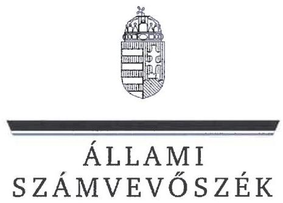
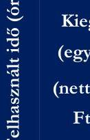
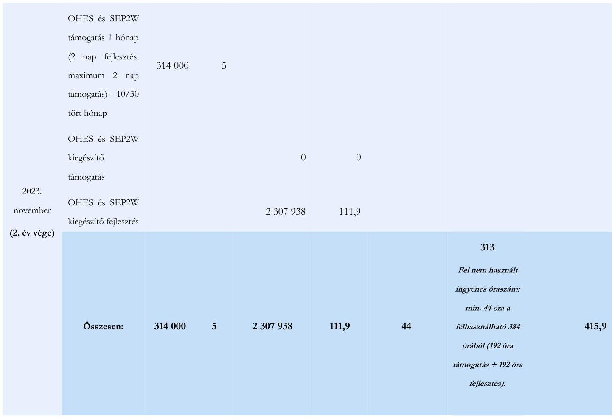

# JELENTÉS 

A többségi állami tulajdonban álló gazdasági társaságok informatikai célú beszerzéseinek ellenőrzése

MVM Démász Áramhálózati Kft.

2025.

25068
www.asz.hu

---

# JELENTÉS 

## A többségi állami tulajdonban álló gazdasági társaságok informatikai célú beszerzéseinek ellenőrzése

MVM Démász Áramhálózati Kft.

2025.

---

# ELLENŐRZÉSI IGAZGATÓSÁG: 

## ELLENŐRZÉSI IGAZGATÓSÁG III.

## ELLENŐRZÉSI IGAZGATÓ:

HERCZEGH ZSOLT igazgató

## ELLENŐRZÉSVEZETŐ:

DABISNÉ NYIKOS MELINDA ellenőrzésvezető

Jelentéseink az interneten a www.asz.hu címen olvashatók.

IKTATÓSZÁM: EL-4063-004/2025
TÉMASORSZÁM: 34/2024.
ELLENŐRZÉS-AZONOSÍTÓ SZÁM: V1093

---

# TARTALOMJEGYZÉK 

AZ ELLENŐRZÉS ALAPADATAI ..... 5
AZ ELLENŐRZÖTT SZERVEZET ..... 7
ÖSSZEFOGLALÁS ..... 8
AZ ELLENŐRZÉS FÓKUSZTERÜLETE ..... 9
MEGÁLLAPÍTÁSOK ..... 10
JAVASLATOK ..... 16
MELLÉKLETEK ..... 17
I. sz. melléklet: Értelmező szótár ..... 17
II. sz. melléklet: Az ellenőrzött szervezetek jegyzéke ..... 18
III. sz. melléklet: Ellenőrzési kritériumok ..... 19
IV. sz. melléklet: HES szolgáltatásra vonatkozó teljesítésigazolásokon elszámolt óraszámok ..... 20
FÜGGELÉK: ÉSZREVÉTELEK ..... 31
RÖVIDÍTÉSEK JEGYZÉKE ..... 37

---

.

---

# AZ ELLENŐRZÉS ALAPADATAI 

## AZ ELLENŐRZÉS CÉLJA

Az ellenőrzés célja annak értékelése volt, hogy a többségi állami tulajdonban álló gazdasági társaság informatikai célú - ellenőrzés során kiválasztott - beszerzésére szabályszerűen került-e sor, a kapcsolódó döntéshozatal megalapozott volt-e, valamint érvényesültek-e a célszerűség és eredményesség szempontjai.

## AZ ELLENŐRZÉS TÍPUSA

Kombinált ellenőrzés.

## AZ ELLENŐRZÖTT IDŐSZAK

A 2022., 2023. évek.

## AZ ELLENŐRZÉS TÁRGYA

Az ellenőrzés tárgya az MVM Démász Áramhálózati Kft. ${ }^{1}$ 2022., 2023. években megvalósult, lezárult informatikai célú beszerzéseire irányuló döntések szabályszerűsége, megalapozottsága, célszerűsége, a megvalósult informatikai beszerzések szabályszerűsége, eredményessége, a beszerzett informatikai eszközök, szolgáltatások (köz)feladat ellátás során történt hasznosulása, azaz a beszerzések megfelelősége volt. Az ellenőrzés kiterjedt a beszerzések előkészítésének, a beszerzésekre vonatkozó szerződések megkötésének és tartalmának ellenőrzésére, valamint az informatikai célú beszerzések aktiválásának (használatbavételének) ellenőrzésére is.

Az ellenőrzés kiterjedt minden olyan körülményre és adatra, amely az ÁSZ² jogszabályban meghatározott feladatainak teljesítéséhez, valamint a program végrehajtása folyamán felmerült újabb összefüggések feltárásához szükséges volt.

## AZ ELLENŐRZÉS JOGALAPJA

Az ellenőrzés jogszabályi alapját az ÁSZ tv. ${ }^{3} 1 . \S$ (3) bekezdése és az 5. $\S$ (4) bekezdése képezték.

## AZ ELLENŐRZÉS MÓDSZERE

Az ellenőrzés a nemzetközi standardokat irányadónak tekintve az ellenőrzési program szempontjai, az ellenőrzött időszakban hatályos jogszabályok, az ellenőrzés szakmai szabályok és a jelen ellenőrzésre irányadó ÁSZ módszertan figyelembevételével történt.

---

Az ellenőrzési kérdések megválaszolásához szükséges bizonyítékok megszerzése az ellenőrzött szervezet által rendelkezésre bocsátott dokumentumokra és adatokra alapozva, továbbá mintavételezés, szemrevételezés, kérdésfeltevés (információkérés), valamint elemző eljárás útján valósult meg.

Az ellenőrzési bizonyítékként felhasználható adatforrások közé tartoztak az ellenőrzés lefolytatásához kért dokumentumok, valamint minden egyéb - az ellenőrzés folyamán feltárt, az ellenőrzés szempontjából információt tartalmazó - dokumentum.

Az ellenőrzés lefolytatásához az ellenőrzött szervezet a 2022., 2023. években megvalósult, lezárult informatikai beszerzéseire vonatkozó főkönyvi és analitikus nyilvántartások, valamint az ÁSZ által kért további dokumentumok, adatok, információk megküldésével és a helyszíni ellenőrzés során szolgáltatott adatokat. A rendelkezésre álló adatok alapján az MVM Démász Áramhálózati Kft. a 2022., 2023. években 134 darab informatikai beszerzésre irányuló szerződéssel/megrendeléssel rendelkezett. A mintavételezés keretében két informatikai célú beszerzés (HES${ }^{4}$ szolgáltatás és KBÜ${ }^{5}$ licencek) került kiválasztásra. A beszerzési érték a HES szolgáltatás mintatétel tekintetében fix 940000 Ft + áfa havidíj 24 hónapon keresztül, valamint sávos hibaelhárítási/fejlesztési díj - 1-35 nap 165000 Ft + áfa/nap, 36-70 nap 155000 Ft + áfa/nap, 71-110 nap 150000 Ft + áfa/nap - (2021. november - 2023. november között befogadott számlák értéke: 37861713 Ft + áfa), a KBÜ licencek mintatétel esetében 12981660 Ft + áfa volt. A tények feltárása és azok összegzése során a megállapítások az ellenőrzött mintatételekre vonatkozóan kerültek megfogalmazásra. A mintatételek ellenőrzésének eredményei nem kerültek kivetítésre.

Az ÁSZ akkor tekintette megfelelőnek az informatikai beszerzést, ha a beszerzési eljárás teljes folyamata a lényegi elemeiben szabályszerű, célszerű és - amennyiben értékelhető - eredményes volt, illetve a beszerzés tekintetében érvényesültek a nemzeti vagyonnal való felelős gazdálkodás elvei. A jelen ellenőrzés keretében az eredményesség nem került értékelésre, mivel a kiválasztott mintatételek tekintetében az MVM Démász Áramhálózati Kft. nem határozott meg eredményességi kritériumokat, mely keretében a tényleges és a tervezett eredmények (hatások) összevetése értékelhető lett volna.

---

# AZ ELLENŐRZÖTT SZERVEZET 

Az MVM Démász Áramhálózati Kft.-t 2006.07.26-án a DÉMÁSZ Zrt. (jogutódja jelenlegi nevén: MVM Next Energiakereskedelmi Zrt.) hozta létre a VET törvény ${ }^{6}$ alapján végrehajtandó elosztói és közüzemi szolgáltatói engedélyes tevékenységek jogi szétválasztásának következtében. A Társaság egyedüli tagja és Alapítója az MVM Next Energiakereskedelmi Zrt. Az MVM Démász Áramhálózati Kft. feletti tulajdonosi jogokat jelenleg az MVM Next Energiakereskedelmi Zrt. és az MVM Energetika Zrt. között létrejött megállapodás alapján az MVM Energetika Zrt. gyakorolja.

A Társaság főtevékenysége villamosenergia-elosztás, melyet Csongrád-Csanád, Bács-Kiskun és Békés vármegyékben, valamint Pest és Baranya vármegyék egy részén végzett, tevékenységi köréhez tartozott továbbá az elektromos hálózatok fejlesztése, építése és irányítása, a hálózati elektromos berendezések biztonságos üzemeltetése, a fogyasztásmérők kezelése, illetve a regionális szereplőkkel, energiakereskedőkkel és ügyfelekkel való kapcsolattartás. A Társaság 2007.01.01-jétől az elosztói engedélyes tevékenységet a Magyar Energia Hivatal (2013.04.04-től Magyar Energetikai és Közmű-szabályozási Hivatal) 793/2006. számú határozatában kiadott működési engedélye alapján végezte.

Az MVM Démász Áramhálózati Kft. közszolgáltatási feladatot látott el ${ }^{7}$ (villamos energia elosztói engedélyes).
1. táblázat
(adatok: M Ft-ban)
AZ MVM DÉMÁSZ ÁRAMHÁLÓZATI KFT. BESZÁMOLÓJÁNAK FŐBB ADATAI

|  | 2022. év | 2023. év |
| :--: | :--: | :--: |
| Értékesítés nettó árbevétele | 105738 | 141942 |
| Igénybe vett szolgáltatások | 17135 | 16061 |
| Adózott eredmény | 10723 | 710 |
| Immateriális javak | 4118 | 6051 |
| Tárgyi eszközök | 215418 | 239222 |
| ebből beruházás, felújítás | 12819 | 19789 |
| Jegyzett tőke | 104666 | 104880 |

A Társaság informatikai tárgyú beszerzéseire a DKÜ rendelet ${ }^{8} 1 . \S$ (2) bekezdés d) pontja értelmében a központosított közbeszerzés szabályai és az ide vonatkozó Kbt. ${ }^{9}$ rendelkezések ${ }^{10}$ voltak az irányadóak.

Az MVM Démász Áramhálózati Kft.-nél az átlagosan foglalkoztatottak száma 2022. évben 1035 fő, 2023. évben 1038 fő volt, az ellenőrzött időszakban a Taktv. ${ }^{11}$ 7/J. § (1) bekezdésben meghatározott mutatóértékek alapján a Gbkr. ${ }^{12}$ hatálya alá tartozott, belső kontrollrendszer működtetésére volt kötelezett.

---

# ÖSSZEFOGLALÁS 

A Magyar Államnak az állami tulajdonú gazdasági társaságokban lévő részesedései a nemzeti vagyon, ezen belül az állami vagyon részét képezik. E részesedések értékére, ezáltal az állami vagyon értékének megőrzésére, növelésére alapvető befolyást gyakorol az állami tulajdonban álló gazdasági társaságok gazdálkodási tevékenysége. Az ellenőrzés a felelős gazdálkodás kritériumának vizsgálata keretében értékelte, hogy az MVM Démász Áramhálózati Kft. mintatételként kiválasztott informatikai beszerzései megfelelőek voltak-e.

A gazdasági társaságokkal szemben elvárás, hogy beruházásaikat, beszerzéseiket megfelelő tervezéssel hajtsák végre, mérjék fel annak szükségességét, pénzügyi vonzatát, valamint értékeljék a beszerzés gazdálkodásra vonatkozó várható hatásait, elemezzék azok következményeit és alapozzák meg döntésüket. Magyarország Alaptörvénye ${ }^{13}$ is rögzíti ezeket a feltételeket azzal, hogy az állam tulajdonában álló gazdálkodó szervezetek törvényben meghatározott módon, önállóan és felelősen gazdálkodnak a törvényesség, célszerűség és eredményesség követelményei szerint. A gazdasági társaságok a tevékenységük során kötelesek a belső szabályozóikban foglaltakat betartani. A gazdálkodás egyes kérdéseire kiterjedő belső szabályozók a gazdasági társaságok működési sajátosságainak figyelembevételével alkotott részletes rendelkezéseikkel hivatottak biztosítani a jogszabályokban meghatározott általános normák végrehajtását, így - többek között - a felelős gazdálkodás elveinek érvényesülését.

Az MVM Démász Áramhálózati Kft. kiválasztott informatikai beszerzései az ellenőrzés során feltárt hiányosságok miatt összességében nem voltak megfelelőek.

AZ ELLENŐRZÉS MEGÁLLAPÍTOTTA, hogy az MVM Démász Áramhálózati Kft. az informatikai beszerzésekre vonatkozó belső szabályozóit kialakította, azonban az ellenőrzés alá vont beszerzések megalapozottsága és célszerűsége, valamint elszámolása vonatkozásában jelentős hiányosságok, mulasztások kerültek feltárásra.

Az MVM Démász Áramhálózati Kft.-nél ellenőrzött két informatikai beszerzésből egy beszerzés esetében annak szükségessége, megalapozottsága és célszerűsége nem volt megállapítható, a Társaság az említett tényezőket igazoló dokumentumokat nem adott át a vizsgálat során.

A Társaság informatikai beszerzésekre vonatkozó, jogszabályban előírtak szerint elkészítendő DKÜ terveiben ${ }^{14}$ a jogszabályi előírás ellenére nem kerültek teljeskörűen rögzítésre az adott évre tervezhető informatikai beszerzések, a vizsgálat alá vont két beszerzés abban nem szerepelt.

A beszerzési eljárások során a Társaság az egyik esetben az általa lefolytatott meghívásos pályázat keretében egy olyan vállalkozást hirdetett ki nyertesként, mely a pályázati kiírásban meghatározott személyi feltételekkel nem rendelkezett. A másik beszerzés tekintetében pedig a szerződéskötés vonatkozásában történt mulasztás, ugyanis az - a szerződés külön írásba foglalása nélkül - a belső szabályzatban foglalt rendelkezések megsértésével, az Általános Szerződési Feltételek szállító általi elfogadása nélkül jött létre.

A jogszabályi előírások ellenére a beszerzések elszámolása, pénzügyi teljesítése tekintetében az egyik beszerzés esetében a szolgáltatás keretében ellátott feladatok teljesítésének nyomon követése és a számlázott teljesítések közötti összhang nem állt fenn, ezáltal a Társaság részéről történt kifizetések utólagos ellenőrizhetősége sem volt biztosított, mely következtében nem tett eleget a nemzeti vagyonnal történő felelős, átlátható vagyongazdálkodási kötelezettségének.

Az MVM Démász Áramhálózati Kft. a jogszabályi előírás ellenére közzétételi kötelezettségének nem tett eleget az ötmillió forintot elérő vagy azt meghaladó szerződései vonatkozásában.

---

# AZ ELLENŐRZÉS FÓKUSZTERÜLETE 

1.- A többségi állami tulajdonban álló gazdasági társaság informatikai célú beszerzésének megfelelősége

---

# 1. A többségi állami tulajdonban álló gazdasági társaság informatikai célú beszerzésének megfelelősége 

## Összegző megállapítás

Az MVM Démász Áramhálózati Kft. ellenőrzés alá vont informatikai célú beszerzései összességében nem voltak megfelelőek.

Az ÁSZ ellenőrzése az MVM Démász Áramhálózati Kft. 2022., 2023. években megvalósult informatikai célú beszerzései közül két, saját hatáskörben lefolytatott beszerzés megfelelőségére terjedt ki.
2. táblázat

| AZ ELLENŐRZÖTT BESZERZÉSEK FŐBB ADATAI |  |  |  |  |  |
| :--: | :--: | :--: | :--: | :--: | :--: |
| MINTATÉTEL | A   SZERZŐDÉS   TÁRGYA | EGYSÉG | SZOLGÁLTATÁS   IDŐTARTAMA | TELJESÍTÉS-  IGÁZOLÁS   IDŐPONTJA | SZERZŐDÉSI ÉRTÉK |
| HES   szolgáltatás | „HeadEnd   (HES)"   megnevezésű   rendszer ok   üzemeltetési és   továbbfejlesztési támogatása | 2 év | $\begin{aligned} & 2021.11.04- \\ & 2023.11.07. \end{aligned}$ | folyamatos havi teljesítés | fix 940000 Ft + áfa havidíj 24 hónapon keresztül   sávos hibaelhárítási/fejlesztési díj   1-35 nap 165000 Ft + áfa/nap   36-70 nap 155000 Ft + áfa/nap   71-110 nap 150000 Ft + áfa/nap   (2021. november - 2023. november   között befogadott számlák értéke:   37861713 Ft + áfa) |
| KBÜ licencek | KBÜ licenc beszerzés | 63 darab | 15 darab   licenc:   2023.03.05 -   2025.08.10.   48 darab   licenc:   2023.08.11 -   2025.08.10. | 2023.03.20. | 12981660 Ft + áfa |

Forrás: ÁSZ saját szerkesztés az MVM Démász Áramhálózati Kft. adatszolgáltatása alapján

## A BESZERZÉSHEZ KAPCSOLÓDÓ

 SZABÁLYOZÁSI KÖRNYEZET

Az üzleti, valamint az informatikai beszerzések tervezését a DKÜ rendelet szabályai, valamint a Társaság belső irányító eszközei - Alapító okirat ${ }_{1-8}{ }^{15}$, Beszerzési szabályzat ${ }_{1-5}{ }^{16}$, SZMSZ ${ }_{1-3}{ }^{17}$ - szabályozták.
Az informatikai célú beszerzésekre vonatkozó eljárásokat a DKÜ rendeletben meghatározott központosított közbeszerzési eljárás szabályai, az ide kapcsolódó Kbt. rendelkezések, valamint a Társaság belső szabályozó eszközei - Alapító okirat ${ }_{1-8}$, Beszerzési szabályzat ${ }_{1-5}$, Közbeszerzési szabályzat ${ }^{18}$, Szerződéskötési szabályzat ${ }_{1-2}{ }^{19}$, Döntés Hatásköri Lista Szabályzat ${ }_{1-2}{ }^{20}$, Beszerzési DHL ${ }^{21}$ és az SZMSZ ${ }_{1-3}$ - szabályozták.

---

Az MVM Démász Áramhálózati Kft. a Taktv. és a Gbkr. előírásainak megfelelve kialakította a tervezési és beszerzési eljárásaira vonatkozóan a belső szabályozói környezetét.

# A BESZERZÉSI IGÉNY FELMERÜLÉSE ÉS A BESZERZÉSRE IRÁNYULÓ DÖNTÉS 

## HES szolgáltatás

Az MVM Démász Áramhálózati Kft. 2022-2023. évi elosztói stratégia tárgyú dokumentuma tartalmazta a jövőorientált infrastruktúra fejlesztések stratégiai pillérét, melynek egyik sarokpontja az okos mérési feladatok ellátása volt. A Társaság 2022-2023. éveket érintő beruházási tervei az elosztói stratégiával összhangban álltak, a HES szolgáltatás igénybevételére vonatkozó informatikai beszerzés a nevezett stratégiai feladatokhoz kapcsolódott. A Társaság a HES szolgáltatás keretében biztosította a HES rendszerének (több mérő egy rendszerben történő kezelésének megvalósítását biztosító platform) üzemeltetési és továbbfejlesztési támogatását (rendszertámogatás, hibajelentés-támogatás, üzemeltetés és konzultációs támogatás, fejlesztés támogatása), mely alapján a HES szolgáltatásra vonatkozó beszerzési igénye (a korábbi HES szolgáltatási szerződésének lejárta miatt) indokolt, célszerű volt.
Az MVM Démász Áramhálózati Kft. az ellenőrzés alá vont beszerzés vonatkozásában a DKÜ${ }^{22}$ részére rendkívüli beszerzési igényt nyújtott be, melynek indoka az volt, hogy a Társaság a 2021. évi DKÜ terv benyújtását követően (2020.09.30. után) döntötte el, hogy a kiválasztott szolgáltatás igénybevételére továbbra is szüksége van. A beszerzési igény jóváhagyásakor hatályos Beszerzési DHL alapján az igény benyújtása és jóváhagyása során az arra jogosult beosztású és feladatkörű személyek jártak el. Az MVM Démász Áramhálózati Kft. HES szolgáltatásra vonatkozó korábbi szolgáltatási szerződésének lejárati dátuma jól kalkulálható, előre tervezhető volt, így a 2021. évre benyújtott DKÜ terv az ellenőrzött tétel tekintetében a DKÜ rendelet 1. § 4. bekezdés 3. és 4. pontjaiban foglalt tartalmi elvárásoknak nem felelt meg, mivel abban nem rögzítették az adott évre tervezhető HES szolgáltatásra vonatkozó informatikai beszerzést. Az MVM Démász Áramhálózati Kft. a Beszerzési szabályzat ${ }_{2}$ 4. és 6.1. pontjaiban foglaltak ellenére a HES szolgáltatás beszerzését a 2021. évi beszerzési tervében sem tervezte, holott a szabályzat rendelkezései szerint a beszerzési tervnek az adott évre vonatkozóan tartalmaznia kellett volna a várható beszerzéseket.
A Kbt. 28. § (1) bekezdésben meghatározott felelősségi körében a Társaság köteles a becsült érték meghatározása céljából külön vizsgálatot végezni és annak eredményét dokumentálni, mely eljárás keretében az értékelemzés módszerét is alkalmazhatta. Az MVM Démász Áramhálózati Kft. a HES szolgáltatás mintatételre vonatkozó becsült érték meghatározásának módszere tekintetében a becsült érték nyilatkozatában a Kbt. 28. § (2) bekezdés g) pont szerinti, a korábbi hasonló tárgyra irányuló szerződés elemzését jelölte meg, melyet az ellenőrzés során dokumentummal (elemzés, számszaki levezetés) nem igazolt. A Társaság korábbi szerződése szignifikánsan kevesebb mérő mennyiségre, illetve alacsonyabb információtechnológia elvárásra, kevésbé összetett üzemeltetési feladatra vonatkozott, így az összehasonlító elemzés, valamint a becsült érték összegének pontos levezetése, kalkulációja a megalapozott beszerzési döntés meghozatalához indokolt lett volna. A fenti hiányosság következtében a Társaság első számú vezetője a belső kontrollrendszer keretében a Gbkr. 6. § (2) bekezdés a) és b) pontjaiban foglalt előírások ellenére a beszerzési igény tervezési szakaszában nem épített ki olyan kontrollt, mely biztosította volna a becsült érték meghatározása során a döntéselőkészítő dokumentumok előkészítését, rendelkezésre állását, valamint a döntés célszerűségi, gazdaságossági, hatékonysági és eredményességi szempontú megalapozottsági vizsgálatát. A döntéselőkészítő dokumentumok hiánya,

---

valamint a becsült érték megalapozatlansága miatt a Taktv. 7/J. § 2. bekezdés e) pontjában foglaltak ellenére a megfelelő, átlátható működés nem került biztosításra.
A szükséges fedezet a beszerzés vonatkozásában az MVM Démász Áramhálózati Kft. rendelkezésére állt.

# KBÜ licencek 

Az MVM Démász Áramhálózati Kft. a felmerülő közbeszerzési igényeinek folyamatos nyomon követése (az igény felmerülésétől kezdve egészen annak, materiális javakként való realizálásáig) érdekében a KBÜ rendszert alkalmazta, melyet a gyártótól megvásárolt licencek keretében tudott használatba venni. A Társaság az ellenőrzött időszak tekintetében 63 darab licenccel rendelkezett, melyből 15 darab 2023. március 04-én, 48 darab pedig 2023. augusztus 10-én járt le. Az MVM Démász Áramhálózati Kft. nyilatkozata szerint a KBÜ rendszerben az utolsó beszerzési eljárását 2022 augusztusában indította, a licencek 2023. évi megújítására pedig azért volt szüksége, hogy a rendszerből lekérdezhető adatok továbbra is elérhetőek legyenek. A KBÜ rendszer alkalmazása fokozatosan került kivezetésre, a közbeszerzési ügykövetési feladatok ellátására előbb a Fluenta (2022 augusztusát követően), majd ezt követően az SAP Ariba workflow rendszer (2024. évtől) került használatba vételre.
Az MVM Démász Áramhálózati Kft. a beszerzésre irányuló döntését nem támasztotta alá a tekintetben, hogy egy kifutó rendszer vonatkozásában ténylegesen szüksége volt-e az összes licenc megújítására. A Társaság részéről továbbá nem került igazolásra, hogy készített-e felmérést arra vonatkozóan, hogy a KBÜ rendszerben még végzendő, megmaradó szűkebb (lekérdezési, adatelérési) feladatok kevesebb licenccel is elláthatóak lettek volna-e. Az ÁSZ által az Elektronikus Közbeszerzési Rendszerből (ekr.gov.hu) lekért adatok alapján 2022. augusztus 31-et megelőzően 23 darab megkezdett olyan közbeszerzési eljárása volt a Társaságnak, melyek nem zárultak még le. Az MVM Démász Áramhálózati Kft. ezen közbeszerzési eljárásai is befejeződtek 2023. augusztus 11-ig, azaz az új licencek használatba vétele előtt. A KBÜ rendszerben ezeknek a feladatoknak a nyomon követését a rendelkezésre álló korábbi licencekkel is el tudta volna látni a Társaság. A beszerzési igény összességében a lejáró KBÜ licencek miatt merült fel, azonban a licencek beszerzett mennyiségére vonatkozó döntés célszerűségét, megalapozottságát a Társaság nem igazolta, döntéselőkészítő dokumentummal nem rendelkezett. Ennek következtében az MVM Démász Áramhálózati Kft. a Gbkr. 6. § 2. bekezdés a) és b) pontjai ellenére a beszerzési igény tervezési szakaszában nem épített ki olyan kontrollt a beszerzendő licencek mennyiségének meghatározását illetően, amellyel biztosították volna a döntéselőkészítő dokumentumok előkészítését, rendelkezésre állását, továbbá a döntés célszerűségi, gazdaságossági, hatékonysági és eredményességi szempontú megalapozottsági vizsgálatát.
Az MVM Démász Áramhálózati Kft. a KBÜ licencek beszerzési igényét a 2023. évi DKÜ tervében nem rögzítette, a DKÜ részére rendkívüli beszerzési igényt nyújtott be. A KBÜ licencek lejárati dátumai azonban jól kalkulálhatóak, előre tervezhetőek voltak, így a 2023. évre benyújtott DKÜ terv az ellenőrzött tétel tekintetében a DKÜ rendelet 1. § 4. bekezdés 3. és 4. pontjaiban foglalt tartalmi elvárásoknak nem felelt meg, mivel abban nem rögzítették az előre tervezhető KBÜ licenc beszerzést. A Beszerzési szabályzat 4. és 6.1. pontjai ellenére az MVM Démász Áramhálózati Kft. beszerzési terve a KBÜ licencekre vonatkozó beszerzési igényét nem tartalmazta.
A becsült érték meghatározásához a Társaság a Kbt.-ben foglalt rendelkezések szerint indikatív ajánlatot kért be a licencek kizárólagos értékesítési jogával rendelkező társaságtól.
A szükséges fedezet a beszerzés vonatkozásában az MVM Démász Áramhálózati Kft. rendelkezésére állt.

---

# A BESZERZÉSI ELJÁRÁS 

## HES szolgáltatás

Az MVM Démász Áramhálózati Kft. HES szolgáltatás igénybevételére vonatkozó rendkívüli beszerzési igényét a DKÜ rendelet alapján benyújtotta, azt a DKÜ a DKÜ rendelet értelmében vizsgálat alá vonta, majd a megfelelő minősítést követően saját hatáskörben történő lefolytatásra visszaadta. Az ellenőrzött informatikai célú beszerzés tekintetében az ellenőrzés során nem merült fel olyan körülmény, amely a beszerzési eljárás Kbt. szerinti lefolytatását tette volna szükségessé.
A Társaság a HES szolgáltatás ellenőrzött tételre vonatkozó beszerzési eljárásában négy társaságot kért fel meghívásos pályázat keretében ajánlattételre, a szükséges ajánlati felhívás, valamint a műszaki specifikáció a Beszerzési szabályzat előírása szerint a Társaság rendelkezésére állt. A Műszaki specifikáció 4. pontjában részletezésre kerültek a feladat ellátásához szükséges személyi és szakmai kompetencia elvárások, mely alapján a pályázóknak legalább három szakemberrel kellett rendelkezniük (öt kompetencia-terület került felsorolásra úgy, hogy azokat legalább egy-egy felsőfokú végzettségű szakembernek kellett ellátnia azzal a kikötéssel, hogy egy fő maximum két szakmai kompetenciával rendelkezhetett). A nyertes pályázó az ajánlattételben rögzített nyilatkozata szerint a szükséges személyi és tárgyi feltételekkel rendelkezett, alvállalkozót a feladatellátással kapcsolatban nem kívánt igénybe venni. Az MVM Démász Áramhálózati Kft. az ajánlati felhívás 3.2.7. pontja értelmében a pályázók éves beszámolóit ellenőrizte, közzétett éves beszámolók hiányában pedig kérte azok pályázati anyaghoz történő csatolását. A nyertes pályázó állományi létszáma a 2021-2023. évi egyszerűsített éves beszámolóiban szereplő adatok alapján mindössze 1-2 fő volt, vagyis a nyertes pályázó a pályázatban kiírt személyi alkalmassági feltételnek nem felelt meg.
Az MVM Démász Áramhálózati Kft. a pályázatok elbírálási szakaszában a személyi feltételek értékelésekor rögzítette, hogy a szakemberek számáról, illetve a szaktudásról külön nyilatkozat nem érkezett, azonban ezen tételek igazolására - a Pályázati felhívás 6.5. pontja ellenére - dokumentumot a nyertes pályázó nem csatolt, pedig a Műszaki specifikáció 4.3. és 4.4.1. pontjaiban foglalt rendelkezések szerint az üzemeltetési tevékenységek ellátásához az ajánlattevőnek igazolnia kell az üzemeltetésre való képességét (kompetencia képesség), valamint az üzemeltetésre való feljogosítását is.
Az MVM Démász Áramhálózati Kft. a Pályázati felhívás 8.4. pontjaiban foglalt előírással szemben a nyertes pályázót hiánypótlásra nem szólította fel. A Társaság a szakmai értékelés során nem szerepeltette azokat a szempontokat, amelyeknek a nyertes pályázó nem felelt meg, annak ellenére, hogy a közzétett beszámolókban szereplő adatok alapján a személyi feltételek hiánya megállapítható volt. A HES szolgáltatásra vonatkozó ajánlatok értékelési eljárása, valamint a nyertes pályázó kiválasztása tekintetében a Társaság a Beszerzési szabályzat 6.3.6. pontjában, valamint a Pályázati felhívás 8.5. pontjában előírtakat megsértette. A Társaság pályázati felhívása szerint amennyiben a pályázati kiírásában foglalt feltételeknek a benyújtott pályázat nem felel meg, úgy az a pályázat érvénytelenségét vonja maga után.

---

# KBÜ licencek 

Az MVM Démász Áramhálózati Kft. a KBÜ licencekre vonatkozó rendkívüli informatikai beszerzési igényének benyújtása során nem a jogszabály rendelkezései szerint járt el, mivel azt a DKÜ rendelet 7. § c) pontja ellenére nem az igény felmerülését követő öt munkanapon belül küldte meg a DKÜ részére, hanem több hónap elteltével. A DKÜ a DKÜ rendelet értelmében az MVM Démász Áramhálózati Kft. beszerzési igényét vizsgálat alá vonta, majd a megfelelő minősítést követően visszaadta saját hatáskörben történő lefolytatásra. Az ellenőrzött informatikai célú beszerzés tekintetében az ellenőrzés során nem merült fel olyan körülmény, amely a beszerzési eljárás Kbt. szerinti lefolytatását tette volna szükségessé.
A KBÜ licenceket a Társaság a licencek kizárólagos értékesítési jogával rendelkező társaságtól
 szerezte be, a Beszerzési szabályzat ${ }_{3}$ szerinti egyedi szerződéskötési engedély rendelkezésre állt. A Társaság a KBÜ licenceket írásban megrendelte, azonban a szállítóval szerződés megkötésére nem került sor. Az ellenőrzés részére az ÁSZF ${ }^{23}$ került csatolásra, a Társaság nyilatkozata szerint a jogviszony a megrendeléssel és annak elfogadásával jött létre. A Szerződéskötési szabályzat, 5.3.2.1. pontjában foglalt rendelkezések alapján az ÁSZF alkalmazása esetén a jogviszonyt az egyedi rendelkezéseket tartalmazó szerződés/megrendelés és az ÁSZF együttesen szabályozták. A szabályzat szerint az ÁSZF akkor válik a szerződés részévé, ha alkalmazója lehetővé tette, hogy a másik fél annak tartalmát a szerződéskötést megelőzően megismerje, és ha azt a másik fél elfogadta, ennek értelmében az ÁSZF-re való hivatkozást az egyedi szerződésnek vagy megrendelésnek minden esetben tartalmaznia kell. A Társaság ebből adódóan a Szerződéskötési szabályzat, 5.3.2.1. pontjában foglalt előírását megsértette, mivel a KBÜ licencekre vonatkozó megrendelése az ÁSZF-re való hivatkozást nem tartalmazott, továbbá az ÁSZF megismeréséről, elfogadásáról szóló egyedi szállítói nyilatkozat sem került az ellenőrzés részére megküldésre.

## A BESZERZÉS ELSZÁMOLÁSA

## HES szolgáltatás

A HES szolgáltatás ellenőrzött tétel tekintetében az MVM Démász Áramhálózati Kft. által befogadott számlák az Áfa törvény ${ }^{24}$ 55-56. $\int$ és 58. $\int$-aiban foglalt szabályoknak nem feleltek meg, mivel a számlákban egyszerre kerültek feltüntetésre (azonos teljesítési és fizetési határidőkkel) a különböző teljesítéssel és fizetési határidővel érintett beszerzési tételek (a Társaság nyilatkozata szerint adminisztrációs hiba miatt). A Szerződéskötési szabályzat ${ }_{1-2}$ 6.11.3. e) pontjában foglalt rendelkezések ellenére a szerződéses partner részére nem kerültek visszaküldésre a nem megfelelő adattartalommal kiállított számlák. A Társaság eljárásával a Számv. tv. ${ }^{25}$ 165. § (2) bekezdését megsértette, mivel a számviteli (könyvviteli) nyilvántartásokba csak szabályszerűen kiállított bizonylat alapján szabad adatokat bejegyezni.
Az MVM Démász Áramhálózati Kft. által befogadott teljesítésigazolásokon feltüntetésre kerültek a szerződéses partner részéről elvégzett támogatási feladatok megnevezései a kapcsolódó feladatazonosító (tiket) számokkal, valamint a fejlesztésre és támogatásra elszámolt órák számai a felhasznált órákhoz kapcsolódó számlázandó összeggel. A megkötött HES szolgáltatási szerződés alapján az üzemeltetési és konzultációs támogatás lehívása e-mailben, a hibaelhárítás támogatás lehívása e-mailben, telefonon, távoli belépéssel, illetve személyesen történt. A teljesítésigazolásokban megjelölt támogatási feladatok feladatazonosító (tiket) számai a rendelkezésre bocsátott bejelentésekkel (tiket számok hiányában) nem voltak összekapcsolhatóak, mely következtében az MVM Démász Áramhálózati Kft. által leigazolt teljesítések a feladatok nyomon követésére (ellenőrzésére, utólagos kontrolljára) nem voltak alkalmasak. A Társaság fenti eljárásával megsértette a Gbkr. 3. § (1) bekezdés e) pontját, valamint a Gbkr. 8. §-t, mivel nem

---

alakított ki olyan kontrolltevékenységet, nyomon követési rendszert, mely biztosította volna a kockázatok kezelését.
Az ÁSZ a havonta teljesített/leigazolt órák tekintetében számítást végzett, mely keretében az összesített (kumulált) adatokat a HES szolgáltatási szerződésben rögzített elszámolási feltételekkel összevetette. Az ÁSZ a leigazolt óraszámok, valamint a kiszámlázott/pénzügyileg is teljesített összegek tekintetében eltérést állapított meg (a kedvezményes sávba történő átlépés jelzésének elmulasztása a szállító felé - kumulált óraszámok alapján átlépett mindkét évben -, illetve a fel nem használt, de a havi átalánydíjas szolgáltatás keretében pénzügyileg kiegyenlített órakeret miatt, továbbá a 2023. november havi igazolatlanul elszámolt óraszámok végett). (A teljesítésigazolásokban szereplő adatok levezetését és a többletkifizetések bemutatását a IV. sz. melléklet tartalmazza.) Az elszámolási hiányosság a szerződéses időszak vonatkozásában $\sim 3,7 \mathrm{M} \mathrm{Ft}+$ áfa többletkifizetést eredményezett a Társaság részéről. Az MVM Démász Áramhálózati Kft. az ellenőrzött tétel vonatkozásában az Nvtv. 7. § (1)-(2) bekezdésben foglaltak ellenére nem tett eleget a nemzeti vagyonnal történő felelős, átlátható vagyongazdálkodási kötelezettségének.
A DKÜ rendelet rendelkezéseinek megfelelően a kiválasztott beszerzés teljesítéséről az MVM Démász Áramhálózati Kft. a DKÜ részére beszámolt.

# KBÜ licencek 

A KBÜ licencekre vonatkozó beszerzés teljesítésére az MVM Démász Áramhálózati Kft. által befogadott számla adatai alapján 2023. március 20-án került sor. Az MVM Démász Áramhálózati Kft. a beszerzett licenceket (63 darab) egységesen 2023. augusztus 11-én vette használatba, az üzembe helyezésről nyilatkozatot készített. A Társaság az ellenőrzés során adott nyilatkozata szerint 15 darab licencet már korábban, 2023. március 22-én használatba vett, azonban a licencek használatbavételi dátumait adminisztratív hiba miatt nem teljeskörűen rögzítette az üzembe helyezési nyilatkozatában. A Társaság eljárásával a Számv. tv. 52. $\S$ (2) bekezdését megsértette, mivel az üzembe helyezést hitelt érdemlő módon nem dokumentálta.
A DKÜ rendelet rendelkezéseinek megfelelően a kiválasztott beszerzések teljesítéséről az MVM Démász Áramhálózati Kft. a DKÜ részére beszámolt.

## KÖZZÉTÉTELI KÖTELEZETTSÉG

Az MVM Démász Áramhálózati Kft.-t az Info tv. ${ }^{26}$ 37. $\S$ (1) bekezdése alapján közzétételi kötelezettség terhelte. A Társaság az Info tv. 1. számú melléklet III./4. pontjában foglaltak ellenére az ötmillió forintot elérő vagy azt meghaladó értékű, a törvényben meghatározott tárgyú szerződések tekintetében nem tett eleget közzétételi kötelezettségének.

---

# JAVASLATOK 

Az ÁSZ tv. 33. § (1) bekezdésében foglaltak értelmében az ellenőrzött szervezet vezetője köteles a jelentésben foglalt megállapításokhoz kapcsolódó intézkedési tervet összeállítani és azt a jelentés kézhezvételétől számított 30 napon belül az ÁSZ részére megküldeni. Amennyiben az ellenőrzött szervezet vezetője nem küldi meg határidőben az intézkedési tervet, vagy továbbra sem elfogadható intézkedési tervet küld, az Állami Számvevőszék elnöke az ÁSZ tv. 33. § (3) bekezdés a) és b) pontjaiban foglaltakat érvényesítheti.

## MVM DÉMÁSZ ÁRAMHÁLÓZATI KFT. ÜGYVEZETŐJE RÉSZÉRE

1. Intézkedjen, hogy a jövőben a Társaság éves beszerzési tervei a Beszerzési szabályzatnak megfelelően tartalmazzák az adott évre várható beszerzéseket, valamint a Társaság éves informatikai beszerzési és fejlesztési tervei a DKÜ rendelet 1. § (4) bekezdés 3. és 4. pontjaiban foglalt tartalmi elvárásoknak feleljenek meg.
2. Építsen ki kontrollt annak érdekében, hogy a Gbkr. 6. § (2) bekezdés a) és b) pontjainak megfelelően a döntéselőkészítő dokumentumok, valamint a döntések célszerűségi, gazdaságossági, hatékonysági és eredményességi szempontú megalapozottsági vizsgálatai minden tevékenységre vonatkozóan biztosításra kerüljenek.
3. Intézkedjen, hogy a jövőben a DKÜ rendelet 7. § b) pont (korábban 7. § c) pont) szabályainak megfelelően történjen a DKÜ felé a rendkívüli informatikai beszerzésre vonatkozó igény benyújtása.
4. Intézkedjen, hogy a jövőben a Társaság a saját hatáskörben lefolytatott beszerzési eljárásai során a Beszerzési szabályzatban és a Szerződéskötési szabályzatban foglalt rendelkezések szerint járjon el, kiemelt figyelemmel arra, hogy az elkészített műszaki specifikációkban szereplő követelmények valós teljesülése szerint értékelje a pályázati anyagokat.
5. A jövőben fordítsanak kiemelt figyelmet a nyomon követésre a Gbkr. 3. § (1) bekezdés e) pont előírásának megfelelően annak érdekében, hogy csak a tényhelyzetnek megfelelően számlázott és megfelelően teljesítésigazolt összegek kerüljenek kifizetésre.
6. Intézkedjen, hogy a jövőben a Számv. tv. 52. § (2) bekezdése alapján az üzembe helyezést hitelt érdemlő módon dokumentálja a Társaság.
7. Intézkedjen annak érdekében, hogy az Info tv. szerinti közzétételi kötelezettségének tegyen eleget a Társaság.

---

# MELLÉKLETEK 

## I. SZ. MELLÉKLET: ÉRTELMEZŐ SZÓTÁR

gazdasági társaság
többségi állami tulajdon
vagyongazdálkodás alapelvei
informatikai célú beszerzés
szolgáltatás

A gazdasági társaságok üzletszerű közös gazdasági tevékenység folytatására, a tagok vagyoni hozzájárulásával létrehozott, jogi személyiséggel rendelkező vállalkozások, amelyekben a tagok a nyereségből közösen részesednek, és a veszteséget közösen viselik.
(Ptk. 3:88. § (1) bekezdése)
Az állam tulajdonában lévő tagsági jogviszonyt megtestesítő értékpapír, illetve az állam tulajdonában lévő egyéb társasági részesedés, amennyiben a társaságban a Magyar Állam közvetlenül vagy közvetetten a szavazatok több mint felével rendelkezik.
(ÁSZ definíció a Vtv. ${ }^{27}$ 1. § (2) bekezdés c) pontja és a Ptk. 8:2. § (1), (3)-(4) bekezdései alapján)
A nemzeti vagyon alapvető rendeltetése a közfeladat ellátásának biztosítása, ideértve a lakosság közszolgáltatásokkal való ellátását és e feladatok ellátásához szükséges infrastruktúra biztosítását. A nemzeti vagyonnal felelős módon, rendeltetésszerűen kell gazdálkodni.
A nemzeti vagyongazdálkodás feladata a nemzeti vagyon megőrzése, értékének és állagának védelme, rendeltetésének megfelelő, az állam, az önkormányzat mindenkori teherbíró képességéhez igazodó, elsődlegesen a közfeladatok ellátásához és a mindenkori társadalmi szükségletek kielégítéséhez szükséges, egységes elveken alapuló, átlátható, hatékony és költségtakarékos működtetése, értéknövelő használata, hasznosítása, gyarapítása, továbbá az állam vagy a helyi önkormányzat feladatának ellátása szempontjából feleslegessé váló vagyontárgyak elidegenítése, azzal, hogy a nemzeti vagyon megőrzése érdekében végzett bontás vagy átalakítás nem minősül az állagvédelmi kötelezettség megszegésének.
(Nvtv. 7. § (1)-(2) bekezdése alapján)
Informatikai célú beszerzés alatt az informatikai eszköz, szoftver, alkalmazásfejlesztés és az ezekhez kapcsolódó szolgáltatások beszerzésére irányuló keretmegállapodás vagy más keretjellegű szerződés, továbbá visszterhes szerződés létrehozását célzó beszerzési eljárást értjük.
(DKÜ rendelet 1. § (4) bekezdés 5. pont)
Szolgáltatás alatt a gazdasági társaság által igénybe vett/megrendelt, harmadik fél által nyújtott/számlázott, nem anyagi javak termelésére irányuló tevékenységeket értjük.
(ÁSZ definíció a Számv. tv. 3. § (7) bekezdés 1. pontja alapján)

---

II. SZ. MELLÉKLET: AZ ELLENŐRZÖTT SZERVEZETEK JEGYZÉKE

# ELLENŐRZÖTT SZERVEZET NEVE 

MVM Démász Áramhálózati Kft.

---

# FOKUSZTERÜLET 

1. A többségi állami tulajdonban álló gazdasági társaság informatikai célú beszerzésének megfelelősége

## ELLENŐRZÉSI KRITÉRIUMOK

Vtv. 2. $\S$ (1) bek., 5. $\S$ (2) bek.
Nvtv. 7. $\S$ (1)-(2) bek.
Taktv. 2. $\S$, 7/J. $\S$ (1),(2),(3) bek.
Ptk. 3:4. $\S$ (1) bek., 6:215-234. $\S$, 6:238-271. $\S$, 6:272-6:279. $\S$
DKÜ rendelet 1. $\S$ (2) bek. d) pont, 7-13. $\S$
Kbt. 16. $\S$ (1) bek., 28. $\S$ (2) bek.
Gbkr. 3. $\S$ (1) bek. e) pont, 4. $\S$, 6. $\S$, 8. $\S$, Gbkr. Irányelv ${ }^{28}$, Gbkr. Kézikönyv ${ }^{29}$
Számv. tv. 4. $\S$ (1) bek., 14. $\S$ (3) bek., 16. $\S$, 25. $\S$ (6) bek., 52. $\S$ (2) bek., 58. $\S$, 159. $\S$, 160. $\S$ (3a) és (3b) bek., 161-161/A., 164. $\S$ (2) bek., 165. $\S$ (1)-(2) bek., 166. $\S$ (1)-(2) bek., 169. $\S$ (1)-(2) bek.
Áfa törvény 55-56. $\S$, 58. $\S$
a Társaság belső szabályzatai (Alapító okirat ${ }_{1-8}$, Beszerzési szabályzat ${ }_{1-5}$, Közbeszerzési szabályzat, Szerződéskötési szabályzat ${ }_{1-2}$, Döntés Hatásköri Lista Szabályzat ${ }_{1-2}$, Beszerzési DHL, SZMSZ ${ }_{1-3}$ )
Info tv. 37. $\S$ (1), 1. sz. melléklet

---

# IV. SZ. MELLÉKLET: HES SZOLGÁLTATÁSRA VONATKOZÓ TELJESÍTÉSIGAZOLÁSOKON ELSZÁMOLT ÓRASZÁMOK 

2021. évi előzmény adatok (szerződés nyitó adatok):
2021. november tört hónap, november 11-től 30-ig óraszám nincs, kiegészítő nincs.
2021. december támogatás 16 óra, fejlesztés 6 óra volt, azaz összesen 22 óra, 10 órával kevesebb a havi felhasználható 32 órából (számlán csak az alapdíj szerepel, mint kiszámlázott tétel, ezért a TIG-en szereplő 6 óra fejlesztés is beszámításra került az alapdijas óraszámba a jelen levezetés során) - a 2021. évi fel nem használt keret az 1. év végi összesítő kereténél került elszámolásra a jelen levezetés során

A 4720001109 számon nyilvántartott vállalkozási szerződés keretében igénybe vett HeadEnd (HES) rendszerek üzemeltetési és továbbfejlesztési támogatása során elszámolt tételek adatai:

| Időszak | Szolgáltatás megnevezése |  |  | Kiegészítő (egyedi) díj (nettó 20.625 Ft/óra) |  | Kumulált

 egyenleg (óraszám) |  |  |
| :--: | :--: | :--: | :--: | :--: | :--: | :--: | :--: | :--: |
|  |  |  |  |  |  | Alapdíj keretéből fennmaradt: | Alapdíj keretéből felhasznált: | Kiegészítő (egyedi) keret terhére felhasznált: |
| 2022. január | OHES és SEP2W   támogatás 1 hónap   (2 nap fejlesztés, 2   nap támogatás) | 940000 | 32 |  |  |  |  |  |
|  |  | OHES és SEP2W   kiegészítő   támogatás |  |  | 206250 | 10 |  |  |  |
|  |  | OHES és SEP2W kiegészítő fejlesztés |  |  | 288750 | 14 |  |  |  |
|  |  | Összesen: | 940000 | 32 | 495000 | 24 | 0 | 32 | 24 |
| 2022.   február | OHES és SEP2W   támogatás 1 hónap   (2 nap fejlesztés, 2   nap támogatás) | 940000 | 32 |  |  |  |  |  |  |
|  |  | OHES és SEP2W kiegészítő támogatás |  |  | 41250 | 2 |  |  |  |
|  |  | OHES és SEP2W kiegészítő fejlesztés |  |  | 288750 | 14 |  |  |  |
|  |  | Összesen: | 940000 | 32 | 330000 | 16 | 0 | 64 | 40 |

---

|   |  |  |  |  |  |  |  |  |  |  |  |  |  |  |  |  |  |  |  |  |  |  |  |  |  |   |
| --- | --- | --- | --- | --- | --- | --- | --- | --- | --- | --- | --- | --- | --- | --- | --- | --- | --- | --- | --- | --- | --- | --- | --- | --- | --- | --- |
|   |  |  |  |  |  |  |  |  |  |  |  |  |  |  |  |  |  |  |  |  |  |  |  |  |  |   |
|   |  |  |  |  |  |  |  |  |  |  |  |  |  |  |  |  |  |  |  |  |  |  |  |  |  |   |
|   |  |  |  |  |  |  |  |  |  |  |  |  |  |  |  |  |  |  |  |  |  |  |  |  |  |   |
|   |  |  |  |  |  |  |  |  |  |  |  |  |  |  |  |  |  |  |  |  |  |  |  |  |  |   |
|   |  |  |  |  |  |  |  |  |  |  |  |  |  |  |  |  |  |  |  |  |  |  |  |  |  |   |
|   |  |  |  |  |  |  |  |  |  |  |  |  |  |  |  |  |  |  |  |  |  |  |  |  |  |   |
|   |  |  |  |  |  |  |  |  |  |  |  |  |  |  |  |  |  |  |  |  |  |  |  |  |  |   |
|   |  |  |  |  |  |  |  |  |  |  |  |  |  |  |  |  |  |  |  |  |  |  |  |  |  |   |
|   |  |  |  |  |  |  |  |  |  |  |  |  |  |  |  |  |  |  |  |  |  |  |  |  |  |   |
|   |  |  |  |  |  |  |  |  |  |  |  |  |  |  |  |  |  |  |  |  |  |  |  |  |  |   |
|   |  |  |  |  |  |  |  |  |  |  |  |  |  |  |  |  |  |  |  |  |  |  |  |  |  |   |
|   |  |  |  |  |  |  |  |  |  |  |  |  |  |  |  |  |  |  |  |  |  |  |  |  |  |   |
|   |  |  |  |  |  |  |  |  |  |  |  |  |  |  |  |  |  |  |  |  |  |  |  |  |  |   |
|   |  |  |  |  |  |  |  |  |  |  |  |  |  |  |  |  |  |  |  |  |  |  |  |  |  |   |
|   |  |  |  |  |  |  |  |  |  |  |  |  |  |  |  |  |  |  |  |  |  |  |  |  |  |   |
|   |  |  |  |  |  |  |  |  |  |  |  |  |  |  |  |  |  |  |  |  |  |  |  |  |  |   |
|   |  |  |  |  |  |  |  |  |  |  |  |  |  |  |  |  |  |  |  |  |  |  |  |  |  |   |
|   |  |  |  |  |  |  |  |  |  |  |  |  |  |  |  |  |  |  |  |  |  |  |  |  |  |   |
|   |  |  |  |  |  |  |  |  |  |  |  |  |  |  |  |  |  |  |  |  |  |  |  |  |  |   |
|   |  |  |  |  |  |  |  |  |  |  |  |  |  |  |  |  |  |  |  |  |  |  |  |  |  |   |
|   |  |  |  |  |  |  |  |  |  |  |  |  |  |  |  |  |  |  |  |  |  |  |  |  |  |   |
|   |  |  |  |  |  |  |  |  |  |  |  |  |  |  |  |  |  |  |  |  |  |  |  |  |  |   |

   |  |  |  |  |  |  |  |  |  |  |  |  |  |  |  |  |  |  |  |  |  |  |  |  |  |   |
|   |  |  |  |  |  |  |  |  |  |  |  |  |  |  |  |  |  |  |  |  |  |  |  |  |  |   |
|   |  |  |  |  |  |  |  |  |  |  |  |  |  |  |  |  |  |  |  |  |  |  |  |  |  |   |
|   |  |  |  |  |  |  |  |  |  |  |  |  |  |  |  |  |  |  |  |  |  |  |  |  |  |   |
|   |  |  |  |  |  |  |  |  |  |  |  |  |  |  |  |  |  |  |  |  |  |  |  |  |  |   |
|   |  |  |  |  |  |  |  |  |  |  |  |  |  |  |  |  |  |  |  |  |  |  |  |  |  |   |
|   |  |  |  |  |  |  |  |  |  |  |  |  |  |  |  |  |  |  |  |  |  |  |  |  |  |   |
|   |  |  |  |  |  |  |  |  |  |  |  |  |  |  |  |  |  |  |  |  |  |  |  |  |  |   |
|   |  |  |  |  |  |  |  |  |  |  |  |  |  |  |  |  |  |  |  |  |  |  |  |  |  |   |
|   |

---

|   |  |  |  |  |  |  |  |  |  |  |  |  |  |  |  |  |  |  |  |  |  |  |  |  |  |   |
| --- | --- | --- | --- | --- | --- | --- | --- | --- | --- | --- | --- | --- | --- | --- | --- | --- | --- | --- | --- | --- | --- | --- | --- | --- | --- | --- |
|   |  |  |  |  |  |  |  |  |  |  |  |  |  |  |  |  |  |  |  |  |  |  |  |  |  |   |
|   |  |  |  |  |  |  |  |  |  |  |  |  |  |  |  |  |  |  |  |  |  |  |  |  |  |   |
|   |  |  |  |  |  |  |  |  |  |  |  |  |  |  |  |  |  |  |  |  |  |  |  |  |  |   |
|   |  |  |  |  |  |  |  |  |  |  |  |  |  |  |  |  |  |  |  |  |  |  |  |  |  |   |
|   |  |  |  |  |  |  |  |  |  |  |  |  |  |  |  |  |  |  |  |  |  |  |  |  |  |   |
|   |  |  |  |  |  |  |  |  |  |  |  |  |  |  |  |  |  |  |  |  |  |  |  |  |  |   |
|   |  |  |  |  |  |  |  |  |  |  |  |  |  |  |  |  |  |  |  |  |  |  |  |  |  |   |
|   |  |  |  |  |  |  |  |  |  |  |  |  |  |  |  |  |  |  |  |  |  |  |  |  |  |   |
|   |  |  |  |  |  |  |  |  |  |  |  |  |  |  |  |  |  |  |  |  |  |  |  |  |  |   |
|   |  |  |  |  |  |  |  |  |  |  |  |  |  |  |  |  |  |  |  |  |  |  |  |  |  |   |
|   |  |  |  |  |  |  |  |  |  |  |  |  |  |  |  |  |  |  |  |  |  |  |  |  |  |   |
|   |  |  |  |  |  |  |  |  |  |  |  |  |  |  |  |  |  |  |  |  |  |  |  |  |  |   |
|   |  |  |  |  |  |  |  |  |  |  |  |  |  |  |  |  |  |  |  |  |  |  |  |  |  |   |
|   |  |  |  |  |  |  |  |  |  |  |  |  |  |  |  |  |  |  |  |  |  |  |  |  |  |   |
|   |  |  |  |  |  |  |  |  |  |  |  |  |  |  |  |  |  |  |  |  |  |  |  |  |  |   |
|   |  |  |  |  |  |  |  |  |  |  |  |  |  |  |  |  |  |  |  |  |  |  |  |  |  |   |
|   |  |  |  |  |  |  |  |  |  |  |  |  |  |  |  |  |  |  |  |  |  |  |  |  |  |   |
|   |  |  |  |  |  |  |  |  |  |  |  |  |  |  |

 |  |  |  |  |  |  |  |  |  |  |   |
|   |  |  |  |  |  |  |  |  |  |  |  |  |  |  |  |  |  |  |  |  |  |  |  |  |  |   |
|   |  |  |  |  |  |  |  |  |  |  |  |  |  |  |  |  |  |  |  |  |  |  |  |  |  |   |
|   |  |  |  |  |  |  |  |  |  |  |  |  |  |  |  |  |  |  |  |  |  |  |  |  |  |   |
|   |  |  |  |  |  |  |  |  |  |  |  |  |  |  |  |  |  |  |  |  |  |  |  |  |  |   |
|   |  |  |  |  |  |  |  |  |  |  |  |  |  |  |  |  |  |  |  |  |  |  |  |  |  |   |
|   |  |  |  |  |  |  |  |  |  |  |  |  |  |  |  |  |  |  |  |  |  |  |  |  |  |   |
|   |  |  |  |  |  |  |  |  |  |  |  |  |  |  |  |  |  |  |  |  |  |  |  |  |  |   |
|   |  |  |  |  |  |  |  |  |  |  |  |  |  |  |  |  |  |  |  |  |  |  |  |  |  |   |
|   |  |  |  |  |  |  |  |  |  |  |  |  |  |  |  |  |  |  |  |  |  |  |  |  |  |   |
|   |  |  |  |  |  |  |  |  |  |  |  |  |  |  |  |  |  |  |  |  |  |  |  |  |  |   |
|   |  |  |  |  |  |  |  |  |  |  |  |  |  |  |  |  |  |  |  |  |  |  |  |  |  |   |
|   |  |  |  |  |  |  |  |  |  |  |  |  |  |  |  |  |  |  |  |  |  |  |  |  |  |   |
|   |  |  |  |  |  |  |  |  |  |  |  |  |  |  |  |  |  |  |  |  |  |  |  |  |  |   |
|   |

---

|  2022. július | OHES és SEP2W támogatás 1 hónap (2 nap fejlesztés, maximum 2 nap támogatás) | 940 000 | 16 |  |  |  |  |   |
| --- | --- | --- | --- | --- | --- | --- | --- | --- |
|   | OHES és SEP2W kiegészítő támogatás |  |  | 0 | 0 |  |  |   |
|   | OHES és SEP2W kiegészítő fejlesztés |  |  | 618 750 | 30 |  |  |   |
|   | Fix havi (alapdíjas) keretből fennmaradt: |  | +16 |  |  |  |  |   |
|   | Összesen: | 940 000 | 16 | 618 750 | 30 | 34 | 190 | 101  |
|  2022. augusztus | OHES és SEP2W támogatás 1 hónap (2 nap fejlesztés, maximum 2 nap támogatás) | 940 000 | 32 |  |  |  |  |   |
|   | OHES és SEP2W kiegészítő támogatás |  |  | 0 | 0 |  |  |   |
|   | OHES és SEP2W kiegészítő fejlesztés |  |  | 1 485 000 | 72 |  |  |   |
|   | Összesen: | 940 000 | 32 | 1 485 000 | 72 | 34 | 222 | 173  |
|  2022. szeptember | OHES és SEP2W támogatás 1 hónap (2 nap fejlesztés, maximum 2 nap támogatás) | 940 000 | 32 |  |  |  |  |   |
|   | OHES és SEP2W kiegészítő támogatás |  |  | 412 500 | 20 |  |  |   |
|   | OHES és SEP2W kiegészítő fejlesztés |  |  | 288 750 | 14 |  |  |   |
|   | Összesen: | 940 000 | 32 | 701 250 | 34 | 34 | 254 | 207  |

---

|  |  |  |  |  |  |  |  |  |  |  |  |  |  |  |  |  |  |  |  |  |  |  |  |  |  |  |  |  |  |  |  |  |  |  |  |  |  |  |  |  |  |  |  |  |  |  |  |  |  |  |  |  |  |  |  |  |  |  |  |  |  |  |  |  |  |  |  |  |  |  |  |  |  |  |  |  |  |  |  |  |  |  |  |  |  |  |  |  |  |  |  |  |  |  |  |  |  |  |  |  |  |

---

|  2022. december | OHES és SEP2W támogatás 1 hónap (2 nap fejlesztés, maximum 2 nap támogatás) | 940 000 | 32 |  |  |  |  |   |
| --- | --- | --- | --- | --- | --- | --- | --- | --- |
|   | OHES és SEP2W kiegészítő támogatás |  |  | 247 500 | 12 |  |  |   |
|   | OHES és SEP2W kiegészítő fejlesztés |  |  | 61 875 | 3 |  |  |   |
|   | Összesen: | 940 000 | 32 | 309 375 | 15 | 0 | 32 | nyitó 2. év: 15  |
|  2023. január | OHES és SEP2W támogatás 1 hónap (2 nap fejlesztés, maximum 2 nap támogatás) | 940 000 | 32 |  |  |  |  |   |
|   | OHES és SEP2W kiegészítő támogatás |  |  | 0 | 0 |  |  |   |
|   | OHES és SEP2W kiegészítő fejlesztés |  |  | 20 650 | 1 |  |  |   |
|   | Összesen: | 940 000 | 32 | 20 650 | 1 | 0 | 64 | 16  |
|  2023. február | OHES és SEP2W támogatás 1 hónap (2 nap fejlesztés, maximum 2 nap támogatás) | 940 000 | 32 |  |  |  |  |   |
|   | OHES és SEP2W kiegészítő támogatás |  |  | 0 | 0 |  |  |   |

 | 0 |  |  |   |
|   | OHES és SEP2W kiegészítő fejlesztés |  |  | 866 250 | 42 |  |  |   |
|   | Összesen: | 940 000 | 32 | 866 250 | 42 | 0 | 96 | 58  |

---

|  2023. március | OHES és SEP2W támogatás 1 hónap (2 nap fejlesztés, maximum 2 nap támogatás) | 940 000 | 32 |  |  |  |  |   |
| --- | --- | --- | --- | --- | --- | --- | --- | --- |
|   | OHES és SEP2W kiegészítő támogatás |  |  | 41 250 | 2 |  |  |   |
|   | OHES és SEP2W kiegészítő fejlesztés |  |  | 804 375 | 39 |  |  |   |
|   | Összesen: | 940 000 | 32 | 845 625 | 41 | 0 | 128 | 99  |
|  2023. április | OHES és SEP2W támogatás 1 hónap (2 nap fejlesztés, maximum 2 nap támogatás) | 940 000 | 32 |  |  |  |  |   |
|   | OHES és SEP2W kiegészítő támogatás |  |  | 123 750 | 6 |  |  |   |
|   | OHES és SEP2W kiegészítő fejlesztés |  |  | 288 750 | 14 |  |  |   |
|   | Összesen: | 940 000 | 32 | 412 500 | 20 | 0 | 160 | 119  |
|   | OHES és SEP2W támogatás 1 hónap (2 nap fejlesztés, maximum 2 nap támogatás) | 940 000 | 32 |  |  |  |  |   |
|   | 2023. május | OHES és SEP2W kiegészítő támogatás |  |  | 123 750 | 6 |  |   |
|   |  |  |  | 1 773 750 | 86 |  |  |   |
|   |  |  |  | 940 000 | 32 | 1 897 500 | 92 | 0  |

---

|  2023. június | OHES és SEP2W támogatás 1 hónap (2 nap fejlesztés, maximum 2 nap támogatás) | 940 000 | 32 |  |  |  |  |   |
| --- | --- | --- | --- | --- | --- | --- | --- | --- |
|   | OHES és SEP2W kiegészítő támogatás |  |  | 82 500 | 4 |  |  |   |
|   | OHES és SEP2W kiegészítő fejlesztés |  |  | 165 000 | 8 |  |  |   |
|   | Összesen: | 940 000 | 32 | 247 500 | 12 | 0 | 224 | 223  |
|  2023. július | OHES és SEP2W támogatás 1 hónap (2 nap fejlesztés, maximum 2 nap támogatás) | 940 000 | 32 |  |  |  |  |   |
|   | OHES és SEP2W kiegészítő támogatás |  |  | 0 | 0 |  |  |   |
|   | OHES és SEP2W kiegészítő fejlesztés |  |  | 783 750 | 38 |  |  |   |
|   | Összesen: | 940 000 | 32 | 783 750 | 38 | 0 | 256 | 261  |
|  2023. július | OHES és SEP2W támogatás 1 hónap (2 nap fejlesztés, maximum 2 nap támogatás) | 940 000 | 19 |  |  |  |  |   |
|   | OHES és SEP2W kiegészítő támogatás |  |  | 0 | 0 |  |  |   |
|   | OHES és SEP2W kiegészítő fejlesztés |  |  | 0 | 0 |  |  |   |
|   | Fix havi (alapdíjas) kerethől fennmaradt: |  | +13 |  |  |  |  |   |
|   | Összesen: | 940 000 | 19 | 0 | 0 | 13 | 275 | 261  |

---

|  2023.   szeptember | OHES és SEP2W   támogatás 1 hónap   (2 nap fejlesztés,   maximum 2 nap   támogatás) | 940000 | 9 |  |  |  |  |  |  |  |  |
| :--: | :--: | :--: | :--: | :--: | :--: | :--: | :--: | :--: | :--: | :--: | :--: |
|  | OHES és SEP2W   kiegészítő   támogatás |  |  |  | 0 | 0 |  |  |  |  |  |
|  | OHES és SEP2W   kiegészítő fejlesztés |  |  |  | 0 | 0 |  |  |  |  |  |
|  | Fix havi (alapdíjas)   keretből   fennmaradt: |  | +23 |  |  |  |  |  |  |  |  |
|  | Összesen: | 940000 |  |  | 0 | 0 | 36 |  | 284 |  | 261 |
| 2023.   október | OHES és SEP2W   támogatás 1 hónap   (2 nap fejlesztés,   maximum 2 nap   támogatás) | 940000 | 24 |  |  |  |  |  |  |  |  |
|  | OHES és SEP2W   kiegészítő   támogatás |  |  |  | 0 | 0 |  |  |  |  |  |
|  | OHES és SEP2W   kiegészítő fejlesztés |  |  |  | 886875 | 43 |  |  |  |  |  |
|  | Fix havi (alapdíjas)   keretből   fennmaradt: |  | +8 |  |  |  |  |  |  |  |  |
|  | Összesen: | 940000 | 24 |  | 886875 | 43 | 44 |  | 308 |  | 304   (Kedvezményesebb   óradíj sávba való   átlépés.) |

---

I. A Társaság többletkifizetése a kedvezményes sávba való átlépés jelzésének elmulasztása miatt

A kiegészítő támogatás/fejlesztés keretében a szerződés hatályának 1. évében igénybe vett óraszáma 2022. november hónapban ( 326 óra), míg a 2. évben 2023. október hónapban (304 óra) lépte át a kedvezményesebb sávot (annak határa 280 óra volt 35 nap x 8 óra/nap), ennek ellenére továbbra is az 1-35 napos sáv* óradíjával történt a számlázás a Társaság részére.

1. év: 46 óra (326 óra - 280 óra) 20625 Ft/óradíjon került kiszámlázásra 19375 Ft/óra helyett (különbözet óradíjban: 20625 Ft/óra - 19375 Ft/óra =1250 Ft/óra)
Összes többletkifizetés 1. év: 46 óra x 1250 Ft/óra = **57 500 Ft + áfa**
2. év: 24 óra (304 óra - 280 óra) 20625 Ft/óradíjon került kiszámlázásra 19375 Ft/óra helyett. Összes többletkifizetés 2. év: 24 óra x 1250 Ft/óra = **30 000 Ft + áfa**
II. A fel nem használt órakeret következtében keletkezett többletkifizetés az indokolatlan kiegészítő óradíj elszámolása végett

A HES szolgáltatási szerződés 4. pontja alapján az alapdíj terhére ( 940000 Ft + áfa) igénybe vehető szolgáltatások óraszámából összesen 88 órát nem használt fel (1 év. 44 óra + 2. év 44 óra) a Társaság, miközben befogadta a 20625 Ft/óra + áfa összegű kiegészítő óradíj elszámolásokat (azaz 88 óra - dokumentumok szerint igénybe nem vett - hibaelhárítási és fejlesztési támogatást már a Társaság „kifizette" egyszer a 940000 Ft + áfa keretében, majd ismételten kifizette a kiegészítő óradíj elszámolás keretében is).

Összes többletfizetés a fel nem használt keretre: 88 óra x 20625 Ft/óra = **1 815 000 Ft + áfa**

---

# III. 2023. november havi igazolatlan óradíj elszámolása miatti többletkifizetés 

2023. november 7-ig (szerződéses időszak vége) 4 munkanap volt a hónapban, ami maximum 4 x 8 = 32 munkaóra lehetőségnek felelt meg. Ennek ellenére 116,9 óra volt kiszámlázva ezen időszakra (alapdíj keretében 5 óra, kiegészítő díj keretében 111,9 óra). A kiegészítő óradíj keretében maximum 27 óra (32 óra - 5 óra) lett volna elszámolható.

A Társaság nyilatkozata alapján „utólag nem tudta rekonstruálni" az érintett számlázás körülményeit.
Összes többletkifizetés: (111,9 óra - 27 óra) x 20625 Ft/óra = 1 751 062,5 Ft + áfa

## Összes többletkifizetés:

Összességében a kontroll hiánya 57 500 Ft + 30 000 Ft + 1 815 000 Ft + 1 751 062,5 Ft = 3 653 562,5 Ft + áfa többletkifizetést eredményezett.
*Egyedi megrendelések szolgáltatási árai (szerződés 4. pont 2. sz. táblázat):

| HIBAELHÁRÍTÁSI ÉS FEJLESZTÉSNAPOK | HIBAELHÁRÍTÁSI NAPIDÍJ   (NETTÓ Ft) | FEJLESZTÉSNAPIDÍJ   (NETTÓ Ft) |
| :--: | :--: | :--: |
| 1-35 további napok megrendelése esetén | 165000 Ft | 165000 Ft |
|  | (165000 / 8 óra = 20625 Ft/óra) |  |
| 36-70 további napok megrendelése esetén | 155000 Ft | 155000 Ft |
|  | (155000 / 8 óra = 19375 Ft/óra) |  |
| 71-110 további napok megrendelése esetén | 150000 Ft | 150000 Ft |
|  | (150000 / 8 óra = 18750 Ft/óra) |  |

---

# FÜGGELÉK: ÉSZREVÉTELEK 

A jelentéstervezetet a Számvevőszék 15 napos észrevételezésre megküldte az ellenőrzött szervezet vezetőjének az ÁSZ tv. 29. § (1) bekezdése előírásának megfelelően.

A függelék tartalmazza az ellenőrzött észrevételeit, illetve az el nem fogadott észrevételek elutasításának indoklását.

## 1.)

Az MVM Démász Áramhálózati Kft. észrevétele az

 Összefoglaló fejezet 5. bekezdés vonatkozásában: „A 2024.12.12-i teljességi nyilatkozatban 1.2.4.1. alatt szereplő BEB indító dia az alábbiakat tartalmazza az eljárás szükségességét, célszerűségét illetően: „A Közbeszerzési ügykövető rendszer (KBÜ) licenszeit kizárólagosan az ORLANA International Zrt. gyártó biztosítja, amelyről kizárólagossági nyilatkozattal is rendelkeznek. A közbeszerzési eljárások igényeinek dokumentálására használjuk a rendszert beszerzési oldalon (mely kiemelten fontos az RRF eljárások esetén, hogy a folyamat auditálható legyen), a rendszerbe belépni csak aktív licenszekkel lehetséges. Amennyiben a jövőben integrált beszerzési rendszerre térnénk át, az Oriana vállalja, hogy a fennmaradó időszakra vonatkozó licencek költségeit visszatéríti, vagy amennyiben az ő rendszerük kerülne kiválasztásra, a licencek átfordíthatók lesznek az új rendszerbe. A Közbeszerzési ügykövető rendszer (KBÜ) jelenleg aktív platform licenszeiből 30 db 2023.03.04-én, 95 db 2023.08.10-én lejár. A platform licenszek helyett application licenszekkel kívánjuk tovább működtetni a rendszert. Aktív licenszek nélkül a felhasználók nem tudnak belépni a rendszerbe, így nem tudják megfelelően elvégezni a mindennapi munkájukat. A Közbeszerzési ügykövető rendszer megfelelő működéséhez az alábbi licencek biztosítása szükséges. Álláspontunk szerint a fentiek kellőképpen alátámasztották a beszerzési igényt."

## El nem fogadás indoka:

A Társaság az észrevételében rögzítette, hogy a beszerzési igény célszerűségét a beszerzést indító diasor tartalmazta, amely szerint a KBÜ licencek biztosítása a felhasználók napi szintű munkavégzéséhez volt szükséges. Az ellenőrzés megállapítása arra irányult, hogy a Társaság a beszerzési eljárása során nem alapozta meg a beszerzett licencek mennyiségének célszerűségét. Az MVM Démász Áramhálózati Kft. a KBÜ rendszert 2022. augusztus használta, 2023. március 05-ig 63 darab, 2023. augusztus 10-ig pedig 48 darab még élő licenccel rendelkezett. A Társaság a beszerzést megelőzően nem mérte fel és nem alapozta meg, hogy valóban szükséges volt-e az összes (63 darab) licenc megújítása 2023. augusztus 11-ét követően is, a KBÜ rendszerben még végzendő, megmaradó szűkebb (lekérdezési, adatelérési, historikus lekövetési) feladatok vonatkozásában. Ezt igazolják az ÁSZ által az Elektronikus Közbeszerzési Rendszerből lekért adatok is, amely szerint 2022. augusztus 31-et megelőzően mindössze 23 darab megkezdett olyan közbeszerzési eljárása volt a Társaságnak, amelyek nem zárultak még le, azonban ezen közbeszerzési eljárások is befejeződtek 2023. augusztus 11-ig, azaz még az új licencek használatba vétele előtt.

[^0]
[^0]:    * 29. § (1) Az Állami Számvevőszék az ellenőrzési megállapításait megküldi az ellenőrzött szervezet vezetőjének vagy az általa megbízott személynek, és annak, akinek személyes felelősségét állapította meg.
    (2) Az ellenőrzött szervezet vezetője és a felelősként megjelölt személy az ellenőrzés megállapításaira tizenöt napon belül írásban észrevételt tehet.
    (3) Az Állami Számvevőszék az észrevételre a beérkezésétől számított harminc napon belül írásban válaszol. A figyelembe nem vett észrevételeket köteles a jelentésben feltüntetni, és megindokolni, hogy azokat miért nem fogadta el.

---

# 2.) 

## Az MVM Démász Áramhálózati Kft. észrevétele a Beszerzési eljárás fejezet (HES szolgáltatás) 2-3-4. bekezdés vonatkozásában:

„A pályázati felhívás nem írta elő, hogy az ajánlattevő a felhívásban foglalt személyi alkalmassági feltételeknek kizárólag saját munkavállalóval tehet eleget és más munkavégzésre irányuló jogviszonyban foglalkoztatott személlyel nem. Ennek következtében az ajánlattevő éves beszámolójában szereplő állományi adatok nem relevánsak, nem zárják ki az ajánlattevő alkalmasságát. A jelentéstervezet ezzel kapcsolatban (13. o. 3. bekezdés) azt is rögzítette, hogy az ajánlattevő a szakemberek számáról, szaktudásáról külön nem nyilatkozott, miközben a jelentés az előző bekezdésben maga is kiemeli, hogy a „nyertes pályázó az ajánlattételben rögzített nyilatkozata szerint a szükséges személyi és tárgyi feltételekkel rendelkezett". A két megállapítás egymásnak is ellentmond, és a nyilatkozati elv alapján a nyilatkozat megfelelő volt az alkalmasság igazolására, a pályázat érvénytelenítésére okot adó körülmény nem merült fel.

## El nem fogadás indoka:

A Társaság az észrevételében rögzítette, hogy a pályázati felhívás nem írta elő, hogy az ajánlattevő kizárólag saját munkavállalóval tehet eleget a feladatok elvégzésének. Az ÁSZ az ellenőrzés során nem azt állapította meg, hogy az ajánlati felhívás előírta az ajánlattevőnek a személyi alkalmassági feltételek kizárólag saját munkavállalóval történő teljesítésének kötelezettségét, mindössze annak tényét rögzítette, hogy az ajánlattevő társaságok közül a tendert elnyerő ajánlattevő hitelt érdemlően nem igazolta a tevékenység végzéséhez szükséges ajánlati felhívásban, illetve műszaki specifikációban megjelölt személyi feltételek meglétét. A Társaság arra irányuló észrevétele, mely szerint ellentmondás van az ÁSZ azon megállapításai között, hogy a Társaság „az ajánlattételben rögzített nyilatkozata szerint a szükséges személyi és tárgyi feltételekkel rendelkezett", illetve, hogy „az ajánlattevő a szakemberek számáról, szaktudásáról külön nem nyilatkozott" nem helytálló, figyelembe véve, hogy a két mondat ok-okozati összefüggésben áll egymással. A Társaságnak a személyi feltételek tényleges fennállását a pályázó nyilatkozata alapján ellenőriznie kellett volna. A Társaság észrevétele alapján, mely szerint az ajánlattevő éves beszámolójában szereplő állományi adatok nem relevánsak, szintén nem helytálló, figyelembe véve, hogy egy társaság beszámolójának éppen, hogy valós képet kell mutatnia a kívülálló üzleti partnerek és a hatóságok felé a vagyoni helyzetéről, tárgyi és személyi erőforrásairól annak érdekében, hogy az érintettek átfogó képet kapjanak a cégről és értékelni tudják az érintett ügyleti kockázatokat. Mivel a nyertes ajánlattevő nyilatkozata alapján alvállalkozót nem vett igénybe, továbbá nem rendelkezett a közhiteles adatok alapján az érintett gazdasági tevékenység elvégzéséhez szükséges személyi feltételekkel, a számviteli beszámoló adatai pedig nem támasztották alá a különböző jogviszonyokban történő foglalkoztatás tényét sem, így ahhoz, hogy a Társaság egyértelműen meggyőződhessen arról, hogy a nyertes ajánlattevő társaság ténylegesen el tudja-e látni a megjelölt tevékenységeket, a pályázati ajánlás szerint hiánypótlásra kellett volna felszólítania. Ezt igazolják az ellenőrzés keretében megkért, és a Nemzeti Adó- és Vámhivatal által rendelkezésre bocsátott adatok is, melyek szerint a nyertes ajánlattevő társaság a szerződés hatályának idejét érintően benyújtott havi adó-, és járulékbevallásaiban mindössze egyetlen személyt (főfoglalkozású társas vállalkozó) szerepeltetett, egyéb személyi jellegű kifizetést biztosítottnak, valamint biztosítottnak nem minősülő személy részére (díjazás ellenében munkavégzésre irányuló egyéb jogviszony pl. megbízási jogviszony keretében) nem teljesített. A nyertes pályázó a későbbiekben sem csatolt olyan listát, nyilvántartást, mely tartalmazta volna az esetleges alvállalkozók adatait, a kiállított számlákon pedig nem került feltüntetésre, hogy azok közvetített szolgáltatást tartalmaztak volna.

---

3.) $\square$

# Az MVM Démász Áramhálózati Kft. észrevétele a Beszerzési eljárás fejezet 2. bekezdés (KBÜ licencek) vonatkozásában: 

„A 2024.11.12-i teljességi nyilatkozat 1.2.7.6. számú melléklete az „Egyszerűsített ajánlatkérés - KBÜ Licenszek" tárgyú email, amelyhez csatolásra került a Társaság ÁSZF-je. Ezáltal a pályázó az ÁSZF ismeretében, azt elfogadva tett ajánlatot a KBÜ licenszek kapcsán."

## El nem fogadás indoka:

Az ellenőrzés nem azt vitatta, hogy az MVM Démász Áramhálózati Kft. nem küldte meg az ÁSZF-et, hanem azt, hogy a Társaság semmilyen dokumentummal nem igazolta az ÁSZF-nek a megismerését és elfogadásának a tényét, ahogy jelen észrevételhez sem csatolt ilyen tartalmú iratot. A Szerződéskötési szabályzat 5.3.2.1. pontja értelmében szerződés hiányában a megrendelésnek minden esetben tartalmaznia kell az ÁSZF-re való hivatkozást, azonban az ellenőrzés alá vont beszerzési megrendelés ilyen tartalmú adatot, információt nem tartalmazott.

## 4.)

## Az MVM Démász Áramhálózati Kft. észrevétele a Beszerzési elszámolása fejezet (HES szolgáltatás) 2-3. bekezdés vonatkozásában:

„A szerződés alapján (4. o. 1. és 2. bekezdés) a hibaelhárítás díjazása negyedévente, a fejlesztés díjazása évente kerül kumulálásra. A jelentéstervezettel ellentétben a szerződés alapján a hibaelhárítás és a fejlesztés díjazása külön-külön kerül kumulálásra, ezért a kedvezményes sáv határának átlépésére nem került sor a vizsgált időszakban. A fel nem használt és el nem számolt órakeretekből származó tényleges többletköltség valós összege 2022. február hónapban 247.500,- Ft (12×20.625), és 2023. október hónapban 144.375,- Ft (7×20.625). A 2023. novemberi teljesítések után kifizetett összeg valós szolgáltatást fed, a szerződés lejárata ugyan 2023. november 11. volt, de a szerződés 10. pontja alapján a szerződés mindkét fél általi teljesítéssel szűnik meg. Így a szerződés lejárata előtt kiadott megrendelés 2023. november 10. napján túlnyúló teljesítése szabályszerű volt, kár nem érte a megrendelőt. Összegezve az előbbieket, számításunk szerint a Társaság többletköltsége nettó 391.875,- Ft volt, nem 3,6 M Ft."

## El nem fogadás indoka:

Az ellenőrzés nem vitatta a Társaság észrevételében rögzített azon állítását, hogy az alapdíj terhére lehívható hibaelhárítás díjazása negyedévente, a fejlesztés díjazása pedig évente kerül kumulálásra. Ugyanakkor az észrevételben rögzített azon kijelentés, mely szerint "a szerződés alapján a hibaelhárítás és a fejlesztés díjazása külön-külön kerül kumulálásra, ezért a kedvezményes sáv határának átlépésére nem került sor a vizsgált időszakban" nem értelmezhető, figyelembe véve annak tényét, hogy az alapdíj keretének terhére lehívható hibaelhárítási támogatás és fejlesztési támogatás ellenértéke fix összeg, amely nem érinti a kedvezményesebb sávban lévő vállalkozói díjakat, így ezen óraszámok nem kerültek beszámításba a jelentéstervezet IV. sz. mellékletét képező táblázat kiegészítő (egyedi) támogatás és fejlesztés keretében éves szinten elszámolt kedvezményes vállalkozói árakon igénybe vehető óraszámok egyenlegébe.
A szolgáltatási szerződés szerint a „Megrendelő évente maximum 110 munkanap egyedi hibaelhárítási támogatást és fejlesztéses támogatást az előzetesen megadott kedvezményes vállalkozói árakon lehívhat."". Figyelembe véve, hogy az egyedi hibaelhárítási támogatás „és" szóval kötődik a fejlesztéses támogatáshoz, együttes feltételről van szó, azaz a szerződés ezen esetekben összességében határozza meg egy évre az egyedi hibaelhárítási támogatást és fejlesztéses támogatást érintően a kedvezményes vállalkozói díjon lehívható munkanapok számát, tehát ezen

---

elszámolt óraszámok egybeszámítása megalapozott. A IV. sz. mellékletben szereplő táblázat egyértelműen vezeti le külön-külön az alapdíj és a kiegészítő (egyedi) keret terhére felhasznált óraszámok kumulált egyenlegét, melyből kétséget kizáróan megállapíthatóak a teljesítésigazolások alapján havi szinten felhasznált óraszámok mind az alapdíj, mind pedig a kiegészítő keret esetében, ez alapján pedig a kedvezményesebb óradíj sávjába történő átlépés időpillanata is. A Társaság észrevételében rögzített tényleges többletköltség összegei számszaki levezetéssel nem kerültek alátámasztásra, igazolásra.
A Társaság 2023. november havi teljesítésekkel összefüggésben az ellenőrzés részére 2025. január 28-án azt nyilatkozta, hogy „utólag nem tudta rekonstruálni" az érintett számlázás körülményeit. A szolgáltatási szerződés lejárata az átadott szerződéses nyilvántartás (SAP) dokumentum adata és a rendelkezésre álló nyilatkozat alapján 2023. november 7-e volt, ugyanakkor a 2023. november havi teljesítések keretében kiszámlázott óraszámok megközelítőleg 15 munkanapnak feleltek meg. A szolgáltatási szerződés alapján többletszolgáltatást a vállalkozó kizárólag külön egyedi e-mail megrendelés alapján láthat el, azonban a Társaság nem bocsátott rendelkezésre olyan dokumentumot, iratot, elektronikus levelezést, melyek tartalma alapján kétséget kizáróan egyedileg beazonosítható lenne, hogy a szolgáltatást végző társaság részéről pontosan mikor, hány órában, milyen konkrét feladatvégzésekhez kapcsolódóan került sor a többletszolgáltatások kiszámlázására, így a szerződés hatályán túlnyúló teljesítések kiszámlázásának jogalapja nem került igazolásra.

# 5.) 

Az MVM Démász Áramhálózati Kft. észrevétele a Beszerzési igény felmerülése és a beszerzésre irányuló
 döntés fejezet (KBÜ licencek) 2. bekezdés vonatkozásában:
„A licenszek darabszáma az egyes közbeszerzési eljárásokban részt vevő személyek számához igazodva került meghatározásra. Az eljárásban érintett közbeszerzőkön kívül a bíráló bizottsági tagok (eljárásonként min. 4 fő) számára is biztosítani kellett a rendszerbe való hozzáférést, ami alátámasztja a beszerzett licenszek számát."

## El nem fogadás indoka:

Lásd az 1. pontra adott ÁSZ választ.

## 6.)

Az MVM Démász Áramhálózati Kft. észrevétele a Beszerzési igény felmerülése és a beszerzésre irányuló döntés fejezet (HES szolgáltatás) 3. bekezdés vonatkozásában:
„A mennyiség alapú megközelítés egy lehetséges eljárás a beszerzési döntés megalapozásához, de jelen esetben nem terepi eszközkezelés volt a szerződés tárgya (ahol a feladat egyenes arányos az eszközmennyiséggel), hanem IT rendszeré. Egy rendszer esetén a kiolvasott mérők számával nem arányos az üzemeltetési feladatok mennyisége. A rendszer architektúrája alapjában nem változott, így az azon végzendő, végezhető tevékenységek száma sem. Az egyéb fejlesztési és szakértői tevékenységek pedig opcionálisak voltak és nem üzemeltetésre, hanem jogszabályi változások kezelésére vonatkoztak ad-hoc jelleggel."

## El nem fogadás indoka:

Az észrevételben foglaltakkal szemben az ellenőrzés keretében rendelkezésre bocsátott „beszerzési eljárás eredménye" megnevezésű PowerPoint-bemutató alapján a becsült érték meghatározásához alapul vett egyetlen korábbi szerződés áraihoz viszonyított változás okaként a Társaság maga nevesítette a következőket: „A mérők jelenlegi mennyisége a korábbi szerződés megkötésekor meglévő mérők mennyiségének a háromszorosa; korábban 10.000 db volt, jelenleg 30.000 db. A nagyobb mennyiségű mérők nagyobb feladatot és nagyobb felelősséget jelentenek, továbbá a mérők mennyisége a jövőben várhatóan tovább fog emelkedni. A korábbi rendszer mindössze az MVM rendszerben az SAP-ba volt

---

integrálva, most azonban az elosztói ÜFM rendszerben egy összetettebb integrációt kell megvalósítani, magasabb IT elvárásoknak kell megfelelni, így az üzemeltetése is összetettebb feladatot jelent." Ennek értelmében a rendelkezésre bocsátott dokumentumban megjelölt okokra hivatkozott az ellenőrzés is, mivel a Társaság korábbi szerződése szignifikánsan kevesebb mérő mennyiségre, illetve alacsonyabb információ technológia elvárásra, kevésbé összetett üzemeltetési feladatra vonatkozott, így az összehasonlító elemzés, valamint a becsült érték összegének pontos levezetése, kalkulációja a megalapozott beszerzési döntés meghozatalához indokolt lett volna.

# 7.) 

## Az MVM Démász Áramhálózati Kft. észrevétele a Beszerzési eljárás fejezet (KBÜ licencek) 1. bekezdés vonatkozásában:

„Az érintett időszakban az informatikai igények az akkor érvényes eljárásrendnek megfelelően első körben - előzetesen - a Digitális Magyarország Ügynökség Zrt.-hez kerültek benyújtásra, ez esetben 2022.12.02-án, amely igénynek DMÜ általi jóváhagyása 2023.01.27-én történt meg. A belső jóváhagyási folyamatot követően az igényt 2023.02.22-én nyújtotta be a Társaság a DKÜ-höz. (A jóváhagyást 1.2.6.8. szám alatt csatoltuk a 2024.11.12-i teljességi nyilatkozathoz.)"

## El nem fogadás indoka:

Az ÁSZ annak tényét állapította meg az ellenőrzés során, hogy az érintett igény DKÜ felé történő megküldésére nem a DKÜ rendelet 7. § c) pontjában foglalt határidőben, azaz az igény felmerülését követő 5 munkanapon belül került sor. A Társaság az ellenőrzés keretében tett nyilatkozatában az igény DKÜ felé benyújtásának több hónapos elhúzódásával összefüggésben azt válaszolta, hogy „a jóváhagyására az év végét közvetlenül megelőzően került sor és a beszerzési szervezet a hálózati beszerzéseket priorizálva folytatta le a közszolgáltatói tevékenységet szolgáló igények elsődlegessége mellett". A KBÜ licenceket érintő igény felmerülése a specifikáció jóváhagyására szolgáló fedlap aláírásával, illetve a Fluenta rendszerben történő jóváhagyásával 2022. november 29-én igazoltan megtörtént. Az igény jóváhagyására - a Társaság által is elismerten - 2022. év végén került sor, azonban a jóváhagyást a beszerzési szervezet priorizálva folytatta le, mely sorrendiség okozta a DKÜ felé történő igénybenyújtás elhúzódását.

## 8.)

Az MVM Démász Áramhálózati Kft. észrevétele a Közzétételi kötelezettség fejezet 1. bekezdés vonatkozásában:
„A Társaság nem tartozik az Info tv. 33. §-ának alanyi hatálya alá, ezért a Takarékos törvény 2. §-a alapján, mint köztulajdonban álló társaság tesz eleget közzétételi kötelezettségének."

## El nem fogadás indoka:

Az MVM Démász Áramhálózati Kft. közvetetten 100%-os állami tulajdonban áll. A Társaság az MVM-Csoport tagja, 100%-os üzletrész tulajdonosa a MVM Next Energiakereskedelmi Zrt. Az MVM Démász Áramhálózati Kft. fő tevékenységi köre: a villamos energia-elosztási tevékenység, melyet Csongrád-Csanád, Bács-Kiskun és Békés megyében, valamint Pest és Baranya megye egy részén végez. Tevékenységi köréhez tartozik az elektromos hálózatok fejlesztése, építése és irányítása, a hálózati elektromos berendezések biztonságos üzemeltetése, a fogyasztásmérők kezelése, illetve a regionális szereplőkkel, energiakereskedőkkel és ügyfelekkel való kapcsolattartás. Az MVM Démász Áramhálózati Kft. közszolgáltatási feladatot lát el (villamos energia elosztói engedélyes).

---

Az Alaptörvény 38. cikk (1) bekezdése értelmében az állam és a helyi önkormányzatok tulajdona nemzeti vagyonnak minősül. Az Alaptörvény 39. cikk (2) bekezdése pedig kimondja, hogy a közpénzekkel gazdálkodó minden szervezet köteles a nyilvánosság előtt elszámolni a közpénzekre vonatkozó gazdálkodásával. A közpénzeket és a nemzeti vagyont az átláthatóság és a közélet tisztaságának elve szerint kell kezelni. A közpénzekre és a nemzeti vagyonra vonatkozó adatok közérdekű adatok.
Az Nvtv. 7. § (1) bekezdése alapján a nemzeti vagyon alapvető rendeltetése a közfeladat ellátásának biztosítása. A Vtv. 5. § (2) bekezdése szerint az állami vagyonnal gazdálkodó vagy azzal rendelkező szerv vagy személy a közérdekű adatok nyilvánosságáról szóló törvény szerinti közfeladatot ellátó szervnek vagy személynek minősül.
A fentiek alapján mivel a Társaság állami vagyonnal rendelkezik és gazdálkodik, így a Vtv. 5. § (2) bekezdése alapján az Info tv. 26. § (1) bekezdése szerinti közfeladatot ellátó szerv, mely következtében az Info tv. 33. § (3) bekezdésében rögzített rendelkezést a Társaság vonatkozásában is alkalmazni kell. Ennek keretében a közzétételi kötelezettségre az Info tv. 37. § (1) bekezdése az irányadó.
A jogszabályi hivatkozások alapján az MVM Démász Áramhálózati Kft.-nek az ellenőrzés tárgyát képező szerződést közzé kellett volna tennie, figyelemmel az Info tv. 1. sz. melléklet szerinti általános közzétételi lista III. fejezet 4. pontjában rögzített értékhatárra (5 millió Ft). Felhívom a szíves figyelmét a NAIH információszabadság honlapján (infoszab.hu) megtalálható dokumentumra https://infoszab.hu/sites/default/files/2022-12/Adatközlő_Kisokos.pdf -, amely tájékoztatást nyújt az Info tv. hatálya alá tartozó gazdasági társaságok közzétételi kötelezettség teljesítésére vonatkozóan is.

---

# RÖVIDÍTÉSEK JEGYZÉKE 

${ }^{1}$ MVM Démász Áramhálózati Kft./Társaság/ MVM Démász Áramhálózati Kft. többségi állami tulajdonban álló gazdasági társaság
${ }^{2}$ ÁSZ
${ }^{3}$ ÁSZ tv.
${ }^{4}$ HeadEnd (HES) rendszer
${ }^{5}$ KBÜ rendszer
${ }^{6}$ VET törvény
${ }^{7}$ közszolgáltatási feladatra vonatkozó információk
${ }^{8}$ DKÜ rendelet
${ }^{9} \mathrm{Kbt}$.
${ }^{10}$ ide vonatkozó Kbt. rendelkezések
${ }^{11}$ Taktv.
${ }^{12}$ Gbkr.
${ }^{13}$ Magyarország Alaptörvénye
${ }^{14}$ DKÜ terv
${ }^{15}$ Alapító okirat ${ }_{1-8}$
${ }^{16}$ Beszerzési szabályzat ${ }_{1-5}$

Állami Számvevőszék
2011. évi LXVI. törvény az Állami Számvevőszékről

A Head End System (HES) egy központosított számítógépes rendszer, amely összegyűjti és kezeli az intelligens mérőórák és más eszközök adatait a közüzemi hálózatban.
közbeszerzési ügykövető rendszer
2005. évi LXXIX. törvénnyel módosított villamos energiáról szóló 2001. évi CX. törvény (amelyet a 2007. évi LXXXVI. törvény váltott fel)
https://mvmhalozat.hu/aram/oldalak/6451
301/2018. (XII. 27.) Korm. rendelet a Nemzeti Hírközlési és Informatikai Tanácsról, valamint a Digitális Kormányzati Ügynökség Zártkörűen Működő Részvénytársaság és a kormányzati informatikai beszerzések központosított közbeszerzési rendszeréről 2015. évi CXLIII. törvény a közbeszerzésekről
a becsült érték meghatározása esetében a Kbt. 16. § (1) bekezdés, Kbt. 28. § (2) bekezdés
2009. évi CXXII. törvény a köztulajdonban álló gazdasági társaságok takarékosabb működéséről
339/2019. (XII. 23.) Korm. rendelet a köztulajdonban álló gazdasági társaságok belső kontrollrendszeréről
Magyarország Alaptörvénye (2011.04.25.)
DKÜ részére megküldendő informatikai beszerzési és fejlesztési terv
Alapító okirat ${ }_{1}$ - MVM Démász Áramhálózati Kft. Alapító okirata (hatályos: 2021.11.19-től)

Alapító okirat ${ }_{2}$ - MVM Démász Áramhálózati Kft. Alapító okirata (hatályos: 2022.04.04-től)

Alapító okirat ${ }_{3}$ - MVM Démász Áramhálózati Kft. Alapító okirata (hatályos: 2022.04.11-től)

Alapító okirat ${ }_{4}$ - MVM Démász Áramhálózati Kft. Alapító okirata (hatályos: 2023.01.01-től)

Alapító okirat ${ }_{5}$ - MVM Démász Áramhálózati Kft. Alapító okirata (hatályos: 2023.03.30-től)

Alapító okirat ${ }_{6}$ - MVM Démász Áramhálózati Kft. Alapító okirata (hatályos: 2023.06.01-től)

Alapító okirat ${ }_{7}$ - MVM Démász Áramhálózati Kft. Alapító okirata (hatályos: 2023.06.19-től)

Alapító okirat ${ }_{8}$ - MVM Démász Áramhálózati Kft. Alapító okirata (hatályos: 2023.12.20-től)

Beszerzési szabályzat ${ }_{1}$ - MVM Démász Áramhálózati Kft Beszerzési szabályzata (hatályos: 2020.07.15-től)
Beszerzési szabályzat ${ }_{2}$ - MVM Démász Áramhálózati Kft Beszerzési szabályzata (hatályos: 2021.10.01-től)
Beszerzési szabályzat ${ }_{3}$ - MVM Démász Áramhálózati Kft Beszerzési szabályzata (hatályos: 2022.12.01-től)
Beszerzési szabályzat ${ }_{4}$ - MVM Démász Áramhálózati Kft Beszerzési szabályzata (hatályos: 2023.06.01-től)

---

${ }^{17}$ SZMSZ $_{1-3}$
${ }^{18}$ Közbeszerzési szabályzat
${ }^{19}$ Szerződéskötési szabályzat ${ }_{1-2}$
${ }^{20}$ Döntés Hatásköri Lista Szabályzat ${ }_{1-2}$
${ }^{21}$ Beszerzési DHL
${ }^{22}$ DKÜ
${ }^{23}$ ÁSZF
${ }^{24}$ Áfa törvény
${ }^{25}$ Számv. tv.
${ }^{26}$ Info tv.
${ }^{27}$ Vtv.
${ }^{28}$ Gbkr. Irányelv
${ }^{29}$ Gbkr. Kézikönyv

Beszerzési szabályzat ${ }_{5}$ - MVM Démász Áramhálózati Kft Beszerzési szabályzata (hatályos: 2023.10.16-tól)
SZMSZ ${ }_{1}$ - MVM Démász Áramhálózati Kft. Szervezeti Működési Szabályzata (hatályos: 2021.09.01-től)
SZMSZ $_{2}$ - MVM Démász Áramhálózati Kft. Szervezeti Működési Szabályzata (hatályos: 2022.03.01-től)
SZMSZ $_{3}$ - MVM Démász Áramhálózati Kft. Szervezeti Működési Szabályzata (hatályos: 2023.03.01-től)
MVM Démász Áramhálózati Kft. Közbeszerzési szabályzata (hatályos: 2020.06.22-től)

Szerződéskötési szabályzat ${ }_{1}$ - MVM Démász Áramhálózati Kft Szerződéskötési szabályzata (hatályos: 2021.09.30-tól)
Szerződéskötési szabályzat ${ }_{2}$ - MVM Démász Áramhálózati Kft Szerződéskötési szabályzata (hatályos: 2023.11.02-től)
Döntés Hatásköri Lista Szabályzat ${ }_{1}$ - MVM Démász Áramhálózati Kft Döntési Hatásköri Lista Szabályzat (hatályos: 2021.01.01-től)
Döntés Hatásköri Lista Szabályzat ${ }_{2}$ - MVM Démász Áramhálózati Kft Döntési Hatásköri Lista Szabályzat (hatályos: 2023.08.01-től)
„HeadEnd (HES)" megnevezésű rendszerek üzemeltetése tárgyú beszerzési igény felmerülésekor hatályos Beszerzési döntés hatásköri lista
Digitális Kormányzati Ügynökség Zártkörűen Működő Részvénytársaság
Általános Szerződési Feltételek - MVM Démász Áramhálózati Kft.
2007. évi CXXVII. törvény az általános forgalmi adóról
2000. évi C. törvény a számvitelről
2011. évi CXII. törvény az információs önrendelkezési jogról és az információszabadságról
Az állami vagyonról szóló 2007. évi CVI. törvény
2020 decemberében a Nemzeti Vagyon Kezeléséért Felelős tárca nélküli miniszter és a pénzügyminiszter által kiadott IRÁNYELV a köztulajdonban álló gazdasági társaságok részére a belső kontrollrendszer kialakításához és működtetéséhez
2021 februárjában a Nemzeti Vagyon Kezeléséért Felelős tárca nélküli miniszter és a pénzügyminiszter által kiadott KÉZIKÖNYV a köztulajdonban álló gazdasági társaságok részére

---

1052 Budapest, Apáczai Csere János u. 10. | 1364 Budapest 4., Pf. 54
www.asz.hu | szamvevoszek@asz.hu
telefon: +36 14849100

