# JELENTÉS 

## A területi önkormányzatok területfejlesztési feladatellátásának ellenőrzése

2025.

---

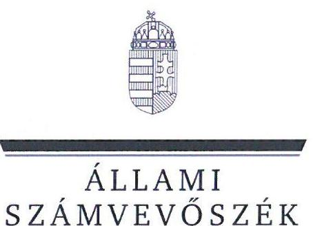

ÁLLAMI
SZÁMVEVŐSZÉK

# JELENTÉS 

## A területi önkormányzatok területfejlesztési feladatellátásának ellenőrzése

2025.

---

# ELLENŐRZÉSI IGAZGATÓSÁG: 

## ELLENŐRZÉSI IGAZGATÓSÁG II.

## ELLENŐRZÉSI IGAZGATÓ:

DR. BAFFIA GERGELY GÁBOR ellenőrzési igazgató

## ELLENŐRZÉSVEZETŐ:

DR. LÁNG ÁGNES KRISZTINA ellenőrzésvezető

Jelentéseink az interneten a www.asz.hu címen olvashatók.

IKTATÓSZÁM: EL-3875-060/2025
TÉMASORSZÁM: 47
ELLENŐRZÉS-AZONOSÍTÓ SZÁM: V1033

---

# TARTALOMJEGYZÉK 

AZ ELLENŐRZÉS ALAPADATAI ..... 5
AZ ELLENŐRZÉS HATÓKÖRE ÉS TERÜLETE ..... 8
ÖSSZEFOGLALÁS ..... 12
AZ ELLENŐRZÉS FÓKUSZTERÜLETEI ..... 15
MEGÁLLAPÍTÁSOK ..... 16
JAVASLATOK ..... 29
MELLÉKLETEK ..... 31
I. sz. melléklet: Értelmező szótár ..... 31
II. sz. melléklet: Az ellenőrzött szervezetek jegyzéke ..... 33
III. sz. melléklet: Ellenőrzési kritériumok ..... 34
IV. sz. melléklet: A TOP források felhasználásához kapcsolódó vármegyei ITP-kben meghatározott általános tartalmi kiválasztási kritériumok ..... 35
V. sz. melléklet: A TOP Plusz források felhasználásához kapcsolódó vármegyei ITP-kben meghatározott általános tartalmi kiválasztási kritériumok ..... 37
VI. sz. melléklet: Összesítő kimutatás a mintatételekhez kapcsolódó TOP Plusz pályázati felhívásokban rögzített, területi kiegyenlítődést elősegítő részletes kiválasztási szempontokról ..... 38
VII. sz. melléklet: A TOP Plusz források felhasználásához kapcsolódó vármegyei ITP-kben a komplex programmal fejlesztendő járásokra elkülönített forráskeretek nagysága és aránya. ..... 39
VIII. sz. melléklet: Kiemelt térségi fejlesztési tanácsok ..... 40
IX. sz. melléklet: Az Önkormányzatok által alapított térségi fejlesztési tanácsok ..... 41
FÜGGELÉK: ÉSZREVÉTELEK ..... 43
RÖVIDÍTÉSEK JEGYZÉKE ..... 45

---

.

---

# AZ ELLENŐRZÉS ALAPADATAI 

## AZ ELLENŐRZÉS CÉLJA

Az ellenőrzés célja annak ellenőrzése volt, hogy a területi önkormányzatok a jogszabályokban előírt területfejlesztési feladataikat ellátták-e, a koordinációs feladataiknak eleget tettek-e. Az ellenőrzés során értékeltük, hogy a területi önkormányzatok a 2021-2027 programozási időszak vonatkozásában teljesítették-e a tervezési feladataikat. Az ellenőrzés kiterjedt továbbá annak vizsgálatára, hogy az intézkedések, programok megvalósulásának nyomon követése, értékelése megtörtént-e.

## AZ ELLENŐRZÉS TÍPUSA

Törvényességi ellenőrzés

## AZ ELLENŐRZŐTT IDŐSZAK

1. a területi Önkormányzatok ${ }^{1}$ területfejlesztési feladatainak ellátása

- a területfejlesztés tervezésével összefüggő feladatainak ellátása (területfejlesztési koncepció, területfejlesztési program, integrált területi program)
- a fejlesztési források felhasználásával kapcsolatos feladatok ellátása
- projektfejlesztési/projektmenedzsmenti feladatok ellátása
- a területfejlesztéssel kapcsolatos koordinációs területi feladatainak ellátása
- a területfejlesztéshez kapcsolódó adatszolgáltatási, értékelési feladatok ellátása
- a területfejlesztéshez kapcsolódó nyomon követési feladatainak ellátása (területfejlesztési koncepció, területfejlesztési program, integrált területi program)

2. a területi Önkormányzatok illetékességi területén kívül eső területfejlesztési feladatainak ellátása

- a területfejlesztés tervezésével összefüggő feladatainak ellátása (Országos Területfejlesztési koncepció készítése és véleményezése, valamint az ágazati fejlesztési tervek véleményezése)
- a területfejlesztéshez kapcsolódó nyomon követési feladatainak ellátása (az operatív és határon átnyúló programok végrehajtása tekintetében)

3. a területi Önkormányzatok területfejlesztési feladatainak ellátása érdekében kialakított szervezeti keretek

2020-2023. évek

2022-2023. évek
2022-2023. évek
2020-2023. évek
2022-2023. évek

2022-2023. évek, kitekintéssel a 2021-2027 programozási időszakban elvégzett nyomon követési feladatokra

2020-2023. évek

2022-2023. évek

2022-2023. évek, kitekintéssel a 2021-2027 programozási időszak tervezési feladataira

---

Az ütemezett ellenőrzés következtében öt területi Önkormányzatnál az ellenőrzési programmal összhangban az ellenőrzött időszak vége 2023. II. negyedév vége, a többi 11 esetében 2023. IV. negyedév vége volt.

# AZ ELLENŐRZÉS TÁRGYA 

A területi Önkormányzatok területfejlesztési tervdokumentumaiban ${ }^{2}$ megfogalmazott célok (jövőkép, cselekvési program), fejlesztési irányok illeszkedése a térség sajátosságaihoz, adottságaihoz, valamint az országos területfejlesztési célkitűzésekhez. A területi önkormányzat tervezési, döntéselőkészítő hatáskörébe utalt fejlesztési források felhasználásával kapcsolatos feladatellátás, továbbá a területi önkormányzat koordinációs feladatainak ellátása.

A fejlesztendő térségek (járások) - különös tekintettel a 36 komplex programmal fejlesztendő járásra - területi felzárkózása/kiegyenlítése érdekében történt intézkedések, a területi egyenlőtlenségek csökkentése szempontjainak figyelembevétele a terület- és településfejlesztési források elosztása során.

A területi Önkormányzatok területfejlesztési feladatellátással összefüggő szervezeti kereteinek kialakítása, a feladatellátásban résztvevők feladatainak, hatásköreinek meghatározása.

A területi Önkormányzatok 2021-2027 programozási időszak vonatkozásában ellátandó tervezési feladatainak teljesítése, az ezzel összefüggő fejlesztési források felhasználásával kapcsolatos feladatok ellátása.

A forrásfelhasználás tervezése, a támogatói döntés előkészítésében való részvétel, valamint a projektfejlesztési/projektmenedzseri feladatok ellátása során az összeférhetetlenségi szabályok betartása.

A területfejlesztéshez kapcsolódó adatszolgáltatási, nyomon követési, értékelési feladatok ellátása.
Az ellenőrzés kiterjedt minden olyan körülményre és adatra, amely az ÁSZ ${ }^{3}$ jogszabályban meghatározott feladatainak teljesítéséhez, valamint a program végrehajtása folyamán felmerült újabb összefüggések feltárásához szükséges.

## AZ ELLENŐRZÉS JOGALAPJA

Az ellenőrzés jogszabályi alapját az ÁSZ tv. ${ }^{4}$ 1. § (3) bekezdésében és az 5. § (2) bekezdésében foglalt előírások képezték.

## AZ ELLENŐRZÉS MÓDSZERE

Az ellenőrzést a nemzetközi standardokat irányadónak tekintve az ellenőrzési program szempontjai, az ellenőrzött időszakban hatályos jogszabályok és közjogi szervezetszabályozó eszközök, az ellenőrzés szakmai szabályok és módszertanok figyelembevételével végeztük el.

Az ellenőrzés lefolytatására három ütemben került sor a II. sz. mellékletben felsorolt 16 vármegyei önkormányzat és hivatalaik tekintetében.

Az ÁSZ az ellenőrzést a területi Önkormányzatok, a területfejlesztési feladatellátásban részt vevő, projektmenedzsmenti feladatokat ellátó, az Önkormányzatok érdekeltségi körébe tartozó gazdasági társaságok

---

és a Hivatalok ${ }^{5}$ tekintetében folytatta le. Az Önkormányzatok és a gazdasági társaságok ellenőrzéssel érintett dokumentumait, tanúsítványait a Hivatalok bocsátották az ellenőrzés rendelkezésére.

Az ellenőrzési kérdések megválaszolásához szükséges bizonyítékok megszerzése az ellenőrzött szervezetek által rendelkezésre bocsátott dokumentumokra és adatokra alapozva, továbbá interjú, információkérés, helyszíni ellenőrzés, mintavételezés, valamint elemző eljárás alkalmazásával történt.

Az ellenőrzési bizonyítékként felhasznált adatforrások közé tartoztak az ellenőrzéshez kért dokumentumok, tanúsítványok, az ellenőrzés tárgya kapcsán releváns, nyilvánosan hozzáférhető adatok, dokumentumok (www.palyazat.gov.hu, a határon átnyúló nemzetközi programok honlapjai, a területi önkormányzatok és gazdasági társaságaik honlapjai), másrészt adatforrás volt még minden, az ellenőrzés folyamán feltárt, az ellenőrzés szempontjából információkat tartalmazó dokumentum.

Az ellenőrzés lefolytatásához az ellenőrzött szervezetek a tanúsítványok kitöltésével, az ÁSZ által kért dokumentumok, adatok, információk megküldésével és a helyszíni ellenőrzés során a dokumentumok rendelkezésre bocsátásával, továbbá interjúk keretében szolgáltattak adatokat. A rendelkezésre bocsátott adatok, információk kontrolljára a helyszíni ellenőrzés keretében került sor.

Az ÁSZ az egyes területek szabályszerűségének, megfelelőségének értékelését a III. sz. mellékletben megjelölt kritériumok alapján végezte el.

A területi Önkormányzatok forrásfelhasználás tervezésével, a támogatói döntés előkészítésében való részvétellel, a projektfejlesztéssel és projektmenedzsmenttel kapcsolatos feladatellátásának ellenőrzése során kockázatalapú mintavételi eljárással - az ellenőrzött időszak minden évéhez kapcsolódóan - a kockázatosnak ítélt pályázatok, illetve projektfejlesztési-, menedzsmenti szerződések értékelésére került sor. A mintatételek kiválasztásánál a kockázatosnak minősítés ismérvei voltak a pályázati támogatás összege/nagyságrendje, a lényeges sokaságba való tartozása, a konzorciumban/több szereplővel megvalósított pályázati projektek közé való tartozás, illetve a pályázatok esetében az elnyert támogatás felhasználásával kapcsolatban felmerülő összeférhetetlenségi esetek.

A mintavétel az ellenőrzött szervezetek által kitöltött tanúsítványokban rögzített adatok alapján történt. A nem statisztikai kockázatalapú mintavételi eljárással ellenőrzött terület esetében a mintatételek (pályázatok, szerződések) egyedi értékelése alapján tett megállapítások a teljes ellenőrzött területre/sokaságra/feladatellátásra nem került kivetítésre. A tények feltárása és azok összegzése során a megállapítások az ellenőrzött mintatételekre vonatkozóan kerültek megfogalmazásra.

---

# AZ ELLENŐRZÉS HATÓKÖRE ÉS TERÜLETE 

A területfejlesztés célját a 2023. december 31-ig hatályos Tftv. ${ }^{6}$ és 2024. január 1-jén hatályba lépett új Tftv. ${ }^{7}$ egyaránt az ország versenyképességének javításában, területi kohéziójának megtartásában, a fenntartható fejlődés feltételeinek megteremtésében, a főváros, a városok, illetve a vidék közti gazdasági, társadalmi, infrastrukturális különbségek mérséklésében, valamint a nemzeti és térségi identitástudat megtartásában és erősítésében, a társadalmi esélyegyenlőség biztosításában jelölte meg. A települések elnéptelenedésének és ezzel párhuzamosan a városok túlzsúfolttá válásának, mindezek révén a vidéki és a városi életszínvonal csökkenésének veszélyét felismerve, a jogalkotó az új törvényben a területfejlesztés további céljai közé sorolta a vidéki területek népességmegtartó képességének erősítését és a társadalom jólétének javítását is.
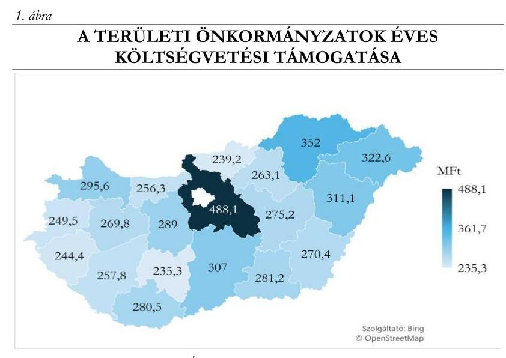

A 2012. január 1-jétől hatályba lépett Mötv. ${ }^{8}$ a vármegyei önkormányzatok feladatkörét jelentősen átalakította, korábbi intézményfenntartó szerepük megszűnt, ami jelentősen csökkentette gazdasági és politikai súlyukat. Ezt követően a vármegyei önkormányzatok a megszüntetett regionális és megyei területfejlesztési tanácsok jogutódjaként a területfejlesztés intézményrendszerében a középső szint főszereplőjévé váltak.

A központi költségvetésből a 19 vármegyei önkormányzat az ellenőrzött időszak minden évében összesen 5488,1 M Ft${ }^{9}$ támogatásban részesült.

Az ellenőrzött időszakra vonatkozóan a Tftv. a területfejlesztési feladatokért, illetve a feladatok végrehajtásáért felelős központi állami és területi szerveket az alábbiak szerint határozta meg:

---

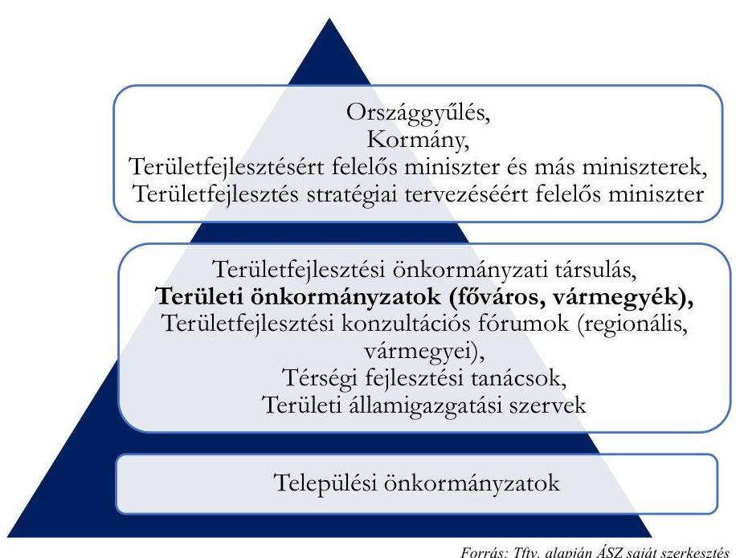

A területfejlesztés stratégiai tervezéséért felelős miniszter feladata volt a területi és ágazati tervek összhangjának elősegítése, az országos és térségi területi koncepciók, programok összehangolása, területfejlesztéssel kapcsolatos információs rendszer működtetéséről való gondoskodás, továbbá a vármegyei, fővárosi és megyei jogú városok önkormányzatainak bevonásával a területi szempontú fejlesztéseket tartalmazó operatív programok kidolgozása, a megvalósításukról való gondoskodás, nyomon követésük és a végrehajtásuk értékelése. A Tftv. és az új Tftv. a területi önkormányzatok számára ugyanazon területfejlesztési feladatokat határozta meg, melyeket összefoglaló jelleggel a 3. ábra szemléltet.

Az Országgyűlés fogadta el az Országos Fejlesztési és Területfejlesztési Koncepciót (OFTK${ }^{II}$), valamint meghatározta a területfejlesztés eszköz és intézményrendszere átfogó szabályait. A Kormány feladata volt a regionális politika érvényesülésének biztosítása. A miniszterek feladatkörébe tartozott többek között az országos jelentőségű koncepciók, tervek, a kiemelt térségek fejlesztési programjainak kidolgozása, a forráskoordináció és a programfinanszírozás.

---

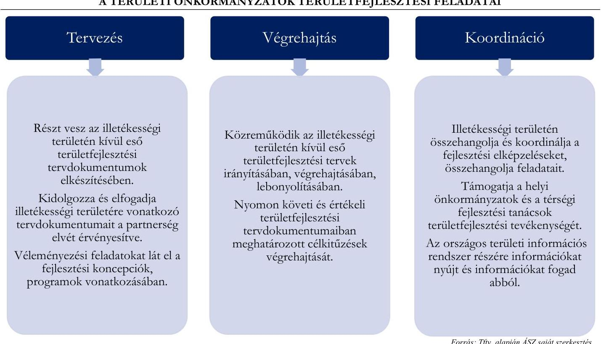
4. ábra

AZ ELLENŐRZŐTT VÁRMEGYÉK
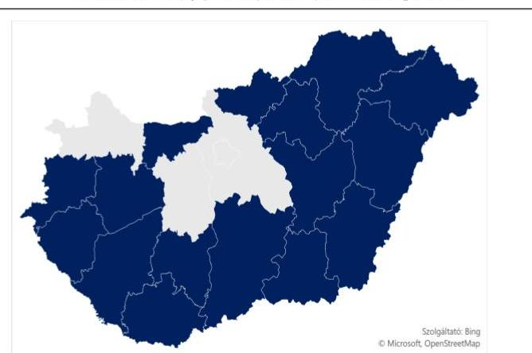

Forrás: ÁSZ saját szerkesztés, szolgáltató: Bing Microsoft, OpenStreetMap

Az ellenőrzési jelentés a 4. ábrában jelölt 16 vármegye ellenőrzési megállapításait tartalmazza. Az ellenőrzött időszakban ezen vármegyék mindegyike a hat kevésbé fejlett régióba tartozott és egyik vármegye területén sem volt különleges gazdasági övezet.

---

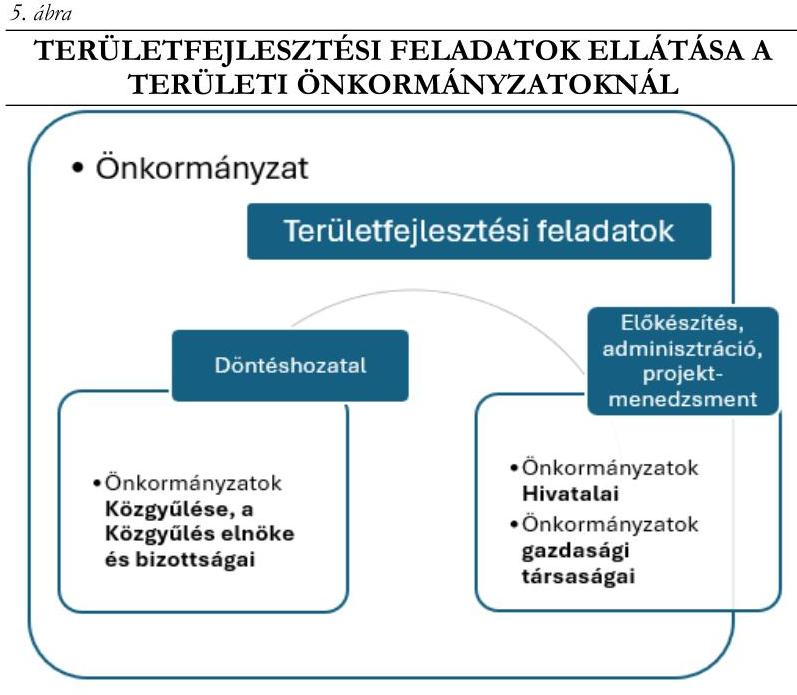

Forrás: ÁSZ saját szerkesztés

A területfejlesztési feladatok ellátását az ellenőrzött Önkormányzatoknál ${ }^{11}$ a közgyűlés és szervei biztosították. A tervdokumentumok elfogadásával és a projektek támogatásával kapcsolatos döntéseket az Önkormányzat SZMSZ ${ }^{12}$ -ében meghatározottak szerint a Közgyűlés, illetve annak bizottsága(i), elnöke hozta. A döntések előkészítésével és végrehajtásával kapcsolatos feladatokat és a projektmenedzsmenti feladatokat a közgyűlés hivatala végezte. Az Önkormányzatok nagyobb része élt azzal az Mötv.-ben biztosított lehetőséggel, hogy a feladatkörébe tartozó közszolgáltatások ellátására gazdálkodó szervezetet alapított. Az Önkormányzatok többségi tulajdonába tartozó gazdasági társaságok elsősorban a projektmenedzsmenti feladatok ellátásában vettek részt.

---

# ÖSSZEFOGLALÁS 

Az ÁSZ tv. értelmében az ÁSZ általános hatáskörrel végzi a közpénzek felhasználásának ellenőrzését. A vármegyei önkormányzatok (továbbiakban: Önkormányzatok) szerepe a területi igazgatásban 2012. január 1-jétől jelentősen megváltozott, a korábbi, döntően intézményfenntartó feladataik megszűntek, ugyanakkor a Kormányzat a területfejlesztés intézményrendszerének középső szintjén kiemelkedő szerepet szánt nekik. Mindez az Önkormányzatok működésének teljes átalakulását eredményezte az ellátandó feladatok, a szervezet, a szükséges készségek és az eljárásrendek tekintetében egyaránt. Az ellenőrzés tárgya a vármegyei önkormányzatok feladatellátásának, a kialakított szervezeti keretek és eljárások szabályszerűségének vizsgálata, a jó gyakorlatok feltárása volt.

Az Önkormányzatok területfejlesztéssel kapcsolatos tervezési, végrehajtási és koordinációs feladatellátása a jogszabályi előírásoknak és az IH iránymutatásainak összességében megfelelt, az ellenőrzés a területfejlesztési tervek, programok nyomon követésében tárt fel hiányosságokat.

Az Önkormányzatok a 2014-2030 évekre szóló Területfejlesztési Koncepcióikat, valamint a 2014-2020 és a 2021-2027 programozási időszakokra szóló Területfejlesztési Programjaikat a jogszabályi előírásoknak megfelelően elkészítették és elfogadták. Az Önkormányzatok Területfejlesztési Programja tartalmazta a jogszabályban kötelező tartalmi elemként megjelölt „Monitoring és értékelési terv”-et, azonban azokban - hét vármegye kivételével - a jogszabályi előírás és az Útmutatóban ${ }^{13}$ foglaltak ellenére nem határozták meg az indikátorok kiindulási-, vagy célértékét, vagy a mérés gyakoriságát. A mérés,
 értékelés alapját képező adatok hiányosságai előrevetítik annak kockázatát, hogy a jövőbeni monitoring és értékelési tevékenység nem lesz végrehajtható vagy eredményei nem lesznek megalapozottak.

Az Önkormányzatok a jogszabályi előírásoknak és az IH¹⁴ iránymutatásainak megfelelően elkészítették és elfogadták a 2014–2020 és a 2021–2027 programozási időszakra vonatkozó ITP¹⁵-jüket, melyeket az IH egyetértését követően a Kormány határozattal fogadott el.

Az ellenőrzött időszakban az Önkormányzatok a TOP¹⁶/TOP Plusz¹⁷ fejlesztési források elosztására vonatkozó döntéselőkészítésben a jogszabályi előírásoknak megfelelően vettek részt. A jogszabályi előírásoknak megfelelően a Közgyűlés vagy szerve döntött arról, hogy a vármegye települési önkormányzatai által benyújtott egyes pályázatok támogatását javasolja-e, vagy sem az Irányító Hatóság mellett működő DEB¹⁸-nek. A DEB ülésén az Önkormányzatok Közgyűlése/szerve által delegált, szavazati joggal rendelkező tag – a jogszabályi előírásoknak megfelelően – az önkormányzati döntést képviselte. Az Önkormányzatok a jogszabályban meghatározott összeférhetetlenségi követelményeket az ellenőrzött tételek vonatkozásában a támogatandó projektekre vonatkozó döntési javaslat kialakítása során három vármegye kivételével érvényesítették.

Mivel az Önkormányzatok az ellenőrzött időszakban olyan fejlesztési forrással nem rendelkeztek, amelynek elosztásáról közvetlenül dönthettek volna, a vármegyéjük, illetve azok meghatározott térségei egyedi fejlesztési igényeit a TOP/TOP Plusz források tekintetében csak a szabályozás adta szűk keretek között tudták érvényesíteni. Az egyedi fejlesztési igények érvényesítése érdekében az Önkormányzatok a vonatkozó jogszabályi előírásoknak és az IH iránymutatásainak megfelelően határozták meg a vármegyei ITP-kben az általános kiválasztási kritériumokat, míg az egyes pályázati felhívások területspecifikus mellékleteiben a részletes értékelési szempontokat.

---

Az Önkormányzatok a koordinációs feladataiknak a jogszabályban foglaltaknak megfelelően összességében eleget tettek, a partnerség elvét érvényesítették, a tervezés és a végrehajtás folyamatában a vármegye gazdasági szereplőivel együttműködtek.

Az Önkormányzatok területfejlesztési programjai végrehajtásának nyomon követése nem felelt meg teljeskörűen a jogszabályi előírásoknak, mert nem terjedt ki valamennyi, a tervdokumentumokban meghatározott célra, illetve a célok megvalósítását támogató valamennyi projektre. A nem teljes körű nyomon követéshez hozzájárult az is, hogy az Önkormányzatok az országos informatikai rendszerekhez nem rendelkeztek teljes körű hozzáféréssel, csak a saját és az általuk projektmenedzsmenttel érintett projektek vonatkozásában volt lekérdezési jogosultságuk, míg a tervdokumentumaik a vármegye teljes területére kiterjedtek. Az Önkormányzatok – négy vármegye kivételével – a jogszabályi előírások ellenére az ITP-k végrehajtásával összefüggésben monitoring tevékenységre vonatkozó előírásokat nem határoztak meg. A monitoring tevékenység hiányosságai miatt az Önkormányzatok a Hivatal vagy a gazdasági társaság által nem menedzselt projektek esetében nem rendelkeztek teljeskörű információval a vármegyében megvalósuló TOP/TOP Plusz projektek előrehaladásáról.

A 2022–2023. években az Önkormányzatok egy kivétellel a jogszabályban előírt vármegyei éves elemző értékelési jelentést elkészítették és a területfejlesztés stratégiai tervezéséért felelős miniszter részére megküldték.

Az Önkormányzatok a területfejlesztési feladataik ellátása érdekében az ellenőrzött időszakban kialakították a szervezeti kereteket, a feladatellátásba több szervüket, szervezetüket is bevonták. Az Önkormányzatok területfejlesztési feladataik ellátására amennyiben szükséges volt – a humánerőforrás kapacitáshiánya, illetve egyedi, időszakos jellegük miatt – megbízási és vállalkozási szerződéseket kötöttek. A szerződések megfeleltek a jogszabályi előírásoknak.

A Jász-Nagykun-Szolnok Vármegyei Önkormányzati Hivatal jegyzője az ÁSZ tv. 29. § (2) bekezdés szerinti, a jelentéstervezet megállapításaira tett észrevételében arról tájékoztatta az ÁSZ-t, hogy a számvevőszéki ellenőrzés során a vármegye vezető tisztségviselői intézkedtek, melynek eredményeként a Közgyűlés évente beszámolót tárgyal az ITP, a gazdasági program és a területfejlesztési programok előrehaladásáról, így első alkalommal 2024. szeptemberében a vármegyei gazdasági programról, míg 2024. decemberében az ITP előrehaladásáról beszámoló készült a Közgyűlés felé.

A Békés Vármegyei Önkormányzati Hivatal jegyzője az ÁSZ tv. 29. § (2) bekezdés szerinti, a jelentéstervezet megállapításaira tett észrevételében arról tájékoztatta az ÁSZ-t, hogy a vármegye a területfejlesztési programjában megjelölt eredményességi kritériumok indikátorainak kiindulási- és célértékeinek meghatározási kötelezettségét teljesíteni fogja.

A feltárt hiányosságok megszüntetése érdekében az ÁSZ Békés, Borsod-Abaúj-Zemplén, Csongrád-Csanád, Komárom-Esztergom, Nógrád, Somogy, Veszprém és Vas Vármegye Közgyűlésének Elnöke részére egy, Bács-Kiskun, Szabolcs-Szatmár-Bereg és Tolna Vármegyék Közgyűlésének Elnöke részére két, Bács-Kiskun, Csongrád-Csanád, Hajdú-Bihar, Komárom-Esztergom, Nógrád, Somogy, Tolna és Vas Vármegye Önkormányzatának Jegyzője részére egy, Baranya, Borsod-Abaúj-Zemplén, Heves, Jász-Nagykun-Szolnok, Szabolcs-Szatmár-Bereg, Veszprém és Zala Vármegye Önkormányzatának Jegyzője részére két szabályszerűségi javaslatot tett.

---

Az ellenőrzési megállapítások összesítését az 1. táblázat tartalmazza.

1. táblázat

| AZ ELLENŐRZÉSI MEGÁLLAPÍTÁSOK ÖSSZESÍTÉSE |  |  |  |  |
| :--: | :--: | :--: | :--: | :--: |
| TERÜLET | ÖssZEGZŐ   ÉRTÉKELÉS | INTÉZKEDÉST IGÉNYLŐ MEGÁLLAPÍTÁS | ÉRINTETT ÖNKORMÁNYZATOK |  |
|  |  |  | SZÁMA   (DB) | MEGNEVEZÉSE |
| TERVEZÉS | valamennyi vármegyei Önkormányzat esetében MEGFELELŐ | Területfejlesztési Program tartalma nem felelt meg a jogszabályi előírásoknak. | 9 | Bács-Kiskun, Békés, Borsod-Abaúj-Zemplén, Komárom-Esztergom, Nógrád, Somogy, Szabolcs-Szatmár-Bereg, Tolna, Veszprém |
| VÉGREHAJTÁS | valamennyi vármegyei Önkormányzat esetében MEGFELELŐ | Területfejlesztési Program nyomon követése nem felelt meg teljeskörűen a jogszabályi előírásoknak. | 9 | Baranya, Borsod-Abaúj-Zemplén, Heves, Jász-Nagykun-Szolnok, Nógrád, Somogy, Szabolcs-Szatmár-Bereg, Veszprém, Zala |
|  |  | Az ITP végrehajtása keretében a monitoring tevékenységre vonatkozó előírásokat nem határozták meg. | 12 | Baranya, Borsod-Abaúj-Zemplén, Csongrád-Csanád, Hajdú-Bihar, Heves, Jász-Nagykun-Szolnok, Komárom-Esztergom, Szabolcs-Szatmár-Bereg, Tolna, Vas, Veszprém, Zala |
|  |  | Összeférhetetlenségi követelmények nem érvényesültek a döntési javaslat kialakítása során. | 3 | Csongrád-Csanád, Szabolcs-Szatmár-Bereg, Vas |
|  |  | A jogszabályban előírt vármegyei éves elemző értékelési jelentést nem készítették el. | 1 | Bács-Kiskun |
| KOORDINÁCIÓ | valamennyi vármegyei Önkormányzat esetében MEGFELELŐ | A jogszabályi előírás ellenére a   Területfejlesztési Program végrehajtására vonatkozóan partnerségi programot nem készített. | 2 | Bács-Kiskun, Tolna |
|  |  | Vármegyei   Területfejlesztési   Konzultációs Fórumot a jogszabályi előírások ellenére nem működtették. | 3 | Baranya, Nógrád, Somogy |

---

# AZ ELLENŐRZÉS FÓKUSZTERÜLETEI 

1. A területi önkormányzatok területfejlesztési feladatainak ellátása
2. A területi önkormányzatok részvétele az illetékességi területükön kívül eső területfejlesztési feladatok ellátásában
3. A területi önkormányzat területfejlesztési feladatainak ellátása érdekében kialakított szervezeti keretek

---

# 1. A területi önkormányzatok területfejlesztési feladatainak ellátása 

Összegző megállapítás

Az Önkormányzatok a Tftv., a 272/2014. (XI. 5.) Korm. rendelet¹⁹ és a 256/2021. (V. 18.) Korm. rendelet²⁰ előírásainak megfelelően rendelkeztek területfejlesztési tervdokumentumokkal. A végrehajtás keretében a nyomon követési feladataik ellátása – hét vármegye kivételével – részben felelt meg a Tftv. előírásainak. Az Önkormányzatok a Tftv.-ben előírt koordinációs és adatszolgáltatási feladataiknak eleget tettek, a partnerség elvét mind a tervezés, mind a végrehajtás folyamatában érvényesítették.
1.1. számú megállapítás

Az Önkormányzatok a 2021–2027 programozási időszakra való felkészülés keretében a 218/2009. (X. 6.) Korm. rendelet²¹-ben előírtaknak megfelelően a Területfejlesztési koncepcióban és Területfejlesztési programban meghatározták a térség hosszú távú fejlesztési céljait, irányelveit. Az Önkormányzatok Területfejlesztési programja – hét vármegye kivételével – nem felelt meg teljeskörűen a 218/2009. (X. 6.) Korm. rendeletben és az Útmutatóban előírt tartalmi követelményeknek. A TOP Plusz források felhasználásának tervezése során az Önkormányzatok a TOP Plusz Operatív programban meghatározott területi felzárkózási szempontokat összességében érvényesítették.

A 2021–2027 programozási időszakra való felkészülés keretében az Önkormányzatok ellátták a tervezéssel kapcsolatos feladataikat, a vármegyei területfejlesztési koncepciók és programok kidolgozása és elfogadása a Tftv. és a 218/2009. (X. 6.) Korm. rendeletben meghatározott tervezési, egyeztetési, elfogadási eljárásrendjének megfelelően történt.
Az Önkormányzatok a Területfejlesztési koncepciókban meghatározták a térségek hosszú távú, átfogó fejlesztési céljait, a társadalmi, gazdasági és környezeti szempontból fenntartható fejlődés, az esélyegyenlőség szempontjait. A Területfejlesztési Programok tartalmazták a társadalmi, gazdasági és környezeti szempontból fenntartható fejlődés; az esélyegyenlőség; valamint a területi kohézió szempontjait.
Az Önkormányzatok 2021–2027 programozási időszakra vonatkozó Területfejlesztési Programja Baranya, Csongrád-Csanád, Hajdú-Bihar, Heves, Jász-Nagykun-Szolnok, Vas és Zala vármegyék kivételével – nem felelt meg teljeskörűen a 218/2009. (X. 6.) Korm. rendelet 3. melléklet 2.1. c) és i) pontja szerinti tartalmi követelményeknek, mert az Útmutatóban foglaltak ellenére az egyes prioritások eredményességi kritériumai és számszerűsített mutatói esetében kilenc Önkormányzat (Bács-Kiskun, Békés, Borsod-Abaúj-Zemplén, Komárom-Esztergom, Nógrád, Somogy, Szabolcs-Szatmár-Bereg, Tolna, Veszprém) az egyes indikátorok kiindulási-, vagy célértékét, négy Önkormányzat (Bács-Kiskun, Nógrád, Somogy, Veszprém) az indikátorok mérésének gyakoriságát nem határozta meg.

---

Az ellenőrzött időszakban az Önkormányzatok rendelkeztek a vármegyei közgyűlések által elfogadott, majd a Kormány határozataival (1144/2020. (IV. 8.) Korm. határozat²², 1196/2023. (V. 15.) Korm. határozat²³) jóváhagyott, a TOP és a TOP Plusz források felhasználásához kapcsolódó ITP-kel, melyek elkészítése, módosítása és elfogadása a Tftv., a 272/2014. (XI. 5.) Korm. rendelet és a 256/2021. (V. 18.) Korm. rendelet előírásainak megfelelően történt. A közgyűlések által elfogadott ITP-ket minden Önkormányzat tekintetében az IH egyetértését követően a Kormány határozattal fogadta el.
A vármegyei ITP-k értékelése alapján az Önkormányzatok a TOP Plusz források felhasználásának tervezése során összességében figyelemmel voltak a kedvezményezett, illetve fejlesztendő járások – kiemelten a komplex programmal fejlesztendő járások – felzárkózási szempontjaira. Az Önkormányzatok az ITP-kben rögzített területi szintű kiválasztási kritériumok (TKR²⁴ IV–V. sz. melléklet) és a mintatételekhez kapcsolódó területi értékelési szempontok (TSM²⁵) értékelése (VI. sz. melléklet) alapján a pályázatok kiválasztási és értékelési kritériumok kialakítása során érvényesítették a területi egyenlőtlenségek mérséklésének szempontjait a kedvezményezett, fejlesztendő, komplex programmal fejlesztendő járások, a kedvezményezett (hátrányos helyzetű) települések tekintetében.
Az ellenőrzött vármegyék közül 12 vármegyében volt komplex programmal fejlesztendő járás. Ezen érintett Önkormányzatok 2023. évtől hatályos ITP-jeik megfeleltek az Európai Bizottság C(2022)10008 számú határozatával elfogadott TOP Plusz operatív program azon előírásának, hogy a vármegyékre jutó indikatív forráskeret legalább 10%-át komplex programmal fejlesztendő járásokra kell betervezni, mert a 12 vármegyére jutó 1184,8 Mrd Ft²⁶ indikatív keretösszeg 15,8%-át különítették el a komplex programmal fejlesztendő járásokra, mely részletesen a VII. sz. mellékletben került bemutatásra.

# JÓ GYAKORLAT 

Békés Vármegye Önkormányzata már a 2014–2020 programozási ciklusra való felkészülés keretében kidolgozta a vármegye két, komplex programmal fejlesztendő járására (Mezőkovácsházai járás, Sarkadi járás) az ún. járásfejlesztési stratégiát, melyben a célrendszer megfogalmazása mellett a megvalósítás lehetséges forrásait is feltérképezte. A stratégiai célkitűzések elérését támogatta az Önkormányzat azzal a döntésével is, hogy a TOP Plusz források elosztása során a két érintett járásra allokált forráskeretet a lakosságarányos járási forráson felül további 20%-kal megemelte. Az Önkormányzat a területi kiegyenlítődés szempontját nem csak a jogszabályban előírt tervdokumentumok összeállítása során érvényesítette, hanem az elmaradott térségeinek fejlesztési lehetőségeit önállóan is kereste, ezzel is ösztönözte az érintett járások településeinek vezetőit a pályázati lehetőségek kiaknázására.

Annak ellenére, hogy az egyes vármegyék szintjén az IH részéről nem volt elvárás a 10%-os forráskeret elkülönítése, nyolc vármegyében (Békés, Borsod-Abaúj-Zemplén, Hajdú-Bihar, Heves, Jász-Nagykun-Szolnok, Somogy, Szabolcs-Szatmár-Bereg, Tolna) az Önkormányzatok 10%, vagy azt meghaladó arányú forráskeretet különítettek el ezen hátrányos helyzetű
 járások fejlesztéseire. A többi vármegyében (Bács-Kiskun, Baranya, Nógrád, Veszprém) a vizsgált időszakban ugyan nem érte el az elkülönített forráskeret a 10%-ot, de a területi kiegyenlítődés szempontja ezen vármegyék tervdokumentumaiban is érvényesült.

---

1.2. számú megállapítás

Az Önkormányzatok a fejlesztési források elosztására irányuló döntési javaslataikat – három Önkormányzat kivételével – a 256/2021. (V. 18.) Korm. rendelet előírásainak megfelelően hozták meg. Az Önkormányzatok területfejlesztési programjai és ITP-jei megvalósulásának nyomon követése – hét vármegye kivételével – nem felelt meg teljeskörűen a Tftv. és a 256/2021. (V. 18.) Korm. rendelet előírásainak.

A települési önkormányzatok által benyújtott pályázatok esetében az Önkormányzatok a fejlesztési források elosztására irányuló döntési javaslataik meghozatala során – a mintatételek értékelése alapján – a 272/2014. (XI. 5.) Korm. rendelet, illetve a 256/2021. (V. 18.) Korm. rendelet, valamint az ITP-jükben meghatározottak szerint jártak el. A 272/2014. (XI. 5.) Korm. rendeletben, illetve a 256/2021. (V. 18.) Korm. rendeletben előírtaknak megfelelően DEB ülésein a delegált tag az Önkormányzat döntési javaslatát képviselte és csak az a támogatási kérelmet támogatta a DEB, amelyet az illetékes Önkormányzat képviselője is támogatásra javasolt. A döntési javaslat kialakítása során az összeférhetetlenségi követelmények érvényesülése érdekében – az alábbi esetek kivételével – a 256/2021. (V. 18.) Korm. rendeletben előírt szükséges intézkedéseket az Önkormányzatok megtették:

- A Csongrád-Csanád Vármegyei Önkormányzat döntési javaslatát meghozó Döntés-előkészítő Ideiglenes Bizottság 2022. július 14-ei ülésén egy mintatétel esetében az egyik bizottsági tag szóban jelezte az összeférhetetlenségét. A Bizottság az Mötv. 49. § (1) bekezdésében és a 60. §-ában foglalt lehetőséggel nem élt és az összeférhetetlenséget jelző bizottsági tagot nem zárta ki a szavazásból. A 256/2021. (V. 18.) Korm. rendelet 44. § (1) bekezdésében meghatározott összeférhetetlenségi szabályok az európai uniós alapokból származó támogatások felhasználása vonatkozásában, a támogatási döntés előkészítésében és meghozatalában kötelezően alkalmazandók. Ezért a Bizottság eljárása ugyan az Mötv. előírásainak megfelelt, azonban a 256/2021. (V. 18.) Korm. rendelet 44. § (1) bekezdésében foglalt, szigorúbb összeférhetetlenségi követelmények érvényesülését nem biztosította.
- Szabolcs-Szatmár-Bereg Vármegyei Önkormányzat Közgyűlésének 2022. május 26-ai ülésén a területfejlesztési források elosztására irányuló döntési javaslat meghozatala előtt összesen hat mintatétel vonatkozásában több testületi tag jelezte az összeférhetetlenségük fennállását az adott konstrukció esetében. A Közgyűlés az Mötv. 49. § (1) bekezdésében foglalt lehetőséggel nem élt, az összeférhetetlenségüket jelző tagokat nem zárta ki a szavazásból. A Közgyűlés eljárása az Mötv. előírásainak ugyan megfelelt, azonban a 256/2021. (V. 18.) Korm. rendelet 44. § (1) bekezdésében foglalt, szigorúbb összeférhetetlenségi követelmények érvényesülését nem biztosította.
- A Vas Vármegyei Önkormányzatnál két mintatétel esetében a fejlesztési források elosztására javaslatot tevő Megyei Döntés-előkészítő Bizottság döntéshozatala során nem érvényesült a 256/2021. (V. 18.) Korm. rendelet 44. § (1) bekezdés g.) pontjában rögzített, a döntés-előkészítésből kizáró összeférhetetlenségi követelmény. A Bizottság tagjai a tevékenységüket megelőzően összeférhetetlenségi nyilatkozatot tettek, azonban a Bizottság 2022. 10. 19-ei ülésén a döntési javaslatok előtt az érintett bizottsági tagok nem jelezték, hogy a pályázattal érintett település polgármestereként, illetve lakosaiként az adott pályázat esetében az ügy elfogulatlan megítélése nem elvárható tőlük. Az összeférhetetlenséggel érintett bizottsági tagok szavazásból történő kizárását más bizottsági tagok sem javasolták. Jelzés hiányában a Bizottság tagjai nem tudtak döntést hozni az érintett bizottsági tagok kizárásáról.

---

A fenti esetekben az összeférhetetlenséggel érintett tagok szavazata a döntés végeredményét nem befolyásolta.
Az Önkormányzatok a projektfejlesztési és projektmenedzsmenti feladataikat az ellenőrzött mintatételek vonatkozásában ellátták, e feladatellátásuk során az összeférhetetlenségi követelményeket a 272/2014. (XI. 5.) Korm. rendelet és a 256/2021. (V. 18.) Korm. rendelet előírásainak megfelelően érvényesítették. Az ellenőrzött időszakban az ITP végrehajtásához kapcsolódóan az Önkormányzatok projektmenedzsmenti feladatokat a saját projektek, illetve a települési önkormányzatok felkérésére a települési projektek esetében láttak el.
A feladatok ellátásához szükséges források rendelkezésre álltak, a projektmenedzsmenti feladatokkal kapcsolatos költségek és bevételek nyilvántartása a Hivatalok esetében az Áhsz. $^{27}$, gazdasági társaságaik esetében a Számv. tv. $^{28}$ előírásainak megfelelt.
A Tftv.-ben és a 37/2010. (II. 26.) Korm. rendelet $^{29}$-ben előírt, a vármegyei területfejlesztési koncepció felülvizsgálatával, valamint a vármegyei területfejlesztési program előzetes értékelésével és felülvizsgálatával kapcsolatos feladatokat az Önkormányzatok a 2021-2027 programozási időszakra való felkészülés keretében a 2021. évben elvégezték.
A Területfejlesztési programmal kapcsolatos közbülső értékelési kötelezettségüknek az Önkormányzatok eleget tettek a Közgyűlés részére készített – féléves, éves – beszámolók révén, melyek tartalmazták a Hivatalok által ellátott területfejlesztési feladatokat, valamint az ITP-k végrehajtásának alakulását. A Területfejlesztési programok végrehajtásának nyomon követése a Bács-Kiskun, Békés, Csongrád-Csanád, Hajdú-Bihar, Komárom-Esztergom, Tolna és a Vas Vármegyei Önkormányzatok kivételével nem felelt meg teljeskörűen a Tftv. 11. § (1) bekezdés ba) pontja (új Tftv. 10. § (2) bekezdés a) pontja) előírásainak, mivel az Önkormányzatok Közgyűlései részére készített féléves, éves beszámolók csak az Önkormányzatok által megvalósított és projektmenedzsmenttel támogatott projektek és területfejlesztési feladataik ellátására korlátozódtak.
A 272/2014. (XI. 5.) Korm. rendelet 19. § f) pontjában és a 256/2021. (V. 18.) Korm. rendelet 29. § (1) bekezdés f) pontjában, továbbá az IH által kiadott TOP Plusz Útmutatóban foglaltak ellenére 12 Önkormányzat (Baranya, Borsod-Abaúj-Zemplén, Csongrád-Csanád, Hajdú-Bihar, Heves, Jász-Nagykun-Szolnok, Komárom-Esztergom, Szabolcs-Szatmár-Bereg, Tolna, Vas, Veszprém, Zala vármegye) az ITP-ben a végrehajtással összefüggésben nem határozott meg monitoring tevékenységre vonatkozó előírásokat.
A 2022-2023. években az Önkormányzatok a 272/2014. (XI. 5.) Korm. rendelet és a 256/2021. (V. 18.) Korm. rendelet alapján monitoring feladataik ellátása céljából alkalmanként kértek adatokat az irányító hatóságtól a támogatott projektekkel összefüggésben. Emellett az IH által kockázatosnak ítélt projektek esetében az Önkormányzatok képviselői részt vettek projektfelügyeleti eljárásokhoz kapcsolódó egyeztetéseken. Ezen adatszolgáltatások, egyeztetések támogatták az ITP-k végrehajtásának nyomon követését.
Kifejezetten az ITP előrehaladásának értékeléséhez kapcsolódó, programszintű beszámolók, tájékoztatók a Közgyűlés részére a 2022-2023. években a Bács-Kiskun, Békés, Csongrád-Csanád, Hajdú-Bihar, Komárom-Esztergom, Tolna és a Vas Vármegyei Önkormányzatok esetében készültek. A többi Önkormányzatnál a Közgyűlések csak a Hivatalok és a gazdasági társaságok által kezelt TOP, TOP Plusz és egyéb projekteket érintő projektszintű előrehaladásokról, a TOP Plusz fejlesztési forráskeretek alakulásáról kaptak tájékoztatást az ellenőrzött időszakban jellemzően a Hivatal és a gazdasági társaság éves beszámolóinak, illetve az ITP módosítások előterjesztéseinek megtárgyalása során. A monitoring tevékenység hiányosságai miatt az Önkormányzatok a Hivatal, illetve a gazdasági társaság által nem

---

menedzselt projektek esetében nem minden esetben rendelkeztek teljeskörű információval a vármegyét érintő TOP és TOP Plusz projektek megvalósulásáról, ebből következően felmerülhet annak kockázata, hogy az Önkormányzatok nem értesülnek időben olyan körülményekről, amelyek a 256/2021. (V. 18.) Korm. rendelet 29. § (1) bek. f) pontjában előírt, a 2021-2027. évekre szóló ITP végrehajtási kötelezettségük teljesítését hátrányosan befolyásolják.
1.3. számú megállapítás

Az Önkormányzatok a Tftv.-ben előírt koordinációs feladataiknak összességében eleget tettek, a partnerség elvét mind a tervezés, mind a végrehajtás folyamatában érvényesítették. A térségi fejlesztési elképzeléseket a Tftv. előírásainak megfelelően alakult térségi fejlesztési tanácsok működtetésével koordinálták. A Tftv. által előírt regionális vármegyei konzultációs fórumok működtetése az ellenőrzött időszakban formálissá vált.

Az Önkormányzatok területfejlesztési feladatok ellátásával kapcsolatos Tftv. szerinti koordinációs feladataiknak eleget tettek. Az Önkormányzatok a 218/2009. (X. 6.) Korm. rendelettel összhangban rendelkeztek a tartalmi előírásoknak megfelelő Partnerségi Tervvel.
Az Önkormányzatok a 218/2009. (X. 6.) Korm. rendelet alapján – Bács-Kiskun és Tolna vármegyék kivételével – a Területfejlesztési Programjaikban a partnerségi program részeként meghatározták a végrehajtásba bevonni kívánt közreműködő szervezeteket, intézményeket és az együttműködések formáit. Bács-Kiskun és Tolna Vármegye Önkormányzata a 218/2009. (X. 6.) Korm. rendelet 13. § (3) bekezdése ellenére a Területfejlesztési Program végrehajtására vonatkozóan partnerségi programot nem készített.
A tervdokumentumok készítése során az Önkormányzatok illetékességi területükön a Tftv. előírásainak megfelelően a területfejlesztéssel kapcsolatban összehangolták az államigazgatási szervek, települési

# JÓ GYAKORLAT 

Bács-Kiskun-, Békés-, Borsod-Abaúj-Zemplén-, Hajdú-Bihar-, Tolna-, Szabolcs-Szatmár-Bereg-, Veszprém- és Vas Vármegyei Önkormányzatok a tervdokumentumok összeállítását megelőzően (kérdőívek, tájékoztatók, workshopok segítségével) felmérték a vármegyéik önkormányzatainak és gazdasági szereplőinek fejlesztési igényeit, projekt ötleteit, melyeket a tervezés során hasznosítottak. A települési önkormányzatok vezetőivel történt személyes találkozások, megbeszélések hozzájárultak a projektötletek generálásához.
A vármegyék és a területükön működő egyetemek közötti kapcsolatok széleskörű formái alakultak ki, a rendszeres tájékoztatástól a szervezeti szintű együttműködésig. A Békés Vármegyei Közgyűlést a vármegye területén működő egyetemek felkérés alapján tájékoztatták a vármegye felsőoktatásáról, szakképzésről, oktatási helyzetéről. A Baranya, a Borsod-Abaúj-Zemplén, a Csongrád-Csanád, a Hajdú-Bihar, a Heves, és a Szabolcs-Szatmár-Bereg Vármegyei Önkormányzatok és az illetékességi területükön működő felsőoktatási intézmények a tervezés során, valamint egy-egy közös projekt keretében is együttműködtek. Az együttműködések során több közös szakmai rendezvény – konferencia, szakmai nap – valósult meg. Hajdú-Bihar Vármegye Önkormányzatának gazdasági társasága az oktatási és kutatási együttműködések terén befolyásszintet biztosított a Debreceni Egyetem Természettudományi és Technológiai Kar kibővített Fejlesztéspolitika és Területi tervezés tanszékének, együttműködési megállapodás keretében továbbá a 2018/2019-es tanévtől duális képzési programot indított. A Szabolcs-Szatmár-Bereg Vármegyei Önkormányzat és a Nyíregyházi Egyetem között létrejött együttműködési megállapodás célja a Technológiai Transzfer Központ létrehozása volt. Az egyetemek szakmai, tudományos ismereteikkel támogatták a térségi fejlesztési elképzelések összehangolását, továbbá az egyetemi hallgatók szakirányú képzésével, feladatokba való bevonással a szakember utánpótlást is elősegítették.

---

önkormányzatok, a vármegyeszékhelyek, vármegyei jogú városok, gazdasági és civil szervezetek, valamint a területükön működő egyetemek fejlesztési elképzeléseit.
Az ellenőrzött Önkormányzatok részvételével – az OFTK-ban meghatározott kiemelt térségekben a Tftv.-ben rögzítettek alapján három kiemelt térségi tanács működött, melyekre vonatkozó információkat a VIII. melléklet tartalmaz.
A vármegyei önkormányzatok emellett a Tftv.-ben meghatározott feladatok ellátása érdekében önállóan, vagy a szomszédos vármegye vármegyei önkormányzatával közösen térségi fejlesztési tanácsot hozhattak létre. Az ellenőrzött vármegyék területén az Önkormányzatok által alapított térségi fejlesztési tanácsokra vonatkozó információkat a IX. sz. melléklet tartalmaz. Az Önkormányzatok döntése alapján működtetett térségi fejlesztési tanácsok munkaszervezeti feladatait (döntés-előkészítő, fejlesztési célokat feltáró, pályázatokat megalapozó tevékenység, éves beszámoló készítése) valamennyi térségi fejlesztési tanács esetében a tanács elnökének illetékessége szerinti vármegyei önkormányzati hivatal látta el.
A települési önkormányzatok – Baranya Vármegye kivételével – nem fordultak az Önkormányzatokhoz azzal a kéréssel, hogy segítsék elő a területfejlesztési társulásaik létrehozását, így az Önkormányzatoknak a Tftv. 11. § (1) bekezdés cc) pontjában előírt feladatuk az ellenőrzött időszakban nem keletkezett. Baranya Vármegye Önkormányzata 2023-ban kötött konzorciumi megállapodást a (42 önkormányzat által létrehozott) Pécsi Többcélú Agglomerációs Társulással szociális és gyermekjóléti alapellátások fejlesztése érdekében.
A Tftv. előírásainak megfelelően az Önkormányzatok az illetékességi területükön működő települési önkormányzatok településfejlesztési terveit véleményezték.
Az Önkormányzatok a Tftv. előírásának megfelelően – gazdasági társaságaik bevonásával – gazdaságfejlesztési és befektetés ösztönzési tevékenységet láttak el, melyet a TOP programok keretében megvalósított „megyei foglalkoztatási-gazdaságfejlesztési együttműködési projektek” támogattak.
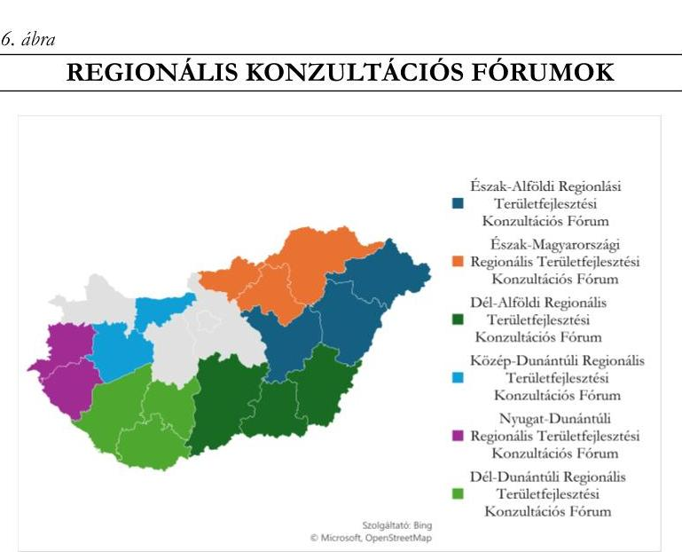

A regionális területfejlesztési konzultációs fórumok – kivéve a Dél-Dunántúli Regionális Konzultációs Fórum – a 2020-2021. években esetenként üléseztek, a

 2022. évtől nem tartottak üléseket, működésük formálissá vált. Az ellenőrzött időszakban a regionális területfejlesztési konzultációs fórumok Tftv. 14/A. §-ban meghatározott szerepüket – regionális döntésekben történő eljárás, vármegyei önkormányzatok döntéshozatalának összehangolása, vármegyei önkormányzatok döntésének, mint a régió álláspontjának képviselete,

---

javaslattétel a Kormány részére a régiót képviselő tag személyére a Régiók Bizottságában – nem, vagy csak részben töltötték be.
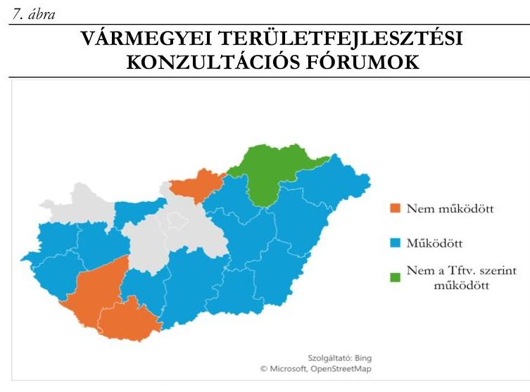

Forrás: ÁSZ saját szerkesztés szolgáltató: Bing, Microsoft, OpenStreetMap

A vármegyei területfejlesztési konzultációs fórumok működtetése formálissá vált. Az ellenőrzött időszakban három vármegyében (Nógrád, Baranya és Somogy) a Vármegyei Területfejlesztési Konzultációs Fórumok a Tftv. 14/B. § (3) bekezdésében foglaltaknak nem tettek eleget, nem foglaltak előzetesen állást a vármegyei közgyűlés területfejlesztést érintő ügyeiben (pl. tervdokumentumok véleményezése). Az érintett Önkormányzatok pedig a Tftv. 14/B. § (1) bekezdésében foglaltak ellenére nem működtették a Vármegyei
Területfejlesztési Konzultációs Fórumot.
1.4. számú megállapítás

Az Önkormányzatok az adatszolgáltatási kötelezettségüket a Tftv. előírásainak megfelelően teljesítették. Az Önkormányzatok – két Önkormányzat kivételével – a 37/2010. (II.26.) Korm. rendelet előírásainak megfelelően a vármegyei éves értékelési jelentést elkészítették.

Az Önkormányzatok a területfejlesztési tervdokumentumaikat az azokat alátámasztó dokumentumokkal együtt a Tftv. előírásainak megfelelően megküldték a Lechner Tudásközpont részére, a TeIR $^{30}$-ben való közzététel érdekében.
Leíró módszertan, folyamatmodell hiányában a területfejlesztéssel kapcsolatos jelentések alapjául szolgáló elemzések és értékelések elkészítését támogató T-MER $^{31}$-t az Önkormányzatok nem tudták használni, így a monitoring és értékelési feladatok ellátását a T-MER nem támogatta.
A 2022-2023. években az Önkormányzatok – Bács-Kiskun vármegye kivételével – a 37/2010. (II. 26.) Korm. rendeletben előírt vármegyei éves elemző értékelési jelentést elkészítették és a területfejlesztés stratégiai tervezéséért felelős miniszter részére tájékoztatásként megküldték. Bács-Kiskun Vármegye Önkormányzata a 37/2010. (II. 26.) Korm. rendelet 7. § d) pontjában foglaltak ellenére az ellenőrzött időszakban a 2021-2022. évekről vármegyei éves értékelési jelentést nem készített.

---

# 2. A területi önkormányzatok részvétele az illetékességi területükön kívül eső területfejlesztési feladatok ellátásában 

Összegző megállapítás Az Önkormányzatok a Tftv. előírásainak megfelelően részt vettek az ágazati operatív és határon átnyúló programok tervezésében, irányításában, lebonyolításában, végrehajtásuk program szintű nyomon követésében.
2.1. számú megállapítás

Az Önkormányzatok a területi illetékességükön kívül eső tervdokumentumok elkészítésében való részvételi, véleményezési feladataiknak a Tftv. előírásainak megfelelően eleget tettek.

Az Önkormányzatok a Tftv. alapján a TOP Plusz operatív program tervezésén túl az ágazati operatív programok tervezésébe közvetett módon, a MÖOSZ koordinálásában kerültek bevonásra.
Ezen felül az Önkormányzatok számára az ágazati operatív programok tekintetében a vármegyei területfejlesztési tervdokumentumok elkészítéséhez a nyilvánosan elérhető információk álltak rendelkezésükre.

## JÓ GYAKORLAT

Hajdú-Bihar és Szabolcs-Szatmár-Bereg Vármegyék Önkormányzatai az ágazati operatív programokat a 2021-2027 programozási időszak vonatkozásában a társadalmasítás folyamatában a nyilvánosan elérhető pályázati portálon önállóan is véleményezték, ily módon nem csak a MÖOSZ koordinálásában, hanem a saját nevükben eljárva is ellátták a Tftv.-ben meghatározott feladatukat hozzájárulva az ágazati operatív programok megalapozottságához. A Békés Vármegyei Közgyűlés elnöke monitoring tagsága révén részt vett a GINOP Plusz program tervezésében, így Békés Vármegye is hozzájárult a Tftv.-ben meghatározott ágazati operatív programok megalapozottságához.
2.2. számú megállapítás

Az Önkormányzatok az ágazati operatív és határon átnyúló nemzetközi fejlesztési programok tervezésében, kidolgozásában, irányításában, lebonyolításában, végrehajtásában és nyomon követésében a Tftv. előírásainak megfelelően közreműködtek.

Az operatív programok irányításában, megvalósításuk végrehajtásában az Önkormányzatok a Tftv. előírásainak megfelelően az egyes ágazati operatív programok monitoring bizottságai, valamint a TOP és TOP Plusz operatív programok esetében az IH által összehívott DEB munkájában való részvétel útján működtek közre.

---

Az alábbi két ábra szemlélteti az egyes programozási időszakokban az ellenőrzött vármegyéket érintő monitoring bizottsági tagságokat:
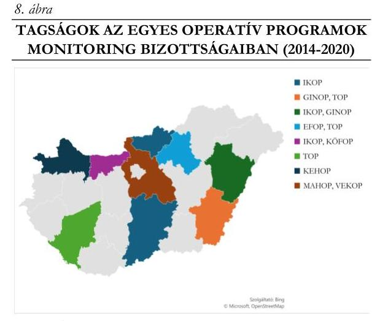

Forrás: ÁSZ saját szerkesztés szolgáltató: Bing, Microsoft, OpenStreetMap
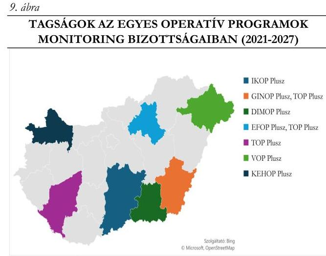

Forrás: ÁSZ saját szerkesztés szolgáltató: Bing, Microsoft, OpenStreetMap

Az Önkormányzatok részvételi aránya az operatív programok monitoring bizottságaiban a 2014-2020 programozási időszakhoz viszonyítva a 2021-2027 programozási időszakban csökkent, mivel ebben az időszakban a Regionális Konzultációs Fórumok – felkérés hiányában – már nem delegáltak tagokat.
Az operatív programok végrehajtásának országos szintű előrehaladásáról az Önkormányzatok a MÖOSZ közgyűlésén keresztül rendelkeztek információkkal, mivel az operatív programok monitoring bizottságaiba delegált tagok a bizottságokban végzett munkájukról a MÖOSZ közgyűlése előtt évente beszámoltak.
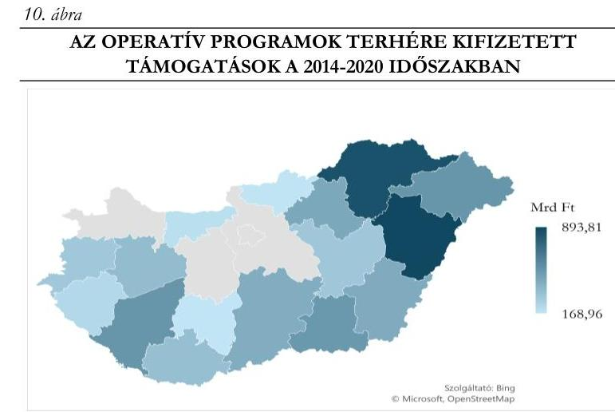

Forrás: ÁSZ saját szerkesztés szolgáltató: Bing, Microsoft, OpenStreetMap

Az ellenőrzött időszakban az Önkormányzatoknak a Tftv. 11. § (1) bekezdés bd) pontjában (új Tftv. 10. § (2) bekezdés f) pontjában) rögzített, az ágazati operatív programok megvalósításának vármegyében jelentkező feladatai figyelemmel kísérése tekintetében operatív feladatai nem merültek fel. Az ágazati operatív programok vármegyében jelentkező feladatainak megvalósulásáról Heves, Jász-Nagykun-Szolnok, Komárom-Esztergom, Somogy és Szabolcs-Szatmár-Bereg vármegyében készültek a Közgyűlés részére tájékoztatók.

---

# JÓ GYAKORLAT 

Heves Vármegye Közgyűlése részére – az Önkormányzat kérésére – a vármegyében működő hatóságok, szakmai szervezetek, intézmények minden évben tájékoztatást adtak az előző időszaki tevékenységükről, így kapott tájékoztatást a Közgyűlés az ágazati operatív programok vármegyét érintő megvalósulásáról.
Jász-Nagykun-Szolnok Vármegye Önkormányzatának Hivatala rendszeres adatgyűjtést végzett a nyilvánosan elérhető adatbázisokból, mely adatokat havi rendszerességgel továbbította az Elnök, Alelnök, Főjegyző és Aljegyző részére. Emellett az operatív programok megvalósulásának nyomon követését szolgálták a Közgyűlés részére évente készített tájékoztatók, egyedi statisztikai gyűjtések, a vármegye társadalmi-gazdasági helyzetét értékelő beszámolók is.

A határmenti ellenőrzött Önkormányzatok az Interreg kezdeményezések $^{32}$ tervezésében, kidolgozásában, 11. ábra

INTERREG PROGRAMOKBAN RÉSZTVEVŐ ELLENŐRZŐTT ÖNKORMÁNYZATOK
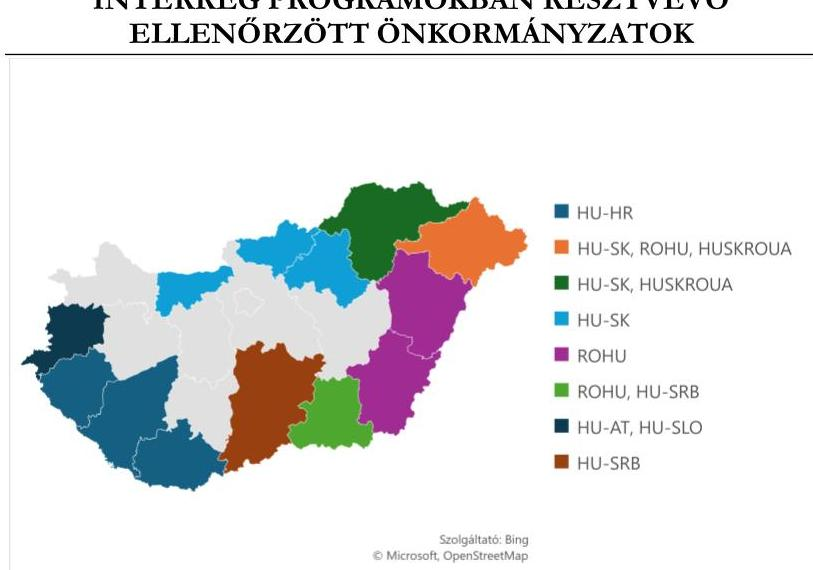

Forrás: ÁSZ saját szerkesztés szolgáltató: Bing, Microsoft, OpenStreetMap
irányításában, lebonyolításában és végrehajtásában a Tftv. előírásainak megfelelően részt vettek. Az ellenőrzött Önkormányzatok nemzetközi fejlesztési programokban való részvételét a 11. ábra mutatja be.
Az Önkormányzatok az Interreg programok esetében a Tftv. előírásainak megfelelően a monitoring bizottságokba delegált tagjaikon keresztül értesültek a számukra releváns programok végrehajtásának előrehaladásáról.

## 3. A területi önkormányzat területfejlesztési feladatainak ellátása érdekében kialakított szervezeti keretek

Összegző megállapítás
Az Önkormányzatok a területfejlesztési feladatok ellátására vonatkozó szervezeti kereteket a Tftv., az Mötv., az Áht. és az Ávr. előírásai alapján kialakították.
3.1. számú megállapítás

Az ellenőrzött időszakban az Önkormányzatok a Tftv., az Mötv., az Áht. és az Ávr. előírásainak megfelelően a területfejlesztési feladataik ellátása érdekében kialakították a szervezeti kereteket, a feladatellátásba több szervüket, szervezetüket is bevonták. Amennyiben a feladatellátáshoz külső humánerőforrás bevonása vált szükségessé, megbízási és vállalkozási szerződéseket kötöttek, amely szerződések megfeleltek az Ávr. előírásainak.

Az Önkormányzatok az Mötv. előírásainak megfelelően rendelkeztek SZMSZ-szel, amelyekben meghatározták a területfejlesztési feladatok ellátásának szervezeti kereteit. A feladatok ellátásában

---

rendszerint a Közgyűlés és szervei – a Közgyűlés Elnöke, a Közgyűlés Bizottságai és az Önkormányzati Hivatal – valamint három vármegye (Szabolcs-Szatmár-Bereg, Vas és Veszprém Vármegyei Önkormányzat) kivételével – elsősorban projektmenedzsment feladatellátásban – az Önkormányzatok gazdasági társaságai vettek részt. Hat vármegye esetében a Közgyűlés által létrehozott egyéb szervek is segítették a feladatellátást.

# JÓ GYAKORLAT 

Komárom-Esztergom Vármegye Önkormányzatának Közgyűlése a területfejlesztési feladatellátásának, munkájának támogatása, megalapozása érdekében Kollégiumot hozott létre, amelynek célja volt a Területfejlesztési Koncepció, a megyei területfejlesztési stratégia és program tervezési és végrehajtási folyamatának elősegítése, a tervezés társadalmi elfogadottságának erősítése. A Kollégium az Önkormányzat koordinációs feladatellátását támogatta azzal, hogy összekötő szerepet töltött be a vármegye gazdasági-, társadalmi- és szakmai szervezetei, közigazgatási szervei között.
Veszprém Vármegye Önkormányzata területfejlesztési tevékenységének segítése, a területfejlesztésben érintett, érdekelt szereplők összehangolt fejlesztési együttműködésének céljával hozta létre a Veszprém Megyei Területfejlesztési Szakmai Kollégiumot, amely térségi gazdaságfejlesztő feladatot is ellátott. A partnerség elvének érvényesülését is segítette a Szakmai Kollégium a települések vezetői és az érintett szervezetek tervezésbe való bevonásával.

A Közgyűlések a feladat- és hatáskör átruházásaik során az Mötv. előírásainak megfelelően jártak el. A döntési hatáskör átruházások az ellenőrzött vármegyék esetében az alábbi ábrában feltüntetettek szerint történtek:

## 12. ábra

DÖNTÉSI HATÁSKÖR ÁTRUHÁZÁSOK AZ ÖNKORMÁNYZATOKNÁL VÁRMEGYÉK SZERINT
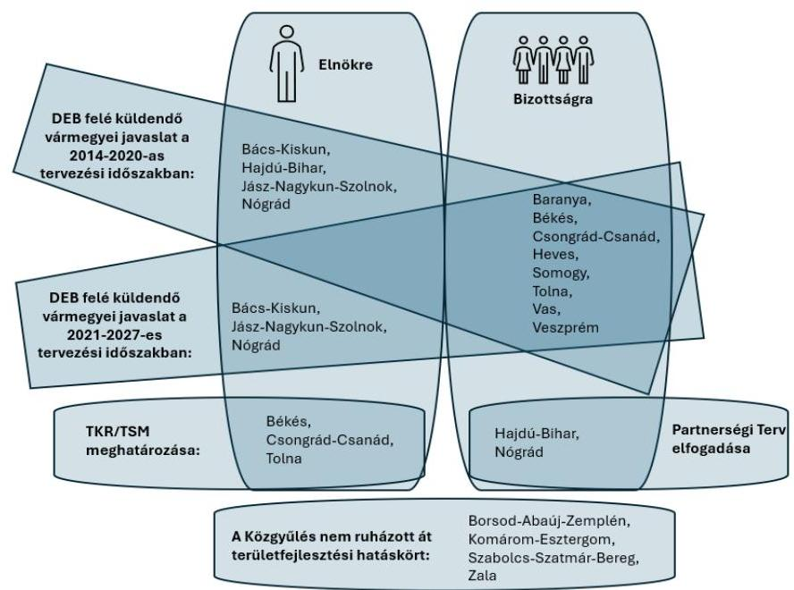

Forrás: Az Önkormányzatok SZMSZ-ei alapján ÁSZ saját szerkesztés
A közgyűlési Elnökök feladatai közé tartoztak az ellenőrzött időszakban, hogy a Tftv. előírásai alapján képviseljék a vármegyék Önkormányzatait a regionális, illetve megyei területfejlesztési konzultációs fórumokban, területfejlesztési tanácsokban, továbbá mint a Közgyűlések által delegált tagok képviseljék a DEB-ben az Önkormányzatok finanszírozási források elosztására irányuló döntési javaslatát.

---

Az önkormányzati SZMSZ-ek alapján bizottsági feladatkörbe a területfejlesztést érintően, a fenti ábrán bemutatott döntési hatáskörökön túl, véleményezési, javaslattételi és közreműködési feladatok kerültek meghatározásra.
Az ellenőrzött időszakban a Hivatali SZMSZ $^{33}$-ek az Mötv. és az Áht. $^{34}$ előírásainak megfelelően meghatározták a Hivatalok területfejlesztéssel kapcsolatos feladatait. A hivatali SZMSZ-ek értelmében az erre a feladatra létrehozott egy vagy több szervezeti egység látta el elsődlegesen a Tftv.-ben az Önkormányzatok számára nevesített tervezési, végrehajtási és koordinációs feladatokhoz kapcsolódó előkészítési és végrehajtási tevékenységet, amelyen felül a Hivatalok projektmenedzsmenti feladatokat is elláttak.

# JÓ GYAKORLAT 

A Békés Vármegyei- és a Tolna Vármegyei Önkormányzati Hivatal belső szabályzatban részletesen meghatározta a TOP – majd későbbiekben a TOP Plusz – keretében támogatott projektek megvalósításával kapcsolatos feladatköröket, munkafolyamatokat, eljárásrendi szabályozásokat azon projektek esetében, amelyeknél a Hivatal projektmenedzsmenti tevékenységet látott el. A részletszabályok rögzítésével a feladatellátás szervezettségét, átláthatóságát növelte a Hivatal.
Az Mötv.-ben és az Áht.-ban foglaltaknak megfelelően az Önkormányzatok kizárólagos $^{1}$ tulajdonában lévő gazdasági társaságok is részt vettek az Önkormányzatok területfejlesztési feladatainak ellátásában. A gazdasági társaságok feladatait elsősorban az alapító okirataik határozták meg, amelyet Heves Vármegyében közfeladatellátási megállapodás, Hajdú-Bihar- és Tolna Vármegyékben közszolgáltatási szerződés egészített ki. A gazdasági társaságok az ellenőrzött időszakban – egy kivételével – elsősorban projektmenedzsmenti feladatokat láttak el. Hat vármegye gazdasági társasága részt vett a Tftv. 11. §-a szerinti területfejlesztési feladatellátásban. Három vármegyei önkormányzat – Szabolcs-Szatmár-Bereg, Vas és Veszprém vármegye – nem alapított gazdasági társaságot, vagy a meglévő gazdasági társaságát nem vonta be területfejlesztési feladatok ellátásába. A vármegyei Önkormányzatoktól támogatást három vármegye – Baranya, Tolna (két gazdasági társasága) és Zala Vármegye – gazdasági társasága kapott az ellenőrzött időszakban.
A vármegyei önkormányzatok hivatalaiban és gazdasági társaságaiban a területfejlesztési feladatokat ellátók létszámában a 2021-2022. években megfigyelhető növekedést az indokolta, hogy az új programozási időszakhoz kapcsolódó tervezési feladatok mellett még folyamatban volt az előző tervezési ciklus lezárása, továbbá az első TOP Plusz pályázatok is elindultak, amelyek több projektmenedzsmenti feladatot eredményeztek. A létszámadatok alakulását az alábbi ábra szemlélteti:

[^0]
[^0]:    $^{1}$ Heves Vármegye Önkormányzatának Heves Vármegyei Területfejlesztési Ügynökség Nonprofit Kft.-ben 51,72 %-os tulajdoni részesedése volt

---

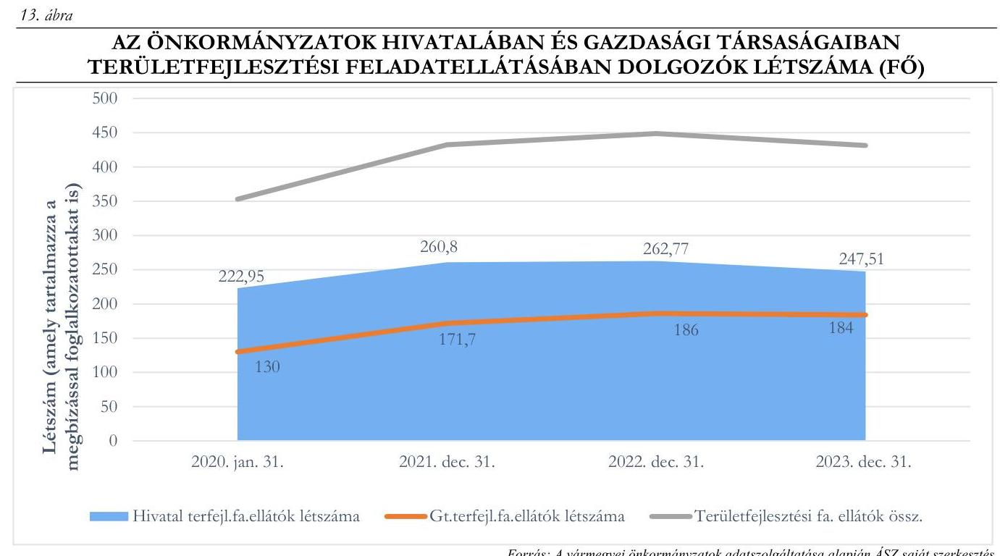

Az ITP-vel kapcsolatos menedzsment és koordinációs feladatok humánerőforrása és finanszírozási háttere nem volt tervezhető. Az Önkormányzatok központi költségvetési támogatása a vármegyei közgyűlés működtetésén túl a területfejlesztési törvényben meghatározott területfejlesztési feladatok ellátását is szolgálta, amely elsősorban a TOP és TOP Plusz végrehajtásához kapcsolódó projektmenedzsmenti feladatok ellátásában realizálódott. A központi költségvetési támogatáson túl, mind az Önkormányzatok, mind azok gazdasági társaságai a települési önkormányzatok felkérése alapján projektmenedzsmenti feladatok ellátásáért elszámolható pályázati forrásokból tudták finanszírozni a működésüket. Így a menedzselt projektek menedzsment költségeitől is függött a humánerőforrás finanszírozása is.
Az Önkormányzatok külső szervezeteket elsősorban a 2021-2027 programozási időszak tervezési feladatai végrehajtása érdekében
 vettek igénybe, amit a szükséges tervezői humán erőforrás hiánya indokolt. A tervezési feladatok ellátására vonatkozó megbízási és/vagy vállalkozói szerződések az Ávr. 35. előírásainak megfeleltek. A külső szolgáltatók feladata jellemzően az előző programozási időszakban elfogadott területfejlesztési koncepció módosítására, hatástanulmány készítésére, a 2021-2027. programozási időszak területfejlesztési programjainak és integrált területfejlesztési programjainak elkészítésére, az elkészítésben történő közreműködésre terjedt ki.
A tervezési feladatok végrehajtását követően az Önkormányzatok a területfejlesztési feladatellátáshoz csak eseti jelleggel vettek igénybe külső szolgáltatót, amelyhez kapcsolódó megbízási és vállalkozási szerződések megfeleltek az Ávr. előírásainak.

---

# JAVASLATOK 

Az ÁSZ tv. 33. § (1) bekezdésében foglaltak értelmében az ellenőrzött szervezet vezetője köteles a jelentésben foglalt megállapításokhoz kapcsolódó intézkedési tervet összeállítani és azt a jelentés kézhezvételétől számított 30 napon belül az ÁSZ részére megküldeni. Amennyiben az ellenőrzött szervezet vezetője nem küldi meg határidőben az intézkedési tervet, vagy továbbra sem elfogadható intézkedési tervet küld, az Állami Számvevőszék elnöke az ÁSZ tv. 33. § (3) bekezdése a) és b) pontjaiban foglaltakat érvényesítheti.

## Bács-Kiskun, Békés, Borsod-Abaúj-Zemplén, Komárom-Esztergom, Nógrád, Somogy, Szabolcs-Szatmár-Bereg, Tolna, Veszprém vármegye közgyűlésének elnöke részére

1. Gondoskodjon arról, hogy a vármegye Területfejlesztési Programja feleljen meg a 218/2009. (X. 6.) Korm. rendelet 3. melléklet 2.1. c) bekezdésében foglalt tartalmi előírásoknak.

## Csongrád-Csanád vármegye közgyűlésének elnöke részére

1. Kezdeményezze a Közgyűlés ideiglenes döntés-előkészítő bizottságának elnökénél, hogy a TOP Plusz források elosztásához kapcsolódó döntési javaslatok napirendi pontjainak szavazása során olyan eljárásrendet alakítson ki a bizottság, amely biztosítja a 256/2021. (V. 18.) Korm. rendelet 44. § (1) bekezdésében foglalt összeférhetetlenségi követelmény érvényesülését.

## Vas vármegye közgyűlésének elnöke részére

1. Kezdeményezze a Közgyűlés ideiglenes döntés-előkészítő bizottságának elnökénél, hogy a TOP Plusz források elosztásához kapcsolódó döntési javaslatok napirendi pontjainak szavazása során olyan eljárásrendet alakítson ki a bizottság, amely biztosítja a 256/2021. (V. 18.) Korm. rendelet 44. § (1) bekezdésében foglalt összeférhetetlenségi követelmény érvényesülését.

## Szabolcs-Szatmár-Bereg vármegye közgyűlésének elnöke részére

1. Gondoskodjon arról, hogy a Közgyűlés hatáskörébe tartozó TOP Plusz források elosztásához kapcsolódó döntési javaslatok napirendi pontjainak szavazása során a 256/2021. (V. 18.) Korm. rendelet 44. § (1) bekezdésében foglalt összeférhetetlenségi követelmény érvényesülése biztosított legyen.

---

# Bács-Kiskun vármegye közgyűlésének elnöke részére 

1. Gondoskodjon arról, hogy a 218/2009. (X. 6.) Korm. rendelet 13. § 3) bekezdésével összhangban készüljön el a vármegyei Területfejlesztési program végrehajtásához kapcsolódó partnerségi program.

## Tolna vármegye közgyűlésének elnöke részére

1. Gondoskodjon arról, hogy a 218/2009. (X. 6.) Korm. rendelet 13. § 3) bekezdésével összhangban készüljön el a vármegyei Területfejlesztési program végrehajtásához kapcsolódó partnerségi program.

## Baranya, Borsod-Abaúj-Zemplén, Heves, Jász-Nagykun-Szolnok, Nógrád, Somogy, Szabolcs-Szatmár-Bereg, Veszprém és Zala vármegye önkormányzati hivatal jegyzője részére

1. A Területfejlesztési Szolgálattal való együttműködés és a területi monitoring rendszer módszertana kialakítását követően vizsgálja felül a Területfejlesztési Program nyomon követésének gyakorlatát és tegyen lépéseket, hogy az az új Tftv. 10. § (2) bekezdés a) pontja alapján a vármegye teljes Területfejlesztési Programjára terjedjen ki, biztosítva a nyomon követési feladatok végrehajtásának teljeskörűségét.

## Baranya, Borsod-Abaúj-Zemplén, Csongrád-Csanád, Hajdú-Bihar, Heves, Jász-Nagykun-Szolnok, Komárom-Esztergom, Szabolcs-Szatmár-Bereg, Tolna, Veszprém, Vas és Zala vármegye önkormányzati hivatal jegyzője részére

1. Vizsgálja felül az integrált területi program nyomon követésének szabályozását és olyan nyomon követési rendszert alakítson ki és működtessen, mely kiterjed a 256/2021. (V. 18.) Korm. rendelet 29. § (1) bekezdés f) pontjában foglaltakra és hozzájárul az integrált területi program eredményes végrehajtásához, céljainak megvalósulásához.

## Bács-Kiskun vármegyei önkormányzati hivatal jegyzője részére

1. Intézkedjen a 37/2010. (II. 26.) Korm. rendelet 7. § d) pontjában előírtaknak megfelelően az éves értékelési jelentés összeállítása és a területfejlesztés stratégiai tervezéséért felelős miniszter részére határidőben történő megküldése érdekében.

---

# MELLÉKLETEK 

## I. SZ. MELLÉKLET: ÉRTELMEZŐ SZÓTÁR

fejlesztendő járások
integrált területi program
kedvezményezett járások
kedvezményezett település
komplex mutató
komplex programmal fejlesztendő járás
a kedvezményezett járásokon belül azok a legalacsonyabb komplex mutatóval rendelkező járások, amelyekben az ország kumulált lakónépességének 15%-a él (Forrás: 290/2014. (XI. 26.) Korm. rendelet 36 1. § (2) bekezdés 1. pontja). Jelen ellenőrzés keretében fejlesztendő járások alatt azon járások összességét értjük, melyeknek a 290/2014. (XI. 26.) Korm. rendelet 2. melléklete alapján a komplex mutató értéke 34,6 és 31,0 között van.
A vármegyei önkormányzatok, mint területi szereplők által a területi szempontú operatív programok megalapozása érdekében készített, az adott vármegye területére kiterjedő tervdokumentum, melyet a Kormány normatív határozatban hagy jóvá. A területi szereplő részt vesz az ITP végrehajtásában. A 2021-2027 programozási időszakban a megyei jogú városok a 256/2021. (V. 18.) Korm. rendelet értelmében már nem területi szereplők, önálló ITP-vel nem rendelkeznek, hanem az adott vármegyei ITP-kben történt a megyei jogú városok részére rendelkezésre álló keretösszeg elkülönítése. (Forrás: Tftv. 13. § (1) bek. ag) pontja, 272/2014. (XI. 5.) Korm. rendelet 3. § (1) bek. 63. pont, 4. § (1) bek. d) pontja, 19. § b) és f) pontok és 57. § (3) bek., 256/2021. (V. 18.) Korm. rendelet 4. § d) pontja, 29. § (1) bek. a) és f) pontok, 29. § (2) bek. és 68. §(4) bek.)
azok a járások, amelyeknek komplex mutatója kisebb, mint az összes járás komplex mutatójának átlaga (Forrás: 290/2014. (XI. 26.) Korm. rendelet 1. § (2) bekezdés 2. pontja). Jelen ellenőrzés keretében kedvezményezett járások alatt azon járások összességét értjük, melyeknek a 290/2014. (XI. 26.) Korm. rendelet 2. melléklete alapján a komplex mutató értéke nagyobb, mint 34,6.
társadalmi-gazdasági és infrastrukturális szempontból kedvezményezett, illetve a jelentős munkanélküliséggel sújtott települések (Forrás: 105/2015. (IV.23) Korm. rendelet 1. § b) pont)
társadalmi és demográfiai, lakás és életkörülmények, helyi gazdaság és munkaerő-piaci, valamint infrastruktúra és környezeti mutatókból képzett, összetett mutatószám (Forrás: 290/2014. (XI. 26.) Korm. rendelet 1. § (2) bekezdés 3. pontja)
a kedvezményezett járásokon belül azok a legalacsonyabb komplex mutatóval rendelkező járások, amelyekben az ország kumulált lakónépességének 10%-a él (Forrás: 290/2014. (XI. 26.) Korm. rendelet 1. § (2) bekezdés 4. pontja). Jelen ellenőrzés keretében komplex programmal fejlesztendő járások alatt azon járások összességét értjük, melyeknek a 290/2014. (XI. 26.) Korm. rendelet 2. melléklete alapján a komplex mutató értéke kisebb, mint 31,0.

---

különleges gazdasági övezet
területfejlesztés
területfejlesztési koncepció
területfejlesztési program
területi önkormányzat

A különleges gazdasági övezet kijelöléséről szóló kormányrendeletben meghatározott területen fekvő, a települési önkormányzat tulajdonában álló forgalomképtelen, törzsvagyonba tartozó - a Mötv.-ben, valamint külön törvényben meghatározott közfeladat, különösen településüzemeltetési közfeladat ellátását szolgáló és ahhoz szükséges - közterület, közpark, közút tulajdonjogát annak terheivel, és az azokkal kapcsolatos egyéb kötelezettségekkel együtt a különleges gazdasági övezet fekvése szerinti vármegye vármegyei önkormányzata szerzi meg. (Forrás: KGÖ37 tv. 2. §-a)
A KGÖ tv. hatálya annak a beruházásnak a helyszínére és közvetlen környezetére terjed ki, amely beruházással összefüggő közigazgatási hatósági ügyeket a Kormány rendeletben nemzetgazdasági szempontból kiemelt jelentőségű üggyé nyilvánította, és az új beruházás vagy bővítés:
a) legalább 5 milliárd forint teljes költségigényű,
b) a vármegye területének jelentős részére kiható gazdasági jelentőségű, és
c) munkahelyek tömeges elvesztésének elkerülését, vagy új munkahelyek létesítését szolgálja. (Forrás: KGÖ tv. 1. §-a)
2023.12.31-ig: az országra, valamint térségeire kiterjedő társadalmi, gazdasági és környezeti területi folyamatok vizsgálata, értékelése, a szükséges tervszerű beavatkozási irányok meghatározása; rövid, közép- és hosszú távú átfogó fejlesztési célok, koncepciók és intézkedések meghatározása, összehangolása és megvalósítása a területfejlesztési programok keretében, érvényesítése az egyéb ágazati döntésekben (Forrás: Tftv. 5. § a) pontja)
2024.01.01-től az új Tftv. a területfejlesztés célját (új Tftv. 2. §) és feladatát (új Tftv. 3. §) rögzíti.
2023.12.31-ig: az ország, illetve egy térség átfogó távlati fejlesztését megalapozó és befolyásoló tervdokumentum, ami meghatározza a térség hosszú távú, átfogó fejlesztési céljait, továbbá a fejlesztési programok kidolgozásához szükséges irányelveket, információkat biztosít az ágazati és a kapcsolódó területi tervezés és a területfejlesztés szereplői számára (Forrás: Tftv. 5. § m) pontja)
2024.01.01-től: az ország átfogó távlati fejlesztését megalapozó és befolyásoló tervdokumentum, ami meghatározza az ország, illetve a térség hosszú távú, átfogó fejlesztési céljait, a fejlesztési programok és a területrendezési tervek kidolgozásához szükséges irányelveket, továbbá információkat biztosít az ágazati és a kapcsolódó területi tervezés és a területi szereplők számára. (Forrás: új Tftv. 5. § 17. pontja)
2023.12.31-ig: a területfejlesztési koncepció alapján kidolgozott középtávú cselekvési terv (Forrás: Tftv. 5. § n) pontja)
2024.01.01-től: a területfejlesztési koncepció alapján kidolgozott, középtávú, komplex fejlesztési igényeket, egymáshoz kapcsolódó intézkedéseket, azok megvalósításának nyomon követését is tartalmazó terv (Forrás: új Tftv. 5. § 18. pontja)
jelen ellenőrzés keretében területi önkormányzat alatt a vármegyei önkormányzatokat (Mötv. 3. § (1) bekezdés) értjük

---

# II. SZ. MELLÉKLET: AZ ELLENŐRZÖTT SZERVEZETEK JEGYZÉKE 

| ÁSZ ELLENŐRZÖTT SZERVEZETEK MEGNEVEZÉSE |  |
| :--: | :--: |
| Bács-Kiskun Vármegye Önkormányzata | Bács-Kiskun Vármegyei Önkormányzati Hivatal |
| Baranya Vármegyei Önkormányzat | Baranya Vármegyei Önkormányzati Hivatal |
| Békés Vármegye Önkormányzata | Békés Vármegyei Önkormányzati Hivatal |
| Borsod-Abaúj-Zemplén Vármegye Önkormányzata | Borsod-Abaúj-Zemplén Vármegyei Önkormányzati Hivatal |
| Csongrád-Csanád Vármegye Önkormányzata | Csongrád-Csanád Vármegyei Önkormányzati Hivatal |
| Hajdú-Bihar Vármegye Önkormányzata | Hajdú-Bihar Vármegyei Önkormányzati Hivatal |
| Heves Vármegye Önkormányzata | Heves Vármegyei Önkormányzati Hivatal |
| Jász-Nagykun-Szolnok Vármegyei Önkormányzat | Jász-Nagykun-Szolnok Vármegyei Önkormányzati Hivatal |
| Komárom-Esztergom Vármegye Önkormányzata | Komárom-Esztergom Vármegyei Önkormányzati Hivatal |
| Nógrád Vármegye Önkormányzata | Nógrád Vármegyei Önkormányzati Hivatal |
| Somogy Vármegyei Önkormányzat | Somogy Vármegyei Önkormányzati Hivatal |
| Szabolcs-Szatmár-Bereg Vármegye Önkormányzata | Szabolcs-Szatmár-Bereg Vármegyei Önkormányzati Hivatal |
| Tolna Vármegye Önkormányzata | Tolna Vármegyei Önkormányzati Hivatal |
| Vas Vármegye Önkormányzata | Vas Vármegyei Önkormányzati Hivatal |
| Veszprém Vármegyei Önkormányzat | Veszprém Vármegyei Önkormányzati Hivatal |
| Zala Vármegye Önkormányzata | Zala Vármegyei Önkormányzati Hivatal |

---

# FOKUSZTERÜLET 

1. A területi önkormányzatok területfejlesztési feladatainak ellátása

## ELLENŐRZÉSI KRITÉRIUMOK

Tftv. 2. § b) pont, 3. § (2) bek. a)-b) pont; 5.§ n) pont; 11. § (1) bek. a) pont aa), ad), ae), ag) alpontjai, b) pont ba), bb, bf, bg) alpontjai és c) pont; 11. § (2) bek., 13/A. § (1)(4) bek., 14. § (4) bek.; 14. § (4) bek.; 14/A. § (2) bek. a) pont, (3) bek.; 14/B. § (3)-(4). bek., 15. § (1) bek.; 16. § (6) bek. g) pont; 19/A. § (1) bek. i) pont;
272/2014. (XI. 5.) Korm. rendelet 4. § (1) d) pont 19. §, 20. § 4a., 24 pontok, 39. § (1) bek., és (5) bek. b) pont; 45. § (2) bek. c) pont; 54/D. §, 56/A § 1) bek; 56/B § 2)-3) bek 57. § (4) bek., 57. §57/A. § (2) és (4) bek., 64. § (4) bek, 65. § (1a) bek.; 120. § (1) bek., 127 § (1) bek., (2) bek. b) pont;

256/2021. (V. 18.) Korm. rendelet 4. § d) pont; 19. § (1) bek. 23)

 pont; 29. §., 44. § (1) bek. és 44. § (3) bek. (hatályos 2022.03.06-tól), 68. §, 74. § (1) bek. d) pont; 86. § (1) bek., 117. § (2) bek. b) pont és (4) bek.; 138. § 1), 3). 4) bek., 235. $\int(1 / \mathrm{f}),(2)$ bek., 238.§, 294. §;
218/2009. (X. 6.) Korm. rendelet 1. § g) pont, 3. §, 6. § (2) bek., 7. §, 12. §., 13. § (1) bek., (2) bek. a) és c) pontok, (3) bek., 18. § (5) bek. a) pont; 1. melléklet 1., 1.1., 1.2. e), ec), 2.4, 3. melléklet 1. pont a)-h)-ig, 2. pont, 9. melléklet 3. pont, 4-11. pont
37/2010. (II. 26.) Korm. rendelet 7. § d), e) és f) pontjai
290/2014. (XI. 26.) Korm. rendelet 3. melléklet
Mőtv. 111. § (2)-(4) bek., Ptk. ${ }^{38}$ 6:63. § (2) bek; Áhsz. 39. § (2)-(3) bek.;
belső szabályozások (a területi önkormányzat szervezeti és működési szabályzata, a területi önkormányzati hivatal szervezeti és működési szabályzata, a döntéshozatal előkészítésében résztvevő szervezeti egység/bizottság ügyrendje)
a kedvezményezettel megkötött, projektfejlesztési, projektmenedzsmenti feladatellátást érintő szerződések/megállapodások

Tftv. 11. § (1) bek. a) pont ab), ac), af) alpontjai, 11. § (1) bek. b) pont bc) bd) alpontjai

Mőtv. 27. § (4) bek., 41. §, 42. §, 53. § (1) és (3) bek.; 57. § (1) bek.

Tftv. 11. § (1) bek. a) pont aa) és ae) alpontjai, c) pont ce) és ch) alpontjai, 13. § k) pont, 13/A. § (2) bek.;
Áht. 3/A. § (2) bek.; 9. § bek. b) pont, 10. § (5) bek.;
Ávr. 13. § (1) bek. e) és g) pontjai, 2) bek. b)-c) pont, (3b) bek, (5) bek., 50. § (1) és (1a) bek.,
Bkr. 10. §, Ptk. 6:63. § (2) bek.,

---

# IV. SZ. MELLÉKLET: A TOP FORRÁSOK FELHASZNÁLÁSÁHOZ KAPCSOLÓDÓ VÁRMEGYEI ITP-KBEN MEGHATÁROZOTT ÁLTALÁNOS TARTALMI KIVÁLASZTÁSI KRITÉRIUMOK

|  Ssz. | Utalános tartalmi kiválasztási kritérium megnevezése | AZ ÜNKORMÁNYZATOK ÁLTAL A TOP ITP-KBEN MEGHATÁROZOTT ÁLTALÁNOS TARTALMI KIVÁLASZTÁSI KRITÉRIUMOK |  |  |  |  |  |  |  |  |  |  |  |  |  |   |
| --- | --- | --- | --- | --- | --- | --- | --- | --- | --- | --- | --- | --- | --- | --- | --- | --- |
|   |  | Bács-Kiskun | Baranya | Békés | Borsod-Abaúj-Zemplén | Csongrád-Csanád | Hajdú-Bihar | Heves | Jász-Nagykun-Szolnok | Komárom-Esztergom | Nógrád | Somogy | Szabolcs-Szatmár-Bereg | Tolna | Vas | Veszprém  |
|  1. | Illeszkedés a megyei területfejlesztési programhoz és a vonatkozó indikátoraihoz |  | X | X | X | X | X | X | X | X | X | X |  | X | X |   |
|  2. | Hozzájárulás a pénzügyi egyensúly fenntartásához |  |  |  |  |  | X |  | X |  |  |  |  |  |  | X  |
|  3. | Hozzájárulás belső területi kiegyenlítődéshez | X | X | X | X |  | X |  | X |  |  |  |  |  | X | X  |
|  4 | Hozzájárulás belső társadalmi kiegyenlítődéshez |  |  |  | X | X |  | X |  | X |  |  |  |  |  |   |
|  5 | Hozzájárulás a gazdasági növekedéshez |  | X | X | X | X | X | X | X | X | X |  | X | X |  |   |
|  6 | Hozzájárulás a munkahelyteremtéshez | X | X | X |  |  | X | X | X |  | X |  |  | X |  | X  |
|  7 | Hozzájárulás a külső természeti hatásokkal szembeni ellenálló képesség erősítéséhez | X |  | X |  | X |  |  |  |  |  |  |  |  |  |   |
|  8. | Egyedi kiválasztási kritériumok | X |  |  | X |  | X |  |  |  |  | X |  | X | X |   |

---

Az IH a TOP források felhasználásához kapcsolódó vármegyei ITP-k készítésekor ajánlásokat fogalmazott meg az Önkormányzatok részére a lehetséges általános tartalmi kiválasztási kritériumokra és azok tartalmára vonatkozóan, de az IH által ajánlott kritériumok mellett az Önkormányzatok meghatározhattak saját, egyedi kiválasztási kritériumokat is. Az Önkormányzatok az ITP-kben átlagosan négy kiválasztási kritériumot határoztak meg, melyek döntően az IH által ajánlott kritériumok közül kerültek kiválasztásra. A legtöbb Önkormányzat az „Illeszkedés a megyei területfejlesztési programhoz és a vonatkozó indikátoraihoz" és a „Hozzájárulás a gazdasági növekedéshez" kritériumokat választotta.
Hét Önkormányzat határozott meg egyedi kiválasztási kritériumokat, melyek az alábbi táblázatban kerültek összefoglalásra:
2. táblázat

# A TOP FORRÁSOK FELHASZNÁLÁSÁHOZ KAPCSOLÓDÓAN A VÁRMEGYEI ITP-KBEN MEGHATÁROZOTT EGYEDI KIVÁLASZTÁSI KRITÉRIUMOK 

| VÁRMEGYE   MEGNEVEZÉSE | EGYEDI KIVÁLASZTÁSI KRITÉRIUMOK |
| :--: | :--: |
| Bács-Kiskun | BK1. Hozzájárulás integrált fejlesztési programok megvalósításához |
| Borsod-Abaúj-Zemplén | BAZ1. Hozzájárulás a munkahelyteremtéshez, munkahely megtartáshoz. |
| Hajdú-Bihar | HB1. Hozzájárulás a környezeti/gazdasági/társadalmi fenntarthatósághoz |
| Somogy | S1. Hozzájárulás a társadalmi kohézió erősítéséhez   S2. Hozzájárulás a gazdasági versenyképesség növekedéséhez, különös tekintettel Somogy természeti adottságain alapuló nagyobb feldolgozottsági szintet eredményező termékek előállítására   S3 Hozzájárulás a munkahelyteremtéshez, összefüggésben a települések népességmegtartó képességének javításával, ill. a helyben történő foglalkoztatás megteremtésének elősegítésével   S4 Hozzájárulás a megye felzárkóztatásához és a belső területi kiegyenlítődéshez |
| Tolna | T1 Illeszkedés a megyei területfejlesztési koncepcióhoz   T2 Hozzájárulás a kiadások csökkentéséhez és/vagy a bevételek növeléséhez   T3 Hozzájárulás a lakossági alapszolgáltatások színvonalának növeléséhez |
| Vas | V1 A megye táji, kulturális és településszerkezeti sajátosságaihoz való illeszkedés |
| Zala | Z1 Hozzájárulás az előző és a jelenlegi uniós ciklusban megvalósított fejlesztésekhez   Z2 Hozzájárulás a Zala megyei/vidéki népesség helyben tartásához |

Forrás: a 1144/2020. (IV. 8.) Korm. határozattal elfogadott vármegyei ITP-k alapján ÁSZ saját szerkesztés
A legtöbb egyedi kiválasztási kritériuma Somogy Vármegye Önkormányzatának volt, amely kritériumok azzal a céllal kerültek meghatározásra, hogy erősödjön a vármegye lakosságának helyi szintű, közösségi együttműködésre való nyitottsága, javuljon a lakosság életminősége és a foglalkoztatottság helyzete, növekedjen a gazdasági versenyképesség, illetve mérséklődjön a vármegye belső területi egyensúlytalansága.

---

# V. SZ. MELLÉKLET: A TOP PLUSZ FORRÁSOK FELHASZNÁLÁSÁHOZ KAPCSOLÓDÓ VÁRMEGYEI ITP-KBEN MEGHATÁROZOTT ÁLTALÁNOS TARTALMI KIVÁLASZTÁSI KRITÉRIUMOK

|  Ssz. | Általános tartalmi kiválasztási kritérium megnevezése | AZ ÖNKORMÁNYZATOK ÁLTAL A TOP PLUSZ ITP-BEN MEGHATÁROZOTT ÁLTALÁNOS TARTALMI KIVÁLASZTÁSI KRITÉRIUMOK |  |  |  |  |  |  |  |  |  |  |  |  |  |  |   |
| --- | --- | --- | --- | --- | --- | --- | --- | --- | --- | --- | --- | --- | --- | --- | --- | --- | --- |
|   |  | Bács-Kiskun | Baranya | Békés | Borsod-Abaúj-Zemplén | Csongrád-Csanád | Hajdú-Bihar | Heves | Jász-Nagykun-Szolnok | Komárom-Esztergom | Nógrád | Somogy | Szabolcs-Szatmár-Bereg | Tolna | Vas | Veszprém | Zala  |
|  1. | Kapcsolódás stratégiai dokumentumokhoz (vármegyei területfejlesztési koncepcióhoz, programhoz, ITP-hez) | X | X |  | X | X | X | X | X | X | X | X | X | X | X | X | X  |
|  2. | Hozzájárulás a belső területi kiegyenlítődéshez | X |  | X | X | X | X | X | X |  | X | X | X | X | X |  | X  |
|  3. | Hozzájárulás a megye környezeti fenntarthatóságához, klíma semleges, környezetbarát megoldások | X | X | X | X | X | X | X |  | X | X | X | X | X | X | X |   |
|  4. | Integrált (komplex) projekt, beruházások | X |  |  | X |  |  |  | X |  | X |  | X |  | X | X |   |
|  5. | Hozzájárulás a vármegye értékteremtő gazdaságának fejlesztéséhez, gazdasági növekedéshez |  | X | X | X |  |  | X |  | X |  |  |  | X |  | X |   |
|  6. | Hozzájárulás a megye társadalmi fenntarthatóságához |  | X |  |  |  |  |  |  |  |  |  |  |  |  |  |   |
|  7. | A digitális átállást elősegítő projektek előnyben részesítése |  |  | X | X |  | X |  |  |  | X | X | X |  |  | X |   |
|  8. | A fentiekben nem részletezett, további kritériumok meghatározása | X |  |  |  |  | X |  |  | X |  | X | X | X |  | X | X  |

Forrás: a 1196/2023. (V. 15.) Korm. határozattal elfogadott vármegyei ITP-k alapján ÁSZ saját szerkesztés

A TOP Plusz források felhasználásához kapcsolódó vármegyei ITP-kben átlagosan öt általános kiválasztási kritérium került rögzítésre. Az Önkormányzatok döntő része kritériumként határozta meg a stratégiai dokumentumokhoz/vármegyei területfejlesztési programhoz/koncepcióhoz való illeszkedést (14), a környezeti fenntarthatóságához (14) illetve a belső területi kiegyenlítődéshez való hozzájárulást (13).

---

# V1. SZ. MELLÉKLET: ÖSSZESÍTŐ
 KIMUTATÁS A MINTATÉTELEKHEZ KAPCSOLÓDÓ TOP PLUSZ PÁLYÁZATI FELHÍVÁSOKBAN RÓGZÍTETT, TERÜLETI KIEGYENLÍTŐDÉST ELŐSEGÍTŐ RÉSZLETES KIVÁLASZTÁSI SZEMPONTOKRÓL

|  SZ. | A mintatételekhez kapcsolódó TOP Plusz pályázati felhívásokban rögzített egyes részletes kiválasztási szempontok megnevezése | AZ ÖNKORMÁNYZATOK ÁLTAL RÓGZÍTETT RÉSZLETES KIVÁLASZTÁSI SZEMPONTOK |  |  |  |  |  |  |  |  |  |  |  |  |  |   |
| --- | --- | --- | --- | --- | --- | --- | --- | --- | --- | --- | --- | --- | --- | --- | --- | --- |
|   |  | Bács-Kiskun | Baranya | Békés | Borsod-Abaúj-Zemplén | Csongrád-Csanád | Hajdú-Bihar | Heves | Jász-Nagykun-Szolnok | Komárom-Esztergom | Nógrád | Somogy | Szabolcs-Szatmár-Bereg | Tolna | Vas | Veszprém  |
|  1. | A projekt a 290/2014 (XI.26) Korm. rendelet értelmében kedvezményezett, fejlesztendő vagy komplex programmal fejlesztendő járásban valósul meg. | X |  | X | X | X | X | X | X |  | X | X | X | X | X |   |
|  2. | A projekt a 105/2015. (IV.23.) Korm. rendelet ${ }^{30}$ értelmében kedvezményezett településen valósul meg | X | X |  | X | X | X | X | X | X | X | X | X | X | X |  |
|  3. | Hátrányos helyzetű település (Gazdaságélénkítő program, felzárkózó települések hosszú távú program, vagy szabad vállalkozási zóna területén helyezkedik el.). | X |  |  | X |  |  |  |  | X |  |  |  |  |  |   |

Forrás: a TOP Plusz mintatételekhez tartozó pályázati felhívások alapján ÁSZ saját szerkesztés

---

# - VII. SZ. MELLÉKLET: A TOP PLUSZ FORRÁSOK FELHASZNÁLÁSÁHOZ KAPCSOLÓDÓ VÁRMEGYEI ITP-KBEN A KOMPLEX PROGRAMMAL FEJLESZTENDŐ JÁRÁSOKRA ELKÜLÖNÍTETT FORRÁSKERETEK NAGYSÁGA ÉS ARÁNYA 

Magyarország 197 járása közül 109 járás rendelkezett olyan társadalmi-gazdasági mutatókkal, amelyek alapján a 290/2014. (XI. 26.) Korm. rendelet szerint fejlesztendő, kedvezményezett, vagy komplex programmal fejlesztendő járásnak minősültek.

## 14. ábra

AZ ELLENŐRZÉSSEL ÉRINTETT VÁRMEGYÉK JÁRÁSAINAK SZÁMA A FEJLETTSÉGÜK SZERINTI BESOROLÁSI KATEGÓRIÁK ALAPJÁN (DARAB)
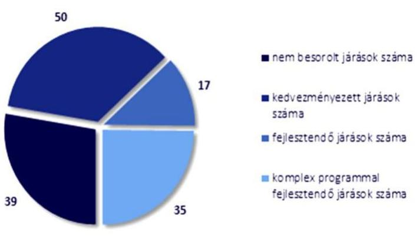

Forrás: A 290/2014. (XI. 26.) Korm. rendelet szerinti besorolás alapján ÁSZ saját szerkesztés

Az ellenőrzéssel érintett 16 vármegye járásai a 290/2014. (XI. 26.) Korm. rendelet alapján a 14. ábrában szemléltetett besorolási kategóriákba tartoztak.
Az ellenőrzéssel érintett vármegyék 141 járásának 72,3\%-a (102 járás) a 290/2014. (XI. 26.) Korm. rendelet szerint kedvezményezett, fejlesztendő, vagy komplex programmal fejlesztendő járási kategóriába tartozott. Az ellenőrzéssel érintett vármegyék közül négy (Komárom-Esztergom, Csongrád-Csanád, Vas és Zala vármegye) kivételével minden vármegyében volt komplex programmal fejlesztendő járás, mindösszesen 35 darab.

## A TOP PLUSZ OP-BEN MEGHATÁROZOTT KORLÁTOZÓ FELTÉTEL TELJESÜLÉSE VÁRMEGYÉNKÉNT AZ ELLENŐRZÖTT IDŐSZAKBAN

| SSZ. | MEGNEVEZÉS | KOMPLEX   PROGRAMMAL   FEJLESZTENDŐ   JÁRÁSOK SZÁMA | KORLÁTOZÓ FELTÉTEL TOP PLUSZ OP ALAPJÁN   A vármegyékre jutó indikatív forráskeretének legalább 10\%-át a komplex programmal fejlesztendő járásokra (36 járás) szükséges irányítani.   a vármegyei ITP-kben a a vármegyei ITP keretösszege (Mrd Ft) |  | komplex programmal fejlesztendő járásokra elkülönített forráskeret aránya (\%) |  |
| :--: | :--: | :--: | :--: | :--: | :--: | :--: |
|  |  |  |  |  |  |  |
| 1. | Bács-Kiskun | 2 | 5,8 | 107,8 |  | $5,4 \%$ |
| 2. | Baranya | 2 | 6,7 | 92,1 |  | $7,2 \%$ |
| 3. | Békés | 2 | 14,5 | 94,8 |  | $15,3 \%$ |
| 4. | Borsod-Abaúj-Zemplén | 8 | 28,8 | 150,3 |  | $19,2 \%$ |
| 5. | Hajdú-Bihar | 4 | 33,7 | 127,3 |  | $26,5 \%$ |
| 6. | Heves | 1 | 14,0 | 68,3 |  | $20,5 \%$ |
| 7. | Jász-Nagykun-Szolnok | 2 | 12,0 | 97,3 |  | 12,4% |
| 8. | Nógrád | 1 | 2,1 | 71,7 |  | $2,9 \%$ |
| 9. | Somogy | 2 | 10,3 | 78,7 |  | $13,1 \%$ |
| 10. | Szabolcs-Szatmár-Bereg | 9 | 52,0 | 166,3 |  | $31,3 \%$ |
| 11. | Tolna | 1 | 5,0 | 49,9 |  | $10,1 \%$ |
| 12. | Veszprém | 1 | 2,2 | 80,3 |  | $2,8 \%$ |
| 13. | Összesen | 35 | 186,9 | 1184,8 |  | $15,8 \%$ |

---

# - VIII. SZ. MELLÉKLET: KIEMELT TÉRSÉGI FEJLESZTÉSI TANÁCSOK 

Az ellenőrzéssel érintett vármegyék területén a Tftv. alapján a 2020-2023. években működő kiemelt fejlesztési tanácsokat az alábbi ábra szemlélteti:
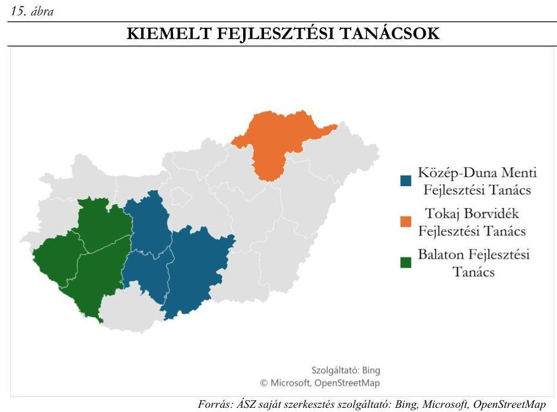

A Balaton Fejlesztési Tanács működése három vármegyét (180 település) érintett. A Tanács elnöki feladatait Balatonfüred Város polgármestere, illetve 2022. szeptember 19-től az Északnyugat-magyarországi Gazdaságfejlesztési Zóna komplex fejlesztéséért felelős kormánybiztossal közösen, mint társelnökök látták el. A munkaszervezeti feladatokat a Balatoni Integrációs és Fejlesztési Ügynökség Közhasznú Nkft. látta el. A Tanács tevékenysége a térség fejlesztési irányainak meghatározására, a fejlesztési célok elérését ösztönző programok és projektek megvalósítására terjedt ki.
A Közép-Duna Menti Fejlesztési Tanács munkaszervezeti feladatait a Közép-Duna Menti Fejlesztési Ügynökség Nkft. látta el. A Tanács munkaterv alapján látta el feladatait, melyek végrehajtásáról a tagok részére minden évben beszámolt.
A Tokaj Borvidék Fejlesztési Tanács munkaszervezeti feladatait a Tokaj Borvidék Fejlődéséért Nonprofit Kft látta el. A 2020-2024. évekre vonatkozóan a Kormány 149 516,0 MFt költségvetési támogatás biztosításáról döntött a szükséges közlekedési, turisztikai és önkormányzati fejlesztések megvalósítása érdekében.

---

# - IX. SZ. MELLÉKLET: AZ ÖNKORMÁNYZATOK ÁLTAL ALAPÍTOTT TÉRSÉGI FEJLESZTÉSI TANÁCSOK 

Az ellenőrzéssel érintett vármegyék területén az Önkormányzatok által alapított és a 2020-2023. években működő térségi fejlesztési tanácsokat az alábbi ábra szemlélteti:
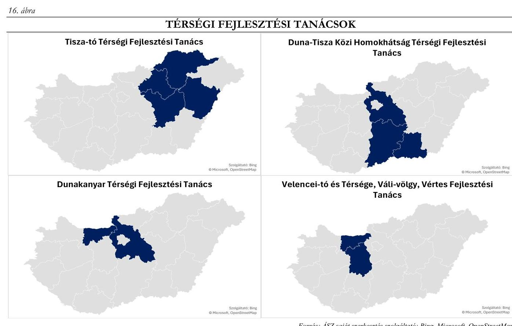

A Duna-Tisza Közi Homokhátsági Térségi Fejlesztési Tanácsot három vármegye működtette, működése 117 települést érintett. A Tanács elnöki feladatait Bács-Kiskun Vármegye Közgyűlésének elnöke látta el. Működést pályázati források, a szavazati joggal rendelkező szervezetek befizetései, illetve a Homokhátság vízutánpótlásában érintett szervezetek hozzájárulásai biztosították. A térség kiemelt fejlesztése volt a „Természetközeli szennyvíztisztítási mintaprojekt".
A Dunakanyar Térségi Fejlesztési Tanácsot két vármegye működtette, mely 90 települést érintett. A Tanács elnöki feladatait Komárom-Esztergom Vármegye Közgyűlésének elnöke látta el. A Tanács működése kizárólag a térséget érintő érdekképviseleti tevékenységre terjedt ki, közvetlen támogatásban nem részesült, fejlesztéseket nem valósított meg. A 2023. évben a feladatellátása a térség fejlesztését szolgáló kormányzati intézkedések és programok nyomon követésére, az illetékességi terület szerinti vármegyék területi tervezésének figyelemmel kísérésére, és a területet érintő turisztikai tevékenységek nyomon követésére irányult.
A Tisza-tó Térségi Fejlesztési Tanácsot négy vármegye működtette, működése 43 települést érintett. A tagok 2020-ban tanács elnökévé a Jász-Nagykun-Szolnok Vármegyei Közgyűlés elnökét választották meg. A 2022-2023. években kommunikációs marketing anyagként két-két kisfilm készült a Tisza-tó népszerűsítése érdekében. A Tanács által kezdeményezett fejlesztések jelentős része Jász-Nagykun-Szolnok vármegyét érintették.
A Velencei-tó és Térsége, Váli-völgy, Vértes Fejlesztési Tanácsot két vármegye működtette, működése 37 települést érintett. A Tanács elnöki feladatait a Fejér Vármegyei Közgyűlés elnöke látta el.

---

Az ellenőrzéssel érintett vármegyék területén az Önkormányzatok által alapított, a 2020-2023. években megszűnt térségi fejlesztési tanácsokat az alábbi ábra szemlélteti:
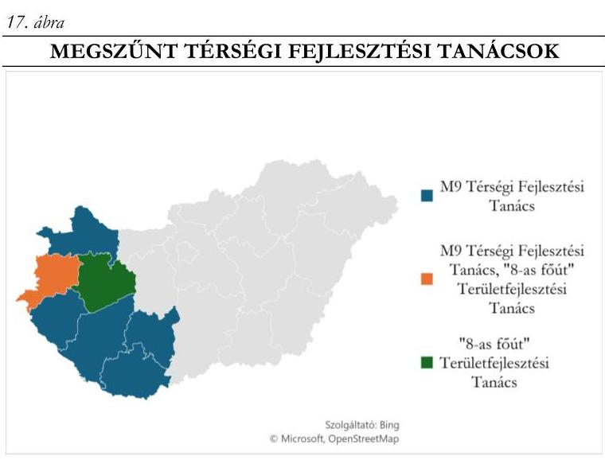

Forrás: ÁSZ saját szerkesztés szolgáltató: Bing, Microsoft, OpenStreetMap

Az M9 Térségi Fejlesztési Tanács
munkaszervezeti feladatait külön megállapodás alapján a Zala Megyei Területfejlesztési Ügynökség Nkft. látta el. A Tanács célja az M9-es gyorsforgalmi út előkészítésének és megvalósításának támogatása, a régión belüli és a régiók közötti közlekedési kapcsolatok javítása volt. Az M9 gyorsforgalmi út megvalósításának feladatait az állami feladatellátási feladatokat végző szervek vették át, így a Tanács a tagok többségi döntésével 2022. december 31. napjával megszűnt.

A „8-as főút" Területfejlesztési Tanács célja a főút korszerűsítése, valamint a
vonzáskörzetébe tartozó területfejlesztési feladatok koordinációja volt. A Tanács ülésén mérlegelte a feladatellátással kapcsolatban felmerülő kötelezettségek vállalhatóságát, és mivel a Tanácsban való részvétel a tagok önként vállalt feladata volt, a tagok döntése alapján a Tanács 2020. szeptember 30. napjával jogutód nélkül megszűnt.

---

# FÜGGELÉK: ÉSZREVÉTELEK 

A jelentéstervezetet a Számvevőszék 15 napos észrevételezésre megküldte az ellenőrzött szervezet vezetőjének az ÁSZ tv. 29. § (1) bekezdése előírásának megfelelően.

A jelentéstervezet megállapításaira az ellenőrzött Önkormányzatok vezetői érdemi észrevételt tettek.
Az elfogadott észrevételek alapján a Számvevőszék módosította a jelentést.
Az ÁSZ tv. 29. § (3) bekezdésével összhangban az Állami Számvevőszék a Függelékben feltünteti a megállapításokkal kapcsolatban tett, el nem fogadott észrevételeket, és megindokolja, hogy azokat miért nem fogadta el.

1. A Megállapítások fejezet 1.2. számú megállapítására valamennyi ellenőrzött vármegye Önkormányzati Hivatalának jegyzője észrevételt tett.
A jelentéstervezet 1.2 számú megállapítása szerint Csongrád-Csanád Vármegye Önkormányzata DEB Bizottsága egy esetben, Szabolcs-Szatmár-Bereg Vármegye Önkormányzat Közgyűlése hat esetben, Vas Vármegye Önkormányzata DEB Bizottsága pedig kettő esetben, a területfejlesztési források elosztására irányuló javaslat kialakítására vonatkozó eljárása során nem biztosította a 256/2021. (V. 18.) Korm. rendelet 44. § (1) bekezdésében rögzített összeférhetetlenségi követelmény érvényesülését.
Észrevétel: A megállapítás tartalmához kapcsolódó észrevételben a vármegyei jegyzők az Mötv. és a 256/2021. (V.18.) Kormányrendelet összeférhetetlenségre vonatkozó rendelkezései közötti kollízióra hivatkoztak.
Az el nem fogadás indoka: A jelentés is rögzíti, hogy a döntéshozó Közgyűlés/DEB eljárása az Mötv. előírásainak ugyan megfelelt, azonban a 256/2021. (V. 18.) Korm. rendelet 44. § (1) bekezdésében foglalt, szigorúbb összeférhetetlenségi követelmények érvényesülését nem biztosította. A 256/2021. (V. 18.) Korm. rendelet az uniós támogatási forrásokra vonatkozó döntéseknél szigorúbb összeférhetetlenségi szabályok alkalmazását írja elő, ezért az észrevétel nem megalapozott.
2. A Megállapítások fejezet 19. oldal 6. bekezdésben foglalt megállapításra Jász-Nagykun-Szolnok Vármegye Közgyűlésének Elnöke és az Önkormányzati Hivatal Főjegyzője tett észrevételt.
Az észrevétellel érintett megállapítás: A 272/2014. (XI. 5.) Korm. rendelet 19. § f) pontjában és a 256/2021. (V. 18.) Korm. rendelet 29. § (1) bekezdés f) pontjában, továbbá az IH által közzétett TOP Plusz Útmutatóban foglaltak ellenére 12 Önkormányzat (Baranya, Borsod-Abaúj-Zemplén, Csongrád-Csanád, Hajdú-Bihar, Heves, Jász-Nagykun-Szolnok, Komárom-Esztergom, Szabolcs-Szatmár-Bereg, Tolna, Vas, Veszprém, Zala vármegye) az ITP-ben a végrehajtással összefüggésben nem határozott meg monitoring tevékenységre vonatkozó előírásokat.
[^0]
[^0]: * 29.

 § (1) Az Állami Számvevőszék az ellenőrzési megállapításait megküldi az ellenőrzött szervezet vezetőjének vagy az általa megbízott személynek, és annak, akinek személyes felelősségét állapította meg.
    (2) Az ellenőrzött szervezet vezetője és a felelősként megjelölt személy az ellenőrzés megállapításaira tizenöt napon belül írásban észrevételt tehet.
    (3) Az Állami Számvevőszék az észrevételre a beérkezésétől számított harminc napon belül írásban válaszol. A figyelembe nem vett észrevételeket köteles a jelentésben feltüntetni, és megindokolni, hogy azokat miért nem fogadta el.

---

A megállapítás tartalmához kapcsolódó észrevételben az Elnök és a Főjegyző jelezte, hogy bár a Vármegye a hatályos ITP-ben a végrehajtással összefüggésben nem határozott meg monitoring tevékenységre vonatkozó előírást, az ITP minőségbiztosítását végző Irányító Hatóság sem tett erre való kötelezést.
A területi szereplő feladatai körében a 272/2014. (XI. 5.) Korm. rendelet 19. § f) pontja és a 256/2021. (V. 18.) Korm. rendelet 29. § (1) bekezdés f) pontja is megjelöli az ITP végrehajtását. A 256/2021. (V. 18.) Korm. rendelet kifejezetten kiemeli, hogy az ITP végrehajtás keretében monitoring feladatokat kell ellátnia a területi önkormányzatoknak. Az ITP végrehajtásának nyomon követése tekintetében az IH a 2023. januárban kiadott ITP készítési útmutatóban adott iránymutatást arra vonatkozóan, hogy az IH mit ért az ITP nyomon követése, a program monitoring alatt: a forráskihelyezés ütemének figyelése (a forrás meghirdetés és felhasználás folyamatos nyomon követése), az ITP indikátorok teljesülésének figyelése, valamint a programozási időszak félidejében és végén a vármegyei területfejlesztési program céljainak teljesülése. A leírtakra tekintettel az észrevétel nem megalapozott, a jelentés módosítása nem indokolt.

---

# RÖVIDÍTÉSEK JEGYZÉKE 

${ }^{1}$ területi Önkormányzatok
${ }^{2}$ területfejlesztési tervdokumentumok
${ }^{3}$ ÁSZ
${ }^{4}$ ÁSZ tv.
${ }^{5}$ Hivatal
${ }^{6}$ Tftv.
${ }^{7}$ új Tftv.
${ }^{8}$ Mótv.
${ }^{9}$ M Ft
${ }^{10}$ OFTK
${ }^{11}$ Önkormányzatok
${ }^{12}$ SZMSZ
${ }^{13}$ Útmutató
${ }^{14} \mathrm{IH}$
${ }^{15}$ ITP
${ }^{16}$ TOP
${ }^{17}$ TOP Plusz
${ }^{18}$ DEB
${ }^{19}$ 272/2014. (XI. 5.) Korm. rendelet
${ }^{20}$ 256/2021. (V. 18.) Korm. rendelet
${ }^{21}$ 218/2009. (X:6.) Korm. rendelet
${ }^{22}$ 1144/2020. (IV.8.) Korm. határozat
${ }^{23}$ 1196/2023. (V.15.) Korm. határozat
${ }^{24}$ TKR
${ }^{25}$ TSM
${ }^{26}$ Mrd Ft
${ }^{27}$ Áhsz.
${ }^{28}$ Számv. tv.
${ }^{29}$ 37/2010. (II. 26.) Korm. rendelet
${ }^{30}$ TeIR
${ }^{31}$ T-MER
a vármegyei önkormányzatok, amelyek törvényben meghatározottak szerint területfejlesztési, vidékfejlesztési, területrendezési, valamint koordinációs feladatokat látnak el.
a területfejlesztési koncepció, a területfejlesztési program és az integrált területi programot együttes elnevezése
Állami Számvevőszék
2011. évi LXVI. törvény az Állami Számvevőszékről
az ellenőrzéssel érintett vármegyei önkormányzatok hivatalai
1996. évi XXI. törvény a területfejlesztésről és a területrendezésről (hatálytalan: 2024.01.01-től)
2023. évi CII. törvény a területfejlesztésről (hatályos 2024.01.01-től)
2011. évi CLXXXIX. törvény Magyarország helyi önkormányzatairól millió forint
Országos Fejlesztési és Területfejlesztési Koncepció
az ellenőrzéssel érintett 16 vármegyei önkormányzat
a vármegyei Önkormányzatok ellenőrzött időszakban hatályos Szervezeti és Működési Szabályzatai
a Pénzügyminisztérium által 2020. október 6-án kiadott Útmutató a megyei önkormányzatok, a főváros és a kiemelt térségi fejlesztési tanácsok számára a területfejlesztési program elkészítéséhez irányító hatóság
integrált területi program
Terület-és Településfejlesztési Operatív Program
Terület- és Településfejlesztési Operatív Program Plusz
Döntéselőkészítő Bizottság
a 2014-2020 programozási időszakban az egyes európai uniós alapokból származó támogatások felhasználásának rendjéről
a 2021-2027 programozási időszakban az egyes európai uniós alapokból származó támogatások felhasználásának rendjéről (hatályos: 2021. 05.18-tól)
a területfejlesztési koncepció, a területfejlesztési program tartalmi követelményeiről, valamint illeszkedésük, kidolgozásuk, egyeztetésük, elfogadásuk és közzétételük részletes szabályairól
a Terület- és Településfejlesztési Operatív Program keretében megvalósuló integrált területi programok jóváhagyásáról szóló 1612/2016. (XI. 8.) Korm. határozat módosításáról
a Terület- és Településfejlesztési Operatív Program Plusz keretében megvalósuló integrált területi programok elfogadásáról
területi kiválasztási szempontrendszer, az ITP szintű kiválasztási kritériumok
a pályázati felhívások területspecifikus mellékletei
milliárd forint
4/2013. (I. 11.) Korm. rendelet az államháztartás számviteléről
2000. évi C. törvény a számvitelről
a területi monitoring rendszerről
Országos Területfejlesztési és Területrendezési Információs Rendszer
Területi Megfigyelő és Értékelő Rendszer

---

${ }^{32}$ Interreg kezdeményezések
${ }^{33}$ Hivatali SZMSZ-ek
${ }^{34}$ Áht.
${ }^{35}$ Ávr.
${ }^{36}$ 290/2014. (XI.26.) Korm. rendelet
${ }^{37}$ KGÖ tv.
${ }^{38}$ Ptk.
${ }^{39}$ 105/2015. (IV.23.) Korm. rendelet

Az Európai Unión belüli városok és régiók együttműködését erősítő együttműködés, mely az EU kiemelt eszköze a régiók fejlettségi szintje közötti egyenlőtlenségek csökkentésére
a vármegyei Önkormányzati Hivatalok ellenőrzött időszakban hatályos Szervezeti és Működési Szabályzatai
2011. évi CXCV. törvény az államháztartásról

368/2011. (XII. 31.) Korm. rendelet az államháztartásról szóló törvény végrehajtásáról
a kedvezményezett járások besorolásáról
2020. évi LIX. törvény a különleges gazdasági övezetről és a hozzá kapcsolódó egyes törvények módosításáról
2013. évi V. törvény a Polgári Törvénykönyvről

105/2015. (IV.23.) Korm. rendelet a kedvezményezett települések besorolásáról és a besorolás feltételrendszeréről

---

1052 Budapest, Apáczai Csere János u. 10. | 1364 Budapest 4., Pf. 54
www.asz.hu | szamvevoszek@asz.hu
telefon: +36 14849100
