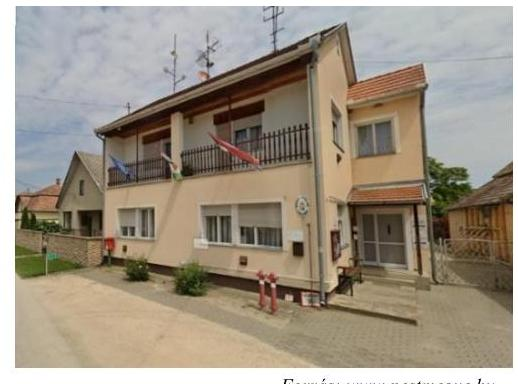

# JELENTÉS 

## A helyi nemzetiségi önkormányzatok ellenőrzése

Szerb Önkormányzat Lórév

2025.

---

# ÁLLAMI   SZÁMVEVŐSZÉK 

## JELENTÉS

## A helyi nemzetiségi önkormányzatok ellenőrzése

Szerb Önkormányzat Lórév

2025.

---

# ELLENŐRZÉSI IGAZGATÓSÁG: 

## ELLENŐRZÉSI IGAZGATÓSÁG II.

## ELLENŐRZÉSI IGAZGATÓ:

DR. BAFFIA GERGELY GÁBOR ellenőrzési igazgató

## ELLENŐRZÉSVEZETŐ:

DR. LÁNG ÁGNES KRISZTINA ellenőrzésvezető

Jelentéseink az interneten a www.asz.hu címen olvashatók.

IKTATÓSZÁM: EL-4165-002/2025
TÉMASORSZÁM: 51
ELLENŐRZÉS-AZONOSÍTÓ SZÁM: V1129

---

# TARTALOMJEGYZÉK 

AZ ELLENŐRZÉS ALAPADATAI ..... 5
AZ ELLENŐRÖTT SZERVEZETEK ..... 7
ÖSSZEFOGLALÁS ..... 8
AZ ELLENŐRZÉS FÓKUSZTERÜLETEI ..... 10
MEGÁLLAPÍTÁSOK ..... 11
JAVASLATOK ..... 18
MELLÉKLETEK ..... 21
I. sz. melléklet: Értelmező szótár ..... 21
II. sz. melléklet: Az ellenőrzött szervezetek jegyzéke ..... 22
III. sz. melléklet: Ellenőrzési kritériumok ..... 23
IV. sz. melléklet: Összefoglaló táblázat az ellenőrzött szervezetek gazdálkodási jogköreinek gyakorlásáról ellenőrzött gazdasági eseményenként ..... 24
FÜGGELÉK: ÉSZREVÉTELEK ..... 29
RÖVIDÍTÉSEK JEGYZÉKE ..... 30

---

.

---

# AZ ELLENŐRZÉS ALAPADATAI 

## AZ ELLENŐRZÉS CÉLJA

Az ellenőrzés célja annak megállapítása volt, hogy a helyi nemzetiségi önkormányzat képviselő-testülete kialakította-e a törvényes működésének feltételeit, továbbá annak értékelése, hogy a pénzforgalomban megjelenő kiadások teljesítése megfelelő volt-e, a kiadások a közfeladatellátást szolgálták-e.

Az ellenőrzés célja továbbá annak értékelése volt, hogy a helyi nemzetiségi önkormányzat intézményfenntartóként, gazdálkodó szervezet alapítójaként gyakorolta-e az alapítói-, fenntartói és irányítási jogait. Az ellenőrzés értékelte, hogy a helyi nemzetiségi önkormányzat eleget tett-e az elektronikus közzétételi kötelezettségének.

## AZ ELLENŐRZÉS TÍPUSA

Kombinált ellenőrzés

## AZ ELLENŐRZÖTT IDŐSZAK

A 2024. év azzal, hogy az elektronikus közzétételi kötelezettség teljesítése tekintetében az ellenőrzött időszak a helyszíni ellenőrzés indításakor (2024. december 17. napján) fennálló állapot volt.

## AZ ELLENŐRZÉS TÁRGYA

A helyi nemzetiségi önkormányzat működésének törvényessége, az alapítói-, fenntartói és irányítási jogok gyakorlása, az elektronikus közzétételi kötelezettség teljesítése.

A helyi nemzetiségi önkormányzat, illetve az általa alapított/fenntartott és nemzetiségi közfeladatot ellátó szervezete pénzforgalmában megjelenő kiadások megfelelősége, közfeladatellátáshoz való kapcsolódása.

Az ellenőrzés kiterjedt minden olyan körülményre és adatra, amely az ÁSZ¹ jogszabályban meghatározott feladatainak teljesítéséhez, valamint a program végrehajtása folyamán felmerült újabb összefüggéseknek az ellenőrzés céljaival összhangban lévő feltárásához szükséges volt.

## AZ ELLENŐRZÉS JOGALAPJA

Az ellenőrzés jogszabályi alapját az ÁSZ tv.² 1. § (3) bekezdésében és az 5. § (2)-(4),(6) bekezdéseiben foglalt előírások képezték.

---

# AZ ELLENŐRZÉS MÓDSZERE 

Az ellenőrzést a nemzetközi standardokat irányadónak tekintve az ellenőrzési program szempontjai, az ellenőrzési időszakban hatályos jogszabályok, az ellenőrzés szakmai szabályok és módszertanok figyelembevételével végezte az ÁSZ.

Az ellenőrzési fókuszterületek megválaszolásához szükséges bizonyítékok megszerzése az ellenőrzött és a támogató szervezet által rendelkezésre bocsátott dokumentumokra, adatokra alapozva megfigyelés, helyszíni szemle, interjú és jegyzőkönyvkészítés, mintavételezés útján, valamint elemző eljárással történt.

Az ellenőrzési bizonyítékként felhasználható adatforrások közé tartoztak az ellenőrzöttek által közzétett dokumentumok, a helyszíni ellenőrzés során kért, megtekintett dokumentumok, valamint minden - az ellenőrzés folyamán feltárt - az ellenőrzés szempontjából releváns információt tartalmazó dokumentum. Az ellenőrzés lefolytatásához az ellenőrzött szervezet a helyszínen adat- és iratbetekintésre igényelt dokumentumok, adatok, információk rendelkezésre bocsátásával és megküldésével, valamint az interjúk során a feltett kérdésre adott válaszokkal szolgáltatott adatokat. Ellenőrzést támogató szervezetként a Szerb Országos Önkormányzat az ÁSZ megkeresésére főkönyvi adatokkal támogatta az ellenőrzést.

A helyi nemzetiségi önkormányzat elektronikus közzétételi kötelezettsége teljesítésének megfelelőségét a helyszíni ellenőrzés indításakor fennálló állapotnak megfelelően értékelte az ÁSZ, a közzétételre szolgáló honlapról készített képernyőfotók alapján.

A pénzforgalomban megjelenő kiadások teljesítésének megfelelőségét mintavételi eljárással kiválasztott tételek alapján ellenőrizte az ÁSZ. Az ellenőrzés során a működés és a gazdálkodás kockázatos területeinek meghatározását követően a főkönyvi adatbázisokból kockázat alapú eljárással történt a mintatételek kiválasztása. Az Önkormányzat³ 2024. évben teljesített kifizetései közül 12 gazdasági esemény értékelésére került sor, amely mintatételek értéke összesen 3113,1 E Ft volt, ami az Önkormányzat összes kiadásainak 70,6%-át képezte. Ezek közül hét mintatétel - 1903,1 E Ft összegben - az Önkormányzat által meghatározott célra nyújtott pályázati támogatások felhasználásához kapcsolódott. A Társaság által a 2024. évben teljesített kifizetések közül tíz gazdasági esemény értékelésére került sor, amely mintatételek értéke összesen 16 978,5 E Ft volt. Ezen mintatételekből kilenc - 14 438,0 E Ft összegben -, meghatározott célra nyújtott pályázati támogatások felhasználásához kapcsolódott.

Az ellenőrzésre kockázati alapon kiválasztott tételek kiértékelése egyedileg történt, a megállapítások a mintatételekre vonatkoznak, az eredmények nem kerültek kivetítésre a teljes sokaságra. A rendelkezésre álló forrás felhasználását akkor értékelte az ÁSZ célszerűnek, ha az ellenőrzött kifizetés a képviselő-testület döntésével összhangban nemzetiségi közfeladat-ellátására irányult.

Az ellenőrzéssel érintett dokumentumokat helyi nemzetiségi önkormányzat, a gazdálkodási feladatait ellátó települési önkormányzat hivatala, valamint helyi nemzetiségi önkormányzat által alapított nemzetiségi közfeladatot ellátó szervezet és a támogató szervezet bocsátotta az ellenőrzés rendelkezésére.

---

# AZ ELLENŐRÖTT SZERVEZETEK 

Lórév község Pest vármegyében, Ráckevei járásban található, lakónépessége 2024. január 1-jén 303 fő* volt.

A községben szerb nemzetiségi önkormányzat, a Szerb Önkormányzat Lórév működött. A 2024. évi önkormányzati választásokat követően a Képviselő-testület⁴ tagjainak száma háromról, öt főre emelkedett. Az Önkormányzat működésével kapcsolatos feladatokat 2013. évtől a Szigetbecsei Közös Önkormányzati Hivatal látta el, amely évtől a jegyző személye változatlan.
Az Önkormányzat 2024. évi beszámolója alapján a 2024. évi módosított bevételi és kiadási előirányzata 5008,9 E Ft, a teljesített költségvetési bevétel 5114,1 E Ft, a teljesített költségvetési kiadás 4408,3 E Ft volt. Az Önkormányzat a 2024. évben 1937,2 E Ft összegű általános működési és feladatalapú támogatás mellett 2200,0 E Ft pályázati támogatásban részesült és 105,2 E Ft működési bevételt realizált. A teljesített kiadásai tekintetében a legnagyobb részarányt (58,6%) a nemzetiségi közfeladatok ellátásával, illetve a pályázatok megvalósításával összefüggő dologi kiadások adták. Az Önkormányzat emellett a 2024. évben összesen 1285,0 E Ft értékben nyújtott támogatást különböző szervezetek részére.

Az Önkormányzat vagyona a 2024. január 1-jéről 2024. év végére 2784,0 E Ft-ról 10 826,9 E Ft-ra emelkedett alapvetően a befektetett eszközök értékének emelkedése miatt, amit az Önkormányzat tulajdonát képező ingatlan nyilvántartásba vétele okozott.

A Magyarországi Szerb Színház Nonprofit Közhasznú Kft. az Önkormányzat kisebbségi tulajdonában lévő gazdasági társasága. A Társaság⁵ 2009. évben jött létre az 1999. évben alapított Magyarországi Szerb Színház Közhasznú Társaság átalakulásával, lórévi székhellyel. A Társaság tulajdonosi szerkezete az ellenőrzött időszakban - Lórév Község Önkormányzata 96,7%-os és a Szerb Önkormányzat 3,3%-os tulajdoni részaránya - nem változott. A Társaság az ellenőrzött időszakban a Társasági szerződés⁶ alapján látta el a feladatait, emellett Lórév Község Önkormányzatával kötött Közszolgáltatási szerződés alapján kulturális szolgáltatási közfeladatot is ellátott. A Társaság ügyvezetőjének személyében és az ügyvezetés ellenőrzését végző három tagú felügyelőbizottság összetételében az ellenőrzött időszakban nem történt változás. A Társaság az év nagy részében Budapesten működött, Lóréven elsősorban nyáron voltak előadásai.

A Társaság a Számv. tv.⁷ szerint nem volt könyvvizsgálatra kötelezett, továbbá a Taktv.⁸ előírásait, továbbá a Gbkr.⁹-nek a belső kontrollrendszer kialakítására és működtetésére vonatkozó rendelkezéseit a Társaság tekintetében nem kellett alkalmazni.

A Társaság jegyzett tőkéje (3,0 M Ft¹⁰) az alapítás óta nem változott, vagyona a 2024. évi beszámoló alapján 91,8 M Ft volt, melynek 90,6% -a (83,2 M Ft) az év végén rendelkezésre álló pénzeszközök értéke. A befektetett eszközök könyv szerinti értéke 2024. év végén a mérlegfőösszeghez viszonyítva alacsony, 6,5% (6,0 M Ft) volt.

A Szerb Országos Önkormányzat 2015. évben alapította a Magyarországi Szerb Színház költségvetési szervet, amelynek vezetői feladatait az alapítástól kezdve a Társaság vezetője látta el.

[^0]
[^0]:    * Forrás: Központi Statisztikai Hivatal

---

# ÖSSZEFOGLALÁS 

A nemzetiségi önkormányzat a nemzetiségi közösséget megillető jogosultságok érvényesítésére, a nemzetiségek érdekeinek védelmére és képviseletére, a feladat- és hatáskörébe tartozó nemzetiségi közügyek települési, területi vagy országos szinten történő önálló intézésére jön létre. Az állam a nemzetiségi önkormányzatok működéséhez költségvetési támogatást nyújt. A nemzetiségi önkormányzatok a feladatellátásukhoz további pályázati forrásokat is szerezhetnek. A társadalom jogos elvárása, hogy a közpénzekkel, közvagyonnal gazdálkodó szervezetek működéséről, tevékenységéről időről-időre átfogó képet kapjon. Az ellenőrzés hozzájárult az Önkormányzat szabályszerű és felelős gazdálkodásához, a közpénzek szabályos, cél szerinti felhasználásához, a közvagyon védelméhez.

Az Önkormányzat a jogszabályokban, illetve a szervezeti és működési szabályzatában meghatározott közfeladatait ellátta. Kiadásait a központi költségvetésből kapott támogatásai fedezték. Az Önkormányzatnál a működés kialakítása és a vagyonnyilvántartás körében, valamint a költségvetéséből teljesített kifizetéseivel kapcsolatban az ÁSZ ellenőrzés több szabálytalanságot állapított meg.

Az Önkormányzat a szervezeti és működési kereteit meghatározta, a helyi önkormányzattal való együttműködés feltételeit Közigazgatási szerződés¹¹, ¹²-ben rögzítették, azonban az nem felelt meg a jogszabályi előírásoknak, mert nem biztosította a jogszabályban előírt mértékben az önkormányzati feladat ellátásához szükséges helyiség ingyenes használatát, továbbá az Önkormányzat testületi ülésein a jegyző vagy annak megbízottja részvételét feltételekhez kötötte. A Jegyző az Önkormányzat belső ellenőrzésének kialakításáról a jogszabályban és a Közigazgatási szerződés₁,₂-ben foglaltak ellenére nem gondoskodott.

A Képviselő-testület a jogszabályi előírások ellenére nem határozta meg vagyonleltárát és törzsvagyon körét, és a tulajdonát képező vagyon használatának, működtetésének szabályait, nem kötötte meg a tulajdonát képező ingatlan használatára vonatkozó megállapodást. Az Önkormányzat tulajdonában lévő ingatlan nyilvántartásba vételének elmulasztása miatt az Önkormányzat pénzügyi könyvvezetése és vagyonnyilvántartása az ellenőrzött időszakban 2024. október 1-ig nem felelt meg a jogszabályi előírásoknak, mert az eszközöket nem a valóságnak megfelelően tartalmazta. Az Önkormányzatnál a vagyongazdálkodásra, vagyonhasználatra vonatkozó hiányos szabályozás és gyakorlat miatt a felelős vagyongazdálkodás követelménye nem érvényesült. A Hivatal az ÁSZ ellenőrzés időszakában, 2025. évben, de a 2024. évet érintő tárgyi eszköz analitikákban és főkönyvben 2024. október 1-jei dátummal elvégezte a javítást, ezzel az ÁSZ megállapítása hasznosult. Az Önkormányzat a 2024. évi költségvetési beszámolójában a jogszabályi előírás ellenére a mérlegben nem mutatta ki a mérlegfőösszeg 2%-át meghaladó mértékű állománynövekedést.

Az Önkormányzatnál a jogszabályi előírások ellenére a vagyonnyilatkozat-tételre kötelezettek körét a szervezeti és működési szabályzatban nem tüntették fel, továbbá a képviselők vagyonnyilatkozatának nyilvánosságát erre irányuló belső szabályozás hiányában nem biztosították.

Az Önkormányzat a 2024. évben az elektronikus közzétételi kötelezettségének a jogszabályi előírások ellenére nem tett eleget. Az Önkormányzat a közzétételi kötelezettségének teljesítését a zárszámadási határozatok vonatkozásában pótolta, ezzel az ÁSZ megállapítása részben hasznosult.

Az Önkormányzatnál ellenőrzött kiadások a helyi nemzetiségi közfeladatellátáshoz kapcsolódtak, azonban az Önkormányzat a belső szabályzatában foglaltak ellenére nem minden esetben győződött meg az átadott pénzeszközök célszerű felhasználásáról. A kiadások teljesítése nem felelt meg a jogszabályok, valamint a belső szabályzatok előírásainak. A szabálytalanságokat a gazdálkodási jogkörök (pénzügyi ellenjegyzés, teljesítésigazolás, érvényesítés, utalványozás) nem, vagy nem megfelelő gyakorlása okozta. A 

kontrolltevékenység hibás gyakorlata megteremti a kötelezettségvállalás vagy valós teljesítés hiányában történő kifizetések kockázatát.

A Társaság által teljesített kifizetések a Társasági szerződésben foglalt feladatok ellátásával összefüggésben merültek fel. A Társaság pénzforgalmában megjelenő, ellenőrzésre kiválasztott kiadások teljesítése összességében nem volt megfelelő, mert a Társaság belső szabályzatában
 rögzített gazdálkodási jogköröket (pénzügyi ellenjegyzés, teljesítésigazolás, érvényesítés, összeférhetetlenségi követelmények) nem, vagy nem megfelelő módon gyakorolták. Az ellenőrzés megállapította továbbá, hogy a Társaság által Lórév Községben időszakosan végzett tevékenység nem indokolta Lórév Község Önkormányzatától a Művelődési Ház egész éves bérlését, az éves bérleti díjfizetési kötelezettség vállalása nem volt célszerű.

A Társaságnál a 2024. évben végzett mennyiségi leltárfelvételek során a tárgyi eszközök év végi könyv szerinti értékének a tételes és ellenőrizhető módon történő számbavétele a jogszabályi előírások ellenére nem volt biztosított. A kifizetések és a leltározás során feltárt szabálytalanságok, az indokolatlan kötelezettségvállalás miatt a Társaságnál nem érvényesült a szabályszerű és felelős közpénzfelhasználás követelménye.

Az ÁSZ az ellenőrzés során feltárt hiányosságok felszámolása, a szabályszerű és célszerű működés feltételeinek megteremtése érdekében a Képviselő-testület részére kettő, az Önkormányzat elnökének hat, a jegyzőnek hat szabályszerűségi, a Társaság ügyvezetőjének kettő szabályszerűségi és egy célszerűségi javaslatot tett.

---

# AZ ELLENŐRZÉS FÓKUSZTERÜLETEI 

1- A helyi nemzetiségi önkormányzat működésének törvényessége, a közzétételi kötelezettségének teljesítése

2- A helyi nemzetiségi önkormányzat és gazdálkodó szervezete pénzforgalmában megjelenő kiadások megfelelősége és a közfeladatellátáshoz való kapcsolódása

---

# 1. A helyi nemzetiségi önkormányzat működésének törvényessége, a közzétételi kötelezettségének teljesítése 

## Összegző megállapítás

Az önkormányzat működése a 2024. évben nem felelt meg az Njtv. ${ }^{13}$-ban rögzített előírásoknak.
1.1. számú megállapítás

Az Önkormányzat Lórév Község Önkormányzatával kötött együttműködési megállapodása nem felelt meg teljes körűen az Njtv.-ben foglalt előírásoknak. Az Önkormányzat az Njtv.-ben foglaltak ellenére nem határozta meg vagyonleltárát és törzsvagyona körét, a tulajdonát képező vagyon kezelésére, használatára, működtetésére vonatkozó szabályokat. Az elnöki munkakör átadásáról készült jegyzőkönyv tartalma nem felelt meg a KTM rendelet ${ }^{14}$ előírásainak.

Az Önkormányzat 2024. évben rendelkezett a Képviselő-testület által elfogadott SZMSZ: ${ }^{15} \_^{16}$-szel, amely az Njtv. előírásának megfelelően meghatározta a Képviselő-testület feladat- és hatáskörét, az Önkormányzat szervezeti felépítését és működése részletes rendjét. Az SZMSZ ${ }_{1,2}$ rendelkezései értelmében a Képviselő-testület az ellenőrzött időszakban feladatot és hatáskört nem ruházott át, bizottságot nem hozott létre, a tisztségviselők és a képviselők részére tiszteletdíjat nem állapított meg.
Az SZMSZ ${ }_{1,2}$-ben a Vnytv. ${ }^{17}$ 4. § a) pontjában foglaltak ellenére a vagyonnyilatkozat-tételre kötelezettek körét nem tüntették fel.
A Képviselő-testület az Njtv. 113. § c) és d) pontjaiban foglaltak ellenére nem határozta meg vagyonleltárát, törzsvagyona körét és a tulajdonát képező vagyon használatának, működtetésének szabályait, nem kötötte meg a tulajdonát képező ingatlan használatára vonatkozó megállapodást. Az Önkormányzat 2024. évi vagyonnyilvántartása nem felelt meg az Nvtv. ${ }^{18}$ 10. § (1) bekezdésében foglaltaknak, mivel nem tartalmazta az Önkormányzat tulajdonában lévő Lórév, Dundity Alexa utca 5. szám alatti orvosi rendelő megnevezésű ingatlan vagyonelemet. Az Nvtv. 7. § (1) bekezdésében foglaltak ellenére az Önkormányzat tulajdonát képező orvosi rendelő nem szolgálta az Önkormányzat kötelező és önként vállalt feladatainak ellátását, így nem érvényesült az önkormányzati vagyonnal való felelős gazdálkodás kötelezettsége.

Lórév Község Önkormányzattal 1999. december 20-án megkötött megállapodás értelmében székhely céljából térítésmentesen az Önkormányzat tulajdonába került a Lórév Dundity Alexa utca 5. szám alatti ingatlan. Az ellenőrzött időszakban az Önkormányzat az ingatlant sem székhelyként, sem más célból nem használta, egyéb hasznosításáról nem rendelkezett. Az ingatlan üzemeltetésével kapcsolatban az Önkormányzatnak sem bevétele, sem költsége nem keletkezett.
Az Önkormányzat rendelkezett Lórév Község Önkormányzatával kötött együttműködési megállapodással. A Képviselő-testület a megállapodást tartalmazó Közigazgatási szerződés ${ }_{1}$-t 2024. január 31-ei ülésén felülvizsgálta és azt változatlan tartalommal fenntartotta. A Közigazgatási szerződés ${ }_{2}$-t az Njtv. 80. § (2) bekezdésében foglaltak ellenére a 2024. évi alakuló ülést követő harminc

---

napon túl, 2024. november 20-án írta alá a polgármester ${ }^{19}$ és az Elnök ${ }_{2}{ }^{20}$, amelyet a záradékban feltüntetettekkel ellentétben a Képviselő-testület nem fogadott el. Az Elnök ${ }_{2}$ a megállapodás aláírásával az Njtv. 77. § (1) bekezdésben foglaltak ellenére, felhatalmazás hiányában - a Képviselő-testület feladat és hatáskörében - hozott döntést a Közigazgatási szerződés ${ }_{2}$-ben rögzített feladatok ellátásáról. A Képviselő-testület a Közigazgatási szerződés ${ }_{2}$ szerinti működési feltételeket az Njtv. előírásainak megfelelően az SZMSZ ${ }_{2}$-ben rögzítette.

A 2024. október 29-én megtartott ülésen az Elnök ${ }_{2}$ javaslatára a Képviselő-testület a 30/2024. (X. 29.) számú határozatban arról döntött, hogy az érvényben lévő együttműködési megállapodásokat a jegyző vizsgálja felül és a következő testületi ülésre készítse elő, így a 2024. évben alakult Képviselő-testület az együttműködési megállapodásról nem hozott döntést.
A Közigazgatási szerződés ${ }_{2}$ II. fejezet 1.1 pontja nem felelt meg az Njtv. 80. § (1) bekezdés a) pontjában foglaltaknak, mivel az nem biztosította az Önkormányzat saját székhelyén havonta legalább harminckét órában az önkormányzati feladat ellátásához szükséges helyiség ingyenes használatát.
A 2024. évben hatályos Közigazgatási szerződés ${ }_{1,2}$ II. fejezet 4. pontja nem felelt meg az Njtv. 80. § (4) bekezdésében foglaltaknak, mivel az Önkormányzat testületi ülésein a jegyző vagy annak megbízottja részvételét feltételekhez kötötte.
A Közigazgatási szerződés ${ }_{1,2}$ VII. fejezetében - a Bkr. ${ }^{21}$ 15. § (11) bekezdésében foglaltakkal élve - rögzítették, hogy az Önkormányzat belső ellenőrzését a Hivatal végzi. A Jegyző ${ }^{22}$ által kötött megbízási szerződés ${ }^{23}$ a Szigetbecsei Község Önkormányzata és intézményei belső ellenőri feladatainak ellátásáról szólt, nem terjedt ki az Önkormányzat belső ellenőrzésére. A Jegyző az Önkormányzat belső ellenőrzésének kialakításáról a Közigazgatási szerződés ${ }_{1,2}$ VII. fejezetében rögzítettek ellenére nem gondoskodott.
Az Elnök ${ }_{1}{ }^{24}$ és az Elnök ${ }_{2}$ között - a Kttv. és a KTM rendeletben foglalt határidőn belül 2024. október 11-én megtörtént a munkakör átadás-átvétel. Az erről szóló átadás-átvételi jegyzőkönyv a KTM rendelet 3. § (1) bekezdés dd), de), e) pontjaiban foglaltak ellenére nem tartalmazta az Önkormányzat gazdálkodásával kapcsolatosan:

- a banki aláírásra, kötelezettségvállalásra, utalványozásra, érvényesítésre jogosultak nyilvántartásáról;
- a tárgyévi belső ellenőrzési tervről, az elkészült belső ellenőrzési jelentésekről;
- az átadó személyéhez kötődő tanúsítványon alapuló elektronikus aláírások esetén annak visszavonásáról szóló intézkedésről szóló tájékoztatást.
A KTM rendelet 3. § (3) bekezdésében foglaltak ellenére a jegyzőkönyvben nem rögzítették az átadó és átvevő által a KTM rendelet 3. § (2) bekezdésének b) pontja szerint áttekintett - az önkormányzat aktuális (éves) vagyonmérlegét, a vagyonkatasztert és a vagyongazdálkodásról szóló önkormányzati határozatot tartalmazó - dokumentumok aktuális adatait.
A Képviselő-testület határozatban nem állapította meg az Njtv. 102. § (1) bekezdés j) pontja és (2) bekezdés előírása ellenére a - 2023. január 9-től képviselő-testületi ülésein részt nem vevő - képviselő 2024. január 8. napjával történő képviselői megbízatásának megszűnését.

Az Önkormányzat a Társaság vonatkozásában az alapítói-, tulajdonosi jogait, a 2.2. számú megállapítás alatt részletezett bérleti szerződés jóváhagyása kivételével gyakorolta.

---

1.2. számú megállapítás

Az Önkormányzat a 2024. évben az elektronikus közzétételi kötelezettségének az Info tv.-ben foglaltak ellenére nem tett eleget, valamint az Njtv.-ben foglaltak ellenére a képviselők vagyonnyilatkozatainak nyilvánosságát nem biztosította.

Az Önkormányzat 2024. évben a közzétételi kötelezettségének az Info tv. 37. § (1) bekezdésében és az 1. sz mellékletének I-III. fejezetében meghatározott szervezeti, személyzeti adatok, költségvetési, zárszámadási határozatok vonatkozásában (Lórév Község Önkormányzattal közös www.lorev.hu honlapon) nem tett eleget. Az Önkormányzat a 2024. évben nem rendelkezett pénzeszközei felhasználásával, az államháztartáshoz tartozó vagyonnal történő gazdálkodásával összefüggő, az ötmillió forintot elérő vagy meghaladó értékű szerződéssel, így ezzel kapcsolatos közzétételi kötelezettsége nem merült fel.
A Hivatal az Ávr. 13. § (2) bekezdés h) pontjában, valamint az Info tv. 30. § (6) bekezdésében foglaltak ellenére nem rendelkezett a közérdekű adatok megismerésére irányuló kérelmek intézésének, továbbá a kötelezően közzéteendő adatok nyilvánosságra hozatalának rendjéről. Az Önkormányzat - az Njtv. 103. § (3) bekezdésében foglaltak ellenére - a képviselők vagyonnyilatkozatainak nyilvánosságát nem biztosította.

# 2. A helyi nemzetiségi önkormányzat és gazdálkodó szervezete pénzforgalmában megjelenő kiadások megfelelősége és a közfeladatellátáshoz való kapcsolódása 

Összegző megállapítás

Az Önkormányzati kiadások az Njtv. előírásainak megfelelően helyi nemzetiségi közfeladatellátáshoz kapcsolódtak, azonban azok teljesítése az Áht. és az Ávr. előírásainak nem felelt meg. A Társaság által teljesített kifizetések a Társasági szerződésben foglalt feladatok ellátásával összefüggésben merültek fel, azonban azok teljesítése nem felelt meg a társasági Gazdálkodási szabályzat ${ }^{25}$ előírásainak.
2.1. számú megállapítás

Az Önkormányzat által teljesített kifizetések az Njtv. előírásainak megfelelően az önkormányzati feladatellátáshoz kapcsolódtak, azonban az Önkormányzat a belső szabályozás ellenére nem minden esetben győződött meg az átadott pénzeszközök cél szerinti felhasználásáról. A kiadások teljesítése nem felelt meg az Áht., az Ávr. és az Áhsz. ${ }^{26}$, valamint a belső szabályzatok előírásainak.

Az Önkormányzat és Lórév Község Önkormányzata között megkötött, 2024. évben hatályos Közigazgatási szerződés ${ }_{1,2}$-ben rögzítették, hogy az Önkormányzat operatív gazdálkodásának végrehajtásával kapcsolatos feladatokat a Hivatal látta el, mely megfelelt az Áht. előírásainak.
Az Önkormányzat a 2024. évben rendelkezett a Jegyző és az Elnök ${ }_{1,2}$ által közösen kiadott, a Számv. tv.-ben meghatározott Számviteli politikával és annak keretében elkészítendő szabályzatokkal, az Ávr.-ben meghatározott beszerzési szabályzattal. Az Ávr.-ben foglaltaknak megfelelően a tervezéssel, gazdálkodással, az ellenőrzési, adatszolgáltatási és beszámolási feladatok teljesítésével

---

kapcsolatos belső előírások a Jegyző és az Elnök ${ }_{1,2}$ által közösen kiadott, Költségvetés készítéséről szóló szabályzatban, illetve az Elnök ${ }_{1,2}$ által kiadott Gazdálkodási szabályzat ${ }_{1}{ }^{27}{ }_{2}{ }^{28}$-ban kerültek rögzítésre.
A gazdálkodási jogkörök közül a kötelezettségvállalásra, a teljesítés igazolására és az utalványozásra az Elnök ${ }_{1}$ más személynek nem adott felhatalmazást, az Elnök ${ }_{2}$ kötelezettségvállalásra és utalványozásra felhatalmazta az elnök-helyettest, teljesítés igazolására más személynek nem adott felhatalmazást.
Az Önkormányzat kiadási tételeinek pénzügyi ellenjegyzője és érvényesítője az Ávr. előírásaival összhangban rendelkezett a Jegyző által adott felhatalmazással.
A támogatások nyújtásával érintett minden mintatétel (NEMZ_KIAD_08, 10, 12 mintatétel) esetében az Njtv.-ben foglaltaknak megfelelően - a Képviselő-testület döntött a támogatás összegéről, valamint annak felhasználási céljáról. Két mintatétel (NEMZ_KIAD_08. és 12. mintatétel) esetében a Támogatási szabályzat ${ }^{29}$ III. 7. pontjában előírtak ellenére a támogatási megállapodások megkötésére beszámolási/elszámolási kötelezettség előírása hiányában került sor, amelyek elengedéséről a Képviselő-testület nem döntött. A beszámolási kötelezettség előírásának hiánya miatt a támogatott szervezetek nem számoltak be a támogatás felhasználásáról, az Önkormányzat nem győződött meg az átadott pénzeszközök - az Njtv. 115. § (1) bekezdésében meghatározott kötelező közfeladatok ellátását szolgáló - célszerű felhasználásáról.
A pénzforgalomban megjelenő kiadások teljesítése az ellenőrzött 12 mintatételből 10 esetében nem felelt meg teljes körűen az Áht., az Ávr. és az Áhsz. előírásainak az alábbi hiányosságok miatt:

- Egy esetben (NEMZ_KIAD_09. mintatétel) a kötelezettségvállalás nem volt szabályszerű, mivel a kötelezettségvállalás dokumentuma a pénzügyi ellenjegyzés, valamint a kötelezettségvállalónak az Ávr. 60. § szerinti nyilvántartásban szereplő aláírásmintájával egyező aláírásának hiányában nem felelt meg az Áht. 37. § (1) bekezdésében és az Ávr.
 50. § (1) bekezdés d) pontjában, az Ávr. 53/A. § (1) bekezdésében és az Ávr. 55. § (1) bekezdésében foglalt előírásoknak.
- Kettő esetben (NEMZ_KIAD_08. és 12. mintatétel) a pénzügyi ellenjegyzés nem volt szabályszerű, mert az Áht. 37. § (1) bekezdésében foglaltak ellenére a pénzügyi ellenjegyző nem győződött meg arról, hogy a kötelezettségvállalás a gazdálkodásra vonatkozó szabályokat nem sérti.
- Három esetben (NEMZ_KIAD_08, 10. és 12. mintatétel) az Áht. 38. § (2) bekezdésében, valamint az Ávr. 57. § (1) bekezdésében foglalt előírások ellenére a teljesítésigazolást nem végezték el.
- Négy esetben (NEMZ_KIAD_03-06. mintatétel) a teljesítésigazolás szintén nem volt szabályszerű, mivel az Ávr. 57. § (3) bekezdésében foglaltak ellenére a teljesítésigazolások nem tartalmazták annak keltét. Emiatt nem lehetett megállapítani, hogy a teljesítésigazoló az Ávr. 57. § (1) bekezdésben foglalt ellenőrzési feladatait az ellenszolgáltatás teljesítését követően végezte-e el.
- Négy esetben (NEMZ_KIAD_08-10. és 12. mintatétel) a kötelezettségvállalás, pénzügyi ellenjegyzés és a teljesítés igazolása esetében feltárt hiányosságok miatt az érvényesítő nem végezte el megfelelően a feladatát, mivel - az Ávr. 58. § (2) bekezdésében foglaltak ellenére - nem jelezte az utalványozónak, hogy a megelőző ügymenetben nem tartották be az Áht. és az Ávr. előírásait. Nem kifogásolta, hogy a kötelezettségvállalásra (NEMZ_KIAD_09 mintatétel) az Áht. 37. § (1) bekezdésében és az Ávr. 55. § (1) bekezdésében foglaltak ellenére pénzügyi ellenjegyzés hiányában került sor, továbbá, hogy az Ávr. 58. § (1)-(2) bekezdéseiben foglaltak ellenére a megelőző ügymenetben a teljesítés igazolását (NEMZ_KIAD_08, 10, 12. mintatétel) nem végezték el. Ennek következtében, ezen mintatételek esetében az utalványozás nem felelt meg az Áht. 38. § (1) bekezdésében foglaltaknak sem.

- Négy esetben (NEMZ_KIAD_03-06. mintatétel) az érvényesítést az Ávr. 58. § (1) bekezdésében foglaltak ellenére nem végezték el, így az utalványozás nem felelt meg az Ávr. 59. § (1) b) bekezdésben foglalt előírásnak. Az utalványozás dokumentuma mind a négy mintatételnél rendelkezésre állt, azonban az Ávr. 59. § (3) bekezdés e) pontjában foglaltak ellenére az utalványrendeletek nem tartalmazták a kiadások egységes rovatrend és kormányzati funkció szerinti számát, a terheléssel érintett pénzeszköz Áhsz. szerinti könyvviteli számlájának számát.
- Két esetben (NEMZ_KIAD_01, 02 mintatétel) a kifizetés előtt az Ávr. 59. § (1b) bekezdésében foglaltak ellenére a kiadások utalványozását nem végezték el, a kifizetésekre utalványozás nélkül került sor, mely nem felelt meg az Áht. 38. § (1) bekezdés előírásainak.
Az Önkormányzatnál ellenőrzött gazdasági eseményeket a IV. számú melléklet 1. táblázata tartalmazza.
Az 1999. december 20-án az Önkormányzat tulajdonába került ingatlant, annak ellenére, hogy a tulajdonjog változást a földhivatali ingatlan-nyilvántartásba bejegyezték, az Önkormányzat nem vette nyilvántartásba. A gazdasági esemény könyvelésének elmulasztása miatt az Önkormányzat pénzügyi könyvvezetése az ellenőrzött időszakban 2024. október 1-ig nem felelt meg az Áhsz. 45. § (1) bekezdésében foglalt előírásoknak, mert az eszközöket nem a valóságnak megfelelően tartalmazta. Az Önkormányzat az ellenőrzött időszakban 2024. október 1-ig a tulajdonában lévő ingatlanvagyonról a 147/1992. (XI.6.) Korm. rendelet 30 1. § (1)-(2) bekezdéseiben foglaltak ellenére ingatlanvagyon katasztert nem vezetett.
A Hivatal az ÁSZ ellenőrzés időszakában, annak hasznosulásaként a 2025. évben, de a 2024. évet érintő tárgyi eszköz analitikákban és főkönyvben 2024. október 1-jei dátummal elvégezte a javítást. Az aktiváláskor rögzített bruttó érték összesen 18,8 MFt, az elszámolt értékcsökkenés összesen 10,3 MFt volt. A javítás és az év végéig elszámolt értékcsökkenés következtében az Önkormányzat tárgyi eszközök mérlegsorán a 2024. december 31-i állapot szerint 8,2 MFt állománynövekedés történt. Az Önkormányzat a 2024. évi költségvetési beszámolójában az Áhsz. 9. § (2) bekezdésében foglaltak ellenére a mérlegben nem mutatta ki a mérlegfőösszeg 2%-át (2,8 MFt) meghaladó mértékű állománynövekedést.
2.2. számú megállapítás

A Társaság által teljesített kifizetések a Társasági szerződésben és a támogatási megállapodásokban foglalt feladatok ellátásához kapcsolódtak, azonban azok teljesítése nem felelt meg a társasági Gazdálkodási szabályzat előírásainak.

A Társaságnál a kötelezettségvállalás, a pénzügyi ellenjegyzés, a teljesítés igazolása és az érvényesítés rendjéről a társasági Gazdálkodási szabályzat rendelkezett. A szabályzat ezen gazdálkodási jogkörök gyakorlásával összefüggően összeférhetetlenségi szabályokat is tartalmazott, amelynek értelmében a gazdálkodási jogkörök gyakorlása keretében ellátandó feladatokat nem végezheti az a személy, aki ezt a tevékenységet a Ptk. 31 szerinti közeli hozzátartozója, vagy a maga javára látja el.
Az ellenőrzött gazdasági eseményekhez kapcsolódó költségvetési/bevételi források felhasználása célszerű volt, mivel azok a Társasági szerződésben rögzítettekkel összhangban a szerb nemzetiségi kultúra, nyelv és nemzetiségi előadó-művészet folytatása, a tevékenységek gyakorlása érdekében merültek fel.

A pénzforgalomban megjelenő kiadások teljesítése az ellenőrzött tíz mintatétel esetében egy esetben sem felelt meg teljes körűen a társasági Gazdálkodási szabályzat előírásainak az alábbiak miatt:

- A társasági Gazdálkodási szabályzat III. rész 1.1. pontjában foglaltak ellenére egy esetben (GT_KIAD_03. mintatétel) a kötelezettségvállalás előtt nem történt meg a pénzügyi ellenjegyzés.
- Két mintatétel esetében (GT_KIAD_01 és 03. mintatétel) a társasági Gazdálkodási szabályzat III. rész 3.1. pontjában foglaltak ellenére a kifizetés előtt nem történt a szakmai teljesítésigazolás, amelynek következtében a szakmai teljesítésigazoló nem győződött meg a kiadás teljesítésének jogosságáról, összeségéről.
- Négy esetben (GT_KIAD_02-03. és GT_KIAD_09-10. mintatétel) nem végezték el az érvényesítést a társasági Gazdálkodási szabályzat III/4. Az érvényesítés rendjében foglaltak ellenére. További hat esetben (GT_KIAD_01. és GT_KIAD_04-08. mintatétel) az érvényesítést nem a társasági Gazdálkodási szabályzatban rögzített módon - társasági Gazdálkodási szabályzat III/4. Az érvényesítés rendje 2. pont b) bekezdés - végezték el, tekintettel arra, hogy a számviteli bizonylatokon az ,,átutalva" szó szerepelt az ügyvezető aláírásával, az érvényesítésre utaló megjelölés helyett.
- A társasági Gazdálkodási szabályzatban rögzített összeférhetetlenségi szabályokban foglaltak ellenére a pénzügyi ellenjegyző közeli hozzátartozója javára látta el ellenőrzési kötelezettségét két mintatétel (GT_KIAD_07-08. mintatétel) esetében.
Egy mintatétel (GT_KIAD_03 mintatétel) Lórév Község Önkormányzatával, mint bérbeadóval 2024. február 26-án megkötött bérleti szerződéshez kapcsolódott. A bérleti szerződés értelmében a Társaság 2024. március 1. - 2025. február 28. között negyedévente egyenlő részletben, évi nettó 8,0 MFt+Áfa (bruttó: 10,2 MFt) bérleti díj ellenében bérelte a Társaság székhelyéül szolgáló Lórév, Dózsa György utca 79. szám alatt található Községi Művelődési Házat és melléképületeit színházi és ahhoz közvetlenül kapcsolódó (díszlet, raktár, ruhatár, öltözők stb.) tevékenység ellátása céljából.
A Társaság taggyűlése nem tárgyalta és nem hozott döntést a bérleti szerződés jóváhagyásáról, annak ellenére, hogy a Társasági szerződés 2.1.1. j) pontja a taggyűlés kizárólagos hatáskörébe utalta azon szerződés jóváhagyását, amelyet a Társaság a saját tagjával köt. A taggyűlés ezen mulasztása miatt a Társaság Felügyelő bizottsága sem tett eleget a Társasági szerződés 2.3.5. pont 2. francia bekezdésében előírt ellenőrzési kötelezettségének. A szerződés és az annak jóváhagyására vonatkozó előterjesztés felügyelőbizottsági vizsgálatát indokolta volna az a körülmény is, hogy az évi 10,2 MFt bérleti díj a Társaság 2024. évi kiadásainak 9,7%-át tette ki, továbbá a 2024. évi bevételeinek 87%-a közpénzből származott.
A központi ügyintézés helye a Társasági szerződésben megjelölt székhelytől eltérően a budapesti fióktelepen volt, amelyre utalást a Ptk. 3:96. § (1) bekezdésben foglaltak ellenére a Társasági szerződés nem tartalmazott. A Társaságnak Lóréven nyáron voltak előadásai, az év többi részében Budapesten, illetve más helyszíneken játszottak. A 2024. évben a lórévi Művelődési Házban augusztus 26-31. között került megrendezésre a Szerb Kulturális és Színházi napok, mely időszakosan végzett tevékenység nem indokolta a Művelődési Ház egész éves bérlését, illetve az éves bérleti díjfizetési kötelezettség vállalását. Az ÁSZ ellenőrzés megállapította, hogy a nem szabályszerű döntéselőkészítésből adódó egész éves bérlés nem volt ésszerű, mert a Társaság feladatellátásához szükséges mértéket meghaladta, így a célszerűség követelménye nem érvényesült.

A Társaságnál ellenőrzött gazdasági eseményeket a IV. számú melléklet 2. táblázata tartalmazza.
A Társaságnál a 2024. januárban végzett mennyiségi leltárfelvételek során a tárgyi eszközök könyv szerinti értékének a tételes és ellenőrizhető módon történő számbavétele a Számv. tv. 69. § (1) bekezdésében foglaltak ellenére nem volt biztosított, mivel a leltári számot a tárgyi eszközökön nem tüntették fel, továbbá a leltárfelvételi bizonylaton a társasági Leltározási szabályzat 32 1.1. pontjában előírtak ellenére nem rögzítették az eszközök leltározási helyét. A leltárfelvételt követően a leltározás befejezéséről a társasági Leltározási szabályzat alapján jegyzőkönyv és leltárkiértékelés készült, abban leltáreltérés nem került megállapításra.

# JAVASLATOK 

Az ÁSZ tv. 33. § (1) bekezdésében foglaltak értelmében az ellenőrzött szervezet vezetője köteles a jelentésben foglalt megállapításokhoz kapcsolódó intézkedési tervet összeállítani és azt a jelentés kézhezvételétől számított 30 napon belül az ÁSZ részére megküldeni. Amennyiben az ellenőrzött szervezet vezetője nem küldi meg határidőben az intézkedési tervet, vagy továbbra sem elfogadható intézkedési tervet küld, az Állami Számvevőszék elnöke az ÁSZ tv. 33. § (3) bekezdés a) és b) pontjaiban foglaltakat érvényesítheti.

## SZERB ÖNKORMÁNYZAT LÓRÉV KÉPVISELŐ-TESTÜLETE RÉSZÉRE

1. Határozza meg az Njtv. 113. § c) és d) pontjaiban foglaltak szerint a vagyonleltárát, a törzsvagyona körét és a tulajdonát képező vagyon használatára, működtetésére vonatkozó szabályokat.
2. Intézkedjen az Njtv. 113. § d) pontja alapján Lórév, Dundity Alexa utca 5. szám alatti önkormányzati ingatlan használatára vonatkozó megállapodás megkötéséről.

## SZERB ÖNKORMÁNYZAT LÓRÉV ELNÖKE RÉSZÉRE

1. Intézkedjen a nyilvános számvevőszéki jelentés kézhezvételét követő 30 napon belül annak Képviselőtestület elé terjesztéséről. A jelentést a napirend tárgyalásáról szóló jegyzőkönyvvel együtt tájékoztatásul küldje meg a Kormányhivatal számára is.
2. Kezdeményezze a Képviselő-testületnél a közigazgatási szerződés felülvizsgálatát, annak érdekében, hogy az feleljen meg az Njtv. 80. § (1) bekezdés a) pontjában és a (4) bekezdésében előírtaknak. Intézkedjen, hogy a megállapodás megkötését, módosítását követő harminc napon belül az Önkormányzat SZMSZ-ében a megállapodás szerinti működési feltételek rögzítésre kerüljenek.
3. Gondoskodjon az Önkormányzat SZMSZ-ének módosításáról, és a Képviselő-testület elé terjesztéséről annak érdekében, hogy

- a Vnytv. 4. § a) pontjának megfelelően kerüljön feltüntetésre a vagyonnyilatkozat-tételi kötelezettséget megalapozó munkakört, beosztást, vagy feladatkört betöltő kötelezettek köre;
- az Njtv. 103. § (3) bekezdésének megfelelően biztosítsa a képviselők vagyonnyilatkozatainak nyilvánosságát.

4. Gondoskodjon a vagyongazdálkodási szabályzat módosításáról és a Képviselő-testület elé terjesztéséről annak érdekében, hogy az Nvtv. 5. § (1) bekezdésének, valamint az Njtv. 125. § (1) bekezdésének és a (2) bekezdés a)-b) pontjainak megfelelően tartalmazza az Önkormányzat törzsvagyona körébe tartozó valamennyi vagyonelemet és azok minősítését.

5. Tegyen intézkedéseket az Áht. 37. § (1) és 38. § (1) bekezdésében foglalt kontrolltevékenységek megfelelő működtetésére, amelyek megelőzik a jelentésben leírt, az Ávr. 57. §-ában, valamint 59. §-ában foglalt kötelezettségvállalási, teljesítésigazolási és utalványozási jogkörök gyakorlásával összefüggő szabálytalanságok ismételt előfordulását.
6. Gondoskodjon a Támogatási szabályzat III. 7. pontjában előírtak betartatásáról az adott támogatások elszámolása kapcsán, annak érdekében, hogy az Önkormányzat meg tudjon győződni az átadott pénzeszközök - az Njtv. 115. § (1) bekezdésében foglaltaknak megfelelően - felhasználásáról.

 - célszerű felhasználásról.

# SZIGETBECSEI KÖZÖS ÖNKORMÁNYZATI HIVATAL JEGYZŐJE RÉSZÉRE 

1. Gondoskodjon az Info tv. 37. § (1) bekezdése és a 33. § (3) bekezdése szerint az Önkormányzat közzétételi kötelezettségének maradéktalan teljesítéséről.
2. Intézkedjen az Ávr. 13. § (2) bekezdés h) pontjában, valamint az Info tv. 30. § (6) bekezdésében foglaltaknak megfelelően, hogy belső szabályozásban kerüljön rendezésre a közérdekű adatok megismerésére irányuló kérelmek intézésének, továbbá a kötelezően közzéteendő adatok nyilvánosságra hozatalának rendje.
3. Tegyen intézkedéseket az Áht. 37. § (1) és 38. § (1) bekezdésében foglalt kontrolltevékenységek megfelelő működtetésére, amelyek megelőzik a jelentésben leírt, az Ávr. 53/A. §-ában, 55. §-ában, valamint 58. §-ában foglalt pénzügyi ellenjegyzési és érvényesítési jogkörök gyakorlásával összefüggő szabálytalanságok ismételt előfordulását.
4. A Közigazgatási szerződésben foglaltaknak megfelelően gondoskodjon a helyi nemzetiségi önkormányzat belső ellenőrzésének kialakításáról.
5. Kezdeményezze Lórév Község Önkormányzata Képviselő-testületénél a közigazgatási szerződés felülvizsgálatát, annak érdekében, hogy az megfeleljen az Njtv. 80. § (1) bekezdés a) pontjában és a (4) bekezdésében előírtaknak. Intézkedjen, hogy a megállapodás megkötését, módosítását követő harminc napon belül az Önkormányzat SZMSZ-ében a megállapodás szerinti működési feltételek rögzítésre kerüljenek.
6. Az Áhsz. 9. § (2) bekezdésének figyelembevételével biztosítsa, hogy az Önkormányzat költségvetési beszámolója az Áhsz. 3. § (3) bekezdésében foglaltaknak megfelelően a beszámoló adatai az Önkormányzat vagyoni helyzetéről megbízható és valós képet adjanak.

---

# MAGYARORSZÁGI SZERB SZÍNHÁZ ÜGYVEZETŐJE RÉSZÉRE 

1. Gondoskodjon arról, hogy a társasági Gazdálkodási szabályzat előírásaival összhangban kerüljön sor a gazdálkodási jogkörök gyakorlására és az összeférhetetlenségi követelmények betartására.
2. Hívja össze a taggyülést annak érdekében, hogy döntsön a Társasági szerződés 2.2.3. f) pontjában foglaltaknak eleget téve a Társaság és a tagjával - Lórév Község Önkormányzatával - megkötött bérleti szerződésről.
3. Fontolja meg a Lórév Község Önkormányzatával megkötött bérleti szerződés felülvizsgálatát, annak értelmében, hogy a bérleti szerződés időtartama, illetve a bérleti díj összege arányban legyen az ingatlan tényleges használatával.

---

# MELLÉKLETEK 

## I. SZ. MELLÉKLET: ÉRTELMEZŐ SZÓTÁR

célszerűség
elektronikus közzététel
helyi nemzetiségi önkormányzat
információ
kombinált ellenőrzés
kötelező közfeladat
megfelelés
nemzetiség
nemzetiségi önkormányzat
önként vállalt közfeladat
törvényes működési feltételek

Arra vonatkozó követelmény, hogy a bevételeket a közfeladat megvalósítása érdekében, a kiadásokat a közfeladatok megfelelő ellátásához szükséges mértékben, a költségvetési célrendszer érdekében, a meghatározott célra (közfeladat ellátására), továbbá észszerűen, racionálisan használták fel. (Forrás: Alaptv. ${ }^{33}$, Az Állami Számvevőszék ellenőrzési alapelvei és módszertana, 2024. október)
A kötelezően közzéteendő közérdekű adatokat internetes honlapon, digitális formában, bárki számára, személyazonosítás nélkül, korlátozástól mentesen, kinyomtatható és részleteiben is adatvesztés és -torzulás nélkül kimásolható módon, a betekintés, a letöltés, a nyomtatás, a kimásolás és a hálózati adatátvitel szempontjából is díjmentesen kell hozzáférhetővé tenni. A közzétett adatok megismerése személyes adatok közléséhez nem köthető. (Forrás: Info tv. ${ }^{34}$ 33. § (1) bekezdése)
Közvetlen választással létrehozott települési (a községben, a városban és a fővárosi kerületben), valamint területi (a fővárosban és a vármegyében) nemzetiségi önkormányzat. (Forrás: Njtv. 50. § a) pontja)
Bizonyos tényekről, tárgyakról vagy jelenségekről hozzáférhető formában megadott megfigyelés, tapasztalat vagy ismeret, amely valakinek a tudását, ismeretkészletét, annak rendezettségét megváltoztatja, átalakítja, alapvetően befolyásolja, bizonytalanságát csökkenti vagy megszünteti. (Forrás: Ibtv. ${ }^{35}$ 1. § (1) bekezdés 25. pontja)
Azok az ellenőrzések, amelyeket a Számvevőszék - az Alaptörvényben a számvevőszéki ellenőrzések vonatkozásában megfogalmazott - törvényességi, célszerűségi és eredményességi szempontok bármilyen kombinációjával végez, a három szempont egyidejű alkalmazása ugyanakkor nem feltétel. Forrás: Az ÁSZ ellenőrzési alapelvei és módszertana, 2024. október)
A helyi nemzetiségi önkormányzatoknak az Njtv. 115. § (1) bekezdésében meghatározott feladatok összessége. (Forrás: Njtv. 115. § (1) bekezdése)
Irányelveknek, terveknek, eljárásoknak, jogszabályoknak, egyéb szabályoknak, az irányítás egyéb eszközeinek, szerződéseknek és más követelményeknek eleget tevő magatartás, tevékenység vagy működési mód. (Forrás: INTOSAI)
Nemzetiség minden olyan - Magyarország területén legalább egy évszázada honos népcsoport, amely az állam lakossága körében számszerű kisebbségben van, a lakosság többi részétől saját nyelve, kultúrája és hagyományai különböztetik meg, egyben olyan összetartozás-tudatról tesz bizonyságot, amely mindezek megőrzésére, történelmileg kialakult közösségeik érdekeinek kifejezésére és védelmére irányul.
(Forrás: Njtv. 1. § (1) bekezdése)
A nemzetiségi önkormányzat a törvényben meghatározott nemzetiségi közszolgáltatási feladatokat ellátó, testületi formában működő, jogi személyiséggel rendelkező, demokratikus választások útján az Njtv. alapján létrehozott szervezet, amely a nemzetiségi közösséget megillető jogosultságok érvényesítésére, a nemzetiségek érdekeinek védelmére és képviseletére, a feladat- és hatáskörébe tartozó nemzetiségi közügyek települési, területi vagy országos szinten történő önálló intézésére jön létre. (Forrás: Njtv. 2. § 2. pontja)
A helyi nemzetiségi önkormányzatoknak az Njtv. 116. § (1)-(2) bekezdéseiben meghatározott feladatok összessége. (Forrás: Njtv. 116. § (1)-(2) bekezdései)
Az Njtv. 113. §-ában meghatározott feltételek.

---

# II. SZ. MELLÉKLET: AZ ELLENŐRZÖTT SZERVEZETEK JEGYZÉKE 

## MEGNEVEZÉS

Szerb Önkormányzat Lórév
Szigetbecsei Közös Önkormányzati Hivatal
Magyarországi Szerb Színház Nonprofit Közhasznú Kft.

---

# FOKUSZTERÜLET 

1. A helyi nemzetiségi önkormányzat működésének törvényessége, a közzétételi kötelezettségének teljesítése

## ELLENŐRZÉSI KRITÉRIUMOK

Áht. 9. § a)-c) pont, 11. §, 23. § (2) bek. ab) és bb) pont, 26. § (1) bek., 91. § (3) bek.

Ávr. 5. §, Ávr. 13. § (2) bek. h) pont
Bkr. 15. § (9) bek.
Nitv. 2. § 4.-6., 11. pont, 25. § (2) és (5) és (8) bek., 41. § (3-4) bek., 77. § (1)-(3) bek., 80. § (1)-(3) bek., 88. §, 88/A. §, 92. § (1) és (4) bek. c)-d) pontok, 95. § (1)-(4) bek., 104. § (1)-(2) bek. 113-115. § 116. § (1-4) bek., 126.-128. §, 140. § (1) bek., 141. §

Info tv. 33. § (1)-(3) bek., 35. § (1)-(2) bek., 37. § (1) és (4a.) bek., 37/A. § (1) bek 1. melléklet III;

Vnytv. 4. § a) pont, 11. § (6) bek.
Nvtv. 7. § (1) bek.
Ptk. 3:4. § (1) bek., 3:21. § (3) bek., 3:102. §, 3:26. §
5/2024. (V. 30.) KTM rendelet 2.-3. §,
18/2005 (XII. 27.) IHM rendelet
Belső szabályozás/szabályzat
2. A helyi nemzetiségi önkormányzat és gazdálkodó szervezete pénzforgalmában megjelenő kiadások megfelelősége és a közfeladatellátáshoz való kapcsolódása

Nitv. 80. § (1) bek., 113.-116. §,
Áht. 1. § 15. pont, 4.§ (3) bek., 10. § (5)-(6) bek., 36. §, 37. § (1) bek, 38. § (1)-(2) bek., 48. § (1) bek., 49. §, 53. §, 61. § (1) bek. 69. § (1)-(2) bek.,

Ávr. 13. § (1)-(2) bek., 43/A. § (1), 50.§, 51. § (2) bek., 52. § (1)-(6) és (6a) bek., 53. § (1)-(2) bek., 53/A § (1) bek., 55 § (1)-(2), (4) bek., 56. § (1) bek., 57. § (1), (3)-(4) bek., 58. § (1)-(4) bek., 59. § (1)-(5) bek., 60. § (1)-(3) bek., Számv.tv. 14. §,
Áhsz. 14. melléklet II. pont, 26. §, 43. § (6)-(12) bek.
Számv.tv. 3. § (3) bek. 3. pont, 14. §, 18. §, 69. § (1) bek., 93. § (3) bek., 161/A. § (1)-(2) bek., 165. § (1)-(2) bek., 167. § (1) bek.,

Taktv. 7/J. § (1) bek.
Ptk. 8:1. § (1) bek.
Belső szabályzatok: SZMSZ, költségvetési rendeletek, egyéb képviselő-testületi döntések, határozatok, belső szabályozások
célszerű forrásfelhasználás: ha a kifizetés a képviselőtestület döntésével összhangban nemzetiségi közfeladatellátására irányult

---

IV. SZ. MELLÉKLET: ÖSSZEFOGLALÓ TÁBLÁZAT AZ ELLENŐRZÖTT SZERVEZETEK GAZDÁLKODÁSI JOGKÖREINEK GYAKORLÁSÁRÓL ELLENŐRZÖTT GAZDASÁGI ESEMÉNYENKÉNT

# SZERB ÖNKORMÁNYZAT LÓRÉV - KIADÁSI TÉTELEK

1. táblázat

|  5 | MINTATÉTEL AZONOSÍTÓ SZÁMA | GAZDASÁGI ESEMÉNY |  |  |  | KÖTELEZETTSÉG VÁLLALÁS | PÉNZÜGYI ELLEN-
JEGYZÉS | TELESÍTÉS-
IGAZOLÁS | ÉRVÉNYESÍTÉS | UTAZÁNYOZÁS  |
| --- | --- | --- | --- | --- | --- | --- | --- | --- | --- | --- |
|   |  | TÁRGYA | DÁTUMA | KIFIZETÉS MÓDJA | ÖSSZEGE
(FT) |  |  |  |  |   |
|  1. | NEMZ_KIAD_01 | Zeneszolgáltatás - Szerb
Búcsú 2024 rendezvény | 2024.09.11 | Pénztár | 600000 | Megfelelő | Megfelelő | Megfelelő | Megfelelő | Nem megfelelő  |
|  2. | NEMZ_KIAD_02 | Zeneszolgáltatás - Szerb
Búcsú 2024 rendezvény | 2024.09.11 | Pénztár | 400000 | Megfelelő | Megfelelő | Megfelelő | Megfelelő | Nem megfelelő  |
|  3. | NEMZ_KIAD_03 | Munkavégzésre irányuló egyéb jogviszonyban nem saját foglalkoztatottnak fizetett juttatások | 2024.08.28 | Bank | 129750 | Megfelelő | NR | Nem megfelelő | Nem megfelelő | Nem megfelelő  |
|  4. | NEMZ_KIAD_04 | Munkavégzésre irányuló egyéb jogviszonyban nem saját foglalkoztatottnak fizetett juttatások | 2024.08.28 | Bank | 104775 | Megfelelő | NR | Nem megfelelő | Nem megfelelő | Nem megfelelő  |
|  5. | NEMZ_KIAD_05 | Munkavégzésre irányuló egyéb jogviszonyban nem saját foglalkoztatottnak fizetett juttatások | 2024.08.28 | Bank | 129750 | Megfelelő | NR | Nem megfelelő | Nem megfelelő | Nem megfelelő  |
|  6. | NEMZ_KIAD_06 | Munkavégzésre irányuló egyéb jogviszonyban nem saját foglalkoztatottnak fizetett juttatások | 2024.08.28 | Bank | 104775 | Megfelelő | NR | Nem megfelelő | Nem megfelelő | Nem megfelelő  |
|  7. | NEMZ_KIAD_07 | Zeneszolgáltatás -
Falunap | 2024.07.26 | Bank | 600000 | Megfelelő | Megfelelő | Megfelelő | Megfelelő | Megfelelő  |

---

|  8. | NEMZ_KIAD_08 | Egyéb működési célú támogatások államháztartáson kívülre - Falunap programjai | 2024.07.26 | Bank | 400000 | Megfelelő | Nem megfelelő | Nem volt | Nem megfelelő | Nem megfelelő  |
| --- | --- | --- | --- | --- | --- | --- | --- | --- | --- | --- |
|  9. | NEMZ_KIAD_09 | Tábori étkeztetés | 2024.09.11 | Bank | 234000 | Nem megfelelő | Nem megfelelő | Megfelelő | Nem megfelelő | Nem megfelelő  |
|  10. | NEMZ_KIAD_10 | Egyéb működési célú támogatások államháztartáson kívülre - iskola, bútor vásárlására | 2024.09.11 | Bank | 200000 | Megfelelő | Megfelelő | Nem volt | Nem megfelelő | Nem megfelelő  |
|  11. | NEMZ_KIAD_11 | Szerb kalendárium beszerzése ( 30 db ) | 2024.03.12 | Bank | 60000 | NR | NR | Megfelelő | Megfelelő | Megfelelő  |
|  12. | NEMZ_KIAD_12 | Egyéb működési célú támogatások államháztartáson kívülre - karácsonyi ünnepség | 2024.01.10 | Bank | 150000 | Megfelelő | Nem
megfelelő | Nem volt | Nem megfelelő | Nem megfelelő  |
|   |  |  |  | Összesen: 3113050 |  |  |  |  |  |   |
|   |  |  |  | Megfelelő dokumentum: |  | 10 | 4 | 5

 | 4 | 2  |
|   |  |  |  | Nem megfelelő dokumentum: |  | 1 | 3 | 4 | 8 | 10  |
|   | Szerb Önkormányzat Lórév kiadási tételek összesen (db): |  |  | Nem volt: |  | 0 | 0 | 3 | 0 | 0  |
|   |  |  |  | Nem releváns: |  | 1 | 5 | 0 | 0 | 0  |
|   |  |  |  | Kiadási tételek összesen: |  | 12 | 12 | 12 | 12 | 12  |

---

# A DOKUMENTUMOK ÉRTÉKELÉSE 

Nem volt a teljesítésigazolási és/vagy érvényesítési jogköröket dokumentáltan nem gyakorolták.
Nem megfelelő ha rendelkezésre áll dokumentum, de azt a gazdálkodási jogkör gyakorlók aláírással, dátummal nem látták el/ vagy ha aláírással ellátták, azonban a gazdálkodási jogkörrel kapcsolatos ellenőrzési feladatok elvégzéséhez szükséges háttérdokumentumok nem állnak rendelkezésre, és ezért nem megállapítható, hogy azt elvégezték-e/ vagy a háttér dokumentumokból az állapítható meg, hogy az ellenőrzési feladatot ténylegesen nem végezték el, mert a kifizetés nem a jogosultnak, nem megfelelő összegben történt, vagy az ellenszolgáltatás nem történt meg. Nem megfelelő a dokumentum akkor sem, ha aláírással ellátták, de azt nem az arra jogosult írta alá. Nem megfelelő a dokumentum akkor sem, ha a gazdálkodási jogkörgyakorló nem jelezte, hogy a kötelezettségvállalás gazdálkodásra vonatkozó szabályt sért.

Nem releváns (NR) az adott gazdasági eseménynél jogszabályi előírás, vagy belső szabályzat szerint nem kell az adott gazdálkodási jogkört gyakorolni (pl. 200 E Ft alatti tételek esetében nem kell írásbeli kötelezettségvállalás, ha egyébként azt belső szabályzat sem írja elő.)

---

# MAGYARORSZÁGI SZERB SZÍNHÁZ NONPROFIT KÖZHASZNÚ KFT. - KIADÁSI TÉTELEK

22, táblázat

|  SORSZÁM | MINTATÉTEL AZONOSÍTÓ SZÁMA | GÁZDASÁGI ESEMÉNY |  |  |  | KÖTELEZETTSÉG VÁLLALÁS | PÉNZÜGYI ELLENJEGYZÉS | TELEKSTÉSIGAZOLÁS | ÉRVÉNYESÍTÉS | ÚTALVÁNVOZÁS  |
| --- | --- | --- | --- | --- | --- | --- | --- | --- | --- | --- |
|   |  | TÁRGYA | DÁTUMA | KIFIZETÉS MÓDJA | ÖSSZEGE
(FT) |  |  |  |  |   |
|  1. | GT_KIAD_01 | Terembérleti szerződés | 2024.05.27 | Bank | 7239000 | Megfelelő | Megfelelő | Nem volt | Nem megfelelő | NR  |
|  2. | GT_KIAD_02 | Színházi rendezés | 2024.05.26 | Bank | 4445000 | Megfelelő | Megfelelő | Megfelelő | Nem volt | NR  |
|  3. | GT_KIAD_03 | bérleti díj - lórévi
Művelődési ház | 2024.02.26 | Bank | 2540000 | Nem megfelelő | Nem megfelelő | Nem volt | Nem volt | NR  |
|  4. | GT_KIAD_04 | Előadó-művészeti tevékenység | 2024.06.11 | Bank | 694243 | Megfelelő | Megfelelő | Megfelelő | Nem megfelelő | NR  |
|  5. | GT_KIAD_05 | Előadó-művészeti tevékenység | 2024.06.11 | Bank | 694243 | Megfelelő | Megfelelő | Megfelelő | Nem megfelelő | NR  |
|  6. | GT_KIAD_06 | előadó-művészeti kiegészítő tevékenység | 2024.04.11 | Bank | 300000 | Megfelelő | Megfelelő | Megfelelő | Nem megfelelő | NR  |
|  7. | GT_KIAD_07 | Összetett adminisztratív szolgáltatás | 2024.05.23 | Bank | 138000 | Megfelelő | Megfelelő | Megfelelő | Nem megfelelő | NR  |
|  8. | GT_KIAD_08 | Adminisztratív szolgáltatás | 2024.03.04 | Bank | 138000 | Megfelelő | Megfelelő | Megfelelő | Nem megfelelő | NR  |
|  9. | GT_KIAD_09 | Videófelvétel készítése | 2024.06.05 | Pénztár | 290000 | Megfelelő | Megfelelő | Megfelelő | Nem volt | NR  |
|  10. | GT_KIAD_10 | Előadó-művészeti tevékenység | 2024.08.30 | Bank | 500000 | Megfelelő | Megfelelő | Megfelelő | Nem volt | NR  |
|   |  |  |  | Összesen: 16978486 |  |  |  |  |  |   |
|   |  |  |  | Megfelelő dokumentum: |  | 9 | 9 | 8 | 0 | 0  |
|   |  |  |  | Nem megfelelő dokumentum: |  | 1 | 1 | 0 | 6 | 0  |
|   | Magyarországi Szerb Színház Nonprofit Közhasznú Kft. kiadási tételek összesen (db): |  |  |  | Nem volt: | 0 | 0 | 2 | 4 | 0  |
|   |  |  |  | Nem releváns: |  | 0 | 0 | 0 | 0 | 10  |
|   |  |  |  | Kiadási tételek összesen: |  | 10 | 10 | 10 | 10 | 10  |

---

# A DOKUMENTUMOK ÉRTÉKELÉSE 

Nem volt a teljesítésigazolási és/vagy érvényesítési jogköröket dokumentáltan nem gyakorolták.
Nem megfelelő ha rendelkezésre áll dokumentum, de azt a belső szabályzat szerint a gazdálkodási jogkör gyakorlók aláírással, dátummal nem látták el/ vagy ha aláírással ellátták, azonban a gazdálkodási jogkörrel kapcsolatos ellenőrzési feladatok elvégzéséhez szükséges háttérdokumentumok nem állnak rendelkezésre, és ezért nem megállapítható, hogy azt elvégezték-e/ vagy a háttér dokumentumokból az állapítható meg, hogy az ellenőrzési feladatot ténylegesen nem végezték el, mert a kifizetés nem a jogosultnak, nem megfelelő összegben történt, vagy az ellenszolgáltatás nem történt meg. Nem megfelelő a dokumentum akkor sem, ha aláírással ellátták, de azt nem az arra jogosult írta alá.

Nem releváns (NR) az adott gazdasági eseménynél a belső szabályzat szerint nem kell az adott gazdálkodási jogkört gyakorolni

---

# FÜGGELÉK: ÉSZREVÉTELEK 

A jelentéstervezetet a Számvevőszék 15 napos észrevételezésre megküldte az ellenőrzött szervezet vezetőjének az ÁSZ tv. 29. § (1) bekezdése előírásának megfelelően.

Az ellenőrzött szervezetek vezetői a jelentéstervezet megállapításaira nem tettek észrevételt.

[^0]
[^0]:    * 29. § (1) Az Állami Számvevőszék az ellenőrzési megállapításait megküldi az ellenőrzött szervezet vezetőjének vagy az általa megbízott személynek, és annak, akinek személyes felelősségét állapította meg.
    (2) Az ellenőrzött szervezet vezetője és a felelősként megjelölt személy az ellenőrzés megállapításaira tizenöt napon belül írásban észrevételt tehet.
    (3) Az Állami Számvevőszék az észrevételre a beérkezésétől számított harminc napon belül írásban válaszol. A figyelembe nem vett észrevételeket köteles a jelentésben feltüntetni, és megindokolni, hogy azokat miért nem fogadta el.

---

# RÖVIDÍTÉSEK JEGYZÉKE 

${ }^{1}$ ÁSZ
${ }^{2}$ ÁSZ tv.
${ }^{3}$ Önkormányzat
${ }^{4}$ Képviselő-testület
${ }^{5}$ Társaság
${ }^{6}$ Társasági szerződés
${ }^{7}$ Számv. tv.
${ }^{8}$ Taktv.
${ }^{9}$ Gbkr.
${ }^{10} \mathrm{M} \mathrm{Ft}$
${ }^{11}$ Közigazgatási szerződés
${ }^{12}$ Közigazgatási szerződés
${ }^{13}$ Njtv.
${ }^{14}$ KTM rendelet
${ }^{15} \mathrm{SZMSZ}_{1}$
${ }^{16} \mathrm{SZMSZ}_{2}$
${ }^{17}$ Vnytv.
${ }^{18} \mathrm{Nvtv}$.
${ }^{19}$ polgármester
${ }^{20}$ Elnök $_{2}$
${ }^{21}$ Bkr.
${ }^{22}$ Jegyző
${ }^{23}$ megbízási szerződés
${ }^{24}$ Elnök $_{1}$
${ }^{25}$ társasági Gazdálkodási szabályzat
${ }^{26}$ Áhsz.
${ }^{27}$ Gazdálkodási szabályzat ${ }_{1}$
${ }^{28}$ Gazdálkodási szabályzat ${ }_{2}$
${ }^{29}$ Támogatási Szabályzat
${ }^{30}$ 147/1992 (XI.6.) Korm. rendelet
${ }^{31}$ Ptk.
${ }^{32}$ társasági Leltározási szabályzat

Állami Számvevőszék
2011. évi LXVI. törvény az Állami Számvevőszékről

Szerb Önkormányzat Lórév
a Szerb Önkormányzat Lórév képviselő-testülete
Magyarországi Szerb Színház Nonprofit Közhasznú Kft.
Magyarországi Szerb Színház Nonprofit Közhasznú Kft. 2023. október 19. napjától hatályos társasági szerződése
2000. évi C. törvény a számvitelről
2009. évi CXXII. törvény a köztulajdonban álló gazdasági társaságok takarékosabb működéséről
339/2019. (XII. 23.) Korm. rendelet a köztulajdonban álló gazdasági társaságok belső kontrollrendszeréről
millió Ft
a Szerb Önkormányzat Lórév és a Lórév Község Önkormányzata között 2023.02.07-én létrejött együttműködési megállapodás
a Szerb Önkormányzat Lórév és a Lórév Község Önkormányzata között 2024.11.20-án létrejött együttműködési megállapodás
2011. évi CLXXIX. törvény a nemzetiségek jogairól
5/2024. (V. 30.) KTM rendelet a polgármesteri munkakör átadásának egyes szabályairól
Szerb Önkormányzat Lórév Szervezeti és Működési Szabályzata
elfogadva 17/2021. (VII. 21.) számú határozattal
Szerb Önkormányzat Lórév Szervezeti és Működési Szabályzata
elfogadva 37/2024. (XII. 11.) számú határozattal
2007. évi CLII. törvény egyes vagyonnyilatkozat-tételi kötelezettségekről
2011. évi CXCVL törvény a nemzeti vagyonról
a Lórév Község Önkormányzata polgármestere
a Szerb Önkormányzat Lórév új elnöke
370/2011. (XII. 31.) Korm. rendelet a költségvetési szervek belső kontrollrendszeréről és belső ellenőrzéséről
Szigetbecsei Közös Önkormányzati Hivatal jegyzője
Szigetbecsei Közös Önkormányzati Hivatal és a belső ellenőrzést végző egyéni vállalkozó között 2019. december 2-án határozatlan időszakra létrejött, belső ellenőri feladatok ellátására szóló megbízási szerződés (hatályba lépett 2020. január 1-jén)
a Szerb Önkormányzat Lórév leköszönő elnöke
Gazdálkodási szabályzat - a kötelezettségvállalás, pénzügyi ellenjegyzés, teljesítési igazolása, érvényesítés, hatályos: 2024. január 1-jétől
4/2013. (I. 11.) Korm. rendelet az államháztartás számviteléről
Szerb Önkormányzat Lórév Gazdálkodási szabályzata (hatályos: 2022. január 2.-2024. október 9.)
Szerb Önkormányzat Lórév Gazdálkodási szabályzata (hatályos 2024. október 10-től)
Szerb Önkormányzat Lórév szabályzata az államháztartáson kívüli, államháztartáson belüli források átvételének és átadásának szabályairól (hatályos: 2022. november 12-től)
147/1992 (XI. 6.) Korm. rendelet az önkormányzatok tulajdonában lévő ingatlanvagyon nyilvántartási és adatszolgáltatási rendjéről
2013. évi V. törvény a Polgári Törvénykönyvről

Eszközök és források leltárkészítési és leltározási szabályzata a korábbi módosításokkal egységes szerkezetben, hatályos: 2024. január 1-jétől

---

${ }^{33}$ Alaptv.
${ }^{34}$ Info tv.
${ }^{35}$ Ibtv.

Magyarország Alaptörvénye (2011. április 25.)
2011. évi CXII. törvény az információs önrendelkezési jogról és az információszabadságról
2013. évi L. törvény az állami és önkormányzati szervek elektronikus információbiztonságáról

---

1052 Budapest, Apáczai Csere János u. 10. | 1364 Budapest 4., Pf. 54
www.asz.hu | szamvevoszek@asz.hu
telefon: +36 14849100

