# JELENTÉS 

Egyházi fenntartású kórházak közfeladat-ellátással kapcsolatos támogatásai felhasználásának ellenőrzése és az államháztartásból nem hitéleti célra nyújtott támogatások vonatkozásában a pénzügyi és ellátási tevékenységének, adósságállomány-alakulásának elemzése

Magyarországi Zsidó Hitközségek Szövetsége Szeretetkórháza

2025.

---

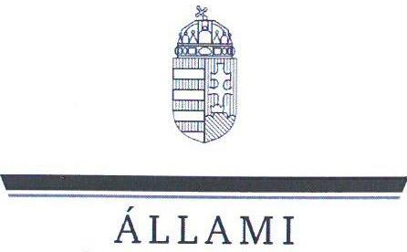

ÁLLAMI
SZÁMVEVŐSZÉK

# JELENTÉS 

Egyházi fenntartású kórházak közfeladat-ellátással kapcsolatos támogatásai felhasználásának ellenőrzése és az államháztartásból nem hitéleti célra nyújtott támogatások vonatkozásában a pénzügyi és ellátási tevékenységének, adósságállomány-alakulásának elemzése

Magyarországi Zsidó Hitközségek Szövetsége Szeretetkórháza
2025.

25077
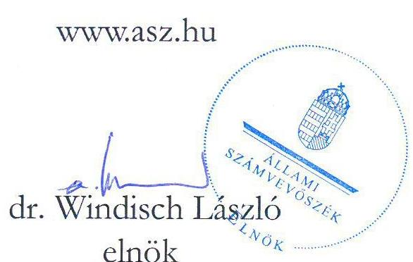

---

# ELLENŐRZÉSI IGAZGATÓSÁG: 

## ELLENŐRZÉSI IGAZGATÓSÁG V.

## ELLENŐRZÉSI IGAZGATÓ:

KLINGA LÁSZLÓ ellenőrzési igazgató

## ELLENŐRZÉSVEZETŐ:

VARGA EDIT ellenőrzési igazgatóhelyettes, ellenőrzésvezető

Jelentéseink az interneten a www.asz.hu címen olvashatók.

IKTATÓSZÁM: EL-4090-011/2025
TÉMASORSZÁM: 24
ELLENŐRZÉS-AZONOSÍTÓ SZÁM: V1108

---

# TARTALOMJEGYZÉK 

- AZ ELLENŐRZÉS ALAPADATAI ..... 5
- AZ ELLENŐRZÉS HATÓKÖRE ÉS TERÜLETE ..... 7
- ÖSSZEFOGLALÁS ..... 10
- AZ ELLENŐRZÉS FÓKUSZTERÜLETEI ..... 12
- MEGÁLLAPÍTÁSOK ..... 13
- JAVASLATOK ..... 18
- ELEMZÉS A MAGYARORSZÁGI ZSIDÓ HITKÖZSÉGEK SZÖVETSÉGE SZERETETKÓRHÁZA PÉNZÜGYI ÉS ELLÁTÁSI TEVÉKENYSÉGÉNEK, ADÓSSÁGÁLLOMÁNYÁNAK ALAKULÁSÁRÓL AZ ÁLLAMHÁZTARTÁSBÓL NEM HITÉLETI CÉLRA NYÚJTOTT TÁMOGATÁSOK VONATKOZÁSÁBAN ..... 19
ELEMZÉS ..... 24
MELLÉKLETEK ..... 55
I. sz. melléklet: Értelmező szótár ..... 55
II. sz. melléklet: Az ellenőrzött és ellenőrzést támogató szervezetek jegyzéke ..... 60
III. sz. melléklet: Ellenőrzési kritériumok ..... 61
IV. sz. melléklet: a Kórház főbb működési jellemzői az összes elemzett kórházhoz viszonyítva ..... 62
FÜGGELÉK: ÉSZREVÉTELEK ..... 67
RÖVIDÍTÉSEK JEGYZÉKE ..... 69

---

.

---

# AZ ELLENŐRZÉS ALAPADATAI 

## AZ ELLENŐRZÉS CÉLJA

Az ellenőrzés célja a Magyarországon egyházi fenntartásban működő aktív fekvőbeteg-szakellátást is végző kórházak esetében annak értékelése volt, hogy az államháztartásból nem hitéleti célra nyújtott támogatások vonatkozásában a támogatás felhasználásának szabályozási környezetét szabályszerűen alakították-e ki. Értékeltük továbbá a könyvvezetési és beszámoló-készítési és közzétételi kötelezettség teljesítésének szabályszerűségét, belső szabályzatoknak való megfelelését, továbbá az államháztartásból kapott, nem hitéleti célú támogatások felhasználásának és elszámolásának szabályszerűségét, a felhasználás támogatás céljának való megfelelését.

Ellenőrzési cél volt továbbá annak megállapítása, hogy az egyház (mint a közfeladatot ellátó intézmény fenntartója) a jogszabályi előírásoknak és belső szabályzatainak megfelelően gondoskodott-e a kórházzal kapcsolatos fenntartói kötelezettségei teljesítéséről.

## AZ ELLENŐRZÉS TÍPUSA

Törvényességi ellenőrzés

## AZ ELLENŐRZŐTT IDŐSZAK

A 2023. év

## AZ ELLENŐRZÉS TÁRGYA

Az ellenőrzés tárgyát képezte - az államháztartásból nem hitéleti célra nyújtott támogatások vonatkozásában - a Magyarországon egyházi fenntartásban működő aktív fekvőbeteg-szakellátást is végző kórházak tekintetében a 2023. évre vonatkozóan a számviteli szabályozási keretek kialakításának, a könyvvezetési és beszámoló-készítési és közzétételi kötelezettség teljesítésének szabályszerűsége és belső szabályzatoknak való megfelelése. Az ellenőrzés kiterjedt a kórházak esetében az államháztartásból nem hitéleti célra nyújtott támogatás tekintetében a támogatás-felhasználás célhoz kötöttségének ellenőrzésére is.

Az egyház, mint fenntartó tekintetében az ellenőrzés tárgyát képezte a kórházzal kapcsolatos fenntartói tevékenység szabályszerűségének értékelésére figyelemmel a kórházat megillető államháztartási forrásból nem hitéleti célra nyújtott támogatások kezelése/átadása.

Az ellenőrzés kiterjedt minden olyan körülményre és adatra, amely az ÁSZ jogszabályban meghatározott feladatainak teljesítéséhez, valamint a program végrehajtása folyamán felmerült újabb összefüggések feltárásához szükséges volt.

---

# Az ellenőrzés jogalapja 

Az ellenőrzés jogszabályi alapját az ÁSZ tv. ${ }^{1} 1 . \int$ (3) bekezdés, az 5. $\int$ (11) bekezdés c) pont, (13) bekezdés és az Ehtv. ${ }^{2}$ 19/D. $\int$ (2) bekezdés előírásai képezték.

## AZ ELLENŐRZÉS MÓDSZERE

Az ellenőrzést a nemzetközi standardokat irányadónak tekintve az ellenőrzési program szempontjai, az ellenőrzött időszakban hatályos jogszabályok, az ÁSZ ${ }^{3}$ ellenőrzés-szakmai szabályok és irányadó módszertanok figyelembevételével végezte az ÁSZ.

Az ellenőrzési kérdések megválaszolásához szükséges bizonyítékok megszerzése az ellenőrzött szervezetek által rendelkezésre bocsátott dokumentumokra és adatokra alapozva megfigyelés, helyszíni szemle (szemrevételezés), kérdésfeltevés (információkérés), illetve mintavételezés útján történt. Kockázati alapon kiválasztott mintatételeken keresztül történt a kórházak esetében az államháztartásból nem hitéleti célra nyújtott támogatások felhasználása, számviteli elszámolása szabályszerűségének ellenőrzése, az egyházi fenntartóknál pedig a fenntartón keresztül folyósított - kórházat megillető - támogatások kezelése (intézmény részére történő átadás, elszámolás) szabályszerűségének ellenőrzése. A mintatételek kiértékelése nem került a sokaságra kivetítésre, az ellenőrzött támogatásokra vonatkozó összegző és részletes következtetések az adott területhez kapcsolódó értékelésben kerültek megjelenítésre.

Az ellenőrzés lefolytatásához az ellenőrzött szervezetek a tanúsítványok kitöltésével, valamint az ellenőrzött és az ellenőrzést támogató szervezetek az ÁSZ által kért dokumentumok, adatok, információk megküldésével szolgáltattak adatokat.

Az ellenőrzési bizonyítékként felhasználható adatforrások közé tartoztak egyrészt az ellenőrzéshez kért dokumentumok, adatforrások, másrészt adatforrás volt még minden - az ellenőrzés folyamán - az ellenőrzés szempontjából információkat tartalmazó dokumentum. Az ellenőrzési kritériumok részletes felsorolását a III. sz. melléklet tartalmazza.

---

# AZ ELLENŐRZÉS HATÓKÖRE ÉS TERÜLETE 

Az ÁSZ tv. 5. § (11) bekezdés c) pontja értelmében az ÁSZ törvényességi szempontok szerint ellenőrzi a vallási egyesületek, az egyházi jogi személyek vagy azok nevelési-oktatási, felsőoktatási, egészségügyi, karitatív, szociális, család-, gyermek- és ifjúságvédelmi, kulturális vagy sporttevékenység végzésére létrehozott, a jogi személyiséggel rendelkező vallási közösség belső szabálya szerint jogi személyiséggel nem rendelkező intézménye részére az államháztartásból nem hitéleti célra nyújtott támogatás felhasználását.

Az ellenőrzés kiterjedt arra, hogy az egyházi fenntartó a jogszabályi előírásoknak és belső szabályzatainak megfelelően gondoskodott-e a nem hitéleti célra nyújtott támogatások felhasználása során az általa fenntartott aktív fekvőbeteg-szakellátást is végző kórházzal kapcsolatos fenntartói kötelezettségei teljesítéséről, ami magában foglalta az intézmény könyvvezetési és beszámoló-készítési kötelezettsége megállapításának-, a szervezet jogi személyiségének megfelelő besorolásának-, a kórház részére a fenntartón keresztül folyósított, államháztartásból nem hitéleti célra nyújtott támogatások könyvvezetési rendszerében történő elszámolásának-, átadásának ellenőrzését.

A kórház működési keretei kialakításának szabályszerűségére vonatkozó ellenőrzés az államháztartásból nem hitéleti célra nyújtott támogatások felhasználásának belső szabályozási környezete kialakításának szabályszerűségére terjedt ki. Az ellenőrzés és értékelés a beszámolót alátámasztó számviteli nyilvántartási rendszer kialakításának és működésének szabályozottságára; az elkülönített kimutatások szabályozottságára továbbá a beszámoló közzététele módjának meghatározására vonatkozott.

A beszámolási és közzétételi kötelezettség teljesítésének szabályszerűsége keretében értékelésre került, hogy a kórház a jogszabályi előírásoknak és belső szabályzataiban meghatározottaknak megfelelően eleget tette beszámolási kötelezettségének, gondoskodott-e a beszámoló közzétételéről, amennyiben számviteli politikájában meghatározta a közzététel módját. Ellenőrzésre került, hogy az államháztartási forrásból származó, nem hitéleti célú támogatást felhasználó kórház számviteli beszámolójának mérlegtételeit a Számv. tv. ${ }^{4}$ előírása szerinti leltárral alátámasztotta-e, továbbá, hogy gondoskodott-e a közfeladat-ellátással kapcsolatos közérdekű vagy közérdekből nyilvános adatok közzétételéről.

A könyvvezetési kötelezettség teljesítésének ellenőrzése keretében értékelésre került, hogy a kórház betartotta-e a jogszabályi és vonatkozó belső szabályozások előírásait, továbbá a bizonylatolásra vonatkozó előírások, a kiadási tételek besorolását. Az ellenőrzés kiterjedt arra, hogy a kórház a könyvvezetési rendszerében biztosította-e az alaptevékenységből és vállalkozási tevékenységből származó bevételeinek, költségeinek és ráfordításainak elkülönített kimutatását, hogy a kapott támogatásokat bevételként elszámolta-e, az államháztartásból nem hitéleti célra folyósított támogatások felhasználása a támogatási célnak megfelelő és szabályszerű volt-e.

A 2023. évben Magyarországon működő kilenc egyházi fenntartású fekvőbeteg-szakellátást végző intézményből a V1108 ellenőrzés-azonosító számú ellenőrzés keretében öt aktív fekvőbeteg-szakellátást is végző intézmény került ellenőrzésre. Közülük jelen ÁSZ jelentés a Magyarországi Zsidó Hitközségek Szövetsége Szeretetkórháza (Kórház ${ }^{5}$ ), és fenntartójaként a Magyarországi Zsidó Hitközségek Szövetsége (MAZSIHISZ ${ }^{6}$ ), mint ellenőrzött szervezetek ellenőrzéséről készült.

---

# MAGYARORSZÁGI ZSIDÓ HITKÖZSÉGEK SZÖVETSÉGE SZERETETKÖRHÁZA 

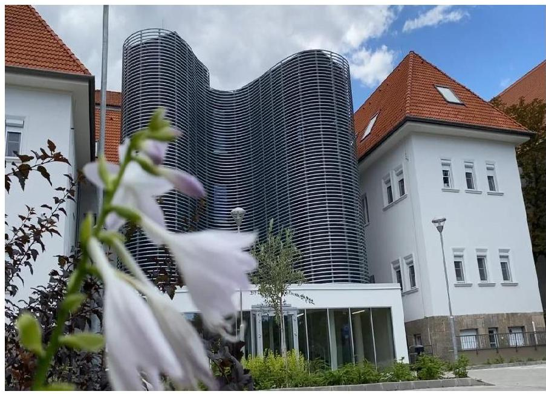

A Kórház Közép-Európa egyetlen zsidó kórháza, amely 1914. évben épült több épületből álló intézmény volt, amelyet 1952. évben államosítottak, majd egyházi javak visszaadására hozott törvény alapján 1993. évben került a felekezetnek visszaadásra. „A teljesen leromlott és kifosztott épület a hitközség a kórház segítségével rekonstruálta, ahol 1994-ben egy új, 80 ágyas fekvőbeteg osztály nyílt, amely a minimumfeltételeknek is megfelelt.”1 2003. évben kezdték meg az új ápolási szárny építési munkáit, amit 2005. évben adtak át, így 58 ápolási ággyal bővült a Kórház.

A Kórház az SZMSZ-ében ${ }^{7}$ meghatározottak szerint az Ehtv. 11. § (2) bekezdése szerinti belső egyházi jogi személy, melynek alapítója és fenntartója a MAZSIHISZ volt. A Kórház saját induló vagyonnal nem rendelkezett, a működéséhez szükséges ingatlanokat és más tárgyi eszközöket a MAZSIHISZ bocsátotta az intézmény rendelkezésére, minek következtében a Kórház a MAZSIHISZ vagyonának kezelője volt az ellenőrzött időszakban. A Kórház az Alapító okiratában ${ }^{8}$ meghatározottak szerint alaptevékenysége keretében fekvőbeteg gyógyintézeti ellátást (akut, krónikus, ápolási); járóbeteg orvosi ellátást; foglalkozás- és iskolaegészségügyi ellátást; otthoni szakápolást, házi segítségnyújtást, körzeti nővéri munkában segítségnyújtást (home care); oktatást, egészségügyi nevelést, ismeretterjesztést, tanácsadást; kórházi lelki- és diakonikai szociális szolgálatot, továbbá diagnosztikai tevékenységet végzett. Alaptevékenységei mellett ellátta a működéséhez szükséges kisegítő és kiegészítő tevékenységeket is (mosoda, energiaszolgáltatás, karbantartás, gyógyszer kiskereskedelem, gyógyászati termék kiskereskedelem, folyóirat időszaki nyomtatványok kiadása, nyomdai előkészítő tevékenység, éttermi, mozgó vendéglátás, valamint egyéb diagnosztikai és hotelszolgálati feladatok). A Kórház alaptevékenysége (fő tevékenységek) elősegítése érdekében a belső szabályozása szerint jogosult volt vállalkozási tevékenységet végezni, de annak kereteit korlátozta, a vállalkozási tevékenységek pénzforgalma nem haladhatta meg az éves pénzforgalom 20%-át, az azzal foglalkozók létszáma pedig az éves átlagos állományi létszám 10%-át. A Kórház Magyarország területén egyházi intézményként látja el az SZMSZ-ében, valamint a NEAK ${ }^{9}$ szerződésben részletezett megelőző-gyógyító-rehabilitációs ellátási feladatokat, a 2023. évben vállalkozási tevékenységet nem végzett.

A belső szabályzatok szerint a Kórház működésével, tevékenységével kapcsolatos főbb kérdésekben a MAZSIHISZ döntött, az intézmény vezetője véleményének figyelembe vételével. A Kórháznál hét tagú Felügyelő Tanács működött. Az alapítói jogokat a MAZSIHISZ képviseletében a MAZSIHISZ ügyvezető igazgatója gyakorolta. A Kórház az Ehtv. szerinti jogi személyiséggel rendelkező szervezetként a MAZSIHISZ közgyűlése által elfogadott költségvetés keretei között önállóan gazdálkodott, önálló számviteli beszámoló készítésére volt kötelezett, melynek jóváhagyása az alapító kizárólagos hatáskörébe tartozott. A Kórház 2023. évi eredménykimutatása szerint bevételeinek főösszege 3,00 Mrd Ft, ráfordításainak összege pedig 2,81 Mrd Ft volt, mely

[^0]
[^0]:    ${ }^{1}$ Forrás: a Kórház honlapja.

---

alapján a 2023. évben 0,19 Mrd Ft nyeresége keletkezett. A Kórház a 2023. évben egészségügyi feladataihoz 1,57 Mrd Ft NEAK finanszírozásban részesült, a központi költségvetésből pályázat és egyedi döntés alapján folyósított támogatásainak együttes összege 0,44 Mrd Ft volt.

# MAGYARORSZÁGI ZSIDÓ HITKÖZSÉGEK SZÖVETSÉGE 

A MAZSIHISZ - Alapszabálya ${ }^{10}$ szerint - a Magyarországon működő zsidó hitközségek és szórványok önkéntes társulásán alapuló szervezete, olyan önkormányzattal rendelkező jogi személy, amely gondoskodik a zsidók vallásgyakorlatának hitéleti és ebből fakadó közszolgálati, valamint közéleti tevékenységének ellátásáról. Feladatainak megvalósítása érdekében egyéb feladatai mellett szervezi és koordinálja az arra rászorulók segélyezését, gondozását, ellátását, kóser ellátással kórházakat és szeretetházakat tart fenn és üzemeltet az arra rászorulók részére. Ezen, Alapszabályban rögzített feladatai ellátása körében fenntartója a Kórháznak.

---

# ÖSSZEFOGLALÁS 

Magyarország Alaptörvényének ${ }^{11}$ XX. cikke szerint mindenkinek joga van a testi és lelki egészséghez, melynek érvényesülését Magyarország többek között az egészségügyi ellátás megszervezésével segíti elő. Az Ehtv. előírása szerint ,,a jogi személyiséggel rendelkező vallási közösség részt vállalhat a társadalom értékteremtő szolgálatában, ennek érdekében önmaga vagy e célra létrehozott intézménye útján olyan közfeladatú tevékenységet is elláthat, amelyet törvény nem tart fenn
 kizárólagosan az állam vagy annak intézménye számára". A közcélú tevékenység ellátásához az állam az Ehtv. 19. § (1)-(2) bekezdése szerint költségvetési támogatást nyújt.
1. ábra
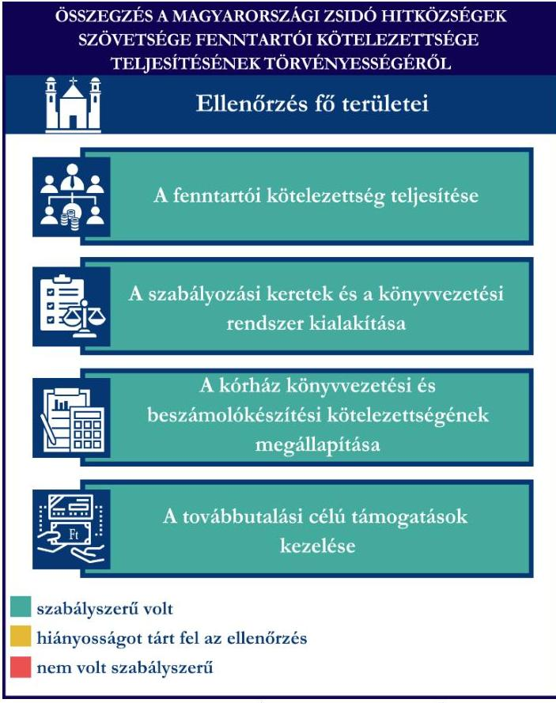

A MAZSHISZ a Kórházzal kapcsolatos fenntartói kötelezettségeit a jogszabályi előírásoknak megfelelően teljesítette. A Kórház könyvvezetési és beszámolókészítési kötelezettségét a jogszabályi előírásnak megfelelően meghatározta.

A MAZSIHISZ szabályozási kereteinek és könyvvezetési rendszerének kialakítása - az államháztartásból nem hitéleti célra nyújtott támogatások tekintetében - szabályszerű volt, a jogszabályban előírt, a szabályszerű gazdálkodás feltételeit meghatározó belső szabályzatokkal rendelkezett.

A MAZSIHISZ - vállalkozási tevékenységet nem végző egyházi jogi személyként - a jogszabályi előírásoknak megfelelően számviteli politikájában meghatározta a beszámoló formáját és tartalmát, továbbá az egyszerűsített éves beszámoló alátámasztása érdekében kettős könyvvitel vezetéséről rendelkezett. A MAZSIHISZ a továbbutalási célú támogatás kezelése során a jogszabályi előírásokat betartva járt el.

---

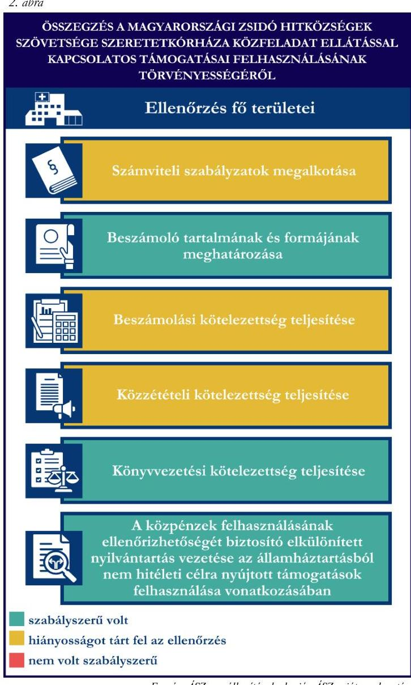

Az ellenőrzés a Kórház számviteli szabályozási környezete kialakítása tekintetében hiányosságot tárt fel, mivel a Kórház a jogszabályban előírt, a gazdálkodás kereteit meghatározó belső szabályzatok közül számlarenddel a 2023. évben nem rendelkezett. A jogszabályi előírásnak megfelelően a Kórház a számviteli politikában ${ }^{12}$ az időbeli elhatárolások alkalmazásával kapcsolatos belső szabályokat rögzítette.

A Kórház a számviteli politikájában - vállalkozási tevékenységet nem végző belső egyházi jogi személyként, bevételeinek főösszegét figyelembe véve a jogszabályi előírásnak megfelelően, a 296/2013. Korm. rend. ${ }^{13}$ 1. melléklete szerinti tagolással, egyszerűsített éves beszámoló készítéséről rendelkezett, és annak alátámasztására kettős könyvvitel vezetését írta elő.

A Kórház a 2023. évre vonatkozó beszámolási kötelezettségének eleget tett, azonban az egyszerűsített éves beszámoló tartalma nem felelt meg teljeskörűen az egyházi jogi személyek beszámolási kötelezettségét meghatározó jogszabályi és a Kórház belső szabályozási előírásainak, mivel az eredménykimutatásban az előző évi adatokat nem szerepeltette, továbbá az egyéb bevételek részletező bemutatása nem felelt meg teljeskörűen a jogszabályban előírt részletezésnek. A Kórház 2023. évi egyszerűsített éves beszámolójának mérleg és eredménykimutatás adatait a főkönyvi kivonat alátámasztotta. A Kórház a 2023. évi egyszerűsített éves beszámoló mérlegtételeit alátámasztó, a jogszabályi előírásoknak megfelelő teljeskörű leltárt nem készített.

A Kórház közzétételi kötelezettségének teljesítése nem felelt meg teljeskörűen a jogszabályi előírásoknak, mivel gazdálkodási adatait nem tette közzé.

A Kórház könyvvezetési kötelezettségének teljesítése megfelelt a jogszabályi előírásoknak.
Az államháztartásból nem hitéleti célra nyújtott támogatások felhasználása, elszámolása során az ellenőrzött mintatételek vonatkozásában a Kórház a jogszabályi előírásokat betartotta. A mintatételek esetében a bizonylati alátámasztottság, a bizonylatok alaki és tartalmi követelményeinek betartása, továbbá a jogszabályban előírtaknak megfelelő besorolás biztosított volt. Az államháztartásból nem hitéleti célra nyújtott támogatások felhasználása az ellenőrzött mintatételek esetében a támogatói okiratban meghatározott és a mellékletét képező költségtervben meghatározott célnak és jogcímeknek megfelelt.

---

# AZ ELLENŐRZÉS FÓKUSZTERÜLETEI 

1.     - Az egyház fenntartói kötelezettsége teljesítésének szabályszerűsége
2.     - A kórház működési keretei kialakításának szabályszerűsége az államháztartásból nem hitéleti célra nyújtott támogatások vonatkozásában
3.     - A kórház beszámolási és közzétételi kötelezettsége teljesítésének szabályszerűsége az államháztartásból nem hitéleti célra nyújtott támogatások vonatkozásában
4.     - A kórház könyvvezetési kötelezettsége teljesítésének, az államháztartásból nem hitéleti célra nyújtott támogatások felhasználásának és elszámolásának szabályszerűsége

---

# MEGÁLLAPÍTÁSOK 

## 1. Az egyház fenntartói kötelezettsége teljesítésének szabályszerűsége

Összegző megállapítás A MAZSHISZ a Kórházzal kapcsolatos fenntartói kötelezettségeit a jogszabályi előírásoknak megfelelően teljesítette, a szabályozási kereteinek és könyvvezetési rendszerének kialakítása az államháztartásból nem hitéleti célra nyújtott támogatások vonatkozásában megfelelt a jogszabályi előírásoknak. A MAZSIHISZ továbbutalási célú támogatás-nyilvántartása, átutalása, elszámolása szabályszerű volt.

A MAZSHISZ Kórházzal, mint egészségügyi intézménnyel kapcsolatos fenntartói kötelezettsége teljesítésére vonatkozó megállapítások:
A MAZSHISZ, mint a Kórház alapítója és fenntartója, gondoskodott az intézmény Alapító okiratának elfogadásáról és szükség szerinti módosításáról. A 2023. évben hatályos Alapító okirat Bevezető része szerint a MAZSIHISZ a Kórházat az Ehtv. 10. §-a szerinti egyházi jogi személynek sorolta be, ezáltal eleget tett a Számv. tv előírásának, a besorolással megállapította az egészségügyi intézmény könyvvezetési és beszámolókészítési kötelezettségét.
A MAZSIHISZ a Kórházánál, mint egészségügyi közfeladatot ellátó intézménynél végzett költségvetési ellenőrzést, amelynek keretében a Számvevő és Számvizsgáló Bizottság ${ }^{14}$ a Kórház költségvetését és zárszámadását is ellenőrizte a közgyűlés általi elfogadása előtt. A MAZSIHISZ belső ellenőre szintén végzett elemzési, ellenőrzési feladatokat a Kórház által készített időszakos kimutatások vonatkozásában és végzett az ügyvezetés által meghatározott célvizsgálatokat is.
A MAZSIHISZ számviteli kereteinek, belső szabályainak és könyvvezetési rendszerének kialakítására vonatkozó megállapítások:
A MAZSIHISZ a 2023. évben rendelkezett a Számv. tv. által előírt számviteli politikával ${ }^{15}$, és az annak keretében elkészítendő szabályzatokkal ${ }^{16}$, továbbá számlarenddel ${ }^{17}$.
A MAZSIHISZ számviteli politikájában rögzítette, hogy a továbbutalási célú támogatásokkal kapcsolatos, jogszabályi előírás alapján kötelező időbeli elhatárolási kötelezettségen túl időbeli elhatárolást nem alkalmaz, amellyel eleget tett a 296/2013. Korm. rend. előírásának.
A MAZSIHISZ a 2023. évben vállalkozási tevékenységet nem végzett. Könyveit kettős könyvvitel rendszerében vezette, a naptári évről 296/2013. Korm. rend. előírásának megfelelő egyszerűsített éves beszámolót készített, melynek formáját és tartalmát a számviteli politikában határozta meg.
A beszámoló közzététele az egyházi jogi személyek számára nem kötelező, a MAZSIHISZ viszont a számviteli politikájában rendelkezett a beszámoló közzétételéről, élt a 296/2013. Korm. rend. szerinti szabályozási lehetőséggel.
A MAZSIHISZ, mint fenntartó számára folyósított továbbutalási célú támogatás kezelésére vonatkozó megállapítások:
A MAZSIHISZ 2023. évben a bérkompenzációhoz kapcsolódóan részesült olyan támogatásban, melynek egyrésze a Kórházat illette meg. A MAZSIHISZ továbbutalási célú támogatás kezelése (nyilvántartás,

---

átadás, ellenőrzés, elszámolás) a támogatói okiratban foglaltaknak megfelelően, szabályszerűen történt. A támogatást a MAZSIHISZ könyviteli nyilvántartási rendszerében bevételként elszámolta, és a 296/2013. Korm. rendelet előírásának megfelelően elkülönítetten tartotta nyilván. A 358860 Ft támogatásból a MAZSIHISZ 92208 Ft-ot átadott a Kórház részére.

# 2. A kórház működési keretei kialakításának szabályszerűsége az államháztartásból nem hitéleti célra nyújtott támogatások vonatkozásában 

Összegző megállapítás

A Kórház számviteli kereteinek kialakítása a 2023. évben nem volt teljeskörű a számlarend hiánya miatt. A könyvvezetés módja, a beszámoló formája a jogszabályi előírásoknak és a Kórház tevékenységének megfelelően került meghatározásra. A Kórház a jogszabályi előírásoknak megfelelően rendelkezett az egészségügyi tevékenységét meghatározó alapdokumentumokkal.

A Kórház számviteli kereteinek, belső szabályainak és könyvvezetési rendszerének kialakítására vonatkozó megállapítások:
A Kórház a 2023. évben rendelkezett a Számv. tv. által előírt számviteli politikával, és az annak keretében elkészítendő szabályzatokkal ${ }^{18}$, azonban a Számv. tv. 161. § (1) és (4) bekezdése előírásai ellenére 2023. évben számlarenddel ${ }^{19}$ nem rendelkezett. A Kórház az ellenőrzött időszakot követően elkészítette számlarendjét, amely 2024. május 01-én lépett hatályba. A Kórház a 296/2013. Korm. rend. előírása alapján egyszerűsített éves beszámoló készítésére kötelezett szervezetként a Számv. tv. előírása alapján mentesült az önköltségszámítási szabályzat készítési kötelezettség alól.
A Kórház a számviteli politikában a 296/2013. Korm. rendelet előírásainak megfelelően rendelkezett az időbeli elhatárolások alkalmazásáról, meghatározta a választott módszert és annak alkalmazást.
A Kórház a 296/2013. Korm. rend. előírásának megfelelően a könyvviteli nyilvántartási rendszerében a támogatásokat és adományokat bevételként számolta el; továbbá a Kórház vállalkozási tevékenységet nem végző belső egyházi jogi személyként a számviteli politikájában a 296/2013. Korm. rend. előírásának megfelelően határozta meg a naptári évről készítendő beszámoló tartalmát és formáját: egyszerűsített éves beszámolót készítéséről rendelkezett a 296/2013. Korm. rendelet 1. mellékletében foglalt tagolással. A beszámoló alátámasztására könyveinek magyar nyelvű, a kettős könyvvitel elvei és szabályai szerinti vezetését írta elő. A 296/2013. Korm. rend. előírása alapján a beszámoló letétbe helyezése az egyházi jogi személyek számára nem kötelező, de számviteli politikájukban dönthetnek annak közzétételéről, amely lehetőséggel a Kórház nem élt.
A Kórház közcélú egészségügyi tevékenységét meghatározó, ellenőrzött alapdokumentumaira vonatkozó megállapítások:
A Kórház az Eütv. ${ }^{20}$ előírásának megfelelően rendelkezett a fenntartó által jóváhagyott SZMSZ-el.
Az Ehtv. előírásának megfelelően a főigazgató által kiadott SZMSZ tartalmazta a Kórház szervezeti felépítését. Az intézmény képviseletének szabályai az SZMSZ-ben, valamint az alapító okiratban kerültek meghatározásra.

---

# 3. A kórház beszámolási és közzétételi kötelezettsége teljesítésének szabályszerűsége az államháztartásból nem hitéleti célra nyújtott támogatások vonatkozásában 

Összegző megállapítás

A Kórház a 2023. évi beszámolási kötelezettségének eleget tett, azonban beszámolója nem felelt meg teljeskörűen a jogszabályi előírásoknak, az eredménykimutatás előző évi adatainak hiánya-, valamint az egyéb bevételek részletező bemutatásával kapcsolatos hiányosságok miatt. A főkönyvi kivonat a beszámoló mérlegének és eredménykimutatásának adatait alátámasztotta. A Kórház a beszámoló mérlegét alátámasztó, a jogszabályban előírt teljeskörű leltárral nem rendelkezett. A gazdálkodási adatok kivételével gondoskodott közérdekű és közérdekből nyilvános adatok jogszabályokban előírt közzétételéről.

## A Kórház beszámolási kötelezettsége teljesítésére vonatkozó megállapítások:

A Kórház 2023. évre vonatkozóan beszámolási kötelezettségének eleget tett, egyszerűsített éves beszámolót készített, amely nem felelt meg teljeskörűen a jogszabályi előírásoknak, mivel az eredménykimutatás a 296/2013. Korm. rend. 9. § (1) bek. b) pontja előírása ellenére az előző évi adatokat nem tartalmazta, továbbá az egyéb bevételek részletező bemutatása nem felelt meg teljeskörűen a 296/2013. Korm. rend. 1. melléklet 2. rész 3. pont d) alpontjában és a Kórház számviteli politikája 6.7.3. pontjában előírtaknak, mivel az egyéb támogatások összege (Egyházi Kórházak Egyesületétől származó támogatás) nem került bemutatásra.
A Kórház a Számv. tv. és a 296/2013. Korm. rendelet könyvvezetés módjára vonatkozó előírásainak megfelelően az egyszerűsített éves beszámoló adatainak alátámasztására könyveit a kettős könyvvitel rendszerében vezette. Az egyszerűsített éves beszámoló mérlegének és eredménykimutatásának adatait a főkönyvi kivonat alátámasztotta. A Kórház a 2023. évben vállalkozási tevékenységet nem végzett, alaptevékenységéhez kapcsolódó kisegítő és kiegészítő feladatokat látott el.
A Kórház az egyszerűsített éves beszámoló mérlegének alátámasztásaként leltározást végzett, azonban a Számv. tv. 69. § (1) bekezdése ellenére teljeskörű, a mérleg fordulónapján meglévő valamennyi eszközt és forrást mennyiségben és értékben tartalmazó (saját tőke, aktív és passzív időbeli elhatárolások) leltárral nem támasztotta alá.
A Kórház a 2006. évi CXXXII. tv. ${ }^{21}$ előírása alapján 2023. évben kötelezett volt könyvvizsgálatra, amelynek eleget tett., a 2023. évi egyszerűsített éves beszámolót könyvvizsgáló felülvizsgálta és hitelesítő záradékkal látta el.

## A Kórház közzétételi kötelezettsége teljesítésére vonatkozó megállapítások:

A Kórház a beszámoló közzétételére a 296/2013. Korm. rend. értelmében nem volt kötelezett, továbbá a számviteli politikában rendelkezett, hogy nem él a közzétételi lehetőséggel.
A közzétételi kötelezettség teljesítése nem felelt meg teljeskörűen a jogszabályi előírásoknak, mivel a Kórház gondoskodott ugyan az Ehtv. 19. § (3) bekezdése, valamint az Info tv. ${ }^{22}$ 33. § (3) bekezdése, 37. § (1) bekezdése és 1. melléklete szerinti, az egészségügyi közfeladat ellátással összefüggő, az általános

---

közzétételi listában szereplő szervezeti és személyi, tevékenységre és működésre vonatkozó közérdekű és közérdekből nyilvános adatok közzétételéről, de a gazdálkodási adatokat nem tette közzé.

# 4. A kórház könyvvezetési kötelezettsége teljesítésének, az államháztartásból nem hitéleti célra nyújtott támogatások felhasználásának és elszámolásának szabályszerűsége 

## Összegző megállapítás

A Kórház könyvvezetési kötelezettségének a jogszabályi előírásoknak
 megfelelően eleget tett, a támogatások felhasználásáról elkülönített nyilvántartást vezetett. Az ellenőrzött tételek alapján az államháztartásból nem hitéleti célra nyújtott támogatások felhasználása megfelelt a jogszabályi előírásoknak.

## A Kórház könyvvezetési kötelezettsége teljesítésére vonatkozó megállapítások:

A Kórház a bevételek számviteli elszámolása során a 296/2013. Korm. rend. előírásait betartva a könyvvezetési rendszerében az adományokat és támogatásokat bevételként számolta el, a főkönyvi számlák alábontásával biztosította a kapott támogatói hozzájárulások, adományok, támogatások részletező kimutatását.
A Kórház a Számv. tv. előírásainak megfelelően olyan elkülönített, részletező nyilvántartást vezetett az alapcél szerinti tevékenysége költségei és ráfordításai ellentételezésére pályázati vagy egyedi döntés alapján folyósított nem hitéleti célú támogatások, valamint az egészségügyi szakellátási tevékenységéhez kapcsolódó Egészségbiztosítási Alapból nyújtott finanszírozás felhasználásáról, amelynek alapján támogatásonként megállapítható és ellenőrizhető volt azok felhasználása.
A Kórház államháztartásból nem hitéleti célra nyújtott támogatásai felhasználásának mintatételes ellenőrzésére vonatkozó megállapítások:

## Az egészségügyi szakellátási tevékenységhez kapcsolódó, Egészségbiztosítási Alapból folyósított finanszírozás:

A Kórház esetében a 2023. évben folyósított támogatás összege 1569366 E Ft volt. Az egészségügyi szakellátási tevékenységhez kapcsolódó finanszírozás felhasználása során a bizonylati alátámasztottságra és a bizonylatok alaki és tartalmi követelményeire vonatkozó - a Számv. tv.-ben meghatározott - előírásokat betartotta. A Kórház a NEAK finanszírozás összegét a személyi juttatások és kapcsolódó járulékköltségek finanszírozására (személyi jellegű ráfordítások) használta fel.

## Pályázat vagy egyedi döntés alapján folyósított támogatások:

A Kórház a 2023. évben négy olyan pályázat vagy egyedi döntés alapján folyósított támogatásban részesült, amelyek esetében kiutalás és felhasználás is történt az ellenőrzött időszakban, egy esetben az ellenőrzött időszakot megelőzően folyósított beruházási célú támogatás felhasználására került sor, egy esetben pedig az ellenőrzött időszakot megelőzően felmerült és elszámolt kiadások (járványügyi költségek) utólagos megtérítése történt a 2023. évben. A támogatások villamosenergia és földgáz szolgáltatás vásárlásra, működési költségekre, fejlesztési feladatok megvalósítására, továbbá a 2022. december 31-ig lejárt tartozásállomány utólagos kiegyenlítésére szolgáltak.

---

A Kórháznak az előzőek alapján öt 2023. évi felhasználással érintett támogatása volt. Az energia áremelkedések kedvezőtlen hatásának mérséklését szolgáló támogatások keretében a Kórház a 2023. évben két pályázat (BM/10956-1/2023, BM/20551-1/2023) alapján összesen 73419 E Ft támogatásban részesült, a könyvviteli nyilvántartási rendszerében elszámolt áram és gázbeszerzés költsége 124966 E Ft volt. A 2022. év végén fennálló adósságállomány utólagos kompenzációja címén (BM/9044-3/2023) a Kórház 64132 E Ft támogatást kapott, a 2022. évi számviteli beszámolójában szereplő rövid lejáratú kötelezettségből (2 524342 E Ft) a NEAK számára jelentett lejárt szállítói és egyéb kötelezettségek összege 64189 E Ft volt.

A 2023. évi felhasználással érintett támogatások közül kettő került ellenőrzésre (BM/12965-2/2023. - működési-, IV/1684-2/2023/EFK - fejlesztési támogatás), amelynek során az ellenőrzés az alábbiakat állapította meg:

- A Kórház a pályázat vagy egyedi döntés alapján folyósított támogatások felhasználása, a kiadások könyvviteli nyilvántartásba vétele és elszámolása során a Számv. tv. bizonylatolásra, a bizonylatok alaki és tartalmi követelményeire, valamint a besorolásra vonatkozó előírását betartotta. A könyvelés módjára és az érintett könyvviteli számlákra történő hivatkozást, valamint a könyvviteli nyilvántartásokban történt rögzítés időpontjának igazolását a Számv. tv.-ben foglaltaknak megfelelően elektronikus nyilvántartással teljesítette.
- Az ellenőrzött támogatások esetében a mintatételek szerinti kiadások megfeleltek a támogatói okiratokban, illetve a mellékletüket képező költségtervekben szereplő támogatott tevékenységnek, felhasználási jogcímeknek és megvalósítási időtartamnak.
- A támogatások felhasználását alátámasztó dokumentumok záradékolására vonatkozó, támogatói okiratban vagy támogatási szerződésben meghatározott előírásoknak a Kórház a BM/12965-2/2023. támogatás kilenc mintatétele esetében nem tett eleget (TÁM_EK_1 - TÁM_EK_9 - értékük összesen: 1109535 Ft ).

# 507/2023. Korm. rendelet ${ }^{21}$ alapján folyósított támogatás: 

A Kórház a 2023. évben az 507/2023. Korm. rend. alapján 98327 E Ft adósságcsökkentési célú működési támogatásban részesült, amelynek felhasználása során a Számv. tv. bizonylati alátámasztottságra vonatkozó előírásait betartotta. A könyvelés módjára és az érintett könyvviteli számlákra történő hivatkozást, valamint a könyvviteli nyilvántartásokban történt rögzítés időpontjának igazolását a Számv. tv.-ben foglaltaknak megfelelően elektronikus nyilvántartással teljesítette.
A támogatás felhasználásához kapcsolódó mintatételek esetében a kiegyenlítés a jogszabályban előírtaknak megfelelt, a Kórház valamennyi, a támogatás terhére kifizetett tartozást egyidőben, 2023. december 04-én utalt ki.

---

# JAVASLATOK 

Az ÁSZ tv. 33. § (1) bekezdésében foglaltak értelmében az ellenőrzött szervezet vezetője köteles a jelentésben foglalt megállapításokhoz kapcsolódó intézkedési tervet összeállítani és azt a jelentés kézhezvételétől számított 30 napon belül az ÁSZ részére megküldeni. Amennyiben az ellenőrzött szervezet vezetője nem küldi meg határidőben az intézkedési tervet, vagy továbbra sem elfogadható intézkedési tervet küld, az Állami Számvevőszék elnöke az ÁSZ tv. 33. § (3) bekezdése a) és b) pontjaiban foglaltakat érvényesítheti.

## MAGYARORSZÁGI ZSIDÓ HITKÖZSÉGEK SZÖVETSÉGE SZERETETKÓRHÁZA FŐIGAZGATÓJA

1. Gondoskodjon a 296/2013. Korm. rend. 9. § (1) bekezdés b) pontja előírásának betartása érdekében az egyszerűsített éves beszámoló eredménykimutatásában az előző évi adatok, továbbá a Kórház számviteli politikája 6.7.3. pontjában előírtak betartása érdekében az eredménykimutatásban az egyéb bevételek 296/2013. Korm. rend. 1. mellékletében meghatározottak szerinti részletező bemutatásáról.
2. Gondoskodjon a Számv. tv. 69. § (1) bekezdés előírásának megfelelően az egyszerűsített éves beszámoló mérlegének teljeskörű - a mérleg fordulónapján meglévő valamennyi eszközt és forrást tartalmazó leltárral történő alátámasztásáról.
3. Az Ehtv. 19. § (3) bekezdése, valamint az Info tv. 33. § (3) bekezdése, 37. § (1) bekezdése és 1. melléklete előírásainak megfelelően gondoskodjon az egészségügyi közfeladatellátással összefüggő, az általános közzétételi listában szereplő valamennyi, közérdekű és közérdekből nyilvános adat közzétételéről, kiemelt figyelemmel gazdálkodási adatokra.

---

# ELEMZÉS A MAGYARORSZÁGI ZSIDÓ HITKÖZSÉGEK SZÖVETSÉGE SZERETETKÓRHÁZA PÉNZÜGYI ÉS ELLÁTÁSI TEVÉKENYSÉGÉNEK, ADÓSSÁGÁLLOMÁNYÁNAK ALAKULÁSÁRÓL AZ ÁLLAM-HÁZTARTÁSBÓL NEM HITÉLETI CÉLRA NYÚJTOTT TÁMOGATÁSOK VONATKOZÁSÁBAN 

## VEZETŐI ÖSSZEFOGLALÓ

Az államháztartásból nem hitéleti célra nyújtott támogatás-felhasználás törvényességének ellenőrzésével egyidőben az ÁSZ elemzést is készített öt aktív fekvőbeteg-szakellátást is végző egyházi fenntartású kórház vonatkozásában, amely a pénzügyi és ellátási tevékenységére vonatkozó adatok alakulására és az adósságállomány változásának összefüggéseire, továbbá a kórházi adósságállomány összetételére és alakulására fókuszált. Ennek keretében került sor a Magyarországi Zsidó Hitközségek Szövetsége Szeretetkórháza tevékenységének elemzésére is, ahol a szakmailag megalapozott esetekben az elemzéssel érintett más kórházak adatai képeztek benchmark alapot, továbbá egyes esetekben országos adatokkal egészült ki az elemzés. Az ellenőrzött időszak vonatkozásában a Kórház működésére vonatkozó adatokat, mutatószámokat - az összes elemzett kórházhoz viszonyítottan - a IV. számú melléklet tartalmazza.

## A KÓRHÁZ BEMUTATÁSA

Az 1914-ben épült Szeretetkórházat 1952-ben államosították, majd 1993-ban került a felekezetnek visszaadásra. A Kórház Közép-Európa egyetlen zsidó kórháza, amely 2023-ban 165 férőhellyel, országos szintű ellátási hatáskörrel rendelkezett mind a fekvőbeteg, mind pedig az ambuláns ellátás területén. A Kórház az elmúlt évek során folyamatosan bővült, modernizálódott, melyben nagy szerepe volt a magánszemélyek, külföldi zsidó szervezetek és a Magyar Állam által biztosított támogatásoknak, hozzájárulásoknak.

A Kórházban a 2022. évben 7 db kórházi osztály, az elemzett időszak többi évében 6 db kórházi osztály működött, amelyből 3-3 osztály volt I., illetve II. progresszivitási szintű (2022-ben 4 db II. progresszivitási szint), III. progresszivitási szintű osztállyal a Kórház nem rendelkezett. A többi elemzett kórházhoz viszonyítva a Kórház 30-40 %-kal kevesebb szervezeti egységet működtetett, hiszen az átlag 9,8 szervezeti egység volt.

A Kórház az intézmény üzemeltetésével kapcsolatos tevékenységek ellátását kiszervezte, a takarítási, karbantartási, őrzés-védelmi, mosatási és élelmezési feladatokra vállalkozási szerződést kötött. Magánegészségügyi ellátást a Kórházban a 2023. évben nem végeztek.

[^0]
[^0]:    ${ }^{2}$ Magyarországi Református Egyház Bethesda Gyermekkórháza; Betegápoló Irgalmas Rend Budai Irgalmasrendi Kórház; Budapesti Szent Ferenc Kórház; Magyarországi Zsidó Hitközségek Szövetsége Szeretetkórháza; Szent Damján Görögkatolikus Kórház

---

# Összefoglalás - a pénzügyi helyzet jellemzői 

Az elemzett időszakban a Kórház biztonságos működése erőfeszítések árán ugyan, de biztosított volt. A Kórház a nehézségek ellenére likviditását - a célzott költségvetési támogatásoknak és a fenntartói támogatásoknak is köszönhetően - meg tudta őrizni a 2019. és 2021. évi veszteséges gazdálkodás ellenére. Pénzügyi és jövedelmezőségi mutatói kedvezőtlenül alakultak, mivel a Kórház rendkívül jelentős nagyságrendű fejlesztési célú költségvetési támogatásban részesült, mely összegeket a támogatások felhasználásának támogató általi elfogadásáig könyveiben kötelezettségként tartott nyilván, ami kedvezőtlen hatást gyakorolt a mérleg- és likviditási mutatók alakulására, azonban az elemzéssel érintett időszak végére a mutatók értékeiben javulás volt megfigyelhető.
A külső gazdasági körülmények javulásának, a fenntartó és a Kórház intézkedéseinek (fenntartói támogatás biztosítása, díj ellenében biztosított kényelmi szolgáltatások, ellátás színvonalát javító fejlesztések) eredményeként a Kórház likviditási helyzete, a pénzügyi stabilitása 2023. évre javult, annak ellenére, hogy a kapacitáskihasználtságot - és ennek következményeként a bevételeket is - az ingatlanokat érintő jelentős beruházási, felújítási munkák kedvezőtlenül befolyásolták.
Az elemzéssel érintett időszakon belül a bázisértékhez (2019. évhez) viszonyítva a bevételek főösszegének növekedése meghaladta a kiadások emelkedési mértékét. A Kórház a 2019. és 2021. évek kivételével gazdálkodását nyereséggel zárta, 2023. évben nyeresége a bevételi főösszeg 6,2 %-a volt.
A NEAK finanszírozás nem fedezte a Kórház tevékenységével kapcsolatban felmerült kiadásokat, 2023. évben a költségek 55,8 %-ára nyújtott fedezetet.

A lejárt kötelezettségállomány átlagos állománya folyamatos növekedést mutatott, 2023. évben a Kórház kiadási főösszegének 3,3%-át tette ki. A lejárt kötelezettségállomány dimenzionált értékei alapján a Kórház adósságpozíciója statikusnak volt leírható a 2019-2022. években, mely 2023-ban a kiegyensúlyozott pozíció felé mozdult el.

A bázisidőszakhoz viszonyítva a mérleg és jövedelmezőségi mutatók kedvezőtlenül alakultak, de a mutatók értékeiben 2022-2023. évben javulás következett be, mely a fejlesztési célú költségvetési támogatások korrekciójának (kiszűrésének) az eredménye.

A NEAK finanszírozás jelentős mértékben (92,4 %-kal) növekedett, de egyik évben sem nyújtott fedezetet a Kórház anyag és személyi jellegű ráfordításainak együttes összegére sem (finanszírozási arányuk 2019. éviben 55,9 %, 2023. évben 62,2 volt).

A közvetlen pénzmozgással járó folyamatok eredményeként a Kórház 2020-2023. években képes volt "pénz" termelésre (Bruttó CF).

A Kórház bevételei és kiadásai folyamatosan emelkedtek a bázisidőszakhoz viszonyítva, azonban a bevételek növekedési üteme mindegyik évben meghaladta a kiadások emelkedését.
2023. évben a Kórház nyeresége a bevételi főösszeg 6,2 %-a volt.

A lejárt kötelezettségállomány éves átlagos értéke lineárisan emelkedett.

A Kórház gazdasági helyzete a 2019. évihez viszonyítva nem romlott, a 2020-2021. és 2023. években a Kórház adózott eredménye (pozitív) nyereség volt.

Forrás: ÁSZ megállapítások alapján ÁSZ saját szerkesztés

---

# Összefoglalás - a Kórház főbb működési jellemzői 

A Kórház rendelkezett aktív fekvőbeteg szakellátás kihasználhatatlan kapacitásokkal, amelyek azonban az 5 kórház átlaga alatt voltak a 2019. évet leszámítva.

A Kórház krónikus ágykihasználtsági adatai a 2022. évig meghaladták a többi elemzett kórház adatait, viszont a 2023. évre 2,4 %-kal azoknak alatta maradtak.

1 szakdolgozóra jutó teljesített ápolási napok száma a 2023. évre csökkent a 2021. évhez képest, viszont még így is az 5 kórház átlaga felett volt.

Az alkalmazottak fluktuációja lényegesen alatta maradt az átlagnak, ami stabil munkaerő-megtartó helyzetre utal.

Az 1 orvosra jutó szakdolgozók aránya - még a szakdolgozói létszám csökkenését is
 figyelembe véve - a többi elemzett kórházhoz képest kedvezőbb volt.

A Kórház a vizsgált időszak egyik évében sem jelentett TÉK feletti súlyszámot.

A Kórház aktív ágykihasználtsági adatai nem csak a többi kórház adatainál, de az országos átlagnál is lényegesen jobbak voltak.

A járóbeteg szakellátás terén a 2020. és a 2021. évben nem volt TÉK feletti teljesítmény, de a többi évben is lényegesen kevesebb volt a TÉK felett elszámolt (degresszált) pontja a Kórháznak a többi elemzett kórházhoz viszonyítva.

Forrás: ÁSZ megállapítások alapján ÁSZ saját szerkezési

A működést jellemző mutatók alapján megállapítható, hogy a többi elemzett kórházhoz viszonyítva optimálisabb kapacitástervezés jellemzi a Kórházat.
A Kórház teljesítményét, gazdálkodását nagymértékben meghatározza a kapacitások kihasználása. A vizsgált ellátás-típusokban a volumen korlátot a Tervezett Éves Keret (TÉK) biztosítja, optimális esetben a teljesítmény eléri, vagy megközelíti azt. Amennyiben a teljesítmény a TÉK alatt van az elmaradt teljesítményt (bevételkiesést) jelent, ha a teljesítmény TÉK felett van, az degresszált finanszírozást vonz.
> Kórház az aktív fekvőbeteg szakellátásban a vizsgált időszak egyik évében sem jelentett TÉK feletti súlyszámot, viszont rendelkezett kihasználhatatlan kapacitással, amelyek azonban az 5 kórház átlaga alatt voltak a 2019. évet leszámítva.
> Járóbeteg szakellátás teljesítménye esetén 2020-2021. közötti időszakban nem volt TÉK felett jelentett teljesítménye a kórháznak, de a többi évben is lényegesen kevesebb volt a TÉK felett elszámolt (degresszált) pontja a Kórháznak a többi elemzett kórházhoz viszonyítva. (2019-ben 65,7%-kal; 2022-ben 97,5%-kal; 2023-ban 87,1%-kal).
> A Kórház aktív ágykihasználtsági adatai voltak jobbak a többi elemzett kórházhoz viszonyítva 2019. évben 36,2%-kal, 2020. évben 59,8%-kal, 2021. évben 63,8%-kal, 2022. évben 17,2%-kal, míg a 2023. évben 28,2%-kal voltak jobbak, de kihasználtsági adatok az országos átlagnál is lényegesen kedvezőbbek voltak.
> A krónikus ágyak kihasználtsága tekintetében viszont folyamatos csökkenés volt detektálható.
> Az alkalmazottak fluktuációja lényegesen alatta maradt az átlagnak, ami stabil munkaerő-megtartó helyzetre utal.
> A Kórház gyógyszerkiadása kisebb mértékű volt az öt kórház átlagához viszonyítva, ami a Kórház profiljából ered.

---

# AZ ELEMZÉS CÉLJA 

Az elemzés célja volt az egyházi fenntartásban működő aktív fekvőbeteg-szakellátást is végző kórház pénzügyi és ellátási tevékenységére vonatkozó adatok alakulásának, a kórházi adósságállomány változásával való összefüggéseinek-, továbbá az adósságállomány összetételének és alakulásának bemutatása az államháztartásból nem hitéleti célra nyújtott támogatások vonatkozásában.

Az ÁSZ célja volt, hogy elemzéssel hozzájáruljon ahhoz, hogy a társadalom képet kapjon az egyházi fenntartású kórház adósságállományának alakulásáról és összetételéről, valamint mutatókon keresztül a fekvőbeteg-szakellátás területén végzett egészségügyi ellátási, pénzügyi tevékenységéről. Mindez elősegíti, támogatja az ellenőrzött szervezet működésének javulását, a közpénzfelhasználás átláthatóságát.

## AZ ELEMZÉS ADATFORRÁSAI MÓDSZERE ÉS TERÜLETE

Az elemzés végrehajtása az elemzési programban meghatározott szempontok, fókuszterületek, illetve az elemzett időszakban hatályos jogszabályok mentén történt.

Az elemzési kérdések megválaszolásához szükséges bizonyítékként felhasználható adatforrások közé tartoztak a V1108 ellenőrzés-azonosító számú ellenőrzési program alapján végrehajtott törvényességi ellenőrzés-, valamint tárgyi elemzés vonatkozásában - az ellenőrzöttek és a közfeladatot ellátó szervek (finanszírozó szervezetek) által - az ÁSZ rendelkezésére bocsátott adatok, dokumentumok, adatforrások, valamint az elemzés folyamán feltárt, az elemzés szempontjából információkat tartalmazó dokumentumok. Az elemzési kérdések megválaszolásához szükséges bizonyítékok megszerzése ezen adatokra és dokumentumokra alapozva megfigyelés, helyszíni szemle (szemrevételezés), kérdésfeltevés (információkérés), elemző eljárás útján történt. Az egyes fókuszterületek kidolgozásánál alkalmazott módszerek eltértek egymástól, ezért azok külön, fókuszterületenként kerültek rögzítésre.
Az elemzett időszak: az államháztartásból nem hitéleti célra nyújtott támogatások felhasználásához kapcsolódóan a Kórház pénzügyi és ellátási tevékenységének ismertetése vonatkozásában a 2019-2023. közötti időszak, azzal, hogy a kórházi adósságállomány adatainak bemutatása kiterjedt a 2024. I. félévére is.

## Az elemzés az alábbi fókuszterületekre, kérdéskörökre épül ${ }^{3}$ :

1. fókuszterület: Bevételi, kiadási struktúra elemzése
1.1. kérdéskör: Eredménykimutatás adatainak alakulása, a bevételi és kiadási struktúraváltozás elemzése
1.2. kérdéskör: Generált Cash flow és a beszámolóban jelzett pénzeszköz változás összehasonlítása
2. fókuszterület: Pénzügyi helyzet és a kötelezettségállomány elemzése
2.1. kérdéskör: Pénzügyi helyzet, mérlegadatok elemzése
2.2. kérdéskör: A kórházi lejárt kötelezettségállomány változásának bemutatása
3. fókuszterület: A kórház működésének bemutatása
3.1. kérdéskör: Input/humán erőforrás mutatók elemzése
3.2. kérdéskör: Output/működési-, teljesítmény-, kapacitáskihasználtság mutatók elemzése
3.3. kérdéskör: Menedzsmenthatás vizsgálata
[^0]
[^0]:    ${ }^{3}$ Az elemzés nem tér ki a várólista, előjegyzési idők alakulásának elemzésére, mivel a Kórház a 2019-2023 közötti időszakban nem vett részt a várólista többletprogramban.

---

Elemzés a Magyarországi Zsidó Hitközségek Szövetsége Szeretetkórháza pénzügyi és ellátási tevékenységének, adósságállományának alakulásáról az államháztartásból nem hitéleti célra nyújtott támogatások vonatkozásában

Az elemzés a Kórház pénzügyi és ellátási tevékenységére vonatkozó adatok alakulására és az adósságállomány változásának összefüggéseire fókuszál. Ennek keretében mutatja be, hogy a könyvviteli nyilvántartási rendszerben biztosított-e a bevételek, költségek és ráfordítások olyan kimutatása, mely alapja lehet a bevételek, költségek és ráfordítások elemzésének, értékelésének, továbbá az államháztartásból nem hitéleti célra kapott támogatások struktúráját, valamint az ehhez kapcsolódó költségszerkezetet, az éves beszámolók adatait és azok alakulását. Az elemzés az államháztartásból nem hitéleti célra nyújtott támogatások felhasználásához kapcsolódóan bemutatja a kórházi adósságállomány összetételét és alakulását évenkénti összehasonlításban, továbbá az adósságállomány éveken belüli változását is.

---

# ELEMZÉS

## 1. Bevételi, kiadási struktúra elemzése

### 1.1. Eredménykimutatás adatainak alakulása, a bevételi és kiadási struktúra változás elemzése

A bevételek, kiadások és ráfordítások alakulásának és összetételének elemzése a Kórház főkönyvi kivonataiban és a kapcsolódó adatszolgáltatásaiban szereplő adatok felhasználásával az ÁSZ által kialakított formátumú eredménykimutatás alapján került elvégzésre. A különböző formátumú beszámolókat készítő egyházi fenntartású kórházak adatainak összehasonlíthatóságát az ÁSZ szerkesztésben összeállított eredménykimutatás képezte, melyben az Egészségbiztosítási Alapból származó finanszírozásként a NEAK adatszolgáltatás szerinti, a kórház számára adott években kiutalt finanszírozás összege szerepelt, a NEAK finanszírozás, az egyéb támogatások és adományok pedig az egyéb bevételként kerültek kimutatásra.

Az értékeléshez bázisul a 2019. év adatai szolgáltak. A 2023. évi bevételek, kiadások és ráfordítások alakulása a Kórház esetében a 2019. évi, 100%-nak tekintett adatokhoz viszonyítva került %-os formában is bemutatásra az 1. táblázatban.

|  1. táblázat |  |  |  |  |  |   |
| --- | --- | --- | --- | --- | --- | --- |
|  EREDMÉNYKIMUTATÁS 2019-2023. ÉVEKRE |  |  |  |  |  |   |
|  MEGNEVEZÉS | KÓRHÁZ ADATAI (E FT) |  |  |  |  | ADATOK A 2019. ÉVHEZ VISZONYTVA |
|   | 2019. év | 2020. év | 2021. év | 2022. év | 2023. év |   |
|  Összes bevétel | 1378554 | 1846245 | 1988321 | 2832050 | 3000897 | 217,7%  |
|  Ebből: |  |  |  |  |  |   |
|  1. Értékesítés nettó árbevétele (9.) | 238511 | 191493 | 216355 | 311653 | 498661 | 209,1%  |
|  2. Aktivált saját teljesítmények értéke (5.) | 0 | 0 | 0 | 0 | 0 | NR  |
|  3. Egyéb bevételek | 1140024 | 1654718 | 1771808 | 2471514 | 2390956 | 209,7%  |
|  3.a. Gyógyító, megelőző ellátások NEAK finanszírozása (OEP támogatási (9.) | 815790 | 1204085 | 1229579 | 1475188 | 1569366 | 192,4%  |
|  3.b. Központi költségvetési támogatás NEAK finanszírozás nélkül (9.) | 35956 | 39425 | 124264 | 425135 | 443684 | 1234,0%  |
|  3.c. Egyéb (fenntartó) támogatás (9.) | 218787 | 347718 | 334000 | 290000 | 335000 | 153,1%  |
|  3.d. Egyéb bevétel (9.) | 5281 | 5920 | 78301 | 226849 | 25978 | 491,9%  |
|  3.e. Egyéb támogatás (9.) | 64210 | 57570 | 5664 | 54342 | 16928 | 26,4%  |
|  4. Pénzügyi műveletek bevétele (9.) | 19 | 34 | 158 | 48883 | 111280 | 585684,2%  |
|  Összes kiadás | 1459633 | 1577937 | 1970745 | 2902645 | 2814372 | 192,8%  |
|  1. Anyagi jellegű ráfordítások | 554377 | 569525 | 648541 | 880466 | 775171 | 139,8%  |
|  Ebből: |  |  |  |  |  |   |
|  a. Gyógyszer költségek (gyógyszerek, vérkészítmények, radioaktív anyagok...) (5.) | 61827 | 53295 | 50429 | 52421 | 59913 | 96,9%  |
|  b. Szakmai anyagköltségek (szakmai egyszer használatos és egyéb anyagok, kötszerek, szakmai alkatrészek, orvosi gázok...) (5.) | 43106 | 63245 | 55369 | 122504 | 77866 | 180,6%  |
|  c. Üzemeltetési anyagok (áram, gáz, víz...) (5.) | 29757 | 27638 | 27187 | 37991 | 25921 | 87,1%  |
|  d. Textilák, védőruhák, felszerelések (5.) | 618 | 4653 | 10512 | 1914 | 2824 | 457,0%  |
|  e. Közüzemi szolgáltatások (víz és csatorna, távfűtés, hő, áram, gáz, telefon...) (5.) | 51869 | 48274 | 50151 | 64664 | 127153 | 245,1%  |
|  f. Vásárolt egészségügyi szolgáltatások (külső labor, CT, szerződés alapján végzett egészségügyi szolgáltatások, sterilizálás, egyéb vizsgálati díjak...) (5.) | 222026 | 221137 | 210506 | 191886 | 207683 | 93,5%  |

---

| MEGNEVEZÉS | KÓRHÁZ ADATAI (E FT) |  |  |  |  | $\begin{gathered} \text { ADATOK A } \\ 2019 . \text { ÉVHEZ } \\ \text { VISZONYTVA } \end{gathered}$ |
| :--: | :--: | :--: | :--: | :--: | :--: | :--: |
|  | 2019. év | 2020. év | 2021. év | 2022. év | 2023. év |  |
| g. Vásárolt üzemeltetési szolgáltatások (épület karbantartás, egyéb gépek, berendezések, járművek karbantartása...) (5.) | 55203 | 65732 | 132989 | 284901 | 207999 | 376,8% |
| h. Anyagjellegű ráfordítások (ELÁBE, EKSZBE...) (8.) | 0 | 0 | 0 | 155 | 161 | 0 |
| 2. Személyi jellegű ráfordítások | 904673 | 1008143 | 1102710 | 1469719 | 1747316 | 193,1% |
| Ebből:   a. Rendszeres személyi juttatások...) (5.)   b. Munkáltatót terheli bérjárulékok (SZOCHO, munkáltatót terheli SZJA, rehabilitációs hozzájárulás...) (5.) | 486375 | 494609 | 584549 | 863856 | 999340 | 205,5% |
| 3. Értékesítési leírások (5.) | 0 | 0 | 204148 | 207526 | 246392 |  |
| 4. Egyéb ráfordítások (8.) | 583 | 270 | 15346 | 344934 | 45480 | 7795,2% |
| 5. Pénzügyi műveletek ráfordítása (8.) | 0 | 0 | 0 | 0 | 0 | 0 |

 | 0 | 0 | 0 | 15 | 0 |
| Adózás előtti eredmény (Összes bevétel-Összes kiadás) | $-81079$ | 268308 | 17576 | $-70595$ | 186525 | 230,1\% |
| Adófizetési kötelezettség |  |  |  |  |  |  |
| Adózott eredmény (Adózás előtti eredmény - Adófizetési kötelezettség) | $-81079$ | 268308 | 17576 | $-70595$ | 186525 | 230,1\% |
| Pénzügyi műveletek eredménye (Pénzügyi műveletek bevétele - Pénzügyi műveletek ráfordítása) | 19 | 34 | 158 | 48883 | 111265 | 585605,3\% |
| Üzemi (üzleti) tevékenység eredménye (Összes bevétel-Pénzügyi műveletek bevétele) - (Összes kiadás-Pénzügyi műveletek ráfordítás) - Eredmény a pénzügyi műveletek eredménye nélkül | $-81098$ | 268274 | 17418 | $-119478$ | 75260 | $92,8 \%$ |

A táblázat adatai alapján megállapítható, hogy a Kórház esetében mind a bevételek, mind pedig a kiadások főösszege növekedett 2019. évről 2023. évre. A bevételek 117,7%-os emelkedésével szemben a kiadások főösszege 92,8%-kal nőtt ${ }^{4}$ a bázisidőszakhoz viszonyítva. A két szélső érték között a bevételek évről évre, változó mértékben növekedtek, a költségek és ráfordítások 2022-ig tartó folyamatos emelkedése mellett. Az adatok alakulásában a Kórház speciális tevékenységi köre (geriátriai és hospice profilú gyógyintézmény) mellett szerepet játszott a gazdasági körülmények – pandémia, az energiaválság és a magas infláció miatti – romlása. A változó mértékű, de értékében folyamatosan növekvő NEAK finanszírozás 2023. évben az összes kiadás 55,8%-át fedezte.

A Kórház esetében az „Értékesítés nettó árbevétele" jelentős változásokat mutatott, a bázisként szolgáló 2019. év adatához viszonyítva 2023. évre összege gyakorlatilag megduplázódott, ennek ellenére a 2020-2022. években az intézmény összes bevételének alig több mint tíz százalékát adta, és 16,6%-os aránya 2023-ban sem volt jelentősnek értékelhető. Ezen a címen a Kórház a biztosítottak által igényelt szolgáltatások ${ }^{24}$ térítési díjából származó bevételeket számolta el.

A „3. Egyéb bevételek" jogcímcsoporton belül elszámolt bevételek összegében a 2020. évtől jelentős és folyamatos értéknövekedés következett be (2023. évi 2390956 E Ft-os összegük a 2019. évi bevétel 209,7%-a volt). E bevételi jogcímcsoportban meghatározó jelentőségű a Kórházat tevékenysége alapján megillető NEAK finanszírozás volt, e mellett azonban növekvő szerep jutott a pályázati vagy egyedi döntés alapján folyósított központi költségvetési támogatásoknak, mivel a Kórház jelentős mértékű támogatásokat kapott az adósságának csökkentésére, energiaáremelés kompenzálására és fejlesztési célra is. Az elemzéssel érintett időszak valamennyi évében részesült a Kórház egyházi (fenntartói) és egyéb támogatásban, továbbá keletkeztek egyéb bevételei (térítés nélkül átvett eszközök értéke, káreseményhez kapcsolódó bevétel, a Kórházra hagyott hagyatékok értéke) is, azonban e bevételek – 2022. kivételével – nem képviseltek jelentős arányt az „Egyéb bevételek" jogcímcsoporton belül.

A Kórház számviteli eredményét 2022. és 2023. években jelentősen javította a „4. Pénzügyi műveletek bevétele", mely a beruházásokra előlegként kapott, a következő időszakokban felhasználásra kerülő támogatások átmenetileg szabad összegének lekötése által elért kamatbevétel volt.

A Kórház kiadásain belül a „4. Egyéb ráfordítások" összege 2019-ről 2023-ra jelentős mértékben megemelkedett. A 2022. évben következett be egy rendkívül nagy mértékű növekedés, amelyet a tételes átfogó leltározás során feltárt – hiányzó, leselejtezett, megsemmisült eszközökhöz kapcsolódó – készlethiány elszámolása okozott.

A Kórház a 2019. és a 2022. kivételével pozitív eredményt ért el. Költségei a veszteséges 2019. évben 5,9%-kal, 2022-ben pedig 2,5%-kal haladták meg az adott év bevételi főösszegét. Az elemzéssel érintett időszakon belül 2019-ben, és a nyereséggel zárt 2020-ban nem számoltak el a befektetett eszközökre az azok elhasználódásából adódó költséget (értékcsökkenést). 2022-ben viszont a minden eszközre kiterjedő leltározás során jelentős nagyságrendű eltérést tártak fel a valóságban fellelhető eszközök és a számviteli nyilvántartás között, melynek rendezése a 334158 E Ft-os összeg ráfordításként történt elszámolásával megtörtént. A Kórháznak is meg kellett küzdenie a COVID-19 járvány miatt 2020. októberétől bevezetett átlagfinanszírozással, továbbá a pandémia miatt felmerült többletkiadásokkal, valamint az energiaválság miatti (áram, gáz) jelentős költségnövekedéssel, melyek hatását az állam egyedi döntések alapján folyósított költségvetési támogatásokkal, többségében utólag próbált ellensúlyozni. A Kórház költségeinek finanszírozásában a fenntartó által 2019-2023. években nyújtott támogatások is jelentős szerepet töltöttek be, költségekhez viszonyított arányuk a 2019. évi 15,0%-kal szemben 2023. évben 11,9% volt. A Kórház 2023. évben 75259 E Ft üzemi eredményt, és további 111265 E Ft pénzügyi eredményt realizált, melyek együttes összege bevételi főösszeg 6,2%-át tette ki. Az elemzéssel érintett időszak végére a bekövetkezett infláció csökkenés hozzájárult a gazdasági környezet stabilizálódásához, továbbá a 2023. évben megszűnt az átlagfinanszírozás, az egyedi döntés vagy pályázat alapján folyósított költségvetési támogatások, és a fenntartó által nyújtott – a Kórház költségeinek 11,9%-át kitevő – fenntartói támogatás is csökkentette a pénzügyi nehézségeket.

A Kórház adózott eredményének alakulását és összetételét az 5. ábra mutatja be. A tevékenységi körébe tartozó feladatok ellátása során – a 2019. és 2022. évek kivételével – pozitív üzemi (üzleti) eredmény (nyereség) keletkezett. Ha figyelembe vesszük, hogy a Kórház 2022. évben a valamennyi eszközére kiterjedő leltározás során feltárt, és az adott év eredményét jelentősen befolyásoló (csökkentő) leltárkülönbözet elszámolására kényszerült, az intézmény üzemi tevékenysége az előzőekben ismertetett, egyszeri elszámolás korrekciójával 2022. évben is nyereséges lett volna (az eredmény csökkentő leltárkülönbözet 334158 E Ft volt, a 2022. évi üzemi (üzleti) tevékenység vesztesége ezzel szemben -119478 E Ft volt, a korrekcióval az üzemi tevékenység eredménye 214680 E Ft lett volna). A beszámolókban bemutatott üzemi (üzleti) eredmény alakulását 2022. és 2023. évben a pénzügyi műveletek eredménye (a számviteli veszteség csökkentésével, illetve a nyereség növelésével) kedvezően befolyásolta. A Kórház adózott eredményének alakulása alapján megállapítható, hogy gyakorlatilag (2022. évi egyszeri elszámolás korrekciójával) a költségeinek és ráfordításainak összegét meghaladta a bevételek összege.

---

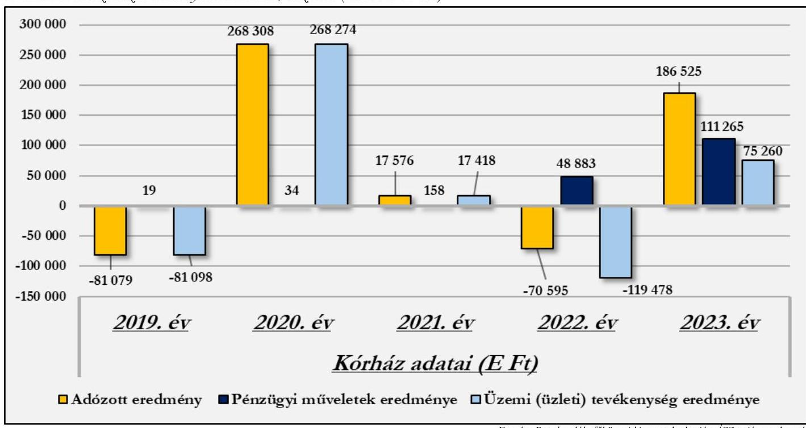

# Bevételi struktúra 

Az 1. számú táblázat adatai alapján a vizsgált időszakban a Kórház bevételi struktúrájában jelentős változás nem következett be annak ellenére, hogy a bevételek főösszege 2019-ről 2023. évre 117,7%-kal nőtt. A bevételi forrásokon belül az egyéb bevételek bírtak meghatározó jelentőséggel, arányuk az elemzett időszakban 78,0% és 88,8% között mozgott. E jogcím bevételeken belüli magas arányának oka, hogy a Kórház tevékenységéhez kapcsolódó NEAK támogatás összegén kívül valamennyi támogatás, adomány, a fejlesztési és beruházási programok, projektek megvalósításához kapott támogatások összege is e jogcím keretében került elszámolásra.

A Kórház bevételein belül az értékesítés nettó árbevételei 2019-2023. években 10,4% és 17,3% közötti arányt képviseltek. A Kórház e jogcímcsoporton belül számolta el a biztosítottak egészségügyi ellátás keretében saját kezdeményezésre igénybe vett kényelmi szolgáltatásokra felszámított díját. A magas, 17,3%-os arány a 2019. évet jellemezte, mivel a gyógyító-megelőző ellátásokhoz kapcsolódó, a költségvetésből kapott 2019. évi finanszírozás nominális értéke mindössze kétharmada volt a 2020. évben kapottnak.

A pénzügyi műveletek bevételei az elemzett időszak első három évében elhanyagolható összeget jelentettek, azonban 2022-2023-ban a bevételi főösszeg 1,7%-át, illetve 3,7%-át tették ki. A fejlesztéshez kapcsolódó, átmenetileg szabad pénzeszközök lekötéséből származó bevétel értéke jelentős hatással volt a Kórház 2022-2023. évi likviditására, eredményének alakulására.

A Kórház folyamatos működését, az egészségügyi közfeladatok ellátását a folyamatosan növekvő egyéb bevételek biztosították. A Kórház 2023-ban e jogcímcsoportban a 2019. évi bevétel több mint kétszeresét realizálta, ugyanakkor az elemzett időszak két szélső évében az összes bevételen belüli arányuk közel azonos (82,7% illetve 83,4%) volt, míg a 2020-2022. időszakban a bevételi főösszeg közel 90,0%-át tették ki. A Kórház működését megalapozó egyéb bevételek jogcímcsoport többféle bevételi forrás elszámolására szolgált, ilyen a gyógyító, megelőző ellátások NEAK finanszírozása; a központi költségvetési támogatások összege; az egyházi (fenntartói) támogatás; az egyéb támogatások és adományok; valamint a térítés nélkül (hagyatékból) kapott eszközök értéke, továbbá 2022. és 2023. években a halasztott bevételként elszámolt fejlesztési célú támogatások

---

feloldásából származó egyéb bevételek összege. A jogcímcsoport bevételeinek meghatározó részét a gyógyító, megelőző ellátások NEAK finanszírozása (1. táblázat - 3.a. pont) képezte, aránya az egyéb bevételeken belül 2019. évben 71,6%, a 2023. évben 62,7% volt, az összes bevételnek pedig 2019. évben a 59,2%-át, a 2023. évben a 52,3%-át tette ki. A gyógyító, megelőző ellátások NEAK finanszírozása összes bevételen belüli arányának 6,9 százalékpontos csökkenése azonban nominális értéken 753576 E Ft-os növekedést jelentett 2019-ről 2023. évre. Ez a bevételi (finanszírozási) arányban megjelenő csökkenés együtt mozgott azzal, hogy a Kórházban az elemzett időszakban teljeskörű megújulás, fejlesztés volt folyamatban, ennek következtében pl. 2022-ben az engedélyezett kapacitásának alig több mint kétharmadát tudta csak működtetni. Ez fenntartói támogatás nélkül a Kórház veszteséges működését jelentette volna a teljes elemzéssel érintett időszakban, még a nyereséggel zárt 2020-2021. és 2023. években is, mivel a fenntartói támogatás évente 300000 E Ft körüli összeget tett ki, míg a legnagyobb összegű adózott eredmény a 2020. évi 268308 E Ft volt (jellemzően magas fix költséggel működtek, továbbá 2022-ben a működés terhére számoltak el olyan, a beruházás-felújítás kapcsán keletkezett 150000 E Ft költséget, amely nem képezte bekerülési érték részét). Az egyéb bevételek kisebb jelentőségű, de kiemelt eleme a központi költségvetési támogatások NEAK finanszírozás nélküli összege, amely 2019. évben az egyéb bevételek jogcímcsoport 4,2%-át, 2023-ban 22,0%-t, 2019-ben az összes bevétel 2,6%-át, 2023. évben pedig a 14,8%-át tette ki (1. táblázat - 3.b. pont.). A Kórház pályázati és/vagy egyedi döntés alapján – egyházi fenntartású egészségügyi intézményként – a közfeladat ellátását segítő, jelentős központi költségvetési támogatásban részesült az elemzéssel érintett időszakban. A 2019. évi 35956 E Ft-tal szemben 2023. évben 443684 E Ft volt a központi költségvetési támogatások NEAK finanszírozás nélküli összege, amely 2020-ról 2021-re, valamint 2021-ről 2022-re ugrásszerűen megemelkedett. E források a NEAK finanszírozást kiegészítve szolgálták az egészségügyi közfeladatellátást, a működési kiadások finanszírozásában játszott – likviditást segítő – szerepük mellett fejlesztési lehetőséget is biztosítottak a Kórház számára. Egyedi döntés alapján a Kórház az energiaválság miatt megnövekedett áram és gáz többletkiadások finanszírozásához jelentős központi költségvetési támogatásban részesült, mely 2022. évben 9600 E Ft, 2023. évben pedig 73419 E Ft volt, továbbá a 2022. december 31-ig lejárt tartozásállomány utólagos kiegyenlítéséhez 64132 E Ft, további 107523 E Ft működési támogatásban is részesült 2023. évben. 2021. és 2022. években pedig utófinanszírozás keretében biztosított a központi költségvetés forrásokat a járványügyi veszélyhelyzetből
 fakadó többletköltségek finanszírozásához. E források hozzájárultak a Kórház fizetőképességének fenntartásához, likviditási helyzetének javításához. A Kórház az elemzett évek mindegyikében részesült egyházi (fenntartói) támogatásban (2. táblázat - 3.c. pont), amely mind összegében, mind arányaiban 2020-ban járult hozzá legnagyobb mértékben az összes bevételhez. Az egyéb bevételek jogcímcsoporton belül elszámolt, az 1. táblázat 3.d. pontja szerinti egyéb bevételek és 3.c. pontja szerinti egyéb támogatások a Kórház pénzügyi helyzetére érdemi hatással voltak, különösen a negatív eredménnyel (veszteséggel) zárult években, illetve 2021-ben, amikor az eredmény az összes bevétel egy százaléka alatt maradt. Arányuk az összes bevételen belül átlagosan 4,9 %, az egyéb bevételek jogcímcsoporton belül pedig átlagosan 5,7 % volt. A térítés nélkül átvett, és többletként fellelt készletek értékét, és a halasztott bevételként elszámolt fejlesztési célú támogatások feloldását tartalmazó egyéb bevételek 2023. évi összege 25978 E Ft, a szervezetek és magánszemélyek által nyújtott támogatások összege pedig 16928 E Ft volt 2023-ban. A bevételi források 2019. évről 2023. évre történő változását a 6. ábra mutatja be.

---

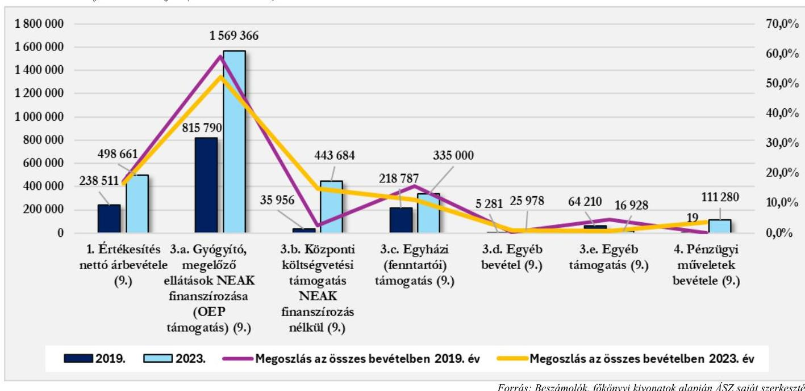

A bevételek elemzéséhez tartozó fajlagos mutató az egy ellátott esetszámra (aktív és krónikus egyben) jutó összes bevétel alakulása. Ez 2019-ben 287,3 E Ft volt, ami 2023-ra 891,9 E Ft-ra nőtt. E fajlagos mutató értéke az öt vizsgált évből 2022. kivételével minden évben elmaradt az öt elemzett kórház fajlagos értékeihez viszonyítottan. A mutató értéke 2023-ban 7,8 %-kal maradt el az öt kórház átlagától. Az elemzéssel érintett 2019-2023. évekre vonatkozóan a mutató átlagos értéke 667,3 E Ft volt, csúcspontját 2022-ben érte el, amikor is 1039,5 E Ft értéke 0,3 %-kal haladta meg az öt kórház átlagát.

# NEAK finanszírozás összetételének elemzése 

A Kórház bevételeinek meghatározó részét kitevő NEAK finanszírozás összetételét, finanszírozási jogcímek szerinti alakulását a 2. táblázat tartalmazza.
2. táblázat

| A NEAK FINANSZÍROZÁS ÖSSZETÉTELE (ADATOK E FT-BAN) |  |  |  |  |  |  |  |  |  |  |
| :--: | :--: | :--: | :--: | :--: | :--: | :--: | :--: | :--: | :--: | :--: |
| MEGNEVEZÉS | 2019.Év | MEGOSZ-   2019. Év | 2020. Év | MEGOSZ-   2020. Év | 2021. Év | MEGOSZ-   2021. Év | 2022. Év | MEGOSZ-   2022. Év | 2023. Év | MEGOSZ-   2023. Év |
| Aktív fekvőbetegszakellátás | 181220 | $22,2 \%$ | 174014 | $14,5 \%$ | 167542 | $13,6 \%$ | 166452 | $11,3 \%$ | 151448 | $9,7 \%$ |
| Krónikus fekvőbetegszakellátás | 554889 | $68,0 \%$ | 508523 | $42,2 \%$ | 521159 | $42,4 \%$ | 551876 | $37,4 \%$ | 461364 | $29,4 \%$ |
| Laboratóriumi ellátás | 915 | $0,1 \%$ | 983 | $0,1 \%$ | 979 | $0,1 \%$ | 972 | $0,1 \%$ | 1036 | $0,1 \%$ |
| Járóbeteg szakellátás | 7861 | $1,0 \%$ | 6976 | $0,6 \%$ | 7836 | $0,6 \%$ | 9502 | $0,6 \%$ | 14753 | $0,9 \%$ |
| Estrafinanszírozás | 0 | $0,0 \%$ | 0 | $0,0 \%$ | 0 | $0,0 \%$ | 0 | $0,0 \%$ | 0 | $0,0 \%$ |
| Spec.fin. | 0 | $0,0 \%$ | 0 | $0,0 \%$ | 0 | $0,0 \%$ | 0 | $0,0 \%$ | 0 | $0,0 \%$ |
| Nagyértékű gyógyszerfin. | 0 | $0,0 \%$ | 0 | $0,0 \%$ | 0 | $0,0 \%$ | 0 | $0,0 \%$ | 0 | $0,0 \%$ |
| Célelőirányzatok | 70904 | $8,7 \%$ | 513589 | $42,7 \%$ | 532064 | $43,3 \%$ | 746386 | $50,6 \%$ | 940765 | $59,9 \%$ |
| NEAK finanszírozás összesen | 815790 | 100,0\% | 1204085 | 100,0\% | 1229579 | 100,0\% | 1475188 | 100,0\% | 1569366 | 100,0\% |

Forrás: NEAK adatházis alapján ÁSZ saját szerkesztés

---

A NEAK finanszírozás összegszerű növekedése mellett a Kórház finanszírozási szerkezetében jelentős mértékű átrendeződés történt. A szakellátásokhoz kapcsolódó finanszírozások tették ki az elemzett időszak első három évében a folyósított összeg meghatározó részét, majd arányuk a 2019. évi 91,3 %-ról a 2023. évben 40,1 %-ra csökkent. A célelőirányzatok (egészségügyi dolgozók 2018-2024 évi béremelésének fedezete, a fix összegű bérkiegészítés, a pénzellátást helyettesítő jövedelemkiegészítés, működési támogatás) keretében folyósított támogatás aránya először 2020-ban nőtt 8,7 %-ról 42,7%-ra, majd 2023-ban a finanszírozás meghatározó részévé vált az 59,9 %-os részesedéssel. Ez az arányváltozás két tényező együttes hatására következett be. Részben a bérek, és a kapcsolódó támogatások növekedése, részben a Kórház rekonstrukciója miatt bekövetkezett kapacitáscsökkenés, illetve a fenntartott kapacitás kihasználtságának romlása miatt.

A Kórház által ellátott egészségügyi közfeladatok alapján a NEAK finanszírozáson belül a krónikus fekvőbetegszakellátás finanszírozása volt meghatározó jelentőségű, továbbá magas arányt képviselt az egészségügyi bérrendezéshez kapcsolódó költségek fedezetét is tartalmazó célelőirányzatok összege is.

A 2019-2023. években a finanszírozási szerkezet alakulását a bérekhez kapcsolódó támogatások egyre növekvő szerepe mellett a finanszírozás módja, és annak változása is befolyásolta. A COVID-19 járvány miatti egészségügyi veszélyhelyzetre tekintettel az intézmények pénzügyi stabilitásának biztosítása érdekében a teljesítményfinanszírozás helyett átlagfinanszírozás ${ }^{5}$ került bevezetésre a járó- és fekvőbetegszakellátás ellátásaira. Az átlagfinanszírozás a 2023. január havi teljesítmények elszámolásáig volt érvényben, a 2023. február havi teljesítmények elszámolásától (2023. április havi kifizetés) kezdődően megszűnt, visszaállt a jogszabályi előírásoknak megfelelő teljesítmény alapján történő finanszírozás. Előzőek alapján a Kórház 2021-2022. években átlagfinanszírozásban részesült, míg 2023. évben a január-március havi átlagfinanszírozást követően 2023. áprilistól visszaállt a teljesítményfinanszírozás. A Kórház teljesítménymutatói a járvány elmúltával sem javultak, ebben azonban meghatározó szerepet játszott, hogy a beruházási-felújítási munkák miatt a Kórház engedélyezett kapacitásának egy részét nem tudta hasznosítani. A finanszírozás tekintetében a betegforgalmi adatok kedvezőtlen alakulása mellett negatívan hatott, hogy a teljesítményfinanszírozás alapját jelentő súlyszámok/szorzók/pontértékek karbantartása/felülvizsgálata nem történt meg, így az ellátások alulfinanszírozottak maradtak. Mindezek hiányában a központi költségvetés a megnövekedett szakmai és működtetési kiadások ellensúlyozása, a közfeladatellátás biztosítása érdekében célhoz kötött költségvetési támogatások (villamos- és földgázenergia beszerzés támogatása, adósságcsökkentési célú működési támogatások, járványügyi helyzetből adódó többletköltségek utólagos kompenzációja) folyósításával támogatta a kórházak pénzügyi helyzetének stabilizálását, fizetőképességének fenntartását.

A NEAK finanszírozás és a Kórház kiadásai adatainak összehasonlítása alapján megállapítható, hogy a gyógyító, megelőző ellátások NEAK finanszírozása 2019-2023. években nem fedezte a Kórház tevékenységével kapcsolatban felmerült kiadásokat. A 2019. évben elszámolt összes kiadás 55,9 %-át fedezte a NEAK finanszírozás, ami a célhoz kötött támogatások jelentős növekedése mellett 2023. évben gyakorlatilag változatlan, 55,8 % volt. A kiadások és a NEAK finanszírozás alakulását a 2019-2023. években a 3. táblázat foglalja össze.

[^0]
[^0]:    ${ }^{5}$ Az átlagfinanszírozás a megelőző időszak teljesítménye alapján került meghatározásra

---

| A KIADÁSOK ÉS A NEAK FINANSZÍROZÁS ALAKULÁSA (ADATOK E FT-BAN) |  |  |  |  |  |
| :--: | :--: | :--: | :--: | :--: | :--: |
| MEGNEVEZÉS | 2019. ÉV | 2020. ÉV | 2021. ÉV | 2022. ÉV | 2023. ÉV |
| NEAK finanszírozás összesen | 815790 | 1204085 | 1229579 | 1475188 | 1569366 |
| 1. Anyagjellegű ráfordítások | 554377 | 569525 | 648541 | 880466 | 775171 |
| 2. Személyi jellegű ráfordítások | 904673 | 1008143 | 1102710 | 1469719 | 1747316 |
| 3. Értékcsökkenési leírások (5.) | 0 | 0 | 204148 | 207526 | 246392 |
| 4. Egyéb ráfordítások (8.) | 583 | 270 | 15346 | 344934 | 45480 |
| 5. Pénzügyi műveletek ráfordítása (8.) | 0 | 0 | 0 | 0 | 15 |
| Kiadás összesen | 1459633 | 1577937 | 1970745 | 2902645 | 2814372 |
| Összes kiadás finanszírozottsági aránya | $55,9 \%$ | 76,3\% | $62,4 \%$ | $50,8 \%$ | $55,8 \%$ |
| Anyagjellegű és személyi jellegű ráfordítások finanszírozottsági aránya | $55,9 \%$ | 76,3\% | 70,2\% | $62,8 \%$ | $62,2 \%$ |
| Anyagjellegű és személyi jellegű ráfordítások aránya az összes kiadáshoz mérten | $100,0 \%$ | $100,0 \%$ | $88,9 \%$ | $81,0 \%$ | $89,6 \%$ |

Az adatok szemléletesen mutatják az egészségügyi ellátás finanszírozási problémáját. Az elemzéssel érintett öt évben a NEAK finanszírozás összege jelentős mértékben növekedett ugyan, de nem nyújtott fedezetet a Kórház kiadásainak meghatározó részét kitevő anyag- és személyi jellegű ráfordítások együttes összegére sem. A pénzügyi helyzet javítása érdekében a központi költségvetés a veszélyhelyzet és az energiaválság miatt jelentős mértékben megnövekedett energiaköltségek kompenzálására, továbbá az adósságállomány csökkentéséhez a NEAK a finanszírozáson felül egyedi döntés alapján támogatást nyújtott a Kórház számára 2022-2023. évben, 2021. és 2022. évben pedig a járványügyi veszélyhelyzetből adódó többletköltségek utólagos kompenzációja címén folyósított támogatást.

# Kiadási struktúra elemzése 

Az 1. számú táblázat adatai alapján jól látható, hogy a Kórház kiadásai folyamatosan növekedtek, majd a 2023. évi nominális értékben tapasztalható minimális csökkenés mögött a 2022. évi egyszeri költségtételek (leltárkülönbözet, továbbá beruházáshoz kapcsolódó, a bekerülési értékrészét nem képező kiadások) hatása van.

A Kórház kiadási struktúrájában meghatározó arányt képviseltek a személyi jellegű-, valamint az anyagjellegű ráfordítások.

Az anyagjellegű ráfordítások az összes kiadás 38,0 %-át tették ki 2019-ben, 2023. évre arányuk 27,5 %-ra csökkent. A személyi jellegű ráfordítások aránya az összes kiadásokon belül érdemben nem változott, a 2019. évben 62,0 %, a 2023. évben 62,1 % volt. Ugyanakkor fontos kiemelni, hogy 2019-ben a költségek között nem számoltak el értékcsökkenést, amelynek hatását, ha figyelembe vennénk a személyi jellegű ráfordítások aránya növekedést mutatna. A pénzügyi műveletek ráfordításai a 2022. év kivételével elhanyagolható nagyságrendet képviseltek a Kórház kiadási szerkezetében. Az értékcsökkenési leírás aránya az összes kiadáshoz mérten csökkent (a 2021. évi 10,4 %-ról 2023. évre 8,8 %-ra), amelynek oka, hogy az összes kiadás 2021-ről 2023-ra 42,8 %-kal emelkedett, míg az elszámolt értékcsökkenés 2021. évről 2023. évre csak 20,7 %-kal nőtt. A 2019-2020. években a jogszabályi előírások ellenére a Kórháznál nem történt a befektetett eszközök elhasználódásához kapcsolódó értékcsökkenési leírás, elszámolás, amely hiányosságot a Kórház az elemzett időszakban maradéktalanul rendezett.

Az összes kiadáson belül az egyéb ráfordítások aránya a 2021-ben 0,8 %, 2023. évben 1,6 % volt. A 2022. évi 11,9 % kiugróan magas arány oka a 2022. évi leltározás során feltárt jelentős összegű leltárkülönbözet számviteli nyilvántartási
 rendszerben történt elszámolása volt, az elemzéssel még érintett 2019. és 2020. évében

---

az egyéb ráfordítások aránya elhanyagolható volt, még a 0,1%-ot sem érte el. A Kórháznál pénzügyi műveletek ráfordításaként a 2019-2022. időszakban kiadás nem került elszámolásra, a 2023. évben kimutatott összeg a kiadási főösszegen belül szintén elhanyagolható volt.

Az anyagjellegű ráfordítások (ötéves átlagarány 32,0%) a 2019. évi 38,0%-os, és a 2023. évi 27,5%-os arányukkal az összes kiadáshoz viszonyítva a személyi jellegű ráfordításokat követően (ötéves átlagarány 58,1%) a Kórház második legnagyobb kiadási jogcímcsoportját tették ki. Az e jogcímcsoporton belüli meghatározó jelentőségű kiadások alakulását a 7. ábra mutatja be.
7. ábra Az anyagjellegű ráfordítások alakulása (adatok E Ft-ban)
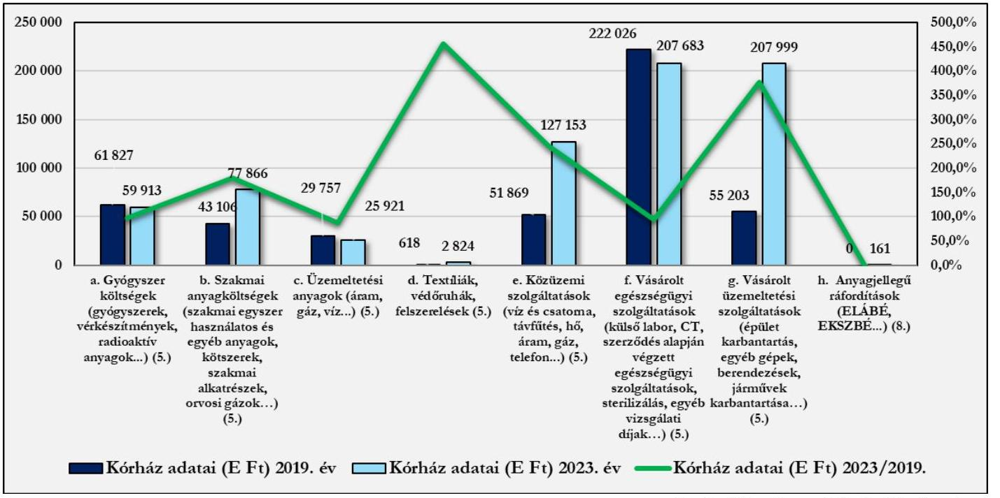

Forrás: Főkönyvi kivonatok alapján ÁSZ saját szerkesztés
Az adatok szemléletesen mutatják, hogy 2019-ről a 2023. évre a Kórház anyagi jellegű ráfordításain belül a meghatározó jelentőségű kiadások szinte mindegyike tekintetében növekedés következett be. A gyógyszer költségek és üzemeltetési anyagok esetében ugyan kis mértékű csökkenés volt tapasztalható, annak hátterében az időszakban bekövetkezett kapacitás csökkenéssel összefüggő az ellátottakhoz közvetlenül kapcsolódó költségek látszólagos csökkenése állt, mert ha a költségeket azonos egységre vetítettük (működő ágyak száma, ellátott esetszám), akkor ezen költségek esetében is növekedést tapasztaltunk. Az egészségügyi tevékenységhez kapcsolódó szakmai anyagok beszerzésére fordított összeg 80,6%-kal emelkedett, ha e kiadás változását a gyógyszerköltségekkel együtt vizsgáljuk, a 31,3%-os növekedésükben az infláció mellett szerepet játszott a gyógyító, megelőző ellátások szakmai igényeinek változása, új eljárások, gyógyszerek, kezelések alkalmazása is. Az 1. táblázat adataiból látható, hogy a Kórház esetében a szakmai anyagköltség 2022. évben kiugróan magas volt, ami alapvetően befolyásolta a Kórház kiadási szerkezetének alakulását. A 7. ábra adatai alapján megállapítható, hogy az anyagjellegű ráfordításokon belül közüzemi szolgáltatások esetében következett be a legmagasabb költségnövekedés. A közüzemi díjak és szolgáltatások a 145,1%-os növekedéssel a 2019. évi 51869 E Ft-ról 2023. évre 127153 E Ft-ra nőttek. A közel két és félszeresére emelkedett költségben szerepet játszott a magas inflációs környezet $^{6}$ mellett az orosz-ukrán háború kirobbanása miatt kialakult világméretű energiaválság is.

[^0]
[^0]:    $^{6}$ 2023. év januárban 25,7%, júliusban 17,6%, decemberben 5,5%

---

A Kórház kiadási szerkezetében meghatározó aránya a személyi jellegű ráfordításoknak volt, az összes kiadáson belüli 2019. évi 62,0%-os, és a 2023. évi 62,1%-os aránnyal. A személyi jellegű kiadások növekedése jelentős nagyságrendet képviselt a Kórház esetében, a 2019. évi 904673 E Ft-os összeg 1747316 E Ft-ra emelkedett, ezzel közel megduplázódott, amelynek oka az egészségügyi dolgozók bérrendezése volt.

Az adatok alapján a rendszeres személyi juttatásokon belül az alapilletmények és az alapilletményhez kötött kifizetések, valamint a pótlékok közel azonos mértékben, az ügyeleti díjak és a keresetkiegészítések azokat meghaladó mértékben növekedtek. A személyi jellegű egyéb kifizetéseken belül az elemzés a jogszabályból eredő jutalmak, és a hitéleti támogatás alakulásának értékelésére terjedt ki. Az egészségügyi szolgálati jogviszonyról szóló 2020. évi C. törvény hatályba lépését követően az egészségügyi szolgálati jogviszonyban álló személyek egészségügyi szolgálati jogviszonyuk alapján - a jubileumi jutalom helyett - a jogszabályban meghatározottak szerint szolgálati elismerésre váltak jogosulttá.

A Kórház a 2019-2021. években a dolgozók számára jubileumi, illetve a 2021-2023. években egyéb jogszabályból - a 664/2021. (XII. 1.) Korm. rendelet $^{25}$ - eredő jutalmat fizetett ki. E kiadásokra átlagosan évenként az összes kiadás 2,2%-át fordította a Kórház azzal, hogy a 2020. évben az átlagos aránytól magasabb (125284 E Ft), míg az elemzett időszak további éveiben az átlagos aránytól alacsonyabb összeg került kifizetésre e jogcímeken. A 2019. évben pótlékokra a Kórház 35759 E Ft-ot, míg az elemzéssel érintett időszak utolsó, 2023. évében 68658 E Ft-ot fizetett ki. A pótlékok az összes kiadás 2,4%-át tették ki az elemzett időszak két szélső évében.

Hitéleti támogatás címén kifizetés a 2019-2023. időszak minden évében történt, melynek aránya az összes kiadáson belül a 2019. évi 4,0%-ról 2023. évben 1,9%-ra csökkent.

# 1.2. Generált Cash flow és a beszámolóban jelzett pénzeszköz változás összehasonlítása 

A CF$^{26}$ a készpénzáramlást mutatja be; az eszközök, kötelezettségek és eredmények készpénz állományt érintő változásait foglalja magába; nem azonos az intézmény által végzett tevékenység során keletkező eredménnyel/profittal. A CF kimutatás az intézmény forrásairól és készpénzfelhasználásáról ad képet a beszámolónak megfelelő naptári évre vonatkozóan. Az adatok segítségével következtetések vonhatók le az intézmény pénzügyi helyzetéről, több év adatának elemzésével, összehasonlításával lehetővé válik a pénzügyi helyzet alakulásának értékelése.

A CF elemzés célja a pénzügyi helyzet értékelése, valamint az egymás követő időszak adatainak összehasonlításával annak elemzése, hogy a kórházak a tevékenységüket meghatározó belső és külső körülmények változása milyen hatást gyakorolt a pénzügyi helyzetük alakulására.

A CF mutatók elemzésének célja, annak értékelése, hogy a kórház:

- alacsony, esetleg negatív üzleti eredmény (veszteség) ellenére képes volt-e tevékenysége során „pénz” cash termelésre (Bruttó CF);
- működési folyamatai tőkét kötöttek le (-), vagy tőkét szabadítottak fel (+), milyen volt a működés tőkeszükséglete (Működési CF);
- a működés tőkeszükségletét is figyelembe véve tevékenysége során mekkora „pénz” cash előállítására volt képes (Nettó Működési CF);
- az adott üzleti évben mekkora összegben pótolta befektetett eszközeit (Tőkebefektetés - CAPEX$^{27}$);
- az adott üzleti évben - a működés tőkeszükségletét és figyelembe véve - előállított „pénzből” a tőkebefektetést levonása után mekkora szabadon felhasználható cash maradt (Szabad CF - Free CF);
- az adott üzleti évben mekkora összegű, hosszú távon az intézmény rendelkezésére álló külső forrásban részesült (Finanszírozási CF).

---

Az egyházi jogi személyek által fenntartott kórházak sajátos könyvvezetési és beszámolókészítési kötelezettségét$^{7}$ figyelembe véve a CF elemzés alapját - a zárás előtti főkönyvi kivonatok, az éves beszámolók (mérlegek és eredménykimutatások) és a kiegészítő információk felhasználásával - az ÁSZ által összeállított adattáblák adatai képezték. Az adattáblák sorainak adatai indokolt esetben - a halmozódások kiszűrése érdekében - tartalmazzák a Számv. tv. előírásai alapján figyelembe vehető, ismertté vált, azonnal pénzeszköz-változással nem járó korrekciós tételeket.

# Cash flow mutatók

1. táblázat

GENERÁLT CASH FLOW ADATAI (ADATOK E FT-BAN)

|  NÉVMÉGNEVEZÉS | 2019. ÉV | 2020. ÉV | 2021. ÉV | 2022. ÉV | 2023. ÉV  |
| --- | --- | --- | --- | --- | --- |
|  1. Üzemi eredmény | -81098 | 268274 | 17417 | -119478 | 75259  |
|  2. Elszámolt amortizáció | 0 | 0 | 204148 | 207526 | 246392  |
|  3. Elszámolt értékvesztés és visszaírás | 0 | 0 | 0 | 334158 | 0  |
|  4. Céltartalék képzés és felhasználás különbözete | 0 | 0 | 0 | 0 | 0  |
|  I. Bruttó CF (non cash tételekkel korrigált üzemi eredmény) (1.+2. +/-3. +/-4.) | -81098 | 268274 | 221566 | 422206 | 321651  |
|  5. Befektetett eszközök értékesítésének eredménye | 0 | 0 | 0 | 0 | 0  |
|  6. Készletek változása | -29727 | 0 | -11655 | 3680 | -17370  |
|  7. Vevőkövetelés változása | 0 | 0 | -16581 | 11283 | -6433  |
|  8. Forgóeszközök (készlet, vevőkövetelés és pénzeszköz nélkül) változása | 293 | 442 | -165590 | 179167 | 333  |
|  9.1. Bevételek aktív időbeli elhatárolása | -4252 | 0 | 0 | -84672 | 922  |
|  9.2. Költségek, ráfordítások aktív időbeli elhatárolása | 0 | 0 | -438 | -2227 | 903  |
|  9.3. Halasztott ráfordítások | 0 | 0 | 0 | 0 | 0  |
|  10. Szállítói kötelezettség változása | 4711 | -128510 | 237732 | -147730 | -23780  |
|  11. Egyéb rövid lejáratú kötelezettség változása | 71999 | -2125 | -70356 | 123790 | 32653  |
|  12.1. Bevételek passzív időbeli elhatárolása | 0 | 0 | 0 | 0 | 0  |
|  12.2. Költségek, ráfordítások passzív időbeli elhatárolása | 0 | 0 | 0 | 0 | 9260  |
|  12.3. Halasztott bevételek | 0 | 0 | 0 | 3284115 | 773396  |
|  13. Pénzügyi műveletek bevételei | 19 | 34 | 158 | 48883 | 111280  |
|  14. Pénzügyi műveletek ráfordításai | 0 | 0 | 0 | 0 | 15  |
|  15. Fizetett, fizetendő adó (nyereség után) | 0 | 0 | 0 | 0 | 0  |
|  II. Működési CF (a működés tőkeszükséglete) | 43043 | -130160 | -26731 | 3416209 | 881179  |
|  III. Nettó működési CF (bruttó CF + működési CF) | -38055 | 138114 | 194834 | 3838496 | 1202830  |
|  IV. CAPEX (tőkebefektetés) | 600092 | 1326119 | 1898728 | 1161686 | 1082590  |
|  V. Free CF (nettó működési CF - CAPEX) | -638147 | -1188005 | -1703894 | 2676810 | 120240  |
|  16. Fizetett, fizetendő osztalék, részesedés | 0 | 0 | 0 | 0 | 0  |
|  17. Részvénykibocsátás, tőkebevonás, illetve részvénybevonás, tőkekivonás | 35348 | -993 | 0 | 0 | 0  |
|  18. Kötvény, hitelviszonyt megtestesítő értékpapír változása | 0 | 0 | 0 | 0 | 0  |
|  19. Beruházási hitel és hosszúlejáratú kölcsönök változása | 29252 | -29252 | 0 | 0 | 0  |
|  20. Hosszú lejáratra nyújtott kölcsönök és elhelyezett bankbetétek változása | 0 | 0 | 0 | 0 | 0  |
|  21. Véglegesen kapott pénzeszköz / elszámolt támogatás | 2524349 | 2337414 | 0 | -2574449 | -958556  |
|  VI. Finanszírozási CF | 2588948 | 2307169 | 0 | -2574449 | -958556  |
|  Számított pénzeszköz változás | 1950801 | 1119164 | -1703894 | 102361 | -838316  |

[^0] [^0]: $^{7}$ Az egyházi jogi személyek a 296/2013. Korm. rend. 5. § (1) bekezdésének előírása alapján egyszerűsített éves beszámoló készítésére kötelezett szervezetek, melyek a jogszabály 5. § (5) bekezdése szerint a beszámoló részeként kiegészítő mellékletet nem készítenek. A könyvvezetési és beszámolókészítési sajátosságokat figyelembe véve a generált CF számításához szükséges kiegészítő információk az adatbekérések, illetve a helyszíni ellenőrzés keretében kerültek bekérésre

---

Annak érdekében, hogy a gazdasági események a pénzmozgásra
 ható céljuk szerint jelenjenek meg a cash flow elemzésben, a főkönyvi nyilvántartás adatai átsorolásra kerültek. Ennek keretében a Számv. tv. előírásai szerint az egyéb rövidlejáratú kötelezettségek között nyilvántartott - fejlesztési célra, elszámolási kötelezettséggel - támogatási előlegként kapott támogatást a finanszírozási cash flow részeként, a véglegesen kapott pénzeszközök között vettük figyelembe a 2019-2020. évet bemutató oszlopokban. További korrekciót igényelt a 2022. évi teljeskörű leltározás eredményeként megjelent költség elszámolás, mely az értékcsökkenési leíráshoz, értékvesztés elszámolásához hasonlóan non cash tételként jelentkezett.

A 2020-2021. és 2023. években az üzemi eredmény pozitív előjelű, tehát nyereség, míg a 2019. és 2022. években negatív előjelű, tehát veszteség jelentkezett. Az adatok pénzfogalommal nem járó tételekkel (non cash) történő korrigálását követően a bruttó cash flow 2019-ben szintén negatív értéket mutatott, azaz ebben az évben a Kórház tevékenysége során nem volt képes „pénz" termelésére. A 2019. és a 2020. években nem került sor sem értékcsökkenés, sem értékvesztés címén költség elismertetésre, ezért a bruttó cash flow megegyezett az üzemi eredménnyel. A 2020-2023. években a bruttó cash flow pozitív értéket mutatott, a Kórház - a 2022. évi üzemi (üzleti) tevékenység vesztesége ellenére - képes volt „pénz" termelésre az azonnali pénzkiadással nem járó ráfordítások (elszámolt amortizáció) CF módosító hatására. A működési cash flow értéke nagy változásokat mutatott (2019: 43043 E Ft, 2020: -130 160 E Ft; 2021: -26 731 E Ft, 2022: 3416289 E Ft; 2023. évben pedig 881179 E Ft volt). Azokban az években, melyekben a mutató pozitív, a működés képes volt tőkét felszabadítani. Ez olyankor következhet be például, amikor a követelések megtérülnek, ugyanakkor a szállítói kifizetés is halasztható. Ilyen volt a működés 2019-ben, valamint 2021-2022-ben. Ez utóbbi két évben, ha korrigáljuk a működési cash flow értékét a támogatások elszámolásából következő halasztott bevétel növekedéssel, akkor is pozitív értéket kapunk (2022: 132174 E Ft; 2023: kapcsolódóan 107783 E Ft). A 2020. és 2021. évek negatív előjelű mutatója alapján az egészségügyi tevékenység működési folyamatainak biztosítása tőkét kötött le, a működési kiadások finanszírozásához 2020-ban jelentős, 2021. évben csökkenő mértékű tőkefelhasználás (eszköz, eredmény) vált szükségessé. A bruttó cash flow-t és a működés tőkeszükségletét is figyelembe véve a Kórház 2019-ben „pénz" termelésre a működését meghatározó tevékenységekkel nem volt képes, a nettó működési cash flow értéke negatív volt. A 2020-2023. időszakban ezzel ellentétes tendencia érvényesült, és a Kórház a működését meghatározó folyamatokkal 2022-2023. években jelentős összegű nettó működési cash flow előállítására volt képes. A Kórház a befektetett eszközök pótlására, fejlesztésére 2019-2023. években jelentős, az elszámolt amortizációt meghaladó összegeket fordított, öt év alatt összesen 5517598 E Ft-ot. A fejlesztések megvalósítását a Kórház számára folyósított fejlesztési célú központi költségvetési támogatások jelentős mértékben segítették. A tőkebefektetés (CAPEX) mutató értéke alapján lehet nyomon követni az intézmény befektetett eszközeinek pótlását, a támogatásból megvalósítandó fejlesztés teljesülését. A Kórház a 2019-2023. években a tevékenységéhez szükséges gépek, berendezések, felszerelések beszerzésén kívül a könyveiben szereplő ingatlanok fejlesztésére, felújítására is költött az adatok alapján. A finanszírozási cash flow értéke az elemzett időszak első két évben - a kapott támogatások cash flow bemutatásában történt átsorolása miatt pozitív, 2019-ben 2588948 E Ft, 2020-ban 2307169 E Ft volt. 2021-ben nem volt olyan külső finanszírozás, mely a finanszírozási cash flow-ban jelenik meg. Ekkor a tőkebefektetés a korábbi években kapott támogatások felhasználásával, a meglévő pénzeszközök terhére történt. A 2022-2023. időszakban a finanszírozási cash flow negatív értéke mögött a támogatások elfogadott elszámolásából következő kötelezettség csökkenés állt.
2019-ben a működés tőkeszükségletét hosszú lejáratú forrás bevonása, míg a CAPEX értékét a fejlesztési támogatások finanszírozták. 2020-ban a működés eredményessége fedezte a működés tőkeszükségletét, valamint abból lehetősége volt a Kórháznak a hosszú lejáratú források csökkentésére, továbbá hozzájárult a fejlesztésekhez, bár utóbbit meghatározó részben a fejlesztési támogatások biztosították, melyek 2020-ban további jelentős összeggel (2 337414 E Ft-tal) egészültek ki. 2021-ben, hasonlóan az előző évhez, az eredményes gazdálkodás

---

biztosította a működés tőkeszükségletét, valamint minimálisan hozzájárult a CAPEX fedezetéhez. A tőkebefektetések meghatározó részét (89,7%) a megelőző években kapott fejlesztési célú támogatások révén a pénzeszköz változás fedezte. 2022-2023-ban mind a gazdálkodás eredményessége, mind a működés pozitív cash flow-t eredményezett. 2022-ben a kötelezettségek csökkenését a halasztott bevételeknek a csökkenést meghaladó mértékű elszámolása ellensúlyozta, így a tőkebefektetés után maradt szabad cash flow a Kórház pénzeszközeit bővítette. 2023-ban a halasztott bevételek elszámolása elmaradt a kötelezettség csökkenésétől, így abban az évben a működésből felszabadult pénzeszközök a pénzkészletek felhasználásával finanszírozták a tőkebefektetéseket (CAPEX-et). A Kórház 2022-2023. évi főkönyvi kivonatai és szakmai beszámolóiban foglaltak alapján a 2119/2017 (XII.28.) Korm. rendelet alapján a Kórház teljeskörű fejlesztéséhez juttatott támogatás 4844776 E Ft volt, valamint ugyanerre a célra 2022-ben kapott további 995000 E Ft-ot, amely felhasználásának elszámolása folyamatos volt, az elemzett időszakban 3569462 E Ft került elszámolásra. A CF kimutatás adatai szerint a Kórház számított pénzeszköz változása 2021. és 2023. években egyaránt negatív előjelű volt. Működési, fejlesztési és finanszírozási tevékenységeinek teljes spektrumát figyelembe véve ezekben az években az azonnali pénzeszköz-változással járó bevételei nem érték el az ennek megfelelő kiadások/ráfordítások összegét. A Kórház számított pénzeszköz változása 2019. és 2023. között rendkívül nagy eltéréseket mutatott, azonban pozitívan értékelhető, hogy a pénzeszköz csökkenése mögött a beruházások, fejlesztések megvalósítása állt.

A CF mutatók értékének változása alapján összességében arra lehet következtetni, hogy a 2019. évről a 2023. évre az intézmény folyamatos működéséhez szükséges pénzügyi feltételek - a fenntartói támogatás hatására - nem romlottak. A pandémia és a háborús veszélyhelyzet következményeként kialakult magas infláció és az energiaválság miatt bekövetkezett költségnövekedésre, továbbá az egészségügyi intézmények működőképességének fenntartása érdekében bevezetett (2023 áprilisától megszüntetett) átlagfinanszírozásra, és az egészségügy finanszírozási problémáira - a kapacitáskihasználtságát is érintő jelentős fejlesztések ellenére - a Kórház működési modellje képes volt választ adni. A gazdasági környezet romlását a kormány az egészségügyi intézmények esetében célzott támogatások folyósításával próbálta ellensúlyozni. A Kórház a nehéz körülmények között a működés biztonságát csak jelentős erőfeszítések árán tudta megtartani. Az elemzett időszakban folytatott beruházás mellett kapacitásait nem tudta kihasználni, ugyanakkor az emelt szintű szolgáltatásokhoz kapcsolódó térítési díjból származó bevétele a 2020. évi átmeneti visszaesést követően folyamatosan emelkedett, azonban ez nem csak a bevételek növelésével járt, hanem a kiadásokat is megemelte. Pozitívan értékelhető azonban, hogy a Kórház gazdálkodásában - a 2022. évi egyszeri eszköz elszámolástól eltekintve - jellemzővé vált egy kis mértékű javulás. Az üzemi (üzleti) tevékenység negatív eredménye (veszteség) 2020-tól pozitívvá vált, ennek hatására az azonnali pénzeszköz-változást eredményező tételekkel módosított összege (bruttó cash flow) a 2020-2023 időszakban meghaladta a működés tőkeigényét. A működés tőkeszükséglete a 2022. és 2023. évben is pozitív volt, azonban ez a tendencia nem növelhető a végletekig. A normál működés ciklikus működési cash flow-t feltételez: a működés tőkelekötésének, illetve felszabadításának az adott szervezetre jellemző ritmusát. A több éven át tartó folyamatos, az előző évihez viszonyítva jelentős mértékben csökkenő, illetve növekvő tőkelekötés/felszabadítás mögött nem feltétlenül állnak fenntartható és eredményes gazdálkodásra utaló körülmények, döntések. Előzőek alapján a nettó működési cash flow erőteljes mértékű növekedése mögött (a halasztott bevételektől tisztítva 2022-ben 554380 E Ft, 2023. évben 420174 E Ft volt) a Kórháznak a korábbi években nem a valós pénzügyi, gazdasági helyzetét bemutató beszámolói rendezésének hatása húzódik. A CAPEX (tőkebefektetési) mutató alapján a Kórház 2023-ban az elemzett időszak alatti fejlesztései éves átlagához (1 103520 E Ft) közelítő összeget (1 082590 E Ft) fordított a működését biztosító befektetett eszközök pótlására/fejlesztésére, bár ebben meghatározó szerepe volt a központi költségvetésből folyósított fejlesztési célú támogatásoknak. A CF kimutatás adatai alátámasztják, hogy a Kórház a 2019. év kivételével

---

képes volt tevékenysége során szabadon felhasználható pénzeszközt termelni, amit elsődlegesen tőkebefektetésre fordított, hisz az elemzett években a tőkebefektetés összege meghaladta a kapott támogatások összegét, ami az intézmény fejlesztések iránti elkötelezettségét bizonyítja. Továbbá kedvezően értékelhető, hogy a negatív pénzeszköz-változás 2023-ban, illetve 2021-ben a tőkebefektetéshez kapcsolódott.

A 2023. évi CF mutatók többségének kedvező változása következhetett a külső körülmények (pl. gazdasági környezet, kormányzati döntések...) előző időszaknál kedvezőbb alakulásából (javulásából), de a fenntartó és az intézményvezetés gazdálkodást érintő döntései is hozzájárulhattak.

# Mérleg mutatók 

A Kórház mérlegadatai alapján a számított szolvencia ráta értéke a 2019. évi 0,340-ről (30,4%) 2023. évben 0,185-re (18,5%) csökkent. A mutató a forrásokon belül a saját tőke arányát hivatott bemutatni. A mutató változását a saját tőke mértékének csökkenése eredményezte, a 2023. évben a forrásokon belül a saját tőke már csak 54,3%-a volt a 2019. évinek. A Kórház esetében a tőkevesztés az elemzéssel érintett időszak gazdasági éveiben keletkezett jelentős összegű veszteség (negatív adózott eredmény), valamint a 2021. évi tőkével szemben korrigált tárgyi eszköz kivezetés miatt következett be. Az arányváltozás ellenére a mutató értéke alapján megállapítható, hogy a Kórház esetében a forrásokon belül a saját tőke értéke és aránya az általánosan elfogadott/elvárt szinten maradt. Az eladósodás veszélyének vizsgálatához szükséges figyelembe venni a fejlesztési célra, visszafizetési kötelezettség nélkül kapott támogatások elszámolt összegét, amely a halasztott bevételeknél jelenik meg. Ez 2023-ban 4057511 E Ft, a mérlegfőösszeg 58,7%-a volt. Amennyiben ezt az értéket összeszámítjuk a saját tőke arányával, akkor a kapott 77,2%-os finanszírozási arány biztosítja a Kórház eszközei finanszírozásának stabilitását.

A nettó működő tőke „tankönyvi" értéke a 2019. évi -705 335 E Ft-ról a 2023. évre -4 810663 E Ft-ra módosult. A mutató értéke arra utal, hogy a Kórház finanszírozási szerkezete nem volt „egészséges", mivel a mobil és gyorsan mobilizálható eszközök (követelések, értékpapírok, pénzeszközök) mellett a befektetett eszközöket is rövid lejáratú forrás finanszírozta. Ugyanazon logika mentén szükséges elvégezni a korrekciót a nettó működő tőke számításánál is, mint a szolvencia rátánál. Illetve meg kell jegyeznünk, hogy a központi költségvetésből fejlesztési célra, visszafizetési kötelezettség nélkül kapott támogatási előlegeket a Számv. tv. előírásai szerint rövidlejáratú kötelezettségként kell nyilvántartani mindaddig, amíg a támogatás jogosultjának a támogatás felhasználásáról benyújtott elszámolását a támogató szervezet el nem fogadja. A támogatás felhasználási időszakában - ami egy jelentős beruházásnál több évet is magába foglal - a tárgyi eszközök között nyilvántartott beruházásokat rövid lejáratú forrás finanszírozza. A nettó működő tőke összege (2020-ban -1 793388 E Ft és 2021-ben -3 470392 E Ft) arra utal, hogy amennyiben az elszámolást a támogató szervezet nem fogadja el, akkor a támogatás visszafizetése jelentősen meg fogja nehezíteni a szervezet
 működését, ellehetetlenülne annak finanszírozása. Azonban a Kórház adatai szerint 2022. és 2023. években már jelentős összegű támogatás elfogadásra került, és azokat a rövid lejáratú kötelezettségek helyett a halasztott bevételek között mutatta ki. Amennyiben ezekkel korrigáljuk a nettó működő tőke számított értékét, akkor az 2022-ben -876 674 E Ft, 2023-ban pedig -753 151 E Ft volt, ami javuló tendenciát mutat. Amennyiben a Kórház az előlegként folyósított támogatásokat az előírásoknak megfelelően használja fel, elszámolását elfogadják, akkor nem kell a Kórház működésének biztonságát veszélyeztető likviditási problémák felmerülésével számolni.

A fentiekben leírtakat támasztja alá a szervezet likviditási helyzetét legjobban jellemző likviditási ráta és likviditási gyorsráta folyamatosan csökkenő értéke is (likviditási ráta: 2019. év 0,7; 2023. év 0,5; likviditási gyorsráta: 2019. év 0,7; 2023. év 0,4). Bár a mutatók értékei 2019-2023. években egyszer sem érték el az ideálisnak tekinthető (likviditási ráta esetén az 1,2-1,5, gyorsráta esetén a 0,8-1,0) körüli értéket, a Kórház tevékenységi körét, valamint a korábban bemutatott, a fejlesztési támogatások nyilvántartására vonatkozó számviteli

---

előírásokat is figyelembe véve a likviditási mutatók értékei - korrigálva az el nem számolt támogatásokhoz kapcsolódó kötelezettséggel - a Kórház gazdálkodásának biztonságát mutatnák. A likviditási ráta és gyorsráta alakulását a 8. ábra mutatja be.
8. ábra Likviditási ráta és gyorsráta alakulása
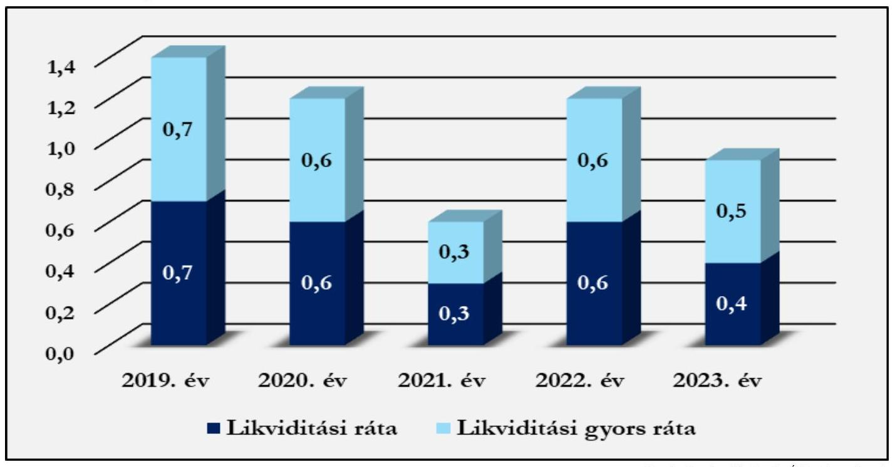

Forrás: Beszámolók alapján ÁSZ saját szerkesztés

# Jövedelmezőség 

Az eszközarányos jövedelmezőség (ROA) mutatójának értéke a 2019. évi -2,7 %-ról 2023. évben 2,7 %-ra nőtt. A saját tőke arányos jövedelmezőség mutatója (ROE) szintén kedvezően alakult, értéke a 2019. évi -5,6 %-ról 2023. évben 15,8 %-ra változott. ${ }^{8}$ Mivel a Kórház 2020-2021. és 2023. években „nyereségesen" gazdálkodott, eredménye keletkezett, a két mutató pozitív volt. A 2019. és 2022. években a Kórház gazdálkodásának eredménye veszteség volt, így mind a ROA, mind pedig a ROE mutató értéke negatív volt. A mélypont - a legmagasabb veszteség miatt - 2022. évben volt, majd a gazdasági folyamatok kedvező alakulásának hatására 2023-ban a ROA és ROE mutatók a megelőző évhez képest sokkal kedvezőbben alakultak. A ROA és ROE mutatók mozgásának trendjéből azt a következtetést lehetett levonni, hogy a Kórház 2023-ban kiegyensúlyozott, a fenntartói támogatásnak is köszönhetően fenntartható gazdálkodást folytatott. Ugyanakkor a fejlesztési beruházás megvalósulását követően a gazdálkodása fenntartásához a kapacitás kihasználtság növekedésével járó bevételeinek növekedése mellett a fix költségek növekedése miatt a Kórház nem tekinthet el a költségek folyamatos monitoringjától, tekintettel arra, hogy a NEAK finanszírozás 2023-ban az anyagjellegű és a személyi jellegű ráfordítások 62,2 %-át fedezte.

[^0]
[^0]:    ${ }^{8}$ Iparágtól függően a ROA 8-10% a ROE pedig 10-15% között jelent jó teljesítményt.

---

# 2. Pénzügyi helyzet és a kötelezettségállomány elemzése 

### 2.1. Pénzügyi helyzet, mérlegadatok elemzése

5. táblázat

A KÓRHÁZ 2019 - 2023. ÉVI MÉRLEGADATAINAK ALAKULÁSA (ADATOK E FT-BAN)

| MEGNEVEZÉS | 2019. év | 2020. év | 2021. év | 2022. év | 2023. év | ADATOK A   2019. ÉVHEZ   KÉPEST %-\&BAN |
| :--: | :--: | :--: | :--: | :--: | :--: | :--: |
| A. Befektetett eszközök | 2161667 | 3487786 | 4630749 | 5250751 | 6086949 | 281,6% |
| I. Immateriális javak | 6029 | 6029 | 4019 | 14283 | 9143 | 151,7% |
| II. Tárgyi eszközök | 2155638 | 3481758 | 4623730 | 5233468 | 6074806 | 281,8% |
| III. Befektetett pénzügyi eszközök | 0 | 0 | 3000 | 3000 | 3000 | - |
| B. Forgóeszközök | 2040300 | 3159025 | 1648958 | 1557189 | 742314 | 36,4% |
| I. Készletek | 48258 | 48258 | 59914 | 56233 | 73603 | 152,5% |
| II. Követelések | 17562 | 17120 | 199291 | 8842 | 14941 | 85,1% |
| III. Értékpapírok | 0 | 0 | 0 | 0 | 0 | - |
| IV. Pénzeszközök | 1974480 | 3093647 | 1389753 | 1492114 | 653769 | 33,1% |
| C. Aktív időbeli elhatárolások | 0 | 0 | 438 | 87338 | 85513 | - |
| Eszközök összesen | 4201967 | 6646811 | 6280145 | 6895278 | 6914776 | 164,6% |
| D. Saját tőke | 1427081 | 1694398 | 1160357 | 1089762 | 1276287 | 89,4% |
| I. Jegyzett tőke | 1011933 | 1011933 | 1011933 | 1011933 | 1011933 | 100,0% |
| II. Jegyzett, de még be nem fizetett tőke | 0 | 0 | 0 | 0 | 0 | - |
| III. Tőketartalék | 0 | 0 | 0 | 0 | 0 | - |
| IV. Eredménytartalék | 496226 | 414157 | 130848 | 148424 | 77829 | 15,7% |
| V. Lekötött tartalék | 0 | 0 | 0 | 0 | 0 | - |
| VI. Értékelési tartalék | 0 | 0 | 0 | 0 | 0 | - |
| VII. Adózott eredmény | -81079 | 268308 | 17576 | -70595 | 186525 | - |
| 1. Alaptevékenység eredménye | 0 | 0 | 0 | 0 | 0 | - |
| 2. Vállalkozási tevékenység eredménye | 0 | 0 | 0 | 0 | 0 | - |
| E. Céltartalékok | 0 | 0 | 0 | 0 | 0 | - |
| F. Kötelezettségek | 2774886 | 4952413 | 5119788 | 2521401 | 1571718 | 56,6% |
| I. Hátrasorolt kötelezettségek | 0 | 0 | 0 | 0 | 0 | - |
| II. Hosszú lejáratú kötelezettségek | 29252 | 0 | 0 | 0 | 0 | - |
| III. Rövid lejáratú kötelezettségek | 2745634 | 4952413 | 5119788 | 2521401 | 1571718 | 57,2% |
| G. Passzív időbeli elhatárolások | 0 | 0 | 0 | 3284115 | 4066771 | - |
| Források összesen | 4201967 | 6646811 | 6280145 | 6895278 | 6914776 | 164,6% |

A feladatellátás gazdasági és pénzügyi feltételeinek kedvezőtlen alakulását szemlélteti, hogy a 2019. évi 1,97 Mrd Ft-os záró pénzkészlettel szemben 2023. évben pénzeszközök záró értéke csak 0,65 Mrd Ft volt.

A Kórház mérlegfőösszege a 2019. évi 4201967 E Ft-ról 2023. évben 6914776 E Ft-ra emelkedett, a vagyonnövekedés jelentős, 64,6 % volt, ezen belül 2019-ről 2020-ra a mérlegfőösszeg dinamikusan emelkedett, 2021. évben 5,5 %-ot csökkent, majd 2022-2023. években mérsékelt növekedést mutatott.

A mérleg eszközoldalának szerkezeti összetételének változása a támogatott fejlesztések megvalósításából következett. 2019-2020 években a befektetett eszközök, azon belül is a tárgyi eszközök és a forgóeszközök, utóbbin belül is a pénzeszközök közel azonos arányt képviseltek. 2021-2023. években a pénzeszközök felhasználásának hatására a forgóeszközök aránya csökkent, és a befektetett eszközök, ezen belül is a tárgyi eszközök képviseltek meghatározó arányt a mérleg eszközoldalának szerkezeti összetételében. 2019-ben a mérleg

---

eszközoldalán a befektetett eszközök aránya 51,4 %, a forgóeszközöké 48,6 % volt. 2023. évre a mérleg eszközoldalának szerkezeti összetétele jelentősen átalakult. A befektetett eszközök aránya 88,0 %-ra nőtt, a forgóeszközöké pedig 10,7 %-ra csökkent, az aktív időbeli elhatárolások 1,3 %-ot tettek ki. A befektetett eszközök 2023. évi 6086949 E Ft-os értékének meghatározó részét a tárgyi eszközök adták, az immateriális javak értéke mindössze 9143 E Ft volt. Befektetett pénzügyi eszközzel a Kórház 2021-óta rendelkezett, mely 2023. évben is változatlanul, 3000 E Ft volt. A forgóeszközök 742314 E Ft-os összegén belül meghatározó jelentőségű a pénzeszközök 653769 E Ft-os értéke volt, mely mindössze egyharmadát tette ki a pénzeszköz 2019. évi értékének (1 974 480 E Ft). A Kórház 2021-től kezdődően élt az aktív időbeli elhatárolás lehetőségével, melynek aránya egyik évben sem volt jelentős, 2023. évben összege 85513 E Ft volt.

A mérleg forrásoldalán a saját tőke összege 2019-ről 2023-ra 10,6 %-kal csökkent (1 427 081 E Ft-ról 1 276 287 E Ft-ra). A saját tőkén belül a jegyzett tőke értéke nem változott (1 011 933 E Ft), tőketartalékkal a Kórház nem rendelkezett, az eredménytartalék (a veszteségek miatt) 2023. évre 77 829 E Ft-ra csökkent, a 2023. évi adózott eredmény (nyereség) összege pedig 186 525 E Ft volt. Az elemzett időszakban a Kórház céltartalékkal nem rendelkezett. A mérleg forrásoldalán kimutatott kötelezettségek 2023. évi 1 571 718 E Ft-os összege csak rövid lejáratú kötelezettséget tartalmazott (az összeg közel fele a 2019. évi 2 745 634 E Ft-os kötelezettségnek). A Kórháznak az elemzett időszakban hátrasorolt, és a 2019. év kivételével hosszú lejáratú kötelezettsége nem volt. A 2019-ben hosszú lejáratú kötelezettségként nyilvántartott 29 252 E Ft 2020-ban visszafizetésre került. A rövid lejáratú kötelezettségek összege az elemzett időszakon belül 2021-ben volt a legjelentősebb, 5 119 788 E Ft, mely meghatározó részben a fejlesztésekre kapott támogatási előlegeket tartalmazta. A rövid lejáratú kötelezettségek kimutatását a 6. táblázat tartalmazza.
6. táblázat

# A RÖVID LEJÁRATÚ KÖTELEZETTSÉGEK KIMUTATÁSA (ADATOK E FT-BAN) 

| MEGNEVEZÉS | 2019. ÉV |  | 2020. ÉV |  | 2021. ÉV |  | 2022. ÉV |  | 2023. ÉV |  |
| :--: | :--: | :--: | :--: | :--: | :--: | :--: | :--: | :--: | :--: | :--: |
|  | Össze-   SEN | EBBŐL   LEJÁRT   KÖTE-   LE-   ZETT-   SÉG | Össze-   SEN | EBBŐL   LEJÁRT   KÖTE-   LE-   ZETT-   SÉG | Össze-   SEN | EBBŐL   LEJÁRT   KÖTE-   LE-   ZETT-   SÉG | Össze-   SEN | EBBŐL LE-   JÁRT KÖTE-   LEZETT-   SÉG | Össze-   SEN | EBBŐL LEJÁRT KÖTE-   LEZETT-   SÉG |
| Kötelezettségek áruátvételből, szolgáltatásból | 149287 | 113946 | 20777 | 0 | 258508 | 2123 | 110778 | 64189 | 86998 | 55626 |
| Egyéb rövid lejáratú kötelezettségek | 2596348 | 0 | 4931636 | 0 | 4861280 | 0 | 2410622 | 0 | 1484720 | 0 |
| - ebből fejlesztési célú támogatások | 2524349 | 0 | 4861762 | 0 | 4861761 | 0 | 2270314 | 0 | 1311758 | 0 |
| Rövidlejáratú kötelezettségek támogatások nélkül | 72000 | 0 | 69874 | 0 | 258027 | 0 | 140308 | 0 | 173000 | 0 |
| Rövid lejáratú kötelezettségek összesen | 2745634 | 0 | 4952413 | 0 | 5119788 | 0 | 2521401 | 0 | 1571718 | 0 |

 0 | 5119788 | 0 | 2521401 | 0 | 1571718 | 0 |
| Lejárt kötelezettségek aránya a rövid lejáratú kötelezettségeken belül összesen | $4,2 \%$ |  | 0 |  | $0,04 \%$ |  | $2,6 \%$ |  | $3,5 \%$ |  |
| Lejárt kötelezettségek aránya a támogatások nélkül számított rövid lejáratú kötelezettségeken belül | $51,5 \%$ |  | 0 |  | $0,8 \%$ |  | $25,6 \%$ |  | $21,4 \%$ |  |

A táblázat adatai alapján megállapítható, hogy amíg a Kórház rövid lejáratú kötelezettségeinek összege 2022. évről 2023. évre 37,7 %-kal (949682 E Ft-tal) csökkent, a rövid lejáratú kötelezettségeken belül a lejárt határidejű tartozások összegének csökkenése attól elmaradva 13,3 % volt. A mérleg forrás oldalán a passzív időbeli elhatárolások összege megemelkedett, a 2022. évi 3284115 E Ft-tal szemben 2023. évben összegük 4066771 E Ft volt. A Kórház a fejlesztési célú támogatások felhasználásáról történő elszámolás támogatói elfogadását követően e fejlesztési támogatásokat halasztott bevételként tartotta nyilván a passzív időbeli

---

elhatárolások között, értékük 2022. évben 3284115 E Ft, 2023. évben 4057511 E Ft volt. 2023. évben a passzív időbeli elhatárolások között 9260 E Ft értékben a költségek és ráfordítások passzív időbeli elhatárolása szerepelt. A rövid lejáratú kötelezettségek az elszámolt fejlesztési célú támogatások hatására csökkentek a 2022. és a 2023. évben. Ha a rövid lejáratú kötelezettségként kimutatott fejlesztési célú támogatásoktól eltekintünk, akkor a támogatás nélkül számított rövid lejáratú kötelezettségek 2019-ről 2023-ra 17,5 %-kal nőttek, és azon belül vizsgálva a lejárt kötelezettségek aránya a 2019. évi 51,5 %-ról 21,4 %-ra csökkent 2023-ban. Ugyanakkor - ahogy a likviditási ráta alakulása is mutatta - a fejlesztések megvalósítása mellett a Kórház csak folyamatosan menedzselt, kézben tartott likviditás mellett tudta ellátni feladatait.

# 2.2. A kórházi lejárt kötelezettségállomány változásának bemutatása 

Az ÁSZ által egyidőben elemzett öt egyházi fenntartású kórházak adósságállomány összetételének, változásának és alakulásának bemutatása során a kórházi lejárt kötelezettségállomány ${ }^{9}$ havi adatai kerültek felhasználásra. Az elemzett öt kórház adósságpozicionálása két dimenzió mentén történt:

- a lejárt kötelezettségállomány havi szintű relatív változásának átlaga, valamint
- az átlagos lejárt kötelezettségállomány átlagos havi kiadási főösszeghez (költségek és ráfordítások együttes összegének havi átlaga) viszonyított aránya.
Az elemzés adósságállománynak a lejárt kötelezettségállományt tekinti. A Kórház esetében az elemzett időszak tört éves adatokat is tartalmazott (2024. január - 2024. június), a tört időszak a teljes évek adataival való arányosításával vált összemérhetővé. A relatív változások matematikai jellegű torzító és annak magyarázó tényezői külön bemutatásra kerültek.

Az első dimenzió meghatározásakor az öt kórház esetén kiszámításra került a lejárt kötelezettségállomány havi változása, majd a havi változások átlaga. Korrigáltuk az átlagot a kiugró havi változások kiszűrésével, majd az öt kórházra kiszámított korrigált átlagnak vettük az átlagát (dimenziós átlag). Ez alapján meghatározhatóvá vált, hogy az egyes kórházak az első dimenziós átlag alatt vagy felett pozicionálódnak.

A második dimenzió meghatározásakor minden évre vonatkozóan kiszámítottuk az éves kiadási főösszegből az átlagos havi kiadási főösszegeket (ezzel biztosítva az összemérhetőséget), tört év esetén arányosítást alkalmaztunk. Az átlagos havi lejárt kötelezettségállomány adatokat az átlagos havi kiadási főösszegekhez viszonyítottuk, ezáltal meghatározhatóvá váltak az éves második dimenziós értékek minden évre. Az öt kórház második dimenziós értékeit 2019-től 2023-ig évenként átlagoltuk, megkapva a második dimenziós átlagokat. Ez alapján meghatározhatóvá vált, hogy az egyes kórházak a második dimenziós átlag alatt vagy felett pozicionálódnak.

Az első, valamint a második dimenziós átlag alatti és feletti lehetséges kombinációból 2x2-es mátrixot készítettünk négy lehetséges kategóriát létrehozva (kiegyensúlyozott; mérsékelten dinamikus; agresszív dinamikus; statikus). Az egyes kórházak a számított dimenziós értékek alapján a 4 kategória valamelyikébe besorolhatóvá váltak. A kórházak adósságpozicionálását a 9. ábra mutatja be. A kategóriák által jellemzett adósságkezelési együttmozgás (volatilitás és viszonyított mérték) mellett az adósság trend változását (dinamikáját) is figyelembe kell venni, mely a dimenziós átlagok változását (pl. évről évre való százalékpontos növekedését) jelenti.

[^0]
[^0]:    ${ }^{9}$ NEAK adatközlés

---

# 2. DIMENZIÓ 

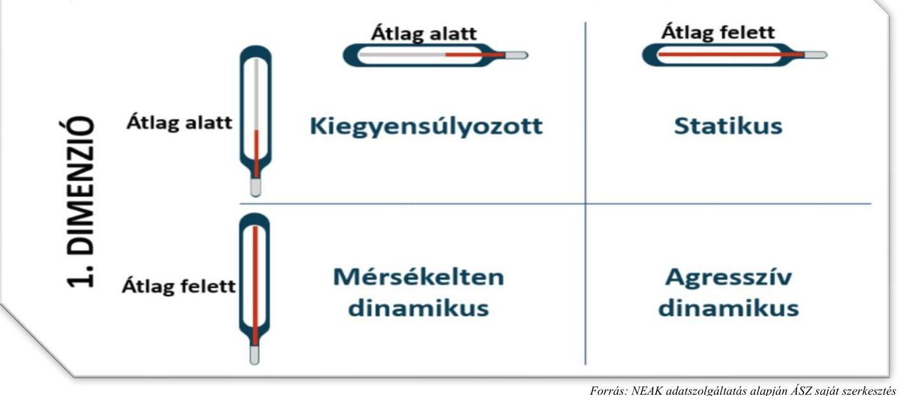

## Első dimenzió

A Kórház havi szintű lejárt kötelezettségállományának átlagos változása 2019. január és 2024. június közötti időszakban 25,0 % volt. A lejárt kötelezettségállomány havi relatív változása -100,0% (teljes adósság konszolidáció) és 430,2 % közötti értékeket vett fel, mely a vizsgált kórházak volatilitási adatai közül a legalacsonyabbnak számított. A legalacsonyabb kórházi volatilitás a kiugróan magas 430,2 %-os relatív változás kiszűrését követően 6,4 % ponttal kisebb mértékben csökkent a többi kórház kiugró értékeinek kiszűrését követő volatilitási adatokhoz képest.

A kiugró relatív változás mögött jelentős nominális kötelezettségállományi változás nem állt, így ezen kiugró érték kiszűrése volt indokolt. Ennek eredményeként a havi (korrigált) átlagos változás 18,6% volt, mely a második legmagasabb (korrigált) kórházi volatilitásnak felelt meg.

A Kórház esetén a bázis (2019. 01. havi) lejárt kötelezettségállomány 14675 E Ft volt, mely a következő hónapra 28584 E Ft-ra (94,8 %-kal) nőtt. A 2019. évet több hónapon át tartó E Ft-ra megegyező lejárt kötelezettségállomány jellemezte, mely nem életszerű, pontatlan adatszolgáltatásra utal. A 2019. márciusi hónapban a lejárt kötelezettségállomány megegyezett a februári hónap adatával, majd 48,7%-os lejárt kötelezettségállomány emelkedést követően a 2019. áprilisi 42510 E Ft-os állomány a májusi, júniusi, júliusi és augusztusi hónap adataival egyezett meg. A szeptemberi hónapra további 135,5%-os, nominálisan is jelentős állományi növekedés történt, majd az év utolsó három hónapján ismételten azonos mértékű 113946 E Ft lejárt kötelezettségállományt jelentettek le a nyilvántartások alapján.

Az év végi lejárt állomány 2020. januárjára teljes egészében konszolidálásra került. A 2020. évben ismételten emelkedni kezdett, nominálisan közel egyenletes mértékben, átlagosan 44,3 %-kal az adósságállomány, mely a decemberi hónapban, év végén szintén konszolidálásra került.

A 2021. évi bázisérték hasonlóan az előző év decemberéhez 0 E Ft volt, majd februártól júniusig nominálisan közel azonos lépésközzel (átlagosan havi 10594 E Ft-tal) növekedett az adósságállomány. A júliusi hónapban az egyenletesen növekvő adósság 68,2%-kal 105764 E Ft-ra duzzadt és novemberig 155607 E Ft-ra

---

tovább nőtt. Az év utolsó hónapján ismételten konszolidálásra került az adósságállomány jelentős része, 98,6 %-a.

A 2022. januári (bázis) hónapban (430,2%-os arányát tekintve) kiugró értékként azonosított növekedés volt tapasztalható, mely más havi változásokhoz képest 9133 E Ft adósságállomány növekményt jelentett. A 2022. év februárja és novembere közötti időszakban valamennyi hónap esetén emelkedett az adósságállomány, mely során három olyan hónap volt, amikor nagyobb arányú emelkedés volt tapasztalható (februárban 123,4%, májusban 58,7 %, júliusban 38,5 %). Ezen hónapok közül júliusban volt nominálisan a legnagyobb mértékű (28 165 E Ft) a lejárt kötelezettségállomány emelkedése. A decemberi 55,0%-os adósságkonszolidálás jelentősen kisebb mértékű volt, mint az előző években.

A 2023. évben magasabb bázis értékről, de kisebb volatilitás mellett emelkedett az adósság az első négy hónapban 109212 E Ft-ig. A májusi hónapban 42,9%-os konszolidálás történt az előző év azonos időszaki értékének szintjéig. Az év második felében ismételten átlagosan havi 14,6%-kal 139787 E Ft-ig emelkedett az adósság, melynek 60,2 %-át konszolidálták év végén.

A 2024. tört évben az adósság volatilitása az előző évhez képest növekedett, a fél év végére az előző évek júniusaihoz képest jelentősen magasabb, rekord júniusnak számító 106040 E Ft-os szinten alakult a lejárt kötelezettségállomány.
10. ábra: A Kórház adósságállomány volatilitásának alakulása a vizsgált időszakban
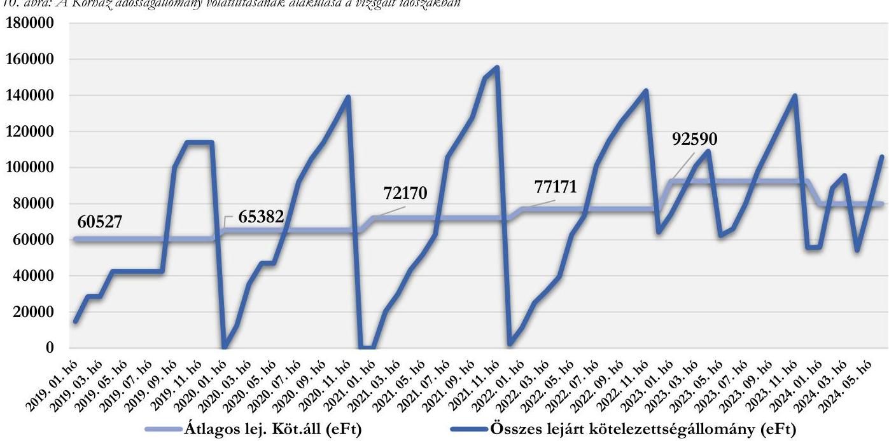

Forrás: NEAK adatszolgáltatás alapján ÁSZ saját szerkesztés
Összességében a nyilvántartások alapján az első dimenzió tekintetében a kórház esetében is jellemző az éves ciklusokban változó lejárt kötelezettségállomány, az év végi konszolidációs gyakorlat. A vizsgált időszakban hét olyan hónap, amikor az adósságállomány csökkent (adósság konszolidáció történt), melynek átlagos havi aránya 71,5 % volt. A hét alkalomból két alkalommal nem év végi konszolidáció történt, melyek átlagos konszolidációs aránya az év végihez képest kisebb volt: 43,2 %-os.

# Második dimenzió 

A második dimenzió elemzéséhez az éves lejárt kötelezettségállomány havi átlaga került kiszámításra. A 2024. évi tört (fél éves) adatok esetén az első dimenzióban feltárt ciklikus változást, illetve hasonlóságot feltételezve becsült átlagos havi adatok kerültek kiszámításra, melyek külön értékelendők.

---

Az átlagos lejárt kötelezettségállomány a 2019. évben havi szinten 60527 E Ft, a 2020. évben 65382 E Ft, a 2021. évben 72170 E Ft, a 2022. évben 77171 E Ft, a 2023. évben 92590 E Ft volt, mely más egyházi fenntartású kórházzal összehasonlítva középértéknek számít. A 2024. évi tört év adatai és ciklikus mintázat alapján becsült átlagos lejárt kötelezettségállomány 97732 E Ft, mely az első félévhez viszonyított második félév magasabb arányait és a 2023. évi utolsó egész év arányát is figyelembe véve az éves szintű átlagoknál magasabbnak felel meg, hasonlóan a 2023. évi időszakhoz.

A Kórház éves kiadási főösszege mértékét tekintve a 2019. évről a 2020. évre kis mértékben 1459633 E Ft-ról 1577937 E Ft-ra (8,1%-kal) nőtt. Az éves kiadási főösszeg 2021. évre további 24,9%-kal 1970745 E Ft-ra, majd 2022. évre újabb 47,3%-kal 2902645 E Ft-ra nőtt. 2019 és 2022 között az éves kiadási főösszeg közel megduplázódott (198,9%-kal nőtt). A 2023. évben az éves kiadási főösszeg kis mértékben, 3,0%-kal csökkent a 2022. évhez képest.
6. táblázat

A KÓRHÁZ ÉVES KIADÁSI FŐÖSSZEG ÉS ÁTLAGOS LEJÁRT KÖTELEZETTSÉGÁLLOMÁNY VÁLTOZÁSOK ÖSSZEHASONLÍTÁSA

|  IDŐSZAK | ÉVES KIADÁSI FŐÖSSZEG VÁLTOZÁSA | ÁTLAGOS LEJÁRT KÖTELEZETTSÉGÁLLOMÁNY VÁLTOZÁSA  |
| --- | --- | --- |
|  2020 | $8,1 \%$ | $8,0 \%$  |
|  2021 | $24,9 \%$ | $10,4 \%$  |
|  2022 | $47,3 \%$ | $6,9 \%$  |
|  2023 | $-3,0 \%$ | $20,0 \%$  |

Forrás: NEAK adatszolgáltatás alapján ÁSZ saját szerkesztés

A Kórház második dimenzióban való elhelyezéséhez a kiszámított átlagos lejárt kötelezettségállományt viszonyítottuk az átlagos havi kiadási főösszeghez, amely a 2019. évben 49,8%, a 2020. évben 49,7%, a 2021. évben 43,9 %, a 2022. évben 31,9 %, a 2023. évben 39,5 % volt. Ez azt jelenti, hogy a 2019. és a 2020. évben az átlagosan lejárt kötelezettségállomány elérte az átlagos havi kiadási főösszeg közel felét, ami az egyházi fenntartású kórházak tekintetében magas arány, negatív jelenség. Ez a magas arány a 2021. és 2022. évben mérséklődött. A kiválasztott további négy egyházi fenntartású kórházból három rendelkezett a 2019. és 2020. évben második dimenzióbeli aránnyal, melyek átlagosan a 2019. évben 8,6%, a 2020. évben 7,2% volt, míg a 2021-2023 közötti időszakban kiválasztott négy kórház második dimenzióbeli aránya átlagosan a 2021. évben 12,6%, a 2022. évben 15,7%, a 2023. évben 57,9% volt. Az elemzett öt
 kórház közül a kiadási főösszeghez képest jelentősen magasabb átlagos lejárt kötelezettség jellemezte a Kórházat a 2019-2022. években.

# Adósság-pozicionálás 

A Kórházat a két adósságdimenzió együttes értékelése alapján a második legmagasabb havi átlagos változás (volatilitás) mellett a legmagasabb átlagos havi kiadási főösszeghez viszonyított lejárt kötelezettségállomány jellemezte 2019-2022 között, amely statikus pozíciónak írható le. A pozíciót jellemzi, hogy az átlag alatti, de az egyházi kórházak volatilitásához hasonlítva dinamikusabb adósságot az átlagos havi kiadási főösszeghez viszonyított magas aránya tovább rontotta, mely a negatív hatások folytonos fennállásáról árulkodik. A Kórház első dimenziós értéke a torzító tényezők kiszűrését követően is a 21,3%-os átlagos dimenziós érték alatt, míg a második dimenziós érték 2019-2022. években is a dimenziós átlag felett volt. A 2023. évben a többi vizsgált évhez képest jelentősen alacsonyabb volatilitás mellett a nominálisan megemelkedett lejárt kötelezettség ellenére a havi kiadási főösszeghez viszonyított havi adósság aránya csökkent, mely a kiegyensúlyozott pozíció irányába mutatott pillanatnyi javulást. Ennek oka a 2022. évi kiadások megemelkedése és az évközi (májusi)

---

konszolidáció volt. A 2024. tört év esetén évközi (áprilisi) konszolidáció mellett a 2023. évhez képest magasabb első féléves volatilitás jellemezte a Kórházat.
11. ábra: Az adósság-pozícionálás két dimenziójának alakulása
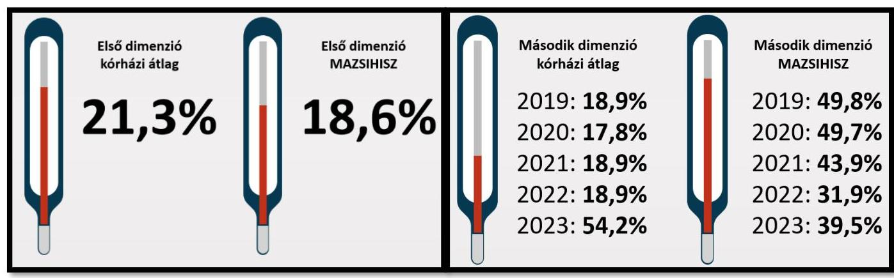

Forrás: NEAK adatszolgáltatás alapján ASZ saját szerkesztés

# 3. A kórház működésének bemutatása 

### 3.1. Input/humán erőforrás mutatók elemzése

A humán erőforrás helyzet elemzéséhez a NEAK adatai kerültek felhasználásra ${ }^{10}$, amelyek 2021 márciusától ${ }^{11}$ álltak rendelkezésre, ami meghatározta az elemzett időszakot. A főbb adatokat a 7. táblázat tartalmazza.
7. táblázat

## A HUMÁN ERŐFORRÁSHELYZET FŐBB MUTATÓSZÁMAI

| MUTATÓSZÁM NEVE | KÓRHÁZ   ADATA | AZ ELEMZETT   KÓRHÁZAK ÁT-   LÁG ADATA | ÁTLAGTÓL   VALÓ ELTÉRÉS |
| :--: | :--: | :--: | :--: |
| 2021 |  |  |  |
| Foglalkoztatott orvosok aránya az összlétszámból (havi átlag) (\%) | $12,7 \%$ | $21,5 \%$ | $-41,0 \%$ |
| Foglalkoztatott szakdolgozók aránya az összlétszámból (havi átlag)   (\%) | $87,3 \%$ | $78,5 \%$ | $11,2 \%$ |
| Alkalmazottak fluktuációja intézményi szinten (havi átlag) (\%) | $0,3 \%$ | $0,6 \%$ | $-50,0 \%$ |
| ezen belül orvosok (havi átlag) (\%) | $2,6 \%$ | $1,6 \%$ | $58,5 \%$ |
| ezen belül szakdolgozók (havi átlag) (\%) | $-0,1 \%$ | $0,4 \%$ | $-127,8 \%$ |
| 1 orvosra jutó szakdolgozó (havi átlag) (fő) | 6,9 | 4,6 | $49,1 \%$ |
| 1 szakdolgozóra jutó teljesített ápolási nap (havi átlag) | 36,3 | 24,7 | $46,8 \%$ |
| 1 orvosra jutó ágyak száma (havi átlag) | 14,2 | 7,0 | $102,3 \%$ |
| 1 szakdolgozóra jutó ágyak száma (havi átlag) | 2,1 | 1,5 | $43,8 \%$ |

[^0]
[^0]:    ${ }^{10}$ Az elemzést megelőzően humán erőforrásra vonatkozó adatkérést küldtünk az elemzett kórházak részére. A beérkezett adatok feldolgozásánál megállapítottuk, hogy azok összehasonlításra alkalmatlanok, az eltérő adatstruktúra miatt, továbbá eltérnek a NEAK által szolgáltatott adatoktól. Ennek okán kerültek a NEAK adatok felhasználásra a humán erőforrás helyzetének elemzéséhez.
    ${ }^{11}$ Az egészségügyi szolgálati jogviszonyról szóló 2020. évi C. törvény értelmében 2021. március 01-től történik adatgyűjtés az egészségügyi szolgálati jogviszonyban foglalkoztatott orvosok, szakdolgozók számát illetően. A gazdasági, műszaki területen foglalkoztatott dolgozók létszámára vonatkozóan 2023. július 1-től rendelkeznek adatokkal (erre az elemzés nem tér ki).

---

# A HUMÁN ERŐFORRÁSHELYZET FŐBB MUTATÓSZÁMAI 

2022
Foglalkoztatott orvosok aránya az összlétszámból (havi átlag) (\%)
Foglalkoztatott szakdolgozók aránya az összlétszámból (havi átlag)
(\%)
Alkalmazottak fluktuációja intézményi szinten (havi átlag) (\%)
ezen belül orvosok (havi átlag) (\%)
ezen belül szakdolgozók (havi átlag) (\%)
1 orvosra jutó szakdolgozó (havi átlag) (fő)
1 szakdolgozóra jutó teljesített ápolási nap (havi átlag)
1 orvosra jutó ágyak száma (havi átlag)
1 szakdolgozóra jutó ágyak száma (havi átlag)
2023
Foglalkoztatott orvosok aránya az összlétszámból (havi átlag) (\%)
Foglalkoztatott szakdolgozók aránya az összlétszámból (havi átlag)
(\%)
Alkalmazottak fluktuációja intézményi szinten (havi átlag) (\%)
ezen belül orvosok (havi átlag) (\%)
ezen belül szakdolgozók (havi átlag) (\%)
1 orvosra jutó szakdolgozó (havi átlag) (fő)
1 szakdolgozóra jutó teljesített ápolási nap (havi átlag)
1 orvosra jutó ágyak száma (havi átlag)
1 szakdolgozóra jutó ágyak száma (havi átlag)

| $16,8 \%$ | $24,0 \%$ | $-29,8 \%$ |
| --: | --: | --: |
| $83,2 \%$ | $76,0 \%$ | $9,4 \%$ |
| $0,9 \%$ | $0,9 \%$ | $-30,9 \%$ |
| $0,5 \%$ | $1,0 \%$ | $-54,5 \%$ |
| $0,5 \%$ | $1,0 \%$ | $-48,5 \%$ |
| $4,9$ | $3,7$ | $32,4 \%$ |
| 31,7 | 29,1 | $8,9 \%$ |
| 6,7 | 5,0 | $34,9 \%$ |
| 1,4 | 1,3 | $2,5 \%$ |

Az orvosok aránya az összlétszámhoz viszonyítva folyamatosan emelkedett, a 2021. évről a 2023. évre 4,1 százalékponttal. A szakdolgozók aránya viszont ugyanilyen mértékben csökkent, amit tükröz az 1 orvosra jutó szakdolgozói létszám csökkenése is: 2021. évi 6,9 főről 2023-ra 4,9 főre csökkent. Az 1 orvosra jutó szakdolgozók aránya - még a szakdolgozói létszám csökkenését is figyelembe véve - a többi elemzett kórházhoz képest kedvezőbbnek mondható. Az alkalmazottak fluktuációja intézményi szinten a 2022. évben volt kedvezőtlenebb a többi kórházhoz viszonyítva, viszont azt megelőzően és a 2023. évben is lényegesen alatta maradt az átlagnak, ami stabil munkaerő-megtartó helyzetre utal.

Az 1 orvosra jutó ágyak száma 2021-ben 14,2; 2022-ben 10,1; 2023-ban 6,7 volt, míg az 1 szakdolgozóra jutó ágyak száma 2,1-ről 1,9-re majd 1,4-re csökkent. Megállapítható, hogy az 1 orvosra jutó átlagos ágyszám a vizsgált évek alatt mindvégig az átlag felett volt, viszont a tendencia javult, hiszen az 2023-ra 7,5 ággyal csökkent. Szakdolgozói szinten sem volt kedvezőbb az egy főre jutó ágyak száma az átlagnál, viszont jelentős javulás ment végbe a 2023. évre, hiszen 2021-ben még 43,8%-kal, 2022-ben 33,8%-kal és 2023-ban már csak 2,5%-kal volt több az elemzett kórházak átlagához viszonyítva.

Az 1 szakdolgozóra jutó teljesített ápolási napok vonatkozásában megállapítható a szakdolgozók leterheltsége a 2023. évre csökkent a 2021. évhez képest, viszont még így is az 5 kórház átlaga felett volt.

Fontos megjegyezni, hogy az elemzés nem tért ki sem az orvosok, sem a szakdolgozók vonatkozásában a képzettségi szint szerinti megoszlásra, ami tovább árnyalná a humán erőforrás helyzet megítélését.

---

# 3.2. Output/működési-, teljesítmény-, kapacitáskihasználtság mutatók elemzése 

## A FŐBB MŰKÖDÉSI-, TELJESÍTMÉNY-, KAPACITÁSKIHASZNÁLTSÁG ADATOK

| MUTATÓSZÁM NEVE | KÓRHÁZ   ADATA | AZ ELEMZETT KÓRHÁZAK ÁTLAG ADATA | ÁTLAGTÓL VALÓ ELTÉRÉS |
| :--: | :--: | :--: | :--: |
| 2019 |  |  |  |
| Éves ágykihasználtsági mutató aktív (\%) | $91,5 \%$ | $67,2 \%$ | $36,2 \%$ |
| Éves ágykihasználtsági mutató krónikus (\%) | $81,2 \%$ | $65,2 \%$ | $24,6 \%$ |
| Egy aktív ágyra jutó elszámolt súlyszám | 22,8 | 41,6 | $-45,1 \%$ |
| Case-mix index | 0,9 | 1,1 | $-18,6 \%$ |
| Egy súlyszámra jutó gyógyszerkiadás (Ft) | 6775,7 | 182601,8 | $-96,3 \%$ |
| Egy esetszámra jutó gyógyszerkiadás - (aktív és krónikus) (Ft) | 1288,3 | 57941,0 | $-97,8 \%$ |
| Teljesített súlyszám (fekvő) | 911,5 | 5463,9 | $-83,3 \%$ |
| TÉK felett elszámolt súlyszám (degresszált súlyszám) (fekvő) | 0,0 | 56,3 | $-100,0 \%$ |
| Kihasználatlan TÉK súlyszám (fekvő) | 283,0 | 281,0 | $0,7 \%$ |
| Teljesített pont (járó) | 2394187,0 | 116013088,0 | $-97,9 \%$ |
| TÉK feletti elszámolt pont (degresszált pont) (járó) | 1039207,0 | 3027851,3 | $-65,7 \%$ |
| Kihasználatlan TÉK pont (járó) | 0,0 | 93833410,5 | $-100,0 \%$ |
| Teljesített pont (labor) | 1581015,0 | 54796183,8 | $-97,1 \%$ |
| TÉK felett teljesített, lebegő ponton elszámolt pont (labor) | 1244064,0 | 39377726,8 | $-96,8 \%$ |
| Kihasználatlan TÉK pont (labor) | 0,0 | 0,0 | $0,0 \%$ |
| Egynapos súlyszám | 0,0 | 8,0 | $-100,0 \%$ |
| Standardizált naphányados | 1,1 | 0,9 | $31,8 \%$ |
| 2020 |  |  |  |
| Éves ágykihasználtsági mutató aktív (\%) | $93,1 \%$ | $58,3 \%$ | $59,8 \%$ |
| Éves ágykihasználtsági mutató krónikus (\%) | $77,8 \%$ | $45,1 \%$ | $72,6 \%$ |
| Egy aktív ágyra jutó elszámolt súlyszám | 13,8 | 23,8 | $-42,1 \%$ |
| Case-mix index | 0,9 | 1,1 | $-20,7 \%$ |
| Egy súlyszámra jutó gyógyszerkiadás (Ft) | 6364,5 | 260193,7 | $-97,6 \%$ |
| Egy esetszámra jutó gyógyszerkiadás - (aktív és krónikus) (Ft) | 1359,4 | 195760,6 | $-99,3 \%$ |
| Teljesített súlyszám (fekvő) | 832,3 | 4170,4 | $-80,0 \%$ |
| TÉK felett elszámolt súlyszám (degresszált súlyszám) (fekvő) | 0,0 | 2,3 | $-100,0 \%$ |
| Kihasználatlan TÉK súlyszám (fekvő) | 263,0 | 1445,3 | $-81,8 \%$ |
| Teljesített pont (járó) | 1087013,0 | 89381390,0 | $-98,8 \%$ |
| TÉK feletti elszámolt pont (degresszált pont) (járó) | 0,0 | 0,0 | $0,0 \%$ |
| Kihasználatlan TÉK pont (járó) | 36274062,0 | 236127391,8 | $-84,6 \%$ |
| Teljesített pont (labor) | 1028954,0 | 42475960,0 | $-97,6 \%$ |
| TÉK felett teljesített, lebegő ponton elszámolt pont (labor) | 678933,0 | 27512234,8 | $-97,5 \%$ |
| Kihasználatlan TÉK pont (labor) | 0,0 | 0,0 | $0,0 \%$ |
| Egynapos súlyszám | 0,0 | 6,0 | $-100,0 \%$ |
| Standardizált naphányados | 1,3 | 0,9 | $37,7 \%$ |
| 2021 |  |  |  |
| Éves ágykihasználtsági mutató aktív (\%) | $92,4 \%$ | $56,4 \%$ | $63,8 \%$ |
| Éves ágykihasználtsági mutató krónikus (\%) | $66,8 \%$ | $42,2 \%$ | $58,1 \%$ |
| Egy aktív ágyra jutó elszámolt súlyszám | 14,9 | 30,5 | $-51,3 \%$ |
| Case-mix index | 0,8 | 1,0 | $-16,7 \%$ |
| Egy súlyszámra jutó gyógyszerkiadás (Ft) | 8486,7 | 212802,2 | $-96,0 \%$ |

---

# A FŐBB MŰKÖDÉSI-, TELJESÍTMÉNY-, KAPACITÁSKIHASZNÁLTSÁG ADATOK 

| MUTATÓSZÁM NEVE | KÓRHÁZ ADATA | AZ ELEMZETT KÓRHÁZAK ÁTLAG ADATA | ÁTLAGTÓL VALÓ ELTÉRÉS |
| :--: | :--: | :--: | :--: |
| Egy esetszámra jutó gyógyszerkiadás - (aktív és krónikus) (Ft) | 1640,5 | 126752,3 | $-98,7 \%$ |
| Teljesített súlyszám (fekvő) | 590,1 | 4232,4 | $-86,1 \%$ |
| TÉK felett elszámolt súlyszám (degresszált súlyszám) (fekvő) | 0,0 | 4,4 | $-100,0 \%$ |
| Kihasználatlan TÉK súlyszám (fekvő) | 602,0
 | 1986,8 | $-69,7 \%$ |
| Teljesített pont (járó) | 1078842,0 | 123521458,0 | $-99,1 \%$ |
| TÉK feletti elszámolt pont (degresszált pont) (járó) | 0,0 | 9566249,8 | $-100,0 \%$ |
| Kihasználatlan TÉK pont (járó) | 4675749,0 | 380169604,0 | $-98,8 \%$ |
| Teljesített pont (labor) | 875924,0 | 58953874,0 | $-98,5 \%$ |
| TÉK felett teljesített, lebegő ponton elszámolt pont (labor) | 518427,0 | 38986296,4 | $-98,7 \%$ |
| Kihasználatlan TÉK pont (labor) | 0,0 | 0,0 | $0,0 \%$ |
| Egynapos súlyszám | 0,0 | 12,4 | $-100,0 \%$ |
| Standardizált naphányados | 1,7 | 1,0 | $66,7 \%$ |
| 2022 |  |  |  |
| Éves ágykihasználtsági mutató aktív (\%) | $64,4 \%$ | $54,9 \%$ | $17,2 \%$ |
| Éves ágykihasználtsági mutató krónikus (\%) | $63,3 \%$ | $45,6 \%$ | $38,9 \%$ |
| Egy aktív ágyra jutó elszámolt súlyszám | 12,4 | 33,9 | $-63,4 \%$ |
| Case-mix index | 0,7 | 1,0 | $-27,1 \%$ |
| Egy súlyszámra jutó gyógyszerkiadás (Ft) | 10563,3 | 130781,7 | $-91,9 \%$ |
| Egy esetszámra jutó gyógyszerkiadás - (aktív és krónikus) (Ft) | 1924,2 | 53697,1 | $-96,4 \%$ |
| Teljesített súlyszám (fekvő) | 492,6 | 5351,3 | $-90,8 \%$ |
| TÉK felett elszámolt súlyszám (degresszált súlyszám) (fekvő) | 0,0 | 4,4 | $-100,0 \%$ |
| Kihasználatlan TÉK súlyszám (fekvő) | 692,0 | 2491,6 | $-72,2 \%$ |
| Teljesített pont (járó) | 3582427,0 | 192261988,4 | $-98,1 \%$ |
| TÉK feletti elszámolt pont (degresszált pont) (járó) | 478101,0 | 18842002,6 | $-97,5 \%$ |
| Kihasználatlan TÉK pont (járó) | 593189,0 | 284324272,6 | $-99,8 \%$ |
| Teljesített pont (labor) | 1856199,0 | 83787329,2 | $-97,8 \%$ |
| TÉK felett teljesített, lebegő ponton elszámolt pont (labor) | 1497351,0 | 56309751,0 | $-97,3 \%$ |
| Kihasználatlan TÉK pont (labor) | 0,0 | 0,0 | $0,0 \%$ |
| Egynapos súlyszám | 0,0 | 12,2 | $-100,0 \%$ |
| Standardizált naphányados | 1,5 | 1,0 | $50,0 \%$ |
| 2023 |  |  |  |
| Éves ágykihasználtsági mutató aktív (\%) | $79,4 \%$ | $61,9 \%$ | $28,2 \%$ |
| Éves ágykihasználtsági mutató krónikus (\%) | $52,9 \%$ | $54,2 \%$ | $-2,4 \%$ |
| Egy aktív ágyra jutó elszámolt súlyszám | 17,8 | 33,7 | $-47,3 \%$ |
| Case-mix index | 1,0 | 1,1 | $-9,6 \%$ |
| Egy súlyszámra jutó gyógyszerkiadás (Ft) | 10032,0 | 151655,2 | $-93,4 \%$ |
| Egy esetszámra jutó gyógyszerkiadás - (aktív és krónikus) (Ft) | 1780,7 | 69990,1 | $-97,5 \%$ |
| Teljesített súlyszám (fekvő) | 708,0 | 6665,8 | $-89,4 \%$ |
| TÉK felett elszámolt súlyszám (degresszált súlyszám) (fekvő) | 0,0 | 24,2 | $-100,0 \%$ |
| Kihasználatlan TÉK súlyszám (fekvő) | 426,0 | 753,6 | $-43,5 \%$ |
| Teljesített pont (járó) | 7029853,0 | 228596480,0 | $-96,9 \%$ |
| TÉK feletti elszámolt pont (degresszált pont) (járó) | 924146,0 | 7164085,4 | $-87,1 \%$ |
| Kihasználatlan TÉK pont (járó) | 12576,0 | 100051940,0 | $-100,0 \%$ |

---

# A FŐBB MÜKÖDÉSI-, TELJESÍTMÉNY-, KAPACITÁSKIHASZNÁLTSÁG ADATOK 

| MUTATÓsZÁM NEVE | KÓRHÁZ   ADATA | AZ ELEMZETT   KÓRHÁZÁK ÁTLAG   ADÁTA | ÁTLAGTÓL   VALÓ   ELTÉRÉS |
| :-- | :--: | :--: | :--: |
| Teljesített pont (labor) | 2450541,0 | 85735806,6 | $-97,1 \%$ |
| TÉK felett teljesített, lebegő ponton elszámolt pont (labor) | 2091693,0 | 58219064,4 | $-96,4 \%$ |
| Kihasználatlan TÉK pont (labor) | 0,0 | 0,0 | $0,0 \%$ |
| Egynapos súlyszám | 0,0 | 13,6 | $-100,0 \%$ |
| Standardizált naphányados | 1,1 | 0,9 | $24,0 \%$ |

A Kórház működő ágyainak éves átlaga a vizsgált időszakban folyamatosan csökkent. 2019. évben 312 db , 2020. évben 257,5 db, 2021. évben 240 db, 2022. évben 215 db és a 2023. évben 165 db volt. Az ágyak alakulását a 2019. év \%-ában kimutatva a 12. ábra szemlélteti. Látható, hogy a 2019. éves állapothoz képest a 2023. évre az ágyak száma majdnem a felére csökkent. A csökkenést a krónikus besorolású ágyak folyamatos csökkenése okozta, míg az aktív besorolással rendelkező ágyak száma konstans maradt.
12. ábra: A Kórház ágyszámának alakulása
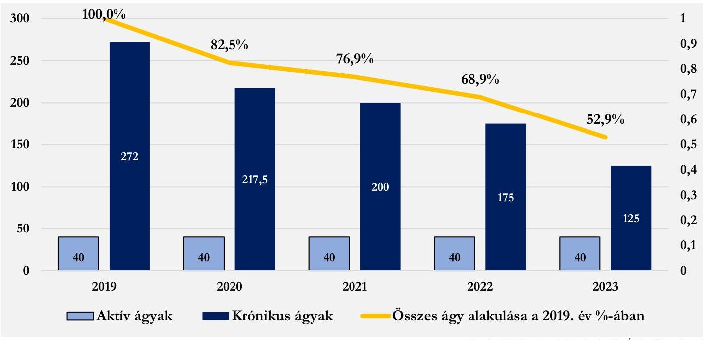

Forrás: NEAK adatszolgáltatás alapján ÁSZ saját szerkesztés
Az aktív ágyak kihasználtsága 2019. évben 91,5\%, 2020. évben 93,1\%, 2021. évben 92,4\%, 2022. évben 64,4\%, míg a 2023. évben 79,4\% volt. Fontos megjegyezni, hogy a Kórház aktív ágykihasználtsági adatai az országos átlaghoz ${ }^{12}$ viszonyítva is lényegesen jobbak voltak, a többi elemzett kórházhoz viszonyítva 2019. évben 36,2\%-kal, 2020. évben 59,8\%-kal, 2021. évben 63,8\%-kal, 2022. évben 17,2\%-kal, míg a 2023. évben 28,2\%-kal volt több. A Kórház aktív ágyainak kihasználtsági adatait a 13. ábra tartalmazza, az országos átlaghoz, valamint a többi elemzett kórház adataihoz viszonyítva.

[^0]
[^0]:    ${ }^{12}$ https://www.neak.gov.hu/felso_menu/szakmai_oldalak/publikus_forgalmi_adatok/gyogyito_megelozo_forgalmi_adat/fekvobeteg_szakellatas_stat/korhazi_agyszam

---

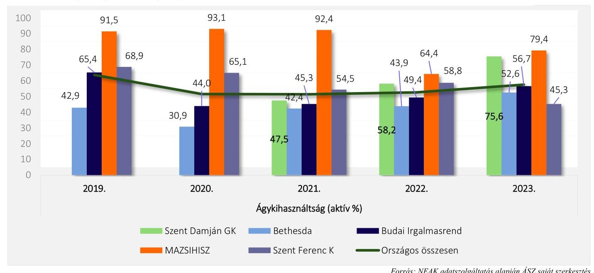

A krónikus ágyak ${ }^{13}$ kihasználtsága tekintetében folyamatos csökkenés detektálható. A csökkenő trend megfelel az országosnak a 2021 évig, viszont ezután az országos trend növekedő tendenciába fordul át, melyet a kórház krónikus ágykihasználtsága nem követ. A csökkenés tovább folytatódott melynek eredménye, hogy a 2023. évre már az 5 kórház átlagát sem érte el ( $2,4 \%$-kal maradt el az átlagtól) a kórház. A képet árnyalja, hogy a krónikus besorolású ágyak éves átlaga a 2019. évről a 2023. évre 147 db-bal csökkent. A krónikus ágykihasználtsági adatokat a 14. ábra tartalmazza az országos átlag-, illetve a többi elemzett kórház adatainak relevanciájában.
14. ábra: A Kórház krónikus ágyainak kihasználtsági adatai
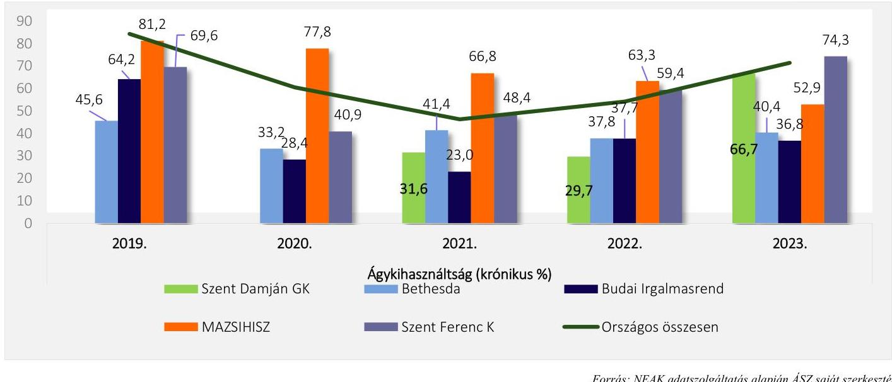

Az ágykihasználtsági adatok többi elemzett kórház adataihoz való viszonyítása alapján megállapítható, hogy az aktív ágyak kihasználtsága folyamatosan növekedett a 2021. évig, amikor elérte a $63,8 \%$-os eltérést az átlagtól. A 2022. évre az átlagtól való eltérés $17,2 \%$-ra esett vissza, viszont a 2023. évre ismét növekedés figyelhető meg. Tehát kijelenthető, hogy az aktív ágyak kihasználása folyamatosan az átlag felett teljesített. A krónikus

[^0]
[^0]:    ${ }^{13}$ Krónikus ágyak típusai: krónikus ellátás, rehabilitációs ellátás, betegápolás

---

ágyak tekintetében viszont a 2023. évre - $2,4 \%$ volt az átlagtól való eltérés. A korábbi vizsgált években a krónikus ágyak kihasználtságának az átlagtól való eltérése 24,6\% és 72,6\% között ingadozott (2019: 26,6\%; 2020: 72,6\%; 2021: 58,1\%; 2022: 38,9\%).

Az aktív fekvőbeteg szakellátás elszámolt teljesítményét vizsgálva megállapíthatjuk, hogy a Kórház a vizsgált időszakban egyik évben sem jelentett TÉK feletti súlyszámot. A Kórház bevételére negatív hatással volt az a tény, hogy a vizsgált években rendelkezett kihasználhatatlan kapacitással (2019: 283,0 súlyszám; 2020: 263,0 súlyszám; 2021: 602,0 súlyszám; 2022: 692,0 súlyszám; 2023: 426,0 súlyszám), amelyek viszont az 5 kórházi átlaga alatt voltak a 2019. évet leszámítva.
15. ábra: A Kórház kihasználatlan TÉK adatai (fekvő)
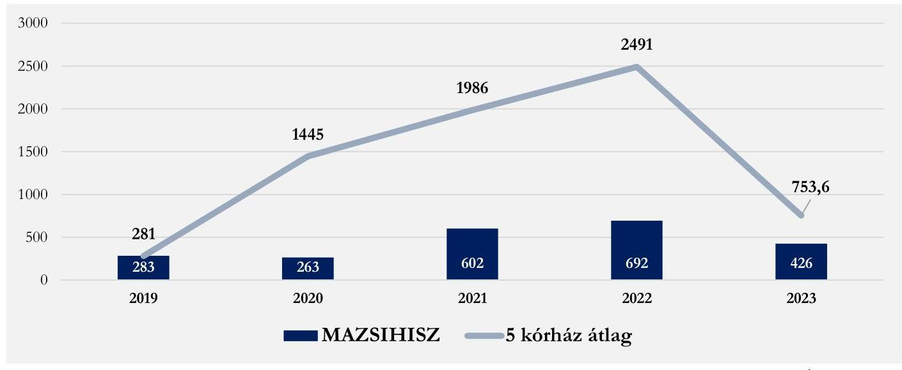

Forrás: NEAK adatszolgáltatás alapján ÁSZ saját szerkesztés
Fontos azonban megjegyezni, hogy a kihasználatlan súlyszám aránya a teljesített súlyszámhoz viszonyítva mindig $30 \%$ feletti volt, ami a 2021. és 2022. években a $100 \%$-ot is meghaladta. Az 5 kórház átlagához viszonyítva a 2020. évet leszámítva kiemelkedően magasabb volt a kihasználatlan TÉK aránya a teljesített súlyszámhoz viszonyítva.
16. ábra: A kihasználatlan TÉK aránya a teljesített súlyszámhoz viszonyítva (fekvő)
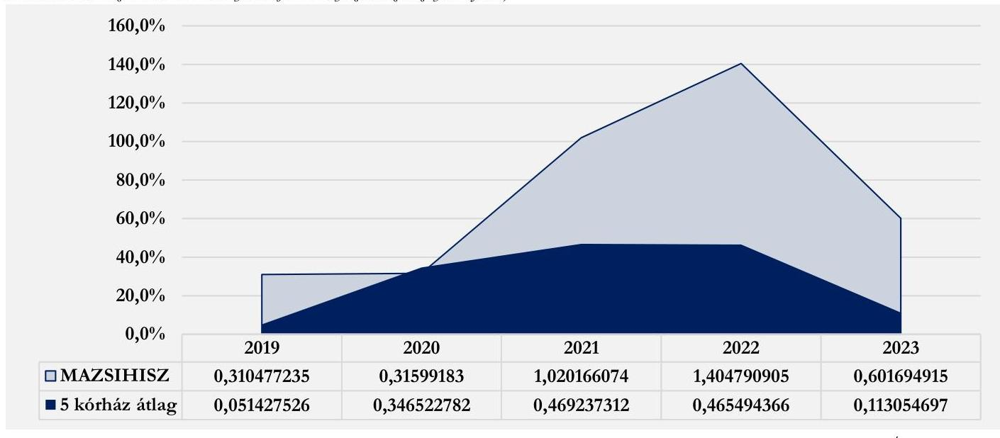

Forrás: NEAK adatszolgáltatás alapján ÁSZ saját szerkesztés

---

A case-mix index adott időszak alatt ellátott finanszírozási esetek összetételét költségigényesség szempontjából jellemző mutató, amely az elszámolt súlyszám és az elszámolt finanszírozási esetszám hányadosa. Így a Kórházra vizsgálva mutatja az ellátott kórházi ápolási esetek átlagos költségigényesség szerinti súlyosságát. Általában az átlagos kórházi eset súlyszáma 1,0. Ennek megfelelően az ennél magasabb case-mix index az átlagot meghaladó, a kisebb pedig az átlagnál alacsonyabb normatív költségigényű esetek ellátását jelzi. A Kórház esetében a case-mix index a vizsgált években mindig az 5 kórház átlaga alatt volt: 2019-ben és 2020-ban 0,9; 2021-ben 0,8; 2022-ben 0,7 és 2023-ban 1,0. Az átlaghoz képesti alulmaradást a Kórház aktív fekvőbeteg szakellátásának krónikus ellátáshoz mért alacsony aránya magyarázza. Az 1 súlyszámra jutó gyógyszerkiadás vizsgálata során megállapítható, hogy az minden évben kevesebb volt az öt kórház átlagához viszonyítva. Ha a gyógyszerkiadást esetszámra vetítjük (aktív és krónikus együtt), akkor azt állapíthatjuk meg, hogy az szintén nagy mértékben elmaradt az átlagtól: 2019-ben 97,8\%; 2020-ban: 99,3\%; 2021-ben 98,7\%; 2022-ben 96,4\%; 2023-ban $97,5 \%$-kal volt kevesebb. Mindez szintén az arányaiban kevés aktív ágyon folyó feladatellátással hozható összefüggésbe.

A standardizált naphányados $\left(\mathrm{SNH}^{28}\right)$ az átlagos ápolási idő viszonyát mutatja a normatív naphoz. Amennyiben az SNH értéke kisebb, mint 1, akkor a vizsgált intézmény átlagos ápolási ideje rövidebb, mint az adott $\mathrm{HBCS}^{29}$-khez tartozó normatív ápolási idő. A Kórház esetében az SNH értéke minden évben 1,0 felett volt, tehát az intézmény átlagos ápolási ideje hosszabb volt, mint az adott HBCS-khez tartozó normatív ápolási idő, ami költségnövelő tényezőként hathat.

A Kórház a vizsgált években nem jelentett egynapos ellátási teljesítményt.
A Kórház járóbeteg szakellátás teljesítménye vonatkozásában megállapítható, hogy 2020. és a 2021. évben egyáltalán nem volt TÉK feletti teljesítménye, ami után degresszált finanszírozási összeget fizetett volna ki a NEAK, de a többi évben is lényegesen kevesebb volt a TÉK felett elszámolt (degresszált) pontja a Kórháznak a többi elemzett kórházhoz viszonyítva (2019-ben 65,7\%-kal; 2022-ben 97,5\%-kal; 2023-ban $87,1 \%$-kal). Mindezek alapján a fekvőbeteg szakellátáshoz hasonlóan a járóbeteg szakellátás kapacitástervezése optimálisnak mutatkozott.

A laboratóriumi ellátás finanszírozására jellemző, hogy a leginkább „túlteljesített” kassza, ezt igazolja vissza, hogy a Kórház esetében nem jelent meg (és a másik 4 kórháznál sem) kihasználatlan kapacitás, viszont TÉK feletti teljesítmény annál inkább. A Kórház a TÉK feletti labor-teljesítménye után degresszált, úgynevezett lebegő ponton elszámolt forintértéket kapott, ami a volumenre tekintettel kifejezett negatív hatással bírt a gazdálkodására. A többi kórház átlagához viszonyítva 2019-ben 98,6\%-kal; 2020-ban 97,5\%-kal; 2021-ben 98,7\%-kal; 2022-ben 97,3\%-kal; 2023-ban 94,4\%-kal volt kevesebb a TÉK felett elszámolt pontja a Kórháznak, viszont a TÉK felett teljesített lebegő ponton elszámolt pont 2019-ben, 2022-ben és 2023-ban megközelítette a saját teljesített pont értékét. Fontos megjegyezni, hogy az elemzés nem tért ki a TÉK felett leadott teljesítmény összetételének vizsgálatára, ami tovább árnyalhatná a helyzet megítélését. A 17. ábra a Kórház elszámolt pontjainak alakulását illusztrálja, a TÉK feletti elszámolt pontokkal kiegészítve, a többi elemzett kórház adataival való összehasonlításban.

---

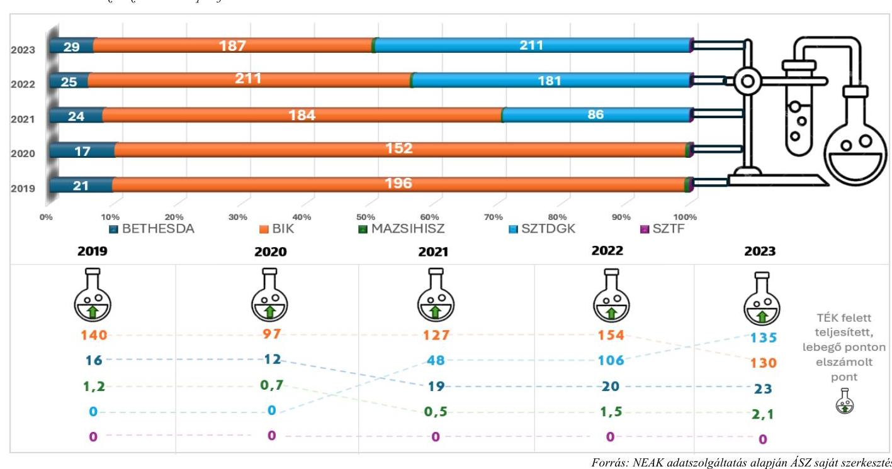

A kapacitások kihasználásának vizsgálatakor ${ }^{14}$ meg kell említenünk, hogy a Kórház műtőket nem üzemeltet,

 és nem végeznek intenzív osztályos ellátást. Az épületek egy telephelyen, egymással összekötve helyezkednek el. Két épület 1914-ben épült, egy épület 1988-ban, a legújabb épületszárny pedig 2003-ban. Az elmúlt 15 évben épületgépészeti szempontból jelentős korszerűsítés valósult meg. Az elmúlt öt évben a 2119/2017. (XII. 28.) Korm. határozat szerint a „Magyarországi Zsidó Hitközségek Szövetsége Szeretetkórházában III. progresszivitású szinten geriátriai ellátásokat és hospice ellátást nyújtó gyógyintézmény kialakítása" program kezdődött meg, melynek keretein belül több beruházás vette kezdetét. ${ }^{15}$
${ }^{14}$ Adatközlő a Kórház.
${ }^{15}$ Beruházás
2019.
o tervezési szerződés
o konyhatechnológia
o ideiglenes üzem kialakítása
o külső-belső projektirányítás kialakítása
o III. belgyógyászati osztály rekonstrukciójának megkezdése 66 ágy
o kórháztechnológiai eszközök beszerzése
o II. belgyógyászati osztály nyílt uniós közbeszerzési eljárásának megindítása
o tetemhulladék rekonstrukciója
o mosoda korszerűsítése
2020.
o III. belgyógyászati osztály átadása - 66 ágyas részleg -
o II. belgyógyászati osztály rekonstrukciójának megkezdése
o I. belgyógyászati osztály nyílt uniós közbeszerzési eljárásának előkészítése
o Oktatókórházi akkreditáció feltételeinek megvalósítása.
2021.
o II. belgyógyászati épület átadása -60 ágy,
o teljes járóbetegellátást kiszolgáló egység átadása
o Járóbetegellátó egység gép-műszer beszerzése
o I. belgyógyászati épület közbeszerzési eljárás megindítása.
o I. belgyógyászati épület beruházás megkezdése.
2022.
o Reichmann épület átadása 39 ágy
o Intézeti gyógyszertár átadása
o Központi laboratóriumi épület átadása
o I. belgyógyászati épület rekonstrukciójának megkezdése
2023.
o I. Belgyógyászati épület rekonstrukciója I. ütem befejezése

---

# 3.3. Menedzsment hatásvizsgálat 

Az elemzett időszak számos globális és magyarországi kihívást hozott, mely külső és belső tényezőként nagyban befolyásolták a betegek ellátásának minőségét és az intézmény fenntarthatóságát.

A 2021. év második felében a legjelentősebb feladatot az akkor még javában tartó COVID-19 világjárvány okozta nyomás hatékony kezelése jelentette, amire a menedzsmentnek hatékonyan és rugalmasan kellett reagálnia. Alig került ki az ország a járvány okozta intézkedések hatása alól, megkezdődött az orosz-ukrán konfliktus, mely először a kőolaj és földgáz ellátás bizonytalanságát hozta magával, majd ennek következtében az energiaárak elszabadulásához, a tervezhetőség hiányához vezetett. A 2022-2023. évi rekordinfláció a Kórház költségeinek jelentős növekedésével járt. A kihívások kezelése a menedzsment részéről nagy rugalmasságot, a gyorsan változó helyzethez való gyors alkalmazkodási képességet igényelt.

A fentiek mellett fontos megjegyezni, hogy a menedzsment növelte a teljesítményfinanszírozásból származó bevételeit, ami pozitívan hatott a Kórház pénzügyi helyzetére.

---

# MELLÉKLETEK 

## I. SZ. MELLÉKLET: ÉRTELMEZŐ SZÓTÁR

Aktív fekvőbeteg szakellátás

Ágykihasználási százalék

Ápolás átlagos tartama

Beszámoló

Beurtó CF (non cash tételekkel korrigált üzemi eredmény)

CAPEX (tőkebefektetés)

Az az ellátás, amelynek célja az egészségi állapot mielőbbi helyreállítása. Az aktív ellátás időtartama, illetve befejezése többnyire tervezhető, és az esetek többségében rövid időtartamú.
(Forrás: https://www.neak.gov.hu/felso_menu/szakmai_oldalak/gyogyito_megelozo_ellatas/szakellatas/fekvobeteg_szakellatas)
Teljesített ápolási napok száma osztva a teljesíthető ápolási napok számával és szorozva 100 -zal.
(Forrás: https://www.neak.gov.hu/felso_menu/szakmai_oldalak/publikus_for-galmi_adatok/gyogyito_megelozo_forgalmi_adat/fekvobeteg_szakellatas_stat/kor-hazi_agyszam)
A tárgyévben távozott betegek teljes ápolási idejére számított ápolási napjainak száma osztva az osztályokról a tárgyévben elbocsátott betegek számával. A teljes ápolási idő a tárgyévben távozott betegek összes ápolási napját tartalmazza, így a tárgyévben távozott, de az előző évben (években) felvett beteg esetén az ápolás előző évre (évekre) eső részét is. Az ápolás átlagos tartama nem egyezik meg a teljesített ápolási napok számának és az elbocsátott betegek számának hányadosával.
(Forrás: https://www.neak.gov.hu/felso_menu/szakmai_oldalak/publikus_for-galmi_adatok/gyogyito_megelozo_forgalmi_adat/fekvobeteg_szakellatas_stat/kor-hazi_agyszam)
A gazdálkodó működéséről, vagyoni, pénzügyi és jövedelmi helyzetéről az üzleti év könyveinek zárását követően, a Számv. tv-ben meghatározott könyvvezetéssel alátámasztott beszámolót köteles - magyar nyelven - készíteni. A beszámolónak megbízható és valós összképet kell adnia a gazdálkodó vagyonáról, annak összetételéről (eszközeiről és forrásairól), pénzügyi helyzetéről és tevékenysége eredményéről.
Az egyéb szervezet beszámolási kötelezettségének, beszámolót alátámasztó könyvvezetési kötelezettségének sajátosságait a vonatkozó külön jogszabály és a Számv. tv. alapján kormányrendelet szabályozza. A gazdálkodó, illetve a természetes személy által alapított egészségügyi, szociális, kulturális és oktatási intézmény könyvvezetési, beszámolókészítési kötelezettségét - a Számv. tv. és a vonatkozó külön jogszabály rendelkezései alapulvételével - a létrehozó szervezet állapítja meg azzal, hogy a létrehozott szervezetet - jogi személyiségének megfelelően - a Számv. tv. 3. § (1) bekezdése 2-4. pontjai szerinti szervezetek közé kell besorolnia
(Forrás: Számv. tv. 4 § (1)-(2) bek., 6. § (2)-(3) bek.)
A Bruttó Cash Flow értékét a befektetett tőke és a várható gazdasági profit jelenértékének összege adja. Várható gazdasági profit jelenértéke lehet: pozitív, negatív, nulla. Egy gazdálkodó csak annyival ér többet a befektetett tőkénél, amennyivel a befektetett tőke jövedelmezősége meghaladja a tőkeköltséget. Azt mutatja meg, hogy mekkora összegű a gazdálkodó üzemi eredménye azok a számviteli elszámolások nélkül, melyek az adott gazdálkodási évben nem jártak sem pénzkiadással sem annak az előírásával.
(Forrás: http://ecopedia.hu/brutto-cash-flow)
Azt mutatja meg, hogy a gazdálkodó az adott évben mekkora összegben pótolta a befektetett eszközeit.
A tőkebefektetés nem minősül sem hitelnek, sem pedig támogatásnak. A tőkebefektetés során az idegen tőkét a szervezet alaptőkéjének emelésével hajtják végre.
(Forrás: http://ecopedia.hu/tokebefektetes)

---

Case-mix Index (CMI)

Egyház

Egyházi jogi személy

Egynapos ellátási esetek száma

Eszközarányos jövedelmezőség (ROA)

Fekvőbeteg szakellátás

Fenntartó

Finanszírozási CF

Adott időszak alatt ellátott finanszírozási esetek összetételét költségigényesség szempontjából jellemző mutató, amely az elszámolt súlyszám és az elszámolt finanszírozási esetszám hányadosa. Az adott kórházra (osztályra, korcsoportra, területre) vizsgálva mutatja az ellátott kórházi ápolási esetek átlagos költségigényesség szerinti súlyosságát (az előfordult homogén betegségcsoportok súlyszámának az esetszámmal súlyozott átlaga). Általában az átlagos kórházi eset súlyszáma 1,000. Ennek megfelelően az ennél magasabb case-mix index az átlagot meghaladó, a kisebb pedig az átlagnál alacsonyabb normatív költségigényű esetek ellátását jelzi.
(Forrás: a 43/1999. (III. 3.) Korm. rendelet ${ }^{30}$ 2.§ 1) pont)
A vallási közösség az egyház megjelölést elnevezésében és a tevékenységére való utalás során önmeghatározása céljából - a saját hitelvei szerinti tartalommal - használhatja. (Forrás: Ehtv. 7/B §)
Egyházi jogi személy a bevett egyház, a bejegyzett egyház és a nyilvántartásba vett egyház, továbbá azok belső egyházi jogi személye.
(Forrás: Ehtv. 10. §)
Azon betegek száma, akiknek az ápolási ideje a 24 órát nem érte el, és a 9/1993 NM rendelet 9. számú mellékletében meghatározott egynapos beavatkozások valamelyikében részesültek.
(Forrás: https://www.neak.gov.hu/felso_menu/szakmai_oldalak/publikus_for-galmi_adatok/gyogyito_megelozo_forgalmi_adat/fekvobeteg_szakellatas_stat/kor-hazi_agyszam)
Azt mutatja meg, hogy 1 Ft átlagos eszköz értékre mekkora adózott eredmény jut. Eszközarányos eredmény = Adózott eredmény / Összes eszköz
(Forrás: https://ofi.oh.gov.hu)
Klinikán, kórházban, szakápolási intézményben, valamint fekvőbeteg-ellátást nyújtó országos intézetben végzett minden ellátási esemény, amelynek során a biztosítottat az intézménybe felvették, és ott legalább 24 órán keresztül - nappali kórházi ellátás esetén legalább 6 órán keresztül - tartózkodik.
(Forrás: https://www.neak.gov.hu/felso_menu/szakmai_oldalak/gyogyito_megele-ozo_ellatas/szakellatas/fekvobeteg_szakellatas)
Fenntartó:

- költségvetési szerv egészségügyi szolgáltató esetén az alapító okiratban irányító szervként megjelölt állami szerv, helyi önkormányzat vagy önkormányzati társulás,
- egyházi jogi személy vagy vallási egyesület által fenntartott egészségügyi szolgáltató esetében az egészségügyi szolgáltató alapító okiratában fenntartóként megjelölt ilyen jogalany,
- alapítványi, közalapítványi egészségügyi szolgáltató esetén az alapítvány, közalapítvány,
- a nemzeti felsőoktatásról szóló 2011. évi CCIV. törvény 97. § (1) bekezdés a) és b) pontja szerinti esetben az egészségügyi felsőoktatási intézmény,
- más szervezet esetén a tulajdonosi jogokat gyakorló szervezet.
(Forrás: Eütv. 3. § w) pont)
A finanszírozási tevékenységgel kapcsolatos, de eredményt nem módosító (hiteltörlesztés hitelfelvétel, tőkeemelés, osztalékfizetés) pénz be- és kiáramlást mutatja. Megmutatja, hogy mekkora összegű, hosszútávon a gazdálkodó rendelkezésére álló külső forrás érkezett az adott évben a gazdálkodóhoz.
(Forrás: https://www.nive.hu/Downloads/Szakkepzesi dokumentumok/Beme-neti kompetenciak meresi ertekelesi eszkozrendszerenek kialakita sa/15 1969 014 101030.pdf)

---

Free CF (nettó múködési CF - CAPEX)

Hierarchák Tanácsa

Kórház

Kórházi ágyak száma

Költségvetési támogatás

Közfeladat

Lebegő pont

Múködési CF
(a múködés tőkeszükséglete)

Nem vallási tevékenység

A szabad cashflow azt mutatja meg, hogy mennyi szabad készpénze marad a szervezetnek a befektetések fejlesztése után. Azaz megmutatja, hogy az adott évben előállított cash-ből a tőkebefektetés után mekkora további szabadon felhasználható cash áll rendelkezése. (Forrás: https://elemzeskozpont.hu)

A keleti egyházakban az ország összes részegyházának fópásztorait magába foglaló állandó testület. (Forrás: Magyar Katolikus Lexikon)
A fekvőbeteg-szakellátás körében több szakmai fócsoportba tartozó szakmában aktív és krónikus, illetve aktív vagy krónikus betegellátást nyújtó, diagnosztikai háttérrel működő egészségügyi szolgáltató esetén az adott intézmény a kórház elnevezésre jogosult. (Forrás: 60/2003. (X. 20.) ESzCsM rend. ${ }^{31}$. 5. § (1) bek. c) pont cb) alpont)
A NEAK szerződés-nyilvántartási állományában szereplő, ÁNTSZ működési engedéllyel rendelkező ágyak száma, tárgyév december 31-én. A kórházi ágyak száma az egészségügyi ellátás kapacitásáról nyújt információt, mégpedig azon betegek maximális létszámáról, akik a kórházakban ellátásban részesülhetnek.
(Forrás: https://www.neak.gov.hu/felso_menu/szakmai_oldalak/publikus_for-galmi_adatok/gyogyito_megelozo_forgalmi_adat/fekvobeteg_szakellatas_stat/kor-hazi_agyszam)
A társadalombiztosítás pénzügyi alapjai kivételével az államháztartás központi alrendszeréből ellenérték nélkül, pénzben nyújtott támogatások.
(Forrás: Áht. ${ }^{32} 1 . \S 14$. pont)
A jogszabályban meghatározott állami vagy önkormányzati feladat. A közfeladat ellátásban államháztartáson kívüli szervezet jogszabályban meghatározott rendben közreműködhet.
(Forrás: Áht. 3/A. § (1) - (2) bekezdés)
A laboratóriumi ellátás vonatkozásában a labor finanszírozás szabályának értelmében a teljesítmények teljesítményvolumen korlát feletti része lebegő pont-forint értékkel kerül elszámolásra.
(Forrás: https://www.parlament.hu/irom41/17188/adatok/fejezetek/72.pdf)
A gazdálkodó azon pénztermelése, mely közvetlenül a főtevékenységhez köthető (eredmény, értékcsökkenés, forgóeszköz beszerzés).
A működési cashflow alatt találjuk meg, hogy a szervezet mennyi pénzt képes termelni a szervezeti tevékenysége során. Ez az operating cashflow, tehát a szervezethez befolyt összes pénzt jelenti, de ide köthető a működéssel kapcsolatos költségek is. A legnagyobb tétel a működési cashflow alatt az árbevétel, de az amortizáció, értékcsökkenés is itt követhető nyomon. Megmutatja, hogy az adott évben a működés folyamata tőkét kötött le vagy szabadított fel.
(Forrás: https://www.nive.hu/Downloads/Szakkepzesi dokumentumok/Bemeneti kompetenciak meresi ertekelesi eszkozrendszerenek kialakítása/15 1969 014 101030.pdf
https://elemzeskozpont.hu)
Önmagában nem tekinthető vallási tevékenységnek a politikai és érdekérvényesítő, a pszichikai vagy parapszichikai, a gyógyászati, a gazdasági-vállalkozási, a nevelési, az oktatási, a felsőoktatási, az egészségügyi, a karitatív, a család-, gyermek- és ifjúságvédelmi, a kulturális, a sport-, az állat-, környezet- és természetvédelmi, a hitéleti tevékenységhez szükségesen túlmenő adatkezelési, valamint a szociális tevékenység.
(Forrás: Ehtv. 7/A § (3) bek.)

---

Nettó múködési CF (bruttó $\mathrm{CF}+$ múködési CF$)$

Nettó múködő tőke

Osztályokról elbocsátott betegek száma

Progresszív ellátás - Progreszszivitási szintek

Saját tőke arányos jövedelmezőség mutatója (ROE)

Standardizált naphányados (SNH)

Szolvencia ráta

A nettó cash-flow segítségével eldönthető, hogy egy szervezet mennyivel növelte vagy csökkentette likviditását, vagyis likvid eszközeit. Számítása történhet direkt vagy indirekt módon. A direkt mód szerinti meghatározáskor a be- és kiáramló vagy a nyitó és záró pénzeszközök különbségéből számítható. Indirekt módon történő számításánál a pénz összetevőnkénti forrásnövekményét csökkentjük a területenkénti felhasználás összegével.
Azt mutatja meg, hogy az adott évben a gazdálkodó a működés tőkeszükségletét is figyelembe véve mekkora összegű cash előállítására volt képes.
(Forrás: http://ecopedia.hu/netto-cash-flow)
A működő tőke a szervezet rövid távú pénzügyi helyzetét méri. Jelzi, hogy a társaság képes-e forgóeszközeivel teljesíteni az aktuális követelményeket, hogy a rövid források mennyire képesek a működés finanszírozására.
A működő tőke nagyon hasonló a likviditási mutatóhoz. A likviditási mutató a forgóeszközök és a rövid lejáratú céltartalékok aránya. A működő tőke viszont a forgóeszközök és a rövid lejáratú szolgáltatások közötti különbség.
A magas működő tőke azt jelzi, hogy a szervezet pénzügyileg stabil növekedési potenciállal rendelkezik.
Működő tőke = forgóeszközök - rövidlejáratú kötelezettségek
(Forrás: https://afakalkulator.com/econ?p=mukodotoke)
Kórházból eltávozott, továbbá ugyanazon gyógyintézet más osztályára áthelyezett és a meghalt betegek száma összesen.
(Forrás: https://www.neak.gov.hu/felso_menu/szakmai_oldalak/publikus_for-galmi_adatok/gyogyito_megelozo_forgalmi_adat/fekvobeteg_szakellatas_stat/kor-hazi_agyszam)
Az egészségügyi ellátások rendszere az eltérő egészségi állapotú egyének differenciált ellátását szolgáló, a munkamegosztás és a fokozatosság elvén
 alapuló intézményrendszerre épül, amelyben az egyén egészségi állapotának összes jellemzője együttesen határozza meg a szükséges ellátási szintet.
Az eltérő egészségi állapotú betegek differenciált ellátását a fokozatosság elvén egymásra épülő, a szakmai tevékenységeknek a szakmai tapasztalat és a technikai feltételek alapján csoportosított progresszivitási szinteken működő ellátórendszer biztosítja. A fekvőbeteg-szakellátás - az ellátáshoz szükséges eltérő személyi és tárgyi feltételek alapján szakmánként meghatározott progresszivitási szinteken (I.; II.; III.) történik.
(Forrás: az egészségügyi szolgáltatások nyújtásához szükséges szakmai minimumfeltételekről szóló 60/2003. (X. 20.) ESzCsM rendelet 9. § (1) és (4) bekezdései és az Eütv. 75. § (3) bekezdés).

Azt mutatja meg, hogy 1 Ft átlagos tőkebefektetés mekkora adózott eredményt generál. Sajáttőke-arányos jövedelem (ROE) = Adózott eredmény / Saját tőke
(Forrás: https://ofi.oh.gov.hu)
Egy intézmény, vagy osztály átlagos ápolási idejét lehet viszonyítani az adott HBCS normatív ápolási idejéhez. E két érték hányadosa adja meg a standardizált naphányadost. Amennyiben az SNH értéke kisebb, mint 1, akkor a vizsgált intézmény átlagos ápolási ideje rövidebb, mint az adott HBCS-hez tartozó normatív ápolási idő, ebben az esetben a kórház nem ápolja túl a betegeit.
(Forrás: https://www.etk.pte.hu/protected/OktatasiAnyagok/!Palyazati/EubenHasznalatosKodrendszerek_20151117_.pdf)
A szolvencia méri a szervezet képességét a fizetési kötelezettségek teljesítésére. Megmutatja, hogy a forrásokon belül mekkora a saját tőke aránya, az adósság milyen része van saját eszközökkel fedezve.
Szolvencia = Mérlegfőösszeg, azaz az összes eszköz / Összes kötelezettség
(Forrás: https://rankia.hu/vallalati-penzugyi-mutatok-eladosodottsag-szolvencia-eslikviditas/)

---

Támogatás

Teljesítménydíj

Tervezett éves keret (TÉK)

Volatilitás

Az államháztartás központi vagy önkormányzati alrendszeréből, bármilyen formában, ellenérték nélkül nyújtott juttatás.
(Forrás: Áht. 1. § 19. pont)
Az alapdíj és a teljesítmény szorzata, amely a NEAK-nak leadott teljesítményjelentéseken alapul.
(Forrás: a 43/1999. (III. 3.) Korm. rendelet 2.§ h) pont)
Önálló elszámolási tételként elszámolható, jogszabályban meghatározott szolgáltatási egységek teljesítményértékeinek mennyisége, amelyre a szakellátást nyújtó egészségügyi szolgáltató a jelen rendeletben foglalt szabályok szerint jogosult
(Forrás: az egészségügyi szolgáltatások Egészségbiztosítási Alapból történő finanszírozásának részletes szabályairól szóló 43/1999. (III. 3.) Korm. rendelet 2.§ t) pont)
Egy adat változékonysága. A kórházi lejárt kötelezettségállomány változásának bemutatásához használt kifejezés (azt vizsgálva, hogy egy bizonyos idő alatt mennyit változott az adósságállomány).
(Forrás: https://www.neak.gov.hu/pfile/file?path=/letoltheto/altfin_dok/alt-fin_virt_dok2/hirek_mappa/ONKOLOGIAI_ELLATASOK_FINANSZIRO-ZASA_1_\&inline=true)

---

II. SZ. MELLÉKLET: AZ ELLENŐRZÖTT ÉS ELLENŐRZÉST TÁMOGATÓ SZERVEZETEK JEGYZÉKE

| ELLENŐRZÖTT SZERVEZET NEVE | ELLENŐRZÖTT SZERVEZET SZÉKHELYE |
| :-- | :-- |
| Magyarországi Zsidó Hitközségek Szövetsége Szeretetkórháza | 1145 Budapest, Laky Adolf utca 42. |
| Magyarországi Zsidó Hitközségek Szövetsége | 1075 Budapest, Síp u. 12. |

# ELLENŐRZÉST TÁMOGATÓ SZERVEZETEK 

Nemzeti Egészségbiztosítási Alapkezelő
Belügyminisztérium
Miniszterelnökség

---

# III. SZ. MELLÉKLET: ELLENŐRZÉSI KRITÉRIUMOK 

## FOKUSZTERÜLET

1. Az egyház fenntartói kötelezettsége teljesítésének szabályszerűsége

## ELLENŐRZÉSI KRITÉRIUMOK

Számv. tv. 6. § (3) bek., 14. § (3), (5) és (11)-(12) bek., 161. § (1) és (4) bek., Eütv. 155. § (1) bek g) pont, Áht. 53. §
296/2013. Korm. rend. 5. § (4) bek., 7. § (2)-(4) és (6) bek., 11. §,
507/2023. Korm. rend. 2. § (2) bek.,

Számv. tv. 8. § (2)-(3) bek., 14. § (3), (5)-(7) és (11)(12) bek., 159. §, 161. § (1)-(2) és (4) bek., 162. §(1)(2) bek.,
Eütv. 155. § (1) bek a)-b) és d)-g) pont, 155. § (1a) bek. a) pont, Ehtv. 7/A. § (1) bek., 11/A. § a) pont, 296/2013. Korm. rend. 3. § (1)-(5) bek., 4. §, 5. §, 7. § (5)(6) bek., 9. § (1) bek. a) pont, 11. §, 1. és 2. melléklet Belső szabályzatok
3. A kórház beszámolási és közzétételi kötelezettsége teljesítésének szabályszerűsége az államháztartásból nem hitéleti célra nyújtott támogatások vonatkozásában

Számv. tv. 8. § (2)-(3) bek., 15. § (6) bek., 17. § (1) bek., 69. § (1) bek., 155. § (2) bek., 159. §, 162. § (1)-(2) bek., Ehtv. 19. § (3) bek.,
Info tv. 33. § (3) bek., 37. § (1) bek., 1. melléklet, 296/2013. Korm. rend. 3. § (1)-(5) bek., 5. § (1)-(4) bek., 6. § (1) bek. a)-b) pont, 9. § (1) bek. a)-b) pont, 9. § (4) bek., 10. § (2) bek., 11. §, 1.és 2. melléklet Belső szabályzatok
4. A kórház könyvvezetési kötelezettsége teljesítésének, az államháztartásból nem hitéleti célra nyújtott támogatások felhasználásának és elszámolásának szabályszerűsége

Számv. tv. 22-28. §, 69. § (1) bek., 78-81. §, 101. §, 110-114. §, 160. § (2) bek. a)-b) pont, 160. § (3a)-(3b) bek., 161/A. § (2) bek., 162. § (1)-(2) bek., 166. § (1) bek., 167. § (1) bek. a), d), h)-i) pont, 167. § (7) bek., Ehtv. 11/A. § a) pont, Ptk. 3:29. § és 3:30. §, 3:77-3:79. §, 3:397. §, 296/2013. Korm. rend. 4. §, 5. § (4) bek., 7. § (1) és (5) bek., 507/2023. Korm. rend. 1. § (1) bek., 2. § (1), (3) és (5) bek., 3. § (1) bek., 1. melléklet Belső szabályzatok
Támogatói okirat/Támogatási szerződés

---

# IV. SZ. MELLÉKLET: A KÓRHÁZ FŐBB MŰKÖDÉSI JELLEMZŐI AZ ÖSSZES ELEMZETT KÓRHÁZHOZ VISZONYÍTOTTAN 

2019. év

| $\begin{aligned} & \text { ADAT/ } \\ & \text { MUTATÓ- } \\ & \text { SZÁM } \\ & \text { TIPUSA } \end{aligned}$ | MUTATÓSZÁM/ADAT NEVE | KÓRHÁZ ADATA | AZ ELEMZETT KÓRHÁZAK ÁTLAG ADATA | $\begin{gathered} \text { ÁTLAGTÓI } \\ \text { VALÓ } \\ \text { ELTÉRÉS } \end{gathered}$ |
| :--: | :--: | :--: | :--: | :--: |
|  | NEAK bevétel aránya az összes bevételben (%) | $59,2 \%$ | $62,5 \%$ | $-5,2 \%$ |
|  | Lejárt kötelezettségállomány átlagának aránya az éves kiadási főösszeghez (%) | $49,7 \%$ | $18,9 \%$ | $163,0 \%$ |
|  | Egy esetszámra (aktív és krónikus) jutó összes bevétel (E Ft) | 287,3 | 458,9 | $-37,4 \%$ |
|  | Foglalkoztatott orvosok aránya az összlétszámból (havi átlag) (%) |  |  |  |
|  | Foglalkoztatott szakdolgozók aránya az összlétszámból (havi átlag) (%) |  |  |  |
|  | Alkalmazottak fluktuációja intézményi szinten (havi átlag) (%) |  |  |  |
|  | 1 orvosra jutó szakdolgozó (havi átlag) (fő) | 2021. év márciustól áll rendelkezésre NEAK adatszolgáltatás |  |  |
|  | 1 szakdolgozóra jutó teljesített ápolási nap (havi átlag) |  |  |  |
|  | 1 orvosra jutó ágyak száma (havi átlag) |  |  |  |
|  | 1 szakdolgozóra jutó ágyak száma (havi átlag) |  |  |  |
|  | Összes szervezeti egység (db) | 6,0 | 8,0 | $-25,0 \%$ |
|  | - ebből a kórházi osztályok progresszivitási szint szerinti besorolása: |  |  |  |
|  | I. progresszivitási szintű osztályok (db) | 3,0 | 1,5 | $100,0 \%$ |
|  | II. progresszivitási szintű osztályok (db) | 3,0 | 3,0 | $0,0 \%$ |
|  | III. progresszivitási szintű osztályok (db) | 0,0 | 3,5 | $-100,0 \%$ |
|  | Éves ágykihasználtsági mutató aktív (%) | $91,5 \%$ | $67,2 \%$ | $36,2 \%$ |
|  | Éves ágykihasználtsági mutató krónikus (%) | $81,2 \%$ | $65,2 \%$ | $24,6 \%$ |
|  | Egy aktív ágyra jutó elszámolt súlyszám | 22,8 | 41,6 | $-45,1 \%$ |
|  | Case-mix index | 0,9 | 1,1 | $-18,6 \%$ |
|  | Egy súlyszámra jutó gyógyszerkiadás (Ft) | 6775,7 | 182601,8 | $-96,3 \%$ |
|  | Egy esetszámra jutó gyógyszerkiadás - (aktív és krónikus) (Ft) | 1288,3 | 57941,0 | $-97,8 \%$ |
|  | Teljesített súlyszám (fekvő) | 911,5 | 5463,9 | $-83,3 \%$ |
|  | TÉK felett elszámolt súlyszám (degresszált súlyszám) (fekvő) | 0,0 | 56,3 | $-100,0 \%$ |
|  | Kihasználatlan TÉK súlyszám (fekvő) | 283,0 | 281,0 | $0,7 \%$ |
|  | Teljesített pont (járó) | 2394187,0 | 116013088,0 | $-97,9 \%$ |
|  | TÉK feletti elszámolt pont (degresszált pont) (járó) | 1039207,0 | 3027851,3 | $-65,7 \%$ |
|  | Kihasználatlan TÉK pont (járó) | 0,0 | 93833410,5 | $-100,0 \%$ |
|  | Teljesített pont (labor) | 1581015,0 | 54796183,8 | $-97,1 \%$ |
|  | TÉK felett teljesített, lebegő ponton elszámolt pont (labor) | 1244064,0 | 39377726,8 | $-96,8 \%$ |
|  | Kihasználatlan TÉK pont (labor) | 0,0 | 0,0 | $0,0 \%$ |
|  | Egynapos súlyszám | 0,0 | 8,0 | $-100,0 \%$ |
|  | Standardizált naphányados | 1,1 | 0,9 | $31,8 \%$ |

---

2020. év

| ADAT/   MUTATÓ-   SZÁM   TIPUSA | MUTATÓSZÁM/ADAT NEVE | KÓRHÁZ   ADATA | AZ ELEM-   ZETT KÓRHÁ-   ZAK ÁTLAG   ADATA | ÁTLASTÓ-   TÁLÓ-   ELTÉRÉS |
| :--: | :--: | :--: | :--: | :--: |
|  | NEAK bevétel aránya az összes bevételben (%) | $65,2 \%$ | $60,9 \%$ | $7,1 \%$ |
|  | Lejárt kötelezettségállomány átlagának aránya az éves kiadási főösszeghez (%) | $49,7 \%$ | $17,8 \%$ | $179,2 \%$ |
|  | Egy esetszámra (aktív és krónikus) jutó összes bevétel (E Ft) | 470,9 | 879,2 | $-46,4 \%$ |
|  | Foglalkoztatott orvosok aránya az összlétszámból (havi átlag) (%) |  |  |  |
|  | Foglalkoztatott szakdolgozók aránya az összlétszámból (havi átlag)   (%) |  |  |  |
|  | Alkalmazottak fluktuációja intézményi szinten (havi átlag) (%) | 2021. év márciustól áll rendelkezésre NEAK |  |  |
|  | 1 orvosra jutó szakdolgozó (havi átlag) (fő) | adatszolgáltatás |  |  |
|  | 1 szakdolgozóra jutó teljesített ápolási nap (havi átlag) |  |  |  |
|  | 1 orvosra jutó ágyak száma (havi átlag) |  |  |  |
|  | 1 szakdolgozóra jutó ágyak száma (havi átlag) |  |  |  |
|  | Összes szervezeti egység (db) | 6,0 | 8,0 | $-25,0 \%$ |
|  | - ebből a kórházi osztályok progresszivitási szint szerinti   besorolása: |  |  |  |
|  | I. progresszivitási szintű osztályok (db) | 3,0 | 1,5 | $100,0 \%$ |
|  | II. progresszivitási szintű osztályok (db) | 3,0 | 3,0 | $0,0 \%$ |

 | III. progresszivitási szintű osztályok (db) | 0,0 | 3,5 | $-100,0 \%$ |
|  | Éves ágykihasználtsági mutató aktív (\%) | $93,1 \%$ | $58,3 \%$ | $59,8 \%$ |
|  | Éves ágykihasználtsági mutató krónikus (\%) | $77,8 \%$ | $45,1 \%$ | $72,6 \%$ |
|  | Egy aktív ágyra jutó elszámolt súlyszám | 13,8 | 23,8 | $-42,1 \%$ |
|  | Case-mix index | 0,9 | 1,1 | $-20,7 \%$ |
|  | Egy súlyszámra jutó gyógyszerkiadás ( Ft ) | 6364,5 | 260193,7 | $-97,6 \%$ |
|  | Egy esetszámra jutó gyógyszerkiadás - (aktív és krónikus) (Ft) | 1359,4 | 195760,6 | $-99,3 \%$ |
|  | Teljesített súlyszám (fekvő) | 832,3 | 4170,4 | $-80,0 \%$ |
|  | TÉK felett elszámolt súlyszám (degresszált súlyszám) (fekvő) | 0,0 | 2,3 | $-100,0 \%$ |
|  | Kihasználatlan TÉK súlyszám (fekvő) | 263,0 | 1445,3 | $-81,8 \%$ |
|  | Teljesített pont (járó) | 1087013,0 | 89381390,0 | $-98,8 \%$ |
|  | TÉK feletti elszámolt pont (degresszált pont) (járó) | 0,0 | 0,0 | 0 |
|  | Kihasználatlan TÉK pont (járó) | 36274062,0 | 236127391,8 | $-84,6 \%$ |
|  | Teljesített pont (labor) | 1028954,0 | 42475960,0 | $-97,6 \%$ |
|  | TÉK felett teljesített, lebegő ponton elszámolt pont (labor) | 678933,0 | 27512234,8 | $-97,5 \%$ |
|  | Kihasználatlan TÉK pont (labor) | 0,0 | 0,0 | $0,0 \%$ |
|  | Egynapos súlyszám | 0,0 | 6,0 | $-100,0 \%$ |
|  | Standardizált naphányados | 1,3 | 0,9 | $37,7 \%$ |

---

2021. év

| ADAT/   MUTATÓ-   SZÁM   TIPUSA | MUTATÓSZÁM/ADAT NEVE | KÓRHÁZ   ADATA | AZ ELEM-   ZETT KÓRHÁ-   ZAKÁTLAG   ADATA | ÁTLAGTÓE   VÁLÓ   ELTÉRÉS |
| :--: | :--: | :--: | :--: | :--: |
|  | NEAK bevétel aránya az összes bevételben (\%) | $61,8 \%$ | $65,7 \%$ | $-5,9 \%$ |
|  | Lejárt kötelezettségállomány átlagának aránya az éves kiadási főöszszeghez (\%) | $43,9 \%$ | $18,8 \%$ | $133,8 \%$ |
|  | Egy esetszámra (aktív és krónikus) jutó összes bevétel (E Ft) | 646,8 | 909,6 | $-28,9 \%$ |
|  | Foglalkoztatott orvosok aránya az összlétszámból (havi átlag) (\%) | $12,7 \%$ | $21,5 \%$ | $-41,0 \%$ |
|  | Foglalkoztatott szakdolgozók aránya az összlétszámból (havi átlag) (\%) | $87,3 \%$ | $78,5 \%$ | $11,2 \%$ |
|  | Alkalmazottak fluktuációja intézményi szinten (havi átlag) (\%) | $0,3 \%$ | $0,6 \%$ | $-50,0 \%$ |
|  | 1 orvosra jutó szakdolgozó (havi átlag) (fó) | 6,9 | 4,6 | $49,1 \%$ |
|  | 1 szakdolgozóra jutó teljesített ápolási nap (havi átlag) | 36,3 | 24,7 | $46,8 \%$ |
|  | 1 orvosra jutó ágyak száma (havi átlag) | 14,2 | 7,0 | $102,3 \%$ |
|  | 1 szakdolgozóra jutó ágyak száma (havi átlag) | 2,1 | 1,5 | $43,8 \%$ |
| Szakmai profil | Összes szervezeti egység (db)   - ebből a kórházi osztályok progresszivitási szint szerinti besorolása: | 6,0 | 9,8 | $-38,8 \%$ |
|  | I. progresszivitási szintű osztályok (db) | 3,0 | 2,8 | $7,1 \%$ |
|  | II. progresszivitási szintű osztályok (db) | 3,0 | 4,0 | $-25,0 \%$ |
|  | III. progresszivitási szintű osztályok (db) | 0,0 | 3,0 | $-100,0 \%$ |
|  | Éves ágykihasználtsági mutató aktív (\%) | $92,4 \%$ | $56,4 \%$ | $63,8 \%$ |
|  | Éves ágykihasználtsági mutató krónikus (\%) | $66,8 \%$ | $42,2 \%$ | $58,1 \%$ |
|  | Egy aktív ágyra jutó elszámolt súlyszám | 14,9 | 30,5 | $-51,3 \%$ |
|  | Case-mix index | 0,8 | 1,0 | $-16,7 \%$ |
|  | Egy súlyszámra jutó gyógyszerkiadás ( Ft ) | 8486,7 | 212802,2 | $-96,0 \%$ |
|  | Egy esetszámra jutó gyógyszerkiadás - (aktív és krónikus) (Ft) | 1640,5 | 126752,3 | $-98,7 \%$ |
|  | Teljesített súlyszám (fekvő) | 590,1 | 4232,4 | $-86,1 \%$ |
|  | TÉK felett elszámolt súlyszám (degresszált súlyszám) (fekvő) | 0,0 | 4,4 | $-100,0 \%$ |
|  | Kihasználatlan TÉK súlyszám (fekvő) | 602,0 | 1986,8 | $-69,7 \%$ |
|  | Teljesített pont (járó) | 1078842,0 | 123521458,0 | $-99,1 \%$ |
|  | TÉK feletti elszámolt pont (degresszált pont) (járó) | 0,0 | 9566249,8 | $-100,0 \%$ |
|  | Kihasználatlan TÉK pont (járó) | 4675749,0 | 380169604,0 | $-98,8 \%$ |
|  | Teljesített pont (labor) | 875924,0 | 58953874,0 | $-98,5 \%$ |
|  | TÉK felett teljesített, lebegő ponton elszámolt pont (labor) | 518427,0 | 38986296,4 | $-98,7 \%$ |
|  | Kihasználatlan TÉK pont (labor) | 0,0 | 0,0 | $0,0 \%$ |
|  | Egynapos súlyszám | 0,0 | 12,4 | $-100,0 \%$ |
|  | Standardizált naphányados | 1,7 | 1,0 | $66,7 \%$ |

---

2022. év

| ADAT/   MUTATÓSZÁM   TIPUSA | MUTATÓSZÁM/ADAT NEVE | KÓRHÁZ   ADATA | AZ ELEM-   ZETT KÓR-   HAZAK ÁT-   LAG ADATA | ÁTLÁSTÓ-   HÉZ   ETTÉREZ |
| :--: | :--: | :--: | :--: | :--: |
| 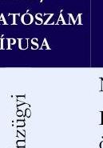 | NEAK bevétel aránya az összes bevételben (\%) |  |  |  |
|  | Lejárt kötelezettségállomány átlagának aránya az éves kiadási fő-   összeghez (\%) | $52,1 \%$ | $62,2 \%$ | $-16,3 \%$ |
|  | Egy esetszámra (aktív és krónikus) jutó összes bevétel (E Ft) | $31,9 \%$ | $18,9 \%$ | $68,4 \%$ |
|  | Foglalkoztatott orvosok aránya az összlétszámból (havi átlag) (\%) | 1039,5 | 1036,9 | $0,3 \%$ |
|  | Foglalkoztatott szakdolgozók aránya az összlétszámból (havi át-   lag) (\%) | $15,6 \%$ | $23,4 \%$ | $-33,2 \%$ |
|  | Alkalmazottak fluktuációja intézményi szinten (havi átlag) (\%) | $84,4 \%$ | $76,6 \%$ | $10,2 \%$ |
|  | 1 orvosra jutó szakdolgozó (havi átlag) (fó) | $0,5 \%$ | $0,2 \%$ | $186,7 \%$ |
|  | 1 szakdolgozóra jutó teljesített ápolási nap (havi átlag) | 5,4 | 4,0 | $37,0 \%$ |
|  | 1 orvosra jutó ágyak száma (havi átlag) | 31,5 | 23,3 | $35,4 \%$ |
|  | 1 szakdolgozóra jutó ágyak száma (havi átlag) | 10,1 | 5,7 | $76,0 \%$ |
|  | Összes szervezeti egység (db) |  |  |  |
|  |  | 1,9 | 1,4 | $33,8 \%$ |
|  | - ebből a kórházi osztályok progresszivitási szint szerinti beso-   rolása: | 7,0 | 10,0 | $-30,0 \%$ |
|  | I. progresszivitási szintű osztályok (db) | 3,0 | 2,8 | $7,1 \%$ |
|  | II. progresszivitási szintű osztályok (db) | 4,0 | 4,2 | $-4,8 \%$ |
|  | III. progresszivitási szintű osztályok (db) | 0,0 | 3,0 | $-100,0 \%$ |
|  | Éves ágykihasználtsági mutató aktív (\%) | $64,4 \%$ | $54,9 \%$ | $17,2 \%$ |
|  | Éves ágykihasználtsági mutató krónikus (\%) | $63,3 \%$ | $45,6 \%$ | $38,9 \%$ |
|  | Egy aktív ágyra jutó elszámolt súlyszám | 12,4 | 33,9 | $-63,4 \%$ |
|  | Case-mix Index | 0,7 | 1,0 | $-27,1 \%$ |
|  | Egy súlyszámra jutó gyógyszerkiadás (Ft) | 10563,3 | 130781,7 | $-91,9 \%$ |
|  | Egy esetszámra jutó gyógyszerkiadás - (aktív és krónikus) (Ft) | 1924,2 | 53697,1 | $-96,4 \%$ |
|  | Teljesített súlyszám (fekvő) | 492,6 | 5351,3 | $-90,8 \%$ |
|  | TÉK felett elszámolt súlyszám (degresszált súlyszám) (fekvő) | 0,0 | 4,4 | $-100,0 \%$ |
|  | Kihasználatlan TÉK súlyszám (fekvő) | 692,0 | 2491,6 | $-72,2 \%$ |
|  | Teljesített pont (járó) | 3582427,0 | 192261988,4 | $-98,1 \%$ |
|  | TÉK feletti elszámolt pont (degresszált pont) (járó) | 478101,0 | 18842002,6 | $-97,5 \%$ |
|  | Kihasználatlan TÉK pont (járó) | 593189,0 | 284324272,6 | $-99,8 \%$ |
|  | Teljesített pont (labor) | 1856199,0 | 83787329,2 | $-97,8 \%$ |
|  | TÉK felett teljesített, lebegő ponton elszámolt pont (labor) | 1497351,0 | 56309751,0 | $-97,3 \%$ |
|  | Kihasználatlan TÉK pont (labor) | 0,0 | 0,0 | $0,0 \%$ |
|  | Egynapos súlyszám | 0,0 | 12,2 | $-100,0 \%$ |
|  | Standardizált naphányados | 1,5 | 1,0 | $50,0 \%$ |

---

2023. év

| ADAT/   MUTATÓSZÁM   TÍPUSA | MUTATÓSZÁM/ADAT NEVE | KÖRHÁZ   ADATA | AZ ELEM-   ZETT KÖR-   HÁZAKÁT-   LAG ADATA | ÁTLAGTÓI   VADS   ELTERÉS |
| :--: | :--: | :--: | :--: | :--: |
| 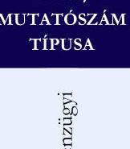 | NEAK bevétel aránya az összes bevételben (\%) | $52,3 \%$ | $64,8 \%$ | $-19,3 \%$ |
|  | Lejárt kötelezettségállomány átlagának aránya az éves kiadási főösszeghez (\%) | $39,5 \%$ | $54,2 \%$ | $-27,2 \%$ |
|  | Egy esetszámra (aktív és krónikus) jutó összes bevétel (E Ft) | 891,9 | 967,2 | $-7,8 \%$ |
|  | Foglalkoztatott orvosok aránya az összlétszámból (havi átlag) (\%) | $16,8 \%$ | $24,0 \%$ | $-29,8 \%$ |
|  | Foglalkoztatott szakdolgozók aránya az összlétszámból (havi átlag) (\%) | $83,2 \%$ | $76,0 \%$ | $9,4 \%$ |
|  | Alkalmazottak fluktuációja intézményi szinten (havi átlag) (\%) | $0,6 \%$ | $0,9 \%$ | $-30,9 \%$ |
|  | 1 orvosra jutó szakdolgozó (havi átlag) (fó) | 4,9 | 3,7 | $32,4 \%$ |
|  | 1 szakdolgozóra

 jutó teljesített ápolási nap (havi átlag) | 31,7 | 29,1 | $8,9 \%$ |
|  | 1 orvosra jutó ágyak száma (havi átlag) | 6,7 | 5,0 | $34,9 \%$ |
|  | 1 szakdolgozóra jutó ágyak száma (havi átlag) | 1,4 | 1,3 | $2,5 \%$ |
| Szakmai profil | Összes szervezeti egység (db)   - ebből a kórházi osztályok progresszivitási szint szerinti besorolása: | 6,0 | 9,8 | $-38,8 \%$ |
|  | I. progresszivitási szintű osztályok (db) | 3,0 | 2,8 | $7,1 \%$ |
|  | II. progresszivitási szintű osztályok (db) | 3,0 | 4,0 | $-25,0 \%$ |
|  | III. progresszivitási szintű osztályok (db) | 0,0 | 3,0 | $-100,0 \%$ |
|  | Éves ágykihasználtsági mutató aktív (\%) | $79,4 \%$ | $61,9 \%$ | $28,2 \%$ |
|  | Éves ágykihasználtsági mutató krónikus (\%) | $52,9 \%$ | $54,2 \%$ | $-2,4 \%$ |
|  | Egy aktív ágyra jutó elszámolt súlyszám | 17,8 | 33,7 | $-47,3 \%$ |
|  | Case-mix index | 1,0 | 1,1 | $-9,6 \%$ |
|  | Egy súlyszámra jutó gyógyszerkiadás ( Ft ) | 10032,0 | 151655,2 | $-93,4 \%$ |
|  | Egy esetszámra jutó gyógyszerkiadás - (aktív és krónikus) (Ft) | 1780,7 | 69990,1 | $-97,5 \%$ |
|  | Teljesített súlyszám (fekvő) | 708,0 | 6665,8 | $-89,4 \%$ |
|  | TÉK felett elszámolt súlyszám (degresszált súlyszám) (fekvő) | 0,0 | 24,2 | $-100,0 \%$ |
|  | Kihasználatlan TÉK súlyszám (fekvő) | 426,0 | 753,6 | $-43,5 \%$ |
|  | Teljesített pont (járó) | 7029853,0 | 228596480,0 | $-96,9 \%$ |
|  | TÉK feletti elszámolt pont (degresszált pont) (járó) | 924146,0 | 7164085,4 | $-87,1 \%$ |
|  | Kihasználatlan TÉK pont (járó) | 12576,0 | 100051940,0 | $-100,0 \%$ |
|  | Teljesített pont (labor) | 2450541,0 | 85735806,6 | $-97,1 \%$ |
|  | TÉK felett teljesített, lebegő ponton elszámolt pont (labor) | 2091693,0 | 58219064,4 | $-96,4 \%$ |
|  | Kihasználatlan TÉK pont (labor) | 0,0 | 0,0 | $0,0 \%$ |
|  | Egynapos súlyszám | 0,0 | 13,6 | $-100,0 \%$ |
|  | Standardizált naphányados | 1,1 | 0,9 | $24,0 \%$ |

---

# FÜGGELÉK: ÉSZREVÉTELEK 

A jelentéstervezetet a Számvevőszék 15 napos észrevételezésre megküldte az ellenőrzött szervezet vezetőjének az ÁSZ tv. 29. § (1) bekezdése előírásának megfelelően.

A jelentéstervezet megállapításaira Magyarországi Zsidó Hitközségek Szövetsége észrevételt nem tett, a Magyarországi Zsidó Hitközségek Szövetsége Szeretetkórháza élt észrevételezési jogával, három észrevételt tett.

Az elfogadott észrevételek alapján a Számvevőszék módosította a jelentést.
A Számvevőszék az ÁSZ tv. 29. § (3) bekezdésével összhangban a Függelékben feltünteti a megállapításokkal kapcsolatban tett, el nem fogadott észrevételt, illetve annak indokolását.

## Az észrevétellel érintett megállapítás (jelentéstervezet 16. oldalán rögzített megállapítás):

„A közzétételi kötelezettség teljesítése nem felelt meg teljeskörűen a jogszabályi előírásoknak, mivel a Kórház gondoskodott ugyan az Ehtv. 19. § (3) bekezdése, valamint az Info tv. 33. § (3) bekezdése, 37. § (1) bekezdése és 1. melléklete szerinti, az egészségügyi közfeladat ellátással összefüggő, az általános közzétételi listában szereplő szervezeti és személyi, tevékenységre és működésre vonatkozó közérdekű és közérdekből nyilvános adatok közzétételéről, de a gazdálkodási adatokat nem tette közzé."

Észrevétel: „[...] Álláspontunk szerint ugyanakkor a 296/2013. (VII. 29.) Korm. rendelet 11. §-ában foglalt rendelkezés, valamint az Info tv. 37. § (1) bekezdésben foglalt szabály nincs jogbarmóniában egymással."

Az ÁSZ álláspontja: A jogharmóniára vonatkozó észrevétel nem fogadható el, mivel a 296/2013. (VII. 29.) Korm. rendelet, az Ehtv. és az Info tv. rendelkezései egymásnak nem mondanak ellent, a rendelkezések közötti összhang, a jogharmónia biztosított, ugyanis a tárgyi jogi rendelkezések különbséget tesznek az egyházi jogi személyek között a közfeladatot ténylegesen ellátó egyházi jogi személyek és a közfeladatot ténylegesen nem ellátó egyházi jogi személyek közzétételi kötelezettségei között.

Az Ehtv. 19. § (3) bekezdése - a 296/2013. (VII. 29.) Korm. rendelet 11. §-ához képest - a közfeladatot ténylegesen ellátó egyházi jogi személy számára a közfeladat ellátásával összefüggően közzétételi többletkötelezettséget rendel, amely többletkötelezettség konkrét tartalmát az Info tv. által meghatározott közérdekű és közérdekből nyilvános adatok képezik.

[^0]
[^0]:    * 29. § (1) Az Állami Számvevőszék az ellenőrzési megállapításait megküldi az ellenőrzött szervezet vezetőjének vagy az általa megbízott személynek, és annak, akinek személyes felelősségét állapította meg.
    (2) Az ellenőrzött szervezet vezetője és a felelősként megjelölt személy az ellenőrzés megállapításaira tizenöt napon belül írásban észrevételt tehet.
    (3) Az Állami Számvevőszék az észrevételre a beérkezésétől számított harminc napon belül írásban válaszol. A figyelembe nem vett észrevételeket köteles a jelentésben feltüntetni, és megindokolni, hogy azokat miért nem fogadta el.

---

A közfeladatot ténylegesen nem ellátó egyházi jogi személy 296/2013. (VII. 29.) Korm. rendelet 11. §-a szerint a számviteli politikájában meghatározhatja a beszámolójának közzétételi módját, azonban a közfeladatot ténylegesen ellátó egyházi jogi személy az Ehtv. 19. § (3) bekezdése szerint a közfeladat ellátásával összefüggő közérdekű és közérdekből nyilvános adatainak közzétételére köteles, így a MAZSIHISZ Szeretetkórház mint közfeladatot ténylegesen ellátó egyházi jogi személy a közfeladatának ellátásával összefüggően a beszámolóját köteles közzétenni.

# A fentiek alapján a jelentéstervezet módosítása nem indokolt.

---

# RÖVIDÍTÉSEK JEGYZÉKE 

${ }^{1}$ ÁSZ tv.
${ }^{2}$ Ehtv.
${ }^{3}$ ÁSZ
${ }^{4}$ Számv. tv.
${ }^{5}$ Kórház
${ }^{6}$ MAZSIHISZ
${ }^{7}$ SZMSZ
${ }^{8}$ Alapító okirat
${ }^{9}$ NEAK
${ }^{10}$ Alapszabály
${ }^{11}$ Alaptörvény
${ }^{12}$ Számviteli politika
${ }^{13}$ 296/2013. Korm. rend.
${ }^{14}$ Számvevő és Számvizsgáló Bizottság
${ }^{15}$ MAZSIHISZ számviteli politika
${ }^{16}$ MAZSIHISZ szabályzatok
${ }^{17}$ MAZSIHISZ számlarend
${ }^{18}$ Kórház szabályzatok
${ }^{19}$ Kórház számlarend
${ }^{20}$ Eütv.
${ }^{21}$ 2006. évi CXXXII. tv.
${ }^{22}$ Info tv.
${ }^{23}$ 507/2023. Korm. rend.
${ }^{24}$ A biztosított által kezdeményezett szolgáltatás
${ }^{25}$ 664/2021. (XII. 1.) Korm. rendelet
2011. évi LXVI. törvény az Állami Számvevőszékről
2011. évi CCVI. törvény a lelkiismereti és vallásszabadságról, valamint az egyházak, vallási felekezetek és vallási közösségek jogállásáról (Hatályos: 2012. 01. 01-étől)
Állami Számvevőszék
2000. évi C. törvény a számvitelről (Hatályos:2001. 01. 01-étől)

Magyarországi Zsidó Hitközségek Szövetsége Szeretetkórháza
Magyarországi Zsidó Hitközségek Szövetsége
MAZSIHISZ Szeretetkórház Szervezeti és Működési Szabályzata (Hatályos: 2022. 12. 21-étől)

Magyarországi Zsidó Hitközségek Szövetsége Szeretetkórháza Alapító okirata (Hatályos: 2010. 07. 01-jétől)
Nemzeti Egészségbiztosítási Alapkezelő
Magyarországi Zsidó Hitközségek Szövetsége Alapszabálya (Hatályos: 2020. 02. 11-jétől)

Magyarország Alaptörvénye (2011. április 25.)
MAZSIHISZ Szeretetkórháza Számviteli politikája (Hatályos: 2022. 09. 01-jétől)
296/2013. (VII. 29.) Korm. rendelet az egyházi jogi személyek beszámolókészítési és könyvvezetési kötelezettségének sajátosságairól (Hatályos: 2014. 01. 08-ától)
Magyarországi Zsidó Hitközségek Szövetsége Számvevő és számvizsgáló Bizottsága
Magyarországi Zsidó Hitközségek Szövetsége Számviteli politikája (Hatályos: 2020. 01. 01-jétől)

MAZSIHISZ leltározási szabályzata (Hatályos: 2014. 12. 15-étől), MAZSIHISZ értékelési szabályzata (Hatályos: 2020. 01. 01-jétől), MAZSIHISZ pénzkezelési szabályzata (Hatályos: 2014. 12. 15-étől)
MAZSIHISZ számlarendje a MAZSIHISZ számviteli politikájával egységes szerkezetben került kiadásra (Hatályos: 2020. 01. 01-jétől)
MAZSIHISZ Szeretetkórháza leltározási szabályzata (Hatályos: 2022. 09. 01-jétől), MAZSIHISZ Szeretetkórháza értékelési szabályzata (Hatályos: 2022. 09. 01-jétől), MAZSIHISZ Szeretetkórháza pénzkezelési szabályzata (Hatályos: 2022. 09. 01-jétől)
MAZSIHISZ Szeretetkórháza számlarendje (Hatályos: 2024. 05. 01-jétől)
1997. évi CLIV. törvény az egészségügyről (Hatályos: 1998. 07. 01-jétől)
2006. évi CXXXII. törvény az egészségügyi ellátórendszer fejlesztéséről (Hatályos: 2007. 01. 01-jétől)
2011. évi CXII. törvény az információs önrendelkezési jogról és az információszabadságról (Hatályos: 2011. 07. 27-étől)
507/2023. (XI. 17.) Korm. rendelet az egészségügyi fekvőbeteg-szakellátást nyújtó közfinanszírozott szolgáltatók gazdálkodását segítő intézkedésekről
A kötelező egészségbiztosítás ellátásairól szóló 1997. évi LXXX. törvény 23/A. § szerint a biztosított kiegészítő térítési díj mellett jogosult az egészségügyi ellátás keretében saját kezdeményezésére igénybe vett egyéb kényelmi szolgáltatásokra, és amennyiben állapota indokolja, az e feladatra finanszírozott szolgáltatónál ápolás céljából történő elhelyezésre és ápolásra, ideértve a szükséges gyógyszereket és az étkezést is.
az egészségügyi szolgálati jogviszonyban álló személyek szolgálati elismerésével kapcsolatos egyes intézkedésekről

---

| ${ }^{26} \mathrm{CF}$ | Cash flow |
| :--: | :--: |
| ${ }^{27}$ CAPEX | Capital expenditure (tőkebefektetés) |
| ${ }^{28} \mathrm{SNH}$ | Standardizált naphányados |
| ${ }^{29} \mathrm{HBCS}$ | Homogén Betegség Csoport |
| ${ }^{30}$ 43/1999. (III. 3.) Korm. rend. | 43/1999. (III. 3.) Korm. rendelet az egészségügyi szolgáltatások Egészségbiztosítási Alaphól történő finanszírozásának részletes szabályairól (Hatályos: 1999. 03. 08 -ától) |
| ${ }^{31}$ 60/2003. (X. 20.) ESzCsM rend. | 60/2003. (X. 20.) ESzCsM rendelet az egészségügyi szolgáltatások nyújtásához szükséges szakmai minimumfeltételekről (Hatályos: 2003. 11. 04-étől) |
| ${ }^{32}$ Áht. | 2011. évi CXCV. törvény az államháztartásról (Hatályos: 2011. 12. 31-étől) |
| ${ }^{33} \mathrm{Ptk}$. | 2013. évi V. törvény a Polgári Törvénykönyvről (Hatályos: 2014. 03. 15-étől) |

---

1052 Budapest, Apáczai Csere János u. 10. | 1364 Budapest 4., Pf. 54
www.asz.hu | szamvevoszek@asz.hu
telefon: +36 14849100

