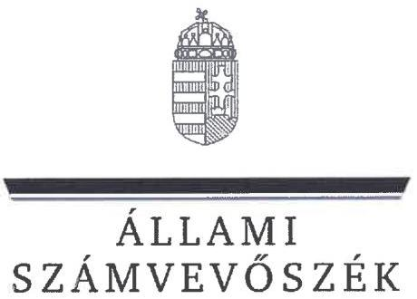
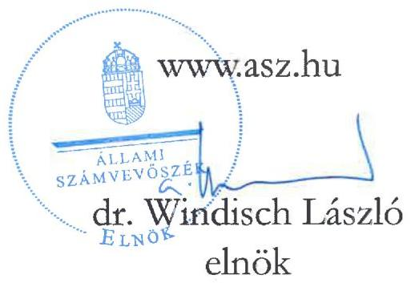
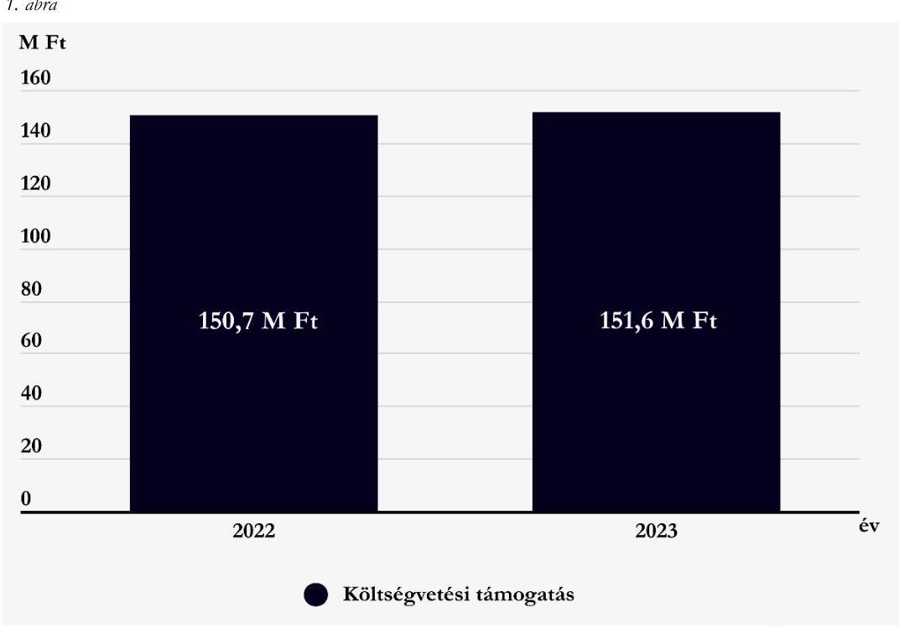
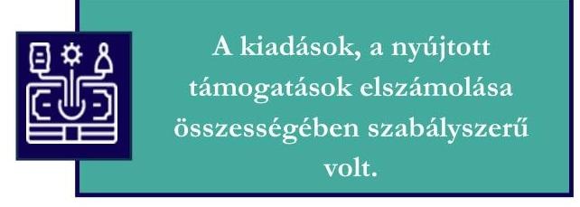
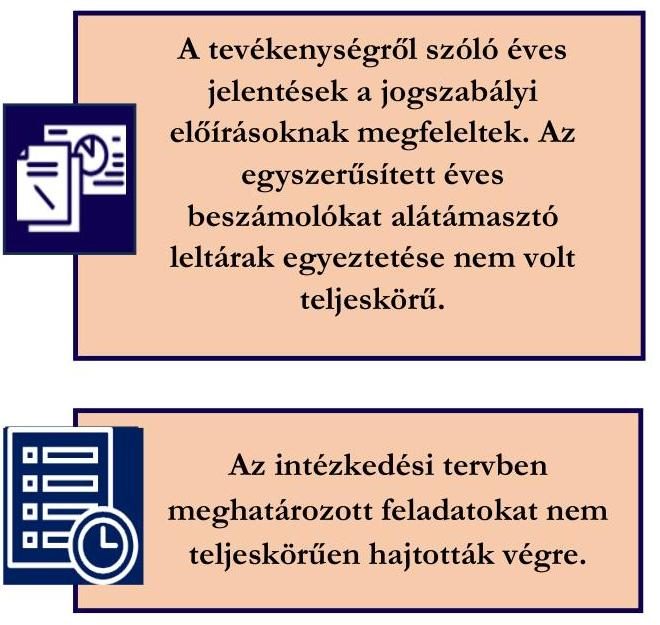

# JELENTÉS 

A költségvetési támogatásban részesülő pártalapítványok 2022-2023. évi gazdálkodása törvényességének ellenőrzése

Barankovics István Alapítvány

2025.

---

ÁLLAMI
SZÁMVEVŐSZÉK

# JELENTÉS 

## A költségvetési támogatásban részesülő pártalapítványok 2022-2023. évi gazdálkodása törvényességének ellenőrzése

Barankovics István Alapítvány

2025.

25081

---

# ELLENŐRZÉSI IGAZGATÓSÁG: 

## ELLENŐRZÉSI IGAZGATÓSÁG V.

## ELLENŐRZÉSI IGAZGATÓ:

KLINGA LÁSZLÓ ellenőrzési igazgató

## ELLENŐRZÉSVEZETŐ:

KAKAS SÁNDOR igazgatósági tanácsadó, ellenőrzésvezető

## Jelenéseink az interneten a www.asz.hu címen olvashatók.

IKTATÓSZÁM: EL-4125-002/2025
TÉMASORSZÁM: 7.
ELLENŐRZÉS-AZONOSÍTÓ SZÁM: V1119

---

# TARTALOMJEGYZÉK 

- AZ ELLENŐRZÉS ALAPADATAI ..... 5
- AZ ELLENŐRZÖTT SZERVEZET ..... 8
- ÖSSZEFOGLALÁS ..... 9
- AZ ELLENŐRZÉS FÓKUSZTERÜLETEI ..... 11
- MEGÁLLAPÍTÁSOK ..... 12
- JAVASLATOK ..... 18
- MELLÉKLETEK ..... 19
I. sz. melléklet: Értelmező szótár ..... 19
II. sz. melléklet: Ellenőrzési kritériumok ..... 20
- FÜGGELÉK: ÉSZREVÉTELEK ..... 22
- RÖVIDÍTÉSEK JEGYZÉKE ..... 25

---

.

---

# AZ ELLENŐRZÉS ALAPADATAI 

## AZ ELLENŐRZÉS CÉLJA

Az ellenőrzés célja annak értékelése volt, hogy a Pártalapítvány ${ }^{1}$ törvényesen gazdálkodott-e; az éves számviteli beszámolók és a Pártalapítvány tevékenységéről szóló éves jelentések a jogszabályi előírásoknak megfeleltek-e; a könyvvezetés és gazdálkodás során a vonatkozó jogszabályi rendelkezéseket és belső előírásokat betartották-e. Az ellenőrzés célja továbbá annak értékelése volt, hogy a Pártalapítvány legutóbbi ellenőrzése eredményeként készült számvevői jelentésben foglalt megállapításokkal összhangban készített intézkedési tervben meghatározott feladatokat a Pártalapítvány végrehajtotta-e.

## AZ ELLENŐRZÉS TÍPUSA

Törvényességi ellenőrzés

## AZ ELLENŐRZÖTT IDŐSZAK

2022-2023. évek
Az utóellenőrzés tekintetében az utóellenőrzés alapját képező 23017. számú ÁSZ ${ }^{2}$ jelentés ${ }^{3}$ közzétételének napjától (2023.04.25.) az ellenőrzésről szóló adatszolgáltatásra felhívó levél keltének napjáig terjedő időszak.

## AZ ELLENŐRZÉS TÁRGYA

Az ellenőrzés tárgyát képezte a Pártalapítvány gazdálkodása, a könyvvezetés szabályozása és gyakorlata szabályszerűsége, az éves számviteli beszámolókra és a Pártalapítvány tevékenységéről szóló éves jelentésekre vonatkozó kötelezettség teljesítése, valamint a gazdálkodáshoz kapcsolódó ellenőrzés javaslatainak hasznosítására irányuló tevékenység.

A 23017. számú ÁSZ jelentésben foglalt megállapításokhoz kapcsolódó - a Pártalapítvány által készített - intézkedési tervben foglaltak végrehajtásának ellenőrzése.

Az ellenőrzés kiterjed minden olyan körülményre és adatra, amely az ÁSZ jogszabályban meghatározott feladatainak teljesítéséhez, valamint az ellenőrzési program végrehajtása során felmerülő újabb összefüggések feltárásához szükséges volt.

## AZ ELLENŐRZÉS JOGALAPJA

Az ellenőrzés jogalapját az ÁSZ tv. ${ }^{4}$ 1. § (3) bekezdése, 5. § (3) bekezdése, 33. § (7) bekezdése, valamint a Pmtv. ${ }^{5}$ 4. § (2) és (4) bekezdéseinek előírásai képezték.

---

# AZ ELLENŐRZÉS MÓDSZERE 

Az ellenőrzés az ellenőrzött időszakban hatályos jogszabályok, az ellenőrzés szakmai szabályai, a jelen ellenőrzésre irányadó ÁSZ módszertanok, az ellenőrzési programban foglalt értékelési szempontok szerint került végrehajtásra.

Az ellenőrzési kérdések megválaszolásához szükséges bizonyítékok megszerzése az ellenőrzött által rendelkezésre bocsátott dokumentumokra, adatokra alapozva kérdésfeltevés (információkérés), valamint mintavételezés, továbbá helyszíni interjú útján történt. Az ellenőrzési bizonyítékként felhasználható adatforrások közé tartoztak egyrészt az ellenőrzési programban felsorolt adatforrások, másrészt minden az ellenőrzés folyamán feltárt, az ellenőrzés szempontjából információt tartalmazó dokumentum.

Az ellenőrzés lefolytatásához az ellenőrzött szervezet tanúsítvány kitöltésével és az ÁSZ által kért dokumentumok, adatok, információk megküldésével és az ellenőrzés során szolgáltatott adatokat.

A Pártalapítvány kiadásai, ráfordításai elszámolásának szabályszerűségét (2. fókuszterület), a Pártalapítvány által nyújtott támogatások elszámolásának szabályszerűségét (2. fókuszterület), valamint a mérlegtételek besorolásának, év végi értékelésének, azok leltárral való alátámasztottságának szabályszerűségét (3. fókuszterület), mintavételi eljárással kiválasztott tételek alapján ellenőrizte az ÁSZ.

A 2. fókuszterületen az egyes vizsgálandó részterületek ellenőrzése részterületenként 30 elemű minta értékelésével, mintavételes, 30 db -ot meg nem haladó tételszám esetében tételes ellenőrzéssel történt. A kiadások esetében lényegességi szempontok alapján az ÁSZ további tételeket is értékelt, amelyek a kivetítésbe nem tartoztak bele. Az ÁSZ a 2. fókuszterületnél, a kiadások vonatkozásában 30-30 tételt ellenőrzött, a minták értékelése alapján statisztikai kivetítést alkalmazott, további lényegességi szempontok alapján 2022. évben hat db, 2023. évben öt db kiválasztott tételt ellenőrzött. Az ÁSZ a 2. fókuszterületnél a Pártalapítvány által nyújtott támogatások vonatkozásában 30-30 tételt ellenőrzött, a minták értékelése alapján statisztikai kivetítést alkalmazott. Az ÁSZ a 3. fókuszterületnél, a mérlegtételek vonatkozásában 30-30 tételt ellenőrzött, a tények feltárása és azok összegzése során a megállapítások az ellenőrzött tételekre vonatkozóan kerültek megfogalmazásra.

A vizsgált terület „szabályszerű" minősítést kapott, ha a minta ellenőrzésének eredménye alapján 95%-os bizonyossággal a teljes sokaságban az átlagos hibaarány nem haladta meg a 10%-ot, „nem szabályszerű", ha nagyobb volt, mint 10%. Amennyiben a sokaság elemszáma nem haladta meg az előírt minta elemszámot, akkor a sokaság valamennyi elemének tételes ellenőrzésére került sor.

A Pártalapítvány bevételei elszámolása szabályszerűségét teljeskörűen ellenőrizte az ÁSZ.
Az utóellenőrzés megállapításai az ÁSZ rendelkezésére álló dokumentumok, valamint az ÁSZ adatbekérése szerint, az ellenőrzött szervezet által rendelkezésre bocsátott dokumentumok, adatok alapján kerültek megfogalmazásra. Az ÁSZ a 2022. évben a Pártalapítvány 2020-2021. évi gazdálkodását ellenőrizte, megállapításait a 23017. számú jelentésben tette közzé. Az ellenőrzés esetében a 23017. számú ÁSZ jelentés alapján a Pártalapítvány által készített intézkedési tervekben előírt feladatok, annak végrehajthatósága, illetve végrehajtása szempontjából az alábbiak szerint kerültek értékelésre:

- „határidőben végrehajtott" a feladat, ha a teljesítés dokumentáltan, az intézkedési tervben előírt határidőben és tartalommal megtörtént;
- „határidőn túl végrehajtott" a feladat, ha annak teljesítése az intézkedési tervben meghatározott módon, de az abban előírt határidőn túl történt meg;

---

- „nem végrehajtott" a feladat, ha a végrehajtás nem történt meg, vagy amennyiben a teljesítést/végrehajtást nem dokumentálták, dokumentumokkal nem tudják igazolni annak teljesítését;
- „oka fogyottá vált" a feladat, ha végrehajtására - meghatározott esemény bekövetkezése, továbbá külső körülmény, a működést érintő feltétel változása miatt - már nincs szükség, illetve lehetőség, és egyértelműen megállapítható, hogy az intézkedést szükségessé tevő körülmény a jövőben nem fordulhat elő;
- „nem időszerű" az a feladat, amelynek ellenőrzési időszakon belüli végrehajtására azért nem került (kerülhetett) sor, mert az intézkedés alapjául szolgáló esemény nem következett be, de annak jövőbeni előfordulása lehetséges, a végrehajtása nem volt esedékes, vagy a végrehajtás határideje még nem járt le.
A gazdálkodás hibáinak kijavítására irányuló javaslatok kidolgozásakor a hatályos jogszabályok voltak az irányadóak.

---

# AZ ELLENŐRZÖTT SZERVEZET 

## BARANKOVICS ISTVÁN ALAPÍTVÁNY

A Pártalapítványt 2006. június 10-én 0,7 M Ft induló vagyonnal hozta létre a Kereszténydemokrata Néppárt.

A Pártalapítvány alapító okirat ${ }^{6}$ szerinti célja: „az európai kereszténydemokrata és keresztényszociális eszme megismertetése, a nemzeti elkötelezettség és a kereszténydemokrata eszmekör jegyében az alapító szándékával és a közjó szolgálatával összhangban a politikai kultúra fejlesztése érdekében tudományos, ismeretterjesztő, kutatási és oktatási tevékenységet segítse elő".

A Pártalapítvány legfőbb, általános ügydöntő, ügyintéző, képviselő és kezelő szerve a hét tagból álló Kuratórium ${ }^{7}$, amely elnökből, alelnökből és további tagokból állt. Az ellenőrzött időszakban a Kuratórium tagjainak személyében nem történt változás. A Pártalapítvány képviseletét a Kuratórium elnöke akadályoztatása esetén az alelnök látta el, képviseleti joga gyakorlásának módja önálló volt. Az ellenőrzött időszakban a Pártalapítvány működését és gazdálkodását három tagból álló Felügyelőbizottság ${ }^{8}$ ellenőrizte.

A Pártalapítvány az ellenőrzött időszakban gazdasági-vállalkozási tevékenységet nem végzett.
A Pártalapítvány jogszabályi előírás alapján könyvvizsgálatra nem volt kötelezett, a 2022. évi és 2023. évi egyszerűsített éves beszámolóját független könyvvizsgáló nem vizsgálta felül.

A Pártalapítvány célszerinti tevékenységének ellátásához az ellenőrzött időszakban kizárólag költségvetési támogatásban részesült, egyéb támogatást, adományt az alapító párttól ${ }^{9}$, egyéb szervezettől, vagy magánszemélytől nem kapott. A Pártalapítvány 2022. és 2023. évben kapott költségvetési támogatásának évenkénti alakulását az 1. ábra mutatja be.

1. ábra

Forrás: A Pártalapítvány 2022. és 2023. évi tevékenységéről szóló éves jelentései alapján ÁSZ saját szerkesztés

---

# ÖSSZEFOGLALÁS 

Az ÁSZ ellenőrzése a Párttv. ${ }^{10}$ alapján a politikai kultúra fejlesztése érdekében tudományos, ismeretterjesztő, kutatási, oktatási tevékenység folytatása céljából, a Ptk. ${ }^{11}$ szerinti alapító okiraton alapuló bírósági nyilvántartásba vétellel létrejött Pártalapítvány gazdálkodására terjedt ki. A pártalapítványok törvényes gazdálkodásának (könyvvezetés, beszámolás, jelentés készítés) szabályait a Pmtv.-n túl, a Számv. tv. ${ }^{12}$ és az Eszkr. ${ }^{13}$ határozzák meg. A Pmtv. 4. § (2) bekezdése értelmében a pártalapítványok gazdálkodása törvényességének ellenőrzése az ÁSZ feladata. A Pmtv. 4. § (4) bekezdése alapján az ÁSZ kétévente - kötelező jelleggel - ellenőrzi azoknak a pártalapítványoknak a gazdálkodását, amelyek állami költségvetési támogatásban részesültek.

A pártalapítványok ellenőrzésével az ÁSZ hozzájárul ahhoz, hogy a társadalom objektív képet alkothasson a pártalapítványok működéséről, gazdálkodásáról. Az ellenőrzésről készített számvevőszéki jelentésben megfogalmazott megállapítások, következtetések, javaslatok alapján a törvényalkotók konkrét lépéseket tehetnek a pártalapítványokra vonatkozó szabályozások megváltoztatása, átláthatóbbá, ellenőrizhetőbbé tétele érdekében. Az ellenőrzött szervezetek szintjén a hiányosságok, szabálytalanságok feltárása, az ennek kapcsán megfogalmazott megállapítások elősegíthetik a pártalapítványok szabályszerű gazdálkodását.

Az ellenőrzött időszakban az alapító okiratban a jogszabályi előírásokkal összhangban rögzítették a Pártalapítvány működésének célját, tevékenységét, továbbá meghatározták a Pártalapítvány ügyvezető szervét, összetételét, működését, valamint a Felügyelőbizottságot és feladataikat.

A Pártalapítvány rendelkezett a Számv. tv. előírásai

A gazdálkodás szervezeti kereteinek kialakítása szabályszerű volt.

A Pártalapítvány rendelkezett a Számv. tv. előírásai szerinti számviteli politikával ${ }^{14}$, eszközök és források leltározási és leltárkészítési szabályzatával ${ }^{15}$, pénzkezelési szabályzattal ${ }^{16}$, továbbá számlarenddel ${ }^{17}$. Az eszközök és források értékelésére vonatkozó előírásokat a számviteli politika tartalmazta. A szabályzatok az ellenőrzött kritériumoknak megfeleltek.

A 2022. és a 2023. évben a költségvetési támogatások számviteli nyilvántartása megfelelt a Számv. tv. előírásainak.

A kiadások, a nyújtott
támogatások elszámolása
összességében szabályszerű
volt.

A Pártalapítvány a 2022. és 2023. évben a tevékenységének költségeit és ráfordításait összességében szabályszerűen számolta el.

A Pártalapítvány az ellenőrzött időszakban céljaival összhangban nyújtott támogatást harmadik személy részére. A 2022. és 2023. évben nyújtott támogatások odaítélése, elszámolása, nyilvántartása során a jogszabályi és belső rendelkezéseket betartották. A Pártalapítvány az ellenőrzött kiadási tételek alapján a Pmtv. előírásait betartva az alapító párt részére támogatást, vagyoni hozzájárulást az ellenőrzött időszakban nem adott.

---

Az intézkedési tervben meghatározott feladatokat nem teljeskörűen hajtották végre.

A Pártalapítvány a jogszabályi előírásoknak megfelelően mindkét ellenőrzött évben elkészítette és közzétette a tevékenységéről szóló éves jelentéseket, valamint az egyszerűsített éves beszámolóit.

Az egyszerűsített éves beszámolók ellenőrzött mérlegtételeinek besorolása, értékelése során az ellenőrzés hiányosságot tárt fel. A 2022. és a 2023. évi egyszerűsített éves beszámoló mérlegtételeit alátámasztó leltár egyeztetését nem teljeskörűen végezték el.

A Pártalapítvány az utóellenőrzés megállapításai alapján az intézkedési tervben meghatározott hét feladatból három feladatot határidőben végrehajtott, két feladat végrehajtása okafogyottá vált. Két végrehajtott feladat a kívánt eredményt nem érte el, mivel a könyvelésben és a könyvviteli nyilvántartásban a hiányosságok továbbra is fennálltak.

Az ÁSZ a Kuratórium elnöke részére a feltárt szabálytalanságok jövőbeni kiküszöbölése érdekében hat javaslatot fogalmazott meg.

---

# AZ ELLENŐRZÉS FÓKUSZTERÜLETEI 

1. A Pártalapítvány törvényes gazdálkodásához szükséges szabályok kialakítása
2. A Pártalapítvány könyvvezetése és gazdálkodása során a jogszabályi előírások betartása
3. A Pártalapítvány tevékenységéről szóló jelentések, az éves beszámolók jogszabályi előírásoknak való megfelelősége
4. A Pártalapítvány intézkedési tervében meghatározott feladatok végrehajtása

---

# 1. A Pártalapítvány törvényes gazdálkodásához szükséges szabályok kialakítása 

Összegző megállapítás A Pártalapítvány a 2022-2023. években a törvényes gazdálkodáshoz szükséges szabályokat kialakította.
1.1. számú megállapítás A Pártalapítvány működésének szabályait a Ptk. ${ }^{11}$
 }^{18}, a Számv. tv., a Pmtv. és az Eszkr. előírásainak megfelelően rögzítették.

Az alapító okiratban a Pmtv. és a Ptk. ${ }_{2}$ előírásainak megfelelően meghatározták a Pártalapítvány ügyvezető szervét, a Kuratóriumot, továbbá meghatározták annak összetételét. A Pártalapítvány képviseletére jogosult személyeket kijelölték, meghatározták a képviseleti jog módjára, terjedelmére vonatkozó szabályokat.
Az alapító okirat tartalmazta a Pmtv. és a Ptk. ${ }_{2}$ előírásainak megfelelően az alapítványi működés célját, feladatait, a működés keretszabályait, valamint a Pártalapítványhoz történő csatlakozás feltételeit, a kuratóriumi működés szabályait. Az ellenőrzött időszakban az alapító okirat módosítására nem került sor. Az alapító okiratban a Ptk. ${ }_{2}$ előírásainak figyelembevételével meghatározták a Felügyelőbizottságot.
A Pártalapítvány a gazdálkodásával kapcsolatos könyvvezetési-nyilvántartási rendszerét az Eszkr. rendelkezéseinek megfelelően kialakította. A Pártalapítvány a 2022. és 2023. évre az Eszkr. előírásainak megfelelően kettős könyvvitellel alátámasztott egyszerűsített éves beszámolót készített.
A Pártalapítvány az ellenőrzött időszakban a pénzügyi- és számviteli feladatai ellátását a Számv. tv. előírásait figyelembe véve szerződés alapján külső szervezet bevonásával biztosította. A könyvviteli szolgáltatás körébe tartozó feladatok irányításával, vezetésével, az egyszerűsített éves beszámoló elkészítésével megbízott személy a Számv. tv., valamint az Eszkr. előírásainak megfelelően a szükséges szakképesítéssel rendelkezett.
1.2. számú megállapítás A Pártalapítvány a 2022. és 2023. évre a gazdálkodására vonatkozó belső szabályozást a Számv. tv. előírásai szerint kialakította.

A Pártalapítvány az ellenőrzött időszakban a Számv. tv.-nek megfelelően rendelkezett számviteli politikával és annak keretében az eszközök és a források értékelési szabályzatával, az eszközök és a források leltárkészítési és leltározási szabályzatával, és pénzkezelési szabályzattal. A szabályzatok az ellenőrzött kritériumoknak megfeleltek.
A Pártalapítvány eszközök és a források leltárkészítési és leltározási szabályzatában a Számv. tv.-vel összhangban határozták meg a mennyiségi felvétellel történő leltárfelvétel gyakoriságát. A Pártalapítvány rendelkezett továbbá a Számv. tv. szerinti számlarenddel.
A Pártalapítvány céljaira rendelt vagyont és annak felhasználási módját a Ptk. ${ }_{2}$ előírása szerint az alapító okiratban rögzítették. A Pártalapítvány a céljaira rendelt vagyon nyilvántartása, elszámolása rendjét, e

---

vagyon nyilvántartásának további részletezését a Ptk. ${ }_{2}$, a Számv. tv. és az Eszkr. rendelkezéseinek megfelelően biztosította.
1.3. számú megállapítás

A Pártalapítvány alapcélja ellátásához kapcsolódó gazdálkodási tevékenysége a Ptk. ${ }_{2}$ rendelkezéseinek megfelelő volt.

A Pártalapítvány a 2022. és a 2023. évben az egyszerűsített éves beszámolóinak adatai alapján a Ptk. ${ }_{2}$-ben előírtakat betartva nem volt korlátlan felelősségű tagja más jogalanynak, az ellenőrzött időszakban nem létesített más alapítványt és nem csatlakozott alapítványhoz.
A Pártalapítvány az ellenőrzött időszakban az egyszerűsített éves beszámolói és könyvvezetése alapján gazdasági-vállalkozási tevékenységet nem folytatott.

# 2. A Pártalapítvány könyvvezetése és gazdálkodása során a jogszabályi előírások betartása 

## Összegző megállapítás

2.1. számú megállapítás

A Pártalapítvány 2022. és 2023. évi könyvvezetése és gazdálkodása összességében szabályszerű volt.

A Pártalapítvány a kapott támogatásokat az ellenőrzött időszakban szabályszerűen fogadta és számolta el.

A Pártalapítvány a 2022. évben 150,7 M Ft összegű, a 2023. évben 151,6 M Ft összegű költségvetési támogatásban részesült a $\mathrm{Kvtv}_{1-2}{ }^{19}$, valamint a 1284/2022. (VI. 7.) Korm. határozat ${ }^{20}$ alapján. A Pártalapítvány az ellenőrzött időszakban a központi költségvetési támogatáson kívül egyéb forrásból támogatást vagy adományt alapítótól, magánszemélytől vagy más szervezettől nem kapott.
A Pártalapítvány könyvvezetésében a Számv. tv. és az Eszkr. előírásainak megfelelve, a 2022. évben és a 2023. évben az egyéb bevételein belül elkülönítetten tartotta nyilván a költségvetési támogatás összegét. A Pártalapítvány az ellenőrzött időszakban továbbutalási céllal támogatást nem kapott.
A Pártalapítvány a Számv. tv. és az Eszkr. előírásait betartva, a 2022. és 2023. évi egyszerűsített éves beszámolójának eredménykimutatásában az egyéb bevételeken belül részletezte a kapott költségvetési támogatások összegét.
A Pártalapítványnak az ellenőrzött időszakban a kapott támogatások vonatkozásában közzétételi kötelezettsége nem állt fenn.
2.2. számú megállapítás

A Pártalapítvány által a 2022. és 2023. évben nyújtott cél szerinti támogatások odaítélése, elszámolása összességében szabályszerű volt. A nyújtott támogatásokat az egyszerűsített éves beszámolóban szabályszerűen bemutatták.

A Pártalapítvány a 2022. évben 38 támogatott részére, 48 esetben nyújtott cél szerinti támogatást összesen 49,5 M Ft összegben, a 2023. évben 93 támogatott részére, 104 esetben nyújtott cél szerinti támogatást, összesen 77,9 M Ft összegben.
A Pártalapítvány által nyújtott támogatás odaítélését, elszámolását az alapító okirattal összhangban az SZMSZ ${ }^{21}$-ben, valamint a támogatási és pályázati szabályzatban ${ }^{22}$ szabályozták. Az alapító okiratban rögzítették, hogy a Pártalapítvány által nyújtott támogatások odaítéléséről a Kuratórium dönt, továbbá az

---

SZMSZ-ben rögzítették, hogy a Kuratórium felhatalmazása alapján az elnök 1 M Ft-os összeghatárig saját hatáskörben dönthet.
A támogatásokat a Számv. tv., a számviteli politika és a számlarend előírásainak megfelelően a könyvviteli nyilvántartásban a véglegesen átadott pénzeszközök között, egyéb ráfordításként számolták el.
A Pártalapítvány által a 2022. és 2023. évben nyújtott cél szerinti támogatások vonatkozásában az ÁSZ az alábbiakat állapította meg:

- a támogatás odaítéléséről a Ptk. ${ }_{2}$, az alapító okirat, az SZMSZ, valamint a támogatási és pályázati szabályzatban foglaltaknak megfelelően a Kuratórium, illetve a Kuratórium elnöke döntött;
- a nyújtott támogatás tételek jogcímei megfeleltek az alapító okiratban foglaltaknak;
- a támogatások kedvezményezettjei megfeleltek a Ptk. ${ }_{2}$ vizsgált előírásainak;
- a támogatásról megkötött szerződések - egy kivétellel - összhangban voltak a támogatásról szóló kuratóriumi döntéssel. A kivétel tétel a Károli Gáspár Református Egyetem „Nagykörösi Nyári Tebetséggondozó tábor" rendezvényhez 2022. évben 262 E Ft összegű támogatás nyújtása, melyhez kapcsolódóan a támogatási és pályázati szabályzat 3.1. pontjában előírtak ellenére támogatási szerződést nem kötöttek, így a támogatás felhasználásáról történő beszámolási kötelezettség előírása, valamint a támogatás szerződésszerű folyósítása sem volt ellenőrizhető.
- a támogatás felhasználásáról való beszámolási kötelezettséget a támogatott részére - egy kivétellel - a szerződésben előírták. A kivétel tétel a 4. bekezdésben került részletezésre.
- a támogatások folyósítására - egy kivétellel - a támogatási szerződésnek megfelelően került sor. A kivétel tétel a 4. bekezdésben került részletezésre.
- a 2023. évben három nyújtott támogatás tétel esetében a Számv. tv. 165. § (2) bekezdésben előírtak ellenére a könyvviteli nyilvántartásba nem szabályszerűen kiállított bizonylat alapján jegyeztek be adatokat, mert a három nyújtott támogatás („Levente sportnapok" 500 E Ft, „Családi nap" 350 E Ft és „Négylabda fesztivál" 100 E Ft) könyvviteli elszámolása során a Számv. tv. 167. § (1) bekezdés c) pontjában előírtak ellenére a könyvviteli elszámolást közvetlenül alátámasztó bizonylat nem tartalmazta az utalványozó személy aláírását;
- a támogatott szervezeteket a támogatás felhasználásáról a támogatási szerződésben előírtak szerint - egy 2023. évben nyújtott támogatás kivételével - beszámoltatták. A kivételt képező - „Kereszténydemokráciáért szolgáló események, fesztiválok, rendezvények megszervezése" 600 E Ft összegű - támogatás kedvezményezettjének beszámoltatása során a támogatási és pályázati szabályzat 3.3. iv. pontjának, valamint a támogatási szerződés III. d) pont 1., 2. francia bekezdése előírása ellenére a támogatás elszámolásával kapcsolatban szöveges beszámoló nem készült.
A Pártalapítvány a nyújtott cél szerinti juttatásokat a 2022. és a 2023. évi egyszerűsített éves beszámolójának közhasznúsági mellékletében az Ectv. ${ }^{23}$ előírásainak megfelelően kimutatta. A 2022. és 2023. évi tevékenységéről szóló éves jelentések a Pmtv.-ben előírtaknak megfelelően tartalmazták a Pártalapítvány által nyújtott támogatások adatait.
2.3. számú megállapítás

A Pártalapítvány 2022. és 2023. évi kiadásainak elszámolása összességében szabályszerű volt.

A Pártalapítvány 2022. és 2023. évi kiadásai elszámolása során a Számv. tv., az Eszkr., a számviteli politika és a számlarend előírásait betartotta.
A kiadási tételek ellenőrzése során az ÁSZ a következőket állapította meg:

---

- a költségelszámolást, a ráfordítás számviteli elszámolását a Számv. tv.-ben előírtak szerint dokumentumokkal (megrendelés, szerződés, számla, pénzügyi teljesítés dokumentuma) alátámasztották;
- a költségeket és ráfordításokat a Számv. tv. előírásainak megfelelő költségnemre számolták el;
- a kiadások kifizetésének utalványozása - két tétel kivételével - a Számv. tv. és a belső szabályozás szerint történt. A kivételt képező 2022. évi „birdetés" jogcímen elszámolt, továbbá a 2023. évi „jogi tanácsadás" jogcímen elszámolt kiadás esetében a Számv. tv. 165. § (2) bekezdésben előírtak ellenére a könyvviteli nyilvántartásba nem szabályszerűen kiállított bizonylat alapján jegyeztek be adatokat, mert a könyvviteli elszámolása során a Számv. tv. 167. § (1) bekezdés c) pontjában előírtak ellenére a könyvviteli elszámolást közvetlenül alátámasztó bizonylat nem tartalmazta az utalványozó személy aláírását;
- a könyvviteli nyilvántartásba történő bejegyzést megalapozó bizonylatokon - 2022. évben hat tétel, 2023. évben négy tétel kivételével - az érintett könyvviteli számlákra történő hivatkozás a Számv. tv.-ben előírtaknak megfelelően történt. A kivételt képező 2022. évi „munkabér”, „Szép kártya juttatás” és „reprezentáció” tételek, továbbá a 2023. évi „munkabér” és „megbizási díjak” tételek esetében a könyvviteli elszámolást közvetlenül alátámasztó dokumentum a könyvelés módjára, az érintett könyvviteli számlákra történő hivatkozást a Számv. tv. 167. § (1) bekezdés h) pontjában előírtak ellenére nem tartalmazta;
- a kiadások a Pártalapítvány cél szerinti tevékenysége vagy működése érdekében merültek fel.

# 3. A Pártalapítvány tevékenységéről szóló jelentések, az éves beszámolók jogszabályi előírásoknak való megfelelősége 

Összegző megállapítás

A Pártalapítvány a tevékenységéről szóló 2022. és 2023. évi jelentéseket és az egyszerűsített éves beszámolókat a vonatkozó jogszabályi előírások szerint készítette el és tette közzé, azonban az egyszerűsített éves beszámolók mérlegtételeit a leltár nem teljeskörűen támasztotta alá.
3.1. számú megállapítás

A Pártalapítvány a 2022. és 2023. évi jelentés készítési és közzétételi kötelezettségét a Pmtv. előírásainak megfelelően teljesítette.

A Pártalapítvány az ellenőrzött időszakban a tevékenységéről szóló jelentéseket a Pmtv.-ben előírt tartalommal elkészítette. Az éves jelentések a Pmtv.-ben foglaltak szerint tartalmazták a Pártalapítvány

- számviteli beszámolóját;
- a költségvetési támogatás felhasználására vonatkozó kimutatást;
- a vagyon felhasználásával kapcsolatos kimutatást;
- a cél szerinti juttatások kimutatását;
- központi költségvetési szervtől kapott támogatás összegét;
- az alapítvány egyes vezető tisztségviselőinek nyújtott juttatások értékét, illetve összegét;
- az alapítvány tevékenységéről szóló rövid tartalmi beszámolót.

A Pártalapítvány 2022. és 2023. évi tevékenységéről szóló éves jelentés elfogadásáról a Kuratórium a Pmtv. előírásait betartva döntött. A Pártalapítvány a 2022. és a 2023. évi tevékenységéről szóló éves jelentéseket

---

a Pmtv. előírásainak megfelelően a Magyar Közlöny mellékleteként megjelenő Hivatalos Értesítőben, továbbá saját honlapján az előírt határidőben közzétette.
3.2. számú megállapítás

A Pártalapítvány a 2022. és a 2023. évi egyszerűsített éves beszámolóját a Számv. tv. és az Eszkr. előírásainak megfelelően elkészítette. A Pártalapítvány 2022. és 2023. évi egyszerűsített éves beszámolóinak mérlegtételeit a leltár nem teljeskörűen támasztotta alá.

A Pártalapítvány a 2022. és 2023. évi működéséről a Számv. tv., az Ectv. és az Eszkr. előírásai alapján pénzügyi, vagyoni és jövedelmi helyzetéről az üzleti év könyveinek lezárását követően, az üzleti év utolsó napjával az egyszerűsített éves beszámolót és a közhasznúsági mellékletet elkészítette.
A Pártalapítvány 2022. és 2023. évi egyszerűsített éves beszámolóit a Kuratórium a Pmtv. és a Számv. tv. előírásainak megfelelve, a jogszabályban előírt határidőt betartva, a Felügyelőbizottság véleményének ismeretében fogadta el. A Pártalapítvány a 2022. és a 2023. évi egyszerűsített éves
 beszámolót és a közhasznúsági mellékletet az Ectv. előírásainak megfelelően és határidőn belül az $\mathrm{OBH}^{24}$ részére megküldte, továbbá saját honlapján közzétette.
A Pártalapítvány által az ellenőrzött időszakban az egyszerűsített éves beszámolók mérlegtételeinek alátámasztásához összeállított leltár a Számv. tv. 69. § (2) bekezdésében és a leltározási és leltárkészítési szabályzat 10. pontjában előírtak ellenére a 2022. évben a pénzeszközök és kötelezettségek, 2023. évben a kötelezettségek mérlegtételeket nem támasztotta alá.
A mérlegtételek tartalma, besorolása a 2022. évben két tétel, a 2023. évben egy tétel kivételével szabályszerű volt. A kivétel tételek:

- egy igénybe vett szolgáltatás, költség (,,tárhely") 5,3 E Ft értékben a Számv. tv. 24. § (1)(2) bekezdésben előírtak ellenére a 2022. évi mérlegben tévesen az immateriális javak között került kimutatásra, annak ellenére, hogy a tétel nem a Pártalapítvány éven túli működését szolgáló eszköz beszerzése volt;
A mérlegtételek év végi értékelése - 2022. évben két tétel, a 2023. évben három tétel kivételével szabályszerű volt. A kivétel tételek:
- a 2022. évi mérlegben a pénztárban lévő valutakészletet - 213,6 E Ft értékben - a Számv. tv. 60. § (2) bekezdésében és a számviteli politika 1.4.3. pontjában előírtak ellenére nem az $\mathrm{MNB}^{25}$ által közzétett devizaárfolyamon mutatták ki;
- a 2022. és a 2023. évi mérlegben egy szállítóval szemben már pénzügyileg rendezett tételt - („RAMIRIS EUROPE Kft.") 79,8 E Ft összegben - a Számv. tv. 68. § (5) bekezdés a) pontjában előírtak ellenére szállítóval szembeni elismert kötelezettségként értékeltek és mutattak ki;
3.3. számú megállapítás

A Pártalapítvány céljaira rendelt vagyon kezelése és védelme, az arról való beszámolás szabályszerű volt.

A Pártalapítvány céljait és tevékenységét, a vagyoni hozzájárulás mértékét, valamint az alapítói vagyon kezelésének és felhasználásának szabályait a Ptk. 2. előírásai szerint az alapító okiratban meghatározták, továbbá a részletszabályokat az SZMSZ-ben rögzítették. A Pártalapítvány céljaira rendelt vagyon nyilvántartásának, elszámolásának rendjét, a vagyon nyilvántartásának további részletezését biztosították.

---

A Pártalapítvány az ellenőrzött időszakban az államháztartásból ingyenesen átadott vagyont, továbbá véglegesen az államháztartásból tulajdonba adott vagyont nem kapott, így az Nvtv. ${ }^{26}$ valamint a Vtvr. ${ }^{27}$ előírásai szerinti vagyonhoz kapcsolódóan nyilvántartási, adatszolgáltatási kötelezettsége nem keletkezett.

# 4. A Pártalapítvány intézkedési tervében meghatározott feladatok végrehajtása 

## Összegző megállapítás A Pártalapítvány az intézkedési tervben meghatározott feladatokat nem teljeskörűen hajtotta végre.

Az ÁSZ a 23017. számú - 2023. április 25-én nyilvánosságra hozott - „A költségvetési támogatásban részesülő pártalapítványok 2020-2021. évi gazdálkodása törvényességének ellenőrzése - Barankovics István Alapítvány" című jelentésben a Pártalapítvány Kuratóriumi elnöke részére hét javaslatot fogalmazott meg. A Pártalapítvány a jelentésben foglalt megállapításokra intézkedési tervet állított össze.
A Pártalapítvány a 23017. számú jelentésben megfogalmazott javaslatnak megfelelően az intézkedési tervben meghatározott feladatok közül három feladatot határidőben végrehajtott. Az intézkedési tervben előírt két feladat végrehajtása okafogyottá vált.
A Pártalapítvány a 23017. számú jelentésben megfogalmazott két javaslat szerint intézkedett a hiányosságok megszüntetése érdekében, azonban az intézkedések nem érték el a kívánt eredményt, mivel a könyvelésben és a könyvviteli nyilvántartásban a hiányosságok továbbra is fennálltak az alábbiak szerint:

- a 2023. évben a nyújtott támogatások kifizetése során három esetben, a 2023. évi költségek elszámolása során egy esetben a Számv. tv. 165. § (2) bekezdésben előírtak ellenére a könyvviteli nyilvántartásba nem szabályszerűen kiállított bizonylat alapján jegyeztek be adatokat, mert a könyvviteli elszámolás során a Számv. tv. 167. § (1) bekezdés c) pontjában előírtak ellenére a könyvviteli elszámolást közvetlenül alátámasztó bizonylat nem tartalmazta utalványozó személy aláírását, így nem teljesült az, hogy a számviteli (könyvviteli) nyilvántartásba csak szabályszerűen kiállított bizonylatok alapján kerüljenek bejegyzésre adatok;
- a 2023. december 31-i leltárban a Számv. tv. 42. § (3) bekezdésében foglaltak ellenére szállítói tartozásként mutattak ki olyan kötelezettséget, amely ténylegesen 2022. június 2-án már nem állt fenn, pénzügyileg rendezésre került, így nem teljesült az, hogy a számviteli (könyvviteli) nyilvántartásban a Számv. tv. előírásai szerint kerüljenek kimutatásra a gazdasági események.

---

# JAVASLATOK 

Az ÁSZ tv. 33. § (1) bekezdésében foglaltak értelmében az ellenőrzött szervezet vezetője köteles a jelentésben foglalt megállapításokhoz kapcsolódó intézkedési tervet összeállítani és azt a jelentés kézhezvételétől számított 30 napon belül az ÁSZ részére megküldeni. Amennyiben az ellenőrzött szervezet vezetője nem küldi meg határidőben az intézkedési tervet, vagy továbbra sem elfogadható intézkedési tervet küld, az Állami Számvevőszék elnöke az ÁSZ tv. 33. § (3) bekezdése a) és b) pontjaiban foglaltakat érvényesítheti.

## A BARANKOVICS ISTVÁN ALAPÍTVÁNY KURATÓRIUMI ELNÖKE RÉSZÉRE

1. Gondoskodjon arról, hogy a Pártalapítvány által nyújtott támogatások során a támogatási és pályázati szabályzat 3.1. pontjában előírtak szerint a támogatási szerződés megkötésre kerüljön.
2. Gondoskodjon a Pártalapítvány által nyújtott támogatások vonatkozásában a támogatottak beszámoltatásáról a támogatási és pályázati szabályzat 3.3. iv. pontjában, továbbá a támogatási szerződésben előírtak szerint.
3. Gondoskodjon arról, hogy a kiadások elszámolását alátámasztó bizonylat a Számv. tv. 167. § (1) bekezdés c) pontjának előírása szerint tartalmazza az utalványozó személy aláírását.
4. Gondoskodjon arról, hogy a könyvviteli elszámolást közvetlenül alátámasztó bizonylatok tartalmazzák a könyvelés módjára, az érintett könyvviteli számlákra történő hivatkozást a Számv. tv. 167. § (1) bekezdés h) pontjában előírtak szerint.
5. Gondoskodjon a beszámoló mérlegtételeinek leltárral történő alátámasztásáról a Számv. tv. 69. § (2) bekezdésének előírásai szerint.
6. Gondoskodjon a mérlegtételek besorolásáról a Számv. tv. 42. § (3) bekezdésében foglaltak szerint.

---

# MELLÉKLETEK 

## I. SZ. MELLÉKLET: ÉRTELMEZŐ SZÓTÁR

alapítvány
gazdasági-vállalkozási tevékenység
költségvetési támogatás
pártalapítvány

Az alapítvány az alapító által az alapító okiratban meghatározott tartós cél folyamatos megvalósítására létrehozott jogi személy. Az alapító az alapító okiratban meghatározza az alapítványnak juttatott vagyont és az alapítvány szervezetét. Alapítvány nem alapítható gazdasági tevékenység folytatására. Az alapítvány az alapítványi cél megvalósításával közvetlenül összefüggő gazdasági tevékenység végzésére jogosult. Alapítvány nem lehet korlátlan felelősségű tagja más jogalanynak, nem létesíthet alapítványt és nem csatlakozhat alapítványhoz. (Forrás: Ptk.: 3:378. §, 3:379. § (1)-(3) bekezdés)
A jövedelem- és vagyonszerzésre irányuló vagy azt eredményező, üzletszerűen végzett gazdasági tevékenység, kivéve az adomány (ajándék) elfogadását, a pénzeszközök betétbe, értékpapírba, társasági részesedésbe történő elhelyezését és az ingatlan megszerzését, használatának átengedését és átruházását. (Forrás: Ectv. 2. § 11. pont., Pmtv. 2021. július 1. napjától hatályos 3. § (6a) bekezdés)
A pártalapítványoknak a Párttv. 9/A. § (1) bekezdése és a Pmtv. 1. § előírásainak értelmében, az éves költségvetési törvények szerint - jellemzően az 1. számú melléklet I. Országgyűlés fejezet 9. Pártalapítványok támogatás címen - az állami költségvetésből juttatott támogatás.
A politikai kultúra fejlesztése érdekében, tudományos, ismeretterjesztő, kutatási és oktatási tevékenység folytatása céljából pártok által létrehozott, külön jogszabályban - a Pmtv. 1. § és 3. § (1) bekezdése - meghatározott, jogi személynek minősülő egyéb szervezet, speciális jogállású alapítvány.
(Forrás: Párttv. 9/A. § (1) bekezdés, Pmtv. 1. §, Ectv. 2. § 6. c) pont, Számv. tv. 3. § (1) bekezdés 4. pont, Eszkr. 2. § (1) bekezdés 1) pont.)

---

# II. SZ. MELLÉKLET: ELLENŐRZÉSI KRITÉRIUMOK 

## FOKUSZTERÜLET

1. A Pártalapítvány törvényes gazdálkodásához szükséges szabályok kialakítása
2. A Pártalapítvány könyvvezetése és gazdálkodása során a jogszabályi előírások betartása
3. A Pártalapítvány tevékenységéről szóló jelentések, az éves számviteli beszámolók jogszabályi előírásoknak való megfelelősége

## ELLENŐRZÉSI KRITÉRIUMOK

Ptk.: 3:21-3:25. §, 3:29-3:30. §, 3:379. § (3) bekezdés, 3:391. § (1) bekezdés c) pont, 3:391. § (2) bekezdés h) pont, 3:397-3:398. §, 3:400.§ (2) bekezdés
Ectv. 28-31. §
Eszkr. 7. § (3)-(4) bekezdés b) pont, (6) bekezdés,
8. $\S$ (2) bekezdés, 9. § (4) bekezdés, 12-15. §
Számv. tv. 14. § (3)-(4) bekezdés, 14. § (5) bekezdés a), b) és d) pont, 14. § (8) bekezdés, 14. § (12) bekezdés,
16. $\S$ (4) bekezdés, 96. §, 150. §, 161. § (1) bekezdés,
161. § (2) bekezdés c), d) pont, 161. § (4) bekezdés

Pmtv. 3. § (6), (6a) bekezdés
Ptk.: 3:384. § (1) bekezdés, 3:385. §, 3:386. §
Párttv. 5. § (2) bekezdés, 9/A. § (1) bekezdés, 9/A. § (3) bekezdés

Pmtv. 3. § (3) bekezdés, 3. § (4) bekezdés a) pont, 3/A § (3) bekezdés b), d) e) pont

Kvtv.: 1. melléklete
Kvtv.: 1. melléklete
1284/2022 (VI.7) Korm. határozat 1. melléklet
2023. évi LXXIII. törvény 1. melléklete
2024. évi XLVIII. törvény 1. melléklete

Kbt. 5. § (2)-(3) bekezdés, 15. § (5) bekezdés, 19. §, 27. § (1)-(2) bekezdés, 111. § p), 131. §

Számv. tv. 78. § - 81. §, 160. §, 161/A. § (2) bekezdés, 165. § (1) bekezdés, 166. §, 167. § (1) bekezdés c), h) pont

Ectv. 2. § 1. pont, 29. § (7) bekezdés
Eszkr. 13. § (3) bekezdés, 9. § (9) bekezdés, 12. § (4) bekezdés, 14. § (1) bekezdés, 29. § (4) bekezdés

Barankovics István Alapítvány Támogatási és Pályázati Szabályzata (hatályos 2021. szeptember 2-től) 3.3. pontja;
Támogatási szerződés (2023. június 27-én kelt) 3.d) pont a) alpontja

Pmtv. 3/A § (3), (5) bekezdés, (6) bekezdés, 3. § (4), (6) bekezdés

Ectv. 28. § (1)-(3) bekezdés, 29. § (2)-(5) bekezdés, 30. §, 46. § (1) bekezdés

Eszkr. 7. § (1)-(3), (4) bekezdés b) pontja, (6)-(8) bekezdés, 8. § (2) bekezdés, 11. §, 12. §, 13.§ (4)-(5) bekezdés, 14. § (1) bekezdés, 23. §, 24. §, 16. §, 17. §

Számv. tv. 8. § (2) bekezdés b) pontja, 8. § (5) bekezdés, 9. § (2) bekezdés, 19. § (1) bekezdés; 23-31. §, 35. §, 44. § (2) bekezdés, 47-51. §, 52., 54-56. §, 57-59. §, 65. §

---

4. A Pártalapítvány intézkedési tervében meghatározott feladatok végrehajtása
(1)-(7) bekezdés, 69. §, 70. §, 91. § a) pont, 96. § (1) bekezdés, 155. § (7) bekezdés, 161. § (2)-(3) bekezdés, Számv. tv. 161/A. § (2) bekezdés, 165. § (4) bekezdés
Ptk. 2. 3:27. § (1) bekezdés, 3:4, 3:9 - 3:10. §, 3:378 - 3:383. §, 3:388 - 3:390. §, 3:391. § (1) bekezdés b) pont, (2) bekezdés c) pont

Nvtv. 7. § (1) bekezdés, 13. § (3) bekezdés, 13. § (4) bekezdés b) pont

Vtvr. 14. § (1)-(3) bekezdés, 17. § (1)-(2) bekezdés, melléklet II/8. pont
Barankovics István Alapítvány Leltározási és leltárkészítési szabályzata 10. pont
Intézkedési terv
ÁSZ tv. 33. § (7) bekezdés

---

# FÜGGELÉK: ÉSZREVÉTELEK 

A jelentéstervezetet a Számvevőszék 15 napos észrevételezésre megküldte az ellenőrzött szervezet vezetőjének az ÁSZ tv. 29. § (1) bekezdése előírásának megfelelően.

A Barankovics István Alapítvány Kuratóriumának elnöke a jelentéstervezetre észrevételt tett. A függelék tartalmazza az el nem fogadott észrevételek elutasításának indokolását.

## Észrevétel 1:

"A Pártalapítvány könyvvezetése és gazdálkodása során a jogszabályi előírások betartása: Jelentés tervezet megállapítása: Három támogatási szerződésen (,,Levente sportnapok", „Családi nap’’, „Négylabda fesztivál") nem szerepelt az utalványozó személy aláírása.
Az Alapítvány válasza: Elismerem, hogy az utalványozás szabálytalansága megtörtént és az aláírás lemaradt, a kifizetés azonban minden esetben az
 Elnök és az Alelnök együttes jóváhagyásával történt és történik."

## Az észrevétellel érintett megállapítás:

„A 2023. évben három nyújtott támogatás tétel esetében a Számv. tv. 165. § (2) bekezdésben előírtak ellenére a könyvviteli nyilvántartásba nem szabályszerűen kiállított bizonylat alapján jegyeztek be adatokat, mert a három nyújtott támogatás (,,Levente sportnapok" 500 E Ft, „Családi nap" 350 E Ft és „Négylabda fesztivál" 100 E Ft) könyvviteli elszámolása során a Számv. tv. 167. § (1) bekezdés c) pontjában előírtak ellenére a könyvviteli elszámolást közvetlenül alátámasztó bizonylat nem tartalmazta az utalványozó személy aláírását."

## El nem fogadás indoklása:

A kuratóriumi elnök az észrevételében a számvevőszéki jelentéstervezetben rögzített megállapítás helytállóságát nem vitatta. Az észrevételében tájékoztatást adott arról, hogy a kifizetés minden esetben az Elnök és az Alelnök együttes jóváhagyásával történt és történik, a kuratóriumi elnök tájékoztatását tudomásul vettük.
A fentiek alapján a jelentéstervezet módosítása nem indokolt.

[^0]
[^0]:    * 29. § (1) Az Állami Számvevőszék az ellenőrzési megállapításait megküldi az ellenőrzött szervezet vezetőjének vagy az általa megbízott személynek, és annak, akinek személyes felelősségét állapította meg.
    (2) Az ellenőrzött szervezet vezetője és a felelősként megjelölt személy az ellenőrzés megállapításaira tizenöt napon belül írásban észrevételt tehet.
    (3) Az Állami Számvevőszék az észrevételre a beérkezésétől számított harminc napon belül írásban válaszol. A figyelembe nem vett észrevételeket köteles a jelentésben feltüntetni, és megindokolni, hogy azokat miért nem fogadta el.

---

# Észrevétel 2: 

"Jelentés tervezet megállapítása: A „2022. évi hirdetés" és 2023. évi jogi tanácsadás" jogcímen elszámolt kiadások esetében az utalványozó személy aláírását a bizonylat nem tartalmazta.
Az Alapítvány válasza: Az utalványozás szabálytalansága megtörtént, a kifizetés azonban minden esetben az Elnök és az Alelnök együttes jóváhagyásával történt és történik."

## Az észrevétellel érintett megállapítás:

,,a kiadások kifizetésének utalványozása - két tétel kivételével - a Számv. tv. és a belső szabályozás szerint történt. A kivételt képező 2022. évi „hirdetés" jogcímen elszámolt, továbbá a 2023. évi „jogi tanácsadás" jogcímen elszámolt kiadás esetében a Számv. tv. 165. § (2) bekezdésben előírtak ellenére a könyvviteli nyilvántartásba nem szabályszerűen kiállított bizonylat alapján jegyeztek be adatokat, mert a könyvviteli elszámolása során a Számv. tv. 167. § (1) bekezdés c) pontjában előírtak ellenére a könyvviteli elszámolást közvetlenül alátámasztó bizonylat nem tartalmazta az utalványozó személy aláírását;"

## El nem fogadás indoklása:

A kuratóriumi elnök az észrevételében a számvevőszéki jelentéstervezetben rögzített megállapítás helytállóságát megerősítette. Az észrevételében tájékoztatást adott arról, hogy a kifizetés minden esetben az Elnök és az Alelnök együttes jóváhagyásával történt és történik. A kuratóriumi elnök tájékoztatását tudomásul vettük.
A fentiek alapján a jelentéstervezet módosítása nem indokolt.

## Észrevétel 3:

,,A Pártalapítvány tevékenységéről szóló jelentések, az éves beszámoló jogszabályi előírásoknak való megfelelősége:
Jelentés tervezet megállapítása: 5,3 E Ft értékben „tárhely" szolgáltatás igénybevétele a 2022.évi mérlegben tévesen került az immateriális javak között kimutatásra.
Az Alapítvány válasza: A 2022-2023.évi eszköznyilvántartást megnéztük és ilyen tételt nem találtunk. Tisztelettel megkérem Önöket, hogy szíveskedjenek részünkre pontosítani a fenti tételt."

## Az észrevétellel érintett megállapítás:

"A mérlegtételek tartalma, besorolása a 2022. évben két tétel, a 2023. évben egy tétel kivételével szabályszerű volt. A kivétel tételek:
$>$ egy igénybe vett szolgáltatás, költség (,,tárhely") 5,3 E Ft értékben a Számv. tv. 24. § (1)-(2) bekezdésben előírtak ellenére a 2022. évi mérlegben tévesen az immateriális javak között került kimutatásra, annak ellenére, hogy a tétel nem a Pártalapítvány éven túli működését szolgáló eszköz beszerzése volt;"

---

# El nem fogadás indoklása: 

Az ÁSZ az ellenőrzés során a 2022. évi mérlegtételek között ellenőrizte a Pártalapítvány 2022. évi leltárában 2. sorszámmal - az Eszköz nyilvántartó lapon 4-es leltári számon nyilvántartott „Domain vásárlás" megnevezésű eszköz elszámolását. A tétel ellenőrzéséhez a Pártalapítvány által az „M_2022_3.pdf" fájlban rendelkezésre bocsátott „Egyedi eszköznyilvántartó lap" szerint a tétel egy 2019. február 8-án 24.003 Ft-ért beszerzett, 2022. december 31-én 5.299 Ft nettó értéken nyilvántartott „Domain", melyet a Pártalapítvány az immateriális javak között, főkönyvében a 1141. főkönyvi számlán tartott nyilván. A 2024. december 11-én megtörtént helyszíni ellenőrzést követően rendelkezésre bocsátott számla, és megrendelő szerint az érintett tétel a Mediacenter Kft.-től megrendelt egy éves domain előfizetés, „Media Plus előfizetési csomag", a kerdemtudasbazis.hu nevű honlap domain éves díja. A számlarészletező szerint a szolgáltatás: „Tarhely (kerdemtudas) domainnel (kerdemtudasbazis.hu) 2020. 02. 08-ig".
A fentiek alapján a jelentéstervezet módosítása nem indokolt.

## Észrevétel 4:

"Jelentés tervezet megállapítása: 2022. évi mérlegben a pénztárban levő valutakészletet az Alapítvány nem az MNB szerinti középárfolyamon mutatta ki.
Az Alapítvány válasza: Elfogadjuk, hogy az átértékeléskor rossz árfolyamot használtunk."

## Az észrevétellel érintett megállapítás:

"...a 2022. évi mérlegben a pénztárban lévő valutakészletet - 213,6 E Ft értékben - a Számv. tv. 60. § (2) bekezdésében és a számviteli politika 1.4.3. pontjában előírtak ellenére nem az MNB által közzétett devizaárfolyamon mutatták ki."

## El nem fogadás indoklása:

A kuratóriumi elnök az észrevételben a számvevőszéki jelentéstervezetben rögzített megállapítást megerősítette.
A fentiek alapján a jelentéstervezet módosítása nem indokolt.

---

# RÖVIDÍTÉSEK JEGYZÉKE 

${ }^{1}$ Pártalapítvány
${ }^{2}$ ÁSZ
${ }^{3}$ 23017. számú ÁSZ jelentés
${ }^{4}$ ÁSZ tv.
${ }^{5}$ Pmtv.
${ }^{6}$ alapító okirat
${ }^{7}$ Kuratórium
${ }^{8}$ Felügyelőbizottság
${ }^{9}$ alapító párt
${ }^{10}$ Párttv.
${ }^{11}$ Ptk. 1
${ }^{12}$ Számv. tv.
${ }^{13}$ Eszkr.
${ }^{14}$ számviteli politika
${ }^{15}$ eszközök és források leltározási és leltárkészítési szabályzata
${ }^{16}$ pénzkezelési szabályzat
${ }^{17}$ számlarend
${ }^{18}$ Ptk. 2
${ }^{19} \mathrm{Kvtv}_{.1-2}$
${ }^{20}$ 1284 / 2022. (VI. 7.) Korm. határozat
${ }^{21}$ SZMSZ
${ }^{22}$ támogatási és elszámolási szabályzat
${ }^{23}$ Ectv.
${ }^{24}$ OBH
${ }^{25}$ MNB
${ }^{26}$ Nvtv.
${ }^{27}$ Vtvr.

Barankovics István Alapítvány
Állami Számvevőszék
A költségvetési támogatásban részesülő pártalapítványok 2020-2021. évi gazdálkodása törvényességének ellenőrzése - Barankovics István Alapítvány
2011. évi LXVI. törvény az Állami Számvevőszékről
2003. évi XLVII. törvény a pártok működését segítő tudományos, ismeretterjesztő, kutatási oktatási tevékenységet végző alapítványokról
Barankovics István Alapítvány módosításokkal egységes szerkezetbe foglalt Alapító okirat (kelt: 2021. május 17.)
Barankovics István Alapítvány Kuratóriuma
Barankovics István Alapítvány Felügyelőbizottsága
Kereszténydemokrata Néppárt
1989. évi XXXIII. törvény a pártok működéséről és gazdálkodásáról
1959. évi IV. törvény a Polgári Törvénykönyvről
2000. évi C. törvény a számvitelről
479/2016. (XII.28.) Korm. rendelet a számviteli törvény szerinti egyes egyéb szervezetek beszámoló készítési és könyvvezetési kötelezettségének sajátosságairól
Barankovics István Alapítvány az eszközök és források értékelési szabályzatát is magában foglaló Számviteli politikája, (hatályos 2020. március 18.)
Barankovics István Alapítvány Eszközök és források leltározási és leltárkészítési szabályzata (hatályos 2016. január 1-től)
Barankovics István Alapítvány Pénzkezelési szabályzata (hatályos 2016. január 1-től)
Barankovics István Alapítvány Számlarendje (hatályos 2020. január 1-től)
2013. évi V. törvény a Polgári Törvénykönyvről
2021. évi XC. törvény Magyarország 2022. évi központi költségvetéséről
2022. évi XXV. törvény Magyarország 2023. évi központi költségvetéséről
1284/2022. (VI. 7.) Korm. határozat a pártokat és a pártalapítványokat az országgyűlési képviselők 2022. évi általános választása eredményének megfelelően megillető támogatás mértékének meghatározásáról, valamint a támogatást szolgáló előirányzatok közötti átcsoportosításról
Barankovics István Alapítvány Szervezeti és Működési Szabályzata (hatályos 2018. január 16.)
Barankovics István Alapítvány Támogatási és elszámolási szabályzata (hatályos 2021. szeptember 2-től)
2011. évi CLXXV. törvény az egyesülési jogról, a közhasznú jogállásról, valamint a civil szervezetek működéséről és támogatásáról
Országos Bírói Hivatal
Magyar Nemzeti Bank
2011. évi CXCVI. törvény a nemzeti vagyonról
254/2007. (X.4.) Korm. rendelet az állami vagyonnal való gazdálkodásról

---

1052 Budapest, Apáczai Csere János u. 10. | 1364 Budapest 4., Pf. 54
www.asz.hu | szamvevoszek@asz.hu
telefon: +36 14849100

